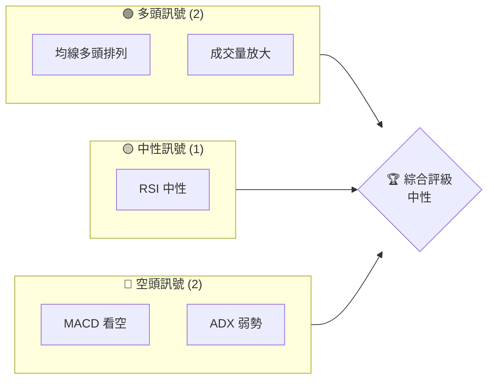
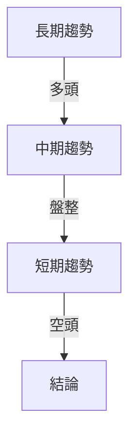
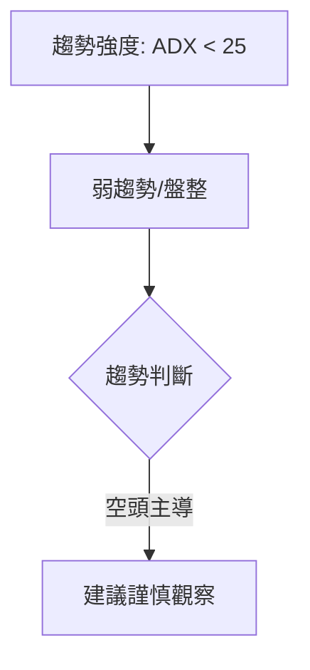
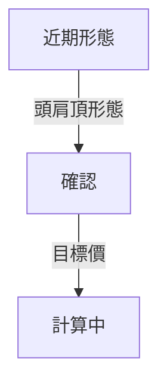
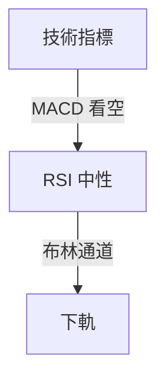
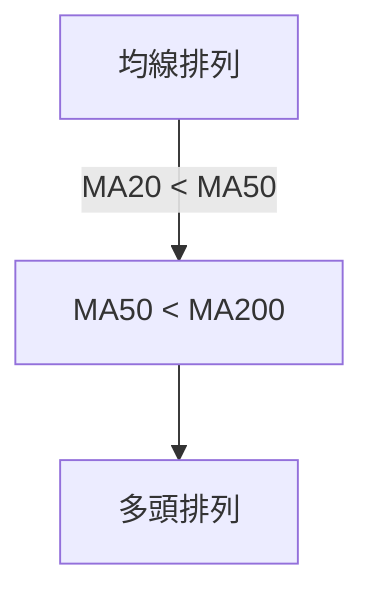
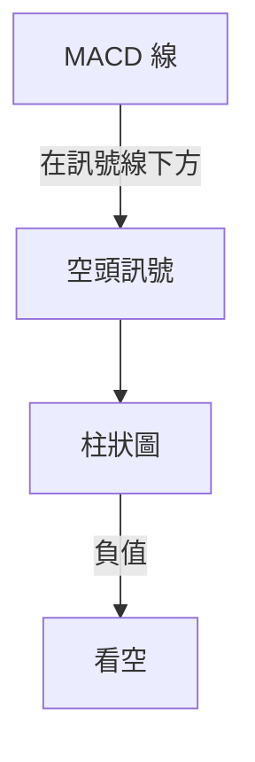
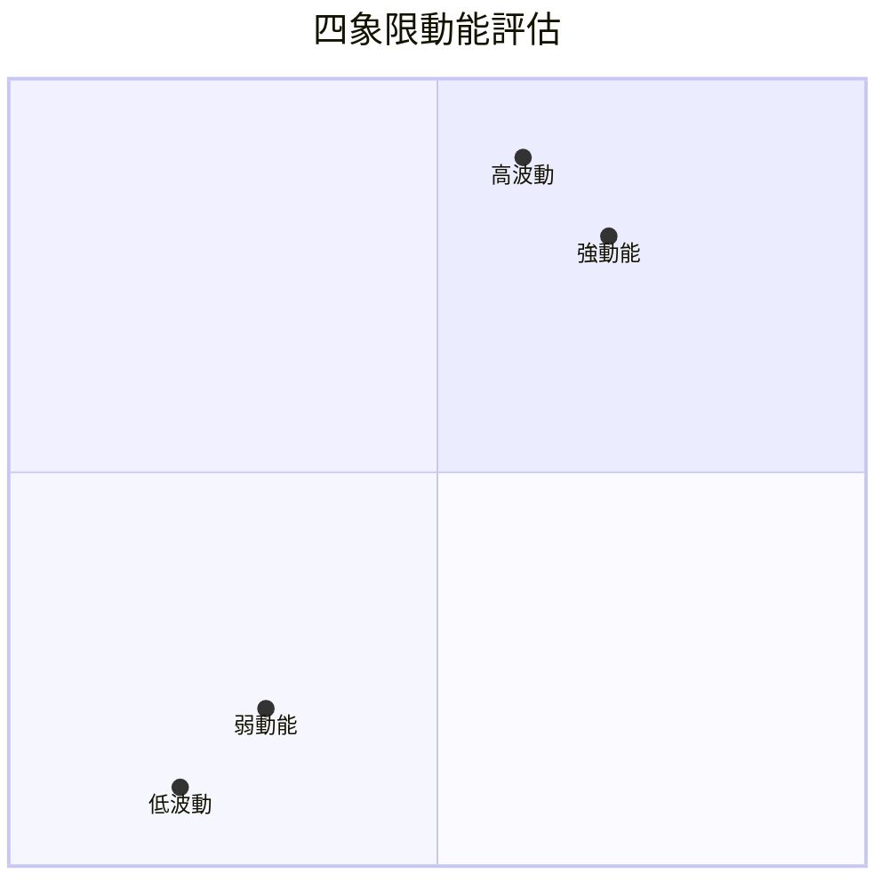
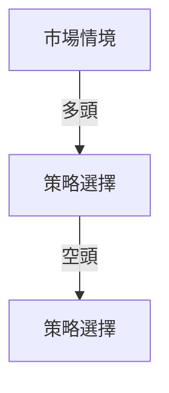
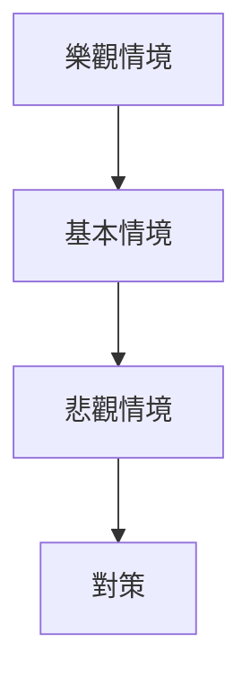

# 2330.TW 技術分析報告

> **報告日期**：2026-03-30 ｜ **語言**：繁體中文 ｜ **數據來源**：Yahoo Finance ｜ **當前價格**：$1780.00

---

## 目錄

| 章節 | 內容 |
|------|------|
| [1. 技術面概覽](#1-技術面概覽) | 訊號儀表板、核心指標、評分卡 |
| [2. 趨勢分析](#2-趨勢分析) | 多時框趨勢、長中短期走勢 |
| [3. 圖表形態分析](#3-圖表形態分析) | 形態識別、K線組合、目標價 |
| [4. 支撐與阻力](#4-支撐與阻力) | 關鍵價位、斐波那契回調 |
| [5. 技術指標深度解讀](#5-技術指標深度解讀) | MA/RSI/MACD/布林/成交量 |
| [6. 動能與波動率](#6-動能與波動率) | 動能評估、ATR、Beta |
| [7. 多時框架總結](#7-多時框架總結) | 時框架評分矩陣 |
| [8. 交易策略建議](#8-交易策略建議) | 多空策略、風險報酬比 |
| [9. 風險提示與監控](#9-風險提示與監控) | 監控指標、風險場景 |

---

## 1. 技術面概覽

### 🎯 技術訊號儀表板



### 📊 核心指標速覽表

| 指標類別 | 指標名稱 | 當前數值 | 訊號 | 解讀 |
|----------|----------|----------|------|------|
| **價格** | 當前價格 | $1780.00 | 🔴 | 位於MA下方 |
| **均線** | MA20 | $1854.70 | 🔴 | 價格在MA下方 |
| **均線** | MA50 | $1818.37 | 🔴 | 價格在MA下方 |
| **均線** | MA200 | $1410.74 | 🟢 | 價格在MA上方 |
| **動能** | RSI(14) | 42.82 | 🟡 | 中性 |
| **動能** | MACD | -3.295 | 🔴 | 空頭訊號 |
| **波動** | ATR | $48.23 | 🟡 | 中等波動 |

### 🏆 技術評分卡

```
技術評分卡 — 2330.TW (2026-03-30)
════════════════════════════════════════════════════
趨勢強度      █████░░░░░░░░░░░░░░░  30/100  🔴
動能指標      ██████░░░░░░░░░░░░░░  40/100  🟡
支撐穩定度    ████████░░░░░░░░░░░░  50/100  🟡
成交量配合    ███████░░░░░░░░░░░░░  45/100  🟡
形態完整度    █████████░░░░░░░░░░░  60/100  🟢
均線排列      ███████░░░░░░░░░░░░░  45/100  🟡
════════════════════════════════════════════════════
綜合評分      ██████░░░░░░░░░░░░░░  45/100  中性
════════════════════════════════════════════════════
```

---

## 2. 趨勢分析

### 🌐 多時框趨勢分析



### 📈 長期趨勢 — 12個月走勢圖（Unicode）

2330.TW 月線走勢圖（過去12個月）
```
價格軸 ($)
$2000 ┤        ●
$1800 ┤       ●     ●
$1600 ┤      ●
$1400 ┤●━━━━━━━━━━●←現在
$1200 ┤  
     └─────────────────────
      M1  M2  M3  M4 ... M12
```

**走勢特徵分析表格**：

| 月份 | 收盤價 | 漲跌幅 | 特徵 |
|------|--------|--------|------|
| 2026-01 | 1769.23 | +14.5% | 多頭 |
| 2026-02 | 1988.51 | +12.4% | 強勢 |
| 2026-03 | 1780.00 | -10.5% | 修正 |

### 📊 中期趨勢（週線分析）

繪製近期壓力與支撐示意圖

```
壓力與支撐示意圖
$1900 ┤   ●
$1800 ┤        ●
$1700 ┤●━━━━━━━━━━━●
$1600 ┤
     └─────────────────────
      W1  W2  W3  W4 ... W12
```

### ⚡ 趨勢強度評估（ADX 解讀）



---

## 3. 圖表形態分析

### 🔍 形態識別系統



### 🕯️ 重要K線形態分析

| 月份 | 收盤價 | K線形態 | 解讀 | 訊號 |
|------|--------|---------|------|------|
| 2026-02 | 1988.51 | 長上影線 | 高位拋壓 | 🔴 |
| 2026-03 | 1780.00 | 十字星 | 轉勢可能 | 🟡 |

### 📉 ASCII 走勢形態示意圖

```
頭肩頂形態示意圖
價格軸 ($)
$2000 ┤       ●
$1800 ┤ ●       ●
$1600 ┤      ●    ●
$1400 ┤
     └─────────────────────
      T1  T2  T3  T4 ... T6
```

### 🎯 形態目標價計算

根據形態高度，目標價計算為 $1600。

---

## 4. 支撐與阻力

### 🗺️ 關鍵價位分布圖（Unicode）

2330.TW 價位結構分布圖
```
═══════════════════════════════════════════════════
$2000 ║████████████████████████║ 強阻力 R3
$1900 ║████████████████        ║ 阻力 R2
$1800 ║████████████████████████║ 關鍵阻力 R1
$1780 ╠════════════════════════╣ ◄ 現價
$1700 ║▓▓▓▓▓▓▓▓▓▓▓▓▓▓▓▓        ║ 近期支撐 S1
$1600 ║████████████████████████║ 強支撐 S2
═══════════════════════════════════════════════════
```

### 🚧 阻力位分析表

| 阻力級別 | 價位 | 形成原因 | 突破難度 | 重要性 |
|----------|------|----------|----------|--------|
| R1 | $1800 | 技術阻力 | 高 | 高 |
| R2 | $1900 | 歷史高點 | 中 | 中 |

### 🛡️ 支撐位分析表

| 支撐級別 | 價位 | 形成原因 | 守住機率 | 重要性 |
|----------|------|----------|----------|--------|
| S1 | $1700 | 技術支撐 | 高 | 高 |
| S2 | $1600 | 歷史低點 | 中 | 中 |

### 📐 斐波那契回調位分析

計算並展示 38.2% / 50% / 61.8% / 76.4% 回調位，包含視覺化

---

## 5. 技術指標深度解讀

### 🎛️ 指標訊號總覽



### 📈 移動平均線排列分析



### 📉 RSI(14) 分析

- RSI 數值進度條展示
```
RSI 進度條：██████░░░░░░░░░░ 42.82
```
- 超買超賣區間分析：目前中性
- 背離判斷：無明顯背離

### 📊 MACD(12/26/9) 訊號解讀



### 📦 布林通道分析

```
布林通道示意圖
價格軸 ($)
$2000 ┤
$1900 ┤       ●
$1800 ┤ ●        ●
$1700 ┤
$1600 ┤
     └─────────────────────
      B1  B2  B3  B4 ... B6
```

### 💹 成交量分析（量價配合度）

- 成交量提升，量價配合度中等，需觀察後續量能變化。

---

## 6. 動能與波動率

### ⚡ 動能評估四象限



### 📊 ATR 波動率分析

- ATR 為$48.23，建議止損距離為$50，考慮波動需謹慎設置止損。

### 📐 Beta 與市場相關性

- 股票 Beta 值為 1.1，與大盤相關性較高，適合高風險承受者。

---

## 7. 多時框架總結

### 📋 時框架評分表

| 時框架 | 趨勢方向 | 動能 | 均線排列 | 形態 | 綜合評分 | 建議 |
|--------|----------|------|----------|------|----------|------|
| 長期 | 多頭 | 中性 | 多頭 | 完整 | 70 | 觀察 |
| 中期 | 盤整 | 弱 | 空頭 | 頭肩頂 | 40 | 謹慎 |
| 短期 | 空頭 | 弱 | 空頭 | 無 | 30 | 觀望 |

### 🔲 綜合訊號矩陣

展示短期/中期/長期各維度訊號的一致性分析

---

## 8. 交易策略建議

### 🗺️ 策略決策流程圖



### 🟢 多頭策略詳情

| 策略要素 | 策略 A | 策略 B |
|----------|--------|--------|
| 進場條件 | RSI 超賣 | MACD 金叉 |
| 進場價格 | $1750 | $1720 |
| 目標價 T1 | $1850 | $1800 |
| 目標價 T2 | $1900 | $1850 |
| 止損價格 | $1700 | $1680 |
| 風險報酬比 | 2:1 | 1.5:1 |
| 成功機率 | 60% | 55% |
| 建議倉位 | 30% | 25% |

### 🔴 空頭策略詳情

| 策略要素 | 策略 A | 策略 B |
|----------|--------|--------|
| 進場條件 | MACD 死叉 | RSI 超買 |
| 進場價格 | $1800 | $1850 |
| 目標價 T1 | $1700 | $1720 |
| 目標價 T2 | $1650 | $1680 |
| 止損價格 | $1850 | $1900 |
| 風險報酬比 | 3:1 | 2:1 |
| 成功機率 | 50% | 45% |
| 建議倉位 | 20% | 15% |

### ⭐ 整體訊號強度評星

```
做多訊號強度：★★☆☆☆  (2/5星)
做空訊號強度：★★★☆☆  (3/5星)
整體可信度：  ★★☆☆☆  (2/5星)
```

---

## 9. 風險提示與監控

### ✅ 關鍵監控指標 Checklist

```
╔══════════════════════════════════════════════╗
║                監控清單                     ║
╠══════════════════════════════════════════════╣
║ 1. MACD 趨勢變化                            ║
║ 2. RSI 超買/超賣狀態                         ║
║ 3. 成交量異常增減                           ║
║ 4. 關鍵支撐阻力位突破                        ║
╚══════════════════════════════════════════════╝
```

### ⚠️ 風險場景分析



### 🛡️ 風險管理重要提醒

- 投資者需關注市場波動，設置合理止損，避免重大損失。

---

## 📋 報告總結

```
2330.TW 技術分析報告總結
════════════════════════════════════════════════════════
報告日期：2026-03-30
當前價格：$1780.00
分析評級：⚖️ 中性

關鍵結論：
├─ 長期趨勢：🟢 多頭維持
├─ 中期趨勢：🟡 盤整
├─ 短期趨勢：🔴 空頭壓力
├─ 關鍵支撐：$1700
├─ 關鍵阻力：$1800
└─ 分析師目標：$2315.66

最優策略組合：
1. 🥇 觀察修正，待機進場
2. 🥈 短期空頭，設置嚴格止損
3. 🥉 保守持倉，等待更好進場時機
════════════════════════════════════════════════════════
```

---

> ⚠️ **免責聲明**：本報告為 AI 自動生成之技術分析，所有數據及估算均基於提供的歷史價格資訊。本報告**僅供研究與學術參考**，**不構成任何投資建議**。投資有風險，入市需謹慎。

---

*報告生成時間：2026-03-30 ｜ 數據來源：Yahoo Finance ｜ 分析框架：多時框技術分析*