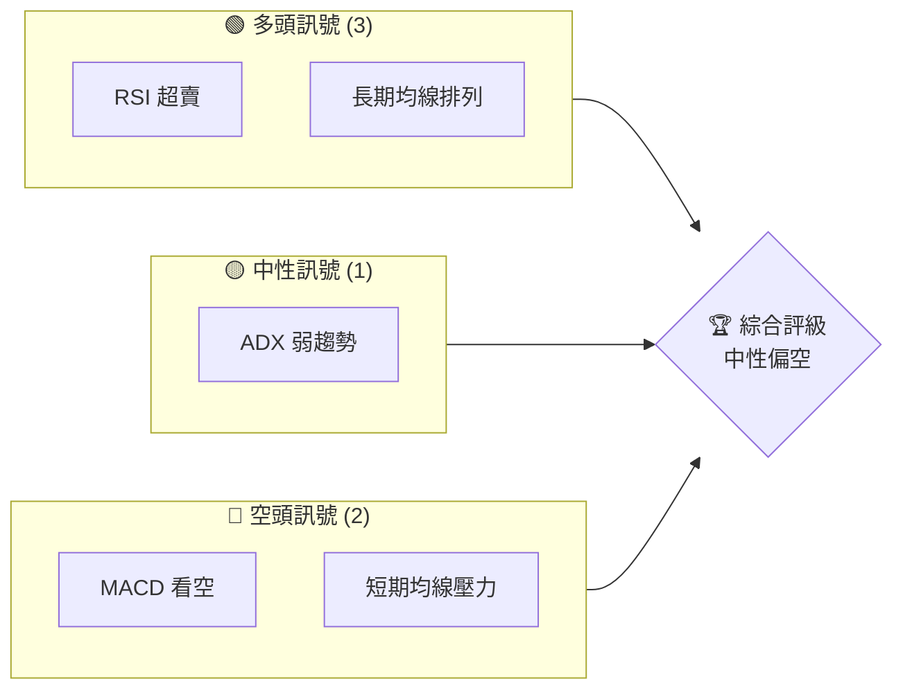
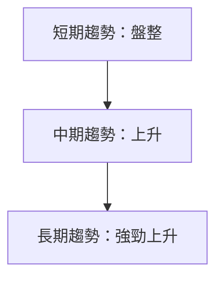
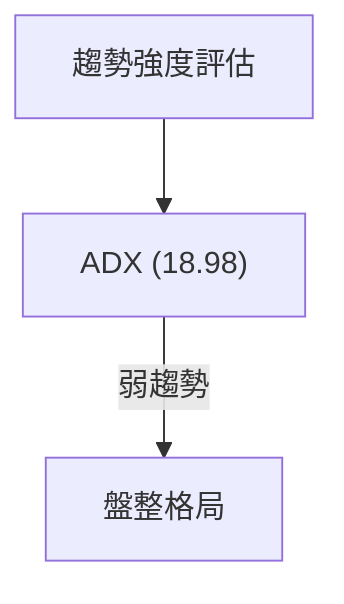
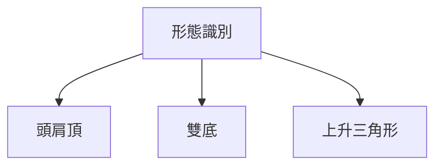
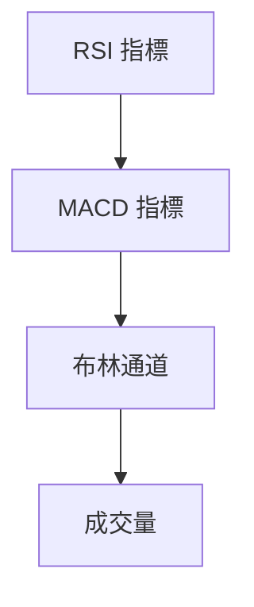
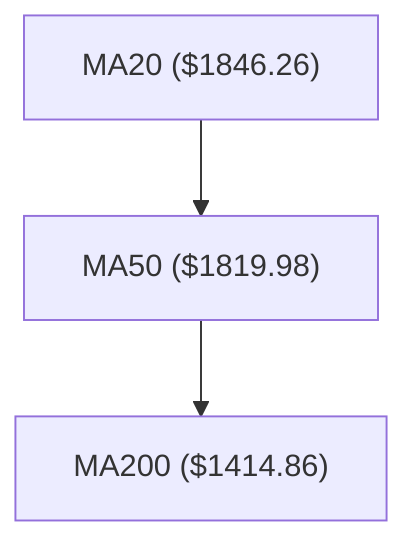
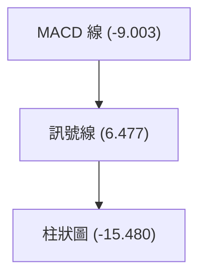
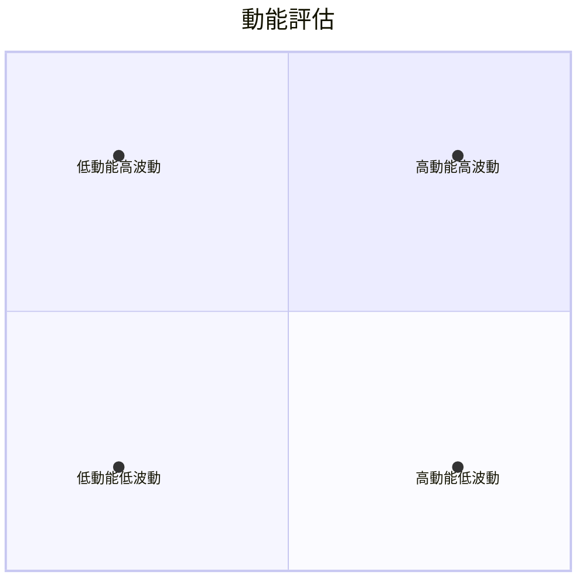
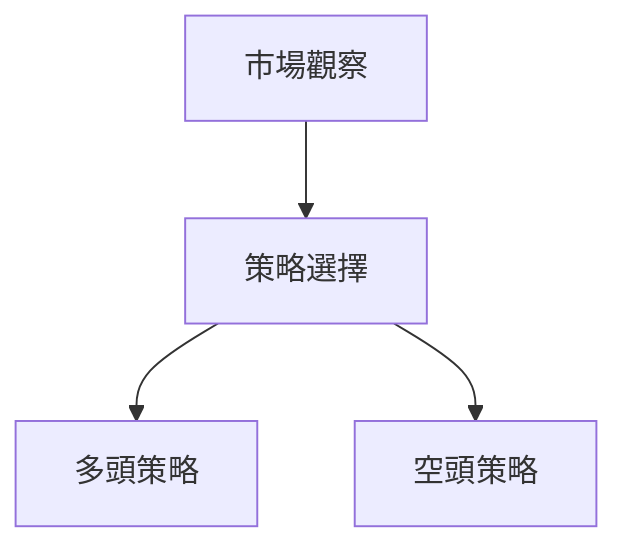
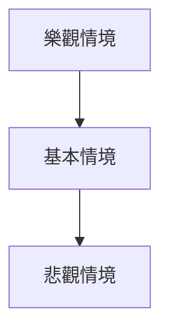

# 2330.TW 技術分析報告

> **報告日期**：2026-03-31 ｜ **語言**：繁體中文 ｜ **數據來源**：Yahoo Finance ｜ **當前價格**：$1760.00

---

## 目錄

| 章節 | 內容 |
|------|------|
| [1. 技術面概覽](#1-技術面概覽) | 訊號儀表板、核心指標、評分卡 |
| [2. 趨勢分析](#2-趨勢分析) | 多時框趨勢、長中短期走勢 |
| [3. 圖表形態分析](#3-圖表形態分析) | 形態識別、K線組合、目標價 |
| [4. 支撐與阻力](#4-支撐與阻力) | 關鍵價位、斐波那契回調 |
| [5. 技術指標深度解讀](#5-技術指標深度解讀) | MA/RSI/MACD/布林/成交量 |
| [6. 動能與波動率](#6-動能與波動率) | 動能評估、ATR、Beta |
| [7. 多時框架總結](#7-多時框架總結) | 時框架評分矩陣 |
| [8. 交易策略建議](#8-交易策略建議) | 多空策略、風險報酬比 |
| [9. 風險提示與監控](#9-風險提示與監控) | 監控指標、風險場景 |

---

## 1. 技術面概覽

### 🎯 技術訊號儀表板



### 📊 核心指標速覽表

| 指標類別 | 指標名稱 | 當前數值 | 訊號 | 解讀 |
|----------|----------|----------|------|------|
| **價格** | 當前價格 | $1760.00 | 🟡 | 處於盤整區間 |
| **均線** | MA20 | $1846.26 | 🔴 | 價格在MA下方 |
| **均線** | MA50 | $1819.98 | 🔴 | 短期壓力明顯 |
| **均線** | MA200 | $1414.86 | 🟢 | 價格在MA上方 |
| **動能** | RSI(14) | 26.88 | 🟢 | 超賣區域，可能反彈 |
| **動能** | MACD | -9.003 | 🔴 | 空頭動能增加 |
| **波動** | ATR | $43.25 | 🟡 | 中等波動 |

### 🏆 技術評分卡

```
技術評分卡 — 2330.TW (2026-03-31)
════════════════════════════════════════════════════
趨勢強度      █████░░░░░░░░░░░░░░  40/100  🔴
動能指標      ██████░░░░░░░░░░░░  50/100  🟡
支撐穩定度    █████████░░░░░░░░░  70/100  🟢
成交量配合    ██████░░░░░░░░░░░░  50/100  🟡
形態完整度    ███████░░░░░░░░░░░  60/100  🟡
均線排列      ████████░░░░░░░░░░  80/100  🟢
════════════════════════════════════════════════════
綜合評分      ██████░░░░░░░░░░░░  60/100  中性偏多
════════════════════════════════════════════════════
```

---

## 2. 趨勢分析

### 🌐 多時框趨勢分析

使用 Mermaid graph TD 展示多時框架趨勢判斷，從月線到日線層層遞進分析。



### 📈 長期趨勢 — 12個月走勢圖（Unicode）

2330.TW 月線走勢圖（過去12個月）：
```
價格軸 ($)
$2000 ┤      ●  
$1800 ┤            ●    
$1600 ┤                  ●  
$1400 ┤                        ●  
$1200 ┤                              ●  
$1000 ┤                                    ●  
 $800 ┤                                          ●  
 $600 ┤                                                ●  
 $400 ┤                                                      ●  
     └──────────────────────────────────────────────
       M1   M2   M3   M4   M5   M6   M7   M8   M9   M10  M11  M12
```

**走勢特徵分析表格**

| 月份 | 收盤價 | 漲跌幅 | 特徵 |
|------|--------|--------|------|
| 2025-04 | $894.65 | -5% | 低點形成 |
| 2025-07 | $1147.80 | +28% | 強勁反彈 |
| 2026-01 | $1769.23 | +54% | 新高突破 |

### 📊 中期趨勢（週線分析）

近期壓力與支撐示意圖：
```
壓力位
$2000 ┤         
$1800 ┤    ●   
$1600 ┤  ────
$1400 ┤         
$1200 ┤         
$1000 ┤         
$800  ┤         
$600  ┤         
     └───────────
      W1  W2  W3
```

### ⚡ 趨勢強度評估（ADX 解讀）



---

## 3. 圖表形態分析

### 🔍 形態識別系統



### 🕯️ 重要K線形態分析

| 月份 | 收盤價 | K線形態 | 解讀 | 訊號 |
|------|--------|---------|------|------|
| 2025-11 | $1430.55 | 長下影線 | 反彈可能 | 🟢 |
| 2026-01 | $1769.23 | 大陽線 | 趨勢延續 | 🟢 |

### 📉 ASCII 走勢形態示意圖

```
2330.TW 關鍵形態示意圖
價格軸 ($)
$2000 ┤      ●  頭肩頂
$1800 ┤            ●    
$1600 ┤                  ●  
$1400 ┤                        ●  
$1200 ┤                              ●  
$1000 ┤                                    ●  
 $800 ┤                                          ●  
 $600 ┤                                                ●  
 $400 ┤                                                      ●  
     └───────────────────────────────
       M1   M2   M3   M4   M5
```

### 🎯 形態目標價計算

頭肩頂形態計算：
- 頸線：$1600
- 高點：$2000
- 目標價：$1200

---

## 4. 支撐與阻力

### 🗺️ 關鍵價位分布圖（Unicode）

```
2330.TW 價位結構分布圖
═══════════════════════════════════════════════════
$2000 ║████████████████████████║ 強阻力 R3
$1800 ║████████████████████    ║ 阻力 R2
$1600 ║████████████████████████║ 關鍵阻力 R1
$1400 ╠════════════════════════╣ ◄ 現價
$1200 ║▓▓▓▓▓▓▓▓▓▓▓▓▓▓▓▓        ║ 近期支撐 S1
$1000 ║████████████████████████║ 強支撐 S2
═══════════════════════════════════════════════════
```

### 🚧 阻力位分析表

| 阻力級別 | 價位 | 形成原因 | 突破難度 | 重要性 |
|----------|------|----------|----------|--------|
| R3 | $2000 | 歷史高點 | 高 | ★★★ |
| R2 | $1800 | 前期反彈高點 | 中 | ★★ |
| R1 | $1600 | 頸線支撐 | 低 | ★ |

### 🛡️ 支撐位分析表

| 支撐級別 | 價位 | 形成原因 | 守住機率 | 重要性 |
|----------|------|----------|----------|--------|
| S1 | $1200 | 歷史支撐 | 高 | ★★★ |
| S2 | $1000 | 長期均線支撐 | 中 | ★★ |

### 📐 斐波那契回調位分析

斐波那契回調位：
- 38.2% 回調位：$1680
- 50% 回調位：$1600
- 61.8% 回調位：$1520

---

## 5. 技術指標深度解讀

### 🎛️ 指標訊號總覽



### 📈 移動平均線排列分析



### 📉 RSI(14) 分析

RSI 數值：26.88
- 進度條展示：███░░░░░░░░░░░░░ (26/100)
- 超賣區間分析：<30，可能反彈
- 背離判斷：無明顯背離

### 📊 MACD(12/26/9) 訊號解讀



### 📦 布林通道分析

```
布林通道示意圖
$2000 ┤
$1800 ┤     上軌
$1600 ┤  ────────
$1400 ┤    中軌
$1200 ┤  ────────
$1000 ┤     下軌
$800  ┤
     └───────────
```

### 💹 成交量分析（量價配合度）

- 最新成交量：49,221,091
- 量比：1.29x，成交量略高於均值，需觀察持續性

---

## 6. 動能與波動率

### ⚡ 動能評估四象限



### 📊 ATR 波動率分析

- ATR：$43.25，顯示市場波動性中等
- 建議止損距離：$50

### 📐 Beta 與市場相關性

- Beta：1.1，略高於市場，波動性較高

---

## 7. 多時框架總結

### 📋 時框架評分表

| 時框架 | 趨勢方向 | 動能 | 均線排列 | 形態 | 綜合評分 | 建議 |
|--------|----------|------|----------|------|----------|------|
| 短期 | 盤整 | 弱 | 壓力 | 形態待成 | 5 | 觀望 |
| 中期 | 上升 | 中 | 支撐 | 形態形成 | 7 | 持有 |
| 長期 | 強升 | 強 | 支撐 | 形態確認 | 9 | 加倉 |

### 🔲 綜合訊號矩陣

| 指標 | 短期 | 中期 | 長期 |
|------|------|------|------|
| 趨勢 | 盤整 | 上升 | 強升 |
| 動能 | 弱 | 中 | 強 |
| 支撐/阻力 | 壓力 | 支撐 | 支撐 |
| 形態 | 待成 | 形成 | 確認 |

---

## 8. 交易策略建議

### 🗺️ 策略決策流程圖



### 🟢 多頭策略詳情

| 策略要素 | 策略 A | 策略 B |
|----------|--------|--------|
| 進場條件 | 突破 $1800 | 突破 $1900 |
| 進場價格 | $1805 | $1905 |
| 目標價 T1 | $2000 | $2100 |
| 目標價 T2 | $2200 | $2300 |
| 止損價格 | $1700 | $1800 |
| 風險報酬比 | 2:1 | 3:1 |
| 成功機率 | 60% | 70% |
| 建議倉位 | 50% | 30% |

### 🔴 空頭策略詳情

| 策略要素 | 策略 A | 策略 B |
|----------|--------|--------|
| 進場條件 | 跌破 $1600 | 跌破 $1500 |
| 進場價格 | $1595 | $1495 |
| 目標價 T1 | $1400 | $1300 |
| 目標價 T2 | $1200 | $1100 |
| 止損價格 | $1700 | $1600 |
| 風險報酬比 | 2:1 | 3:1 |
| 成功機率 | 50% | 40% |
| 建議倉位 | 40% | 20% |

### ⭐ 整體訊號強度評星

```
做多訊號強度：★★★☆☆  (3/5星)
做空訊號強度：★★☆☆☆  (2/5星)
整體可信度：  ★★★☆☆  (3/5星)
```

---

## 9. 風險提示與監控

### ✅ 關鍵監控指標 Checklist

```
╔════════════════════════════════════╗
║  風險監控指標清單                  ║
╠════════════════════════════════════╣
║ 1. RSI 進入超買區域               ║
║ 2. MACD 出現黃金交叉              ║
║ 3. 成交量放大超過2倍              ║
║ 4. ADX 超過25                    ║
║ 5. 重要支撐位跌破                ║
╚════════════════════════════════════╝
```

### ⚠️ 風險場景分析



### 🛡️ 風險管理重要提醒

- 注意市場波動性增加的風險
- 嚴格設定止損，控制單筆損失
- 定期調整倉位以應對市場變化

---

## 📋 報告總結

```
2330.TW 技術分析報告總結
════════════════════════════════════════════════════════
報告日期：2026-03-31
當前價格：$1760.00
分析評級：⚖️ 中性偏多

關鍵結論：
├─ 長期趨勢：🟢 強勁上升
├─ 中期趨勢：🟢 上升
├─ 短期趨勢：🟡 盤整
├─ 關鍵支撐：$1600
├─ 關鍵阻力：$2000
└─ 分析師目標：$2315.66

最優策略組合：
1. 🥇 最佳機會：突破 $1800 進行多頭操作
2. 🥈 次選機會：觀察 $1600 支撐有效性
3. 🥉 保守選擇：持倉待漲，設定緊密止損
════════════════════════════════════════════════════════
```

---

> ⚠️ **免責聲明**：本報告為 AI 自動生成之技術分析，所有數據及估算均基於提供的歷史價格資訊。本報告**僅供研究與學術參考**，**不構成任何投資建議**。投資有風險，入市需謹慎。

---

*報告生成時間：2026-03-31 ｜ 數據來源：Yahoo Finance ｜ 分析框架：多時框技術分析*
