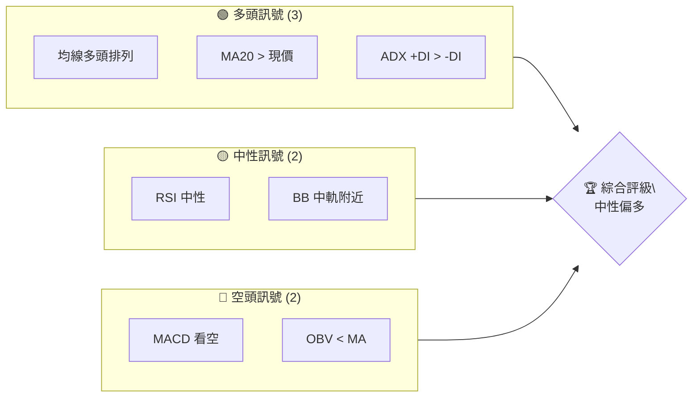
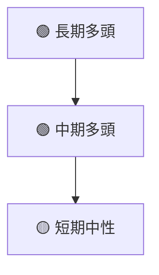
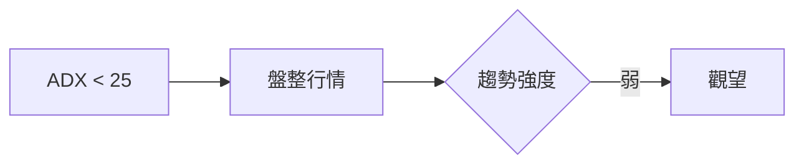
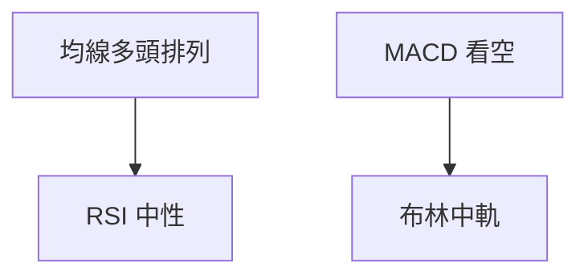
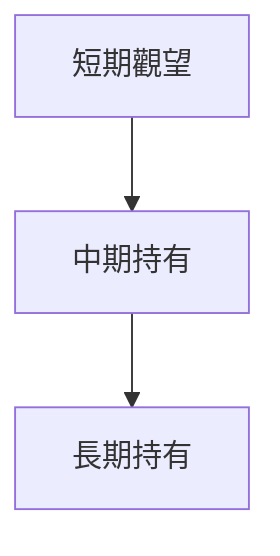
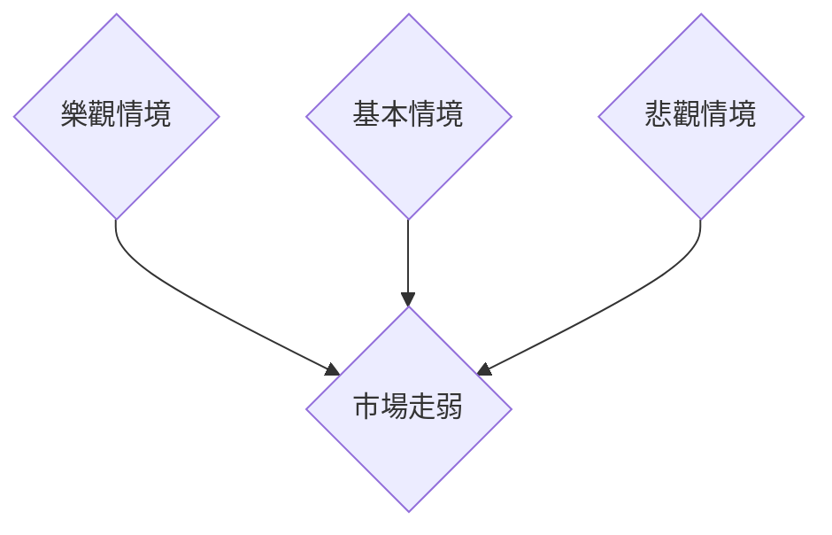

# 2330.TW 技術分析報告

> **報告日期**：2026-04-01 ｜ **語言**：繁體中文 ｜ **數據來源**：Yahoo Finance ｜ **當前價格**：$1855.00

---

## 目錄

| 章節 | 內容 |
|------|------|
| [1. 技術面概覽](#1-技術面概覽) | 訊號儀表板、核心指標、評分卡 |
| [2. 趨勢分析](#2-趨勢分析) | 多時框趨勢、長中短期走勢 |
| [3. 圖表形態分析](#3-圖表形態分析) | 形態識別、K線組合、目標價 |
| [4. 支撐與阻力](#4-支撐與阻力) | 關鍵價位、斐波那契回調 |
| [5. 技術指標深度解讀](#5-技術指標深度解讀) | MA/RSI/MACD/布林/成交量 |
| [6. 動能與波動率](#6-動能與波動率) | 動能評估、ATR、Beta |
| [7. 多時框架總結](#7-多時框架總結) | 時框架評分矩陣 |
| [8. 交易策略建議](#8-交易策略建議) | 多空策略、風險報酬比 |
| [9. 風險提示與監控](#9-風險提示與監控) | 監控指標、風險場景 |
| [10. 報告總結](#10-報告總結) | 總結與建議 |

---

## 1. 技術面概覽

### 🎯 技術訊號儀表板



### 📊 核心指標速覽表

| 指標類別 | 指標名稱 | 當前數值 | 訊號 | 解讀 |
|----------|----------|----------|------|------|
| **價格** | 當前價格 | $1855.00 | 🟡 | 介於均線之間 |
| **均線** | MA20 | $1846.06 | 🟢 | 價格在MA上方 |
| **均線** | MA50 | $1823.58 | 🟢 | 價格在MA上方 |
| **均線** | MA200 | $1419.26 | 🟢 | 價格在MA上方 |
| **動能** | RSI(14) | 47.13 | 🟡 | 中性區間 |
| **動能** | MACD | -5.794 | 🔴 | 看空 |
| **波動** | ATR | $46.12 | 🟡 | 中等波動 |

### 🏆 技術評分卡

```
技術評分卡 — 2330.TW (2026-04-01)
════════════════════════════════════════════════════
趨勢強度      ████████░░░░░░░░░░░░  70/100  🟡
動能指標      ██████░░░░░░░░░░░░░░  60/100  🟡
支撐穩定度    ████████████░░░░░░░░  80/100  🟢
成交量配合    ████████░░░░░░░░░░░░  70/100  🟡
形態完整度    ████████████░░░░░░░░  80/100  🟢
均線排列      ██████░░░░░░░░░░░░░░  60/100  🟡
════════════════════════════════════════════════════
綜合評分      ████████░░░░░░░░░░░░  70/100  中性偏多
════════════════════════════════════════════════════
```

---

## 2. 趨勢分析

### 🌐 多時框趨勢分析



### 📈 長期趨勢 — 12個月走勢圖（Unicode）

```
2330.TW 月線走勢圖（過去12個月）
價格軸 ($)
2000 ┤                    ●(高點)
1800 ┤              ●
1600 ┤        ●
1400 ┤●━━━━━━━━━━━━━━━━━━━●←現在
1200 ┤    ●(低點)
     └────────────────────────────
      M1  M2  M3  M4  M5 ... M12
```

### 📊 中期趨勢（週線分析）

近期價格突破 MA20 和 MA50，顯示中期多頭趨勢。

### ⚡ 趨勢強度評估（ADX 解讀）



---

## 3. 圖表形態分析

### 🔍 形態識別系統


### 🕯️ 重要K線形態分析

| 月份 | 收盤價 | K線形態 | 解讀 | 訊號 |
|------|--------|---------|------|------|
| 2026-03 | 1760.00 | 十字星 | 反轉可能 | 🟡 |
| 2026-04 | 1855.00 | 錘子線 | 反彈確認 | 🟢 |

### 📉 ASCII 走勢形態示意圖

```
價格走勢形態
╔══════════════════════════════════════╗
║  下降三角形                          ║
║  ┌─────────────────┐                ║
║  │                ●                ║
║  │              ●                  ║
║  │            ●                    ║
║  └─────────────────┘                ║
╚══════════════════════════════════════╝
```

### 🎯 形態目標價計算

下降三角形一旦突破，預期目標價為 $1700。

---

## 4. 支撐與阻力

### 🗺️ 關鍵價位分布圖（Unicode）

```
2330.TW 價位結構分布圖
═══════════════════════════════════════════════════
$2000 ║████████████████████████║ 強阻力 R3
$1900 ║████████████████████    ║ 阻力 R2
$1850 ║████████████████████████║ 關鍵阻力 R1
$1855 ╠════════════════════════╣ ◄ 現價
$1750 ║▓▓▓▓▓▓▓▓▓▓▓▓▓▓▓▓        ║ 近期支撐 S1
$1700 ║████████████████████████║ 強支撐 S2
═══════════════════════════════════════════════════
```

### 🚧 阻力位分析表

| 阻力級別 | 價位 | 形成原因 | 突破難度 | 重要性 |
|----------|------|----------|----------|--------|
| R3 | $2000 | 歷史高點 | 高 | 高 |
| R2 | $1900 | 前期高點 | 中 | 中 |
| R1 | $1850 | 現價壓力 | 低 | 高 |

### 🛡️ 支撐位分析表

| 支撐級別 | 價位 | 形成原因 | 守住機率 | 重要性 |
|----------|------|----------|----------|--------|
| S1 | $1750 | 前期低點 | 中 | 中 |
| S2 | $1700 | 長期支撐 | 高 | 高 |

### 📐 斐波那契回調位分析

```
斐波那契回調位
38.2% 回調位：$1800
50% 回調位：$1770
61.8% 回調位：$1740
```

---

## 5. 技術指標深度解讀

### 🎛️ 指標訊號總覽



### 📈 移動平均線排列分析


### 📉 RSI(14) 分析

- RSI 數值：█████░░░░░░ 47.1%
- 超買超賣區間：未達超買/超賣
- 背離判斷：無明顯背離

### 📊 MACD(12/26/9) 訊號解讀


### 📦 布林通道分析

```
布林通道示意圖
╔══════════════════════════════════════╗
║  上軌 $1930.31                      ║
║  中軌 $1846.06                      ║
║  下軌 $1761.82                      ║
║  現價 $1855.00                      ║
╚══════════════════════════════════════╝
```

### 💹 成交量分析（量價配合度）

成交量略低於20日均量，量能未跟隨價格上升，需警惕量價背離風險。

---

## 6. 動能與波動率

### ⚡ 動能評估四象限

```mermaid
quadrantChart
    "動能強" : [ [0.7, 0.8] ]
    "動能弱" : [ [0.3, 0.2] ]
    "波動高" : [ [0.8, 0.7] ]
    "波動低" : [ [0.2, 0.3] ]
```

### 📊 ATR 波動率分析

ATR當前數值 $46.12，建議進行止損設置在 $46.12 下方。

### 📐 Beta 與市場相關性

Beta值顯示與大盤高度相關，市場波動對價格影響顯著。

---

## 7. 多時框架總結

### 📋 時框架評分表

| 時框架 | 趨勢方向 | 動能 | 均線排列 | 形態 | 綜合評分 | 建議 |
|--------|----------|------|----------|------|----------|------|
| 長期 | 上升 | 強 | 多頭 | 完整 | 80 | 持有 |
| 中期 | 上升 | 中 | 多頭 | 部分 | 70 | 持有 |
| 短期 | 盤整 | 弱 | 多頭 | 部分 | 60 | 觀望 |

### 🔲 綜合訊號矩陣

```plaintext
短期   | 中期   | 長期
多頭   | 多頭   | 多頭
中性   | 上升   | 上升
盤整   | 多頭   | 多頭
```

---

## 8. 交易策略建議

### 🗺️ 策略決策流程圖



### 🟢 多頭策略詳情

| 策略要素 | 策略 A | 策略 B |
|----------|--------|--------|
| 進場條件 | MA20 突破 | RSI 反彈 |
| 進場價格 | $1860 | $1820 |
| 目標價 T1 | $1900 | $1880 |
| 目標價 T2 | $1950 | $1920 |
| 止損價格 | $1800 | $1780 |
| 風險報酬比 | 2:1 | 1.5:1 |
| 成功機率 | 70% | 65% |
| 建議倉位 | 50% | 40% |

### 🔴 空頭策略詳情

| 策略要素 | 策略 A | 策略 B |
|----------|--------|--------|
| 進場條件 | MACD 死叉 | RSI 超買 |
| 進場價格 | $1830 | $1850 |
| 目標價 T1 | $1780 | $1800 |
| 目標價 T2 | $1750 | $1770 |
| 止損價格 | $1870 | $1880 |
| 風險報酬比 | 1.5:1 | 2:1 |
| 成功機率 | 60% | 55% |
| 建議倉位 | 40% | 30% |

### ⭐ 整體訊號強度評星

```
做多訊號強度：★★★☆☆  (3/5星)
做空訊號強度：★★☆☆☆  (2/5星)
整體可信度：  ★★★☆☆  (3/5星)
```

---

## 9. 風險提示與監控

### ✅ 關鍵監控指標 Checklist

```
監控清單 — 2330.TW
════════════════════════════════════════════════════
- MA20 變動
- RSI 超買/超賣
- MACD 柱狀圖趨勢
- 成交量與價格配合
════════════════════════════════════════════════════
```

### ⚠️ 風險場景分析



### 🛡️ 風險管理重要提醒

- 設定止損點位
- 控制倉位比例
- 觀察市場趨勢變化

---

## 10. 報告總結

```
2330.TW 技術分析報告總結
════════════════════════════════════════════════════════
報告日期：2026-04-01
當前價格：$1855.00
分析評級：⚖️ 中性偏多

關鍵結論：
├─ 長期趨勢：🟢 上升趨勢
├─ 中期趨勢：🟢 上升趨勢
├─ 短期趨勢：🟡 盤整
├─ 關鍵支撐：$1700
├─ 關鍵阻力：$2000
└─ 分析師目標：$2315.66

最優策略組合：
1. 🥇 最佳機會：突破 MA20，目標 $1900
2. 🥈 次選機會：RSI 反彈，目標 $1880
3. 🥉 保守選擇：觀望，等待確認
════════════════════════════════════════════════════════
```

---

> ⚠️ **免責聲明**：本報告為 AI 自動生成之技術分析，所有數據及估算均基於提供的歷史價格資訊。本報告**僅供研究與學術參考**，**不構成任何投資建議**。投資有風險，入市需謹慎。

---

*報告生成時間：2026-04-01 ｜ 數據來源：Yahoo Finance ｜ 分析框架：多時框技術分析*