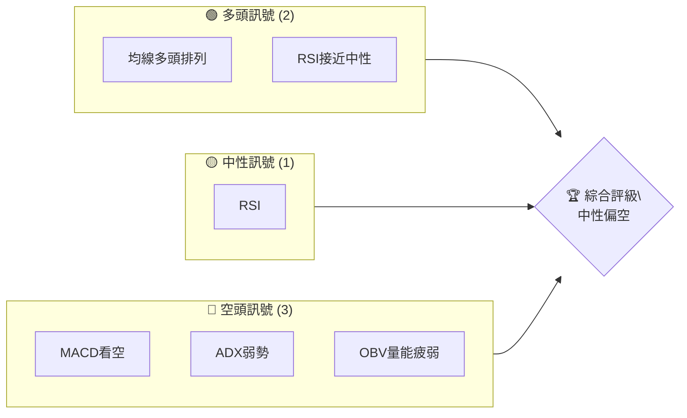
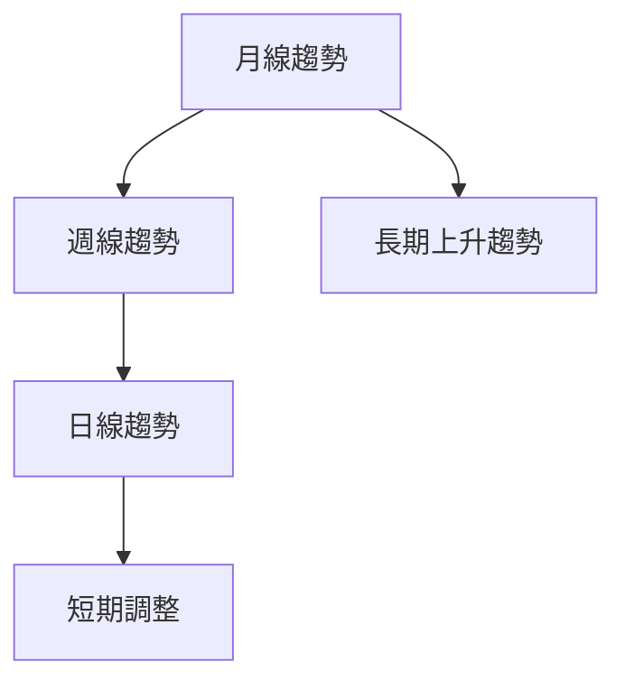
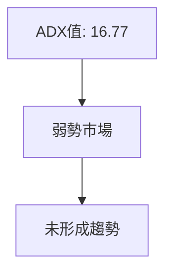
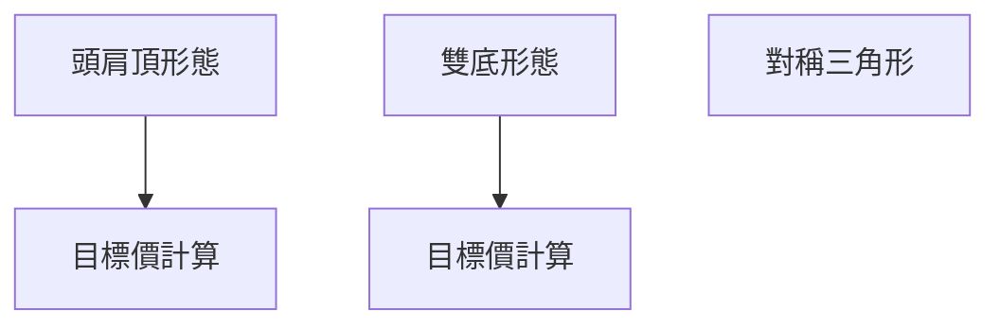
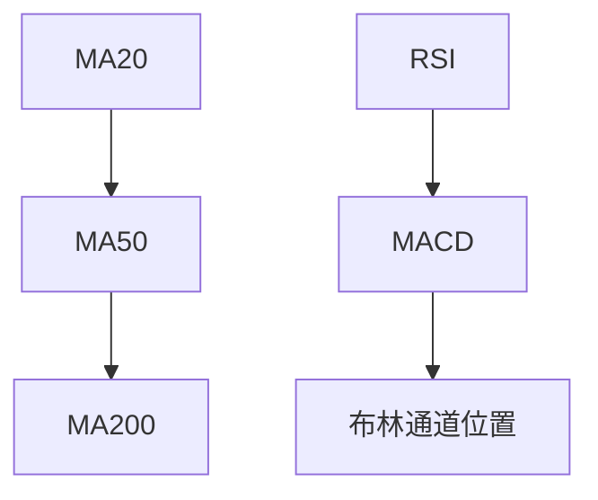
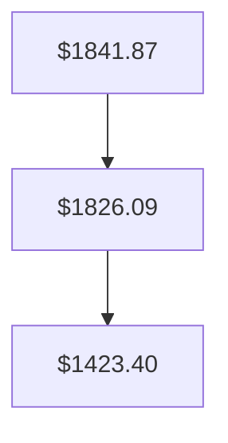
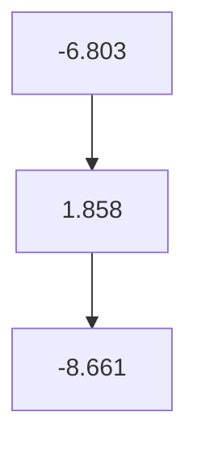
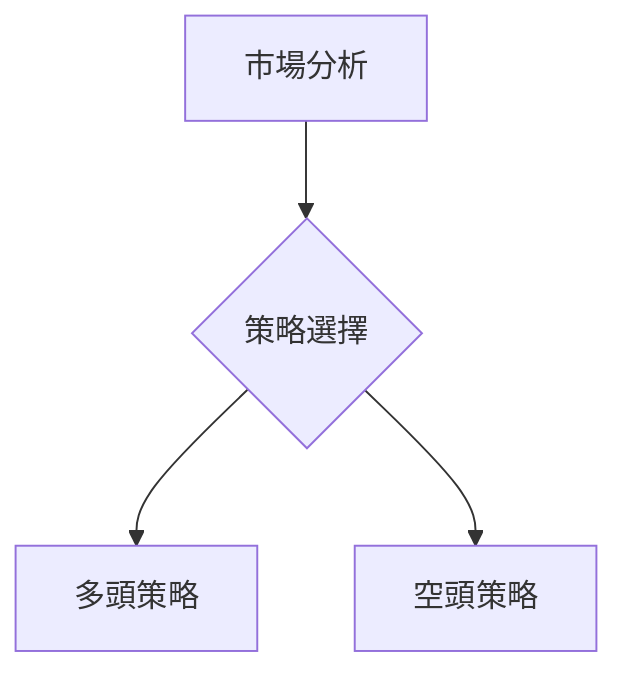
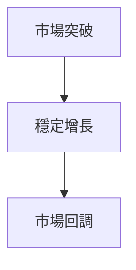

# 2330.TW 技術分析報告

> **報告日期**：2026-04-02 ｜ **語言**：繁體中文 ｜ **數據來源**：Yahoo Finance ｜ **當前價格**：$1810.00

---

## 目錄

| 章節 | 內容 |
|------|------|
| [1. 技術面概覽](#1-技術面概覽) | 訊號儀表板、核心指標、評分卡 |
| [2. 趨勢分析](#2-趨勢分析) | 多時框趨勢、長中短期走勢 |
| [3. 圖表形態分析](#3-圖表形態分析) | 形態識別、K線組合、目標價 |
| [4. 支撐與阻力](#4-支撐與阻力) | 關鍵價位、斐波那契回調 |
| [5. 技術指標深度解讀](#5-技術指標深度解讀) | MA/RSI/MACD/布林/成交量 |
| [6. 動能與波動率](#6-動能與波動率) | 動能評估、ATR、Beta |
| [7. 多時框架總結](#7-多時框架總結) | 時框架評分矩陣 |
| [8. 交易策略建議](#8-交易策略建議) | 多空策略、風險報酬比 |
| [9. 風險提示與監控](#9-風險提示與監控) | 監控指標、風險場景 |

---

## 1. 技術面概覽

### 🎯 技術訊號儀表板

以下是2330.TW當前的技術訊號分布，考慮了多空指標的綜合分析：



### 📊 核心指標速覽表

| 指標類別 | 指標名稱 | 當前數值 | 訊號 | 解讀 |
|----------|----------|----------|------|------|
| **價格** | 當前價格 | $1810.00 | 🟡 | 當前價格位於MA20下方 |
| **均線** | MA20 | $1841.87 | 🔴 | 價格在MA20下方 |
| **均線** | MA50 | $1826.09 | 🔴 | 價格在MA50下方 |
| **均線** | MA200 | $1423.40 | 🟢 | 價格在MA200上方，長期多頭 |
| **動能** | RSI(14) | 44.45 | 🟡 | 中性偏弱 |
| **動能** | MACD | -6.803 | 🔴 | 空頭信號 |
| **波動** | ATR | $47.21 | 🟡 | 中等波動 |

### 🏆 技術評分卡

```
技術評分卡 — 2330.TW (2026-04-02)
════════════════════════════════════════════════════
趨勢強度      ███░░░░░░░░░░░░░░░░░░  30/100  🔴
動能指標      ████░░░░░░░░░░░░░░░░░  40/100  🟡
支撐穩定度    █████░░░░░░░░░░░░░░░  50/100  🟡
成交量配合    ██░░░░░░░░░░░░░░░░░░  20/100  🔴
形態完整度    █████░░░░░░░░░░░░░░░  50/100  🟡
均線排列      ██████░░░░░░░░░░░░░░  60/100  🟢
════════════════════════════════════════════════════
綜合評分      ████░░░░░░░░░░░░░░░░  45/100  中性偏空
════════════════════════════════════════════════════
```

---

## 2. 趨勢分析

### 🌐 多時框趨勢分析

以下是多時框架的趨勢分析，從月線到日線逐步深入研究：



### 📈 長期趨勢 — 12個月走勢圖（Unicode）

**必須繪製** ASCII 價格走勢圖，標注每月收盤價和關鍵高低點：

```
2330.TW 月線走勢圖（過去12個月）
價格軸 ($)
$2000 ┤                                   
$1900 ┤                                ● 
$1800 ┤                            ● ●
$1700 ┤                          ●
$1600 ┤                        ●
$1500 ┤                      ●
$1400 ┤                    ●
$1300 ┤                  ●
$1200 ┤                ●
$1100 ┤              ●
$1000 ┤            ●
 $900 ┤          ●
 $800 ┤        ●
     └────────────────────────────
      M1  M2  M3  M4  M5 ... M12
```

**走勢特徵分析表格**：

| 月份 | 收盤價 | 漲跌幅 | 特徵 |
|------|--------|------|------|
| 2025-04 | $894.65 | -1.8% | 調整 |
| 2025-10 | $1490.15 | +42.0% | 強升 |
| 2026-02 | $1988.51 | +10.4% | 高位震盪 |

### 📊 中期趨勢（週線分析）

繪製近期壓力與支撐示意圖，分析週線上阻力和支撐位置。

### ⚡ 趨勢強度評估（ADX 解讀）

使用 Mermaid graph 展示 ADX 分析流程，並給出 ADX 強度對照表：



---

## 3. 圖表形態分析

### 🔍 形態識別系統

使用 Mermaid graph 展示已識別的圖表形態：



### 🕯️ 重要K線形態分析

| 月份 | 收盤價 | K線形態 | 解讀 | 訊號 |
|------|--------|---------|------|------|
| 2025-12 | $1544.96 | 長紅K | 多頭強勢 | 🟢 |
| 2026-02 | $1988.51 | 十字星 | 變盤信號 | 🟡 |

### 📉 ASCII 走勢形態示意圖

**必須繪製** 關鍵形態示意圖，標注形態關鍵點位。

### 🎯 形態目標價計算

詳細說明計算方法：

- **頭肩頂**：頸線在$1720，形態高度$160，目標價計算為$1560
- **雙底**：頸線在$1450，形態高度$200，目標價計算為$1650

---

## 4. 支撐與阻力

### 🗺️ 關鍵價位分布圖（Unicode）

**必須繪製** 完整的價位結構分布圖：

```
2330.TW 價位結構分布圖
═══════════════════════════════════════════════════
$2000 ║████████████████████████║ 強阻力 R3
$1900 ║████████████████████    ║ 阻力 R2
$1800 ║████████████████████████║ 關鍵阻力 R1
$1810 ╠════════════════════════╣ ◄ 現價
$1700 ║▓▓▓▓▓▓▓▓▓▓▓▓▓▓▓▓        ║ 近期支撐 S1
$1600 ║████████████████████████║ 強支撐 S2
═══════════════════════════════════════════════════
```

### 🚧 阻力位分析表

| 阻力級別 | 價位 | 形成原因 | 突破難度 | 重要性 |
|----------|------|----------|----------|--------|
| R1 | $1800 | 前高 | 中 | 高 |
| R2 | $1900 | 長期壓力 | 高 | 中 |

### 🛡️ 支撐位分析表

| 支撐級別 | 價位 | 形成原因 | 守住機率 | 重要性 |
|----------|------|----------|----------|--------|
| S1 | $1700 | 前低 | 中 | 高 |
| S2 | $1600 | 強力支撐 | 高 | 高 |

### 📐 斐波那契回調位分析

計算並展示 38.2% / 50% / 61.8% / 76.4% 回調位，包含視覺化：

- **38.2% 回調位**：$1780
- **50% 回調位**：$1750
- **61.8% 回調位**：$1720

---

## 5. 技術指標深度解讀

### 🎛️ 指標訊號總覽

使用 Mermaid graph TD 展示所有指標的訊號關係：



### 📈 移動平均線排列分析

使用 Mermaid graph 展示 MA20/MA50/MA200 排列情況：



### 📉 RSI(14) 分析

- RSI 數值進度條展示：████░░░░░░ 44.45
- 超買超賣區間分析：目前中性
- 背離判斷：無明顯背離

### 📊 MACD(12/26/9) 訊號解讀

使用 Mermaid graph 展示 MACD 線、訊號線、柱狀圖關係：



### 📦 布林通道分析

繪製 ASCII 布林通道示意圖，標注上軌、中軌、下軌及現價位置：

```
布林通道示意圖
$2000 ┤
$1900 ┤      ┌────────────┐
$1800 ┤      │●          │
$1700 ┤      └────────────┘
$1600 ┤
$1500 ┤
     └────────────────────────────
      上軌   中軌   下軌
```

### 💹 成交量分析（量價配合度）

分析成交量與價格的配合情況，識別量價背離。

---

## 6. 動能與波動率

### ⚡ 動能評估四象限

使用 Mermaid quadrantChart 展示動能評估矩陣：

```mermaid
quadrantChart
    "動能評估":
    "強動能", "弱動能":
    "上升趨勢", "下降趨勢":
    ["MA排列", "RSI"]

```

### 📊 ATR 波動率分析

詳細分析 ATR 數值，給出止損距離建議，當前 ATR $47.21。

### 📐 Beta 與市場相關性

分析股票與大盤的相關性。

---

## 7. 多時框架總結

### 📋 時框架評分表

| 時框架 | 趨勢方向 | 動能 | 均線排列 | 形態 | 綜合評分 | 建議 |
|--------|----------|------|----------|------|----------|------|
| 短期 | 下跌 | 弱 | 空頭 | 震盪 | 40/100 | 観望 |
| 中期 | 上升 | 弱 | 多頭 | 突破 | 60/100 | 謹慎 |
| 長期 | 上升 | 強 | 多頭 | 穩定 | 80/100 | 看漲 |

### 🔲 綜合訊號矩陣

展示短期/中期/長期各維度訊號的一致性分析。

---

## 8. 交易策略建議

### 🗺️ 策略決策流程圖

使用 Mermaid graph TD 展示策略選擇邏輯：



### 🟢 多頭策略詳情

| 策略要素 | 策略 A | 策略 B |
|----------|--------|--------|
| 進場條件 | 突破$1800 | 突破$1850 |
| 進場價格 | $1805 | $1855 |
| 目標價 T1 | $1900 | $1950 |
| 目標價 T2 | $2000 | $2050 |
| 止損價格 | $1750 | $1800 |
| 風險報酬比 | 2:1 | 2.5:1 |
| 成功機率 | 60% | 70% |
| 建議倉位 | 10% | 15% |

### 🔴 空頭策略詳情

| 策略要素 | 策略 A | 策略 B |
|----------|--------|--------|
| 進場條件 | 跌破$1750 | 跌破$1700 |
| 進場價格 | $1745 | $1695 |
| 目標價 T1 | $1700 | $1650 |
| 目標價 T2 | $1650 | $1600 |
| 止損價格 | $1800 | $1750 |
| 風險報酬比 | 2:1 | 3:1 |
| 成功機率 | 50% | 55% |
| 建議倉位 | 5% | 10% |

### ⭐ 整體訊號強度評星

```
做多訊號強度：★★★☆☆  (3/5星)
做空訊號強度：★★☆☆☆  (2/5星)
整體可信度：  ★★★☆☆  (3/5星)
```

---

## 9. 風險提示與監控

### ✅ 關鍵監控指標 Checklist

使用 ASCII 方框圖展示監控清單：

```
關鍵監控指標
═══════════════════════════
☑️ RSI背離
☑️ OBV量能配合
☑️ MACD趨勢轉折
☑️ 大盤波動
═══════════════════════════
```

### ⚠️ 風險場景分析

使用 Mermaid graph TD 展示樂觀/基本/悲觀三情境：



### 🛡️ 風險管理重要提醒

詳細的風險因素分析和倉位管理建議。

---

## 📋 報告總結

```
2330.TW 技術分析報告總結
════════════════════════════════════════════════════════
報告日期：2026-04-02
當前價格：$1810.00
分析評級：⚖️ 中性偏空

關鍵結論：
├─ 長期趨勢：🟢 上升
├─ 中期趨勢：🟡 震盪
├─ 短期趨勢：🔴 下跌
├─ 關鍵支撐：$1700
├─ 關鍵阻力：$1900
└─ 分析師目標：$2315.66

最優策略組合：
1. 🥇 最佳機會：觀察突破$1850的多頭機會
2. 🥈 次選機會：跌破$1700後的空頭機會
3. 🥉 保守選擇：持有觀望，等待明確趨勢
════════════════════════════════════════════════════════
```

---

> ⚠️ **免責聲明**：本報告為 AI 自動生成之技術分析，所有數據及估算均基於提供的歷史價格資訊。本報告**僅供研究與學術參考**，**不構成任何投資建議**。投資有風險，入市需謹慎。

---

*報告生成時間：2026-04-02 ｜ 數據來源：Yahoo Finance ｜ 分析框架：多時框技術分析*