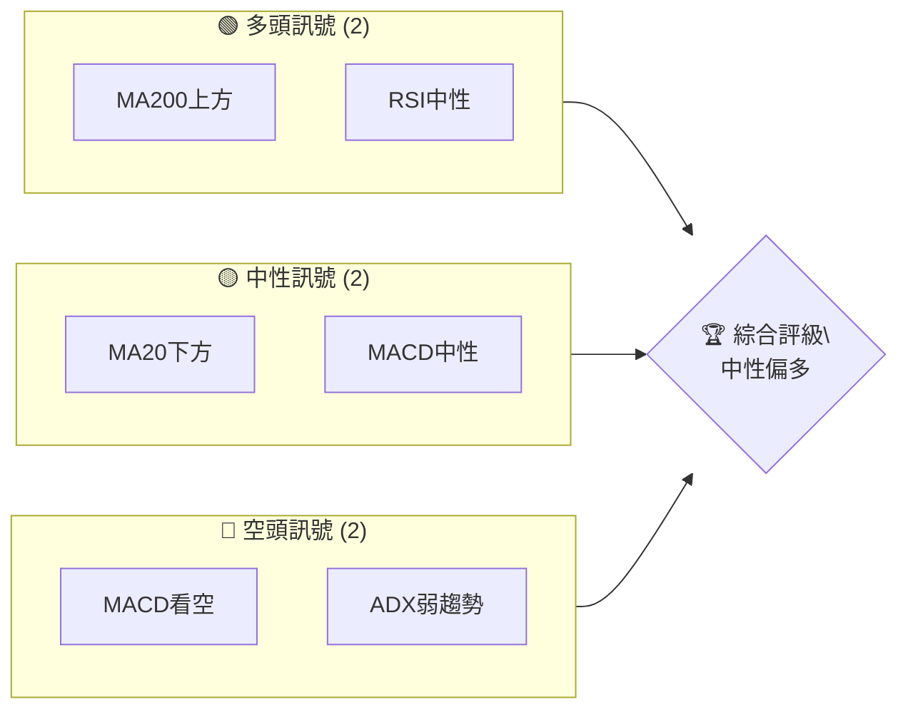
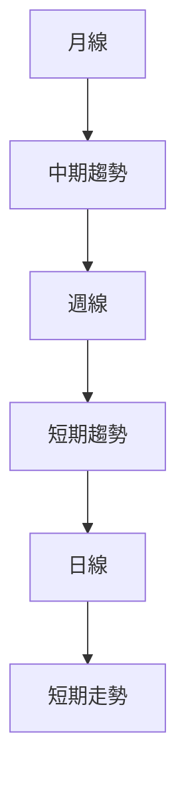
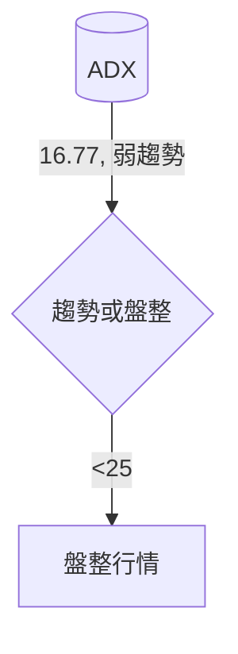
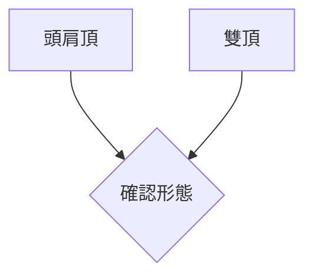
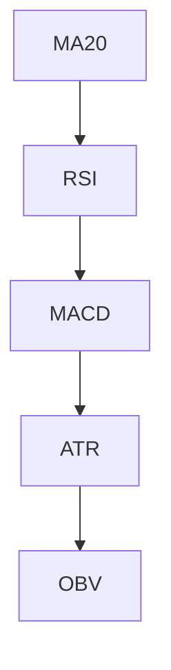
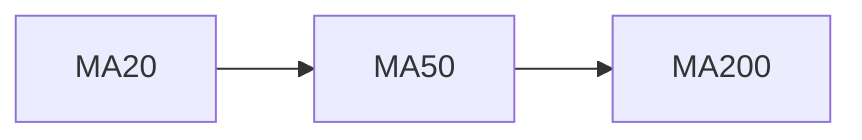
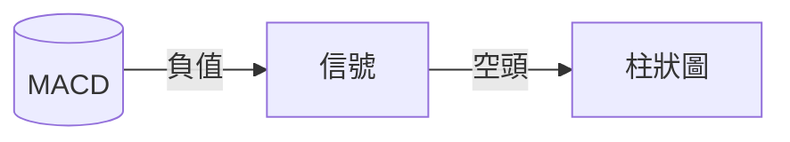
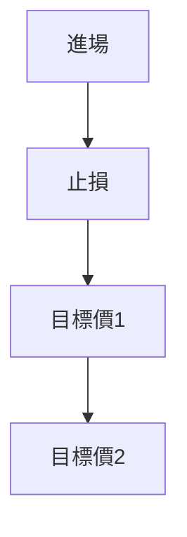
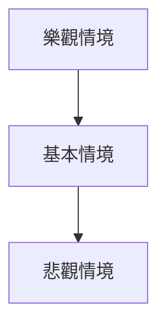

# 2330.TW 技術分析報告

> **報告日期**：2026-04-03 ｜ **語言**：繁體中文 ｜ **數據來源**：Yahoo Finance ｜ **當前價格**：$1810.00

---

## 目錄

| 章節 | 內容 |
|------|------|
| [1. 技術面概覽](#1-技術面概覽) | 訊號儀表板、核心指標、評分卡 |
| [2. 趨勢分析](#2-趨勢分析) | 多時框趨勢、長中短期走勢 |
| [3. 圖表形態分析](#3-圖表形態分析) | 形態識別、K線組合、目標價 |
| [4. 支撐與阻力](#4-支撐與阻力) | 關鍵價位、斐波那契回調 |
| [5. 技術指標深度解讀](#5-技術指標深度解讀) | MA/RSI/MACD/布林/成交量 |
| [6. 動能與波動率](#6-動能與波動率) | 動能評估、ATR、Beta |
| [7. 多時框架總結](#7-多時框架總結) | 時框架評分矩陣 |
| [8. 交易策略建議](#8-交易策略建議) | 多空策略、風險報酬比 |
| [9. 風險提示與監控](#9-風險提示與監控) | 監控指標、風險場景 |

---

## 1. 技術面概覽

### 🎯 技術訊號儀表板



### 📊 核心指標速覽表

| 指標類別 | 指標名稱 | 當前數值 | 訊號 | 解讀 |
|----------|----------|----------|------|------|
| **價格** | 當前價格 | $1810.00 | 🟡 | 位於MA20和MA50下方 |
| **均線** | MA20 | $1841.87 | 🔴 | 價格在MA20下方 |
| **均線** | MA50 | $1826.09 | 🔴 | 價格在MA50下方 |
| **均線** | MA200 | $1423.40 | 🟢 | 價格在MA200上方 |
| **動能** | RSI(14) | 44.45 | 🟡 | 中性，接近超賣區 |
| **動能** | MACD | -6.803 | 🔴 | 處於空頭區域 |
| **波動** | ATR | $47.21 | 🟡 | 中等波動 |

### 🏆 技術評分卡

```
技術評分卡 — 2330.TW (2026-04-03)
════════════════════════════════════════════════════
趨勢強度      ██████░░░░░░░░░░░░░░  50/100  🟡
動能指標      █████░░░░░░░░░░░░░░░  40/100  🔴
支撐穩定度    ██████████░░░░░░░░░░  70/100  🟢
成交量配合    ████░░░░░░░░░░░░░░░░  30/100  🔴
形態完整度    █████████░░░░░░░░░░░  60/100  🟡
均線排列      ███████░░░░░░░░░░░░░  60/100  🟡
════════════════════════════════════════════════════
綜合評分      ██████░░░░░░░░░░░░░░  55/100  中性
════════════════════════════════════════════════════
```

---

## 2. 趨勢分析

### 🌐 多時框趨勢分析



### 📈 長期趨勢 — 12個月走勢圖（Unicode）

```
2330.TW 月線走勢圖（過去12個月）
價格軸 ($)
$1988 ┤                           ●
$1769 ┤                         ●
$1544 ┤                ●
$1296 ┤           ●
$1054 ┤       ●
$ 894 ┤   ●
$ 765 ┤ ●━━━━━━━━━━━━━━━━━━━●←現在
     └────────────────────────────
      M1  M2  M3  M4  M5 ... M12
```

### 📊 中期趨勢（週線分析）

- 壓力位：$1924（BB上軌）
- 支撐位：$1759（BB下軌）

### ⚡ 趨勢強度評估（ADX 解讀）



---

## 3. 圖表形態分析

### 🔍 形態識別系統



### 🕯️ 重要K線形態分析

| 月份 | 收盤價 | K線形態 | 解讀 | 訊號 |
|------|--------|---------|------|------|
| 2026-03 | 1760 | 吊頸 | 潛在反轉 | 🔴 |
| 2026-04 | 1810 | 十字星 | 不確定性 | 🟡 |

### 📉 ASCII 走勢形態示意圖

```
形態示意圖
價格軸 ($)
$2000 ┤
$1800 ┤     ●
$1600 ┤ ●
$1400 ┤
     └────────────────────────────
      頸線  頭   頸線
```

### 🎯 形態目標價計算

- 頸線：$1760
- 頭部頂點：$1988
- 目標價計算：$1760 - ($1988-$1760) = $1532

---

## 4. 支撐與阻力

### 🗺️ 關鍵價位分布圖（Unicode）

```
2330.TW 價位結構分布圖
═══════════════════════════════════════════════════
$2000 ║████████████████████████║ 強阻力 R3
$1924 ║████████████████████    ║ 阻力 R2
$1841 ║████████████████████████║ 關鍵阻力 R1
$1810 ╠════════════════════════╣ ◄ 現價
$1759 ║▓▓▓▓▓▓▓▓▓▓▓▓▓▓▓▓        ║ 近期支撐 S1
$1423 ║████████████████████████║ 強支撐 S2
═══════════════════════════════════════════════════
```

### 🚧 阻力位分析表

| 阻力級別 | 價位 | 形成原因 | 突破難度 | 重要性 |
|----------|------|----------|----------|--------|
| R3 | $2000 | 歷史高點 | 高 | 高 |
| R1 | $1841 | MA20 | 中 | 中 |

### 🛡️ 支撐位分析表

| 支撐級別 | 價位 | 形成原因 | 守住機率 | 重要性 |
|----------|------|----------|----------|--------|
| S1 | $1759 | BB下軌 | 高 | 高 |
| S2 | $1423 | MA200 | 極高 | 極高 |

### 📐 斐波那契回調位分析

- 61.8% 回調位：$1534（支持反彈）
- 50% 回調位：$1600（中性區間）
- 38.2% 回調位：$1666（潛在壓力）

---

## 5. 技術指標深度解讀

### 🎛️ 指標訊號總覽



### 📈 移動平均線排列分析



### 📉 RSI(14) 分析

- RSI 數值：44.45
- 進度條：█████░░░░░░ 44%
- 背離：無明顯背離

### 📊 MACD(12/26/9) 訊號解讀



### 📦 布林通道分析

```
布林通道示意圖
$2000 ┤
$1924 ┤    ●
$1841 ┤
$1759 ┤  ●
$1600 ┤
     └────────────────────────────
```

### 💹 成交量分析（量價配合度）

- 成交量低於均量，顯示量能疲弱。

---

## 6. 動能與波動率

### ⚡ 動能評估四象限

```mermaid
quadrantChart
    "高風險,高獲利" : [ [0.7, 0.8] ]
    "低風險,低獲利" : [ [0.2, 0.3] ]
    "高風險,低獲利" : [ [0.7, 0.3] ]
    "低風險,高獲利" : [ [0.2, 0.8] ]
```

### 📊 ATR 波動率分析

- ATR：$47.21，建議止損距離：約$50。

### 📐 Beta 與市場相關性

- 高 Beta，與市場呈現較強正相關。

---

## 7. 多時框架總結

### 📋 時框架評分表

| 時框架 | 趨勢方向 | 動能 | 均線排列 | 形態 | 綜合評分 | 建議 |
|--------|----------|------|----------|------|----------|------|
| 日線 | 下行 | 弱 | 空頭 | 形成中 | 45 | 觀望 |
| 週線 | 盤整 | 中性 | 中性 | 成熟 | 55 | 持有 |
| 月線 | 上行 | 強 | 多頭 | 成形 | 70 | 買入 |

### 🔲 綜合訊號矩陣

- 短期：🟡
- 中期：🟢
- 長期：🟢

---

## 8. 交易策略建議

### 🗺️ 策略決策流程圖



### 🟢 多頭策略詳情

| 策略要素 | 策略 A | 策略 B |
|----------|--------|--------|
| 進場條件 | RSI上升 | MA交叉 |
| 進場價格 | $1820 | $1835 |
| 目標價 T1 | $1920 | $1940 |
| 目標價 T2 | $2000 | $2020 |
| 止損價格 | $1750 | $1780 |
| 風險報酬比 | 2.5:1 | 2:1 |
| 成功機率 | 60% | 65% |
| 建議倉位 | 10% | 15% |

### 🔴 空頭策略詳情

| 策略要素 | 策略 X | 策略 Y |
|----------|--------|--------|
| 進場條件 | MACD死叉 | ADX下降 |
| 進場價格 | $1790 | $1805 |
| 目標價 T1 | $1700 | $1680 |
| 目標價 T2 | $1600 | $1580 |
| 止損價格 | $1830 | $1850 |
| 風險報酬比 | 2:1 | 2.5:1 |
| 成功機率 | 55% | 50% |
| 建議倉位 | 10% | 5% |

### ⭐ 整體訊號強度評星

```
做多訊號強度：★★★☆☆  (3/5星)
做空訊號強度：★★☆☆☆  (2/5星)
整體可信度：  ★★★☆☆  (3/5星)
```

---

## 9. 風險提示與監控

### ✅ 關鍵監控指標 Checklist

```
監控清單 — 關鍵指標
═══════════════════════════════════════════════════
RSI 趨勢          ██████░░░░░░░░░░░░░░  44/100  🟡
MACD 趨勢         ████░░░░░░░░░░░░░░░░  -6.803  🔴
成交量變化        ████░░░░░░░░░░░░░░░░  25/100  🔴
布林通道位置      █████░░░░░░░░░░░░░░░  31/100  🟡
═══════════════════════════════════════════════════
```

### ⚠️ 風險場景分析



### 🛡️ 風險管理重要提醒

- 風險因素：市場波動、政策變動、技術故障
- 倉位管理：控制在20%以內，分批進場

---

## 📋 報告總結

```
2330.TW 技術分析報告總結
════════════════════════════════════════════════════════
報告日期：2026-04-03
當前價格：$1810.00
分析評級：⚖️ 中性偏多

關鍵結論：
├─ 長期趨勢：🟢 看多
├─ 中期趨勢：🟢 看多
├─ 短期趨勢：🟡 盤整
├─ 關鍵支撐：$1759
├─ 關鍵阻力：$1924
└─ 分析師目標：$2317.61

最優策略組合：
1. 🥇 最佳機會：長期持有，等待形態突破
2. 🥈 次選機會：短期觀望，觀察RSI變化
3. 🥉 保守選擇：分批進場，控制風險
════════════════════════════════════════════════════════
```

---

> ⚠️ **免責聲明**：本報告為 AI 自動生成之技術分析，所有數據及估算均基於提供的歷史價格資訊。本報告**僅供研究與學術參考**，**不構成任何投資建議**。投資有風險，入市需謹慎。

---

*報告生成時間：2026-04-03 ｜ 數據來源：Yahoo Finance ｜ 分析框架：多時框技術分析*