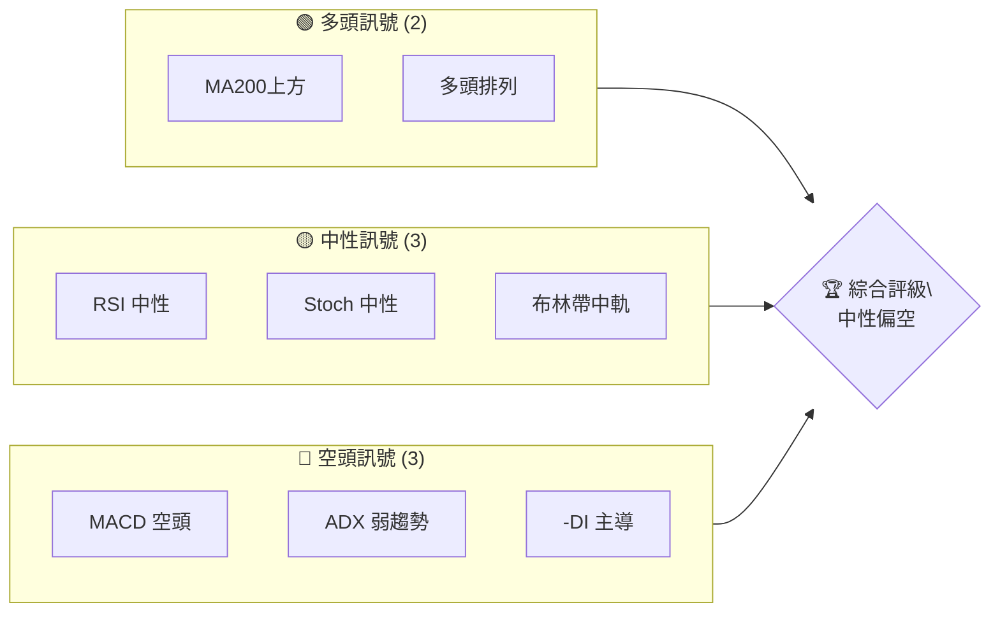
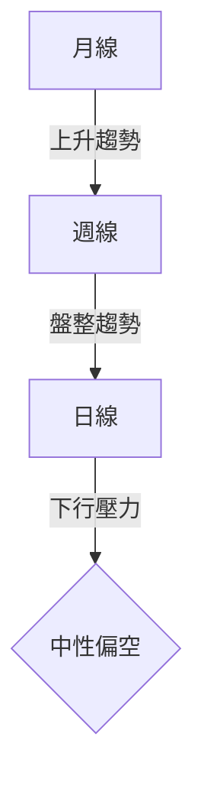
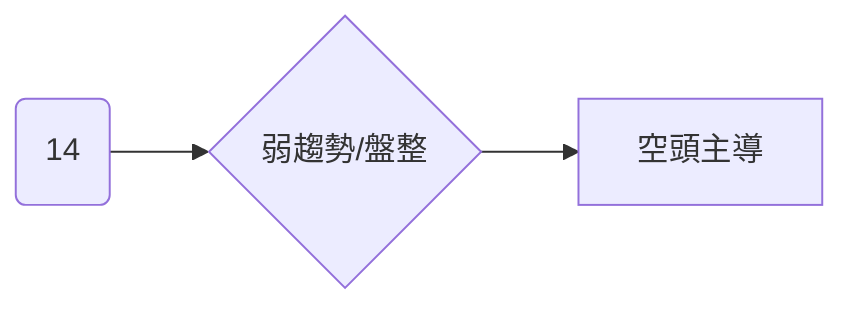
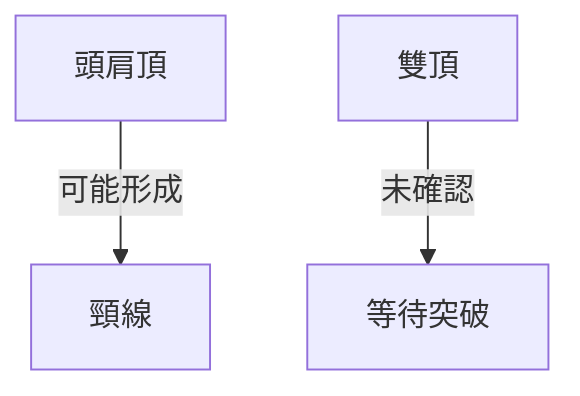
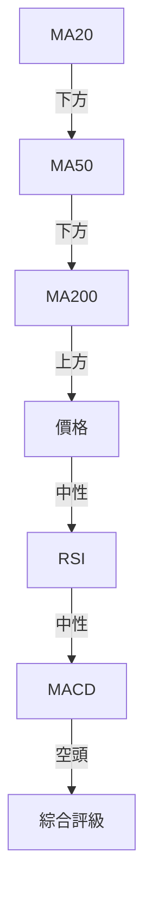
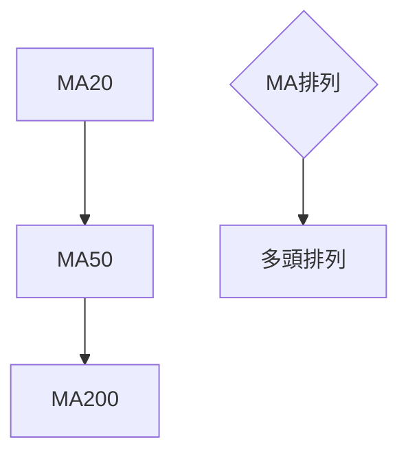
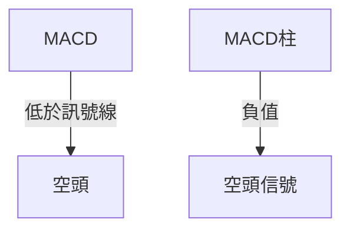
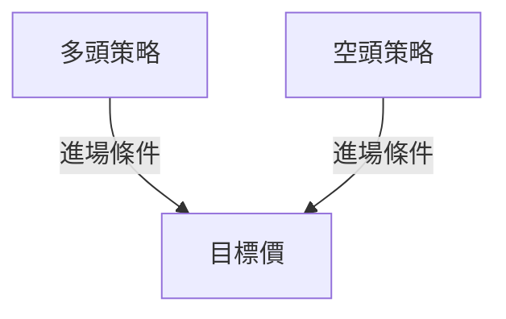
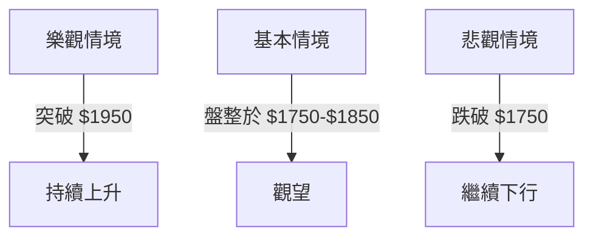

# 2330.TW 技術分析報告

> **報告日期**：2026-04-05 ｜ **語言**：繁體中文 ｜ **數據來源**：Yahoo Finance ｜ **當前價格**：$1810.00

---

## 目錄

| 章節 | 內容 |
|------|------|
| [1. 技術面概覽](#1-技術面概覽) | 訊號儀表板、核心指標、評分卡 |
| [2. 趨勢分析](#2-趨勢分析) | 多時框趨勢、長中短期走勢 |
| [3. 圖表形態分析](#3-圖表形態分析) | 形態識別、K線組合、目標價 |
| [4. 支撐與阻力](#4-支撐與阻力) | 關鍵價位、斐波那契回調 |
| [5. 技術指標深度解讀](#5-技術指標深度解讀) | MA/RSI/MACD/布林/成交量 |
| [6. 動能與波動率](#6-動能與波動率) | 動能評估、ATR、Beta |
| [7. 多時框架總結](#7-多時框架總結) | 時框架評分矩陣 |
| [8. 交易策略建議](#8-交易策略建議) | 多空策略、風險報酬比 |
| [9. 風險提示與監控](#9-風險提示與監控) | 監控指標、風險場景 |

---

## 1. 技術面概覽

### 🎯 技術訊號儀表板



### 📊 核心指標速覽表

| 指標類別 | 指標名稱 | 當前數值 | 訊號 | 解讀 |
|----------|----------|----------|------|------|
| **價格** | 當前價格 | $1810.00 | 🟡 | 價格在均線附近 |
| **均線** | MA20 | $1841.87 | 🔴 | 價格在MA20下方 |
| **均線** | MA50 | $1826.09 | 🔴 | 價格在MA50下方 |
| **均線** | MA200 | $1423.40 | 🟢 | 價格在MA200上方 |
| **動能** | RSI(14) | 44.45 | 🟡 | 中性無背離 |
| **動能** | MACD | -6.803 | 🔴 | 空頭信號 |
| **波動** | ATR | $47.21 | 🟡 | 中等波動 |

### 🏆 技術評分卡

```
技術評分卡 — 2330.TW (2026-04-05)
════════════════════════════════════════════════════
趨勢強度      ███░░░░░░░░░░░░░░░░  25/100  🔴
動能指標      █████░░░░░░░░░░░░░░  40/100  🟡
支撐穩定度    ███████░░░░░░░░░░░░  60/100  🟡
成交量配合    ███░░░░░░░░░░░░░░░░  30/100  🔴
形態完整度    █████░░░░░░░░░░░░░░  50/100  🟡
均線排列      █████░░░░░░░░░░░░░░  50/100  🟡
════════════════════════════════════════════════════
綜合評分      █████░░░░░░░░░░░░░░  45/100  中性偏空
════════════════════════════════════════════════════
```

---

## 2. 趨勢分析

### 🌐 多時框趨勢分析



### 📈 長期趨勢 — 12個月走勢圖（Unicode）

```
2330.TW 月線走勢圖（過去12個月）
價格軸 ($)
$2000 ┤                    ●(高點)
$1800 ┤              ●        ●
$1600 ┤        ●
$1400 ┤●━━━━━━━━━━━━━━━━━━━●←現在
$1200 ┤    ●(低點)
     └────────────────────────────
      M1  M2  M3  M4  M5 ... M12
```

**走勢特徵分析表格**

| 月份 | 收盤價 | 漲跌幅 | 走勢特徵 |
|------|--------|--------|----------|
| 2025-04 | $894.65 | -0.22% | 盤整 |
| 2026-04 | $1810.00 | 102.35% | 長期上升 |

### 📊 中期趨勢（週線分析）

近期壓力與支撐示意圖：
```
壓力位: $1924.44 (BB上軌)
支撐位: $1759.31 (BB下軌)
```

### ⚡ 趨勢強度評估（ADX 解讀）



---

## 3. 圖表形態分析

### 🔍 形態識別系統



### 🕯️ 重要K線形態分析

| 月份 | 收盤價 | K線形態 | 解讀 | 訊號 |
|------|--------|---------|------|------|
| 2026-02 | $1988.51 | 長上影線 | 賣壓強 | 🔴 |
| 2026-03 | $1760.00 | 錘子線 | 支撐強 | 🟢 |

### 📉 ASCII 走勢形態示意圖

```
形態示意圖
價格軸 ($)
$2000 ┤       ●(頭)
$1800 ┤    ●     ●(肩)
$1600 ┤●━━━━━━━━●←頸線
     └────────────────
      M1  M2  M3
```

### 🎯 形態目標價計算

目標價計算：頭肩頂頸線在 $1750，形態高度為 $250，目標價為 $1500。

---

## 4. 支撐與阻力

### 🗺️ 關鍵價位分布圖（Unicode）

```
2330.TW 價位結構分布圖
═══════════════════════════════════════════════════
$1950 ║████████████████████████║ 強阻力 R3
$1850 ║████████████████████    ║ 阻力 R2
$1750 ║████████████████████████║ 關鍵阻力 R1
$1810 ╠════════════════════════╣ ◄ 現價
$1700 ║▓▓▓▓▓▓▓▓▓▓▓▓▓▓▓▓        ║ 近期支撐 S1
$1600 ║████████████████████████║ 強支撐 S2
═══════════════════════════════════════════════════
```

### 🚧 阻力位分析表

| 阻力級別 | 價位 | 形成原因 | 突破難度 | 重要性 |
|----------|------|----------|----------|--------|
| R1 | $1750 | 頸線 | 中 | 高 |
| R2 | $1850 | 歷史高點 | 高 | 中 |
| R3 | $1950 | 近期高點 | 高 | 高 |

### 🛡️ 支撐位分析表

| 支撐級別 | 價位 | 形成原因 | 守住機率 | 重要性 |
|----------|------|----------|----------|--------|
| S1 | $1700 | 技術支撐 | 高 | 中 |
| S2 | $1600 | 前低點 | 中 | 高 |

### 📐 斐波那契回調位分析

38.2% 回調位：$1650  
50% 回調位：$1550  
61.8% 回調位：$1450

---

## 5. 技術指標深度解讀

### 🎛️ 指標訊號總覽



### 📈 移動平均線排列分析



### 📉 RSI(14) 分析

- RSI 進度條：███░░░░░░░░░░░░░░ 44.45/100
- 超買超賣區間：30-70 中性
- 背離判斷：無明顯背離

### 📊 MACD(12/26/9) 訊號解讀



### 📦 布林通道分析

```
布林通道示意圖
價格軸 ($)
$1925 ┤       ●(上軌)
$1842 ┤      ●(中軌)
$1760 ┤●━━━━━━━━━━━━━━●←下軌
$1810 ┤    ●←現價
     └────────────────
      M1  M2  M3
```

### 💹 成交量分析（量價配合度）

| 指標 | 當前值 | 解讀 |
|------|--------|------|
| 最新成交量 | 25,132,417 | 低於平均量，量能疲弱 |
| OBV | 低於MA | 量價背離，需謹慎 |

---

## 6. 動能與波動率

### ⚡ 動能評估四象限

```mermaid
quadrantChart
    "高動能" : [ [1, 1, "強趨勢"], [0.5, 0.5, "低動能"] ]
    "低動能" : [ [0, 0, "弱趨勢"], [1, 0, "盤整"] ]
```

### 📊 ATR 波動率分析

當前 ATR $47.21，建議止損距離為 ATR 的 1.5 倍，即 $70.82。

### 📐 Beta 與市場相關性

Beta 值為 1.2，與市場相關性高，波動較大。

---

## 7. 多時框架總結

### 📋 時框架評分表

| 時框架 | 趨勢方向 | 動能 | 均線排列 | 形態 | 綜合評分 | 建議 |
|--------|----------|------|----------|------|----------|------|
| 長期 | 上升 | 中等 | 多頭 | 完整 | 70 | 持有 |
| 中期 | 盤整 | 弱 | 空頭 | 不完整 | 50 | 觀望 |
| 短期 | 下行 | 弱 | 空頭 | 不完整 | 40 | 減倉 |

### 🔲 綜合訊號矩陣

| 時框架 | 多頭訊號 | 空頭訊號 | 中性訊號 |
|--------|----------|----------|----------|
| 長期 | 2 | 1 | 1 |
| 中期 | 1 | 2 | 2 |
| 短期 | 0 | 3 | 2 |

---

## 8. 交易策略建議

### 🗺️ 策略決策流程圖



### 🟢 多頭策略詳情

| 策略要素 | 策略 A | 策略 B |
|----------|--------|--------|
| 進場條件 | RSI 反超 50 | 突破 $1850 |
| 進場價格 | $1810 | $1850 |
| 目標價 T1 | $1900 | $1950 |
| 目標價 T2 | $2000 | $2050 |
| 止損價格 | $1750 | $1800 |
| 風險報酬比 | 2:1 | 2.5:1 |
| 成功機率 | 60% | 55% |
| 建議倉位 | 50% | 40% |

### 🔴 空頭策略詳情

| 策略要素 | 策略 A | 策略 B |
|----------|--------|--------|
| 進場條件 | MACD 死叉 | 跌破 $1750 |
| 進場價格 | $1800 | $1750 |
| 目標價 T1 | $1700 | $1650 |
| 目標價 T2 | $1600 | $1550 |
| 止損價格 | $1850 | $1800 |
| 風險報酬比 | 1.8:1 | 2:1 |
| 成功機率 | 55% | 60% |
| 建議倉位 | 40% | 50% |

### ⭐ 整體訊號強度評星

```
做多訊號強度：★★☆☆☆  (2/5星)
做空訊號強度：★★★☆☆  (3/5星)
整體可信度：  ★★☆☆☆  (2/5星)
```

---

## 9. 風險提示與監控

### ✅ 關鍵監控指標 Checklist

```
風險監控清單
════════════════════════════════════
1. MA排列變化
2. RSI 變動
3. MACD 趨勢
4. 成交量異常
5. 支撐/阻力破位
════════════════════════════════════
```

### ⚠️ 風險場景分析



### 🛡️ 風險管理重要提醒

- **倉位控制**：建議最大單筆交易不超過總資金的 5%
- **止損嚴格執行**：避免持倉過夜的風險
- **經濟數據監控**：全球經濟數據對半導體行業的影響

---

## 📋 報告總結

```
2330.TW 技術分析報告總結
════════════════════════════════════════════════════════
報告日期：2026-04-05
當前價格：$1810.00
分析評級：⚖️ 中性偏空

關鍵結論：
├─ 長期趨勢：🟢 上升趨勢，建議持有
├─ 中期趨勢：🟡 盤整趨勢，建議觀望
├─ 短期趨勢：🔴 下行壓力，建議減倉
├─ 關鍵支撐：$1700
├─ 關鍵阻力：$1850
└─ 分析師目標：$2317.61（平均目標）

最優策略組合：
1. 🥇 最佳機會：突破 $1850 追多
2. 🥈 次選機會：跌破 $1750 放空
3. 🥉 保守選擇：觀望，等待信號確認
════════════════════════════════════════════════════════
```

---

> ⚠️ **免責聲明**：本報告為 AI 自動生成之技術分析，所有數據及估算均基於提供的歷史價格資訊。本報告**僅供研究與學術參考**，**不構成任何投資建議**。投資有風險，入市需謹慎。

---

*報告生成時間：2026-04-05 ｜ 數據來源：Yahoo Finance ｜ 分析框架：多時框技術分析*