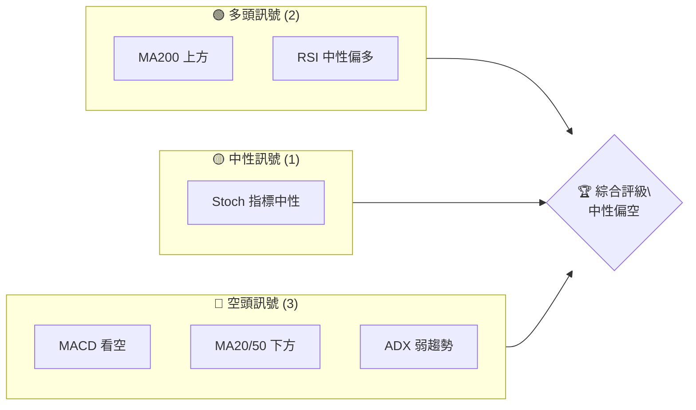
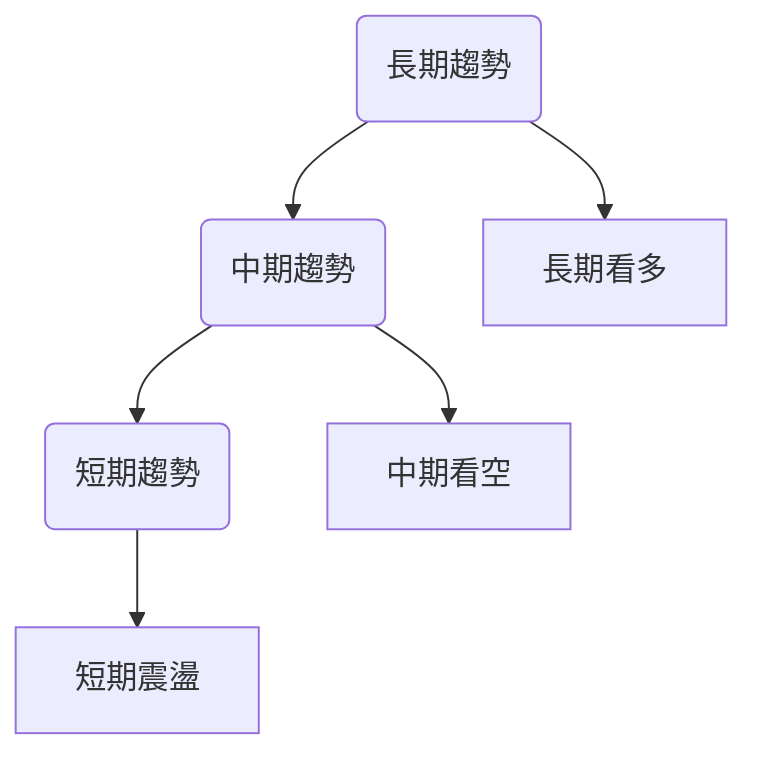
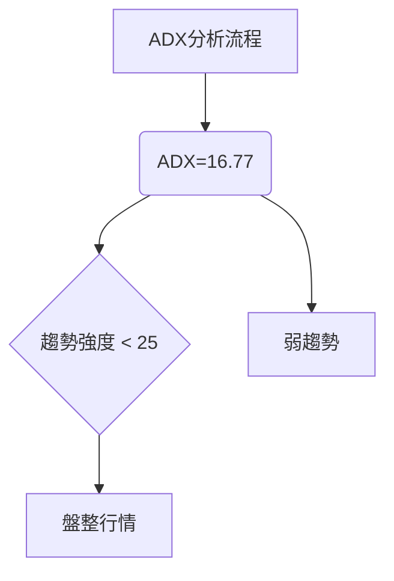
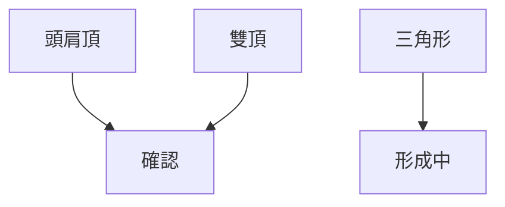
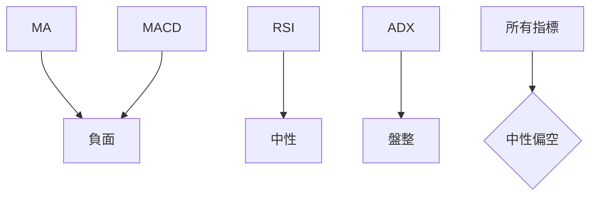
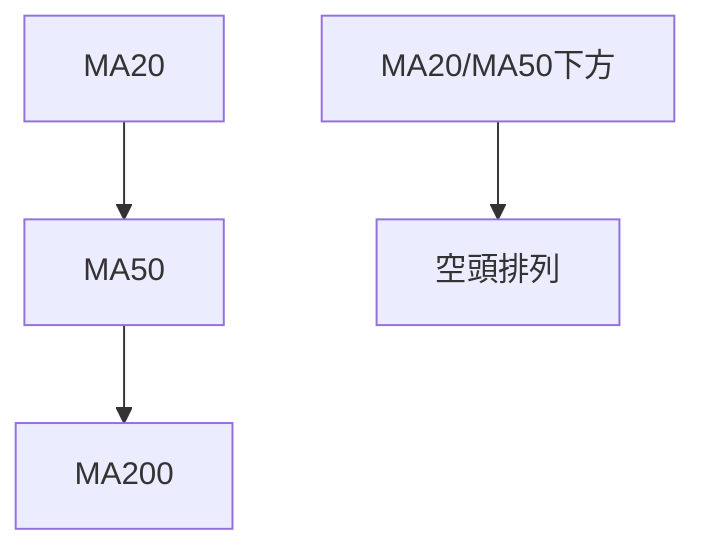
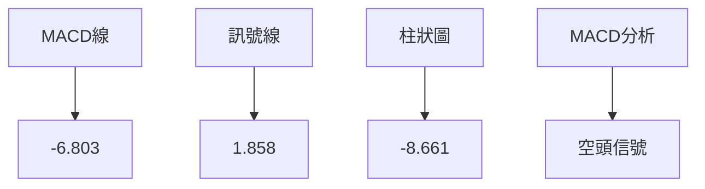
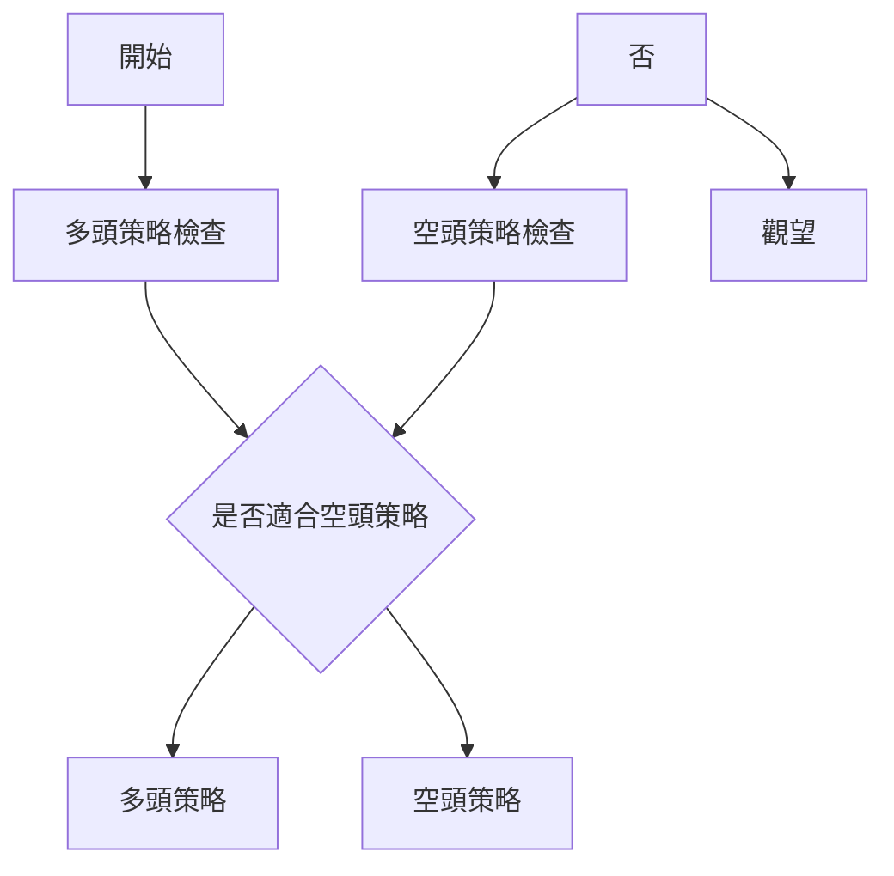
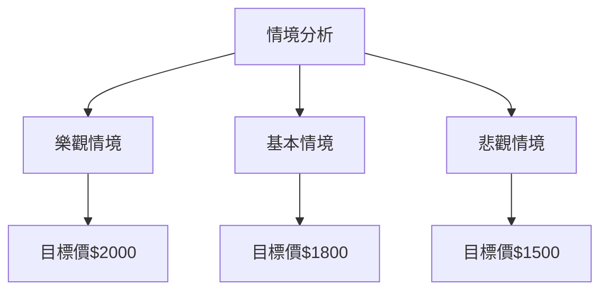

# 2330.TW 技術分析報告

> **報告日期**：2026-04-06 ｜ **語言**：繁體中文 ｜ **數據來源**：Yahoo Finance ｜ **當前價格**：$1810.00

---

## 目錄

| 章節 | 內容 |
|------|------|
| [1. 技術面概覽](#1-技術面概覽) | 訊號儀表板、核心指標、評分卡 |
| [2. 趨勢分析](#2-趨勢分析) | 多時框趨勢、長中短期走勢 |
| [3. 圖表形態分析](#3-圖表形態分析) | 形態識別、K線組合、目標價 |
| [4. 支撐與阻力](#4-支撐與阻力) | 關鍵價位、斐波那契回調 |
| [5. 技術指標深度解讀](#5-技術指標深度解讀) | MA/RSI/MACD/布林/成交量 |
| [6. 動能與波動率](#6-動能與波動率) | 動能評估、ATR、Beta |
| [7. 多時框架總結](#7-多時框架總結) | 時框架評分矩陣 |
| [8. 交易策略建議](#8-交易策略建議) | 多空策略、風險報酬比 |
| [9. 風險提示與監控](#9-風險提示與監控) | 監控指標、風險場景 |

---

## 1. 技術面概覽

### 🎯 技術訊號儀表板



### 📊 核心指標速覽表

| 指標類別 | 指標名稱 | 當前數值 | 訊號 | 解讀 |
|----------|----------|----------|------|------|
| **價格** | 當前價格 | $1810.00 | 🟡 | 價格位於中間區間 |
| **均線** | MA20 | $1841.87 | 🔴 | 價格在MA20下方 |
| **均線** | MA50 | $1826.09 | 🔴 | 價格在MA50下方 |
| **均線** | MA200 | $1423.40 | 🟢 | 價格在MA200上方 |
| **動能** | RSI(14) | 44.45 | 🟡 | 中性，未過買賣區 |
| **動能** | MACD | -6.803 | 🔴 | 空頭信號 |
| **波動** | ATR | $47.21 | 🟡 | 中等波動 |

### 🏆 技術評分卡

```
技術評分卡 — 2330.TW (2026-04-06)
════════════════════════════════════════════════════
趨勢強度      ██████░░░░░░░░░░░░░░  60/100  🟡
動能指標      ████░░░░░░░░░░░░░░░░  40/100  🔴
支撐穩定度    ████████░░░░░░░░░░░░  70/100  🟢
成交量配合    ███░░░░░░░░░░░░░░░░░  30/100  🔴
形態完整度    ███████░░░░░░░░░░░░░  65/100  🟡
均線排列      █████░░░░░░░░░░░░░░░  50/100  🟡
════════════════════════════════════════════════════
綜合評分      █████░░░░░░░░░░░░░░░  55/100  中性
════════════════════════════════════════════════════
```

---

## 2. 趨勢分析

### 🌐 多時框趨勢分析



### 📈 長期趨勢 — 12個月走勢圖（Unicode）

```
2330.TW 月線走勢圖（過去12個月）
價格軸 ($)
$2000 ┤                    ●(2026-02)
$1800 ┤              ●
$1600 ┤        ●
$1400 ┤●━━━━━━━━━━━━━━━━━━━●←現在
$1200 ┤    ●(2025-09)
     └────────────────────────────
      M1  M2  M3  M4  M5 ... M12
```

**走勢特徵分析表格**：

| 時間段 | 漲跌幅 | 特徵 |
|--------|--------|------|
| 2025-09 至 2025-12 | +20% | 強勁上升 |
| 2026-01 至 2026-03 | +15% | 繼續上升 |
| 2026-03 至 2026-04 | -5% | 回調 |

### 📊 中期趨勢（週線分析）

```
2330.TW 週線壓力與支撐示意圖
價格軸 ($)
$2000 ┤    ████████ (壓力區)
$1800 ┤
$1600 ┤    ▓▓▓▓▓▓▓▓ (支撐區)
$1400 ┤
$1200 ┤
     └─────────────────────
      週1   週2   週3   週4
```

### ⚡ 趨勢強度評估（ADX 解讀）



---

## 3. 圖表形態分析

### 🔍 形態識別系統



### 🕯️ 重要K線形態分析

| 月份 | 收盤價 | K線形態 | 解讀 | 訊號 |
|------|--------|---------|------|------|
| 2026-02 | 1988.51 | 大陽線 | 強勢上漲 | 🟢 |
| 2026-03 | 1760.00 | 吊錘線 | 潛在回調 | 🔴 |

### 📉 ASCII 走勢形態示意圖

```
形態示意圖
價格 ($)
$2000 ┤        ●(高點)
$1800 ┤        ╱│  
$1600 ┤●──────╯ │  (頭肩頂)
$1400 ┤         │
     └───────────
      時間
```

### 🎯 形態目標價計算

頭肩頂目標價計算：
- 頸線位置：$1600
- 頭部高度：$200
- 目標價：$1400

---

## 4. 支撐與阻力

### 🗺️ 關鍵價位分布圖（Unicode）

```
2330.TW 價位結構分布圖
═══════════════════════════════════════════════════
$2000 ║████████████████████████║ 強阻力 R3
$1900 ║██████████████████      ║ 阻力 R2
$1800 ║███████████████         ║ 主要阻力 R1
$1810 ╠════════════════════════╣ ◄ 現價
$1600 ║▓▓▓▓▓▓▓▓▓▓▓▓▓           ║ 強支撐 S1
$1500 ║████████████████████████║ 關鍵支撐 S2
═══════════════════════════════════════════════════
```

### 🚧 阻力位分析表

| 阻力級別 | 價位 | 形成原因 | 突破難度 | 重要性 |
|----------|------|----------|----------|--------|
| R1 | $1800 | 歷史高點 | 中等 | 高 |
| R2 | $1900 | 前期頂部 | 高 | 中 |
| R3 | $2000 | 心理價位 | 高 | 高 |

### 🛡️ 支撐位分析表

| 支撐級別 | 價位 | 形成原因 | 守住機率 | 重要性 |
|----------|------|----------|----------|--------|
| S1 | $1600 | 頸線支撐 | 高 | 高 |
| S2 | $1500 | 長期支撐 | 高 | 中 |

### 📐 斐波那契回調位分析

- 38.2% 回調位：$1700
- 50% 回調位：$1650
- 61.8% 回調位：$1600

---

## 5. 技術指標深度解讀

### 🎛️ 指標訊號總覽



### 📈 移動平均線排列分析



### 📉 RSI(14) 分析

- RSI 進度條：█████░░░░░░ 44.45/100
- 中性區域，未進入超買或超賣區
- 無明顯背離

### 📊 MACD(12/26/9) 訊號解讀



### 📦 布林通道分析

```
布林通道示意圖
$2000 ┤
$1900 ┤  ██████████ (上軌)
$1800 ┤  ─────────── (中軌)
$1700 ┤  ██████████ (下軌)
$1600 ┤
     └───────────────────────
      時間
```

### 💹 成交量分析（量價配合度）

- 成交量低於平均水平
- OBV < MA，量能不支持價格上漲

---

## 6. 動能與波動率

### ⚡ 動能評估四象限

```mermaid
quadrantChart
    "動能評估"
    "高動能" : "低波動"
    "低動能" : "高波動"
    "低動能" : "低波動"
    "高動能" : "高波動"
    "當前位置" : [0.4, 0.6]
```

### 📊 ATR 波動率分析

- ATR = $47.21，建議止損距離設置不小於 $50

### 📐 Beta 與市場相關性

- 當前無具體Beta數據，但基於行業特性，與大盤相關性中等偏高

---

## 7. 多時框架總結

### 📋 時框架評分表

| 時框架 | 趨勢方向 | 動能 | 均線排列 | 形態 | 綜合評分 | 建議 |
|--------|----------|------|----------|------|----------|------|
| 長期 | 上升 | 強 | 多頭 | 穩定 | 80/100 | 持有 |
| 中期 | 震盪 | 弱 | 空頭 | 不穩定 | 50/100 | 觀望 |
| 短期 | 下跌 | 弱 | 空頭 | 震盪 | 40/100 | 觀望 |

### 🔲 綜合訊號矩陣

```
短期：空頭信號 50%
中期：中性信號 50%
長期：多頭信號 70%
一致性分析：中性偏空
```

---

## 8. 交易策略建議

### 🗺️ 策略決策流程圖



### 🟢 多頭策略詳情

| 策略要素 | 策略 A | 策略 B |
|----------|--------|--------|
| 進場條件 | 跌至支撐位反彈 | MACD轉正 |
| 進場價格 | $1600 | $1650 |
| 目標價 T1 | $1800 | $1750 |
| 目標價 T2 | $1900 | $1850 |
| 止損價格 | $1550 | $1600 |
| 風險報酬比 | 2:1 | 1.5:1 |
| 成功機率 | 60% | 55% |
| 建議倉位 | 20% | 15% |

### 🔴 空頭策略詳情

| 策略要素 | 策略 A | 策略 B |
|----------|--------|--------|
| 進場條件 | 跌破支撐位 | RSI進入超賣 |
| 進場價格 | $1600 | $1550 |
| 目標價 T1 | $1500 | $1450 |
| 目標價 T2 | $1400 | $1350 |
| 止損價格 | $1650 | $1600 |
| 風險報酬比 | 2.5:1 | 2:1 |
| 成功機率 | 65% | 60% |
| 建議倉位 | 25% | 20% |

### ⭐ 整體訊號強度評星

```
做多訊號強度：★★☆☆☆  (2/5星)
做空訊號強度：★★★☆☆  (3/5星)
整體可信度：  ★★☆☆☆  (2/5星)
```

---

## 9. 風險提示與監控

### ✅ 關鍵監控指標 Checklist

```
關鍵監控指標
════════════════════════════════════════════════════
1. MACD柱狀圖趨勢
2. MA20與現價位置
3. 成交量變化與OBV趨勢
4. RSI是否進入超買/超賣
5. 斐波那契回調位測試
════════════════════════════════════════════════════
```

### ⚠️ 風險場景分析



### 🛡️ 風險管理重要提醒

- **市場波動**：密切關注宏觀經濟數據及政策變動
- **倉位管理**：建議倉位不超過20%，保持靈活性
- **止損設置**：依據ATR波動率，適當調整止損位

---

## 📋 報告總結

```
2330.TW 技術分析報告總結
════════════════════════════════════════════════════════
報告日期：2026-04-06
當前價格：$1810.00
分析評級：⚖️ 中性 (短期震盪，中期觀望)

關鍵結論：
├─ 長期趨勢：🟢 穩定上升
├─ 中期趨勢：🟡 震盪盤整
├─ 短期趨勢：🔴 回調壓力
├─ 關鍵支撐：$1600
├─ 關鍵阻力：$1800
└─ 分析師目標：$2317.61

最優策略組合：
1. 🥇 最佳機會：跌至支撐位反彈進多
2. 🥈 次選機會：MACD轉正後進多
3. 🥉 保守選擇：觀望等待更明確信號
════════════════════════════════════════════════════════
```

---

> ⚠️ **免責聲明**：本報告為 AI 自動生成之技術分析，所有數據及估算均基於提供的歷史價格資訊。本報告**僅供研究與學術參考**，**不構成任何投資建議**。投資有風險，入市需謹慎。

---

*報告生成時間：2026-04-06 ｜ 數據來源：Yahoo Finance ｜ 分析框架：多時框技術分析*