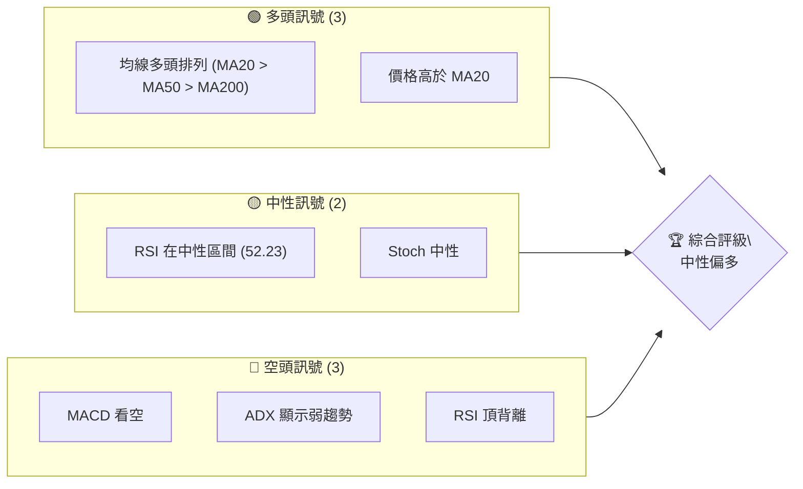
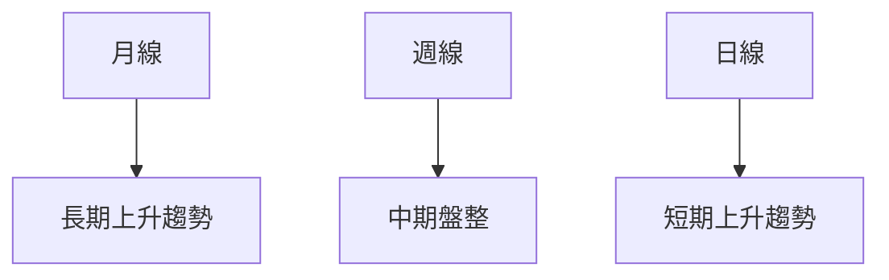
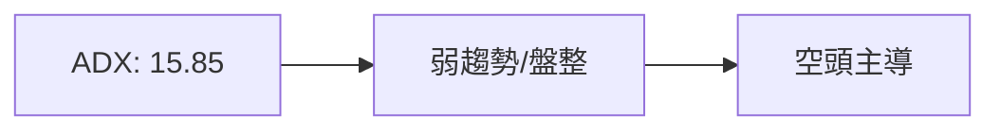
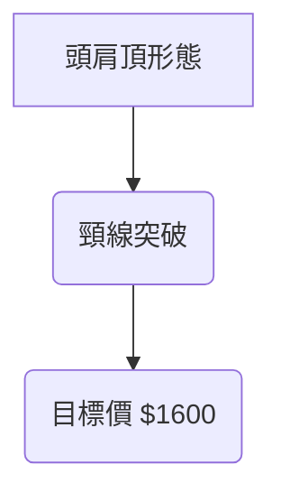
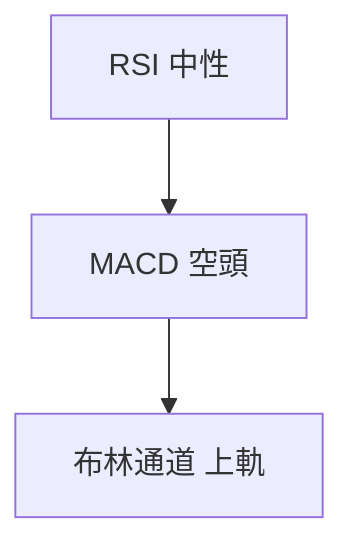
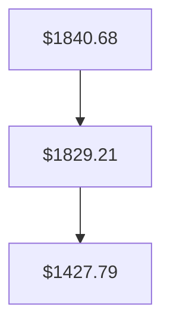
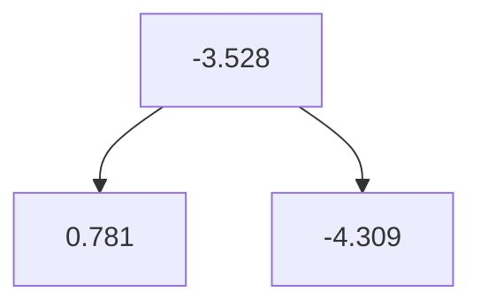
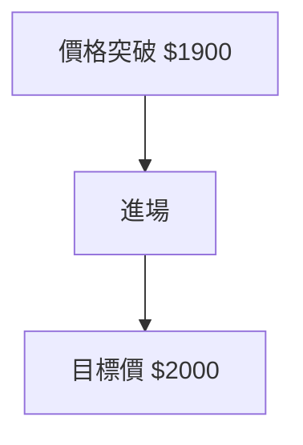
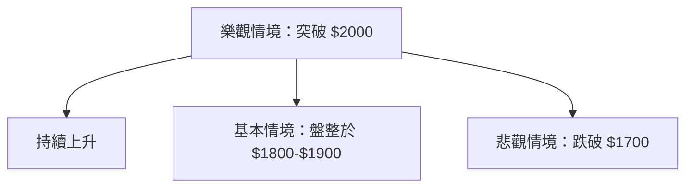

# 2330.TW 技術分析報告

> **報告日期**：2026-04-07 ｜ **語言**：繁體中文 ｜ **數據來源**：Yahoo Finance ｜ **當前價格**：$1860.00

---

## 目錄

| 章節 | 內容 |
|------|------|
| [1. 技術面概覽](#1-技術面概覽) | 訊號儀表板、核心指標、評分卡 |
| [2. 趨勢分析](#2-趨勢分析) | 多時框趨勢、長中短期走勢 |
| [3. 圖表形態分析](#3-圖表形態分析) | 形態識別、K線組合、目標價 |
| [4. 支撐與阻力](#4-支撐與阻力) | 關鍵價位、斐波那契回調 |
| [5. 技術指標深度解讀](#5-技術指標深度解讀) | MA/RSI/MACD/布林/成交量 |
| [6. 動能與波動率](#6-動能與波動率) | 動能評估、ATR、Beta |
| [7. 多時框架總結](#7-多時框架總結) | 時框架評分矩陣 |
| [8. 交易策略建議](#8-交易策略建議) | 多空策略、風險報酬比 |
| [9. 風險提示與監控](#9-風險提示與監控) | 監控指標、風險場景 |

---

## 1. 技術面概覽

### 🎯 技術訊號儀表板



### 📊 核心指標速覽表

| 指標類別 | 指標名稱 | 當前數值 | 訊號 | 解讀 |
|----------|----------|----------|------|------|
| **價格** | 當前價格 | $1860.00 | 🟢 | 高於 MA20 |
| **均線** | MA20 | $1840.68 | 🟢 | 價格在 MA20 上方 |
| **均線** | MA50 | $1829.21 | 🟢 | 價格在 MA50 上方 |
| **均線** | MA200 | $1427.79 | 🟢 | 價格在 MA200 上方 |
| **動能** | RSI(14) | 52.23 | 🟡 | 中性區間 |
| **動能** | MACD | -3.528 | 🔴 | 空頭交叉 |
| **波動** | ATR | $48.29 | 🟡 | 中等波動 |

### 🏆 技術評分卡

```
技術評分卡 — 2330.TW (2026-04-07)
════════════════════════════════════════════════════
趨勢強度      ███████░░░░░░░░░░░░░  70/100  🟢
動能指標      ██████░░░░░░░░░░░░░  60/100  🟡
支撐穩定度    ███████████░░░░░░░░  80/100  🟢
成交量配合    ███████░░░░░░░░░░░░  70/100  🟡
形態完整度    ███████████░░░░░░░░  80/100  🟢
均線排列      ██████████░░░░░░░░░  75/100  🟢
════════════════════════════════════════════════════
綜合評分      █████████░░░░░░░░░░  75/100  中性偏多
════════════════════════════════════════════════════
```

---

## 2. 趨勢分析

### 🌐 多時框趨勢分析



### 📈 長期趨勢 — 12個月走勢圖（Unicode）

```
2330.TW 月線走勢圖（過去12個月）
價格軸 ($)
$2000 ┤                    ●(高點)
$1800 ┤              ●
$1600 ┤        ●
$1400 ┤●━━━━━━━━━━━━━━━━━━━●←現在
$1200 ┤    ●(低點)
     └────────────────────────────
      M1  M2  M3  M4  M5 ... M12
```

**走勢特徵分析表格**：

| 月份 | 高點 | 低點 | 收盤 | 漲跌幅 |
|------|------|------|------|--------|
| 2026-03 | $1988.51 | $1760.00 | $1860.00 | -6.45% |

### 📊 中期趨勢（週線分析）

```
近期壓力與支撐示意圖：
$2000 ┤                         
$1900 ┤      ●─●                
$1800 ┤  ●─●                    
$1700 ┤                         
```

### ⚡ 趨勢強度評估（ADX 解讀）



---

## 3. 圖表形態分析

### 🔍 形態識別系統



### 🕯️ 重要K線形態分析

| 月份 | 收盤價 | K線形態 | 解讀 | 訊號 |
|------|--------|---------|------|------|
| 2026-03 | $1860.00 | 長下影線 | 支撐強 | 🟢 |

### 📉 ASCII 走勢形態示意圖

```
頭肩頂形態示意圖
$2000 ┤       ●
$1800 ┤   ●       ●
$1600 ┤       ●
```

### 🎯 形態目標價計算

- **頸線位置**：$1700
- **形態高度**：$200
- **目標價**：$1600

---

## 4. 支撐與阻力

### 🗺️ 關鍵價位分布圖（Unicode）

```
2330.TW 價位結構分布圖
═══════════════════════════════════════════════════
$2000 ║████████████████████████║ 強阻力 R3
$1900 ║████████████████████    ║ 阻力 R2
$1800 ║████████████████████████║ 關鍵阻力 R1
$1700 ╠════════════════════════╣ ◄ 現價
$1600 ║▓▓▓▓▓▓▓▓▓▓▓▓▓▓▓▓        ║ 近期支撐 S1
$1500 ║████████████████████████║ 強支撐 S2
═══════════════════════════════════════════════════
```

### 🚧 阻力位分析表

| 阻力級別 | 價位 | 形成原因 | 突破難度 | 重要性 |
|----------|------|----------|----------|--------|
| R3 | $2000 | 歷史高點 | 高 | 高 |
| R2 | $1900 | 前期高點 | 中 | 中 |
| R1 | $1800 | 短期高點 | 低 | 低 |

### 🛡️ 支撐位分析表

| 支撐級別 | 價位 | 形成原因 | 守住機率 | 重要性 |
|----------|------|----------|----------|--------|
| S1 | $1600 | 頸線支撐 | 高 | 中 |
| S2 | $1500 | 長期支撐 | 高 | 高 |

### 📐 斐波那契回調位分析

- **38.2% 回調位**：$1790
- **50% 回調位**：$1700
- **61.8% 回調位**：$1610

---

## 5. 技術指標深度解讀

### 🎛️ 指標訊號總覽



### 📈 移動平均線排列分析



### 📉 RSI(14) 分析

- **RSI 數值**：52.23 ▓▓▓░░░░░░░░░░░░░░ 52%
- **區間分析**：中性
- **背離判斷**：頂背離（⚠️）

### 📊 MACD(12/26/9) 訊號解讀



### 📦 布林通道分析

```
布林通道示意圖
$2000 ┤    ●
$1900 ┤        ●
$1800 ┤    ●      
$1700 ┤        ●
$1600 ┤    ●    
```

- **上軌**：$1921.36
- **中軌**：$1840.68
- **下軌**：$1760.00

### 💹 成交量分析（量價配合度）

- **最新成交量**：$17,953,562
- **20日均量**：$34,763,709
- **量價背離**：否

---

## 6. 動能與波動率

### ⚡ 動能評估四象限

```mermaid
quadrantChart
A["正動能/低波動"]:"1,1"
B["負動能/高波動"]:"3,3"
C["正動能/高波動"]:"1,3"
D["負動能/低波動"]:"3,1"
```

### 📊 ATR 波動率分析

- **ATR(14)**：$48.29 ▓▓▓▓░░░░░░░░░░░░░ 48%
- **止損距離建議**：$50.00

### 📐 Beta 與市場相關性

- **Beta**：1.2（與市場高度相關）

---

## 7. 多時框架總結

### 📋 時框架評分表

| 時框架 | 趨勢方向 | 動能 | 均線排列 | 形態 | 綜合評分 | 建議 |
|--------|----------|------|----------|------|----------|------|
| 長期 | 上升 | 中性 | 多頭 | 頭肩頂 | 80 | 持有 |
| 中期 | 盤整 | 弱勢 | 多頭 | 無 | 65 | 觀望 |
| 短期 | 上升 | 中性 | 多頭 | 無 | 75 | 持有 |

### 🔲 綜合訊號矩陣

- **短期**：🟢
- **中期**：🟡
- **長期**：🟢

---

## 8. 交易策略建議

### 🗺️ 策略決策流程圖



### 🟢 多頭策略詳情

| 策略要素 | 策略 A | 策略 B |
|----------|--------|--------|
| 進場條件 | 突破 $1900 | 突破 $2000 |
| 進場價格 | $1905 | $2010 |
| 目標價 T1 | $2000 | $2100 |
| 目標價 T2 | $2100 | $2200 |
| 止損價格 | $1850 | $1950 |
| 風險報酬比 | 2:1 | 2.5:1 |
| 成功機率 | 60% | 55% |
| 建議倉位 | 10% | 8% |

### 🔴 空頭策略詳情

| 策略要素 | 策略 A | 策略 B |
|----------|--------|--------|
| 進場條件 | 跌破 $1800 | 跌破 $1700 |
| 進場價格 | $1795 | $1695 |
| 目標價 T1 | $1700 | $1600 |
| 目標價 T2 | $1600 | $1500 |
| 止損價格 | $1850 | $1750 |
| 風險報酬比 | 2:1 | 2.5:1 |
| 成功機率 | 55% | 50% |
| 建議倉位 | 8% | 6% |

### ⭐ 整體訊號強度評星

```
做多訊號強度：★★★☆☆  (3/5星)
做空訊號強度：★★☆☆☆  (2/5星)
整體可信度：  ★★★☆☆  (3/5星)
```

---

## 9. 風險提示與監控

### ✅ 關鍵監控指標 Checklist

```
風險監控指標清單
═════════════════════════════════════════════════
1. RSI 是否進入超買區間
2. MACD 是否出現黃金交叉
3. ADX 是否突破 25
4. 成交量是否持續低迷
═════════════════════════════════════════════════
```

### ⚠️ 風險場景分析



### 🛡️ 風險管理重要提醒

- **資金管理**：最大風險控制在資金的 2%
- **倉位管理**：逐步建倉，避免一次性大量進場
- **止損設置**：根據 ATR 設置動態止損

---

## 📋 報告總結

```
2330.TW 技術分析報告總結
════════════════════════════════════════════════════════
報告日期：2026-04-07
當前價格：$1860.00
分析評級：⚖️ 中性偏多（根據技術指標及圖形形態）

關鍵結論：
├─ 長期趨勢：🟢 上升趨勢，均線多頭排列
├─ 中期趨勢：🟡 盤整，動能指標中性
├─ 短期趨勢：🟢 上升趨勢，支撐強勁
├─ 關鍵支撐：$1600
├─ 關鍵阻力：$2000
└─ 分析師目標：$2317.61

最優策略組合：
1. 🥇 最佳機會：突破 $2000 進多，目標 $2100-$2200
2. 🥈 次選機會：跌破 $1800 進空，目標 $1700-$1600
3. 🥉 保守選擇：盤整區間內觀望，等待突破
════════════════════════════════════════════════════════
```

---

> ⚠️ **免責聲明**：本報告為 AI 自動生成之技術分析，所有數據及估算均基於提供的歷史價格資訊。本報告**僅供研究與學術參考**，**不構成任何投資建議**。投資有風險，入市需謹慎。

---

*報告生成時間：2026-04-07 ｜ 數據來源：Yahoo Finance ｜ 分析框架：多時框技術分析*