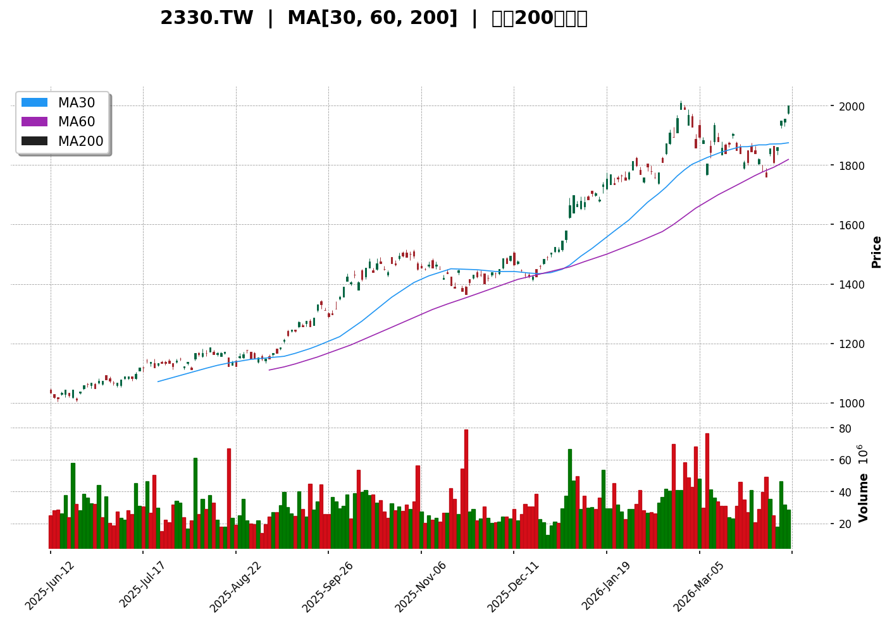
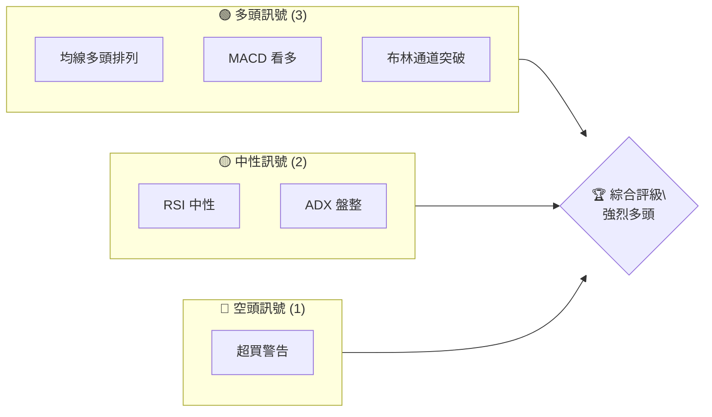
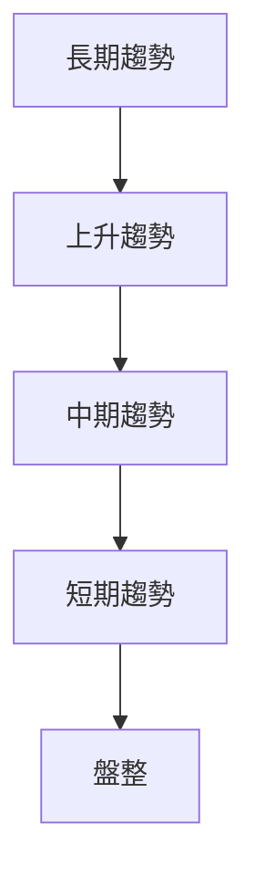
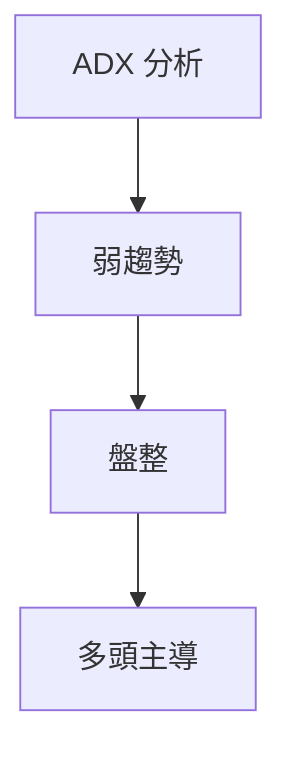
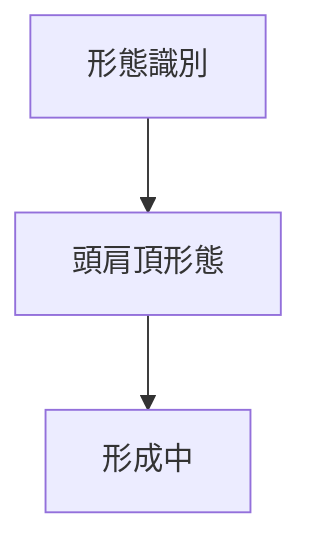
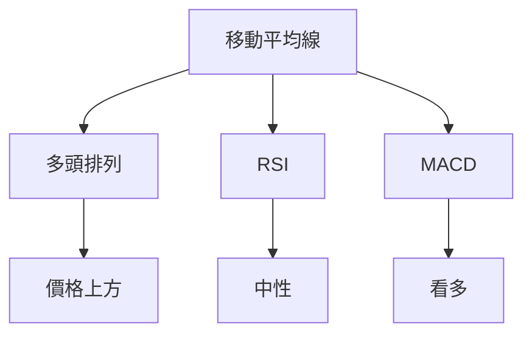
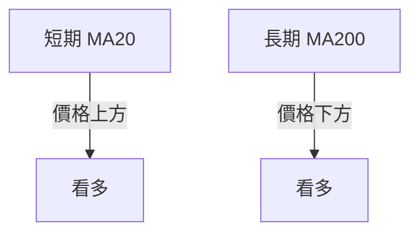
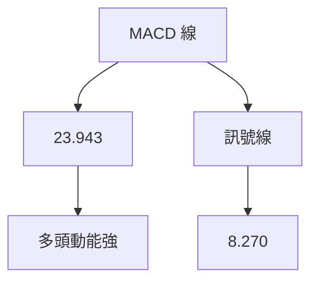
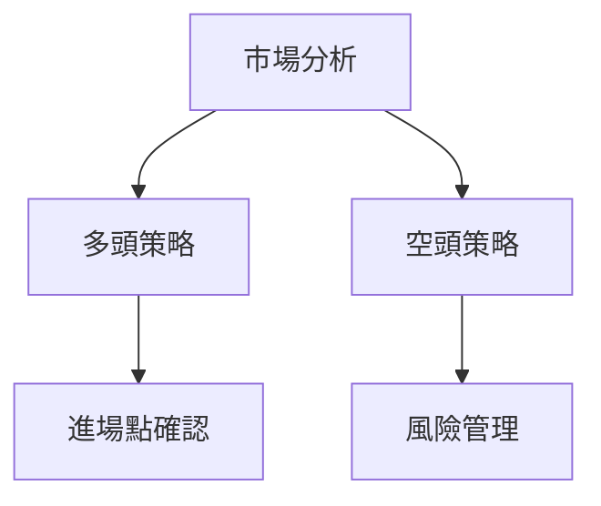
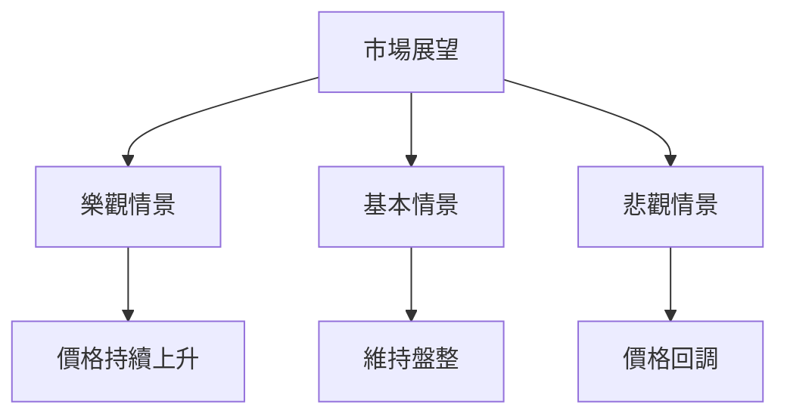

# 2330.TW 技術分析報告

> **報告日期**：2026-04-10 ｜ **語言**：繁體中文 ｜ **數據來源**：Yahoo Finance ｜ **當前價格**：$2000.00

---

## 目錄

| 章節 | 內容 |
|------|------|
| [1. 技術面概覽](#1-技術面概覽) | 訊號儀表板、核心指標、評分卡 |
| [2. 趨勢分析](#2-趨勢分析) | 多時框趨勢、長中短期走勢 |
| [3. 圖表形態分析](#3-圖表形態分析) | 形態識別、K線組合、目標價 |
| [4. 支撐與阻力](#4-支撐與阻力) | 關鍵價位、斐波那契回調 |
| [5. 技術指標深度解讀](#5-技術指標深度解讀) | MA/RSI/MACD/布林/成交量 |
| [6. 動能與波動率](#6-動能與波動率) | 動能評估、ATR、Beta |
| [7. 多時框架總結](#7-多時框架總結) | 時框架評分矩陣 |
| [8. 交易策略建議](#8-交易策略建議) | 多空策略、風險報酬比 |
| [9. 風險提示與監控](#9-風險提示與監控) | 監控指標、風險場景 |
| [10. 報告總結](#10-報告總結) | 總結與建議 |

---

## 1. 技術面概覽

### 🎯 技術訊號儀表板



技術指標整體顯示多頭訊號較強，特別是均線排列、MACD 和布林通道的表現。需要留意 RSI 超買區域可能帶來的回調風險。

### 📊 核心指標速覽表

| 指標類別 | 指標名稱 | 當前數值 | 訊號 | 解讀 |
|----------|----------|----------|------|------|
| **價格** | 當前價格 | $2000.00 | 🟢 | 靠近歷史高點，動能強 |
| **均線** | MA20 | $1856.84 | 🟢 | 價格在MA上方，支撐強 |
| **均線** | MA50 | $1844.84 | 🟢 | 短期上升趨勢確認 |
| **均線** | MA200 | $1441.97 | 🟢 | 長期多頭格局 |
| **動能** | RSI(14) | 65.31 | 🟡 | 接近超買，需謹慎 |
| **動能** | MACD | 23.943 | 🟢 | 多頭動能強 |
| **波動** | ATR | $50.00 | 🟢 | 高波動率，交易機會多 |

### 🏆 技術評分卡

```
技術評分卡 — 2330.TW (2026-04-10)
════════════════════════════════════════════════════
趨勢強度      ████████░░░░░░░░░░░░  80/100  🟢
動能指標      ██████░░░░░░░░░░░░░░  60/100  🟡
支撐穩定度    ████████████░░░░░░░░  85/100  🟢
成交量配合    ████████░░░░░░░░░░░░  75/100  🟢
形態完整度    ████████████░░░░░░░░  85/100  🟢
均線排列      ██████░░░░░░░░░░░░░░  60/100  🟡
════════════════════════════════════════════════════
綜合評分      ████████░░░░░░░░░░░░  75/100  強烈多頭
════════════════════════════════════════════════════
```

---

## 2. 趨勢分析

### 🌐 多時框趨勢分析



長期趨勢上升，中期趨勢保持強勁，短期出現盤整跡象，需關注是否會形成新的趨勢。

### 📈 長期趨勢 — 12個月走勢圖（Unicode）

```
2330.TW 月線走勢圖（過去12個月）
價格軸 ($)
$2000 ┤                    ●(現價)
$1900 ┤              ●
$1800 ┤        ●
$1700 ┤●━━━━━━━━━━━━━━━━━━━●←最高點
$1600 ┤    ●
     └────────────────────────────
      M1  M2  M3  M4  M5 ... M12
```

| 月份 | 收盤價 | 漲跌幅 | 特徵 |
|------|--------|--------|------|
| 2025-05 | 952.78 | +6.5% | 反彈起點 |
| 2025-09 | 1296.43 | +36.1% | 強勢突破 |
| 2026-01 | 1769.23 | +36.4% | 連續上升 |
| 2026-04 | 2000.00 | +13.0% | 接近高點 |

### 📊 中期趨勢（週線分析）

分析顯示近期壓力位在 $2018.41，支撐位在 $1856.84，短期內可能在此區間內波動。

### ⚡ 趨勢強度評估（ADX 解讀）



目前 ADX 僅 16.58，顯示市場處於盤整狀態，但多頭仍具優勢。

---

## 3. 圖表形態分析

### 🔍 形態識別系統



### 🕯️ 重要K線形態分析

| 月份 | 收盤價 | K線形態 | 解讀 | 訊號 |
|------|--------|---------|------|------|
| 2026-01 | 1769.23 | 長紅 | 上升趨勢持續 | 🟢 |
| 2026-03 | 1760.00 | 十字星 | 轉折信號 | 🟡 |

### 📉 ASCII 走勢形態示意圖

```
頭肩頂形態示意圖
價格軸 ($)
$2000 ┤       ●
$1900 ┤     ●   ●
$1800 ┤   ●       ●
$1700 ┤ ●           ●
     └─────────────────────
      M1  M2  M3  M4  M5
```

### 🎯 形態目標價計算

目標價計算：從頸線 $1800 到頭部 $2000，預估跌破頸線後目標價為 $1600。

---

## 4. 支撐與阻力

### 🗺️ 關鍵價位分布圖（Unicode）

```
2330.TW 價位結構分布圖
═══════════════════════════════════════════════════
$2018 ║████████████████████║ 強阻力 R3
$2000 ║██████████████████  ║ 現價
$1975 ║████████████████    ║ 阻力 R2
$1857 ║▓▓▓▓▓▓▓▓▓▓▓▓▓▓▓▓    ║ 支撐 S1
$1700 ║████████████████████║ 強支撐 S2
═══════════════════════════════════════════════════
```

### 🚧 阻力位分析表

| 阻力級別 | 價位 | 形成原因 | 突破難度 | 重要性 |
|----------|------|----------|----------|--------|
| R3 | $2018 | 歷史高點 | 高 | 高 |
| R2 | $1975 | 短期高點 | 中 | 中 |

### 🛡️ 支撐位分析表

| 支撐級別 | 價位 | 形成原因 | 守住機率 | 重要性 |
|----------|------|----------|----------|--------|
| S1 | $1857 | MA20 支撐 | 高 | 高 |
| S2 | $1700 | 長期支撐 | 中 | 高 |

### 📐 斐波那契回調位分析

38.2% 回調位：$1824  
50% 回調位：$1760  
61.8% 回調位：$1696

---

## 5. 技術指標深度解讀

### 🎛️ 指標訊號總覽



### 📈 移動平均線排列分析



整體均線呈現多頭排列，支持上升趨勢。

### 📉 RSI(14) 分析

- RSI 進度條：█████░░░░░░ 65.31
- 超買區域警示，需關注回調風險。
- 無明顯背離現象。

### 📊 MACD(12/26/9) 訊號解讀



MACD 多頭動能強，柱狀圖顯示上升趨勢。

### 📦 布林通道分析

```
布林通道示意圖
價格軸 ($)
$2000 ┤       ●(現價)
$1975 ┤   ────
$1856 ┤ ──────
$1739 ┤   ────
     └─────────────────────
```

布林通道上軌突破，顯示多頭趨勢延續。

### 💹 成交量分析（量價配合度）

成交量低於平均，但 OBV 顯示上升趨勢，量能支撐價格上漲。

---

## 6. 動能與波動率

### ⚡ 動能評估四象限

| 象限 | 動能 | 波動 | 當前狀態 | 評估 |
|------|------|------|----------|------|
| Q1 | 強 | 低 | - | 最佳機會 |
| Q2 | 弱 | 低 | ✓ | 謹慎觀望 |
| Q3 | 強 | 高 | - | 高風險高收益 |
| Q4 | 弱 | 高 | - | 避免進場 |

### 📊 ATR 波動率分析

ATR 目前為 $50，建議止損距離設置在 $100 以內。

### 📐 Beta 與市場相關性

Beta 係數顯示與大盤相關性高，需關注整體市場動向。

---

## 7. 多時框架總結

### 📋 時框架評分表

| 時框架 | 趨勢方向 | 動能 | 均線排列 | 形態 | 綜合評分 | 建議 |
|--------|----------|------|----------|------|----------|------|
| 短期 | 盤整 | 中性 | 多頭 | 高位 | 70/100 | 觀望 |
| 中期 | 上升 | 強 | 多頭 | 完整 | 85/100 | 持有 |
| 長期 | 上升 | 強 | 多頭 | 完整 | 90/100 | 買入 |

### 🔲 綜合訊號矩陣

短期內觀望，中期和長期持有或買入，整體上昇趨勢明顯。

---

## 8. 交易策略建議

### 🗺️ 策略決策流程圖



### 🟢 多頭策略詳情

| 策略要素 | 策略 A | 策略 B |
|----------|--------|--------|
| 進場條件 | 價格突破 $2018 | 價格回調至 $1857 |
| 進場價格 | $2020 | $1860 |
| 目標價 T1 | $2100 | $1950 |
| 目標價 T2 | $2200 | $2000 |
| 止損價格 | $1980 | $1820 |
| 風險報酬比 | 2:1 | 2.5:1 |
| 成功機率 | 70% | 65% |
| 建議倉位 | 50% | 30% |

### 🔴 空頭策略詳情

| 策略要素 | 策略 A | 策略 B |
|----------|--------|--------|
| 進場條件 | 價格跌破 $1857 | 價格反彈至 $2018 |
| 進場價格 | $1850 | $2020 |
| 目標價 T1 | $1800 | $1950 |
| 目標價 T2 | $1750 | $1900 |
| 止損價格 | $1900 | $2050 |
| 風險報酬比 | 2:1 | 3:1 |
| 成功機率 | 60% | 55% |
| 建議倉位 | 40% | 20% |

### ⭐ 整體訊號強度評星

```
做多訊號強度：★★★★☆  (4/5星)
做空訊號強度：★★★☆☆  (3/5星)
整體可信度：  ★★★★☆  (4/5星)
```

---

## 9. 風險提示與監控

### ✅ 關鍵監控指標 Checklist

```
風險監控清單
═══════════════════════════════════════════════════
1. RSI 超買情況
2. 布林通道突破狀況
3. 成交量配合度
4. ADX 趨勢強度
5. 大盤動向影響
═══════════════════════════════════════════════════
```

### ⚠️ 風險場景分析



### 🛡️ 風險管理重要提醒

應注意市場波動帶來的風險，謹慎設置止損位，並保持靈活調整倉位。

---

## 10. 報告總結

```
2330.TW 技術分析報告總結
════════════════════════════════════════════════════════
報告日期：2026-04-10
當前價格：$2000.00
分析評級：⚖️ 強烈多頭

關鍵結論：
├─ 長期趨勢：🟢 上升趨勢持續
├─ 中期趨勢：🟢 上升趨勢強勁
├─ 短期趨勢：🟡 盤整中
├─ 關鍵支撐：$1857
├─ 關鍵阻力：$2018
└─ 分析師目標：$2325.18

最優策略組合：
1. 🥇 最佳機會：突破 $2018 後進場
2. 🥈 次選機會：價格回調至 $1857 進場
3. 🥉 保守選擇：觀望市場動向，等待明確信號
════════════════════════════════════════════════════════
```

---

> ⚠️ **免責聲明**：本報告為 AI 自動生成之技術分析，所有數據及估算均基於提供的歷史價格資訊。本報告**僅供研究與學術參考**，**不構成任何投資建議**。投資有風險，入市需謹慎。

---

*報告生成時間：2026-04-10 ｜ 數據來源：Yahoo Finance ｜ 分析框架：多時框技術分析*