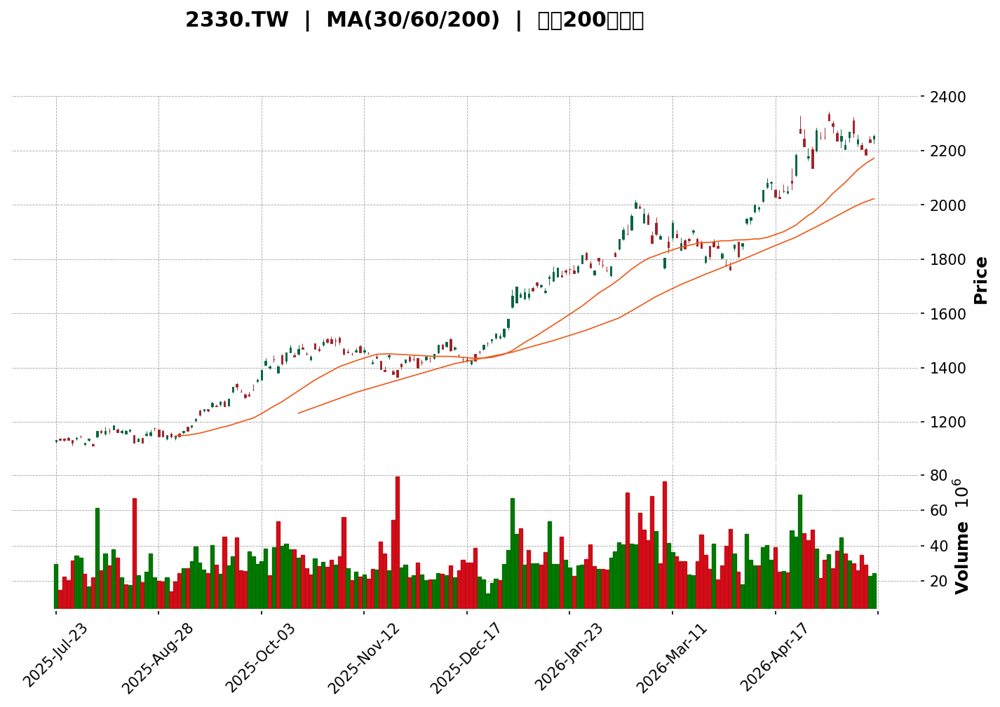
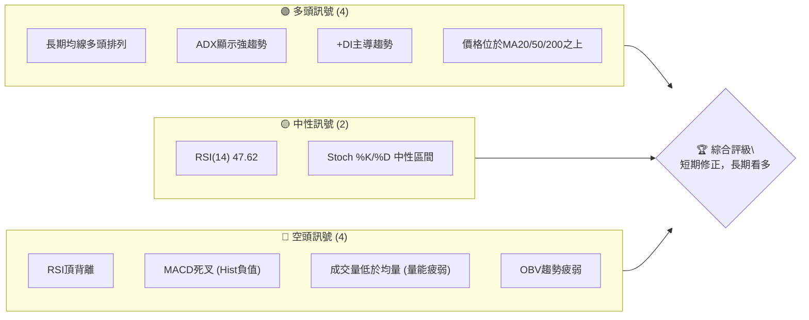
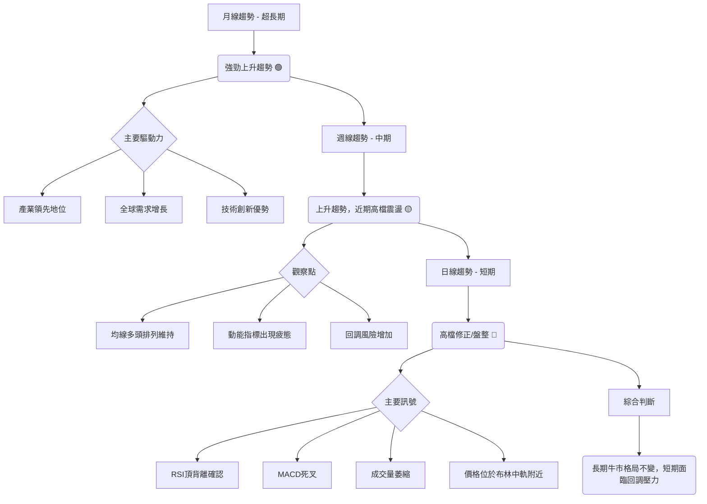
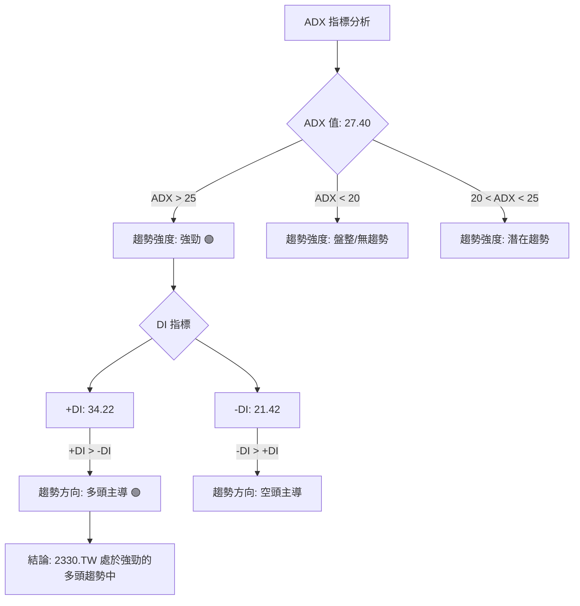
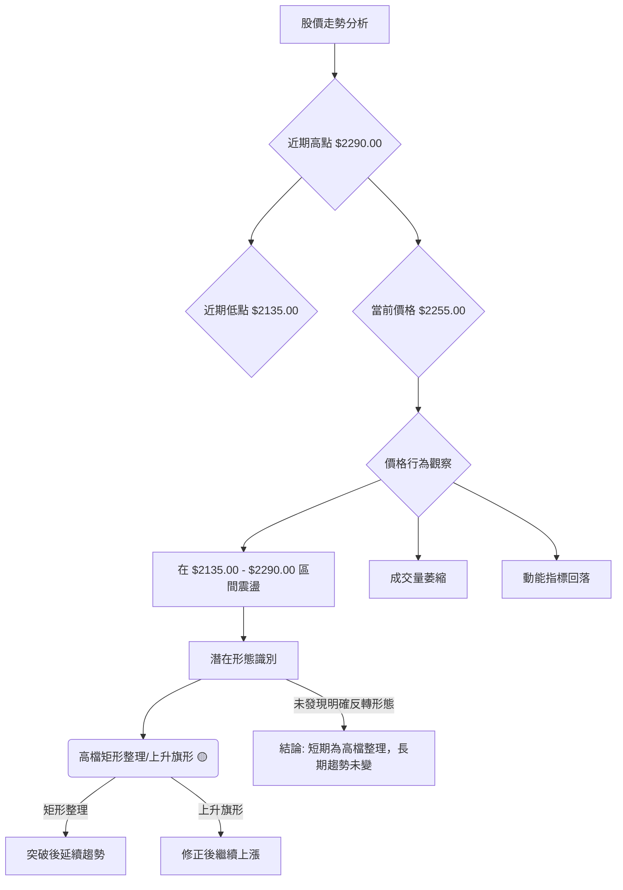
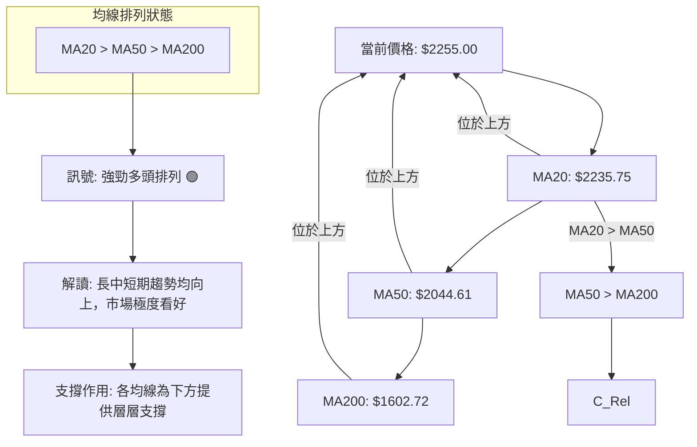

<details>
<summary>📊 靜態圖表 (點擊展開)</summary>

</details>

<html>
<head><meta charset="utf-8" /></head>
<body>
    <div>                        <script>window.PlotlyConfig = {MathJaxConfig: 'local'};</script>
        <script charset="utf-8" src="https://cdn.plot.ly/plotly-3.5.0.min.js" integrity="sha256-fHbNLP+GlIXN+efbQec78UkemUz3NJp7UmfGxC1tNxs=" crossorigin="anonymous"></script>                <div id="candlestick-chart" class="plotly-graph-div" style="height:500px; width:100%;"></div>            <script>                window.PLOTLYENV=window.PLOTLYENV || {};                                if (document.getElementById("candlestick-chart")) {                    Plotly.newPlot(                        "candlestick-chart",                        [{"close":{"dtype":"f8","bdata":"AAAAwM+zkUAAAADAz7ORQAAAAMDPs5FAAAAAwM+zkUAAAACAO4yRQAAAACBk25FAAAAAQC7vkUAAAACAO4yRQAAAAACax5FAAAAAYKdkkUAAAADAVj6SQAAAAICMKpJAAAAAwFY+kkAAAADAVj6SQAAAAEB\u002fjZJAAAAAgIwqkkAAAADAVj6SQAAAAMBWPpJAAAAA4CBSkkAAAACAO4yRQAAAAACax5FAAAAAgDuMkUAAAACAwhaSQAAAAICMKpJAAAAAAOtlkkAAAABALu+RQAAAAEAu75FAAAAAgPgCkkAAAABALu+RQAAAAEAu75FAAAAAQC7vkUAAAADAVj6SQAAAAMBWPpJAAAAAQH+NkkAAAADgcfCSQAAAAGDQK5NAAAAA4Ph6k0AAAADALmeTQAAAACBl3pNAAAAAAMqik0AAAACAQ\u002fKTQAAAAADKopNAAAAAQAAalEAAAADg0cyUQAAAAODRzJRAAAAAQFh9lEAAAACg3i2UQAAAACC9QZRAAAAAoDaRlEAAAADgKTCVQAAAAKA+u5VAAAAAYFNGlkAAAADg2faVQAAAAOAxWpZAAAAA4Nn2lUAAAACglh6WQAAAAKCJvZZAAAAAYAMNl0AAAACA7oGWQAAAAAAl+ZZAAAAAACX5lkAAAABgq6mWQAAAAIDugZZAAAAAACX5lkAAAACARuWWQAAAAOB8XJdAAAAA4Hxcl0AAAACAnkiXQAAAAGBbcJdAAAAA4Hxcl0AAAABgq6mWQAAAAKCJvZZAAAAAYKuplkAAAACARuWWQAAAAKCJvZZAAAAAgEbllkAAAABgq6mWQAAAAAB1MpZAAAAAIBBulkAAAAAAHc+VQAAAACBgp5VAAAAAAM2VlkAAAACAo3+VQAAAAKDmV5VAAAAA4Nn2lUAAAADgMVqWQAAAAGBTRpZAAAAA4DFalkAAAABg++KVQAAAAAB1MpZAAAAAgO6BlkAAAAAgEG6WQAAAAGCrqZZAAAAAIMA0l0AAAAAAJfmWQAAAAOB8XJdAAAAAwODklkAAAACAvwyXQAAAAGAjlZZAAAAAYFVZlkAAAAAAZkWWQAAAAABmRZZAAAAAAGZFlkAAAABg8dCWQAAAACCeNJdAAAAAgI1Il0AAAACgW4SXQAAAAAAZ1JdAAAAAQDqsl0AAAABg1iOYQAAAAOBhr5hAAAAAwEYCmkAAAABA0o2aQAAAACA2FppAAAAA4BQ+mkAAAACAJSqaQAAAACAEUppAAAAAoMGhmkAAAACgwaGaQAAAACAEUppAAAAAoF0Zm0AAAAAAG2mbQAAAACDppJtAAAAAoF0Zm0AAAAAAG2mbQAAAAMD5kJtAAAAAwCtVm0AAAACA2LibQAAAAEBTWJxAAAAAQIUcnEAAAAAg6aSbQAAAAGAKfZtAAAAA4JUInEAAAADAx8ybQAAAAGAKfZtAAAAAgNi4m0AAAADgY0ScQAAAAICLR51AAAAA4BbTnUAAAADgSJedQAAAAGBwmp5AAAAA4Mlhn0AAAACADBKfQAAAACBPwp5AAAAAQNQinkAAAABgvQudQAAAAOBIl51AAAAAIGpvnUAAAACAdDCcQAAAAGDvz5xAAAAAoMM2nkAAAADAeludQAAAAGC9C51AAAAAAAC8nEAAAAAAADidQAAAAAAAxJ1AAAAAAADonEAAAAAAAMCcQAAAAAAASJxAAAAAAABInEAAAAAAANScQAAAAAAAwJxAAAAAAABwnEAAAAAAANCbQAAAAAAAgJtAAAAAAAD8nEAAAAAAAEicQAAAAAAAEJ1AAAAAAAB4nkAAAAAAAIyeQAAAAAAAQJ9AAAAAAAAYn0AAAAAAAA6gQAAAAAAAQKBAAAAAAABKoEAAAAAAALifQAAAAAAApJ9AAAAAAAAEoEAAAAAAAASgQAAAAAAAQKBAAAAAAAASoUAAAAAAALKhQAAAAAAATqFAAAAAAAAIoUAAAAAAAK6gQAAAAAAAxqFAAAAAAACUoUAAAAAAAJShQAAAAAAADKJAAAAAAADkoUAAAAAAAHahQAAAAAAAnqFAAAAAAABYoUAAAAAAALyhQAAAAAAAsqFAAAAAAACAoUAAAAAAADqhQAAAAAAAEqFAAAAAAABsoUAAAAAAAJ6hQA=="},"high":{"dtype":"f8","bdata":"AAAAwM+zkUCk6YMCZNuRQKTpgwJk25FAd97FIy7vkUD+lYnCz7ORQM2hYkEu75FAfBphYfgCkkAAAACAO4yRQAAAAACax5FAgy3YojuMkUAAAADAVj6SQOt4c8IgUpJAHlsRJLV5kkC\u002fPLYC62WSQAAAAEB\u002fjZJAYTWt4+plkkBfHlvhIFKSQF8eW+EgUpJAAAAA4CBSkkD5wZxH+AKSQIYsZCFk25FA+ysTBWTbkUDDK7zCVj6SQOt4c8IgUpJAAAAAAOtlkkBqhOXmIFKSQGqE5eYgUpJAAAAAgPgCkkBzTyOkjCqSQAAAAEAu75FAc08jpIwqkkAAAADAVj6SQB5bESS1eZJAAAAAQH+NkkALXk4BPASTQFtrreX4epNAAAAA4Ph6k0APA2fh+HqTQAAAIIVD8pNAWB1fyobKk0AAAACAQ\u002fKTQFzJ7fkhBpRAAAAAQAAalEAAAADg0cyUQAgqZw9tCJVAo4suChWllEA3ciPPeWmUQDXCck9YfZRACcZbmY70lECFUihFCESVQAAAAKA+u5VAyQFCKhBulkDUjzNFuAqWQKuqqg\u002fNlZZA1I8zRbgKlkDXhSdkq6mWQAAAAKCJvZZAUOtXKsA0l0AXQzqvib2WQBxMkS\u002fANJdA0LrBlJ5Il0CTJk0qaNGWQLNrE+XMlZZA0LrBlJ5Il0CRf0uv4SCXQBy7NKo5hJdAqhhPDxiYl0CamZl59quXQMRUYioYmJdAOHZpdParl0Bw4MBZAw2XQB5ZEs8k+ZZASpMmxYm9lkAMVTJKAw2XQD2yJP6\u002fNJdADFUySgMNl0CTJk0qaNGWQFYwS8oxWpZAOcBHT6uplkAVUb9eU0aWQJi2L7TZ9pVARhsrZauplkBBUssUHc+VQOtRuP4cz5VAqR9nqpYelkAAAADgMVqWQJIDhPTMlZZAq6qqD82VlkBno74jEG6WQFYwS8oxWpZAAAAAgO6BlkC+6heF7oGWQAAAAGCrqZZAAAAAIMA0l0DQusGUnkiXQAAAAOB8XJdAKng55UqYl0CfdYPZriCXQApafbkSqZZAn\u002fIQEzSBlkBSDogMNIGWQHGvgllVWZZANG2NvxKplkAUdXK54OSWQAAAACCeNJdA8Lh42Xxcl0AAAACgW4SXQAAAAAAZ1JdAvYby8hjUl0AAAABg1iOYQAAAAOBhr5hAnNZsf\u002fNlmkAAAABA0o2aQORKAtMUPppAZQuh7OJ5mkCGYRjm4nmaQIQBZyzSjZpAxnQWU6DJmkBjOov5sLWaQFhW79LieZpAkEnxUjxBm0BddNFl2LibQAAAACDppJtA6DdbXwp9m0Auuuiy+ZCbQJzUfRnppJtAmZIp2cfMm0DmMIfZx8ybQAAAAEBTWJxAB60sWSGUnECmnozflQicQAAAAGAKfZtAW7AFk3QwnEBmitMlhRycQNlUa2zYuJtAAAAAgNi4m0ClBehFIZScQAAAAICLR51Aik\u002f3kvX6nUB0S5xS1CKeQKjV+BJPwp5Aa0j6kqiJn0Ah44KM2k2fQGtxE4YMEp9A1pQ1ZT7WnkBErFGFJ7+dQFmBMBKBhp5AvoT20kiXnUAAAACAdDCcQPmsGyxqb51AHRX4UqJenkBS\u002f8jYFtOdQAJp68V6W51AJ7d4cotHnUAAAAAAAGCdQAAAAAAA2J1AAAAAAABgnUAAAAAAADidQAAAAAAAXJxAAAAAAADonEAAAAAAAEydQAAAAAAAJJ1AAAAAAACEnEAAAAAAACCcQAAAAAAA+JtAAAAAAAD8nEAAAAAAACSdQAAAAAAAEJ1AAAAAAAB4nkAAAAAAAIyeQAAAAAAAQJ9AAAAAAAAsn0AAAAAAAA6gQAAAAAAAaKBAAAAAAABUoEAAAAAAABigQAAAAAAADqBAAAAAAAA2oEAAAAAAACygQAAAAAAArqBAAAAAAAAcoUAAAAAAADSiQAAAAAAA0KFAAAAAAABEoUAAAAAAAE6hQAAAAAAA2qFAAAAAAAC8oUAAAAAAANqhQAAAAAAAUqJAAAAAAAAMokAAAAAAAMahQAAAAAAA0KFAAAAAAACAoUAAAAAAALyhQAAAAAAAKqJAAAAAAACooUAAAAAAAGyhQAAAAAAARKFAAAAAAACeoUAAAAAAAKihQA=="},"hovertemplate":"\u003cb\u003e%{x|%Y-%m-%d}\u003c\u002fb\u003e\u003cbr\u003e\u958b: $%{open:.2f}\u003cbr\u003e\u9ad8: $%{high:.2f}\u003cbr\u003e\u4f4e: $%{low:.2f}\u003cbr\u003e\u6536: $%{close:.2f}\u003cextra\u003e\u003c\u002fextra\u003e","low":{"dtype":"f8","bdata":"XBZ8fTuMkUAAAADAz7ORQC4Lvp4FoJFAAAAAwM+zkUACanY9p2SRQGa8Ot3Ps5FAhOWeHmTbkUACanY9p2SRQPWmN70FoJFAAAAAYKdkkUAiaDgZZNuRQIpDxl7CFpJA4aTuW\u002fgCkkBBw0l9whaSQAAAANwgUpJAAAAAgIwqkkBBw0l9whaSQEHDSX3CFpJAJrFMnYwqkkAAAACAO4yRQPWmN70FoJFAAAAAgDuMkUA91EM9Lu+RQJ\u002fKUhwu75FAvphPvVY+kkAAAABALu+RQAAAAEAu75FATAP1+c+zkUCE5Z4eZNuRQI2w3NvPs5FAAAAAQC7vkUBBw0l9whaSQAAAAMBWPpJAVVVV\u002feplkkDrQ2Od3ciSQCmllD4GGJNATdM0nWRTk0Dw\u002fJieZFOTQAAAgIvrjpNAAAAAAMqik0CUa5TryaKTQAAAAADKopNADPyrRqi2k0BJD1TmeWmUQPjVmLA2kZRAAAAAQFh9lEBDL\u002fQ6ABqUQAAAACC9QZRAAAAAoDaRlED2Wq8VbQiVQAAAANwpMJVAU\u002f2cMLgKlkBX4JgVHc+VQOM4jhV1MpZA2TD+5YGTlUBPyNU6uAqWQFkSz3eWHpZAYClQy4m9lkAAAACA7oGWQH3WDQbNlZZAAAAAACX5lkC3bNn6zJWWQOm8xVBTRpZAAAAAACX5lkB71eYaaNGWQFbnsLDhIJdAcqLlep5Il0AAAACAnkiXQHdWO8vhIJdA5ETLFcA0l0C3bNn6zJWWQAAAAKCJvZZAt2zZ+syVlkD1qs21ib2WQAAAAKCJvZZAb4C0UKuplkAAAABgq6mWQNVn2pqWHpZAAAAAIBBulkAAAAAAHc+VQAAAACBgp5VAMK5+0DFalkAAAACAo3+VQAAAAKDmV5VAV+CYFR3PlUBVVVWwlh6WQBz\u002f3vp0MpZAchzHelNGlkAAAABg++KVQKrPtDW4CpZA6bzFUFNGlkDHP7jwdDKWQNqyZcsxWpZANUYKXKuplkAAAAAAJfmWQMiJlksDDZdANNaHZvHQlkDCFPnM4OSWQPWlggY0gZZAYQ3vrHYxlkCPUH2mdjGWQK7xd\u002fOXCZZAAAAAAGZFlkDYFRutEqmWQCuLM7rg5JZAIY4Oza4gl0DIBmSTjUiXQJpE75lbhJdARHkNjVuEl0DYx4XtSpiXQC8+rxPnD5hAs32imtxOmUDbbLMNmp6ZQBy1\u002fWxX7plANum9xnjGmUAZhmHAeMaZQAAAACAEUppAO4vp7OJ5mkA7i+ns4nmaQKmpEG0lKppATyMsh8GhmkBddNGNj92aQBhVbq1dGZtAAAAAoF0Zm0DRRRdNPEGbQI+tCFo8QZtAAAAAwCtVm0CBC1zAK1WbQIdwCCe34JtA1I145pUInEAAAAAg6aSbQN6OG\u002fpMLZtAd3d308fMm0DNOhYN6aSbQLfjhgYbaZtAz3jGs10Zm0AAAADgY0ScQGijvrMQqJxA1sEiFJwznUAAAADgSJedQLTTI+EW051AK28LegwSn0AAAACADBKfQIX5Xa3DNp5AAAAAQNQinkAAAABgvQudQDn1e4ZZg51AQ3sJbYtHnUCk3FS0+ZCbQIQp8vkxgJxAw3azFJwznUAAAADAeludQL28maAQqJxAAAAAAAC8nEAAAAAAABCdQAAAAAAAiJ1AAAAAAADonEAAAAAAAMCcQAAAAAAA5JtAAAAAAAAgnEAAAAAAANScQAAAAAAAwJxAAAAAAAAgnEAAAAAAANCbQAAAAAAAgJtAAAAAAACYnEAAAAAAADScQAAAAAAArJxAAAAAAAAUnkAAAAAAACieQAAAAAAAyJ5AAAAAAADcnkAAAAAAAGifQAAAAAAAGKBAAAAAAAAOoEAAAAAAALifQAAAAAAApJ9AAAAAAAD0n0AAAAAAAOCfQAAAAAAADqBAAAAAAAByoEAAAAAAALKhQAAAAAAATqFAAAAAAADqoEAAAAAAAK6gQAAAAAAAJqFAAAAAAACAoUAAAAAAAIChQAAAAAAADKJAAAAAAACyoUAAAAAAAHahQAAAAAAARKFAAAAAAAA6oUAAAAAAAGyhQAAAAAAAlKFAAAAAAABOoUAAAAAAADqhQAAAAAAAEqFAAAAAAABsoUAAAAAAAGKhQA=="},"name":"\u50f9\u683c","open":{"dtype":"f8","bdata":"Lgu+ngWgkUDS9EHhmceRQNL0QeGZx5FApOmDAmTbkUD+lYnCz7ORQDNenf6Zx5FAAAAAQC7vkUABNbtecXiRQHrTm97Ps5FAwRZsgXF4kUCChpM6Lu+RQHW8OaFWPpJAQcNJfcIWkkAAAADAVj6SQAAAANwgUpJA63hzwiBSkkCg4aSejCqSQEHDSX3CFpJAk1imvlY+kkD5wZxH+AKSQPWmN70FoJFA+ysTBWTbkUAf6qFe+AKSQBWHjD34ApJAAAAAAOtlkkBqhOXmIFKSQO5phMVWPpJAecJ3G5rHkUD3NMKCwhaSQITlnh5k25FA9zTCgsIWkkCg4aSejCqSQB5bESS1eZJAq6qqHrV5kkD2obG+p9ySQIQQQsQuZ5NAp2mavi5nk0APA2fh+HqTQAAAoPDJopNArI4vZai2k0DKNcq1hsqTQLA6vpRD8pNADPyrRqi2k0ChcnZLWH2UQLDGRKqO9JRAAAAAQFh9lEB6oRdqm1WUQLxAJoWbVZRAAAAAoDaRlEB7rdd6SxyVQAAAANwpMJVAU\u002f2cMLgKlkArcMx6++KVQAAAAOAxWpZA2TD+5YGTlUAmTv3+zJWWQMNN20FTRpZAYClQy4m9lkCzaxPlzJWWQDFFPmurqZZAtG4wZQMNl0AAAABgq6mWQJwo2bUxWpZA0LrBlJ5Il0CGKhnlJPmWQOREyxXANJdAHLs0qjmEl0D2KFyvOYSXQAAAAGBbcJdAqhhPDxiYl0AnTZr0JPmWQLUdBgVo0ZZAAAAAYKuplkB71eYaaNGWQIiUHpnhIJdAe9XmGmjRlkAAAABgq6mWQNVn2pqWHpZAvuoXhe6BlkAVUb9eU0aWQKbtC4U+u5VAu+TUmu6BlkAgqWVKYKeVQJqZmZk+u5VAqR9nqpYelkDjOI4VdTKWQK0CY4\u002fugZZAAAAA4DFalkBno74jEG6WQAAAAAB1MpZAnCjZtTFalkAAAAAgEG6WQCNGjDAQbpZAwGAtwYm9lkAcTJEvwDSXQFbnsLDhIJdAXk7Bi1uEl0Bhinwm0PiWQAAAAGAjlZZAAAAAYFVZlkBxr4JZVVmWQB6h+kyHHZZANG2NvxKplkAAAABg8dCWQGCophPQ+JZAAAAAgI1Il0DtrHZGbHCXQHRzc\u002fNKmJdAoryG5kqYl0Bw9ARHOqyXQKNuw8bFN5hAoKge9MtimUDbbLMNmp6ZQBy1\u002fWxX7plAAu1IIGjamUDctm1zV+6ZQFhW79LieZpAxnQWU6DJmkCdxXRG0o2aQNRUiMYUPppAOFuHRm4Fm0BddNGNj92aQBhVbq1dGZtAyKR4+Uwtm0AXXXRZCn2bQAAAAMD5kJtAidsNcwp9m0BoPOMZG2mbQIdwCCe34JtA2zql\u002fzGAnEBkkocst+CbQCarlFM8QZtAW7AFk3QwnEAAAADAx8ybQAAAAGAKfZtAtalNDU0tm0A7BG7sMYCcQPvORg0AvJxAnGmebYtHnUAAAADgSJedQLTTI+EW051AK28LegwSn0Bg9oDZ+yWfQIX5Xa3DNp5Abh5Gsl+unkCDHeF4WYOdQDtWIKzDNp5AQ3sJbYtHnUAQQcoN6aSbQH3WDcasH51A4Iurx3pbnUCpf2TMSJedQL28maAQqJxAj8H5GJwznUAAAAAAAEydQAAAAAAAsJ1AAAAAAABMnUAAAAAAABCdQAAAAAAA+JtAAAAAAADonEAAAAAAACSdQAAAAAAA6JxAAAAAAAA0nEAAAAAAANCbQAAAAAAAvJtAAAAAAADAnEAAAAAAACSdQAAAAAAA6JxAAAAAAAA8nkAAAAAAAGSeQAAAAAAA3J5AAAAAAAAEn0AAAAAAAHyfQAAAAAAAIqBAAAAAAABAoEAAAAAAAA6gQAAAAAAAuJ9AAAAAAAAEoEAAAAAAAPSfQAAAAAAAVKBAAAAAAAB8oEAAAAAAANChQAAAAAAAiqFAAAAAAAD+oEAAAAAAADqhQAAAAAAAMKFAAAAAAACUoUAAAAAAAJShQAAAAAAAPqJAAAAAAAD4oUAAAAAAALKhQAAAAAAAdqFAAAAAAAA6oUAAAAAAAJShQAAAAAAADKJAAAAAAABioUAAAAAAAFihQAAAAAAAOqFAAAAAAACAoUAAAAAAAIqhQA=="},"x":["2025-07-23T00:00:00+08:00","2025-07-24T00:00:00+08:00","2025-07-25T00:00:00+08:00","2025-07-28T00:00:00+08:00","2025-07-29T00:00:00+08:00","2025-07-30T00:00:00+08:00","2025-07-31T00:00:00+08:00","2025-08-04T00:00:00+08:00","2025-08-05T00:00:00+08:00","2025-08-06T00:00:00+08:00","2025-08-07T00:00:00+08:00","2025-08-08T00:00:00+08:00","2025-08-11T00:00:00+08:00","2025-08-12T00:00:00+08:00","2025-08-13T00:00:00+08:00","2025-08-14T00:00:00+08:00","2025-08-15T00:00:00+08:00","2025-08-18T00:00:00+08:00","2025-08-19T00:00:00+08:00","2025-08-20T00:00:00+08:00","2025-08-21T00:00:00+08:00","2025-08-22T00:00:00+08:00","2025-08-25T00:00:00+08:00","2025-08-26T00:00:00+08:00","2025-08-27T00:00:00+08:00","2025-08-28T00:00:00+08:00","2025-08-29T00:00:00+08:00","2025-09-01T00:00:00+08:00","2025-09-02T00:00:00+08:00","2025-09-03T00:00:00+08:00","2025-09-04T00:00:00+08:00","2025-09-05T00:00:00+08:00","2025-09-08T00:00:00+08:00","2025-09-09T00:00:00+08:00","2025-09-10T00:00:00+08:00","2025-09-11T00:00:00+08:00","2025-09-12T00:00:00+08:00","2025-09-15T00:00:00+08:00","2025-09-16T00:00:00+08:00","2025-09-17T00:00:00+08:00","2025-09-18T00:00:00+08:00","2025-09-19T00:00:00+08:00","2025-09-22T00:00:00+08:00","2025-09-23T00:00:00+08:00","2025-09-24T00:00:00+08:00","2025-09-25T00:00:00+08:00","2025-09-26T00:00:00+08:00","2025-09-30T00:00:00+08:00","2025-10-01T00:00:00+08:00","2025-10-02T00:00:00+08:00","2025-10-03T00:00:00+08:00","2025-10-07T00:00:00+08:00","2025-10-08T00:00:00+08:00","2025-10-09T00:00:00+08:00","2025-10-13T00:00:00+08:00","2025-10-14T00:00:00+08:00","2025-10-15T00:00:00+08:00","2025-10-16T00:00:00+08:00","2025-10-17T00:00:00+08:00","2025-10-20T00:00:00+08:00","2025-10-21T00:00:00+08:00","2025-10-22T00:00:00+08:00","2025-10-23T00:00:00+08:00","2025-10-27T00:00:00+08:00","2025-10-28T00:00:00+08:00","2025-10-29T00:00:00+08:00","2025-10-30T00:00:00+08:00","2025-10-31T00:00:00+08:00","2025-11-03T00:00:00+08:00","2025-11-04T00:00:00+08:00","2025-11-05T00:00:00+08:00","2025-11-06T00:00:00+08:00","2025-11-07T00:00:00+08:00","2025-11-10T00:00:00+08:00","2025-11-11T00:00:00+08:00","2025-11-12T00:00:00+08:00","2025-11-13T00:00:00+08:00","2025-11-14T00:00:00+08:00","2025-11-17T00:00:00+08:00","2025-11-18T00:00:00+08:00","2025-11-19T00:00:00+08:00","2025-11-20T00:00:00+08:00","2025-11-21T00:00:00+08:00","2025-11-24T00:00:00+08:00","2025-11-25T00:00:00+08:00","2025-11-26T00:00:00+08:00","2025-11-27T00:00:00+08:00","2025-11-28T00:00:00+08:00","2025-12-01T00:00:00+08:00","2025-12-02T00:00:00+08:00","2025-12-03T00:00:00+08:00","2025-12-04T00:00:00+08:00","2025-12-05T00:00:00+08:00","2025-12-08T00:00:00+08:00","2025-12-09T00:00:00+08:00","2025-12-10T00:00:00+08:00","2025-12-11T00:00:00+08:00","2025-12-12T00:00:00+08:00","2025-12-15T00:00:00+08:00","2025-12-16T00:00:00+08:00","2025-12-17T00:00:00+08:00","2025-12-18T00:00:00+08:00","2025-12-19T00:00:00+08:00","2025-12-22T00:00:00+08:00","2025-12-23T00:00:00+08:00","2025-12-24T00:00:00+08:00","2025-12-26T00:00:00+08:00","2025-12-29T00:00:00+08:00","2025-12-30T00:00:00+08:00","2025-12-31T00:00:00+08:00","2026-01-02T00:00:00+08:00","2026-01-05T00:00:00+08:00","2026-01-06T00:00:00+08:00","2026-01-07T00:00:00+08:00","2026-01-08T00:00:00+08:00","2026-01-09T00:00:00+08:00","2026-01-12T00:00:00+08:00","2026-01-13T00:00:00+08:00","2026-01-14T00:00:00+08:00","2026-01-15T00:00:00+08:00","2026-01-16T00:00:00+08:00","2026-01-19T00:00:00+08:00","2026-01-20T00:00:00+08:00","2026-01-21T00:00:00+08:00","2026-01-22T00:00:00+08:00","2026-01-23T00:00:00+08:00","2026-01-26T00:00:00+08:00","2026-01-27T00:00:00+08:00","2026-01-28T00:00:00+08:00","2026-01-29T00:00:00+08:00","2026-01-30T00:00:00+08:00","2026-02-02T00:00:00+08:00","2026-02-03T00:00:00+08:00","2026-02-04T00:00:00+08:00","2026-02-05T00:00:00+08:00","2026-02-06T00:00:00+08:00","2026-02-09T00:00:00+08:00","2026-02-10T00:00:00+08:00","2026-02-11T00:00:00+08:00","2026-02-23T00:00:00+08:00","2026-02-24T00:00:00+08:00","2026-02-25T00:00:00+08:00","2026-02-26T00:00:00+08:00","2026-03-02T00:00:00+08:00","2026-03-03T00:00:00+08:00","2026-03-04T00:00:00+08:00","2026-03-05T00:00:00+08:00","2026-03-06T00:00:00+08:00","2026-03-09T00:00:00+08:00","2026-03-10T00:00:00+08:00","2026-03-11T00:00:00+08:00","2026-03-12T00:00:00+08:00","2026-03-13T00:00:00+08:00","2026-03-16T00:00:00+08:00","2026-03-17T00:00:00+08:00","2026-03-18T00:00:00+08:00","2026-03-19T00:00:00+08:00","2026-03-20T00:00:00+08:00","2026-03-23T00:00:00+08:00","2026-03-24T00:00:00+08:00","2026-03-25T00:00:00+08:00","2026-03-26T00:00:00+08:00","2026-03-27T00:00:00+08:00","2026-03-30T00:00:00+08:00","2026-03-31T00:00:00+08:00","2026-04-01T00:00:00+08:00","2026-04-02T00:00:00+08:00","2026-04-07T00:00:00+08:00","2026-04-08T00:00:00+08:00","2026-04-09T00:00:00+08:00","2026-04-10T00:00:00+08:00","2026-04-13T00:00:00+08:00","2026-04-14T00:00:00+08:00","2026-04-15T00:00:00+08:00","2026-04-16T00:00:00+08:00","2026-04-17T00:00:00+08:00","2026-04-20T00:00:00+08:00","2026-04-21T00:00:00+08:00","2026-04-22T00:00:00+08:00","2026-04-23T00:00:00+08:00","2026-04-24T00:00:00+08:00","2026-04-27T00:00:00+08:00","2026-04-28T00:00:00+08:00","2026-04-29T00:00:00+08:00","2026-04-30T00:00:00+08:00","2026-05-04T00:00:00+08:00","2026-05-05T00:00:00+08:00","2026-05-06T00:00:00+08:00","2026-05-07T00:00:00+08:00","2026-05-08T00:00:00+08:00","2026-05-11T00:00:00+08:00","2026-05-12T00:00:00+08:00","2026-05-13T00:00:00+08:00","2026-05-14T00:00:00+08:00","2026-05-15T00:00:00+08:00","2026-05-18T00:00:00+08:00","2026-05-19T00:00:00+08:00","2026-05-20T00:00:00+08:00","2026-05-21T00:00:00+08:00","2026-05-22T00:00:00+08:00"],"type":"candlestick"},{"hovertemplate":"MA30: $%{y:.2f}\u003cextra\u003e\u003c\u002fextra\u003e","line":{"color":"#2196F3","dash":"dash","width":2},"mode":"lines","name":"MA30","x":["2025-07-23T00:00:00+08:00","2025-07-24T00:00:00+08:00","2025-07-25T00:00:00+08:00","2025-07-28T00:00:00+08:00","2025-07-29T00:00:00+08:00","2025-07-30T00:00:00+08:00","2025-07-31T00:00:00+08:00","2025-08-04T00:00:00+08:00","2025-08-05T00:00:00+08:00","2025-08-06T00:00:00+08:00","2025-08-07T00:00:00+08:00","2025-08-08T00:00:00+08:00","2025-08-11T00:00:00+08:00","2025-08-12T00:00:00+08:00","2025-08-13T00:00:00+08:00","2025-08-14T00:00:00+08:00","2025-08-15T00:00:00+08:00","2025-08-18T00:00:00+08:00","2025-08-19T00:00:00+08:00","2025-08-20T00:00:00+08:00","2025-08-21T00:00:00+08:00","2025-08-22T00:00:00+08:00","2025-08-25T00:00:00+08:00","2025-08-26T00:00:00+08:00","2025-08-27T00:00:00+08:00","2025-08-28T00:00:00+08:00","2025-08-29T00:00:00+08:00","2025-09-01T00:00:00+08:00","2025-09-02T00:00:00+08:00","2025-09-03T00:00:00+08:00","2025-09-04T00:00:00+08:00","2025-09-05T00:00:00+08:00","2025-09-08T00:00:00+08:00","2025-09-09T00:00:00+08:00","2025-09-10T00:00:00+08:00","2025-09-11T00:00:00+08:00","2025-09-12T00:00:00+08:00","2025-09-15T00:00:00+08:00","2025-09-16T00:00:00+08:00","2025-09-17T00:00:00+08:00","2025-09-18T00:00:00+08:00","2025-09-19T00:00:00+08:00","2025-09-22T00:00:00+08:00","2025-09-23T00:00:00+08:00","2025-09-24T00:00:00+08:00","2025-09-25T00:00:00+08:00","2025-09-26T00:00:00+08:00","2025-09-30T00:00:00+08:00","2025-10-01T00:00:00+08:00","2025-10-02T00:00:00+08:00","2025-10-03T00:00:00+08:00","2025-10-07T00:00:00+08:00","2025-10-08T00:00:00+08:00","2025-10-09T00:00:00+08:00","2025-10-13T00:00:00+08:00","2025-10-14T00:00:00+08:00","2025-10-15T00:00:00+08:00","2025-10-16T00:00:00+08:00","2025-10-17T00:00:00+08:00","2025-10-20T00:00:00+08:00","2025-10-21T00:00:00+08:00","2025-10-22T00:00:00+08:00","2025-10-23T00:00:00+08:00","2025-10-27T00:00:00+08:00","2025-10-28T00:00:00+08:00","2025-10-29T00:00:00+08:00","2025-10-30T00:00:00+08:00","2025-10-31T00:00:00+08:00","2025-11-03T00:00:00+08:00","2025-11-04T00:00:00+08:00","2025-11-05T00:00:00+08:00","2025-11-06T00:00:00+08:00","2025-11-07T00:00:00+08:00","2025-11-10T00:00:00+08:00","2025-11-11T00:00:00+08:00","2025-11-12T00:00:00+08:00","2025-11-13T00:00:00+08:00","2025-11-14T00:00:00+08:00","2025-11-17T00:00:00+08:00","2025-11-18T00:00:00+08:00","2025-11-19T00:00:00+08:00","2025-11-20T00:00:00+08:00","2025-11-21T00:00:00+08:00","2025-11-24T00:00:00+08:00","2025-11-25T00:00:00+08:00","2025-11-26T00:00:00+08:00","2025-11-27T00:00:00+08:00","2025-11-28T00:00:00+08:00","2025-12-01T00:00:00+08:00","2025-12-02T00:00:00+08:00","2025-12-03T00:00:00+08:00","2025-12-04T00:00:00+08:00","2025-12-05T00:00:00+08:00","2025-12-08T00:00:00+08:00","2025-12-09T00:00:00+08:00","2025-12-10T00:00:00+08:00","2025-12-11T00:00:00+08:00","2025-12-12T00:00:00+08:00","2025-12-15T00:00:00+08:00","2025-12-16T00:00:00+08:00","2025-12-17T00:00:00+08:00","2025-12-18T00:00:00+08:00","2025-12-19T00:00:00+08:00","2025-12-22T00:00:00+08:00","2025-12-23T00:00:00+08:00","2025-12-24T00:00:00+08:00","2025-12-26T00:00:00+08:00","2025-12-29T00:00:00+08:00","2025-12-30T00:00:00+08:00","2025-12-31T00:00:00+08:00","2026-01-02T00:00:00+08:00","2026-01-05T00:00:00+08:00","2026-01-06T00:00:00+08:00","2026-01-07T00:00:00+08:00","2026-01-08T00:00:00+08:00","2026-01-09T00:00:00+08:00","2026-01-12T00:00:00+08:00","2026-01-13T00:00:00+08:00","2026-01-14T00:00:00+08:00","2026-01-15T00:00:00+08:00","2026-01-16T00:00:00+08:00","2026-01-19T00:00:00+08:00","2026-01-20T00:00:00+08:00","2026-01-21T00:00:00+08:00","2026-01-22T00:00:00+08:00","2026-01-23T00:00:00+08:00","2026-01-26T00:00:00+08:00","2026-01-27T00:00:00+08:00","2026-01-28T00:00:00+08:00","2026-01-29T00:00:00+08:00","2026-01-30T00:00:00+08:00","2026-02-02T00:00:00+08:00","2026-02-03T00:00:00+08:00","2026-02-04T00:00:00+08:00","2026-02-05T00:00:00+08:00","2026-02-06T00:00:00+08:00","2026-02-09T00:00:00+08:00","2026-02-10T00:00:00+08:00","2026-02-11T00:00:00+08:00","2026-02-23T00:00:00+08:00","2026-02-24T00:00:00+08:00","2026-02-25T00:00:00+08:00","2026-02-26T00:00:00+08:00","2026-03-02T00:00:00+08:00","2026-03-03T00:00:00+08:00","2026-03-04T00:00:00+08:00","2026-03-05T00:00:00+08:00","2026-03-06T00:00:00+08:00","2026-03-09T00:00:00+08:00","2026-03-10T00:00:00+08:00","2026-03-11T00:00:00+08:00","2026-03-12T00:00:00+08:00","2026-03-13T00:00:00+08:00","2026-03-16T00:00:00+08:00","2026-03-17T00:00:00+08:00","2026-03-18T00:00:00+08:00","2026-03-19T00:00:00+08:00","2026-03-20T00:00:00+08:00","2026-03-23T00:00:00+08:00","2026-03-24T00:00:00+08:00","2026-03-25T00:00:00+08:00","2026-03-26T00:00:00+08:00","2026-03-27T00:00:00+08:00","2026-03-30T00:00:00+08:00","2026-03-31T00:00:00+08:00","2026-04-01T00:00:00+08:00","2026-04-02T00:00:00+08:00","2026-04-07T00:00:00+08:00","2026-04-08T00:00:00+08:00","2026-04-09T00:00:00+08:00","2026-04-10T00:00:00+08:00","2026-04-13T00:00:00+08:00","2026-04-14T00:00:00+08:00","2026-04-15T00:00:00+08:00","2026-04-16T00:00:00+08:00","2026-04-17T00:00:00+08:00","2026-04-20T00:00:00+08:00","2026-04-21T00:00:00+08:00","2026-04-22T00:00:00+08:00","2026-04-23T00:00:00+08:00","2026-04-24T00:00:00+08:00","2026-04-27T00:00:00+08:00","2026-04-28T00:00:00+08:00","2026-04-29T00:00:00+08:00","2026-04-30T00:00:00+08:00","2026-05-04T00:00:00+08:00","2026-05-05T00:00:00+08:00","2026-05-06T00:00:00+08:00","2026-05-07T00:00:00+08:00","2026-05-08T00:00:00+08:00","2026-05-11T00:00:00+08:00","2026-05-12T00:00:00+08:00","2026-05-13T00:00:00+08:00","2026-05-14T00:00:00+08:00","2026-05-15T00:00:00+08:00","2026-05-18T00:00:00+08:00","2026-05-19T00:00:00+08:00","2026-05-20T00:00:00+08:00","2026-05-21T00:00:00+08:00","2026-05-22T00:00:00+08:00"],"y":{"dtype":"f8","bdata":"AAAAAAAA+H8AAAAAAAD4fwAAAAAAAPh\u002fAAAAAAAA+H8AAAAAAAD4fwAAAAAAAPh\u002fAAAAAAAA+H8AAAAAAAD4fwAAAAAAAPh\u002fAAAAAAAA+H8AAAAAAAD4fwAAAAAAAPh\u002fAAAAAAAA+H8AAAAAAAD4fwAAAAAAAPh\u002fAAAAAAAA+H8AAAAAAAD4fwAAAAAAAPh\u002fAAAAAAAA+H8AAAAAAAD4fwAAAAAAAPh\u002fAAAAAAAA+H8AAAAAAAD4fwAAAAAAAPh\u002fAAAAAAAA+H8AAAAAAAD4fwAAAAAAAPh\u002fAAAAAAAA+H8AAAAAAAD4f97d3U3M85FAvLu768b1kUBVVVUFZfqRQO\u002fu7h4D\u002f5FAREREtEQGkkAiIiJiJBKSQBERETFbHZJAzczMnIwqkkBVVVWFYTqSQHd3dxc1TJJAERERYVhfkkBVVVVF4G2SQKuqqtpqepJAZmZm1kWKkkDe3d29FqCSQJqZmSlEs5JAERERwRfHkkCJiIhInNeSQM3MzFzK6JJAERERwfX7kkC8u7s7BhuTQLy7u+u+PJNAzczMDBVlk0BVVVXlJoaTQLy7u5vfqZNAiYiI+E3Ik0BmZmamBOyTQCIiIrIHFZRA7+7uDghAlEB3d3d3DmeUQImIiCgOkpRAmpmZ2Q29lEDv7u7ew+KUQLy7u8smB5VAVVVVhd8slUB3d3dXok6VQDMzM9NjcpVAMzMz04GTlUBmZmYmn7SVQKuqqkoW05VAVVVVheDylUBmZmamDgqWQBEREYGMJJZAq6qqimc6lkC8u7tLSUyWQERERPTXXJZAVVVV5V9xlkAzMzNjkYaWQM3MzAwgl5ZAq6qqKgWnlkCamZmJUayWQM3MzPynq5ZAzczMLE6ulkBVVVXlVKqWQJqZmcm4oZZAmpmZybihlkDe3d1ttaOWQHd3dye8n5ZAzczMPMaZlkDe3d3deZSWQGZmZmbajZZA3t3dHeGJlkCamZl55IeWQCIiIpI3iZZAVVVVNTSLlkAiIiLC3YuWQCIiIsLdi5ZAZmZmFuGHlkAAAAAw4oWWQFVVVYWTfpZAIiIiEvB1lkDNzMxsmHKWQM3MzDyXbpZAd3d3lz9rlkBmZmYWkmqWQM3MzDyKbpZAd3d3Z9lxlkC8u7uLI3mWQJqZmWkPh5ZAq6qqaqqRlkBmZmZ2jqWWQDMzM2Nsv5ZAVVVVpaPclkBmZmZWxweXQERERHRBMJdAvLu7a8NUl0CrqqqKS3WXQO\u002fu7m7Rl5dAmpmZOVa8l0DNzMxM1OSXQM3MzLwDCJhAvLu7GzIvmECJiIh4slmYQHd3d4c0hJhAq6qq+mylmEAzMzODSsuYQKuqqoos75hAiYiI6AwVmUC8u7ub6zyZQO\u002fu7t4XbplAIiIiIkSfmUBmZmbWHc2ZQBEREVGj+ZlARERElM8qmkCamZm5VlWaQN7d3d3ieZpAvLu7O8OfmkCrqqoKTMiaQLy7u9vP9ppA3t3drU4rm0Dv7u5+0lmbQKuqqvpSjJtA7+7uriy6m0CJiIgot+CbQLy7u9uVCJxAAAAAcM8pnEARERGRZUKcQCIiIkJOXpxAZmZmRjp2nEARERGBhIOcQERERBTImJxAvLu7i1yznEBmZmZW+cOcQImIiFjvz5xAERERsePdnECamZm5Ue2cQDMzMzMWAJ1AzczMrIMNnUAiIiJCSRadQDMzM\u002fO9FZ1AmpmZ+TAXnUBmZmZWSyGdQCIiIkIPLJ1Aq6qquoEvnUBEREQ0nS+dQFVVVXW2L51Aq6qqCnw6nUCJiIjYmjqdQM3MzNzAOJ1AmpmZGUA+nUBmZmZWaEadQAAAACDtS51AZmZmdndJnUCamZnpVFKdQERERCQwYZ1A7+7u7gZ2nUBERET01YydQGZmZoZTnp1Ad3d3p3q0nUAiIiKSQ9WdQHd3d5e79J1Aq6qqmj0WnkAzMzODuUmeQDMzMzMzeZ5Aq6qqqqqmnkAAAAAAAMqeQFVVVVVV+55Aq6qqqqown0BVVVVVVWefQAAAAAAAqp9AAAAAAADqn0AAAAAAAA+gQKuqqqqqKqBAVVVVVVVFoEAAAAAAAGagQKuqqqqqh6BAVVVVVVWhoECrqqqqqrugQFVVVVVV0aBAAAAAAADkoEAAAAAAAPigQA=="},"type":"scatter"},{"hovertemplate":"MA60: $%{y:.2f}\u003cextra\u003e\u003c\u002fextra\u003e","line":{"color":"#9C27B0","dash":"dash","width":2},"mode":"lines","name":"MA60","x":["2025-07-23T00:00:00+08:00","2025-07-24T00:00:00+08:00","2025-07-25T00:00:00+08:00","2025-07-28T00:00:00+08:00","2025-07-29T00:00:00+08:00","2025-07-30T00:00:00+08:00","2025-07-31T00:00:00+08:00","2025-08-04T00:00:00+08:00","2025-08-05T00:00:00+08:00","2025-08-06T00:00:00+08:00","2025-08-07T00:00:00+08:00","2025-08-08T00:00:00+08:00","2025-08-11T00:00:00+08:00","2025-08-12T00:00:00+08:00","2025-08-13T00:00:00+08:00","2025-08-14T00:00:00+08:00","2025-08-15T00:00:00+08:00","2025-08-18T00:00:00+08:00","2025-08-19T00:00:00+08:00","2025-08-20T00:00:00+08:00","2025-08-21T00:00:00+08:00","2025-08-22T00:00:00+08:00","2025-08-25T00:00:00+08:00","2025-08-26T00:00:00+08:00","2025-08-27T00:00:00+08:00","2025-08-28T00:00:00+08:00","2025-08-29T00:00:00+08:00","2025-09-01T00:00:00+08:00","2025-09-02T00:00:00+08:00","2025-09-03T00:00:00+08:00","2025-09-04T00:00:00+08:00","2025-09-05T00:00:00+08:00","2025-09-08T00:00:00+08:00","2025-09-09T00:00:00+08:00","2025-09-10T00:00:00+08:00","2025-09-11T00:00:00+08:00","2025-09-12T00:00:00+08:00","2025-09-15T00:00:00+08:00","2025-09-16T00:00:00+08:00","2025-09-17T00:00:00+08:00","2025-09-18T00:00:00+08:00","2025-09-19T00:00:00+08:00","2025-09-22T00:00:00+08:00","2025-09-23T00:00:00+08:00","2025-09-24T00:00:00+08:00","2025-09-25T00:00:00+08:00","2025-09-26T00:00:00+08:00","2025-09-30T00:00:00+08:00","2025-10-01T00:00:00+08:00","2025-10-02T00:00:00+08:00","2025-10-03T00:00:00+08:00","2025-10-07T00:00:00+08:00","2025-10-08T00:00:00+08:00","2025-10-09T00:00:00+08:00","2025-10-13T00:00:00+08:00","2025-10-14T00:00:00+08:00","2025-10-15T00:00:00+08:00","2025-10-16T00:00:00+08:00","2025-10-17T00:00:00+08:00","2025-10-20T00:00:00+08:00","2025-10-21T00:00:00+08:00","2025-10-22T00:00:00+08:00","2025-10-23T00:00:00+08:00","2025-10-27T00:00:00+08:00","2025-10-28T00:00:00+08:00","2025-10-29T00:00:00+08:00","2025-10-30T00:00:00+08:00","2025-10-31T00:00:00+08:00","2025-11-03T00:00:00+08:00","2025-11-04T00:00:00+08:00","2025-11-05T00:00:00+08:00","2025-11-06T00:00:00+08:00","2025-11-07T00:00:00+08:00","2025-11-10T00:00:00+08:00","2025-11-11T00:00:00+08:00","2025-11-12T00:00:00+08:00","2025-11-13T00:00:00+08:00","2025-11-14T00:00:00+08:00","2025-11-17T00:00:00+08:00","2025-11-18T00:00:00+08:00","2025-11-19T00:00:00+08:00","2025-11-20T00:00:00+08:00","2025-11-21T00:00:00+08:00","2025-11-24T00:00:00+08:00","2025-11-25T00:00:00+08:00","2025-11-26T00:00:00+08:00","2025-11-27T00:00:00+08:00","2025-11-28T00:00:00+08:00","2025-12-01T00:00:00+08:00","2025-12-02T00:00:00+08:00","2025-12-03T00:00:00+08:00","2025-12-04T00:00:00+08:00","2025-12-05T00:00:00+08:00","2025-12-08T00:00:00+08:00","2025-12-09T00:00:00+08:00","2025-12-10T00:00:00+08:00","2025-12-11T00:00:00+08:00","2025-12-12T00:00:00+08:00","2025-12-15T00:00:00+08:00","2025-12-16T00:00:00+08:00","2025-12-17T00:00:00+08:00","2025-12-18T00:00:00+08:00","2025-12-19T00:00:00+08:00","2025-12-22T00:00:00+08:00","2025-12-23T00:00:00+08:00","2025-12-24T00:00:00+08:00","2025-12-26T00:00:00+08:00","2025-12-29T00:00:00+08:00","2025-12-30T00:00:00+08:00","2025-12-31T00:00:00+08:00","2026-01-02T00:00:00+08:00","2026-01-05T00:00:00+08:00","2026-01-06T00:00:00+08:00","2026-01-07T00:00:00+08:00","2026-01-08T00:00:00+08:00","2026-01-09T00:00:00+08:00","2026-01-12T00:00:00+08:00","2026-01-13T00:00:00+08:00","2026-01-14T00:00:00+08:00","2026-01-15T00:00:00+08:00","2026-01-16T00:00:00+08:00","2026-01-19T00:00:00+08:00","2026-01-20T00:00:00+08:00","2026-01-21T00:00:00+08:00","2026-01-22T00:00:00+08:00","2026-01-23T00:00:00+08:00","2026-01-26T00:00:00+08:00","2026-01-27T00:00:00+08:00","2026-01-28T00:00:00+08:00","2026-01-29T00:00:00+08:00","2026-01-30T00:00:00+08:00","2026-02-02T00:00:00+08:00","2026-02-03T00:00:00+08:00","2026-02-04T00:00:00+08:00","2026-02-05T00:00:00+08:00","2026-02-06T00:00:00+08:00","2026-02-09T00:00:00+08:00","2026-02-10T00:00:00+08:00","2026-02-11T00:00:00+08:00","2026-02-23T00:00:00+08:00","2026-02-24T00:00:00+08:00","2026-02-25T00:00:00+08:00","2026-02-26T00:00:00+08:00","2026-03-02T00:00:00+08:00","2026-03-03T00:00:00+08:00","2026-03-04T00:00:00+08:00","2026-03-05T00:00:00+08:00","2026-03-06T00:00:00+08:00","2026-03-09T00:00:00+08:00","2026-03-10T00:00:00+08:00","2026-03-11T00:00:00+08:00","2026-03-12T00:00:00+08:00","2026-03-13T00:00:00+08:00","2026-03-16T00:00:00+08:00","2026-03-17T00:00:00+08:00","2026-03-18T00:00:00+08:00","2026-03-19T00:00:00+08:00","2026-03-20T00:00:00+08:00","2026-03-23T00:00:00+08:00","2026-03-24T00:00:00+08:00","2026-03-25T00:00:00+08:00","2026-03-26T00:00:00+08:00","2026-03-27T00:00:00+08:00","2026-03-30T00:00:00+08:00","2026-03-31T00:00:00+08:00","2026-04-01T00:00:00+08:00","2026-04-02T00:00:00+08:00","2026-04-07T00:00:00+08:00","2026-04-08T00:00:00+08:00","2026-04-09T00:00:00+08:00","2026-04-10T00:00:00+08:00","2026-04-13T00:00:00+08:00","2026-04-14T00:00:00+08:00","2026-04-15T00:00:00+08:00","2026-04-16T00:00:00+08:00","2026-04-17T00:00:00+08:00","2026-04-20T00:00:00+08:00","2026-04-21T00:00:00+08:00","2026-04-22T00:00:00+08:00","2026-04-23T00:00:00+08:00","2026-04-24T00:00:00+08:00","2026-04-27T00:00:00+08:00","2026-04-28T00:00:00+08:00","2026-04-29T00:00:00+08:00","2026-04-30T00:00:00+08:00","2026-05-04T00:00:00+08:00","2026-05-05T00:00:00+08:00","2026-05-06T00:00:00+08:00","2026-05-07T00:00:00+08:00","2026-05-08T00:00:00+08:00","2026-05-11T00:00:00+08:00","2026-05-12T00:00:00+08:00","2026-05-13T00:00:00+08:00","2026-05-14T00:00:00+08:00","2026-05-15T00:00:00+08:00","2026-05-18T00:00:00+08:00","2026-05-19T00:00:00+08:00","2026-05-20T00:00:00+08:00","2026-05-21T00:00:00+08:00","2026-05-22T00:00:00+08:00"],"y":{"dtype":"f8","bdata":"AAAAAAAA+H8AAAAAAAD4fwAAAAAAAPh\u002fAAAAAAAA+H8AAAAAAAD4fwAAAAAAAPh\u002fAAAAAAAA+H8AAAAAAAD4fwAAAAAAAPh\u002fAAAAAAAA+H8AAAAAAAD4fwAAAAAAAPh\u002fAAAAAAAA+H8AAAAAAAD4fwAAAAAAAPh\u002fAAAAAAAA+H8AAAAAAAD4fwAAAAAAAPh\u002fAAAAAAAA+H8AAAAAAAD4fwAAAAAAAPh\u002fAAAAAAAA+H8AAAAAAAD4fwAAAAAAAPh\u002fAAAAAAAA+H8AAAAAAAD4fwAAAAAAAPh\u002fAAAAAAAA+H8AAAAAAAD4fwAAAAAAAPh\u002fAAAAAAAA+H8AAAAAAAD4fwAAAAAAAPh\u002fAAAAAAAA+H8AAAAAAAD4fwAAAAAAAPh\u002fAAAAAAAA+H8AAAAAAAD4fwAAAAAAAPh\u002fAAAAAAAA+H8AAAAAAAD4fwAAAAAAAPh\u002fAAAAAAAA+H8AAAAAAAD4fwAAAAAAAPh\u002fAAAAAAAA+H8AAAAAAAD4fwAAAAAAAPh\u002fAAAAAAAA+H8AAAAAAAD4fwAAAAAAAPh\u002fAAAAAAAA+H8AAAAAAAD4fwAAAAAAAPh\u002fAAAAAAAA+H8AAAAAAAD4fwAAAAAAAPh\u002fAAAAAAAA+H8AAAAAAAD4fzMzMzvtQpNAq6qqYmpZk0AiIiJylG6TQFVVVfUUg5NAzczMHJKZk0DNzMxcY7CTQCIiIoLfx5NAAAAAOAffk0De3d1VgPeTQBEREbGlD5RAMzMzcxwplEDe3d119zuUQN7d3a17T5RAiYiIsFZilEDNzMwEMHaUQO\u002fu7g4OiJRAMzMz0zuclEDe3d3VFq+UQM3MzDT1v5RA3t3ddX3RlECrqqriq+OUQERERHQz9JRAzczMnLEJlUBVVVXlPRiVQKuqqjLMJZVAERERYQM1lUAiIiIK3UeVQM3MzOxhWpVA3t3dJedslUCrqqoqxH2VQHd3d0f0j5VAvLu7e3ejlUBEREQsVLWVQO\u002fu7i4vyJVAVVVV3QnclUDNzMwMQO2VQKuqqsog\u002f5VAzczMdLENlkAzMzOrQB2WQAAAAOjUKJZAvLu7S2g0lkCamZmJUz6WQO\u002fu7t6RSZZAERERkdNSlkARERGxbVuWQImIiBixZZZAZmZmppxxlkB3d3d32n+WQDMzM7sXj5ZAq6qqyleclkAAAAAA8KiWQAAAADCKtZZAERER6XjFlkDe3d0dDtmWQO\u002fu7h796JZAq6qqGj77lkBERER8gAyXQDMzM8vGG5dAMzMzOw4rl0BVVVUVpzyXQJqZmRHvSpdAzczMnIlcl0ARERF5y3CXQM3MzAy2hpdAAAAAmFCYl0CrqqoilKuXQGZmZiaFvZdAd3d3\u002f3bOl0De3d3lZuGXQCIiIrJV9pdAIiIiGpoKmECamZkh2x+YQO\u002fu7kYdNJhA3t3dlQdLmEAAAABo9F+YQFVVVY02dJhAmpmZUc6ImEAzMzPLt6CYQKuqqqLvvphAREREjHzemECrqqp6sP+YQO\u002fu7q7fJZlAIiIiKmhLmUB3d3c\u002fP3SZQAAAAKhrnJlA3t3dbUm\u002fmUDe3d2N2NuZQImIiNgP+5lAAAAAQEgZmkDv7u5mLDSaQImIiOhlUJpAvLu7U0dxmkB3d3fn1Y6aQAAAAPARqppA3t3dVajBmkBmZmYeTtyaQO\u002fu7l6h95pAq6qqSkgRm0Dv7u5umimbQBEREenqQZtA3t3djTpbm0BmZmaWNHebQJqZmUnZkptAd3d3pyitm0Dv7u72ecKbQJqZmanM1JtAMzMzox\u002ftm0CamZlxcwGcQERERFzIF5xAvLu7Y8c0nECrqqpqHVCcQFVVVQ0gbJxAq6qqEtKBnEAREREJhpmcQAAAAADjtJxAd3d3L+vPnECrqqrCneecQERERORQ\u002fpxA7+7udloVnUCamZkJZCydQN7d3dXBRp1AMzMzE81knUDNzMxs2YadQN7d3UWRpJ1A3t3dLUfCnUDNzMzcqNudQERERMS1\u002fZ1AvLu7KxcfnkC8u7tLzz6eQJqZmfneX55AzczMfJiAnkAzMzOrpZ+eQLy7u0uywJ5Aq6qqMhbdnkAiIiKazv2eQFVVVeWFH59Aq6qqWpM+n0Dv7u4W+FifQLy7u8O1bZ9AzczMDCCDn0AzMzMrNJufQA=="},"type":"scatter"},{"hovertemplate":"MA200: $%{y:.2f}\u003cextra\u003e\u003c\u002fextra\u003e","line":{"color":"#FF6F00","dash":"solid","width":2},"mode":"lines","name":"MA200","x":["2025-07-23T00:00:00+08:00","2025-07-24T00:00:00+08:00","2025-07-25T00:00:00+08:00","2025-07-28T00:00:00+08:00","2025-07-29T00:00:00+08:00","2025-07-30T00:00:00+08:00","2025-07-31T00:00:00+08:00","2025-08-04T00:00:00+08:00","2025-08-05T00:00:00+08:00","2025-08-06T00:00:00+08:00","2025-08-07T00:00:00+08:00","2025-08-08T00:00:00+08:00","2025-08-11T00:00:00+08:00","2025-08-12T00:00:00+08:00","2025-08-13T00:00:00+08:00","2025-08-14T00:00:00+08:00","2025-08-15T00:00:00+08:00","2025-08-18T00:00:00+08:00","2025-08-19T00:00:00+08:00","2025-08-20T00:00:00+08:00","2025-08-21T00:00:00+08:00","2025-08-22T00:00:00+08:00","2025-08-25T00:00:00+08:00","2025-08-26T00:00:00+08:00","2025-08-27T00:00:00+08:00","2025-08-28T00:00:00+08:00","2025-08-29T00:00:00+08:00","2025-09-01T00:00:00+08:00","2025-09-02T00:00:00+08:00","2025-09-03T00:00:00+08:00","2025-09-04T00:00:00+08:00","2025-09-05T00:00:00+08:00","2025-09-08T00:00:00+08:00","2025-09-09T00:00:00+08:00","2025-09-10T00:00:00+08:00","2025-09-11T00:00:00+08:00","2025-09-12T00:00:00+08:00","2025-09-15T00:00:00+08:00","2025-09-16T00:00:00+08:00","2025-09-17T00:00:00+08:00","2025-09-18T00:00:00+08:00","2025-09-19T00:00:00+08:00","2025-09-22T00:00:00+08:00","2025-09-23T00:00:00+08:00","2025-09-24T00:00:00+08:00","2025-09-25T00:00:00+08:00","2025-09-26T00:00:00+08:00","2025-09-30T00:00:00+08:00","2025-10-01T00:00:00+08:00","2025-10-02T00:00:00+08:00","2025-10-03T00:00:00+08:00","2025-10-07T00:00:00+08:00","2025-10-08T00:00:00+08:00","2025-10-09T00:00:00+08:00","2025-10-13T00:00:00+08:00","2025-10-14T00:00:00+08:00","2025-10-15T00:00:00+08:00","2025-10-16T00:00:00+08:00","2025-10-17T00:00:00+08:00","2025-10-20T00:00:00+08:00","2025-10-21T00:00:00+08:00","2025-10-22T00:00:00+08:00","2025-10-23T00:00:00+08:00","2025-10-27T00:00:00+08:00","2025-10-28T00:00:00+08:00","2025-10-29T00:00:00+08:00","2025-10-30T00:00:00+08:00","2025-10-31T00:00:00+08:00","2025-11-03T00:00:00+08:00","2025-11-04T00:00:00+08:00","2025-11-05T00:00:00+08:00","2025-11-06T00:00:00+08:00","2025-11-07T00:00:00+08:00","2025-11-10T00:00:00+08:00","2025-11-11T00:00:00+08:00","2025-11-12T00:00:00+08:00","2025-11-13T00:00:00+08:00","2025-11-14T00:00:00+08:00","2025-11-17T00:00:00+08:00","2025-11-18T00:00:00+08:00","2025-11-19T00:00:00+08:00","2025-11-20T00:00:00+08:00","2025-11-21T00:00:00+08:00","2025-11-24T00:00:00+08:00","2025-11-25T00:00:00+08:00","2025-11-26T00:00:00+08:00","2025-11-27T00:00:00+08:00","2025-11-28T00:00:00+08:00","2025-12-01T00:00:00+08:00","2025-12-02T00:00:00+08:00","2025-12-03T00:00:00+08:00","2025-12-04T00:00:00+08:00","2025-12-05T00:00:00+08:00","2025-12-08T00:00:00+08:00","2025-12-09T00:00:00+08:00","2025-12-10T00:00:00+08:00","2025-12-11T00:00:00+08:00","2025-12-12T00:00:00+08:00","2025-12-15T00:00:00+08:00","2025-12-16T00:00:00+08:00","2025-12-17T00:00:00+08:00","2025-12-18T00:00:00+08:00","2025-12-19T00:00:00+08:00","2025-12-22T00:00:00+08:00","2025-12-23T00:00:00+08:00","2025-12-24T00:00:00+08:00","2025-12-26T00:00:00+08:00","2025-12-29T00:00:00+08:00","2025-12-30T00:00:00+08:00","2025-12-31T00:00:00+08:00","2026-01-02T00:00:00+08:00","2026-01-05T00:00:00+08:00","2026-01-06T00:00:00+08:00","2026-01-07T00:00:00+08:00","2026-01-08T00:00:00+08:00","2026-01-09T00:00:00+08:00","2026-01-12T00:00:00+08:00","2026-01-13T00:00:00+08:00","2026-01-14T00:00:00+08:00","2026-01-15T00:00:00+08:00","2026-01-16T00:00:00+08:00","2026-01-19T00:00:00+08:00","2026-01-20T00:00:00+08:00","2026-01-21T00:00:00+08:00","2026-01-22T00:00:00+08:00","2026-01-23T00:00:00+08:00","2026-01-26T00:00:00+08:00","2026-01-27T00:00:00+08:00","2026-01-28T00:00:00+08:00","2026-01-29T00:00:00+08:00","2026-01-30T00:00:00+08:00","2026-02-02T00:00:00+08:00","2026-02-03T00:00:00+08:00","2026-02-04T00:00:00+08:00","2026-02-05T00:00:00+08:00","2026-02-06T00:00:00+08:00","2026-02-09T00:00:00+08:00","2026-02-10T00:00:00+08:00","2026-02-11T00:00:00+08:00","2026-02-23T00:00:00+08:00","2026-02-24T00:00:00+08:00","2026-02-25T00:00:00+08:00","2026-02-26T00:00:00+08:00","2026-03-02T00:00:00+08:00","2026-03-03T00:00:00+08:00","2026-03-04T00:00:00+08:00","2026-03-05T00:00:00+08:00","2026-03-06T00:00:00+08:00","2026-03-09T00:00:00+08:00","2026-03-10T00:00:00+08:00","2026-03-11T00:00:00+08:00","2026-03-12T00:00:00+08:00","2026-03-13T00:00:00+08:00","2026-03-16T00:00:00+08:00","2026-03-17T00:00:00+08:00","2026-03-18T00:00:00+08:00","2026-03-19T00:00:00+08:00","2026-03-20T00:00:00+08:00","2026-03-23T00:00:00+08:00","2026-03-24T00:00:00+08:00","2026-03-25T00:00:00+08:00","2026-03-26T00:00:00+08:00","2026-03-27T00:00:00+08:00","2026-03-30T00:00:00+08:00","2026-03-31T00:00:00+08:00","2026-04-01T00:00:00+08:00","2026-04-02T00:00:00+08:00","2026-04-07T00:00:00+08:00","2026-04-08T00:00:00+08:00","2026-04-09T00:00:00+08:00","2026-04-10T00:00:00+08:00","2026-04-13T00:00:00+08:00","2026-04-14T00:00:00+08:00","2026-04-15T00:00:00+08:00","2026-04-16T00:00:00+08:00","2026-04-17T00:00:00+08:00","2026-04-20T00:00:00+08:00","2026-04-21T00:00:00+08:00","2026-04-22T00:00:00+08:00","2026-04-23T00:00:00+08:00","2026-04-24T00:00:00+08:00","2026-04-27T00:00:00+08:00","2026-04-28T00:00:00+08:00","2026-04-29T00:00:00+08:00","2026-04-30T00:00:00+08:00","2026-05-04T00:00:00+08:00","2026-05-05T00:00:00+08:00","2026-05-06T00:00:00+08:00","2026-05-07T00:00:00+08:00","2026-05-08T00:00:00+08:00","2026-05-11T00:00:00+08:00","2026-05-12T00:00:00+08:00","2026-05-13T00:00:00+08:00","2026-05-14T00:00:00+08:00","2026-05-15T00:00:00+08:00","2026-05-18T00:00:00+08:00","2026-05-19T00:00:00+08:00","2026-05-20T00:00:00+08:00","2026-05-21T00:00:00+08:00","2026-05-22T00:00:00+08:00"],"y":{"dtype":"f8","bdata":"AAAAAAAA+H8AAAAAAAD4fwAAAAAAAPh\u002fAAAAAAAA+H8AAAAAAAD4fwAAAAAAAPh\u002fAAAAAAAA+H8AAAAAAAD4fwAAAAAAAPh\u002fAAAAAAAA+H8AAAAAAAD4fwAAAAAAAPh\u002fAAAAAAAA+H8AAAAAAAD4fwAAAAAAAPh\u002fAAAAAAAA+H8AAAAAAAD4fwAAAAAAAPh\u002fAAAAAAAA+H8AAAAAAAD4fwAAAAAAAPh\u002fAAAAAAAA+H8AAAAAAAD4fwAAAAAAAPh\u002fAAAAAAAA+H8AAAAAAAD4fwAAAAAAAPh\u002fAAAAAAAA+H8AAAAAAAD4fwAAAAAAAPh\u002fAAAAAAAA+H8AAAAAAAD4fwAAAAAAAPh\u002fAAAAAAAA+H8AAAAAAAD4fwAAAAAAAPh\u002fAAAAAAAA+H8AAAAAAAD4fwAAAAAAAPh\u002fAAAAAAAA+H8AAAAAAAD4fwAAAAAAAPh\u002fAAAAAAAA+H8AAAAAAAD4fwAAAAAAAPh\u002fAAAAAAAA+H8AAAAAAAD4fwAAAAAAAPh\u002fAAAAAAAA+H8AAAAAAAD4fwAAAAAAAPh\u002fAAAAAAAA+H8AAAAAAAD4fwAAAAAAAPh\u002fAAAAAAAA+H8AAAAAAAD4fwAAAAAAAPh\u002fAAAAAAAA+H8AAAAAAAD4fwAAAAAAAPh\u002fAAAAAAAA+H8AAAAAAAD4fwAAAAAAAPh\u002fAAAAAAAA+H8AAAAAAAD4fwAAAAAAAPh\u002fAAAAAAAA+H8AAAAAAAD4fwAAAAAAAPh\u002fAAAAAAAA+H8AAAAAAAD4fwAAAAAAAPh\u002fAAAAAAAA+H8AAAAAAAD4fwAAAAAAAPh\u002fAAAAAAAA+H8AAAAAAAD4fwAAAAAAAPh\u002fAAAAAAAA+H8AAAAAAAD4fwAAAAAAAPh\u002fAAAAAAAA+H8AAAAAAAD4fwAAAAAAAPh\u002fAAAAAAAA+H8AAAAAAAD4fwAAAAAAAPh\u002fAAAAAAAA+H8AAAAAAAD4fwAAAAAAAPh\u002fAAAAAAAA+H8AAAAAAAD4fwAAAAAAAPh\u002fAAAAAAAA+H8AAAAAAAD4fwAAAAAAAPh\u002fAAAAAAAA+H8AAAAAAAD4fwAAAAAAAPh\u002fAAAAAAAA+H8AAAAAAAD4fwAAAAAAAPh\u002fAAAAAAAA+H8AAAAAAAD4fwAAAAAAAPh\u002fAAAAAAAA+H8AAAAAAAD4fwAAAAAAAPh\u002fAAAAAAAA+H8AAAAAAAD4fwAAAAAAAPh\u002fAAAAAAAA+H8AAAAAAAD4fwAAAAAAAPh\u002fAAAAAAAA+H8AAAAAAAD4fwAAAAAAAPh\u002fAAAAAAAA+H8AAAAAAAD4fwAAAAAAAPh\u002fAAAAAAAA+H8AAAAAAAD4fwAAAAAAAPh\u002fAAAAAAAA+H8AAAAAAAD4fwAAAAAAAPh\u002fAAAAAAAA+H8AAAAAAAD4fwAAAAAAAPh\u002fAAAAAAAA+H8AAAAAAAD4fwAAAAAAAPh\u002fAAAAAAAA+H8AAAAAAAD4fwAAAAAAAPh\u002fAAAAAAAA+H8AAAAAAAD4fwAAAAAAAPh\u002fAAAAAAAA+H8AAAAAAAD4fwAAAAAAAPh\u002fAAAAAAAA+H8AAAAAAAD4fwAAAAAAAPh\u002fAAAAAAAA+H8AAAAAAAD4fwAAAAAAAPh\u002fAAAAAAAA+H8AAAAAAAD4fwAAAAAAAPh\u002fAAAAAAAA+H8AAAAAAAD4fwAAAAAAAPh\u002fAAAAAAAA+H8AAAAAAAD4fwAAAAAAAPh\u002fAAAAAAAA+H8AAAAAAAD4fwAAAAAAAPh\u002fAAAAAAAA+H8AAAAAAAD4fwAAAAAAAPh\u002fAAAAAAAA+H8AAAAAAAD4fwAAAAAAAPh\u002fAAAAAAAA+H8AAAAAAAD4fwAAAAAAAPh\u002fAAAAAAAA+H8AAAAAAAD4fwAAAAAAAPh\u002fAAAAAAAA+H8AAAAAAAD4fwAAAAAAAPh\u002fAAAAAAAA+H8AAAAAAAD4fwAAAAAAAPh\u002fAAAAAAAA+H8AAAAAAAD4fwAAAAAAAPh\u002fAAAAAAAA+H8AAAAAAAD4fwAAAAAAAPh\u002fAAAAAAAA+H8AAAAAAAD4fwAAAAAAAPh\u002fAAAAAAAA+H8AAAAAAAD4fwAAAAAAAPh\u002fAAAAAAAA+H8AAAAAAAD4fwAAAAAAAPh\u002fAAAAAAAA+H8AAAAAAAD4fwAAAAAAAPh\u002fAAAAAAAA+H8AAAAAAAD4fwAAAAAAAPh\u002fAAAAAAAA+H8AAACk4gqZQA=="},"type":"scatter"}],                        {"template":{"data":{"barpolar":[{"marker":{"line":{"color":"rgb(17,17,17)","width":0.5},"pattern":{"fillmode":"overlay","size":10,"solidity":0.2}},"type":"barpolar"}],"bar":[{"error_x":{"color":"#f2f5fa"},"error_y":{"color":"#f2f5fa"},"marker":{"line":{"color":"rgb(17,17,17)","width":0.5},"pattern":{"fillmode":"overlay","size":10,"solidity":0.2}},"type":"bar"}],"carpet":[{"aaxis":{"endlinecolor":"#A2B1C6","gridcolor":"#506784","linecolor":"#506784","minorgridcolor":"#506784","startlinecolor":"#A2B1C6"},"baxis":{"endlinecolor":"#A2B1C6","gridcolor":"#506784","linecolor":"#506784","minorgridcolor":"#506784","startlinecolor":"#A2B1C6"},"type":"carpet"}],"choropleth":[{"colorbar":{"outlinewidth":0,"ticks":""},"type":"choropleth"}],"contourcarpet":[{"colorbar":{"outlinewidth":0,"ticks":""},"type":"contourcarpet"}],"contour":[{"colorbar":{"outlinewidth":0,"ticks":""},"colorscale":[[0.0,"#0d0887"],[0.1111111111111111,"#46039f"],[0.2222222222222222,"#7201a8"],[0.3333333333333333,"#9c179e"],[0.4444444444444444,"#bd3786"],[0.5555555555555556,"#d8576b"],[0.6666666666666666,"#ed7953"],[0.7777777777777778,"#fb9f3a"],[0.8888888888888888,"#fdca26"],[1.0,"#f0f921"]],"type":"contour"}],"heatmap":[{"colorbar":{"outlinewidth":0,"ticks":""},"colorscale":[[0.0,"#0d0887"],[0.1111111111111111,"#46039f"],[0.2222222222222222,"#7201a8"],[0.3333333333333333,"#9c179e"],[0.4444444444444444,"#bd3786"],[0.5555555555555556,"#d8576b"],[0.6666666666666666,"#ed7953"],[0.7777777777777778,"#fb9f3a"],[0.8888888888888888,"#fdca26"],[1.0,"#f0f921"]],"type":"heatmap"}],"histogram2dcontour":[{"colorbar":{"outlinewidth":0,"ticks":""},"colorscale":[[0.0,"#0d0887"],[0.1111111111111111,"#46039f"],[0.2222222222222222,"#7201a8"],[0.3333333333333333,"#9c179e"],[0.4444444444444444,"#bd3786"],[0.5555555555555556,"#d8576b"],[0.6666666666666666,"#ed7953"],[0.7777777777777778,"#fb9f3a"],[0.8888888888888888,"#fdca26"],[1.0,"#f0f921"]],"type":"histogram2dcontour"}],"histogram2d":[{"colorbar":{"outlinewidth":0,"ticks":""},"colorscale":[[0.0,"#0d0887"],[0.1111111111111111,"#46039f"],[0.2222222222222222,"#7201a8"],[0.3333333333333333,"#9c179e"],[0.4444444444444444,"#bd3786"],[0.5555555555555556,"#d8576b"],[0.6666666666666666,"#ed7953"],[0.7777777777777778,"#fb9f3a"],[0.8888888888888888,"#fdca26"],[1.0,"#f0f921"]],"type":"histogram2d"}],"histogram":[{"marker":{"pattern":{"fillmode":"overlay","size":10,"solidity":0.2}},"type":"histogram"}],"mesh3d":[{"colorbar":{"outlinewidth":0,"ticks":""},"type":"mesh3d"}],"parcoords":[{"line":{"colorbar":{"outlinewidth":0,"ticks":""}},"type":"parcoords"}],"pie":[{"automargin":true,"type":"pie"}],"scatter3d":[{"line":{"colorbar":{"outlinewidth":0,"ticks":""}},"marker":{"colorbar":{"outlinewidth":0,"ticks":""}},"type":"scatter3d"}],"scattercarpet":[{"marker":{"colorbar":{"outlinewidth":0,"ticks":""}},"type":"scattercarpet"}],"scattergeo":[{"marker":{"colorbar":{"outlinewidth":0,"ticks":""}},"type":"scattergeo"}],"scattergl":[{"marker":{"line":{"color":"#283442"}},"type":"scattergl"}],"scattermapbox":[{"marker":{"colorbar":{"outlinewidth":0,"ticks":""}},"type":"scattermapbox"}],"scattermap":[{"marker":{"colorbar":{"outlinewidth":0,"ticks":""}},"type":"scattermap"}],"scatterpolargl":[{"marker":{"colorbar":{"outlinewidth":0,"ticks":""}},"type":"scatterpolargl"}],"scatterpolar":[{"marker":{"colorbar":{"outlinewidth":0,"ticks":""}},"type":"scatterpolar"}],"scatter":[{"marker":{"line":{"color":"#283442"}},"type":"scatter"}],"scatterternary":[{"marker":{"colorbar":{"outlinewidth":0,"ticks":""}},"type":"scatterternary"}],"surface":[{"colorbar":{"outlinewidth":0,"ticks":""},"colorscale":[[0.0,"#0d0887"],[0.1111111111111111,"#46039f"],[0.2222222222222222,"#7201a8"],[0.3333333333333333,"#9c179e"],[0.4444444444444444,"#bd3786"],[0.5555555555555556,"#d8576b"],[0.6666666666666666,"#ed7953"],[0.7777777777777778,"#fb9f3a"],[0.8888888888888888,"#fdca26"],[1.0,"#f0f921"]],"type":"surface"}],"table":[{"cells":{"fill":{"color":"#506784"},"line":{"color":"rgb(17,17,17)"}},"header":{"fill":{"color":"#2a3f5f"},"line":{"color":"rgb(17,17,17)"}},"type":"table"}]},"layout":{"annotationdefaults":{"arrowcolor":"#f2f5fa","arrowhead":0,"arrowwidth":1},"autotypenumbers":"strict","coloraxis":{"colorbar":{"outlinewidth":0,"ticks":""}},"colorscale":{"diverging":[[0,"#8e0152"],[0.1,"#c51b7d"],[0.2,"#de77ae"],[0.3,"#f1b6da"],[0.4,"#fde0ef"],[0.5,"#f7f7f7"],[0.6,"#e6f5d0"],[0.7,"#b8e186"],[0.8,"#7fbc41"],[0.9,"#4d9221"],[1,"#276419"]],"sequential":[[0.0,"#0d0887"],[0.1111111111111111,"#46039f"],[0.2222222222222222,"#7201a8"],[0.3333333333333333,"#9c179e"],[0.4444444444444444,"#bd3786"],[0.5555555555555556,"#d8576b"],[0.6666666666666666,"#ed7953"],[0.7777777777777778,"#fb9f3a"],[0.8888888888888888,"#fdca26"],[1.0,"#f0f921"]],"sequentialminus":[[0.0,"#0d0887"],[0.1111111111111111,"#46039f"],[0.2222222222222222,"#7201a8"],[0.3333333333333333,"#9c179e"],[0.4444444444444444,"#bd3786"],[0.5555555555555556,"#d8576b"],[0.6666666666666666,"#ed7953"],[0.7777777777777778,"#fb9f3a"],[0.8888888888888888,"#fdca26"],[1.0,"#f0f921"]]},"colorway":["#636efa","#EF553B","#00cc96","#ab63fa","#FFA15A","#19d3f3","#FF6692","#B6E880","#FF97FF","#FECB52"],"font":{"color":"#f2f5fa"},"geo":{"bgcolor":"rgb(17,17,17)","lakecolor":"rgb(17,17,17)","landcolor":"rgb(17,17,17)","showlakes":true,"showland":true,"subunitcolor":"#506784"},"hoverlabel":{"align":"left"},"hovermode":"closest","mapbox":{"style":"dark"},"paper_bgcolor":"rgb(17,17,17)","plot_bgcolor":"rgb(17,17,17)","polar":{"angularaxis":{"gridcolor":"#506784","linecolor":"#506784","ticks":""},"bgcolor":"rgb(17,17,17)","radialaxis":{"gridcolor":"#506784","linecolor":"#506784","ticks":""}},"scene":{"xaxis":{"backgroundcolor":"rgb(17,17,17)","gridcolor":"#506784","gridwidth":2,"linecolor":"#506784","showbackground":true,"ticks":"","zerolinecolor":"#C8D4E3"},"yaxis":{"backgroundcolor":"rgb(17,17,17)","gridcolor":"#506784","gridwidth":2,"linecolor":"#506784","showbackground":true,"ticks":"","zerolinecolor":"#C8D4E3"},"zaxis":{"backgroundcolor":"rgb(17,17,17)","gridcolor":"#506784","gridwidth":2,"linecolor":"#506784","showbackground":true,"ticks":"","zerolinecolor":"#C8D4E3"}},"shapedefaults":{"line":{"color":"#f2f5fa"}},"sliderdefaults":{"bgcolor":"#C8D4E3","bordercolor":"rgb(17,17,17)","borderwidth":1,"tickwidth":0},"ternary":{"aaxis":{"gridcolor":"#506784","linecolor":"#506784","ticks":""},"baxis":{"gridcolor":"#506784","linecolor":"#506784","ticks":""},"bgcolor":"rgb(17,17,17)","caxis":{"gridcolor":"#506784","linecolor":"#506784","ticks":""}},"title":{"x":0.05},"updatemenudefaults":{"bgcolor":"#506784","borderwidth":0},"xaxis":{"automargin":true,"gridcolor":"#283442","linecolor":"#506784","ticks":"","title":{"standoff":15},"zerolinecolor":"#283442","zerolinewidth":2},"yaxis":{"automargin":true,"gridcolor":"#283442","linecolor":"#506784","ticks":"","title":{"standoff":15},"zerolinecolor":"#283442","zerolinewidth":2}}},"xaxis":{"rangeslider":{"visible":false},"title":{"text":"\u65e5\u671f"}},"font":{"size":11},"title":{"text":"2330.TW  |  MA(30\u002f60\u002f200)  |  \u6700\u8fd1200\u4ea4\u6613\u65e5"},"yaxis":{"title":{"text":"\u80a1\u50f9 (USD)"}},"hovermode":"x unified","height":500},                        {"responsive": true}                    )                };            </script>        </div>
</body>
</html>

# 2330.TW 技術分析報告

> **報告日期**：2026-05-22 ｜ **語言**：繁體中文 ｜ **數據來源**：提供數據 ｜ **當前價格**：$2255.00

---

## 目錄

| 章節 | 內容 |
|------|------|
| [1. 技術面概覽](#1-技術面概覽) | 訊號儀表板、核心指標、評分卡 |
| [2. 趨勢分析](#2-趨勢分析) | 多時框趨勢、長中短期走勢 |
| [3. 圖表形態分析](#3-圖表形態分析) | 形態識別、K線組合、目標價 |
| [4. 支撐與阻力](#4-支撐與阻力) | 關鍵價位、斐波那契回調 |
| [5. 技術指標深度解讀](#5-技術指標深度解讀) | MA/RSI/MACD/布林/成交量 |
| [6. 動能與波動率](#6-動能與波動率) | 動能評估、ATR、Beta |
| [7. 多時框架總結](#7-多時框架總結) | 時框架評分矩陣 |
| [8. 交易策略建議](#8-交易策略建議) | 多空策略、風險報酬比 |
| [9. 風險提示與監控](#9-風險提示與監控) | 監控指標、風險場景 |

---

## 1. 技術面概覽

本章節旨在提供 2330.TW 的技術面即時快照，透過視覺化儀表板、核心指標速覽及綜合評分卡，讓投資者對當前市場情緒與股價動態有初步而全面的理解。我們將整合多項指標，識別潛在的多空訊號。

### 🎯 技術訊號儀表板

當前 2330.TW 的技術訊號呈現多空交織的複雜局面。長期趨勢依然強勁，但短期動能指標已顯現疲態，並伴隨頂背離訊號，預示著潛在的短期調整風險。


**解讀**：儀表板清晰顯示，儘管長期趨勢（由均線系統和ADX確認）仍處於強勁的多頭格局，但短期動能指標（RSI、MACD、成交量）卻發出明顯的疲弱甚至看空訊號，特別是RSI的頂背離和MACD的死叉。這表明 2330.TW 可能正在經歷一個短期回調或盤整階段，但尚未改變其長期上升趨勢。投資者應關注短期風險，並伺機在回調中尋找長期佈局的機會。

### 📊 核心指標速覽表

以下表格彙整了 2330.TW 當前最重要的技術指標數據及其初步解讀。

| 指標類別 | 指標名稱 | 當前數值 | 訊號 | 解讀 |
|----------|----------|----------|------|------|
| **價格** | 當前價格 | $2255.00 | 🟡 | 位於52週高點區間，但近期有所回落 |
| **均線** | MA20 | $2235.75 | 🟢 | 價格位於MA20上方，短期支撐 |
| **均線** | MA50 | $2044.61 | 🟢 | 價格位於MA50上方，中期趨勢強勁 |
| **均線** | MA200 | $1602.72 | 🟢 | 價格位於MA200上方，長期趨勢非常強勁 |
| **動能** | RSI(14) | 47.62 | 🟡 | 處於中性區間，但有頂背離警示 |
| **動能** | MACD | -14.535 | 🔴 | MACD線下穿訊號線，柱狀圖為負，看空 |
| **趨勢** | ADX(14) | 27.40 | 🟢 | 趨勢強度較強，+DI主導多頭 |
| **波動** | ATR(14) | $52.50 | 🟡 | 每日波動約2.33%，屬中等波動 |
| **量能** | 量比 (vs 20MA) | 0.68x | 🔴 | 成交量顯著萎縮，量能疲弱 |

**解讀**：價格目前仍位於所有關鍵移動平均線之上，顯示出強勁的長期和中期上升趨勢。ADX也確認了這一趨勢的強度。然而，動能指標RSI和MACD發出矛盾訊號：RSI處於中性區間，但其頂背離是一個重要的看空警示；MACD則已形成死叉，柱狀圖轉負，明確表示短期動能向下。成交量的大幅萎縮進一步證實了市場買氣的減弱。這種多空對峙的局面暗示股價可能進入調整期。

### 🏆 技術評分卡

我們將根據各項技術指標的表現，為 2330.TW 進行綜合評分。

╔══════════════════════════════════════════════════════════════╗
║                技術評分卡 — 2330.TW (2026-05-22)               ║
╠══════════════════════════════════════════════════════════════╣
║ 趨勢強度      ██████████████░░░░░░  70/100  🟢              ║
║   (ADX強趨勢，+DI主導，均線多頭排列)                            ║
║ 動能指標      ████░░░░░░░░░░░░░░░░░░  20/100  🔴              ║
║   (RSI頂背離，MACD死叉，Stoch中性偏弱)                          ║
║ 支撐穩定度    ████████████░░░░░░░░░░  60/100  🟡              ║
║   (下方多重均線支撐，但價格仍在調整)                            ║
║ 成交量配合    ██░░░░░░░░░░░░░░░░░░░░  10/100  🔴              ║
║   (成交量大幅萎縮，量能疲弱，OBV下降)                           ║
║ 形態完整度    ████████░░░░░░░░░░░░░░  40/100  🟡              ║
║   (短期呈現高檔整理，尚未形成明確反轉或持續形態)                ║
║ 均線排列      ██████████████████░░░░  90/100  🟢              ║
║   (完美的MA20>MA50>MA200多頭排列)                               ║
╠══════════════════════════════════════════════════════════════╣
║ 綜合評分      ████████░░░░░░░░░░░░░░  48/100  🟡              ║
║   (長期趨勢雖強勁，但短期動能與量能嚴重拖累整體表現，警示短期風險)║
╚══════════════════════════════════════════════════════════════╝

**評分總結**：綜合評分為 48/100，屬於中性偏弱的評級。這反映了 2330.TW 在強勁的長期多頭趨勢下，正經歷著顯著的短期動能衰竭與量能萎縮。均線系統的完美多頭排列是最大的亮點，但RSI頂背離、MACD死叉以及成交量的疲弱，給短期走勢蒙上陰影。投資者應警惕短期回調風險，並將其視為在修正後重新評估的機會。

---

## 2. 趨勢分析

趨勢分析是技術分析的核心，透過多時框架的檢視，我們可以更全面地理解股價的結構性動向，區分短期波動與長期方向。

### 🌐 多時框趨勢分析

我們將從月線、週線、日線三個時框架來分析 2330.TW 的趨勢，以識別其主導趨勢及潛在轉折點。



**解讀**：
- **月線（超長期）**：2330.TW 在過去兩年展現了極其強勁的上升趨勢，價格從 2024 年的低點一路攀升至 2026 年的高點，漲幅巨大。這是由其在半導體產業的龍頭地位、全球對先進晶片的需求以及持續的技術創新所驅動。月線圖上，股價遠離長期均線，顯示出強大的牛市格局。訊號：🟢
- **週線（中期）**：週線圖也呈現明確的上升趨勢，所有中期移動平均線（如MA20、MA60）均向上傾斜並保持多頭排列。然而，近期的週線走勢顯示出高檔震盪的跡象，雖然價格仍在高位，但上漲動能已不如前，部分動能指標開始呈現疲軟或背離，暗示中期漲勢可能進入盤整或修正階段。訊號：🟡
- **日線（短期）**：日線圖上，股價在創下歷史新高 $2290.00 後，出現了明顯的修正。RSI和MACD等動能指標已發出明確的短期看空訊號，特別是RSI頂背離和MACD死叉，以及成交量的顯著萎縮，都指向短期內股價面臨回調壓力。價格目前位於MA20附近，並在布林通道中軌上方震盪。訊號：🔴

**綜合判斷**：2330.TW 的長期牛市格局依然穩固，這得益於其強大的基本面和產業趨勢。然而，股價在經歷大幅上漲後，短期內動能過熱，技術指標出現修正訊號，預計將面臨一波回調或橫盤整理。這為長期投資者提供了在回調中逢低佈局的機會，而短線交易者則需警惕修正風險。

### 📈 長期趨勢 — 12個月走勢圖（Unicode）

以下是 2330.TW 過去 12 個月的月線收盤價走勢圖，標註了關鍵高低點。

```
2330.TW 月線收盤價走勢圖（過去12個月：2025年5月 - 2026年5月）
價格軸 ($)
2300 ┤                                        ● $2290.00 (2026-05)
     │                                     ● $2255.00 (現在)
2200 ┤                                   ● $2135.00 (2026-04)
     │                                 ● $1988.51 (2026-02)
2100 ┤                               ● $1769.23 (2026-01)
     │                             ● $1544.96 (2025-12)
2000 ┤                           ● $1490.15 (2025-10)
     │                         ● $1296.43 (2025-09)
1900 ┤                       ● $1147.80 (2025-07, 2025-08)
     │                     ● $1048.85 (2025-06)
1800 ┤                   ● $952.78 (2025-05)
     │
1700 ┤
     │
1600 ┤
     │
1500 ┤
     │
1400 ┤
     │
1300 ┤
     │
1200 ┤
     │
1100 ┤
     │
1000 ┤
     │
 900 ┤
     └────────────────────────────────────────────────────────────────
        25/05 25/06 25/07 25/08 25/09 25/10 25/11 25/12 26/01 26/02 26/03 26/04 26/05
          (收盤價: 952.78 -> 1048.85 -> 1147.80 -> 1147.80 -> 1296.43 -> 1490.15 -> 1430.55 -> 1544.96 -> 1769.23 -> 1988.51 -> 1760.00 -> 2135.00 -> 2255.00)
```

**走勢特徵分析表格**：

| 期間        | 始末收盤價  | 漲跌幅     | 走勢特徵                                                              | 評估     |
|-------------|-------------|------------|-----------------------------------------------------------------------|----------|
| 2025/05-07  | $952.78 -> $1147.80 | +20.46%    | 穩步上漲，突破千元關口，量能溫和放大。                               | 🟢 溫和上漲 |
| 2025/08-10  | $1147.80 -> $1490.15 | +29.83%    | 加速上漲，突破多個阻力位，市場信心增強，量能持續放大。               | 🟢 強勁上漲 |
| 2025/11-12  | $1430.55 -> $1544.96 | +8.00%     | 盤整後再次突破，顯示多頭力量強勁，但中間有短期回調。                 | 🟡 整理再攻 |
| 2026/01-02  | $1769.23 -> $1988.51 | +12.40%    | 快速拉升，接近兩千元大關，市場情緒極度樂觀。                         | 🟢 快速上漲 |
| 2026/03     | $1988.51 -> $1760.00 | -11.49%    | 獲利回吐，出現明顯修正，但未跌破重要支撐。                           | 🔴 短期回調 |
| 2026/04-05  | $2135.00 -> $2255.00 | +5.67%     | 修正後再度上攻，創歷史新高，但近期出現高檔震盪與動能疲弱訊號。       | 🟡 高檔震盪 |

**總結**：過去 12 個月，2330.TW 股價呈現出強勁的上升趨勢，期間雖有短期修正，但每次修正後都能再度創高。最近一次從 2026 年 3 月的修正後，股價再次強勢反彈並創下歷史新高，顯示出其強大的多頭慣性。然而，最新的數據顯示，在創高後股價開始出現高檔震盪和動能衰竭的跡象，這值得投資者密切關注。

### 📊 中期趨勢（週線分析）

中期趨勢主要透過週線圖來觀察，並結合移動平均線和關鍵壓力支撐位來判斷。

```
2330.TW 近期壓力與支撐示意圖 (週線視角)
價格軸 ($)
$2345.00 ┤═══════════════════════════════════════════════════ R_ATH (歷史高點)
         ║
$2290.00 ┤═══════════════════════════════════════════════════ R_RecentHigh (近期高點)
         ║                                                    
$2255.00 ╠═══════════════════════════════════════════════════ ◄ 當前價格
         ║                                                    
$2235.75 ┤─────────────────────────────────────────────────── S_MA20 (短期均線支撐)
         ║                                                    
$2185.00 ┤═══════════════════════════════════════════════════ S_PrevHigh (前高轉支撐)
         ║                                                    
$2135.00 ┤─────────────────────────────────────────────────── S_Fibonacci (斐波那契關鍵支撐)
         ║                                                    
$2044.61 ┤═══════════════════════════════════════════════════ S_MA50 (中期均線支撐)
         ║                                                    
$2000.00 ┤═══════════════════════════════════════════════════ S_Psychological (心理關口/前高)
         ║                                                    
$1760.00 ┤═══════════════════════════════════════════════════ S_Strong (較強支撐/前低)
         ║                                                    
$1602.72 ┤═══════════════════════════════════════════════════ S_MA200 (長期均線支撐)
         └───────────────────────────────────────────────────────────
```
**解讀**：從週線角度看，2330.TW 的中期上升趨勢依然明確，價格遠高於MA50和MA200。然而，近期股價在創下 $2290.00 的高點後，未能有效突破 $2345.00 的 52 週最高點，並開始回落至 $2255.00。這表明 $2290.00 至 $2345.00 區域構成了當前重要的短期阻力區。
下方的關鍵支撐首先是短期均線 MA20 ($2235.75)，其次是前期高點 $2185.00 (2026-04-26) 和 $2135.00 (2026-05-03) 形成的密集支撐區，這些價位在突破後通常會轉化為強勁支撐。更下方還有中期均線 MA50 ($2044.61) 以及心理關口 $2000.00。中期來看，只要股價能守穩 $2135.00 甚至 $2000.00 這些關鍵支撐，中期上升趨勢仍將維持。

### ⚡ 趨勢強度評估（ADX 解讀）

ADX 指標用於衡量趨勢的強度，而非方向。結合 +DI 和 -DI 則能判斷趨勢的方向性。



**ADX 強度對照表**：

| ADX 數值區間 | 趨勢強度評估 |
|--------------|--------------|
| 0-20         | 無趨勢或弱趨勢 (盤整) |
| 20-25        | 趨勢形成中，潛在趨勢 |
| 25-50        | 強勁趨勢           |
| 50-75        | 非常強勁趨勢       |
| 75-100       | 極端強勁趨勢       |

**解讀**：
- **ADX(14) = 27.40**：這個數值高於 25，明確指示當前 2330.TW 處於一個「強勁的趨勢」之中。這與我們對長期和中期趨勢的判斷相符，即股價並非處於無方向的盤整狀態，而是在一個明確的方向上運行。
- **+DI = 34.22, -DI = 21.42**：由於 +DI (34.22) 顯著高於 -DI (21.42)，這表明當前市場由「多頭主導」。這進一步確認了趨勢的方向是向上的。
- **綜合判斷**：ADX 指標強力支持 2330.TW 處於一個強勁且由多頭主導的上升趨勢中。儘管短期動能指標顯示修正風險，但 ADX 告訴我們，這種修正是在一個強勁上升趨勢的背景下發生的，而非趨勢反轉的開始。這意味著任何回調都可能被視為買入機會，直到 ADX 或 DI 曲線出現重大變化。

---

## 3. 圖表形態分析

圖表形態是價格行為的具體體現，透過識別這些形態，我們可以預測股價的潛在走勢和目標價。

### 🔍 形態識別系統

在 2330.TW 的近期走勢中，我們主要觀察到一個短期的高檔整理形態，以及一個潛在的「上升旗形」或「矩形整理」形態，而非明確的反轉形態。由於數據只提供收盤價，難以判斷詳細的K線實體和影線，因此主要基於收盤價趨勢進行形態識別。


**解讀**：目前 2330.TW 的股價在創下 $2290.00 (2026-05-10) 的高點之後，於 $2135.00 (2026-05-03) 與 $2290.00 之間進行了為期數週的震盪整理。這種在高檔區間的橫向整理，同時伴隨成交量萎縮和動能指標回落，通常被視為一種「高檔矩形整理」或「上升旗形」的潛在形態。這兩種形態都屬於中繼形態，即在趨勢中途出現的整理，預示著在整理結束後，股價將大概率沿著原有的趨勢方向繼續運行。由於 2330.TW 的長期趨勢是強勁上漲，因此這種整理形態更可能為未來的進一步上漲積蓄動能。目前尚未識別出明確的頭肩頂、雙重頂等反轉形態。

### 🕯️ 重要K線形態分析

由於數據僅提供週收盤價，無法進行單日K線形態分析（如錘子線、吞噬形態等）。我們將根據週線收盤價的變化來推斷可能的K線組合特徵。

| 週別        | 收盤價   | K線形態 (推斷) | 解讀                                                                    | 訊號 |
|-------------|----------|------------------|-------------------------------------------------------------------------|------|
| 2026-04-12  | $2000.00 | 長陽線           | 從低點反彈，強勁買盤推升股價，顯示多頭力量回歸。                        | 🟢   |
| 2026-04-19  | $2030.00 | 小陽線/十字星    | 上漲動能略減，可能遇到短期阻力，但多頭仍佔優。                          | 🟡   |
| 2026-04-26  | $2185.00 | 長陽線           | 強勢突破，創下階段新高，買盤積極。                                      | 🟢   |
| 2026-05-03  | $2135.00 | 中陰線           | 獲利了結或短期回調，賣壓出現，但未破前期強勢上漲的支撐。                | 🔴   |
| 2026-05-10  | $2290.00 | 長陽線           | 再次強勢拉升，創歷史新高，顯示市場熱度。                                | 🟢   |
| 2026-05-17  | $2265.00 | 小陰線/紡錘線    | 上漲動能減弱，買賣雙方力量趨於平衡，可能進入盤整或回調。                | 🟡   |
| 2026-05-24  | $2255.00 | 小陰線/紡錘線    | 繼續小幅回落，確認短期動能減弱，市場觀望情緒濃厚。                      | 🟡   |

**解讀**：從近期的週線收盤價變化來看，2330.TW 在 4 月份經歷了一波強勁的反彈，連續出現長陽線，特別是 4 月 26 日和 5 月 10 日的兩根長陽線，將股價推至歷史新高。然而，在創下 $2290.00 高點之後的兩週，股價收出小陰線或紡錘線，這通常代表上漲動能的減弱和市場的猶豫不決，可能預示著短期內股價將進入盤整或小幅回調。這與我們在形態識別中觀察到的高檔整理形態相吻合。

### 📉 ASCII 走勢形態示意圖

以下示意圖展示了 2330.TW 近期的高檔整理形態。

```
2330.TW 近期高檔矩形整理形態示意圖
價格軸 ($)

$2290.00 ╔═════════════════════════════════════════════════════╗  ← 阻力線 (Resistance)
         ║                                                     ║
         ║     ▲                                               ║
         ║     ║  價格在高點附近震盪                           ║
         ║     ║                                               ║
$2255.00 ╠═════════════════════════════════════════════════╣  ← 當前價格 (Current Price)
         ║     ║                                               ║
         ║     ▼                                               ║
         ║                                                     ║
$2135.00 ╚═════════════════════════════════════════════════╝  ← 支撐線 (Support)
         └─────────────────────────────────────────────────────
          日期軸 (時間)
          (2026年4月下旬 - 2026年5月下旬)
```
**形態關鍵點位**：
- **形態高點 (阻力)**：約 $2290.00 (2026-05-10 的高點)
- **形態低點 (支撐)**：約 $2135.00 (2026-05-03 的低點)
- **形態寬度**：約 $2290.00 - $2135.00 = $155.00

### 🎯 形態目標價計算

基於目前觀察到的「高檔矩形整理」或「上升旗形」形態，我們來計算其潛在的突破目標價。由於這是一個中繼形態，突破方向通常與原有趨勢一致（即向上突破）。

**計算方法**：
矩形整理形態的目標價通常是將形態的寬度（即高點與低點之間的距離）疊加到突破點上。

1.  **形態寬度 (H)**：$2290.00 (高點) - $2135.00 (低點) = $155.00
2.  **上沿阻力 (R)**：$2290.00
3.  **下沿支撐 (S)**：$2135.00

**上漲目標價 (突破阻力)**：
-   **突破點**：假設股價向上突破 $2290.00 阻力線。
-   **目標價 T1**：突破點 + 形態寬度 = $2290.00 + $155.00 = **$2445.00**
-   **目標價 T2**：考慮到 52 週高點 $2345.00 也是一個重要阻力，突破後可能會加速，目標價 T2 可設定為基於更長期的趨勢或更大的形態。若考慮突破 ATH $2345.00，則可進一步推升至 **$2500.00 - $2600.00** 區間，這也與分析師平均目標價 $2578.97 相符。

**下跌目標價 (跌破支撐)**：
-   **跌破點**：假設股價向下跌破 $2135.00 支撐線。
-   **目標價 T1**：跌破點 - 形態寬度 = $2135.00 - $155.00 = **$1980.00**
-   **目標價 T2**：若跌破 $1980.00，則下一個重要支撐可能位於中期均線 MA50 ($2044.61) 附近，以及心理關口 $2000.00。結合形態目標價，若跌破 $2135.00，則可能下探至 **$1950.00 - $2000.00** 區間。

**總結**：目前 2330.TW 處於高檔整理，形態預示著趨勢延續。向上突破 $2290.00 將打開上行空間至 $2445.00 甚至更高；向下失守 $2135.00 則可能引發更深的回調至 $1980.00 附近。交易者應密切關注該整理區間的突破方向。

---

## 4. 支撐與阻力

識別關鍵的支撐與阻力位對於制定交易策略至關重要。這些價位是買賣壓力的集中點，股價在此處常會出現轉折或盤整。

### 🗺️ 關鍵價位分布圖（Unicode）

以下是 2330.TW 的關鍵價位結構分布圖，包含阻力位、當前價格和支撐位。

```
2330.TW 價位結構分布圖 (2026-05-22)
══════════════════════════════════════════════════════════════════════════════════
$2345.00 ║██████████████████████████████████████████████████████████████████████║ 強阻力 R3 (52週高點)
$2290.00 ║██████████████████████████████████████████████████████████████████████║ 阻力 R2 (近期高點)
$2255.00 ╠══════════════════════════════════════════════════════════════════════════════════╣ ◄ 當前價格
$2235.75 ║▓▓▓▓▓▓▓▓▓▓▓▓▓▓▓▓▓▓▓▓▓▓▓▓▓▓▓▓▓▓▓▓▓▓▓▓▓▓▓▓▓▓▓▓▓▓▓▓▓▓▓▓▓▓▓▓▓▓▓▓▓▓▓▓▓▓▓▓▓▓▓▓║ 關鍵支撐 S1 (MA20 / 布林中軌)
$2185.00 ║██████████████████████████████████████████████████████████████████████║ 支撐 S2 (前高點)
$2151.00 ║▓▓▓▓▓▓▓▓▓▓▓▓▓▓▓▓▓▓▓▓▓▓▓▓▓▓▓▓▓▓▓▓▓▓▓▓▓▓▓▓▓▓▓▓▓▓▓▓▓▓▓▓▓▓▓▓▓▓▓▓▓▓▓▓▓▓▓▓▓▓▓▓║ 支撐 S3 (布林下軌 / 斐波那契38.2% $2106.64 附近)
$2044.61 ║██████████████████████████████████████████████████████████████████████║ 強支撐 S4 (MA50 / 斐波那契50% $2050.00 附近)
$2000.00 ║██████████████████████████████████████████████████████████████████████║ 強支撐 S5 (心理關口 / 斐波那契61.8% $1993.36 附近)
$1602.72 ║██████████████████████████████████████████████████████████████████████║ 超強支撐 S6 (MA200)
══════════════════════════════════════════════════════════════════════════════════
```

### 🚧 阻力位分析表

| 阻力級別 | 價位     | 形成原因                                   | 突破難度 | 重要性 |
|----------|----------|--------------------------------------------|----------|--------|
| **R1**   | $2290.00 | 近期歷史高點，短期賣壓集中。               | 中等     | 高     |
| **R2**   | $2320.50 | 布林通道上軌，通常是短期上漲的極限。       | 中等     | 中     |
| **R3**   | $2345.00 | 52週最高點，也是歷史最高點，心理阻力強。   | 高       | 極高   |
| **R4**   | $2445.00 | 矩形整理形態突破目標價。                   | 較高     | 中     |

**解讀**：
- **$2290.00 (R1)**：這是 2330.TW 在 2026-05-10 創下的近期高點。在股價從此高點回落後，該價位轉化為重要的短期阻力。任何嘗試上攻都將在此遇到獲利了結盤和套牢盤的賣壓。
- **$2320.50 (R2)**：布林通道上軌代表了股價在正常波動範圍內的上行極限。突破此處通常需要極大的買盤動能。
- **$2345.00 (R3)**：這是 2330.TW 的 52 週最高點，也是歷史最高點。這個價位具有強烈的心理阻力作用，突破此處意味著股價進入全新的上漲空間，需要非常強勁的利好消息或市場情緒支持。
- **$2445.00 (R4)**：這是基於矩形整理形態計算出的上漲目標價。若能有效突破 $2290.00 和 $2345.00，則此目標價將成為下一個潛在的阻力區。

### 🛡️ 支撐位分析表

| 支撐級別 | 價位     | 形成原因                                   | 守住機率 | 重要性 |
|----------|----------|--------------------------------------------|----------|--------|
| **S1**   | $2235.75 | MA20 (短期均線)，布林通道中軌，短期關鍵支撐。| 中等     | 高     |
| **S2**   | $2185.00 | 前期高點 $2185.00 (2026-04-26) 轉化為支撐。| 較高     | 極高   |
| **S3**   | $2151.00 | 布林通道下軌，斐波那契 38.2% 回調位 ($2106.64) 附近。| 較高     | 高     |
| **S4**   | $2044.61 | MA50 (中期均線)，斐波那契 50% 回調位 ($2050.00) 附近。| 極高     | 極高   |
| **S5**   | $2000.00 | 心理關口，前期盤整高點，斐波那契 61.8% 回調位 ($1993.36) 附近。| 極高     | 極高   |
| **S6**   | $1602.72 | MA200 (長期均線)，長期趨勢的最終防線。     | 極高     | 超高   |

**解讀**：
- **$2235.75 (S1)**：MA20 作為短期趨勢線，目前與布林通道中軌重合，是股價近期回調的直接支撐。若能守穩此處，則短期整理可能很快結束。
- **$2185.00 (S2)**：這是 2026-04-26 的高點，根據「突破即轉支撐」原則，此價位在股價突破後應形成強勁支撐。同時，它也位於近期整理區間的下半部，是多頭能否守住的關鍵。
- **$2151.00 (S3)**：布林通道下軌代表了股價在正常波動範圍內的下行極限。若跌至此處，通常會吸引買盤介入。同時，它也接近我們計算的斐波那契 38.2% 回調位 $2106.64。
- **$2044.61 (S4)**：MA50 作為中期趨勢線，是更為堅實的支撐。它與斐波那契 50% 回調位 $2050.00 幾乎重合，形成一個極其重要的支撐區。跌破此處將對中期趨勢構成嚴重考驗。
- **$2000.00 (S5)**：這是一個重要的心理關口，也是前期多次震盪的高點，與斐波那契 61.8% 回調位 $1993.36 非常接近。若股價回調至此，預計將有大量買盤湧入。
- **$1602.72 (S6)**：MA200 是長期牛市的生命線。股價若能維持在此之上，長期多頭趨勢不變。跌破此處則意味著長期趨勢的逆轉，但目前來看距離較遠，可能性較低。

### 📐 斐波那契回調位分析

我們將從 2026 年 4 月 5 日的近期低點 $1810.00 到 2026 年 5 月 10 日的近期高點 $2290.00 進行斐波那契回調分析，以識別潛在的支撐位。

-   **近期波段低點 (Swing Low)**：$1810.00 (2026-04-05)
-   **近期波段高點 (Swing High)**：$2290.00 (2026-05-10)
-   **波段漲幅**：$2290.00 - $1810.00 = $480.00

**斐波那契回調位計算**：
-   **23.6% 回調**：$2290.00 - ($480.00 * 0.236) = $2290.00 - $113.28 = **$2176.72**
-   **38.2% 回調**：$2290.00 - ($480.00 * 0.382) = $2290.00 - $183.36 = **$2106.64**
-   **50% 回調**：$2290.00 - ($480.00 * 0.500) = $2290.00 - $240.00 = **$2050.00**
-   **61.8% 回調**：$2290.00 - ($480.00 * 0.618) = $2290.00 - $296.64 = **$1993.36**
-   **76.4% 回調**：$2290.00 - ($480.00 * 0.764) = $2290.00 - $366.72 = **$1923.28**

```
2330.TW 斐波那契回調位示意圖 (從 $1810.00 到 $2290.00 波段)
價格軸 ($)
$2290.00 ╔═════════════════════════════════════════════════════╗ ← 波段高點 (100%)
         ║                                                     ║
$2255.00 ╠═════════════════════════════════════════════════╣ ← 當前價格
         ║                                                     ║
$2176.72 ├───────────────────────────────────────────────┤ ← 23.6% 回調
         ║                                                     ║
$2106.64 ├───────────────────────────────────────────────┤ ← 38.2% 回調
         ║                                                     ║
$2050.00 ├───────────────────────────────────────────────┤ ← 50% 回調 (黃金分割中點)
         ║                                                     ║
$1993.36 ├───────────────────────────────────────────────┤ ← 61.8% 回調 (黃金分割點)
         ║                                                     ║
$1923.28 ├───────────────────────────────────────────────┤ ← 76.4% 回調
         ║                                                     ║
$1810.00 ╚═════════════════════════════════════════════════════╝ ← 波段低點 (0%)
         └─────────────────────────────────────────────────────
```
**解讀**：
-   目前股價 $2255.00 位於 23.6% 回調位 $2176.72 之上，顯示短期回調相對溫和。
-   **$2176.72 (23.6%)**：這是短期回調的第一道支撐，與我們之前識別的 $2185.00 (S2) 支撐區非常接近。
-   **$2106.64 (38.2%)**：這是一個重要的回調位，若股價跌破 23.6% 回調，此處將提供較強的支撐。它也接近布林通道下軌 ($2151.00)。
-   **$2050.00 (50%)**：50% 回調位通常被視為一個強勁的心理支撐，因為它代表了波段漲幅的一半。此價位與 MA50 ($2044.61) 幾乎重合，形成一個極其關鍵的支撐區。若股價回調至此，預計將吸引大量買盤。
-   **$1993.36 (61.8%)**：61.8% 回調位是斐波那契黃金分割點，被認為是強勁趨勢中的最終回調支撐。此價位與 $22000.00 心理關口非常接近，若跌至此處，則短期修正可能達到極限，並可能出現強勁反彈。

**結論**：斐波那契回調分析為我們提供了精確的潛在支撐位，這些價位與移動平均線和前期高點等其他技術支撐形成了共振，增強了它們的可靠性。特別是 $2106.64、$2050.00 和 $1993.36 這三個價位，將是未來股價回調時值得密切關注的買入機會。

---

## 5. 技術指標深度解讀

本章節將對各項技術指標進行詳盡的分析，並探討它們之間的相互關係，以形成更全面的市場判斷。

### 🎛️ 指標訊號總覽

```mermaid
graph TD
    SUBGRAPH 價格行為
        P[當前價格: $2255.00]
    END

    SUBGRAPH 趨勢指標
        MA_20[MA20: $2235.75 ▲]
        MA_50[MA50: $2044.61 ▲]
        MA_200[MA200: $1602.72 ▲]
        ADX[ADX(14): 27.40 🟢 強趨勢]
        P_DI[+DI: 34.22 🟢 多頭主導]
        N_DI[-DI: 21.42]
    END

    SUBGRAPH 動能指標
        RSI[RSI(14): 47.62 🟡 中性]
        RSI_DIV[RSI頂背離 🔴]
        MACD[MACD: 51.373]
        MACD_S[MACD Signal: 65.909]
        MACD_H[MACD Hist: -14.535 🔴 看空]
        STOCH_K[Stoch %K: 43.75 🟡 中性]
        STOCH_D[Stoch %D: 31.89]
    END

    SUBGRAPH 波動率與量能
        BB_UP[BB上軌: $2320.50]
        BB_MID[BB中軌: $2235.75]
        BB_LOW[BB下軌: $2151.00]
        BB_B[BB %B: 0.61]
        VOL_CUR[最新成交量: 24.4M]
        VOL_AVG[20日均量: 36.1M]
        VOL_RATIO[量比: 0.68x 🔴 量能疲弱]
        OBV[OBV趨勢: OBV < MA 🔴 量能疲弱]
    END

    P --> MA_20
    P --> MA_50
    P --> MA_200
    MA_20 --> MA_50 --> MA_200 --> TREND_BULLISH[多頭排列 🟢]
    ADX --> P_DI --> N_DI --> TREND_STRONG[強勁多頭趨勢 🟢]

    MACD --> MACD_S --> MACD_H --> MOMENTUM_BEARISH[短期動能看空 🔴]
    RSI --> RSI_DIV --> MOMENTUM_WEAK[動能疲軟/頂背離 🔴]
    STOCH_K --> STOCH_D --> MOMENTUM_NEUTRAL[中性震盪 🟡]

    BB_UP --> BB_MID --> BB_LOW --> BB_POSITION[價格位於中軌上方，靠近上軌 🟡]
    VOL_CUR --> VOL_AVG --> VOL_RATIO --> OBV --> VOLUME_WEAK[量能不足 🔴]

    TREND_BULLISH --> OVERALL_ASSESSMENT[綜合判斷]
    TREND_STRONG --> OVERALL_ASSESSMENT
    MOMENTUM_BEARISH --> OVERALL_ASSESSMENT
    MOMENTUM_WEAK --> OVERALL_ASSESSMENT
    MOMENTUM_NEUTRAL --> OVERALL_ASSESSMENT
    BB_POSITION --> OVERALL_ASSESSMENT
    VOLUME_WEAK --> OVERALL_ASSESSMENT

    OVERALL_ASSESSMENT -- "長期強勁多頭" --> LONG_TERM_BULL[🟢]
    OVERALL_ASSESSMENT -- "短期修正風險" --> SHORT_TERM_BEAR[🔴]
```

**解讀**：從指標訊號總覽圖可以看出，2330.TW 的長期趨勢指標（移動平均線、ADX）發出強烈的多頭訊號，而短期動能和量能指標（RSI、MACD、成交量、OBV）則發出明顯的看空或疲弱訊號。這種多空對峙的局面是當前分析的關鍵。價格位於所有均線之上，且均線呈完美多頭排列，ADX也確認了強勁的上升趨勢。然而，RSI的頂背離、MACD的死叉和柱狀圖轉負，以及成交量的顯著萎縮和OBV的疲軟，都強烈暗示短期內股價面臨調整壓力。布林通道顯示股價在中軌上方，但未能觸及上軌，也反映了上漲動能的不足。

### 📈 移動平均線排列分析

移動平均線 (MA) 是判斷趨勢方向和強度的最基本工具。當前 2330.TW 的均線系統呈現完美的「多頭排列」。



**均線排列狀態表**：

| 移動平均線 | 當前數值 | 價格相對位置 | 趨勢方向 | 訊號 |
|------------|----------|--------------|----------|------|
| MA5 ($2223.00) | $2223.00 | 價格上方     | 向上     | 🟢   |
| MA10 ($2236.00) | $2236.00 | 價格上方     | 向上     | 🟢   |
| MA20 ($2235.75) | $2235.75 | 價格上方     | 向上     | 🟢   |
| MA50 ($2044.61) | $2044.61 | 價格上方     | 向上     | 🟢   |
| MA200 ($1602.72)| $1602.72 | 價格上方     | 向上     | 🟢   |

**解讀**：
- **完美多頭排列**：2330.TW 的短期 (MA20)、中期 (MA50) 和長期 (MA200) 移動平均線呈現完美的「MA20 > MA50 > MA200」多頭排列。這是一個極其強勁的看漲訊號，表明股價在所有時間框架內都處於上升趨勢，且多頭力量穩固。
- **價格位於所有均線之上**：當前股價 $2255.00 位於所有計算的移動平均線之上，這進一步確認了多頭的強勢地位。
- **均線向上傾斜**：所有移動平均線的數值都在穩步上升，這表示上升趨勢的動能持續且穩健。
- **支撐作用**：各條均線在股