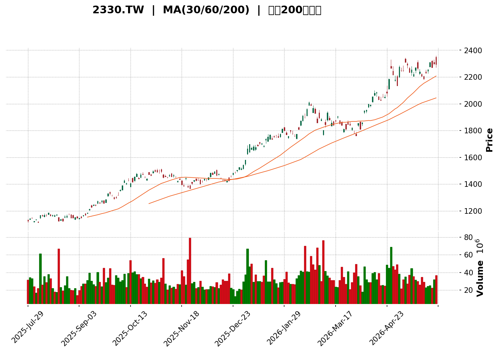
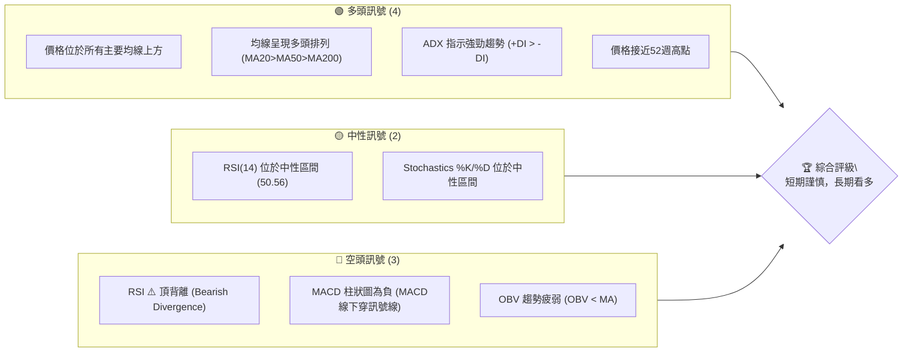
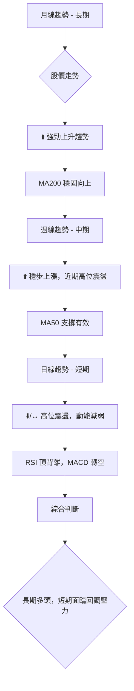
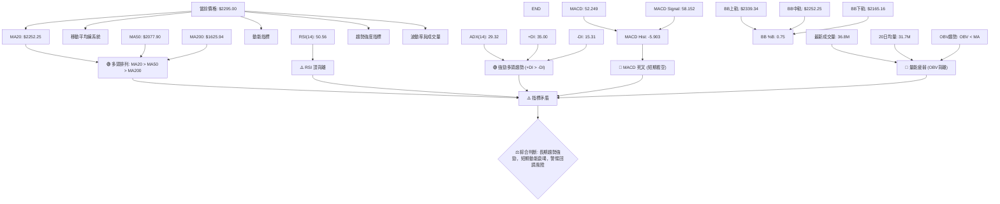

<details>
<summary>📊 靜態圖表 (點擊展開)</summary>

</details>

<html>
<head><meta charset="utf-8" /></head>
<body>
    <div>                        <script>window.PlotlyConfig = {MathJaxConfig: 'local'};</script>
        <script charset="utf-8" src="https://cdn.plot.ly/plotly-3.5.0.min.js" integrity="sha256-fHbNLP+GlIXN+efbQec78UkemUz3NJp7UmfGxC1tNxs=" crossorigin="anonymous"></script>                <div id="candlestick-chart" class="plotly-graph-div" style="height:500px; width:100%;"></div>            <script>                window.PLOTLYENV=window.PLOTLYENV || {};                                if (document.getElementById("candlestick-chart")) {                    Plotly.newPlot(                        "candlestick-chart",                        [{"close":{"dtype":"f8","bdata":"AAAAgDuMkUAAAAAAZNuRQAAAACAu75FAAAAAgDuMkUAAAAAgmseRQAAAAGCnZJFAAAAAwFY+kkAAAADAjCqSQAAAAMBWPpJAAAAAwFY+kkAAAABAf42SQAAAAMCMKpJAAAAAwFY+kkAAAADAVj6SQAAAAOAgUpJAAAAAgDuMkUAAAAAgmseRQAAAAIA7jJFAAAAAgMIWkkAAAADAjCqSQAAAAADrZZJAAAAAIC7vkUAAAAAgLu+RQAAAAGD4ApJAAAAAIC7vkUAAAAAgLu+RQAAAACAu75FAAAAAwFY+kkAAAADAVj6SQAAAAEB\u002fjZJAAAAA4HHwkkAAAABg0CuTQAAAAAD5epNAAAAAwC5nk0AAAAAgZd6TQAAAAADKopNAAAAAoEPyk0AAAAAAyqKTQAAAAGAAGpRAAAAA4NHMlEAAAADg0cyUQAAAAEBYfZRAAAAAoN4tlEAAAAAAvUGUQAAAAKA2kZRAAAAAwCkwlUAAAACgPruVQAAAAGBTRpZAAAAA4Nn2lUAAAADAMVqWQAAAAODZ9pVAAAAAgJYelkAAAADAib2WQAAAAGADDZdAAAAAgO6BlkAAAAAAJfmWQAAAAAAl+ZZAAAAAYKuplkAAAACA7oGWQAAAAAAl+ZZAAAAAoEbllkAAAADgfFyXQAAAAOB8XJdAAAAAgJ5Il0AAAABAW3CXQAAAAOB8XJdAAAAAYKuplkAAAADAib2WQAAAAGCrqZZAAAAAoEbllkAAAADAib2WQAAAAKBG5ZZAAAAAYKuplkAAAADgdDKWQAAAACAQbpZAAAAAAB3PlUAAAABAYKeVQAAAAADNlZZAAAAAYKN\u002flUAAAACg5leVQAAAAODZ9pVAAAAAwDFalkAAAABgU0aWQAAAAMAxWpZAAAAAgPvilUAAAADgdDKWQAAAAIDugZZAAAAAIBBulkAAAABgq6mWQAAAACDANJdAAAAAACX5lkAAAADgfFyXQAAAAMDg5JZAAAAAgL8Ml0AAAABgI5WWQAAAAGBVWZZAAAAAAGZFlkAAAAAAZkWWQAAAAABmRZZAAAAAYPHQlkAAAAAgnjSXQAAAAICNSJdAAAAAoFuEl0AAAAAAGdSXQAAAAEA6rJdAAAAAYNYjmEAAAADgYa+YQAAAAMBGAppAAAAAQNKNmkAAAAAgNhaaQAAAAOAUPppAAAAAgCUqmkAAAAAgBFKaQAAAAKDBoZpAAAAAoMGhmkAAAAAgBFKaQAAAAKBdGZtAAAAAABtpm0AAAAAg6aSbQAAAAKBdGZtAAAAAABtpm0AAAADA+ZCbQAAAAMArVZtAAAAAgNi4m0AAAABAU1icQAAAAECFHJxAAAAAIOmkm0AAAABgCn2bQAAAAOCVCJxAAAAAwMfMm0AAAABgCn2bQAAAAIDYuJtAAAAA4GNEnEAAAACAi0edQAAAAOAW051AAAAA4EiXnUAAAABgcJqeQAAAAODJYZ9AAAAAgAwSn0AAAAAgT8KeQAAAAEDUIp5AAAAAYL0LnUAAAADgSJedQAAAACBqb51AAAAAgHQwnEAAAABg78+cQAAAAKDDNp5AAAAAwHpbnUAAAABgvQudQAAAAAAAvJxAAAAAAAA4nUAAAAAAAMSdQAAAAAAA6JxAAAAAAADAnEAAAAAAAEicQAAAAAAASJxAAAAAAADUnEAAAAAAAMCcQAAAAAAAcJxAAAAAAADQm0AAAAAAAICbQAAAAAAA\u002fJxAAAAAAABInEAAAAAAABCdQAAAAAAAeJ5AAAAAAACMnkAAAAAAAECfQAAAAAAAGJ9AAAAAAAAOoEAAAAAAAECgQAAAAAAASqBAAAAAAAC4n0AAAAAAAKSfQAAAAAAABKBAAAAAAAAEoEAAAAAAAECgQAAAAAAAEqFAAAAAAACyoUAAAAAAAE6hQAAAAAAACKFAAAAAAACuoEAAAAAAAMahQAAAAAAAlKFAAAAAAACUoUAAAAAAAAyiQAAAAAAA5KFAAAAAAAB2oUAAAAAAAJ6hQAAAAAAAWKFAAAAAAAC8oUAAAAAAALKhQAAAAAAAgKFAAAAAAAA6oUAAAAAAABKhQAAAAAAAbKFAAAAAAACeoUAAAAAAAAyiQAAAAAAAvKFAAAAAAAD4oUAAAAAAAO6hQA=="},"high":{"dtype":"f8","bdata":"\u002fpWJws+zkUA4Kz8hLu+RQAnLPUH4ApJAAAAAgDuMkUAAAAAgmseRQIMt2KI7jJFAAAAAwFY+kkAg6f4CIVKSQB5bESS1eZJAvzy2AutlkkAAAABAf42SQK9dfiTrZZJAXx5b4SBSkkBfHlvhIFKSQAAAAOAgUpJA+cGcR\u002fgCkkCTyodBZNuRQPsrEwVk25FAwyu8wlY+kkAg6f4CIVKSQAAAAADrZZJALPc0xiBSkkAs9zTGIFKSQAAAAGD4ApJAG2G5g4wqkkAAAAAgLu+RQBthuYOMKpJAAAAAwFY+kkAeWxEktXmSQAAAAEB\u002fjZJAC15OATwEk0Bba63l+HqTQAAAAAD5epNADwNn4fh6k0AAACCFQ\u002fKTQFgdX8qGypNAAAAAoEPyk0Bcye35IQaUQAAAAGAAGpRAAAAA4NHMlEAIKmcPbQiVQKOLLgoVpZRAN3Ijz3lplEADmRQvWH2UQAnGW5mO9JRApVAKJQhElUAAAACgPruVQMkBQioQbpZA1I8zRbgKlkBWVVXvzJWWQNSPM0W4CpZA2FBeQ6uplkAAAADAib2WQFDrVyrANJdAF0M6r4m9lkAcTJEvwDSXQNC6wZSeSJdAkyZNKmjRlkCzaxPlzJWWQNC6wZSeSJdAic6ez+Egl0AcuzSqOYSXQKoYTw8YmJdAmpmZefarl0BYFCwKGJiXQDh2aXT2q5dAcODAWQMNl0CqOWbvJPmWQEqTJsWJvZZABt9pagMNl0BVc8wewDSXQAbfaWoDDZdAkyZNKmjRlkDw5hGqMVqWQDnAR0+rqZZAFVG\u002fXlNGlkBKKaXU2faVQEYbK2WrqZZAeAZV9BzPlUDrUbj+HM+VQKkfZ6qWHpZAAAAAwDFalkCSA4T0zJWWQFZVVe\u002fMlZZAXvyJRBBulkDw5hGqMVqWQAAAAIDugZZAvuoXhe6BlkAAAABgq6mWQAAAACDANJdA0LrBlJ5Il0AAAADgfFyXQCp4OeVKmJdAn3WD2a4gl0AKWn25EqmWQJ\u002fyEBM0gZZAUg6IDDSBlkBxr4JZVVmWQDRtjb8SqZZAFHVyueDklkAAAAAgnjSXQPC4eNl8XJdAAAAAoFuEl0AAAAAAGdSXQL2G8vIY1JdAAAAAYNYjmEAAAADgYa+YQJzWbH\u002fzZZpAAAAAQNKNmkDkSgLTFD6aQGULoezieZpAhmEY5uJ5mkCEAWcs0o2aQMZ0FlOgyZpAYzqL+bC1mkBYVu\u002fS4nmaQJBJ8VI8QZtAXXTRZdi4m0AAAAAg6aSbQOg3W18KfZtALrrosvmQm0Cc1H0Z6aSbQJmSKdnHzJtA5jCH2cfMm0AAAABAU1icQAetLFkhlJxApp6M35UInEAAAABgCn2bQFuwBZN0MJxAZorTJYUcnEDZVGts2LibQAAAAIDYuJtApQXoRSGUnEAAAACAi0edQIpP95L1+p1AdEucUtQinkCo1fgST8KeQGtI+pKoiZ9AIeOCjNpNn0BrcROGDBKfQNaUNWU+1p5ARKxRhSe\u002fnUBZgTASgYaeQL6E9tJIl51AAAAAgHQwnED5rBssam+dQB0V+FKiXp5AUv\u002fI2BbTnUACaevFeludQCe3eHKLR51AAAAAAABgnUAAAAAAANidQAAAAAAAYJ1AAAAAAAA4nUAAAAAAAFycQAAAAAAA6JxAAAAAAABMnUAAAAAAACSdQAAAAAAAhJxAAAAAAAAgnEAAAAAAAPibQAAAAAAA\u002fJxAAAAAAAAknUAAAAAAABCdQAAAAAAAeJ5AAAAAAACMnkAAAAAAAECfQAAAAAAALJ9AAAAAAAAOoEAAAAAAAGigQAAAAAAAVKBAAAAAAAAYoEAAAAAAAA6gQAAAAAAANqBAAAAAAAAsoEAAAAAAAK6gQAAAAAAAHKFAAAAAAAA0okAAAAAAANChQAAAAAAARKFAAAAAAABOoUAAAAAAANqhQAAAAAAAvKFAAAAAAADaoUAAAAAAAFKiQAAAAAAADKJAAAAAAADGoUAAAAAAANChQAAAAAAAgKFAAAAAAAC8oUAAAAAAACqiQAAAAAAAqKFAAAAAAABsoUAAAAAAAEShQAAAAAAAnqFAAAAAAACooUAAAAAAAAyiQAAAAAAAKqJAAAAAAAA0okAAAAAAAHCiQA=="},"hovertemplate":"\u003cb\u003e%{x|%Y-%m-%d}\u003c\u002fb\u003e\u003cbr\u003e\u958b: $%{open:.2f}\u003cbr\u003e\u9ad8: $%{high:.2f}\u003cbr\u003e\u4f4e: $%{low:.2f}\u003cbr\u003e\u6536: $%{close:.2f}\u003cextra\u003e\u003c\u002fextra\u003e","low":{"dtype":"f8","bdata":"Amp2PadkkUCPqYG9z7ORQPc0wv5j25FAAmp2PadkkUDaavDcBaCRQAAAAGCnZJFAImg4GWTbkUBwi4CewhaSQOGk7lv4ApJAQcNJfcIWkkAAAADcIFKSQAAAAMCMKpJAQcNJfcIWkkBBw0l9whaSQCaxTJ2MKpJAAAAAgDuMkUDaavDcBaCRQAAAAIA7jJFAPdRDPS7vkUBRooFbLu+RQL6YT71WPpJAAAAAIC7vkUAAAAAgLu+RQOilgdrPs5FA9zTC\u002fmPbkUDmnka8z7ORQAAAACAu75FAQcNJfcIWkkAAAADAVj6SQFVVVf3qZZJA60Njnd3IkkAppZQ+BhiTQD3P87xkU5NA8PyYnmRTk0AAAICL646TQAAAAADKopNAFesUC8qik0AAAAAAyqKTQH3WDWaotpNASQ9U5nlplED41ZiwNpGUQAAAAEBYfZRAQy\u002f0OgAalEAAAAAAvUGUQAAAAKA2kZRAtl7r9WwIlUAAAADcKTCVQFP9nDC4CpZAV+CYFR3PlUByHMf1dDKWQNkw\u002fuWBk5VAvYbyGrgKlkA6Zu+Wlh6WQGApUMuJvZZAAAAAgO6BlkB91g0GzZWWQAAAAAAl+ZZAt2zZ+syVlkDpvMVQU0aWQAAAAAAl+ZZAfRDLOmjRlkBW57Cw4SCXQHKi5XqeSJdAAAAAgJ5Il0BP16er4SCXQOREyxXANJdAt2zZ+syVlkAAAADAib2WQLds2frMlZZA+iCW1Ym9lkAAAADAib2WQHcxYXCrqZZAAAAAYKuplkCIDPd6lh6WQAAAACAQbpZAAAAAAB3PlUAAAABAYKeVQDCuftAxWpZAAAAAYKN\u002flUAAAACg5leVQFfgmBUdz5VAq6qqkJYelkAc\u002f976dDKWQDmO41pTRpZAAAAAgPvilUAQGe4VuAqWQOm8xVBTRpZAxz+48HQylkDasmXLMVqWQDVGClyrqZZAAAAAACX5lkDIiZZLAw2XQDTWh2bx0JZAwhT5zODklkD1pYIGNIGWQGEN76x2MZZAj1B9pnYxlkCu8XfzlwmWQAAAAABmRZZA2BUbrRKplkArizO64OSWQCGODs2uIJdAyAZkk41Il0CaRO+ZW4SXQER5DY1bhJdA2MeF7UqYl0AvPq8T5w+YQLN9oprcTplA22yzDZqemUActf1sV+6ZQDbpvcZ4xplAGYZhwHjGmUAAAAAgBFKaQDuL6ezieZpAO4vp7OJ5mkCpqRBtJSqaQE8jLIfBoZpAXXTRjY\u002fdmkAYVW6tXRmbQAAAAKBdGZtA0UUXTTxBm0CPrQhaPEGbQAAAAMArVZtAgQtcwCtVm0CHcAgnt+CbQNSNeOaVCJxAAAAAIOmkm0Dejhv6TC2bQHd3d9PHzJtAzToWDemkm0C344YGG2mbQM94xrNdGZtAAAAA4GNEnEBoo76zEKicQNbBIhScM51AAAAA4EiXnUC00yPhFtOdQCtvC3oMEp9AAAAAgAwSn0CF+V2twzaeQAAAAEDUIp5AAAAAYL0LnUA59XuGWYOdQEN7CW2LR51ApNxUtPmQm0CEKfL5MYCcQMN2sxScM51AAAAAwHpbnUC9vJmgEKicQAAAAAAAvJxAAAAAAAAQnUAAAAAAAIidQAAAAAAA6JxAAAAAAADAnEAAAAAAAOSbQAAAAAAAIJxAAAAAAADUnEAAAAAAAMCcQAAAAAAAIJxAAAAAAADQm0AAAAAAAICbQAAAAAAAmJxAAAAAAAA0nEAAAAAAAKycQAAAAAAAFJ5AAAAAAAAonkAAAAAAAMieQAAAAAAA3J5AAAAAAABon0AAAAAAABigQAAAAAAADqBAAAAAAAC4n0AAAAAAAKSfQAAAAAAA9J9AAAAAAADgn0AAAAAAAA6gQAAAAAAAcqBAAAAAAACyoUAAAAAAAE6hQAAAAAAA6qBAAAAAAACuoEAAAAAAACahQAAAAAAAgKFAAAAAAACAoUAAAAAAAAyiQAAAAAAAsqFAAAAAAAB2oUAAAAAAAEShQAAAAAAAOqFAAAAAAABsoUAAAAAAAJShQAAAAAAATqFAAAAAAAA6oUAAAAAAABKhQAAAAAAAbKFAAAAAAABioUAAAAAAAMahQAAAAAAAvKFAAAAAAADkoUAAAAAAALyhQA=="},"name":"\u50f9\u683c","open":{"dtype":"f8","bdata":"\u002fpWJws+zkUDH1MDemceRQAAAACAu75FAATW7XnF4kUBtNXj+z7ORQMEWbIFxeJFAgoaTOi7vkUCQdH\u002fhVj6SQEHDSX3CFpJAAAAAwFY+kkAAAADcIFKSQCDp\u002fgIhUpJAoOGknowqkkBBw0l9whaSQJNYpr5WPpJA+cGcR\u002fgCkkDaavDcBaCRQPsrEwVk25FAH+qhXvgCkkDgFgF9+AKSQAAAAADrZZJALPc0xiBSkkAkLPekVj6SQG484fuZx5FAEpZ7YsIWkkD3NML+Y9uRQBKWe2LCFpJAoOGknowqkkAeWxEktXmSQKuqqh61eZJA9qGxvqfckkCEEELELmeTQJ\u002fned4uZ5NADwNn4fh6k0AAAKDwyaKTQKyOL2WotpNAi3WK1YbKk0CwOr6UQ\u002fKTQH3WDWaotpNAoXJ2S1h9lECwxkSqjvSUQAAAAEBYfZRAeqEXaptVlECs3QZlm1WUQAAAAKA2kZRAW6\u002f1WksclUAAAADcKTCVQFP9nDC4CpZAK3DMevvilUAAAADAMVqWQNkw\u002fuWBk5VAlNdQ3syVlkCrjDNhU0aWQGApUMuJvZZAs2sT5cyVlkAxRT5rq6mWQLRuMGUDDZdAAAAAYKuplkCcKNm1MVqWQNC6wZSeSJdAg+80BSX5lkDkRMsVwDSXQBy7NKo5hJdA9ihcrzmEl0AAAABAW3CXQKoYTw8YmJdAJ02a9CT5lkA5EyIlaNGWQAAAAGCrqZZAfRDLOmjRlkAcYKq54SCXQH0Qyzpo0ZZAAAAAYKuplkCIDPd6lh6WQL7qF4XugZZAFVG\u002fXlNGlkBSSimlPruVQLvk1JrugZZAPIMqKmCnlUCamZmZPruVQKkfZ6qWHpZAchzH9XQylkCtAmOP7oGWQAAAAMAxWpZAXvyJRBBulkAAAADgdDKWQJwo2bUxWpZAAAAAIBBulkAjRowwEG6WQMBgLcGJvZZAHEyRL8A0l0BW57Cw4SCXQF5OwYtbhJdAYYp8JtD4lkAAAABgI5WWQAAAAGBVWZZAca+CWVVZlkAeofpMhx2WQDRtjb8SqZZAAAAAYPHQlkBgqKYT0PiWQAAAAICNSJdA7ax2Rmxwl0B0c3PzSpiXQKK8huZKmJdAcPQERzqsl0CjbsPGxTeYQKCoHvTLYplA22yzDZqemUActf1sV+6ZQALtSCBo2plA3LZtc1fumUBYVu\u002fS4nmaQMZ0FlOgyZpAncV0RtKNmkDUVIjGFD6aQDhbh0ZuBZtAXXTRjY\u002fdmkAYVW6tXRmbQMikePlMLZtAF110WQp9m0AAAADA+ZCbQInbDXMKfZtAaDzjGRtpm0CHcAgnt+CbQNs6pf8xgJxAZJKHLLfgm0Amq5RTPEGbQFuwBZN0MJxAAAAAwMfMm0AAAABgCn2bQLWpTQ1NLZtAOwRu7DGAnED7zkYNALycQJxpnm2LR51AAAAA4EiXnUC00yPhFtOdQCtvC3oMEp9AYPaA2fsln0CF+V2twzaeQG4eRrJfrp5Agx3heFmDnUA7ViCswzaeQEN7CW2LR51AEEHKDemkm0B91g3GrB+dQOCLq8d6W51AqX9kzEiXnUC9vJmgEKicQI\u002fB+RicM51AAAAAAABMnUAAAAAAALCdQAAAAAAATJ1AAAAAAAAQnUAAAAAAAPibQAAAAAAA6JxAAAAAAAAknUAAAAAAAOicQAAAAAAANJxAAAAAAADQm0AAAAAAALybQAAAAAAAwJxAAAAAAAAknUAAAAAAAOicQAAAAAAAPJ5AAAAAAABknkAAAAAAANyeQAAAAAAABJ9AAAAAAAB8n0AAAAAAACKgQAAAAAAAQKBAAAAAAAAOoEAAAAAAALifQAAAAAAABKBAAAAAAAD0n0AAAAAAAFSgQAAAAAAAfKBAAAAAAADQoUAAAAAAAIqhQAAAAAAA\u002fqBAAAAAAAA6oUAAAAAAADChQAAAAAAAlKFAAAAAAACUoUAAAAAAAD6iQAAAAAAA+KFAAAAAAACyoUAAAAAAAHahQAAAAAAAOqFAAAAAAACUoUAAAAAAAAyiQAAAAAAAYqFAAAAAAABYoUAAAAAAADqhQAAAAAAAgKFAAAAAAACKoUAAAAAAAMahQAAAAAAAIKJAAAAAAAAMokAAAAAAAFyiQA=="},"x":["2025-07-29T00:00:00+08:00","2025-07-30T00:00:00+08:00","2025-07-31T00:00:00+08:00","2025-08-04T00:00:00+08:00","2025-08-05T00:00:00+08:00","2025-08-06T00:00:00+08:00","2025-08-07T00:00:00+08:00","2025-08-08T00:00:00+08:00","2025-08-11T00:00:00+08:00","2025-08-12T00:00:00+08:00","2025-08-13T00:00:00+08:00","2025-08-14T00:00:00+08:00","2025-08-15T00:00:00+08:00","2025-08-18T00:00:00+08:00","2025-08-19T00:00:00+08:00","2025-08-20T00:00:00+08:00","2025-08-21T00:00:00+08:00","2025-08-22T00:00:00+08:00","2025-08-25T00:00:00+08:00","2025-08-26T00:00:00+08:00","2025-08-27T00:00:00+08:00","2025-08-28T00:00:00+08:00","2025-08-29T00:00:00+08:00","2025-09-01T00:00:00+08:00","2025-09-02T00:00:00+08:00","2025-09-03T00:00:00+08:00","2025-09-04T00:00:00+08:00","2025-09-05T00:00:00+08:00","2025-09-08T00:00:00+08:00","2025-09-09T00:00:00+08:00","2025-09-10T00:00:00+08:00","2025-09-11T00:00:00+08:00","2025-09-12T00:00:00+08:00","2025-09-15T00:00:00+08:00","2025-09-16T00:00:00+08:00","2025-09-17T00:00:00+08:00","2025-09-18T00:00:00+08:00","2025-09-19T00:00:00+08:00","2025-09-22T00:00:00+08:00","2025-09-23T00:00:00+08:00","2025-09-24T00:00:00+08:00","2025-09-25T00:00:00+08:00","2025-09-26T00:00:00+08:00","2025-09-30T00:00:00+08:00","2025-10-01T00:00:00+08:00","2025-10-02T00:00:00+08:00","2025-10-03T00:00:00+08:00","2025-10-07T00:00:00+08:00","2025-10-08T00:00:00+08:00","2025-10-09T00:00:00+08:00","2025-10-13T00:00:00+08:00","2025-10-14T00:00:00+08:00","2025-10-15T00:00:00+08:00","2025-10-16T00:00:00+08:00","2025-10-17T00:00:00+08:00","2025-10-20T00:00:00+08:00","2025-10-21T00:00:00+08:00","2025-10-22T00:00:00+08:00","2025-10-23T00:00:00+08:00","2025-10-27T00:00:00+08:00","2025-10-28T00:00:00+08:00","2025-10-29T00:00:00+08:00","2025-10-30T00:00:00+08:00","2025-10-31T00:00:00+08:00","2025-11-03T00:00:00+08:00","2025-11-04T00:00:00+08:00","2025-11-05T00:00:00+08:00","2025-11-06T00:00:00+08:00","2025-11-07T00:00:00+08:00","2025-11-10T00:00:00+08:00","2025-11-11T00:00:00+08:00","2025-11-12T00:00:00+08:00","2025-11-13T00:00:00+08:00","2025-11-14T00:00:00+08:00","2025-11-17T00:00:00+08:00","2025-11-18T00:00:00+08:00","2025-11-19T00:00:00+08:00","2025-11-20T00:00:00+08:00","2025-11-21T00:00:00+08:00","2025-11-24T00:00:00+08:00","2025-11-25T00:00:00+08:00","2025-11-26T00:00:00+08:00","2025-11-27T00:00:00+08:00","2025-11-28T00:00:00+08:00","2025-12-01T00:00:00+08:00","2025-12-02T00:00:00+08:00","2025-12-03T00:00:00+08:00","2025-12-04T00:00:00+08:00","2025-12-05T00:00:00+08:00","2025-12-08T00:00:00+08:00","2025-12-09T00:00:00+08:00","2025-12-10T00:00:00+08:00","2025-12-11T00:00:00+08:00","2025-12-12T00:00:00+08:00","2025-12-15T00:00:00+08:00","2025-12-16T00:00:00+08:00","2025-12-17T00:00:00+08:00","2025-12-18T00:00:00+08:00","2025-12-19T00:00:00+08:00","2025-12-22T00:00:00+08:00","2025-12-23T00:00:00+08:00","2025-12-24T00:00:00+08:00","2025-12-26T00:00:00+08:00","2025-12-29T00:00:00+08:00","2025-12-30T00:00:00+08:00","2025-12-31T00:00:00+08:00","2026-01-02T00:00:00+08:00","2026-01-05T00:00:00+08:00","2026-01-06T00:00:00+08:00","2026-01-07T00:00:00+08:00","2026-01-08T00:00:00+08:00","2026-01-09T00:00:00+08:00","2026-01-12T00:00:00+08:00","2026-01-13T00:00:00+08:00","2026-01-14T00:00:00+08:00","2026-01-15T00:00:00+08:00","2026-01-16T00:00:00+08:00","2026-01-19T00:00:00+08:00","2026-01-20T00:00:00+08:00","2026-01-21T00:00:00+08:00","2026-01-22T00:00:00+08:00","2026-01-23T00:00:00+08:00","2026-01-26T00:00:00+08:00","2026-01-27T00:00:00+08:00","2026-01-28T00:00:00+08:00","2026-01-29T00:00:00+08:00","2026-01-30T00:00:00+08:00","2026-02-02T00:00:00+08:00","2026-02-03T00:00:00+08:00","2026-02-04T00:00:00+08:00","2026-02-05T00:00:00+08:00","2026-02-06T00:00:00+08:00","2026-02-09T00:00:00+08:00","2026-02-10T00:00:00+08:00","2026-02-11T00:00:00+08:00","2026-02-23T00:00:00+08:00","2026-02-24T00:00:00+08:00","2026-02-25T00:00:00+08:00","2026-02-26T00:00:00+08:00","2026-03-02T00:00:00+08:00","2026-03-03T00:00:00+08:00","2026-03-04T00:00:00+08:00","2026-03-05T00:00:00+08:00","2026-03-06T00:00:00+08:00","2026-03-09T00:00:00+08:00","2026-03-10T00:00:00+08:00","2026-03-11T00:00:00+08:00","2026-03-12T00:00:00+08:00","2026-03-13T00:00:00+08:00","2026-03-16T00:00:00+08:00","2026-03-17T00:00:00+08:00","2026-03-18T00:00:00+08:00","2026-03-19T00:00:00+08:00","2026-03-20T00:00:00+08:00","2026-03-23T00:00:00+08:00","2026-03-24T00:00:00+08:00","2026-03-25T00:00:00+08:00","2026-03-26T00:00:00+08:00","2026-03-27T00:00:00+08:00","2026-03-30T00:00:00+08:00","2026-03-31T00:00:00+08:00","2026-04-01T00:00:00+08:00","2026-04-02T00:00:00+08:00","2026-04-07T00:00:00+08:00","2026-04-08T00:00:00+08:00","2026-04-09T00:00:00+08:00","2026-04-10T00:00:00+08:00","2026-04-13T00:00:00+08:00","2026-04-14T00:00:00+08:00","2026-04-15T00:00:00+08:00","2026-04-16T00:00:00+08:00","2026-04-17T00:00:00+08:00","2026-04-20T00:00:00+08:00","2026-04-21T00:00:00+08:00","2026-04-22T00:00:00+08:00","2026-04-23T00:00:00+08:00","2026-04-24T00:00:00+08:00","2026-04-27T00:00:00+08:00","2026-04-28T00:00:00+08:00","2026-04-29T00:00:00+08:00","2026-04-30T00:00:00+08:00","2026-05-04T00:00:00+08:00","2026-05-05T00:00:00+08:00","2026-05-06T00:00:00+08:00","2026-05-07T00:00:00+08:00","2026-05-08T00:00:00+08:00","2026-05-11T00:00:00+08:00","2026-05-12T00:00:00+08:00","2026-05-13T00:00:00+08:00","2026-05-14T00:00:00+08:00","2026-05-15T00:00:00+08:00","2026-05-18T00:00:00+08:00","2026-05-19T00:00:00+08:00","2026-05-20T00:00:00+08:00","2026-05-21T00:00:00+08:00","2026-05-22T00:00:00+08:00","2026-05-25T00:00:00+08:00","2026-05-26T00:00:00+08:00","2026-05-27T00:00:00+08:00","2026-05-28T00:00:00+08:00"],"type":"candlestick"},{"hovertemplate":"MA30: $%{y:.2f}\u003cextra\u003e\u003c\u002fextra\u003e","line":{"color":"#2196F3","dash":"dash","width":2},"mode":"lines","name":"MA30","x":["2025-07-29T00:00:00+08:00","2025-07-30T00:00:00+08:00","2025-07-31T00:00:00+08:00","2025-08-04T00:00:00+08:00","2025-08-05T00:00:00+08:00","2025-08-06T00:00:00+08:00","2025-08-07T00:00:00+08:00","2025-08-08T00:00:00+08:00","2025-08-11T00:00:00+08:00","2025-08-12T00:00:00+08:00","2025-08-13T00:00:00+08:00","2025-08-14T00:00:00+08:00","2025-08-15T00:00:00+08:00","2025-08-18T00:00:00+08:00","2025-08-19T00:00:00+08:00","2025-08-20T00:00:00+08:00","2025-08-21T00:00:00+08:00","2025-08-22T00:00:00+08:00","2025-08-25T00:00:00+08:00","2025-08-26T00:00:00+08:00","2025-08-27T00:00:00+08:00","2025-08-28T00:00:00+08:00","2025-08-29T00:00:00+08:00","2025-09-01T00:00:00+08:00","2025-09-02T00:00:00+08:00","2025-09-03T00:00:00+08:00","2025-09-04T00:00:00+08:00","2025-09-05T00:00:00+08:00","2025-09-08T00:00:00+08:00","2025-09-09T00:00:00+08:00","2025-09-10T00:00:00+08:00","2025-09-11T00:00:00+08:00","2025-09-12T00:00:00+08:00","2025-09-15T00:00:00+08:00","2025-09-16T00:00:00+08:00","2025-09-17T00:00:00+08:00","2025-09-18T00:00:00+08:00","2025-09-19T00:00:00+08:00","2025-09-22T00:00:00+08:00","2025-09-23T00:00:00+08:00","2025-09-24T00:00:00+08:00","2025-09-25T00:00:00+08:00","2025-09-26T00:00:00+08:00","2025-09-30T00:00:00+08:00","2025-10-01T00:00:00+08:00","2025-10-02T00:00:00+08:00","2025-10-03T00:00:00+08:00","2025-10-07T00:00:00+08:00","2025-10-08T00:00:00+08:00","2025-10-09T00:00:00+08:00","2025-10-13T00:00:00+08:00","2025-10-14T00:00:00+08:00","2025-10-15T00:00:00+08:00","2025-10-16T00:00:00+08:00","2025-10-17T00:00:00+08:00","2025-10-20T00:00:00+08:00","2025-10-21T00:00:00+08:00","2025-10-22T00:00:00+08:00","2025-10-23T00:00:00+08:00","2025-10-27T00:00:00+08:00","2025-10-28T00:00:00+08:00","2025-10-29T00:00:00+08:00","2025-10-30T00:00:00+08:00","2025-10-31T00:00:00+08:00","2025-11-03T00:00:00+08:00","2025-11-04T00:00:00+08:00","2025-11-05T00:00:00+08:00","2025-11-06T00:00:00+08:00","2025-11-07T00:00:00+08:00","2025-11-10T00:00:00+08:00","2025-11-11T00:00:00+08:00","2025-11-12T00:00:00+08:00","2025-11-13T00:00:00+08:00","2025-11-14T00:00:00+08:00","2025-11-17T00:00:00+08:00","2025-11-18T00:00:00+08:00","2025-11-19T00:00:00+08:00","2025-11-20T00:00:00+08:00","2025-11-21T00:00:00+08:00","2025-11-24T00:00:00+08:00","2025-11-25T00:00:00+08:00","2025-11-26T00:00:00+08:00","2025-11-27T00:00:00+08:00","2025-11-28T00:00:00+08:00","2025-12-01T00:00:00+08:00","2025-12-02T00:00:00+08:00","2025-12-03T00:00:00+08:00","2025-12-04T00:00:00+08:00","2025-12-05T00:00:00+08:00","2025-12-08T00:00:00+08:00","2025-12-09T00:00:00+08:00","2025-12-10T00:00:00+08:00","2025-12-11T00:00:00+08:00","2025-12-12T00:00:00+08:00","2025-12-15T00:00:00+08:00","2025-12-16T00:00:00+08:00","2025-12-17T00:00:00+08:00","2025-12-18T00:00:00+08:00","2025-12-19T00:00:00+08:00","2025-12-22T00:00:00+08:00","2025-12-23T00:00:00+08:00","2025-12-24T00:00:00+08:00","2025-12-26T00:00:00+08:00","2025-12-29T00:00:00+08:00","2025-12-30T00:00:00+08:00","2025-12-31T00:00:00+08:00","2026-01-02T00:00:00+08:00","2026-01-05T00:00:00+08:00","2026-01-06T00:00:00+08:00","2026-01-07T00:00:00+08:00","2026-01-08T00:00:00+08:00","2026-01-09T00:00:00+08:00","2026-01-12T00:00:00+08:00","2026-01-13T00:00:00+08:00","2026-01-14T00:00:00+08:00","2026-01-15T00:00:00+08:00","2026-01-16T00:00:00+08:00","2026-01-19T00:00:00+08:00","2026-01-20T00:00:00+08:00","2026-01-21T00:00:00+08:00","2026-01-22T00:00:00+08:00","2026-01-23T00:00:00+08:00","2026-01-26T00:00:00+08:00","2026-01-27T00:00:00+08:00","2026-01-28T00:00:00+08:00","2026-01-29T00:00:00+08:00","2026-01-30T00:00:00+08:00","2026-02-02T00:00:00+08:00","2026-02-03T00:00:00+08:00","2026-02-04T00:00:00+08:00","2026-02-05T00:00:00+08:00","2026-02-06T00:00:00+08:00","2026-02-09T00:00:00+08:00","2026-02-10T00:00:00+08:00","2026-02-11T00:00:00+08:00","2026-02-23T00:00:00+08:00","2026-02-24T00:00:00+08:00","2026-02-25T00:00:00+08:00","2026-02-26T00:00:00+08:00","2026-03-02T00:00:00+08:00","2026-03-03T00:00:00+08:00","2026-03-04T00:00:00+08:00","2026-03-05T00:00:00+08:00","2026-03-06T00:00:00+08:00","2026-03-09T00:00:00+08:00","2026-03-10T00:00:00+08:00","2026-03-11T00:00:00+08:00","2026-03-12T00:00:00+08:00","2026-03-13T00:00:00+08:00","2026-03-16T00:00:00+08:00","2026-03-17T00:00:00+08:00","2026-03-18T00:00:00+08:00","2026-03-19T00:00:00+08:00","2026-03-20T00:00:00+08:00","2026-03-23T00:00:00+08:00","2026-03-24T00:00:00+08:00","2026-03-25T00:00:00+08:00","2026-03-26T00:00:00+08:00","2026-03-27T00:00:00+08:00","2026-03-30T00:00:00+08:00","2026-03-31T00:00:00+08:00","2026-04-01T00:00:00+08:00","2026-04-02T00:00:00+08:00","2026-04-07T00:00:00+08:00","2026-04-08T00:00:00+08:00","2026-04-09T00:00:00+08:00","2026-04-10T00:00:00+08:00","2026-04-13T00:00:00+08:00","2026-04-14T00:00:00+08:00","2026-04-15T00:00:00+08:00","2026-04-16T00:00:00+08:00","2026-04-17T00:00:00+08:00","2026-04-20T00:00:00+08:00","2026-04-21T00:00:00+08:00","2026-04-22T00:00:00+08:00","2026-04-23T00:00:00+08:00","2026-04-24T00:00:00+08:00","2026-04-27T00:00:00+08:00","2026-04-28T00:00:00+08:00","2026-04-29T00:00:00+08:00","2026-04-30T00:00:00+08:00","2026-05-04T00:00:00+08:00","2026-05-05T00:00:00+08:00","2026-05-06T00:00:00+08:00","2026-05-07T00:00:00+08:00","2026-05-08T00:00:00+08:00","2026-05-11T00:00:00+08:00","2026-05-12T00:00:00+08:00","2026-05-13T00:00:00+08:00","2026-05-14T00:00:00+08:00","2026-05-15T00:00:00+08:00","2026-05-18T00:00:00+08:00","2026-05-19T00:00:00+08:00","2026-05-20T00:00:00+08:00","2026-05-21T00:00:00+08:00","2026-05-22T00:00:00+08:00","2026-05-25T00:00:00+08:00","2026-05-26T00:00:00+08:00","2026-05-27T00:00:00+08:00","2026-05-28T00:00:00+08:00"],"y":{"dtype":"f8","bdata":"AAAAAAAA+H8AAAAAAAD4fwAAAAAAAPh\u002fAAAAAAAA+H8AAAAAAAD4fwAAAAAAAPh\u002fAAAAAAAA+H8AAAAAAAD4fwAAAAAAAPh\u002fAAAAAAAA+H8AAAAAAAD4fwAAAAAAAPh\u002fAAAAAAAA+H8AAAAAAAD4fwAAAAAAAPh\u002fAAAAAAAA+H8AAAAAAAD4fwAAAAAAAPh\u002fAAAAAAAA+H8AAAAAAAD4fwAAAAAAAPh\u002fAAAAAAAA+H8AAAAAAAD4fwAAAAAAAPh\u002fAAAAAAAA+H8AAAAAAAD4fwAAAAAAAPh\u002fAAAAAAAA+H8AAAAAAAD4f0RERLREBpJAIiIiYiQSkkAiIiIyWx2SQAAAAKCMKpJAiYiIiGE6kkCamZkZNUySQDMzM2NYX5JAiYiISOBtkkC8u7vbanqSQImIiNhFipJAAAAAwBagkkC8u7srRLOSQBEREcEXx5JAiYiISJzXkkC8u7tbyuiSQAAAAMD1+5JAmpmZOQYbk0CJiIjovjyTQJqZmQkVZZNAIiIi4iaGk0BVVVWV36mTQCIiIvJNyJNAAAAAoATsk0De3d2tBxWUQLy7uwsIQJRAVVVVdQ5nlEB3d3cnDpKUQJqZmdkNvZRA7+7u3sPilEC8u7vLJgeVQFVVVYXfLJVAiYiIWKJOlUBERETUY3KVQDMzM9OBk5VAZmZmJp+0lUCamZlJFtOVQERERITg8pVAREREpA4KlkAAAACAjCSWQImIiIhnOpZAq6qqSklMlkBERET011yWQGZmZuZfcZZAREREZJGGlkDe3d0NIJeWQLy7uysFp5ZAvLu7i1GslkAAAAAAqKuWQAAAADBOrpZAd3d351SqlkDNzMzMuKGWQM3MzMy4oZZAERERcbWjlkCamZkpvJ+WQN7d3T3GmZZAAAAA4HmUlkB3d3dn2o2WQO\u002fu7h7hiZZAq6qqeuSHlkAzMzOTN4mWQGZmZjY0i5ZAIiIiwt2LlkAiIiLC3YuWQGZmZhbhh5ZAAAAAMOKFlkBmZmaGk36WQDMzMxPwdZZA3t3dbZhylkDNzMw8l26WQHd3d5c\u002fa5ZAVVVVFZJqlkCrqqo6im6WQERERGTZcZZAiYiIiCN5lkB3d3dnD4eWQImIiGiqkZZAREREdI6llkAAAABgbL+WQCIiIqKj3JZAREREVMcHl0AiIiJyQTCXQJqZmWnDVJdAmpmZiUt1l0De3d1t0ZeXQJqZmTlWvJdAvLu7S9Tkl0DNzMy8AwiYQLy7uxsyL5hAiYiIeLJZmEB3d3eHNISYQKuqqvpspZhAMzMzg0rLmECrqqqKLO+YQImIiOgMFZlAvLu7m+s8mUDv7u7eF26ZQCIiIiJEn5lAZmZm1h3NmUARERFRo\u002fmZQERERJTPKppAmpmZuVZVmkDe3d3d4nmaQLy7uzvDn5pAq6qqCkzImkC8u7vbz\u002faaQN7d3a1OK5tA7+7uftJZm0Crqqr6UoybQO\u002fu7q4suptAiYiIKLfgm0C8u7vblQicQAAAAHDPKZxAERERkWVCnEAiIiJCTl6cQGZmZkY6dpxAERERgYSDnEBEREQUyJicQLy7u4tcs5xAZmZmVvnDnECJiIhY78+cQBEREbHj3ZxAmpmZuVHtnEAzMzMzFgCdQM3MzKyDDZ1AIiIiQkkWnUAzMzPzvRWdQJqZmfkwF51AZmZmVkshnUAiIiJCDyydQKuqqrqBL51ARERENJ0vnUBVVVV1ti+dQKuqqgp8Op1AiYiI2Jo6nUDNzMzcwDidQJqZmRlAPp1AZmZmVmhGnUAAAAAg7UudQGZmZnZ3SZ1AmpmZ6VRSnUBEREQkMGGdQO\u002fu7u4Gdp1ARERE9NWMnUBmZmaGU56dQHd3d6d6tJ1AIiIikkPVnUB3d3eXu\u002fSdQKuqqpo9Fp5AMzMzg7lJnkAzMzMzM3meQKuqqqqqpp5AAAAAAADKnkBVVVVVVfueQKuqqqqqMJ9AVVVVVVVnn0AAAAAAAKqfQAAAAAAA6p9AAAAAAAAPoECrqqqqqiqgQFVVVVVVRaBAAAAAAABmoECrqqqqqoegQFVVVVVVoaBAq6qqqqq7oEBVVVVVVdGgQAAAAAAA5KBAAAAAAAD4oECrqqqqqgyhQFVVVVVVH6FAq6qqqqovoUAAAAAAAD6hQA=="},"type":"scatter"},{"hovertemplate":"MA60: $%{y:.2f}\u003cextra\u003e\u003c\u002fextra\u003e","line":{"color":"#9C27B0","dash":"dash","width":2},"mode":"lines","name":"MA60","x":["2025-07-29T00:00:00+08:00","2025-07-30T00:00:00+08:00","2025-07-31T00:00:00+08:00","2025-08-04T00:00:00+08:00","2025-08-05T00:00:00+08:00","2025-08-06T00:00:00+08:00","2025-08-07T00:00:00+08:00","2025-08-08T00:00:00+08:00","2025-08-11T00:00:00+08:00","2025-08-12T00:00:00+08:00","2025-08-13T00:00:00+08:00","2025-08-14T00:00:00+08:00","2025-08-15T00:00:00+08:00","2025-08-18T00:00:00+08:00","2025-08-19T00:00:00+08:00","2025-08-20T00:00:00+08:00","2025-08-21T00:00:00+08:00","2025-08-22T00:00:00+08:00","2025-08-25T00:00:00+08:00","2025-08-26T00:00:00+08:00","2025-08-27T00:00:00+08:00","2025-08-28T00:00:00+08:00","2025-08-29T00:00:00+08:00","2025-09-01T00:00:00+08:00","2025-09-02T00:00:00+08:00","2025-09-03T00:00:00+08:00","2025-09-04T00:00:00+08:00","2025-09-05T00:00:00+08:00","2025-09-08T00:00:00+08:00","2025-09-09T00:00:00+08:00","2025-09-10T00:00:00+08:00","2025-09-11T00:00:00+08:00","2025-09-12T00:00:00+08:00","2025-09-15T00:00:00+08:00","2025-09-16T00:00:00+08:00","2025-09-17T00:00:00+08:00","2025-09-18T00:00:00+08:00","2025-09-19T00:00:00+08:00","2025-09-22T00:00:00+08:00","2025-09-23T00:00:00+08:00","2025-09-24T00:00:00+08:00","2025-09-25T00:00:00+08:00","2025-09-26T00:00:00+08:00","2025-09-30T00:00:00+08:00","2025-10-01T00:00:00+08:00","2025-10-02T00:00:00+08:00","2025-10-03T00:00:00+08:00","2025-10-07T00:00:00+08:00","2025-10-08T00:00:00+08:00","2025-10-09T00:00:00+08:00","2025-10-13T00:00:00+08:00","2025-10-14T00:00:00+08:00","2025-10-15T00:00:00+08:00","2025-10-16T00:00:00+08:00","2025-10-17T00:00:00+08:00","2025-10-20T00:00:00+08:00","2025-10-21T00:00:00+08:00","2025-10-22T00:00:00+08:00","2025-10-23T00:00:00+08:00","2025-10-27T00:00:00+08:00","2025-10-28T00:00:00+08:00","2025-10-29T00:00:00+08:00","2025-10-30T00:00:00+08:00","2025-10-31T00:00:00+08:00","2025-11-03T00:00:00+08:00","2025-11-04T00:00:00+08:00","2025-11-05T00:00:00+08:00","2025-11-06T00:00:00+08:00","2025-11-07T00:00:00+08:00","2025-11-10T00:00:00+08:00","2025-11-11T00:00:00+08:00","2025-11-12T00:00:00+08:00","2025-11-13T00:00:00+08:00","2025-11-14T00:00:00+08:00","2025-11-17T00:00:00+08:00","2025-11-18T00:00:00+08:00","2025-11-19T00:00:00+08:00","2025-11-20T00:00:00+08:00","2025-11-21T00:00:00+08:00","2025-11-24T00:00:00+08:00","2025-11-25T00:00:00+08:00","2025-11-26T00:00:00+08:00","2025-11-27T00:00:00+08:00","2025-11-28T00:00:00+08:00","2025-12-01T00:00:00+08:00","2025-12-02T00:00:00+08:00","2025-12-03T00:00:00+08:00","2025-12-04T00:00:00+08:00","2025-12-05T00:00:00+08:00","2025-12-08T00:00:00+08:00","2025-12-09T00:00:00+08:00","2025-12-10T00:00:00+08:00","2025-12-11T00:00:00+08:00","2025-12-12T00:00:00+08:00","2025-12-15T00:00:00+08:00","2025-12-16T00:00:00+08:00","2025-12-17T00:00:00+08:00","2025-12-18T00:00:00+08:00","2025-12-19T00:00:00+08:00","2025-12-22T00:00:00+08:00","2025-12-23T00:00:00+08:00","2025-12-24T00:00:00+08:00","2025-12-26T00:00:00+08:00","2025-12-29T00:00:00+08:00","2025-12-30T00:00:00+08:00","2025-12-31T00:00:00+08:00","2026-01-02T00:00:00+08:00","2026-01-05T00:00:00+08:00","2026-01-06T00:00:00+08:00","2026-01-07T00:00:00+08:00","2026-01-08T00:00:00+08:00","2026-01-09T00:00:00+08:00","2026-01-12T00:00:00+08:00","2026-01-13T00:00:00+08:00","2026-01-14T00:00:00+08:00","2026-01-15T00:00:00+08:00","2026-01-16T00:00:00+08:00","2026-01-19T00:00:00+08:00","2026-01-20T00:00:00+08:00","2026-01-21T00:00:00+08:00","2026-01-22T00:00:00+08:00","2026-01-23T00:00:00+08:00","2026-01-26T00:00:00+08:00","2026-01-27T00:00:00+08:00","2026-01-28T00:00:00+08:00","2026-01-29T00:00:00+08:00","2026-01-30T00:00:00+08:00","2026-02-02T00:00:00+08:00","2026-02-03T00:00:00+08:00","2026-02-04T00:00:00+08:00","2026-02-05T00:00:00+08:00","2026-02-06T00:00:00+08:00","2026-02-09T00:00:00+08:00","2026-02-10T00:00:00+08:00","2026-02-11T00:00:00+08:00","2026-02-23T00:00:00+08:00","2026-02-24T00:00:00+08:00","2026-02-25T00:00:00+08:00","2026-02-26T00:00:00+08:00","2026-03-02T00:00:00+08:00","2026-03-03T00:00:00+08:00","2026-03-04T00:00:00+08:00","2026-03-05T00:00:00+08:00","2026-03-06T00:00:00+08:00","2026-03-09T00:00:00+08:00","2026-03-10T00:00:00+08:00","2026-03-11T00:00:00+08:00","2026-03-12T00:00:00+08:00","2026-03-13T00:00:00+08:00","2026-03-16T00:00:00+08:00","2026-03-17T00:00:00+08:00","2026-03-18T00:00:00+08:00","2026-03-19T00:00:00+08:00","2026-03-20T00:00:00+08:00","2026-03-23T00:00:00+08:00","2026-03-24T00:00:00+08:00","2026-03-25T00:00:00+08:00","2026-03-26T00:00:00+08:00","2026-03-27T00:00:00+08:00","2026-03-30T00:00:00+08:00","2026-03-31T00:00:00+08:00","2026-04-01T00:00:00+08:00","2026-04-02T00:00:00+08:00","2026-04-07T00:00:00+08:00","2026-04-08T00:00:00+08:00","2026-04-09T00:00:00+08:00","2026-04-10T00:00:00+08:00","2026-04-13T00:00:00+08:00","2026-04-14T00:00:00+08:00","2026-04-15T00:00:00+08:00","2026-04-16T00:00:00+08:00","2026-04-17T00:00:00+08:00","2026-04-20T00:00:00+08:00","2026-04-21T00:00:00+08:00","2026-04-22T00:00:00+08:00","2026-04-23T00:00:00+08:00","2026-04-24T00:00:00+08:00","2026-04-27T00:00:00+08:00","2026-04-28T00:00:00+08:00","2026-04-29T00:00:00+08:00","2026-04-30T00:00:00+08:00","2026-05-04T00:00:00+08:00","2026-05-05T00:00:00+08:00","2026-05-06T00:00:00+08:00","2026-05-07T00:00:00+08:00","2026-05-08T00:00:00+08:00","2026-05-11T00:00:00+08:00","2026-05-12T00:00:00+08:00","2026-05-13T00:00:00+08:00","2026-05-14T00:00:00+08:00","2026-05-15T00:00:00+08:00","2026-05-18T00:00:00+08:00","2026-05-19T00:00:00+08:00","2026-05-20T00:00:00+08:00","2026-05-21T00:00:00+08:00","2026-05-22T00:00:00+08:00","2026-05-25T00:00:00+08:00","2026-05-26T00:00:00+08:00","2026-05-27T00:00:00+08:00","2026-05-28T00:00:00+08:00"],"y":{"dtype":"f8","bdata":"AAAAAAAA+H8AAAAAAAD4fwAAAAAAAPh\u002fAAAAAAAA+H8AAAAAAAD4fwAAAAAAAPh\u002fAAAAAAAA+H8AAAAAAAD4fwAAAAAAAPh\u002fAAAAAAAA+H8AAAAAAAD4fwAAAAAAAPh\u002fAAAAAAAA+H8AAAAAAAD4fwAAAAAAAPh\u002fAAAAAAAA+H8AAAAAAAD4fwAAAAAAAPh\u002fAAAAAAAA+H8AAAAAAAD4fwAAAAAAAPh\u002fAAAAAAAA+H8AAAAAAAD4fwAAAAAAAPh\u002fAAAAAAAA+H8AAAAAAAD4fwAAAAAAAPh\u002fAAAAAAAA+H8AAAAAAAD4fwAAAAAAAPh\u002fAAAAAAAA+H8AAAAAAAD4fwAAAAAAAPh\u002fAAAAAAAA+H8AAAAAAAD4fwAAAAAAAPh\u002fAAAAAAAA+H8AAAAAAAD4fwAAAAAAAPh\u002fAAAAAAAA+H8AAAAAAAD4fwAAAAAAAPh\u002fAAAAAAAA+H8AAAAAAAD4fwAAAAAAAPh\u002fAAAAAAAA+H8AAAAAAAD4fwAAAAAAAPh\u002fAAAAAAAA+H8AAAAAAAD4fwAAAAAAAPh\u002fAAAAAAAA+H8AAAAAAAD4fwAAAAAAAPh\u002fAAAAAAAA+H8AAAAAAAD4fwAAAAAAAPh\u002fAAAAAAAA+H8AAAAAAAD4f83MzBySmZNAVVVVXWOwk0AzMzOD38eTQJqZmTkH35NAd3d3V4D3k0CamZmxpQ+UQLy7u3McKZRAZmZmdvc7lEDe3d2te0+UQImIiLBWYpRAVVVVBTB2lEAAAAAQDoiUQLy7u9M7nJRAZmZm1havlEDNzMw09b+UQN7d3XV90ZRAq6qq4qvjlEBERER0M\u002fSUQM3MzJyxCZVAzczM5D0YlUARERExzCWVQHd3d18DNZVAiYiICN1HlUC8u7vrYVqVQM3MzCTnbJVAq6qqKsR9lUB3d3dH9I+VQERERHx3o5VAzczMLFS1lUB3d3cvL8iVQN7d3d0J3JVAVVVVDUDtlUAzMzPLIP+VQM3MzHSxDZZAMzMzq0AdlkAAAADo1CiWQLy7u0toNJZAERERiVM+lkBmZmbekUmWQAAAAJDTUpZAAAAAsG1blkB3d3cXsWWWQFVVVaWccZZAZmZmdtp\u002flkCrqqq6F4+WQCIiIspXnJZAAAAAAPColkAAAAAwirWWQBEREel4xZZA3t3dHQ7ZlkB3d3cf\u002feiWQDMzMxs++5ZAVVVVfYAMl0C8u7vLxhuXQLy7uzsOK5dA3t3dFac8l0AiIiIS70qXQFVVVZ2JXJdAmpmZectwl0BVVVUNtoaXQImIiJhQmJdAq6qqIpSrl0BmZmYmhb2XQHd3d\u002f92zpdA3t3d5Wbhl0CrqqqyVfaXQKuqqhqaCphAIiIiItsfmEDv7u5GHTSYQN7d3ZUHS5hAd3d3Z\u002fRfmEBERESMNnSYQAAAAFDOiJhAmpmZybegmECamZmh776YQDMzM4t83phAmpmZebD\u002fmEBVVVWt3yWZQImIiChoS5lAZmZmPj90mUDv7u6ma5yZQM3MzGxJv5lAVVVVjdjbmUAAAADYD\u002fuZQAAAAEBIGZpAZmZmZiw0mkCJiIjoZVCaQLy7u1NHcZpAd3d359WOmkAAAADwEaqaQN7d3VWowZpAZmZmHk7cmkDv7u5eofeaQKuqqkpIEZtA7+7ubpopm0ARERHp6kGbQN7d3Y06W5tAZmZmljR3m0CamZlJ2ZKbQHd3d6corZtA7+7u9nnCm0CamZmpzNSbQDMzM6Mf7ZtAmpmZcXMBnEBERERcyBecQLy7u2PHNJxAq6qqah1QnEBVVVUNIGycQKuqqhLSgZxAERERCYaZnEAAAAAA47ScQHd3dy\u002frz5xAq6qqwp3nnEBERETkUP6cQO\u002fu7nZaFZ1AmpmZCWQsnUDe3d3VwUadQDMzMxPNZJ1AzczMbNmGnUDe3d1FkaSdQN7d3S1Hwp1AzczM3KjbnUBERETEtf2dQLy7uysXH55AvLu7S88+nkCamZn53l+eQM3MzHyYgJ5AMzMzq6WfnkC8u7tLssCeQKuqqjIW3Z5AIiIims79nkBVVVXlhR+fQKuqqlqTPp9A7+7uFvhYn0C8u7vDtW2fQM3MzAwgg59AMzMzKzSbn0Crqqo6obKfQImIiBARxJ9Ad3d3H9XYn0AiIiISmO6fQA=="},"type":"scatter"},{"hovertemplate":"MA200: $%{y:.2f}\u003cextra\u003e\u003c\u002fextra\u003e","line":{"color":"#FF6F00","dash":"solid","width":2},"mode":"lines","name":"MA200","x":["2025-07-29T00:00:00+08:00","2025-07-30T00:00:00+08:00","2025-07-31T00:00:00+08:00","2025-08-04T00:00:00+08:00","2025-08-05T00:00:00+08:00","2025-08-06T00:00:00+08:00","2025-08-07T00:00:00+08:00","2025-08-08T00:00:00+08:00","2025-08-11T00:00:00+08:00","2025-08-12T00:00:00+08:00","2025-08-13T00:00:00+08:00","2025-08-14T00:00:00+08:00","2025-08-15T00:00:00+08:00","2025-08-18T00:00:00+08:00","2025-08-19T00:00:00+08:00","2025-08-20T00:00:00+08:00","2025-08-21T00:00:00+08:00","2025-08-22T00:00:00+08:00","2025-08-25T00:00:00+08:00","2025-08-26T00:00:00+08:00","2025-08-27T00:00:00+08:00","2025-08-28T00:00:00+08:00","2025-08-29T00:00:00+08:00","2025-09-01T00:00:00+08:00","2025-09-02T00:00:00+08:00","2025-09-03T00:00:00+08:00","2025-09-04T00:00:00+08:00","2025-09-05T00:00:00+08:00","2025-09-08T00:00:00+08:00","2025-09-09T00:00:00+08:00","2025-09-10T00:00:00+08:00","2025-09-11T00:00:00+08:00","2025-09-12T00:00:00+08:00","2025-09-15T00:00:00+08:00","2025-09-16T00:00:00+08:00","2025-09-17T00:00:00+08:00","2025-09-18T00:00:00+08:00","2025-09-19T00:00:00+08:00","2025-09-22T00:00:00+08:00","2025-09-23T00:00:00+08:00","2025-09-24T00:00:00+08:00","2025-09-25T00:00:00+08:00","2025-09-26T00:00:00+08:00","2025-09-30T00:00:00+08:00","2025-10-01T00:00:00+08:00","2025-10-02T00:00:00+08:00","2025-10-03T00:00:00+08:00","2025-10-07T00:00:00+08:00","2025-10-08T00:00:00+08:00","2025-10-09T00:00:00+08:00","2025-10-13T00:00:00+08:00","2025-10-14T00:00:00+08:00","2025-10-15T00:00:00+08:00","2025-10-16T00:00:00+08:00","2025-10-17T00:00:00+08:00","2025-10-20T00:00:00+08:00","2025-10-21T00:00:00+08:00","2025-10-22T00:00:00+08:00","2025-10-23T00:00:00+08:00","2025-10-27T00:00:00+08:00","2025-10-28T00:00:00+08:00","2025-10-29T00:00:00+08:00","2025-10-30T00:00:00+08:00","2025-10-31T00:00:00+08:00","2025-11-03T00:00:00+08:00","2025-11-04T00:00:00+08:00","2025-11-05T00:00:00+08:00","2025-11-06T00:00:00+08:00","2025-11-07T00:00:00+08:00","2025-11-10T00:00:00+08:00","2025-11-11T00:00:00+08:00","2025-11-12T00:00:00+08:00","2025-11-13T00:00:00+08:00","2025-11-14T00:00:00+08:00","2025-11-17T00:00:00+08:00","2025-11-18T00:00:00+08:00","2025-11-19T00:00:00+08:00","2025-11-20T00:00:00+08:00","2025-11-21T00:00:00+08:00","2025-11-24T00:00:00+08:00","2025-11-25T00:00:00+08:00","2025-11-26T00:00:00+08:00","2025-11-27T00:00:00+08:00","2025-11-28T00:00:00+08:00","2025-12-01T00:00:00+08:00","2025-12-02T00:00:00+08:00","2025-12-03T00:00:00+08:00","2025-12-04T00:00:00+08:00","2025-12-05T00:00:00+08:00","2025-12-08T00:00:00+08:00","2025-12-09T00:00:00+08:00","2025-12-10T00:00:00+08:00","2025-12-11T00:00:00+08:00","2025-12-12T00:00:00+08:00","2025-12-15T00:00:00+08:00","2025-12-16T00:00:00+08:00","2025-12-17T00:00:00+08:00","2025-12-18T00:00:00+08:00","2025-12-19T00:00:00+08:00","2025-12-22T00:00:00+08:00","2025-12-23T00:00:00+08:00","2025-12-24T00:00:00+08:00","2025-12-26T00:00:00+08:00","2025-12-29T00:00:00+08:00","2025-12-30T00:00:00+08:00","2025-12-31T00:00:00+08:00","2026-01-02T00:00:00+08:00","2026-01-05T00:00:00+08:00","2026-01-06T00:00:00+08:00","2026-01-07T00:00:00+08:00","2026-01-08T00:00:00+08:00","2026-01-09T00:00:00+08:00","2026-01-12T00:00:00+08:00","2026-01-13T00:00:00+08:00","2026-01-14T00:00:00+08:00","2026-01-15T00:00:00+08:00","2026-01-16T00:00:00+08:00","2026-01-19T00:00:00+08:00","2026-01-20T00:00:00+08:00","2026-01-21T00:00:00+08:00","2026-01-22T00:00:00+08:00","2026-01-23T00:00:00+08:00","2026-01-26T00:00:00+08:00","2026-01-27T00:00:00+08:00","2026-01-28T00:00:00+08:00","2026-01-29T00:00:00+08:00","2026-01-30T00:00:00+08:00","2026-02-02T00:00:00+08:00","2026-02-03T00:00:00+08:00","2026-02-04T00:00:00+08:00","2026-02-05T00:00:00+08:00","2026-02-06T00:00:00+08:00","2026-02-09T00:00:00+08:00","2026-02-10T00:00:00+08:00","2026-02-11T00:00:00+08:00","2026-02-23T00:00:00+08:00","2026-02-24T00:00:00+08:00","2026-02-25T00:00:00+08:00","2026-02-26T00:00:00+08:00","2026-03-02T00:00:00+08:00","2026-03-03T00:00:00+08:00","2026-03-04T00:00:00+08:00","2026-03-05T00:00:00+08:00","2026-03-06T00:00:00+08:00","2026-03-09T00:00:00+08:00","2026-03-10T00:00:00+08:00","2026-03-11T00:00:00+08:00","2026-03-12T00:00:00+08:00","2026-03-13T00:00:00+08:00","2026-03-16T00:00:00+08:00","2026-03-17T00:00:00+08:00","2026-03-18T00:00:00+08:00","2026-03-19T00:00:00+08:00","2026-03-20T00:00:00+08:00","2026-03-23T00:00:00+08:00","2026-03-24T00:00:00+08:00","2026-03-25T00:00:00+08:00","2026-03-26T00:00:00+08:00","2026-03-27T00:00:00+08:00","2026-03-30T00:00:00+08:00","2026-03-31T00:00:00+08:00","2026-04-01T00:00:00+08:00","2026-04-02T00:00:00+08:00","2026-04-07T00:00:00+08:00","2026-04-08T00:00:00+08:00","2026-04-09T00:00:00+08:00","2026-04-10T00:00:00+08:00","2026-04-13T00:00:00+08:00","2026-04-14T00:00:00+08:00","2026-04-15T00:00:00+08:00","2026-04-16T00:00:00+08:00","2026-04-17T00:00:00+08:00","2026-04-20T00:00:00+08:00","2026-04-21T00:00:00+08:00","2026-04-22T00:00:00+08:00","2026-04-23T00:00:00+08:00","2026-04-24T00:00:00+08:00","2026-04-27T00:00:00+08:00","2026-04-28T00:00:00+08:00","2026-04-29T00:00:00+08:00","2026-04-30T00:00:00+08:00","2026-05-04T00:00:00+08:00","2026-05-05T00:00:00+08:00","2026-05-06T00:00:00+08:00","2026-05-07T00:00:00+08:00","2026-05-08T00:00:00+08:00","2026-05-11T00:00:00+08:00","2026-05-12T00:00:00+08:00","2026-05-13T00:00:00+08:00","2026-05-14T00:00:00+08:00","2026-05-15T00:00:00+08:00","2026-05-18T00:00:00+08:00","2026-05-19T00:00:00+08:00","2026-05-20T00:00:00+08:00","2026-05-21T00:00:00+08:00","2026-05-22T00:00:00+08:00","2026-05-25T00:00:00+08:00","2026-05-26T00:00:00+08:00","2026-05-27T00:00:00+08:00","2026-05-28T00:00:00+08:00"],"y":{"dtype":"f8","bdata":"AAAAAAAA+H8AAAAAAAD4fwAAAAAAAPh\u002fAAAAAAAA+H8AAAAAAAD4fwAAAAAAAPh\u002fAAAAAAAA+H8AAAAAAAD4fwAAAAAAAPh\u002fAAAAAAAA+H8AAAAAAAD4fwAAAAAAAPh\u002fAAAAAAAA+H8AAAAAAAD4fwAAAAAAAPh\u002fAAAAAAAA+H8AAAAAAAD4fwAAAAAAAPh\u002fAAAAAAAA+H8AAAAAAAD4fwAAAAAAAPh\u002fAAAAAAAA+H8AAAAAAAD4fwAAAAAAAPh\u002fAAAAAAAA+H8AAAAAAAD4fwAAAAAAAPh\u002fAAAAAAAA+H8AAAAAAAD4fwAAAAAAAPh\u002fAAAAAAAA+H8AAAAAAAD4fwAAAAAAAPh\u002fAAAAAAAA+H8AAAAAAAD4fwAAAAAAAPh\u002fAAAAAAAA+H8AAAAAAAD4fwAAAAAAAPh\u002fAAAAAAAA+H8AAAAAAAD4fwAAAAAAAPh\u002fAAAAAAAA+H8AAAAAAAD4fwAAAAAAAPh\u002fAAAAAAAA+H8AAAAAAAD4fwAAAAAAAPh\u002fAAAAAAAA+H8AAAAAAAD4fwAAAAAAAPh\u002fAAAAAAAA+H8AAAAAAAD4fwAAAAAAAPh\u002fAAAAAAAA+H8AAAAAAAD4fwAAAAAAAPh\u002fAAAAAAAA+H8AAAAAAAD4fwAAAAAAAPh\u002fAAAAAAAA+H8AAAAAAAD4fwAAAAAAAPh\u002fAAAAAAAA+H8AAAAAAAD4fwAAAAAAAPh\u002fAAAAAAAA+H8AAAAAAAD4fwAAAAAAAPh\u002fAAAAAAAA+H8AAAAAAAD4fwAAAAAAAPh\u002fAAAAAAAA+H8AAAAAAAD4fwAAAAAAAPh\u002fAAAAAAAA+H8AAAAAAAD4fwAAAAAAAPh\u002fAAAAAAAA+H8AAAAAAAD4fwAAAAAAAPh\u002fAAAAAAAA+H8AAAAAAAD4fwAAAAAAAPh\u002fAAAAAAAA+H8AAAAAAAD4fwAAAAAAAPh\u002fAAAAAAAA+H8AAAAAAAD4fwAAAAAAAPh\u002fAAAAAAAA+H8AAAAAAAD4fwAAAAAAAPh\u002fAAAAAAAA+H8AAAAAAAD4fwAAAAAAAPh\u002fAAAAAAAA+H8AAAAAAAD4fwAAAAAAAPh\u002fAAAAAAAA+H8AAAAAAAD4fwAAAAAAAPh\u002fAAAAAAAA+H8AAAAAAAD4fwAAAAAAAPh\u002fAAAAAAAA+H8AAAAAAAD4fwAAAAAAAPh\u002fAAAAAAAA+H8AAAAAAAD4fwAAAAAAAPh\u002fAAAAAAAA+H8AAAAAAAD4fwAAAAAAAPh\u002fAAAAAAAA+H8AAAAAAAD4fwAAAAAAAPh\u002fAAAAAAAA+H8AAAAAAAD4fwAAAAAAAPh\u002fAAAAAAAA+H8AAAAAAAD4fwAAAAAAAPh\u002fAAAAAAAA+H8AAAAAAAD4fwAAAAAAAPh\u002fAAAAAAAA+H8AAAAAAAD4fwAAAAAAAPh\u002fAAAAAAAA+H8AAAAAAAD4fwAAAAAAAPh\u002fAAAAAAAA+H8AAAAAAAD4fwAAAAAAAPh\u002fAAAAAAAA+H8AAAAAAAD4fwAAAAAAAPh\u002fAAAAAAAA+H8AAAAAAAD4fwAAAAAAAPh\u002fAAAAAAAA+H8AAAAAAAD4fwAAAAAAAPh\u002fAAAAAAAA+H8AAAAAAAD4fwAAAAAAAPh\u002fAAAAAAAA+H8AAAAAAAD4fwAAAAAAAPh\u002fAAAAAAAA+H8AAAAAAAD4fwAAAAAAAPh\u002fAAAAAAAA+H8AAAAAAAD4fwAAAAAAAPh\u002fAAAAAAAA+H8AAAAAAAD4fwAAAAAAAPh\u002fAAAAAAAA+H8AAAAAAAD4fwAAAAAAAPh\u002fAAAAAAAA+H8AAAAAAAD4fwAAAAAAAPh\u002fAAAAAAAA+H8AAAAAAAD4fwAAAAAAAPh\u002fAAAAAAAA+H8AAAAAAAD4fwAAAAAAAPh\u002fAAAAAAAA+H8AAAAAAAD4fwAAAAAAAPh\u002fAAAAAAAA+H8AAAAAAAD4fwAAAAAAAPh\u002fAAAAAAAA+H8AAAAAAAD4fwAAAAAAAPh\u002fAAAAAAAA+H8AAAAAAAD4fwAAAAAAAPh\u002fAAAAAAAA+H8AAAAAAAD4fwAAAAAAAPh\u002fAAAAAAAA+H8AAAAAAAD4fwAAAAAAAPh\u002fAAAAAAAA+H8AAAAAAAD4fwAAAAAAAPh\u002fAAAAAAAA+H8AAAAAAAD4fwAAAAAAAPh\u002fAAAAAAAA+H8AAAAAAAD4fwAAAAAAAPh\u002fAAAAAAAA+H\u002fD9SjEv2eZQA=="},"type":"scatter"}],                        {"template":{"data":{"barpolar":[{"marker":{"line":{"color":"rgb(17,17,17)","width":0.5},"pattern":{"fillmode":"overlay","size":10,"solidity":0.2}},"type":"barpolar"}],"bar":[{"error_x":{"color":"#f2f5fa"},"error_y":{"color":"#f2f5fa"},"marker":{"line":{"color":"rgb(17,17,17)","width":0.5},"pattern":{"fillmode":"overlay","size":10,"solidity":0.2}},"type":"bar"}],"carpet":[{"aaxis":{"endlinecolor":"#A2B1C6","gridcolor":"#506784","linecolor":"#506784","minorgridcolor":"#506784","startlinecolor":"#A2B1C6"},"baxis":{"endlinecolor":"#A2B1C6","gridcolor":"#506784","linecolor":"#506784","minorgridcolor":"#506784","startlinecolor":"#A2B1C6"},"type":"carpet"}],"choropleth":[{"colorbar":{"outlinewidth":0,"ticks":""},"type":"choropleth"}],"contourcarpet":[{"colorbar":{"outlinewidth":0,"ticks":""},"type":"contourcarpet"}],"contour":[{"colorbar":{"outlinewidth":0,"ticks":""},"colorscale":[[0.0,"#0d0887"],[0.1111111111111111,"#46039f"],[0.2222222222222222,"#7201a8"],[0.3333333333333333,"#9c179e"],[0.4444444444444444,"#bd3786"],[0.5555555555555556,"#d8576b"],[0.6666666666666666,"#ed7953"],[0.7777777777777778,"#fb9f3a"],[0.8888888888888888,"#fdca26"],[1.0,"#f0f921"]],"type":"contour"}],"heatmap":[{"colorbar":{"outlinewidth":0,"ticks":""},"colorscale":[[0.0,"#0d0887"],[0.1111111111111111,"#46039f"],[0.2222222222222222,"#7201a8"],[0.3333333333333333,"#9c179e"],[0.4444444444444444,"#bd3786"],[0.5555555555555556,"#d8576b"],[0.6666666666666666,"#ed7953"],[0.7777777777777778,"#fb9f3a"],[0.8888888888888888,"#fdca26"],[1.0,"#f0f921"]],"type":"heatmap"}],"histogram2dcontour":[{"colorbar":{"outlinewidth":0,"ticks":""},"colorscale":[[0.0,"#0d0887"],[0.1111111111111111,"#46039f"],[0.2222222222222222,"#7201a8"],[0.3333333333333333,"#9c179e"],[0.4444444444444444,"#bd3786"],[0.5555555555555556,"#d8576b"],[0.6666666666666666,"#ed7953"],[0.7777777777777778,"#fb9f3a"],[0.8888888888888888,"#fdca26"],[1.0,"#f0f921"]],"type":"histogram2dcontour"}],"histogram2d":[{"colorbar":{"outlinewidth":0,"ticks":""},"colorscale":[[0.0,"#0d0887"],[0.1111111111111111,"#46039f"],[0.2222222222222222,"#7201a8"],[0.3333333333333333,"#9c179e"],[0.4444444444444444,"#bd3786"],[0.5555555555555556,"#d8576b"],[0.6666666666666666,"#ed7953"],[0.7777777777777778,"#fb9f3a"],[0.8888888888888888,"#fdca26"],[1.0,"#f0f921"]],"type":"histogram2d"}],"histogram":[{"marker":{"pattern":{"fillmode":"overlay","size":10,"solidity":0.2}},"type":"histogram"}],"mesh3d":[{"colorbar":{"outlinewidth":0,"ticks":""},"type":"mesh3d"}],"parcoords":[{"line":{"colorbar":{"outlinewidth":0,"ticks":""}},"type":"parcoords"}],"pie":[{"automargin":true,"type":"pie"}],"scatter3d":[{"line":{"colorbar":{"outlinewidth":0,"ticks":""}},"marker":{"colorbar":{"outlinewidth":0,"ticks":""}},"type":"scatter3d"}],"scattercarpet":[{"marker":{"colorbar":{"outlinewidth":0,"ticks":""}},"type":"scattercarpet"}],"scattergeo":[{"marker":{"colorbar":{"outlinewidth":0,"ticks":""}},"type":"scattergeo"}],"scattergl":[{"marker":{"line":{"color":"#283442"}},"type":"scattergl"}],"scattermapbox":[{"marker":{"colorbar":{"outlinewidth":0,"ticks":""}},"type":"scattermapbox"}],"scattermap":[{"marker":{"colorbar":{"outlinewidth":0,"ticks":""}},"type":"scattermap"}],"scatterpolargl":[{"marker":{"colorbar":{"outlinewidth":0,"ticks":""}},"type":"scatterpolargl"}],"scatterpolar":[{"marker":{"colorbar":{"outlinewidth":0,"ticks":""}},"type":"scatterpolar"}],"scatter":[{"marker":{"line":{"color":"#283442"}},"type":"scatter"}],"scatterternary":[{"marker":{"colorbar":{"outlinewidth":0,"ticks":""}},"type":"scatterternary"}],"surface":[{"colorbar":{"outlinewidth":0,"ticks":""},"colorscale":[[0.0,"#0d0887"],[0.1111111111111111,"#46039f"],[0.2222222222222222,"#7201a8"],[0.3333333333333333,"#9c179e"],[0.4444444444444444,"#bd3786"],[0.5555555555555556,"#d8576b"],[0.6666666666666666,"#ed7953"],[0.7777777777777778,"#fb9f3a"],[0.8888888888888888,"#fdca26"],[1.0,"#f0f921"]],"type":"surface"}],"table":[{"cells":{"fill":{"color":"#506784"},"line":{"color":"rgb(17,17,17)"}},"header":{"fill":{"color":"#2a3f5f"},"line":{"color":"rgb(17,17,17)"}},"type":"table"}]},"layout":{"annotationdefaults":{"arrowcolor":"#f2f5fa","arrowhead":0,"arrowwidth":1},"autotypenumbers":"strict","coloraxis":{"colorbar":{"outlinewidth":0,"ticks":""}},"colorscale":{"diverging":[[0,"#8e0152"],[0.1,"#c51b7d"],[0.2,"#de77ae"],[0.3,"#f1b6da"],[0.4,"#fde0ef"],[0.5,"#f7f7f7"],[0.6,"#e6f5d0"],[0.7,"#b8e186"],[0.8,"#7fbc41"],[0.9,"#4d9221"],[1,"#276419"]],"sequential":[[0.0,"#0d0887"],[0.1111111111111111,"#46039f"],[0.2222222222222222,"#7201a8"],[0.3333333333333333,"#9c179e"],[0.4444444444444444,"#bd3786"],[0.5555555555555556,"#d8576b"],[0.6666666666666666,"#ed7953"],[0.7777777777777778,"#fb9f3a"],[0.8888888888888888,"#fdca26"],[1.0,"#f0f921"]],"sequentialminus":[[0.0,"#0d0887"],[0.1111111111111111,"#46039f"],[0.2222222222222222,"#7201a8"],[0.3333333333333333,"#9c179e"],[0.4444444444444444,"#bd3786"],[0.5555555555555556,"#d8576b"],[0.6666666666666666,"#ed7953"],[0.7777777777777778,"#fb9f3a"],[0.8888888888888888,"#fdca26"],[1.0,"#f0f921"]]},"colorway":["#636efa","#EF553B","#00cc96","#ab63fa","#FFA15A","#19d3f3","#FF6692","#B6E880","#FF97FF","#FECB52"],"font":{"color":"#f2f5fa"},"geo":{"bgcolor":"rgb(17,17,17)","lakecolor":"rgb(17,17,17)","landcolor":"rgb(17,17,17)","showlakes":true,"showland":true,"subunitcolor":"#506784"},"hoverlabel":{"align":"left"},"hovermode":"closest","mapbox":{"style":"dark"},"paper_bgcolor":"rgb(17,17,17)","plot_bgcolor":"rgb(17,17,17)","polar":{"angularaxis":{"gridcolor":"#506784","linecolor":"#506784","ticks":""},"bgcolor":"rgb(17,17,17)","radialaxis":{"gridcolor":"#506784","linecolor":"#506784","ticks":""}},"scene":{"xaxis":{"backgroundcolor":"rgb(17,17,17)","gridcolor":"#506784","gridwidth":2,"linecolor":"#506784","showbackground":true,"ticks":"","zerolinecolor":"#C8D4E3"},"yaxis":{"backgroundcolor":"rgb(17,17,17)","gridcolor":"#506784","gridwidth":2,"linecolor":"#506784","showbackground":true,"ticks":"","zerolinecolor":"#C8D4E3"},"zaxis":{"backgroundcolor":"rgb(17,17,17)","gridcolor":"#506784","gridwidth":2,"linecolor":"#506784","showbackground":true,"ticks":"","zerolinecolor":"#C8D4E3"}},"shapedefaults":{"line":{"color":"#f2f5fa"}},"sliderdefaults":{"bgcolor":"#C8D4E3","bordercolor":"rgb(17,17,17)","borderwidth":1,"tickwidth":0},"ternary":{"aaxis":{"gridcolor":"#506784","linecolor":"#506784","ticks":""},"baxis":{"gridcolor":"#506784","linecolor":"#506784","ticks":""},"bgcolor":"rgb(17,17,17)","caxis":{"gridcolor":"#506784","linecolor":"#506784","ticks":""}},"title":{"x":0.05},"updatemenudefaults":{"bgcolor":"#506784","borderwidth":0},"xaxis":{"automargin":true,"gridcolor":"#283442","linecolor":"#506784","ticks":"","title":{"standoff":15},"zerolinecolor":"#283442","zerolinewidth":2},"yaxis":{"automargin":true,"gridcolor":"#283442","linecolor":"#506784","ticks":"","title":{"standoff":15},"zerolinecolor":"#283442","zerolinewidth":2}}},"xaxis":{"rangeslider":{"visible":false},"title":{"text":"\u65e5\u671f"}},"font":{"size":11},"title":{"text":"2330.TW  |  MA(30\u002f60\u002f200)  |  \u6700\u8fd1200\u4ea4\u6613\u65e5"},"yaxis":{"title":{"text":"\u80a1\u50f9 (USD)"}},"hovermode":"x unified","height":500},                        {"responsive": true}                    )                };            </script>        </div>
</body>
</html>

# 2330.TW 技術分析報告

> **報告日期**：2026-05-28 ｜ **語言**：繁體中文 ｜ **數據來源**：Yahoo Finance ｜ **當前價格**：$2295.00

---

## 目錄

| 章節 | 內容 |
|------|------|
| [1. 技術面概覽](#1-技術面概覽) | 訊號儀表板、核心指標、評分卡 |
| [2. 趨勢分析](#2-趨勢分析) | 多時框趨勢、長中短期走勢 |
| [3. 圖表形態分析](#3-圖表形態分析) | 形態識別、K線組合、目標價 |
| [4. 支撐與阻力](#4-支撐與阻力) | 關鍵價位、斐波那契回調 |
| [5. 技術指標深度解讀](#5-技術指標深度解讀) | MA/RSI/MACD/布林/成交量 |
| [6. 動能與波動率](#6-動能與波動率) | 動能評估、ATR、Beta |
| [7. 多時框架總結](#7-多時框架總結) | 時框架評分矩陣 |
| [8. 交易策略建議](#8-交易策略建議) | 多空策略、風險報酬比 |
| [9. 風險提示與監控](#9-風險提示與監控) | 監控指標、風險場景 |
| [10. 報告總結](#10-報告總結) | 總結與評級 |

---

## 1. 技術面概覽

本章提供 2330.TW 技術面的快速概覽，通過訊號儀表板、核心指標速覽表及綜合評分卡，讓投資者對當前市場狀況有初步且全面的認識。

### 🎯 技術訊號儀表板

當前 2330.TW 的技術訊號呈現複雜的多空交織狀態。長期趨勢依然強勁，但短期動能指標已顯疲態，且出現潛在的看空背離訊號，這要求投資者保持高度警惕。



**訊號解讀：**
多頭訊號方面，價格穩固地站在各期均線之上，且均線系統形成標準的多頭排列，顯示長期上漲趨勢堅定。ADX指標也確認了當前趨勢的強度，且多頭佔據主導地位。然而，空頭訊號不容忽視，特別是 RSI 的頂背離現象，這通常預示著價格上漲的動能正在減弱，可能伴隨回調。MACD柱狀圖轉負進一步確認了短期動能的疲軟。此外，儘管最新成交量高於20日均量，但整體OBV趨勢疲弱，顯示量能未能有效支持近期價格上漲，構成量價背離。綜合來看，長期趨勢樂觀，但短期面臨技術性回調壓力。

### 📊 核心指標速覽表

下表彙整了 2330.TW 當前關鍵技術指標的數值與解讀，提供一目了然的市場狀態。

| 指標類別 | 指標名稱 | 當前數值 | 訊號 | 解讀 |
|----------|----------|----------|------|------|
| **價格** | 當前價格 | $2295.00 | 🟢 | 接近52週高點，顯示強勢 |
| **均線** | MA20 | $2252.25 | 🟢 | 價格位於MA20上方，短期偏多 |
| **均線** | MA50 | $2077.90 | 🟢 | 價格位於MA50上方，中期偏多 |
| **均線** | MA200 | $1625.94 | 🟢 | 價格位於MA200上方，長期偏多 |
| **動能** | RSI(14) | 50.56 | 🟡 | 位於中性區間，但存在頂背離風險 |
| **動能** | MACD | 52.249 (MACD線) | 🔴 | MACD線下穿訊號線，柱狀圖為負，短期動能轉弱 |
| **趨勢** | ADX(14) | 29.32 | 🟢 | 趨勢強度強勁 (>25)，+DI > -DI，多頭趨勢主導 |
| **波動** | ATR(14) | $55.36 | 🟡 | 日均波動幅度約2.41%，屬於中高波動 |
| **量能** | OBV趨勢 | OBV < MA | 🔴 | 量能疲弱，未能有效支持價格走勢 |

### 🏆 技術評分卡

本評分卡從多個維度量化 2330.TW 的技術面表現，提供綜合性的評級。

```
╔══════════════════════════════════════════════════════════════╗
║              技術評分卡 — 2330.TW (2026-05-28)               ║
╠══════════════════════════════════════════════════════════════╣
║ 趨勢強度      ████████████████░░░░  85/100  🟢 強勁多頭趨勢        ║
║ 動能指標      ██████░░░░░░░░░░░░░░  30/100  🔴 短期動能疲弱，存在背離  ║
║ 支撐穩定度    ██████████████████░░  90/100  🟢 均線支撐強勁，回調空間有限║
║ 成交量配合    ████░░░░░░░░░░░░░░░░  20/100  🔴 量價背離，OBV疲弱    ║
║ 形態完整度    ████████░░░░░░░░░░░░  40/100  🟡 缺乏明確大型形態，短期波動║
║ 均線排列      ██████████████████░░  95/100  🟢 完美多頭排列        ║
╠══════════════════════════════════════════════════════════════╣
║ 綜合評分      ██████████░░░░░░░░░░  60/100  🟡 短期謹慎，長期樂觀    ║
╚══════════════════════════════════════════════════════════════╝
```

**評分解讀：**
2330.TW 在趨勢強度和均線排列方面表現極為出色，顯示出強勁的長期多頭結構和穩固的支撐位。然而，動能指標和成交量配合度得分較低，主要受RSI頂背離、MACD柱狀圖轉負以及OBV疲弱的影響。這些短期負面訊號提示，儘管長期趨勢向上，但短期內股價可能面臨調整壓力。形態方面，目前市場並無明顯的大型反轉或持續形態，更多是圍繞高點的震盪。綜合來看，評分為中性偏多，建議投資者在享受長期趨勢的同時，密切關注短期動能變化，並做好風險控制。

---

## 2. 趨勢分析

本章將從多個時間框架深入分析 2330.TW 的價格趨勢，從而勾勒出其完整的市場圖景。

### 🌐 多時框趨勢分析

通過對不同時間框架的分析，我們可以更全面地理解 2330.TW 的股價走勢，避免單一時間框架的片面性。



**多時框架詳細解讀：**
1.  **長期趨勢 (月線/年線)**：從過去兩年的價格歷史來看，2330.TW 呈現出非常強勁的上升趨勢。從 2024 年 5 月的 $795.46 一路攀升至 2026 年 5 月的 $2295.00，漲幅巨大。長期移動平均線 MA200 穩步向上，且價格始終位於其上方，顯示出市場對該股票的長期看好。這是一個典型的長期牛市結構。
2.  **中期趨勢 (週線/季線)**：在過去 12 個月（2025-05 至 2026-05），股價從 $952.78 上漲至 $2295.00，漲幅超過 140%。儘管過程中偶有回調（如 2026 年 2 月至 3 月），但隨後均能迅速恢復並創出新高。MA50 作為中期趨勢的支撐線，一直有效承托股價，確保了中期上漲趨勢的延續性。目前股價位於 52 週高點附近，顯示中期動能依然強勁，但近期漲勢有所放緩。
3.  **短期趨勢 (日線/週線)**：從最近幾週的數據來看，股價在創出 $2295.00 的高點後，動能有所減弱。RSI 出現了明顯的頂背離訊號，MACD 柱狀圖轉為負值，且 MACD 線下穿訊號線，這些都強烈暗示短期內上漲動能不足，可能進入盤整或小幅回調階段。儘管價格仍位於 MA20 上方，但短期指標的惡化需要引起重視。

**綜合判斷：** 2330.TW 的長期和中期趨勢均為明確的多頭，這是其核心優勢。然而，短期內市場情緒和動能指標顯示出疲態，可能預示著一個技術性回調或高位盤整的時期。投資者應區分不同時間框架的訊號，並根據自身投資期限調整策略。

### 📈 長期趨勢 — 12個月走勢圖（Unicode）

以下為 2330.TW 過去 12 個月的月線收盤價走勢圖，清晰展示了其強勁的上升趨勢。

```
2330.TW 月線走勢圖（過去12個月：2025年5月 - 2026年5月）
價格軸 ($)
$2400 ┤                                                              ●(2295.00)
$2200 ┤                                                    ●(2135.00)
$2000 ┤                                         ●(1988.51)
$1800 ┤                                ●(1769.23)
$1600 ┤                         ●(1544.96)
$1400 ┤                  ●(1490.15)
$1200 ┤             ●(1296.43)
$1000 ┤        ●(1048.85)     ●(1147.80)
$ 800 ┤●(952.78)
     └───────────────────────────────────────────────────────────────────
      25/05 25/06 25/07 25/08 25/09 25/10 25/11 25/12 26/01 26/02 26/03 26/04 26/05

關鍵高低點：
  - 2025-05 低點: $952.78
  - 2026-02 高點: $1988.51 (當時高點)
  - 2026-03 回調點: $1760.00
  - 2026-05 現在高點: $2295.00
  - 52週最高點: $2360.00
  - 52週最低點: $932.09
```

**走勢特徵分析表格**：

| 時間段 | 起始價 | 結束價 | 漲跌幅 (%) | 主要特徵 | 訊號 |
|--------|--------|--------|------------|----------|------|
| 2025-05至2025-10 | $952.78 | $1490.15 | +56.41% | 強勁上漲，多頭動能積聚 | 🟢 |
| 2025-10至2025-11 | $1490.15 | $1430.55 | -4.00% | 短暫回調，消化漲幅 | 🟡 |
| 2025-11至2026-02 | $1430.55 | $1988.51 | +38.90% | 第二波強勁上漲，創歷史新高 | 🟢 |
| 2026-02至2026-03 | $1988.51 | $1760.00 | -11.49% | 較大幅度回調，測試支撐 | 🟡 |
| 2026-03至2026-05 | $1760.00 | $2295.00 | +30.40% | 第三波上漲，再次創歷史新高 | 🟢 |

**分析總結：** 2330.TW 在過去一年中展現了驚人的增長勢頭，股價經歷了三波主要上漲行情，其間伴隨著健康的技術性回調。每次回調後，股價都能快速恢復並創出新高，這表明市場對其基本面和未來前景抱有極強的信心。目前股價位於歷史高點附近，但需要警惕短期動能的疲軟。

### 📊 中期趨勢（週線分析）

從近20週的收盤數據來看，2330.TW 在經歷了 2026 年 2 月至 3 月的回調後，於 4 月初重拾升勢，並在 5 月份達到 $2295.00 的高點。這波漲勢非常顯著，但近期價格在高位出現震盪，且動能指標顯示出一些警示訊號。

**近期壓力與支撐示意圖：**

```
2330.TW 中期走勢 — 近期壓力與支撐
═══════════════════════════════════════════════════
$2360.00 ║████████████████████████║ 52週高點 / 歷史阻力
$2295.00 ╠════════════════════════╣ ◄ 現價
$2252.25 ║▓▓▓▓▓▓▓▓▓▓▓▓▓▓▓▓        ║ MA20 / 短期支撐
$2185.00 ║████████████████████████║ 前期高點 / 心理支撐
$2077.90 ║▓▓▓▓▓▓▓▓▓▓▓▓▓▓▓▓▓▓▓▓▓▓▓▓║ MA50 / 中期支撐
$1988.51 ║████████████████████████║ 前期高點 / 關鍵支撐
$1760.00 ║▓▓▓▓▓▓▓▓▓▓▓▓▓▓▓▓▓▓▓▓▓▓▓▓║ 2026-03 Swing Low / 強支撐
═══════════════════════════════════════════════════
```

**週線走勢分析：**
-   **2026-02至2026-03回調**：股價從 $1988.51 (2026-03-01) 回調至 $1760.00 (2026-03-22)，跌幅約 11.49%。這次回調是健康的，釋放了前期過熱的漲幅。
-   **2295.00高點**：在 2026-03-29 觸及 $1820.00 後，股價迅速反彈，並在 2026-05-10 達到 $2290.00，隨後在 2026-05-31 達到 $2295.00。這顯示了強勁的反彈動能。
-   **高位震盪**：最近三週（2026-05-17至2026-05-31），股價在 $2255.00 至 $2295.00 之間震盪，未能有效突破 52 週高點 $2360.00，顯示上方壓力較大。
-   **量能配合**：在 2026-04-26 股價上漲至 $2185.00 時，週成交量達到 169M，顯示量能配合良好。但隨後幾週，儘管股價創出新高，週成交量卻呈現萎縮趨勢（從 207M 降至 116M），這是一個潛在的量價背離訊號，需警惕。

### ⚡ 趨勢強度評估（ADX 解讀）

ADX (Average Directional Index) 指標用於衡量趨勢的強度，而不判斷方向。結合 +DI (Positive Directional Indicator) 和 -DI (Negative Directional Indicator)，則可以判斷趨勢的方向和強度。

```mermaid
graph TD
    A[ADX(14) = 29.32] --> B{趨勢強度判斷}
    B -- ADX > 25 --> C[✅ 強趨勢行情]
    C --> D[+DI = 35.00]
    C --> E[-DI = 15.31]
    D -- +DI > -DI --> F[🟢 多頭主導趨勢]
    F --> G[結論：2330.TW 處於強勁的多頭趨勢中]
```

**ADX 強度對照表：**

| ADX 數值範圍 | 趨勢強度 | 建議 |
|--------------|----------|------|
| 0-20         | 無趨勢或弱趨勢 | 盤整行情，不宜追高殺低 |
| 20-25        | 趨勢形成中 | 可關注趨勢方向，謹慎操作 |
| **25-50**    | **強趨勢** | **趨勢明確，可順勢操作** |
| 50-75        | 極強趨勢 | 趨勢過熱，注意回調風險 |
| 75-100       | 超強趨勢 | 極度超買，反轉風險高 |

**ADX 解讀：**
-   **ADX(14) = 29.32**：此數值明顯大於 25，表明 2330.TW 目前處於一個**強勁的趨勢行情**中，而非盤整。這為順勢交易提供了基礎。
-   **+DI = 35.00, -DI = 15.31**：由於 +DI 遠大於 -DI，這明確指出當前強勁的趨勢方向是**多頭主導**。多頭力量明顯強於空頭，推動股價上行。
-   **指標整合**：ADX 的強勁多頭趨勢訊號與均線的多頭排列相互確認，進一步鞏固了長期和中期趨勢看多的判斷。然而，這與短期動能指標（RSI、MACD、OBV）的疲弱訊號存在矛盾，表明雖然整體趨勢向上，但短期內市場可能正在經歷一次內部調整，即在強勁趨勢中的一次回調或整理。投資者應利用強趨勢進行佈局，但同時要警惕短期動能的變化帶來的回調風險。

---

## 3. 圖表形態分析

圖表形態是價格行為的視覺化表現，能預示價格的未來走向。本章將識別 2330.TW 的潛在圖表形態，並據此計算目標價。

### 🔍 形態識別系統

從提供的歷史數據來看，2330.TW 長期處於強勁上升趨勢。在這種背景下，我們主要尋找兩種形態：趨勢延續形態（如旗形、三角整理）或潛在的反轉形態（如雙頂、頭肩頂），儘管後者在強勁牛市中較少見於頂部。根據近期的價格走勢，股價在創出高點後經歷了短暫回調，隨後又再次上攻，這可能形成一個**上升旗形 (Bullish Flag)** 或**上升楔形 (Rising Wedge)** 的變體。

```mermaid
graph TD
    A[股價歷史走勢] --> B{識別潛在形態}
    B -- 2026-02至2026-03回調 --> C[高位調整]
    C -- 2026-03至2026-05再次上漲 --> D[動能減弱]
    D --> E{可能形態}
    E -- 高位震盪，量能不濟 --> F[⚠️ 上升楔形 (Rising Wedge) - 潛在看空反轉]
    E -- 或 --> G[🟡 擴散形態 (Broadening Formation) - 波動加劇]
    F --> H[形態確認條件：跌破下邊界]
    G --> I[形態確認條件：突破新高或跌破關鍵支撐]
    H --> J[目標價計算]
    I --> J
```

**形態分析：**
鑒於股價在 2026-03 至 2026-05 期間從 $1760.00 上漲至 $2295.00，形成一個明顯的上升趨勢。然而，隨後的幾週價格在高位震盪，並且 RSI 出現頂背離，MACD 轉負，OBV 疲弱。這種在高位出現的、價格波動幅度逐漸縮小或擴大，同時動能指標轉弱的形態，需要特別關注。

-   **上升楔形 (Rising Wedge)**：這是一種潛在的看空反轉形態。當價格在兩個收斂的上升趨勢線之間波動，並且通常伴隨著成交量的萎縮，就可能形成上升楔形。當前 2330.TW 的高點 $2295.00 (2026-05) 比 $2185.00 (2026-04) 高，但 RSI 卻從 86.4 降至 50.6，顯示上漲動能衰竭。如果價格未能有效突破 52 週高點 $2360.00 並向下突破短期上升趨勢線，則上升楔形的反轉訊號將被確認。
-   **擴散形態 (Broadening Formation)**：如果價格在高位震盪的同時，波動幅度反而逐漸擴大，形成發散的趨勢線，則為擴散形態。這通常預示著市場情緒混亂，不確定性增加，也可能是一種反轉形態。目前數據顯示價格在高位小幅震盪，尚未明顯擴大，但需密切觀察。

**初步判斷：** 根據 RSI 頂背離和量能疲弱的證據，**上升楔形**的潛在風險較高。股價在高位震盪，但上漲動能減弱，如果跌破關鍵支撐，則形態將確立。

### 🕯️ 重要K線形態分析

從近20週的收盤數據，我們可以觀察到一些 K 線組合的特徵：

| 日期 (週結) | 收盤價 | K線形態 (推斷) | 解讀 | 訊號 |
|-------------|--------|-----------------|------|------|
| 2026-03-01  | 1988.51 | 長陽線 / 錘頭線 | 突破前高，強勢上漲 | 🟢 |
| 2026-03-08  | 1883.85 | 長陰線 / 烏雲罩頂 | 價格回落，空頭壓力顯現 | 🔴 |
| 2026-03-15  | 1858.93 | 陰線 | 延續跌勢，空頭主導 | 🔴 |
| 2026-03-22  | 1840.00 | 陰線 | 跌勢放緩，接近支撐 | 🟡 |
| 2026-04-12  | 2000.00 | 長陽線 / 吞噬 | 突破回調，強勁反彈 | 🟢 |
| 2026-04-26  | 2185.00 | 長陽線 | 強勢上漲，多頭主導 | 🟢 |
| 2026-05-03  | 2135.00 | 陰線 | 短暫回調，消化漲幅 | 🟡 |
| 2026-05-10  | 2290.00 | 長陽線 | 再創新高，多頭力量強勁 | 🟢 |
| 2026-05-17  | 2265.00 | 陰線 (高位十字星/射擊之星) | 上漲動能減弱，高位壓力 | 🔴 |
| 2026-05-24  | 2255.00 | 陰線 | 延續調整，空頭力量小幅佔優 | 🔴 |
| 2026-05-31  | 2295.00 | 陽線 (小實體/長上影線) | 嘗試上攻失敗，高位震盪 | 🟡 |

**分析：**
近期 K 線形態顯示，在 2026-05-10 創出新高 $2290.00 後，隨後的兩週出現了陰線，表明高位承壓。2026-05-17 的週線可能形成一個**射擊之星 (Shooting Star)** 或**烏雲罩頂 (Dark Cloud Cover)**，這是在上漲趨勢末期出現的看空反轉訊號，暗示多頭力量耗盡，空頭開始入場。2026-05-31 的 $2295.00 儘管是陽線，但如果其 K 線實體較小且帶有長上影線，則表示多頭上攻受阻，未能有效突破，確認高位壓力。這些 K 線形態與 RSI 頂背離和 MACD 轉負的訊號相互印證，加強了短期回調的預期。

### 📉 ASCII 走勢形態示意圖

以下示意圖展示了 2330.TW 近期可能形成的**上升楔形**形態，及其關鍵點位。

```
2330.TW 近期走勢形態示意圖 — 潛在上升楔形
════════════════════════════════════════════════════════════════════════════════════
$2400 ┤                                      ▲(52W High $2360.00)
      │                                    /
$2300 ┤                                   /  ●(2295.00)
      │                                  /  /
$2200 ┤                                 /  /
      │                                /  /
$2100 ┤                               /  ●(2185.00)
      │                              /  /
$2000 ┤                             /  /
      │                            /  ●(2000.00)
$1900 ┤                           /  /
      │                          /  /
$1800 ┤                         ●(1760.00)
      │                        /
$1700 ┤                       /
     └───────────────────────────────────────────────────────────────────────────────
      26/03    26/04    26/05

形態特徵：
- 價格從 $1760.00 (2026-03) 上漲，高點不斷抬高，但每次上漲動能減弱 (RSI 頂背離)。
- 上邊界線 (阻力線) 和下邊界線 (支撐線) 均向上傾斜，但逐漸收斂。
- 當前價格 $2295.00 處於楔形內部，並接近上邊界。
- 形態確認：若價格跌破下邊界趨勢線，則確認反轉。
```

### 🎯 形態目標價計算

基於潛在的**上升楔形**形態，其目標價的計算通常基於形態跌破後的量度跌幅。

1.  **形態識別**：從 2026 年 3 月底的低點 $1760.00 開始，到 2026 年 5 月底的高點 $2295.00，價格呈現上升趨勢，但動能減弱，符合上升楔形的初步特徵。
2.  **量度跌幅計算**：上升楔形的反轉目標價通常是形態開始時的價格波動範圍或形態的最低點。
    -   **楔形高度 (H)**：取形態內最高點和最低點之間的垂直距離。假設形態從 $1760.00 開始，在 $2295.00 附近形成頂部。
        -   H = $2295.00 - $1760.00 = $535.00
    -   **跌破點 (Breakdown Point)**：假設股價跌破楔形下邊界。這個下邊界目前大約在 MA20 ($2252.25) 附近。
    -   **目標價計算**：目標價 = 跌破點 - 楔形高度。
        -   如果價格跌破 MA20 ($2252.25) 作為確認訊號，則潛在目標價為：
            -   目標價 T1 = $2252.25 - ($535.00 * 0.5) = $2252.25 - $267.50 = $1984.75
            -   目標價 T2 = $2252.25 - $535.00 = $1717.25
        -   **風險提示**：這是一個看空反轉形態，目標價的實現取決於形態的最終確認（即價格跌破下邊界）。在強勁牛市中，上升楔形也可能演變為其他形態或被多頭力量消化。

**重要提示：** 由於 2330.TW 仍處於長期強勁上升趨勢中，此上升楔形的反轉訊號應謹慎對待。它更多地預示著短期內可能出現較大程度的技術性回調，而非趨勢的徹底反轉。交易者應等待明確的跌破訊號和成交量配合來確認。

---

## 4. 支撐與阻力

識別關鍵的支撐與阻力位對於制定交易策略至關重要。本章將詳細分析 2330.TW 的價位結構。

### 🗺️ 關鍵價位分布圖（Unicode）

以下圖示展示了 2330.TW 的關鍵支撐與阻力位，以及當前價格相對於這些水平的位置。

```
2330.TW 價位結構分布圖 (2026-05-28)
═══════════════════════════════════════════════════
$3250.00 ║████████████████████████║ 極強阻力 R3 (分析師高目標)
$2589.58 ║████████████████████    ║ 強阻力 R2 (分析師平均目標)
$2360.00 ║████████████████████████║ 關鍵阻力 R1 (52週高點)
$2295.00 ╠════════════════════════╣ ◄ 現價
$2252.25 ║▓▓▓▓▓▓▓▓▓▓▓▓▓▓▓▓        ║ 近期支撐 S1 (MA20 / 布林中軌)
$2165.16 ║████████████████████████║ 短期支撐 S2 (布林下軌 / 斐波那契回調 38.2% $2090.63 附近)
$2077.90 ║▓▓▓▓▓▓▓▓▓▓▓▓▓▓▓▓▓▓▓▓▓▓▓▓║ 中期支撐 S3 (MA50)
$1760.00 ║████████████████████████║ 強支撐 S4 (2026-03 Swing Low / 斐波那契回調 38.2% $1760.27 附近)
$1625.94 ║▓▓▓▓▓▓▓▓▓▓▓▓▓▓▓▓▓▓▓▓▓▓▓▓║ 長期支撐 S5 (MA200)
═══════════════════════════════════════════════════
```

### 🚧 阻力位分析表

| 阻力級別 | 價位 | 形成原因 | 突破難度 | 重要性 |
|----------|------|----------|----------|--------|
| **R1 (關鍵)** | $2360.00 | 52週最高點，歷史新高前的心理關卡。 | 高 | 極高 |
| **R2 (強)** | $2589.58 | 分析師平均目標價，市場共識預期上限。 | 中 | 高 |
| **R3 (極強)** | $3250.00 | 分析師最高目標價，極為樂觀的預期。 | 極高 | 中 |
| **R4 (潛在)** | $2339.34 | 布林通道上軌，短期超買區間上限。 | 中 | 中 |

**阻力位詳細分析：**
-   **R1 ($2360.00)**：這是當前 2330.TW 面臨的最直接且最關鍵的阻力位，代表了過去 52 週的最高價。股價能否有效突破並站穩此位，將決定其能否開啟新一輪的漲勢。近期價格未能突破此位，顯示此處賣壓較大。
-   **R2 ($2589.58)**：來自分析師的平均目標價，這是一個基於基本面和未來預期的價格水平。在技術面突破 R1 後，市場可能會將此價位視為下一重要目標。
-   **R3 ($3250.00)**：分析師給出的最高目標價，代表了市場最樂觀的預期。此價位在短期內難以觸及，更多作為長期投資的參考。
-   **R4 ($2339.34)**：布林通道上軌是短期內股價可能觸及的波動上限。價格若觸及此位，可能面臨回調壓力。當前價格 $2295.00 距離此位不遠，表明短期內有機會測試。

### 🛡️ 支撐位分析表

| 支撐級別 | 價位 | 形成原因 | 守住機率 | 重要性 |
|----------|------|----------|----------|--------|
| **S1 (近期)** | $2252.25 | MA20 / 布林中軌，短期趨勢線。 | 中 | 高 |
| **S2 (短期)** | $2165.16 | 布林通道下軌，短期波動下限。 | 中 | 中 |
| **S3 (中期)** | $2077.90 | MA50，中期趨勢線，多頭排列關鍵。 | 高 | 極高 |
| **S4 (強)** | $1760.00 | 2026-03 回調低點，斐波那契回調位。 | 極高 | 極高 |
| **S5 (長期)** | $1625.94 | MA200，長期牛市生命線。 | 極高 | 極高 |

**支撐位詳細分析：**
-   **S1 ($2252.25)**：這是最直接的短期支撐，由 20 日移動平均線和布林通道中軌構成。價格一旦跌破此位，將預示短期趨勢轉弱，並可能引發進一步回調。
-   **S2 ($2165.16)**：布林通道下軌，代表了短期價格波動的下限。若價格跌至此位，可能會獲得一定支撐，並可能引發技術性反彈。
-   **S3 ($2077.90)**：50 日移動平均線，是中期趨勢的重要支撐。在多頭排列中，MA50 通常是強大的買入點。如果價格回調至此位，預計將有大量買盤介入。
-   **S4 ($1760.00)**：這個價位是 2026 年 3 月的回調低點，也是一個重要的斐波那契回調位 ($1760.27)。此處曾是多頭反攻的起點，具有強大的心理和技術支撐作用。
-   **S5 ($1625.94)**：200 日移動平均線，是判斷長期趨勢的生命線。只要股價維持在此位之上，長期牛市格局就不會改變。此位是極強的長期支撐。

**綜合判斷：** 2330.TW 的支撐體系非常穩固，MA20、MA50、MA200 形成層層遞進的防線。短期內，$2252.25 (MA20) 是觀察重點，若失守，則可能回測 $2077.90 (MA50)。向上看，突破 $2360.00 (52W 高點) 是開啟新一波漲勢的關鍵。

### 📐 斐波那契回調位分析

斐波那契回調是判斷潛在支撐與阻力位的有效工具。我們將基於最近一次主要上漲波段進行分析。

**選取波段：** 從 2026-03 的低點 $1760.00 到 2026-05 的高點 $2295.00。
-   **波段漲幅**：$2295.00 - $1760.00 = $535.00

**斐波那契回調位計算：**
-   **23.6% 回調**：$2295.00 - ($535.00 * 0.236) = $2295.00 - $126.26 = **$2168.74**
-   **38.2% 回調**：$2295.00 - ($535.00 * 0.382) = $2295.00 - $204.37 = **$2090.63**
-   **50% 回調**：$2295.00 - ($535.00 * 0.500) = $2295.00 - $267.50 = **$2027.50**
-   **61.8% 回調**：$2295.00 - ($535.00 * 0.618) = $2295.00 - $330.63 = **$1964.37**
-   **76.4% 回調**：$2295.00 - ($535.00 * 0.764) = $2295.00 - $408.64 = **$1886.36**

**斐波那契回調位視覺化：**

```
斐波那契回調位 (基於 2026-03 $1760.00 至 2026-05 $2295.00 波段)
════════════════════════════════════════════════════════════════════════════════════
$2295.00 ─ 100% 頂部 (近期高點)
$2168.74 ─ 76.4% 回調 (潛在短期支撐)
$2090.63 ─ 61.8% 回調 (重要支撐，接近 MA50)
$2027.50 ─ 50% 回調 (心理中點支撐)
$1964.37 ─ 38.2% 回調 (潛在較強支撐)
$1886.36 ─ 23.6% 回調 (較弱支撐)
$1760.00 ─ 0% 底部 (波段起點，強支撐)
════════════════════════════════════════════════════════════════════════════════════
```

**分析：**
-   **$2168.74 (23.6%)**：此位接近布林通道下軌 $2165.16，若股價從高點回落，此處可能提供初步支撐。
-   **$2090.63 (38.2%)**：此位與 MA50 ($2077.90) 非常接近，形成了強大的共振支撐區。這是回調中一個非常重要的買入機會區域。
-   **$2027.50 (50%)**：50% 回調位是心理上的重要支撐，通常被視為健康回調的極限。
-   **$1964.37 (61.8%)**：61.8% 回調位被視為最關鍵的斐波那契回調位。如果股價跌破此位，將暗示短期趨勢可能深度調整，甚至有反轉的風險。此位也接近 2026-02 的高點 $1988.51，形成雙重支撐。

**結論：** 斐波那契回調分析進一步確認了 $2090.63 (接近 MA50) 和 $1964.37 (接近 2026-02 高點) 作為關鍵的中期支撐位。這些價位將是判斷回調深度的重要參考。

---

## 5. 技術指標深度解讀

本章將對 2330.TW 的各項技術指標進行深入剖析，探討它們之間的相互關係和潛在訊號。

### 🎛️ 指標訊號總覽

以下 Mermaid 圖表展示了各個技術指標之間的訊號流動和潛在的確認或矛盾關係。



**指標整合分析：**
-   **趨勢確認 (MA & ADX)**：移動平均線系統呈現完美的**多頭排列**，且當前價格遠高於所有主要均線，這是強烈的看多訊號。ADX 指標也確認了當前趨勢的強度處於「強趨勢」區間 (29.32 > 25)，且 +DI 遠大於 -DI，表明多頭力量佔據主導。這兩組指標相互確認，為 2330.TW 的長期和中期上漲趨勢提供了堅實的基礎。
-   **動能警示 (RSI & MACD)**：RSI(14) 雖然處於中性區間 (50.56)，但數據明確指出存在**頂背離**現象。這意味著價格創新高或維持高位，但相對強弱指標卻未能同步，顯示上漲動能正在衰竭，是潛在的反轉訊號。MACD 指標也給出了明確的**看空訊號**：MACD 線下穿訊號線 (死叉)，MACD 柱狀圖轉為負值 (-5.903)，這表示短期內的買盤力量正在減弱，賣盤力量開始佔優。
-   **量價背離 (OBV)**：儘管最新成交量高於 20 日均量，但 OBV 趨勢顯示 OBV 線低於其移動平均線，這是一個**量能疲弱**的訊號。在股價創新高或維持高位時，如果成交量未能有效放大或 OBV 呈現下降趨勢，則可能預示著上漲缺乏真實買盤支撐，存在虛假繁榮的風險。這與 RSI 頂背離相互