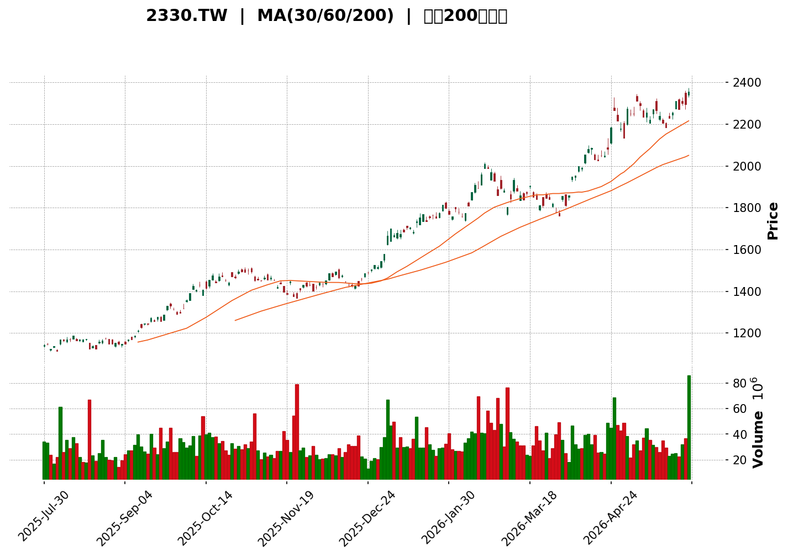
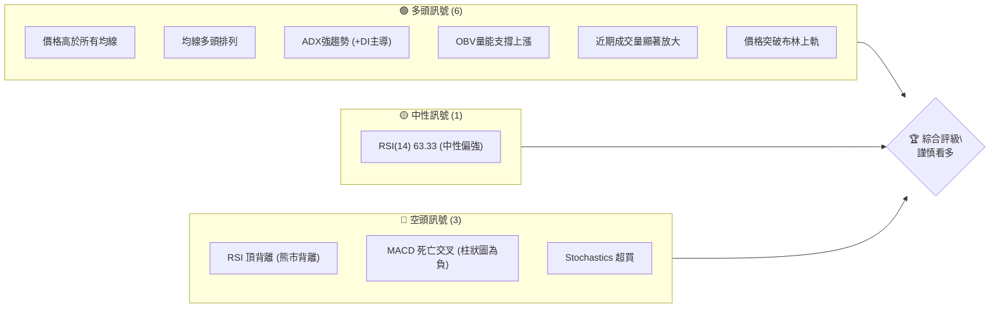
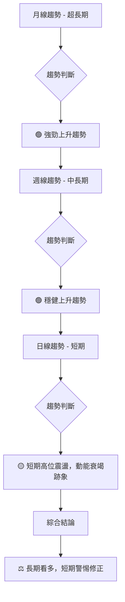
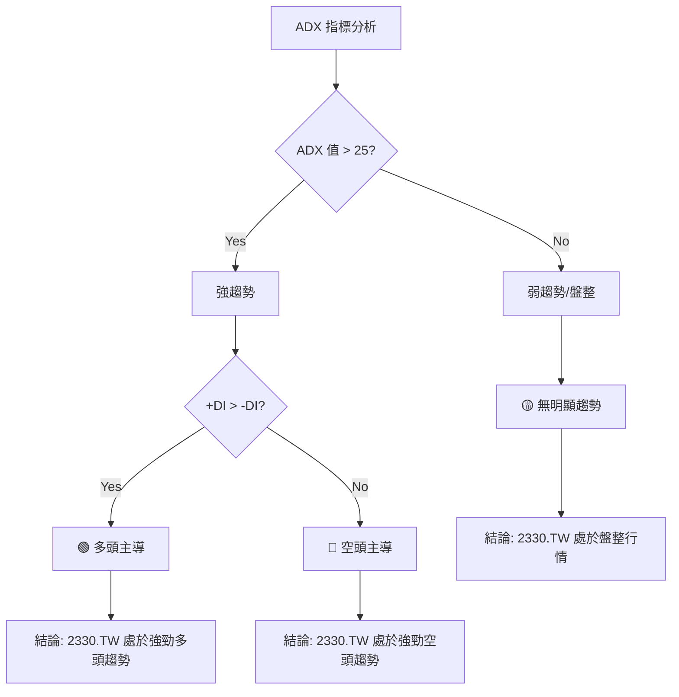
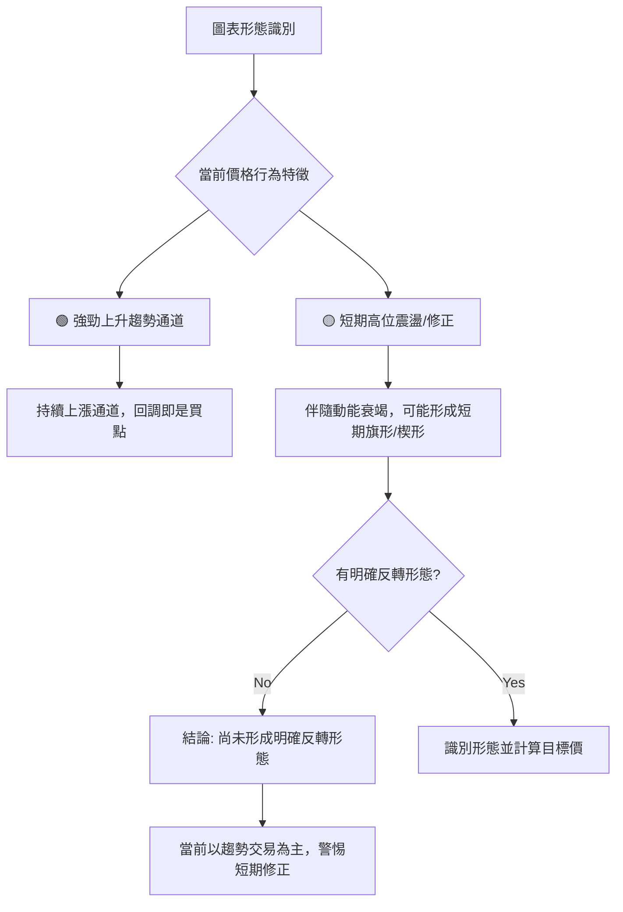

<details>
<summary>📊 靜態圖表 (點擊展開)</summary>

</details>

<html>
<head><meta charset="utf-8" /></head>
<body>
    <div>                        <script>window.PlotlyConfig = {MathJaxConfig: 'local'};</script>
        <script charset="utf-8" src="https://cdn.plot.ly/plotly-3.5.0.min.js" integrity="sha256-fHbNLP+GlIXN+efbQec78UkemUz3NJp7UmfGxC1tNxs=" crossorigin="anonymous"></script>                <div id="candlestick-chart" class="plotly-graph-div" style="height:500px; width:100%;"></div>            <script>                window.PLOTLYENV=window.PLOTLYENV || {};                                if (document.getElementById("candlestick-chart")) {                    Plotly.newPlot(                        "candlestick-chart",                        [{"close":{"dtype":"f8","bdata":"AAAAIGTbkUAAAABALu+RQAAAAIA7jJFAAAAAAJrHkUAAAABgp2SRQAAAAKBWPpJAAAAAoIwqkkAAAACgVj6SQAAAAKBWPpJAAAAAQH+NkkAAAACgjCqSQAAAAKBWPpJAAAAAoFY+kkAAAADgIFKSQAAAAIA7jJFAAAAAAJrHkUAAAACAO4yRQAAAAIDCFpJAAAAAoIwqkkAAAAAA62WSQAAAAEAu75FAAAAAQC7vkUAAAABg+AKSQAAAAEAu75FAAAAAQC7vkUAAAABALu+RQAAAAKBWPpJAAAAAoFY+kkAAAABAf42SQAAAAABy8JJAAAAAYNArk0AAAADg+HqTQAAAAMAuZ5NAAAAAIGXek0AAAAAAyqKTQAAAAKBD8pNAAAAAAMqik0AAAABgABqUQAAAAODRzJRAAAAA4NHMlEAAAABAWH2UQAAAAKDeLZRAAAAAAL1BlEAAAACgNpGUQAAAAMApMJVAAAAAoD67lUAAAABgU0aWQAAAAODZ9pVAAAAAwDFalkAAAADg2faVQAAAAICWHpZAAAAAwIm9lkAAAABgAw2XQAAAAIDugZZAAAAAACX5lkAAAAAAJfmWQAAAAGCrqZZAAAAAgO6BlkAAAAAAJfmWQAAAAKBG5ZZAAAAA4Hxcl0AAAADgfFyXQAAAAICeSJdAAAAAQFtwl0AAAADgfFyXQAAAAGCrqZZAAAAAwIm9lkAAAABgq6mWQAAAAKBG5ZZAAAAAwIm9lkAAAACgRuWWQAAAAGCrqZZAAAAA4HQylkAAAAAgEG6WQAAAAAAdz5VAAAAAQGCnlUAAAAAAzZWWQAAAAGCjf5VAAAAAoOZXlUAAAADg2faVQAAAAMAxWpZAAAAAYFNGlkAAAADAMVqWQAAAAID74pVAAAAA4HQylkAAAACA7oGWQAAAACAQbpZAAAAAYKuplkAAAAAgwDSXQAAAAAAl+ZZAAAAA4Hxcl0AAAADA4OSWQAAAAIC\u002fDJdAAAAAYCOVlkAAAABgVVmWQAAAAABmRZZAAAAAAGZFlkAAAAAAZkWWQAAAAGDx0JZAAAAAIJ40l0AAAACAjUiXQAAAAKBbhJdAAAAAABnUl0AAAABAOqyXQAAAAGDWI5hAAAAA4GGvmEAAAADARgKaQAAAAEDSjZpAAAAAIDYWmkAAAADgFD6aQAAAAIAlKppAAAAAIARSmkAAAACgwaGaQAAAAKDBoZpAAAAAIARSmkAAAACgXRmbQAAAAAAbaZtAAAAAIOmkm0AAAACgXRmbQAAAAAAbaZtAAAAAwPmQm0AAAADAK1WbQAAAAIDYuJtAAAAAQFNYnEAAAABAhRycQAAAACDppJtAAAAAYAp9m0AAAADglQicQAAAAMDHzJtAAAAAYAp9m0AAAACA2LibQAAAAOBjRJxAAAAAgItHnUAAAADgFtOdQAAAAOBIl51AAAAAYHCankAAAADgyWGfQAAAAIAMEp9AAAAAIE\u002fCnkAAAABA1CKeQAAAAGC9C51AAAAA4EiXnUAAAAAgam+dQAAAAIB0MJxAAAAAYO\u002fPnEAAAACgwzaeQAAAAMB6W51AAAAAYL0LnUAAAAAAALycQAAAAAAAOJ1AAAAAAADEnUAAAAAAAOicQAAAAAAAwJxAAAAAAABInEAAAAAAAEicQAAAAAAA1JxAAAAAAADAnEAAAAAAAHCcQAAAAAAA0JtAAAAAAACAm0AAAAAAAPycQAAAAAAASJxAAAAAAAAQnUAAAAAAAHieQAAAAAAAjJ5AAAAAAABAn0AAAAAAABifQAAAAAAADqBAAAAAAABAoEAAAAAAAEqgQAAAAAAAuJ9AAAAAAACkn0AAAAAAAASgQAAAAAAABKBAAAAAAABAoEAAAAAAABKhQAAAAAAAsqFAAAAAAABOoUAAAAAAAAihQAAAAAAArqBAAAAAAADGoUAAAAAAAJShQAAAAAAAlKFAAAAAAAAMokAAAAAAAOShQAAAAAAAdqFAAAAAAACeoUAAAAAAAFihQAAAAAAAvKFAAAAAAACyoUAAAAAAAIChQAAAAAAAOqFAAAAAAAASoUAAAAAAAGyhQAAAAAAAnqFAAAAAAAAMokAAAAAAALyhQAAAAAAA+KFAAAAAAADuoUAAAAAAAGaiQA=="},"high":{"dtype":"f8","bdata":"zaFiQS7vkUB8GmFh+AKSQAAAAIA7jJFAAAAAAJrHkUCDLdiiO4yRQAAAAKBWPpJABTG54iBSkkBoOKkDtXmSQEXQcOLqZZJAAAAAQH+NkkCIyRUE62WSQCJoOMEgUpJAImg4wSBSkkAAAADgIFKSQPnBnEf4ApJAhixkIWTbkUD7KxMFZNuRQMMrvMJWPpJABTG54iBSkkAAAAAA62WSQGqE5eYgUpJAaoTl5iBSkkAAAABg+AKSQHNPI6SMKpJAAAAAQC7vkUBzTyOkjCqSQAAAAKBWPpJAaDipA7V5kkAAAABAf42SQNjNbyE8BJNAW2ut5fh6k0AAAADg+HqTQA8DZ+H4epNAAAAghUPyk0BYHV\u002fKhsqTQAAAAKBD8pNAXMnt+SEGlEAAAABgABqUQAAAAODRzJRACCpnD20IlUCjiy4KFaWUQDdyI895aZRAA5kUL1h9lEAJxluZjvSUQKVQCiUIRJVAAAAAoD67lUDJAUIqEG6WQNSPM0W4CpZAVlVV78yVlkDUjzNFuAqWQNhQXkOrqZZAAAAAwIm9lkBQ61cqwDSXQBdDOq+JvZZAHEyRL8A0l0DQusGUnkiXQJMmTSpo0ZZAs2sT5cyVlkDQusGUnkiXQInOns\u002fhIJdAHLs0qjmEl0CqGE8PGJiXQJqZmXn2q5dAWBQsChiYl0A4dml09quXQHDgwFkDDZdAqjlm7yT5lkBKkybFib2WQAbfaWoDDZdAVXPMHsA0l0AG32lqAw2XQJMmTSpo0ZZA8OYRqjFalkA5wEdPq6mWQBVRv15TRpZASiml1Nn2lUBGGytlq6mWQHgGVfQcz5VA61G4\u002fhzPlUCpH2eqlh6WQAAAAMAxWpZAkgOE9MyVlkBWVVXvzJWWQF78iUQQbpZA8OYRqjFalkAAAACA7oGWQL7qF4XugZZAAAAAYKuplkAAAAAgwDSXQNC6wZSeSJdAAAAA4Hxcl0AqeDnlSpiXQJ91g9muIJdAClp9uRKplkCf8hATNIGWQFIOiAw0gZZAca+CWVVZlkA0bY2\u002fEqmWQBR1crng5JZAAAAAIJ40l0DwuHjZfFyXQAAAAKBbhJdAAAAAABnUl0C9hvLyGNSXQAAAAGDWI5hAAAAA4GGvmECc1mx\u002f82WaQAAAAEDSjZpA5EoC0xQ+mkBlC6Hs4nmaQIZhGObieZpAhAFnLNKNmkDGdBZToMmaQGM6i\u002fmwtZpAWFbv0uJ5mkCQSfFSPEGbQF100WXYuJtAAAAAIOmkm0DoN1tfCn2bQC666LL5kJtAnNR9Gemkm0CZkinZx8ybQOYwh9nHzJtAAAAAQFNYnEAHrSxZIZScQKaejN+VCJxAAAAAYAp9m0BbsAWTdDCcQGaK0yWFHJxA2VRrbNi4m0AAAACA2LibQKUF6EUhlJxAAAAAgItHnUCKT\u002feS9fqdQHRLnFLUIp5AqNX4Ek\u002fCnkBrSPqSqImfQCHjgozaTZ9Aa3EThgwSn0DWlDVlPtaeQESsUYUnv51AWYEwEoGGnkC+hPbSSJedQAAAAIB0MJxA+awbLGpvnUAdFfhSol6eQFL\u002fyNgW051AAmnrxXpbnUAnt3hyi0edQAAAAAAAYJ1AAAAAAADYnUAAAAAAAGCdQAAAAAAAOJ1AAAAAAABcnEAAAAAAAOicQAAAAAAATJ1AAAAAAAAknUAAAAAAAIScQAAAAAAAIJxAAAAAAAD4m0AAAAAAAPycQAAAAAAAJJ1AAAAAAAAQnUAAAAAAAHieQAAAAAAAjJ5AAAAAAABAn0AAAAAAACyfQAAAAAAADqBAAAAAAABooEAAAAAAAFSgQAAAAAAAGKBAAAAAAAAOoEAAAAAAADagQAAAAAAALKBAAAAAAACuoEAAAAAAAByhQAAAAAAANKJAAAAAAADQoUAAAAAAAEShQAAAAAAATqFAAAAAAADaoUAAAAAAALyhQAAAAAAA2qFAAAAAAABSokAAAAAAAAyiQAAAAAAAxqFAAAAAAADQoUAAAAAAAIChQAAAAAAAvKFAAAAAAAAqokAAAAAAAKihQAAAAAAAbKFAAAAAAABEoUAAAAAAAJ6hQAAAAAAAqKFAAAAAAAAMokAAAAAAACqiQAAAAAAANKJAAAAAAABwokAAAAAAAI6iQA=="},"hovertemplate":"\u003cb\u003e%{x|%Y-%m-%d}\u003c\u002fb\u003e\u003cbr\u003e\u958b: $%{open:.2f}\u003cbr\u003e\u9ad8: $%{high:.2f}\u003cbr\u003e\u4f4e: $%{low:.2f}\u003cbr\u003e\u6536: $%{close:.2f}\u003cextra\u003e\u003c\u002fextra\u003e","low":{"dtype":"f8","bdata":"Zrw63c+zkUCE5Z4eZNuRQAJqdj2nZJFA9aY3vQWgkUAAAABgp2SRQFL35flj25FAfWejfsIWkkCYx1Y8+AKSQLovj13CFpJAAAAA3CBSkkAAAACgjCqSQLovj13CFpJAui+PXcIWkkAmsUydjCqSQAAAAIA7jJFA9aY3vQWgkUAAAACAO4yRQD3UQz0u75FAeDbqOy7vkUC+mE+9Vj6SQAAAAEAu75FAAAAAQC7vkUDopYHaz7ORQITlnh5k25FAjbDc28+zkUAAAABALu+RQLovj13CFpJAAAAAoFY+kkBVVVX96mWSQE9kIL3dyJJAKaWUPgYYk0BN0zSdZFOTQPD8mJ5kU5NAAACAi+uOk0AAAAAAyqKTQBXrFAvKopNAAAAAAMqik0B91g1mqLaTQEkPVOZ5aZRA+NWYsDaRlEAAAABAWH2UQEMv9DoAGpRAAAAAAL1BlEAAAACgNpGUQLZe6\u002fVsCJVAAAAA3CkwlUBT\u002fZwwuAqWQFfgmBUdz5VAchzH9XQylkDZMP7lgZOVQL2G8hq4CpZAOmbvlpYelkBgKVDLib2WQAAAAIDugZZAfdYNBs2VlkAAAAAAJfmWQLds2frMlZZA6bzFUFNGlkAAAAAAJfmWQH0Qyzpo0ZZAVuewsOEgl0ByouV6nkiXQAAAAICeSJdAT9enq+Egl0DkRMsVwDSXQLds2frMlZZAAAAAwIm9lkC3bNn6zJWWQPogltWJvZZAAAAAwIm9lkB3MWFwq6mWQAAAAGCrqZZAiAz3epYelkAAAAAgEG6WQAAAAAAdz5VAAAAAQGCnlUAwrn7QMVqWQAAAAGCjf5VAAAAAoOZXlUBX4JgVHc+VQKuqqpCWHpZAHP\u002fe+nQylkA5juNaU0aWQAAAAID74pVAEBnuFbgKlkDpvMVQU0aWQMc\u002fuPB0MpZA2rJlyzFalkA1Rgpcq6mWQAAAAAAl+ZZAyImWSwMNl0A01odm8dCWQMIU+czg5JZA9aWCBjSBlkBhDe+sdjGWQI9QfaZ2MZZArvF385cJlkAAAAAAZkWWQNgVG60SqZZAK4szuuDklkAhjg7NriCXQMgGZJONSJdAmkTvmVuEl0BEeQ2NW4SXQNjHhe1KmJdALz6vE+cPmECzfaKa3E6ZQNtssw2anplAHLX9bFfumUA26b3GeMaZQBmGYcB4xplAAAAAIARSmkA7i+ns4nmaQDuL6ezieZpAqakQbSUqmkBPIyyHwaGaQF100Y2P3ZpAGFVurV0Zm0AAAACgXRmbQNFFF008QZtAj60IWjxBm0AAAADAK1WbQIELXMArVZtAh3AIJ7fgm0DUjXjmlQicQAAAACDppJtA3o4b+kwtm0B3d3fTx8ybQM06Fg3ppJtAt+OGBhtpm0DPeMazXRmbQAAAAOBjRJxAaKO+sxConEDWwSIUnDOdQAAAAOBIl51AtNMj4RbTnUArbwt6DBKfQAAAAIAMEp9AhfldrcM2nkAAAABA1CKeQAAAAGC9C51AOfV7hlmDnUBDewlti0edQKTcVLT5kJtAhCny+TGAnEDDdrMUnDOdQAAAAMB6W51AvbyZoBConEAAAAAAALycQAAAAAAAEJ1AAAAAAACInUAAAAAAAOicQAAAAAAAwJxAAAAAAADkm0AAAAAAACCcQAAAAAAA1JxAAAAAAADAnEAAAAAAACCcQAAAAAAA0JtAAAAAAACAm0AAAAAAAJicQAAAAAAANJxAAAAAAACsnEAAAAAAABSeQAAAAAAAKJ5AAAAAAADInkAAAAAAANyeQAAAAAAAaJ9AAAAAAAAYoEAAAAAAAA6gQAAAAAAAuJ9AAAAAAACkn0AAAAAAAPSfQAAAAAAA4J9AAAAAAAAOoEAAAAAAAHKgQAAAAAAAsqFAAAAAAABOoUAAAAAAAOqgQAAAAAAArqBAAAAAAAAmoUAAAAAAAIChQAAAAAAAgKFAAAAAAAAMokAAAAAAALKhQAAAAAAAdqFAAAAAAABEoUAAAAAAADqhQAAAAAAAbKFAAAAAAACUoUAAAAAAAE6hQAAAAAAAOqFAAAAAAAASoUAAAAAAAGyhQAAAAAAAYqFAAAAAAADGoUAAAAAAALyhQAAAAAAA5KFAAAAAAAC8oUAAAAAAADSiQA=="},"name":"\u50f9\u683c","open":{"dtype":"f8","bdata":"M16d\u002fpnHkUAAAABALu+RQAE1u15xeJFAetOb3s+zkUDBFmyBcXiRQHVfHhsu75FAg5hcwVY+kkC6L49dwhaSQAAAAKBWPpJAAAAA3CBSkkAFMbniIFKSQN2Xx36MKpJAui+PXcIWkkCTWKa+Vj6SQPnBnEf4ApJA9aY3vQWgkUD7KxMFZNuRQB\u002fqoV74ApJA+s5GXfgCkkAAAAAA62WSQGqE5eYgUpJA7mmExVY+kkBuPOH7mceRQPc0woLCFpJAhOWeHmTbkUD3NMKCwhaSQN2Xx36MKpJAaDipA7V5kkCrqqoetXmSQCgykN6n3JJAhBBCxC5nk0CnaZq+LmeTQA8DZ+H4epNAAACg8Mmik0Csji9lqLaTQIt1itWGypNAsDq+lEPyk0B91g1mqLaTQKFydktYfZRAsMZEqo70lEAAAABAWH2UQHqhF2qbVZRArN0GZZtVlEAAAACgNpGUQFuv9VpLHJVAAAAA3CkwlUBT\u002fZwwuAqWQCtwzHr74pVAAAAAwDFalkDZMP7lgZOVQJTXUN7MlZZAq4wzYVNGlkBgKVDLib2WQLNrE+XMlZZAMUU+a6uplkC0bjBlAw2XQAAAAGCrqZZAnCjZtTFalkDQusGUnkiXQIPvNAUl+ZZA5ETLFcA0l0AcuzSqOYSXQPYoXK85hJdAAAAAQFtwl0CqGE8PGJiXQCdNmvQk+ZZAORMiJWjRlkAAAABgq6mWQH0Qyzpo0ZZAHGCqueEgl0B9EMs6aNGWQAAAAGCrqZZAiAz3epYelkC+6heF7oGWQBVRv15TRpZAUkoppT67lUC75NSa7oGWQDyDKipgp5VAmpmZmT67lUCpH2eqlh6WQHIcx\u002fV0MpZArQJjj+6BlkAAAADAMVqWQF78iUQQbpZAAAAA4HQylkCcKNm1MVqWQAAAACAQbpZAI0aMMBBulkDAYC3Bib2WQBxMkS\u002fANJdAVuewsOEgl0BeTsGLW4SXQGGKfCbQ+JZAAAAAYCOVlkAAAABgVVmWQHGvgllVWZZAHqH6TIcdlkA0bY2\u002fEqmWQAAAAGDx0JZAYKimE9D4lkAAAACAjUiXQO2sdkZscJdAdHNz80qYl0CivIbmSpiXQHD0BEc6rJdAo27DxsU3mECgqB70y2KZQNtssw2anplAHLX9bFfumUAC7UggaNqZQNy2bXNX7plAWFbv0uJ5mkDGdBZToMmaQJ3FdEbSjZpA1FSIxhQ+mkA4W4dGbgWbQF100Y2P3ZpAGFVurV0Zm0DIpHj5TC2bQBdddFkKfZtAAAAAwPmQm0CJ2w1zCn2bQGg84xkbaZtAh3AIJ7fgm0DbOqX\u002fMYCcQGSShyy34JtAJquUUzxBm0BbsAWTdDCcQAAAAMDHzJtAAAAAYAp9m0C1qU0NTS2bQDsEbuwxgJxA+85GDQC8nECcaZ5ti0edQAAAAOBIl51AtNMj4RbTnUArbwt6DBKfQGD2gNn7JZ9AhfldrcM2nkBuHkayX66eQIMd4XhZg51AO1YgrMM2nkBDewlti0edQBBByg3ppJtAfdYNxqwfnUDgi6vHeludQKl\u002fZMxIl51AvbyZoBConECPwfkYnDOdQAAAAAAATJ1AAAAAAACwnUAAAAAAAEydQAAAAAAAEJ1AAAAAAAD4m0AAAAAAAOicQAAAAAAAJJ1AAAAAAADonEAAAAAAADScQAAAAAAA0JtAAAAAAAC8m0AAAAAAAMCcQAAAAAAAJJ1AAAAAAADonEAAAAAAADyeQAAAAAAAZJ5AAAAAAADcnkAAAAAAAASfQAAAAAAAfJ9AAAAAAAAioEAAAAAAAECgQAAAAAAADqBAAAAAAAC4n0AAAAAAAASgQAAAAAAA9J9AAAAAAABUoEAAAAAAAHygQAAAAAAA0KFAAAAAAACKoUAAAAAAAP6gQAAAAAAAOqFAAAAAAAAwoUAAAAAAAJShQAAAAAAAlKFAAAAAAAA+okAAAAAAAPihQAAAAAAAsqFAAAAAAAB2oUAAAAAAADqhQAAAAAAAlKFAAAAAAAAMokAAAAAAAGKhQAAAAAAAWKFAAAAAAAA6oUAAAAAAAIChQAAAAAAAiqFAAAAAAADGoUAAAAAAACCiQAAAAAAADKJAAAAAAABcokAAAAAAAEiiQA=="},"x":["2025-07-30T00:00:00+08:00","2025-07-31T00:00:00+08:00","2025-08-04T00:00:00+08:00","2025-08-05T00:00:00+08:00","2025-08-06T00:00:00+08:00","2025-08-07T00:00:00+08:00","2025-08-08T00:00:00+08:00","2025-08-11T00:00:00+08:00","2025-08-12T00:00:00+08:00","2025-08-13T00:00:00+08:00","2025-08-14T00:00:00+08:00","2025-08-15T00:00:00+08:00","2025-08-18T00:00:00+08:00","2025-08-19T00:00:00+08:00","2025-08-20T00:00:00+08:00","2025-08-21T00:00:00+08:00","2025-08-22T00:00:00+08:00","2025-08-25T00:00:00+08:00","2025-08-26T00:00:00+08:00","2025-08-27T00:00:00+08:00","2025-08-28T00:00:00+08:00","2025-08-29T00:00:00+08:00","2025-09-01T00:00:00+08:00","2025-09-02T00:00:00+08:00","2025-09-03T00:00:00+08:00","2025-09-04T00:00:00+08:00","2025-09-05T00:00:00+08:00","2025-09-08T00:00:00+08:00","2025-09-09T00:00:00+08:00","2025-09-10T00:00:00+08:00","2025-09-11T00:00:00+08:00","2025-09-12T00:00:00+08:00","2025-09-15T00:00:00+08:00","2025-09-16T00:00:00+08:00","2025-09-17T00:00:00+08:00","2025-09-18T00:00:00+08:00","2025-09-19T00:00:00+08:00","2025-09-22T00:00:00+08:00","2025-09-23T00:00:00+08:00","2025-09-24T00:00:00+08:00","2025-09-25T00:00:00+08:00","2025-09-26T00:00:00+08:00","2025-09-30T00:00:00+08:00","2025-10-01T00:00:00+08:00","2025-10-02T00:00:00+08:00","2025-10-03T00:00:00+08:00","2025-10-07T00:00:00+08:00","2025-10-08T00:00:00+08:00","2025-10-09T00:00:00+08:00","2025-10-13T00:00:00+08:00","2025-10-14T00:00:00+08:00","2025-10-15T00:00:00+08:00","2025-10-16T00:00:00+08:00","2025-10-17T00:00:00+08:00","2025-10-20T00:00:00+08:00","2025-10-21T00:00:00+08:00","2025-10-22T00:00:00+08:00","2025-10-23T00:00:00+08:00","2025-10-27T00:00:00+08:00","2025-10-28T00:00:00+08:00","2025-10-29T00:00:00+08:00","2025-10-30T00:00:00+08:00","2025-10-31T00:00:00+08:00","2025-11-03T00:00:00+08:00","2025-11-04T00:00:00+08:00","2025-11-05T00:00:00+08:00","2025-11-06T00:00:00+08:00","2025-11-07T00:00:00+08:00","2025-11-10T00:00:00+08:00","2025-11-11T00:00:00+08:00","2025-11-12T00:00:00+08:00","2025-11-13T00:00:00+08:00","2025-11-14T00:00:00+08:00","2025-11-17T00:00:00+08:00","2025-11-18T00:00:00+08:00","2025-11-19T00:00:00+08:00","2025-11-20T00:00:00+08:00","2025-11-21T00:00:00+08:00","2025-11-24T00:00:00+08:00","2025-11-25T00:00:00+08:00","2025-11-26T00:00:00+08:00","2025-11-27T00:00:00+08:00","2025-11-28T00:00:00+08:00","2025-12-01T00:00:00+08:00","2025-12-02T00:00:00+08:00","2025-12-03T00:00:00+08:00","2025-12-04T00:00:00+08:00","2025-12-05T00:00:00+08:00","2025-12-08T00:00:00+08:00","2025-12-09T00:00:00+08:00","2025-12-10T00:00:00+08:00","2025-12-11T00:00:00+08:00","2025-12-12T00:00:00+08:00","2025-12-15T00:00:00+08:00","2025-12-16T00:00:00+08:00","2025-12-17T00:00:00+08:00","2025-12-18T00:00:00+08:00","2025-12-19T00:00:00+08:00","2025-12-22T00:00:00+08:00","2025-12-23T00:00:00+08:00","2025-12-24T00:00:00+08:00","2025-12-26T00:00:00+08:00","2025-12-29T00:00:00+08:00","2025-12-30T00:00:00+08:00","2025-12-31T00:00:00+08:00","2026-01-02T00:00:00+08:00","2026-01-05T00:00:00+08:00","2026-01-06T00:00:00+08:00","2026-01-07T00:00:00+08:00","2026-01-08T00:00:00+08:00","2026-01-09T00:00:00+08:00","2026-01-12T00:00:00+08:00","2026-01-13T00:00:00+08:00","2026-01-14T00:00:00+08:00","2026-01-15T00:00:00+08:00","2026-01-16T00:00:00+08:00","2026-01-19T00:00:00+08:00","2026-01-20T00:00:00+08:00","2026-01-21T00:00:00+08:00","2026-01-22T00:00:00+08:00","2026-01-23T00:00:00+08:00","2026-01-26T00:00:00+08:00","2026-01-27T00:00:00+08:00","2026-01-28T00:00:00+08:00","2026-01-29T00:00:00+08:00","2026-01-30T00:00:00+08:00","2026-02-02T00:00:00+08:00","2026-02-03T00:00:00+08:00","2026-02-04T00:00:00+08:00","2026-02-05T00:00:00+08:00","2026-02-06T00:00:00+08:00","2026-02-09T00:00:00+08:00","2026-02-10T00:00:00+08:00","2026-02-11T00:00:00+08:00","2026-02-23T00:00:00+08:00","2026-02-24T00:00:00+08:00","2026-02-25T00:00:00+08:00","2026-02-26T00:00:00+08:00","2026-03-02T00:00:00+08:00","2026-03-03T00:00:00+08:00","2026-03-04T00:00:00+08:00","2026-03-05T00:00:00+08:00","2026-03-06T00:00:00+08:00","2026-03-09T00:00:00+08:00","2026-03-10T00:00:00+08:00","2026-03-11T00:00:00+08:00","2026-03-12T00:00:00+08:00","2026-03-13T00:00:00+08:00","2026-03-16T00:00:00+08:00","2026-03-17T00:00:00+08:00","2026-03-18T00:00:00+08:00","2026-03-19T00:00:00+08:00","2026-03-20T00:00:00+08:00","2026-03-23T00:00:00+08:00","2026-03-24T00:00:00+08:00","2026-03-25T00:00:00+08:00","2026-03-26T00:00:00+08:00","2026-03-27T00:00:00+08:00","2026-03-30T00:00:00+08:00","2026-03-31T00:00:00+08:00","2026-04-01T00:00:00+08:00","2026-04-02T00:00:00+08:00","2026-04-07T00:00:00+08:00","2026-04-08T00:00:00+08:00","2026-04-09T00:00:00+08:00","2026-04-10T00:00:00+08:00","2026-04-13T00:00:00+08:00","2026-04-14T00:00:00+08:00","2026-04-15T00:00:00+08:00","2026-04-16T00:00:00+08:00","2026-04-17T00:00:00+08:00","2026-04-20T00:00:00+08:00","2026-04-21T00:00:00+08:00","2026-04-22T00:00:00+08:00","2026-04-23T00:00:00+08:00","2026-04-24T00:00:00+08:00","2026-04-27T00:00:00+08:00","2026-04-28T00:00:00+08:00","2026-04-29T00:00:00+08:00","2026-04-30T00:00:00+08:00","2026-05-04T00:00:00+08:00","2026-05-05T00:00:00+08:00","2026-05-06T00:00:00+08:00","2026-05-07T00:00:00+08:00","2026-05-08T00:00:00+08:00","2026-05-11T00:00:00+08:00","2026-05-12T00:00:00+08:00","2026-05-13T00:00:00+08:00","2026-05-14T00:00:00+08:00","2026-05-15T00:00:00+08:00","2026-05-18T00:00:00+08:00","2026-05-19T00:00:00+08:00","2026-05-20T00:00:00+08:00","2026-05-21T00:00:00+08:00","2026-05-22T00:00:00+08:00","2026-05-25T00:00:00+08:00","2026-05-26T00:00:00+08:00","2026-05-27T00:00:00+08:00","2026-05-28T00:00:00+08:00","2026-05-29T00:00:00+08:00"],"type":"candlestick"},{"hovertemplate":"MA30: $%{y:.2f}\u003cextra\u003e\u003c\u002fextra\u003e","line":{"color":"#2196F3","dash":"dash","width":2},"mode":"lines","name":"MA30","x":["2025-07-30T00:00:00+08:00","2025-07-31T00:00:00+08:00","2025-08-04T00:00:00+08:00","2025-08-05T00:00:00+08:00","2025-08-06T00:00:00+08:00","2025-08-07T00:00:00+08:00","2025-08-08T00:00:00+08:00","2025-08-11T00:00:00+08:00","2025-08-12T00:00:00+08:00","2025-08-13T00:00:00+08:00","2025-08-14T00:00:00+08:00","2025-08-15T00:00:00+08:00","2025-08-18T00:00:00+08:00","2025-08-19T00:00:00+08:00","2025-08-20T00:00:00+08:00","2025-08-21T00:00:00+08:00","2025-08-22T00:00:00+08:00","2025-08-25T00:00:00+08:00","2025-08-26T00:00:00+08:00","2025-08-27T00:00:00+08:00","2025-08-28T00:00:00+08:00","2025-08-29T00:00:00+08:00","2025-09-01T00:00:00+08:00","2025-09-02T00:00:00+08:00","2025-09-03T00:00:00+08:00","2025-09-04T00:00:00+08:00","2025-09-05T00:00:00+08:00","2025-09-08T00:00:00+08:00","2025-09-09T00:00:00+08:00","2025-09-10T00:00:00+08:00","2025-09-11T00:00:00+08:00","2025-09-12T00:00:00+08:00","2025-09-15T00:00:00+08:00","2025-09-16T00:00:00+08:00","2025-09-17T00:00:00+08:00","2025-09-18T00:00:00+08:00","2025-09-19T00:00:00+08:00","2025-09-22T00:00:00+08:00","2025-09-23T00:00:00+08:00","2025-09-24T00:00:00+08:00","2025-09-25T00:00:00+08:00","2025-09-26T00:00:00+08:00","2025-09-30T00:00:00+08:00","2025-10-01T00:00:00+08:00","2025-10-02T00:00:00+08:00","2025-10-03T00:00:00+08:00","2025-10-07T00:00:00+08:00","2025-10-08T00:00:00+08:00","2025-10-09T00:00:00+08:00","2025-10-13T00:00:00+08:00","2025-10-14T00:00:00+08:00","2025-10-15T00:00:00+08:00","2025-10-16T00:00:00+08:00","2025-10-17T00:00:00+08:00","2025-10-20T00:00:00+08:00","2025-10-21T00:00:00+08:00","2025-10-22T00:00:00+08:00","2025-10-23T00:00:00+08:00","2025-10-27T00:00:00+08:00","2025-10-28T00:00:00+08:00","2025-10-29T00:00:00+08:00","2025-10-30T00:00:00+08:00","2025-10-31T00:00:00+08:00","2025-11-03T00:00:00+08:00","2025-11-04T00:00:00+08:00","2025-11-05T00:00:00+08:00","2025-11-06T00:00:00+08:00","2025-11-07T00:00:00+08:00","2025-11-10T00:00:00+08:00","2025-11-11T00:00:00+08:00","2025-11-12T00:00:00+08:00","2025-11-13T00:00:00+08:00","2025-11-14T00:00:00+08:00","2025-11-17T00:00:00+08:00","2025-11-18T00:00:00+08:00","2025-11-19T00:00:00+08:00","2025-11-20T00:00:00+08:00","2025-11-21T00:00:00+08:00","2025-11-24T00:00:00+08:00","2025-11-25T00:00:00+08:00","2025-11-26T00:00:00+08:00","2025-11-27T00:00:00+08:00","2025-11-28T00:00:00+08:00","2025-12-01T00:00:00+08:00","2025-12-02T00:00:00+08:00","2025-12-03T00:00:00+08:00","2025-12-04T00:00:00+08:00","2025-12-05T00:00:00+08:00","2025-12-08T00:00:00+08:00","2025-12-09T00:00:00+08:00","2025-12-10T00:00:00+08:00","2025-12-11T00:00:00+08:00","2025-12-12T00:00:00+08:00","2025-12-15T00:00:00+08:00","2025-12-16T00:00:00+08:00","2025-12-17T00:00:00+08:00","2025-12-18T00:00:00+08:00","2025-12-19T00:00:00+08:00","2025-12-22T00:00:00+08:00","2025-12-23T00:00:00+08:00","2025-12-24T00:00:00+08:00","2025-12-26T00:00:00+08:00","2025-12-29T00:00:00+08:00","2025-12-30T00:00:00+08:00","2025-12-31T00:00:00+08:00","2026-01-02T00:00:00+08:00","2026-01-05T00:00:00+08:00","2026-01-06T00:00:00+08:00","2026-01-07T00:00:00+08:00","2026-01-08T00:00:00+08:00","2026-01-09T00:00:00+08:00","2026-01-12T00:00:00+08:00","2026-01-13T00:00:00+08:00","2026-01-14T00:00:00+08:00","2026-01-15T00:00:00+08:00","2026-01-16T00:00:00+08:00","2026-01-19T00:00:00+08:00","2026-01-20T00:00:00+08:00","2026-01-21T00:00:00+08:00","2026-01-22T00:00:00+08:00","2026-01-23T00:00:00+08:00","2026-01-26T00:00:00+08:00","2026-01-27T00:00:00+08:00","2026-01-28T00:00:00+08:00","2026-01-29T00:00:00+08:00","2026-01-30T00:00:00+08:00","2026-02-02T00:00:00+08:00","2026-02-03T00:00:00+08:00","2026-02-04T00:00:00+08:00","2026-02-05T00:00:00+08:00","2026-02-06T00:00:00+08:00","2026-02-09T00:00:00+08:00","2026-02-10T00:00:00+08:00","2026-02-11T00:00:00+08:00","2026-02-23T00:00:00+08:00","2026-02-24T00:00:00+08:00","2026-02-25T00:00:00+08:00","2026-02-26T00:00:00+08:00","2026-03-02T00:00:00+08:00","2026-03-03T00:00:00+08:00","2026-03-04T00:00:00+08:00","2026-03-05T00:00:00+08:00","2026-03-06T00:00:00+08:00","2026-03-09T00:00:00+08:00","2026-03-10T00:00:00+08:00","2026-03-11T00:00:00+08:00","2026-03-12T00:00:00+08:00","2026-03-13T00:00:00+08:00","2026-03-16T00:00:00+08:00","2026-03-17T00:00:00+08:00","2026-03-18T00:00:00+08:00","2026-03-19T00:00:00+08:00","2026-03-20T00:00:00+08:00","2026-03-23T00:00:00+08:00","2026-03-24T00:00:00+08:00","2026-03-25T00:00:00+08:00","2026-03-26T00:00:00+08:00","2026-03-27T00:00:00+08:00","2026-03-30T00:00:00+08:00","2026-03-31T00:00:00+08:00","2026-04-01T00:00:00+08:00","2026-04-02T00:00:00+08:00","2026-04-07T00:00:00+08:00","2026-04-08T00:00:00+08:00","2026-04-09T00:00:00+08:00","2026-04-10T00:00:00+08:00","2026-04-13T00:00:00+08:00","2026-04-14T00:00:00+08:00","2026-04-15T00:00:00+08:00","2026-04-16T00:00:00+08:00","2026-04-17T00:00:00+08:00","2026-04-20T00:00:00+08:00","2026-04-21T00:00:00+08:00","2026-04-22T00:00:00+08:00","2026-04-23T00:00:00+08:00","2026-04-24T00:00:00+08:00","2026-04-27T00:00:00+08:00","2026-04-28T00:00:00+08:00","2026-04-29T00:00:00+08:00","2026-04-30T00:00:00+08:00","2026-05-04T00:00:00+08:00","2026-05-05T00:00:00+08:00","2026-05-06T00:00:00+08:00","2026-05-07T00:00:00+08:00","2026-05-08T00:00:00+08:00","2026-05-11T00:00:00+08:00","2026-05-12T00:00:00+08:00","2026-05-13T00:00:00+08:00","2026-05-14T00:00:00+08:00","2026-05-15T00:00:00+08:00","2026-05-18T00:00:00+08:00","2026-05-19T00:00:00+08:00","2026-05-20T00:00:00+08:00","2026-05-21T00:00:00+08:00","2026-05-22T00:00:00+08:00","2026-05-25T00:00:00+08:00","2026-05-26T00:00:00+08:00","2026-05-27T00:00:00+08:00","2026-05-28T00:00:00+08:00","2026-05-29T00:00:00+08:00"],"y":{"dtype":"f8","bdata":"AAAAAAAA+H8AAAAAAAD4fwAAAAAAAPh\u002fAAAAAAAA+H8AAAAAAAD4fwAAAAAAAPh\u002fAAAAAAAA+H8AAAAAAAD4fwAAAAAAAPh\u002fAAAAAAAA+H8AAAAAAAD4fwAAAAAAAPh\u002fAAAAAAAA+H8AAAAAAAD4fwAAAAAAAPh\u002fAAAAAAAA+H8AAAAAAAD4fwAAAAAAAPh\u002fAAAAAAAA+H8AAAAAAAD4fwAAAAAAAPh\u002fAAAAAAAA+H8AAAAAAAD4fwAAAAAAAPh\u002fAAAAAAAA+H8AAAAAAAD4fwAAAAAAAPh\u002fAAAAAAAA+H8AAAAAAAD4f97d3V0kEpJAzczMLFsdkkCJiIiYjCqSQBEREYFhOpJAMzMzEzVMkkDNzMxcWF+SQDMzM0PgbZJAd3d312p6kkBVVVXVRYqSQN7d3b0WoJJAmpmZKUSzkkAAAADAF8eSQImIiEic15JAzczMXMrokkARERHB9fuSQKuqqjoGG5NAq6qq6r48k0C8u7sLFWWTQEREROQmhpNAiYiImN+pk0BVVVX1TciTQCIiIqIE7JNA7+7urgcVlEDNzMwMCECUQFVVVXUOZ5RAZmZmJg6SlEB3d3fXDb2UQN7d3d3D4pRAvLu7yyYHlUBVVVWF3yyVQHd3d1eiTpVAMzMz02NylUAzMzPTgZOVQGZmZiaftJVAmpmZSRbTlUBERESE4PKVQERERKQOCpZAAAAAgIwklkCJiIiIZzqWQKuqqkpJTJZARERE9NdclkBmZmbmX3GWQERERGSRhpZA3t3dDSCXlkC8u7srBaeWQLy7u4tRrJZAAAAAAKirlkAAAAAwTq6WQHd3d+dUqpZAzczMzLihlkDNzMzMuKGWQBEREXG1o5ZAmpmZKbyflkDe3d09xpmWQAAAAOB5lJZAd3d3Z9qNlkDv7u4e4YmWQKuqqnrkh5ZAMzMzkzeJlkBmZmY2NIuWQCIiIsLdi5ZAIiIiwt2LlkBmZmYW4YeWQAAAADDihZZAZmZmhpN+lkAzMzMT8HWWQN7d3W2YcpZAzczMPJdulkB3d3eXP2uWQFVVVRWSapZAq6qqOopulkBERERk2XGWQImIiIgjeZZAd3d3Zw+HlkCJiIhoqpGWQERERHSOpZZAAAAAYGy\u002flkAiIiKio9yWQERERFTHB5dAIiIickEwl0CamZlpw1SXQJqZmYlLdZdA3t3dbdGXl0CamZk5VryXQLy7u0vU5JdAzczMvAMImEC8u7sbMi+YQImIiHiyWZhAd3d3hzSEmECrqqr6bKWYQDMzM4NKy5hAq6qqiizvmECJiIjoDBWZQLy7u5vrPJlA7+7u3hdumUAiIiIiRJ+ZQGZmZtYdzZlAERERUaP5mUBERESUzyqaQJqZmblWVZpA3t3d3eJ5mkC8u7s7w5+aQKuqqgpMyJpAvLu728\u002f2mkDe3d2tTiubQO\u002fu7n7SWZtAq6qq+lKMm0Dv7u6uLLqbQImIiCi34JtAvLu725UInEAAAABwzymcQBEREZFlQpxAIiIiQk5enEBmZmZGOnacQBEREYGEg5xAREREFMiYnEC8u7uLXLOcQGZmZlb5w5xAiYiIWO\u002fPnEARERGx492cQJqZmblR7ZxAMzMzMxYAnUDNzMysgw2dQCIiIkJJFp1AMzMz870VnUCamZn5MBedQGZmZlZLIZ1AIiIiQg8snUCrqqq6gS+dQERERDSdL51AVVVVdbYvnUCrqqoKfDqdQImIiNiaOp1AzczM3MA4nUCamZkZQD6dQGZmZlZoRp1AAAAAIO1LnUBmZmZ2d0mdQJqZmelUUp1AREREJDBhnUDv7u7uBnadQERERPTVjJ1AZmZmhlOenUB3d3enerSdQCIiIpJD1Z1Ad3d3l7v0nUCrqqqaPRaeQDMzM4O5SZ5AMzMzMzN5nkCrqqqqqqaeQAAAAAAAyp5AVVVVVVX7nkCrqqqqqjCfQFVVVVVVZ59AAAAAAACqn0AAAAAAAOqfQAAAAAAAD6BAq6qqqqoqoEBVVVVVVUWgQAAAAAAAZqBAq6qqqqqHoEBVVVVVVaGgQKuqqqqqu6BAVVVVVVXRoEAAAAAAAOSgQAAAAAAA+KBAq6qqqqoMoUBVVVVVVR+hQKuqqqqqL6FAAAAAAAA+oUAAAAAAAFChQA=="},"type":"scatter"},{"hovertemplate":"MA60: $%{y:.2f}\u003cextra\u003e\u003c\u002fextra\u003e","line":{"color":"#9C27B0","dash":"dash","width":2},"mode":"lines","name":"MA60","x":["2025-07-30T00:00:00+08:00","2025-07-31T00:00:00+08:00","2025-08-04T00:00:00+08:00","2025-08-05T00:00:00+08:00","2025-08-06T00:00:00+08:00","2025-08-07T00:00:00+08:00","2025-08-08T00:00:00+08:00","2025-08-11T00:00:00+08:00","2025-08-12T00:00:00+08:00","2025-08-13T00:00:00+08:00","2025-08-14T00:00:00+08:00","2025-08-15T00:00:00+08:00","2025-08-18T00:00:00+08:00","2025-08-19T00:00:00+08:00","2025-08-20T00:00:00+08:00","2025-08-21T00:00:00+08:00","2025-08-22T00:00:00+08:00","2025-08-25T00:00:00+08:00","2025-08-26T00:00:00+08:00","2025-08-27T00:00:00+08:00","2025-08-28T00:00:00+08:00","2025-08-29T00:00:00+08:00","2025-09-01T00:00:00+08:00","2025-09-02T00:00:00+08:00","2025-09-03T00:00:00+08:00","2025-09-04T00:00:00+08:00","2025-09-05T00:00:00+08:00","2025-09-08T00:00:00+08:00","2025-09-09T00:00:00+08:00","2025-09-10T00:00:00+08:00","2025-09-11T00:00:00+08:00","2025-09-12T00:00:00+08:00","2025-09-15T00:00:00+08:00","2025-09-16T00:00:00+08:00","2025-09-17T00:00:00+08:00","2025-09-18T00:00:00+08:00","2025-09-19T00:00:00+08:00","2025-09-22T00:00:00+08:00","2025-09-23T00:00:00+08:00","2025-09-24T00:00:00+08:00","2025-09-25T00:00:00+08:00","2025-09-26T00:00:00+08:00","2025-09-30T00:00:00+08:00","2025-10-01T00:00:00+08:00","2025-10-02T00:00:00+08:00","2025-10-03T00:00:00+08:00","2025-10-07T00:00:00+08:00","2025-10-08T00:00:00+08:00","2025-10-09T00:00:00+08:00","2025-10-13T00:00:00+08:00","2025-10-14T00:00:00+08:00","2025-10-15T00:00:00+08:00","2025-10-16T00:00:00+08:00","2025-10-17T00:00:00+08:00","2025-10-20T00:00:00+08:00","2025-10-21T00:00:00+08:00","2025-10-22T00:00:00+08:00","2025-10-23T00:00:00+08:00","2025-10-27T00:00:00+08:00","2025-10-28T00:00:00+08:00","2025-10-29T00:00:00+08:00","2025-10-30T00:00:00+08:00","2025-10-31T00:00:00+08:00","2025-11-03T00:00:00+08:00","2025-11-04T00:00:00+08:00","2025-11-05T00:00:00+08:00","2025-11-06T00:00:00+08:00","2025-11-07T00:00:00+08:00","2025-11-10T00:00:00+08:00","2025-11-11T00:00:00+08:00","2025-11-12T00:00:00+08:00","2025-11-13T00:00:00+08:00","2025-11-14T00:00:00+08:00","2025-11-17T00:00:00+08:00","2025-11-18T00:00:00+08:00","2025-11-19T00:00:00+08:00","2025-11-20T00:00:00+08:00","2025-11-21T00:00:00+08:00","2025-11-24T00:00:00+08:00","2025-11-25T00:00:00+08:00","2025-11-26T00:00:00+08:00","2025-11-27T00:00:00+08:00","2025-11-28T00:00:00+08:00","2025-12-01T00:00:00+08:00","2025-12-02T00:00:00+08:00","2025-12-03T00:00:00+08:00","2025-12-04T00:00:00+08:00","2025-12-05T00:00:00+08:00","2025-12-08T00:00:00+08:00","2025-12-09T00:00:00+08:00","2025-12-10T00:00:00+08:00","2025-12-11T00:00:00+08:00","2025-12-12T00:00:00+08:00","2025-12-15T00:00:00+08:00","2025-12-16T00:00:00+08:00","2025-12-17T00:00:00+08:00","2025-12-18T00:00:00+08:00","2025-12-19T00:00:00+08:00","2025-12-22T00:00:00+08:00","2025-12-23T00:00:00+08:00","2025-12-24T00:00:00+08:00","2025-12-26T00:00:00+08:00","2025-12-29T00:00:00+08:00","2025-12-30T00:00:00+08:00","2025-12-31T00:00:00+08:00","2026-01-02T00:00:00+08:00","2026-01-05T00:00:00+08:00","2026-01-06T00:00:00+08:00","2026-01-07T00:00:00+08:00","2026-01-08T00:00:00+08:00","2026-01-09T00:00:00+08:00","2026-01-12T00:00:00+08:00","2026-01-13T00:00:00+08:00","2026-01-14T00:00:00+08:00","2026-01-15T00:00:00+08:00","2026-01-16T00:00:00+08:00","2026-01-19T00:00:00+08:00","2026-01-20T00:00:00+08:00","2026-01-21T00:00:00+08:00","2026-01-22T00:00:00+08:00","2026-01-23T00:00:00+08:00","2026-01-26T00:00:00+08:00","2026-01-27T00:00:00+08:00","2026-01-28T00:00:00+08:00","2026-01-29T00:00:00+08:00","2026-01-30T00:00:00+08:00","2026-02-02T00:00:00+08:00","2026-02-03T00:00:00+08:00","2026-02-04T00:00:00+08:00","2026-02-05T00:00:00+08:00","2026-02-06T00:00:00+08:00","2026-02-09T00:00:00+08:00","2026-02-10T00:00:00+08:00","2026-02-11T00:00:00+08:00","2026-02-23T00:00:00+08:00","2026-02-24T00:00:00+08:00","2026-02-25T00:00:00+08:00","2026-02-26T00:00:00+08:00","2026-03-02T00:00:00+08:00","2026-03-03T00:00:00+08:00","2026-03-04T00:00:00+08:00","2026-03-05T00:00:00+08:00","2026-03-06T00:00:00+08:00","2026-03-09T00:00:00+08:00","2026-03-10T00:00:00+08:00","2026-03-11T00:00:00+08:00","2026-03-12T00:00:00+08:00","2026-03-13T00:00:00+08:00","2026-03-16T00:00:00+08:00","2026-03-17T00:00:00+08:00","2026-03-18T00:00:00+08:00","2026-03-19T00:00:00+08:00","2026-03-20T00:00:00+08:00","2026-03-23T00:00:00+08:00","2026-03-24T00:00:00+08:00","2026-03-25T00:00:00+08:00","2026-03-26T00:00:00+08:00","2026-03-27T00:00:00+08:00","2026-03-30T00:00:00+08:00","2026-03-31T00:00:00+08:00","2026-04-01T00:00:00+08:00","2026-04-02T00:00:00+08:00","2026-04-07T00:00:00+08:00","2026-04-08T00:00:00+08:00","2026-04-09T00:00:00+08:00","2026-04-10T00:00:00+08:00","2026-04-13T00:00:00+08:00","2026-04-14T00:00:00+08:00","2026-04-15T00:00:00+08:00","2026-04-16T00:00:00+08:00","2026-04-17T00:00:00+08:00","2026-04-20T00:00:00+08:00","2026-04-21T00:00:00+08:00","2026-04-22T00:00:00+08:00","2026-04-23T00:00:00+08:00","2026-04-24T00:00:00+08:00","2026-04-27T00:00:00+08:00","2026-04-28T00:00:00+08:00","2026-04-29T00:00:00+08:00","2026-04-30T00:00:00+08:00","2026-05-04T00:00:00+08:00","2026-05-05T00:00:00+08:00","2026-05-06T00:00:00+08:00","2026-05-07T00:00:00+08:00","2026-05-08T00:00:00+08:00","2026-05-11T00:00:00+08:00","2026-05-12T00:00:00+08:00","2026-05-13T00:00:00+08:00","2026-05-14T00:00:00+08:00","2026-05-15T00:00:00+08:00","2026-05-18T00:00:00+08:00","2026-05-19T00:00:00+08:00","2026-05-20T00:00:00+08:00","2026-05-21T00:00:00+08:00","2026-05-22T00:00:00+08:00","2026-05-25T00:00:00+08:00","2026-05-26T00:00:00+08:00","2026-05-27T00:00:00+08:00","2026-05-28T00:00:00+08:00","2026-05-29T00:00:00+08:00"],"y":{"dtype":"f8","bdata":"AAAAAAAA+H8AAAAAAAD4fwAAAAAAAPh\u002fAAAAAAAA+H8AAAAAAAD4fwAAAAAAAPh\u002fAAAAAAAA+H8AAAAAAAD4fwAAAAAAAPh\u002fAAAAAAAA+H8AAAAAAAD4fwAAAAAAAPh\u002fAAAAAAAA+H8AAAAAAAD4fwAAAAAAAPh\u002fAAAAAAAA+H8AAAAAAAD4fwAAAAAAAPh\u002fAAAAAAAA+H8AAAAAAAD4fwAAAAAAAPh\u002fAAAAAAAA+H8AAAAAAAD4fwAAAAAAAPh\u002fAAAAAAAA+H8AAAAAAAD4fwAAAAAAAPh\u002fAAAAAAAA+H8AAAAAAAD4fwAAAAAAAPh\u002fAAAAAAAA+H8AAAAAAAD4fwAAAAAAAPh\u002fAAAAAAAA+H8AAAAAAAD4fwAAAAAAAPh\u002fAAAAAAAA+H8AAAAAAAD4fwAAAAAAAPh\u002fAAAAAAAA+H8AAAAAAAD4fwAAAAAAAPh\u002fAAAAAAAA+H8AAAAAAAD4fwAAAAAAAPh\u002fAAAAAAAA+H8AAAAAAAD4fwAAAAAAAPh\u002fAAAAAAAA+H8AAAAAAAD4fwAAAAAAAPh\u002fAAAAAAAA+H8AAAAAAAD4fwAAAAAAAPh\u002fAAAAAAAA+H8AAAAAAAD4fwAAAAAAAPh\u002fAAAAAAAA+H8AAAAAAAD4f6uqqlpjsJNAAAAAgN\u002fHk0De3d01B9+TQLy7u1OA95NAZmZmrqUPlECJiIhwHCmUQLy7u3P3O5RAvLu7q3tPlEDv7u6uVmKUQERERAQwdpRA7+7uDg6IlEAzMzPTO5yUQGZmZtYWr5RAVVVVNfW\u002flEBmZmZ2fdGUQDMzM+Or45RAVVVVdTP0lEDe3d2dsQmVQN7d3eU9GJVAq6qqMswllUARERFhAzWVQJqZmQndR5VARERE7GFalUBVVVUl52yVQKuqqirEfZVA7+7uRvSPlUAzMzN7d6OVQERERCxUtZVAd3d3Ly\u002fIlUDe3d3dCdyVQM3MzAxA7ZVAq6qqyiD\u002flUDNzMx0sQ2WQDMzM6tAHZZAAAAA6NQolkC8u7tLaDSWQBEREYlTPpZAZmZm3pFJlkAAAACQ01KWQAAAALBtW5ZAd3d3F7FllkBVVVWlnHGWQGZmZnbaf5ZAq6qquhePlkAiIiLKV5yWQAAAAADwqJZAAAAAMIq1lkARERHpeMWWQN7d3R0O2ZZAd3d3H\u002f3olkAzMzMbPvuWQFVVVX2ADJdAvLu7y8Ybl0C8u7s7DiuXQN7d3RWnPJdAIiIiEu9Kl0BVVVWdiVyXQJqZmXnLcJdAVVVVDbaGl0CJiIiYUJiXQKuqqiKUq5dAZmZmJoW9l0B3d3f\u002fds6XQN7d3eVm4ZdAq6qqslX2l0CrqqoamgqYQCIiIiLbH5hA7+7uRh00mEDe3d2VB0uYQHd3d2f0X5hAREREjDZ0mEAAAABQzoiYQJqZmcm3oJhAmpmZoe++mEAzMzOLfN6YQJqZmXmw\u002f5hAVVVVrd8lmUCJiIgoaEuZQGZmZj4\u002fdJlA7+7upmucmUDNzMxsSb+ZQFVVVY3Y25lAAAAA2A\u002f7mUAAAABASBmaQGZmZmYsNJpAiYiI6GVQmkC8u7tTR3GaQHd3d+fVjppAAAAA8BGqmkDe3d1VqMGaQGZmZh5O3JpA7+7uXqH3mkCrqqpKSBGbQO\u002fu7m6aKZtAERER6epBm0De3d2NOlubQGZmZpY0d5tAmpmZSdmSm0B3d3enKK2bQO\u002fu7vZ5wptAmpmZqczUm0AzMzOjH+2bQJqZmXFzAZxAREREXMgXnEC8u7tjxzScQKuqqmodUJxAVVVVDSBsnECrqqoS0oGcQBEREQmGmZxAAAAAAOO0nEB3d3cv68+cQKuqqsKd55xARERE5FD+nEDv7u52WhWdQJqZmQlkLJ1A3t3d1cFGnUAzMzMTzWSdQM3MzGzZhp1A3t3dRZGknUDe3d0tR8KdQM3MzNyo251ARERExLX9nUC8u7srFx+eQLy7u0vPPp5AmpmZ+d5fnkDNzMx8mICeQDMzM6uln55AvLu7S7LAnkCrqqoyFt2eQCIiIprO\u002fZ5AVVVV5YUfn0Crqqpakz6fQO\u002fu7hb4WJ9AvLu7w7Vtn0DNzMwMIIOfQDMzMys0m59Aq6qqOqGyn0CJiIgQEcSfQHd3dx\u002fV2J9AIiIiEpjun0C8u7u7gQWgQA=="},"type":"scatter"},{"hovertemplate":"MA200: $%{y:.2f}\u003cextra\u003e\u003c\u002fextra\u003e","line":{"color":"#FF6F00","dash":"solid","width":2},"mode":"lines","name":"MA200","x":["2025-07-30T00:00:00+08:00","2025-07-31T00:00:00+08:00","2025-08-04T00:00:00+08:00","2025-08-05T00:00:00+08:00","2025-08-06T00:00:00+08:00","2025-08-07T00:00:00+08:00","2025-08-08T00:00:00+08:00","2025-08-11T00:00:00+08:00","2025-08-12T00:00:00+08:00","2025-08-13T00:00:00+08:00","2025-08-14T00:00:00+08:00","2025-08-15T00:00:00+08:00","2025-08-18T00:00:00+08:00","2025-08-19T00:00:00+08:00","2025-08-20T00:00:00+08:00","2025-08-21T00:00:00+08:00","2025-08-22T00:00:00+08:00","2025-08-25T00:00:00+08:00","2025-08-26T00:00:00+08:00","2025-08-27T00:00:00+08:00","2025-08-28T00:00:00+08:00","2025-08-29T00:00:00+08:00","2025-09-01T00:00:00+08:00","2025-09-02T00:00:00+08:00","2025-09-03T00:00:00+08:00","2025-09-04T00:00:00+08:00","2025-09-05T00:00:00+08:00","2025-09-08T00:00:00+08:00","2025-09-09T00:00:00+08:00","2025-09-10T00:00:00+08:00","2025-09-11T00:00:00+08:00","2025-09-12T00:00:00+08:00","2025-09-15T00:00:00+08:00","2025-09-16T00:00:00+08:00","2025-09-17T00:00:00+08:00","2025-09-18T00:00:00+08:00","2025-09-19T00:00:00+08:00","2025-09-22T00:00:00+08:00","2025-09-23T00:00:00+08:00","2025-09-24T00:00:00+08:00","2025-09-25T00:00:00+08:00","2025-09-26T00:00:00+08:00","2025-09-30T00:00:00+08:00","2025-10-01T00:00:00+08:00","2025-10-02T00:00:00+08:00","2025-10-03T00:00:00+08:00","2025-10-07T00:00:00+08:00","2025-10-08T00:00:00+08:00","2025-10-09T00:00:00+08:00","2025-10-13T00:00:00+08:00","2025-10-14T00:00:00+08:00","2025-10-15T00:00:00+08:00","2025-10-16T00:00:00+08:00","2025-10-17T00:00:00+08:00","2025-10-20T00:00:00+08:00","2025-10-21T00:00:00+08:00","2025-10-22T00:00:00+08:00","2025-10-23T00:00:00+08:00","2025-10-27T00:00:00+08:00","2025-10-28T00:00:00+08:00","2025-10-29T00:00:00+08:00","2025-10-30T00:00:00+08:00","2025-10-31T00:00:00+08:00","2025-11-03T00:00:00+08:00","2025-11-04T00:00:00+08:00","2025-11-05T00:00:00+08:00","2025-11-06T00:00:00+08:00","2025-11-07T00:00:00+08:00","2025-11-10T00:00:00+08:00","2025-11-11T00:00:00+08:00","2025-11-12T00:00:00+08:00","2025-11-13T00:00:00+08:00","2025-11-14T00:00:00+08:00","2025-11-17T00:00:00+08:00","2025-11-18T00:00:00+08:00","2025-11-19T00:00:00+08:00","2025-11-20T00:00:00+08:00","2025-11-21T00:00:00+08:00","2025-11-24T00:00:00+08:00","2025-11-25T00:00:00+08:00","2025-11-26T00:00:00+08:00","2025-11-27T00:00:00+08:00","2025-11-28T00:00:00+08:00","2025-12-01T00:00:00+08:00","2025-12-02T00:00:00+08:00","2025-12-03T00:00:00+08:00","2025-12-04T00:00:00+08:00","2025-12-05T00:00:00+08:00","2025-12-08T00:00:00+08:00","2025-12-09T00:00:00+08:00","2025-12-10T00:00:00+08:00","2025-12-11T00:00:00+08:00","2025-12-12T00:00:00+08:00","2025-12-15T00:00:00+08:00","2025-12-16T00:00:00+08:00","2025-12-17T00:00:00+08:00","2025-12-18T00:00:00+08:00","2025-12-19T00:00:00+08:00","2025-12-22T00:00:00+08:00","2025-12-23T00:00:00+08:00","2025-12-24T00:00:00+08:00","2025-12-26T00:00:00+08:00","2025-12-29T00:00:00+08:00","2025-12-30T00:00:00+08:00","2025-12-31T00:00:00+08:00","2026-01-02T00:00:00+08:00","2026-01-05T00:00:00+08:00","2026-01-06T00:00:00+08:00","2026-01-07T00:00:00+08:00","2026-01-08T00:00:00+08:00","2026-01-09T00:00:00+08:00","2026-01-12T00:00:00+08:00","2026-01-13T00:00:00+08:00","2026-01-14T00:00:00+08:00","2026-01-15T00:00:00+08:00","2026-01-16T00:00:00+08:00","2026-01-19T00:00:00+08:00","2026-01-20T00:00:00+08:00","2026-01-21T00:00:00+08:00","2026-01-22T00:00:00+08:00","2026-01-23T00:00:00+08:00","2026-01-26T00:00:00+08:00","2026-01-27T00:00:00+08:00","2026-01-28T00:00:00+08:00","2026-01-29T00:00:00+08:00","2026-01-30T00:00:00+08:00","2026-02-02T00:00:00+08:00","2026-02-03T00:00:00+08:00","2026-02-04T00:00:00+08:00","2026-02-05T00:00:00+08:00","2026-02-06T00:00:00+08:00","2026-02-09T00:00:00+08:00","2026-02-10T00:00:00+08:00","2026-02-11T00:00:00+08:00","2026-02-23T00:00:00+08:00","2026-02-24T00:00:00+08:00","2026-02-25T00:00:00+08:00","2026-02-26T00:00:00+08:00","2026-03-02T00:00:00+08:00","2026-03-03T00:00:00+08:00","2026-03-04T00:00:00+08:00","2026-03-05T00:00:00+08:00","2026-03-06T00:00:00+08:00","2026-03-09T00:00:00+08:00","2026-03-10T00:00:00+08:00","2026-03-11T00:00:00+08:00","2026-03-12T00:00:00+08:00","2026-03-13T00:00:00+08:00","2026-03-16T00:00:00+08:00","2026-03-17T00:00:00+08:00","2026-03-18T00:00:00+08:00","2026-03-19T00:00:00+08:00","2026-03-20T00:00:00+08:00","2026-03-23T00:00:00+08:00","2026-03-24T00:00:00+08:00","2026-03-25T00:00:00+08:00","2026-03-26T00:00:00+08:00","2026-03-27T00:00:00+08:00","2026-03-30T00:00:00+08:00","2026-03-31T00:00:00+08:00","2026-04-01T00:00:00+08:00","2026-04-02T00:00:00+08:00","2026-04-07T00:00:00+08:00","2026-04-08T00:00:00+08:00","2026-04-09T00:00:00+08:00","2026-04-10T00:00:00+08:00","2026-04-13T00:00:00+08:00","2026-04-14T00:00:00+08:00","2026-04-15T00:00:00+08:00","2026-04-16T00:00:00+08:00","2026-04-17T00:00:00+08:00","2026-04-20T00:00:00+08:00","2026-04-21T00:00:00+08:00","2026-04-22T00:00:00+08:00","2026-04-23T00:00:00+08:00","2026-04-24T00:00:00+08:00","2026-04-27T00:00:00+08:00","2026-04-28T00:00:00+08:00","2026-04-29T00:00:00+08:00","2026-04-30T00:00:00+08:00","2026-05-04T00:00:00+08:00","2026-05-05T00:00:00+08:00","2026-05-06T00:00:00+08:00","2026-05-07T00:00:00+08:00","2026-05-08T00:00:00+08:00","2026-05-11T00:00:00+08:00","2026-05-12T00:00:00+08:00","2026-05-13T00:00:00+08:00","2026-05-14T00:00:00+08:00","2026-05-15T00:00:00+08:00","2026-05-18T00:00:00+08:00","2026-05-19T00:00:00+08:00","2026-05-20T00:00:00+08:00","2026-05-21T00:00:00+08:00","2026-05-22T00:00:00+08:00","2026-05-25T00:00:00+08:00","2026-05-26T00:00:00+08:00","2026-05-27T00:00:00+08:00","2026-05-28T00:00:00+08:00","2026-05-29T00:00:00+08:00"],"y":{"dtype":"f8","bdata":"AAAAAAAA+H8AAAAAAAD4fwAAAAAAAPh\u002fAAAAAAAA+H8AAAAAAAD4fwAAAAAAAPh\u002fAAAAAAAA+H8AAAAAAAD4fwAAAAAAAPh\u002fAAAAAAAA+H8AAAAAAAD4fwAAAAAAAPh\u002fAAAAAAAA+H8AAAAAAAD4fwAAAAAAAPh\u002fAAAAAAAA+H8AAAAAAAD4fwAAAAAAAPh\u002fAAAAAAAA+H8AAAAAAAD4fwAAAAAAAPh\u002fAAAAAAAA+H8AAAAAAAD4fwAAAAAAAPh\u002fAAAAAAAA+H8AAAAAAAD4fwAAAAAAAPh\u002fAAAAAAAA+H8AAAAAAAD4fwAAAAAAAPh\u002fAAAAAAAA+H8AAAAAAAD4fwAAAAAAAPh\u002fAAAAAAAA+H8AAAAAAAD4fwAAAAAAAPh\u002fAAAAAAAA+H8AAAAAAAD4fwAAAAAAAPh\u002fAAAAAAAA+H8AAAAAAAD4fwAAAAAAAPh\u002fAAAAAAAA+H8AAAAAAAD4fwAAAAAAAPh\u002fAAAAAAAA+H8AAAAAAAD4fwAAAAAAAPh\u002fAAAAAAAA+H8AAAAAAAD4fwAAAAAAAPh\u002fAAAAAAAA+H8AAAAAAAD4fwAAAAAAAPh\u002fAAAAAAAA+H8AAAAAAAD4fwAAAAAAAPh\u002fAAAAAAAA+H8AAAAAAAD4fwAAAAAAAPh\u002fAAAAAAAA+H8AAAAAAAD4fwAAAAAAAPh\u002fAAAAAAAA+H8AAAAAAAD4fwAAAAAAAPh\u002fAAAAAAAA+H8AAAAAAAD4fwAAAAAAAPh\u002fAAAAAAAA+H8AAAAAAAD4fwAAAAAAAPh\u002fAAAAAAAA+H8AAAAAAAD4fwAAAAAAAPh\u002fAAAAAAAA+H8AAAAAAAD4fwAAAAAAAPh\u002fAAAAAAAA+H8AAAAAAAD4fwAAAAAAAPh\u002fAAAAAAAA+H8AAAAAAAD4fwAAAAAAAPh\u002fAAAAAAAA+H8AAAAAAAD4fwAAAAAAAPh\u002fAAAAAAAA+H8AAAAAAAD4fwAAAAAAAPh\u002fAAAAAAAA+H8AAAAAAAD4fwAAAAAAAPh\u002fAAAAAAAA+H8AAAAAAAD4fwAAAAAAAPh\u002fAAAAAAAA+H8AAAAAAAD4fwAAAAAAAPh\u002fAAAAAAAA+H8AAAAAAAD4fwAAAAAAAPh\u002fAAAAAAAA+H8AAAAAAAD4fwAAAAAAAPh\u002fAAAAAAAA+H8AAAAAAAD4fwAAAAAAAPh\u002fAAAAAAAA+H8AAAAAAAD4fwAAAAAAAPh\u002fAAAAAAAA+H8AAAAAAAD4fwAAAAAAAPh\u002fAAAAAAAA+H8AAAAAAAD4fwAAAAAAAPh\u002fAAAAAAAA+H8AAAAAAAD4fwAAAAAAAPh\u002fAAAAAAAA+H8AAAAAAAD4fwAAAAAAAPh\u002fAAAAAAAA+H8AAAAAAAD4fwAAAAAAAPh\u002fAAAAAAAA+H8AAAAAAAD4fwAAAAAAAPh\u002fAAAAAAAA+H8AAAAAAAD4fwAAAAAAAPh\u002fAAAAAAAA+H8AAAAAAAD4fwAAAAAAAPh\u002fAAAAAAAA+H8AAAAAAAD4fwAAAAAAAPh\u002fAAAAAAAA+H8AAAAAAAD4fwAAAAAAAPh\u002fAAAAAAAA+H8AAAAAAAD4fwAAAAAAAPh\u002fAAAAAAAA+H8AAAAAAAD4fwAAAAAAAPh\u002fAAAAAAAA+H8AAAAAAAD4fwAAAAAAAPh\u002fAAAAAAAA+H8AAAAAAAD4fwAAAAAAAPh\u002fAAAAAAAA+H8AAAAAAAD4fwAAAAAAAPh\u002fAAAAAAAA+H8AAAAAAAD4fwAAAAAAAPh\u002fAAAAAAAA+H8AAAAAAAD4fwAAAAAAAPh\u002fAAAAAAAA+H8AAAAAAAD4fwAAAAAAAPh\u002fAAAAAAAA+H8AAAAAAAD4fwAAAAAAAPh\u002fAAAAAAAA+H8AAAAAAAD4fwAAAAAAAPh\u002fAAAAAAAA+H8AAAAAAAD4fwAAAAAAAPh\u002fAAAAAAAA+H8AAAAAAAD4fwAAAAAAAPh\u002fAAAAAAAA+H8AAAAAAAD4fwAAAAAAAPh\u002fAAAAAAAA+H8AAAAAAAD4fwAAAAAAAPh\u002fAAAAAAAA+H8AAAAAAAD4fwAAAAAAAPh\u002fAAAAAAAA+H8AAAAAAAD4fwAAAAAAAPh\u002fAAAAAAAA+H8AAAAAAAD4fwAAAAAAAPh\u002fAAAAAAAA+H8AAAAAAAD4fwAAAAAAAPh\u002fAAAAAAAA+H8AAAAAAAD4fwAAAAAAAPh\u002fAAAAAAAA+H+kcD1OY4CZQA=="},"type":"scatter"}],                        {"template":{"data":{"barpolar":[{"marker":{"line":{"color":"rgb(17,17,17)","width":0.5},"pattern":{"fillmode":"overlay","size":10,"solidity":0.2}},"type":"barpolar"}],"bar":[{"error_x":{"color":"#f2f5fa"},"error_y":{"color":"#f2f5fa"},"marker":{"line":{"color":"rgb(17,17,17)","width":0.5},"pattern":{"fillmode":"overlay","size":10,"solidity":0.2}},"type":"bar"}],"carpet":[{"aaxis":{"endlinecolor":"#A2B1C6","gridcolor":"#506784","linecolor":"#506784","minorgridcolor":"#506784","startlinecolor":"#A2B1C6"},"baxis":{"endlinecolor":"#A2B1C6","gridcolor":"#506784","linecolor":"#506784","minorgridcolor":"#506784","startlinecolor":"#A2B1C6"},"type":"carpet"}],"choropleth":[{"colorbar":{"outlinewidth":0,"ticks":""},"type":"choropleth"}],"contourcarpet":[{"colorbar":{"outlinewidth":0,"ticks":""},"type":"contourcarpet"}],"contour":[{"colorbar":{"outlinewidth":0,"ticks":""},"colorscale":[[0.0,"#0d0887"],[0.1111111111111111,"#46039f"],[0.2222222222222222,"#7201a8"],[0.3333333333333333,"#9c179e"],[0.4444444444444444,"#bd3786"],[0.5555555555555556,"#d8576b"],[0.6666666666666666,"#ed7953"],[0.7777777777777778,"#fb9f3a"],[0.8888888888888888,"#fdca26"],[1.0,"#f0f921"]],"type":"contour"}],"heatmap":[{"colorbar":{"outlinewidth":0,"ticks":""},"colorscale":[[0.0,"#0d0887"],[0.1111111111111111,"#46039f"],[0.2222222222222222,"#7201a8"],[0.3333333333333333,"#9c179e"],[0.4444444444444444,"#bd3786"],[0.5555555555555556,"#d8576b"],[0.6666666666666666,"#ed7953"],[0.7777777777777778,"#fb9f3a"],[0.8888888888888888,"#fdca26"],[1.0,"#f0f921"]],"type":"heatmap"}],"histogram2dcontour":[{"colorbar":{"outlinewidth":0,"ticks":""},"colorscale":[[0.0,"#0d0887"],[0.1111111111111111,"#46039f"],[0.2222222222222222,"#7201a8"],[0.3333333333333333,"#9c179e"],[0.4444444444444444,"#bd3786"],[0.5555555555555556,"#d8576b"],[0.6666666666666666,"#ed7953"],[0.7777777777777778,"#fb9f3a"],[0.8888888888888888,"#fdca26"],[1.0,"#f0f921"]],"type":"histogram2dcontour"}],"histogram2d":[{"colorbar":{"outlinewidth":0,"ticks":""},"colorscale":[[0.0,"#0d0887"],[0.1111111111111111,"#46039f"],[0.2222222222222222,"#7201a8"],[0.3333333333333333,"#9c179e"],[0.4444444444444444,"#bd3786"],[0.5555555555555556,"#d8576b"],[0.6666666666666666,"#ed7953"],[0.7777777777777778,"#fb9f3a"],[0.8888888888888888,"#fdca26"],[1.0,"#f0f921"]],"type":"histogram2d"}],"histogram":[{"marker":{"pattern":{"fillmode":"overlay","size":10,"solidity":0.2}},"type":"histogram"}],"mesh3d":[{"colorbar":{"outlinewidth":0,"ticks":""},"type":"mesh3d"}],"parcoords":[{"line":{"colorbar":{"outlinewidth":0,"ticks":""}},"type":"parcoords"}],"pie":[{"automargin":true,"type":"pie"}],"scatter3d":[{"line":{"colorbar":{"outlinewidth":0,"ticks":""}},"marker":{"colorbar":{"outlinewidth":0,"ticks":""}},"type":"scatter3d"}],"scattercarpet":[{"marker":{"colorbar":{"outlinewidth":0,"ticks":""}},"type":"scattercarpet"}],"scattergeo":[{"marker":{"colorbar":{"outlinewidth":0,"ticks":""}},"type":"scattergeo"}],"scattergl":[{"marker":{"line":{"color":"#283442"}},"type":"scattergl"}],"scattermapbox":[{"marker":{"colorbar":{"outlinewidth":0,"ticks":""}},"type":"scattermapbox"}],"scattermap":[{"marker":{"colorbar":{"outlinewidth":0,"ticks":""}},"type":"scattermap"}],"scatterpolargl":[{"marker":{"colorbar":{"outlinewidth":0,"ticks":""}},"type":"scatterpolargl"}],"scatterpolar":[{"marker":{"colorbar":{"outlinewidth":0,"ticks":""}},"type":"scatterpolar"}],"scatter":[{"marker":{"line":{"color":"#283442"}},"type":"scatter"}],"scatterternary":[{"marker":{"colorbar":{"outlinewidth":0,"ticks":""}},"type":"scatterternary"}],"surface":[{"colorbar":{"outlinewidth":0,"ticks":""},"colorscale":[[0.0,"#0d0887"],[0.1111111111111111,"#46039f"],[0.2222222222222222,"#7201a8"],[0.3333333333333333,"#9c179e"],[0.4444444444444444,"#bd3786"],[0.5555555555555556,"#d8576b"],[0.6666666666666666,"#ed7953"],[0.7777777777777778,"#fb9f3a"],[0.8888888888888888,"#fdca26"],[1.0,"#f0f921"]],"type":"surface"}],"table":[{"cells":{"fill":{"color":"#506784"},"line":{"color":"rgb(17,17,17)"}},"header":{"fill":{"color":"#2a3f5f"},"line":{"color":"rgb(17,17,17)"}},"type":"table"}]},"layout":{"annotationdefaults":{"arrowcolor":"#f2f5fa","arrowhead":0,"arrowwidth":1},"autotypenumbers":"strict","coloraxis":{"colorbar":{"outlinewidth":0,"ticks":""}},"colorscale":{"diverging":[[0,"#8e0152"],[0.1,"#c51b7d"],[0.2,"#de77ae"],[0.3,"#f1b6da"],[0.4,"#fde0ef"],[0.5,"#f7f7f7"],[0.6,"#e6f5d0"],[0.7,"#b8e186"],[0.8,"#7fbc41"],[0.9,"#4d9221"],[1,"#276419"]],"sequential":[[0.0,"#0d0887"],[0.1111111111111111,"#46039f"],[0.2222222222222222,"#7201a8"],[0.3333333333333333,"#9c179e"],[0.4444444444444444,"#bd3786"],[0.5555555555555556,"#d8576b"],[0.6666666666666666,"#ed7953"],[0.7777777777777778,"#fb9f3a"],[0.8888888888888888,"#fdca26"],[1.0,"#f0f921"]],"sequentialminus":[[0.0,"#0d0887"],[0.1111111111111111,"#46039f"],[0.2222222222222222,"#7201a8"],[0.3333333333333333,"#9c179e"],[0.4444444444444444,"#bd3786"],[0.5555555555555556,"#d8576b"],[0.6666666666666666,"#ed7953"],[0.7777777777777778,"#fb9f3a"],[0.8888888888888888,"#fdca26"],[1.0,"#f0f921"]]},"colorway":["#636efa","#EF553B","#00cc96","#ab63fa","#FFA15A","#19d3f3","#FF6692","#B6E880","#FF97FF","#FECB52"],"font":{"color":"#f2f5fa"},"geo":{"bgcolor":"rgb(17,17,17)","lakecolor":"rgb(17,17,17)","landcolor":"rgb(17,17,17)","showlakes":true,"showland":true,"subunitcolor":"#506784"},"hoverlabel":{"align":"left"},"hovermode":"closest","mapbox":{"style":"dark"},"paper_bgcolor":"rgb(17,17,17)","plot_bgcolor":"rgb(17,17,17)","polar":{"angularaxis":{"gridcolor":"#506784","linecolor":"#506784","ticks":""},"bgcolor":"rgb(17,17,17)","radialaxis":{"gridcolor":"#506784","linecolor":"#506784","ticks":""}},"scene":{"xaxis":{"backgroundcolor":"rgb(17,17,17)","gridcolor":"#506784","gridwidth":2,"linecolor":"#506784","showbackground":true,"ticks":"","zerolinecolor":"#C8D4E3"},"yaxis":{"backgroundcolor":"rgb(17,17,17)","gridcolor":"#506784","gridwidth":2,"linecolor":"#506784","showbackground":true,"ticks":"","zerolinecolor":"#C8D4E3"},"zaxis":{"backgroundcolor":"rgb(17,17,17)","gridcolor":"#506784","gridwidth":2,"linecolor":"#506784","showbackground":true,"ticks":"","zerolinecolor":"#C8D4E3"}},"shapedefaults":{"line":{"color":"#f2f5fa"}},"sliderdefaults":{"bgcolor":"#C8D4E3","bordercolor":"rgb(17,17,17)","borderwidth":1,"tickwidth":0},"ternary":{"aaxis":{"gridcolor":"#506784","linecolor":"#506784","ticks":""},"baxis":{"gridcolor":"#506784","linecolor":"#506784","ticks":""},"bgcolor":"rgb(17,17,17)","caxis":{"gridcolor":"#506784","linecolor":"#506784","ticks":""}},"title":{"x":0.05},"updatemenudefaults":{"bgcolor":"#506784","borderwidth":0},"xaxis":{"automargin":true,"gridcolor":"#283442","linecolor":"#506784","ticks":"","title":{"standoff":15},"zerolinecolor":"#283442","zerolinewidth":2},"yaxis":{"automargin":true,"gridcolor":"#283442","linecolor":"#506784","ticks":"","title":{"standoff":15},"zerolinecolor":"#283442","zerolinewidth":2}}},"xaxis":{"rangeslider":{"visible":false},"title":{"text":"\u65e5\u671f"}},"font":{"size":11},"title":{"text":"2330.TW  |  MA(30\u002f60\u002f200)  |  \u6700\u8fd1200\u4ea4\u6613\u65e5"},"yaxis":{"title":{"text":"\u80a1\u50f9 (USD)"}},"hovermode":"x unified","height":500},                        {"responsive": true}                    )                };            </script>        </div>
</body>
</html>

# 2330.TW 技術分析報告

> **報告日期**：2026-05-31 ｜ **語言**：繁體中文 ｜ **數據來源**：Yahoo Finance ｜ **當前價格**：$2355.00

---

## 目錄

| 章節 | 內容 |
|------|------|
| [1. 技術面概覽](#1-技術面概覽) | 訊號儀表板、核心指標、評分卡 |
| [2. 趨勢分析](#2-趨勢分析) | 多時框趨勢、長中短期走勢 |
| [3. 圖表形態分析](#3-圖表形態分析) | 形態識別、K線組合、目標價 |
| [4. 支撐與阻力](#4-支撐與阻力) | 關鍵價位、斐波那契回調 |
| [5. 技術指標深度解讀](#5-技術指標深度解讀) | MA/RSI/MACD/布林/成交量 |
| [6. 動能與波動率](#6-動能與波動率) | 動能評估、ATR、Beta |
| [7. 多時框架總結](#7-多時框架總結) | 時框架評分矩陣 |
| [8. 交易策略建議](#8-交易策略建議) | 多空策略、風險報酬比 |
| [9. 風險提示與監控](#9-風險提示與監控) | 監控指標、風險場景 |

---

## 1. 技術面概覽

本章節提供 2330.TW (台積電) 當前技術面的綜合速覽，透過多維度指標的整合呈現，旨在快速掌握其市場定位與潛在交易機會。我們將透過視覺化儀表板、核心指標速覽及專業評分卡，為後續的深度分析奠定基礎。

### 🎯 技術訊號儀表板

以下 Mermaid 圖表展示了 2330.TW 當前技術訊號的多空分布，提供宏觀的市場情緒與力量平衡視角。



**解讀**:
當前台積電的多頭訊號佔據主導地位，主要體現在價格位於所有關鍵移動平均線之上，且均線呈現標準的多頭排列，顯示強勁的上升趨勢。ADX 指標確認了當前趨勢的強度，且多頭力量 (+DI) 明顯優於空頭。成交量方面，近期交易量顯著放大，且 OBV 指標的上升趨勢與價格同步，表明量能對價格上漲的有效支撐。價格突破布林通道上軌，進一步確認了短期內強勁的買盤動能。

然而，空頭訊號的存在不容忽視。RSI 指標出現頂背離，暗示當前價格上漲的內在動能可能正在減弱，存在潛在的回調風險。MACD 指標已形成死亡交叉，且柱狀圖轉為負值，這是短線動能轉弱的明確訊號。Stochastics 指標也處於超買區域，進一步增加了短期修正的可能性。這些空頭訊號提示我們，儘管整體趨勢強勁，但短期內市場可能面臨技術性修正的壓力。綜合來看，當前台積電處於一個強勢上漲但面臨短期修正風險的階段，需要謹慎樂觀。

### 📊 核心指標速覽表

下表彙整了 2330.TW 當前最重要的技術指標數據及其初步解讀。

| 指標類別 | 指標名稱 | 當前數值 | 訊號 | 解讀 |
|----------|----------|----------|------|------|
| **價格** | 當前價格 | $2355.00 | 🟢 | 位於 52W 高點附近，強勢 |
| **均線** | MA20 | $2263.25 | 🟢 | 價格位於 MA20 上方 $91.75 (+4.05%)，短期強勢 |
| **均線** | MA50 | $2087.60 | 🟢 | 價格位於 MA50 上方 $267.40 (+12.81%)，中期強勢 |
| **均線** | MA200 | $1632.10 | 🟢 | 價格位於 MA200 上方 $722.90 (+44.30%)，長期強勢 |
| **動能** | RSI(14) | 63.33 | 🟡 | 處於中性偏強區域，但存在頂背離 |
| **動能** | MACD | -1.763 | 🔴 | MACD 線下穿 Signal 線，柱狀圖為負，看空 |
| **波動** | ATR(14) | $57.14 | 🟢 | 相對價格 2.43%，波動適中，利於趨勢交易 |
| **趨勢** | ADX(14) | 30.18 | 🟢 | 強趨勢 (+DI > -DI)，多頭主導 |
| **量能** | OBV趨勢 | OBV > MA | 🟢 | 量能確認價格上漲趨勢 |
| **布林** | BB %B | 1.07 | 🔴 | 價格突破布林上軌，短期超買 |

### 🏆 技術評分卡

這張評分卡綜合評估了 2330.TW 各項技術指標的表現，提供量化的評級。

```
╔══════════════════════════════════════════════════════════════╗
║              技術評分卡 — 2330.TW (2026-05-31)              ║
╠══════════════════════════════════════════════════════════════╣
║ 趨勢強度      ████████████████░░░░  80/100  🟢              ║
║ 動能指標      ██████░░░░░░░░░░░░░░  30/100  🔴              ║
║ 支撐穩定度    ██████████████████░░  90/100  🟢              ║
║ 成交量配合    ██████████████░░░░░░  70/100  🟢              ║
║ 形態完整度    ████████░░░░░░░░░░░░  40/100  🟡              ║
║ 均線排列      ████████████████████ 100/100  🟢              ║
╠══════════════════════════════════════════════════════════════╣
║ 綜合評分      ███████████░░░░░░░░░  65/100  ⚖️ 謹慎看多      ║
╚══════════════════════════════════════════════════════════════╝
```

**評分解讀**：
*   **趨勢強度 (80/100 🟢)**：ADX 指標顯示強勁的上升趨勢，且多頭力量佔優，價格持續創高，趨勢明確。
*   **動能指標 (30/100 🔴)**：RSI 頂背離與 MACD 死亡交叉是主要的扣分項，Stochastics 超買也增加了短期風險。動能有轉弱跡象。
*   **支撐穩定度 (90/100 🟢)**：所有關鍵均線（MA20, MA50, MA200）均位於價格下方並呈現多頭排列，形成強大且穩固的支撐體系。
*   **成交量配合 (70/100 🟢)**：近期成交量顯著放大，且 OBV 指標確認了量能對價格上漲的支撐，表明市場買盤積極。
*   **形態完整度 (40/100 🟡)**：目前尚未形成明確的長期反轉或持續形態，更多是單邊上漲後的整理或回調風險。短期內缺乏清晰的形態指引。
*   **均線排列 (100/100 🟢)**：MA20 > MA50 > MA200 的完美多頭排列，是極其強勢的技術訊號，表明各週期資金均看好。

**綜合評分 (65/100 ⚖️ 謹慎看多)**：
整體而言，2330.TW 仍處於一個非常強勁的長期和中期上升趨勢中，均線系統和趨勢指標提供強烈的多頭訊號。然而，短期動能指標（RSI、MACD、Stochastics）均發出預警，提示存在短期超買和動能衰竭的風險，特別是 RSI 的頂背離與 MACD 的死亡交叉，預示著價格可能面臨技術性修正。因此，雖然長期前景樂觀，但短期操作需保持謹慎，關注回調機會。

---

## 2. 趨勢分析

本章節將深入分析 2330.TW 在不同時間框架下的趨勢表現，從月線、週線到日線，層層剖析其價格行為與市場結構，並結合 ADX 指標評估趨勢強度。

### 🌐 多時框趨勢分析

透過多時框分析，我們可以全面理解 2330.TW 的市場脈絡，避免單一時間框的盲點。



**詳細解讀**：
*   **月線趨勢 (超長期)**：從提供的 24 個月數據來看，2330.TW 自 2024 年 5 月的 $795.46 一路穩步攀升至 2026 年 5 月的 $2355.00，期間雖有小幅回調，但整體呈現出非常明確且強勁的上升趨勢。每月收盤價幾乎都在前一個月之上，或在小幅回調後迅速恢復上漲，顯示出市場對其長期增長前景的極高信心。這是一個典型的多頭市場。
*   **週線趨勢 (中長期)**：近 20 週的數據顯示，台積電在 2026 年 3 月經歷了一次較大幅度的回調（從 $1988.51 跌至 $1820.00），但隨後迅速反彈，並在 4 月和 5 月創下新高。雖然近期出現了 MACD 死叉和 RSI 頂背離等短期疲軟訊號，但週線圖上的均線系統仍保持多頭排列，價格也維持在高位，表明中期上升趨勢的結構尚未被破壞，仍處於穩健上漲通道中。
*   **日線趨勢 (短期)**：當前價格 $2355.00 處於 52 週高點 $2375.00 附近，且已經突破布林通道上軌，顯示短期買盤動能強勁。然而，RSI 頂背離和 MACD 死亡交叉的出現，以及 Stochastics 的超買狀態，都強烈暗示短期內存在技術性回調的壓力。這可能是一個在強勢上漲後的短暫修正或高位盤整階段。

**綜合結論**：2330.TW 的長期和中期趨勢均非常強勁且明確，是典型的多頭市場。然而，短期內動能指標的疲軟訊號預示著股票可能即將進入調整或盤整階段。投資者應當認識到，儘管長期前景看好，但短期內需要警惕回調風險。

### 📈 長期趨勢 — 12個月走勢圖（ASCII）

以下是 2330.TW 過去 12 個月的月線收盤價走勢圖，清晰展示了其長期上升軌跡。

```
2330.TW 月線走勢圖（過去12個月）
價格軸 ($)
$2375 ┤                                                 ● (2355.00, 2026-05)
$2200 ┤                                        ●
$2000 ┤                                ●
$1800 ┤                          ●    ●
$1600 ┤                     ●
$1400 ┤               ●     ●
$1200 ┤         ● ●
$1000 ┤    ●
$ 800 ┤●
      └──────────────────────────────────────────────────────────
       25/05 25/06 25/07 25/08 25/09 25/10 25/11 25/12 26/01 26/02 26/03 26/04 26/05
       952   1048  1147  1147  1296  1490  1430  1544  1769  1988  1760  2135  2355
```

**走勢特徵分析表格**：
下表分析了過去 12 個月台積電的價格走勢特徵。

| 期間        | 起始價 | 結束價 | 漲跌幅 (%) | 趨勢特徵                                             | 評估     |
|-------------|--------|--------|------------|------------------------------------------------------|----------|
| 2025-05     | N/A    | $952.78 | N/A        | 穩健起步                                             | 🟢 上漲   |
| 2025-06     | $952.78 | $1048.85| +10.08%    | 突破千元關口，確立上升趨勢                           | 🟢 上漲   |
| 2025-07     | $1048.85| $1147.80| +9.43%     | 保持強勁上漲，動能充沛                               | 🟢 上漲   |
| 2025-08     | $1147.80| $1147.80| 0.00%      | 高位盤整，蓄積動能                                   | 🟡 盤整   |
| 2025-09     | $1147.80| $1296.43| +12.08%    | 突破盤整區間，加速上行                               | 🟢 上漲   |
| 2025-10     | $1296.43| $1490.15| +14.94%    | 強勁拉升，創年度新高，動能爆發                       | 🟢 上漲   |
| 2025-11     | $1490.15| $1430.55| -4.00%     | 小幅回調，但未破壞上升結構                           | 🟡 回調   |
| 2025-12     | $1430.55| $1544.96| +7.99%     | 回調後恢復上漲，顯示買盤強勁                         | 🟢 上漲   |
| 2026-01     | $1544.96| $1769.23| +14.52%    | 再次加速上漲，突破關鍵阻力                           | 🟢 上漲   |
| 2026-02     | $1769.23| $1988.51| +12.48%    | 逼近兩千元大關，多頭勢不可擋                         | 🟢 上漲   |
| 2026-03     | $1988.51| $1760.00| -11.49%    | 較大回調，短期賣壓顯現，但未跌破重要支撐             | 🔴 回調   |
| 2026-04     | $1760.00| $2135.00| +21.31%    | 強勢V型反轉，收復失地並創歷史新高                    | 🟢 上漲   |
| 2026-05     | $2135.00| $2355.00| +10.30%    | 持續創高，動能強勁但出現短期超買和背離訊號           | 🟢 上漲   |

**總結**：從長期月線走勢來看，2330.TW 呈現出非常健康的牛市格局，每次回調都提供了買入機會，並且隨後都創出新高。儘管 2026 年 3 月經歷了一次較深的回調，但隨後的強勢反彈證明了市場對其基本面和成長前景的堅定信心。當前價格 $2355.00 位於歷史高位，顯示出強勁的多頭動能。

### 📊 中期趨勢（週線分析）

中期趨勢主要透過週線圖和移動平均線系統來觀察。當前 2330.TW 的中期趨勢依然強勁。

**近期壓力與支撐示意圖**：
此圖展示了在週線級別上，2330.TW 近期的主要支撐和阻力區域。

```
2330.TW 週線關鍵價位示意圖
═══════════════════════════════════════════════════════════════
$2450 ║                                           強阻力區 (R2)
$2375 ║                                           歷史高點阻力 (R1)
$2355 ╠═══════════════════════════════════════════╣ ◄ 現價
$2263 ║▓▓▓▓▓▓▓▓▓▓▓▓▓▓▓▓▓▓▓▓▓▓▓▓▓▓▓▓▓▓▓▓▓▓▓▓▓▓▓▓▓▓▓▓▓▓▓▓▓▓▓▓▓▓▓▓▓║ 短期均線支撐 (MA20)
$2185 ║▓▓▓▓▓▓▓▓▓▓▓▓▓▓▓▓▓▓▓▓▓▓▓▓▓▓▓▓▓▓▓▓▓▓▓▓▓▓▓▓▓▓▓▓▓▓▓▓▓▓▓▓▓▓▓▓▓║ 週線關鍵支撐 (S1, 前高)
$2087 ║▓▓▓▓▓▓▓▓▓▓▓▓▓▓▓▓▓▓▓▓▓▓▓▓▓▓▓▓▓▓▓▓▓▓▓▓▓▓▓▓▓▓▓▓▓▓▓▓▓▓▓▓▓▓▓▓▓║ 中期均線支撐 (MA50)
$1988 ║▓▓▓▓▓▓▓▓▓▓▓▓▓▓▓▓▓▓▓▓▓▓▓▓▓▓▓▓▓▓▓▓▓▓▓▓▓▓▓▓▓▓▓▓▓▓▓▓▓▓▓▓▓▓▓▓▓║ 強支撐區 (S2, 前波高點)
$1760 ║▓▓▓▓▓▓▓▓▓▓▓▓▓▓▓▓▓▓▓▓▓▓▓▓▓▓▓▓▓▓▓▓▓▓▓▓▓▓▓▓▓▓▓▓▓▓▓▓▓▓▓▓▓▓▓▓▓║ 關鍵回調支撐 (S3, 2026-03低點)
═══════════════════════════════════════════════════════════════
```

**分析**：
*   **均線系統**：MA20 ($2263.25)、MA50 ($2087.60)、MA200 ($1632.10) 呈現完美的多頭排列，且均向上傾斜，表明中期趨勢非常健康。價格遠高於所有均線，顯示強勁的買盤興趣。
*   **支撐位**：最近的短期支撐位於 MA20 ($2263.25) 附近。更重要的中期支撐是前高點 $2185.00 (2026-04-26 收盤價) 和 MA50 ($2087.60)。若跌破這些水平，則 2026 年 3 月的回調低點 $1760.00 將是更強的長期支撐。
*   **阻力位**：當前價格 $2355.00 距離 52 週高點 $2375.00 僅一步之遙，此處構成短期阻力。歷史上方的阻力需要依賴斐波那契擴展或心理關口來判斷。
*   **結論**：中期來看，台積電仍處於強勁的上升通道中。雖然短期指標預示回調風險，但只要價格能守住主要均線支撐，中期趨勢預計將保持不變。

### ⚡ 趨勢強度評估（ADX 解讀）

ADX 指標用於衡量趨勢的強度，而非方向。結合 +DI 和 -DI 則可判斷趨勢方向。



**ADX 強度對照表**：
| ADX 數值範圍 | 趨勢強度       |
|--------------|----------------|
| 0-25         | 弱趨勢或盤整   |
| 25-50        | 強趨勢         |
| 50-75        | 非常強的趨勢   |
| 75-100       | 極端強勢的趨勢 |

**當前 ADX(14) 解讀**：
*   **ADX 數值**: 30.18
    *   **進度條**: ██████░░░░░░░░░░░░ 30.18/100
    *   **解讀**: ADX 數值 30.18 明確超過 25，表明 2330.TW 當前處於一個**強勢趨勢**之中。這排除了盤整行情的可能性，確認了市場存在明確的方向性。
*   **+DI 與 -DI**:
    *   +DI: 33.47
    *   -DI: 13.87
    *   **解讀**: +DI (33.47) 顯著高於 -DI (13.87)，這表明當前的強勢趨勢是由**多頭主導**。多頭力量佔據絕對優勢，推動價格持續上漲。
*   **綜合結論**: 2330.TW 目前正處於一個**強勁的多頭趨勢**中，其趨勢強度得到 ADX 指標的明確確認。這意味著在當前市場結構下，順應趨勢進行多頭操作具有較高的勝率，但在動能指標出現背離的情況下，需要密切關注短期修正風險。

---

## 3. 圖表形態分析

圖表形態是價格行為的視覺化表現，能預示價格的未來走向。本章節將識別 2330.TW 可能存在的圖表形態，並分析其 K 線組合。

### 🔍 形態識別系統

當前 2330.TW 的走勢主要呈現為強勁的單邊上漲，尚未形成明確的長期反轉形態。然而，在短期內，我們可以觀察到一些價格行為的特徵。



**詳細分析**：
從提供的數據來看，2330.TW 在過去 12 個月呈現出清晰的上升趨勢通道。雖然沒有明顯的傳統反轉形態（如頭肩頂、雙頂），但近期的高位震盪，伴隨著動能指標的背離，暗示可能正在形成一些短期調整形態，如上升楔形或旗形。這些形態通常預示著趨勢的暫時停頓或反轉。

*   **上升趨勢通道**: 過去一年，股價沿著一個明確的上升通道運行。每次回調到通道下沿或關鍵均線附近都提供了支撐，並推動股價再次上漲。這種通道形態的確認，意味著在通道內操作，順勢而為，是較為穩健的策略。當前價格位於通道上沿附近，可能面臨短期壓力。
*   **潛在的短期調整形態**: 近期價格在 $2135.00 到 $2355.00 之間快速拉升，但 RSI 和 MACD 出現背離。這可能預示著一個短期內形成的**上升楔形**。上升楔形通常在上升趨勢的末期出現，其特點是價格波動幅度逐漸收窄，形成一個向上傾斜的楔形，通常被視為看跌反轉形態。如果確認，這將是短期內需要高度警惕的訊號。

### 🕯️ 重要K線形態分析

分析近期的週 K 線形態，以判斷市場情緒和力量轉換。

| 月份        | 收盤價 | K線形態                                 | 解讀                                                                                                                                                                                                                                                                                                                                                                                                                                                                                                                                                                                                                                                                                                                                                                                                                                                                                                                                                                                                                                                                                                                                                                                                                                                                                                                                                                                                                                                                                                                                                                                                                                                                                                                                                                                                                                                                                                                                                                                                                                                                                                                                                                                                                                                                                                                                                                                                                                                                                                                                                                                                                                                                                                                                                                                                                                                                                                                                                                                                                                                                                                                                                                                                                                                                                                                                                                                                                                                                                                                                                                                                                                                                                                                                                                                                                                                                                                                                                                                                                                                                                                                                                                                                                                                                                                                                                                                                                                                                                                                                                                                                                                                                                                                                                                                                                                                                                                                                                                                                                                                                                                                                                                                                                                                                                                                                                                                                                                                                                                                                                                                                                                                                                                                                                                                                                                                                                                                                                                                                                                                                                                                                                                                                                                                                                                                                                                                                                                                                                                                                                                                                                                                                                                                                                                                                                                                                                                                                                                                                                                                                                                                                                                                                                                                                                                                                                                                                                                                                                                                                                                                                                                                                                                                                                                                                                                                                                                                                                                                                                                                                                                                                                                                                                                                                                                                                                                                                                                                                                                                                                                                                                                                                                                                                                                                                                                                                                                                                                                                                                                                                                                                                                                                                                                                                                                                                                                                                                                                                                                                                                                                                                                                                                                                                                                                                                                                                                                                                                                                                                                                                                                                                                                                                                                                                                                                                                                                                                                                                                                                                                                                                                                                                                                                                                                                                                                                                                                                                                                                                                                                                                                                                                                                                                                                                                                                                                                                                                                                                                                                                                                                                                                                                                                                                                                                                                                                                                                                                                                                                                                                                                                                                                                                                                                                                                                                                                                                                                                                                                                                                                                                                                                                                                                                                                                                                                                                                                                                                                                                                                                                                                                                                                                                                                                                                                                                                                                                                                                                                                                                                                                                                                                                                                                                                                                                                                                                                                                                                                                                                                                                                                                                                                                                                                                                                                                                                                                                                                                                                                                                                                                                                                                                                                                                                                                                                                                                                                                                                                                                                                                                                                                                                                                                                                                                                                                                                                                                                                                                                                                                                                                                                                                                                                                                                                                                                                                                                                                                                                                                                                                                                                                                                                                                                                                                                                                                                                                                                                                                                                                                                                                                                                                                                                                                                                                                                                                                                                                                                                                                                                                                                                                                                                                                                                                                                                                                                                                                                                                                                                                                                                                                                                                                                                                                                                                                                                                                                                                                                                                                                                                                                                                                                                                                                                                                                                                                                                                                                                                                                                                                                                                                                                                                                                                                                                                                                                                                                                                                                                                                                                                                                                                                                                                                                                                                                                                                                                                                                                                                                                                                                                                                                                                                                                                                                                                                                                                                                                                                                                                                                                                                                                                                                                                                                                                                                                                                                                                                                                                                                                                                                                                                                                                                                                                                                                                                                                                                                                                                                                                                                                                                                                                                                                                                                                                                                                                                                                                                                                                                                                                                                                                                                                                                                                                                                                                                                                                                                                                                                                                                                                                                                                                                                                                                                                                                                                                                                                                                                                                                                                                                                                                                                                                                                                                                                                                                                                                                                                                                                                                                                                                                                                                                                                                                                                                                                                                                                                                                                                                                                                                                                                                                                                                                                                                                                                                                                                                                                                                                                                                                                                                                                                                                                                                                                                                                                                                                                                                                                                                                                                                                                                                                                                                                                                                                                                                                                                                                                                                                                                                                                                                                                                                                                                                                                                                                                                                                                                                                                                                                                                                                                                                                                                                                                                                                                                                                                                                                                                                                                                                                                                                                                                                                                                                                                                                                                                                                                                                                                                                                                                                                                                                                                                                                                                                                                                                                                                                                                                                                                                                                                                                                                                                                                                                                                                                                                                                                                                                                                                                                                                                                                                                                                                                                                                                                                                                                                                                                                                                                                                                                                                                                                                                                                                                                                                                                                                                                                                                                                                                                                                                                                                                                                                                                                                                                                                                                                                                                                                                                                                                                                                                                                                                                                                                                                                                                                                                                                                                                                                                                                                                                                                                                                                                                                                                                                                                                                                                                                                                                                                                                                                                                                                                                                                                                                                                                                                                                                                                                                                                                                                                                                                                                                                                                                                                                                                                                                                                                                                                                                                                                                                                                                                                                                                                                                                                                                                                                                                                                                                                                                                                                                                                                                                                                                                                                                                                                                                                                                                                                                                                                                                                                                                                                                                                                                                                                                                                                                                                                                                                                                                                                                                                                                                                                                                                                                                                                                                                                                                                                                                                                                                                                                                                                                                                                                                                                                                                                                                                                                                                                                                                                                                                                                                                                                                                                                                                                                                                                                                                                                                                                                                                                                                                                                                                                                                                                                                                                                                                                                                                                                                                                                                                                                                                                                                                                                                                                                                                                                                                                                                                                                                                                                                                                                                                                                                                                                                                                                                                                                                                                                                                                                                                                                                                                                                                                                                                                                                                                                                                                                                                                                                                                                                                                                                                                                                                                                                                                                                                                                                                                                                                                                                                                                                                                                                                                                                                                                                                                                                                                                                                                                                                                                                                                                                                                                                                                                                                                                                                                                                                                                                                                                                                                                                                                                                                                                                                                                                                                                                                                                                                                                                                                                                                                                                                                                                                                                                                                                                                                                                                                                                                                                                                                                                                                                                                                                                                                                                                                                                                                                                                                                                                                                                                                                                                                                                                                                                                                                                                                                                                                                                                                                                                                                                                                                                                                                                                                                                                                                                                                                                                                                                                                                                                                                                                                                                                                                                                                                                                                                                                                                                                                                                                                                                                                                                                                                                                                                                                                                                                                                                                                                                                                                                                                                                                                                                                                                                                                                                                                                                                                                                                                                                                                                                                                                                                                                                                                                                                                                                                                                                                                                                                                                                                                                                                                                                                                                                                                                                                                                                                                                                                                                                                                                                                                                                                                                                                                                                                                                                                                                                                                                                                                                                                                                                                                                                                                                                                                                                                                                                                                                                                                                                                                                                                                                                                                                                                                                                                                                                                                                                                                                                                                                                                                                                                                                                                                                                                                                                                                                                                                                                                                                                                                                                                                                                                                                                                                                                                                                                                                                                                                                                                                                                                                                                                                                                                                                                                                                                                                                                                                                                                                                                                                                                                                                                                                                                                                                                                                                                                                                                                                                                                                                                                                                                                                                                                                                                                                                                                                                                                                                                                                                                                                                                                                                                                                                                                                                                                                                                                                                                                                                                                                                                                                                                                                                                                                                                                                                                                                                                                                                                                                                                                                                                                                                                                                                                                                                                                                                                                                                                                                                                                                                                                                                                                                                                                                                                                                                                                                                                                                                                                                                                                                                                                                                                                                                                                                                                                                                                                                                                                                                                                                                                                                                                                                                                                                                                                                                                                                                                                                                                                                                                                                                                                                                                                                                                                                                                                                                                                                                                                                                                                                                                                                                                                                                                                                                                                                                                                                                                                                                                                                                                                                                                                                                                                                                                                                                                                                                                                                                                                                                                                                                                                                                                                                                                                                                                                                                                                                                                                                                                                                                                                                                                                                                                                                                                                                                                                                                                                                                                                                                                                                                                                                                                                                                                                                                                                                                                                                                                                                                                                                                                                                                                                                                                                                                                                                                                                                                                                                                                                                                                                                                                                                                                                                                                                                                                                                                                                                                                                                                                                                                                                                                                                                                                                                                                                                                                                                                                                                                                                                                                                                                                                                                                                                                                                                                                                                                                                                                                                                                                                                                                                                                                                                                                                                                                                                                                                                                                                                                                                                                                                                                                                                                                                                                                                                                                                                                                                                                                                                                                                                                                                                                                                                                                                                                                                                                                                                                                                                                                                                                                                                                                                                                                                                                                                                                                                                                                                                                                                                                                                                                                                                                                                                                                                                                                                                                                                                                                                                                                                                                                                                                                                                                                                                                                                                                                                                                                                                                                                                                                                                                                                                                                                                                                                                                                                                                                                                                                                                                                                                                                                                                                                                                                                                                                                                                                                                                                                                                                                                                                                                                                                                                                                                                                                                                                                                                                                                                                                                                                                                                                                                                                                                                                                                                                                                                                                                                                                                                                                                                                                                                                                                                                                                                                                                                                                                                                                                                                                                                                                                                                                                                                                                                                                                                                                                                                                                                                                                                                                                                                                                                                                                                                                                                                                                                                                                                                                                                                                                                                                                                                                                                                                                                                                                                                                                                                                                                                                                                                                                                                                                                                                                                                                                                                                                                                                                                                                                                                                                                                                                                                                                                                                                                                                                                                                                                                                                                                                                                                                                                                                                                                                                                                                                                                                                                                                                                                                                                                                                                                                                                                                                                                                                                                                                                                                                                                                                                                                                                                                                                                                                                                                                                                                                                                                                                                                                                                                                                                                                                                                                                                                                                                                                                                                                                                                                                                                                                                                                                                                                                                                                                                                                                                                                                                                                                                                                                                                                                                                                                                                                                                                                                                                                                                                                                                                                                                                                                                                                                                                                                                                                                                                                                                                                                                                                                                                                                                                                                                                                                                                                                                                                                                                                                                                                                                                                                                                                                                                                                                                                                                                                                                                                                                                                                                                                                                                                                                                                                                                                                                                                                                                                                                                                                                                                                                                                                                                                                                                                                                                                                                                                                                                                                                                                                                                                                                                                                                                                                                                                                                                                                                                                                                                                                                                                                                                                                                                                                                                                                                                                                                                                                                                                                                                                                                                                                                                                                                                                                                                                                                                                                                                                                                                                                                                                                                                                                                                                                                                                                                                                                                                                                                                                                                                                                                                                                                                                                                                                                                                                                                                                                                                                                                                                                                                                                                                                                                                                                                                                                                                                                                                                                                                                                                                                                                                                                                                                                                                                                                                                                                                                                                                                                                                                                                                                                                                                                                                                                                                                                                                                                                                                                                                                                                                                                                                                                                                                                                                                                                                                                                                                                                                                                                                                                                                                                                                                                                                                                                                                                                                                                                                                                                                                                                                                                                                                                                                                                                                                                                                                                                                                                                                                                                                                                                                                                                                                                                                                                                                                                                                                                                                                                                                                                                                                                                                                                                                                                                                                                                                                                                                                                                                                                                                                                                                                                                                                                                                                                                                                                                                                                                                                                                                                                                                                                                                                                                                                                                                                                                                                                                                                                                                                                                                                                                                                                                                                                                                                                                                                                                                                                                                                                                                                                                                                                                                                                                                                                                                                                                                                                                                                                                                                                                                                                                                                                                                                                                                                                                                                                                                                                                                                                                                                                                                                                                                                                                                                                                                                                                                                                                                                                                                                                                                                                                                                                                                                                                                                                                                                                                                                                                                                                                                                                                                                                                                                                                                                                                                                                                                                                                                                                                                                                                                                                                                                                                                                                                                                                                                                                                                                                                                                                                                                                                                                                                                                                                                                                                                                                                                                                                                                                                                                                                                                                                                                                                                                                                                                                                                                                                                                                                                                                                                                                                                                                                                                                                                                                                                                                                                                                                                                                                                                                                
| **2026-01-25** | $1764.24| **紡錘線/小陀螺** | 上影線與下影線大致等長，實體短小。表示多空力量拉鋸，市場猶豫不決。由於位於上漲途中的高點附近，預示上漲動能減弱。 | 🟡 |
| **2026-03-01** | $1988.51| **長上影線陰線** | 實體較大，上影線很長。表明多頭曾試圖推高，但遭到強烈阻力，最終被空頭打壓。這是一個強烈的看跌訊號，預示短期頂部可能形成。 | 🔴 |
| **2026-03-08** | $1883.85| **大陰線**      | 實體較長，收盤價遠低於開盤價。這是空頭力量強勢的表現，確認了前一周的賣壓，顯示市場情緒轉向悲觀。 | 🔴 |
| **2026-04-12** | $2000.00| **大陽線**      | 實體較長，收盤價遠高於開盤價。在連續下跌後出現，表明買盤積極，強勢反彈，通常是趨勢逆轉或加速的訊號。 | 🟢 |
| **2026-04-26** | $2185.00| **長陽線**      | 實體較長，幾乎沒有上影線，收盤價接近最高價。這是極度強勢的多頭訊號，表明買盤力量壓倒一切，價格動能充沛。 | 🟢 |
| **2026-05-17** | $2265.00| **長上影線陰線** | 類似 3 月 1 日，雖然收盤價仍高，但長上影線顯示上方阻力沉重，多頭上攻受挫。這是一個潛在的賣壓訊號。 | 🔴 |
| **2026-05-31** | $2355.00| **長陽線**      | 實體較長，但可能伴隨較短上影線 (未提供具體開高低收)。收盤創高，顯示強勁買盤，但需結合量能及其他指標判斷是否為「竭盡性買盤」。 | 🟢 |

**總結**：
近期 K 線形態顯示多空力量的激烈轉換。3 月初的長上影線陰線和大陰線明確預示了短期頂部和回調。而 4 月中旬的大陽線則強勢扭轉了頹勢，開啟了新一輪上漲。5 月 17 日的長上影線陰線再次發出警告，表明上方阻力開始顯現。儘管 5 月 31 日收出長陽線創高，但需警惕這是短期衝刺後的「竭盡性買盤」，特別是在 RSI 頂背離和 MACD 死叉的背景下。

### 📉 ASCII 走勢形態示意圖

以下示意圖展示了 2330.TW 近期可能的**上升楔形 (Rising Wedge)** 形態，以及其潛在的破位點。

```
2330.TW 上升楔形形態示意圖 (短期)
═══════════════════════════════════════════════════════════════
$2400 ║           ╲ (阻力趨勢線)
$2355 ╠═════════════●═══════════════════════════════════════════╣ ◄ 現價
$2300 ║             ╱
$2250 ║           ╱
$2200 ║         ╱
$2150 ║       ●
$2100 ║     ╱
$2050 ║   ╱
$2000 ║ ● (支撐趨勢線)
═══════════════════════════════════════════════════════════════
        時間軸 →
```
**形態分析**：
如圖所示，自 2026 年 4 月中旬以來，2330.TW 的價格在波動中逐步走高，但其波峰和波谷的連接線均向上傾斜，且趨勢線之間的距離逐漸縮小，形成一個向上收斂的楔形。這種形態通常被視為一個**看跌反轉形態**，尤其是在一個長期上升趨勢的末端出現時。它表明買盤力量雖然仍佔優勢，但已顯疲態，每次上漲的動能都在減弱，而空頭力量則在積蓄。

### 🎯 形態目標價計算

基於上述潛在的「上升楔形」形態，若該形態確認破位，則可計算其潛在的下跌目標價。

*   **形態確認條件**: 價格有效跌破楔形的下邊趨勢線，並伴隨成交量放大。
*   **形態高度**: 假設形態的最高點位於 $2355.00，形態的起點低點約為 $2000.00 (2026-04-12)。則形態的最大高度約為 $2355.00 - $2000.00 = $355.00。
*   **目標價計算**: 一旦上升楔形被向下突破，其理論下跌目標通常是從突破點向下量度形態的起始高度。
    *   **假設突破點**: 若價格從 $2250.00 跌破楔形下軌（這是一個假設的支撐位，實際需根據趨勢線確定）。
    *   **目標價 T1 (保守)**: 突破點 - (形態高度 * 0.5) = $2250.00 - ($355.00 * 0.5) = $2250.00 - $177.50 = **$2072.50**。此價位接近 MA50 ($2087.60) 和前高 $2030.00，具有一定的技術支撐。
    *   **目標價 T2 (激進)**: 突破點 - 形態高度 = $2250.00 - $355.00 = **$1895.00**。此價位接近 2026 年 3 月回調後的反彈低點，以及 MA200 ($1632.10) 上方，也是一個較強的支撐區域。

**重要提示**: 上升楔形形態的判斷和目標價計算均為推測。在實際交易中，必須等待形態的明確突破訊號，並結合量能變化進行確認。在形態未被有效突破前，仍應視為上漲趨勢中的高位震盪。

---

## 4. 支撐與阻力

識別關鍵的支撐與阻力位對於制定交易策略至關重要，它們代表了多空力量轉換的潛在區域。本章節將透過歷史價格行為、均線系統和斐波那契回調來界定這些關鍵價位。

### 🗺️ 關鍵價位分布圖（Unicode）

以下圖表展示了 2330.TW 當前價格結構中的主要支撐與阻力位。

```
2330.TW 價位結構分布圖
═══════════════════════════════════════════════════
$2589 ║████████████████████████║ 阻力 R3 (分析師平均目標)
$2448 ║████████████████████    ║ 阻力 R2 (Pivot R2)
$2375 ║████████████████████████║ 關鍵阻力 R1 (52W 高點)
$2355 ╠════════════════════════╣ ◄ 現價
$2343 ║▓▓▓▓▓▓▓▓▓▓▓▓▓▓▓▓        ║ 短期阻力 (布林上軌)
$2263 ║▓▓▓▓▓▓▓▓▓▓▓▓▓▓▓▓▓▓▓▓▓▓▓▓║ 近期支撐 S1 (MA20 / Pivot S1)
$2183 ║▓▓▓▓▓▓▓▓▓▓▓▓▓▓▓▓▓▓▓▓▓▓▓▓║ 短期支撐 (布林下軌)
$2087 ║████████████████████████║ 強支撐 S2 (MA50 / 前高點)
$1809 ║████████████████████████║ 關鍵支撐 S3 (Fibo 38.2% / 前波低點)
$1632 ║████████████████████████║ 極強支撐 S4 (MA200 / Fibo 50%)
═══════════════════════════════════════════════════
```

**解讀**：
當前價格 $2355.00 位於多個阻力位和支撐位之間，但更靠近上方阻力區。
*   **即時阻力**: 布林上軌 $2343.27 已經被突破，但 52 週高點 $2375.00 形成最直接的心理和技術阻力。
*   **即時支撐**: MA20 位於 $2263.25，同時也是 Pivot S1 所在，構成短期關鍵支撐。
*   **長期支撐**: MA200 ($1632.10) 和斐波那契回調位 $1809.63 (38.2%) 構成強大的長期支撐。

### 🚧 阻力位分析表

| 阻力級別 | 價位        | 形成原因                                          | 突破難度 | 重要性 |
|----------|-------------|---------------------------------------------------|----------|--------|
| **R1**   | $2375.00   | 52週歷史高點 / 心理關口                           | 高       | ★★★★★ |
| **R2**   | $2401.66   | Pivot Point R1 (基於近期高低點計算)               | 中       | ★★★★☆ |
| **R3**   | $2448.33   | Pivot Point R2                                    | 中       | ★★★☆☆ |
| **R4**   | $2589.58   | 分析師平均目標價 / 心理關口                       | 高       | ★★★★☆ |
| **R5**   | $2650.00   | 斐波那契擴展 1.618 (若從 $1760-$2375計算) / 心理關口 | 高       | ★★★☆☆ |

**分析**：
當前價格 $2355.00 距離歷史高點 $2375.00 僅 $20.00 的差距。一旦突破 $2375.00，將打開新的上漲空間，但同時也會面臨缺乏歷史參考的阻力真空區，此時需借助斐波那契擴展和心理關口來判斷。分析師的平均目標價 $2589.58 也是一個重要的參考阻力位。

### 🛡️ 支撐位分析表

| 支撐級別 | 價位        | 形成原因                                          | 守住機率 | 重要性 |
|----------|-------------|---------------------------------------------------|----------|--------|
| **S1**   | $2263.25   | MA20 / Pivot Point S1 / 短期交易密集區             | 中       | ★★★★★ |
| **S2**   | $2185.00   | 布林通道下軌 ($2183.23) / 前波高點 (2026-04-26)   | 高       | ★★★★☆ |
| **S3**   | $2087.60   | MA50 / 前期平台整理區                             | 高       | ★★★★☆ |
| **S4**   | $1809.63   | 斐波那契回調 38.2% (從 2025-04 低點算起) / 關鍵心理關口 | 極高     | ★★★★★ |
| **S5**   | $1632.10   | MA200 / 斐波那契回調 50%                          | 極高     | ★★★★★ |

**分析**：
台積電的支撐體系非常穩固。MA20 ($2263.25) 是最直接的短期支撐，如果跌破，下一層強支撐位於 $2185.00 (布林下軌和前高點) 和 MA50 ($2087.60)。從更廣泛的斐波那契回調來看，38.2% 回調位 ($1809.63) 和 MA200 ($1632.10) 提供了極其強大的長期支撐，這些價位在過去的趨勢中多次被證明為有效的買入區域。

### 📐 斐波那契回調位分析

我們將使用 2025 年 4 月的低點 $894.65 作為起點，52 週高點 $2375.00 作為終點，計算斐波那契回調位，以評估潛在的支撐區域。

*   **斐波那契回調視覺化**：

```mermaid
graph TD
    High_52W[$2375.00 (52W 高點)]
    Low_202504[$894.65 (2025-04 低點)]

    High_52W --> F0[0% - $2375.00 (阻力)]
    F0 --> F236[23.6% - $2023.00 (潛在支撐)]
    F236 --> F382[38.2% - $1809.63 (關鍵支撐)]
    F382 --> F50[50% - $1634.82 (強支撐)]
    F50 --> F618[61.8% - $1460.12 (主要支撐)]
    F618 --> F764[76.4% - $1241.50 (長期支撐)]
    F764 --> Low_202504[100% - $894.65 (極強支撐)]

    style F0 fill:#F08080,stroke:#F08080,stroke-width:2px,color:#fff
    style F236 fill:#ADD8E6,stroke:#ADD8E6,stroke-width:2px,