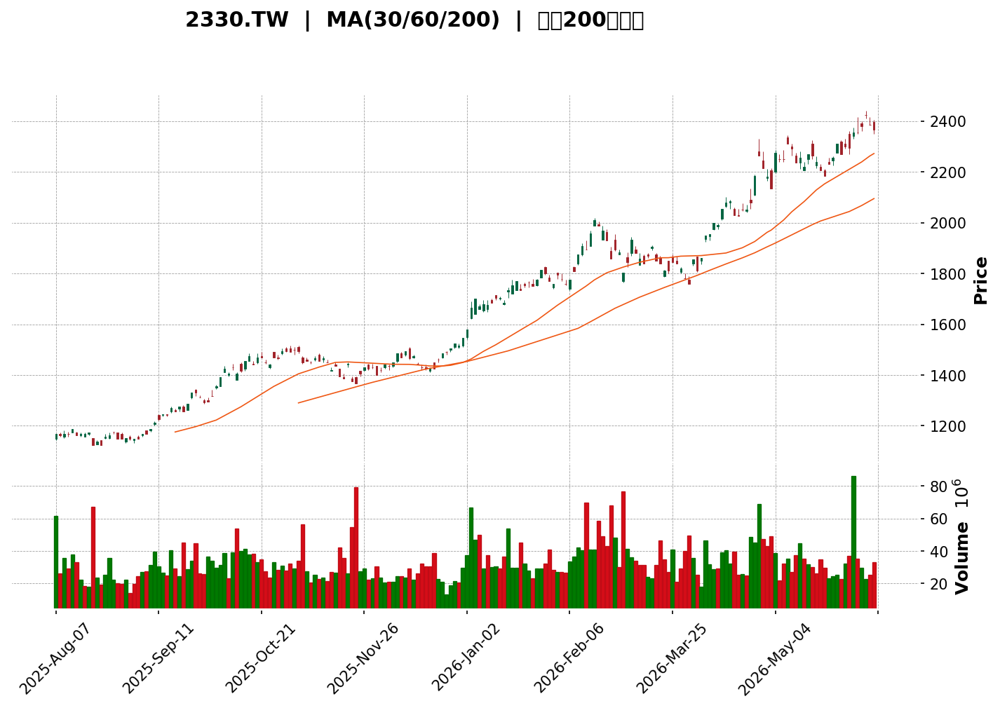
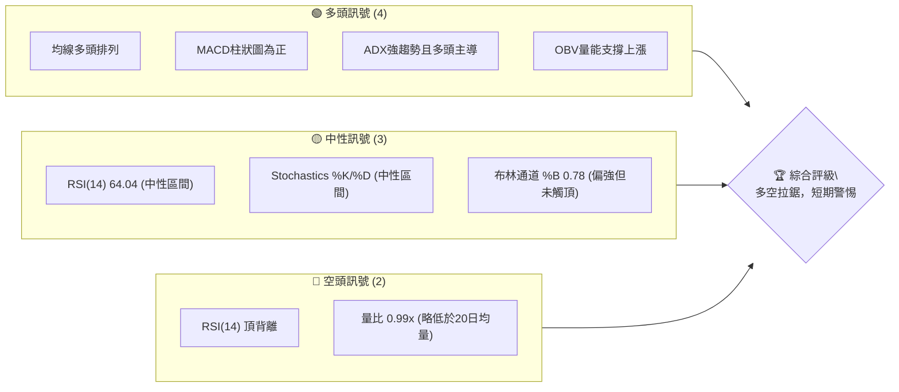
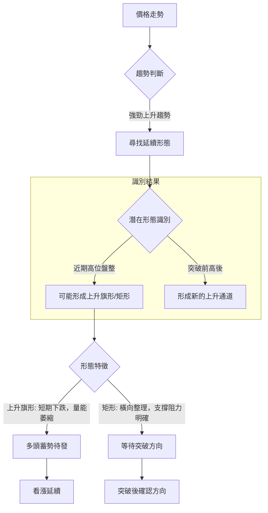
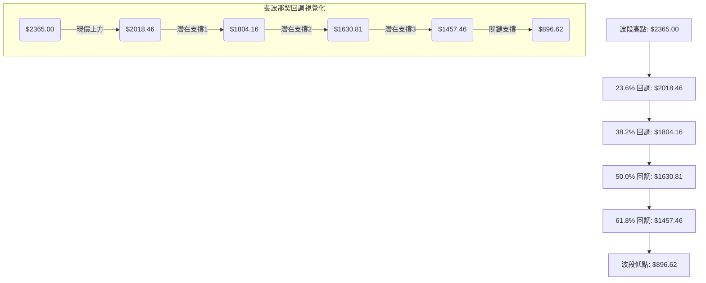

<details>
<summary>📊 靜態圖表 (點擊展開)</summary>

</details>

<html>
<head><meta charset="utf-8" /></head>
<body>
    <div style="height:500px; width:100%;">                        <script>window.PlotlyConfig = {MathJaxConfig: 'local'};</script>
        <script charset="utf-8" src="https://cdn.plot.ly/plotly-3.6.0.min.js" integrity="sha256-QaOVwtVY0T02VaHrr6pnoHLCwayMJp4O5n4YyaE3rJk=" crossorigin="anonymous"></script>                <div id="candlestick-chart" class="plotly-graph-div" style="height:100%; width:100%;"></div>            <script>                window.PLOTLYENV=window.PLOTLYENV || {};                                if (document.getElementById("candlestick-chart")) {                    Plotly.newPlot(                        "candlestick-chart",                        [{"close":{"dtype":"f8","bdata":"AAAAwFY+kkAAAACAjCqSQAAAAMBWPpJAAAAAwFY+kkAAAABAf42SQAAAAICMKpJAAAAAwFY+kkAAAADAVj6SQAAAAOAgUpJAAAAAoDuMkUAAAAAAmseRQAAAAKA7jJFAAAAAYMIWkkAAAACAjCqSQAAAAADrZZJAAAAAQC7vkUAAAABALu+RQAAAAID4ApJAAAAAQC7vkUAAAABALu+RQAAAAEAu75FAAAAAwFY+kkAAAADAVj6SQAAAAEB\u002fjZJAAAAA4HHwkkAAAABg0CuTQAAAAOD4epNAAAAAwC5nk0AAAAAgZd6TQAAAAADKopNAAAAAgEPyk0AAAAAAyqKTQAAAAEAAGpRAAAAA4NHMlEAAAADg0cyUQAAAAEBYfZRAAAAAoN4tlEAAAAAgvUGUQAAAAKA2kZRAAAAA4CkwlUAAAACgPruVQAAAAGBTRpZAAAAA4Nn2lUAAAADgMVqWQAAAAODZ9pVAAAAAoJYelkAAAACgib2WQAAAAGADDZdAAAAAgO6BlkAAAAAAJfmWQAAAAAAl+ZZAAAAAYKuplkAAAACA7oGWQAAAAAAl+ZZAAAAAgEbllkAAAADgfFyXQAAAAOB8XJdAAAAAgJ5Il0AAAABgW3CXQAAAAOB8XJdAAAAAYKuplkAAAACgib2WQAAAAGCrqZZAAAAAgEbllkAAAACgib2WQAAAAIBG5ZZAAAAAYKuplkAAAAAAdTKWQAAAACAQbpZAAAAAAB3PlUAAAAAgYKeVQAAAAADNlZZAAAAAgKN\u002flUAAAACg5leVQAAAAODZ9pVAAAAA4DFalkAAAABgU0aWQAAAAOAxWpZAAAAAYPvilUAAAAAAdTKWQAAAAIDugZZAAAAAIBBulkAAAABgq6mWQAAAACDANJdAAAAAACX5lkAAAADgfFyXQAAAAMDg5JZAAAAAgL8Ml0AAAABgI5WWQAAAAGBVWZZAAAAAAGZFlkAAAAAAZkWWQAAAAABmRZZAAAAAYPHQlkAAAAAgnjSXQAAAAICNSJdAAAAAoFuEl0AAAAAAGdSXQAAAAEA6rJdAAAAAYNYjmEAAAADgYa+YQAAAAMBGAppAAAAAQNKNmkAAAAAgNhaaQAAAAOAUPppAAAAAgCUqmkAAAAAgBFKaQAAAAKDBoZpAAAAAoMGhmkAAAAAgBFKaQAAAAKBdGZtAAAAAABtpm0AAAAAg6aSbQAAAAKBdGZtAAAAAABtpm0AAAADA+ZCbQAAAAMArVZtAAAAAgNi4m0AAAABAU1icQAAAAECFHJxAAAAAIOmkm0AAAABgCn2bQAAAAOCVCJxAAAAAwMfMm0AAAABgCn2bQAAAAIDYuJtAAAAA4GNEnEAAAACAi0edQAAAAOAW051AAAAA4EiXnUAAAABgcJqeQAAAAODJYZ9AAAAAgAwSn0AAAAAgT8KeQAAAAEDUIp5AAAAAYL0LnUAAAADgSJedQAAAACBqb51AAAAAgHQwnEAAAABg78+cQAAAAKDDNp5AAAAAwHpbnUAAAABgvQudQAAAAAAAvJxAAAAAAAA4nUAAAAAAAMSdQAAAAAAA6JxAAAAAAADAnEAAAAAAAEicQAAAAAAASJxAAAAAAADUnEAAAAAAAMCcQAAAAAAAcJxAAAAAAADQm0AAAAAAAICbQAAAAAAA\u002fJxAAAAAAABInEAAAAAAABCdQAAAAAAAeJ5AAAAAAACMnkAAAAAAAECfQAAAAAAAGJ9AAAAAAAAOoEAAAAAAAECgQAAAAAAASqBAAAAAAAC4n0AAAAAAAKSfQAAAAAAABKBAAAAAAAAEoEAAAAAAAECgQAAAAAAAEqFAAAAAAACyoUAAAAAAAE6hQAAAAAAACKFAAAAAAACuoEAAAAAAAMahQAAAAAAAlKFAAAAAAACUoUAAAAAAAAyiQAAAAAAA5KFAAAAAAAB2oUAAAAAAAJ6hQAAAAAAAWKFAAAAAAAC8oUAAAAAAALKhQAAAAAAAgKFAAAAAAAA6oUAAAAAAABKhQAAAAAAAbKFAAAAAAACeoUAAAAAAAAyiQAAAAAAAvKFAAAAAAAD4oUAAAAAAAO6hQAAAAAAAZqJAAAAAAABmokAAAAAAAJiiQAAAAAAA8qJAAAAAAACiokAAAAAAAHqiQA=="},"high":{"dtype":"f8","bdata":"AAAAwFY+kkDreHPCIFKSQB5bESS1eZJAvzy2AutlkkAAAABAf42SQGE1rePqZZJAXx5b4SBSkkBfHlvhIFKSQAAAAOAgUpJATkl1aPgCkkCGLGQhZNuRQDSGoyVk25FAYyd2olY+kkDreHPCIFKSQAAAAADrZZJAaoTl5iBSkkBqhOXmIFKSQAAAAID4ApJAc08jpIwqkkAAAABALu+RQHNPI6SMKpJAAAAAwFY+kkAeWxEktXmSQAAAAEB\u002fjZJAC15OATwEk0Bba63l+HqTQAAAAOD4epNADwNn4fh6k0AAACCFQ\u002fKTQFgdX8qGypNAAAAAgEPyk0Bcye35IQaUQAAAAEAAGpRAAAAA4NHMlEAIKmcPbQiVQKOLLgoVpZRAN3Ijz3lplEA1wnJPWH2UQAnGW5mO9JRAhVIoRQhElUAAAACgPruVQMkBQioQbpZA1I8zRbgKlkCrqqoPzZWWQNSPM0W4CpZA14UnZKuplkAAAACgib2WQFDrVyrANJdAF0M6r4m9lkAcTJEvwDSXQNC6wZSeSJdAkyZNKmjRlkCzaxPlzJWWQNC6wZSeSJdAkX9Lr+Egl0AcuzSqOYSXQKoYTw8YmJdAmpmZefarl0DEVGIqGJiXQDh2aXT2q5dAcODAWQMNl0AeWRLPJPmWQEqTJsWJvZZADFUySgMNl0A9siT+vzSXQAxVMkoDDZdAkyZNKmjRlkBWMEvKMVqWQDnAR0+rqZZAFVG\u002fXlNGlkCYti+02faVQEYbK2WrqZZAQVLLFB3PlUDrUbj+HM+VQKkfZ6qWHpZAAAAA4DFalkCSA4T0zJWWQKuqqg\u002fNlZZAZ6O+IxBulkBWMEvKMVqWQAAAAIDugZZAvuoXhe6BlkAAAABgq6mWQAAAACDANJdA0LrBlJ5Il0AAAADgfFyXQCp4OeVKmJdAn3WD2a4gl0AKWn25EqmWQJ\u002fyEBM0gZZAUg6IDDSBlkBxr4JZVVmWQDRtjb8SqZZAFHVyueDklkAAAAAgnjSXQPC4eNl8XJdAAAAAoFuEl0AAAAAAGdSXQL2G8vIY1JdAAAAAYNYjmEAAAADgYa+YQJzWbH\u002fzZZpAAAAAQNKNmkDkSgLTFD6aQGULoezieZpAhmEY5uJ5mkCEAWcs0o2aQMZ0FlOgyZpAYzqL+bC1mkBYVu\u002fS4nmaQJBJ8VI8QZtAXXTRZdi4m0AAAAAg6aSbQOg3W18KfZtALrrosvmQm0Cc1H0Z6aSbQJmSKdnHzJtA5jCH2cfMm0AAAABAU1icQAetLFkhlJxApp6M35UInEAAAABgCn2bQFuwBZN0MJxAZorTJYUcnEDZVGts2LibQAAAAIDYuJtApQXoRSGUnEAAAACAi0edQIpP95L1+p1AdEucUtQinkCo1fgST8KeQGtI+pKoiZ9AIeOCjNpNn0BrcROGDBKfQNaUNWU+1p5ARKxRhSe\u002fnUBZgTASgYaeQL6E9tJIl51AAAAAgHQwnED5rBssam+dQB0V+FKiXp5AUv\u002fI2BbTnUACaevFeludQCe3eHKLR51AAAAAAABgnUAAAAAAANidQAAAAAAAYJ1AAAAAAAA4nUAAAAAAAFycQAAAAAAA6JxAAAAAAABMnUAAAAAAACSdQAAAAAAAhJxAAAAAAAAgnEAAAAAAAPibQAAAAAAA\u002fJxAAAAAAAAknUAAAAAAABCdQAAAAAAAeJ5AAAAAAACMnkAAAAAAAECfQAAAAAAALJ9AAAAAAAAOoEAAAAAAAGigQAAAAAAAVKBAAAAAAAAYoEAAAAAAAA6gQAAAAAAANqBAAAAAAAAsoEAAAAAAAK6gQAAAAAAAHKFAAAAAAAA0okAAAAAAANChQAAAAAAARKFAAAAAAABOoUAAAAAAANqhQAAAAAAAvKFAAAAAAADaoUAAAAAAAFKiQAAAAAAADKJAAAAAAADGoUAAAAAAANChQAAAAAAAgKFAAAAAAAC8oUAAAAAAACqiQAAAAAAAqKFAAAAAAABsoUAAAAAAAEShQAAAAAAAnqFAAAAAAACooUAAAAAAAAyiQAAAAAAAKqJAAAAAAAA0okAAAAAAAHCiQAAAAAAAjqJAAAAAAADeokAAAAAAAMCiQAAAAAAAEKNAAAAAAADeokAAAAAAAMqiQA=="},"hovertemplate":"\u003cb\u003e%{x|%Y-%m-%d}\u003c\u002fb\u003e\u003cbr\u003e\u958b: $%{open:.2f}\u003cbr\u003e\u9ad8: $%{high:.2f}\u003cbr\u003e\u4f4e: $%{low:.2f}\u003cbr\u003e\u6536: $%{close:.2f}\u003cextra\u003e\u003c\u002fextra\u003e","low":{"dtype":"f8","bdata":"Img4GWTbkUCKQ8ZewhaSQOGk7lv4ApJAQcNJfcIWkkAAAADcIFKSQAAAAICMKpJAQcNJfcIWkkBBw0l9whaSQCaxTJ2MKpJAAAAAoDuMkUD1pje9BaCRQAAAAKA7jJFAntiJHS7vkUCfylIcLu+RQL6YT71WPpJAAAAAQC7vkUAAAABALu+RQEwD9fnPs5FAhOWeHmTbkUCNsNzbz7ORQAAAAEAu75FAQcNJfcIWkkAAAADAVj6SQFVVVf3qZZJA60Njnd3IkkAppZQ+BhiTQE3TNJ1kU5NA8PyYnmRTk0AAAICL646TQAAAAADKopNAlGuU68mik0AAAAAAyqKTQAz8q0aotpNASQ9U5nlplED41ZiwNpGUQAAAAEBYfZRAQy\u002f0OgAalEAAAAAgvUGUQAAAAKA2kZRA9lqvFW0IlUAAAADcKTCVQFP9nDC4CpZAV+CYFR3PlUDjOI4VdTKWQNkw\u002fuWBk5VAT8jVOrgKlkBZEs93lh6WQGApUMuJvZZAAAAAgO6BlkB91g0GzZWWQAAAAAAl+ZZAt2zZ+syVlkDpvMVQU0aWQAAAAAAl+ZZAe9XmGmjRlkBW57Cw4SCXQHKi5XqeSJdAAAAAgJ5Il0B3VjvL4SCXQOREyxXANJdAt2zZ+syVlkAAAACgib2WQLds2frMlZZA9arNtYm9lkAAAACgib2WQG+AtFCrqZZAAAAAYKuplkDVZ9qalh6WQAAAACAQbpZAAAAAAB3PlUAAAAAgYKeVQDCuftAxWpZAAAAAgKN\u002flUAAAACg5leVQFfgmBUdz5VAVVVVsJYelkAc\u002f976dDKWQHIcx3pTRpZAAAAAYPvilUCqz7Q1uAqWQOm8xVBTRpZAxz+48HQylkDasmXLMVqWQDVGClyrqZZAAAAAACX5lkDIiZZLAw2XQDTWh2bx0JZAwhT5zODklkD1pYIGNIGWQGEN76x2MZZAj1B9pnYxlkCu8XfzlwmWQAAAAABmRZZA2BUbrRKplkArizO64OSWQCGODs2uIJdAyAZkk41Il0CaRO+ZW4SXQER5DY1bhJdA2MeF7UqYl0AvPq8T5w+YQLN9oprcTplA22yzDZqemUActf1sV+6ZQDbpvcZ4xplAGYZhwHjGmUAAAAAgBFKaQDuL6ezieZpAO4vp7OJ5mkCpqRBtJSqaQE8jLIfBoZpAXXTRjY\u002fdmkAYVW6tXRmbQAAAAKBdGZtA0UUXTTxBm0CPrQhaPEGbQAAAAMArVZtAgQtcwCtVm0CHcAgnt+CbQNSNeOaVCJxAAAAAIOmkm0Dejhv6TC2bQHd3d9PHzJtAzToWDemkm0C344YGG2mbQM94xrNdGZtAAAAA4GNEnEBoo76zEKicQNbBIhScM51AAAAA4EiXnUC00yPhFtOdQCtvC3oMEp9AAAAAgAwSn0CF+V2twzaeQAAAAEDUIp5AAAAAYL0LnUA59XuGWYOdQEN7CW2LR51ApNxUtPmQm0CEKfL5MYCcQMN2sxScM51AAAAAwHpbnUC9vJmgEKicQAAAAAAAvJxAAAAAAAAQnUAAAAAAAIidQAAAAAAA6JxAAAAAAADAnEAAAAAAAOSbQAAAAAAAIJxAAAAAAADUnEAAAAAAAMCcQAAAAAAAIJxAAAAAAADQm0AAAAAAAICbQAAAAAAAmJxAAAAAAAA0nEAAAAAAAKycQAAAAAAAFJ5AAAAAAAAonkAAAAAAAMieQAAAAAAA3J5AAAAAAABon0AAAAAAABigQAAAAAAADqBAAAAAAAC4n0AAAAAAAKSfQAAAAAAA9J9AAAAAAADgn0AAAAAAAA6gQAAAAAAAcqBAAAAAAACyoUAAAAAAAE6hQAAAAAAA6qBAAAAAAACuoEAAAAAAACahQAAAAAAAgKFAAAAAAACAoUAAAAAAAAyiQAAAAAAAsqFAAAAAAAB2oUAAAAAAAEShQAAAAAAAOqFAAAAAAABsoUAAAAAAAJShQAAAAAAATqFAAAAAAAA6oUAAAAAAABKhQAAAAAAAbKFAAAAAAABioUAAAAAAAMahQAAAAAAAvKFAAAAAAADkoUAAAAAAALyhQAAAAAAANKJAAAAAAABcokAAAAAAAHCiQAAAAAAA1KJAAAAAAACiokAAAAAAAFyiQA=="},"name":"\u50f9\u683c","open":{"dtype":"f8","bdata":"goaTOi7vkUB1vDmhVj6SQEHDSX3CFpJAAAAAwFY+kkAAAADcIFKSQOt4c8IgUpJAoOGknowqkkBBw0l9whaSQJNYpr5WPpJATkl1aPgCkkD1pje9BaCRQDSGoyVk25FAT+zEPvgCkkAVh4w9+AKSQAAAAADrZZJAaoTl5iBSkkDuaYTFVj6SQHnCdxuax5FA9zTCgsIWkkCE5Z4eZNuRQPc0woLCFpJAoOGknowqkkAeWxEktXmSQKuqqh61eZJA9qGxvqfckkCEEELELmeTQKdpmr4uZ5NADwNn4fh6k0AAAKDwyaKTQKyOL2WotpNAyjXKtYbKk0CwOr6UQ\u002fKTQAz8q0aotpNAoXJ2S1h9lECwxkSqjvSUQAAAAEBYfZRAeqEXaptVlEC8QCaFm1WUQAAAAKA2kZRAe63XeksclUAAAADcKTCVQFP9nDC4CpZAK3DMevvilUAAAADgMVqWQNkw\u002fuWBk5VAJk79\u002fsyVlkDDTdtBU0aWQGApUMuJvZZAs2sT5cyVlkAxRT5rq6mWQLRuMGUDDZdAAAAAYKuplkCcKNm1MVqWQNC6wZSeSJdAhioZ5ST5lkDkRMsVwDSXQBy7NKo5hJdA9ihcrzmEl0AAAABgW3CXQKoYTw8YmJdAJ02a9CT5lkC1HQYFaNGWQAAAAGCrqZZAe9XmGmjRlkCIlB6Z4SCXQHvV5hpo0ZZAAAAAYKuplkDVZ9qalh6WQL7qF4XugZZAFVG\u002fXlNGlkCm7QuFPruVQLvk1JrugZZAIKllSmCnlUCamZmZPruVQKkfZ6qWHpZA4ziOFXUylkCtAmOP7oGWQAAAAOAxWpZAZ6O+IxBulkAAAAAAdTKWQJwo2bUxWpZAAAAAIBBulkAjRowwEG6WQMBgLcGJvZZAHEyRL8A0l0BW57Cw4SCXQF5OwYtbhJdAYYp8JtD4lkAAAABgI5WWQAAAAGBVWZZAca+CWVVZlkAeofpMhx2WQDRtjb8SqZZAAAAAYPHQlkBgqKYT0PiWQAAAAICNSJdA7ax2Rmxwl0B0c3PzSpiXQKK8huZKmJdAcPQERzqsl0CjbsPGxTeYQKCoHvTLYplA22yzDZqemUActf1sV+6ZQALtSCBo2plA3LZtc1fumUBYVu\u002fS4nmaQMZ0FlOgyZpAncV0RtKNmkDUVIjGFD6aQDhbh0ZuBZtAXXTRjY\u002fdmkAYVW6tXRmbQMikePlMLZtAF110WQp9m0AAAADA+ZCbQInbDXMKfZtAaDzjGRtpm0CHcAgnt+CbQNs6pf8xgJxAZJKHLLfgm0Amq5RTPEGbQFuwBZN0MJxAAAAAwMfMm0AAAABgCn2bQLWpTQ1NLZtAOwRu7DGAnED7zkYNALycQJxpnm2LR51AAAAA4EiXnUC00yPhFtOdQCtvC3oMEp9AYPaA2fsln0CF+V2twzaeQG4eRrJfrp5Agx3heFmDnUA7ViCswzaeQEN7CW2LR51AEEHKDemkm0B91g3GrB+dQOCLq8d6W51AqX9kzEiXnUC9vJmgEKicQI\u002fB+RicM51AAAAAAABMnUAAAAAAALCdQAAAAAAATJ1AAAAAAAAQnUAAAAAAAPibQAAAAAAA6JxAAAAAAAAknUAAAAAAAOicQAAAAAAANJxAAAAAAADQm0AAAAAAALybQAAAAAAAwJxAAAAAAAAknUAAAAAAAOicQAAAAAAAPJ5AAAAAAABknkAAAAAAANyeQAAAAAAABJ9AAAAAAAB8n0AAAAAAACKgQAAAAAAAQKBAAAAAAAAOoEAAAAAAALifQAAAAAAABKBAAAAAAAD0n0AAAAAAAFSgQAAAAAAAfKBAAAAAAADQoUAAAAAAAIqhQAAAAAAA\u002fqBAAAAAAAA6oUAAAAAAADChQAAAAAAAlKFAAAAAAACUoUAAAAAAAD6iQAAAAAAA+KFAAAAAAACyoUAAAAAAAHahQAAAAAAAOqFAAAAAAACUoUAAAAAAAAyiQAAAAAAAYqFAAAAAAABYoUAAAAAAADqhQAAAAAAAgKFAAAAAAACKoUAAAAAAAMahQAAAAAAAIKJAAAAAAAAMokAAAAAAAFyiQAAAAAAASKJAAAAAAABmokAAAAAAAKyiQAAAAAAA8qJAAAAAAACiokAAAAAAALaiQA=="},"x":["2025-08-07T00:00:00+08:00","2025-08-08T00:00:00+08:00","2025-08-11T00:00:00+08:00","2025-08-12T00:00:00+08:00","2025-08-13T00:00:00+08:00","2025-08-14T00:00:00+08:00","2025-08-15T00:00:00+08:00","2025-08-18T00:00:00+08:00","2025-08-19T00:00:00+08:00","2025-08-20T00:00:00+08:00","2025-08-21T00:00:00+08:00","2025-08-22T00:00:00+08:00","2025-08-25T00:00:00+08:00","2025-08-26T00:00:00+08:00","2025-08-27T00:00:00+08:00","2025-08-28T00:00:00+08:00","2025-08-29T00:00:00+08:00","2025-09-01T00:00:00+08:00","2025-09-02T00:00:00+08:00","2025-09-03T00:00:00+08:00","2025-09-04T00:00:00+08:00","2025-09-05T00:00:00+08:00","2025-09-08T00:00:00+08:00","2025-09-09T00:00:00+08:00","2025-09-10T00:00:00+08:00","2025-09-11T00:00:00+08:00","2025-09-12T00:00:00+08:00","2025-09-15T00:00:00+08:00","2025-09-16T00:00:00+08:00","2025-09-17T00:00:00+08:00","2025-09-18T00:00:00+08:00","2025-09-19T00:00:00+08:00","2025-09-22T00:00:00+08:00","2025-09-23T00:00:00+08:00","2025-09-24T00:00:00+08:00","2025-09-25T00:00:00+08:00","2025-09-26T00:00:00+08:00","2025-09-30T00:00:00+08:00","2025-10-01T00:00:00+08:00","2025-10-02T00:00:00+08:00","2025-10-03T00:00:00+08:00","2025-10-07T00:00:00+08:00","2025-10-08T00:00:00+08:00","2025-10-09T00:00:00+08:00","2025-10-13T00:00:00+08:00","2025-10-14T00:00:00+08:00","2025-10-15T00:00:00+08:00","2025-10-16T00:00:00+08:00","2025-10-17T00:00:00+08:00","2025-10-20T00:00:00+08:00","2025-10-21T00:00:00+08:00","2025-10-22T00:00:00+08:00","2025-10-23T00:00:00+08:00","2025-10-27T00:00:00+08:00","2025-10-28T00:00:00+08:00","2025-10-29T00:00:00+08:00","2025-10-30T00:00:00+08:00","2025-10-31T00:00:00+08:00","2025-11-03T00:00:00+08:00","2025-11-04T00:00:00+08:00","2025-11-05T00:00:00+08:00","2025-11-06T00:00:00+08:00","2025-11-07T00:00:00+08:00","2025-11-10T00:00:00+08:00","2025-11-11T00:00:00+08:00","2025-11-12T00:00:00+08:00","2025-11-13T00:00:00+08:00","2025-11-14T00:00:00+08:00","2025-11-17T00:00:00+08:00","2025-11-18T00:00:00+08:00","2025-11-19T00:00:00+08:00","2025-11-20T00:00:00+08:00","2025-11-21T00:00:00+08:00","2025-11-24T00:00:00+08:00","2025-11-25T00:00:00+08:00","2025-11-26T00:00:00+08:00","2025-11-27T00:00:00+08:00","2025-11-28T00:00:00+08:00","2025-12-01T00:00:00+08:00","2025-12-02T00:00:00+08:00","2025-12-03T00:00:00+08:00","2025-12-04T00:00:00+08:00","2025-12-05T00:00:00+08:00","2025-12-08T00:00:00+08:00","2025-12-09T00:00:00+08:00","2025-12-10T00:00:00+08:00","2025-12-11T00:00:00+08:00","2025-12-12T00:00:00+08:00","2025-12-15T00:00:00+08:00","2025-12-16T00:00:00+08:00","2025-12-17T00:00:00+08:00","2025-12-18T00:00:00+08:00","2025-12-19T00:00:00+08:00","2025-12-22T00:00:00+08:00","2025-12-23T00:00:00+08:00","2025-12-24T00:00:00+08:00","2025-12-26T00:00:00+08:00","2025-12-29T00:00:00+08:00","2025-12-30T00:00:00+08:00","2025-12-31T00:00:00+08:00","2026-01-02T00:00:00+08:00","2026-01-05T00:00:00+08:00","2026-01-06T00:00:00+08:00","2026-01-07T00:00:00+08:00","2026-01-08T00:00:00+08:00","2026-01-09T00:00:00+08:00","2026-01-12T00:00:00+08:00","2026-01-13T00:00:00+08:00","2026-01-14T00:00:00+08:00","2026-01-15T00:00:00+08:00","2026-01-16T00:00:00+08:00","2026-01-19T00:00:00+08:00","2026-01-20T00:00:00+08:00","2026-01-21T00:00:00+08:00","2026-01-22T00:00:00+08:00","2026-01-23T00:00:00+08:00","2026-01-26T00:00:00+08:00","2026-01-27T00:00:00+08:00","2026-01-28T00:00:00+08:00","2026-01-29T00:00:00+08:00","2026-01-30T00:00:00+08:00","2026-02-02T00:00:00+08:00","2026-02-03T00:00:00+08:00","2026-02-04T00:00:00+08:00","2026-02-05T00:00:00+08:00","2026-02-06T00:00:00+08:00","2026-02-09T00:00:00+08:00","2026-02-10T00:00:00+08:00","2026-02-11T00:00:00+08:00","2026-02-23T00:00:00+08:00","2026-02-24T00:00:00+08:00","2026-02-25T00:00:00+08:00","2026-02-26T00:00:00+08:00","2026-03-02T00:00:00+08:00","2026-03-03T00:00:00+08:00","2026-03-04T00:00:00+08:00","2026-03-05T00:00:00+08:00","2026-03-06T00:00:00+08:00","2026-03-09T00:00:00+08:00","2026-03-10T00:00:00+08:00","2026-03-11T00:00:00+08:00","2026-03-12T00:00:00+08:00","2026-03-13T00:00:00+08:00","2026-03-16T00:00:00+08:00","2026-03-17T00:00:00+08:00","2026-03-18T00:00:00+08:00","2026-03-19T00:00:00+08:00","2026-03-20T00:00:00+08:00","2026-03-23T00:00:00+08:00","2026-03-24T00:00:00+08:00","2026-03-25T00:00:00+08:00","2026-03-26T00:00:00+08:00","2026-03-27T00:00:00+08:00","2026-03-30T00:00:00+08:00","2026-03-31T00:00:00+08:00","2026-04-01T00:00:00+08:00","2026-04-02T00:00:00+08:00","2026-04-07T00:00:00+08:00","2026-04-08T00:00:00+08:00","2026-04-09T00:00:00+08:00","2026-04-10T00:00:00+08:00","2026-04-13T00:00:00+08:00","2026-04-14T00:00:00+08:00","2026-04-15T00:00:00+08:00","2026-04-16T00:00:00+08:00","2026-04-17T00:00:00+08:00","2026-04-20T00:00:00+08:00","2026-04-21T00:00:00+08:00","2026-04-22T00:00:00+08:00","2026-04-23T00:00:00+08:00","2026-04-24T00:00:00+08:00","2026-04-27T00:00:00+08:00","2026-04-28T00:00:00+08:00","2026-04-29T00:00:00+08:00","2026-04-30T00:00:00+08:00","2026-05-04T00:00:00+08:00","2026-05-05T00:00:00+08:00","2026-05-06T00:00:00+08:00","2026-05-07T00:00:00+08:00","2026-05-08T00:00:00+08:00","2026-05-11T00:00:00+08:00","2026-05-12T00:00:00+08:00","2026-05-13T00:00:00+08:00","2026-05-14T00:00:00+08:00","2026-05-15T00:00:00+08:00","2026-05-18T00:00:00+08:00","2026-05-19T00:00:00+08:00","2026-05-20T00:00:00+08:00","2026-05-21T00:00:00+08:00","2026-05-22T00:00:00+08:00","2026-05-25T00:00:00+08:00","2026-05-26T00:00:00+08:00","2026-05-27T00:00:00+08:00","2026-05-28T00:00:00+08:00","2026-05-29T00:00:00+08:00","2026-06-01T00:00:00+08:00","2026-06-02T00:00:00+08:00","2026-06-03T00:00:00+08:00","2026-06-04T00:00:00+08:00","2026-06-05T00:00:00+08:00"],"type":"candlestick"},{"hovertemplate":"MA30: $%{y:.2f}\u003cextra\u003e\u003c\u002fextra\u003e","line":{"color":"#2196F3","dash":"dash","width":2},"mode":"lines","name":"MA30","x":["2025-08-07T00:00:00+08:00","2025-08-08T00:00:00+08:00","2025-08-11T00:00:00+08:00","2025-08-12T00:00:00+08:00","2025-08-13T00:00:00+08:00","2025-08-14T00:00:00+08:00","2025-08-15T00:00:00+08:00","2025-08-18T00:00:00+08:00","2025-08-19T00:00:00+08:00","2025-08-20T00:00:00+08:00","2025-08-21T00:00:00+08:00","2025-08-22T00:00:00+08:00","2025-08-25T00:00:00+08:00","2025-08-26T00:00:00+08:00","2025-08-27T00:00:00+08:00","2025-08-28T00:00:00+08:00","2025-08-29T00:00:00+08:00","2025-09-01T00:00:00+08:00","2025-09-02T00:00:00+08:00","2025-09-03T00:00:00+08:00","2025-09-04T00:00:00+08:00","2025-09-05T00:00:00+08:00","2025-09-08T00:00:00+08:00","2025-09-09T00:00:00+08:00","2025-09-10T00:00:00+08:00","2025-09-11T00:00:00+08:00","2025-09-12T00:00:00+08:00","2025-09-15T00:00:00+08:00","2025-09-16T00:00:00+08:00","2025-09-17T00:00:00+08:00","2025-09-18T00:00:00+08:00","2025-09-19T00:00:00+08:00","2025-09-22T00:00:00+08:00","2025-09-23T00:00:00+08:00","2025-09-24T00:00:00+08:00","2025-09-25T00:00:00+08:00","2025-09-26T00:00:00+08:00","2025-09-30T00:00:00+08:00","2025-10-01T00:00:00+08:00","2025-10-02T00:00:00+08:00","2025-10-03T00:00:00+08:00","2025-10-07T00:00:00+08:00","2025-10-08T00:00:00+08:00","2025-10-09T00:00:00+08:00","2025-10-13T00:00:00+08:00","2025-10-14T00:00:00+08:00","2025-10-15T00:00:00+08:00","2025-10-16T00:00:00+08:00","2025-10-17T00:00:00+08:00","2025-10-20T00:00:00+08:00","2025-10-21T00:00:00+08:00","2025-10-22T00:00:00+08:00","2025-10-23T00:00:00+08:00","2025-10-27T00:00:00+08:00","2025-10-28T00:00:00+08:00","2025-10-29T00:00:00+08:00","2025-10-30T00:00:00+08:00","2025-10-31T00:00:00+08:00","2025-11-03T00:00:00+08:00","2025-11-04T00:00:00+08:00","2025-11-05T00:00:00+08:00","2025-11-06T00:00:00+08:00","2025-11-07T00:00:00+08:00","2025-11-10T00:00:00+08:00","2025-11-11T00:00:00+08:00","2025-11-12T00:00:00+08:00","2025-11-13T00:00:00+08:00","2025-11-14T00:00:00+08:00","2025-11-17T00:00:00+08:00","2025-11-18T00:00:00+08:00","2025-11-19T00:00:00+08:00","2025-11-20T00:00:00+08:00","2025-11-21T00:00:00+08:00","2025-11-24T00:00:00+08:00","2025-11-25T00:00:00+08:00","2025-11-26T00:00:00+08:00","2025-11-27T00:00:00+08:00","2025-11-28T00:00:00+08:00","2025-12-01T00:00:00+08:00","2025-12-02T00:00:00+08:00","2025-12-03T00:00:00+08:00","2025-12-04T00:00:00+08:00","2025-12-05T00:00:00+08:00","2025-12-08T00:00:00+08:00","2025-12-09T00:00:00+08:00","2025-12-10T00:00:00+08:00","2025-12-11T00:00:00+08:00","2025-12-12T00:00:00+08:00","2025-12-15T00:00:00+08:00","2025-12-16T00:00:00+08:00","2025-12-17T00:00:00+08:00","2025-12-18T00:00:00+08:00","2025-12-19T00:00:00+08:00","2025-12-22T00:00:00+08:00","2025-12-23T00:00:00+08:00","2025-12-24T00:00:00+08:00","2025-12-26T00:00:00+08:00","2025-12-29T00:00:00+08:00","2025-12-30T00:00:00+08:00","2025-12-31T00:00:00+08:00","2026-01-02T00:00:00+08:00","2026-01-05T00:00:00+08:00","2026-01-06T00:00:00+08:00","2026-01-07T00:00:00+08:00","2026-01-08T00:00:00+08:00","2026-01-09T00:00:00+08:00","2026-01-12T00:00:00+08:00","2026-01-13T00:00:00+08:00","2026-01-14T00:00:00+08:00","2026-01-15T00:00:00+08:00","2026-01-16T00:00:00+08:00","2026-01-19T00:00:00+08:00","2026-01-20T00:00:00+08:00","2026-01-21T00:00:00+08:00","2026-01-22T00:00:00+08:00","2026-01-23T00:00:00+08:00","2026-01-26T00:00:00+08:00","2026-01-27T00:00:00+08:00","2026-01-28T00:00:00+08:00","2026-01-29T00:00:00+08:00","2026-01-30T00:00:00+08:00","2026-02-02T00:00:00+08:00","2026-02-03T00:00:00+08:00","2026-02-04T00:00:00+08:00","2026-02-05T00:00:00+08:00","2026-02-06T00:00:00+08:00","2026-02-09T00:00:00+08:00","2026-02-10T00:00:00+08:00","2026-02-11T00:00:00+08:00","2026-02-23T00:00:00+08:00","2026-02-24T00:00:00+08:00","2026-02-25T00:00:00+08:00","2026-02-26T00:00:00+08:00","2026-03-02T00:00:00+08:00","2026-03-03T00:00:00+08:00","2026-03-04T00:00:00+08:00","2026-03-05T00:00:00+08:00","2026-03-06T00:00:00+08:00","2026-03-09T00:00:00+08:00","2026-03-10T00:00:00+08:00","2026-03-11T00:00:00+08:00","2026-03-12T00:00:00+08:00","2026-03-13T00:00:00+08:00","2026-03-16T00:00:00+08:00","2026-03-17T00:00:00+08:00","2026-03-18T00:00:00+08:00","2026-03-19T00:00:00+08:00","2026-03-20T00:00:00+08:00","2026-03-23T00:00:00+08:00","2026-03-24T00:00:00+08:00","2026-03-25T00:00:00+08:00","2026-03-26T00:00:00+08:00","2026-03-27T00:00:00+08:00","2026-03-30T00:00:00+08:00","2026-03-31T00:00:00+08:00","2026-04-01T00:00:00+08:00","2026-04-02T00:00:00+08:00","2026-04-07T00:00:00+08:00","2026-04-08T00:00:00+08:00","2026-04-09T00:00:00+08:00","2026-04-10T00:00:00+08:00","2026-04-13T00:00:00+08:00","2026-04-14T00:00:00+08:00","2026-04-15T00:00:00+08:00","2026-04-16T00:00:00+08:00","2026-04-17T00:00:00+08:00","2026-04-20T00:00:00+08:00","2026-04-21T00:00:00+08:00","2026-04-22T00:00:00+08:00","2026-04-23T00:00:00+08:00","2026-04-24T00:00:00+08:00","2026-04-27T00:00:00+08:00","2026-04-28T00:00:00+08:00","2026-04-29T00:00:00+08:00","2026-04-30T00:00:00+08:00","2026-05-04T00:00:00+08:00","2026-05-05T00:00:00+08:00","2026-05-06T00:00:00+08:00","2026-05-07T00:00:00+08:00","2026-05-08T00:00:00+08:00","2026-05-11T00:00:00+08:00","2026-05-12T00:00:00+08:00","2026-05-13T00:00:00+08:00","2026-05-14T00:00:00+08:00","2026-05-15T00:00:00+08:00","2026-05-18T00:00:00+08:00","2026-05-19T00:00:00+08:00","2026-05-20T00:00:00+08:00","2026-05-21T00:00:00+08:00","2026-05-22T00:00:00+08:00","2026-05-25T00:00:00+08:00","2026-05-26T00:00:00+08:00","2026-05-27T00:00:00+08:00","2026-05-28T00:00:00+08:00","2026-05-29T00:00:00+08:00","2026-06-01T00:00:00+08:00","2026-06-02T00:00:00+08:00","2026-06-03T00:00:00+08:00","2026-06-04T00:00:00+08:00","2026-06-05T00:00:00+08:00"],"y":{"dtype":"f8","bdata":"AAAAAAAA+H8AAAAAAAD4fwAAAAAAAPh\u002fAAAAAAAA+H8AAAAAAAD4fwAAAAAAAPh\u002fAAAAAAAA+H8AAAAAAAD4fwAAAAAAAPh\u002fAAAAAAAA+H8AAAAAAAD4fwAAAAAAAPh\u002fAAAAAAAA+H8AAAAAAAD4fwAAAAAAAPh\u002fAAAAAAAA+H8AAAAAAAD4fwAAAAAAAPh\u002fAAAAAAAA+H8AAAAAAAD4fwAAAAAAAPh\u002fAAAAAAAA+H8AAAAAAAD4fwAAAAAAAPh\u002fAAAAAAAA+H8AAAAAAAD4fwAAAAAAAPh\u002fAAAAAAAA+H8AAAAAAAD4fyIiImJYX5JAZmZmRuBtkkC8u7vbanqSQHd3d9dFipJA7+7uvhagkkCrqqoqRLOSQCIiIsIXx5JAmpmZSZzXkkDe3d1dyuiSQCIiIsL1+5JAvLu7OwYbk0C8u7vrvjyTQLy7uwsVZZNAVVVV5SaGk0C8u7ub36mTQImIiPhNyJNAZmZmpgTsk0AiIiKyBxWUQO\u002fu7g4IQJRAd3d3dw5nlECJiIgoDpKUQJqZmdkNvZRA7+7u3sPilEC8u7vLJgeVQFVVVYXfLJVAd3d3V6JOlUAzMzPTY3KVQDMzM9OBk5VAZmZmJp+0lUCrqqpKFtOVQFVVVYXg8pVAZmZmpg4KlkARERGBjCSWQKuqqopnOpZAvLu7S0lMlkBERET011yWQFVVVeVfcZZAMzMzY5GGlkDNzMwMIJeWQKuqqioFp5ZAmpmZiVGslkDNzMz8p6uWQM3MzCxOrpZAVVVV5VSqlkCamZnJuKGWQJqZmcm4oZZA3t3dbbWjlkB3d3cnvJ+WQM3MzDzGmZZA3t3d3XmUlkBmZmZm2o2WQN7d3R3hiZZAmpmZeeSHlkAiIiKSN4mWQFVVVTU0i5ZAIiIiwt2LlkAiIiLC3YuWQGZmZhbhh5ZAAAAAMOKFlkBVVVWFk36WQCIiIhLwdZZAzczMbJhylkDNzMw8l26WQHd3d5c\u002fa5ZAZmZmFpJqlkDNzMw8im6WQHd3d2fZcZZAvLu7iyN5lkCamZlpD4eWQKuqqmqqkZZAZmZmdo6llkAzMzNjbL+WQFVVVaWj3JZAZmZmVscHl0BERER0QTCXQLy7u2vDVJdAq6qqikt1l0Dv7u5u0ZeXQJqZmTlWvJdAzczMTNTkl0DNzMy8AwiYQLy7uxsyL5hAiYiIeLJZmEB3d3eHNISYQKuqqvpspZhAMzMzg0rLmECrqqqKLO+YQImIiOgMFZlAvLu7m+s8mUDv7u7eF26ZQCIiIiJEn5lAZmZm1h3NmUARERFRo\u002fmZQERERJTPKppAmpmZuVZVmkDe3d3d4nmaQLy7uzvDn5pAq6qqCkzImkC8u7vbz\u002faaQN7d3a1OK5tA7+7uftJZm0Crqqr6UoybQO\u002fu7q4suptAiYiIKLfgm0C8u7vblQicQAAAAHDPKZxAERERkWVCnEAiIiJCTl6cQGZmZkY6dpxAERERgYSDnEBEREQUyJicQLy7u4tcs5xAZmZmVvnDnECJiIhY78+cQBEREbHj3ZxAmpmZuVHtnEAzMzMzFgCdQM3MzKyDDZ1AIiIiQkkWnUAzMzPzvRWdQJqZmfkwF51AZmZmVkshnUAiIiJCDyydQKuqqrqBL51ARERENJ0vnUBVVVV1ti+dQKuqqgp8Op1AiYiI2Jo6nUDNzMzcwDidQJqZmRlAPp1AZmZmVmhGnUAAAAAg7UudQGZmZnZ3SZ1AmpmZ6VRSnUBEREQkMGGdQO\u002fu7u4Gdp1ARERE9NWMnUBmZmaGU56dQHd3d6d6tJ1AIiIikkPVnUB3d3eXu\u002fSdQKuqqpo9Fp5AMzMzg7lJnkAzMzMzM3meQKuqqqqqpp5AAAAAAADKnkBVVVVVVfueQKuqqqqqMJ9AVVVVVVVnn0AAAAAAAKqfQAAAAAAA6p9AAAAAAAAPoECrqqqqqiqgQFVVVVVVRaBAAAAAAABmoECrqqqqqoegQFVVVVVVoaBAq6qqqqq7oEBVVVVVVdGgQAAAAAAA5KBAAAAAAAD4oECrqqqqqgyhQFVVVVVVH6FAq6qqqqovoUAAAAAAAD6hQAAAAAAAUKFAq6qqqqploUBVVVVVVX2hQFVVVVVVlqFAq6qqqqqsoUCrqqqqqr+hQA=="},"type":"scatter"},{"hovertemplate":"MA60: $%{y:.2f}\u003cextra\u003e\u003c\u002fextra\u003e","line":{"color":"#9C27B0","dash":"dash","width":2},"mode":"lines","name":"MA60","x":["2025-08-07T00:00:00+08:00","2025-08-08T00:00:00+08:00","2025-08-11T00:00:00+08:00","2025-08-12T00:00:00+08:00","2025-08-13T00:00:00+08:00","2025-08-14T00:00:00+08:00","2025-08-15T00:00:00+08:00","2025-08-18T00:00:00+08:00","2025-08-19T00:00:00+08:00","2025-08-20T00:00:00+08:00","2025-08-21T00:00:00+08:00","2025-08-22T00:00:00+08:00","2025-08-25T00:00:00+08:00","2025-08-26T00:00:00+08:00","2025-08-27T00:00:00+08:00","2025-08-28T00:00:00+08:00","2025-08-29T00:00:00+08:00","2025-09-01T00:00:00+08:00","2025-09-02T00:00:00+08:00","2025-09-03T00:00:00+08:00","2025-09-04T00:00:00+08:00","2025-09-05T00:00:00+08:00","2025-09-08T00:00:00+08:00","2025-09-09T00:00:00+08:00","2025-09-10T00:00:00+08:00","2025-09-11T00:00:00+08:00","2025-09-12T00:00:00+08:00","2025-09-15T00:00:00+08:00","2025-09-16T00:00:00+08:00","2025-09-17T00:00:00+08:00","2025-09-18T00:00:00+08:00","2025-09-19T00:00:00+08:00","2025-09-22T00:00:00+08:00","2025-09-23T00:00:00+08:00","2025-09-24T00:00:00+08:00","2025-09-25T00:00:00+08:00","2025-09-26T00:00:00+08:00","2025-09-30T00:00:00+08:00","2025-10-01T00:00:00+08:00","2025-10-02T00:00:00+08:00","2025-10-03T00:00:00+08:00","2025-10-07T00:00:00+08:00","2025-10-08T00:00:00+08:00","2025-10-09T00:00:00+08:00","2025-10-13T00:00:00+08:00","2025-10-14T00:00:00+08:00","2025-10-15T00:00:00+08:00","2025-10-16T00:00:00+08:00","2025-10-17T00:00:00+08:00","2025-10-20T00:00:00+08:00","2025-10-21T00:00:00+08:00","2025-10-22T00:00:00+08:00","2025-10-23T00:00:00+08:00","2025-10-27T00:00:00+08:00","2025-10-28T00:00:00+08:00","2025-10-29T00:00:00+08:00","2025-10-30T00:00:00+08:00","2025-10-31T00:00:00+08:00","2025-11-03T00:00:00+08:00","2025-11-04T00:00:00+08:00","2025-11-05T00:00:00+08:00","2025-11-06T00:00:00+08:00","2025-11-07T00:00:00+08:00","2025-11-10T00:00:00+08:00","2025-11-11T00:00:00+08:00","2025-11-12T00:00:00+08:00","2025-11-13T00:00:00+08:00","2025-11-14T00:00:00+08:00","2025-11-17T00:00:00+08:00","2025-11-18T00:00:00+08:00","2025-11-19T00:00:00+08:00","2025-11-20T00:00:00+08:00","2025-11-21T00:00:00+08:00","2025-11-24T00:00:00+08:00","2025-11-25T00:00:00+08:00","2025-11-26T00:00:00+08:00","2025-11-27T00:00:00+08:00","2025-11-28T00:00:00+08:00","2025-12-01T00:00:00+08:00","2025-12-02T00:00:00+08:00","2025-12-03T00:00:00+08:00","2025-12-04T00:00:00+08:00","2025-12-05T00:00:00+08:00","2025-12-08T00:00:00+08:00","2025-12-09T00:00:00+08:00","2025-12-10T00:00:00+08:00","2025-12-11T00:00:00+08:00","2025-12-12T00:00:00+08:00","2025-12-15T00:00:00+08:00","2025-12-16T00:00:00+08:00","2025-12-17T00:00:00+08:00","2025-12-18T00:00:00+08:00","2025-12-19T00:00:00+08:00","2025-12-22T00:00:00+08:00","2025-12-23T00:00:00+08:00","2025-12-24T00:00:00+08:00","2025-12-26T00:00:00+08:00","2025-12-29T00:00:00+08:00","2025-12-30T00:00:00+08:00","2025-12-31T00:00:00+08:00","2026-01-02T00:00:00+08:00","2026-01-05T00:00:00+08:00","2026-01-06T00:00:00+08:00","2026-01-07T00:00:00+08:00","2026-01-08T00:00:00+08:00","2026-01-09T00:00:00+08:00","2026-01-12T00:00:00+08:00","2026-01-13T00:00:00+08:00","2026-01-14T00:00:00+08:00","2026-01-15T00:00:00+08:00","2026-01-16T00:00:00+08:00","2026-01-19T00:00:00+08:00","2026-01-20T00:00:00+08:00","2026-01-21T00:00:00+08:00","2026-01-22T00:00:00+08:00","2026-01-23T00:00:00+08:00","2026-01-26T00:00:00+08:00","2026-01-27T00:00:00+08:00","2026-01-28T00:00:00+08:00","2026-01-29T00:00:00+08:00","2026-01-30T00:00:00+08:00","2026-02-02T00:00:00+08:00","2026-02-03T00:00:00+08:00","2026-02-04T00:00:00+08:00","2026-02-05T00:00:00+08:00","2026-02-06T00:00:00+08:00","2026-02-09T00:00:00+08:00","2026-02-10T00:00:00+08:00","2026-02-11T00:00:00+08:00","2026-02-23T00:00:00+08:00","2026-02-24T00:00:00+08:00","2026-02-25T00:00:00+08:00","2026-02-26T00:00:00+08:00","2026-03-02T00:00:00+08:00","2026-03-03T00:00:00+08:00","2026-03-04T00:00:00+08:00","2026-03-05T00:00:00+08:00","2026-03-06T00:00:00+08:00","2026-03-09T00:00:00+08:00","2026-03-10T00:00:00+08:00","2026-03-11T00:00:00+08:00","2026-03-12T00:00:00+08:00","2026-03-13T00:00:00+08:00","2026-03-16T00:00:00+08:00","2026-03-17T00:00:00+08:00","2026-03-18T00:00:00+08:00","2026-03-19T00:00:00+08:00","2026-03-20T00:00:00+08:00","2026-03-23T00:00:00+08:00","2026-03-24T00:00:00+08:00","2026-03-25T00:00:00+08:00","2026-03-26T00:00:00+08:00","2026-03-27T00:00:00+08:00","2026-03-30T00:00:00+08:00","2026-03-31T00:00:00+08:00","2026-04-01T00:00:00+08:00","2026-04-02T00:00:00+08:00","2026-04-07T00:00:00+08:00","2026-04-08T00:00:00+08:00","2026-04-09T00:00:00+08:00","2026-04-10T00:00:00+08:00","2026-04-13T00:00:00+08:00","2026-04-14T00:00:00+08:00","2026-04-15T00:00:00+08:00","2026-04-16T00:00:00+08:00","2026-04-17T00:00:00+08:00","2026-04-20T00:00:00+08:00","2026-04-21T00:00:00+08:00","2026-04-22T00:00:00+08:00","2026-04-23T00:00:00+08:00","2026-04-24T00:00:00+08:00","2026-04-27T00:00:00+08:00","2026-04-28T00:00:00+08:00","2026-04-29T00:00:00+08:00","2026-04-30T00:00:00+08:00","2026-05-04T00:00:00+08:00","2026-05-05T00:00:00+08:00","2026-05-06T00:00:00+08:00","2026-05-07T00:00:00+08:00","2026-05-08T00:00:00+08:00","2026-05-11T00:00:00+08:00","2026-05-12T00:00:00+08:00","2026-05-13T00:00:00+08:00","2026-05-14T00:00:00+08:00","2026-05-15T00:00:00+08:00","2026-05-18T00:00:00+08:00","2026-05-19T00:00:00+08:00","2026-05-20T00:00:00+08:00","2026-05-21T00:00:00+08:00","2026-05-22T00:00:00+08:00","2026-05-25T00:00:00+08:00","2026-05-26T00:00:00+08:00","2026-05-27T00:00:00+08:00","2026-05-28T00:00:00+08:00","2026-05-29T00:00:00+08:00","2026-06-01T00:00:00+08:00","2026-06-02T00:00:00+08:00","2026-06-03T00:00:00+08:00","2026-06-04T00:00:00+08:00","2026-06-05T00:00:00+08:00"],"y":{"dtype":"f8","bdata":"AAAAAAAA+H8AAAAAAAD4fwAAAAAAAPh\u002fAAAAAAAA+H8AAAAAAAD4fwAAAAAAAPh\u002fAAAAAAAA+H8AAAAAAAD4fwAAAAAAAPh\u002fAAAAAAAA+H8AAAAAAAD4fwAAAAAAAPh\u002fAAAAAAAA+H8AAAAAAAD4fwAAAAAAAPh\u002fAAAAAAAA+H8AAAAAAAD4fwAAAAAAAPh\u002fAAAAAAAA+H8AAAAAAAD4fwAAAAAAAPh\u002fAAAAAAAA+H8AAAAAAAD4fwAAAAAAAPh\u002fAAAAAAAA+H8AAAAAAAD4fwAAAAAAAPh\u002fAAAAAAAA+H8AAAAAAAD4fwAAAAAAAPh\u002fAAAAAAAA+H8AAAAAAAD4fwAAAAAAAPh\u002fAAAAAAAA+H8AAAAAAAD4fwAAAAAAAPh\u002fAAAAAAAA+H8AAAAAAAD4fwAAAAAAAPh\u002fAAAAAAAA+H8AAAAAAAD4fwAAAAAAAPh\u002fAAAAAAAA+H8AAAAAAAD4fwAAAAAAAPh\u002fAAAAAAAA+H8AAAAAAAD4fwAAAAAAAPh\u002fAAAAAAAA+H8AAAAAAAD4fwAAAAAAAPh\u002fAAAAAAAA+H8AAAAAAAD4fwAAAAAAAPh\u002fAAAAAAAA+H8AAAAAAAD4fwAAAAAAAPh\u002fAAAAAAAA+H8AAAAAAAD4f7y7u3McKZRAZmZmdvc7lEBmZmaue0+UQBEREbFWYpRAVVVVBTB2lEB3d3cPDoiUQLy7u9M7nJRAZmZm1havlEBVVVU19b+UQGZmZnZ90ZRAq6qq4qvjlEBERER0M\u002fSUQERERJyxCZVAVVVV5T0YlUCrqqoyzCWVQBEREWEDNZVAIiIiCt1HlUDNzMzsYVqVQN7d3SXnbJVAq6qqKsR9lUB3d3dH9I+VQLy7u3t3o5VARERELFS1lUDv7u4uL8iVQFVVVd0J3JVAzczMDEDtlUCrqqrKIP+VQM3MzHSxDZZAMzMzq0AdlkAAAADo1CiWQLy7u0toNJZAmpmZiVM+lkDv7u7ekUmWQBEREZHTUpZAERERsW1blkCJiIgYsWWWQGZmZqaccZZAd3d3d9p\u002flkAzMzO7F4+WQKuqqspXnJZAAAAAAPColkAAAAAwirWWQBEREel4xZZA3t3dHQ7ZlkDv7u4e\u002feiWQKuqqho++5ZAREREfIAMl0AzMzPLxhuXQDMzMzsOK5dAVVVVFac8l0CamZkR70qXQM3MzJyJXJdAERERectwl0DNzMwMtoaXQAAAAJhQmJdAq6qqIpSrl0BmZmYmhb2XQHd3d\u002f92zpdA3t3d5Wbhl0AiIiKyVfaXQCIiIhqaCphAmpmZIdsfmEDv7u5GHTSYQN7d3ZUHS5hAAAAAaPRfmEBVVVWNNnSYQJqZmVHOiJhAMzMzy7egmECrqqqi776YQERERIx83phAq6qqerD\u002fmEDv7u6u3yWZQCIiIipoS5lAd3d3Pz90mUAAAACoa5yZQN7d3W1Jv5lA3t3djdjbmUCJiIjYD\u002fuZQAAAAEBIGZpA7+7uZiw0mkCJiIjoZVCaQLy7u1NHcZpAd3d359WOmkAAAADwEaqaQN7d3VWowZpAZmZmHk7cmkDv7u5eofeaQKuqqkpIEZtA7+7ubpopm0ARERHp6kGbQN7d3Y06W5tAZmZmljR3m0CamZlJ2ZKbQHd3d6corZtA7+7u9nnCm0CamZmpzNSbQDMzM6Mf7ZtAmpmZcXMBnEBERERcyBecQLy7u2PHNJxAq6qqah1QnEBVVVUNIGycQKuqqhLSgZxAERERCYaZnEAAAAAA47ScQHd3dy\u002frz5xAq6qqwp3nnEBERETkUP6cQO\u002fu7nZaFZ1AmpmZCWQsnUDe3d3VwUadQDMzMxPNZJ1AzczMbNmGnUDe3d1FkaSdQN7d3S1Hwp1AzczM3KjbnUBERETEtf2dQLy7uysXH55AvLu7S88+nkCamZn53l+eQM3MzHyYgJ5AMzMzq6WfnkC8u7tLssCeQKuqqjIW3Z5AIiIims79nkBVVVXlhR+fQKuqqlqTPp9A7+7uFvhYn0C8u7vDtW2fQM3MzAwgg59AMzMzKzSbn0Crqqo6obKfQImIiBARxJ9Ad3d3H9XYn0AiIiISmO6fQLy7u7uBBaBAZmZm0goWoEBERESMPyagQImIiFRJOKBA3t3dOaZLoEAzMzM7BF2gQA=="},"type":"scatter"},{"hovertemplate":"MA200: $%{y:.2f}\u003cextra\u003e\u003c\u002fextra\u003e","line":{"color":"#FF6F00","dash":"solid","width":2},"mode":"lines","name":"MA200","x":["2025-08-07T00:00:00+08:00","2025-08-08T00:00:00+08:00","2025-08-11T00:00:00+08:00","2025-08-12T00:00:00+08:00","2025-08-13T00:00:00+08:00","2025-08-14T00:00:00+08:00","2025-08-15T00:00:00+08:00","2025-08-18T00:00:00+08:00","2025-08-19T00:00:00+08:00","2025-08-20T00:00:00+08:00","2025-08-21T00:00:00+08:00","2025-08-22T00:00:00+08:00","2025-08-25T00:00:00+08:00","2025-08-26T00:00:00+08:00","2025-08-27T00:00:00+08:00","2025-08-28T00:00:00+08:00","2025-08-29T00:00:00+08:00","2025-09-01T00:00:00+08:00","2025-09-02T00:00:00+08:00","2025-09-03T00:00:00+08:00","2025-09-04T00:00:00+08:00","2025-09-05T00:00:00+08:00","2025-09-08T00:00:00+08:00","2025-09-09T00:00:00+08:00","2025-09-10T00:00:00+08:00","2025-09-11T00:00:00+08:00","2025-09-12T00:00:00+08:00","2025-09-15T00:00:00+08:00","2025-09-16T00:00:00+08:00","2025-09-17T00:00:00+08:00","2025-09-18T00:00:00+08:00","2025-09-19T00:00:00+08:00","2025-09-22T00:00:00+08:00","2025-09-23T00:00:00+08:00","2025-09-24T00:00:00+08:00","2025-09-25T00:00:00+08:00","2025-09-26T00:00:00+08:00","2025-09-30T00:00:00+08:00","2025-10-01T00:00:00+08:00","2025-10-02T00:00:00+08:00","2025-10-03T00:00:00+08:00","2025-10-07T00:00:00+08:00","2025-10-08T00:00:00+08:00","2025-10-09T00:00:00+08:00","2025-10-13T00:00:00+08:00","2025-10-14T00:00:00+08:00","2025-10-15T00:00:00+08:00","2025-10-16T00:00:00+08:00","2025-10-17T00:00:00+08:00","2025-10-20T00:00:00+08:00","2025-10-21T00:00:00+08:00","2025-10-22T00:00:00+08:00","2025-10-23T00:00:00+08:00","2025-10-27T00:00:00+08:00","2025-10-28T00:00:00+08:00","2025-10-29T00:00:00+08:00","2025-10-30T00:00:00+08:00","2025-10-31T00:00:00+08:00","2025-11-03T00:00:00+08:00","2025-11-04T00:00:00+08:00","2025-11-05T00:00:00+08:00","2025-11-06T00:00:00+08:00","2025-11-07T00:00:00+08:00","2025-11-10T00:00:00+08:00","2025-11-11T00:00:00+08:00","2025-11-12T00:00:00+08:00","2025-11-13T00:00:00+08:00","2025-11-14T00:00:00+08:00","2025-11-17T00:00:00+08:00","2025-11-18T00:00:00+08:00","2025-11-19T00:00:00+08:00","2025-11-20T00:00:00+08:00","2025-11-21T00:00:00+08:00","2025-11-24T00:00:00+08:00","2025-11-25T00:00:00+08:00","2025-11-26T00:00:00+08:00","2025-11-27T00:00:00+08:00","2025-11-28T00:00:00+08:00","2025-12-01T00:00:00+08:00","2025-12-02T00:00:00+08:00","2025-12-03T00:00:00+08:00","2025-12-04T00:00:00+08:00","2025-12-05T00:00:00+08:00","2025-12-08T00:00:00+08:00","2025-12-09T00:00:00+08:00","2025-12-10T00:00:00+08:00","2025-12-11T00:00:00+08:00","2025-12-12T00:00:00+08:00","2025-12-15T00:00:00+08:00","2025-12-16T00:00:00+08:00","2025-12-17T00:00:00+08:00","2025-12-18T00:00:00+08:00","2025-12-19T00:00:00+08:00","2025-12-22T00:00:00+08:00","2025-12-23T00:00:00+08:00","2025-12-24T00:00:00+08:00","2025-12-26T00:00:00+08:00","2025-12-29T00:00:00+08:00","2025-12-30T00:00:00+08:00","2025-12-31T00:00:00+08:00","2026-01-02T00:00:00+08:00","2026-01-05T00:00:00+08:00","2026-01-06T00:00:00+08:00","2026-01-07T00:00:00+08:00","2026-01-08T00:00:00+08:00","2026-01-09T00:00:00+08:00","2026-01-12T00:00:00+08:00","2026-01-13T00:00:00+08:00","2026-01-14T00:00:00+08:00","2026-01-15T00:00:00+08:00","2026-01-16T00:00:00+08:00","2026-01-19T00:00:00+08:00","2026-01-20T00:00:00+08:00","2026-01-21T00:00:00+08:00","2026-01-22T00:00:00+08:00","2026-01-23T00:00:00+08:00","2026-01-26T00:00:00+08:00","2026-01-27T00:00:00+08:00","2026-01-28T00:00:00+08:00","2026-01-29T00:00:00+08:00","2026-01-30T00:00:00+08:00","2026-02-02T00:00:00+08:00","2026-02-03T00:00:00+08:00","2026-02-04T00:00:00+08:00","2026-02-05T00:00:00+08:00","2026-02-06T00:00:00+08:00","2026-02-09T00:00:00+08:00","2026-02-10T00:00:00+08:00","2026-02-11T00:00:00+08:00","2026-02-23T00:00:00+08:00","2026-02-24T00:00:00+08:00","2026-02-25T00:00:00+08:00","2026-02-26T00:00:00+08:00","2026-03-02T00:00:00+08:00","2026-03-03T00:00:00+08:00","2026-03-04T00:00:00+08:00","2026-03-05T00:00:00+08:00","2026-03-06T00:00:00+08:00","2026-03-09T00:00:00+08:00","2026-03-10T00:00:00+08:00","2026-03-11T00:00:00+08:00","2026-03-12T00:00:00+08:00","2026-03-13T00:00:00+08:00","2026-03-16T00:00:00+08:00","2026-03-17T00:00:00+08:00","2026-03-18T00:00:00+08:00","2026-03-19T00:00:00+08:00","2026-03-20T00:00:00+08:00","2026-03-23T00:00:00+08:00","2026-03-24T00:00:00+08:00","2026-03-25T00:00:00+08:00","2026-03-26T00:00:00+08:00","2026-03-27T00:00:00+08:00","2026-03-30T00:00:00+08:00","2026-03-31T00:00:00+08:00","2026-04-01T00:00:00+08:00","2026-04-02T00:00:00+08:00","2026-04-07T00:00:00+08:00","2026-04-08T00:00:00+08:00","2026-04-09T00:00:00+08:00","2026-04-10T00:00:00+08:00","2026-04-13T00:00:00+08:00","2026-04-14T00:00:00+08:00","2026-04-15T00:00:00+08:00","2026-04-16T00:00:00+08:00","2026-04-17T00:00:00+08:00","2026-04-20T00:00:00+08:00","2026-04-21T00:00:00+08:00","2026-04-22T00:00:00+08:00","2026-04-23T00:00:00+08:00","2026-04-24T00:00:00+08:00","2026-04-27T00:00:00+08:00","2026-04-28T00:00:00+08:00","2026-04-29T00:00:00+08:00","2026-04-30T00:00:00+08:00","2026-05-04T00:00:00+08:00","2026-05-05T00:00:00+08:00","2026-05-06T00:00:00+08:00","2026-05-07T00:00:00+08:00","2026-05-08T00:00:00+08:00","2026-05-11T00:00:00+08:00","2026-05-12T00:00:00+08:00","2026-05-13T00:00:00+08:00","2026-05-14T00:00:00+08:00","2026-05-15T00:00:00+08:00","2026-05-18T00:00:00+08:00","2026-05-19T00:00:00+08:00","2026-05-20T00:00:00+08:00","2026-05-21T00:00:00+08:00","2026-05-22T00:00:00+08:00","2026-05-25T00:00:00+08:00","2026-05-26T00:00:00+08:00","2026-05-27T00:00:00+08:00","2026-05-28T00:00:00+08:00","2026-05-29T00:00:00+08:00","2026-06-01T00:00:00+08:00","2026-06-02T00:00:00+08:00","2026-06-03T00:00:00+08:00","2026-06-04T00:00:00+08:00","2026-06-05T00:00:00+08:00"],"y":{"dtype":"f8","bdata":"AAAAAAAA+H8AAAAAAAD4fwAAAAAAAPh\u002fAAAAAAAA+H8AAAAAAAD4fwAAAAAAAPh\u002fAAAAAAAA+H8AAAAAAAD4fwAAAAAAAPh\u002fAAAAAAAA+H8AAAAAAAD4fwAAAAAAAPh\u002fAAAAAAAA+H8AAAAAAAD4fwAAAAAAAPh\u002fAAAAAAAA+H8AAAAAAAD4fwAAAAAAAPh\u002fAAAAAAAA+H8AAAAAAAD4fwAAAAAAAPh\u002fAAAAAAAA+H8AAAAAAAD4fwAAAAAAAPh\u002fAAAAAAAA+H8AAAAAAAD4fwAAAAAAAPh\u002fAAAAAAAA+H8AAAAAAAD4fwAAAAAAAPh\u002fAAAAAAAA+H8AAAAAAAD4fwAAAAAAAPh\u002fAAAAAAAA+H8AAAAAAAD4fwAAAAAAAPh\u002fAAAAAAAA+H8AAAAAAAD4fwAAAAAAAPh\u002fAAAAAAAA+H8AAAAAAAD4fwAAAAAAAPh\u002fAAAAAAAA+H8AAAAAAAD4fwAAAAAAAPh\u002fAAAAAAAA+H8AAAAAAAD4fwAAAAAAAPh\u002fAAAAAAAA+H8AAAAAAAD4fwAAAAAAAPh\u002fAAAAAAAA+H8AAAAAAAD4fwAAAAAAAPh\u002fAAAAAAAA+H8AAAAAAAD4fwAAAAAAAPh\u002fAAAAAAAA+H8AAAAAAAD4fwAAAAAAAPh\u002fAAAAAAAA+H8AAAAAAAD4fwAAAAAAAPh\u002fAAAAAAAA+H8AAAAAAAD4fwAAAAAAAPh\u002fAAAAAAAA+H8AAAAAAAD4fwAAAAAAAPh\u002fAAAAAAAA+H8AAAAAAAD4fwAAAAAAAPh\u002fAAAAAAAA+H8AAAAAAAD4fwAAAAAAAPh\u002fAAAAAAAA+H8AAAAAAAD4fwAAAAAAAPh\u002fAAAAAAAA+H8AAAAAAAD4fwAAAAAAAPh\u002fAAAAAAAA+H8AAAAAAAD4fwAAAAAAAPh\u002fAAAAAAAA+H8AAAAAAAD4fwAAAAAAAPh\u002fAAAAAAAA+H8AAAAAAAD4fwAAAAAAAPh\u002fAAAAAAAA+H8AAAAAAAD4fwAAAAAAAPh\u002fAAAAAAAA+H8AAAAAAAD4fwAAAAAAAPh\u002fAAAAAAAA+H8AAAAAAAD4fwAAAAAAAPh\u002fAAAAAAAA+H8AAAAAAAD4fwAAAAAAAPh\u002fAAAAAAAA+H8AAAAAAAD4fwAAAAAAAPh\u002fAAAAAAAA+H8AAAAAAAD4fwAAAAAAAPh\u002fAAAAAAAA+H8AAAAAAAD4fwAAAAAAAPh\u002fAAAAAAAA+H8AAAAAAAD4fwAAAAAAAPh\u002fAAAAAAAA+H8AAAAAAAD4fwAAAAAAAPh\u002fAAAAAAAA+H8AAAAAAAD4fwAAAAAAAPh\u002fAAAAAAAA+H8AAAAAAAD4fwAAAAAAAPh\u002fAAAAAAAA+H8AAAAAAAD4fwAAAAAAAPh\u002fAAAAAAAA+H8AAAAAAAD4fwAAAAAAAPh\u002fAAAAAAAA+H8AAAAAAAD4fwAAAAAAAPh\u002fAAAAAAAA+H8AAAAAAAD4fwAAAAAAAPh\u002fAAAAAAAA+H8AAAAAAAD4fwAAAAAAAPh\u002fAAAAAAAA+H8AAAAAAAD4fwAAAAAAAPh\u002fAAAAAAAA+H8AAAAAAAD4fwAAAAAAAPh\u002fAAAAAAAA+H8AAAAAAAD4fwAAAAAAAPh\u002fAAAAAAAA+H8AAAAAAAD4fwAAAAAAAPh\u002fAAAAAAAA+H8AAAAAAAD4fwAAAAAAAPh\u002fAAAAAAAA+H8AAAAAAAD4fwAAAAAAAPh\u002fAAAAAAAA+H8AAAAAAAD4fwAAAAAAAPh\u002fAAAAAAAA+H8AAAAAAAD4fwAAAAAAAPh\u002fAAAAAAAA+H8AAAAAAAD4fwAAAAAAAPh\u002fAAAAAAAA+H8AAAAAAAD4fwAAAAAAAPh\u002fAAAAAAAA+H8AAAAAAAD4fwAAAAAAAPh\u002fAAAAAAAA+H8AAAAAAAD4fwAAAAAAAPh\u002fAAAAAAAA+H8AAAAAAAD4fwAAAAAAAPh\u002fAAAAAAAA+H8AAAAAAAD4fwAAAAAAAPh\u002fAAAAAAAA+H8AAAAAAAD4fwAAAAAAAPh\u002fAAAAAAAA+H8AAAAAAAD4fwAAAAAAAPh\u002fAAAAAAAA+H8AAAAAAAD4fwAAAAAAAPh\u002fAAAAAAAA+H8AAAAAAAD4fwAAAAAAAPh\u002fAAAAAAAA+H8AAAAAAAD4fwAAAAAAAPh\u002fAAAAAAAA+H8AAAAAAAD4fwAAAAAAAPh\u002fAAAAAAAA+H+amZnpSv2ZQA=="},"type":"scatter"}],                        {"template":{"data":{"barpolar":[{"marker":{"line":{"color":"rgb(17,17,17)","width":0.5},"pattern":{"fillmode":"overlay","size":10,"solidity":0.2}},"type":"barpolar"}],"bar":[{"error_x":{"color":"#f2f5fa"},"error_y":{"color":"#f2f5fa"},"marker":{"line":{"color":"rgb(17,17,17)","width":0.5},"pattern":{"fillmode":"overlay","size":10,"solidity":0.2}},"type":"bar"}],"carpet":[{"aaxis":{"endlinecolor":"#A2B1C6","gridcolor":"#506784","linecolor":"#506784","minorgridcolor":"#506784","startlinecolor":"#A2B1C6"},"baxis":{"endlinecolor":"#A2B1C6","gridcolor":"#506784","linecolor":"#506784","minorgridcolor":"#506784","startlinecolor":"#A2B1C6"},"type":"carpet"}],"choropleth":[{"colorbar":{"outlinewidth":0,"ticks":""},"type":"choropleth"}],"contourcarpet":[{"colorbar":{"outlinewidth":0,"ticks":""},"type":"contourcarpet"}],"contour":[{"colorbar":{"outlinewidth":0,"ticks":""},"colorscale":[[0.0,"#0d0887"],[0.1111111111111111,"#46039f"],[0.2222222222222222,"#7201a8"],[0.3333333333333333,"#9c179e"],[0.4444444444444444,"#bd3786"],[0.5555555555555556,"#d8576b"],[0.6666666666666666,"#ed7953"],[0.7777777777777778,"#fb9f3a"],[0.8888888888888888,"#fdca26"],[1.0,"#f0f921"]],"type":"contour"}],"heatmap":[{"colorbar":{"outlinewidth":0,"ticks":""},"colorscale":[[0.0,"#0d0887"],[0.1111111111111111,"#46039f"],[0.2222222222222222,"#7201a8"],[0.3333333333333333,"#9c179e"],[0.4444444444444444,"#bd3786"],[0.5555555555555556,"#d8576b"],[0.6666666666666666,"#ed7953"],[0.7777777777777778,"#fb9f3a"],[0.8888888888888888,"#fdca26"],[1.0,"#f0f921"]],"type":"heatmap"}],"histogram2dcontour":[{"colorbar":{"outlinewidth":0,"ticks":""},"colorscale":[[0.0,"#0d0887"],[0.1111111111111111,"#46039f"],[0.2222222222222222,"#7201a8"],[0.3333333333333333,"#9c179e"],[0.4444444444444444,"#bd3786"],[0.5555555555555556,"#d8576b"],[0.6666666666666666,"#ed7953"],[0.7777777777777778,"#fb9f3a"],[0.8888888888888888,"#fdca26"],[1.0,"#f0f921"]],"type":"histogram2dcontour"}],"histogram2d":[{"colorbar":{"outlinewidth":0,"ticks":""},"colorscale":[[0.0,"#0d0887"],[0.1111111111111111,"#46039f"],[0.2222222222222222,"#7201a8"],[0.3333333333333333,"#9c179e"],[0.4444444444444444,"#bd3786"],[0.5555555555555556,"#d8576b"],[0.6666666666666666,"#ed7953"],[0.7777777777777778,"#fb9f3a"],[0.8888888888888888,"#fdca26"],[1.0,"#f0f921"]],"type":"histogram2d"}],"histogram":[{"marker":{"pattern":{"fillmode":"overlay","size":10,"solidity":0.2}},"type":"histogram"}],"mesh3d":[{"colorbar":{"outlinewidth":0,"ticks":""},"type":"mesh3d"}],"parcoords":[{"line":{"colorbar":{"outlinewidth":0,"ticks":""}},"type":"parcoords"}],"pie":[{"automargin":true,"type":"pie"}],"scatter3d":[{"line":{"colorbar":{"outlinewidth":0,"ticks":""}},"marker":{"colorbar":{"outlinewidth":0,"ticks":""}},"type":"scatter3d"}],"scattercarpet":[{"marker":{"colorbar":{"outlinewidth":0,"ticks":""}},"type":"scattercarpet"}],"scattergeo":[{"marker":{"colorbar":{"outlinewidth":0,"ticks":""}},"type":"scattergeo"}],"scattergl":[{"marker":{"line":{"color":"#283442"}},"type":"scattergl"}],"scattermapbox":[{"marker":{"colorbar":{"outlinewidth":0,"ticks":""}},"type":"scattermapbox"}],"scattermap":[{"marker":{"colorbar":{"outlinewidth":0,"ticks":""}},"type":"scattermap"}],"scatterpolargl":[{"marker":{"colorbar":{"outlinewidth":0,"ticks":""}},"type":"scatterpolargl"}],"scatterpolar":[{"marker":{"colorbar":{"outlinewidth":0,"ticks":""}},"type":"scatterpolar"}],"scatter":[{"marker":{"line":{"color":"#283442"}},"type":"scatter"}],"scatterternary":[{"marker":{"colorbar":{"outlinewidth":0,"ticks":""}},"type":"scatterternary"}],"surface":[{"colorbar":{"outlinewidth":0,"ticks":""},"colorscale":[[0.0,"#0d0887"],[0.1111111111111111,"#46039f"],[0.2222222222222222,"#7201a8"],[0.3333333333333333,"#9c179e"],[0.4444444444444444,"#bd3786"],[0.5555555555555556,"#d8576b"],[0.6666666666666666,"#ed7953"],[0.7777777777777778,"#fb9f3a"],[0.8888888888888888,"#fdca26"],[1.0,"#f0f921"]],"type":"surface"}],"table":[{"cells":{"fill":{"color":"#506784"},"line":{"color":"rgb(17,17,17)"}},"header":{"fill":{"color":"#2a3f5f"},"line":{"color":"rgb(17,17,17)"}},"type":"table"}]},"layout":{"annotationdefaults":{"arrowcolor":"#f2f5fa","arrowhead":0,"arrowwidth":1},"autotypenumbers":"strict","coloraxis":{"colorbar":{"outlinewidth":0,"ticks":""}},"colorscale":{"diverging":[[0,"#8e0152"],[0.1,"#c51b7d"],[0.2,"#de77ae"],[0.3,"#f1b6da"],[0.4,"#fde0ef"],[0.5,"#f7f7f7"],[0.6,"#e6f5d0"],[0.7,"#b8e186"],[0.8,"#7fbc41"],[0.9,"#4d9221"],[1,"#276419"]],"sequential":[[0.0,"#0d0887"],[0.1111111111111111,"#46039f"],[0.2222222222222222,"#7201a8"],[0.3333333333333333,"#9c179e"],[0.4444444444444444,"#bd3786"],[0.5555555555555556,"#d8576b"],[0.6666666666666666,"#ed7953"],[0.7777777777777778,"#fb9f3a"],[0.8888888888888888,"#fdca26"],[1.0,"#f0f921"]],"sequentialminus":[[0.0,"#0d0887"],[0.1111111111111111,"#46039f"],[0.2222222222222222,"#7201a8"],[0.3333333333333333,"#9c179e"],[0.4444444444444444,"#bd3786"],[0.5555555555555556,"#d8576b"],[0.6666666666666666,"#ed7953"],[0.7777777777777778,"#fb9f3a"],[0.8888888888888888,"#fdca26"],[1.0,"#f0f921"]]},"colorway":["#636efa","#EF553B","#00cc96","#ab63fa","#FFA15A","#19d3f3","#FF6692","#B6E880","#FF97FF","#FECB52"],"font":{"color":"#f2f5fa"},"geo":{"bgcolor":"rgb(17,17,17)","lakecolor":"rgb(17,17,17)","landcolor":"rgb(17,17,17)","showlakes":true,"showland":true,"subunitcolor":"#506784"},"hoverlabel":{"align":"left"},"hovermode":"closest","mapbox":{"style":"dark"},"paper_bgcolor":"rgb(17,17,17)","plot_bgcolor":"rgb(17,17,17)","polar":{"angularaxis":{"gridcolor":"#506784","linecolor":"#506784","ticks":""},"bgcolor":"rgb(17,17,17)","radialaxis":{"gridcolor":"#506784","linecolor":"#506784","ticks":""}},"scene":{"xaxis":{"backgroundcolor":"rgb(17,17,17)","gridcolor":"#506784","gridwidth":2,"linecolor":"#506784","showbackground":true,"ticks":"","zerolinecolor":"#C8D4E3"},"yaxis":{"backgroundcolor":"rgb(17,17,17)","gridcolor":"#506784","gridwidth":2,"linecolor":"#506784","showbackground":true,"ticks":"","zerolinecolor":"#C8D4E3"},"zaxis":{"backgroundcolor":"rgb(17,17,17)","gridcolor":"#506784","gridwidth":2,"linecolor":"#506784","showbackground":true,"ticks":"","zerolinecolor":"#C8D4E3"}},"shapedefaults":{"line":{"color":"#f2f5fa"}},"sliderdefaults":{"bgcolor":"#C8D4E3","bordercolor":"rgb(17,17,17)","borderwidth":1,"tickwidth":0},"ternary":{"aaxis":{"gridcolor":"#506784","linecolor":"#506784","ticks":""},"baxis":{"gridcolor":"#506784","linecolor":"#506784","ticks":""},"bgcolor":"rgb(17,17,17)","caxis":{"gridcolor":"#506784","linecolor":"#506784","ticks":""}},"title":{"x":0.05},"updatemenudefaults":{"bgcolor":"#506784","borderwidth":0},"xaxis":{"automargin":true,"gridcolor":"#283442","linecolor":"#506784","ticks":"","title":{"standoff":15},"zerolinecolor":"#283442","zerolinewidth":2},"yaxis":{"automargin":true,"gridcolor":"#283442","linecolor":"#506784","ticks":"","title":{"standoff":15},"zerolinecolor":"#283442","zerolinewidth":2}}},"xaxis":{"rangeslider":{"visible":false},"title":{"text":"\u65e5\u671f"}},"font":{"size":11},"title":{"text":"2330.TW  |  MA(30\u002f60\u002f200)  |  \u6700\u8fd1200\u4ea4\u6613\u65e5"},"yaxis":{"title":{"text":"\u80a1\u50f9 (USD)"}},"hovermode":"x unified","height":500},                        {"responsive": true}                    )                };            </script>        </div>
</body>
</html>

# 2330.TW 技術分析報告

> **報告日期**：2026-06-05 ｜ **語言**：繁體中文 ｜ **數據來源**：Yahoo Finance ｜ **當前價格**：$2365.00

---

## 目錄

| 章節 | 內容 |
|------|------|
| [1. 技術面概覽](#1-技術面概覽) | 訊號儀表板、核心指標、評分卡 |
| [2. 趨勢分析](#2-趨勢分析) | 多時框趨勢、長中短期走勢 |
| [3. 圖表形態分析](#3-圖表形態分析) | 形態識別、K線組合、目標價 |
| [4. 支撐與阻力](#4-支撐與阻力) | 關鍵價位、斐波那契回調 |
| [5. 技術指標深度解讀](#5-技術指標深度解讀) | MA/RSI/MACD/布林/成交量 |
| [6. 動能與波動率](#6-動能與波動率) | 動能評估、ATR、Beta |
| [7. 多時框架總結](#7-多時框架總結) | 時框架評分矩陣 |
| [8. 交易策略建議](#8-交易策略建議) | 多空策略、風險報酬比 |
| [9. 風險提示與監控](#9-風險提示與監控) | 監控指標、風險場景 |

---

## 1. 技術面概覽

本章將對2330.TW的當前技術面狀況進行快速概覽，透過訊號儀表板、核心指標速覽表及技術評分卡，為投資者提供一個即時且全面的多空判斷基礎。

### 🎯 技術訊號儀表板

以下Mermaid圖表展示了2330.TW當前技術訊號的多空分佈情況，幫助快速識別主要市場情緒。


**分析解讀**：
從儀表板來看，2330.TW在長期和中期趨勢上呈現出強勁的多頭訊號，主要體現在均線的多頭排列、ADX指示的強勢趨勢以及OBV的量能配合。然而，短期內出現了顯著的空頭警示，尤其是RSI(14)的頂背離，這表明儘管價格仍在相對高位，但其上漲動能已開始衰減，存在短期回調的風險。成交量略低於均量也為此增添了一絲不確定性。整體而言，市場處於一個多空拉鋸的狀態，多頭力量佔優，但需警惕短期調整的可能性。

### 📊 核心指標速覽表

下表彙整了2330.TW當前關鍵技術指標的數值與初步解讀，提供快速參考。

| 指標類別 | 指標名稱 | 當前數值 | 訊號 | 解讀 |
|----------|----------|----------|------|------|
| **價格** | 當前價格 | $2365.00 | 🟢 | 位於52週高點區間 (95%)，顯示強勢 |
| **均線** | MA20 | $2290.00 | 🟢 | 價格位於短期均線上方，短期趨勢看多 |
| **均線** | MA50 | $2141.50 | 🟢 | 價格位於中期均線上方，中期趨勢看多 |
| **均線** | MA200 | $1663.32 | 🟢 | 價格位於長期均線上方，長期趨勢看多 |
| **動能** | RSI(14) | 64.04 | 🟡 | 中性區間，但存在頂背離警示 |
| **動能** | MACD Hist | +2.550 | 🟢 | MACD線位於訊號線上方，動能偏多 |
| **趨勢** | ADX(14) | 34.25 | 🟢 | 強趨勢 (>25)，多頭主導 (+DI > -DI) |
| **波動** | ATR(14) | $55.00 | 🟡 | 波動率中等偏高 (2.33% of price) |
| **布林** | BB %B | 0.78 | 🟡 | 股價位於布林通道上軌附近，偏強 |
| **成交量** | 量比(20日) | 0.99x | 🟡 | 成交量略低於20日均量，動能支撐待觀察 |
| **背離** | RSI背離 | ⚠️頂背離 | 🔴 | 價格上漲但RSI未能同步創新高，警示上漲動能減弱 |

### 🏆 技術評分卡

這張評分卡綜合了各項技術分析指標，以百分比進度條和評級訊號的形式，量化呈現2330.TW的整體技術健康狀況。

```
╔══════════════════════════════════════════════════════════════╗
║                   技術評分卡 — 2330.TW (2026-06-05)           ║
╠══════════════════════════════════════════════════════════════╣
║ 趨勢強度      ████████████████░░░░  80/100  🟢 (強勁多頭趨勢)  ║
║ 動能指標      ████████░░░░░░░░░░░░  40/100  🟡 (MACD看多，RSI頂背離) ║
║ 支撐穩定度    ██████████████████░░  90/100  🟢 (均線支撐強勁)    ║
║ 成交量配合    ████████░░░░░░░░░░░░  40/100  🟡 (OBV看多，近期量縮) ║
║ 形態完整度    ████████████░░░░░░░░  60/100  🟡 (無明顯反轉，但有盤整跡象) ║
║ 均線排列      ████████████████████  100/100 🟢 (標準多頭排列)   ║
╠══════════════════════════════════════════════════════════════╣
║ 綜合評分      ██████████░░░░░░░░░░  65/100  🟡 (強勢中的短期警示) ║
╚══════════════════════════════════════════════════════════════╝
```
**評分卡解讀**：
2330.TW的長期和中期趨勢強度非常高，均線呈現完美的「多頭排列」，為股價提供了堅實的基礎支撐。支撐穩定度也因此獲得高分。然而，動能指標和成交量配合度得分較低，主要是受到RSI頂背離和近期量能略顯不足的影響。這表示雖然大方向是上漲的，但短期內上漲的動能有所減弱，可能會經歷一段盤整或小幅回調。綜合來看，給予「強勢中的短期警示」的評級，多頭仍佔主導，但需密切關注短期動能的變化。

---

## 2. 趨勢分析

本章將透過多時框架的視角，深入分析2330.TW的長期、中期及短期趨勢，並運用ADX指標評估趨勢強度。

### 🌐 多時框趨勢分析

多時框架分析有助於避免單一時框的盲點，提供更宏觀的市場視角。以下Mermaid圖展示了2330.TW從月線到日線層層遞進的趨勢判斷。

```mermaid
graph TD
    A[月線趨勢 - 長期] --> B{強勁多頭}
    B --> C[週線趨勢 - 中期]
    C --> D{明顯上漲，近期高位盤整}
    D --> E[日線趨勢 - 短期]
    E --> F{震盪偏強，動能有減弱跡象}

    subgraph 趨勢方向判斷
        B -- 2025-06 $1048.85 -> 2026-06 $2365.00 --> "🟢 陡峭上行"
        D -- 2026-03 $1760.00 -> 2026-06 $2365.00 --> "🟢 上漲趨勢線完好"
        F -- 價格在MA20上方，但RSI頂背離 --> "🟡 震盪整理，警惕回調"
    end

    subgraph 趨勢強度判斷
        B -- ADX > 25 --> "✅ 強趨勢"
        D -- MA多頭排列 --> "✅ 強勁"
        F -- 量能略縮 --> "⚠️ 動能減弱"
    end
```
**分析解讀**：
- **長期趨勢 (月線)**：從過去12個月的數據來看，2330.TW展現出極其強勁的長期多頭趨勢。股價從2025年6月的$1048.85一路攀升至2026年6月的$2365.00，漲幅超過125%。這是一個健康的、陡峭的上行通道，顯示出市場對該股票的極高信心和強勁的基本面支撐。
- **中期趨勢 (週線)**：在中期層面，股價自2026年3月的低點$1760.00後，再次啟動一波強勁漲勢，並在近期創下歷史新高。週線圖上，多條移動平均線呈現清晰的多頭排列，且均線間距擴大，進一步確認了中期趨勢的強勁。然而，在觸及$2365.00的高位後，上漲速度有所放緩，顯示出高位盤整的跡象。
- **短期趨勢 (日線)**：短期來看，股價目前仍在MA20上方運行，顯示短期偏多。但值得注意的是，近期價格在高位震盪，且RSI出現頂背離訊號，同時成交量略低於均量，這些都暗示短期上漲動能可能正在減弱。市場可能會進入一個短期調整或橫盤整理的階段，以消化前期的巨大漲幅。

### 📈 長期趨勢 — 12個月走勢圖（Unicode）

以下ASCII圖表描繪了2330.TW過去12個月的月度收盤價走勢，並標注了關鍵高低點，清晰呈現長期上漲趨勢。

```
2330.TW 月線走勢圖（過去12個月）
價格軸 ($)
$2400 ┤                                                    ● 2365.00 (2026-06)
$2200 ┤                                        ● 2135.00 (2026-04)
$2000 ┤                            ● 1988.51 (2026-02)
$1800 ┤                        ● 1769.23 (2026-01)   ● 1760.00 (2026-03)
$1600 ┤                    ● 1544.96 (2025-12)
$1400 ┤                ● 1490.15 (2025-10)
$1200 ┤          ● 1296.43 (2025-09)
$1000 ┤● 1048.85 (2025-06) ━━━━━━━━━━━━━━━━━━━━━━━━━━━━━━━━━━━━━━━
$ 800 ┤
     └───────────────────────────────────────────────────────────────
      25-06 25-07 25-08 25-09 25-10 25-11 25-12 26-01 26-02 26-03 26-04 26-05 26-06
      (M1)  (M2)  (M3)  (M4)  (M5)  (M6)  (M7)  (M8)  (M9)  (M10) (M11) (M12) (現價)
```
**走勢特徵分析表格**：

| 時間區間 | 起始價 | 結束價 | 漲跌幅 | 趨勢特徵 | 備註 |
|----------|--------|--------|--------|----------|------|
| 2025-06至2025-09 | $1048.85 | $1296.43 | +23.6% | 穩健上漲 | 築底後緩慢爬升 |
| 2025-09至2025-12 | $1296.43 | $1544.96 | +19.2% | 加速上漲 | 動能增強，突破關鍵阻力 |
| 2025-12至2026-02 | $1544.96 | $1988.51 | +28.7% | 強勁拉升 | 突破2000點大關，市場情緒高漲 |
| 2026-02至2026-03 | $1988.51 | $1760.00 | -11.5% | 短期回調 | 消化前期漲幅，但未破壞上升趨勢 |
| 2026-03至2026-06 | $1760.00 | $2365.00 | +34.4% | 再度強勢上漲 | 創歷史新高，但近期漲幅放緩 |

**長期趨勢總結**：
2330.TW在過去12個月中表現出令人驚嘆的強勁上漲趨勢，從$1048.85一路飆升至$2365.00，其間雖有短期回調，但每次回調都迅速被買盤消化，並繼續向上突破。這表明市場對該公司的長期前景極為看好，並願意以更高的價格買入。目前的價格位於歷史高位區間，顯示市場情緒極度樂觀。

### 📊 中期趨勢（週線分析）

中期趨勢主要關注股價在過去幾個月的表現，以及關鍵的壓力與支撐位。下圖簡要示意了2330.TW近期的價格行為與潛在的支撐阻力結構。

```
╔══════════════════════════════════════════════════════════════╗
║ 2330.TW 中期趨勢與支撐阻力示意圖 (週線)                     ║
╠══════════════════════════════════════════════════════════════╣
║                                                              ║
║ $2440.00  ═══════════════════════════════════  (52W 高點/強阻力) R1
║ $2365.00  ────●───────(現價)───────────────────────────
║ $2300.00  ───┬───┬───────────(心理關卡)──────────────
║ $2290.00  ───┴───┴───────────(MA20/近期支撐) S1
║                                                              ║
║ $2141.50  ═══════════════════════════════════  (MA50/中期支撐) S2
║                                                              ║
║ $2000.00  ───┬──────────────────(心理關卡)──────────────
║ $1810.00  ───┴──────────────────(前期低點/強支撐) S3
║                                                              ║
╚══════════════════════════════════════════════════════════════╝
```
**分析解讀**：
從中期週線來看，2330.TW在2026年3月觸及$1760.00的低點後，迅速反彈並開啟了一波新的上漲趨勢。目前股價已突破多個重要阻力位，並逼近52週高點$2440.00。當前價格$2365.00位於MA20 ($2290.00) 和MA50 ($2141.50) 上方，顯示中期趨勢依然強勁。MA20作為近期支撐，若能守穩，則中期漲勢有望延續。然而，接近52週高點也意味著上方壓力可能增加，需要觀察是否能有效突破並站穩。

### ⚡ 趨勢強度評估（ADX 解讀）

ADX (Average Directional Index) 指標用於衡量趨勢的強度，而非方向。結合+DI和-DI可以判斷趨勢的主導方。

```mermaid
graph TD
    A[ADX(14) 值: 34.25] --> B{趨勢強度判斷}
    B -- ADX > 25 --> C[強趨勢市場]
    C --> D{+DI vs -DI 判斷趨勢方向}
    D -- +DI (31.98) > -DI (17.12) --> E[多頭力量主導]
    E --> F["🟢 結論: 2330.TW 處於強勁的多頭趨勢中"]

    subgraph ADX強度對照表
        ADX_LOW(0-20: 無趨勢/盤整)
        ADX_MEDIUM(20-25: 趨勢形成中)
        ADX_STRONG(25-50: 強趨勢)
        ADX_VERY_STRONG(50-75: 極強趨勢)
    end
```
**ADX 強度對照表**：

| ADX 數值範圍 | 趨勢強度 | 市場行為 |
|---------------|----------|----------|
| 0 - 20        | 無趨勢   | 盤整行情，方向不明 |
| 20 - 25       | 趨勢形成 | 趨勢正在醞釀或形成初期 |
| 25 - 50       | 強趨勢   | 明顯的趨勢行情，方向明確 |
| 50 - 75       | 極強趨勢 | 趨勢非常強勁，慣性大 |
| 75 - 100      | 超強趨勢 | 極端強勢，可能接近尾聲 |

**分析解讀**：
2330.TW目前的ADX(14)數值為**34.25**，明顯高於25的強趨勢門檻，這明確指出當前市場處於一個**強勁的趨勢行情**之中，而非盤整。
進一步觀察方向性指標：
- **+DI (Positive Directional Indicator)** 為 **31.98**。
- **-DI (Negative Directional Indicator)** 為 **17.12**。
由於+DI遠大於-DI，這表明當前的強趨勢是由**多頭力量主導**。換言之，2330.TW目前處於一個強勢的上升趨勢中。儘管短期動能指標顯示一些警示，但ADX的強勢訊號確認了整體市場結構仍處於多頭掌控之下。投資者應順應趨勢操作，但同時要警惕高位震盪帶來的短期風險。

---

## 3. 圖表形態分析

本章將著重於識別2330.TW的圖表形態和K線組合，以預測未來的價格走勢和計算潛在的目標價。

### 🔍 形態識別系統

在強勁的上升趨勢中，圖表形態通常以延續形態為主，而非反轉形態。以下Mermaid圖展示了目前識別到的圖表形態及其潛在影響。


**分析解讀**：
從2330.TW的長期和中期走勢來看，目前處於一個明確的上升趨勢中。在這種背景下，我們主要關注兩種形態：
1.  **上升旗形 (Bull Flag)**：這是一種看漲的延續形態，通常出現在急劇上漲之後。股價在經歷大幅拉升後，會進入一段短期、向下的整理通道，量能萎縮。一旦股價向上突破旗形上沿，則預示著新一輪的上漲。從近期的高位盤整來看，不排除正在形成這種形態。
2.  **上升矩形 (Ascending Rectangle)**：這也是一種延續形態，股價在兩個水平或略微傾斜的通道之間震盪整理，下邊界為支撐，上邊界為阻力。一旦向上突破阻力，則延續上漲。

目前價格位於高位，接近52週高點，上漲動能有所放緩，這可能預示著短期內正在形成一個延續形態，而非反轉形態。我們需要密切關注股價是否能在關鍵支撐位上方完成整理，並向上突破。

### 🕯️ 重要K線形態分析

K線形態是短期情緒和力量平衡的直接體現。以下表格分析了近期的週K線形態。

| 日期 (週結) | 收盤價 | K線形態 | 解讀 | 訊號 |
|-------------|--------|---------|------|------|
| 2026-03-01  | $1988.51 | 長陽線 | 強勢上漲，多頭佔優，突破前期壓力 | 🟢 強勢買入 |
| 2026-03-08  | $1883.85 | 長陰線 | 大幅回調，空頭力量釋放，市場情緒謹慎 | 🔴 賣出壓力 |
| 2026-03-15  | $1858.93 | 陰線    | 繼續下跌，但跌幅收窄，可能接近支撐 | 🔴 賣出壓力 |
| 2026-03-22  | $1840.00 | 陰線    | 跌勢趨緩，底部可能形成 | 🟡 觀望 |
| 2026-03-29  | $1820.00 | 錘子線  | 下影線較長，顯示下方有承接買盤，但收盤仍偏弱 | 🟡 潛在支撐 |
| 2026-04-05  | $1810.00 | 倒錘子線 | 上影線較長，但收盤價接近開盤價，多空膠著 | 🟡 觀望 |
| 2026-04-12  | $2000.00 | 長陽線 | 強勢反彈，吞噬前期跌幅，確認底部 | 🟢 強勢買入 |
| 2026-04-19  | $2030.00 | 陽線    | 繼續上漲，動能維持 | 🟢 買入 |
| 2026-04-26  | $2185.00 | 大陽線 | 突破新高，多頭強勢，加速上漲 | 🟢 強勢買入 |
| 2026-05-03  | $2135.00 | 陰線    | 小幅回調，但未破壞上升趨勢，消化前期漲幅 | 🟡 觀望 |
| 2026-05-10  | $2290.00 | 長陽線 | 再度強勢拉升，創歷史新高 | 🟢 強勢買入 |
| 2026-05-17  | $2265.00 | 陰線    | 高位小幅回調，動能有所減弱 | 🟡 觀望 |
| 2026-05-24  | $2255.00 | 陰線    | 繼續小幅回調，但跌幅不大 | 🟡 觀望 |
| 2026-05-31  | $2355.00 | 長陽線 | 強勢反彈，吞噬前期跌幅，再次創高 | 🟢 強勢買入 |
| 2026-06-07  | $2365.00 | 小陽線  | 實體較小，上影線較短，顯示上漲動能放緩，多空膠著 | 🟡 高位盤整 |

**分析解讀**：
從近期的K線形態來看，2330.TW在2026年3月底至4月初經歷了一波調整，並在$1810.00附近形成了一個潛在的底部，隨後由2026-04-12的長陽線確認反彈。此後股價一路強勢上漲，並在2026年5月10日和5月31日分別以長陽線突破前高，顯示出多頭的強勁攻勢。然而，最近一週（2026-06-07）收出一根實體較小的小陽線，雖然收盤價創下新高，但漲幅有限，且伴隨著RSI頂背離的訊號，這可能預示著短期上漲動能正在減弱，股價在高位面臨一定的賣壓，多空雙方在高位進行力量的重新平衡。這是一個需要警惕的訊號，可能預示著短期盤整或回調的來臨。

### 📉 ASCII 走勢形態示意圖

以下示意圖描繪了2330.TW在強勁上升趨勢中，近期可能形成的高位整理形態。

```
2330.TW 近期走勢形態示意圖 (潛在上升旗形/矩形)
價格軸 ($)
$2440.00  ║═════════════════════════════════════════════════ R1 (52W 高點)
$2365.00  ║      ╱╲      ● (現價)
$2300.00  ║    ╱    ╲  ╱
$2290.00  ║  ╱      ╲╱─────────────────────────── S1 (MA20)
$2200.00  ║╱         ╱
$2141.50  ║────────────────────────────────────────── S2 (MA50)
$2000.00  ║
$1810.00  ║────────────────────────────────────────── S3 (前期低點)
          └──────────────────────────────────────────────────────────
           時間軸
```
**分析解讀**：
圖中顯示股價在經歷一波快速上漲後，目前在高位呈現出震盪整理的走勢。這可能是一個潛在的上升旗形或矩形整理形態。
- **上升旗形**：如果股價在高位形成一個輕微向下傾斜的通道，並伴隨成交量萎縮，則為上升旗形。這種形態通常在突破上沿後，會延續原有的上升趨勢。
- **上升矩形**：如果股價在高位形成水平通道震盪，則為上升矩形。突破上沿或下沿將決定短期方向。
當前價格$2365.00位於潛在整理區間的上方，接近R1阻力位。如果能有效突破$2440.00並站穩，則上升趨勢將延續。反之，若在阻力位受阻並跌破$2290.00的MA20支撐，則可能進入更深度的回調。

### 🎯 形態目標價計算

基於目前的強勁上升趨勢，若股價能有效突破近期高點，我們可以根據趨勢延續的原則來估算目標價。

**假設情境**：股價成功突破52週高點 $2440.00，並延續上升趨勢。

1.  **突破前高後的趨勢延續目標**：
    通常，突破一個重要高點後的漲幅，可以參考前一波上漲的幅度。
    -   從2026年3月的低點 $1760.00 到 2026年5月的高點 $2355.00 (或當前 $2365.00)，這波漲幅為 $2355.00 - $1760.00 = $595.00。
    -   若以突破52週高點 $2440.00 為基準，保守估計延續此漲幅的50%：
        目標價 T1 = $2440.00 + ($595.00 * 0.5) = $2440.00 + $297.50 = **$2737.50**。
    -   若樂觀估計延續此漲幅的100%：
        目標價 T2 = $2440.00 + $595.00 = **$3035.00**。

2.  **基於分析師目標價的參考**：
    雖然這不是純粹的技術形態目標價，但分析師的共識目標價往往能為技術分析提供參考。
    -   分析師均價：$2589.58
    -   分析師高點：$3250.00
    這與我們基於技術分析推算的目標價區間有一定程度的吻合。

**分析解讀**：
目前2330.TW正處於高位整理階段，若能有效突破52週高點$2440.00，則有望挑戰更高的目標價位。基於趨勢延續原則，我們估計的第一個目標價約為$2737.50，第二個目標價則可上看$3035.00。這些目標價的實現，需要強勁的買盤支持和積極的市場情緒，並注意成交量能否有效放大。在突破前，應警惕高位整理可能帶來的短期回調風險。

---

## 4. 支撐與阻力

支撐與阻力是技術分析的基石，它們定義了股價可能反轉或加速的關鍵區域。本章將詳細識別2330.TW的關鍵價位，並結合斐波那契回調進行分析。

### 🗺️ 關鍵價位分布圖（Unicode）

以下ASCII圖展示了2330.TW當前的價位結構，標注了重要的支撐與阻力區間。

```
╔══════════════════════════════════════════════════════════════╗
║                   2330.TW 價位結構分布圖                     ║
╠══════════════════════════════════════════════════════════════╣
║ $2440.00 ║████████████████████████║ 強阻力 R3 (52W 高點)
║ $2424.63 ║████████████████████    ║ 阻力 R2 (布林上軌)
║ $2365.00 ╠════════════════════════╣ ◄ 現價
║ $2300.00 ║▓▓▓▓▓▓▓▓▓▓▓▓▓▓▓▓        ║ 關鍵阻力 R1 (心理關卡)
║ $2290.00 ║▓▓▓▓▓▓▓▓▓▓▓▓▓▓▓▓        ║ 近期支撐 S1 (MA20 / 布林中軌)
║ $2155.37 ║████████████████████████║ 強支撐 S2 (布林下軌)
║ $2141.50 ║████████████████████████║ 強支撐 S3 (MA50)
║ $2018.46 ║████████████████████████║ 斐波那契回調 23.6% / 心理關卡
║ $1810.00 ║████████████████████████║ 極強支撐 S4 (前期低點)
║ $1663.32 ║████████████████████████║ 長期支撐 S5 (MA200)
╚══════════════════════════════════════════════════════════════╝
```
**分析解讀**：
當前價格$2365.00位於多個重要支撐上方，顯示出強勁的多頭結構。上方主要阻力集中在52週高點$2440.00和布林通道上軌$2424.63，這是一個重要的心理關口和技術壓力區。下方則有多重支撐，包括MA20 ($2290.00)、MA50 ($2141.50)和布林通道下軌($2155.37)，這些都是股價回調時可能獲得支撐的關鍵位置。特別是MA200 ($1663.32)作為長期生命線，提供了極強的長期支撐。

### 🚧 阻力位分析表

| 阻力級別 | 價位 | 形成原因 | 突破難度 | 重要性 |
|----------|------|----------|----------|--------|
| **R3**   | $2440.00 | 52週高點，歷史新高前的最後一道關卡 | 極高     | 🟢🟢🟢🟢🟢 |
| **R2**   | $2424.63 | 布林通道上軌，短期技術壓力 | 高       | 🟢🟢🟢🟢░ |
| **R1**   | $2300.00 | 心理關卡，前期高點震盪區間上沿 | 中       | 🟢🟢🟢░░ |

**分析解讀**：
- **R3 ($2440.00)**：這是2330.TW在過去52週內的最高價，也是當前股價面臨的最強大阻力。突破並站穩此價位將意味著股價進入全新的歷史高點區間，並可能引發一波加速上漲。然而，歷史高點往往會吸引獲利了結盤，因此突破難度極高。
- **R2 ($2424.63)**：布林通道上軌代表股價在統計學上的高位區間。當股價觸及上軌時，常會引發短期回調或橫盤整理，除非有極其強勁的利好消息或資金推動，否則突破會面臨較大壓力。
- **R1 ($2300.00)**：作為一個重要的心理關卡，同時也是近期股價在高位震盪時的上沿，此價位具有一定的阻力作用。若股價在此處受阻，可能意味著短期內將在$2300.00至$2290.00之間進行整理。

### 🛡️ 支撐位分析表

| 支撐級別 | 價位 | 形成原因 | 守住機率 | 重要性 |
|----------|------|----------|----------|--------|
| **S1**   | $2290.00 | MA20 (短期均線) / 布林通道中軌 | 高       | 🟢🟢🟢🟢🟢 |
| **S2**   | $2141.50 | MA50 (中期均線) | 極高     | 🟢🟢🟢🟢🟢 |
| **S3**   | $2155.37 | 布林通道下軌 | 高       | 🟢🟢🟢🟢░ |
| **S4**   | $2018.46 | 斐波那契回調 23.6% / 心理關卡 | 中       | 🟢🟢🟢░░ |
| **S5**   | $1810.00 | 前期低點，重要底部 | 極高     | 🟢🟢🟢🟢🟢 |
| **S6**   | $1663.32 | MA200 (長期均線) | 極高     | 🟢🟢🟢🟢🟢 |

**分析解讀**：
- **S1 ($2290.00)**：這是當前最直接且重要的短期支撐，由MA20和布林通道中軌共同構成。價格若能在此處獲得支撐並反彈，將維持短期上漲趨勢。若跌破，則可能進一步下探。
- **S2 ($2141.50)**：MA50作為中期趨勢線，是股價中期走勢的重要判斷依據。在強勢多頭市場中，MA50往往是股價回調的極限支撐。
- **S3 ($2155.37)**：布林通道下軌代表股價在統計學上的低位區間。當股價觸及下軌時，通常會獲得支撐並反彈。
- **S4 ($2018.46)**：斐波那契23.6%回調位與心理關卡2000點重疊，是一個重要的次級支撐。若股價跌破MA50，此處可能提供較強的買盤承接。
- **S5 ($1810.00)**：這是2026年4月初的低點，也是近期形成的一波強勁上漲趨勢的起點。此處的支撐極為關鍵，若跌破則可能意味著中期上升趨勢的結束。
- **S6 ($1663.32)**：MA200作為長期牛熊分界線，其重要性不言而喻。在強勁的上升趨勢中，股價鮮少跌破MA200，它為股價提供了最堅實的長期支撐。

### 📐 斐波那契回調位分析

斐波那契回調是基於黃金分割比例的技術分析工具，用於預測股價在上升趨勢中回調的潛在支撐位。我們將以2025年3月的低點$896.62作為起點，2026年6月的當前高點$2365.00作為終點，計算其回調位。

**斐波那契回調位計算**：
- **波段低點 (Swing Low)**：$896.62 (2025-03)
- **波段高點 (Swing High)**：$2365.00 (2026-06)
- **總漲幅**：$2365.00 - $896.62 = $1468.38

| 回調比例 | 計算公式 | 價位 | 潛在意義 |
|----------|----------|------|----------|
| **23.6%** | $2365.00 - ($1468.38 * 0.236) | $2018.46 | 較淺的回調，若在此處獲得支撐，顯示極強的多頭力量。此價位接近心理關卡$2000.00，具有雙重支撐作用。 |
| **38.2%** | $2365.00 - ($1468.38 * 0.382) | $1804.16 | 較常見的回調位，若跌至此處，可能預示短期趨勢轉弱。此價位非常接近前期低點$1810.00，構成強勁支撐。 |
| **50.0%** | $2365.00 - ($1468.38 * 0.500) | $1630.81 | 中等深度的回調，通常出現在趨勢中段，若跌破可能預示中期趨勢面臨考驗。此價位略低於MA200。 |
| **61.8%** | $2365.00 - ($1468.38 * 0.618) | $1457.46 | 黃金分割點，若跌至此處，則顯示上升趨勢受到嚴重考驗，可能轉為長期盤整或反轉。 |


**分析解讀**：
目前股價$2365.00遠高於所有主要斐波那契回調位，這再次印證了其強勁的長期上升趨勢。
-   **$2018.46 (23.6%回調)**：這是最淺的回調位，若股價回調至此並獲得支撐，將是極為強勢的表現。此處也接近$2000.00的心理關卡，具有較強的支撐效力。
-   **$1804.16 (38.2%回調)**：這個價位非常接近2026年4月初的低點$1810.00，構成了一個強大的雙重支撐區域。若股價回調至此，將是中期趨勢的關鍵考驗。
綜合來看，斐波那契回調位為我們提供了在股價回調時尋找潛在買點的參考。當前股價高於所有回調位，表明多頭力量仍佔據主導。

---

## 5. 技術指標深度解讀

本章將深入剖析2330.TW的各項關鍵技術指標，包括移動平均線、RSI、MACD、布林通道和成交量，並探討它們之間的相互關係和訊號一致性。

### 🎛️ 指標訊號總覽

以下Mermaid圖表概括了各項技術指標的當前訊號及其相互關係，有助於形成一個綜合判斷。

```mermaid
graph TD
    A[當前價格: $2365.00] --> B(均線系統)
    B --> B1[MA20: $2290.00]
    B --> B2[MA50: $2141.50]
    B --> B3[MA200: $1663.32]
    B1 & B2 & B3 --> B4{多頭排列 🟢}

    A --> C(動能指標)
    C --> C1[RSI(14): 64.04]
    C1 --> C2{RSI頂背離 🔴}
    C --> C3[MACD Hist: +2.550]
    C3 --> C4{MACD看多 🟢}
    C --> C5[Stochastics: %K 70.59, %D 81.05]
    C5 --> C6{中性偏高 🟡}

    A --> D(趨勢強度)
    D --> D1[ADX(14): 34.25]
    D1 --> D2{強趨勢 🟢}
    D1 --> D3[+DI: 31.98, -DI: 17.12]
    D3 --> D4{多頭主導 🟢}

    A --> E(波動率與通道)
    E --> E1[布林上軌: $2424.63]
    E --> E2[布林中軌: $2290.00]
    E --> E3[布林下軌: $2155.37]
    E1 & E2 & E3 --> E4{價格接近上軌，BB %B 0.78 🟡}

    A --> F(成交量)
    F --> F1[最新成交量: 32.8M]
    F --> F2[20日均量: 33.2M]
    F1 & F2 --> F3{量比 0.99x 🟡}
    F --> F4[OBV趨勢: OBV > MA 🟢]

    B4 & C4 & D2 & D4 & E4 & F4 --> G{綜合判斷: 強勢多頭，但短期動能減弱，需警惕回調}
    C2 & F3 --> G
```
**分析解讀**：
從指標訊號總覽來看，2330.TW的長期和中期趨勢指標（均線、ADX、OBV）均發出強烈多頭訊號，顯示其整體市場結構健康且處於上升通道。然而，短期動能指標（RSI、Stochastics）和成交量則提供了一些警示。RSI的頂背離是一個重要的空頭訊號，暗示雖然價格仍在創新高，但其背後的上漲動能已有所衰竭，這與近期量比略低於均量的情況相互印證。MACD雖然仍顯示多頭動能，但其柱狀圖的變化也需密切觀察。布林通道則顯示股價偏強，但接近上軌，可能面臨短期壓力。

### 📈 移動平均線排列分析

移動平均線 (MA) 是判斷趨勢方向和強度的重要工具。其排列方式直接反映了不同時間框架下的市場情緒。

```mermaid
graph TD
    MA20("$2290.00") --> MA50("$2141.50")
    MA50 --> MA200("$1663.32")

    subgraph 均線排列判斷
        MA_SHORT(MA