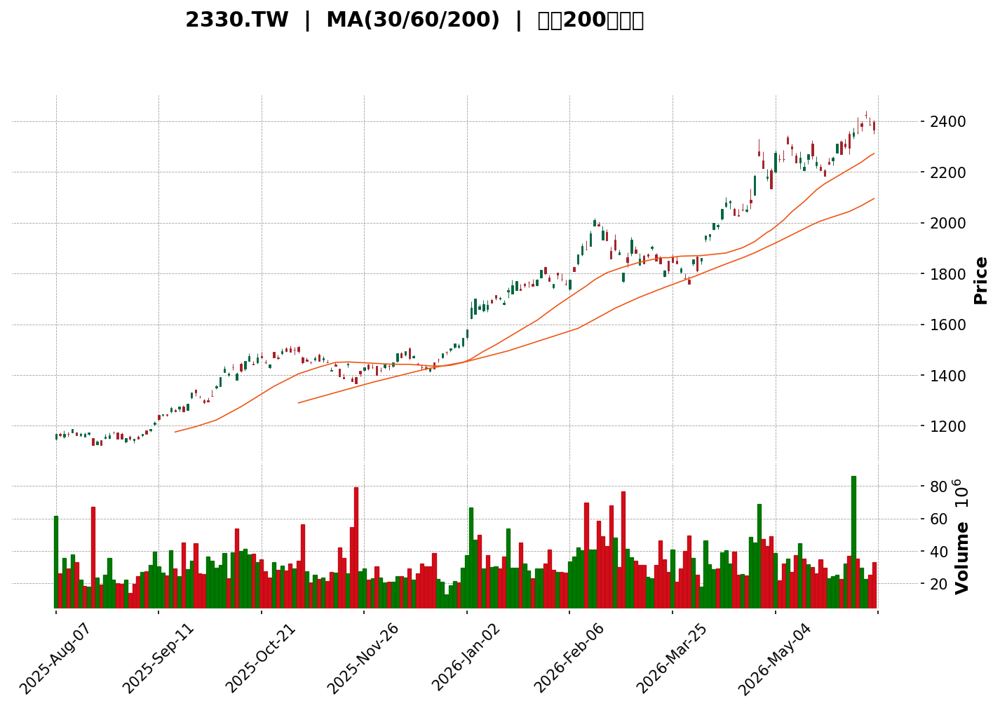
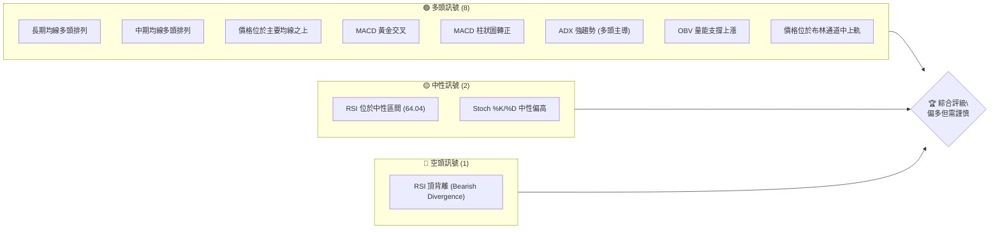

<details>
<summary>📊 靜態圖表 (點擊展開)</summary>

</details>

<html>
<head><meta charset="utf-8" /></head>
<body>
    <div style="height:500px; width:100%;">                        <script>window.PlotlyConfig = {MathJaxConfig: 'local'};</script>
        <script charset="utf-8" src="https://cdn.plot.ly/plotly-3.6.0.min.js" integrity="sha256-QaOVwtVY0T02VaHrr6pnoHLCwayMJp4O5n4YyaE3rJk=" crossorigin="anonymous"></script>                <div id="candlestick-chart" class="plotly-graph-div" style="height:100%; width:100%;"></div>            <script>                window.PLOTLYENV=window.PLOTLYENV || {};                                if (document.getElementById("candlestick-chart")) {                    Plotly.newPlot(                        "candlestick-chart",                        [{"close":{"dtype":"f8","bdata":"AAAAwFY+kkAAAACAjCqSQAAAAMBWPpJAAAAAwFY+kkAAAABAf42SQAAAAICMKpJAAAAAwFY+kkAAAADAVj6SQAAAAOAgUpJAAAAAgDuMkUAAAAAAmseRQAAAAIA7jJFAAAAAgMIWkkAAAACAjCqSQAAAAADrZZJAAAAAYC7vkUAAAABgLu+RQAAAAID4ApJAAAAAYC7vkUAAAABgLu+RQAAAAGAu75FAAAAAwFY+kkAAAADAVj6SQAAAAEB\u002fjZJAAAAAAHLwkkAAAABA0CuTQAAAAMD4epNAAAAAwC5nk0AAAAAgZd6TQAAAAADKopNAAAAAoEPyk0AAAAAAyqKTQAAAAGAAGpRAAAAA4NHMlEAAAADg0cyUQAAAAEBYfZRAAAAAoN4tlEAAAAAAvUGUQAAAAKA2kZRAAAAAwCkwlUAAAACgPruVQAAAAGBTRpZAAAAA4Nn2lUAAAADAMVqWQAAAAODZ9pVAAAAAgJYelkAAAADAib2WQAAAAGADDZdAAAAAgO6BlkAAAAAAJfmWQAAAAAAl+ZZAAAAAYKuplkAAAACA7oGWQAAAAAAl+ZZAAAAAoEbllkAAAADgfFyXQAAAAOB8XJdAAAAAgJ5Il0AAAABAW3CXQAAAAOB8XJdAAAAAYKuplkAAAADAib2WQAAAAGCrqZZAAAAAoEbllkAAAADAib2WQAAAAKBG5ZZAAAAAYKuplkAAAADgdDKWQAAAACAQbpZAAAAAAB3PlUAAAABAYKeVQAAAAADNlZZAAAAAYKN\u002flUAAAACg5leVQAAAAODZ9pVAAAAAwDFalkAAAABgU0aWQAAAAMAxWpZAAAAAgPvilUAAAADgdDKWQAAAAIDugZZAAAAAIBBulkAAAABgq6mWQAAAACDANJdAAAAAACX5lkAAAADgfFyXQAAAAMDg5JZAAAAAgL8Ml0AAAABgI5WWQAAAAGBVWZZAAAAAAGZFlkAAAAAAZkWWQAAAAABmRZZAAAAAYPHQlkAAAAAgnjSXQAAAAICNSJdAAAAAoFuEl0AAAAAAGdSXQAAAAEA6rJdAAAAAYNYjmEAAAADgYa+YQAAAAMBGAppAAAAAQNKNmkAAAAAgNhaaQAAAAOAUPppAAAAAgCUqmkAAAAAgBFKaQAAAAKDBoZpAAAAAoMGhmkAAAAAgBFKaQAAAAKBdGZtAAAAAABtpm0AAAAAg6aSbQAAAAKBdGZtAAAAAABtpm0AAAADA+ZCbQAAAAMArVZtAAAAAgNi4m0AAAABAU1icQAAAAECFHJxAAAAAIOmkm0AAAABgCn2bQAAAAOCVCJxAAAAAwMfMm0AAAABgCn2bQAAAAIDYuJtAAAAA4GNEnEAAAACAi0edQAAAAOAW051AAAAA4EiXnUAAAABgcJqeQAAAAODJYZ9AAAAAgAwSn0AAAAAgT8KeQAAAAEDUIp5AAAAAYL0LnUAAAADgSJedQAAAACBqb51AAAAAgHQwnEAAAABg78+cQAAAAKDDNp5AAAAAwHpbnUAAAABgvQudQAAAAAAAvJxAAAAAAAA4nUAAAAAAAMSdQAAAAAAA6JxAAAAAAADAnEAAAAAAAEicQAAAAAAASJxAAAAAAADUnEAAAAAAAMCcQAAAAAAAcJxAAAAAAADQm0AAAAAAAICbQAAAAAAA\u002fJxAAAAAAABInEAAAAAAABCdQAAAAAAAeJ5AAAAAAACMnkAAAAAAAECfQAAAAAAAGJ9AAAAAAAAOoEAAAAAAAECgQAAAAAAASqBAAAAAAAC4n0AAAAAAAKSfQAAAAAAABKBAAAAAAAAEoEAAAAAAAECgQAAAAAAAEqFAAAAAAACyoUAAAAAAAE6hQAAAAAAACKFAAAAAAACuoEAAAAAAAMahQAAAAAAAlKFAAAAAAACUoUAAAAAAAAyiQAAAAAAA5KFAAAAAAAB2oUAAAAAAAJ6hQAAAAAAAWKFAAAAAAAC8oUAAAAAAALKhQAAAAAAAgKFAAAAAAAA6oUAAAAAAABKhQAAAAAAAbKFAAAAAAACeoUAAAAAAAAyiQAAAAAAAvKFAAAAAAAD4oUAAAAAAAO6hQAAAAAAAZqJAAAAAAABmokAAAAAAAJiiQAAAAAAA8qJAAAAAAACiokAAAAAAAHqiQA=="},"high":{"dtype":"f8","bdata":"AAAAwFY+kkDreHPCIFKSQB5bESS1eZJAvzy2AutlkkAAAABAf42SQGE1rePqZZJAXx5b4SBSkkBfHlvhIFKSQAAAAOAgUpJA+cGcR\u002fgCkkCGLGQhZNuRQPsrEwVk25FAwyu8wlY+kkDreHPCIFKSQAAAAADrZZJAqBGWByFSkkCoEZYHIVKSQAAAAID4ApJAyz2NxIwqkkAAAABgLu+RQMs9jcSMKpJAAAAAwFY+kkAeWxEktXmSQAAAAEB\u002fjZJA2M1vITwEk0BTSinF+HqTQAAAAMD4epNADwNn4fh6k0AAACCFQ\u002fKTQFgdX8qGypNAAAAAoEPyk0Bcye35IQaUQAAAAGAAGpRAAAAA4NHMlEAIKmcPbQiVQKOLLgoVpZRAN3Ijz3lplEADmRQvWH2UQAnGW5mO9JRApVAKJQhElUAAAACgPruVQMkBQioQbpZA1I8zRbgKlkBWVVXvzJWWQNSPM0W4CpZA2FBeQ6uplkAAAADAib2WQFDrVyrANJdAF0M6r4m9lkAcTJEvwDSXQNC6wZSeSJdAkyZNKmjRlkCzaxPlzJWWQNC6wZSeSJdAic6ez+Egl0AcuzSqOYSXQKoYTw8YmJdAmpmZefarl0BYFCwKGJiXQDh2aXT2q5dAcODAWQMNl0CqOWbvJPmWQEqTJsWJvZZABt9pagMNl0BVc8wewDSXQAbfaWoDDZdAkyZNKmjRlkDw5hGqMVqWQDnAR0+rqZZAFVG\u002fXlNGlkBKKaXU2faVQEYbK2WrqZZAeAZV9BzPlUDrUbj+HM+VQKkfZ6qWHpZAAAAAwDFalkCSA4T0zJWWQFZVVe\u002fMlZZAXvyJRBBulkDw5hGqMVqWQAAAAIDugZZAvuoXhe6BlkAAAABgq6mWQAAAACDANJdA0LrBlJ5Il0AAAADgfFyXQCp4OeVKmJdAn3WD2a4gl0AKWn25EqmWQJ\u002fyEBM0gZZAUg6IDDSBlkBxr4JZVVmWQDRtjb8SqZZAFHVyueDklkAAAAAgnjSXQPC4eNl8XJdAAAAAoFuEl0AAAAAAGdSXQL2G8vIY1JdAAAAAYNYjmEAAAADgYa+YQJzWbH\u002fzZZpAAAAAQNKNmkDkSgLTFD6aQGULoezieZpAhmEY5uJ5mkCEAWcs0o2aQMZ0FlOgyZpAYzqL+bC1mkBYVu\u002fS4nmaQJBJ8VI8QZtAXXTRZdi4m0AAAAAg6aSbQOg3W18KfZtALrrosvmQm0Cc1H0Z6aSbQJmSKdnHzJtA5jCH2cfMm0AAAABAU1icQAetLFkhlJxApp6M35UInEAAAABgCn2bQFuwBZN0MJxAZorTJYUcnEDZVGts2LibQAAAAIDYuJtApQXoRSGUnEAAAACAi0edQIpP95L1+p1AdEucUtQinkCo1fgST8KeQGtI+pKoiZ9AIeOCjNpNn0BrcROGDBKfQNaUNWU+1p5ARKxRhSe\u002fnUBZgTASgYaeQL6E9tJIl51AAAAAgHQwnED5rBssam+dQB0V+FKiXp5AUv\u002fI2BbTnUACaevFeludQCe3eHKLR51AAAAAAABgnUAAAAAAANidQAAAAAAAYJ1AAAAAAAA4nUAAAAAAAFycQAAAAAAA6JxAAAAAAABMnUAAAAAAACSdQAAAAAAAhJxAAAAAAAAgnEAAAAAAAPibQAAAAAAA\u002fJxAAAAAAAAknUAAAAAAABCdQAAAAAAAeJ5AAAAAAACMnkAAAAAAAECfQAAAAAAALJ9AAAAAAAAOoEAAAAAAAGigQAAAAAAAVKBAAAAAAAAYoEAAAAAAAA6gQAAAAAAANqBAAAAAAAAsoEAAAAAAAK6gQAAAAAAAHKFAAAAAAAA0okAAAAAAANChQAAAAAAARKFAAAAAAABOoUAAAAAAANqhQAAAAAAAvKFAAAAAAADaoUAAAAAAAFKiQAAAAAAADKJAAAAAAADGoUAAAAAAANChQAAAAAAAgKFAAAAAAAC8oUAAAAAAACqiQAAAAAAAqKFAAAAAAABsoUAAAAAAAEShQAAAAAAAnqFAAAAAAACooUAAAAAAAAyiQAAAAAAAKqJAAAAAAAA0okAAAAAAAHCiQAAAAAAAjqJAAAAAAADeokAAAAAAAMCiQAAAAAAAEKNAAAAAAADeokAAAAAAAMqiQA=="},"hovertemplate":"\u003cb\u003e%{x|%Y-%m-%d}\u003c\u002fb\u003e\u003cbr\u003e\u958b: $%{open:.2f}\u003cbr\u003e\u9ad8: $%{high:.2f}\u003cbr\u003e\u4f4e: $%{low:.2f}\u003cbr\u003e\u6536: $%{close:.2f}\u003cextra\u003e\u003c\u002fextra\u003e","low":{"dtype":"f8","bdata":"Img4GWTbkUCKQ8ZewhaSQOGk7lv4ApJAQcNJfcIWkkAAAADcIFKSQAAAAICMKpJAQcNJfcIWkkBBw0l9whaSQCaxTJ2MKpJAAAAAgDuMkUD1pje9BaCRQAAAAIA7jJFAPdRDPS7vkUCfylIcLu+RQL6YT71WPpJAAAAAYC7vkUAAAABgLu+RQEwD9fnPs5FAEpZ7PmTbkUA1wnL7z7ORQAAAAGAu75FAQcNJfcIWkkAAAADAVj6SQFVVVf3qZZJAT2Qgvd3IkkBrrbUeBhiTQF7XdX1kU5NA8PyYnmRTk0AAAICL646TQAAAAADKopNAFesUC8qik0AAAAAAyqKTQH3WDWaotpNASQ9U5nlplED41ZiwNpGUQAAAAEBYfZRAQy\u002f0OgAalEAAAAAAvUGUQAAAAKA2kZRAtl7r9WwIlUAAAADcKTCVQFP9nDC4CpZAV+CYFR3PlUByHMf1dDKWQNkw\u002fuWBk5VAvYbyGrgKlkA6Zu+Wlh6WQGApUMuJvZZAAAAAgO6BlkB91g0GzZWWQAAAAAAl+ZZAt2zZ+syVlkDpvMVQU0aWQAAAAAAl+ZZAfRDLOmjRlkBW57Cw4SCXQHKi5XqeSJdAAAAAgJ5Il0BP16er4SCXQOREyxXANJdAt2zZ+syVlkAAAADAib2WQLds2frMlZZA+iCW1Ym9lkAAAADAib2WQHcxYXCrqZZAAAAAYKuplkCIDPd6lh6WQAAAACAQbpZAAAAAAB3PlUAAAABAYKeVQDCuftAxWpZAAAAAYKN\u002flUAAAACg5leVQFfgmBUdz5VAq6qqkJYelkAc\u002f976dDKWQDmO41pTRpZAAAAAgPvilUAQGe4VuAqWQOm8xVBTRpZAxz+48HQylkDasmXLMVqWQDVGClyrqZZAAAAAACX5lkDIiZZLAw2XQDTWh2bx0JZAwhT5zODklkD1pYIGNIGWQGEN76x2MZZAj1B9pnYxlkCu8XfzlwmWQAAAAABmRZZA2BUbrRKplkArizO64OSWQCGODs2uIJdAyAZkk41Il0CaRO+ZW4SXQER5DY1bhJdA2MeF7UqYl0AvPq8T5w+YQLN9oprcTplA22yzDZqemUActf1sV+6ZQDbpvcZ4xplAGYZhwHjGmUAAAAAgBFKaQDuL6ezieZpAO4vp7OJ5mkCpqRBtJSqaQE8jLIfBoZpAXXTRjY\u002fdmkAYVW6tXRmbQAAAAKBdGZtA0UUXTTxBm0CPrQhaPEGbQAAAAMArVZtAgQtcwCtVm0CHcAgnt+CbQNSNeOaVCJxAAAAAIOmkm0Dejhv6TC2bQHd3d9PHzJtAzToWDemkm0C344YGG2mbQM94xrNdGZtAAAAA4GNEnEBoo76zEKicQNbBIhScM51AAAAA4EiXnUC00yPhFtOdQCtvC3oMEp9AAAAAgAwSn0CF+V2twzaeQAAAAEDUIp5AAAAAYL0LnUA59XuGWYOdQEN7CW2LR51ApNxUtPmQm0CEKfL5MYCcQMN2sxScM51AAAAAwHpbnUC9vJmgEKicQAAAAAAAvJxAAAAAAAAQnUAAAAAAAIidQAAAAAAA6JxAAAAAAADAnEAAAAAAAOSbQAAAAAAAIJxAAAAAAADUnEAAAAAAAMCcQAAAAAAAIJxAAAAAAADQm0AAAAAAAICbQAAAAAAAmJxAAAAAAAA0nEAAAAAAAKycQAAAAAAAFJ5AAAAAAAAonkAAAAAAAMieQAAAAAAA3J5AAAAAAABon0AAAAAAABigQAAAAAAADqBAAAAAAAC4n0AAAAAAAKSfQAAAAAAA9J9AAAAAAADgn0AAAAAAAA6gQAAAAAAAcqBAAAAAAACyoUAAAAAAAE6hQAAAAAAA6qBAAAAAAACuoEAAAAAAACahQAAAAAAAgKFAAAAAAACAoUAAAAAAAAyiQAAAAAAAsqFAAAAAAAB2oUAAAAAAAEShQAAAAAAAOqFAAAAAAABsoUAAAAAAAJShQAAAAAAATqFAAAAAAAA6oUAAAAAAABKhQAAAAAAAbKFAAAAAAABioUAAAAAAAMahQAAAAAAAvKFAAAAAAADkoUAAAAAAALyhQAAAAAAANKJAAAAAAABcokAAAAAAAHCiQAAAAAAA1KJAAAAAAACiokAAAAAAAFyiQA=="},"name":"\u50f9\u683c","open":{"dtype":"f8","bdata":"goaTOi7vkUB1vDmhVj6SQEHDSX3CFpJAAAAAwFY+kkAAAADcIFKSQOt4c8IgUpJAoOGknowqkkBBw0l9whaSQJNYpr5WPpJA+cGcR\u002fgCkkD1pje9BaCRQPsrEwVk25FAH+qhXvgCkkAVh4w9+AKSQAAAAADrZZJAqBGWByFSkkC6pxHmVj6SQHnCdxuax5FA3dMIo8IWkkASlns+ZNuRQN3TCKPCFpJAoOGknowqkkAeWxEktXmSQKuqqh61eZJAKDKQ3qfckkC+996jLmeTQK\u002frup4uZ5NADwNn4fh6k0AAAKDwyaKTQKyOL2WotpNAi3WK1YbKk0CwOr6UQ\u002fKTQH3WDWaotpNAoXJ2S1h9lECwxkSqjvSUQAAAAEBYfZRAeqEXaptVlECs3QZlm1WUQAAAAKA2kZRAW6\u002f1WksclUAAAADcKTCVQFP9nDC4CpZAK3DMevvilUAAAADAMVqWQNkw\u002fuWBk5VAlNdQ3syVlkCrjDNhU0aWQGApUMuJvZZAs2sT5cyVlkAxRT5rq6mWQLRuMGUDDZdAAAAAYKuplkCcKNm1MVqWQNC6wZSeSJdAg+80BSX5lkDkRMsVwDSXQBy7NKo5hJdA9ihcrzmEl0AAAABAW3CXQKoYTw8YmJdAJ02a9CT5lkA5EyIlaNGWQAAAAGCrqZZAfRDLOmjRlkAcYKq54SCXQH0Qyzpo0ZZAAAAAYKuplkCIDPd6lh6WQL7qF4XugZZAFVG\u002fXlNGlkBSSimlPruVQLvk1JrugZZAPIMqKmCnlUCamZmZPruVQKkfZ6qWHpZAchzH9XQylkCtAmOP7oGWQAAAAMAxWpZAXvyJRBBulkAAAADgdDKWQJwo2bUxWpZAAAAAIBBulkAjRowwEG6WQMBgLcGJvZZAHEyRL8A0l0BW57Cw4SCXQF5OwYtbhJdAYYp8JtD4lkAAAABgI5WWQAAAAGBVWZZAca+CWVVZlkAeofpMhx2WQDRtjb8SqZZAAAAAYPHQlkBgqKYT0PiWQAAAAICNSJdA7ax2Rmxwl0B0c3PzSpiXQKK8huZKmJdAcPQERzqsl0CjbsPGxTeYQKCoHvTLYplA22yzDZqemUActf1sV+6ZQALtSCBo2plA3LZtc1fumUBYVu\u002fS4nmaQMZ0FlOgyZpAncV0RtKNmkDUVIjGFD6aQDhbh0ZuBZtAXXTRjY\u002fdmkAYVW6tXRmbQMikePlMLZtAF110WQp9m0AAAADA+ZCbQInbDXMKfZtAaDzjGRtpm0CHcAgnt+CbQNs6pf8xgJxAZJKHLLfgm0Amq5RTPEGbQFuwBZN0MJxAAAAAwMfMm0AAAABgCn2bQLWpTQ1NLZtAOwRu7DGAnED7zkYNALycQJxpnm2LR51AAAAA4EiXnUC00yPhFtOdQCtvC3oMEp9AYPaA2fsln0CF+V2twzaeQG4eRrJfrp5Agx3heFmDnUA7ViCswzaeQEN7CW2LR51AEEHKDemkm0B91g3GrB+dQOCLq8d6W51AqX9kzEiXnUC9vJmgEKicQI\u002fB+RicM51AAAAAAABMnUAAAAAAALCdQAAAAAAATJ1AAAAAAAAQnUAAAAAAAPibQAAAAAAA6JxAAAAAAAAknUAAAAAAAOicQAAAAAAANJxAAAAAAADQm0AAAAAAALybQAAAAAAAwJxAAAAAAAAknUAAAAAAAOicQAAAAAAAPJ5AAAAAAABknkAAAAAAANyeQAAAAAAABJ9AAAAAAAB8n0AAAAAAACKgQAAAAAAAQKBAAAAAAAAOoEAAAAAAALifQAAAAAAABKBAAAAAAAD0n0AAAAAAAFSgQAAAAAAAfKBAAAAAAADQoUAAAAAAAIqhQAAAAAAA\u002fqBAAAAAAAA6oUAAAAAAADChQAAAAAAAlKFAAAAAAACUoUAAAAAAAD6iQAAAAAAA+KFAAAAAAACyoUAAAAAAAHahQAAAAAAAOqFAAAAAAACUoUAAAAAAAAyiQAAAAAAAYqFAAAAAAABYoUAAAAAAADqhQAAAAAAAgKFAAAAAAACKoUAAAAAAAMahQAAAAAAAIKJAAAAAAAAMokAAAAAAAFyiQAAAAAAASKJAAAAAAABmokAAAAAAAKyiQAAAAAAA8qJAAAAAAACiokAAAAAAALaiQA=="},"x":["2025-08-07T00:00:00+08:00","2025-08-08T00:00:00+08:00","2025-08-11T00:00:00+08:00","2025-08-12T00:00:00+08:00","2025-08-13T00:00:00+08:00","2025-08-14T00:00:00+08:00","2025-08-15T00:00:00+08:00","2025-08-18T00:00:00+08:00","2025-08-19T00:00:00+08:00","2025-08-20T00:00:00+08:00","2025-08-21T00:00:00+08:00","2025-08-22T00:00:00+08:00","2025-08-25T00:00:00+08:00","2025-08-26T00:00:00+08:00","2025-08-27T00:00:00+08:00","2025-08-28T00:00:00+08:00","2025-08-29T00:00:00+08:00","2025-09-01T00:00:00+08:00","2025-09-02T00:00:00+08:00","2025-09-03T00:00:00+08:00","2025-09-04T00:00:00+08:00","2025-09-05T00:00:00+08:00","2025-09-08T00:00:00+08:00","2025-09-09T00:00:00+08:00","2025-09-10T00:00:00+08:00","2025-09-11T00:00:00+08:00","2025-09-12T00:00:00+08:00","2025-09-15T00:00:00+08:00","2025-09-16T00:00:00+08:00","2025-09-17T00:00:00+08:00","2025-09-18T00:00:00+08:00","2025-09-19T00:00:00+08:00","2025-09-22T00:00:00+08:00","2025-09-23T00:00:00+08:00","2025-09-24T00:00:00+08:00","2025-09-25T00:00:00+08:00","2025-09-26T00:00:00+08:00","2025-09-30T00:00:00+08:00","2025-10-01T00:00:00+08:00","2025-10-02T00:00:00+08:00","2025-10-03T00:00:00+08:00","2025-10-07T00:00:00+08:00","2025-10-08T00:00:00+08:00","2025-10-09T00:00:00+08:00","2025-10-13T00:00:00+08:00","2025-10-14T00:00:00+08:00","2025-10-15T00:00:00+08:00","2025-10-16T00:00:00+08:00","2025-10-17T00:00:00+08:00","2025-10-20T00:00:00+08:00","2025-10-21T00:00:00+08:00","2025-10-22T00:00:00+08:00","2025-10-23T00:00:00+08:00","2025-10-27T00:00:00+08:00","2025-10-28T00:00:00+08:00","2025-10-29T00:00:00+08:00","2025-10-30T00:00:00+08:00","2025-10-31T00:00:00+08:00","2025-11-03T00:00:00+08:00","2025-11-04T00:00:00+08:00","2025-11-05T00:00:00+08:00","2025-11-06T00:00:00+08:00","2025-11-07T00:00:00+08:00","2025-11-10T00:00:00+08:00","2025-11-11T00:00:00+08:00","2025-11-12T00:00:00+08:00","2025-11-13T00:00:00+08:00","2025-11-14T00:00:00+08:00","2025-11-17T00:00:00+08:00","2025-11-18T00:00:00+08:00","2025-11-19T00:00:00+08:00","2025-11-20T00:00:00+08:00","2025-11-21T00:00:00+08:00","2025-11-24T00:00:00+08:00","2025-11-25T00:00:00+08:00","2025-11-26T00:00:00+08:00","2025-11-27T00:00:00+08:00","2025-11-28T00:00:00+08:00","2025-12-01T00:00:00+08:00","2025-12-02T00:00:00+08:00","2025-12-03T00:00:00+08:00","2025-12-04T00:00:00+08:00","2025-12-05T00:00:00+08:00","2025-12-08T00:00:00+08:00","2025-12-09T00:00:00+08:00","2025-12-10T00:00:00+08:00","2025-12-11T00:00:00+08:00","2025-12-12T00:00:00+08:00","2025-12-15T00:00:00+08:00","2025-12-16T00:00:00+08:00","2025-12-17T00:00:00+08:00","2025-12-18T00:00:00+08:00","2025-12-19T00:00:00+08:00","2025-12-22T00:00:00+08:00","2025-12-23T00:00:00+08:00","2025-12-24T00:00:00+08:00","2025-12-26T00:00:00+08:00","2025-12-29T00:00:00+08:00","2025-12-30T00:00:00+08:00","2025-12-31T00:00:00+08:00","2026-01-02T00:00:00+08:00","2026-01-05T00:00:00+08:00","2026-01-06T00:00:00+08:00","2026-01-07T00:00:00+08:00","2026-01-08T00:00:00+08:00","2026-01-09T00:00:00+08:00","2026-01-12T00:00:00+08:00","2026-01-13T00:00:00+08:00","2026-01-14T00:00:00+08:00","2026-01-15T00:00:00+08:00","2026-01-16T00:00:00+08:00","2026-01-19T00:00:00+08:00","2026-01-20T00:00:00+08:00","2026-01-21T00:00:00+08:00","2026-01-22T00:00:00+08:00","2026-01-23T00:00:00+08:00","2026-01-26T00:00:00+08:00","2026-01-27T00:00:00+08:00","2026-01-28T00:00:00+08:00","2026-01-29T00:00:00+08:00","2026-01-30T00:00:00+08:00","2026-02-02T00:00:00+08:00","2026-02-03T00:00:00+08:00","2026-02-04T00:00:00+08:00","2026-02-05T00:00:00+08:00","2026-02-06T00:00:00+08:00","2026-02-09T00:00:00+08:00","2026-02-10T00:00:00+08:00","2026-02-11T00:00:00+08:00","2026-02-23T00:00:00+08:00","2026-02-24T00:00:00+08:00","2026-02-25T00:00:00+08:00","2026-02-26T00:00:00+08:00","2026-03-02T00:00:00+08:00","2026-03-03T00:00:00+08:00","2026-03-04T00:00:00+08:00","2026-03-05T00:00:00+08:00","2026-03-06T00:00:00+08:00","2026-03-09T00:00:00+08:00","2026-03-10T00:00:00+08:00","2026-03-11T00:00:00+08:00","2026-03-12T00:00:00+08:00","2026-03-13T00:00:00+08:00","2026-03-16T00:00:00+08:00","2026-03-17T00:00:00+08:00","2026-03-18T00:00:00+08:00","2026-03-19T00:00:00+08:00","2026-03-20T00:00:00+08:00","2026-03-23T00:00:00+08:00","2026-03-24T00:00:00+08:00","2026-03-25T00:00:00+08:00","2026-03-26T00:00:00+08:00","2026-03-27T00:00:00+08:00","2026-03-30T00:00:00+08:00","2026-03-31T00:00:00+08:00","2026-04-01T00:00:00+08:00","2026-04-02T00:00:00+08:00","2026-04-07T00:00:00+08:00","2026-04-08T00:00:00+08:00","2026-04-09T00:00:00+08:00","2026-04-10T00:00:00+08:00","2026-04-13T00:00:00+08:00","2026-04-14T00:00:00+08:00","2026-04-15T00:00:00+08:00","2026-04-16T00:00:00+08:00","2026-04-17T00:00:00+08:00","2026-04-20T00:00:00+08:00","2026-04-21T00:00:00+08:00","2026-04-22T00:00:00+08:00","2026-04-23T00:00:00+08:00","2026-04-24T00:00:00+08:00","2026-04-27T00:00:00+08:00","2026-04-28T00:00:00+08:00","2026-04-29T00:00:00+08:00","2026-04-30T00:00:00+08:00","2026-05-04T00:00:00+08:00","2026-05-05T00:00:00+08:00","2026-05-06T00:00:00+08:00","2026-05-07T00:00:00+08:00","2026-05-08T00:00:00+08:00","2026-05-11T00:00:00+08:00","2026-05-12T00:00:00+08:00","2026-05-13T00:00:00+08:00","2026-05-14T00:00:00+08:00","2026-05-15T00:00:00+08:00","2026-05-18T00:00:00+08:00","2026-05-19T00:00:00+08:00","2026-05-20T00:00:00+08:00","2026-05-21T00:00:00+08:00","2026-05-22T00:00:00+08:00","2026-05-25T00:00:00+08:00","2026-05-26T00:00:00+08:00","2026-05-27T00:00:00+08:00","2026-05-28T00:00:00+08:00","2026-05-29T00:00:00+08:00","2026-06-01T00:00:00+08:00","2026-06-02T00:00:00+08:00","2026-06-03T00:00:00+08:00","2026-06-04T00:00:00+08:00","2026-06-05T00:00:00+08:00"],"type":"candlestick"},{"hovertemplate":"MA30: $%{y:.2f}\u003cextra\u003e\u003c\u002fextra\u003e","line":{"color":"#2196F3","dash":"dash","width":2},"mode":"lines","name":"MA30","x":["2025-08-07T00:00:00+08:00","2025-08-08T00:00:00+08:00","2025-08-11T00:00:00+08:00","2025-08-12T00:00:00+08:00","2025-08-13T00:00:00+08:00","2025-08-14T00:00:00+08:00","2025-08-15T00:00:00+08:00","2025-08-18T00:00:00+08:00","2025-08-19T00:00:00+08:00","2025-08-20T00:00:00+08:00","2025-08-21T00:00:00+08:00","2025-08-22T00:00:00+08:00","2025-08-25T00:00:00+08:00","2025-08-26T00:00:00+08:00","2025-08-27T00:00:00+08:00","2025-08-28T00:00:00+08:00","2025-08-29T00:00:00+08:00","2025-09-01T00:00:00+08:00","2025-09-02T00:00:00+08:00","2025-09-03T00:00:00+08:00","2025-09-04T00:00:00+08:00","2025-09-05T00:00:00+08:00","2025-09-08T00:00:00+08:00","2025-09-09T00:00:00+08:00","2025-09-10T00:00:00+08:00","2025-09-11T00:00:00+08:00","2025-09-12T00:00:00+08:00","2025-09-15T00:00:00+08:00","2025-09-16T00:00:00+08:00","2025-09-17T00:00:00+08:00","2025-09-18T00:00:00+08:00","2025-09-19T00:00:00+08:00","2025-09-22T00:00:00+08:00","2025-09-23T00:00:00+08:00","2025-09-24T00:00:00+08:00","2025-09-25T00:00:00+08:00","2025-09-26T00:00:00+08:00","2025-09-30T00:00:00+08:00","2025-10-01T00:00:00+08:00","2025-10-02T00:00:00+08:00","2025-10-03T00:00:00+08:00","2025-10-07T00:00:00+08:00","2025-10-08T00:00:00+08:00","2025-10-09T00:00:00+08:00","2025-10-13T00:00:00+08:00","2025-10-14T00:00:00+08:00","2025-10-15T00:00:00+08:00","2025-10-16T00:00:00+08:00","2025-10-17T00:00:00+08:00","2025-10-20T00:00:00+08:00","2025-10-21T00:00:00+08:00","2025-10-22T00:00:00+08:00","2025-10-23T00:00:00+08:00","2025-10-27T00:00:00+08:00","2025-10-28T00:00:00+08:00","2025-10-29T00:00:00+08:00","2025-10-30T00:00:00+08:00","2025-10-31T00:00:00+08:00","2025-11-03T00:00:00+08:00","2025-11-04T00:00:00+08:00","2025-11-05T00:00:00+08:00","2025-11-06T00:00:00+08:00","2025-11-07T00:00:00+08:00","2025-11-10T00:00:00+08:00","2025-11-11T00:00:00+08:00","2025-11-12T00:00:00+08:00","2025-11-13T00:00:00+08:00","2025-11-14T00:00:00+08:00","2025-11-17T00:00:00+08:00","2025-11-18T00:00:00+08:00","2025-11-19T00:00:00+08:00","2025-11-20T00:00:00+08:00","2025-11-21T00:00:00+08:00","2025-11-24T00:00:00+08:00","2025-11-25T00:00:00+08:00","2025-11-26T00:00:00+08:00","2025-11-27T00:00:00+08:00","2025-11-28T00:00:00+08:00","2025-12-01T00:00:00+08:00","2025-12-02T00:00:00+08:00","2025-12-03T00:00:00+08:00","2025-12-04T00:00:00+08:00","2025-12-05T00:00:00+08:00","2025-12-08T00:00:00+08:00","2025-12-09T00:00:00+08:00","2025-12-10T00:00:00+08:00","2025-12-11T00:00:00+08:00","2025-12-12T00:00:00+08:00","2025-12-15T00:00:00+08:00","2025-12-16T00:00:00+08:00","2025-12-17T00:00:00+08:00","2025-12-18T00:00:00+08:00","2025-12-19T00:00:00+08:00","2025-12-22T00:00:00+08:00","2025-12-23T00:00:00+08:00","2025-12-24T00:00:00+08:00","2025-12-26T00:00:00+08:00","2025-12-29T00:00:00+08:00","2025-12-30T00:00:00+08:00","2025-12-31T00:00:00+08:00","2026-01-02T00:00:00+08:00","2026-01-05T00:00:00+08:00","2026-01-06T00:00:00+08:00","2026-01-07T00:00:00+08:00","2026-01-08T00:00:00+08:00","2026-01-09T00:00:00+08:00","2026-01-12T00:00:00+08:00","2026-01-13T00:00:00+08:00","2026-01-14T00:00:00+08:00","2026-01-15T00:00:00+08:00","2026-01-16T00:00:00+08:00","2026-01-19T00:00:00+08:00","2026-01-20T00:00:00+08:00","2026-01-21T00:00:00+08:00","2026-01-22T00:00:00+08:00","2026-01-23T00:00:00+08:00","2026-01-26T00:00:00+08:00","2026-01-27T00:00:00+08:00","2026-01-28T00:00:00+08:00","2026-01-29T00:00:00+08:00","2026-01-30T00:00:00+08:00","2026-02-02T00:00:00+08:00","2026-02-03T00:00:00+08:00","2026-02-04T00:00:00+08:00","2026-02-05T00:00:00+08:00","2026-02-06T00:00:00+08:00","2026-02-09T00:00:00+08:00","2026-02-10T00:00:00+08:00","2026-02-11T00:00:00+08:00","2026-02-23T00:00:00+08:00","2026-02-24T00:00:00+08:00","2026-02-25T00:00:00+08:00","2026-02-26T00:00:00+08:00","2026-03-02T00:00:00+08:00","2026-03-03T00:00:00+08:00","2026-03-04T00:00:00+08:00","2026-03-05T00:00:00+08:00","2026-03-06T00:00:00+08:00","2026-03-09T00:00:00+08:00","2026-03-10T00:00:00+08:00","2026-03-11T00:00:00+08:00","2026-03-12T00:00:00+08:00","2026-03-13T00:00:00+08:00","2026-03-16T00:00:00+08:00","2026-03-17T00:00:00+08:00","2026-03-18T00:00:00+08:00","2026-03-19T00:00:00+08:00","2026-03-20T00:00:00+08:00","2026-03-23T00:00:00+08:00","2026-03-24T00:00:00+08:00","2026-03-25T00:00:00+08:00","2026-03-26T00:00:00+08:00","2026-03-27T00:00:00+08:00","2026-03-30T00:00:00+08:00","2026-03-31T00:00:00+08:00","2026-04-01T00:00:00+08:00","2026-04-02T00:00:00+08:00","2026-04-07T00:00:00+08:00","2026-04-08T00:00:00+08:00","2026-04-09T00:00:00+08:00","2026-04-10T00:00:00+08:00","2026-04-13T00:00:00+08:00","2026-04-14T00:00:00+08:00","2026-04-15T00:00:00+08:00","2026-04-16T00:00:00+08:00","2026-04-17T00:00:00+08:00","2026-04-20T00:00:00+08:00","2026-04-21T00:00:00+08:00","2026-04-22T00:00:00+08:00","2026-04-23T00:00:00+08:00","2026-04-24T00:00:00+08:00","2026-04-27T00:00:00+08:00","2026-04-28T00:00:00+08:00","2026-04-29T00:00:00+08:00","2026-04-30T00:00:00+08:00","2026-05-04T00:00:00+08:00","2026-05-05T00:00:00+08:00","2026-05-06T00:00:00+08:00","2026-05-07T00:00:00+08:00","2026-05-08T00:00:00+08:00","2026-05-11T00:00:00+08:00","2026-05-12T00:00:00+08:00","2026-05-13T00:00:00+08:00","2026-05-14T00:00:00+08:00","2026-05-15T00:00:00+08:00","2026-05-18T00:00:00+08:00","2026-05-19T00:00:00+08:00","2026-05-20T00:00:00+08:00","2026-05-21T00:00:00+08:00","2026-05-22T00:00:00+08:00","2026-05-25T00:00:00+08:00","2026-05-26T00:00:00+08:00","2026-05-27T00:00:00+08:00","2026-05-28T00:00:00+08:00","2026-05-29T00:00:00+08:00","2026-06-01T00:00:00+08:00","2026-06-02T00:00:00+08:00","2026-06-03T00:00:00+08:00","2026-06-04T00:00:00+08:00","2026-06-05T00:00:00+08:00"],"y":{"dtype":"f8","bdata":"AAAAAAAA+H8AAAAAAAD4fwAAAAAAAPh\u002fAAAAAAAA+H8AAAAAAAD4fwAAAAAAAPh\u002fAAAAAAAA+H8AAAAAAAD4fwAAAAAAAPh\u002fAAAAAAAA+H8AAAAAAAD4fwAAAAAAAPh\u002fAAAAAAAA+H8AAAAAAAD4fwAAAAAAAPh\u002fAAAAAAAA+H8AAAAAAAD4fwAAAAAAAPh\u002fAAAAAAAA+H8AAAAAAAD4fwAAAAAAAPh\u002fAAAAAAAA+H8AAAAAAAD4fwAAAAAAAPh\u002fAAAAAAAA+H8AAAAAAAD4fwAAAAAAAPh\u002fAAAAAAAA+H8AAAAAAAD4f1VVVWVYX5JAq6qqSuBtkkAAAADganqSQM3MzNxFipJARERExBagkkAAAAAwRLOSQHd3d8cXx5JA7+7uTpzXkkAiIiJiyuiSQGZmZsb1+5JAAAAAQAYbk0AAAADwvjyTQBEREREVZZNAmpmZ6SaGk0Dv7u6e36mTQLy7u\u002ftNyJNAd3d3pwTsk0AzMzOzBxWUQAAAABAIQJRAd3d3dw5nlEB3d3cnDpKUQHd3d9cNvZRAzczM3MPilECamZnJJgeVQDMzM4PfLJVAVVVVVaJOlUAiIiLSY3KVQDMzM9OBk5VAZmZmJp+0lUCamZlJFtOVQERERITg8pVAREREpA4KlkAAAACAjCSWQImIiIhnOpZAq6qqSklMlkBERET011yWQGZmZuZfcZZAREREZJGGlkDe3d0NIJeWQLy7uysFp5ZAvLu7i1GslkAAAAAAqKuWQAAAADBOrpZAd3d351SqlkDNzMzMuKGWQM3MzMy4oZZAERERcbWjlkCamZkpvJ+WQN7d3T3GmZZAAAAA4HmUlkB3d3dn2o2WQO\u002fu7h7hiZZAq6qqeuSHlkAzMzOTN4mWQGZmZjY0i5ZAIiIiwt2LlkAiIiLC3YuWQGZmZhbhh5ZAAAAAMOKFlkBmZmaGk36WQDMzMxPwdZZA3t3dbZhylkDNzMw8l26WQHd3d5c\u002fa5ZAVVVVFZJqlkCrqqo6im6WQERERGTZcZZAiYiIiCN5lkB3d3dnD4eWQImIiGiqkZZAREREdI6llkAAAABgbL+WQCIiIqKj3JZAREREVMcHl0AiIiJyQTCXQJqZmWnDVJdAmpmZiUt1l0De3d1t0ZeXQJqZmTlWvJdAvLu7S9Tkl0DNzMy8AwiYQLy7uxsyL5hAiYiIeLJZmEB3d3eHNISYQKuqqvpspZhAMzMzg0rLmECrqqqKLO+YQImIiOgMFZlAvLu7m+s8mUDv7u7eF26ZQCIiIiJEn5lAZmZm1h3NmUARERFRo\u002fmZQERERJTPKppAmpmZuVZVmkDe3d3d4nmaQLy7uzvDn5pAq6qqCkzImkC8u7vbz\u002faaQN7d3a1OK5tA7+7uftJZm0Crqqr6UoybQO\u002fu7q4suptAiYiIKLfgm0C8u7vblQicQAAAAHDPKZxAERERkWVCnEAiIiJCTl6cQGZmZkY6dpxAERERgYSDnEBEREQUyJicQLy7u4tcs5xAZmZmVvnDnECJiIhY78+cQBEREbHj3ZxAmpmZuVHtnEAzMzMzFgCdQM3MzKyDDZ1AIiIiQkkWnUAzMzPzvRWdQJqZmfkwF51AZmZmVkshnUAiIiJCDyydQKuqqrqBL51ARERENJ0vnUBVVVV1ti+dQKuqqgp8Op1AiYiI2Jo6nUDNzMzcwDidQJqZmRlAPp1AZmZmVmhGnUAAAAAg7UudQGZmZnZ3SZ1AmpmZ6VRSnUBEREQkMGGdQO\u002fu7u4Gdp1ARERE9NWMnUBmZmaGU56dQHd3d6d6tJ1AIiIikkPVnUB3d3eXu\u002fSdQKuqqpo9Fp5AMzMzg7lJnkAzMzMzM3meQKuqqqqqpp5AAAAAAADKnkBVVVVVVfueQKuqqqqqMJ9AVVVVVVVnn0AAAAAAAKqfQAAAAAAA6p9AAAAAAAAPoECrqqqqqiqgQFVVVVVVRaBAAAAAAABmoECrqqqqqoegQFVVVVVVoaBAq6qqqqq7oEBVVVVVVdGgQAAAAAAA5KBAAAAAAAD4oECrqqqqqgyhQFVVVVVVH6FAq6qqqqovoUAAAAAAAD6hQAAAAAAAUKFAq6qqqqploUBVVVVVVX2hQFVVVVVVlqFAq6qqqqqsoUCrqqqqqr+hQA=="},"type":"scatter"},{"hovertemplate":"MA60: $%{y:.2f}\u003cextra\u003e\u003c\u002fextra\u003e","line":{"color":"#9C27B0","dash":"dash","width":2},"mode":"lines","name":"MA60","x":["2025-08-07T00:00:00+08:00","2025-08-08T00:00:00+08:00","2025-08-11T00:00:00+08:00","2025-08-12T00:00:00+08:00","2025-08-13T00:00:00+08:00","2025-08-14T00:00:00+08:00","2025-08-15T00:00:00+08:00","2025-08-18T00:00:00+08:00","2025-08-19T00:00:00+08:00","2025-08-20T00:00:00+08:00","2025-08-21T00:00:00+08:00","2025-08-22T00:00:00+08:00","2025-08-25T00:00:00+08:00","2025-08-26T00:00:00+08:00","2025-08-27T00:00:00+08:00","2025-08-28T00:00:00+08:00","2025-08-29T00:00:00+08:00","2025-09-01T00:00:00+08:00","2025-09-02T00:00:00+08:00","2025-09-03T00:00:00+08:00","2025-09-04T00:00:00+08:00","2025-09-05T00:00:00+08:00","2025-09-08T00:00:00+08:00","2025-09-09T00:00:00+08:00","2025-09-10T00:00:00+08:00","2025-09-11T00:00:00+08:00","2025-09-12T00:00:00+08:00","2025-09-15T00:00:00+08:00","2025-09-16T00:00:00+08:00","2025-09-17T00:00:00+08:00","2025-09-18T00:00:00+08:00","2025-09-19T00:00:00+08:00","2025-09-22T00:00:00+08:00","2025-09-23T00:00:00+08:00","2025-09-24T00:00:00+08:00","2025-09-25T00:00:00+08:00","2025-09-26T00:00:00+08:00","2025-09-30T00:00:00+08:00","2025-10-01T00:00:00+08:00","2025-10-02T00:00:00+08:00","2025-10-03T00:00:00+08:00","2025-10-07T00:00:00+08:00","2025-10-08T00:00:00+08:00","2025-10-09T00:00:00+08:00","2025-10-13T00:00:00+08:00","2025-10-14T00:00:00+08:00","2025-10-15T00:00:00+08:00","2025-10-16T00:00:00+08:00","2025-10-17T00:00:00+08:00","2025-10-20T00:00:00+08:00","2025-10-21T00:00:00+08:00","2025-10-22T00:00:00+08:00","2025-10-23T00:00:00+08:00","2025-10-27T00:00:00+08:00","2025-10-28T00:00:00+08:00","2025-10-29T00:00:00+08:00","2025-10-30T00:00:00+08:00","2025-10-31T00:00:00+08:00","2025-11-03T00:00:00+08:00","2025-11-04T00:00:00+08:00","2025-11-05T00:00:00+08:00","2025-11-06T00:00:00+08:00","2025-11-07T00:00:00+08:00","2025-11-10T00:00:00+08:00","2025-11-11T00:00:00+08:00","2025-11-12T00:00:00+08:00","2025-11-13T00:00:00+08:00","2025-11-14T00:00:00+08:00","2025-11-17T00:00:00+08:00","2025-11-18T00:00:00+08:00","2025-11-19T00:00:00+08:00","2025-11-20T00:00:00+08:00","2025-11-21T00:00:00+08:00","2025-11-24T00:00:00+08:00","2025-11-25T00:00:00+08:00","2025-11-26T00:00:00+08:00","2025-11-27T00:00:00+08:00","2025-11-28T00:00:00+08:00","2025-12-01T00:00:00+08:00","2025-12-02T00:00:00+08:00","2025-12-03T00:00:00+08:00","2025-12-04T00:00:00+08:00","2025-12-05T00:00:00+08:00","2025-12-08T00:00:00+08:00","2025-12-09T00:00:00+08:00","2025-12-10T00:00:00+08:00","2025-12-11T00:00:00+08:00","2025-12-12T00:00:00+08:00","2025-12-15T00:00:00+08:00","2025-12-16T00:00:00+08:00","2025-12-17T00:00:00+08:00","2025-12-18T00:00:00+08:00","2025-12-19T00:00:00+08:00","2025-12-22T00:00:00+08:00","2025-12-23T00:00:00+08:00","2025-12-24T00:00:00+08:00","2025-12-26T00:00:00+08:00","2025-12-29T00:00:00+08:00","2025-12-30T00:00:00+08:00","2025-12-31T00:00:00+08:00","2026-01-02T00:00:00+08:00","2026-01-05T00:00:00+08:00","2026-01-06T00:00:00+08:00","2026-01-07T00:00:00+08:00","2026-01-08T00:00:00+08:00","2026-01-09T00:00:00+08:00","2026-01-12T00:00:00+08:00","2026-01-13T00:00:00+08:00","2026-01-14T00:00:00+08:00","2026-01-15T00:00:00+08:00","2026-01-16T00:00:00+08:00","2026-01-19T00:00:00+08:00","2026-01-20T00:00:00+08:00","2026-01-21T00:00:00+08:00","2026-01-22T00:00:00+08:00","2026-01-23T00:00:00+08:00","2026-01-26T00:00:00+08:00","2026-01-27T00:00:00+08:00","2026-01-28T00:00:00+08:00","2026-01-29T00:00:00+08:00","2026-01-30T00:00:00+08:00","2026-02-02T00:00:00+08:00","2026-02-03T00:00:00+08:00","2026-02-04T00:00:00+08:00","2026-02-05T00:00:00+08:00","2026-02-06T00:00:00+08:00","2026-02-09T00:00:00+08:00","2026-02-10T00:00:00+08:00","2026-02-11T00:00:00+08:00","2026-02-23T00:00:00+08:00","2026-02-24T00:00:00+08:00","2026-02-25T00:00:00+08:00","2026-02-26T00:00:00+08:00","2026-03-02T00:00:00+08:00","2026-03-03T00:00:00+08:00","2026-03-04T00:00:00+08:00","2026-03-05T00:00:00+08:00","2026-03-06T00:00:00+08:00","2026-03-09T00:00:00+08:00","2026-03-10T00:00:00+08:00","2026-03-11T00:00:00+08:00","2026-03-12T00:00:00+08:00","2026-03-13T00:00:00+08:00","2026-03-16T00:00:00+08:00","2026-03-17T00:00:00+08:00","2026-03-18T00:00:00+08:00","2026-03-19T00:00:00+08:00","2026-03-20T00:00:00+08:00","2026-03-23T00:00:00+08:00","2026-03-24T00:00:00+08:00","2026-03-25T00:00:00+08:00","2026-03-26T00:00:00+08:00","2026-03-27T00:00:00+08:00","2026-03-30T00:00:00+08:00","2026-03-31T00:00:00+08:00","2026-04-01T00:00:00+08:00","2026-04-02T00:00:00+08:00","2026-04-07T00:00:00+08:00","2026-04-08T00:00:00+08:00","2026-04-09T00:00:00+08:00","2026-04-10T00:00:00+08:00","2026-04-13T00:00:00+08:00","2026-04-14T00:00:00+08:00","2026-04-15T00:00:00+08:00","2026-04-16T00:00:00+08:00","2026-04-17T00:00:00+08:00","2026-04-20T00:00:00+08:00","2026-04-21T00:00:00+08:00","2026-04-22T00:00:00+08:00","2026-04-23T00:00:00+08:00","2026-04-24T00:00:00+08:00","2026-04-27T00:00:00+08:00","2026-04-28T00:00:00+08:00","2026-04-29T00:00:00+08:00","2026-04-30T00:00:00+08:00","2026-05-04T00:00:00+08:00","2026-05-05T00:00:00+08:00","2026-05-06T00:00:00+08:00","2026-05-07T00:00:00+08:00","2026-05-08T00:00:00+08:00","2026-05-11T00:00:00+08:00","2026-05-12T00:00:00+08:00","2026-05-13T00:00:00+08:00","2026-05-14T00:00:00+08:00","2026-05-15T00:00:00+08:00","2026-05-18T00:00:00+08:00","2026-05-19T00:00:00+08:00","2026-05-20T00:00:00+08:00","2026-05-21T00:00:00+08:00","2026-05-22T00:00:00+08:00","2026-05-25T00:00:00+08:00","2026-05-26T00:00:00+08:00","2026-05-27T00:00:00+08:00","2026-05-28T00:00:00+08:00","2026-05-29T00:00:00+08:00","2026-06-01T00:00:00+08:00","2026-06-02T00:00:00+08:00","2026-06-03T00:00:00+08:00","2026-06-04T00:00:00+08:00","2026-06-05T00:00:00+08:00"],"y":{"dtype":"f8","bdata":"AAAAAAAA+H8AAAAAAAD4fwAAAAAAAPh\u002fAAAAAAAA+H8AAAAAAAD4fwAAAAAAAPh\u002fAAAAAAAA+H8AAAAAAAD4fwAAAAAAAPh\u002fAAAAAAAA+H8AAAAAAAD4fwAAAAAAAPh\u002fAAAAAAAA+H8AAAAAAAD4fwAAAAAAAPh\u002fAAAAAAAA+H8AAAAAAAD4fwAAAAAAAPh\u002fAAAAAAAA+H8AAAAAAAD4fwAAAAAAAPh\u002fAAAAAAAA+H8AAAAAAAD4fwAAAAAAAPh\u002fAAAAAAAA+H8AAAAAAAD4fwAAAAAAAPh\u002fAAAAAAAA+H8AAAAAAAD4fwAAAAAAAPh\u002fAAAAAAAA+H8AAAAAAAD4fwAAAAAAAPh\u002fAAAAAAAA+H8AAAAAAAD4fwAAAAAAAPh\u002fAAAAAAAA+H8AAAAAAAD4fwAAAAAAAPh\u002fAAAAAAAA+H8AAAAAAAD4fwAAAAAAAPh\u002fAAAAAAAA+H8AAAAAAAD4fwAAAAAAAPh\u002fAAAAAAAA+H8AAAAAAAD4fwAAAAAAAPh\u002fAAAAAAAA+H8AAAAAAAD4fwAAAAAAAPh\u002fAAAAAAAA+H8AAAAAAAD4fwAAAAAAAPh\u002fAAAAAAAA+H8AAAAAAAD4fwAAAAAAAPh\u002fAAAAAAAA+H8AAAAAAAD4f83MzHQcKZRAd3d3d\u002fc7lEAAAACwe0+UQKuqqrJWYpRAd3d3BzB2lEAiIiISDoiUQO\u002fu7tY7nJRAmpmZ2RavlEAAAAA49b+UQBEREXl90ZRA3t3d5avjlEAAAAB4M\u002fSUQImIiKCxCZVAiYiI6D0YlUDe3d01zCWVQERERGQDNZVAREREDN1HlUBmZmbuYVqVQO\u002fu7ibnbJVAvLu7K8R9lUB3d3dH9I+VQDMzM3t3o5VAvLu7K1S1lUBmZmYuL8iVQM3MzNwJ3JVAvLu7C0DtlUAiIiLKIP+VQM3MzHSxDZZAMzMzq0AdlkAAAADo1CiWQLy7u0toNJZAERERiVM+lkBmZmbekUmWQAAAAJDTUpZAAAAAsG1blkB3d3cXsWWWQFVVVaWccZZAZmZmdtp\u002flkCrqqq6F4+WQCIiIspXnJZAAAAAAPColkAAAAAwirWWQBEREel4xZZA3t3dHQ7ZlkB3d3cf\u002feiWQDMzMxs++5ZAVVVVfYAMl0C8u7vLxhuXQLy7uzsOK5dA3t3dFac8l0AiIiIS70qXQFVVVZ2JXJdAmpmZectwl0BVVVUNtoaXQImIiJhQmJdAq6qqIpSrl0BmZmYmhb2XQHd3d\u002f92zpdA3t3d5Wbhl0CrqqqyVfaXQKuqqhqaCphAIiIiItsfmEDv7u5GHTSYQN7d3ZUHS5hAd3d3Z\u002fRfmEBERESMNnSYQAAAAFDOiJhAmpmZybegmECamZmh776YQDMzM4t83phAmpmZebD\u002fmEBVVVWt3yWZQImIiChoS5lAZmZmPj90mUDv7u6ma5yZQM3MzGxJv5lAVVVVjdjbmUAAAADYD\u002fuZQAAAAEBIGZpAZmZmZiw0mkCJiIjoZVCaQLy7u1NHcZpAd3d359WOmkAAAADwEaqaQN7d3VWowZpAZmZmHk7cmkDv7u5eofeaQKuqqkpIEZtA7+7ubpopm0ARERHp6kGbQN7d3Y06W5tAZmZmljR3m0CamZlJ2ZKbQHd3d6corZtA7+7u9nnCm0CamZmpzNSbQDMzM6Mf7ZtAmpmZcXMBnEBERERcyBecQLy7u2PHNJxAq6qqah1QnEBVVVUNIGycQKuqqhLSgZxAERERCYaZnEAAAAAA47ScQHd3dy\u002frz5xAq6qqwp3nnEBERETkUP6cQO\u002fu7nZaFZ1AmpmZCWQsnUDe3d3VwUadQDMzMxPNZJ1AzczMbNmGnUDe3d1FkaSdQN7d3S1Hwp1AzczM3KjbnUBERETEtf2dQLy7uysXH55AvLu7S88+nkCamZn53l+eQM3MzHyYgJ5AMzMzq6WfnkC8u7tLssCeQKuqqjIW3Z5AIiIims79nkBVVVXlhR+fQKuqqlqTPp9A7+7uFvhYn0C8u7vDtW2fQM3MzAwgg59AMzMzKzSbn0Crqqo6obKfQImIiBARxJ9Ad3d3H9XYn0AiIiISmO6fQLy7u7uBBaBAZmZm0goWoEBERESMPyagQImIiFRJOKBA3t3dOaZLoEAzMzM7BF2gQA=="},"type":"scatter"},{"hovertemplate":"MA200: $%{y:.2f}\u003cextra\u003e\u003c\u002fextra\u003e","line":{"color":"#FF6F00","dash":"solid","width":2},"mode":"lines","name":"MA200","x":["2025-08-07T00:00:00+08:00","2025-08-08T00:00:00+08:00","2025-08-11T00:00:00+08:00","2025-08-12T00:00:00+08:00","2025-08-13T00:00:00+08:00","2025-08-14T00:00:00+08:00","2025-08-15T00:00:00+08:00","2025-08-18T00:00:00+08:00","2025-08-19T00:00:00+08:00","2025-08-20T00:00:00+08:00","2025-08-21T00:00:00+08:00","2025-08-22T00:00:00+08:00","2025-08-25T00:00:00+08:00","2025-08-26T00:00:00+08:00","2025-08-27T00:00:00+08:00","2025-08-28T00:00:00+08:00","2025-08-29T00:00:00+08:00","2025-09-01T00:00:00+08:00","2025-09-02T00:00:00+08:00","2025-09-03T00:00:00+08:00","2025-09-04T00:00:00+08:00","2025-09-05T00:00:00+08:00","2025-09-08T00:00:00+08:00","2025-09-09T00:00:00+08:00","2025-09-10T00:00:00+08:00","2025-09-11T00:00:00+08:00","2025-09-12T00:00:00+08:00","2025-09-15T00:00:00+08:00","2025-09-16T00:00:00+08:00","2025-09-17T00:00:00+08:00","2025-09-18T00:00:00+08:00","2025-09-19T00:00:00+08:00","2025-09-22T00:00:00+08:00","2025-09-23T00:00:00+08:00","2025-09-24T00:00:00+08:00","2025-09-25T00:00:00+08:00","2025-09-26T00:00:00+08:00","2025-09-30T00:00:00+08:00","2025-10-01T00:00:00+08:00","2025-10-02T00:00:00+08:00","2025-10-03T00:00:00+08:00","2025-10-07T00:00:00+08:00","2025-10-08T00:00:00+08:00","2025-10-09T00:00:00+08:00","2025-10-13T00:00:00+08:00","2025-10-14T00:00:00+08:00","2025-10-15T00:00:00+08:00","2025-10-16T00:00:00+08:00","2025-10-17T00:00:00+08:00","2025-10-20T00:00:00+08:00","2025-10-21T00:00:00+08:00","2025-10-22T00:00:00+08:00","2025-10-23T00:00:00+08:00","2025-10-27T00:00:00+08:00","2025-10-28T00:00:00+08:00","2025-10-29T00:00:00+08:00","2025-10-30T00:00:00+08:00","2025-10-31T00:00:00+08:00","2025-11-03T00:00:00+08:00","2025-11-04T00:00:00+08:00","2025-11-05T00:00:00+08:00","2025-11-06T00:00:00+08:00","2025-11-07T00:00:00+08:00","2025-11-10T00:00:00+08:00","2025-11-11T00:00:00+08:00","2025-11-12T00:00:00+08:00","2025-11-13T00:00:00+08:00","2025-11-14T00:00:00+08:00","2025-11-17T00:00:00+08:00","2025-11-18T00:00:00+08:00","2025-11-19T00:00:00+08:00","2025-11-20T00:00:00+08:00","2025-11-21T00:00:00+08:00","2025-11-24T00:00:00+08:00","2025-11-25T00:00:00+08:00","2025-11-26T00:00:00+08:00","2025-11-27T00:00:00+08:00","2025-11-28T00:00:00+08:00","2025-12-01T00:00:00+08:00","2025-12-02T00:00:00+08:00","2025-12-03T00:00:00+08:00","2025-12-04T00:00:00+08:00","2025-12-05T00:00:00+08:00","2025-12-08T00:00:00+08:00","2025-12-09T00:00:00+08:00","2025-12-10T00:00:00+08:00","2025-12-11T00:00:00+08:00","2025-12-12T00:00:00+08:00","2025-12-15T00:00:00+08:00","2025-12-16T00:00:00+08:00","2025-12-17T00:00:00+08:00","2025-12-18T00:00:00+08:00","2025-12-19T00:00:00+08:00","2025-12-22T00:00:00+08:00","2025-12-23T00:00:00+08:00","2025-12-24T00:00:00+08:00","2025-12-26T00:00:00+08:00","2025-12-29T00:00:00+08:00","2025-12-30T00:00:00+08:00","2025-12-31T00:00:00+08:00","2026-01-02T00:00:00+08:00","2026-01-05T00:00:00+08:00","2026-01-06T00:00:00+08:00","2026-01-07T00:00:00+08:00","2026-01-08T00:00:00+08:00","2026-01-09T00:00:00+08:00","2026-01-12T00:00:00+08:00","2026-01-13T00:00:00+08:00","2026-01-14T00:00:00+08:00","2026-01-15T00:00:00+08:00","2026-01-16T00:00:00+08:00","2026-01-19T00:00:00+08:00","2026-01-20T00:00:00+08:00","2026-01-21T00:00:00+08:00","2026-01-22T00:00:00+08:00","2026-01-23T00:00:00+08:00","2026-01-26T00:00:00+08:00","2026-01-27T00:00:00+08:00","2026-01-28T00:00:00+08:00","2026-01-29T00:00:00+08:00","2026-01-30T00:00:00+08:00","2026-02-02T00:00:00+08:00","2026-02-03T00:00:00+08:00","2026-02-04T00:00:00+08:00","2026-02-05T00:00:00+08:00","2026-02-06T00:00:00+08:00","2026-02-09T00:00:00+08:00","2026-02-10T00:00:00+08:00","2026-02-11T00:00:00+08:00","2026-02-23T00:00:00+08:00","2026-02-24T00:00:00+08:00","2026-02-25T00:00:00+08:00","2026-02-26T00:00:00+08:00","2026-03-02T00:00:00+08:00","2026-03-03T00:00:00+08:00","2026-03-04T00:00:00+08:00","2026-03-05T00:00:00+08:00","2026-03-06T00:00:00+08:00","2026-03-09T00:00:00+08:00","2026-03-10T00:00:00+08:00","2026-03-11T00:00:00+08:00","2026-03-12T00:00:00+08:00","2026-03-13T00:00:00+08:00","2026-03-16T00:00:00+08:00","2026-03-17T00:00:00+08:00","2026-03-18T00:00:00+08:00","2026-03-19T00:00:00+08:00","2026-03-20T00:00:00+08:00","2026-03-23T00:00:00+08:00","2026-03-24T00:00:00+08:00","2026-03-25T00:00:00+08:00","2026-03-26T00:00:00+08:00","2026-03-27T00:00:00+08:00","2026-03-30T00:00:00+08:00","2026-03-31T00:00:00+08:00","2026-04-01T00:00:00+08:00","2026-04-02T00:00:00+08:00","2026-04-07T00:00:00+08:00","2026-04-08T00:00:00+08:00","2026-04-09T00:00:00+08:00","2026-04-10T00:00:00+08:00","2026-04-13T00:00:00+08:00","2026-04-14T00:00:00+08:00","2026-04-15T00:00:00+08:00","2026-04-16T00:00:00+08:00","2026-04-17T00:00:00+08:00","2026-04-20T00:00:00+08:00","2026-04-21T00:00:00+08:00","2026-04-22T00:00:00+08:00","2026-04-23T00:00:00+08:00","2026-04-24T00:00:00+08:00","2026-04-27T00:00:00+08:00","2026-04-28T00:00:00+08:00","2026-04-29T00:00:00+08:00","2026-04-30T00:00:00+08:00","2026-05-04T00:00:00+08:00","2026-05-05T00:00:00+08:00","2026-05-06T00:00:00+08:00","2026-05-07T00:00:00+08:00","2026-05-08T00:00:00+08:00","2026-05-11T00:00:00+08:00","2026-05-12T00:00:00+08:00","2026-05-13T00:00:00+08:00","2026-05-14T00:00:00+08:00","2026-05-15T00:00:00+08:00","2026-05-18T00:00:00+08:00","2026-05-19T00:00:00+08:00","2026-05-20T00:00:00+08:00","2026-05-21T00:00:00+08:00","2026-05-22T00:00:00+08:00","2026-05-25T00:00:00+08:00","2026-05-26T00:00:00+08:00","2026-05-27T00:00:00+08:00","2026-05-28T00:00:00+08:00","2026-05-29T00:00:00+08:00","2026-06-01T00:00:00+08:00","2026-06-02T00:00:00+08:00","2026-06-03T00:00:00+08:00","2026-06-04T00:00:00+08:00","2026-06-05T00:00:00+08:00"],"y":{"dtype":"f8","bdata":"AAAAAAAA+H8AAAAAAAD4fwAAAAAAAPh\u002fAAAAAAAA+H8AAAAAAAD4fwAAAAAAAPh\u002fAAAAAAAA+H8AAAAAAAD4fwAAAAAAAPh\u002fAAAAAAAA+H8AAAAAAAD4fwAAAAAAAPh\u002fAAAAAAAA+H8AAAAAAAD4fwAAAAAAAPh\u002fAAAAAAAA+H8AAAAAAAD4fwAAAAAAAPh\u002fAAAAAAAA+H8AAAAAAAD4fwAAAAAAAPh\u002fAAAAAAAA+H8AAAAAAAD4fwAAAAAAAPh\u002fAAAAAAAA+H8AAAAAAAD4fwAAAAAAAPh\u002fAAAAAAAA+H8AAAAAAAD4fwAAAAAAAPh\u002fAAAAAAAA+H8AAAAAAAD4fwAAAAAAAPh\u002fAAAAAAAA+H8AAAAAAAD4fwAAAAAAAPh\u002fAAAAAAAA+H8AAAAAAAD4fwAAAAAAAPh\u002fAAAAAAAA+H8AAAAAAAD4fwAAAAAAAPh\u002fAAAAAAAA+H8AAAAAAAD4fwAAAAAAAPh\u002fAAAAAAAA+H8AAAAAAAD4fwAAAAAAAPh\u002fAAAAAAAA+H8AAAAAAAD4fwAAAAAAAPh\u002fAAAAAAAA+H8AAAAAAAD4fwAAAAAAAPh\u002fAAAAAAAA+H8AAAAAAAD4fwAAAAAAAPh\u002fAAAAAAAA+H8AAAAAAAD4fwAAAAAAAPh\u002fAAAAAAAA+H8AAAAAAAD4fwAAAAAAAPh\u002fAAAAAAAA+H8AAAAAAAD4fwAAAAAAAPh\u002fAAAAAAAA+H8AAAAAAAD4fwAAAAAAAPh\u002fAAAAAAAA+H8AAAAAAAD4fwAAAAAAAPh\u002fAAAAAAAA+H8AAAAAAAD4fwAAAAAAAPh\u002fAAAAAAAA+H8AAAAAAAD4fwAAAAAAAPh\u002fAAAAAAAA+H8AAAAAAAD4fwAAAAAAAPh\u002fAAAAAAAA+H8AAAAAAAD4fwAAAAAAAPh\u002fAAAAAAAA+H8AAAAAAAD4fwAAAAAAAPh\u002fAAAAAAAA+H8AAAAAAAD4fwAAAAAAAPh\u002fAAAAAAAA+H8AAAAAAAD4fwAAAAAAAPh\u002fAAAAAAAA+H8AAAAAAAD4fwAAAAAAAPh\u002fAAAAAAAA+H8AAAAAAAD4fwAAAAAAAPh\u002fAAAAAAAA+H8AAAAAAAD4fwAAAAAAAPh\u002fAAAAAAAA+H8AAAAAAAD4fwAAAAAAAPh\u002fAAAAAAAA+H8AAAAAAAD4fwAAAAAAAPh\u002fAAAAAAAA+H8AAAAAAAD4fwAAAAAAAPh\u002fAAAAAAAA+H8AAAAAAAD4fwAAAAAAAPh\u002fAAAAAAAA+H8AAAAAAAD4fwAAAAAAAPh\u002fAAAAAAAA+H8AAAAAAAD4fwAAAAAAAPh\u002fAAAAAAAA+H8AAAAAAAD4fwAAAAAAAPh\u002fAAAAAAAA+H8AAAAAAAD4fwAAAAAAAPh\u002fAAAAAAAA+H8AAAAAAAD4fwAAAAAAAPh\u002fAAAAAAAA+H8AAAAAAAD4fwAAAAAAAPh\u002fAAAAAAAA+H8AAAAAAAD4fwAAAAAAAPh\u002fAAAAAAAA+H8AAAAAAAD4fwAAAAAAAPh\u002fAAAAAAAA+H8AAAAAAAD4fwAAAAAAAPh\u002fAAAAAAAA+H8AAAAAAAD4fwAAAAAAAPh\u002fAAAAAAAA+H8AAAAAAAD4fwAAAAAAAPh\u002fAAAAAAAA+H8AAAAAAAD4fwAAAAAAAPh\u002fAAAAAAAA+H8AAAAAAAD4fwAAAAAAAPh\u002fAAAAAAAA+H8AAAAAAAD4fwAAAAAAAPh\u002fAAAAAAAA+H8AAAAAAAD4fwAAAAAAAPh\u002fAAAAAAAA+H8AAAAAAAD4fwAAAAAAAPh\u002fAAAAAAAA+H8AAAAAAAD4fwAAAAAAAPh\u002fAAAAAAAA+H8AAAAAAAD4fwAAAAAAAPh\u002fAAAAAAAA+H8AAAAAAAD4fwAAAAAAAPh\u002fAAAAAAAA+H8AAAAAAAD4fwAAAAAAAPh\u002fAAAAAAAA+H8AAAAAAAD4fwAAAAAAAPh\u002fAAAAAAAA+H8AAAAAAAD4fwAAAAAAAPh\u002fAAAAAAAA+H8AAAAAAAD4fwAAAAAAAPh\u002fAAAAAAAA+H8AAAAAAAD4fwAAAAAAAPh\u002fAAAAAAAA+H8AAAAAAAD4fwAAAAAAAPh\u002fAAAAAAAA+H8AAAAAAAD4fwAAAAAAAPh\u002fAAAAAAAA+H8AAAAAAAD4fwAAAAAAAPh\u002fAAAAAAAA+H8AAAAAAAD4fwAAAAAAAPh\u002fAAAAAAAA+H\u002fhehTqSv2ZQA=="},"type":"scatter"}],                        {"template":{"data":{"barpolar":[{"marker":{"line":{"color":"rgb(17,17,17)","width":0.5},"pattern":{"fillmode":"overlay","size":10,"solidity":0.2}},"type":"barpolar"}],"bar":[{"error_x":{"color":"#f2f5fa"},"error_y":{"color":"#f2f5fa"},"marker":{"line":{"color":"rgb(17,17,17)","width":0.5},"pattern":{"fillmode":"overlay","size":10,"solidity":0.2}},"type":"bar"}],"carpet":[{"aaxis":{"endlinecolor":"#A2B1C6","gridcolor":"#506784","linecolor":"#506784","minorgridcolor":"#506784","startlinecolor":"#A2B1C6"},"baxis":{"endlinecolor":"#A2B1C6","gridcolor":"#506784","linecolor":"#506784","minorgridcolor":"#506784","startlinecolor":"#A2B1C6"},"type":"carpet"}],"choropleth":[{"colorbar":{"outlinewidth":0,"ticks":""},"type":"choropleth"}],"contourcarpet":[{"colorbar":{"outlinewidth":0,"ticks":""},"type":"contourcarpet"}],"contour":[{"colorbar":{"outlinewidth":0,"ticks":""},"colorscale":[[0.0,"#0d0887"],[0.1111111111111111,"#46039f"],[0.2222222222222222,"#7201a8"],[0.3333333333333333,"#9c179e"],[0.4444444444444444,"#bd3786"],[0.5555555555555556,"#d8576b"],[0.6666666666666666,"#ed7953"],[0.7777777777777778,"#fb9f3a"],[0.8888888888888888,"#fdca26"],[1.0,"#f0f921"]],"type":"contour"}],"heatmap":[{"colorbar":{"outlinewidth":0,"ticks":""},"colorscale":[[0.0,"#0d0887"],[0.1111111111111111,"#46039f"],[0.2222222222222222,"#7201a8"],[0.3333333333333333,"#9c179e"],[0.4444444444444444,"#bd3786"],[0.5555555555555556,"#d8576b"],[0.6666666666666666,"#ed7953"],[0.7777777777777778,"#fb9f3a"],[0.8888888888888888,"#fdca26"],[1.0,"#f0f921"]],"type":"heatmap"}],"histogram2dcontour":[{"colorbar":{"outlinewidth":0,"ticks":""},"colorscale":[[0.0,"#0d0887"],[0.1111111111111111,"#46039f"],[0.2222222222222222,"#7201a8"],[0.3333333333333333,"#9c179e"],[0.4444444444444444,"#bd3786"],[0.5555555555555556,"#d8576b"],[0.6666666666666666,"#ed7953"],[0.7777777777777778,"#fb9f3a"],[0.8888888888888888,"#fdca26"],[1.0,"#f0f921"]],"type":"histogram2dcontour"}],"histogram2d":[{"colorbar":{"outlinewidth":0,"ticks":""},"colorscale":[[0.0,"#0d0887"],[0.1111111111111111,"#46039f"],[0.2222222222222222,"#7201a8"],[0.3333333333333333,"#9c179e"],[0.4444444444444444,"#bd3786"],[0.5555555555555556,"#d8576b"],[0.6666666666666666,"#ed7953"],[0.7777777777777778,"#fb9f3a"],[0.8888888888888888,"#fdca26"],[1.0,"#f0f921"]],"type":"histogram2d"}],"histogram":[{"marker":{"pattern":{"fillmode":"overlay","size":10,"solidity":0.2}},"type":"histogram"}],"mesh3d":[{"colorbar":{"outlinewidth":0,"ticks":""},"type":"mesh3d"}],"parcoords":[{"line":{"colorbar":{"outlinewidth":0,"ticks":""}},"type":"parcoords"}],"pie":[{"automargin":true,"type":"pie"}],"scatter3d":[{"line":{"colorbar":{"outlinewidth":0,"ticks":""}},"marker":{"colorbar":{"outlinewidth":0,"ticks":""}},"type":"scatter3d"}],"scattercarpet":[{"marker":{"colorbar":{"outlinewidth":0,"ticks":""}},"type":"scattercarpet"}],"scattergeo":[{"marker":{"colorbar":{"outlinewidth":0,"ticks":""}},"type":"scattergeo"}],"scattergl":[{"marker":{"line":{"color":"#283442"}},"type":"scattergl"}],"scattermapbox":[{"marker":{"colorbar":{"outlinewidth":0,"ticks":""}},"type":"scattermapbox"}],"scattermap":[{"marker":{"colorbar":{"outlinewidth":0,"ticks":""}},"type":"scattermap"}],"scatterpolargl":[{"marker":{"colorbar":{"outlinewidth":0,"ticks":""}},"type":"scatterpolargl"}],"scatterpolar":[{"marker":{"colorbar":{"outlinewidth":0,"ticks":""}},"type":"scatterpolar"}],"scatter":[{"marker":{"line":{"color":"#283442"}},"type":"scatter"}],"scatterternary":[{"marker":{"colorbar":{"outlinewidth":0,"ticks":""}},"type":"scatterternary"}],"surface":[{"colorbar":{"outlinewidth":0,"ticks":""},"colorscale":[[0.0,"#0d0887"],[0.1111111111111111,"#46039f"],[0.2222222222222222,"#7201a8"],[0.3333333333333333,"#9c179e"],[0.4444444444444444,"#bd3786"],[0.5555555555555556,"#d8576b"],[0.6666666666666666,"#ed7953"],[0.7777777777777778,"#fb9f3a"],[0.8888888888888888,"#fdca26"],[1.0,"#f0f921"]],"type":"surface"}],"table":[{"cells":{"fill":{"color":"#506784"},"line":{"color":"rgb(17,17,17)"}},"header":{"fill":{"color":"#2a3f5f"},"line":{"color":"rgb(17,17,17)"}},"type":"table"}]},"layout":{"annotationdefaults":{"arrowcolor":"#f2f5fa","arrowhead":0,"arrowwidth":1},"autotypenumbers":"strict","coloraxis":{"colorbar":{"outlinewidth":0,"ticks":""}},"colorscale":{"diverging":[[0,"#8e0152"],[0.1,"#c51b7d"],[0.2,"#de77ae"],[0.3,"#f1b6da"],[0.4,"#fde0ef"],[0.5,"#f7f7f7"],[0.6,"#e6f5d0"],[0.7,"#b8e186"],[0.8,"#7fbc41"],[0.9,"#4d9221"],[1,"#276419"]],"sequential":[[0.0,"#0d0887"],[0.1111111111111111,"#46039f"],[0.2222222222222222,"#7201a8"],[0.3333333333333333,"#9c179e"],[0.4444444444444444,"#bd3786"],[0.5555555555555556,"#d8576b"],[0.6666666666666666,"#ed7953"],[0.7777777777777778,"#fb9f3a"],[0.8888888888888888,"#fdca26"],[1.0,"#f0f921"]],"sequentialminus":[[0.0,"#0d0887"],[0.1111111111111111,"#46039f"],[0.2222222222222222,"#7201a8"],[0.3333333333333333,"#9c179e"],[0.4444444444444444,"#bd3786"],[0.5555555555555556,"#d8576b"],[0.6666666666666666,"#ed7953"],[0.7777777777777778,"#fb9f3a"],[0.8888888888888888,"#fdca26"],[1.0,"#f0f921"]]},"colorway":["#636efa","#EF553B","#00cc96","#ab63fa","#FFA15A","#19d3f3","#FF6692","#B6E880","#FF97FF","#FECB52"],"font":{"color":"#f2f5fa"},"geo":{"bgcolor":"rgb(17,17,17)","lakecolor":"rgb(17,17,17)","landcolor":"rgb(17,17,17)","showlakes":true,"showland":true,"subunitcolor":"#506784"},"hoverlabel":{"align":"left"},"hovermode":"closest","mapbox":{"style":"dark"},"paper_bgcolor":"rgb(17,17,17)","plot_bgcolor":"rgb(17,17,17)","polar":{"angularaxis":{"gridcolor":"#506784","linecolor":"#506784","ticks":""},"bgcolor":"rgb(17,17,17)","radialaxis":{"gridcolor":"#506784","linecolor":"#506784","ticks":""}},"scene":{"xaxis":{"backgroundcolor":"rgb(17,17,17)","gridcolor":"#506784","gridwidth":2,"linecolor":"#506784","showbackground":true,"ticks":"","zerolinecolor":"#C8D4E3"},"yaxis":{"backgroundcolor":"rgb(17,17,17)","gridcolor":"#506784","gridwidth":2,"linecolor":"#506784","showbackground":true,"ticks":"","zerolinecolor":"#C8D4E3"},"zaxis":{"backgroundcolor":"rgb(17,17,17)","gridcolor":"#506784","gridwidth":2,"linecolor":"#506784","showbackground":true,"ticks":"","zerolinecolor":"#C8D4E3"}},"shapedefaults":{"line":{"color":"#f2f5fa"}},"sliderdefaults":{"bgcolor":"#C8D4E3","bordercolor":"rgb(17,17,17)","borderwidth":1,"tickwidth":0},"ternary":{"aaxis":{"gridcolor":"#506784","linecolor":"#506784","ticks":""},"baxis":{"gridcolor":"#506784","linecolor":"#506784","ticks":""},"bgcolor":"rgb(17,17,17)","caxis":{"gridcolor":"#506784","linecolor":"#506784","ticks":""}},"title":{"x":0.05},"updatemenudefaults":{"bgcolor":"#506784","borderwidth":0},"xaxis":{"automargin":true,"gridcolor":"#283442","linecolor":"#506784","ticks":"","title":{"standoff":15},"zerolinecolor":"#283442","zerolinewidth":2},"yaxis":{"automargin":true,"gridcolor":"#283442","linecolor":"#506784","ticks":"","title":{"standoff":15},"zerolinecolor":"#283442","zerolinewidth":2}}},"xaxis":{"rangeslider":{"visible":false},"title":{"text":"\u65e5\u671f"}},"font":{"size":11},"title":{"text":"2330.TW  |  MA(30\u002f60\u002f200)  |  \u6700\u8fd1200\u4ea4\u6613\u65e5"},"yaxis":{"title":{"text":"\u80a1\u50f9 (USD)"}},"hovermode":"x unified","height":500},                        {"responsive": true}                    )                };            </script>        </div>
</body>
</html>

# 2330.TW 技術分析報告

> **報告日期**：2026-06-06 ｜ **語言**：繁體中文 ｜ **數據來源**：Yahoo Finance ｜ **當前價格**：$2365.00

---

## 目錄

| 章節 | 內容 |
|------|------|
| [1. 技術面概覽](#1-技術面概覽) | 訊號儀表板、核心指標、評分卡 |
| [2. 趨勢分析](#2-趨勢分析) | 多時框趨勢、長中短期走勢 |
| [3. 圖表形態分析](#3-圖表形態分析) | 形態識別、K線組合、目標價 |
| [4. 支撐與阻力](#4-支撐與阻力) | 關鍵價位、斐波那契回調 |
| [5. 技術指標深度解讀](#5-技術指標深度解讀) | MA/RSI/MACD/布林/成交量 |
| [6. 動能與波動率](#6-動能與波動率) | 動能評估、ATR、Beta |
| [7. 多時框架總結](#7-多時框架總結) | 時框架評分矩陣 |
| [8. 交易策略建議](#8-交易策略建議) | 多空策略、風險報酬比 |
| [9. 風險提示與監控](#9-風險提示與監控) | 監控指標、風險場景 |
| [📋 報告總結](#--報告總結) | 綜合評級與關鍵結論 |

---

## 1. 技術面概覽

本章節旨在提供 2330.TW 台灣積體電路製造股份有限公司（台積電）當前技術面的全面性速覽。透過整合多個關鍵技術指標，我們將呈現一份濃縮的訊號儀表板、核心指標速覽，以及一份綜合技術評分卡，讓投資者能迅速掌握其多空態勢。

### 🎯 技術訊號儀表板

以下 Mermaid 圖表展示了 2330.TW 當前技術訊號的多空分佈，以及綜合評級。多頭訊號數量明顯佔優，但需警惕潛在的空頭訊號，特別是動能指標中的頂背離。



**解讀**：
*   **🟢 多頭訊號**：數量眾多，主要來自於強勁的趨勢指標，如移動平均線的多頭排列、ADX 強趨勢的多頭主導，以及成交量指標 OBV 的確認。這表明 2330.TW 仍處於一個穩固的上升趨勢中，且有量能配合。
*   **🟡 中性訊號**：RSI 和隨機指標目前處於中性區間，顯示短期內並無極端超買或超賣現象，為價格提供了進一步波動的空間，但同時也暗示動能可能有所放緩。
*   **🔴 空頭訊號**：最值得關注的是 RSI 頂背離。儘管價格創下新高，但相對強弱指標卻未能同步創高，這通常預示著潛在的動能衰竭或短期回調風險。此為當前技術面中一個重要的警示訊號。

### 📊 核心指標速覽表

下表彙整了 2330.TW 的主要技術指標當前數值、訊號及簡要解讀。

| 指標類別 | 指標名稱 | 當前數值 | 訊號 | 解讀 |
|:---------|:---------|:---------|:-----|:-----|
| **價格** | 當前價格 | $2365.00 | 🟢 | 接近52週高點，處於強勢區間。 |
| **價格** | 52週高/低 | $2440.00 / $932.09 | 🟢 | 位於52週區間的 95.0%，顯示股價處於高檔。 |
| **均線** | MA20 | $2290.00 | 🟢 | 價格位於短期均線上方，短期趨勢強勁。 |
| **均線** | MA50 | $2141.50 | 🟢 | 價格位於中期均線上方，中期趨勢穩固。 |
| **均線** | MA200 | $1663.32 | 🟢 | 價格位於長期均線上方，長期趨勢非常強勁。 |
| **動能** | RSI(14) | 64.04 | 🟡 | 位於中性區間，但接近超買區。 |
| **動能** | RSI 背離 | ⚠️ 頂背離 | 🔴 | 價格創新高但RSI未創新高，預示潛在回調。 |
| **動能** | MACD | 64.665 (MACD) / 62.115 (Signal) | 🟢 | MACD線位於訊號線上方，MACD柱狀圖轉正，顯示短期動能轉強。 |
| **趨勢** | ADX(14) | 34.25 | 🟢 | 趨勢強度強勁 (>25)，且多頭主導 (+DI > -DI)。 |
| **波動** | ATR(14) | $55.00 | 🟡 | 每日波動約 2.33%，屬於中等偏高波動。 |
| **布林通道** | BB %B | 0.78 | 🟢 | 價格位於布林通道中上軌之間，顯示上漲動能。 |
| **成交量** | OBV趨勢 | OBV > MA | 🟢 | 量能確認價格上漲趨勢，支撐多頭。 |

### 🏆 技術評分卡

下方的技術評分卡以 1-100 分制評估 2330.TW 各個技術維度，並給出綜合評級。

```
╔══════════════════════════════════════════════════════════════╗
║             技術評分卡 — 2330.TW (2026-06-06)                ║
╠══════════════════════════════════════════════════════════════╣
║ 趨勢強度      ██████████████▓▓▓▓▓▓  75/100  🟢              ║
║ (ADX強勁，均線多頭排列，長期上漲趨勢顯著)                     ║
║                                                              ║
║ 動能指標      ████████▓▓▓▓▓▓▓▓▓▓▓▓  60/100  🟡              ║
║ (MACD轉強，但RSI頂背離構成潛在風險，Stoch中性偏高)            ║
║                                                              ║
║ 支撐穩定度    ████████████████▓▓▓▓  80/100  🟢              ║
║ (MA20, MA50, MA200提供多重支撐，近期回調有支撐表現)          ║
║                                                              ║
║ 成交量配合    ████████████▓▓▓▓▓▓▓▓  70/100  🟢              ║
║ (OBV確認上漲趨勢，但近期量能略低於均量，需觀察)              ║
║                                                              ║
║ 形態完整度    ████████▓▓▓▓▓▓▓▓▓▓▓▓  65/100  🟡              ║
║ (目前無明顯反轉或突破形態，但頂背離暗示潛在形態形成中)       ║
║                                                              ║
║ 均線排列      ████████████████████  95/100  🟢              ║
║ (MA20 > MA50 > MA200，標準多頭排列，價格位於所有均線上方)    ║
╠══════════════════════════════════════════════════════════════╣
║ 綜合評分      ████████████▓▓▓▓▓▓▓▓  75/100  🟢 偏多但需謹慎 ║
╚══════════════════════════════════════════════════════════════╝
```

**評分總結**：
2330.TW 整體技術面呈現偏多格局，尤其在趨勢強度和均線排列方面表現極為出色，顯示其長期上升趨勢的穩固性。支撐位也相對穩固。然而，動能指標中的 RSI 頂背離是一個不容忽視的警示訊號，它可能預示著短期內股價上漲動能的衰竭，或將面臨一定程度的回調壓力。成交量近期略有縮減，也需密切關注其是否能持續支撐價格上漲。綜合來看，多頭仍佔主導，但投資者應提高警惕，謹慎追高，並密切關注動能指標的變化。

---

## 2. 趨勢分析

本章將透過多時框架分析，深入探討 2330.TW 的趨勢走向，從長期宏觀視角到中期結構，再到短期動態，全面描繪其價格走勢的軌跡。我們將結合 ASCII 走勢圖、Mermaid 流程圖和具體數據，提供詳盡的趨勢判斷。

### 🌐 多時框趨勢分析

透過以下 Mermaid 圖表，我們可以清晰地看到 2330.TW 在不同時間框架下的趨勢判斷。

```mermaid
graph TD
    A[長期趨勢 (月線)] --> |MA200強勁上升| B{強勁多頭趨勢 🟢}
    B --> C[中期趨勢 (週線)]
    C --> |MA50穩步向上, 價格在上方| D{穩固多頭趨勢 🟢}
    D --> E[短期趨勢 (日線)]
    E --> |MA20上揚, 價格位於上方, 但RSI頂背離| F{短期動能放緩，偏多但有回調風險 🟡}
    F --> G[綜合趨勢判斷]
    G --> H{整體：強勢多頭，但需警惕短期回調 🟢🟡}
```

**解讀**：
*   **長期趨勢 (月線)**：2330.TW 的月線圖顯示其自 2024 年中以來一直處於強勁的上升通道中。MA200 均線持續向上傾斜，且價格始終運行在 MA200 之上，這明確無誤地指示著一個強大的長期多頭趨勢。市場對台積電的長期增長前景抱持高度信心。
*   **中期趨勢 (週線)**：週線圖同樣呈現穩固的多頭格局。MA50 和 MA200 均線保持向上發散，且價格穩定運行於兩者之上。儘管偶有回調，但均能迅速獲得支撐並延續升勢。這表明其中期結構健康，買盤力量強勁。
*   **短期趨勢 (日線)**：短期來看，價格仍位於 MA20 之上，MACD 指標也呈現黃金交叉，暗示短期動能有所回升。然而，RSI 頂背離的出現是一個重要的警示訊號。這意味著儘管股價短期內創下新高，但其上漲的內在動能可能已經減弱，增加了回調或盤整的可能性。因此，短期趨勢雖仍偏多，但已顯現出不穩定的跡象。

### 📈 長期趨勢 — 12個月走勢圖（Unicode）

下圖展示了 2330.TW 過去 12 個月的月線收盤價走勢，清晰描繪了其強勁的上升軌跡。

```
2330.TW 月線走勢圖（過去12個月）
價格軸 ($)
$2400 ┤                                                                      ● 2365.00 (2026-06)
$2300 ┤                                                                   ● 2355.00 (2026-05)
$2200 ┤                                                                 ● 2135.00 (2026-04)
$2100 ┤                                                               
$2000 ┤                                                             ● 1988.51 (2026-02)
$1900 ┤                                                           ● 1908.77 (2026-03)
$1800 ┤                                                         ● 1769.23 (2026-01)
$1700 ┤                                                     ● 1760.00 (2026-03)
$1600 ┤                                                 ● 1544.96 (2025-12)
$1500 ┤                                             ● 1490.15 (2025-10)
$1400 ┤                                         ● 1430.55 (2025-11)
$1300 ┤                                     ● 1296.43 (2025-09)
$1200 ┤                                 ● 1147.80 (2025-07)
$1100 ┤                              ● 1147.80 (2025-08)
$1000 ┤                          ● 1048.85 (2025-06)
$900  ┤───────────────────────────────────────────────────────────────────
      └───────────────────────────────────────────────────────────────────
       2025-06 2025-07 2025-08 2025-09 2025-10 2025-11 2025-12 2026-01 2026-02 2026-03 2026-04 2026-05 2026-06
```

**關鍵高低點標註**：
*   **52週低點**：$932.09 (未在圖中精確標示，但作為區間參考)
*   **2025-06 收盤**：$1048.85
*   **2025-12 收盤**：$1544.96
*   **2026-02 收盤**：$1988.51
*   **2026-04 收盤**：$2135.00 (歷史數據中，52W高點為$2440.00，但此圖僅顯示收盤價)
*   **2026-05 收盤**：$2355.00
*   **2026-06 當前收盤**：$2365.00
*   **52週高點**：$2440.00 (目前仍是最高價)

**走勢特徵分析表格**：
下表詳細分析了 2330.TW 過去 12 個月的價格走勢特徵。

| 時期        | 起始價 | 結束價 | 漲跌幅 (%) | 走勢特徵                                                                               |
|:------------|:-------|:-------|:-----------|:---------------------------------------------------------------------------------------|
| 2025-06     | N/A    | $1048.85 | N/A        | 進入強勁上漲趨勢的起點。                                                               |
| 2025-07     | $1048.85 | $1147.80 | +9.43%     | 延續強勁上漲，突破前高。                                                               |
| 2025-08     | $1147.80 | $1147.80 | 0.00%      | 進入盤整階段，動能稍緩，但守住高位。                                                   |
| 2025-09     | $1147.80 | $1296.43 | +12.08%    | 突破盤整區間，恢復強勁漲勢。                                                           |
| 2025-10     | $1296.43 | $1490.15 | +14.94%    | 加速上漲，創下新高，市場情緒積極。                                                     |
| 2025-11     | $1490.15 | $1430.55 | -3.99%     | 短期回調，但未跌破關鍵支撐，顯示買盤承接力道。                                         |
| 2025-12     | $1430.55 | $1544.96 | +7.99%     | 恢復上漲，突破前高，延續多頭趨勢。                                                     |
| 2026-01     | $1544.96 | $1769.23 | +14.52%    | 強勁上漲，動能充沛，進入加速階段。                                                     |
| 2026-02     | $1769.23 | $1988.51 | +12.45%    | 持續強勁上漲，再創新高，市場極度樂觀。                                                 |
| 2026-03     | $1988.51 | $1760.00 | -11.49%    | 經歷一次較大幅度的回調，但仍維持在重要均線上方。                                       |
| 2026-04     | $1760.00 | $2135.00 | +21.31%    | 強勢反彈，迅速收復失地並創下新高，顯示買盤力量強大。                                   |
| 2026-05     | $2135.00 | $2355.00 | +10.30%    | 延續上漲，但RSI已出現頂背離跡象，動能開始放緩。                                        |
| 2026-06 (至今)| $2355.00 | $2365.00 | +0.42%     | 繼續小幅上漲，但漲勢趨緩，需警惕頂背離的影響。                                         |

**長期走勢總結**：
從過去 12 個月的走勢來看，2330.TW 呈現出非常強勁且持續的上升趨勢。儘管在 2025 年 11 月和 2026 年 3 月經歷了兩次較顯著的回調，但股價均能迅速反彈並創下新高。這表明市場對台積電的基本面和未來前景抱有高度信心，每一次回調都被視為買入機會。目前的價格 $2365.00 距離 52 週高點 $2440.00 僅有不到 3% 的空間，顯示股價仍處於歷史高位區間。然而，近期的漲勢有所放緩，且伴隨著 RSI 頂背離的警示，暗示未來可能面臨盤整或短期回調的壓力。

### 📊 中期趨勢（週線分析）

中期趨勢主要由週線圖和 MA50/MA200 決定。目前 2330.TW 的 MA50 位於 $2141.50，MA200 位於 $1663.32，兩者均顯著低於當前價格 $2365.00，且呈向上發散的多頭排列。這表明中期趨勢非常健康，每一次向 MA50 的回調都可能提供買入機會。

以下為近期壓力與支撐示意圖，以週線視角呈現：

```
2330.TW 週線關鍵價位示意圖
═══════════════════════════════════════════════════════════════
$2440.00 ║███████████████████████████████████████████████████████║  52W 高點 / 強阻力 R3
$2390.00 ║███████████████████████████████████████████████████████║  近期阻力 R2 (心理關卡)
$2365.00 ╠═════════════════════════════════════════════════════════╣  ◄ 現價 (2026-06-06)
$2300.00 ║▓▓▓▓▓▓▓▓▓▓▓▓▓▓▓▓▓▓▓▓▓▓▓▓▓▓▓▓▓▓▓▓▓▓▓▓▓▓▓▓▓▓▓▓▓▓▓▓▓▓▓▓▓▓▓▓▓║  近期阻力 R1 (前高點附近)
$2290.00 ║▓▓▓▓▓▓▓▓▓▓▓▓▓▓▓▓▓▓▓▓▓▓▓▓▓▓▓▓▓▓▓▓▓▓▓▓▓▓▓▓▓▓▓▓▓▓▓▓▓▓▓▓▓▓▓▓▓║  MA20 / 短期支撐 S1
$2141.50 ║███████████████████████████████████████████████████████║  MA50 / 中期支撐 S2
$2135.00 ║███████████████████████████████████████████████████████║  2026-05-03 低點 / 關鍵支撐
$1663.32 ║███████████████████████████████████████████████████████║  MA200 / 強支撐 S3
═══════════════════════════════════════════════════════════════
```

**中期趨勢總結**：
中期而言，2330.TW 處於一個非常穩健的上升通道。當前價格顯著高於其主要中期移動平均線 (MA50, MA200)，這提供了堅實的技術支撐。MA50 ($2141.50) 是其中期趨勢的關鍵分界線，只要價格維持在其上方，中期多頭格局就將持續。然而，由於價格已在高位運行，且距離 MA50 有相當大的距離，短期內若出現回調，MA50 將是重要的觀察點。

### ⚡ 趨勢強度評估（ADX 解讀）

平均方向指數 (ADX) 用於衡量趨勢的強度，而非方向。當 ADX 值高於 25 時，通常被認為存在強勁趨勢。

```mermaid
graph TD
    A[ADX 指標分析] --> B{ADX(14) 數值: 34.25}
    B --> C{ADX > 25 ?}
    C -- 是 --> D[存在強勁趨勢 🟢]
    D --> E{比較 +DI 與 -DI}
    E --> F[+DI: 31.98]
    E --> G[-DI: 17.12]
    F --> H{+DI > -DI ?}
    H -- 是 --> I[多頭主導趨勢 🟢]
    I --> J{綜合判斷}
    J --> K[2330.TW 處於強勁的多頭趨勢中 🟢]
```

**ADX 強度對照表**：

| ADX 數值範圍 | 趨勢強度       | 判斷結果 |
|:-------------|:---------------|:---------|
| 0-20         | 無趨勢或弱趨勢 | 🔴       |
| 20-25        | 新興趨勢或中等趨勢 | 🟡       |
| **25-50**    | **強勁趨勢**   | **🟢**   |
| 50-75        | 非常強勁趨勢   | 🟢       |
| 75-100       | 極端強勁趨勢   | 🟢       |

**ADX 解讀**：
*   **ADX(14) = 34.25**：此數值顯著高於 25，明確指出 2330.TW 目前正處於一個強勁的趨勢之中。這表示市場存在明確的方向性，而非盤整行情。
*   **+DI = 31.98，-DI = 17.12**：+DI (正向動向指數) 顯著高於 -DI (負向動向指數)，表明當前的強勁趨勢是由多頭力量主導。換言之，買方力量遠大於賣方力量，支撐著股價持續上漲。

**結論**：
綜合 ADX 指標，2330.TW 無疑處於一個強勁且明確的多頭趨勢中。這為多頭提供了堅實的基礎，但也意味著若趨勢反轉，其動能也可能較為強勁。投資者應順應趨勢操作，但在高位區間仍需警惕潛在的回調風險。

---

## 3. 圖表形態分析

圖表形態分析是技術分析中預測價格走勢的重要工具。本章將識別 2330.TW 當前可能存在的圖表形態，分析其 K 線組合，並基於形態計算潛在的目標價。

### 🔍 形態識別系統

根據提供的週線收盤數據，2330.TW 在過去一年中呈現出強勁的上升趨勢。在如此強勢的趨勢中，主要的形態通常為趨勢延續形態（如旗形、三角形整理）或在頂部/底部形成的反轉形態。由於目前價格處於高位且出現 RSI 頂背離，我們更需警惕潛在的頂部形態或深度回調前的整理形態。

目前，從週線數據來看，尚未形成經典的頭肩頂、雙頂等明確反轉形態。但可以觀察到一些整理和潛在的動能衰竭跡象。

```mermaid
graph TD
    A[價格走勢分析] --> B{趨勢：強勁上升趨勢}
    B --> C[高位區間]
    C --> D{觀察是否存在反轉或整理形態}
    D --> D1[頂背離訊號]
    D1 --> E{潛在形態識別}
    E --> F1[上升楔形 (潛在)]
    E --> F2[矩形整理 (潛在)]
    E --> F3[雙重頂部 (目前無明確，需觀察)]
    F1 --> G[形態特徵：價格高點抬升，但漲勢趨緩，量能可能萎縮]
    F2 --> H[形態特徵：價格在高位震盪，多空力量拉鋸]
    G --> I[目前：未形成明確形態，但高位整理和頂背離暗示動能減弱]
    H --> I
```

**目前識別到的潛在形態**：
1.  **高位整理/盤整 (Consolidation)**：從 2026-04-26 的 $2185.00 到目前的 $2365.00，價格在一個相對高位區間內波動，儘管持續創新高，但漲幅已不如前幾個月的凌厲。這可能是一個矩形整理或上升楔形的早期階段，暗示多頭動能正在耗盡。
2.  **RSI 頂背離暗示的潛在頂部結構 (Implied Top Formation by RSI Divergence)**：雖然沒有明確的圖表形態，但 RSI 頂背離本身就是一個強烈的反轉訊號。它暗示市場可能正在形成一個頂部，即使不是經典形態，也可能以更複雜的形態（如擴散形、複合頂）呈現，或直接以急跌的方式回調。

### 🕯️ 重要K線形態分析

由於提供的數據為週收盤價，我們無法觀察每日的 K 線形態。但可以根據週收盤價的變化來推斷週 K 線的性質，並結合量能進行分析。

| 月份        | 收盤價  | K線形態 (週線推斷) | 解讀                                                                                                                                                                                                                                                                                                                                                                                                                                                                                                                                                                                                                                                                                                                                                                                                                                                                                                                                                                                                                                                                                                                                                                                                                                                                                                                                                                                                                                                                                                                                                                                                                                                                                                                                                                                                                                                                                                                                                                                                                                                                                                                                                                                                                                                                                                                                                                                                                                                                                                                                                                                                                                                                                                                                                                                                                                                                                                                                                                                                                                                                                                                                                                                                                                                                                                                                                                                                                                                                                                                                                                                                                                                                                                                                                                                                                                                                                                                                                                                                                                                                                                                                                                                                                                                                                                                                                                                                                                                                                                                                                                                                                                                                                                                                                                                                                                                                                                                                                                                                                                                                                                                                                                                                                                                                                                                                                                                                                                                                                                                                                                                                                                                                                                                                                                                                                                                                                                                                                                                                                                                                                                                                                                                                                                                                                                                                                                                                                                                                                                                                                                                                                                                                                                                                                                                                                                                                                                                                                                                                                                                                                                                                                                                                                                                                                                                                                                                                                                                                                                                                                                                                                                                                                                                                                                                                                                                                                                                                                                                                                                                                                                                                                                                                                                                                                                                                                                                                                                                                                                                                                                                                                                                                                                                                                                                                                                                                                                                                                                                                                                                                                                                                                                                                                                                                                                                                                                                                                                                                                                                                                                                                                                                                                                                                                                                                                                                                                                                                                                                                                                                                                                                                                                                                                                                                                                                                                                                                                                                                                                                                                                                                                                                                                                                                                                                                                                                                                                                                                                                                                                                                                                                                                                                                                                                                                                                                                                                                                                                                                                                                                                                                                                                                                                                                                                                                                                                                                                                                                                                                                                                                                                                                                                                                                                                                                                                                                                                                                                                                                                                                                                                                                                                                                                                                                                                                                                                                                                                                                                                                                                                                                                                                                                                                                                                                                                                                                                                                                                                                                                                                                                                                                                                                                                                                                                                                                                                                                                                                                                                                                                                                                                                                                                                                                                                                                                                                                                                                                                                                                                                                                                                                                                                                                                                                                                                                                                                                                                                                                                                                                                                                                                                                                                                                                                                                                                                                                                                                                                                                                                                                                                                                                                                                                                                                                                                                                                                                                                                                                                                                                                                                                                                                                                                                                                                                                                                                                                                                                                                                                                                                                                                                                                                                                                                                                                                                                                                                                                                                                                                                                                                                                                                                                                                                                                                                                                                                                                                                                                                                                                                                                                                                                                                                                                                                                                                                                                                                                                                                                                                                                                                                                                                                                                                                                                                                                                                                                                                                                                                                                                                                                                                                                                                                                                                                                                                                                                                                                                                                                                                                                                                                                                                                                                                                                                                                                                                                                                                                                                                                                                                                                                                                                                                                                                                                                                                                                                                                                                                                                                                                                                                                                                                                                                                                                                                                                                                                                                                                                                                                                                                                                                                                                                                                                                                                                                                                                                                                                                                                                                                                                                                                                                                                                                                                                                                                                                                                                                                                                                                                                                                                                                                                                                                                                                                                                                                                                                                                                                                                                                                                                                                                                                                                                                                                                                                                                                                                                                                                                                                                                                                                                                                                                                                                                                                                                                                                                                                                                                                                                                                                                                                                                                                                                                                                                                                                                                                                                                                                                                                                                                                                                                                                                                                                                                                                                                                                                                                                                                                                                                                                                                                                                                                                                                                                                                                                                                                                                                                                                                                                                                                                                                                                                                                                                                                                                                                                                                                                                                                                                                                                                                                                                                                                                                                                                                                                                                                                                                                                                                                                                                                                                                                                                                                                                                                                                                                                                                                                                                                                                                                                                                                                                                                                                                                                                                                                                                                                                                                                                                                                                                                                                                                                                                                                                                                                                                                                                                                                                                                                                                                                                                                                                                                                                                                                                                                                                                                                                                                                                                                                                                                                                                                                                                                                                                                                                                                                                                                                                                                                                                                                                                                                                                                                                                                                                                                                                                                                                                                                                                                                                                                                                                                                                                                                                                                                                                                                                                                                                                                                                                                                                                                                                                                                                                                                                                                                                                                                                                                                                                                                                                                                                                                                                                                                                                                                                                                                                                                                                                                                                                                                                                                                                                                                                                                                                                                                                                                                                                                                                                                                                                                                                                                                                                                                                                                                                                                                                                                                                                                                                                                                                                                                                                                                                                                                                                                                                                                                                                                                                                                                                                                                                                                                                                                                                                                                                                                                                                                                                                                                                                                                                                                                                                                                                                                                                                                                                                                                                                                                                                                                                                                                                                                                                                                                                                                                                                                                                                                                                                                                                                                                                                                                                                                                                                                                                                                                                                                                                                                                                                                                                                                                                                                                                                                                                                                                                                                                                                                                                                                                                                                                                                                                                                                                                                                                                                                                                                                                                                                                                                                                                                                                                                                                                                                                                                                                                                                                                                                                                                                                                                                                                                                                                                                                                                                                                                                                                                                                                                                                                                                                                                                                                                                                                                                                                                                                                                                                                                                                                                                                                                                                                                                                                                                                                                                                                                                                                                                                                                                                                                                                                                                                                                                                                                                                                                                                                                                                                                                                                                                                                                                                                                                                                                                                                                                                                                                                                                                                                                                                                                                                                                                                                                                                                                                                                                                                                                                                                                                                                                                                                                                                                                                                                                                                                                                                                                                                                                                                                                                                                                                                                                                                                                                                                                                                                                                                                                                                                                                                                                                                                                                                                                                                                                                                                                                                                                                                                                                                                                                                                                                                                                                                                                                                                                                                                                                                                                                                                                                                                                                                                                                                                                                                                                                                                                                                                                                                                                                                                                                                                                                                                                                                                                                                                                                                                                                                                                                                                                                                                                                                                                                                                                                                                                                                                                                                                                                                                                                                                                                                                                                                                                                                                                                                                                                                                                                                                                                                                                                                                                                                                                                                                                                                                                                                                                                                                                                                                                                                                                                                                                                                                                                                                                                                                                                                                                                                                                                                                                                                                                                                                                                                                                                                                                                                                                                                                                                                                                                                                                                                                                                                                                                                                                                                                                                                                                                                                                                                                                                                                                                                                                                                                                                                                                                                                                                                                                                                                                                                                                                                                                                                                                                                                                                                                                                                                                                                                                                                                                                                                                                                                                                                                                                                                                                                                                                                                                                                                                                                                                                                                                                                                                                                                                                                                                                                                                                                                                                                                                                                                                                                                                                                                                                                                                                                                                                                                                                                                                                                                                                                                                                                                                                                                                                                                                                                                                                                                                                                                                                                                                                                                                                                                                                                                                                                                                                                                                                                                                                                                                                                                                                                                                                                                                                                                                                                                                                                                                                                                                                                                                                                                                                                                                                                                                                                                                                                                                                                                                                                                                                                                                                                                                                                                                                                                                                                                                                                                                                                                                                                                                                                                                                                                                                                                                                                                                                                                                                                                                                                                                                                                                                                                                                                                                                                                                                                                                                                                                                                                                                                                                                                                                                                                                                                                                                                                                                                                                                                                                                                                                                                                                                                                                                                                                                                                                                                                                                                                                                                                                                                                                                                                                                                                                                                                                                                                                                                                                                                                                                                                                                                                                                                                                                                                                                                                                                                                                                                                                                                                                                                                                                                                                                                                                                                                                                                                                                                                                                                                                                                                                                                                                                                                                                                                                                                                                                                                                                                                                                                                                                                                                                                                                                                                                                                                                                                                                                                                                                                                                                                                                                                                                                                                                                                                                                                                                                                                                                                                                                                                                                                                                                                                                                                                                                                                                                                                                                                                                                                                                                                                                                                                                                                                                                                                                                                                                                                                                                                                                                                                                                                                                                                                                                                                                                                                                                                                                                                                                                                                                                                                                                                                                                                                                                                                                                                                                                                                                                                                                                                                                                                                                                                                                                                                                                                                                                                                                                                                                                                                                                                                                                                                                                                                                                                                                                                                                                                                                                                                                                                                                                                                                                                                                                                                                                                                                                                                                                                                                                                                                                                                                                                                                                                                                                                                                                                                                                                                                                                                                                                                                                                                                                                                                                                                                                                                                                                                                                                                                                                                                                                                                                                                                                                                                                                                                                                                                                                                                                                                                                                                                                                                                                                                                                                                                                                                                                                                                                                                                                                                                                                                                                                                                                                                                                                                                                                                                                                                                                                                                                                                                                                                                                                                                                                                                                                                                                                                                                                                                                                                                                                                                                                                                                                                                                                                                                                                                                                                                                                                                                                                                                                                                                                                                                                                                                                                                                                                                                                                                                                                                                                                                                                                                                                                                                                                                                                                                                                                                                                                                                                                                                                                                                                                                                                                                                                                                                                                                                                                                                                                                                                                                                                                                                                                                                                                                                                                                                                                                                                                                                                                                                                                                                                                                                                                                                                                                                                                                                                                                                                                                                                                                                                                                                                                                                                                                                                                                                                                                                                                                                                                                                                                                                                                                                                                                                                                                                                                                                                                                                                                                                                                                                                                                                                                                                                                                                                                                                                                                                                                                                                                                                                                                                                                                                                                                                                                                                                                                                                                                                                                                                                                                                                                                                                                                                                                                                  ───────────────────
| 2026-01-18 | $1734.34 | 大陽線或中陽線 (週) | 在經歷前期的盤整後，出現一根實體較長的陽線，伴隨RSI高位，顯示強勁的買盤動能。 | 🟢 |
| 2026-01-25 | $1764.24 | 短陽線或十字星 (週) | 漲幅收斂，RSI回落，暗示上漲動能有所減緩，多空力量開始拉鋸。                      | 🟡 |
| 2026-02-01 | $1769.23 | 短陽線或十字星 (週) | 延續盤整，RSI繼續回落，市場觀望情緒濃厚。                                         | 🟡 |
| 2026-02-08 | $1774.21 | 短陽線或十字星 (週) | 繼續小幅上漲，RSI低位徘徊，動能不足。                                             | 🟡 |
| 2026-02-15 | $1908.77 | 大陽線或中陽線 (週) | 強勢突破盤整區間，RSI回升，買盤重新活躍。                                         | 🟢 |
| 2026-03-01 | $1988.51 | 中陽線 (週)       | 延續漲勢，創下新高，但RSI已處於高位，漲幅有收斂跡象。                            | 🟢 |
| 2026-03-08 | $1883.85 | 大陰線 (週)       | 快速大幅回調，K線實體較大，RSI顯著下降，顯示空頭力量強勁。                        | 🔴 |
| 2026-03-15 | $1858.93 | 短陰線或十字星 (週) | 回調動能減緩，RSI持續下降，可能接近短期支撐。                                     | 🟡 |
| 2026-03-22 | $1840.00 | 短陰線 (週)       | 繼續小幅下跌，市場仍偏空，但跌幅不大。                                            | 🟡 |
| 2026-03-29 | $1820.00 | 短陰線 (週)       | 跌勢趨緩，可能正在測試重要支撐。                                                  | 🟡 |
| 2026-04-05 | $1810.00 | 短陰線或十字星 (週) | 止跌企穩跡象，可能形成底部，為隨後反彈做準備。                                    | 🟡 |
| 2026-04-12 | $2000.00 | 大陽線 (週)       | 強勢反彈，實體較大，幾乎收復前幾週跌幅，RSI大幅回升，確認築底成功。               | 🟢 |
| 2026-04-19 | $2030.00 | 短陽線 (週)       | 延續反彈，但漲幅收斂，可能面臨短期阻力。                                          | 🟢 |
| 2026-04-26 | $2185.00 | 大陽線 (週)       | 強勁上漲，創下新高，RSI高達 86.4，進入嚴重超買區，動能極強。                      | 🟢 |
| 2026-05-03 | $2135.00 | 中陰線 (週)       | 快速回調，RSI從超買區回落，顯示短期獲利了結壓力。                                 | 🔴 |
| 2026-05-10 | $2290.00 | 大陽線 (週)       | 強勢反彈，收復大部分跌幅，RSI回升，買盤力量再次顯現。                            | 🟢 |
| 2026-05-17 | $2265.00 | 短陰線 (週)       | 漲勢放緩，RSI回落，可能進入短期盤整。                                             | 🟡 |
| 2026-05-24 | $2255.00 | 短陰線 (週)       | 繼續盤整，價格小幅下跌，RSI接近中線，動能偏弱。                                  | 🟡 |
| 2026-05-31 | $2355.00 | 大陽線 (週)       | 強勢反彈，MACD柱狀圖由負轉正，RSI回升至中性偏多區間，但仍低於前次高點，形成RSI頂背離。| 🟢 |
| 2026-06-07 | $2365.00 | 短陽線 (週)       | 延續小幅上漲，但漲勢溫和，RSI變化不大，頂背離風險持續存在。                        | 🟡 |

**K線形態總結**：
從週線角度看，2330.TW 在過去 20 週經歷了幾次顯著的波動。2026 年 3 月初達到一個高峰後，經歷了一輪快速回調，隨後在 4 月初見底，並以一根強勁的大陽線 ($2000.00) 確立反彈。4 月底 ($2185.00) 再次創高，但 RSI 進入嚴重超買區。隨後的回調和反彈，雖然價格再度創高，但 RSI 卻未能同步。最近兩週的 K 線為小幅上漲，但其動能不如之前強勁，且伴隨 RSI 頂背離，這是一個重要的警示。

### 📉 ASCII 走勢形態示意圖

以下示意圖展示了 2330.TW 近期在上升趨勢中潛在的「上升楔形」或「擴散形」頂部結構，並標注了 RSI 頂背離的關鍵點位。

```
2330.TW 近期走勢形態示意圖 (潛在頂部結構)
價格軸 ($)
$2440 ┤                                      ▲ (52W高點)
$2365 ┤                                    ◎ (現價)
$2350 ┤                                 ╱  ╱
$2300 ┤                            ╱   ╱
$2250 ┤                       ╱    ╱
$2200 ┤                  ╱     ╱
$2150 ┤             ╱      ╱
$2100 ┤        ╱       ╱
$2050 ┤    ╱        ╱
$2000 ┤──────────────────────────
     └──────────────────────────
      2026-03-01 2026-04-26 2026-05-31 2026-06-07
      ($1988)     ($2185)     ($2355)     ($2365)
      RSI: 70.6   RSI: 86.4   RSI: 63.3   RSI: 64.0
      ┌───────────┐         ┌──────────┐
      │  價格高點抬升  │         │  RSI高點下降 │
      └───────────┘         └──────────┘
      ( Higher Highs )        ( Lower Highs )
      ↑↑↑↑↑↑↑↑↑↑↑↑↑↑↑↑↑↑↑↑↑↑↑↑↑↑↑↑↑↑↑↑↑↑↑↑↑↑↑↑↑↑↑↑↑↑↑↑↑↑↑↑↑↑↑↑↑↑↑↑↑↑↑↑↑↑↑↑↑↑↑↑↑↑↑↑↑↑↑↑↑↑↑↑↑↑↑↑↑↑↑↑↑↑↑↑↑↑↑↑↑↑↑↑↑↑↑↑↑↑↑↑↑↑↑↑↑↑↑↑↑↑↑↑↑↑↑↑↑↑↑↑↑↑↑↑↑↑↑↑↑↑↑↑↑↑↑↑↑↑↑↑↑↑↑↑↑↑↑↑↑↑↑↑↑↑↑↑↑↑↑↑↑↑↑↑↑↑↑↑↑↑↑↑↑↑↑↑↑↑↑↑↑↑↑↑↑↑↑↑↑↑↑↑↑↑↑↑↑↑↑↑↑↑↑↑↑↑↑↑↑↑↑↑↑↑↑↑↑↑↑↑↑↑↑↑↑↑↑↑↑↑↑↑↑↑↑↑↑↑↑↑↑↑↑↑↑↑↑↑↑↑↑↑↑↑↑↑↑↑↑↑↑↑↑↑↑↑↑↑↑↑↑↑↑↑↑↑↑↑↑↑↑↑↑↑↑↑↑↑↑↑↑↑↑↑↑↑↑↑↑↑↑↑