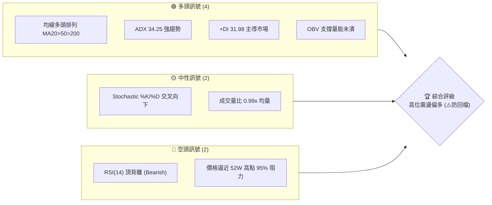
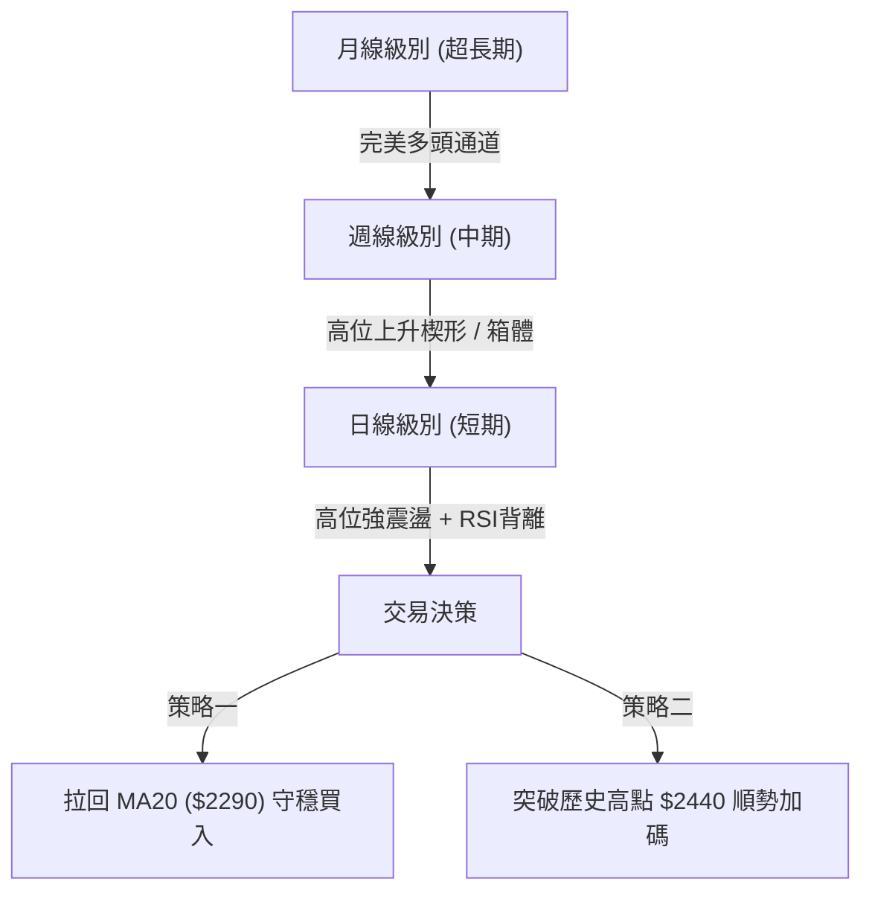
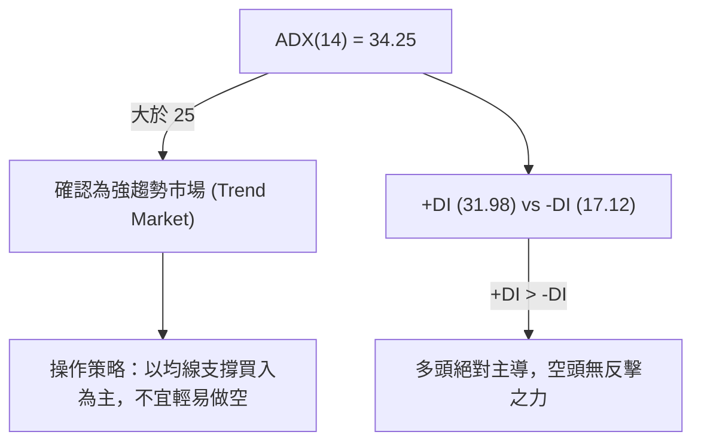
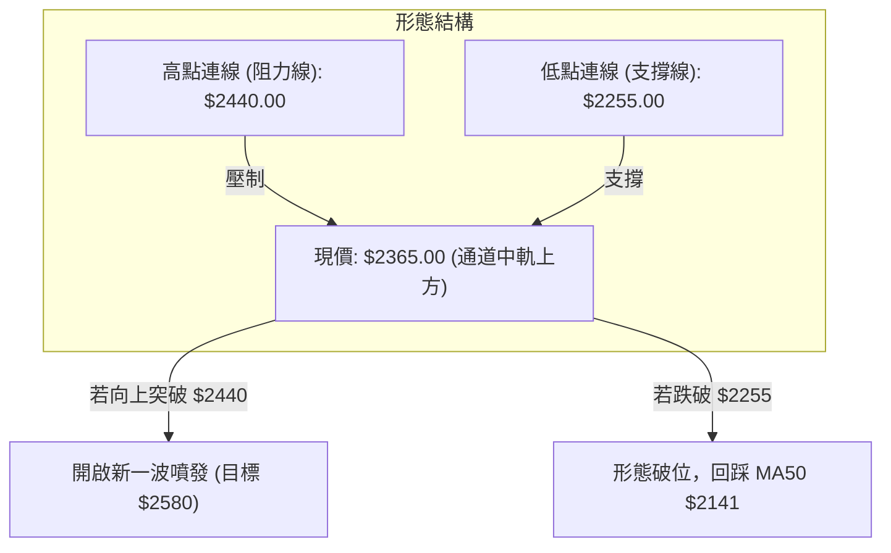

<details>
<summary>📊 靜態圖表 (點擊展開)</summary>

</details>

<html>
<head><meta charset="utf-8" /></head>
<body>
    <div style="height:500px; width:100%;">                        <script>window.PlotlyConfig = {MathJaxConfig: 'local'};</script>
        <script charset="utf-8" src="https://cdn.plot.ly/plotly-3.6.0.min.js" integrity="sha256-QaOVwtVY0T02VaHrr6pnoHLCwayMJp4O5n4YyaE3rJk=" crossorigin="anonymous"></script>                <div id="candlestick-chart" class="plotly-graph-div" style="height:100%; width:100%;"></div>            <script>                window.PLOTLYENV=window.PLOTLYENV || {};                                if (document.getElementById("candlestick-chart")) {                    Plotly.newPlot(                        "candlestick-chart",                        [{"close":{"dtype":"f8","bdata":"AAAAwFY+kkAAAADAjCqSQAAAAMBWPpJAAAAAwFY+kkAAAABAf42SQAAAAMCMKpJAAAAAwFY+kkAAAADAVj6SQAAAAOAgUpJAAAAAgDuMkUAAAAAgmseRQAAAAIA7jJFAAAAAgMIWkkAAAADAjCqSQAAAAADrZZJAAAAAIC7vkUAAAAAgLu+RQAAAAGD4ApJAAAAAIC7vkUAAAAAgLu+RQAAAACAu75FAAAAAwFY+kkAAAADAVj6SQAAAAEB\u002fjZJAAAAA4HHwkkAAAABg0CuTQAAAAAD5epNAAAAAwC5nk0AAAAAgZd6TQAAAAADKopNAAAAAoEPyk0AAAAAAyqKTQAAAAGAAGpRAAAAA4NHMlEAAAADg0cyUQAAAAEBYfZRAAAAAoN4tlEAAAAAAvUGUQAAAAKA2kZRAAAAAwCkwlUAAAACgPruVQAAAAGBTRpZAAAAA4Nn2lUAAAADAMVqWQAAAAODZ9pVAAAAAgJYelkAAAADAib2WQAAAAGADDZdAAAAAgO6BlkAAAAAAJfmWQAAAAAAl+ZZAAAAAYKuplkAAAACA7oGWQAAAAAAl+ZZAAAAAoEbllkAAAADgfFyXQAAAAOB8XJdAAAAAgJ5Il0AAAABAW3CXQAAAAOB8XJdAAAAAYKuplkAAAADAib2WQAAAAGCrqZZAAAAAoEbllkAAAADAib2WQAAAAKBG5ZZAAAAAYKuplkAAAADgdDKWQAAAACAQbpZAAAAAAB3PlUAAAABAYKeVQAAAAADNlZZAAAAAYKN\u002flUAAAACg5leVQAAAAODZ9pVAAAAAwDFalkAAAABgU0aWQAAAAMAxWpZAAAAAgPvilUAAAADgdDKWQAAAAIDugZZAAAAAIBBulkAAAABgq6mWQAAAACDANJdAAAAAACX5lkAAAADgfFyXQAAAAMDg5JZAAAAAgL8Ml0AAAABgI5WWQAAAAGBVWZZAAAAAAGZFlkAAAAAAZkWWQAAAAABmRZZAAAAAYPHQlkAAAAAgnjSXQAAAAICNSJdAAAAAoFuEl0AAAAAAGdSXQAAAAEA6rJdAAAAAYNYjmEAAAADgYa+YQAAAAMBGAppAAAAAQNKNmkAAAAAgNhaaQAAAAOAUPppAAAAAgCUqmkAAAAAgBFKaQAAAAKDBoZpAAAAAoMGhmkAAAAAgBFKaQAAAAKBdGZtAAAAAABtpm0AAAAAg6aSbQAAAAKBdGZtAAAAAABtpm0AAAADA+ZCbQAAAAMArVZtAAAAAgNi4m0AAAABAU1icQAAAAECFHJxAAAAAIOmkm0AAAABgCn2bQAAAAOCVCJxAAAAAwMfMm0AAAABgCn2bQAAAAIDYuJtAAAAA4GNEnEAAAACAi0edQAAAAOAW051AAAAA4EiXnUAAAABgcJqeQAAAAODJYZ9AAAAAgAwSn0AAAAAgT8KeQAAAAEDUIp5AAAAAYL0LnUAAAADgSJedQAAAACBqb51AAAAAgHQwnEAAAABg78+cQAAAAKDDNp5AAAAAwHpbnUAAAABgvQudQAAAAAAAvJxAAAAAAAA4nUAAAAAAAMSdQAAAAAAA6JxAAAAAAADAnEAAAAAAAEicQAAAAAAASJxAAAAAAADUnEAAAAAAAMCcQAAAAAAAcJxAAAAAAADQm0AAAAAAAICbQAAAAAAA\u002fJxAAAAAAABInEAAAAAAABCdQAAAAAAAeJ5AAAAAAACMnkAAAAAAAECfQAAAAAAAGJ9AAAAAAAAOoEAAAAAAAECgQAAAAAAASqBAAAAAAAC4n0AAAAAAAKSfQAAAAAAABKBAAAAAAAAEoEAAAAAAAECgQAAAAAAAEqFAAAAAAACyoUAAAAAAAE6hQAAAAAAACKFAAAAAAACuoEAAAAAAAMahQAAAAAAAlKFAAAAAAACUoUAAAAAAAAyiQAAAAAAA5KFAAAAAAAB2oUAAAAAAAJ6hQAAAAAAAWKFAAAAAAAC8oUAAAAAAALKhQAAAAAAAgKFAAAAAAAA6oUAAAAAAABKhQAAAAAAAbKFAAAAAAACeoUAAAAAAAAyiQAAAAAAAvKFAAAAAAAD4oUAAAAAAAO6hQAAAAAAAZqJAAAAAAABmokAAAAAAAJiiQAAAAAAA8qJAAAAAAACiokAAAAAAAHqiQA=="},"high":{"dtype":"f8","bdata":"AAAAwFY+kkAg6f4CIVKSQB5bESS1eZJAvzy2AutlkkAAAABAf42SQK9dfiTrZZJAXx5b4SBSkkBfHlvhIFKSQAAAAOAgUpJA+cGcR\u002fgCkkCTyodBZNuRQPsrEwVk25FAwyu8wlY+kkAg6f4CIVKSQAAAAADrZZJALPc0xiBSkkAs9zTGIFKSQAAAAGD4ApJAG2G5g4wqkkAAAAAgLu+RQBthuYOMKpJAAAAAwFY+kkAeWxEktXmSQAAAAEB\u002fjZJAC15OATwEk0Bba63l+HqTQAAAAAD5epNADwNn4fh6k0AAACCFQ\u002fKTQFgdX8qGypNAAAAAoEPyk0Bcye35IQaUQAAAAGAAGpRAAAAA4NHMlEAIKmcPbQiVQKOLLgoVpZRAN3Ijz3lplEADmRQvWH2UQAnGW5mO9JRApVAKJQhElUAAAACgPruVQMkBQioQbpZA1I8zRbgKlkBWVVXvzJWWQNSPM0W4CpZA2FBeQ6uplkAAAADAib2WQFDrVyrANJdAF0M6r4m9lkAcTJEvwDSXQNC6wZSeSJdAkyZNKmjRlkCzaxPlzJWWQNC6wZSeSJdAic6ez+Egl0AcuzSqOYSXQKoYTw8YmJdAmpmZefarl0BYFCwKGJiXQDh2aXT2q5dAcODAWQMNl0CqOWbvJPmWQEqTJsWJvZZABt9pagMNl0BVc8wewDSXQAbfaWoDDZdAkyZNKmjRlkDw5hGqMVqWQDnAR0+rqZZAFVG\u002fXlNGlkBKKaXU2faVQEYbK2WrqZZAeAZV9BzPlUDrUbj+HM+VQKkfZ6qWHpZAAAAAwDFalkCSA4T0zJWWQFZVVe\u002fMlZZAXvyJRBBulkDw5hGqMVqWQAAAAIDugZZAvuoXhe6BlkAAAABgq6mWQAAAACDANJdA0LrBlJ5Il0AAAADgfFyXQCp4OeVKmJdAn3WD2a4gl0AKWn25EqmWQJ\u002fyEBM0gZZAUg6IDDSBlkBxr4JZVVmWQDRtjb8SqZZAFHVyueDklkAAAAAgnjSXQPC4eNl8XJdAAAAAoFuEl0AAAAAAGdSXQL2G8vIY1JdAAAAAYNYjmEAAAADgYa+YQJzWbH\u002fzZZpAAAAAQNKNmkDkSgLTFD6aQGULoezieZpAhmEY5uJ5mkCEAWcs0o2aQMZ0FlOgyZpAYzqL+bC1mkBYVu\u002fS4nmaQJBJ8VI8QZtAXXTRZdi4m0AAAAAg6aSbQOg3W18KfZtALrrosvmQm0Cc1H0Z6aSbQJmSKdnHzJtA5jCH2cfMm0AAAABAU1icQAetLFkhlJxApp6M35UInEAAAABgCn2bQFuwBZN0MJxAZorTJYUcnEDZVGts2LibQAAAAIDYuJtApQXoRSGUnEAAAACAi0edQIpP95L1+p1AdEucUtQinkCo1fgST8KeQGtI+pKoiZ9AIeOCjNpNn0BrcROGDBKfQNaUNWU+1p5ARKxRhSe\u002fnUBZgTASgYaeQL6E9tJIl51AAAAAgHQwnED5rBssam+dQB0V+FKiXp5AUv\u002fI2BbTnUACaevFeludQCe3eHKLR51AAAAAAABgnUAAAAAAANidQAAAAAAAYJ1AAAAAAAA4nUAAAAAAAFycQAAAAAAA6JxAAAAAAABMnUAAAAAAACSdQAAAAAAAhJxAAAAAAAAgnEAAAAAAAPibQAAAAAAA\u002fJxAAAAAAAAknUAAAAAAABCdQAAAAAAAeJ5AAAAAAACMnkAAAAAAAECfQAAAAAAALJ9AAAAAAAAOoEAAAAAAAGigQAAAAAAAVKBAAAAAAAAYoEAAAAAAAA6gQAAAAAAANqBAAAAAAAAsoEAAAAAAAK6gQAAAAAAAHKFAAAAAAAA0okAAAAAAANChQAAAAAAARKFAAAAAAABOoUAAAAAAANqhQAAAAAAAvKFAAAAAAADaoUAAAAAAAFKiQAAAAAAADKJAAAAAAADGoUAAAAAAANChQAAAAAAAgKFAAAAAAAC8oUAAAAAAACqiQAAAAAAAqKFAAAAAAABsoUAAAAAAAEShQAAAAAAAnqFAAAAAAACooUAAAAAAAAyiQAAAAAAAKqJAAAAAAAA0okAAAAAAAHCiQAAAAAAAjqJAAAAAAADeokAAAAAAAMCiQAAAAAAAEKNAAAAAAADeokAAAAAAAMqiQA=="},"hovertemplate":"\u003cb\u003e%{x|%Y-%m-%d}\u003c\u002fb\u003e\u003cbr\u003e\u958b: $%{open:.2f}\u003cbr\u003e\u9ad8: $%{high:.2f}\u003cbr\u003e\u4f4e: $%{low:.2f}\u003cbr\u003e\u6536: $%{close:.2f}\u003cextra\u003e\u003c\u002fextra\u003e","low":{"dtype":"f8","bdata":"Img4GWTbkUBwi4CewhaSQOGk7lv4ApJAQcNJfcIWkkAAAADcIFKSQAAAAMCMKpJAQcNJfcIWkkBBw0l9whaSQCaxTJ2MKpJAAAAAgDuMkUDaavDcBaCRQAAAAIA7jJFAPdRDPS7vkUBRooFbLu+RQL6YT71WPpJAAAAAIC7vkUAAAAAgLu+RQOilgdrPs5FA9zTC\u002fmPbkUDmnka8z7ORQAAAACAu75FAQcNJfcIWkkAAAADAVj6SQFVVVf3qZZJA60Njnd3IkkAppZQ+BhiTQD3P87xkU5NA8PyYnmRTk0AAAICL646TQAAAAADKopNAFesUC8qik0AAAAAAyqKTQH3WDWaotpNASQ9U5nlplED41ZiwNpGUQAAAAEBYfZRAQy\u002f0OgAalEAAAAAAvUGUQAAAAKA2kZRAtl7r9WwIlUAAAADcKTCVQFP9nDC4CpZAV+CYFR3PlUByHMf1dDKWQNkw\u002fuWBk5VAvYbyGrgKlkA6Zu+Wlh6WQGApUMuJvZZAAAAAgO6BlkB91g0GzZWWQAAAAAAl+ZZAt2zZ+syVlkDpvMVQU0aWQAAAAAAl+ZZAfRDLOmjRlkBW57Cw4SCXQHKi5XqeSJdAAAAAgJ5Il0BP16er4SCXQOREyxXANJdAt2zZ+syVlkAAAADAib2WQLds2frMlZZA+iCW1Ym9lkAAAADAib2WQHcxYXCrqZZAAAAAYKuplkCIDPd6lh6WQAAAACAQbpZAAAAAAB3PlUAAAABAYKeVQDCuftAxWpZAAAAAYKN\u002flUAAAACg5leVQFfgmBUdz5VAq6qqkJYelkAc\u002f976dDKWQDmO41pTRpZAAAAAgPvilUAQGe4VuAqWQOm8xVBTRpZAxz+48HQylkDasmXLMVqWQDVGClyrqZZAAAAAACX5lkDIiZZLAw2XQDTWh2bx0JZAwhT5zODklkD1pYIGNIGWQGEN76x2MZZAj1B9pnYxlkCu8XfzlwmWQAAAAABmRZZA2BUbrRKplkArizO64OSWQCGODs2uIJdAyAZkk41Il0CaRO+ZW4SXQER5DY1bhJdA2MeF7UqYl0AvPq8T5w+YQLN9oprcTplA22yzDZqemUActf1sV+6ZQDbpvcZ4xplAGYZhwHjGmUAAAAAgBFKaQDuL6ezieZpAO4vp7OJ5mkCpqRBtJSqaQE8jLIfBoZpAXXTRjY\u002fdmkAYVW6tXRmbQAAAAKBdGZtA0UUXTTxBm0CPrQhaPEGbQAAAAMArVZtAgQtcwCtVm0CHcAgnt+CbQNSNeOaVCJxAAAAAIOmkm0Dejhv6TC2bQHd3d9PHzJtAzToWDemkm0C344YGG2mbQM94xrNdGZtAAAAA4GNEnEBoo76zEKicQNbBIhScM51AAAAA4EiXnUC00yPhFtOdQCtvC3oMEp9AAAAAgAwSn0CF+V2twzaeQAAAAEDUIp5AAAAAYL0LnUA59XuGWYOdQEN7CW2LR51ApNxUtPmQm0CEKfL5MYCcQMN2sxScM51AAAAAwHpbnUC9vJmgEKicQAAAAAAAvJxAAAAAAAAQnUAAAAAAAIidQAAAAAAA6JxAAAAAAADAnEAAAAAAAOSbQAAAAAAAIJxAAAAAAADUnEAAAAAAAMCcQAAAAAAAIJxAAAAAAADQm0AAAAAAAICbQAAAAAAAmJxAAAAAAAA0nEAAAAAAAKycQAAAAAAAFJ5AAAAAAAAonkAAAAAAAMieQAAAAAAA3J5AAAAAAABon0AAAAAAABigQAAAAAAADqBAAAAAAAC4n0AAAAAAAKSfQAAAAAAA9J9AAAAAAADgn0AAAAAAAA6gQAAAAAAAcqBAAAAAAACyoUAAAAAAAE6hQAAAAAAA6qBAAAAAAACuoEAAAAAAACahQAAAAAAAgKFAAAAAAACAoUAAAAAAAAyiQAAAAAAAsqFAAAAAAAB2oUAAAAAAAEShQAAAAAAAOqFAAAAAAABsoUAAAAAAAJShQAAAAAAATqFAAAAAAAA6oUAAAAAAABKhQAAAAAAAbKFAAAAAAABioUAAAAAAAMahQAAAAAAAvKFAAAAAAADkoUAAAAAAALyhQAAAAAAANKJAAAAAAABcokAAAAAAAHCiQAAAAAAA1KJAAAAAAACiokAAAAAAAFyiQA=="},"name":"\u50f9\u683c","open":{"dtype":"f8","bdata":"goaTOi7vkUCQdH\u002fhVj6SQEHDSX3CFpJAAAAAwFY+kkAAAADcIFKSQCDp\u002fgIhUpJAoOGknowqkkBBw0l9whaSQJNYpr5WPpJA+cGcR\u002fgCkkDaavDcBaCRQPsrEwVk25FAH+qhXvgCkkDgFgF9+AKSQAAAAADrZZJALPc0xiBSkkAkLPekVj6SQG484fuZx5FAEpZ7YsIWkkD3NML+Y9uRQBKWe2LCFpJAoOGknowqkkAeWxEktXmSQKuqqh61eZJA9qGxvqfckkCEEELELmeTQJ\u002fned4uZ5NADwNn4fh6k0AAAKDwyaKTQKyOL2WotpNAi3WK1YbKk0CwOr6UQ\u002fKTQH3WDWaotpNAoXJ2S1h9lECwxkSqjvSUQAAAAEBYfZRAeqEXaptVlECs3QZlm1WUQAAAAKA2kZRAW6\u002f1WksclUAAAADcKTCVQFP9nDC4CpZAK3DMevvilUAAAADAMVqWQNkw\u002fuWBk5VAlNdQ3syVlkCrjDNhU0aWQGApUMuJvZZAs2sT5cyVlkAxRT5rq6mWQLRuMGUDDZdAAAAAYKuplkCcKNm1MVqWQNC6wZSeSJdAg+80BSX5lkDkRMsVwDSXQBy7NKo5hJdA9ihcrzmEl0AAAABAW3CXQKoYTw8YmJdAJ02a9CT5lkA5EyIlaNGWQAAAAGCrqZZAfRDLOmjRlkAcYKq54SCXQH0Qyzpo0ZZAAAAAYKuplkCIDPd6lh6WQL7qF4XugZZAFVG\u002fXlNGlkBSSimlPruVQLvk1JrugZZAPIMqKmCnlUCamZmZPruVQKkfZ6qWHpZAchzH9XQylkCtAmOP7oGWQAAAAMAxWpZAXvyJRBBulkAAAADgdDKWQJwo2bUxWpZAAAAAIBBulkAjRowwEG6WQMBgLcGJvZZAHEyRL8A0l0BW57Cw4SCXQF5OwYtbhJdAYYp8JtD4lkAAAABgI5WWQAAAAGBVWZZAca+CWVVZlkAeofpMhx2WQDRtjb8SqZZAAAAAYPHQlkBgqKYT0PiWQAAAAICNSJdA7ax2Rmxwl0B0c3PzSpiXQKK8huZKmJdAcPQERzqsl0CjbsPGxTeYQKCoHvTLYplA22yzDZqemUActf1sV+6ZQALtSCBo2plA3LZtc1fumUBYVu\u002fS4nmaQMZ0FlOgyZpAncV0RtKNmkDUVIjGFD6aQDhbh0ZuBZtAXXTRjY\u002fdmkAYVW6tXRmbQMikePlMLZtAF110WQp9m0AAAADA+ZCbQInbDXMKfZtAaDzjGRtpm0CHcAgnt+CbQNs6pf8xgJxAZJKHLLfgm0Amq5RTPEGbQFuwBZN0MJxAAAAAwMfMm0AAAABgCn2bQLWpTQ1NLZtAOwRu7DGAnED7zkYNALycQJxpnm2LR51AAAAA4EiXnUC00yPhFtOdQCtvC3oMEp9AYPaA2fsln0CF+V2twzaeQG4eRrJfrp5Agx3heFmDnUA7ViCswzaeQEN7CW2LR51AEEHKDemkm0B91g3GrB+dQOCLq8d6W51AqX9kzEiXnUC9vJmgEKicQI\u002fB+RicM51AAAAAAABMnUAAAAAAALCdQAAAAAAATJ1AAAAAAAAQnUAAAAAAAPibQAAAAAAA6JxAAAAAAAAknUAAAAAAAOicQAAAAAAANJxAAAAAAADQm0AAAAAAALybQAAAAAAAwJxAAAAAAAAknUAAAAAAAOicQAAAAAAAPJ5AAAAAAABknkAAAAAAANyeQAAAAAAABJ9AAAAAAAB8n0AAAAAAACKgQAAAAAAAQKBAAAAAAAAOoEAAAAAAALifQAAAAAAABKBAAAAAAAD0n0AAAAAAAFSgQAAAAAAAfKBAAAAAAADQoUAAAAAAAIqhQAAAAAAA\u002fqBAAAAAAAA6oUAAAAAAADChQAAAAAAAlKFAAAAAAACUoUAAAAAAAD6iQAAAAAAA+KFAAAAAAACyoUAAAAAAAHahQAAAAAAAOqFAAAAAAACUoUAAAAAAAAyiQAAAAAAAYqFAAAAAAABYoUAAAAAAADqhQAAAAAAAgKFAAAAAAACKoUAAAAAAAMahQAAAAAAAIKJAAAAAAAAMokAAAAAAAFyiQAAAAAAASKJAAAAAAABmokAAAAAAAKyiQAAAAAAA8qJAAAAAAACiokAAAAAAALaiQA=="},"x":["2025-08-07T00:00:00+08:00","2025-08-08T00:00:00+08:00","2025-08-11T00:00:00+08:00","2025-08-12T00:00:00+08:00","2025-08-13T00:00:00+08:00","2025-08-14T00:00:00+08:00","2025-08-15T00:00:00+08:00","2025-08-18T00:00:00+08:00","2025-08-19T00:00:00+08:00","2025-08-20T00:00:00+08:00","2025-08-21T00:00:00+08:00","2025-08-22T00:00:00+08:00","2025-08-25T00:00:00+08:00","2025-08-26T00:00:00+08:00","2025-08-27T00:00:00+08:00","2025-08-28T00:00:00+08:00","2025-08-29T00:00:00+08:00","2025-09-01T00:00:00+08:00","2025-09-02T00:00:00+08:00","2025-09-03T00:00:00+08:00","2025-09-04T00:00:00+08:00","2025-09-05T00:00:00+08:00","2025-09-08T00:00:00+08:00","2025-09-09T00:00:00+08:00","2025-09-10T00:00:00+08:00","2025-09-11T00:00:00+08:00","2025-09-12T00:00:00+08:00","2025-09-15T00:00:00+08:00","2025-09-16T00:00:00+08:00","2025-09-17T00:00:00+08:00","2025-09-18T00:00:00+08:00","2025-09-19T00:00:00+08:00","2025-09-22T00:00:00+08:00","2025-09-23T00:00:00+08:00","2025-09-24T00:00:00+08:00","2025-09-25T00:00:00+08:00","2025-09-26T00:00:00+08:00","2025-09-30T00:00:00+08:00","2025-10-01T00:00:00+08:00","2025-10-02T00:00:00+08:00","2025-10-03T00:00:00+08:00","2025-10-07T00:00:00+08:00","2025-10-08T00:00:00+08:00","2025-10-09T00:00:00+08:00","2025-10-13T00:00:00+08:00","2025-10-14T00:00:00+08:00","2025-10-15T00:00:00+08:00","2025-10-16T00:00:00+08:00","2025-10-17T00:00:00+08:00","2025-10-20T00:00:00+08:00","2025-10-21T00:00:00+08:00","2025-10-22T00:00:00+08:00","2025-10-23T00:00:00+08:00","2025-10-27T00:00:00+08:00","2025-10-28T00:00:00+08:00","2025-10-29T00:00:00+08:00","2025-10-30T00:00:00+08:00","2025-10-31T00:00:00+08:00","2025-11-03T00:00:00+08:00","2025-11-04T00:00:00+08:00","2025-11-05T00:00:00+08:00","2025-11-06T00:00:00+08:00","2025-11-07T00:00:00+08:00","2025-11-10T00:00:00+08:00","2025-11-11T00:00:00+08:00","2025-11-12T00:00:00+08:00","2025-11-13T00:00:00+08:00","2025-11-14T00:00:00+08:00","2025-11-17T00:00:00+08:00","2025-11-18T00:00:00+08:00","2025-11-19T00:00:00+08:00","2025-11-20T00:00:00+08:00","2025-11-21T00:00:00+08:00","2025-11-24T00:00:00+08:00","2025-11-25T00:00:00+08:00","2025-11-26T00:00:00+08:00","2025-11-27T00:00:00+08:00","2025-11-28T00:00:00+08:00","2025-12-01T00:00:00+08:00","2025-12-02T00:00:00+08:00","2025-12-03T00:00:00+08:00","2025-12-04T00:00:00+08:00","2025-12-05T00:00:00+08:00","2025-12-08T00:00:00+08:00","2025-12-09T00:00:00+08:00","2025-12-10T00:00:00+08:00","2025-12-11T00:00:00+08:00","2025-12-12T00:00:00+08:00","2025-12-15T00:00:00+08:00","2025-12-16T00:00:00+08:00","2025-12-17T00:00:00+08:00","2025-12-18T00:00:00+08:00","2025-12-19T00:00:00+08:00","2025-12-22T00:00:00+08:00","2025-12-23T00:00:00+08:00","2025-12-24T00:00:00+08:00","2025-12-26T00:00:00+08:00","2025-12-29T00:00:00+08:00","2025-12-30T00:00:00+08:00","2025-12-31T00:00:00+08:00","2026-01-02T00:00:00+08:00","2026-01-05T00:00:00+08:00","2026-01-06T00:00:00+08:00","2026-01-07T00:00:00+08:00","2026-01-08T00:00:00+08:00","2026-01-09T00:00:00+08:00","2026-01-12T00:00:00+08:00","2026-01-13T00:00:00+08:00","2026-01-14T00:00:00+08:00","2026-01-15T00:00:00+08:00","2026-01-16T00:00:00+08:00","2026-01-19T00:00:00+08:00","2026-01-20T00:00:00+08:00","2026-01-21T00:00:00+08:00","2026-01-22T00:00:00+08:00","2026-01-23T00:00:00+08:00","2026-01-26T00:00:00+08:00","2026-01-27T00:00:00+08:00","2026-01-28T00:00:00+08:00","2026-01-29T00:00:00+08:00","2026-01-30T00:00:00+08:00","2026-02-02T00:00:00+08:00","2026-02-03T00:00:00+08:00","2026-02-04T00:00:00+08:00","2026-02-05T00:00:00+08:00","2026-02-06T00:00:00+08:00","2026-02-09T00:00:00+08:00","2026-02-10T00:00:00+08:00","2026-02-11T00:00:00+08:00","2026-02-23T00:00:00+08:00","2026-02-24T00:00:00+08:00","2026-02-25T00:00:00+08:00","2026-02-26T00:00:00+08:00","2026-03-02T00:00:00+08:00","2026-03-03T00:00:00+08:00","2026-03-04T00:00:00+08:00","2026-03-05T00:00:00+08:00","2026-03-06T00:00:00+08:00","2026-03-09T00:00:00+08:00","2026-03-10T00:00:00+08:00","2026-03-11T00:00:00+08:00","2026-03-12T00:00:00+08:00","2026-03-13T00:00:00+08:00","2026-03-16T00:00:00+08:00","2026-03-17T00:00:00+08:00","2026-03-18T00:00:00+08:00","2026-03-19T00:00:00+08:00","2026-03-20T00:00:00+08:00","2026-03-23T00:00:00+08:00","2026-03-24T00:00:00+08:00","2026-03-25T00:00:00+08:00","2026-03-26T00:00:00+08:00","2026-03-27T00:00:00+08:00","2026-03-30T00:00:00+08:00","2026-03-31T00:00:00+08:00","2026-04-01T00:00:00+08:00","2026-04-02T00:00:00+08:00","2026-04-07T00:00:00+08:00","2026-04-08T00:00:00+08:00","2026-04-09T00:00:00+08:00","2026-04-10T00:00:00+08:00","2026-04-13T00:00:00+08:00","2026-04-14T00:00:00+08:00","2026-04-15T00:00:00+08:00","2026-04-16T00:00:00+08:00","2026-04-17T00:00:00+08:00","2026-04-20T00:00:00+08:00","2026-04-21T00:00:00+08:00","2026-04-22T00:00:00+08:00","2026-04-23T00:00:00+08:00","2026-04-24T00:00:00+08:00","2026-04-27T00:00:00+08:00","2026-04-28T00:00:00+08:00","2026-04-29T00:00:00+08:00","2026-04-30T00:00:00+08:00","2026-05-04T00:00:00+08:00","2026-05-05T00:00:00+08:00","2026-05-06T00:00:00+08:00","2026-05-07T00:00:00+08:00","2026-05-08T00:00:00+08:00","2026-05-11T00:00:00+08:00","2026-05-12T00:00:00+08:00","2026-05-13T00:00:00+08:00","2026-05-14T00:00:00+08:00","2026-05-15T00:00:00+08:00","2026-05-18T00:00:00+08:00","2026-05-19T00:00:00+08:00","2026-05-20T00:00:00+08:00","2026-05-21T00:00:00+08:00","2026-05-22T00:00:00+08:00","2026-05-25T00:00:00+08:00","2026-05-26T00:00:00+08:00","2026-05-27T00:00:00+08:00","2026-05-28T00:00:00+08:00","2026-05-29T00:00:00+08:00","2026-06-01T00:00:00+08:00","2026-06-02T00:00:00+08:00","2026-06-03T00:00:00+08:00","2026-06-04T00:00:00+08:00","2026-06-05T00:00:00+08:00"],"type":"candlestick"},{"hovertemplate":"MA30: $%{y:.2f}\u003cextra\u003e\u003c\u002fextra\u003e","line":{"color":"#2196F3","dash":"dash","width":2},"mode":"lines","name":"MA30","x":["2025-08-07T00:00:00+08:00","2025-08-08T00:00:00+08:00","2025-08-11T00:00:00+08:00","2025-08-12T00:00:00+08:00","2025-08-13T00:00:00+08:00","2025-08-14T00:00:00+08:00","2025-08-15T00:00:00+08:00","2025-08-18T00:00:00+08:00","2025-08-19T00:00:00+08:00","2025-08-20T00:00:00+08:00","2025-08-21T00:00:00+08:00","2025-08-22T00:00:00+08:00","2025-08-25T00:00:00+08:00","2025-08-26T00:00:00+08:00","2025-08-27T00:00:00+08:00","2025-08-28T00:00:00+08:00","2025-08-29T00:00:00+08:00","2025-09-01T00:00:00+08:00","2025-09-02T00:00:00+08:00","2025-09-03T00:00:00+08:00","2025-09-04T00:00:00+08:00","2025-09-05T00:00:00+08:00","2025-09-08T00:00:00+08:00","2025-09-09T00:00:00+08:00","2025-09-10T00:00:00+08:00","2025-09-11T00:00:00+08:00","2025-09-12T00:00:00+08:00","2025-09-15T00:00:00+08:00","2025-09-16T00:00:00+08:00","2025-09-17T00:00:00+08:00","2025-09-18T00:00:00+08:00","2025-09-19T00:00:00+08:00","2025-09-22T00:00:00+08:00","2025-09-23T00:00:00+08:00","2025-09-24T00:00:00+08:00","2025-09-25T00:00:00+08:00","2025-09-26T00:00:00+08:00","2025-09-30T00:00:00+08:00","2025-10-01T00:00:00+08:00","2025-10-02T00:00:00+08:00","2025-10-03T00:00:00+08:00","2025-10-07T00:00:00+08:00","2025-10-08T00:00:00+08:00","2025-10-09T00:00:00+08:00","2025-10-13T00:00:00+08:00","2025-10-14T00:00:00+08:00","2025-10-15T00:00:00+08:00","2025-10-16T00:00:00+08:00","2025-10-17T00:00:00+08:00","2025-10-20T00:00:00+08:00","2025-10-21T00:00:00+08:00","2025-10-22T00:00:00+08:00","2025-10-23T00:00:00+08:00","2025-10-27T00:00:00+08:00","2025-10-28T00:00:00+08:00","2025-10-29T00:00:00+08:00","2025-10-30T00:00:00+08:00","2025-10-31T00:00:00+08:00","2025-11-03T00:00:00+08:00","2025-11-04T00:00:00+08:00","2025-11-05T00:00:00+08:00","2025-11-06T00:00:00+08:00","2025-11-07T00:00:00+08:00","2025-11-10T00:00:00+08:00","2025-11-11T00:00:00+08:00","2025-11-12T00:00:00+08:00","2025-11-13T00:00:00+08:00","2025-11-14T00:00:00+08:00","2025-11-17T00:00:00+08:00","2025-11-18T00:00:00+08:00","2025-11-19T00:00:00+08:00","2025-11-20T00:00:00+08:00","2025-11-21T00:00:00+08:00","2025-11-24T00:00:00+08:00","2025-11-25T00:00:00+08:00","2025-11-26T00:00:00+08:00","2025-11-27T00:00:00+08:00","2025-11-28T00:00:00+08:00","2025-12-01T00:00:00+08:00","2025-12-02T00:00:00+08:00","2025-12-03T00:00:00+08:00","2025-12-04T00:00:00+08:00","2025-12-05T00:00:00+08:00","2025-12-08T00:00:00+08:00","2025-12-09T00:00:00+08:00","2025-12-10T00:00:00+08:00","2025-12-11T00:00:00+08:00","2025-12-12T00:00:00+08:00","2025-12-15T00:00:00+08:00","2025-12-16T00:00:00+08:00","2025-12-17T00:00:00+08:00","2025-12-18T00:00:00+08:00","2025-12-19T00:00:00+08:00","2025-12-22T00:00:00+08:00","2025-12-23T00:00:00+08:00","2025-12-24T00:00:00+08:00","2025-12-26T00:00:00+08:00","2025-12-29T00:00:00+08:00","2025-12-30T00:00:00+08:00","2025-12-31T00:00:00+08:00","2026-01-02T00:00:00+08:00","2026-01-05T00:00:00+08:00","2026-01-06T00:00:00+08:00","2026-01-07T00:00:00+08:00","2026-01-08T00:00:00+08:00","2026-01-09T00:00:00+08:00","2026-01-12T00:00:00+08:00","2026-01-13T00:00:00+08:00","2026-01-14T00:00:00+08:00","2026-01-15T00:00:00+08:00","2026-01-16T00:00:00+08:00","2026-01-19T00:00:00+08:00","2026-01-20T00:00:00+08:00","2026-01-21T00:00:00+08:00","2026-01-22T00:00:00+08:00","2026-01-23T00:00:00+08:00","2026-01-26T00:00:00+08:00","2026-01-27T00:00:00+08:00","2026-01-28T00:00:00+08:00","2026-01-29T00:00:00+08:00","2026-01-30T00:00:00+08:00","2026-02-02T00:00:00+08:00","2026-02-03T00:00:00+08:00","2026-02-04T00:00:00+08:00","2026-02-05T00:00:00+08:00","2026-02-06T00:00:00+08:00","2026-02-09T00:00:00+08:00","2026-02-10T00:00:00+08:00","2026-02-11T00:00:00+08:00","2026-02-23T00:00:00+08:00","2026-02-24T00:00:00+08:00","2026-02-25T00:00:00+08:00","2026-02-26T00:00:00+08:00","2026-03-02T00:00:00+08:00","2026-03-03T00:00:00+08:00","2026-03-04T00:00:00+08:00","2026-03-05T00:00:00+08:00","2026-03-06T00:00:00+08:00","2026-03-09T00:00:00+08:00","2026-03-10T00:00:00+08:00","2026-03-11T00:00:00+08:00","2026-03-12T00:00:00+08:00","2026-03-13T00:00:00+08:00","2026-03-16T00:00:00+08:00","2026-03-17T00:00:00+08:00","2026-03-18T00:00:00+08:00","2026-03-19T00:00:00+08:00","2026-03-20T00:00:00+08:00","2026-03-23T00:00:00+08:00","2026-03-24T00:00:00+08:00","2026-03-25T00:00:00+08:00","2026-03-26T00:00:00+08:00","2026-03-27T00:00:00+08:00","2026-03-30T00:00:00+08:00","2026-03-31T00:00:00+08:00","2026-04-01T00:00:00+08:00","2026-04-02T00:00:00+08:00","2026-04-07T00:00:00+08:00","2026-04-08T00:00:00+08:00","2026-04-09T00:00:00+08:00","2026-04-10T00:00:00+08:00","2026-04-13T00:00:00+08:00","2026-04-14T00:00:00+08:00","2026-04-15T00:00:00+08:00","2026-04-16T00:00:00+08:00","2026-04-17T00:00:00+08:00","2026-04-20T00:00:00+08:00","2026-04-21T00:00:00+08:00","2026-04-22T00:00:00+08:00","2026-04-23T00:00:00+08:00","2026-04-24T00:00:00+08:00","2026-04-27T00:00:00+08:00","2026-04-28T00:00:00+08:00","2026-04-29T00:00:00+08:00","2026-04-30T00:00:00+08:00","2026-05-04T00:00:00+08:00","2026-05-05T00:00:00+08:00","2026-05-06T00:00:00+08:00","2026-05-07T00:00:00+08:00","2026-05-08T00:00:00+08:00","2026-05-11T00:00:00+08:00","2026-05-12T00:00:00+08:00","2026-05-13T00:00:00+08:00","2026-05-14T00:00:00+08:00","2026-05-15T00:00:00+08:00","2026-05-18T00:00:00+08:00","2026-05-19T00:00:00+08:00","2026-05-20T00:00:00+08:00","2026-05-21T00:00:00+08:00","2026-05-22T00:00:00+08:00","2026-05-25T00:00:00+08:00","2026-05-26T00:00:00+08:00","2026-05-27T00:00:00+08:00","2026-05-28T00:00:00+08:00","2026-05-29T00:00:00+08:00","2026-06-01T00:00:00+08:00","2026-06-02T00:00:00+08:00","2026-06-03T00:00:00+08:00","2026-06-04T00:00:00+08:00","2026-06-05T00:00:00+08:00"],"y":{"dtype":"f8","bdata":"AAAAAAAA+H8AAAAAAAD4fwAAAAAAAPh\u002fAAAAAAAA+H8AAAAAAAD4fwAAAAAAAPh\u002fAAAAAAAA+H8AAAAAAAD4fwAAAAAAAPh\u002fAAAAAAAA+H8AAAAAAAD4fwAAAAAAAPh\u002fAAAAAAAA+H8AAAAAAAD4fwAAAAAAAPh\u002fAAAAAAAA+H8AAAAAAAD4fwAAAAAAAPh\u002fAAAAAAAA+H8AAAAAAAD4fwAAAAAAAPh\u002fAAAAAAAA+H8AAAAAAAD4fwAAAAAAAPh\u002fAAAAAAAA+H8AAAAAAAD4fwAAAAAAAPh\u002fAAAAAAAA+H8AAAAAAAD4fzMzM2NYX5JAiYiISOBtkkC8u7vbanqSQImIiNhFipJAAAAAwBagkkC8u7srRLOSQBEREcEXx5JAiYiISJzXkkC8u7tbyuiSQAAAAMD1+5JAmpmZOQYbk0CJiIjovjyTQJqZmQkVZZNAIiIi4iaGk0BVVVWV36mTQCIiIvJNyJNAAAAAoATsk0De3d2tBxWUQLy7uwsIQJRAVVVVdQ5nlEB3d3cnDpKUQJqZmdkNvZRA7+7u3sPilEC8u7vLJgeVQFVVVYXfLJVAiYiIWKJOlUBERETUY3KVQDMzM9OBk5VAZmZmJp+0lUCamZlJFtOVQERERITg8pVAREREpA4KlkAAAACAjCSWQImIiIhnOpZAq6qqSklMlkBERET011yWQGZmZuZfcZZAREREZJGGlkDe3d0NIJeWQLy7uysFp5ZAvLu7i1GslkAAAAAAqKuWQAAAADBOrpZAd3d351SqlkDNzMzMuKGWQM3MzMy4oZZAERERcbWjlkCamZkpvJ+WQN7d3T3GmZZAAAAA4HmUlkB3d3dn2o2WQO\u002fu7h7hiZZAq6qqeuSHlkAzMzOTN4mWQGZmZjY0i5ZAIiIiwt2LlkAiIiLC3YuWQGZmZhbhh5ZAAAAAMOKFlkBmZmaGk36WQDMzMxPwdZZA3t3dbZhylkDNzMw8l26WQHd3d5c\u002fa5ZAVVVVFZJqlkCrqqo6im6WQERERGTZcZZAiYiIiCN5lkB3d3dnD4eWQImIiGiqkZZAREREdI6llkAAAABgbL+WQCIiIqKj3JZAREREVMcHl0AiIiJyQTCXQJqZmWnDVJdAmpmZiUt1l0De3d1t0ZeXQJqZmTlWvJdAvLu7S9Tkl0DNzMy8AwiYQLy7uxsyL5hAiYiIeLJZmEB3d3eHNISYQKuqqvpspZhAMzMzg0rLmECrqqqKLO+YQImIiOgMFZlAvLu7m+s8mUDv7u7eF26ZQCIiIiJEn5lAZmZm1h3NmUARERFRo\u002fmZQERERJTPKppAmpmZuVZVmkDe3d3d4nmaQLy7uzvDn5pAq6qqCkzImkC8u7vbz\u002faaQN7d3a1OK5tA7+7uftJZm0Crqqr6UoybQO\u002fu7q4suptAiYiIKLfgm0C8u7vblQicQAAAAHDPKZxAERERkWVCnEAiIiJCTl6cQGZmZkY6dpxAERERgYSDnEBEREQUyJicQLy7u4tcs5xAZmZmVvnDnECJiIhY78+cQBEREbHj3ZxAmpmZuVHtnEAzMzMzFgCdQM3MzKyDDZ1AIiIiQkkWnUAzMzPzvRWdQJqZmfkwF51AZmZmVkshnUAiIiJCDyydQKuqqrqBL51ARERENJ0vnUBVVVV1ti+dQKuqqgp8Op1AiYiI2Jo6nUDNzMzcwDidQJqZmRlAPp1AZmZmVmhGnUAAAAAg7UudQGZmZnZ3SZ1AmpmZ6VRSnUBEREQkMGGdQO\u002fu7u4Gdp1ARERE9NWMnUBmZmaGU56dQHd3d6d6tJ1AIiIikkPVnUB3d3eXu\u002fSdQKuqqpo9Fp5AMzMzg7lJnkAzMzMzM3meQKuqqqqqpp5AAAAAAADKnkBVVVVVVfueQKuqqqqqMJ9AVVVVVVVnn0AAAAAAAKqfQAAAAAAA6p9AAAAAAAAPoECrqqqqqiqgQFVVVVVVRaBAAAAAAABmoECrqqqqqoegQFVVVVVVoaBAq6qqqqq7oEBVVVVVVdGgQAAAAAAA5KBAAAAAAAD4oECrqqqqqgyhQFVVVVVVH6FAq6qqqqovoUAAAAAAAD6hQAAAAAAAUKFAq6qqqqploUBVVVVVVX2hQFVVVVVVlqFAq6qqqqqsoUCrqqqqqr+hQA=="},"type":"scatter"},{"hovertemplate":"MA60: $%{y:.2f}\u003cextra\u003e\u003c\u002fextra\u003e","line":{"color":"#9C27B0","dash":"dash","width":2},"mode":"lines","name":"MA60","x":["2025-08-07T00:00:00+08:00","2025-08-08T00:00:00+08:00","2025-08-11T00:00:00+08:00","2025-08-12T00:00:00+08:00","2025-08-13T00:00:00+08:00","2025-08-14T00:00:00+08:00","2025-08-15T00:00:00+08:00","2025-08-18T00:00:00+08:00","2025-08-19T00:00:00+08:00","2025-08-20T00:00:00+08:00","2025-08-21T00:00:00+08:00","2025-08-22T00:00:00+08:00","2025-08-25T00:00:00+08:00","2025-08-26T00:00:00+08:00","2025-08-27T00:00:00+08:00","2025-08-28T00:00:00+08:00","2025-08-29T00:00:00+08:00","2025-09-01T00:00:00+08:00","2025-09-02T00:00:00+08:00","2025-09-03T00:00:00+08:00","2025-09-04T00:00:00+08:00","2025-09-05T00:00:00+08:00","2025-09-08T00:00:00+08:00","2025-09-09T00:00:00+08:00","2025-09-10T00:00:00+08:00","2025-09-11T00:00:00+08:00","2025-09-12T00:00:00+08:00","2025-09-15T00:00:00+08:00","2025-09-16T00:00:00+08:00","2025-09-17T00:00:00+08:00","2025-09-18T00:00:00+08:00","2025-09-19T00:00:00+08:00","2025-09-22T00:00:00+08:00","2025-09-23T00:00:00+08:00","2025-09-24T00:00:00+08:00","2025-09-25T00:00:00+08:00","2025-09-26T00:00:00+08:00","2025-09-30T00:00:00+08:00","2025-10-01T00:00:00+08:00","2025-10-02T00:00:00+08:00","2025-10-03T00:00:00+08:00","2025-10-07T00:00:00+08:00","2025-10-08T00:00:00+08:00","2025-10-09T00:00:00+08:00","2025-10-13T00:00:00+08:00","2025-10-14T00:00:00+08:00","2025-10-15T00:00:00+08:00","2025-10-16T00:00:00+08:00","2025-10-17T00:00:00+08:00","2025-10-20T00:00:00+08:00","2025-10-21T00:00:00+08:00","2025-10-22T00:00:00+08:00","2025-10-23T00:00:00+08:00","2025-10-27T00:00:00+08:00","2025-10-28T00:00:00+08:00","2025-10-29T00:00:00+08:00","2025-10-30T00:00:00+08:00","2025-10-31T00:00:00+08:00","2025-11-03T00:00:00+08:00","2025-11-04T00:00:00+08:00","2025-11-05T00:00:00+08:00","2025-11-06T00:00:00+08:00","2025-11-07T00:00:00+08:00","2025-11-10T00:00:00+08:00","2025-11-11T00:00:00+08:00","2025-11-12T00:00:00+08:00","2025-11-13T00:00:00+08:00","2025-11-14T00:00:00+08:00","2025-11-17T00:00:00+08:00","2025-11-18T00:00:00+08:00","2025-11-19T00:00:00+08:00","2025-11-20T00:00:00+08:00","2025-11-21T00:00:00+08:00","2025-11-24T00:00:00+08:00","2025-11-25T00:00:00+08:00","2025-11-26T00:00:00+08:00","2025-11-27T00:00:00+08:00","2025-11-28T00:00:00+08:00","2025-12-01T00:00:00+08:00","2025-12-02T00:00:00+08:00","2025-12-03T00:00:00+08:00","2025-12-04T00:00:00+08:00","2025-12-05T00:00:00+08:00","2025-12-08T00:00:00+08:00","2025-12-09T00:00:00+08:00","2025-12-10T00:00:00+08:00","2025-12-11T00:00:00+08:00","2025-12-12T00:00:00+08:00","2025-12-15T00:00:00+08:00","2025-12-16T00:00:00+08:00","2025-12-17T00:00:00+08:00","2025-12-18T00:00:00+08:00","2025-12-19T00:00:00+08:00","2025-12-22T00:00:00+08:00","2025-12-23T00:00:00+08:00","2025-12-24T00:00:00+08:00","2025-12-26T00:00:00+08:00","2025-12-29T00:00:00+08:00","2025-12-30T00:00:00+08:00","2025-12-31T00:00:00+08:00","2026-01-02T00:00:00+08:00","2026-01-05T00:00:00+08:00","2026-01-06T00:00:00+08:00","2026-01-07T00:00:00+08:00","2026-01-08T00:00:00+08:00","2026-01-09T00:00:00+08:00","2026-01-12T00:00:00+08:00","2026-01-13T00:00:00+08:00","2026-01-14T00:00:00+08:00","2026-01-15T00:00:00+08:00","2026-01-16T00:00:00+08:00","2026-01-19T00:00:00+08:00","2026-01-20T00:00:00+08:00","2026-01-21T00:00:00+08:00","2026-01-22T00:00:00+08:00","2026-01-23T00:00:00+08:00","2026-01-26T00:00:00+08:00","2026-01-27T00:00:00+08:00","2026-01-28T00:00:00+08:00","2026-01-29T00:00:00+08:00","2026-01-30T00:00:00+08:00","2026-02-02T00:00:00+08:00","2026-02-03T00:00:00+08:00","2026-02-04T00:00:00+08:00","2026-02-05T00:00:00+08:00","2026-02-06T00:00:00+08:00","2026-02-09T00:00:00+08:00","2026-02-10T00:00:00+08:00","2026-02-11T00:00:00+08:00","2026-02-23T00:00:00+08:00","2026-02-24T00:00:00+08:00","2026-02-25T00:00:00+08:00","2026-02-26T00:00:00+08:00","2026-03-02T00:00:00+08:00","2026-03-03T00:00:00+08:00","2026-03-04T00:00:00+08:00","2026-03-05T00:00:00+08:00","2026-03-06T00:00:00+08:00","2026-03-09T00:00:00+08:00","2026-03-10T00:00:00+08:00","2026-03-11T00:00:00+08:00","2026-03-12T00:00:00+08:00","2026-03-13T00:00:00+08:00","2026-03-16T00:00:00+08:00","2026-03-17T00:00:00+08:00","2026-03-18T00:00:00+08:00","2026-03-19T00:00:00+08:00","2026-03-20T00:00:00+08:00","2026-03-23T00:00:00+08:00","2026-03-24T00:00:00+08:00","2026-03-25T00:00:00+08:00","2026-03-26T00:00:00+08:00","2026-03-27T00:00:00+08:00","2026-03-30T00:00:00+08:00","2026-03-31T00:00:00+08:00","2026-04-01T00:00:00+08:00","2026-04-02T00:00:00+08:00","2026-04-07T00:00:00+08:00","2026-04-08T00:00:00+08:00","2026-04-09T00:00:00+08:00","2026-04-10T00:00:00+08:00","2026-04-13T00:00:00+08:00","2026-04-14T00:00:00+08:00","2026-04-15T00:00:00+08:00","2026-04-16T00:00:00+08:00","2026-04-17T00:00:00+08:00","2026-04-20T00:00:00+08:00","2026-04-21T00:00:00+08:00","2026-04-22T00:00:00+08:00","2026-04-23T00:00:00+08:00","2026-04-24T00:00:00+08:00","2026-04-27T00:00:00+08:00","2026-04-28T00:00:00+08:00","2026-04-29T00:00:00+08:00","2026-04-30T00:00:00+08:00","2026-05-04T00:00:00+08:00","2026-05-05T00:00:00+08:00","2026-05-06T00:00:00+08:00","2026-05-07T00:00:00+08:00","2026-05-08T00:00:00+08:00","2026-05-11T00:00:00+08:00","2026-05-12T00:00:00+08:00","2026-05-13T00:00:00+08:00","2026-05-14T00:00:00+08:00","2026-05-15T00:00:00+08:00","2026-05-18T00:00:00+08:00","2026-05-19T00:00:00+08:00","2026-05-20T00:00:00+08:00","2026-05-21T00:00:00+08:00","2026-05-22T00:00:00+08:00","2026-05-25T00:00:00+08:00","2026-05-26T00:00:00+08:00","2026-05-27T00:00:00+08:00","2026-05-28T00:00:00+08:00","2026-05-29T00:00:00+08:00","2026-06-01T00:00:00+08:00","2026-06-02T00:00:00+08:00","2026-06-03T00:00:00+08:00","2026-06-04T00:00:00+08:00","2026-06-05T00:00:00+08:00"],"y":{"dtype":"f8","bdata":"AAAAAAAA+H8AAAAAAAD4fwAAAAAAAPh\u002fAAAAAAAA+H8AAAAAAAD4fwAAAAAAAPh\u002fAAAAAAAA+H8AAAAAAAD4fwAAAAAAAPh\u002fAAAAAAAA+H8AAAAAAAD4fwAAAAAAAPh\u002fAAAAAAAA+H8AAAAAAAD4fwAAAAAAAPh\u002fAAAAAAAA+H8AAAAAAAD4fwAAAAAAAPh\u002fAAAAAAAA+H8AAAAAAAD4fwAAAAAAAPh\u002fAAAAAAAA+H8AAAAAAAD4fwAAAAAAAPh\u002fAAAAAAAA+H8AAAAAAAD4fwAAAAAAAPh\u002fAAAAAAAA+H8AAAAAAAD4fwAAAAAAAPh\u002fAAAAAAAA+H8AAAAAAAD4fwAAAAAAAPh\u002fAAAAAAAA+H8AAAAAAAD4fwAAAAAAAPh\u002fAAAAAAAA+H8AAAAAAAD4fwAAAAAAAPh\u002fAAAAAAAA+H8AAAAAAAD4fwAAAAAAAPh\u002fAAAAAAAA+H8AAAAAAAD4fwAAAAAAAPh\u002fAAAAAAAA+H8AAAAAAAD4fwAAAAAAAPh\u002fAAAAAAAA+H8AAAAAAAD4fwAAAAAAAPh\u002fAAAAAAAA+H8AAAAAAAD4fwAAAAAAAPh\u002fAAAAAAAA+H8AAAAAAAD4fwAAAAAAAPh\u002fAAAAAAAA+H8AAAAAAAD4f7y7u3McKZRAZmZmdvc7lEDe3d2te0+UQImIiLBWYpRAVVVVBTB2lEAAAAAQDoiUQLy7u9M7nJRAZmZm1havlEDNzMw09b+UQN7d3XV90ZRAq6qq4qvjlEBERER0M\u002fSUQM3MzJyxCZVAzczM5D0YlUARERExzCWVQHd3d18DNZVAiYiICN1HlUC8u7vrYVqVQM3MzCTnbJVAq6qqKsR9lUB3d3dH9I+VQERERHx3o5VAzczMLFS1lUB3d3cvL8iVQN7d3d0J3JVAVVVVDUDtlUAzMzPLIP+VQM3MzHSxDZZAMzMzq0AdlkAAAADo1CiWQLy7u0toNJZAERERiVM+lkBmZmbekUmWQAAAAJDTUpZAAAAAsG1blkB3d3cXsWWWQFVVVaWccZZAZmZmdtp\u002flkCrqqq6F4+WQCIiIspXnJZAAAAAAPColkAAAAAwirWWQBEREel4xZZA3t3dHQ7ZlkB3d3cf\u002feiWQDMzMxs++5ZAVVVVfYAMl0C8u7vLxhuXQLy7uzsOK5dA3t3dFac8l0AiIiIS70qXQFVVVZ2JXJdAmpmZectwl0BVVVUNtoaXQImIiJhQmJdAq6qqIpSrl0BmZmYmhb2XQHd3d\u002f92zpdA3t3d5Wbhl0CrqqqyVfaXQKuqqhqaCphAIiIiItsfmEDv7u5GHTSYQN7d3ZUHS5hAd3d3Z\u002fRfmEBERESMNnSYQAAAAFDOiJhAmpmZybegmECamZmh776YQDMzM4t83phAmpmZebD\u002fmEBVVVWt3yWZQImIiChoS5lAZmZmPj90mUDv7u6ma5yZQM3MzGxJv5lAVVVVjdjbmUAAAADYD\u002fuZQAAAAEBIGZpAZmZmZiw0mkCJiIjoZVCaQLy7u1NHcZpAd3d359WOmkAAAADwEaqaQN7d3VWowZpAZmZmHk7cmkDv7u5eofeaQKuqqkpIEZtA7+7ubpopm0ARERHp6kGbQN7d3Y06W5tAZmZmljR3m0CamZlJ2ZKbQHd3d6corZtA7+7u9nnCm0CamZmpzNSbQDMzM6Mf7ZtAmpmZcXMBnEBERERcyBecQLy7u2PHNJxAq6qqah1QnEBVVVUNIGycQKuqqhLSgZxAERERCYaZnEAAAAAA47ScQHd3dy\u002frz5xAq6qqwp3nnEBERETkUP6cQO\u002fu7nZaFZ1AmpmZCWQsnUDe3d3VwUadQDMzMxPNZJ1AzczMbNmGnUDe3d1FkaSdQN7d3S1Hwp1AzczM3KjbnUBERETEtf2dQLy7uysXH55AvLu7S88+nkCamZn53l+eQM3MzHyYgJ5AMzMzq6WfnkC8u7tLssCeQKuqqjIW3Z5AIiIims79nkBVVVXlhR+fQKuqqlqTPp9A7+7uFvhYn0C8u7vDtW2fQM3MzAwgg59AMzMzKzSbn0Crqqo6obKfQImIiBARxJ9Ad3d3H9XYn0AiIiISmO6fQLy7u7uBBaBAZmZm0goWoEBERESMPyagQImIiFRJOKBA3t3dOaZLoEAzMzM7BF2gQA=="},"type":"scatter"},{"hovertemplate":"MA200: $%{y:.2f}\u003cextra\u003e\u003c\u002fextra\u003e","line":{"color":"#FF6F00","dash":"solid","width":2},"mode":"lines","name":"MA200","x":["2025-08-07T00:00:00+08:00","2025-08-08T00:00:00+08:00","2025-08-11T00:00:00+08:00","2025-08-12T00:00:00+08:00","2025-08-13T00:00:00+08:00","2025-08-14T00:00:00+08:00","2025-08-15T00:00:00+08:00","2025-08-18T00:00:00+08:00","2025-08-19T00:00:00+08:00","2025-08-20T00:00:00+08:00","2025-08-21T00:00:00+08:00","2025-08-22T00:00:00+08:00","2025-08-25T00:00:00+08:00","2025-08-26T00:00:00+08:00","2025-08-27T00:00:00+08:00","2025-08-28T00:00:00+08:00","2025-08-29T00:00:00+08:00","2025-09-01T00:00:00+08:00","2025-09-02T00:00:00+08:00","2025-09-03T00:00:00+08:00","2025-09-04T00:00:00+08:00","2025-09-05T00:00:00+08:00","2025-09-08T00:00:00+08:00","2025-09-09T00:00:00+08:00","2025-09-10T00:00:00+08:00","2025-09-11T00:00:00+08:00","2025-09-12T00:00:00+08:00","2025-09-15T00:00:00+08:00","2025-09-16T00:00:00+08:00","2025-09-17T00:00:00+08:00","2025-09-18T00:00:00+08:00","2025-09-19T00:00:00+08:00","2025-09-22T00:00:00+08:00","2025-09-23T00:00:00+08:00","2025-09-24T00:00:00+08:00","2025-09-25T00:00:00+08:00","2025-09-26T00:00:00+08:00","2025-09-30T00:00:00+08:00","2025-10-01T00:00:00+08:00","2025-10-02T00:00:00+08:00","2025-10-03T00:00:00+08:00","2025-10-07T00:00:00+08:00","2025-10-08T00:00:00+08:00","2025-10-09T00:00:00+08:00","2025-10-13T00:00:00+08:00","2025-10-14T00:00:00+08:00","2025-10-15T00:00:00+08:00","2025-10-16T00:00:00+08:00","2025-10-17T00:00:00+08:00","2025-10-20T00:00:00+08:00","2025-10-21T00:00:00+08:00","2025-10-22T00:00:00+08:00","2025-10-23T00:00:00+08:00","2025-10-27T00:00:00+08:00","2025-10-28T00:00:00+08:00","2025-10-29T00:00:00+08:00","2025-10-30T00:00:00+08:00","2025-10-31T00:00:00+08:00","2025-11-03T00:00:00+08:00","2025-11-04T00:00:00+08:00","2025-11-05T00:00:00+08:00","2025-11-06T00:00:00+08:00","2025-11-07T00:00:00+08:00","2025-11-10T00:00:00+08:00","2025-11-11T00:00:00+08:00","2025-11-12T00:00:00+08:00","2025-11-13T00:00:00+08:00","2025-11-14T00:00:00+08:00","2025-11-17T00:00:00+08:00","2025-11-18T00:00:00+08:00","2025-11-19T00:00:00+08:00","2025-11-20T00:00:00+08:00","2025-11-21T00:00:00+08:00","2025-11-24T00:00:00+08:00","2025-11-25T00:00:00+08:00","2025-11-26T00:00:00+08:00","2025-11-27T00:00:00+08:00","2025-11-28T00:00:00+08:00","2025-12-01T00:00:00+08:00","2025-12-02T00:00:00+08:00","2025-12-03T00:00:00+08:00","2025-12-04T00:00:00+08:00","2025-12-05T00:00:00+08:00","2025-12-08T00:00:00+08:00","2025-12-09T00:00:00+08:00","2025-12-10T00:00:00+08:00","2025-12-11T00:00:00+08:00","2025-12-12T00:00:00+08:00","2025-12-15T00:00:00+08:00","2025-12-16T00:00:00+08:00","2025-12-17T00:00:00+08:00","2025-12-18T00:00:00+08:00","2025-12-19T00:00:00+08:00","2025-12-22T00:00:00+08:00","2025-12-23T00:00:00+08:00","2025-12-24T00:00:00+08:00","2025-12-26T00:00:00+08:00","2025-12-29T00:00:00+08:00","2025-12-30T00:00:00+08:00","2025-12-31T00:00:00+08:00","2026-01-02T00:00:00+08:00","2026-01-05T00:00:00+08:00","2026-01-06T00:00:00+08:00","2026-01-07T00:00:00+08:00","2026-01-08T00:00:00+08:00","2026-01-09T00:00:00+08:00","2026-01-12T00:00:00+08:00","2026-01-13T00:00:00+08:00","2026-01-14T00:00:00+08:00","2026-01-15T00:00:00+08:00","2026-01-16T00:00:00+08:00","2026-01-19T00:00:00+08:00","2026-01-20T00:00:00+08:00","2026-01-21T00:00:00+08:00","2026-01-22T00:00:00+08:00","2026-01-23T00:00:00+08:00","2026-01-26T00:00:00+08:00","2026-01-27T00:00:00+08:00","2026-01-28T00:00:00+08:00","2026-01-29T00:00:00+08:00","2026-01-30T00:00:00+08:00","2026-02-02T00:00:00+08:00","2026-02-03T00:00:00+08:00","2026-02-04T00:00:00+08:00","2026-02-05T00:00:00+08:00","2026-02-06T00:00:00+08:00","2026-02-09T00:00:00+08:00","2026-02-10T00:00:00+08:00","2026-02-11T00:00:00+08:00","2026-02-23T00:00:00+08:00","2026-02-24T00:00:00+08:00","2026-02-25T00:00:00+08:00","2026-02-26T00:00:00+08:00","2026-03-02T00:00:00+08:00","2026-03-03T00:00:00+08:00","2026-03-04T00:00:00+08:00","2026-03-05T00:00:00+08:00","2026-03-06T00:00:00+08:00","2026-03-09T00:00:00+08:00","2026-03-10T00:00:00+08:00","2026-03-11T00:00:00+08:00","2026-03-12T00:00:00+08:00","2026-03-13T00:00:00+08:00","2026-03-16T00:00:00+08:00","2026-03-17T00:00:00+08:00","2026-03-18T00:00:00+08:00","2026-03-19T00:00:00+08:00","2026-03-20T00:00:00+08:00","2026-03-23T00:00:00+08:00","2026-03-24T00:00:00+08:00","2026-03-25T00:00:00+08:00","2026-03-26T00:00:00+08:00","2026-03-27T00:00:00+08:00","2026-03-30T00:00:00+08:00","2026-03-31T00:00:00+08:00","2026-04-01T00:00:00+08:00","2026-04-02T00:00:00+08:00","2026-04-07T00:00:00+08:00","2026-04-08T00:00:00+08:00","2026-04-09T00:00:00+08:00","2026-04-10T00:00:00+08:00","2026-04-13T00:00:00+08:00","2026-04-14T00:00:00+08:00","2026-04-15T00:00:00+08:00","2026-04-16T00:00:00+08:00","2026-04-17T00:00:00+08:00","2026-04-20T00:00:00+08:00","2026-04-21T00:00:00+08:00","2026-04-22T00:00:00+08:00","2026-04-23T00:00:00+08:00","2026-04-24T00:00:00+08:00","2026-04-27T00:00:00+08:00","2026-04-28T00:00:00+08:00","2026-04-29T00:00:00+08:00","2026-04-30T00:00:00+08:00","2026-05-04T00:00:00+08:00","2026-05-05T00:00:00+08:00","2026-05-06T00:00:00+08:00","2026-05-07T00:00:00+08:00","2026-05-08T00:00:00+08:00","2026-05-11T00:00:00+08:00","2026-05-12T00:00:00+08:00","2026-05-13T00:00:00+08:00","2026-05-14T00:00:00+08:00","2026-05-15T00:00:00+08:00","2026-05-18T00:00:00+08:00","2026-05-19T00:00:00+08:00","2026-05-20T00:00:00+08:00","2026-05-21T00:00:00+08:00","2026-05-22T00:00:00+08:00","2026-05-25T00:00:00+08:00","2026-05-26T00:00:00+08:00","2026-05-27T00:00:00+08:00","2026-05-28T00:00:00+08:00","2026-05-29T00:00:00+08:00","2026-06-01T00:00:00+08:00","2026-06-02T00:00:00+08:00","2026-06-03T00:00:00+08:00","2026-06-04T00:00:00+08:00","2026-06-05T00:00:00+08:00"],"y":{"dtype":"f8","bdata":"AAAAAAAA+H8AAAAAAAD4fwAAAAAAAPh\u002fAAAAAAAA+H8AAAAAAAD4fwAAAAAAAPh\u002fAAAAAAAA+H8AAAAAAAD4fwAAAAAAAPh\u002fAAAAAAAA+H8AAAAAAAD4fwAAAAAAAPh\u002fAAAAAAAA+H8AAAAAAAD4fwAAAAAAAPh\u002fAAAAAAAA+H8AAAAAAAD4fwAAAAAAAPh\u002fAAAAAAAA+H8AAAAAAAD4fwAAAAAAAPh\u002fAAAAAAAA+H8AAAAAAAD4fwAAAAAAAPh\u002fAAAAAAAA+H8AAAAAAAD4fwAAAAAAAPh\u002fAAAAAAAA+H8AAAAAAAD4fwAAAAAAAPh\u002fAAAAAAAA+H8AAAAAAAD4fwAAAAAAAPh\u002fAAAAAAAA+H8AAAAAAAD4fwAAAAAAAPh\u002fAAAAAAAA+H8AAAAAAAD4fwAAAAAAAPh\u002fAAAAAAAA+H8AAAAAAAD4fwAAAAAAAPh\u002fAAAAAAAA+H8AAAAAAAD4fwAAAAAAAPh\u002fAAAAAAAA+H8AAAAAAAD4fwAAAAAAAPh\u002fAAAAAAAA+H8AAAAAAAD4fwAAAAAAAPh\u002fAAAAAAAA+H8AAAAAAAD4fwAAAAAAAPh\u002fAAAAAAAA+H8AAAAAAAD4fwAAAAAAAPh\u002fAAAAAAAA+H8AAAAAAAD4fwAAAAAAAPh\u002fAAAAAAAA+H8AAAAAAAD4fwAAAAAAAPh\u002fAAAAAAAA+H8AAAAAAAD4fwAAAAAAAPh\u002fAAAAAAAA+H8AAAAAAAD4fwAAAAAAAPh\u002fAAAAAAAA+H8AAAAAAAD4fwAAAAAAAPh\u002fAAAAAAAA+H8AAAAAAAD4fwAAAAAAAPh\u002fAAAAAAAA+H8AAAAAAAD4fwAAAAAAAPh\u002fAAAAAAAA+H8AAAAAAAD4fwAAAAAAAPh\u002fAAAAAAAA+H8AAAAAAAD4fwAAAAAAAPh\u002fAAAAAAAA+H8AAAAAAAD4fwAAAAAAAPh\u002fAAAAAAAA+H8AAAAAAAD4fwAAAAAAAPh\u002fAAAAAAAA+H8AAAAAAAD4fwAAAAAAAPh\u002fAAAAAAAA+H8AAAAAAAD4fwAAAAAAAPh\u002fAAAAAAAA+H8AAAAAAAD4fwAAAAAAAPh\u002fAAAAAAAA+H8AAAAAAAD4fwAAAAAAAPh\u002fAAAAAAAA+H8AAAAAAAD4fwAAAAAAAPh\u002fAAAAAAAA+H8AAAAAAAD4fwAAAAAAAPh\u002fAAAAAAAA+H8AAAAAAAD4fwAAAAAAAPh\u002fAAAAAAAA+H8AAAAAAAD4fwAAAAAAAPh\u002fAAAAAAAA+H8AAAAAAAD4fwAAAAAAAPh\u002fAAAAAAAA+H8AAAAAAAD4fwAAAAAAAPh\u002fAAAAAAAA+H8AAAAAAAD4fwAAAAAAAPh\u002fAAAAAAAA+H8AAAAAAAD4fwAAAAAAAPh\u002fAAAAAAAA+H8AAAAAAAD4fwAAAAAAAPh\u002fAAAAAAAA+H8AAAAAAAD4fwAAAAAAAPh\u002fAAAAAAAA+H8AAAAAAAD4fwAAAAAAAPh\u002fAAAAAAAA+H8AAAAAAAD4fwAAAAAAAPh\u002fAAAAAAAA+H8AAAAAAAD4fwAAAAAAAPh\u002fAAAAAAAA+H8AAAAAAAD4fwAAAAAAAPh\u002fAAAAAAAA+H8AAAAAAAD4fwAAAAAAAPh\u002fAAAAAAAA+H8AAAAAAAD4fwAAAAAAAPh\u002fAAAAAAAA+H8AAAAAAAD4fwAAAAAAAPh\u002fAAAAAAAA+H8AAAAAAAD4fwAAAAAAAPh\u002fAAAAAAAA+H8AAAAAAAD4fwAAAAAAAPh\u002fAAAAAAAA+H8AAAAAAAD4fwAAAAAAAPh\u002fAAAAAAAA+H8AAAAAAAD4fwAAAAAAAPh\u002fAAAAAAAA+H8AAAAAAAD4fwAAAAAAAPh\u002fAAAAAAAA+H8AAAAAAAD4fwAAAAAAAPh\u002fAAAAAAAA+H8AAAAAAAD4fwAAAAAAAPh\u002fAAAAAAAA+H8AAAAAAAD4fwAAAAAAAPh\u002fAAAAAAAA+H8AAAAAAAD4fwAAAAAAAPh\u002fAAAAAAAA+H8AAAAAAAD4fwAAAAAAAPh\u002fAAAAAAAA+H8AAAAAAAD4fwAAAAAAAPh\u002fAAAAAAAA+H8AAAAAAAD4fwAAAAAAAPh\u002fAAAAAAAA+H8AAAAAAAD4fwAAAAAAAPh\u002fAAAAAAAA+H8AAAAAAAD4fwAAAAAAAPh\u002fAAAAAAAA+H8AAAAAAAD4fwAAAAAAAPh\u002fAAAAAAAA+H9cj8LpSv2ZQA=="},"type":"scatter"}],                        {"template":{"data":{"barpolar":[{"marker":{"line":{"color":"rgb(17,17,17)","width":0.5},"pattern":{"fillmode":"overlay","size":10,"solidity":0.2}},"type":"barpolar"}],"bar":[{"error_x":{"color":"#f2f5fa"},"error_y":{"color":"#f2f5fa"},"marker":{"line":{"color":"rgb(17,17,17)","width":0.5},"pattern":{"fillmode":"overlay","size":10,"solidity":0.2}},"type":"bar"}],"carpet":[{"aaxis":{"endlinecolor":"#A2B1C6","gridcolor":"#506784","linecolor":"#506784","minorgridcolor":"#506784","startlinecolor":"#A2B1C6"},"baxis":{"endlinecolor":"#A2B1C6","gridcolor":"#506784","linecolor":"#506784","minorgridcolor":"#506784","startlinecolor":"#A2B1C6"},"type":"carpet"}],"choropleth":[{"colorbar":{"outlinewidth":0,"ticks":""},"type":"choropleth"}],"contourcarpet":[{"colorbar":{"outlinewidth":0,"ticks":""},"type":"contourcarpet"}],"contour":[{"colorbar":{"outlinewidth":0,"ticks":""},"colorscale":[[0.0,"#0d0887"],[0.1111111111111111,"#46039f"],[0.2222222222222222,"#7201a8"],[0.3333333333333333,"#9c179e"],[0.4444444444444444,"#bd3786"],[0.5555555555555556,"#d8576b"],[0.6666666666666666,"#ed7953"],[0.7777777777777778,"#fb9f3a"],[0.8888888888888888,"#fdca26"],[1.0,"#f0f921"]],"type":"contour"}],"heatmap":[{"colorbar":{"outlinewidth":0,"ticks":""},"colorscale":[[0.0,"#0d0887"],[0.1111111111111111,"#46039f"],[0.2222222222222222,"#7201a8"],[0.3333333333333333,"#9c179e"],[0.4444444444444444,"#bd3786"],[0.5555555555555556,"#d8576b"],[0.6666666666666666,"#ed7953"],[0.7777777777777778,"#fb9f3a"],[0.8888888888888888,"#fdca26"],[1.0,"#f0f921"]],"type":"heatmap"}],"histogram2dcontour":[{"colorbar":{"outlinewidth":0,"ticks":""},"colorscale":[[0.0,"#0d0887"],[0.1111111111111111,"#46039f"],[0.2222222222222222,"#7201a8"],[0.3333333333333333,"#9c179e"],[0.4444444444444444,"#bd3786"],[0.5555555555555556,"#d8576b"],[0.6666666666666666,"#ed7953"],[0.7777777777777778,"#fb9f3a"],[0.8888888888888888,"#fdca26"],[1.0,"#f0f921"]],"type":"histogram2dcontour"}],"histogram2d":[{"colorbar":{"outlinewidth":0,"ticks":""},"colorscale":[[0.0,"#0d0887"],[0.1111111111111111,"#46039f"],[0.2222222222222222,"#7201a8"],[0.3333333333333333,"#9c179e"],[0.4444444444444444,"#bd3786"],[0.5555555555555556,"#d8576b"],[0.6666666666666666,"#ed7953"],[0.7777777777777778,"#fb9f3a"],[0.8888888888888888,"#fdca26"],[1.0,"#f0f921"]],"type":"histogram2d"}],"histogram":[{"marker":{"pattern":{"fillmode":"overlay","size":10,"solidity":0.2}},"type":"histogram"}],"mesh3d":[{"colorbar":{"outlinewidth":0,"ticks":""},"type":"mesh3d"}],"parcoords":[{"line":{"colorbar":{"outlinewidth":0,"ticks":""}},"type":"parcoords"}],"pie":[{"automargin":true,"type":"pie"}],"scatter3d":[{"line":{"colorbar":{"outlinewidth":0,"ticks":""}},"marker":{"colorbar":{"outlinewidth":0,"ticks":""}},"type":"scatter3d"}],"scattercarpet":[{"marker":{"colorbar":{"outlinewidth":0,"ticks":""}},"type":"scattercarpet"}],"scattergeo":[{"marker":{"colorbar":{"outlinewidth":0,"ticks":""}},"type":"scattergeo"}],"scattergl":[{"marker":{"line":{"color":"#283442"}},"type":"scattergl"}],"scattermapbox":[{"marker":{"colorbar":{"outlinewidth":0,"ticks":""}},"type":"scattermapbox"}],"scattermap":[{"marker":{"colorbar":{"outlinewidth":0,"ticks":""}},"type":"scattermap"}],"scatterpolargl":[{"marker":{"colorbar":{"outlinewidth":0,"ticks":""}},"type":"scatterpolargl"}],"scatterpolar":[{"marker":{"colorbar":{"outlinewidth":0,"ticks":""}},"type":"scatterpolar"}],"scatter":[{"marker":{"line":{"color":"#283442"}},"type":"scatter"}],"scatterternary":[{"marker":{"colorbar":{"outlinewidth":0,"ticks":""}},"type":"scatterternary"}],"surface":[{"colorbar":{"outlinewidth":0,"ticks":""},"colorscale":[[0.0,"#0d0887"],[0.1111111111111111,"#46039f"],[0.2222222222222222,"#7201a8"],[0.3333333333333333,"#9c179e"],[0.4444444444444444,"#bd3786"],[0.5555555555555556,"#d8576b"],[0.6666666666666666,"#ed7953"],[0.7777777777777778,"#fb9f3a"],[0.8888888888888888,"#fdca26"],[1.0,"#f0f921"]],"type":"surface"}],"table":[{"cells":{"fill":{"color":"#506784"},"line":{"color":"rgb(17,17,17)"}},"header":{"fill":{"color":"#2a3f5f"},"line":{"color":"rgb(17,17,17)"}},"type":"table"}]},"layout":{"annotationdefaults":{"arrowcolor":"#f2f5fa","arrowhead":0,"arrowwidth":1},"autotypenumbers":"strict","coloraxis":{"colorbar":{"outlinewidth":0,"ticks":""}},"colorscale":{"diverging":[[0,"#8e0152"],[0.1,"#c51b7d"],[0.2,"#de77ae"],[0.3,"#f1b6da"],[0.4,"#fde0ef"],[0.5,"#f7f7f7"],[0.6,"#e6f5d0"],[0.7,"#b8e186"],[0.8,"#7fbc41"],[0.9,"#4d9221"],[1,"#276419"]],"sequential":[[0.0,"#0d0887"],[0.1111111111111111,"#46039f"],[0.2222222222222222,"#7201a8"],[0.3333333333333333,"#9c179e"],[0.4444444444444444,"#bd3786"],[0.5555555555555556,"#d8576b"],[0.6666666666666666,"#ed7953"],[0.7777777777777778,"#fb9f3a"],[0.8888888888888888,"#fdca26"],[1.0,"#f0f921"]],"sequentialminus":[[0.0,"#0d0887"],[0.1111111111111111,"#46039f"],[0.2222222222222222,"#7201a8"],[0.3333333333333333,"#9c179e"],[0.4444444444444444,"#bd3786"],[0.5555555555555556,"#d8576b"],[0.6666666666666666,"#ed7953"],[0.7777777777777778,"#fb9f3a"],[0.8888888888888888,"#fdca26"],[1.0,"#f0f921"]]},"colorway":["#636efa","#EF553B","#00cc96","#ab63fa","#FFA15A","#19d3f3","#FF6692","#B6E880","#FF97FF","#FECB52"],"font":{"color":"#f2f5fa"},"geo":{"bgcolor":"rgb(17,17,17)","lakecolor":"rgb(17,17,17)","landcolor":"rgb(17,17,17)","showlakes":true,"showland":true,"subunitcolor":"#506784"},"hoverlabel":{"align":"left"},"hovermode":"closest","mapbox":{"style":"dark"},"paper_bgcolor":"rgb(17,17,17)","plot_bgcolor":"rgb(17,17,17)","polar":{"angularaxis":{"gridcolor":"#506784","linecolor":"#506784","ticks":""},"bgcolor":"rgb(17,17,17)","radialaxis":{"gridcolor":"#506784","linecolor":"#506784","ticks":""}},"scene":{"xaxis":{"backgroundcolor":"rgb(17,17,17)","gridcolor":"#506784","gridwidth":2,"linecolor":"#506784","showbackground":true,"ticks":"","zerolinecolor":"#C8D4E3"},"yaxis":{"backgroundcolor":"rgb(17,17,17)","gridcolor":"#506784","gridwidth":2,"linecolor":"#506784","showbackground":true,"ticks":"","zerolinecolor":"#C8D4E3"},"zaxis":{"backgroundcolor":"rgb(17,17,17)","gridcolor":"#506784","gridwidth":2,"linecolor":"#506784","showbackground":true,"ticks":"","zerolinecolor":"#C8D4E3"}},"shapedefaults":{"line":{"color":"#f2f5fa"}},"sliderdefaults":{"bgcolor":"#C8D4E3","bordercolor":"rgb(17,17,17)","borderwidth":1,"tickwidth":0},"ternary":{"aaxis":{"gridcolor":"#506784","linecolor":"#506784","ticks":""},"baxis":{"gridcolor":"#506784","linecolor":"#506784","ticks":""},"bgcolor":"rgb(17,17,17)","caxis":{"gridcolor":"#506784","linecolor":"#506784","ticks":""}},"title":{"x":0.05},"updatemenudefaults":{"bgcolor":"#506784","borderwidth":0},"xaxis":{"automargin":true,"gridcolor":"#283442","linecolor":"#506784","ticks":"","title":{"standoff":15},"zerolinecolor":"#283442","zerolinewidth":2},"yaxis":{"automargin":true,"gridcolor":"#283442","linecolor":"#506784","ticks":"","title":{"standoff":15},"zerolinecolor":"#283442","zerolinewidth":2}}},"xaxis":{"rangeslider":{"visible":false},"title":{"text":"\u65e5\u671f"}},"font":{"size":11},"title":{"text":"2330.TW  |  MA(30\u002f60\u002f200)  |  \u6700\u8fd1200\u4ea4\u6613\u65e5"},"yaxis":{"title":{"text":"\u80a1\u50f9 (USD)"}},"hovermode":"x unified","height":500},                        {"responsive": true}                    )                };            </script>        </div>
</body>
</html>

# 2330.TW 技術分析報告

> **報告日期**：2026-06-07 ｜ **語言**：繁體中文 ｜ **數據來源**：Yahoo Finance ｜ **當前價格**：$2365.00

---

## 目錄

| 章節 | 內容 |
|------|------|
| [1. 技術面概覽](#1-技術面概覽) | 訊號儀表板、核心指標、評分卡 |
| [2. 趨勢分析](#2-趨勢分析) | 多時框趨勢、長中短期走勢 |
| [3. 圖表形態分析](#3-圖表形態分析) | 形態識別、K線組合、目標價 |
| [4. 支撐與阻力](#4-支撐與阻力) | 關鍵價位、斐波那契回調 |
| [5. 技術指標深度解讀](#5-技術指標深度解讀) | MA/RSI/MACD/布林/成交量 |
| [6. 動能與波動率](#6-動能與波動率) | 動能評估、ATR、Beta |
| [7. 多時框架總結](#7-多時框架總結) | 時框架評分矩陣 |
| [8. 交易策略建議](#8-交易策略建議) | 多空策略、風險報酬比 |
| [9. 風險提示與監控](#9-風險提示與監控) | 監控指標、風險場景 |

---

## 1. 技術面概覽

### 🎯 技術訊號儀表板

2330.TW 目前正處於極其關鍵的歷史高位震盪期。雖然長中短期均線呈現完美的多頭排列，且趨勢強度（ADX）顯示多頭主導，但動能指標（RSI）已出現顯著的**日線與週線級別頂背離**。這表明高位買盤動能正在放緩，市場隨時可能迎來一波技術性回檔。



### 📊 核心指標速覽表

| 指標類別 | 指標名稱 | 當前數值 | 訊號 | 解讀 |
|----------|----------|----------|------|------|
| **價格** | 當前價格 | $2365.00 | 🟢 | 位於52W區間的 95.0%，強勢格局但上方空間受限 |
| **均線** | MA20 | $2290.00 | 🟢 | 價格在MA20上方，短期支撐強勁，扣抵值處於低位 |
| **均線** | MA50 | $2141.50 | 🟢 | 中期生命線，斜率向上，與現價有 10.4% 正乖離 |
| **均線** | MA200 | $1663.32 | 🟢 | 長期牛熊分界線，向上斜率陡峭，長線基底極為紮實 |
| **動能** | RSI(14) | 64.04 | 🟡 | 中性偏多，但與 5 月高點的 RSI 86.4 相比呈**頂背離** |
| **動能** | MACD | 64.665 | 🟢 | MACD 柱狀圖 +2.550 翻紅，但雙線在高位有死叉風險 |
| **波動** | ATR(14) | $55.00 | 🟡 | 波動率佔股價 2.33%，屬於中等波動，震盪區間拉大 |

### 🏆 技術評分卡

╔══════════════════════════════════════════════════════════════╗
║             技術評分卡 — 2330.TW (2026-06-07)                ║
╠══════════════════════════════════════════════════════════════╣
║ 趨勢強度      ████████████████░░░░  80/100  🟢 強烈多頭      ║
║ 動能指標      ████████████░░░░░░░░  60/100  🟡 頂背離隱憂    ║
║ 支撐穩定度    ████████████████░░░░  80/100  🟢 均線層層支撐  ║
║ 成交量配合    ████████████░░░░░░░░  60/100  🟡 高位量能縮減  ║
║ 形態完整度    ██████████████░░░░░░  70/100  🟡 高位箱體震盪  ║
║ 均線排列      ██══════════════════  95/100  🟢 完美多頭排列  ║
╠══════════════════════════════════════════════════════════════╣
║ 綜合評分      ██████████████░░░░░░  74/100  ⚖️ 逢高獲利/拉回買 ║
╚══════════════════════════════════════════════════════════════╝

---

## 2. 趨勢分析

### 🌐 多時框趨勢分析

技術分析必須遵循「由大到小」的原則。以下為 2330.TW 的多時框趨勢傳導邏輯：



### 📈 長期趨勢 — 12個月走勢圖（Unicode）

以下展示 2330.TW 過去 12 個月（2025-07 至 2026-06）的收盤價走勢。可以看出，股價自 2025 年 9 月突破 $1200 關卡後，開啟了一波極為壯麗的噴發行情，並在 2026 年 5-6 月於 $2300-$2400 區間進行高位高難度築頂或換手。

```
2330.TW 月線走勢圖（過去12個月）
價格軸 ($)
$2400 ┤                                                 ●(現價:2365)
$2200 ┤                                             ●
$2000 ┤                                         ●
$1800 ┤                                 ●   ●
$1600 ┤                         ●   ●
$1400 ┤                 ●   ●
$1200 ┤         ●   ●
$1000 ┤ ●   ●
      └─┬───┬───┬───┬───┬───┬───┬───┬───┬───┬───┬───┬───► 月份
       07/  08/ 09/ 10/ 11/ 12/ 01/ 02/ 03/ 04/ 05/ 06/ (2025-2026)
        25  25  25  25  25  25  26  26  26  26  26  26
```

#### 走勢特徵分析表格

| 階段 | 期間 | 價格區間 | 累計漲跌幅 | 走勢特徵與量能配合 |
|------|------|----------|------------|--------------------|
| **第一階段** | 2025-07 ~ 2025-09 | $1147.80 → $1296.43 | +12.95% | 突破千元大關後的平台整理，OBV穩步上揚，量能溫和放大。 |
| **第二階段** | 2025-10 ~ 2026-01 | $1490.15 → $1769.23 | +18.73% | 主升段加速，均線呈現發散多頭排列，日均量保持在 3,500 萬股以上。 |
| **第三階段** | 2026-02 ~ 2026-03 | $1988.51 → $1760.00 | -11.49% | 遭遇獲利回吐，股價回踩 MA50 尋求支撐，完成一次健康的籌碼洗盤。 |
| **第四階段** | 2026-04 ~ 2026-06 | $2135.00 → $2365.00 | +10.77% | 強勢再創新高至 $2440.00，但隨後量能萎縮，呈現價創新高而指標未創高之背離特徵。 |

### 📊 中期趨勢（週線分析）

從週線圖來看，2330.TW 近 20 週的收盤價顯示出極強的韌性。2026-03-22 股價觸及中期波段低點 $1840.00 後，隨即展開強勁的 V 型反轉，並在 2026-05-31 拉出一根大陽線至 $2355.00。

**中期壓力與支撐示意圖：**
```
[歷史天花板: $2440.00] ────────────────────────────────── (強阻力區)
       ▲
       │  (目前股價: $2365.00，處於高檔震盪)
       ▼
[短期支撐線: $2290.00] (MA20 支撐，多頭防守第一線) ══════════════════
       ▲
       │  (回檔緩衝空間: 5.8%)
       ▼
[中期生命線: $2141.50] (MA50 支撐，中期多空分水嶺) ──────────────────
```

### ⚡ 趨勢強度評估（ADX 解讀）

為了判斷當前行情是屬於「趨勢延伸」還是「高位盤整」，我們必須藉助 ADX (平均趨向指標) 進行量化評估：



#### ADX 強度對照表

| ADX 數值區間 | 趨勢強度 | 2330.TW 當前狀態 | 適用交易系統 |
|--------------|----------|------------------|--------------|
| < 20 | 弱趨勢 / 盤整 | | 震盪指標 (KD, RSI 逆勢操作) |
| 20 - 25 | 趨勢形成中 | | 均線交叉 / 突破系統 |
| **25 - 50** | **強趨勢** | **✓ (34.25)** | **趨勢跟隨 (MA, Donchian Channel)** |
| > 50 | 極強趨勢 (易見頂/底) | | 尋找背離 / 減碼獲利了結 |

---

## 3. 圖表形態分析

### 🔍 形態識別系統

在日線與週線圖表上，2330.TW 呈現出一個非常標準的**高位上升通道 (Ascending Channel)**，並且在近期有演變為**上升楔形 (Rising Wedge)** 的跡象。上升楔形通常是看跌的成熟形態，尤其是當它伴隨著成交量萎縮和動能指標背離時。



### 🕯️ 重要K線形態分析

觀察最近兩個月的日線與週線K線組合，可以發現幾處關鍵的轉折訊號：

| 日期/月份 | 收盤價 | 關鍵K線形態 | 技術面解讀 | 訊號強度 |
|-----------|--------|-------------|------------|----------|
| **2026-03-22** | $1840.00 | **錘頭線 (Hammer)** | 在連續回檔後出現長下影線，顯示下方買盤強勁，確認 $1800 關卡為中期鐵底。 | 🟢🟢🟢 強烈看多 |
| **2026-04-26** | $2185.00 | **大陽線突破 (Marubozu)** | 一舉突破前高 $2000.00，伴隨成交量放大，確認中期多頭趨勢重啟。 | 🟢🟢🟢 強烈看多 |
| **2026-05-24** | $2255.00 | **高檔十字星 (Doji)** | 在創出新高後出現十字星，顯示多空雙方在 $2250 附近產生分歧，轉為震盪。 | 🟡 中性/變盤 |
| **2026-06-07** | $2365.00 | **高檔流星線 (Shooting Star)** | 上攻 $2440 未果，留下長上影線，暗示上方解套盤與獲利了結賣壓沉重。 | 🔴🔴 看空短期 |

### 📉 ASCII 走勢形態示意圖

```
2330.TW 高位上升楔形與頂背離示意圖
價格 ($)
$2440 ├───────────────────────────● (歷史高點 / 楔形上軌阻力)
      │                          /  \
$2365 ├─────────────────────────●    ● (現價)
      │                        /      \
$2290 ├───────────────────────●        ● (MA20 支撐 / 楔形下軌)
      │                      /
$2141 ├─────────────────────● (MA50 中期生命線)
      └─────────────────────────────────────────────────► 時間
RSI   │
 80%  ├───────────● (2026-04-26 RSI: 86.4)
      │            \
 64%  ├─────────────\───────────────● (2026-06-07 RSI: 64.04) ⚠️ 頂背離!
      └─────────────────────────────────────────────────►
```

### 🎯 形態目標價計算

根據上升楔形與高位箱體（$2255 - $2440）的寬度，我們可以計算出未來的理論突破目標價：

1. **箱體高度 (H)** = $2440.00 (上限) - $2255.00 (下限) = $185.00
2. **多頭向上突破目標 (Bullish Target)**:
   $$\text{Target} = \text{突破點 } \$2440.00 + H (\$185.00) = \$2625.00$$
   *(與分析師平均目標價 $2589.58 相當接近)*
3. **空頭向下破位目標 (Bearish Target)**:
   $$\text{Target} = \text{破位點 } \$2255.00 - H (\$185.00) = \$2070.00$$
   *(將會回補下方的跳空缺口，並測試 MA50 附近的支撐)*

---

## 4. 支撐與阻力

### 🗺️ 關鍵價位分布圖

透過成交量密集區 (Volume Profile) 與歷史高低點分析，2330.TW 的關鍵支撐與阻力結構如下：

╔══════════════════════════════════════════════════════════════╗
║                 2330.TW 價位結構與籌碼分佈圖                 ║
╠══════════════════════════════════════════════════════════════╣
║ $2589.58 ║░░░░░░░░░░░░░░░░░░░░░░░░║ 分析師共識目標價 (中線) ║
║ $2440.00 ║████████████████████████║ 歷史歷史高點 / 強阻力 R3 ║
║ $2424.63 ║████████████████████    ║ 布林通道上軌阻力 R2      ║
║ $2385.00 ║████████████████████████║ 近期短線波段高點 R1      ║
║ $2365.00 ╠════════════════════════╣ ◄ 當前收盤價             ║
║ $2290.00 ║▓▓▓▓▓▓▓▓▓▓▓▓▓▓▓▓        ║ MA20 / 布林中軌支撐 S1   ║
║ $2141.50 ║████████████████████████║ MA50 / 中期生命線支撐 S2 ║
║ $2051.00 ║████████████████████████║ 分析師預測下限 / 強支撐 S3║
╚══════════════════════════════════════════════════════════════╝

### 🚧 阻力位分析表

| 阻力級別 | 價位 | 形成原因 | 突破難度 | 重要性 |
|----------|------|----------|----------|--------|
| **R1 (弱阻力)** | **$2385.00** | MA 5 ($2382) 扣抵壓力與短線整數關卡 | ▓▓░░░░░░░░ | 短線多頭重回強勢的試金石 |
| **R2 (中阻力)** | **$2424.63** | 日線布林通道上軌，通常為波動極限 | ▓▓▓▓▓░░░░░ | 決定股價是否會進入超買區 |
| **R3 (強阻力)** | **$2440.00** | 52週歷史高點，大量高檔套牢與獲利單 | ▓▓▓▓▓▓▓▓░░ | 歷史天花板，需極大成交量配合方能突破 |

### 🛡️ 支撐位分析表

| 支撐級別 | 價位 | 形成原因 | 守住機率 | 重要性 |
|----------|------|----------|----------|--------|
| **S1 (短支撐)** | **$2290.00** | MA20 均線與布林通道中軌重合區 | ▓▓▓▓▓▓░░░░ | 短線多空分水嶺，不容有失 |
| **S2 (中支撐)** | **$2141.50** | MA50 均線，多頭波段的最後防線 | ▓▓▓▓▓▓▓▓