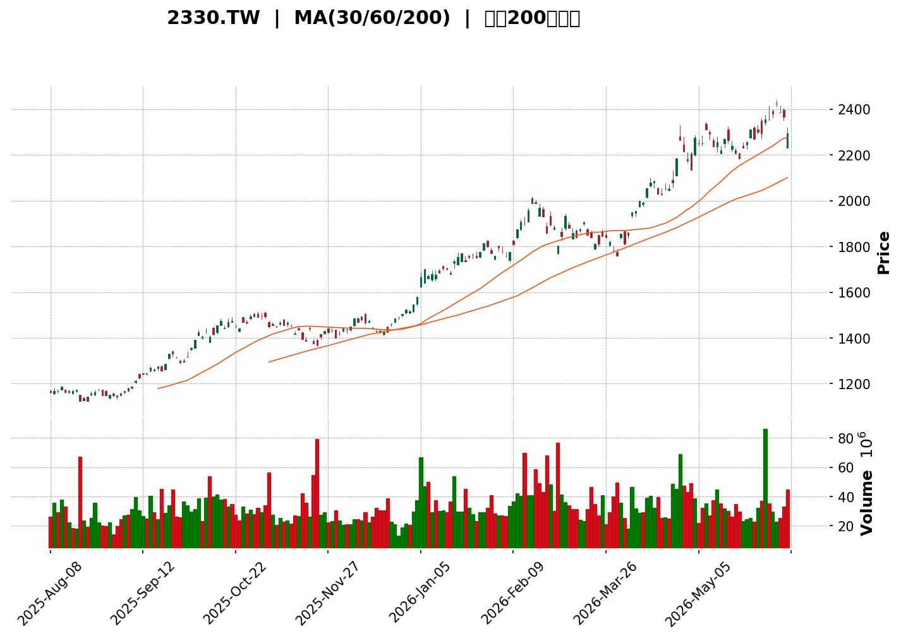
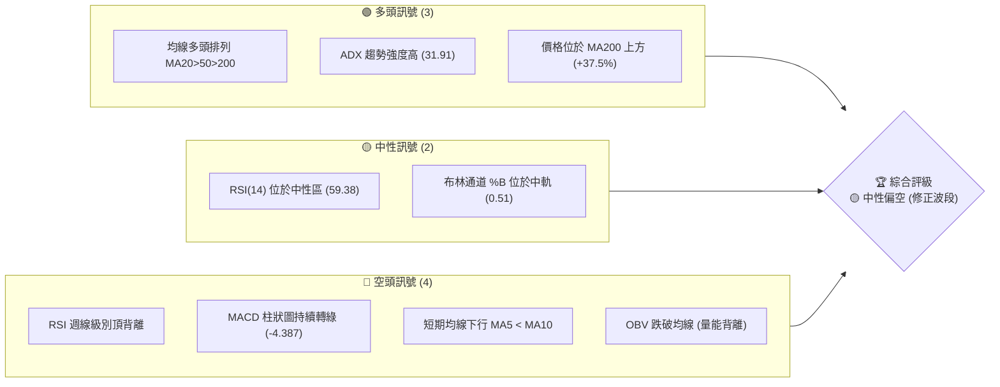
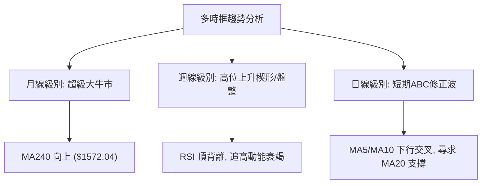
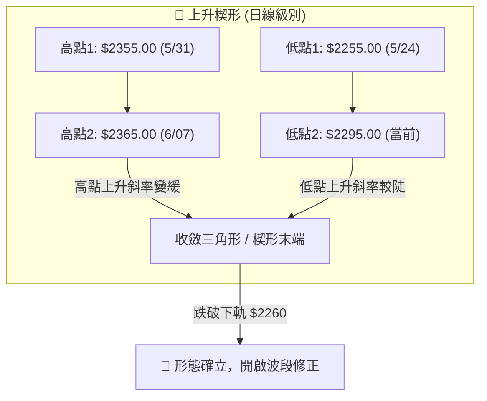
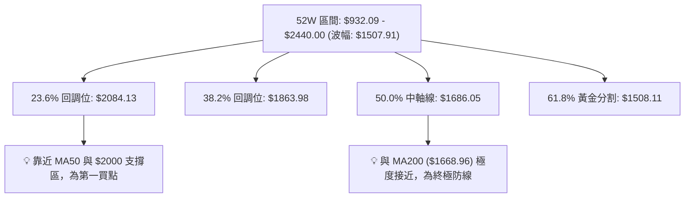

<details>
<summary>📊 靜態圖表 (點擊展開)</summary>

</details>

<html>
<head><meta charset="utf-8" /></head>
<body>
    <div style="height:500px; width:100%;">                        <script>window.PlotlyConfig = {MathJaxConfig: 'local'};</script>
        <script charset="utf-8" src="https://cdn.plot.ly/plotly-3.6.0.min.js" integrity="sha256-QaOVwtVY0T02VaHrr6pnoHLCwayMJp4O5n4YyaE3rJk=" crossorigin="anonymous"></script>                <div id="candlestick-chart" class="plotly-graph-div" style="height:100%; width:100%;"></div>            <script>                window.PLOTLYENV=window.PLOTLYENV || {};                                if (document.getElementById("candlestick-chart")) {                    Plotly.newPlot(                        "candlestick-chart",                        [{"close":{"dtype":"f8","bdata":"AAAAgIwqkkAAAADAVj6SQAAAAMBWPpJAAAAAQH+NkkAAAACAjCqSQAAAAMBWPpJAAAAAwFY+kkAAAADgIFKSQAAAAKA7jJFAAAAAAJrHkUAAAACgO4yRQAAAAGDCFpJAAAAAgIwqkkAAAAAA62WSQAAAAEAu75FAAAAAQC7vkUAAAACA+AKSQAAAAEAu75FAAAAAQC7vkUAAAABALu+RQAAAAMBWPpJAAAAAwFY+kkAAAABAf42SQAAAAOBx8JJAAAAAYNArk0AAAADg+HqTQAAAAMAuZ5NAAAAAIGXek0AAAAAAyqKTQAAAAIBD8pNAAAAAAMqik0AAAABAABqUQAAAAODRzJRAAAAA4NHMlEAAAABAWH2UQAAAAKDeLZRAAAAAIL1BlEAAAACgNpGUQAAAAOApMJVAAAAAoD67lUAAAABgU0aWQAAAAODZ9pVAAAAA4DFalkAAAADg2faVQAAAAKCWHpZAAAAAoIm9lkAAAABgAw2XQAAAAIDugZZAAAAAACX5lkAAAAAAJfmWQAAAAGCrqZZAAAAAgO6BlkAAAAAAJfmWQAAAAIBG5ZZAAAAA4Hxcl0AAAADgfFyXQAAAAICeSJdAAAAAYFtwl0AAAADgfFyXQAAAAGCrqZZAAAAAoIm9lkAAAABgq6mWQAAAAIBG5ZZAAAAAoIm9lkAAAACARuWWQAAAAGCrqZZAAAAAAHUylkAAAAAgEG6WQAAAAAAdz5VAAAAAIGCnlUAAAAAAzZWWQAAAAICjf5VAAAAAoOZXlUAAAADg2faVQAAAAOAxWpZAAAAAYFNGlkAAAADgMVqWQAAAAGD74pVAAAAAAHUylkAAAACA7oGWQAAAACAQbpZAAAAAYKuplkAAAAAgwDSXQAAAAAAl+ZZAAAAA4Hxcl0AAAADA4OSWQAAAAIC\u002fDJdAAAAAYCOVlkAAAABgVVmWQAAAAABmRZZAAAAAAGZFlkAAAAAAZkWWQAAAAGDx0JZAAAAAIJ40l0AAAACAjUiXQAAAAKBbhJdAAAAAABnUl0AAAABAOqyXQAAAAGDWI5hAAAAA4GGvmEAAAADARgKaQAAAAEDSjZpAAAAAIDYWmkAAAADgFD6aQAAAAIAlKppAAAAAIARSmkAAAACgwaGaQAAAAKDBoZpAAAAAIARSmkAAAACgXRmbQAAAAAAbaZtAAAAAIOmkm0AAAACgXRmbQAAAAAAbaZtAAAAAwPmQm0AAAADAK1WbQAAAAIDYuJtAAAAAQFNYnEAAAABAhRycQAAAACDppJtAAAAAYAp9m0AAAADglQicQAAAAMDHzJtAAAAAYAp9m0AAAACA2LibQAAAAOBjRJxAAAAAgItHnUAAAADgFtOdQAAAAOBIl51AAAAAYHCankAAAADgyWGfQAAAAIAMEp9AAAAAIE\u002fCnkAAAABA1CKeQAAAAGC9C51AAAAA4EiXnUAAAAAgam+dQAAAAIB0MJxAAAAAYO\u002fPnEAAAACgwzaeQAAAAMB6W51AAAAAYL0LnUAAAAAAALycQAAAAAAAOJ1AAAAAAADEnUAAAAAAAOicQAAAAAAAwJxAAAAAAABInEAAAAAAAEicQAAAAAAA1JxAAAAAAADAnEAAAAAAAHCcQAAAAAAA0JtAAAAAAACAm0AAAAAAAPycQAAAAAAASJxAAAAAAAAQnUAAAAAAAHieQAAAAAAAjJ5AAAAAAABAn0AAAAAAABifQAAAAAAADqBAAAAAAABAoEAAAAAAAEqgQAAAAAAAuJ9AAAAAAACkn0AAAAAAAASgQAAAAAAABKBAAAAAAABAoEAAAAAAABKhQAAAAAAAsqFAAAAAAABOoUAAAAAAAAihQAAAAAAArqBAAAAAAADGoUAAAAAAAJShQAAAAAAAlKFAAAAAAAAMokAAAAAAAOShQAAAAAAAdqFAAAAAAACeoUAAAAAAAFihQAAAAAAAvKFAAAAAAACyoUAAAAAAAIChQAAAAAAAOqFAAAAAAAASoUAAAAAAAGyhQAAAAAAAnqFAAAAAAAAMokAAAAAAALyhQAAAAAAA+KFAAAAAAADuoUAAAAAAAGaiQAAAAAAAZqJAAAAAAACYokAAAAAAAPKiQAAAAAAAoqJAAAAAAAB6okAAAAAAAO6hQA=="},"high":{"dtype":"f8","bdata":"63hzwiBSkkAeWxEktXmSQL88tgLrZZJAAAAAQH+NkkBhNa3j6mWSQF8eW+EgUpJAXx5b4SBSkkAAAADgIFKSQE5JdWj4ApJAhixkIWTbkUA0hqMlZNuRQGMndqJWPpJA63hzwiBSkkAAAAAA62WSQGqE5eYgUpJAaoTl5iBSkkAAAACA+AKSQHNPI6SMKpJAAAAAQC7vkUBzTyOkjCqSQAAAAMBWPpJAHlsRJLV5kkAAAABAf42SQAteTgE8BJNAW2ut5fh6k0AAAADg+HqTQA8DZ+H4epNAAAAghUPyk0BYHV\u002fKhsqTQAAAAIBD8pNAXMnt+SEGlEAAAABAABqUQAAAAODRzJRACCpnD20IlUCjiy4KFaWUQDdyI895aZRANcJyT1h9lEAJxluZjvSUQIVSKEUIRJVAAAAAoD67lUDJAUIqEG6WQNSPM0W4CpZAq6qqD82VlkDUjzNFuAqWQNeFJ2SrqZZAAAAAoIm9lkBQ61cqwDSXQBdDOq+JvZZAHEyRL8A0l0DQusGUnkiXQJMmTSpo0ZZAs2sT5cyVlkDQusGUnkiXQJF\u002fS6\u002fhIJdAHLs0qjmEl0CqGE8PGJiXQJqZmXn2q5dAxFRiKhiYl0A4dml09quXQHDgwFkDDZdAHlkSzyT5lkBKkybFib2WQAxVMkoDDZdAPbIk\u002fr80l0AMVTJKAw2XQJMmTSpo0ZZAVjBLyjFalkA5wEdPq6mWQBVRv15TRpZAmLYvtNn2lUBGGytlq6mWQEFSyxQdz5VA61G4\u002fhzPlUCpH2eqlh6WQAAAAOAxWpZAkgOE9MyVlkCrqqoPzZWWQGejviMQbpZAVjBLyjFalkAAAACA7oGWQL7qF4XugZZAAAAAYKuplkAAAAAgwDSXQNC6wZSeSJdAAAAA4Hxcl0AqeDnlSpiXQJ91g9muIJdAClp9uRKplkCf8hATNIGWQFIOiAw0gZZAca+CWVVZlkA0bY2\u002fEqmWQBR1crng5JZAAAAAIJ40l0DwuHjZfFyXQAAAAKBbhJdAAAAAABnUl0C9hvLyGNSXQAAAAGDWI5hAAAAA4GGvmECc1mx\u002f82WaQAAAAEDSjZpA5EoC0xQ+mkBlC6Hs4nmaQIZhGObieZpAhAFnLNKNmkDGdBZToMmaQGM6i\u002fmwtZpAWFbv0uJ5mkCQSfFSPEGbQF100WXYuJtAAAAAIOmkm0DoN1tfCn2bQC666LL5kJtAnNR9Gemkm0CZkinZx8ybQOYwh9nHzJtAAAAAQFNYnEAHrSxZIZScQKaejN+VCJxAAAAAYAp9m0BbsAWTdDCcQGaK0yWFHJxA2VRrbNi4m0AAAACA2LibQKUF6EUhlJxAAAAAgItHnUCKT\u002feS9fqdQHRLnFLUIp5AqNX4Ek\u002fCnkBrSPqSqImfQCHjgozaTZ9Aa3EThgwSn0DWlDVlPtaeQESsUYUnv51AWYEwEoGGnkC+hPbSSJedQAAAAIB0MJxA+awbLGpvnUAdFfhSol6eQFL\u002fyNgW051AAmnrxXpbnUAnt3hyi0edQAAAAAAAYJ1AAAAAAADYnUAAAAAAAGCdQAAAAAAAOJ1AAAAAAABcnEAAAAAAAOicQAAAAAAATJ1AAAAAAAAknUAAAAAAAIScQAAAAAAAIJxAAAAAAAD4m0AAAAAAAPycQAAAAAAAJJ1AAAAAAAAQnUAAAAAAAHieQAAAAAAAjJ5AAAAAAABAn0AAAAAAACyfQAAAAAAADqBAAAAAAABooEAAAAAAAFSgQAAAAAAAGKBAAAAAAAAOoEAAAAAAADagQAAAAAAALKBAAAAAAACuoEAAAAAAAByhQAAAAAAANKJAAAAAAADQoUAAAAAAAEShQAAAAAAATqFAAAAAAADaoUAAAAAAALyhQAAAAAAA2qFAAAAAAABSokAAAAAAAAyiQAAAAAAAxqFAAAAAAADQoUAAAAAAAIChQAAAAAAAvKFAAAAAAAAqokAAAAAAAKihQAAAAAAAbKFAAAAAAABEoUAAAAAAAJ6hQAAAAAAAqKFAAAAAAAAMokAAAAAAACqiQAAAAAAANKJAAAAAAABwokAAAAAAAI6iQAAAAAAA3qJAAAAAAADAokAAAAAAABCjQAAAAAAA3qJAAAAAAADKokAAAAAAACCiQA=="},"hovertemplate":"\u003cb\u003e%{x|%Y-%m-%d}\u003c\u002fb\u003e\u003cbr\u003e\u958b: $%{open:.2f}\u003cbr\u003e\u9ad8: $%{high:.2f}\u003cbr\u003e\u4f4e: $%{low:.2f}\u003cbr\u003e\u6536: $%{close:.2f}\u003cextra\u003e\u003c\u002fextra\u003e","low":{"dtype":"f8","bdata":"ikPGXsIWkkDhpO5b+AKSQEHDSX3CFpJAAAAA3CBSkkAAAACAjCqSQEHDSX3CFpJAQcNJfcIWkkAmsUydjCqSQAAAAKA7jJFA9aY3vQWgkUAAAACgO4yRQJ7YiR0u75FAn8pSHC7vkUC+mE+9Vj6SQAAAAEAu75FAAAAAQC7vkUBMA\u002fX5z7ORQITlnh5k25FAjbDc28+zkUAAAABALu+RQEHDSX3CFpJAAAAAwFY+kkBVVVX96mWSQOtDY53dyJJAKaWUPgYYk0BN0zSdZFOTQPD8mJ5kU5NAAACAi+uOk0AAAAAAyqKTQJRrlOvJopNAAAAAAMqik0AM\u002fKtGqLaTQEkPVOZ5aZRA+NWYsDaRlEAAAABAWH2UQEMv9DoAGpRAAAAAIL1BlEAAAACgNpGUQPZarxVtCJVAAAAA3CkwlUBT\u002fZwwuAqWQFfgmBUdz5VA4ziOFXUylkDZMP7lgZOVQE\u002fI1Tq4CpZAWRLPd5YelkBgKVDLib2WQAAAAIDugZZAfdYNBs2VlkAAAAAAJfmWQLds2frMlZZA6bzFUFNGlkAAAAAAJfmWQHvV5hpo0ZZAVuewsOEgl0ByouV6nkiXQAAAAICeSJdAd1Y7y+Egl0DkRMsVwDSXQLds2frMlZZAAAAAoIm9lkC3bNn6zJWWQPWqzbWJvZZAAAAAoIm9lkBvgLRQq6mWQAAAAGCrqZZA1WfampYelkAAAAAgEG6WQAAAAAAdz5VAAAAAIGCnlUAwrn7QMVqWQAAAAICjf5VAAAAAoOZXlUBX4JgVHc+VQFVVVbCWHpZAHP\u002fe+nQylkByHMd6U0aWQAAAAGD74pVAqs+0NbgKlkDpvMVQU0aWQMc\u002fuPB0MpZA2rJlyzFalkA1Rgpcq6mWQAAAAAAl+ZZAyImWSwMNl0A01odm8dCWQMIU+czg5JZA9aWCBjSBlkBhDe+sdjGWQI9QfaZ2MZZArvF385cJlkAAAAAAZkWWQNgVG60SqZZAK4szuuDklkAhjg7NriCXQMgGZJONSJdAmkTvmVuEl0BEeQ2NW4SXQNjHhe1KmJdALz6vE+cPmECzfaKa3E6ZQNtssw2anplAHLX9bFfumUA26b3GeMaZQBmGYcB4xplAAAAAIARSmkA7i+ns4nmaQDuL6ezieZpAqakQbSUqmkBPIyyHwaGaQF100Y2P3ZpAGFVurV0Zm0AAAACgXRmbQNFFF008QZtAj60IWjxBm0AAAADAK1WbQIELXMArVZtAh3AIJ7fgm0DUjXjmlQicQAAAACDppJtA3o4b+kwtm0B3d3fTx8ybQM06Fg3ppJtAt+OGBhtpm0DPeMazXRmbQAAAAOBjRJxAaKO+sxConEDWwSIUnDOdQAAAAOBIl51AtNMj4RbTnUArbwt6DBKfQAAAAIAMEp9AhfldrcM2nkAAAABA1CKeQAAAAGC9C51AOfV7hlmDnUBDewlti0edQKTcVLT5kJtAhCny+TGAnEDDdrMUnDOdQAAAAMB6W51AvbyZoBConEAAAAAAALycQAAAAAAAEJ1AAAAAAACInUAAAAAAAOicQAAAAAAAwJxAAAAAAADkm0AAAAAAACCcQAAAAAAA1JxAAAAAAADAnEAAAAAAACCcQAAAAAAA0JtAAAAAAACAm0AAAAAAAJicQAAAAAAANJxAAAAAAACsnEAAAAAAABSeQAAAAAAAKJ5AAAAAAADInkAAAAAAANyeQAAAAAAAaJ9AAAAAAAAYoEAAAAAAAA6gQAAAAAAAuJ9AAAAAAACkn0AAAAAAAPSfQAAAAAAA4J9AAAAAAAAOoEAAAAAAAHKgQAAAAAAAsqFAAAAAAABOoUAAAAAAAOqgQAAAAAAArqBAAAAAAAAmoUAAAAAAAIChQAAAAAAAgKFAAAAAAAAMokAAAAAAALKhQAAAAAAAdqFAAAAAAABEoUAAAAAAADqhQAAAAAAAbKFAAAAAAACUoUAAAAAAAE6hQAAAAAAAOqFAAAAAAAASoUAAAAAAAGyhQAAAAAAAYqFAAAAAAADGoUAAAAAAALyhQAAAAAAA5KFAAAAAAAC8oUAAAAAAADSiQAAAAAAAXKJAAAAAAABwokAAAAAAANSiQAAAAAAAoqJAAAAAAABcokAAAAAAAGyhQA=="},"name":"\u50f9\u683c","open":{"dtype":"f8","bdata":"dbw5oVY+kkBBw0l9whaSQAAAAMBWPpJAAAAA3CBSkkDreHPCIFKSQKDhpJ6MKpJAQcNJfcIWkkCTWKa+Vj6SQE5JdWj4ApJA9aY3vQWgkUA0hqMlZNuRQE\u002fsxD74ApJAFYeMPfgCkkAAAAAA62WSQGqE5eYgUpJA7mmExVY+kkB5wncbmseRQPc0woLCFpJAhOWeHmTbkUD3NMKCwhaSQKDhpJ6MKpJAHlsRJLV5kkCrqqoetXmSQPahsb6n3JJAhBBCxC5nk0CnaZq+LmeTQA8DZ+H4epNAAACg8Mmik0Csji9lqLaTQMo1yrWGypNAsDq+lEPyk0AM\u002fKtGqLaTQKFydktYfZRAsMZEqo70lEAAAABAWH2UQHqhF2qbVZRAvEAmhZtVlEAAAACgNpGUQHut13pLHJVAAAAA3CkwlUBT\u002fZwwuAqWQCtwzHr74pVAAAAA4DFalkDZMP7lgZOVQCZO\u002ff7MlZZAw03bQVNGlkBgKVDLib2WQLNrE+XMlZZAMUU+a6uplkC0bjBlAw2XQAAAAGCrqZZAnCjZtTFalkDQusGUnkiXQIYqGeUk+ZZA5ETLFcA0l0AcuzSqOYSXQPYoXK85hJdAAAAAYFtwl0CqGE8PGJiXQCdNmvQk+ZZAtR0GBWjRlkAAAABgq6mWQHvV5hpo0ZZAiJQemeEgl0B71eYaaNGWQAAAAGCrqZZA1WfampYelkC+6heF7oGWQBVRv15TRpZApu0LhT67lUC75NSa7oGWQCCpZUpgp5VAmpmZmT67lUCpH2eqlh6WQOM4jhV1MpZArQJjj+6BlkAAAADgMVqWQGejviMQbpZAAAAAAHUylkCcKNm1MVqWQAAAACAQbpZAI0aMMBBulkDAYC3Bib2WQBxMkS\u002fANJdAVuewsOEgl0BeTsGLW4SXQGGKfCbQ+JZAAAAAYCOVlkAAAABgVVmWQHGvgllVWZZAHqH6TIcdlkA0bY2\u002fEqmWQAAAAGDx0JZAYKimE9D4lkAAAACAjUiXQO2sdkZscJdAdHNz80qYl0CivIbmSpiXQHD0BEc6rJdAo27DxsU3mECgqB70y2KZQNtssw2anplAHLX9bFfumUAC7UggaNqZQNy2bXNX7plAWFbv0uJ5mkDGdBZToMmaQJ3FdEbSjZpA1FSIxhQ+mkA4W4dGbgWbQF100Y2P3ZpAGFVurV0Zm0DIpHj5TC2bQBdddFkKfZtAAAAAwPmQm0CJ2w1zCn2bQGg84xkbaZtAh3AIJ7fgm0DbOqX\u002fMYCcQGSShyy34JtAJquUUzxBm0BbsAWTdDCcQAAAAMDHzJtAAAAAYAp9m0C1qU0NTS2bQDsEbuwxgJxA+85GDQC8nECcaZ5ti0edQAAAAOBIl51AtNMj4RbTnUArbwt6DBKfQGD2gNn7JZ9AhfldrcM2nkBuHkayX66eQIMd4XhZg51AO1YgrMM2nkBDewlti0edQBBByg3ppJtAfdYNxqwfnUDgi6vHeludQKl\u002fZMxIl51AvbyZoBConECPwfkYnDOdQAAAAAAATJ1AAAAAAACwnUAAAAAAAEydQAAAAAAAEJ1AAAAAAAD4m0AAAAAAAOicQAAAAAAAJJ1AAAAAAADonEAAAAAAADScQAAAAAAA0JtAAAAAAAC8m0AAAAAAAMCcQAAAAAAAJJ1AAAAAAADonEAAAAAAADyeQAAAAAAAZJ5AAAAAAADcnkAAAAAAAASfQAAAAAAAfJ9AAAAAAAAioEAAAAAAAECgQAAAAAAADqBAAAAAAAC4n0AAAAAAAASgQAAAAAAA9J9AAAAAAABUoEAAAAAAAHygQAAAAAAA0KFAAAAAAACKoUAAAAAAAP6gQAAAAAAAOqFAAAAAAAAwoUAAAAAAAJShQAAAAAAAlKFAAAAAAAA+okAAAAAAAPihQAAAAAAAsqFAAAAAAAB2oUAAAAAAADqhQAAAAAAAlKFAAAAAAAAMokAAAAAAAGKhQAAAAAAAWKFAAAAAAAA6oUAAAAAAAIChQAAAAAAAiqFAAAAAAADGoUAAAAAAACCiQAAAAAAADKJAAAAAAABcokAAAAAAAEiiQAAAAAAAZqJAAAAAAACsokAAAAAAAPKiQAAAAAAAoqJAAAAAAAC2okAAAAAAAGyhQA=="},"x":["2025-08-08T00:00:00+08:00","2025-08-11T00:00:00+08:00","2025-08-12T00:00:00+08:00","2025-08-13T00:00:00+08:00","2025-08-14T00:00:00+08:00","2025-08-15T00:00:00+08:00","2025-08-18T00:00:00+08:00","2025-08-19T00:00:00+08:00","2025-08-20T00:00:00+08:00","2025-08-21T00:00:00+08:00","2025-08-22T00:00:00+08:00","2025-08-25T00:00:00+08:00","2025-08-26T00:00:00+08:00","2025-08-27T00:00:00+08:00","2025-08-28T00:00:00+08:00","2025-08-29T00:00:00+08:00","2025-09-01T00:00:00+08:00","2025-09-02T00:00:00+08:00","2025-09-03T00:00:00+08:00","2025-09-04T00:00:00+08:00","2025-09-05T00:00:00+08:00","2025-09-08T00:00:00+08:00","2025-09-09T00:00:00+08:00","2025-09-10T00:00:00+08:00","2025-09-11T00:00:00+08:00","2025-09-12T00:00:00+08:00","2025-09-15T00:00:00+08:00","2025-09-16T00:00:00+08:00","2025-09-17T00:00:00+08:00","2025-09-18T00:00:00+08:00","2025-09-19T00:00:00+08:00","2025-09-22T00:00:00+08:00","2025-09-23T00:00:00+08:00","2025-09-24T00:00:00+08:00","2025-09-25T00:00:00+08:00","2025-09-26T00:00:00+08:00","2025-09-30T00:00:00+08:00","2025-10-01T00:00:00+08:00","2025-10-02T00:00:00+08:00","2025-10-03T00:00:00+08:00","2025-10-07T00:00:00+08:00","2025-10-08T00:00:00+08:00","2025-10-09T00:00:00+08:00","2025-10-13T00:00:00+08:00","2025-10-14T00:00:00+08:00","2025-10-15T00:00:00+08:00","2025-10-16T00:00:00+08:00","2025-10-17T00:00:00+08:00","2025-10-20T00:00:00+08:00","2025-10-21T00:00:00+08:00","2025-10-22T00:00:00+08:00","2025-10-23T00:00:00+08:00","2025-10-27T00:00:00+08:00","2025-10-28T00:00:00+08:00","2025-10-29T00:00:00+08:00","2025-10-30T00:00:00+08:00","2025-10-31T00:00:00+08:00","2025-11-03T00:00:00+08:00","2025-11-04T00:00:00+08:00","2025-11-05T00:00:00+08:00","2025-11-06T00:00:00+08:00","2025-11-07T00:00:00+08:00","2025-11-10T00:00:00+08:00","2025-11-11T00:00:00+08:00","2025-11-12T00:00:00+08:00","2025-11-13T00:00:00+08:00","2025-11-14T00:00:00+08:00","2025-11-17T00:00:00+08:00","2025-11-18T00:00:00+08:00","2025-11-19T00:00:00+08:00","2025-11-20T00:00:00+08:00","2025-11-21T00:00:00+08:00","2025-11-24T00:00:00+08:00","2025-11-25T00:00:00+08:00","2025-11-26T00:00:00+08:00","2025-11-27T00:00:00+08:00","2025-11-28T00:00:00+08:00","2025-12-01T00:00:00+08:00","2025-12-02T00:00:00+08:00","2025-12-03T00:00:00+08:00","2025-12-04T00:00:00+08:00","2025-12-05T00:00:00+08:00","2025-12-08T00:00:00+08:00","2025-12-09T00:00:00+08:00","2025-12-10T00:00:00+08:00","2025-12-11T00:00:00+08:00","2025-12-12T00:00:00+08:00","2025-12-15T00:00:00+08:00","2025-12-16T00:00:00+08:00","2025-12-17T00:00:00+08:00","2025-12-18T00:00:00+08:00","2025-12-19T00:00:00+08:00","2025-12-22T00:00:00+08:00","2025-12-23T00:00:00+08:00","2025-12-24T00:00:00+08:00","2025-12-26T00:00:00+08:00","2025-12-29T00:00:00+08:00","2025-12-30T00:00:00+08:00","2025-12-31T00:00:00+08:00","2026-01-02T00:00:00+08:00","2026-01-05T00:00:00+08:00","2026-01-06T00:00:00+08:00","2026-01-07T00:00:00+08:00","2026-01-08T00:00:00+08:00","2026-01-09T00:00:00+08:00","2026-01-12T00:00:00+08:00","2026-01-13T00:00:00+08:00","2026-01-14T00:00:00+08:00","2026-01-15T00:00:00+08:00","2026-01-16T00:00:00+08:00","2026-01-19T00:00:00+08:00","2026-01-20T00:00:00+08:00","2026-01-21T00:00:00+08:00","2026-01-22T00:00:00+08:00","2026-01-23T00:00:00+08:00","2026-01-26T00:00:00+08:00","2026-01-27T00:00:00+08:00","2026-01-28T00:00:00+08:00","2026-01-29T00:00:00+08:00","2026-01-30T00:00:00+08:00","2026-02-02T00:00:00+08:00","2026-02-03T00:00:00+08:00","2026-02-04T00:00:00+08:00","2026-02-05T00:00:00+08:00","2026-02-06T00:00:00+08:00","2026-02-09T00:00:00+08:00","2026-02-10T00:00:00+08:00","2026-02-11T00:00:00+08:00","2026-02-23T00:00:00+08:00","2026-02-24T00:00:00+08:00","2026-02-25T00:00:00+08:00","2026-02-26T00:00:00+08:00","2026-03-02T00:00:00+08:00","2026-03-03T00:00:00+08:00","2026-03-04T00:00:00+08:00","2026-03-05T00:00:00+08:00","2026-03-06T00:00:00+08:00","2026-03-09T00:00:00+08:00","2026-03-10T00:00:00+08:00","2026-03-11T00:00:00+08:00","2026-03-12T00:00:00+08:00","2026-03-13T00:00:00+08:00","2026-03-16T00:00:00+08:00","2026-03-17T00:00:00+08:00","2026-03-18T00:00:00+08:00","2026-03-19T00:00:00+08:00","2026-03-20T00:00:00+08:00","2026-03-23T00:00:00+08:00","2026-03-24T00:00:00+08:00","2026-03-25T00:00:00+08:00","2026-03-26T00:00:00+08:00","2026-03-27T00:00:00+08:00","2026-03-30T00:00:00+08:00","2026-03-31T00:00:00+08:00","2026-04-01T00:00:00+08:00","2026-04-02T00:00:00+08:00","2026-04-07T00:00:00+08:00","2026-04-08T00:00:00+08:00","2026-04-09T00:00:00+08:00","2026-04-10T00:00:00+08:00","2026-04-13T00:00:00+08:00","2026-04-14T00:00:00+08:00","2026-04-15T00:00:00+08:00","2026-04-16T00:00:00+08:00","2026-04-17T00:00:00+08:00","2026-04-20T00:00:00+08:00","2026-04-21T00:00:00+08:00","2026-04-22T00:00:00+08:00","2026-04-23T00:00:00+08:00","2026-04-24T00:00:00+08:00","2026-04-27T00:00:00+08:00","2026-04-28T00:00:00+08:00","2026-04-29T00:00:00+08:00","2026-04-30T00:00:00+08:00","2026-05-04T00:00:00+08:00","2026-05-05T00:00:00+08:00","2026-05-06T00:00:00+08:00","2026-05-07T00:00:00+08:00","2026-05-08T00:00:00+08:00","2026-05-11T00:00:00+08:00","2026-05-12T00:00:00+08:00","2026-05-13T00:00:00+08:00","2026-05-14T00:00:00+08:00","2026-05-15T00:00:00+08:00","2026-05-18T00:00:00+08:00","2026-05-19T00:00:00+08:00","2026-05-20T00:00:00+08:00","2026-05-21T00:00:00+08:00","2026-05-22T00:00:00+08:00","2026-05-25T00:00:00+08:00","2026-05-26T00:00:00+08:00","2026-05-27T00:00:00+08:00","2026-05-28T00:00:00+08:00","2026-05-29T00:00:00+08:00","2026-06-01T00:00:00+08:00","2026-06-02T00:00:00+08:00","2026-06-03T00:00:00+08:00","2026-06-04T00:00:00+08:00","2026-06-05T00:00:00+08:00","2026-06-08T00:00:00+08:00"],"type":"candlestick"},{"hovertemplate":"MA30: $%{y:.2f}\u003cextra\u003e\u003c\u002fextra\u003e","line":{"color":"#2196F3","dash":"dash","width":2},"mode":"lines","name":"MA30","x":["2025-08-08T00:00:00+08:00","2025-08-11T00:00:00+08:00","2025-08-12T00:00:00+08:00","2025-08-13T00:00:00+08:00","2025-08-14T00:00:00+08:00","2025-08-15T00:00:00+08:00","2025-08-18T00:00:00+08:00","2025-08-19T00:00:00+08:00","2025-08-20T00:00:00+08:00","2025-08-21T00:00:00+08:00","2025-08-22T00:00:00+08:00","2025-08-25T00:00:00+08:00","2025-08-26T00:00:00+08:00","2025-08-27T00:00:00+08:00","2025-08-28T00:00:00+08:00","2025-08-29T00:00:00+08:00","2025-09-01T00:00:00+08:00","2025-09-02T00:00:00+08:00","2025-09-03T00:00:00+08:00","2025-09-04T00:00:00+08:00","2025-09-05T00:00:00+08:00","2025-09-08T00:00:00+08:00","2025-09-09T00:00:00+08:00","2025-09-10T00:00:00+08:00","2025-09-11T00:00:00+08:00","2025-09-12T00:00:00+08:00","2025-09-15T00:00:00+08:00","2025-09-16T00:00:00+08:00","2025-09-17T00:00:00+08:00","2025-09-18T00:00:00+08:00","2025-09-19T00:00:00+08:00","2025-09-22T00:00:00+08:00","2025-09-23T00:00:00+08:00","2025-09-24T00:00:00+08:00","2025-09-25T00:00:00+08:00","2025-09-26T00:00:00+08:00","2025-09-30T00:00:00+08:00","2025-10-01T00:00:00+08:00","2025-10-02T00:00:00+08:00","2025-10-03T00:00:00+08:00","2025-10-07T00:00:00+08:00","2025-10-08T00:00:00+08:00","2025-10-09T00:00:00+08:00","2025-10-13T00:00:00+08:00","2025-10-14T00:00:00+08:00","2025-10-15T00:00:00+08:00","2025-10-16T00:00:00+08:00","2025-10-17T00:00:00+08:00","2025-10-20T00:00:00+08:00","2025-10-21T00:00:00+08:00","2025-10-22T00:00:00+08:00","2025-10-23T00:00:00+08:00","2025-10-27T00:00:00+08:00","2025-10-28T00:00:00+08:00","2025-10-29T00:00:00+08:00","2025-10-30T00:00:00+08:00","2025-10-31T00:00:00+08:00","2025-11-03T00:00:00+08:00","2025-11-04T00:00:00+08:00","2025-11-05T00:00:00+08:00","2025-11-06T00:00:00+08:00","2025-11-07T00:00:00+08:00","2025-11-10T00:00:00+08:00","2025-11-11T00:00:00+08:00","2025-11-12T00:00:00+08:00","2025-11-13T00:00:00+08:00","2025-11-14T00:00:00+08:00","2025-11-17T00:00:00+08:00","2025-11-18T00:00:00+08:00","2025-11-19T00:00:00+08:00","2025-11-20T00:00:00+08:00","2025-11-21T00:00:00+08:00","2025-11-24T00:00:00+08:00","2025-11-25T00:00:00+08:00","2025-11-26T00:00:00+08:00","2025-11-27T00:00:00+08:00","2025-11-28T00:00:00+08:00","2025-12-01T00:00:00+08:00","2025-12-02T00:00:00+08:00","2025-12-03T00:00:00+08:00","2025-12-04T00:00:00+08:00","2025-12-05T00:00:00+08:00","2025-12-08T00:00:00+08:00","2025-12-09T00:00:00+08:00","2025-12-10T00:00:00+08:00","2025-12-11T00:00:00+08:00","2025-12-12T00:00:00+08:00","2025-12-15T00:00:00+08:00","2025-12-16T00:00:00+08:00","2025-12-17T00:00:00+08:00","2025-12-18T00:00:00+08:00","2025-12-19T00:00:00+08:00","2025-12-22T00:00:00+08:00","2025-12-23T00:00:00+08:00","2025-12-24T00:00:00+08:00","2025-12-26T00:00:00+08:00","2025-12-29T00:00:00+08:00","2025-12-30T00:00:00+08:00","2025-12-31T00:00:00+08:00","2026-01-02T00:00:00+08:00","2026-01-05T00:00:00+08:00","2026-01-06T00:00:00+08:00","2026-01-07T00:00:00+08:00","2026-01-08T00:00:00+08:00","2026-01-09T00:00:00+08:00","2026-01-12T00:00:00+08:00","2026-01-13T00:00:00+08:00","2026-01-14T00:00:00+08:00","2026-01-15T00:00:00+08:00","2026-01-16T00:00:00+08:00","2026-01-19T00:00:00+08:00","2026-01-20T00:00:00+08:00","2026-01-21T00:00:00+08:00","2026-01-22T00:00:00+08:00","2026-01-23T00:00:00+08:00","2026-01-26T00:00:00+08:00","2026-01-27T00:00:00+08:00","2026-01-28T00:00:00+08:00","2026-01-29T00:00:00+08:00","2026-01-30T00:00:00+08:00","2026-02-02T00:00:00+08:00","2026-02-03T00:00:00+08:00","2026-02-04T00:00:00+08:00","2026-02-05T00:00:00+08:00","2026-02-06T00:00:00+08:00","2026-02-09T00:00:00+08:00","2026-02-10T00:00:00+08:00","2026-02-11T00:00:00+08:00","2026-02-23T00:00:00+08:00","2026-02-24T00:00:00+08:00","2026-02-25T00:00:00+08:00","2026-02-26T00:00:00+08:00","2026-03-02T00:00:00+08:00","2026-03-03T00:00:00+08:00","2026-03-04T00:00:00+08:00","2026-03-05T00:00:00+08:00","2026-03-06T00:00:00+08:00","2026-03-09T00:00:00+08:00","2026-03-10T00:00:00+08:00","2026-03-11T00:00:00+08:00","2026-03-12T00:00:00+08:00","2026-03-13T00:00:00+08:00","2026-03-16T00:00:00+08:00","2026-03-17T00:00:00+08:00","2026-03-18T00:00:00+08:00","2026-03-19T00:00:00+08:00","2026-03-20T00:00:00+08:00","2026-03-23T00:00:00+08:00","2026-03-24T00:00:00+08:00","2026-03-25T00:00:00+08:00","2026-03-26T00:00:00+08:00","2026-03-27T00:00:00+08:00","2026-03-30T00:00:00+08:00","2026-03-31T00:00:00+08:00","2026-04-01T00:00:00+08:00","2026-04-02T00:00:00+08:00","2026-04-07T00:00:00+08:00","2026-04-08T00:00:00+08:00","2026-04-09T00:00:00+08:00","2026-04-10T00:00:00+08:00","2026-04-13T00:00:00+08:00","2026-04-14T00:00:00+08:00","2026-04-15T00:00:00+08:00","2026-04-16T00:00:00+08:00","2026-04-17T00:00:00+08:00","2026-04-20T00:00:00+08:00","2026-04-21T00:00:00+08:00","2026-04-22T00:00:00+08:00","2026-04-23T00:00:00+08:00","2026-04-24T00:00:00+08:00","2026-04-27T00:00:00+08:00","2026-04-28T00:00:00+08:00","2026-04-29T00:00:00+08:00","2026-04-30T00:00:00+08:00","2026-05-04T00:00:00+08:00","2026-05-05T00:00:00+08:00","2026-05-06T00:00:00+08:00","2026-05-07T00:00:00+08:00","2026-05-08T00:00:00+08:00","2026-05-11T00:00:00+08:00","2026-05-12T00:00:00+08:00","2026-05-13T00:00:00+08:00","2026-05-14T00:00:00+08:00","2026-05-15T00:00:00+08:00","2026-05-18T00:00:00+08:00","2026-05-19T00:00:00+08:00","2026-05-20T00:00:00+08:00","2026-05-21T00:00:00+08:00","2026-05-22T00:00:00+08:00","2026-05-25T00:00:00+08:00","2026-05-26T00:00:00+08:00","2026-05-27T00:00:00+08:00","2026-05-28T00:00:00+08:00","2026-05-29T00:00:00+08:00","2026-06-01T00:00:00+08:00","2026-06-02T00:00:00+08:00","2026-06-03T00:00:00+08:00","2026-06-04T00:00:00+08:00","2026-06-05T00:00:00+08:00","2026-06-08T00:00:00+08:00"],"y":{"dtype":"f8","bdata":"AAAAAAAA+H8AAAAAAAD4fwAAAAAAAPh\u002fAAAAAAAA+H8AAAAAAAD4fwAAAAAAAPh\u002fAAAAAAAA+H8AAAAAAAD4fwAAAAAAAPh\u002fAAAAAAAA+H8AAAAAAAD4fwAAAAAAAPh\u002fAAAAAAAA+H8AAAAAAAD4fwAAAAAAAPh\u002fAAAAAAAA+H8AAAAAAAD4fwAAAAAAAPh\u002fAAAAAAAA+H8AAAAAAAD4fwAAAAAAAPh\u002fAAAAAAAA+H8AAAAAAAD4fwAAAAAAAPh\u002fAAAAAAAA+H8AAAAAAAD4fwAAAAAAAPh\u002fAAAAAAAA+H8AAAAAAAD4f2ZmZkbgbZJAvLu722p6kkB3d3fXRYqSQO\u002fu7r4WoJJAq6qqKkSzkkAiIiLCF8eSQJqZmUmc15JA3t3dXcrokkAiIiLC9fuSQLy7uzsGG5NAvLu76748k0C8u7sLFWWTQFVVVeUmhpNAvLu7m9+pk0CJiIj4TciTQGZmZqYE7JNAIiIisgcVlEDv7u4OCECUQHd3d3cOZ5RAiYiIKA6SlECamZnZDb2UQO\u002fu7t7D4pRAvLu7yyYHlUBVVVWF3yyVQHd3d1eiTpVAMzMz02NylUAzMzPTgZOVQGZmZiaftJVAq6qqShbTlUBVVVWF4PKVQGZmZqYOCpZAERERgYwklkCrqqqKZzqWQLy7u0tJTJZARERE9NdclkBVVVXlX3GWQDMzM2ORhpZAzczMDCCXlkCrqqoqBaeWQJqZmYlRrJZAzczM\u002fKerlkDNzMwsTq6WQFVVVeVUqpZAmpmZybihlkCamZnJuKGWQN7d3W21o5ZAd3d3J7yflkDNzMw8xpmWQN7d3d15lJZAZmZmZtqNlkDe3d0d4YmWQJqZmXnkh5ZAIiIikjeJlkBVVVU1NIuWQCIiIsLdi5ZAIiIiwt2LlkBmZmYW4YeWQAAAADDihZZAVVVVhZN+lkAiIiIS8HWWQM3MzGyYcpZAzczMPJdulkB3d3eXP2uWQGZmZhaSapZAzczMPIpulkB3d3dn2XGWQLy7u4sjeZZAmpmZaQ+HlkCrqqpqqpGWQGZmZnaOpZZAMzMzY2y\u002flkBVVVWlo9yWQGZmZlbHB5dAREREdEEwl0C8u7trw1SXQKuqqopLdZdA7+7ubtGXl0CamZk5VryXQM3MzEzU5JdAzczMvAMImEC8u7sbMi+YQImIiHiyWZhAd3d3hzSEmECrqqr6bKWYQDMzM4NKy5hAq6qqiizvmECJiIjoDBWZQLy7u5vrPJlA7+7u3hdumUAiIiIiRJ+ZQGZmZtYdzZlAERERUaP5mUBERESUzyqaQJqZmblWVZpA3t3d3eJ5mkC8u7s7w5+aQKuqqgpMyJpAvLu728\u002f2mkDe3d2tTiubQO\u002fu7n7SWZtAq6qq+lKMm0Dv7u6uLLqbQImIiCi34JtAvLu725UInEAAAABwzymcQBEREZFlQpxAIiIiQk5enEBmZmZGOnacQBEREYGEg5xAREREFMiYnEC8u7uLXLOcQGZmZlb5w5xAiYiIWO\u002fPnEARERGx492cQJqZmblR7ZxAMzMzMxYAnUDNzMysgw2dQCIiIkJJFp1AMzMz870VnUCamZn5MBedQGZmZlZLIZ1AIiIiQg8snUCrqqq6gS+dQERERDSdL51AVVVVdbYvnUCrqqoKfDqdQImIiNiaOp1AzczM3MA4nUCamZkZQD6dQGZmZlZoRp1AAAAAIO1LnUBmZmZ2d0mdQJqZmelUUp1AREREJDBhnUDv7u7uBnadQERERPTVjJ1AZmZmhlOenUB3d3enerSdQCIiIpJD1Z1Ad3d3l7v0nUCrqqqaPRaeQDMzM4O5SZ5AMzMzMzN5nkCrqqqqqqaeQAAAAAAAyp5AVVVVVVX7nkCrqqqqqjCfQFVVVVVVZ59AAAAAAACqn0AAAAAAAOqfQAAAAAAAD6BAq6qqqqoqoEBVVVVVVUWgQAAAAAAAZqBAq6qqqqqHoEBVVVVVVaGgQKuqqqqqu6BAVVVVVVXRoEAAAAAAAOSgQAAAAAAA+KBAq6qqqqoMoUBVVVVVVR+hQKuqqqqqL6FAAAAAAAA+oUAAAAAAAFChQKuqqqqqZaFAVVVVVVV9oUBVVVVVVZahQKuqqqqqrKFAq6qqqqq\u002foUAAAAAAAMehQA=="},"type":"scatter"},{"hovertemplate":"MA60: $%{y:.2f}\u003cextra\u003e\u003c\u002fextra\u003e","line":{"color":"#9C27B0","dash":"dash","width":2},"mode":"lines","name":"MA60","x":["2025-08-08T00:00:00+08:00","2025-08-11T00:00:00+08:00","2025-08-12T00:00:00+08:00","2025-08-13T00:00:00+08:00","2025-08-14T00:00:00+08:00","2025-08-15T00:00:00+08:00","2025-08-18T00:00:00+08:00","2025-08-19T00:00:00+08:00","2025-08-20T00:00:00+08:00","2025-08-21T00:00:00+08:00","2025-08-22T00:00:00+08:00","2025-08-25T00:00:00+08:00","2025-08-26T00:00:00+08:00","2025-08-27T00:00:00+08:00","2025-08-28T00:00:00+08:00","2025-08-29T00:00:00+08:00","2025-09-01T00:00:00+08:00","2025-09-02T00:00:00+08:00","2025-09-03T00:00:00+08:00","2025-09-04T00:00:00+08:00","2025-09-05T00:00:00+08:00","2025-09-08T00:00:00+08:00","2025-09-09T00:00:00+08:00","2025-09-10T00:00:00+08:00","2025-09-11T00:00:00+08:00","2025-09-12T00:00:00+08:00","2025-09-15T00:00:00+08:00","2025-09-16T00:00:00+08:00","2025-09-17T00:00:00+08:00","2025-09-18T00:00:00+08:00","2025-09-19T00:00:00+08:00","2025-09-22T00:00:00+08:00","2025-09-23T00:00:00+08:00","2025-09-24T00:00:00+08:00","2025-09-25T00:00:00+08:00","2025-09-26T00:00:00+08:00","2025-09-30T00:00:00+08:00","2025-10-01T00:00:00+08:00","2025-10-02T00:00:00+08:00","2025-10-03T00:00:00+08:00","2025-10-07T00:00:00+08:00","2025-10-08T00:00:00+08:00","2025-10-09T00:00:00+08:00","2025-10-13T00:00:00+08:00","2025-10-14T00:00:00+08:00","2025-10-15T00:00:00+08:00","2025-10-16T00:00:00+08:00","2025-10-17T00:00:00+08:00","2025-10-20T00:00:00+08:00","2025-10-21T00:00:00+08:00","2025-10-22T00:00:00+08:00","2025-10-23T00:00:00+08:00","2025-10-27T00:00:00+08:00","2025-10-28T00:00:00+08:00","2025-10-29T00:00:00+08:00","2025-10-30T00:00:00+08:00","2025-10-31T00:00:00+08:00","2025-11-03T00:00:00+08:00","2025-11-04T00:00:00+08:00","2025-11-05T00:00:00+08:00","2025-11-06T00:00:00+08:00","2025-11-07T00:00:00+08:00","2025-11-10T00:00:00+08:00","2025-11-11T00:00:00+08:00","2025-11-12T00:00:00+08:00","2025-11-13T00:00:00+08:00","2025-11-14T00:00:00+08:00","2025-11-17T00:00:00+08:00","2025-11-18T00:00:00+08:00","2025-11-19T00:00:00+08:00","2025-11-20T00:00:00+08:00","2025-11-21T00:00:00+08:00","2025-11-24T00:00:00+08:00","2025-11-25T00:00:00+08:00","2025-11-26T00:00:00+08:00","2025-11-27T00:00:00+08:00","2025-11-28T00:00:00+08:00","2025-12-01T00:00:00+08:00","2025-12-02T00:00:00+08:00","2025-12-03T00:00:00+08:00","2025-12-04T00:00:00+08:00","2025-12-05T00:00:00+08:00","2025-12-08T00:00:00+08:00","2025-12-09T00:00:00+08:00","2025-12-10T00:00:00+08:00","2025-12-11T00:00:00+08:00","2025-12-12T00:00:00+08:00","2025-12-15T00:00:00+08:00","2025-12-16T00:00:00+08:00","2025-12-17T00:00:00+08:00","2025-12-18T00:00:00+08:00","2025-12-19T00:00:00+08:00","2025-12-22T00:00:00+08:00","2025-12-23T00:00:00+08:00","2025-12-24T00:00:00+08:00","2025-12-26T00:00:00+08:00","2025-12-29T00:00:00+08:00","2025-12-30T00:00:00+08:00","2025-12-31T00:00:00+08:00","2026-01-02T00:00:00+08:00","2026-01-05T00:00:00+08:00","2026-01-06T00:00:00+08:00","2026-01-07T00:00:00+08:00","2026-01-08T00:00:00+08:00","2026-01-09T00:00:00+08:00","2026-01-12T00:00:00+08:00","2026-01-13T00:00:00+08:00","2026-01-14T00:00:00+08:00","2026-01-15T00:00:00+08:00","2026-01-16T00:00:00+08:00","2026-01-19T00:00:00+08:00","2026-01-20T00:00:00+08:00","2026-01-21T00:00:00+08:00","2026-01-22T00:00:00+08:00","2026-01-23T00:00:00+08:00","2026-01-26T00:00:00+08:00","2026-01-27T00:00:00+08:00","2026-01-28T00:00:00+08:00","2026-01-29T00:00:00+08:00","2026-01-30T00:00:00+08:00","2026-02-02T00:00:00+08:00","2026-02-03T00:00:00+08:00","2026-02-04T00:00:00+08:00","2026-02-05T00:00:00+08:00","2026-02-06T00:00:00+08:00","2026-02-09T00:00:00+08:00","2026-02-10T00:00:00+08:00","2026-02-11T00:00:00+08:00","2026-02-23T00:00:00+08:00","2026-02-24T00:00:00+08:00","2026-02-25T00:00:00+08:00","2026-02-26T00:00:00+08:00","2026-03-02T00:00:00+08:00","2026-03-03T00:00:00+08:00","2026-03-04T00:00:00+08:00","2026-03-05T00:00:00+08:00","2026-03-06T00:00:00+08:00","2026-03-09T00:00:00+08:00","2026-03-10T00:00:00+08:00","2026-03-11T00:00:00+08:00","2026-03-12T00:00:00+08:00","2026-03-13T00:00:00+08:00","2026-03-16T00:00:00+08:00","2026-03-17T00:00:00+08:00","2026-03-18T00:00:00+08:00","2026-03-19T00:00:00+08:00","2026-03-20T00:00:00+08:00","2026-03-23T00:00:00+08:00","2026-03-24T00:00:00+08:00","2026-03-25T00:00:00+08:00","2026-03-26T00:00:00+08:00","2026-03-27T00:00:00+08:00","2026-03-30T00:00:00+08:00","2026-03-31T00:00:00+08:00","2026-04-01T00:00:00+08:00","2026-04-02T00:00:00+08:00","2026-04-07T00:00:00+08:00","2026-04-08T00:00:00+08:00","2026-04-09T00:00:00+08:00","2026-04-10T00:00:00+08:00","2026-04-13T00:00:00+08:00","2026-04-14T00:00:00+08:00","2026-04-15T00:00:00+08:00","2026-04-16T00:00:00+08:00","2026-04-17T00:00:00+08:00","2026-04-20T00:00:00+08:00","2026-04-21T00:00:00+08:00","2026-04-22T00:00:00+08:00","2026-04-23T00:00:00+08:00","2026-04-24T00:00:00+08:00","2026-04-27T00:00:00+08:00","2026-04-28T00:00:00+08:00","2026-04-29T00:00:00+08:00","2026-04-30T00:00:00+08:00","2026-05-04T00:00:00+08:00","2026-05-05T00:00:00+08:00","2026-05-06T00:00:00+08:00","2026-05-07T00:00:00+08:00","2026-05-08T00:00:00+08:00","2026-05-11T00:00:00+08:00","2026-05-12T00:00:00+08:00","2026-05-13T00:00:00+08:00","2026-05-14T00:00:00+08:00","2026-05-15T00:00:00+08:00","2026-05-18T00:00:00+08:00","2026-05-19T00:00:00+08:00","2026-05-20T00:00:00+08:00","2026-05-21T00:00:00+08:00","2026-05-22T00:00:00+08:00","2026-05-25T00:00:00+08:00","2026-05-26T00:00:00+08:00","2026-05-27T00:00:00+08:00","2026-05-28T00:00:00+08:00","2026-05-29T00:00:00+08:00","2026-06-01T00:00:00+08:00","2026-06-02T00:00:00+08:00","2026-06-03T00:00:00+08:00","2026-06-04T00:00:00+08:00","2026-06-05T00:00:00+08:00","2026-06-08T00:00:00+08:00"],"y":{"dtype":"f8","bdata":"AAAAAAAA+H8AAAAAAAD4fwAAAAAAAPh\u002fAAAAAAAA+H8AAAAAAAD4fwAAAAAAAPh\u002fAAAAAAAA+H8AAAAAAAD4fwAAAAAAAPh\u002fAAAAAAAA+H8AAAAAAAD4fwAAAAAAAPh\u002fAAAAAAAA+H8AAAAAAAD4fwAAAAAAAPh\u002fAAAAAAAA+H8AAAAAAAD4fwAAAAAAAPh\u002fAAAAAAAA+H8AAAAAAAD4fwAAAAAAAPh\u002fAAAAAAAA+H8AAAAAAAD4fwAAAAAAAPh\u002fAAAAAAAA+H8AAAAAAAD4fwAAAAAAAPh\u002fAAAAAAAA+H8AAAAAAAD4fwAAAAAAAPh\u002fAAAAAAAA+H8AAAAAAAD4fwAAAAAAAPh\u002fAAAAAAAA+H8AAAAAAAD4fwAAAAAAAPh\u002fAAAAAAAA+H8AAAAAAAD4fwAAAAAAAPh\u002fAAAAAAAA+H8AAAAAAAD4fwAAAAAAAPh\u002fAAAAAAAA+H8AAAAAAAD4fwAAAAAAAPh\u002fAAAAAAAA+H8AAAAAAAD4fwAAAAAAAPh\u002fAAAAAAAA+H8AAAAAAAD4fwAAAAAAAPh\u002fAAAAAAAA+H8AAAAAAAD4fwAAAAAAAPh\u002fAAAAAAAA+H8AAAAAAAD4fwAAAAAAAPh\u002fAAAAAAAA+H8AAAAAAAD4f2ZmZnb3O5RAZmZmrntPlEARERGxVmKUQFVVVQUwdpRAd3d3Dw6IlEC8u7vTO5yUQGZmZtYWr5RAVVVVNfW\u002flEBmZmZ2fdGUQKuqquKr45RAREREdDP0lEBEREScsQmVQFVVVeU9GJVAq6qqMswllUARERFhAzWVQCIiIgrdR5VAzczM7GFalUDe3d0l52yVQKuqqirEfZVAd3d3R\u002fSPlUC8u7t7d6OVQERERCxUtZVA7+7uLi\u002fIlUBVVVXdCdyVQM3MzAxA7ZVAq6qqyiD\u002flUDNzMx0sQ2WQDMzM6tAHZZAAAAA6NQolkC8u7tLaDSWQJqZmYlTPpZA7+7u3pFJlkARERGR01KWQBEREbFtW5ZAiYiIGLFllkBmZmamnHGWQHd3d3faf5ZAMzMzuxePlkCrqqrKV5yWQAAAAADwqJZAAAAAMIq1lkARERHpeMWWQN7d3R0O2ZZA7+7uHv3olkCrqqoaPvuWQERERHyADJdAMzMzy8Ybl0AzMzM7DiuXQFVVVRWnPJdAmpmZEe9Kl0DNzMyciVyXQBEREXnLcJdAzczMDLaGl0AAAACYUJiXQKuqqiKUq5dAZmZmJoW9l0B3d3f\u002fds6XQN7d3eVm4ZdAIiIislX2l0AiIiIamgqYQJqZmSHbH5hA7+7uRh00mEDe3d2VB0uYQAAAAGj0X5hAVVVVjTZ0mECamZlRzoiYQDMzM8u3oJhAq6qqou++mEBERESMfN6YQKuqqnqw\u002f5hA7+7urt8lmUAiIiIqaEuZQHd3dz8\u002fdJlAAAAAqGucmUDe3d1tSb+ZQN7d3Y3Y25lAiYiI2A\u002f7mUAAAABASBmaQO\u002fu7mYsNJpAiYiI6GVQmkC8u7tTR3GaQHd3d+fVjppAAAAA8BGqmkDe3d1VqMGaQGZmZh5O3JpA7+7uXqH3mkCrqqpKSBGbQO\u002fu7m6aKZtAERER6epBm0De3d2NOlubQGZmZpY0d5tAmpmZSdmSm0B3d3enKK2bQO\u002fu7vZ5wptAmpmZqczUm0AzMzOjH+2bQJqZmXFzAZxAREREXMgXnEC8u7tjxzScQKuqqmodUJxAVVVVDSBsnECrqqoS0oGcQBEREQmGmZxAAAAAAOO0nEB3d3cv68+cQKuqqsKd55xARERE5FD+nEDv7u52WhWdQJqZmQlkLJ1A3t3d1cFGnUAzMzMTzWSdQM3MzGzZhp1A3t3dRZGknUDe3d0tR8KdQM3MzNyo251ARERExLX9nUC8u7srFx+eQLy7u0vPPp5AmpmZ+d5fnkDNzMx8mICeQDMzM6uln55AvLu7S7LAnkCrqqoyFt2eQCIiIprO\u002fZ5AVVVV5YUfn0Crqqpakz6fQO\u002fu7hb4WJ9AvLu7w7Vtn0DNzMwMIIOfQDMzMys0m59Aq6qqOqGyn0CJiIgQEcSfQHd3dx\u002fV2J9AIiIiEpjun0C8u7u7gQWgQGZmZtIKFqBAREREjD8moECJiIhUSTigQN7d3TmmS6BAMzMzOwRdoECrqqpmD2mgQA=="},"type":"scatter"},{"hovertemplate":"MA200: $%{y:.2f}\u003cextra\u003e\u003c\u002fextra\u003e","line":{"color":"#FF6F00","dash":"solid","width":2},"mode":"lines","name":"MA200","x":["2025-08-08T00:00:00+08:00","2025-08-11T00:00:00+08:00","2025-08-12T00:00:00+08:00","2025-08-13T00:00:00+08:00","2025-08-14T00:00:00+08:00","2025-08-15T00:00:00+08:00","2025-08-18T00:00:00+08:00","2025-08-19T00:00:00+08:00","2025-08-20T00:00:00+08:00","2025-08-21T00:00:00+08:00","2025-08-22T00:00:00+08:00","2025-08-25T00:00:00+08:00","2025-08-26T00:00:00+08:00","2025-08-27T00:00:00+08:00","2025-08-28T00:00:00+08:00","2025-08-29T00:00:00+08:00","2025-09-01T00:00:00+08:00","2025-09-02T00:00:00+08:00","2025-09-03T00:00:00+08:00","2025-09-04T00:00:00+08:00","2025-09-05T00:00:00+08:00","2025-09-08T00:00:00+08:00","2025-09-09T00:00:00+08:00","2025-09-10T00:00:00+08:00","2025-09-11T00:00:00+08:00","2025-09-12T00:00:00+08:00","2025-09-15T00:00:00+08:00","2025-09-16T00:00:00+08:00","2025-09-17T00:00:00+08:00","2025-09-18T00:00:00+08:00","2025-09-19T00:00:00+08:00","2025-09-22T00:00:00+08:00","2025-09-23T00:00:00+08:00","2025-09-24T00:00:00+08:00","2025-09-25T00:00:00+08:00","2025-09-26T00:00:00+08:00","2025-09-30T00:00:00+08:00","2025-10-01T00:00:00+08:00","2025-10-02T00:00:00+08:00","2025-10-03T00:00:00+08:00","2025-10-07T00:00:00+08:00","2025-10-08T00:00:00+08:00","2025-10-09T00:00:00+08:00","2025-10-13T00:00:00+08:00","2025-10-14T00:00:00+08:00","2025-10-15T00:00:00+08:00","2025-10-16T00:00:00+08:00","2025-10-17T00:00:00+08:00","2025-10-20T00:00:00+08:00","2025-10-21T00:00:00+08:00","2025-10-22T00:00:00+08:00","2025-10-23T00:00:00+08:00","2025-10-27T00:00:00+08:00","2025-10-28T00:00:00+08:00","2025-10-29T00:00:00+08:00","2025-10-30T00:00:00+08:00","2025-10-31T00:00:00+08:00","2025-11-03T00:00:00+08:00","2025-11-04T00:00:00+08:00","2025-11-05T00:00:00+08:00","2025-11-06T00:00:00+08:00","2025-11-07T00:00:00+08:00","2025-11-10T00:00:00+08:00","2025-11-11T00:00:00+08:00","2025-11-12T00:00:00+08:00","2025-11-13T00:00:00+08:00","2025-11-14T00:00:00+08:00","2025-11-17T00:00:00+08:00","2025-11-18T00:00:00+08:00","2025-11-19T00:00:00+08:00","2025-11-20T00:00:00+08:00","2025-11-21T00:00:00+08:00","2025-11-24T00:00:00+08:00","2025-11-25T00:00:00+08:00","2025-11-26T00:00:00+08:00","2025-11-27T00:00:00+08:00","2025-11-28T00:00:00+08:00","2025-12-01T00:00:00+08:00","2025-12-02T00:00:00+08:00","2025-12-03T00:00:00+08:00","2025-12-04T00:00:00+08:00","2025-12-05T00:00:00+08:00","2025-12-08T00:00:00+08:00","2025-12-09T00:00:00+08:00","2025-12-10T00:00:00+08:00","2025-12-11T00:00:00+08:00","2025-12-12T00:00:00+08:00","2025-12-15T00:00:00+08:00","2025-12-16T00:00:00+08:00","2025-12-17T00:00:00+08:00","2025-12-18T00:00:00+08:00","2025-12-19T00:00:00+08:00","2025-12-22T00:00:00+08:00","2025-12-23T00:00:00+08:00","2025-12-24T00:00:00+08:00","2025-12-26T00:00:00+08:00","2025-12-29T00:00:00+08:00","2025-12-30T00:00:00+08:00","2025-12-31T00:00:00+08:00","2026-01-02T00:00:00+08:00","2026-01-05T00:00:00+08:00","2026-01-06T00:00:00+08:00","2026-01-07T00:00:00+08:00","2026-01-08T00:00:00+08:00","2026-01-09T00:00:00+08:00","2026-01-12T00:00:00+08:00","2026-01-13T00:00:00+08:00","2026-01-14T00:00:00+08:00","2026-01-15T00:00:00+08:00","2026-01-16T00:00:00+08:00","2026-01-19T00:00:00+08:00","2026-01-20T00:00:00+08:00","2026-01-21T00:00:00+08:00","2026-01-22T00:00:00+08:00","2026-01-23T00:00:00+08:00","2026-01-26T00:00:00+08:00","2026-01-27T00:00:00+08:00","2026-01-28T00:00:00+08:00","2026-01-29T00:00:00+08:00","2026-01-30T00:00:00+08:00","2026-02-02T00:00:00+08:00","2026-02-03T00:00:00+08:00","2026-02-04T00:00:00+08:00","2026-02-05T00:00:00+08:00","2026-02-06T00:00:00+08:00","2026-02-09T00:00:00+08:00","2026-02-10T00:00:00+08:00","2026-02-11T00:00:00+08:00","2026-02-23T00:00:00+08:00","2026-02-24T00:00:00+08:00","2026-02-25T00:00:00+08:00","2026-02-26T00:00:00+08:00","2026-03-02T00:00:00+08:00","2026-03-03T00:00:00+08:00","2026-03-04T00:00:00+08:00","2026-03-05T00:00:00+08:00","2026-03-06T00:00:00+08:00","2026-03-09T00:00:00+08:00","2026-03-10T00:00:00+08:00","2026-03-11T00:00:00+08:00","2026-03-12T00:00:00+08:00","2026-03-13T00:00:00+08:00","2026-03-16T00:00:00+08:00","2026-03-17T00:00:00+08:00","2026-03-18T00:00:00+08:00","2026-03-19T00:00:00+08:00","2026-03-20T00:00:00+08:00","2026-03-23T00:00:00+08:00","2026-03-24T00:00:00+08:00","2026-03-25T00:00:00+08:00","2026-03-26T00:00:00+08:00","2026-03-27T00:00:00+08:00","2026-03-30T00:00:00+08:00","2026-03-31T00:00:00+08:00","2026-04-01T00:00:00+08:00","2026-04-02T00:00:00+08:00","2026-04-07T00:00:00+08:00","2026-04-08T00:00:00+08:00","2026-04-09T00:00:00+08:00","2026-04-10T00:00:00+08:00","2026-04-13T00:00:00+08:00","2026-04-14T00:00:00+08:00","2026-04-15T00:00:00+08:00","2026-04-16T00:00:00+08:00","2026-04-17T00:00:00+08:00","2026-04-20T00:00:00+08:00","2026-04-21T00:00:00+08:00","2026-04-22T00:00:00+08:00","2026-04-23T00:00:00+08:00","2026-04-24T00:00:00+08:00","2026-04-27T00:00:00+08:00","2026-04-28T00:00:00+08:00","2026-04-29T00:00:00+08:00","2026-04-30T00:00:00+08:00","2026-05-04T00:00:00+08:00","2026-05-05T00:00:00+08:00","2026-05-06T00:00:00+08:00","2026-05-07T00:00:00+08:00","2026-05-08T00:00:00+08:00","2026-05-11T00:00:00+08:00","2026-05-12T00:00:00+08:00","2026-05-13T00:00:00+08:00","2026-05-14T00:00:00+08:00","2026-05-15T00:00:00+08:00","2026-05-18T00:00:00+08:00","2026-05-19T00:00:00+08:00","2026-05-20T00:00:00+08:00","2026-05-21T00:00:00+08:00","2026-05-22T00:00:00+08:00","2026-05-25T00:00:00+08:00","2026-05-26T00:00:00+08:00","2026-05-27T00:00:00+08:00","2026-05-28T00:00:00+08:00","2026-05-29T00:00:00+08:00","2026-06-01T00:00:00+08:00","2026-06-02T00:00:00+08:00","2026-06-03T00:00:00+08:00","2026-06-04T00:00:00+08:00","2026-06-05T00:00:00+08:00","2026-06-08T00:00:00+08:00"],"y":{"dtype":"f8","bdata":"AAAAAAAA+H8AAAAAAAD4fwAAAAAAAPh\u002fAAAAAAAA+H8AAAAAAAD4fwAAAAAAAPh\u002fAAAAAAAA+H8AAAAAAAD4fwAAAAAAAPh\u002fAAAAAAAA+H8AAAAAAAD4fwAAAAAAAPh\u002fAAAAAAAA+H8AAAAAAAD4fwAAAAAAAPh\u002fAAAAAAAA+H8AAAAAAAD4fwAAAAAAAPh\u002fAAAAAAAA+H8AAAAAAAD4fwAAAAAAAPh\u002fAAAAAAAA+H8AAAAAAAD4fwAAAAAAAPh\u002fAAAAAAAA+H8AAAAAAAD4fwAAAAAAAPh\u002fAAAAAAAA+H8AAAAAAAD4fwAAAAAAAPh\u002fAAAAAAAA+H8AAAAAAAD4fwAAAAAAAPh\u002fAAAAAAAA+H8AAAAAAAD4fwAAAAAAAPh\u002fAAAAAAAA+H8AAAAAAAD4fwAAAAAAAPh\u002fAAAAAAAA+H8AAAAAAAD4fwAAAAAAAPh\u002fAAAAAAAA+H8AAAAAAAD4fwAAAAAAAPh\u002fAAAAAAAA+H8AAAAAAAD4fwAAAAAAAPh\u002fAAAAAAAA+H8AAAAAAAD4fwAAAAAAAPh\u002fAAAAAAAA+H8AAAAAAAD4fwAAAAAAAPh\u002fAAAAAAAA+H8AAAAAAAD4fwAAAAAAAPh\u002fAAAAAAAA+H8AAAAAAAD4fwAAAAAAAPh\u002fAAAAAAAA+H8AAAAAAAD4fwAAAAAAAPh\u002fAAAAAAAA+H8AAAAAAAD4fwAAAAAAAPh\u002fAAAAAAAA+H8AAAAAAAD4fwAAAAAAAPh\u002fAAAAAAAA+H8AAAAAAAD4fwAAAAAAAPh\u002fAAAAAAAA+H8AAAAAAAD4fwAAAAAAAPh\u002fAAAAAAAA+H8AAAAAAAD4fwAAAAAAAPh\u002fAAAAAAAA+H8AAAAAAAD4fwAAAAAAAPh\u002fAAAAAAAA+H8AAAAAAAD4fwAAAAAAAPh\u002fAAAAAAAA+H8AAAAAAAD4fwAAAAAAAPh\u002fAAAAAAAA+H8AAAAAAAD4fwAAAAAAAPh\u002fAAAAAAAA+H8AAAAAAAD4fwAAAAAAAPh\u002fAAAAAAAA+H8AAAAAAAD4fwAAAAAAAPh\u002fAAAAAAAA+H8AAAAAAAD4fwAAAAAAAPh\u002fAAAAAAAA+H8AAAAAAAD4fwAAAAAAAPh\u002fAAAAAAAA+H8AAAAAAAD4fwAAAAAAAPh\u002fAAAAAAAA+H8AAAAAAAD4fwAAAAAAAPh\u002fAAAAAAAA+H8AAAAAAAD4fwAAAAAAAPh\u002fAAAAAAAA+H8AAAAAAAD4fwAAAAAAAPh\u002fAAAAAAAA+H8AAAAAAAD4fwAAAAAAAPh\u002fAAAAAAAA+H8AAAAAAAD4fwAAAAAAAPh\u002fAAAAAAAA+H8AAAAAAAD4fwAAAAAAAPh\u002fAAAAAAAA+H8AAAAAAAD4fwAAAAAAAPh\u002fAAAAAAAA+H8AAAAAAAD4fwAAAAAAAPh\u002fAAAAAAAA+H8AAAAAAAD4fwAAAAAAAPh\u002fAAAAAAAA+H8AAAAAAAD4fwAAAAAAAPh\u002fAAAAAAAA+H8AAAAAAAD4fwAAAAAAAPh\u002fAAAAAAAA+H8AAAAAAAD4fwAAAAAAAPh\u002fAAAAAAAA+H8AAAAAAAD4fwAAAAAAAPh\u002fAAAAAAAA+H8AAAAAAAD4fwAAAAAAAPh\u002fAAAAAAAA+H8AAAAAAAD4fwAAAAAAAPh\u002fAAAAAAAA+H8AAAAAAAD4fwAAAAAAAPh\u002fAAAAAAAA+H8AAAAAAAD4fwAAAAAAAPh\u002fAAAAAAAA+H8AAAAAAAD4fwAAAAAAAPh\u002fAAAAAAAA+H8AAAAAAAD4fwAAAAAAAPh\u002fAAAAAAAA+H8AAAAAAAD4fwAAAAAAAPh\u002fAAAAAAAA+H8AAAAAAAD4fwAAAAAAAPh\u002fAAAAAAAA+H8AAAAAAAD4fwAAAAAAAPh\u002fAAAAAAAA+H8AAAAAAAD4fwAAAAAAAPh\u002fAAAAAAAA+H8AAAAAAAD4fwAAAAAAAPh\u002fAAAAAAAA+H8AAAAAAAD4fwAAAAAAAPh\u002fAAAAAAAA+H8AAAAAAAD4fwAAAAAAAPh\u002fAAAAAAAA+H8AAAAAAAD4fwAAAAAAAPh\u002fAAAAAAAA+H8AAAAAAAD4fwAAAAAAAPh\u002fAAAAAAAA+H8AAAAAAAD4fwAAAAAAAPh\u002fAAAAAAAA+H8AAAAAAAD4fwAAAAAAAPh\u002fAAAAAAAA+H8AAAAAAAD4fwAAAAAAAPh\u002fAAAAAAAA+H\u002f2KFxH1xOaQA=="},"type":"scatter"}],                        {"template":{"data":{"barpolar":[{"marker":{"line":{"color":"rgb(17,17,17)","width":0.5},"pattern":{"fillmode":"overlay","size":10,"solidity":0.2}},"type":"barpolar"}],"bar":[{"error_x":{"color":"#f2f5fa"},"error_y":{"color":"#f2f5fa"},"marker":{"line":{"color":"rgb(17,17,17)","width":0.5},"pattern":{"fillmode":"overlay","size":10,"solidity":0.2}},"type":"bar"}],"carpet":[{"aaxis":{"endlinecolor":"#A2B1C6","gridcolor":"#506784","linecolor":"#506784","minorgridcolor":"#506784","startlinecolor":"#A2B1C6"},"baxis":{"endlinecolor":"#A2B1C6","gridcolor":"#506784","linecolor":"#506784","minorgridcolor":"#506784","startlinecolor":"#A2B1C6"},"type":"carpet"}],"choropleth":[{"colorbar":{"outlinewidth":0,"ticks":""},"type":"choropleth"}],"contourcarpet":[{"colorbar":{"outlinewidth":0,"ticks":""},"type":"contourcarpet"}],"contour":[{"colorbar":{"outlinewidth":0,"ticks":""},"colorscale":[[0.0,"#0d0887"],[0.1111111111111111,"#46039f"],[0.2222222222222222,"#7201a8"],[0.3333333333333333,"#9c179e"],[0.4444444444444444,"#bd3786"],[0.5555555555555556,"#d8576b"],[0.6666666666666666,"#ed7953"],[0.7777777777777778,"#fb9f3a"],[0.8888888888888888,"#fdca26"],[1.0,"#f0f921"]],"type":"contour"}],"heatmap":[{"colorbar":{"outlinewidth":0,"ticks":""},"colorscale":[[0.0,"#0d0887"],[0.1111111111111111,"#46039f"],[0.2222222222222222,"#7201a8"],[0.3333333333333333,"#9c179e"],[0.4444444444444444,"#bd3786"],[0.5555555555555556,"#d8576b"],[0.6666666666666666,"#ed7953"],[0.7777777777777778,"#fb9f3a"],[0.8888888888888888,"#fdca26"],[1.0,"#f0f921"]],"type":"heatmap"}],"histogram2dcontour":[{"colorbar":{"outlinewidth":0,"ticks":""},"colorscale":[[0.0,"#0d0887"],[0.1111111111111111,"#46039f"],[0.2222222222222222,"#7201a8"],[0.3333333333333333,"#9c179e"],[0.4444444444444444,"#bd3786"],[0.5555555555555556,"#d8576b"],[0.6666666666666666,"#ed7953"],[0.7777777777777778,"#fb9f3a"],[0.8888888888888888,"#fdca26"],[1.0,"#f0f921"]],"type":"histogram2dcontour"}],"histogram2d":[{"colorbar":{"outlinewidth":0,"ticks":""},"colorscale":[[0.0,"#0d0887"],[0.1111111111111111,"#46039f"],[0.2222222222222222,"#7201a8"],[0.3333333333333333,"#9c179e"],[0.4444444444444444,"#bd3786"],[0.5555555555555556,"#d8576b"],[0.6666666666666666,"#ed7953"],[0.7777777777777778,"#fb9f3a"],[0.8888888888888888,"#fdca26"],[1.0,"#f0f921"]],"type":"histogram2d"}],"histogram":[{"marker":{"pattern":{"fillmode":"overlay","size":10,"solidity":0.2}},"type":"histogram"}],"mesh3d":[{"colorbar":{"outlinewidth":0,"ticks":""},"type":"mesh3d"}],"parcoords":[{"line":{"colorbar":{"outlinewidth":0,"ticks":""}},"type":"parcoords"}],"pie":[{"automargin":true,"type":"pie"}],"scatter3d":[{"line":{"colorbar":{"outlinewidth":0,"ticks":""}},"marker":{"colorbar":{"outlinewidth":0,"ticks":""}},"type":"scatter3d"}],"scattercarpet":[{"marker":{"colorbar":{"outlinewidth":0,"ticks":""}},"type":"scattercarpet"}],"scattergeo":[{"marker":{"colorbar":{"outlinewidth":0,"ticks":""}},"type":"scattergeo"}],"scattergl":[{"marker":{"line":{"color":"#283442"}},"type":"scattergl"}],"scattermapbox":[{"marker":{"colorbar":{"outlinewidth":0,"ticks":""}},"type":"scattermapbox"}],"scattermap":[{"marker":{"colorbar":{"outlinewidth":0,"ticks":""}},"type":"scattermap"}],"scatterpolargl":[{"marker":{"colorbar":{"outlinewidth":0,"ticks":""}},"type":"scatterpolargl"}],"scatterpolar":[{"marker":{"colorbar":{"outlinewidth":0,"ticks":""}},"type":"scatterpolar"}],"scatter":[{"marker":{"line":{"color":"#283442"}},"type":"scatter"}],"scatterternary":[{"marker":{"colorbar":{"outlinewidth":0,"ticks":""}},"type":"scatterternary"}],"surface":[{"colorbar":{"outlinewidth":0,"ticks":""},"colorscale":[[0.0,"#0d0887"],[0.1111111111111111,"#46039f"],[0.2222222222222222,"#7201a8"],[0.3333333333333333,"#9c179e"],[0.4444444444444444,"#bd3786"],[0.5555555555555556,"#d8576b"],[0.6666666666666666,"#ed7953"],[0.7777777777777778,"#fb9f3a"],[0.8888888888888888,"#fdca26"],[1.0,"#f0f921"]],"type":"surface"}],"table":[{"cells":{"fill":{"color":"#506784"},"line":{"color":"rgb(17,17,17)"}},"header":{"fill":{"color":"#2a3f5f"},"line":{"color":"rgb(17,17,17)"}},"type":"table"}]},"layout":{"annotationdefaults":{"arrowcolor":"#f2f5fa","arrowhead":0,"arrowwidth":1},"autotypenumbers":"strict","coloraxis":{"colorbar":{"outlinewidth":0,"ticks":""}},"colorscale":{"diverging":[[0,"#8e0152"],[0.1,"#c51b7d"],[0.2,"#de77ae"],[0.3,"#f1b6da"],[0.4,"#fde0ef"],[0.5,"#f7f7f7"],[0.6,"#e6f5d0"],[0.7,"#b8e186"],[0.8,"#7fbc41"],[0.9,"#4d9221"],[1,"#276419"]],"sequential":[[0.0,"#0d0887"],[0.1111111111111111,"#46039f"],[0.2222222222222222,"#7201a8"],[0.3333333333333333,"#9c179e"],[0.4444444444444444,"#bd3786"],[0.5555555555555556,"#d8576b"],[0.6666666666666666,"#ed7953"],[0.7777777777777778,"#fb9f3a"],[0.8888888888888888,"#fdca26"],[1.0,"#f0f921"]],"sequentialminus":[[0.0,"#0d0887"],[0.1111111111111111,"#46039f"],[0.2222222222222222,"#7201a8"],[0.3333333333333333,"#9c179e"],[0.4444444444444444,"#bd3786"],[0.5555555555555556,"#d8576b"],[0.6666666666666666,"#ed7953"],[0.7777777777777778,"#fb9f3a"],[0.8888888888888888,"#fdca26"],[1.0,"#f0f921"]]},"colorway":["#636efa","#EF553B","#00cc96","#ab63fa","#FFA15A","#19d3f3","#FF6692","#B6E880","#FF97FF","#FECB52"],"font":{"color":"#f2f5fa"},"geo":{"bgcolor":"rgb(17,17,17)","lakecolor":"rgb(17,17,17)","landcolor":"rgb(17,17,17)","showlakes":true,"showland":true,"subunitcolor":"#506784"},"hoverlabel":{"align":"left"},"hovermode":"closest","mapbox":{"style":"dark"},"paper_bgcolor":"rgb(17,17,17)","plot_bgcolor":"rgb(17,17,17)","polar":{"angularaxis":{"gridcolor":"#506784","linecolor":"#506784","ticks":""},"bgcolor":"rgb(17,17,17)","radialaxis":{"gridcolor":"#506784","linecolor":"#506784","ticks":""}},"scene":{"xaxis":{"backgroundcolor":"rgb(17,17,17)","gridcolor":"#506784","gridwidth":2,"linecolor":"#506784","showbackground":true,"ticks":"","zerolinecolor":"#C8D4E3"},"yaxis":{"backgroundcolor":"rgb(17,17,17)","gridcolor":"#506784","gridwidth":2,"linecolor":"#506784","showbackground":true,"ticks":"","zerolinecolor":"#C8D4E3"},"zaxis":{"backgroundcolor":"rgb(17,17,17)","gridcolor":"#506784","gridwidth":2,"linecolor":"#506784","showbackground":true,"ticks":"","zerolinecolor":"#C8D4E3"}},"shapedefaults":{"line":{"color":"#f2f5fa"}},"sliderdefaults":{"bgcolor":"#C8D4E3","bordercolor":"rgb(17,17,17)","borderwidth":1,"tickwidth":0},"ternary":{"aaxis":{"gridcolor":"#506784","linecolor":"#506784","ticks":""},"baxis":{"gridcolor":"#506784","linecolor":"#506784","ticks":""},"bgcolor":"rgb(17,17,17)","caxis":{"gridcolor":"#506784","linecolor":"#506784","ticks":""}},"title":{"x":0.05},"updatemenudefaults":{"bgcolor":"#506784","borderwidth":0},"xaxis":{"automargin":true,"gridcolor":"#283442","linecolor":"#506784","ticks":"","title":{"standoff":15},"zerolinecolor":"#283442","zerolinewidth":2},"yaxis":{"automargin":true,"gridcolor":"#283442","linecolor":"#506784","ticks":"","title":{"standoff":15},"zerolinecolor":"#283442","zerolinewidth":2}}},"xaxis":{"rangeslider":{"visible":false},"title":{"text":"\u65e5\u671f"}},"font":{"size":11},"title":{"text":"2330.TW  |  MA(30\u002f60\u002f200)  |  \u6700\u8fd1200\u4ea4\u6613\u65e5"},"yaxis":{"title":{"text":"\u80a1\u50f9 (USD)"}},"hovermode":"x unified","height":500},                        {"responsive": true}                    )                };            </script>        </div>
</body>
</html>

# 2330.TW 技術分析報告

> **報告日期**：2026-06-08 ｜ **語言**：繁體中文 ｜ **數據來源**：Yahoo Finance ｜ **當前價格**：$2295.00

---

## 目錄

| 章節 | 內容 |
|------|------|
| [1. 技術面概覽](#1-技術面概覽) | 訊號儀表板、核心指標、評分卡 |
| [2. 趨勢分析](#2-趨勢分析) | 多時框趨勢、長中短期走勢 |
| [3. 圖表形態分析](#3-圖表形態分析) | 形態識別、K線組合、目標價 |
| [4. 支撐與阻力](#4-支撐與阻力) | 關鍵價位、斐波那契回調 |
| [5. 技術指標深度解讀](#5-技術指標深度解讀) | MA/RSI/MACD/布林/成交量 |
| [6. 動能與波動率](#6-動能與波動率) | 動能評估、ATR、Beta |
| [7. 多時框架總結](#7-多時框架總結) | 時框架評分矩陣 |
| [8. 交易策略建議](#8-交易策略建議) | 多空策略、風險報酬比 |
| [9. 風險提示與監控](#9-風險提示與監控) | 監控指標、風險場景 |
| [10. 報告總結](#📋-報告總結) | 綜合評級與最優策略組合 |

---

## 1. 技術面概覽

### 🎯 技術訊號儀表板

2330.TW 目前呈現「高位盤整、多頭趨勢承壓」的格局。長期均線依然維持強勢的多頭排列，但短期指標（如 RSI 頂背離、MACD 柱狀圖轉紅、OBV 轉弱）釋放出強烈的修正訊號。



### 📊 核心指標速覽表

| 指標類別 | 指標名稱 | 當前數值 | 訊號 | 解讀 |
|----------|----------|----------|------|------|
| **價格** | 當前價格 | $2295.00 | 🟡 中性 | 52週高點 $2440 回檔 5.94%，處於高位震盪 |
| **均線** | MA20 | $2293.00 | 🟢 多頭 | 價格微幅高於 MA20，提供短期動態支撐 |
| **均線** | MA50 | $2150.50 | 🟢 多頭 | 中期生命線向上，與現價有 6.7% 乖離 |
| **均線** | MA200 | $1668.96 | 🟢 多頭 | 長期牛熊分界線極具支撐力，多頭格局未變 |
| **動能** | RSI(14) | 59.38 | 🔴 空頭 | 數值中性，但日/週線存在顯著的「頂背離」 |
| **動能** | MACD | 56.631 | 🔴 空頭 | MACD 柱狀圖為 -4.387，黃金交叉後向下修正 |
| **動能** | Stoch %K | 43.14 | 🟡 中性 | K值低於D值 (64.05)，短期動能向下收斂 |
| **波動** | ATR(14) | $62.14 | 🟡 中性 | 佔股價 2.71%，每日震盪幅度較大，適合波段 |
| **量能** | 量比 | 1.33x | 🔴 空頭 | 成交量放大但股價下跌，呈現「價跌量增」分佈 |

### 🏆 技術評分卡

╔══════════════════════════════════════════════════════════════╗
║              技術評分卡 — 2330.TW (2026-06-08)               ║
╠══════════════════════════════════════════════════════════════╣
║  趨勢強度      ██████████████░░░░░░  70/100  🟡 中性偏強      ║
║  動能指標      ████████░░░░░░░░░░░░  40/100  🔴 看空 (背離)  ║
║  支撐穩定度    ████████████████░░░░  80/100  🟢 極強          ║
║  成交量配合    ████████░░░░░░░░░░░░  40/100  🔴 量價背離      ║
║  形態完整度    ████████████░░░░░░░░  60/100  🟡 盤整構築中    ║
║  均線排列      ██████████████████░░  90/100  🟢 完美多頭      ║
╠══════════════════════════════════════════════════════════════╣
║  綜合評分      ████████████░░░░░░░░  63/100  🟡 中性偏空      ║
╚══════════════════════════════════════════════════════════════╝

---

## 2. 趨勢分析

### 🌐 多時框趨勢分析

技術分析必須遵循「由大到小」的原則。2330.TW 在不同時間框架下展現出截然不同的交易邏輯：



### 📈 長期趨勢 — 12個月走勢圖（Unicode）

以下為 2330.TW 過去 12 個月的月線級別走勢圖。可以清晰看出，股價在 2025 年 10 月突破 $1400 後開啟主升段，並於 2026 年 5 月達到 $2355 的歷史高點，目前在 $2295 附近進行高檔震盪。

```
2330.TW 月線走勢圖（過去12個月）
價格軸 ($)
$2400 ┤                                                 ● (5月: $2355)
$2200 ┤                                             ●   │ (目前: $2295)
$2000 ┤                                         ●   │   └─●
$1800 ┤                                 ●   ●   │
$1600 ┤                         ●       │   │
$1400 ┤                 ●   ●   │       │
$1200 ┤         ●   ●   │   │
$1000 ┤ ●   ●   │   │
 $800 ┤ └─●─┘
      └─────────────────────────────────────────────────────────────
        07  08  09  10  11  12  01  02  03  04  05  06  (月份)
       '25 '25 '25 '25 '25 '25 '26 '26 '26 '26 '26 '26
```

**走勢特徵分析表格**：

| 階段 | 時間區間 | 價格區間 | 累計漲跌幅 | 走勢特徵與量能配合 |
|------|----------|----------|------------|-------------------|
| **第一階段：築底蓄勢** | 2025-07 ~ 2025-08 | $1147.80 | 0.00% | 股價在 $1140 附近進行雙底測試，成交量萎縮，籌碼沉澱。 |
| **第二階段：突破主升** | 2025-09 ~ 2026-02 | $1296.43 -> $1988.51 | +53.38% | 量增價揚，各天期均線呈現完美多頭發散，市場共識極強。 |
| **第三階段：高位劇震** | 2026-03 ~ 2026-04 | $1760.00 -> $2135.00 | +21.31% | 出現單月大幅回檔（3月跌至 $1760），隨後 4 月強勢收復，波動率（ATR）顯著放大。 |
| **第四階段：高檔滯漲** | 2026-05 ~ 2026-06 | $2355.00 -> $2295.00 | -2.55% | 創下歷史新高 $2440 後動能衰竭，出現日線與週線級別的指標背離，進入修正期。 |

### 📊 中期趨勢（週線分析）

從週線級別來看，2330.TW 自 2026 年 4 月初的 $1810.00 一路拉升至 5 月底的 $2355.00，短線漲幅高達 30.1%。然而，近兩週的 K 線呈現「高檔吊首線」與「長上影線」組合，顯示上方壓力沉重。

```
週線級別壓力與支撐示意圖：
$2440.00 ══════════════════════════════════════════ [歷史高點 / 強阻力區]
         ▲ 賣壓沉重 (上影線密集)
$2355.00 ────────────────────────────────────────── [近兩週整理平台上軌]
         ▼ 當前股價震盪區間 ($2295.00)
$2150.50 ────────────────────────────────────────── [MA50 中期生命線支撐]
         ▲ 強力買盤守候區
$2000.00 ══════════════════════════════════════════ [心理關卡 / 4月突破平台]
```

### ⚡ 趨勢強度評估（ADX 解讀）

ADX 指標是評估趨勢是否可持續的利器。目前 2330.TW 的 ADX 數據如下：

```mermaid
graph TD
    A["ADX(14) = 31.91"] -->|評估| B{"Trend or Range?"}
    B -->|ADX > 25| C["🔥 強烈趨勢行情 (Trend)"]
    B -->|ADX < 20| D["💤 盤整格局 (Range)"]
    
    C --> E["方向判斷 (DI)"]
    E -->|+DI (27.15) < -DI (27.97)| F["🔴 空頭微幅主導 (多頭動能衰竭)"]
    E -->|解讀| G["趨勢強度雖高，但方向面臨轉折，不宜盲目追多"]
```

**ADX 趨勢強度對照表**：

| ADX 數值區間 | 趨勢強度 | 2330.TW 當前狀態 (31.91) | 交易策略指導 |
|--------------|----------|-------------------------|--------------|
| < 20 | 弱趨勢 / 盤整 | ❌ 非當前狀態 | 採用高拋低吸的網格或區間交易策略。 |
| 20 - 25 | 趨勢形成中 | ❌ 非當前狀態 | 準備順勢突破進場。 |
| **25 - 50** | **強趨勢** | **██████████████░░░ 31.91 (🟢)** | **多頭趨勢主導，但因 -DI 穿過 +DI，需提防趨勢反轉。** |
| > 50 | 極強趨勢 | ❌ 非當前狀態 | 極端行情，通常伴隨超買/超賣，隨時可能噴出或崩盤。 |

---

## 3. 圖表形態分析

### 🔍 形態識別系統

在日線圖上，2330.TW 正在構築一個潛在的**「雙重頂 (Double Top)」**或**「上升楔形 (Rising Wedge)」**。這兩個形態在技術分析中均屬於經典的「看跌反轉形態」。



### 🕯️ 重要K線形態分析

觀察近 6 週的 K 線組合，可以發現多頭在高位力不從心的跡象：

| 日期/週別 | 收盤價 | K線形態 | 技術解讀 | 訊號強度 |
|-----------|--------|---------|----------|----------|
| **2026-05-10** | $2290.00 | 大陽線 (Marubozu) | 強勢突破 $2200 關卡，多頭主導。 | 🟢 買入訊號 |
| **2026-05-17** | $2265.00 | 陰線十字星 (Doji) | 高位多空分歧，上攻動能受阻。 | 🟡 中性警告 |
| **2026-05-24** | $2255.00 | 錘頭線 (Hammer) | 下探 MA20 後獲得支撐收腳，買盤強勁。 | 🟢 支撐確認 |
| **2026-05-31** | $2355.00 | 中陽線 | 再次挑戰高點，但成交量未能同步放大。 | 🟡 量價背離 |
| **2026-06-07** | $2365.00 | 射擊之星 (Shooting Star) | 盤中創高後遭逢強烈拋壓，收盤留長上影線。 | 🔴 賣出訊號 |
| **2026-06-14** | $2295.00 | 實體陰線 (Bearish Candle) | 跌破前週低點，確認射擊之星的看跌效力。 | 🔴 看空確認 |

### 📉 ASCII 走勢形態示意圖

以下為日線級別「雙重頂」與「上升楔形」交織的形態示意圖：

```
$2440 ┤                     ▲ (歷史高點 $2440)
      │                    / \
$2365 ┤      ● (頂1: $2355) ┼─● (頂2: $2365)  <-- 阻力線 (Resistance)
      │     / \            /   \
$2295 ┤────/───●──────────/─────● (現價: $2295)
      │   /     \ (頸線) /       \
$2255 ┤  /       ●──────┘         \           <-- 支撐線 (Support)
      │ /                          \
$2150 ┤/                            ▼ 預期修正目標 ($2150)
      └───────────────────────────────────
```

### 🎯 形態目標價計算

若 2330.TW 跌破上升楔形下軌（目前位於 $2260 附近），則雙重頂與楔形跌破將同時觸發。

*   **雙重頂頸線**：$2255.00 (5/24 低點)
*   **雙重頂頂部**：$2365.00 (6/07 高點)
*   **形態高度 (H)**：$2365.00 - $2255.00 = $110.00
*   **最小跌幅目標價 (Target 1)**：
    $$\text{頸線} - H = \$2255.00 - \$110.00 = \$2145.00$$
    *(此價位恰好與 MA50 支撐位 $2150.50 重合，可信度極高)*
*   **最大跌幅目標價 (Target 2)**：
    $$\text{楔形起點} = \$2000.00$$
    *(4月突破平台，也是強烈心理支撐位)*

---

## 4. 支撐與阻力

### 🗺️ 關鍵價位分布圖（Unicode）

透過成交量密集區（Volume Profile）與歷史高低點分析，2330.TW 的價位結構分布如下：

```
2330.TW 價位結構分布圖
═══════════════════════════════════════════════════════════════════════════
$2440.00 ║████████████████████████████████║ 歷史天花板 R3 (強阻力)
$2365.00 ║████████████████████████        ║ 短期雙頂阻力 R2 (中期阻力)
$2342.50 ║████████████                    ║ 短期均線壓力 R1 (MA10 附近)
$2295.00 ╠════════════════════════════════╣ ◄ 當前收盤價 ($2295.00)
$2255.00 ║▓▓▓▓▓▓▓▓▓▓▓▓▓▓▓▓▓▓▓▓            ║ 形態頸線支撐 S1 (近期關鍵)
$2150.50 ║▓▓▓▓▓▓▓▓▓▓▓▓▓▓▓▓▓▓▓▓▓▓▓▓▓▓▓▓    ║ MA50 生命線支撐 S2 (強支撐)
$2000.00 ║████████████████████████████████║ 心理黃金地帶 S3 (極強支撐)
═══════════════════════════════════════════════════════════════════════════
```

### 🚧 阻力位分析表

| 阻力級別 | 價位 | 形成原因 | 突破難度 | 交易策略指導 |
|----------|------|----------|----------|--------------|
| **第一阻力 (R1)** | **$2342.50** | MA10 均線位置。此處為短線多頭套牢區，股價反彈至此會面臨解套賣壓。 | 🟡 中等 | 反彈至此可適度減碼多單，不宜追價。 |
| **第二阻力 (R2)** | **$2365.00** | 雙重頂的第二個頂部，也是 6 月初的週線收盤價。 | 🔴 困難 | 需要伴隨 1.5x 以上的日均量（約 5000 萬股）方能突破。 |
| **第三阻力 (R3)** | **$2440.00** | 52週歷史最高點。此處為「真空區」上緣，心理壓力極大。 | 🔴🔴 極困難 | 觸及此處通常會引發強烈的獲利回吐賣壓。 |

### 🛡️ 支撐位分析表

| 支撐級別 | 價位 | 形成原因 | 守住機率 | 交易策略指導 |
|----------|------|----------|----------|--------------|
| **第一支撐 (S1)** | **$2255.00** | 5月24日的波段低點，也是日線雙頂的頸線所在。 | 🟡 中等 (55%) | 跌破此處將觸發停損賣壓，多單應嚴格執行避險。 |
| **第二支撐 (S2)** | **$2150.50** | MA50（生命線）與布林通道下軌（$2160.88）共振區。 | 🟢 高 (80%) | 首次觸及此價位通常會有強烈反彈，為極佳的左側建倉點。 |
| **第三支撐 (S3)** | **$2000.00** | 整數心理大關，亦是 4 月初跳空突破平台的起漲點。 | 🟢🟢 極高 (95%) | 長線投資者的「護城河」防線，若跌至此處應全力做多。 |

### 📐 斐波那契回調位分析

我們以 52 週最低點 **$932.09** 與歷史最高點 **$2440.00** 作為黃金分割的起點與終點，計算出以下關鍵回檔位置：



---

## 5. 技術指標深度解讀

### 🎛️ 指標訊號總覽

多個指標在當前位置出現了**「多空分歧後偏空確認」**的特徵。雖然均線仍呈多頭排列，但動能與量能指標均已發出轉折訊號。

```mermaid
graph TD
    subgraph OVERALL ["指標研判矩陣"]
        M1["MA系統: 多頭排列 (看多)"]
        I1["RSI(14): 頂背離 (看空)"]
        I2["MACD: 柱狀圖轉綠 (看空)"]
        I3["OBV: 跌破均線 (看空)"]
    end
    M1 -->|長期趨勢| CONFIRM["🟢 長線偏多"]
    I1 & I2 & I3 -->|短期動能| WARNING["🔴 短線修正中"]
    