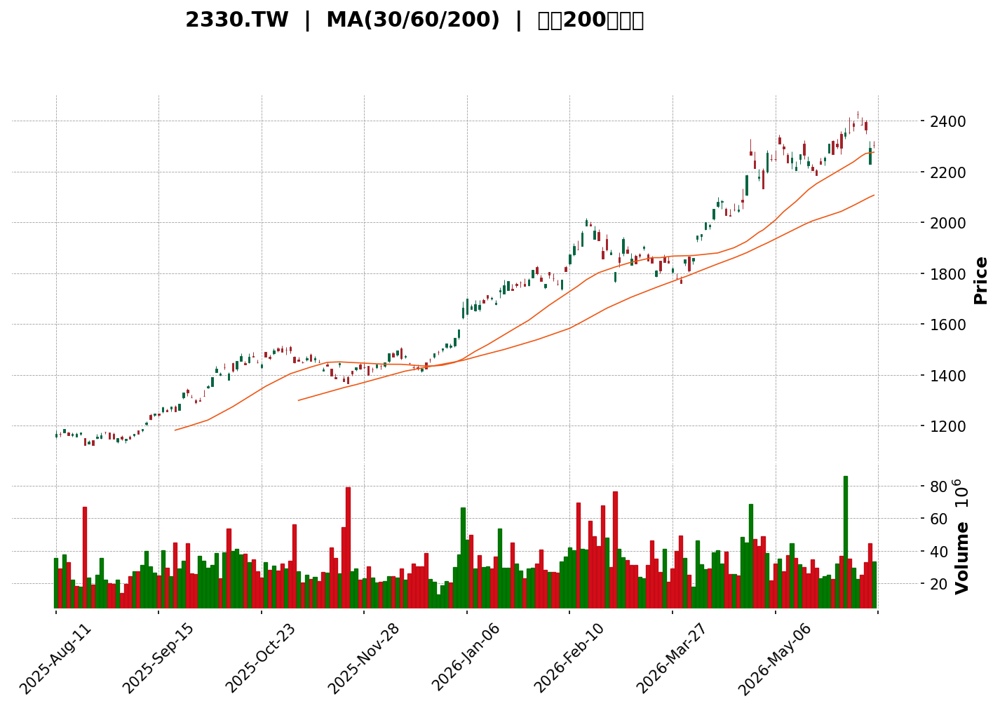
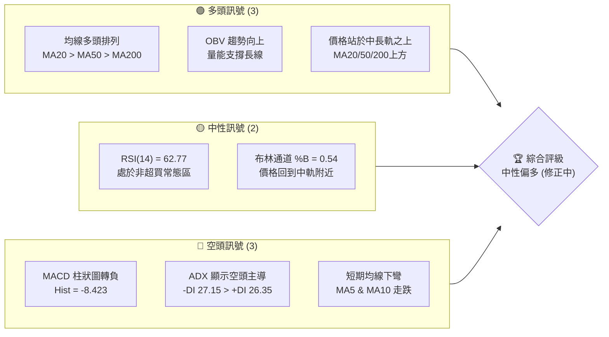
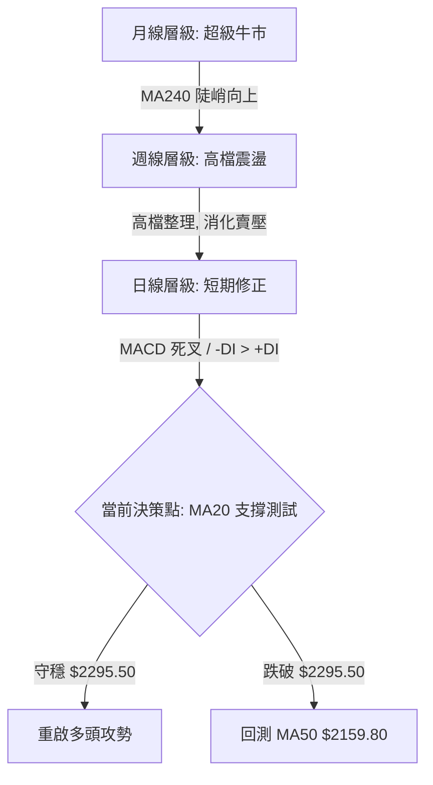
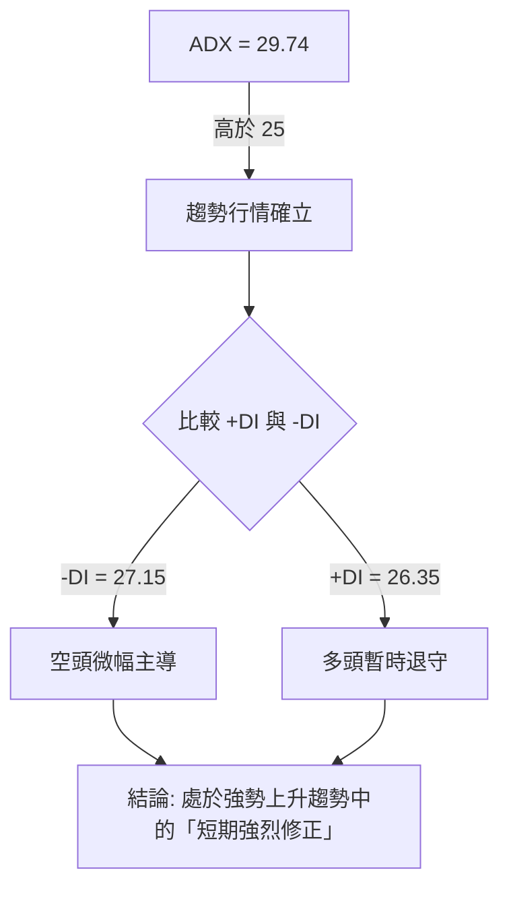

<details>
<summary>📊 靜態圖表 (點擊展開)</summary>

</details>

<html>
<head><meta charset="utf-8" /></head>
<body>
    <div style="height:500px; width:100%;">                        <script>window.PlotlyConfig = {MathJaxConfig: 'local'};</script>
        <script charset="utf-8" src="https://cdn.plot.ly/plotly-3.6.0.min.js" integrity="sha256-QaOVwtVY0T02VaHrr6pnoHLCwayMJp4O5n4YyaE3rJk=" crossorigin="anonymous"></script>                <div id="candlestick-chart" class="plotly-graph-div" style="height:100%; width:100%;"></div>            <script>                window.PLOTLYENV=window.PLOTLYENV || {};                                if (document.getElementById("candlestick-chart")) {                    Plotly.newPlot(                        "candlestick-chart",                        [{"close":{"dtype":"f8","bdata":"AAAAwFY+kkAAAADAVj6SQAAAAEB\u002fjZJAAAAAwIwqkkAAAADAVj6SQAAAAMBWPpJAAAAA4CBSkkAAAACAO4yRQAAAACCax5FAAAAAgDuMkUAAAACAwhaSQAAAAMCMKpJAAAAAAOtlkkAAAAAgLu+RQAAAACAu75FAAAAAYPgCkkAAAAAgLu+RQAAAACAu75FAAAAAIC7vkUAAAADAVj6SQAAAAMBWPpJAAAAAQH+NkkAAAADgcfCSQAAAAGDQK5NAAAAAAPl6k0AAAADALmeTQAAAACBl3pNAAAAAAMqik0AAAACgQ\u002fKTQAAAAADKopNAAAAAYAAalEAAAADg0cyUQAAAAODRzJRAAAAAQFh9lEAAAACg3i2UQAAAAAC9QZRAAAAAoDaRlEAAAADAKTCVQAAAAKA+u5VAAAAAYFNGlkAAAADg2faVQAAAAMAxWpZAAAAA4Nn2lUAAAACAlh6WQAAAAMCJvZZAAAAAYAMNl0AAAACA7oGWQAAAAAAl+ZZAAAAAACX5lkAAAABgq6mWQAAAAIDugZZAAAAAACX5lkAAAACgRuWWQAAAAOB8XJdAAAAA4Hxcl0AAAACAnkiXQAAAAEBbcJdAAAAA4Hxcl0AAAABgq6mWQAAAAMCJvZZAAAAAYKuplkAAAACgRuWWQAAAAMCJvZZAAAAAoEbllkAAAABgq6mWQAAAAOB0MpZAAAAAIBBulkAAAAAAHc+VQAAAAEBgp5VAAAAAAM2VlkAAAABgo3+VQAAAAKDmV5VAAAAA4Nn2lUAAAADAMVqWQAAAAGBTRpZAAAAAwDFalkAAAACA++KVQAAAAOB0MpZAAAAAgO6BlkAAAAAgEG6WQAAAAGCrqZZAAAAAIMA0l0AAAAAAJfmWQAAAAOB8XJdAAAAAwODklkAAAACAvwyXQAAAAGAjlZZAAAAAYFVZlkAAAAAAZkWWQAAAAABmRZZAAAAAAGZFlkAAAABg8dCWQAAAACCeNJdAAAAAgI1Il0AAAACgW4SXQAAAAAAZ1JdAAAAAQDqsl0AAAABg1iOYQAAAAOBhr5hAAAAAwEYCmkAAAABA0o2aQAAAACA2FppAAAAA4BQ+mkAAAACAJSqaQAAAACAEUppAAAAAoMGhmkAAAACgwaGaQAAAACAEUppAAAAAoF0Zm0AAAAAAG2mbQAAAACDppJtAAAAAoF0Zm0AAAAAAG2mbQAAAAMD5kJtAAAAAwCtVm0AAAACA2LibQAAAAEBTWJxAAAAAQIUcnEAAAAAg6aSbQAAAAGAKfZtAAAAA4JUInEAAAADAx8ybQAAAAGAKfZtAAAAAgNi4m0AAAADgY0ScQAAAAICLR51AAAAA4BbTnUAAAADgSJedQAAAAGBwmp5AAAAA4Mlhn0AAAACADBKfQAAAACBPwp5AAAAAQNQinkAAAABgvQudQAAAAOBIl51AAAAAIGpvnUAAAACAdDCcQAAAAGDvz5xAAAAAoMM2nkAAAADAeludQAAAAGC9C51AAAAAAAC8nEAAAAAAADidQAAAAAAAxJ1AAAAAAADonEAAAAAAAMCcQAAAAAAASJxAAAAAAABInEAAAAAAANScQAAAAAAAwJxAAAAAAABwnEAAAAAAANCbQAAAAAAAgJtAAAAAAAD8nEAAAAAAAEicQAAAAAAAEJ1AAAAAAAB4nkAAAAAAAIyeQAAAAAAAQJ9AAAAAAAAYn0AAAAAAAA6gQAAAAAAAQKBAAAAAAABKoEAAAAAAALifQAAAAAAApJ9AAAAAAAAEoEAAAAAAAASgQAAAAAAAQKBAAAAAAAASoUAAAAAAALKhQAAAAAAATqFAAAAAAAAIoUAAAAAAAK6gQAAAAAAAxqFAAAAAAACUoUAAAAAAAJShQAAAAAAADKJAAAAAAADkoUAAAAAAAHahQAAAAAAAnqFAAAAAAABYoUAAAAAAALyhQAAAAAAAsqFAAAAAAACAoUAAAAAAADqhQAAAAAAAEqFAAAAAAABsoUAAAAAAAJ6hQAAAAAAADKJAAAAAAAC8oUAAAAAAAPihQAAAAAAA7qFAAAAAAABmokAAAAAAAGaiQAAAAAAAmKJAAAAAAADyokAAAAAAAKKiQAAAAAAAeqJAAAAAAADuoUAAAAAAAAKiQA=="},"high":{"dtype":"f8","bdata":"HlsRJLV5kkC\u002fPLYC62WSQAAAAEB\u002fjZJAr11+JOtlkkBfHlvhIFKSQF8eW+EgUpJAAAAA4CBSkkD5wZxH+AKSQJPKh0Fk25FA+ysTBWTbkUDDK7zCVj6SQCDp\u002fgIhUpJAAAAAAOtlkkAs9zTGIFKSQCz3NMYgUpJAAAAAYPgCkkAbYbmDjCqSQAAAACAu75FAG2G5g4wqkkAAAADAVj6SQB5bESS1eZJAAAAAQH+NkkALXk4BPASTQFtrreX4epNAAAAAAPl6k0APA2fh+HqTQAAAIIVD8pNAWB1fyobKk0AAAACgQ\u002fKTQFzJ7fkhBpRAAAAAYAAalEAAAADg0cyUQAgqZw9tCJVAo4suChWllEA3ciPPeWmUQAOZFC9YfZRACcZbmY70lEClUAolCESVQAAAAKA+u5VAyQFCKhBulkDUjzNFuAqWQFZVVe\u002fMlZZA1I8zRbgKlkDYUF5Dq6mWQAAAAMCJvZZAUOtXKsA0l0AXQzqvib2WQBxMkS\u002fANJdA0LrBlJ5Il0CTJk0qaNGWQLNrE+XMlZZA0LrBlJ5Il0CJzp7P4SCXQBy7NKo5hJdAqhhPDxiYl0CamZl59quXQFgULAoYmJdAOHZpdParl0Bw4MBZAw2XQKo5Zu8k+ZZASpMmxYm9lkAG32lqAw2XQFVzzB7ANJdABt9pagMNl0CTJk0qaNGWQPDmEaoxWpZAOcBHT6uplkAVUb9eU0aWQEoppdTZ9pVARhsrZauplkB4BlX0HM+VQOtRuP4cz5VAqR9nqpYelkAAAADAMVqWQJIDhPTMlZZAVlVV78yVlkBe\u002fIlEEG6WQPDmEaoxWpZAAAAAgO6BlkC+6heF7oGWQAAAAGCrqZZAAAAAIMA0l0DQusGUnkiXQAAAAOB8XJdAKng55UqYl0CfdYPZriCXQApafbkSqZZAn\u002fIQEzSBlkBSDogMNIGWQHGvgllVWZZANG2NvxKplkAUdXK54OSWQAAAACCeNJdA8Lh42Xxcl0AAAACgW4SXQAAAAAAZ1JdAvYby8hjUl0AAAABg1iOYQAAAAOBhr5hAnNZsf\u002fNlmkAAAABA0o2aQORKAtMUPppAZQuh7OJ5mkCGYRjm4nmaQIQBZyzSjZpAxnQWU6DJmkBjOov5sLWaQFhW79LieZpAkEnxUjxBm0BddNFl2LibQAAAACDppJtA6DdbXwp9m0Auuuiy+ZCbQJzUfRnppJtAmZIp2cfMm0DmMIfZx8ybQAAAAEBTWJxAB60sWSGUnECmnozflQicQAAAAGAKfZtAW7AFk3QwnEBmitMlhRycQNlUa2zYuJtAAAAAgNi4m0ClBehFIZScQAAAAICLR51Aik\u002f3kvX6nUB0S5xS1CKeQKjV+BJPwp5Aa0j6kqiJn0Ah44KM2k2fQGtxE4YMEp9A1pQ1ZT7WnkBErFGFJ7+dQFmBMBKBhp5AvoT20kiXnUAAAACAdDCcQPmsGyxqb51AHRX4UqJenkBS\u002f8jYFtOdQAJp68V6W51AJ7d4cotHnUAAAAAAAGCdQAAAAAAA2J1AAAAAAABgnUAAAAAAADidQAAAAAAAXJxAAAAAAADonEAAAAAAAEydQAAAAAAAJJ1AAAAAAACEnEAAAAAAACCcQAAAAAAA+JtAAAAAAAD8nEAAAAAAACSdQAAAAAAAEJ1AAAAAAAB4nkAAAAAAAIyeQAAAAAAAQJ9AAAAAAAAsn0AAAAAAAA6gQAAAAAAAaKBAAAAAAABUoEAAAAAAABigQAAAAAAADqBAAAAAAAA2oEAAAAAAACygQAAAAAAArqBAAAAAAAAcoUAAAAAAADSiQAAAAAAA0KFAAAAAAABEoUAAAAAAAE6hQAAAAAAA2qFAAAAAAAC8oUAAAAAAANqhQAAAAAAAUqJAAAAAAAAMokAAAAAAAMahQAAAAAAA0KFAAAAAAACAoUAAAAAAALyhQAAAAAAAKqJAAAAAAACooUAAAAAAAGyhQAAAAAAARKFAAAAAAACeoUAAAAAAAKihQAAAAAAADKJAAAAAAAAqokAAAAAAADSiQAAAAAAAcKJAAAAAAACOokAAAAAAAN6iQAAAAAAAwKJAAAAAAAAQo0AAAAAAAN6iQAAAAAAAyqJAAAAAAAAgokAAAAAAACCiQA=="},"hovertemplate":"\u003cb\u003e%{x|%Y-%m-%d}\u003c\u002fb\u003e\u003cbr\u003e\u958b: $%{open:.2f}\u003cbr\u003e\u9ad8: $%{high:.2f}\u003cbr\u003e\u4f4e: $%{low:.2f}\u003cbr\u003e\u6536: $%{close:.2f}\u003cextra\u003e\u003c\u002fextra\u003e","low":{"dtype":"f8","bdata":"4aTuW\u002fgCkkBBw0l9whaSQAAAANwgUpJAAAAAwIwqkkBBw0l9whaSQEHDSX3CFpJAJrFMnYwqkkAAAACAO4yRQNpq8NwFoJFAAAAAgDuMkUA91EM9Lu+RQFGigVsu75FAvphPvVY+kkAAAAAgLu+RQAAAACAu75FA6KWB2s+zkUD3NML+Y9uRQOaeRrzPs5FAAAAAIC7vkUBBw0l9whaSQAAAAMBWPpJAVVVV\u002feplkkDrQ2Od3ciSQCmllD4GGJNAPc\u002fzvGRTk0Dw\u002fJieZFOTQAAAgIvrjpNAAAAAAMqik0AV6xQLyqKTQAAAAADKopNAfdYNZqi2k0BJD1TmeWmUQPjVmLA2kZRAAAAAQFh9lEBDL\u002fQ6ABqUQAAAAAC9QZRAAAAAoDaRlEC2Xuv1bAiVQAAAANwpMJVAU\u002f2cMLgKlkBX4JgVHc+VQHIcx\u002fV0MpZA2TD+5YGTlUC9hvIauAqWQDpm75aWHpZAYClQy4m9lkAAAACA7oGWQH3WDQbNlZZAAAAAACX5lkC3bNn6zJWWQOm8xVBTRpZAAAAAACX5lkB9EMs6aNGWQFbnsLDhIJdAcqLlep5Il0AAAACAnkiXQE\u002fXp6vhIJdA5ETLFcA0l0C3bNn6zJWWQAAAAMCJvZZAt2zZ+syVlkD6IJbVib2WQAAAAMCJvZZAdzFhcKuplkAAAABgq6mWQIgM93qWHpZAAAAAIBBulkAAAAAAHc+VQAAAAEBgp5VAMK5+0DFalkAAAABgo3+VQAAAAKDmV5VAV+CYFR3PlUCrqqqQlh6WQBz\u002f3vp0MpZAOY7jWlNGlkAAAACA++KVQBAZ7hW4CpZA6bzFUFNGlkDHP7jwdDKWQNqyZcsxWpZANUYKXKuplkAAAAAAJfmWQMiJlksDDZdANNaHZvHQlkDCFPnM4OSWQPWlggY0gZZAYQ3vrHYxlkCPUH2mdjGWQK7xd\u002fOXCZZAAAAAAGZFlkDYFRutEqmWQCuLM7rg5JZAIY4Oza4gl0DIBmSTjUiXQJpE75lbhJdARHkNjVuEl0DYx4XtSpiXQC8+rxPnD5hAs32imtxOmUDbbLMNmp6ZQBy1\u002fWxX7plANum9xnjGmUAZhmHAeMaZQAAAACAEUppAO4vp7OJ5mkA7i+ns4nmaQKmpEG0lKppATyMsh8GhmkBddNGNj92aQBhVbq1dGZtAAAAAoF0Zm0DRRRdNPEGbQI+tCFo8QZtAAAAAwCtVm0CBC1zAK1WbQIdwCCe34JtA1I145pUInEAAAAAg6aSbQN6OG\u002fpMLZtAd3d308fMm0DNOhYN6aSbQLfjhgYbaZtAz3jGs10Zm0AAAADgY0ScQGijvrMQqJxA1sEiFJwznUAAAADgSJedQLTTI+EW051AK28LegwSn0AAAACADBKfQIX5Xa3DNp5AAAAAQNQinkAAAABgvQudQDn1e4ZZg51AQ3sJbYtHnUCk3FS0+ZCbQIQp8vkxgJxAw3azFJwznUAAAADAeludQL28maAQqJxAAAAAAAC8nEAAAAAAABCdQAAAAAAAiJ1AAAAAAADonEAAAAAAAMCcQAAAAAAA5JtAAAAAAAAgnEAAAAAAANScQAAAAAAAwJxAAAAAAAAgnEAAAAAAANCbQAAAAAAAgJtAAAAAAACYnEAAAAAAADScQAAAAAAArJxAAAAAAAAUnkAAAAAAACieQAAAAAAAyJ5AAAAAAADcnkAAAAAAAGifQAAAAAAAGKBAAAAAAAAOoEAAAAAAALifQAAAAAAApJ9AAAAAAAD0n0AAAAAAAOCfQAAAAAAADqBAAAAAAAByoEAAAAAAALKhQAAAAAAATqFAAAAAAADqoEAAAAAAAK6gQAAAAAAAJqFAAAAAAACAoUAAAAAAAIChQAAAAAAADKJAAAAAAACyoUAAAAAAAHahQAAAAAAARKFAAAAAAAA6oUAAAAAAAGyhQAAAAAAAlKFAAAAAAABOoUAAAAAAADqhQAAAAAAAEqFAAAAAAABsoUAAAAAAAGKhQAAAAAAAxqFAAAAAAAC8oUAAAAAAAOShQAAAAAAAvKFAAAAAAAA0okAAAAAAAFyiQAAAAAAAcKJAAAAAAADUokAAAAAAAKKiQAAAAAAAXKJAAAAAAABsoUAAAAAAAO6hQA=="},"name":"\u50f9\u683c","open":{"dtype":"f8","bdata":"QcNJfcIWkkAAAADAVj6SQAAAANwgUpJAIOn+AiFSkkCg4aSejCqSQEHDSX3CFpJAk1imvlY+kkD5wZxH+AKSQNpq8NwFoJFA+ysTBWTbkUAf6qFe+AKSQOAWAX34ApJAAAAAAOtlkkAs9zTGIFKSQCQs96RWPpJAbjzh+5nHkUASlntiwhaSQPc0wv5j25FAEpZ7YsIWkkCg4aSejCqSQB5bESS1eZJAq6qqHrV5kkD2obG+p9ySQIQQQsQuZ5NAn+d53i5nk0APA2fh+HqTQAAAoPDJopNArI4vZai2k0CLdYrVhsqTQLA6vpRD8pNAfdYNZqi2k0ChcnZLWH2UQLDGRKqO9JRAAAAAQFh9lEB6oRdqm1WUQKzdBmWbVZRAAAAAoDaRlEBbr\u002fVaSxyVQAAAANwpMJVAU\u002f2cMLgKlkArcMx6++KVQAAAAMAxWpZA2TD+5YGTlUCU11DezJWWQKuMM2FTRpZAYClQy4m9lkCzaxPlzJWWQDFFPmurqZZAtG4wZQMNl0AAAABgq6mWQJwo2bUxWpZA0LrBlJ5Il0CD7zQFJfmWQOREyxXANJdAHLs0qjmEl0D2KFyvOYSXQAAAAEBbcJdAqhhPDxiYl0AnTZr0JPmWQDkTIiVo0ZZAAAAAYKuplkB9EMs6aNGWQBxgqrnhIJdAfRDLOmjRlkAAAABgq6mWQIgM93qWHpZAvuoXhe6BlkAVUb9eU0aWQFJKKaU+u5VAu+TUmu6BlkA8gyoqYKeVQJqZmZk+u5VAqR9nqpYelkByHMf1dDKWQK0CY4\u002fugZZAAAAAwDFalkBe\u002fIlEEG6WQAAAAOB0MpZAnCjZtTFalkAAAAAgEG6WQCNGjDAQbpZAwGAtwYm9lkAcTJEvwDSXQFbnsLDhIJdAXk7Bi1uEl0Bhinwm0PiWQAAAAGAjlZZAAAAAYFVZlkBxr4JZVVmWQB6h+kyHHZZANG2NvxKplkAAAABg8dCWQGCophPQ+JZAAAAAgI1Il0DtrHZGbHCXQHRzc\u002fNKmJdAoryG5kqYl0Bw9ARHOqyXQKNuw8bFN5hAoKge9MtimUDbbLMNmp6ZQBy1\u002fWxX7plAAu1IIGjamUDctm1zV+6ZQFhW79LieZpAxnQWU6DJmkCdxXRG0o2aQNRUiMYUPppAOFuHRm4Fm0BddNGNj92aQBhVbq1dGZtAyKR4+Uwtm0AXXXRZCn2bQAAAAMD5kJtAidsNcwp9m0BoPOMZG2mbQIdwCCe34JtA2zql\u002fzGAnEBkkocst+CbQCarlFM8QZtAW7AFk3QwnEAAAADAx8ybQAAAAGAKfZtAtalNDU0tm0A7BG7sMYCcQPvORg0AvJxAnGmebYtHnUAAAADgSJedQLTTI+EW051AK28LegwSn0Bg9oDZ+yWfQIX5Xa3DNp5Abh5Gsl+unkCDHeF4WYOdQDtWIKzDNp5AQ3sJbYtHnUAQQcoN6aSbQH3WDcasH51A4Iurx3pbnUCpf2TMSJedQL28maAQqJxAj8H5GJwznUAAAAAAAEydQAAAAAAAsJ1AAAAAAABMnUAAAAAAABCdQAAAAAAA+JtAAAAAAADonEAAAAAAACSdQAAAAAAA6JxAAAAAAAA0nEAAAAAAANCbQAAAAAAAvJtAAAAAAADAnEAAAAAAACSdQAAAAAAA6JxAAAAAAAA8nkAAAAAAAGSeQAAAAAAA3J5AAAAAAAAEn0AAAAAAAHyfQAAAAAAAIqBAAAAAAABAoEAAAAAAAA6gQAAAAAAAuJ9AAAAAAAAEoEAAAAAAAPSfQAAAAAAAVKBAAAAAAAB8oEAAAAAAANChQAAAAAAAiqFAAAAAAAD+oEAAAAAAADqhQAAAAAAAMKFAAAAAAACUoUAAAAAAAJShQAAAAAAAPqJAAAAAAAD4oUAAAAAAALKhQAAAAAAAdqFAAAAAAAA6oUAAAAAAAJShQAAAAAAADKJAAAAAAABioUAAAAAAAFihQAAAAAAAOqFAAAAAAACAoUAAAAAAAIqhQAAAAAAAxqFAAAAAAAAgokAAAAAAAAyiQAAAAAAAXKJAAAAAAABIokAAAAAAAGaiQAAAAAAArKJAAAAAAADyokAAAAAAAKKiQAAAAAAAtqJAAAAAAABsoUAAAAAAAAKiQA=="},"x":["2025-08-11T00:00:00+08:00","2025-08-12T00:00:00+08:00","2025-08-13T00:00:00+08:00","2025-08-14T00:00:00+08:00","2025-08-15T00:00:00+08:00","2025-08-18T00:00:00+08:00","2025-08-19T00:00:00+08:00","2025-08-20T00:00:00+08:00","2025-08-21T00:00:00+08:00","2025-08-22T00:00:00+08:00","2025-08-25T00:00:00+08:00","2025-08-26T00:00:00+08:00","2025-08-27T00:00:00+08:00","2025-08-28T00:00:00+08:00","2025-08-29T00:00:00+08:00","2025-09-01T00:00:00+08:00","2025-09-02T00:00:00+08:00","2025-09-03T00:00:00+08:00","2025-09-04T00:00:00+08:00","2025-09-05T00:00:00+08:00","2025-09-08T00:00:00+08:00","2025-09-09T00:00:00+08:00","2025-09-10T00:00:00+08:00","2025-09-11T00:00:00+08:00","2025-09-12T00:00:00+08:00","2025-09-15T00:00:00+08:00","2025-09-16T00:00:00+08:00","2025-09-17T00:00:00+08:00","2025-09-18T00:00:00+08:00","2025-09-19T00:00:00+08:00","2025-09-22T00:00:00+08:00","2025-09-23T00:00:00+08:00","2025-09-24T00:00:00+08:00","2025-09-25T00:00:00+08:00","2025-09-26T00:00:00+08:00","2025-09-30T00:00:00+08:00","2025-10-01T00:00:00+08:00","2025-10-02T00:00:00+08:00","2025-10-03T00:00:00+08:00","2025-10-07T00:00:00+08:00","2025-10-08T00:00:00+08:00","2025-10-09T00:00:00+08:00","2025-10-13T00:00:00+08:00","2025-10-14T00:00:00+08:00","2025-10-15T00:00:00+08:00","2025-10-16T00:00:00+08:00","2025-10-17T00:00:00+08:00","2025-10-20T00:00:00+08:00","2025-10-21T00:00:00+08:00","2025-10-22T00:00:00+08:00","2025-10-23T00:00:00+08:00","2025-10-27T00:00:00+08:00","2025-10-28T00:00:00+08:00","2025-10-29T00:00:00+08:00","2025-10-30T00:00:00+08:00","2025-10-31T00:00:00+08:00","2025-11-03T00:00:00+08:00","2025-11-04T00:00:00+08:00","2025-11-05T00:00:00+08:00","2025-11-06T00:00:00+08:00","2025-11-07T00:00:00+08:00","2025-11-10T00:00:00+08:00","2025-11-11T00:00:00+08:00","2025-11-12T00:00:00+08:00","2025-11-13T00:00:00+08:00","2025-11-14T00:00:00+08:00","2025-11-17T00:00:00+08:00","2025-11-18T00:00:00+08:00","2025-11-19T00:00:00+08:00","2025-11-20T00:00:00+08:00","2025-11-21T00:00:00+08:00","2025-11-24T00:00:00+08:00","2025-11-25T00:00:00+08:00","2025-11-26T00:00:00+08:00","2025-11-27T00:00:00+08:00","2025-11-28T00:00:00+08:00","2025-12-01T00:00:00+08:00","2025-12-02T00:00:00+08:00","2025-12-03T00:00:00+08:00","2025-12-04T00:00:00+08:00","2025-12-05T00:00:00+08:00","2025-12-08T00:00:00+08:00","2025-12-09T00:00:00+08:00","2025-12-10T00:00:00+08:00","2025-12-11T00:00:00+08:00","2025-12-12T00:00:00+08:00","2025-12-15T00:00:00+08:00","2025-12-16T00:00:00+08:00","2025-12-17T00:00:00+08:00","2025-12-18T00:00:00+08:00","2025-12-19T00:00:00+08:00","2025-12-22T00:00:00+08:00","2025-12-23T00:00:00+08:00","2025-12-24T00:00:00+08:00","2025-12-26T00:00:00+08:00","2025-12-29T00:00:00+08:00","2025-12-30T00:00:00+08:00","2025-12-31T00:00:00+08:00","2026-01-02T00:00:00+08:00","2026-01-05T00:00:00+08:00","2026-01-06T00:00:00+08:00","2026-01-07T00:00:00+08:00","2026-01-08T00:00:00+08:00","2026-01-09T00:00:00+08:00","2026-01-12T00:00:00+08:00","2026-01-13T00:00:00+08:00","2026-01-14T00:00:00+08:00","2026-01-15T00:00:00+08:00","2026-01-16T00:00:00+08:00","2026-01-19T00:00:00+08:00","2026-01-20T00:00:00+08:00","2026-01-21T00:00:00+08:00","2026-01-22T00:00:00+08:00","2026-01-23T00:00:00+08:00","2026-01-26T00:00:00+08:00","2026-01-27T00:00:00+08:00","2026-01-28T00:00:00+08:00","2026-01-29T00:00:00+08:00","2026-01-30T00:00:00+08:00","2026-02-02T00:00:00+08:00","2026-02-03T00:00:00+08:00","2026-02-04T00:00:00+08:00","2026-02-05T00:00:00+08:00","2026-02-06T00:00:00+08:00","2026-02-09T00:00:00+08:00","2026-02-10T00:00:00+08:00","2026-02-11T00:00:00+08:00","2026-02-23T00:00:00+08:00","2026-02-24T00:00:00+08:00","2026-02-25T00:00:00+08:00","2026-02-26T00:00:00+08:00","2026-03-02T00:00:00+08:00","2026-03-03T00:00:00+08:00","2026-03-04T00:00:00+08:00","2026-03-05T00:00:00+08:00","2026-03-06T00:00:00+08:00","2026-03-09T00:00:00+08:00","2026-03-10T00:00:00+08:00","2026-03-11T00:00:00+08:00","2026-03-12T00:00:00+08:00","2026-03-13T00:00:00+08:00","2026-03-16T00:00:00+08:00","2026-03-17T00:00:00+08:00","2026-03-18T00:00:00+08:00","2026-03-19T00:00:00+08:00","2026-03-20T00:00:00+08:00","2026-03-23T00:00:00+08:00","2026-03-24T00:00:00+08:00","2026-03-25T00:00:00+08:00","2026-03-26T00:00:00+08:00","2026-03-27T00:00:00+08:00","2026-03-30T00:00:00+08:00","2026-03-31T00:00:00+08:00","2026-04-01T00:00:00+08:00","2026-04-02T00:00:00+08:00","2026-04-07T00:00:00+08:00","2026-04-08T00:00:00+08:00","2026-04-09T00:00:00+08:00","2026-04-10T00:00:00+08:00","2026-04-13T00:00:00+08:00","2026-04-14T00:00:00+08:00","2026-04-15T00:00:00+08:00","2026-04-16T00:00:00+08:00","2026-04-17T00:00:00+08:00","2026-04-20T00:00:00+08:00","2026-04-21T00:00:00+08:00","2026-04-22T00:00:00+08:00","2026-04-23T00:00:00+08:00","2026-04-24T00:00:00+08:00","2026-04-27T00:00:00+08:00","2026-04-28T00:00:00+08:00","2026-04-29T00:00:00+08:00","2026-04-30T00:00:00+08:00","2026-05-04T00:00:00+08:00","2026-05-05T00:00:00+08:00","2026-05-06T00:00:00+08:00","2026-05-07T00:00:00+08:00","2026-05-08T00:00:00+08:00","2026-05-11T00:00:00+08:00","2026-05-12T00:00:00+08:00","2026-05-13T00:00:00+08:00","2026-05-14T00:00:00+08:00","2026-05-15T00:00:00+08:00","2026-05-18T00:00:00+08:00","2026-05-19T00:00:00+08:00","2026-05-20T00:00:00+08:00","2026-05-21T00:00:00+08:00","2026-05-22T00:00:00+08:00","2026-05-25T00:00:00+08:00","2026-05-26T00:00:00+08:00","2026-05-27T00:00:00+08:00","2026-05-28T00:00:00+08:00","2026-05-29T00:00:00+08:00","2026-06-01T00:00:00+08:00","2026-06-02T00:00:00+08:00","2026-06-03T00:00:00+08:00","2026-06-04T00:00:00+08:00","2026-06-05T00:00:00+08:00","2026-06-08T00:00:00+08:00","2026-06-09T00:00:00+08:00"],"type":"candlestick"},{"hovertemplate":"MA30: $%{y:.2f}\u003cextra\u003e\u003c\u002fextra\u003e","line":{"color":"#2196F3","dash":"dash","width":2},"mode":"lines","name":"MA30","x":["2025-08-11T00:00:00+08:00","2025-08-12T00:00:00+08:00","2025-08-13T00:00:00+08:00","2025-08-14T00:00:00+08:00","2025-08-15T00:00:00+08:00","2025-08-18T00:00:00+08:00","2025-08-19T00:00:00+08:00","2025-08-20T00:00:00+08:00","2025-08-21T00:00:00+08:00","2025-08-22T00:00:00+08:00","2025-08-25T00:00:00+08:00","2025-08-26T00:00:00+08:00","2025-08-27T00:00:00+08:00","2025-08-28T00:00:00+08:00","2025-08-29T00:00:00+08:00","2025-09-01T00:00:00+08:00","2025-09-02T00:00:00+08:00","2025-09-03T00:00:00+08:00","2025-09-04T00:00:00+08:00","2025-09-05T00:00:00+08:00","2025-09-08T00:00:00+08:00","2025-09-09T00:00:00+08:00","2025-09-10T00:00:00+08:00","2025-09-11T00:00:00+08:00","2025-09-12T00:00:00+08:00","2025-09-15T00:00:00+08:00","2025-09-16T00:00:00+08:00","2025-09-17T00:00:00+08:00","2025-09-18T00:00:00+08:00","2025-09-19T00:00:00+08:00","2025-09-22T00:00:00+08:00","2025-09-23T00:00:00+08:00","2025-09-24T00:00:00+08:00","2025-09-25T00:00:00+08:00","2025-09-26T00:00:00+08:00","2025-09-30T00:00:00+08:00","2025-10-01T00:00:00+08:00","2025-10-02T00:00:00+08:00","2025-10-03T00:00:00+08:00","2025-10-07T00:00:00+08:00","2025-10-08T00:00:00+08:00","2025-10-09T00:00:00+08:00","2025-10-13T00:00:00+08:00","2025-10-14T00:00:00+08:00","2025-10-15T00:00:00+08:00","2025-10-16T00:00:00+08:00","2025-10-17T00:00:00+08:00","2025-10-20T00:00:00+08:00","2025-10-21T00:00:00+08:00","2025-10-22T00:00:00+08:00","2025-10-23T00:00:00+08:00","2025-10-27T00:00:00+08:00","2025-10-28T00:00:00+08:00","2025-10-29T00:00:00+08:00","2025-10-30T00:00:00+08:00","2025-10-31T00:00:00+08:00","2025-11-03T00:00:00+08:00","2025-11-04T00:00:00+08:00","2025-11-05T00:00:00+08:00","2025-11-06T00:00:00+08:00","2025-11-07T00:00:00+08:00","2025-11-10T00:00:00+08:00","2025-11-11T00:00:00+08:00","2025-11-12T00:00:00+08:00","2025-11-13T00:00:00+08:00","2025-11-14T00:00:00+08:00","2025-11-17T00:00:00+08:00","2025-11-18T00:00:00+08:00","2025-11-19T00:00:00+08:00","2025-11-20T00:00:00+08:00","2025-11-21T00:00:00+08:00","2025-11-24T00:00:00+08:00","2025-11-25T00:00:00+08:00","2025-11-26T00:00:00+08:00","2025-11-27T00:00:00+08:00","2025-11-28T00:00:00+08:00","2025-12-01T00:00:00+08:00","2025-12-02T00:00:00+08:00","2025-12-03T00:00:00+08:00","2025-12-04T00:00:00+08:00","2025-12-05T00:00:00+08:00","2025-12-08T00:00:00+08:00","2025-12-09T00:00:00+08:00","2025-12-10T00:00:00+08:00","2025-12-11T00:00:00+08:00","2025-12-12T00:00:00+08:00","2025-12-15T00:00:00+08:00","2025-12-16T00:00:00+08:00","2025-12-17T00:00:00+08:00","2025-12-18T00:00:00+08:00","2025-12-19T00:00:00+08:00","2025-12-22T00:00:00+08:00","2025-12-23T00:00:00+08:00","2025-12-24T00:00:00+08:00","2025-12-26T00:00:00+08:00","2025-12-29T00:00:00+08:00","2025-12-30T00:00:00+08:00","2025-12-31T00:00:00+08:00","2026-01-02T00:00:00+08:00","2026-01-05T00:00:00+08:00","2026-01-06T00:00:00+08:00","2026-01-07T00:00:00+08:00","2026-01-08T00:00:00+08:00","2026-01-09T00:00:00+08:00","2026-01-12T00:00:00+08:00","2026-01-13T00:00:00+08:00","2026-01-14T00:00:00+08:00","2026-01-15T00:00:00+08:00","2026-01-16T00:00:00+08:00","2026-01-19T00:00:00+08:00","2026-01-20T00:00:00+08:00","2026-01-21T00:00:00+08:00","2026-01-22T00:00:00+08:00","2026-01-23T00:00:00+08:00","2026-01-26T00:00:00+08:00","2026-01-27T00:00:00+08:00","2026-01-28T00:00:00+08:00","2026-01-29T00:00:00+08:00","2026-01-30T00:00:00+08:00","2026-02-02T00:00:00+08:00","2026-02-03T00:00:00+08:00","2026-02-04T00:00:00+08:00","2026-02-05T00:00:00+08:00","2026-02-06T00:00:00+08:00","2026-02-09T00:00:00+08:00","2026-02-10T00:00:00+08:00","2026-02-11T00:00:00+08:00","2026-02-23T00:00:00+08:00","2026-02-24T00:00:00+08:00","2026-02-25T00:00:00+08:00","2026-02-26T00:00:00+08:00","2026-03-02T00:00:00+08:00","2026-03-03T00:00:00+08:00","2026-03-04T00:00:00+08:00","2026-03-05T00:00:00+08:00","2026-03-06T00:00:00+08:00","2026-03-09T00:00:00+08:00","2026-03-10T00:00:00+08:00","2026-03-11T00:00:00+08:00","2026-03-12T00:00:00+08:00","2026-03-13T00:00:00+08:00","2026-03-16T00:00:00+08:00","2026-03-17T00:00:00+08:00","2026-03-18T00:00:00+08:00","2026-03-19T00:00:00+08:00","2026-03-20T00:00:00+08:00","2026-03-23T00:00:00+08:00","2026-03-24T00:00:00+08:00","2026-03-25T00:00:00+08:00","2026-03-26T00:00:00+08:00","2026-03-27T00:00:00+08:00","2026-03-30T00:00:00+08:00","2026-03-31T00:00:00+08:00","2026-04-01T00:00:00+08:00","2026-04-02T00:00:00+08:00","2026-04-07T00:00:00+08:00","2026-04-08T00:00:00+08:00","2026-04-09T00:00:00+08:00","2026-04-10T00:00:00+08:00","2026-04-13T00:00:00+08:00","2026-04-14T00:00:00+08:00","2026-04-15T00:00:00+08:00","2026-04-16T00:00:00+08:00","2026-04-17T00:00:00+08:00","2026-04-20T00:00:00+08:00","2026-04-21T00:00:00+08:00","2026-04-22T00:00:00+08:00","2026-04-23T00:00:00+08:00","2026-04-24T00:00:00+08:00","2026-04-27T00:00:00+08:00","2026-04-28T00:00:00+08:00","2026-04-29T00:00:00+08:00","2026-04-30T00:00:00+08:00","2026-05-04T00:00:00+08:00","2026-05-05T00:00:00+08:00","2026-05-06T00:00:00+08:00","2026-05-07T00:00:00+08:00","2026-05-08T00:00:00+08:00","2026-05-11T00:00:00+08:00","2026-05-12T00:00:00+08:00","2026-05-13T00:00:00+08:00","2026-05-14T00:00:00+08:00","2026-05-15T00:00:00+08:00","2026-05-18T00:00:00+08:00","2026-05-19T00:00:00+08:00","2026-05-20T00:00:00+08:00","2026-05-21T00:00:00+08:00","2026-05-22T00:00:00+08:00","2026-05-25T00:00:00+08:00","2026-05-26T00:00:00+08:00","2026-05-27T00:00:00+08:00","2026-05-28T00:00:00+08:00","2026-05-29T00:00:00+08:00","2026-06-01T00:00:00+08:00","2026-06-02T00:00:00+08:00","2026-06-03T00:00:00+08:00","2026-06-04T00:00:00+08:00","2026-06-05T00:00:00+08:00","2026-06-08T00:00:00+08:00","2026-06-09T00:00:00+08:00"],"y":{"dtype":"f8","bdata":"AAAAAAAA+H8AAAAAAAD4fwAAAAAAAPh\u002fAAAAAAAA+H8AAAAAAAD4fwAAAAAAAPh\u002fAAAAAAAA+H8AAAAAAAD4fwAAAAAAAPh\u002fAAAAAAAA+H8AAAAAAAD4fwAAAAAAAPh\u002fAAAAAAAA+H8AAAAAAAD4fwAAAAAAAPh\u002fAAAAAAAA+H8AAAAAAAD4fwAAAAAAAPh\u002fAAAAAAAA+H8AAAAAAAD4fwAAAAAAAPh\u002fAAAAAAAA+H8AAAAAAAD4fwAAAAAAAPh\u002fAAAAAAAA+H8AAAAAAAD4fwAAAAAAAPh\u002fAAAAAAAA+H8AAAAAAAD4f7y7u9tqepJAiYiI2EWKkkAAAADAFqCSQLy7uytEs5JAERERwRfHkkCJiIhInNeSQLy7u1vK6JJAAAAAwPX7kkCamZk5BhuTQImIiOi+PJNAmpmZCRVlk0AiIiLiJoaTQFVVVZXfqZNAIiIi8k3Ik0AAAACgBOyTQN7d3a0HFZRAvLu7CwhAlEBVVVV1DmeUQHd3dycOkpRAmpmZ2Q29lEDv7u7ew+KUQLy7u8smB5VAVVVVhd8slUCJiIhYok6VQERERNRjcpVAMzMz04GTlUBmZmYmn7SVQJqZmUkW05VAREREhODylUBERESkDgqWQAAAAICMJJZAiYiIiGc6lkCrqqpKSUyWQERERPTXXJZAZmZm5l9xlkBERERkkYaWQN7d3Q0gl5ZAvLu7KwWnlkC8u7uLUayWQAAAAACoq5ZAAAAAME6ulkB3d3fnVKqWQM3MzMy4oZZAzczMzLihlkARERFxtaOWQJqZmSm8n5ZA3t3dPcaZlkAAAADgeZSWQHd3d2fajZZA7+7uHuGJlkCrqqp65IeWQDMzM5M3iZZAZmZmNjSLlkAiIiLC3YuWQCIiIsLdi5ZAZmZmFuGHlkAAAAAw4oWWQGZmZoaTfpZAMzMzE\u002fB1lkDe3d1tmHKWQM3MzDyXbpZAd3d3lz9rlkBVVVUVkmqWQKuqqjqKbpZAREREZNlxlkCJiIiII3mWQHd3d2cPh5ZAiYiIaKqRlkBERER0jqWWQAAAAGBsv5ZAIiIioqPclkBERERUxweXQCIiInJBMJdAmpmZacNUl0CamZmJS3WXQN7d3W3Rl5dAmpmZOVa8l0C8u7tL1OSXQM3MzLwDCJhAvLu7GzIvmECJiIh4slmYQHd3d4c0hJhAq6qq+mylmEAzMzODSsuYQKuqqoos75hAiYiI6AwVmUC8u7ub6zyZQO\u002fu7t4XbplAIiIiIkSfmUBmZmbWHc2ZQBEREVGj+ZlARERElM8qmkCamZm5VlWaQN7d3d3ieZpAvLu7O8OfmkCrqqoKTMiaQLy7u9vP9ppA3t3drU4rm0Dv7u5+0lmbQKuqqvpSjJtA7+7uriy6m0CJiIgot+CbQLy7u9uVCJxAAAAAcM8pnEARERGRZUKcQCIiIkJOXpxAZmZmRjp2nEARERGBhIOcQERERBTImJxAvLu7i1yznEBmZmZW+cOcQImIiFjvz5xAERERsePdnECamZm5Ue2cQDMzMzMWAJ1AzczMrIMNnUAiIiJCSRadQDMzM\u002fO9FZ1AmpmZ+TAXnUBmZmZWSyGdQCIiIkIPLJ1Aq6qquoEvnUBEREQ0nS+dQFVVVXW2L51Aq6qqCnw6nUCJiIjYmjqdQM3MzNzAOJ1AmpmZGUA+nUBmZmZWaEadQAAAACDtS51AZmZmdndJnUCamZnpVFKdQERERCQwYZ1A7+7u7gZ2nUBERET01YydQGZmZoZTnp1Ad3d3p3q0nUAiIiKSQ9WdQHd3d5e79J1Aq6qqmj0WnkAzMzODuUmeQDMzMzMzeZ5Aq6qqqqqmnkAAAAAAAMqeQFVVVVVV+55Aq6qqqqown0BVVVVVVWefQAAAAAAAqp9AAAAAAADqn0AAAAAAAA+gQKuqqqqqKqBAVVVVVVVFoEAAAAAAAGagQKuqqqqqh6BAVVVVVVWhoECrqqqqqrugQFVVVVVV0aBAAAAAAADkoEAAAAAAAPigQKuqqqqqDKFAVVVVVVUfoUCrqqqqqi+hQAAAAAAAPqFAAAAAAABQoUCrqqqqqmWhQFVVVVVVfaFAVVVVVVWWoUCrqqqqqqyhQKuqqqqqv6FAAAAAAADHoUCrqqqqqsmhQA=="},"type":"scatter"},{"hovertemplate":"MA60: $%{y:.2f}\u003cextra\u003e\u003c\u002fextra\u003e","line":{"color":"#9C27B0","dash":"dash","width":2},"mode":"lines","name":"MA60","x":["2025-08-11T00:00:00+08:00","2025-08-12T00:00:00+08:00","2025-08-13T00:00:00+08:00","2025-08-14T00:00:00+08:00","2025-08-15T00:00:00+08:00","2025-08-18T00:00:00+08:00","2025-08-19T00:00:00+08:00","2025-08-20T00:00:00+08:00","2025-08-21T00:00:00+08:00","2025-08-22T00:00:00+08:00","2025-08-25T00:00:00+08:00","2025-08-26T00:00:00+08:00","2025-08-27T00:00:00+08:00","2025-08-28T00:00:00+08:00","2025-08-29T00:00:00+08:00","2025-09-01T00:00:00+08:00","2025-09-02T00:00:00+08:00","2025-09-03T00:00:00+08:00","2025-09-04T00:00:00+08:00","2025-09-05T00:00:00+08:00","2025-09-08T00:00:00+08:00","2025-09-09T00:00:00+08:00","2025-09-10T00:00:00+08:00","2025-09-11T00:00:00+08:00","2025-09-12T00:00:00+08:00","2025-09-15T00:00:00+08:00","2025-09-16T00:00:00+08:00","2025-09-17T00:00:00+08:00","2025-09-18T00:00:00+08:00","2025-09-19T00:00:00+08:00","2025-09-22T00:00:00+08:00","2025-09-23T00:00:00+08:00","2025-09-24T00:00:00+08:00","2025-09-25T00:00:00+08:00","2025-09-26T00:00:00+08:00","2025-09-30T00:00:00+08:00","2025-10-01T00:00:00+08:00","2025-10-02T00:00:00+08:00","2025-10-03T00:00:00+08:00","2025-10-07T00:00:00+08:00","2025-10-08T00:00:00+08:00","2025-10-09T00:00:00+08:00","2025-10-13T00:00:00+08:00","2025-10-14T00:00:00+08:00","2025-10-15T00:00:00+08:00","2025-10-16T00:00:00+08:00","2025-10-17T00:00:00+08:00","2025-10-20T00:00:00+08:00","2025-10-21T00:00:00+08:00","2025-10-22T00:00:00+08:00","2025-10-23T00:00:00+08:00","2025-10-27T00:00:00+08:00","2025-10-28T00:00:00+08:00","2025-10-29T00:00:00+08:00","2025-10-30T00:00:00+08:00","2025-10-31T00:00:00+08:00","2025-11-03T00:00:00+08:00","2025-11-04T00:00:00+08:00","2025-11-05T00:00:00+08:00","2025-11-06T00:00:00+08:00","2025-11-07T00:00:00+08:00","2025-11-10T00:00:00+08:00","2025-11-11T00:00:00+08:00","2025-11-12T00:00:00+08:00","2025-11-13T00:00:00+08:00","2025-11-14T00:00:00+08:00","2025-11-17T00:00:00+08:00","2025-11-18T00:00:00+08:00","2025-11-19T00:00:00+08:00","2025-11-20T00:00:00+08:00","2025-11-21T00:00:00+08:00","2025-11-24T00:00:00+08:00","2025-11-25T00:00:00+08:00","2025-11-26T00:00:00+08:00","2025-11-27T00:00:00+08:00","2025-11-28T00:00:00+08:00","2025-12-01T00:00:00+08:00","2025-12-02T00:00:00+08:00","2025-12-03T00:00:00+08:00","2025-12-04T00:00:00+08:00","2025-12-05T00:00:00+08:00","2025-12-08T00:00:00+08:00","2025-12-09T00:00:00+08:00","2025-12-10T00:00:00+08:00","2025-12-11T00:00:00+08:00","2025-12-12T00:00:00+08:00","2025-12-15T00:00:00+08:00","2025-12-16T00:00:00+08:00","2025-12-17T00:00:00+08:00","2025-12-18T00:00:00+08:00","2025-12-19T00:00:00+08:00","2025-12-22T00:00:00+08:00","2025-12-23T00:00:00+08:00","2025-12-24T00:00:00+08:00","2025-12-26T00:00:00+08:00","2025-12-29T00:00:00+08:00","2025-12-30T00:00:00+08:00","2025-12-31T00:00:00+08:00","2026-01-02T00:00:00+08:00","2026-01-05T00:00:00+08:00","2026-01-06T00:00:00+08:00","2026-01-07T00:00:00+08:00","2026-01-08T00:00:00+08:00","2026-01-09T00:00:00+08:00","2026-01-12T00:00:00+08:00","2026-01-13T00:00:00+08:00","2026-01-14T00:00:00+08:00","2026-01-15T00:00:00+08:00","2026-01-16T00:00:00+08:00","2026-01-19T00:00:00+08:00","2026-01-20T00:00:00+08:00","2026-01-21T00:00:00+08:00","2026-01-22T00:00:00+08:00","2026-01-23T00:00:00+08:00","2026-01-26T00:00:00+08:00","2026-01-27T00:00:00+08:00","2026-01-28T00:00:00+08:00","2026-01-29T00:00:00+08:00","2026-01-30T00:00:00+08:00","2026-02-02T00:00:00+08:00","2026-02-03T00:00:00+08:00","2026-02-04T00:00:00+08:00","2026-02-05T00:00:00+08:00","2026-02-06T00:00:00+08:00","2026-02-09T00:00:00+08:00","2026-02-10T00:00:00+08:00","2026-02-11T00:00:00+08:00","2026-02-23T00:00:00+08:00","2026-02-24T00:00:00+08:00","2026-02-25T00:00:00+08:00","2026-02-26T00:00:00+08:00","2026-03-02T00:00:00+08:00","2026-03-03T00:00:00+08:00","2026-03-04T00:00:00+08:00","2026-03-05T00:00:00+08:00","2026-03-06T00:00:00+08:00","2026-03-09T00:00:00+08:00","2026-03-10T00:00:00+08:00","2026-03-11T00:00:00+08:00","2026-03-12T00:00:00+08:00","2026-03-13T00:00:00+08:00","2026-03-16T00:00:00+08:00","2026-03-17T00:00:00+08:00","2026-03-18T00:00:00+08:00","2026-03-19T00:00:00+08:00","2026-03-20T00:00:00+08:00","2026-03-23T00:00:00+08:00","2026-03-24T00:00:00+08:00","2026-03-25T00:00:00+08:00","2026-03-26T00:00:00+08:00","2026-03-27T00:00:00+08:00","2026-03-30T00:00:00+08:00","2026-03-31T00:00:00+08:00","2026-04-01T00:00:00+08:00","2026-04-02T00:00:00+08:00","2026-04-07T00:00:00+08:00","2026-04-08T00:00:00+08:00","2026-04-09T00:00:00+08:00","2026-04-10T00:00:00+08:00","2026-04-13T00:00:00+08:00","2026-04-14T00:00:00+08:00","2026-04-15T00:00:00+08:00","2026-04-16T00:00:00+08:00","2026-04-17T00:00:00+08:00","2026-04-20T00:00:00+08:00","2026-04-21T00:00:00+08:00","2026-04-22T00:00:00+08:00","2026-04-23T00:00:00+08:00","2026-04-24T00:00:00+08:00","2026-04-27T00:00:00+08:00","2026-04-28T00:00:00+08:00","2026-04-29T00:00:00+08:00","2026-04-30T00:00:00+08:00","2026-05-04T00:00:00+08:00","2026-05-05T00:00:00+08:00","2026-05-06T00:00:00+08:00","2026-05-07T00:00:00+08:00","2026-05-08T00:00:00+08:00","2026-05-11T00:00:00+08:00","2026-05-12T00:00:00+08:00","2026-05-13T00:00:00+08:00","2026-05-14T00:00:00+08:00","2026-05-15T00:00:00+08:00","2026-05-18T00:00:00+08:00","2026-05-19T00:00:00+08:00","2026-05-20T00:00:00+08:00","2026-05-21T00:00:00+08:00","2026-05-22T00:00:00+08:00","2026-05-25T00:00:00+08:00","2026-05-26T00:00:00+08:00","2026-05-27T00:00:00+08:00","2026-05-28T00:00:00+08:00","2026-05-29T00:00:00+08:00","2026-06-01T00:00:00+08:00","2026-06-02T00:00:00+08:00","2026-06-03T00:00:00+08:00","2026-06-04T00:00:00+08:00","2026-06-05T00:00:00+08:00","2026-06-08T00:00:00+08:00","2026-06-09T00:00:00+08:00"],"y":{"dtype":"f8","bdata":"AAAAAAAA+H8AAAAAAAD4fwAAAAAAAPh\u002fAAAAAAAA+H8AAAAAAAD4fwAAAAAAAPh\u002fAAAAAAAA+H8AAAAAAAD4fwAAAAAAAPh\u002fAAAAAAAA+H8AAAAAAAD4fwAAAAAAAPh\u002fAAAAAAAA+H8AAAAAAAD4fwAAAAAAAPh\u002fAAAAAAAA+H8AAAAAAAD4fwAAAAAAAPh\u002fAAAAAAAA+H8AAAAAAAD4fwAAAAAAAPh\u002fAAAAAAAA+H8AAAAAAAD4fwAAAAAAAPh\u002fAAAAAAAA+H8AAAAAAAD4fwAAAAAAAPh\u002fAAAAAAAA+H8AAAAAAAD4fwAAAAAAAPh\u002fAAAAAAAA+H8AAAAAAAD4fwAAAAAAAPh\u002fAAAAAAAA+H8AAAAAAAD4fwAAAAAAAPh\u002fAAAAAAAA+H8AAAAAAAD4fwAAAAAAAPh\u002fAAAAAAAA+H8AAAAAAAD4fwAAAAAAAPh\u002fAAAAAAAA+H8AAAAAAAD4fwAAAAAAAPh\u002fAAAAAAAA+H8AAAAAAAD4fwAAAAAAAPh\u002fAAAAAAAA+H8AAAAAAAD4fwAAAAAAAPh\u002fAAAAAAAA+H8AAAAAAAD4fwAAAAAAAPh\u002fAAAAAAAA+H8AAAAAAAD4fwAAAAAAAPh\u002fAAAAAAAA+H8AAAAAAAD4f97d3a17T5RAiYiIsFZilEBVVVUFMHaUQAAAABAOiJRAvLu70zuclEBmZmbWFq+UQM3MzDT1v5RA3t3ddX3RlECrqqriq+OUQERERHQz9JRAzczMnLEJlUDNzMzkPRiVQBERETHMJZVAd3d3XwM1lUCJiIgI3UeVQLy7u+thWpVAzczMJOdslUCrqqoqxH2VQHd3d0f0j5VAREREfHejlUDNzMwsVLWVQHd3dy8vyJVA3t3d3QnclUBVVVUNQO2VQDMzM8sg\u002f5VAzczMdLENlkAzMzOrQB2WQAAAAOjUKJZAvLu7S2g0lkARERGJUz6WQGZmZt6RSZZAAAAAkNNSlkAAAACwbVuWQHd3dxexZZZAVVVVpZxxlkBmZmZ22n+WQKuqqroXj5ZAIiIiyleclkAAAAAA8KiWQAAAADCKtZZAERER6XjFlkDe3d0dDtmWQHd3dx\u002f96JZAMzMzGz77lkBVVVV9gAyXQLy7u8vGG5dAvLu7Ow4rl0De3d0VpzyXQCIiIhLvSpdAVVVVnYlcl0CamZl5y3CXQFVVVQ22hpdAiYiImFCYl0CrqqoilKuXQGZmZiaFvZdAd3d3\u002f3bOl0De3d3lZuGXQKuqqrJV9pdAq6qqGpoKmEAiIiIi2x+YQO\u002fu7kYdNJhA3t3dlQdLmEB3d3dn9F+YQERERIw2dJhAAAAAUM6ImECamZnJt6CYQJqZmaHvvphAMzMzi3zemECamZl5sP+YQFVVVa3fJZlAiYiIKGhLmUBmZmY+P3SZQO\u002fu7qZrnJlAzczMbEm\u002fmUBVVVWN2NuZQAAAANgP+5lAAAAAQEgZmkBmZmZmLDSaQImIiOhlUJpAvLu7U0dxmkB3d3fn1Y6aQAAAAPARqppA3t3dVajBmkBmZmYeTtyaQO\u002fu7l6h95pAq6qqSkgRm0Dv7u5umimbQBEREenqQZtA3t3djTpbm0BmZmaWNHebQJqZmUnZkptAd3d3pyitm0Dv7u72ecKbQJqZmanM1JtAMzMzox\u002ftm0CamZlxcwGcQERERFzIF5xAvLu7Y8c0nECrqqpqHVCcQFVVVQ0gbJxAq6qqEtKBnEAREREJhpmcQAAAAADjtJxAd3d3L+vPnECrqqrCneecQERERORQ\u002fpxA7+7udloVnUCamZkJZCydQN7d3dXBRp1AMzMzE81knUDNzMxs2YadQN7d3UWRpJ1A3t3dLUfCnUDNzMzcqNudQERERMS1\u002fZ1AvLu7KxcfnkC8u7tLzz6eQJqZmfneX55AzczMfJiAnkAzMzOrpZ+eQLy7u0uywJ5Aq6qqMhbdnkAiIiKazv2eQFVVVeWFH59Aq6qqWpM+n0Dv7u4W+FifQLy7u8O1bZ9AzczMDCCDn0AzMzMrNJufQKuqqjqhsp9AiYiIEBHEn0B3d3cf1difQCIiIhKY7p9AvLu7u4EFoEBmZmbSChagQERERIw\u002fJqBAiYiIVEk4oEDe3d05pkugQDMzMzsEXaBAq6qqZg9poEAiIiK2Q3egQA=="},"type":"scatter"},{"hovertemplate":"MA200: $%{y:.2f}\u003cextra\u003e\u003c\u002fextra\u003e","line":{"color":"#FF6F00","dash":"solid","width":2},"mode":"lines","name":"MA200","x":["2025-08-11T00:00:00+08:00","2025-08-12T00:00:00+08:00","2025-08-13T00:00:00+08:00","2025-08-14T00:00:00+08:00","2025-08-15T00:00:00+08:00","2025-08-18T00:00:00+08:00","2025-08-19T00:00:00+08:00","2025-08-20T00:00:00+08:00","2025-08-21T00:00:00+08:00","2025-08-22T00:00:00+08:00","2025-08-25T00:00:00+08:00","2025-08-26T00:00:00+08:00","2025-08-27T00:00:00+08:00","2025-08-28T00:00:00+08:00","2025-08-29T00:00:00+08:00","2025-09-01T00:00:00+08:00","2025-09-02T00:00:00+08:00","2025-09-03T00:00:00+08:00","2025-09-04T00:00:00+08:00","2025-09-05T00:00:00+08:00","2025-09-08T00:00:00+08:00","2025-09-09T00:00:00+08:00","2025-09-10T00:00:00+08:00","2025-09-11T00:00:00+08:00","2025-09-12T00:00:00+08:00","2025-09-15T00:00:00+08:00","2025-09-16T00:00:00+08:00","2025-09-17T00:00:00+08:00","2025-09-18T00:00:00+08:00","2025-09-19T00:00:00+08:00","2025-09-22T00:00:00+08:00","2025-09-23T00:00:00+08:00","2025-09-24T00:00:00+08:00","2025-09-25T00:00:00+08:00","2025-09-26T00:00:00+08:00","2025-09-30T00:00:00+08:00","2025-10-01T00:00:00+08:00","2025-10-02T00:00:00+08:00","2025-10-03T00:00:00+08:00","2025-10-07T00:00:00+08:00","2025-10-08T00:00:00+08:00","2025-10-09T00:00:00+08:00","2025-10-13T00:00:00+08:00","2025-10-14T00:00:00+08:00","2025-10-15T00:00:00+08:00","2025-10-16T00:00:00+08:00","2025-10-17T00:00:00+08:00","2025-10-20T00:00:00+08:00","2025-10-21T00:00:00+08:00","2025-10-22T00:00:00+08:00","2025-10-23T00:00:00+08:00","2025-10-27T00:00:00+08:00","2025-10-28T00:00:00+08:00","2025-10-29T00:00:00+08:00","2025-10-30T00:00:00+08:00","2025-10-31T00:00:00+08:00","2025-11-03T00:00:00+08:00","2025-11-04T00:00:00+08:00","2025-11-05T00:00:00+08:00","2025-11-06T00:00:00+08:00","2025-11-07T00:00:00+08:00","2025-11-10T00:00:00+08:00","2025-11-11T00:00:00+08:00","2025-11-12T00:00:00+08:00","2025-11-13T00:00:00+08:00","2025-11-14T00:00:00+08:00","2025-11-17T00:00:00+08:00","2025-11-18T00:00:00+08:00","2025-11-19T00:00:00+08:00","2025-11-20T00:00:00+08:00","2025-11-21T00:00:00+08:00","2025-11-24T00:00:00+08:00","2025-11-25T00:00:00+08:00","2025-11-26T00:00:00+08:00","2025-11-27T00:00:00+08:00","2025-11-28T00:00:00+08:00","2025-12-01T00:00:00+08:00","2025-12-02T00:00:00+08:00","2025-12-03T00:00:00+08:00","2025-12-04T00:00:00+08:00","2025-12-05T00:00:00+08:00","2025-12-08T00:00:00+08:00","2025-12-09T00:00:00+08:00","2025-12-10T00:00:00+08:00","2025-12-11T00:00:00+08:00","2025-12-12T00:00:00+08:00","2025-12-15T00:00:00+08:00","2025-12-16T00:00:00+08:00","2025-12-17T00:00:00+08:00","2025-12-18T00:00:00+08:00","2025-12-19T00:00:00+08:00","2025-12-22T00:00:00+08:00","2025-12-23T00:00:00+08:00","2025-12-24T00:00:00+08:00","2025-12-26T00:00:00+08:00","2025-12-29T00:00:00+08:00","2025-12-30T00:00:00+08:00","2025-12-31T00:00:00+08:00","2026-01-02T00:00:00+08:00","2026-01-05T00:00:00+08:00","2026-01-06T00:00:00+08:00","2026-01-07T00:00:00+08:00","2026-01-08T00:00:00+08:00","2026-01-09T00:00:00+08:00","2026-01-12T00:00:00+08:00","2026-01-13T00:00:00+08:00","2026-01-14T00:00:00+08:00","2026-01-15T00:00:00+08:00","2026-01-16T00:00:00+08:00","2026-01-19T00:00:00+08:00","2026-01-20T00:00:00+08:00","2026-01-21T00:00:00+08:00","2026-01-22T00:00:00+08:00","2026-01-23T00:00:00+08:00","2026-01-26T00:00:00+08:00","2026-01-27T00:00:00+08:00","2026-01-28T00:00:00+08:00","2026-01-29T00:00:00+08:00","2026-01-30T00:00:00+08:00","2026-02-02T00:00:00+08:00","2026-02-03T00:00:00+08:00","2026-02-04T00:00:00+08:00","2026-02-05T00:00:00+08:00","2026-02-06T00:00:00+08:00","2026-02-09T00:00:00+08:00","2026-02-10T00:00:00+08:00","2026-02-11T00:00:00+08:00","2026-02-23T00:00:00+08:00","2026-02-24T00:00:00+08:00","2026-02-25T00:00:00+08:00","2026-02-26T00:00:00+08:00","2026-03-02T00:00:00+08:00","2026-03-03T00:00:00+08:00","2026-03-04T00:00:00+08:00","2026-03-05T00:00:00+08:00","2026-03-06T00:00:00+08:00","2026-03-09T00:00:00+08:00","2026-03-10T00:00:00+08:00","2026-03-11T00:00:00+08:00","2026-03-12T00:00:00+08:00","2026-03-13T00:00:00+08:00","2026-03-16T00:00:00+08:00","2026-03-17T00:00:00+08:00","2026-03-18T00:00:00+08:00","2026-03-19T00:00:00+08:00","2026-03-20T00:00:00+08:00","2026-03-23T00:00:00+08:00","2026-03-24T00:00:00+08:00","2026-03-25T00:00:00+08:00","2026-03-26T00:00:00+08:00","2026-03-27T00:00:00+08:00","2026-03-30T00:00:00+08:00","2026-03-31T00:00:00+08:00","2026-04-01T00:00:00+08:00","2026-04-02T00:00:00+08:00","2026-04-07T00:00:00+08:00","2026-04-08T00:00:00+08:00","2026-04-09T00:00:00+08:00","2026-04-10T00:00:00+08:00","2026-04-13T00:00:00+08:00","2026-04-14T00:00:00+08:00","2026-04-15T00:00:00+08:00","2026-04-16T00:00:00+08:00","2026-04-17T00:00:00+08:00","2026-04-20T00:00:00+08:00","2026-04-21T00:00:00+08:00","2026-04-22T00:00:00+08:00","2026-04-23T00:00:00+08:00","2026-04-24T00:00:00+08:00","2026-04-27T00:00:00+08:00","2026-04-28T00:00:00+08:00","2026-04-29T00:00:00+08:00","2026-04-30T00:00:00+08:00","2026-05-04T00:00:00+08:00","2026-05-05T00:00:00+08:00","2026-05-06T00:00:00+08:00","2026-05-07T00:00:00+08:00","2026-05-08T00:00:00+08:00","2026-05-11T00:00:00+08:00","2026-05-12T00:00:00+08:00","2026-05-13T00:00:00+08:00","2026-05-14T00:00:00+08:00","2026-05-15T00:00:00+08:00","2026-05-18T00:00:00+08:00","2026-05-19T00:00:00+08:00","2026-05-20T00:00:00+08:00","2026-05-21T00:00:00+08:00","2026-05-22T00:00:00+08:00","2026-05-25T00:00:00+08:00","2026-05-26T00:00:00+08:00","2026-05-27T00:00:00+08:00","2026-05-28T00:00:00+08:00","2026-05-29T00:00:00+08:00","2026-06-01T00:00:00+08:00","2026-06-02T00:00:00+08:00","2026-06-03T00:00:00+08:00","2026-06-04T00:00:00+08:00","2026-06-05T00:00:00+08:00","2026-06-08T00:00:00+08:00","2026-06-09T00:00:00+08:00"],"y":{"dtype":"f8","bdata":"AAAAAAAA+H8AAAAAAAD4fwAAAAAAAPh\u002fAAAAAAAA+H8AAAAAAAD4fwAAAAAAAPh\u002fAAAAAAAA+H8AAAAAAAD4fwAAAAAAAPh\u002fAAAAAAAA+H8AAAAAAAD4fwAAAAAAAPh\u002fAAAAAAAA+H8AAAAAAAD4fwAAAAAAAPh\u002fAAAAAAAA+H8AAAAAAAD4fwAAAAAAAPh\u002fAAAAAAAA+H8AAAAAAAD4fwAAAAAAAPh\u002fAAAAAAAA+H8AAAAAAAD4fwAAAAAAAPh\u002fAAAAAAAA+H8AAAAAAAD4fwAAAAAAAPh\u002fAAAAAAAA+H8AAAAAAAD4fwAAAAAAAPh\u002fAAAAAAAA+H8AAAAAAAD4fwAAAAAAAPh\u002fAAAAAAAA+H8AAAAAAAD4fwAAAAAAAPh\u002fAAAAAAAA+H8AAAAAAAD4fwAAAAAAAPh\u002fAAAAAAAA+H8AAAAAAAD4fwAAAAAAAPh\u002fAAAAAAAA+H8AAAAAAAD4fwAAAAAAAPh\u002fAAAAAAAA+H8AAAAAAAD4fwAAAAAAAPh\u002fAAAAAAAA+H8AAAAAAAD4fwAAAAAAAPh\u002fAAAAAAAA+H8AAAAAAAD4fwAAAAAAAPh\u002fAAAAAAAA+H8AAAAAAAD4fwAAAAAAAPh\u002fAAAAAAAA+H8AAAAAAAD4fwAAAAAAAPh\u002fAAAAAAAA+H8AAAAAAAD4fwAAAAAAAPh\u002fAAAAAAAA+H8AAAAAAAD4fwAAAAAAAPh\u002fAAAAAAAA+H8AAAAAAAD4fwAAAAAAAPh\u002fAAAAAAAA+H8AAAAAAAD4fwAAAAAAAPh\u002fAAAAAAAA+H8AAAAAAAD4fwAAAAAAAPh\u002fAAAAAAAA+H8AAAAAAAD4fwAAAAAAAPh\u002fAAAAAAAA+H8AAAAAAAD4fwAAAAAAAPh\u002fAAAAAAAA+H8AAAAAAAD4fwAAAAAAAPh\u002fAAAAAAAA+H8AAAAAAAD4fwAAAAAAAPh\u002fAAAAAAAA+H8AAAAAAAD4fwAAAAAAAPh\u002fAAAAAAAA+H8AAAAAAAD4fwAAAAAAAPh\u002fAAAAAAAA+H8AAAAAAAD4fwAAAAAAAPh\u002fAAAAAAAA+H8AAAAAAAD4fwAAAAAAAPh\u002fAAAAAAAA+H8AAAAAAAD4fwAAAAAAAPh\u002fAAAAAAAA+H8AAAAAAAD4fwAAAAAAAPh\u002fAAAAAAAA+H8AAAAAAAD4fwAAAAAAAPh\u002fAAAAAAAA+H8AAAAAAAD4fwAAAAAAAPh\u002fAAAAAAAA+H8AAAAAAAD4fwAAAAAAAPh\u002fAAAAAAAA+H8AAAAAAAD4fwAAAAAAAPh\u002fAAAAAAAA+H8AAAAAAAD4fwAAAAAAAPh\u002fAAAAAAAA+H8AAAAAAAD4fwAAAAAAAPh\u002fAAAAAAAA+H8AAAAAAAD4fwAAAAAAAPh\u002fAAAAAAAA+H8AAAAAAAD4fwAAAAAAAPh\u002fAAAAAAAA+H8AAAAAAAD4fwAAAAAAAPh\u002fAAAAAAAA+H8AAAAAAAD4fwAAAAAAAPh\u002fAAAAAAAA+H8AAAAAAAD4fwAAAAAAAPh\u002fAAAAAAAA+H8AAAAAAAD4fwAAAAAAAPh\u002fAAAAAAAA+H8AAAAAAAD4fwAAAAAAAPh\u002fAAAAAAAA+H8AAAAAAAD4fwAAAAAAAPh\u002fAAAAAAAA+H8AAAAAAAD4fwAAAAAAAPh\u002fAAAAAAAA+H8AAAAAAAD4fwAAAAAAAPh\u002fAAAAAAAA+H8AAAAAAAD4fwAAAAAAAPh\u002fAAAAAAAA+H8AAAAAAAD4fwAAAAAAAPh\u002fAAAAAAAA+H8AAAAAAAD4fwAAAAAAAPh\u002fAAAAAAAA+H8AAAAAAAD4fwAAAAAAAPh\u002fAAAAAAAA+H8AAAAAAAD4fwAAAAAAAPh\u002fAAAAAAAA+H8AAAAAAAD4fwAAAAAAAPh\u002fAAAAAAAA+H8AAAAAAAD4fwAAAAAAAPh\u002fAAAAAAAA+H8AAAAAAAD4fwAAAAAAAPh\u002fAAAAAAAA+H8AAAAAAAD4fwAAAAAAAPh\u002fAAAAAAAA+H8AAAAAAAD4fwAAAAAAAPh\u002fAAAAAAAA+H8AAAAAAAD4fwAAAAAAAPh\u002fAAAAAAAA+H8AAAAAAAD4fwAAAAAAAPh\u002fAAAAAAAA+H8AAAAAAAD4fwAAAAAAAPh\u002fAAAAAAAA+H8AAAAAAAD4fwAAAAAAAPh\u002fAAAAAAAA+H8AAAAAAAD4fwAAAAAAAPh\u002fAAAAAAAA+H+PwvUssCqaQA=="},"type":"scatter"}],                        {"template":{"data":{"barpolar":[{"marker":{"line":{"color":"rgb(17,17,17)","width":0.5},"pattern":{"fillmode":"overlay","size":10,"solidity":0.2}},"type":"barpolar"}],"bar":[{"error_x":{"color":"#f2f5fa"},"error_y":{"color":"#f2f5fa"},"marker":{"line":{"color":"rgb(17,17,17)","width":0.5},"pattern":{"fillmode":"overlay","size":10,"solidity":0.2}},"type":"bar"}],"carpet":[{"aaxis":{"endlinecolor":"#A2B1C6","gridcolor":"#506784","linecolor":"#506784","minorgridcolor":"#506784","startlinecolor":"#A2B1C6"},"baxis":{"endlinecolor":"#A2B1C6","gridcolor":"#506784","linecolor":"#506784","minorgridcolor":"#506784","startlinecolor":"#A2B1C6"},"type":"carpet"}],"choropleth":[{"colorbar":{"outlinewidth":0,"ticks":""},"type":"choropleth"}],"contourcarpet":[{"colorbar":{"outlinewidth":0,"ticks":""},"type":"contourcarpet"}],"contour":[{"colorbar":{"outlinewidth":0,"ticks":""},"colorscale":[[0.0,"#0d0887"],[0.1111111111111111,"#46039f"],[0.2222222222222222,"#7201a8"],[0.3333333333333333,"#9c179e"],[0.4444444444444444,"#bd3786"],[0.5555555555555556,"#d8576b"],[0.6666666666666666,"#ed7953"],[0.7777777777777778,"#fb9f3a"],[0.8888888888888888,"#fdca26"],[1.0,"#f0f921"]],"type":"contour"}],"heatmap":[{"colorbar":{"outlinewidth":0,"ticks":""},"colorscale":[[0.0,"#0d0887"],[0.1111111111111111,"#46039f"],[0.2222222222222222,"#7201a8"],[0.3333333333333333,"#9c179e"],[0.4444444444444444,"#bd3786"],[0.5555555555555556,"#d8576b"],[0.6666666666666666,"#ed7953"],[0.7777777777777778,"#fb9f3a"],[0.8888888888888888,"#fdca26"],[1.0,"#f0f921"]],"type":"heatmap"}],"histogram2dcontour":[{"colorbar":{"outlinewidth":0,"ticks":""},"colorscale":[[0.0,"#0d0887"],[0.1111111111111111,"#46039f"],[0.2222222222222222,"#7201a8"],[0.3333333333333333,"#9c179e"],[0.4444444444444444,"#bd3786"],[0.5555555555555556,"#d8576b"],[0.6666666666666666,"#ed7953"],[0.7777777777777778,"#fb9f3a"],[0.8888888888888888,"#fdca26"],[1.0,"#f0f921"]],"type":"histogram2dcontour"}],"histogram2d":[{"colorbar":{"outlinewidth":0,"ticks":""},"colorscale":[[0.0,"#0d0887"],[0.1111111111111111,"#46039f"],[0.2222222222222222,"#7201a8"],[0.3333333333333333,"#9c179e"],[0.4444444444444444,"#bd3786"],[0.5555555555555556,"#d8576b"],[0.6666666666666666,"#ed7953"],[0.7777777777777778,"#fb9f3a"],[0.8888888888888888,"#fdca26"],[1.0,"#f0f921"]],"type":"histogram2d"}],"histogram":[{"marker":{"pattern":{"fillmode":"overlay","size":10,"solidity":0.2}},"type":"histogram"}],"mesh3d":[{"colorbar":{"outlinewidth":0,"ticks":""},"type":"mesh3d"}],"parcoords":[{"line":{"colorbar":{"outlinewidth":0,"ticks":""}},"type":"parcoords"}],"pie":[{"automargin":true,"type":"pie"}],"scatter3d":[{"line":{"colorbar":{"outlinewidth":0,"ticks":""}},"marker":{"colorbar":{"outlinewidth":0,"ticks":""}},"type":"scatter3d"}],"scattercarpet":[{"marker":{"colorbar":{"outlinewidth":0,"ticks":""}},"type":"scattercarpet"}],"scattergeo":[{"marker":{"colorbar":{"outlinewidth":0,"ticks":""}},"type":"scattergeo"}],"scattergl":[{"marker":{"line":{"color":"#283442"}},"type":"scattergl"}],"scattermapbox":[{"marker":{"colorbar":{"outlinewidth":0,"ticks":""}},"type":"scattermapbox"}],"scattermap":[{"marker":{"colorbar":{"outlinewidth":0,"ticks":""}},"type":"scattermap"}],"scatterpolargl":[{"marker":{"colorbar":{"outlinewidth":0,"ticks":""}},"type":"scatterpolargl"}],"scatterpolar":[{"marker":{"colorbar":{"outlinewidth":0,"ticks":""}},"type":"scatterpolar"}],"scatter":[{"marker":{"line":{"color":"#283442"}},"type":"scatter"}],"scatterternary":[{"marker":{"colorbar":{"outlinewidth":0,"ticks":""}},"type":"scatterternary"}],"surface":[{"colorbar":{"outlinewidth":0,"ticks":""},"colorscale":[[0.0,"#0d0887"],[0.1111111111111111,"#46039f"],[0.2222222222222222,"#7201a8"],[0.3333333333333333,"#9c179e"],[0.4444444444444444,"#bd3786"],[0.5555555555555556,"#d8576b"],[0.6666666666666666,"#ed7953"],[0.7777777777777778,"#fb9f3a"],[0.8888888888888888,"#fdca26"],[1.0,"#f0f921"]],"type":"surface"}],"table":[{"cells":{"fill":{"color":"#506784"},"line":{"color":"rgb(17,17,17)"}},"header":{"fill":{"color":"#2a3f5f"},"line":{"color":"rgb(17,17,17)"}},"type":"table"}]},"layout":{"annotationdefaults":{"arrowcolor":"#f2f5fa","arrowhead":0,"arrowwidth":1},"autotypenumbers":"strict","coloraxis":{"colorbar":{"outlinewidth":0,"ticks":""}},"colorscale":{"diverging":[[0,"#8e0152"],[0.1,"#c51b7d"],[0.2,"#de77ae"],[0.3,"#f1b6da"],[0.4,"#fde0ef"],[0.5,"#f7f7f7"],[0.6,"#e6f5d0"],[0.7,"#b8e186"],[0.8,"#7fbc41"],[0.9,"#4d9221"],[1,"#276419"]],"sequential":[[0.0,"#0d0887"],[0.1111111111111111,"#46039f"],[0.2222222222222222,"#7201a8"],[0.3333333333333333,"#9c179e"],[0.4444444444444444,"#bd3786"],[0.5555555555555556,"#d8576b"],[0.6666666666666666,"#ed7953"],[0.7777777777777778,"#fb9f3a"],[0.8888888888888888,"#fdca26"],[1.0,"#f0f921"]],"sequentialminus":[[0.0,"#0d0887"],[0.1111111111111111,"#46039f"],[0.2222222222222222,"#7201a8"],[0.3333333333333333,"#9c179e"],[0.4444444444444444,"#bd3786"],[0.5555555555555556,"#d8576b"],[0.6666666666666666,"#ed7953"],[0.7777777777777778,"#fb9f3a"],[0.8888888888888888,"#fdca26"],[1.0,"#f0f921"]]},"colorway":["#636efa","#EF553B","#00cc96","#ab63fa","#FFA15A","#19d3f3","#FF6692","#B6E880","#FF97FF","#FECB52"],"font":{"color":"#f2f5fa"},"geo":{"bgcolor":"rgb(17,17,17)","lakecolor":"rgb(17,17,17)","landcolor":"rgb(17,17,17)","showlakes":true,"showland":true,"subunitcolor":"#506784"},"hoverlabel":{"align":"left"},"hovermode":"closest","mapbox":{"style":"dark"},"paper_bgcolor":"rgb(17,17,17)","plot_bgcolor":"rgb(17,17,17)","polar":{"angularaxis":{"gridcolor":"#506784","linecolor":"#506784","ticks":""},"bgcolor":"rgb(17,17,17)","radialaxis":{"gridcolor":"#506784","linecolor":"#506784","ticks":""}},"scene":{"xaxis":{"backgroundcolor":"rgb(17,17,17)","gridcolor":"#506784","gridwidth":2,"linecolor":"#506784","showbackground":true,"ticks":"","zerolinecolor":"#C8D4E3"},"yaxis":{"backgroundcolor":"rgb(17,17,17)","gridcolor":"#506784","gridwidth":2,"linecolor":"#506784","showbackground":true,"ticks":"","zerolinecolor":"#C8D4E3"},"zaxis":{"backgroundcolor":"rgb(17,17,17)","gridcolor":"#506784","gridwidth":2,"linecolor":"#506784","showbackground":true,"ticks":"","zerolinecolor":"#C8D4E3"}},"shapedefaults":{"line":{"color":"#f2f5fa"}},"sliderdefaults":{"bgcolor":"#C8D4E3","bordercolor":"rgb(17,17,17)","borderwidth":1,"tickwidth":0},"ternary":{"aaxis":{"gridcolor":"#506784","linecolor":"#506784","ticks":""},"baxis":{"gridcolor":"#506784","linecolor":"#506784","ticks":""},"bgcolor":"rgb(17,17,17)","caxis":{"gridcolor":"#506784","linecolor":"#506784","ticks":""}},"title":{"x":0.05},"updatemenudefaults":{"bgcolor":"#506784","borderwidth":0},"xaxis":{"automargin":true,"gridcolor":"#283442","linecolor":"#506784","ticks":"","title":{"standoff":15},"zerolinecolor":"#283442","zerolinewidth":2},"yaxis":{"automargin":true,"gridcolor":"#283442","linecolor":"#506784","ticks":"","title":{"standoff":15},"zerolinecolor":"#283442","zerolinewidth":2}}},"xaxis":{"rangeslider":{"visible":false},"title":{"text":"\u65e5\u671f"}},"font":{"size":11},"title":{"text":"2330.TW  |  MA(30\u002f60\u002f200)  |  \u6700\u8fd1200\u4ea4\u6613\u65e5"},"yaxis":{"title":{"text":"\u80a1\u50f9 (USD)"}},"hovermode":"x unified","height":500},                        {"responsive": true}                    )                };            </script>        </div>
</body>
</html>

# 2330.TW 技術分析報告

> **報告日期**：2026-06-09 ｜ **語言**：繁體中文 ｜ **數據來源**：Yahoo Finance ｜ **當前價格**：$2305.00

---

## 目錄

| 章節 | 內容 |
|------|------|
| [1. 技術面概覽](#1-技術面概覽) | 訊號儀表板、核心指標、評分卡 |
| [2. 趨勢分析](#2-趨勢分析) | 多時框趨勢、長中短期走勢 |
| [3. 圖表形態分析](#3-圖表形態分析) | 形態識別、K線組合、目標價 |
| [4. 支撐與阻力](#4-支撐與阻力) | 關鍵價位、斐波那契回調 |
| [5. 技術指標深度解讀](#5-技術指標深度解讀) | MA/RSI/MACD/布林/成交量 |
| [6. 動能與波動率](#6-動能與波動率) | 動能評估、ATR、Beta |
| [7. 多時框架總結](#7-多時框架總結) | 時框架評分矩陣 |
| [8. 交易策略建議](#8-交易策略建議) | 多空策略、風險報酬比 |
| [9. 風險提示與監控](#9-風險提示與監控) | 監控指標、風險場景 |
| [10. 報告總結](#10-報告總結) | 核心結論與最優策略組合 |

---

## 1. 技術面概覽

### 🎯 技術訊號儀表板

2330.TW 目前呈現「**中性偏多，但面臨短期修正壓力**」的技術格局。均線系統仍維持完美的多頭排列，但短期動能指標（如 MACD 柱狀圖與 -DI）顯示出賣方在過去數日奪回了主導權。



### 📊 核心指標速覽表

| 指標類別 | 指標名稱 | 當前數值 | 訊號 | 解讀 |
|----------|----------|----------|------|------|
| **價格** | 當前價格 | $2305.00 | 🟡 中性 | 52W 高區間 91.0%，短期面臨高檔獲利了結賣壓。 |
| **均線** | MA20 | $2295.50 | 🟢 多頭 | 價格維持在生命線之上，提供即時動態支撐。 |
| **均線** | MA50 | $2159.80 | 🟢 多頭 | 中期多頭防線，均線斜率持續向上。 |
| **均線** | MA200 | $1674.67 | 🟢 多頭 | 長期牛熊分界線，斜率極度陡峭，長多趨勢不變。 |
| **動能** | RSI(14) | 62.77 | 🟡 中性 | 從超買區回落至中性偏強區間，顯示過熱動能已降溫。 |
| **動能** | MACD | 50.490 | 🔴 空頭 | MACD 柱狀圖為 -8.423，形成死亡交叉，短期修正訊號。 |
| **波動** | ATR(14) | $62.14 | 🟡 中性 | 佔股價 2.70%，波動率維持常態，未見恐慌性放量。 |
| **趨勢** | ADX(14) | 29.74 | 🟢 強趨勢 | ADX > 25 顯示趨勢顯著，但 -DI 略大於 +DI，空頭微幅佔優。 |

### 🏆 技術評分卡

```
技術評分卡 — 2330.TW (2026-06-09)
════════════════════════════════════════════════════
趨勢強度      ██████████████░░░░░░  70/100  🟢 強勢
動能指標      ██████████░░░░░░░░░░  50/100  🟡 中性
支撐穩定度    ████████████████░░░░  80/100  🟢 強勁
成交量配合    ████████████░░░░░░░░  60/100  🟡 中性
形態完整度    ██████████████░░░░░░  70/100  🟢 良好
均線排列      ██████████████████░░  90/100  🟢 極強
════════════════════════════════════════════════════
綜合評分      ██████████████░░░░░░  70/100  ⚖️ 中性偏多
════════════════════════════════════════════════════
```

---

## 2. 趨勢分析

### 🌐 多時框趨勢分析

透過多時框架分析，2330.TW 的長線格局維持強勁的牛市，但短線在日線級別出現了健康的技術性回檔。



### 📈 長期趨勢 — 12個月走勢圖（Unicode）

以下為 2330.TW 過去 12 個月的月線收盤價走勢圖，清晰展現了自 2025 年下半年起的加速主升段。

```
2330.TW 月線走勢圖（過去12個月）
價格軸 ($)
$2400 ┤                                                 ●(2355)
$2200 ┤                                             ●   │(2305現價)
$2000 ┤                                         ●   │   ●
$1800 ┤                                 ●       │   │
$1600 ┤                         ●       │       │   │
$1400 ┤                 ●   ●   │       │       │   │
$1200 ┤         ●   ●   │   │   │       │       │   │
$1000 ┤ ●━━━━━━━│━━━│━━━│━━━│━━━│━━━━━━━│━━━━━━━│━━━│━━━━━━━
$800  ┤ └─●(896)└─●(894)│   │   │       │       │   │
      └─┬───┬───┬───┬───┬───┬───┬───┬───┬───┬───┬───┬───┬─
       06  07  08  09  10  11  12  01  02  03  04  05  06  (月份)
```

**走勢特徵分析表格**：

| 歷史階段 | 價格區間 | 趨勢特徵 | 關鍵量能表現 |
|:---|:---|:---|:---|
| **2025-03 ~ 2025-04** | $894.65 - $896.62 | **築底階段**：形成雙底支撐，確立長線低點。 | 縮量整理，浮額沉澱。 |
| **2025-05 ~ 2025-09** | $952.78 - $1296.43 | **初升段**：站穩千元大關，多頭趨勢啟動。 | 溫和放量，OBV 穩定上行。 |
| **2025-10 ~ 2026-02** | $1490.15 - $1988.51 | **主升段加速**：突破 $1500 與 $1800 關卡。 | 滾動放量，週均量顯著放大。 |
| **2026-03 ~ 2026-06** | $1760.00 - $2305.00 | **高檔震盪與衝刺**：創下 $2440 歷史新高後回吐。 | 高檔爆量後量縮，呈現獲利回吐。 |

### 📊 中期趨勢（週線分析）

在週線圖上，2330.TW 展現了清晰的上升通道。近期雖然從 $2440.00 的高點回落，但週線級別的上升軌道並未破壞。

```
週線高檔壓力區: $2440.00 (52W 高點) ─────────────────────────── 🔴 阻力區
                     ╱  
                   ╱  
                 ● $2355.00 (五月收盤)
               ╱  
   現價 ───► ● $2305.00 (目前位置)
           ╱  
         ● $2295.50 (MA20 支撐) ────────────────────────────── 🟡 動態樞紐
       ╱  
     ● $2159.80 (MA50 支撐) ────────────────────────────────── 🟢 強支撐
```

### ⚡ 趨勢強度評估（ADX 解讀）

當前 ADX(14) 數值為 **29.74**，顯示市場仍處於強烈的趨勢行情中（ADX > 25 即代表趨勢顯著）。然而，方向性指標（DMI）出現了微妙的變化：



**ADX 強度對照與現狀評估**：

| ADX 區間 | 趨勢強度狀態 | 2330.TW 適用性評估 |
|:---|:---|:---|
| < 20 | 無趨勢 / 橫盤整理 | ❌ 不適用 |
| 20 - 25 | 趨勢正在形成 | ❌ 不適用 |
| **25 - 50** | **強趨勢 (Strong Trend)** | 🟢 **適用 (當前 29.74)。代表目前的回檔並非無序盤整，而是具有方向性的波段修正。** |
| > 50 | 極強趨勢 | ❌ 不適用 |

---

## 3. 圖表形態分析

### 🔍 形態識別系統

在日線圖上，2330.TW 近期呈現一個**高檔上升楔形（Rising Wedge）**的整理形態，並伴隨著成交量的遞減，這解釋了為何股價在觸及 $2440.00 後出現技術性拉回。

```mermaid
graph TD
    subgraph 形態識別
        A["52W 高點 $2440.00"] -->|第一頂| B["高檔上升楔形"]
        C["近期高點 $2365.00"] -->|第二頂 (降低的頂部)| B
        B -->|向下突破楔形下軌| D["短線回測 MA20"]
    end
    subgraph K線組合
        E["2026-06-07 收盤 $2365"] -->|高檔十字星| F["2026-06-14 收盤 $2305"]
        F --> G["長陰線吞噬 (Bearish Engulfing)"]
    end
```

### 🕯️ 重要K線形態分析

| 日期/週別 | 收盤價 | K線形態 | 解讀 | 訊號 |
|:---|:---|:---|:---|:---|
| **2026-05-24** | $2255.00 | **錘頭線 (Hammer)** | 在 MA20 附近獲得支撐，長下影線顯示下方買盤強勁。 | 🟢 看多確認 |
| **2026-05-31** | $2355.00 | **大陽線 (Marubozu)** | 強勢突破前高，多頭重掌主導權。 | 🟢 強烈看多 |
| **2026-06-07** | $2365.00 | **高檔十字星 (Doji)** | 股價創高後震盪，多空勢力出現均衡，警示回檔。 | 🟡 轉折警示 |
| **2026-06-14** | $2305.00 | **陰線吞噬 (Engulfing)** | 週線收黑，吞噬前一週漲幅，實體陰線顯示短線賣壓沉重。 | 🔴 看空修正 |

### 📉 ASCII 走勢形態示意圖

```
$2440 ┼───────────────────────● (歷史高點 52W High)
      │                      ╱ ╲
$2365 ┼─────────────────────╱───● (近期次高點 - 構築楔形上軌)
      │                    ╱     ╲
$2305 ┼───────────────────╱───────● 現價 (跌破楔形下軌)
      │                  ╱ ╭─────╱
$2295 ┼─────────────────●─╯   ╱  (MA20 動態支撐線)
      │                ╱     ╱
$2160 ┼───────────────●─────╱   (MA50 關鍵支撐)
      └─────────────────────────────────────────────
```

### 🎯 形態目標價計算

根據高檔上升楔形的量測幅度：
1. **楔形起點（基部）**：$2135.00（2026-05-03 低點）
2. **楔形最高點**：$2440.00
3. **形態高度**：$2440.00 - $2135.00 = $305.00
4. **跌破點**：$2320.00（約為楔形下軌破位處）
5. **最小回檔目標價 (MSR)**：
   $$\text{MSR} = \text{跌破點} - (\text{形態高度} \times 0.5) = 2320.00 - 152.50 = \$2167.50$$
   *(此價位極度接近 MA50 的 $2159.80，形成技術共振支撐區)*

---

## 4. 支撐與阻力

### 🗺️ 關鍵價位分布圖（Unicode）

```
2330.TW 價位結構分布圖
═══════════════════════════════════════════════════
$2589 ║░░░░░░░░░░░░░░░░░░░░░░░░║ 分析師共識目標價 Target Mean
$2440 ║████████████████████████║ 歷史極限阻力 R3 (52W High)
$2365 ║████████████████████    ║ 近期波段阻力 R2
$2346 ║████████████████████████║ 短期均線壓力 R1 (MA10 壓力)
$2305 ╠════════════════════════╣ ◄ 當前收盤價 (Pivot Area)
$2295 ║▓▓▓▓▓▓▓▓▓▓▓▓▓▓▓▓        ║ 核心動態支撐 S1 (MA20 / BB中軌)
$2164 ║████████████████████████║ 強力結構支撐 S2 (BB下軌 / MA50)
$2051 ║████████████████        ║ 長線防守支撐 S3 (分析師預估低點)
═══════════════════════════════════════════════════
```

### 🚧 阻力位分析表

| 阻力級別 | 價位 | 形成原因 | 突破難度 | 重要性 |
|:---|:---|:---|:---|:---|
| **R1** | **$2346.00** | MA10 短期下彎均線壓力 | 🟡 中等 | 短線多頭重回攻勢的第一道關卡，需帶量站穩。 |
| **R2** | **$2365.00** | 近一週震盪高點與 K 線密集套牢區 | 🔴 較高 | 此處為短線浮額聚集區，需要至少 4,000 萬股以上的日成交量方能化解。 |
| **R3** | **$2440.00** | 52W 歷史最高點 | 🔴🔴 極高 | 歷史天花板，此處預期有強烈獲利了結賣壓與期權避險賣盤。 |

### 🛡️ 支撐位分析表

| 支撐級別 | 價位 | 形成原因 | 守住機率 | 重要性 |
|:---|:---|:---|:---|:---|
| **S1