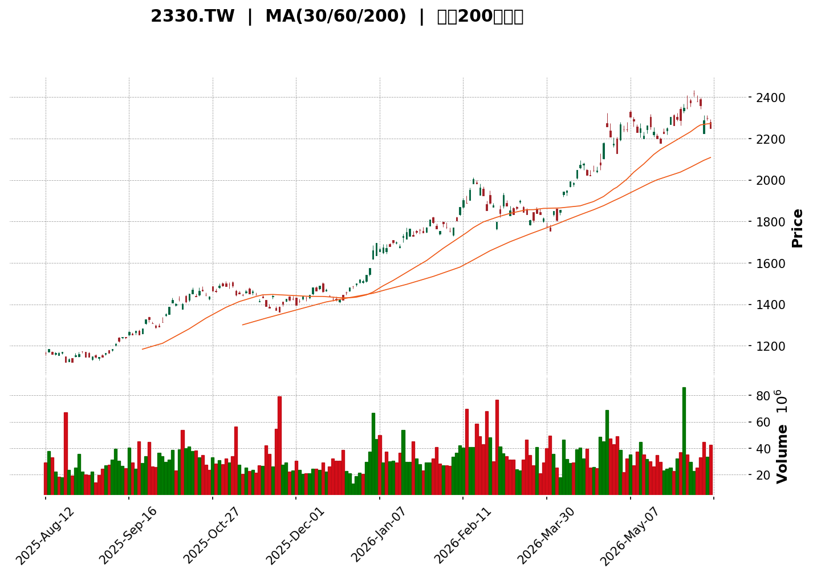
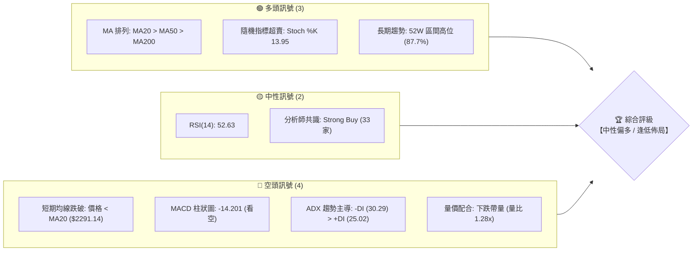
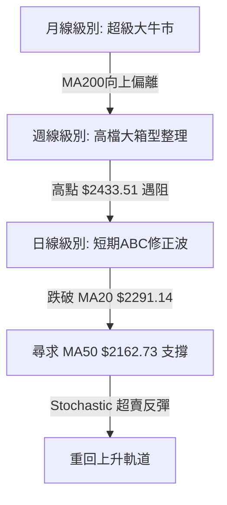

<details>
<summary>📊 靜態圖表 (點擊展開)</summary>

</details>

<html>
<head><meta charset="utf-8" /></head>
<body>
    <div style="height:500px; width:100%;">                        <script>window.PlotlyConfig = {MathJaxConfig: 'local'};</script>
        <script charset="utf-8" src="https://cdn.plot.ly/plotly-3.6.0.min.js" integrity="sha256-QaOVwtVY0T02VaHrr6pnoHLCwayMJp4O5n4YyaE3rJk=" crossorigin="anonymous"></script>                <div id="candlestick-chart" class="plotly-graph-div" style="height:100%; width:100%;"></div>            <script>                window.PLOTLYENV=window.PLOTLYENV || {};                                if (document.getElementById("candlestick-chart")) {                    Plotly.newPlot(                        "candlestick-chart",                        [{"close":{"dtype":"f8","bdata":"AAAAoOkxkkAAAABA3ICSQAAAAOAsHpJAAAAAoOkxkkAAAACg6TGSQAAAACCmRZJAAAAAwEeAkUAAAADAfbuRQAAAAMBHgJFAAAAAQHAKkkAAAADgLB6SQAAAAOBiWZJAAAAAAPfikUAAAAAA9+KRQAAAAKCz9pFAAAAAAPfikUAAAAAA9+KRQAAAAAD34pFAAAAAoOkxkkAAAACg6TGSQAAAAEDcgJJAAAAAYIvjkkAAAABgwR6TQAAAAOCzbZNAAAAAQPdZk0AAAACA3NCTQAAAAABqlZNAAAAAYK3kk0AAAAAAapWTQAAAAABPDJRAAAAA4Ka+lEAAAADgpr6UQAAAAGBjb5RAAAAAACAglEAAAADg8DOUQAAAAEA0g5RAAAAAILshlUAAAAAgcayVQAAAACAnN5ZAAAAAwOPnlUAAAAAA+EqWQAAAAMDj55VAAAAAgIUPlkAAAACADK6WQAAAAOBP\u002fZZAAAAA4JlylkAAAAAAf+mWQAAAAAB\u002f6ZZAAAAAoDualkAAAADgmXKWQAAAAAB\u002f6ZZAAAAAIK7VlkAAAABAk0yXQAAAAECTTJdAAAAAgMI4l0AAAAAgZGCXQAAAAECTTJdAAAAAoDualkAAAACADK6WQAAAAKA7mpZAAAAAIK7VlkAAAACADK6WQAAAACCu1ZZAAAAAoDualkAAAABAViOWQAAAAADJXpZAAAAAIELAlUAAAABAoJiVQAAAAKBqhpZAAAAAgP5wlUAAAADgXEmVQAAAAMDj55VAAAAAAPhKlkAAAAAgJzeWQAAAAAD4SpZAAAAA4BLUlUAAAABAViOWQAAAAOCZcpZAAAAAAMlelkAAAACgO5qWQAAAAKDxJJdAAAAAAH\u002fplkAAAABAk0yXQAAAAKBI1ZZAAAAAQAz9lkAAAACgwYWWQAAAACAcSpZAAAAAYDo2lkAAAABgOjaWQAAAAGA6NpZAAAAA4GbBlkAAAADAzySXQAAAAICxOJdAAAAA4FZ0l0AAAADg3cOXQAAAAGAanJdAAAAAAGUTmEAAAABgkZ6YQAAAAICP8JlAAAAA4Lt7mkAAAABAcQSaQAAAAMA0LJpAAAAAAFMYmkAAAACAFkCaQAAAAKCdj5pAAAAAoJ2PmkAAAACAFkCaQAAAAEDoBptAAAAAYG9Wm0AAAADAFJKbQAAAAEDoBptAAAAAYG9Wm0AAAAAAM36bQAAAAICNQptAAAAAgPalm0AAAACgBEWcQAAAAGBfCZxAAAAAwBSSm0AAAAAgUWqbQAAAAIB99ZtAAAAAQNi5m0AAAAAgUWqbQAAAAID2pZtAAAAA4CIxnEAAAADgmTOdQAAAAEDGvp1AAAAA4CCDnUAAAADgl4WeQAAAAKBpTJ9AAAAAgOL8nkAAAACAW62eQAAAAGBNDp5AAAAAgPT3nEAAAADgIIOdQAAAAGBdW51AAAAAIEEdnEAAAABAT7ycQAAAACAvIp5AAAAAoHtHnUAAAACA9PecQAAAAIBtqJxAAAAAABkknUAAAACgua+dQAAAAIBP1JxAAAAAwGqsnEAAAACAvDScQAAAAIC8NJxAAAAAIF3AnEAAAADAaqycQAAAAEChXJxAAAAAQA69m0AAAADARG2bQAAAAOBB6JxAAAAAgLw0nEAAAABANPycQAAAAAA\u002fY55AAAAAYDF3nkAAAADAtiqfQAAAAADSAp9AAAAAgBADoEAAAABg7jSgQAAAAKDnPqBAAAAAAGWin0AAAACgco6fQAAAAIAu8p9AAAAAgC7yn0AAAABg7jSgQAAAAGBfBqFAAAAAYPKloUAAAACANkKhQAAAACBm\u002fKBAAAAAgKOioEAAAADA5LmhQAAAAOAGiKFAAAAA4AaIoUAAAAAgtf+hQAAAAGDQ16FAAAAAQBtqoUAAAAAAAJKhQAAAAKAvTKFAAAAAoOuvoUAAAABg8qWhQAAAAIAUdKFAAAAAIEQuoUAAAABgXwahQAAAAAAiYKFAAAAAAACSoUAAAAAgtf+hQAAAAKDrr6FAAAAAwMLroUAAAACAyeGhQAAAAMB3WaJAAAAAwHdZokAAAADAVYuiQAAAAGAY5aJAAAAA4E6VokAAAAAgam2iQAAAAIDJ4aFAAAAA4Lv1oUAAAAAAAJKhQA=="},"high":{"dtype":"f8","bdata":"QcNJ7WJZkkAAAABA3ICSQFrHm9NiWZJAoOGkRqZFkkCg4aRGpkWSQAAAACCmRZJAh9jAp7P2kUCBoq1mOs+RQFqQgFo6z5FADdIgjekxkkDnhBItpkWSQAAAAOBiWZJAlnsaQaZFkkCWexpBpkWSQAAAAKCz9pFAjbDc8ywekkAAAAAA9+KRQI2w3PMsHpJAAAAAoOkxkkDhpO6TH22SQAAAAEDcgJJANNaHBkj3kkCllFL6s22TQAAAAOCzbZNAjYKA5rNtk0AAAIBcreSTQIiCK7kLvZNAAAAAYK3kk0BTxuxOfviTQAAAAABPDJRAAAAA4Ka+lEAfqJx1GfqUQBA++BgFl5RAllqplZJblECHfrN1Y2+UQLyVfY5I5pRAvMd7\u002fIs1lUAAAAAgcayVQGk23djIXpZAo6R+nLT7lUBVVVWVaoaWQKOkfpy0+5VAHJWihzualkAAAACADK6WQHW4GpnxJJdADem8dQyulkCYIp+V8SSXQHWDKXLCOJdATZo0Wd3BlkCvTZS8aoaWQHWDKXLCOJdA+iCWtSARl0Bdv\u002fv4NHSXQAufedUFiJdA7+7uztabl0AEsgHZBYiXQLp+97HWm5dAwYED70\u002f9lkASz9cVf+mWQCZNmnwMrpZAp8AO2U\u002f9lkAlnq+r8SSXQKfADtlP\u002fZZATZo0Wd3BlkA+09b490qWQPDRs5U7mpZAnHSASyc3lkByHMex4+eVQFkpe3w7mpZAt9Ks8UHAlUCx9g0LQsCVQEZJ\u002fXiFD5ZAAAAAAPhKlkDSbLqRaoaWQFVVVZVqhpZAGTpg58helkA+09b490qWQAAAAOCZcpZA+0WR3JlylkAAAACgO5qWQAAAAKDxJJdAdYMpcsI4l0AAAABAk0yXQAAAAJA4iJdApshnBe4Ql0BgKmhlo5mWQBUYe6rfcZZAmrbGr99xlkDePEIlHEqWQFYwSzqjmZZAQf5ZpUjVlkAAAADAzySXQFDmWUWTTJdAAAAA4FZ0l0AAAADg3cOXQK+hvOrdw5dAAAAAAGUTmEAAAABgkZ6YQH+L01r4U5pAAAAA4Lt7mkBi0bLKNCyaQIDY8w\u002faZ5pAVVVVFdpnmkBow+fPu3uaQKuqqipht5pAVVVVZX+jmkBFgpoK2meaQKuqqsqrLptAGF10dfalm0AAAADAFJKbQKuqqhpRaptAjC666jJ+m0B+eWzFFJKbQKD7uR\u002fYuZtAlqxkRdi5m0AAAACgBEWcQG12cQCqgJxAINEKm331m0AAAAAgUWqbQKuqqgpBHZxAFTqDVV8JnEB5mgtw9qWbQAAAAID2pZtA43eC9amAnEAAAADgmTOdQN3LscqJ5p1AFQgjRU0OnkBn0pVqW62eQAzkoyotdJ9A+DPhz4c4n0DVKGOV4vyeQH1BX1A9wZ5AaQ7fb+SqnUC3xKkftnGeQKuqquogg51AAAAAIEEdnEBGteVqXVudQAW+uKrySZ5AvLoVQMa+nUASsUaVe0edQAUJo+WZM51ATNgGwf1LnUAEAoEArMOdQDkPHcP9S51ALWQhAxkknUBtx4fgrkicQGg7PoRP1JxAMjgfYws4nUB705uiJhCdQHAIh6CTcJxACEUowtcMnEB00UUD8+SbQAAAAOBB6JxArpHVpSYQnUAAAABANPycQAAAAAA\u002fY55AAAAAYDF3nkAAAADAtiqfQFx\u002fe2DEFp9AAAAAgBADoEDFTuwg01ygQP\u002fBRNDgSKBALzFroQkNoEDCFmxxEAOgQBO1KzH1KqBAD8TvAPwgoECd2Ilyo6KgQGmcQZBYEKFAGNE205knokD5Y0nz3cOhQKszUkE9OKFAVFwyhDZCoUDgB34g182hQGhFI6Hrr6FAdbn9MdfNoUAffPBxhUWiQPQuHiG1\u002f6FAOiUBwuS5oUAU3z3x3cOhQMln3WAUdKFAAAAAoOuvoUDvhfeioB2iQEmSJEH5m6FAURRFESJgoUAPDkhRPTihQAWEE\u002fH\u002fkaFABJM\u002fMPmboUAAAAAgtf+hQDbwGbOgHaJAoGir4ZknokCeDyzzcGOiQLt\u002f84BcgaJAL3\u002faAibRokCBXBOBOrOiQENasfADA6NAcqdoASbRokBO8OShM72iQMZUOHGnE6JA75W6cKcTokAkKzyywuuhQA=="},"hovertemplate":"\u003cb\u003e%{x|%Y-%m-%d}\u003c\u002fb\u003e\u003cbr\u003e\u958b: $%{open:.2f}\u003cbr\u003e\u9ad8: $%{high:.2f}\u003cbr\u003e\u4f4e: $%{low:.2f}\u003cbr\u003e\u6536: $%{close:.2f}\u003cextra\u003e\u003c\u002fextra\u003e","low":{"dtype":"f8","bdata":"vzy2UnAKkkAAAABMpkWSQAAAAOAsHpJAvzy2UnAKkkC\u002fPLZScAqSQLW4CdMsHpJAAAAAwEeAkUD+uqRyBJSRQAAAAMBHgJFA8y3f8vbikUCmOGTs9uKRQNPS0pLpMZJAAAAAAPfikUAAAAAA9+KRQL+CoQXBp5FAfBphWTrPkUBzTyMMwaeRQAAAAAD34pFAvzy2UnAKkkAAAACg6TGSQKuqqvJiWZJAmFPwEhK8kkDXWmu5BAuTQMMwDJM6RpNAc31\u002fmTpGk0AAAAAOmYGTQAAAAABqlZNA8g3y7WmVk0AAAAAAapWTQDxB6rE6qZNAIj1QkZJblEDhV2NKNIOUQAAAAGBjb5RAJDdyI08MlEAAAADg8DOUQAAAAEA0g5RAh3AIZxn6lEDNzMwYuyGVQGIutIq0+5VAurYCB0LAlUDHcRxHViOWQNLIhnHPhJVARQ97o7T7lUDP1xWbhQ+WQBaPym0MrpZAAAAA4JlylkCtG0yxaoaWQAAAAAB\u002f6ZZA2bJlw2qGlkD0FkNKJzeWQAAAAAB\u002f6ZZArZ94Q93BlkD1YIaqIBGXQFIggmPCOJdAAAAAgMI4l0D5m\u002fytIBGXQKRABIfxJJdA2bJlw2qGlkAAAACADK6WQNmyZcNqhpZAWT\u002fxZgyulkAAAACADK6WQAbfaYo7mpZAAAAAoDualkBglpRjhQ+WQAAAAADJXpZAAAAAIELAlUAAAABAoJiVQPWDjgr4SpZAAAAAgP5wlUAAAADgXEmVQLq2AgdCwJVAqqqqaoUPlkDLZJFDViOWQOM4jiMnN5ZAAAAA4BLUlUDBLCmHtPuVQPQWQ0onN5ZAEC5MalYjlkBmy5Yt+EqWQIcm+Zc7mpZAAAAAAH\u002fplkBHgQjOT\u002f2WQKuqqtpmwZZAtG4wtUjVlkCh1Zfa33GWQOrnhJVYIpZAIsO9mlgilkBmSTkQlfqVQAAAAGA6NpZAfwNMVaOZlkBwA4aqSNWWQF8zTPXtEJdAk7\u002fJj7E4l0CrqqrKVnSXQFFeQ9VWdJdApwFtmjiIl0CB4DI1g\u002f+XQE5rto+fPZlA\u002ffPPnyaNmUCdLk21rdyZQAFPGCDqtJlAVVVVJeq0mUAAAACAFkCaQFVVVRXaZ5pAVVVVFdpnmkC6fWX1UhiaQAAAAKCdj5pAGF10+kLLmkBsDiRa6AabQAAAAEDoBptAddFF1asum0AJGk7qqy6bQAAAAICNQptAFKEIpY1Cm0Aw\u002fdL\u002fuc2bQJjBl5p99ZtAAAAAwBSSm0AKMpsKyhqbQAAAADDYuZtA9WI+tRSSm0CDzKZab1abQFOb2lToBptAAAAA4CIxnEDqOxu1i5ScQIvQOBW4H51AAAAA4CCDnUD94xIrxr6dQOY3uIri\u002fJ5AAAAAgOL8nkCMeJIaLyKeQAAAAGBNDp5AAAAAgPT3nEBG2rEaP2+dQFVVVdWZM51AEaTc9DJ+m0BcJY0qyGycQN4sTxq4H51AAAAAoHtHnUCpomeli5ScQAAAAIBtqJxAsyf5PjT8nED0+Xx+4nOdQAAAAIBP1JxAAAAAwGqsnEDgGlmdANGbQCdx8L7XDJxAAAAAIF3AnEAAAADAaqycQD7e473XDJxAAAAAQA69m0AAAADARG2bQPqSaf2FhJxAlDh4H8ognEDXWmtdeJicQJ3YiR2D\u002f51AM3WLfXUTnkBSuB59CLOeQO6Bjd76xp5Av0oYm5tSn0A7sROfCQ2gQAd0Y34QA6BAAAAAAGWin0AAAACgco6fQPgdiB883p9A8TsQv0nKn0CKndhuEAOgQGk55lvMZqBAAAAAYPKloUAAAACANkKhQCrmVo963qBAAAAAgKOioED8wA+8URqhQExdbn8UdKFATF1ufxR0oUAAAAAgtf+hQE9Fmm7ypaFAAAAAQBtqoUDc1MNNPTihQCnyWQ9ELqFAHpe+HSJgoUCEHkLPBoihQCRJko42QqFAAAAAIEQuoUAAAABgXwahQAAAAAAiYKFA6I2C3ihWoUDhgw\u002fO5LmhQAAAAKDrr6FAy4dxX9DXoUA5q8eO66+hQFegz86ZJ6JAESDDj35PokB\u002fo+z+cGOiQL6lTs8sx6JAAAAA4E6VokDjJUqPfk+iQGLw0wwiYKFAC5yDf8nhoUAAAAAAAJKhQA=="},"name":"\u50f9\u683c","open":{"dtype":"f8","bdata":"AAAAoOkxkkAAAABMpkWSQOeEEi2mRZJAXx5b+SwekkC\u002fPLZScAqSQFrchHnpMZJAh9jAp7P2kUD+uqRyBJSRQFqQgFo6z5FA+pZvmbP2kUAZe+2Ss\u002faRQAAAAOBiWZJAlnsaQaZFkkASlnua6TGSQA8iOax9u5FACcs9TXAKkkB8GmFZOs+RQAnLPU1wCpJAXx5b+SwekkDhpO6TH22SQFVVVZkfbZJAzCl4uc7PkkB8771T91mTQGIYhjn3WZNAjYKA5rNtk0AAAIDqaZWTQETBldw6qZNA+Qb5pgu9k0APBVdyreSTQDxB6rE6qZNAgsrZbWNvlEC\u002fGhOZSOaUQAAAAGBjb5RAuZEbucFHlEAtKpG8wUeUQAAAAEA0g5RAQziEQ+oNlUDNzMwYuyGVQGIutIq0+5VAXVuB4xLUlUAAAAAA+EqWQNLIhnHPhJVAYaQdq2qGlkDbYVBUJzeWQBaPym0MrpZAr02UvGqGlkCKfNaNO5qWQN1gitxP\u002fZZAAAAAoDualkCjZNcm+EqWQHWDKXLCOJdAU2CH\u002fH7plkCkQASH8SSXQF2\u002f+\u002fg0dJdAXI\u002fCFTV0l0AAAAAgZGCXQAufedUFiJdAmjRpEn\u002fplkAGRZ1c3cGWQAAAAKA7mpZArZ94Q93BlkAfWRLPIBGXQK2feEPdwZZAAAAAoDualkBglpRjhQ+WQPtFkdyZcpZAnHSASyc3lkAcx3EccayVQKfWhMOZcpZAW2nWOKCYlUDpoosucayVQEZJ\u002fXiFD5ZAx3EcR1YjlkCe0Uu1mXKWQAAAAAD4SpZAGTpg58helkAAAABAViOWQKNk1yb4SpZAAAAAAMlelkCMGDEKyV6WQCtqjHQMrpZAmCKflfEkl0D1YIaqIBGXQKuqqspWdJdAWjeYeirplkAAAACgwYWWQAAAACAcSpZA3jxCJRxKlkBEhnvVdg6WQFYwSzqjmZZAAAAA4GbBlkCUguRvKumWQAAAAICxOJdAMZWYGnVgl0AAAACQOIiXQCivoZo4iJdA\u002fSXLXxqcl0BhKOa\u002fRieYQJvtE1WBUZlA\u002ffPPnyaNmUCdLk21rdyZQCuXaeXLyJlAAAAAsK3cmUBFgpoK2meaQKuqqipht5pAq6qq2rt7mkDdvrK6NCyaQKuqqnoG85pAGF10+kLLmkBsDiRa6AabQFVVVQXKGptARhddJVFqm0AAAAAAM36bQOBTkwpRaptAqk1tam9Wm0Aw\u002fdL\u002fuc2bQAY4CTvIbJxArbA5ELrNm0CIZfTPqy6bQKuqqgpBHZxAAAAAQNi5m0AAAAAgUWqbQOlHPxrKGptA69khMMhsnEBt1Hd6baicQHq2kdqZM51AAAAA4CCDnUD94xIrxr6dQOY3uIri\u002fJ5AUxFLRcQQn0CMeJIaLyKeQNNrn8V5mZ5AmwnqHz9vnUDPLXEKLyKeQFVVVdWZM51Ajw9BuhSSm0Cj2nJV1gudQOPqB6V7R51AXt0K8CCDnUCpomeli5ScQASaQiC4H51AJmyDYAs4nUD8\u002fX4\u002fx5udQFo3mGILOJ1AyUIWQjT8nEBN4uD98uSbQGg7PoRP1JxAIdAUoiYQnUBkIQuBT9ScQK7mah7KIJxAAAAAQA69m0C66KLhG6mbQGOLcr5qrJxArpHVpSYQnUDwvfd+T9ScQF7ohd5nJ55AR5UEn0xPnkCamZnd+saeQKWAhJ\u002ff7p5AqtCj+41mn0DsxE7PAhegQAE+u2\u002fuNKBA\u002fKgucRADoEDrXHkAZaKfQAAAAIAu8p9A+B2IHzzen0BiJ3bA4EigQNLVJ4zFcKBAfOG98N3DoUCHVYShDX6hQA6ix+9s8qBAyhCsI0QuoUDsxE7sSiShQAAAAOAGiKFAAAAA4AaIoUDNoWIRkzGiQHoXj8DC66FA69uAYfKloUDwswE\u002fG2qhQCnyWQ9ELqFAj0vf3gaIoUBzpDkStf+hQEmSJO8oVqFAMQzDsC9MoUCmcQYhRC6hQM80bmAUdKFA+NmAnw1+oUDhgw\u002fO5LmhQBrD0YKnE6JANniOILX\u002foUDoIK+Sfk+iQDRgSS+MO6JAAAAAwHdZokBArokgSJ+iQAAAAGAY5aJAAAAA4E6VokA7tGtBQamiQGLw0wwiYKFAAAAA4Lv1oUAYcn0h182hQA=="},"x":["2025-08-12T00:00:00+08:00","2025-08-13T00:00:00+08:00","2025-08-14T00:00:00+08:00","2025-08-15T00:00:00+08:00","2025-08-18T00:00:00+08:00","2025-08-19T00:00:00+08:00","2025-08-20T00:00:00+08:00","2025-08-21T00:00:00+08:00","2025-08-22T00:00:00+08:00","2025-08-25T00:00:00+08:00","2025-08-26T00:00:00+08:00","2025-08-27T00:00:00+08:00","2025-08-28T00:00:00+08:00","2025-08-29T00:00:00+08:00","2025-09-01T00:00:00+08:00","2025-09-02T00:00:00+08:00","2025-09-03T00:00:00+08:00","2025-09-04T00:00:00+08:00","2025-09-05T00:00:00+08:00","2025-09-08T00:00:00+08:00","2025-09-09T00:00:00+08:00","2025-09-10T00:00:00+08:00","2025-09-11T00:00:00+08:00","2025-09-12T00:00:00+08:00","2025-09-15T00:00:00+08:00","2025-09-16T00:00:00+08:00","2025-09-17T00:00:00+08:00","2025-09-18T00:00:00+08:00","2025-09-19T00:00:00+08:00","2025-09-22T00:00:00+08:00","2025-09-23T00:00:00+08:00","2025-09-24T00:00:00+08:00","2025-09-25T00:00:00+08:00","2025-09-26T00:00:00+08:00","2025-09-30T00:00:00+08:00","2025-10-01T00:00:00+08:00","2025-10-02T00:00:00+08:00","2025-10-03T00:00:00+08:00","2025-10-07T00:00:00+08:00","2025-10-08T00:00:00+08:00","2025-10-09T00:00:00+08:00","2025-10-13T00:00:00+08:00","2025-10-14T00:00:00+08:00","2025-10-15T00:00:00+08:00","2025-10-16T00:00:00+08:00","2025-10-17T00:00:00+08:00","2025-10-20T00:00:00+08:00","2025-10-21T00:00:00+08:00","2025-10-22T00:00:00+08:00","2025-10-23T00:00:00+08:00","2025-10-27T00:00:00+08:00","2025-10-28T00:00:00+08:00","2025-10-29T00:00:00+08:00","2025-10-30T00:00:00+08:00","2025-10-31T00:00:00+08:00","2025-11-03T00:00:00+08:00","2025-11-04T00:00:00+08:00","2025-11-05T00:00:00+08:00","2025-11-06T00:00:00+08:00","2025-11-07T00:00:00+08:00","2025-11-10T00:00:00+08:00","2025-11-11T00:00:00+08:00","2025-11-12T00:00:00+08:00","2025-11-13T00:00:00+08:00","2025-11-14T00:00:00+08:00","2025-11-17T00:00:00+08:00","2025-11-18T00:00:00+08:00","2025-11-19T00:00:00+08:00","2025-11-20T00:00:00+08:00","2025-11-21T00:00:00+08:00","2025-11-24T00:00:00+08:00","2025-11-25T00:00:00+08:00","2025-11-26T00:00:00+08:00","2025-11-27T00:00:00+08:00","2025-11-28T00:00:00+08:00","2025-12-01T00:00:00+08:00","2025-12-02T00:00:00+08:00","2025-12-03T00:00:00+08:00","2025-12-04T00:00:00+08:00","2025-12-05T00:00:00+08:00","2025-12-08T00:00:00+08:00","2025-12-09T00:00:00+08:00","2025-12-10T00:00:00+08:00","2025-12-11T00:00:00+08:00","2025-12-12T00:00:00+08:00","2025-12-15T00:00:00+08:00","2025-12-16T00:00:00+08:00","2025-12-17T00:00:00+08:00","2025-12-18T00:00:00+08:00","2025-12-19T00:00:00+08:00","2025-12-22T00:00:00+08:00","2025-12-23T00:00:00+08:00","2025-12-24T00:00:00+08:00","2025-12-26T00:00:00+08:00","2025-12-29T00:00:00+08:00","2025-12-30T00:00:00+08:00","2025-12-31T00:00:00+08:00","2026-01-02T00:00:00+08:00","2026-01-05T00:00:00+08:00","2026-01-06T00:00:00+08:00","2026-01-07T00:00:00+08:00","2026-01-08T00:00:00+08:00","2026-01-09T00:00:00+08:00","2026-01-12T00:00:00+08:00","2026-01-13T00:00:00+08:00","2026-01-14T00:00:00+08:00","2026-01-15T00:00:00+08:00","2026-01-16T00:00:00+08:00","2026-01-19T00:00:00+08:00","2026-01-20T00:00:00+08:00","2026-01-21T00:00:00+08:00","2026-01-22T00:00:00+08:00","2026-01-23T00:00:00+08:00","2026-01-26T00:00:00+08:00","2026-01-27T00:00:00+08:00","2026-01-28T00:00:00+08:00","2026-01-29T00:00:00+08:00","2026-01-30T00:00:00+08:00","2026-02-02T00:00:00+08:00","2026-02-03T00:00:00+08:00","2026-02-04T00:00:00+08:00","2026-02-05T00:00:00+08:00","2026-02-06T00:00:00+08:00","2026-02-09T00:00:00+08:00","2026-02-10T00:00:00+08:00","2026-02-11T00:00:00+08:00","2026-02-23T00:00:00+08:00","2026-02-24T00:00:00+08:00","2026-02-25T00:00:00+08:00","2026-02-26T00:00:00+08:00","2026-03-02T00:00:00+08:00","2026-03-03T00:00:00+08:00","2026-03-04T00:00:00+08:00","2026-03-05T00:00:00+08:00","2026-03-06T00:00:00+08:00","2026-03-09T00:00:00+08:00","2026-03-10T00:00:00+08:00","2026-03-11T00:00:00+08:00","2026-03-12T00:00:00+08:00","2026-03-13T00:00:00+08:00","2026-03-16T00:00:00+08:00","2026-03-17T00:00:00+08:00","2026-03-18T00:00:00+08:00","2026-03-19T00:00:00+08:00","2026-03-20T00:00:00+08:00","2026-03-23T00:00:00+08:00","2026-03-24T00:00:00+08:00","2026-03-25T00:00:00+08:00","2026-03-26T00:00:00+08:00","2026-03-27T00:00:00+08:00","2026-03-30T00:00:00+08:00","2026-03-31T00:00:00+08:00","2026-04-01T00:00:00+08:00","2026-04-02T00:00:00+08:00","2026-04-07T00:00:00+08:00","2026-04-08T00:00:00+08:00","2026-04-09T00:00:00+08:00","2026-04-10T00:00:00+08:00","2026-04-13T00:00:00+08:00","2026-04-14T00:00:00+08:00","2026-04-15T00:00:00+08:00","2026-04-16T00:00:00+08:00","2026-04-17T00:00:00+08:00","2026-04-20T00:00:00+08:00","2026-04-21T00:00:00+08:00","2026-04-22T00:00:00+08:00","2026-04-23T00:00:00+08:00","2026-04-24T00:00:00+08:00","2026-04-27T00:00:00+08:00","2026-04-28T00:00:00+08:00","2026-04-29T00:00:00+08:00","2026-04-30T00:00:00+08:00","2026-05-04T00:00:00+08:00","2026-05-05T00:00:00+08:00","2026-05-06T00:00:00+08:00","2026-05-07T00:00:00+08:00","2026-05-08T00:00:00+08:00","2026-05-11T00:00:00+08:00","2026-05-12T00:00:00+08:00","2026-05-13T00:00:00+08:00","2026-05-14T00:00:00+08:00","2026-05-15T00:00:00+08:00","2026-05-18T00:00:00+08:00","2026-05-19T00:00:00+08:00","2026-05-20T00:00:00+08:00","2026-05-21T00:00:00+08:00","2026-05-22T00:00:00+08:00","2026-05-25T00:00:00+08:00","2026-05-26T00:00:00+08:00","2026-05-27T00:00:00+08:00","2026-05-28T00:00:00+08:00","2026-05-29T00:00:00+08:00","2026-06-01T00:00:00+08:00","2026-06-02T00:00:00+08:00","2026-06-03T00:00:00+08:00","2026-06-04T00:00:00+08:00","2026-06-05T00:00:00+08:00","2026-06-08T00:00:00+08:00","2026-06-09T00:00:00+08:00","2026-06-10T00:00:00+08:00"],"type":"candlestick"},{"hovertemplate":"MA30: $%{y:.2f}\u003cextra\u003e\u003c\u002fextra\u003e","line":{"color":"#2196F3","dash":"dash","width":2},"mode":"lines","name":"MA30","x":["2025-08-12T00:00:00+08:00","2025-08-13T00:00:00+08:00","2025-08-14T00:00:00+08:00","2025-08-15T00:00:00+08:00","2025-08-18T00:00:00+08:00","2025-08-19T00:00:00+08:00","2025-08-20T00:00:00+08:00","2025-08-21T00:00:00+08:00","2025-08-22T00:00:00+08:00","2025-08-25T00:00:00+08:00","2025-08-26T00:00:00+08:00","2025-08-27T00:00:00+08:00","2025-08-28T00:00:00+08:00","2025-08-29T00:00:00+08:00","2025-09-01T00:00:00+08:00","2025-09-02T00:00:00+08:00","2025-09-03T00:00:00+08:00","2025-09-04T00:00:00+08:00","2025-09-05T00:00:00+08:00","2025-09-08T00:00:00+08:00","2025-09-09T00:00:00+08:00","2025-09-10T00:00:00+08:00","2025-09-11T00:00:00+08:00","2025-09-12T00:00:00+08:00","2025-09-15T00:00:00+08:00","2025-09-16T00:00:00+08:00","2025-09-17T00:00:00+08:00","2025-09-18T00:00:00+08:00","2025-09-19T00:00:00+08:00","2025-09-22T00:00:00+08:00","2025-09-23T00:00:00+08:00","2025-09-24T00:00:00+08:00","2025-09-25T00:00:00+08:00","2025-09-26T00:00:00+08:00","2025-09-30T00:00:00+08:00","2025-10-01T00:00:00+08:00","2025-10-02T00:00:00+08:00","2025-10-03T00:00:00+08:00","2025-10-07T00:00:00+08:00","2025-10-08T00:00:00+08:00","2025-10-09T00:00:00+08:00","2025-10-13T00:00:00+08:00","2025-10-14T00:00:00+08:00","2025-10-15T00:00:00+08:00","2025-10-16T00:00:00+08:00","2025-10-17T00:00:00+08:00","2025-10-20T00:00:00+08:00","2025-10-21T00:00:00+08:00","2025-10-22T00:00:00+08:00","2025-10-23T00:00:00+08:00","2025-10-27T00:00:00+08:00","2025-10-28T00:00:00+08:00","2025-10-29T00:00:00+08:00","2025-10-30T00:00:00+08:00","2025-10-31T00:00:00+08:00","2025-11-03T00:00:00+08:00","2025-11-04T00:00:00+08:00","2025-11-05T00:00:00+08:00","2025-11-06T00:00:00+08:00","2025-11-07T00:00:00+08:00","2025-11-10T00:00:00+08:00","2025-11-11T00:00:00+08:00","2025-11-12T00:00:00+08:00","2025-11-13T00:00:00+08:00","2025-11-14T00:00:00+08:00","2025-11-17T00:00:00+08:00","2025-11-18T00:00:00+08:00","2025-11-19T00:00:00+08:00","2025-11-20T00:00:00+08:00","2025-11-21T00:00:00+08:00","2025-11-24T00:00:00+08:00","2025-11-25T00:00:00+08:00","2025-11-26T00:00:00+08:00","2025-11-27T00:00:00+08:00","2025-11-28T00:00:00+08:00","2025-12-01T00:00:00+08:00","2025-12-02T00:00:00+08:00","2025-12-03T00:00:00+08:00","2025-12-04T00:00:00+08:00","2025-12-05T00:00:00+08:00","2025-12-08T00:00:00+08:00","2025-12-09T00:00:00+08:00","2025-12-10T00:00:00+08:00","2025-12-11T00:00:00+08:00","2025-12-12T00:00:00+08:00","2025-12-15T00:00:00+08:00","2025-12-16T00:00:00+08:00","2025-12-17T00:00:00+08:00","2025-12-18T00:00:00+08:00","2025-12-19T00:00:00+08:00","2025-12-22T00:00:00+08:00","2025-12-23T00:00:00+08:00","2025-12-24T00:00:00+08:00","2025-12-26T00:00:00+08:00","2025-12-29T00:00:00+08:00","2025-12-30T00:00:00+08:00","2025-12-31T00:00:00+08:00","2026-01-02T00:00:00+08:00","2026-01-05T00:00:00+08:00","2026-01-06T00:00:00+08:00","2026-01-07T00:00:00+08:00","2026-01-08T00:00:00+08:00","2026-01-09T00:00:00+08:00","2026-01-12T00:00:00+08:00","2026-01-13T00:00:00+08:00","2026-01-14T00:00:00+08:00","2026-01-15T00:00:00+08:00","2026-01-16T00:00:00+08:00","2026-01-19T00:00:00+08:00","2026-01-20T00:00:00+08:00","2026-01-21T00:00:00+08:00","2026-01-22T00:00:00+08:00","2026-01-23T00:00:00+08:00","2026-01-26T00:00:00+08:00","2026-01-27T00:00:00+08:00","2026-01-28T00:00:00+08:00","2026-01-29T00:00:00+08:00","2026-01-30T00:00:00+08:00","2026-02-02T00:00:00+08:00","2026-02-03T00:00:00+08:00","2026-02-04T00:00:00+08:00","2026-02-05T00:00:00+08:00","2026-02-06T00:00:00+08:00","2026-02-09T00:00:00+08:00","2026-02-10T00:00:00+08:00","2026-02-11T00:00:00+08:00","2026-02-23T00:00:00+08:00","2026-02-24T00:00:00+08:00","2026-02-25T00:00:00+08:00","2026-02-26T00:00:00+08:00","2026-03-02T00:00:00+08:00","2026-03-03T00:00:00+08:00","2026-03-04T00:00:00+08:00","2026-03-05T00:00:00+08:00","2026-03-06T00:00:00+08:00","2026-03-09T00:00:00+08:00","2026-03-10T00:00:00+08:00","2026-03-11T00:00:00+08:00","2026-03-12T00:00:00+08:00","2026-03-13T00:00:00+08:00","2026-03-16T00:00:00+08:00","2026-03-17T00:00:00+08:00","2026-03-18T00:00:00+08:00","2026-03-19T00:00:00+08:00","2026-03-20T00:00:00+08:00","2026-03-23T00:00:00+08:00","2026-03-24T00:00:00+08:00","2026-03-25T00:00:00+08:00","2026-03-26T00:00:00+08:00","2026-03-27T00:00:00+08:00","2026-03-30T00:00:00+08:00","2026-03-31T00:00:00+08:00","2026-04-01T00:00:00+08:00","2026-04-02T00:00:00+08:00","2026-04-07T00:00:00+08:00","2026-04-08T00:00:00+08:00","2026-04-09T00:00:00+08:00","2026-04-10T00:00:00+08:00","2026-04-13T00:00:00+08:00","2026-04-14T00:00:00+08:00","2026-04-15T00:00:00+08:00","2026-04-16T00:00:00+08:00","2026-04-17T00:00:00+08:00","2026-04-20T00:00:00+08:00","2026-04-21T00:00:00+08:00","2026-04-22T00:00:00+08:00","2026-04-23T00:00:00+08:00","2026-04-24T00:00:00+08:00","2026-04-27T00:00:00+08:00","2026-04-28T00:00:00+08:00","2026-04-29T00:00:00+08:00","2026-04-30T00:00:00+08:00","2026-05-04T00:00:00+08:00","2026-05-05T00:00:00+08:00","2026-05-06T00:00:00+08:00","2026-05-07T00:00:00+08:00","2026-05-08T00:00:00+08:00","2026-05-11T00:00:00+08:00","2026-05-12T00:00:00+08:00","2026-05-13T00:00:00+08:00","2026-05-14T00:00:00+08:00","2026-05-15T00:00:00+08:00","2026-05-18T00:00:00+08:00","2026-05-19T00:00:00+08:00","2026-05-20T00:00:00+08:00","2026-05-21T00:00:00+08:00","2026-05-22T00:00:00+08:00","2026-05-25T00:00:00+08:00","2026-05-26T00:00:00+08:00","2026-05-27T00:00:00+08:00","2026-05-28T00:00:00+08:00","2026-05-29T00:00:00+08:00","2026-06-01T00:00:00+08:00","2026-06-02T00:00:00+08:00","2026-06-03T00:00:00+08:00","2026-06-04T00:00:00+08:00","2026-06-05T00:00:00+08:00","2026-06-08T00:00:00+08:00","2026-06-09T00:00:00+08:00","2026-06-10T00:00:00+08:00"],"y":{"dtype":"f8","bdata":"AAAAAAAA+H8AAAAAAAD4fwAAAAAAAPh\u002fAAAAAAAA+H8AAAAAAAD4fwAAAAAAAPh\u002fAAAAAAAA+H8AAAAAAAD4fwAAAAAAAPh\u002fAAAAAAAA+H8AAAAAAAD4fwAAAAAAAPh\u002fAAAAAAAA+H8AAAAAAAD4fwAAAAAAAPh\u002fAAAAAAAA+H8AAAAAAAD4fwAAAAAAAPh\u002fAAAAAAAA+H8AAAAAAAD4fwAAAAAAAPh\u002fAAAAAAAA+H8AAAAAAAD4fwAAAAAAAPh\u002fAAAAAAAA+H8AAAAAAAD4fwAAAAAAAPh\u002fAAAAAAAA+H8AAAAAAAD4fxEREfGkfZJAvLu7+2aTkkBmZmZWh6aSQLy7u2tNupJAMzMzs8bKkkAzMzMT6duSQJqZmWkH75JAmpmZuQIOk0AAAABwpC+TQFVVVRXfV5NAZmZmZtp4k0BVVVXFepyTQGZmZmbUupNAAAAAwHLek0De3d3dWQeUQBEREfE8MpRAVVVVxShZlEC8u7srC4SUQCIiIpLtrpRAd3d354nUlEC8u7sL1PiUQCIiIhJzHpVAVVVV5R5AlUBmZmYGyGOVQImIiHjPhJVA7+7uPtallUAiIiKiOMSVQFVVVTXt45VAzczMjAv7lUDe3d1ddxWWQFVVVYVDK5ZAiYiIGBk9lkC8u7t7nE2WQBEREXEWYpZA7+7ufjl3lkAAAADgvIeWQKuqqiqXl5ZA7+7u7t+clkBmZmbWNpyWQImIiDjbnpZAVVVVpeSalkCJiIhoTpKWQImIiGhOkpZAERERsUmUlkDNzMwcU5CWQAAAAEBhipZAvLu7exiFlkBmZmaGfX6WQERERPSGepZAq6qqqot4lkC8u7vb3XmWQFVVVSXZe5ZA3t3dPYJ8lkDe3d09gnyWQJqZmUmIeJZA7+7uvop2lkAAAAAQQW+WQN7d3X2jZpZA3t3dHU5jlkBVVVWlT1+WQFVVVUX6W5ZAq6qqOk1blkC8u7urQl+WQFVVVZWPYpZAIiIiwtRplkBVVVUlt3eWQM3MzOxKgpZAvLu7ayGWlkCamZm57a+WQGZmZhYRzZZAZmZmZhf4lkAiIiLydSCXQLy7uwvfRJdAMzMzA1Fll0BERERkv4eXQAAAAFArrJdA3t3dzY3Ul0B3d3dHpfeXQFVVVfW4HphA7+7uXhxJmECamZl5gXOYQLy7u0ujlJhAq6qqCme6mEAiIiKiMN6YQCIiIjL3A5lAzczMvLormUARERGBxVyZQHd3d0fQjZlAIiIiwoq7mUCrqqrq8eeZQAAAALD8GJpA3t3d3WZDmkDNzMwc2meaQN7d3a2gjZpAERER4Q22mkAzMzMDcuSaQDMzMxPNGJtARERENDFHm0CamZlJj3mbQCIiIsJJp5tAq6qq+rnNm0BVVVWFffWbQJqZmXmgFpxAvLu72yUvnECamZmJ+0qcQDMzM0PXYpxAIiIichhwnECamZmJTYWcQGZmZubPn5xAAAAAYGGwnEC8u7s7T7ycQDMzMxM6ypxAiYiImJ3ZnECJiIhIVeycQN7d3Z25+ZxAmpmZOXkCnUCamZlJ7gGdQDMzM1NgA51A3t3dzXMNnUBERERkMBidQERERISgG51Aq6qq6rsbnUCrqqoa1RudQJqZmVmTJp1AIiIiErImnUCamZlZ2SSdQHd3d9dUKp1AZmZmhncynUDe3d2N+DedQBEREZGENZ1AvLu7+1s+nUB3d3cXLU2dQAAAALD1YZ1AvLu7K7V4nUBERETUJoqdQN7d3d0+oJ1AIiIicvHAnUB3d3cHVOCdQHd3dze\u002fAZ5A3t3dDRg1nkB3d3dncWSeQFVVVeXJkZ5AmpmZKQe1nkBERETkOuaeQGZmZuZrG59AVVVVVfFRn0B3d3eXbpSfQAAAAABD1J9AIiIiyg8EoEBEREScpx+gQERERBxAOqBA7+7uhtRaoECrqqpCaHygQCIiInIBlqBAd3d310SwoEAAAADA4MWgQDMzM7N+2KBAvLu7E3HsoEAzMzOrDQGhQHd3d5+rE6FAzczM1PUjoUDv7u5mQTKhQLy7uyM1RKFAREREDNFZoUCJiIiYa3GhQBEREZFaiqFAAAAAsKCgoUDv7u6+k7OhQFVVVRXkuqFA7+7u7oy9oUCJiIjINcChQA=="},"type":"scatter"},{"hovertemplate":"MA60: $%{y:.2f}\u003cextra\u003e\u003c\u002fextra\u003e","line":{"color":"#9C27B0","dash":"dash","width":2},"mode":"lines","name":"MA60","x":["2025-08-12T00:00:00+08:00","2025-08-13T00:00:00+08:00","2025-08-14T00:00:00+08:00","2025-08-15T00:00:00+08:00","2025-08-18T00:00:00+08:00","2025-08-19T00:00:00+08:00","2025-08-20T00:00:00+08:00","2025-08-21T00:00:00+08:00","2025-08-22T00:00:00+08:00","2025-08-25T00:00:00+08:00","2025-08-26T00:00:00+08:00","2025-08-27T00:00:00+08:00","2025-08-28T00:00:00+08:00","2025-08-29T00:00:00+08:00","2025-09-01T00:00:00+08:00","2025-09-02T00:00:00+08:00","2025-09-03T00:00:00+08:00","2025-09-04T00:00:00+08:00","2025-09-05T00:00:00+08:00","2025-09-08T00:00:00+08:00","2025-09-09T00:00:00+08:00","2025-09-10T00:00:00+08:00","2025-09-11T00:00:00+08:00","2025-09-12T00:00:00+08:00","2025-09-15T00:00:00+08:00","2025-09-16T00:00:00+08:00","2025-09-17T00:00:00+08:00","2025-09-18T00:00:00+08:00","2025-09-19T00:00:00+08:00","2025-09-22T00:00:00+08:00","2025-09-23T00:00:00+08:00","2025-09-24T00:00:00+08:00","2025-09-25T00:00:00+08:00","2025-09-26T00:00:00+08:00","2025-09-30T00:00:00+08:00","2025-10-01T00:00:00+08:00","2025-10-02T00:00:00+08:00","2025-10-03T00:00:00+08:00","2025-10-07T00:00:00+08:00","2025-10-08T00:00:00+08:00","2025-10-09T00:00:00+08:00","2025-10-13T00:00:00+08:00","2025-10-14T00:00:00+08:00","2025-10-15T00:00:00+08:00","2025-10-16T00:00:00+08:00","2025-10-17T00:00:00+08:00","2025-10-20T00:00:00+08:00","2025-10-21T00:00:00+08:00","2025-10-22T00:00:00+08:00","2025-10-23T00:00:00+08:00","2025-10-27T00:00:00+08:00","2025-10-28T00:00:00+08:00","2025-10-29T00:00:00+08:00","2025-10-30T00:00:00+08:00","2025-10-31T00:00:00+08:00","2025-11-03T00:00:00+08:00","2025-11-04T00:00:00+08:00","2025-11-05T00:00:00+08:00","2025-11-06T00:00:00+08:00","2025-11-07T00:00:00+08:00","2025-11-10T00:00:00+08:00","2025-11-11T00:00:00+08:00","2025-11-12T00:00:00+08:00","2025-11-13T00:00:00+08:00","2025-11-14T00:00:00+08:00","2025-11-17T00:00:00+08:00","2025-11-18T00:00:00+08:00","2025-11-19T00:00:00+08:00","2025-11-20T00:00:00+08:00","2025-11-21T00:00:00+08:00","2025-11-24T00:00:00+08:00","2025-11-25T00:00:00+08:00","2025-11-26T00:00:00+08:00","2025-11-27T00:00:00+08:00","2025-11-28T00:00:00+08:00","2025-12-01T00:00:00+08:00","2025-12-02T00:00:00+08:00","2025-12-03T00:00:00+08:00","2025-12-04T00:00:00+08:00","2025-12-05T00:00:00+08:00","2025-12-08T00:00:00+08:00","2025-12-09T00:00:00+08:00","2025-12-10T00:00:00+08:00","2025-12-11T00:00:00+08:00","2025-12-12T00:00:00+08:00","2025-12-15T00:00:00+08:00","2025-12-16T00:00:00+08:00","2025-12-17T00:00:00+08:00","2025-12-18T00:00:00+08:00","2025-12-19T00:00:00+08:00","2025-12-22T00:00:00+08:00","2025-12-23T00:00:00+08:00","2025-12-24T00:00:00+08:00","2025-12-26T00:00:00+08:00","2025-12-29T00:00:00+08:00","2025-12-30T00:00:00+08:00","2025-12-31T00:00:00+08:00","2026-01-02T00:00:00+08:00","2026-01-05T00:00:00+08:00","2026-01-06T00:00:00+08:00","2026-01-07T00:00:00+08:00","2026-01-08T00:00:00+08:00","2026-01-09T00:00:00+08:00","2026-01-12T00:00:00+08:00","2026-01-13T00:00:00+08:00","2026-01-14T00:00:00+08:00","2026-01-15T00:00:00+08:00","2026-01-16T00:00:00+08:00","2026-01-19T00:00:00+08:00","2026-01-20T00:00:00+08:00","2026-01-21T00:00:00+08:00","2026-01-22T00:00:00+08:00","2026-01-23T00:00:00+08:00","2026-01-26T00:00:00+08:00","2026-01-27T00:00:00+08:00","2026-01-28T00:00:00+08:00","2026-01-29T00:00:00+08:00","2026-01-30T00:00:00+08:00","2026-02-02T00:00:00+08:00","2026-02-03T00:00:00+08:00","2026-02-04T00:00:00+08:00","2026-02-05T00:00:00+08:00","2026-02-06T00:00:00+08:00","2026-02-09T00:00:00+08:00","2026-02-10T00:00:00+08:00","2026-02-11T00:00:00+08:00","2026-02-23T00:00:00+08:00","2026-02-24T00:00:00+08:00","2026-02-25T00:00:00+08:00","2026-02-26T00:00:00+08:00","2026-03-02T00:00:00+08:00","2026-03-03T00:00:00+08:00","2026-03-04T00:00:00+08:00","2026-03-05T00:00:00+08:00","2026-03-06T00:00:00+08:00","2026-03-09T00:00:00+08:00","2026-03-10T00:00:00+08:00","2026-03-11T00:00:00+08:00","2026-03-12T00:00:00+08:00","2026-03-13T00:00:00+08:00","2026-03-16T00:00:00+08:00","2026-03-17T00:00:00+08:00","2026-03-18T00:00:00+08:00","2026-03-19T00:00:00+08:00","2026-03-20T00:00:00+08:00","2026-03-23T00:00:00+08:00","2026-03-24T00:00:00+08:00","2026-03-25T00:00:00+08:00","2026-03-26T00:00:00+08:00","2026-03-27T00:00:00+08:00","2026-03-30T00:00:00+08:00","2026-03-31T00:00:00+08:00","2026-04-01T00:00:00+08:00","2026-04-02T00:00:00+08:00","2026-04-07T00:00:00+08:00","2026-04-08T00:00:00+08:00","2026-04-09T00:00:00+08:00","2026-04-10T00:00:00+08:00","2026-04-13T00:00:00+08:00","2026-04-14T00:00:00+08:00","2026-04-15T00:00:00+08:00","2026-04-16T00:00:00+08:00","2026-04-17T00:00:00+08:00","2026-04-20T00:00:00+08:00","2026-04-21T00:00:00+08:00","2026-04-22T00:00:00+08:00","2026-04-23T00:00:00+08:00","2026-04-24T00:00:00+08:00","2026-04-27T00:00:00+08:00","2026-04-28T00:00:00+08:00","2026-04-29T00:00:00+08:00","2026-04-30T00:00:00+08:00","2026-05-04T00:00:00+08:00","2026-05-05T00:00:00+08:00","2026-05-06T00:00:00+08:00","2026-05-07T00:00:00+08:00","2026-05-08T00:00:00+08:00","2026-05-11T00:00:00+08:00","2026-05-12T00:00:00+08:00","2026-05-13T00:00:00+08:00","2026-05-14T00:00:00+08:00","2026-05-15T00:00:00+08:00","2026-05-18T00:00:00+08:00","2026-05-19T00:00:00+08:00","2026-05-20T00:00:00+08:00","2026-05-21T00:00:00+08:00","2026-05-22T00:00:00+08:00","2026-05-25T00:00:00+08:00","2026-05-26T00:00:00+08:00","2026-05-27T00:00:00+08:00","2026-05-28T00:00:00+08:00","2026-05-29T00:00:00+08:00","2026-06-01T00:00:00+08:00","2026-06-02T00:00:00+08:00","2026-06-03T00:00:00+08:00","2026-06-04T00:00:00+08:00","2026-06-05T00:00:00+08:00","2026-06-08T00:00:00+08:00","2026-06-09T00:00:00+08:00","2026-06-10T00:00:00+08:00"],"y":{"dtype":"f8","bdata":"AAAAAAAA+H8AAAAAAAD4fwAAAAAAAPh\u002fAAAAAAAA+H8AAAAAAAD4fwAAAAAAAPh\u002fAAAAAAAA+H8AAAAAAAD4fwAAAAAAAPh\u002fAAAAAAAA+H8AAAAAAAD4fwAAAAAAAPh\u002fAAAAAAAA+H8AAAAAAAD4fwAAAAAAAPh\u002fAAAAAAAA+H8AAAAAAAD4fwAAAAAAAPh\u002fAAAAAAAA+H8AAAAAAAD4fwAAAAAAAPh\u002fAAAAAAAA+H8AAAAAAAD4fwAAAAAAAPh\u002fAAAAAAAA+H8AAAAAAAD4fwAAAAAAAPh\u002fAAAAAAAA+H8AAAAAAAD4fwAAAAAAAPh\u002fAAAAAAAA+H8AAAAAAAD4fwAAAAAAAPh\u002fAAAAAAAA+H8AAAAAAAD4fwAAAAAAAPh\u002fAAAAAAAA+H8AAAAAAAD4fwAAAAAAAPh\u002fAAAAAAAA+H8AAAAAAAD4fwAAAAAAAPh\u002fAAAAAAAA+H8AAAAAAAD4fwAAAAAAAPh\u002fAAAAAAAA+H8AAAAAAAD4fwAAAAAAAPh\u002fAAAAAAAA+H8AAAAAAAD4fwAAAAAAAPh\u002fAAAAAAAA+H8AAAAAAAD4fwAAAAAAAPh\u002fAAAAAAAA+H8AAAAAAAD4fwAAAAAAAPh\u002fAAAAAAAA+H8AAAAAAAD4fzMzMzt0VJRAIiIiCkBolEARERHpEXqUQGZmZu4xjpRAERERGQChlECamZn50rGUQCIiIkpPw5RAREREVHHVlEAzMzOj7eWUQO\u002fu7iZd+5RA3t3dhd8JlUDv7u6WZBeVQHd3d2eRJpVAiYiIOF45lUBVVVV91kuVQImIiBhPXpVAiYiIoCBvlUARERFZRIGVQDMzM0O6lJVAERERyYqmlUC8u7vzWLmVQLy7uxsmzZVAmpmZkVDelUAiIiIiJfCVQBEREeGr\u002fpVA7+7ufjAOlkARERHZvBmWQJqZmVlIJZZAVVVV1SwvlkCamZmBYzqWQFVVVeWeQ5ZAmpmZKTNMlkC8u7uTb1aWQDMzMwNTYpZAiYiIIIdwlkCrqqoCun+WQLy7uwvxjJZAVVVVrYCZlkAAAABIEqaWQHd3dyf2tZZA3t3dBX7JlkBVVVUtYtmWQCIiIrqW65ZAIiIiWs38lkCJiIhACQyXQAAAAEhGG5dAzczMJNMsl0Dv7u5mETuXQM3MzPSfTJdAzczMBNRgl0Crqqqqr3aXQImIiDg+iJdAREREpHSbl0AAAABwWa2XQN7d3b0\u002fvpdA3t3dvSLRl0CJiIhIA+aXQKuqquI5+pdAAAAAcGwPmEAAAADIoCOYQKuqqnp7OphAREREDFpPmEBERERkjmOYQJqZmSEYeJhAmpmZUfGPmEBERESUFK6YQAAAAACMzZhAAAAAUKnumECamZmBvhSZQERERGwtOplAiYiIsOhimUC8u7u7+YqZQKuqqsK\u002frZlAd3d3bzvKmUDv7u52XemZQJqZmUmBB5pAAAAAIFMimkCJiIhoeT6aQN7d3W1EX5pAd3d33758mkCrqqpa6JeaQHd3d69ur5pAmpmZUQLKmkBVVVX1QuWaQAAAAGjY\u002fppAMzMz+xkXm0BVVVXlWS+bQFVVVU2YSJtAAAAASH9km0B3d3cnEYCbQCIiIppOmptAREREZJGvm0C8u7ub18GbQLy7uwMa2ptAmpmZ+V\u002fum0BmZmaupQScQFVVVfWQIZxAVVVVXdQ8nEC8u7vrw1icQJqZmSlnbpxAMzMz+wqGnEBmZmZOVaGcQM3MzBRLvJxAvLu7g+3TnEDv7u4ukeqcQImIiBCLAZ1AIiIi8oQYnUCJiIjI0DKdQO\u002fu7o7HUJ1A7+7utrxynUCamZlRYJCdQERERPwBrp1AERERYVLHnUBmZmYWSOmdQCIiIsKSCp5Ad3d3RzUqnkCJiIhwLkueQJqZmanRa55AERERscmKnkBmZmbOv6ueQGZmZl4QyJ5AREREfLLonkAAAADQUgqfQO\u002fu7h5LKZ9AiYiI4J1Dn0DNzMxsTVifQO\u002fu7h6pbZ9A7+7u1qyFn0AiIiLyCZ2fQAAAAOhtrp9Aq6qq0iPDn0Crqqry19ifQLy7u\u002fsv9Z9AERER0RULoEBVVVWBPxugQAAAAAA9LaBAiYiItIxAoEBVVVXh3lGgQImIiNjhXaBA7+7uegxsoEAiIiI+N3mgQA=="},"type":"scatter"},{"hovertemplate":"MA200: $%{y:.2f}\u003cextra\u003e\u003c\u002fextra\u003e","line":{"color":"#FF6F00","dash":"solid","width":2},"mode":"lines","name":"MA200","x":["2025-08-12T00:00:00+08:00","2025-08-13T00:00:00+08:00","2025-08-14T00:00:00+08:00","2025-08-15T00:00:00+08:00","2025-08-18T00:00:00+08:00","2025-08-19T00:00:00+08:00","2025-08-20T00:00:00+08:00","2025-08-21T00:00:00+08:00","2025-08-22T00:00:00+08:00","2025-08-25T00:00:00+08:00","2025-08-26T00:00:00+08:00","2025-08-27T00:00:00+08:00","2025-08-28T00:00:00+08:00","2025-08-29T00:00:00+08:00","2025-09-01T00:00:00+08:00","2025-09-02T00:00:00+08:00","2025-09-03T00:00:00+08:00","2025-09-04T00:00:00+08:00","2025-09-05T00:00:00+08:00","2025-09-08T00:00:00+08:00","2025-09-09T00:00:00+08:00","2025-09-10T00:00:00+08:00","2025-09-11T00:00:00+08:00","2025-09-12T00:00:00+08:00","2025-09-15T00:00:00+08:00","2025-09-16T00:00:00+08:00","2025-09-17T00:00:00+08:00","2025-09-18T00:00:00+08:00","2025-09-19T00:00:00+08:00","2025-09-22T00:00:00+08:00","2025-09-23T00:00:00+08:00","2025-09-24T00:00:00+08:00","2025-09-25T00:00:00+08:00","2025-09-26T00:00:00+08:00","2025-09-30T00:00:00+08:00","2025-10-01T00:00:00+08:00","2025-10-02T00:00:00+08:00","2025-10-03T00:00:00+08:00","2025-10-07T00:00:00+08:00","2025-10-08T00:00:00+08:00","2025-10-09T00:00:00+08:00","2025-10-13T00:00:00+08:00","2025-10-14T00:00:00+08:00","2025-10-15T00:00:00+08:00","2025-10-16T00:00:00+08:00","2025-10-17T00:00:00+08:00","2025-10-20T00:00:00+08:00","2025-10-21T00:00:00+08:00","2025-10-22T00:00:00+08:00","2025-10-23T00:00:00+08:00","2025-10-27T00:00:00+08:00","2025-10-28T00:00:00+08:00","2025-10-29T00:00:00+08:00","2025-10-30T00:00:00+08:00","2025-10-31T00:00:00+08:00","2025-11-03T00:00:00+08:00","2025-11-04T00:00:00+08:00","2025-11-05T00:00:00+08:00","2025-11-06T00:00:00+08:00","2025-11-07T00:00:00+08:00","2025-11-10T00:00:00+08:00","2025-11-11T00:00:00+08:00","2025-11-12T00:00:00+08:00","2025-11-13T00:00:00+08:00","2025-11-14T00:00:00+08:00","2025-11-17T00:00:00+08:00","2025-11-18T00:00:00+08:00","2025-11-19T00:00:00+08:00","2025-11-20T00:00:00+08:00","2025-11-21T00:00:00+08:00","2025-11-24T00:00:00+08:00","2025-11-25T00:00:00+08:00","2025-11-26T00:00:00+08:00","2025-11-27T00:00:00+08:00","2025-11-28T00:00:00+08:00","2025-12-01T00:00:00+08:00","2025-12-02T00:00:00+08:00","2025-12-03T00:00:00+08:00","2025-12-04T00:00:00+08:00","2025-12-05T00:00:00+08:00","2025-12-08T00:00:00+08:00","2025-12-09T00:00:00+08:00","2025-12-10T00:00:00+08:00","2025-12-11T00:00:00+08:00","2025-12-12T00:00:00+08:00","2025-12-15T00:00:00+08:00","2025-12-16T00:00:00+08:00","2025-12-17T00:00:00+08:00","2025-12-18T00:00:00+08:00","2025-12-19T00:00:00+08:00","2025-12-22T00:00:00+08:00","2025-12-23T00:00:00+08:00","2025-12-24T00:00:00+08:00","2025-12-26T00:00:00+08:00","2025-12-29T00:00:00+08:00","2025-12-30T00:00:00+08:00","2025-12-31T00:00:00+08:00","2026-01-02T00:00:00+08:00","2026-01-05T00:00:00+08:00","2026-01-06T00:00:00+08:00","2026-01-07T00:00:00+08:00","2026-01-08T00:00:00+08:00","2026-01-09T00:00:00+08:00","2026-01-12T00:00:00+08:00","2026-01-13T00:00:00+08:00","2026-01-14T00:00:00+08:00","2026-01-15T00:00:00+08:00","2026-01-16T00:00:00+08:00","2026-01-19T00:00:00+08:00","2026-01-20T00:00:00+08:00","2026-01-21T00:00:00+08:00","2026-01-22T00:00:00+08:00","2026-01-23T00:00:00+08:00","2026-01-26T00:00:00+08:00","2026-01-27T00:00:00+08:00","2026-01-28T00:00:00+08:00","2026-01-29T00:00:00+08:00","2026-01-30T00:00:00+08:00","2026-02-02T00:00:00+08:00","2026-02-03T00:00:00+08:00","2026-02-04T00:00:00+08:00","2026-02-05T00:00:00+08:00","2026-02-06T00:00:00+08:00","2026-02-09T00:00:00+08:00","2026-02-10T00:00:00+08:00","2026-02-11T00:00:00+08:00","2026-02-23T00:00:00+08:00","2026-02-24T00:00:00+08:00","2026-02-25T00:00:00+08:00","2026-02-26T00:00:00+08:00","2026-03-02T00:00:00+08:00","2026-03-03T00:00:00+08:00","2026-03-04T00:00:00+08:00","2026-03-05T00:00:00+08:00","2026-03-06T00:00:00+08:00","2026-03-09T00:00:00+08:00","2026-03-10T00:00:00+08:00","2026-03-11T00:00:00+08:00","2026-03-12T00:00:00+08:00","2026-03-13T00:00:00+08:00","2026-03-16T00:00:00+08:00","2026-03-17T00:00:00+08:00","2026-03-18T00:00:00+08:00","2026-03-19T00:00:00+08:00","2026-03-20T00:00:00+08:00","2026-03-23T00:00:00+08:00","2026-03-24T00:00:00+08:00","2026-03-25T00:00:00+08:00","2026-03-26T00:00:00+08:00","2026-03-27T00:00:00+08:00","2026-03-30T00:00:00+08:00","2026-03-31T00:00:00+08:00","2026-04-01T00:00:00+08:00","2026-04-02T00:00:00+08:00","2026-04-07T00:00:00+08:00","2026-04-08T00:00:00+08:00","2026-04-09T00:00:00+08:00","2026-04-10T00:00:00+08:00","2026-04-13T00:00:00+08:00","2026-04-14T00:00:00+08:00","2026-04-15T00:00:00+08:00","2026-04-16T00:00:00+08:00","2026-04-17T00:00:00+08:00","2026-04-20T00:00:00+08:00","2026-04-21T00:00:00+08:00","2026-04-22T00:00:00+08:00","2026-04-23T00:00:00+08:00","2026-04-24T00:00:00+08:00","2026-04-27T00:00:00+08:00","2026-04-28T00:00:00+08:00","2026-04-29T00:00:00+08:00","2026-04-30T00:00:00+08:00","2026-05-04T00:00:00+08:00","2026-05-05T00:00:00+08:00","2026-05-06T00:00:00+08:00","2026-05-07T00:00:00+08:00","2026-05-08T00:00:00+08:00","2026-05-11T00:00:00+08:00","2026-05-12T00:00:00+08:00","2026-05-13T00:00:00+08:00","2026-05-14T00:00:00+08:00","2026-05-15T00:00:00+08:00","2026-05-18T00:00:00+08:00","2026-05-19T00:00:00+08:00","2026-05-20T00:00:00+08:00","2026-05-21T00:00:00+08:00","2026-05-22T00:00:00+08:00","2026-05-25T00:00:00+08:00","2026-05-26T00:00:00+08:00","2026-05-27T00:00:00+08:00","2026-05-28T00:00:00+08:00","2026-05-29T00:00:00+08:00","2026-06-01T00:00:00+08:00","2026-06-02T00:00:00+08:00","2026-06-03T00:00:00+08:00","2026-06-04T00:00:00+08:00","2026-06-05T00:00:00+08:00","2026-06-08T00:00:00+08:00","2026-06-09T00:00:00+08:00","2026-06-10T00:00:00+08:00"],"y":{"dtype":"f8","bdata":"AAAAAAAA+H8AAAAAAAD4fwAAAAAAAPh\u002fAAAAAAAA+H8AAAAAAAD4fwAAAAAAAPh\u002fAAAAAAAA+H8AAAAAAAD4fwAAAAAAAPh\u002fAAAAAAAA+H8AAAAAAAD4fwAAAAAAAPh\u002fAAAAAAAA+H8AAAAAAAD4fwAAAAAAAPh\u002fAAAAAAAA+H8AAAAAAAD4fwAAAAAAAPh\u002fAAAAAAAA+H8AAAAAAAD4fwAAAAAAAPh\u002fAAAAAAAA+H8AAAAAAAD4fwAAAAAAAPh\u002fAAAAAAAA+H8AAAAAAAD4fwAAAAAAAPh\u002fAAAAAAAA+H8AAAAAAAD4fwAAAAAAAPh\u002fAAAAAAAA+H8AAAAAAAD4fwAAAAAAAPh\u002fAAAAAAAA+H8AAAAAAAD4fwAAAAAAAPh\u002fAAAAAAAA+H8AAAAAAAD4fwAAAAAAAPh\u002fAAAAAAAA+H8AAAAAAAD4fwAAAAAAAPh\u002fAAAAAAAA+H8AAAAAAAD4fwAAAAAAAPh\u002fAAAAAAAA+H8AAAAAAAD4fwAAAAAAAPh\u002fAAAAAAAA+H8AAAAAAAD4fwAAAAAAAPh\u002fAAAAAAAA+H8AAAAAAAD4fwAAAAAAAPh\u002fAAAAAAAA+H8AAAAAAAD4fwAAAAAAAPh\u002fAAAAAAAA+H8AAAAAAAD4fwAAAAAAAPh\u002fAAAAAAAA+H8AAAAAAAD4fwAAAAAAAPh\u002fAAAAAAAA+H8AAAAAAAD4fwAAAAAAAPh\u002fAAAAAAAA+H8AAAAAAAD4fwAAAAAAAPh\u002fAAAAAAAA+H8AAAAAAAD4fwAAAAAAAPh\u002fAAAAAAAA+H8AAAAAAAD4fwAAAAAAAPh\u002fAAAAAAAA+H8AAAAAAAD4fwAAAAAAAPh\u002fAAAAAAAA+H8AAAAAAAD4fwAAAAAAAPh\u002fAAAAAAAA+H8AAAAAAAD4fwAAAAAAAPh\u002fAAAAAAAA+H8AAAAAAAD4fwAAAAAAAPh\u002fAAAAAAAA+H8AAAAAAAD4fwAAAAAAAPh\u002fAAAAAAAA+H8AAAAAAAD4fwAAAAAAAPh\u002fAAAAAAAA+H8AAAAAAAD4fwAAAAAAAPh\u002fAAAAAAAA+H8AAAAAAAD4fwAAAAAAAPh\u002fAAAAAAAA+H8AAAAAAAD4fwAAAAAAAPh\u002fAAAAAAAA+H8AAAAAAAD4fwAAAAAAAPh\u002fAAAAAAAA+H8AAAAAAAD4fwAAAAAAAPh\u002fAAAAAAAA+H8AAAAAAAD4fwAAAAAAAPh\u002fAAAAAAAA+H8AAAAAAAD4fwAAAAAAAPh\u002fAAAAAAAA+H8AAAAAAAD4fwAAAAAAAPh\u002fAAAAAAAA+H8AAAAAAAD4fwAAAAAAAPh\u002fAAAAAAAA+H8AAAAAAAD4fwAAAAAAAPh\u002fAAAAAAAA+H8AAAAAAAD4fwAAAAAAAPh\u002fAAAAAAAA+H8AAAAAAAD4fwAAAAAAAPh\u002fAAAAAAAA+H8AAAAAAAD4fwAAAAAAAPh\u002fAAAAAAAA+H8AAAAAAAD4fwAAAAAAAPh\u002fAAAAAAAA+H8AAAAAAAD4fwAAAAAAAPh\u002fAAAAAAAA+H8AAAAAAAD4fwAAAAAAAPh\u002fAAAAAAAA+H8AAAAAAAD4fwAAAAAAAPh\u002fAAAAAAAA+H8AAAAAAAD4fwAAAAAAAPh\u002fAAAAAAAA+H8AAAAAAAD4fwAAAAAAAPh\u002fAAAAAAAA+H8AAAAAAAD4fwAAAAAAAPh\u002fAAAAAAAA+H8AAAAAAAD4fwAAAAAAAPh\u002fAAAAAAAA+H8AAAAAAAD4fwAAAAAAAPh\u002fAAAAAAAA+H8AAAAAAAD4fwAAAAAAAPh\u002fAAAAAAAA+H8AAAAAAAD4fwAAAAAAAPh\u002fAAAAAAAA+H8AAAAAAAD4fwAAAAAAAPh\u002fAAAAAAAA+H8AAAAAAAD4fwAAAAAAAPh\u002fAAAAAAAA+H8AAAAAAAD4fwAAAAAAAPh\u002fAAAAAAAA+H8AAAAAAAD4fwAAAAAAAPh\u002fAAAAAAAA+H8AAAAAAAD4fwAAAAAAAPh\u002fAAAAAAAA+H8AAAAAAAD4fwAAAAAAAPh\u002fAAAAAAAA+H8AAAAAAAD4fwAAAAAAAPh\u002fAAAAAAAA+H8AAAAAAAD4fwAAAAAAAPh\u002fAAAAAAAA+H8AAAAAAAD4fwAAAAAAAPh\u002fAAAAAAAA+H8AAAAAAAD4fwAAAAAAAPh\u002fAAAAAAAA+H8AAAAAAAD4fwAAAAAAAPh\u002fAAAAAAAA+H9SuB4dji6aQA=="},"type":"scatter"}],                        {"template":{"data":{"barpolar":[{"marker":{"line":{"color":"rgb(17,17,17)","width":0.5},"pattern":{"fillmode":"overlay","size":10,"solidity":0.2}},"type":"barpolar"}],"bar":[{"error_x":{"color":"#f2f5fa"},"error_y":{"color":"#f2f5fa"},"marker":{"line":{"color":"rgb(17,17,17)","width":0.5},"pattern":{"fillmode":"overlay","size":10,"solidity":0.2}},"type":"bar"}],"carpet":[{"aaxis":{"endlinecolor":"#A2B1C6","gridcolor":"#506784","linecolor":"#506784","minorgridcolor":"#506784","startlinecolor":"#A2B1C6"},"baxis":{"endlinecolor":"#A2B1C6","gridcolor":"#506784","linecolor":"#506784","minorgridcolor":"#506784","startlinecolor":"#A2B1C6"},"type":"carpet"}],"choropleth":[{"colorbar":{"outlinewidth":0,"ticks":""},"type":"choropleth"}],"contourcarpet":[{"colorbar":{"outlinewidth":0,"ticks":""},"type":"contourcarpet"}],"contour":[{"colorbar":{"outlinewidth":0,"ticks":""},"colorscale":[[0.0,"#0d0887"],[0.1111111111111111,"#46039f"],[0.2222222222222222,"#7201a8"],[0.3333333333333333,"#9c179e"],[0.4444444444444444,"#bd3786"],[0.5555555555555556,"#d8576b"],[0.6666666666666666,"#ed7953"],[0.7777777777777778,"#fb9f3a"],[0.8888888888888888,"#fdca26"],[1.0,"#f0f921"]],"type":"contour"}],"heatmap":[{"colorbar":{"outlinewidth":0,"ticks":""},"colorscale":[[0.0,"#0d0887"],[0.1111111111111111,"#46039f"],[0.2222222222222222,"#7201a8"],[0.3333333333333333,"#9c179e"],[0.4444444444444444,"#bd3786"],[0.5555555555555556,"#d8576b"],[0.6666666666666666,"#ed7953"],[0.7777777777777778,"#fb9f3a"],[0.8888888888888888,"#fdca26"],[1.0,"#f0f921"]],"type":"heatmap"}],"histogram2dcontour":[{"colorbar":{"outlinewidth":0,"ticks":""},"colorscale":[[0.0,"#0d0887"],[0.1111111111111111,"#46039f"],[0.2222222222222222,"#7201a8"],[0.3333333333333333,"#9c179e"],[0.4444444444444444,"#bd3786"],[0.5555555555555556,"#d8576b"],[0.6666666666666666,"#ed7953"],[0.7777777777777778,"#fb9f3a"],[0.8888888888888888,"#fdca26"],[1.0,"#f0f921"]],"type":"histogram2dcontour"}],"histogram2d":[{"colorbar":{"outlinewidth":0,"ticks":""},"colorscale":[[0.0,"#0d0887"],[0.1111111111111111,"#46039f"],[0.2222222222222222,"#7201a8"],[0.3333333333333333,"#9c179e"],[0.4444444444444444,"#bd3786"],[0.5555555555555556,"#d8576b"],[0.6666666666666666,"#ed7953"],[0.7777777777777778,"#fb9f3a"],[0.8888888888888888,"#fdca26"],[1.0,"#f0f921"]],"type":"histogram2d"}],"histogram":[{"marker":{"pattern":{"fillmode":"overlay","size":10,"solidity":0.2}},"type":"histogram"}],"mesh3d":[{"colorbar":{"outlinewidth":0,"ticks":""},"type":"mesh3d"}],"parcoords":[{"line":{"colorbar":{"outlinewidth":0,"ticks":""}},"type":"parcoords"}],"pie":[{"automargin":true,"type":"pie"}],"scatter3d":[{"line":{"colorbar":{"outlinewidth":0,"ticks":""}},"marker":{"colorbar":{"outlinewidth":0,"ticks":""}},"type":"scatter3d"}],"scattercarpet":[{"marker":{"colorbar":{"outlinewidth":0,"ticks":""}},"type":"scattercarpet"}],"scattergeo":[{"marker":{"colorbar":{"outlinewidth":0,"ticks":""}},"type":"scattergeo"}],"scattergl":[{"marker":{"line":{"color":"#283442"}},"type":"scattergl"}],"scattermapbox":[{"marker":{"colorbar":{"outlinewidth":0,"ticks":""}},"type":"scattermapbox"}],"scattermap":[{"marker":{"colorbar":{"outlinewidth":0,"ticks":""}},"type":"scattermap"}],"scatterpolargl":[{"marker":{"colorbar":{"outlinewidth":0,"ticks":""}},"type":"scatterpolargl"}],"scatterpolar":[{"marker":{"colorbar":{"outlinewidth":0,"ticks":""}},"type":"scatterpolar"}],"scatter":[{"marker":{"line":{"color":"#283442"}},"type":"scatter"}],"scatterternary":[{"marker":{"colorbar":{"outlinewidth":0,"ticks":""}},"type":"scatterternary"}],"surface":[{"colorbar":{"outlinewidth":0,"ticks":""},"colorscale":[[0.0,"#0d0887"],[0.1111111111111111,"#46039f"],[0.2222222222222222,"#7201a8"],[0.3333333333333333,"#9c179e"],[0.4444444444444444,"#bd3786"],[0.5555555555555556,"#d8576b"],[0.6666666666666666,"#ed7953"],[0.7777777777777778,"#fb9f3a"],[0.8888888888888888,"#fdca26"],[1.0,"#f0f921"]],"type":"surface"}],"table":[{"cells":{"fill":{"color":"#506784"},"line":{"color":"rgb(17,17,17)"}},"header":{"fill":{"color":"#2a3f5f"},"line":{"color":"rgb(17,17,17)"}},"type":"table"}]},"layout":{"annotationdefaults":{"arrowcolor":"#f2f5fa","arrowhead":0,"arrowwidth":1},"autotypenumbers":"strict","coloraxis":{"colorbar":{"outlinewidth":0,"ticks":""}},"colorscale":{"diverging":[[0,"#8e0152"],[0.1,"#c51b7d"],[0.2,"#de77ae"],[0.3,"#f1b6da"],[0.4,"#fde0ef"],[0.5,"#f7f7f7"],[0.6,"#e6f5d0"],[0.7,"#b8e186"],[0.8,"#7fbc41"],[0.9,"#4d9221"],[1,"#276419"]],"sequential":[[0.0,"#0d0887"],[0.1111111111111111,"#46039f"],[0.2222222222222222,"#7201a8"],[0.3333333333333333,"#9c179e"],[0.4444444444444444,"#bd3786"],[0.5555555555555556,"#d8576b"],[0.6666666666666666,"#ed7953"],[0.7777777777777778,"#fb9f3a"],[0.8888888888888888,"#fdca26"],[1.0,"#f0f921"]],"sequentialminus":[[0.0,"#0d0887"],[0.1111111111111111,"#46039f"],[0.2222222222222222,"#7201a8"],[0.3333333333333333,"#9c179e"],[0.4444444444444444,"#bd3786"],[0.5555555555555556,"#d8576b"],[0.6666666666666666,"#ed7953"],[0.7777777777777778,"#fb9f3a"],[0.8888888888888888,"#fdca26"],[1.0,"#f0f921"]]},"colorway":["#636efa","#EF553B","#00cc96","#ab63fa","#FFA15A","#19d3f3","#FF6692","#B6E880","#FF97FF","#FECB52"],"font":{"color":"#f2f5fa"},"geo":{"bgcolor":"rgb(17,17,17)","lakecolor":"rgb(17,17,17)","landcolor":"rgb(17,17,17)","showlakes":true,"showland":true,"subunitcolor":"#506784"},"hoverlabel":{"align":"left"},"hovermode":"closest","mapbox":{"style":"dark"},"paper_bgcolor":"rgb(17,17,17)","plot_bgcolor":"rgb(17,17,17)","polar":{"angularaxis":{"gridcolor":"#506784","linecolor":"#506784","ticks":""},"bgcolor":"rgb(17,17,17)","radialaxis":{"gridcolor":"#506784","linecolor":"#506784","ticks":""}},"scene":{"xaxis":{"backgroundcolor":"rgb(17,17,17)","gridcolor":"#506784","gridwidth":2,"linecolor":"#506784","showbackground":true,"ticks":"","zerolinecolor":"#C8D4E3"},"yaxis":{"backgroundcolor":"rgb(17,17,17)","gridcolor":"#506784","gridwidth":2,"linecolor":"#506784","showbackground":true,"ticks":"","zerolinecolor":"#C8D4E3"},"zaxis":{"backgroundcolor":"rgb(17,17,17)","gridcolor":"#506784","gridwidth":2,"linecolor":"#506784","showbackground":true,"ticks":"","zerolinecolor":"#C8D4E3"}},"shapedefaults":{"line":{"color":"#f2f5fa"}},"sliderdefaults":{"bgcolor":"#C8D4E3","bordercolor":"rgb(17,17,17)","borderwidth":1,"tickwidth":0},"ternary":{"aaxis":{"gridcolor":"#506784","linecolor":"#506784","ticks":""},"baxis":{"gridcolor":"#506784","linecolor":"#506784","ticks":""},"bgcolor":"rgb(17,17,17)","caxis":{"gridcolor":"#506784","linecolor":"#506784","ticks":""}},"title":{"x":0.05},"updatemenudefaults":{"bgcolor":"#506784","borderwidth":0},"xaxis":{"automargin":true,"gridcolor":"#283442","linecolor":"#506784","ticks":"","title":{"standoff":15},"zerolinecolor":"#283442","zerolinewidth":2},"yaxis":{"automargin":true,"gridcolor":"#283442","linecolor":"#506784","ticks":"","title":{"standoff":15},"zerolinecolor":"#283442","zerolinewidth":2}}},"xaxis":{"rangeslider":{"visible":false},"title":{"text":"\u65e5\u671f"}},"font":{"size":11},"title":{"text":"2330.TW  |  MA(30\u002f60\u002f200)  |  \u6700\u8fd1200\u4ea4\u6613\u65e5"},"yaxis":{"title":{"text":"\u80a1\u50f9 (USD)"}},"hovermode":"x unified","height":500},                        {"responsive": true}                    )                };            </script>        </div>
</body>
</html>

# 2330.TW 技術分析報告

> **報告日期**：2026-06-10 ｜ **語言**：繁體中文 ｜ **數據來源**：Yahoo Finance ｜ **當前價格**：$2249.00

---

## 目錄

| 章節 | 內容 |
|------|------|
| [1. 技術面概覽](#1-技術面概覽) | 訊號儀表板、核心指標、評分卡 |
| [2. 趨勢分析](#2-趨勢分析) | 多時框趨勢、長中短期走勢、12個月走勢圖 |
| [3. 圖表形態分析](#3-圖表形態分析) | 形態識別、K線組合、目標價計算 |
| [4. 支撐與阻力](#4-支撐與阻力) | 關鍵價位、斐波那契回調 |
| [5. 技術指標深度解讀](#5-技術指標深度解讀) | MA/RSI/MACD/布林/成交量 |
| [6. 動能與波動率](#6-動能與波動率) | 動能評估、ATR、Beta 與市場相關性 |
| [7. 多時框架總結](#7-多時框架總結) | 時框架評分矩陣、綜合訊號 |
| [8. 交易策略建議](#8-交易策略建議) | 多空策略、風險報酬比、評星 |
| [9. 風險提示與監控](#9-風險提示與監控) | 監控指標、風險場景、倉位管理 |
| [10. 報告總結](#-報告總結) | 關鍵結論與最優策略組合 |

---

## 1. 技術面概覽

### 🎯 技術訊號儀表板

2330.TW 目前正處於**長期多頭趨勢中的中短期健康修正波段**。下圖展示了當前技術指標的多空分佈情況，顯示短期空頭動能佔優，但中長期支撐力道依然強勁。



### 📊 核心指標速覽表

| 指標類別 | 指標名稱 | 當前數值 | 訊號 | 解讀 |
|----------|----------|----------|------|------|
| **價格** | 當前價格 | $2249.00 | 🟡 中性 | 處於歷史高檔震盪，52週區間的 87.7% 位置 |
| **均線** | MA20 | $2291.14 | 🔴 看空 | 股價已跌破月線，短期轉為弱勢修正 |
| **均線** | MA50 | $2162.73 | 🟢 看多 | 股價位於季線上方，中期多頭結構未破 |
| **均線** | MA200 | $1675.64 | 🟢 看多 | 股價遠高於年線，長期牛市格局穩固 |
| **動能** | RSI(14) | 52.63 | 🟡 中性 | 動能回歸中值，無超買或超賣跡象 |
| **動能** | MACD 柱 | -14.201 | 🔴 看空 | 雙線死叉向下，綠柱放大，短期修正持續 |
| **動能** | Stoch %K | 13.95 | 🟢 看多 | 隨機指標進入極度超賣區，具備反彈契機 |
| **波動** | ATR(14) | $60.55 | 🟡 中性 | 每日波動率 2.69%，波動適中，適合波段操作 |
| **量能** | 量比 (20D) | 1.28x | 🔴 看空 | 下跌放量（42.6M），顯示短線賣壓仍需消化 |

### 🏆 技術評分卡

╔══════════════════════════════════════════════════════════════╗
║             2330.TW 技術指標綜合評分卡                      ║
╠══════════════════════════════════════════════════════════════╣
║ 趨勢強度    ██████████████░░░░░░   70/100   🟡 中性偏強     ║
║ 動能指標    ████████░░░░░░░░░░░░   40/100   🔴 短期偏弱     ║
║ 支撐穩定度  ████████████████░░░░   80/100   🟢 強勁支撐     ║
║ 成交量配合  ██████████░░░░░░░░░░   50/100   🟡 量價分歧     ║
║ 形態完整度  ██████████████░░░░░░   70/100   🟡 區間震盪     ║
║ 均線排列    ██████████████████░░   90/100   🟢 完美多頭     ║
╠══════════════════════════════════════════════════════════════╣
║ 綜合評分    ██████████████░░░░░░   68/100   ⚖️ 逢低買進     ║
╚══════════════════════════════════════════════════════════════╝

---

## 2. 趨勢分析

### 🌐 多時框趨勢分析

技術分析的核心在於多時框架的相互印證。2330.TW 目前在不同時間級別上展現出顯著的「時框衝突」，這正是典型牛市修正期的特徵。



### 📈 長期趨勢 — 24個月走勢圖（Unicode）

以下為 2330.TW 過去 24 個月的收盤價走勢圖，清晰展現了從 2024 年中約 $900 元一路飆升至 2026 年突破 $2000 元的壯麗牛市，以及當前在高檔的震盪修正。

```
2330.TW 24個月月線走勢圖 (2024-06 至 2026-06)
價格軸 ($)
$2400 ┤                                                    ● 
$2200 ┤                                                ●   █(現價: $2249)
$2000 ┤                                            ●       
$1800 ┤                                   ●    ●           
$1600 ┤                             ●                      
$1400 ┤                     ●   ●                          
$1200 ┤             ●   ●                                  
$1000 ┤     ●   ●                                          
$800  ┤ ●       
      └─┬───┬───┬───┬───┬───┬───┬───┬───┬───┬───┬───┬───┬───┬───► 月份
       2406 2409 2412 2503 2506 2509 2512 2603 2606
```

#### 走勢特徵分析表格

| 歷史階段 | 時間區間 | 價格區間 | 漲跌幅 | 技術特徵與量能配合 |
| :--- | :--- | :--- | :--- | :--- |
| **第一階段：築底突破** | 2024-06 ~ 2024-09 | $906.02 - $932.48 | +2.92% | 在 $900 關卡反覆築底，籌碼完成換手。 |
| **第二階段：主升段** | 2024-10 ~ 2025-01 | $1003.60 - $1110.16 | +10.62% | 突破千元大關，均線呈現標準多頭排列。 |
| **第三階段：中期回檔** | 2025-02 ~ 2025-04 | $1017.24 - $892.27 | -12.28% | 跌破千元，回測 $900 支撐，量能萎縮。 |
| **第四階段：飆升主升段**| 2025-05 ~ 2026-02 | $950.25 - $1983.22 | +108.71% | 最強勁的主升段，伴隨成交量溫和放大，連克整數關卡。 |
| **第五階段：高檔劇烈震盪**| 2026-03 ~ 2026-06 | $1755.32 - $2249.00 | +28.12% | 創下 $2433.51 歷史高點後展開高檔震盪，多空分歧加劇。 |

### 📊 中期趨勢（週線分析）

從週線圖來看，2330.TW 在過去 20 週內呈現一個**上升通道（Ascending Channel）**，近期高點在 2026-05-31 達到 $2348.73，隨後在 2026-06-14 當週收盤回落至 $2249.00。

```
週線支撐與壓力結構示意圖：
$2433.51 ─────────────────────────────────── 歷史高點 (強阻力)
            \ 
             \       ★ $2358.71 (近期次高點)
              \     / \
               \   /   \ 
$2249.00 ───────●───────●───────────────── 當前價格位置
                 \     /
                  \   /
$2163.85 ──────────●──────────────────────── 布林下軌/季線雙重支撐 (強支撐)
```

### ⚡ 趨勢強度評估（ADX 解讀）

目前 **ADX(14) 數值為 28.45**，大於 25 的臨界值，顯示市場存在明顯的趨勢行情。然而，結合方向指標（DMI）進行深度剖析：

*   **-DI 為 30.29**
*   **+DI 為 25.02**

由於 **-DI > +DI**，且 ADX 處於上升狀態，這意味著**短期內的下行趨勢強度正在增強**。這並非長期轉折訊號，而是中短期空頭完全主導了當前的修正波段。

```mermaid
graph TD
    AD