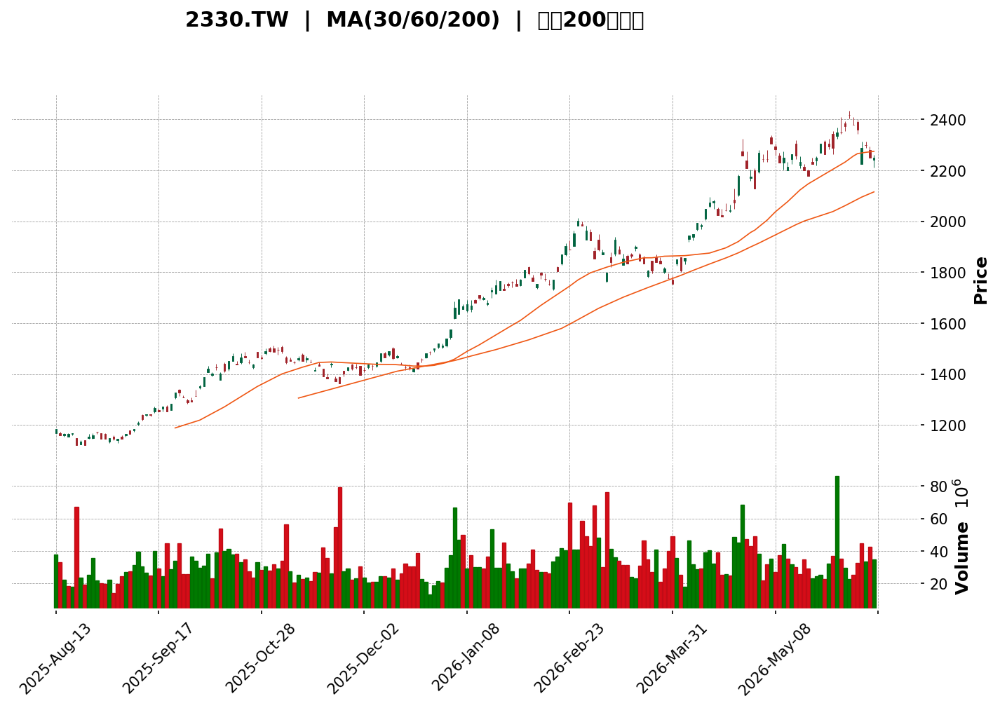
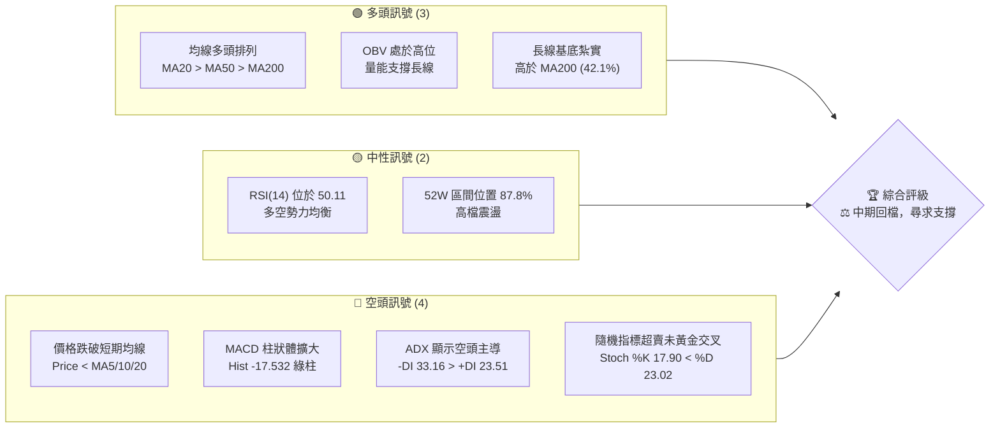
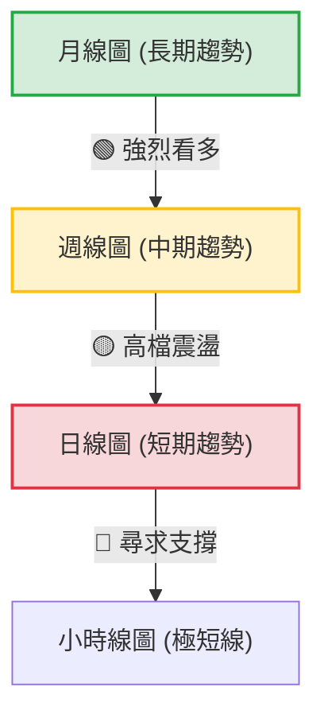
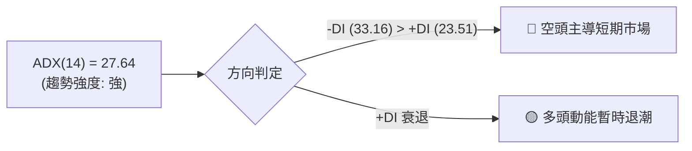
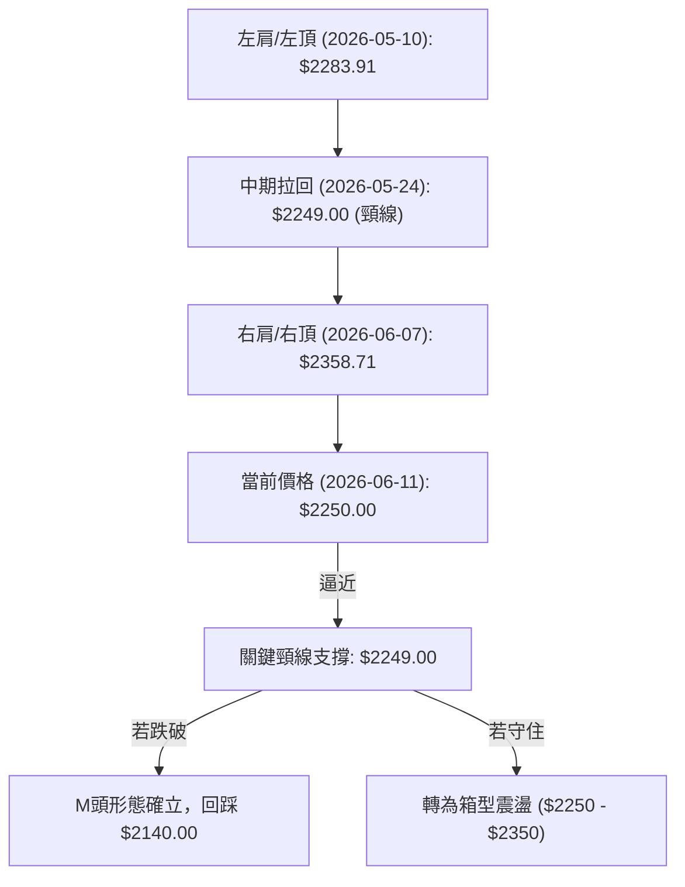

<details>
<summary>📊 靜態圖表 (點擊展開)</summary>

</details>

<html>
<head><meta charset="utf-8" /></head>
<body>
    <div style="height:500px; width:100%;">                        <script>window.PlotlyConfig = {MathJaxConfig: 'local'};</script>
        <script charset="utf-8" src="https://cdn.plot.ly/plotly-3.6.0.min.js" integrity="sha256-QaOVwtVY0T02VaHrr6pnoHLCwayMJp4O5n4YyaE3rJk=" crossorigin="anonymous"></script>                <div id="candlestick-chart" class="plotly-graph-div" style="height:100%; width:100%;"></div>            <script>                window.PLOTLYENV=window.PLOTLYENV || {};                                if (document.getElementById("candlestick-chart")) {                    Plotly.newPlot(                        "candlestick-chart",                        [{"close":{"dtype":"f8","bdata":"AAAAINyAkkAAAADgLB6SQAAAAKDpMZJAAAAAoOkxkkAAAAAgpkWSQAAAAMBHgJFAAAAAoH27kUAAAADAR4CRQAAAAEBwCpJAAAAA4CwekkAAAADgYlmSQAAAAAD34pFAAAAAAPfikUAAAACgs\u002faRQAAAAAD34pFAAAAAAPfikUAAAAAA9+KRQAAAAKDpMZJAAAAAoOkxkkAAAAAg3ICSQAAAAGCL45JAAAAAYMEek0AAAADgs22TQAAAAGD3WZNAAAAAgNzQk0AAAAAAapWTQAAAAGCt5JNAAAAAAGqVk0AAAAAATwyUQAAAAOCmvpRAAAAA4Ka+lEAAAABgY2+UQAAAAAAgIJRAAAAA4PAzlEAAAABANIOUQAAAACC7IZVAAAAAIHGslUAAAAAgJzeWQAAAAMDj55VAAAAAAPhKlkAAAADA4+eVQAAAAICFD5ZAAAAAgAyulkAAAADgT\u002f2WQAAAAOCZcpZAAAAAAH\u002fplkAAAAAAf+mWQAAAAKA7mpZAAAAA4JlylkAAAAAAf+mWQAAAACCu1ZZAAAAAQJNMl0AAAABAk0yXQAAAAIDCOJdAAAAAIGRgl0AAAABAk0yXQAAAAKA7mpZAAAAAgAyulkAAAACgO5qWQAAAACCu1ZZAAAAAgAyulkAAAAAgrtWWQAAAAKA7mpZAAAAAQFYjlkAAAAAAyV6WQAAAACBCwJVAAAAAQKCYlUAAAACgaoaWQAAAAID+cJVAAAAA4FxJlUAAAADA4+eVQAAAAAD4SpZAAAAAICc3lkAAAAAA+EqWQAAAAOAS1JVAAAAAQFYjlkAAAADgmXKWQAAAAADJXpZAAAAAoDualkAAAACg8SSXQAAAAAB\u002f6ZZAAAAAQJNMl0AAAACgSNWWQAAAAEAM\u002fZZAAAAAoMGFlkAAAAAgHEqWQAAAAGA6NpZAAAAAYDo2lkAAAABgOjaWQAAAAOBmwZZAAAAAwM8kl0AAAACAsTiXQAAAAOBWdJdAAAAA4N3Dl0AAAABgGpyXQAAAAABlE5hAAAAAYJGemEAAAACAj\u002fCZQAAAAOC7e5pAAAAAQHEEmkAAAADANCyaQAAAAABTGJpAAAAAgBZAmkAAAACgnY+aQAAAAKCdj5pAAAAAgBZAmkAAAABA6AabQAAAAGBvVptAAAAAwBSSm0AAAABA6AabQAAAAGBvVptAAAAAADN+m0AAAACAjUKbQAAAAID2pZtAAAAAoARFnEAAAABgXwmcQAAAAMAUkptAAAAAIFFqm0AAAACAffWbQAAAAEDYuZtAAAAAIFFqm0AAAACA9qWbQAAAAOAiMZxAAAAA4JkznUAAAABAxr6dQAAAAOAgg51AAAAA4JeFnkAAAACgaUyfQAAAAIDi\u002fJ5AAAAAgFutnkAAAABgTQ6eQAAAAID095xAAAAA4CCDnUAAAABgXVudQAAAACBBHZxAAAAAQE+8nEAAAAAgLyKeQAAAAKB7R51AAAAAgPT3nEAAAACAbaicQAAAAAAZJJ1AAAAAoLmvnUAAAACAT9ScQAAAAMBqrJxAAAAAgLw0nEAAAACAvDScQAAAACBdwJxAAAAAwGqsnEAAAABAoVycQAAAAEAOvZtAAAAAwERtm0AAAADgQeicQAAAAIC8NJxAAAAAQDT8nEAAAAAAP2OeQAAAAGAxd55AAAAAwLYqn0AAAAAA0gKfQAAAAIAQA6BAAAAAYO40oEAAAACg5z6gQAAAAABlop9AAAAAoHKOn0AAAACALvKfQAAAAIAu8p9AAAAAYO40oEAAAABgXwahQAAAAGDypaFAAAAAgDZCoUAAAAAgZvygQAAAAICjoqBAAAAAwOS5oUAAAADgBoihQAAAAOAGiKFAAAAAILX\u002foUAAAABg0NehQAAAAEAbaqFAAAAAAACSoUAAAACgL0yhQAAAAKDrr6FAAAAAYPKloUAAAACAFHShQAAAACBELqFAAAAAYF8GoUAAAAAAImChQAAAAAAAkqFAAAAAILX\u002foUAAAACg66+hQAAAAMDC66FAAAAAgMnhoUAAAADAd1miQAAAAMB3WaJAAAAAwFWLokAAAABgGOWiQAAAAOBOlaJAAAAAIGptokAAAACAyeGhQAAAAOC79aFAAAAAAACSoUAAAAAAAJShQA=="},"high":{"dtype":"f8","bdata":"AAAAINyAkkBax5vTYlmSQKDhpEamRZJAoOGkRqZFkkAAAAAgpkWSQIfYwKez9pFAdASKRjrPkUBakIBaOs+RQA3SII3pMZJA54QSLaZFkkAAAADgYlmSQJZ7GkGmRZJAlnsaQaZFkkAAAACgs\u002faRQI2w3PMsHpJAAAAAAPfikUCNsNzzLB6SQAAAAKDpMZJA4aTukx9tkkAAAAAg3ICSQDTWhwZI95JApZRS+rNtk0AAAADgs22TQL0loQa0bZNAAACAXK3kk0CIgiu5C72TQAAAAGCt5JNAU8bsTn74k0AAAAAATwyUQAAAAOCmvpRAH6icdRn6lEAQPvgYBZeUQJZaqZWSW5RAh36zdWNvlEC8lX2OSOaUQLzHe\u002fyLNZVAAAAAIHGslUBpNt3YyF6WQKOkfpy0+5VAVVVVlWqGlkCjpH6ctPuVQByVooc7mpZAAAAAgAyulkB1uBqZ8SSXQA3pvHUMrpZAmCKflfEkl0B1gylywjiXQE2aNFndwZZAr02UvGqGlkB1gylywjiXQPoglrUgEZdAXb\u002f7+DR0l0ALn3nVBYiXQO\u002fu7s7Wm5dABLIB2QWIl0C6fvex1puXQMGBA+9P\u002fZZAEs\u002fXFX\u002fplkAmTZp8DK6WQKfADtlP\u002fZZAJZ6vq\u002fEkl0CnwA7ZT\u002f2WQE2aNFndwZZAPtPW+PdKlkDw0bOVO5qWQJx0gEsnN5ZAchzHsePnlUBZKXt8O5qWQLfSrPFBwJVAsfYNC0LAlUBGSf14hQ+WQAAAAAD4SpZA0my6kWqGlkBVVVWVaoaWQBk6YOfIXpZAPtPW+PdKlkAAAADgmXKWQPtFkdyZcpZAAAAAoDualkAAAACg8SSXQHWDKXLCOJdAAAAAQJNMl0AAAACQOIiXQKbIZwXuEJdAYCpoZaOZlkAVGHuq33GWQJq2xq\u002ffcZZA3jxCJRxKlkBWMEs6o5mWQEH+WaVI1ZZAAAAAwM8kl0BQ5llFk0yXQAAAAOBWdJdAAAAA4N3Dl0Cvobzq3cOXQAAAAABlE5hAAAAAYJGemEB\u002fi9Na+FOaQAAAAOC7e5pAYtGyyjQsmkCA2PMP2meaQFVVVRXaZ5pAaMPnz7t7mkCrqqoqYbeaQFVVVWV\u002fo5pARYKaCtpnmkCrqqrKqy6bQBhddHX2pZtAAAAAwBSSm0CrqqoaUWqbQIwuuuoyfptAfnlsxRSSm0Cg+7kf2LmbQJasZEXYuZtAAAAAoARFnEBtdnEAqoCcQCDRCpt99ZtAAAAAIFFqm0CrqqoKQR2cQBU6g1VfCZxAeZoLcPalm0AAAACA9qWbQON3gvWpgJxAAAAA4JkznUDdy7HKieadQBUII0VNDp5AZ9KValutnkAM5KMqLXSfQPgz4c+HOJ9A1ShjleL8nkB9QV9QPcGeQGkO32\u002fkqp1At8SpH7ZxnkCrqqrqIIOdQAAAACBBHZxARrXlal1bnUAFvriq8kmeQLy6FUDGvp1AErFGlXtHnUAFCaPlmTOdQEzYBsH9S51ABAKBAKzDnUA5Dx3D\u002fUudQC1kIQMZJJ1AbceH4K5InEBoOz6ET9ScQDI4H2MLOJ1Ae9OboiYQnUBwCIegk3CcQAhFKMLXDJxAdNFFA\u002fPkm0AAAADgQeicQK6R1aUmEJ1AAAAAQDT8nEAAAAAAP2OeQAAAAGAxd55AAAAAwLYqn0Bcf3tgxBafQAAAAIAQA6BAxU7sINNcoED\u002fwUTQ4EigQC8xa6EJDaBAwhZscRADoEATtSsx9SqgQA\u002fE7wD8IKBAndiJcqOioEBpnEGQWBChQBjRNtOZJ6JA+WNJ893DoUCrM1JBPTihQFRcMoQ2QqFA4Ad+INfNoUBoRSOh66+hQHW5\u002fTHXzaFAH3zwcYVFokD0Lh4htf+hQDolAcLkuaFAFN898d3DoUDJZ91gFHShQAAAAKDrr6FA74X3oqAdokBJkiRB+ZuhQFEURREiYKFADw5IUT04oUAFhBPx\u002f5GhQASTPzD5m6FAAAAAILX\u002foUA28BmzoB2iQKBoq+GZJ6JAng8s83BjokC7f\u002fOAXIGiQC9\u002f2gIm0aJAgVwTgTqzokBDWrHwAwOjQHKnaAEm0aJATvDkoTO9okDGVDhxpxOiQO+VunCnE6JAJCs8ssLroUAAAAAAAKihQA=="},"hovertemplate":"\u003cb\u003e%{x|%Y-%m-%d}\u003c\u002fb\u003e\u003cbr\u003e\u958b: $%{open:.2f}\u003cbr\u003e\u9ad8: $%{high:.2f}\u003cbr\u003e\u4f4e: $%{low:.2f}\u003cbr\u003e\u6536: $%{close:.2f}\u003cextra\u003e\u003c\u002fextra\u003e","low":{"dtype":"f8","bdata":"ZmZmLKZFkkAAAADgLB6SQL88tlJwCpJAvzy2UnAKkkC1uAnTLB6SQAAAAMBHgJFAGffrUgSUkUAAAADAR4CRQPMt3\u002fL24pFApjhk7PbikUDT0tKS6TGSQAAAAAD34pFAAAAAAPfikUC\u002fgqEFwaeRQHwaYVk6z5FAc08jDMGnkUAAAAAA9+KRQL88tlJwCpJAAAAAoOkxkkDv7u7SYlmSQJhT8BISvJJA11pruQQLk0DDMAyTOkaTQEPaXrk6RpNAAAAADpmBk0AAAAAAapWTQPIN8u1plZNAAAAAAGqVk0A8QeqxOqmTQCI9UJGSW5RA4VdjSjSDlEAAAABgY2+UQCQ3ciNPDJRAAAAA4PAzlEAAAABANIOUQIdwCGcZ+pRAzczMGLshlUBiLrSKtPuVQLq2AgdCwJVAx3EcR1YjlkDSyIZxz4SVQEUPe6O0+5VAz9cVm4UPlkAWj8ptDK6WQAAAAOCZcpZArRtMsWqGlkAAAAAAf+mWQNmyZcNqhpZA9BZDSic3lkAAAAAAf+mWQK2feEPdwZZA9WCGqiARl0BSIIJjwjiXQAAAAIDCOJdA+Zv8rSARl0CkQASH8SSXQNmyZcNqhpZAAAAAgAyulkDZsmXDaoaWQFk\u002f8WYMrpZAAAAAgAyulkAG32mKO5qWQAAAAKA7mpZAYJaUY4UPlkAAAAAAyV6WQAAAACBCwJVAAAAAQKCYlUD1g44K+EqWQAAAAID+cJVAAAAA4FxJlUC6tgIHQsCVQKqqqmqFD5ZAy2SRQ1YjlkDjOI4jJzeWQAAAAOAS1JVAwSwph7T7lUD0FkNKJzeWQBAuTGpWI5ZAZsuWLfhKlkCHJvmXO5qWQAAAAAB\u002f6ZZAR4EIzk\u002f9lkCrqqraZsGWQLRuMLVI1ZZAodWX2t9xlkDq54SVWCKWQCLDvZpYIpZAZkk5EJX6lUAAAABgOjaWQH8DTFWjmZZAcAOGqkjVlkBfM0z17RCXQJO\u002fyY+xOJdAq6qqylZ0l0BRXkPVVnSXQKcBbZo4iJdAgeAyNYP\u002fl0BOa7aPnz2ZQP3zz58mjZlAnS5Nta3cmUABTxgg6rSZQFVVVSXqtJlAAAAAgBZAmkBVVVUV2meaQFVVVRXaZ5pAun1l9VIYmkAAAACgnY+aQBhddPpCy5pAbA4kWugGm0AAAABA6AabQHXRRdWrLptACRpO6qsum0AAAACAjUKbQBShCKWNQptAMP3S\u002f7nNm0CYwZeaffWbQAAAAMAUkptACjKbCsoam0AAAAAw2LmbQPViPrUUkptAg8ymWm9Wm0BTm9pU6AabQAAAAOAiMZxA6jsbtYuUnECL0DgVuB+dQAAAAOAgg51A\u002feMSK8a+nUDmN7iK4vyeQAAAAIDi\u002fJ5AjHiSGi8inkAAAABgTQ6eQAAAAID095xARtqxGj9vnUBVVVXVmTOdQBGk3PQyfptAXCWNKshsnEDeLE8auB+dQAAAAKB7R51AqaJnpYuUnEAAAACAbaicQLMn+T40\u002fJxA9Pl8fuJznUAAAACAT9ScQAAAAMBqrJxA4BpZnQDRm0AncfC+1wycQAAAACBdwJxAAAAAwGqsnEA+3uO91wycQAAAAEAOvZtAAAAAwERtm0D6kmn9hYScQJQ4eB\u002fKIJxA11prXXiYnECd2Ikdg\u002f+dQDN1i311E55AUrgefQiznkDugY3e+saeQL9KGJubUp9AO7ETnwkNoEAHdGN+EAOgQAAAAABlop9AAAAAoHKOn0D4HYgfPN6fQPE7EL9Jyp9Aip3YbhADoEBpOeZbzGagQAAAAGDypaFAAAAAgDZCoUAq5laPet6gQAAAAICjoqBA\u002fMAPvFEaoUBMXW5\u002fFHShQExdbn8UdKFAAAAAILX\u002foUBPRZpu8qWhQAAAAEAbaqFA3NTDTT04oUAp8lkPRC6hQB6Xvh0iYKFAhB5CzwaIoUAkSZKONkKhQAAAACBELqFAAAAAYF8GoUAAAAAAImChQOiNgt4oVqFA4YMPzuS5oUAAAACg66+hQMuHcV\u002fQ16FAOavHjuuvoUBXoM\u002fOmSeiQBEgw49+T6JAf6Ps\u002fnBjokC+pU7PLMeiQAAAAOBOlaJA4yVKj35PokBi8NMMImChQAucg3\u002fJ4aFAAAAAAACSoUAAAAAAAEShQA=="},"name":"\u50f9\u683c","open":{"dtype":"f8","bdata":"ZmZmLKZFkkDnhBItpkWSQF8eW\u002fksHpJAvzy2UnAKkkBa3IR56TGSQIfYwKez9pFAGffrUgSUkUBakIBaOs+RQPqWb5mz9pFAGXvtkrP2kUAAAADgYlmSQJZ7GkGmRZJAEpZ7mukxkkAPIjmsfbuRQAnLPU1wCpJAfBphWTrPkUAJyz1NcAqSQF8eW\u002fksHpJA4aTukx9tkkB3d3d5H22SQMwpeLnOz5JAfO+9U\u002fdZk0BiGIY591mTQL0loQa0bZNAAACA6mmVk0BEwZXcOqmTQPkG+aYLvZNADwVXcq3kk0A8QeqxOqmTQILK2W1jb5RAvxoTmUjmlEAAAABgY2+UQLmRG7nBR5RALSqRvMFHlEAAAABANIOUQEM4hEPqDZVAzczMGLshlUBiLrSKtPuVQF1bgeMS1JVAAAAAAPhKlkDSyIZxz4SVQGGkHatqhpZA22FQVCc3lkAWj8ptDK6WQK9NlLxqhpZAinzWjTualkDdYIrcT\u002f2WQAAAAKA7mpZAo2TXJvhKlkB1gylywjiXQFNgh\u002fx+6ZZApEAEh\u002fEkl0Bdv\u002fv4NHSXQFyPwhU1dJdAAAAAIGRgl0ALn3nVBYiXQJo0aRJ\u002f6ZZABkWdXN3BlkAAAACgO5qWQK2feEPdwZZAH1kSzyARl0Ctn3hD3cGWQAAAAKA7mpZAYJaUY4UPlkD7RZHcmXKWQJx0gEsnN5ZAHMdxHHGslUCn1oTDmXKWQFtp1jigmJVA6aKLLnGslUBGSf14hQ+WQMdxHEdWI5ZAntFLtZlylkAAAAAA+EqWQBk6YOfIXpZAAAAAQFYjlkCjZNcm+EqWQAAAAADJXpZAjBgxCslelkAraox0DK6WQJgin5XxJJdA9WCGqiARl0CrqqrKVnSXQFo3mHoq6ZZAAAAAoMGFlkAAAAAgHEqWQN48QiUcSpZARIZ71XYOlkBWMEs6o5mWQAAAAOBmwZZAlILkbyrplkAAAACAsTiXQDGVmBp1YJdAAAAAkDiIl0Aor6GaOIiXQP0ly18anJdAYSjmv0YnmECb7RNVgVGZQP3zz58mjZlAnS5Nta3cmUArl2nly8iZQAAAALCt3JlARYKaCtpnmkCrqqoqYbeaQKuqqtq7e5pA3b6yujQsmkCrqqp6BvOaQBhddPpCy5pAbA4kWugGm0BVVVUFyhqbQEYXXSVRaptAAAAAADN+m0DgU5MKUWqbQKpNbWpvVptAMP3S\u002f7nNm0AGOAk7yGycQK2wORC6zZtAiGX0z6sum0CrqqoKQR2cQAAAAEDYuZtAAAAAIFFqm0DpRz8ayhqbQOvZITDIbJxAbdR3em2onEB6tpHamTOdQAAAAOAgg51A\u002feMSK8a+nUDmN7iK4vyeQFMRS0XEEJ9AjHiSGi8inkDTa5\u002fFeZmeQJsJ6h8\u002fb51Azy1xCi8inkBVVVXVmTOdQI8PQboUkptAo9pyVdYLnUDj6gele0edQF7dCvAgg51AqaJnpYuUnEAEmkIguB+dQCZsg2ALOJ1A\u002fP1+P8ebnUBaN5hiCzidQMlCFkI0\u002fJxATeLg\u002ffLkm0BoOz6ET9ScQCHQFKImEJ1AZCELgU\u002fUnECu5moeyiCcQAAAAEAOvZtAuuii4Rupm0Bji3K+aqycQK6R1aUmEJ1A8L33fk\u002fUnEBe6IXeZyeeQEeVBJ9MT55AmpmZ3frGnkClgISf3+6eQKrQo\u002fuNZp9A7MROzwIXoEABPrtv7jSgQPyoLnEQA6BA61x5AGWin0AAAACALvKfQPgdiB883p9AYid2wOBIoEDS1SeMxXCgQHzhvfDdw6FAh1WEoQ1+oUAOosfvbPKgQMoQrCNELqFA7MRO7EokoUAAAADgBoihQAAAAOAGiKFAzaFiEZMxokB6F4\u002fAwuuhQOvbgGHypaFA8LMBPxtqoUAp8lkPRC6hQI9L394GiKFAc6Q5ErX\u002foUBJkiTvKFahQDEMw7AvTKFApnEGIUQuoUDPNG5gFHShQPjZgJ8NfqFA4YMPzuS5oUAaw9GCpxOiQDZ4jiC1\u002f6FA6CCvkn5PokA0YEkvjDuiQAAAAMB3WaJAQK6JIEifokAAAABgGOWiQAAAAOBOlaJAO7RrQUGpokBi8NMMImChQAAAAOC79aFAGHJ9IdfNoUAAAAAAAIChQA=="},"x":["2025-08-13T00:00:00+08:00","2025-08-14T00:00:00+08:00","2025-08-15T00:00:00+08:00","2025-08-18T00:00:00+08:00","2025-08-19T00:00:00+08:00","2025-08-20T00:00:00+08:00","2025-08-21T00:00:00+08:00","2025-08-22T00:00:00+08:00","2025-08-25T00:00:00+08:00","2025-08-26T00:00:00+08:00","2025-08-27T00:00:00+08:00","2025-08-28T00:00:00+08:00","2025-08-29T00:00:00+08:00","2025-09-01T00:00:00+08:00","2025-09-02T00:00:00+08:00","2025-09-03T00:00:00+08:00","2025-09-04T00:00:00+08:00","2025-09-05T00:00:00+08:00","2025-09-08T00:00:00+08:00","2025-09-09T00:00:00+08:00","2025-09-10T00:00:00+08:00","2025-09-11T00:00:00+08:00","2025-09-12T00:00:00+08:00","2025-09-15T00:00:00+08:00","2025-09-16T00:00:00+08:00","2025-09-17T00:00:00+08:00","2025-09-18T00:00:00+08:00","2025-09-19T00:00:00+08:00","2025-09-22T00:00:00+08:00","2025-09-23T00:00:00+08:00","2025-09-24T00:00:00+08:00","2025-09-25T00:00:00+08:00","2025-09-26T00:00:00+08:00","2025-09-30T00:00:00+08:00","2025-10-01T00:00:00+08:00","2025-10-02T00:00:00+08:00","2025-10-03T00:00:00+08:00","2025-10-07T00:00:00+08:00","2025-10-08T00:00:00+08:00","2025-10-09T00:00:00+08:00","2025-10-13T00:00:00+08:00","2025-10-14T00:00:00+08:00","2025-10-15T00:00:00+08:00","2025-10-16T00:00:00+08:00","2025-10-17T00:00:00+08:00","2025-10-20T00:00:00+08:00","2025-10-21T00:00:00+08:00","2025-10-22T00:00:00+08:00","2025-10-23T00:00:00+08:00","2025-10-27T00:00:00+08:00","2025-10-28T00:00:00+08:00","2025-10-29T00:00:00+08:00","2025-10-30T00:00:00+08:00","2025-10-31T00:00:00+08:00","2025-11-03T00:00:00+08:00","2025-11-04T00:00:00+08:00","2025-11-05T00:00:00+08:00","2025-11-06T00:00:00+08:00","2025-11-07T00:00:00+08:00","2025-11-10T00:00:00+08:00","2025-11-11T00:00:00+08:00","2025-11-12T00:00:00+08:00","2025-11-13T00:00:00+08:00","2025-11-14T00:00:00+08:00","2025-11-17T00:00:00+08:00","2025-11-18T00:00:00+08:00","2025-11-19T00:00:00+08:00","2025-11-20T00:00:00+08:00","2025-11-21T00:00:00+08:00","2025-11-24T00:00:00+08:00","2025-11-25T00:00:00+08:00","2025-11-26T00:00:00+08:00","2025-11-27T00:00:00+08:00","2025-11-28T00:00:00+08:00","2025-12-01T00:00:00+08:00","2025-12-02T00:00:00+08:00","2025-12-03T00:00:00+08:00","2025-12-04T00:00:00+08:00","2025-12-05T00:00:00+08:00","2025-12-08T00:00:00+08:00","2025-12-09T00:00:00+08:00","2025-12-10T00:00:00+08:00","2025-12-11T00:00:00+08:00","2025-12-12T00:00:00+08:00","2025-12-15T00:00:00+08:00","2025-12-16T00:00:00+08:00","2025-12-17T00:00:00+08:00","2025-12-18T00:00:00+08:00","2025-12-19T00:00:00+08:00","2025-12-22T00:00:00+08:00","2025-12-23T00:00:00+08:00","2025-12-24T00:00:00+08:00","2025-12-26T00:00:00+08:00","2025-12-29T00:00:00+08:00","2025-12-30T00:00:00+08:00","2025-12-31T00:00:00+08:00","2026-01-02T00:00:00+08:00","2026-01-05T00:00:00+08:00","2026-01-06T00:00:00+08:00","2026-01-07T00:00:00+08:00","2026-01-08T00:00:00+08:00","2026-01-09T00:00:00+08:00","2026-01-12T00:00:00+08:00","2026-01-13T00:00:00+08:00","2026-01-14T00:00:00+08:00","2026-01-15T00:00:00+08:00","2026-01-16T00:00:00+08:00","2026-01-19T00:00:00+08:00","2026-01-20T00:00:00+08:00","2026-01-21T00:00:00+08:00","2026-01-22T00:00:00+08:00","2026-01-23T00:00:00+08:00","2026-01-26T00:00:00+08:00","2026-01-27T00:00:00+08:00","2026-01-28T00:00:00+08:00","2026-01-29T00:00:00+08:00","2026-01-30T00:00:00+08:00","2026-02-02T00:00:00+08:00","2026-02-03T00:00:00+08:00","2026-02-04T00:00:00+08:00","2026-02-05T00:00:00+08:00","2026-02-06T00:00:00+08:00","2026-02-09T00:00:00+08:00","2026-02-10T00:00:00+08:00","2026-02-11T00:00:00+08:00","2026-02-23T00:00:00+08:00","2026-02-24T00:00:00+08:00","2026-02-25T00:00:00+08:00","2026-02-26T00:00:00+08:00","2026-03-02T00:00:00+08:00","2026-03-03T00:00:00+08:00","2026-03-04T00:00:00+08:00","2026-03-05T00:00:00+08:00","2026-03-06T00:00:00+08:00","2026-03-09T00:00:00+08:00","2026-03-10T00:00:00+08:00","2026-03-11T00:00:00+08:00","2026-03-12T00:00:00+08:00","2026-03-13T00:00:00+08:00","2026-03-16T00:00:00+08:00","2026-03-17T00:00:00+08:00","2026-03-18T00:00:00+08:00","2026-03-19T00:00:00+08:00","2026-03-20T00:00:00+08:00","2026-03-23T00:00:00+08:00","2026-03-24T00:00:00+08:00","2026-03-25T00:00:00+08:00","2026-03-26T00:00:00+08:00","2026-03-27T00:00:00+08:00","2026-03-30T00:00:00+08:00","2026-03-31T00:00:00+08:00","2026-04-01T00:00:00+08:00","2026-04-02T00:00:00+08:00","2026-04-07T00:00:00+08:00","2026-04-08T00:00:00+08:00","2026-04-09T00:00:00+08:00","2026-04-10T00:00:00+08:00","2026-04-13T00:00:00+08:00","2026-04-14T00:00:00+08:00","2026-04-15T00:00:00+08:00","2026-04-16T00:00:00+08:00","2026-04-17T00:00:00+08:00","2026-04-20T00:00:00+08:00","2026-04-21T00:00:00+08:00","2026-04-22T00:00:00+08:00","2026-04-23T00:00:00+08:00","2026-04-24T00:00:00+08:00","2026-04-27T00:00:00+08:00","2026-04-28T00:00:00+08:00","2026-04-29T00:00:00+08:00","2026-04-30T00:00:00+08:00","2026-05-04T00:00:00+08:00","2026-05-05T00:00:00+08:00","2026-05-06T00:00:00+08:00","2026-05-07T00:00:00+08:00","2026-05-08T00:00:00+08:00","2026-05-11T00:00:00+08:00","2026-05-12T00:00:00+08:00","2026-05-13T00:00:00+08:00","2026-05-14T00:00:00+08:00","2026-05-15T00:00:00+08:00","2026-05-18T00:00:00+08:00","2026-05-19T00:00:00+08:00","2026-05-20T00:00:00+08:00","2026-05-21T00:00:00+08:00","2026-05-22T00:00:00+08:00","2026-05-25T00:00:00+08:00","2026-05-26T00:00:00+08:00","2026-05-27T00:00:00+08:00","2026-05-28T00:00:00+08:00","2026-05-29T00:00:00+08:00","2026-06-01T00:00:00+08:00","2026-06-02T00:00:00+08:00","2026-06-03T00:00:00+08:00","2026-06-04T00:00:00+08:00","2026-06-05T00:00:00+08:00","2026-06-08T00:00:00+08:00","2026-06-09T00:00:00+08:00","2026-06-10T00:00:00+08:00","2026-06-11T00:00:00+08:00"],"type":"candlestick"},{"hovertemplate":"MA30: $%{y:.2f}\u003cextra\u003e\u003c\u002fextra\u003e","line":{"color":"#2196F3","dash":"dash","width":2},"mode":"lines","name":"MA30","x":["2025-08-13T00:00:00+08:00","2025-08-14T00:00:00+08:00","2025-08-15T00:00:00+08:00","2025-08-18T00:00:00+08:00","2025-08-19T00:00:00+08:00","2025-08-20T00:00:00+08:00","2025-08-21T00:00:00+08:00","2025-08-22T00:00:00+08:00","2025-08-25T00:00:00+08:00","2025-08-26T00:00:00+08:00","2025-08-27T00:00:00+08:00","2025-08-28T00:00:00+08:00","2025-08-29T00:00:00+08:00","2025-09-01T00:00:00+08:00","2025-09-02T00:00:00+08:00","2025-09-03T00:00:00+08:00","2025-09-04T00:00:00+08:00","2025-09-05T00:00:00+08:00","2025-09-08T00:00:00+08:00","2025-09-09T00:00:00+08:00","2025-09-10T00:00:00+08:00","2025-09-11T00:00:00+08:00","2025-09-12T00:00:00+08:00","2025-09-15T00:00:00+08:00","2025-09-16T00:00:00+08:00","2025-09-17T00:00:00+08:00","2025-09-18T00:00:00+08:00","2025-09-19T00:00:00+08:00","2025-09-22T00:00:00+08:00","2025-09-23T00:00:00+08:00","2025-09-24T00:00:00+08:00","2025-09-25T00:00:00+08:00","2025-09-26T00:00:00+08:00","2025-09-30T00:00:00+08:00","2025-10-01T00:00:00+08:00","2025-10-02T00:00:00+08:00","2025-10-03T00:00:00+08:00","2025-10-07T00:00:00+08:00","2025-10-08T00:00:00+08:00","2025-10-09T00:00:00+08:00","2025-10-13T00:00:00+08:00","2025-10-14T00:00:00+08:00","2025-10-15T00:00:00+08:00","2025-10-16T00:00:00+08:00","2025-10-17T00:00:00+08:00","2025-10-20T00:00:00+08:00","2025-10-21T00:00:00+08:00","2025-10-22T00:00:00+08:00","2025-10-23T00:00:00+08:00","2025-10-27T00:00:00+08:00","2025-10-28T00:00:00+08:00","2025-10-29T00:00:00+08:00","2025-10-30T00:00:00+08:00","2025-10-31T00:00:00+08:00","2025-11-03T00:00:00+08:00","2025-11-04T00:00:00+08:00","2025-11-05T00:00:00+08:00","2025-11-06T00:00:00+08:00","2025-11-07T00:00:00+08:00","2025-11-10T00:00:00+08:00","2025-11-11T00:00:00+08:00","2025-11-12T00:00:00+08:00","2025-11-13T00:00:00+08:00","2025-11-14T00:00:00+08:00","2025-11-17T00:00:00+08:00","2025-11-18T00:00:00+08:00","2025-11-19T00:00:00+08:00","2025-11-20T00:00:00+08:00","2025-11-21T00:00:00+08:00","2025-11-24T00:00:00+08:00","2025-11-25T00:00:00+08:00","2025-11-26T00:00:00+08:00","2025-11-27T00:00:00+08:00","2025-11-28T00:00:00+08:00","2025-12-01T00:00:00+08:00","2025-12-02T00:00:00+08:00","2025-12-03T00:00:00+08:00","2025-12-04T00:00:00+08:00","2025-12-05T00:00:00+08:00","2025-12-08T00:00:00+08:00","2025-12-09T00:00:00+08:00","2025-12-10T00:00:00+08:00","2025-12-11T00:00:00+08:00","2025-12-12T00:00:00+08:00","2025-12-15T00:00:00+08:00","2025-12-16T00:00:00+08:00","2025-12-17T00:00:00+08:00","2025-12-18T00:00:00+08:00","2025-12-19T00:00:00+08:00","2025-12-22T00:00:00+08:00","2025-12-23T00:00:00+08:00","2025-12-24T00:00:00+08:00","2025-12-26T00:00:00+08:00","2025-12-29T00:00:00+08:00","2025-12-30T00:00:00+08:00","2025-12-31T00:00:00+08:00","2026-01-02T00:00:00+08:00","2026-01-05T00:00:00+08:00","2026-01-06T00:00:00+08:00","2026-01-07T00:00:00+08:00","2026-01-08T00:00:00+08:00","2026-01-09T00:00:00+08:00","2026-01-12T00:00:00+08:00","2026-01-13T00:00:00+08:00","2026-01-14T00:00:00+08:00","2026-01-15T00:00:00+08:00","2026-01-16T00:00:00+08:00","2026-01-19T00:00:00+08:00","2026-01-20T00:00:00+08:00","2026-01-21T00:00:00+08:00","2026-01-22T00:00:00+08:00","2026-01-23T00:00:00+08:00","2026-01-26T00:00:00+08:00","2026-01-27T00:00:00+08:00","2026-01-28T00:00:00+08:00","2026-01-29T00:00:00+08:00","2026-01-30T00:00:00+08:00","2026-02-02T00:00:00+08:00","2026-02-03T00:00:00+08:00","2026-02-04T00:00:00+08:00","2026-02-05T00:00:00+08:00","2026-02-06T00:00:00+08:00","2026-02-09T00:00:00+08:00","2026-02-10T00:00:00+08:00","2026-02-11T00:00:00+08:00","2026-02-23T00:00:00+08:00","2026-02-24T00:00:00+08:00","2026-02-25T00:00:00+08:00","2026-02-26T00:00:00+08:00","2026-03-02T00:00:00+08:00","2026-03-03T00:00:00+08:00","2026-03-04T00:00:00+08:00","2026-03-05T00:00:00+08:00","2026-03-06T00:00:00+08:00","2026-03-09T00:00:00+08:00","2026-03-10T00:00:00+08:00","2026-03-11T00:00:00+08:00","2026-03-12T00:00:00+08:00","2026-03-13T00:00:00+08:00","2026-03-16T00:00:00+08:00","2026-03-17T00:00:00+08:00","2026-03-18T00:00:00+08:00","2026-03-19T00:00:00+08:00","2026-03-20T00:00:00+08:00","2026-03-23T00:00:00+08:00","2026-03-24T00:00:00+08:00","2026-03-25T00:00:00+08:00","2026-03-26T00:00:00+08:00","2026-03-27T00:00:00+08:00","2026-03-30T00:00:00+08:00","2026-03-31T00:00:00+08:00","2026-04-01T00:00:00+08:00","2026-04-02T00:00:00+08:00","2026-04-07T00:00:00+08:00","2026-04-08T00:00:00+08:00","2026-04-09T00:00:00+08:00","2026-04-10T00:00:00+08:00","2026-04-13T00:00:00+08:00","2026-04-14T00:00:00+08:00","2026-04-15T00:00:00+08:00","2026-04-16T00:00:00+08:00","2026-04-17T00:00:00+08:00","2026-04-20T00:00:00+08:00","2026-04-21T00:00:00+08:00","2026-04-22T00:00:00+08:00","2026-04-23T00:00:00+08:00","2026-04-24T00:00:00+08:00","2026-04-27T00:00:00+08:00","2026-04-28T00:00:00+08:00","2026-04-29T00:00:00+08:00","2026-04-30T00:00:00+08:00","2026-05-04T00:00:00+08:00","2026-05-05T00:00:00+08:00","2026-05-06T00:00:00+08:00","2026-05-07T00:00:00+08:00","2026-05-08T00:00:00+08:00","2026-05-11T00:00:00+08:00","2026-05-12T00:00:00+08:00","2026-05-13T00:00:00+08:00","2026-05-14T00:00:00+08:00","2026-05-15T00:00:00+08:00","2026-05-18T00:00:00+08:00","2026-05-19T00:00:00+08:00","2026-05-20T00:00:00+08:00","2026-05-21T00:00:00+08:00","2026-05-22T00:00:00+08:00","2026-05-25T00:00:00+08:00","2026-05-26T00:00:00+08:00","2026-05-27T00:00:00+08:00","2026-05-28T00:00:00+08:00","2026-05-29T00:00:00+08:00","2026-06-01T00:00:00+08:00","2026-06-02T00:00:00+08:00","2026-06-03T00:00:00+08:00","2026-06-04T00:00:00+08:00","2026-06-05T00:00:00+08:00","2026-06-08T00:00:00+08:00","2026-06-09T00:00:00+08:00","2026-06-10T00:00:00+08:00","2026-06-11T00:00:00+08:00"],"y":{"dtype":"f8","bdata":"AAAAAAAA+H8AAAAAAAD4fwAAAAAAAPh\u002fAAAAAAAA+H8AAAAAAAD4fwAAAAAAAPh\u002fAAAAAAAA+H8AAAAAAAD4fwAAAAAAAPh\u002fAAAAAAAA+H8AAAAAAAD4fwAAAAAAAPh\u002fAAAAAAAA+H8AAAAAAAD4fwAAAAAAAPh\u002fAAAAAAAA+H8AAAAAAAD4fwAAAAAAAPh\u002fAAAAAAAA+H8AAAAAAAD4fwAAAAAAAPh\u002fAAAAAAAA+H8AAAAAAAD4fwAAAAAAAPh\u002fAAAAAAAA+H8AAAAAAAD4fwAAAAAAAPh\u002fAAAAAAAA+H8AAAAAAAD4f5qZmflmk5JAVVVVVYemkkCrqqpqTbqSQCIiIrLGypJAIiIiEunbkkCJiIhoB++SQImIiLgCDpNAAAAAcKQvk0BVVVUV31eTQGZmZmbaeJNAVVVVxXqck0BmZmZm1LqTQAAAAMBy3pNA3t3d3VkHlEARERHxPDKUQFVVVcUoWZRAvLu7KwuElEAiIiKS7a6UQHd3d+eJ1JRAvLu7C9T4lEAzMzMTcx6VQGZmZuYeQJVAd3d3B8hjlUCamZl5z4SVQO\u002fu7j7WpZVAIiIiojjElUBVVVU17eOVQM3MzIwL+5VA3t3dXXcVlkBVVVWFQyuWQImIiBgZPZZAvLu7e5xNlkARERFxFmKWQO\u002fu7n45d5ZAAAAA4LyHlkCrqqoql5eWQO\u002fu7u7fnJZAZmZm1jaclkCJiIg4256WQFVVVaXkmpZAiYiIaE6SlkCJiIhoTpKWQBEREbFJlJZAzczMHFOQlkAAAABAYYqWQLy7u3sYhZZAZmZmhn1+lkBERET0hnqWQKuqqqqLeJZAvLu72915lkBVVVUl2XuWQN7d3T2CfJZA3t3dPYJ8lkCamZlJiHiWQO\u002fu7r6KdpZAAAAAEEFvlkDe3d19o2aWQN7d3R1OY5ZAVVVVpU9flkBVVVVF+luWQKuqqjpNW5ZAvLu7q0JflkBVVVWVj2KWQCIiIsLUaZZAVVVVJbd3lkDNzMzsSoKWQLy7u2shlpZAmpmZue2vlkBmZmYWEc2WQGZmZmYX+JZAIiIi8nUgl0C8u7sL30SXQDMzMwNRZZdAREREZL+Hl0AAAABQK6yXQN7d3c2N1JdAd3d3R6X3l0BVVVX1uB6YQO\u002fu7l4cSZhAmpmZeYFzmEC8u7tLo5SYQKuqqgpnuphAIiIiojDemEAiIiIy9wOZQM3MzLy6K5lAERERgcVcmUB3d3dH0I2ZQCIiIsKKu5lAq6qq6vHnmUAAAACw\u002fBiaQN7d3d1mQ5pAzczMHNpnmkDe3d2toI2aQBEREeENtppAMzMzA3LkmkAzMzMTzRibQERERDQxR5tAmpmZSY95m0AiIiLCSaebQKuqqvq5zZtAVVVVhX31m0CamZl5oBacQLy7u9slL5xAmpmZiftKnEAzMzND12KcQCIiInIYcJxAmpmZiU2FnEBmZmbmz5+cQAAAAGBhsJxAvLu7O0+8nEAzMzMTOsqcQImIiJid2ZxAiYiISFXsnEDe3d2dufmcQJqZmTl5Ap1AmpmZSe4BnUAzMzNTYAOdQN7d3c1zDZ1AREREZDAYnUBERESEoBudQKuqquq7G51Aq6qqGtUbnUCamZlZkyadQCIiIhKyJp1AmpmZWdkknUB3d3fXVCqdQGZmZoZ3Mp1A3t3djfg3nUARERGRhDWdQLy7u\u002ftbPp1Ad3d3Fy1NnUAAAACw9WGdQLy7uyu1eJ1ARERE1CaKnUDe3d3dPqCdQCIiInLxwJ1Ad3d3B1TgnUB3d3c3vwGeQN7d3Q0YNZ5Ad3d3Z3FknkBVVVXlyZGeQJqZmSkHtZ5ARERE5DrmnkBmZmbmaxufQFVVVVXxUZ9Ad3d3l26Un0AAAAAAQ9SfQCIiIsoPBKBAREREnKcfoEBEREQcQDqgQO\u002fu7obUWqBAq6qqQmh8oEAiIiJyAZagQHd3d9dEsKBAAAAAwODFoEAzMzOzftigQLy7uxNx7KBAMzMzqw0BoUB3d3efqxOhQM3MzNT1I6FA7+7uZkEyoUC8u7sjNUShQERERAzRWaFAiYiImGtxoUARERGRWoqhQAAAALCgoKFA7+7uvpOzoUBVVVUV5LqhQO\u002fu7u6MvaFAiYiIyDXAoUAiIiJyQ8WhQA=="},"type":"scatter"},{"hovertemplate":"MA60: $%{y:.2f}\u003cextra\u003e\u003c\u002fextra\u003e","line":{"color":"#9C27B0","dash":"dash","width":2},"mode":"lines","name":"MA60","x":["2025-08-13T00:00:00+08:00","2025-08-14T00:00:00+08:00","2025-08-15T00:00:00+08:00","2025-08-18T00:00:00+08:00","2025-08-19T00:00:00+08:00","2025-08-20T00:00:00+08:00","2025-08-21T00:00:00+08:00","2025-08-22T00:00:00+08:00","2025-08-25T00:00:00+08:00","2025-08-26T00:00:00+08:00","2025-08-27T00:00:00+08:00","2025-08-28T00:00:00+08:00","2025-08-29T00:00:00+08:00","2025-09-01T00:00:00+08:00","2025-09-02T00:00:00+08:00","2025-09-03T00:00:00+08:00","2025-09-04T00:00:00+08:00","2025-09-05T00:00:00+08:00","2025-09-08T00:00:00+08:00","2025-09-09T00:00:00+08:00","2025-09-10T00:00:00+08:00","2025-09-11T00:00:00+08:00","2025-09-12T00:00:00+08:00","2025-09-15T00:00:00+08:00","2025-09-16T00:00:00+08:00","2025-09-17T00:00:00+08:00","2025-09-18T00:00:00+08:00","2025-09-19T00:00:00+08:00","2025-09-22T00:00:00+08:00","2025-09-23T00:00:00+08:00","2025-09-24T00:00:00+08:00","2025-09-25T00:00:00+08:00","2025-09-26T00:00:00+08:00","2025-09-30T00:00:00+08:00","2025-10-01T00:00:00+08:00","2025-10-02T00:00:00+08:00","2025-10-03T00:00:00+08:00","2025-10-07T00:00:00+08:00","2025-10-08T00:00:00+08:00","2025-10-09T00:00:00+08:00","2025-10-13T00:00:00+08:00","2025-10-14T00:00:00+08:00","2025-10-15T00:00:00+08:00","2025-10-16T00:00:00+08:00","2025-10-17T00:00:00+08:00","2025-10-20T00:00:00+08:00","2025-10-21T00:00:00+08:00","2025-10-22T00:00:00+08:00","2025-10-23T00:00:00+08:00","2025-10-27T00:00:00+08:00","2025-10-28T00:00:00+08:00","2025-10-29T00:00:00+08:00","2025-10-30T00:00:00+08:00","2025-10-31T00:00:00+08:00","2025-11-03T00:00:00+08:00","2025-11-04T00:00:00+08:00","2025-11-05T00:00:00+08:00","2025-11-06T00:00:00+08:00","2025-11-07T00:00:00+08:00","2025-11-10T00:00:00+08:00","2025-11-11T00:00:00+08:00","2025-11-12T00:00:00+08:00","2025-11-13T00:00:00+08:00","2025-11-14T00:00:00+08:00","2025-11-17T00:00:00+08:00","2025-11-18T00:00:00+08:00","2025-11-19T00:00:00+08:00","2025-11-20T00:00:00+08:00","2025-11-21T00:00:00+08:00","2025-11-24T00:00:00+08:00","2025-11-25T00:00:00+08:00","2025-11-26T00:00:00+08:00","2025-11-27T00:00:00+08:00","2025-11-28T00:00:00+08:00","2025-12-01T00:00:00+08:00","2025-12-02T00:00:00+08:00","2025-12-03T00:00:00+08:00","2025-12-04T00:00:00+08:00","2025-12-05T00:00:00+08:00","2025-12-08T00:00:00+08:00","2025-12-09T00:00:00+08:00","2025-12-10T00:00:00+08:00","2025-12-11T00:00:00+08:00","2025-12-12T00:00:00+08:00","2025-12-15T00:00:00+08:00","2025-12-16T00:00:00+08:00","2025-12-17T00:00:00+08:00","2025-12-18T00:00:00+08:00","2025-12-19T00:00:00+08:00","2025-12-22T00:00:00+08:00","2025-12-23T00:00:00+08:00","2025-12-24T00:00:00+08:00","2025-12-26T00:00:00+08:00","2025-12-29T00:00:00+08:00","2025-12-30T00:00:00+08:00","2025-12-31T00:00:00+08:00","2026-01-02T00:00:00+08:00","2026-01-05T00:00:00+08:00","2026-01-06T00:00:00+08:00","2026-01-07T00:00:00+08:00","2026-01-08T00:00:00+08:00","2026-01-09T00:00:00+08:00","2026-01-12T00:00:00+08:00","2026-01-13T00:00:00+08:00","2026-01-14T00:00:00+08:00","2026-01-15T00:00:00+08:00","2026-01-16T00:00:00+08:00","2026-01-19T00:00:00+08:00","2026-01-20T00:00:00+08:00","2026-01-21T00:00:00+08:00","2026-01-22T00:00:00+08:00","2026-01-23T00:00:00+08:00","2026-01-26T00:00:00+08:00","2026-01-27T00:00:00+08:00","2026-01-28T00:00:00+08:00","2026-01-29T00:00:00+08:00","2026-01-30T00:00:00+08:00","2026-02-02T00:00:00+08:00","2026-02-03T00:00:00+08:00","2026-02-04T00:00:00+08:00","2026-02-05T00:00:00+08:00","2026-02-06T00:00:00+08:00","2026-02-09T00:00:00+08:00","2026-02-10T00:00:00+08:00","2026-02-11T00:00:00+08:00","2026-02-23T00:00:00+08:00","2026-02-24T00:00:00+08:00","2026-02-25T00:00:00+08:00","2026-02-26T00:00:00+08:00","2026-03-02T00:00:00+08:00","2026-03-03T00:00:00+08:00","2026-03-04T00:00:00+08:00","2026-03-05T00:00:00+08:00","2026-03-06T00:00:00+08:00","2026-03-09T00:00:00+08:00","2026-03-10T00:00:00+08:00","2026-03-11T00:00:00+08:00","2026-03-12T00:00:00+08:00","2026-03-13T00:00:00+08:00","2026-03-16T00:00:00+08:00","2026-03-17T00:00:00+08:00","2026-03-18T00:00:00+08:00","2026-03-19T00:00:00+08:00","2026-03-20T00:00:00+08:00","2026-03-23T00:00:00+08:00","2026-03-24T00:00:00+08:00","2026-03-25T00:00:00+08:00","2026-03-26T00:00:00+08:00","2026-03-27T00:00:00+08:00","2026-03-30T00:00:00+08:00","2026-03-31T00:00:00+08:00","2026-04-01T00:00:00+08:00","2026-04-02T00:00:00+08:00","2026-04-07T00:00:00+08:00","2026-04-08T00:00:00+08:00","2026-04-09T00:00:00+08:00","2026-04-10T00:00:00+08:00","2026-04-13T00:00:00+08:00","2026-04-14T00:00:00+08:00","2026-04-15T00:00:00+08:00","2026-04-16T00:00:00+08:00","2026-04-17T00:00:00+08:00","2026-04-20T00:00:00+08:00","2026-04-21T00:00:00+08:00","2026-04-22T00:00:00+08:00","2026-04-23T00:00:00+08:00","2026-04-24T00:00:00+08:00","2026-04-27T00:00:00+08:00","2026-04-28T00:00:00+08:00","2026-04-29T00:00:00+08:00","2026-04-30T00:00:00+08:00","2026-05-04T00:00:00+08:00","2026-05-05T00:00:00+08:00","2026-05-06T00:00:00+08:00","2026-05-07T00:00:00+08:00","2026-05-08T00:00:00+08:00","2026-05-11T00:00:00+08:00","2026-05-12T00:00:00+08:00","2026-05-13T00:00:00+08:00","2026-05-14T00:00:00+08:00","2026-05-15T00:00:00+08:00","2026-05-18T00:00:00+08:00","2026-05-19T00:00:00+08:00","2026-05-20T00:00:00+08:00","2026-05-21T00:00:00+08:00","2026-05-22T00:00:00+08:00","2026-05-25T00:00:00+08:00","2026-05-26T00:00:00+08:00","2026-05-27T00:00:00+08:00","2026-05-28T00:00:00+08:00","2026-05-29T00:00:00+08:00","2026-06-01T00:00:00+08:00","2026-06-02T00:00:00+08:00","2026-06-03T00:00:00+08:00","2026-06-04T00:00:00+08:00","2026-06-05T00:00:00+08:00","2026-06-08T00:00:00+08:00","2026-06-09T00:00:00+08:00","2026-06-10T00:00:00+08:00","2026-06-11T00:00:00+08:00"],"y":{"dtype":"f8","bdata":"AAAAAAAA+H8AAAAAAAD4fwAAAAAAAPh\u002fAAAAAAAA+H8AAAAAAAD4fwAAAAAAAPh\u002fAAAAAAAA+H8AAAAAAAD4fwAAAAAAAPh\u002fAAAAAAAA+H8AAAAAAAD4fwAAAAAAAPh\u002fAAAAAAAA+H8AAAAAAAD4fwAAAAAAAPh\u002fAAAAAAAA+H8AAAAAAAD4fwAAAAAAAPh\u002fAAAAAAAA+H8AAAAAAAD4fwAAAAAAAPh\u002fAAAAAAAA+H8AAAAAAAD4fwAAAAAAAPh\u002fAAAAAAAA+H8AAAAAAAD4fwAAAAAAAPh\u002fAAAAAAAA+H8AAAAAAAD4fwAAAAAAAPh\u002fAAAAAAAA+H8AAAAAAAD4fwAAAAAAAPh\u002fAAAAAAAA+H8AAAAAAAD4fwAAAAAAAPh\u002fAAAAAAAA+H8AAAAAAAD4fwAAAAAAAPh\u002fAAAAAAAA+H8AAAAAAAD4fwAAAAAAAPh\u002fAAAAAAAA+H8AAAAAAAD4fwAAAAAAAPh\u002fAAAAAAAA+H8AAAAAAAD4fwAAAAAAAPh\u002fAAAAAAAA+H8AAAAAAAD4fwAAAAAAAPh\u002fAAAAAAAA+H8AAAAAAAD4fwAAAAAAAPh\u002fAAAAAAAA+H8AAAAAAAD4fwAAAAAAAPh\u002fAAAAAAAA+H8AAAAAAAD4fxEREQlAaJRAiYiI6BF6lEDe3d3tMY6UQImIiBgAoZRAERER+dKxlECamZlJT8OUQLy7u1Nx1ZRAMzMzo+3llEDv7u4mXfuUQN7d3YXfCZVA7+7ulmQXlUB3d3dnkSaVQImIiDheOZVAVVVVfdZLlUCJiIgYT16VQImIiKAgb5VAERERWUSBlUAzMzNDupSVQBEREcmKppVAvLu781i5lUBEREQcJs2VQCIiIpJQ3pVAq6qqIiXwlUCamZnhq\u002f6VQO\u002fu7n4wDpZAERER2bwZlkCamZlZSCWWQFVVVdUsL5ZAmpmZgWM6lkBVVVXlnkOWQJqZmSkzTJZAvLu7k29WlkAzMzMDU2KWQImIiCCHcJZAq6qqArp\u002flkC8u7sL8YyWQFVVVa2AmZZAAAAASBKmlkB3d3cn9rWWQN7d3QV+yZZAVVVVLWLZlkAiIiK6luuWQCIiIlrN\u002fJZAiYiIQAkMl0AAAABIRhuXQM3MzCTTLJdA7+7uZhE7l0DNzMz0n0yXQM3MzATUYJdAq6qqqq92l0CJiIg4PoiXQERERKR0m5dAAAAAcFmtl0De3d29P76XQN7d3b0i0ZdAiYiISAPml0CrqqriOfqXQAAAAHBsD5hAAAAAyKAjmECrqqp6ezqYQERERAxaT5hAREREZI5jmECamZkhGHiYQJqZmVHxj5hARERElBSumEAAAAAAjM2YQAAAAFCp7phAmpmZgb4UmUBERERsLTqZQImIiLDoYplAvLu7u\u002fmKmUCrqqrCv62ZQHd3d287yplA7+7udl3pmUCamZlJgQeaQAAAACBTIppAiYiIaHk+mkDe3d1tRF+aQHd3d9++fJpAq6qqWuiXmkB3d3evbq+aQJqZmVECyppAVVVV9ULlmkAAAABo2P6aQDMzM\u002fsZF5tAVVVV5Vkvm0BVVVVNmEibQAAAAEh\u002fZJtAd3d3JxGAm0AiIiKaTpqbQERERGSRr5tAvLu7m9fBm0C8u7sDGtqbQJqZmflf7ptAZmZmrqUEnEBVVVX1kCGcQFVVVV3UPJxAvLu768NYnECamZkpZ26cQDMzM\u002fsKhpxAZmZmTlWhnEDNzMwUS7ycQLy7u4Pt05xA7+7uLpHqnECJiIgQiwGdQCIiIvKEGJ1AiYiIyNAynUDv7u6Ox1CdQO\u002fu7ra8cp1AmpmZUWCQnUBERET8Aa6dQBEREWFSx51AZmZmFkjpnUAiIiLCkgqeQHd3d0c1Kp5AiYiIcC5LnkCamZmp0WueQBEREbHJip5AZmZmzr+rnkBmZmZeEMieQERERHyy6J5AAAAA0FIKn0Dv7u4eSymfQImIiOCdQ59AzczMbE1Yn0Dv7u4eqW2fQO\u002fu7tashZ9AIiIi8gmdn0AAAADoba6fQKuqqtIjw59Aq6qq8tfYn0C8u7v7L\u002fWfQBEREdEVC6BAVVVVgT8boEAAAAAAPS2gQImIiLSMQKBAVVVV4d5RoECJiIjY4V2gQO\u002fu7noMbKBAIiIiPjd5oEBmZmYyFIegQA=="},"type":"scatter"},{"hovertemplate":"MA200: $%{y:.2f}\u003cextra\u003e\u003c\u002fextra\u003e","line":{"color":"#FF6F00","dash":"solid","width":2},"mode":"lines","name":"MA200","x":["2025-08-13T00:00:00+08:00","2025-08-14T00:00:00+08:00","2025-08-15T00:00:00+08:00","2025-08-18T00:00:00+08:00","2025-08-19T00:00:00+08:00","2025-08-20T00:00:00+08:00","2025-08-21T00:00:00+08:00","2025-08-22T00:00:00+08:00","2025-08-25T00:00:00+08:00","2025-08-26T00:00:00+08:00","2025-08-27T00:00:00+08:00","2025-08-28T00:00:00+08:00","2025-08-29T00:00:00+08:00","2025-09-01T00:00:00+08:00","2025-09-02T00:00:00+08:00","2025-09-03T00:00:00+08:00","2025-09-04T00:00:00+08:00","2025-09-05T00:00:00+08:00","2025-09-08T00:00:00+08:00","2025-09-09T00:00:00+08:00","2025-09-10T00:00:00+08:00","2025-09-11T00:00:00+08:00","2025-09-12T00:00:00+08:00","2025-09-15T00:00:00+08:00","2025-09-16T00:00:00+08:00","2025-09-17T00:00:00+08:00","2025-09-18T00:00:00+08:00","2025-09-19T00:00:00+08:00","2025-09-22T00:00:00+08:00","2025-09-23T00:00:00+08:00","2025-09-24T00:00:00+08:00","2025-09-25T00:00:00+08:00","2025-09-26T00:00:00+08:00","2025-09-30T00:00:00+08:00","2025-10-01T00:00:00+08:00","2025-10-02T00:00:00+08:00","2025-10-03T00:00:00+08:00","2025-10-07T00:00:00+08:00","2025-10-08T00:00:00+08:00","2025-10-09T00:00:00+08:00","2025-10-13T00:00:00+08:00","2025-10-14T00:00:00+08:00","2025-10-15T00:00:00+08:00","2025-10-16T00:00:00+08:00","2025-10-17T00:00:00+08:00","2025-10-20T00:00:00+08:00","2025-10-21T00:00:00+08:00","2025-10-22T00:00:00+08:00","2025-10-23T00:00:00+08:00","2025-10-27T00:00:00+08:00","2025-10-28T00:00:00+08:00","2025-10-29T00:00:00+08:00","2025-10-30T00:00:00+08:00","2025-10-31T00:00:00+08:00","2025-11-03T00:00:00+08:00","2025-11-04T00:00:00+08:00","2025-11-05T00:00:00+08:00","2025-11-06T00:00:00+08:00","2025-11-07T00:00:00+08:00","2025-11-10T00:00:00+08:00","2025-11-11T00:00:00+08:00","2025-11-12T00:00:00+08:00","2025-11-13T00:00:00+08:00","2025-11-14T00:00:00+08:00","2025-11-17T00:00:00+08:00","2025-11-18T00:00:00+08:00","2025-11-19T00:00:00+08:00","2025-11-20T00:00:00+08:00","2025-11-21T00:00:00+08:00","2025-11-24T00:00:00+08:00","2025-11-25T00:00:00+08:00","2025-11-26T00:00:00+08:00","2025-11-27T00:00:00+08:00","2025-11-28T00:00:00+08:00","2025-12-01T00:00:00+08:00","2025-12-02T00:00:00+08:00","2025-12-03T00:00:00+08:00","2025-12-04T00:00:00+08:00","2025-12-05T00:00:00+08:00","2025-12-08T00:00:00+08:00","2025-12-09T00:00:00+08:00","2025-12-10T00:00:00+08:00","2025-12-11T00:00:00+08:00","2025-12-12T00:00:00+08:00","2025-12-15T00:00:00+08:00","2025-12-16T00:00:00+08:00","2025-12-17T00:00:00+08:00","2025-12-18T00:00:00+08:00","2025-12-19T00:00:00+08:00","2025-12-22T00:00:00+08:00","2025-12-23T00:00:00+08:00","2025-12-24T00:00:00+08:00","2025-12-26T00:00:00+08:00","2025-12-29T00:00:00+08:00","2025-12-30T00:00:00+08:00","2025-12-31T00:00:00+08:00","2026-01-02T00:00:00+08:00","2026-01-05T00:00:00+08:00","2026-01-06T00:00:00+08:00","2026-01-07T00:00:00+08:00","2026-01-08T00:00:00+08:00","2026-01-09T00:00:00+08:00","2026-01-12T00:00:00+08:00","2026-01-13T00:00:00+08:00","2026-01-14T00:00:00+08:00","2026-01-15T00:00:00+08:00","2026-01-16T00:00:00+08:00","2026-01-19T00:00:00+08:00","2026-01-20T00:00:00+08:00","2026-01-21T00:00:00+08:00","2026-01-22T00:00:00+08:00","2026-01-23T00:00:00+08:00","2026-01-26T00:00:00+08:00","2026-01-27T00:00:00+08:00","2026-01-28T00:00:00+08:00","2026-01-29T00:00:00+08:00","2026-01-30T00:00:00+08:00","2026-02-02T00:00:00+08:00","2026-02-03T00:00:00+08:00","2026-02-04T00:00:00+08:00","2026-02-05T00:00:00+08:00","2026-02-06T00:00:00+08:00","2026-02-09T00:00:00+08:00","2026-02-10T00:00:00+08:00","2026-02-11T00:00:00+08:00","2026-02-23T00:00:00+08:00","2026-02-24T00:00:00+08:00","2026-02-25T00:00:00+08:00","2026-02-26T00:00:00+08:00","2026-03-02T00:00:00+08:00","2026-03-03T00:00:00+08:00","2026-03-04T00:00:00+08:00","2026-03-05T00:00:00+08:00","2026-03-06T00:00:00+08:00","2026-03-09T00:00:00+08:00","2026-03-10T00:00:00+08:00","2026-03-11T00:00:00+08:00","2026-03-12T00:00:00+08:00","2026-03-13T00:00:00+08:00","2026-03-16T00:00:00+08:00","2026-03-17T00:00:00+08:00","2026-03-18T00:00:00+08:00","2026-03-19T00:00:00+08:00","2026-03-20T00:00:00+08:00","2026-03-23T00:00:00+08:00","2026-03-24T00:00:00+08:00","2026-03-25T00:00:00+08:00","2026-03-26T00:00:00+08:00","2026-03-27T00:00:00+08:00","2026-03-30T00:00:00+08:00","2026-03-31T00:00:00+08:00","2026-04-01T00:00:00+08:00","2026-04-02T00:00:00+08:00","2026-04-07T00:00:00+08:00","2026-04-08T00:00:00+08:00","2026-04-09T00:00:00+08:00","2026-04-10T00:00:00+08:00","2026-04-13T00:00:00+08:00","2026-04-14T00:00:00+08:00","2026-04-15T00:00:00+08:00","2026-04-16T00:00:00+08:00","2026-04-17T00:00:00+08:00","2026-04-20T00:00:00+08:00","2026-04-21T00:00:00+08:00","2026-04-22T00:00:00+08:00","2026-04-23T00:00:00+08:00","2026-04-24T00:00:00+08:00","2026-04-27T00:00:00+08:00","2026-04-28T00:00:00+08:00","2026-04-29T00:00:00+08:00","2026-04-30T00:00:00+08:00","2026-05-04T00:00:00+08:00","2026-05-05T00:00:00+08:00","2026-05-06T00:00:00+08:00","2026-05-07T00:00:00+08:00","2026-05-08T00:00:00+08:00","2026-05-11T00:00:00+08:00","2026-05-12T00:00:00+08:00","2026-05-13T00:00:00+08:00","2026-05-14T00:00:00+08:00","2026-05-15T00:00:00+08:00","2026-05-18T00:00:00+08:00","2026-05-19T00:00:00+08:00","2026-05-20T00:00:00+08:00","2026-05-21T00:00:00+08:00","2026-05-22T00:00:00+08:00","2026-05-25T00:00:00+08:00","2026-05-26T00:00:00+08:00","2026-05-27T00:00:00+08:00","2026-05-28T00:00:00+08:00","2026-05-29T00:00:00+08:00","2026-06-01T00:00:00+08:00","2026-06-02T00:00:00+08:00","2026-06-03T00:00:00+08:00","2026-06-04T00:00:00+08:00","2026-06-05T00:00:00+08:00","2026-06-08T00:00:00+08:00","2026-06-09T00:00:00+08:00","2026-06-10T00:00:00+08:00","2026-06-11T00:00:00+08:00"],"y":{"dtype":"f8","bdata":"AAAAAAAA+H8AAAAAAAD4fwAAAAAAAPh\u002fAAAAAAAA+H8AAAAAAAD4fwAAAAAAAPh\u002fAAAAAAAA+H8AAAAAAAD4fwAAAAAAAPh\u002fAAAAAAAA+H8AAAAAAAD4fwAAAAAAAPh\u002fAAAAAAAA+H8AAAAAAAD4fwAAAAAAAPh\u002fAAAAAAAA+H8AAAAAAAD4fwAAAAAAAPh\u002fAAAAAAAA+H8AAAAAAAD4fwAAAAAAAPh\u002fAAAAAAAA+H8AAAAAAAD4fwAAAAAAAPh\u002fAAAAAAAA+H8AAAAAAAD4fwAAAAAAAPh\u002fAAAAAAAA+H8AAAAAAAD4fwAAAAAAAPh\u002fAAAAAAAA+H8AAAAAAAD4fwAAAAAAAPh\u002fAAAAAAAA+H8AAAAAAAD4fwAAAAAAAPh\u002fAAAAAAAA+H8AAAAAAAD4fwAAAAAAAPh\u002fAAAAAAAA+H8AAAAAAAD4fwAAAAAAAPh\u002fAAAAAAAA+H8AAAAAAAD4fwAAAAAAAPh\u002fAAAAAAAA+H8AAAAAAAD4fwAAAAAAAPh\u002fAAAAAAAA+H8AAAAAAAD4fwAAAAAAAPh\u002fAAAAAAAA+H8AAAAAAAD4fwAAAAAAAPh\u002fAAAAAAAA+H8AAAAAAAD4fwAAAAAAAPh\u002fAAAAAAAA+H8AAAAAAAD4fwAAAAAAAPh\u002fAAAAAAAA+H8AAAAAAAD4fwAAAAAAAPh\u002fAAAAAAAA+H8AAAAAAAD4fwAAAAAAAPh\u002fAAAAAAAA+H8AAAAAAAD4fwAAAAAAAPh\u002fAAAAAAAA+H8AAAAAAAD4fwAAAAAAAPh\u002fAAAAAAAA+H8AAAAAAAD4fwAAAAAAAPh\u002fAAAAAAAA+H8AAAAAAAD4fwAAAAAAAPh\u002fAAAAAAAA+H8AAAAAAAD4fwAAAAAAAPh\u002fAAAAAAAA+H8AAAAAAAD4fwAAAAAAAPh\u002fAAAAAAAA+H8AAAAAAAD4fwAAAAAAAPh\u002fAAAAAAAA+H8AAAAAAAD4fwAAAAAAAPh\u002fAAAAAAAA+H8AAAAAAAD4fwAAAAAAAPh\u002fAAAAAAAA+H8AAAAAAAD4fwAAAAAAAPh\u002fAAAAAAAA+H8AAAAAAAD4fwAAAAAAAPh\u002fAAAAAAAA+H8AAAAAAAD4fwAAAAAAAPh\u002fAAAAAAAA+H8AAAAAAAD4fwAAAAAAAPh\u002fAAAAAAAA+H8AAAAAAAD4fwAAAAAAAPh\u002fAAAAAAAA+H8AAAAAAAD4fwAAAAAAAPh\u002fAAAAAAAA+H8AAAAAAAD4fwAAAAAAAPh\u002fAAAAAAAA+H8AAAAAAAD4fwAAAAAAAPh\u002fAAAAAAAA+H8AAAAAAAD4fwAAAAAAAPh\u002fAAAAAAAA+H8AAAAAAAD4fwAAAAAAAPh\u002fAAAAAAAA+H8AAAAAAAD4fwAAAAAAAPh\u002fAAAAAAAA+H8AAAAAAAD4fwAAAAAAAPh\u002fAAAAAAAA+H8AAAAAAAD4fwAAAAAAAPh\u002fAAAAAAAA+H8AAAAAAAD4fwAAAAAAAPh\u002fAAAAAAAA+H8AAAAAAAD4fwAAAAAAAPh\u002fAAAAAAAA+H8AAAAAAAD4fwAAAAAAAPh\u002fAAAAAAAA+H8AAAAAAAD4fwAAAAAAAPh\u002fAAAAAAAA+H8AAAAAAAD4fwAAAAAAAPh\u002fAAAAAAAA+H8AAAAAAAD4fwAAAAAAAPh\u002fAAAAAAAA+H8AAAAAAAD4fwAAAAAAAPh\u002fAAAAAAAA+H8AAAAAAAD4fwAAAAAAAPh\u002fAAAAAAAA+H8AAAAAAAD4fwAAAAAAAPh\u002fAAAAAAAA+H8AAAAAAAD4fwAAAAAAAPh\u002fAAAAAAAA+H8AAAAAAAD4fwAAAAAAAPh\u002fAAAAAAAA+H8AAAAAAAD4fwAAAAAAAPh\u002fAAAAAAAA+H8AAAAAAAD4fwAAAAAAAPh\u002fAAAAAAAA+H8AAAAAAAD4fwAAAAAAAPh\u002fAAAAAAAA+H8AAAAAAAD4fwAAAAAAAPh\u002fAAAAAAAA+H8AAAAAAAD4fwAAAAAAAPh\u002fAAAAAAAA+H8AAAAAAAD4fwAAAAAAAPh\u002fAAAAAAAA+H8AAAAAAAD4fwAAAAAAAPh\u002fAAAAAAAA+H8AAAAAAAD4fwAAAAAAAPh\u002fAAAAAAAA+H8AAAAAAAD4fwAAAAAAAPh\u002fAAAAAAAA+H8AAAAAAAD4fwAAAAAAAPh\u002fAAAAAAAA+H8AAAAAAAD4fwAAAAAAAPh\u002fAAAAAAAA+H8AAAD8Q0SaQA=="},"type":"scatter"}],                        {"template":{"data":{"barpolar":[{"marker":{"line":{"color":"rgb(17,17,17)","width":0.5},"pattern":{"fillmode":"overlay","size":10,"solidity":0.2}},"type":"barpolar"}],"bar":[{"error_x":{"color":"#f2f5fa"},"error_y":{"color":"#f2f5fa"},"marker":{"line":{"color":"rgb(17,17,17)","width":0.5},"pattern":{"fillmode":"overlay","size":10,"solidity":0.2}},"type":"bar"}],"carpet":[{"aaxis":{"endlinecolor":"#A2B1C6","gridcolor":"#506784","linecolor":"#506784","minorgridcolor":"#506784","startlinecolor":"#A2B1C6"},"baxis":{"endlinecolor":"#A2B1C6","gridcolor":"#506784","linecolor":"#506784","minorgridcolor":"#506784","startlinecolor":"#A2B1C6"},"type":"carpet"}],"choropleth":[{"colorbar":{"outlinewidth":0,"ticks":""},"type":"choropleth"}],"contourcarpet":[{"colorbar":{"outlinewidth":0,"ticks":""},"type":"contourcarpet"}],"contour":[{"colorbar":{"outlinewidth":0,"ticks":""},"colorscale":[[0.0,"#0d0887"],[0.1111111111111111,"#46039f"],[0.2222222222222222,"#7201a8"],[0.3333333333333333,"#9c179e"],[0.4444444444444444,"#bd3786"],[0.5555555555555556,"#d8576b"],[0.6666666666666666,"#ed7953"],[0.7777777777777778,"#fb9f3a"],[0.8888888888888888,"#fdca26"],[1.0,"#f0f921"]],"type":"contour"}],"heatmap":[{"colorbar":{"outlinewidth":0,"ticks":""},"colorscale":[[0.0,"#0d0887"],[0.1111111111111111,"#46039f"],[0.2222222222222222,"#7201a8"],[0.3333333333333333,"#9c179e"],[0.4444444444444444,"#bd3786"],[0.5555555555555556,"#d8576b"],[0.6666666666666666,"#ed7953"],[0.7777777777777778,"#fb9f3a"],[0.8888888888888888,"#fdca26"],[1.0,"#f0f921"]],"type":"heatmap"}],"histogram2dcontour":[{"colorbar":{"outlinewidth":0,"ticks":""},"colorscale":[[0.0,"#0d0887"],[0.1111111111111111,"#46039f"],[0.2222222222222222,"#7201a8"],[0.3333333333333333,"#9c179e"],[0.4444444444444444,"#bd3786"],[0.5555555555555556,"#d8576b"],[0.6666666666666666,"#ed7953"],[0.7777777777777778,"#fb9f3a"],[0.8888888888888888,"#fdca26"],[1.0,"#f0f921"]],"type":"histogram2dcontour"}],"histogram2d":[{"colorbar":{"outlinewidth":0,"ticks":""},"colorscale":[[0.0,"#0d0887"],[0.1111111111111111,"#46039f"],[0.2222222222222222,"#7201a8"],[0.3333333333333333,"#9c179e"],[0.4444444444444444,"#bd3786"],[0.5555555555555556,"#d8576b"],[0.6666666666666666,"#ed7953"],[0.7777777777777778,"#fb9f3a"],[0.8888888888888888,"#fdca26"],[1.0,"#f0f921"]],"type":"histogram2d"}],"histogram":[{"marker":{"pattern":{"fillmode":"overlay","size":10,"solidity":0.2}},"type":"histogram"}],"mesh3d":[{"colorbar":{"outlinewidth":0,"ticks":""},"type":"mesh3d"}],"parcoords":[{"line":{"colorbar":{"outlinewidth":0,"ticks":""}},"type":"parcoords"}],"pie":[{"automargin":true,"type":"pie"}],"scatter3d":[{"line":{"colorbar":{"outlinewidth":0,"ticks":""}},"marker":{"colorbar":{"outlinewidth":0,"ticks":""}},"type":"scatter3d"}],"scattercarpet":[{"marker":{"colorbar":{"outlinewidth":0,"ticks":""}},"type":"scattercarpet"}],"scattergeo":[{"marker":{"colorbar":{"outlinewidth":0,"ticks":""}},"type":"scattergeo"}],"scattergl":[{"marker":{"line":{"color":"#283442"}},"type":"scattergl"}],"scattermapbox":[{"marker":{"colorbar":{"outlinewidth":0,"ticks":""}},"type":"scattermapbox"}],"scattermap":[{"marker":{"colorbar":{"outlinewidth":0,"ticks":""}},"type":"scattermap"}],"scatterpolargl":[{"marker":{"colorbar":{"outlinewidth":0,"ticks":""}},"type":"scatterpolargl"}],"scatterpolar":[{"marker":{"colorbar":{"outlinewidth":0,"ticks":""}},"type":"scatterpolar"}],"scatter":[{"marker":{"line":{"color":"#283442"}},"type":"scatter"}],"scatterternary":[{"marker":{"colorbar":{"outlinewidth":0,"ticks":""}},"type":"scatterternary"}],"surface":[{"colorbar":{"outlinewidth":0,"ticks":""},"colorscale":[[0.0,"#0d0887"],[0.1111111111111111,"#46039f"],[0.2222222222222222,"#7201a8"],[0.3333333333333333,"#9c179e"],[0.4444444444444444,"#bd3786"],[0.5555555555555556,"#d8576b"],[0.6666666666666666,"#ed7953"],[0.7777777777777778,"#fb9f3a"],[0.8888888888888888,"#fdca26"],[1.0,"#f0f921"]],"type":"surface"}],"table":[{"cells":{"fill":{"color":"#506784"},"line":{"color":"rgb(17,17,17)"}},"header":{"fill":{"color":"#2a3f5f"},"line":{"color":"rgb(17,17,17)"}},"type":"table"}]},"layout":{"annotationdefaults":{"arrowcolor":"#f2f5fa","arrowhead":0,"arrowwidth":1},"autotypenumbers":"strict","coloraxis":{"colorbar":{"outlinewidth":0,"ticks":""}},"colorscale":{"diverging":[[0,"#8e0152"],[0.1,"#c51b7d"],[0.2,"#de77ae"],[0.3,"#f1b6da"],[0.4,"#fde0ef"],[0.5,"#f7f7f7"],[0.6,"#e6f5d0"],[0.7,"#b8e186"],[0.8,"#7fbc41"],[0.9,"#4d9221"],[1,"#276419"]],"sequential":[[0.0,"#0d0887"],[0.1111111111111111,"#46039f"],[0.2222222222222222,"#7201a8"],[0.3333333333333333,"#9c179e"],[0.4444444444444444,"#bd3786"],[0.5555555555555556,"#d8576b"],[0.6666666666666666,"#ed7953"],[0.7777777777777778,"#fb9f3a"],[0.8888888888888888,"#fdca26"],[1.0,"#f0f921"]],"sequentialminus":[[0.0,"#0d0887"],[0.1111111111111111,"#46039f"],[0.2222222222222222,"#7201a8"],[0.3333333333333333,"#9c179e"],[0.4444444444444444,"#bd3786"],[0.5555555555555556,"#d8576b"],[0.6666666666666666,"#ed7953"],[0.7777777777777778,"#fb9f3a"],[0.8888888888888888,"#fdca26"],[1.0,"#f0f921"]]},"colorway":["#636efa","#EF553B","#00cc96","#ab63fa","#FFA15A","#19d3f3","#FF6692","#B6E880","#FF97FF","#FECB52"],"font":{"color":"#f2f5fa"},"geo":{"bgcolor":"rgb(17,17,17)","lakecolor":"rgb(17,17,17)","landcolor":"rgb(17,17,17)","showlakes":true,"showland":true,"subunitcolor":"#506784"},"hoverlabel":{"align":"left"},"hovermode":"closest","mapbox":{"style":"dark"},"paper_bgcolor":"rgb(17,17,17)","plot_bgcolor":"rgb(17,17,17)","polar":{"angularaxis":{"gridcolor":"#506784","linecolor":"#506784","ticks":""},"bgcolor":"rgb(17,17,17)","radialaxis":{"gridcolor":"#506784","linecolor":"#506784","ticks":""}},"scene":{"xaxis":{"backgroundcolor":"rgb(17,17,17)","gridcolor":"#506784","gridwidth":2,"linecolor":"#506784","showbackground":true,"ticks":"","zerolinecolor":"#C8D4E3"},"yaxis":{"backgroundcolor":"rgb(17,17,17)","gridcolor":"#506784","gridwidth":2,"linecolor":"#506784","showbackground":true,"ticks":"","zerolinecolor":"#C8D4E3"},"zaxis":{"backgroundcolor":"rgb(17,17,17)","gridcolor":"#506784","gridwidth":2,"linecolor":"#506784","showbackground":true,"ticks":"","zerolinecolor":"#C8D4E3"}},"shapedefaults":{"line":{"color":"#f2f5fa"}},"sliderdefaults":{"bgcolor":"#C8D4E3","bordercolor":"rgb(17,17,17)","borderwidth":1,"tickwidth":0},"ternary":{"aaxis":{"gridcolor":"#506784","linecolor":"#506784","ticks":""},"baxis":{"gridcolor":"#506784","linecolor":"#506784","ticks":""},"bgcolor":"rgb(17,17,17)","caxis":{"gridcolor":"#506784","linecolor":"#506784","ticks":""}},"title":{"x":0.05},"updatemenudefaults":{"bgcolor":"#506784","borderwidth":0},"xaxis":{"automargin":true,"gridcolor":"#283442","linecolor":"#506784","ticks":"","title":{"standoff":15},"zerolinecolor":"#283442","zerolinewidth":2},"yaxis":{"automargin":true,"gridcolor":"#283442","linecolor":"#506784","ticks":"","title":{"standoff":15},"zerolinecolor":"#283442","zerolinewidth":2}}},"xaxis":{"rangeslider":{"visible":false},"title":{"text":"\u65e5\u671f"}},"font":{"size":11},"title":{"text":"2330.TW  |  MA(30\u002f60\u002f200)  |  \u6700\u8fd1200\u4ea4\u6613\u65e5"},"yaxis":{"title":{"text":"\u80a1\u50f9 (USD)"}},"hovermode":"x unified","height":500},                        {"responsive": true}                    )                };            </script>        </div>
</body>
</html>

# 2330.TW 技術分析報告

> **報告日期**：2026-06-11 ｜ **語言**：繁體中文 ｜ **數據來源**：Yahoo Finance ｜ **當前價格**：$2250.00

---

## 目錄

| 章節 | 內容 |
|------|------|
| [1. 技術面概覽](#1-技術面概覽) | 訊號儀表板、核心指標、評分卡 |
| [2. 趨勢分析](#2-趨勢分析) | 多時框趨勢、長中短期走勢 |
| [3. 圖表形態分析](#3-圖表形態分析) | 形態識別、K線組合、目標價 |
| [4. 支撐與阻力](#4-支撐與阻力) | 關鍵價位、斐波那契回調 |
| [5. 技術指標深度解讀](#5-技術指標深度解讀) | MA/RSI/MACD/布林/成交量 |
| [6. 動能與波動率](#6-動能與波動率) | 動能評估、ATR、Beta |
| [7. 多時框架總結](#7-多時框架總結) | 時框架評分矩陣 |
| [8. 交易策略建議](#8-交易策略建議) | 多空策略、風險報酬比 |
| [9. 風險提示與監控](#9-風險提示與監控) | 監控指標、風險場景 |
| [10. 報告總結](#10-報告總結) | 核心結論與最優策略組合 |

---

## 1. 技術面概覽

### 🎯 技術訊號儀表板

2330.TW（台積電）目前處於**中長線多頭格局中的短期修正波段**。以下為多、空、中性訊號的分布與收斂關係：



### 📊 核心指標速覽表

| 指標類別 | 指標名稱 | 當前數值 | 訊號 | 解讀 |
|----------|----------|----------|------|------|
| **價格** | 當前價格 | $2250.00 | 🟡 中性 | 價格自歷史高點回落，目前在52週高位區間（87.8%）震盪 |
| **均線** | MA20 | $2290.44 | 🔴 看空 | 價格跌破20日均線（月線），月線轉為短期壓力 |
| **均線** | MA50 | $2172.22 | 🟢 看多 | 價格仍高於50日季線，季線呈現上揚，具備中期支撐力道 |
| **均線** | MA200 | $1681.07 | 🟢 看多 | 遠高於200日年線，長期牛市架構未被破壞 |
| **動能** | RSI(14) | 50.11 | 🟡 中性 | 指標回到50中軸，顯示短期極度超買的壓力已得到釋放 |
| **動能** | MACD | 33.291 | 🔴 看空 | 雙線位於零軸上方，但柱狀體為 -17.532，顯示短期修正動能強 |
| **波動** | ATR(14) | $61.63 | 🟡 中性 | 波動率佔股價 2.74%，處於正常波動區間，未見恐慌性拋售 |
| **籌碼** | OBV | 穩定上揚 | 🟢 看多 | 能量潮指標高於其移動平均線，長期資金未出現實質性撤退 |

### 🏆 技術評分卡

根據多因子技術模型評估，2330.TW 的技術面得分如下：

```
技術評分卡 — 2330.TW (2026-06-11)
════════════════════════════════════════════════════
趨勢強度      ██████████████░░░░░░  70/100  🟡 中性偏強
動能指標      ████████░░░░░░░░░░░░  40/100  🔴 短期偏弱
支撐穩定度    ████████████████░░░░  80/100  🟢 結構紮實
成交量配合    ██████████████░░░░░░  70/100  🟢 量價無背離
形態完整度    ██████████░░░░░░░░░░  50/100  🟡 構築盤整頂
均線排列      ██████████████████░░  90/100  🟢 長期多頭
════════════════════════════════════════════════════
綜合評分      ██████████████░░░░░░  66.7/100 ⚖️ 逢低佈局
════════════════════════════════════════════════════
```

---

## 2. 趨勢分析

### 🌐 多時框趨勢分析

技術分析的核心在於「大週期管小週期，小週期引導大週期」。以下展示台積電的多時框趨勢邏輯：



1. **月線級別（長期）**：24個月的價格歷史顯示，台積電經歷了極為強勁的牛市。股價自 2024-06 的 $937.07 飆升至 2026-05 的歷史收盤高點 $2348.73，漲幅達 150.6%。年線（MA200 = $1681.07）與兩年線（MA240 = $1583.43）均呈現完美的 45 度角上揚，長期多頭趨勢無庸置疑。
2. **週線級別（中期）**：近期週線在 $2350 附近遭遇明顯阻力。2026-06-14 當週收盤回落至 $2250.00，跌幅達 4.61%。然而，中期均線（MA50 = $2172.22）仍是強力的下檔防禦線。
3. **日線級別（短期）**：短期均線出現糾纏向下。股價目前低於 MA5（$2289.09）、MA10（$2331.38）及 MA20（$2290.44），短線空頭取得發言權，預期將向下方布林通道下軌（$2162.37）或 MA50 尋求支撐。

---

### 📈 長期趨勢 — 12個月走勢圖（Unicode）

以下為台積電過去 12 個月（2025-07 至 2026-06）的收盤價走勢圖，清晰展現其陡峭的上升通道與近期的頂部回檔：

```
2330.TW 月線走勢圖（過去12個月）
價格軸 (TWD)
$2400 ┤                                                   ● (05月高點 2348.73)
$2200 ┤                                               ●   │
$2000 ┤                                       ● ━━━━━━┫   ┗━● (當前 2250.00)
$1800 ┤                               ● ━━━━━━┛
$1600 ┤                       ● ━━━━━━┛
$1400 ┤               ● ━━━━━━┛
$1200 ┤   ● ━━━● ━━━━━┛
$1000 ┤   (07月低點 1144.74)
      └───────────────────────────────────────────────────────────────
         07  08  09  10  11  12  01  02  03  04  05  06 (月份)
```

**走勢特徵分析表**：

| 階段 | 時間區間 | 起始價 -> 終點價 | 漲跌幅 | 主要技術特徵 |
|------|----------|------------------|--------|--------------|
| **奠基期** | 2025-07 ~ 2025-08 | $1144.74 -> $1144.74 | 0.00% | 橫盤築底，消化先前浮額，形成強大中期支撐平台。 |
| **主升段** | 2025-09 ~ 2026-02 | $1292.99 -> $1983.22 | +53.38% | 沿 MA5 陡峭上行，成交量穩步放大，多頭極度強勢。 |
| **洗盤期** | 2026-02 ~ 2026-03 | $1983.22 -> $1755.32 | -11.49% | 急跌回踩 MA60（$2115.54附近歷史位），融資清洗。 |
| **末升段** | 2026-03 ~ 2026-05 | $1755.32 -> $2348.73 | +33.81% | 噴射趕頂，創下 $2433.51 盤中歷史高點，乖離率偏高。 |
| **修正期** | 2026-05 ~ 2026-06 | $2348.73 -> $2250.00 | -4.20% | 跌破月線，構築短期雙頂形態，尋求季線支撐。 |

---

### 📊 中期趨勢（週線分析）

中期走勢上，台積電呈現一個標準的**上升楔形（Ascending Wedge）**。近期股價在觸及楔形上軌（$2433.51）後拉回，目前正朝著楔形下軌（約 $2180.00）靠攏。

```
週線支撐與阻力通道示意圖
═══════════════════════════════════════════════════════════════
$2450 -------------------------------------------▲━ (歷史高點阻力 $2433.51)
$2350 -----------------------------▲-------▼---- (前波頸線阻力 $2358.71)
$2250 -----------------------▲-----║-------║---- (目前現價 $2250.00)
$2150 -----------------▲-----║-----▼-------║---- (季線/布林下軌支撐 $2162-$2172)
$2050 -----------▲-----║-----▼-------------║---- (中期強支撐 $2051.00)
═══════════════════════════════════════════════════════════════
```

---

### ⚡ 趨勢強度評估（ADX 解讀）

我們引入平均趨向指標（ADX）來量化當前趨勢的強度與方向：



| ADX 數值區間 | 趨勢強度解讀 | 2330.TW 當前狀態 | 交易策略指引 |
|--------------|--------------|------------------|--------------|
| < 20 | 盤整無趨勢 | | 適合網格、區間震盪操作 |
| 20 - 25 | 趨勢初生 | | 準備順勢進場 |
| **25 - 50** | **強趨勢** | **★ 當前值：27.64** | **順應當前修正趨勢，暫不急於做多** |
| > 50 | 極強趨勢 | | 容易出現超買/超賣極端拐點 |

**結論**：ADX 顯示當前市場並非無序震盪，而是存在**明確的短期下行趨勢**。由於 -DI 顯著高於 +DI，在 -DI 拐頭向下且 ADX 跌破 25 之前，不宜過早判定修正結束。

---

## 3. 圖表形態分析

### 🔍 形態識別系統

在日線與週線圖表上，台積電近期構築了經典的**「雙重頂」（Double Top，俗稱 M 頭）**修正形態，這解釋了為何近期股價面臨較大的回檔壓力。



### 🕯️ 重要K線形態分析

觀察最近 6 週的 K 線組合，可以發現高檔賣壓十分沉重：

| 週別收盤 | 收盤價 | K線形態 | 解讀 | 訊號 |
|------|--------|---------|------|------|
| 2026-05-10 | $2283.91 | 長陽突破線 | 帶量突破新高，多頭氣勢如虹。 | 🟢 強多 |
| 2026-05-17 | $2258.97 | 高檔流星線 (Shooting Star) | 留長上影線，顯示高檔獲利了結賣壓沉重。 | 🟡 警戒 |
| 2026-05-24 | $2249.00 | 陰線吞噬 | 跌破前週低點，確立短期高點暫時出現。 | 🔴 看空 |
| 2026-05-31 | $2348.73 | 帶量長陽線 | 多頭強力反撲，企圖挑戰歷史高點。 | 🟢 看多 |
| 2026-06-07 | $2358.71 | 墓碑十字線 (Gravestone Doji) | 盤中創高後收在最低點附近，多頭力竭訊號。 | 🔴 強烈警戒 |
| 2026-06-14 | $2250.00 | 大陰線 (Bearish Engulfing) | 完全吞噬前週實體，確認雙頂形態的右頂成立。 | 🔴 看空 |

---

### 📉 ASCII 走勢形態示意圖

```
台積電日線「雙重頂 (M頭)」形態
價格 (TWD)
$2360 ┤               ● (右頂 2358.71)
$2320 ┤   ● (左頂)   / \
$2280 ┤  / \        /   \
$2240 ┤ /   \      /     ▼━━━━━━━● (現價 2250.00 逼近頸線)
$2200 ┤      ┗━━━━● (頸線 2249.00)
$2160 ┤            \
$2120 ┤             \
$2080 ┤              ▼ (量測目標價 2140.00)
      └───────────────────────────────────────────────
```

### 🎯 形態目標價計算

* **形態最高點（A）**：$2358.71（2026-06-07）
* **形態頸線位（B）**：$2249.00（2026-05-24）
* **形態高度（H）