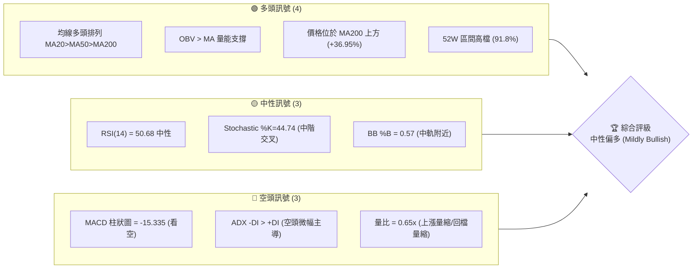
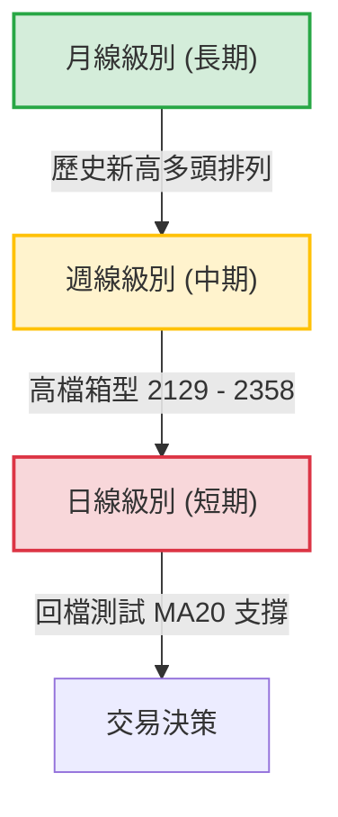
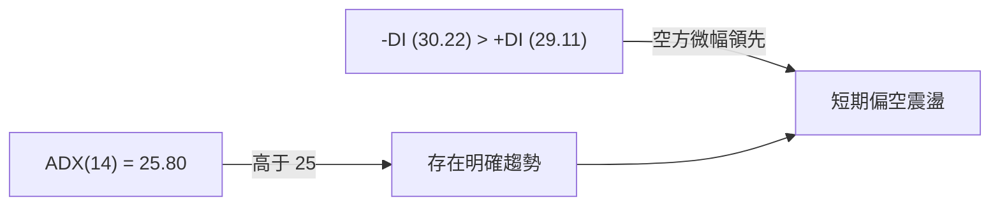
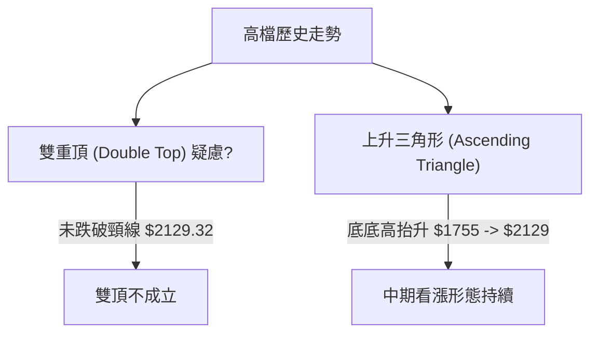

<details>
<summary>📊 靜態圖表 (點擊展開)</summary>

</details>

<html>
<head><meta charset="utf-8" /></head>
<body>
    <div style="height:500px; width:100%;">                        <script>window.PlotlyConfig = {MathJaxConfig: 'local'};</script>
        <script charset="utf-8" src="https://cdn.plot.ly/plotly-3.6.0.min.js" integrity="sha256-QaOVwtVY0T02VaHrr6pnoHLCwayMJp4O5n4YyaE3rJk=" crossorigin="anonymous"></script>                <div id="candlestick-chart" class="plotly-graph-div" style="height:100%; width:100%;"></div>            <script>                window.PLOTLYENV=window.PLOTLYENV || {};                                if (document.getElementById("candlestick-chart")) {                    Plotly.newPlot(                        "candlestick-chart",                        [{"close":{"dtype":"f8","bdata":"AAAAwCwekkAAAACA6TGSQAAAAIDpMZJAAAAAIKZFkkAAAACgR4CRQAAAAKB9u5FAAAAAoEeAkUAAAABAcAqSQAAAAMAsHpJAAAAA4GJZkkAAAAAg9+KRQAAAACD34pFAAAAAwLP2kUAAAAAg9+KRQAAAACD34pFAAAAAIPfikUAAAACA6TGSQAAAAIDpMZJAAAAAINyAkkAAAACAi+OSQAAAAEDBHpNAAAAA4LNtk0AAAABg91mTQAAAAIDc0JNAAAAAAGqVk0AAAACAreSTQAAAAABqlZNAAAAAIE8MlEAAAADgpr6UQAAAAOCmvpRAAAAAYGNvlEAAAADgHyCUQAAAAMDwM5RAAAAAQDSDlEAAAAAguyGVQAAAAEBxrJVAAAAAQCc3lkAAAADg4+eVQAAAACD4SpZAAAAA4OPnlUAAAABghQ+WQAAAAGAMrpZAAAAA4E\u002f9lkAAAADAmXKWQAAAAAB\u002f6ZZAAAAAAH\u002fplkAAAACAO5qWQAAAAMCZcpZAAAAAAH\u002fplkAAAABArtWWQAAAAECTTJdAAAAAQJNMl0AAAABgwjiXQAAAACBkYJdAAAAAQJNMl0AAAACAO5qWQAAAAGAMrpZAAAAAgDualkAAAABArtWWQAAAAGAMrpZAAAAAQK7VlkAAAACAO5qWQAAAAEBWI5ZAAAAA4MhelkAAAAAAQsCVQAAAAGCgmJVAAAAAwGqGlkAAAACA\u002fnCVQAAAAOBcSZVAAAAA4OPnlUAAAAAg+EqWQAAAAEAnN5ZAAAAAIPhKlkAAAAAAE9SVQAAAAEBWI5ZAAAAAwJlylkAAAADgyF6WQAAAAIA7mpZAAAAAoPEkl0AAAAAAf+mWQAAAAECTTJdAAAAAoEjVlkAAAABADP2WQAAAAIDBhZZAAAAAQBxKlkAAAACAOjaWQAAAAIA6NpZAAAAAgDo2lkAAAADAZsGWQAAAAKDPJJdAAAAAgLE4l0AAAADgVnSXQAAAAODdw5dAAAAAQBqcl0AAAAAAZROYQAAAAGCRnphAAAAAgI\u002fwmUAAAADgu3uaQAAAAEBxBJpAAAAA4DQsmkAAAAAAUxiaQAAAAIAWQJpAAAAAwJ2PmkAAAADAnY+aQAAAAIAWQJpAAAAAQOgGm0AAAABAb1abQAAAAKAUkptAAAAAQOgGm0AAAABAb1abQAAAAOAyfptAAAAAoI1Cm0AAAACA9qWbQAAAAKAERZxAAAAAYF8JnEAAAACgFJKbQAAAACBRaptAAAAAgH31m0AAAAAg2LmbQAAAACBRaptAAAAAgPalm0AAAADAIjGcQAAAAOCZM51AAAAAQMa+nUAAAAAAIYOdQAAAAOCXhZ5AAAAAoGlMn0AAAACg4vyeQAAAAIBbrZ5AAAAAQE0OnkAAAACA9PecQAAAAAAhg51AAAAAYF1bnUAAAAAAQR2cQAAAAEBPvJxAAAAAIC8inkAAAACge0edQAAAAID095xAAAAAgG2onEAAAAAAGSSdQAAAAKC5r51AAAAAgE\u002fUnEAAAADAaqycQAAAAIC8NJxAAAAAgLw0nEAAAAAgXcCcQAAAAMBqrJxAAAAAQKFcnEAAAABADr2bQAAAAMBEbZtAAAAA4EHonEAAAACAvDScQAAAAEA0\u002fJxAAAAAAD9jnkAAAABgMXeeQAAAAMC2Kp9AAAAAANICn0AAAACAEAOgQAAAAGDuNKBAAAAAoOc+oEAAAAAAZaKfQAAAAKByjp9AAAAAgC7yn0AAAACALvKfQAAAAGDuNKBAAAAAYF8GoUAAAABg8qWhQAAAAIA2QqFAAAAAIGb8oEAAAACAo6KgQAAAAMDkuaFAAAAA4AaIoUAAAADgBoihQAAAACC1\u002f6FAAAAAYNDXoUAAAABAG2qhQAAAAAAAkqFAAAAAoC9MoUAAAACg66+hQAAAAGDypaFAAAAAgBR0oUAAAAAgRC6hQAAAAGBfBqFAAAAAACJgoUAAAAAAAJKhQAAAACC1\u002f6FAAAAAoOuvoUAAAADAwuuhQAAAAIDJ4aFAAAAAwHdZokAAAADAd1miQAAAAMBVi6JAAAAAYBjlokAAAADgTpWiQAAAACBqbaJAAAAAgMnhoUAAAADgu\u002fWhQAAAAAAAkqFAAAAAAACUoUAAAAAAAAyiQA=="},"high":{"dtype":"f8","bdata":"MzMzs2JZkkBkK4ImpkWSQGQrgiamRZJAAAAAIKZFkkAzUeiGs\u002faRQHQEikY6z5FAIjbwOTrPkUAN0iCN6TGSQM3MzAymRZJAAAAA4GJZkkDUCMthpkWSQNQIy2GmRZJAAAAAwLP2kUDlnkYULR6SQAAAACD34pFA5Z5GFC0ekkAAAACA6TGSQCuChnMfbZJAAAAAINyAkkACRqkmSPeSQJ1zztmzbZNAAAAA4LNtk0C9JaEGtG2TQAAAgFyt5JNAiIIruQu9k0AAAACAreSTQFPG7E5++JNAAAAAIE8MlEAAAADgpr6UQB+onHUZ+pRAED74GAWXlECt1Ep1kluUQFVVVVVjb5RAvJV9jkjmlEC8x3v8izWVQAAAAEBxrJVAtkwW+chelkARl5u8tPuVQKuqqrVqhpZAEZebvLT7lUAdYNlmO5qWQAAAAGAMrpZAdbgamfEkl0BfKmhVDK6WQJgin5XxJJdAdYMpcsI4l0A\u002ffvw43cGWQB8OeJxqhpZAdYMpcsI4l0Dyb+nVIBGXQF2\u002f+\u002fg0dJdAC5951QWIl0BnZmau1puXQASyAdkFiJdAun73sdabl0CeO3fOT\u002f2WQIbug\u002fV+6ZZAHz9+XAyulkChSkb5T\u002f2WQA3dB4vxJJdAoUpG+U\u002f9lkA\u002ffvw43cGWQD7T1vj3SpZAMchedTualkCRidEqJzeWQCSPPNLj55VADlCXnDualkC30qzxQcCVQLH2DQtCwJVAIy43mYUPlkAAAAAg+EqWQGyZLLJqhpZAq6qqtWqGlkAQkysIyV6WQD7T1vj3SpZAAAAAwJlylkBm7XS8mXKWQAAAAIA7mpZAAAAAoPEkl0B1gylywjiXQAAAAECTTJdAAAAAkDiIl0CmyGcF7hCXQNDqS0WjmZZAYi60yt9xlkCzpBzQ33GWQJHhXkUcSpZA1WfaWqOZlkC9CD6FSNWWQAAAAKDPJJdAUOZZRZNMl0AAAADgVnSXQAAAAODdw5dAoryGyt3Dl0AAAAAAZROYQAAAAGCRnphAf4vTWvhTmkAAAADgu3uaQGLRsso0LJpAgsU8MNpnmkBVVVUV2meaQGjD58+7e5pAt5LaSmG3mkBbSW2Ff6OaQEWCmgraZ5pAq6qqyqsum0DSRRdV9qWbQAAAAKAUkptAq6qqGlFqm0DpoovKMn6bQFVVVaUUkptAYARGQNi5m0CWrGRF2LmbQAAAAKAERZxAbXZxAKqAnEDHb5d6ffWbQAAAACBRaptAq6qqCkEdnECVcCc1XwmcQHmaC3D2pZtAAAAAgPalm0DHMijVqYCcQAAAAOCZM51A3cuxyonmnUDV77llTQ6eQGfSlWpbrZ5ADOSjKi10n0AIzB7whzifQNUoY5Xi\u002fJ5Ag76gLz3BnkBpDt9v5KqdQJJ2rEC2cZ5Aq6qq6iCDnUAAAAAAQR2cQEa15WpdW51ABb64qvJJnkC8uhVAxr6dQBKxRpV7R51ABQmj5ZkznUBM2AbB\u002fUudQAQCgQCsw51AOQ8dw\u002f1LnUAtZCEDGSSdQG3Hh+CuSJxAaDs+hE\u002fUnEAyOB9jCzidQHvTm6ImEJ1AcAiHoJNwnEAIRSjC1wycQHTRRQPz5JtAAAAA4EHonECukdWlJhCdQAAAAEA0\u002fJxAAAAAAD9jnkAAAABgMXeeQAAAAMC2Kp9AXH97YMQWn0AAAACAEAOgQMVO7CDTXKBA\u002f8FE0OBIoEAvMWuhCQ2gQMIWbHEQA6BAE7UrMfUqoEAPxO8A\u002fCCgQJ3YiXKjoqBAaZxBkFgQoUAY0TbTmSeiQPljSfPdw6FAqzNSQT04oUBUXDKENkKhQOAHfiDXzaFAaEUjoeuvoUB1uf0x182hQB988HGFRaJA9C4eIbX\u002foUA6JQHC5LmhQBTfPfHdw6FAyWfdYBR0oUAAAACg66+hQO+F96KgHaJASZIkQfmboUBRFEURImChQA8OSFE9OKFABYQT8f+RoUAEkz8w+ZuhQAAAACC1\u002f6FANvAZs6AdokCgaKvhmSeiQJ4PLPNwY6JAu3\u002fzgFyBokAvf9oCJtGiQIFcE4E6s6JAQ1qx8AMDo0Byp2gBJtGiQE7w5KEzvaJAxlQ4cacTokDvlbpwpxOiQCQrPLLC66FAAAAAAACooUAAAAAAACqiQA=="},"hovertemplate":"\u003cb\u003e%{x|%Y-%m-%d}\u003c\u002fb\u003e\u003cbr\u003e\u958b: $%{open:.2f}\u003cbr\u003e\u9ad8: $%{high:.2f}\u003cbr\u003e\u4f4e: $%{low:.2f}\u003cbr\u003e\u6536: $%{close:.2f}\u003cextra\u003e\u003c\u002fextra\u003e","low":{"dtype":"f8","bdata":"AAAAwCwekkA4qfsycAqSQDip+zJwCpJAtbgJ0ywekkAAAACgR4CRQBn361IElJFAAAAAoEeAkUDzLd\u002fy9uKRQM3MzMz24pFA09LSkukxkkAAAAAg9+KRQAAAACD34pFAI+AUJcGnkUAJyz15Os+RQBphuSvBp5FAAAAAIPfikUA4qfsycAqSQAAAAIDpMZJA7+7u0mJZkkD8c60yErySQBhjjJkEC5NAwzAMkzpGk0BD2l65OkaTQAAAAA6ZgZNAAAAAAGqVk0ByjXINapWTQAAAAABqlZNArRtM0Tqpk0AiPVCRkluUQOFXY0o0g5RAAAAAYGNvlEAbuZEDTwyUQAAAAMDwM5RAAAAAQDSDlECHcAhnGfqUQAAAADi7IZVA74xeqrT7lUDe0cgmQsCVQDmO42ZWI5ZAqgz2kM+ElUCzzZeDtPuVQO6D9XuFD5ZAFo\u002fKbQyulkAAAADAmXKWQK0bTLFqhpZAAAAAAH\u002fplkDgwIGjaoaWQKDVlyonN5ZAAAAAAH\u002fplkCv2lxj3cGWQPVghqogEZdAUiCCY8I4l0AAAABgwjiXQPmb\u002fK0gEZdApEAEh\u002fEkl0DgwIGjaoaWQAAAAGAMrpZA4MCBo2qGlkBftbmGDK6WQAAAAGAMrpZADpAWqjualkAAAACAO5qWQGCWlGOFD5ZAAAAA4MhelkAAAAAAQsCVQAAAAGCgmJVA1g86KvhKlkAAAACA\u002fnCVQAAAAOBcSZVA3tHIJkLAlUBWVVWKhQ+WQKXZdGNWI5ZAHcdxQyc3lkAAAAAAE9SVQMEsKYe0+5VAoNWXKic3lkDON6FKViOWQIIDBw74SpZAhyb5lzualkAAAAAAf+mWQEeBCM5P\u002fZZAq6qq2mbBlkC0bjC1SNWWQC8VtLrfcZZAntFLtVgilkBvHqG6WCKWQE1b4y+V+pVAAAAAgDo2lkCH7oM1o5mWQCH584pI1ZZAXzNM9e0Ql0CTv8mPsTiXQKuqqspWdJdAXkN5tVZ0l0CnAW2aOIiXQIHgMjWD\u002f5dATmu2j589mUD988+fJo2ZQJ0uTbWt3JlA\u002fHSGP+q0mUBVVVUl6rSZQAAAAIAWQJpASW0lNdpnmkBJbSU12meaQLp9ZfVSGJpAAAAAoJ2PmkDSRRfbQsuaQLeWxTroBptAAAAAQOgGm0AXXXS1qy6bQKuqqsqrLptAAAAAoI1Cm0AUoQiljUKbQDD90v+5zZtAmMGXmn31m0AAAACgFJKbQAoymwrKGptAAAAAMNi5m0C2R2yVFJKbQIPMplpvVptAU5vaVOgGm0AAAADAIjGcQOo7G7WLlJxAi9A4FbgfnUAAAAAAIYOdQP3jEivGvp1A5je4iuL8nkAAAACg4vyeQIx4khovIp5AAAAAQE0OnkAAAACA9PecQHRLnDo\u002fb51AVVVV1ZkznUD4rZHVMn6bQFwljSrIbJxA3ixPGrgfnUAAAACge0edQKmiZ6WLlJxAAAAAgG2onECzJ\u002fk+NPycQPT5fH7ic51AAAAAgE\u002fUnEAAAADAaqycQOAaWZ0A0ZtAJ3HwvtcMnEAAAAAgXcCcQAAAAMBqrJxAPt7jvdcMnEAAAABADr2bQAAAAMBEbZtA+pJp\u002fYWEnECUOHgfyiCcQNdaa114mJxAndiJHYP\u002fnUAzdYt9dROeQFK4Hn0Is55A7oGN3vrGnkC\u002fShibm1KfQDuxE58JDaBAB3RjfhADoEAAAAAAZaKfQAAAAKByjp9A+B2IHzzen0DxOxC\u002fScqfQIqd2G4QA6BAaTnmW8xmoEAAAABg8qWhQAAAAIA2QqFAKuZWj3reoEAAAACAo6KgQPzAD7xRGqFATF1ufxR0oUBMXW5\u002fFHShQAAAACC1\u002f6FAT0WabvKloUAAAABAG2qhQNzUw009OKFAKfJZD0QuoUAel74dImChQIQeQs8GiKFAJEmSjjZCoUAAAAAgRC6hQAAAAGBfBqFAAAAAACJgoUDojYLeKFahQOGDD87kuaFAAAAAoOuvoUDLh3Ff0NehQDmrx47rr6FAV6DPzpknokARIMOPfk+iQH+j7P5wY6JAvqVOzyzHokAAAADgTpWiQOMlSo9+T6JAYvDTDCJgoUALnIN\u002fyeGhQAAAAAAAkqFAAAAAAABEoUAAAAAAAOShQA=="},"name":"\u50f9\u683c","open":{"dtype":"f8","bdata":"zczMDKZFkkCc1H3ZLB6SQDip+zJwCpJAWtyEeekxkkAzUeiGs\u002faRQBn361IElJFAIjbwOTrPkUD6lm+Zs\u002faRQDMzM3Oz9pFAAAAA4GJZkkDUCMthpkWSQN3TCLvpMZJAGqjPy327kUDuaYRtcAqSQAnLPXk6z5FA7mmEbXAKkkCc1H3ZLB6SQCuChnMfbZJAd3d3eR9tkkD+uVbZzs+SQLXWWjP3WZNAYhiGOfdZk0C9JaEGtG2TQAAAgOpplZNARMGV3Dqpk0C5RrnGC72TQA8FV3Kt5JNArRtM0Tqpk0CCytltY2+UQL8aE5lI5pRAAAAAYGNvlEDJjdyYwUeUQBzHcZzBR5RAAAAAQDSDlEBDOIRD6g2VQAAAADi7IZVA74xeqrT7lUDvaGQDE9SVQAAAACD4SpZAqgz2kM+ElUDQLXGKaoaWQPMi+DQnN5ZAFo\u002fKbQyulkAfDnicaoaWQIp81o07mpZA3WCK3E\u002f9lkAAAACAO5qWQMDjDwf4SpZAdYMpcsI4l0BRJaMcf+mWQKRABIfxJJdAXb\u002f7+DR0l0DXo3D1NHSXQAAAACBkYJdAC5951QWIl0B+\u002fPjxfumWQIJPgTzdwZZAAAAAgDualkCv2lxj3cGWQIuNhq4gEZdAr9pcY93BlkAAAACAO5qWQGCWlGOFD5ZAZu10vJlylkCRidEqJzeWQMkjjzxxrJVA8q9o45lylkBbadY4oJiVQOmiiy5xrJVAIy43mYUPlkA5juNmViOWQBFzodWZcpZAAAAAIPhKlkAQkysIyV6WQAAAAEBWI5ZAwOMPB\u002fhKlkAAAADgyF6WQKFCherIXpZAK2qMdAyulkCYIp+V8SSXQPVghqogEZdAq6qqylZ0l0BaN5h6KumWQAAAAIDBhZZAAAAAQBxKlkCR4V5FHEqWQN48QvV2DpZA1WfaWqOZlkAAAADAZsGWQNn6NlAq6ZZAAAAAgLE4l0AxlZgadWCXQAAAAJA4iJdAr6G8ejiIl0D9JctfGpyXQGEo5r9GJ5hAm+0TVYFRmUD988+fJo2ZQJ0uTbWt3JlAKAzwBMzImUAAAACwrdyZQEWCmgraZ5pAt5LaSmG3mkCltpL6u3uaQN2+sro0LJpAq6qqegbzmkDSRRfbQsuaQLeWxTroBptAVVVVBcoam0B00UUFUWqbQAAAAOAyfptAdQHCKlFqm0CqTW1qb1abQDD90v+5zZtABjgJO8hsnEBEdvTvuc2bQIhl9M+rLptAq6qqCkEdnEAAAAAg2LmbQAAAACBRaptA6Uc\u002fGsoam0AVJt4PyGycQG3Ud3ptqJxAeraR2pkznUAAAAAAIYOdQP3jEivGvp1A5je4iuL8nkBYmV9lxBCfQIx4khovIp5A1z4LpXmZnkCbCeofP2+dQGGkHSsvIp5AVVVV1ZkznUA5eN+aFJKbQKPaclXWC51A4+oHpXtHnUBe3QrwIIOdQKmiZ6WLlJxABJpCILgfnUAmbINgCzidQPz9fj\u002fHm51AWjeYYgs4nUDJQhZCNPycQE3i4P3y5JtAaDs+hE\u002fUnEAh0BSiJhCdQGQhC4FP1JxAruZqHsognEAAAABADr2bQLroouEbqZtAY4tyvmqsnECukdWlJhCdQPC9935P1JxAXuiF3mcnnkBHlQSfTE+eQJqZmd36xp5ApYCEn9\u002funkCq0KP7jWafQOzETs8CF6BAAT67b+40oED8qC5xEAOgQOtceQBlop9AAAAAgC7yn0D4HYgfPN6fQGIndsDgSKBA0tUnjMVwoEB84b3w3cOhQIdVhKENfqFADqLH72zyoEDKEKwjRC6hQOzETuxKJKFAAAAA4AaIoUAAAADgBoihQM2hYhGTMaJAehePwMLroUDr24Bh8qWhQPCzAT8baqFAKfJZD0QuoUCPS9\u002feBoihQHOkORK1\u002f6FASZIk7yhWoUAxDMOwL0yhQKZxBiFELqFAzzRuYBR0oUD42YCfDX6hQOGDD87kuaFAGsPRgqcTokA2eI4gtf+hQOggr5J+T6JANGBJL4w7okAAAADAd1miQECuiSBIn6JAAAAAYBjlokAAAADgTpWiQDu0a0FBqaJAYvDTDCJgoUAAAADgu\u002fWhQBhyfSHXzaFAAAAAAACAoUAAAAAAACqiQA=="},"x":["2025-08-14T00:00:00+08:00","2025-08-15T00:00:00+08:00","2025-08-18T00:00:00+08:00","2025-08-19T00:00:00+08:00","2025-08-20T00:00:00+08:00","2025-08-21T00:00:00+08:00","2025-08-22T00:00:00+08:00","2025-08-25T00:00:00+08:00","2025-08-26T00:00:00+08:00","2025-08-27T00:00:00+08:00","2025-08-28T00:00:00+08:00","2025-08-29T00:00:00+08:00","2025-09-01T00:00:00+08:00","2025-09-02T00:00:00+08:00","2025-09-03T00:00:00+08:00","2025-09-04T00:00:00+08:00","2025-09-05T00:00:00+08:00","2025-09-08T00:00:00+08:00","2025-09-09T00:00:00+08:00","2025-09-10T00:00:00+08:00","2025-09-11T00:00:00+08:00","2025-09-12T00:00:00+08:00","2025-09-15T00:00:00+08:00","2025-09-16T00:00:00+08:00","2025-09-17T00:00:00+08:00","2025-09-18T00:00:00+08:00","2025-09-19T00:00:00+08:00","2025-09-22T00:00:00+08:00","2025-09-23T00:00:00+08:00","2025-09-24T00:00:00+08:00","2025-09-25T00:00:00+08:00","2025-09-26T00:00:00+08:00","2025-09-30T00:00:00+08:00","2025-10-01T00:00:00+08:00","2025-10-02T00:00:00+08:00","2025-10-03T00:00:00+08:00","2025-10-07T00:00:00+08:00","2025-10-08T00:00:00+08:00","2025-10-09T00:00:00+08:00","2025-10-13T00:00:00+08:00","2025-10-14T00:00:00+08:00","2025-10-15T00:00:00+08:00","2025-10-16T00:00:00+08:00","2025-10-17T00:00:00+08:00","2025-10-20T00:00:00+08:00","2025-10-21T00:00:00+08:00","2025-10-22T00:00:00+08:00","2025-10-23T00:00:00+08:00","2025-10-27T00:00:00+08:00","2025-10-28T00:00:00+08:00","2025-10-29T00:00:00+08:00","2025-10-30T00:00:00+08:00","2025-10-31T00:00:00+08:00","2025-11-03T00:00:00+08:00","2025-11-04T00:00:00+08:00","2025-11-05T00:00:00+08:00","2025-11-06T00:00:00+08:00","2025-11-07T00:00:00+08:00","2025-11-10T00:00:00+08:00","2025-11-11T00:00:00+08:00","2025-11-12T00:00:00+08:00","2025-11-13T00:00:00+08:00","2025-11-14T00:00:00+08:00","2025-11-17T00:00:00+08:00","2025-11-18T00:00:00+08:00","2025-11-19T00:00:00+08:00","2025-11-20T00:00:00+08:00","2025-11-21T00:00:00+08:00","2025-11-24T00:00:00+08:00","2025-11-25T00:00:00+08:00","2025-11-26T00:00:00+08:00","2025-11-27T00:00:00+08:00","2025-11-28T00:00:00+08:00","2025-12-01T00:00:00+08:00","2025-12-02T00:00:00+08:00","2025-12-03T00:00:00+08:00","2025-12-04T00:00:00+08:00","2025-12-05T00:00:00+08:00","2025-12-08T00:00:00+08:00","2025-12-09T00:00:00+08:00","2025-12-10T00:00:00+08:00","2025-12-11T00:00:00+08:00","2025-12-12T00:00:00+08:00","2025-12-15T00:00:00+08:00","2025-12-16T00:00:00+08:00","2025-12-17T00:00:00+08:00","2025-12-18T00:00:00+08:00","2025-12-19T00:00:00+08:00","2025-12-22T00:00:00+08:00","2025-12-23T00:00:00+08:00","2025-12-24T00:00:00+08:00","2025-12-26T00:00:00+08:00","2025-12-29T00:00:00+08:00","2025-12-30T00:00:00+08:00","2025-12-31T00:00:00+08:00","2026-01-02T00:00:00+08:00","2026-01-05T00:00:00+08:00","2026-01-06T00:00:00+08:00","2026-01-07T00:00:00+08:00","2026-01-08T00:00:00+08:00","2026-01-09T00:00:00+08:00","2026-01-12T00:00:00+08:00","2026-01-13T00:00:00+08:00","2026-01-14T00:00:00+08:00","2026-01-15T00:00:00+08:00","2026-01-16T00:00:00+08:00","2026-01-19T00:00:00+08:00","2026-01-20T00:00:00+08:00","2026-01-21T00:00:00+08:00","2026-01-22T00:00:00+08:00","2026-01-23T00:00:00+08:00","2026-01-26T00:00:00+08:00","2026-01-27T00:00:00+08:00","2026-01-28T00:00:00+08:00","2026-01-29T00:00:00+08:00","2026-01-30T00:00:00+08:00","2026-02-02T00:00:00+08:00","2026-02-03T00:00:00+08:00","2026-02-04T00:00:00+08:00","2026-02-05T00:00:00+08:00","2026-02-06T00:00:00+08:00","2026-02-09T00:00:00+08:00","2026-02-10T00:00:00+08:00","2026-02-11T00:00:00+08:00","2026-02-23T00:00:00+08:00","2026-02-24T00:00:00+08:00","2026-02-25T00:00:00+08:00","2026-02-26T00:00:00+08:00","2026-03-02T00:00:00+08:00","2026-03-03T00:00:00+08:00","2026-03-04T00:00:00+08:00","2026-03-05T00:00:00+08:00","2026-03-06T00:00:00+08:00","2026-03-09T00:00:00+08:00","2026-03-10T00:00:00+08:00","2026-03-11T00:00:00+08:00","2026-03-12T00:00:00+08:00","2026-03-13T00:00:00+08:00","2026-03-16T00:00:00+08:00","2026-03-17T00:00:00+08:00","2026-03-18T00:00:00+08:00","2026-03-19T00:00:00+08:00","2026-03-20T00:00:00+08:00","2026-03-23T00:00:00+08:00","2026-03-24T00:00:00+08:00","2026-03-25T00:00:00+08:00","2026-03-26T00:00:00+08:00","2026-03-27T00:00:00+08:00","2026-03-30T00:00:00+08:00","2026-03-31T00:00:00+08:00","2026-04-01T00:00:00+08:00","2026-04-02T00:00:00+08:00","2026-04-07T00:00:00+08:00","2026-04-08T00:00:00+08:00","2026-04-09T00:00:00+08:00","2026-04-10T00:00:00+08:00","2026-04-13T00:00:00+08:00","2026-04-14T00:00:00+08:00","2026-04-15T00:00:00+08:00","2026-04-16T00:00:00+08:00","2026-04-17T00:00:00+08:00","2026-04-20T00:00:00+08:00","2026-04-21T00:00:00+08:00","2026-04-22T00:00:00+08:00","2026-04-23T00:00:00+08:00","2026-04-24T00:00:00+08:00","2026-04-27T00:00:00+08:00","2026-04-28T00:00:00+08:00","2026-04-29T00:00:00+08:00","2026-04-30T00:00:00+08:00","2026-05-04T00:00:00+08:00","2026-05-05T00:00:00+08:00","2026-05-06T00:00:00+08:00","2026-05-07T00:00:00+08:00","2026-05-08T00:00:00+08:00","2026-05-11T00:00:00+08:00","2026-05-12T00:00:00+08:00","2026-05-13T00:00:00+08:00","2026-05-14T00:00:00+08:00","2026-05-15T00:00:00+08:00","2026-05-18T00:00:00+08:00","2026-05-19T00:00:00+08:00","2026-05-20T00:00:00+08:00","2026-05-21T00:00:00+08:00","2026-05-22T00:00:00+08:00","2026-05-25T00:00:00+08:00","2026-05-26T00:00:00+08:00","2026-05-27T00:00:00+08:00","2026-05-28T00:00:00+08:00","2026-05-29T00:00:00+08:00","2026-06-01T00:00:00+08:00","2026-06-02T00:00:00+08:00","2026-06-03T00:00:00+08:00","2026-06-04T00:00:00+08:00","2026-06-05T00:00:00+08:00","2026-06-08T00:00:00+08:00","2026-06-09T00:00:00+08:00","2026-06-10T00:00:00+08:00","2026-06-11T00:00:00+08:00","2026-06-12T00:00:00+08:00"],"type":"candlestick"},{"hovertemplate":"MA30: $%{y:.2f}\u003cextra\u003e\u003c\u002fextra\u003e","line":{"color":"#2196F3","dash":"dash","width":2},"mode":"lines","name":"MA30","x":["2025-08-14T00:00:00+08:00","2025-08-15T00:00:00+08:00","2025-08-18T00:00:00+08:00","2025-08-19T00:00:00+08:00","2025-08-20T00:00:00+08:00","2025-08-21T00:00:00+08:00","2025-08-22T00:00:00+08:00","2025-08-25T00:00:00+08:00","2025-08-26T00:00:00+08:00","2025-08-27T00:00:00+08:00","2025-08-28T00:00:00+08:00","2025-08-29T00:00:00+08:00","2025-09-01T00:00:00+08:00","2025-09-02T00:00:00+08:00","2025-09-03T00:00:00+08:00","2025-09-04T00:00:00+08:00","2025-09-05T00:00:00+08:00","2025-09-08T00:00:00+08:00","2025-09-09T00:00:00+08:00","2025-09-10T00:00:00+08:00","2025-09-11T00:00:00+08:00","2025-09-12T00:00:00+08:00","2025-09-15T00:00:00+08:00","2025-09-16T00:00:00+08:00","2025-09-17T00:00:00+08:00","2025-09-18T00:00:00+08:00","2025-09-19T00:00:00+08:00","2025-09-22T00:00:00+08:00","2025-09-23T00:00:00+08:00","2025-09-24T00:00:00+08:00","2025-09-25T00:00:00+08:00","2025-09-26T00:00:00+08:00","2025-09-30T00:00:00+08:00","2025-10-01T00:00:00+08:00","2025-10-02T00:00:00+08:00","2025-10-03T00:00:00+08:00","2025-10-07T00:00:00+08:00","2025-10-08T00:00:00+08:00","2025-10-09T00:00:00+08:00","2025-10-13T00:00:00+08:00","2025-10-14T00:00:00+08:00","2025-10-15T00:00:00+08:00","2025-10-16T00:00:00+08:00","2025-10-17T00:00:00+08:00","2025-10-20T00:00:00+08:00","2025-10-21T00:00:00+08:00","2025-10-22T00:00:00+08:00","2025-10-23T00:00:00+08:00","2025-10-27T00:00:00+08:00","2025-10-28T00:00:00+08:00","2025-10-29T00:00:00+08:00","2025-10-30T00:00:00+08:00","2025-10-31T00:00:00+08:00","2025-11-03T00:00:00+08:00","2025-11-04T00:00:00+08:00","2025-11-05T00:00:00+08:00","2025-11-06T00:00:00+08:00","2025-11-07T00:00:00+08:00","2025-11-10T00:00:00+08:00","2025-11-11T00:00:00+08:00","2025-11-12T00:00:00+08:00","2025-11-13T00:00:00+08:00","2025-11-14T00:00:00+08:00","2025-11-17T00:00:00+08:00","2025-11-18T00:00:00+08:00","2025-11-19T00:00:00+08:00","2025-11-20T00:00:00+08:00","2025-11-21T00:00:00+08:00","2025-11-24T00:00:00+08:00","2025-11-25T00:00:00+08:00","2025-11-26T00:00:00+08:00","2025-11-27T00:00:00+08:00","2025-11-28T00:00:00+08:00","2025-12-01T00:00:00+08:00","2025-12-02T00:00:00+08:00","2025-12-03T00:00:00+08:00","2025-12-04T00:00:00+08:00","2025-12-05T00:00:00+08:00","2025-12-08T00:00:00+08:00","2025-12-09T00:00:00+08:00","2025-12-10T00:00:00+08:00","2025-12-11T00:00:00+08:00","2025-12-12T00:00:00+08:00","2025-12-15T00:00:00+08:00","2025-12-16T00:00:00+08:00","2025-12-17T00:00:00+08:00","2025-12-18T00:00:00+08:00","2025-12-19T00:00:00+08:00","2025-12-22T00:00:00+08:00","2025-12-23T00:00:00+08:00","2025-12-24T00:00:00+08:00","2025-12-26T00:00:00+08:00","2025-12-29T00:00:00+08:00","2025-12-30T00:00:00+08:00","2025-12-31T00:00:00+08:00","2026-01-02T00:00:00+08:00","2026-01-05T00:00:00+08:00","2026-01-06T00:00:00+08:00","2026-01-07T00:00:00+08:00","2026-01-08T00:00:00+08:00","2026-01-09T00:00:00+08:00","2026-01-12T00:00:00+08:00","2026-01-13T00:00:00+08:00","2026-01-14T00:00:00+08:00","2026-01-15T00:00:00+08:00","2026-01-16T00:00:00+08:00","2026-01-19T00:00:00+08:00","2026-01-20T00:00:00+08:00","2026-01-21T00:00:00+08:00","2026-01-22T00:00:00+08:00","2026-01-23T00:00:00+08:00","2026-01-26T00:00:00+08:00","2026-01-27T00:00:00+08:00","2026-01-28T00:00:00+08:00","2026-01-29T00:00:00+08:00","2026-01-30T00:00:00+08:00","2026-02-02T00:00:00+08:00","2026-02-03T00:00:00+08:00","2026-02-04T00:00:00+08:00","2026-02-05T00:00:00+08:00","2026-02-06T00:00:00+08:00","2026-02-09T00:00:00+08:00","2026-02-10T00:00:00+08:00","2026-02-11T00:00:00+08:00","2026-02-23T00:00:00+08:00","2026-02-24T00:00:00+08:00","2026-02-25T00:00:00+08:00","2026-02-26T00:00:00+08:00","2026-03-02T00:00:00+08:00","2026-03-03T00:00:00+08:00","2026-03-04T00:00:00+08:00","2026-03-05T00:00:00+08:00","2026-03-06T00:00:00+08:00","2026-03-09T00:00:00+08:00","2026-03-10T00:00:00+08:00","2026-03-11T00:00:00+08:00","2026-03-12T00:00:00+08:00","2026-03-13T00:00:00+08:00","2026-03-16T00:00:00+08:00","2026-03-17T00:00:00+08:00","2026-03-18T00:00:00+08:00","2026-03-19T00:00:00+08:00","2026-03-20T00:00:00+08:00","2026-03-23T00:00:00+08:00","2026-03-24T00:00:00+08:00","2026-03-25T00:00:00+08:00","2026-03-26T00:00:00+08:00","2026-03-27T00:00:00+08:00","2026-03-30T00:00:00+08:00","2026-03-31T00:00:00+08:00","2026-04-01T00:00:00+08:00","2026-04-02T00:00:00+08:00","2026-04-07T00:00:00+08:00","2026-04-08T00:00:00+08:00","2026-04-09T00:00:00+08:00","2026-04-10T00:00:00+08:00","2026-04-13T00:00:00+08:00","2026-04-14T00:00:00+08:00","2026-04-15T00:00:00+08:00","2026-04-16T00:00:00+08:00","2026-04-17T00:00:00+08:00","2026-04-20T00:00:00+08:00","2026-04-21T00:00:00+08:00","2026-04-22T00:00:00+08:00","2026-04-23T00:00:00+08:00","2026-04-24T00:00:00+08:00","2026-04-27T00:00:00+08:00","2026-04-28T00:00:00+08:00","2026-04-29T00:00:00+08:00","2026-04-30T00:00:00+08:00","2026-05-04T00:00:00+08:00","2026-05-05T00:00:00+08:00","2026-05-06T00:00:00+08:00","2026-05-07T00:00:00+08:00","2026-05-08T00:00:00+08:00","2026-05-11T00:00:00+08:00","2026-05-12T00:00:00+08:00","2026-05-13T00:00:00+08:00","2026-05-14T00:00:00+08:00","2026-05-15T00:00:00+08:00","2026-05-18T00:00:00+08:00","2026-05-19T00:00:00+08:00","2026-05-20T00:00:00+08:00","2026-05-21T00:00:00+08:00","2026-05-22T00:00:00+08:00","2026-05-25T00:00:00+08:00","2026-05-26T00:00:00+08:00","2026-05-27T00:00:00+08:00","2026-05-28T00:00:00+08:00","2026-05-29T00:00:00+08:00","2026-06-01T00:00:00+08:00","2026-06-02T00:00:00+08:00","2026-06-03T00:00:00+08:00","2026-06-04T00:00:00+08:00","2026-06-05T00:00:00+08:00","2026-06-08T00:00:00+08:00","2026-06-09T00:00:00+08:00","2026-06-10T00:00:00+08:00","2026-06-11T00:00:00+08:00","2026-06-12T00:00:00+08:00"],"y":{"dtype":"f8","bdata":"AAAAAAAA+H8AAAAAAAD4fwAAAAAAAPh\u002fAAAAAAAA+H8AAAAAAAD4fwAAAAAAAPh\u002fAAAAAAAA+H8AAAAAAAD4fwAAAAAAAPh\u002fAAAAAAAA+H8AAAAAAAD4fwAAAAAAAPh\u002fAAAAAAAA+H8AAAAAAAD4fwAAAAAAAPh\u002fAAAAAAAA+H8AAAAAAAD4fwAAAAAAAPh\u002fAAAAAAAA+H8AAAAAAAD4fwAAAAAAAPh\u002fAAAAAAAA+H8AAAAAAAD4fwAAAAAAAPh\u002fAAAAAAAA+H8AAAAAAAD4fwAAAAAAAPh\u002fAAAAAAAA+H8AAAAAAAD4f1VVVVWHppJAvLu7a026kkAzMzOzxsqSQDMzMxPp25JAmpmZaQfvkkCrqqq6Ag6TQDMzM3OkL5NAq6qqGt9Xk0DNzMxs2niTQN7d3c16nJNAAAAAcNS6k0B3d3fHct6TQDMzM+NZB5RAVVVV9TwylEB3d3fHKFmUQM3MzCwLhJRAIiIiku2ulEB3d3fnidSUQLy7uwvU+JRAMzMzE3MelUBmZmbmHkCVQImIiAjIY5VAq6qqes+ElUDv7u4+1qWVQCIiIqI4xJVAVVVVNe3jlUCrqqqKC\u002fuVQKuqqlp3FZZAAAAAgEMrlkBEREQUGT2WQGZmZnacTZZAzczMbBZilkCrqqp6OXeWQM3MzNy8h5ZAZmZmJpeXlkCamZnp35yWQBEREdE2nJZAMzMzM9uelkDv7u6e5JqWQBEREWFOkpZAERERYU6SlkC8u7urSZSWQJqZmRlTkJZA3t3dPWGKlkC8u7t7GIWWQGZmZoZ9fpZAMzMz84Z6lkCamZmpi3iWQKuqqtrdeZZAREREJNl7lkC8u7s7gnyWQLy7uzuCfJZAd3d3R4h4lkDe3d29inaWQN7d3Q1Bb5ZAzczMfKNmlkDv7u4eTmOWQImIiKhPX5ZAq6qqSvpblkDe3d09TVuWQO\u002fu7q5CX5ZAd3d3l49ilkBVVVXF1GmWQImIiCi3d5ZAAAAA8EqClkAAAABwIZaWQM3MzLztr5ZAiYiIGBHNlkCJiIhoF\u002fiWQERERPR1IJdA3t3dDd9El0BEREQEUWWXQERERGS\u002fh5dAAAAAUCusl0De3d3NjdSXQHd3d0el95dAZmZm9rgemEAAAABgHEmYQKuqqnqBc5hAzczMTKOUmECrqqoKZ7qYQBEREaEw3phAIiIiMvcDmUDNzMy8uiuZQCIiIoLFXJlAd3d3R9CNmUAAAADAiruZQHd3d+fx55lAvLu7q\u002fwYmkCamZnZZkOaQJqZmRnaZ5pAq6qqqqCNmkDNzMzcDbaaQO\u002fu7v5x5JpAAAAAEM0Ym0AiIiIyMUebQHd3d0ePeZtAAAAAwEmnm0CamZn5uc2bQERERIR99ZtAZmZmdqAWnECJiIjYJS+cQHd3d4f7SpxAAAAAQNdinEDNzMxsGHCcQERERIRNhZxAERER4c+fnEC8u7tbYbCcQImIiDhPvJxAAAAAEDrKnEBmZmaWndmcQHd3d0dV7JxAvLu7m7n5nEB3d3c3eQKdQHd3d0fuAZ1AERERUWADnUDNzMzMcw2dQDMzM2MwGJ1AMzMzg6AbnUCrqqrquxudQKuqqhrVG51AmpmZWZMmnUAzMzMTsiadQKuqqlrZJJ1AiYiI2FQqnUBmZmaGdzKdQN7d3Y34N51AERERkYQ1nUCrqqr6Wz6dQGZmZhYtTZ1AAAAAsPVhnUC8u7srtXidQDMzM9Mmip1AzczM3D6gnUAiIiJy8cCdQHd3dwdU4J1Ad3d3N78BnkDe3d0NGDWeQHd3d2dxZJ5AVVVV5cmRnkCamZkpB7WeQEREROQ65p5AZmZm5msbn0BVVVVV8VGfQHd3d5dulJ9AAAAAAEPUn0AiIiLKDwSgQERERJynH6BAREREHEA6oEDv7u6G1FqgQKuqqkJofKBAIiIicgGWoEB3d3fXRLCgQAAAAMDgxaBAMzMzs37YoEC8u7sTceygQDMzM6sNAaFAd3d3n6sToUDNzMzU9SOhQO\u002fu7mZBMqFAvLu7IzVEoUBEREQM0VmhQImIiJhrcaFAERERkVqKoUAAAACwoKChQO\u002fu7r6Ts6FAVVVVFeS6oUDv7u7ujL2hQImIiMg1wKFAIiIickPFoUAAAAAQT9GhQA=="},"type":"scatter"},{"hovertemplate":"MA60: $%{y:.2f}\u003cextra\u003e\u003c\u002fextra\u003e","line":{"color":"#9C27B0","dash":"dash","width":2},"mode":"lines","name":"MA60","x":["2025-08-14T00:00:00+08:00","2025-08-15T00:00:00+08:00","2025-08-18T00:00:00+08:00","2025-08-19T00:00:00+08:00","2025-08-20T00:00:00+08:00","2025-08-21T00:00:00+08:00","2025-08-22T00:00:00+08:00","2025-08-25T00:00:00+08:00","2025-08-26T00:00:00+08:00","2025-08-27T00:00:00+08:00","2025-08-28T00:00:00+08:00","2025-08-29T00:00:00+08:00","2025-09-01T00:00:00+08:00","2025-09-02T00:00:00+08:00","2025-09-03T00:00:00+08:00","2025-09-04T00:00:00+08:00","2025-09-05T00:00:00+08:00","2025-09-08T00:00:00+08:00","2025-09-09T00:00:00+08:00","2025-09-10T00:00:00+08:00","2025-09-11T00:00:00+08:00","2025-09-12T00:00:00+08:00","2025-09-15T00:00:00+08:00","2025-09-16T00:00:00+08:00","2025-09-17T00:00:00+08:00","2025-09-18T00:00:00+08:00","2025-09-19T00:00:00+08:00","2025-09-22T00:00:00+08:00","2025-09-23T00:00:00+08:00","2025-09-24T00:00:00+08:00","2025-09-25T00:00:00+08:00","2025-09-26T00:00:00+08:00","2025-09-30T00:00:00+08:00","2025-10-01T00:00:00+08:00","2025-10-02T00:00:00+08:00","2025-10-03T00:00:00+08:00","2025-10-07T00:00:00+08:00","2025-10-08T00:00:00+08:00","2025-10-09T00:00:00+08:00","2025-10-13T00:00:00+08:00","2025-10-14T00:00:00+08:00","2025-10-15T00:00:00+08:00","2025-10-16T00:00:00+08:00","2025-10-17T00:00:00+08:00","2025-10-20T00:00:00+08:00","2025-10-21T00:00:00+08:00","2025-10-22T00:00:00+08:00","2025-10-23T00:00:00+08:00","2025-10-27T00:00:00+08:00","2025-10-28T00:00:00+08:00","2025-10-29T00:00:00+08:00","2025-10-30T00:00:00+08:00","2025-10-31T00:00:00+08:00","2025-11-03T00:00:00+08:00","2025-11-04T00:00:00+08:00","2025-11-05T00:00:00+08:00","2025-11-06T00:00:00+08:00","2025-11-07T00:00:00+08:00","2025-11-10T00:00:00+08:00","2025-11-11T00:00:00+08:00","2025-11-12T00:00:00+08:00","2025-11-13T00:00:00+08:00","2025-11-14T00:00:00+08:00","2025-11-17T00:00:00+08:00","2025-11-18T00:00:00+08:00","2025-11-19T00:00:00+08:00","2025-11-20T00:00:00+08:00","2025-11-21T00:00:00+08:00","2025-11-24T00:00:00+08:00","2025-11-25T00:00:00+08:00","2025-11-26T00:00:00+08:00","2025-11-27T00:00:00+08:00","2025-11-28T00:00:00+08:00","2025-12-01T00:00:00+08:00","2025-12-02T00:00:00+08:00","2025-12-03T00:00:00+08:00","2025-12-04T00:00:00+08:00","2025-12-05T00:00:00+08:00","2025-12-08T00:00:00+08:00","2025-12-09T00:00:00+08:00","2025-12-10T00:00:00+08:00","2025-12-11T00:00:00+08:00","2025-12-12T00:00:00+08:00","2025-12-15T00:00:00+08:00","2025-12-16T00:00:00+08:00","2025-12-17T00:00:00+08:00","2025-12-18T00:00:00+08:00","2025-12-19T00:00:00+08:00","2025-12-22T00:00:00+08:00","2025-12-23T00:00:00+08:00","2025-12-24T00:00:00+08:00","2025-12-26T00:00:00+08:00","2025-12-29T00:00:00+08:00","2025-12-30T00:00:00+08:00","2025-12-31T00:00:00+08:00","2026-01-02T00:00:00+08:00","2026-01-05T00:00:00+08:00","2026-01-06T00:00:00+08:00","2026-01-07T00:00:00+08:00","2026-01-08T00:00:00+08:00","2026-01-09T00:00:00+08:00","2026-01-12T00:00:00+08:00","2026-01-13T00:00:00+08:00","2026-01-14T00:00:00+08:00","2026-01-15T00:00:00+08:00","2026-01-16T00:00:00+08:00","2026-01-19T00:00:00+08:00","2026-01-20T00:00:00+08:00","2026-01-21T00:00:00+08:00","2026-01-22T00:00:00+08:00","2026-01-23T00:00:00+08:00","2026-01-26T00:00:00+08:00","2026-01-27T00:00:00+08:00","2026-01-28T00:00:00+08:00","2026-01-29T00:00:00+08:00","2026-01-30T00:00:00+08:00","2026-02-02T00:00:00+08:00","2026-02-03T00:00:00+08:00","2026-02-04T00:00:00+08:00","2026-02-05T00:00:00+08:00","2026-02-06T00:00:00+08:00","2026-02-09T00:00:00+08:00","2026-02-10T00:00:00+08:00","2026-02-11T00:00:00+08:00","2026-02-23T00:00:00+08:00","2026-02-24T00:00:00+08:00","2026-02-25T00:00:00+08:00","2026-02-26T00:00:00+08:00","2026-03-02T00:00:00+08:00","2026-03-03T00:00:00+08:00","2026-03-04T00:00:00+08:00","2026-03-05T00:00:00+08:00","2026-03-06T00:00:00+08:00","2026-03-09T00:00:00+08:00","2026-03-10T00:00:00+08:00","2026-03-11T00:00:00+08:00","2026-03-12T00:00:00+08:00","2026-03-13T00:00:00+08:00","2026-03-16T00:00:00+08:00","2026-03-17T00:00:00+08:00","2026-03-18T00:00:00+08:00","2026-03-19T00:00:00+08:00","2026-03-20T00:00:00+08:00","2026-03-23T00:00:00+08:00","2026-03-24T00:00:00+08:00","2026-03-25T00:00:00+08:00","2026-03-26T00:00:00+08:00","2026-03-27T00:00:00+08:00","2026-03-30T00:00:00+08:00","2026-03-31T00:00:00+08:00","2026-04-01T00:00:00+08:00","2026-04-02T00:00:00+08:00","2026-04-07T00:00:00+08:00","2026-04-08T00:00:00+08:00","2026-04-09T00:00:00+08:00","2026-04-10T00:00:00+08:00","2026-04-13T00:00:00+08:00","2026-04-14T00:00:00+08:00","2026-04-15T00:00:00+08:00","2026-04-16T00:00:00+08:00","2026-04-17T00:00:00+08:00","2026-04-20T00:00:00+08:00","2026-04-21T00:00:00+08:00","2026-04-22T00:00:00+08:00","2026-04-23T00:00:00+08:00","2026-04-24T00:00:00+08:00","2026-04-27T00:00:00+08:00","2026-04-28T00:00:00+08:00","2026-04-29T00:00:00+08:00","2026-04-30T00:00:00+08:00","2026-05-04T00:00:00+08:00","2026-05-05T00:00:00+08:00","2026-05-06T00:00:00+08:00","2026-05-07T00:00:00+08:00","2026-05-08T00:00:00+08:00","2026-05-11T00:00:00+08:00","2026-05-12T00:00:00+08:00","2026-05-13T00:00:00+08:00","2026-05-14T00:00:00+08:00","2026-05-15T00:00:00+08:00","2026-05-18T00:00:00+08:00","2026-05-19T00:00:00+08:00","2026-05-20T00:00:00+08:00","2026-05-21T00:00:00+08:00","2026-05-22T00:00:00+08:00","2026-05-25T00:00:00+08:00","2026-05-26T00:00:00+08:00","2026-05-27T00:00:00+08:00","2026-05-28T00:00:00+08:00","2026-05-29T00:00:00+08:00","2026-06-01T00:00:00+08:00","2026-06-02T00:00:00+08:00","2026-06-03T00:00:00+08:00","2026-06-04T00:00:00+08:00","2026-06-05T00:00:00+08:00","2026-06-08T00:00:00+08:00","2026-06-09T00:00:00+08:00","2026-06-10T00:00:00+08:00","2026-06-11T00:00:00+08:00","2026-06-12T00:00:00+08:00"],"y":{"dtype":"f8","bdata":"AAAAAAAA+H8AAAAAAAD4fwAAAAAAAPh\u002fAAAAAAAA+H8AAAAAAAD4fwAAAAAAAPh\u002fAAAAAAAA+H8AAAAAAAD4fwAAAAAAAPh\u002fAAAAAAAA+H8AAAAAAAD4fwAAAAAAAPh\u002fAAAAAAAA+H8AAAAAAAD4fwAAAAAAAPh\u002fAAAAAAAA+H8AAAAAAAD4fwAAAAAAAPh\u002fAAAAAAAA+H8AAAAAAAD4fwAAAAAAAPh\u002fAAAAAAAA+H8AAAAAAAD4fwAAAAAAAPh\u002fAAAAAAAA+H8AAAAAAAD4fwAAAAAAAPh\u002fAAAAAAAA+H8AAAAAAAD4fwAAAAAAAPh\u002fAAAAAAAA+H8AAAAAAAD4fwAAAAAAAPh\u002fAAAAAAAA+H8AAAAAAAD4fwAAAAAAAPh\u002fAAAAAAAA+H8AAAAAAAD4fwAAAAAAAPh\u002fAAAAAAAA+H8AAAAAAAD4fwAAAAAAAPh\u002fAAAAAAAA+H8AAAAAAAD4fwAAAAAAAPh\u002fAAAAAAAA+H8AAAAAAAD4fwAAAAAAAPh\u002fAAAAAAAA+H8AAAAAAAD4fwAAAAAAAPh\u002fAAAAAAAA+H8AAAAAAAD4fwAAAAAAAPh\u002fAAAAAAAA+H8AAAAAAAD4fwAAAAAAAPh\u002fAAAAAAAA+H8AAAAAAAD4f97d3eURepRARERE7DGOlEDv7u4WAKGUQAAAAPjSsZRAAAAASE\u002fDlEAiIiJScdWUQCIiIqLt5ZRA7+7uJl37lEDe3d2F3wmVQHd3d5dkF5VAiYiIaJEmlUCamZk5XjmVQGZmZn7WS5VAmpmZGU9elUCamZmhIG+VQJqZmVlEgZVAq6qqQrqUlUCJiIjIiqaVQDMzM\u002fNYuZVAvLu7GybNlUARERGRUN6VQCIiIiIl8JVAERER4av+lUBmZmZ+MA6WQAAAANi8GZZAERERWUgllkDNzMzULC+WQJqZmYFjOpZAVVVV5Z5DlkAREREpM0yWQKuqqpJvVpZAIiIiAlNilkAAAAAgh3CWQKuqqgK6f5ZAMzMzC\u002fGMlkDNzMysgJmWQO\u002fu7kYSppZA3t3dJfa1lkC8u7sDfsmWQKuqqipi2ZZAd3d3t5brlkAAAABYzfyWQO\u002fu7j4JDJdA7+7uRkYbl0DNzMwk0yyXQO\u002fu7mYRO5dAzczM9J9Ml0DNzMwE1GCXQKuqqqqvdpdAiYiIOD6Il0AzMzOjdJuXQGZmZm5ZrZdAzczMvD++l0BVVVW9ItGXQAAAAEgD5pdAIiIi4jn6l0B3d3dvbA+YQAAAAMigI5hAMzMze3s6mEC8u7sLWk+YQERERGSOY5hAERERIRh4mEARERFR8Y+YQLy7u5MUrphAAAAAAIzNmEARERFRqe6YQCIiIoK+FJlAREREbC06mUARERGx6GKZQERERLz5iplAIiIiwr+tmUBmZmZuO8qZQN7d3XVd6ZlAAAAASIEHmkBVVVUdUyKaQN7d3WV5PppAvLu7a0RfmkDe3d3dvnyaQJqZmVnol5pAZmZmrm6vmkCJiIhQAsqaQERERPRC5ZpA7+7uZtj+mkAiIiL6GRebQM3MzORZL5tARERETJhIm0BmZmZGf2SbQFVVVSURgJtAd3d3l06am0AiIiJika+bQCIiIprXwZtAIiIiAhram0AAAAD4X+6bQM3MzKylBJxARERE9JAhnEBERERc1DycQKuqqurDWJxAiYiIKGdunEAiIiL6CoacQFVVVU1VoZxAMzMzE0u8nEAiIiKC7dOcQFVVVS2R6pxAZmZmDosBnUB3d3fvhBidQN7d3cXQMp1AREREjMdQnUDNzMy0vHKdQAAAAFBgkJ1Aq6qq+gGunUAAAABgUsedQN7d3RVI6Z1AERERwZIKnkBmZmZGNSqeQHd3d28uS55AiYiIqNFrnkCJiIiwyYqeQN7d3c2\u002fq55A3t3dXRDInkBERER8suieQAAAANBSCp9A7+7uHkspn0ARERHhnUOfQFVVVW1NWJ9Ad3d3H6ltn0Dv7u7WrIWfQCIiIvIJnZ9AAAAA6G2un0AiIiLSI8OfQCIiIvLX2J9AvLu7+y\u002f1n0ARERHRFQugQBEREYE\u002fG6BAvLu7\u002fzwtoECJiIi0jECgQFVVVeHeUaBAiYiI2OFdoEDv7u56DGygQCIiIj43eaBAZmZmMhSHoEBmZmZS6ZWgQA=="},"type":"scatter"},{"hovertemplate":"MA200: $%{y:.2f}\u003cextra\u003e\u003c\u002fextra\u003e","line":{"color":"#FF6F00","dash":"solid","width":2},"mode":"lines","name":"MA200","x":["2025-08-14T00:00:00+08:00","2025-08-15T00:00:00+08:00","2025-08-18T00:00:00+08:00","2025-08-19T00:00:00+08:00","2025-08-20T00:00:00+08:00","2025-08-21T00:00:00+08:00","2025-08-22T00:00:00+08:00","2025-08-25T00:00:00+08:00","2025-08-26T00:00:00+08:00","2025-08-27T00:00:00+08:00","2025-08-28T00:00:00+08:00","2025-08-29T00:00:00+08:00","2025-09-01T00:00:00+08:00","2025-09-02T00:00:00+08:00","2025-09-03T00:00:00+08:00","2025-09-04T00:00:00+08:00","2025-09-05T00:00:00+08:00","2025-09-08T00:00:00+08:00","2025-09-09T00:00:00+08:00","2025-09-10T00:00:00+08:00","2025-09-11T00:00:00+08:00","2025-09-12T00:00:00+08:00","2025-09-15T00:00:00+08:00","2025-09-16T00:00:00+08:00","2025-09-17T00:00:00+08:00","2025-09-18T00:00:00+08:00","2025-09-19T00:00:00+08:00","2025-09-22T00:00:00+08:00","2025-09-23T00:00:00+08:00","2025-09-24T00:00:00+08:00","2025-09-25T00:00:00+08:00","2025-09-26T00:00:00+08:00","2025-09-30T00:00:00+08:00","2025-10-01T00:00:00+08:00","2025-10-02T00:00:00+08:00","2025-10-03T00:00:00+08:00","2025-10-07T00:00:00+08:00","2025-10-08T00:00:00+08:00","2025-10-09T00:00:00+08:00","2025-10-13T00:00:00+08:00","2025-10-14T00:00:00+08:00","2025-10-15T00:00:00+08:00","2025-10-16T00:00:00+08:00","2025-10-17T00:00:00+08:00","2025-10-20T00:00:00+08:00","2025-10-21T00:00:00+08:00","2025-10-22T00:00:00+08:00","2025-10-23T00:00:00+08:00","2025-10-27T00:00:00+08:00","2025-10-28T00:00:00+08:00","2025-10-29T00:00:00+08:00","2025-10-30T00:00:00+08:00","2025-10-31T00:00:00+08:00","2025-11-03T00:00:00+08:00","2025-11-04T00:00:00+08:00","2025-11-05T00:00:00+08:00","2025-11-06T00:00:00+08:00","2025-11-07T00:00:00+08:00","2025-11-10T00:00:00+08:00","2025-11-11T00:00:00+08:00","2025-11-12T00:00:00+08:00","2025-11-13T00:00:00+08:00","2025-11-14T00:00:00+08:00","2025-11-17T00:00:00+08:00","2025-11-18T00:00:00+08:00","2025-11-19T00:00:00+08:00","2025-11-20T00:00:00+08:00","2025-11-21T00:00:00+08:00","2025-11-24T00:00:00+08:00","2025-11-25T00:00:00+08:00","2025-11-26T00:00:00+08:00","2025-11-27T00:00:00+08:00","2025-11-28T00:00:00+08:00","2025-12-01T00:00:00+08:00","2025-12-02T00:00:00+08:00","2025-12-03T00:00:00+08:00","2025-12-04T00:00:00+08:00","2025-12-05T00:00:00+08:00","2025-12-08T00:00:00+08:00","2025-12-09T00:00:00+08:00","2025-12-10T00:00:00+08:00","2025-12-11T00:00:00+08:00","2025-12-12T00:00:00+08:00","2025-12-15T00:00:00+08:00","2025-12-16T00:00:00+08:00","2025-12-17T00:00:00+08:00","2025-12-18T00:00:00+08:00","2025-12-19T00:00:00+08:00","2025-12-22T00:00:00+08:00","2025-12-23T00:00:00+08:00","2025-12-24T00:00:00+08:00","2025-12-26T00:00:00+08:00","2025-12-29T00:00:00+08:00","2025-12-30T00:00:00+08:00","2025-12-31T00:00:00+08:00","2026-01-02T00:00:00+08:00","2026-01-05T00:00:00+08:00","2026-01-06T00:00:00+08:00","2026-01-07T00:00:00+08:00","2026-01-08T00:00:00+08:00","2026-01-09T00:00:00+08:00","2026-01-12T00:00:00+08:00","2026-01-13T00:00:00+08:00","2026-01-14T00:00:00+08:00","2026-01-15T00:00:00+08:00","2026-01-16T00:00:00+08:00","2026-01-19T00:00:00+08:00","2026-01-20T00:00:00+08:00","2026-01-21T00:00:00+08:00","2026-01-22T00:00:00+08:00","2026-01-23T00:00:00+08:00","2026-01-26T00:00:00+08:00","2026-01-27T00:00:00+08:00","2026-01-28T00:00:00+08:00","2026-01-29T00:00:00+08:00","2026-01-30T00:00:00+08:00","2026-02-02T00:00:00+08:00","2026-02-03T00:00:00+08:00","2026-02-04T00:00:00+08:00","2026-02-05T00:00:00+08:00","2026-02-06T00:00:00+08:00","2026-02-09T00:00:00+08:00","2026-02-10T00:00:00+08:00","2026-02-11T00:00:00+08:00","2026-02-23T00:00:00+08:00","2026-02-24T00:00:00+08:00","2026-02-25T00:00:00+08:00","2026-02-26T00:00:00+08:00","2026-03-02T00:00:00+08:00","2026-03-03T00:00:00+08:00","2026-03-04T00:00:00+08:00","2026-03-05T00:00:00+08:00","2026-03-06T00:00:00+08:00","2026-03-09T00:00:00+08:00","2026-03-10T00:00:00+08:00","2026-03-11T00:00:00+08:00","2026-03-12T00:00:00+08:00","2026-03-13T00:00:00+08:00","2026-03-16T00:00:00+08:00","2026-03-17T00:00:00+08:00","2026-03-18T00:00:00+08:00","2026-03-19T00:00:00+08:00","2026-03-20T00:00:00+08:00","2026-03-23T00:00:00+08:00","2026-03-24T00:00:00+08:00","2026-03-25T00:00:00+08:00","2026-03-26T00:00:00+08:00","2026-03-27T00:00:00+08:00","2026-03-30T00:00:00+08:00","2026-03-31T00:00:00+08:00","2026-04-01T00:00:00+08:00","2026-04-02T00:00:00+08:00","2026-04-07T00:00:00+08:00","2026-04-08T00:00:00+08:00","2026-04-09T00:00:00+08:00","2026-04-10T00:00:00+08:00","2026-04-13T00:00:00+08:00","2026-04-14T00:00:00+08:00","2026-04-15T00:00:00+08:00","2026-04-16T00:00:00+08:00","2026-04-17T00:00:00+08:00","2026-04-20T00:00:00+08:00","2026-04-21T00:00:00+08:00","2026-04-22T00:00:00+08:00","2026-04-23T00:00:00+08:00","2026-04-24T00:00:00+08:00","2026-04-27T00:00:00+08:00","2026-04-28T00:00:00+08:00","2026-04-29T00:00:00+08:00","2026-04-30T00:00:00+08:00","2026-05-04T00:00:00+08:00","2026-05-05T00:00:00+08:00","2026-05-06T00:00:00+08:00","2026-05-07T00:00:00+08:00","2026-05-08T00:00:00+08:00","2026-05-11T00:00:00+08:00","2026-05-12T00:00:00+08:00","2026-05-13T00:00:00+08:00","2026-05-14T00:00:00+08:00","2026-05-15T00:00:00+08:00","2026-05-18T00:00:00+08:00","2026-05-19T00:00:00+08:00","2026-05-20T00:00:00+08:00","2026-05-21T00:00:00+08:00","2026-05-22T00:00:00+08:00","2026-05-25T00:00:00+08:00","2026-05-26T00:00:00+08:00","2026-05-27T00:00:00+08:00","2026-05-28T00:00:00+08:00","2026-05-29T00:00:00+08:00","2026-06-01T00:00:00+08:00","2026-06-02T00:00:00+08:00","2026-06-03T00:00:00+08:00","2026-06-04T00:00:00+08:00","2026-06-05T00:00:00+08:00","2026-06-08T00:00:00+08:00","2026-06-09T00:00:00+08:00","2026-06-10T00:00:00+08:00","2026-06-11T00:00:00+08:00","2026-06-12T00:00:00+08:00"],"y":{"dtype":"f8","bdata":"AAAAAAAA+H8AAAAAAAD4fwAAAAAAAPh\u002fAAAAAAAA+H8AAAAAAAD4fwAAAAAAAPh\u002fAAAAAAAA+H8AAAAAAAD4fwAAAAAAAPh\u002fAAAAAAAA+H8AAAAAAAD4fwAAAAAAAPh\u002fAAAAAAAA+H8AAAAAAAD4fwAAAAAAAPh\u002fAAAAAAAA+H8AAAAAAAD4fwAAAAAAAPh\u002fAAAAAAAA+H8AAAAAAAD4fwAAAAAAAPh\u002fAAAAAAAA+H8AAAAAAAD4fwAAAAAAAPh\u002fAAAAAAAA+H8AAAAAAAD4fwAAAAAAAPh\u002fAAAAAAAA+H8AAAAAAAD4fwAAAAAAAPh\u002fAAAAAAAA+H8AAAAAAAD4fwAAAAAAAPh\u002fAAAAAAAA+H8AAAAAAAD4fwAAAAAAAPh\u002fAAAAAAAA+H8AAAAAAAD4fwAAAAAAAPh\u002fAAAAAAAA+H8AAAAAAAD4fwAAAAAAAPh\u002fAAAAAAAA+H8AAAAAAAD4fwAAAAAAAPh\u002fAAAAAAAA+H8AAAAAAAD4fwAAAAAAAPh\u002fAAAAAAAA+H8AAAAAAAD4fwAAAAAAAPh\u002fAAAAAAAA+H8AAAAAAAD4fwAAAAAAAPh\u002fAAAAAAAA+H8AAAAAAAD4fwAAAAAAAPh\u002fAAAAAAAA+H8AAAAAAAD4fwAAAAAAAPh\u002fAAAAAAAA+H8AAAAAAAD4fwAAAAAAAPh\u002fAAAAAAAA+H8AAAAAAAD4fwAAAAAAAPh\u002fAAAAAAAA+H8AAAAAAAD4fwAAAAAAAPh\u002fAAAAAAAA+H8AAAAAAAD4fwAAAAAAAPh\u002fAAAAAAAA+H8AAAAAAAD4fwAAAAAAAPh\u002fAAAAAAAA+H8AAAAAAAD4fwAAAAAAAPh\u002fAAAAAAAA+H8AAAAAAAD4fwAAAAAAAPh\u002fAAAAAAAA+H8AAAAAAAD4fwAAAAAAAPh\u002fAAAAAAAA+H8AAAAAAAD4fwAAAAAAAPh\u002fAAAAAAAA+H8AAAAAAAD4fwAAAAAAAPh\u002fAAAAAAAA+H8AAAAAAAD4fwAAAAAAAPh\u002fAAAAAAAA+H8AAAAAAAD4fwAAAAAAAPh\u002fAAAAAAAA+H8AAAAAAAD4fwAAAAAAAPh\u002fAAAAAAAA+H8AAAAAAAD4fwAAAAAAAPh\u002fAAAAAAAA+H8AAAAAAAD4fwAAAAAAAPh\u002fAAAAAAAA+H8AAAAAAAD4fwAAAAAAAPh\u002fAAAAAAAA+H8AAAAAAAD4fwAAAAAAAPh\u002fAAAAAAAA+H8AAAAAAAD4fwAAAAAAAPh\u002fAAAAAAAA+H8AAAAAAAD4fwAAAAAAAPh\u002fAAAAAAAA+H8AAAAAAAD4fwAAAAAAAPh\u002fAAAAAAAA+H8AAAAAAAD4fwAAAAAAAPh\u002fAAAAAAAA+H8AAAAAAAD4fwAAAAAAAPh\u002fAAAAAAAA+H8AAAAAAAD4fwAAAAAAAPh\u002fAAAAAAAA+H8AAAAAAAD4fwAAAAAAAPh\u002fAAAAAAAA+H8AAAAAAAD4fwAAAAAAAPh\u002fAAAAAAAA+H8AAAAAAAD4fwAAAAAAAPh\u002fAAAAAAAA+H8AAAAAAAD4fwAAAAAAAPh\u002fAAAAAAAA+H8AAAAAAAD4fwAAAAAAAPh\u002fAAAAAAAA+H8AAAAAAAD4fwAAAAAAAPh\u002fAAAAAAAA+H8AAAAAAAD4fwAAAAAAAPh\u002fAAAAAAAA+H8AAAAAAAD4fwAAAAAAAPh\u002fAAAAAAAA+H8AAAAAAAD4fwAAAAAAAPh\u002fAAAAAAAA+H8AAAAAAAD4fwAAAAAAAPh\u002fAAAAAAAA+H8AAAAAAAD4fwAAAAAAAPh\u002fAAAAAAAA+H8AAAAAAAD4fwAAAAAAAPh\u002fAAAAAAAA+H8AAAAAAAD4fwAAAAAAAPh\u002fAAAAAAAA+H8AAAAAAAD4fwAAAAAAAPh\u002fAAAAAAAA+H8AAAAAAAD4fwAAAAAAAPh\u002fAAAAAAAA+H8AAAAAAAD4fwAAAAAAAPh\u002fAAAAAAAA+H8AAAAAAAD4fwAAAAAAAPh\u002fAAAAAAAA+H8AAAAAAAD4fwAAAAAAAPh\u002fAAAAAAAA+H8AAAAAAAD4fwAAAAAAAPh\u002fAAAAAAAA+H8AAAAAAAD4fwAAAAAAAPh\u002fAAAAAAAA+H8AAAAAAAD4fwAAAAAAAPh\u002fAAAAAAAA+H8AAAAAAAD4fwAAAAAAAPh\u002fAAAAAAAA+H8AAAAAAAD4fwAAAAAAAPh\u002fAAAAAAAA+H\u002fD9SgAyFqaQA=="},"type":"scatter"}],                        {"template":{"data":{"barpolar":[{"marker":{"line":{"color":"rgb(17,17,17)","width":0.5},"pattern":{"fillmode":"overlay","size":10,"solidity":0.2}},"type":"barpolar"}],"bar":[{"error_x":{"color":"#f2f5fa"},"error_y":{"color":"#f2f5fa"},"marker":{"line":{"color":"rgb(17,17,17)","width":0.5},"pattern":{"fillmode":"overlay","size":10,"solidity":0.2}},"type":"bar"}],"carpet":[{"aaxis":{"endlinecolor":"#A2B1C6","gridcolor":"#506784","linecolor":"#506784","minorgridcolor":"#506784","startlinecolor":"#A2B1C6"},"baxis":{"endlinecolor":"#A2B1C6","gridcolor":"#506784","linecolor":"#506784","minorgridcolor":"#506784","startlinecolor":"#A2B1C6"},"type":"carpet"}],"choropleth":[{"colorbar":{"outlinewidth":0,"ticks":""},"type":"choropleth"}],"contourcarpet":[{"colorbar":{"outlinewidth":0,"ticks":""},"type":"contourcarpet"}],"contour":[{"colorbar":{"outlinewidth":0,"ticks":""},"colorscale":[[0.0,"#0d0887"],[0.1111111111111111,"#46039f"],[0.2222222222222222,"#7201a8"],[0.3333333333333333,"#9c179e"],[0.4444444444444444,"#bd3786"],[0.5555555555555556,"#d8576b"],[0.6666666666666666,"#ed7953"],[0.7777777777777778,"#fb9f3a"],[0.8888888888888888,"#fdca26"],[1.0,"#f0f921"]],"type":"contour"}],"heatmap":[{"colorbar":{"outlinewidth":0,"ticks":""},"colorscale":[[0.0,"#0d0887"],[0.1111111111111111,"#46039f"],[0.2222222222222222,"#7201a8"],[0.3333333333333333,"#9c179e"],[0.4444444444444444,"#bd3786"],[0.5555555555555556,"#d8576b"],[0.6666666666666666,"#ed7953"],[0.7777777777777778,"#fb9f3a"],[0.8888888888888888,"#fdca26"],[1.0,"#f0f921"]],"type":"heatmap"}],"histogram2dcontour":[{"colorbar":{"outlinewidth":0,"ticks":""},"colorscale":[[0.0,"#0d0887"],[0.1111111111111111,"#46039f"],[0.2222222222222222,"#7201a8"],[0.3333333333333333,"#9c179e"],[0.4444444444444444,"#bd3786"],[0.5555555555555556,"#d8576b"],[0.6666666666666666,"#ed7953"],[0.7777777777777778,"#fb9f3a"],[0.8888888888888888,"#fdca26"],[1.0,"#f0f921"]],"type":"histogram2dcontour"}],"histogram2d":[{"colorbar":{"outlinewidth":0,"ticks":""},"colorscale":[[0.0,"#0d0887"],[0.1111111111111111,"#46039f"],[0.2222222222222222,"#7201a8"],[0.3333333333333333,"#9c179e"],[0.4444444444444444,"#bd3786"],[0.5555555555555556,"#d8576b"],[0.6666666666666666,"#ed7953"],[0.7777777777777778,"#fb9f3a"],[0.8888888888888888,"#fdca26"],[1.0,"#f0f921"]],"type":"histogram2d"}],"histogram":[{"marker":{"pattern":{"fillmode":"overlay","size":10,"solidity":0.2}},"type":"histogram"}],"mesh3d":[{"colorbar":{"outlinewidth":0,"ticks":""},"type":"mesh3d"}],"parcoords":[{"line":{"colorbar":{"outlinewidth":0,"ticks":""}},"type":"parcoords"}],"pie":[{"automargin":true,"type":"pie"}],"scatter3d":[{"line":{"colorbar":{"outlinewidth":0,"ticks":""}},"marker":{"colorbar":{"outlinewidth":0,"ticks":""}},"type":"scatter3d"}],"scattercarpet":[{"marker":{"colorbar":{"outlinewidth":0,"ticks":""}},"type":"scattercarpet"}],"scattergeo":[{"marker":{"colorbar":{"outlinewidth":0,"ticks":""}},"type":"scattergeo"}],"scattergl":[{"marker":{"line":{"color":"#283442"}},"type":"scattergl"}],"scattermapbox":[{"marker":{"colorbar":{"outlinewidth":0,"ticks":""}},"type":"scattermapbox"}],"scattermap":[{"marker":{"colorbar":{"outlinewidth":0,"ticks":""}},"type":"scattermap"}],"scatterpolargl":[{"marker":{"colorbar":{"outlinewidth":0,"ticks":""}},"type":"scatterpolargl"}],"scatterpolar":[{"marker":{"colorbar":{"outlinewidth":0,"ticks":""}},"type":"scatterpolar"}],"scatter":[{"marker":{"line":{"color":"#283442"}},"type":"scatter"}],"scatterternary":[{"marker":{"colorbar":{"outlinewidth":0,"ticks":""}},"type":"scatterternary"}],"surface":[{"colorbar":{"outlinewidth":0,"ticks":""},"colorscale":[[0.0,"#0d0887"],[0.1111111111111111,"#46039f"],[0.2222222222222222,"#7201a8"],[0.3333333333333333,"#9c179e"],[0.4444444444444444,"#bd3786"],[0.5555555555555556,"#d8576b"],[0.6666666666666666,"#ed7953"],[0.7777777777777778,"#fb9f3a"],[0.8888888888888888,"#fdca26"],[1.0,"#f0f921"]],"type":"surface"}],"table":[{"cells":{"fill":{"color":"#506784"},"line":{"color":"rgb(17,17,17)"}},"header":{"fill":{"color":"#2a3f5f"},"line":{"color":"rgb(17,17,17)"}},"type":"table"}]},"layout":{"annotationdefaults":{"arrowcolor":"#f2f5fa","arrowhead":0,"arrowwidth":1},"autotypenumbers":"strict","coloraxis":{"colorbar":{"outlinewidth":0,"ticks":""}},"colorscale":{"diverging":[[0,"#8e0152"],[0.1,"#c51b7d"],[0.2,"#de77ae"],[0.3,"#f1b6da"],[0.4,"#fde0ef"],[0.5,"#f7f7f7"],[0.6,"#e6f5d0"],[0.7,"#b8e186"],[0.8,"#7fbc41"],[0.9,"#4d9221"],[1,"#276419"]],"sequential":[[0.0,"#0d0887"],[0.1111111111111111,"#46039f"],[0.2222222222222222,"#7201a8"],[0.3333333333333333,"#9c179e"],[0.4444444444444444,"#bd3786"],[0.5555555555555556,"#d8576b"],[0.6666666666666666,"#ed7953"],[0.7777777777777778,"#fb9f3a"],[0.8888888888888888,"#fdca26"],[1.0,"#f0f921"]],"sequentialminus":[[0.0,"#0d0887"],[0.1111111111111111,"#46039f"],[0.2222222222222222,"#7201a8"],[0.3333333333333333,"#9c179e"],[0.4444444444444444,"#bd3786"],[0.5555555555555556,"#d8576b"],[0.6666666666666666,"#ed7953"],[0.7777777777777778,"#fb9f3a"],[0.8888888888888888,"#fdca26"],[1.0,"#f0f921"]]},"colorway":["#636efa","#EF553B","#00cc96","#ab63fa","#FFA15A","#19d3f3","#FF6692","#B6E880","#FF97FF","#FECB52"],"font":{"color":"#f2f5fa"},"geo":{"bgcolor":"rgb(17,17,17)","lakecolor":"rgb(17,17,17)","landcolor":"rgb(17,17,17)","showlakes":true,"showland":true,"subunitcolor":"#506784"},"hoverlabel":{"align":"left"},"hovermode":"closest","mapbox":{"style":"dark"},"paper_bgcolor":"rgb(17,17,17)","plot_bgcolor":"rgb(17,17,17)","polar":{"angularaxis":{"gridcolor":"#506784","linecolor":"#506784","ticks":""},"bgcolor":"rgb(17,17,17)","radialaxis":{"gridcolor":"#506784","linecolor":"#506784","ticks":""}},"scene":{"xaxis":{"backgroundcolor":"rgb(17,17,17)","gridcolor":"#506784","gridwidth":2,"linecolor":"#506784","showbackground":true,"ticks":"","zerolinecolor":"#C8D4E3"},"yaxis":{"backgroundcolor":"rgb(17,17,17)","gridcolor":"#506784","gridwidth":2,"linecolor":"#506784","showbackground":true,"ticks":"","zerolinecolor":"#C8D4E3"},"zaxis":{"backgroundcolor":"rgb(17,17,17)","gridcolor":"#506784","gridwidth":2,"linecolor":"#506784","showbackground":true,"ticks":"","zerolinecolor":"#C8D4E3"}},"shapedefaults":{"line":{"color":"#f2f5fa"}},"sliderdefaults":{"bgcolor":"#C8D4E3","bordercolor":"rgb(17,17,17)","borderwidth":1,"tickwidth":0},"ternary":{"aaxis":{"gridcolor":"#506784","linecolor":"#506784","ticks":""},"baxis":{"gridcolor":"#506784","linecolor":"#506784","ticks":""},"bgcolor":"rgb(17,17,17)","caxis":{"gridcolor":"#506784","linecolor":"#506784","ticks":""}},"title":{"x":0.05},"updatemenudefaults":{"bgcolor":"#506784","borderwidth":0},"xaxis":{"automargin":true,"gridcolor":"#283442","linecolor":"#506784","ticks":"","title":{"standoff":15},"zerolinecolor":"#283442","zerolinewidth":2},"yaxis":{"automargin":true,"gridcolor":"#283442","linecolor":"#506784","ticks":"","title":{"standoff":15},"zerolinecolor":"#283442","zerolinewidth":2}}},"xaxis":{"rangeslider":{"visible":false},"title":{"text":"\u65e5\u671f"}},"font":{"size":11},"title":{"text":"2330.TW  |  MA(30\u002f60\u002f200)  |  \u6700\u8fd1200\u4ea4\u6613\u65e5"},"yaxis":{"title":{"text":"\u80a1\u50f9 (USD)"}},"hovermode":"x unified","height":500},                        {"responsive": true}                    )                };            </script>        </div>
</body>
</html>

# 2330.TW 技術分析報告

> **報告日期**：2026-06-12 ｜ **語言**：繁體中文 ｜ **數據來源**：Yahoo Finance ｜ **當前價格**：$2310.00

---

## 目錄

| 章節 | 內容 |
|------|------|
| [1. 技術面概覽](#1-技術面概覽) | 訊號儀表板、核心指標、評分卡 |
| [2. 趨勢分析](#2-趨勢分析) | 多時框趨勢、長中短期走勢 |
| [3. 圖表形態分析](#3-圖表形態分析) | 形態識別、K線組合、目標價 |
| [4. 支撐與阻力](#4-支撐與阻力) | 關鍵價位、斐波那契回調 |
| [5. 技術指標深度解讀](#5-技術指標深度解讀) | MA/RSI/MACD/布林/成交量 |
| [6. 動能與波動率](#6-動能與波動率) | 動能評估、ATR、Beta |
| [7. 多時框架總結](#7-多時框架總結) | 時框架評分矩陣 |
| [8. 交易策略建議](#8-交易策略建議) | 多空策略、風險報酬比 |
| [9. 風險提示與監控](#9-風險提示與監控) | 監控指標、風險場景 |
| [10. 報告總結](#10-報告總結) | 綜合評級與最優策略組合 |

---

## 1. 技術面概覽

### 🎯 技術訊號儀表板



### 📊 核心指標速覽表

| 指標類別 | 指標名稱 | 當前數值 | 訊號 | 解讀 |
|----------|----------|----------|------|------|
| **價格** | 當前收盤價 | $2310.00 | 🟡 | 處於高檔震盪，相較 52W 高點回檔 5.08% |
| **均線** | MA20 (月線) | $2292.99 | 🟢 | 價格在 MA20 上方，短期支撐仍存 |
| **均線** | MA50 (季線) | $2183.32 | 🟢 | 價格在 MA50 上方，中期多頭趨勢未變 |
| **均線** | MA200(年線) | $1686.70 | 🟢 | 長期多頭基石，乖離率 +36.95% 偏高但已收斂 |
| **動能** | RSI(14) | 50.68 | 🟡 | 進入 50 中性多空分水嶺，動能暫時熄火 |
| **動能** | MACD 柱狀圖 | -15.335 | 🔴 | 位於零軸下方，短期修正動能持續釋放 |
| **趨勢** | ADX(14) | 25.80 | 🟢 | 趨勢強度 >25，屬於具備方向性之行情 |
| **波動** | ATR(14) | $63.07 | 🟡 | 波動率佔股價 2.73%，每日震盪空間大 |
| **量能** | 20日均量比 | 0.65x | 🔴 | 成交量萎縮，買盤追高意願減弱，進入量縮整理 |

### 🏆 技術評分卡

```
技術評分卡 — 2330.TW (2026-06-12)
════════════════════════════════════════════════════
趨勢強度      ██████████████░░░░░░  70/100  🟢 強趨勢
動能指標      ██████████░░░░░░░░░░  50/100  🟡 中性
支撐穩定度    ████████████████░░░░  80/100  🟢 極強
成交量配合    ████████░░░░░░░░░░░░  40/100  🔴 量能退潮
形態完整度    ████████████░░░░░░░░  60/100  🟡 盤整形態
均線排列      ██████████████████░░  90/100  🟢 完美多頭
════════════════════════════════════════════════════
綜合評分      █████████████░░░░░░░  65/100  中性偏多
════════════════════════════════════════════════════
```

---

## 2. 趨勢分析

### 🌐 多時框趨勢分析



### 📈 長期趨勢 — 12個月走勢圖（Unicode）

```
2330.TW 月線走勢圖（過去12個月）
價格軸 ($)
$2400 ┤                                              ● (2348.73)
$2200 ┤                                      ●       │  ● (2310.00 現在)
$2000 ┤                              ●       │       │
$1800 ┤                      ●       │       │       │
$1600 ┤              ●       │       │       │       │
$1400 ┤      ●       │       │       │       │       │
$1200 ┤  ●   │       │       │       │       │       │
$1000 ┤  ●━━━●━━━━━━━●━━━━━━━●━━━━━━━●━━━━━━━●━━━━━━━●━━━━━━━━━
      └─────────────────────────────────────────────────────────
        07/25 09/25   11/25   01/26   03/26   05/26   06/26 (月份)
```

#### 走勢特徵分析表格

| 階段區間 | 起始價 ➔ 結束價 | 漲跌幅 (%) | 成交量特徵 | 技術面主導因素 |
|----------|-----------------|------------|------------|----------------|
| **2025-07 ~ 2025-10** | $1144.74 ➔ $1486.19 | +29.83% | 溫和放大 | 突破 1000 元歷史心理關卡，展開主升段 |
| **2025-11 ~ 2026-02** | $1426.74 ➔ $1983.22 | +39.00% | 爆量突破 | 資金瘋狂湧入，MA20 陡峭上揚，多頭極度亢奮 |
| **2026-03 ~ 2026-04** | $1755.32 ➔ $2129.32 | +21.31% | 震盪換手 | 經歷 3 月回檔後，4 月展開強勢 V 型反轉，站上 2000 元 |
| **2026-05 ~ 2026-06** | $2348.73 ➔ $2310.00 | -1.65% | 顯著量縮 | 高檔創歷史新高 2433.51 後遇阻，進入高位滯漲期 |

### 📊 中期趨勢（週線分析）

從週線級別來看，2330.TW 呈現一個高檔上升通道（Ascending Channel）或高檔箱型整理。

```
週線壓力與支撐示意圖
============================================================
[壓力區] ────────────────────────────────── $2433.51 (歷史高點)
         \     ▲           ▲
          \   / \         / \
           \ /   \   ▲   /   \
            V     \ / \ /     \   ◄ [目前位置 $2310.00]
                   V   V       \
                                ▼ 
[支撐區] ────────────────────────────────── $2129.32 (前波箱底支撐)
============================================================
```

### ⚡ 趨勢強度評估（ADX 解讀）



| ADX 數值區間 | 趨勢強度 | 2330.TW 當前狀態 | 交易策略導向 |
|--------------|----------|------------------|--------------|
| < 20 | 弱趨勢 / 盤整 | | 區間震盪、高拋低吸 |
| **20 - 25** | **趨勢初生 / 轉折** | | 尋求突破方向確認 |
| **25 - 50** | **強趨勢** | **✓ 當前值: 25.80** | **順勢交易、波段持有** |
| > 50 | 極強趨勢 | | 緊抱波段、慎防超買回檔 |

**深度解讀**：ADX 值為 **25.80**，顯示市場仍處於強趨勢的邊界。然而，由於 `+DI (29.11)` 與 `-DI (30.22)` 極度糾結且 `-DI` 略高，這表明自 2433.51 歷史高點拉回的這波修正，雖然由空頭微幅主導，但並未形成崩潰性的空頭趨勢。這更像是一次**強勢趨勢中的高檔多空拉鋸戰**。

---

## 3. 圖表形態分析

### 🔍 形態識別系統



### 🕯️ 重要K線形態分析

| 日期 | 收盤價 | K線形態 | 解讀 | 訊號 |
|------|--------|---------|------|------|
| **2026-05-24** | $2249.00 | 下影線長腳十字星 (Long-legged Doji) | 股價在 2250 元下方獲得強力買盤支撐，多空在此處達成短暫平衡。 | 🟢 支撐確認 |
| **2026-05-31** | $2348.73 | 大陽線 (Bullish Marubozu) | 強勢吞噬前週陰線，多頭再度發動攻勢，挑戰歷史高點。 | 🟢 強勢看多 |
| **2026-06-07** | $2358.71 | 高檔流星線 (Shooting Star) | 盤中創高後遭遇強大獲利回吐賣壓，留下長上影線，顯示高檔追高意願不足。 | 🔴 頂部壓力 |
| **2026-06-14** | $2310.00 | 中陰線 (Bearish Candle) | 承接上週流星線賣壓，價格回檔，實體吞噬前一週漲幅，短期進入修正。 | 🔴 短期偏空 |

### 📉 ASCII 走勢形態示意圖

```
2330.TW 日線級別「高檔上升三角形」形態
                                             (歷史高點 $2433.51)
$2430 ───────────────────────────────────────────★─── (阻力線)
$2310 ├─────────────────────────────────────● (現價)
$2200 ├─────────────────────────●          /
$2100 ├────────────────────────/─\────────/ (上升趨勢支撐線)
$2000 ├─────────●             /   \      /
$1900 ├────────/─\───────────