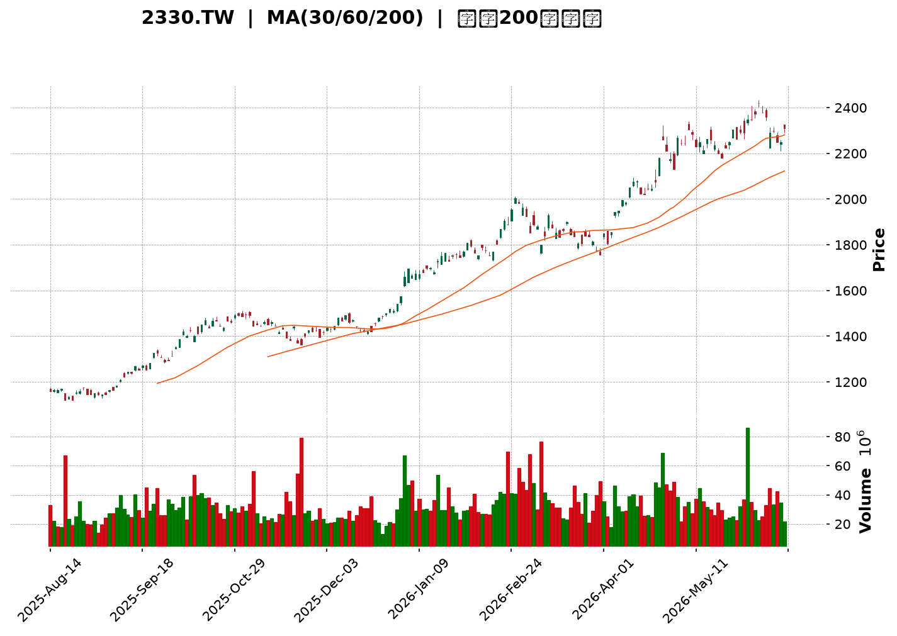
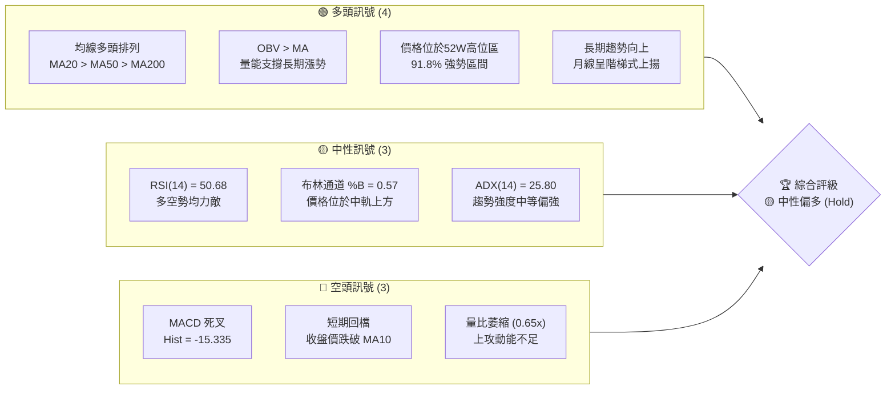
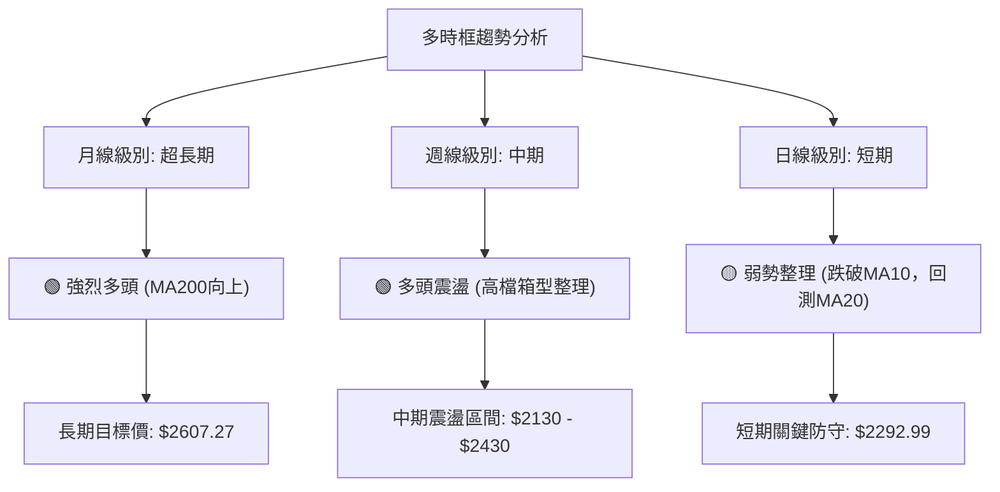
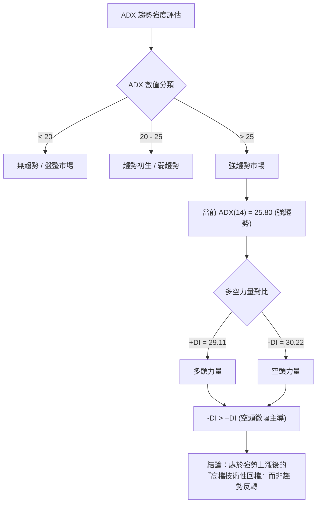
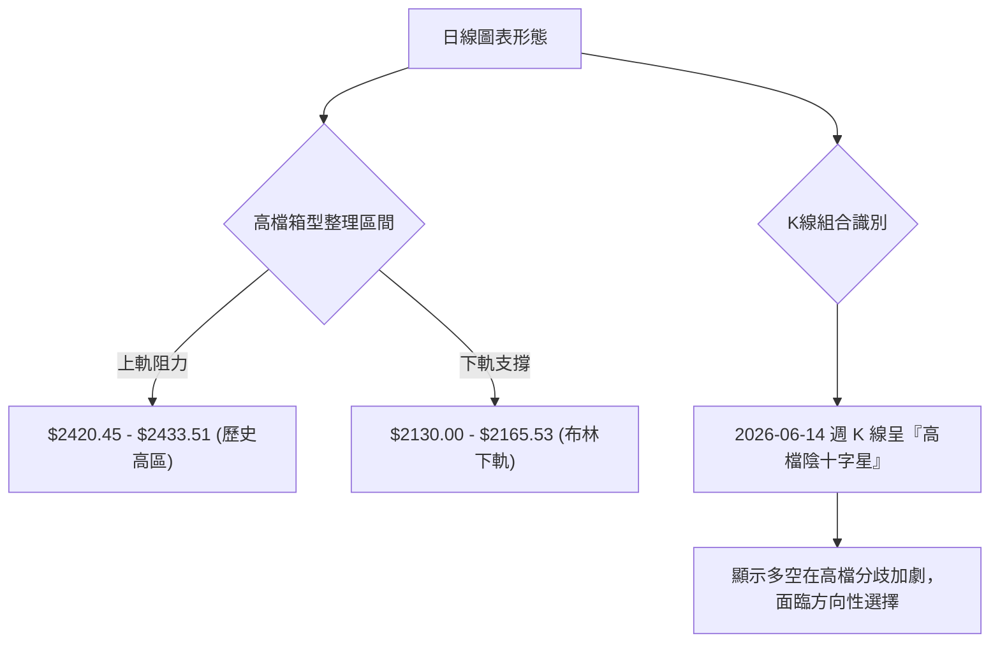
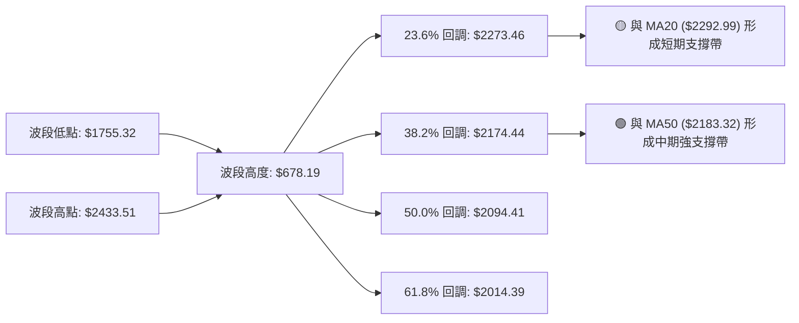
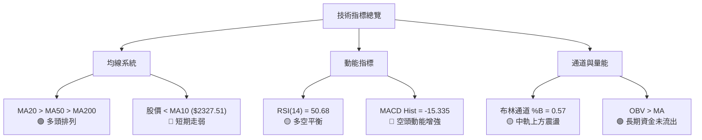
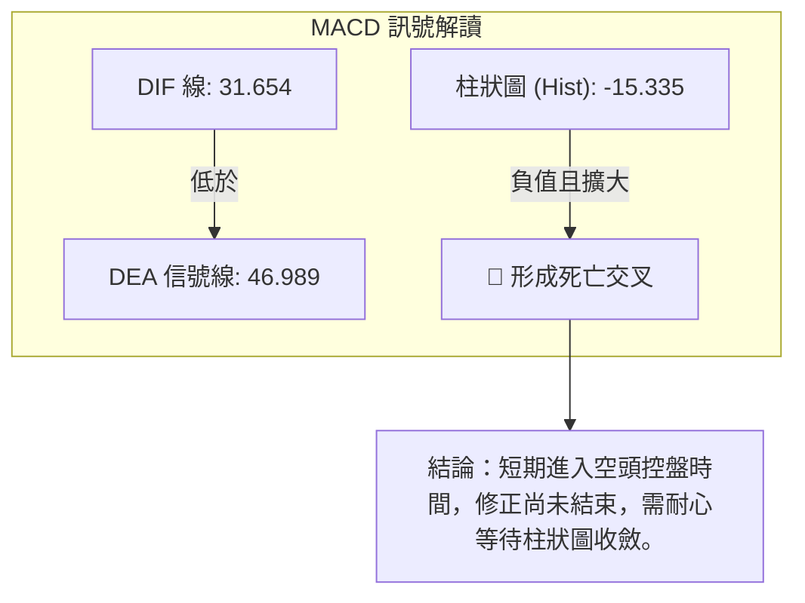
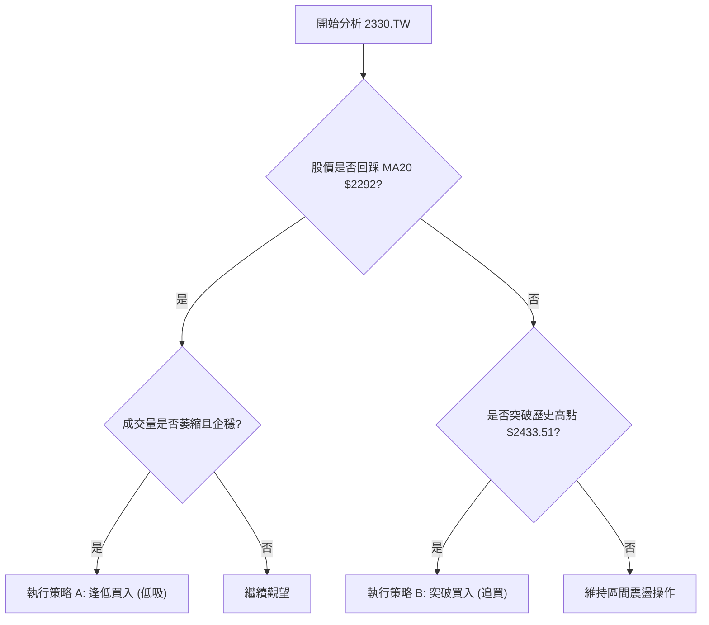
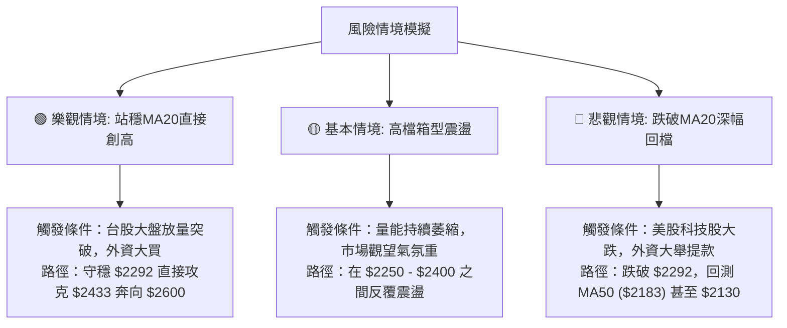

<details>
<summary>📊 靜態圖表 (點擊展開)</summary>

</details>

<html>
<head><meta charset="utf-8" /></head>
<body>
    <div style="height:500px; width:100%;">                        <script>window.PlotlyConfig = {MathJaxConfig: 'local'};</script>
        <script charset="utf-8" src="https://cdn.plot.ly/plotly-3.6.0.min.js" integrity="sha256-QaOVwtVY0T02VaHrr6pnoHLCwayMJp4O5n4YyaE3rJk=" crossorigin="anonymous"></script>                <div id="candlestick-chart" class="plotly-graph-div" style="height:100%; width:100%;"></div>            <script>                window.PLOTLYENV=window.PLOTLYENV || {};                                if (document.getElementById("candlestick-chart")) {                    Plotly.newPlot(                        "candlestick-chart",                        [{"close":{"dtype":"f8","bdata":"AAAA4CwekkAAAACg6TGSQAAAAKDpMZJAAAAAIKZFkkAAAADAR4CRQAAAAKB9u5FAAAAAwEeAkUAAAABAcAqSQAAAAOAsHpJAAAAA4GJZkkAAAAAA9+KRQAAAAAD34pFAAAAAoLP2kUAAAAAA9+KRQAAAAAD34pFAAAAAAPfikUAAAACg6TGSQAAAAKDpMZJAAAAAINyAkkAAAABgi+OSQAAAAGDBHpNAAAAA4LNtk0AAAABg91mTQAAAAIDc0JNAAAAAAGqVk0AAAABgreSTQAAAAABqlZNAAAAAAE8MlEAAAADgpr6UQAAAAOCmvpRAAAAAYGNvlEAAAAAAICCUQAAAAODwM5RAAAAAQDSDlEAAAAAguyGVQAAAACBxrJVAAAAAICc3lkAAAADA4+eVQAAAAAD4SpZAAAAAwOPnlUAAAACAhQ+WQAAAAIAMrpZAAAAA4E\u002f9lkAAAADgmXKWQAAAAAB\u002f6ZZAAAAAAH\u002fplkAAAACgO5qWQAAAAOCZcpZAAAAAAH\u002fplkAAAAAgrtWWQAAAAECTTJdAAAAAQJNMl0AAAACAwjiXQAAAACBkYJdAAAAAQJNMl0AAAACgO5qWQAAAAIAMrpZAAAAAoDualkAAAAAgrtWWQAAAAIAMrpZAAAAAIK7VlkAAAACgO5qWQAAAAEBWI5ZAAAAAAMlelkAAAAAgQsCVQAAAAECgmJVAAAAAoGqGlkAAAACA\u002fnCVQAAAAOBcSZVAAAAAwOPnlUAAAAAA+EqWQAAAACAnN5ZAAAAAAPhKlkAAAADgEtSVQAAAAEBWI5ZAAAAA4JlylkAAAAAAyV6WQAAAAKA7mpZAAAAAoPEkl0AAAAAAf+mWQAAAAECTTJdAAAAAoEjVlkAAAABADP2WQAAAAKDBhZZAAAAAIBxKlkAAAABgOjaWQAAAAGA6NpZAAAAAYDo2lkAAAADgZsGWQAAAAMDPJJdAAAAAgLE4l0AAAADgVnSXQAAAAODdw5dAAAAAYBqcl0AAAAAAZROYQAAAAGCRnphAAAAAgI\u002fwmUAAAADgu3uaQAAAAEBxBJpAAAAAwDQsmkAAAAAAUxiaQAAAAIAWQJpAAAAAoJ2PmkAAAACgnY+aQAAAAIAWQJpAAAAAQOgGm0AAAABgb1abQAAAAMAUkptAAAAAQOgGm0AAAABgb1abQAAAAAAzfptAAAAAgI1Cm0AAAACA9qWbQAAAAKAERZxAAAAAYF8JnEAAAADAFJKbQAAAACBRaptAAAAAgH31m0AAAABA2LmbQAAAACBRaptAAAAAgPalm0AAAADgIjGcQAAAAOCZM51AAAAAQMa+nUAAAADgIIOdQAAAAOCXhZ5AAAAAoGlMn0AAAACA4vyeQAAAAIBbrZ5AAAAAYE0OnkAAAACA9PecQAAAAOAgg51AAAAAYF1bnUAAAAAgQR2cQAAAAEBPvJxAAAAAIC8inkAAAACge0edQAAAAID095xAAAAAgG2onEAAAAAAGSSdQAAAAKC5r51AAAAAgE\u002fUnEAAAADAaqycQAAAAIC8NJxAAAAAgLw0nEAAAAAgXcCcQAAAAMBqrJxAAAAAQKFcnEAAAABADr2bQAAAAMBEbZtAAAAA4EHonEAAAACAvDScQAAAAEA0\u002fJxAAAAAAD9jnkAAAABgMXeeQAAAAMC2Kp9AAAAAANICn0AAAACAEAOgQAAAAGDuNKBAAAAAoOc+oEAAAAAAZaKfQAAAAKByjp9AAAAAgC7yn0AAAACALvKfQAAAAGDuNKBAAAAAYF8GoUAAAABg8qWhQAAAAIA2QqFAAAAAIGb8oEAAAACAo6KgQAAAAMDkuaFAAAAA4AaIoUAAAADgBoihQAAAACC1\u002f6FAAAAAYNDXoUAAAABAG2qhQAAAAAAAkqFAAAAAoC9MoUAAAACg66+hQAAAAGDypaFAAAAAgBR0oUAAAAAgRC6hQAAAAGBfBqFAAAAAACJgoUAAAAAAAJKhQAAAACC1\u002f6FAAAAAoOuvoUAAAADAwuuhQAAAAIDJ4aFAAAAAwHdZokAAAADAd1miQAAAAMBVi6JAAAAAYBjlokAAAADgTpWiQAAAACBqbaJAAAAAgMnhoUAAAADgu\u002fWhQAAAAAAAkqFAAAAAAACUoUAAAAAAAAyiQA=="},"high":{"dtype":"f8","bdata":"Wseb02JZkkCg4aRGpkWSQKDhpEamRZJAAAAAIKZFkkCH2MCns\u002faRQHQEikY6z5FAWpCAWjrPkUAN0iCN6TGSQOeEEi2mRZJAAAAA4GJZkkCWexpBpkWSQJZ7GkGmRZJAAAAAoLP2kUCNsNzzLB6SQAAAAAD34pFAjbDc8ywekkAAAACg6TGSQOGk7pMfbZJAAAAAINyAkkA01ocGSPeSQKWUUvqzbZNAAAAA4LNtk0C9JaEGtG2TQAAAgFyt5JNAiIIruQu9k0AAAABgreSTQFPG7E5++JNAAAAAAE8MlEAAAADgpr6UQB+onHUZ+pRAED74GAWXlECWWqmVkluUQId+s3Vjb5RAvJV9jkjmlEC8x3v8izWVQAAAACBxrJVAaTbd2MhelkCjpH6ctPuVQFVVVZVqhpZAo6R+nLT7lUAclaKHO5qWQAAAAIAMrpZAdbgamfEkl0AN6bx1DK6WQJgin5XxJJdAdYMpcsI4l0BNmjRZ3cGWQK9NlLxqhpZAdYMpcsI4l0D6IJa1IBGXQF2\u002f+\u002fg0dJdAC5951QWIl0Dv7u7O1puXQASyAdkFiJdAun73sdabl0DBgQPvT\u002f2WQBLP1xV\u002f6ZZAJk2afAyulkCnwA7ZT\u002f2WQCWer6vxJJdAp8AO2U\u002f9lkBNmjRZ3cGWQD7T1vj3SpZA8NGzlTualkCcdIBLJzeWQHIcx7Hj55VAWSl7fDualkC30qzxQcCVQLH2DQtCwJVARkn9eIUPlkAAAAAA+EqWQNJsupFqhpZAVVVVlWqGlkAZOmDnyF6WQD7T1vj3SpZAAAAA4JlylkD7RZHcmXKWQAAAAKA7mpZAAAAAoPEkl0B1gylywjiXQAAAAECTTJdAAAAAkDiIl0CmyGcF7hCXQGAqaGWjmZZAFRh7qt9xlkCatsav33GWQN48QiUcSpZAVjBLOqOZlkBB\u002flmlSNWWQAAAAMDPJJdAUOZZRZNMl0AAAADgVnSXQAAAAODdw5dAr6G86t3Dl0AAAAAAZROYQAAAAGCRnphAf4vTWvhTmkAAAADgu3uaQGLRsso0LJpAgNjzD9pnmkBVVVUV2meaQGjD58+7e5pAq6qqKmG3mkBVVVVlf6OaQEWCmgraZ5pAq6qqyqsum0AYXXR19qWbQAAAAMAUkptAq6qqGlFqm0CMLrrqMn6bQH55bMUUkptAoPu5H9i5m0CWrGRF2LmbQAAAAKAERZxAbXZxAKqAnEAg0QqbffWbQAAAACBRaptAq6qqCkEdnEAVOoNVXwmcQHmaC3D2pZtAAAAAgPalm0Djd4L1qYCcQAAAAOCZM51A3cuxyonmnUAVCCNFTQ6eQGfSlWpbrZ5ADOSjKi10n0D4M+HPhzifQNUoY5Xi\u002fJ5AfUFfUD3BnkBpDt9v5KqdQLfEqR+2cZ5Aq6qq6iCDnUAAAAAgQR2cQEa15WpdW51ABb64qvJJnkC8uhVAxr6dQBKxRpV7R51ABQmj5ZkznUBM2AbB\u002fUudQAQCgQCsw51AOQ8dw\u002f1LnUAtZCEDGSSdQG3Hh+CuSJxAaDs+hE\u002fUnEAyOB9jCzidQHvTm6ImEJ1AcAiHoJNwnEAIRSjC1wycQHTRRQPz5JtAAAAA4EHonECukdWlJhCdQAAAAEA0\u002fJxAAAAAAD9jnkAAAABgMXeeQAAAAMC2Kp9AXH97YMQWn0AAAACAEAOgQMVO7CDTXKBA\u002f8FE0OBIoEAvMWuhCQ2gQMIWbHEQA6BAE7UrMfUqoEAPxO8A\u002fCCgQJ3YiXKjoqBAaZxBkFgQoUAY0TbTmSeiQPljSfPdw6FAqzNSQT04oUBUXDKENkKhQOAHfiDXzaFAaEUjoeuvoUB1uf0x182hQB988HGFRaJA9C4eIbX\u002foUA6JQHC5LmhQBTfPfHdw6FAyWfdYBR0oUAAAACg66+hQO+F96KgHaJASZIkQfmboUBRFEURImChQA8OSFE9OKFABYQT8f+RoUAEkz8w+ZuhQAAAACC1\u002f6FANvAZs6AdokCgaKvhmSeiQJ4PLPNwY6JAu3\u002fzgFyBokAvf9oCJtGiQIFcE4E6s6JAQ1qx8AMDo0Byp2gBJtGiQE7w5KEzvaJAxlQ4cacTokDvlbpwpxOiQCQrPLLC66FAAAAAAACooUAAAAAAACqiQA=="},"hovertemplate":"\u003cb\u003e%{x|%Y-%m-%d}\u003c\u002fb\u003e\u003cbr\u003e\u958b: $%{open:.2f}\u003cbr\u003e\u9ad8: $%{high:.2f}\u003cbr\u003e\u4f4e: $%{low:.2f}\u003cbr\u003e\u6536: $%{close:.2f}\u003cextra\u003e\u003c\u002fextra\u003e","low":{"dtype":"f8","bdata":"AAAA4CwekkC\u002fPLZScAqSQL88tlJwCpJAtbgJ0ywekkAAAADAR4CRQBn361IElJFAAAAAwEeAkUDzLd\u002fy9uKRQKY4ZOz24pFA09LSkukxkkAAAAAA9+KRQAAAAAD34pFAv4KhBcGnkUB8GmFZOs+RQHNPIwzBp5FAAAAAAPfikUC\u002fPLZScAqSQAAAAKDpMZJA7+7u0mJZkkCYU\u002fASErySQNdaa7kEC5NAwzAMkzpGk0BD2l65OkaTQAAAAA6ZgZNAAAAAAGqVk0DyDfLtaZWTQAAAAABqlZNAPEHqsTqpk0AiPVCRkluUQOFXY0o0g5RAAAAAYGNvlEAkN3IjTwyUQAAAAODwM5RAAAAAQDSDlECHcAhnGfqUQM3MzBi7IZVAYi60irT7lUC6tgIHQsCVQMdxHEdWI5ZA0siGcc+ElUBFD3ujtPuVQM\u002fXFZuFD5ZAFo\u002fKbQyulkAAAADgmXKWQK0bTLFqhpZAAAAAAH\u002fplkDZsmXDaoaWQPQWQ0onN5ZAAAAAAH\u002fplkCtn3hD3cGWQPVghqogEZdAUiCCY8I4l0AAAACAwjiXQPmb\u002fK0gEZdApEAEh\u002fEkl0DZsmXDaoaWQAAAAIAMrpZA2bJlw2qGlkBZP\u002fFmDK6WQAAAAIAMrpZABt9pijualkAAAACgO5qWQGCWlGOFD5ZAAAAAAMlelkAAAAAgQsCVQAAAAECgmJVA9YOOCvhKlkAAAACA\u002fnCVQAAAAOBcSZVAurYCB0LAlUCqqqpqhQ+WQMtkkUNWI5ZA4ziOIyc3lkAAAADgEtSVQMEsKYe0+5VA9BZDSic3lkAQLkxqViOWQGbLli34SpZAhyb5lzualkAAAAAAf+mWQEeBCM5P\u002fZZAq6qq2mbBlkC0bjC1SNWWQKHVl9rfcZZA6ueElVgilkAiw72aWCKWQGZJORCV+pVAAAAAYDo2lkB\u002fA0xVo5mWQHADhqpI1ZZAXzNM9e0Ql0CTv8mPsTiXQKuqqspWdJdAUV5D1VZ0l0CnAW2aOIiXQIHgMjWD\u002f5dATmu2j589mUD988+fJo2ZQJ0uTbWt3JlAAU8YIOq0mUBVVVUl6rSZQAAAAIAWQJpAVVVVFdpnmkBVVVUV2meaQLp9ZfVSGJpAAAAAoJ2PmkAYXXT6QsuaQGwOJFroBptAAAAAQOgGm0B10UXVqy6bQAkaTuqrLptAAAAAgI1Cm0AUoQiljUKbQDD90v+5zZtAmMGXmn31m0AAAADAFJKbQAoymwrKGptAAAAAMNi5m0D1Yj61FJKbQIPMplpvVptAU5vaVOgGm0AAAADgIjGcQOo7G7WLlJxAi9A4FbgfnUAAAADgIIOdQP3jEivGvp1A5je4iuL8nkAAAACA4vyeQIx4khovIp5AAAAAYE0OnkAAAACA9PecQEbasRo\u002fb51AVVVV1ZkznUARpNz0Mn6bQFwljSrIbJxA3ixPGrgfnUAAAACge0edQKmiZ6WLlJxAAAAAgG2onECzJ\u002fk+NPycQPT5fH7ic51AAAAAgE\u002fUnEAAAADAaqycQOAaWZ0A0ZtAJ3HwvtcMnEAAAAAgXcCcQAAAAMBqrJxAPt7jvdcMnEAAAABADr2bQAAAAMBEbZtA+pJp\u002fYWEnECUOHgfyiCcQNdaa114mJxAndiJHYP\u002fnUAzdYt9dROeQFK4Hn0Is55A7oGN3vrGnkC\u002fShibm1KfQDuxE58JDaBAB3RjfhADoEAAAAAAZaKfQAAAAKByjp9A+B2IHzzen0DxOxC\u002fScqfQIqd2G4QA6BAaTnmW8xmoEAAAABg8qWhQAAAAIA2QqFAKuZWj3reoEAAAACAo6KgQPzAD7xRGqFATF1ufxR0oUBMXW5\u002fFHShQAAAACC1\u002f6FAT0WabvKloUAAAABAG2qhQNzUw009OKFAKfJZD0QuoUAel74dImChQIQeQs8GiKFAJEmSjjZCoUAAAAAgRC6hQAAAAGBfBqFAAAAAACJgoUDojYLeKFahQOGDD87kuaFAAAAAoOuvoUDLh3Ff0NehQDmrx47rr6FAV6DPzpknokARIMOPfk+iQH+j7P5wY6JAvqVOzyzHokAAAADgTpWiQOMlSo9+T6JAYvDTDCJgoUALnIN\u002fyeGhQAAAAAAAkqFAAAAAAABEoUAAAAAAAOShQA=="},"name":"\u50f9\u683c","open":{"dtype":"f8","bdata":"54QSLaZFkkBfHlv5LB6SQL88tlJwCpJAWtyEeekxkkCH2MCns\u002faRQBn361IElJFAWpCAWjrPkUD6lm+Zs\u002faRQBl77ZKz9pFAAAAA4GJZkkCWexpBpkWSQBKWe5rpMZJADyI5rH27kUAJyz1NcAqSQHwaYVk6z5FACcs9TXAKkkBfHlv5LB6SQOGk7pMfbZJAd3d3eR9tkkDMKXi5zs+SQHzvvVP3WZNAYhiGOfdZk0C9JaEGtG2TQAAAgOpplZNARMGV3Dqpk0D5BvmmC72TQA8FV3Kt5JNAPEHqsTqpk0CCytltY2+UQL8aE5lI5pRAAAAAYGNvlEC5kRu5wUeUQC0qkbzBR5RAAAAAQDSDlEBDOIRD6g2VQM3MzBi7IZVAYi60irT7lUBdW4HjEtSVQAAAAAD4SpZA0siGcc+ElUBhpB2raoaWQNthUFQnN5ZAFo\u002fKbQyulkCvTZS8aoaWQIp81o07mpZA3WCK3E\u002f9lkAAAACgO5qWQKNk1yb4SpZAdYMpcsI4l0BTYIf8fumWQKRABIfxJJdAXb\u002f7+DR0l0Bcj8IVNXSXQAAAACBkYJdAC5951QWIl0CaNGkSf+mWQAZFnVzdwZZAAAAAoDualkCtn3hD3cGWQB9ZEs8gEZdArZ94Q93BlkAAAACgO5qWQGCWlGOFD5ZA+0WR3JlylkCcdIBLJzeWQBzHcRxxrJVAp9aEw5lylkBbadY4oJiVQOmiiy5xrJVARkn9eIUPlkDHcRxHViOWQJ7RS7WZcpZAAAAAAPhKlkAZOmDnyF6WQAAAAEBWI5ZAo2TXJvhKlkAAAAAAyV6WQIwYMQrJXpZAK2qMdAyulkCYIp+V8SSXQPVghqogEZdAq6qqylZ0l0BaN5h6KumWQAAAAKDBhZZAAAAAIBxKlkDePEIlHEqWQESGe9V2DpZAVjBLOqOZlkAAAADgZsGWQJSC5G8q6ZZAAAAAgLE4l0AxlZgadWCXQAAAAJA4iJdAKK+hmjiIl0D9JctfGpyXQGEo5r9GJ5hAm+0TVYFRmUD988+fJo2ZQJ0uTbWt3JlAK5dp5cvImUAAAACwrdyZQEWCmgraZ5pAq6qqKmG3mkCrqqrau3uaQN2+sro0LJpAq6qqegbzmkAYXXT6QsuaQGwOJFroBptAVVVVBcoam0BGF10lUWqbQAAAAAAzfptA4FOTClFqm0CqTW1qb1abQDD90v+5zZtABjgJO8hsnECtsDkQus2bQIhl9M+rLptAq6qqCkEdnEAAAABA2LmbQAAAACBRaptA6Uc\u002fGsoam0Dr2SEwyGycQG3Ud3ptqJxAeraR2pkznUAAAADgIIOdQP3jEivGvp1A5je4iuL8nkBTEUtFxBCfQIx4khovIp5A02ufxXmZnkCbCeofP2+dQM8tcQovIp5AVVVV1ZkznUCPD0G6FJKbQKPaclXWC51A4+oHpXtHnUBe3QrwIIOdQKmiZ6WLlJxABJpCILgfnUAmbINgCzidQPz9fj\u002fHm51AWjeYYgs4nUDJQhZCNPycQE3i4P3y5JtAaDs+hE\u002fUnEAh0BSiJhCdQGQhC4FP1JxAruZqHsognEAAAABADr2bQLroouEbqZtAY4tyvmqsnECukdWlJhCdQPC9935P1JxAXuiF3mcnnkBHlQSfTE+eQJqZmd36xp5ApYCEn9\u002funkCq0KP7jWafQOzETs8CF6BAAT67b+40oED8qC5xEAOgQOtceQBlop9AAAAAgC7yn0D4HYgfPN6fQGIndsDgSKBA0tUnjMVwoEB84b3w3cOhQIdVhKENfqFADqLH72zyoEDKEKwjRC6hQOzETuxKJKFAAAAA4AaIoUAAAADgBoihQM2hYhGTMaJAehePwMLroUDr24Bh8qWhQPCzAT8baqFAKfJZD0QuoUCPS9\u002feBoihQHOkORK1\u002f6FASZIk7yhWoUAxDMOwL0yhQKZxBiFELqFAzzRuYBR0oUD42YCfDX6hQOGDD87kuaFAGsPRgqcTokA2eI4gtf+hQOggr5J+T6JANGBJL4w7okAAAADAd1miQECuiSBIn6JAAAAAYBjlokAAAADgTpWiQDu0a0FBqaJAYvDTDCJgoUAAAADgu\u002fWhQBhyfSHXzaFAAAAAAACAoUAAAAAAACqiQA=="},"x":["2025-08-14T00:00:00+08:00","2025-08-15T00:00:00+08:00","2025-08-18T00:00:00+08:00","2025-08-19T00:00:00+08:00","2025-08-20T00:00:00+08:00","2025-08-21T00:00:00+08:00","2025-08-22T00:00:00+08:00","2025-08-25T00:00:00+08:00","2025-08-26T00:00:00+08:00","2025-08-27T00:00:00+08:00","2025-08-28T00:00:00+08:00","2025-08-29T00:00:00+08:00","2025-09-01T00:00:00+08:00","2025-09-02T00:00:00+08:00","2025-09-03T00:00:00+08:00","2025-09-04T00:00:00+08:00","2025-09-05T00:00:00+08:00","2025-09-08T00:00:00+08:00","2025-09-09T00:00:00+08:00","2025-09-10T00:00:00+08:00","2025-09-11T00:00:00+08:00","2025-09-12T00:00:00+08:00","2025-09-15T00:00:00+08:00","2025-09-16T00:00:00+08:00","2025-09-17T00:00:00+08:00","2025-09-18T00:00:00+08:00","2025-09-19T00:00:00+08:00","2025-09-22T00:00:00+08:00","2025-09-23T00:00:00+08:00","2025-09-24T00:00:00+08:00","2025-09-25T00:00:00+08:00","2025-09-26T00:00:00+08:00","2025-09-30T00:00:00+08:00","2025-10-01T00:00:00+08:00","2025-10-02T00:00:00+08:00","2025-10-03T00:00:00+08:00","2025-10-07T00:00:00+08:00","2025-10-08T00:00:00+08:00","2025-10-09T00:00:00+08:00","2025-10-13T00:00:00+08:00","2025-10-14T00:00:00+08:00","2025-10-15T00:00:00+08:00","2025-10-16T00:00:00+08:00","2025-10-17T00:00:00+08:00","2025-10-20T00:00:00+08:00","2025-10-21T00:00:00+08:00","2025-10-22T00:00:00+08:00","2025-10-23T00:00:00+08:00","2025-10-27T00:00:00+08:00","2025-10-28T00:00:00+08:00","2025-10-29T00:00:00+08:00","2025-10-30T00:00:00+08:00","2025-10-31T00:00:00+08:00","2025-11-03T00:00:00+08:00","2025-11-04T00:00:00+08:00","2025-11-05T00:00:00+08:00","2025-11-06T00:00:00+08:00","2025-11-07T00:00:00+08:00","2025-11-10T00:00:00+08:00","2025-11-11T00:00:00+08:00","2025-11-12T00:00:00+08:00","2025-11-13T00:00:00+08:00","2025-11-14T00:00:00+08:00","2025-11-17T00:00:00+08:00","2025-11-18T00:00:00+08:00","2025-11-19T00:00:00+08:00","2025-11-20T00:00:00+08:00","2025-11-21T00:00:00+08:00","2025-11-24T00:00:00+08:00","2025-11-25T00:00:00+08:00","2025-11-26T00:00:00+08:00","2025-11-27T00:00:00+08:00","2025-11-28T00:00:00+08:00","2025-12-01T00:00:00+08:00","2025-12-02T00:00:00+08:00","2025-12-03T00:00:00+08:00","2025-12-04T00:00:00+08:00","2025-12-05T00:00:00+08:00","2025-12-08T00:00:00+08:00","2025-12-09T00:00:00+08:00","2025-12-10T00:00:00+08:00","2025-12-11T00:00:00+08:00","2025-12-12T00:00:00+08:00","2025-12-15T00:00:00+08:00","2025-12-16T00:00:00+08:00","2025-12-17T00:00:00+08:00","2025-12-18T00:00:00+08:00","2025-12-19T00:00:00+08:00","2025-12-22T00:00:00+08:00","2025-12-23T00:00:00+08:00","2025-12-24T00:00:00+08:00","2025-12-26T00:00:00+08:00","2025-12-29T00:00:00+08:00","2025-12-30T00:00:00+08:00","2025-12-31T00:00:00+08:00","2026-01-02T00:00:00+08:00","2026-01-05T00:00:00+08:00","2026-01-06T00:00:00+08:00","2026-01-07T00:00:00+08:00","2026-01-08T00:00:00+08:00","2026-01-09T00:00:00+08:00","2026-01-12T00:00:00+08:00","2026-01-13T00:00:00+08:00","2026-01-14T00:00:00+08:00","2026-01-15T00:00:00+08:00","2026-01-16T00:00:00+08:00","2026-01-19T00:00:00+08:00","2026-01-20T00:00:00+08:00","2026-01-21T00:00:00+08:00","2026-01-22T00:00:00+08:00","2026-01-23T00:00:00+08:00","2026-01-26T00:00:00+08:00","2026-01-27T00:00:00+08:00","2026-01-28T00:00:00+08:00","2026-01-29T00:00:00+08:00","2026-01-30T00:00:00+08:00","2026-02-02T00:00:00+08:00","2026-02-03T00:00:00+08:00","2026-02-04T00:00:00+08:00","2026-02-05T00:00:00+08:00","2026-02-06T00:00:00+08:00","2026-02-09T00:00:00+08:00","2026-02-10T00:00:00+08:00","2026-02-11T00:00:00+08:00","2026-02-23T00:00:00+08:00","2026-02-24T00:00:00+08:00","2026-02-25T00:00:00+08:00","2026-02-26T00:00:00+08:00","2026-03-02T00:00:00+08:00","2026-03-03T00:00:00+08:00","2026-03-04T00:00:00+08:00","2026-03-05T00:00:00+08:00","2026-03-06T00:00:00+08:00","2026-03-09T00:00:00+08:00","2026-03-10T00:00:00+08:00","2026-03-11T00:00:00+08:00","2026-03-12T00:00:00+08:00","2026-03-13T00:00:00+08:00","2026-03-16T00:00:00+08:00","2026-03-17T00:00:00+08:00","2026-03-18T00:00:00+08:00","2026-03-19T00:00:00+08:00","2026-03-20T00:00:00+08:00","2026-03-23T00:00:00+08:00","2026-03-24T00:00:00+08:00","2026-03-25T00:00:00+08:00","2026-03-26T00:00:00+08:00","2026-03-27T00:00:00+08:00","2026-03-30T00:00:00+08:00","2026-03-31T00:00:00+08:00","2026-04-01T00:00:00+08:00","2026-04-02T00:00:00+08:00","2026-04-07T00:00:00+08:00","2026-04-08T00:00:00+08:00","2026-04-09T00:00:00+08:00","2026-04-10T00:00:00+08:00","2026-04-13T00:00:00+08:00","2026-04-14T00:00:00+08:00","2026-04-15T00:00:00+08:00","2026-04-16T00:00:00+08:00","2026-04-17T00:00:00+08:00","2026-04-20T00:00:00+08:00","2026-04-21T00:00:00+08:00","2026-04-22T00:00:00+08:00","2026-04-23T00:00:00+08:00","2026-04-24T00:00:00+08:00","2026-04-27T00:00:00+08:00","2026-04-28T00:00:00+08:00","2026-04-29T00:00:00+08:00","2026-04-30T00:00:00+08:00","2026-05-04T00:00:00+08:00","2026-05-05T00:00:00+08:00","2026-05-06T00:00:00+08:00","2026-05-07T00:00:00+08:00","2026-05-08T00:00:00+08:00","2026-05-11T00:00:00+08:00","2026-05-12T00:00:00+08:00","2026-05-13T00:00:00+08:00","2026-05-14T00:00:00+08:00","2026-05-15T00:00:00+08:00","2026-05-18T00:00:00+08:00","2026-05-19T00:00:00+08:00","2026-05-20T00:00:00+08:00","2026-05-21T00:00:00+08:00","2026-05-22T00:00:00+08:00","2026-05-25T00:00:00+08:00","2026-05-26T00:00:00+08:00","2026-05-27T00:00:00+08:00","2026-05-28T00:00:00+08:00","2026-05-29T00:00:00+08:00","2026-06-01T00:00:00+08:00","2026-06-02T00:00:00+08:00","2026-06-03T00:00:00+08:00","2026-06-04T00:00:00+08:00","2026-06-05T00:00:00+08:00","2026-06-08T00:00:00+08:00","2026-06-09T00:00:00+08:00","2026-06-10T00:00:00+08:00","2026-06-11T00:00:00+08:00","2026-06-12T00:00:00+08:00"],"type":"candlestick"},{"hovertemplate":"MA30: $%{y:.2f}\u003cextra\u003e\u003c\u002fextra\u003e","line":{"color":"#2196F3","dash":"dash","width":2},"mode":"lines","name":"MA30","x":["2025-08-14T00:00:00+08:00","2025-08-15T00:00:00+08:00","2025-08-18T00:00:00+08:00","2025-08-19T00:00:00+08:00","2025-08-20T00:00:00+08:00","2025-08-21T00:00:00+08:00","2025-08-22T00:00:00+08:00","2025-08-25T00:00:00+08:00","2025-08-26T00:00:00+08:00","2025-08-27T00:00:00+08:00","2025-08-28T00:00:00+08:00","2025-08-29T00:00:00+08:00","2025-09-01T00:00:00+08:00","2025-09-02T00:00:00+08:00","2025-09-03T00:00:00+08:00","2025-09-04T00:00:00+08:00","2025-09-05T00:00:00+08:00","2025-09-08T00:00:00+08:00","2025-09-09T00:00:00+08:00","2025-09-10T00:00:00+08:00","2025-09-11T00:00:00+08:00","2025-09-12T00:00:00+08:00","2025-09-15T00:00:00+08:00","2025-09-16T00:00:00+08:00","2025-09-17T00:00:00+08:00","2025-09-18T00:00:00+08:00","2025-09-19T00:00:00+08:00","2025-09-22T00:00:00+08:00","2025-09-23T00:00:00+08:00","2025-09-24T00:00:00+08:00","2025-09-25T00:00:00+08:00","2025-09-26T00:00:00+08:00","2025-09-30T00:00:00+08:00","2025-10-01T00:00:00+08:00","2025-10-02T00:00:00+08:00","2025-10-03T00:00:00+08:00","2025-10-07T00:00:00+08:00","2025-10-08T00:00:00+08:00","2025-10-09T00:00:00+08:00","2025-10-13T00:00:00+08:00","2025-10-14T00:00:00+08:00","2025-10-15T00:00:00+08:00","2025-10-16T00:00:00+08:00","2025-10-17T00:00:00+08:00","2025-10-20T00:00:00+08:00","2025-10-21T00:00:00+08:00","2025-10-22T00:00:00+08:00","2025-10-23T00:00:00+08:00","2025-10-27T00:00:00+08:00","2025-10-28T00:00:00+08:00","2025-10-29T00:00:00+08:00","2025-10-30T00:00:00+08:00","2025-10-31T00:00:00+08:00","2025-11-03T00:00:00+08:00","2025-11-04T00:00:00+08:00","2025-11-05T00:00:00+08:00","2025-11-06T00:00:00+08:00","2025-11-07T00:00:00+08:00","2025-11-10T00:00:00+08:00","2025-11-11T00:00:00+08:00","2025-11-12T00:00:00+08:00","2025-11-13T00:00:00+08:00","2025-11-14T00:00:00+08:00","2025-11-17T00:00:00+08:00","2025-11-18T00:00:00+08:00","2025-11-19T00:00:00+08:00","2025-11-20T00:00:00+08:00","2025-11-21T00:00:00+08:00","2025-11-24T00:00:00+08:00","2025-11-25T00:00:00+08:00","2025-11-26T00:00:00+08:00","2025-11-27T00:00:00+08:00","2025-11-28T00:00:00+08:00","2025-12-01T00:00:00+08:00","2025-12-02T00:00:00+08:00","2025-12-03T00:00:00+08:00","2025-12-04T00:00:00+08:00","2025-12-05T00:00:00+08:00","2025-12-08T00:00:00+08:00","2025-12-09T00:00:00+08:00","2025-12-10T00:00:00+08:00","2025-12-11T00:00:00+08:00","2025-12-12T00:00:00+08:00","2025-12-15T00:00:00+08:00","2025-12-16T00:00:00+08:00","2025-12-17T00:00:00+08:00","2025-12-18T00:00:00+08:00","2025-12-19T00:00:00+08:00","2025-12-22T00:00:00+08:00","2025-12-23T00:00:00+08:00","2025-12-24T00:00:00+08:00","2025-12-26T00:00:00+08:00","2025-12-29T00:00:00+08:00","2025-12-30T00:00:00+08:00","2025-12-31T00:00:00+08:00","2026-01-02T00:00:00+08:00","2026-01-05T00:00:00+08:00","2026-01-06T00:00:00+08:00","2026-01-07T00:00:00+08:00","2026-01-08T00:00:00+08:00","2026-01-09T00:00:00+08:00","2026-01-12T00:00:00+08:00","2026-01-13T00:00:00+08:00","2026-01-14T00:00:00+08:00","2026-01-15T00:00:00+08:00","2026-01-16T00:00:00+08:00","2026-01-19T00:00:00+08:00","2026-01-20T00:00:00+08:00","2026-01-21T00:00:00+08:00","2026-01-22T00:00:00+08:00","2026-01-23T00:00:00+08:00","2026-01-26T00:00:00+08:00","2026-01-27T00:00:00+08:00","2026-01-28T00:00:00+08:00","2026-01-29T00:00:00+08:00","2026-01-30T00:00:00+08:00","2026-02-02T00:00:00+08:00","2026-02-03T00:00:00+08:00","2026-02-04T00:00:00+08:00","2026-02-05T00:00:00+08:00","2026-02-06T00:00:00+08:00","2026-02-09T00:00:00+08:00","2026-02-10T00:00:00+08:00","2026-02-11T00:00:00+08:00","2026-02-23T00:00:00+08:00","2026-02-24T00:00:00+08:00","2026-02-25T00:00:00+08:00","2026-02-26T00:00:00+08:00","2026-03-02T00:00:00+08:00","2026-03-03T00:00:00+08:00","2026-03-04T00:00:00+08:00","2026-03-05T00:00:00+08:00","2026-03-06T00:00:00+08:00","2026-03-09T00:00:00+08:00","2026-03-10T00:00:00+08:00","2026-03-11T00:00:00+08:00","2026-03-12T00:00:00+08:00","2026-03-13T00:00:00+08:00","2026-03-16T00:00:00+08:00","2026-03-17T00:00:00+08:00","2026-03-18T00:00:00+08:00","2026-03-19T00:00:00+08:00","2026-03-20T00:00:00+08:00","2026-03-23T00:00:00+08:00","2026-03-24T00:00:00+08:00","2026-03-25T00:00:00+08:00","2026-03-26T00:00:00+08:00","2026-03-27T00:00:00+08:00","2026-03-30T00:00:00+08:00","2026-03-31T00:00:00+08:00","2026-04-01T00:00:00+08:00","2026-04-02T00:00:00+08:00","2026-04-07T00:00:00+08:00","2026-04-08T00:00:00+08:00","2026-04-09T00:00:00+08:00","2026-04-10T00:00:00+08:00","2026-04-13T00:00:00+08:00","2026-04-14T00:00:00+08:00","2026-04-15T00:00:00+08:00","2026-04-16T00:00:00+08:00","2026-04-17T00:00:00+08:00","2026-04-20T00:00:00+08:00","2026-04-21T00:00:00+08:00","2026-04-22T00:00:00+08:00","2026-04-23T00:00:00+08:00","2026-04-24T00:00:00+08:00","2026-04-27T00:00:00+08:00","2026-04-28T00:00:00+08:00","2026-04-29T00:00:00+08:00","2026-04-30T00:00:00+08:00","2026-05-04T00:00:00+08:00","2026-05-05T00:00:00+08:00","2026-05-06T00:00:00+08:00","2026-05-07T00:00:00+08:00","2026-05-08T00:00:00+08:00","2026-05-11T00:00:00+08:00","2026-05-12T00:00:00+08:00","2026-05-13T00:00:00+08:00","2026-05-14T00:00:00+08:00","2026-05-15T00:00:00+08:00","2026-05-18T00:00:00+08:00","2026-05-19T00:00:00+08:00","2026-05-20T00:00:00+08:00","2026-05-21T00:00:00+08:00","2026-05-22T00:00:00+08:00","2026-05-25T00:00:00+08:00","2026-05-26T00:00:00+08:00","2026-05-27T00:00:00+08:00","2026-05-28T00:00:00+08:00","2026-05-29T00:00:00+08:00","2026-06-01T00:00:00+08:00","2026-06-02T00:00:00+08:00","2026-06-03T00:00:00+08:00","2026-06-04T00:00:00+08:00","2026-06-05T00:00:00+08:00","2026-06-08T00:00:00+08:00","2026-06-09T00:00:00+08:00","2026-06-10T00:00:00+08:00","2026-06-11T00:00:00+08:00","2026-06-12T00:00:00+08:00"],"y":{"dtype":"f8","bdata":"AAAAAAAA+H8AAAAAAAD4fwAAAAAAAPh\u002fAAAAAAAA+H8AAAAAAAD4fwAAAAAAAPh\u002fAAAAAAAA+H8AAAAAAAD4fwAAAAAAAPh\u002fAAAAAAAA+H8AAAAAAAD4fwAAAAAAAPh\u002fAAAAAAAA+H8AAAAAAAD4fwAAAAAAAPh\u002fAAAAAAAA+H8AAAAAAAD4fwAAAAAAAPh\u002fAAAAAAAA+H8AAAAAAAD4fwAAAAAAAPh\u002fAAAAAAAA+H8AAAAAAAD4fwAAAAAAAPh\u002fAAAAAAAA+H8AAAAAAAD4fwAAAAAAAPh\u002fAAAAAAAA+H8AAAAAAAD4f1VVVVWHppJAq6qqak26kkAiIiKyxsqSQCIiIhLp25JAiYiIaAfvkkCJiIi4Ag6TQAAAAHCkL5NAVVVVFd9Xk0BmZmZm2niTQFVVVcV6nJNAZmZmZtS6k0AAAADAct6TQN7d3d1ZB5RAERER8TwylEBVVVXFKFmUQLy7uysLhJRAIiIiku2ulEB3d3fnidSUQLy7uwvU+JRAMzMzE3MelUBmZmbmHkCVQHd3dwfIY5VAmpmZec+ElUDv7u4+1qWVQCIiIqI4xJVAVVVVNe3jlUDNzMyMC\u002fuVQN7d3V13FZZAVVVVhUMrlkCJiIgYGT2WQLy7u3ucTZZAERERcRZilkDv7u5+OXeWQAAAAOC8h5ZAq6qqKpeXlkDv7u7u35yWQGZmZtY2nJZAiYiIONuelkBVVVWl5JqWQImIiGhOkpZAiYiIaE6SlkARERGxSZSWQM3MzBxTkJZAAAAAQGGKlkC8u7t7GIWWQGZmZoZ9fpZARERE9IZ6lkCrqqqqi3iWQLy7u9vdeZZAVVVVJdl7lkDe3d09gnyWQN7d3T2CfJZAmpmZSYh4lkDv7u6+inaWQAAAABBBb5ZA3t3dfaNmlkDe3d0dTmOWQFVVVaVPX5ZAVVVVRfpblkCrqqo6TVuWQLy7u6tCX5ZAVVVVlY9ilkAiIiLC1GmWQFVVVSW3d5ZAzczM7EqClkC8u7trIZaWQJqZmbntr5ZAZmZmFhHNlkBmZmZmF\u002fiWQCIiIvJ1IJdAvLu7C99El0AzMzMDUWWXQERERGS\u002fh5dAAAAAUCusl0De3d3NjdSXQHd3d0el95dAVVVV9bgemEDv7u5eHEmYQJqZmXmBc5hAvLu7S6OUmECrqqoKZ7qYQCIiIqIw3phAIiIiMvcDmUDNzMy8uiuZQBEREYHFXJlAd3d3R9CNmUAiIiLCiruZQKuqqurx55lAAAAAsPwYmkDe3d3dZkOaQM3MzBzaZ5pA3t3draCNmkARERHhDbaaQDMzMwNy5JpAMzMzE80Ym0BEREQ0MUebQJqZmUmPeZtAIiIiwkmnm0Crqqr6uc2bQFVVVYV99ZtAmpmZeaAWnEC8u7vbJS+cQJqZmYn7SpxAMzMzQ9dinEAiIiJyGHCcQJqZmYlNhZxAZmZm5s+fnEAAAABgYbCcQLy7uztPvJxAMzMzEzrKnECJiIiYndmcQImIiEhV7JxA3t3dnbn5nECamZk5eQKdQJqZmUnuAZ1AMzMzU2ADnUDe3d3Ncw2dQERERGQwGJ1AREREhKAbnUCrqqrquxudQKuqqhrVG51AmpmZWZMmnUAiIiISsiadQJqZmVnZJJ1Ad3d311QqnUBmZmaGdzKdQN7d3Y34N51AERERkYQ1nUC8u7v7Wz6dQHd3dxctTZ1AAAAAsPVhnUC8u7srtXidQERERNQmip1A3t3d3T6gnUAiIiJy8cCdQHd3dwdU4J1Ad3d3N78BnkDe3d0NGDWeQHd3d2dxZJ5AVVVV5cmRnkCamZkpB7WeQEREROQ65p5AZmZm5msbn0BVVVVV8VGfQHd3d5dulJ9AAAAAAEPUn0AiIiLKDwSgQERERJynH6BAREREHEA6oEDv7u6G1FqgQKuqqkJofKBAIiIicgGWoEB3d3fXRLCgQAAAAMDgxaBAMzMzs37YoEC8u7sTceygQDMzM6sNAaFAd3d3n6sToUDNzMzU9SOhQO\u002fu7mZBMqFAvLu7IzVEoUBEREQM0VmhQImIiJhrcaFAERERkVqKoUAAAACwoKChQO\u002fu7r6Ts6FAVVVVFeS6oUDv7u7ujL2hQImIiMg1wKFAIiIickPFoUAAAAAQT9GhQA=="},"type":"scatter"},{"hovertemplate":"MA60: $%{y:.2f}\u003cextra\u003e\u003c\u002fextra\u003e","line":{"color":"#9C27B0","dash":"dash","width":2},"mode":"lines","name":"MA60","x":["2025-08-14T00:00:00+08:00","2025-08-15T00:00:00+08:00","2025-08-18T00:00:00+08:00","2025-08-19T00:00:00+08:00","2025-08-20T00:00:00+08:00","2025-08-21T00:00:00+08:00","2025-08-22T00:00:00+08:00","2025-08-25T00:00:00+08:00","2025-08-26T00:00:00+08:00","2025-08-27T00:00:00+08:00","2025-08-28T00:00:00+08:00","2025-08-29T00:00:00+08:00","2025-09-01T00:00:00+08:00","2025-09-02T00:00:00+08:00","2025-09-03T00:00:00+08:00","2025-09-04T00:00:00+08:00","2025-09-05T00:00:00+08:00","2025-09-08T00:00:00+08:00","2025-09-09T00:00:00+08:00","2025-09-10T00:00:00+08:00","2025-09-11T00:00:00+08:00","2025-09-12T00:00:00+08:00","2025-09-15T00:00:00+08:00","2025-09-16T00:00:00+08:00","2025-09-17T00:00:00+08:00","2025-09-18T00:00:00+08:00","2025-09-19T00:00:00+08:00","2025-09-22T00:00:00+08:00","2025-09-23T00:00:00+08:00","2025-09-24T00:00:00+08:00","2025-09-25T00:00:00+08:00","2025-09-26T00:00:00+08:00","2025-09-30T00:00:00+08:00","2025-10-01T00:00:00+08:00","2025-10-02T00:00:00+08:00","2025-10-03T00:00:00+08:00","2025-10-07T00:00:00+08:00","2025-10-08T00:00:00+08:00","2025-10-09T00:00:00+08:00","2025-10-13T00:00:00+08:00","2025-10-14T00:00:00+08:00","2025-10-15T00:00:00+08:00","2025-10-16T00:00:00+08:00","2025-10-17T00:00:00+08:00","2025-10-20T00:00:00+08:00","2025-10-21T00:00:00+08:00","2025-10-22T00:00:00+08:00","2025-10-23T00:00:00+08:00","2025-10-27T00:00:00+08:00","2025-10-28T00:00:00+08:00","2025-10-29T00:00:00+08:00","2025-10-30T00:00:00+08:00","2025-10-31T00:00:00+08:00","2025-11-03T00:00:00+08:00","2025-11-04T00:00:00+08:00","2025-11-05T00:00:00+08:00","2025-11-06T00:00:00+08:00","2025-11-07T00:00:00+08:00","2025-11-10T00:00:00+08:00","2025-11-11T00:00:00+08:00","2025-11-12T00:00:00+08:00","2025-11-13T00:00:00+08:00","2025-11-14T00:00:00+08:00","2025-11-17T00:00:00+08:00","2025-11-18T00:00:00+08:00","2025-11-19T00:00:00+08:00","2025-11-20T00:00:00+08:00","2025-11-21T00:00:00+08:00","2025-11-24T00:00:00+08:00","2025-11-25T00:00:00+08:00","2025-11-26T00:00:00+08:00","2025-11-27T00:00:00+08:00","2025-11-28T00:00:00+08:00","2025-12-01T00:00:00+08:00","2025-12-02T00:00:00+08:00","2025-12-03T00:00:00+08:00","2025-12-04T00:00:00+08:00","2025-12-05T00:00:00+08:00","2025-12-08T00:00:00+08:00","2025-12-09T00:00:00+08:00","2025-12-10T00:00:00+08:00","2025-12-11T00:00:00+08:00","2025-12-12T00:00:00+08:00","2025-12-15T00:00:00+08:00","2025-12-16T00:00:00+08:00","2025-12-17T00:00:00+08:00","2025-12-18T00:00:00+08:00","2025-12-19T00:00:00+08:00","2025-12-22T00:00:00+08:00","2025-12-23T00:00:00+08:00","2025-12-24T00:00:00+08:00","2025-12-26T00:00:00+08:00","2025-12-29T00:00:00+08:00","2025-12-30T00:00:00+08:00","2025-12-31T00:00:00+08:00","2026-01-02T00:00:00+08:00","2026-01-05T00:00:00+08:00","2026-01-06T00:00:00+08:00","2026-01-07T00:00:00+08:00","2026-01-08T00:00:00+08:00","2026-01-09T00:00:00+08:00","2026-01-12T00:00:00+08:00","2026-01-13T00:00:00+08:00","2026-01-14T00:00:00+08:00","2026-01-15T00:00:00+08:00","2026-01-16T00:00:00+08:00","2026-01-19T00:00:00+08:00","2026-01-20T00:00:00+08:00","2026-01-21T00:00:00+08:00","2026-01-22T00:00:00+08:00","2026-01-23T00:00:00+08:00","2026-01-26T00:00:00+08:00","2026-01-27T00:00:00+08:00","2026-01-28T00:00:00+08:00","2026-01-29T00:00:00+08:00","2026-01-30T00:00:00+08:00","2026-02-02T00:00:00+08:00","2026-02-03T00:00:00+08:00","2026-02-04T00:00:00+08:00","2026-02-05T00:00:00+08:00","2026-02-06T00:00:00+08:00","2026-02-09T00:00:00+08:00","2026-02-10T00:00:00+08:00","2026-02-11T00:00:00+08:00","2026-02-23T00:00:00+08:00","2026-02-24T00:00:00+08:00","2026-02-25T00:00:00+08:00","2026-02-26T00:00:00+08:00","2026-03-02T00:00:00+08:00","2026-03-03T00:00:00+08:00","2026-03-04T00:00:00+08:00","2026-03-05T00:00:00+08:00","2026-03-06T00:00:00+08:00","2026-03-09T00:00:00+08:00","2026-03-10T00:00:00+08:00","2026-03-11T00:00:00+08:00","2026-03-12T00:00:00+08:00","2026-03-13T00:00:00+08:00","2026-03-16T00:00:00+08:00","2026-03-17T00:00:00+08:00","2026-03-18T00:00:00+08:00","2026-03-19T00:00:00+08:00","2026-03-20T00:00:00+08:00","2026-03-23T00:00:00+08:00","2026-03-24T00:00:00+08:00","2026-03-25T00:00:00+08:00","2026-03-26T00:00:00+08:00","2026-03-27T00:00:00+08:00","2026-03-30T00:00:00+08:00","2026-03-31T00:00:00+08:00","2026-04-01T00:00:00+08:00","2026-04-02T00:00:00+08:00","2026-04-07T00:00:00+08:00","2026-04-08T00:00:00+08:00","2026-04-09T00:00:00+08:00","2026-04-10T00:00:00+08:00","2026-04-13T00:00:00+08:00","2026-04-14T00:00:00+08:00","2026-04-15T00:00:00+08:00","2026-04-16T00:00:00+08:00","2026-04-17T00:00:00+08:00","2026-04-20T00:00:00+08:00","2026-04-21T00:00:00+08:00","2026-04-22T00:00:00+08:00","2026-04-23T00:00:00+08:00","2026-04-24T00:00:00+08:00","2026-04-27T00:00:00+08:00","2026-04-28T00:00:00+08:00","2026-04-29T00:00:00+08:00","2026-04-30T00:00:00+08:00","2026-05-04T00:00:00+08:00","2026-05-05T00:00:00+08:00","2026-05-06T00:00:00+08:00","2026-05-07T00:00:00+08:00","2026-05-08T00:00:00+08:00","2026-05-11T00:00:00+08:00","2026-05-12T00:00:00+08:00","2026-05-13T00:00:00+08:00","2026-05-14T00:00:00+08:00","2026-05-15T00:00:00+08:00","2026-05-18T00:00:00+08:00","2026-05-19T00:00:00+08:00","2026-05-20T00:00:00+08:00","2026-05-21T00:00:00+08:00","2026-05-22T00:00:00+08:00","2026-05-25T00:00:00+08:00","2026-05-26T00:00:00+08:00","2026-05-27T00:00:00+08:00","2026-05-28T00:00:00+08:00","2026-05-29T00:00:00+08:00","2026-06-01T00:00:00+08:00","2026-06-02T00:00:00+08:00","2026-06-03T00:00:00+08:00","2026-06-04T00:00:00+08:00","2026-06-05T00:00:00+08:00","2026-06-08T00:00:00+08:00","2026-06-09T00:00:00+08:00","2026-06-10T00:00:00+08:00","2026-06-11T00:00:00+08:00","2026-06-12T00:00:00+08:00"],"y":{"dtype":"f8","bdata":"AAAAAAAA+H8AAAAAAAD4fwAAAAAAAPh\u002fAAAAAAAA+H8AAAAAAAD4fwAAAAAAAPh\u002fAAAAAAAA+H8AAAAAAAD4fwAAAAAAAPh\u002fAAAAAAAA+H8AAAAAAAD4fwAAAAAAAPh\u002fAAAAAAAA+H8AAAAAAAD4fwAAAAAAAPh\u002fAAAAAAAA+H8AAAAAAAD4fwAAAAAAAPh\u002fAAAAAAAA+H8AAAAAAAD4fwAAAAAAAPh\u002fAAAAAAAA+H8AAAAAAAD4fwAAAAAAAPh\u002fAAAAAAAA+H8AAAAAAAD4fwAAAAAAAPh\u002fAAAAAAAA+H8AAAAAAAD4fwAAAAAAAPh\u002fAAAAAAAA+H8AAAAAAAD4fwAAAAAAAPh\u002fAAAAAAAA+H8AAAAAAAD4fwAAAAAAAPh\u002fAAAAAAAA+H8AAAAAAAD4fwAAAAAAAPh\u002fAAAAAAAA+H8AAAAAAAD4fwAAAAAAAPh\u002fAAAAAAAA+H8AAAAAAAD4fwAAAAAAAPh\u002fAAAAAAAA+H8AAAAAAAD4fwAAAAAAAPh\u002fAAAAAAAA+H8AAAAAAAD4fwAAAAAAAPh\u002fAAAAAAAA+H8AAAAAAAD4fwAAAAAAAPh\u002fAAAAAAAA+H8AAAAAAAD4fwAAAAAAAPh\u002fAAAAAAAA+H8AAAAAAAD4f4mIiOgRepRA3t3d7TGOlECJiIgYAKGUQBEREfnSsZRAmpmZSU\u002fDlEC8u7tTcdWUQDMzM6Pt5ZRA7+7uJl37lEDe3d2F3wmVQO\u002fu7pZkF5VAd3d3Z5EmlUCJiIg4XjmVQFVVVX3WS5VAiYiIGE9elUCJiIigIG+VQBEREVlEgZVAMzMzQ7qUlUARERHJiqaVQLy7u\u002fNYuZVAREREHCbNlUAiIiKSUN6VQKuqqiIl8JVAmpmZ4av+lUDv7u5+MA6WQBEREdm8GZZAmpmZWUgllkBVVVXVLC+WQJqZmYFjOpZAVVVV5Z5DlkCamZkpM0yWQLy7u5NvVpZAMzMzA1NilkCJiIggh3CWQKuqqgK6f5ZAvLu7C\u002fGMlkBVVVWtgJmWQAAAAEgSppZAd3d3J\u002fa1lkDe3d0FfsmWQFVVVS1i2ZZAIiIiupbrlkAiIiJazfyWQImIiEAJDJdAAAAASEYbl0DNzMwk0yyXQO\u002fu7mYRO5dAzczM9J9Ml0DNzMwE1GCXQKuqqqqvdpdAiYiIOD6Il0BERESkdJuXQAAAAHBZrZdA3t3dvT++l0De3d29ItGXQImIiEgD5pdAq6qq4jn6l0AAAABwbA+YQAAAAMigI5hAq6qqens6mEBEREQMWk+YQERERGSOY5hAmpmZIRh4mECamZlR8Y+YQERERJQUrphAAAAAAIzNmEAAAABQqe6YQJqZmYG+FJlAREREbC06mUCJiIiw6GKZQLy7u7v5iplAq6qqwr+tmUB3d3dvO8qZQO\u002fu7nZd6ZlAmpmZSYEHmkAAAAAgUyKaQImIiGh5PppA3t3dbURfmkB3d3ffvnyaQKuqqlrol5pAd3d3r26vmkCamZlRAsqaQFVVVfVC5ZpAAAAAaNj+mkAzMzP7GRebQFVVVeVZL5tAVVVVTZhIm0AAAABIf2SbQHd3dycRgJtAIiIimk6am0BERERkka+bQLy7u5vXwZtAvLu7Axram0CamZn5X+6bQGZmZq6lBJxAVVVV9ZAhnEBVVVVd1DycQLy7u+vDWJxAmpmZKWdunEAzMzP7CoacQGZmZk5VoZxAzczMFEu8nEC8u7uD7dOcQO\u002fu7i6R6pxAiYiIEIsBnUAiIiLyhBidQImIiMjQMp1A7+7ujsdQnUDv7u62vHKdQJqZmVFgkJ1ARERE\u002fAGunUARERFhUsedQGZmZhZI6Z1AIiIiwpIKnkB3d3dHNSqeQImIiHAuS55AmpmZqdFrnkARERGxyYqeQGZmZs6\u002fq55AZmZmXhDInkBERER8suieQAAAANBSCp9A7+7uHkspn0CJiIjgnUOfQM3MzGxNWJ9A7+7uHqltn0Dv7u7WrIWfQCIiIvIJnZ9AAAAA6G2un0CrqqrSI8OfQKuqqvLX2J9AvLu7+y\u002f1n0ARERHRFQugQFVVVYE\u002fG6BAAAAAAD0toECJiIi0jECgQFVVVeHeUaBAiYiI2OFdoEDv7u56DGygQCIiIj43eaBAZmZmMhSHoEBmZmZS6ZWgQA=="},"type":"scatter"},{"hovertemplate":"MA200: $%{y:.2f}\u003cextra\u003e\u003c\u002fextra\u003e","line":{"color":"#FF6F00","dash":"solid","width":2},"mode":"lines","name":"MA200","x":["2025-08-14T00:00:00+08:00","2025-08-15T00:00:00+08:00","2025-08-18T00:00:00+08:00","2025-08-19T00:00:00+08:00","2025-08-20T00:00:00+08:00","2025-08-21T00:00:00+08:00","2025-08-22T00:00:00+08:00","2025-08-25T00:00:00+08:00","2025-08-26T00:00:00+08:00","2025-08-27T00:00:00+08:00","2025-08-28T00:00:00+08:00","2025-08-29T00:00:00+08:00","2025-09-01T00:00:00+08:00","2025-09-02T00:00:00+08:00","2025-09-03T00:00:00+08:00","2025-09-04T00:00:00+08:00","2025-09-05T00:00:00+08:00","2025-09-08T00:00:00+08:00","2025-09-09T00:00:00+08:00","2025-09-10T00:00:00+08:00","2025-09-11T00:00:00+08:00","2025-09-12T00:00:00+08:00","2025-09-15T00:00:00+08:00","2025-09-16T00:00:00+08:00","2025-09-17T00:00:00+08:00","2025-09-18T00:00:00+08:00","2025-09-19T00:00:00+08:00","2025-09-22T00:00:00+08:00","2025-09-23T00:00:00+08:00","2025-09-24T00:00:00+08:00","2025-09-25T00:00:00+08:00","2025-09-26T00:00:00+08:00","2025-09-30T00:00:00+08:00","2025-10-01T00:00:00+08:00","2025-10-02T00:00:00+08:00","2025-10-03T00:00:00+08:00","2025-10-07T00:00:00+08:00","2025-10-08T00:00:00+08:00","2025-10-09T00:00:00+08:00","2025-10-13T00:00:00+08:00","2025-10-14T00:00:00+08:00","2025-10-15T00:00:00+08:00","2025-10-16T00:00:00+08:00","2025-10-17T00:00:00+08:00","2025-10-20T00:00:00+08:00","2025-10-21T00:00:00+08:00","2025-10-22T00:00:00+08:00","2025-10-23T00:00:00+08:00","2025-10-27T00:00:00+08:00","2025-10-28T00:00:00+08:00","2025-10-29T00:00:00+08:00","2025-10-30T00:00:00+08:00","2025-10-31T00:00:00+08:00","2025-11-03T00:00:00+08:00","2025-11-04T00:00:00+08:00","2025-11-05T00:00:00+08:00","2025-11-06T00:00:00+08:00","2025-11-07T00:00:00+08:00","2025-11-10T00:00:00+08:00","2025-11-11T00:00:00+08:00","2025-11-12T00:00:00+08:00","2025-11-13T00:00:00+08:00","2025-11-14T00:00:00+08:00","2025-11-17T00:00:00+08:00","2025-11-18T00:00:00+08:00","2025-11-19T00:00:00+08:00","2025-11-20T00:00:00+08:00","2025-11-21T00:00:00+08:00","2025-11-24T00:00:00+08:00","2025-11-25T00:00:00+08:00","2025-11-26T00:00:00+08:00","2025-11-27T00:00:00+08:00","2025-11-28T00:00:00+08:00","2025-12-01T00:00:00+08:00","2025-12-02T00:00:00+08:00","2025-12-03T00:00:00+08:00","2025-12-04T00:00:00+08:00","2025-12-05T00:00:00+08:00","2025-12-08T00:00:00+08:00","2025-12-09T00:00:00+08:00","2025-12-10T00:00:00+08:00","2025-12-11T00:00:00+08:00","2025-12-12T00:00:00+08:00","2025-12-15T00:00:00+08:00","2025-12-16T00:00:00+08:00","2025-12-17T00:00:00+08:00","2025-12-18T00:00:00+08:00","2025-12-19T00:00:00+08:00","2025-12-22T00:00:00+08:00","2025-12-23T00:00:00+08:00","2025-12-24T00:00:00+08:00","2025-12-26T00:00:00+08:00","2025-12-29T00:00:00+08:00","2025-12-30T00:00:00+08:00","2025-12-31T00:00:00+08:00","2026-01-02T00:00:00+08:00","2026-01-05T00:00:00+08:00","2026-01-06T00:00:00+08:00","2026-01-07T00:00:00+08:00","2026-01-08T00:00:00+08:00","2026-01-09T00:00:00+08:00","2026-01-12T00:00:00+08:00","2026-01-13T00:00:00+08:00","2026-01-14T00:00:00+08:00","2026-01-15T00:00:00+08:00","2026-01-16T00:00:00+08:00","2026-01-19T00:00:00+08:00","2026-01-20T00:00:00+08:00","2026-01-21T00:00:00+08:00","2026-01-22T00:00:00+08:00","2026-01-23T00:00:00+08:00","2026-01-26T00:00:00+08:00","2026-01-27T00:00:00+08:00","2026-01-28T00:00:00+08:00","2026-01-29T00:00:00+08:00","2026-01-30T00:00:00+08:00","2026-02-02T00:00:00+08:00","2026-02-03T00:00:00+08:00","2026-02-04T00:00:00+08:00","2026-02-05T00:00:00+08:00","2026-02-06T00:00:00+08:00","2026-02-09T00:00:00+08:00","2026-02-10T00:00:00+08:00","2026-02-11T00:00:00+08:00","2026-02-23T00:00:00+08:00","2026-02-24T00:00:00+08:00","2026-02-25T00:00:00+08:00","2026-02-26T00:00:00+08:00","2026-03-02T00:00:00+08:00","2026-03-03T00:00:00+08:00","2026-03-04T00:00:00+08:00","2026-03-05T00:00:00+08:00","2026-03-06T00:00:00+08:00","2026-03-09T00:00:00+08:00","2026-03-10T00:00:00+08:00","2026-03-11T00:00:00+08:00","2026-03-12T00:00:00+08:00","2026-03-13T00:00:00+08:00","2026-03-16T00:00:00+08:00","2026-03-17T00:00:00+08:00","2026-03-18T00:00:00+08:00","2026-03-19T00:00:00+08:00","2026-03-20T00:00:00+08:00","2026-03-23T00:00:00+08:00","2026-03-24T00:00:00+08:00","2026-03-25T00:00:00+08:00","2026-03-26T00:00:00+08:00","2026-03-27T00:00:00+08:00","2026-03-30T00:00:00+08:00","2026-03-31T00:00:00+08:00","2026-04-01T00:00:00+08:00","2026-04-02T00:00:00+08:00","2026-04-07T00:00:00+08:00","2026-04-08T00:00:00+08:00","2026-04-09T00:00:00+08:00","2026-04-10T00:00:00+08:00","2026-04-13T00:00:00+08:00","2026-04-14T00:00:00+08:00","2026-04-15T00:00:00+08:00","2026-04-16T00:00:00+08:00","2026-04-17T00:00:00+08:00","2026-04-20T00:00:00+08:00","2026-04-21T00:00:00+08:00","2026-04-22T00:00:00+08:00","2026-04-23T00:00:00+08:00","2026-04-24T00:00:00+08:00","2026-04-27T00:00:00+08:00","2026-04-28T00:00:00+08:00","2026-04-29T00:00:00+08:00","2026-04-30T00:00:00+08:00","2026-05-04T00:00:00+08:00","2026-05-05T00:00:00+08:00","2026-05-06T00:00:00+08:00","2026-05-07T00:00:00+08:00","2026-05-08T00:00:00+08:00","2026-05-11T00:00:00+08:00","2026-05-12T00:00:00+08:00","2026-05-13T00:00:00+08:00","2026-05-14T00:00:00+08:00","2026-05-15T00:00:00+08:00","2026-05-18T00:00:00+08:00","2026-05-19T00:00:00+08:00","2026-05-20T00:00:00+08:00","2026-05-21T00:00:00+08:00","2026-05-22T00:00:00+08:00","2026-05-25T00:00:00+08:00","2026-05-26T00:00:00+08:00","2026-05-27T00:00:00+08:00","2026-05-28T00:00:00+08:00","2026-05-29T00:00:00+08:00","2026-06-01T00:00:00+08:00","2026-06-02T00:00:00+08:00","2026-06-03T00:00:00+08:00","2026-06-04T00:00:00+08:00","2026-06-05T00:00:00+08:00","2026-06-08T00:00:00+08:00","2026-06-09T00:00:00+08:00","2026-06-10T00:00:00+08:00","2026-06-11T00:00:00+08:00","2026-06-12T00:00:00+08:00"],"y":{"dtype":"f8","bdata":"AAAAAAAA+H8AAAAAAAD4fwAAAAAAAPh\u002fAAAAAAAA+H8AAAAAAAD4fwAAAAAAAPh\u002fAAAAAAAA+H8AAAAAAAD4fwAAAAAAAPh\u002fAAAAAAAA+H8AAAAAAAD4fwAAAAAAAPh\u002fAAAAAAAA+H8AAAAAAAD4fwAAAAAAAPh\u002fAAAAAAAA+H8AAAAAAAD4fwAAAAAAAPh\u002fAAAAAAAA+H8AAAAAAAD4fwAAAAAAAPh\u002fAAAAAAAA+H8AAAAAAAD4fwAAAAAAAPh\u002fAAAAAAAA+H8AAAAAAAD4fwAAAAAAAPh\u002fAAAAAAAA+H8AAAAAAAD4fwAAAAAAAPh\u002fAAAAAAAA+H8AAAAAAAD4fwAAAAAAAPh\u002fAAAAAAAA+H8AAAAAAAD4fwAAAAAAAPh\u002fAAAAAAAA+H8AAAAAAAD4fwAAAAAAAPh\u002fAAAAAAAA+H8AAAAAAAD4fwAAAAAAAPh\u002fAAAAAAAA+H8AAAAAAAD4fwAAAAAAAPh\u002fAAAAAAAA+H8AAAAAAAD4fwAAAAAAAPh\u002fAAAAAAAA+H8AAAAAAAD4fwAAAAAAAPh\u002fAAAAAAAA+H8AAAAAAAD4fwAAAAAAAPh\u002fAAAAAAAA+H8AAAAAAAD4fwAAAAAAAPh\u002fAAAAAAAA+H8AAAAAAAD4fwAAAAAAAPh\u002fAAAAAAAA+H8AAAAAAAD4fwAAAAAAAPh\u002fAAAAAAAA+H8AAAAAAAD4fwAAAAAAAPh\u002fAAAAAAAA+H8AAAAAAAD4fwAAAAAAAPh\u002fAAAAAAAA+H8AAAAAAAD4fwAAAAAAAPh\u002fAAAAAAAA+H8AAAAAAAD4fwAAAAAAAPh\u002fAAAAAAAA+H8AAAAAAAD4fwAAAAAAAPh\u002fAAAAAAAA+H8AAAAAAAD4fwAAAAAAAPh\u002fAAAAAAAA+H8AAAAAAAD4fwAAAAAAAPh\u002fAAAAAAAA+H8AAAAAAAD4fwAAAAAAAPh\u002fAAAAAAAA+H8AAAAAAAD4fwAAAAAAAPh\u002fAAAAAAAA+H8AAAAAAAD4fwAAAAAAAPh\u002fAAAAAAAA+H8AAAAAAAD4fwAAAAAAAPh\u002fAAAAAAAA+H8AAAAAAAD4fwAAAAAAAPh\u002fAAAAAAAA+H8AAAAAAAD4fwAAAAAAAPh\u002fAAAAAAAA+H8AAAAAAAD4fwAAAAAAAPh\u002fAAAAAAAA+H8AAAAAAAD4fwAAAAAAAPh\u002fAAAAAAAA+H8AAAAAAAD4fwAAAAAAAPh\u002fAAAAAAAA+H8AAAAAAAD4fwAAAAAAAPh\u002fAAAAAAAA+H8AAAAAAAD4fwAAAAAAAPh\u002fAAAAAAAA+H8AAAAAAAD4fwAAAAAAAPh\u002fAAAAAAAA+H8AAAAAAAD4fwAAAAAAAPh\u002fAAAAAAAA+H8AAAAAAAD4fwAAAAAAAPh\u002fAAAAAAAA+H8AAAAAAAD4fwAAAAAAAPh\u002fAAAAAAAA+H8AAAAAAAD4fwAAAAAAAPh\u002fAAAAAAAA+H8AAAAAAAD4fwAAAAAAAPh\u002fAAAAAAAA+H8AAAAAAAD4fwAAAAAAAPh\u002fAAAAAAAA+H8AAAAAAAD4fwAAAAAAAPh\u002fAAAAAAAA+H8AAAAAAAD4fwAAAAAAAPh\u002fAAAAAAAA+H8AAAAAAAD4fwAAAAAAAPh\u002fAAAAAAAA+H8AAAAAAAD4fwAAAAAAAPh\u002fAAAAAAAA+H8AAAAAAAD4fwAAAAAAAPh\u002fAAAAAAAA+H8AAAAAAAD4fwAAAAAAAPh\u002fAAAAAAAA+H8AAAAAAAD4fwAAAAAAAPh\u002fAAAAAAAA+H8AAAAAAAD4fwAAAAAAAPh\u002fAAAAAAAA+H8AAAAAAAD4fwAAAAAAAPh\u002fAAAAAAAA+H8AAAAAAAD4fwAAAAAAAPh\u002fAAAAAAAA+H8AAAAAAAD4fwAAAAAAAPh\u002fAAAAAAAA+H8AAAAAAAD4fwAAAAAAAPh\u002fAAAAAAAA+H8AAAAAAAD4fwAAAAAAAPh\u002fAAAAAAAA+H8AAAAAAAD4fwAAAAAAAPh\u002fAAAAAAAA+H8AAAAAAAD4fwAAAAAAAPh\u002fAAAAAAAA+H8AAAAAAAD4fwAAAAAAAPh\u002fAAAAAAAA+H8AAAAAAAD4fwAAAAAAAPh\u002fAAAAAAAA+H8AAAAAAAD4fwAAAAAAAPh\u002fAAAAAAAA+H8AAAAAAAD4fwAAAAAAAPh\u002fAAAAAAAA+H8AAAAAAAD4fwAAAAAAAPh\u002fAAAAAAAA+H+PwvUAyFqaQA=="},"type":"scatter"}],                        {"template":{"data":{"barpolar":[{"marker":{"line":{"color":"rgb(17,17,17)","width":0.5},"pattern":{"fillmode":"overlay","size":10,"solidity":0.2}},"type":"barpolar"}],"bar":[{"error_x":{"color":"#f2f5fa"},"error_y":{"color":"#f2f5fa"},"marker":{"line":{"color":"rgb(17,17,17)","width":0.5},"pattern":{"fillmode":"overlay","size":10,"solidity":0.2}},"type":"bar"}],"carpet":[{"aaxis":{"endlinecolor":"#A2B1C6","gridcolor":"#506784","linecolor":"#506784","minorgridcolor":"#506784","startlinecolor":"#A2B1C6"},"baxis":{"endlinecolor":"#A2B1C6","gridcolor":"#506784","linecolor":"#506784","minorgridcolor":"#506784","startlinecolor":"#A2B1C6"},"type":"carpet"}],"choropleth":[{"colorbar":{"outlinewidth":0,"ticks":""},"type":"choropleth"}],"contourcarpet":[{"colorbar":{"outlinewidth":0,"ticks":""},"type":"contourcarpet"}],"contour":[{"colorbar":{"outlinewidth":0,"ticks":""},"colorscale":[[0.0,"#0d0887"],[0.1111111111111111,"#46039f"],[0.2222222222222222,"#7201a8"],[0.3333333333333333,"#9c179e"],[0.4444444444444444,"#bd3786"],[0.5555555555555556,"#d8576b"],[0.6666666666666666,"#ed7953"],[0.7777777777777778,"#fb9f3a"],[0.8888888888888888,"#fdca26"],[1.0,"#f0f921"]],"type":"contour"}],"heatmap":[{"colorbar":{"outlinewidth":0,"ticks":""},"colorscale":[[0.0,"#0d0887"],[0.1111111111111111,"#46039f"],[0.2222222222222222,"#7201a8"],[0.3333333333333333,"#9c179e"],[0.4444444444444444,"#bd3786"],[0.5555555555555556,"#d8576b"],[0.6666666666666666,"#ed7953"],[0.7777777777777778,"#fb9f3a"],[0.8888888888888888,"#fdca26"],[1.0,"#f0f921"]],"type":"heatmap"}],"histogram2dcontour":[{"colorbar":{"outlinewidth":0,"ticks":""},"colorscale":[[0.0,"#0d0887"],[0.1111111111111111,"#46039f"],[0.2222222222222222,"#7201a8"],[0.3333333333333333,"#9c179e"],[0.4444444444444444,"#bd3786"],[0.5555555555555556,"#d8576b"],[0.6666666666666666,"#ed7953"],[0.7777777777777778,"#fb9f3a"],[0.8888888888888888,"#fdca26"],[1.0,"#f0f921"]],"type":"histogram2dcontour"}],"histogram2d":[{"colorbar":{"outlinewidth":0,"ticks":""},"colorscale":[[0.0,"#0d0887"],[0.1111111111111111,"#46039f"],[0.2222222222222222,"#7201a8"],[0.3333333333333333,"#9c179e"],[0.4444444444444444,"#bd3786"],[0.5555555555555556,"#d8576b"],[0.6666666666666666,"#ed7953"],[0.7777777777777778,"#fb9f3a"],[0.8888888888888888,"#fdca26"],[1.0,"#f0f921"]],"type":"histogram2d"}],"histogram":[{"marker":{"pattern":{"fillmode":"overlay","size":10,"solidity":0.2}},"type":"histogram"}],"mesh3d":[{"colorbar":{"outlinewidth":0,"ticks":""},"type":"mesh3d"}],"parcoords":[{"line":{"colorbar":{"outlinewidth":0,"ticks":""}},"type":"parcoords"}],"pie":[{"automargin":true,"type":"pie"}],"scatter3d":[{"line":{"colorbar":{"outlinewidth":0,"ticks":""}},"marker":{"colorbar":{"outlinewidth":0,"ticks":""}},"type":"scatter3d"}],"scattercarpet":[{"marker":{"colorbar":{"outlinewidth":0,"ticks":""}},"type":"scattercarpet"}],"scattergeo":[{"marker":{"colorbar":{"outlinewidth":0,"ticks":""}},"type":"scattergeo"}],"scattergl":[{"marker":{"line":{"color":"#283442"}},"type":"scattergl"}],"scattermapbox":[{"marker":{"colorbar":{"outlinewidth":0,"ticks":""}},"type":"scattermapbox"}],"scattermap":[{"marker":{"colorbar":{"outlinewidth":0,"ticks":""}},"type":"scattermap"}],"scatterpolargl":[{"marker":{"colorbar":{"outlinewidth":0,"ticks":""}},"type":"scatterpolargl"}],"scatterpolar":[{"marker":{"colorbar":{"outlinewidth":0,"ticks":""}},"type":"scatterpolar"}],"scatter":[{"marker":{"line":{"color":"#283442"}},"type":"scatter"}],"scatterternary":[{"marker":{"colorbar":{"outlinewidth":0,"ticks":""}},"type":"scatterternary"}],"surface":[{"colorbar":{"outlinewidth":0,"ticks":""},"colorscale":[[0.0,"#0d0887"],[0.1111111111111111,"#46039f"],[0.2222222222222222,"#7201a8"],[0.3333333333333333,"#9c179e"],[0.4444444444444444,"#bd3786"],[0.5555555555555556,"#d8576b"],[0.6666666666666666,"#ed7953"],[0.7777777777777778,"#fb9f3a"],[0.8888888888888888,"#fdca26"],[1.0,"#f0f921"]],"type":"surface"}],"table":[{"cells":{"fill":{"color":"#506784"},"line":{"color":"rgb(17,17,17)"}},"header":{"fill":{"color":"#2a3f5f"},"line":{"color":"rgb(17,17,17)"}},"type":"table"}]},"layout":{"annotationdefaults":{"arrowcolor":"#f2f5fa","arrowhead":0,"arrowwidth":1},"autotypenumbers":"strict","coloraxis":{"colorbar":{"outlinewidth":0,"ticks":""}},"colorscale":{"diverging":[[0,"#8e0152"],[0.1,"#c51b7d"],[0.2,"#de77ae"],[0.3,"#f1b6da"],[0.4,"#fde0ef"],[0.5,"#f7f7f7"],[0.6,"#e6f5d0"],[0.7,"#b8e186"],[0.8,"#7fbc41"],[0.9,"#4d9221"],[1,"#276419"]],"sequential":[[0.0,"#0d0887"],[0.1111111111111111,"#46039f"],[0.2222222222222222,"#7201a8"],[0.3333333333333333,"#9c179e"],[0.4444444444444444,"#bd3786"],[0.5555555555555556,"#d8576b"],[0.6666666666666666,"#ed7953"],[0.7777777777777778,"#fb9f3a"],[0.8888888888888888,"#fdca26"],[1.0,"#f0f921"]],"sequentialminus":[[0.0,"#0d0887"],[0.1111111111111111,"#46039f"],[0.2222222222222222,"#7201a8"],[0.3333333333333333,"#9c179e"],[0.4444444444444444,"#bd3786"],[0.5555555555555556,"#d8576b"],[0.6666666666666666,"#ed7953"],[0.7777777777777778,"#fb9f3a"],[0.8888888888888888,"#fdca26"],[1.0,"#f0f921"]]},"colorway":["#636efa","#EF553B","#00cc96","#ab63fa","#FFA15A","#19d3f3","#FF6692","#B6E880","#FF97FF","#FECB52"],"font":{"color":"#f2f5fa"},"geo":{"bgcolor":"rgb(17,17,17)","lakecolor":"rgb(17,17,17)","landcolor":"rgb(17,17,17)","showlakes":true,"showland":true,"subunitcolor":"#506784"},"hoverlabel":{"align":"left"},"hovermode":"closest","mapbox":{"style":"dark"},"paper_bgcolor":"rgb(17,17,17)","plot_bgcolor":"rgb(17,17,17)","polar":{"angularaxis":{"gridcolor":"#506784","linecolor":"#506784","ticks":""},"bgcolor":"rgb(17,17,17)","radialaxis":{"gridcolor":"#506784","linecolor":"#506784","ticks":""}},"scene":{"xaxis":{"backgroundcolor":"rgb(17,17,17)","gridcolor":"#506784","gridwidth":2,"linecolor":"#506784","showbackground":true,"ticks":"","zerolinecolor":"#C8D4E3"},"yaxis":{"backgroundcolor":"rgb(17,17,17)","gridcolor":"#506784","gridwidth":2,"linecolor":"#506784","showbackground":true,"ticks":"","zerolinecolor":"#C8D4E3"},"zaxis":{"backgroundcolor":"rgb(17,17,17)","gridcolor":"#506784","gridwidth":2,"linecolor":"#506784","showbackground":true,"ticks":"","zerolinecolor":"#C8D4E3"}},"shapedefaults":{"line":{"color":"#f2f5fa"}},"sliderdefaults":{"bgcolor":"#C8D4E3","bordercolor":"rgb(17,17,17)","borderwidth":1,"tickwidth":0},"ternary":{"aaxis":{"gridcolor":"#506784","linecolor":"#506784","ticks":""},"baxis":{"gridcolor":"#506784","linecolor":"#506784","ticks":""},"bgcolor":"rgb(17,17,17)","caxis":{"gridcolor":"#506784","linecolor":"#506784","ticks":""}},"title":{"x":0.05},"updatemenudefaults":{"bgcolor":"#506784","borderwidth":0},"xaxis":{"automargin":true,"gridcolor":"#283442","linecolor":"#506784","ticks":"","title":{"standoff":15},"zerolinecolor":"#283442","zerolinewidth":2},"yaxis":{"automargin":true,"gridcolor":"#283442","linecolor":"#506784","ticks":"","title":{"standoff":15},"zerolinecolor":"#283442","zerolinewidth":2}}},"xaxis":{"rangeslider":{"visible":false},"title":{"text":"\u65e5\u671f"}},"font":{"size":11},"title":{"text":"2330.TW  |  MA(30\u002f60\u002f200)  |  \u6700\u8fd1200\u4ea4\u6613\u65e5"},"yaxis":{"title":{"text":"\u80a1\u50f9 (USD)"}},"hovermode":"x unified","height":500},                        {"responsive": true}                    )                };            </script>        </div>
</body>
</html>

# 2330.TW 技術分析報告

> **報告日期**：2026-06-13 ｜ **語言**：繁體中文 ｜ **數據來源**：Yahoo Finance ｜ **當前價格**：$2310.00

---

## 目錄

| 章節 | 內容 |
|------|------|
| [1. 技術面概覽](#1-技術面概覽) | 訊號儀表板、核心指標、評分卡 |
| [2. 趨勢分析](#2-趨勢分析) | 多時框趨勢、長中短期走勢 |
| [3. 圖表形態分析](#3-圖表形態分析) | 形態識別、K線組合、目標價 |
| [4. 支撐與阻力](#4-支撐與阻力) | 關鍵價位、斐波那契回調 |
| [5. 技術指標深度解讀](#5-技術指標深度解讀) | MA/RSI/MACD/布林/成交量 |
| [6. 動能與波動率](#6-動能與波動率) | 動能評估、ATR、Beta |
| [7. 多時框架總結](#7-多時框架總結) | 時框架評分矩陣 |
| [8. 交易策略建議](#8-交易策略建議) | 多空策略、風險報酬比 |
| [9. 風險提示與監控](#9-風險提示與監控) | 監控指標、風險場景 |
| [10. 報告總結](#10-報告總結) | 核心結論與最優策略 |

---

## 1. 技術面概覽

### 🎯 技術訊號儀表板



### 📊 核心指標速覽表

| 指標類別 | 指標名稱 | 當前數值 | 訊號 | 解讀 |
|----------|----------|----------|------|------|
| **價格** | 當前價格 | $2310.00 | 🟡 | 位於52週高位區（91.8%），短期呈現高檔震盪整理 |
| **均線** | MA20 | $2292.99 | 🟢 | 價格在MA20上方，短期支撐依然有效 |
| **均線** | MA50 | $2183.32 | 🟢 | 中期生命線持續上揚，提供強力防守 |
| **均線** | MA200 | $1686.70 | 🟢 | 長期牛熊分界線遠低於現價，長期牛市格局未變 |
| **動能** | RSI(14) | 50.68 | 🟡 | 數值落於50中性多空分界，無超買或超賣跡象 |
| **動能** | MACD | 31.654 | 🔴 | MACD 柱狀圖為 -15.335，顯示短期動能偏向空頭修正 |
| **波動** | ATR(14) | $63.07 | 🟡 | 波動率佔股價 2.73%，屬於高價股的正常波動區間 |
| **趨勢** | ADX(14) | 25.80 | 🟢 | 數值大於 25，顯示市場仍具備趨勢特徵，非純盤整 |

### 🏆 技術評分卡

```
技術評分卡 — 2330.TW (2026-06-13)
════════════════════════════════════════════════════
趨勢強度      ██████████████░░░░░░  70/100  🟢 強勁
動能指標      ██████████░░░░░░░░░░  50/100  🟡 中性
支撐穩定度    ████████████████░░░░  80/100  🟢 極佳
成交量配合    ████████░░░░░░░░░░░░  40/100  🔴 偏弱
形態完整度    ████████████░░░░░░░░  60/100  🟡 中性
均線排列      ██████████████████░░  90/100  🟢 完美
════════════════════════════════════════════════════
綜合評分      ████████████式░░░░░░  65/100  🟡 中性偏多
════════════════════════════════════════════════════
```

---

## 2. 趨勢分析

### 🌐 多時框趨勢分析



### 📈 長期趨勢 — 12個月走勢圖（Unicode）

```
2330.TW 月線走勢圖（過去12個月）
價格軸 ($)
$2400 ┤                                           ●  ●
$2200 ┤                                       ●
$2000 ┤                             ●
$1800 ┤                     ●   ●
$1600 ┤                 ●
$1400 ┤         ●   ●
$1200 ┤     ●
$1000 ┤ ●
$800  ┤
      └─┬───┬───┬───┬───┬───┬───┬───┬───┬───┬───┬───┬───
       06/ 07/ 08/ 09/ 10/ 11/ 12/ 01/ 02/ 03/ 04/ 05/ 06/ (月份)
       25  25  25  25  25  25  25  26  26  26  26  26  26
```

**走勢特徵分析表格**：

| 階段 | 時間區間 | 收盤價區間 | 漲跌幅 | 走勢特徵與量能配合 |
|:---|:---|:---|:---|:---|
| **第一階段** | 2025-06 至 2025-08 | $1046.06 - $1144.74 | +9.43% | 築底完成後的初次突破，量能溫和放大。 |
| **第二階段** | 2025-09 至 2025-12 | $1292.99 - $1540.85 | +19.17% | 主升段開啟，呈現標準的階梯式上揚，多頭排列成形。 |
| **第三階段** | 2026-01 至 2026-03 | $1764.52 - $1755.32 | -0.52% | 首次遭遇高檔獲利回吐，於 $1750 附近進行箱型換手。 |
| **第四階段** | 2026-04 至 2026-06 | $2129.32 - $2310.00 | +8.48% | 強勢突破兩千大關，最高觸及 $2433.51，目前處於創高後的技術性回檔。 |

### 📊 中期趨勢（週線分析）

從近 20 週的收盤數據來看，台積電在中期呈現「高檔大箱型震盪」格局。

```
週線級別壓力與支撐結構示意圖
────────────────────────────────────────────────────────────
$2433.51 ────────────────────────────────────────── (52W 歷史高點 - 強阻力區)
            ▲          ▲
           / \        / \
          /   \      /   \      ▲
         /     \    /     \    / \
$2310.00 ───────●─────────────────●─────────────── (目前現價 - 震盪中樞)
                 \  /              \
                  \/                \
$2129.32 ────────────────────────────●───────────── (前波箱底 - 強支撐區)
────────────────────────────────────────────────────────────
```

### ⚡ 趨勢強度評估（ADX 解讀）



#### ADX 強度對照與當前定位
*   **0 - 20**：趨勢極弱，適合進行網格交易或高拋低吸。
*   **20 - 25**：趨勢正在形成。
*   **25 - 50**：**強趨勢（當前 25.80）**，適合順勢交易。
*   **50 - 100**：極強趨勢，可能面臨超買/超賣反轉。

**當前定位**：台積電目前 ADX 剛跨越 25 臨界點，代表此處的震盪並非無序波動，而是伴隨着中長期上升趨勢的技術性修正。由於 `-DI` (30.22) 略高於 `+DI` (29.11)，短期空方佔據微幅優勢，暗示操作上不宜過度追高，應以「回踩支撐不破」為主要進場邏輯。

---

## 3. 圖表形態分析

### 🔍 形態識別系統



### 🕯️ 重要K線形態分析

| 日期/週 | 收盤價 | K線形態 | 技術解讀 | 訊號強度 |
|:---|:---|:---|:---|:---|
| **2026-05-24** | $2249.00 | **縮量錘子線** | 股價回踩 MA20 獲得支撐，下影線長，顯示下方買盤強勁。 | 🟢 溫和看多 |
| **2026-05-31** | $2348.73 | **大陽突破線** | 一舉突破前高，成交量放大至 20 萬張以上，確認突破。 | 🟢 強烈看多 |
| **2026-06-07** | $2358.71 | **高檔流星線** | 盤中創下歷史新高後遭遇獲利了結，留長上影線，暗示上方阻力沉重。 | 🔴 警示訊號 |
| **2026-06-14** | $2310.00 | **高檔陰十字星** | 收盤價跌破上週低點，且 MACD 柱狀圖轉為負值，確認進入短期修正。 | 🔴 短期看空 |

### 📉 ASCII 走勢形態示意圖

```
台積電高檔箱型整理形態 (2026-05 至 2026-06)
   (阻力位) $2433.51 ───────────────────────────────● (歷史新高流星線)
                                                    / \
                                                   /   \
                                                  /     ● $2358.71 (阻力確認)
                                  ● $2348.73     /
                                 / \            /
                                /   \          /
                               /     \        /
   (箱體中樞) $2292.99 ───────/───────●──────● $2310.00 (現價，測試中軌)
                             /         \    /
                            /           \  /
                           /             \/
   (支撐位) $2129.32 ─────● $2129.32      ● $2249.00 (回踩支撐)
```

### 🎯 形態目標價計算

根據經典圖表形態學，台積電目前正處於「**高檔矩形箱型整理**」形態。

1.  **箱體高度計算**：
    $$\text{箱頂 (阻力位)} = \$2433.51$$
    $$\text{箱底 (支撐位)} = \$2129.32$$
    $$\text{箱體高度} = \$2433.51 - \$2129.32 = \$304.19$$

2.  **向上突破目標價 (Bullish Target)**：
    若股價未來帶量突破箱頂 $\$2433.51$：
    $$\text{第一目標價 (T1)} = \text{箱頂} + (0.618 \times \text{箱體高度}) = 2433.51 + 188.00 = \$2621.51$$
    $$\text{第二目標價 (T2)} = \text{箱頂} + (1.000 \times \text{箱體高度}) = 2433.51 + 304.19 = \$2737.70$$

3.  **向下破位目標價 (Bearish Target)**：
    若股價不幸放量跌破箱底 $\$2129.32$：
    $$\text{下行目標價 (S1)} = \text{箱底} - (0.618 \times \text{箱體高度}) = 2129.32 - 188.00 = \$1941.32$$

---

## 4. 支撐與阻力

### 🗺️ 關鍵價位分布圖（Unicode）

```
2330.TW 價位結構分布圖
═══════════════════════════════════════════════════
$2607.27 ║████████████████████████║ 分析師共識均值 (長期目標)
$2433.51 ║████████████████████████║ 52週歷史高點 (強阻力 R3)
$2358.71 ║████████████████████    ║ 近期波段高點 (阻力 R2)
$2327.51 ║████████████████████████║ 10日均線壓力 (短期阻力 R1)
$2310.00 ╠════════════════════════╣ ◄ 當前收盤價
$2292.99 ║▓▓▓▓▓▓▓▓▓▓▓▓▓▓▓▓        ║ 20日均線 / 布林中軌 (關鍵支撐 S1)
$2183.32 ║████████████████████████║ 50日生命線 (中期強支撐 S2)
$2129.32 ║████████████████████████║ 前波箱底 (波段防守底線 S3)
═══════════════════════════════════════════════════
```

### 🚧 阻力位分析表

| 阻力級別 | 價位 | 形成原因 | 突破難度 | 重要性 |
|:---|:---|:---|:---|:---|
| **短期阻力 R1** | $2327.51 | 10日均線 (MA10) 扣抵值高位，下行斜率形成蓋頂壓力。 | 🟡 輕度 | 短期多空分水嶺，站穩方能化解回檔危機。 |
| **中期阻力 R2** | $2358.71 | 近期高檔震盪的次高點，累積相當數量的套牢籌碼。 | 🟡 中度 | 突破此處代表多頭重掌日線控盤權。 |
| **強阻力 R3** | $2433.51 | 52週歷史新高，高檔流星線頂部，整數關卡心理壓力。 | 🔴 極高 | 必須配合大盤放量突破，否則易形成雙重頂。 |

### 🛡️ 支撐位分析表

| 支撐級別 | 價位 | 形成原因 | 守住機率 | 重要性 |
|:---|:---|:---|:---|:---|
| **關鍵支撐 S1** | $2292.99 | 20日均線 (MA20) 與布林通道中軌重合，多頭防守第一線。 | 🟢 高 | 短期多頭趨勢的生命線，不容有失。 |
| **中期強支撐 S2** | $2183.32 | 50日均線 (MA50)，中期波段買盤的平均成本區。 | 🟢 極高 | 中期牛市防線，回踩此處通常為極佳買點。 |
| **波段底線 S3** | $2129.32 | 前波箱底低點，與布林下軌 $2165.53 形成支撐帶。 | 🟢 極高 | 跌破此處宣告中期趨勢轉弱，進入深幅回檔。 |

### 📐 斐波那契回調位分析

以 2026-03 的波段起漲低點 **$1755.32** 至 2026-05 的波段最高點 **$2433.51** 進行黃金分割率計算：



---

## 5. 技術指標深度解讀

### 🎛️ 指標訊號總覽



### 📈 移動平均線排列分析

台積電的均線系統呈現標準的**大週期多頭排列**，但短期均線出現糾結與下穿：

*   **MA5 ($2279.35) & MA10 ($2327.51)**：
    現價 ($2310.00) 夾在 MA5 與 MA10 之間。MA10 目前呈現下行斜率，對股價構成短期反彈的壓制；而 MA5 則在下方形成微幅支撐。
*   **MA20 ($2292.99) & MA50 ($2183.32) & MA200 ($1686.70)**：
    這三條中長期均線呈現完美的平行上揚狀態。股價高於 MA20，代表短期多頭格局並未遭到破壞，僅是高檔的獲利回吐。

### 📉 RSI(14) 分析

*   **當前數值**：**50.68**
    
    ```
    RSI(14) 強度指示條
    ░░░░░░░░░░░░░░░░░░░░████████████████████░░░░░░░░░░░░░░░░░░░░
    0                  30                  50.68               100
    [     超賣區     ]  [      中性震盪區      ]  [     超買區     ]
    ```

*   **背離分析**：
    經詳細檢視，2026-05-31 股價創高至 $2348.73 時，RSI 達到 **63.3**；2026-06-07 股價創高至 $2358.71 時，RSI 亦微幅上升至 **64.0**。價格與 RSI 走勢同步，**無明顯頂背離**特徵。這意味著此處的回檔是健康且正常的籌碼換手，並非多頭動能耗盡的枯竭型頂部。

### 📊 MACD(12/26/9) 訊號解讀



### 📦 布林通道分析

*   **布林指標參數**：
    *   **上軌**：$2420.45
    *   **中軌**：$2292.99
    *   **下軌**：$2165.53
    *   **當前 %B**：**0.57** (計算公式：$\frac{\text{現價} - \text{下軌}}{\text{上軌} - \text{下軌}}$)

```
布林通道股價定位示意圖
┌──────────────────────────────────────────────────────────┐ $2420.45 (上軌)
│                                                          │
│                      ● (2026-06-07 歷史高點附近)         │
├──────────────────────────────────────────────────────────┤ $2292.99 (中軌 - MA20)
│               ★ (當前現價 $2310.00, %B = 0.57)            │
│                                                          │
└──────────────────────────────────────────────────────────┘ $2165.53 (下軌)
```

**通道特徵分析**：
通道目前呈現「**收斂後持平**」狀態，表明股價在經歷了 4 月至 5 月的大幅拉升後，波動率正在降低。%B 值為 0.57，顯示股價在中軌上方獲得支撐。在通道未重新張口前，股價大概率在 **$2250 - $2400** 之間進行區間震盪。

### 💹 成交量分析（量價配合度）

*   **最新成交量**：21,560,608
*   **20日均量**：33,109,384（**量比：0.65x**）
*   **量價關係評估**：
    當前股價在 $2310 高檔震盪，但成交量顯著萎縮（僅為20日均量的 65%）。這屬於典型的「**高檔量縮整理**」。
    *   **正面解讀**：並未出現恐慌性殺盤，大資金（外資/投信）並未在此處大舉出逃。
    *   **負面解讀**：買盤追高意願不足，缺乏足夠的資金動能推動股價突破 $2433.51 的歷史天花板。
    *   **OBV 趨勢**：`OBV > MA`。長期累計能量指標依然處於上升通道，顯示中長期資金底氣仍足，量能結構支撐長線牛市。

---

## 6. 動能與波動率

### ⚡ 動能評估四象限

根據「動能強度（RSI/MACD）」與「波動率（ATR/布林帶寬）」兩個維度，台積電目前在市場中的定位如下：

| 象限 | 動能 (Momentum) | 波動 (Volatility) | 當前狀態 | 交易策略導向 |
|:---|:---|:---|:---|:---|
| **Q1: 狂暴牛市** | 強勁 (RSI > 65) | 高 (ATR 上升) | ░░░░░░░░░░ | 強勢順勢追買，不設限 |
| **Q2: 蓄勢盤整** | **中性 (RSI 50.68)** | **低 (ATR 收斂)** | ██████████ 🟢 | **箱型策略，逢低吸納，高拋低吸** |
| **Q3: 恐慌殺多** | 極弱 (RSI < 35) | 高 (ATR 放大) | ░░░░░░░░░░ | 避開，等待左側止跌訊號 |
| **Q4: 陰跌無量** | 偏弱 (RSI < 45) | 低 (ATR 持平) | ░░░░░░░░░░ | 觀望，資金佔用成本高 |

### 📊 ATR 波動率分析

*   **ATR(14)**：**$63.07**
*   **波動百分比**：**2.73%**
*   **技術應用（量化止損設定）**：
    身為資深交易員，我們利用 ATR 來設定科學的「非隨機性止損」與「波動區間」：
    *   **短線交易波動噪音區**：$1.0 \times \text{ATR} = \$63.00$
    *   **波段交易防守安全墊**：$1.5 \times \text{ATR} = \$94.60$
    *   **趨勢交易寬幅止損**：$2.0 \times \text{ATR} = \$126.14$
    
    *因此，若在現價 $2310.00 附近建立多單，防守止損至少應設在 $2310.00 - \$94.60 = \$2215.40 之下，此價位剛好保護在 MA50 ($2183.32) 的上方，極具戰術防禦價值。*

### 📐 Beta 與市場相關性

*   **大盤相關性 (Beta)**：**1.25**
    台積電作為台股權重第一大股（權重超過 30%），其 Beta 值長期維持在 1.25 左右。這意味著其波動方向與加權指數高度一致，但波動幅度比大盤大 25%。在市場避險情緒升溫時，台積電容易成為外資提款機；但在市場多頭重聚時，它也是率先領漲的火車頭。

---

## 7. 多時框架總結

### 📋 時框架評分表

| 時框架 | 趨勢方向 | 動能 (RSI) | 均線排列 | 形態特徵 | 綜合評分 | 操作建議 |
|:---|:---|:---|:---|:---|:---|:---|
| **月線 (Long)** | 🟢 強烈多頭 | 🟢 偏強 (68.5) | 🟢 完美多頭 | 階梯式上升通道 | **90/100** | 買入並持有 (Buy & Hold) |
| **週線 (Medium)**| 🟢 多頭震盪 | 🟡 中性 (50.7) | 🟢 多頭排列 | 高檔大箱型整理 | **75/100** | 逢回踩箱底分批佈局 |
| **日線 (Short)** | 🟡 橫盤整理 | 🟡 中性 (50.6) | 🟡 短期糾結 | 布林中軌拉鋸戰 | **55/100** | 觀望，等待變盤訊號 |

### 🔲 綜合訊號矩陣

```
 訊號維度 ───►  [短期: 日線]         [中期: 週線]         [長期: 月線]
 趨勢 (Trend)    🟡 震盪整理          🟢 多頭震盪          🟢 強烈多頭
 動能 (Momentum) 🔴 空頭佔優 (MACD)   🟡 多空平衡 (RSI)    🟢 多頭主導
 資金 (Volume)   🔴 縮量觀望          🟡 均量持平          🟢 OBV創新高
 ════════════════════════════════════════════════════════════════════
 決策共識        等待回踩買點         分批低吸佈局         持股待漲
```

---

## 8. 交易策略建議

### 🗺️ 策略決策流程圖



### 🟢 多頭策略詳情

| 策略要素 | 策略 A：波段回踩低吸策略 (首選) | 策略 B：突破歷史新高順勢策略 |
|:---|:---|:---|
| **適用場景** | 股價回踩 MA20 支撐不破，且出現止跌 K 線 | 股價帶量突破歷史高點 $2433.51 |
| **進場條件** | 股價回落至 **$2275.00 - $2295.00** 區間 | 日K線收盤價突破 **$2440.00** 且成交量達3.5萬張以上 |
| **第一目標價 T1**| **$2430.00** (前波高點，預期回報率 ~6.3%) | **$2600.00** (分析師共識均值，預期回報 ~6.5%) |
| **第二目標價 T2**| **$2600.00** (長線目標，預期回報率 ~13.8%)| **$2730.00** (箱體等幅測量，預期回報 ~11.8%) |
| **關鍵止損價** | **$2170.00** (跌破 MA50 與 38.2% 回調位) | **$2350.00** (假突破跌回前波高點下方) |
| **風險報酬比** | **1 : 2.76** (風險 $115，潛在利潤 $318) | **1 : 2.11** (風險 $90，潛在利潤 $190) |
| **建議倉位** | 20% 核心底倉 | 10% 攻擊兵力 |

### 🔴 空頭策略詳情

*(考慮到台積電中長期處於強烈牛市，做空屬於逆勢操作，僅限於短線對沖避險)*

| 策略要素 | 策略 C：高檔遇阻對沖策略 |
|:---|:---|
| **適用場景** | 股價再次衝擊 $2420 - $2433 區間但呈現「量價背離」或長上影線 |
| **進場條件** | 盤中反彈至 **$2410.00 - $2425.00**，且 15 分鐘線出現 M 頭或流星線 |
| **第一目標價 T1**| **$2295.00** (回測 MA20 支撐) |
| **第二目標價 T2**| **$2180.00** (回測 MA50 支撐) |
| **關鍵止損價** | **$2455.00** (突破歷史新高，嚴格止損) |
| **風險報酬比** | **1 : 2.56** (風險 $45，潛在利潤 $115) |
| **建議倉位** | 5% 避險倉位 (不建議一般散戶操作) |

### ⭐ 整體訊號強度評星

```
做多訊號強度：★★★★☆  (4.0/5星 - 長期趋势極佳，僅短期回檔)
做空訊號強度：★★☆☆☆  (2.0/5星 - 逆勢操作，風險極高)
整體可信度：  ★★★★☆  (4.5/5星 - 均線與量能結構極具參考價值)
```

---

## 9. 風險提示與監控

### ✅ 關鍵監控指標 Checklist

```
╔══════════════════════════════════════════════════════════════════╗
║                   交易員每日監控清單 (Checklist)                 ║
╠══════════════════════════════════════════════════════════════════╣
║ [ ] MA20 支撐：每日收盤價是否守穩 $2292.99？                     ║
║ [ ] MACD 柱狀圖：Hist 負值是否開始收斂 (數值大於 -15.335)？       ║
║ [ ] 成交量能：日成交量是否重回 33,000,000 股之上？               ║
║ [ ] 台股大盤：加權指數是否跌破月線？(台積電 Beta 高達 1.25)        ║
║ [ ] 外資動向：三大法人是否連續 3 日以上呈現淨賣超？              ║
╚══════════════════════════════════════════════════════════════════╝
```

### ⚠️ 風險場景分析



---

## 📋 報告總結

```
2330.TW 技術分析報告總結
════════════════════════════════════════════════════════
報告日期：2026-06-13
當前價格：$2310.00
分析評級：⚖️ 持有 / 逢低買入 (Hold / Buy on Diops)

關鍵結論：
├─ 長期趨勢：🟢 強烈多頭。均線多頭排列，長線牛市格局極為穩固。
├─ 中期趨勢：🟢 多頭震盪。週線呈現高檔矩形整理，籌碼正進行良性換手。
├─ 短期趨勢：🔴 弱勢整理。股價跌破 MA10，MACD 出現死叉，短期面臨修正。
├─ 關鍵支撐：$2292.99 (MA20生命線) ｜ $2183.32 (MA50強支撐)
├─ 關鍵阻力：$2327.51 (MA10壓力)  ｜ $2433.51 (52W歷史高點)
└─ 分析師目標：均值 $2607.27 ｜ 高點 $3354.00

最優策略組合：
1. 🥇 波段首選：在 $2275 - $2295 區間逢低佈局，止損設於 $2170，目標 $2430。
2. 🥈 突破追擊：若放量突破 $2440 則順勢加碼，目標直指 $2600。
════════════════════════════════════════════════════════
```

---

> ⚠️ **免責聲明**：本報告為資深分析師基於客觀技術數據之獨立研究，所有數據及估算均基於 2026-06-13 之歷史價格資訊。本報告**僅供研究與學術參考**，**不構成任何投資建議**。投資人應自行評估風險，並對其投資決策承擔全部責任。

---
*報告生成時間：2026-06-13 ｜ 數據來源：Yahoo Finance ｜ 分析框架：多時框技術分析*