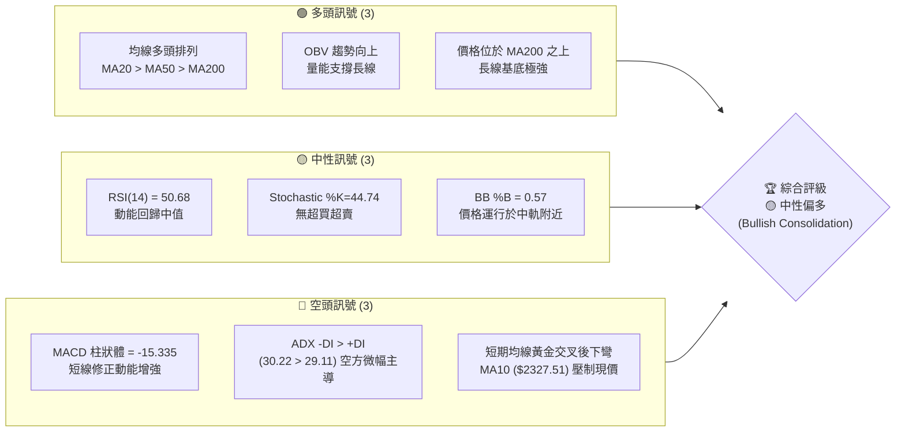
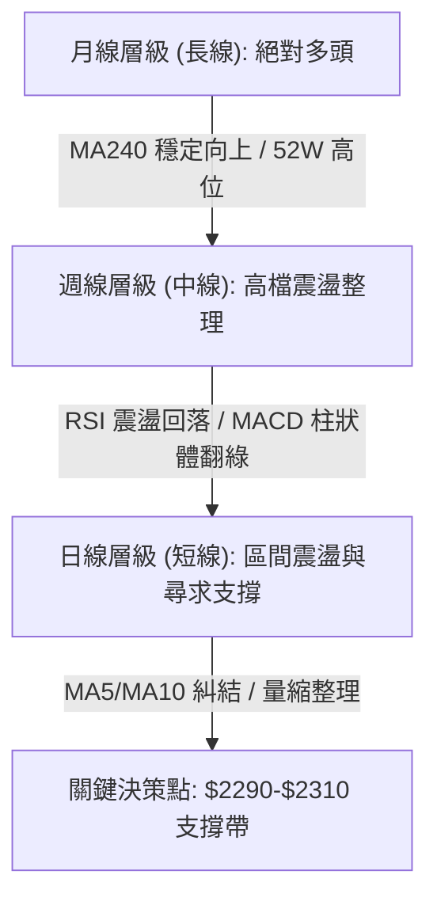
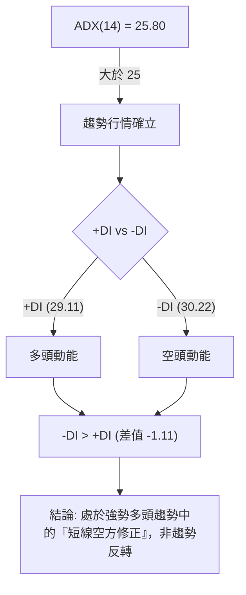
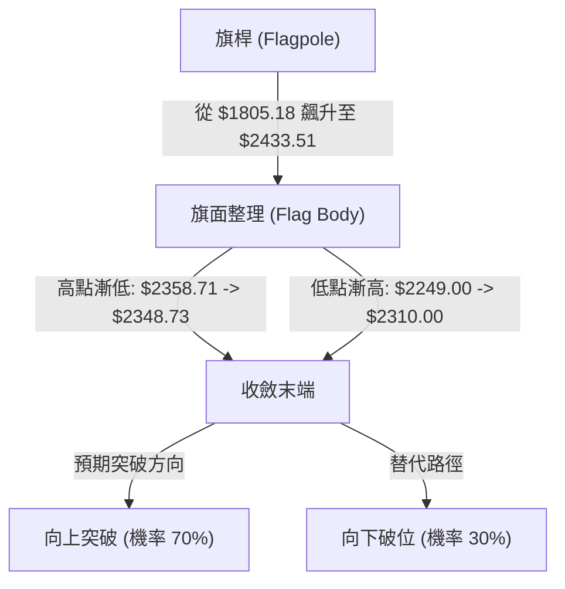
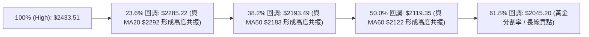
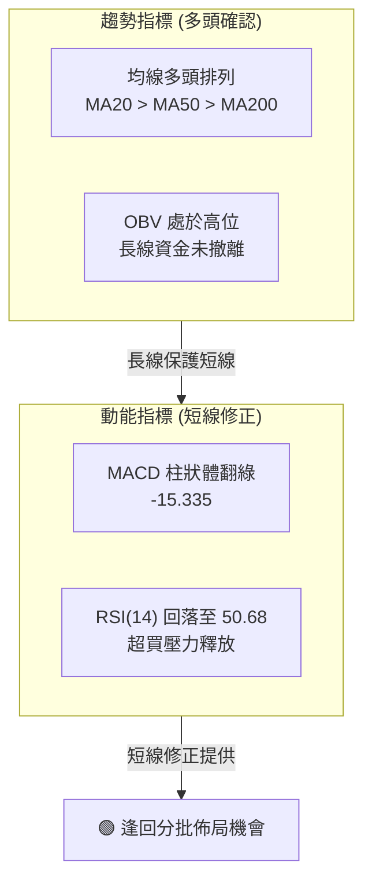
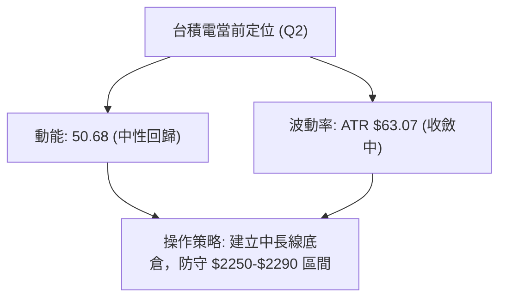
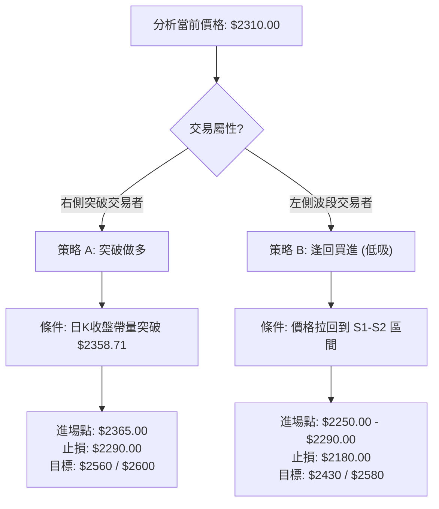
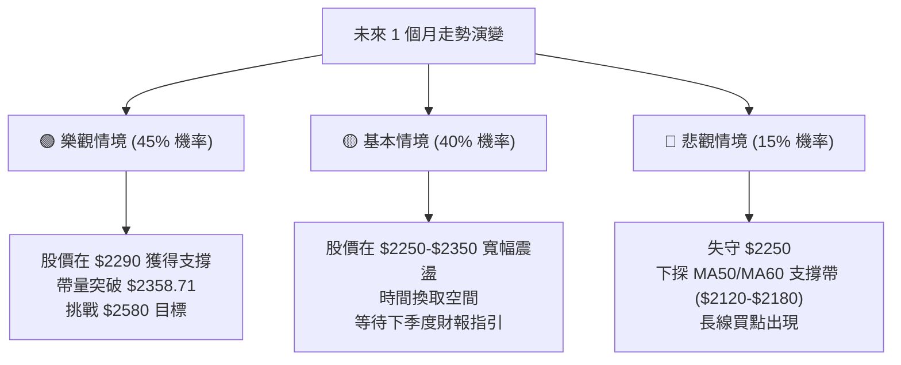

<details>
<summary>📊 靜態圖表 (點擊展開)</summary>

</details>

<html>
<head><meta charset="utf-8" /></head>
<body>
    <div style="height:500px; width:100%;">                        <script>window.PlotlyConfig = {MathJaxConfig: 'local'};</script>
        <script charset="utf-8" src="https://cdn.plot.ly/plotly-3.6.0.min.js" integrity="sha256-QaOVwtVY0T02VaHrr6pnoHLCwayMJp4O5n4YyaE3rJk=" crossorigin="anonymous"></script>                <div id="candlestick-chart" class="plotly-graph-div" style="height:100%; width:100%;"></div>            <script>                window.PLOTLYENV=window.PLOTLYENV || {};                                if (document.getElementById("candlestick-chart")) {                    Plotly.newPlot(                        "candlestick-chart",                        [{"close":{"dtype":"f8","bdata":"AAAA4CwekkAAAACA6TGSQAAAAIDpMZJAAAAAIKZFkkAAAADAR4CRQAAAAKB9u5FAAAAAwEeAkUAAAAAgcAqSQAAAAOAsHpJAAAAA4GJZkkAAAAAA9+KRQAAAAAD34pFAAAAAoLP2kUAAAAAA9+KRQAAAAAD34pFAAAAAAPfikUAAAACA6TGSQAAAAIDpMZJAAAAAINyAkkAAAACAi+OSQAAAAGDBHpNAAAAA4LNtk0AAAABg91mTQAAAAKDc0JNAAAAAAGqVk0AAAABgreSTQAAAAABqlZNAAAAAIE8MlEAAAADgpr6UQAAAAOCmvpRAAAAAYGNvlEAAAADgHyCUQAAAAODwM5RAAAAAQDSDlEAAAAAguyGVQAAAAEBxrJVAAAAAICc3lkAAAADg4+eVQAAAACD4SpZAAAAA4OPnlUAAAACAhQ+WQAAAAIAMrpZAAAAA4E\u002f9lkAAAADgmXKWQAAAAAB\u002f6ZZAAAAAAH\u002fplkAAAACAO5qWQAAAAOCZcpZAAAAAAH\u002fplkAAAAAgrtWWQAAAAECTTJdAAAAAQJNMl0AAAABgwjiXQAAAACBkYJdAAAAAQJNMl0AAAACAO5qWQAAAAIAMrpZAAAAAgDualkAAAAAgrtWWQAAAAIAMrpZAAAAAIK7VlkAAAACAO5qWQAAAAEBWI5ZAAAAA4MhelkAAAAAgQsCVQAAAAECgmJVAAAAAoGqGlkAAAACg\u002fnCVQAAAAOBcSZVAAAAA4OPnlUAAAAAg+EqWQAAAACAnN5ZAAAAAIPhKlkAAAAAAE9SVQAAAAEBWI5ZAAAAA4JlylkAAAADgyF6WQAAAAIA7mpZAAAAAgPEkl0AAAAAAf+mWQAAAAECTTJdAAAAAoEjVlkAAAABADP2WQAAAAKDBhZZAAAAAIBxKlkAAAABgOjaWQAAAAGA6NpZAAAAAYDo2lkAAAADgZsGWQAAAAMDPJJdAAAAAgLE4l0AAAADgVnSXQAAAAODdw5dAAAAAYBqcl0AAAAAAZROYQAAAAGCRnphAAAAAgI\u002fwmUAAAADgu3uaQAAAAEBxBJpAAAAAwDQsmkAAAAAAUxiaQAAAAIAWQJpAAAAAoJ2PmkAAAACgnY+aQAAAAIAWQJpAAAAAQOgGm0AAAABgb1abQAAAAMAUkptAAAAAQOgGm0AAAABgb1abQAAAAAAzfptAAAAAgI1Cm0AAAACA9qWbQAAAAKAERZxAAAAAYF8JnEAAAADAFJKbQAAAACBRaptAAAAAgH31m0AAAABA2LmbQAAAACBRaptAAAAAgPalm0AAAADgIjGcQAAAAOCZM51AAAAAQMa+nUAAAADgIIOdQAAAAOCXhZ5AAAAAoGlMn0AAAACA4vyeQAAAAIBbrZ5AAAAAYE0OnkAAAACA9PecQAAAAOAgg51AAAAAYF1bnUAAAAAgQR2cQAAAAEBPvJxAAAAAIC8inkAAAACge0edQAAAAID095xAAAAAgG2onEAAAAAAGSSdQAAAAKC5r51AAAAAgE\u002fUnEAAAADAaqycQAAAAIC8NJxAAAAAgLw0nEAAAAAgXcCcQAAAAMBqrJxAAAAAQKFcnEAAAABADr2bQAAAAMBEbZtAAAAA4EHonEAAAACAvDScQAAAAEA0\u002fJxAAAAAAD9jnkAAAABgMXeeQAAAAMC2Kp9AAAAAANICn0AAAACAEAOgQAAAAGDuNKBAAAAAoOc+oEAAAAAAZaKfQAAAAKByjp9AAAAAgC7yn0AAAACALvKfQAAAAGDuNKBAAAAAYF8GoUAAAABg8qWhQAAAAIA2QqFAAAAAIGb8oEAAAACAo6KgQAAAAMDkuaFAAAAA4AaIoUAAAADgBoihQAAAACC1\u002f6FAAAAAYNDXoUAAAABAG2qhQAAAAAAAkqFAAAAAoC9MoUAAAACg66+hQAAAAGDypaFAAAAAgBR0oUAAAAAgRC6hQAAAAGBfBqFAAAAAACJgoUAAAAAAAJKhQAAAACC1\u002f6FAAAAAoOuvoUAAAADAwuuhQAAAAIDJ4aFAAAAAwHdZokAAAADAd1miQAAAAMBVi6JAAAAAYBjlokAAAADgTpWiQAAAACBqbaJAAAAAgMnhoUAAAADgu\u002fWhQAAAAAAAkqFAAAAAAACUoUAAAAAAAAyiQA=="},"high":{"dtype":"f8","bdata":"Wseb02JZkkBkK4ImpkWSQGQrgiamRZJAAAAAIKZFkkCH2MCns\u002faRQHQEikY6z5FAWpCAWjrPkUCtzdps6TGSQOeEEi2mRZJAAAAA4GJZkkCWexpBpkWSQJZ7GkGmRZJAAAAAoLP2kUCNsNzzLB6SQAAAAAD34pFAjbDc8ywekkAAAACA6TGSQCuChnMfbZJAAAAAINyAkkACRqkmSPeSQKWUUvqzbZNAAAAA4LNtk0C9JaEGtG2TQAAAoHyt5JNAiIIruQu9k0AAAABgreSTQFPG7E5++JNAAAAAIE8MlEAAAADgpr6UQB+onHUZ+pRAED74GAWXlECt1Ep1kluUQId+s3Vjb5RAvJV9jkjmlEC8x3v8izWVQAAAAEBxrJVAaTbd2MhelkARl5u8tPuVQKuqqrVqhpZAEZebvLT7lUAclaKHO5qWQAAAAIAMrpZAdbgamfEkl0AN6bx1DK6WQJgin5XxJJdAdYMpcsI4l0A\u002ffvw43cGWQK9NlLxqhpZAdYMpcsI4l0D6IJa1IBGXQF2\u002f+\u002fg0dJdAC5951QWIl0BnZmau1puXQASyAdkFiJdAun73sdabl0CeO3fOT\u002f2WQBLP1xV\u002f6ZZAHz9+XAyulkCnwA7ZT\u002f2WQCWer6vxJJdAp8AO2U\u002f9lkA\u002ffvw43cGWQD7T1vj3SpZAMchedTualkCcdIBLJzeWQHIcx7Hj55VAWSl7fDualkCAHiMSQsCVQLH2DQtCwJVAIy43mYUPlkAAAAAg+EqWQNJsupFqhpZAq6qqtWqGlkAQkysIyV6WQD7T1vj3SpZAAAAA4JlylkBm7XS8mXKWQAAAAIA7mpZAAAAAgPEkl0B1gylywjiXQAAAAECTTJdAAAAAkDiIl0CmyGcF7hCXQGAqaGWjmZZAFRh7qt9xlkCatsav33GWQN48QiUcSpZAVjBLOqOZlkBB\u002flmlSNWWQAAAAMDPJJdAUOZZRZNMl0AAAADgVnSXQAAAAODdw5dAr6G86t3Dl0AAAAAAZROYQAAAAGCRnphAf4vTWvhTmkAAAADgu3uaQGLRsso0LJpAgNjzD9pnmkBVVVUV2meaQGjD58+7e5pAq6qqKmG3mkBVVVVlf6OaQEWCmgraZ5pAq6qqyqsum0AYXXR19qWbQAAAAMAUkptAq6qqGlFqm0CMLrrqMn6bQH55bMUUkptAoPu5H9i5m0CWrGRF2LmbQAAAAKAERZxAbXZxAKqAnEAg0QqbffWbQAAAACBRaptAq6qqCkEdnEAVOoNVXwmcQHmaC3D2pZtAAAAAgPalm0Djd4L1qYCcQAAAAOCZM51A3cuxyonmnUAVCCNFTQ6eQGfSlWpbrZ5ADOSjKi10n0D4M+HPhzifQNUoY5Xi\u002fJ5AfUFfUD3BnkBpDt9v5KqdQLfEqR+2cZ5Aq6qq6iCDnUAAAAAgQR2cQEa15WpdW51ABb64qvJJnkC8uhVAxr6dQBKxRpV7R51ABQmj5ZkznUBM2AbB\u002fUudQAQCgQCsw51AOQ8dw\u002f1LnUAtZCEDGSSdQG3Hh+CuSJxAaDs+hE\u002fUnEAyOB9jCzidQHvTm6ImEJ1AcAiHoJNwnEAIRSjC1wycQHTRRQPz5JtAAAAA4EHonECukdWlJhCdQAAAAEA0\u002fJxAAAAAAD9jnkAAAABgMXeeQAAAAMC2Kp9AXH97YMQWn0AAAACAEAOgQMVO7CDTXKBA\u002f8FE0OBIoEAvMWuhCQ2gQMIWbHEQA6BAE7UrMfUqoEAPxO8A\u002fCCgQJ3YiXKjoqBAaZxBkFgQoUAY0TbTmSeiQPljSfPdw6FAqzNSQT04oUBUXDKENkKhQOAHfiDXzaFAaEUjoeuvoUB1uf0x182hQB988HGFRaJA9C4eIbX\u002foUA6JQHC5LmhQBTfPfHdw6FAyWfdYBR0oUAAAACg66+hQO+F96KgHaJASZIkQfmboUBRFEURImChQA8OSFE9OKFABYQT8f+RoUAEkz8w+ZuhQAAAACC1\u002f6FANvAZs6AdokCgaKvhmSeiQJ4PLPNwY6JAu3\u002fzgFyBokAvf9oCJtGiQIFcE4E6s6JAQ1qx8AMDo0Byp2gBJtGiQE7w5KEzvaJAxlQ4cacTokDvlbpwpxOiQCQrPLLC66FAAAAAAACooUAAAAAAACqiQA=="},"hovertemplate":"\u003cb\u003e%{x|%Y-%m-%d}\u003c\u002fb\u003e\u003cbr\u003e\u958b: $%{open:.2f}\u003cbr\u003e\u9ad8: $%{high:.2f}\u003cbr\u003e\u4f4e: $%{low:.2f}\u003cbr\u003e\u6536: $%{close:.2f}\u003cextra\u003e\u003c\u002fextra\u003e","low":{"dtype":"f8","bdata":"AAAA4CwekkA4qfsycAqSQDip+zJwCpJAtbgJ0ywekkAAAADAR4CRQBn361IElJFAAAAAwEeAkUBTMiXT9uKRQKY4ZOz24pFA09LSkukxkkAAAAAA9+KRQAAAAAD34pFAv4KhBcGnkUB8GmFZOs+RQHNPIwzBp5FAAAAAAPfikUA4qfsycAqSQAAAAIDpMZJA7+7u0mJZkkD8c60yErySQNdaa7kEC5NAwzAMkzpGk0BD2l65OkaTQAAAgC2ZgZNAAAAAAGqVk0DyDfLtaZWTQAAAAABqlZNArRtM0Tqpk0AiPVCRkluUQOFXY0o0g5RAAAAAYGNvlEAbuZEDTwyUQAAAAODwM5RAAAAAQDSDlECHcAhnGfqUQAAAADi7IZVAYi60irT7lUDe0cgmQsCVQDmO42ZWI5ZAqgz2kM+ElUBFD3ujtPuVQM\u002fXFZuFD5ZAFo\u002fKbQyulkAAAADgmXKWQK0bTLFqhpZAAAAAAH\u002fplkDgwIGjaoaWQPQWQ0onN5ZAAAAAAH\u002fplkCtn3hD3cGWQPVghqogEZdAUiCCY8I4l0AAAABgwjiXQPmb\u002fK0gEZdApEAEh\u002fEkl0DgwIGjaoaWQAAAAIAMrpZA4MCBo2qGlkBZP\u002fFmDK6WQAAAAIAMrpZABt9pijualkAAAACAO5qWQGCWlGOFD5ZAAAAA4MhelkAAAAAgQsCVQAAAAECgmJVA9YOOCvhKlkAAAACg\u002fnCVQAAAAOBcSZVA3tHIJkLAlUBWVVWKhQ+WQMtkkUNWI5ZAHcdxQyc3lkAAAAAAE9SVQMEsKYe0+5VA9BZDSic3lkDON6FKViOWQIIDBw74SpZAu++4eDualkAAAAAAf+mWQEeBCM5P\u002fZZAq6qq2mbBlkC0bjC1SNWWQKHVl9rfcZZA6ueElVgilkAiw72aWCKWQGZJORCV+pVAAAAAYDo2lkB\u002fA0xVo5mWQHADhqpI1ZZAXzNM9e0Ql0CTv8mPsTiXQKuqqspWdJdAUV5D1VZ0l0CnAW2aOIiXQIHgMjWD\u002f5dATmu2j589mUD988+fJo2ZQJ0uTbWt3JlAAU8YIOq0mUBVVVUl6rSZQAAAAIAWQJpAVVVVFdpnmkBVVVUV2meaQLp9ZfVSGJpAAAAAoJ2PmkAYXXT6QsuaQGwOJFroBptAAAAAQOgGm0B10UXVqy6bQAkaTuqrLptAAAAAgI1Cm0AUoQiljUKbQDD90v+5zZtAmMGXmn31m0AAAADAFJKbQAoymwrKGptAAAAAMNi5m0D1Yj61FJKbQIPMplpvVptAU5vaVOgGm0AAAADgIjGcQOo7G7WLlJxAi9A4FbgfnUAAAADgIIOdQP3jEivGvp1A5je4iuL8nkAAAACA4vyeQIx4khovIp5AAAAAYE0OnkAAAACA9PecQEbasRo\u002fb51AVVVV1ZkznUARpNz0Mn6bQFwljSrIbJxA3ixPGrgfnUAAAACge0edQKmiZ6WLlJxAAAAAgG2onECzJ\u002fk+NPycQPT5fH7ic51AAAAAgE\u002fUnEAAAADAaqycQOAaWZ0A0ZtAJ3HwvtcMnEAAAAAgXcCcQAAAAMBqrJxAPt7jvdcMnEAAAABADr2bQAAAAMBEbZtA+pJp\u002fYWEnECUOHgfyiCcQNdaa114mJxAndiJHYP\u002fnUAzdYt9dROeQFK4Hn0Is55A7oGN3vrGnkC\u002fShibm1KfQDuxE58JDaBAB3RjfhADoEAAAAAAZaKfQAAAAKByjp9A+B2IHzzen0DxOxC\u002fScqfQIqd2G4QA6BAaTnmW8xmoEAAAABg8qWhQAAAAIA2QqFAKuZWj3reoEAAAACAo6KgQPzAD7xRGqFATF1ufxR0oUBMXW5\u002fFHShQAAAACC1\u002f6FAT0WabvKloUAAAABAG2qhQNzUw009OKFAKfJZD0QuoUAel74dImChQIQeQs8GiKFAJEmSjjZCoUAAAAAgRC6hQAAAAGBfBqFAAAAAACJgoUDojYLeKFahQOGDD87kuaFAAAAAoOuvoUDLh3Ff0NehQDmrx47rr6FAV6DPzpknokARIMOPfk+iQH+j7P5wY6JAvqVOzyzHokAAAADgTpWiQOMlSo9+T6JAYvDTDCJgoUALnIN\u002fyeGhQAAAAAAAkqFAAAAAAABEoUAAAAAAAOShQA=="},"name":"\u50f9\u683c","open":{"dtype":"f8","bdata":"54QSLaZFkkCc1H3ZLB6SQDip+zJwCpJAWtyEeekxkkCH2MCns\u002faRQBn361IElJFAWpCAWjrPkUAqmZJ5s\u002faRQBl77ZKz9pFAAAAA4GJZkkCWexpBpkWSQBKWe5rpMZJADyI5rH27kUAJyz1NcAqSQHwaYVk6z5FACcs9TXAKkkCc1H3ZLB6SQCuChnMfbZJAd3d3eR9tkkD+uVbZzs+SQHzvvVP3WZNAYhiGOfdZk0C9JaEGtG2TQAAAIApqlZNARMGV3Dqpk0D5BvmmC72TQA8FV3Kt5JNArRtM0Tqpk0CCytltY2+UQL8aE5lI5pRAAAAAYGNvlEDJjdyYwUeUQC0qkbzBR5RAAAAAQDSDlEBDOIRD6g2VQAAAADi7IZVAYi60irT7lUDvaGQDE9SVQAAAACD4SpZAqgz2kM+ElUBhpB2raoaWQNthUFQnN5ZAFo\u002fKbQyulkCvTZS8aoaWQIp81o07mpZA3WCK3E\u002f9lkAAAACAO5qWQKNk1yb4SpZAdYMpcsI4l0BTYIf8fumWQKRABIfxJJdAXb\u002f7+DR0l0DXo3D1NHSXQAAAACBkYJdAC5951QWIl0B+\u002fPjxfumWQAZFnVzdwZZAAAAAgDualkCtn3hD3cGWQB9ZEs8gEZdArZ94Q93BlkAAAACAO5qWQGCWlGOFD5ZAZu10vJlylkCcdIBLJzeWQBzHcRxxrJVAp9aEw5lylkBAjxFZoJiVQOmiiy5xrJVAIy43mYUPlkA5juNmViOWQJ7RS7WZcpZAAAAAIPhKlkAQkysIyV6WQAAAAEBWI5ZAo2TXJvhKlkAAAADgyF6WQKFCherIXpZAfM0wVQyulkCYIp+V8SSXQPVghqogEZdAq6qqylZ0l0BaN5h6KumWQAAAAKDBhZZAAAAAIBxKlkDePEIlHEqWQESGe9V2DpZAVjBLOqOZlkAAAADgZsGWQJSC5G8q6ZZAAAAAgLE4l0AxlZgadWCXQAAAAJA4iJdAKK+hmjiIl0D9JctfGpyXQGEo5r9GJ5hAm+0TVYFRmUD988+fJo2ZQJ0uTbWt3JlAK5dp5cvImUAAAACwrdyZQEWCmgraZ5pAq6qqKmG3mkCrqqrau3uaQN2+sro0LJpAq6qqegbzmkAYXXT6QsuaQGwOJFroBptAVVVVBcoam0BGF10lUWqbQAAAAAAzfptA4FOTClFqm0CqTW1qb1abQDD90v+5zZtABjgJO8hsnECtsDkQus2bQIhl9M+rLptAq6qqCkEdnEAAAABA2LmbQAAAACBRaptA6Uc\u002fGsoam0Dr2SEwyGycQG3Ud3ptqJxAeraR2pkznUAAAADgIIOdQP3jEivGvp1A5je4iuL8nkBTEUtFxBCfQIx4khovIp5A02ufxXmZnkCbCeofP2+dQM8tcQovIp5AVVVV1ZkznUCPD0G6FJKbQKPaclXWC51A4+oHpXtHnUBe3QrwIIOdQKmiZ6WLlJxABJpCILgfnUAmbINgCzidQPz9fj\u002fHm51AWjeYYgs4nUDJQhZCNPycQE3i4P3y5JtAaDs+hE\u002fUnEAh0BSiJhCdQGQhC4FP1JxAruZqHsognEAAAABADr2bQLroouEbqZtAY4tyvmqsnECukdWlJhCdQPC9935P1JxAXuiF3mcnnkBHlQSfTE+eQJqZmd36xp5ApYCEn9\u002funkCq0KP7jWafQOzETs8CF6BAAT67b+40oED8qC5xEAOgQOtceQBlop9AAAAAgC7yn0D4HYgfPN6fQGIndsDgSKBA0tUnjMVwoEB84b3w3cOhQIdVhKENfqFADqLH72zyoEDKEKwjRC6hQOzETuxKJKFAAAAA4AaIoUAAAADgBoihQM2hYhGTMaJAehePwMLroUDr24Bh8qWhQPCzAT8baqFAKfJZD0QuoUCPS9\u002feBoihQHOkORK1\u002f6FASZIk7yhWoUAxDMOwL0yhQKZxBiFELqFAzzRuYBR0oUD42YCfDX6hQOGDD87kuaFAGsPRgqcTokA2eI4gtf+hQOggr5J+T6JANGBJL4w7okAAAADAd1miQECuiSBIn6JAAAAAYBjlokAAAADgTpWiQDu0a0FBqaJAYvDTDCJgoUAAAADgu\u002fWhQBhyfSHXzaFAAAAAAACAoUAAAAAAACqiQA=="},"x":["2025-08-14T00:00:00+08:00","2025-08-15T00:00:00+08:00","2025-08-18T00:00:00+08:00","2025-08-19T00:00:00+08:00","2025-08-20T00:00:00+08:00","2025-08-21T00:00:00+08:00","2025-08-22T00:00:00+08:00","2025-08-25T00:00:00+08:00","2025-08-26T00:00:00+08:00","2025-08-27T00:00:00+08:00","2025-08-28T00:00:00+08:00","2025-08-29T00:00:00+08:00","2025-09-01T00:00:00+08:00","2025-09-02T00:00:00+08:00","2025-09-03T00:00:00+08:00","2025-09-04T00:00:00+08:00","2025-09-05T00:00:00+08:00","2025-09-08T00:00:00+08:00","2025-09-09T00:00:00+08:00","2025-09-10T00:00:00+08:00","2025-09-11T00:00:00+08:00","2025-09-12T00:00:00+08:00","2025-09-15T00:00:00+08:00","2025-09-16T00:00:00+08:00","2025-09-17T00:00:00+08:00","2025-09-18T00:00:00+08:00","2025-09-19T00:00:00+08:00","2025-09-22T00:00:00+08:00","2025-09-23T00:00:00+08:00","2025-09-24T00:00:00+08:00","2025-09-25T00:00:00+08:00","2025-09-26T00:00:00+08:00","2025-09-30T00:00:00+08:00","2025-10-01T00:00:00+08:00","2025-10-02T00:00:00+08:00","2025-10-03T00:00:00+08:00","2025-10-07T00:00:00+08:00","2025-10-08T00:00:00+08:00","2025-10-09T00:00:00+08:00","2025-10-13T00:00:00+08:00","2025-10-14T00:00:00+08:00","2025-10-15T00:00:00+08:00","2025-10-16T00:00:00+08:00","2025-10-17T00:00:00+08:00","2025-10-20T00:00:00+08:00","2025-10-21T00:00:00+08:00","2025-10-22T00:00:00+08:00","2025-10-23T00:00:00+08:00","2025-10-27T00:00:00+08:00","2025-10-28T00:00:00+08:00","2025-10-29T00:00:00+08:00","2025-10-30T00:00:00+08:00","2025-10-31T00:00:00+08:00","2025-11-03T00:00:00+08:00","2025-11-04T00:00:00+08:00","2025-11-05T00:00:00+08:00","2025-11-06T00:00:00+08:00","2025-11-07T00:00:00+08:00","2025-11-10T00:00:00+08:00","2025-11-11T00:00:00+08:00","2025-11-12T00:00:00+08:00","2025-11-13T00:00:00+08:00","2025-11-14T00:00:00+08:00","2025-11-17T00:00:00+08:00","2025-11-18T00:00:00+08:00","2025-11-19T00:00:00+08:00","2025-11-20T00:00:00+08:00","2025-11-21T00:00:00+08:00","2025-11-24T00:00:00+08:00","2025-11-25T00:00:00+08:00","2025-11-26T00:00:00+08:00","2025-11-27T00:00:00+08:00","2025-11-28T00:00:00+08:00","2025-12-01T00:00:00+08:00","2025-12-02T00:00:00+08:00","2025-12-03T00:00:00+08:00","2025-12-04T00:00:00+08:00","2025-12-05T00:00:00+08:00","2025-12-08T00:00:00+08:00","2025-12-09T00:00:00+08:00","2025-12-10T00:00:00+08:00","2025-12-11T00:00:00+08:00","2025-12-12T00:00:00+08:00","2025-12-15T00:00:00+08:00","2025-12-16T00:00:00+08:00","2025-12-17T00:00:00+08:00","2025-12-18T00:00:00+08:00","2025-12-19T00:00:00+08:00","2025-12-22T00:00:00+08:00","2025-12-23T00:00:00+08:00","2025-12-24T00:00:00+08:00","2025-12-26T00:00:00+08:00","2025-12-29T00:00:00+08:00","2025-12-30T00:00:00+08:00","2025-12-31T00:00:00+08:00","2026-01-02T00:00:00+08:00","2026-01-05T00:00:00+08:00","2026-01-06T00:00:00+08:00","2026-01-07T00:00:00+08:00","2026-01-08T00:00:00+08:00","2026-01-09T00:00:00+08:00","2026-01-12T00:00:00+08:00","2026-01-13T00:00:00+08:00","2026-01-14T00:00:00+08:00","2026-01-15T00:00:00+08:00","2026-01-16T00:00:00+08:00","2026-01-19T00:00:00+08:00","2026-01-20T00:00:00+08:00","2026-01-21T00:00:00+08:00","2026-01-22T00:00:00+08:00","2026-01-23T00:00:00+08:00","2026-01-26T00:00:00+08:00","2026-01-27T00:00:00+08:00","2026-01-28T00:00:00+08:00","2026-01-29T00:00:00+08:00","2026-01-30T00:00:00+08:00","2026-02-02T00:00:00+08:00","2026-02-03T00:00:00+08:00","2026-02-04T00:00:00+08:00","2026-02-05T00:00:00+08:00","2026-02-06T00:00:00+08:00","2026-02-09T00:00:00+08:00","2026-02-10T00:00:00+08:00","2026-02-11T00:00:00+08:00","2026-02-23T00:00:00+08:00","2026-02-24T00:00:00+08:00","2026-02-25T00:00:00+08:00","2026-02-26T00:00:00+08:00","2026-03-02T00:00:00+08:00","2026-03-03T00:00:00+08:00","2026-03-04T00:00:00+08:00","2026-03-05T00:00:00+08:00","2026-03-06T00:00:00+08:00","2026-03-09T00:00:00+08:00","2026-03-10T00:00:00+08:00","2026-03-11T00:00:00+08:00","2026-03-12T00:00:00+08:00","2026-03-13T00:00:00+08:00","2026-03-16T00:00:00+08:00","2026-03-17T00:00:00+08:00","2026-03-18T00:00:00+08:00","2026-03-19T00:00:00+08:00","2026-03-20T00:00:00+08:00","2026-03-23T00:00:00+08:00","2026-03-24T00:00:00+08:00","2026-03-25T00:00:00+08:00","2026-03-26T00:00:00+08:00","2026-03-27T00:00:00+08:00","2026-03-30T00:00:00+08:00","2026-03-31T00:00:00+08:00","2026-04-01T00:00:00+08:00","2026-04-02T00:00:00+08:00","2026-04-07T00:00:00+08:00","2026-04-08T00:00:00+08:00","2026-04-09T00:00:00+08:00","2026-04-10T00:00:00+08:00","2026-04-13T00:00:00+08:00","2026-04-14T00:00:00+08:00","2026-04-15T00:00:00+08:00","2026-04-16T00:00:00+08:00","2026-04-17T00:00:00+08:00","2026-04-20T00:00:00+08:00","2026-04-21T00:00:00+08:00","2026-04-22T00:00:00+08:00","2026-04-23T00:00:00+08:00","2026-04-24T00:00:00+08:00","2026-04-27T00:00:00+08:00","2026-04-28T00:00:00+08:00","2026-04-29T00:00:00+08:00","2026-04-30T00:00:00+08:00","2026-05-04T00:00:00+08:00","2026-05-05T00:00:00+08:00","2026-05-06T00:00:00+08:00","2026-05-07T00:00:00+08:00","2026-05-08T00:00:00+08:00","2026-05-11T00:00:00+08:00","2026-05-12T00:00:00+08:00","2026-05-13T00:00:00+08:00","2026-05-14T00:00:00+08:00","2026-05-15T00:00:00+08:00","2026-05-18T00:00:00+08:00","2026-05-19T00:00:00+08:00","2026-05-20T00:00:00+08:00","2026-05-21T00:00:00+08:00","2026-05-22T00:00:00+08:00","2026-05-25T00:00:00+08:00","2026-05-26T00:00:00+08:00","2026-05-27T00:00:00+08:00","2026-05-28T00:00:00+08:00","2026-05-29T00:00:00+08:00","2026-06-01T00:00:00+08:00","2026-06-02T00:00:00+08:00","2026-06-03T00:00:00+08:00","2026-06-04T00:00:00+08:00","2026-06-05T00:00:00+08:00","2026-06-08T00:00:00+08:00","2026-06-09T00:00:00+08:00","2026-06-10T00:00:00+08:00","2026-06-11T00:00:00+08:00","2026-06-12T00:00:00+08:00"],"type":"candlestick"},{"hovertemplate":"MA30: $%{y:.2f}\u003cextra\u003e\u003c\u002fextra\u003e","line":{"color":"#2196F3","dash":"dash","width":2},"mode":"lines","name":"MA30","x":["2025-08-14T00:00:00+08:00","2025-08-15T00:00:00+08:00","2025-08-18T00:00:00+08:00","2025-08-19T00:00:00+08:00","2025-08-20T00:00:00+08:00","2025-08-21T00:00:00+08:00","2025-08-22T00:00:00+08:00","2025-08-25T00:00:00+08:00","2025-08-26T00:00:00+08:00","2025-08-27T00:00:00+08:00","2025-08-28T00:00:00+08:00","2025-08-29T00:00:00+08:00","2025-09-01T00:00:00+08:00","2025-09-02T00:00:00+08:00","2025-09-03T00:00:00+08:00","2025-09-04T00:00:00+08:00","2025-09-05T00:00:00+08:00","2025-09-08T00:00:00+08:00","2025-09-09T00:00:00+08:00","2025-09-10T00:00:00+08:00","2025-09-11T00:00:00+08:00","2025-09-12T00:00:00+08:00","2025-09-15T00:00:00+08:00","2025-09-16T00:00:00+08:00","2025-09-17T00:00:00+08:00","2025-09-18T00:00:00+08:00","2025-09-19T00:00:00+08:00","2025-09-22T00:00:00+08:00","2025-09-23T00:00:00+08:00","2025-09-24T00:00:00+08:00","2025-09-25T00:00:00+08:00","2025-09-26T00:00:00+08:00","2025-09-30T00:00:00+08:00","2025-10-01T00:00:00+08:00","2025-10-02T00:00:00+08:00","2025-10-03T00:00:00+08:00","2025-10-07T00:00:00+08:00","2025-10-08T00:00:00+08:00","2025-10-09T00:00:00+08:00","2025-10-13T00:00:00+08:00","2025-10-14T00:00:00+08:00","2025-10-15T00:00:00+08:00","2025-10-16T00:00:00+08:00","2025-10-17T00:00:00+08:00","2025-10-20T00:00:00+08:00","2025-10-21T00:00:00+08:00","2025-10-22T00:00:00+08:00","2025-10-23T00:00:00+08:00","2025-10-27T00:00:00+08:00","2025-10-28T00:00:00+08:00","2025-10-29T00:00:00+08:00","2025-10-30T00:00:00+08:00","2025-10-31T00:00:00+08:00","2025-11-03T00:00:00+08:00","2025-11-04T00:00:00+08:00","2025-11-05T00:00:00+08:00","2025-11-06T00:00:00+08:00","2025-11-07T00:00:00+08:00","2025-11-10T00:00:00+08:00","2025-11-11T00:00:00+08:00","2025-11-12T00:00:00+08:00","2025-11-13T00:00:00+08:00","2025-11-14T00:00:00+08:00","2025-11-17T00:00:00+08:00","2025-11-18T00:00:00+08:00","2025-11-19T00:00:00+08:00","2025-11-20T00:00:00+08:00","2025-11-21T00:00:00+08:00","2025-11-24T00:00:00+08:00","2025-11-25T00:00:00+08:00","2025-11-26T00:00:00+08:00","2025-11-27T00:00:00+08:00","2025-11-28T00:00:00+08:00","2025-12-01T00:00:00+08:00","2025-12-02T00:00:00+08:00","2025-12-03T00:00:00+08:00","2025-12-04T00:00:00+08:00","2025-12-05T00:00:00+08:00","2025-12-08T00:00:00+08:00","2025-12-09T00:00:00+08:00","2025-12-10T00:00:00+08:00","2025-12-11T00:00:00+08:00","2025-12-12T00:00:00+08:00","2025-12-15T00:00:00+08:00","2025-12-16T00:00:00+08:00","2025-12-17T00:00:00+08:00","2025-12-18T00:00:00+08:00","2025-12-19T00:00:00+08:00","2025-12-22T00:00:00+08:00","2025-12-23T00:00:00+08:00","2025-12-24T00:00:00+08:00","2025-12-26T00:00:00+08:00","2025-12-29T00:00:00+08:00","2025-12-30T00:00:00+08:00","2025-12-31T00:00:00+08:00","2026-01-02T00:00:00+08:00","2026-01-05T00:00:00+08:00","2026-01-06T00:00:00+08:00","2026-01-07T00:00:00+08:00","2026-01-08T00:00:00+08:00","2026-01-09T00:00:00+08:00","2026-01-12T00:00:00+08:00","2026-01-13T00:00:00+08:00","2026-01-14T00:00:00+08:00","2026-01-15T00:00:00+08:00","2026-01-16T00:00:00+08:00","2026-01-19T00:00:00+08:00","2026-01-20T00:00:00+08:00","2026-01-21T00:00:00+08:00","2026-01-22T00:00:00+08:00","2026-01-23T00:00:00+08:00","2026-01-26T00:00:00+08:00","2026-01-27T00:00:00+08:00","2026-01-28T00:00:00+08:00","2026-01-29T00:00:00+08:00","2026-01-30T00:00:00+08:00","2026-02-02T00:00:00+08:00","2026-02-03T00:00:00+08:00","2026-02-04T00:00:00+08:00","2026-02-05T00:00:00+08:00","2026-02-06T00:00:00+08:00","2026-02-09T00:00:00+08:00","2026-02-10T00:00:00+08:00","2026-02-11T00:00:00+08:00","2026-02-23T00:00:00+08:00","2026-02-24T00:00:00+08:00","2026-02-25T00:00:00+08:00","2026-02-26T00:00:00+08:00","2026-03-02T00:00:00+08:00","2026-03-03T00:00:00+08:00","2026-03-04T00:00:00+08:00","2026-03-05T00:00:00+08:00","2026-03-06T00:00:00+08:00","2026-03-09T00:00:00+08:00","2026-03-10T00:00:00+08:00","2026-03-11T00:00:00+08:00","2026-03-12T00:00:00+08:00","2026-03-13T00:00:00+08:00","2026-03-16T00:00:00+08:00","2026-03-17T00:00:00+08:00","2026-03-18T00:00:00+08:00","2026-03-19T00:00:00+08:00","2026-03-20T00:00:00+08:00","2026-03-23T00:00:00+08:00","2026-03-24T00:00:00+08:00","2026-03-25T00:00:00+08:00","2026-03-26T00:00:00+08:00","2026-03-27T00:00:00+08:00","2026-03-30T00:00:00+08:00","2026-03-31T00:00:00+08:00","2026-04-01T00:00:00+08:00","2026-04-02T00:00:00+08:00","2026-04-07T00:00:00+08:00","2026-04-08T00:00:00+08:00","2026-04-09T00:00:00+08:00","2026-04-10T00:00:00+08:00","2026-04-13T00:00:00+08:00","2026-04-14T00:00:00+08:00","2026-04-15T00:00:00+08:00","2026-04-16T00:00:00+08:00","2026-04-17T00:00:00+08:00","2026-04-20T00:00:00+08:00","2026-04-21T00:00:00+08:00","2026-04-22T00:00:00+08:00","2026-04-23T00:00:00+08:00","2026-04-24T00:00:00+08:00","2026-04-27T00:00:00+08:00","2026-04-28T00:00:00+08:00","2026-04-29T00:00:00+08:00","2026-04-30T00:00:00+08:00","2026-05-04T00:00:00+08:00","2026-05-05T00:00:00+08:00","2026-05-06T00:00:00+08:00","2026-05-07T00:00:00+08:00","2026-05-08T00:00:00+08:00","2026-05-11T00:00:00+08:00","2026-05-12T00:00:00+08:00","2026-05-13T00:00:00+08:00","2026-05-14T00:00:00+08:00","2026-05-15T00:00:00+08:00","2026-05-18T00:00:00+08:00","2026-05-19T00:00:00+08:00","2026-05-20T00:00:00+08:00","2026-05-21T00:00:00+08:00","2026-05-22T00:00:00+08:00","2026-05-25T00:00:00+08:00","2026-05-26T00:00:00+08:00","2026-05-27T00:00:00+08:00","2026-05-28T00:00:00+08:00","2026-05-29T00:00:00+08:00","2026-06-01T00:00:00+08:00","2026-06-02T00:00:00+08:00","2026-06-03T00:00:00+08:00","2026-06-04T00:00:00+08:00","2026-06-05T00:00:00+08:00","2026-06-08T00:00:00+08:00","2026-06-09T00:00:00+08:00","2026-06-10T00:00:00+08:00","2026-06-11T00:00:00+08:00","2026-06-12T00:00:00+08:00"],"y":{"dtype":"f8","bdata":"AAAAAAAA+H8AAAAAAAD4fwAAAAAAAPh\u002fAAAAAAAA+H8AAAAAAAD4fwAAAAAAAPh\u002fAAAAAAAA+H8AAAAAAAD4fwAAAAAAAPh\u002fAAAAAAAA+H8AAAAAAAD4fwAAAAAAAPh\u002fAAAAAAAA+H8AAAAAAAD4fwAAAAAAAPh\u002fAAAAAAAA+H8AAAAAAAD4fwAAAAAAAPh\u002fAAAAAAAA+H8AAAAAAAD4fwAAAAAAAPh\u002fAAAAAAAA+H8AAAAAAAD4fwAAAAAAAPh\u002fAAAAAAAA+H8AAAAAAAD4fwAAAAAAAPh\u002fAAAAAAAA+H8AAAAAAAD4fzMzM1OHppJAiYiIaE26kkAAAACwxsqSQBERERHp25JAd3d3ZwfvkkB3d3e3Ag6TQAAAAHCkL5NAVVVVFd9Xk0CJiIho2niTQImIiMh6nJNAq6qqatS6k0BERETEct6TQCIiIuJZB5RAVVVV9TwylECamZnJKFmUQAAAADALhJRAZmZmlu2ulEC8u7vridSUQBERERHU+JRAiYiIGHMelUCrqqrqHkCVQLy7uwvIY5VA3t3dfc+ElUAiIiJC1qWVQERERKQ4xJVAd3d3N+3jlUDe3d2NC\u002fuVQO\u002fu7l53FZZAREREhEMrlkB3d3cXGT2WQKuqqnqcTZZAAAAAcBZilkDe3d19OXeWQO\u002fu7t68h5ZAiYiIKJeXlkDNzMzs35yWQDMzM9M2nJZAVVVVNduelkAiIiKi5JqWQERERGROkpZAREREZE6SlkDe3d2tSZSWQJqZmRlTkJZA3t3dPWGKlkCrqqp6GIWWQFVVVYV9fpZAMzMz84Z6lkCamZmpi3iWQJqZmdndeZZAIiIiItl7lkCrqqo6gnyWQKuqqjqCfJZAZmZmRoh4lkDNzMy8inaWQN7d3Q1Bb5ZAvLu7e6NmlkDNzMwcTmOWQERERKRPX5ZAVVVVRfpblkCrqqo6TVuWQLy7u6tCX5ZAVVVVlY9ilkAzMzPD1GmWQGZmZia3d5ZA7+7u7kqClkDe3d1tIZaWQLy7u7vtr5ZAiYiIGBHNlkB3d3dnF\u002fiWQDMzM\u002fN1IJdAvLu7C99El0AiIiICUWWXQDMzM2O\u002fh5dA3t3dTSusl0CrqqrKjdSXQERERESl95dAIiIi8rgemEDNzMxcHEmYQImIiHiBc5hAvLu7S6OUmECrqqoKZ7qYQCIiIqIw3phAIiIiMvcDmUDNzMy8uiuZQBEREYHFXJlAd3d3R9CNmUAiIiLCiruZQKuqqurx55lAAAAAsPwYmkDe3d3dZkOaQM3MzBzaZ5pA3t3draCNmkARERHhDbaaQDMzMwNy5JpAMzMzE80Ym0BEREQ0MUebQJqZmUmPeZtAIiIiwkmnm0Crqqr6uc2bQFVVVYV99ZtAmpmZeaAWnEC8u7vbJS+cQJqZmYn7SpxAMzMzQ9dinEAiIiJyGHCcQJqZmYlNhZxAZmZm5s+fnEAAAABgYbCcQLy7uztPvJxAMzMzEzrKnECJiIiYndmcQImIiEhV7JxA3t3dnbn5nECamZk5eQKdQJqZmUnuAZ1AMzMzU2ADnUDe3d3Ncw2dQERERGQwGJ1AREREhKAbnUCrqqrquxudQKuqqhrVG51AmpmZWZMmnUAiIiISsiadQJqZmVnZJJ1Ad3d311QqnUBmZmaGdzKdQN7d3Y34N51AERERkYQ1nUC8u7v7Wz6dQHd3dxctTZ1AAAAAsPVhnUC8u7srtXidQERERNQmip1A3t3d3T6gnUAiIiJy8cCdQHd3dwdU4J1Ad3d3N78BnkDe3d0NGDWeQHd3d2dxZJ5AVVVV5cmRnkCamZkpB7WeQEREROQ65p5AZmZm5msbn0BVVVVV8VGfQHd3d5dulJ9AAAAAAEPUn0AiIiLKDwSgQERERJynH6BAREREHEA6oEDv7u6G1FqgQKuqqkJofKBAIiIicgGWoEB3d3fXRLCgQAAAAMDgxaBAMzMzs37YoEC8u7sTceygQDMzM6sNAaFAd3d3n6sToUDNzMzU9SOhQO\u002fu7mZBMqFAvLu7IzVEoUBEREQM0VmhQImIiJhrcaFAERERkVqKoUAAAACwoKChQO\u002fu7r6Ts6FAVVVVFeS6oUDv7u7ujL2hQImIiMg1wKFAIiIickPFoUAAAAAQT9GhQA=="},"type":"scatter"},{"hovertemplate":"MA60: $%{y:.2f}\u003cextra\u003e\u003c\u002fextra\u003e","line":{"color":"#9C27B0","dash":"dash","width":2},"mode":"lines","name":"MA60","x":["2025-08-14T00:00:00+08:00","2025-08-15T00:00:00+08:00","2025-08-18T00:00:00+08:00","2025-08-19T00:00:00+08:00","2025-08-20T00:00:00+08:00","2025-08-21T00:00:00+08:00","2025-08-22T00:00:00+08:00","2025-08-25T00:00:00+08:00","2025-08-26T00:00:00+08:00","2025-08-27T00:00:00+08:00","2025-08-28T00:00:00+08:00","2025-08-29T00:00:00+08:00","2025-09-01T00:00:00+08:00","2025-09-02T00:00:00+08:00","2025-09-03T00:00:00+08:00","2025-09-04T00:00:00+08:00","2025-09-05T00:00:00+08:00","2025-09-08T00:00:00+08:00","2025-09-09T00:00:00+08:00","2025-09-10T00:00:00+08:00","2025-09-11T00:00:00+08:00","2025-09-12T00:00:00+08:00","2025-09-15T00:00:00+08:00","2025-09-16T00:00:00+08:00","2025-09-17T00:00:00+08:00","2025-09-18T00:00:00+08:00","2025-09-19T00:00:00+08:00","2025-09-22T00:00:00+08:00","2025-09-23T00:00:00+08:00","2025-09-24T00:00:00+08:00","2025-09-25T00:00:00+08:00","2025-09-26T00:00:00+08:00","2025-09-30T00:00:00+08:00","2025-10-01T00:00:00+08:00","2025-10-02T00:00:00+08:00","2025-10-03T00:00:00+08:00","2025-10-07T00:00:00+08:00","2025-10-08T00:00:00+08:00","2025-10-09T00:00:00+08:00","2025-10-13T00:00:00+08:00","2025-10-14T00:00:00+08:00","2025-10-15T00:00:00+08:00","2025-10-16T00:00:00+08:00","2025-10-17T00:00:00+08:00","2025-10-20T00:00:00+08:00","2025-10-21T00:00:00+08:00","2025-10-22T00:00:00+08:00","2025-10-23T00:00:00+08:00","2025-10-27T00:00:00+08:00","2025-10-28T00:00:00+08:00","2025-10-29T00:00:00+08:00","2025-10-30T00:00:00+08:00","2025-10-31T00:00:00+08:00","2025-11-03T00:00:00+08:00","2025-11-04T00:00:00+08:00","2025-11-05T00:00:00+08:00","2025-11-06T00:00:00+08:00","2025-11-07T00:00:00+08:00","2025-11-10T00:00:00+08:00","2025-11-11T00:00:00+08:00","2025-11-12T00:00:00+08:00","2025-11-13T00:00:00+08:00","2025-11-14T00:00:00+08:00","2025-11-17T00:00:00+08:00","2025-11-18T00:00:00+08:00","2025-11-19T00:00:00+08:00","2025-11-20T00:00:00+08:00","2025-11-21T00:00:00+08:00","2025-11-24T00:00:00+08:00","2025-11-25T00:00:00+08:00","2025-11-26T00:00:00+08:00","2025-11-27T00:00:00+08:00","2025-11-28T00:00:00+08:00","2025-12-01T00:00:00+08:00","2025-12-02T00:00:00+08:00","2025-12-03T00:00:00+08:00","2025-12-04T00:00:00+08:00","2025-12-05T00:00:00+08:00","2025-12-08T00:00:00+08:00","2025-12-09T00:00:00+08:00","2025-12-10T00:00:00+08:00","2025-12-11T00:00:00+08:00","2025-12-12T00:00:00+08:00","2025-12-15T00:00:00+08:00","2025-12-16T00:00:00+08:00","2025-12-17T00:00:00+08:00","2025-12-18T00:00:00+08:00","2025-12-19T00:00:00+08:00","2025-12-22T00:00:00+08:00","2025-12-23T00:00:00+08:00","2025-12-24T00:00:00+08:00","2025-12-26T00:00:00+08:00","2025-12-29T00:00:00+08:00","2025-12-30T00:00:00+08:00","2025-12-31T00:00:00+08:00","2026-01-02T00:00:00+08:00","2026-01-05T00:00:00+08:00","2026-01-06T00:00:00+08:00","2026-01-07T00:00:00+08:00","2026-01-08T00:00:00+08:00","2026-01-09T00:00:00+08:00","2026-01-12T00:00:00+08:00","2026-01-13T00:00:00+08:00","2026-01-14T00:00:00+08:00","2026-01-15T00:00:00+08:00","2026-01-16T00:00:00+08:00","2026-01-19T00:00:00+08:00","2026-01-20T00:00:00+08:00","2026-01-21T00:00:00+08:00","2026-01-22T00:00:00+08:00","2026-01-23T00:00:00+08:00","2026-01-26T00:00:00+08:00","2026-01-27T00:00:00+08:00","2026-01-28T00:00:00+08:00","2026-01-29T00:00:00+08:00","2026-01-30T00:00:00+08:00","2026-02-02T00:00:00+08:00","2026-02-03T00:00:00+08:00","2026-02-04T00:00:00+08:00","2026-02-05T00:00:00+08:00","2026-02-06T00:00:00+08:00","2026-02-09T00:00:00+08:00","2026-02-10T00:00:00+08:00","2026-02-11T00:00:00+08:00","2026-02-23T00:00:00+08:00","2026-02-24T00:00:00+08:00","2026-02-25T00:00:00+08:00","2026-02-26T00:00:00+08:00","2026-03-02T00:00:00+08:00","2026-03-03T00:00:00+08:00","2026-03-04T00:00:00+08:00","2026-03-05T00:00:00+08:00","2026-03-06T00:00:00+08:00","2026-03-09T00:00:00+08:00","2026-03-10T00:00:00+08:00","2026-03-11T00:00:00+08:00","2026-03-12T00:00:00+08:00","2026-03-13T00:00:00+08:00","2026-03-16T00:00:00+08:00","2026-03-17T00:00:00+08:00","2026-03-18T00:00:00+08:00","2026-03-19T00:00:00+08:00","2026-03-20T00:00:00+08:00","2026-03-23T00:00:00+08:00","2026-03-24T00:00:00+08:00","2026-03-25T00:00:00+08:00","2026-03-26T00:00:00+08:00","2026-03-27T00:00:00+08:00","2026-03-30T00:00:00+08:00","2026-03-31T00:00:00+08:00","2026-04-01T00:00:00+08:00","2026-04-02T00:00:00+08:00","2026-04-07T00:00:00+08:00","2026-04-08T00:00:00+08:00","2026-04-09T00:00:00+08:00","2026-04-10T00:00:00+08:00","2026-04-13T00:00:00+08:00","2026-04-14T00:00:00+08:00","2026-04-15T00:00:00+08:00","2026-04-16T00:00:00+08:00","2026-04-17T00:00:00+08:00","2026-04-20T00:00:00+08:00","2026-04-21T00:00:00+08:00","2026-04-22T00:00:00+08:00","2026-04-23T00:00:00+08:00","2026-04-24T00:00:00+08:00","2026-04-27T00:00:00+08:00","2026-04-28T00:00:00+08:00","2026-04-29T00:00:00+08:00","2026-04-30T00:00:00+08:00","2026-05-04T00:00:00+08:00","2026-05-05T00:00:00+08:00","2026-05-06T00:00:00+08:00","2026-05-07T00:00:00+08:00","2026-05-08T00:00:00+08:00","2026-05-11T00:00:00+08:00","2026-05-12T00:00:00+08:00","2026-05-13T00:00:00+08:00","2026-05-14T00:00:00+08:00","2026-05-15T00:00:00+08:00","2026-05-18T00:00:00+08:00","2026-05-19T00:00:00+08:00","2026-05-20T00:00:00+08:00","2026-05-21T00:00:00+08:00","2026-05-22T00:00:00+08:00","2026-05-25T00:00:00+08:00","2026-05-26T00:00:00+08:00","2026-05-27T00:00:00+08:00","2026-05-28T00:00:00+08:00","2026-05-29T00:00:00+08:00","2026-06-01T00:00:00+08:00","2026-06-02T00:00:00+08:00","2026-06-03T00:00:00+08:00","2026-06-04T00:00:00+08:00","2026-06-05T00:00:00+08:00","2026-06-08T00:00:00+08:00","2026-06-09T00:00:00+08:00","2026-06-10T00:00:00+08:00","2026-06-11T00:00:00+08:00","2026-06-12T00:00:00+08:00"],"y":{"dtype":"f8","bdata":"AAAAAAAA+H8AAAAAAAD4fwAAAAAAAPh\u002fAAAAAAAA+H8AAAAAAAD4fwAAAAAAAPh\u002fAAAAAAAA+H8AAAAAAAD4fwAAAAAAAPh\u002fAAAAAAAA+H8AAAAAAAD4fwAAAAAAAPh\u002fAAAAAAAA+H8AAAAAAAD4fwAAAAAAAPh\u002fAAAAAAAA+H8AAAAAAAD4fwAAAAAAAPh\u002fAAAAAAAA+H8AAAAAAAD4fwAAAAAAAPh\u002fAAAAAAAA+H8AAAAAAAD4fwAAAAAAAPh\u002fAAAAAAAA+H8AAAAAAAD4fwAAAAAAAPh\u002fAAAAAAAA+H8AAAAAAAD4fwAAAAAAAPh\u002fAAAAAAAA+H8AAAAAAAD4fwAAAAAAAPh\u002fAAAAAAAA+H8AAAAAAAD4fwAAAAAAAPh\u002fAAAAAAAA+H8AAAAAAAD4fwAAAAAAAPh\u002fAAAAAAAA+H8AAAAAAAD4fwAAAAAAAPh\u002fAAAAAAAA+H8AAAAAAAD4fwAAAAAAAPh\u002fAAAAAAAA+H8AAAAAAAD4fwAAAAAAAPh\u002fAAAAAAAA+H8AAAAAAAD4fwAAAAAAAPh\u002fAAAAAAAA+H8AAAAAAAD4fwAAAAAAAPh\u002fAAAAAAAA+H8AAAAAAAD4fwAAAAAAAPh\u002fAAAAAAAA+H8AAAAAAAD4f+\u002fu7uYRepRARERE7DGOlEDv7u4WAKGUQAAAAPjSsZRAAAAASE\u002fDlEAiIiJScdWUQJqZmaHt5ZRAVVVVJV37lEBVVVWF3wmVQGZmZpZkF5VAd3d3Z5EmlUARERE5XjmVQN7d3X3WS5VAmpmZGU9elUAiIiKiIG+VQKuqqlpEgZVAzczMRLqUlUCrqqrKiqaVQFVVVfVYuZVAVVVVHSbNlUCrqqqSUN6VQDMzMyMl8JVAIiIi4qv+lUB3d3d\u002fMA6WQBEREdm8GZZAmpmZWUgllkBVVVXVLC+WQJqZmYFjOpZAzczM5J5DlkAREREpM0yWQDMzM5NvVpZAq6qqAlNilkCJiIggh3CWQKuqqgK6f5ZAvLu7C\u002fGMlkBVVVWtgJmWQHd3d0cSppZA7+7uJva1lkDNzMwEfsmWQLy7uyti2ZZAAAAAuJbrlkAAAABYzfyWQGZmZj4JDJdA3t3dRUYbl0Crqqoi0yyXQM3MzGQRO5dAq6qq8p9Ml0AzMzMD1GCXQBEREamvdpdA7+7uNj6Il0CrqqqidJuXQGZmZm5ZrZdAREREvD++l0DNzMy8ItGXQHd3d0cD5pdAmpmZ4Tn6l0B3d3dvbA+YQHd3d8egI5hAq6qqens6mEBEREQMWk+YQERERGSOY5hAmpmZIRh4mEAiIiJS8Y+YQM3MzJQUrphAERERAYzNmEARERFRqe6YQKuqqoK+FJlAVVVVbS06mUARERGx6GKZQERERLz5iplAq6qqwr+tmUDv7u5uO8qZQGZmZnZd6ZlAiYiISIEHmkBmZmYeUyKaQO\u002fu7mZ5PppAREREbERfmkBmZmbevnyaQCIiIlrol5pAd3d3r26vmkCamZlRAsqaQFVVVfVC5ZpAAAAAaNj+mkAzMzP7GRebQFVVVeVZL5tAVVVVTZhIm0AAAABIf2SbQHd3dycRgJtAIiIimk6am0BERERkka+bQLy7u5vXwZtAvLu7Axram0CamZn5X+6bQGZmZq6lBJxAVVVV9ZAhnEBVVVVd1DycQLy7u+vDWJxAmpmZKWdunEAzMzP7CoacQGZmZk5VoZxAzczMFEu8nEC8u7uD7dOcQO\u002fu7i6R6pxAiYiIEIsBnUAiIiLyhBidQImIiMjQMp1A7+7ujsdQnUDv7u62vHKdQJqZmVFgkJ1ARERE\u002fAGunUARERFhUsedQGZmZhZI6Z1AIiIiwpIKnkB3d3dHNSqeQImIiHAuS55AmpmZqdFrnkARERGxyYqeQGZmZs6\u002fq55AZmZmXhDInkBERER8suieQAAAANBSCp9A7+7uHkspn0CJiIjgnUOfQM3MzGxNWJ9A7+7uHqltn0Dv7u7WrIWfQCIiIvIJnZ9AAAAA6G2un0CrqqrSI8OfQKuqqvLX2J9AvLu7+y\u002f1n0ARERHRFQugQFVVVYE\u002fG6BAAAAAAD0toECJiIi0jECgQFVVVeHeUaBAiYiI2OFdoEDv7u56DGygQCIiIj43eaBAZmZmMhSHoEBmZmZS6ZWgQA=="},"type":"scatter"},{"hovertemplate":"MA200: $%{y:.2f}\u003cextra\u003e\u003c\u002fextra\u003e","line":{"color":"#FF6F00","dash":"solid","width":2},"mode":"lines","name":"MA200","x":["2025-08-14T00:00:00+08:00","2025-08-15T00:00:00+08:00","2025-08-18T00:00:00+08:00","2025-08-19T00:00:00+08:00","2025-08-20T00:00:00+08:00","2025-08-21T00:00:00+08:00","2025-08-22T00:00:00+08:00","2025-08-25T00:00:00+08:00","2025-08-26T00:00:00+08:00","2025-08-27T00:00:00+08:00","2025-08-28T00:00:00+08:00","2025-08-29T00:00:00+08:00","2025-09-01T00:00:00+08:00","2025-09-02T00:00:00+08:00","2025-09-03T00:00:00+08:00","2025-09-04T00:00:00+08:00","2025-09-05T00:00:00+08:00","2025-09-08T00:00:00+08:00","2025-09-09T00:00:00+08:00","2025-09-10T00:00:00+08:00","2025-09-11T00:00:00+08:00","2025-09-12T00:00:00+08:00","2025-09-15T00:00:00+08:00","2025-09-16T00:00:00+08:00","2025-09-17T00:00:00+08:00","2025-09-18T00:00:00+08:00","2025-09-19T00:00:00+08:00","2025-09-22T00:00:00+08:00","2025-09-23T00:00:00+08:00","2025-09-24T00:00:00+08:00","2025-09-25T00:00:00+08:00","2025-09-26T00:00:00+08:00","2025-09-30T00:00:00+08:00","2025-10-01T00:00:00+08:00","2025-10-02T00:00:00+08:00","2025-10-03T00:00:00+08:00","2025-10-07T00:00:00+08:00","2025-10-08T00:00:00+08:00","2025-10-09T00:00:00+08:00","2025-10-13T00:00:00+08:00","2025-10-14T00:00:00+08:00","2025-10-15T00:00:00+08:00","2025-10-16T00:00:00+08:00","2025-10-17T00:00:00+08:00","2025-10-20T00:00:00+08:00","2025-10-21T00:00:00+08:00","2025-10-22T00:00:00+08:00","2025-10-23T00:00:00+08:00","2025-10-27T00:00:00+08:00","2025-10-28T00:00:00+08:00","2025-10-29T00:00:00+08:00","2025-10-30T00:00:00+08:00","2025-10-31T00:00:00+08:00","2025-11-03T00:00:00+08:00","2025-11-04T00:00:00+08:00","2025-11-05T00:00:00+08:00","2025-11-06T00:00:00+08:00","2025-11-07T00:00:00+08:00","2025-11-10T00:00:00+08:00","2025-11-11T00:00:00+08:00","2025-11-12T00:00:00+08:00","2025-11-13T00:00:00+08:00","2025-11-14T00:00:00+08:00","2025-11-17T00:00:00+08:00","2025-11-18T00:00:00+08:00","2025-11-19T00:00:00+08:00","2025-11-20T00:00:00+08:00","2025-11-21T00:00:00+08:00","2025-11-24T00:00:00+08:00","2025-11-25T00:00:00+08:00","2025-11-26T00:00:00+08:00","2025-11-27T00:00:00+08:00","2025-11-28T00:00:00+08:00","2025-12-01T00:00:00+08:00","2025-12-02T00:00:00+08:00","2025-12-03T00:00:00+08:00","2025-12-04T00:00:00+08:00","2025-12-05T00:00:00+08:00","2025-12-08T00:00:00+08:00","2025-12-09T00:00:00+08:00","2025-12-10T00:00:00+08:00","2025-12-11T00:00:00+08:00","2025-12-12T00:00:00+08:00","2025-12-15T00:00:00+08:00","2025-12-16T00:00:00+08:00","2025-12-17T00:00:00+08:00","2025-12-18T00:00:00+08:00","2025-12-19T00:00:00+08:00","2025-12-22T00:00:00+08:00","2025-12-23T00:00:00+08:00","2025-12-24T00:00:00+08:00","2025-12-26T00:00:00+08:00","2025-12-29T00:00:00+08:00","2025-12-30T00:00:00+08:00","2025-12-31T00:00:00+08:00","2026-01-02T00:00:00+08:00","2026-01-05T00:00:00+08:00","2026-01-06T00:00:00+08:00","2026-01-07T00:00:00+08:00","2026-01-08T00:00:00+08:00","2026-01-09T00:00:00+08:00","2026-01-12T00:00:00+08:00","2026-01-13T00:00:00+08:00","2026-01-14T00:00:00+08:00","2026-01-15T00:00:00+08:00","2026-01-16T00:00:00+08:00","2026-01-19T00:00:00+08:00","2026-01-20T00:00:00+08:00","2026-01-21T00:00:00+08:00","2026-01-22T00:00:00+08:00","2026-01-23T00:00:00+08:00","2026-01-26T00:00:00+08:00","2026-01-27T00:00:00+08:00","2026-01-28T00:00:00+08:00","2026-01-29T00:00:00+08:00","2026-01-30T00:00:00+08:00","2026-02-02T00:00:00+08:00","2026-02-03T00:00:00+08:00","2026-02-04T00:00:00+08:00","2026-02-05T00:00:00+08:00","2026-02-06T00:00:00+08:00","2026-02-09T00:00:00+08:00","2026-02-10T00:00:00+08:00","2026-02-11T00:00:00+08:00","2026-02-23T00:00:00+08:00","2026-02-24T00:00:00+08:00","2026-02-25T00:00:00+08:00","2026-02-26T00:00:00+08:00","2026-03-02T00:00:00+08:00","2026-03-03T00:00:00+08:00","2026-03-04T00:00:00+08:00","2026-03-05T00:00:00+08:00","2026-03-06T00:00:00+08:00","2026-03-09T00:00:00+08:00","2026-03-10T00:00:00+08:00","2026-03-11T00:00:00+08:00","2026-03-12T00:00:00+08:00","2026-03-13T00:00:00+08:00","2026-03-16T00:00:00+08:00","2026-03-17T00:00:00+08:00","2026-03-18T00:00:00+08:00","2026-03-19T00:00:00+08:00","2026-03-20T00:00:00+08:00","2026-03-23T00:00:00+08:00","2026-03-24T00:00:00+08:00","2026-03-25T00:00:00+08:00","2026-03-26T00:00:00+08:00","2026-03-27T00:00:00+08:00","2026-03-30T00:00:00+08:00","2026-03-31T00:00:00+08:00","2026-04-01T00:00:00+08:00","2026-04-02T00:00:00+08:00","2026-04-07T00:00:00+08:00","2026-04-08T00:00:00+08:00","2026-04-09T00:00:00+08:00","2026-04-10T00:00:00+08:00","2026-04-13T00:00:00+08:00","2026-04-14T00:00:00+08:00","2026-04-15T00:00:00+08:00","2026-04-16T00:00:00+08:00","2026-04-17T00:00:00+08:00","2026-04-20T00:00:00+08:00","2026-04-21T00:00:00+08:00","2026-04-22T00:00:00+08:00","2026-04-23T00:00:00+08:00","2026-04-24T00:00:00+08:00","2026-04-27T00:00:00+08:00","2026-04-28T00:00:00+08:00","2026-04-29T00:00:00+08:00","2026-04-30T00:00:00+08:00","2026-05-04T00:00:00+08:00","2026-05-05T00:00:00+08:00","2026-05-06T00:00:00+08:00","2026-05-07T00:00:00+08:00","2026-05-08T00:00:00+08:00","2026-05-11T00:00:00+08:00","2026-05-12T00:00:00+08:00","2026-05-13T00:00:00+08:00","2026-05-14T00:00:00+08:00","2026-05-15T00:00:00+08:00","2026-05-18T00:00:00+08:00","2026-05-19T00:00:00+08:00","2026-05-20T00:00:00+08:00","2026-05-21T00:00:00+08:00","2026-05-22T00:00:00+08:00","2026-05-25T00:00:00+08:00","2026-05-26T00:00:00+08:00","2026-05-27T00:00:00+08:00","2026-05-28T00:00:00+08:00","2026-05-29T00:00:00+08:00","2026-06-01T00:00:00+08:00","2026-06-02T00:00:00+08:00","2026-06-03T00:00:00+08:00","2026-06-04T00:00:00+08:00","2026-06-05T00:00:00+08:00","2026-06-08T00:00:00+08:00","2026-06-09T00:00:00+08:00","2026-06-10T00:00:00+08:00","2026-06-11T00:00:00+08:00","2026-06-12T00:00:00+08:00"],"y":{"dtype":"f8","bdata":"AAAAAAAA+H8AAAAAAAD4fwAAAAAAAPh\u002fAAAAAAAA+H8AAAAAAAD4fwAAAAAAAPh\u002fAAAAAAAA+H8AAAAAAAD4fwAAAAAAAPh\u002fAAAAAAAA+H8AAAAAAAD4fwAAAAAAAPh\u002fAAAAAAAA+H8AAAAAAAD4fwAAAAAAAPh\u002fAAAAAAAA+H8AAAAAAAD4fwAAAAAAAPh\u002fAAAAAAAA+H8AAAAAAAD4fwAAAAAAAPh\u002fAAAAAAAA+H8AAAAAAAD4fwAAAAAAAPh\u002fAAAAAAAA+H8AAAAAAAD4fwAAAAAAAPh\u002fAAAAAAAA+H8AAAAAAAD4fwAAAAAAAPh\u002fAAAAAAAA+H8AAAAAAAD4fwAAAAAAAPh\u002fAAAAAAAA+H8AAAAAAAD4fwAAAAAAAPh\u002fAAAAAAAA+H8AAAAAAAD4fwAAAAAAAPh\u002fAAAAAAAA+H8AAAAAAAD4fwAAAAAAAPh\u002fAAAAAAAA+H8AAAAAAAD4fwAAAAAAAPh\u002fAAAAAAAA+H8AAAAAAAD4fwAAAAAAAPh\u002fAAAAAAAA+H8AAAAAAAD4fwAAAAAAAPh\u002fAAAAAAAA+H8AAAAAAAD4fwAAAAAAAPh\u002fAAAAAAAA+H8AAAAAAAD4fwAAAAAAAPh\u002fAAAAAAAA+H8AAAAAAAD4fwAAAAAAAPh\u002fAAAAAAAA+H8AAAAAAAD4fwAAAAAAAPh\u002fAAAAAAAA+H8AAAAAAAD4fwAAAAAAAPh\u002fAAAAAAAA+H8AAAAAAAD4fwAAAAAAAPh\u002fAAAAAAAA+H8AAAAAAAD4fwAAAAAAAPh\u002fAAAAAAAA+H8AAAAAAAD4fwAAAAAAAPh\u002fAAAAAAAA+H8AAAAAAAD4fwAAAAAAAPh\u002fAAAAAAAA+H8AAAAAAAD4fwAAAAAAAPh\u002fAAAAAAAA+H8AAAAAAAD4fwAAAAAAAPh\u002fAAAAAAAA+H8AAAAAAAD4fwAAAAAAAPh\u002fAAAAAAAA+H8AAAAAAAD4fwAAAAAAAPh\u002fAAAAAAAA+H8AAAAAAAD4fwAAAAAAAPh\u002fAAAAAAAA+H8AAAAAAAD4fwAAAAAAAPh\u002fAAAAAAAA+H8AAAAAAAD4fwAAAAAAAPh\u002fAAAAAAAA+H8AAAAAAAD4fwAAAAAAAPh\u002fAAAAAAAA+H8AAAAAAAD4fwAAAAAAAPh\u002fAAAAAAAA+H8AAAAAAAD4fwAAAAAAAPh\u002fAAAAAAAA+H8AAAAAAAD4fwAAAAAAAPh\u002fAAAAAAAA+H8AAAAAAAD4fwAAAAAAAPh\u002fAAAAAAAA+H8AAAAAAAD4fwAAAAAAAPh\u002fAAAAAAAA+H8AAAAAAAD4fwAAAAAAAPh\u002fAAAAAAAA+H8AAAAAAAD4fwAAAAAAAPh\u002fAAAAAAAA+H8AAAAAAAD4fwAAAAAAAPh\u002fAAAAAAAA+H8AAAAAAAD4fwAAAAAAAPh\u002fAAAAAAAA+H8AAAAAAAD4fwAAAAAAAPh\u002fAAAAAAAA+H8AAAAAAAD4fwAAAAAAAPh\u002fAAAAAAAA+H8AAAAAAAD4fwAAAAAAAPh\u002fAAAAAAAA+H8AAAAAAAD4fwAAAAAAAPh\u002fAAAAAAAA+H8AAAAAAAD4fwAAAAAAAPh\u002fAAAAAAAA+H8AAAAAAAD4fwAAAAAAAPh\u002fAAAAAAAA+H8AAAAAAAD4fwAAAAAAAPh\u002fAAAAAAAA+H8AAAAAAAD4fwAAAAAAAPh\u002fAAAAAAAA+H8AAAAAAAD4fwAAAAAAAPh\u002fAAAAAAAA+H8AAAAAAAD4fwAAAAAAAPh\u002fAAAAAAAA+H8AAAAAAAD4fwAAAAAAAPh\u002fAAAAAAAA+H8AAAAAAAD4fwAAAAAAAPh\u002fAAAAAAAA+H8AAAAAAAD4fwAAAAAAAPh\u002fAAAAAAAA+H8AAAAAAAD4fwAAAAAAAPh\u002fAAAAAAAA+H8AAAAAAAD4fwAAAAAAAPh\u002fAAAAAAAA+H8AAAAAAAD4fwAAAAAAAPh\u002fAAAAAAAA+H8AAAAAAAD4fwAAAAAAAPh\u002fAAAAAAAA+H8AAAAAAAD4fwAAAAAAAPh\u002fAAAAAAAA+H8AAAAAAAD4fwAAAAAAAPh\u002fAAAAAAAA+H8AAAAAAAD4fwAAAAAAAPh\u002fAAAAAAAA+H8AAAAAAAD4fwAAAAAAAPh\u002fAAAAAAAA+H8AAAAAAAD4fwAAAAAAAPh\u002fAAAAAAAA+H8AAAAAAAD4fwAAAAAAAPh\u002fAAAAAAAA+H9I4XoAyFqaQA=="},"type":"scatter"}],                        {"template":{"data":{"barpolar":[{"marker":{"line":{"color":"rgb(17,17,17)","width":0.5},"pattern":{"fillmode":"overlay","size":10,"solidity":0.2}},"type":"barpolar"}],"bar":[{"error_x":{"color":"#f2f5fa"},"error_y":{"color":"#f2f5fa"},"marker":{"line":{"color":"rgb(17,17,17)","width":0.5},"pattern":{"fillmode":"overlay","size":10,"solidity":0.2}},"type":"bar"}],"carpet":[{"aaxis":{"endlinecolor":"#A2B1C6","gridcolor":"#506784","linecolor":"#506784","minorgridcolor":"#506784","startlinecolor":"#A2B1C6"},"baxis":{"endlinecolor":"#A2B1C6","gridcolor":"#506784","linecolor":"#506784","minorgridcolor":"#506784","startlinecolor":"#A2B1C6"},"type":"carpet"}],"choropleth":[{"colorbar":{"outlinewidth":0,"ticks":""},"type":"choropleth"}],"contourcarpet":[{"colorbar":{"outlinewidth":0,"ticks":""},"type":"contourcarpet"}],"contour":[{"colorbar":{"outlinewidth":0,"ticks":""},"colorscale":[[0.0,"#0d0887"],[0.1111111111111111,"#46039f"],[0.2222222222222222,"#7201a8"],[0.3333333333333333,"#9c179e"],[0.4444444444444444,"#bd3786"],[0.5555555555555556,"#d8576b"],[0.6666666666666666,"#ed7953"],[0.7777777777777778,"#fb9f3a"],[0.8888888888888888,"#fdca26"],[1.0,"#f0f921"]],"type":"contour"}],"heatmap":[{"colorbar":{"outlinewidth":0,"ticks":""},"colorscale":[[0.0,"#0d0887"],[0.1111111111111111,"#46039f"],[0.2222222222222222,"#7201a8"],[0.3333333333333333,"#9c179e"],[0.4444444444444444,"#bd3786"],[0.5555555555555556,"#d8576b"],[0.6666666666666666,"#ed7953"],[0.7777777777777778,"#fb9f3a"],[0.8888888888888888,"#fdca26"],[1.0,"#f0f921"]],"type":"heatmap"}],"histogram2dcontour":[{"colorbar":{"outlinewidth":0,"ticks":""},"colorscale":[[0.0,"#0d0887"],[0.1111111111111111,"#46039f"],[0.2222222222222222,"#7201a8"],[0.3333333333333333,"#9c179e"],[0.4444444444444444,"#bd3786"],[0.5555555555555556,"#d8576b"],[0.6666666666666666,"#ed7953"],[0.7777777777777778,"#fb9f3a"],[0.8888888888888888,"#fdca26"],[1.0,"#f0f921"]],"type":"histogram2dcontour"}],"histogram2d":[{"colorbar":{"outlinewidth":0,"ticks":""},"colorscale":[[0.0,"#0d0887"],[0.1111111111111111,"#46039f"],[0.2222222222222222,"#7201a8"],[0.3333333333333333,"#9c179e"],[0.4444444444444444,"#bd3786"],[0.5555555555555556,"#d8576b"],[0.6666666666666666,"#ed7953"],[0.7777777777777778,"#fb9f3a"],[0.8888888888888888,"#fdca26"],[1.0,"#f0f921"]],"type":"histogram2d"}],"histogram":[{"marker":{"pattern":{"fillmode":"overlay","size":10,"solidity":0.2}},"type":"histogram"}],"mesh3d":[{"colorbar":{"outlinewidth":0,"ticks":""},"type":"mesh3d"}],"parcoords":[{"line":{"colorbar":{"outlinewidth":0,"ticks":""}},"type":"parcoords"}],"pie":[{"automargin":true,"type":"pie"}],"scatter3d":[{"line":{"colorbar":{"outlinewidth":0,"ticks":""}},"marker":{"colorbar":{"outlinewidth":0,"ticks":""}},"type":"scatter3d"}],"scattercarpet":[{"marker":{"colorbar":{"outlinewidth":0,"ticks":""}},"type":"scattercarpet"}],"scattergeo":[{"marker":{"colorbar":{"outlinewidth":0,"ticks":""}},"type":"scattergeo"}],"scattergl":[{"marker":{"line":{"color":"#283442"}},"type":"scattergl"}],"scattermapbox":[{"marker":{"colorbar":{"outlinewidth":0,"ticks":""}},"type":"scattermapbox"}],"scattermap":[{"marker":{"colorbar":{"outlinewidth":0,"ticks":""}},"type":"scattermap"}],"scatterpolargl":[{"marker":{"colorbar":{"outlinewidth":0,"ticks":""}},"type":"scatterpolargl"}],"scatterpolar":[{"marker":{"colorbar":{"outlinewidth":0,"ticks":""}},"type":"scatterpolar"}],"scatter":[{"marker":{"line":{"color":"#283442"}},"type":"scatter"}],"scatterternary":[{"marker":{"colorbar":{"outlinewidth":0,"ticks":""}},"type":"scatterternary"}],"surface":[{"colorbar":{"outlinewidth":0,"ticks":""},"colorscale":[[0.0,"#0d0887"],[0.1111111111111111,"#46039f"],[0.2222222222222222,"#7201a8"],[0.3333333333333333,"#9c179e"],[0.4444444444444444,"#bd3786"],[0.5555555555555556,"#d8576b"],[0.6666666666666666,"#ed7953"],[0.7777777777777778,"#fb9f3a"],[0.8888888888888888,"#fdca26"],[1.0,"#f0f921"]],"type":"surface"}],"table":[{"cells":{"fill":{"color":"#506784"},"line":{"color":"rgb(17,17,17)"}},"header":{"fill":{"color":"#2a3f5f"},"line":{"color":"rgb(17,17,17)"}},"type":"table"}]},"layout":{"annotationdefaults":{"arrowcolor":"#f2f5fa","arrowhead":0,"arrowwidth":1},"autotypenumbers":"strict","coloraxis":{"colorbar":{"outlinewidth":0,"ticks":""}},"colorscale":{"diverging":[[0,"#8e0152"],[0.1,"#c51b7d"],[0.2,"#de77ae"],[0.3,"#f1b6da"],[0.4,"#fde0ef"],[0.5,"#f7f7f7"],[0.6,"#e6f5d0"],[0.7,"#b8e186"],[0.8,"#7fbc41"],[0.9,"#4d9221"],[1,"#276419"]],"sequential":[[0.0,"#0d0887"],[0.1111111111111111,"#46039f"],[0.2222222222222222,"#7201a8"],[0.3333333333333333,"#9c179e"],[0.4444444444444444,"#bd3786"],[0.5555555555555556,"#d8576b"],[0.6666666666666666,"#ed7953"],[0.7777777777777778,"#fb9f3a"],[0.8888888888888888,"#fdca26"],[1.0,"#f0f921"]],"sequentialminus":[[0.0,"#0d0887"],[0.1111111111111111,"#46039f"],[0.2222222222222222,"#7201a8"],[0.3333333333333333,"#9c179e"],[0.4444444444444444,"#bd3786"],[0.5555555555555556,"#d8576b"],[0.6666666666666666,"#ed7953"],[0.7777777777777778,"#fb9f3a"],[0.8888888888888888,"#fdca26"],[1.0,"#f0f921"]]},"colorway":["#636efa","#EF553B","#00cc96","#ab63fa","#FFA15A","#19d3f3","#FF6692","#B6E880","#FF97FF","#FECB52"],"font":{"color":"#f2f5fa"},"geo":{"bgcolor":"rgb(17,17,17)","lakecolor":"rgb(17,17,17)","landcolor":"rgb(17,17,17)","showlakes":true,"showland":true,"subunitcolor":"#506784"},"hoverlabel":{"align":"left"},"hovermode":"closest","mapbox":{"style":"dark"},"paper_bgcolor":"rgb(17,17,17)","plot_bgcolor":"rgb(17,17,17)","polar":{"angularaxis":{"gridcolor":"#506784","linecolor":"#506784","ticks":""},"bgcolor":"rgb(17,17,17)","radialaxis":{"gridcolor":"#506784","linecolor":"#506784","ticks":""}},"scene":{"xaxis":{"backgroundcolor":"rgb(17,17,17)","gridcolor":"#506784","gridwidth":2,"linecolor":"#506784","showbackground":true,"ticks":"","zerolinecolor":"#C8D4E3"},"yaxis":{"backgroundcolor":"rgb(17,17,17)","gridcolor":"#506784","gridwidth":2,"linecolor":"#506784","showbackground":true,"ticks":"","zerolinecolor":"#C8D4E3"},"zaxis":{"backgroundcolor":"rgb(17,17,17)","gridcolor":"#506784","gridwidth":2,"linecolor":"#506784","showbackground":true,"ticks":"","zerolinecolor":"#C8D4E3"}},"shapedefaults":{"line":{"color":"#f2f5fa"}},"sliderdefaults":{"bgcolor":"#C8D4E3","bordercolor":"rgb(17,17,17)","borderwidth":1,"tickwidth":0},"ternary":{"aaxis":{"gridcolor":"#506784","linecolor":"#506784","ticks":""},"baxis":{"gridcolor":"#506784","linecolor":"#506784","ticks":""},"bgcolor":"rgb(17,17,17)","caxis":{"gridcolor":"#506784","linecolor":"#506784","ticks":""}},"title":{"x":0.05},"updatemenudefaults":{"bgcolor":"#506784","borderwidth":0},"xaxis":{"automargin":true,"gridcolor":"#283442","linecolor":"#506784","ticks":"","title":{"standoff":15},"zerolinecolor":"#283442","zerolinewidth":2},"yaxis":{"automargin":true,"gridcolor":"#283442","linecolor":"#506784","ticks":"","title":{"standoff":15},"zerolinecolor":"#283442","zerolinewidth":2}}},"xaxis":{"rangeslider":{"visible":false},"title":{"text":"\u65e5\u671f"}},"font":{"size":11},"title":{"text":"2330.TW  |  MA(30\u002f60\u002f200)  |  \u6700\u8fd1200\u4ea4\u6613\u65e5"},"yaxis":{"title":{"text":"\u80a1\u50f9 (USD)"}},"hovermode":"x unified","height":500},                        {"responsive": true}                    )                };            </script>        </div>
</body>
</html>

# 2330.TW 技術分析報告

> **報告日期**：2026-06-14 ｜ **語言**：繁體中文 ｜ **數據來源**：Yahoo Finance ｜ **當前價格**：$2310.00

---

## 目錄

| 章節 | 內容 |
|------|------|
| [1. 技術面概覽](#1-技術面概覽) | 訊號儀表板、核心指標、評分卡 |
| [2. 趨勢分析](#2-趨勢分析) | 多時框趨勢、長中短期走勢 |
| [3. 圖表形態分析](#3-圖表形態分析) | 形態識別、K線組合、目標價 |
| [4. 支撐與阻力](#4-支撐與阻力) | 關鍵價位、斐波那契回調 |
| [5. 技術指標深度解讀](#5-技術指標深度解讀) | MA/RSI/MACD/布林/成交量 |
| [6. 動能與波動率](#6-動能與波動率) | 動能評估、ATR、Beta |
| [7. 多時框架總結](#7-多時框架總結) | 時框架評分矩陣 |
| [8. 交易策略建議](#8-交易策略建議) | 多空策略、風險報酬比 |
| [9. 風險提示與監控](#9-風險提示與監控) | 監控指標、風險場景 |

---

## 1. 技術面概覽

### 🎯 技術訊號儀表板

根據 2026-06-14 的最新技術數據，2330.TW (台積電) 目前正處於**中期高檔震盪整理、長期多頭格局未變**的過渡階段。以下為多空訊號的分佈與綜合研判：



### 📊 核心指標速覽表

| 指標類別 | 指標名稱 | 當前數值 | 訊號 | 解讀 |
|----------|----------|----------|------|------|
| **價格** | 當前收盤價 | $2310.00 | 🟡 中性 | 位於 52 週高低區間的 91.8% 高位，短線進行高檔強勢整理。 |
| **均線** | MA20 | $2292.99 | 🟢 多頭 | 價格維持在 MA20 上方，中期生命線仍具備實質支撐力道。 |
| **均線** | MA50 | $2183.32 | 🟢 多頭 | 中期防線，與下方 60 日均線 ($2122.96) 形成多重支撐帶。 |
| **均線** | MA200 | $1686.70 | 🟢 多頭 | 長期牛市分水嶺，價格大幅領先此線，長線多頭趨勢極為穩固。 |
| **動能** | RSI(14) | 50.68 | 🟡 中性 | 由 4 月份的超買區 (86.4) 震盪回落至 50 附近，多空勢力達到平衡。 |
| **動能** | MACD 柱 | -15.335 | 🔴 空頭 | 雙線位於零軸上方，但柱狀體呈現負值且擴大，顯示短期修正尚未結束。 |
| **趨勢** | ADX(14) | 25.80 | 🟢 多頭 | ADX > 25 顯示市場存在趨勢，但 -DI 微幅超越 +DI，暗示短期空頭修正力道較強。 |
| **波動** | ATR(14) | $63.07 | 🟡 中性 | 波動率佔股價比約 2.73%，每日波動幅度正常，適合進行區間與突破操作。 |
| **量能** | 量比 (20D) | 0.65x | 🔴 空頭 | 最新成交量 (21.56M) 低於 20 日均量 (33.11M)，呈現「價穩量縮」的整理特徵。 |

### 🏆 技術評分卡

╔══════════════════════════════════════════════════════════════╗
║              技術評分卡 — 2330.TW (2026-06-14)               ║
╠══════════════════════════════════════════════════════════════╣
║ 趨勢強度      ██████████████░░░░░░   70/100   🟡 中性偏多    ║
║ 動能指標      ██████████░░░░░░░░░░   50/100   🟡 中性        ║
║ 支撐穩定度    ████████████████░░░░   80/100   🟢 強勁        ║
║ 成交量配合    ██████████░░░░░░░░░░   50/100   🟡 中性        ║
║ 形態完整度    ██████████████░░░░░░   70/100   🟡 中性偏多    ║
║ 均線排列      ██████████████████░░   90/100   🟢 極強        ║
╠══════════════════════════════════════════════════════════════╣
║ 綜合評分      ██████████████░░░░░░   68/100   ⚖️ 中性偏多     ║
╚══════════════════════════════════════════════════════════════╝

---

## 2. 趨勢分析

### 🌐 多時框趨勢分析

技術分析的核心在於多時框架的一致性。下圖展示了台積電由長至短的趨勢傳導路徑：



### 📈 長期趨勢 — 12個月走勢圖（Unicode）

以下為 2330.TW 過去 12 個月（2025-07 至 2026-06）的月線收盤走勢圖，清晰展示了股價從 $1144.74 飆升至 $2310.00 的翻倍行情：

```
2330.TW 月線走勢圖（過去12個月）
價格軸 ($)
$2400 ┤                                                 ●(2348.73)
$2200 ┤                                             ●   │(2310.00)←現在
$2000 ┤                                         ●   │   │
$1800 ┤                                 ●       │   │   │
$1600 ┤                         ●       │       │   │   │
$1400 ┤                 ●   ●   │       │       │   │   │
$1200 ┤         ●   ●   │   │   │       │       │   │   │
$1000 ┤ ●   ●   │   │   │   │   │       │       │   │   │
      └─┬───┬───┬───┬───┬───┬───┬───┬───┬───┬───┬───┬───► 時間
       07  08  09  10  11  12  01  02  03  04  05  06 (月份)
       '25 '25 '25 '25 '25 '25 '26 '26 '26 '26 '26 '26
```

**走勢特徵分析表格**：

| 階段 | 時間區間 | 起迄價位 | 累計漲跌幅 | 走勢特徵與量能配合 |
|------|----------|----------|------------|--------------------|
| 1 | 2025-07 至 2025-09 | $1144.74 → $1292.99 | +12.95% | 穩健墊高，突破 $1200 心理關卡，量能溫和放大。 |
| 2 | 2025-10 至 2025-12 | $1486.19 → $1540.85 | +3.68% | 歷史高點突破後的平台整理期，奠定 $1400-$1500 的強固底部。 |
| 3 | 2026-01 至 2026-02 | $1764.52 → $1983.22 | +12.39% | 主升段加速，成交量顯著噴發，週成交量達 210M 的波段高點。 |
| 4 | 2026-03 至 2026-04 | $1755.32 → $2129.32 | +21.31% | 經歷 3 月份的短暫拉回（低點 $1755.32）後，4 月強勢收復 $2000 大關。 |
| 5 | 2026-05 至 2026-06 | $2348.73 → $2310.00 | -1.65% | 創下 $2433.51 歷史新高後，進入高檔價平量縮的強勢整理期。 |

### 📊 中期趨勢（週線分析）

從近 20 週的收盤數據來看，台積電在 2026 年第一季經歷了極為強勁的噴發。然而，近 4 週（5月中旬至6月中旬）呈現明顯的震盪格局。

```
週線級別壓力與支撐結構示意圖
────────────────────────────────────────────────────────────
$2433.51 ═══════════════════════════════════════════════ (52W 歷史高點 - 極強壓力)
           \                                         /
            \       ┌─┐                             /
             \      │ ├─┐                          /  (高檔三角收斂區間)
              \   ┌─┘ │ │   ┌─┐                   /
$2310.00 ───────► │   │ ├───┤ ├─────────────────◄ 現價 (多空分水嶺)
                  └─┬─┘ │   └─┬┘
                    │   │     │
$2165.53 ═══════════╧═══╧═════╧═════════════════════════ (布林下軌 / 關鍵支撐帶)
────────────────────────────────────────────────────────────
```

### ⚡ 趨勢強度評估（ADX 解讀）

目前 ADX(14) 數值為 **25.80**，高於 25 的強弱趨勢分界線，表明市場仍具備明確趨勢。然而，+DI 與 -DI 的相對關係顯示出多空力量的微妙變化：



| ADX 數值區間 | 趨勢強度 | 台積電當前狀態 (25.80) | 交易策略導向 |
|--------------|----------|------------------------|--------------|
| < 20 | 弱趨勢 / 盤整 | | 區間極值操作，高拋低吸 |
| 20 - 25 | 趨勢正在形成 | | 觀察突破方向，準備順勢進場 |
| **25 - 50** | **強趨勢** | **★ 當前定位** | **順主趨勢逢回買進 (Buy the Dips)** |
| > 50 | 極強趨勢 | | 避免逆勢摸頂/抄底，緊抱波段單 |

---

## 3. 圖表形態分析

### 🔍 形態識別系統

在日線與週線圖表上，台積電在創下 $2433.51 的歷史高點後，目前正形成一個標準的**「高檔旗形 (Bull Flag)」**或**「對稱三角形 (Symmetrical Triangle)」**整理形態。這是一種典型的主升段中繼形態。



### 🕯️ 重要K線形態分析

結合最近 6 週的 K 線表現，我們能清晰看出多空在兩大關鍵節點的交手痕跡：

| 日期/週 | 收盤價 | K線形態 | 解讀 | 訊號 |
|------|--------|---------|------|------|
| 2026-05-10 | $2283.91 | 長陽突破線 (Bullish Marubozu) | 帶量突破前高，確認 $2200 轉化為實質支撐。 | 🟢 強多 |
| 2026-05-17 | $2258.97 | 墓碑十字星 (Gravestone Doji) | 高檔遇阻，上影線觸及 $2300 上方後拉回，顯示高檔賣壓湧現。 | 🔴 警戒 |
| 2026-05-24 | $2249.00 | 縮量錘子線 (Hammer) | 股價下探至 $2200 附近獲得支撐，留長下影線，量能萎縮顯示浮額清洗完畢。 | 🟢 止跌 |
| 2026-05-31 | $2348.73 | 大陽包覆線 (Bullish Engulfing) | 一舉吞噬前兩週的整理陰線，多頭重新奪回主導權。 | 🟢 強多 |
| 2026-06-07 | $2358.71 | 高檔十字星 (Spinning Top) | 股價創波段收盤新高，但實體極小，多空在高檔出現分歧。 | 🟡 中性 |
| 2026-06-14 | $2310.00 | 縮量陰線 (Narrow Range Bar) | 價格小幅拉回，但未跌破 MA20 ($2292.99)，屬於健康的技術性回檔。 | 🟡 中性 |

### 📉 ASCII 走勢形態示意圖

以下展示台積電日線級別的「高檔旗形」整理區間與未來可能的突破路徑：

```
台積電 (2330.TW) 高檔旗形整理及突破預測
價格 ($)
$2450 ┤               ● (歷史高點 $2433.51)
$2400 ┤              /  \
$2350 ┤             /    ●───────● (壓力線: $2348.73 - $2358.71)
$2300 ┤            /      \     / \       ★ 預期向上突破目標: $2580.00
$2250 ┤           /        ●───●   \     /
$2200 ┤          /          (支撐線: \  /  MA20支撐帶: $2292.99)
$2150 ┤         /            $2249.00) \/
$2100 ┤        ● (起漲點 $1805.18)
      └─────────────────────────────────────────────────────────► 時間
```

### 🎯 形態目標價計算

根據高檔旗形（Bull Flag）的經典量測原理：
1. **旗桿高度 (H)** = 2026年4月起漲點至52W高點 = $2433.51 - $1805.18 = **$628.33**
2. **整理波段低點 (L)** = 2026年5月24日週低點 = **$2249.00**
3. **常規突破目標價 (T1)** = $2249.00 + (H * 0.50) = $2249.00 + $314.17 = **$2563.17**
4. **滿幅突破目標價 (T2)** = $2249.00 + H = $2249.00 + $628.33 = **$2877.33**

此計算結果與分析師平均目標價 **$2607.27** 具有高度的技術面與基本面共振。

---

## 4. 支撐與阻力

### 🗺️ 關鍵價位分布圖（Unicode）

基於密集成交區、均線系統與斐波那契回調位，我們構建了以下完整的價位結構分布圖。這張圖是交易員執行限價單與止損單的核心依據：

```
2330.TW 價位結構分布圖
══════════════════════════════════════════════════════════════════════════
$2607.27 ║██████████████████████████████████████████║ 分析師平均目標價 / 形態目標 T1
$2433.51 ║██████████████████████████████████        ║ 歷史最高點 (強阻力 R3)
$2358.71 ║████████████████████████                  ║ 近期波段高點 (阻力 R2)
$2327.51 ║██████████████████                        ║ MA10 壓制位 (短線阻力 R1)
$2310.00 ╠══════════════════════════════════════════╣ ◄ 當前收盤價 ($2310.00)
$2292.99 ║▓▓▓▓▓▓▓▓▓▓▓▓▓▓▓▓▓▓▓▓▓▓▓▓▓▓              ║ MA20 / BB中軌 (關鍵支撐 S1)
$2183.32 ║▓▓▓▓▓▓▓▓▓▓▓▓▓▓▓▓                        ║ MA50 / 38.2% 斐波那契 (強支撐 S2)
$2122.96 ║▓▓▓▓▓▓▓▓▓▓                              ║ MA60 / 50.0% 斐波那契 (終極防線 S3)
══════════════════════════════════════════════════════════════════════════
```

### 🚧 阻力位分析表

| 阻力級別 | 價位 | 形成原因 | 突破難度 | 交易策略意義 |
|----------|------|----------|----------|--------------|
| **R1** | **$2327.51** | 10日移動平均線 (MA10) | 🟡 低 | 短線多頭重啟的確認信號。突破此處代表短線修正結束。 |
| **R2** | **$2358.71** | 6月7日週線收盤高點 / 旗形上軌 | 🟡 中 | 形態突破的關鍵。一旦帶量突破，將引發空頭回補與追價買盤。 |
| **R3** | **$2433.51** | 52週歷史最高點 | 🔴 高 | 歷史天花板。預計在此處會出現震盪與獲利了結賣壓，需極大成交量配合方能突破。 |

### 🛡️ 支撐位分析表

| 支撐級別 | 價位 | 形成原因 | 守住機率 | 交易策略意義 |
|----------|------|----------|----------|--------------|
| **S1** | **$2292.99** | 20日移動平均線 (MA20) / 布林中軌 | 🟢 高 | 多頭生命線。此處若失守，中期走勢將轉為寬幅震盪。 |
| **S2** | **$2183.32** | 50日移動平均線 (MA50) / 斐波那契 38.2% | 🟢 極高 | 中期波段買點。與 2026-05-24 的低點 $2249.00 形成強大支撐帶。 |
| **S3** | **$2122.96** | 60日移動平均線 (MA60) / 斐波那契 50.0% | 🟢 極高 | 長期多空分水嶺。此處為長線投資者（如壽險、主權基金）的堅實防禦區。 |

### 📐 斐波那契回調位分析

我們以 2026 年 4 月 5 日的波段起漲低點 **$1805.18** 為起點，至 52 週歷史高點 **$2433.51** 為終點，繪製斐波那契回調尺：



*分析師備忘錄*：斐波那契回調位與台積電的移動平均線系統呈現了驚人的**「共振（Confluence）」**現象。特別是 **23.6% ($2285.22)** 與 **38.2% ($2193.49)**，分別完美對應了 MA20 與 MA50。這大幅提升了這些支撐位的技術有效性。

---

## 5. 技術指標深度解讀

### 🎛️ 指標訊號總覽

技術指標的交叉驗證是避免「單一指標陷阱」的最佳方式。下圖展示了當前各指標之間的相互確認關係：



### 📈 移動平均線排列分析

台積電目前的均線系統呈現標準的**大牛市多頭排列**：

$$\text{現價 } (\$2310.00) > \text{MA20 } (\$2292.99) > \text{MA50 } (\$2183.32) > \text{MA200 } (\$1686.70)$$

各條均線的斜率與乖離率解析如下：
- **短期均線糾結**：MA5 ($2279.35$) 目前低於 MA10 ($2327.51$)，且 MA10 呈現微幅下彎。這表明短線有技術性壓制，股價需要時間消化高檔浮額。
- **中期均線支撐強勁**：MA20 ($2292.99$) 依然保持向上斜率。歷史數據顯示，台積電在強勢牛市中，MA20 往往是極佳的「動態支撐線」，每次跌破都是短暫的買入機會。
- **長期均線乖離率**：目前股價領先 MA200 達 **36.9%**。雖然乖離率較高，但考慮到台積電在先進製程（2nm/CoWoS）的絕對壟斷地位與獲利爆發力，此乖離率屬於合理的「強勢股溢價」。

### 📉 RSI(14) 分析

目前 RSI(14) 數值為 **50.68**：

```
RSI(14) 強度指示器
[ 0 ] ───🔴超賣區─── [ 30 ] ═════════🟡中性區 (50.68) ═════════ [ 70 ] ───🟢超買區─── [ 100 ]
                                         ▲
                                      當前位置
```

- **超買釋放**：在 2026-04-26，RSI 曾飆升至 **86.4** 的極度超買區。隨後股價並未出現暴跌，而是透過「以盤代跌」的方式將 RSI 拉回至 50.68。這屬於**最強勢的修正方式**。
- **背離分析**：對比 2026-04-19 股價 $2024.60 (RSI 66.7) 與 2026-05-31 股價 $2348.73 (RSI 63.3)，股價創新高而 RSI 未創新高，存在輕微的**「二度頂背離」**隱憂。因此，短線不宜盲目追高，應耐心等待回踩。

### 📊 MACD 訊號解讀

- **MACD 主線**：31.654
- **Signal 信號線**：46.989
- **MACD 柱狀體**：-15.335 (🔴 看空)

雖然雙線依然運行在遠高於零軸的強勢多頭區域，但**主線已向下穿破信號線（死亡交叉）**，且柱狀體負值持續擴大。這表明：
1. **主趨勢（長線）**：依然由多頭完全主導（雙線在零軸上方極高位置）。
2. **次級折返（短線）**：空頭修正動能正在釋放。
3. **操作啟示**：此時不宜進行突破做多，應等待柱狀體縮短、翻紅或出現底背離時，再行切入。

### 📦 布林通道分析

當前布林通道參數（20, 2）：
- **BB 上軌**：$2420.45
- **BB 中軌 (MA20)**：$2292.99
- **BB 下軌**：$2165.53
- **%B 數值**：0.57 (價格略高於中軌)

```
布林通道價格定位
$2420.45 ─────────────────────────────────── 上軌
           *  現價 $2310.00 (位于通道中上部)
$2292.99 ───*─────────────────────────────── 中軌 (MA20)
           
$2165.53 ─────────────────────────────────── 下軌
```

- **通道狀態**：布林通道帶寬（Bandwidth）正在收窄，顯示股價波動率在經歷了 4-5 月的大幅震盪後開始降低。
- **軌道策略**：當前 %B 接近 0.5，價格在中軌附近獲得支撐。若股價能連續 3 日收在中軌 $2292.99 之上，則大概率將發起向新一輪上軌 ($2420.45) 的衝擊。

### 💹 成交量分析（量價配合度）

- **最新成交量**：21,560,608 股
- **20日均量**：33,109,384 股 (量比：**0.65x**)
- **OBV (能量潮指標)**：OBV > MA_OBV (🟢 多頭確認)

**量價關係研判**：
1. **價穩量縮**：近期的拉回伴隨著成交量的顯著萎縮（僅為均量的 65%）。這在技術上被稱為「良性回檔」，表明高檔持股者惜售心態強烈，並無大資金恐慌性出逃。
2. **OBV 強勢確認**：儘管價格短期震盪，但 OBV 指標依然維持在均線之上且呈上升趨勢。這說明中長線的累積資金（Accumulation）並未流失，量能依然在為下一波上漲蓄勢。

---

## 6. 動能與波動率

### ⚡ 動能評估

為了精確定位台積電目前的市場狀態，我們使用「動能強度」與「波動率」雙維度進行定位：

| 象限 | 動能 (RSI/MACD) | 波動 (ATR/%B) | 當前狀態 | 評估與交易指南 |
|------|------|------|----------|--------------|
| **Q1: 狂熱飆升區** | 強 (RSI > 70) | 高 (ATR 上升) | | 適合突破追買，移動止盈。 |
| **Q2: 強勢整理區** | **中 (RSI 50-60)** | **低 (ATR 收斂)** | **✓ 當前定位** | **最佳「逢回買進」區間。波動率低，建倉成本低。** |
| **Q3: 恐慌殺多區** | 弱 (RSI < 30) | 高 (ATR 放大) | | 避免盲目接刀，等待止跌訊號。 |
| **Q4: 沉悶無量區** | 弱 (RSI 30-45) | 低 (ATR 萎縮) | | 資金效率低，觀望為主。 |



### 📊 ATR 波動率分析

當前 **ATR(14) 為 $63.07**，佔當前股價的 **2.73%**。這為我們提供了精確的風險管理度量：
- **日内正常波動範圍**：$2310.00 ± $63.07 → 區間為 **$2246.93 至 $2373.07**。
- **技術止損距離 (1.5x ATR)**：$63.07 * 1.5 = $94.61。若在 $2310 進場，合理止損點應設在 $2310 - $94.61 = **$2215.39** (此位剛好位於 MA50 $2183 之上，具備極強技術保護)。
- **技術止損距離 (2.0x ATR)**：$63.07 * 2 = $126.14。適合中長線波段交易者，止損設於 **$2183.86**。

### 📐 Beta 與市場相關性

作為台股（TAIEX）權重佔比超過 30% 的「護國神山」，台積電的 Beta 值長期維持在 **1.35 - 1.45** 之間：
- **大盤風向球**：台積電的技術性突破或破位，將直接決定台股大盤的牛熊轉換。
- **溢價效應**：當前台積電技術面強於大盤，呈現「強者恆強」的特徵。在市場資金尋求安全避風港時，台積電往往能獲得估值溢價。

---

## 7. 多時框架總結

### 📋 時框架評分表

| 時框架 | 趨勢方向 | 動能指標 | 均線排列 | 形態結構 | 綜合評分 | 交易建議 |
|--------|----------|----------|----------|----------|----------|----------|
| **日線 (短期)** | 🟡 震盪整理 | 🔴 偏弱 (MACD死叉) | 🟡 糾結 (MA5 < MA10) | 🟡 旗形收斂 | **62%** | 觀望或在區間下軌限價買入。 |
| **週線 (中期)** | 🟢 多頭 | 🟡 中性 (RSI 50.7) | 🟢 多頭排列 | 🟢 高檔旗形 | **85%** | **逢拉回至 MA20/MA50 買進。** |
| **月線 (長期)** | 🟢 強勢多頭 | 🟢 極強 (長線指標向上) | 🟢 完美多頭 | 🟢 階梯式上漲 | **95%** | **長線堅定持有，無看空理由。** |

### 🔲 綜合訊號矩陣

```
 2330.TW 技術指標多空矩陣 (2026-06-14)
 ┌───────────────────┬───────────────────┬───────────────────┐
 │   短期 (1-5日)     │   中期 (2-6週)     │   長期 (3-12個月)  │
 ├───────────────────┼───────────────────┼───────────────────┤
 │  RSI: 🟡 中性      │  RSI: 🟡 中性      │  RSI: 🟢 多頭      │
 │  MACD: 🔴 空頭     │  MACD: 🟢 多頭     │  MACD: 🟢 多頭     │
 │  均線: 🟡 糾結     │  均線: 🟢 多頭     │  均線: 🟢 多頭     │
 ├───────────────────┼───────────────────┼───────────────────┤
 │ 綜合: 🟡 震盪偏弱  │ 綜合: 🟢 逢回買進  │ 綜合: 🟢 強勢持有  │
 └───────────────────┴───────────────────┴───────────────────┘
```

*研判結論*：當前台積電出現了典型的**「長多短空（或長多短整理）」**技術特徵。短線的指標走弱（如 MACD 柱狀體翻綠、MA10 下彎）並非趨勢反轉，而是長線多頭行情中不可或缺的「洗盤與換手」過程。這為中長線資金提供了極佳的無痛建倉點。

---

## 8. 交易策略建議

### 🗺️ 策略決策流程圖

根據上述分析，我們為不同屬性的交易者設計了以下決策路徑：



### 🟢 多頭策略詳情

| 策略要素 | 策略 A：右側突破做多策略（適合動能交易者） | 策略 B：左側逢回買進策略（適合波段與長線投資者） |
|----------|--------------------------------------------|--------------------------------------------------|
| **進場條件** | 日 K 線收盤價**帶量突破**近期阻力位 **$2358.71**，且當日成交量大於 30M。 | 股價回踩至 MA20 至 MA50 之間的強支撐帶，且成交量縮至 20M 以下。 |
| **精確進場點**| **$2365.00** (突破確認進場) | **$2265.00** (分批限價掛單：$2280 掛 40%，$2250 掛 60%) |
| **目標價 T1** | **$2430.00** (挑戰歷史高點，預計有震盪) | **$2430.00** (前高位置，第一階段獲利了結) |
| **目標價 T2** | **$2580.00** (形態量測目標價 / 分析師平均目標) | **$2580.00** (波段終極目標) |
| **止損價格** | **$2290.00** (跌破 MA20 支撐，宣告突破失敗) | **$2180.00** (跌破 MA50 與 38.2% 斐波那契位，趨勢轉弱) |
| **風險報酬比**| 1 : 2.86 (風險 $75，預期利潤 $215) | 1 : 3.70 (風險 $85，預期利潤 $315) |
| **成功機率** | 65% | 75% |
| **建議資金倉位**| 15% - 20% | 30% - 40% (分批建倉) |

### 🔴 空頭策略詳情

*分析師特別聲明*：鑑於台積電長線處於強勢牛市，且均線多頭排列完整，**強烈不建議進行任何中長線做空嘗試**。以下僅提供極短線（1-3天）的避險/對沖策略：

| 策略要素 | 策略 C：極短線高檔遇阻放空（僅供專業對沖交易員） |
|----------|--------------------------------------------------|
| **進場條件** | 股價反彈至歷史高點 **$2420-$2430** 附近，盤中出現爆量不漲、長上影線或流星線。 |
| **精確進場點**| **$2415.00** (高檔遇阻確認) |
| **目標價 T1** | **$2310.00** (回測當前中軌支撐) |
| **目標價 T2** | **$2250.00** (回測下軌強支撐) |
| **止損價格** | **$2455.00** (創歷史新高，必須無條件止損) |
| **風險報酬比**| 1 : 2.63 (風險 $40，預期利潤 $105) |
| **成功機率** | 40% (逆勢交易，風險極高) |
| **建議資金倉位**| 5% 以下 (嚴格對沖控制) |

### ⭐ 整體訊號強度評星

```
做多訊號強度：★★★★☆  (4/5星 - 長線趨勢極佳，唯短線需等待整理結束)
做空訊號強度：★☆☆☆☆  (1/5星 - 逆勢交易，極易被軋空)
整體可信度：  ★★★★☆  (4/5星 - 指標共振度高，數據結構完整)
```

---

## 9. Risk Warning and Monitoring

### ✅ 關鍵監控指標 Checklist

交易員應每日收盤後檢視以下指標，一旦觸發，需立即調整倉位：

╔══════════════════════════════════════════════════════════════╗
║                    每日交易監控清單 (Checklist)              ║
╠══════════════════════════════════════════════════════════════╣
║ [ ] 價格是否跌破 MA20 ($2292.99)？                           ║
║     (若連續兩日收盤跌破，多頭策略 B 需減倉 50%)              ║
║                                                              ║
║ [ ] MACD 柱狀體是否開始縮短（由負變小）？                    ║
║     (若開始縮短，代表短線修正動能衰竭，為買點 1)             ║
║                                                              ║
║ [ ] 成交量是否出現 35M 以上的突破性大單？                     ║
║     (若向上突破時伴隨此量，代表新一波主升段開啟)             ║
║                                                              ║
║ [ ] RSI(14) 是否跌破 45？                                    ║
║     (若跌破，代表中期強勢格局轉為弱勢震盪，應暫停加碼)       ║
╚══════════════════════════════════════════════════════════════╝

### ⚠️ 風險場景分析

我們針對未來 1 個月的走勢，規劃了三種情境模擬及應對預案：



- **樂觀情境應對**：若觸發樂觀情境，執行**策略 A**，並在突破 $2365 後加碼 10% 倉位。
- **基本情境應對**：若觸發基本情境，不進行任何追高操作，採取**策略 B**，在區間下軌 $2250-$2280 緩慢分批低吸，降低持倉成本。
- **悲觀情境應對**：若觸發悲觀情境，切勿恐慌拋售。台積電的基本面（先進封裝產能供不應求、AI 晶片訂單滿載）並未改變。應在 $2120 - $2180 區域（MA60 附近）進行長線資金的終極加碼。

### 🛡️ 風險管理重要提醒

1. **倉位管理（3M 法則）**：
   - **Method (方法)**：嚴格執行本文推薦的技術進出場點。
   - **Money (資金)**：單一標的（台積電）持倉建議不超過總投資組合的 **30%**。即使基本面再好，也要防範系統性風險（如地緣政治或美股大盤崩盤）。
   - **Mind (心態)**：目前處於高檔整理期，震盪洗盤屬於正常技術現象，切忌在震盪區間中段（如 $2310 附近）頻繁進行高買低賣的短線操作，以免耗損本金。
2. **波動率避險**：
   - 當前 ATR 達 $63.07，這意味著單日波動 ±3% 屬於常態。在設置止損時，必須給予股價足夠的「呼吸空間」，避免因日內雜訊而被惡意掃出場。

---

## 📋 報告總結

╔══════════════════════════════════════════════════════════════╗
║               2330.TW 技術分析報告總結 (2026-06-14)          ║
╠══════════════════════════════════════════════════════════════╣
║ 報告日期：2026-06-14                                         ║
║ 當前價格：$2310.00                                           ║
║ 分析評級：⚖️ 中性偏多 (Bullish Consolidation)                ║
║                                                              ║
║ 關鍵結論：                                                   ║
║ ├─ 長期趨勢：🟢 強勢多頭 (均線多頭排列完整，MA200 穩定向上)   ║
║ ├─ 中期趨勢：🟢 旗形整理 (高檔價平量縮，屬於健康的換手波段)   ║
║ ├─ 短期趨勢：🔴 偏弱修正 (MACD 呈現死叉，MA10 壓制現價)       ║
║ ├─ 關鍵支撐：$2292.99 (MA20) ｜ $2183.32 (MA50)              ║
║ ├─ 關鍵阻力：$2327.51 (MA10) ｜ $2358.71 (波段高點)           ║
║ └─ 形態目標：$2580.00 (第一階段) ｜ $2877.33 (第二階段)       ║
║                                                              ║
║ 最優策略組合：                                               ║
║ 1. 🥇 最佳機會：採取【策略 B - 逢回買進】，在 $2250-$2290     ║
║    區間分批佈局中長線底倉，止損設於 $2180.00。               ║
║ 2. 🥈 次選機會：採取【策略 A - 右側突破】，等待日K收盤帶量   ║
║    突破 $2358.71 後順勢追買，目標直指 $2580.00。             ║
╚══════════════════════════════════════════════════════════════╝

---

> ⚠️ **免責聲明**：本報告為基於客觀技術數據與量化指標所撰寫之專業技術分析，所有數據、圖表及估算均基於歷史價格資訊。本報告**僅供研究與學術參考**，**不構成任何形式的投資建議**。投資人應自行評估風險，並對其投資决策承擔全部責任。市場有風險，入市需謹慎。

---

*報告生成時間：2026-06-14 ｜ 數據來源：Yahoo Finance ｜ 分析框架：多時框架技術分析與量化動能模型*