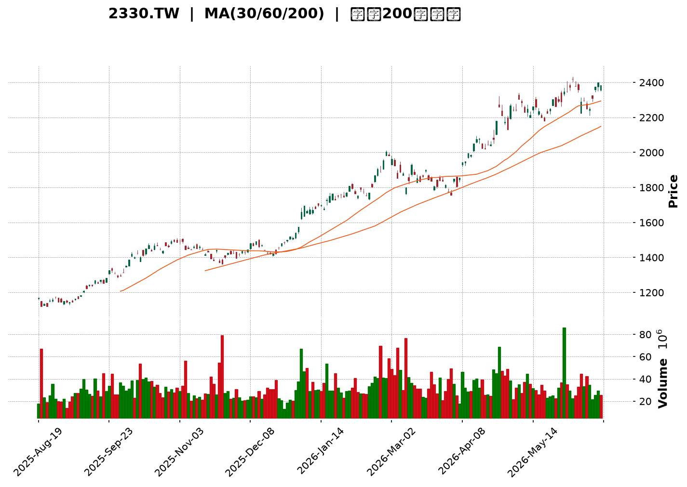
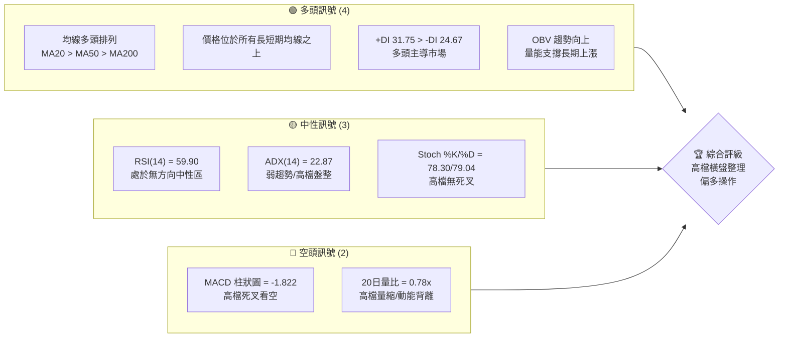
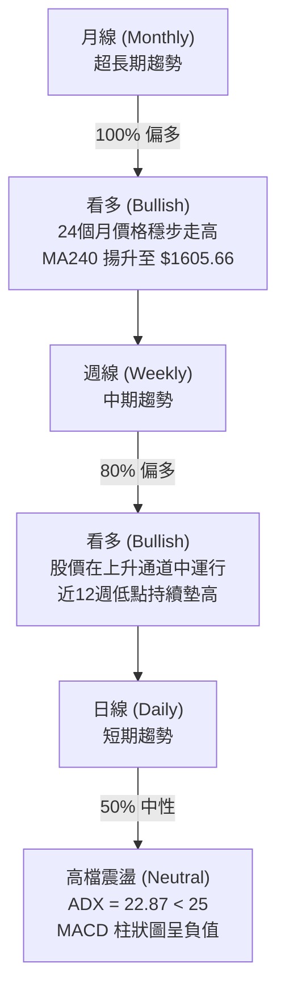
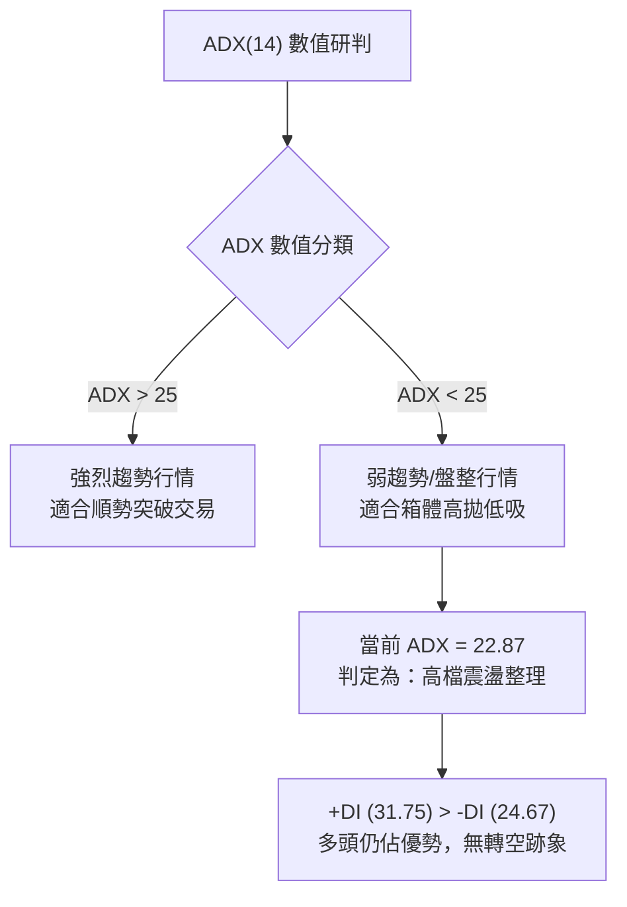
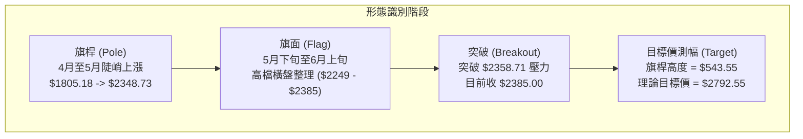
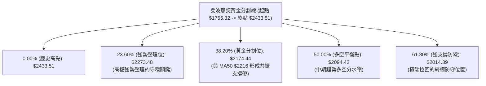
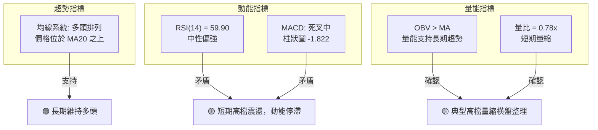
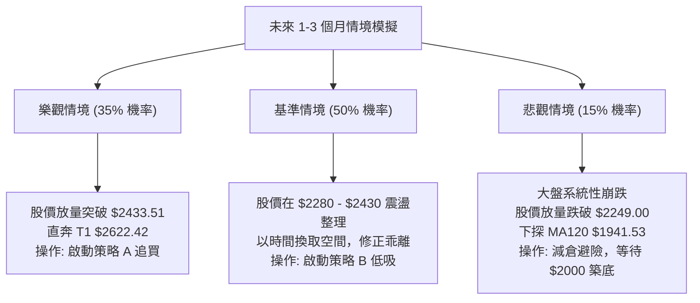

<details>
<summary>📊 靜態圖表 (點擊展開)</summary>

</details>

<html>
<head><meta charset="utf-8" /></head>
<body>
    <div style="height:500px; width:100%;">                        <script>window.PlotlyConfig = {MathJaxConfig: 'local'};</script>
        <script charset="utf-8" src="https://cdn.plot.ly/plotly-3.6.0.min.js" integrity="sha256-QaOVwtVY0T02VaHrr6pnoHLCwayMJp4O5n4YyaE3rJk=" crossorigin="anonymous"></script>                <div id="candlestick-chart" class="plotly-graph-div" style="height:100%; width:100%;"></div>            <script>                window.PLOTLYENV=window.PLOTLYENV || {};                                if (document.getElementById("candlestick-chart")) {                    Plotly.newPlot(                        "candlestick-chart",                        [{"close":{"dtype":"f8","bdata":"AAAAIKZFkkAAAACgR4CRQAAAAKB9u5FAAAAAoEeAkUAAAABAcAqSQAAAAAAtHpJAAAAA4GJZkkAAAADg9uKRQAAAAOD24pFAAAAAoLP2kUAAAADg9uKRQAAAAOD24pFAAAAA4PbikUAAAACA6TGSQAAAAIDpMZJAAAAAQNyAkkAAAABgi+OSQAAAAGDBHpNAAAAAALRtk0AAAABg91mTQAAAAIDc0JNAAAAAAGqVk0AAAABgreSTQAAAAABqlZNAAAAAAE8MlEAAAADgpr6UQAAAAOCmvpRAAAAAYGNvlEAAAAAAICCUQAAAAODwM5RAAAAAQDSDlEAAAAAguyGVQAAAACBxrJVAAAAAICc3lkAAAADA4+eVQAAAAAD4SpZAAAAAwOPnlUAAAACAhQ+WQAAAAIAMrpZAAAAA4E\u002f9lkAAAADgmXKWQAAAAAB\u002f6ZZAAAAAAH\u002fplkAAAACgO5qWQAAAAOCZcpZAAAAAAH\u002fplkAAAAAgrtWWQAAAAECTTJdAAAAAQJNMl0AAAACAwjiXQAAAACBkYJdAAAAAQJNMl0AAAACgO5qWQAAAAIAMrpZAAAAAoDualkAAAAAgrtWWQAAAAIAMrpZAAAAAIK7VlkAAAACgO5qWQAAAAEBWI5ZAAAAAAMlelkAAAAAgQsCVQAAAAECgmJVAAAAAoGqGlkAAAACA\u002fnCVQAAAAOBcSZVAAAAAwOPnlUAAAAAA+EqWQAAAACAnN5ZAAAAAAPhKlkAAAADgEtSVQAAAAEBWI5ZAAAAA4JlylkAAAAAAyV6WQAAAAKA7mpZAAAAAoPEkl0AAAAAAf+mWQAAAAECTTJdAAAAAoEjVlkAAAABADP2WQAAAAKDBhZZAAAAAIBxKlkAAAABgOjaWQAAAAGA6NpZAAAAAYDo2lkAAAADgZsGWQAAAAMDPJJdAAAAAgLE4l0AAAADgVnSXQAAAAODdw5dAAAAAYBqcl0AAAAAAZROYQAAAAGCRnphAAAAAgI\u002fwmUAAAADgu3uaQAAAAEBxBJpAAAAAwDQsmkAAAAAAUxiaQAAAAIAWQJpAAAAAoJ2PmkAAAACgnY+aQAAAAIAWQJpAAAAAQOgGm0AAAABgb1abQAAAAMAUkptAAAAAQOgGm0AAAABgb1abQAAAAAAzfptAAAAAgI1Cm0AAAACA9qWbQAAAAKAERZxAAAAAYF8JnEAAAADAFJKbQAAAACBRaptAAAAAgH31m0AAAABA2LmbQAAAACBRaptAAAAAgPalm0AAAADgIjGcQAAAAOCZM51AAAAAQMa+nUAAAADgIIOdQAAAAOCXhZ5AAAAAoGlMn0AAAACA4vyeQAAAAIBbrZ5AAAAAYE0OnkAAAACA9PecQAAAAOAgg51AAAAAYF1bnUAAAAAgQR2cQAAAAEBPvJxAAAAAIC8inkAAAACge0edQAAAAID095xAAAAAgG2onEAAAAAAGSSdQAAAAKC5r51AAAAAgE\u002fUnEAAAADAaqycQAAAAIC8NJxAAAAAgLw0nEAAAAAgXcCcQAAAAMBqrJxAAAAAQKFcnEAAAABADr2bQAAAAMBEbZtAAAAA4EHonEAAAACAvDScQAAAAEA0\u002fJxAAAAAAD9jnkAAAABgMXeeQAAAAMC2Kp9AAAAAANICn0AAAACAEAOgQAAAAGDuNKBAAAAAoOc+oEAAAAAAZaKfQAAAAKByjp9AAAAAgC7yn0AAAACALvKfQAAAAGDuNKBAAAAAYF8GoUAAAABg8qWhQAAAAIA2QqFAAAAAIGb8oEAAAACAo6KgQAAAAMDkuaFAAAAA4AaIoUAAAADgBoihQAAAACC1\u002f6FAAAAAYNDXoUAAAABAG2qhQAAAAAAAkqFAAAAAoC9MoUAAAACg66+hQAAAAGDypaFAAAAAgBR0oUAAAAAgRC6hQAAAAGBfBqFAAAAAACJgoUAAAAAAAJKhQAAAACC1\u002f6FAAAAAoOuvoUAAAADAwuuhQAAAAIDJ4aFAAAAAwHdZokAAAADAd1miQAAAAMBVi6JAAAAAYBjlokAAAADgTpWiQAAAACBqbaJAAAAAgMnhoUAAAADgu\u002fWhQAAAAAAAkqFAAAAAAACUoUAAAAAAAAyiQAAAAAAAjqJAAAAAAADAokAAAAAAAKKiQA=="},"high":{"dtype":"f8","bdata":"AAAAIKZFkkAzUeiGs\u002faRQHQEikY6z5FAIjbwOTrPkUAN0iCN6TGSQAE9WE2mRZJAAAAA4GJZkkBY7mkgpkWSQFjuaSCmRZJAAAAAoLP2kUA1wnLTLB6SQAAAAOD24pFANcJy0ywekkAAAACA6TGSQCuChnMfbZJAAAAAQNyAkkA01ocGSPeSQKWUUvqzbZNAAAAAALRtk0C9JaEGtG2TQAAAgFyt5JNAiIIruQu9k0AAAABgreSTQFPG7E5++JNAAAAAAE8MlEAAAADgpr6UQB+onHUZ+pRAED74GAWXlECWWqmVkluUQId+s3Vjb5RAvJV9jkjmlEC8x3v8izWVQAAAACBxrJVAaTbd2MhelkCjpH6ctPuVQFVVVZVqhpZAo6R+nLT7lUAclaKHO5qWQAAAAIAMrpZAdbgamfEkl0AN6bx1DK6WQJgin5XxJJdAdYMpcsI4l0BNmjRZ3cGWQK9NlLxqhpZAdYMpcsI4l0D6IJa1IBGXQF2\u002f+\u002fg0dJdAC5951QWIl0Dv7u7O1puXQASyAdkFiJdAun73sdabl0DBgQPvT\u002f2WQBLP1xV\u002f6ZZAJk2afAyulkCnwA7ZT\u002f2WQCWer6vxJJdAp8AO2U\u002f9lkBNmjRZ3cGWQD7T1vj3SpZA8NGzlTualkCcdIBLJzeWQHIcx7Hj55VAWSl7fDualkC30qzxQcCVQLH2DQtCwJVARkn9eIUPlkAAAAAA+EqWQNJsupFqhpZAVVVVlWqGlkAZOmDnyF6WQD7T1vj3SpZAAAAA4JlylkD7RZHcmXKWQAAAAKA7mpZAAAAAoPEkl0B1gylywjiXQAAAAECTTJdAAAAAkDiIl0CmyGcF7hCXQGAqaGWjmZZAFRh7qt9xlkCatsav33GWQN48QiUcSpZAVjBLOqOZlkBB\u002flmlSNWWQAAAAMDPJJdAUOZZRZNMl0AAAADgVnSXQAAAAODdw5dAr6G86t3Dl0AAAAAAZROYQAAAAGCRnphAf4vTWvhTmkAAAADgu3uaQGLRsso0LJpAgNjzD9pnmkBVVVUV2meaQGjD58+7e5pAq6qqKmG3mkBVVVVlf6OaQEWCmgraZ5pAq6qqyqsum0AYXXR19qWbQAAAAMAUkptAq6qqGlFqm0CMLrrqMn6bQH55bMUUkptAoPu5H9i5m0CWrGRF2LmbQAAAAKAERZxAbXZxAKqAnEAg0QqbffWbQAAAACBRaptAq6qqCkEdnEAVOoNVXwmcQHmaC3D2pZtAAAAAgPalm0Djd4L1qYCcQAAAAOCZM51A3cuxyonmnUAVCCNFTQ6eQGfSlWpbrZ5ADOSjKi10n0D4M+HPhzifQNUoY5Xi\u002fJ5AfUFfUD3BnkBpDt9v5KqdQLfEqR+2cZ5Aq6qq6iCDnUAAAAAgQR2cQEa15WpdW51ABb64qvJJnkC8uhVAxr6dQBKxRpV7R51ABQmj5ZkznUBM2AbB\u002fUudQAQCgQCsw51AOQ8dw\u002f1LnUAtZCEDGSSdQG3Hh+CuSJxAaDs+hE\u002fUnEAyOB9jCzidQHvTm6ImEJ1AcAiHoJNwnEAIRSjC1wycQHTRRQPz5JtAAAAA4EHonECukdWlJhCdQAAAAEA0\u002fJxAAAAAAD9jnkAAAABgMXeeQAAAAMC2Kp9AXH97YMQWn0AAAACAEAOgQMVO7CDTXKBA\u002f8FE0OBIoEAvMWuhCQ2gQMIWbHEQA6BAE7UrMfUqoEAPxO8A\u002fCCgQJ3YiXKjoqBAaZxBkFgQoUAY0TbTmSeiQPljSfPdw6FAqzNSQT04oUBUXDKENkKhQOAHfiDXzaFAaEUjoeuvoUB1uf0x182hQB988HGFRaJA9C4eIbX\u002foUA6JQHC5LmhQBTfPfHdw6FAyWfdYBR0oUAAAACg66+hQO+F96KgHaJASZIkQfmboUBRFEURImChQA8OSFE9OKFABYQT8f+RoUAEkz8w+ZuhQAAAACC1\u002f6FANvAZs6AdokCgaKvhmSeiQJ4PLPNwY6JAu3\u002fzgFyBokAvf9oCJtGiQIFcE4E6s6JAQ1qx8AMDo0Byp2gBJtGiQE7w5KEzvaJAxlQ4cacTokDvlbpwpxOiQCQrPLLC66FAAAAAAACooUAAAAAAACqiQAAAAAAAjqJAAAAAAADAokAAAAAAAKKiQA=="},"hovertemplate":"\u003cb\u003e%{x|%Y-%m-%d}\u003c\u002fb\u003e\u003cbr\u003e\u958b: $%{open:.2f}\u003cbr\u003e\u9ad8: $%{high:.2f}\u003cbr\u003e\u4f4e: $%{low:.2f}\u003cbr\u003e\u6536: $%{close:.2f}\u003cextra\u003e\u003c\u002fextra\u003e","low":{"dtype":"f8","bdata":"tbgJ0ywekkAAAACgR4CRQBn361IElJFAAAAAoEeAkUDzLd\u002fy9uKRQH6k+wv34pFA09LSkukxkkAAAADg9uKRQAAAAOD24pFAv4KhBcGnkUDuaYQ5Os+RQMs9jezAp5FAAAAA4PbikUA4qfsycAqSQAAAAIDpMZJAq6qq8mJZkkCYU\u002fASErySQNdaa7kEC5NAsyzLsjpGk0BD2l65OkaTQAAAAA6ZgZNAAAAAAGqVk0DyDfLtaZWTQAAAAABqlZNAPEHqsTqpk0AiPVCRkluUQOFXY0o0g5RAAAAAYGNvlEAkN3IjTwyUQAAAAODwM5RAAAAAQDSDlECHcAhnGfqUQM3MzBi7IZVAYi60irT7lUC6tgIHQsCVQMdxHEdWI5ZA0siGcc+ElUBFD3ujtPuVQM\u002fXFZuFD5ZAFo\u002fKbQyulkAAAADgmXKWQK0bTLFqhpZAAAAAAH\u002fplkDZsmXDaoaWQPQWQ0onN5ZAAAAAAH\u002fplkCtn3hD3cGWQPVghqogEZdAUiCCY8I4l0AAAACAwjiXQPmb\u002fK0gEZdApEAEh\u002fEkl0DZsmXDaoaWQAAAAIAMrpZA2bJlw2qGlkBZP\u002fFmDK6WQAAAAIAMrpZABt9pijualkAAAACgO5qWQGCWlGOFD5ZAAAAAAMlelkAAAAAgQsCVQAAAAECgmJVA9YOOCvhKlkAAAACA\u002fnCVQAAAAOBcSZVAurYCB0LAlUCqqqpqhQ+WQMtkkUNWI5ZA4ziOIyc3lkAAAADgEtSVQMEsKYe0+5VA9BZDSic3lkAQLkxqViOWQGbLli34SpZAhyb5lzualkAAAAAAf+mWQEeBCM5P\u002fZZAq6qq2mbBlkC0bjC1SNWWQKHVl9rfcZZA6ueElVgilkAiw72aWCKWQGZJORCV+pVAAAAAYDo2lkB\u002fA0xVo5mWQHADhqpI1ZZAXzNM9e0Ql0CTv8mPsTiXQKuqqspWdJdAUV5D1VZ0l0CnAW2aOIiXQIHgMjWD\u002f5dATmu2j589mUD988+fJo2ZQJ0uTbWt3JlAAU8YIOq0mUBVVVUl6rSZQAAAAIAWQJpAVVVVFdpnmkBVVVUV2meaQLp9ZfVSGJpAAAAAoJ2PmkAYXXT6QsuaQGwOJFroBptAAAAAQOgGm0B10UXVqy6bQAkaTuqrLptAAAAAgI1Cm0AUoQiljUKbQDD90v+5zZtAmMGXmn31m0AAAADAFJKbQAoymwrKGptAAAAAMNi5m0D1Yj61FJKbQIPMplpvVptAU5vaVOgGm0AAAADgIjGcQOo7G7WLlJxAi9A4FbgfnUAAAADgIIOdQP3jEivGvp1A5je4iuL8nkAAAACA4vyeQIx4khovIp5AAAAAYE0OnkAAAACA9PecQEbasRo\u002fb51AVVVV1ZkznUARpNz0Mn6bQFwljSrIbJxA3ixPGrgfnUAAAACge0edQKmiZ6WLlJxAAAAAgG2onECzJ\u002fk+NPycQPT5fH7ic51AAAAAgE\u002fUnEAAAADAaqycQOAaWZ0A0ZtAJ3HwvtcMnEAAAAAgXcCcQAAAAMBqrJxAPt7jvdcMnEAAAABADr2bQAAAAMBEbZtA+pJp\u002fYWEnECUOHgfyiCcQNdaa114mJxAndiJHYP\u002fnUAzdYt9dROeQFK4Hn0Is55A7oGN3vrGnkC\u002fShibm1KfQDuxE58JDaBAB3RjfhADoEAAAAAAZaKfQAAAAKByjp9A+B2IHzzen0DxOxC\u002fScqfQIqd2G4QA6BAaTnmW8xmoEAAAABg8qWhQAAAAIA2QqFAKuZWj3reoEAAAACAo6KgQPzAD7xRGqFATF1ufxR0oUBMXW5\u002fFHShQAAAACC1\u002f6FAT0WabvKloUAAAABAG2qhQNzUw009OKFAKfJZD0QuoUAel74dImChQIQeQs8GiKFAJEmSjjZCoUAAAAAgRC6hQAAAAGBfBqFAAAAAACJgoUDojYLeKFahQOGDD87kuaFAAAAAoOuvoUDLh3Ff0NehQDmrx47rr6FAV6DPzpknokARIMOPfk+iQH+j7P5wY6JAvqVOzyzHokAAAADgTpWiQOMlSo9+T6JAYvDTDCJgoUALnIN\u002fyeGhQAAAAAAAkqFAAAAAAABEoUAAAAAAAOShQAAAAAAAUqJAAAAAAABcokAAAAAAAFyiQA=="},"name":"\u50f9\u683c","open":{"dtype":"f8","bdata":"WtyEeekxkkAzUeiGs\u002faRQBn361IElJFAIjbwOTrPkUD6lm+Zs\u002faRQP\u002fCp7Kz9pFAAAAA4GJZkkBY7mkgpkWSQEdY7nnpMZJADyI5rH27kUAjLPcscAqSQO5phDk6z5FAIyz3LHAKkkCc1H3ZLB6SQCuChnMfbZJAVVVVmR9tkkDMKXi5zs+SQHzvvVP3WZNAWZZlWfdZk0C9JaEGtG2TQAAAgOpplZNARMGV3Dqpk0D5BvmmC72TQA8FV3Kt5JNAPEHqsTqpk0CCytltY2+UQL8aE5lI5pRAAAAAYGNvlEC5kRu5wUeUQC0qkbzBR5RAAAAAQDSDlEBDOIRD6g2VQM3MzBi7IZVAYi60irT7lUBdW4HjEtSVQAAAAAD4SpZA0siGcc+ElUBhpB2raoaWQNthUFQnN5ZAFo\u002fKbQyulkCvTZS8aoaWQIp81o07mpZA3WCK3E\u002f9lkAAAACgO5qWQKNk1yb4SpZAdYMpcsI4l0BTYIf8fumWQKRABIfxJJdAXb\u002f7+DR0l0Bcj8IVNXSXQAAAACBkYJdAC5951QWIl0CaNGkSf+mWQAZFnVzdwZZAAAAAoDualkCtn3hD3cGWQB9ZEs8gEZdArZ94Q93BlkAAAACgO5qWQGCWlGOFD5ZA+0WR3JlylkCcdIBLJzeWQBzHcRxxrJVAp9aEw5lylkBbadY4oJiVQOmiiy5xrJVARkn9eIUPlkDHcRxHViOWQJ7RS7WZcpZAAAAAAPhKlkAZOmDnyF6WQAAAAEBWI5ZAo2TXJvhKlkAAAAAAyV6WQIwYMQrJXpZAK2qMdAyulkCYIp+V8SSXQPVghqogEZdAq6qqylZ0l0BaN5h6KumWQAAAAKDBhZZAAAAAIBxKlkDePEIlHEqWQESGe9V2DpZAVjBLOqOZlkAAAADgZsGWQJSC5G8q6ZZAAAAAgLE4l0AxlZgadWCXQAAAAJA4iJdAKK+hmjiIl0D9JctfGpyXQGEo5r9GJ5hAm+0TVYFRmUD988+fJo2ZQJ0uTbWt3JlAK5dp5cvImUAAAACwrdyZQEWCmgraZ5pAq6qqKmG3mkCrqqrau3uaQN2+sro0LJpAq6qqegbzmkAYXXT6QsuaQGwOJFroBptAVVVVBcoam0BGF10lUWqbQAAAAAAzfptA4FOTClFqm0CqTW1qb1abQDD90v+5zZtABjgJO8hsnECtsDkQus2bQIhl9M+rLptAq6qqCkEdnEAAAABA2LmbQAAAACBRaptA6Uc\u002fGsoam0Dr2SEwyGycQG3Ud3ptqJxAeraR2pkznUAAAADgIIOdQP3jEivGvp1A5je4iuL8nkBTEUtFxBCfQIx4khovIp5A02ufxXmZnkCbCeofP2+dQM8tcQovIp5AVVVV1ZkznUCPD0G6FJKbQKPaclXWC51A4+oHpXtHnUBe3QrwIIOdQKmiZ6WLlJxABJpCILgfnUAmbINgCzidQPz9fj\u002fHm51AWjeYYgs4nUDJQhZCNPycQE3i4P3y5JtAaDs+hE\u002fUnEAh0BSiJhCdQGQhC4FP1JxAruZqHsognEAAAABADr2bQLroouEbqZtAY4tyvmqsnECukdWlJhCdQPC9935P1JxAXuiF3mcnnkBHlQSfTE+eQJqZmd36xp5ApYCEn9\u002funkCq0KP7jWafQOzETs8CF6BAAT67b+40oED8qC5xEAOgQOtceQBlop9AAAAAgC7yn0D4HYgfPN6fQGIndsDgSKBA0tUnjMVwoEB84b3w3cOhQIdVhKENfqFADqLH72zyoEDKEKwjRC6hQOzETuxKJKFAAAAA4AaIoUAAAADgBoihQM2hYhGTMaJAehePwMLroUDr24Bh8qWhQPCzAT8baqFAKfJZD0QuoUCPS9\u002feBoihQHOkORK1\u002f6FASZIk7yhWoUAxDMOwL0yhQKZxBiFELqFAzzRuYBR0oUD42YCfDX6hQOGDD87kuaFAGsPRgqcTokA2eI4gtf+hQOggr5J+T6JANGBJL4w7okAAAADAd1miQECuiSBIn6JAAAAAYBjlokAAAADgTpWiQDu0a0FBqaJAYvDTDCJgoUAAAADgu\u002fWhQBhyfSHXzaFAAAAAAACAoUAAAAAAACqiQAAAAAAAcKJAAAAAAACOokAAAAAAAGaiQA=="},"x":["2025-08-19T00:00:00+08:00","2025-08-20T00:00:00+08:00","2025-08-21T00:00:00+08:00","2025-08-22T00:00:00+08:00","2025-08-25T00:00:00+08:00","2025-08-26T00:00:00+08:00","2025-08-27T00:00:00+08:00","2025-08-28T00:00:00+08:00","2025-08-29T00:00:00+08:00","2025-09-01T00:00:00+08:00","2025-09-02T00:00:00+08:00","2025-09-03T00:00:00+08:00","2025-09-04T00:00:00+08:00","2025-09-05T00:00:00+08:00","2025-09-08T00:00:00+08:00","2025-09-09T00:00:00+08:00","2025-09-10T00:00:00+08:00","2025-09-11T00:00:00+08:00","2025-09-12T00:00:00+08:00","2025-09-15T00:00:00+08:00","2025-09-16T00:00:00+08:00","2025-09-17T00:00:00+08:00","2025-09-18T00:00:00+08:00","2025-09-19T00:00:00+08:00","2025-09-22T00:00:00+08:00","2025-09-23T00:00:00+08:00","2025-09-24T00:00:00+08:00","2025-09-25T00:00:00+08:00","2025-09-26T00:00:00+08:00","2025-09-30T00:00:00+08:00","2025-10-01T00:00:00+08:00","2025-10-02T00:00:00+08:00","2025-10-03T00:00:00+08:00","2025-10-07T00:00:00+08:00","2025-10-08T00:00:00+08:00","2025-10-09T00:00:00+08:00","2025-10-13T00:00:00+08:00","2025-10-14T00:00:00+08:00","2025-10-15T00:00:00+08:00","2025-10-16T00:00:00+08:00","2025-10-17T00:00:00+08:00","2025-10-20T00:00:00+08:00","2025-10-21T00:00:00+08:00","2025-10-22T00:00:00+08:00","2025-10-23T00:00:00+08:00","2025-10-27T00:00:00+08:00","2025-10-28T00:00:00+08:00","2025-10-29T00:00:00+08:00","2025-10-30T00:00:00+08:00","2025-10-31T00:00:00+08:00","2025-11-03T00:00:00+08:00","2025-11-04T00:00:00+08:00","2025-11-05T00:00:00+08:00","2025-11-06T00:00:00+08:00","2025-11-07T00:00:00+08:00","2025-11-10T00:00:00+08:00","2025-11-11T00:00:00+08:00","2025-11-12T00:00:00+08:00","2025-11-13T00:00:00+08:00","2025-11-14T00:00:00+08:00","2025-11-17T00:00:00+08:00","2025-11-18T00:00:00+08:00","2025-11-19T00:00:00+08:00","2025-11-20T00:00:00+08:00","2025-11-21T00:00:00+08:00","2025-11-24T00:00:00+08:00","2025-11-25T00:00:00+08:00","2025-11-26T00:00:00+08:00","2025-11-27T00:00:00+08:00","2025-11-28T00:00:00+08:00","2025-12-01T00:00:00+08:00","2025-12-02T00:00:00+08:00","2025-12-03T00:00:00+08:00","2025-12-04T00:00:00+08:00","2025-12-05T00:00:00+08:00","2025-12-08T00:00:00+08:00","2025-12-09T00:00:00+08:00","2025-12-10T00:00:00+08:00","2025-12-11T00:00:00+08:00","2025-12-12T00:00:00+08:00","2025-12-15T00:00:00+08:00","2025-12-16T00:00:00+08:00","2025-12-17T00:00:00+08:00","2025-12-18T00:00:00+08:00","2025-12-19T00:00:00+08:00","2025-12-22T00:00:00+08:00","2025-12-23T00:00:00+08:00","2025-12-24T00:00:00+08:00","2025-12-26T00:00:00+08:00","2025-12-29T00:00:00+08:00","2025-12-30T00:00:00+08:00","2025-12-31T00:00:00+08:00","2026-01-02T00:00:00+08:00","2026-01-05T00:00:00+08:00","2026-01-06T00:00:00+08:00","2026-01-07T00:00:00+08:00","2026-01-08T00:00:00+08:00","2026-01-09T00:00:00+08:00","2026-01-12T00:00:00+08:00","2026-01-13T00:00:00+08:00","2026-01-14T00:00:00+08:00","2026-01-15T00:00:00+08:00","2026-01-16T00:00:00+08:00","2026-01-19T00:00:00+08:00","2026-01-20T00:00:00+08:00","2026-01-21T00:00:00+08:00","2026-01-22T00:00:00+08:00","2026-01-23T00:00:00+08:00","2026-01-26T00:00:00+08:00","2026-01-27T00:00:00+08:00","2026-01-28T00:00:00+08:00","2026-01-29T00:00:00+08:00","2026-01-30T00:00:00+08:00","2026-02-02T00:00:00+08:00","2026-02-03T00:00:00+08:00","2026-02-04T00:00:00+08:00","2026-02-05T00:00:00+08:00","2026-02-06T00:00:00+08:00","2026-02-09T00:00:00+08:00","2026-02-10T00:00:00+08:00","2026-02-11T00:00:00+08:00","2026-02-23T00:00:00+08:00","2026-02-24T00:00:00+08:00","2026-02-25T00:00:00+08:00","2026-02-26T00:00:00+08:00","2026-03-02T00:00:00+08:00","2026-03-03T00:00:00+08:00","2026-03-04T00:00:00+08:00","2026-03-05T00:00:00+08:00","2026-03-06T00:00:00+08:00","2026-03-09T00:00:00+08:00","2026-03-10T00:00:00+08:00","2026-03-11T00:00:00+08:00","2026-03-12T00:00:00+08:00","2026-03-13T00:00:00+08:00","2026-03-16T00:00:00+08:00","2026-03-17T00:00:00+08:00","2026-03-18T00:00:00+08:00","2026-03-19T00:00:00+08:00","2026-03-20T00:00:00+08:00","2026-03-23T00:00:00+08:00","2026-03-24T00:00:00+08:00","2026-03-25T00:00:00+08:00","2026-03-26T00:00:00+08:00","2026-03-27T00:00:00+08:00","2026-03-30T00:00:00+08:00","2026-03-31T00:00:00+08:00","2026-04-01T00:00:00+08:00","2026-04-02T00:00:00+08:00","2026-04-07T00:00:00+08:00","2026-04-08T00:00:00+08:00","2026-04-09T00:00:00+08:00","2026-04-10T00:00:00+08:00","2026-04-13T00:00:00+08:00","2026-04-14T00:00:00+08:00","2026-04-15T00:00:00+08:00","2026-04-16T00:00:00+08:00","2026-04-17T00:00:00+08:00","2026-04-20T00:00:00+08:00","2026-04-21T00:00:00+08:00","2026-04-22T00:00:00+08:00","2026-04-23T00:00:00+08:00","2026-04-24T00:00:00+08:00","2026-04-27T00:00:00+08:00","2026-04-28T00:00:00+08:00","2026-04-29T00:00:00+08:00","2026-04-30T00:00:00+08:00","2026-05-04T00:00:00+08:00","2026-05-05T00:00:00+08:00","2026-05-06T00:00:00+08:00","2026-05-07T00:00:00+08:00","2026-05-08T00:00:00+08:00","2026-05-11T00:00:00+08:00","2026-05-12T00:00:00+08:00","2026-05-13T00:00:00+08:00","2026-05-14T00:00:00+08:00","2026-05-15T00:00:00+08:00","2026-05-18T00:00:00+08:00","2026-05-19T00:00:00+08:00","2026-05-20T00:00:00+08:00","2026-05-21T00:00:00+08:00","2026-05-22T00:00:00+08:00","2026-05-25T00:00:00+08:00","2026-05-26T00:00:00+08:00","2026-05-27T00:00:00+08:00","2026-05-28T00:00:00+08:00","2026-05-29T00:00:00+08:00","2026-06-01T00:00:00+08:00","2026-06-02T00:00:00+08:00","2026-06-03T00:00:00+08:00","2026-06-04T00:00:00+08:00","2026-06-05T00:00:00+08:00","2026-06-08T00:00:00+08:00","2026-06-09T00:00:00+08:00","2026-06-10T00:00:00+08:00","2026-06-11T00:00:00+08:00","2026-06-12T00:00:00+08:00","2026-06-15T00:00:00+08:00","2026-06-16T00:00:00+08:00","2026-06-17T00:00:00+08:00"],"type":"candlestick"},{"hovertemplate":"MA30: $%{y:.2f}\u003cextra\u003e\u003c\u002fextra\u003e","line":{"color":"#2196F3","dash":"dash","width":2},"mode":"lines","name":"MA30","x":["2025-08-19T00:00:00+08:00","2025-08-20T00:00:00+08:00","2025-08-21T00:00:00+08:00","2025-08-22T00:00:00+08:00","2025-08-25T00:00:00+08:00","2025-08-26T00:00:00+08:00","2025-08-27T00:00:00+08:00","2025-08-28T00:00:00+08:00","2025-08-29T00:00:00+08:00","2025-09-01T00:00:00+08:00","2025-09-02T00:00:00+08:00","2025-09-03T00:00:00+08:00","2025-09-04T00:00:00+08:00","2025-09-05T00:00:00+08:00","2025-09-08T00:00:00+08:00","2025-09-09T00:00:00+08:00","2025-09-10T00:00:00+08:00","2025-09-11T00:00:00+08:00","2025-09-12T00:00:00+08:00","2025-09-15T00:00:00+08:00","2025-09-16T00:00:00+08:00","2025-09-17T00:00:00+08:00","2025-09-18T00:00:00+08:00","2025-09-19T00:00:00+08:00","2025-09-22T00:00:00+08:00","2025-09-23T00:00:00+08:00","2025-09-24T00:00:00+08:00","2025-09-25T00:00:00+08:00","2025-09-26T00:00:00+08:00","2025-09-30T00:00:00+08:00","2025-10-01T00:00:00+08:00","2025-10-02T00:00:00+08:00","2025-10-03T00:00:00+08:00","2025-10-07T00:00:00+08:00","2025-10-08T00:00:00+08:00","2025-10-09T00:00:00+08:00","2025-10-13T00:00:00+08:00","2025-10-14T00:00:00+08:00","2025-10-15T00:00:00+08:00","2025-10-16T00:00:00+08:00","2025-10-17T00:00:00+08:00","2025-10-20T00:00:00+08:00","2025-10-21T00:00:00+08:00","2025-10-22T00:00:00+08:00","2025-10-23T00:00:00+08:00","2025-10-27T00:00:00+08:00","2025-10-28T00:00:00+08:00","2025-10-29T00:00:00+08:00","2025-10-30T00:00:00+08:00","2025-10-31T00:00:00+08:00","2025-11-03T00:00:00+08:00","2025-11-04T00:00:00+08:00","2025-11-05T00:00:00+08:00","2025-11-06T00:00:00+08:00","2025-11-07T00:00:00+08:00","2025-11-10T00:00:00+08:00","2025-11-11T00:00:00+08:00","2025-11-12T00:00:00+08:00","2025-11-13T00:00:00+08:00","2025-11-14T00:00:00+08:00","2025-11-17T00:00:00+08:00","2025-11-18T00:00:00+08:00","2025-11-19T00:00:00+08:00","2025-11-20T00:00:00+08:00","2025-11-21T00:00:00+08:00","2025-11-24T00:00:00+08:00","2025-11-25T00:00:00+08:00","2025-11-26T00:00:00+08:00","2025-11-27T00:00:00+08:00","2025-11-28T00:00:00+08:00","2025-12-01T00:00:00+08:00","2025-12-02T00:00:00+08:00","2025-12-03T00:00:00+08:00","2025-12-04T00:00:00+08:00","2025-12-05T00:00:00+08:00","2025-12-08T00:00:00+08:00","2025-12-09T00:00:00+08:00","2025-12-10T00:00:00+08:00","2025-12-11T00:00:00+08:00","2025-12-12T00:00:00+08:00","2025-12-15T00:00:00+08:00","2025-12-16T00:00:00+08:00","2025-12-17T00:00:00+08:00","2025-12-18T00:00:00+08:00","2025-12-19T00:00:00+08:00","2025-12-22T00:00:00+08:00","2025-12-23T00:00:00+08:00","2025-12-24T00:00:00+08:00","2025-12-26T00:00:00+08:00","2025-12-29T00:00:00+08:00","2025-12-30T00:00:00+08:00","2025-12-31T00:00:00+08:00","2026-01-02T00:00:00+08:00","2026-01-05T00:00:00+08:00","2026-01-06T00:00:00+08:00","2026-01-07T00:00:00+08:00","2026-01-08T00:00:00+08:00","2026-01-09T00:00:00+08:00","2026-01-12T00:00:00+08:00","2026-01-13T00:00:00+08:00","2026-01-14T00:00:00+08:00","2026-01-15T00:00:00+08:00","2026-01-16T00:00:00+08:00","2026-01-19T00:00:00+08:00","2026-01-20T00:00:00+08:00","2026-01-21T00:00:00+08:00","2026-01-22T00:00:00+08:00","2026-01-23T00:00:00+08:00","2026-01-26T00:00:00+08:00","2026-01-27T00:00:00+08:00","2026-01-28T00:00:00+08:00","2026-01-29T00:00:00+08:00","2026-01-30T00:00:00+08:00","2026-02-02T00:00:00+08:00","2026-02-03T00:00:00+08:00","2026-02-04T00:00:00+08:00","2026-02-05T00:00:00+08:00","2026-02-06T00:00:00+08:00","2026-02-09T00:00:00+08:00","2026-02-10T00:00:00+08:00","2026-02-11T00:00:00+08:00","2026-02-23T00:00:00+08:00","2026-02-24T00:00:00+08:00","2026-02-25T00:00:00+08:00","2026-02-26T00:00:00+08:00","2026-03-02T00:00:00+08:00","2026-03-03T00:00:00+08:00","2026-03-04T00:00:00+08:00","2026-03-05T00:00:00+08:00","2026-03-06T00:00:00+08:00","2026-03-09T00:00:00+08:00","2026-03-10T00:00:00+08:00","2026-03-11T00:00:00+08:00","2026-03-12T00:00:00+08:00","2026-03-13T00:00:00+08:00","2026-03-16T00:00:00+08:00","2026-03-17T00:00:00+08:00","2026-03-18T00:00:00+08:00","2026-03-19T00:00:00+08:00","2026-03-20T00:00:00+08:00","2026-03-23T00:00:00+08:00","2026-03-24T00:00:00+08:00","2026-03-25T00:00:00+08:00","2026-03-26T00:00:00+08:00","2026-03-27T00:00:00+08:00","2026-03-30T00:00:00+08:00","2026-03-31T00:00:00+08:00","2026-04-01T00:00:00+08:00","2026-04-02T00:00:00+08:00","2026-04-07T00:00:00+08:00","2026-04-08T00:00:00+08:00","2026-04-09T00:00:00+08:00","2026-04-10T00:00:00+08:00","2026-04-13T00:00:00+08:00","2026-04-14T00:00:00+08:00","2026-04-15T00:00:00+08:00","2026-04-16T00:00:00+08:00","2026-04-17T00:00:00+08:00","2026-04-20T00:00:00+08:00","2026-04-21T00:00:00+08:00","2026-04-22T00:00:00+08:00","2026-04-23T00:00:00+08:00","2026-04-24T00:00:00+08:00","2026-04-27T00:00:00+08:00","2026-04-28T00:00:00+08:00","2026-04-29T00:00:00+08:00","2026-04-30T00:00:00+08:00","2026-05-04T00:00:00+08:00","2026-05-05T00:00:00+08:00","2026-05-06T00:00:00+08:00","2026-05-07T00:00:00+08:00","2026-05-08T00:00:00+08:00","2026-05-11T00:00:00+08:00","2026-05-12T00:00:00+08:00","2026-05-13T00:00:00+08:00","2026-05-14T00:00:00+08:00","2026-05-15T00:00:00+08:00","2026-05-18T00:00:00+08:00","2026-05-19T00:00:00+08:00","2026-05-20T00:00:00+08:00","2026-05-21T00:00:00+08:00","2026-05-22T00:00:00+08:00","2026-05-25T00:00:00+08:00","2026-05-26T00:00:00+08:00","2026-05-27T00:00:00+08:00","2026-05-28T00:00:00+08:00","2026-05-29T00:00:00+08:00","2026-06-01T00:00:00+08:00","2026-06-02T00:00:00+08:00","2026-06-03T00:00:00+08:00","2026-06-04T00:00:00+08:00","2026-06-05T00:00:00+08:00","2026-06-08T00:00:00+08:00","2026-06-09T00:00:00+08:00","2026-06-10T00:00:00+08:00","2026-06-11T00:00:00+08:00","2026-06-12T00:00:00+08:00","2026-06-15T00:00:00+08:00","2026-06-16T00:00:00+08:00","2026-06-17T00:00:00+08:00"],"y":{"dtype":"f8","bdata":"AAAAAAAA+H8AAAAAAAD4fwAAAAAAAPh\u002fAAAAAAAA+H8AAAAAAAD4fwAAAAAAAPh\u002fAAAAAAAA+H8AAAAAAAD4fwAAAAAAAPh\u002fAAAAAAAA+H8AAAAAAAD4fwAAAAAAAPh\u002fAAAAAAAA+H8AAAAAAAD4fwAAAAAAAPh\u002fAAAAAAAA+H8AAAAAAAD4fwAAAAAAAPh\u002fAAAAAAAA+H8AAAAAAAD4fwAAAAAAAPh\u002fAAAAAAAA+H8AAAAAAAD4fwAAAAAAAPh\u002fAAAAAAAA+H8AAAAAAAD4fwAAAAAAAPh\u002fAAAAAAAA+H8AAAAAAAD4f7y7uwvp25JAIiIiYgfvkkAzMzOzAg6TQKuqqmqkL5NAEREREd9Xk0AiIiJi2niTQAAAAMB6nJNAERERYdS6k0C8u7u7ct6TQKuqqtpZB5RA3t3d7TwylEAzMzPDKFmUQKuqqioLhJRAIiIiku2ulECJiIjoidSUQN7d3Q3U+JRAREREFHMelUB3d3fnHkCVQImIiAjIY5VAmpmZec+ElUDv7u4+1qWVQCIiIqI4xJVAVVVVNe3jlUDNzMyMC\u002fuVQN7d3V13FZZAVVVVhUMrlkCJiIgYGT2WQLy7u3ucTZZAERERcRZilkDv7u5+OXeWQAAAAOC8h5ZAq6qqKpeXlkDv7u7u35yWQGZmZtY2nJZAiYiIONuelkBVVVWl5JqWQImIiGhOkpZAiYiIaE6SlkARERGxSZSWQM3MzBxTkJZAAAAAQGGKlkC8u7t7GIWWQGZmZoZ9fpZARERE9IZ6lkCrqqqqi3iWQLy7u9vdeZZAVVVVJdl7lkDe3d09gnyWQN7d3T2CfJZAmpmZSYh4lkDv7u6+inaWQAAAABBBb5ZA3t3dfaNmlkDe3d0dTmOWQFVVVaVPX5ZAVVVVRfpblkCrqqo6TVuWQLy7u6tCX5ZAVVVVlY9ilkAiIiLC1GmWQFVVVSW3d5ZAzczM7EqClkC8u7trIZaWQJqZmbntr5ZAZmZmFhHNlkBmZmZmF\u002fiWQCIiIvJ1IJdAvLu7C99El0AzMzMDUWWXQERERGS\u002fh5dAAAAAUCusl0De3d3NjdSXQHd3d0el95dAVVVV9bgemEDv7u5eHEmYQJqZmXmBc5hAvLu7S6OUmECrqqoKZ7qYQCIiIqIw3phAIiIiMvcDmUDNzMy8uiuZQBEREYHFXJlAd3d3R9CNmUAiIiLCiruZQKuqqurx55lAAAAAsPwYmkDe3d3dZkOaQM3MzBzaZ5pA3t3draCNmkARERHhDbaaQDMzMwNy5JpAMzMzE80Ym0BEREQ0MUebQJqZmUmPeZtAIiIiwkmnm0Crqqr6uc2bQFVVVYV99ZtAmpmZeaAWnEC8u7vbJS+cQJqZmYn7SpxAMzMzQ9dinEAiIiJyGHCcQJqZmYlNhZxAZmZm5s+fnEAAAABgYbCcQLy7uztPvJxAMzMzEzrKnECJiIiYndmcQImIiEhV7JxA3t3dnbn5nECamZk5eQKdQJqZmUnuAZ1AMzMzU2ADnUDe3d3Ncw2dQERERGQwGJ1AREREhKAbnUCrqqrquxudQKuqqhrVG51AmpmZWZMmnUAiIiISsiadQJqZmVnZJJ1Ad3d311QqnUBmZmaGdzKdQN7d3Y34N51AERERkYQ1nUC8u7v7Wz6dQHd3dxctTZ1AAAAAsPVhnUC8u7srtXidQERERNQmip1A3t3d3T6gnUAiIiJy8cCdQHd3dwdU4J1Ad3d3N78BnkDe3d0NGDWeQHd3d2dxZJ5AVVVV5cmRnkCamZkpB7WeQEREROQ65p5AZmZm5msbn0BVVVVV8VGfQHd3d5dulJ9AAAAAAEPUn0AiIiLKDwSgQERERJynH6BAREREHEA6oEDv7u6G1FqgQKuqqkJofKBAIiIicgGWoEB3d3fXRLCgQAAAAMDgxaBAMzMzs37YoEC8u7sTceygQDMzM6sNAaFAd3d3n6sToUDNzMzU9SOhQO\u002fu7mZBMqFAvLu7IzVEoUBEREQM0VmhQImIiJhrcaFAERERkVqKoUAAAACwoKChQO\u002fu7r6Ts6FAVVVVFeS6oUDv7u7ujL2hQImIiMg1wKFAIiIickPFoUAAAAAQT9GhQJqZmQlh2KFAVVVVNcfioUARERFhLeyhQA=="},"type":"scatter"},{"hovertemplate":"MA60: $%{y:.2f}\u003cextra\u003e\u003c\u002fextra\u003e","line":{"color":"#9C27B0","dash":"dash","width":2},"mode":"lines","name":"MA60","x":["2025-08-19T00:00:00+08:00","2025-08-20T00:00:00+08:00","2025-08-21T00:00:00+08:00","2025-08-22T00:00:00+08:00","2025-08-25T00:00:00+08:00","2025-08-26T00:00:00+08:00","2025-08-27T00:00:00+08:00","2025-08-28T00:00:00+08:00","2025-08-29T00:00:00+08:00","2025-09-01T00:00:00+08:00","2025-09-02T00:00:00+08:00","2025-09-03T00:00:00+08:00","2025-09-04T00:00:00+08:00","2025-09-05T00:00:00+08:00","2025-09-08T00:00:00+08:00","2025-09-09T00:00:00+08:00","2025-09-10T00:00:00+08:00","2025-09-11T00:00:00+08:00","2025-09-12T00:00:00+08:00","2025-09-15T00:00:00+08:00","2025-09-16T00:00:00+08:00","2025-09-17T00:00:00+08:00","2025-09-18T00:00:00+08:00","2025-09-19T00:00:00+08:00","2025-09-22T00:00:00+08:00","2025-09-23T00:00:00+08:00","2025-09-24T00:00:00+08:00","2025-09-25T00:00:00+08:00","2025-09-26T00:00:00+08:00","2025-09-30T00:00:00+08:00","2025-10-01T00:00:00+08:00","2025-10-02T00:00:00+08:00","2025-10-03T00:00:00+08:00","2025-10-07T00:00:00+08:00","2025-10-08T00:00:00+08:00","2025-10-09T00:00:00+08:00","2025-10-13T00:00:00+08:00","2025-10-14T00:00:00+08:00","2025-10-15T00:00:00+08:00","2025-10-16T00:00:00+08:00","2025-10-17T00:00:00+08:00","2025-10-20T00:00:00+08:00","2025-10-21T00:00:00+08:00","2025-10-22T00:00:00+08:00","2025-10-23T00:00:00+08:00","2025-10-27T00:00:00+08:00","2025-10-28T00:00:00+08:00","2025-10-29T00:00:00+08:00","2025-10-30T00:00:00+08:00","2025-10-31T00:00:00+08:00","2025-11-03T00:00:00+08:00","2025-11-04T00:00:00+08:00","2025-11-05T00:00:00+08:00","2025-11-06T00:00:00+08:00","2025-11-07T00:00:00+08:00","2025-11-10T00:00:00+08:00","2025-11-11T00:00:00+08:00","2025-11-12T00:00:00+08:00","2025-11-13T00:00:00+08:00","2025-11-14T00:00:00+08:00","2025-11-17T00:00:00+08:00","2025-11-18T00:00:00+08:00","2025-11-19T00:00:00+08:00","2025-11-20T00:00:00+08:00","2025-11-21T00:00:00+08:00","2025-11-24T00:00:00+08:00","2025-11-25T00:00:00+08:00","2025-11-26T00:00:00+08:00","2025-11-27T00:00:00+08:00","2025-11-28T00:00:00+08:00","2025-12-01T00:00:00+08:00","2025-12-02T00:00:00+08:00","2025-12-03T00:00:00+08:00","2025-12-04T00:00:00+08:00","2025-12-05T00:00:00+08:00","2025-12-08T00:00:00+08:00","2025-12-09T00:00:00+08:00","2025-12-10T00:00:00+08:00","2025-12-11T00:00:00+08:00","2025-12-12T00:00:00+08:00","2025-12-15T00:00:00+08:00","2025-12-16T00:00:00+08:00","2025-12-17T00:00:00+08:00","2025-12-18T00:00:00+08:00","2025-12-19T00:00:00+08:00","2025-12-22T00:00:00+08:00","2025-12-23T00:00:00+08:00","2025-12-24T00:00:00+08:00","2025-12-26T00:00:00+08:00","2025-12-29T00:00:00+08:00","2025-12-30T00:00:00+08:00","2025-12-31T00:00:00+08:00","2026-01-02T00:00:00+08:00","2026-01-05T00:00:00+08:00","2026-01-06T00:00:00+08:00","2026-01-07T00:00:00+08:00","2026-01-08T00:00:00+08:00","2026-01-09T00:00:00+08:00","2026-01-12T00:00:00+08:00","2026-01-13T00:00:00+08:00","2026-01-14T00:00:00+08:00","2026-01-15T00:00:00+08:00","2026-01-16T00:00:00+08:00","2026-01-19T00:00:00+08:00","2026-01-20T00:00:00+08:00","2026-01-21T00:00:00+08:00","2026-01-22T00:00:00+08:00","2026-01-23T00:00:00+08:00","2026-01-26T00:00:00+08:00","2026-01-27T00:00:00+08:00","2026-01-28T00:00:00+08:00","2026-01-29T00:00:00+08:00","2026-01-30T00:00:00+08:00","2026-02-02T00:00:00+08:00","2026-02-03T00:00:00+08:00","2026-02-04T00:00:00+08:00","2026-02-05T00:00:00+08:00","2026-02-06T00:00:00+08:00","2026-02-09T00:00:00+08:00","2026-02-10T00:00:00+08:00","2026-02-11T00:00:00+08:00","2026-02-23T00:00:00+08:00","2026-02-24T00:00:00+08:00","2026-02-25T00:00:00+08:00","2026-02-26T00:00:00+08:00","2026-03-02T00:00:00+08:00","2026-03-03T00:00:00+08:00","2026-03-04T00:00:00+08:00","2026-03-05T00:00:00+08:00","2026-03-06T00:00:00+08:00","2026-03-09T00:00:00+08:00","2026-03-10T00:00:00+08:00","2026-03-11T00:00:00+08:00","2026-03-12T00:00:00+08:00","2026-03-13T00:00:00+08:00","2026-03-16T00:00:00+08:00","2026-03-17T00:00:00+08:00","2026-03-18T00:00:00+08:00","2026-03-19T00:00:00+08:00","2026-03-20T00:00:00+08:00","2026-03-23T00:00:00+08:00","2026-03-24T00:00:00+08:00","2026-03-25T00:00:00+08:00","2026-03-26T00:00:00+08:00","2026-03-27T00:00:00+08:00","2026-03-30T00:00:00+08:00","2026-03-31T00:00:00+08:00","2026-04-01T00:00:00+08:00","2026-04-02T00:00:00+08:00","2026-04-07T00:00:00+08:00","2026-04-08T00:00:00+08:00","2026-04-09T00:00:00+08:00","2026-04-10T00:00:00+08:00","2026-04-13T00:00:00+08:00","2026-04-14T00:00:00+08:00","2026-04-15T00:00:00+08:00","2026-04-16T00:00:00+08:00","2026-04-17T00:00:00+08:00","2026-04-20T00:00:00+08:00","2026-04-21T00:00:00+08:00","2026-04-22T00:00:00+08:00","2026-04-23T00:00:00+08:00","2026-04-24T00:00:00+08:00","2026-04-27T00:00:00+08:00","2026-04-28T00:00:00+08:00","2026-04-29T00:00:00+08:00","2026-04-30T00:00:00+08:00","2026-05-04T00:00:00+08:00","2026-05-05T00:00:00+08:00","2026-05-06T00:00:00+08:00","2026-05-07T00:00:00+08:00","2026-05-08T00:00:00+08:00","2026-05-11T00:00:00+08:00","2026-05-12T00:00:00+08:00","2026-05-13T00:00:00+08:00","2026-05-14T00:00:00+08:00","2026-05-15T00:00:00+08:00","2026-05-18T00:00:00+08:00","2026-05-19T00:00:00+08:00","2026-05-20T00:00:00+08:00","2026-05-21T00:00:00+08:00","2026-05-22T00:00:00+08:00","2026-05-25T00:00:00+08:00","2026-05-26T00:00:00+08:00","2026-05-27T00:00:00+08:00","2026-05-28T00:00:00+08:00","2026-05-29T00:00:00+08:00","2026-06-01T00:00:00+08:00","2026-06-02T00:00:00+08:00","2026-06-03T00:00:00+08:00","2026-06-04T00:00:00+08:00","2026-06-05T00:00:00+08:00","2026-06-08T00:00:00+08:00","2026-06-09T00:00:00+08:00","2026-06-10T00:00:00+08:00","2026-06-11T00:00:00+08:00","2026-06-12T00:00:00+08:00","2026-06-15T00:00:00+08:00","2026-06-16T00:00:00+08:00","2026-06-17T00:00:00+08:00"],"y":{"dtype":"f8","bdata":"AAAAAAAA+H8AAAAAAAD4fwAAAAAAAPh\u002fAAAAAAAA+H8AAAAAAAD4fwAAAAAAAPh\u002fAAAAAAAA+H8AAAAAAAD4fwAAAAAAAPh\u002fAAAAAAAA+H8AAAAAAAD4fwAAAAAAAPh\u002fAAAAAAAA+H8AAAAAAAD4fwAAAAAAAPh\u002fAAAAAAAA+H8AAAAAAAD4fwAAAAAAAPh\u002fAAAAAAAA+H8AAAAAAAD4fwAAAAAAAPh\u002fAAAAAAAA+H8AAAAAAAD4fwAAAAAAAPh\u002fAAAAAAAA+H8AAAAAAAD4fwAAAAAAAPh\u002fAAAAAAAA+H8AAAAAAAD4fwAAAAAAAPh\u002fAAAAAAAA+H8AAAAAAAD4fwAAAAAAAPh\u002fAAAAAAAA+H8AAAAAAAD4fwAAAAAAAPh\u002fAAAAAAAA+H8AAAAAAAD4fwAAAAAAAPh\u002fAAAAAAAA+H8AAAAAAAD4fwAAAAAAAPh\u002fAAAAAAAA+H8AAAAAAAD4fwAAAAAAAPh\u002fAAAAAAAA+H8AAAAAAAD4fwAAAAAAAPh\u002fAAAAAAAA+H8AAAAAAAD4fwAAAAAAAPh\u002fAAAAAAAA+H8AAAAAAAD4fwAAAAAAAPh\u002fAAAAAAAA+H8AAAAAAAD4fwAAAAAAAPh\u002fAAAAAAAA+H8AAAAAAAD4f97d3fXSsZRAZmZmRk\u002fDlEARERFRcdWUQImIiKDt5ZRAzczMJF37lEC8u7uD3wmVQERERJRkF5VAzczMZJEmlUBmZmY2XjmVQLy7u3vWS5VA7+7uFk9elUB3d3efIG+VQImIiFhEgZVAMzMzQ7qUlUCamZnJiqaVQM3MzPRYuZVAzczMHCbNlUCrqqqSUN6VQDMzMyMl8JVAmpmZ4av+lUDv7u5+MA6WQBEREdm8GZZAmpmZWUgllkBVVVXVLC+WQJqZmYFjOpZAVVVV5Z5DlkCamZkpM0yWQLy7u5NvVpZAMzMzA1NilkCJiIggh3CWQKuqqgK6f5ZAvLu7C\u002fGMlkBVVVWtgJmWQAAAAEgSppZAd3d3J\u002fa1lkDe3d0FfsmWQFVVVS1i2ZZAIiIiupbrlkAiIiJazfyWQImIiEAJDJdAAAAASEYbl0DNzMwk0yyXQO\u002fu7mYRO5dAzczM9J9Ml0DNzMwE1GCXQKuqqqqvdpdAiYiIOD6Il0BERESkdJuXQAAAAHBZrZdA3t3dvT++l0De3d29ItGXQImIiEgD5pdAq6qq4jn6l0AAAABwbA+YQAAAAMigI5hAq6qqens6mEBEREQMWk+YQERERGSOY5hAmpmZIRh4mECamZlR8Y+YQERERJQUrphAAAAAAIzNmEAAAABQqe6YQJqZmYG+FJlAREREbC06mUCJiIiw6GKZQLy7u7v5iplAq6qqwr+tmUB3d3dvO8qZQO\u002fu7nZd6ZlAmpmZSYEHmkAAAAAgUyKaQImIiGh5PppA3t3dbURfmkB3d3ffvnyaQKuqqlrol5pAd3d3r26vmkCamZlRAsqaQFVVVfVC5ZpAAAAAaNj+mkAzMzP7GRebQFVVVeVZL5tAVVVVTZhIm0AAAABIf2SbQHd3dycRgJtAIiIimk6am0BERERkka+bQLy7u5vXwZtAvLu7Axram0CamZn5X+6bQGZmZq6lBJxAVVVV9ZAhnEBVVVVd1DycQLy7u+vDWJxAmpmZKWdunEAzMzP7CoacQGZmZk5VoZxAzczMFEu8nEC8u7uD7dOcQO\u002fu7i6R6pxAiYiIEIsBnUAiIiLyhBidQImIiMjQMp1A7+7ujsdQnUDv7u62vHKdQJqZmVFgkJ1ARERE\u002fAGunUARERFhUsedQGZmZhZI6Z1AIiIiwpIKnkB3d3dHNSqeQImIiHAuS55AmpmZqdFrnkARERGxyYqeQGZmZs6\u002fq55AZmZmXhDInkBERER8suieQAAAANBSCp9A7+7uHkspn0CJiIjgnUOfQM3MzGxNWJ9A7+7uHqltn0Dv7u7WrIWfQCIiIvIJnZ9AAAAA6G2un0CrqqrSI8OfQKuqqvLX2J9AvLu7+y\u002f1n0ARERHRFQugQFVVVYE\u002fG6BAAAAAAD0toECJiIi0jECgQFVVVeHeUaBAiYiI2OFdoEDv7u56DGygQCIiIj43eaBAZmZmMhSHoEBmZmZS6ZWgQN7d3T2\u002fpaBARERElD64oEDe3d0Fk8qgQA=="},"type":"scatter"},{"hovertemplate":"MA200: $%{y:.2f}\u003cextra\u003e\u003c\u002fextra\u003e","line":{"color":"#FF6F00","dash":"solid","width":2},"mode":"lines","name":"MA200","x":["2025-08-19T00:00:00+08:00","2025-08-20T00:00:00+08:00","2025-08-21T00:00:00+08:00","2025-08-22T00:00:00+08:00","2025-08-25T00:00:00+08:00","2025-08-26T00:00:00+08:00","2025-08-27T00:00:00+08:00","2025-08-28T00:00:00+08:00","2025-08-29T00:00:00+08:00","2025-09-01T00:00:00+08:00","2025-09-02T00:00:00+08:00","2025-09-03T00:00:00+08:00","2025-09-04T00:00:00+08:00","2025-09-05T00:00:00+08:00","2025-09-08T00:00:00+08:00","2025-09-09T00:00:00+08:00","2025-09-10T00:00:00+08:00","2025-09-11T00:00:00+08:00","2025-09-12T00:00:00+08:00","2025-09-15T00:00:00+08:00","2025-09-16T00:00:00+08:00","2025-09-17T00:00:00+08:00","2025-09-18T00:00:00+08:00","2025-09-19T00:00:00+08:00","2025-09-22T00:00:00+08:00","2025-09-23T00:00:00+08:00","2025-09-24T00:00:00+08:00","2025-09-25T00:00:00+08:00","2025-09-26T00:00:00+08:00","2025-09-30T00:00:00+08:00","2025-10-01T00:00:00+08:00","2025-10-02T00:00:00+08:00","2025-10-03T00:00:00+08:00","2025-10-07T00:00:00+08:00","2025-10-08T00:00:00+08:00","2025-10-09T00:00:00+08:00","2025-10-13T00:00:00+08:00","2025-10-14T00:00:00+08:00","2025-10-15T00:00:00+08:00","2025-10-16T00:00:00+08:00","2025-10-17T00:00:00+08:00","2025-10-20T00:00:00+08:00","2025-10-21T00:00:00+08:00","2025-10-22T00:00:00+08:00","2025-10-23T00:00:00+08:00","2025-10-27T00:00:00+08:00","2025-10-28T00:00:00+08:00","2025-10-29T00:00:00+08:00","2025-10-30T00:00:00+08:00","2025-10-31T00:00:00+08:00","2025-11-03T00:00:00+08:00","2025-11-04T00:00:00+08:00","2025-11-05T00:00:00+08:00","2025-11-06T00:00:00+08:00","2025-11-07T00:00:00+08:00","2025-11-10T00:00:00+08:00","2025-11-11T00:00:00+08:00","2025-11-12T00:00:00+08:00","2025-11-13T00:00:00+08:00","2025-11-14T00:00:00+08:00","2025-11-17T00:00:00+08:00","2025-11-18T00:00:00+08:00","2025-11-19T00:00:00+08:00","2025-11-20T00:00:00+08:00","2025-11-21T00:00:00+08:00","2025-11-24T00:00:00+08:00","2025-11-25T00:00:00+08:00","2025-11-26T00:00:00+08:00","2025-11-27T00:00:00+08:00","2025-11-28T00:00:00+08:00","2025-12-01T00:00:00+08:00","2025-12-02T00:00:00+08:00","2025-12-03T00:00:00+08:00","2025-12-04T00:00:00+08:00","2025-12-05T00:00:00+08:00","2025-12-08T00:00:00+08:00","2025-12-09T00:00:00+08:00","2025-12-10T00:00:00+08:00","2025-12-11T00:00:00+08:00","2025-12-12T00:00:00+08:00","2025-12-15T00:00:00+08:00","2025-12-16T00:00:00+08:00","2025-12-17T00:00:00+08:00","2025-12-18T00:00:00+08:00","2025-12-19T00:00:00+08:00","2025-12-22T00:00:00+08:00","2025-12-23T00:00:00+08:00","2025-12-24T00:00:00+08:00","2025-12-26T00:00:00+08:00","2025-12-29T00:00:00+08:00","2025-12-30T00:00:00+08:00","2025-12-31T00:00:00+08:00","2026-01-02T00:00:00+08:00","2026-01-05T00:00:00+08:00","2026-01-06T00:00:00+08:00","2026-01-07T00:00:00+08:00","2026-01-08T00:00:00+08:00","2026-01-09T00:00:00+08:00","2026-01-12T00:00:00+08:00","2026-01-13T00:00:00+08:00","2026-01-14T00:00:00+08:00","2026-01-15T00:00:00+08:00","2026-01-16T00:00:00+08:00","2026-01-19T00:00:00+08:00","2026-01-20T00:00:00+08:00","2026-01-21T00:00:00+08:00","2026-01-22T00:00:00+08:00","2026-01-23T00:00:00+08:00","2026-01-26T00:00:00+08:00","2026-01-27T00:00:00+08:00","2026-01-28T00:00:00+08:00","2026-01-29T00:00:00+08:00","2026-01-30T00:00:00+08:00","2026-02-02T00:00:00+08:00","2026-02-03T00:00:00+08:00","2026-02-04T00:00:00+08:00","2026-02-05T00:00:00+08:00","2026-02-06T00:00:00+08:00","2026-02-09T00:00:00+08:00","2026-02-10T00:00:00+08:00","2026-02-11T00:00:00+08:00","2026-02-23T00:00:00+08:00","2026-02-24T00:00:00+08:00","2026-02-25T00:00:00+08:00","2026-02-26T00:00:00+08:00","2026-03-02T00:00:00+08:00","2026-03-03T00:00:00+08:00","2026-03-04T00:00:00+08:00","2026-03-05T00:00:00+08:00","2026-03-06T00:00:00+08:00","2026-03-09T00:00:00+08:00","2026-03-10T00:00:00+08:00","2026-03-11T00:00:00+08:00","2026-03-12T00:00:00+08:00","2026-03-13T00:00:00+08:00","2026-03-16T00:00:00+08:00","2026-03-17T00:00:00+08:00","2026-03-18T00:00:00+08:00","2026-03-19T00:00:00+08:00","2026-03-20T00:00:00+08:00","2026-03-23T00:00:00+08:00","2026-03-24T00:00:00+08:00","2026-03-25T00:00:00+08:00","2026-03-26T00:00:00+08:00","2026-03-27T00:00:00+08:00","2026-03-30T00:00:00+08:00","2026-03-31T00:00:00+08:00","2026-04-01T00:00:00+08:00","2026-04-02T00:00:00+08:00","2026-04-07T00:00:00+08:00","2026-04-08T00:00:00+08:00","2026-04-09T00:00:00+08:00","2026-04-10T00:00:00+08:00","2026-04-13T00:00:00+08:00","2026-04-14T00:00:00+08:00","2026-04-15T00:00:00+08:00","2026-04-16T00:00:00+08:00","2026-04-17T00:00:00+08:00","2026-04-20T00:00:00+08:00","2026-04-21T00:00:00+08:00","2026-04-22T00:00:00+08:00","2026-04-23T00:00:00+08:00","2026-04-24T00:00:00+08:00","2026-04-27T00:00:00+08:00","2026-04-28T00:00:00+08:00","2026-04-29T00:00:00+08:00","2026-04-30T00:00:00+08:00","2026-05-04T00:00:00+08:00","2026-05-05T00:00:00+08:00","2026-05-06T00:00:00+08:00","2026-05-07T00:00:00+08:00","2026-05-08T00:00:00+08:00","2026-05-11T00:00:00+08:00","2026-05-12T00:00:00+08:00","2026-05-13T00:00:00+08:00","2026-05-14T00:00:00+08:00","2026-05-15T00:00:00+08:00","2026-05-18T00:00:00+08:00","2026-05-19T00:00:00+08:00","2026-05-20T00:00:00+08:00","2026-05-21T00:00:00+08:00","2026-05-22T00:00:00+08:00","2026-05-25T00:00:00+08:00","2026-05-26T00:00:00+08:00","2026-05-27T00:00:00+08:00","2026-05-28T00:00:00+08:00","2026-05-29T00:00:00+08:00","2026-06-01T00:00:00+08:00","2026-06-02T00:00:00+08:00","2026-06-03T00:00:00+08:00","2026-06-04T00:00:00+08:00","2026-06-05T00:00:00+08:00","2026-06-08T00:00:00+08:00","2026-06-09T00:00:00+08:00","2026-06-10T00:00:00+08:00","2026-06-11T00:00:00+08:00","2026-06-12T00:00:00+08:00","2026-06-15T00:00:00+08:00","2026-06-16T00:00:00+08:00","2026-06-17T00:00:00+08:00"],"y":{"dtype":"f8","bdata":"AAAAAAAA+H8AAAAAAAD4fwAAAAAAAPh\u002fAAAAAAAA+H8AAAAAAAD4fwAAAAAAAPh\u002fAAAAAAAA+H8AAAAAAAD4fwAAAAAAAPh\u002fAAAAAAAA+H8AAAAAAAD4fwAAAAAAAPh\u002fAAAAAAAA+H8AAAAAAAD4fwAAAAAAAPh\u002fAAAAAAAA+H8AAAAAAAD4fwAAAAAAAPh\u002fAAAAAAAA+H8AAAAAAAD4fwAAAAAAAPh\u002fAAAAAAAA+H8AAAAAAAD4fwAAAAAAAPh\u002fAAAAAAAA+H8AAAAAAAD4fwAAAAAAAPh\u002fAAAAAAAA+H8AAAAAAAD4fwAAAAAAAPh\u002fAAAAAAAA+H8AAAAAAAD4fwAAAAAAAPh\u002fAAAAAAAA+H8AAAAAAAD4fwAAAAAAAPh\u002fAAAAAAAA+H8AAAAAAAD4fwAAAAAAAPh\u002fAAAAAAAA+H8AAAAAAAD4fwAAAAAAAPh\u002fAAAAAAAA+H8AAAAAAAD4fwAAAAAAAPh\u002fAAAAAAAA+H8AAAAAAAD4fwAAAAAAAPh\u002fAAAAAAAA+H8AAAAAAAD4fwAAAAAAAPh\u002fAAAAAAAA+H8AAAAAAAD4fwAAAAAAAPh\u002fAAAAAAAA+H8AAAAAAAD4fwAAAAAAAPh\u002fAAAAAAAA+H8AAAAAAAD4fwAAAAAAAPh\u002fAAAAAAAA+H8AAAAAAAD4fwAAAAAAAPh\u002fAAAAAAAA+H8AAAAAAAD4fwAAAAAAAPh\u002fAAAAAAAA+H8AAAAAAAD4fwAAAAAAAPh\u002fAAAAAAAA+H8AAAAAAAD4fwAAAAAAAPh\u002fAAAAAAAA+H8AAAAAAAD4fwAAAAAAAPh\u002fAAAAAAAA+H8AAAAAAAD4fwAAAAAAAPh\u002fAAAAAAAA+H8AAAAAAAD4fwAAAAAAAPh\u002fAAAAAAAA+H8AAAAAAAD4fwAAAAAAAPh\u002fAAAAAAAA+H8AAAAAAAD4fwAAAAAAAPh\u002fAAAAAAAA+H8AAAAAAAD4fwAAAAAAAPh\u002fAAAAAAAA+H8AAAAAAAD4fwAAAAAAAPh\u002fAAAAAAAA+H8AAAAAAAD4fwAAAAAAAPh\u002fAAAAAAAA+H8AAAAAAAD4fwAAAAAAAPh\u002fAAAAAAAA+H8AAAAAAAD4fwAAAAAAAPh\u002fAAAAAAAA+H8AAAAAAAD4fwAAAAAAAPh\u002fAAAAAAAA+H8AAAAAAAD4fwAAAAAAAPh\u002fAAAAAAAA+H8AAAAAAAD4fwAAAAAAAPh\u002fAAAAAAAA+H8AAAAAAAD4fwAAAAAAAPh\u002fAAAAAAAA+H8AAAAAAAD4fwAAAAAAAPh\u002fAAAAAAAA+H8AAAAAAAD4fwAAAAAAAPh\u002fAAAAAAAA+H8AAAAAAAD4fwAAAAAAAPh\u002fAAAAAAAA+H8AAAAAAAD4fwAAAAAAAPh\u002fAAAAAAAA+H8AAAAAAAD4fwAAAAAAAPh\u002fAAAAAAAA+H8AAAAAAAD4fwAAAAAAAPh\u002fAAAAAAAA+H8AAAAAAAD4fwAAAAAAAPh\u002fAAAAAAAA+H8AAAAAAAD4fwAAAAAAAPh\u002fAAAAAAAA+H8AAAAAAAD4fwAAAAAAAPh\u002fAAAAAAAA+H8AAAAAAAD4fwAAAAAAAPh\u002fAAAAAAAA+H8AAAAAAAD4fwAAAAAAAPh\u002fAAAAAAAA+H8AAAAAAAD4fwAAAAAAAPh\u002fAAAAAAAA+H8AAAAAAAD4fwAAAAAAAPh\u002fAAAAAAAA+H8AAAAAAAD4fwAAAAAAAPh\u002fAAAAAAAA+H8AAAAAAAD4fwAAAAAAAPh\u002fAAAAAAAA+H8AAAAAAAD4fwAAAAAAAPh\u002fAAAAAAAA+H8AAAAAAAD4fwAAAAAAAPh\u002fAAAAAAAA+H8AAAAAAAD4fwAAAAAAAPh\u002fAAAAAAAA+H8AAAAAAAD4fwAAAAAAAPh\u002fAAAAAAAA+H8AAAAAAAD4fwAAAAAAAPh\u002fAAAAAAAA+H8AAAAAAAD4fwAAAAAAAPh\u002fAAAAAAAA+H8AAAAAAAD4fwAAAAAAAPh\u002fAAAAAAAA+H8AAAAAAAD4fwAAAAAAAPh\u002fAAAAAAAA+H8AAAAAAAD4fwAAAAAAAPh\u002fAAAAAAAA+H8AAAAAAAD4fwAAAAAAAPh\u002fAAAAAAAA+H8AAAAAAAD4fwAAAAAAAPh\u002fAAAAAAAA+H8AAAAAAAD4fwAAAAAAAPh\u002fAAAAAAAA+H8AAAAAAAD4fwAAAAAAAPh\u002fAAAAAAAA+H+F61EUNqSaQA=="},"type":"scatter"}],                        {"template":{"data":{"barpolar":[{"marker":{"line":{"color":"rgb(17,17,17)","width":0.5},"pattern":{"fillmode":"overlay","size":10,"solidity":0.2}},"type":"barpolar"}],"bar":[{"error_x":{"color":"#f2f5fa"},"error_y":{"color":"#f2f5fa"},"marker":{"line":{"color":"rgb(17,17,17)","width":0.5},"pattern":{"fillmode":"overlay","size":10,"solidity":0.2}},"type":"bar"}],"carpet":[{"aaxis":{"endlinecolor":"#A2B1C6","gridcolor":"#506784","linecolor":"#506784","minorgridcolor":"#506784","startlinecolor":"#A2B1C6"},"baxis":{"endlinecolor":"#A2B1C6","gridcolor":"#506784","linecolor":"#506784","minorgridcolor":"#506784","startlinecolor":"#A2B1C6"},"type":"carpet"}],"choropleth":[{"colorbar":{"outlinewidth":0,"ticks":""},"type":"choropleth"}],"contourcarpet":[{"colorbar":{"outlinewidth":0,"ticks":""},"type":"contourcarpet"}],"contour":[{"colorbar":{"outlinewidth":0,"ticks":""},"colorscale":[[0.0,"#0d0887"],[0.1111111111111111,"#46039f"],[0.2222222222222222,"#7201a8"],[0.3333333333333333,"#9c179e"],[0.4444444444444444,"#bd3786"],[0.5555555555555556,"#d8576b"],[0.6666666666666666,"#ed7953"],[0.7777777777777778,"#fb9f3a"],[0.8888888888888888,"#fdca26"],[1.0,"#f0f921"]],"type":"contour"}],"heatmap":[{"colorbar":{"outlinewidth":0,"ticks":""},"colorscale":[[0.0,"#0d0887"],[0.1111111111111111,"#46039f"],[0.2222222222222222,"#7201a8"],[0.3333333333333333,"#9c179e"],[0.4444444444444444,"#bd3786"],[0.5555555555555556,"#d8576b"],[0.6666666666666666,"#ed7953"],[0.7777777777777778,"#fb9f3a"],[0.8888888888888888,"#fdca26"],[1.0,"#f0f921"]],"type":"heatmap"}],"histogram2dcontour":[{"colorbar":{"outlinewidth":0,"ticks":""},"colorscale":[[0.0,"#0d0887"],[0.1111111111111111,"#46039f"],[0.2222222222222222,"#7201a8"],[0.3333333333333333,"#9c179e"],[0.4444444444444444,"#bd3786"],[0.5555555555555556,"#d8576b"],[0.6666666666666666,"#ed7953"],[0.7777777777777778,"#fb9f3a"],[0.8888888888888888,"#fdca26"],[1.0,"#f0f921"]],"type":"histogram2dcontour"}],"histogram2d":[{"colorbar":{"outlinewidth":0,"ticks":""},"colorscale":[[0.0,"#0d0887"],[0.1111111111111111,"#46039f"],[0.2222222222222222,"#7201a8"],[0.3333333333333333,"#9c179e"],[0.4444444444444444,"#bd3786"],[0.5555555555555556,"#d8576b"],[0.6666666666666666,"#ed7953"],[0.7777777777777778,"#fb9f3a"],[0.8888888888888888,"#fdca26"],[1.0,"#f0f921"]],"type":"histogram2d"}],"histogram":[{"marker":{"pattern":{"fillmode":"overlay","size":10,"solidity":0.2}},"type":"histogram"}],"mesh3d":[{"colorbar":{"outlinewidth":0,"ticks":""},"type":"mesh3d"}],"parcoords":[{"line":{"colorbar":{"outlinewidth":0,"ticks":""}},"type":"parcoords"}],"pie":[{"automargin":true,"type":"pie"}],"scatter3d":[{"line":{"colorbar":{"outlinewidth":0,"ticks":""}},"marker":{"colorbar":{"outlinewidth":0,"ticks":""}},"type":"scatter3d"}],"scattercarpet":[{"marker":{"colorbar":{"outlinewidth":0,"ticks":""}},"type":"scattercarpet"}],"scattergeo":[{"marker":{"colorbar":{"outlinewidth":0,"ticks":""}},"type":"scattergeo"}],"scattergl":[{"marker":{"line":{"color":"#283442"}},"type":"scattergl"}],"scattermapbox":[{"marker":{"colorbar":{"outlinewidth":0,"ticks":""}},"type":"scattermapbox"}],"scattermap":[{"marker":{"colorbar":{"outlinewidth":0,"ticks":""}},"type":"scattermap"}],"scatterpolargl":[{"marker":{"colorbar":{"outlinewidth":0,"ticks":""}},"type":"scatterpolargl"}],"scatterpolar":[{"marker":{"colorbar":{"outlinewidth":0,"ticks":""}},"type":"scatterpolar"}],"scatter":[{"marker":{"line":{"color":"#283442"}},"type":"scatter"}],"scatterternary":[{"marker":{"colorbar":{"outlinewidth":0,"ticks":""}},"type":"scatterternary"}],"surface":[{"colorbar":{"outlinewidth":0,"ticks":""},"colorscale":[[0.0,"#0d0887"],[0.1111111111111111,"#46039f"],[0.2222222222222222,"#7201a8"],[0.3333333333333333,"#9c179e"],[0.4444444444444444,"#bd3786"],[0.5555555555555556,"#d8576b"],[0.6666666666666666,"#ed7953"],[0.7777777777777778,"#fb9f3a"],[0.8888888888888888,"#fdca26"],[1.0,"#f0f921"]],"type":"surface"}],"table":[{"cells":{"fill":{"color":"#506784"},"line":{"color":"rgb(17,17,17)"}},"header":{"fill":{"color":"#2a3f5f"},"line":{"color":"rgb(17,17,17)"}},"type":"table"}]},"layout":{"annotationdefaults":{"arrowcolor":"#f2f5fa","arrowhead":0,"arrowwidth":1},"autotypenumbers":"strict","coloraxis":{"colorbar":{"outlinewidth":0,"ticks":""}},"colorscale":{"diverging":[[0,"#8e0152"],[0.1,"#c51b7d"],[0.2,"#de77ae"],[0.3,"#f1b6da"],[0.4,"#fde0ef"],[0.5,"#f7f7f7"],[0.6,"#e6f5d0"],[0.7,"#b8e186"],[0.8,"#7fbc41"],[0.9,"#4d9221"],[1,"#276419"]],"sequential":[[0.0,"#0d0887"],[0.1111111111111111,"#46039f"],[0.2222222222222222,"#7201a8"],[0.3333333333333333,"#9c179e"],[0.4444444444444444,"#bd3786"],[0.5555555555555556,"#d8576b"],[0.6666666666666666,"#ed7953"],[0.7777777777777778,"#fb9f3a"],[0.8888888888888888,"#fdca26"],[1.0,"#f0f921"]],"sequentialminus":[[0.0,"#0d0887"],[0.1111111111111111,"#46039f"],[0.2222222222222222,"#7201a8"],[0.3333333333333333,"#9c179e"],[0.4444444444444444,"#bd3786"],[0.5555555555555556,"#d8576b"],[0.6666666666666666,"#ed7953"],[0.7777777777777778,"#fb9f3a"],[0.8888888888888888,"#fdca26"],[1.0,"#f0f921"]]},"colorway":["#636efa","#EF553B","#00cc96","#ab63fa","#FFA15A","#19d3f3","#FF6692","#B6E880","#FF97FF","#FECB52"],"font":{"color":"#f2f5fa"},"geo":{"bgcolor":"rgb(17,17,17)","lakecolor":"rgb(17,17,17)","landcolor":"rgb(17,17,17)","showlakes":true,"showland":true,"subunitcolor":"#506784"},"hoverlabel":{"align":"left"},"hovermode":"closest","mapbox":{"style":"dark"},"paper_bgcolor":"rgb(17,17,17)","plot_bgcolor":"rgb(17,17,17)","polar":{"angularaxis":{"gridcolor":"#506784","linecolor":"#506784","ticks":""},"bgcolor":"rgb(17,17,17)","radialaxis":{"gridcolor":"#506784","linecolor":"#506784","ticks":""}},"scene":{"xaxis":{"backgroundcolor":"rgb(17,17,17)","gridcolor":"#506784","gridwidth":2,"linecolor":"#506784","showbackground":true,"ticks":"","zerolinecolor":"#C8D4E3"},"yaxis":{"backgroundcolor":"rgb(17,17,17)","gridcolor":"#506784","gridwidth":2,"linecolor":"#506784","showbackground":true,"ticks":"","zerolinecolor":"#C8D4E3"},"zaxis":{"backgroundcolor":"rgb(17,17,17)","gridcolor":"#506784","gridwidth":2,"linecolor":"#506784","showbackground":true,"ticks":"","zerolinecolor":"#C8D4E3"}},"shapedefaults":{"line":{"color":"#f2f5fa"}},"sliderdefaults":{"bgcolor":"#C8D4E3","bordercolor":"rgb(17,17,17)","borderwidth":1,"tickwidth":0},"ternary":{"aaxis":{"gridcolor":"#506784","linecolor":"#506784","ticks":""},"baxis":{"gridcolor":"#506784","linecolor":"#506784","ticks":""},"bgcolor":"rgb(17,17,17)","caxis":{"gridcolor":"#506784","linecolor":"#506784","ticks":""}},"title":{"x":0.05},"updatemenudefaults":{"bgcolor":"#506784","borderwidth":0},"xaxis":{"automargin":true,"gridcolor":"#283442","linecolor":"#506784","ticks":"","title":{"standoff":15},"zerolinecolor":"#283442","zerolinewidth":2},"yaxis":{"automargin":true,"gridcolor":"#283442","linecolor":"#506784","ticks":"","title":{"standoff":15},"zerolinecolor":"#283442","zerolinewidth":2}}},"xaxis":{"rangeslider":{"visible":false},"title":{"text":"\u65e5\u671f"}},"font":{"size":11},"title":{"text":"2330.TW  |  MA(30\u002f60\u002f200)  |  \u6700\u8fd1200\u4ea4\u6613\u65e5"},"yaxis":{"title":{"text":"\u80a1\u50f9 (USD)"}},"hovermode":"x unified","height":500},                        {"responsive": true}                    )                };            </script>        </div>
</body>
</html>

# 2330.TW 技術分析報告

> **報告日期**：2026-06-17 ｜ **語言**：繁體中文 ｜ **數據來源**：Yahoo Finance ｜ **當前價格**：$2385.00

---

## 目錄

| 章節 | 內容 |
|------|------|
| [1. 技術面概覽](#1-技術面概覽) | 訊號儀表板、核心指標、評分卡 |
| [2. 趨勢分析](#2-趨勢分析) | 多時框趨勢、長中短期走勢 |
| [3. 圖表形態分析](#3-圖表形態分析) | 形態識別、K線組合、目標價 |
| [4. 支撐與阻力](#4-支撐與阻力) | 關鍵價位、斐波那契回調 |
| [5. 技術指標深度解讀](#5-技術指標深度解讀) | MA/RSI/MACD/布林/成交量 |
| [6. 動能與波動率](#6-動能與波動率) | 動能評估、ATR、Beta |
| [7. 多時框架總結](#7-多時框架總結) | 時框架評分矩陣 |
| [8. 交易策略建議](#8-交易策略建議) | 多空策略、風險報酬比 |
| [9. 風險提示與監控](#9-風險提示與監控) | 監控指標、風險場景 |

---

## 1. 技術面概覽

### 🎯 技術訊號儀表板

2330.TW（台積電）目前處於極其強勢的長期多頭架構中，但在日線與週線級別上，呈現出高檔震盪與動能暫時減緩的特徵。以下為當前多、空、中性訊號的分佈圖：



### 📊 核心指標速覽表

| 指標類別 | 指標名稱 | 當前數值 | 訊號 | 解讀 |
|----------|----------|----------|------|------|
| **價格** | 當前價格 | $2385.00 | 🟢 多頭 | 位於52週區間的 96.7%，極度強勢，逼近歷史高點。 |
| **均線** | MA20 | $2320.37 | 🟢 多頭 | 價格在MA20上方 +2.79%，MA20持續上揚，提供短期支撐。 |
| **均線** | MA50 | $2216.31 | 🟢 多頭 | 價格在MA50上方 +7.61%，中期多頭趨勢不變。 |
| **均線** | MA200 | $1705.05 | 🟢 多頭 | 價格在MA200上方 +39.88%，長期牛市基石極其穩固。 |
| **動能** | RSI(14) | 59.90 | 🟡 中性 | 脫離超買區，降至59.90，顯示短期買盤過熱已得到適度修正。 |
| **動能** | MACD | 41.340 | 🔴 空頭 | MACD 位於信號線 43.162 之下，柱狀圖 -1.822，呈短期死叉修正。 |
| **波動** | ATR(14) | $60.25 | 🟡 中性 | 佔股價比 2.53%，日均波動度適中，適合進行波段操作。 |
| **趨勢** | ADX(14) | 22.87 | 🟡 中性 | ADX 低於 25，顯示當前處於「高檔無趨勢之橫盤整理」狀態。 |

### 🏆 技術評分卡

```
技術評分卡 — 2330.TW (2026-06-17)
════════════════════════════════════════════════════
趨勢強度      ██████████████░░░░░░  70/100  🟢 強勁多頭
動能指標      ██████████░░░░░░░░░░  50/100  🟡 中性震盪
支撐穩定度    ████████████████░░░░  80/100  🟢 均線層層支撐
成交量配合    ██████████░░░░░░░░░░  50/100  🟡 量縮整理
形態完整度    ██████████████░░░░░░  70/100  🟢 上升通道運行
均線排列      ████████████████████  100/100 🟢 完美多頭排列
════════════════════════════════════════════════════
綜合評分      ██████████████░░░░░░  70/100  偏多震盪整理
════════════════════════════════════════════════════
```

---

## 2. 趨勢分析

### 🌐 多時框趨勢分析

技術分析的核心在於多時框架的共振。台積電在月線、週線與日線級別展現出不同的趨勢特徵，整體呈現「長多、中健、短震盪」的格局。



### 📈 長期趨勢 — 12個月走勢圖（Unicode）

以下為 2330.TW 過去 12 個月（2025-06 至 2026-06）的收盤價走勢圖，展示了股價如何從 $1046.06 穩步推升至 $2385.00：

```
2330.TW 月線走勢圖（過去12個月）
價格軸 ($)
$2400 ┤                                                    ●(2385)
$2200 ┤                                            ●  ●
$2000 ┤                                    ●
$1800 ┤                            ●   ●
$1600 ┤                    ●   ●
$1400 ┤            ●   ●
$1200 ┤    ●   ●
$1000 ┤●
      └──────────────────────────────────────────────────────────
       06  07  08  09  10  11  12  01  02  03  04  05  06  (月份)
      2025                                2026
```

#### 走勢特徵分析表格：

| 階段 | 期間 | 價格區間 | 漲跌幅 | 主要特徵 |
|------|------|----------|--------|----------|
| **第一階段：穩步推升** | 2025-06 ~ 2025-08 | $1046.06 - $1144.74 | +9.43% | 股價突破千元大關後，進行高檔平台整理，奠定底部。 |
| **第二階段：主升段啟動** | 2025-09 ~ 2025-12 | $1292.99 - $1540.85 | +19.17% | 伴隨產業基本面爆發，股價呈現陡峭斜率上升，幾乎無回檔。 |
| **第三階段：高斜率噴射** | 2026-01 ~ 2026-02 | $1764.52 - $1983.22 | +12.40% | 市場極度樂觀，股價逼近 $2000 大關，隨後引發短線獲利回吐。 |
| **第四階段：健康回踩與再突破** | 2026-03 ~ 2026-06 | $1755.32 - $2385.00 | +35.87% | 3月回踩 MA120 後獲得強力支撐，隨後展開新一波攻勢，創下 $2385.00 的高價。 |

### 📊 中期趨勢（週線分析）

從週線級別來看，台積電在中期走勢上呈現出極為規律的「上升通道」特徵。每次股價回測通道下軌（如 2026-03-22 的 $1835.10 附近）皆引發強烈買盤；而觸及通道上軌（如 2026-05-24 附近的 $2249.00 突破至 2026-06 的 $2385.00）則會面臨短線整理。

```
週線級別上升通道與關鍵點位示意圖：
===================================================================
[通道上軌] --------------------------------------------- $2433.51 (歷史高點)
                                                    /
                                                  ● (現價 $2385.00)
                                                /
[通道中軌] ---------------------------------- ● $2320.37 (MA20)
                                          /
                                        ● (回調低點 $2249.00)
                                      /
[通道下軌] ------------------------ ● $2149.29 (MA60)
===================================================================
```

### ⚡ 趨勢強度評估（ADX 解讀）

為了確認當前趨勢是否具有持續推升的動能，我們引入 ADX（平均趨向指標）進行量化評估：



#### ADX 趨勢強度對照表：

| 指標 | 當前數值 | 閾值標準 | 趨勢狀態判定 | 交易策略指引 |
|------|----------|----------|--------------|--------------|
| **ADX** | **22.87** | < 25 (弱趨勢) | 🟢 多頭佔優的橫盤整理 | 避免在高檔盲目追高，應採取「拉回支撐買入」策略。 |
| **+DI** | **31.75** | > -DI (多頭主導) | 🟢 買方力量大於賣方 | 趨勢背景仍為多頭，不可輕易建立大額空單。 |
| **-DI** | **24.67** | < +DI (空頭受壓) | 🟢 賣方未取得市場主導權 | 回檔皆為技術性修正，非趨勢反轉。 |

---

## 3. 圖表形態分析

### 🔍 形態識別系統

在日線圖表上，2330.TW 展現出一個非常經典的「上升旗形（Bull Flag）」突破後的「高檔箱體整理」形態。



### 🕯️ 重要K線形態分析

近期日線與週線的K線組合顯示，多空雙方在高檔進行了激烈的籌碼交換：

| 日期/月份 | 收盤價 | K線形態 | 技術解讀 | 訊號強度 |
|-----------|--------|---------|----------|----------|
| **2026-03-08** | $1878.84 | 🔴 長陰吞噬 | 股價自 $1983 高檔拉回，包覆前週陽線，確認中期修正開始。 | 🔴 強烈看空 |
| **2026-03-29** | $1815.16 | 🟢 錘頭線 (Hammer) | 股價探底 $1805 後留長下影線，顯示下檔買盤極強，底部確立。 | 🟢 強烈看多 |
| **2026-04-12** | $1994.68 | 🟢 大陽突破 | 強勢突破 $1900 關卡，一舉收復所有短期均線，多頭重啟。 | 🟢 強烈看多 |
| **2026-05-24** | $2249.00 | 🟡 吊人線 (Hanging Man) | 高檔出現下影線K線，且成交量縮，暗示高檔追價意願降低，進入整理。 | 🟡 中性偏空 |
| **2026-06-21** | $2385.00 | 🟢 實體陽線 | 克服前週 $2310 的壓抑，收盤價創近期新高，多頭再度奪回控制權。 | 🟢 中度看多 |

### 📉 ASCII 走勢形態示意圖

以下展示台積電近期在 $2200 - $2433 區間運行的「上升直角三角形」形態：

```
$2433 (歷史高點阻力位) ───────────────────────────────────▲ (R2: $2433.51)
                                                      / ║
                                                    /   ║
$2385 (當前價格位置)   ───────────────────────────●     ║ (現價 $2385.00)
                                              /         ║
                                            /           ║
$2320 (MA20/三角形斜邊支撐) ───────────────●             ║ (S1: $2320.37)
                                      /                 ║
                                    /                   ║
$2249 (近期波段低點)   ───────────●                     ║ (S2: $2249.00)
                                /                       ║
                              /                         ║
                            /                           ║
                          /                             ║
```

### 🎯 形態目標價計算

根據「上升直角三角形」與「上升旗形」的測量原理，我們可計算出以下技術目標價：

1. **上升旗形測幅**：
   * 旗桿起點：2026-04-05 低點 $1805.18
   * 旗桿終點：2026-05-10 高點 $2283.91
   * 旗桿高度 ($H$) = $2283.91 - $1805.18 = $478.73
   * 突破點（旗面下軌突破）：$2310.00
   * **第一波段目標價 (T1)** = $2310.00 + $478.73 = **$2788.73**

2. **三角形整理區間突破測幅**：
   * 區間高點：$2433.51
   * 區間低點：$2249.00
   * 區間高度 ($h$) = $2433.51 - $2249.00 = $184.51
   * **短期突破目標價 (T2)** = $2433.51 + $184.51 = **$2618.02** （此數值與分析師共識平均目標價 **$2622.42** 極為吻合，具備高度技術參考價值）。

---

## 4. 支撐與阻力

### 🗺️ 關鍵價位分布圖（Unicode）

透過成交量密集區、均線系統與歷史高低點，我們繪製出 2330.TW 目前的價位結構分佈圖：

```
2330.TW 價位結構分布圖
═════════════════════════════════════════════════════════════════
$2622 ║████████████████████████████████║ 極限阻力 R3 (分析師均值目標)
$2433 ║██████████████████████████      ║ 歷史高點 R2 (52W 高點)
$2400 ║████████████████                ║ 整數關卡 R1 (心理壓力區)
$2385 ╠════════════════════════════════╣ ◄ 當前收盤價 ($2385.00)
$2320 ║▓▓▓▓▓▓▓▓▓▓▓▓▓▓▓▓▓▓▓▓▓▓▓        ║ 短期支撐 S1 (MA20 / BB中軌)
$2249 ║▓▓▓▓▓▓▓▓▓▓▓▓▓▓▓▓                ║ 中期支撐 S2 (波段前低)
$2204 ║▓▓▓▓▓▓▓▓▓▓                      ║ 強力支撐 S3 (BB下軌 / MA50)
═════════════════════════════════════════════════════════════════
```

### 🚧 阻力位分析表

| 阻力級別 | 價位 | 形成原因 | 突破難度 | 技術重要性 |
|----------|------|----------|----------|------------|
| **強阻力 R3** | **$2622.42** | 分析師共識平均目標價、三角形突破之終極技術測幅位。 | 🔴 很高 | 屬中長期目標，需伴隨下一季財報利多方能攻克。 |
| **阻力 R2** | **$2433.51** | 52週歷史最高點。此處累積了前波追高獲利回吐賣壓。 | 🟡 中等 | 短線多頭最重要的試金石，突破此處將開啟無套牢盤的「天空行空」行情。 |
| **關鍵阻力 R1** | **$2400.00** | 整數心理關卡。整數關卡通常伴隨大量選擇權與融資盤的防守。 | 🟢 較低 | 短期震盪區頂部，日線收盤價站穩 $2400 將直接挑戰 R2。 |

### 🛡️ 支撐位分析表

| 支撐級別 | 價位 | 形成原因 | 守住機率 | 技術重要性 |
|----------|------|----------|----------|------------|
| **近期支撐 S1** | **$2320.37** | MA20（月線）與布林通道中軌重合處。 | 🟢 很高 | 短期多空分水嶺。守住此處代表短期強勢整理，隨時可再攻。 |
| **強支撐 S2** | **$2249.00** | 2026-05-24 週線收盤低點、波段調整箱體下軌。 | 🟢 極高 | 中期趨勢防線。此處為多頭強力防守點，跌破則代表中期趨勢轉弱。 |
| **極限支撐 S3** | **$2204.68** | 布林通道下軌與 MA50（$2216.31）形成的支撐帶。 | 🟢 幾乎必守 | 系統性風險回檔的終極買點。若觸及此處，將引發極強的價值投資買盤。 |

### 📐 斐波那契回調位分析

我們以 2026-03 的波段起漲低點 **$1755.32** 為起點，至歷史高點 **$2433.51** 為終點，進行斐波那契回調位計算：



*當前股價 $2385.00 運行於 0.00% ($2433.51) 與 23.60% ($2273.48) 之間，屬於極其強勢的「高檔超強勢整理」區間。*

---

## 5. 技術指標深度解讀

### 🎛️ 指標訊號總覽

技術指標之間往往存在互相驗證或背離的現象。我們將當前指標進行交叉比對，以得出最客觀的結論：



### 📈 移動平均線排列分析

台積電的均線系統呈現完美的「多頭排列」（Bullish Alignment），這是牛市最標準的特徵：

$$\text{MA5 (\$2344.00)} > \text{MA10 (\$2329.41)} > \text{MA20 (\$2320.37)} > \text{MA50 (\$2216.31)} > \text{MA200 (\$1705.05)}$$

* **MA20 (月線) 支撐性**：目前股價距離 MA20 僅 +2.79%。歷史經驗顯示，在強勢多頭中，股價回測 MA20 通常是極佳的短線買點。
* **MA50 (季線) 與 MA200 (年線) 乖離率**：目前股價與年線的乖離率高達 39.88%。雖然長期趨勢極佳，但過高的年線乖離率暗示中線不宜過度追高，預防出現向年線回歸的技術性修正。

### 📉 RSI(14) 分析

RSI 目前讀數為 **59.90**：
* **無背離現象**：對比 2026-05-10 股價高點 $2283.91 時的 RSI (71.0)，與當前股價 $2385.00 時的 RSI (59.90)，日線級別並未出現明顯的「頂背離」或「底背離」。
* **超買區釋放**：RSI 從 5 月中旬的 70 以上超買區回落至 59.90，說明股價雖然創高，但指標並未過熱，這屬於健康的「以盤代跌」籌碼換手。

```
RSI(14) 強度進度條：
[0] ░░░░░░░░░░░░░░░░░░░░ [30] ████████████ [59.90] ░░░░░░░░░░░░ [70] ░░░░░░░░░░ [100]
                                 (當前位置：中性偏多區)
```

### 📊 MACD(12/26/9) 訊號解讀

* **DIF 與 DEA**：MACD 線為 41.340，信號線為 43.162。兩線均在零軸上方運行，代表長期多頭市場。
* **柱狀圖 (Histogram)**：數值為 **-1.822**。雖然股價在 6 月 21 日當週收高至 $2385.00，但 MACD 柱狀圖仍為負值且呈現微幅死叉。
* **技術含意**：這是一個典型的「價格創高、動能未同步創高」的**輕微頂背離預警**。這暗示短線突破 $2433.51 的過程可能會伴隨震盪，不排除有假突破後回試支撐的風險。

### 📦 布林通道分析

當前布林通道參數（20, 2）：
* **上軌**：$2436.07
* **中軌**：$2320.37
* **下軌**：$2204.68
* **%B 讀數**：**0.78** (計算公式：$(2385.00 - 2204.68) / (2436.07 - 2204.68)$)

```
布林通道現價位置示意圖：
┌────────────────────────────────────────────────────────┐
│ $2436.07 (上軌) ────────────────────────────────────── │
│                                                        │
│ $2385.00 (現價) ───────────────● (位於中上軌之間, %B=0.78)│
│                                                        │
│ $2320.37 (中軌) ────────────────────────────────────── │
│                                                        │
│ $2204.68 (下軌) ────────────────────────────────────── │
└────────────────────────────────────────────────────────┘
```

* **通道狀態**：通道呈現「平穩縮口後微幅向上發散」的狀態。%B 位於 0.78，顯示股價偏向強勢，但並未貼著上軌極端運行（若 %B > 1 則為超買），這為多頭保留了溫和上漲的空間。

### 💹 成交量分析（量價配合度）

* **量縮價穩**：最新成交量為 25,510,076，相較於 20 日均量（32,642,302）與 50 日均量（34,796,798），量比僅為 **0.78x**。
* **OBV 趨勢確認**：儘管短期量縮，但 OBV（能量潮指標）仍運行於其均線之上，且長期呈現一波比一波高的多頭結構。
* **量價結論**：短期的「量縮上漲」反映了市場高檔惜售心態濃厚，籌碼鎖定度極佳。然而，若要有效突破歷史高點 $2433.51，日成交量必須回升至 35,000,000 股以上（即大於 50 日均量），否則容易形成量價背離的假突破。

---

## 6. 動能與波動率

### ⚡ 動能評估四象限

我們將台積電置於「動能強度（RSI/MACD）」與「波動率（ATR/布林帶寬）」的四象限中進行定位：

| 象限 | 動能 (Momentum) | 波動率 (Volatility) | 當前狀態 | 交易戰術部署 |
|------|-----------------|---------------------|----------|--------------|
| **第一象限 (Q1)** | 🟢 強勁 (RSI > 65) | 🔴 低 (通道緊縮) | - | 突破追買（期待波動率爆發） |
| **第二象限 (Q2)** | 🟡 中等 (RSI 50-60) | 🟢 低 (ATR 穩定) | **✓ [當前定位]** | **高檔箱體震盪，拉回支撐買入** |
| **第三象限 (Q3)** | 🟢 強勁 (RSI > 70) | 🔴 高 (通道擴張) | - | 順勢持有，逐步調高移動止損點 |
| **第四象限 (Q4)** | 🔴 轉弱 (RSI < 45) | 🔴 高 (向下發散) | - | 避開，等待止跌訊號 |

### 📊 ATR 波動率分析

* **當前 ATR(14)**：**$60.25**（佔股價比 **2.53%**）。
* **波動率解讀**：ATR 數值穩定，顯示目前並無恐慌性拋售或極端投機買盤，市場交易理性。
* **止損距離建議**：根據技術分析規範，合理的技術止損應設在 $1.5 \times \text{ATR}$ 至 $2.0 \times \text{ATR}$ 之外。
  * $1.5 \times \text{ATR} = \$90.38$
  * $2.0 \times \text{ATR} = \$120.50$
  * 若以當前現價 $2385.00 進場，中線保護止損位應設在 $\$2385.00 - \$120.50 = \$2264.50$（此價位剛好落在強支撐 S2 $2249.00 之上，具備極佳的物理防禦效果）。

### 📐 Beta 與市場相關性

台積電作為台灣加權指數（TAIEX）權重最大的龍頭股，其 Beta 值長期維持在 **1.20 - 1.35** 之間。
* **市場含意**：當大盤上漲 1% 時，台積電預期上漲 1.2% - 1.35%；當大盤回檔時，其跌幅亦會同步放大。
* **當前策略**：在大盤處於多頭格局下，台積電是極佳的槓桿放大器。但鑑於目前 MACD 短期死叉，需提防大盤高檔震盪時，台積電出現短線較大波動。

---

## 7. 多時框架總結

### 📋 時框架評分表

我們將不同時間維度的技術指標進行量化評分，以獲得全方位的視角：

| 時框架 | 趨勢方向 | 動能 (RSI) | 均線排列 | 主要圖表形態 | 綜合評分 | 交易建議 |
|--------|----------|------------|----------|--------------|----------|----------|
| **日線 (Daily)** | 🟡 橫盤偏多 | 🟡 中性 (59.90) | 🟢 完美多頭 | 上升直角三角形 | **7.5 / 10** | 箱體區間操作，拉回買進。 |
| **週線 (Weekly)**| 🟢 強勁多頭 | 🟢 偏多 (59.90) | 🟢 完美多頭 | 上升通道運行中 | **8.5 / 10** | 趨勢未變，中線波段持有。 |
| **月線 (Monthly)**| 🟢 極強牛市 | 🟢 強勁 (70.60) | 🟢 完美多頭 | 大級別主升段 | **9.5 / 10** | 長期投資逢回檔即買進。 |

### 🔲 綜合訊號矩陣

```
            【 短期 (日線) 】       【 中期 (週線) 】       【 長期 (月線) 】
趨勢指標       🟡 中性 (ADX 22.8)     🟢 多頭 (上升通道)     🟢 強烈 (MA多頭)
動能指標       🔴 看空 (MACD 死叉)    🟡 中性 (RSI 59.9)     🟢 看多 (RSI 70.6)
量能指標       🟡 中性 (量縮 0.78x)   🟢 看多 (OBV 向上)     🟢 看多 (長期量增)
 ────────────────────────────────────────────────────────────────────────
 綜合共識      🟡 偏多震盪整理         🟢 強勢多頭不變         🟢 處於長期牛市
```

---

## 8. 交易策略建議

### 🗺️ 策略決策流程圖

基於上述多時框分析，我們為不同風險偏好的交易者設計了以下決策路徑：

```mermaid
graph TD
    A["當前價格 $2385.00"] --> B{"您的交易週期?"}
    B -->|短期 / 波段交易| C{"股價是否突破 $2433.51?"}
    B -->|中長期投資| D["採取策略 B: 拉回支撐買入"]
    
    C -->|是 (量能 > 35M)| E["採取策略 A: 突破追買"]
    C -->|否 (持續量縮)| F["在 $2310 - $2330 區間分批布局"]
    
    E --> G["目標價 T1: $2620\n目標價 T2: $2780\n止損: $2319"]
    D --> H["進場區: $2280 - $2320\n目標價: $2620\n止損: $2190"]
```

### 🟢 多頭策略詳情

#### 策略 A：歷史新高突破追逐策略（適合積極型交易者）

* **進場條件**：日線收盤價強勢突破歷史高點 **$2433.51**，且當日成交量大於 **35,000,000 股**。
* **確證訊號**：RSI(14) 重新站上 65，且 MACD 柱狀圖由負轉正。
* **進場價格**：**$2440.00**
* **止損價格**：**$2319.00**（跌破 MA20 且在 MA20 下方 1.5% 處，防範假突破）。
* **目標價 T1**：**$2620.00**（三角形突破短期目標價、分析師均值目標）。
* **目標價 T2**：**$2780.00**（上升旗形中長期測幅目標）。
* **風險報酬比 (R:R)**：
  * 挑戰 T1：$\frac{2620 - 2440}{2440 - 2319} = \frac{180}{121} = 1.49$
  * 挑戰 T2：$\frac{2780 - 2440}{2440 - 2319} = \frac{340}{121} = 2.81$
* **成功機率估計**：**65%**
* **建議倉位**：**15%** 總部位。

#### 策略 B：均線回踩穩健佈局策略（適合穩健型交易者）

* **進場條件**：股價短線回測 MA20（$2320.37）至斐波那契 23.6% 回調位（$2273.48）之間的支撐帶，且日K線出現下影線（如錘頭線）或止跌訊號。
* **進場價格區間**：**$2280.00 - $2310.00**（取平均進場價 **$2295.00**）。
* **止損價格**：**$2190.00**（跌破 BB 下軌 $2204.68 與 38.2% 回調位 $2174.44，宣告中期趨勢轉弱）。
* **目標價 T1**：**$2430.00**（前高阻力位，進行部分獲利了結）。
* **目標價 T2**：**$2620.00**（中長線目標）。
* **風險報酬比 (R:R)**：
  * 挑戰 T1：$\frac{2430 - 2295}{2295 - 2190} = \frac{135}{105} = 1.29$
  * 挑戰 T2：$\frac{2620 - 2295}{2295 - 2190} = \frac{325}{105} = 3.10$
* **成功機率估計**：**80%**
* **建議倉位**：**30%** 總部位。

### 🔴 空頭策略詳情

*鑑於台積電長期均線呈完美多頭排列，且 +DI > -DI，做空屬於逆勢交易，風險極高。以下僅提供短線對沖/避險策略。*

#### 策略 C：高檔假突破破位放空策略（適合極度激進型交易者）

* **進場條件**：股價盤中突破 $2433.51，但收盤未能站穩，反而收出長上影線（流星線）或大陰線，且隨後一日跌破 $2400。
* **進場價格**：**$2390.00**
* **止損價格**：**$2455.00**（突破歷史新高且站穩，必須嚴格執行止損）。
* **目標價 T1**：**$2320.00**（MA20 / BB 中軌支撐）。
* **目標價 T2**：**$2250.00**（BB 下軌 / 前波低點）。
* **風險報酬比 (R:R)**：
  * 挑戰 T1：$\frac{2390 - 2320}{2455 - 2390} = \frac{70}{65} = 1.08$
  * 挑戰 T2：$\frac{2390 - 2250}{2455 - 2390} = \frac{140}{65} = 2.15$
* **成功機率估計**：**40%**
* **建議倉位**：**5%** 避險部位。

### ⭐ 整體訊號強度評星

```
做多訊號強度：★★★★☆  (4.5 / 5星 - 長期趋势極佳，唯獨短線需要耐心等待最佳買點)
做空訊號強度：★☆☆☆☆  (1.0 / 5星 - 強烈逆勢，極易被多頭軋空，極不推薦)
整體可信度：  ★★★★☆  (4.0 / 5星 - 多時框指標指向一致，量價結構健康)
```

---

## 9. 風險提示與監控

### ✅ 關鍵監控指標 Checklist

交易者應每日密切監控以下指標的變化，一旦觸發，需立即調整交易部署：

```
╔══════════════════════════════════════════════════════════════════╗
║                    每日交易監控 CHECKLIST                      ║
╠══════════════════════════════════════════════════════════════════╣
║ [ ] 價格是否收低於 MA20 ($2320.37)？                             ║
║     (若連續兩日跌破，短期多頭宣告結束，轉為中期調整)               ║
║ [ ] 日成交量是否突破 35,000,000 股？                             ║
║     (若在突破 $2433.51 時未見此量能，需提防假突破)                 ║
║ [ ] MACD 柱狀圖是否在零軸下方持續放大？                           ║
║     (若持續放大，代表短期修正動能加劇，暫停買進)                   ║
║ [ ] RSI(14) 是否跌破 50 分水嶺？                                 ║
║     (跌破 50 代表多頭動能暫失，股價將進入更長時間的盤整)           ║
║ [ ] 外資/投信籌碼是否出現連續 3 日以上大額淨賣超？               ║
║     (籌碼面轉折通常領先於部分技術指標)                             ║
╚══════════════════════════════════════════════════════════════════╝
```

### ⚠️ 風險場景分析

我們利用 Mermaid 流程圖對未來可能出現的三種市場情境進行推演與部署：



### 🛡️ 風險管理重要提醒

1. **乖離率過高風險**：目前股價與 MA200（年線）的乖離率高達 39.88%。在歷史牛市中，當乖離率接近 40% - 50% 時，往往會伴隨一次 10% - 15% 的中級修正。因此，**絕對禁止在當前價位無計畫地一次性滿倉投入**。
2. **資金管理原則**：建議採取「金字塔式建倉法」。在 $2385.00 處僅建立 10% 的觀察倉，若股價如預期回踩 $2300 附近，再加碼 20%；若不幸跌破 $2190.00 則全數止損。如此可將最大虧損控制在總資金的 2% 以內。

---

## 📋 報告總結

```
2330.TW 技術分析報告總結
══════════════════════════════════════════════════════════════════════════
報告日期：2026-06-17
當前價格：$2385.00
分析評級：⚖️ 偏多震盪整理 (Long-Biased Consolidation)

關鍵結論：
├─ 長期趨勢：🟢 強勁多頭。均線系統完美多頭排列，MA240 穩步上揚。
├─ 中期趨勢：🟢 震盪走高。週線級別運行於標準上升通道，低點持續墊高。
├─ 短期趨勢：🟡 高檔橫盤。ADX 為 22.87 顯示動能暫緩，進入高檔箱體蓄勢。
├─ 關鍵支撐：$2320.37 (MA20) ｜ $2249.00 (中期強支撐)
├─ 關鍵阻力：$2400.00 (心理關卡) ｜ $2433.51 (歷史高點)
└─ 分析師目標：均值 $2622.42 ｜ 高值 $3500.00

最優策略組合：
1. 🥇 最佳機會：採取「策略 B (均線回踩穩健佈局)」，於 $2295 附近分批低吸，
   以 $2190 作為硬性止損，中線看望 $2620。
2. 🥈 備選機會：若市場直接放量突破歷史高點 $2433.51，則於 $2440 順勢啟動
   「策略 A (突破追逐)」，目標直指 $2620 / $2780。
══════════════════════════════════════════════════════════════════════════
```

---

> ⚠️ **免責聲明**：本報告為 AI 自動生成之技術分析，所有數據及估算均基於提供的歷史價格資訊。本報告**僅供研究與學術參考**，**不構成任何投資建議**。投資有風險，入市需謹慎。

---

*報告生成時間：2026-06-17 ｜ 數據來源：Yahoo Finance ｜ 分析框架：多時框技術分析*