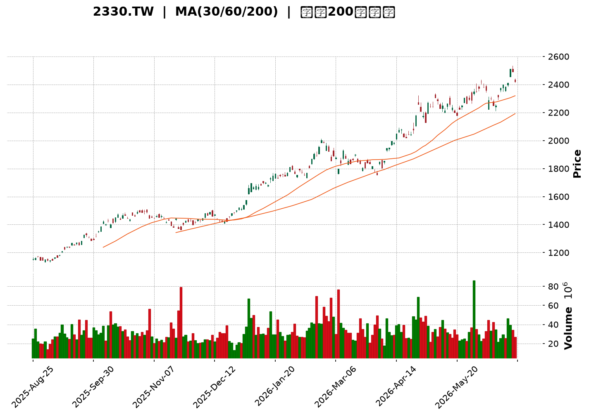
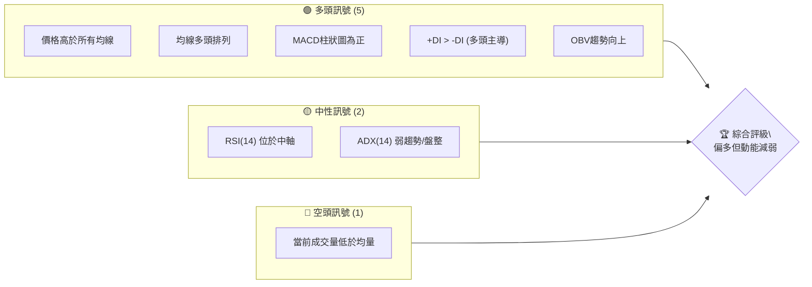
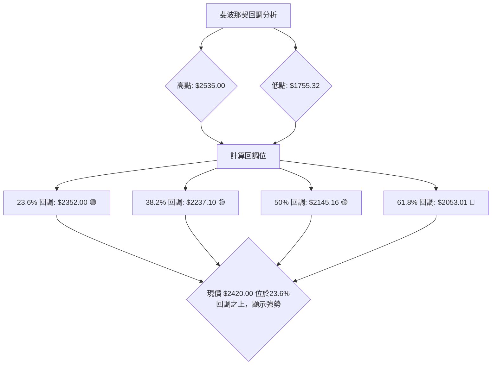
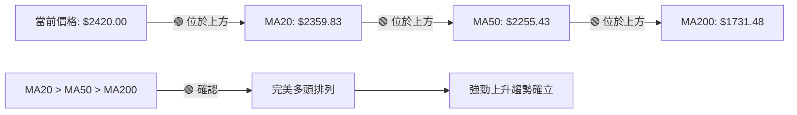

<details>
<summary>📊 靜態圖表 (點擊展開)</summary>

</details>

<html>
<head><meta charset="utf-8" /></head>
<body>
    <div style="height:500px; width:100%;">                        <script>window.PlotlyConfig = {MathJaxConfig: 'local'};</script>
        <script charset="utf-8" src="https://cdn.plot.ly/plotly-3.6.0.min.js" integrity="sha256-QaOVwtVY0T02VaHrr6pnoHLCwayMJp4O5n4YyaE3rJk=" crossorigin="anonymous"></script>                <div id="candlestick-chart" class="plotly-graph-div" style="height:100%; width:100%;"></div>            <script>                window.PLOTLYENV=window.PLOTLYENV || {};                                if (document.getElementById("candlestick-chart")) {                    Plotly.newPlot(                        "candlestick-chart",                        [{"close":{"dtype":"f8","bdata":"AAAAQHAKkkAAAADgLB6SQAAAAOBiWZJAAAAA4PbikUAAAADg9uKRQAAAAKCz9pFAAAAA4PbikUAAAADg9uKRQAAAAOD24pFAAAAAgOkxkkAAAACA6TGSQAAAACDcgJJAAAAAgIvjkkAAAABgwR6TQAAAAOCzbZNAAAAAYPdZk0AAAACA3NCTQAAAAABqlZNAAAAAYK3kk0AAAAAAapWTQAAAACBPDJRAAAAA4Ka+lEAAAADgpr6UQAAAAGBjb5RAAAAA4B8glEAAAADg8DOUQAAAAEA0g5RAAAAAQLshlUAAAABAcayVQAAAAEAnN5ZAAAAA4OPnlUAAAABA+EqWQAAAAODj55VAAAAAYIUPlkAAAABADK6WQAAAAOBP\u002fZZAAAAAwJlylkAAAAAAf+mWQAAAAAB\u002f6ZZAAAAAoDualkAAAADAmXKWQAAAAAB\u002f6ZZAAAAAIK7VlkAAAABAk0yXQAAAAECTTJdAAAAAYMI4l0AAAABAZGCXQAAAAECTTJdAAAAAoDualkAAAABADK6WQAAAAKA7mpZAAAAAIK7VlkAAAABADK6WQAAAACCu1ZZAAAAAoDualkAAAABgViOWQAAAAODIXpZAAAAAIELAlUAAAABAoJiVQAAAAMBqhpZAAAAAwP5wlUAAAADgXEmVQAAAAODj55VAAAAAQPhKlkAAAABAJzeWQAAAAED4SpZAAAAA4BLUlUAAAABgViOWQAAAAMCZcpZAAAAA4MhelkAAAACgO5qWQAAAAKDxJJdAAAAAAH\u002fplkAAAABAk0yXQAAAAKBI1ZZAAAAAQAz9lkAAAACAwYWWQAAAAEAcSpZAAAAAgDo2lkAAAACAOjaWQAAAAIA6NpZAAAAAwGbBlkAAAACgzySXQAAAAICxOJdAAAAA4FZ0l0AAAADg3cOXQAAAAEAanJdAAAAAAGUTmEAAAABgkZ6YQAAAAICP8JlAAAAA4Lt7mkAAAABAcQSaQAAAAOA0LJpAAAAAAFMYmkAAAACAFkCaQAAAAMCdj5pAAAAAwJ2PmkAAAACAFkCaQAAAAEDoBptAAAAAQG9Wm0AAAACgFJKbQAAAAEDoBptAAAAAQG9Wm0AAAADgMn6bQAAAAKCNQptAAAAAgPalm0AAAACgBEWcQAAAAGBfCZxAAAAAoBSSm0AAAAAgUWqbQAAAAIB99ZtAAAAAINi5m0AAAAAgUWqbQAAAAID2pZtAAAAAwCIxnEAAAADgmTOdQAAAAEDGvp1AAAAAACGDnUAAAADgl4WeQAAAAKBpTJ9AAAAAoOL8nkAAAACAW62eQAAAAEBNDp5AAAAAgPT3nEAAAAAAIYOdQAAAAGBdW51AAAAAAEEdnEAAAABAT7ycQAAAACAvIp5AAAAAoHtHnUAAAACA9PecQAAAAIBtqJxAAAAAABkknUAAAACgua+dQAAAAIBP1JxAAAAAwGqsnEAAAACAvDScQAAAAIC8NJxAAAAAIF3AnEAAAADAaqycQAAAAEChXJxAAAAAQA69m0AAAADARG2bQAAAAOBB6JxAAAAAgLw0nEAAAABANPycQAAAAAA\u002fY55AAAAAYDF3nkAAAADAtiqfQAAAAADSAp9AAAAAgBADoEAAAABg7jSgQAAAAKDnPqBAAAAAAGWin0AAAACgco6fQAAAAIAu8p9AAAAAgC7yn0AAAABg7jSgQAAAAGBfBqFAAAAAYPKloUAAAACANkKhQAAAACBm\u002fKBAAAAAgKOioEAAAADA5LmhQAAAAOAGiKFAAAAA4AaIoUAAAAAgtf+hQAAAAGDQ16FAAAAAQBtqoUAAAAAAAJKhQAAAAKAvTKFAAAAAoOuvoUAAAABg8qWhQAAAAIAUdKFAAAAAIEQuoUAAAABgXwahQAAAAAAiYKFAAAAAAACSoUAAAAAgtf+hQAAAAKDrr6FAAAAAwMLroUAAAACAyeGhQAAAAMB3WaJAAAAAwHdZokAAAADAVYuiQAAAAGAY5aJAAAAA4E6VokAAAAAgam2iQAAAAIDJ4aFAAAAA4Lv1oUAAAAAAAJKhQAAAAAAAlKFAAAAAAAAMokAAAAAAAI6iQAAAAAAAwKJAAAAAAACiokAAAAAAANSiQAAAAAAAnKNAAAAAAAB0o0AAAAAAAOiiQA=="},"high":{"dtype":"f8","bdata":"DdIgjekxkkDnhBItpkWSQAAAAOBiWZJAWO5pIKZFkkBY7mkgpkWSQAAAAKCz9pFANcJy0ywekkAAAADg9uKRQDXCctMsHpJAAAAAgOkxkkArgoZzH22SQAAAACDcgJJAAkapJkj3kkCllFL6s22TQAAAAOCzbZNAvSWhBrRtk0AAAIBcreSTQIiCK7kLvZNAAAAAYK3kk0BTxuxOfviTQAAAACBPDJRAAAAA4Ka+lEAfqJx1GfqUQBA++BgFl5RArdRKdZJblECHfrN1Y2+UQLyVfY5I5pRAnMmZHIw1lUAAAABAcayVQLZMFvnIXpZAEZebvLT7lUAAAADWaoaWQBGXm7y0+5VAHWDZZjualkAAAABADK6WQHW4GpnxJJdAXypoVQyulkCYIp+V8SSXQHWDKXLCOJdATZo0Wd3BlkAfDnicaoaWQHWDKXLCOJdA+iCWtSARl0Bdv\u002fv4NHSXQAufedUFiJdAZ2Zmrtabl0Bw8jf5BYiXQLp+97HWm5dAwYED70\u002f9lkD7DTDVfumWQCZNmnwMrpZAp8AO2U\u002f9lkD1G2Bq8SSXQKfADtlP\u002fZZATZo0Wd3BlkClHBAZ+EqWQDHIXnU7mpZAnHSASyc3lkByHMex4+eVQA5Ql5w7mpZASGqZMkLAlUCx9g0LQsCVQCMuN5mFD5ZAAAAAQPhKlkBsmSyyaoaWQAAAANZqhpZAGTpg58helkClHBAZ+EqWQAAAAMCZcpZAZu10vJlylkAAAACgO5qWQAAAAKDxJJdAdYMpcsI4l0AAAABAk0yXQAAAAJA4iJdApshnBe4Ql0DQ6ktFo5mWQGIutMrfcZZAs6Qc0N9xlkCR4V5FHEqWQNVn2lqjmZZAvQg+hUjVlkAAAACgzySXQFDmWUWTTJdAAAAA4FZ0l0AAAADg3cOXQKK8hsrdw5dAAAAAAGUTmEAAAABgkZ6YQH+L01r4U5pAAAAA4Lt7mkBi0bLKNCyaQILFPDDaZ5pAVVVVFdpnmkBow+fPu3uaQLeS2kpht5pAW0lthX+jmkBFgpoK2meaQKuqqsqrLptA0kUXVfalm0AAAACgFJKbQKuqqhpRaptA6aKLyjJ+m0BVVVWlFJKbQGAERkDYuZtAlqxkRdi5m0AAAACgBEWcQG12cQCqgJxAx2+Xen31m0AAAAAgUWqbQKuqqgpBHZxAlXAnNV8JnEB5mgtw9qWbQAAAAID2pZtAxzIo1amAnEAAAADgmTOdQN3LscqJ5p1A1e+5ZU0OnkBn0pVqW62eQAzkoyotdJ9ACMwe8Ic4n0DVKGOV4vyeQIO+oC89wZ5AaQ7fb+SqnUCSdqxAtnGeQKuqquogg51AAAAAAEEdnEBGteVqXVudQAW+uKrySZ5AvLoVQMa+nUASsUaVe0edQAUJo+WZM51ATNgGwf1LnUAEAoEArMOdQDkPHcP9S51ALWQhAxkknUBtx4fgrkicQGg7PoRP1JxAMjgfYws4nUB705uiJhCdQHAIh6CTcJxACEUowtcMnEB00UUD8+SbQAAAAOBB6JxArpHVpSYQnUAAAABANPycQAAAAAA\u002fY55AAAAAYDF3nkAAAADAtiqfQFx\u002fe2DEFp9AAAAAgBADoEDFTuwg01ygQP\u002fBRNDgSKBALzFroQkNoEDCFmxxEAOgQBO1KzH1KqBAD8TvAPwgoECd2Ilyo6KgQGmcQZBYEKFAGNE205knokD5Y0nz3cOhQKszUkE9OKFAVFwyhDZCoUDgB34g182hQGhFI6Hrr6FAdbn9MdfNoUAffPBxhUWiQPQuHiG1\u002f6FAOiUBwuS5oUAU3z3x3cOhQMln3WAUdKFAAAAAoOuvoUDvhfeioB2iQEmSJEH5m6FAURRFESJgoUAPDkhRPTihQAWEE\u002fH\u002fkaFABJM\u002fMPmboUAAAAAgtf+hQDbwGbOgHaJAoGir4ZknokCeDyzzcGOiQLt\u002f84BcgaJAL3\u002faAibRokCBXBOBOrOiQENasfADA6NAcqdoASbRokBO8OShM72iQMZUOHGnE6JA75W6cKcTokAkKzyywuuhQAAAAAAAqKFAAAAAAAAqokAAAAAAAI6iQAAAAAAAwKJAAAAAAACiokAAAAAAAN6iQAAAAAAAnKNAAAAAAADOo0AAAAAAABqjQA=="},"hovertemplate":"\u003cb\u003e%{x|%Y-%m-%d}\u003c\u002fb\u003e\u003cbr\u003e\u958b: $%{open:.2f}\u003cbr\u003e\u9ad8: $%{high:.2f}\u003cbr\u003e\u4f4e: $%{low:.2f}\u003cbr\u003e\u6536: $%{close:.2f}\u003cextra\u003e\u003c\u002fextra\u003e","low":{"dtype":"f8","bdata":"8y3f8vbikUCmOGTs9uKRQNPS0pLpMZJAAAAA4PbikUAAAADg9uKRQL+CoQXBp5FA7mmEOTrPkUDLPY3swKeRQAAAAOD24pFAOKn7MnAKkkAAAACA6TGSQO\u002fu7tJiWZJA\u002fHOtMhK8kkDXWmu5BAuTQMMwDJM6RpNAQ9peuTpGk0AAAAAOmYGTQAAAAABqlZNA8g3y7WmVk0AAAAAAapWTQK0bTNE6qZNAIj1QkZJblEDhV2NKNIOUQAAAAGBjb5RAG7mRA08MlEAAAADg8DOUQAAAAEA0g5RAx2zMhhn6lEAAAAA4uyGVQO+MXqq0+5VA3tHIJkLAlUCqqqqGViOWQKoM9pDPhJVAs82Xg7T7lUAOMNVchQ+WQBaPym0MrpZAAAAAwJlylkCtG0yxaoaWQAAAAAB\u002f6ZZA2bJlw2qGlkCg1ZcqJzeWQAAAAAB\u002f6ZZArZ94Q93BlkD1YIaqIBGXQFIggmPCOJdAAAAAYMI4l0AgG5DNIBGXQKRABIfxJJdA2bJlw2qGlkAAAABADK6WQNmyZcNqhpZAWT\u002fxZgyulkAAAABADK6WQAbfaYo7mpZAAAAAoDualkCu8XeDhQ+WQAAAAODIXpZAAAAAIELAlUAAAABAoJiVQNYPOir4SpZAAAAAwP5wlUAAAADgXEmVQN7RyCZCwJVAAAAAqoUPlkCl2XRjViOWQFVVVWMnN5ZAAAAA4BLUlUBc4++mtPuVQKDVlyonN5ZAzjehSlYjlkBmy5Yt+EqWQIcm+Zc7mpZAAAAAAH\u002fplkBHgQjOT\u002f2WQKuqqtpmwZZAtG4wtUjVlkAvFbS633GWQJ7RS7VYIpZAbx6hulgilkBNW+MvlfqVQAAAAIA6NpZAh+6DNaOZlkAh+fOKSNWWQF8zTPXtEJdAk7\u002fJj7E4l0CrqqrKVnSXQF5DebVWdJdApwFtmjiIl0CB4DI1g\u002f+XQE5rto+fPZlA\u002ffPPnyaNmUCdLk21rdyZQPx0hj\u002fqtJlAVVVVJeq0mUAAAACAFkCaQEltJTXaZ5pASW0lNdpnmkC6fWX1UhiaQAAAAKCdj5pA0kUX20LLmkC3lsU66AabQAAAAEDoBptAF110tasum0CrqqrKqy6bQAAAAKCNQptAFKEIpY1Cm0Aw\u002fdL\u002fuc2bQJjBl5p99ZtAAAAAoBSSm0AKMpsKyhqbQAAAADDYuZtAtkdslRSSm0CDzKZab1abQFOb2lToBptAAAAAwCIxnEDqOxu1i5ScQIvQOBW4H51AAAAAACGDnUD94xIrxr6dQOY3uIri\u002fJ5AAAAAoOL8nkCMeJIaLyKeQAAAAEBNDp5AAAAAgPT3nEB0S5w6P2+dQFVVVdWZM51A+K2R1TJ+m0BcJY0qyGycQN4sTxq4H51AAAAAoHtHnUCpomeli5ScQAAAAIBtqJxAsyf5PjT8nED0+Xx+4nOdQAAAAIBP1JxAAAAAwGqsnEDgGlmdANGbQCdx8L7XDJxAAAAAIF3AnEAAAADAaqycQD7e473XDJxAAAAAQA69m0AAAADARG2bQPqSaf2FhJxAlDh4H8ognEDXWmtdeJicQJ3YiR2D\u002f51AM3WLfXUTnkBSuB59CLOeQO6Bjd76xp5Av0oYm5tSn0A7sROfCQ2gQAd0Y34QA6BAAAAAAGWin0AAAACgco6fQPgdiB883p9A8TsQv0nKn0CKndhuEAOgQGk55lvMZqBAAAAAYPKloUAAAACANkKhQCrmVo963qBAAAAAgKOioED8wA+8URqhQExdbn8UdKFATF1ufxR0oUAAAAAgtf+hQE9Fmm7ypaFAAAAAQBtqoUDc1MNNPTihQCnyWQ9ELqFAHpe+HSJgoUCEHkLPBoihQCRJko42QqFAAAAAIEQuoUAAAABgXwahQAAAAAAiYKFA6I2C3ihWoUDhgw\u002fO5LmhQAAAAKDrr6FAy4dxX9DXoUA5q8eO66+hQFegz86ZJ6JAESDDj35PokB\u002fo+z+cGOiQL6lTs8sx6JAAAAA4E6VokDjJUqPfk+iQGLw0wwiYKFAC5yDf8nhoUAAAAAAAJKhQAAAAAAARKFAAAAAAADkoUAAAAAAAFKiQAAAAAAAXKJAAAAAAABcokAAAAAAAKKiQAAAAAAALqNAAAAAAAB0o0AAAAAAAN6iQA=="},"name":"\u50f9\u683c","open":{"dtype":"f8","bdata":"+pZvmbP2kUAZe+2Ss\u002faRQAAAAOBiWZJAWO5pIKZFkkBHWO556TGSQA8iOax9u5FAIyz3LHAKkkDuaYQ5Os+RQCMs9yxwCpJAnNR92SwekkArgoZzH22SQHd3d3kfbZJA\u002frlW2c7PkkB8771T91mTQGIYhjn3WZNAvSWhBrRtk0AAAIDqaZWTQETBldw6qZNA+Qb5pgu9k0APBVdyreSTQK0bTNE6qZNAgsrZbWNvlEC\u002fGhOZSOaUQAAAAGBjb5RAyY3cmMFHlEAtKpG8wUeUQAAAAEA0g5RAYzZmY+oNlUAAAAA4uyGVQO+MXqq0+5VA72hkAxPUlUAAAABA+EqWQKoM9pDPhJVA0C1ximqGlkAK5J8VJzeWQBaPym0MrpZAHw54nGqGlkCKfNaNO5qWQN1gitxP\u002fZZAAAAAoDualkDA4w8H+EqWQHWDKXLCOJdAU2CH\u002fH7plkCkQASH8SSXQF2\u002f+\u002fg0dJdA16Nw9TR0l0AAAABAZGCXQAufedUFiJdAmjRpEn\u002fplkD+WWUc3cGWQAAAAKA7mpZArZ94Q93BlkD3wfqNIBGXQK2feEPdwZZAAAAAoDualkCu8XeDhQ+WQGbtdLyZcpZAnHSASyc3lkAcx3EccayVQPKvaOOZcpZAJLVMeaCYlUDpoosucayVQCMuN5mFD5ZAqqqqhlYjlkARc6HVmXKWQAAAAED4SpZAGTpg58helkAAAABgViOWQMDjDwf4SpZAAAAA4MhelkCMGDEKyV6WQCtqjHQMrpZAmCKflfEkl0D1YIaqIBGXQKuqqspWdJdAWjeYeirplkAAAACAwYWWQAAAAEAcSpZAkeFeRRxKlkDePEL1dg6WQNVn2lqjmZZAAAAAwGbBlkDZ+jZQKumWQAAAAICxOJdAMZWYGnVgl0AAAACQOIiXQK+hvHo4iJdA\u002fSXLXxqcl0BhKOa\u002fRieYQJvtE1WBUZlA\u002ffPPnyaNmUCdLk21rdyZQCgM8ATMyJlAAAAAsK3cmUBFgpoK2meaQLeS2kpht5pApbaS+rt7mkDdvrK6NCyaQKuqqnoG85pA0kUX20LLmkC3lsU66AabQFVVVQXKGptAdNFFBVFqm0AAAADgMn6bQHUBwipRaptAqk1tam9Wm0Aw\u002fdL\u002fuc2bQAY4CTvIbJxARHb077nNm0CIZfTPqy6bQKuqqgpBHZxAAAAAINi5m0AAAAAgUWqbQOlHPxrKGptAFSbeD8hsnEBt1Hd6baicQHq2kdqZM51AAAAAACGDnUD94xIrxr6dQOY3uIri\u002fJ5AWJlfZcQQn0CMeJIaLyKeQNc+C6V5mZ5AmwnqHz9vnUBhpB0rLyKeQFVVVdWZM51AOXjfmhSSm0Cj2nJV1gudQOPqB6V7R51AXt0K8CCDnUCpomeli5ScQASaQiC4H51AJmyDYAs4nUD8\u002fX4\u002fx5udQFo3mGILOJ1AyUIWQjT8nEBN4uD98uSbQGg7PoRP1JxAIdAUoiYQnUBkIQuBT9ScQK7mah7KIJxAAAAAQA69m0C66KLhG6mbQGOLcr5qrJxArpHVpSYQnUDwvfd+T9ScQF7ohd5nJ55AR5UEn0xPnkCamZnd+saeQKWAhJ\u002ff7p5AqtCj+41mn0DsxE7PAhegQAE+u2\u002fuNKBA\u002fKgucRADoEDrXHkAZaKfQAAAAIAu8p9A+B2IHzzen0BiJ3bA4EigQNLVJ4zFcKBAfOG98N3DoUCHVYShDX6hQA6ix+9s8qBAyhCsI0QuoUDsxE7sSiShQAAAAOAGiKFAAAAA4AaIoUDNoWIRkzGiQHoXj8DC66FA69uAYfKloUDwswE\u002fG2qhQCnyWQ9ELqFAj0vf3gaIoUBzpDkStf+hQEmSJO8oVqFAMQzDsC9MoUCmcQYhRC6hQM80bmAUdKFA+NmAnw1+oUDhgw\u002fO5LmhQBrD0YKnE6JANniOILX\u002foUDoIK+Sfk+iQDRgSS+MO6JAAAAAwHdZokBArokgSJ+iQAAAAGAY5aJAAAAA4E6VokA7tGtBQamiQGLw0wwiYKFAAAAA4Lv1oUAYcn0h182hQAAAAAAAgKFAAAAAAAAqokAAAAAAAHCiQAAAAAAAjqJAAAAAAABmokAAAAAAALaiQAAAAAAALqNAAAAAAACco0AAAAAAAAajQA=="},"x":["2025-08-25T00:00:00+08:00","2025-08-26T00:00:00+08:00","2025-08-27T00:00:00+08:00","2025-08-28T00:00:00+08:00","2025-08-29T00:00:00+08:00","2025-09-01T00:00:00+08:00","2025-09-02T00:00:00+08:00","2025-09-03T00:00:00+08:00","2025-09-04T00:00:00+08:00","2025-09-05T00:00:00+08:00","2025-09-08T00:00:00+08:00","2025-09-09T00:00:00+08:00","2025-09-10T00:00:00+08:00","2025-09-11T00:00:00+08:00","2025-09-12T00:00:00+08:00","2025-09-15T00:00:00+08:00","2025-09-16T00:00:00+08:00","2025-09-17T00:00:00+08:00","2025-09-18T00:00:00+08:00","2025-09-19T00:00:00+08:00","2025-09-22T00:00:00+08:00","2025-09-23T00:00:00+08:00","2025-09-24T00:00:00+08:00","2025-09-25T00:00:00+08:00","2025-09-26T00:00:00+08:00","2025-09-30T00:00:00+08:00","2025-10-01T00:00:00+08:00","2025-10-02T00:00:00+08:00","2025-10-03T00:00:00+08:00","2025-10-07T00:00:00+08:00","2025-10-08T00:00:00+08:00","2025-10-09T00:00:00+08:00","2025-10-13T00:00:00+08:00","2025-10-14T00:00:00+08:00","2025-10-15T00:00:00+08:00","2025-10-16T00:00:00+08:00","2025-10-17T00:00:00+08:00","2025-10-20T00:00:00+08:00","2025-10-21T00:00:00+08:00","2025-10-22T00:00:00+08:00","2025-10-23T00:00:00+08:00","2025-10-27T00:00:00+08:00","2025-10-28T00:00:00+08:00","2025-10-29T00:00:00+08:00","2025-10-30T00:00:00+08:00","2025-10-31T00:00:00+08:00","2025-11-03T00:00:00+08:00","2025-11-04T00:00:00+08:00","2025-11-05T00:00:00+08:00","2025-11-06T00:00:00+08:00","2025-11-07T00:00:00+08:00","2025-11-10T00:00:00+08:00","2025-11-11T00:00:00+08:00","2025-11-12T00:00:00+08:00","2025-11-13T00:00:00+08:00","2025-11-14T00:00:00+08:00","2025-11-17T00:00:00+08:00","2025-11-18T00:00:00+08:00","2025-11-19T00:00:00+08:00","2025-11-20T00:00:00+08:00","2025-11-21T00:00:00+08:00","2025-11-24T00:00:00+08:00","2025-11-25T00:00:00+08:00","2025-11-26T00:00:00+08:00","2025-11-27T00:00:00+08:00","2025-11-28T00:00:00+08:00","2025-12-01T00:00:00+08:00","2025-12-02T00:00:00+08:00","2025-12-03T00:00:00+08:00","2025-12-04T00:00:00+08:00","2025-12-05T00:00:00+08:00","2025-12-08T00:00:00+08:00","2025-12-09T00:00:00+08:00","2025-12-10T00:00:00+08:00","2025-12-11T00:00:00+08:00","2025-12-12T00:00:00+08:00","2025-12-15T00:00:00+08:00","2025-12-16T00:00:00+08:00","2025-12-17T00:00:00+08:00","2025-12-18T00:00:00+08:00","2025-12-19T00:00:00+08:00","2025-12-22T00:00:00+08:00","2025-12-23T00:00:00+08:00","2025-12-24T00:00:00+08:00","2025-12-26T00:00:00+08:00","2025-12-29T00:00:00+08:00","2025-12-30T00:00:00+08:00","2025-12-31T00:00:00+08:00","2026-01-02T00:00:00+08:00","2026-01-05T00:00:00+08:00","2026-01-06T00:00:00+08:00","2026-01-07T00:00:00+08:00","2026-01-08T00:00:00+08:00","2026-01-09T00:00:00+08:00","2026-01-12T00:00:00+08:00","2026-01-13T00:00:00+08:00","2026-01-14T00:00:00+08:00","2026-01-15T00:00:00+08:00","2026-01-16T00:00:00+08:00","2026-01-19T00:00:00+08:00","2026-01-20T00:00:00+08:00","2026-01-21T00:00:00+08:00","2026-01-22T00:00:00+08:00","2026-01-23T00:00:00+08:00","2026-01-26T00:00:00+08:00","2026-01-27T00:00:00+08:00","2026-01-28T00:00:00+08:00","2026-01-29T00:00:00+08:00","2026-01-30T00:00:00+08:00","2026-02-02T00:00:00+08:00","2026-02-03T00:00:00+08:00","2026-02-04T00:00:00+08:00","2026-02-05T00:00:00+08:00","2026-02-06T00:00:00+08:00","2026-02-09T00:00:00+08:00","2026-02-10T00:00:00+08:00","2026-02-11T00:00:00+08:00","2026-02-23T00:00:00+08:00","2026-02-24T00:00:00+08:00","2026-02-25T00:00:00+08:00","2026-02-26T00:00:00+08:00","2026-03-02T00:00:00+08:00","2026-03-03T00:00:00+08:00","2026-03-04T00:00:00+08:00","2026-03-05T00:00:00+08:00","2026-03-06T00:00:00+08:00","2026-03-09T00:00:00+08:00","2026-03-10T00:00:00+08:00","2026-03-11T00:00:00+08:00","2026-03-12T00:00:00+08:00","2026-03-13T00:00:00+08:00","2026-03-16T00:00:00+08:00","2026-03-17T00:00:00+08:00","2026-03-18T00:00:00+08:00","2026-03-19T00:00:00+08:00","2026-03-20T00:00:00+08:00","2026-03-23T00:00:00+08:00","2026-03-24T00:00:00+08:00","2026-03-25T00:00:00+08:00","2026-03-26T00:00:00+08:00","2026-03-27T00:00:00+08:00","2026-03-30T00:00:00+08:00","2026-03-31T00:00:00+08:00","2026-04-01T00:00:00+08:00","2026-04-02T00:00:00+08:00","2026-04-07T00:00:00+08:00","2026-04-08T00:00:00+08:00","2026-04-09T00:00:00+08:00","2026-04-10T00:00:00+08:00","2026-04-13T00:00:00+08:00","2026-04-14T00:00:00+08:00","2026-04-15T00:00:00+08:00","2026-04-16T00:00:00+08:00","2026-04-17T00:00:00+08:00","2026-04-20T00:00:00+08:00","2026-04-21T00:00:00+08:00","2026-04-22T00:00:00+08:00","2026-04-23T00:00:00+08:00","2026-04-24T00:00:00+08:00","2026-04-27T00:00:00+08:00","2026-04-28T00:00:00+08:00","2026-04-29T00:00:00+08:00","2026-04-30T00:00:00+08:00","2026-05-04T00:00:00+08:00","2026-05-05T00:00:00+08:00","2026-05-06T00:00:00+08:00","2026-05-07T00:00:00+08:00","2026-05-08T00:00:00+08:00","2026-05-11T00:00:00+08:00","2026-05-12T00:00:00+08:00","2026-05-13T00:00:00+08:00","2026-05-14T00:00:00+08:00","2026-05-15T00:00:00+08:00","2026-05-18T00:00:00+08:00","2026-05-19T00:00:00+08:00","2026-05-20T00:00:00+08:00","2026-05-21T00:00:00+08:00","2026-05-22T00:00:00+08:00","2026-05-25T00:00:00+08:00","2026-05-26T00:00:00+08:00","2026-05-27T00:00:00+08:00","2026-05-28T00:00:00+08:00","2026-05-29T00:00:00+08:00","2026-06-01T00:00:00+08:00","2026-06-02T00:00:00+08:00","2026-06-03T00:00:00+08:00","2026-06-04T00:00:00+08:00","2026-06-05T00:00:00+08:00","2026-06-08T00:00:00+08:00","2026-06-09T00:00:00+08:00","2026-06-10T00:00:00+08:00","2026-06-11T00:00:00+08:00","2026-06-12T00:00:00+08:00","2026-06-15T00:00:00+08:00","2026-06-16T00:00:00+08:00","2026-06-17T00:00:00+08:00","2026-06-18T00:00:00+08:00","2026-06-22T00:00:00+08:00","2026-06-23T00:00:00+08:00","2026-06-24T00:00:00+08:00"],"type":"candlestick"},{"hovertemplate":"MA30: $%{y:.2f}\u003cextra\u003e\u003c\u002fextra\u003e","line":{"color":"#2196F3","dash":"dash","width":2},"mode":"lines","name":"MA30","x":["2025-08-25T00:00:00+08:00","2025-08-26T00:00:00+08:00","2025-08-27T00:00:00+08:00","2025-08-28T00:00:00+08:00","2025-08-29T00:00:00+08:00","2025-09-01T00:00:00+08:00","2025-09-02T00:00:00+08:00","2025-09-03T00:00:00+08:00","2025-09-04T00:00:00+08:00","2025-09-05T00:00:00+08:00","2025-09-08T00:00:00+08:00","2025-09-09T00:00:00+08:00","2025-09-10T00:00:00+08:00","2025-09-11T00:00:00+08:00","2025-09-12T00:00:00+08:00","2025-09-15T00:00:00+08:00","2025-09-16T00:00:00+08:00","2025-09-17T00:00:00+08:00","2025-09-18T00:00:00+08:00","2025-09-19T00:00:00+08:00","2025-09-22T00:00:00+08:00","2025-09-23T00:00:00+08:00","2025-09-24T00:00:00+08:00","2025-09-25T00:00:00+08:00","2025-09-26T00:00:00+08:00","2025-09-30T00:00:00+08:00","2025-10-01T00:00:00+08:00","2025-10-02T00:00:00+08:00","2025-10-03T00:00:00+08:00","2025-10-07T00:00:00+08:00","2025-10-08T00:00:00+08:00","2025-10-09T00:00:00+08:00","2025-10-13T00:00:00+08:00","2025-10-14T00:00:00+08:00","2025-10-15T00:00:00+08:00","2025-10-16T00:00:00+08:00","2025-10-17T00:00:00+08:00","2025-10-20T00:00:00+08:00","2025-10-21T00:00:00+08:00","2025-10-22T00:00:00+08:00","2025-10-23T00:00:00+08:00","2025-10-27T00:00:00+08:00","2025-10-28T00:00:00+08:00","2025-10-29T00:00:00+08:00","2025-10-30T00:00:00+08:00","2025-10-31T00:00:00+08:00","2025-11-03T00:00:00+08:00","2025-11-04T00:00:00+08:00","2025-11-05T00:00:00+08:00","2025-11-06T00:00:00+08:00","2025-11-07T00:00:00+08:00","2025-11-10T00:00:00+08:00","2025-11-11T00:00:00+08:00","2025-11-12T00:00:00+08:00","2025-11-13T00:00:00+08:00","2025-11-14T00:00:00+08:00","2025-11-17T00:00:00+08:00","2025-11-18T00:00:00+08:00","2025-11-19T00:00:00+08:00","2025-11-20T00:00:00+08:00","2025-11-21T00:00:00+08:00","2025-11-24T00:00:00+08:00","2025-11-25T00:00:00+08:00","2025-11-26T00:00:00+08:00","2025-11-27T00:00:00+08:00","2025-11-28T00:00:00+08:00","2025-12-01T00:00:00+08:00","2025-12-02T00:00:00+08:00","2025-12-03T00:00:00+08:00","2025-12-04T00:00:00+08:00","2025-12-05T00:00:00+08:00","2025-12-08T00:00:00+08:00","2025-12-09T00:00:00+08:00","2025-12-10T00:00:00+08:00","2025-12-11T00:00:00+08:00","2025-12-12T00:00:00+08:00","2025-12-15T00:00:00+08:00","2025-12-16T00:00:00+08:00","2025-12-17T00:00:00+08:00","2025-12-18T00:00:00+08:00","2025-12-19T00:00:00+08:00","2025-12-22T00:00:00+08:00","2025-12-23T00:00:00+08:00","2025-12-24T00:00:00+08:00","2025-12-26T00:00:00+08:00","2025-12-29T00:00:00+08:00","2025-12-30T00:00:00+08:00","2025-12-31T00:00:00+08:00","2026-01-02T00:00:00+08:00","2026-01-05T00:00:00+08:00","2026-01-06T00:00:00+08:00","2026-01-07T00:00:00+08:00","2026-01-08T00:00:00+08:00","2026-01-09T00:00:00+08:00","2026-01-12T00:00:00+08:00","2026-01-13T00:00:00+08:00","2026-01-14T00:00:00+08:00","2026-01-15T00:00:00+08:00","2026-01-16T00:00:00+08:00","2026-01-19T00:00:00+08:00","2026-01-20T00:00:00+08:00","2026-01-21T00:00:00+08:00","2026-01-22T00:00:00+08:00","2026-01-23T00:00:00+08:00","2026-01-26T00:00:00+08:00","2026-01-27T00:00:00+08:00","2026-01-28T00:00:00+08:00","2026-01-29T00:00:00+08:00","2026-01-30T00:00:00+08:00","2026-02-02T00:00:00+08:00","2026-02-03T00:00:00+08:00","2026-02-04T00:00:00+08:00","2026-02-05T00:00:00+08:00","2026-02-06T00:00:00+08:00","2026-02-09T00:00:00+08:00","2026-02-10T00:00:00+08:00","2026-02-11T00:00:00+08:00","2026-02-23T00:00:00+08:00","2026-02-24T00:00:00+08:00","2026-02-25T00:00:00+08:00","2026-02-26T00:00:00+08:00","2026-03-02T00:00:00+08:00","2026-03-03T00:00:00+08:00","2026-03-04T00:00:00+08:00","2026-03-05T00:00:00+08:00","2026-03-06T00:00:00+08:00","2026-03-09T00:00:00+08:00","2026-03-10T00:00:00+08:00","2026-03-11T00:00:00+08:00","2026-03-12T00:00:00+08:00","2026-03-13T00:00:00+08:00","2026-03-16T00:00:00+08:00","2026-03-17T00:00:00+08:00","2026-03-18T00:00:00+08:00","2026-03-19T00:00:00+08:00","2026-03-20T00:00:00+08:00","2026-03-23T00:00:00+08:00","2026-03-24T00:00:00+08:00","2026-03-25T00:00:00+08:00","2026-03-26T00:00:00+08:00","2026-03-27T00:00:00+08:00","2026-03-30T00:00:00+08:00","2026-03-31T00:00:00+08:00","2026-04-01T00:00:00+08:00","2026-04-02T00:00:00+08:00","2026-04-07T00:00:00+08:00","2026-04-08T00:00:00+08:00","2026-04-09T00:00:00+08:00","2026-04-10T00:00:00+08:00","2026-04-13T00:00:00+08:00","2026-04-14T00:00:00+08:00","2026-04-15T00:00:00+08:00","2026-04-16T00:00:00+08:00","2026-04-17T00:00:00+08:00","2026-04-20T00:00:00+08:00","2026-04-21T00:00:00+08:00","2026-04-22T00:00:00+08:00","2026-04-23T00:00:00+08:00","2026-04-24T00:00:00+08:00","2026-04-27T00:00:00+08:00","2026-04-28T00:00:00+08:00","2026-04-29T00:00:00+08:00","2026-04-30T00:00:00+08:00","2026-05-04T00:00:00+08:00","2026-05-05T00:00:00+08:00","2026-05-06T00:00:00+08:00","2026-05-07T00:00:00+08:00","2026-05-08T00:00:00+08:00","2026-05-11T00:00:00+08:00","2026-05-12T00:00:00+08:00","2026-05-13T00:00:00+08:00","2026-05-14T00:00:00+08:00","2026-05-15T00:00:00+08:00","2026-05-18T00:00:00+08:00","2026-05-19T00:00:00+08:00","2026-05-20T00:00:00+08:00","2026-05-21T00:00:00+08:00","2026-05-22T00:00:00+08:00","2026-05-25T00:00:00+08:00","2026-05-26T00:00:00+08:00","2026-05-27T00:00:00+08:00","2026-05-28T00:00:00+08:00","2026-05-29T00:00:00+08:00","2026-06-01T00:00:00+08:00","2026-06-02T00:00:00+08:00","2026-06-03T00:00:00+08:00","2026-06-04T00:00:00+08:00","2026-06-05T00:00:00+08:00","2026-06-08T00:00:00+08:00","2026-06-09T00:00:00+08:00","2026-06-10T00:00:00+08:00","2026-06-11T00:00:00+08:00","2026-06-12T00:00:00+08:00","2026-06-15T00:00:00+08:00","2026-06-16T00:00:00+08:00","2026-06-17T00:00:00+08:00","2026-06-18T00:00:00+08:00","2026-06-22T00:00:00+08:00","2026-06-23T00:00:00+08:00","2026-06-24T00:00:00+08:00"],"y":{"dtype":"f8","bdata":"AAAAAAAA+H8AAAAAAAD4fwAAAAAAAPh\u002fAAAAAAAA+H8AAAAAAAD4fwAAAAAAAPh\u002fAAAAAAAA+H8AAAAAAAD4fwAAAAAAAPh\u002fAAAAAAAA+H8AAAAAAAD4fwAAAAAAAPh\u002fAAAAAAAA+H8AAAAAAAD4fwAAAAAAAPh\u002fAAAAAAAA+H8AAAAAAAD4fwAAAAAAAPh\u002fAAAAAAAA+H8AAAAAAAD4fwAAAAAAAPh\u002fAAAAAAAA+H8AAAAAAAD4fwAAAAAAAPh\u002fAAAAAAAA+H8AAAAAAAD4fwAAAAAAAPh\u002fAAAAAAAA+H8AAAAAAAD4fyIiIhLfV5NAREREZNp4k0BVVVXFepyTQHd3d2fUupNAERERwXLek0De3d3dWQeUQBEREfE8MpRAVVVVxShZlEDNzMwsC4SUQERERJTtrpRAq6qq6onUlEDv7u4O1PiUQGZmZhZzHpVAiYiI6B5AlUCamZkJyGOVQLy7u3vPhJVAAAAAQNallUBERESkOMSVQHd3dzft45VA7+7ujgv7lUDe3d1ddxWWQERERIRDK5ZAd3d3Fxk9lkCJiIh4nE2WQN7d3W0WYpZAzczMfDl3lkDv7u7evIeWQImIiCiXl5ZAvLu769+clkAiIiLSNpyWQERERDTbnpZAIiIiouSalkAzMzNjTpKWQDMzM2NOkpZA7+7urkmUlkDe3d0dU5CWQDMzM0NhipZAAAAAgBiFlkC8u7uLfX6WQImIiPiGepZA3t3drYt4lkAAAADg3XmWQJqZmSnZe5ZAIiIiQoJ8lkAiIiJCgnyWQN7d3U2IeJZARERExIp2lkAzMzMTQW+WQCIiIoKjZpZAMzMzI05jlkDe3d2tT1+WQO\u002fu7k76W5ZAMzMzQ01blkBVVVW1Ql+WQO\u002fu7p6PYpZAvLu7y9RplkDe3d0tt3eWQFVVVfVKgpZAREREdCGWlkAiIiLC7a+WQN7d3R0RzZZAvLu7axf4lkB3d3f3dSCXQBERERHfRJdAZmZmBlFll0BmZmZmv4eXQBEREVErrJdAAAAA0I3Ul0CJiIhIpfeXQHd3d\u002fe4HphAERERYRxJmECrqqp6gXOYQM3MzEyjlJhAq6qqCme6mEARERGhMN6YQCIiIjL3A5lAzczMvLormUAiIiKCxVyZQHd3d0fQjZlAAAAAwIq7mUB3d3fn8eeZQLy7u6v8GJpAmpmZ2WZDmkCamZkZ2meaQKuqqqqgjZpAzczM3A22mkDv7u7+ceSaQAAAABDNGJtAIiIiMjFHm0B3d3dHj3mbQAAAAMBJp5tAmpmZ+bnNm0BERESEffWbQGZmZnagFpxAiYiI2CUvnEB3d3eH+0qcQAAAAEDXYpxAzczMbBhwnEBERESETYWcQBEREeHPn5xAvLu7W2GwnECJiIg4T7ycQAAAABA6ypxAZmZmlp3ZnEB3d3dHVeycQLy7u5u5+ZxAd3d3N3kCnUB3d3dH7gGdQBEREVFgA51AzczMzHMNnUAzMzNjMBidQDMzM4OgG51Aq6qq6rsbnUCrqqoa1RudQJqZmVmTJp1AMzMzE7ImnUCrqqpa2SSdQImIiNhUKp1AZmZmhncynUDe3d2N+DedQBEREZGENZ1Aq6qq+ls+nUBmZmYWLU2dQAAAALD1YZ1AvLu7K7V4nUAzMzPTJoqdQM3MzNw+oJ1AIiIicvHAnUB3d3cHVOCdQHd3dze\u002fAZ5A3t3dDRg1nkB3d3dncWSeQFVVVeXJkZ5AmpmZKQe1nkBERETkOuaeQGZmZuZrG59AVVVVVfFRn0B3d3eXbpSfQAAAAABD1J9AIiIiyg8EoEBEREScpx+gQERERBxAOqBA7+7uhtRaoECrqqpCaHygQCIiInIBlqBAd3d310SwoEAAAADA4MWgQDMzM7N+2KBAvLu7E3HsoEAzMzOrDQGhQHd3d5+rE6FAzczM1PUjoUDv7u5mQTKhQLy7uyM1RKFAREREDNFZoUCJiIiYa3GhQBEREZFaiqFAAAAAsKCgoUDv7u6+k7OhQFVVVRXkuqFA7+7u7oy9oUCJiIjINcChQCIiInJDxaFAAAAAEE\u002fRoUCamZkJYdihQFVVVTXH4qFAERERYS3soUARERHxQPOhQImIiJhTAqJAZmZmFrkTokDNzMx8Hx+iQA=="},"type":"scatter"},{"hovertemplate":"MA60: $%{y:.2f}\u003cextra\u003e\u003c\u002fextra\u003e","line":{"color":"#9C27B0","dash":"dash","width":2},"mode":"lines","name":"MA60","x":["2025-08-25T00:00:00+08:00","2025-08-26T00:00:00+08:00","2025-08-27T00:00:00+08:00","2025-08-28T00:00:00+08:00","2025-08-29T00:00:00+08:00","2025-09-01T00:00:00+08:00","2025-09-02T00:00:00+08:00","2025-09-03T00:00:00+08:00","2025-09-04T00:00:00+08:00","2025-09-05T00:00:00+08:00","2025-09-08T00:00:00+08:00","2025-09-09T00:00:00+08:00","2025-09-10T00:00:00+08:00","2025-09-11T00:00:00+08:00","2025-09-12T00:00:00+08:00","2025-09-15T00:00:00+08:00","2025-09-16T00:00:00+08:00","2025-09-17T00:00:00+08:00","2025-09-18T00:00:00+08:00","2025-09-19T00:00:00+08:00","2025-09-22T00:00:00+08:00","2025-09-23T00:00:00+08:00","2025-09-24T00:00:00+08:00","2025-09-25T00:00:00+08:00","2025-09-26T00:00:00+08:00","2025-09-30T00:00:00+08:00","2025-10-01T00:00:00+08:00","2025-10-02T00:00:00+08:00","2025-10-03T00:00:00+08:00","2025-10-07T00:00:00+08:00","2025-10-08T00:00:00+08:00","2025-10-09T00:00:00+08:00","2025-10-13T00:00:00+08:00","2025-10-14T00:00:00+08:00","2025-10-15T00:00:00+08:00","2025-10-16T00:00:00+08:00","2025-10-17T00:00:00+08:00","2025-10-20T00:00:00+08:00","2025-10-21T00:00:00+08:00","2025-10-22T00:00:00+08:00","2025-10-23T00:00:00+08:00","2025-10-27T00:00:00+08:00","2025-10-28T00:00:00+08:00","2025-10-29T00:00:00+08:00","2025-10-30T00:00:00+08:00","2025-10-31T00:00:00+08:00","2025-11-03T00:00:00+08:00","2025-11-04T00:00:00+08:00","2025-11-05T00:00:00+08:00","2025-11-06T00:00:00+08:00","2025-11-07T00:00:00+08:00","2025-11-10T00:00:00+08:00","2025-11-11T00:00:00+08:00","2025-11-12T00:00:00+08:00","2025-11-13T00:00:00+08:00","2025-11-14T00:00:00+08:00","2025-11-17T00:00:00+08:00","2025-11-18T00:00:00+08:00","2025-11-19T00:00:00+08:00","2025-11-20T00:00:00+08:00","2025-11-21T00:00:00+08:00","2025-11-24T00:00:00+08:00","2025-11-25T00:00:00+08:00","2025-11-26T00:00:00+08:00","2025-11-27T00:00:00+08:00","2025-11-28T00:00:00+08:00","2025-12-01T00:00:00+08:00","2025-12-02T00:00:00+08:00","2025-12-03T00:00:00+08:00","2025-12-04T00:00:00+08:00","2025-12-05T00:00:00+08:00","2025-12-08T00:00:00+08:00","2025-12-09T00:00:00+08:00","2025-12-10T00:00:00+08:00","2025-12-11T00:00:00+08:00","2025-12-12T00:00:00+08:00","2025-12-15T00:00:00+08:00","2025-12-16T00:00:00+08:00","2025-12-17T00:00:00+08:00","2025-12-18T00:00:00+08:00","2025-12-19T00:00:00+08:00","2025-12-22T00:00:00+08:00","2025-12-23T00:00:00+08:00","2025-12-24T00:00:00+08:00","2025-12-26T00:00:00+08:00","2025-12-29T00:00:00+08:00","2025-12-30T00:00:00+08:00","2025-12-31T00:00:00+08:00","2026-01-02T00:00:00+08:00","2026-01-05T00:00:00+08:00","2026-01-06T00:00:00+08:00","2026-01-07T00:00:00+08:00","2026-01-08T00:00:00+08:00","2026-01-09T00:00:00+08:00","2026-01-12T00:00:00+08:00","2026-01-13T00:00:00+08:00","2026-01-14T00:00:00+08:00","2026-01-15T00:00:00+08:00","2026-01-16T00:00:00+08:00","2026-01-19T00:00:00+08:00","2026-01-20T00:00:00+08:00","2026-01-21T00:00:00+08:00","2026-01-22T00:00:00+08:00","2026-01-23T00:00:00+08:00","2026-01-26T00:00:00+08:00","2026-01-27T00:00:00+08:00","2026-01-28T00:00:00+08:00","2026-01-29T00:00:00+08:00","2026-01-30T00:00:00+08:00","2026-02-02T00:00:00+08:00","2026-02-03T00:00:00+08:00","2026-02-04T00:00:00+08:00","2026-02-05T00:00:00+08:00","2026-02-06T00:00:00+08:00","2026-02-09T00:00:00+08:00","2026-02-10T00:00:00+08:00","2026-02-11T00:00:00+08:00","2026-02-23T00:00:00+08:00","2026-02-24T00:00:00+08:00","2026-02-25T00:00:00+08:00","2026-02-26T00:00:00+08:00","2026-03-02T00:00:00+08:00","2026-03-03T00:00:00+08:00","2026-03-04T00:00:00+08:00","2026-03-05T00:00:00+08:00","2026-03-06T00:00:00+08:00","2026-03-09T00:00:00+08:00","2026-03-10T00:00:00+08:00","2026-03-11T00:00:00+08:00","2026-03-12T00:00:00+08:00","2026-03-13T00:00:00+08:00","2026-03-16T00:00:00+08:00","2026-03-17T00:00:00+08:00","2026-03-18T00:00:00+08:00","2026-03-19T00:00:00+08:00","2026-03-20T00:00:00+08:00","2026-03-23T00:00:00+08:00","2026-03-24T00:00:00+08:00","2026-03-25T00:00:00+08:00","2026-03-26T00:00:00+08:00","2026-03-27T00:00:00+08:00","2026-03-30T00:00:00+08:00","2026-03-31T00:00:00+08:00","2026-04-01T00:00:00+08:00","2026-04-02T00:00:00+08:00","2026-04-07T00:00:00+08:00","2026-04-08T00:00:00+08:00","2026-04-09T00:00:00+08:00","2026-04-10T00:00:00+08:00","2026-04-13T00:00:00+08:00","2026-04-14T00:00:00+08:00","2026-04-15T00:00:00+08:00","2026-04-16T00:00:00+08:00","2026-04-17T00:00:00+08:00","2026-04-20T00:00:00+08:00","2026-04-21T00:00:00+08:00","2026-04-22T00:00:00+08:00","2026-04-23T00:00:00+08:00","2026-04-24T00:00:00+08:00","2026-04-27T00:00:00+08:00","2026-04-28T00:00:00+08:00","2026-04-29T00:00:00+08:00","2026-04-30T00:00:00+08:00","2026-05-04T00:00:00+08:00","2026-05-05T00:00:00+08:00","2026-05-06T00:00:00+08:00","2026-05-07T00:00:00+08:00","2026-05-08T00:00:00+08:00","2026-05-11T00:00:00+08:00","2026-05-12T00:00:00+08:00","2026-05-13T00:00:00+08:00","2026-05-14T00:00:00+08:00","2026-05-15T00:00:00+08:00","2026-05-18T00:00:00+08:00","2026-05-19T00:00:00+08:00","2026-05-20T00:00:00+08:00","2026-05-21T00:00:00+08:00","2026-05-22T00:00:00+08:00","2026-05-25T00:00:00+08:00","2026-05-26T00:00:00+08:00","2026-05-27T00:00:00+08:00","2026-05-28T00:00:00+08:00","2026-05-29T00:00:00+08:00","2026-06-01T00:00:00+08:00","2026-06-02T00:00:00+08:00","2026-06-03T00:00:00+08:00","2026-06-04T00:00:00+08:00","2026-06-05T00:00:00+08:00","2026-06-08T00:00:00+08:00","2026-06-09T00:00:00+08:00","2026-06-10T00:00:00+08:00","2026-06-11T00:00:00+08:00","2026-06-12T00:00:00+08:00","2026-06-15T00:00:00+08:00","2026-06-16T00:00:00+08:00","2026-06-17T00:00:00+08:00","2026-06-18T00:00:00+08:00","2026-06-22T00:00:00+08:00","2026-06-23T00:00:00+08:00","2026-06-24T00:00:00+08:00"],"y":{"dtype":"f8","bdata":"AAAAAAAA+H8AAAAAAAD4fwAAAAAAAPh\u002fAAAAAAAA+H8AAAAAAAD4fwAAAAAAAPh\u002fAAAAAAAA+H8AAAAAAAD4fwAAAAAAAPh\u002fAAAAAAAA+H8AAAAAAAD4fwAAAAAAAPh\u002fAAAAAAAA+H8AAAAAAAD4fwAAAAAAAPh\u002fAAAAAAAA+H8AAAAAAAD4fwAAAAAAAPh\u002fAAAAAAAA+H8AAAAAAAD4fwAAAAAAAPh\u002fAAAAAAAA+H8AAAAAAAD4fwAAAAAAAPh\u002fAAAAAAAA+H8AAAAAAAD4fwAAAAAAAPh\u002fAAAAAAAA+H8AAAAAAAD4fwAAAAAAAPh\u002fAAAAAAAA+H8AAAAAAAD4fwAAAAAAAPh\u002fAAAAAAAA+H8AAAAAAAD4fwAAAAAAAPh\u002fAAAAAAAA+H8AAAAAAAD4fwAAAAAAAPh\u002fAAAAAAAA+H8AAAAAAAD4fwAAAAAAAPh\u002fAAAAAAAA+H8AAAAAAAD4fwAAAAAAAPh\u002fAAAAAAAA+H8AAAAAAAD4fwAAAAAAAPh\u002fAAAAAAAA+H8AAAAAAAD4fwAAAAAAAPh\u002fAAAAAAAA+H8AAAAAAAD4fwAAAAAAAPh\u002fAAAAAAAA+H8AAAAAAAD4fwAAAAAAAPh\u002fAAAAAAAA+H8AAAAAAAD4fzMzMyNd+5RAMzMzg98JlUBERESUZBeVQFVVVWWRJpVAAAAAOF45lUDe3d191kuVQCIiIhpPXpVAq6qqoiBvlUBERERcRIGVQGZmZka6lJVAREREzIqmlUB3d3f3WLmVQAAAACAmzZVAVVVVlVDelUDe3d0lJfCVQM3MzOSr\u002fpVAIiIigjAOlkC8u7vbvBmWQM3MzFxIJZZAERER2SwvlkDe3d2FYzqWQJqZmemeQ5ZAVVVVLTNMlkDv7u6Wb1aWQGZmZgZTYpZAREREJIdwlkBmZmYGun+WQO\u002fu7g7xjJZAAAAAsICZlkAiIiJKEqaWQBERESn2tZZA7+7uBn7JlkBVVVUtYtmWQCIiIrqW65ZAq6qqWs38lkAiIiJCCQyXQCIiIkpGG5dAAAAAKNMsl0AiIiJqETuXQAAAAPifTJdAd3d3B9Rgl0BVVVWtr3aXQDMzMzs+iJdAZmZmpnSbl0CamZlxWa2XQAAAAMA\u002fvpdAiYiIwCLRl0CrqqpKA+aXQM3MzOQ5+pdAmpmZcWwPmECrqqrKoCOYQFVVVX17OphAZmZmDlpPmEB3d3dnjmOYQM3MzCQYeJhAREREVPGPmEBmZmaWFK6YQKuqqgKMzZhAMzMzU6numEDNzMyEvhSZQO\u002fu7m4tOplAq6qqsuhimUDe3d29+YqZQLy7u8O\u002frZlAd3d3bzvKmUDv7u52XemZQImIiEiBB5pAZmZmHlMimkBmZmZmeT6aQERERGxEX5pAZmZm3r58mkCamZlZ6JeaQGZmZq5ur5pAiYiIUALKmkBERET0QuWaQO\u002fu7mbY\u002fppAIiIi+hkXm0DNzMzkWS+bQEREREyYSJtAZmZmRn9km0BVVVUlEYCbQHd3d5dOmptAIiIiYpGvm0AiIiKa18GbQCIiIgIa2ptAAAAA+F\u002fum0DNzMyspQScQERERPSQIZxAREREXNQ8nECrqqrqw1icQImIiChnbpxAIiIi+gqGnEBVVVVNVaGcQDMzMxNLvJxAIiIigu3TnEBVVVUtkeqcQGZmZg6LAZ1Ad3d374QYnUDe3d3F0DKdQERERIzHUJ1AzczMtLxynUAAAABQYJCdQKuqqvoBrp1AAAAAYFLHnUDe3d0VSOmdQBEREcGSCp5AZmZmRjUqnkB3d3dvLkueQImIiKjRa55AiYiIsMmKnkDe3d3Nv6ueQN7d3V0QyJ5AREREfLLonkAAAADQUgqfQO\u002fu7h5LKZ9AERER4Z1Dn0BVVVVtTVifQHd3dx+pbZ9A7+7u1qyFn0AiIiLyCZ2fQAAAAOhtrp9AIiIi0iPDn0AiIiLy19ifQLy7u\u002fsv9Z9AERER0RULoEARERGBPxugQLy7u\u002f88LaBAiYiItIxAoEBVVVXh3lGgQImIiNjhXaBA7+7uegxsoEAiIiI+N3mgQGZmZjIUh6BAZmZmUumVoEDe3d09v6WgQERERJQ+uKBA3t3dBZPKoEBmZmYevN6gQERERIw69qBAREREcOQLoUCJiIiMYx+hQA=="},"type":"scatter"},{"hovertemplate":"MA200: $%{y:.2f}\u003cextra\u003e\u003c\u002fextra\u003e","line":{"color":"#FF6F00","dash":"solid","width":2},"mode":"lines","name":"MA200","x":["2025-08-25T00:00:00+08:00","2025-08-26T00:00:00+08:00","2025-08-27T00:00:00+08:00","2025-08-28T00:00:00+08:00","2025-08-29T00:00:00+08:00","2025-09-01T00:00:00+08:00","2025-09-02T00:00:00+08:00","2025-09-03T00:00:00+08:00","2025-09-04T00:00:00+08:00","2025-09-05T00:00:00+08:00","2025-09-08T00:00:00+08:00","2025-09-09T00:00:00+08:00","2025-09-10T00:00:00+08:00","2025-09-11T00:00:00+08:00","2025-09-12T00:00:00+08:00","2025-09-15T00:00:00+08:00","2025-09-16T00:00:00+08:00","2025-09-17T00:00:00+08:00","2025-09-18T00:00:00+08:00","2025-09-19T00:00:00+08:00","2025-09-22T00:00:00+08:00","2025-09-23T00:00:00+08:00","2025-09-24T00:00:00+08:00","2025-09-25T00:00:00+08:00","2025-09-26T00:00:00+08:00","2025-09-30T00:00:00+08:00","2025-10-01T00:00:00+08:00","2025-10-02T00:00:00+08:00","2025-10-03T00:00:00+08:00","2025-10-07T00:00:00+08:00","2025-10-08T00:00:00+08:00","2025-10-09T00:00:00+08:00","2025-10-13T00:00:00+08:00","2025-10-14T00:00:00+08:00","2025-10-15T00:00:00+08:00","2025-10-16T00:00:00+08:00","2025-10-17T00:00:00+08:00","2025-10-20T00:00:00+08:00","2025-10-21T00:00:00+08:00","2025-10-22T00:00:00+08:00","2025-10-23T00:00:00+08:00","2025-10-27T00:00:00+08:00","2025-10-28T00:00:00+08:00","2025-10-29T00:00:00+08:00","2025-10-30T00:00:00+08:00","2025-10-31T00:00:00+08:00","2025-11-03T00:00:00+08:00","2025-11-04T00:00:00+08:00","2025-11-05T00:00:00+08:00","2025-11-06T00:00:00+08:00","2025-11-07T00:00:00+08:00","2025-11-10T00:00:00+08:00","2025-11-11T00:00:00+08:00","2025-11-12T00:00:00+08:00","2025-11-13T00:00:00+08:00","2025-11-14T00:00:00+08:00","2025-11-17T00:00:00+08:00","2025-11-18T00:00:00+08:00","2025-11-19T00:00:00+08:00","2025-11-20T00:00:00+08:00","2025-11-21T00:00:00+08:00","2025-11-24T00:00:00+08:00","2025-11-25T00:00:00+08:00","2025-11-26T00:00:00+08:00","2025-11-27T00:00:00+08:00","2025-11-28T00:00:00+08:00","2025-12-01T00:00:00+08:00","2025-12-02T00:00:00+08:00","2025-12-03T00:00:00+08:00","2025-12-04T00:00:00+08:00","2025-12-05T00:00:00+08:00","2025-12-08T00:00:00+08:00","2025-12-09T00:00:00+08:00","2025-12-10T00:00:00+08:00","2025-12-11T00:00:00+08:00","2025-12-12T00:00:00+08:00","2025-12-15T00:00:00+08:00","2025-12-16T00:00:00+08:00","2025-12-17T00:00:00+08:00","2025-12-18T00:00:00+08:00","2025-12-19T00:00:00+08:00","2025-12-22T00:00:00+08:00","2025-12-23T00:00:00+08:00","2025-12-24T00:00:00+08:00","2025-12-26T00:00:00+08:00","2025-12-29T00:00:00+08:00","2025-12-30T00:00:00+08:00","2025-12-31T00:00:00+08:00","2026-01-02T00:00:00+08:00","2026-01-05T00:00:00+08:00","2026-01-06T00:00:00+08:00","2026-01-07T00:00:00+08:00","2026-01-08T00:00:00+08:00","2026-01-09T00:00:00+08:00","2026-01-12T00:00:00+08:00","2026-01-13T00:00:00+08:00","2026-01-14T00:00:00+08:00","2026-01-15T00:00:00+08:00","2026-01-16T00:00:00+08:00","2026-01-19T00:00:00+08:00","2026-01-20T00:00:00+08:00","2026-01-21T00:00:00+08:00","2026-01-22T00:00:00+08:00","2026-01-23T00:00:00+08:00","2026-01-26T00:00:00+08:00","2026-01-27T00:00:00+08:00","2026-01-28T00:00:00+08:00","2026-01-29T00:00:00+08:00","2026-01-30T00:00:00+08:00","2026-02-02T00:00:00+08:00","2026-02-03T00:00:00+08:00","2026-02-04T00:00:00+08:00","2026-02-05T00:00:00+08:00","2026-02-06T00:00:00+08:00","2026-02-09T00:00:00+08:00","2026-02-10T00:00:00+08:00","2026-02-11T00:00:00+08:00","2026-02-23T00:00:00+08:00","2026-02-24T00:00:00+08:00","2026-02-25T00:00:00+08:00","2026-02-26T00:00:00+08:00","2026-03-02T00:00:00+08:00","2026-03-03T00:00:00+08:00","2026-03-04T00:00:00+08:00","2026-03-05T00:00:00+08:00","2026-03-06T00:00:00+08:00","2026-03-09T00:00:00+08:00","2026-03-10T00:00:00+08:00","2026-03-11T00:00:00+08:00","2026-03-12T00:00:00+08:00","2026-03-13T00:00:00+08:00","2026-03-16T00:00:00+08:00","2026-03-17T00:00:00+08:00","2026-03-18T00:00:00+08:00","2026-03-19T00:00:00+08:00","2026-03-20T00:00:00+08:00","2026-03-23T00:00:00+08:00","2026-03-24T00:00:00+08:00","2026-03-25T00:00:00+08:00","2026-03-26T00:00:00+08:00","2026-03-27T00:00:00+08:00","2026-03-30T00:00:00+08:00","2026-03-31T00:00:00+08:00","2026-04-01T00:00:00+08:00","2026-04-02T00:00:00+08:00","2026-04-07T00:00:00+08:00","2026-04-08T00:00:00+08:00","2026-04-09T00:00:00+08:00","2026-04-10T00:00:00+08:00","2026-04-13T00:00:00+08:00","2026-04-14T00:00:00+08:00","2026-04-15T00:00:00+08:00","2026-04-16T00:00:00+08:00","2026-04-17T00:00:00+08:00","2026-04-20T00:00:00+08:00","2026-04-21T00:00:00+08:00","2026-04-22T00:00:00+08:00","2026-04-23T00:00:00+08:00","2026-04-24T00:00:00+08:00","2026-04-27T00:00:00+08:00","2026-04-28T00:00:00+08:00","2026-04-29T00:00:00+08:00","2026-04-30T00:00:00+08:00","2026-05-04T00:00:00+08:00","2026-05-05T00:00:00+08:00","2026-05-06T00:00:00+08:00","2026-05-07T00:00:00+08:00","2026-05-08T00:00:00+08:00","2026-05-11T00:00:00+08:00","2026-05-12T00:00:00+08:00","2026-05-13T00:00:00+08:00","2026-05-14T00:00:00+08:00","2026-05-15T00:00:00+08:00","2026-05-18T00:00:00+08:00","2026-05-19T00:00:00+08:00","2026-05-20T00:00:00+08:00","2026-05-21T00:00:00+08:00","2026-05-22T00:00:00+08:00","2026-05-25T00:00:00+08:00","2026-05-26T00:00:00+08:00","2026-05-27T00:00:00+08:00","2026-05-28T00:00:00+08:00","2026-05-29T00:00:00+08:00","2026-06-01T00:00:00+08:00","2026-06-02T00:00:00+08:00","2026-06-03T00:00:00+08:00","2026-06-04T00:00:00+08:00","2026-06-05T00:00:00+08:00","2026-06-08T00:00:00+08:00","2026-06-09T00:00:00+08:00","2026-06-10T00:00:00+08:00","2026-06-11T00:00:00+08:00","2026-06-12T00:00:00+08:00","2026-06-15T00:00:00+08:00","2026-06-16T00:00:00+08:00","2026-06-17T00:00:00+08:00","2026-06-18T00:00:00+08:00","2026-06-22T00:00:00+08:00","2026-06-23T00:00:00+08:00","2026-06-24T00:00:00+08:00"],"y":{"dtype":"f8","bdata":"AAAAAAAA+H8AAAAAAAD4fwAAAAAAAPh\u002fAAAAAAAA+H8AAAAAAAD4fwAAAAAAAPh\u002fAAAAAAAA+H8AAAAAAAD4fwAAAAAAAPh\u002fAAAAAAAA+H8AAAAAAAD4fwAAAAAAAPh\u002fAAAAAAAA+H8AAAAAAAD4fwAAAAAAAPh\u002fAAAAAAAA+H8AAAAAAAD4fwAAAAAAAPh\u002fAAAAAAAA+H8AAAAAAAD4fwAAAAAAAPh\u002fAAAAAAAA+H8AAAAAAAD4fwAAAAAAAPh\u002fAAAAAAAA+H8AAAAAAAD4fwAAAAAAAPh\u002fAAAAAAAA+H8AAAAAAAD4fwAAAAAAAPh\u002fAAAAAAAA+H8AAAAAAAD4fwAAAAAAAPh\u002fAAAAAAAA+H8AAAAAAAD4fwAAAAAAAPh\u002fAAAAAAAA+H8AAAAAAAD4fwAAAAAAAPh\u002fAAAAAAAA+H8AAAAAAAD4fwAAAAAAAPh\u002fAAAAAAAA+H8AAAAAAAD4fwAAAAAAAPh\u002fAAAAAAAA+H8AAAAAAAD4fwAAAAAAAPh\u002fAAAAAAAA+H8AAAAAAAD4fwAAAAAAAPh\u002fAAAAAAAA+H8AAAAAAAD4fwAAAAAAAPh\u002fAAAAAAAA+H8AAAAAAAD4fwAAAAAAAPh\u002fAAAAAAAA+H8AAAAAAAD4fwAAAAAAAPh\u002fAAAAAAAA+H8AAAAAAAD4fwAAAAAAAPh\u002fAAAAAAAA+H8AAAAAAAD4fwAAAAAAAPh\u002fAAAAAAAA+H8AAAAAAAD4fwAAAAAAAPh\u002fAAAAAAAA+H8AAAAAAAD4fwAAAAAAAPh\u002fAAAAAAAA+H8AAAAAAAD4fwAAAAAAAPh\u002fAAAAAAAA+H8AAAAAAAD4fwAAAAAAAPh\u002fAAAAAAAA+H8AAAAAAAD4fwAAAAAAAPh\u002fAAAAAAAA+H8AAAAAAAD4fwAAAAAAAPh\u002fAAAAAAAA+H8AAAAAAAD4fwAAAAAAAPh\u002fAAAAAAAA+H8AAAAAAAD4fwAAAAAAAPh\u002fAAAAAAAA+H8AAAAAAAD4fwAAAAAAAPh\u002fAAAAAAAA+H8AAAAAAAD4fwAAAAAAAPh\u002fAAAAAAAA+H8AAAAAAAD4fwAAAAAAAPh\u002fAAAAAAAA+H8AAAAAAAD4fwAAAAAAAPh\u002fAAAAAAAA+H8AAAAAAAD4fwAAAAAAAPh\u002fAAAAAAAA+H8AAAAAAAD4fwAAAAAAAPh\u002fAAAAAAAA+H8AAAAAAAD4fwAAAAAAAPh\u002fAAAAAAAA+H8AAAAAAAD4fwAAAAAAAPh\u002fAAAAAAAA+H8AAAAAAAD4fwAAAAAAAPh\u002fAAAAAAAA+H8AAAAAAAD4fwAAAAAAAPh\u002fAAAAAAAA+H8AAAAAAAD4fwAAAAAAAPh\u002fAAAAAAAA+H8AAAAAAAD4fwAAAAAAAPh\u002fAAAAAAAA+H8AAAAAAAD4fwAAAAAAAPh\u002fAAAAAAAA+H8AAAAAAAD4fwAAAAAAAPh\u002fAAAAAAAA+H8AAAAAAAD4fwAAAAAAAPh\u002fAAAAAAAA+H8AAAAAAAD4fwAAAAAAAPh\u002fAAAAAAAA+H8AAAAAAAD4fwAAAAAAAPh\u002fAAAAAAAA+H8AAAAAAAD4fwAAAAAAAPh\u002fAAAAAAAA+H8AAAAAAAD4fwAAAAAAAPh\u002fAAAAAAAA+H8AAAAAAAD4fwAAAAAAAPh\u002fAAAAAAAA+H8AAAAAAAD4fwAAAAAAAPh\u002fAAAAAAAA+H8AAAAAAAD4fwAAAAAAAPh\u002fAAAAAAAA+H8AAAAAAAD4fwAAAAAAAPh\u002fAAAAAAAA+H8AAAAAAAD4fwAAAAAAAPh\u002fAAAAAAAA+H8AAAAAAAD4fwAAAAAAAPh\u002fAAAAAAAA+H8AAAAAAAD4fwAAAAAAAPh\u002fAAAAAAAA+H8AAAAAAAD4fwAAAAAAAPh\u002fAAAAAAAA+H8AAAAAAAD4fwAAAAAAAPh\u002fAAAAAAAA+H8AAAAAAAD4fwAAAAAAAPh\u002fAAAAAAAA+H8AAAAAAAD4fwAAAAAAAPh\u002fAAAAAAAA+H8AAAAAAAD4fwAAAAAAAPh\u002fAAAAAAAA+H8AAAAAAAD4fwAAAAAAAPh\u002fAAAAAAAA+H8AAAAAAAD4fwAAAAAAAPh\u002fAAAAAAAA+H8AAAAAAAD4fwAAAAAAAPh\u002fAAAAAAAA+H8AAAAAAAD4fwAAAAAAAPh\u002fAAAAAAAA+H8AAAAAAAD4fwAAAAAAAPh\u002fAAAAAAAA+H9cj8I57A2bQA=="},"type":"scatter"}],                        {"template":{"data":{"barpolar":[{"marker":{"line":{"color":"rgb(17,17,17)","width":0.5},"pattern":{"fillmode":"overlay","size":10,"solidity":0.2}},"type":"barpolar"}],"bar":[{"error_x":{"color":"#f2f5fa"},"error_y":{"color":"#f2f5fa"},"marker":{"line":{"color":"rgb(17,17,17)","width":0.5},"pattern":{"fillmode":"overlay","size":10,"solidity":0.2}},"type":"bar"}],"carpet":[{"aaxis":{"endlinecolor":"#A2B1C6","gridcolor":"#506784","linecolor":"#506784","minorgridcolor":"#506784","startlinecolor":"#A2B1C6"},"baxis":{"endlinecolor":"#A2B1C6","gridcolor":"#506784","linecolor":"#506784","minorgridcolor":"#506784","startlinecolor":"#A2B1C6"},"type":"carpet"}],"choropleth":[{"colorbar":{"outlinewidth":0,"ticks":""},"type":"choropleth"}],"contourcarpet":[{"colorbar":{"outlinewidth":0,"ticks":""},"type":"contourcarpet"}],"contour":[{"colorbar":{"outlinewidth":0,"ticks":""},"colorscale":[[0.0,"#0d0887"],[0.1111111111111111,"#46039f"],[0.2222222222222222,"#7201a8"],[0.3333333333333333,"#9c179e"],[0.4444444444444444,"#bd3786"],[0.5555555555555556,"#d8576b"],[0.6666666666666666,"#ed7953"],[0.7777777777777778,"#fb9f3a"],[0.8888888888888888,"#fdca26"],[1.0,"#f0f921"]],"type":"contour"}],"heatmap":[{"colorbar":{"outlinewidth":0,"ticks":""},"colorscale":[[0.0,"#0d0887"],[0.1111111111111111,"#46039f"],[0.2222222222222222,"#7201a8"],[0.3333333333333333,"#9c179e"],[0.4444444444444444,"#bd3786"],[0.5555555555555556,"#d8576b"],[0.6666666666666666,"#ed7953"],[0.7777777777777778,"#fb9f3a"],[0.8888888888888888,"#fdca26"],[1.0,"#f0f921"]],"type":"heatmap"}],"histogram2dcontour":[{"colorbar":{"outlinewidth":0,"ticks":""},"colorscale":[[0.0,"#0d0887"],[0.1111111111111111,"#46039f"],[0.2222222222222222,"#7201a8"],[0.3333333333333333,"#9c179e"],[0.4444444444444444,"#bd3786"],[0.5555555555555556,"#d8576b"],[0.6666666666666666,"#ed7953"],[0.7777777777777778,"#fb9f3a"],[0.8888888888888888,"#fdca26"],[1.0,"#f0f921"]],"type":"histogram2dcontour"}],"histogram2d":[{"colorbar":{"outlinewidth":0,"ticks":""},"colorscale":[[0.0,"#0d0887"],[0.1111111111111111,"#46039f"],[0.2222222222222222,"#7201a8"],[0.3333333333333333,"#9c179e"],[0.4444444444444444,"#bd3786"],[0.5555555555555556,"#d8576b"],[0.6666666666666666,"#ed7953"],[0.7777777777777778,"#fb9f3a"],[0.8888888888888888,"#fdca26"],[1.0,"#f0f921"]],"type":"histogram2d"}],"histogram":[{"marker":{"pattern":{"fillmode":"overlay","size":10,"solidity":0.2}},"type":"histogram"}],"mesh3d":[{"colorbar":{"outlinewidth":0,"ticks":""},"type":"mesh3d"}],"parcoords":[{"line":{"colorbar":{"outlinewidth":0,"ticks":""}},"type":"parcoords"}],"pie":[{"automargin":true,"type":"pie"}],"scatter3d":[{"line":{"colorbar":{"outlinewidth":0,"ticks":""}},"marker":{"colorbar":{"outlinewidth":0,"ticks":""}},"type":"scatter3d"}],"scattercarpet":[{"marker":{"colorbar":{"outlinewidth":0,"ticks":""}},"type":"scattercarpet"}],"scattergeo":[{"marker":{"colorbar":{"outlinewidth":0,"ticks":""}},"type":"scattergeo"}],"scattergl":[{"marker":{"line":{"color":"#283442"}},"type":"scattergl"}],"scattermapbox":[{"marker":{"colorbar":{"outlinewidth":0,"ticks":""}},"type":"scattermapbox"}],"scattermap":[{"marker":{"colorbar":{"outlinewidth":0,"ticks":""}},"type":"scattermap"}],"scatterpolargl":[{"marker":{"colorbar":{"outlinewidth":0,"ticks":""}},"type":"scatterpolargl"}],"scatterpolar":[{"marker":{"colorbar":{"outlinewidth":0,"ticks":""}},"type":"scatterpolar"}],"scatter":[{"marker":{"line":{"color":"#283442"}},"type":"scatter"}],"scatterternary":[{"marker":{"colorbar":{"outlinewidth":0,"ticks":""}},"type":"scatterternary"}],"surface":[{"colorbar":{"outlinewidth":0,"ticks":""},"colorscale":[[0.0,"#0d0887"],[0.1111111111111111,"#46039f"],[0.2222222222222222,"#7201a8"],[0.3333333333333333,"#9c179e"],[0.4444444444444444,"#bd3786"],[0.5555555555555556,"#d8576b"],[0.6666666666666666,"#ed7953"],[0.7777777777777778,"#fb9f3a"],[0.8888888888888888,"#fdca26"],[1.0,"#f0f921"]],"type":"surface"}],"table":[{"cells":{"fill":{"color":"#506784"},"line":{"color":"rgb(17,17,17)"}},"header":{"fill":{"color":"#2a3f5f"},"line":{"color":"rgb(17,17,17)"}},"type":"table"}]},"layout":{"annotationdefaults":{"arrowcolor":"#f2f5fa","arrowhead":0,"arrowwidth":1},"autotypenumbers":"strict","coloraxis":{"colorbar":{"outlinewidth":0,"ticks":""}},"colorscale":{"diverging":[[0,"#8e0152"],[0.1,"#c51b7d"],[0.2,"#de77ae"],[0.3,"#f1b6da"],[0.4,"#fde0ef"],[0.5,"#f7f7f7"],[0.6,"#e6f5d0"],[0.7,"#b8e186"],[0.8,"#7fbc41"],[0.9,"#4d9221"],[1,"#276419"]],"sequential":[[0.0,"#0d0887"],[0.1111111111111111,"#46039f"],[0.2222222222222222,"#7201a8"],[0.3333333333333333,"#9c179e"],[0.4444444444444444,"#bd3786"],[0.5555555555555556,"#d8576b"],[0.6666666666666666,"#ed7953"],[0.7777777777777778,"#fb9f3a"],[0.8888888888888888,"#fdca26"],[1.0,"#f0f921"]],"sequentialminus":[[0.0,"#0d0887"],[0.1111111111111111,"#46039f"],[0.2222222222222222,"#7201a8"],[0.3333333333333333,"#9c179e"],[0.4444444444444444,"#bd3786"],[0.5555555555555556,"#d8576b"],[0.6666666666666666,"#ed7953"],[0.7777777777777778,"#fb9f3a"],[0.8888888888888888,"#fdca26"],[1.0,"#f0f921"]]},"colorway":["#636efa","#EF553B","#00cc96","#ab63fa","#FFA15A","#19d3f3","#FF6692","#B6E880","#FF97FF","#FECB52"],"font":{"color":"#f2f5fa"},"geo":{"bgcolor":"rgb(17,17,17)","lakecolor":"rgb(17,17,17)","landcolor":"rgb(17,17,17)","showlakes":true,"showland":true,"subunitcolor":"#506784"},"hoverlabel":{"align":"left"},"hovermode":"closest","mapbox":{"style":"dark"},"paper_bgcolor":"rgb(17,17,17)","plot_bgcolor":"rgb(17,17,17)","polar":{"angularaxis":{"gridcolor":"#506784","linecolor":"#506784","ticks":""},"bgcolor":"rgb(17,17,17)","radialaxis":{"gridcolor":"#506784","linecolor":"#506784","ticks":""}},"scene":{"xaxis":{"backgroundcolor":"rgb(17,17,17)","gridcolor":"#506784","gridwidth":2,"linecolor":"#506784","showbackground":true,"ticks":"","zerolinecolor":"#C8D4E3"},"yaxis":{"backgroundcolor":"rgb(17,17,17)","gridcolor":"#506784","gridwidth":2,"linecolor":"#506784","showbackground":true,"ticks":"","zerolinecolor":"#C8D4E3"},"zaxis":{"backgroundcolor":"rgb(17,17,17)","gridcolor":"#506784","gridwidth":2,"linecolor":"#506784","showbackground":true,"ticks":"","zerolinecolor":"#C8D4E3"}},"shapedefaults":{"line":{"color":"#f2f5fa"}},"sliderdefaults":{"bgcolor":"#C8D4E3","bordercolor":"rgb(17,17,17)","borderwidth":1,"tickwidth":0},"ternary":{"aaxis":{"gridcolor":"#506784","linecolor":"#506784","ticks":""},"baxis":{"gridcolor":"#506784","linecolor":"#506784","ticks":""},"bgcolor":"rgb(17,17,17)","caxis":{"gridcolor":"#506784","linecolor":"#506784","ticks":""}},"title":{"x":0.05},"updatemenudefaults":{"bgcolor":"#506784","borderwidth":0},"xaxis":{"automargin":true,"gridcolor":"#283442","linecolor":"#506784","ticks":"","title":{"standoff":15},"zerolinecolor":"#283442","zerolinewidth":2},"yaxis":{"automargin":true,"gridcolor":"#283442","linecolor":"#506784","ticks":"","title":{"standoff":15},"zerolinecolor":"#283442","zerolinewidth":2}}},"xaxis":{"rangeslider":{"visible":false},"title":{"text":"\u65e5\u671f"}},"font":{"size":11},"title":{"text":"2330.TW  |  MA(30\u002f60\u002f200)  |  \u6700\u8fd1200\u4ea4\u6613\u65e5"},"yaxis":{"title":{"text":"\u80a1\u50f9 (USD)"}},"hovermode":"x unified","height":500},                        {"responsive": true}                    )                };            </script>        </div>
</body>
</html>

# 2330.TW 技術分析報告

> **報告日期**：2026-06-24 ｜ **語言**：繁體中文 ｜ **數據來源**：Yahoo Finance ｜ **當前價格**：$2420.00

---

## 目錄

| 章節 | 內容 |
|------|------|
| [1. 技術面概覽](#1-技術面概覽) | 訊號儀表板、核心指標、評分卡 |
| [2. 趨勢分析](#2-趨勢分析) | 多時框趨勢、長中短期走勢 |
| [3. 圖表形態分析](#3-圖表形態分析) | 形態識別、K線組合、目標價 |
| [4. 支撐與阻力](#4-支撐與阻力) | 關鍵價位、斐波那契回調 |
| [5. 技術指標深度解讀](#5-技術指標深度解讀) | MA/RSI/MACD/布林/成交量 |
| [6. 動能與波動率](#6-動能與波動率) | 動能評估、ATR、Beta |
| [7. 多時框架總結](#7-多時框架總結) | 時框架評分矩陣 |
| [8. 交易策略建議](#8-交易策略建議) | 多空策略、風險報酬比 |
| [9. 風險提示與監控](#9-風險提示與監控) | 監控指標、風險場景 |

---

## 1. 技術面概覽

### 🎯 技術訊號儀表板

本節透過彙整當前關鍵技術指標，提供2330.TW的即時多空訊號概覽，幫助快速理解市場情緒與潛在走勢。



**儀表板解讀**：
目前多頭訊號佔據主導，價格明顯位於短期、中期、長期均線之上，且均線呈現標準的多頭排列，這是強勁上升趨勢的典型特徵。MACD柱狀圖為正，表明多頭動能仍在，而+DI高於-DI也印證了多頭對價格走勢的控制。OBV趨勢向上，顯示買盤累積。然而，RSI位於中性區間，且ADX顯示趨勢強度偏弱，暗示當前可能處於上漲後的盤整或動能轉換期。最值得注意的是，當前成交量低於20日和50日均量，這可能表明當前上漲缺乏足夠的市場共識，或潛在買盤動力不足，需警惕無量上漲的風險。

### 📊 核心指標速覽表

下表彙整了2330.TW當前最重要的技術指標，並提供即時的訊號解讀。

| 指標類別 | 指標名稱 | 當前數值 | 訊號 | 解讀 |
|----------|----------|----------|------|------|
| **價格** | 當前收盤價 | $2420.00 | 🟢 | 位於近期高點區間 |
| **均線** | MA20 | $2359.83 | 🟢 | 價格位於MA20上方，短期趨勢強勁 |
| **均線** | MA50 | $2255.43 | 🟢 | 價格位於MA50上方，中期趨勢穩健 |
| **均線** | MA200 | $1731.48 | 🟢 | 價格位於MA200上方，長期趨勢確立 |
| **動能** | RSI(14) | 50.13 | 🟡 | 位於中性區間，無超買/超賣訊號，動能平衡 |
| **動能** | MACD (Hist) | +7.315 | 🟢 | MACD線位於訊號線上，柱狀圖為正，多頭動能持續 |
| **趨勢** | ADX(14) | 23.74 | 🟡 | 趨勢強度較弱，市場可能處於盤整或弱趨勢 |
| **波動** | ATR(14) | $60.30 | 🟡 | 每日波動約2.49%，屬於中等波動水平 |
| **成交量** | 量比 (vs. 20日均量) | 0.76x | 🔴 | 當前成交量萎縮，低於均量，需警惕量價背離 |

### 🏆 技術評分卡

本評分卡綜合考量多個技術維度，為2330.TW的技術面狀況提供量化評估。

```
技術評分卡 — 2330.TW (2026-06-24)
════════════════════════════════════════════════════
趨勢強度      ████████░░░░░░░░░░░░  60/100  🟡 (ADX顯示趨勢偏弱，但均線多頭排列強勁)
動能指標      ████████░░░░░░░░░░░░  70/100  🟢 (MACD多頭，RSI中性，整體偏多)
支撐穩定度    ██████████████░░░░░░  80/100  🟢 (MA20, MA50, MA200形成強勁支撐帶)
成交量配合    ████░░░░░░░░░░░░░░░░  30/100  🔴 (成交量萎縮，未能有效配合價格上漲)
形態完整度    ████████░░░░░░░░░░░░  65/100  🟡 (目前處於上升通道中，但無明確反轉或持續形態)
均線排列      ████████████████░░░░  90/100  🟢 (完美的MA20>MA50>MA200多頭排列)
════════════════════════════════════════════════════
綜合評分      ██████████░░░░░░░░░░  66/100  ⚖️ 偏多
════════════════════════════════════════════════════
```

**綜合評級解讀**：
2330.TW的技術評分顯示其整體處於偏多格局，尤其在均線排列和支撐穩定度方面表現出色。這表明長期和中期趨勢非常健康。然而，趨勢強度的不足和成交量的萎縮是當前主要的顧慮。儘管價格仍在均線之上運行，但缺乏強勁的趨勢動能和量能配合，可能預示著短期內上漲空間有限，或面臨盤整修正的風險。投資者應密切關注成交量變化，以確認後續價格走勢的有效性。

---

## 2. 趨勢分析

### 🌐 多時框趨勢分析

多時框分析有助於從不同時間維度理解2330.TW的價格走勢，避免單一時間框架的盲點。

```mermaid
graph TD
    A[月線圖 (長期趨勢)] --> B{2024-06 至 2026-06 走勢}
    B --> B1[初期震盪盤整]
    B --> B2[2025年Q3起加速上漲]
    B --> B3[2026年Q1-Q2持續創高]
    B1 & B2 & B3 --> C{結論: 長期處於強勁上升趨勢}
    C --> D[週線圖 (中期趨勢)]
    D --> D1{2026-03 修正回調}
    D1 --> D2{隨後V型反轉並恢復漲勢}
    D2 --> D3{目前接近歷史高點區間}
    D1 & D2 & D3 --> E{結論: 中期經歷修正後恢復多頭動能}
    E --> F[日線圖 (短期趨勢)]
    F --> F1{價格高於所有短期均線}
    F1 --> F2{ADX趨勢強度偏弱}
    F2 --> F3{成交量萎縮}
    F1 & F2 & F3 --> G{結論: 短期上漲動能減緩，可能進入盤整}
    G --> H(整體趨勢判斷: 長中期強勁多頭，短期動能放緩，偏向高位盤整)
```

**多時框解讀**：
- **長期趨勢 (月線)**：從2024年6月到2026年6月的兩年數據顯示，2330.TW在2024年下半年經歷了一段溫和上漲，隨後在2025年第三季度開始加速上漲，並在2026年第一、二季度持續創下新高。整體而言，長期處於非常強勁的上升趨勢中，顯示了公司基本面的強大支撐和市場對其未來增長的樂觀預期。
- **中期趨勢 (週線)**：從週線數據來看，2330.TW在2026年3月經歷了一次較為顯著的回調修正，從高點$1983.22回落至$1805.18附近。然而，隨後迅速V型反轉，並在4月至6月重新恢復上漲動能，再次接近52週高點。這表明市場對該股的買盤支撐強勁，中期趨勢在修正後仍堅定地維持多頭格局。
- **短期趨勢 (日線)**：當前價格$2420.00位於MA20、MA50、MA200之上，均線呈現完美多頭排列，技術面看漲。然而，RSI位於中性區，ADX趨勢強度偏弱（23.74），且成交量低於均量，暗示短期上漲動能有所減緩，可能面臨小幅回調或在高位進行區間盤整。市場正在消化前期的漲幅。

### 📈 長期趨勢 — 12個月走勢圖（Unicode）

以下為2330.TW過去12個月的月線收盤價走勢圖，標註了關鍵高點與低點。

```
2330.TW 月線走勢圖（過去12個月）
價格軸 ($)
$2500 ┤                                    ●($2420.00)
$2400 ┤                                  ●
$2300 ┤                                ●
$2200 ┤                            ●
$2100 ┤                          ●
$2000 ┤                      ●
$1900 ┤                  ●
$1800 ┤              ● ●
$1700 ┤            ●
$1600 ┤          ●
$1500 ┤        ●
$1400 ┤      ●
$1300 ┤    ●
$1200 ┤  ●
$1100 ┤●
$1000 ┤
     └─────────────────────────────────────────────────────
      25/06 25/07 25/08 25/09 25/10 25/11 25/12 26/01 26/02 26/03 26/04 26/05 26/06
                                                          ▲(低點 $1755.32)
                                                                             ▲(現價 $2420.00)
```

**走勢特徵分析表格**：

| 階段 | 時間區間 | 主要特徵 | 漲跌幅 (約) | 關鍵價位 |
|------|----------|----------|-------------|----------|
| **1** | 2025-06 至 2025-08 | 穩步上漲，緩慢突破 | +9.4% | 從$1046.06漲至$1144.74 |
| **2** | 2025-09 至 2025-10 | 加速上漲，動能顯現 | +29.8% | 從$1144.74漲至$1486.19 |
| **3** | 2025-11 至 2025-12 | 短期回調後再創新高 | +7.9% | 從$1486.19回調至$1426.74，再漲至$1540.85 |
| **4** | 2026-01 至 2026-02 | 強勁上攻，漲勢凌厲 | +28.7% | 從$1540.85漲至$1983.22 (階段高點) |
| **5** | 2026-03 | 顯著回調修正 | -11.5% | 從$1983.22跌至$1755.32 (近期低點) |
| **6** | 2026-04 至 2026-06 | V型反轉，再次強勢上漲 | +37.9% | 從$1755.32漲至$2420.00 (現價) |

**長期趨勢總結**：
過去12個月，2330.TW呈現了非常強勁的上升趨勢，期間雖有回調，但修正幅度有限且恢復速度快，顯示了市場對其前景的高度認可。2026年3月的修正為一次健康的洗盤，隨後股價迅速收復失地並創下新高，確立了其堅實的多頭格局。目前股價位於52週高點區間的92.5%，表明長期牛市仍在持續。

### 📊 中期趨勢（週線分析）

從提供的近20週數據看，2330.TW在中期經歷了從急漲到修正再到恢復上漲的過程。以下為近期壓力與支撐示意圖。

```
2330.TW 近期壓力與支撐示意圖
價格軸 ($)
$2535.00 ┤█████████████████████████████████████████████████████████████████████████████████████████████████████ 52W 高點 / 強阻力
         ║                                                                                                       
$2420.00 ┤█████████████████████████████████████████████████████████████████████████████████████████████████████ ◄ 現價
         ║                                                                                                       
$2359.83 ┤─────────────────────────────────────────────────────────────────────────────────────────────────────── MA20 / 短期支撐
         ║                                                                                                       
$2255.43 ┤─────────────────────────────────────────────────────────────────────────────────────────────────────── MA50 / 中期支撐
         ║                                                                                                       
$2216.70 ┤─────────────────────────────────────────────────────────────────────────────────────────────────────── 布林下軌 / 關鍵支撐
         ║                                                                                                       
$2129.32 ┤█████████████████████████████████████████████████████████████████████████████████████████████████████ 前期高點 / 回調支撐
         ║                                                                                                       
$1983.22 ┤█████████████████████████████████████████████████████████████████████████████████████████████████████ 階段高點 / 心理支撐
         ║                                                                                                       
$1755.32 ┤█████████████████████████████████████████████████████████████████████████████████████████████████████ 2026年3月低點 / 強支撐
         └───────────────────────────────────────────────────────────────────────────────────────────────────────
```

**中期走勢分析**：
從2026年2月至6月的週線數據顯示，2330.TW在2月衝高至$1983.22後，於3月經歷了一波顯著的回調，最低觸及$1755.32。這次回調是對前期過快上漲的修正，RSI從70以上回落至39.1，MACD柱狀圖也轉為負值，顯示短期動能減弱。然而，股價在$1755.32附近獲得強勁支撐後，迅速展開反彈，並在4月至5月期間連續收復失地，RSI再次進入50以上，MACD柱狀圖也轉正。目前股價在$2420.00，接近52週高點$2535.00，顯示中期趨勢已從修正轉為強勢上漲。

### ⚡ 趨勢強度評估（ADX 解讀）

ADX指標用於衡量趨勢的強度，而非方向。它由+DI（正向動向指數）和-DI（負向動向指數）輔助判斷趨勢方向。

```mermaid
graph TD
    A[ADX(14) 值: 23.74] --> B{趨勢強度判斷}
    B --> C{ADX < 25: 弱趨勢或盤整}
    C --> D[+DI: 38.51]
    C --> E[-DI: 26.92]
    D --> F{+DI > -DI: 多頭主導}
    E --> F
    F --> G{結論: 儘管ADX顯示趨勢強度不足，但多頭仍佔優勢。\\n可能在高位進行橫盤整理，等待新的催化劑。}
```

**ADX 強度對照表**：

| ADX 值 | 趨勢強度 | 市場狀態 | 交易策略參考 |
|--------|----------|----------|--------------|
| 0-25   | 弱趨勢   | 盤整/無趨勢 | 區間交易，等待突破 |
| 25-50  | 中等趨勢 | 明顯趨勢 | 順勢交易 |
| 50-75  | 強趨勢   | 強勁趨勢 | 順勢交易，注意過熱 |
| 75-100 | 極強趨勢 | 趨勢極度強勁 | 順勢交易，警惕反轉風險 |

**ADX 解讀**：
2330.TW當前的ADX(14)數值為23.74，略低於25的閾值，這表明當前市場處於一個相對弱勢的趨勢或盤整狀態。儘管股價近期有所上漲，但ADX未能有效攀升，說明上漲的動能或市場共識並非極其強勁。

然而，我們同時觀察到+DI為38.51，顯著高於-DI的26.92。這是一個關鍵訊號：雖然趨勢整體強度不高，但多頭（買方）仍然明顯主導市場，並對價格施加向上的壓力。這意味著2330.TW當前的狀態更傾向於在高位進行消化或盤整，而非即將出現強勁的下跌趨勢。投資者應預期價格可能在一定區間內波動，等待新的催化劑來推動ADX上升並確立更強的趨勢方向。

---

## 3. 圖表形態分析

### 🔍 形態識別系統

根據提供的月線和週線數據，2330.TW的走勢在過去12個月中呈現出清晰的上升通道特徵。雖然沒有典型的頭肩頂/底或雙頂/底等反轉形態，但其持續的上漲趨勢可以被視為一個長期上升通道的延伸。

```mermaid
graph TD
    A[價格走勢分析] --> B{識別潛在圖表形態}
    B --> C{上升通道 (Ascending Channel)}
    C --> C1[特徵: 高點和低點均逐步抬高]
    C1 --> C2[阻力線: 連接高點形成上通道線]
    C2 --> C3[支撐線: 連接低點形成下通道線]
    C3 --> D{目前狀態: 股價運行在上升通道內，近期接近通道上緣}
    D --> E{結論: 持續多頭，關注通道突破或回踩}
    B --> F{未識別明確反轉形態}
    F --> F1[頭肩頂/底]
    F1 --> F2[雙頂/底]
    F2 --> F3[三角形/楔形]
    F3 --> G{結論: 缺乏反轉形態，當前趨勢延續可能性高}
```

**形態識別解讀**：
2330.TW在過去一年中，其月線和週線走勢清晰地顯示出一個穩健的「上升通道」形態。價格的高點和低點都呈現出逐步抬升的趨勢，這是一個典型的多頭持續形態。近期股價接近通道上緣，這可能預示著短期內存在一定的技術壓力，但只要不跌破通道下緣，上升趨勢就將維持。由於沒有識別到明確的反轉形態，如頭肩頂或雙頂/底，目前的市場結構支持趨勢的延續。

### 🕯️ 重要K線形態分析

由於提供的數據為週線收盤價，無法進行詳細的每日K線形態分析。但我們可以從週線收盤價的變化中，推斷出一些重要的價格行為。

| 月份 | 收盤價 | K線形態推斷 (基於週線變化) | 解讀 | 訊號 |
|------|--------|----------------------------|------|------|
| 2026-02-15 | $1903.69 | **強勢上漲** | 股價從$1769.49大幅反彈，顯示買盤強勁，突破前期壓力。 | 🟢 |
| 2026-03-01 | $1983.22 | **高位震盪/潛在見頂** | 創下階段新高，RSI達70.6，可能存在獲利回吐壓力。 | 🟡 |
| 2026-03-08 | $1878.84 | **長陰線/向下吞噬** | 股價大幅下跌，吞噬前週漲幅，賣壓顯現。 | 🔴 |
| 2026-03-15 | $1853.99 | **持續下跌/弱勢** | 股價繼續走低，確認了短期的回調趨勢。 | 🔴 |
| 2026-04-12 | $1994.68 | **強勢反彈/向上突破** | 股價從低點大幅回升，突破前期阻力，買盤重新主導。 | 🟢 |
| 2026-04-26 | $2179.19 | **大陽線/加速上漲** | 股價跳空高開或連續大漲，RSI達86.4，顯示市場極度樂觀。 | 🟢 |
| 2026-05-17 | $2258.97 | **回調/獲利了結** | 股價從高點回落，但未跌破關鍵支撐，可能為健康修正。 | 🟡 |
| 2026-05-31 | $2348.73 | **陽線反包/恢復漲勢** | 股價再次上漲，收復前幾週跌幅，顯示多頭力量強勁。 | 🟢 |
| 2026-06-14 | $2310.00 | **小幅回調/整理** | 股價小幅下跌，可能為短期整理，等待方向。 | 🟡 |
| 2026-06-28 | $2420.00 | **陽線/恢復漲勢** | 股價再次上漲，收復前週跌幅，顯示多頭持續。 | 🟢 |

**K線形態總結**：
從週線收盤價的變化來看，2330.TW在2026年3月經歷了一次較為劇烈的下跌修正，形成類似「烏雲蓋頂」或「看跌吞噬」的週線組合（雖然無法直接確認，但價格行為支持此推斷）。然而，隨後在4月迅速收復失地，並在5月底再次出現「陽線反包」的強勢上漲K線，顯示了強勁的買盤承接能力。最近幾週，股價在高位震盪後再次收漲，表明市場依然看多，但需留意成交量是否配合。

### 📉 ASCII 走勢形態示意圖

以下為2330.TW近期的上升通道走勢示意圖，標注了關鍵點位。

```
2330.TW 近期上升通道示意圖
價格軸 ($)
$2535.00 ┤              R2─────── R1 (通道上緣)
         ║             ╱
$2420.00 ┤            ╱  ● 現價
         ║           ╱
$2300.00 ┤          ╱
         ║         ╱
$2200.00 ┤        ╱
         ║       ╱
$2100.00 ┤      ╱
         ║     ╱
$2000.00 ┤    ╱
         ║   ╱
$1900.00 ┤  ╱
         ║ ╱
$1800.00 ┤S1───────────S2 (通道下緣)
         └───────────────────────────
          時間軸
```
**圖示說明**：
- **通道上緣 (R1-R2)**：連接2026年2月高點($1983.22，作為參考點)與4月底高點($2179.19)延伸出的趨勢線。預計通道上緣接近52W高點$2535.00。
- **通道下緣 (S1-S2)**：連接2026年3月低點($1755.32)與近期5月低點($2249.00)延伸出的趨勢線，形成股價回調的關鍵支撐。
- **現價 ($2420.00)**：目前股價運行在通道內部，接近上緣。

### 🎯 形態目標價計算

由於目前形態為「上升通道」，而非典型的反轉或突破形態，其目標價的計算方式略有不同。上升通道的目標價通常是通道的延伸，或者測量通道的寬度來預估潛在的突破目標。

1.  **通道寬度測量**：
    -   從2026年3月低點$1755.32到2026年2月高點$1983.22，通道的初始高度約為 $1983.22 - $1755.32 = $227.90。
    -   從2026年4月低點$1805.18到2026年4月高點$2179.19，通道的近期高度約為 $2179.19 - $1805.18 = $374.01。
    -   我們取近期通道寬度作為參考：約$374.01。

2.  **通道上緣目標價 (短期)**：
    -   假設股價沿通道上行並觸及上緣，通道上緣目前約在52週高點$2535.00附近。
    -   **目標價 T1 (通道上緣)**：$2535.00。

3.  **通道突破目標價 (中期)**：
    -   如果股價能夠有效突破並站穩通道上緣$2535.00，則可以預期股價將繼續上漲。
    -   突破後的目標價可以通過將通道寬度疊加到突破點來計算。
    -   **目標價 T2 (通道突破)**：$2535.00 (突破點) + $374.01 (通道寬度) = $2909.01。
    -   這個目標價與分析師的平均目標價$2647.58和高目標價$3500.00具有一定的參考意義。

**總結**：
2330.TW目前處於一個明確的上升通道中，表明其長期上升趨勢仍在繼續。短期目標是挑戰通道上緣和52週高點$2535.00。若能有效突破此阻力，則中期目標可上看$2909.01。投資者應密切關注股價在通道上緣的表現，以及突破時的成交量配合情況。

---

## 4. 支撐與阻力

### 🗺️ 關鍵價位分布圖（Unicode）

以下為2330.TW的關鍵支撐與阻力價位結構圖，直觀展示了當前價格所處的位置。

```
2330.TW 價位結構分布圖
═══════════════════════════════════════════════════
$2535.00 ║████████████████████████║ 強阻力 R3 (52週高點)
$2502.96 ║████████████████████    ║ 阻力 R2 (布林通道上軌)
$2470.00 ║████████████████████████║ 關鍵阻力 R1 (近期心理關口)
$2420.00 ╠════════════════════════╣ ◄ 現價
$2359.83 ║▓▓▓▓▓▓▓▓▓▓▓▓▓▓▓▓        ║ 近期支撐 S1 (MA20 / 布林中軌)
$2255.43 ║████████████████████████║ 強支撐 S2 (MA50)
$2216.70 ║████████████████████████║ 強支撐 S3 (布林通道下軌)
$2145.16 ║████████████████████████║ 關鍵支撐 S4 (斐波那契50%回調)
$1755.32 ║████████████████████████║ 極強支撐 S5 (2026年3月低點)
═══════════════════════════════════════════════════
```

**價位結構解讀**：
2330.TW目前價格$2420.00位於多個重要支撐之上，但同時也面臨來自近期高點的阻力。上方最近的阻力是布林通道上軌和52週高點，下方則有短期、中期均線形成的堅實支撐帶。

### 🚧 阻力位分析表

| 阻力級別 | 價位 | 形成原因 | 突破難度 | 重要性 |
|----------|------|----------|----------|--------|
| **R1** | $2470.00 | 近期心理關口，部分獲利盤壓力 | 中等 | 🟢 |
| **R2** | $2502.96 | 布林通道上軌 | 中等偏高 | 🟡 |
| **R3** | $2535.00 | **52週高點 / 歷史高點** | 高 | 🔴 |
| **R4** | $2647.58 | 分析師平均目標價 | 中等偏高 | 🟡 |

**阻力位解讀**：
2330.TW目前最直接的阻力是心理關口$2470.00，隨後是布林通道上軌$2502.96。這兩個價位可能引發短期獲利了結。最關鍵的阻力是52週高點$2535.00，這也是一個重要的心理關口和技術阻力。成功突破並站穩$2535.00將為股價打開進一步的上漲空間，並可能挑戰分析師的平均目標價$2647.58。

### 🛡️ 支撐位分析表

| 支撐級別 | 價位 | 形成原因 | 守住機率 | 重要性 |
|----------|------|----------|----------|--------|
| **S1** | $2359.83 | **MA20 / 布林通道中軌** | 高 | 🟢 |
| **S2** | $2255.43 | **MA50** | 高 | 🟢 |
| **S3** | $2216.70 | **布林通道下軌** | 中等偏高 | 🟡 |
| **S4** | $2145.16 | **斐波那契50%回調位** | 中等偏高 | 🟡 |
| **S5** | $1755.32 | **2026年3月低點** | 極高 | 🔴 |

**支撐位解讀**：
2330.TW擁有多重堅實的支撐。MA20 ($2359.83)和MA50 ($2255.43)形成了強勁的動態支撐帶，這是判斷短期和中期趨勢健康度的重要指標。布林通道下軌$2216.70也提供了一個重要的技術支撐。如果股價出現較深的回調，斐波那契50%回調位$2145.16將是另一個值得關注的支撐。而2026年3月低點$1755.32則是極其關鍵的長期支撐，若跌破此位將暗示長期趨勢可能發生逆轉。目前價格遠高於這些主要支撐，顯示了強大的抗跌性。

### 📐 斐波那契回調位分析

我們以2026年3月低點($1755.32)至52週高點($2535.00)的漲幅作為主要波動區間，計算潛在的回調支撐位。

-   **斐波那契回調區間**：
    -   低點 (0%)：$1755.32
    -   高點 (100%)：$2535.00
    -   區間幅度：$2535.00 - $1755.32 = $779.68

-   **關鍵回調價位**：
    -   **23.6% 回調**：$2535.00 - ($779.68 * 0.236) = $2535.00 - $183.00 = **$2352.00** (接近MA20)
    -   **38.2% 回調**：$2535.00 - ($779.68 * 0.382) = $2535.00 - $297.90 = **$2237.10** (接近MA50和布林下軌)
    -   **50% 回調**：$2535.00 - ($779.68 * 0.500) = $2535.00 - $389.84 = **$2145.16**
    -   **61.8% 回調**：$2535.00 - ($779.68 * 0.618) = $2535.00 - $481.99 = **$2053.01**



**斐波那契回調解讀**：
當前價格$2420.00位於23.6%回調位$2352.00之上，這表明股價在經歷了2026年3月以來的強勁上漲後，其健康回調的潛在支撐位。23.6%回調位與MA20 ($2359.83)非常接近，形成第一道關鍵支撐。若股價進一步回調，38.2%回調位$2237.10將與MA50 ($2255.43)和布林通道下軌$2216.70構成一個強大的支撐區域。50%和61.8%回調位則為更深層次的回調提供支撐，但跌至這些水平將意味著短期上漲動能的顯著削弱。目前來看，股價維持在淺層回調位之上，顯示出市場的強勁支撐。

---

## 5. 技術指標深度解讀

### 🎛️ 指標訊號總覽

本節透過Mermaid圖表整合多個技術指標的訊號，展示其相互關係與整體多空傾向。

```mermaid
graph TD
    A[2330.TW 指標訊號總覽] --> B(價格行為: $2420.00)
    B --> C{均線系統}
    C --> C1[MA20: $2359.83 (🟢 >價格)]
    C --> C2[MA50: $2255.43 (🟢 >價格)]
    C --> C3[MA200: $1731.48 (🟢 >價格)]
    C --> C4[均線排列: 多頭排列 (🟢)]

    B --> D{動能指標}
    D --> D1[RSI(14): 50.13 (🟡 中性)]
    D --> D2[MACD Hist: +7.315 (🟢 看多)]
    D --> D3[Stoch %K: 64.62 (🟡 中性)]

    B --> E{趨勢強度與波動}
    E --> E1[ADX(14): 23.74 (🟡 弱趨勢)]
    E --> E2[+DI: 38.51 (> -DI 26.92) (🟢 多頭主導)]
    E --> E3[ATR(14): $60.30 (🟡 中等波動)]

    B --> F{布林通道}
    F --> F1[BB上軌: $2502.96]
    F --> F2[BB中軌: $2359.83 (MA20)]
    F --> F3[BB下軌: $2216.70]
    F --> F4[%B: 0.71 (🟡 上半區運行)]

    B --> G{成交量}
    G --> G1[最新成交量: 26.6M]
    G --> G2[20日均量: 35.2M (🔴 量能萎縮)]
    G --> G3[OBV趨勢: OBV > MA (🟢 量能支撐上漲)]

    C4 & D2 & E2 & G3 --> H[🟢 整體偏多]
    D1 & D3 & E1 & F4 & G2 --> I[🟡 需留意動能與量能變化]
    H & I --> J[綜合判斷: 多頭格局穩固，短期動能和量能需關注]
```

### 📈 移動平均線排列分析

2330.TW的移動平均線系統呈現出極其強勁的多頭排列，這是技術面中最為看漲的訊號之一。



**移動平均線解讀**：
目前2330.TW的股價$2420.00位於所有短期（MA20）、中期（MA50）和長期（MA200）移動平均線之上，且這些均線呈現出完美的「多頭排列」（MA20 > MA50 > MA200）。這是一個非常強烈的看漲訊號，表明該股的長期、中期和短期趨勢都處於上升通道中，且多頭力量強勁。

-   **MA20 ($2359.83)**：作為短期支撐，價格在其上方運行，顯示短期買盤積極。
-   **MA50 ($2255.43)**：作為中期支撐，價格遠高於此線，表明中期趨勢穩固。
-   **MA200 ($1731.48)**：作為長期牛熊分界線，價格大幅高於此線，確認長期牛市格局。

均線系統的這種配置，為股價提供了堅實的技術支撐，每一次回調到均線附近都可能視為買入機會。

### 📉 RSI(14) 分析

相對強弱指數(RSI)衡量價格變動的速度和幅度，通常用於判斷超買或超賣狀態。

-   **RSI(14) 數值**：50.13
-   **超買/超賣區間**：
    -   超買區：RSI > 70
    -   超賣區：RSI < 30
    -   中性區：30 <= RSI <= 70

**RSI 數值進度條**：
RSI(14) 強度：▓▓▓▓▓▓▓▓▓▓░░░░░░░░░░░░░░░░░░░░ 50.13%

**RSI 解讀**：
當前RSI(14)為50.13，精確地落在中性區間。這表明2330.TW既沒有處於超買狀態，也沒有處於超賣狀態。市場動能處於相對平衡的狀態，多空雙方力量均衡，或正在盤整以積蓄下一次方向性突破的能量。
從近20週的週線數據來看：
-   在2026-02-15和2026-03-01，RSI曾達到71.2和70.6，進入超買區，隨後股價在3月出現回調。
-   在2026-04-26，RSI一度高達86.4，是極度超買的訊號，隨後股價在5月也出現了小幅回調。
目前RSI從高位回落至中性區間，顯示市場過熱情緒已得到釋放，為後續的上漲提供了空間，但同時也反映出短期上漲動能的減弱。

**背離判斷 (頂背離/底背離)**：
-   **頂背離**：從近20週的週線數據來看，2026-04-26收盤價$2179.19時RSI高達86.4，隨後股價繼續上漲至2026-06-28的$2420.00，但RSI卻回落至50.13。這可能構成一個**潛在的頂背離**。雖然價格創出更高的高點，但RSI未能同步創出新高，反而大幅回落，這是一個警示訊號，暗示上漲動能可能正在衰竭，需要密切關注。
-   **底背離**：在2026年3月的下跌過程中，股價從$1983.22跌至$1755.32，RSI從70.6跌至39.1。隨後股價反彈。未觀察到明顯的底背離形態。

**RSI與MACD整合**：
RSI的潛在頂背離訊號與ADX顯示的弱趨勢強度以及成交量萎縮的訊號相互印證，均暗示當前上漲可能面臨動能不足的風險。儘管MACD柱狀圖為正，表明多頭動能仍在，但RSI的疲軟需要引起警惕。

### 📊 MACD(12/26/9) 訊號解讀

平滑異同移動平均線(MACD)是趨勢追蹤動量指標，用於識別新的趨勢、超買/超賣狀況以及潛在的反轉點。

-   **MACD 線**：57.437
-   **MACD Signal 線**：50.122
-   **MACD 柱狀圖 (Hist)**：+7.315

```mermaid
graph TD
    A[MACD 指標分析] --> B{MACD 線 vs. Signal 線}
    B --> B1[MACD 線 (57.437) > Signal 線 (50.122)]
    B1 --> C[🟢 看多訊號: 金叉後維持多頭排列]

    A --> D{MACD 柱狀圖}
    D --> D1[柱狀圖值: +7.315 (🟢 為正值)]
    D1 --> E[🟢 看多訊號: 多頭動能持續]

    C & E --> F{綜合判斷: 多頭動能持續，但需關注柱狀圖高度變化}
```

**MACD 解讀**：
目前2330.TW的MACD線（57.437）位於訊號線（50.122）之上，且MACD柱狀圖為正值（+7.315）。這是一個明確的看漲訊號，表明短期動量強於中期動量，多頭力量佔據主導地位。MACD柱狀圖為正，且數值較大，顯示多頭動能仍在釋放。

**背離判斷 (頂背離/底背離)**：
-   **頂背離**：觀察近20週的週線數據，2026-03-01股價$1983.22時MACD柱狀圖為+14.058。隨後股價在2026-04-26達到$2179.19時MACD柱狀圖為+15.425，之後股價持續走高，但MACD柱狀圖在2026-05-24降至-14.497，隨後反彈至+7.315。雖然股價創出新高，但MACD柱狀圖未能創出新高，並且在近期有明顯的波動和回落，這可能構成一個**潛在的MACD頂背離**。這與RSI的潛在頂背離相互印證，應引起高度警惕，暗示當前上漲動能的質量可能不如前期。
-   **底背離**：在2026年3月股價下跌至$1755.32附近時，MACD柱狀圖為負值，但未見明顯的底背離形態。

**MACD與RSI整合**：
MACD的正面柱狀圖與RSI的中性區間形成一定程度的矛盾。MACD顯示多頭動能仍在，而RSI則暗示動能平衡且可能存在頂背離。這表明雖然整體趨勢依然偏多，但市場內部存在分歧，上漲的持續性可能面臨挑戰。投資者應密切關注MACD柱狀圖的後續變化，若柱狀圖開始縮小甚至轉負，將是重要的警示訊號。

### 📦 布林通道分析

布林通道由三條線組成：中軌（通常是20日移動平均線）、上軌和下軌。它用於衡量價格的波動性和潛在的價格區間。

-   **BB上軌**：$2502.96
-   **BB中軌 (MA20)**：$2359.83
-   **BB下軌**：$2216.70
-   **當前價格**：$2420.00
-   **BB %B**：0.71 (0=下軌, 0.5=中軌, 1=上軌)

```
2330.TW 布林通道示意圖
價格軸 ($)
$2502.96 ║████████████████████████║ ← 布林上軌 (BB Upper)
         ║                        ║
$2420.00 ║           ● 現價       ║
         ║                        ║
$2359.83 ║────────────────────────║ ← 布林中軌 (BB Mid / MA20)
         ║                        ║
$2216.70 ║████████████████████████║ ← 布林下軌 (BB Lower)
         └───────────────────────────
          時間軸
```

**布林通道解讀**：
當前2330.TW的價格$2420.00位於布林通道中軌$2359.83之上，且BB %B值為0.71，表明價格運行在通道的上半區。這是一個偏多頭的訊號，顯示短期趨勢向上。
-   **通道開口**：從數據無法直接判斷通道的寬窄變化，但布林通道的寬度通常反映波動率。在上升趨勢中，價格通常沿著上軌運行，或在中軌和上軌之間波動。
-   **支撐與阻力**：中軌$2359.83是當前重要的短期支撐，與MA20重合，具有較強的支撐作用。上軌$2502.96則構成上方的技術阻力。
-   **潛在走勢**：由於價格接近上軌但尚未觸及，且%B值為0.71，暗示股價仍有向上測試上軌的空間。但如果股價未能有效突破上軌並開始回落，則可能向中軌尋求支撐。如果通道開始收窄，則可能預示著波動率降低，進入盤整階段。

**布林通道與其他指標整合**：
布林通道顯示價格偏多，但RSI和ADX顯示動能和趨勢強度不足。這可能意味著股價雖然在高位運行，但缺乏強勁的推動力量去突破上軌，短期內更可能在中軌和上軌之間震盪。

### 💹 成交量分析（量價配合度）

成交量是價格走勢的燃料，量價關係是判斷趨勢健康度的關鍵。

-   **最新成交量**：26,667,609 股
-   **20日均量**：35,213,788 股
-   **50日均量**：35,010,346 股
-   **量比 (vs. 20日均量)**：0.76x (26.6M / 35.2M)
-   **OBV 趨勢**：OBV > MA → 量能支撐上漲 (來自數據提供)

```mermaid
graph TD
    A[成交量分析] --> B{最新成交量 vs. 均量}
    B --> B1[最新成交量 (26.6M) < 20日均量 (35.2M)]
    B1 --> B2[量比 0.76x (🔴 萎縮)]
    B