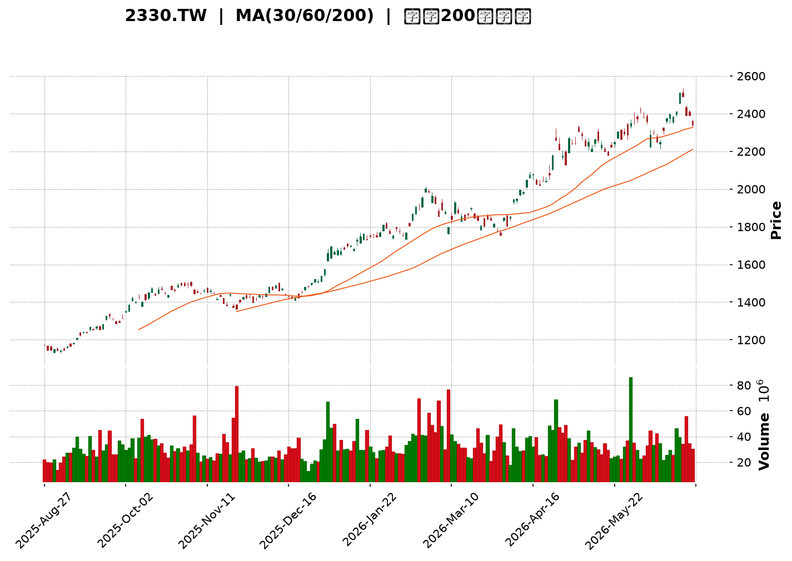
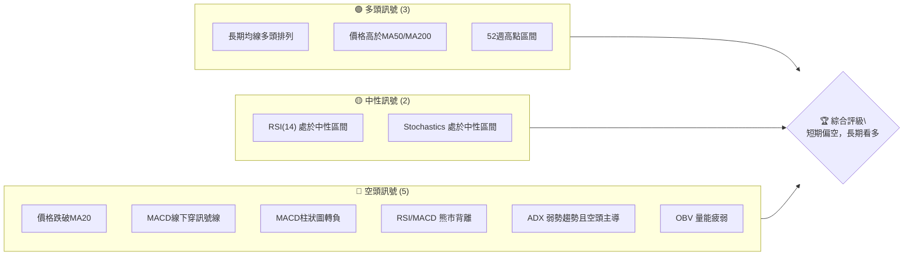
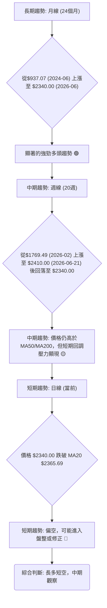
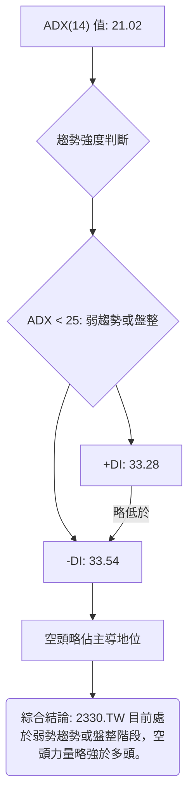
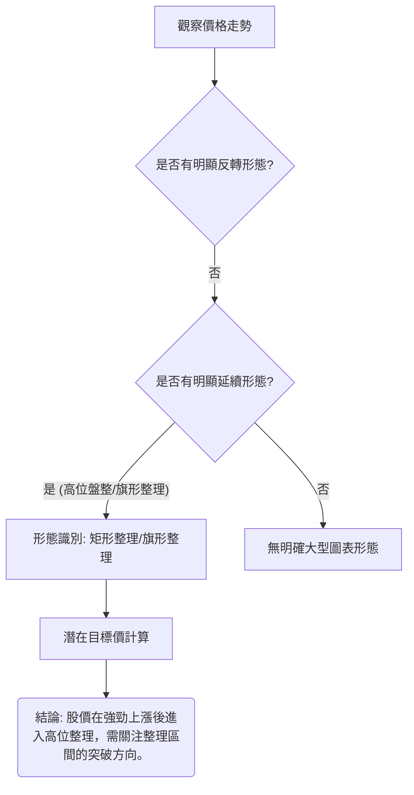
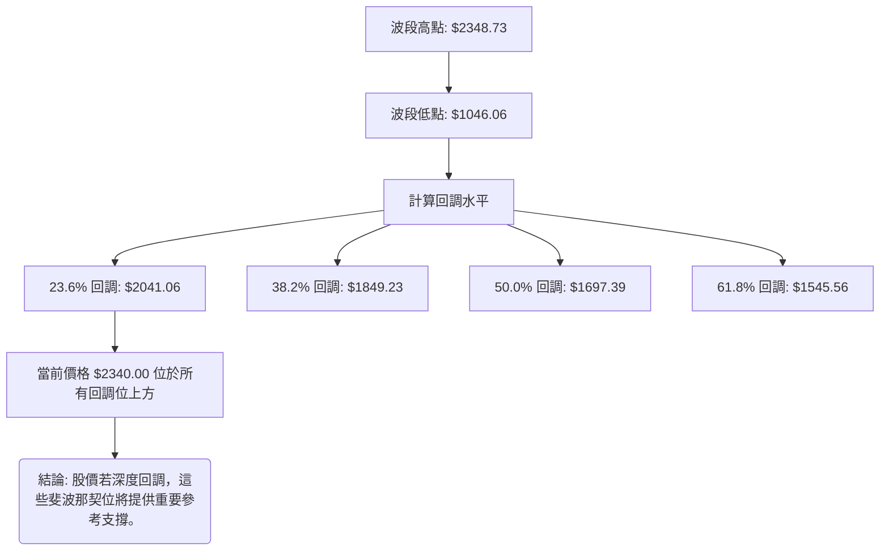
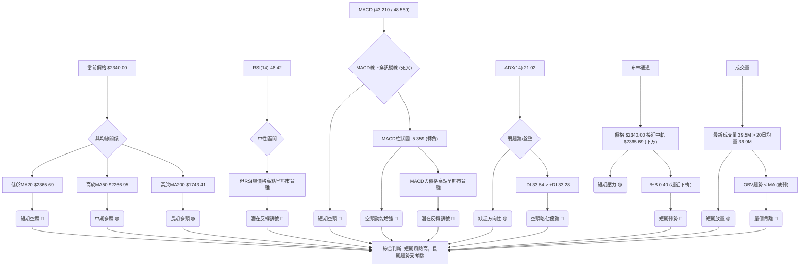
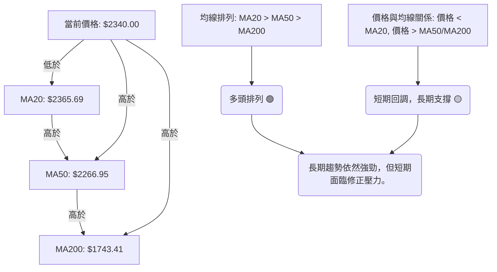
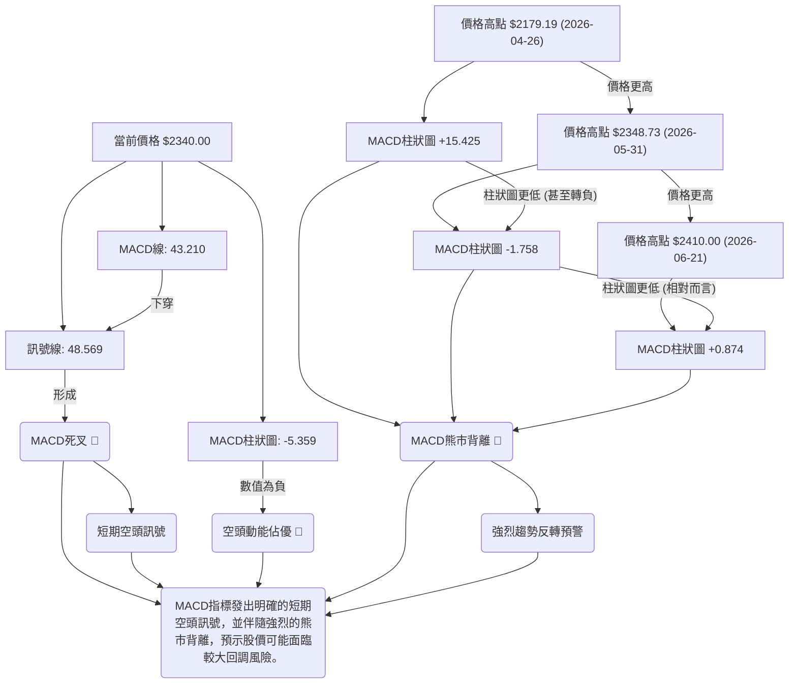

<details>
<summary>📊 靜態圖表 (點擊展開)</summary>

</details>

<html>
<head><meta charset="utf-8" /></head>
<body>
    <div style="height:500px; width:100%;">                        <script>window.PlotlyConfig = {MathJaxConfig: 'local'};</script>
        <script charset="utf-8" src="https://cdn.plot.ly/plotly-3.6.0.min.js" integrity="sha256-QaOVwtVY0T02VaHrr6pnoHLCwayMJp4O5n4YyaE3rJk=" crossorigin="anonymous"></script>                <div id="candlestick-chart" class="plotly-graph-div" style="height:100%; width:100%;"></div>            <script>                window.PLOTLYENV=window.PLOTLYENV || {};                                if (document.getElementById("candlestick-chart")) {                    Plotly.newPlot(                        "candlestick-chart",                        [{"close":{"dtype":"f8","bdata":"AAAA4GJZkkAAAADg9uKRQAAAAOD24pFAAAAAoLP2kUAAAADg9uKRQAAAAOD24pFAAAAA4PbikUAAAACA6TGSQAAAAIDpMZJAAAAAINyAkkAAAABgi+OSQAAAAGDBHpNAAAAAILRtk0AAAABg91mTQAAAAIDc0JNAAAAAAGqVk0AAAACAreSTQAAAAABqlZNAAAAAIE8MlEAAAADgpr6UQAAAAOCmvpRAAAAAYGNvlEAAAADgHyCUQAAAAMDwM5RAAAAAQDSDlEAAAAAguyGVQAAAAEBxrJVAAAAAQCc3lkAAAADg4+eVQAAAACD4SpZAAAAA4OPnlUAAAABghQ+WQAAAAGAMrpZAAAAA4E\u002f9lkAAAADAmXKWQAAAAAB\u002f6ZZAAAAAAH\u002fplkAAAACAO5qWQAAAAMCZcpZAAAAAAH\u002fplkAAAABArtWWQAAAAECTTJdAAAAAQJNMl0AAAABgwjiXQAAAACBkYJdAAAAAQJNMl0AAAACAO5qWQAAAAGAMrpZAAAAAgDualkAAAABArtWWQAAAAGAMrpZAAAAAQK7VlkAAAACAO5qWQAAAAEBWI5ZAAAAA4MhelkAAAAAAQsCVQAAAAGCgmJVAAAAAwGqGlkAAAACA\u002fnCVQAAAAOBcSZVAAAAA4OPnlUAAAAAg+EqWQAAAAEAnN5ZAAAAAIPhKlkAAAAAAE9SVQAAAAEBWI5ZAAAAAwJlylkAAAADgyF6WQAAAAIA7mpZAAAAAoPEkl0AAAAAAf+mWQAAAAECTTJdAAAAAoEjVlkAAAABADP2WQAAAAIDBhZZAAAAAQBxKlkAAAACAOjaWQAAAAIA6NpZAAAAAgDo2lkAAAADAZsGWQAAAAKDPJJdAAAAAgLE4l0AAAADgVnSXQAAAAODdw5dAAAAAQBqcl0AAAAAAZROYQAAAAGCRnphAAAAAgI\u002fwmUAAAADgu3uaQAAAAEBxBJpAAAAA4DQsmkAAAAAAUxiaQAAAAIAWQJpAAAAAwJ2PmkAAAADAnY+aQAAAAIAWQJpAAAAAQOgGm0AAAABAb1abQAAAAKAUkptAAAAAQOgGm0AAAABAb1abQAAAAOAyfptAAAAAoI1Cm0AAAACA9qWbQAAAAKAERZxAAAAAYF8JnEAAAACgFJKbQAAAACBRaptAAAAAgH31m0AAAAAg2LmbQAAAACBRaptAAAAAgPalm0AAAADAIjGcQAAAAOCZM51AAAAAQMa+nUAAAAAAIYOdQAAAAOCXhZ5AAAAAoGlMn0AAAACg4vyeQAAAAIBbrZ5AAAAAQE0OnkAAAACA9PecQAAAAAAhg51AAAAAYF1bnUAAAAAAQR2cQAAAAEBPvJxAAAAAIC8inkAAAACge0edQAAAAID095xAAAAAgG2onEAAAAAAGSSdQAAAAKC5r51AAAAAgE\u002fUnEAAAADAaqycQAAAAIC8NJxAAAAAgLw0nEAAAAAgXcCcQAAAAMBqrJxAAAAAQKFcnEAAAABADr2bQAAAAMBEbZtAAAAA4EHonEAAAACAvDScQAAAAEA0\u002fJxAAAAAAD9jnkAAAABgMXeeQAAAAMC2Kp9AAAAAANICn0AAAACAEAOgQAAAAGDuNKBAAAAAoOc+oEAAAAAAZaKfQAAAAKByjp9AAAAAgC7yn0AAAACALvKfQAAAAGDuNKBAAAAAYF8GoUAAAABg8qWhQAAAAIA2QqFAAAAAIGb8oEAAAACAo6KgQAAAAMDkuaFAAAAA4AaIoUAAAADgBoihQAAAACC1\u002f6FAAAAAYNDXoUAAAABAG2qhQAAAAAAAkqFAAAAAoC9MoUAAAACg66+hQAAAAGDypaFAAAAAgBR0oUAAAAAgRC6hQAAAAGBfBqFAAAAAACJgoUAAAAAAAJKhQAAAACC1\u002f6FAAAAAoOuvoUAAAADAwuuhQAAAAIDJ4aFAAAAAwHdZokAAAADAd1miQAAAAMBVi6JAAAAAYBjlokAAAADgTpWiQAAAACBqbaJAAAAAgMnhoUAAAADgu\u002fWhQAAAAAAAkqFAAAAAAACUoUAAAAAAAAyiQAAAAAAAjqJAAAAAAADAokAAAAAAAKKiQAAAAAAA1KJAAAAAAACco0AAAAAAAHSjQAAAAAAArKJAAAAAAACsokAAAAAAAEiiQA=="},"high":{"dtype":"f8","bdata":"AAAA4GJZkkBY7mkgpkWSQFjuaSCmRZJAAAAAoLP2kUA1wnLTLB6SQAAAAOD24pFANcJy0ywekkAAAACA6TGSQCuChnMfbZJAAAAAINyAkkA01ocGSPeSQKWUUvqzbZNAAAAAILRtk0C9JaEGtG2TQAAAgFyt5JNAiIIruQu9k0AAAACAreSTQFPG7E5++JNAAAAAIE8MlEAAAADgpr6UQB+onHUZ+pRAED74GAWXlECt1Ep1kluUQFVVVVVjb5RAvJV9jkjmlEC8x3v8izWVQAAAAEBxrJVAtkwW+chelkARl5u8tPuVQKuqqrVqhpZAEZebvLT7lUAdYNlmO5qWQAAAAGAMrpZAdbgamfEkl0BfKmhVDK6WQJgin5XxJJdAdYMpcsI4l0A\u002ffvw43cGWQB8OeJxqhpZAdYMpcsI4l0Dyb+nVIBGXQF2\u002f+\u002fg0dJdAC5951QWIl0BnZmau1puXQASyAdkFiJdAun73sdabl0CeO3fOT\u002f2WQIbug\u002fV+6ZZAHz9+XAyulkChSkb5T\u002f2WQA3dB4vxJJdAoUpG+U\u002f9lkA\u002ffvw43cGWQD7T1vj3SpZAMchedTualkCRidEqJzeWQCSPPNLj55VADlCXnDualkC30qzxQcCVQLH2DQtCwJVAIy43mYUPlkAAAAAg+EqWQGyZLLJqhpZAq6qqtWqGlkAQkysIyV6WQD7T1vj3SpZAAAAAwJlylkBm7XS8mXKWQAAAAIA7mpZAAAAAoPEkl0B1gylywjiXQAAAAECTTJdAAAAAkDiIl0CmyGcF7hCXQNDqS0WjmZZAYi60yt9xlkCzpBzQ33GWQJHhXkUcSpZA1WfaWqOZlkC9CD6FSNWWQAAAAKDPJJdAUOZZRZNMl0AAAADgVnSXQAAAAODdw5dAoryGyt3Dl0AAAAAAZROYQAAAAGCRnphAf4vTWvhTmkAAAADgu3uaQGLRsso0LJpAgsU8MNpnmkBVVVUV2meaQGjD58+7e5pAt5LaSmG3mkBbSW2Ff6OaQEWCmgraZ5pAq6qqyqsum0DSRRdV9qWbQAAAAKAUkptAq6qqGlFqm0DpoovKMn6bQFVVVaUUkptAYARGQNi5m0CWrGRF2LmbQAAAAKAERZxAbXZxAKqAnEDHb5d6ffWbQAAAACBRaptAq6qqCkEdnECVcCc1XwmcQHmaC3D2pZtAAAAAgPalm0DHMijVqYCcQAAAAOCZM51A3cuxyonmnUDV77llTQ6eQGfSlWpbrZ5ADOSjKi10n0AIzB7whzifQNUoY5Xi\u002fJ5Ag76gLz3BnkBpDt9v5KqdQJJ2rEC2cZ5Aq6qq6iCDnUAAAAAAQR2cQEa15WpdW51ABb64qvJJnkC8uhVAxr6dQBKxRpV7R51ABQmj5ZkznUBM2AbB\u002fUudQAQCgQCsw51AOQ8dw\u002f1LnUAtZCEDGSSdQG3Hh+CuSJxAaDs+hE\u002fUnEAyOB9jCzidQHvTm6ImEJ1AcAiHoJNwnEAIRSjC1wycQHTRRQPz5JtAAAAA4EHonECukdWlJhCdQAAAAEA0\u002fJxAAAAAAD9jnkAAAABgMXeeQAAAAMC2Kp9AXH97YMQWn0AAAACAEAOgQMVO7CDTXKBA\u002f8FE0OBIoEAvMWuhCQ2gQMIWbHEQA6BAE7UrMfUqoEAPxO8A\u002fCCgQJ3YiXKjoqBAaZxBkFgQoUAY0TbTmSeiQPljSfPdw6FAqzNSQT04oUBUXDKENkKhQOAHfiDXzaFAaEUjoeuvoUB1uf0x182hQB988HGFRaJA9C4eIbX\u002foUA6JQHC5LmhQBTfPfHdw6FAyWfdYBR0oUAAAACg66+hQO+F96KgHaJASZIkQfmboUBRFEURImChQA8OSFE9OKFABYQT8f+RoUAEkz8w+ZuhQAAAACC1\u002f6FANvAZs6AdokCgaKvhmSeiQJ4PLPNwY6JAu3\u002fzgFyBokAvf9oCJtGiQIFcE4E6s6JAQ1qx8AMDo0Byp2gBJtGiQE7w5KEzvaJAxlQ4cacTokDvlbpwpxOiQCQrPLLC66FAAAAAAACooUAAAAAAACqiQAAAAAAAjqJAAAAAAADAokAAAAAAAKKiQAAAAAAA3qJAAAAAAACco0AAAAAAAM6jQAAAAAAAGqNAAAAAAADookAAAAAAAISiQA=="},"hovertemplate":"\u003cb\u003e%{x|%Y-%m-%d}\u003c\u002fb\u003e\u003cbr\u003e\u958b: $%{open:.2f}\u003cbr\u003e\u9ad8: $%{high:.2f}\u003cbr\u003e\u4f4e: $%{low:.2f}\u003cbr\u003e\u6536: $%{close:.2f}\u003cextra\u003e\u003c\u002fextra\u003e","low":{"dtype":"f8","bdata":"09LSkukxkkAAAADg9uKRQAAAAOD24pFAv4KhBcGnkUDuaYQ5Os+RQMs9jezAp5FAAAAA4PbikUA4qfsycAqSQAAAAIDpMZJA7+7u0mJZkkCYU\u002fASErySQNdaa7kEC5NAoyiK0jpGk0BD2l65OkaTQAAAAA6ZgZNAAAAAAGqVk0ByjXINapWTQAAAAABqlZNArRtM0Tqpk0AiPVCRkluUQOFXY0o0g5RAAAAAYGNvlEAbuZEDTwyUQAAAAMDwM5RAAAAAQDSDlECHcAhnGfqUQAAAADi7IZVA74xeqrT7lUDe0cgmQsCVQDmO42ZWI5ZAqgz2kM+ElUCzzZeDtPuVQO6D9XuFD5ZAFo\u002fKbQyulkAAAADAmXKWQK0bTLFqhpZAAAAAAH\u002fplkDgwIGjaoaWQKDVlyonN5ZAAAAAAH\u002fplkCv2lxj3cGWQPVghqogEZdAUiCCY8I4l0AAAABgwjiXQPmb\u002fK0gEZdApEAEh\u002fEkl0DgwIGjaoaWQAAAAGAMrpZA4MCBo2qGlkBftbmGDK6WQAAAAGAMrpZADpAWqjualkAAAACAO5qWQGCWlGOFD5ZAAAAA4MhelkAAAAAAQsCVQAAAAGCgmJVA1g86KvhKlkAAAACA\u002fnCVQAAAAOBcSZVA3tHIJkLAlUBWVVWKhQ+WQKXZdGNWI5ZAHcdxQyc3lkAAAAAAE9SVQMEsKYe0+5VAoNWXKic3lkDON6FKViOWQIIDBw74SpZAhyb5lzualkAAAAAAf+mWQEeBCM5P\u002fZZAq6qq2mbBlkC0bjC1SNWWQC8VtLrfcZZAntFLtVgilkBvHqG6WCKWQE1b4y+V+pVAAAAAgDo2lkCH7oM1o5mWQCH584pI1ZZAXzNM9e0Ql0CTv8mPsTiXQKuqqspWdJdAXkN5tVZ0l0CnAW2aOIiXQIHgMjWD\u002f5dATmu2j589mUD988+fJo2ZQJ0uTbWt3JlA\u002fHSGP+q0mUBVVVUl6rSZQAAAAIAWQJpASW0lNdpnmkBJbSU12meaQLp9ZfVSGJpAAAAAoJ2PmkDSRRfbQsuaQLeWxTroBptAAAAAQOgGm0AXXXS1qy6bQKuqqsqrLptAAAAAoI1Cm0AUoQiljUKbQDD90v+5zZtAmMGXmn31m0AAAACgFJKbQAoymwrKGptAAAAAMNi5m0C2R2yVFJKbQIPMplpvVptAU5vaVOgGm0AAAADAIjGcQOo7G7WLlJxAi9A4FbgfnUAAAAAAIYOdQP3jEivGvp1A5je4iuL8nkAAAACg4vyeQIx4khovIp5AAAAAQE0OnkAAAACA9PecQHRLnDo\u002fb51AVVVV1ZkznUD4rZHVMn6bQFwljSrIbJxA3ixPGrgfnUAAAACge0edQKmiZ6WLlJxAAAAAgG2onECzJ\u002fk+NPycQPT5fH7ic51AAAAAgE\u002fUnEAAAADAaqycQOAaWZ0A0ZtAJ3HwvtcMnEAAAAAgXcCcQAAAAMBqrJxAPt7jvdcMnEAAAABADr2bQAAAAMBEbZtA+pJp\u002fYWEnECUOHgfyiCcQNdaa114mJxAndiJHYP\u002fnUAzdYt9dROeQFK4Hn0Is55A7oGN3vrGnkC\u002fShibm1KfQDuxE58JDaBAB3RjfhADoEAAAAAAZaKfQAAAAKByjp9A+B2IHzzen0DxOxC\u002fScqfQIqd2G4QA6BAaTnmW8xmoEAAAABg8qWhQAAAAIA2QqFAKuZWj3reoEAAAACAo6KgQPzAD7xRGqFATF1ufxR0oUBMXW5\u002fFHShQAAAACC1\u002f6FAT0WabvKloUAAAABAG2qhQNzUw009OKFAKfJZD0QuoUAel74dImChQIQeQs8GiKFAJEmSjjZCoUAAAAAgRC6hQAAAAGBfBqFAAAAAACJgoUDojYLeKFahQOGDD87kuaFAAAAAoOuvoUDLh3Ff0NehQDmrx47rr6FAV6DPzpknokARIMOPfk+iQH+j7P5wY6JAvqVOzyzHokAAAADgTpWiQOMlSo9+T6JAYvDTDCJgoUALnIN\u002fyeGhQAAAAAAAkqFAAAAAAABEoUAAAAAAAOShQAAAAAAAUqJAAAAAAABcokAAAAAAAFyiQAAAAAAAoqJAAAAAAAAuo0AAAAAAAHSjQAAAAAAArKJAAAAAAACsokAAAAAAACqiQA=="},"name":"\u50f9\u683c","open":{"dtype":"f8","bdata":"AAAA4GJZkkBY7mkgpkWSQEdY7nnpMZJADyI5rH27kUAjLPcscAqSQO5phDk6z5FAIyz3LHAKkkCc1H3ZLB6SQCuChnMfbZJAd3d3eR9tkkDMKXi5zs+SQHzvvVP3WZNAURRFefdZk0C9JaEGtG2TQAAAgOpplZNARMGV3Dqpk0C5RrnGC72TQA8FV3Kt5JNArRtM0Tqpk0CCytltY2+UQL8aE5lI5pRAAAAAYGNvlEDJjdyYwUeUQBzHcZzBR5RAAAAAQDSDlEBDOIRD6g2VQAAAADi7IZVA74xeqrT7lUDvaGQDE9SVQAAAACD4SpZAqgz2kM+ElUDQLXGKaoaWQPMi+DQnN5ZAFo\u002fKbQyulkAfDnicaoaWQIp81o07mpZA3WCK3E\u002f9lkAAAACAO5qWQMDjDwf4SpZAdYMpcsI4l0BRJaMcf+mWQKRABIfxJJdAXb\u002f7+DR0l0DXo3D1NHSXQAAAACBkYJdAC5951QWIl0B+\u002fPjxfumWQIJPgTzdwZZAAAAAgDualkCv2lxj3cGWQIuNhq4gEZdAr9pcY93BlkAAAACAO5qWQGCWlGOFD5ZAZu10vJlylkCRidEqJzeWQMkjjzxxrJVA8q9o45lylkBbadY4oJiVQOmiiy5xrJVAIy43mYUPlkA5juNmViOWQBFzodWZcpZAAAAAIPhKlkAQkysIyV6WQAAAAEBWI5ZAwOMPB\u002fhKlkAAAADgyF6WQKFCherIXpZAK2qMdAyulkCYIp+V8SSXQPVghqogEZdAq6qqylZ0l0BaN5h6KumWQAAAAIDBhZZAAAAAQBxKlkCR4V5FHEqWQN48QvV2DpZA1WfaWqOZlkAAAADAZsGWQNn6NlAq6ZZAAAAAgLE4l0AxlZgadWCXQAAAAJA4iJdAr6G8ejiIl0D9JctfGpyXQGEo5r9GJ5hAm+0TVYFRmUD988+fJo2ZQJ0uTbWt3JlAKAzwBMzImUAAAACwrdyZQEWCmgraZ5pAt5LaSmG3mkCltpL6u3uaQN2+sro0LJpAq6qqegbzmkDSRRfbQsuaQLeWxTroBptAVVVVBcoam0B00UUFUWqbQAAAAOAyfptAdQHCKlFqm0CqTW1qb1abQDD90v+5zZtABjgJO8hsnEBEdvTvuc2bQIhl9M+rLptAq6qqCkEdnEAAAAAg2LmbQAAAACBRaptA6Uc\u002fGsoam0AVJt4PyGycQG3Ud3ptqJxAeraR2pkznUAAAAAAIYOdQP3jEivGvp1A5je4iuL8nkBYmV9lxBCfQIx4khovIp5A1z4LpXmZnkCbCeofP2+dQGGkHSsvIp5AVVVV1ZkznUA5eN+aFJKbQKPaclXWC51A4+oHpXtHnUBe3QrwIIOdQKmiZ6WLlJxABJpCILgfnUAmbINgCzidQPz9fj\u002fHm51AWjeYYgs4nUDJQhZCNPycQE3i4P3y5JtAaDs+hE\u002fUnEAh0BSiJhCdQGQhC4FP1JxAruZqHsognEAAAABADr2bQLroouEbqZtAY4tyvmqsnECukdWlJhCdQPC9935P1JxAXuiF3mcnnkBHlQSfTE+eQJqZmd36xp5ApYCEn9\u002funkCq0KP7jWafQOzETs8CF6BAAT67b+40oED8qC5xEAOgQOtceQBlop9AAAAAgC7yn0D4HYgfPN6fQGIndsDgSKBA0tUnjMVwoEB84b3w3cOhQIdVhKENfqFADqLH72zyoEDKEKwjRC6hQOzETuxKJKFAAAAA4AaIoUAAAADgBoihQM2hYhGTMaJAehePwMLroUDr24Bh8qWhQPCzAT8baqFAKfJZD0QuoUCPS9\u002feBoihQHOkORK1\u002f6FASZIk7yhWoUAxDMOwL0yhQKZxBiFELqFAzzRuYBR0oUD42YCfDX6hQOGDD87kuaFAGsPRgqcTokA2eI4gtf+hQOggr5J+T6JANGBJL4w7okAAAADAd1miQECuiSBIn6JAAAAAYBjlokAAAADgTpWiQDu0a0FBqaJAYvDTDCJgoUAAAADgu\u002fWhQBhyfSHXzaFAAAAAAACAoUAAAAAAACqiQAAAAAAAcKJAAAAAAACOokAAAAAAAGaiQAAAAAAAtqJAAAAAAAAuo0AAAAAAAJyjQAAAAAAABqNAAAAAAADUokAAAAAAAHCiQA=="},"x":["2025-08-27T00:00:00+08:00","2025-08-28T00:00:00+08:00","2025-08-29T00:00:00+08:00","2025-09-01T00:00:00+08:00","2025-09-02T00:00:00+08:00","2025-09-03T00:00:00+08:00","2025-09-04T00:00:00+08:00","2025-09-05T00:00:00+08:00","2025-09-08T00:00:00+08:00","2025-09-09T00:00:00+08:00","2025-09-10T00:00:00+08:00","2025-09-11T00:00:00+08:00","2025-09-12T00:00:00+08:00","2025-09-15T00:00:00+08:00","2025-09-16T00:00:00+08:00","2025-09-17T00:00:00+08:00","2025-09-18T00:00:00+08:00","2025-09-19T00:00:00+08:00","2025-09-22T00:00:00+08:00","2025-09-23T00:00:00+08:00","2025-09-24T00:00:00+08:00","2025-09-25T00:00:00+08:00","2025-09-26T00:00:00+08:00","2025-09-30T00:00:00+08:00","2025-10-01T00:00:00+08:00","2025-10-02T00:00:00+08:00","2025-10-03T00:00:00+08:00","2025-10-07T00:00:00+08:00","2025-10-08T00:00:00+08:00","2025-10-09T00:00:00+08:00","2025-10-13T00:00:00+08:00","2025-10-14T00:00:00+08:00","2025-10-15T00:00:00+08:00","2025-10-16T00:00:00+08:00","2025-10-17T00:00:00+08:00","2025-10-20T00:00:00+08:00","2025-10-21T00:00:00+08:00","2025-10-22T00:00:00+08:00","2025-10-23T00:00:00+08:00","2025-10-27T00:00:00+08:00","2025-10-28T00:00:00+08:00","2025-10-29T00:00:00+08:00","2025-10-30T00:00:00+08:00","2025-10-31T00:00:00+08:00","2025-11-03T00:00:00+08:00","2025-11-04T00:00:00+08:00","2025-11-05T00:00:00+08:00","2025-11-06T00:00:00+08:00","2025-11-07T00:00:00+08:00","2025-11-10T00:00:00+08:00","2025-11-11T00:00:00+08:00","2025-11-12T00:00:00+08:00","2025-11-13T00:00:00+08:00","2025-11-14T00:00:00+08:00","2025-11-17T00:00:00+08:00","2025-11-18T00:00:00+08:00","2025-11-19T00:00:00+08:00","2025-11-20T00:00:00+08:00","2025-11-21T00:00:00+08:00","2025-11-24T00:00:00+08:00","2025-11-25T00:00:00+08:00","2025-11-26T00:00:00+08:00","2025-11-27T00:00:00+08:00","2025-11-28T00:00:00+08:00","2025-12-01T00:00:00+08:00","2025-12-02T00:00:00+08:00","2025-12-03T00:00:00+08:00","2025-12-04T00:00:00+08:00","2025-12-05T00:00:00+08:00","2025-12-08T00:00:00+08:00","2025-12-09T00:00:00+08:00","2025-12-10T00:00:00+08:00","2025-12-11T00:00:00+08:00","2025-12-12T00:00:00+08:00","2025-12-15T00:00:00+08:00","2025-12-16T00:00:00+08:00","2025-12-17T00:00:00+08:00","2025-12-18T00:00:00+08:00","2025-12-19T00:00:00+08:00","2025-12-22T00:00:00+08:00","2025-12-23T00:00:00+08:00","2025-12-24T00:00:00+08:00","2025-12-26T00:00:00+08:00","2025-12-29T00:00:00+08:00","2025-12-30T00:00:00+08:00","2025-12-31T00:00:00+08:00","2026-01-02T00:00:00+08:00","2026-01-05T00:00:00+08:00","2026-01-06T00:00:00+08:00","2026-01-07T00:00:00+08:00","2026-01-08T00:00:00+08:00","2026-01-09T00:00:00+08:00","2026-01-12T00:00:00+08:00","2026-01-13T00:00:00+08:00","2026-01-14T00:00:00+08:00","2026-01-15T00:00:00+08:00","2026-01-16T00:00:00+08:00","2026-01-19T00:00:00+08:00","2026-01-20T00:00:00+08:00","2026-01-21T00:00:00+08:00","2026-01-22T00:00:00+08:00","2026-01-23T00:00:00+08:00","2026-01-26T00:00:00+08:00","2026-01-27T00:00:00+08:00","2026-01-28T00:00:00+08:00","2026-01-29T00:00:00+08:00","2026-01-30T00:00:00+08:00","2026-02-02T00:00:00+08:00","2026-02-03T00:00:00+08:00","2026-02-04T00:00:00+08:00","2026-02-05T00:00:00+08:00","2026-02-06T00:00:00+08:00","2026-02-09T00:00:00+08:00","2026-02-10T00:00:00+08:00","2026-02-11T00:00:00+08:00","2026-02-23T00:00:00+08:00","2026-02-24T00:00:00+08:00","2026-02-25T00:00:00+08:00","2026-02-26T00:00:00+08:00","2026-03-02T00:00:00+08:00","2026-03-03T00:00:00+08:00","2026-03-04T00:00:00+08:00","2026-03-05T00:00:00+08:00","2026-03-06T00:00:00+08:00","2026-03-09T00:00:00+08:00","2026-03-10T00:00:00+08:00","2026-03-11T00:00:00+08:00","2026-03-12T00:00:00+08:00","2026-03-13T00:00:00+08:00","2026-03-16T00:00:00+08:00","2026-03-17T00:00:00+08:00","2026-03-18T00:00:00+08:00","2026-03-19T00:00:00+08:00","2026-03-20T00:00:00+08:00","2026-03-23T00:00:00+08:00","2026-03-24T00:00:00+08:00","2026-03-25T00:00:00+08:00","2026-03-26T00:00:00+08:00","2026-03-27T00:00:00+08:00","2026-03-30T00:00:00+08:00","2026-03-31T00:00:00+08:00","2026-04-01T00:00:00+08:00","2026-04-02T00:00:00+08:00","2026-04-07T00:00:00+08:00","2026-04-08T00:00:00+08:00","2026-04-09T00:00:00+08:00","2026-04-10T00:00:00+08:00","2026-04-13T00:00:00+08:00","2026-04-14T00:00:00+08:00","2026-04-15T00:00:00+08:00","2026-04-16T00:00:00+08:00","2026-04-17T00:00:00+08:00","2026-04-20T00:00:00+08:00","2026-04-21T00:00:00+08:00","2026-04-22T00:00:00+08:00","2026-04-23T00:00:00+08:00","2026-04-24T00:00:00+08:00","2026-04-27T00:00:00+08:00","2026-04-28T00:00:00+08:00","2026-04-29T00:00:00+08:00","2026-04-30T00:00:00+08:00","2026-05-04T00:00:00+08:00","2026-05-05T00:00:00+08:00","2026-05-06T00:00:00+08:00","2026-05-07T00:00:00+08:00","2026-05-08T00:00:00+08:00","2026-05-11T00:00:00+08:00","2026-05-12T00:00:00+08:00","2026-05-13T00:00:00+08:00","2026-05-14T00:00:00+08:00","2026-05-15T00:00:00+08:00","2026-05-18T00:00:00+08:00","2026-05-19T00:00:00+08:00","2026-05-20T00:00:00+08:00","2026-05-21T00:00:00+08:00","2026-05-22T00:00:00+08:00","2026-05-25T00:00:00+08:00","2026-05-26T00:00:00+08:00","2026-05-27T00:00:00+08:00","2026-05-28T00:00:00+08:00","2026-05-29T00:00:00+08:00","2026-06-01T00:00:00+08:00","2026-06-02T00:00:00+08:00","2026-06-03T00:00:00+08:00","2026-06-04T00:00:00+08:00","2026-06-05T00:00:00+08:00","2026-06-08T00:00:00+08:00","2026-06-09T00:00:00+08:00","2026-06-10T00:00:00+08:00","2026-06-11T00:00:00+08:00","2026-06-12T00:00:00+08:00","2026-06-15T00:00:00+08:00","2026-06-16T00:00:00+08:00","2026-06-17T00:00:00+08:00","2026-06-18T00:00:00+08:00","2026-06-22T00:00:00+08:00","2026-06-23T00:00:00+08:00","2026-06-24T00:00:00+08:00","2026-06-25T00:00:00+08:00","2026-06-26T00:00:00+08:00"],"type":"candlestick"},{"hovertemplate":"MA30: $%{y:.2f}\u003cextra\u003e\u003c\u002fextra\u003e","line":{"color":"#2196F3","dash":"dash","width":2},"mode":"lines","name":"MA30","x":["2025-08-27T00:00:00+08:00","2025-08-28T00:00:00+08:00","2025-08-29T00:00:00+08:00","2025-09-01T00:00:00+08:00","2025-09-02T00:00:00+08:00","2025-09-03T00:00:00+08:00","2025-09-04T00:00:00+08:00","2025-09-05T00:00:00+08:00","2025-09-08T00:00:00+08:00","2025-09-09T00:00:00+08:00","2025-09-10T00:00:00+08:00","2025-09-11T00:00:00+08:00","2025-09-12T00:00:00+08:00","2025-09-15T00:00:00+08:00","2025-09-16T00:00:00+08:00","2025-09-17T00:00:00+08:00","2025-09-18T00:00:00+08:00","2025-09-19T00:00:00+08:00","2025-09-22T00:00:00+08:00","2025-09-23T00:00:00+08:00","2025-09-24T00:00:00+08:00","2025-09-25T00:00:00+08:00","2025-09-26T00:00:00+08:00","2025-09-30T00:00:00+08:00","2025-10-01T00:00:00+08:00","2025-10-02T00:00:00+08:00","2025-10-03T00:00:00+08:00","2025-10-07T00:00:00+08:00","2025-10-08T00:00:00+08:00","2025-10-09T00:00:00+08:00","2025-10-13T00:00:00+08:00","2025-10-14T00:00:00+08:00","2025-10-15T00:00:00+08:00","2025-10-16T00:00:00+08:00","2025-10-17T00:00:00+08:00","2025-10-20T00:00:00+08:00","2025-10-21T00:00:00+08:00","2025-10-22T00:00:00+08:00","2025-10-23T00:00:00+08:00","2025-10-27T00:00:00+08:00","2025-10-28T00:00:00+08:00","2025-10-29T00:00:00+08:00","2025-10-30T00:00:00+08:00","2025-10-31T00:00:00+08:00","2025-11-03T00:00:00+08:00","2025-11-04T00:00:00+08:00","2025-11-05T00:00:00+08:00","2025-11-06T00:00:00+08:00","2025-11-07T00:00:00+08:00","2025-11-10T00:00:00+08:00","2025-11-11T00:00:00+08:00","2025-11-12T00:00:00+08:00","2025-11-13T00:00:00+08:00","2025-11-14T00:00:00+08:00","2025-11-17T00:00:00+08:00","2025-11-18T00:00:00+08:00","2025-11-19T00:00:00+08:00","2025-11-20T00:00:00+08:00","2025-11-21T00:00:00+08:00","2025-11-24T00:00:00+08:00","2025-11-25T00:00:00+08:00","2025-11-26T00:00:00+08:00","2025-11-27T00:00:00+08:00","2025-11-28T00:00:00+08:00","2025-12-01T00:00:00+08:00","2025-12-02T00:00:00+08:00","2025-12-03T00:00:00+08:00","2025-12-04T00:00:00+08:00","2025-12-05T00:00:00+08:00","2025-12-08T00:00:00+08:00","2025-12-09T00:00:00+08:00","2025-12-10T00:00:00+08:00","2025-12-11T00:00:00+08:00","2025-12-12T00:00:00+08:00","2025-12-15T00:00:00+08:00","2025-12-16T00:00:00+08:00","2025-12-17T00:00:00+08:00","2025-12-18T00:00:00+08:00","2025-12-19T00:00:00+08:00","2025-12-22T00:00:00+08:00","2025-12-23T00:00:00+08:00","2025-12-24T00:00:00+08:00","2025-12-26T00:00:00+08:00","2025-12-29T00:00:00+08:00","2025-12-30T00:00:00+08:00","2025-12-31T00:00:00+08:00","2026-01-02T00:00:00+08:00","2026-01-05T00:00:00+08:00","2026-01-06T00:00:00+08:00","2026-01-07T00:00:00+08:00","2026-01-08T00:00:00+08:00","2026-01-09T00:00:00+08:00","2026-01-12T00:00:00+08:00","2026-01-13T00:00:00+08:00","2026-01-14T00:00:00+08:00","2026-01-15T00:00:00+08:00","2026-01-16T00:00:00+08:00","2026-01-19T00:00:00+08:00","2026-01-20T00:00:00+08:00","2026-01-21T00:00:00+08:00","2026-01-22T00:00:00+08:00","2026-01-23T00:00:00+08:00","2026-01-26T00:00:00+08:00","2026-01-27T00:00:00+08:00","2026-01-28T00:00:00+08:00","2026-01-29T00:00:00+08:00","2026-01-30T00:00:00+08:00","2026-02-02T00:00:00+08:00","2026-02-03T00:00:00+08:00","2026-02-04T00:00:00+08:00","2026-02-05T00:00:00+08:00","2026-02-06T00:00:00+08:00","2026-02-09T00:00:00+08:00","2026-02-10T00:00:00+08:00","2026-02-11T00:00:00+08:00","2026-02-23T00:00:00+08:00","2026-02-24T00:00:00+08:00","2026-02-25T00:00:00+08:00","2026-02-26T00:00:00+08:00","2026-03-02T00:00:00+08:00","2026-03-03T00:00:00+08:00","2026-03-04T00:00:00+08:00","2026-03-05T00:00:00+08:00","2026-03-06T00:00:00+08:00","2026-03-09T00:00:00+08:00","2026-03-10T00:00:00+08:00","2026-03-11T00:00:00+08:00","2026-03-12T00:00:00+08:00","2026-03-13T00:00:00+08:00","2026-03-16T00:00:00+08:00","2026-03-17T00:00:00+08:00","2026-03-18T00:00:00+08:00","2026-03-19T00:00:00+08:00","2026-03-20T00:00:00+08:00","2026-03-23T00:00:00+08:00","2026-03-24T00:00:00+08:00","2026-03-25T00:00:00+08:00","2026-03-26T00:00:00+08:00","2026-03-27T00:00:00+08:00","2026-03-30T00:00:00+08:00","2026-03-31T00:00:00+08:00","2026-04-01T00:00:00+08:00","2026-04-02T00:00:00+08:00","2026-04-07T00:00:00+08:00","2026-04-08T00:00:00+08:00","2026-04-09T00:00:00+08:00","2026-04-10T00:00:00+08:00","2026-04-13T00:00:00+08:00","2026-04-14T00:00:00+08:00","2026-04-15T00:00:00+08:00","2026-04-16T00:00:00+08:00","2026-04-17T00:00:00+08:00","2026-04-20T00:00:00+08:00","2026-04-21T00:00:00+08:00","2026-04-22T00:00:00+08:00","2026-04-23T00:00:00+08:00","2026-04-24T00:00:00+08:00","2026-04-27T00:00:00+08:00","2026-04-28T00:00:00+08:00","2026-04-29T00:00:00+08:00","2026-04-30T00:00:00+08:00","2026-05-04T00:00:00+08:00","2026-05-05T00:00:00+08:00","2026-05-06T00:00:00+08:00","2026-05-07T00:00:00+08:00","2026-05-08T00:00:00+08:00","2026-05-11T00:00:00+08:00","2026-05-12T00:00:00+08:00","2026-05-13T00:00:00+08:00","2026-05-14T00:00:00+08:00","2026-05-15T00:00:00+08:00","2026-05-18T00:00:00+08:00","2026-05-19T00:00:00+08:00","2026-05-20T00:00:00+08:00","2026-05-21T00:00:00+08:00","2026-05-22T00:00:00+08:00","2026-05-25T00:00:00+08:00","2026-05-26T00:00:00+08:00","2026-05-27T00:00:00+08:00","2026-05-28T00:00:00+08:00","2026-05-29T00:00:00+08:00","2026-06-01T00:00:00+08:00","2026-06-02T00:00:00+08:00","2026-06-03T00:00:00+08:00","2026-06-04T00:00:00+08:00","2026-06-05T00:00:00+08:00","2026-06-08T00:00:00+08:00","2026-06-09T00:00:00+08:00","2026-06-10T00:00:00+08:00","2026-06-11T00:00:00+08:00","2026-06-12T00:00:00+08:00","2026-06-15T00:00:00+08:00","2026-06-16T00:00:00+08:00","2026-06-17T00:00:00+08:00","2026-06-18T00:00:00+08:00","2026-06-22T00:00:00+08:00","2026-06-23T00:00:00+08:00","2026-06-24T00:00:00+08:00","2026-06-25T00:00:00+08:00","2026-06-26T00:00:00+08:00"],"y":{"dtype":"f8","bdata":"AAAAAAAA+H8AAAAAAAD4fwAAAAAAAPh\u002fAAAAAAAA+H8AAAAAAAD4fwAAAAAAAPh\u002fAAAAAAAA+H8AAAAAAAD4fwAAAAAAAPh\u002fAAAAAAAA+H8AAAAAAAD4fwAAAAAAAPh\u002fAAAAAAAA+H8AAAAAAAD4fwAAAAAAAPh\u002fAAAAAAAA+H8AAAAAAAD4fwAAAAAAAPh\u002fAAAAAAAA+H8AAAAAAAD4fwAAAAAAAPh\u002fAAAAAAAA+H8AAAAAAAD4fwAAAAAAAPh\u002fAAAAAAAA+H8AAAAAAAD4fwAAAAAAAPh\u002fAAAAAAAA+H8AAAAAAAD4f0RERMR6nJNAZmZmZtS6k0AAAADAct6TQN7d3d1ZB5RAERER8TwylEBVVVXFKFmUQM3MzCwLhJRARERElO2ulECamZnpidSUQN7d3Q3U+JRAVVVVFXMelUCamZnpHkCVQKuqqgrIY5VAq6qqes+ElUDv7u4+1qWVQCIiIqI4xJVAVVVVNe3jlUCrqqqKC\u002fuVQKuqqlp3FZZAAAAAgEMrlkBEREQUGT2WQGZmZnacTZZAzczMbBZilkCrqqp6OXeWQM3MzNy8h5ZAZmZmJpeXlkCamZnp35yWQBEREdE2nJZAMzMzM9uelkDv7u6e5JqWQBEREWFOkpZAERERYU6SlkC8u7urSZSWQJqZmRlTkJZA3t3dPWGKlkC8u7t7GIWWQGZmZoZ9fpZAMzMz84Z6lkCamZmpi3iWQKuqqtrdeZZAREREJNl7lkC8u7s7gnyWQLy7uzuCfJZAd3d3R4h4lkDe3d29inaWQN7d3Q1Bb5ZAzczMfKNmlkDv7u4eTmOWQImIiKhPX5ZAq6qqSvpblkDe3d09TVuWQO\u002fu7q5CX5ZAd3d3l49ilkBVVVXF1GmWQImIiCi3d5ZAAAAA8EqClkAAAABwIZaWQM3MzLztr5ZAiYiIGBHNlkCJiIhoF\u002fiWQERERPR1IJdA3t3dDd9El0BEREQEUWWXQERERGS\u002fh5dAAAAAUCusl0De3d3NjdSXQHd3d0el95dAZmZm9rgemEAAAABgHEmYQKuqqnqBc5hAzczMTKOUmECrqqoKZ7qYQBEREaEw3phAIiIiMvcDmUDNzMy8uiuZQCIiIoLFXJlAd3d3R9CNmUAAAADAiruZQHd3d+fx55lAvLu7q\u002fwYmkCamZnZZkOaQJqZmRnaZ5pAq6qqqqCNmkDNzMzcDbaaQO\u002fu7v5x5JpAAAAAEM0Ym0AiIiIyMUebQHd3d0ePeZtAAAAAwEmnm0CamZn5uc2bQERERIR99ZtAZmZmdqAWnECJiIjYJS+cQHd3d4f7SpxAAAAAQNdinEDNzMxsGHCcQERERIRNhZxAERER4c+fnEC8u7tbYbCcQImIiDhPvJxAAAAAEDrKnEBmZmaWndmcQHd3d0dV7JxAvLu7m7n5nEB3d3c3eQKdQHd3d0fuAZ1AERERUWADnUDNzMzMcw2dQDMzM2MwGJ1AMzMzg6AbnUCrqqrquxudQKuqqhrVG51AmpmZWZMmnUAzMzMTsiadQKuqqlrZJJ1AiYiI2FQqnUBmZmaGdzKdQN7d3Y34N51AERERkYQ1nUCrqqr6Wz6dQGZmZhYtTZ1AAAAAsPVhnUC8u7srtXidQDMzM9Mmip1AzczM3D6gnUAiIiJy8cCdQHd3dwdU4J1Ad3d3N78BnkDe3d0NGDWeQHd3d2dxZJ5AVVVV5cmRnkCamZkpB7WeQEREROQ65p5AZmZm5msbn0BVVVVV8VGfQHd3d5dulJ9AAAAAAEPUn0AiIiLKDwSgQERERJynH6BAREREHEA6oEDv7u6G1FqgQKuqqkJofKBAIiIicgGWoEB3d3fXRLCgQAAAAMDgxaBAMzMzs37YoEC8u7sTceygQDMzM6sNAaFAd3d3n6sToUDNzMzU9SOhQO\u002fu7mZBMqFAvLu7IzVEoUBEREQM0VmhQImIiJhrcaFAERERkVqKoUAAAACwoKChQO\u002fu7r6Ts6FAVVVVFeS6oUDv7u7ujL2hQImIiMg1wKFAIiIickPFoUAAAAAQT9GhQJqZmQlh2KFAVVVVNcfioUARERFhLeyhQBEREfFA86FAiYiImFMCokBmZmYWuROiQM3MzHwfHaJAIiIiotkookARERFh6y2iQA=="},"type":"scatter"},{"hovertemplate":"MA60: $%{y:.2f}\u003cextra\u003e\u003c\u002fextra\u003e","line":{"color":"#9C27B0","dash":"dash","width":2},"mode":"lines","name":"MA60","x":["2025-08-27T00:00:00+08:00","2025-08-28T00:00:00+08:00","2025-08-29T00:00:00+08:00","2025-09-01T00:00:00+08:00","2025-09-02T00:00:00+08:00","2025-09-03T00:00:00+08:00","2025-09-04T00:00:00+08:00","2025-09-05T00:00:00+08:00","2025-09-08T00:00:00+08:00","2025-09-09T00:00:00+08:00","2025-09-10T00:00:00+08:00","2025-09-11T00:00:00+08:00","2025-09-12T00:00:00+08:00","2025-09-15T00:00:00+08:00","2025-09-16T00:00:00+08:00","2025-09-17T00:00:00+08:00","2025-09-18T00:00:00+08:00","2025-09-19T00:00:00+08:00","2025-09-22T00:00:00+08:00","2025-09-23T00:00:00+08:00","2025-09-24T00:00:00+08:00","2025-09-25T00:00:00+08:00","2025-09-26T00:00:00+08:00","2025-09-30T00:00:00+08:00","2025-10-01T00:00:00+08:00","2025-10-02T00:00:00+08:00","2025-10-03T00:00:00+08:00","2025-10-07T00:00:00+08:00","2025-10-08T00:00:00+08:00","2025-10-09T00:00:00+08:00","2025-10-13T00:00:00+08:00","2025-10-14T00:00:00+08:00","2025-10-15T00:00:00+08:00","2025-10-16T00:00:00+08:00","2025-10-17T00:00:00+08:00","2025-10-20T00:00:00+08:00","2025-10-21T00:00:00+08:00","2025-10-22T00:00:00+08:00","2025-10-23T00:00:00+08:00","2025-10-27T00:00:00+08:00","2025-10-28T00:00:00+08:00","2025-10-29T00:00:00+08:00","2025-10-30T00:00:00+08:00","2025-10-31T00:00:00+08:00","2025-11-03T00:00:00+08:00","2025-11-04T00:00:00+08:00","2025-11-05T00:00:00+08:00","2025-11-06T00:00:00+08:00","2025-11-07T00:00:00+08:00","2025-11-10T00:00:00+08:00","2025-11-11T00:00:00+08:00","2025-11-12T00:00:00+08:00","2025-11-13T00:00:00+08:00","2025-11-14T00:00:00+08:00","2025-11-17T00:00:00+08:00","2025-11-18T00:00:00+08:00","2025-11-19T00:00:00+08:00","2025-11-20T00:00:00+08:00","2025-11-21T00:00:00+08:00","2025-11-24T00:00:00+08:00","2025-11-25T00:00:00+08:00","2025-11-26T00:00:00+08:00","2025-11-27T00:00:00+08:00","2025-11-28T00:00:00+08:00","2025-12-01T00:00:00+08:00","2025-12-02T00:00:00+08:00","2025-12-03T00:00:00+08:00","2025-12-04T00:00:00+08:00","2025-12-05T00:00:00+08:00","2025-12-08T00:00:00+08:00","2025-12-09T00:00:00+08:00","2025-12-10T00:00:00+08:00","2025-12-11T00:00:00+08:00","2025-12-12T00:00:00+08:00","2025-12-15T00:00:00+08:00","2025-12-16T00:00:00+08:00","2025-12-17T00:00:00+08:00","2025-12-18T00:00:00+08:00","2025-12-19T00:00:00+08:00","2025-12-22T00:00:00+08:00","2025-12-23T00:00:00+08:00","2025-12-24T00:00:00+08:00","2025-12-26T00:00:00+08:00","2025-12-29T00:00:00+08:00","2025-12-30T00:00:00+08:00","2025-12-31T00:00:00+08:00","2026-01-02T00:00:00+08:00","2026-01-05T00:00:00+08:00","2026-01-06T00:00:00+08:00","2026-01-07T00:00:00+08:00","2026-01-08T00:00:00+08:00","2026-01-09T00:00:00+08:00","2026-01-12T00:00:00+08:00","2026-01-13T00:00:00+08:00","2026-01-14T00:00:00+08:00","2026-01-15T00:00:00+08:00","2026-01-16T00:00:00+08:00","2026-01-19T00:00:00+08:00","2026-01-20T00:00:00+08:00","2026-01-21T00:00:00+08:00","2026-01-22T00:00:00+08:00","2026-01-23T00:00:00+08:00","2026-01-26T00:00:00+08:00","2026-01-27T00:00:00+08:00","2026-01-28T00:00:00+08:00","2026-01-29T00:00:00+08:00","2026-01-30T00:00:00+08:00","2026-02-02T00:00:00+08:00","2026-02-03T00:00:00+08:00","2026-02-04T00:00:00+08:00","2026-02-05T00:00:00+08:00","2026-02-06T00:00:00+08:00","2026-02-09T00:00:00+08:00","2026-02-10T00:00:00+08:00","2026-02-11T00:00:00+08:00","2026-02-23T00:00:00+08:00","2026-02-24T00:00:00+08:00","2026-02-25T00:00:00+08:00","2026-02-26T00:00:00+08:00","2026-03-02T00:00:00+08:00","2026-03-03T00:00:00+08:00","2026-03-04T00:00:00+08:00","2026-03-05T00:00:00+08:00","2026-03-06T00:00:00+08:00","2026-03-09T00:00:00+08:00","2026-03-10T00:00:00+08:00","2026-03-11T00:00:00+08:00","2026-03-12T00:00:00+08:00","2026-03-13T00:00:00+08:00","2026-03-16T00:00:00+08:00","2026-03-17T00:00:00+08:00","2026-03-18T00:00:00+08:00","2026-03-19T00:00:00+08:00","2026-03-20T00:00:00+08:00","2026-03-23T00:00:00+08:00","2026-03-24T00:00:00+08:00","2026-03-25T00:00:00+08:00","2026-03-26T00:00:00+08:00","2026-03-27T00:00:00+08:00","2026-03-30T00:00:00+08:00","2026-03-31T00:00:00+08:00","2026-04-01T00:00:00+08:00","2026-04-02T00:00:00+08:00","2026-04-07T00:00:00+08:00","2026-04-08T00:00:00+08:00","2026-04-09T00:00:00+08:00","2026-04-10T00:00:00+08:00","2026-04-13T00:00:00+08:00","2026-04-14T00:00:00+08:00","2026-04-15T00:00:00+08:00","2026-04-16T00:00:00+08:00","2026-04-17T00:00:00+08:00","2026-04-20T00:00:00+08:00","2026-04-21T00:00:00+08:00","2026-04-22T00:00:00+08:00","2026-04-23T00:00:00+08:00","2026-04-24T00:00:00+08:00","2026-04-27T00:00:00+08:00","2026-04-28T00:00:00+08:00","2026-04-29T00:00:00+08:00","2026-04-30T00:00:00+08:00","2026-05-04T00:00:00+08:00","2026-05-05T00:00:00+08:00","2026-05-06T00:00:00+08:00","2026-05-07T00:00:00+08:00","2026-05-08T00:00:00+08:00","2026-05-11T00:00:00+08:00","2026-05-12T00:00:00+08:00","2026-05-13T00:00:00+08:00","2026-05-14T00:00:00+08:00","2026-05-15T00:00:00+08:00","2026-05-18T00:00:00+08:00","2026-05-19T00:00:00+08:00","2026-05-20T00:00:00+08:00","2026-05-21T00:00:00+08:00","2026-05-22T00:00:00+08:00","2026-05-25T00:00:00+08:00","2026-05-26T00:00:00+08:00","2026-05-27T00:00:00+08:00","2026-05-28T00:00:00+08:00","2026-05-29T00:00:00+08:00","2026-06-01T00:00:00+08:00","2026-06-02T00:00:00+08:00","2026-06-03T00:00:00+08:00","2026-06-04T00:00:00+08:00","2026-06-05T00:00:00+08:00","2026-06-08T00:00:00+08:00","2026-06-09T00:00:00+08:00","2026-06-10T00:00:00+08:00","2026-06-11T00:00:00+08:00","2026-06-12T00:00:00+08:00","2026-06-15T00:00:00+08:00","2026-06-16T00:00:00+08:00","2026-06-17T00:00:00+08:00","2026-06-18T00:00:00+08:00","2026-06-22T00:00:00+08:00","2026-06-23T00:00:00+08:00","2026-06-24T00:00:00+08:00","2026-06-25T00:00:00+08:00","2026-06-26T00:00:00+08:00"],"y":{"dtype":"f8","bdata":"AAAAAAAA+H8AAAAAAAD4fwAAAAAAAPh\u002fAAAAAAAA+H8AAAAAAAD4fwAAAAAAAPh\u002fAAAAAAAA+H8AAAAAAAD4fwAAAAAAAPh\u002fAAAAAAAA+H8AAAAAAAD4fwAAAAAAAPh\u002fAAAAAAAA+H8AAAAAAAD4fwAAAAAAAPh\u002fAAAAAAAA+H8AAAAAAAD4fwAAAAAAAPh\u002fAAAAAAAA+H8AAAAAAAD4fwAAAAAAAPh\u002fAAAAAAAA+H8AAAAAAAD4fwAAAAAAAPh\u002fAAAAAAAA+H8AAAAAAAD4fwAAAAAAAPh\u002fAAAAAAAA+H8AAAAAAAD4fwAAAAAAAPh\u002fAAAAAAAA+H8AAAAAAAD4fwAAAAAAAPh\u002fAAAAAAAA+H8AAAAAAAD4fwAAAAAAAPh\u002fAAAAAAAA+H8AAAAAAAD4fwAAAAAAAPh\u002fAAAAAAAA+H8AAAAAAAD4fwAAAAAAAPh\u002fAAAAAAAA+H8AAAAAAAD4fwAAAAAAAPh\u002fAAAAAAAA+H8AAAAAAAD4fwAAAAAAAPh\u002fAAAAAAAA+H8AAAAAAAD4fwAAAAAAAPh\u002fAAAAAAAA+H8AAAAAAAD4fwAAAAAAAPh\u002fAAAAAAAA+H8AAAAAAAD4fwAAAAAAAPh\u002fAAAAAAAA+H8AAAAAAAD4f6uqqpJkF5VAvLu7Y5EmlUDe3d01XjmVQLy7u3vWS5VAd3d3F09elUCJiIigIG+VQJqZmVlEgZVAvLu7Q7qUlUCamZnJiqaVQERERPRYuZVAzczMHCbNlUCrqqqSUN6VQDMzMyMl8JVAERER4av+lUBmZmZ+MA6WQAAAANi8GZZAERERWUgllkDNzMzULC+WQJqZmYFjOpZAVVVV5Z5DlkAREREpM0yWQKuqqpJvVpZAIiIiAlNilkAAAAAgh3CWQKuqqgK6f5ZAMzMzC\u002fGMlkDNzMysgJmWQO\u002fu7kYSppZA3t3dJfa1lkC8u7sDfsmWQKuqqipi2ZZAd3d3t5brlkAAAABYzfyWQO\u002fu7j4JDJdA7+7uRkYbl0DNzMwk0yyXQO\u002fu7mYRO5dAzczM9J9Ml0DNzMwE1GCXQKuqqqqvdpdAiYiIOD6Il0AzMzOjdJuXQGZmZm5ZrZdAzczMvD++l0BVVVW9ItGXQAAAAEgD5pdAIiIi4jn6l0B3d3dvbA+YQAAAAMigI5hAMzMze3s6mEC8u7sLWk+YQERERGSOY5hAERERIRh4mEARERFR8Y+YQLy7u5MUrphAAAAAAIzNmEARERFRqe6YQCIiIoK+FJlAREREbC06mUARERGx6GKZQERERLz5iplAIiIiwr+tmUBmZmZuO8qZQN7d3XVd6ZlAAAAASIEHmkBVVVUdUyKaQN7d3WV5PppAvLu7a0RfmkDe3d3dvnyaQJqZmVnol5pAZmZmrm6vmkCJiIhQAsqaQERERPRC5ZpA7+7uZtj+mkAiIiL6GRebQM3MzORZL5tARERETJhIm0BmZmZGf2SbQFVVVSURgJtAd3d3l06am0AiIiJika+bQCIiIprXwZtAIiIiAhram0AAAAD4X+6bQM3MzKylBJxARERE9JAhnEBERERc1DycQKuqqurDWJxAiYiIKGdunEAiIiL6CoacQFVVVU1VoZxAMzMzE0u8nEAiIiKC7dOcQFVVVS2R6pxAZmZmDosBnUB3d3fvhBidQN7d3cXQMp1AREREjMdQnUDNzMy0vHKdQAAAAFBgkJ1Aq6qq+gGunUAAAABgUsedQN7d3RVI6Z1AERERwZIKnkBmZmZGNSqeQHd3d28uS55AiYiIqNFrnkCJiIiwyYqeQN7d3c2\u002fq55A3t3dXRDInkBERER8suieQAAAANBSCp9A7+7uHkspn0ARERHhnUOfQFVVVW1NWJ9Ad3d3H6ltn0Dv7u7WrIWfQCIiIvIJnZ9AAAAA6G2un0AiIiLSI8OfQCIiIvLX2J9AvLu7+y\u002f1n0ARERHRFQugQBEREYE\u002fG6BAvLu7\u002fzwtoECJiIi0jECgQFVVVeHeUaBAiYiI2OFdoEDv7u56DGygQCIiIj43eaBAZmZmMhSHoEBmZmZS6ZWgQN7d3T2\u002fpaBARERElD64oEDe3d0Fk8qgQGZmZh683qBAREREjDr2oEBERERw5AuhQImIiIxjHqFAMzMz34wxoUAAAAD0X0ShQA=="},"type":"scatter"},{"hovertemplate":"MA200: $%{y:.2f}\u003cextra\u003e\u003c\u002fextra\u003e","line":{"color":"#FF6F00","dash":"solid","width":2},"mode":"lines","name":"MA200","x":["2025-08-27T00:00:00+08:00","2025-08-28T00:00:00+08:00","2025-08-29T00:00:00+08:00","2025-09-01T00:00:00+08:00","2025-09-02T00:00:00+08:00","2025-09-03T00:00:00+08:00","2025-09-04T00:00:00+08:00","2025-09-05T00:00:00+08:00","2025-09-08T00:00:00+08:00","2025-09-09T00:00:00+08:00","2025-09-10T00:00:00+08:00","2025-09-11T00:00:00+08:00","2025-09-12T00:00:00+08:00","2025-09-15T00:00:00+08:00","2025-09-16T00:00:00+08:00","2025-09-17T00:00:00+08:00","2025-09-18T00:00:00+08:00","2025-09-19T00:00:00+08:00","2025-09-22T00:00:00+08:00","2025-09-23T00:00:00+08:00","2025-09-24T00:00:00+08:00","2025-09-25T00:00:00+08:00","2025-09-26T00:00:00+08:00","2025-09-30T00:00:00+08:00","2025-10-01T00:00:00+08:00","2025-10-02T00:00:00+08:00","2025-10-03T00:00:00+08:00","2025-10-07T00:00:00+08:00","2025-10-08T00:00:00+08:00","2025-10-09T00:00:00+08:00","2025-10-13T00:00:00+08:00","2025-10-14T00:00:00+08:00","2025-10-15T00:00:00+08:00","2025-10-16T00:00:00+08:00","2025-10-17T00:00:00+08:00","2025-10-20T00:00:00+08:00","2025-10-21T00:00:00+08:00","2025-10-22T00:00:00+08:00","2025-10-23T00:00:00+08:00","2025-10-27T00:00:00+08:00","2025-10-28T00:00:00+08:00","2025-10-29T00:00:00+08:00","2025-10-30T00:00:00+08:00","2025-10-31T00:00:00+08:00","2025-11-03T00:00:00+08:00","2025-11-04T00:00:00+08:00","2025-11-05T00:00:00+08:00","2025-11-06T00:00:00+08:00","2025-11-07T00:00:00+08:00","2025-11-10T00:00:00+08:00","2025-11-11T00:00:00+08:00","2025-11-12T00:00:00+08:00","2025-11-13T00:00:00+08:00","2025-11-14T00:00:00+08:00","2025-11-17T00:00:00+08:00","2025-11-18T00:00:00+08:00","2025-11-19T00:00:00+08:00","2025-11-20T00:00:00+08:00","2025-11-21T00:00:00+08:00","2025-11-24T00:00:00+08:00","2025-11-25T00:00:00+08:00","2025-11-26T00:00:00+08:00","2025-11-27T00:00:00+08:00","2025-11-28T00:00:00+08:00","2025-12-01T00:00:00+08:00","2025-12-02T00:00:00+08:00","2025-12-03T00:00:00+08:00","2025-12-04T00:00:00+08:00","2025-12-05T00:00:00+08:00","2025-12-08T00:00:00+08:00","2025-12-09T00:00:00+08:00","2025-12-10T00:00:00+08:00","2025-12-11T00:00:00+08:00","2025-12-12T00:00:00+08:00","2025-12-15T00:00:00+08:00","2025-12-16T00:00:00+08:00","2025-12-17T00:00:00+08:00","2025-12-18T00:00:00+08:00","2025-12-19T00:00:00+08:00","2025-12-22T00:00:00+08:00","2025-12-23T00:00:00+08:00","2025-12-24T00:00:00+08:00","2025-12-26T00:00:00+08:00","2025-12-29T00:00:00+08:00","2025-12-30T00:00:00+08:00","2025-12-31T00:00:00+08:00","2026-01-02T00:00:00+08:00","2026-01-05T00:00:00+08:00","2026-01-06T00:00:00+08:00","2026-01-07T00:00:00+08:00","2026-01-08T00:00:00+08:00","2026-01-09T00:00:00+08:00","2026-01-12T00:00:00+08:00","2026-01-13T00:00:00+08:00","2026-01-14T00:00:00+08:00","2026-01-15T00:00:00+08:00","2026-01-16T00:00:00+08:00","2026-01-19T00:00:00+08:00","2026-01-20T00:00:00+08:00","2026-01-21T00:00:00+08:00","2026-01-22T00:00:00+08:00","2026-01-23T00:00:00+08:00","2026-01-26T00:00:00+08:00","2026-01-27T00:00:00+08:00","2026-01-28T00:00:00+08:00","2026-01-29T00:00:00+08:00","2026-01-30T00:00:00+08:00","2026-02-02T00:00:00+08:00","2026-02-03T00:00:00+08:00","2026-02-04T00:00:00+08:00","2026-02-05T00:00:00+08:00","2026-02-06T00:00:00+08:00","2026-02-09T00:00:00+08:00","2026-02-10T00:00:00+08:00","2026-02-11T00:00:00+08:00","2026-02-23T00:00:00+08:00","2026-02-24T00:00:00+08:00","2026-02-25T00:00:00+08:00","2026-02-26T00:00:00+08:00","2026-03-02T00:00:00+08:00","2026-03-03T00:00:00+08:00","2026-03-04T00:00:00+08:00","2026-03-05T00:00:00+08:00","2026-03-06T00:00:00+08:00","2026-03-09T00:00:00+08:00","2026-03-10T00:00:00+08:00","2026-03-11T00:00:00+08:00","2026-03-12T00:00:00+08:00","2026-03-13T00:00:00+08:00","2026-03-16T00:00:00+08:00","2026-03-17T00:00:00+08:00","2026-03-18T00:00:00+08:00","2026-03-19T00:00:00+08:00","2026-03-20T00:00:00+08:00","2026-03-23T00:00:00+08:00","2026-03-24T00:00:00+08:00","2026-03-25T00:00:00+08:00","2026-03-26T00:00:00+08:00","2026-03-27T00:00:00+08:00","2026-03-30T00:00:00+08:00","2026-03-31T00:00:00+08:00","2026-04-01T00:00:00+08:00","2026-04-02T00:00:00+08:00","2026-04-07T00:00:00+08:00","2026-04-08T00:00:00+08:00","2026-04-09T00:00:00+08:00","2026-04-10T00:00:00+08:00","2026-04-13T00:00:00+08:00","2026-04-14T00:00:00+08:00","2026-04-15T00:00:00+08:00","2026-04-16T00:00:00+08:00","2026-04-17T00:00:00+08:00","2026-04-20T00:00:00+08:00","2026-04-21T00:00:00+08:00","2026-04-22T00:00:00+08:00","2026-04-23T00:00:00+08:00","2026-04-24T00:00:00+08:00","2026-04-27T00:00:00+08:00","2026-04-28T00:00:00+08:00","2026-04-29T00:00:00+08:00","2026-04-30T00:00:00+08:00","2026-05-04T00:00:00+08:00","2026-05-05T00:00:00+08:00","2026-05-06T00:00:00+08:00","2026-05-07T00:00:00+08:00","2026-05-08T00:00:00+08:00","2026-05-11T00:00:00+08:00","2026-05-12T00:00:00+08:00","2026-05-13T00:00:00+08:00","2026-05-14T00:00:00+08:00","2026-05-15T00:00:00+08:00","2026-05-18T00:00:00+08:00","2026-05-19T00:00:00+08:00","2026-05-20T00:00:00+08:00","2026-05-21T00:00:00+08:00","2026-05-22T00:00:00+08:00","2026-05-25T00:00:00+08:00","2026-05-26T00:00:00+08:00","2026-05-27T00:00:00+08:00","2026-05-28T00:00:00+08:00","2026-05-29T00:00:00+08:00","2026-06-01T00:00:00+08:00","2026-06-02T00:00:00+08:00","2026-06-03T00:00:00+08:00","2026-06-04T00:00:00+08:00","2026-06-05T00:00:00+08:00","2026-06-08T00:00:00+08:00","2026-06-09T00:00:00+08:00","2026-06-10T00:00:00+08:00","2026-06-11T00:00:00+08:00","2026-06-12T00:00:00+08:00","2026-06-15T00:00:00+08:00","2026-06-16T00:00:00+08:00","2026-06-17T00:00:00+08:00","2026-06-18T00:00:00+08:00","2026-06-22T00:00:00+08:00","2026-06-23T00:00:00+08:00","2026-06-24T00:00:00+08:00","2026-06-25T00:00:00+08:00","2026-06-26T00:00:00+08:00"],"y":{"dtype":"f8","bdata":"AAAAAAAA+H8AAAAAAAD4fwAAAAAAAPh\u002fAAAAAAAA+H8AAAAAAAD4fwAAAAAAAPh\u002fAAAAAAAA+H8AAAAAAAD4fwAAAAAAAPh\u002fAAAAAAAA+H8AAAAAAAD4fwAAAAAAAPh\u002fAAAAAAAA+H8AAAAAAAD4fwAAAAAAAPh\u002fAAAAAAAA+H8AAAAAAAD4fwAAAAAAAPh\u002fAAAAAAAA+H8AAAAAAAD4fwAAAAAAAPh\u002fAAAAAAAA+H8AAAAAAAD4fwAAAAAAAPh\u002fAAAAAAAA+H8AAAAAAAD4fwAAAAAAAPh\u002fAAAAAAAA+H8AAAAAAAD4fwAAAAAAAPh\u002fAAAAAAAA+H8AAAAAAAD4fwAAAAAAAPh\u002fAAAAAAAA+H8AAAAAAAD4fwAAAAAAAPh\u002fAAAAAAAA+H8AAAAAAAD4fwAAAAAAAPh\u002fAAAAAAAA+H8AAAAAAAD4fwAAAAAAAPh\u002fAAAAAAAA+H8AAAAAAAD4fwAAAAAAAPh\u002fAAAAAAAA+H8AAAAAAAD4fwAAAAAAAPh\u002fAAAAAAAA+H8AAAAAAAD4fwAAAAAAAPh\u002fAAAAAAAA+H8AAAAAAAD4fwAAAAAAAPh\u002fAAAAAAAA+H8AAAAAAAD4fwAAAAAAAPh\u002fAAAAAAAA+H8AAAAAAAD4fwAAAAAAAPh\u002fAAAAAAAA+H8AAAAAAAD4fwAAAAAAAPh\u002fAAAAAAAA+H8AAAAAAAD4fwAAAAAAAPh\u002fAAAAAAAA+H8AAAAAAAD4fwAAAAAAAPh\u002fAAAAAAAA+H8AAAAAAAD4fwAAAAAAAPh\u002fAAAAAAAA+H8AAAAAAAD4fwAAAAAAAPh\u002fAAAAAAAA+H8AAAAAAAD4fwAAAAAAAPh\u002fAAAAAAAA+H8AAAAAAAD4fwAAAAAAAPh\u002fAAAAAAAA+H8AAAAAAAD4fwAAAAAAAPh\u002fAAAAAAAA+H8AAAAAAAD4fwAAAAAAAPh\u002fAAAAAAAA+H8AAAAAAAD4fwAAAAAAAPh\u002fAAAAAAAA+H8AAAAAAAD4fwAAAAAAAPh\u002fAAAAAAAA+H8AAAAAAAD4fwAAAAAAAPh\u002fAAAAAAAA+H8AAAAAAAD4fwAAAAAAAPh\u002fAAAAAAAA+H8AAAAAAAD4fwAAAAAAAPh\u002fAAAAAAAA+H8AAAAAAAD4fwAAAAAAAPh\u002fAAAAAAAA+H8AAAAAAAD4fwAAAAAAAPh\u002fAAAAAAAA+H8AAAAAAAD4fwAAAAAAAPh\u002fAAAAAAAA+H8AAAAAAAD4fwAAAAAAAPh\u002fAAAAAAAA+H8AAAAAAAD4fwAAAAAAAPh\u002fAAAAAAAA+H8AAAAAAAD4fwAAAAAAAPh\u002fAAAAAAAA+H8AAAAAAAD4fwAAAAAAAPh\u002fAAAAAAAA+H8AAAAAAAD4fwAAAAAAAPh\u002fAAAAAAAA+H8AAAAAAAD4fwAAAAAAAPh\u002fAAAAAAAA+H8AAAAAAAD4fwAAAAAAAPh\u002fAAAAAAAA+H8AAAAAAAD4fwAAAAAAAPh\u002fAAAAAAAA+H8AAAAAAAD4fwAAAAAAAPh\u002fAAAAAAAA+H8AAAAAAAD4fwAAAAAAAPh\u002fAAAAAAAA+H8AAAAAAAD4fwAAAAAAAPh\u002fAAAAAAAA+H8AAAAAAAD4fwAAAAAAAPh\u002fAAAAAAAA+H8AAAAAAAD4fwAAAAAAAPh\u002fAAAAAAAA+H8AAAAAAAD4fwAAAAAAAPh\u002fAAAAAAAA+H8AAAAAAAD4fwAAAAAAAPh\u002fAAAAAAAA+H8AAAAAAAD4fwAAAAAAAPh\u002fAAAAAAAA+H8AAAAAAAD4fwAAAAAAAPh\u002fAAAAAAAA+H8AAAAAAAD4fwAAAAAAAPh\u002fAAAAAAAA+H8AAAAAAAD4fwAAAAAAAPh\u002fAAAAAAAA+H8AAAAAAAD4fwAAAAAAAPh\u002fAAAAAAAA+H8AAAAAAAD4fwAAAAAAAPh\u002fAAAAAAAA+H8AAAAAAAD4fwAAAAAAAPh\u002fAAAAAAAA+H8AAAAAAAD4fwAAAAAAAPh\u002fAAAAAAAA+H8AAAAAAAD4fwAAAAAAAPh\u002fAAAAAAAA+H8AAAAAAAD4fwAAAAAAAPh\u002fAAAAAAAA+H8AAAAAAAD4fwAAAAAAAPh\u002fAAAAAAAA+H8AAAAAAAD4fwAAAAAAAPh\u002fAAAAAAAA+H8AAAAAAAD4fwAAAAAAAPh\u002fAAAAAAAA+H8AAAAAAAD4fwAAAAAAAPh\u002fAAAAAAAA+H+amZnBoz2bQA=="},"type":"scatter"}],                        {"template":{"data":{"barpolar":[{"marker":{"line":{"color":"rgb(17,17,17)","width":0.5},"pattern":{"fillmode":"overlay","size":10,"solidity":0.2}},"type":"barpolar"}],"bar":[{"error_x":{"color":"#f2f5fa"},"error_y":{"color":"#f2f5fa"},"marker":{"line":{"color":"rgb(17,17,17)","width":0.5},"pattern":{"fillmode":"overlay","size":10,"solidity":0.2}},"type":"bar"}],"carpet":[{"aaxis":{"endlinecolor":"#A2B1C6","gridcolor":"#506784","linecolor":"#506784","minorgridcolor":"#506784","startlinecolor":"#A2B1C6"},"baxis":{"endlinecolor":"#A2B1C6","gridcolor":"#506784","linecolor":"#506784","minorgridcolor":"#506784","startlinecolor":"#A2B1C6"},"type":"carpet"}],"choropleth":[{"colorbar":{"outlinewidth":0,"ticks":""},"type":"choropleth"}],"contourcarpet":[{"colorbar":{"outlinewidth":0,"ticks":""},"type":"contourcarpet"}],"contour":[{"colorbar":{"outlinewidth":0,"ticks":""},"colorscale":[[0.0,"#0d0887"],[0.1111111111111111,"#46039f"],[0.2222222222222222,"#7201a8"],[0.3333333333333333,"#9c179e"],[0.4444444444444444,"#bd3786"],[0.5555555555555556,"#d8576b"],[0.6666666666666666,"#ed7953"],[0.7777777777777778,"#fb9f3a"],[0.8888888888888888,"#fdca26"],[1.0,"#f0f921"]],"type":"contour"}],"heatmap":[{"colorbar":{"outlinewidth":0,"ticks":""},"colorscale":[[0.0,"#0d0887"],[0.1111111111111111,"#46039f"],[0.2222222222222222,"#7201a8"],[0.3333333333333333,"#9c179e"],[0.4444444444444444,"#bd3786"],[0.5555555555555556,"#d8576b"],[0.6666666666666666,"#ed7953"],[0.7777777777777778,"#fb9f3a"],[0.8888888888888888,"#fdca26"],[1.0,"#f0f921"]],"type":"heatmap"}],"histogram2dcontour":[{"colorbar":{"outlinewidth":0,"ticks":""},"colorscale":[[0.0,"#0d0887"],[0.1111111111111111,"#46039f"],[0.2222222222222222,"#7201a8"],[0.3333333333333333,"#9c179e"],[0.4444444444444444,"#bd3786"],[0.5555555555555556,"#d8576b"],[0.6666666666666666,"#ed7953"],[0.7777777777777778,"#fb9f3a"],[0.8888888888888888,"#fdca26"],[1.0,"#f0f921"]],"type":"histogram2dcontour"}],"histogram2d":[{"colorbar":{"outlinewidth":0,"ticks":""},"colorscale":[[0.0,"#0d0887"],[0.1111111111111111,"#46039f"],[0.2222222222222222,"#7201a8"],[0.3333333333333333,"#9c179e"],[0.4444444444444444,"#bd3786"],[0.5555555555555556,"#d8576b"],[0.6666666666666666,"#ed7953"],[0.7777777777777778,"#fb9f3a"],[0.8888888888888888,"#fdca26"],[1.0,"#f0f921"]],"type":"histogram2d"}],"histogram":[{"marker":{"pattern":{"fillmode":"overlay","size":10,"solidity":0.2}},"type":"histogram"}],"mesh3d":[{"colorbar":{"outlinewidth":0,"ticks":""},"type":"mesh3d"}],"parcoords":[{"line":{"colorbar":{"outlinewidth":0,"ticks":""}},"type":"parcoords"}],"pie":[{"automargin":true,"type":"pie"}],"scatter3d":[{"line":{"colorbar":{"outlinewidth":0,"ticks":""}},"marker":{"colorbar":{"outlinewidth":0,"ticks":""}},"type":"scatter3d"}],"scattercarpet":[{"marker":{"colorbar":{"outlinewidth":0,"ticks":""}},"type":"scattercarpet"}],"scattergeo":[{"marker":{"colorbar":{"outlinewidth":0,"ticks":""}},"type":"scattergeo"}],"scattergl":[{"marker":{"line":{"color":"#283442"}},"type":"scattergl"}],"scattermapbox":[{"marker":{"colorbar":{"outlinewidth":0,"ticks":""}},"type":"scattermapbox"}],"scattermap":[{"marker":{"colorbar":{"outlinewidth":0,"ticks":""}},"type":"scattermap"}],"scatterpolargl":[{"marker":{"colorbar":{"outlinewidth":0,"ticks":""}},"type":"scatterpolargl"}],"scatterpolar":[{"marker":{"colorbar":{"outlinewidth":0,"ticks":""}},"type":"scatterpolar"}],"scatter":[{"marker":{"line":{"color":"#283442"}},"type":"scatter"}],"scatterternary":[{"marker":{"colorbar":{"outlinewidth":0,"ticks":""}},"type":"scatterternary"}],"surface":[{"colorbar":{"outlinewidth":0,"ticks":""},"colorscale":[[0.0,"#0d0887"],[0.1111111111111111,"#46039f"],[0.2222222222222222,"#7201a8"],[0.3333333333333333,"#9c179e"],[0.4444444444444444,"#bd3786"],[0.5555555555555556,"#d8576b"],[0.6666666666666666,"#ed7953"],[0.7777777777777778,"#fb9f3a"],[0.8888888888888888,"#fdca26"],[1.0,"#f0f921"]],"type":"surface"}],"table":[{"cells":{"fill":{"color":"#506784"},"line":{"color":"rgb(17,17,17)"}},"header":{"fill":{"color":"#2a3f5f"},"line":{"color":"rgb(17,17,17)"}},"type":"table"}]},"layout":{"annotationdefaults":{"arrowcolor":"#f2f5fa","arrowhead":0,"arrowwidth":1},"autotypenumbers":"strict","coloraxis":{"colorbar":{"outlinewidth":0,"ticks":""}},"colorscale":{"diverging":[[0,"#8e0152"],[0.1,"#c51b7d"],[0.2,"#de77ae"],[0.3,"#f1b6da"],[0.4,"#fde0ef"],[0.5,"#f7f7f7"],[0.6,"#e6f5d0"],[0.7,"#b8e186"],[0.8,"#7fbc41"],[0.9,"#4d9221"],[1,"#276419"]],"sequential":[[0.0,"#0d0887"],[0.1111111111111111,"#46039f"],[0.2222222222222222,"#7201a8"],[0.3333333333333333,"#9c179e"],[0.4444444444444444,"#bd3786"],[0.5555555555555556,"#d8576b"],[0.6666666666666666,"#ed7953"],[0.7777777777777778,"#fb9f3a"],[0.8888888888888888,"#fdca26"],[1.0,"#f0f921"]],"sequentialminus":[[0.0,"#0d0887"],[0.1111111111111111,"#46039f"],[0.2222222222222222,"#7201a8"],[0.3333333333333333,"#9c179e"],[0.4444444444444444,"#bd3786"],[0.5555555555555556,"#d8576b"],[0.6666666666666666,"#ed7953"],[0.7777777777777778,"#fb9f3a"],[0.8888888888888888,"#fdca26"],[1.0,"#f0f921"]]},"colorway":["#636efa","#EF553B","#00cc96","#ab63fa","#FFA15A","#19d3f3","#FF6692","#B6E880","#FF97FF","#FECB52"],"font":{"color":"#f2f5fa"},"geo":{"bgcolor":"rgb(17,17,17)","lakecolor":"rgb(17,17,17)","landcolor":"rgb(17,17,17)","showlakes":true,"showland":true,"subunitcolor":"#506784"},"hoverlabel":{"align":"left"},"hovermode":"closest","mapbox":{"style":"dark"},"paper_bgcolor":"rgb(17,17,17)","plot_bgcolor":"rgb(17,17,17)","polar":{"angularaxis":{"gridcolor":"#506784","linecolor":"#506784","ticks":""},"bgcolor":"rgb(17,17,17)","radialaxis":{"gridcolor":"#506784","linecolor":"#506784","ticks":""}},"scene":{"xaxis":{"backgroundcolor":"rgb(17,17,17)","gridcolor":"#506784","gridwidth":2,"linecolor":"#506784","showbackground":true,"ticks":"","zerolinecolor":"#C8D4E3"},"yaxis":{"backgroundcolor":"rgb(17,17,17)","gridcolor":"#506784","gridwidth":2,"linecolor":"#506784","showbackground":true,"ticks":"","zerolinecolor":"#C8D4E3"},"zaxis":{"backgroundcolor":"rgb(17,17,17)","gridcolor":"#506784","gridwidth":2,"linecolor":"#506784","showbackground":true,"ticks":"","zerolinecolor":"#C8D4E3"}},"shapedefaults":{"line":{"color":"#f2f5fa"}},"sliderdefaults":{"bgcolor":"#C8D4E3","bordercolor":"rgb(17,17,17)","borderwidth":1,"tickwidth":0},"ternary":{"aaxis":{"gridcolor":"#506784","linecolor":"#506784","ticks":""},"baxis":{"gridcolor":"#506784","linecolor":"#506784","ticks":""},"bgcolor":"rgb(17,17,17)","caxis":{"gridcolor":"#506784","linecolor":"#506784","ticks":""}},"title":{"x":0.05},"updatemenudefaults":{"bgcolor":"#506784","borderwidth":0},"xaxis":{"automargin":true,"gridcolor":"#283442","linecolor":"#506784","ticks":"","title":{"standoff":15},"zerolinecolor":"#283442","zerolinewidth":2},"yaxis":{"automargin":true,"gridcolor":"#283442","linecolor":"#506784","ticks":"","title":{"standoff":15},"zerolinecolor":"#283442","zerolinewidth":2}}},"xaxis":{"rangeslider":{"visible":false},"title":{"text":"\u65e5\u671f"}},"font":{"size":11},"title":{"text":"2330.TW  |  MA(30\u002f60\u002f200)  |  \u6700\u8fd1200\u4ea4\u6613\u65e5"},"yaxis":{"title":{"text":"\u80a1\u50f9 (USD)"}},"hovermode":"x unified","height":500},                        {"responsive": true}                    )                };            </script>        </div>
</body>
</html>

# 2330.TW 技術分析報告

> **報告日期**：2026-06-26 ｜ **語言**：繁體中文 ｜ **數據來源**：提供的技術數據 ｜ **當前價格**：$2340.00

---

## 目錄

| 章節 | 內容 |
|------|------|
| [1. 技術面概覽](#1-技術面概覽) | 訊號儀表板、核心指標、評分卡 |
| [2. 趨勢分析](#2-趨勢分析) | 多時框趨勢、長中短期走勢 |
| [3. 圖表形態分析](#3-圖表形態分析) | 形態識別、K線組合、目標價 |
| [4. 支撐與阻力](#4-支撐與阻力) | 關鍵價位、斐波那契回調 |
| [5. 技術指標深度解讀](#5-技術指標深度解讀) | MA/RSI/MACD/布林/成交量 |
| [6. 動能與波動率](#6-動能與波動率) | 動能評估、ATR、Beta |
| [7. 多時框架總結](#7-多時框架總結) | 時框架評分矩陣 |
| [8. 交易策略建議](#8-交易策略建議) | 多空策略、風險報酬比 |
| [9. 風險提示與監控](#9-風險提示與監控) | 監控指標、風險場景 |
| [📋 報告總結](#-報告總結) | 綜合評級與關鍵結論 |

---

## 1. 技術面概覽

本章節將透過多維度指標，提供 2330.TW 的即時技術面概覽，包括訊號儀表板、核心指標速覽及綜合評分卡。

### 🎯 技術訊號儀表板

當前 2330.TW 的技術訊號呈現多空交織的複雜局面。長期趨勢依然強勁，但短期內多項指標已轉弱，並出現明顯的熊市背離訊號，預示潛在的回調或盤整。



**解讀**：多頭訊號主要來自長期趨勢的穩固性，價格仍處於歷史高點區間，且長期均線維持多頭排列。然而，空頭訊號數量較多且強度較高，特別是價格跌破短期均線、MACD 死叉及RSI/MACD的熊市背離，這些是短期內需要高度警惕的賣壓訊號。中性訊號則顯示市場情緒暫無極端超買或超賣。

### 📊 核心指標速覽表

下表彙整了 2330.TW 當前關鍵技術指標的數值與初步解讀：

| 指標類別 | 指標名稱 | 當前數值 | 訊號 | 解讀 |
|----------|----------|----------|------|------|
| **價格** | 當前價格 | $2340.00 | 🟡 | 位於52週高點87.3%，但短期承壓 |
| **均線** | MA20 | $2365.69 | 🔴 | 價格位於MA20下方，短期看空 |
| **均線** | MA50 | $2266.95 | 🟢 | 價格位於MA50上方，中期看多 |
| **均線** | MA200 | $1743.41 | 🟢 | 價格位於MA200上方，長期看多 |
| **動能** | RSI(14) | 48.42 | 🟡 | 處於中性區間，無超買超賣 |
| **動能** | MACD | 43.210 | 🔴 | MACD線下穿訊號線，柱狀圖為負，空頭訊號 |
| **波動** | ATR | $62.10 | 🟡 | 每日波動約2.65%，波動率中等 |
| **趨勢** | ADX(14) | 21.02 | 🟡 | 趨勢強度弱，處於盤整或弱勢趨勢 |
| **趨勢** | +DI/-DI | +DI:33.28/-DI:33.54 | 🔴 | -DI略高於+DI，空頭略佔優勢 |
| **量能** | OBV趨勢 | OBV < MA | 🔴 | 量能疲弱，未確認價格上漲 |

### 🏆 技術評分卡

根據上述指標的綜合判斷，2330.TW 的技術面評分如下：

```
技術評分卡 — 2330.TW (2026-06-26)
════════════════════════════════════════════════════
趨勢強度      ████░░░░░░░░░░░░░░░░  20/100  🔴 (ADX弱趨勢，空頭主導)
動能指標      ██████░░░░░░░░░░░░░░  30/100  🔴 (MACD死叉，RSI/MACD背離)
支撐穩定度    ████████████░░░░░░░░  60/100  🟡 (短期支撐承壓，但長中期支撐穩固)
成交量配合    ████░░░░░░░░░░░░░░░░  20/100  🔴 (OBV疲弱，量價配合不佳)
形態完整度    ██████░░░░░░░░░░░░░░  30/100  🟡 (無明顯大型形態，短期有盤整跡象)
均線排列      ████████████░░░░░░░░  60/100  🟡 (長期均線多頭，但價格跌破短期均線)
════════════════════════════════════════════════════
綜合評分      ██████░░░░░░░░░░░░░░  38/100  ⚖️ 中性偏空
════════════════════════════════════════════════════
```
**綜合評分解讀**：2330.TW 的技術評分顯示其短期面臨較大壓力。儘管長期均線仍呈多頭排列且價格仍在較高區間，但趨勢強度、動能、成交量配合以及均線與價格關係均顯疲弱或轉空。特別是動能指標中的背離現象，發出了強烈的短期風險警示。因此，綜合評級為「中性偏空」，建議投資者短期內保持謹慎。

---

## 2. 趨勢分析

本章節將從多時框架深入分析 2330.TW 的價格趨勢，包括長期、中期和短期走勢，並透過 ADX 指標評估趨勢強度。

### 🌐 多時框趨勢分析


**解讀**：
- **長期趨勢**：在過去的24個月中，2330.TW 展現了極為強勁的上漲趨勢，從2024年6月的 $937.07 大幅攀升至2026年6月的 $2340.00，漲幅超過150%。這表明其基本面和市場預期在長期內獲得高度認可，長期處於明確的多頭市場。
- **中期趨勢**：近20週的週線圖顯示，股價從2026年2月的 $1769.49 持續上漲，並在2026年6月21日達到 $2410.00 的高點，隨後略有回調至 $2340.00。儘管近期有所回落，但股價仍遠高於 MA50 和 MA200，表明中期上漲動能仍在，但短期修正的風險正在積聚。
- **短期趨勢**：當前價格 $2340.00 已跌破短期關鍵均線 MA20 $2365.69，且多項動能指標轉弱並出現背離，預示短期內存在向下修正或進入盤整的可能性。

### 📈 長期趨勢 — 12個月走勢圖（Unicode）

以下為 2330.TW 過去12個月的月線收盤價走勢圖，清晰展示了其強勁的長期上漲趨勢，並標註了關鍵的高點和低點。

```
2330.TW 月線走勢圖（過去12個月：2025-06 至 2026-06）
價格軸 ($)
$2400 ┤                                                ● (2348.73, 2026-05)
$2200 ┤                                        ● (2129.32, 2026-04)
$2000 ┤                                  ● (1983.22, 2026-02)
$1800 ┤                       ● (1764.52, 2026-01)
$1600 ┤                 ● (1540.85, 2025-12)
$1400 ┤           ● (1486.19, 2025-10)
$1200 ┤       ● (1292.99, 2025-09)
$1000 ┤ ● (1046.06, 2025-06)
     └─────────────────────────────────────────────────────────
      25/06 25/07 25/08 25/09 25/10 25/11 25/12 26/01 26/02 26/03 26/04 26/05 26/06
      (1046) (1144) (1144) (1292) (1486) (1426) (1540) (1764) (1983) (1755) (2129) (2348) (2340)
```

**走勢特徵分析表格**：

| 時間區間 | 起始價 | 結束價 | 漲跌幅 | 主要特徵 | 訊號 |
|----------|--------|--------|--------|----------|------|
| 2025-06 ~ 2025-10 | $1046.06 | $1486.19 | +42.06% | 穩健上漲，動能持續增強 | 🟢 |
| 2025-10 ~ 2025-11 | $1486.19 | $1426.74 | -3.99% | 短期回調，但未破壞上漲結構 | 🟡 |
| 2025-11 ~ 2026-02 | $1426.74 | $1983.22 | +38.99% | 快速拉升，進入加速上漲階段 | 🟢 |
| 2026-02 ~ 2026-03 | $1983.22 | $1755.32 | -11.50% | 較大幅度回調，市場獲利了結 | 🟡 |
| 2026-03 ~ 2026-05 | $1755.32 | $2348.73 | +33.80% | 再度強勁上漲，創歷史新高 | 🟢 |
| 2026-05 ~ 2026-06 | $2348.73 | $2340.00 | -0.37% | 近期高位盤整或輕微回調 | 🟡 |

**總結**：過去12個月 2330.TW 呈現清晰的上升趨勢，期間雖有兩次較明顯的回調，但均未改變整體上漲結構，且每次回調後都能創出新高，顯示市場對其長期前景保持樂觀。當前股價處於高位，短期面臨獲利了結壓力。

### 📊 中期趨勢（週線分析）

中期趨勢主要觀察近20週的週線走勢。從數據來看，2330.TW 自2026年2月以來整體呈現上漲格局，但近期在 $2410.00 附近遭遇阻力，顯示中期上漲動能有所放緩。

```
2330.TW 近期壓力與支撐示意圖 (週線視角)
價格 ($)
$2500 ┤                                 R (2410.00)
      │                                 ↑
$2400 ┤                  ┌─────────┐
      │                  │  現價 $2340.00
$2300 ┤                  └─────────┘
      │                     ↓
$2200 ┤                    S1 (2266.95 MA50)
      │                   ↓
$2100 ┤                  S2 (2179.19 前期高點)
      │                 ↓
$2000 ┤                S3 (2041.06 Fib 23.6%)
      └───────────────────────────────────
        時間軸
```
**解讀**：
- **近期阻力**：近期高點 $2410.00 (2026-06-21) 成為股價上行的主要阻力。此外，布林通道上軌 $2500.12 和52週高點 $2535.00 構成更強的長期阻力區。
- **近期支撐**：MA50 $2266.95 是當前股價的重要中期支撐。若跌破此位，前期低點 $2249.00 (2026-05-24) 和布林通道下軌 $2231.26 將提供進一步支撐。更下方，斐波那契23.6%回調位 $2041.06 也是一個關鍵心理和技術支撐。
- **趨勢狀態**：股價位於 MA50 和 MA200 之上，表明中期趨勢仍偏多。然而，價格跌破 MA20，且動能指標顯示疲軟，預示中期上漲可能進入盤整或修正階段，需密切關注 $2266.95 (MA50) 的支撐作用。

### ⚡ 趨勢強度評估（ADX 解讀）

ADX (Average Directional Index) 用於衡量趨勢的強度，而非方向。數值越高，趨勢越強。



**ADX 強度對照表**：

| ADX 數值範圍 | 趨勢強度 | 市場狀態 |
|--------------|----------|----------|
| 0-25         | 弱趨勢   | 盤整、震盪 |
| 25-50        | 中等趨勢 | 趨勢行情 |
| 50-75        | 強趨勢   | 強勁趨勢 |
| 75-100       | 極強趨勢 | 爆發性趨勢 |

**解讀**：
- **ADX(14) 為 21.02**：此數值低於25，明確指出 2330.TW 當前處於「弱勢趨勢」或「盤整」狀態。這與其長期強勁上漲後的短期回調或高位震盪相符。市場缺乏明確的方向性動能。
- **+DI (33.28) 與 -DI (33.54)**：+DI 代表多頭力量，-DI 代表空頭力量。當前 -DI 略高於 +DI，儘管差距不大，但暗示在目前的弱勢趨勢中，空頭力量略佔上風。這與價格跌破 MA20、MACD 轉空等短期訊號相互印證，表明短期內股價偏向下行的可能性稍大。

---

## 3. 圖表形態分析

本章節將識別 2330.TW 圖表上的潛在形態，分析關鍵K線組合，並繪製示意圖以計算目標價。

### 🔍 形態識別系統

根據提供的24個月和20週數據，2330.TW 在長期上呈現強勁的「上升趨勢通道」形態。然而，在近期高點附近，並沒有形成明顯的傳統反轉形態（如頭肩頂、雙頂等），更傾向於「高位盤整」或「旗形整理」的延續形態，預示著在修正後仍有機會延續上漲。



**近期形態分析**：
自2026年4月以來，股價在 $2179.19 至 $2410.00 之間震盪，近期高點 $2410.00 (2026-06-21) 後回落至 $2340.00。這可能形成一個短期的「矩形整理」或「旗形整理」形態。

### 🕯️ 重要K線形態分析

分析近20週的收盤走勢，識別關鍵的K線形態及其潛在意義：

| 月份 | 收盤價 | K線形態 | 解讀 | 訊號 |
|------|--------|---------|------|------|
| 2026-02-15 | $1903.69 | 長陽線 | 結束前期調整，多頭力量恢復，突破阻力 | 🟢 |
| 2026-03-01 | $1983.22 | 長陽線 | 延續上漲趨勢，動能強勁 | 🟢 |
| 2026-03-08 | $1878.84 | 長陰線 | 獲利了結，股價開始回調，空頭力量增強 | 🔴 |
| 2026-03-15 | $1853.99 | 長陰線 | 延續下跌，空頭主導 | 🔴 |
| 2026-04-12 | $1994.68 | 長陽線 | 結束調整，強勢反彈，重拾升勢 | 🟢 |
| 2026-04-26 | $2179.19 | 長陽線 | 股價加速上漲，動能極強，但RSI超買 | 🟡 |
| 2026-05-17 | $2258.97 | 長陰線 | 高位回調，賣壓出現 | 🔴 |
| 2026-05-24 | $2249.00 | 短實體K線 | 止跌企穩跡象，多空力量平衡 | 🟡 |
| 2026-05-31 | $2348.73 | 長陽線 | 再次上漲，但MACD/RSI背離需警惕 | 🟡 |
| 2026-06-14 | $2310.00 | 長陰線 | 賣壓加劇，跌破短期支撐 | 🔴 |
| 2026-06-21 | $2410.00 | 長陽線 | 強勢反彈，但未能持續，隨後迅速回落 | 🟡 |
| 2026-06-28 | $2340.00 | 長陰線 | 回吐上週漲幅，空頭再次主導 | 🔴 |

**總結**：近期K線顯示多空拉鋸激烈，在2026年4月底和5月底出現強勁上漲後，均伴隨較大的回調陰線，且最近一週的長陰線回吐了前期的部分漲幅，表明上漲動能正在減弱，短期賣壓較重。

### 📉 ASCII 走勢形態示意圖

基於近期的高位盤整特徵，以下繪製一個潛在的「矩形整理」形態示意圖：

```
2330.TW 潛在矩形整理形態示意圖 (短期)
價格 ($)
$2450 ┤          R1 ┌─────────────────┐
      │             │                 │
$2400 ┤             │                 │← 上方阻力區 (約 $2410 - $2450)
      │             │                 │
$2350 ┤             ├───────● 現價 $2340.00
      │             │                 │
$2300 ┤             │                 │
      │             │                 │← 下方支撐區 (約 $2250 - $2270)
$2250 ┤          S1 └─────────────────┘
      └───────────────────────────────────
        時間軸 (近期)
```
**形態描述**：
- **形態類型**：高位矩形整理 (或箱型整理)。
- **形成區間**：約在 $2250.00 至 $2410.00 之間。
- **特徵**：股價在經歷一波上漲後，於高位區間內橫向震盪，多空力量在此區域內達到暫時平衡。上方阻力約在 $2410.00 - $2450.00，下方支撐約在 $2250.00 - $2270.00。

### 🎯 形態目標價計算

對於矩形整理形態，其目標價的計算通常基於形態的高度，並將其疊加或減去在突破點。

- **形態高度 (H)**：假設整理區間高點為 $2410.00，低點為 $2249.00。
  H = $2410.00 - $2249.00 = $161.00

- **向上突破目標價**：若股價向上突破 $2410.00，則目標價為：
  目標價 T1 (向上) = 突破點 + 形態高度 = $2410.00 + $161.00 = $2571.00
  此目標價與分析師平均目標價 $2662.73 接近，且高於52週高點 $2535.00。

- **向下突破目標價**：若股價向下突破 $2249.00，則目標價為：
  目標價 T1 (向下) = 突破點 - 形態高度 = $2249.00 - $161.00 = $2088.00
  此目標價接近斐波那契23.6%回調位 $2041.06，也落在分析師最低目標價 $2051.00 附近。

**結論**：當前股價 $2340.00 位於整理區間的中間偏下位置，且短期指標偏空。需密切關注 $2249.00 的支撐，若有效跌破，則向下目標價將被觸發；若能在支撐位企穩並反彈突破 $2410.00，則有望挑戰更高目標。

---

## 4. 支撐與阻力

本章節將詳細分析 2330.TW 的關鍵支撐與阻力價位，並結合斐波那契回調位，提供全面的價格結構視圖。

### 🗺️ 關鍵價位分布圖（Unicode）

以下是 2330.TW 的價位結構分布圖，標示了當前價格、主要阻力位和支撐位：

```
2330.TW 價位結構分布圖 (2026-06-26)
═══════════════════════════════════════════════════
$2535.00 ║████████████████████████║ 強阻力 R3 (52W高點)
$2500.12 ║████████████████████    ║ 阻力 R2 (布林上軌)
$2410.00 ║████████████████████████║ 關鍵阻力 R1 (近期高點)
$2365.69 ║████████████████████████║ 阻力 R0 (MA20)
$2340.00 ╠════════════════════════╣ ◄ 現價
$2266.95 ║▓▓▓▓▓▓▓▓▓▓▓▓▓▓▓▓        ║ 近期支撐 S0 (MA50)
$2249.00 ║████████████████████████║ 關鍵支撐 S1 (近期低點)
$2231.26 ║████████████████████████║ 強支撐 S2 (布林下軌)
$2041.06 ║████████████████████████║ 強支撐 S3 (Fib 23.6%)
$1743.41 ║████████████████████████║ 強支撐 S4 (MA200)
═══════════════════════════════════════════════════
```

### 🚧 阻力位分析表

| 阻力級別 | 價位 | 形成原因 | 突破難度 | 重要性 |
|----------|------|----------|----------|--------|
| **R0**   | $2365.69 | 短期MA20，心理關口 | 中等 | 🟢 突破可轉短期趨勢 |
| **R1**   | $2410.00 | 近期高點 (2026-06-21)，矩形整理上沿 | 高 | 🟡 突破確認上漲動能 |
| **R2**   | $2500.12 | 布林通道上軌，短期超買區 | 高 | 🟡 突破預示強勢上漲 |
| **R3**   | $2535.00 | 52週高點，歷史新高阻力 | 極高 | 🔴 突破開啟新一輪行情 |
| **R4**   | $2571.00 | 矩形整理向上目標價 | 極高 | 🔴 形態突破後的技術目標 |

**解讀**：當前股價 $2340.00 位於 MA20 $2365.69 之下，首先需克服此短期阻力。若能有效突破 $2410.00 的近期高點，則有望挑戰布林上軌及52週高點，甚至矩形整理的向上目標價。然而，RSI/MACD 的熊市背離使得短期突破難度較高。

### 🛡️ 支撐位分析表

| 支撐級別 | 價位 | 形成原因 | 守住機率 | 重要性 |
|----------|------|----------|----------|--------|
| **S0**   | $2266.95 | 中期MA50，重要心理關口 | 中等 | 🟢 守住則中期趨勢不變 |
| **S1**   | $2249.00 | 近期低點 (2026-05-24)，矩形整理下沿 | 中等 | 🟡 跌破將觸發賣壓 |
| **S2**   | $2231.26 | 布林通道下軌，短期超賣區 | 中等 | 🟡 跌破可能加速下跌 |
| **S3**   | $2041.06 | 斐波那契23.6%回調位，前期重要支撐 | 高 | 🟢 關鍵中期回調支撐 |
| **S4**   | $1743.41 | 長期MA200，牛市最後防線 | 極高 | 🟢 跌破將改變長期趨勢 |

**解讀**：當前股價 $2340.00 距離 MA50 $2266.95 較近，這是第一個需要關注的支撐。若 MA50 失守，則 $2249.00 的近期低點和布林下軌 $2231.26 將是下一個關鍵支撐區。一旦這些短期和中期支撐被跌破，股價可能回調至更深層次的斐波那契回調位 $2041.06，甚至挑戰長期牛市防線 MA200 $1743.41。

### 📐 斐波那契回調位分析

我們選擇 2025年6月低點 $1046.06 至 2026年5月高點 $2348.73 作為主要上漲波段進行斐波那契回調分析，以識別潛在的修正支撐位。

- **波段高點 (H)**: $2348.73 (2026-05)
- **波段低點 (L)**: $1046.06 (2025-06)
- **波段幅度**: $2348.73 - $1046.06 = $1302.67

| 斐波那契水平 | 回調價位計算 (H - 幅度 * %) | 具體價位 | 意義 |
|--------------|------------------------------|----------|------|
| **23.6%**    | $2348.73 - ($1302.67 * 0.236) | $2041.06 | 初步回調支撐，若守住則趨勢強勁 |
| **38.2%**    | $2348.73 - ($1302.67 * 0.382) | $1849.23 | 較重要回調支撐，牛市常在此止跌 |
| **50.0%**    | $2348.73 - ($1302.67 * 0.500) | $1697.39 | 關鍵心理和技術支撐 |
| **61.8%**    | $2348.73 - ($1302.67 * 0.618) | $1545.56 | 強勢回調支撐，若跌破則牛市動能減弱 |


**解讀**：當前價格 $2340.00 遠高於所有斐波那契回調位，這反映了其強勁的長期上漲趨勢。然而，若短期賣壓持續，股價可能逐步向下測試這些回調位。其中 $2041.06 (23.6%回調) 作為第一個重要支撐，與分析師最低目標價 $2051.00 接近，具有較強的參考意義。

---

## 5. 技術指標深度解讀

本章節將對 2330.TW 的移動平均線、RSI、MACD、布林通道和成交量進行深入分析，並探討各指標之間的相互關係。

### 🎛️ 指標訊號總覽

以下 Mermaid 圖表展示了各主要技術指標的當前訊號及其相互關係：



### 📈 移動平均線排列分析

2330.TW 的移動平均線系統呈現「多頭排列」的長期結構，但短期價格行為顯示疲軟。


**解讀**：
- **均線排列**：MA20 ($2365.69) > MA50 ($2266.95) > MA200 ($1743.41)，這是一個標準的「多頭排列」，強烈指示 2330.TW 處於長期上升趨勢中。這是最基本的牛市結構。
- **價格與均線關係**：當前價格 $2340.00 位於 MA20 之下，表明短期動能轉弱，可能正在進行短期修正。然而，價格仍高於 MA50 和 MA200，這確認了其中期和長期上升趨勢的穩固性。
- **結論**：儘管長期趨勢依然樂觀，但價格跌破短期均線是一個警示訊號，可能預示著股價將向下尋求 MA50 的支撐。

### 📉 RSI(14) 分析

相對強弱指數 (RSI) 用於衡量價格變動的速度和變化，以識別超買或超賣狀況。

- **RSI(14) 當前數值**：48.42 ▓▓▓▓▓▓▓▓▓▓░░░░░░░░░░ (48.42%) 🟡
    - **超買超賣區間分析**：RSI 位於 30-70 的中性區間，表明目前市場既非超買也非超賣，情緒相對平衡。
- **RSI 背離判斷**：**存在明顯的熊市背離 (Bearish Divergence) 🔴**
    - **價格走勢**：2330.TW 在 2026-04-26 創下 $2179.19，隨後在 2026-05-31 創下更高點 $2348.73，並在 2026-06-21 再次創下更高點 $2410.00。這是一個「價格創新高」的走勢。
    - **RSI 走勢**：對應的 RSI 值分別為 86.4 (2026-04-26)、63.3 (2026-05-31) 和 56.8 (2026-06-21)。儘管價格不斷創高，RSI 卻呈現「一峰比一峰低」的走勢。
    - **結論**：這種「價格創新高，RSI 創新低」的現象是經典的 **熊市背離訊號**。它表明儘管價格仍在上漲，但上漲的動能正在顯著減弱，預示著潛在的趨勢反轉或深度回調。這是一個強烈的短期看空訊號，需要高度警惕。

### 📊 MACD(12/26/9) 訊號解讀

移動平均線聚合散度指標 (MACD) 用於識別趨勢的動能、方向和潛在反轉。


**解讀**：
- **MACD 線與訊號線**：MACD 線 (43.210) 已下穿訊號線 (48.569)，形成「死叉」。這是傳統的賣出訊號，表明短期動能已由多頭轉為空頭。
- **MACD 柱狀圖**：MACD 柱狀圖數值為 -5.359，由正轉負，顯示空頭動能正在增強，且可能加速。
- **MACD 背離判斷**：**存在明顯的熊市背離 (Bearish Divergence) 🔴**
    - 與 RSI 類似，當價格在 2026-04-26 ($2179.19)、2026-05-31 ($2348.7