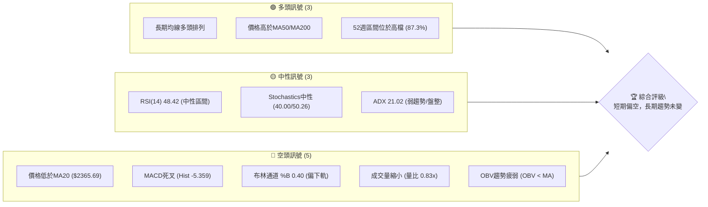

<details>
<summary>📊 靜態圖表 (點擊展開)</summary>

</details>

<html>
<head><meta charset="utf-8" /></head>
<body>
    <div style="height:500px; width:100%;">                        <script>window.PlotlyConfig = {MathJaxConfig: 'local'};</script>
        <script charset="utf-8" src="https://cdn.plot.ly/plotly-3.6.0.min.js" integrity="sha256-QaOVwtVY0T02VaHrr6pnoHLCwayMJp4O5n4YyaE3rJk=" crossorigin="anonymous"></script>                <div id="candlestick-chart" class="plotly-graph-div" style="height:100%; width:100%;"></div>            <script>                window.PLOTLYENV=window.PLOTLYENV || {};                                if (document.getElementById("candlestick-chart")) {                    Plotly.newPlot(                        "candlestick-chart",                        [{"close":{"dtype":"f8","bdata":"AAAA4GJZkkAAAAAA9+KRQAAAAAD34pFAAAAAwLP2kUAAAAAA9+KRQAAAAAD34pFAAAAAAPfikUAAAACA6TGSQAAAAIDpMZJAAAAAINyAkkAAAABgi+OSQAAAAGDBHpNAAAAAALRtk0AAAABg91mTQAAAAIDc0JNAAAAAAGqVk0AAAABgreSTQAAAAABqlZNAAAAAAE8MlEAAAADgpr6UQAAAAOCmvpRAAAAAYGNvlEAAAADgHyCUQAAAAODwM5RAAAAAQDSDlEAAAABAuyGVQAAAAEBxrJVAAAAAQCc3lkAAAADg4+eVQAAAAED4SpZAAAAA4OPnlUAAAACAhQ+WQAAAAEAMrpZAAAAA4E\u002f9lkAAAADAmXKWQAAAAAB\u002f6ZZAAAAAAH\u002fplkAAAACAO5qWQAAAAMCZcpZAAAAAAH\u002fplkAAAAAgrtWWQAAAAECTTJdAAAAAQJNMl0AAAABgwjiXQAAAAEBkYJdAAAAAQJNMl0AAAACAO5qWQAAAAEAMrpZAAAAAgDualkAAAAAgrtWWQAAAAEAMrpZAAAAAIK7VlkAAAACAO5qWQAAAAGBWI5ZAAAAA4MhelkAAAAAAQsCVQAAAAECgmJVAAAAAwGqGlkAAAACg\u002fnCVQAAAAOBcSZVAAAAA4OPnlUAAAABA+EqWQAAAAEAnN5ZAAAAAQPhKlkAAAADgEtSVQAAAAGBWI5ZAAAAAwJlylkAAAADgyF6WQAAAAIA7mpZAAAAAoPEkl0AAAAAAf+mWQAAAAECTTJdAAAAAoEjVlkAAAABADP2WQAAAAIDBhZZAAAAAQBxKlkAAAACAOjaWQAAAAIA6NpZAAAAAgDo2lkAAAADAZsGWQAAAAKDPJJdAAAAAgLE4l0AAAADgVnSXQAAAAODdw5dAAAAAQBqcl0AAAAAAZROYQAAAAGCRnphAAAAAgI\u002fwmUAAAADgu3uaQAAAAEBxBJpAAAAA4DQsmkAAAAAAUxiaQAAAAIAWQJpAAAAAwJ2PmkAAAADAnY+aQAAAAIAWQJpAAAAAQOgGm0AAAABAb1abQAAAAKAUkptAAAAAQOgGm0AAAABAb1abQAAAAOAyfptAAAAAoI1Cm0AAAACA9qWbQAAAAKAERZxAAAAAYF8JnEAAAACgFJKbQAAAACBRaptAAAAAgH31m0AAAAAg2LmbQAAAACBRaptAAAAAgPalm0AAAADAIjGcQAAAAOCZM51AAAAAQMa+nUAAAAAAIYOdQAAAAOCXhZ5AAAAAoGlMn0AAAACg4vyeQAAAAIBbrZ5AAAAAQE0OnkAAAACA9PecQAAAAAAhg51AAAAAYF1bnUAAAAAAQR2cQAAAAEBPvJxAAAAAIC8inkAAAACge0edQAAAAID095xAAAAAgG2onEAAAAAAGSSdQAAAAKC5r51AAAAAgE\u002fUnEAAAADAaqycQAAAAIC8NJxAAAAAgLw0nEAAAAAgXcCcQAAAAMBqrJxAAAAAQKFcnEAAAABADr2bQAAAAMBEbZtAAAAA4EHonEAAAACAvDScQAAAAEA0\u002fJxAAAAAAD9jnkAAAABgMXeeQAAAAMC2Kp9AAAAAANICn0AAAACAEAOgQAAAAGDuNKBAAAAAoOc+oEAAAAAAZaKfQAAAAKByjp9AAAAAgC7yn0AAAACALvKfQAAAAGDuNKBAAAAAYF8GoUAAAABg8qWhQAAAAIA2QqFAAAAAIGb8oEAAAACAo6KgQAAAAMDkuaFAAAAA4AaIoUAAAADgBoihQAAAACC1\u002f6FAAAAAYNDXoUAAAABAG2qhQAAAAAAAkqFAAAAAoC9MoUAAAACg66+hQAAAAGDypaFAAAAAgBR0oUAAAAAgRC6hQAAAAGBfBqFAAAAAACJgoUAAAAAAAJKhQAAAACC1\u002f6FAAAAAoOuvoUAAAADAwuuhQAAAAIDJ4aFAAAAAwHdZokAAAADAd1miQAAAAMBVi6JAAAAAYBjlokAAAADgTpWiQAAAACBqbaJAAAAAgMnhoUAAAADgu\u002fWhQAAAAAAAkqFAAAAAAACUoUAAAAAAAAyiQAAAAAAAjqJAAAAAAADAokAAAAAAAKKiQAAAAAAA1KJAAAAAAACco0AAAAAAAHSjQAAAAAAArKJAAAAAAACsokAAAAAAAEiiQA=="},"high":{"dtype":"f8","bdata":"AAAA4GJZkkCWexpBpkWSQJZ7GkGmRZJAAAAAwLP2kUCNsNzzLB6SQAAAAAD34pFAjbDc8ywekkAAAACA6TGSQCuChnMfbZJAAAAAINyAkkA01ocGSPeSQKWUUvqzbZNAAAAAALRtk0C9JaEGtG2TQAAAgFyt5JNAiIIruQu9k0AAAABgreSTQFPG7E5++JNAAAAAAE8MlEAAAADgpr6UQB+onHUZ+pRAED74GAWXlECt1Ep1kluUQId+s3Vjb5RAvJV9jkjmlECcyZkcjDWVQAAAAEBxrJVAtkwW+chelkARl5u8tPuVQAAAANZqhpZAEZebvLT7lUAclaKHO5qWQAAAAEAMrpZAdbgamfEkl0BfKmhVDK6WQJgin5XxJJdAdYMpcsI4l0A\u002ffvw43cGWQB8OeJxqhpZAdYMpcsI4l0D6IJa1IBGXQF2\u002f+\u002fg0dJdAC5951QWIl0BnZmau1puXQHDyN\u002fkFiJdAun73sdabl0CeO3fOT\u002f2WQPsNMNV+6ZZAHz9+XAyulkCnwA7ZT\u002f2WQPUbYGrxJJdAp8AO2U\u002f9lkA\u002ffvw43cGWQKUcEBn4SpZAMchedTualkCRidEqJzeWQHIcx7Hj55VADlCXnDualkCAHiMSQsCVQLH2DQtCwJVAIy43mYUPlkAAAABA+EqWQGyZLLJqhpZAAAAA1mqGlkAZOmDnyF6WQKUcEBn4SpZAAAAAwJlylkBm7XS8mXKWQAAAAIA7mpZAAAAAoPEkl0B1gylywjiXQAAAAECTTJdAAAAAkDiIl0CmyGcF7hCXQNDqS0WjmZZAYi60yt9xlkCzpBzQ33GWQJHhXkUcSpZA1WfaWqOZlkC9CD6FSNWWQAAAAKDPJJdAUOZZRZNMl0AAAADgVnSXQAAAAODdw5dAoryGyt3Dl0AAAAAAZROYQAAAAGCRnphAf4vTWvhTmkAAAADgu3uaQGLRsso0LJpAgsU8MNpnmkBVVVUV2meaQGjD58+7e5pAt5LaSmG3mkBbSW2Ff6OaQEWCmgraZ5pAq6qqyqsum0DSRRdV9qWbQAAAAKAUkptAq6qqGlFqm0DpoovKMn6bQFVVVaUUkptAYARGQNi5m0CWrGRF2LmbQAAAAKAERZxAbXZxAKqAnEDHb5d6ffWbQAAAACBRaptAq6qqCkEdnECVcCc1XwmcQHmaC3D2pZtAAAAAgPalm0DHMijVqYCcQAAAAOCZM51A3cuxyonmnUDV77llTQ6eQGfSlWpbrZ5ADOSjKi10n0AIzB7whzifQNUoY5Xi\u002fJ5Ag76gLz3BnkBpDt9v5KqdQJJ2rEC2cZ5Aq6qq6iCDnUAAAAAAQR2cQEa15WpdW51ABb64qvJJnkC8uhVAxr6dQBKxRpV7R51ABQmj5ZkznUBM2AbB\u002fUudQAQCgQCsw51AOQ8dw\u002f1LnUAtZCEDGSSdQG3Hh+CuSJxAaDs+hE\u002fUnEAyOB9jCzidQHvTm6ImEJ1AcAiHoJNwnEAIRSjC1wycQHTRRQPz5JtAAAAA4EHonECukdWlJhCdQAAAAEA0\u002fJxAAAAAAD9jnkAAAABgMXeeQAAAAMC2Kp9AXH97YMQWn0AAAACAEAOgQMVO7CDTXKBA\u002f8FE0OBIoEAvMWuhCQ2gQMIWbHEQA6BAE7UrMfUqoEAPxO8A\u002fCCgQJ3YiXKjoqBAaZxBkFgQoUAY0TbTmSeiQPljSfPdw6FAqzNSQT04oUBUXDKENkKhQOAHfiDXzaFAaEUjoeuvoUB1uf0x182hQB988HGFRaJA9C4eIbX\u002foUA6JQHC5LmhQBTfPfHdw6FAyWfdYBR0oUAAAACg66+hQO+F96KgHaJASZIkQfmboUBRFEURImChQA8OSFE9OKFABYQT8f+RoUAEkz8w+ZuhQAAAACC1\u002f6FANvAZs6AdokCgaKvhmSeiQJ4PLPNwY6JAu3\u002fzgFyBokAvf9oCJtGiQIFcE4E6s6JAQ1qx8AMDo0Byp2gBJtGiQE7w5KEzvaJAxlQ4cacTokDvlbpwpxOiQCQrPLLC66FAAAAAAACooUAAAAAAACqiQAAAAAAAjqJAAAAAAADAokAAAAAAAKKiQAAAAAAA3qJAAAAAAACco0AAAAAAAM6jQAAAAAAAGqNAAAAAAADookAAAAAAAISiQA=="},"hovertemplate":"\u003cb\u003e%{x|%Y-%m-%d}\u003c\u002fb\u003e\u003cbr\u003e\u958b: $%{open:.2f}\u003cbr\u003e\u9ad8: $%{high:.2f}\u003cbr\u003e\u4f4e: $%{low:.2f}\u003cbr\u003e\u6536: $%{close:.2f}\u003cextra\u003e\u003c\u002fextra\u003e","low":{"dtype":"f8","bdata":"09LSkukxkkAAAAAA9+KRQAAAAAD34pFAI+AUJcGnkUB8GmFZOs+RQHNPIwzBp5FAAAAAAPfikUA4qfsycAqSQAAAAIDpMZJA7+7u0mJZkkCYU\u002fASErySQNdaa7kEC5NAsyzLsjpGk0BD2l65OkaTQAAAAA6ZgZNAAAAAAGqVk0DyDfLtaZWTQAAAAABqlZNAPEHqsTqpk0AiPVCRkluUQOFXY0o0g5RAAAAAYGNvlEAbuZEDTwyUQAAAAODwM5RAAAAAQDSDlEDHbMyGGfqUQAAAADi7IZVA74xeqrT7lUDe0cgmQsCVQKqqqoZWI5ZAqgz2kM+ElUBFD3ujtPuVQA4w1VyFD5ZAFo\u002fKbQyulkAAAADAmXKWQK0bTLFqhpZAAAAAAH\u002fplkDgwIGjaoaWQKDVlyonN5ZAAAAAAH\u002fplkCtn3hD3cGWQPVghqogEZdAUiCCY8I4l0AAAABgwjiXQCAbkM0gEZdApEAEh\u002fEkl0DgwIGjaoaWQAAAAEAMrpZA4MCBo2qGlkBZP\u002fFmDK6WQAAAAEAMrpZABt9pijualkAAAACAO5qWQK7xd4OFD5ZAAAAA4MhelkAAAAAAQsCVQAAAAECgmJVA1g86KvhKlkAAAACg\u002fnCVQAAAAOBcSZVA3tHIJkLAlUAAAACqhQ+WQKXZdGNWI5ZAVVVVYyc3lkAAAADgEtSVQFzj76a0+5VAoNWXKic3lkDON6FKViOWQIIDBw74SpZAhyb5lzualkAAAAAAf+mWQEeBCM5P\u002fZZAq6qq2mbBlkC0bjC1SNWWQC8VtLrfcZZAntFLtVgilkBvHqG6WCKWQE1b4y+V+pVAAAAAgDo2lkCH7oM1o5mWQCH584pI1ZZAXzNM9e0Ql0CTv8mPsTiXQKuqqspWdJdAXkN5tVZ0l0CnAW2aOIiXQIHgMjWD\u002f5dATmu2j589mUD988+fJo2ZQJ0uTbWt3JlA\u002fHSGP+q0mUBVVVUl6rSZQAAAAIAWQJpASW0lNdpnmkBJbSU12meaQLp9ZfVSGJpAAAAAoJ2PmkDSRRfbQsuaQLeWxTroBptAAAAAQOgGm0AXXXS1qy6bQKuqqsqrLptAAAAAoI1Cm0AUoQiljUKbQDD90v+5zZtAmMGXmn31m0AAAACgFJKbQAoymwrKGptAAAAAMNi5m0C2R2yVFJKbQIPMplpvVptAU5vaVOgGm0AAAADAIjGcQOo7G7WLlJxAi9A4FbgfnUAAAAAAIYOdQP3jEivGvp1A5je4iuL8nkAAAACg4vyeQIx4khovIp5AAAAAQE0OnkAAAACA9PecQHRLnDo\u002fb51AVVVV1ZkznUD4rZHVMn6bQFwljSrIbJxA3ixPGrgfnUAAAACge0edQKmiZ6WLlJxAAAAAgG2onECzJ\u002fk+NPycQPT5fH7ic51AAAAAgE\u002fUnEAAAADAaqycQOAaWZ0A0ZtAJ3HwvtcMnEAAAAAgXcCcQAAAAMBqrJxAPt7jvdcMnEAAAABADr2bQAAAAMBEbZtA+pJp\u002fYWEnECUOHgfyiCcQNdaa114mJxAndiJHYP\u002fnUAzdYt9dROeQFK4Hn0Is55A7oGN3vrGnkC\u002fShibm1KfQDuxE58JDaBAB3RjfhADoEAAAAAAZaKfQAAAAKByjp9A+B2IHzzen0DxOxC\u002fScqfQIqd2G4QA6BAaTnmW8xmoEAAAABg8qWhQAAAAIA2QqFAKuZWj3reoEAAAACAo6KgQPzAD7xRGqFATF1ufxR0oUBMXW5\u002fFHShQAAAACC1\u002f6FAT0WabvKloUAAAABAG2qhQNzUw009OKFAKfJZD0QuoUAel74dImChQIQeQs8GiKFAJEmSjjZCoUAAAAAgRC6hQAAAAGBfBqFAAAAAACJgoUDojYLeKFahQOGDD87kuaFAAAAAoOuvoUDLh3Ff0NehQDmrx47rr6FAV6DPzpknokARIMOPfk+iQH+j7P5wY6JAvqVOzyzHokAAAADgTpWiQOMlSo9+T6JAYvDTDCJgoUALnIN\u002fyeGhQAAAAAAAkqFAAAAAAABEoUAAAAAAAOShQAAAAAAAUqJAAAAAAABcokAAAAAAAFyiQAAAAAAAoqJAAAAAAAAuo0AAAAAAAHSjQAAAAAAArKJAAAAAAACsokAAAAAAACqiQA=="},"name":"\u50f9\u683c","open":{"dtype":"f8","bdata":"AAAA4GJZkkCWexpBpkWSQBKWe5rpMZJAGqjPy327kUAJyz1NcAqSQHwaYVk6z5FACcs9TXAKkkCc1H3ZLB6SQCuChnMfbZJAd3d3eR9tkkDMKXi5zs+SQHzvvVP3WZNAWZZlWfdZk0C9JaEGtG2TQAAAgOpplZNARMGV3Dqpk0D5BvmmC72TQA8FV3Kt5JNAPEHqsTqpk0CCytltY2+UQL8aE5lI5pRAAAAAYGNvlEDJjdyYwUeUQC0qkbzBR5RAAAAAQDSDlEBjNmZj6g2VQAAAADi7IZVA74xeqrT7lUDvaGQDE9SVQAAAAED4SpZAqgz2kM+ElUBhpB2raoaWQArknxUnN5ZAFo\u002fKbQyulkAfDnicaoaWQIp81o07mpZA3WCK3E\u002f9lkAAAACAO5qWQMDjDwf4SpZAdYMpcsI4l0BTYIf8fumWQKRABIfxJJdAXb\u002f7+DR0l0DXo3D1NHSXQAAAAEBkYJdAC5951QWIl0B+\u002fPjxfumWQP5ZZRzdwZZAAAAAgDualkCtn3hD3cGWQPfB+o0gEZdArZ94Q93BlkAAAACAO5qWQK7xd4OFD5ZAZu10vJlylkCRidEqJzeWQBzHcRxxrJVA8q9o45lylkBAjxFZoJiVQOmiiy5xrJVAIy43mYUPlkCqqqqGViOWQBFzodWZcpZAAAAAQPhKlkAZOmDnyF6WQAAAAGBWI5ZAwOMPB\u002fhKlkAAAADgyF6WQKFCherIXpZAK2qMdAyulkCYIp+V8SSXQPVghqogEZdAq6qqylZ0l0BaN5h6KumWQAAAAIDBhZZAAAAAQBxKlkCR4V5FHEqWQN48QvV2DpZA1WfaWqOZlkAAAADAZsGWQNn6NlAq6ZZAAAAAgLE4l0AxlZgadWCXQAAAAJA4iJdAr6G8ejiIl0D9JctfGpyXQGEo5r9GJ5hAm+0TVYFRmUD988+fJo2ZQJ0uTbWt3JlAKAzwBMzImUAAAACwrdyZQEWCmgraZ5pAt5LaSmG3mkCltpL6u3uaQN2+sro0LJpAq6qqegbzmkDSRRfbQsuaQLeWxTroBptAVVVVBcoam0B00UUFUWqbQAAAAOAyfptAdQHCKlFqm0CqTW1qb1abQDD90v+5zZtABjgJO8hsnEBEdvTvuc2bQIhl9M+rLptAq6qqCkEdnEAAAAAg2LmbQAAAACBRaptA6Uc\u002fGsoam0AVJt4PyGycQG3Ud3ptqJxAeraR2pkznUAAAAAAIYOdQP3jEivGvp1A5je4iuL8nkBYmV9lxBCfQIx4khovIp5A1z4LpXmZnkCbCeofP2+dQGGkHSsvIp5AVVVV1ZkznUA5eN+aFJKbQKPaclXWC51A4+oHpXtHnUBe3QrwIIOdQKmiZ6WLlJxABJpCILgfnUAmbINgCzidQPz9fj\u002fHm51AWjeYYgs4nUDJQhZCNPycQE3i4P3y5JtAaDs+hE\u002fUnEAh0BSiJhCdQGQhC4FP1JxAruZqHsognEAAAABADr2bQLroouEbqZtAY4tyvmqsnECukdWlJhCdQPC9935P1JxAXuiF3mcnnkBHlQSfTE+eQJqZmd36xp5ApYCEn9\u002funkCq0KP7jWafQOzETs8CF6BAAT67b+40oED8qC5xEAOgQOtceQBlop9AAAAAgC7yn0D4HYgfPN6fQGIndsDgSKBA0tUnjMVwoEB84b3w3cOhQIdVhKENfqFADqLH72zyoEDKEKwjRC6hQOzETuxKJKFAAAAA4AaIoUAAAADgBoihQM2hYhGTMaJAehePwMLroUDr24Bh8qWhQPCzAT8baqFAKfJZD0QuoUCPS9\u002feBoihQHOkORK1\u002f6FASZIk7yhWoUAxDMOwL0yhQKZxBiFELqFAzzRuYBR0oUD42YCfDX6hQOGDD87kuaFAGsPRgqcTokA2eI4gtf+hQOggr5J+T6JANGBJL4w7okAAAADAd1miQECuiSBIn6JAAAAAYBjlokAAAADgTpWiQDu0a0FBqaJAYvDTDCJgoUAAAADgu\u002fWhQBhyfSHXzaFAAAAAAACAoUAAAAAAACqiQAAAAAAAcKJAAAAAAACOokAAAAAAAGaiQAAAAAAAtqJAAAAAAAAuo0AAAAAAAJyjQAAAAAAABqNAAAAAAADUokAAAAAAAHCiQA=="},"x":["2025-08-27T00:00:00+08:00","2025-08-28T00:00:00+08:00","2025-08-29T00:00:00+08:00","2025-09-01T00:00:00+08:00","2025-09-02T00:00:00+08:00","2025-09-03T00:00:00+08:00","2025-09-04T00:00:00+08:00","2025-09-05T00:00:00+08:00","2025-09-08T00:00:00+08:00","2025-09-09T00:00:00+08:00","2025-09-10T00:00:00+08:00","2025-09-11T00:00:00+08:00","2025-09-12T00:00:00+08:00","2025-09-15T00:00:00+08:00","2025-09-16T00:00:00+08:00","2025-09-17T00:00:00+08:00","2025-09-18T00:00:00+08:00","2025-09-19T00:00:00+08:00","2025-09-22T00:00:00+08:00","2025-09-23T00:00:00+08:00","2025-09-24T00:00:00+08:00","2025-09-25T00:00:00+08:00","2025-09-26T00:00:00+08:00","2025-09-30T00:00:00+08:00","2025-10-01T00:00:00+08:00","2025-10-02T00:00:00+08:00","2025-10-03T00:00:00+08:00","2025-10-07T00:00:00+08:00","2025-10-08T00:00:00+08:00","2025-10-09T00:00:00+08:00","2025-10-13T00:00:00+08:00","2025-10-14T00:00:00+08:00","2025-10-15T00:00:00+08:00","2025-10-16T00:00:00+08:00","2025-10-17T00:00:00+08:00","2025-10-20T00:00:00+08:00","2025-10-21T00:00:00+08:00","2025-10-22T00:00:00+08:00","2025-10-23T00:00:00+08:00","2025-10-27T00:00:00+08:00","2025-10-28T00:00:00+08:00","2025-10-29T00:00:00+08:00","2025-10-30T00:00:00+08:00","2025-10-31T00:00:00+08:00","2025-11-03T00:00:00+08:00","2025-11-04T00:00:00+08:00","2025-11-05T00:00:00+08:00","2025-11-06T00:00:00+08:00","2025-11-07T00:00:00+08:00","2025-11-10T00:00:00+08:00","2025-11-11T00:00:00+08:00","2025-11-12T00:00:00+08:00","2025-11-13T00:00:00+08:00","2025-11-14T00:00:00+08:00","2025-11-17T00:00:00+08:00","2025-11-18T00:00:00+08:00","2025-11-19T00:00:00+08:00","2025-11-20T00:00:00+08:00","2025-11-21T00:00:00+08:00","2025-11-24T00:00:00+08:00","2025-11-25T00:00:00+08:00","2025-11-26T00:00:00+08:00","2025-11-27T00:00:00+08:00","2025-11-28T00:00:00+08:00","2025-12-01T00:00:00+08:00","2025-12-02T00:00:00+08:00","2025-12-03T00:00:00+08:00","2025-12-04T00:00:00+08:00","2025-12-05T00:00:00+08:00","2025-12-08T00:00:00+08:00","2025-12-09T00:00:00+08:00","2025-12-10T00:00:00+08:00","2025-12-11T00:00:00+08:00","2025-12-12T00:00:00+08:00","2025-12-15T00:00:00+08:00","2025-12-16T00:00:00+08:00","2025-12-17T00:00:00+08:00","2025-12-18T00:00:00+08:00","2025-12-19T00:00:00+08:00","2025-12-22T00:00:00+08:00","2025-12-23T00:00:00+08:00","2025-12-24T00:00:00+08:00","2025-12-26T00:00:00+08:00","2025-12-29T00:00:00+08:00","2025-12-30T00:00:00+08:00","2025-12-31T00:00:00+08:00","2026-01-02T00:00:00+08:00","2026-01-05T00:00:00+08:00","2026-01-06T00:00:00+08:00","2026-01-07T00:00:00+08:00","2026-01-08T00:00:00+08:00","2026-01-09T00:00:00+08:00","2026-01-12T00:00:00+08:00","2026-01-13T00:00:00+08:00","2026-01-14T00:00:00+08:00","2026-01-15T00:00:00+08:00","2026-01-16T00:00:00+08:00","2026-01-19T00:00:00+08:00","2026-01-20T00:00:00+08:00","2026-01-21T00:00:00+08:00","2026-01-22T00:00:00+08:00","2026-01-23T00:00:00+08:00","2026-01-26T00:00:00+08:00","2026-01-27T00:00:00+08:00","2026-01-28T00:00:00+08:00","2026-01-29T00:00:00+08:00","2026-01-30T00:00:00+08:00","2026-02-02T00:00:00+08:00","2026-02-03T00:00:00+08:00","2026-02-04T00:00:00+08:00","2026-02-05T00:00:00+08:00","2026-02-06T00:00:00+08:00","2026-02-09T00:00:00+08:00","2026-02-10T00:00:00+08:00","2026-02-11T00:00:00+08:00","2026-02-23T00:00:00+08:00","2026-02-24T00:00:00+08:00","2026-02-25T00:00:00+08:00","2026-02-26T00:00:00+08:00","2026-03-02T00:00:00+08:00","2026-03-03T00:00:00+08:00","2026-03-04T00:00:00+08:00","2026-03-05T00:00:00+08:00","2026-03-06T00:00:00+08:00","2026-03-09T00:00:00+08:00","2026-03-10T00:00:00+08:00","2026-03-11T00:00:00+08:00","2026-03-12T00:00:00+08:00","2026-03-13T00:00:00+08:00","2026-03-16T00:00:00+08:00","2026-03-17T00:00:00+08:00","2026-03-18T00:00:00+08:00","2026-03-19T00:00:00+08:00","2026-03-20T00:00:00+08:00","2026-03-23T00:00:00+08:00","2026-03-24T00:00:00+08:00","2026-03-25T00:00:00+08:00","2026-03-26T00:00:00+08:00","2026-03-27T00:00:00+08:00","2026-03-30T00:00:00+08:00","2026-03-31T00:00:00+08:00","2026-04-01T00:00:00+08:00","2026-04-02T00:00:00+08:00","2026-04-07T00:00:00+08:00","2026-04-08T00:00:00+08:00","2026-04-09T00:00:00+08:00","2026-04-10T00:00:00+08:00","2026-04-13T00:00:00+08:00","2026-04-14T00:00:00+08:00","2026-04-15T00:00:00+08:00","2026-04-16T00:00:00+08:00","2026-04-17T00:00:00+08:00","2026-04-20T00:00:00+08:00","2026-04-21T00:00:00+08:00","2026-04-22T00:00:00+08:00","2026-04-23T00:00:00+08:00","2026-04-24T00:00:00+08:00","2026-04-27T00:00:00+08:00","2026-04-28T00:00:00+08:00","2026-04-29T00:00:00+08:00","2026-04-30T00:00:00+08:00","2026-05-04T00:00:00+08:00","2026-05-05T00:00:00+08:00","2026-05-06T00:00:00+08:00","2026-05-07T00:00:00+08:00","2026-05-08T00:00:00+08:00","2026-05-11T00:00:00+08:00","2026-05-12T00:00:00+08:00","2026-05-13T00:00:00+08:00","2026-05-14T00:00:00+08:00","2026-05-15T00:00:00+08:00","2026-05-18T00:00:00+08:00","2026-05-19T00:00:00+08:00","2026-05-20T00:00:00+08:00","2026-05-21T00:00:00+08:00","2026-05-22T00:00:00+08:00","2026-05-25T00:00:00+08:00","2026-05-26T00:00:00+08:00","2026-05-27T00:00:00+08:00","2026-05-28T00:00:00+08:00","2026-05-29T00:00:00+08:00","2026-06-01T00:00:00+08:00","2026-06-02T00:00:00+08:00","2026-06-03T00:00:00+08:00","2026-06-04T00:00:00+08:00","2026-06-05T00:00:00+08:00","2026-06-08T00:00:00+08:00","2026-06-09T00:00:00+08:00","2026-06-10T00:00:00+08:00","2026-06-11T00:00:00+08:00","2026-06-12T00:00:00+08:00","2026-06-15T00:00:00+08:00","2026-06-16T00:00:00+08:00","2026-06-17T00:00:00+08:00","2026-06-18T00:00:00+08:00","2026-06-22T00:00:00+08:00","2026-06-23T00:00:00+08:00","2026-06-24T00:00:00+08:00","2026-06-25T00:00:00+08:00","2026-06-26T00:00:00+08:00"],"type":"candlestick"},{"hovertemplate":"MA30: $%{y:.2f}\u003cextra\u003e\u003c\u002fextra\u003e","line":{"color":"#2196F3","dash":"dash","width":2},"mode":"lines","name":"MA30","x":["2025-08-27T00:00:00+08:00","2025-08-28T00:00:00+08:00","2025-08-29T00:00:00+08:00","2025-09-01T00:00:00+08:00","2025-09-02T00:00:00+08:00","2025-09-03T00:00:00+08:00","2025-09-04T00:00:00+08:00","2025-09-05T00:00:00+08:00","2025-09-08T00:00:00+08:00","2025-09-09T00:00:00+08:00","2025-09-10T00:00:00+08:00","2025-09-11T00:00:00+08:00","2025-09-12T00:00:00+08:00","2025-09-15T00:00:00+08:00","2025-09-16T00:00:00+08:00","2025-09-17T00:00:00+08:00","2025-09-18T00:00:00+08:00","2025-09-19T00:00:00+08:00","2025-09-22T00:00:00+08:00","2025-09-23T00:00:00+08:00","2025-09-24T00:00:00+08:00","2025-09-25T00:00:00+08:00","2025-09-26T00:00:00+08:00","2025-09-30T00:00:00+08:00","2025-10-01T00:00:00+08:00","2025-10-02T00:00:00+08:00","2025-10-03T00:00:00+08:00","2025-10-07T00:00:00+08:00","2025-10-08T00:00:00+08:00","2025-10-09T00:00:00+08:00","2025-10-13T00:00:00+08:00","2025-10-14T00:00:00+08:00","2025-10-15T00:00:00+08:00","2025-10-16T00:00:00+08:00","2025-10-17T00:00:00+08:00","2025-10-20T00:00:00+08:00","2025-10-21T00:00:00+08:00","2025-10-22T00:00:00+08:00","2025-10-23T00:00:00+08:00","2025-10-27T00:00:00+08:00","2025-10-28T00:00:00+08:00","2025-10-29T00:00:00+08:00","2025-10-30T00:00:00+08:00","2025-10-31T00:00:00+08:00","2025-11-03T00:00:00+08:00","2025-11-04T00:00:00+08:00","2025-11-05T00:00:00+08:00","2025-11-06T00:00:00+08:00","2025-11-07T00:00:00+08:00","2025-11-10T00:00:00+08:00","2025-11-11T00:00:00+08:00","2025-11-12T00:00:00+08:00","2025-11-13T00:00:00+08:00","2025-11-14T00:00:00+08:00","2025-11-17T00:00:00+08:00","2025-11-18T00:00:00+08:00","2025-11-19T00:00:00+08:00","2025-11-20T00:00:00+08:00","2025-11-21T00:00:00+08:00","2025-11-24T00:00:00+08:00","2025-11-25T00:00:00+08:00","2025-11-26T00:00:00+08:00","2025-11-27T00:00:00+08:00","2025-11-28T00:00:00+08:00","2025-12-01T00:00:00+08:00","2025-12-02T00:00:00+08:00","2025-12-03T00:00:00+08:00","2025-12-04T00:00:00+08:00","2025-12-05T00:00:00+08:00","2025-12-08T00:00:00+08:00","2025-12-09T00:00:00+08:00","2025-12-10T00:00:00+08:00","2025-12-11T00:00:00+08:00","2025-12-12T00:00:00+08:00","2025-12-15T00:00:00+08:00","2025-12-16T00:00:00+08:00","2025-12-17T00:00:00+08:00","2025-12-18T00:00:00+08:00","2025-12-19T00:00:00+08:00","2025-12-22T00:00:00+08:00","2025-12-23T00:00:00+08:00","2025-12-24T00:00:00+08:00","2025-12-26T00:00:00+08:00","2025-12-29T00:00:00+08:00","2025-12-30T00:00:00+08:00","2025-12-31T00:00:00+08:00","2026-01-02T00:00:00+08:00","2026-01-05T00:00:00+08:00","2026-01-06T00:00:00+08:00","2026-01-07T00:00:00+08:00","2026-01-08T00:00:00+08:00","2026-01-09T00:00:00+08:00","2026-01-12T00:00:00+08:00","2026-01-13T00:00:00+08:00","2026-01-14T00:00:00+08:00","2026-01-15T00:00:00+08:00","2026-01-16T00:00:00+08:00","2026-01-19T00:00:00+08:00","2026-01-20T00:00:00+08:00","2026-01-21T00:00:00+08:00","2026-01-22T00:00:00+08:00","2026-01-23T00:00:00+08:00","2026-01-26T00:00:00+08:00","2026-01-27T00:00:00+08:00","2026-01-28T00:00:00+08:00","2026-01-29T00:00:00+08:00","2026-01-30T00:00:00+08:00","2026-02-02T00:00:00+08:00","2026-02-03T00:00:00+08:00","2026-02-04T00:00:00+08:00","2026-02-05T00:00:00+08:00","2026-02-06T00:00:00+08:00","2026-02-09T00:00:00+08:00","2026-02-10T00:00:00+08:00","2026-02-11T00:00:00+08:00","2026-02-23T00:00:00+08:00","2026-02-24T00:00:00+08:00","2026-02-25T00:00:00+08:00","2026-02-26T00:00:00+08:00","2026-03-02T00:00:00+08:00","2026-03-03T00:00:00+08:00","2026-03-04T00:00:00+08:00","2026-03-05T00:00:00+08:00","2026-03-06T00:00:00+08:00","2026-03-09T00:00:00+08:00","2026-03-10T00:00:00+08:00","2026-03-11T00:00:00+08:00","2026-03-12T00:00:00+08:00","2026-03-13T00:00:00+08:00","2026-03-16T00:00:00+08:00","2026-03-17T00:00:00+08:00","2026-03-18T00:00:00+08:00","2026-03-19T00:00:00+08:00","2026-03-20T00:00:00+08:00","2026-03-23T00:00:00+08:00","2026-03-24T00:00:00+08:00","2026-03-25T00:00:00+08:00","2026-03-26T00:00:00+08:00","2026-03-27T00:00:00+08:00","2026-03-30T00:00:00+08:00","2026-03-31T00:00:00+08:00","2026-04-01T00:00:00+08:00","2026-04-02T00:00:00+08:00","2026-04-07T00:00:00+08:00","2026-04-08T00:00:00+08:00","2026-04-09T00:00:00+08:00","2026-04-10T00:00:00+08:00","2026-04-13T00:00:00+08:00","2026-04-14T00:00:00+08:00","2026-04-15T00:00:00+08:00","2026-04-16T00:00:00+08:00","2026-04-17T00:00:00+08:00","2026-04-20T00:00:00+08:00","2026-04-21T00:00:00+08:00","2026-04-22T00:00:00+08:00","2026-04-23T00:00:00+08:00","2026-04-24T00:00:00+08:00","2026-04-27T00:00:00+08:00","2026-04-28T00:00:00+08:00","2026-04-29T00:00:00+08:00","2026-04-30T00:00:00+08:00","2026-05-04T00:00:00+08:00","2026-05-05T00:00:00+08:00","2026-05-06T00:00:00+08:00","2026-05-07T00:00:00+08:00","2026-05-08T00:00:00+08:00","2026-05-11T00:00:00+08:00","2026-05-12T00:00:00+08:00","2026-05-13T00:00:00+08:00","2026-05-14T00:00:00+08:00","2026-05-15T00:00:00+08:00","2026-05-18T00:00:00+08:00","2026-05-19T00:00:00+08:00","2026-05-20T00:00:00+08:00","2026-05-21T00:00:00+08:00","2026-05-22T00:00:00+08:00","2026-05-25T00:00:00+08:00","2026-05-26T00:00:00+08:00","2026-05-27T00:00:00+08:00","2026-05-28T00:00:00+08:00","2026-05-29T00:00:00+08:00","2026-06-01T00:00:00+08:00","2026-06-02T00:00:00+08:00","2026-06-03T00:00:00+08:00","2026-06-04T00:00:00+08:00","2026-06-05T00:00:00+08:00","2026-06-08T00:00:00+08:00","2026-06-09T00:00:00+08:00","2026-06-10T00:00:00+08:00","2026-06-11T00:00:00+08:00","2026-06-12T00:00:00+08:00","2026-06-15T00:00:00+08:00","2026-06-16T00:00:00+08:00","2026-06-17T00:00:00+08:00","2026-06-18T00:00:00+08:00","2026-06-22T00:00:00+08:00","2026-06-23T00:00:00+08:00","2026-06-24T00:00:00+08:00","2026-06-25T00:00:00+08:00","2026-06-26T00:00:00+08:00"],"y":{"dtype":"f8","bdata":"AAAAAAAA+H8AAAAAAAD4fwAAAAAAAPh\u002fAAAAAAAA+H8AAAAAAAD4fwAAAAAAAPh\u002fAAAAAAAA+H8AAAAAAAD4fwAAAAAAAPh\u002fAAAAAAAA+H8AAAAAAAD4fwAAAAAAAPh\u002fAAAAAAAA+H8AAAAAAAD4fwAAAAAAAPh\u002fAAAAAAAA+H8AAAAAAAD4fwAAAAAAAPh\u002fAAAAAAAA+H8AAAAAAAD4fwAAAAAAAPh\u002fAAAAAAAA+H8AAAAAAAD4fwAAAAAAAPh\u002fAAAAAAAA+H8AAAAAAAD4fwAAAAAAAPh\u002fAAAAAAAA+H8AAAAAAAD4f6uqqsp6nJNAzczMbNS6k0BmZmbGct6TQCIiIuJZB5RARERE9DwylEB3d3fHKFmUQN7d3S0LhJRARERElO2ulECamZnpidSUQN7d3Q3U+JRAVVVVFXMelUCJiIjoHkCVQJqZmQnIY5VAq6qqes+ElUDv7u4+1qWVQDMzM6M4xJVAZmZmNu3jlUDNzMyMC\u002fuVQLy7u1t3FZZAIiIigkMrlkBVVVUVGT2WQGZmZnacTZZAvLu7axZilkCamZl5OXeWQLy7u9u8h5ZAVVVVJZeXlkB3d3fn35yWQN7d3c02nJZAAAAAMNuelkDNzMyc5JqWQN7d3V1OkpZA3t3dXU6SlkCJiIioSZSWQHd3dxdTkJZAzczMPGGKlkCamZl5GIWWQFVVVYV9fpZAIiIi8oZ6lkCJiIioi3iWQJqZmdndeZZAMzMzI9l7lkC8u7s7gnyWQLy7uzuCfJZAd3d3R4h4lkDe3d29inaWQM3MzAxBb5ZAvLu7e6NmlkDe3d0dTmOWQImIiKhPX5ZAq6qqSvpblkDv7u4+TVuWQBEREbFCX5ZAq6qqmo9ilkCJiIjI1GmWQKuqqiq3d5ZAIiIi8kqClkAiIiJyIZaWQAAAAMDtr5ZAvLu7GxHNlkCrqqpqF\u002fiWQGZmZvZ1IJdAAAAAEN9El0BVVVUFUWWXQFVVVWW\u002fh5dAAAAAUCusl0Dv7u7OjdSXQHd3d0el95dAZmZm9rgemEAAAABgHEmYQKuqqnqBc5hAzczMTKOUmECrqqoKZ7qYQBEREaEw3phAIiIiMvcDmUDNzMy8uiuZQCIiIoLFXJlAd3d3R9CNmUAAAADAiruZQHd3d+fx55lAvLu7q\u002fwYmkCamZnZZkOaQJqZmRnaZ5pAq6qqqqCNmkDNzMzcDbaaQO\u002fu7v5x5JpAAAAAEM0Ym0AiIiIyMUebQHd3d0ePeZtAAAAAwEmnm0CamZn5uc2bQERERIR99ZtAZmZmdqAWnECJiIjYJS+cQHd3d4f7SpxAAAAAQNdinEDNzMxsGHCcQERERIRNhZxAERER4c+fnEC8u7tbYbCcQImIiDhPvJxAAAAAEDrKnEBmZmaWndmcQHd3d0dV7JxAvLu7m7n5nEB3d3c3eQKdQHd3d0fuAZ1AERERUWADnUDNzMzMcw2dQDMzM2MwGJ1AMzMzg6AbnUCrqqrquxudQKuqqhrVG51AmpmZWZMmnUAzMzMTsiadQKuqqlrZJJ1AiYiI2FQqnUBmZmaGdzKdQN7d3Y34N51AERERkYQ1nUCrqqr6Wz6dQGZmZhYtTZ1AAAAAsPVhnUC8u7srtXidQDMzM9Mmip1AzczM3D6gnUAiIiJy8cCdQHd3dwdU4J1Ad3d3N78BnkDe3d0NGDWeQHd3d2dxZJ5AVVVV5cmRnkCamZkpB7WeQEREROQ65p5AZmZm5msbn0BVVVVV8VGfQHd3d5dulJ9AAAAAAEPUn0AiIiLKDwSgQERERJynH6BAREREHEA6oEDv7u6G1FqgQKuqqkJofKBAIiIicgGWoEB3d3fXRLCgQAAAAMDgxaBAMzMzs37YoEC8u7sTceygQDMzM6sNAaFAd3d3n6sToUDNzMzU9SOhQO\u002fu7mZBMqFAvLu7IzVEoUBEREQM0VmhQImIiJhrcaFAERERkVqKoUAAAACwoKChQO\u002fu7r6Ts6FAVVVVFeS6oUDv7u7ujL2hQImIiMg1wKFAIiIickPFoUAAAAAQT9GhQJqZmQlh2KFAVVVVNcfioUARERFhLeyhQBEREfFA86FAiYiImFMCokBmZmYWuROiQM3MzHwfHaJAIiIiotkookARERFh6y2iQA=="},"type":"scatter"},{"hovertemplate":"MA60: $%{y:.2f}\u003cextra\u003e\u003c\u002fextra\u003e","line":{"color":"#9C27B0","dash":"dash","width":2},"mode":"lines","name":"MA60","x":["2025-08-27T00:00:00+08:00","2025-08-28T00:00:00+08:00","2025-08-29T00:00:00+08:00","2025-09-01T00:00:00+08:00","2025-09-02T00:00:00+08:00","2025-09-03T00:00:00+08:00","2025-09-04T00:00:00+08:00","2025-09-05T00:00:00+08:00","2025-09-08T00:00:00+08:00","2025-09-09T00:00:00+08:00","2025-09-10T00:00:00+08:00","2025-09-11T00:00:00+08:00","2025-09-12T00:00:00+08:00","2025-09-15T00:00:00+08:00","2025-09-16T00:00:00+08:00","2025-09-17T00:00:00+08:00","2025-09-18T00:00:00+08:00","2025-09-19T00:00:00+08:00","2025-09-22T00:00:00+08:00","2025-09-23T00:00:00+08:00","2025-09-24T00:00:00+08:00","2025-09-25T00:00:00+08:00","2025-09-26T00:00:00+08:00","2025-09-30T00:00:00+08:00","2025-10-01T00:00:00+08:00","2025-10-02T00:00:00+08:00","2025-10-03T00:00:00+08:00","2025-10-07T00:00:00+08:00","2025-10-08T00:00:00+08:00","2025-10-09T00:00:00+08:00","2025-10-13T00:00:00+08:00","2025-10-14T00:00:00+08:00","2025-10-15T00:00:00+08:00","2025-10-16T00:00:00+08:00","2025-10-17T00:00:00+08:00","2025-10-20T00:00:00+08:00","2025-10-21T00:00:00+08:00","2025-10-22T00:00:00+08:00","2025-10-23T00:00:00+08:00","2025-10-27T00:00:00+08:00","2025-10-28T00:00:00+08:00","2025-10-29T00:00:00+08:00","2025-10-30T00:00:00+08:00","2025-10-31T00:00:00+08:00","2025-11-03T00:00:00+08:00","2025-11-04T00:00:00+08:00","2025-11-05T00:00:00+08:00","2025-11-06T00:00:00+08:00","2025-11-07T00:00:00+08:00","2025-11-10T00:00:00+08:00","2025-11-11T00:00:00+08:00","2025-11-12T00:00:00+08:00","2025-11-13T00:00:00+08:00","2025-11-14T00:00:00+08:00","2025-11-17T00:00:00+08:00","2025-11-18T00:00:00+08:00","2025-11-19T00:00:00+08:00","2025-11-20T00:00:00+08:00","2025-11-21T00:00:00+08:00","2025-11-24T00:00:00+08:00","2025-11-25T00:00:00+08:00","2025-11-26T00:00:00+08:00","2025-11-27T00:00:00+08:00","2025-11-28T00:00:00+08:00","2025-12-01T00:00:00+08:00","2025-12-02T00:00:00+08:00","2025-12-03T00:00:00+08:00","2025-12-04T00:00:00+08:00","2025-12-05T00:00:00+08:00","2025-12-08T00:00:00+08:00","2025-12-09T00:00:00+08:00","2025-12-10T00:00:00+08:00","2025-12-11T00:00:00+08:00","2025-12-12T00:00:00+08:00","2025-12-15T00:00:00+08:00","2025-12-16T00:00:00+08:00","2025-12-17T00:00:00+08:00","2025-12-18T00:00:00+08:00","2025-12-19T00:00:00+08:00","2025-12-22T00:00:00+08:00","2025-12-23T00:00:00+08:00","2025-12-24T00:00:00+08:00","2025-12-26T00:00:00+08:00","2025-12-29T00:00:00+08:00","2025-12-30T00:00:00+08:00","2025-12-31T00:00:00+08:00","2026-01-02T00:00:00+08:00","2026-01-05T00:00:00+08:00","2026-01-06T00:00:00+08:00","2026-01-07T00:00:00+08:00","2026-01-08T00:00:00+08:00","2026-01-09T00:00:00+08:00","2026-01-12T00:00:00+08:00","2026-01-13T00:00:00+08:00","2026-01-14T00:00:00+08:00","2026-01-15T00:00:00+08:00","2026-01-16T00:00:00+08:00","2026-01-19T00:00:00+08:00","2026-01-20T00:00:00+08:00","2026-01-21T00:00:00+08:00","2026-01-22T00:00:00+08:00","2026-01-23T00:00:00+08:00","2026-01-26T00:00:00+08:00","2026-01-27T00:00:00+08:00","2026-01-28T00:00:00+08:00","2026-01-29T00:00:00+08:00","2026-01-30T00:00:00+08:00","2026-02-02T00:00:00+08:00","2026-02-03T00:00:00+08:00","2026-02-04T00:00:00+08:00","2026-02-05T00:00:00+08:00","2026-02-06T00:00:00+08:00","2026-02-09T00:00:00+08:00","2026-02-10T00:00:00+08:00","2026-02-11T00:00:00+08:00","2026-02-23T00:00:00+08:00","2026-02-24T00:00:00+08:00","2026-02-25T00:00:00+08:00","2026-02-26T00:00:00+08:00","2026-03-02T00:00:00+08:00","2026-03-03T00:00:00+08:00","2026-03-04T00:00:00+08:00","2026-03-05T00:00:00+08:00","2026-03-06T00:00:00+08:00","2026-03-09T00:00:00+08:00","2026-03-10T00:00:00+08:00","2026-03-11T00:00:00+08:00","2026-03-12T00:00:00+08:00","2026-03-13T00:00:00+08:00","2026-03-16T00:00:00+08:00","2026-03-17T00:00:00+08:00","2026-03-18T00:00:00+08:00","2026-03-19T00:00:00+08:00","2026-03-20T00:00:00+08:00","2026-03-23T00:00:00+08:00","2026-03-24T00:00:00+08:00","2026-03-25T00:00:00+08:00","2026-03-26T00:00:00+08:00","2026-03-27T00:00:00+08:00","2026-03-30T00:00:00+08:00","2026-03-31T00:00:00+08:00","2026-04-01T00:00:00+08:00","2026-04-02T00:00:00+08:00","2026-04-07T00:00:00+08:00","2026-04-08T00:00:00+08:00","2026-04-09T00:00:00+08:00","2026-04-10T00:00:00+08:00","2026-04-13T00:00:00+08:00","2026-04-14T00:00:00+08:00","2026-04-15T00:00:00+08:00","2026-04-16T00:00:00+08:00","2026-04-17T00:00:00+08:00","2026-04-20T00:00:00+08:00","2026-04-21T00:00:00+08:00","2026-04-22T00:00:00+08:00","2026-04-23T00:00:00+08:00","2026-04-24T00:00:00+08:00","2026-04-27T00:00:00+08:00","2026-04-28T00:00:00+08:00","2026-04-29T00:00:00+08:00","2026-04-30T00:00:00+08:00","2026-05-04T00:00:00+08:00","2026-05-05T00:00:00+08:00","2026-05-06T00:00:00+08:00","2026-05-07T00:00:00+08:00","2026-05-08T00:00:00+08:00","2026-05-11T00:00:00+08:00","2026-05-12T00:00:00+08:00","2026-05-13T00:00:00+08:00","2026-05-14T00:00:00+08:00","2026-05-15T00:00:00+08:00","2026-05-18T00:00:00+08:00","2026-05-19T00:00:00+08:00","2026-05-20T00:00:00+08:00","2026-05-21T00:00:00+08:00","2026-05-22T00:00:00+08:00","2026-05-25T00:00:00+08:00","2026-05-26T00:00:00+08:00","2026-05-27T00:00:00+08:00","2026-05-28T00:00:00+08:00","2026-05-29T00:00:00+08:00","2026-06-01T00:00:00+08:00","2026-06-02T00:00:00+08:00","2026-06-03T00:00:00+08:00","2026-06-04T00:00:00+08:00","2026-06-05T00:00:00+08:00","2026-06-08T00:00:00+08:00","2026-06-09T00:00:00+08:00","2026-06-10T00:00:00+08:00","2026-06-11T00:00:00+08:00","2026-06-12T00:00:00+08:00","2026-06-15T00:00:00+08:00","2026-06-16T00:00:00+08:00","2026-06-17T00:00:00+08:00","2026-06-18T00:00:00+08:00","2026-06-22T00:00:00+08:00","2026-06-23T00:00:00+08:00","2026-06-24T00:00:00+08:00","2026-06-25T00:00:00+08:00","2026-06-26T00:00:00+08:00"],"y":{"dtype":"f8","bdata":"AAAAAAAA+H8AAAAAAAD4fwAAAAAAAPh\u002fAAAAAAAA+H8AAAAAAAD4fwAAAAAAAPh\u002fAAAAAAAA+H8AAAAAAAD4fwAAAAAAAPh\u002fAAAAAAAA+H8AAAAAAAD4fwAAAAAAAPh\u002fAAAAAAAA+H8AAAAAAAD4fwAAAAAAAPh\u002fAAAAAAAA+H8AAAAAAAD4fwAAAAAAAPh\u002fAAAAAAAA+H8AAAAAAAD4fwAAAAAAAPh\u002fAAAAAAAA+H8AAAAAAAD4fwAAAAAAAPh\u002fAAAAAAAA+H8AAAAAAAD4fwAAAAAAAPh\u002fAAAAAAAA+H8AAAAAAAD4fwAAAAAAAPh\u002fAAAAAAAA+H8AAAAAAAD4fwAAAAAAAPh\u002fAAAAAAAA+H8AAAAAAAD4fwAAAAAAAPh\u002fAAAAAAAA+H8AAAAAAAD4fwAAAAAAAPh\u002fAAAAAAAA+H8AAAAAAAD4fwAAAAAAAPh\u002fAAAAAAAA+H8AAAAAAAD4fwAAAAAAAPh\u002fAAAAAAAA+H8AAAAAAAD4fwAAAAAAAPh\u002fAAAAAAAA+H8AAAAAAAD4fwAAAAAAAPh\u002fAAAAAAAA+H8AAAAAAAD4fwAAAAAAAPh\u002fAAAAAAAA+H8AAAAAAAD4fwAAAAAAAPh\u002fAAAAAAAA+H8AAAAAAAD4f0RERJRkF5VAVVVVZZEmlUB3d3c3XjmVQM3MzHzWS5VAiYiIGE9elUCJiIigIG+VQJqZmVlEgZVAMzMzQ7qUlUARERHJiqaVQLy7u\u002fNYuZVAREREHCbNlUAiIiKSUN6VQKuqqiIl8JVAERER4av+lUBmZmZ+MA6WQAAAANi8GZZAERERWUgllkBVVVXVLC+WQCIiIoJjOpZAZmZm5p5DlkAiIiIqM0yWQLy7u5NvVpZAMzMzA1NilkAREREhh3CWQDMzMwO6f5ZAvLu7C\u002fGMlkDNzMysgJmWQO\u002fu7kYSppZA3t3dJfa1lkC8u7sDfsmWQCIiIipi2ZZA7+7utpbrlkDv7u5WzfyWQGZmZj4JDJdAZmZmRkYbl0BEREQk0yyXQGZmZmYRO5dARERE9J9Ml0BEREQE1GCXQCIiIqqvdpdAAAAAOD6Il0AzMzOjdJuXQGZmZm5ZrZdAzczMvD++l0BVVVW9ItGXQHd3d0cD5pdAmpmZ4Tn6l0Dv7u5ubA+YQAAAAMigI5hAMzMze3s6mEBEREQMWk+YQFVVVWWOY5hAq6qqIhh4mECrqqpS8Y+YQM3MzJQUrphAERERAYzNmEAiIiJSqe6YQLy7u4O+FJlA3t3dbS06mUAiIiKy6GKZQFVVVb35iplAMzMzw7+tmUDv7u5uO8qZQGZmZnZd6ZlAAAAASIEHmkDe3d0dUyKaQN7d3WV5PppAvLu7a0RfmkDe3d3dvnyaQJqZmVnol5pAZmZmrm6vmkCJiIhQAsqaQERERPRC5ZpA7+7uZtj+mkAiIiL6GRebQM3MzORZL5tARERETJhIm0BmZmZGf2SbQFVVVSURgJtAd3d3l06am0AiIiJika+bQCIiIprXwZtAIiIiAhram0AAAAD4X+6bQM3MzKylBJxARERE9JAhnEBERERc1DycQKuqqurDWJxAiYiIKGdunEAiIiL6CoacQFVVVU1VoZxAMzMzE0u8nEAiIiKC7dOcQFVVVS2R6pxAZmZmDosBnUB3d3fvhBidQN7d3cXQMp1AREREjMdQnUDNzMy0vHKdQAAAAFBgkJ1Aq6qq+gGunUAAAABgUsedQN7d3RVI6Z1AERERwZIKnkBmZmZGNSqeQHd3d28uS55AiYiIqNFrnkCJiIiwyYqeQN7d3c2\u002fq55A3t3dXRDInkBERER8suieQAAAANBSCp9A7+7uHkspn0ARERHhnUOfQFVVVW1NWJ9Ad3d3H6ltn0Dv7u7WrIWfQCIiIvIJnZ9AAAAA6G2un0AiIiLSI8OfQCIiIvLX2J9AvLu7+y\u002f1n0ARERHRFQugQBEREYE\u002fG6BAvLu7\u002fzwtoECJiIi0jECgQFVVVeHeUaBAiYiI2OFdoEDv7u56DGygQCIiIj43eaBAZmZmMhSHoEBmZmZS6ZWgQN7d3T2\u002fpaBARERElD64oEDe3d0Fk8qgQGZmZh683qBAREREjDr2oEBERERw5AuhQImIiIxjHqFAMzMz34wxoUAAAAD0X0ShQA=="},"type":"scatter"},{"hovertemplate":"MA200: $%{y:.2f}\u003cextra\u003e\u003c\u002fextra\u003e","line":{"color":"#FF6F00","dash":"solid","width":2},"mode":"lines","name":"MA200","x":["2025-08-27T00:00:00+08:00","2025-08-28T00:00:00+08:00","2025-08-29T00:00:00+08:00","2025-09-01T00:00:00+08:00","2025-09-02T00:00:00+08:00","2025-09-03T00:00:00+08:00","2025-09-04T00:00:00+08:00","2025-09-05T00:00:00+08:00","2025-09-08T00:00:00+08:00","2025-09-09T00:00:00+08:00","2025-09-10T00:00:00+08:00","2025-09-11T00:00:00+08:00","2025-09-12T00:00:00+08:00","2025-09-15T00:00:00+08:00","2025-09-16T00:00:00+08:00","2025-09-17T00:00:00+08:00","2025-09-18T00:00:00+08:00","2025-09-19T00:00:00+08:00","2025-09-22T00:00:00+08:00","2025-09-23T00:00:00+08:00","2025-09-24T00:00:00+08:00","2025-09-25T00:00:00+08:00","2025-09-26T00:00:00+08:00","2025-09-30T00:00:00+08:00","2025-10-01T00:00:00+08:00","2025-10-02T00:00:00+08:00","2025-10-03T00:00:00+08:00","2025-10-07T00:00:00+08:00","2025-10-08T00:00:00+08:00","2025-10-09T00:00:00+08:00","2025-10-13T00:00:00+08:00","2025-10-14T00:00:00+08:00","2025-10-15T00:00:00+08:00","2025-10-16T00:00:00+08:00","2025-10-17T00:00:00+08:00","2025-10-20T00:00:00+08:00","2025-10-21T00:00:00+08:00","2025-10-22T00:00:00+08:00","2025-10-23T00:00:00+08:00","2025-10-27T00:00:00+08:00","2025-10-28T00:00:00+08:00","2025-10-29T00:00:00+08:00","2025-10-30T00:00:00+08:00","2025-10-31T00:00:00+08:00","2025-11-03T00:00:00+08:00","2025-11-04T00:00:00+08:00","2025-11-05T00:00:00+08:00","2025-11-06T00:00:00+08:00","2025-11-07T00:00:00+08:00","2025-11-10T00:00:00+08:00","2025-11-11T00:00:00+08:00","2025-11-12T00:00:00+08:00","2025-11-13T00:00:00+08:00","2025-11-14T00:00:00+08:00","2025-11-17T00:00:00+08:00","2025-11-18T00:00:00+08:00","2025-11-19T00:00:00+08:00","2025-11-20T00:00:00+08:00","2025-11-21T00:00:00+08:00","2025-11-24T00:00:00+08:00","2025-11-25T00:00:00+08:00","2025-11-26T00:00:00+08:00","2025-11-27T00:00:00+08:00","2025-11-28T00:00:00+08:00","2025-12-01T00:00:00+08:00","2025-12-02T00:00:00+08:00","2025-12-03T00:00:00+08:00","2025-12-04T00:00:00+08:00","2025-12-05T00:00:00+08:00","2025-12-08T00:00:00+08:00","2025-12-09T00:00:00+08:00","2025-12-10T00:00:00+08:00","2025-12-11T00:00:00+08:00","2025-12-12T00:00:00+08:00","2025-12-15T00:00:00+08:00","2025-12-16T00:00:00+08:00","2025-12-17T00:00:00+08:00","2025-12-18T00:00:00+08:00","2025-12-19T00:00:00+08:00","2025-12-22T00:00:00+08:00","2025-12-23T00:00:00+08:00","2025-12-24T00:00:00+08:00","2025-12-26T00:00:00+08:00","2025-12-29T00:00:00+08:00","2025-12-30T00:00:00+08:00","2025-12-31T00:00:00+08:00","2026-01-02T00:00:00+08:00","2026-01-05T00:00:00+08:00","2026-01-06T00:00:00+08:00","2026-01-07T00:00:00+08:00","2026-01-08T00:00:00+08:00","2026-01-09T00:00:00+08:00","2026-01-12T00:00:00+08:00","2026-01-13T00:00:00+08:00","2026-01-14T00:00:00+08:00","2026-01-15T00:00:00+08:00","2026-01-16T00:00:00+08:00","2026-01-19T00:00:00+08:00","2026-01-20T00:00:00+08:00","2026-01-21T00:00:00+08:00","2026-01-22T00:00:00+08:00","2026-01-23T00:00:00+08:00","2026-01-26T00:00:00+08:00","2026-01-27T00:00:00+08:00","2026-01-28T00:00:00+08:00","2026-01-29T00:00:00+08:00","2026-01-30T00:00:00+08:00","2026-02-02T00:00:00+08:00","2026-02-03T00:00:00+08:00","2026-02-04T00:00:00+08:00","2026-02-05T00:00:00+08:00","2026-02-06T00:00:00+08:00","2026-02-09T00:00:00+08:00","2026-02-10T00:00:00+08:00","2026-02-11T00:00:00+08:00","2026-02-23T00:00:00+08:00","2026-02-24T00:00:00+08:00","2026-02-25T00:00:00+08:00","2026-02-26T00:00:00+08:00","2026-03-02T00:00:00+08:00","2026-03-03T00:00:00+08:00","2026-03-04T00:00:00+08:00","2026-03-05T00:00:00+08:00","2026-03-06T00:00:00+08:00","2026-03-09T00:00:00+08:00","2026-03-10T00:00:00+08:00","2026-03-11T00:00:00+08:00","2026-03-12T00:00:00+08:00","2026-03-13T00:00:00+08:00","2026-03-16T00:00:00+08:00","2026-03-17T00:00:00+08:00","2026-03-18T00:00:00+08:00","2026-03-19T00:00:00+08:00","2026-03-20T00:00:00+08:00","2026-03-23T00:00:00+08:00","2026-03-24T00:00:00+08:00","2026-03-25T00:00:00+08:00","2026-03-26T00:00:00+08:00","2026-03-27T00:00:00+08:00","2026-03-30T00:00:00+08:00","2026-03-31T00:00:00+08:00","2026-04-01T00:00:00+08:00","2026-04-02T00:00:00+08:00","2026-04-07T00:00:00+08:00","2026-04-08T00:00:00+08:00","2026-04-09T00:00:00+08:00","2026-04-10T00:00:00+08:00","2026-04-13T00:00:00+08:00","2026-04-14T00:00:00+08:00","2026-04-15T00:00:00+08:00","2026-04-16T00:00:00+08:00","2026-04-17T00:00:00+08:00","2026-04-20T00:00:00+08:00","2026-04-21T00:00:00+08:00","2026-04-22T00:00:00+08:00","2026-04-23T00:00:00+08:00","2026-04-24T00:00:00+08:00","2026-04-27T00:00:00+08:00","2026-04-28T00:00:00+08:00","2026-04-29T00:00:00+08:00","2026-04-30T00:00:00+08:00","2026-05-04T00:00:00+08:00","2026-05-05T00:00:00+08:00","2026-05-06T00:00:00+08:00","2026-05-07T00:00:00+08:00","2026-05-08T00:00:00+08:00","2026-05-11T00:00:00+08:00","2026-05-12T00:00:00+08:00","2026-05-13T00:00:00+08:00","2026-05-14T00:00:00+08:00","2026-05-15T00:00:00+08:00","2026-05-18T00:00:00+08:00","2026-05-19T00:00:00+08:00","2026-05-20T00:00:00+08:00","2026-05-21T00:00:00+08:00","2026-05-22T00:00:00+08:00","2026-05-25T00:00:00+08:00","2026-05-26T00:00:00+08:00","2026-05-27T00:00:00+08:00","2026-05-28T00:00:00+08:00","2026-05-29T00:00:00+08:00","2026-06-01T00:00:00+08:00","2026-06-02T00:00:00+08:00","2026-06-03T00:00:00+08:00","2026-06-04T00:00:00+08:00","2026-06-05T00:00:00+08:00","2026-06-08T00:00:00+08:00","2026-06-09T00:00:00+08:00","2026-06-10T00:00:00+08:00","2026-06-11T00:00:00+08:00","2026-06-12T00:00:00+08:00","2026-06-15T00:00:00+08:00","2026-06-16T00:00:00+08:00","2026-06-17T00:00:00+08:00","2026-06-18T00:00:00+08:00","2026-06-22T00:00:00+08:00","2026-06-23T00:00:00+08:00","2026-06-24T00:00:00+08:00","2026-06-25T00:00:00+08:00","2026-06-26T00:00:00+08:00"],"y":{"dtype":"f8","bdata":"AAAAAAAA+H8AAAAAAAD4fwAAAAAAAPh\u002fAAAAAAAA+H8AAAAAAAD4fwAAAAAAAPh\u002fAAAAAAAA+H8AAAAAAAD4fwAAAAAAAPh\u002fAAAAAAAA+H8AAAAAAAD4fwAAAAAAAPh\u002fAAAAAAAA+H8AAAAAAAD4fwAAAAAAAPh\u002fAAAAAAAA+H8AAAAAAAD4fwAAAAAAAPh\u002fAAAAAAAA+H8AAAAAAAD4fwAAAAAAAPh\u002fAAAAAAAA+H8AAAAAAAD4fwAAAAAAAPh\u002fAAAAAAAA+H8AAAAAAAD4fwAAAAAAAPh\u002fAAAAAAAA+H8AAAAAAAD4fwAAAAAAAPh\u002fAAAAAAAA+H8AAAAAAAD4fwAAAAAAAPh\u002fAAAAAAAA+H8AAAAAAAD4fwAAAAAAAPh\u002fAAAAAAAA+H8AAAAAAAD4fwAAAAAAAPh\u002fAAAAAAAA+H8AAAAAAAD4fwAAAAAAAPh\u002fAAAAAAAA+H8AAAAAAAD4fwAAAAAAAPh\u002fAAAAAAAA+H8AAAAAAAD4fwAAAAAAAPh\u002fAAAAAAAA+H8AAAAAAAD4fwAAAAAAAPh\u002fAAAAAAAA+H8AAAAAAAD4fwAAAAAAAPh\u002fAAAAAAAA+H8AAAAAAAD4fwAAAAAAAPh\u002fAAAAAAAA+H8AAAAAAAD4fwAAAAAAAPh\u002fAAAAAAAA+H8AAAAAAAD4fwAAAAAAAPh\u002fAAAAAAAA+H8AAAAAAAD4fwAAAAAAAPh\u002fAAAAAAAA+H8AAAAAAAD4fwAAAAAAAPh\u002fAAAAAAAA+H8AAAAAAAD4fwAAAAAAAPh\u002fAAAAAAAA+H8AAAAAAAD4fwAAAAAAAPh\u002fAAAAAAAA+H8AAAAAAAD4fwAAAAAAAPh\u002fAAAAAAAA+H8AAAAAAAD4fwAAAAAAAPh\u002fAAAAAAAA+H8AAAAAAAD4fwAAAAAAAPh\u002fAAAAAAAA+H8AAAAAAAD4fwAAAAAAAPh\u002fAAAAAAAA+H8AAAAAAAD4fwAAAAAAAPh\u002fAAAAAAAA+H8AAAAAAAD4fwAAAAAAAPh\u002fAAAAAAAA+H8AAAAAAAD4fwAAAAAAAPh\u002fAAAAAAAA+H8AAAAAAAD4fwAAAAAAAPh\u002fAAAAAAAA+H8AAAAAAAD4fwAAAAAAAPh\u002fAAAAAAAA+H8AAAAAAAD4fwAAAAAAAPh\u002fAAAAAAAA+H8AAAAAAAD4fwAAAAAAAPh\u002fAAAAAAAA+H8AAAAAAAD4fwAAAAAAAPh\u002fAAAAAAAA+H8AAAAAAAD4fwAAAAAAAPh\u002fAAAAAAAA+H8AAAAAAAD4fwAAAAAAAPh\u002fAAAAAAAA+H8AAAAAAAD4fwAAAAAAAPh\u002fAAAAAAAA+H8AAAAAAAD4fwAAAAAAAPh\u002fAAAAAAAA+H8AAAAAAAD4fwAAAAAAAPh\u002fAAAAAAAA+H8AAAAAAAD4fwAAAAAAAPh\u002fAAAAAAAA+H8AAAAAAAD4fwAAAAAAAPh\u002fAAAAAAAA+H8AAAAAAAD4fwAAAAAAAPh\u002fAAAAAAAA+H8AAAAAAAD4fwAAAAAAAPh\u002fAAAAAAAA+H8AAAAAAAD4fwAAAAAAAPh\u002fAAAAAAAA+H8AAAAAAAD4fwAAAAAAAPh\u002fAAAAAAAA+H8AAAAAAAD4fwAAAAAAAPh\u002fAAAAAAAA+H8AAAAAAAD4fwAAAAAAAPh\u002fAAAAAAAA+H8AAAAAAAD4fwAAAAAAAPh\u002fAAAAAAAA+H8AAAAAAAD4fwAAAAAAAPh\u002fAAAAAAAA+H8AAAAAAAD4fwAAAAAAAPh\u002fAAAAAAAA+H8AAAAAAAD4fwAAAAAAAPh\u002fAAAAAAAA+H8AAAAAAAD4fwAAAAAAAPh\u002fAAAAAAAA+H8AAAAAAAD4fwAAAAAAAPh\u002fAAAAAAAA+H8AAAAAAAD4fwAAAAAAAPh\u002fAAAAAAAA+H8AAAAAAAD4fwAAAAAAAPh\u002fAAAAAAAA+H8AAAAAAAD4fwAAAAAAAPh\u002fAAAAAAAA+H8AAAAAAAD4fwAAAAAAAPh\u002fAAAAAAAA+H8AAAAAAAD4fwAAAAAAAPh\u002fAAAAAAAA+H8AAAAAAAD4fwAAAAAAAPh\u002fAAAAAAAA+H8AAAAAAAD4fwAAAAAAAPh\u002fAAAAAAAA+H8AAAAAAAD4fwAAAAAAAPh\u002fAAAAAAAA+H8AAAAAAAD4fwAAAAAAAPh\u002fAAAAAAAA+H8AAAAAAAD4fwAAAAAAAPh\u002fAAAAAAAA+H9mZmbCoz2bQA=="},"type":"scatter"}],                        {"template":{"data":{"barpolar":[{"marker":{"line":{"color":"rgb(17,17,17)","width":0.5},"pattern":{"fillmode":"overlay","size":10,"solidity":0.2}},"type":"barpolar"}],"bar":[{"error_x":{"color":"#f2f5fa"},"error_y":{"color":"#f2f5fa"},"marker":{"line":{"color":"rgb(17,17,17)","width":0.5},"pattern":{"fillmode":"overlay","size":10,"solidity":0.2}},"type":"bar"}],"carpet":[{"aaxis":{"endlinecolor":"#A2B1C6","gridcolor":"#506784","linecolor":"#506784","minorgridcolor":"#506784","startlinecolor":"#A2B1C6"},"baxis":{"endlinecolor":"#A2B1C6","gridcolor":"#506784","linecolor":"#506784","minorgridcolor":"#506784","startlinecolor":"#A2B1C6"},"type":"carpet"}],"choropleth":[{"colorbar":{"outlinewidth":0,"ticks":""},"type":"choropleth"}],"contourcarpet":[{"colorbar":{"outlinewidth":0,"ticks":""},"type":"contourcarpet"}],"contour":[{"colorbar":{"outlinewidth":0,"ticks":""},"colorscale":[[0.0,"#0d0887"],[0.1111111111111111,"#46039f"],[0.2222222222222222,"#7201a8"],[0.3333333333333333,"#9c179e"],[0.4444444444444444,"#bd3786"],[0.5555555555555556,"#d8576b"],[0.6666666666666666,"#ed7953"],[0.7777777777777778,"#fb9f3a"],[0.8888888888888888,"#fdca26"],[1.0,"#f0f921"]],"type":"contour"}],"heatmap":[{"colorbar":{"outlinewidth":0,"ticks":""},"colorscale":[[0.0,"#0d0887"],[0.1111111111111111,"#46039f"],[0.2222222222222222,"#7201a8"],[0.3333333333333333,"#9c179e"],[0.4444444444444444,"#bd3786"],[0.5555555555555556,"#d8576b"],[0.6666666666666666,"#ed7953"],[0.7777777777777778,"#fb9f3a"],[0.8888888888888888,"#fdca26"],[1.0,"#f0f921"]],"type":"heatmap"}],"histogram2dcontour":[{"colorbar":{"outlinewidth":0,"ticks":""},"colorscale":[[0.0,"#0d0887"],[0.1111111111111111,"#46039f"],[0.2222222222222222,"#7201a8"],[0.3333333333333333,"#9c179e"],[0.4444444444444444,"#bd3786"],[0.5555555555555556,"#d8576b"],[0.6666666666666666,"#ed7953"],[0.7777777777777778,"#fb9f3a"],[0.8888888888888888,"#fdca26"],[1.0,"#f0f921"]],"type":"histogram2dcontour"}],"histogram2d":[{"colorbar":{"outlinewidth":0,"ticks":""},"colorscale":[[0.0,"#0d0887"],[0.1111111111111111,"#46039f"],[0.2222222222222222,"#7201a8"],[0.3333333333333333,"#9c179e"],[0.4444444444444444,"#bd3786"],[0.5555555555555556,"#d8576b"],[0.6666666666666666,"#ed7953"],[0.7777777777777778,"#fb9f3a"],[0.8888888888888888,"#fdca26"],[1.0,"#f0f921"]],"type":"histogram2d"}],"histogram":[{"marker":{"pattern":{"fillmode":"overlay","size":10,"solidity":0.2}},"type":"histogram"}],"mesh3d":[{"colorbar":{"outlinewidth":0,"ticks":""},"type":"mesh3d"}],"parcoords":[{"line":{"colorbar":{"outlinewidth":0,"ticks":""}},"type":"parcoords"}],"pie":[{"automargin":true,"type":"pie"}],"scatter3d":[{"line":{"colorbar":{"outlinewidth":0,"ticks":""}},"marker":{"colorbar":{"outlinewidth":0,"ticks":""}},"type":"scatter3d"}],"scattercarpet":[{"marker":{"colorbar":{"outlinewidth":0,"ticks":""}},"type":"scattercarpet"}],"scattergeo":[{"marker":{"colorbar":{"outlinewidth":0,"ticks":""}},"type":"scattergeo"}],"scattergl":[{"marker":{"line":{"color":"#283442"}},"type":"scattergl"}],"scattermapbox":[{"marker":{"colorbar":{"outlinewidth":0,"ticks":""}},"type":"scattermapbox"}],"scattermap":[{"marker":{"colorbar":{"outlinewidth":0,"ticks":""}},"type":"scattermap"}],"scatterpolargl":[{"marker":{"colorbar":{"outlinewidth":0,"ticks":""}},"type":"scatterpolargl"}],"scatterpolar":[{"marker":{"colorbar":{"outlinewidth":0,"ticks":""}},"type":"scatterpolar"}],"scatter":[{"marker":{"line":{"color":"#283442"}},"type":"scatter"}],"scatterternary":[{"marker":{"colorbar":{"outlinewidth":0,"ticks":""}},"type":"scatterternary"}],"surface":[{"colorbar":{"outlinewidth":0,"ticks":""},"colorscale":[[0.0,"#0d0887"],[0.1111111111111111,"#46039f"],[0.2222222222222222,"#7201a8"],[0.3333333333333333,"#9c179e"],[0.4444444444444444,"#bd3786"],[0.5555555555555556,"#d8576b"],[0.6666666666666666,"#ed7953"],[0.7777777777777778,"#fb9f3a"],[0.8888888888888888,"#fdca26"],[1.0,"#f0f921"]],"type":"surface"}],"table":[{"cells":{"fill":{"color":"#506784"},"line":{"color":"rgb(17,17,17)"}},"header":{"fill":{"color":"#2a3f5f"},"line":{"color":"rgb(17,17,17)"}},"type":"table"}]},"layout":{"annotationdefaults":{"arrowcolor":"#f2f5fa","arrowhead":0,"arrowwidth":1},"autotypenumbers":"strict","coloraxis":{"colorbar":{"outlinewidth":0,"ticks":""}},"colorscale":{"diverging":[[0,"#8e0152"],[0.1,"#c51b7d"],[0.2,"#de77ae"],[0.3,"#f1b6da"],[0.4,"#fde0ef"],[0.5,"#f7f7f7"],[0.6,"#e6f5d0"],[0.7,"#b8e186"],[0.8,"#7fbc41"],[0.9,"#4d9221"],[1,"#276419"]],"sequential":[[0.0,"#0d0887"],[0.1111111111111111,"#46039f"],[0.2222222222222222,"#7201a8"],[0.3333333333333333,"#9c179e"],[0.4444444444444444,"#bd3786"],[0.5555555555555556,"#d8576b"],[0.6666666666666666,"#ed7953"],[0.7777777777777778,"#fb9f3a"],[0.8888888888888888,"#fdca26"],[1.0,"#f0f921"]],"sequentialminus":[[0.0,"#0d0887"],[0.1111111111111111,"#46039f"],[0.2222222222222222,"#7201a8"],[0.3333333333333333,"#9c179e"],[0.4444444444444444,"#bd3786"],[0.5555555555555556,"#d8576b"],[0.6666666666666666,"#ed7953"],[0.7777777777777778,"#fb9f3a"],[0.8888888888888888,"#fdca26"],[1.0,"#f0f921"]]},"colorway":["#636efa","#EF553B","#00cc96","#ab63fa","#FFA15A","#19d3f3","#FF6692","#B6E880","#FF97FF","#FECB52"],"font":{"color":"#f2f5fa"},"geo":{"bgcolor":"rgb(17,17,17)","lakecolor":"rgb(17,17,17)","landcolor":"rgb(17,17,17)","showlakes":true,"showland":true,"subunitcolor":"#506784"},"hoverlabel":{"align":"left"},"hovermode":"closest","mapbox":{"style":"dark"},"paper_bgcolor":"rgb(17,17,17)","plot_bgcolor":"rgb(17,17,17)","polar":{"angularaxis":{"gridcolor":"#506784","linecolor":"#506784","ticks":""},"bgcolor":"rgb(17,17,17)","radialaxis":{"gridcolor":"#506784","linecolor":"#506784","ticks":""}},"scene":{"xaxis":{"backgroundcolor":"rgb(17,17,17)","gridcolor":"#506784","gridwidth":2,"linecolor":"#506784","showbackground":true,"ticks":"","zerolinecolor":"#C8D4E3"},"yaxis":{"backgroundcolor":"rgb(17,17,17)","gridcolor":"#506784","gridwidth":2,"linecolor":"#506784","showbackground":true,"ticks":"","zerolinecolor":"#C8D4E3"},"zaxis":{"backgroundcolor":"rgb(17,17,17)","gridcolor":"#506784","gridwidth":2,"linecolor":"#506784","showbackground":true,"ticks":"","zerolinecolor":"#C8D4E3"}},"shapedefaults":{"line":{"color":"#f2f5fa"}},"sliderdefaults":{"bgcolor":"#C8D4E3","bordercolor":"rgb(17,17,17)","borderwidth":1,"tickwidth":0},"ternary":{"aaxis":{"gridcolor":"#506784","linecolor":"#506784","ticks":""},"baxis":{"gridcolor":"#506784","linecolor":"#506784","ticks":""},"bgcolor":"rgb(17,17,17)","caxis":{"gridcolor":"#506784","linecolor":"#506784","ticks":""}},"title":{"x":0.05},"updatemenudefaults":{"bgcolor":"#506784","borderwidth":0},"xaxis":{"automargin":true,"gridcolor":"#283442","linecolor":"#506784","ticks":"","title":{"standoff":15},"zerolinecolor":"#283442","zerolinewidth":2},"yaxis":{"automargin":true,"gridcolor":"#283442","linecolor":"#506784","ticks":"","title":{"standoff":15},"zerolinecolor":"#283442","zerolinewidth":2}}},"xaxis":{"rangeslider":{"visible":false},"title":{"text":"\u65e5\u671f"}},"font":{"size":11},"title":{"text":"2330.TW  |  MA(30\u002f60\u002f200)  |  \u6700\u8fd1200\u4ea4\u6613\u65e5"},"yaxis":{"title":{"text":"\u80a1\u50f9 (USD)"}},"hovermode":"x unified","height":500},                        {"responsive": true}                    )                };            </script>        </div>
</body>
</html>

# 2330.TW 技術分析報告

> **報告日期**：2026-06-26 ｜ **語言**：繁體中文 ｜ **數據來源**：Yahoo Finance ｜ **當前價格**：$2340.00

---

## 目錄

| 章節 | 內容 |
|------|------|
| [1. 技術面概覽](#1-技術面概覽) | 訊號儀表板、核心指標、評分卡 |
| [2. 趨勢分析](#2-趨勢分析) | 多時框趨勢、長中短期走勢 |
| [3. 圖表形態分析](#3-圖表形態分析) | 形態識別、K線組合、目標價 |
| [4. 支撐與阻力](#4-支撐與阻力) | 關鍵價位、斐波那契回調 |
| [5. 技術指標深度解讀](#5-技術指標深度解讀) | MA/RSI/MACD/布林/成交量 |
| [6. 動能與波動率](#6-動能與波動率) | 動能評估、ATR、Beta |
| [7. 多時框架總結](#7-多時框架總結) | 時框架評分矩陣 |
| [8. 交易策略建議](#8-交易策略建議) | 多空策略、風險報酬比 |
| [9. 風險提示與監控](#9-風險提示與監控) | 監控指標、風險場景 |

---

## 1. 技術面概覽

本章節提供 2330.TW (台積電) 當前技術面的快速總覽，透過視覺化儀表板與評分卡，讓投資人迅速掌握多空訊號與整體健康狀況。

### 🎯 技術訊號儀表板

當前 2330.TW 的技術訊號呈現短期偏空、中期震盪、長期多頭的複雜局面。長期均線的多頭排列提供了堅實的基礎，但短期內價格跌破重要均線且動能指標轉弱，預示著調整壓力。



**解讀**：
- **多頭訊號**：主要來自於長期趨勢的穩固。所有長短天期均線（MA20>MA50>MA60>MA120>MA200>MA240）呈現完美的多頭排列，且當前價格 $2340.00 仍遠高於中期及長期均線，顯示其長期上升趨勢依然強勁。
- **中性訊號**：RSI 和 Stochastics 均處於中性區間，表明市場尚未出現極端的超買或超賣。ADX 指數低於 25，則暗示目前市場處於弱趨勢或盤整狀態，缺乏明確的方向性動能。
- **空頭訊號**：短期壓力明顯。價格已跌破 MA20，MACD 出現死叉且柱狀圖為負，顯示短期動能向下。布林通道 %B 值偏低，表示價格正向布林下軌靠攏。同時，成交量萎縮且 OBV 趨勢疲弱，未能有效支撐當前價格，進一步確認短期賣壓。

### 📊 核心指標速覽表

下表彙整了 2330.TW 的關鍵技術指標，提供其當前數值、訊號及簡要解讀。

| 指標類別 | 指標名稱 | 當前數值 | 訊號 | 解讀 |
|----------|----------|----------|------|------|
| **價格** | 當前價格 | $2340.00 | 🟡 | 位於52週高點 $2535.00 的 87.3% 處，短期回調 |
| **均線** | MA20 | $2365.69 | 🔴 | 價格位於MA20下方，短期壓力 |
| **均線** | MA50 | $2266.95 | 🟢 | 價格位於MA50上方，中期支撐 |
| **均線** | MA200 | $1743.41 | 🟢 | 價格位於MA200上方，長期多頭趨勢 |
| **動能** | RSI(14) | 48.42 | 🟡 | 中性區間，無明顯超買超賣 |
| **動能** | MACD | -5.359 (Hist) | 🔴 | MACD線下穿訊號線，短期動能偏空 |
| **波動** | ATR(14) | $62.10 | 🟡 | 每日波動約 2.65%，中等波動水平 |
| **趨勢** | ADX(14) | 21.02 | 🟡 | 趨勢強度弱，市場處於盤整或弱勢調整 |
| **量能** | 量比 (vs 20MA) | 0.83x | 🔴 | 成交量低於均量，缺乏買盤動能 |
| **量能** | OBV趨勢 | OBV < MA | 🔴 | 量能疲弱，未能確認價格走勢 |

### 🏆 技術評分卡

根據各項技術指標的表現，對 2330.TW 進行綜合評分。

```
╔══════════════════════════════════════════════════════════════╗
║             技術評分卡 — 2330.TW (2026-06-26)                ║
╠══════════════════════════════════════════════════════════════╣
║ 趨勢強度      ████░░░░░░░░░░░░░░░░  20/100  🟡 (ADX指示弱趨勢)  ║
║ 動能指標      ██████░░░░░░░░░░░░░░  30/100  🔴 (MACD死叉，RSI中性) ║
║ 支撐穩定度    ██████████████░░░░░░  70/100  🟢 (均線系統提供強支撐) ║
║ 成交量配合    ████░░░░░░░░░░░░░░░░  20/100  🔴 (量能萎縮，OBV疲弱) ║
║ 形態完整度    ████████░░░░░░░░░░░░  40/100  🟡 (長期上升，短期整理) ║
║ 均線排列      ██████████░░░░░░░░░░  50/100  🟡 (長期多頭，短期承壓) ║
╠══════════════════════════════════════════════════════════════╣
║ 綜合評分      ████████░░░░░░░░░░░░  38/100  🟡 (短期調整，長期仍強) ║
╚══════════════════════════════════════════════════════════════╝
```

**評分理由**：
- **趨勢強度 (20/100 🟡)**：ADX 值 21.02 低於 25，表明當前趨勢強度不足，市場處於盤整或弱勢調整階段。
- **動能指標 (30/100 🔴)**：RSI 位於中性區間 48.42，但 MACD 已形成死叉且柱狀圖為負值，顯示短期動能明顯偏空。
- **支撐穩定度 (70/100 🟢)**：股價下方有多條重要均線（MA50, MA60, MA120, MA200, MA240）形成堅實的支撐帶，為價格提供較強的下檔保護。
- **成交量配合 (20/100 🔴)**：最新成交量遠低於 20 日和 50 日均量，量比僅 0.83x，且 OBV 趨勢疲弱，顯示市場缺乏追價意願，量價配合不佳。
- **形態完整度 (40/100 🟡)**：長期來看，股價呈現明顯的上升趨勢。近期則處於高位整理階段，尚未形成明確的反轉或延續形態，但短期回調增加了不確定性。
- **均線排列 (50/100 🟡)**：雖然長期均線（MA50, MA200）仍保持多頭排列，但短期均線 MA20 已被股價跌破，且 MA5 和 MA10 呈現向下趨勢，短期壓力較大。

**綜合評級**：當前 2330.TW 處於一個短期調整的階段，動能和成交量表現疲弱，但其長期上升趨勢的基礎依然穩固，下方支撐強勁。因此，綜合評級為 **🟡 中性偏弱**，建議投資者謹慎觀望，等待更明確的買入或賣出訊號。

---

## 2. 趨勢分析

本章節將透過多時框架分析，深入探討 2330.TW 的股價趨勢，從長期、中期到短期，層層遞進地揭示其市場走勢與潛在方向。

### 🌐 多時框趨勢分析

2330.TW 在不同時間框架下呈現出不同的趨勢特徵。

```mermaid
graph TD
    A[長期趨勢 (月線/季線)] --> B{2024年6月至今\\強勁上升趨勢}
    B --> C[中期趨勢 (週線)]
    C --> D{2026年初至今\\高位震盪與回調}
    D --> E[短期趨勢 (日線)]
    E --> F{2026年6月至今\\短期走弱，跌破MA20}
    F --> G[綜合判斷：長期多頭不變，中期進入震盪整理，短期面臨調整壓力]
```

**詳細解讀**：
- **長期趨勢 (月線/季線)**：從過去 24 個月的價格歷史來看，2330.TW 展現了非常強勁的長期上升趨勢。從 2024 年 6 月的 $937.07 上漲至 2026 年 5 月的 $2348.73，漲幅超過 150%。所有長期移動平均線（MA60, MA120, MA200, MA240）均呈現向上傾斜且多頭排列，明確支持長期看漲觀點。
- **中期趨勢 (週線)**：檢視近 20 週的數據，2330.TW 在 2026 年初延續了強勁漲勢，並在 2026 年 5 月創下高點。然而，近期股價從高位開始出現回調，雖然尚未破壞中期上升結構，但已進入高位震盪整理階段。MA50 和 MA60 等中期均線仍保持上揚，為中期趨勢提供支撐。
- **短期趨勢 (日線)**：當前價格 $2340.00 已跌破短期 MA20 ($2365.69)，且 MA5 和 MA10 均呈現向下彎曲，MACD 也發出短期賣出訊號。這表明短期內市場動能轉弱，股價面臨調整壓力。儘管如此，短期調整仍可能被視為長期上升趨勢中的健康回調。

### 📈 長期趨勢 — 12個月走勢圖（Unicode）

以下是 2330.TW 過去 12 個月的月線收盤價走勢圖，清晰展示了其強勁的長期上升趨勢。

```
2330.TW 月線走勢圖（過去12個月）
價格軸 ($)
$2400 ┤                                  ●(2348.73, 2026-05)
$2200 ┤                            ●(2129.32, 2026-04)
$2000 ┤                   ●(1983.22, 2026-02)
$1800 ┤             ●(1764.52, 2026-01) ●(1755.32, 2026-03)
$1600 ┤         ●(1540.85, 2025-12)
$1400 ┤       ●(1486.19, 2025-10) ●(1426.74, 2025-11)
$1200 ┤     ●(1292.99, 2025-09)
$1000 ┤●(1046.06, 2025-06) ●(1144.74, 2025-07) ●(1144.74, 2025-08)
      └───────────────────────────────────────────────────────────
       2025-06 07  08  09  10  11  12  2026-01 02  03  04  05  06
                                                                ▲
                                                                現價 $2340.00
```

**走勢特徵分析表格**：
下表詳細分析了過去 12 個月 2330.TW 的價格變動與主要特徵。

| 時期       | 收盤價區間   | 漲跌幅 (月) | 走勢特徵                                     | 訊號 |
|------------|--------------|-------------|----------------------------------------------|------|
| 2025-06    | $1046.06     | +0.00%      | 底部啟動，開始醞釀上漲動能                   | 🟢   |
| 2025-07~09 | $1144.74~$1292.99 | +23.68%     | 穩步上漲，突破關鍵阻力                           | 🟢   |
| 2025-10~12 | $1486.19~$1540.85 | +19.16%     | 加速上行，突破 $1500 關口，市場信心增強         | 🟢   |
| 2026-01~02 | $1764.52~$1983.22 | +28.71%     | 漲勢強勁，接近 $2000 關口，出現短期超買       | 🟢   |
| 2026-03    | $1755.32     | -11.49%     | 短期回調，獲利了結壓力顯現，但未破壞上升趨勢   | 🟡   |
| 2026-04~05 | $2129.32~$2348.73 | +33.80%     | 恢復漲勢，創歷史新高，動能再次爆發             | 🟢   |
| 2026-06    | $2340.00     | -0.37%      | 高位整理，短期小幅回調，考驗上方支撐         | 🟡   |

### 📊 中期趨勢（週線分析）

從近 20 週的數據來看，2330.TW 在 2026 年初經歷了一波快速上漲，隨後進入高位震盪。

```
2330.TW 近期壓力與支撐示意圖 (週線)

$2535.00 ┤───────────────────────── R3 (52W 高點)
$2500.12 ┤───────────────────────── R2 (布林上軌)
$2400.00 ┤     ┌───┐
$2365.69 ┤─────┼───┼─── R1 (MA20)
$2340.00 ┤     │現在價格│
$2266.95 ┤─────┼───┼─── S1 (MA50)
$2231.26 ┤─────┼───┼─── S2 (布林下軌)
$2210.19 ┤─────┴───┴─── S3 (MA60)
$2100.00 ┤
$2004.81 ┤───────────────────────── S4 (斐波那契23.6%)
         └─────────────────────────
```

**分析**：
- **2026年2月至5月**：股價從 $1769.49 (2026-02-08) 快速上漲至 $2348.73 (2026-05-31)，期間雖然有小幅回調，但整體呈現強勁的多頭趨勢，RSI 多次進入超買區間。
- **2026年5月後**：股價在高點 $2348.73 附近開始震盪，並在 6 月份出現回調。當前價格 $2340.00 略低於 MA20 ($2365.69)，且 MACD 柱狀圖轉負，顯示中期漲勢放緩，正進入調整階段。
- **支撐與阻力**：中期來看，MA50 ($2266.95) 和 MA60 ($2210.19) 形成了重要的支撐區域。上方壓力則來自於 MA20 ($2365.69) 和前高 $2348.73。

### ⚡ 趨勢強度評估（ADX 解讀）

ADX (Average Directional Index) 用於衡量趨勢的強度，而非方向。

```mermaid
graph TD
    A[ADX(14) 值: 21.02] --> B{判斷趨勢強度}
    B --> C{ADX < 25}
    C --> D[結論: 弱趨勢或盤整行情]
    D --> E{+DI: 33.28, -DI: 33.54}
    E --> F[解讀: 空頭力量略佔優勢，但趨勢不強]
    F --> G[綜合判斷: 市場缺乏明確方向，觀望情緒濃厚]
```

**ADX 強度對照表**：

| ADX 數值 | 趨勢強度       | 市場狀態       | 訊號 |
|----------|----------------|----------------|------|
| 0-25     | 弱趨勢或盤整   | 區間震盪       | 🟡   |
| 25-50    | 中等趨勢       | 明顯趨勢形成   | 🟢   |
| 50-75    | 強趨勢         | 趨勢加速       | 🟢   |
| 75-100   | 極強趨勢       | 趨勢過熱       | 🟢   |

**解讀**：
- 2330.TW 的 ADX(14) 當前數值為 21.02，明確表示市場處於**弱趨勢或盤整行情**。這意味著當前股價缺乏強勁的單一方向動能，更容易在一個區間內震盪。
- +DI (33.28) 和 -DI (33.54) 數值非常接近，且 -DI 略高於 +DI，這表明在當前的弱勢趨勢中，空頭力量略微佔據主導地位，但差距不大，不足以形成強勁的下跌趨勢。
- **結論**：投資者應警惕追高殺跌，更適合採取區間操作策略，或等待 ADX 突破 25 以上，並伴隨 +DI 或 -DI 明確領先，以確認新的趨勢方向。

---

## 3. 圖表形態分析

本章節將識別 2330.TW 股價走勢中的潛在圖表形態，分析其 K 線組合，並據此推導可能的價格目標。

### 🔍 形態識別系統

根據提供的歷史數據，2330.TW 在長期上呈現強勁的上升趨勢。近期則在高位經歷一段時間的整理，尚未形成明確的反轉形態，但存在潛在的整理形態。

```mermaid
graph TD
    A[股價走勢分析] --> B{識別圖表形態}
    B -- 長期 --> C[上升趨勢通道]
    B -- 近期 --> D{高位整理區間}
    D -- 可能形態 --> D1[矩形整理]
    D -- 可能形態 --> D2[下降旗形/楔形 (短期回調)]
    C --> E[結論: 長期上升趨勢中的短期整理]
    D1 --> E
    D2 --> E
```

**詳細分析**：
- **長期形態**：從 2024 年 6 月到 2026 年 5 月，2330.TW 股價一直運行在一個清晰的**上升趨勢通道**中，底部和頂部均有抬高。這是一個非常健康的牛市結構，表明市場對其長期增長前景持樂觀態度。
- **近期形態 (2026年5月至今)**：股價在 2026 年 5 月創下 $2348.73 的高點後，進入了高位橫盤整理或小幅回調的階段。目前尚未形成典型的反轉形態（如頭肩頂、M 頭），但可以觀察到股價在 $2300-$2400 區間內波動，這可能是一個**矩形整理**形態，或是**下降旗形/楔形**，預示著短期調整結束後可能再次向上突破。由於 MACD 和量能指標的短期疲弱，下降旗形的可能性較高，但仍需觀察其對下方支撐的測試情況。

### 🕯️ 重要K線形態分析

分析近 20 週的收盤走勢，識別關鍵 K 線形態。

| 日期       | 收盤價   | RSI   | MACD柱  | 週成交量     | K線形態 (週線)    | 解讀                                       | 訊號 |
|------------|----------|-------|---------|--------------|--------------------------------------------|--------------------------------------------|------|
| 2026-02-08 | $1769.49 | 53.3  | -9.320  | nan          | 長下影線 / 錘子線 (前週) | 跌勢止穩，買盤開始介入                   | 🟢   |
| 2026-02-15 | $1903.69 | 71.2  | +2.704  | 118,876,768  | 大陽線                | 強勁反彈，突破阻力，確立上漲趨勢           | 🟢   |
| 2026-03-01 | $1983.22 | 70.6  | +14.058 | 210,171,883  | 帶上影線陽線          | 漲勢延續，但上方壓力顯現，可能超買         | 🟡   |
| 2026-03-08 | $1878.84 | 60.6  | -9.226  | 238,339,485  | 大陰線                | 獲利了結，短期回調開始，跌破關鍵支撐       | 🔴   |
| 2026-03-15 | $1853.99 | 45.9  | -14.432 | 219,257,069  | 小陰線                | 跌勢放緩，市場觀望，尋找新的平衡點         | 🟡   |
| 2026-04-26 | $2179.19 | 86.4  | +15.425 | 169,724,221  | 大陽線                | 強勁突破，創下短期新高，市場情緒極度樂觀   | 🟢   |
| 2026-05-17 | $2258.97 | 56.5  | -6.385  | 178,723,164  | 陰線 (高位)           | 上漲動能減弱，出現回調，可能形成短期頂部   | 🔴   |
| 2026-05-24 | $2249.00 | 47.6  | -14.497 | 137,422,580  | 陰線 (量縮)           | 跌勢延續，但成交量萎縮，空頭力量減弱       | 🟡   |
| 2026-05-31 | $2348.73 | 63.3  | -1.758  | 202,811,203  | 實體陽線              | 嘗試反彈，收復部分跌幅，但MACD仍為負       | 🟡   |
| 2026-06-14 | $2310.00 | 50.7  | -15.335 | 176,932,968  | 大陰線                | 再次下跌，確認短期回調趨勢，MACD加速向下   | 🔴   |
| 2026-06-21 | $2410.00 | 56.8  | +0.874  | 127,107,960  | 實體陽線 (量縮)       | 短暫反彈，但成交量未能配合，反彈動能存疑   | 🟡   |
| 2026-06-28 | $2340.00 | 48.4  | -5.359  | 193,859,192  | 實體陰線              | 反彈失敗，再次回落，短期空頭佔優           | 🔴   |

**總結**：近期週線K線形態顯示，在 2026 年 5 月底創下高點 $2348.73 後，市場出現了獲利了結壓力，隨後形成了一系列陰線和帶上影線的 K 線，顯示上攻動能不足。2026-06-14 的大陰線確認了短期回調趨勢。雖然 2026-06-21 曾出現反彈陽線，但成交量未能有效放大，且隨後 2026-06-28 再次收陰，表明反彈動能不足，短期空頭力量仍佔據主導。

### 📉 ASCII 走勢形態示意圖

目前的走勢可以視為長期上升趨勢中的高位整理/回調。

```
2330.TW 近期走勢形態示意圖 (高位整理)

$2400 ┤              ┌───┐
$2370 ┤             ╱     ╲
$2340 ┤───────●────┘       ╲─────── 現價 (2340.00)
$2310 ┤      ╱             ╱
$2280 ┤     ╱             ╱
$2250 ┤    ●───────────●
$2220 ┤   ╱
$2190 ┤  ╱
     └────────────────────────────
      高點  整理區間下緣  整理區間上緣

形態：潛在矩形整理或下降旗形，目前處於整理區間下半部。
```

**形態分析**：
- **矩形整理**：股價在 $2250.00 (約MA50) 到 $2370.00 (約MA20) 之間形成一個橫向區間波動。這通常是多空力量在突破前積蓄能量的階段。
- **下降旗形/楔形**：如果股價持續在下行通道中運行，且成交量萎縮，則可能形成下降旗形。這通常被視為上升趨勢中的暫時回調，隨後有望向上突破。當前量能疲弱，增加了下降旗形/楔形的可能性。

### 🎯 形態目標價計算

由於目前形態尚不明確，且主要為高位整理，我們將根據潛在的矩形整理或下降旗形進行推估。

**假設一：矩形整理突破**
- **整理區間**：約在 $2250.00 (下緣) 至 $2370.00 (上緣)。
- **形態高度**：$2370.00 - $2250.00 = $120.00。
- **向上突破目標價**：
    - **進場條件**：價格有效突破 $2370.00 阻力位，並伴隨放量。
    - **目標價 T1**：$2370.00 + $120.00 = $2490.00 (接近布林上軌 $2500.12)。
    - **目標價 T2**：$2490.00 + $120.00 = $2610.00 (接近分析師平均目標價 $2662.73)。
- **向下突破目標價**：
    - **進場條件**：價格有效跌破 $2250.00 支撐位，並伴隨放量。
    - **目標價 T1**：$2250.00 - $120.00 = $2130.00 (接近斐波那契 23.6% 回調位 $2004.81)。
    - **目標價 T2**：$2130.00 - $120.00 = $2010.00 (接近 MA120 $1991.04)。

**假設二：下降旗形/楔形突破**
- **形態**：股價在短期內形成一個向下傾斜的通道。
- **目標價**：下降旗形通常是趨勢延續形態。當股價向上突破旗形上沿時，其目標價通常為旗桿的高度。
    - **旗桿高度 (粗略估計)**：從 2026 年 4 月初的 $1805.18 上漲至 2026 年 5 月底的 $2348.73，約 $543.55。
    - **向上突破目標價**：若從 $2340.00 向上突破，則潛在目標可能高達 $2340.00 + $543.55 = $2883.55。
    - **向下突破目標價**：若旗形下沿被跌破，則可能下探至旗形開始前的支撐位，甚至更低。

**當前結論**：由於股價仍處於整理區間內，且短期動能偏弱，形態目標價的判斷需等待明確的突破訊號。目前傾向於等待股價對 $2250.00 支撐或 $2370.00 阻力的測試結果。

---

## 4. 支撐與阻力

本章節將詳細分析 2330.TW 的關鍵支撐與阻力價位，包括技術指標、歷史高低點以及斐波那契回調位，並繪製價位結構分布圖。

### 🗺️ 關鍵價位分布圖（Unicode）

下圖展示了 2330.TW 當前價格附近的關鍵支撐與阻力位。

```
2330.TW 價位結構分布圖
═══════════════════════════════════════════════════
$2662.73 ║████████████████████████║ 分析師目標價 (Mean)
$2535.00 ║████████████████████████║ 強阻力 R3 (52W 高點)
$2500.12 ║████████████████████    ║ 阻力 R2 (布林上軌)
$2365.69 ║████████████████████████║ 關鍵阻力 R1 (MA20)
$2340.00 ╠════════════════════════╣ ◄ 現價
$2266.95 ║▓▓▓▓▓▓▓▓▓▓▓▓▓▓▓▓        ║ 近期支撐 S1 (MA50)
$2231.26 ║████████████████████████║ 強支撐 S2 (布林下軌)
$2210.19 ║████████████████████████║ 強支撐 S3 (MA60)
$2004.81 ║▓▓▓▓▓▓▓▓▓▓▓▓▓▓▓▓        ║ 中期支撐 S4 (斐波那契23.6%)
$1743.41 ║████████████████████████║ 強支撐 S5 (MA200)
═══════════════════════════════════════════════════
```

### 🚧 阻力位分析表

| 阻力級別 | 價位     | 形成原因                                   | 突破難度 | 重要性 |
|----------|----------|--------------------------------------------|----------|--------|
| **R1**   | $2365.69 | MA20 (短期均線阻力，近期跌破點)            | 中等     | 高     |
| **R2**   | $2500.12 | 布林通道上軌，短期上漲極限                 | 高       | 中     |
| **R3**   | $2535.00 | 52週高點，歷史新高壓力區                   | 極高     | 極高   |
| **R4**   | $2662.73 | 分析師平均目標價 (心理阻力)                | 極高     | 中     |

**分析**：
- **R1 ($2365.69)**：當前價格 $2340.00 位於 MA20 ($2365.69) 之下，MA20 已從支撐轉為短期阻力。這是股價反彈首先需要測試並突破的關鍵點位。若能有效突破並站穩，則短期跌勢有望緩解。
- **R2 ($2500.12)**：布林通道上軌代表了股價在正常波動範圍內的上行極限。突破此處通常需要強勁的買盤動能和利好消息。
- **R3 ($2535.00)**：52 週高點是市場對其過去一年最高估值的體現，突破此點將創下新高，需要極強的市場信心和基本面支持，構成強勁心理阻力。

### 🛡️ 支撐位分析表

| 支撐級別 | 價位     | 形成原因                                     | 守住機率 | 重要性 |
|----------|----------|----------------------------------------------|----------|--------|
| **S1**   | $2266.95 | MA50 (中期均線支撐)                          | 中等     | 高     |
| **S2**   | $2231.26 | 布林通道下軌 (短期下跌極限)                  | 中等     | 高     |
| **S3**   | $2210.19 | MA60 (中長期均線支撐)                        | 高       | 極高   |
| **S4**   | $2004.81 | 斐波那契 23.6% 回調位 (重要技術回調位)        | 高       | 極高   |
| **S5**   | $1743.41 | MA200 (長期均線支撐，牛市生命線)             | 極高     | 極高   |

**分析**：
- **S1 ($2266.95)**：MA50 是中期趨勢的重要衡量指標。股價若回調至此處，有望獲得初步支撐。若跌破，則可能進一步測試更低支撐。
- **S2 ($2231.26)**：布林通道下軌代表了短期下跌的較強支撐。價格觸及此處通常會引發反彈。
- **S3 ($2210.19)**：MA60 是一個更為穩固的中長期支撐。在強勁的上升趨勢中，MA60 往往能有效止跌。
- **S4 ($2004.81)**：斐波那契 23.6% 回調位是從 2025 年 3 月低點到 2026 年 5 月高點的黃金回調位，具有較強的技術意義。
- **S5 ($1743.41)**：MA200 是長期牛市的「生命線」。在強勁牛市中，股價很少會跌破 MA200。若跌破，則長期趨勢可能面臨逆轉。

### 📐 斐波那契回調位分析

我們將以 2025-03 低點 $894.24 作為起點，2026-05 高點 $2348.73 作為終點，計算其主要斐波那契回調位。

*   **低點 (A)**: $894.24 (2025-03)
*   **高點 (B)**: $2348.73 (2026-05)
*   **總漲幅**: $2348.73 - $894.24 = $1454.49

| 回調比例 | 價位       | 意義                                   |
|----------|------------|----------------------------------------|
| 23.6%    | $2004.81   | 初步支撐，若回調止於此，則趨勢非常強勁 |
| 38.2%    | $1795.34   | 較強支撐，健康回調的常見目標           |
| 50.0%    | $1621.48   | 重要心理與技術支撐                     |
| 61.8%    | $1447.62   | 黃金分割位，若跌至此處，趨勢可能轉弱   |

```mermaid
graph TD
    A[斐波那契回調分析] --> B[高點: $2348.73 (2026-05)]
    B --> C[現價: $2340.00]
    C --> D[23.6%回調位: $2004.81]
    D --> E[38.2%回調位: $1795.34]
    E --> F[50.0%回調位: $1621.48]
    F --> G[61.8%回調位: $1447.62]
    G --> H[低點: $894.24 (2025-03)]
    style C fill:#f9f,stroke:#333,stroke-width:2px
```

**分析**：
- 當前價格 $2340.00 距離 23.6% 回調位 $2004.81 仍有一定距離。這表示即使短期回調，也尚未觸及重要的斐波那契支撐，從長期角度看，目前的調整幅度尚屬溫和。
- 若股價能守住 $2004.81，則長期上升趨勢的強度將得到確認。若跌破，則可能進一步測試 $1795.34 (38.2%) 甚至更低的斐波那契水平，屆時需警惕趨勢可能轉弱。

---

## 5. 技術指標深度解讀

本章節將對 2330.TW 的主要技術指標進行深入分析，包括移動平均線、RSI、MACD、布林通道和成交量，並探討它們之間的相互關係和訊號確認。

### 🎛️ 指標訊號總覽

下圖展示了各主要技術指標當前發出的訊號及其關係。

```mermaid
graph TD
    A[當前價格 $2340.00] --> B{趨勢判斷}
    B -- 長期 --> B1[MA200/MA120/MA60多頭排列]
    B -- 中期 --> B2[MA50上方，但MA20下方]
    B -- 短期 --> B3[價格跌破MA20]

    C[動能判斷] --> C1[RSI(14): 48.42 (中性)]
    C --> C2[MACD Hist: -5.359 (空頭)]
    C1 -- 矛盾 --> C2

    D[波動率判斷] --> D1[ATR(14): $62.10 (中等)]
    D --> D2[布林通道 %B: 0.40 (近下軌)]
    D1 -- 確認 --> D2

    E[趨勢強度判斷] --> E1[ADX(14): 21.02 (弱趨勢)]
    E1 -- 確認 --> C1[RSI中性]

    F[量能判斷] --> F1[20日均量比: 0.83x (量縮)]
    F --> F2[OBV趨勢: OBV < MA (疲弱)]
    F1 -- 確認 --> F2

    B3 -- 負面確認 --> C2
    B3 -- 負面確認 --> F1
    D2 -- 負面確認 --> C2

    style B1 fill:#9f9,stroke:#333,stroke-width:2px
    style B3 fill:#f99,stroke:#333,stroke-width:2px
    style C2 fill:#f