<details>
<summary>📊 靜態圖表 (點擊展開)</summary>
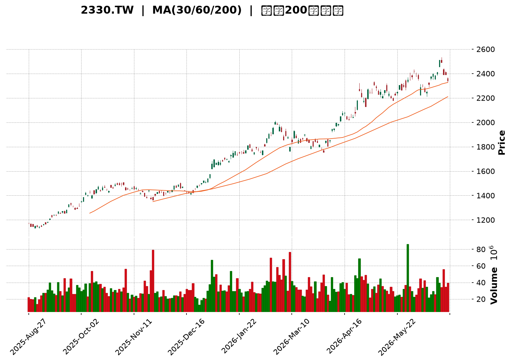
</details>

<html>
<head><meta charset="utf-8" /></head>
<body>
    <div style="height:500px; width:100%;">                        <script>window.PlotlyConfig = {MathJaxConfig: 'local'};</script>
        <script charset="utf-8" src="https://cdn.plot.ly/plotly-3.6.0.min.js" integrity="sha256-QaOVwtVY0T02VaHrr6pnoHLCwayMJp4O5n4YyaE3rJk=" crossorigin="anonymous"></script>                <div id="candlestick-chart" class="plotly-graph-div" style="height:100%; width:100%;"></div>            <script>                window.PLOTLYENV=window.PLOTLYENV || {};                                if (document.getElementById("candlestick-chart")) {                    Plotly.newPlot(                        "candlestick-chart",                        [{"close":{"dtype":"f8","bdata":"AAAA4GJZkkAAAADg9uKRQAAAAOD24pFAAAAAoLP2kUAAAADg9uKRQAAAAOD24pFAAAAA4PbikUAAAACg6TGSQAAAAKDpMZJAAAAAINyAkkAAAACAi+OSQAAAAGDBHpNAAAAAALRtk0AAAABg91mTQAAAAIDc0JNAAAAA4GmVk0AAAABgreSTQAAAAOBplZNAAAAAIE8MlEAAAADgpr6UQAAAAOCmvpRAAAAAYGNvlEAAAADgHyCUQAAAAMDwM5RAAAAAQDSDlEAAAAAguyGVQAAAACBxrJVAAAAAICc3lkAAAADA4+eVQAAAACD4SpZAAAAAwOPnlUAAAABghQ+WQAAAAGAMrpZAAAAA4E\u002f9lkAAAADgmXKWQAAAAAB\u002f6ZZAAAAAAH\u002fplkAAAACgO5qWQAAAAOCZcpZAAAAAAH\u002fplkAAAABArtWWQAAAAGCTTJdAAAAAYJNMl0AAAABgwjiXQAAAAEBkYJdAAAAAYJNMl0AAAACgO5qWQAAAAGAMrpZAAAAAoDualkAAAABArtWWQAAAAGAMrpZAAAAAQK7VlkAAAACgO5qWQAAAAEBWI5ZAAAAAAMlelkAAAAAgQsCVQAAAAECgmJVAAAAAwGqGlkAAAACg\u002fnCVQAAAAOBcSZVAAAAAwOPnlUAAAAAg+EqWQAAAACAnN5ZAAAAAIPhKlkAAAADgEtSVQAAAAEBWI5ZAAAAA4JlylkAAAAAAyV6WQAAAAKA7mpZAAAAAoPEkl0AAAAAAf+mWQAAAAGCTTJdAAAAAoEjVlkAAAABADP2WQAAAAKDBhZZAAAAAIBxKlkAAAABgOjaWQAAAAGA6NpZAAAAAYDo2lkAAAADgZsGWQAAAAMDPJJdAAAAAgLE4l0AAAADgVnSXQAAAAODdw5dAAAAAYBqcl0AAAAAAZROYQAAAAGCRnphAAAAAgI\u002fwmUAAAADgu3uaQAAAAEBxBJpAAAAAwDQsmkAAAAAAUxiaQAAAAIAWQJpAAAAAoJ2PmkAAAACgnY+aQAAAAIAWQJpAAAAAQOgGm0AAAABgb1abQAAAAMAUkptAAAAAQOgGm0AAAABgb1abQAAAAAAzfptAAAAAgI1Cm0AAAACA9qWbQAAAAKAERZxAAAAAYF8JnEAAAADAFJKbQAAAACBRaptAAAAAgH31m0AAAABA2LmbQAAAACBRaptAAAAAgPalm0AAAADgIjGcQAAAAOCZM51AAAAAQMa+nUAAAADgIIOdQAAAAOCXhZ5AAAAAoGlMn0AAAACA4vyeQAAAAIBbrZ5AAAAAYE0OnkAAAACA9PecQAAAAOAgg51AAAAAYF1bnUAAAAAgQR2cQAAAAEBPvJxAAAAAIC8inkAAAACge0edQAAAAID095xAAAAAgG2onEAAAAAAGSSdQAAAAKC5r51AAAAAgE\u002fUnEAAAADAaqycQAAAAIC8NJxAAAAAgLw0nEAAAAAgXcCcQAAAAMBqrJxAAAAAQKFcnEAAAABADr2bQAAAAMBEbZtAAAAA4EHonEAAAACAvDScQAAAAEA0\u002fJxAAAAAAD9jnkAAAABgMXeeQAAAAMC2Kp9AAAAAANICn0AAAACAEAOgQAAAAGDuNKBAAAAAoOc+oEAAAAAAZaKfQAAAAKByjp9AAAAAgC7yn0AAAACALvKfQAAAAGDuNKBAAAAAYF8GoUAAAABg8qWhQAAAAIA2QqFAAAAAIGb8oEAAAACAo6KgQAAAAMDkuaFAAAAA4AaIoUAAAADgBoihQAAAACC1\u002f6FAAAAAYNDXoUAAAABAG2qhQAAAAAAAkqFAAAAAoC9MoUAAAACg66+hQAAAAGDypaFAAAAAgBR0oUAAAAAgRC6hQAAAAGBfBqFAAAAAACJgoUAAAAAAAJKhQAAAACC1\u002f6FAAAAAoOuvoUAAAADAwuuhQAAAAIDJ4aFAAAAAwHdZokAAAADAd1miQAAAAMBVi6JAAAAAYBjlokAAAADgTpWiQAAAACBqbaJAAAAAgMnhoUAAAADgu\u002fWhQAAAAAAAkqFAAAAAAACUoUAAAAAAAAyiQAAAAAAAjqJAAAAAAADAokAAAAAAAKKiQAAAAAAA1KJAAAAAAACco0AAAAAAAHSjQAAAAAAArKJAAAAAAACsokAAAAAAAEiiQA=="},"high":{"dtype":"f8","bdata":"AAAA4GJZkkBY7mkgpkWSQFjuaSCmRZJAAAAAoLP2kUA1wnLTLB6SQAAAAOD24pFANcJy0ywekkAAAACg6TGSQOGk7pMfbZJAAAAAINyAkkACRqkmSPeSQKWUUvqzbZNAAAAAALRtk0C9JaEGtG2TQAAAgFyt5JNAQcDqmAu9k0AAAABgreSTQKLgSi5++JNAAAAAIE8MlEAAAADgpr6UQB+onHUZ+pRAED74GAWXlECt1Ep1kluUQFVVVVVjb5RAvJV9jkjmlEC8x3v8izWVQAAAACBxrJVAaTbd2MhelkCjpH6ctPuVQKuqqrVqhpZAo6R+nLT7lUAdYNlmO5qWQAAAAGAMrpZAdbgamfEkl0AN6bx1DK6WQJgin5XxJJdAdYMpcsI4l0BNmjRZ3cGWQK9NlLxqhpZAdYMpcsI4l0Dyb+nVIBGXQO0tMhk1dJdA5ETL9QWIl0BnZmau1puXQHDyN\u002fkFiJdA21tk0tabl0DBgQPvT\u002f2WQIbug\u002fV+6ZZAJk2afAyulkChSkb5T\u002f2WQA3dB4vxJJdAoUpG+U\u002f9lkBNmjRZ3cGWQD7T1vj3SpZA8NGzlTualkCcdIBLJzeWQHIcx7Hj55VADlCXnDualkCAHiMSQsCVQLH2DQtCwJVARkn9eIUPlkAAAAAg+EqWQNJsupFqhpZAq6qqtWqGlkAZOmDnyF6WQD7T1vj3SpZAAAAA4JlylkD7RZHcmXKWQAAAAKA7mpZAAAAAoPEkl0B1gylywjiXQAAAAGCTTJdAAAAAkDiIl0CmyGcF7hCXQGAqaGWjmZZAFRh7qt9xlkCatsav33GWQN48QiUcSpZAVjBLOqOZlkBB\u002flmlSNWWQAAAAMDPJJdAUOZZRZNMl0AAAADgVnSXQAAAAODdw5dAr6G86t3Dl0AAAAAAZROYQAAAAGCRnphAf4vTWvhTmkAAAADgu3uaQGLRsso0LJpAgNjzD9pnmkBVVVUV2meaQGjD58+7e5pAq6qqKmG3mkBVVVVlf6OaQEWCmgraZ5pAq6qqyqsum0AYXXR19qWbQAAAAMAUkptAq6qqGlFqm0CMLrrqMn6bQH55bMUUkptAoPu5H9i5m0CWrGRF2LmbQAAAAKAERZxAbXZxAKqAnEAg0QqbffWbQAAAACBRaptAq6qqCkEdnEAVOoNVXwmcQHmaC3D2pZtAAAAAgPalm0Djd4L1qYCcQAAAAOCZM51A3cuxyonmnUAVCCNFTQ6eQGfSlWpbrZ5ADOSjKi10n0D4M+HPhzifQNUoY5Xi\u002fJ5AfUFfUD3BnkBpDt9v5KqdQLfEqR+2cZ5Aq6qq6iCDnUAAAAAgQR2cQEa15WpdW51ABb64qvJJnkC8uhVAxr6dQBKxRpV7R51ABQmj5ZkznUBM2AbB\u002fUudQAQCgQCsw51AOQ8dw\u002f1LnUAtZCEDGSSdQG3Hh+CuSJxAaDs+hE\u002fUnEAyOB9jCzidQHvTm6ImEJ1AcAiHoJNwnEAIRSjC1wycQHTRRQPz5JtAAAAA4EHonECukdWlJhCdQAAAAEA0\u002fJxAAAAAAD9jnkAAAABgMXeeQAAAAMC2Kp9AXH97YMQWn0AAAACAEAOgQMVO7CDTXKBA\u002f8FE0OBIoEAvMWuhCQ2gQMIWbHEQA6BAE7UrMfUqoEAPxO8A\u002fCCgQJ3YiXKjoqBAaZxBkFgQoUAY0TbTmSeiQPljSfPdw6FAqzNSQT04oUBUXDKENkKhQOAHfiDXzaFAaEUjoeuvoUB1uf0x182hQB988HGFRaJA9C4eIbX\u002foUA6JQHC5LmhQBTfPfHdw6FAyWfdYBR0oUAAAACg66+hQO+F96KgHaJASZIkQfmboUBRFEURImChQA8OSFE9OKFABYQT8f+RoUAEkz8w+ZuhQAAAACC1\u002f6FANvAZs6AdokCgaKvhmSeiQJ4PLPNwY6JAu3\u002fzgFyBokAvf9oCJtGiQIFcE4E6s6JAQ1qx8AMDo0Byp2gBJtGiQE7w5KEzvaJAxlQ4cacTokDvlbpwpxOiQCQrPLLC66FAAAAAAACooUAAAAAAACqiQAAAAAAAjqJAAAAAAADAokAAAAAAAKKiQAAAAAAA3qJAAAAAAACco0AAAAAAAM6jQAAAAAAAGqNAAAAAAADookAAAAAAAISiQA=="},"hovertemplate":"\u003cb\u003e%{x|%Y-%m-%d}\u003c\u002fb\u003e\u003cbr\u003e\u958b: $%{open:.2f}\u003cbr\u003e\u9ad8: $%{high:.2f}\u003cbr\u003e\u4f4e: $%{low:.2f}\u003cbr\u003e\u6536: $%{close:.2f}\u003cextra\u003e\u003c\u002fextra\u003e","low":{"dtype":"f8","bdata":"09LSkukxkkAAAADg9uKRQAAAAOD24pFAv4KhBcGnkUDuaYQ5Os+RQMs9jezAp5FAAAAA4PbikUC\u002fPLZScAqSQAAAAKDpMZJA7+7u0mJZkkD8c60yErySQNdaa7kEC5NAsyzLsjpGk0BD2l65OkaTQAAAAA6ZgZNAAAAA4GmVk0DyDfLtaZWTQAAAAOBplZNArRtM0Tqpk0AiPVCRkluUQOFXY0o0g5RAAAAAYGNvlEAbuZEDTwyUQAAAAMDwM5RAAAAAQDSDlECHcAhnGfqUQM3MzBi7IZVAYi60irT7lUC6tgIHQsCVQDmO42ZWI5ZA0siGcc+ElUCzzZeDtPuVQO6D9XuFD5ZAFo\u002fKbQyulkAAAADgmXKWQK0bTLFqhpZAAAAAAH\u002fplkDZsmXDaoaWQPQWQ0onN5ZAAAAAAH\u002fplkCv2lxj3cGWQBy7NMogEZdACulmg8I4l0AAAABgwjiXQCAbkM0gEZdAE9LNpvEkl0DZsmXDaoaWQAAAAGAMrpZA2bJlw2qGlkBftbmGDK6WQAAAAGAMrpZADpAWqjualkAAAACgO5qWQGCWlGOFD5ZAAAAAAMlelkAAAAAgQsCVQAAAAECgmJVA1g86KvhKlkAAAACg\u002fnCVQAAAAOBcSZVAurYCB0LAlUBWVVWKhQ+WQMtkkUNWI5ZAHcdxQyc3lkAAAADgEtSVQMEsKYe0+5VA9BZDSic3lkAQLkxqViOWQGbLli34SpZAhyb5lzualkAAAAAAf+mWQCakm+1P\u002fZZAq6qq2mbBlkC0bjC1SNWWQKHVl9rfcZZA6ueElVgilkAiw72aWCKWQGZJORCV+pVAAAAAYDo2lkB\u002fA0xVo5mWQHADhqpI1ZZAXzNM9e0Ql0CTv8mPsTiXQKuqqspWdJdAUV5D1VZ0l0CnAW2aOIiXQIHgMjWD\u002f5dATmu2j589mUD988+fJo2ZQJ0uTbWt3JlAAU8YIOq0mUBVVVUl6rSZQAAAAIAWQJpAVVVVFdpnmkBVVVUV2meaQLp9ZfVSGJpAAAAAoJ2PmkAYXXT6QsuaQGwOJFroBptAAAAAQOgGm0B10UXVqy6bQAkaTuqrLptAAAAAgI1Cm0AUoQiljUKbQDD90v+5zZtAmMGXmn31m0AAAADAFJKbQAoymwrKGptAAAAAMNi5m0D1Yj61FJKbQIPMplpvVptAU5vaVOgGm0AAAADgIjGcQOo7G7WLlJxAi9A4FbgfnUAAAADgIIOdQP3jEivGvp1A5je4iuL8nkAAAACA4vyeQIx4khovIp5AAAAAYE0OnkAAAACA9PecQEbasRo\u002fb51AVVVV1ZkznUARpNz0Mn6bQFwljSrIbJxA3ixPGrgfnUAAAACge0edQKmiZ6WLlJxAAAAAgG2onECzJ\u002fk+NPycQPT5fH7ic51AAAAAgE\u002fUnEAAAADAaqycQOAaWZ0A0ZtAJ3HwvtcMnEAAAAAgXcCcQAAAAMBqrJxAPt7jvdcMnEAAAABADr2bQAAAAMBEbZtA+pJp\u002fYWEnECUOHgfyiCcQNdaa114mJxAndiJHYP\u002fnUAzdYt9dROeQFK4Hn0Is55A7oGN3vrGnkC\u002fShibm1KfQDuxE58JDaBAB3RjfhADoEAAAAAAZaKfQAAAAKByjp9A+B2IHzzen0DxOxC\u002fScqfQIqd2G4QA6BAaTnmW8xmoEAAAABg8qWhQAAAAIA2QqFAKuZWj3reoEAAAACAo6KgQPzAD7xRGqFATF1ufxR0oUBMXW5\u002fFHShQAAAACC1\u002f6FAT0WabvKloUAAAABAG2qhQNzUw009OKFAKfJZD0QuoUAel74dImChQIQeQs8GiKFAJEmSjjZCoUAAAAAgRC6hQAAAAGBfBqFAAAAAACJgoUDojYLeKFahQOGDD87kuaFAAAAAoOuvoUDLh3Ff0NehQDmrx47rr6FAV6DPzpknokARIMOPfk+iQH+j7P5wY6JAvqVOzyzHokAAAADgTpWiQOMlSo9+T6JAYvDTDCJgoUALnIN\u002fyeGhQAAAAAAAkqFAAAAAAABEoUAAAAAAAOShQAAAAAAAUqJAAAAAAABcokAAAAAAAFyiQAAAAAAAoqJAAAAAAAAuo0AAAAAAAHSjQAAAAAAArKJAAAAAAACsokAAAAAAACqiQA=="},"name":"\u50f9\u683c","open":{"dtype":"f8","bdata":"AAAA4GJZkkBY7mkgpkWSQEdY7nnpMZJADyI5rH27kUAjLPcscAqSQO5phDk6z5FAIyz3LHAKkkBfHlv5LB6SQOGk7pMfbZJAd3d3eR9tkkD+uVbZzs+SQHzvvVP3WZNAWZZlWfdZk0C9JaEGtG2TQAAAgOpplZNAIWB1vDqpk0D5BvmmC72TQIKA1VGt5JNArRtM0Tqpk0CCytltY2+UQL8aE5lI5pRAAAAAYGNvlEDJjdyYwUeUQBzHcZzBR5RAAAAAQDSDlEBDOIRD6g2VQM3MzBi7IZVAYi60irT7lUBdW4HjEtSVQAAAACD4SpZA0siGcc+ElUDQLXGKaoaWQPMi+DQnN5ZAFo\u002fKbQyulkCvTZS8aoaWQIp81o07mpZA3WCK3E\u002f9lkAAAACgO5qWQKNk1yb4SpZAdYMpcsI4l0BRJaMcf+mWQBPSzabxJJdA7S0yGTV0l0DXo3D1NHSXQAAAAEBkYJdA5ETL9QWIl0CaNGkSf+mWQIJPgTzdwZZAAAAAoDualkCv2lxj3cGWQIuNhq4gEZdAr9pcY93BlkAAAACgO5qWQGCWlGOFD5ZA+0WR3JlylkCcdIBLJzeWQBzHcRxxrJVA8q9o45lylkBAjxFZoJiVQOmiiy5xrJVARkn9eIUPlkA5juNmViOWQJ7RS7WZcpZAAAAAIPhKlkAZOmDnyF6WQAAAAEBWI5ZAo2TXJvhKlkAAAAAAyV6WQIwYMQrJXpZAK2qMdAyulkCYIp+V8SSXQBy7NMogEZdAq6qqylZ0l0BaN5h6KumWQAAAAKDBhZZAAAAAIBxKlkDePEIlHEqWQESGe9V2DpZAVjBLOqOZlkAAAADgZsGWQJSC5G8q6ZZAAAAAgLE4l0AxlZgadWCXQAAAAJA4iJdAKK+hmjiIl0D9JctfGpyXQGEo5r9GJ5hAm+0TVYFRmUD988+fJo2ZQJ0uTbWt3JlAK5dp5cvImUAAAACwrdyZQEWCmgraZ5pAq6qqKmG3mkCrqqrau3uaQN2+sro0LJpAq6qqegbzmkAYXXT6QsuaQGwOJFroBptAVVVVBcoam0BGF10lUWqbQAAAAAAzfptA4FOTClFqm0CqTW1qb1abQDD90v+5zZtABjgJO8hsnECtsDkQus2bQIhl9M+rLptAq6qqCkEdnEAAAABA2LmbQAAAACBRaptA6Uc\u002fGsoam0Dr2SEwyGycQG3Ud3ptqJxAeraR2pkznUAAAADgIIOdQP3jEivGvp1A5je4iuL8nkBTEUtFxBCfQIx4khovIp5A02ufxXmZnkCbCeofP2+dQM8tcQovIp5AVVVV1ZkznUCPD0G6FJKbQKPaclXWC51A4+oHpXtHnUBe3QrwIIOdQKmiZ6WLlJxABJpCILgfnUAmbINgCzidQPz9fj\u002fHm51AWjeYYgs4nUDJQhZCNPycQE3i4P3y5JtAaDs+hE\u002fUnEAh0BSiJhCdQGQhC4FP1JxAruZqHsognEAAAABADr2bQLroouEbqZtAY4tyvmqsnECukdWlJhCdQPC9935P1JxAXuiF3mcnnkBHlQSfTE+eQJqZmd36xp5ApYCEn9\u002funkCq0KP7jWafQOzETs8CF6BAAT67b+40oED8qC5xEAOgQOtceQBlop9AAAAAgC7yn0D4HYgfPN6fQGIndsDgSKBA0tUnjMVwoEB84b3w3cOhQIdVhKENfqFADqLH72zyoEDKEKwjRC6hQOzETuxKJKFAAAAA4AaIoUAAAADgBoihQM2hYhGTMaJAehePwMLroUDr24Bh8qWhQPCzAT8baqFAKfJZD0QuoUCPS9\u002feBoihQHOkORK1\u002f6FASZIk7yhWoUAxDMOwL0yhQKZxBiFELqFAzzRuYBR0oUD42YCfDX6hQOGDD87kuaFAGsPRgqcTokA2eI4gtf+hQOggr5J+T6JANGBJL4w7okAAAADAd1miQECuiSBIn6JAAAAAYBjlokAAAADgTpWiQDu0a0FBqaJAYvDTDCJgoUAAAADgu\u002fWhQBhyfSHXzaFAAAAAAACAoUAAAAAAACqiQAAAAAAAcKJAAAAAAACOokAAAAAAAGaiQAAAAAAAtqJAAAAAAAAuo0AAAAAAAJyjQAAAAAAABqNAAAAAAADUokAAAAAAAHCiQA=="},"x":["2025-08-27T00:00:00+08:00","2025-08-28T00:00:00+08:00","2025-08-29T00:00:00+08:00","2025-09-01T00:00:00+08:00","2025-09-02T00:00:00+08:00","2025-09-03T00:00:00+08:00","2025-09-04T00:00:00+08:00","2025-09-05T00:00:00+08:00","2025-09-08T00:00:00+08:00","2025-09-09T00:00:00+08:00","2025-09-10T00:00:00+08:00","2025-09-11T00:00:00+08:00","2025-09-12T00:00:00+08:00","2025-09-15T00:00:00+08:00","2025-09-16T00:00:00+08:00","2025-09-17T00:00:00+08:00","2025-09-18T00:00:00+08:00","2025-09-19T00:00:00+08:00","2025-09-22T00:00:00+08:00","2025-09-23T00:00:00+08:00","2025-09-24T00:00:00+08:00","2025-09-25T00:00:00+08:00","2025-09-26T00:00:00+08:00","2025-09-30T00:00:00+08:00","2025-10-01T00:00:00+08:00","2025-10-02T00:00:00+08:00","2025-10-03T00:00:00+08:00","2025-10-07T00:00:00+08:00","2025-10-08T00:00:00+08:00","2025-10-09T00:00:00+08:00","2025-10-13T00:00:00+08:00","2025-10-14T00:00:00+08:00","2025-10-15T00:00:00+08:00","2025-10-16T00:00:00+08:00","2025-10-17T00:00:00+08:00","2025-10-20T00:00:00+08:00","2025-10-21T00:00:00+08:00","2025-10-22T00:00:00+08:00","2025-10-23T00:00:00+08:00","2025-10-27T00:00:00+08:00","2025-10-28T00:00:00+08:00","2025-10-29T00:00:00+08:00","2025-10-30T00:00:00+08:00","2025-10-31T00:00:00+08:00","2025-11-03T00:00:00+08:00","2025-11-04T00:00:00+08:00","2025-11-05T00:00:00+08:00","2025-11-06T00:00:00+08:00","2025-11-07T00:00:00+08:00","2025-11-10T00:00:00+08:00","2025-11-11T00:00:00+08:00","2025-11-12T00:00:00+08:00","2025-11-13T00:00:00+08:00","2025-11-14T00:00:00+08:00","2025-11-17T00:00:00+08:00","2025-11-18T00:00:00+08:00","2025-11-19T00:00:00+08:00","2025-11-20T00:00:00+08:00","2025-11-21T00:00:00+08:00","2025-11-24T00:00:00+08:00","2025-11-25T00:00:00+08:00","2025-11-26T00:00:00+08:00","2025-11-27T00:00:00+08:00","2025-11-28T00:00:00+08:00","2025-12-01T00:00:00+08:00","2025-12-02T00:00:00+08:00","2025-12-03T00:00:00+08:00","2025-12-04T00:00:00+08:00","2025-12-05T00:00:00+08:00","2025-12-08T00:00:00+08:00","2025-12-09T00:00:00+08:00","2025-12-10T00:00:00+08:00","2025-12-11T00:00:00+08:00","2025-12-12T00:00:00+08:00","2025-12-15T00:00:00+08:00","2025-12-16T00:00:00+08:00","2025-12-17T00:00:00+08:00","2025-12-18T00:00:00+08:00","2025-12-19T00:00:00+08:00","2025-12-22T00:00:00+08:00","2025-12-23T00:00:00+08:00","2025-12-24T00:00:00+08:00","2025-12-26T00:00:00+08:00","2025-12-29T00:00:00+08:00","2025-12-30T00:00:00+08:00","2025-12-31T00:00:00+08:00","2026-01-02T00:00:00+08:00","2026-01-05T00:00:00+08:00","2026-01-06T00:00:00+08:00","2026-01-07T00:00:00+08:00","2026-01-08T00:00:00+08:00","2026-01-09T00:00:00+08:00","2026-01-12T00:00:00+08:00","2026-01-13T00:00:00+08:00","2026-01-14T00:00:00+08:00","2026-01-15T00:00:00+08:00","2026-01-16T00:00:00+08:00","2026-01-19T00:00:00+08:00","2026-01-20T00:00:00+08:00","2026-01-21T00:00:00+08:00","2026-01-22T00:00:00+08:00","2026-01-23T00:00:00+08:00","2026-01-26T00:00:00+08:00","2026-01-27T00:00:00+08:00","2026-01-28T00:00:00+08:00","2026-01-29T00:00:00+08:00","2026-01-30T00:00:00+08:00","2026-02-02T00:00:00+08:00","2026-02-03T00:00:00+08:00","2026-02-04T00:00:00+08:00","2026-02-05T00:00:00+08:00","2026-02-06T00:00:00+08:00","2026-02-09T00:00:00+08:00","2026-02-10T00:00:00+08:00","2026-02-11T00:00:00+08:00","2026-02-23T00:00:00+08:00","2026-02-24T00:00:00+08:00","2026-02-25T00:00:00+08:00","2026-02-26T00:00:00+08:00","2026-03-02T00:00:00+08:00","2026-03-03T00:00:00+08:00","2026-03-04T00:00:00+08:00","2026-03-05T00:00:00+08:00","2026-03-06T00:00:00+08:00","2026-03-09T00:00:00+08:00","2026-03-10T00:00:00+08:00","2026-03-11T00:00:00+08:00","2026-03-12T00:00:00+08:00","2026-03-13T00:00:00+08:00","2026-03-16T00:00:00+08:00","2026-03-17T00:00:00+08:00","2026-03-18T00:00:00+08:00","2026-03-19T00:00:00+08:00","2026-03-20T00:00:00+08:00","2026-03-23T00:00:00+08:00","2026-03-24T00:00:00+08:00","2026-03-25T00:00:00+08:00","2026-03-26T00:00:00+08:00","2026-03-27T00:00:00+08:00","2026-03-30T00:00:00+08:00","2026-03-31T00:00:00+08:00","2026-04-01T00:00:00+08:00","2026-04-02T00:00:00+08:00","2026-04-07T00:00:00+08:00","2026-04-08T00:00:00+08:00","2026-04-09T00:00:00+08:00","2026-04-10T00:00:00+08:00","2026-04-13T00:00:00+08:00","2026-04-14T00:00:00+08:00","2026-04-15T00:00:00+08:00","2026-04-16T00:00:00+08:00","2026-04-17T00:00:00+08:00","2026-04-20T00:00:00+08:00","2026-04-21T00:00:00+08:00","2026-04-22T00:00:00+08:00","2026-04-23T00:00:00+08:00","2026-04-24T00:00:00+08:00","2026-04-27T00:00:00+08:00","2026-04-28T00:00:00+08:00","2026-04-29T00:00:00+08:00","2026-04-30T00:00:00+08:00","2026-05-04T00:00:00+08:00","2026-05-05T00:00:00+08:00","2026-05-06T00:00:00+08:00","2026-05-07T00:00:00+08:00","2026-05-08T00:00:00+08:00","2026-05-11T00:00:00+08:00","2026-05-12T00:00:00+08:00","2026-05-13T00:00:00+08:00","2026-05-14T00:00:00+08:00","2026-05-15T00:00:00+08:00","2026-05-18T00:00:00+08:00","2026-05-19T00:00:00+08:00","2026-05-20T00:00:00+08:00","2026-05-21T00:00:00+08:00","2026-05-22T00:00:00+08:00","2026-05-25T00:00:00+08:00","2026-05-26T00:00:00+08:00","2026-05-27T00:00:00+08:00","2026-05-28T00:00:00+08:00","2026-05-29T00:00:00+08:00","2026-06-01T00:00:00+08:00","2026-06-02T00:00:00+08:00","2026-06-03T00:00:00+08:00","2026-06-04T00:00:00+08:00","2026-06-05T00:00:00+08:00","2026-06-08T00:00:00+08:00","2026-06-09T00:00:00+08:00","2026-06-10T00:00:00+08:00","2026-06-11T00:00:00+08:00","2026-06-12T00:00:00+08:00","2026-06-15T00:00:00+08:00","2026-06-16T00:00:00+08:00","2026-06-17T00:00:00+08:00","2026-06-18T00:00:00+08:00","2026-06-22T00:00:00+08:00","2026-06-23T00:00:00+08:00","2026-06-24T00:00:00+08:00","2026-06-25T00:00:00+08:00","2026-06-26T00:00:00+08:00"],"type":"candlestick"},{"hovertemplate":"MA30: $%{y:.2f}\u003cextra\u003e\u003c\u002fextra\u003e","line":{"color":"#2196F3","dash":"dash","width":2},"mode":"lines","name":"MA30","x":["2025-08-27T00:00:00+08:00","2025-08-28T00:00:00+08:00","2025-08-29T00:00:00+08:00","2025-09-01T00:00:00+08:00","2025-09-02T00:00:00+08:00","2025-09-03T00:00:00+08:00","2025-09-04T00:00:00+08:00","2025-09-05T00:00:00+08:00","2025-09-08T00:00:00+08:00","2025-09-09T00:00:00+08:00","2025-09-10T00:00:00+08:00","2025-09-11T00:00:00+08:00","2025-09-12T00:00:00+08:00","2025-09-15T00:00:00+08:00","2025-09-16T00:00:00+08:00","2025-09-17T00:00:00+08:00","2025-09-18T00:00:00+08:00","2025-09-19T00:00:00+08:00","2025-09-22T00:00:00+08:00","2025-09-23T00:00:00+08:00","2025-09-24T00:00:00+08:00","2025-09-25T00:00:00+08:00","2025-09-26T00:00:00+08:00","2025-09-30T00:00:00+08:00","2025-10-01T00:00:00+08:00","2025-10-02T00:00:00+08:00","2025-10-03T00:00:00+08:00","2025-10-07T00:00:00+08:00","2025-10-08T00:00:00+08:00","2025-10-09T00:00:00+08:00","2025-10-13T00:00:00+08:00","2025-10-14T00:00:00+08:00","2025-10-15T00:00:00+08:00","2025-10-16T00:00:00+08:00","2025-10-17T00:00:00+08:00","2025-10-20T00:00:00+08:00","2025-10-21T00:00:00+08:00","2025-10-22T00:00:00+08:00","2025-10-23T00:00:00+08:00","2025-10-27T00:00:00+08:00","2025-10-28T00:00:00+08:00","2025-10-29T00:00:00+08:00","2025-10-30T00:00:00+08:00","2025-10-31T00:00:00+08:00","2025-11-03T00:00:00+08:00","2025-11-04T00:00:00+08:00","2025-11-05T00:00:00+08:00","2025-11-06T00:00:00+08:00","2025-11-07T00:00:00+08:00","2025-11-10T00:00:00+08:00","2025-11-11T00:00:00+08:00","2025-11-12T00:00:00+08:00","2025-11-13T00:00:00+08:00","2025-11-14T00:00:00+08:00","2025-11-17T00:00:00+08:00","2025-11-18T00:00:00+08:00","2025-11-19T00:00:00+08:00","2025-11-20T00:00:00+08:00","2025-11-21T00:00:00+08:00","2025-11-24T00:00:00+08:00","2025-11-25T00:00:00+08:00","2025-11-26T00:00:00+08:00","2025-11-27T00:00:00+08:00","2025-11-28T00:00:00+08:00","2025-12-01T00:00:00+08:00","2025-12-02T00:00:00+08:00","2025-12-03T00:00:00+08:00","2025-12-04T00:00:00+08:00","2025-12-05T00:00:00+08:00","2025-12-08T00:00:00+08:00","2025-12-09T00:00:00+08:00","2025-12-10T00:00:00+08:00","2025-12-11T00:00:00+08:00","2025-12-12T00:00:00+08:00","2025-12-15T00:00:00+08:00","2025-12-16T00:00:00+08:00","2025-12-17T00:00:00+08:00","2025-12-18T00:00:00+08:00","2025-12-19T00:00:00+08:00","2025-12-22T00:00:00+08:00","2025-12-23T00:00:00+08:00","2025-12-24T00:00:00+08:00","2025-12-26T00:00:00+08:00","2025-12-29T00:00:00+08:00","2025-12-30T00:00:00+08:00","2025-12-31T00:00:00+08:00","2026-01-02T00:00:00+08:00","2026-01-05T00:00:00+08:00","2026-01-06T00:00:00+08:00","2026-01-07T00:00:00+08:00","2026-01-08T00:00:00+08:00","2026-01-09T00:00:00+08:00","2026-01-12T00:00:00+08:00","2026-01-13T00:00:00+08:00","2026-01-14T00:00:00+08:00","2026-01-15T00:00:00+08:00","2026-01-16T00:00:00+08:00","2026-01-19T00:00:00+08:00","2026-01-20T00:00:00+08:00","2026-01-21T00:00:00+08:00","2026-01-22T00:00:00+08:00","2026-01-23T00:00:00+08:00","2026-01-26T00:00:00+08:00","2026-01-27T00:00:00+08:00","2026-01-28T00:00:00+08:00","2026-01-29T00:00:00+08:00","2026-01-30T00:00:00+08:00","2026-02-02T00:00:00+08:00","2026-02-03T00:00:00+08:00","2026-02-04T00:00:00+08:00","2026-02-05T00:00:00+08:00","2026-02-06T00:00:00+08:00","2026-02-09T00:00:00+08:00","2026-02-10T00:00:00+08:00","2026-02-11T00:00:00+08:00","2026-02-23T00:00:00+08:00","2026-02-24T00:00:00+08:00","2026-02-25T00:00:00+08:00","2026-02-26T00:00:00+08:00","2026-03-02T00:00:00+08:00","2026-03-03T00:00:00+08:00","2026-03-04T00:00:00+08:00","2026-03-05T00:00:00+08:00","2026-03-06T00:00:00+08:00","2026-03-09T00:00:00+08:00","2026-03-10T00:00:00+08:00","2026-03-11T00:00:00+08:00","2026-03-12T00:00:00+08:00","2026-03-13T00:00:00+08:00","2026-03-16T00:00:00+08:00","2026-03-17T00:00:00+08:00","2026-03-18T00:00:00+08:00","2026-03-19T00:00:00+08:00","2026-03-20T00:00:00+08:00","2026-03-23T00:00:00+08:00","2026-03-24T00:00:00+08:00","2026-03-25T00:00:00+08:00","2026-03-26T00:00:00+08:00","2026-03-27T00:00:00+08:00","2026-03-30T00:00:00+08:00","2026-03-31T00:00:00+08:00","2026-04-01T00:00:00+08:00","2026-04-02T00:00:00+08:00","2026-04-07T00:00:00+08:00","2026-04-08T00:00:00+08:00","2026-04-09T00:00:00+08:00","2026-04-10T00:00:00+08:00","2026-04-13T00:00:00+08:00","2026-04-14T00:00:00+08:00","2026-04-15T00:00:00+08:00","2026-04-16T00:00:00+08:00","2026-04-17T00:00:00+08:00","2026-04-20T00:00:00+08:00","2026-04-21T00:00:00+08:00","2026-04-22T00:00:00+08:00","2026-04-23T00:00:00+08:00","2026-04-24T00:00:00+08:00","2026-04-27T00:00:00+08:00","2026-04-28T00:00:00+08:00","2026-04-29T00:00:00+08:00","2026-04-30T00:00:00+08:00","2026-05-04T00:00:00+08:00","2026-05-05T00:00:00+08:00","2026-05-06T00:00:00+08:00","2026-05-07T00:00:00+08:00","2026-05-08T00:00:00+08:00","2026-05-11T00:00:00+08:00","2026-05-12T00:00:00+08:00","2026-05-13T00:00:00+08:00","2026-05-14T00:00:00+08:00","2026-05-15T00:00:00+08:00","2026-05-18T00:00:00+08:00","2026-05-19T00:00:00+08:00","2026-05-20T00:00:00+08:00","2026-05-21T00:00:00+08:00","2026-05-22T00:00:00+08:00","2026-05-25T00:00:00+08:00","2026-05-26T00:00:00+08:00","2026-05-27T00:00:00+08:00","2026-05-28T00:00:00+08:00","2026-05-29T00:00:00+08:00","2026-06-01T00:00:00+08:00","2026-06-02T00:00:00+08:00","2026-06-03T00:00:00+08:00","2026-06-04T00:00:00+08:00","2026-06-05T00:00:00+08:00","2026-06-08T00:00:00+08:00","2026-06-09T00:00:00+08:00","2026-06-10T00:00:00+08:00","2026-06-11T00:00:00+08:00","2026-06-12T00:00:00+08:00","2026-06-15T00:00:00+08:00","2026-06-16T00:00:00+08:00","2026-06-17T00:00:00+08:00","2026-06-18T00:00:00+08:00","2026-06-22T00:00:00+08:00","2026-06-23T00:00:00+08:00","2026-06-24T00:00:00+08:00","2026-06-25T00:00:00+08:00","2026-06-26T00:00:00+08:00"],"y":{"dtype":"f8","bdata":"AAAAAAAA+H8AAAAAAAD4fwAAAAAAAPh\u002fAAAAAAAA+H8AAAAAAAD4fwAAAAAAAPh\u002fAAAAAAAA+H8AAAAAAAD4fwAAAAAAAPh\u002fAAAAAAAA+H8AAAAAAAD4fwAAAAAAAPh\u002fAAAAAAAA+H8AAAAAAAD4fwAAAAAAAPh\u002fAAAAAAAA+H8AAAAAAAD4fwAAAAAAAPh\u002fAAAAAAAA+H8AAAAAAAD4fwAAAAAAAPh\u002fAAAAAAAA+H8AAAAAAAD4fwAAAAAAAPh\u002fAAAAAAAA+H8AAAAAAAD4fwAAAAAAAPh\u002fAAAAAAAA+H8AAAAAAAD4fwAAAMB6nJNAERERYdS6k0Crqqq6ct6TQImIiNhZB5RAvLu76zwylEARERHBKFmUQImIiCgLhJRAAAAAkO2ulEBVVVXlidSUQJqZmQnU+JRAEREREXMelUBERETkHkCVQGZmZgbIY5VAiYiIeM+ElUDNzMw81qWVQBEREaE4xJVAZmZmNu3jlUDe3d2NC\u002fuVQO\u002fu7l53FZZAVVVVhUMrlkCamZkZGT2WQLy7u3ucTZZAIiIichZilkARERGBOXeWQDMzM+O8h5ZA3t3dLZeXlkAiIiLy35yWQJqZmdk2nJZAzczMPNuelkCrqqqq5JqWQM3MzGxOkpZAzczMbE6SlkB3d3e3SZSWQERERCRTkJZAiYiISGGKlkBERESEGIWWQO\u002fu7o59fpZAzczM\u002fIZ6lkAzMzOzi3iWQEREROTdeZZA3t3dLdl7lkBVVVVFgnyWQFVVVUWCfJZAAAAAUIh4lkBmZmbGinaWQGZmZhZBb5ZAMzMzg6NmlkAzMzMjTmOWQLy7u6tPX5ZAvLu7S\u002fpblkAAAABATVuWQCIiIrJCX5ZAq6qqmo9ilkB3d3fH1GmWQKuqqiq3d5ZAIiIi8kqClkARERFxIZaWQO\u002fu7r7tr5ZAq6qqGhHNlkCamZlpF\u002fiWQFVVVfV1IJdA7+7uDt9El0BVVVUFUWWXQGZmZma\u002fh5dAERERUSusl0Dv7u7OjdSXQImIiEil95dAZmZm9rgemEAAAABgHEmYQKuqqnqBc5hAzczMTKOUmEC8u7sLZ7qYQCIiIqIw3phAIiIiMvcDmUDNzMy8uiuZQBEREYHFXJlAd3d3R9CNmUAiIiLCiruZQKuqqurx55lAAAAAsPwYmkDe3d3dZkOaQM3MzBzaZ5pA3t3draCNmkARERHhDbaaQDMzMwNy5JpAMzMzE80Ym0BEREQ0MUebQJqZmUmPeZtAIiIiwkmnm0Crqqr6uc2bQFVVVYV99ZtAmpmZeaAWnEC8u7vbJS+cQJqZmYn7SpxAMzMzQ9dinEAiIiJyGHCcQJqZmYlNhZxAZmZm5s+fnEAAAABgYbCcQLy7uztPvJxAMzMzEzrKnECJiIiYndmcQImIiEhV7JxA3t3dnbn5nECamZk5eQKdQJqZmUnuAZ1AMzMzU2ADnUDe3d3Ncw2dQERERGQwGJ1AREREhKAbnUCrqqrquxudQKuqqhrVG51AmpmZWZMmnUAiIiISsiadQJqZmVnZJJ1Ad3d311QqnUBmZmaGdzKdQN7d3Y34N51AERERkYQ1nUC8u7v7Wz6dQHd3dxctTZ1AAAAAsPVhnUC8u7srtXidQERERNQmip1A3t3d3T6gnUAiIiJy8cCdQHd3dwdU4J1Ad3d3N78BnkDe3d0NGDWeQHd3d2dxZJ5AVVVV5cmRnkCamZkpB7WeQEREROQ65p5AZmZm5msbn0BVVVVV8VGfQHd3d5dulJ9AAAAAAEPUn0AiIiLKDwSgQERERJynH6BAREREHEA6oEDv7u6G1FqgQKuqqkJofKBAIiIicgGWoEB3d3fXRLCgQAAAAMDgxaBAMzMzs37YoEC8u7sTceygQDMzM6sNAaFAd3d3n6sToUDNzMzU9SOhQO\u002fu7mZBMqFAvLu7IzVEoUBEREQM0VmhQImIiJhrcaFAERERkVqKoUAAAACwoKChQO\u002fu7r6Ts6FAVVVVFeS6oUDv7u7ujL2hQImIiMg1wKFAIiIickPFoUAAAAAQT9GhQJqZmQlh2KFAVVVVNcfioUARERFhLeyhQBEREfFA86FAiYiImFMCokBmZmYWuROiQM3MzHwfHaJAIiIiotkookARERFh6y2iQA=="},"type":"scatter"},{"hovertemplate":"MA60: $%{y:.2f}\u003cextra\u003e\u003c\u002fextra\u003e","line":{"color":"#9C27B0","dash":"dash","width":2},"mode":"lines","name":"MA60","x":["2025-08-27T00:00:00+08:00","2025-08-28T00:00:00+08:00","2025-08-29T00:00:00+08:00","2025-09-01T00:00:00+08:00","2025-09-02T00:00:00+08:00","2025-09-03T00:00:00+08:00","2025-09-04T00:00:00+08:00","2025-09-05T00:00:00+08:00","2025-09-08T00:00:00+08:00","2025-09-09T00:00:00+08:00","2025-09-10T00:00:00+08:00","2025-09-11T00:00:00+08:00","2025-09-12T00:00:00+08:00","2025-09-15T00:00:00+08:00","2025-09-16T00:00:00+08:00","2025-09-17T00:00:00+08:00","2025-09-18T00:00:00+08:00","2025-09-19T00:00:00+08:00","2025-09-22T00:00:00+08:00","2025-09-23T00:00:00+08:00","2025-09-24T00:00:00+08:00","2025-09-25T00:00:00+08:00","2025-09-26T00:00:00+08:00","2025-09-30T00:00:00+08:00","2025-10-01T00:00:00+08:00","2025-10-02T00:00:00+08:00","2025-10-03T00:00:00+08:00","2025-10-07T00:00:00+08:00","2025-10-08T00:00:00+08:00","2025-10-09T00:00:00+08:00","2025-10-13T00:00:00+08:00","2025-10-14T00:00:00+08:00","2025-10-15T00:00:00+08:00","2025-10-16T00:00:00+08:00","2025-10-17T00:00:00+08:00","2025-10-20T00:00:00+08:00","2025-10-21T00:00:00+08:00","2025-10-22T00:00:00+08:00","2025-10-23T00:00:00+08:00","2025-10-27T00:00:00+08:00","2025-10-28T00:00:00+08:00","2025-10-29T00:00:00+08:00","2025-10-30T00:00:00+08:00","2025-10-31T00:00:00+08:00","2025-11-03T00:00:00+08:00","2025-11-04T00:00:00+08:00","2025-11-05T00:00:00+08:00","2025-11-06T00:00:00+08:00","2025-11-07T00:00:00+08:00","2025-11-10T00:00:00+08:00","2025-11-11T00:00:00+08:00","2025-11-12T00:00:00+08:00","2025-11-13T00:00:00+08:00","2025-11-14T00:00:00+08:00","2025-11-17T00:00:00+08:00","2025-11-18T00:00:00+08:00","2025-11-19T00:00:00+08:00","2025-11-20T00:00:00+08:00","2025-11-21T00:00:00+08:00","2025-11-24T00:00:00+08:00","2025-11-25T00:00:00+08:00","2025-11-26T00:00:00+08:00","2025-11-27T00:00:00+08:00","2025-11-28T00:00:00+08:00","2025-12-01T00:00:00+08:00","2025-12-02T00:00:00+08:00","2025-12-03T00:00:00+08:00","2025-12-04T00:00:00+08:00","2025-12-05T00:00:00+08:00","2025-12-08T00:00:00+08:00","2025-12-09T00:00:00+08:00","2025-12-10T00:00:00+08:00","2025-12-11T00:00:00+08:00","2025-12-12T00:00:00+08:00","2025-12-15T00:00:00+08:00","2025-12-16T00:00:00+08:00","2025-12-17T00:00:00+08:00","2025-12-18T00:00:00+08:00","2025-12-19T00:00:00+08:00","2025-12-22T00:00:00+08:00","2025-12-23T00:00:00+08:00","2025-12-24T00:00:00+08:00","2025-12-26T00:00:00+08:00","2025-12-29T00:00:00+08:00","2025-12-30T00:00:00+08:00","2025-12-31T00:00:00+08:00","2026-01-02T00:00:00+08:00","2026-01-05T00:00:00+08:00","2026-01-06T00:00:00+08:00","2026-01-07T00:00:00+08:00","2026-01-08T00:00:00+08:00","2026-01-09T00:00:00+08:00","2026-01-12T00:00:00+08:00","2026-01-13T00:00:00+08:00","2026-01-14T00:00:00+08:00","2026-01-15T00:00:00+08:00","2026-01-16T00:00:00+08:00","2026-01-19T00:00:00+08:00","2026-01-20T00:00:00+08:00","2026-01-21T00:00:00+08:00","2026-01-22T00:00:00+08:00","2026-01-23T00:00:00+08:00","2026-01-26T00:00:00+08:00","2026-01-27T00:00:00+08:00","2026-01-28T00:00:00+08:00","2026-01-29T00:00:00+08:00","2026-01-30T00:00:00+08:00","2026-02-02T00:00:00+08:00","2026-02-03T00:00:00+08:00","2026-02-04T00:00:00+08:00","2026-02-05T00:00:00+08:00","2026-02-06T00:00:00+08:00","2026-02-09T00:00:00+08:00","2026-02-10T00:00:00+08:00","2026-02-11T00:00:00+08:00","2026-02-23T00:00:00+08:00","2026-02-24T00:00:00+08:00","2026-02-25T00:00:00+08:00","2026-02-26T00:00:00+08:00","2026-03-02T00:00:00+08:00","2026-03-03T00:00:00+08:00","2026-03-04T00:00:00+08:00","2026-03-05T00:00:00+08:00","2026-03-06T00:00:00+08:00","2026-03-09T00:00:00+08:00","2026-03-10T00:00:00+08:00","2026-03-11T00:00:00+08:00","2026-03-12T00:00:00+08:00","2026-03-13T00:00:00+08:00","2026-03-16T00:00:00+08:00","2026-03-17T00:00:00+08:00","2026-03-18T00:00:00+08:00","2026-03-19T00:00:00+08:00","2026-03-20T00:00:00+08:00","2026-03-23T00:00:00+08:00","2026-03-24T00:00:00+08:00","2026-03-25T00:00:00+08:00","2026-03-26T00:00:00+08:00","2026-03-27T00:00:00+08:00","2026-03-30T00:00:00+08:00","2026-03-31T00:00:00+08:00","2026-04-01T00:00:00+08:00","2026-04-02T00:00:00+08:00","2026-04-07T00:00:00+08:00","2026-04-08T00:00:00+08:00","2026-04-09T00:00:00+08:00","2026-04-10T00:00:00+08:00","2026-04-13T00:00:00+08:00","2026-04-14T00:00:00+08:00","2026-04-15T00:00:00+08:00","2026-04-16T00:00:00+08:00","2026-04-17T00:00:00+08:00","2026-04-20T00:00:00+08:00","2026-04-21T00:00:00+08:00","2026-04-22T00:00:00+08:00","2026-04-23T00:00:00+08:00","2026-04-24T00:00:00+08:00","2026-04-27T00:00:00+08:00","2026-04-28T00:00:00+08:00","2026-04-29T00:00:00+08:00","2026-04-30T00:00:00+08:00","2026-05-04T00:00:00+08:00","2026-05-05T00:00:00+08:00","2026-05-06T00:00:00+08:00","2026-05-07T00:00:00+08:00","2026-05-08T00:00:00+08:00","2026-05-11T00:00:00+08:00","2026-05-12T00:00:00+08:00","2026-05-13T00:00:00+08:00","2026-05-14T00:00:00+08:00","2026-05-15T00:00:00+08:00","2026-05-18T00:00:00+08:00","2026-05-19T00:00:00+08:00","2026-05-20T00:00:00+08:00","2026-05-21T00:00:00+08:00","2026-05-22T00:00:00+08:00","2026-05-25T00:00:00+08:00","2026-05-26T00:00:00+08:00","2026-05-27T00:00:00+08:00","2026-05-28T00:00:00+08:00","2026-05-29T00:00:00+08:00","2026-06-01T00:00:00+08:00","2026-06-02T00:00:00+08:00","2026-06-03T00:00:00+08:00","2026-06-04T00:00:00+08:00","2026-06-05T00:00:00+08:00","2026-06-08T00:00:00+08:00","2026-06-09T00:00:00+08:00","2026-06-10T00:00:00+08:00","2026-06-11T00:00:00+08:00","2026-06-12T00:00:00+08:00","2026-06-15T00:00:00+08:00","2026-06-16T00:00:00+08:00","2026-06-17T00:00:00+08:00","2026-06-18T00:00:00+08:00","2026-06-22T00:00:00+08:00","2026-06-23T00:00:00+08:00","2026-06-24T00:00:00+08:00","2026-06-25T00:00:00+08:00","2026-06-26T00:00:00+08:00"],"y":{"dtype":"f8","bdata":"AAAAAAAA+H8AAAAAAAD4fwAAAAAAAPh\u002fAAAAAAAA+H8AAAAAAAD4fwAAAAAAAPh\u002fAAAAAAAA+H8AAAAAAAD4fwAAAAAAAPh\u002fAAAAAAAA+H8AAAAAAAD4fwAAAAAAAPh\u002fAAAAAAAA+H8AAAAAAAD4fwAAAAAAAPh\u002fAAAAAAAA+H8AAAAAAAD4fwAAAAAAAPh\u002fAAAAAAAA+H8AAAAAAAD4fwAAAAAAAPh\u002fAAAAAAAA+H8AAAAAAAD4fwAAAAAAAPh\u002fAAAAAAAA+H8AAAAAAAD4fwAAAAAAAPh\u002fAAAAAAAA+H8AAAAAAAD4fwAAAAAAAPh\u002fAAAAAAAA+H8AAAAAAAD4fwAAAAAAAPh\u002fAAAAAAAA+H8AAAAAAAD4fwAAAAAAAPh\u002fAAAAAAAA+H8AAAAAAAD4fwAAAAAAAPh\u002fAAAAAAAA+H8AAAAAAAD4fwAAAAAAAPh\u002fAAAAAAAA+H8AAAAAAAD4fwAAAAAAAPh\u002fAAAAAAAA+H8AAAAAAAD4fwAAAAAAAPh\u002fAAAAAAAA+H8AAAAAAAD4fwAAAAAAAPh\u002fAAAAAAAA+H8AAAAAAAD4fwAAAAAAAPh\u002fAAAAAAAA+H8AAAAAAAD4fwAAAAAAAPh\u002fAAAAAAAA+H8AAAAAAAD4f2ZmZpZkF5VA7+7uZpEmlUARERE5XjmVQGZmZn7WS5VAIiIiGk9elUCrqqqiIG+VQLy7u1tEgZVAZmZmRrqUlUBERETMiqaVQO\u002fu7vZYuZVAd3d3HybNlUDNzMyUUN6VQN7d3SUl8JVARERE5Kv+lUCamZmBMA6WQLy7u9u8GZZAzczMXEgllkCJiIjYLC+WQFVVVYVjOpZAiYiI6J5DlkDNzMwsM0yWQO\u002fu7pZvVpZAZmZmBlNilkBEREQkh3CWQO\u002fu7ga6f5ZAAAAAEPGMlkCamZmxgJmWQEREREwSppZAvLu7K\u002fa1lkAiIiIKfsmWQBERETFi2ZZA3t3dvZbrlkBmZmZezfyWQFVVVUUJDJdAzczMTEYbl0CamZkp0yyXQLy7u2sRO5dAmpmZ+Z9Ml0CamZkJ1GCXQHd3d6+vdpdAVVVVPT6Il0CJiIiodJuXQLy7u3NZrZdAERERwT++l0CamZnBItGXQLy7u0sD5pdAVVVV5Tn6l0CrqqpybA+YQDMzM8ugI5hA3t3dfXs6mEDv7u4OWk+YQHd3d2eOY5hAREREJBh4mEBERERU8Y+YQO\u002fu7pYUrphAq6qqAozNmECrqqpSqe6YQERERIS+FJlAZmZmbi06mUAiIiKy6GKZQFVVVb35iplARERExL+tmUCJiIhwO8qZQAAAAHhd6ZlAIiIiSoEHmkCJiIggUyKaQBEREWl5PppAZmZmbkRfmkAAAADgvnyaQDMzM1vol5pAAAAAsG6vmkAiIiJSAsqaQFVVVfVC5ZpAAAAAaNj+mkAzMzP7GRebQFVVVeVZL5tAVVVVTZhIm0AAAABIf2SbQHd3dycRgJtAIiIimk6am0BERERkka+bQLy7u5vXwZtAvLu7Axram0CamZn5X+6bQGZmZq6lBJxAVVVV9ZAhnEBVVVVd1DycQLy7u+vDWJxAmpmZKWdunEAzMzP7CoacQGZmZk5VoZxAzczMFEu8nEC8u7uD7dOcQO\u002fu7i6R6pxAiYiIEIsBnUAiIiLyhBidQImIiMjQMp1A7+7ujsdQnUDv7u62vHKdQJqZmVFgkJ1ARERE\u002fAGunUARERFhUsedQGZmZhZI6Z1AIiIiwpIKnkB3d3dHNSqeQImIiHAuS55AmpmZqdFrnkARERGxyYqeQGZmZs6\u002fq55AZmZmXhDInkBERER8suieQAAAANBSCp9A7+7uHkspn0CJiIjgnUOfQM3MzGxNWJ9A7+7uHqltn0Dv7u7WrIWfQCIiIvIJnZ9AAAAA6G2un0CrqqrSI8OfQKuqqvLX2J9AvLu7+y\u002f1n0ARERHRFQugQFVVVYE\u002fG6BAAAAAAD0toECJiIi0jECgQFVVVeHeUaBAiYiI2OFdoEDv7u56DGygQCIiIj43eaBAZmZmMhSHoEBmZmZS6ZWgQN7d3T2\u002fpaBARERElD64oEDe3d0Fk8qgQGZmZh683qBAREREjDr2oEBERERw5AuhQImIiIxjHqFAMzMz34wxoUAAAAD0X0ShQA=="},"type":"scatter"},{"hovertemplate":"MA200: $%{y:.2f}\u003cextra\u003e\u003c\u002fextra\u003e","line":{"color":"#FF6F00","dash":"solid","width":2},"mode":"lines","name":"MA200","x":["2025-08-27T00:00:00+08:00","2025-08-28T00:00:00+08:00","2025-08-29T00:00:00+08:00","2025-09-01T00:00:00+08:00","2025-09-02T00:00:00+08:00","2025-09-03T00:00:00+08:00","2025-09-04T00:00:00+08:00","2025-09-05T00:00:00+08:00","2025-09-08T00:00:00+08:00","2025-09-09T00:00:00+08:00","2025-09-10T00:00:00+08:00","2025-09-11T00:00:00+08:00","2025-09-12T00:00:00+08:00","2025-09-15T00:00:00+08:00","2025-09-16T00:00:00+08:00","2025-09-17T00:00:00+08:00","2025-09-18T00:00:00+08:00","2025-09-19T00:00:00+08:00","2025-09-22T00:00:00+08:00","2025-09-23T00:00:00+08:00","2025-09-24T00:00:00+08:00","2025-09-25T00:00:00+08:00","2025-09-26T00:00:00+08:00","2025-09-30T00:00:00+08:00","2025-10-01T00:00:00+08:00","2025-10-02T00:00:00+08:00","2025-10-03T00:00:00+08:00","2025-10-07T00:00:00+08:00","2025-10-08T00:00:00+08:00","2025-10-09T00:00:00+08:00","2025-10-13T00:00:00+08:00","2025-10-14T00:00:00+08:00","2025-10-15T00:00:00+08:00","2025-10-16T00:00:00+08:00","2025-10-17T00:00:00+08:00","2025-10-20T00:00:00+08:00","2025-10-21T00:00:00+08:00","2025-10-22T00:00:00+08:00","2025-10-23T00:00:00+08:00","2025-10-27T00:00:00+08:00","2025-10-28T00:00:00+08:00","2025-10-29T00:00:00+08:00","2025-10-30T00:00:00+08:00","2025-10-31T00:00:00+08:00","2025-11-03T00:00:00+08:00","2025-11-04T00:00:00+08:00","2025-11-05T00:00:00+08:00","2025-11-06T00:00:00+08:00","2025-11-07T00:00:00+08:00","2025-11-10T00:00:00+08:00","2025-11-11T00:00:00+08:00","2025-11-12T00:00:00+08:00","2025-11-13T00:00:00+08:00","2025-11-14T00:00:00+08:00","2025-11-17T00:00:00+08:00","2025-11-18T00:00:00+08:00","2025-11-19T00:00:00+08:00","2025-11-20T00:00:00+08:00","2025-11-21T00:00:00+08:00","2025-11-24T00:00:00+08:00","2025-11-25T00:00:00+08:00","2025-11-26T00:00:00+08:00","2025-11-27T00:00:00+08:00","2025-11-28T00:00:00+08:00","2025-12-01T00:00:00+08:00","2025-12-02T00:00:00+08:00","2025-12-03T00:00:00+08:00","2025-12-04T00:00:00+08:00","2025-12-05T00:00:00+08:00","2025-12-08T00:00:00+08:00","2025-12-09T00:00:00+08:00","2025-12-10T00:00:00+08:00","2025-12-11T00:00:00+08:00","2025-12-12T00:00:00+08:00","2025-12-15T00:00:00+08:00","2025-12-16T00:00:00+08:00","2025-12-17T00:00:00+08:00","2025-12-18T00:00:00+08:00","2025-12-19T00:00:00+08:00","2025-12-22T00:00:00+08:00","2025-12-23T00:00:00+08:00","2025-12-24T00:00:00+08:00","2025-12-26T00:00:00+08:00","2025-12-29T00:00:00+08:00","2025-12-30T00:00:00+08:00","2025-12-31T00:00:00+08:00","2026-01-02T00:00:00+08:00","2026-01-05T00:00:00+08:00","2026-01-06T00:00:00+08:00","2026-01-07T00:00:00+08:00","2026-01-08T00:00:00+08:00","2026-01-09T00:00:00+08:00","2026-01-12T00:00:00+08:00","2026-01-13T00:00:00+08:00","2026-01-14T00:00:00+08:00","2026-01-15T00:00:00+08:00","2026-01-16T00:00:00+08:00","2026-01-19T00:00:00+08:00","2026-01-20T00:00:00+08:00","2026-01-21T00:00:00+08:00","2026-01-22T00:00:00+08:00","2026-01-23T00:00:00+08:00","2026-01-26T00:00:00+08:00","2026-01-27T00:00:00+08:00","2026-01-28T00:00:00+08:00","2026-01-29T00:00:00+08:00","2026-01-30T00:00:00+08:00","2026-02-02T00:00:00+08:00","2026-02-03T00:00:00+08:00","2026-02-04T00:00:00+08:00","2026-02-05T00:00:00+08:00","2026-02-06T00:00:00+08:00","2026-02-09T00:00:00+08:00","2026-02-10T00:00:00+08:00","2026-02-11T00:00:00+08:00","2026-02-23T00:00:00+08:00","2026-02-24T00:00:00+08:00","2026-02-25T00:00:00+08:00","2026-02-26T00:00:00+08:00","2026-03-02T00:00:00+08:00","2026-03-03T00:00:00+08:00","2026-03-04T00:00:00+08:00","2026-03-05T00:00:00+08:00","2026-03-06T00:00:00+08:00","2026-03-09T00:00:00+08:00","2026-03-10T00:00:00+08:00","2026-03-11T00:00:00+08:00","2026-03-12T00:00:00+08:00","2026-03-13T00:00:00+08:00","2026-03-16T00:00:00+08:00","2026-03-17T00:00:00+08:00","2026-03-18T00:00:00+08:00","2026-03-19T00:00:00+08:00","2026-03-20T00:00:00+08:00","2026-03-23T00:00:00+08:00","2026-03-24T00:00:00+08:00","2026-03-25T00:00:00+08:00","2026-03-26T00:00:00+08:00","2026-03-27T00:00:00+08:00","2026-03-30T00:00:00+08:00","2026-03-31T00:00:00+08:00","2026-04-01T00:00:00+08:00","2026-04-02T00:00:00+08:00","2026-04-07T00:00:00+08:00","2026-04-08T00:00:00+08:00","2026-04-09T00:00:00+08:00","2026-04-10T00:00:00+08:00","2026-04-13T00:00:00+08:00","2026-04-14T00:00:00+08:00","2026-04-15T00:00:00+08:00","2026-04-16T00:00:00+08:00","2026-04-17T00:00:00+08:00","2026-04-20T00:00:00+08:00","2026-04-21T00:00:00+08:00","2026-04-22T00:00:00+08:00","2026-04-23T00:00:00+08:00","2026-04-24T00:00:00+08:00","2026-04-27T00:00:00+08:00","2026-04-28T00:00:00+08:00","2026-04-29T00:00:00+08:00","2026-04-30T00:00:00+08:00","2026-05-04T00:00:00+08:00","2026-05-05T00:00:00+08:00","2026-05-06T00:00:00+08:00","2026-05-07T00:00:00+08:00","2026-05-08T00:00:00+08:00","2026-05-11T00:00:00+08:00","2026-05-12T00:00:00+08:00","2026-05-13T00:00:00+08:00","2026-05-14T00:00:00+08:00","2026-05-15T00:00:00+08:00","2026-05-18T00:00:00+08:00","2026-05-19T00:00:00+08:00","2026-05-20T00:00:00+08:00","2026-05-21T00:00:00+08:00","2026-05-22T00:00:00+08:00","2026-05-25T00:00:00+08:00","2026-05-26T00:00:00+08:00","2026-05-27T00:00:00+08:00","2026-05-28T00:00:00+08:00","2026-05-29T00:00:00+08:00","2026-06-01T00:00:00+08:00","2026-06-02T00:00:00+08:00","2026-06-03T00:00:00+08:00","2026-06-04T00:00:00+08:00","2026-06-05T00:00:00+08:00","2026-06-08T00:00:00+08:00","2026-06-09T00:00:00+08:00","2026-06-10T00:00:00+08:00","2026-06-11T00:00:00+08:00","2026-06-12T00:00:00+08:00","2026-06-15T00:00:00+08:00","2026-06-16T00:00:00+08:00","2026-06-17T00:00:00+08:00","2026-06-18T00:00:00+08:00","2026-06-22T00:00:00+08:00","2026-06-23T00:00:00+08:00","2026-06-24T00:00:00+08:00","2026-06-25T00:00:00+08:00","2026-06-26T00:00:00+08:00"],"y":{"dtype":"f8","bdata":"AAAAAAAA+H8AAAAAAAD4fwAAAAAAAPh\u002fAAAAAAAA+H8AAAAAAAD4fwAAAAAAAPh\u002fAAAAAAAA+H8AAAAAAAD4fwAAAAAAAPh\u002fAAAAAAAA+H8AAAAAAAD4fwAAAAAAAPh\u002fAAAAAAAA+H8AAAAAAAD4fwAAAAAAAPh\u002fAAAAAAAA+H8AAAAAAAD4fwAAAAAAAPh\u002fAAAAAAAA+H8AAAAAAAD4fwAAAAAAAPh\u002fAAAAAAAA+H8AAAAAAAD4fwAAAAAAAPh\u002fAAAAAAAA+H8AAAAAAAD4fwAAAAAAAPh\u002fAAAAAAAA+H8AAAAAAAD4fwAAAAAAAPh\u002fAAAAAAAA+H8AAAAAAAD4fwAAAAAAAPh\u002fAAAAAAAA+H8AAAAAAAD4fwAAAAAAAPh\u002fAAAAAAAA+H8AAAAAAAD4fwAAAAAAAPh\u002fAAAAAAAA+H8AAAAAAAD4fwAAAAAAAPh\u002fAAAAAAAA+H8AAAAAAAD4fwAAAAAAAPh\u002fAAAAAAAA+H8AAAAAAAD4fwAAAAAAAPh\u002fAAAAAAAA+H8AAAAAAAD4fwAAAAAAAPh\u002fAAAAAAAA+H8AAAAAAAD4fwAAAAAAAPh\u002fAAAAAAAA+H8AAAAAAAD4fwAAAAAAAPh\u002fAAAAAAAA+H8AAAAAAAD4fwAAAAAAAPh\u002fAAAAAAAA+H8AAAAAAAD4fwAAAAAAAPh\u002fAAAAAAAA+H8AAAAAAAD4fwAAAAAAAPh\u002fAAAAAAAA+H8AAAAAAAD4fwAAAAAAAPh\u002fAAAAAAAA+H8AAAAAAAD4fwAAAAAAAPh\u002fAAAAAAAA+H8AAAAAAAD4fwAAAAAAAPh\u002fAAAAAAAA+H8AAAAAAAD4fwAAAAAAAPh\u002fAAAAAAAA+H8AAAAAAAD4fwAAAAAAAPh\u002fAAAAAAAA+H8AAAAAAAD4fwAAAAAAAPh\u002fAAAAAAAA+H8AAAAAAAD4fwAAAAAAAPh\u002fAAAAAAAA+H8AAAAAAAD4fwAAAAAAAPh\u002fAAAAAAAA+H8AAAAAAAD4fwAAAAAAAPh\u002fAAAAAAAA+H8AAAAAAAD4fwAAAAAAAPh\u002fAAAAAAAA+H8AAAAAAAD4fwAAAAAAAPh\u002fAAAAAAAA+H8AAAAAAAD4fwAAAAAAAPh\u002fAAAAAAAA+H8AAAAAAAD4fwAAAAAAAPh\u002fAAAAAAAA+H8AAAAAAAD4fwAAAAAAAPh\u002fAAAAAAAA+H8AAAAAAAD4fwAAAAAAAPh\u002fAAAAAAAA+H8AAAAAAAD4fwAAAAAAAPh\u002fAAAAAAAA+H8AAAAAAAD4fwAAAAAAAPh\u002fAAAAAAAA+H8AAAAAAAD4fwAAAAAAAPh\u002fAAAAAAAA+H8AAAAAAAD4fwAAAAAAAPh\u002fAAAAAAAA+H8AAAAAAAD4fwAAAAAAAPh\u002fAAAAAAAA+H8AAAAAAAD4fwAAAAAAAPh\u002fAAAAAAAA+H8AAAAAAAD4fwAAAAAAAPh\u002fAAAAAAAA+H8AAAAAAAD4fwAAAAAAAPh\u002fAAAAAAAA+H8AAAAAAAD4fwAAAAAAAPh\u002fAAAAAAAA+H8AAAAAAAD4fwAAAAAAAPh\u002fAAAAAAAA+H8AAAAAAAD4fwAAAAAAAPh\u002fAAAAAAAA+H8AAAAAAAD4fwAAAAAAAPh\u002fAAAAAAAA+H8AAAAAAAD4fwAAAAAAAPh\u002fAAAAAAAA+H8AAAAAAAD4fwAAAAAAAPh\u002fAAAAAAAA+H8AAAAAAAD4fwAAAAAAAPh\u002fAAAAAAAA+H8AAAAAAAD4fwAAAAAAAPh\u002fAAAAAAAA+H8AAAAAAAD4fwAAAAAAAPh\u002fAAAAAAAA+H8AAAAAAAD4fwAAAAAAAPh\u002fAAAAAAAA+H8AAAAAAAD4fwAAAAAAAPh\u002fAAAAAAAA+H8AAAAAAAD4fwAAAAAAAPh\u002fAAAAAAAA+H8AAAAAAAD4fwAAAAAAAPh\u002fAAAAAAAA+H8AAAAAAAD4fwAAAAAAAPh\u002fAAAAAAAA+H8AAAAAAAD4fwAAAAAAAPh\u002fAAAAAAAA+H8AAAAAAAD4fwAAAAAAAPh\u002fAAAAAAAA+H8AAAAAAAD4fwAAAAAAAPh\u002fAAAAAAAA+H8AAAAAAAD4fwAAAAAAAPh\u002fAAAAAAAA+H8AAAAAAAD4fwAAAAAAAPh\u002fAAAAAAAA+H8AAAAAAAD4fwAAAAAAAPh\u002fAAAAAAAA+H8AAAAAAAD4fwAAAAAAAPh\u002fAAAAAAAA+H8zMzPDoz2bQA=="},"type":"scatter"}],                        {"template":{"data":{"barpolar":[{"marker":{"line":{"color":"rgb(17,17,17)","width":0.5},"pattern":{"fillmode":"overlay","size":10,"solidity":0.2}},"type":"barpolar"}],"bar":[{"error_x":{"color":"#f2f5fa"},"error_y":{"color":"#f2f5fa"},"marker":{"line":{"color":"rgb(17,17,17)","width":0.5},"pattern":{"fillmode":"overlay","size":10,"solidity":0.2}},"type":"bar"}],"carpet":[{"aaxis":{"endlinecolor":"#A2B1C6","gridcolor":"#506784","linecolor":"#506784","minorgridcolor":"#506784","startlinecolor":"#A2B1C6"},"baxis":{"endlinecolor":"#A2B1C6","gridcolor":"#506784","linecolor":"#506784","minorgridcolor":"#506784","startlinecolor":"#A2B1C6"},"type":"carpet"}],"choropleth":[{"colorbar":{"outlinewidth":0,"ticks":""},"type":"choropleth"}],"contourcarpet":[{"colorbar":{"outlinewidth":0,"ticks":""},"type":"contourcarpet"}],"contour":[{"colorbar":{"outlinewidth":0,"ticks":""},"colorscale":[[0.0,"#0d0887"],[0.1111111111111111,"#46039f"],[0.2222222222222222,"#7201a8"],[0.3333333333333333,"#9c179e"],[0.4444444444444444,"#bd3786"],[0.5555555555555556,"#d8576b"],[0.6666666666666666,"#ed7953"],[0.7777777777777778,"#fb9f3a"],[0.8888888888888888,"#fdca26"],[1.0,"#f0f921"]],"type":"contour"}],"heatmap":[{"colorbar":{"outlinewidth":0,"ticks":""},"colorscale":[[0.0,"#0d0887"],[0.1111111111111111,"#46039f"],[0.2222222222222222,"#7201a8"],[0.3333333333333333,"#9c179e"],[0.4444444444444444,"#bd3786"],[0.5555555555555556,"#d8576b"],[0.6666666666666666,"#ed7953"],[0.7777777777777778,"#fb9f3a"],[0.8888888888888888,"#fdca26"],[1.0,"#f0f921"]],"type":"heatmap"}],"histogram2dcontour":[{"colorbar":{"outlinewidth":0,"ticks":""},"colorscale":[[0.0,"#0d0887"],[0.1111111111111111,"#46039f"],[0.2222222222222222,"#7201a8"],[0.3333333333333333,"#9c179e"],[0.4444444444444444,"#bd3786"],[0.5555555555555556,"#d8576b"],[0.6666666666666666,"#ed7953"],[0.7777777777777778,"#fb9f3a"],[0.8888888888888888,"#fdca26"],[1.0,"#f0f921"]],"type":"histogram2dcontour"}],"histogram2d":[{"colorbar":{"outlinewidth":0,"ticks":""},"colorscale":[[0.0,"#0d0887"],[0.1111111111111111,"#46039f"],[0.2222222222222222,"#7201a8"],[0.3333333333333333,"#9c179e"],[0.4444444444444444,"#bd3786"],[0.5555555555555556,"#d8576b"],[0.6666666666666666,"#ed7953"],[0.7777777777777778,"#fb9f3a"],[0.8888888888888888,"#fdca26"],[1.0,"#f0f921"]],"type":"histogram2d"}],"histogram":[{"marker":{"pattern":{"fillmode":"overlay","size":10,"solidity":0.2}},"type":"histogram"}],"mesh3d":[{"colorbar":{"outlinewidth":0,"ticks":""},"type":"mesh3d"}],"parcoords":[{"line":{"colorbar":{"outlinewidth":0,"ticks":""}},"type":"parcoords"}],"pie":[{"automargin":true,"type":"pie"}],"scatter3d":[{"line":{"colorbar":{"outlinewidth":0,"ticks":""}},"marker":{"colorbar":{"outlinewidth":0,"ticks":""}},"type":"scatter3d"}],"scattercarpet":[{"marker":{"colorbar":{"outlinewidth":0,"ticks":""}},"type":"scattercarpet"}],"scattergeo":[{"marker":{"colorbar":{"outlinewidth":0,"ticks":""}},"type":"scattergeo"}],"scattergl":[{"marker":{"line":{"color":"#283442"}},"type":"scattergl"}],"scattermapbox":[{"marker":{"colorbar":{"outlinewidth":0,"ticks":""}},"type":"scattermapbox"}],"scattermap":[{"marker":{"colorbar":{"outlinewidth":0,"ticks":""}},"type":"scattermap"}],"scatterpolargl":[{"marker":{"colorbar":{"outlinewidth":0,"ticks":""}},"type":"scatterpolargl"}],"scatterpolar":[{"marker":{"colorbar":{"outlinewidth":0,"ticks":""}},"type":"scatterpolar"}],"scatter":[{"marker":{"line":{"color":"#283442"}},"type":"scatter"}],"scatterternary":[{"marker":{"colorbar":{"outlinewidth":0,"ticks":""}},"type":"scatterternary"}],"surface":[{"colorbar":{"outlinewidth":0,"ticks":""},"colorscale":[[0.0,"#0d0887"],[0.1111111111111111,"#46039f"],[0.2222222222222222,"#7201a8"],[0.3333333333333333,"#9c179e"],[0.4444444444444444,"#bd3786"],[0.5555555555555556,"#d8576b"],[0.6666666666666666,"#ed7953"],[0.7777777777777778,"#fb9f3a"],[0.8888888888888888,"#fdca26"],[1.0,"#f0f921"]],"type":"surface"}],"table":[{"cells":{"fill":{"color":"#506784"},"line":{"color":"rgb(17,17,17)"}},"header":{"fill":{"color":"#2a3f5f"},"line":{"color":"rgb(17,17,17)"}},"type":"table"}]},"layout":{"annotationdefaults":{"arrowcolor":"#f2f5fa","arrowhead":0,"arrowwidth":1},"autotypenumbers":"strict","coloraxis":{"colorbar":{"outlinewidth":0,"ticks":""}},"colorscale":{"diverging":[[0,"#8e0152"],[0.1,"#c51b7d"],[0.2,"#de77ae"],[0.3,"#f1b6da"],[0.4,"#fde0ef"],[0.5,"#f7f7f7"],[0.6,"#e6f5d0"],[0.7,"#b8e186"],[0.8,"#7fbc41"],[0.9,"#4d9221"],[1,"#276419"]],"sequential":[[0.0,"#0d0887"],[0.1111111111111111,"#46039f"],[0.2222222222222222,"#7201a8"],[0.3333333333333333,"#9c179e"],[0.4444444444444444,"#bd3786"],[0.5555555555555556,"#d8576b"],[0.6666666666666666,"#ed7953"],[0.7777777777777778,"#fb9f3a"],[0.8888888888888888,"#fdca26"],[1.0,"#f0f921"]],"sequentialminus":[[0.0,"#0d0887"],[0.1111111111111111,"#46039f"],[0.2222222222222222,"#7201a8"],[0.3333333333333333,"#9c179e"],[0.4444444444444444,"#bd3786"],[0.5555555555555556,"#d8576b"],[0.6666666666666666,"#ed7953"],[0.7777777777777778,"#fb9f3a"],[0.8888888888888888,"#fdca26"],[1.0,"#f0f921"]]},"colorway":["#636efa","#EF553B","#00cc96","#ab63fa","#FFA15A","#19d3f3","#FF6692","#B6E880","#FF97FF","#FECB52"],"font":{"color":"#f2f5fa"},"geo":{"bgcolor":"rgb(17,17,17)","lakecolor":"rgb(17,17,17)","landcolor":"rgb(17,17,17)","showlakes":true,"showland":true,"subunitcolor":"#506784"},"hoverlabel":{"align":"left"},"hovermode":"closest","mapbox":{"style":"dark"},"paper_bgcolor":"rgb(17,17,17)","plot_bgcolor":"rgb(17,17,17)","polar":{"angularaxis":{"gridcolor":"#506784","linecolor":"#506784","ticks":""},"bgcolor":"rgb(17,17,17)","radialaxis":{"gridcolor":"#506784","linecolor":"#506784","ticks":""}},"scene":{"xaxis":{"backgroundcolor":"rgb(17,17,17)","gridcolor":"#506784","gridwidth":2,"linecolor":"#506784","showbackground":true,"ticks":"","zerolinecolor":"#C8D4E3"},"yaxis":{"backgroundcolor":"rgb(17,17,17)","gridcolor":"#506784","gridwidth":2,"linecolor":"#506784","showbackground":true,"ticks":"","zerolinecolor":"#C8D4E3"},"zaxis":{"backgroundcolor":"rgb(17,17,17)","gridcolor":"#506784","gridwidth":2,"linecolor":"#506784","showbackground":true,"ticks":"","zerolinecolor":"#C8D4E3"}},"shapedefaults":{"line":{"color":"#f2f5fa"}},"sliderdefaults":{"bgcolor":"#C8D4E3","bordercolor":"rgb(17,17,17)","borderwidth":1,"tickwidth":0},"ternary":{"aaxis":{"gridcolor":"#506784","linecolor":"#506784","ticks":""},"baxis":{"gridcolor":"#506784","linecolor":"#506784","ticks":""},"bgcolor":"rgb(17,17,17)","caxis":{"gridcolor":"#506784","linecolor":"#506784","ticks":""}},"title":{"x":0.05},"updatemenudefaults":{"bgcolor":"#506784","borderwidth":0},"xaxis":{"automargin":true,"gridcolor":"#283442","linecolor":"#506784","ticks":"","title":{"standoff":15},"zerolinecolor":"#283442","zerolinewidth":2},"yaxis":{"automargin":true,"gridcolor":"#283442","linecolor":"#506784","ticks":"","title":{"standoff":15},"zerolinecolor":"#283442","zerolinewidth":2}}},"xaxis":{"rangeslider":{"visible":false},"title":{"text":"\u65e5\u671f"}},"font":{"size":11},"title":{"text":"2330.TW  |  MA(30\u002f60\u002f200)  |  \u6700\u8fd1200\u4ea4\u6613\u65e5"},"yaxis":{"title":{"text":"\u80a1\u50f9 (USD)"}},"hovermode":"x unified","height":500},                        {"responsive": true}                    )                };            </script>        </div>
</body>
</html>

# 2330.TW 技術分析報告

> **報告日期**：2026-06-27 ｜ **語言**：繁體中文 ｜ **數據來源**：提供數據 ｜ **當前價格**：$2340.00

---

## 目錄

| 章節 | 內容 |
|------|------|
| [1. 技術面概覽](#1-技術面概覽) | 訊號儀表板、核心指標、評分卡 |
| [2. 趨勢分析](#2-趨勢分析) | 多時框趨勢、長中短期走勢 |
| [3. 圖表形態分析](#3-圖表形態分析) | 形態識別、K線組合、目標價 |
| [4. 支撐與阻力](#4-支撐與阻力) | 關鍵價位、斐波那契回調 |
| [5. 技術指標深度解讀](#5-技術指標深度解讀) | MA/RSI/MACD/布林/成交量 |
| [6. 動能與波動率](#6-動能與波動率) | 動能評估、ATR、Beta |
| [7. 多時框架總結](#7-多時框架總結) | 時框架評分矩陣 |
| [8. 交易策略建議](#8-交易策略建議) | 多空策略、風險報酬比 |
| [9. 風險提示與監控](#9-風險提示與監控) | 監控指標、風險場景 |
| [10. 報告總結](#10-報告總結) | 綜合評級與關鍵結論 |

---

## 1. 技術面概覽

### 🎯 技術訊號儀表板

本儀表板綜合評估多項技術指標，提供 2330.TW 當前市場情緒與潛在方向的快速視角。

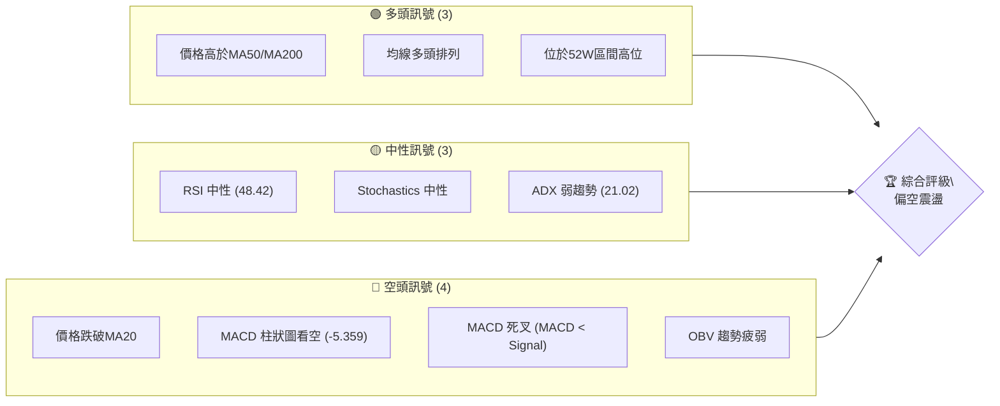

**解讀**：目前多頭訊號主要來自於長期趨勢的穩固，價格仍處於主要長期均線上方。然而，短期內空頭訊號顯著增加，包括價格跌破短期均線、MACD 形成死叉且柱狀圖轉負，以及成交量動能疲弱。中性訊號則顯示市場在短期內缺乏明確的方向性動能。綜合來看，2330.TW 正處於一個從強勢上漲轉向短期回調或盤整的階段，需警惕進一步下行的風險。

### 📊 核心指標速覽表

| 指標類別 | 指標名稱 | 當前數值 | 訊號 | 解讀 |
|----------|----------|----------|------|------|
| **價格** | 當前價格 | $2340.00 | 🟡 | 位於52週高點附近，但短期有回調壓力 |
| **均線** | MA20 | $2365.69 | 🔴 | 價格位於MA20下方，短期承壓 |
| **均線** | MA50 | $2266.95 | 🟢 | 價格位於MA50上方，中期支撐尚存 |
| **均線** | MA200 | $1743.41 | 🟢 | 價格位於MA200上方，長期趨勢強勁 |
| **動能** | RSI(14) | 48.42 | 🟡 | 處於中性區間，無超買超賣訊號 |
| **動能** | MACD | -5.359 (Hist) | 🔴 | MACD線下穿訊號線，柱狀圖轉負，短期動能轉弱 |
| **趨勢** | ADX(14) | 21.02 | 🟡 | 趨勢強度較弱，可能進入盤整階段 |
| **波動** | ATR(14) | $62.10 | 🟡 | 每日波動約2.65%，屬中等波動 |
| **量能** | OBV趨勢 | OBV < MA | 🔴 | 成交量未能有效配合價格上漲，量能疲弱 |

### 🏆 技術評分卡

```
╔══════════════════════════════════════════════════════════════╗
║                技術評分卡 — 2330.TW (2026-06-27)               ║
╠══════════════════════════════════════════════════════════════╣
║ 趨勢強度      ██████░░░░░░░░░░░░░░  60/100  🟡               ║
║ 動能指標      ████░░░░░░░░░░░░░░░░  40/100  🔴               ║
║ 支撐穩定度    ██████████░░░░░░░░░░  70/100  🟢               ║
║ 成交量配合    ███░░░░░░░░░░░░░░░░░  30/100  🔴               ║
║ 形態完整度    ██████░░░░░░░░░░░░░░  60/100  🟡               ║
║ 均線排列      ████████░░░░░░░░░░░░  80/100  🟢               ║
╠══════════════════════════════════════════════════════════════╣
║ 綜合評分      ██████░░░░░░░░░░░░░░  57/100  🟡 偏空震盪       ║
╚══════════════════════════════════════════════════════════════╝
```
**評分說明**：
- **趨勢強度 (60/100 🟡)**：長期趨勢依舊強勁，但短期趨勢已轉弱，ADX 指出目前為弱趨勢。
- **動能指標 (40/100 🔴)**：RSI 處於中性，但 MACD 已發出賣出訊號，且柱狀圖轉負，顯示短期動能向下。
- **支撐穩定度 (70/100 🟢)**：下方有 MA50、布林下軌以及多個斐波那契回調位的支撐，相對穩固。
- **成交量配合 (30/100 🔴)**：OBV 趨勢疲弱，量能未能有效支持價格上漲，且近期下跌伴隨較大成交量，顯示拋壓。
- **形態完整度 (60/100 🟡)**：短期價格在近期高點附近震盪，尚未形成明確反轉或延續形態，可能為整理階段。
- **均線排列 (80/100 🟢)**：MA200 < MA50 < MA20 的多頭排列維持，但短期價格已跌破 MA20，需觀察 MA50 支撐。
- **綜合評分 (57/100 🟡 偏空震盪)**：整體而言，2330.TW 長期多頭格局未變，但短期面臨較強的回調壓力與動能減弱的風險，市場可能進入震盪整理。

---

## 2. 趨勢分析

### 🌐 多時框趨勢分析

從長期到短期，對 2330.TW 的價格走勢進行層層遞進的評估，以掌握其整體趨勢脈絡。

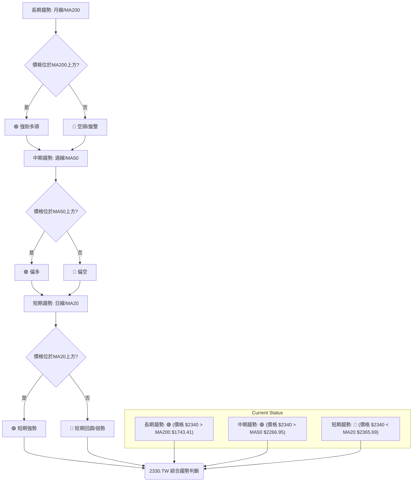

**分析**：
- **長期趨勢 (月線/MA200)**：2330.TW 的股價 $2340.00 遠高於 MA200 ($1743.41)，顯示其長期處於一個非常強勁的多頭趨勢中。過去一年股價持續走高，創下歷史新高，長期結構健康。
- **中期趨勢 (週線/MA50)**：股價 $2340.00 仍位於 MA50 ($2266.95) 上方，表明中期趨勢依然偏多。儘管近期有所回調，但尚未跌破中期關鍵支撐，中期上漲動能仍未完全喪失。
- **短期趨勢 (日線/MA20)**：股價 $2340.00 已跌破 MA20 ($2365.69)，顯示短期上漲動能減弱，進入回調或盤整階段。這是近期最明顯的弱勢訊號，需要警惕。

### 📈 長期趨勢 — 12個月走勢圖（Unicode）

以下是 2330.TW 過去 12 個月的月線收盤價走勢圖，標註了關鍵高低點。

```
2330.TW 月線走勢圖（過去12個月）
價格軸 ($)
$2400 ┤                                      ● (2348.73, May 26)
$2200 ┤                             ●          ● (2340.00, Jun 26)
$2000 ┤                   ●
$1800 ┤                 ●
$1600 ┤           ●
$1400 ┤         ●
$1200 ┤      ●  ●
$1000 ┤●━━━━━━━━━━━━━━━━━━━━━━━━━━━━━━━━━━━━━━
     └───────────────────────────────────────────
      2025-06 - 2026-06 (月)
```
**關鍵高低點**：
- **12個月低點**：$1046.06 (2025年6月)
- **12個月高點**：$2348.73 (2026年5月)
- **當前價格**：$2340.00 (2026年6月)

**走勢特徵分析表格**：

| 時間段 | 起始價 | 結束價 | 漲跌幅 | 走勢特徵 | 評估 |
|--------|--------|--------|--------|----------|------|
| 2025-06 至 2025-12 | $1046.06 | $1540.85 | +47.3% | 強勁上漲，穩步推進 | 🟢 多頭確立 |
| 2026-01 至 2026-02 | $1764.52 | $1983.22 | +12.4% | 加速上漲，動能強勁 | 🟢 爆發性成長 |
| 2026-03 至 2026-03 | $1755.32 | $1755.32 | -11.5% | 大幅回調，獲利了結 | 🔴 短期修正 |
| 2026-04 至 2026-05 | $2129.32 | $2348.73 | +10.3% | 再次衝高，創歷史新高 | 🟢 多頭延續 |
| 2026-06 (至今) | $2348.73 | $2340.00 | -0.37% | 短期回落，高位整理 | 🟡 壓力顯現 |

**分析**：過去一年 2330.TW 股價呈現驚人的成長，從 2025 年 6 月的 $1046.06 上漲至 2026 年 5 月的歷史新高 $2348.73，漲幅超過一倍。其間雖有 2026 年 3 月的短期大幅回調，但隨後迅速收復失地並創出新高，顯示市場對其長期前景的高度信心。目前 2026 年 6 月份的數據顯示，股價在高位略有回落，可能進入盤整或短期修正階段。

### 📊 中期趨勢（週線分析）

中期趨勢主要由週線圖和 MA50/MA200 的關係決定。目前價格 $2340.00 位於 MA50 ($2266.95) 和 MA200 ($1743.41) 上方，且 MA50 位於 MA200 上方，形成典型的多頭排列。這表明中期趨勢仍然偏強。

以下為近期壓力與支撐示意圖，著重於中期關鍵價位：
```
2330.TW 中期趨勢壓力與支撐示意圖
═══════════════════════════════════════════════════
$2500 ║████████████████████████║ R2 (布林上軌)
$2365 ║████████████████████████║ R1 (MA20)
$2340 ╠════════════════════════╣ ◄ 現價
$2267 ║▓▓▓▓▓▓▓▓▓▓▓▓▓▓▓▓▓▓▓▓▓▓▓▓║ S1 (MA50)
$2231 ║▓▓▓▓▓▓▓▓▓▓▓▓▓▓▓▓▓▓▓▓▓▓▓▓║ S2 (布林下軌)
$2122 ║▓▓▓▓▓▓▓▓▓▓▓▓▓▓▓▓▓▓▓▓▓▓▓▓║ S3 (斐波那契回調 38.2%)
$1743 ║████████████████████████║ S4 (MA200)
═══════════════════════════════════════════════════
```
**分析**：從中期來看，MA50 ($2266.95) 是重要的支撐位，若股價能在此處獲得支撐並反彈，則中期上漲趨勢將得以維持。若跌破 MA50，則可能進一步測試布林下軌 $2231.26 及斐波那契回調位 $2121.78。上方阻力首先是短期 MA20 ($2365.69)，突破後才能挑戰布林上軌 $2500.12。

### ⚡ 趨勢強度評估（ADX 解讀）

ADX 指標用於衡量趨勢的強度，而非方向。+DI 和 -DI 則指示趨勢的方向。

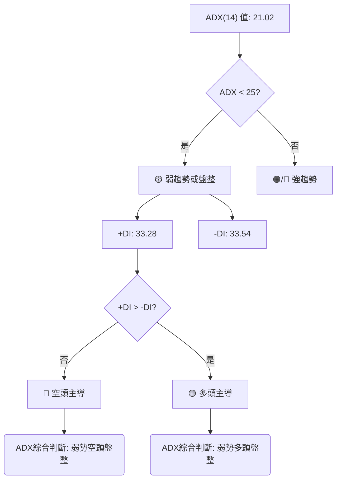

**ADX 強度對照表**：

| ADX 數值範圍 | 趨勢強度 | 市場階段 |
|--------------|----------|----------|
| 0-25         | 弱趨勢   | 盤整/無趨勢 |
| 25-50        | 中等趨勢 | 明顯趨勢形成中 |
| 50-75        | 強趨勢   | 強勁趨勢發展 |
| 75-100       | 極強趨勢 | 趨勢過熱/末期 |

**分析**：
- **ADX(14) 數值**：21.02，落在 0-25 區間，表明當前 2330.TW 的趨勢強度較弱，市場可能正處於盤整或無明顯趨勢的階段。這與短期回調的觀點相符。
- **+DI 和 -DI**：+DI (33.28) 略低於 -DI (33.54)，這表示在當前的弱勢趨勢中，空頭力量略佔優勢。雖然差距不大，但結合 ADX 數值，暗示價格在盤整中可能偏向向下尋求支撐。
- **綜合判斷**：2330.TW 目前處於一個弱勢的、由空頭輕微主導的盤整階段。這意味著短期內大幅上漲或下跌的可能性較小，更可能在關鍵支撐與阻力之間震盪。

---

## 3. 圖表形態分析

### 🔍 形態識別系統

根據提供的月線和週線數據，以及近期價格走勢，目前 2330.TW 尚未形成經典的強勢反轉或延續形態。股價在創下歷史新高後，近期呈現高位整理態勢。

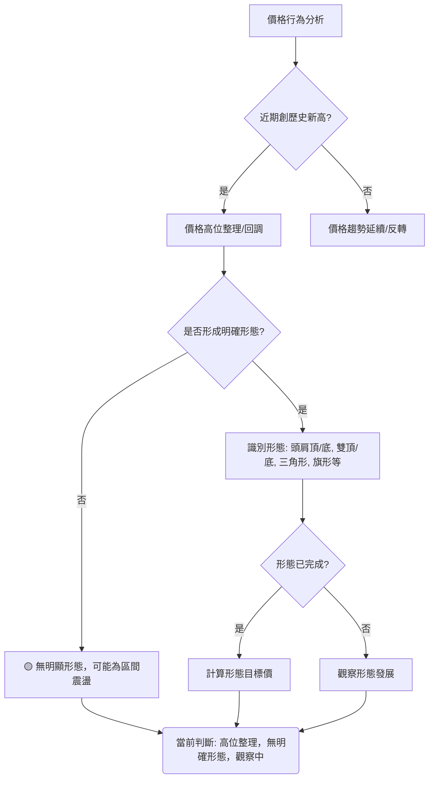

**分析**：
- **近期行為**：2330.TW 於 2026 年 5 月創下歷史新高 $2348.73，隨後在 6 月份略有回調，目前價格 $2340.00 仍處於高位。
- **形態識別**：在這樣的高位整理階段，常見的形態可能包括：
    - **矩形整理 (Rectangle)**：價格在水平的支撐與阻力之間來回震盪，積蓄動能。
    - **旗形/三角旗形 (Flag/Pennant)**：在急劇上漲後出現的短期整理，通常預示著趨勢的延續。
    - **潛在雙頂 (Potential Double Top)**：如果價格無法突破前高並再次大幅回落，則可能形成雙頂反轉形態。
目前來看，價格正在 $2348.73 (高點) 和 $2249.00 (5月底低點) 之間進行區間震盪，初步傾向於高位整理。

### 🕯️ 重要K線形態分析

根據近20週的收盤走勢，分析一些關鍵的K線形態及其意義。

| 日期       | 收盤價 | RSI   | MACD柱 | 週成交量  | K線形態 (週線) | 解讀         | 訊號 |
|------------|--------|-------|--------|-----------|------------------|--------------|------|
| 2026-04-26 | 2179.19| 86.4  | +15.425| 169,724,221 | 長陽線         | 強勢上漲，進入超買區 | 🟢 |
| 2026-05-03 | 2129.32| 62.6  | +10.654| 207,742,492 | 長陰線         | 大幅回調，獲利了結 | 🔴 |
| 2026-05-10 | 2283.91| 71.0  | +10.344| 154,071,093 | 長陽線         | 反彈，重回強勢區 | 🟢 |
| 2026-05-17 | 2258.97| 56.5  | -6.385 | 178,723,164 | 陰線           | 上漲動能減弱，MACD轉負 | 🔴 |
| 2026-05-24 | 2249.00| 47.6  | -14.497| 137,422,580 | 小陰線         | 跌勢放緩，接近支撐 | 🟡 |
| 2026-05-31 | 2348.73| 63.3  | -1.758 | 202,811,203 | 長陽線         | 反彈，創歷史新高 | 🟢 |
| 2026-06-07 | 2358.71| 64.0  | +2.543 | 145,020,927 | 小陽線         | 漲勢延續，但動能減弱 | 🟡 |
| 2026-06-14 | 2310.00| 50.7  | -15.335| 176,932,968 | 長陰線         | 大幅回調，MACD死叉 | 🔴 |
| 2026-06-21 | 2410.00| 56.8  | +0.874 | 127,107,960 | 長陽線         | 強勁反彈，但量能不足 | 🟢 |
| 2026-06-28 | 2340.00| 48.4  | -5.359 | 203,177,026 | 長陰線         | 回吐漲幅，確認短期壓力 | 🔴 |

**近期K線形態分析**：
- **2026-05-31 的長陽線**：在經歷了數週的整理後，這根陽線突破了前期的壓力，並創下歷史新高 $2348.73，顯示多頭力量的強勢回歸。
- **2026-06-07 的小陽線**：雖然收陽，但實體較小，且成交量縮減，表明上漲動能有所減弱，在高位出現猶豫。
- **2026-06-14 的長陰線**：這根陰線吞噬了前兩週的漲幅，並伴隨 MACD 柱狀圖大幅轉負，是一個明確的短期看跌訊號，顯示獲利了結壓力。
- **2026-06-21 的長陽線**：股價在經歷大幅下跌後迅速反彈，幾乎收復前一週的失地，顯示下方買盤支撐強勁。然而，成交量相對較小，反彈力度存疑。
- **2026-06-28 的長陰線 (本週)**：回吐了前一週的大部分漲幅，且 MACD 柱狀圖再次轉負並擴大，確認了短期壓力。這根陰線表明短期反彈無力，空頭力量再次佔據主導。

**結論**：近期的 K 線形態顯示多空雙方在高位激烈拉鋸。雖然有強勁反彈，但隨後即遭到空頭打壓，未能有效突破並企穩。這進一步確認了目前處於高位整理或短期回調的階段。

### 📉 ASCII 走勢形態示意圖

目前價格在高位區間震盪，可視為一個潛在的矩形整理或高位旗形整理。

```
2330.TW 近期高位整理示意圖 (矩形/旗形)

價格軸 ($)
$2450 ┤          ╭───╮
$2400 ┤         ╱     ╲
$2350 ┤───────╳───────╳─────── R1 (阻力區: $2410 - $2450)
$2300 ┤     ╲ ╱       ╲ ╱
$2250 ┤───────╳───────╳─────── S1 (支撐區: $2250 - $2280)
$2200 ┤
     └───────────────────────────
      時間軸
```
**分析**：
- **阻力區 ($2410 - $2450)**：由 2026-06-21 的高點 $2410.00 及其附近的前高點構成。當前價格 $2340.00 距離此區間不遠。
- **支撐區 ($2250 - $2280)**：由 2026-05-24 的低點 $2249.00 和 MA50 $2266.95 構成。這個區間是近期股價回調的重要支撐。
- **形態特徵**：股價在創下歷史新高 $2348.73 後，未能有效突破 $2410.00 附近的新高，反而在 $2250.00 附近獲得支撐。這形成了一個高位橫盤整理的區間。若價格能有效突破上方阻力，則有望延續漲勢；若跌破下方支撐，則可能開啟更深的回調。

### 🎯 形態目標價計算

由於目前形態為高位整理，尚未形成明確的突破或反轉形態，因此無法給出精確的形態目標價。但可以根據整理區間的突破方向，預估潛在目標。

**假設為矩形整理**：
- **整理區間**：約 $2250.00 (支撐) 至 $2410.00 (阻力)
- **區間高度**：$2410.00 - $2250.00 = $160.00

**潛在多頭目標**：
- 若向上突破阻力 $2410.00，則目標價約為 $2410.00 + $160.00 = **$2570.00**。此目標接近 52 週高點 $2535.00，並有機會挑戰更高點。

**潛在空頭目標**：
- 若向下突破支撐 $2250.00，則目標價約為 $2250.00 - $160.00 = **$2090.00**。此目標接近斐波那契 50% 回調位 $2052.02。

**注意**：這些目標價僅為基於形態高度的理論推算，實際走勢仍需結合市場情緒、基本面和成交量變化來判斷。在形態未明確突破前，應保持觀望或小倉位操作。

---

## 4. 支撐與阻力

### 🗺️ 關鍵價位分布圖（Unicode）

以下是 2330.TW 的關鍵支撐與阻力價位分布圖，幫助識別重要轉折點。

```
2330.TW 價位結構分布圖
═══════════════════════════════════════════════════
$2535.00 ║████████████████████████║ 強阻力 R4 (52週高點)
$2500.12 ║████████████████████████║ 阻力 R3 (布林上軌)
$2410.00 ║████████████████████████║ 關鍵阻力 R2 (近期高點)
$2365.69 ║████████████████████    ║ 近期阻力 R1 (MA20)
$2340.00 ╠════════════════════════╣ ◄ 現價
$2266.95 ║▓▓▓▓▓▓▓▓▓▓▓▓▓▓▓▓        ║ 近期支撐 S1 (MA50)
$2231.26 ║▓▓▓▓▓▓▓▓▓▓▓▓▓▓▓▓▓▓▓▓▓▓▓▓║ 關鍵支撐 S2 (布林下軌)
$2121.78 ║▓▓▓▓▓▓▓▓▓▓▓▓▓▓▓▓▓▓▓▓▓▓▓▓║ 強支撐 S3 (斐波那契 38.2%)
$1743.41 ║████████████████████████║ 極強支撐 S4 (MA200)
═══════════════════════════════════════════════════
```

### 🚧 阻力位分析表

| 阻力級別 | 價位     | 形成原因                       | 突破難度 | 重要性 |
|----------|----------|--------------------------------|----------|--------|
| R1       | $2365.69 | MA20 (短期均線)                | 中等     | 🟢     |
| R2       | $2410.00 | 近期高點 (2026-06-21 收盤價)   | 較高     | 🟢🟢   |
| R3       | $2500.12 | 布林通道上軌                   | 較高     | 🟢🟢   |
| R4       | $2535.00 | 52週高點 / 歷史最高點            | 極高     | 🟢🟢🟢 |

**分析**：
- **R1 ($2365.69)**：這是股價向上反彈首先需要克服的阻力，即短期 MA20。目前價格位於其下方，MA20 構成直接壓力。
- **R2 ($2410.00)**：這是上週的收盤高點，也是近期多頭嘗試突破但未能站穩的關鍵價位。突破此處將意味著短期空頭壓力減輕。
- **R3 ($2500.12)**：布林通道上軌，代表著價格波動的上限，突破此處可能意味著短期進入超買區，但同時也顯示多頭極強。
- **R4 ($2535.00)**：52週高點，也是目前的歷史最高點。這是多頭的終極目標，突破將開啟新的上漲空間。

### 🛡️ 支撐位分析表

| 支撐級別 | 價位     | 形成原因                             | 守住機率 | 重要性 |
|----------|----------|--------------------------------------|----------|--------|
| S1       | $2266.95 | MA50 (中期均線)                      | 較高     | 🟢🟢   |
| S2       | $2231.26 | 布林通道下軌                         | 中等     | 🟢     |
| S3       | $2121.78 | 斐波那契回調 38.2% (近期波段)        | 較高     | 🟢🟢   |
| S4       | $1743.41 | MA200 (長期均線)                     | 極高     | 🟢🟢🟢 |

**分析**：
- **S1 ($2266.95)**：中期 MA50 是當前最重要的支撐之一。若價格回調至此並獲得支撐，則中期上漲趨勢有望維持。
- **S2 ($2231.26)**：布林通道下軌，通常代表價格在正常波動範圍內的下限。跌破此處可能預示著短期超賣或趨勢轉弱。
- **S3 ($2121.78)**：這是從 2026-03 低點到 2026-05 高點的斐波那契 38.2% 回調位。該位置具有較強的技術意義，通常會吸引買盤。
- **S4 ($1743.41)**：長期 MA200，是極其重要的長期趨勢支撐。若價格跌至此處，將被視為長期趨勢可能改變的警訊，但目前距離較遠。

### 📐 斐波那契回調位分析

我們選擇 2026 年 3 月的低點 $1755.32 作為波段起點，2026 年 5 月的歷史高點 $2348.73 作為波段終點來計算斐波那契回調位。

- **波段高點 (Peak)**：$2348.73 (2026-05)
- **波段低點 (Trough)**：$1755.32 (2026-03)
- **波段漲幅**：$2348.73 - $1755.32 = $593.41

| 斐波那契回調比例 | 回調價位 (回調價 = 高點 - 漲幅 * 比例) | 解讀及重要性 |
|------------------|----------------------------------------|--------------------------------------------------|
| **23.6%**        | $2348.73 - ($593.41 * 0.236) = **$2208.79** | 淺層回調支撐，接近布林下軌 ($2231.26)，若能守住則上漲趨勢極強。 |
| **38.2%**        | $2348.73 - ($593.41 * 0.382) = **$2121.78** | 重要支撐位，通常是第一道較強的買盤介入點。若跌破則可能測試更深回調。 |
| **50.0%**        | $2348.73 - ($593.41 * 0.500) = **$2052.02** | 心理支撐位，代表波段漲幅的一半。跌破可能意味著趨勢轉弱。 |
| **61.8%**        | $2348.73 - ($593.41 * 0.618) = **$1982.26** | 黃金分割點，極強支撐位。若跌至此處，則顯示多頭力量大幅減弱，但仍有反彈機會。 |

**視覺化斐波那契回調位**：
```
2330.TW 斐波那契回調位示意圖

$2348.73 ┤─────────────────────── 高點
         │
$2340.00 ├───────●─────── 現價
         │
$2208.79 ├─ -23.6% 回調 (S1)
         │
$2121.78 ├─ -38.2% 回調 (S2)
         │
$2052.02 ├─ -50.0% 回調 (S3)
         │
$1982.26 ├─ -61.8% 回調 (S4)
         │
$1755.32 ┤─────────────────────── 低點
```
**分析**：當前價格 $2340.00 位於波段高點附近，但已開始回調。最近的斐波那契支撐位於 $2208.79 (23.6%) 和 $2121.78 (38.2%)。若價格能在此區間獲得支撐，則表明市場對回調的接受度高，並有望繼續上漲。特別是 $2121.78 是一個重要的觀察點。

---

## 5. 技術指標深度解讀

### 🎛️ 指標訊號總覽

以下 Mermaid 圖表展示了各主要技術指標的訊號及其相互關係。

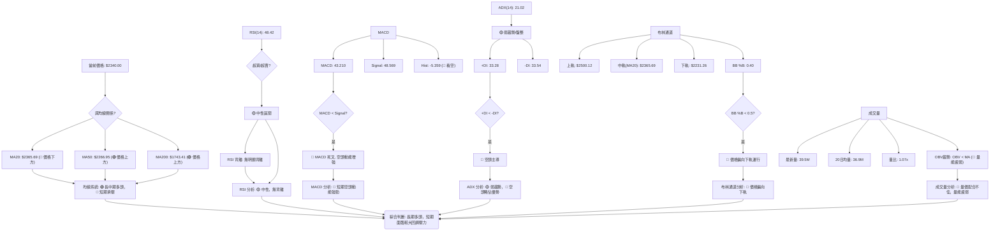

### 📈 移動平均線排列分析

移動平均線（MA）是判斷趨勢方向和強度的重要工具。

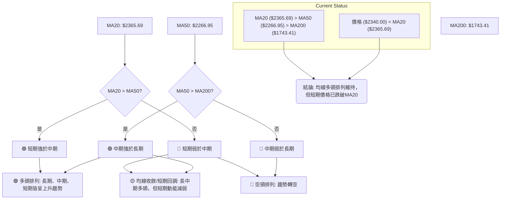

**分析**：
- **均線排列**：目前 MA20 ($2365.69) > MA50 ($2266.95) > MA200 ($1743.41)，這是一個標準的「多頭排列」格局。這表明 2330.TW 的長期和中期上漲趨勢仍然非常健康。
- **價格與均線關係**：然而，當前股價 $2340.00 已經跌破了 MA20 ($2365.69)。這是一個短期看跌訊號，顯示短期上漲動能已經停滯，並開始面臨回調壓力。
- **綜合判斷**：儘管長期趨勢依然強勁，但短期內價格已失去 MA20 的支撐，可能向下尋求 MA50 的支撐。如果 MA50 能夠守住，則多頭格局有望延續；若 MA50 跌破，則可能引發更深度的調整。

### 📉 RSI(14) 分析

相對強弱指數 (RSI) 用於衡量價格變動的速度和變化，判斷資產是否超買或超賣。

**RSI 數值進度條**：
RSI(14): 48.42 ▓▓▓▓▓▓▓▓▓▓░░░░░░░░░░ 48.42% 🟡 中性

**超買超賣區間分析**：
- **超買區 (RSI > 70)**：股價在 2026-04-26 時 RSI 達到 86.4，顯示嚴重超買，隨後出現回調。2026-05-10 再次達到 71.0，也隨後回落。這表明當 RSI 進入超買區時，存在較高的回調風險。
- **超賣區 (RSI < 30)**：近一年未見 RSI 進入超賣區，顯示市場買盤強勁，回調深度有限。
- **中性區 (30 < RSI < 70)**：當前 RSI 為 48.42，位於中性區間中部。這表示市場動能平衡，既無明顯超買也無明顯超賣。通常在趨勢不明顯或盤整時，RSI 會在中性區間徘徊。

**背離判斷 (頂背離/底背離)**：
- **頂背離**：當價格創出新高，但 RSI 未能創出新高，反而走低時，形成頂背離，預示著潛在的下跌。根據提供的數據，在 2026-05-31 價格創歷史新高 ($2348.73)，但 RSI 為 63.3。隨後的 2026-06-07 價格略創新高 ($2358.71)，RSI 為 64.0。而 2026-06-21 價格反彈至 $2410.00，RSI 為 56.8。雖然價格在 2026-05-31 至 2026-06-21 之間有創出更高收盤價，但RSI並未同步創高，反而有所下降。這可能形成一個**潛在的短期頂背離**，需密切關注。
- **底背離**：當價格創出新低，但 RSI 未能創出新低，反而走高時，形成底背離，預示著潛在的上漲。目前無明顯底背離跡象。

**結論**：RSI 處於中性區間，表明短期內市場動能均衡。然而，需警惕潛在的短期頂背離跡象，這可能預示著價格在高位進一步調整的風險。

### 📊 MACD(12/26/9) 訊號解讀

平滑異同移動平均線 (MACD) 是一個趨勢追蹤動量指標，用於識別新的趨勢、趨勢強度和潛在反轉。

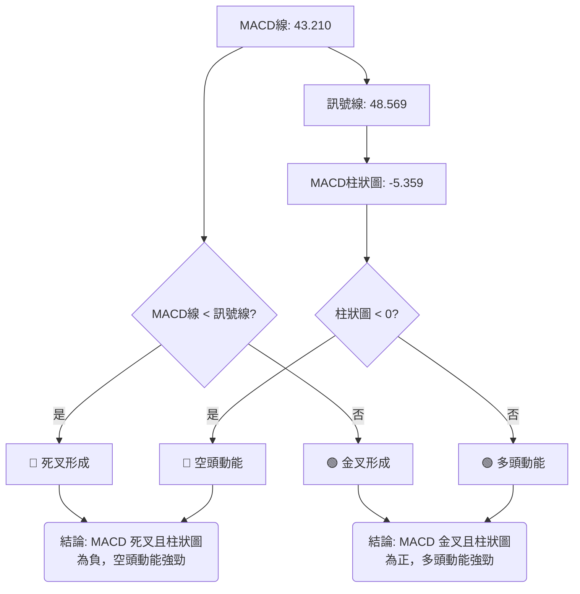

**分析**：
- **MACD 線與訊號線**：當前 MACD 線 (43.210) 已經跌破了訊號線 (48.569)，形成了一個「死叉」。這是一個明確的短期看跌訊號，表明短期動能已經從多頭轉向空頭。
- **MACD 柱狀圖 (Histogram)**：MACD 柱狀圖的數值為 -5.359，且為紅色（看空）。柱狀圖從正值轉為負值，並持續擴大，表明空頭動能正在增強。這與 MACD 死叉的訊號相互印證，增加了空頭訊號的可信度。
- **MACD 背離**：目前無明顯的 MACD 頂背離或底背離跡象。價格近期在高位震盪，MACD 也隨之波動，但尚未出現明顯的趨勢與指標的背離。

**綜合判斷**：MACD 指標發出強烈的短期看空訊號。死叉的形成和柱狀圖的轉負並擴大，都預示著 2330.TW 在短期內可能面臨進一步的回調壓力。這與價格跌破 MA20 的訊號一致。

### 📦 布林通道分析

布林通道 (Bollinger Bands) 由三條線組成：中軌 (通常是 MA20)、上軌和下軌，用於衡量價格的波動範圍。

**ASCII 布林通道示意圖**：
```
2330.TW 布林通道示意圖 (2026-06-27)

$2500.12 ┤─────────────────── 上軌 (R3)
         │
$2400.00 ┤
         │
$2365.69 ├─ ●───────────────── 中軌 (MA20 / R1)
         │  │
$2340.00 ├─ ●───────────────── 現價
         │  │
$2266.95 ┤  │ ●──────────────── MA50 (S1)
         │  │
$2231.26 ┤─────────────────── 下軌 (S2)
         │
$2100.00 ┤
```
**分析**：
- **中軌 (MA20)**：$2365.69。當前價格 $2340.00 位於中軌下方，這是一個短期看跌訊號，表明價格正在中軌下方運行，趨勢偏弱。中軌現在成為短期阻力。
- **上軌**：$2500.12。價格距離上軌較遠，顯示短期內缺乏上攻動能。
- **下軌**：$2231.26。價格正向中軌靠攏，若繼續下跌，下軌將提供支撐。
- **布林帶寬度**：從數據中無法直接判斷帶寬是收縮還是擴張，但可以從上軌和下軌的數值判斷。($2500.12 - $2231.26 = $268.86)。這個帶寬相對於價格 $2340.00 (約 11.5%) 而言，波動性中等。
- **%B 指標**：0.40。這個數值表示價格位於布林通道的中間偏下位置 (0.5 為中軌，0 為下軌)。這進一步確認了價格偏向下軌運行，短期趨勢偏弱。

**綜合判斷**：布林通道顯示 2330.TW 的價格正在中軌下方運行，且 %B 指標偏低，表明短期內市場偏空，價格可能進一步測試布林下軌的支撐。

### 💹 成交量分析（量價配合度）

成交量是價格走勢的燃料。量價配合度分析可以判斷價格變動的可信度。

| 指標       | 數值       | 解讀                                 | 訊號 |
|------------|------------|--------------------------------------|------|
| 最新成交量 | 39,547,254 | 相較於均量有所增加                   | 🟡   |
| 20日均量   | 36,918,587 | 作為衡量短期活躍度的基準             | -    |
| 量比       | 1.07x      | 最新量略高於20日均量，市場活躍度增加 | 🟡   |
| OBV 趨勢   | OBV < MA   | OBV 低於其均線，量能疲弱             | 🔴   |

**分析**：
- **最新成交量與均量**：最新成交量 39,547,254 股略高於 20 日均量 36,918,587 股，量比為 1.07x。這表明今日市場活躍度有所增加。
- **量價關係**：當前價格 $2340.00 相較於前一週的 $2410.00 是下跌的。在價格下跌的同時成交量略有放大 (量比 > 1)，這可能是一個看跌訊號，暗示拋售壓力增加。
- **OBV 趨勢**：數據顯示「OBV < MA → 量能疲弱」。這是一個非常重要的空頭訊號。OBV 是一個累積性指標，它將每天的成交量加到或減去前一天的總和，取決於當天的收盤價是上漲還是下跌。OBV 低於其移動平均線，表明在價格上漲期間的成交量不足以推動 OBV 上升，而在價格下跌期間的成交量則導致 OBV 下降。這暗示市場缺乏真正的買盤支持，當前的價格回調可能是真實的。

**綜合判斷**：儘管最新成交量略有放大，但結合 OBV 趨勢疲弱以及價格下跌的背景，這構成了一個「量價背離」的空頭訊號。即價格在下跌時有量能配合，而上漲時量能卻未能有效跟隨，這預示著短期內股價可能繼續承壓。

---

## 6. 動能與波動率

### ⚡ 動能評估四象限

本節將 2330.TW 當前狀態置於動能強度與波動率的四象限中進行評估，避免使用 quadrantChart。

| 象限 | 動能 (MACD/RSI) | 波動 (ATR) | 當前狀態 | 評估                                     |
|------|-----------------|------------|----------|------------------------------------------|
| Q1   | 強 (🟢)         | 低 (🟢)    |          | 最佳機會：上漲趨勢明確且穩定，風險較低 |
| Q2   | 弱 (🔴)         | 低 (🟢)    |          | 謹慎觀望：市場缺乏方向，可能處於盤整   |
| Q3   | 強 (🟢)         | 高 (🔴)    |          | 高風險高收益：趨勢強勁但波動大，風險高 |
| Q4   | 弱 (🔴)         | 高 (🔴)    | ✓        | 避免進場：市場不穩定，方向不明，風險高 |

**當前 2330.TW 狀態評估**：
- **動能**：MACD 柱狀圖為負 (-5.359)，MACD 死叉，RSI 處於中性區間 (48.42)。綜合來看，短期動能偏弱 (🔴)。
- **波動**：ATR(14) 為 $62.10，佔當前價格 $2340.00 的 2.65%。這個波動率屬於中等偏高 (🔴)。
- **結論**：2330.TW 目前處於「弱動能、中等偏高波動」的狀態，接近 Q4 象限。這意味著市場缺乏明確的上漲動能，且價格波動相對較大，短期內投資風險較高，不適合積極進場。應保持謹慎觀望，等待動能轉強或波動率降低。

### 📊 ATR 波動率分析

平均真實波幅 (ATR) 衡量資產價格的平均波動幅度，是判斷市場波動性和設置止損的重要工具。

- **ATR(14)**：$62.10
- **ATR 佔當前價格比例**：($62.10 / $2340.00) * 100% = 2.65%

**分析**：
- **波動性評估**：2.65% 的 ATR 比例顯示 2330.TW 在過去 14 天的平均每日波動幅度約為 2.65%。對於大型權值股而言，這是一個中等偏高的波動率。這意味著日內價格波動可能相對較大，投資者需要為此做好準備。
- **止損距離建議**：ATR 可以用於設置基於波動率的止損。一個常見的策略是將止損設置在入場點下方 1.5 倍至 3 倍 ATR 的距離。
    - **1.5x ATR 止損**：1.5 * $62.10 = $93.15。若在 $2340.00 附近進場，止損點約為 $2340.00 - $93.15 = **$2246.85**。
    - **2x ATR 止損**：2 * $62.10 = $124.20。若在 $2340.00 附近進場，止損點約為 $2340.00 - $124.20 = **$2215.80**。
    - **3x ATR 止損**：3 * $62.10 = $186.30。若在 $2340.00 附近進場，止損點約為 $2340.00 - $186.30 = **$2153.70**。
- **交易策略考量**：由於波動性中等偏高，短線交易者應注意日內風險，並根據自身風險承受能力選擇合適的止損距離。對於長線投資者，ATR 更多用於觀察波動率變化，而非頻繁調整止損。

### 📐 Beta 與市場相關性

Beta 值衡量股票相對於整體市場的波動性。數據中未提供 Beta 值，因此無法進行精確計算。

**一般推斷**：
- 2330.TW 作為台灣股市的權值股之王，其市值巨大，且在全球半導體產業中佔據主導地位。
- 通常，這類大型權值股的 Beta 值會接近 1，甚至略高於 1。這意味著其股價波動與大盤（如加權指數）高度相關，且可能略微放大市場的漲跌幅。
- **市場相關性**：預計 2330.TW 與台灣加權指數及全球科技股指數（如 NASDAQ）呈現高度正相關。當大盤上漲時，2330.TW 通常會同步上漲；當大盤下跌時，2330.TW 也會受到影響。
- **投資意義**：對於投資者而言，如果 2330.TW 的 Beta 值接近或略高於 1，則將其納入投資組合時，其風險分散效果有限，因為它會隨著市場的波動而波動。投資者應更多關注其獨特的產業地位和基本面成長性。

---

## 7. 多時框架總結

### 📋 時框架評分表

本表總結了 2330.TW 在不同時間框架下的技術指標表現，提供全面的視角。

| 時框架 | 趨勢方向 | 動能     | 均線排列 | 形態     | 綜合評分 (1-10) | 建議       |
|--------|----------|----------|----------|----------|-----------------|------------|
| **長期** | 🟢 上漲   | 🟢 強勁   | 🟢 多頭   | 🟢 延續   | 9               | 強勢持有   |
| **中期** | 🟢 偏多   | 🟡 中性偏弱 | 🟢 多頭   | 🟡 整理   | 7               | 謹慎持有   |
| **短期** | 🔴 回調   | 🔴 轉弱   | 🔴 承壓   | 🟡 區間震盪 | 4               | 觀望/短期空 |

**分析**：
- **長期 (🟢)**：2330.TW 的長期趨勢非常強勁，價格遠高於 MA200，均線呈現完美多頭排列，顯示其基本面和市場信心穩固。
- **中期 (🟡)**：中期趨勢依然偏多，價格位於 MA50 上方，但動能已有所減弱，MACD 柱狀圖轉負，RSI 位於中性區。市場可能進入中期整理階段。
- **短期 (🔴)**：短期趨勢明顯轉弱，價格跌破 MA20，MACD 形成死叉且柱狀圖轉負，OBV 疲弱，ADX 顯示弱勢盤整且空頭略佔優勢。這表明短期內存在較大的回調壓力。

### 🔲 綜合訊號矩陣

本矩陣分析短期、中期、長期各維度訊號的一致性或矛盾，以形成最終判斷。

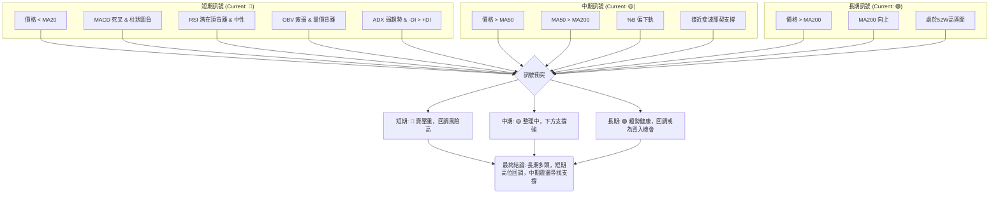

**分析**：
- **訊號一致性**：
    - **短期訊號**：多數指標 (價格、MACD、OBV、ADX) 都指向短期趨勢轉弱或回調，訊號一致性高。
    - **中期訊號**：價格仍在 MA50 上方，均線排列良好，但布林通道偏下軌，且動能指標轉弱，顯示中期趨勢雖未反轉，但已進入整理。
    - **長期訊號**：所有長期指標都指向強勁的多頭趨勢，且價格位於 52 週高點附近，顯示長期信心堅定。
- **訊號衝突**：短期與長期訊號存在明顯衝突。長期趨勢的強勁掩蓋了短期回調的風險，但短期指標的惡化不容忽視。
- **綜合判斷**：2330.TW 處於一個「強長期趨勢下的短期回調」階段。當前多數短期指標發出賣出訊號，預示著價格可能進一步下跌至中期支撐位。然而，中期和長期支撐依然強勁，這使得任何顯著的回調都可能被視為長期投資者進場的機會。投資者應根據其投資時間框架調整策略。

---

## 8. 交易策略建議

### 🗺️ 策略決策流程圖

以下 Mermaid 圖表展示了基於多時框架分析的交易策略決策邏輯。

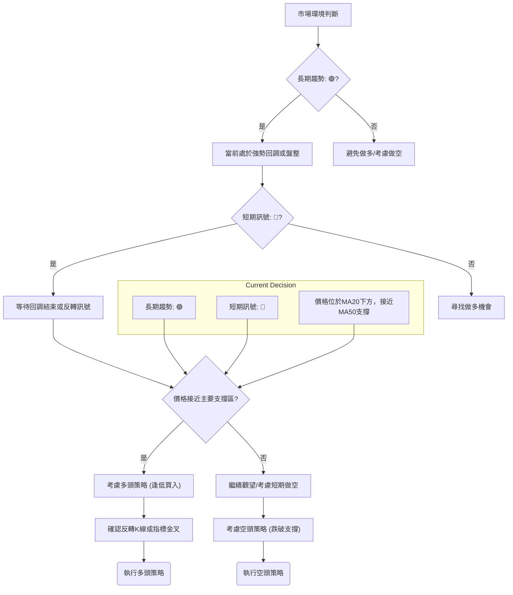

**策略決策分析**：
根據多時框架分析，2330.TW 長期趨勢強勁，但短期面臨回調壓力。因此，當前市場環境不適合激進追高，更適合逢低建倉或等待短期趨勢企穩。對於風險承受能力較高的投資者，也可考慮短期做空。

### 🟢 多頭策略詳情

考慮到長期趨勢的強勁和中期支撐的存在，以下為兩種多頭策略。

| 策略要素 | 策略 A (逢低買入 - MA50支撐)                         | 策略 B (趨勢確認 - 突破短期阻力)                   |
|----------|----------------------------------------------------|----------------------------------------------------|
| **進場條件** | 價格回調至 MA50 附近並出現止跌 K 線或反轉訊號 | 價格突破 MA20 ($2365.69) 並站穩，伴隨量能放大 |
| **進場價格** | **$2267.00 - $2280.00** (接近 MA50)              | **$2370.00 - $2380.00**                            |
| **目標價 T1** | **$2410.00** (近期高點)                            | **$2500.00** (布林上軌)                            |
| **目標價 T2** | **$2535.00** (52週高點)                            | **$2650.00** (分析師平均目標價附近)                |
| **止損價格** | **$2220.00** (跌破布林下軌/斐波那契23.6%下方)    | **$2320.00** (跌破 MA20 後再次回落)                |
| **風險報酬比** | 1:4.8 (以 $2270 進場，止損 $2220，目標 T1 $2410) | 1:3.2 (以 $2375 進場，止損 $2320，目標 T1 $2500) |
| **成功機率** | 60% (基於強勁中期支撐)                           | 55% (需確認突破動能)                               |
| **建議倉位** | 20% - 30% (分批建倉)                             | 10% - 20% (初步試探)                               |

**策略 A (逢低買入)**：在強勁的長期趨勢下，回調至關鍵中期支撐 MA50 ($2266.95) 附近被視為較安全的買入機會。止損設置在布林下軌或斐波那契 23.6% 回調位下方，以控制風險。
**策略 B (趨勢確認)**：此策略相對保守，等待短期阻力 MA20 突破並企穩，確認短期趨勢反轉向上後再進場，風險相對較低，但可能錯過部分漲幅。

### 🔴 空頭策略詳情

考慮到短期動能轉弱，且 MACD 形成死叉，若價格未能有效站穩，可考慮短期做空。

| 策略要素 | 策略 A (跌破 MA50)                               | 策略 B (反彈受阻 - 短期高點)                  |
|----------|--------------------------------------------------|-----------------------------------------------|
| **進場條件** | 價格跌破 MA50 ($2266.95) 並收於其下方，伴隨放量 | 價格反彈至 MA20 ($2365.69) 或 $2410.00 附近受阻，出現看跌K線 |
| **進場價格** | **$2260.00 - $2265.00**                          | **$2360.00 - $2370.00** (靠近 MA20)           |
| **目標價 T1** | **$2121.00** (斐波那契 38.2% 回調位)           | **$2267.00** (MA50)                           |
| **目標價 T2** | **$2050.00** (斐波那契 50% 回調位)             | **$2230.00** (布林下軌)                       |
| **止損價格** | **$2300.00** (站穩 MA50 上方)                    | **$2420.00** (突破近期高點 $2410.00)          |
| **風險報酬比** | 1:3.5 (以 $2260 進場，止損 $2300，目標 T1 $2121) | 1:2.4 (以 $2365 進場，止損 $2420，目標 T1 $2267) |
| **成功機率** | 50% (需突破強支撐)                               | 60% (短期動能偏弱)                            |
| **建議倉位** | 10% - 15% (嚴格控制風險)                         | 15% - 20% (短線操作)                          |

**策略 A (跌破 MA50)**：若中期關鍵支撐 MA50 跌破，將是一個強烈的看空訊號，預示可能開啟更深度的回調。此策略風險較高，需嚴格止損。
**策略 B (反彈受阻)**：在短期趨勢轉弱時，價格反彈至 MA20 或近期阻力位受阻，是較好的做空點位，風險報酬比相對可控。

### ⭐ 整體訊號強度評星

```
做多訊號強度：★★☆☆☆  (2/5星)
做空訊號強度：★★★☆☆  (3/5星)
整體可信度：  ★★★☆☆  (3/5星)
```
**評星說明**：
- **做多訊號強度**：長期趨勢雖強，但短期回調風險高，動能不足，因此做多訊號強度較弱，建議等待更明確的止跌訊號。
- **做空訊號強度**：短期多個指標 (MACD 死叉、OBV 疲弱、價格跌破 MA20) 都發出空頭訊號，因此做空訊號強度相對較高，適合短線操作。
- **整體可信度**：由於長期與短期趨勢存在衝突，整體市場方向在短期內不夠明確，操作難度較大，因此可信度為中等。

---

## 9. 風險提示與監控

### ✅ 關鍵監控指標 Checklist

為了有效管理交易風險，以下是投資者應密切關注的關鍵技術指標清單。

```
╔══════════════════════════════════════════════════════════════╗
║             2330.TW 關鍵監控指標 Checklist (2026-06-27)         ║
╠══════════════════════════════════════════════════════════════╣
║ [ ] 價格是否站穩 MA20 ($2365.69) 上方？                      ║
║ [ ] 價格是否跌破 MA50 ($2266.95) 下方？                      ║
║ [ ] MACD 線是否形成金叉 (重新上穿訊號線)？                   ║
║ [ ] MACD 柱狀圖是否轉正並持續放大？                          ║
║ [ ] RSI 是否從中性區向上突破 50 或進入超買區？               ║
║ [ ] OBV 趨勢是否轉強 (OBV 重新站上其均線)？                  ║
║ [ ] ADX 數值是否向上突破 25，且 +DI 顯著高於 -DI？           ║
║ [ ] 成交量在價格上漲時是否顯著放大？                         ║
║ [ ] 布林通道是否收窄後向上擴張，且價格站穩中軌？             ║
║ [ ] 是否出現明確的看漲 K 線形態 (如錘子線、吞噬形態)？       ║
║ [ ] 52週高點 $2535.00 是否被突破並企穩？                     ║
║ [ ] 斐波那契 38.2% 回調位 $2121.78 是否提供有效支撐？         ║
╚══════════════════════════════════════════════════════════════╝
```

**監控說明**：
- **做多風險監控**：若價格持續位於 MA20 下方，MACD 柱狀圖維持負值，且 OBV 疲弱，則應避免做多。若進場做多，需嚴格遵守止損。
- **做空風險監控**：若價格突然放量突破 MA20 ($2365.69) 或近期高點 $2410.00，MACD 形成金叉，或出現底部反轉 K 線形態，則應立即平倉空頭頭寸。

### ⚠️ 風險場景分析

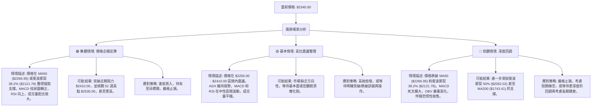

**分析**：
- **樂觀情境**：如果市場能有效消化短期賣壓，並在關鍵支撐位獲得強勁買盤，則有望重拾升勢，再次挑戰歷史高點。這需要技術指標的全面配合轉強。
- **基本情境**：在缺乏明確催化劑的情況下，2330.TW 可能會在當前高位區間進行整理，以時間換取空間，消化獲利盤和等待新的動能。
- **悲觀情境**：如果短期賣壓持續，且無法有效守住中期支撐，則可能引發更大規模的獲利了結，導致價格深度回調。這將考驗投資者的風險承受能力和止損紀律。

### 🛡️ 風險管理重要提醒

1.  **倉位管理**：無論採用何種策略，都應嚴格控制單一股票的倉位，避免過度集中。在不確定性較高的市場環境下，建議降低倉位以減少潛在損失。
2.  **止損紀律**：所有交易策略都必須設置明確的止損點。一旦價格觸及止損位，無論盈虧，都應堅決執行，避免情緒化操作導致損失擴大。
3.  **分批建倉/平倉**：避免一次性滿倉進出。可以採用分批建倉的方式，在不同支撐位逐步買入，或分批平倉以鎖定部分利潤，降低單點風險。
4.  **多樣化投資**：不要將所有資金投入單一股票。通過投資不同行業、不同資產類別的標的，可以有效分散風險。
5.  **監控市場情緒**：除了技術指標，還需關注整體市場情緒、宏觀經濟數據、行業新聞和公司基本面變化，這些因素都可能影響股價走勢。
6.  **時間框架匹配**：交易者應確保其交易策略與其投資時間框架相匹配。短線交易者應更頻繁地監控短期指標，而長線投資者則應更關注長期趨勢和基本面。

---

## 📋 報告總結

```
╔══════════════════════════════════════════════════════════════════╗
║                 2330.TW 技術分析報告總結                         ║
╠══════════════════════════════════════════════════════════════════╣
║ 報告日期：2026-06-27                                               ║
║ 當前價格：$2340.00                                                 ║
║ 分析評級：⚖️ 偏空震盪 (長期多頭格局未變，但短期面臨較大回調壓力)  ║
║                                                                  ║
║ 關鍵結論：                                                         ║
║ ├─ 長期趨勢：🟢 強勁多頭。價格遠高於 MA200，均線多頭排列健康。     ║
║ ├─ 中期趨勢：🟢 偏多。價格仍位於 MA50 上方，但動能有所減弱，進入整理。║
║ ├─ 短期趨勢：🔴 回調/弱勢。價格跌破 MA20，MACD 死叉，OBV 疲弱。    ║
║ ├─ 關鍵支撐：$2266.95 (MA50)，$2231.26 (布林下軌)，$2121.78 (斐波那契38.2%)║
║ ├─ 關鍵阻力：$2365.69 (MA20)，$2410.00 (近期高點)，$2535.00 (52週高點)║
║ └─ 分析師目標：$2662.73 (平均目標價，顯示長期上漲潛力)             ║
║                                                                  ║
║ 最優策略組合：                                                     ║
║ 1. 🥇 **最佳機會 (觀望/逢低買入)**：在短期空頭訊號主導下，最優策略是等待價格回調至中期強支撐位（如 MA50 $2266.95 或斐波那契 38.2% $2121.78）並出現明確止跌反轉訊號後，再分批佈局多頭倉位。此刻入場風險報酬比更佳。 ║
║ 2. 🥈 **次選機會 (短期做空)**：對於風險承受能力較高且具備短線交易經驗的投資者，可考慮在價格反彈至短期阻力位（如 MA20 $2365.69 或 $2410.00）受阻時，建立短期空頭頭寸，目標價為 MA50 或布林下軌。需嚴格止損。 ║
║ 3. 🥉 **保守選擇 (等待突破)**：等待價格放量突破並站穩近期關鍵阻力 $2410.00，確認短期趨勢反轉向上後再考慮做多，此時風險較低，但可能錯過部分初期漲幅。 ║
╚══════════════════════════════════════════════════════════════════╝
```

---

> ⚠️ **免責聲明**：本報告為 AI 自動生成之技術分析，所有數據及估算均基於提供的歷史價格資訊。本報告**僅供研究與學術參考**，**不構成任何投資建議**。投資有風險，入市需謹慎。

---

*報告生成時間：2026-06-27 ｜ 數據來源：提供數據 ｜ 分析框架：多時框技術分析*