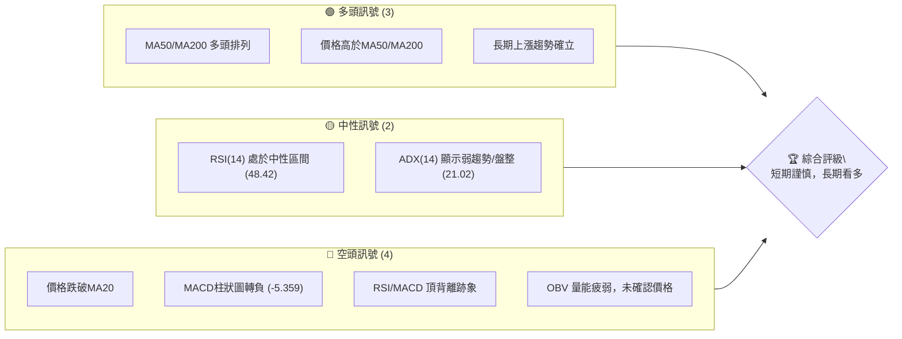
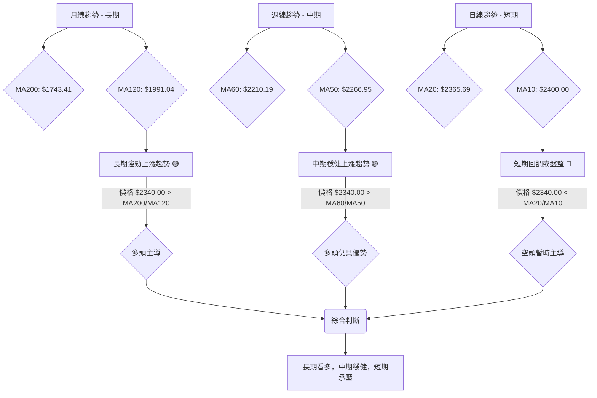
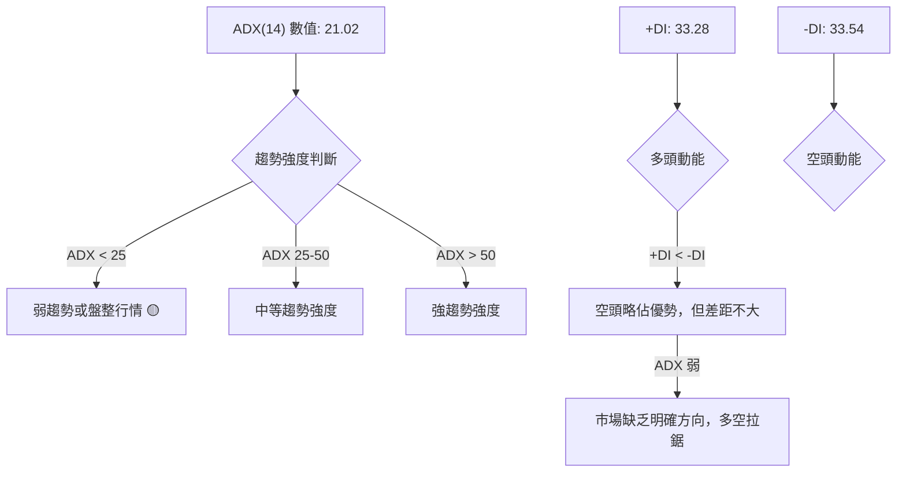
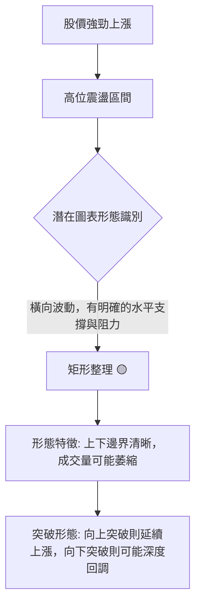
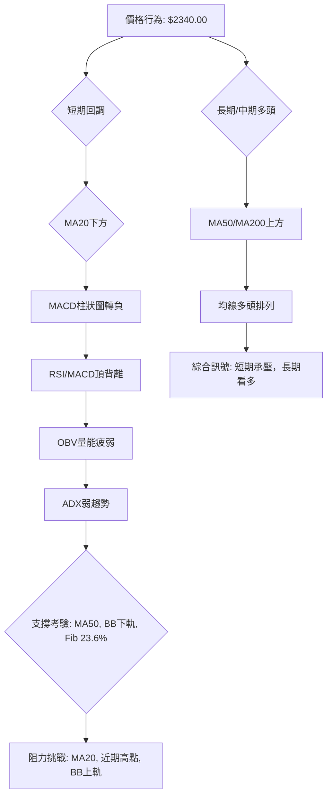
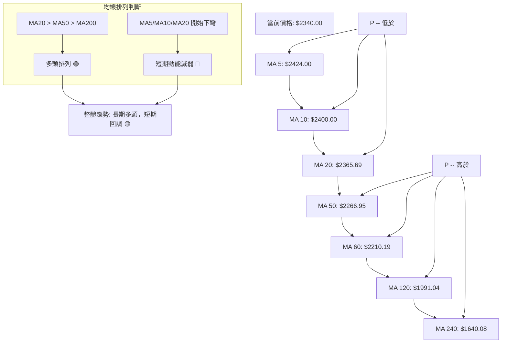
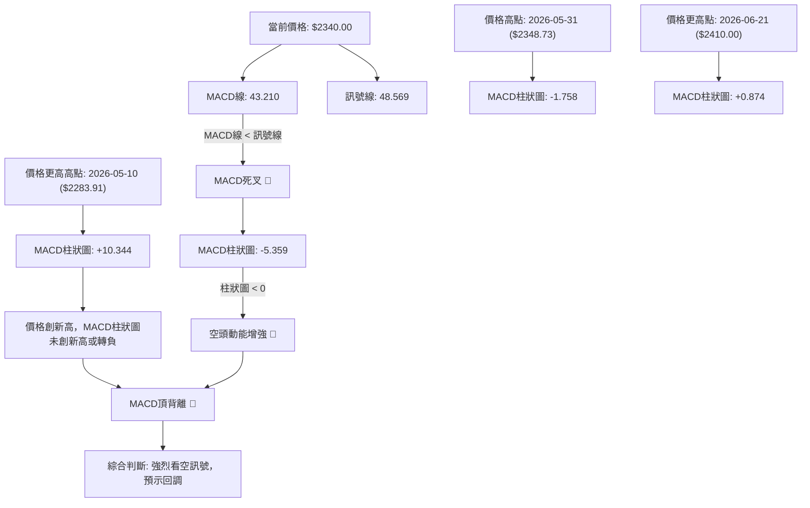
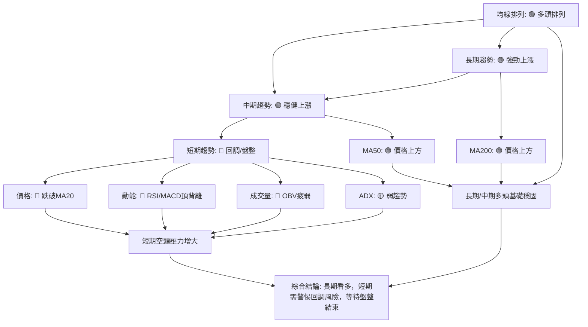
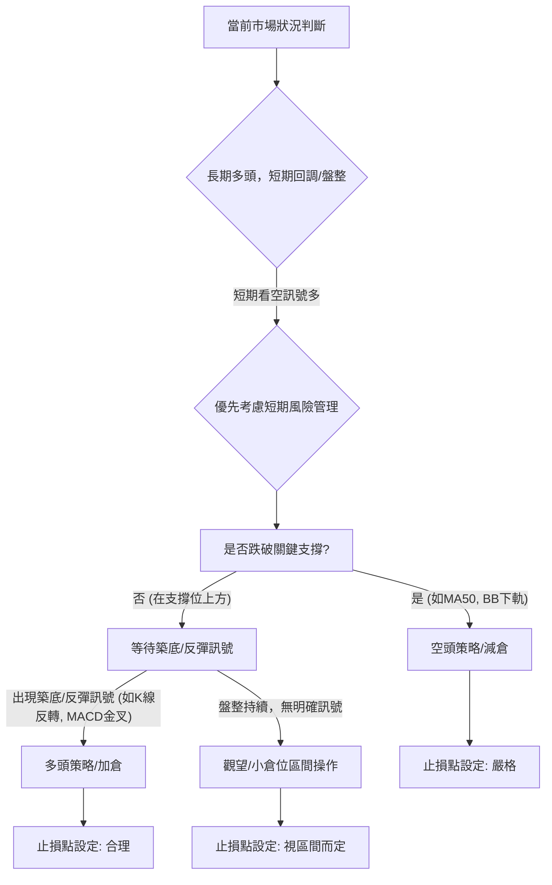
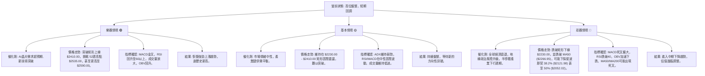

<details>
<summary>📊 靜態圖表 (點擊展開)</summary>

</details>

<html>
<head><meta charset="utf-8" /></head>
<body>
    <div style="height:500px; width:100%;">                        <script>window.PlotlyConfig = {MathJaxConfig: 'local'};</script>
        <script charset="utf-8" src="https://cdn.plot.ly/plotly-3.6.0.min.js" integrity="sha256-QaOVwtVY0T02VaHrr6pnoHLCwayMJp4O5n4YyaE3rJk=" crossorigin="anonymous"></script>                <div id="candlestick-chart" class="plotly-graph-div" style="height:100%; width:100%;"></div>            <script>                window.PLOTLYENV=window.PLOTLYENV || {};                                if (document.getElementById("candlestick-chart")) {                    Plotly.newPlot(                        "candlestick-chart",                        [{"close":{"dtype":"f8","bdata":"AAAA4GJZkkAAAADg9uKRQAAAAOD24pFAAAAAoLP2kUAAAADg9uKRQAAAAOD24pFAAAAA4PbikUAAAACA6TGSQAAAAIDpMZJAAAAAQNyAkkAAAABgi+OSQAAAAGDBHpNAAAAAALRtk0AAAABg91mTQAAAAIDc0JNAAAAAAGqVk0AAAABgreSTQAAAAABqlZNAAAAAAE8MlEAAAADgpr6UQAAAAOCmvpRAAAAAYGNvlEAAAAAAICCUQAAAAODwM5RAAAAAQDSDlEAAAAAguyGVQAAAACBxrJVAAAAAICc3lkAAAADA4+eVQAAAAAD4SpZAAAAAwOPnlUAAAACAhQ+WQAAAAIAMrpZAAAAA4E\u002f9lkAAAADgmXKWQAAAAAB\u002f6ZZAAAAAAH\u002fplkAAAACgO5qWQAAAAOCZcpZAAAAAAH\u002fplkAAAAAgrtWWQAAAAECTTJdAAAAAQJNMl0AAAACAwjiXQAAAACBkYJdAAAAAQJNMl0AAAACgO5qWQAAAAIAMrpZAAAAAoDualkAAAAAgrtWWQAAAAIAMrpZAAAAAIK7VlkAAAACgO5qWQAAAAEBWI5ZAAAAAAMlelkAAAAAgQsCVQAAAAECgmJVAAAAAoGqGlkAAAACA\u002fnCVQAAAAOBcSZVAAAAAwOPnlUAAAAAA+EqWQAAAACAnN5ZAAAAAAPhKlkAAAADgEtSVQAAAAEBWI5ZAAAAA4JlylkAAAAAAyV6WQAAAAKA7mpZAAAAAoPEkl0AAAAAAf+mWQAAAAECTTJdAAAAAoEjVlkAAAABADP2WQAAAAKDBhZZAAAAAIBxKlkAAAABgOjaWQAAAAGA6NpZAAAAAYDo2lkAAAADgZsGWQAAAAMDPJJdAAAAAgLE4l0AAAADgVnSXQAAAAODdw5dAAAAAYBqcl0AAAAAAZROYQAAAAGCRnphAAAAAgI\u002fwmUAAAADgu3uaQAAAAEBxBJpAAAAAwDQsmkAAAAAAUxiaQAAAAIAWQJpAAAAAoJ2PmkAAAACgnY+aQAAAAIAWQJpAAAAAQOgGm0AAAABgb1abQAAAAMAUkptAAAAAQOgGm0AAAABgb1abQAAAAAAzfptAAAAAgI1Cm0AAAACA9qWbQAAAAKAERZxAAAAAYF8JnEAAAADAFJKbQAAAACBRaptAAAAAgH31m0AAAABA2LmbQAAAACBRaptAAAAAgPalm0AAAADgIjGcQAAAAOCZM51AAAAAQMa+nUAAAADgIIOdQAAAAOCXhZ5AAAAAoGlMn0AAAACA4vyeQAAAAIBbrZ5AAAAAYE0OnkAAAACA9PecQAAAAOAgg51AAAAAYF1bnUAAAAAgQR2cQAAAAEBPvJxAAAAAIC8inkAAAACge0edQAAAAID095xAAAAAgG2onEAAAAAAGSSdQAAAAKC5r51AAAAAgE\u002fUnEAAAADAaqycQAAAAIC8NJxAAAAAgLw0nEAAAAAgXcCcQAAAAMBqrJxAAAAAQKFcnEAAAABADr2bQAAAAMBEbZtAAAAA4EHonEAAAACAvDScQAAAAEA0\u002fJxAAAAAAD9jnkAAAABgMXeeQAAAAMC2Kp9AAAAAANICn0AAAACAEAOgQAAAAGDuNKBAAAAAoOc+oEAAAAAAZaKfQAAAAKByjp9AAAAAgC7yn0AAAACALvKfQAAAAGDuNKBAAAAAYF8GoUAAAABg8qWhQAAAAIA2QqFAAAAAIGb8oEAAAACAo6KgQAAAAMDkuaFAAAAA4AaIoUAAAADgBoihQAAAACC1\u002f6FAAAAAYNDXoUAAAABAG2qhQAAAAAAAkqFAAAAAoC9MoUAAAACg66+hQAAAAGDypaFAAAAAgBR0oUAAAAAgRC6hQAAAAGBfBqFAAAAAACJgoUAAAAAAAJKhQAAAACC1\u002f6FAAAAAoOuvoUAAAADAwuuhQAAAAIDJ4aFAAAAAwHdZokAAAADAd1miQAAAAMBVi6JAAAAAYBjlokAAAADgTpWiQAAAACBqbaJAAAAAgMnhoUAAAADgu\u002fWhQAAAAAAAkqFAAAAAAACUoUAAAAAAAAyiQAAAAAAAjqJAAAAAAADAokAAAAAAAKKiQAAAAAAA1KJAAAAAAACco0AAAAAAAHSjQAAAAAAArKJAAAAAAACsokAAAAAAAEiiQA=="},"high":{"dtype":"f8","bdata":"AAAA4GJZkkBY7mkgpkWSQFjuaSCmRZJAAAAAoLP2kUA1wnLTLB6SQAAAAOD24pFANcJy0ywekkAAAACA6TGSQCuChnMfbZJAAAAAQNyAkkA01ocGSPeSQKWUUvqzbZNAAAAAALRtk0C9JaEGtG2TQAAAgFyt5JNAiIIruQu9k0AAAABgreSTQFPG7E5++JNAAAAAAE8MlEAAAADgpr6UQB+onHUZ+pRAED74GAWXlECWWqmVkluUQId+s3Vjb5RAvJV9jkjmlEC8x3v8izWVQAAAACBxrJVAaTbd2MhelkCjpH6ctPuVQFVVVZVqhpZAo6R+nLT7lUAclaKHO5qWQAAAAIAMrpZAdbgamfEkl0AN6bx1DK6WQJgin5XxJJdAdYMpcsI4l0BNmjRZ3cGWQK9NlLxqhpZAdYMpcsI4l0D6IJa1IBGXQF2\u002f+\u002fg0dJdAC5951QWIl0Dv7u7O1puXQASyAdkFiJdAun73sdabl0DBgQPvT\u002f2WQBLP1xV\u002f6ZZAJk2afAyulkCnwA7ZT\u002f2WQCWer6vxJJdAp8AO2U\u002f9lkBNmjRZ3cGWQD7T1vj3SpZA8NGzlTualkCcdIBLJzeWQHIcx7Hj55VAWSl7fDualkC30qzxQcCVQLH2DQtCwJVARkn9eIUPlkAAAAAA+EqWQNJsupFqhpZAVVVVlWqGlkAZOmDnyF6WQD7T1vj3SpZAAAAA4JlylkD7RZHcmXKWQAAAAKA7mpZAAAAAoPEkl0B1gylywjiXQAAAAECTTJdAAAAAkDiIl0CmyGcF7hCXQGAqaGWjmZZAFRh7qt9xlkCatsav33GWQN48QiUcSpZAVjBLOqOZlkBB\u002flmlSNWWQAAAAMDPJJdAUOZZRZNMl0AAAADgVnSXQAAAAODdw5dAr6G86t3Dl0AAAAAAZROYQAAAAGCRnphAf4vTWvhTmkAAAADgu3uaQGLRsso0LJpAgNjzD9pnmkBVVVUV2meaQGjD58+7e5pAq6qqKmG3mkBVVVVlf6OaQEWCmgraZ5pAq6qqyqsum0AYXXR19qWbQAAAAMAUkptAq6qqGlFqm0CMLrrqMn6bQH55bMUUkptAoPu5H9i5m0CWrGRF2LmbQAAAAKAERZxAbXZxAKqAnEAg0QqbffWbQAAAACBRaptAq6qqCkEdnEAVOoNVXwmcQHmaC3D2pZtAAAAAgPalm0Djd4L1qYCcQAAAAOCZM51A3cuxyonmnUAVCCNFTQ6eQGfSlWpbrZ5ADOSjKi10n0D4M+HPhzifQNUoY5Xi\u002fJ5AfUFfUD3BnkBpDt9v5KqdQLfEqR+2cZ5Aq6qq6iCDnUAAAAAgQR2cQEa15WpdW51ABb64qvJJnkC8uhVAxr6dQBKxRpV7R51ABQmj5ZkznUBM2AbB\u002fUudQAQCgQCsw51AOQ8dw\u002f1LnUAtZCEDGSSdQG3Hh+CuSJxAaDs+hE\u002fUnEAyOB9jCzidQHvTm6ImEJ1AcAiHoJNwnEAIRSjC1wycQHTRRQPz5JtAAAAA4EHonECukdWlJhCdQAAAAEA0\u002fJxAAAAAAD9jnkAAAABgMXeeQAAAAMC2Kp9AXH97YMQWn0AAAACAEAOgQMVO7CDTXKBA\u002f8FE0OBIoEAvMWuhCQ2gQMIWbHEQA6BAE7UrMfUqoEAPxO8A\u002fCCgQJ3YiXKjoqBAaZxBkFgQoUAY0TbTmSeiQPljSfPdw6FAqzNSQT04oUBUXDKENkKhQOAHfiDXzaFAaEUjoeuvoUB1uf0x182hQB988HGFRaJA9C4eIbX\u002foUA6JQHC5LmhQBTfPfHdw6FAyWfdYBR0oUAAAACg66+hQO+F96KgHaJASZIkQfmboUBRFEURImChQA8OSFE9OKFABYQT8f+RoUAEkz8w+ZuhQAAAACC1\u002f6FANvAZs6AdokCgaKvhmSeiQJ4PLPNwY6JAu3\u002fzgFyBokAvf9oCJtGiQIFcE4E6s6JAQ1qx8AMDo0Byp2gBJtGiQE7w5KEzvaJAxlQ4cacTokDvlbpwpxOiQCQrPLLC66FAAAAAAACooUAAAAAAACqiQAAAAAAAjqJAAAAAAADAokAAAAAAAKKiQAAAAAAA3qJAAAAAAACco0AAAAAAAM6jQAAAAAAAGqNAAAAAAADookAAAAAAAISiQA=="},"hovertemplate":"\u003cb\u003e%{x|%Y-%m-%d}\u003c\u002fb\u003e\u003cbr\u003e\u958b: $%{open:.2f}\u003cbr\u003e\u9ad8: $%{high:.2f}\u003cbr\u003e\u4f4e: $%{low:.2f}\u003cbr\u003e\u6536: $%{close:.2f}\u003cextra\u003e\u003c\u002fextra\u003e","low":{"dtype":"f8","bdata":"09LSkukxkkAAAADg9uKRQAAAAOD24pFAv4KhBcGnkUDuaYQ5Os+RQMs9jezAp5FAAAAA4PbikUA4qfsycAqSQAAAAIDpMZJAq6qq8mJZkkCYU\u002fASErySQNdaa7kEC5NAsyzLsjpGk0BD2l65OkaTQAAAAA6ZgZNAAAAAAGqVk0DyDfLtaZWTQAAAAABqlZNAPEHqsTqpk0AiPVCRkluUQOFXY0o0g5RAAAAAYGNvlEAkN3IjTwyUQAAAAODwM5RAAAAAQDSDlECHcAhnGfqUQM3MzBi7IZVAYi60irT7lUC6tgIHQsCVQMdxHEdWI5ZA0siGcc+ElUBFD3ujtPuVQM\u002fXFZuFD5ZAFo\u002fKbQyulkAAAADgmXKWQK0bTLFqhpZAAAAAAH\u002fplkDZsmXDaoaWQPQWQ0onN5ZAAAAAAH\u002fplkCtn3hD3cGWQPVghqogEZdAUiCCY8I4l0AAAACAwjiXQPmb\u002fK0gEZdApEAEh\u002fEkl0DZsmXDaoaWQAAAAIAMrpZA2bJlw2qGlkBZP\u002fFmDK6WQAAAAIAMrpZABt9pijualkAAAACgO5qWQGCWlGOFD5ZAAAAAAMlelkAAAAAgQsCVQAAAAECgmJVA9YOOCvhKlkAAAACA\u002fnCVQAAAAOBcSZVAurYCB0LAlUCqqqpqhQ+WQMtkkUNWI5ZA4ziOIyc3lkAAAADgEtSVQMEsKYe0+5VA9BZDSic3lkAQLkxqViOWQGbLli34SpZAhyb5lzualkAAAAAAf+mWQEeBCM5P\u002fZZAq6qq2mbBlkC0bjC1SNWWQKHVl9rfcZZA6ueElVgilkAiw72aWCKWQGZJORCV+pVAAAAAYDo2lkB\u002fA0xVo5mWQHADhqpI1ZZAXzNM9e0Ql0CTv8mPsTiXQKuqqspWdJdAUV5D1VZ0l0CnAW2aOIiXQIHgMjWD\u002f5dATmu2j589mUD988+fJo2ZQJ0uTbWt3JlAAU8YIOq0mUBVVVUl6rSZQAAAAIAWQJpAVVVVFdpnmkBVVVUV2meaQLp9ZfVSGJpAAAAAoJ2PmkAYXXT6QsuaQGwOJFroBptAAAAAQOgGm0B10UXVqy6bQAkaTuqrLptAAAAAgI1Cm0AUoQiljUKbQDD90v+5zZtAmMGXmn31m0AAAADAFJKbQAoymwrKGptAAAAAMNi5m0D1Yj61FJKbQIPMplpvVptAU5vaVOgGm0AAAADgIjGcQOo7G7WLlJxAi9A4FbgfnUAAAADgIIOdQP3jEivGvp1A5je4iuL8nkAAAACA4vyeQIx4khovIp5AAAAAYE0OnkAAAACA9PecQEbasRo\u002fb51AVVVV1ZkznUARpNz0Mn6bQFwljSrIbJxA3ixPGrgfnUAAAACge0edQKmiZ6WLlJxAAAAAgG2onECzJ\u002fk+NPycQPT5fH7ic51AAAAAgE\u002fUnEAAAADAaqycQOAaWZ0A0ZtAJ3HwvtcMnEAAAAAgXcCcQAAAAMBqrJxAPt7jvdcMnEAAAABADr2bQAAAAMBEbZtA+pJp\u002fYWEnECUOHgfyiCcQNdaa114mJxAndiJHYP\u002fnUAzdYt9dROeQFK4Hn0Is55A7oGN3vrGnkC\u002fShibm1KfQDuxE58JDaBAB3RjfhADoEAAAAAAZaKfQAAAAKByjp9A+B2IHzzen0DxOxC\u002fScqfQIqd2G4QA6BAaTnmW8xmoEAAAABg8qWhQAAAAIA2QqFAKuZWj3reoEAAAACAo6KgQPzAD7xRGqFATF1ufxR0oUBMXW5\u002fFHShQAAAACC1\u002f6FAT0WabvKloUAAAABAG2qhQNzUw009OKFAKfJZD0QuoUAel74dImChQIQeQs8GiKFAJEmSjjZCoUAAAAAgRC6hQAAAAGBfBqFAAAAAACJgoUDojYLeKFahQOGDD87kuaFAAAAAoOuvoUDLh3Ff0NehQDmrx47rr6FAV6DPzpknokARIMOPfk+iQH+j7P5wY6JAvqVOzyzHokAAAADgTpWiQOMlSo9+T6JAYvDTDCJgoUALnIN\u002fyeGhQAAAAAAAkqFAAAAAAABEoUAAAAAAAOShQAAAAAAAUqJAAAAAAABcokAAAAAAAFyiQAAAAAAAoqJAAAAAAAAuo0AAAAAAAHSjQAAAAAAArKJAAAAAAACsokAAAAAAACqiQA=="},"name":"\u50f9\u683c","open":{"dtype":"f8","bdata":"AAAA4GJZkkBY7mkgpkWSQEdY7nnpMZJADyI5rH27kUAjLPcscAqSQO5phDk6z5FAIyz3LHAKkkCc1H3ZLB6SQCuChnMfbZJAVVVVmR9tkkDMKXi5zs+SQHzvvVP3WZNAWZZlWfdZk0C9JaEGtG2TQAAAgOpplZNARMGV3Dqpk0D5BvmmC72TQA8FV3Kt5JNAPEHqsTqpk0CCytltY2+UQL8aE5lI5pRAAAAAYGNvlEC5kRu5wUeUQC0qkbzBR5RAAAAAQDSDlEBDOIRD6g2VQM3MzBi7IZVAYi60irT7lUBdW4HjEtSVQAAAAAD4SpZA0siGcc+ElUBhpB2raoaWQNthUFQnN5ZAFo\u002fKbQyulkCvTZS8aoaWQIp81o07mpZA3WCK3E\u002f9lkAAAACgO5qWQKNk1yb4SpZAdYMpcsI4l0BTYIf8fumWQKRABIfxJJdAXb\u002f7+DR0l0Bcj8IVNXSXQAAAACBkYJdAC5951QWIl0CaNGkSf+mWQAZFnVzdwZZAAAAAoDualkCtn3hD3cGWQB9ZEs8gEZdArZ94Q93BlkAAAACgO5qWQGCWlGOFD5ZA+0WR3JlylkCcdIBLJzeWQBzHcRxxrJVAp9aEw5lylkBbadY4oJiVQOmiiy5xrJVARkn9eIUPlkDHcRxHViOWQJ7RS7WZcpZAAAAAAPhKlkAZOmDnyF6WQAAAAEBWI5ZAo2TXJvhKlkAAAAAAyV6WQIwYMQrJXpZAK2qMdAyulkCYIp+V8SSXQPVghqogEZdAq6qqylZ0l0BaN5h6KumWQAAAAKDBhZZAAAAAIBxKlkDePEIlHEqWQESGe9V2DpZAVjBLOqOZlkAAAADgZsGWQJSC5G8q6ZZAAAAAgLE4l0AxlZgadWCXQAAAAJA4iJdAKK+hmjiIl0D9JctfGpyXQGEo5r9GJ5hAm+0TVYFRmUD988+fJo2ZQJ0uTbWt3JlAK5dp5cvImUAAAACwrdyZQEWCmgraZ5pAq6qqKmG3mkCrqqrau3uaQN2+sro0LJpAq6qqegbzmkAYXXT6QsuaQGwOJFroBptAVVVVBcoam0BGF10lUWqbQAAAAAAzfptA4FOTClFqm0CqTW1qb1abQDD90v+5zZtABjgJO8hsnECtsDkQus2bQIhl9M+rLptAq6qqCkEdnEAAAABA2LmbQAAAACBRaptA6Uc\u002fGsoam0Dr2SEwyGycQG3Ud3ptqJxAeraR2pkznUAAAADgIIOdQP3jEivGvp1A5je4iuL8nkBTEUtFxBCfQIx4khovIp5A02ufxXmZnkCbCeofP2+dQM8tcQovIp5AVVVV1ZkznUCPD0G6FJKbQKPaclXWC51A4+oHpXtHnUBe3QrwIIOdQKmiZ6WLlJxABJpCILgfnUAmbINgCzidQPz9fj\u002fHm51AWjeYYgs4nUDJQhZCNPycQE3i4P3y5JtAaDs+hE\u002fUnEAh0BSiJhCdQGQhC4FP1JxAruZqHsognEAAAABADr2bQLroouEbqZtAY4tyvmqsnECukdWlJhCdQPC9935P1JxAXuiF3mcnnkBHlQSfTE+eQJqZmd36xp5ApYCEn9\u002funkCq0KP7jWafQOzETs8CF6BAAT67b+40oED8qC5xEAOgQOtceQBlop9AAAAAgC7yn0D4HYgfPN6fQGIndsDgSKBA0tUnjMVwoEB84b3w3cOhQIdVhKENfqFADqLH72zyoEDKEKwjRC6hQOzETuxKJKFAAAAA4AaIoUAAAADgBoihQM2hYhGTMaJAehePwMLroUDr24Bh8qWhQPCzAT8baqFAKfJZD0QuoUCPS9\u002feBoihQHOkORK1\u002f6FASZIk7yhWoUAxDMOwL0yhQKZxBiFELqFAzzRuYBR0oUD42YCfDX6hQOGDD87kuaFAGsPRgqcTokA2eI4gtf+hQOggr5J+T6JANGBJL4w7okAAAADAd1miQECuiSBIn6JAAAAAYBjlokAAAADgTpWiQDu0a0FBqaJAYvDTDCJgoUAAAADgu\u002fWhQBhyfSHXzaFAAAAAAACAoUAAAAAAACqiQAAAAAAAcKJAAAAAAACOokAAAAAAAGaiQAAAAAAAtqJAAAAAAAAuo0AAAAAAAJyjQAAAAAAABqNAAAAAAADUokAAAAAAAHCiQA=="},"x":["2025-08-27T00:00:00+08:00","2025-08-28T00:00:00+08:00","2025-08-29T00:00:00+08:00","2025-09-01T00:00:00+08:00","2025-09-02T00:00:00+08:00","2025-09-03T00:00:00+08:00","2025-09-04T00:00:00+08:00","2025-09-05T00:00:00+08:00","2025-09-08T00:00:00+08:00","2025-09-09T00:00:00+08:00","2025-09-10T00:00:00+08:00","2025-09-11T00:00:00+08:00","2025-09-12T00:00:00+08:00","2025-09-15T00:00:00+08:00","2025-09-16T00:00:00+08:00","2025-09-17T00:00:00+08:00","2025-09-18T00:00:00+08:00","2025-09-19T00:00:00+08:00","2025-09-22T00:00:00+08:00","2025-09-23T00:00:00+08:00","2025-09-24T00:00:00+08:00","2025-09-25T00:00:00+08:00","2025-09-26T00:00:00+08:00","2025-09-30T00:00:00+08:00","2025-10-01T00:00:00+08:00","2025-10-02T00:00:00+08:00","2025-10-03T00:00:00+08:00","2025-10-07T00:00:00+08:00","2025-10-08T00:00:00+08:00","2025-10-09T00:00:00+08:00","2025-10-13T00:00:00+08:00","2025-10-14T00:00:00+08:00","2025-10-15T00:00:00+08:00","2025-10-16T00:00:00+08:00","2025-10-17T00:00:00+08:00","2025-10-20T00:00:00+08:00","2025-10-21T00:00:00+08:00","2025-10-22T00:00:00+08:00","2025-10-23T00:00:00+08:00","2025-10-27T00:00:00+08:00","2025-10-28T00:00:00+08:00","2025-10-29T00:00:00+08:00","2025-10-30T00:00:00+08:00","2025-10-31T00:00:00+08:00","2025-11-03T00:00:00+08:00","2025-11-04T00:00:00+08:00","2025-11-05T00:00:00+08:00","2025-11-06T00:00:00+08:00","2025-11-07T00:00:00+08:00","2025-11-10T00:00:00+08:00","2025-11-11T00:00:00+08:00","2025-11-12T00:00:00+08:00","2025-11-13T00:00:00+08:00","2025-11-14T00:00:00+08:00","2025-11-17T00:00:00+08:00","2025-11-18T00:00:00+08:00","2025-11-19T00:00:00+08:00","2025-11-20T00:00:00+08:00","2025-11-21T00:00:00+08:00","2025-11-24T00:00:00+08:00","2025-11-25T00:00:00+08:00","2025-11-26T00:00:00+08:00","2025-11-27T00:00:00+08:00","2025-11-28T00:00:00+08:00","2025-12-01T00:00:00+08:00","2025-12-02T00:00:00+08:00","2025-12-03T00:00:00+08:00","2025-12-04T00:00:00+08:00","2025-12-05T00:00:00+08:00","2025-12-08T00:00:00+08:00","2025-12-09T00:00:00+08:00","2025-12-10T00:00:00+08:00","2025-12-11T00:00:00+08:00","2025-12-12T00:00:00+08:00","2025-12-15T00:00:00+08:00","2025-12-16T00:00:00+08:00","2025-12-17T00:00:00+08:00","2025-12-18T00:00:00+08:00","2025-12-19T00:00:00+08:00","2025-12-22T00:00:00+08:00","2025-12-23T00:00:00+08:00","2025-12-24T00:00:00+08:00","2025-12-26T00:00:00+08:00","2025-12-29T00:00:00+08:00","2025-12-30T00:00:00+08:00","2025-12-31T00:00:00+08:00","2026-01-02T00:00:00+08:00","2026-01-05T00:00:00+08:00","2026-01-06T00:00:00+08:00","2026-01-07T00:00:00+08:00","2026-01-08T00:00:00+08:00","2026-01-09T00:00:00+08:00","2026-01-12T00:00:00+08:00","2026-01-13T00:00:00+08:00","2026-01-14T00:00:00+08:00","2026-01-15T00:00:00+08:00","2026-01-16T00:00:00+08:00","2026-01-19T00:00:00+08:00","2026-01-20T00:00:00+08:00","2026-01-21T00:00:00+08:00","2026-01-22T00:00:00+08:00","2026-01-23T00:00:00+08:00","2026-01-26T00:00:00+08:00","2026-01-27T00:00:00+08:00","2026-01-28T00:00:00+08:00","2026-01-29T00:00:00+08:00","2026-01-30T00:00:00+08:00","2026-02-02T00:00:00+08:00","2026-02-03T00:00:00+08:00","2026-02-04T00:00:00+08:00","2026-02-05T00:00:00+08:00","2026-02-06T00:00:00+08:00","2026-02-09T00:00:00+08:00","2026-02-10T00:00:00+08:00","2026-02-11T00:00:00+08:00","2026-02-23T00:00:00+08:00","2026-02-24T00:00:00+08:00","2026-02-25T00:00:00+08:00","2026-02-26T00:00:00+08:00","2026-03-02T00:00:00+08:00","2026-03-03T00:00:00+08:00","2026-03-04T00:00:00+08:00","2026-03-05T00:00:00+08:00","2026-03-06T00:00:00+08:00","2026-03-09T00:00:00+08:00","2026-03-10T00:00:00+08:00","2026-03-11T00:00:00+08:00","2026-03-12T00:00:00+08:00","2026-03-13T00:00:00+08:00","2026-03-16T00:00:00+08:00","2026-03-17T00:00:00+08:00","2026-03-18T00:00:00+08:00","2026-03-19T00:00:00+08:00","2026-03-20T00:00:00+08:00","2026-03-23T00:00:00+08:00","2026-03-24T00:00:00+08:00","2026-03-25T00:00:00+08:00","2026-03-26T00:00:00+08:00","2026-03-27T00:00:00+08:00","2026-03-30T00:00:00+08:00","2026-03-31T00:00:00+08:00","2026-04-01T00:00:00+08:00","2026-04-02T00:00:00+08:00","2026-04-07T00:00:00+08:00","2026-04-08T00:00:00+08:00","2026-04-09T00:00:00+08:00","2026-04-10T00:00:00+08:00","2026-04-13T00:00:00+08:00","2026-04-14T00:00:00+08:00","2026-04-15T00:00:00+08:00","2026-04-16T00:00:00+08:00","2026-04-17T00:00:00+08:00","2026-04-20T00:00:00+08:00","2026-04-21T00:00:00+08:00","2026-04-22T00:00:00+08:00","2026-04-23T00:00:00+08:00","2026-04-24T00:00:00+08:00","2026-04-27T00:00:00+08:00","2026-04-28T00:00:00+08:00","2026-04-29T00:00:00+08:00","2026-04-30T00:00:00+08:00","2026-05-04T00:00:00+08:00","2026-05-05T00:00:00+08:00","2026-05-06T00:00:00+08:00","2026-05-07T00:00:00+08:00","2026-05-08T00:00:00+08:00","2026-05-11T00:00:00+08:00","2026-05-12T00:00:00+08:00","2026-05-13T00:00:00+08:00","2026-05-14T00:00:00+08:00","2026-05-15T00:00:00+08:00","2026-05-18T00:00:00+08:00","2026-05-19T00:00:00+08:00","2026-05-20T00:00:00+08:00","2026-05-21T00:00:00+08:00","2026-05-22T00:00:00+08:00","2026-05-25T00:00:00+08:00","2026-05-26T00:00:00+08:00","2026-05-27T00:00:00+08:00","2026-05-28T00:00:00+08:00","2026-05-29T00:00:00+08:00","2026-06-01T00:00:00+08:00","2026-06-02T00:00:00+08:00","2026-06-03T00:00:00+08:00","2026-06-04T00:00:00+08:00","2026-06-05T00:00:00+08:00","2026-06-08T00:00:00+08:00","2026-06-09T00:00:00+08:00","2026-06-10T00:00:00+08:00","2026-06-11T00:00:00+08:00","2026-06-12T00:00:00+08:00","2026-06-15T00:00:00+08:00","2026-06-16T00:00:00+08:00","2026-06-17T00:00:00+08:00","2026-06-18T00:00:00+08:00","2026-06-22T00:00:00+08:00","2026-06-23T00:00:00+08:00","2026-06-24T00:00:00+08:00","2026-06-25T00:00:00+08:00","2026-06-26T00:00:00+08:00"],"type":"candlestick"},{"hovertemplate":"MA30: $%{y:.2f}\u003cextra\u003e\u003c\u002fextra\u003e","line":{"color":"#2196F3","dash":"dash","width":2},"mode":"lines","name":"MA30","x":["2025-08-27T00:00:00+08:00","2025-08-28T00:00:00+08:00","2025-08-29T00:00:00+08:00","2025-09-01T00:00:00+08:00","2025-09-02T00:00:00+08:00","2025-09-03T00:00:00+08:00","2025-09-04T00:00:00+08:00","2025-09-05T00:00:00+08:00","2025-09-08T00:00:00+08:00","2025-09-09T00:00:00+08:00","2025-09-10T00:00:00+08:00","2025-09-11T00:00:00+08:00","2025-09-12T00:00:00+08:00","2025-09-15T00:00:00+08:00","2025-09-16T00:00:00+08:00","2025-09-17T00:00:00+08:00","2025-09-18T00:00:00+08:00","2025-09-19T00:00:00+08:00","2025-09-22T00:00:00+08:00","2025-09-23T00:00:00+08:00","2025-09-24T00:00:00+08:00","2025-09-25T00:00:00+08:00","2025-09-26T00:00:00+08:00","2025-09-30T00:00:00+08:00","2025-10-01T00:00:00+08:00","2025-10-02T00:00:00+08:00","2025-10-03T00:00:00+08:00","2025-10-07T00:00:00+08:00","2025-10-08T00:00:00+08:00","2025-10-09T00:00:00+08:00","2025-10-13T00:00:00+08:00","2025-10-14T00:00:00+08:00","2025-10-15T00:00:00+08:00","2025-10-16T00:00:00+08:00","2025-10-17T00:00:00+08:00","2025-10-20T00:00:00+08:00","2025-10-21T00:00:00+08:00","2025-10-22T00:00:00+08:00","2025-10-23T00:00:00+08:00","2025-10-27T00:00:00+08:00","2025-10-28T00:00:00+08:00","2025-10-29T00:00:00+08:00","2025-10-30T00:00:00+08:00","2025-10-31T00:00:00+08:00","2025-11-03T00:00:00+08:00","2025-11-04T00:00:00+08:00","2025-11-05T00:00:00+08:00","2025-11-06T00:00:00+08:00","2025-11-07T00:00:00+08:00","2025-11-10T00:00:00+08:00","2025-11-11T00:00:00+08:00","2025-11-12T00:00:00+08:00","2025-11-13T00:00:00+08:00","2025-11-14T00:00:00+08:00","2025-11-17T00:00:00+08:00","2025-11-18T00:00:00+08:00","2025-11-19T00:00:00+08:00","2025-11-20T00:00:00+08:00","2025-11-21T00:00:00+08:00","2025-11-24T00:00:00+08:00","2025-11-25T00:00:00+08:00","2025-11-26T00:00:00+08:00","2025-11-27T00:00:00+08:00","2025-11-28T00:00:00+08:00","2025-12-01T00:00:00+08:00","2025-12-02T00:00:00+08:00","2025-12-03T00:00:00+08:00","2025-12-04T00:00:00+08:00","2025-12-05T00:00:00+08:00","2025-12-08T00:00:00+08:00","2025-12-09T00:00:00+08:00","2025-12-10T00:00:00+08:00","2025-12-11T00:00:00+08:00","2025-12-12T00:00:00+08:00","2025-12-15T00:00:00+08:00","2025-12-16T00:00:00+08:00","2025-12-17T00:00:00+08:00","2025-12-18T00:00:00+08:00","2025-12-19T00:00:00+08:00","2025-12-22T00:00:00+08:00","2025-12-23T00:00:00+08:00","2025-12-24T00:00:00+08:00","2025-12-26T00:00:00+08:00","2025-12-29T00:00:00+08:00","2025-12-30T00:00:00+08:00","2025-12-31T00:00:00+08:00","2026-01-02T00:00:00+08:00","2026-01-05T00:00:00+08:00","2026-01-06T00:00:00+08:00","2026-01-07T00:00:00+08:00","2026-01-08T00:00:00+08:00","2026-01-09T00:00:00+08:00","2026-01-12T00:00:00+08:00","2026-01-13T00:00:00+08:00","2026-01-14T00:00:00+08:00","2026-01-15T00:00:00+08:00","2026-01-16T00:00:00+08:00","2026-01-19T00:00:00+08:00","2026-01-20T00:00:00+08:00","2026-01-21T00:00:00+08:00","2026-01-22T00:00:00+08:00","2026-01-23T00:00:00+08:00","2026-01-26T00:00:00+08:00","2026-01-27T00:00:00+08:00","2026-01-28T00:00:00+08:00","2026-01-29T00:00:00+08:00","2026-01-30T00:00:00+08:00","2026-02-02T00:00:00+08:00","2026-02-03T00:00:00+08:00","2026-02-04T00:00:00+08:00","2026-02-05T00:00:00+08:00","2026-02-06T00:00:00+08:00","2026-02-09T00:00:00+08:00","2026-02-10T00:00:00+08:00","2026-02-11T00:00:00+08:00","2026-02-23T00:00:00+08:00","2026-02-24T00:00:00+08:00","2026-02-25T00:00:00+08:00","2026-02-26T00:00:00+08:00","2026-03-02T00:00:00+08:00","2026-03-03T00:00:00+08:00","2026-03-04T00:00:00+08:00","2026-03-05T00:00:00+08:00","2026-03-06T00:00:00+08:00","2026-03-09T00:00:00+08:00","2026-03-10T00:00:00+08:00","2026-03-11T00:00:00+08:00","2026-03-12T00:00:00+08:00","2026-03-13T00:00:00+08:00","2026-03-16T00:00:00+08:00","2026-03-17T00:00:00+08:00","2026-03-18T00:00:00+08:00","2026-03-19T00:00:00+08:00","2026-03-20T00:00:00+08:00","2026-03-23T00:00:00+08:00","2026-03-24T00:00:00+08:00","2026-03-25T00:00:00+08:00","2026-03-26T00:00:00+08:00","2026-03-27T00:00:00+08:00","2026-03-30T00:00:00+08:00","2026-03-31T00:00:00+08:00","2026-04-01T00:00:00+08:00","2026-04-02T00:00:00+08:00","2026-04-07T00:00:00+08:00","2026-04-08T00:00:00+08:00","2026-04-09T00:00:00+08:00","2026-04-10T00:00:00+08:00","2026-04-13T00:00:00+08:00","2026-04-14T00:00:00+08:00","2026-04-15T00:00:00+08:00","2026-04-16T00:00:00+08:00","2026-04-17T00:00:00+08:00","2026-04-20T00:00:00+08:00","2026-04-21T00:00:00+08:00","2026-04-22T00:00:00+08:00","2026-04-23T00:00:00+08:00","2026-04-24T00:00:00+08:00","2026-04-27T00:00:00+08:00","2026-04-28T00:00:00+08:00","2026-04-29T00:00:00+08:00","2026-04-30T00:00:00+08:00","2026-05-04T00:00:00+08:00","2026-05-05T00:00:00+08:00","2026-05-06T00:00:00+08:00","2026-05-07T00:00:00+08:00","2026-05-08T00:00:00+08:00","2026-05-11T00:00:00+08:00","2026-05-12T00:00:00+08:00","2026-05-13T00:00:00+08:00","2026-05-14T00:00:00+08:00","2026-05-15T00:00:00+08:00","2026-05-18T00:00:00+08:00","2026-05-19T00:00:00+08:00","2026-05-20T00:00:00+08:00","2026-05-21T00:00:00+08:00","2026-05-22T00:00:00+08:00","2026-05-25T00:00:00+08:00","2026-05-26T00:00:00+08:00","2026-05-27T00:00:00+08:00","2026-05-28T00:00:00+08:00","2026-05-29T00:00:00+08:00","2026-06-01T00:00:00+08:00","2026-06-02T00:00:00+08:00","2026-06-03T00:00:00+08:00","2026-06-04T00:00:00+08:00","2026-06-05T00:00:00+08:00","2026-06-08T00:00:00+08:00","2026-06-09T00:00:00+08:00","2026-06-10T00:00:00+08:00","2026-06-11T00:00:00+08:00","2026-06-12T00:00:00+08:00","2026-06-15T00:00:00+08:00","2026-06-16T00:00:00+08:00","2026-06-17T00:00:00+08:00","2026-06-18T00:00:00+08:00","2026-06-22T00:00:00+08:00","2026-06-23T00:00:00+08:00","2026-06-24T00:00:00+08:00","2026-06-25T00:00:00+08:00","2026-06-26T00:00:00+08:00"],"y":{"dtype":"f8","bdata":"AAAAAAAA+H8AAAAAAAD4fwAAAAAAAPh\u002fAAAAAAAA+H8AAAAAAAD4fwAAAAAAAPh\u002fAAAAAAAA+H8AAAAAAAD4fwAAAAAAAPh\u002fAAAAAAAA+H8AAAAAAAD4fwAAAAAAAPh\u002fAAAAAAAA+H8AAAAAAAD4fwAAAAAAAPh\u002fAAAAAAAA+H8AAAAAAAD4fwAAAAAAAPh\u002fAAAAAAAA+H8AAAAAAAD4fwAAAAAAAPh\u002fAAAAAAAA+H8AAAAAAAD4fwAAAAAAAPh\u002fAAAAAAAA+H8AAAAAAAD4fwAAAAAAAPh\u002fAAAAAAAA+H8AAAAAAAD4fwAAAMB6nJNAERERYdS6k0C8u7u7ct6TQKuqqtpZB5RA3t3d7TwylEAzMzPDKFmUQKuqqioLhJRAIiIiku2ulECJiIjoidSUQN7d3Q3U+JRAREREFHMelUB3d3fnHkCVQImIiAjIY5VAmpmZec+ElUDv7u4+1qWVQCIiIqI4xJVAVVVVNe3jlUDNzMyMC\u002fuVQN7d3V13FZZAVVVVhUMrlkCJiIgYGT2WQLy7u3ucTZZAERERcRZilkDv7u5+OXeWQAAAAOC8h5ZAq6qqKpeXlkDv7u7u35yWQGZmZtY2nJZAiYiIONuelkBVVVWl5JqWQImIiGhOkpZAiYiIaE6SlkARERGxSZSWQM3MzBxTkJZAAAAAQGGKlkC8u7t7GIWWQGZmZoZ9fpZARERE9IZ6lkCrqqqqi3iWQLy7u9vdeZZAVVVVJdl7lkDe3d09gnyWQN7d3T2CfJZAmpmZSYh4lkDv7u6+inaWQAAAABBBb5ZA3t3dfaNmlkDe3d0dTmOWQFVVVaVPX5ZAVVVVRfpblkCrqqo6TVuWQLy7u6tCX5ZAVVVVlY9ilkAiIiLC1GmWQFVVVSW3d5ZAzczM7EqClkC8u7trIZaWQJqZmbntr5ZAZmZmFhHNlkBmZmZmF\u002fiWQCIiIvJ1IJdAvLu7C99El0AzMzMDUWWXQERERGS\u002fh5dAAAAAUCusl0De3d3NjdSXQHd3d0el95dAVVVV9bgemEDv7u5eHEmYQJqZmXmBc5hAvLu7S6OUmECrqqoKZ7qYQCIiIqIw3phAIiIiMvcDmUDNzMy8uiuZQBEREYHFXJlAd3d3R9CNmUAiIiLCiruZQKuqqurx55lAAAAAsPwYmkDe3d3dZkOaQM3MzBzaZ5pA3t3draCNmkARERHhDbaaQDMzMwNy5JpAMzMzE80Ym0BEREQ0MUebQJqZmUmPeZtAIiIiwkmnm0Crqqr6uc2bQFVVVYV99ZtAmpmZeaAWnEC8u7vbJS+cQJqZmYn7SpxAMzMzQ9dinEAiIiJyGHCcQJqZmYlNhZxAZmZm5s+fnEAAAABgYbCcQLy7uztPvJxAMzMzEzrKnECJiIiYndmcQImIiEhV7JxA3t3dnbn5nECamZk5eQKdQJqZmUnuAZ1AMzMzU2ADnUDe3d3Ncw2dQERERGQwGJ1AREREhKAbnUCrqqrquxudQKuqqhrVG51AmpmZWZMmnUAiIiISsiadQJqZmVnZJJ1Ad3d311QqnUBmZmaGdzKdQN7d3Y34N51AERERkYQ1nUC8u7v7Wz6dQHd3dxctTZ1AAAAAsPVhnUC8u7srtXidQERERNQmip1A3t3d3T6gnUAiIiJy8cCdQHd3dwdU4J1Ad3d3N78BnkDe3d0NGDWeQHd3d2dxZJ5AVVVV5cmRnkCamZkpB7WeQEREROQ65p5AZmZm5msbn0BVVVVV8VGfQHd3d5dulJ9AAAAAAEPUn0AiIiLKDwSgQERERJynH6BAREREHEA6oEDv7u6G1FqgQKuqqkJofKBAIiIicgGWoEB3d3fXRLCgQAAAAMDgxaBAMzMzs37YoEC8u7sTceygQDMzM6sNAaFAd3d3n6sToUDNzMzU9SOhQO\u002fu7mZBMqFAvLu7IzVEoUBEREQM0VmhQImIiJhrcaFAERERkVqKoUAAAACwoKChQO\u002fu7r6Ts6FAVVVVFeS6oUDv7u7ujL2hQImIiMg1wKFAIiIickPFoUAAAAAQT9GhQJqZmQlh2KFAVVVVNcfioUARERFhLeyhQBEREfFA86FAiYiImFMCokBmZmYWuROiQM3MzHwfHaJAIiIiotkookARERFh6y2iQA=="},"type":"scatter"},{"hovertemplate":"MA60: $%{y:.2f}\u003cextra\u003e\u003c\u002fextra\u003e","line":{"color":"#9C27B0","dash":"dash","width":2},"mode":"lines","name":"MA60","x":["2025-08-27T00:00:00+08:00","2025-08-28T00:00:00+08:00","2025-08-29T00:00:00+08:00","2025-09-01T00:00:00+08:00","2025-09-02T00:00:00+08:00","2025-09-03T00:00:00+08:00","2025-09-04T00:00:00+08:00","2025-09-05T00:00:00+08:00","2025-09-08T00:00:00+08:00","2025-09-09T00:00:00+08:00","2025-09-10T00:00:00+08:00","2025-09-11T00:00:00+08:00","2025-09-12T00:00:00+08:00","2025-09-15T00:00:00+08:00","2025-09-16T00:00:00+08:00","2025-09-17T00:00:00+08:00","2025-09-18T00:00:00+08:00","2025-09-19T00:00:00+08:00","2025-09-22T00:00:00+08:00","2025-09-23T00:00:00+08:00","2025-09-24T00:00:00+08:00","2025-09-25T00:00:00+08:00","2025-09-26T00:00:00+08:00","2025-09-30T00:00:00+08:00","2025-10-01T00:00:00+08:00","2025-10-02T00:00:00+08:00","2025-10-03T00:00:00+08:00","2025-10-07T00:00:00+08:00","2025-10-08T00:00:00+08:00","2025-10-09T00:00:00+08:00","2025-10-13T00:00:00+08:00","2025-10-14T00:00:00+08:00","2025-10-15T00:00:00+08:00","2025-10-16T00:00:00+08:00","2025-10-17T00:00:00+08:00","2025-10-20T00:00:00+08:00","2025-10-21T00:00:00+08:00","2025-10-22T00:00:00+08:00","2025-10-23T00:00:00+08:00","2025-10-27T00:00:00+08:00","2025-10-28T00:00:00+08:00","2025-10-29T00:00:00+08:00","2025-10-30T00:00:00+08:00","2025-10-31T00:00:00+08:00","2025-11-03T00:00:00+08:00","2025-11-04T00:00:00+08:00","2025-11-05T00:00:00+08:00","2025-11-06T00:00:00+08:00","2025-11-07T00:00:00+08:00","2025-11-10T00:00:00+08:00","2025-11-11T00:00:00+08:00","2025-11-12T00:00:00+08:00","2025-11-13T00:00:00+08:00","2025-11-14T00:00:00+08:00","2025-11-17T00:00:00+08:00","2025-11-18T00:00:00+08:00","2025-11-19T00:00:00+08:00","2025-11-20T00:00:00+08:00","2025-11-21T00:00:00+08:00","2025-11-24T00:00:00+08:00","2025-11-25T00:00:00+08:00","2025-11-26T00:00:00+08:00","2025-11-27T00:00:00+08:00","2025-11-28T00:00:00+08:00","2025-12-01T00:00:00+08:00","2025-12-02T00:00:00+08:00","2025-12-03T00:00:00+08:00","2025-12-04T00:00:00+08:00","2025-12-05T00:00:00+08:00","2025-12-08T00:00:00+08:00","2025-12-09T00:00:00+08:00","2025-12-10T00:00:00+08:00","2025-12-11T00:00:00+08:00","2025-12-12T00:00:00+08:00","2025-12-15T00:00:00+08:00","2025-12-16T00:00:00+08:00","2025-12-17T00:00:00+08:00","2025-12-18T00:00:00+08:00","2025-12-19T00:00:00+08:00","2025-12-22T00:00:00+08:00","2025-12-23T00:00:00+08:00","2025-12-24T00:00:00+08:00","2025-12-26T00:00:00+08:00","2025-12-29T00:00:00+08:00","2025-12-30T00:00:00+08:00","2025-12-31T00:00:00+08:00","2026-01-02T00:00:00+08:00","2026-01-05T00:00:00+08:00","2026-01-06T00:00:00+08:00","2026-01-07T00:00:00+08:00","2026-01-08T00:00:00+08:00","2026-01-09T00:00:00+08:00","2026-01-12T00:00:00+08:00","2026-01-13T00:00:00+08:00","2026-01-14T00:00:00+08:00","2026-01-15T00:00:00+08:00","2026-01-16T00:00:00+08:00","2026-01-19T00:00:00+08:00","2026-01-20T00:00:00+08:00","2026-01-21T00:00:00+08:00","2026-01-22T00:00:00+08:00","2026-01-23T00:00:00+08:00","2026-01-26T00:00:00+08:00","2026-01-27T00:00:00+08:00","2026-01-28T00:00:00+08:00","2026-01-29T00:00:00+08:00","2026-01-30T00:00:00+08:00","2026-02-02T00:00:00+08:00","2026-02-03T00:00:00+08:00","2026-02-04T00:00:00+08:00","2026-02-05T00:00:00+08:00","2026-02-06T00:00:00+08:00","2026-02-09T00:00:00+08:00","2026-02-10T00:00:00+08:00","2026-02-11T00:00:00+08:00","2026-02-23T00:00:00+08:00","2026-02-24T00:00:00+08:00","2026-02-25T00:00:00+08:00","2026-02-26T00:00:00+08:00","2026-03-02T00:00:00+08:00","2026-03-03T00:00:00+08:00","2026-03-04T00:00:00+08:00","2026-03-05T00:00:00+08:00","2026-03-06T00:00:00+08:00","2026-03-09T00:00:00+08:00","2026-03-10T00:00:00+08:00","2026-03-11T00:00:00+08:00","2026-03-12T00:00:00+08:00","2026-03-13T00:00:00+08:00","2026-03-16T00:00:00+08:00","2026-03-17T00:00:00+08:00","2026-03-18T00:00:00+08:00","2026-03-19T00:00:00+08:00","2026-03-20T00:00:00+08:00","2026-03-23T00:00:00+08:00","2026-03-24T00:00:00+08:00","2026-03-25T00:00:00+08:00","2026-03-26T00:00:00+08:00","2026-03-27T00:00:00+08:00","2026-03-30T00:00:00+08:00","2026-03-31T00:00:00+08:00","2026-04-01T00:00:00+08:00","2026-04-02T00:00:00+08:00","2026-04-07T00:00:00+08:00","2026-04-08T00:00:00+08:00","2026-04-09T00:00:00+08:00","2026-04-10T00:00:00+08:00","2026-04-13T00:00:00+08:00","2026-04-14T00:00:00+08:00","2026-04-15T00:00:00+08:00","2026-04-16T00:00:00+08:00","2026-04-17T00:00:00+08:00","2026-04-20T00:00:00+08:00","2026-04-21T00:00:00+08:00","2026-04-22T00:00:00+08:00","2026-04-23T00:00:00+08:00","2026-04-24T00:00:00+08:00","2026-04-27T00:00:00+08:00","2026-04-28T00:00:00+08:00","2026-04-29T00:00:00+08:00","2026-04-30T00:00:00+08:00","2026-05-04T00:00:00+08:00","2026-05-05T00:00:00+08:00","2026-05-06T00:00:00+08:00","2026-05-07T00:00:00+08:00","2026-05-08T00:00:00+08:00","2026-05-11T00:00:00+08:00","2026-05-12T00:00:00+08:00","2026-05-13T00:00:00+08:00","2026-05-14T00:00:00+08:00","2026-05-15T00:00:00+08:00","2026-05-18T00:00:00+08:00","2026-05-19T00:00:00+08:00","2026-05-20T00:00:00+08:00","2026-05-21T00:00:00+08:00","2026-05-22T00:00:00+08:00","2026-05-25T00:00:00+08:00","2026-05-26T00:00:00+08:00","2026-05-27T00:00:00+08:00","2026-05-28T00:00:00+08:00","2026-05-29T00:00:00+08:00","2026-06-01T00:00:00+08:00","2026-06-02T00:00:00+08:00","2026-06-03T00:00:00+08:00","2026-06-04T00:00:00+08:00","2026-06-05T00:00:00+08:00","2026-06-08T00:00:00+08:00","2026-06-09T00:00:00+08:00","2026-06-10T00:00:00+08:00","2026-06-11T00:00:00+08:00","2026-06-12T00:00:00+08:00","2026-06-15T00:00:00+08:00","2026-06-16T00:00:00+08:00","2026-06-17T00:00:00+08:00","2026-06-18T00:00:00+08:00","2026-06-22T00:00:00+08:00","2026-06-23T00:00:00+08:00","2026-06-24T00:00:00+08:00","2026-06-25T00:00:00+08:00","2026-06-26T00:00:00+08:00"],"y":{"dtype":"f8","bdata":"AAAAAAAA+H8AAAAAAAD4fwAAAAAAAPh\u002fAAAAAAAA+H8AAAAAAAD4fwAAAAAAAPh\u002fAAAAAAAA+H8AAAAAAAD4fwAAAAAAAPh\u002fAAAAAAAA+H8AAAAAAAD4fwAAAAAAAPh\u002fAAAAAAAA+H8AAAAAAAD4fwAAAAAAAPh\u002fAAAAAAAA+H8AAAAAAAD4fwAAAAAAAPh\u002fAAAAAAAA+H8AAAAAAAD4fwAAAAAAAPh\u002fAAAAAAAA+H8AAAAAAAD4fwAAAAAAAPh\u002fAAAAAAAA+H8AAAAAAAD4fwAAAAAAAPh\u002fAAAAAAAA+H8AAAAAAAD4fwAAAAAAAPh\u002fAAAAAAAA+H8AAAAAAAD4fwAAAAAAAPh\u002fAAAAAAAA+H8AAAAAAAD4fwAAAAAAAPh\u002fAAAAAAAA+H8AAAAAAAD4fwAAAAAAAPh\u002fAAAAAAAA+H8AAAAAAAD4fwAAAAAAAPh\u002fAAAAAAAA+H8AAAAAAAD4fwAAAAAAAPh\u002fAAAAAAAA+H8AAAAAAAD4fwAAAAAAAPh\u002fAAAAAAAA+H8AAAAAAAD4fwAAAAAAAPh\u002fAAAAAAAA+H8AAAAAAAD4fwAAAAAAAPh\u002fAAAAAAAA+H8AAAAAAAD4fwAAAAAAAPh\u002fAAAAAAAA+H8AAAAAAAD4f0RERJRkF5VAzczMZJEmlUBmZmY2XjmVQLy7u3vWS5VA7+7uFk9elUB3d3efIG+VQImIiFhEgZVAMzMzQ7qUlUCamZnJiqaVQM3MzPRYuZVAzczMHCbNlUCrqqqSUN6VQDMzMyMl8JVAmpmZ4av+lUDv7u5+MA6WQBEREdm8GZZAmpmZWUgllkBVVVXVLC+WQJqZmYFjOpZAVVVV5Z5DlkCamZkpM0yWQLy7u5NvVpZAMzMzA1NilkCJiIggh3CWQKuqqgK6f5ZAvLu7C\u002fGMlkBVVVWtgJmWQAAAAEgSppZAd3d3J\u002fa1lkDe3d0FfsmWQFVVVS1i2ZZAIiIiupbrlkAiIiJazfyWQImIiEAJDJdAAAAASEYbl0DNzMwk0yyXQO\u002fu7mYRO5dAzczM9J9Ml0DNzMwE1GCXQKuqqqqvdpdAiYiIOD6Il0BERESkdJuXQAAAAHBZrZdA3t3dvT++l0De3d29ItGXQImIiEgD5pdAq6qq4jn6l0AAAABwbA+YQAAAAMigI5hAq6qqens6mEBEREQMWk+YQERERGSOY5hAmpmZIRh4mECamZlR8Y+YQERERJQUrphAAAAAAIzNmEAAAABQqe6YQJqZmYG+FJlAREREbC06mUCJiIiw6GKZQLy7u7v5iplAq6qqwr+tmUB3d3dvO8qZQO\u002fu7nZd6ZlAmpmZSYEHmkAAAAAgUyKaQImIiGh5PppA3t3dbURfmkB3d3ffvnyaQKuqqlrol5pAd3d3r26vmkCamZlRAsqaQFVVVfVC5ZpAAAAAaNj+mkAzMzP7GRebQFVVVeVZL5tAVVVVTZhIm0AAAABIf2SbQHd3dycRgJtAIiIimk6am0BERERkka+bQLy7u5vXwZtAvLu7Axram0CamZn5X+6bQGZmZq6lBJxAVVVV9ZAhnEBVVVVd1DycQLy7u+vDWJxAmpmZKWdunEAzMzP7CoacQGZmZk5VoZxAzczMFEu8nEC8u7uD7dOcQO\u002fu7i6R6pxAiYiIEIsBnUAiIiLyhBidQImIiMjQMp1A7+7ujsdQnUDv7u62vHKdQJqZmVFgkJ1ARERE\u002fAGunUARERFhUsedQGZmZhZI6Z1AIiIiwpIKnkB3d3dHNSqeQImIiHAuS55AmpmZqdFrnkARERGxyYqeQGZmZs6\u002fq55AZmZmXhDInkBERER8suieQAAAANBSCp9A7+7uHkspn0CJiIjgnUOfQM3MzGxNWJ9A7+7uHqltn0Dv7u7WrIWfQCIiIvIJnZ9AAAAA6G2un0CrqqrSI8OfQKuqqvLX2J9AvLu7+y\u002f1n0ARERHRFQugQFVVVYE\u002fG6BAAAAAAD0toECJiIi0jECgQFVVVeHeUaBAiYiI2OFdoEDv7u56DGygQCIiIj43eaBAZmZmMhSHoEBmZmZS6ZWgQN7d3T2\u002fpaBARERElD64oEDe3d0Fk8qgQGZmZh683qBAREREjDr2oEBERERw5AuhQImIiIxjHqFAMzMz34wxoUAAAAD0X0ShQA=="},"type":"scatter"},{"hovertemplate":"MA200: $%{y:.2f}\u003cextra\u003e\u003c\u002fextra\u003e","line":{"color":"#FF6F00","dash":"solid","width":2},"mode":"lines","name":"MA200","x":["2025-08-27T00:00:00+08:00","2025-08-28T00:00:00+08:00","2025-08-29T00:00:00+08:00","2025-09-01T00:00:00+08:00","2025-09-02T00:00:00+08:00","2025-09-03T00:00:00+08:00","2025-09-04T00:00:00+08:00","2025-09-05T00:00:00+08:00","2025-09-08T00:00:00+08:00","2025-09-09T00:00:00+08:00","2025-09-10T00:00:00+08:00","2025-09-11T00:00:00+08:00","2025-09-12T00:00:00+08:00","2025-09-15T00:00:00+08:00","2025-09-16T00:00:00+08:00","2025-09-17T00:00:00+08:00","2025-09-18T00:00:00+08:00","2025-09-19T00:00:00+08:00","2025-09-22T00:00:00+08:00","2025-09-23T00:00:00+08:00","2025-09-24T00:00:00+08:00","2025-09-25T00:00:00+08:00","2025-09-26T00:00:00+08:00","2025-09-30T00:00:00+08:00","2025-10-01T00:00:00+08:00","2025-10-02T00:00:00+08:00","2025-10-03T00:00:00+08:00","2025-10-07T00:00:00+08:00","2025-10-08T00:00:00+08:00","2025-10-09T00:00:00+08:00","2025-10-13T00:00:00+08:00","2025-10-14T00:00:00+08:00","2025-10-15T00:00:00+08:00","2025-10-16T00:00:00+08:00","2025-10-17T00:00:00+08:00","2025-10-20T00:00:00+08:00","2025-10-21T00:00:00+08:00","2025-10-22T00:00:00+08:00","2025-10-23T00:00:00+08:00","2025-10-27T00:00:00+08:00","2025-10-28T00:00:00+08:00","2025-10-29T00:00:00+08:00","2025-10-30T00:00:00+08:00","2025-10-31T00:00:00+08:00","2025-11-03T00:00:00+08:00","2025-11-04T00:00:00+08:00","2025-11-05T00:00:00+08:00","2025-11-06T00:00:00+08:00","2025-11-07T00:00:00+08:00","2025-11-10T00:00:00+08:00","2025-11-11T00:00:00+08:00","2025-11-12T00:00:00+08:00","2025-11-13T00:00:00+08:00","2025-11-14T00:00:00+08:00","2025-11-17T00:00:00+08:00","2025-11-18T00:00:00+08:00","2025-11-19T00:00:00+08:00","2025-11-20T00:00:00+08:00","2025-11-21T00:00:00+08:00","2025-11-24T00:00:00+08:00","2025-11-25T00:00:00+08:00","2025-11-26T00:00:00+08:00","2025-11-27T00:00:00+08:00","2025-11-28T00:00:00+08:00","2025-12-01T00:00:00+08:00","2025-12-02T00:00:00+08:00","2025-12-03T00:00:00+08:00","2025-12-04T00:00:00+08:00","2025-12-05T00:00:00+08:00","2025-12-08T00:00:00+08:00","2025-12-09T00:00:00+08:00","2025-12-10T00:00:00+08:00","2025-12-11T00:00:00+08:00","2025-12-12T00:00:00+08:00","2025-12-15T00:00:00+08:00","2025-12-16T00:00:00+08:00","2025-12-17T00:00:00+08:00","2025-12-18T00:00:00+08:00","2025-12-19T00:00:00+08:00","2025-12-22T00:00:00+08:00","2025-12-23T00:00:00+08:00","2025-12-24T00:00:00+08:00","2025-12-26T00:00:00+08:00","2025-12-29T00:00:00+08:00","2025-12-30T00:00:00+08:00","2025-12-31T00:00:00+08:00","2026-01-02T00:00:00+08:00","2026-01-05T00:00:00+08:00","2026-01-06T00:00:00+08:00","2026-01-07T00:00:00+08:00","2026-01-08T00:00:00+08:00","2026-01-09T00:00:00+08:00","2026-01-12T00:00:00+08:00","2026-01-13T00:00:00+08:00","2026-01-14T00:00:00+08:00","2026-01-15T00:00:00+08:00","2026-01-16T00:00:00+08:00","2026-01-19T00:00:00+08:00","2026-01-20T00:00:00+08:00","2026-01-21T00:00:00+08:00","2026-01-22T00:00:00+08:00","2026-01-23T00:00:00+08:00","2026-01-26T00:00:00+08:00","2026-01-27T00:00:00+08:00","2026-01-28T00:00:00+08:00","2026-01-29T00:00:00+08:00","2026-01-30T00:00:00+08:00","2026-02-02T00:00:00+08:00","2026-02-03T00:00:00+08:00","2026-02-04T00:00:00+08:00","2026-02-05T00:00:00+08:00","2026-02-06T00:00:00+08:00","2026-02-09T00:00:00+08:00","2026-02-10T00:00:00+08:00","2026-02-11T00:00:00+08:00","2026-02-23T00:00:00+08:00","2026-02-24T00:00:00+08:00","2026-02-25T00:00:00+08:00","2026-02-26T00:00:00+08:00","2026-03-02T00:00:00+08:00","2026-03-03T00:00:00+08:00","2026-03-04T00:00:00+08:00","2026-03-05T00:00:00+08:00","2026-03-06T00:00:00+08:00","2026-03-09T00:00:00+08:00","2026-03-10T00:00:00+08:00","2026-03-11T00:00:00+08:00","2026-03-12T00:00:00+08:00","2026-03-13T00:00:00+08:00","2026-03-16T00:00:00+08:00","2026-03-17T00:00:00+08:00","2026-03-18T00:00:00+08:00","2026-03-19T00:00:00+08:00","2026-03-20T00:00:00+08:00","2026-03-23T00:00:00+08:00","2026-03-24T00:00:00+08:00","2026-03-25T00:00:00+08:00","2026-03-26T00:00:00+08:00","2026-03-27T00:00:00+08:00","2026-03-30T00:00:00+08:00","2026-03-31T00:00:00+08:00","2026-04-01T00:00:00+08:00","2026-04-02T00:00:00+08:00","2026-04-07T00:00:00+08:00","2026-04-08T00:00:00+08:00","2026-04-09T00:00:00+08:00","2026-04-10T00:00:00+08:00","2026-04-13T00:00:00+08:00","2026-04-14T00:00:00+08:00","2026-04-15T00:00:00+08:00","2026-04-16T00:00:00+08:00","2026-04-17T00:00:00+08:00","2026-04-20T00:00:00+08:00","2026-04-21T00:00:00+08:00","2026-04-22T00:00:00+08:00","2026-04-23T00:00:00+08:00","2026-04-24T00:00:00+08:00","2026-04-27T00:00:00+08:00","2026-04-28T00:00:00+08:00","2026-04-29T00:00:00+08:00","2026-04-30T00:00:00+08:00","2026-05-04T00:00:00+08:00","2026-05-05T00:00:00+08:00","2026-05-06T00:00:00+08:00","2026-05-07T00:00:00+08:00","2026-05-08T00:00:00+08:00","2026-05-11T00:00:00+08:00","2026-05-12T00:00:00+08:00","2026-05-13T00:00:00+08:00","2026-05-14T00:00:00+08:00","2026-05-15T00:00:00+08:00","2026-05-18T00:00:00+08:00","2026-05-19T00:00:00+08:00","2026-05-20T00:00:00+08:00","2026-05-21T00:00:00+08:00","2026-05-22T00:00:00+08:00","2026-05-25T00:00:00+08:00","2026-05-26T00:00:00+08:00","2026-05-27T00:00:00+08:00","2026-05-28T00:00:00+08:00","2026-05-29T00:00:00+08:00","2026-06-01T00:00:00+08:00","2026-06-02T00:00:00+08:00","2026-06-03T00:00:00+08:00","2026-06-04T00:00:00+08:00","2026-06-05T00:00:00+08:00","2026-06-08T00:00:00+08:00","2026-06-09T00:00:00+08:00","2026-06-10T00:00:00+08:00","2026-06-11T00:00:00+08:00","2026-06-12T00:00:00+08:00","2026-06-15T00:00:00+08:00","2026-06-16T00:00:00+08:00","2026-06-17T00:00:00+08:00","2026-06-18T00:00:00+08:00","2026-06-22T00:00:00+08:00","2026-06-23T00:00:00+08:00","2026-06-24T00:00:00+08:00","2026-06-25T00:00:00+08:00","2026-06-26T00:00:00+08:00"],"y":{"dtype":"f8","bdata":"AAAAAAAA+H8AAAAAAAD4fwAAAAAAAPh\u002fAAAAAAAA+H8AAAAAAAD4fwAAAAAAAPh\u002fAAAAAAAA+H8AAAAAAAD4fwAAAAAAAPh\u002fAAAAAAAA+H8AAAAAAAD4fwAAAAAAAPh\u002fAAAAAAAA+H8AAAAAAAD4fwAAAAAAAPh\u002fAAAAAAAA+H8AAAAAAAD4fwAAAAAAAPh\u002fAAAAAAAA+H8AAAAAAAD4fwAAAAAAAPh\u002fAAAAAAAA+H8AAAAAAAD4fwAAAAAAAPh\u002fAAAAAAAA+H8AAAAAAAD4fwAAAAAAAPh\u002fAAAAAAAA+H8AAAAAAAD4fwAAAAAAAPh\u002fAAAAAAAA+H8AAAAAAAD4fwAAAAAAAPh\u002fAAAAAAAA+H8AAAAAAAD4fwAAAAAAAPh\u002fAAAAAAAA+H8AAAAAAAD4fwAAAAAAAPh\u002fAAAAAAAA+H8AAAAAAAD4fwAAAAAAAPh\u002fAAAAAAAA+H8AAAAAAAD4fwAAAAAAAPh\u002fAAAAAAAA+H8AAAAAAAD4fwAAAAAAAPh\u002fAAAAAAAA+H8AAAAAAAD4fwAAAAAAAPh\u002fAAAAAAAA+H8AAAAAAAD4fwAAAAAAAPh\u002fAAAAAAAA+H8AAAAAAAD4fwAAAAAAAPh\u002fAAAAAAAA+H8AAAAAAAD4fwAAAAAAAPh\u002fAAAAAAAA+H8AAAAAAAD4fwAAAAAAAPh\u002fAAAAAAAA+H8AAAAAAAD4fwAAAAAAAPh\u002fAAAAAAAA+H8AAAAAAAD4fwAAAAAAAPh\u002fAAAAAAAA+H8AAAAAAAD4fwAAAAAAAPh\u002fAAAAAAAA+H8AAAAAAAD4fwAAAAAAAPh\u002fAAAAAAAA+H8AAAAAAAD4fwAAAAAAAPh\u002fAAAAAAAA+H8AAAAAAAD4fwAAAAAAAPh\u002fAAAAAAAA+H8AAAAAAAD4fwAAAAAAAPh\u002fAAAAAAAA+H8AAAAAAAD4fwAAAAAAAPh\u002fAAAAAAAA+H8AAAAAAAD4fwAAAAAAAPh\u002fAAAAAAAA+H8AAAAAAAD4fwAAAAAAAPh\u002fAAAAAAAA+H8AAAAAAAD4fwAAAAAAAPh\u002fAAAAAAAA+H8AAAAAAAD4fwAAAAAAAPh\u002fAAAAAAAA+H8AAAAAAAD4fwAAAAAAAPh\u002fAAAAAAAA+H8AAAAAAAD4fwAAAAAAAPh\u002fAAAAAAAA+H8AAAAAAAD4fwAAAAAAAPh\u002fAAAAAAAA+H8AAAAAAAD4fwAAAAAAAPh\u002fAAAAAAAA+H8AAAAAAAD4fwAAAAAAAPh\u002fAAAAAAAA+H8AAAAAAAD4fwAAAAAAAPh\u002fAAAAAAAA+H8AAAAAAAD4fwAAAAAAAPh\u002fAAAAAAAA+H8AAAAAAAD4fwAAAAAAAPh\u002fAAAAAAAA+H8AAAAAAAD4fwAAAAAAAPh\u002fAAAAAAAA+H8AAAAAAAD4fwAAAAAAAPh\u002fAAAAAAAA+H8AAAAAAAD4fwAAAAAAAPh\u002fAAAAAAAA+H8AAAAAAAD4fwAAAAAAAPh\u002fAAAAAAAA+H8AAAAAAAD4fwAAAAAAAPh\u002fAAAAAAAA+H8AAAAAAAD4fwAAAAAAAPh\u002fAAAAAAAA+H8AAAAAAAD4fwAAAAAAAPh\u002fAAAAAAAA+H8AAAAAAAD4fwAAAAAAAPh\u002fAAAAAAAA+H8AAAAAAAD4fwAAAAAAAPh\u002fAAAAAAAA+H8AAAAAAAD4fwAAAAAAAPh\u002fAAAAAAAA+H8AAAAAAAD4fwAAAAAAAPh\u002fAAAAAAAA+H8AAAAAAAD4fwAAAAAAAPh\u002fAAAAAAAA+H8AAAAAAAD4fwAAAAAAAPh\u002fAAAAAAAA+H8AAAAAAAD4fwAAAAAAAPh\u002fAAAAAAAA+H8AAAAAAAD4fwAAAAAAAPh\u002fAAAAAAAA+H8AAAAAAAD4fwAAAAAAAPh\u002fAAAAAAAA+H8AAAAAAAD4fwAAAAAAAPh\u002fAAAAAAAA+H8AAAAAAAD4fwAAAAAAAPh\u002fAAAAAAAA+H8AAAAAAAD4fwAAAAAAAPh\u002fAAAAAAAA+H8AAAAAAAD4fwAAAAAAAPh\u002fAAAAAAAA+H8AAAAAAAD4fwAAAAAAAPh\u002fAAAAAAAA+H8AAAAAAAD4fwAAAAAAAPh\u002fAAAAAAAA+H8AAAAAAAD4fwAAAAAAAPh\u002fAAAAAAAA+H8AAAAAAAD4fwAAAAAAAPh\u002fAAAAAAAA+H8AAAAAAAD4fwAAAAAAAPh\u002fAAAAAAAA+H\u002fhehTCoz2bQA=="},"type":"scatter"}],                        {"template":{"data":{"barpolar":[{"marker":{"line":{"color":"rgb(17,17,17)","width":0.5},"pattern":{"fillmode":"overlay","size":10,"solidity":0.2}},"type":"barpolar"}],"bar":[{"error_x":{"color":"#f2f5fa"},"error_y":{"color":"#f2f5fa"},"marker":{"line":{"color":"rgb(17,17,17)","width":0.5},"pattern":{"fillmode":"overlay","size":10,"solidity":0.2}},"type":"bar"}],"carpet":[{"aaxis":{"endlinecolor":"#A2B1C6","gridcolor":"#506784","linecolor":"#506784","minorgridcolor":"#506784","startlinecolor":"#A2B1C6"},"baxis":{"endlinecolor":"#A2B1C6","gridcolor":"#506784","linecolor":"#506784","minorgridcolor":"#506784","startlinecolor":"#A2B1C6"},"type":"carpet"}],"choropleth":[{"colorbar":{"outlinewidth":0,"ticks":""},"type":"choropleth"}],"contourcarpet":[{"colorbar":{"outlinewidth":0,"ticks":""},"type":"contourcarpet"}],"contour":[{"colorbar":{"outlinewidth":0,"ticks":""},"colorscale":[[0.0,"#0d0887"],[0.1111111111111111,"#46039f"],[0.2222222222222222,"#7201a8"],[0.3333333333333333,"#9c179e"],[0.4444444444444444,"#bd3786"],[0.5555555555555556,"#d8576b"],[0.6666666666666666,"#ed7953"],[0.7777777777777778,"#fb9f3a"],[0.8888888888888888,"#fdca26"],[1.0,"#f0f921"]],"type":"contour"}],"heatmap":[{"colorbar":{"outlinewidth":0,"ticks":""},"colorscale":[[0.0,"#0d0887"],[0.1111111111111111,"#46039f"],[0.2222222222222222,"#7201a8"],[0.3333333333333333,"#9c179e"],[0.4444444444444444,"#bd3786"],[0.5555555555555556,"#d8576b"],[0.6666666666666666,"#ed7953"],[0.7777777777777778,"#fb9f3a"],[0.8888888888888888,"#fdca26"],[1.0,"#f0f921"]],"type":"heatmap"}],"histogram2dcontour":[{"colorbar":{"outlinewidth":0,"ticks":""},"colorscale":[[0.0,"#0d0887"],[0.1111111111111111,"#46039f"],[0.2222222222222222,"#7201a8"],[0.3333333333333333,"#9c179e"],[0.4444444444444444,"#bd3786"],[0.5555555555555556,"#d8576b"],[0.6666666666666666,"#ed7953"],[0.7777777777777778,"#fb9f3a"],[0.8888888888888888,"#fdca26"],[1.0,"#f0f921"]],"type":"histogram2dcontour"}],"histogram2d":[{"colorbar":{"outlinewidth":0,"ticks":""},"colorscale":[[0.0,"#0d0887"],[0.1111111111111111,"#46039f"],[0.2222222222222222,"#7201a8"],[0.3333333333333333,"#9c179e"],[0.4444444444444444,"#bd3786"],[0.5555555555555556,"#d8576b"],[0.6666666666666666,"#ed7953"],[0.7777777777777778,"#fb9f3a"],[0.8888888888888888,"#fdca26"],[1.0,"#f0f921"]],"type":"histogram2d"}],"histogram":[{"marker":{"pattern":{"fillmode":"overlay","size":10,"solidity":0.2}},"type":"histogram"}],"mesh3d":[{"colorbar":{"outlinewidth":0,"ticks":""},"type":"mesh3d"}],"parcoords":[{"line":{"colorbar":{"outlinewidth":0,"ticks":""}},"type":"parcoords"}],"pie":[{"automargin":true,"type":"pie"}],"scatter3d":[{"line":{"colorbar":{"outlinewidth":0,"ticks":""}},"marker":{"colorbar":{"outlinewidth":0,"ticks":""}},"type":"scatter3d"}],"scattercarpet":[{"marker":{"colorbar":{"outlinewidth":0,"ticks":""}},"type":"scattercarpet"}],"scattergeo":[{"marker":{"colorbar":{"outlinewidth":0,"ticks":""}},"type":"scattergeo"}],"scattergl":[{"marker":{"line":{"color":"#283442"}},"type":"scattergl"}],"scattermapbox":[{"marker":{"colorbar":{"outlinewidth":0,"ticks":""}},"type":"scattermapbox"}],"scattermap":[{"marker":{"colorbar":{"outlinewidth":0,"ticks":""}},"type":"scattermap"}],"scatterpolargl":[{"marker":{"colorbar":{"outlinewidth":0,"ticks":""}},"type":"scatterpolargl"}],"scatterpolar":[{"marker":{"colorbar":{"outlinewidth":0,"ticks":""}},"type":"scatterpolar"}],"scatter":[{"marker":{"line":{"color":"#283442"}},"type":"scatter"}],"scatterternary":[{"marker":{"colorbar":{"outlinewidth":0,"ticks":""}},"type":"scatterternary"}],"surface":[{"colorbar":{"outlinewidth":0,"ticks":""},"colorscale":[[0.0,"#0d0887"],[0.1111111111111111,"#46039f"],[0.2222222222222222,"#7201a8"],[0.3333333333333333,"#9c179e"],[0.4444444444444444,"#bd3786"],[0.5555555555555556,"#d8576b"],[0.6666666666666666,"#ed7953"],[0.7777777777777778,"#fb9f3a"],[0.8888888888888888,"#fdca26"],[1.0,"#f0f921"]],"type":"surface"}],"table":[{"cells":{"fill":{"color":"#506784"},"line":{"color":"rgb(17,17,17)"}},"header":{"fill":{"color":"#2a3f5f"},"line":{"color":"rgb(17,17,17)"}},"type":"table"}]},"layout":{"annotationdefaults":{"arrowcolor":"#f2f5fa","arrowhead":0,"arrowwidth":1},"autotypenumbers":"strict","coloraxis":{"colorbar":{"outlinewidth":0,"ticks":""}},"colorscale":{"diverging":[[0,"#8e0152"],[0.1,"#c51b7d"],[0.2,"#de77ae"],[0.3,"#f1b6da"],[0.4,"#fde0ef"],[0.5,"#f7f7f7"],[0.6,"#e6f5d0"],[0.7,"#b8e186"],[0.8,"#7fbc41"],[0.9,"#4d9221"],[1,"#276419"]],"sequential":[[0.0,"#0d0887"],[0.1111111111111111,"#46039f"],[0.2222222222222222,"#7201a8"],[0.3333333333333333,"#9c179e"],[0.4444444444444444,"#bd3786"],[0.5555555555555556,"#d8576b"],[0.6666666666666666,"#ed7953"],[0.7777777777777778,"#fb9f3a"],[0.8888888888888888,"#fdca26"],[1.0,"#f0f921"]],"sequentialminus":[[0.0,"#0d0887"],[0.1111111111111111,"#46039f"],[0.2222222222222222,"#7201a8"],[0.3333333333333333,"#9c179e"],[0.4444444444444444,"#bd3786"],[0.5555555555555556,"#d8576b"],[0.6666666666666666,"#ed7953"],[0.7777777777777778,"#fb9f3a"],[0.8888888888888888,"#fdca26"],[1.0,"#f0f921"]]},"colorway":["#636efa","#EF553B","#00cc96","#ab63fa","#FFA15A","#19d3f3","#FF6692","#B6E880","#FF97FF","#FECB52"],"font":{"color":"#f2f5fa"},"geo":{"bgcolor":"rgb(17,17,17)","lakecolor":"rgb(17,17,17)","landcolor":"rgb(17,17,17)","showlakes":true,"showland":true,"subunitcolor":"#506784"},"hoverlabel":{"align":"left"},"hovermode":"closest","mapbox":{"style":"dark"},"paper_bgcolor":"rgb(17,17,17)","plot_bgcolor":"rgb(17,17,17)","polar":{"angularaxis":{"gridcolor":"#506784","linecolor":"#506784","ticks":""},"bgcolor":"rgb(17,17,17)","radialaxis":{"gridcolor":"#506784","linecolor":"#506784","ticks":""}},"scene":{"xaxis":{"backgroundcolor":"rgb(17,17,17)","gridcolor":"#506784","gridwidth":2,"linecolor":"#506784","showbackground":true,"ticks":"","zerolinecolor":"#C8D4E3"},"yaxis":{"backgroundcolor":"rgb(17,17,17)","gridcolor":"#506784","gridwidth":2,"linecolor":"#506784","showbackground":true,"ticks":"","zerolinecolor":"#C8D4E3"},"zaxis":{"backgroundcolor":"rgb(17,17,17)","gridcolor":"#506784","gridwidth":2,"linecolor":"#506784","showbackground":true,"ticks":"","zerolinecolor":"#C8D4E3"}},"shapedefaults":{"line":{"color":"#f2f5fa"}},"sliderdefaults":{"bgcolor":"#C8D4E3","bordercolor":"rgb(17,17,17)","borderwidth":1,"tickwidth":0},"ternary":{"aaxis":{"gridcolor":"#506784","linecolor":"#506784","ticks":""},"baxis":{"gridcolor":"#506784","linecolor":"#506784","ticks":""},"bgcolor":"rgb(17,17,17)","caxis":{"gridcolor":"#506784","linecolor":"#506784","ticks":""}},"title":{"x":0.05},"updatemenudefaults":{"bgcolor":"#506784","borderwidth":0},"xaxis":{"automargin":true,"gridcolor":"#283442","linecolor":"#506784","ticks":"","title":{"standoff":15},"zerolinecolor":"#283442","zerolinewidth":2},"yaxis":{"automargin":true,"gridcolor":"#283442","linecolor":"#506784","ticks":"","title":{"standoff":15},"zerolinecolor":"#283442","zerolinewidth":2}}},"xaxis":{"rangeslider":{"visible":false},"title":{"text":"\u65e5\u671f"}},"font":{"size":11},"title":{"text":"2330.TW  |  MA(30\u002f60\u002f200)  |  \u6700\u8fd1200\u4ea4\u6613\u65e5"},"yaxis":{"title":{"text":"\u80a1\u50f9 (USD)"}},"hovermode":"x unified","height":500},                        {"responsive": true}                    )                };            </script>        </div>
</body>
</html>

# 2330.TW 技術分析報告

> **報告日期**：2026-06-28 ｜ **語言**：繁體中文 ｜ **數據來源**：Yahoo Finance ｜ **當前價格**：$2340.00

---

## 目錄

| 章節 | 內容 |
|------|------|
| [1. 技術面概覽](#1-技術面概覽) | 訊號儀表板、核心指標、評分卡 |
| [2. 趨勢分析](#2-趨勢分析) | 多時框趨勢、長中短期走勢 |
| [3. 圖表形態分析](#3-圖表形態分析) | 形態識別、K線組合、目標價 |
| [4. 支撐與阻力](#4-支撐與阻力) | 關鍵價位、斐波那契回調 |
| [5. 技術指標深度解讀](#5-技術指標深度解讀) | MA/RSI/MACD/布林/成交量 |
| [6. 動能與波動率](#6-動能與波動率) | 動能評估、ATR、Beta |
| [7. 多時框架總結](#7-多時框架總結) | 時框架評分矩陣 |
| [8. 交易策略建議](#8-交易策略建議) | 多空策略、風險報酬比 |
| [9. 風險提示與監控](#9-風險提示與監控) | 監控指標、風險場景 |
| [📋 報告總結](#📋-報告總結) | 綜合評級與關鍵結論 |

---

## 1. 技術面概覽

本章節將對 2330.TW 的技術面進行高層次速覽，通過儀表板、核心指標表與評分卡，快速掌握當前市場訊號與股票健康狀態。

### 🎯 技術訊號儀表板

當前 2330.TW 的技術訊號呈現多空交織的複雜局面。長期與中期趨勢保持強勁多頭，但短期價格已跌破短期移動平均線，且動能指標出現看空背離，顯示短期內面臨下行壓力或盤整。



**解讀**：多頭訊號主要來自於其穩固的長期均線支撐與強勁的歷史上漲趨勢。然而，近期價格行為和動能指標的惡化，特別是價格跌破短期關鍵均線以及RSI和MACD的頂背離，發出明確的短期警示。ADX指示當前市場處於盤整或弱勢趨勢，進一步 подтверждает短期內缺乏明確方向。

### 📊 核心指標速覽表

| 指標類別 | 指標名稱 | 當前數值 | 訊號 | 解讀 |
|----------|----------|----------|------|------|
| **價格** | 當前價格 | $2340.00 | 🟡   | 處於高位，但近期有所回落 |
| **均線** | MA20 | $2365.69 | 🔴   | 價格位於MA20下方，短期承壓 |
| **均線** | MA50 | $2266.95 | 🟢   | 價格位於MA50上方，中期支撐強勁 |
| **均線** | MA200 | $1743.41 | 🟢   | 價格位於MA200上方，長期趨勢強勁 |
| **動能** | RSI(14) | 48.42 | 🟡   | 處於中性區間，無超買超賣 |
| **動能** | MACD Hist | -5.359 | 🔴   | MACD線在訊號線下方，看空 |
| **趨勢** | ADX(14) | 21.02 | 🟡   | 趨勢強度弱，市場處於盤整 |
| **波動** | ATR(14) | $62.10 | 🟡   | 相對於價格，波動率中等 (2.65%) |
| **成交量** | OBV趨勢 | OBV < MA | 🔴   | 量能疲弱，未確認價格上漲 |

### 🏆 技術評分卡

根據各項技術指標的表現，我們對 2330.TW 進行綜合評分。當前評分反映了其穩固的長期基礎與近期面臨的短期挑戰。

```
技術評分卡 — 2330.TW (2026-06-28)
════════════════════════════════════════════════════
趨勢強度      ████░░░░░░░░░░░░░░░░  40/100  🟡 (ADX指示弱趨勢)
動能指標      █████░░░░░░░░░░░░░░░  50/100  🟡 (RSI中性，MACD看空，存在背離)
支撐穩定度    ████████████░░░░░░░░  75/100  🟢 (價格遠高於MA50/MA200，支撐強)
成交量配合    ███░░░░░░░░░░░░░░░░░  30/100  🔴 (OBV疲弱，近期下跌量增)
形態完整度    ██████░░░░░░░░░░░░░░  60/100  🟡 (近期進入高位盤整，形態待確認)
均線排列      ████████░░░░░░░░░░░░  80/100  🟢 (MA20>MA50>MA200，多頭排列，但短線承壓)
════════════════════════════════════════════════════
綜合評分      ██████░░░░░░░░░░░░░░  58/100  ⚖️ 中性偏多
════════════════════════════════════════════════════
```

**評級結論**：2330.TW 的綜合技術評分顯示其長期趨勢依然健康，但短期內動能減弱且面臨回調壓力。投資者應密切關注關鍵支撐位的表現，並警惕短期內可能出現的進一步下行。

---

## 2. 趨勢分析

對 2330.TW 進行多時框趨勢分析，能幫助我們從不同時間維度理解其價格走勢的宏觀與微觀結構。

### 🌐 多時框趨勢分析



**分析**：
*   **長期趨勢 (月線)**：2330.TW 的價格 ($2340.00) 遠高於 MA240 ($1640.08) 和 MA120 ($1991.04)，且這些長期均線持續向上傾斜，形成了明確且強勁的長期多頭趨勢。這表明該股在過去一年甚至更長時間內保持了顯著的成長動能。
*   **中期趨勢 (週線)**：價格也穩固地運行在 MA60 ($2210.19) 和 MA50 ($2266.95) 之上。儘管近期有所回落，但中期均線仍保持向上，且MA50>MA60，顯示中期上升結構依然完整，多頭力量在這一時間框架內仍佔據主導。
*   **短期趨勢 (日線)**：當前價格 ($2340.00) 已經跌破了 MA20 ($2365.69) 和 MA10 ($2400.00)，這是一個短期看跌訊號。這表明短期內市場賣壓增加，或者股票正在經歷一個健康的技術性回調，以消化前期漲幅。短期均線MA5和MA10也開始向下彎曲，進一步確認了短期趨勢的轉弱。

### 📈 長期趨勢 — 12個月走勢圖（Unicode）

以下是 2330.TW 過去 12 個月的月線收盤價走勢圖，清晰展示了其強勁的上升趨勢及關鍵轉折點。

```
2330.TW 月線走勢圖（過去12個月）
價格軸 ($)
$2400 ┤                                 ●(2348.73, 2026-05)
$2300 ┤                                 ●(2340.00, 2026-06)
$2200 ┤                        ●(2129.32, 2026-04)
$2100 ┤
$2000 ┤              ●(1983.22, 2026-02)
$1900 ┤      ●(1764.52, 2026-01) ●(1755.32, 2026-03)
$1800 ┤
$1700 ┤
$1600 ┤          ●(1540.85, 2025-12)
$1500 ┤        ●(1486.19, 2025-10)
$1400 ┤          ●(1426.74, 2025-11)
$1300 ┤      ●(1292.99, 2025-09)
$1200 ┤    ●(1144.74, 2025-07)
$1100 ┤    ●(1144.74, 2025-08)
$1000 ┤
     └───────────────────────────────────────────────
      25/07 25/08 25/09 25/10 25/11 25/12 26/01 26/02 26/03 26/04 26/05 26/06 (月份)
```

**走勢特徵分析表格**：

| 階段 | 月份區間 | 漲跌幅 | 主要特徵 | 趨勢判斷 |
|------|----------|--------|----------|----------|
| **強勁上升** | 2025-07 ~ 2026-02 | +73.26% | 從 $1144.74 上漲至 $1983.22，期間僅有小幅回調，展現強勁多頭動能。 | 🟢 強勁多頭 |
| **短期回調** | 2026-03 | -11.59% | 從 $1983.22 回調至 $1755.32，市場消化前期漲幅。 | 🟡 中性偏空 |
| **恢復上漲** | 2026-04 ~ 2026-05 | +33.80% | 從 $1755.32 再次強勁反彈至 $2348.73，創歷史新高。 | 🟢 強勁多頭 |
| **高位盤整** | 2026-06 | -0.37% | 在 $2348.73 高點附近窄幅震盪，收於 $2340.00，動能減弱。 | 🟡 中性盤整 |

**總結**：過去 12 個月，2330.TW 呈現出明顯的長期上升趨勢，期間經歷了兩次較大的上漲波段和一次中期回調。最近一個月在高位盤整，顯示市場正在重新評估其價值或消化前期漲幅。

### 📊 中期趨勢（週線分析）

中期趨勢主要關注週線級別的價格行為。從近 20 週數據來看，2330.TW 在強勁上漲後，近期進入了高位橫盤整理階段，形成了一個潛在的矩形整理區間。

**近期壓力與支撐示意圖**：

```
2330.TW 近期週線壓力與支撐示意圖
價格軸 ($)
$2500 ┤                  ┌──────────────┐  ← 潛在阻力區 ($2410 - $2500)
$2400 ┤                  │              │
$2300 ┤                  │    現價($2340)│
$2200 ┤                  │              │
$2100 ┤                  └──────────────┘  ← 潛在支撐區 ($2230 - $2270)
$2000 ┤
     └───────────────────────────────────
      近期走勢：高位整理區間
```

**分析**：
*   從 2026 年 4 月下旬開始，股價在 $2179.19 (2026-04-26) 達到階段性高點後，經歷了數週的震盪。
*   隨後在 5 月初回調至 $2129.32 (2026-05-03) 後再次反彈，並在 5 月底創下 $2348.73 的新高。
*   最近一個月 (6 月份)，股價在 $2310.00 (2026-06-14) 到 $2410.00 (2026-06-21) 之間波動，當前收盤價為 $2340.00，顯示出一個高位盤整的特徵。
*   中期來看，MA50 ($2266.95) 仍然是重要的動態支撐，股價在其上方運行，表明中期上漲趨勢未改。然而，短期價格跌破 MA20 ($2365.69)，且MA20開始下彎，預示著中期上漲動能有所放緩。

### ⚡ 趨勢強度評估（ADX 解讀）

ADX (Average Directional Index) 用於衡量趨勢的強度，而非方向。數值越高表示趨勢越強，無論是上漲還是下跌趨勢。



**ADX 強度對照表**：

| ADX 數值範圍 | 趨勢強度 | 市場判斷 |
|--------------|----------|----------|
| 0-25         | 弱趨勢   | 盤整、橫向波動、無明確方向 |
| 25-50        | 中等趨勢 | 趨勢明顯且持續，適合趨勢追蹤策略 |
| 50-75        | 強趨勢   | 趨勢非常強勁，動能充沛 |
| 75-100       | 極強趨勢 | 趨勢極端強勁，可能接近末端 |

**分析**：
*   **ADX(14) 數值為 21.02**：這個數值低於 25，明確指出當前 2330.TW 處於一個弱趨勢或盤整行情中。這與我們在圖表形態分析中觀察到的高位震盪相符。在弱趨勢市場中，趨勢追蹤策略往往表現不佳，而震盪交易策略可能更為適用。
*   **+DI (33.28) vs. -DI (33.54)**：-DI 略高於 +DI，表明在當前弱趨勢中，空頭的壓力略微大於多頭，但兩者數值非常接近，且都相對較高，這也印證了市場在一個相對平衡的多空拉鋸狀態，缺乏單邊強勢。
*   **結論**：ADX 指標確認了 2330.TW 正處於一個缺乏明確方向的盤整階段。這意味著在短期內，股價很可能在一個區間內波動，直到新的催化劑或力量打破這一平衡。

---

## 3. 圖表形態分析

圖表形態是價格行為的視覺化表現，能提供潛在的價格轉折點或趨勢延續訊號。

### 🔍 形態識別系統

根據近期價格走勢，2330.TW 在經歷了強勁上漲後，目前在高位形成了一個潛在的「矩形整理 (Rectangle Consolidation)」形態。這種形態通常發生在趨勢中間，被視為趨勢的暫停，之後可能延續原有的趨勢。



**分析**：
*   **形態類型**：矩形整理 (Rectangle Consolidation)。這種形態的特點是價格在兩個大致平行的水平線之間波動，形成一個「盒子」。
*   **形成背景**：在 2026 年 3 月底至 5 月底的強勁上漲後，股價進入了 $2230.00 到 $2410.00 之間的區間震盪，符合矩形整理的特徵。
*   **成交量配合**：在整理區間內，成交量通常會萎縮，等待方向性的突破。從數據來看，近期週成交量有所波動，但整體量能相較於大漲時期並未顯著放大，符合整理形態的特徵。

### 🕯️ 重要K線形態分析

我們將分析近 20 週的收盤走勢，識別重要的 K 線形態及其市場意義。

| 月份區間 | 收盤價範圍 | K線形態觀察 | 解讀與訊號 |
|----------|------------|--------------|------------|
| 2026-02-15 ~ 2026-03-01 | $1903.69 ~ $1983.22 | **連續陽線** | 強勁上漲動能，RSI 進入超買區 (71.2, 70.6)。🟢 看多 |
| 2026-03-08 ~ 2026-03-29 | $1878.84 ~ $1815.16 | **連續陰線/陰十字星** | 回調壓力顯現，MACD 柱狀圖轉負，RSI 下降。🔴 看空 |
| 2026-04-12 ~ 2026-04-26 | $1994.68 ~ $2179.19 | **強勢陽線** | 突破回調，RSI 升至 86.4 (超買)，顯示強勁買盤。🟢 看多 |
| 2026-05-17 ~ 2026-05-24 | $2258.97 ~ $2249.00 | **連續陰線/小幅下跌** | 漲勢暫歇，RSI 從 71.0 降至 47.6，MACD 柱狀圖轉負。🟡 中性偏空 |
| 2026-05-31 ~ 2026-06-07 | $2348.73 ~ $2358.71 | **大陽線後接小陽線/十字星** | 創歷史新高後動能放緩，市場猶豫。🟡 中性 |
| 2026-06-14 ~ 2026-06-28 | $2310.00 ~ $2340.00 | **陰線/陽線交錯，高位震盪** | 價格在 $2310.00 - $2410.00 區間波動，近期 2026-06-28 收陰線，顯示賣壓。🔴 短期看空 |

**總結**：近期 K 線形態顯示，在 5 月底創下歷史新高後，股價進入了高位震盪，多空力量拉鋸。特別是 6 月份，陽線與陰線交錯出現，且最近一週 (2026-06-28) 以陰線收盤，伴隨較大成交量，暗示短期內空方力量有所增強。

### 📉 ASCII 走勢形態示意圖

以下是 2330.TW 近期（約 20 週）的高位矩形整理形態示意圖：

```
2330.TW 近期高位矩形整理形態示意圖
═══════════════════════════════════════════════════════════════════════════════════════════
$2450 ┤                                        ┌──────────────────────────────┐  ← 阻力線 (R: ~2410)
$2400 ┤                                        │  ●(2410)                     │
$2350 ┤                                        │       現價(2340)            │
$2300 ┤                                        │                           ●(2348)
$2250 ┤                                        │                             ●(2249)
$2200 ┤                                        └──────────────────────────────┘  ← 支撐線 (S: ~2230)
$2150 ┤                    ●(2179)
$2100 ┤              ●(2129)
$2050 ┤
$2000 ┤      ●(1994)
$1950 ┤
$1900 ┤  ●(1903)
$1850 ┤    ●(1878)
$1800 ┤●(1769)   ●(1853) ●(1835) ●(1815) ●(1805)
     └────────────────────────────────────────────────────────────────────────────────────────
      Feb-08 Feb-15 Mar-01 Mar-08 Mar-15 Mar-22 Mar-29 Apr-05 Apr-12 Apr-19 Apr-26 May-03 May-10 May-17 May-24 May-31 Jun-07 Jun-14 Jun-21 Jun-28 (週)
```

**形態關鍵點位**：
*   **整理區間上緣阻力**：約 $2410.00 (2026-06-21 高點)
*   **整理區間下緣支撐**：約 $2230.00 (接近布林通道下軌 $2231.26 和 2026-05-24 的低點 $2249.00)
*   **當前價格**：$2340.00，位於整理區間的中上部。

### 🎯 形態目標價計算

對於矩形整理形態，其目標價的計算通常是將形態的高度疊加到突破點上。

*   **形態高度**：$2410.00 (上緣) - $2230.00 (下緣) = $180.00
*   **向上突破目標價**：如果股價向上突破阻力 $2410.00，則目標價約為 $2410.00 + $180.00 = $2590.00。此目標價將超越 52 週高點 $2535.00，預示著更強勁的上漲。
*   **向下突破目標價**：如果股價向下突破支撐 $2230.00，則目標價約為 $2230.00 - $180.00 = $2050.00。此目標價接近斐波那契 50% 回調位 ($2052.02) 和分析師低目標價 ($2051.00)，將是一個重要的回調。

**結論**：目前股價仍在矩形整理區間內，尚未出現明確的方向性突破。投資者應密切關注區間邊界的突破情況，並結合成交量確認突破的有效性。

---

## 4. 支撐與阻力

支撐位和阻力位是技術分析的基石，它們代表了市場心理上的關鍵價格水平，在這些水平上買賣雙方的力量可能發生逆轉。

### 🗺️ 關鍵價位分布圖（Unicode）

以下是 2330.TW 的關鍵價位結構分布圖，標示了當前價格、支撐與阻力。

```
2330.TW 價位結構分布圖
═══════════════════════════════════════════════════
$2535.00 ║████████████████████████║ 強阻力 R4 (52週高點)
$2500.12 ║████████████████████    ║ 阻力 R3 (布林上軌)
$2410.00 ║████████████████████████║ 關鍵阻力 R2 (近期高點/形態上緣)
$2365.69 ║████████████████████    ║ 近期阻力 R1 (MA20)
$2340.00 ╠════════════════════════╣ ◄ 現價
$2266.95 ║▓▓▓▓▓▓▓▓▓▓▓▓▓▓▓▓        ║ 近期支撐 S1 (MA50)
$2231.26 ║████████████████████████║ 關鍵支撐 S2 (布林下軌/形態下緣)
$2208.68 ║████████████████████    ║ 支撐 S3 (斐波那契23.6%回調)
$1755.32 ║████████████████████████║ 強支撐 S4 (近期低點/斐波那契0%)
═══════════════════════════════════════════════════
```

### 🚧 阻力位分析表

| 阻力級別 | 價位 | 形成原因 | 突破難度 | 重要性 |
|----------|------|----------|----------|--------|
| **R1** | $2365.69 | **MA20**：短期移動平均線，當前價格位於其下方，形成即時壓力。 | 中等 | 🟢 |
| **R2** | $2410.00 | **近期高點/矩形形態上緣**：這是 2026-06-21 的高點，也是當前矩形整理形態的上方邊界，代表了近期買盤的極限。 | 高 | 🟢 |
| **R3** | $2500.12 | **布林通道上軌**：價格若能突破 R2，將挑戰布林通道上軌，通常是超買區域的邊界。 | 高 | 🟡 |
| **R4** | $2535.00 | **52週高點**：歷史新高點，突破此價位將打開更大的上漲空間。 | 極高 | 🔴 |

### 🛡️ 支撐位分析表

| 支撐級別 | 價位 | 形成原因 | 守住機率 | 重要性 |
|----------|------|----------|----------|--------|
| **S1** | $2266.95 | **MA50**：中期移動平均線，在強勁上升趨勢中通常提供穩固支撐。 | 中等 | 🟢 |
| **S2** | $2231.26 | **布林通道下軌/矩形形態下緣**：與近期低點 $2249.00 (2026-05-24) 接近，是當前盤整區間的底部。 | 高 | 🟢 |
| **S3** | $2208.68 | **斐波那契 23.6% 回調**：從 2026-03 低點至 2026-05 高點的回調位，具備技術性支撐意義。 | 中等 | 🟡 |
| **S4** | $1755.32 | **2026-03 低點/斐波那契 0% 回調**：重要的中期底部，若跌破此位將改變中期趨勢。 | 極高 | 🔴 |

### 📐 斐波那契回調位分析

我們以 2026 年 3 月的低點 ($1755.32) 作為波段起點，2026 年 5 月的高點 ($2348.73) 作為波段終點，計算其斐波那契回調位。

*   **斐波那契回調位計算基礎**：
    *   波段高點 (Swing High): $2348.73 (2026-05)
    *   波段低點 (Swing Low): $1755.32 (2026-03)
    *   波段範圍 (Range): $2348.73 - $1755.32 = $593.41

*   **關鍵回調位**：
    *   **23.6% 回調位**：$2348.73 - ($593.41 * 0.236) = $2208.68
        *   **意義**：這是淺層回調位，如果價格在此獲得支撐，表明上升趨勢非常強勁。
    *   **38.2% 回調位**：$2348.73 - ($593.41 * 0.382) = $2121.98
        *   **意義**：常見的回調位，若跌破此位，可能預示著更深的回調。
    *   **50% 回調位**：$2348.73 - ($593.41 * 0.500) = $2052.02
        *   **意義**：重要的心理關口和支撐位，往往是趨勢反轉或強力反彈的區域。此價位也與分析師的低目標價 ($2051.00) 非常接近。
    *   **61.8% 回調位**：$2348.73 - ($593.41 * 0.618) = $1981.87
        *   **意義**：黃金分割位，極其重要的支撐，若跌破此位，上升趨勢可能面臨嚴重威脅。

**視覺化斐波那契回調**：

```
2330.TW 斐波那契回調位示意圖
════════════════════════════════════════════════════════════════════════════
$2348.73 ┤█████████████████████████████████████████████████████████████████████████████████ 高點 (100%)
$2340.00 ╠═════════════════════════════════════════════════════════════════════════════ ◄ 現價
$2208.68 ┤▓▓▓▓▓▓▓▓▓▓▓▓▓▓▓▓▓▓▓▓▓▓▓▓▓▓▓▓▓▓▓▓▓▓▓▓▓▓▓▓▓▓▓▓▓▓▓▓▓▓▓▓▓▓▓▓▓▓▓▓▓▓▓▓▓▓▓▓▓▓▓▓▓▓▓▓▓▓▓▓▓ 23.6% 回調
$2121.98 ┤▓▓▓▓▓▓▓▓▓▓▓▓▓▓▓▓▓▓▓▓▓▓▓▓▓▓▓▓▓▓▓▓▓▓▓▓▓▓▓▓▓▓▓▓▓▓▓▓▓▓▓▓▓▓▓▓▓▓▓▓▓▓▓▓▓▓▓▓▓▓▓▓▓▓▓▓▓▓▓▓▓ 38.2% 回調
$2052.02 ┤▓▓▓▓▓▓▓▓▓▓▓▓▓▓▓▓▓▓▓▓▓▓▓▓▓▓▓▓▓▓▓▓▓▓▓▓▓▓▓▓▓▓▓▓▓▓▓▓▓▓▓▓▓▓▓▓▓▓▓▓▓▓▓▓▓▓▓▓▓▓▓▓▓▓▓▓▓▓▓▓▓ 50.0% 回調
$1981.87 ┤▓▓▓▓▓▓▓▓▓▓▓▓▓▓▓▓▓▓▓▓▓▓▓▓▓▓▓▓▓▓▓▓▓▓▓▓▓▓▓▓▓▓▓▓▓▓▓▓▓▓▓▓▓▓▓▓▓▓▓▓▓▓▓▓▓▓▓▓▓▓▓▓▓▓▓▓▓▓▓▓▓ 61.8% 回調
$1755.32 ┤█████████████████████████████████████████████████████████████████████████████████ 低點 (0%)
════════════════════════════════════════════════════════════════════════════
```

**結論**：當前價格 $2340.00 仍位於 23.6% 回調位之上，表明當前回調相對溫和。如果價格能守住 $2208.68 (23.6% 回調)，則多頭趨勢仍非常強勁；若跌破此位，則需要關注 $2121.98 (38.2% 回調) 和 $2052.02 (50% 回調) 的支撐。

---

## 5. 技術指標深度解讀

本章節將對各項核心技術指標進行詳盡分析，探討它們如何相互作用，共同描繪 2330.TW 的市場圖景。

### 🎛️ 指標訊號總覽



**分析**：當前價格 $2340.00 位於短期均線下方，且MACD柱狀圖轉負，RSI與MACD均出現頂背離訊號，配合OBV量能疲弱，構成了一系列短期看跌或警示訊號。ADX指示趨勢強度不足，市場處於盤整。然而，價格仍位於中期和長期均線之上，均線排列維持多頭，表明長期上升趨勢未變，當前可能只是健康的技術性回調。

### 📈 移動平均線排列分析

移動平均線 (MA) 系統是判斷趨勢方向和強度的重要工具。



**均線排列狀態**：

| MA 類型 | 數值 | 與當前價格關係 ($2340.00) | 走勢趨勢 | 訊號 | 解讀 |
|---------|------|--------------------------|----------|------|------|
| MA 5    | $2424.00 | 價格下方 (-3.47%)        | 下彎     | 🔴   | 短期壓力極大 |
| MA 10   | $2400.00 | 價格下方 (-2.50%)        | 下彎     | 🔴   | 短期壓力 |
| MA 20   | $2365.69 | 價格下方 (-1.09%)        | 下彎     | 🔴   | 價格跌破短期關鍵支撐 |
| MA 50   | $2266.95 | 價格上方 (+3.05%)        | 上揚     | 🟢   | 中期支撐，中期趨勢仍強 |
| MA 60   | $2210.19 | 價格上方 (+5.87%)        | 上揚     | 🟢   | 中期支撐 |
| MA 120  | $1991.04 | 價格上方 (+17.53%)       | 上揚     | 🟢   | 長期支撐 |
| MA 240  | $1640.08 | 價格上方 (+42.68%)       | 上揚     | 🟢   | 極長期支撐 |

**分析**：
*   **多頭排列**：從 MA20 ($2365.69) > MA50 ($2266.95) > MA200 ($1743.41) 的關係來看，2330.TW 仍處於經典的多頭排列，這從宏觀上確認了其強勁的上升趨勢。
*   **短期轉弱**：然而，當前價格 $2340.00 已經跌破了 MA20、MA10 和 MA5。這三條短期均線均已開始下彎，顯示短期買盤動能已耗盡，賣壓正在主導。這通常預示著短期內將面臨進一步的回調或盤整。
*   **中期支撐**：MA50 ($2266.95) 仍位於價格下方，並且保持上揚，為股價提供了重要的中期支撐。只要價格能守住 MA50，中期上升趨勢就不會被破壞。

**結論**：均線系統發出混合訊號。長期和中期趨勢依然強勁，但短期內股價已顯著走弱，需要警惕其回調至中期支撐的可能性。

### 📉 RSI(14) 分析

RSI (Relative Strength Index) 衡量價格變動的速度和變化，用於識別超買或超賣狀況，以及動能背離。

*   **RSI 數值進度條**：
    RSI(14): 48.42 ▓▓▓▓▓▓▓▓▓▓░░░░░░░░░░ 48.42% 🟡 中性

*   **超買超賣區間分析**：
    *   RSI 數值 48.42 位於 30-70 的中性區間內，既非超買也非超賣。這表明當前市場動能相對平衡，但缺乏強勁的單邊力量。
    *   回顧歷史數據，2026-04-26 時 RSI 達到 86.4，明顯進入超買區，隨後股價在 5 月初出現回調。這顯示 RSI 在識別超買方面具有一定的有效性。

*   **背離判斷 (頂背離)**：
    *   **價格走勢**：2026-05-31 價格高點 $2348.73，隨後 2026-06-21 價格創出更高點 $2410.00 (週收盤價)。
    *   **RSI 走勢**：對應 2026-05-31 的 RSI 為 63.3，而 2026-06-21 的 RSI 為 56.8。
    *   **結論**：價格創出更高的高點，但 RSI 卻創出更低的高點。這形成了明確的 **RSI 頂背離 (Bearish Divergence)** 訊號。
    *   **意義**：頂背離是一個重要的看跌訊號，它表明儘管價格仍在上升，但上漲的動能已經減弱，買盤力量正在衰竭，預示著潛在的趨勢反轉或深度回調。這個訊號與短期均線的下彎以及 MACD 的看空訊號相互印證，增加了其可信度。

### 📊 MACD(12/26/9) 訊號解讀

MACD (Moving Average Convergence Divergence) 是一個趨勢追蹤動能指標，由快線、慢線和柱狀圖組成。



**分析**：
*   **MACD 死叉**：MACD 線 (43.210) 位於訊號線 (48.569) 之下，這是一個典型的死叉 (Bearish Crossover) 訊號。這表明短期動能已轉弱並跌破中期動能，通常被視為看跌訊號。
*   **MACD 柱狀圖**：柱狀圖數值為 -5.359，且為負值。這表示 MACD 線與訊號線之間的距離正在擴大，空頭動能正在增強。
*   **MACD 頂背離**：
    *   **價格走勢**：2026-05-10 價格 $2283.91，2026-05-31 價格 $2348.73，2026-06-21 價格 $2410.00。價格呈現上升高點。
    *   **MACD 柱狀圖走勢**：對應的 MACD 柱狀圖分別為 +10.344、-1.758 和 +0.874。雖然價格創出新高，但 MACD 柱狀圖的高點卻明顯降低，甚至轉為負值。
    *   **結論**：這形成了明確的 **MACD 頂背離 (Bearish Divergence)** 訊號。
    *   **意義**：MACD 頂背離與 RSI 頂背離相互印證，共同發出強烈的看跌警示。這表明儘管股價仍在努力創出新高，但其內在的買盤動能已顯著減弱，預示著股價很可能面臨較大幅度的回調或趨勢反轉。

### 📦 布林通道分析

布林通道 (Bollinger Bands) 由中軌 (MA20)、上軌和下軌組成，用於衡量波動率和判斷價格是否超買超賣。

**ASCII 布林通道示意圖**：

```
2330.TW 布林通道示意圖
═══════════════════════════════════════════════════════════════════
$2500.12 ║██████████████████████████████████████████████████████████████████████████████████ 上軌 (Upper Band)
$2400.00 ║                                                                                  
$2365.69 ║────────────────────────────────────────────────────────────────────────────────── 中軌 (MA20)
$2340.00 ╠═════════════════════════════════════════════════════════════════════════════════ ◄ 現價
$2300.00 ║                                                                                  
$2231.26 ║██████████████████████████████████████████████████████████████████████████████████ 下軌 (Lower Band)
═══════════════════════════════════════════════════════════════════
```

**分析**：
*   **布林通道軌道**：
    *   上軌: $2500.12
    *   中軌 (MA20): $2365.69
    *   下軌: $2231.26
*   **當前價格位置**：當前收盤價 $2340.00 位於中軌和下軌之間。這表明價格在短期內偏向弱勢，正在測試中軌以下的區域。
*   **BB %B**：0.40。這個數值低於 0.5，進一步確認了價格目前位於布林通道的下半區間，偏向空頭。
*   **通道寬度**：布林通道的寬度由 ATR ($62.10) 決定，相對較寬，表明市場波動性中等。在盤整行情中，通道可能會收窄 (Bollinger Squeeze)，預示著即將到來的趨勢突破。目前通道並未顯著收窄，說明市場仍在震盪中尋找方向。

**結論**：布林通道分析支持短期內偏空的判斷，價格在中軌下方運行，並可能向布林下軌尋求支撐。

### 💹 成交量分析（量價配合度）

成交量是價格行為的「燃料」，其變化能確認或否認價格趨勢的有效性。

*   **最新成交量**：39,547,254 股。
*   **20日均量**：36,918,587 股。
*   **量比**：1.07x。最新成交量略高於 20 日均量，顯示當前交易活躍度有所提升。
*   **OBV 趨勢**：OBV (On-Balance Volume) 趨勢顯示「OBV < MA → 量能疲弱」。這是一個重要的看跌訊號。OBV 的下降趨勢或未能跟隨價格上升，表明上漲的背後缺乏真實的買盤支撐，或者在下跌時，賣壓伴隨著較大的成交量，導致 OBV 下降。

**近期週成交量與價格配合分析**：

| 日期          | 收盤價 | 週成交量   | 量價關係 | 解讀 |
|---------------|--------|------------|----------|------|
| 2026-05-31    | $2348.73 | 202,811,203 | 價漲量增 | 🟢 買盤活躍 |
| 2026-06-07    | $2358.71 | 145,020,927 | 價漲量縮 | 🟡 買盤動能減弱 |
| 2026-06-14    | $2310.00 | 176,932,968 | 價跌量增 | 🔴 賣壓湧現，看跌 |
| 2026-06-21    | $2410.00 | 127,107,960 | 價漲量縮 | 🟡 反彈缺乏買盤支持 |
| 2026-06-28    | $2340.00 | 203,177,026 | 價跌量增 | 🔴 賣壓確認，看跌 |

**結論**：從量價配合來看，近期 2330.TW 的表現不佳。在價格上漲時，成交量未能持續放大，顯示買盤追漲意願不足。而在價格下跌時，成交量反而放大，特別是 2026-06-14 和 2026-06-28 兩週，價跌量增的組合是典型的看跌訊號，確認了空頭力量的介入。OBV 的疲弱趨勢進一步強化了量能不足以支撐股價持續上漲的判斷。

---

## 6. 動能與波動率

動能指標衡量價格變化的速度和力量，而波動率則反映價格變動的幅度，兩者結合能提供對市場狀態更全面的理解。

### ⚡ 動能評估四象限

我們將 2330.TW 當前的狀態置於「動能」與「波動率」的四象限分析中。

**動能評估**：
*   RSI(14) 48.42 (中性)
*   MACD 柱狀圖 -5.359 (負值，看空)
*   ADX(14) 21.02 (弱趨勢/盤整)
*   RSI/MACD 均出現頂背離
*   **綜合動能判斷**：弱動能，且有轉弱跡象。

**波動率評估**：
*   ATR(14) $62.10，佔當前價格 $2340.00 的 2.65%。
*   **綜合波動率判斷**：中等波動率。對於大型股而言，2.65% 的日波動幅度屬於正常範圍，既非極端高波動，也非死水一潭。

| 象限 | 動能 | 波動 | 當前狀態 | 評估 |
|------|------|------|----------|------|
| Q1 | 強 | 低 | - | 最佳機會 (強趨勢低風險) |
| Q2 | 弱 | 低 | - | 謹慎觀望 (盤整，風險低但機會少) |
| Q3 | 強 | 高 | - | 高風險高收益 (強趨勢高風險) |
| **Q4** | **弱** | **中等** | **✓** | **避免進場/謹慎操作 (盤整，方向不明，風險中等)** |

**結論**：2330.TW 目前處於「弱動能、中等波動」的第四象限。這表明市場缺乏明確的方向性趨勢，且內部買盤動能不足，同時價格仍有中等幅度的波動。在這種情況下，盲目追漲或追跌都可能面臨較大風險。投資者應採取謹慎觀望態度，或考慮區間交易策略，等待更明確的趨勢訊號出現。

### 📊 ATR 波動率分析

ATR (Average True Range) 衡量一定時期內價格波動的平均範圍，是判斷市場波動性的重要指標，也常用於設定止損點。

*   **ATR(14) 數值**：$62.10
*   **相對價格波動率**：$62.10 / $2340.00 = 2.65%。
    *   **分析**：2.65% 的日波動率對於大型權值股而言屬於中等水平。這意味著 2330.TW 在單個交易日內有 $62.10 左右的潛在波動空間。
*   **止損距離建議**：
    *   ATR 可以用來設定動態止損。通常建議將止損點設置在入場價下方 1.5 倍至 3 倍 ATR 的位置，以避免被市場的日常噪音「洗出場」。
    *   **保守止損 (1.5x ATR)**：$1.5 \times 62.10 = $93.15。
    *   **標準止損 (2x ATR)**：$2.0 \times 62.10 = $124.20。
    *   **寬鬆止損 (3x ATR)**：$3.0 \times 62.10 = $186.30。
    *   **應用**：如果計畫在 $2340.00 附近做多，止損點可以考慮設置在 $2340.00 - $93.15 = $2246.85 附近 (接近布林下軌和 MA50)，或更嚴格地考慮 $2340.00 - $124.20 = $2215.80 附近。這能幫助交易者根據當前波動性來合理控制風險。

### 📐 Beta 與市場相關性

Beta 值衡量單一證券相對於整個市場的波動性。由於數據未提供，我們將基於 2330.TW 的市場地位進行推測。

*   **Beta 數據**：未提供。
*   **行業與市場地位**：2330.TW 是全球領先的半導體製造公司，也是台灣股市的權值股之王。其營收和利潤與全球經濟景氣、半導體產業週期以及科技股表現高度相關。
*   **推測 Beta 值**：作為市場龍頭股，其走勢往往與大盤 (如 TAIEX 加權指數) 高度一致。因此，推測 2330.TW 的 Beta 值應接近 1 或略高於 1 (例如 1.0 - 1.2)。
    *   **Beta ≈ 1**：意味著其股價波動與大盤基本同步。
    *   **Beta > 1 (如 1.2)**：意味著當大盤上漲 10% 時，2330.TW 可能上漲 12%；當大盤下跌 10% 時，2330.TW 可能下跌 12%。
*   **市場相關性**：2330.TW 的走勢不僅受自身基本面影響，也深受全球科技股表現、台幣匯率、國際政治經濟情勢等宏觀因素的影響。在當前弱勢盤整階段，若大盤出現明顯方向性突破，2330.TW 也很可能跟隨。

**結論**：儘管缺乏具體數據，但基於其市場地位，2330.TW 應與整體市場呈現高度正相關。投資者在分析 2330.TW 時，也應密切關注大盤及全球半導體產業的動態。

---

## 7. 多時框架總結

多時框架分析的目的是整合不同時間維度的訊號，以形成更全面、更穩健的交易決策。

### 📋 時框架評分表

| 時框架 | 趨勢方向 | 動能 | 均線排列 | 形態 | 綜合評分 (1-10) | 建議 |
|--------|----------|------|----------|------|-----------------|------|
| **長期 (月線)** | 🟢 上漲 | 🟢 強勁 | 🟢 多頭 | 🟢 上升 | 9/10            | 持有/逢低買入 |
| **中期 (週線)** | 🟢 上漲 | 🟡 減弱 | 🟢 多頭 | 🟡 盤整 | 7/10            | 謹慎持有 |
| **短期 (日線)** | 🔴 回調 | 🔴 疲弱 | 🔴 空頭 | 🟡 盤整 | 4/10            | 觀望/獲利了結 |

**分析**：
*   **長期**：2330.TW 的長期趨勢依然非常強勁，價格遠離長期均線，並持續創出新高。這為其提供了堅實的基礎。
*   **中期**：中期趨勢仍是上漲，但動能已有所減弱，進入高位盤整。均線系統仍是多頭排列，但價格已開始考驗中期支撐。
*   **短期**：短期內，所有訊號幾乎都指向回調或整理。價格跌破短期均線，動能指標出現頂背離和死叉，成交量配合也顯示賣壓。

### 🔲 綜合訊號矩陣

以下 Mermaid 圖表展示了不同時框架下各項技術訊號的一致性與矛盾。



**結論**：從多時框架分析來看，2330.TW 處於一個「長期健康牛市中的短期調整」階段。儘管短期訊號偏空，但長期和中期趨勢的強勁為其提供了下行支撐。目前市場正處於一個關鍵的轉折點，需要密切關注短期回調是否會演變為中期趨勢的改變，或僅是消化漲幅後的再次啟動。投資者應優先考慮風險管理，等待短期訊號轉強再行佈局。

---

## 8. 交易策略建議

基於上述詳盡的多時框架技術分析，我們將提供具體的交易策略建議，並評估其風險報酬比。

### 🗺️ 策略決策流程圖



**決策邏輯**：由於短期存在多個看跌訊號（頂背離、MACD 死叉、跌破 MA20、OBV 疲弱），而長期趨勢依然強勁，因此我們建議在短期內以風險管理和謹慎觀望為主，等待股價回調至重要支撐區並出現築底訊號後再考慮做多。如果短期內快速跌破關鍵支撐，則需考慮空頭策略或減倉。

### 🟢 多頭策略詳情

考慮到長期趨勢的強勁，多頭策略應著眼於在回調中尋找進場機會。

| 策略要素 | 策略 A (保守逢低買入) | 策略 B (激進反彈買入) |
|----------|------------------------|------------------------|
| **進場條件** | 價格回調至 MA50 或布林下軌，並出現明顯止跌 K 線形態 (如錘子線、吞噬陽線)，且 MACD 柱狀圖收斂或轉正。 | 價格突破短期阻力 MA20 ($2365.69)，且成交量放大，MACD 柱狀圖轉正。 |
| **進場價格** | $2230.00 - $2270.00 區間 (接近 MA50 $2266.95 和布林下軌 $2231.26) | $2370.00 - $2380.00 區間 (突破 MA20 後確認) |
| **目標價 T1** | $2410.00 (近期高點/矩形上緣) | $2500.12 (布林上軌) |
| **目標價 T2** | $2535.00 (52週高點) | $2590.00 (矩形形態突破目標) |
| **止損價格** | $2200.00 (略低於斐波那契 23.6% 回調位 $2208.68) | $2300.00 (略低於近期支撐區間 $2230.00) |
| **風險報酬比** | (以進場 $2250.00 計算) <br> T1: (2410-2250) / (2250-2200) = 160/50 = **3.2:1** <br> T2: (2535-2250) / (2250-2200) = 285/50 = **5.7:1** | (以進場 $2375.00 計算) <br> T1: (2500-2375) / (2375-2300) = 125/75 = **1.67:1** <br> T2: (2590-2375) / (2375-2300) = 215/75 = **2.87:1** |
| **成功機率** | 60% (基於長期趨勢) | 45% (突破可能失敗) |
| **建議倉位** | 20-30% | 10-15% (更激進) |

### 🔴 空頭策略詳情

考慮到短期動能轉弱和頂背離訊號，短期空頭策略或獲利了結是合理的。

| 策略要素 | 策略 A (短期回調放空) | 策略 B (跌破關鍵支撐追空) |
|----------|------------------------|------------------------|
| **進場條件** | 價格反彈至 MA20 ($2365.69) 或矩形上緣 $2410.00 附近受阻，且未突破，MACD 死叉持續。 | 價格跌破 MA50 ($2266.95) 或布林下軌 $2231.26，且成交量放大。 |
| **進場價格** | $2360.00 - $2400.00 區間 (反彈受阻後) | $2220.00 - $2260.00 區間 (跌破後確認) |
| **目標價 T1** | $2266.95 (MA50) | $2121.98 (斐波那契 38.2% 回調) |
| **目標價 T2** | $2231.26 (布林下軌/矩形下緣) | $2052.02 (斐波那契 50% 回調/矩形形態下跌目標) |
| **止損價格** | $2420.00 (略高於近期高點 $2410.00) | $2280.00 (略高於 MA50 $2266.95) |
| **風險報酬比** | (以進場 $2380.00 計算) <br> T1: (2380-2267) / (2420-2380) = 113/40 = **2.83:1** <br> T2: (2380-2231) / (2420-2380) = 149/40 = **3.73:1** | (以進場 $2240.00 計算) <br> T1: (2240-2122) / (2280-2240) = 118/40 = **2.95:1** <br> T2: (2240-2052) / (2280-2240) = 188/40 = **4.7:1** |
| **成功機率** | 55% (頂背離支持) | 50% (需確認跌破) |
| **建議倉位** | 10-15% | 15-20% (若確認跌破) |

### ⭐ 整體訊號強度評星

綜合所有技術分析結果，當前 2330.TW 的訊號強度評星如下：

```
做多訊號強度：★★☆☆☆  (2/5星) (長期看多，但短期存在較大回調風險，需等待築底)
做空訊號強度：★★★☆☆  (3/5星) (短期動能轉弱，頂背離，MACD死叉提供看空依據)
整體可信度：  ★★★☆☆  (3/5星) (訊號有衝突，但短期警示明確，中長期趨勢仍是主導)
```

**結論**：短期內，2330.TW 面臨較大的回調壓力，做多應極其謹慎，等待明確的止跌訊號。考慮到其長期強勁趨勢，逢低吸納仍是主要策略，但需嚴格控制風險。短期空頭策略或減倉是合理的選擇，尤其是在價格反彈至阻力位受阻時。

---

## 9. 風險提示與監控

任何投資決策都伴隨風險，技術分析旨在提供機率性的指引。本章節將列出關鍵監控指標和潛在風險場景，以協助投資者有效管理風險。

### ✅ 關鍵監控指標 Checklist

以下是交易者應持續監控的關鍵技術指標清單：

```
關鍵監控指標 Checklist — 2330.TW (2026-06-28)
════════════════════════════════════════════════════
[ ] 價格行為：
    ├─ 是否有效跌破 MA50 ($2266.95)？ (🔴)
    ├─ 是否有效突破矩形整理上緣 ($2410.00)？ (🟢)
    └─ 是否出現強勢反轉 K 線形態？ (🟡)
[ ] 移動平均線：
    ├─ MA20 ($2365.69) 是否重新向上穿越 MA50 ($2266.95)？ (金叉 🟢)
    └─ MA50 ($2266.95) 是否開始向下彎曲？ (🔴)
[ ] 動能指標：
    ├─ RSI(14) 是否跌破 40 或反彈至 60 以上？ (🟡)
    ├─ MACD 柱狀圖是否由負轉正，或 MACD 線金叉訊號線？ (🟢)
    └─ RSI/MACD 頂背離是否得到確認或失效？ (🔴/🟢)
[ ] 趨勢強度：
    └─ ADX(14) 是否突破 25，並伴隨 +DI 或 -DI 的明顯上升？ (🟢/🔴)
[ ] 成交量：
    ├─ 價格上漲時是否伴隨成交量放大？ (🟢)
    └─ 價格下跌時是否伴隨成交量縮小？ (🟢)
[ ] 布林通道：
    ├─ 價格是否跌破布林下軌 ($2231.26)？ (🔴)
    └─ 通道是否顯著收窄 (Bollinger Squeeze)？ (🟡)
════════════════════════════════════════════════════
```

### ⚠️ 風險場景分析

我們將探討 2330.TW 在未來可能面臨的三種情境：樂觀、基本和悲觀。



### 🛡️ 風險管理重要提醒

*   **倉位管理**：在當前市場不確定性較高的情況下，應避免重倉。建議採取分批建倉或減倉的策略，根據市場訊號逐步調整倉位。
*   **嚴格止損**：無論採取何種策略，都必須設定明確的止損點。一旦價格觸及止損位，應堅決執行，避免情緒化交易。參考 ATR 數值設定止損是有效的方法。
*   **獲利了結**：在盤整行情中，應適時獲利了結，避免利潤回吐。當價格接近阻力位時，可以考慮部分減倉。
*   **多樣化投資**：不要將所有資金集中在單一股票上。通過多樣化投資組合，可以有效分散風險。
*   **基本面結合**：儘管本報告專注於技術分析，但長期投資仍需結合基本面。密切關注 2330.TW 的營收、盈利預期、產業趨勢和管理層動態，以驗證技術訊號的長期有效性。
*   **市場情緒**：留意整體市場情緒變化，特別是科技股板塊和全球宏觀經濟數據，這些因素可能對 2330.TW 產生重大影響。

---

## 📋 報告總結

```
2330.TW 技術分析報告總結
════════════════════════════════════════════════════════
報告日期：2026-06-28
當前價格：$2340.00
分析評級：⚖️ 中性偏多 (長期趨勢強勁，但短期面臨回調壓力與盤整)

關鍵結論：
├─ 長期趨勢：🟢 強勁上漲趨勢，價格遠高於MA200。
├─ 中期趨勢：🟢 穩健上漲趨勢，價格高於MA50，但動能減弱。
├─ 短期趨勢：🔴 回調或盤整，價格跌破MA20，動能指標偏空。
├─ 關鍵支撐：$2266.95 (MA50), $2231.26 (布林下軌/形態下緣), $2208.68 (Fib 23.6%)
├─ 關鍵阻力：$2365.69 (MA20), $2410.00 (近期高點/形態上緣), $2500.12 (布林上軌)
└─ 分析師目標：均值 $2662.73 (高於當前價格，支持長期看多)

最優策略組合：
1. 🥇 **最佳機會 (逢低買入)**：在價格回調至 $2230.00 - $2270.00 區間 (MA50/布林下軌附近)，並出現止跌訊號時，以嚴格止損 ($2200.00) 布局多單，目標 $2410.00 - $2535.00。風險報酬比高。
2. 🥈 **次選機會 (短期反彈放空/獲利了結)**：在價格反彈至 MA20 ($2365.69) 或矩形上緣 $2410.00 附近受阻時，考慮短期放空或部分獲利了結，止損設於 $2420.00，目標 $2266.95 - $2231.26。
3. 🥉 **保守選擇 (觀望)**：當前市場處於高位盤整，訊號複雜，若不熟悉區間交易，建議觀望，等待股價明確突破矩形形態或在關鍵支撐位築底成功後再行操作。
════════════════════════════════════════════════════════
```

---

> ⚠️ **免責聲明**：本報告為 AI 自動生成之技術分析，所有數據及估算均基於提供的歷史價格資訊。本報告**僅供研究與學術參考**，**不構成任何投資建議**。投資有風險，入市需謹慎。

---

*報告生成時間：2026-06-28 ｜ 數據來源：Yahoo Finance ｜ 分析框架：多時框技術分析*