<details>
<summary>📊 靜態圖表 (點擊展開)</summary>
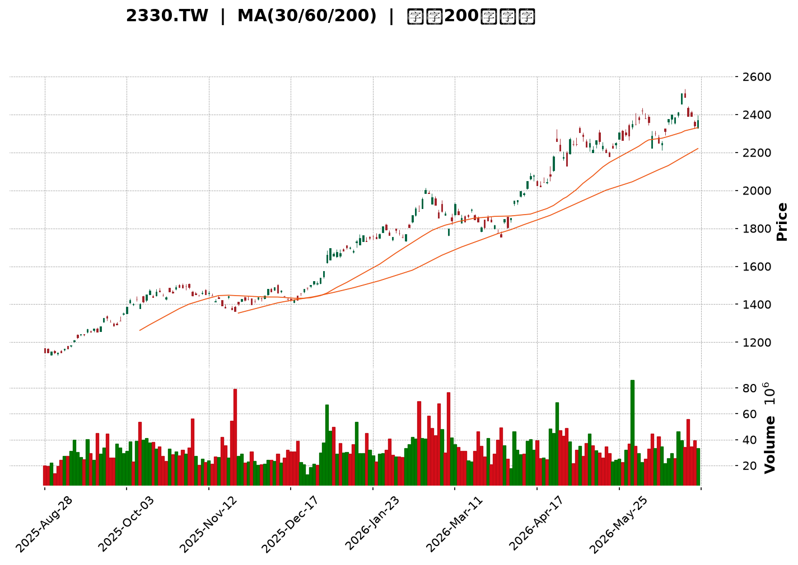
</details>

<html>
<head><meta charset="utf-8" /></head>
<body>
    <div style="height:500px; width:100%;">                        <script>window.PlotlyConfig = {MathJaxConfig: 'local'};</script>
        <script charset="utf-8" src="https://cdn.plot.ly/plotly-3.6.0.min.js" integrity="sha256-QaOVwtVY0T02VaHrr6pnoHLCwayMJp4O5n4YyaE3rJk=" crossorigin="anonymous"></script>                <div id="candlestick-chart" class="plotly-graph-div" style="height:100%; width:100%;"></div>            <script>                window.PLOTLYENV=window.PLOTLYENV || {};                                if (document.getElementById("candlestick-chart")) {                    Plotly.newPlot(                        "candlestick-chart",                        [{"close":{"dtype":"f8","bdata":"AAAAAPfikUAAAAAA9+KRQAAAAKCz9pFAAAAAAPfikUAAAAAA9+KRQAAAAAD34pFAAAAAoOkxkkAAAACg6TGSQAAAACDcgJJAAAAAgIvjkkAAAABgwR6TQAAAAOCzbZNAAAAAYPdZk0AAAACA3NCTQAAAAOBplZNAAAAAYK3kk0AAAADgaZWTQAAAACBPDJRAAAAA4Ka+lEAAAADgpr6UQAAAAGBjb5RAAAAA4B8glEAAAADA8DOUQAAAAEA0g5RAAAAAILshlUAAAAAgcayVQAAAACAnN5ZAAAAAwOPnlUAAAAAg+EqWQAAAAMDj55VAAAAAYIUPlkAAAABgDK6WQAAAAOBP\u002fZZAAAAA4JlylkAAAAAAf+mWQAAAAAB\u002f6ZZAAAAAoDualkAAAADgmXKWQAAAAAB\u002f6ZZAAAAAQK7VlkAAAABgk0yXQAAAAGCTTJdAAAAAYMI4l0AAAABAZGCXQAAAAGCTTJdAAAAAoDualkAAAABgDK6WQAAAAKA7mpZAAAAAQK7VlkAAAABgDK6WQAAAAECu1ZZAAAAAoDualkAAAABAViOWQAAAAADJXpZAAAAAIELAlUAAAABAoJiVQAAAAMBqhpZAAAAAoP5wlUAAAADgXEmVQAAAAMDj55VAAAAAIPhKlkAAAAAgJzeWQAAAACD4SpZAAAAA4BLUlUAAAABAViOWQAAAAOCZcpZAAAAAAMlelkAAAACgO5qWQAAAAKDxJJdAAAAAAH\u002fplkAAAABgk0yXQAAAAKBI1ZZAAAAAQAz9lkAAAACgwYWWQAAAACAcSpZAAAAAYDo2lkAAAABgOjaWQAAAAGA6NpZAAAAA4GbBlkAAAADAzySXQAAAAICxOJdAAAAA4FZ0l0AAAADg3cOXQAAAAGAanJdAAAAAAGUTmEAAAABgkZ6YQAAAAICP8JlAAAAA4Lt7mkAAAABAcQSaQAAAAMA0LJpAAAAAAFMYmkAAAACAFkCaQAAAAKCdj5pAAAAAoJ2PmkAAAACAFkCaQAAAAEDoBptAAAAAYG9Wm0AAAADAFJKbQAAAAEDoBptAAAAAYG9Wm0AAAAAAM36bQAAAAICNQptAAAAAgPalm0AAAACgBEWcQAAAAGBfCZxAAAAAwBSSm0AAAAAgUWqbQAAAAIB99ZtAAAAAQNi5m0AAAAAgUWqbQAAAAID2pZtAAAAA4CIxnEAAAADgmTOdQAAAAEDGvp1AAAAA4CCDnUAAAADgl4WeQAAAAKBpTJ9AAAAAgOL8nkAAAACAW62eQAAAAGBNDp5AAAAAgPT3nEAAAADgIIOdQAAAAGBdW51AAAAAIEEdnEAAAABAT7ycQAAAACAvIp5AAAAAoHtHnUAAAACA9PecQAAAAIBtqJxAAAAAABkknUAAAACgua+dQAAAAIBP1JxAAAAAwGqsnEAAAACAvDScQAAAAIC8NJxAAAAAIF3AnEAAAADAaqycQAAAAEChXJxAAAAAQA69m0AAAADARG2bQAAAAOBB6JxAAAAAgLw0nEAAAABANPycQAAAAAA\u002fY55AAAAAYDF3nkAAAADAtiqfQAAAAADSAp9AAAAAgBADoEAAAABg7jSgQAAAAKDnPqBAAAAAAGWin0AAAACgco6fQAAAAIAu8p9AAAAAgC7yn0AAAABg7jSgQAAAAGBfBqFAAAAAYPKloUAAAACANkKhQAAAACBm\u002fKBAAAAAgKOioEAAAADA5LmhQAAAAOAGiKFAAAAA4AaIoUAAAAAgtf+hQAAAAGDQ16FAAAAAQBtqoUAAAAAAAJKhQAAAAKAvTKFAAAAAoOuvoUAAAABg8qWhQAAAAIAUdKFAAAAAIEQuoUAAAABgXwahQAAAAAAiYKFAAAAAAACSoUAAAAAgtf+hQAAAAKDrr6FAAAAAwMLroUAAAACAyeGhQAAAAMB3WaJAAAAAwHdZokAAAADAVYuiQAAAAGAY5aJAAAAA4E6VokAAAAAgam2iQAAAAIDJ4aFAAAAA4Lv1oUAAAAAAAJKhQAAAAAAAlKFAAAAAAAAMokAAAAAAAI6iQAAAAAAAwKJAAAAAAACiokAAAAAAANSiQAAAAAAAnKNAAAAAAAB0o0AAAAAAAKyiQAAAAAAArKJAAAAAAABIokAAAAAAAISiQA=="},"high":{"dtype":"f8","bdata":"lnsaQaZFkkCWexpBpkWSQAAAAKCz9pFAjbDc8ywekkAAAAAA9+KRQI2w3PMsHpJAAAAAoOkxkkDhpO6TH22SQAAAACDcgJJAAkapJkj3kkCllFL6s22TQAAAAOCzbZNAvSWhBrRtk0AAAIBcreSTQEHA6pgLvZNAAAAAYK3kk0Ci4EoufviTQAAAACBPDJRAAAAA4Ka+lEAfqJx1GfqUQBA++BgFl5RArdRKdZJblEBVVVVVY2+UQLyVfY5I5pRAvMd7\u002fIs1lUAAAAAgcayVQGk23djIXpZAo6R+nLT7lUCrqqq1aoaWQKOkfpy0+5VAHWDZZjualkAAAABgDK6WQHW4GpnxJJdADem8dQyulkCYIp+V8SSXQHWDKXLCOJdATZo0Wd3BlkCvTZS8aoaWQHWDKXLCOJdA8m\u002fp1SARl0DtLTIZNXSXQOREy\u002fUFiJdAZ2Zmrtabl0Bw8jf5BYiXQNtbZNLWm5dAwYED70\u002f9lkCG7oP1fumWQCZNmnwMrpZAoUpG+U\u002f9lkAN3QeL8SSXQKFKRvlP\u002fZZATZo0Wd3BlkA+09b490qWQPDRs5U7mpZAnHSASyc3lkByHMex4+eVQA5Ql5w7mpZAgB4jEkLAlUCx9g0LQsCVQEZJ\u002fXiFD5ZAAAAAIPhKlkDSbLqRaoaWQKuqqrVqhpZAGTpg58helkA+09b490qWQAAAAOCZcpZA+0WR3JlylkAAAACgO5qWQAAAAKDxJJdAdYMpcsI4l0AAAABgk0yXQAAAAJA4iJdApshnBe4Ql0BgKmhlo5mWQBUYe6rfcZZAmrbGr99xlkDePEIlHEqWQFYwSzqjmZZAQf5ZpUjVlkAAAADAzySXQFDmWUWTTJdAAAAA4FZ0l0AAAADg3cOXQK+hvOrdw5dAAAAAAGUTmEAAAABgkZ6YQH+L01r4U5pAAAAA4Lt7mkBi0bLKNCyaQIDY8w\u002faZ5pAVVVVFdpnmkBow+fPu3uaQKuqqipht5pAVVVVZX+jmkBFgpoK2meaQKuqqsqrLptAGF10dfalm0AAAADAFJKbQKuqqhpRaptAjC666jJ+m0B+eWzFFJKbQKD7uR\u002fYuZtAlqxkRdi5m0AAAACgBEWcQG12cQCqgJxAINEKm331m0AAAAAgUWqbQKuqqgpBHZxAFTqDVV8JnEB5mgtw9qWbQAAAAID2pZtA43eC9amAnEAAAADgmTOdQN3LscqJ5p1AFQgjRU0OnkBn0pVqW62eQAzkoyotdJ9A+DPhz4c4n0DVKGOV4vyeQH1BX1A9wZ5AaQ7fb+SqnUC3xKkftnGeQKuqquogg51AAAAAIEEdnEBGteVqXVudQAW+uKrySZ5AvLoVQMa+nUASsUaVe0edQAUJo+WZM51ATNgGwf1LnUAEAoEArMOdQDkPHcP9S51ALWQhAxkknUBtx4fgrkicQGg7PoRP1JxAMjgfYws4nUB705uiJhCdQHAIh6CTcJxACEUowtcMnEB00UUD8+SbQAAAAOBB6JxArpHVpSYQnUAAAABANPycQAAAAAA\u002fY55AAAAAYDF3nkAAAADAtiqfQFx\u002fe2DEFp9AAAAAgBADoEDFTuwg01ygQP\u002fBRNDgSKBALzFroQkNoEDCFmxxEAOgQBO1KzH1KqBAD8TvAPwgoECd2Ilyo6KgQGmcQZBYEKFAGNE205knokD5Y0nz3cOhQKszUkE9OKFAVFwyhDZCoUDgB34g182hQGhFI6Hrr6FAdbn9MdfNoUAffPBxhUWiQPQuHiG1\u002f6FAOiUBwuS5oUAU3z3x3cOhQMln3WAUdKFAAAAAoOuvoUDvhfeioB2iQEmSJEH5m6FAURRFESJgoUAPDkhRPTihQAWEE\u002fH\u002fkaFABJM\u002fMPmboUAAAAAgtf+hQDbwGbOgHaJAoGir4ZknokCeDyzzcGOiQLt\u002f84BcgaJAL3\u002faAibRokCBXBOBOrOiQENasfADA6NAcqdoASbRokBO8OShM72iQMZUOHGnE6JA75W6cKcTokAkKzyywuuhQAAAAAAAqKFAAAAAAAAqokAAAAAAAI6iQAAAAAAAwKJAAAAAAACiokAAAAAAAN6iQAAAAAAAnKNAAAAAAADOo0AAAAAAABqjQAAAAAAA6KJAAAAAAACEokAAAAAAALaiQA=="},"hovertemplate":"\u003cb\u003e%{x|%Y-%m-%d}\u003c\u002fb\u003e\u003cbr\u003e\u958b: $%{open:.2f}\u003cbr\u003e\u9ad8: $%{high:.2f}\u003cbr\u003e\u4f4e: $%{low:.2f}\u003cbr\u003e\u6536: $%{close:.2f}\u003cextra\u003e\u003c\u002fextra\u003e","low":{"dtype":"f8","bdata":"AAAAAPfikUAAAAAA9+KRQL+CoQXBp5FAfBphWTrPkUBzTyMMwaeRQAAAAAD34pFAvzy2UnAKkkAAAACg6TGSQO\u002fu7tJiWZJA\u002fHOtMhK8kkDXWmu5BAuTQMMwDJM6RpNAQ9peuTpGk0AAAAAOmYGTQAAAAOBplZNA8g3y7WmVk0AAAADgaZWTQK0bTNE6qZNAIj1QkZJblEDhV2NKNIOUQAAAAGBjb5RAG7mRA08MlEAAAADA8DOUQAAAAEA0g5RAh3AIZxn6lEDNzMwYuyGVQGIutIq0+5VAurYCB0LAlUA5juNmViOWQNLIhnHPhJVAs82Xg7T7lUDug\u002fV7hQ+WQBaPym0MrpZAAAAA4JlylkCtG0yxaoaWQAAAAAB\u002f6ZZA2bJlw2qGlkD0FkNKJzeWQAAAAAB\u002f6ZZAr9pcY93BlkAcuzTKIBGXQArpZoPCOJdAAAAAYMI4l0AgG5DNIBGXQBPSzabxJJdA2bJlw2qGlkAAAABgDK6WQNmyZcNqhpZAX7W5hgyulkAAAABgDK6WQA6QFqo7mpZAAAAAoDualkBglpRjhQ+WQAAAAADJXpZAAAAAIELAlUAAAABAoJiVQNYPOir4SpZAAAAAoP5wlUAAAADgXEmVQLq2AgdCwJVAVlVVioUPlkDLZJFDViOWQB3HcUMnN5ZAAAAA4BLUlUDBLCmHtPuVQPQWQ0onN5ZAEC5MalYjlkBmy5Yt+EqWQIcm+Zc7mpZAAAAAAH\u002fplkAmpJvtT\u002f2WQKuqqtpmwZZAtG4wtUjVlkCh1Zfa33GWQOrnhJVYIpZAIsO9mlgilkBmSTkQlfqVQAAAAGA6NpZAfwNMVaOZlkBwA4aqSNWWQF8zTPXtEJdAk7\u002fJj7E4l0CrqqrKVnSXQFFeQ9VWdJdApwFtmjiIl0CB4DI1g\u002f+XQE5rto+fPZlA\u002ffPPnyaNmUCdLk21rdyZQAFPGCDqtJlAVVVVJeq0mUAAAACAFkCaQFVVVRXaZ5pAVVVVFdpnmkC6fWX1UhiaQAAAAKCdj5pAGF10+kLLmkBsDiRa6AabQAAAAEDoBptAddFF1asum0AJGk7qqy6bQAAAAICNQptAFKEIpY1Cm0Aw\u002fdL\u002fuc2bQJjBl5p99ZtAAAAAwBSSm0AKMpsKyhqbQAAAADDYuZtA9WI+tRSSm0CDzKZab1abQFOb2lToBptAAAAA4CIxnEDqOxu1i5ScQIvQOBW4H51AAAAA4CCDnUD94xIrxr6dQOY3uIri\u002fJ5AAAAAgOL8nkCMeJIaLyKeQAAAAGBNDp5AAAAAgPT3nEBG2rEaP2+dQFVVVdWZM51AEaTc9DJ+m0BcJY0qyGycQN4sTxq4H51AAAAAoHtHnUCpomeli5ScQAAAAIBtqJxAsyf5PjT8nED0+Xx+4nOdQAAAAIBP1JxAAAAAwGqsnEDgGlmdANGbQCdx8L7XDJxAAAAAIF3AnEAAAADAaqycQD7e473XDJxAAAAAQA69m0AAAADARG2bQPqSaf2FhJxAlDh4H8ognEDXWmtdeJicQJ3YiR2D\u002f51AM3WLfXUTnkBSuB59CLOeQO6Bjd76xp5Av0oYm5tSn0A7sROfCQ2gQAd0Y34QA6BAAAAAAGWin0AAAACgco6fQPgdiB883p9A8TsQv0nKn0CKndhuEAOgQGk55lvMZqBAAAAAYPKloUAAAACANkKhQCrmVo963qBAAAAAgKOioED8wA+8URqhQExdbn8UdKFATF1ufxR0oUAAAAAgtf+hQE9Fmm7ypaFAAAAAQBtqoUDc1MNNPTihQCnyWQ9ELqFAHpe+HSJgoUCEHkLPBoihQCRJko42QqFAAAAAIEQuoUAAAABgXwahQAAAAAAiYKFA6I2C3ihWoUDhgw\u002fO5LmhQAAAAKDrr6FAy4dxX9DXoUA5q8eO66+hQFegz86ZJ6JAESDDj35PokB\u002fo+z+cGOiQL6lTs8sx6JAAAAA4E6VokDjJUqPfk+iQGLw0wwiYKFAC5yDf8nhoUAAAAAAAJKhQAAAAAAARKFAAAAAAADkoUAAAAAAAFKiQAAAAAAAXKJAAAAAAABcokAAAAAAAKKiQAAAAAAALqNAAAAAAAB0o0AAAAAAAKyiQAAAAAAArKJAAAAAAAAqokAAAAAAADSiQA=="},"name":"\u50f9\u683c","open":{"dtype":"f8","bdata":"lnsaQaZFkkASlnua6TGSQA8iOax9u5FACcs9TXAKkkB8GmFZOs+RQAnLPU1wCpJAXx5b+SwekkDhpO6TH22SQHd3d3kfbZJA\u002frlW2c7PkkB8771T91mTQGIYhjn3WZNAvSWhBrRtk0AAAIDqaZWTQCFgdbw6qZNA+Qb5pgu9k0CCgNVRreSTQK0bTNE6qZNAgsrZbWNvlEC\u002fGhOZSOaUQAAAAGBjb5RAyY3cmMFHlEAcx3GcwUeUQAAAAEA0g5RAQziEQ+oNlUDNzMwYuyGVQGIutIq0+5VAXVuB4xLUlUAAAAAg+EqWQNLIhnHPhJVA0C1ximqGlkDzIvg0JzeWQBaPym0MrpZAr02UvGqGlkCKfNaNO5qWQN1gitxP\u002fZZAAAAAoDualkCjZNcm+EqWQHWDKXLCOJdAUSWjHH\u002fplkAT0s2m8SSXQO0tMhk1dJdA16Nw9TR0l0AAAABAZGCXQOREy\u002fUFiJdAmjRpEn\u002fplkCCT4E83cGWQAAAAKA7mpZAr9pcY93BlkCLjYauIBGXQK\u002faXGPdwZZAAAAAoDualkBglpRjhQ+WQPtFkdyZcpZAnHSASyc3lkAcx3EccayVQPKvaOOZcpZAQI8RWaCYlUDpoosucayVQEZJ\u002fXiFD5ZAOY7jZlYjlkCe0Uu1mXKWQAAAACD4SpZAGTpg58helkAAAABAViOWQKNk1yb4SpZAAAAAAMlelkCMGDEKyV6WQCtqjHQMrpZAmCKflfEkl0AcuzTKIBGXQKuqqspWdJdAWjeYeirplkAAAACgwYWWQAAAACAcSpZA3jxCJRxKlkBEhnvVdg6WQFYwSzqjmZZAAAAA4GbBlkCUguRvKumWQAAAAICxOJdAMZWYGnVgl0AAAACQOIiXQCivoZo4iJdA\u002fSXLXxqcl0BhKOa\u002fRieYQJvtE1WBUZlA\u002ffPPnyaNmUCdLk21rdyZQCuXaeXLyJlAAAAAsK3cmUBFgpoK2meaQKuqqipht5pAq6qq2rt7mkDdvrK6NCyaQKuqqnoG85pAGF10+kLLmkBsDiRa6AabQFVVVQXKGptARhddJVFqm0AAAAAAM36bQOBTkwpRaptAqk1tam9Wm0Aw\u002fdL\u002fuc2bQAY4CTvIbJxArbA5ELrNm0CIZfTPqy6bQKuqqgpBHZxAAAAAQNi5m0AAAAAgUWqbQOlHPxrKGptA69khMMhsnEBt1Hd6baicQHq2kdqZM51AAAAA4CCDnUD94xIrxr6dQOY3uIri\u002fJ5AUxFLRcQQn0CMeJIaLyKeQNNrn8V5mZ5AmwnqHz9vnUDPLXEKLyKeQFVVVdWZM51Ajw9BuhSSm0Cj2nJV1gudQOPqB6V7R51AXt0K8CCDnUCpomeli5ScQASaQiC4H51AJmyDYAs4nUD8\u002fX4\u002fx5udQFo3mGILOJ1AyUIWQjT8nEBN4uD98uSbQGg7PoRP1JxAIdAUoiYQnUBkIQuBT9ScQK7mah7KIJxAAAAAQA69m0C66KLhG6mbQGOLcr5qrJxArpHVpSYQnUDwvfd+T9ScQF7ohd5nJ55AR5UEn0xPnkCamZnd+saeQKWAhJ\u002ff7p5AqtCj+41mn0DsxE7PAhegQAE+u2\u002fuNKBA\u002fKgucRADoEDrXHkAZaKfQAAAAIAu8p9A+B2IHzzen0BiJ3bA4EigQNLVJ4zFcKBAfOG98N3DoUCHVYShDX6hQA6ix+9s8qBAyhCsI0QuoUDsxE7sSiShQAAAAOAGiKFAAAAA4AaIoUDNoWIRkzGiQHoXj8DC66FA69uAYfKloUDwswE\u002fG2qhQCnyWQ9ELqFAj0vf3gaIoUBzpDkStf+hQEmSJO8oVqFAMQzDsC9MoUCmcQYhRC6hQM80bmAUdKFA+NmAnw1+oUDhgw\u002fO5LmhQBrD0YKnE6JANniOILX\u002foUDoIK+Sfk+iQDRgSS+MO6JAAAAAwHdZokBArokgSJ+iQAAAAGAY5aJAAAAA4E6VokA7tGtBQamiQGLw0wwiYKFAAAAA4Lv1oUAYcn0h182hQAAAAAAAgKFAAAAAAAAqokAAAAAAAHCiQAAAAAAAjqJAAAAAAABmokAAAAAAALaiQAAAAAAALqNAAAAAAACco0AAAAAAAAajQAAAAAAA1KJAAAAAAABwokAAAAAAADSiQA=="},"x":["2025-08-28T00:00:00+08:00","2025-08-29T00:00:00+08:00","2025-09-01T00:00:00+08:00","2025-09-02T00:00:00+08:00","2025-09-03T00:00:00+08:00","2025-09-04T00:00:00+08:00","2025-09-05T00:00:00+08:00","2025-09-08T00:00:00+08:00","2025-09-09T00:00:00+08:00","2025-09-10T00:00:00+08:00","2025-09-11T00:00:00+08:00","2025-09-12T00:00:00+08:00","2025-09-15T00:00:00+08:00","2025-09-16T00:00:00+08:00","2025-09-17T00:00:00+08:00","2025-09-18T00:00:00+08:00","2025-09-19T00:00:00+08:00","2025-09-22T00:00:00+08:00","2025-09-23T00:00:00+08:00","2025-09-24T00:00:00+08:00","2025-09-25T00:00:00+08:00","2025-09-26T00:00:00+08:00","2025-09-30T00:00:00+08:00","2025-10-01T00:00:00+08:00","2025-10-02T00:00:00+08:00","2025-10-03T00:00:00+08:00","2025-10-07T00:00:00+08:00","2025-10-08T00:00:00+08:00","2025-10-09T00:00:00+08:00","2025-10-13T00:00:00+08:00","2025-10-14T00:00:00+08:00","2025-10-15T00:00:00+08:00","2025-10-16T00:00:00+08:00","2025-10-17T00:00:00+08:00","2025-10-20T00:00:00+08:00","2025-10-21T00:00:00+08:00","2025-10-22T00:00:00+08:00","2025-10-23T00:00:00+08:00","2025-10-27T00:00:00+08:00","2025-10-28T00:00:00+08:00","2025-10-29T00:00:00+08:00","2025-10-30T00:00:00+08:00","2025-10-31T00:00:00+08:00","2025-11-03T00:00:00+08:00","2025-11-04T00:00:00+08:00","2025-11-05T00:00:00+08:00","2025-11-06T00:00:00+08:00","2025-11-07T00:00:00+08:00","2025-11-10T00:00:00+08:00","2025-11-11T00:00:00+08:00","2025-11-12T00:00:00+08:00","2025-11-13T00:00:00+08:00","2025-11-14T00:00:00+08:00","2025-11-17T00:00:00+08:00","2025-11-18T00:00:00+08:00","2025-11-19T00:00:00+08:00","2025-11-20T00:00:00+08:00","2025-11-21T00:00:00+08:00","2025-11-24T00:00:00+08:00","2025-11-25T00:00:00+08:00","2025-11-26T00:00:00+08:00","2025-11-27T00:00:00+08:00","2025-11-28T00:00:00+08:00","2025-12-01T00:00:00+08:00","2025-12-02T00:00:00+08:00","2025-12-03T00:00:00+08:00","2025-12-04T00:00:00+08:00","2025-12-05T00:00:00+08:00","2025-12-08T00:00:00+08:00","2025-12-09T00:00:00+08:00","2025-12-10T00:00:00+08:00","2025-12-11T00:00:00+08:00","2025-12-12T00:00:00+08:00","2025-12-15T00:00:00+08:00","2025-12-16T00:00:00+08:00","2025-12-17T00:00:00+08:00","2025-12-18T00:00:00+08:00","2025-12-19T00:00:00+08:00","2025-12-22T00:00:00+08:00","2025-12-23T00:00:00+08:00","2025-12-24T00:00:00+08:00","2025-12-26T00:00:00+08:00","2025-12-29T00:00:00+08:00","2025-12-30T00:00:00+08:00","2025-12-31T00:00:00+08:00","2026-01-02T00:00:00+08:00","2026-01-05T00:00:00+08:00","2026-01-06T00:00:00+08:00","2026-01-07T00:00:00+08:00","2026-01-08T00:00:00+08:00","2026-01-09T00:00:00+08:00","2026-01-12T00:00:00+08:00","2026-01-13T00:00:00+08:00","2026-01-14T00:00:00+08:00","2026-01-15T00:00:00+08:00","2026-01-16T00:00:00+08:00","2026-01-19T00:00:00+08:00","2026-01-20T00:00:00+08:00","2026-01-21T00:00:00+08:00","2026-01-22T00:00:00+08:00","2026-01-23T00:00:00+08:00","2026-01-26T00:00:00+08:00","2026-01-27T00:00:00+08:00","2026-01-28T00:00:00+08:00","2026-01-29T00:00:00+08:00","2026-01-30T00:00:00+08:00","2026-02-02T00:00:00+08:00","2026-02-03T00:00:00+08:00","2026-02-04T00:00:00+08:00","2026-02-05T00:00:00+08:00","2026-02-06T00:00:00+08:00","2026-02-09T00:00:00+08:00","2026-02-10T00:00:00+08:00","2026-02-11T00:00:00+08:00","2026-02-23T00:00:00+08:00","2026-02-24T00:00:00+08:00","2026-02-25T00:00:00+08:00","2026-02-26T00:00:00+08:00","2026-03-02T00:00:00+08:00","2026-03-03T00:00:00+08:00","2026-03-04T00:00:00+08:00","2026-03-05T00:00:00+08:00","2026-03-06T00:00:00+08:00","2026-03-09T00:00:00+08:00","2026-03-10T00:00:00+08:00","2026-03-11T00:00:00+08:00","2026-03-12T00:00:00+08:00","2026-03-13T00:00:00+08:00","2026-03-16T00:00:00+08:00","2026-03-17T00:00:00+08:00","2026-03-18T00:00:00+08:00","2026-03-19T00:00:00+08:00","2026-03-20T00:00:00+08:00","2026-03-23T00:00:00+08:00","2026-03-24T00:00:00+08:00","2026-03-25T00:00:00+08:00","2026-03-26T00:00:00+08:00","2026-03-27T00:00:00+08:00","2026-03-30T00:00:00+08:00","2026-03-31T00:00:00+08:00","2026-04-01T00:00:00+08:00","2026-04-02T00:00:00+08:00","2026-04-07T00:00:00+08:00","2026-04-08T00:00:00+08:00","2026-04-09T00:00:00+08:00","2026-04-10T00:00:00+08:00","2026-04-13T00:00:00+08:00","2026-04-14T00:00:00+08:00","2026-04-15T00:00:00+08:00","2026-04-16T00:00:00+08:00","2026-04-17T00:00:00+08:00","2026-04-20T00:00:00+08:00","2026-04-21T00:00:00+08:00","2026-04-22T00:00:00+08:00","2026-04-23T00:00:00+08:00","2026-04-24T00:00:00+08:00","2026-04-27T00:00:00+08:00","2026-04-28T00:00:00+08:00","2026-04-29T00:00:00+08:00","2026-04-30T00:00:00+08:00","2026-05-04T00:00:00+08:00","2026-05-05T00:00:00+08:00","2026-05-06T00:00:00+08:00","2026-05-07T00:00:00+08:00","2026-05-08T00:00:00+08:00","2026-05-11T00:00:00+08:00","2026-05-12T00:00:00+08:00","2026-05-13T00:00:00+08:00","2026-05-14T00:00:00+08:00","2026-05-15T00:00:00+08:00","2026-05-18T00:00:00+08:00","2026-05-19T00:00:00+08:00","2026-05-20T00:00:00+08:00","2026-05-21T00:00:00+08:00","2026-05-22T00:00:00+08:00","2026-05-25T00:00:00+08:00","2026-05-26T00:00:00+08:00","2026-05-27T00:00:00+08:00","2026-05-28T00:00:00+08:00","2026-05-29T00:00:00+08:00","2026-06-01T00:00:00+08:00","2026-06-02T00:00:00+08:00","2026-06-03T00:00:00+08:00","2026-06-04T00:00:00+08:00","2026-06-05T00:00:00+08:00","2026-06-08T00:00:00+08:00","2026-06-09T00:00:00+08:00","2026-06-10T00:00:00+08:00","2026-06-11T00:00:00+08:00","2026-06-12T00:00:00+08:00","2026-06-15T00:00:00+08:00","2026-06-16T00:00:00+08:00","2026-06-17T00:00:00+08:00","2026-06-18T00:00:00+08:00","2026-06-22T00:00:00+08:00","2026-06-23T00:00:00+08:00","2026-06-24T00:00:00+08:00","2026-06-25T00:00:00+08:00","2026-06-26T00:00:00+08:00","2026-06-29T00:00:00+08:00"],"type":"candlestick"},{"hovertemplate":"MA30: $%{y:.2f}\u003cextra\u003e\u003c\u002fextra\u003e","line":{"color":"#2196F3","dash":"dash","width":2},"mode":"lines","name":"MA30","x":["2025-08-28T00:00:00+08:00","2025-08-29T00:00:00+08:00","2025-09-01T00:00:00+08:00","2025-09-02T00:00:00+08:00","2025-09-03T00:00:00+08:00","2025-09-04T00:00:00+08:00","2025-09-05T00:00:00+08:00","2025-09-08T00:00:00+08:00","2025-09-09T00:00:00+08:00","2025-09-10T00:00:00+08:00","2025-09-11T00:00:00+08:00","2025-09-12T00:00:00+08:00","2025-09-15T00:00:00+08:00","2025-09-16T00:00:00+08:00","2025-09-17T00:00:00+08:00","2025-09-18T00:00:00+08:00","2025-09-19T00:00:00+08:00","2025-09-22T00:00:00+08:00","2025-09-23T00:00:00+08:00","2025-09-24T00:00:00+08:00","2025-09-25T00:00:00+08:00","2025-09-26T00:00:00+08:00","2025-09-30T00:00:00+08:00","2025-10-01T00:00:00+08:00","2025-10-02T00:00:00+08:00","2025-10-03T00:00:00+08:00","2025-10-07T00:00:00+08:00","2025-10-08T00:00:00+08:00","2025-10-09T00:00:00+08:00","2025-10-13T00:00:00+08:00","2025-10-14T00:00:00+08:00","2025-10-15T00:00:00+08:00","2025-10-16T00:00:00+08:00","2025-10-17T00:00:00+08:00","2025-10-20T00:00:00+08:00","2025-10-21T00:00:00+08:00","2025-10-22T00:00:00+08:00","2025-10-23T00:00:00+08:00","2025-10-27T00:00:00+08:00","2025-10-28T00:00:00+08:00","2025-10-29T00:00:00+08:00","2025-10-30T00:00:00+08:00","2025-10-31T00:00:00+08:00","2025-11-03T00:00:00+08:00","2025-11-04T00:00:00+08:00","2025-11-05T00:00:00+08:00","2025-11-06T00:00:00+08:00","2025-11-07T00:00:00+08:00","2025-11-10T00:00:00+08:00","2025-11-11T00:00:00+08:00","2025-11-12T00:00:00+08:00","2025-11-13T00:00:00+08:00","2025-11-14T00:00:00+08:00","2025-11-17T00:00:00+08:00","2025-11-18T00:00:00+08:00","2025-11-19T00:00:00+08:00","2025-11-20T00:00:00+08:00","2025-11-21T00:00:00+08:00","2025-11-24T00:00:00+08:00","2025-11-25T00:00:00+08:00","2025-11-26T00:00:00+08:00","2025-11-27T00:00:00+08:00","2025-11-28T00:00:00+08:00","2025-12-01T00:00:00+08:00","2025-12-02T00:00:00+08:00","2025-12-03T00:00:00+08:00","2025-12-04T00:00:00+08:00","2025-12-05T00:00:00+08:00","2025-12-08T00:00:00+08:00","2025-12-09T00:00:00+08:00","2025-12-10T00:00:00+08:00","2025-12-11T00:00:00+08:00","2025-12-12T00:00:00+08:00","2025-12-15T00:00:00+08:00","2025-12-16T00:00:00+08:00","2025-12-17T00:00:00+08:00","2025-12-18T00:00:00+08:00","2025-12-19T00:00:00+08:00","2025-12-22T00:00:00+08:00","2025-12-23T00:00:00+08:00","2025-12-24T00:00:00+08:00","2025-12-26T00:00:00+08:00","2025-12-29T00:00:00+08:00","2025-12-30T00:00:00+08:00","2025-12-31T00:00:00+08:00","2026-01-02T00:00:00+08:00","2026-01-05T00:00:00+08:00","2026-01-06T00:00:00+08:00","2026-01-07T00:00:00+08:00","2026-01-08T00:00:00+08:00","2026-01-09T00:00:00+08:00","2026-01-12T00:00:00+08:00","2026-01-13T00:00:00+08:00","2026-01-14T00:00:00+08:00","2026-01-15T00:00:00+08:00","2026-01-16T00:00:00+08:00","2026-01-19T00:00:00+08:00","2026-01-20T00:00:00+08:00","2026-01-21T00:00:00+08:00","2026-01-22T00:00:00+08:00","2026-01-23T00:00:00+08:00","2026-01-26T00:00:00+08:00","2026-01-27T00:00:00+08:00","2026-01-28T00:00:00+08:00","2026-01-29T00:00:00+08:00","2026-01-30T00:00:00+08:00","2026-02-02T00:00:00+08:00","2026-02-03T00:00:00+08:00","2026-02-04T00:00:00+08:00","2026-02-05T00:00:00+08:00","2026-02-06T00:00:00+08:00","2026-02-09T00:00:00+08:00","2026-02-10T00:00:00+08:00","2026-02-11T00:00:00+08:00","2026-02-23T00:00:00+08:00","2026-02-24T00:00:00+08:00","2026-02-25T00:00:00+08:00","2026-02-26T00:00:00+08:00","2026-03-02T00:00:00+08:00","2026-03-03T00:00:00+08:00","2026-03-04T00:00:00+08:00","2026-03-05T00:00:00+08:00","2026-03-06T00:00:00+08:00","2026-03-09T00:00:00+08:00","2026-03-10T00:00:00+08:00","2026-03-11T00:00:00+08:00","2026-03-12T00:00:00+08:00","2026-03-13T00:00:00+08:00","2026-03-16T00:00:00+08:00","2026-03-17T00:00:00+08:00","2026-03-18T00:00:00+08:00","2026-03-19T00:00:00+08:00","2026-03-20T00:00:00+08:00","2026-03-23T00:00:00+08:00","2026-03-24T00:00:00+08:00","2026-03-25T00:00:00+08:00","2026-03-26T00:00:00+08:00","2026-03-27T00:00:00+08:00","2026-03-30T00:00:00+08:00","2026-03-31T00:00:00+08:00","2026-04-01T00:00:00+08:00","2026-04-02T00:00:00+08:00","2026-04-07T00:00:00+08:00","2026-04-08T00:00:00+08:00","2026-04-09T00:00:00+08:00","2026-04-10T00:00:00+08:00","2026-04-13T00:00:00+08:00","2026-04-14T00:00:00+08:00","2026-04-15T00:00:00+08:00","2026-04-16T00:00:00+08:00","2026-04-17T00:00:00+08:00","2026-04-20T00:00:00+08:00","2026-04-21T00:00:00+08:00","2026-04-22T00:00:00+08:00","2026-04-23T00:00:00+08:00","2026-04-24T00:00:00+08:00","2026-04-27T00:00:00+08:00","2026-04-28T00:00:00+08:00","2026-04-29T00:00:00+08:00","2026-04-30T00:00:00+08:00","2026-05-04T00:00:00+08:00","2026-05-05T00:00:00+08:00","2026-05-06T00:00:00+08:00","2026-05-07T00:00:00+08:00","2026-05-08T00:00:00+08:00","2026-05-11T00:00:00+08:00","2026-05-12T00:00:00+08:00","2026-05-13T00:00:00+08:00","2026-05-14T00:00:00+08:00","2026-05-15T00:00:00+08:00","2026-05-18T00:00:00+08:00","2026-05-19T00:00:00+08:00","2026-05-20T00:00:00+08:00","2026-05-21T00:00:00+08:00","2026-05-22T00:00:00+08:00","2026-05-25T00:00:00+08:00","2026-05-26T00:00:00+08:00","2026-05-27T00:00:00+08:00","2026-05-28T00:00:00+08:00","2026-05-29T00:00:00+08:00","2026-06-01T00:00:00+08:00","2026-06-02T00:00:00+08:00","2026-06-03T00:00:00+08:00","2026-06-04T00:00:00+08:00","2026-06-05T00:00:00+08:00","2026-06-08T00:00:00+08:00","2026-06-09T00:00:00+08:00","2026-06-10T00:00:00+08:00","2026-06-11T00:00:00+08:00","2026-06-12T00:00:00+08:00","2026-06-15T00:00:00+08:00","2026-06-16T00:00:00+08:00","2026-06-17T00:00:00+08:00","2026-06-18T00:00:00+08:00","2026-06-22T00:00:00+08:00","2026-06-23T00:00:00+08:00","2026-06-24T00:00:00+08:00","2026-06-25T00:00:00+08:00","2026-06-26T00:00:00+08:00","2026-06-29T00:00:00+08:00"],"y":{"dtype":"f8","bdata":"AAAAAAAA+H8AAAAAAAD4fwAAAAAAAPh\u002fAAAAAAAA+H8AAAAAAAD4fwAAAAAAAPh\u002fAAAAAAAA+H8AAAAAAAD4fwAAAAAAAPh\u002fAAAAAAAA+H8AAAAAAAD4fwAAAAAAAPh\u002fAAAAAAAA+H8AAAAAAAD4fwAAAAAAAPh\u002fAAAAAAAA+H8AAAAAAAD4fwAAAAAAAPh\u002fAAAAAAAA+H8AAAAAAAD4fwAAAAAAAPh\u002fAAAAAAAA+H8AAAAAAAD4fwAAAAAAAPh\u002fAAAAAAAA+H8AAAAAAAD4fwAAAAAAAPh\u002fAAAAAAAA+H8AAAAAAAD4f1VVVWXUupNA3t3dvXLek0CrqqraWQeUQN7d3e08MpRAIiIiwihZlECJiIgoC4SUQO\u002fu7o7trpRARERE5InUlECJiIgI1PiUQAAAABBzHpVAMzMz4x5AlUBVVVUFyGOVQImIiHjPhJVAzczMPNallUARERGhOMSVQGZmZjbt45VA3t3djQv7lUDv7u5edxWWQFVVVYVDK5ZAmpmZGRk9lkC8u7t7nE2WQCIiInIWYpZAERERgTl3lkAzMzPjvIeWQN7d3S2Xl5ZAIiIi8t+clkCamZnZNpyWQM3MzDzbnpZAq6qqquSalkDNzMxsTpKWQM3MzGxOkpZAd3d3t0mUlkBEREQkU5CWQImIiEhhipZAREREhBiFlkDv7u6OfX6WQM3MzPyGepZAMzMzs4t4lkBERETk3XmWQN7d3S3Ze5ZAVVVVRYJ8lkBVVVVFgnyWQAAAAFCIeJZAZmZmxop2lkBmZmYWQW+WQDMzM4OjZpZAMzMzI05jlkC8u7urT1+WQLy7u0v6W5ZAAAAAQE1blkAiIiKyQl+WQKuqqpqPYpZAd3d3x9RplkCrqqoqt3eWQCIiIvJKgpZAERERcSGWlkDv7u6+7a+WQKuqqhoRzZZAmpmZaRf4lkBVVVX1dSCXQO\u002fu7g7fRJdAVVVVBVFll0BmZmZmv4eXQBEREVErrJdA7+7uzo3Ul0CJiIhIpfeXQGZmZva4HphAAAAAYBxJmECrqqp6gXOYQM3MzEyjlJhAvLu7C2e6mEAiIiKiMN6YQCIiIjL3A5lAzczMvLormUARERGBxVyZQHd3d0fQjZlAIiIiwoq7mUCrqqrq8eeZQAAAALD8GJpA3t3d3WZDmkDNzMwc2meaQN7d3a2gjZpAERER4Q22mkAzMzMDcuSaQDMzMxPNGJtARERENDFHm0CamZlJj3mbQCIiIsJJp5tAq6qq+rnNm0BVVVWFffWbQJqZmXmgFpxAvLu72yUvnECamZmJ+0qcQDMzM0PXYpxAIiIichhwnECamZmJTYWcQGZmZubPn5xAAAAAYGGwnEC8u7s7T7ycQDMzMxM6ypxAiYiImJ3ZnECJiIhIVeycQN7d3Z25+ZxAmpmZOXkCnUCamZlJ7gGdQDMzM1NgA51A3t3dzXMNnUBERERkMBidQERERISgG51Aq6qq6rsbnUCrqqoa1RudQJqZmVmTJp1AIiIiErImnUCamZlZ2SSdQHd3d9dUKp1AZmZmhncynUDe3d2N+DedQBEREZGENZ1AvLu7+1s+nUB3d3cXLU2dQAAAALD1YZ1AvLu7K7V4nUBERETUJoqdQN7d3d0+oJ1AIiIicvHAnUB3d3cHVOCdQHd3dze\u002fAZ5A3t3dDRg1nkB3d3dncWSeQFVVVeXJkZ5AmpmZKQe1nkBERETkOuaeQGZmZuZrG59AVVVVVfFRn0B3d3eXbpSfQAAAAABD1J9AIiIiyg8EoEBEREScpx+gQERERBxAOqBA7+7uhtRaoECrqqpCaHygQCIiInIBlqBAd3d310SwoEAAAADA4MWgQDMzM7N+2KBAvLu7E3HsoEAzMzOrDQGhQHd3d5+rE6FAzczM1PUjoUDv7u5mQTKhQLy7uyM1RKFAREREDNFZoUCJiIiYa3GhQBEREZFaiqFAAAAAsKCgoUDv7u6+k7OhQFVVVRXkuqFA7+7u7oy9oUCJiIjINcChQCIiInJDxaFAAAAAEE\u002fRoUCamZkJYdihQFVVVTXH4qFAERERYS3soUARERHxQPOhQImIiJhTAqJAZmZmFrkTokDNzMx8Hx2iQCIiIqLZKKJAERERYestokC8u7s7UjWiQA=="},"type":"scatter"},{"hovertemplate":"MA60: $%{y:.2f}\u003cextra\u003e\u003c\u002fextra\u003e","line":{"color":"#9C27B0","dash":"dash","width":2},"mode":"lines","name":"MA60","x":["2025-08-28T00:00:00+08:00","2025-08-29T00:00:00+08:00","2025-09-01T00:00:00+08:00","2025-09-02T00:00:00+08:00","2025-09-03T00:00:00+08:00","2025-09-04T00:00:00+08:00","2025-09-05T00:00:00+08:00","2025-09-08T00:00:00+08:00","2025-09-09T00:00:00+08:00","2025-09-10T00:00:00+08:00","2025-09-11T00:00:00+08:00","2025-09-12T00:00:00+08:00","2025-09-15T00:00:00+08:00","2025-09-16T00:00:00+08:00","2025-09-17T00:00:00+08:00","2025-09-18T00:00:00+08:00","2025-09-19T00:00:00+08:00","2025-09-22T00:00:00+08:00","2025-09-23T00:00:00+08:00","2025-09-24T00:00:00+08:00","2025-09-25T00:00:00+08:00","2025-09-26T00:00:00+08:00","2025-09-30T00:00:00+08:00","2025-10-01T00:00:00+08:00","2025-10-02T00:00:00+08:00","2025-10-03T00:00:00+08:00","2025-10-07T00:00:00+08:00","2025-10-08T00:00:00+08:00","2025-10-09T00:00:00+08:00","2025-10-13T00:00:00+08:00","2025-10-14T00:00:00+08:00","2025-10-15T00:00:00+08:00","2025-10-16T00:00:00+08:00","2025-10-17T00:00:00+08:00","2025-10-20T00:00:00+08:00","2025-10-21T00:00:00+08:00","2025-10-22T00:00:00+08:00","2025-10-23T00:00:00+08:00","2025-10-27T00:00:00+08:00","2025-10-28T00:00:00+08:00","2025-10-29T00:00:00+08:00","2025-10-30T00:00:00+08:00","2025-10-31T00:00:00+08:00","2025-11-03T00:00:00+08:00","2025-11-04T00:00:00+08:00","2025-11-05T00:00:00+08:00","2025-11-06T00:00:00+08:00","2025-11-07T00:00:00+08:00","2025-11-10T00:00:00+08:00","2025-11-11T00:00:00+08:00","2025-11-12T00:00:00+08:00","2025-11-13T00:00:00+08:00","2025-11-14T00:00:00+08:00","2025-11-17T00:00:00+08:00","2025-11-18T00:00:00+08:00","2025-11-19T00:00:00+08:00","2025-11-20T00:00:00+08:00","2025-11-21T00:00:00+08:00","2025-11-24T00:00:00+08:00","2025-11-25T00:00:00+08:00","2025-11-26T00:00:00+08:00","2025-11-27T00:00:00+08:00","2025-11-28T00:00:00+08:00","2025-12-01T00:00:00+08:00","2025-12-02T00:00:00+08:00","2025-12-03T00:00:00+08:00","2025-12-04T00:00:00+08:00","2025-12-05T00:00:00+08:00","2025-12-08T00:00:00+08:00","2025-12-09T00:00:00+08:00","2025-12-10T00:00:00+08:00","2025-12-11T00:00:00+08:00","2025-12-12T00:00:00+08:00","2025-12-15T00:00:00+08:00","2025-12-16T00:00:00+08:00","2025-12-17T00:00:00+08:00","2025-12-18T00:00:00+08:00","2025-12-19T00:00:00+08:00","2025-12-22T00:00:00+08:00","2025-12-23T00:00:00+08:00","2025-12-24T00:00:00+08:00","2025-12-26T00:00:00+08:00","2025-12-29T00:00:00+08:00","2025-12-30T00:00:00+08:00","2025-12-31T00:00:00+08:00","2026-01-02T00:00:00+08:00","2026-01-05T00:00:00+08:00","2026-01-06T00:00:00+08:00","2026-01-07T00:00:00+08:00","2026-01-08T00:00:00+08:00","2026-01-09T00:00:00+08:00","2026-01-12T00:00:00+08:00","2026-01-13T00:00:00+08:00","2026-01-14T00:00:00+08:00","2026-01-15T00:00:00+08:00","2026-01-16T00:00:00+08:00","2026-01-19T00:00:00+08:00","2026-01-20T00:00:00+08:00","2026-01-21T00:00:00+08:00","2026-01-22T00:00:00+08:00","2026-01-23T00:00:00+08:00","2026-01-26T00:00:00+08:00","2026-01-27T00:00:00+08:00","2026-01-28T00:00:00+08:00","2026-01-29T00:00:00+08:00","2026-01-30T00:00:00+08:00","2026-02-02T00:00:00+08:00","2026-02-03T00:00:00+08:00","2026-02-04T00:00:00+08:00","2026-02-05T00:00:00+08:00","2026-02-06T00:00:00+08:00","2026-02-09T00:00:00+08:00","2026-02-10T00:00:00+08:00","2026-02-11T00:00:00+08:00","2026-02-23T00:00:00+08:00","2026-02-24T00:00:00+08:00","2026-02-25T00:00:00+08:00","2026-02-26T00:00:00+08:00","2026-03-02T00:00:00+08:00","2026-03-03T00:00:00+08:00","2026-03-04T00:00:00+08:00","2026-03-05T00:00:00+08:00","2026-03-06T00:00:00+08:00","2026-03-09T00:00:00+08:00","2026-03-10T00:00:00+08:00","2026-03-11T00:00:00+08:00","2026-03-12T00:00:00+08:00","2026-03-13T00:00:00+08:00","2026-03-16T00:00:00+08:00","2026-03-17T00:00:00+08:00","2026-03-18T00:00:00+08:00","2026-03-19T00:00:00+08:00","2026-03-20T00:00:00+08:00","2026-03-23T00:00:00+08:00","2026-03-24T00:00:00+08:00","2026-03-25T00:00:00+08:00","2026-03-26T00:00:00+08:00","2026-03-27T00:00:00+08:00","2026-03-30T00:00:00+08:00","2026-03-31T00:00:00+08:00","2026-04-01T00:00:00+08:00","2026-04-02T00:00:00+08:00","2026-04-07T00:00:00+08:00","2026-04-08T00:00:00+08:00","2026-04-09T00:00:00+08:00","2026-04-10T00:00:00+08:00","2026-04-13T00:00:00+08:00","2026-04-14T00:00:00+08:00","2026-04-15T00:00:00+08:00","2026-04-16T00:00:00+08:00","2026-04-17T00:00:00+08:00","2026-04-20T00:00:00+08:00","2026-04-21T00:00:00+08:00","2026-04-22T00:00:00+08:00","2026-04-23T00:00:00+08:00","2026-04-24T00:00:00+08:00","2026-04-27T00:00:00+08:00","2026-04-28T00:00:00+08:00","2026-04-29T00:00:00+08:00","2026-04-30T00:00:00+08:00","2026-05-04T00:00:00+08:00","2026-05-05T00:00:00+08:00","2026-05-06T00:00:00+08:00","2026-05-07T00:00:00+08:00","2026-05-08T00:00:00+08:00","2026-05-11T00:00:00+08:00","2026-05-12T00:00:00+08:00","2026-05-13T00:00:00+08:00","2026-05-14T00:00:00+08:00","2026-05-15T00:00:00+08:00","2026-05-18T00:00:00+08:00","2026-05-19T00:00:00+08:00","2026-05-20T00:00:00+08:00","2026-05-21T00:00:00+08:00","2026-05-22T00:00:00+08:00","2026-05-25T00:00:00+08:00","2026-05-26T00:00:00+08:00","2026-05-27T00:00:00+08:00","2026-05-28T00:00:00+08:00","2026-05-29T00:00:00+08:00","2026-06-01T00:00:00+08:00","2026-06-02T00:00:00+08:00","2026-06-03T00:00:00+08:00","2026-06-04T00:00:00+08:00","2026-06-05T00:00:00+08:00","2026-06-08T00:00:00+08:00","2026-06-09T00:00:00+08:00","2026-06-10T00:00:00+08:00","2026-06-11T00:00:00+08:00","2026-06-12T00:00:00+08:00","2026-06-15T00:00:00+08:00","2026-06-16T00:00:00+08:00","2026-06-17T00:00:00+08:00","2026-06-18T00:00:00+08:00","2026-06-22T00:00:00+08:00","2026-06-23T00:00:00+08:00","2026-06-24T00:00:00+08:00","2026-06-25T00:00:00+08:00","2026-06-26T00:00:00+08:00","2026-06-29T00:00:00+08:00"],"y":{"dtype":"f8","bdata":"AAAAAAAA+H8AAAAAAAD4fwAAAAAAAPh\u002fAAAAAAAA+H8AAAAAAAD4fwAAAAAAAPh\u002fAAAAAAAA+H8AAAAAAAD4fwAAAAAAAPh\u002fAAAAAAAA+H8AAAAAAAD4fwAAAAAAAPh\u002fAAAAAAAA+H8AAAAAAAD4fwAAAAAAAPh\u002fAAAAAAAA+H8AAAAAAAD4fwAAAAAAAPh\u002fAAAAAAAA+H8AAAAAAAD4fwAAAAAAAPh\u002fAAAAAAAA+H8AAAAAAAD4fwAAAAAAAPh\u002fAAAAAAAA+H8AAAAAAAD4fwAAAAAAAPh\u002fAAAAAAAA+H8AAAAAAAD4fwAAAAAAAPh\u002fAAAAAAAA+H8AAAAAAAD4fwAAAAAAAPh\u002fAAAAAAAA+H8AAAAAAAD4fwAAAAAAAPh\u002fAAAAAAAA+H8AAAAAAAD4fwAAAAAAAPh\u002fAAAAAAAA+H8AAAAAAAD4fwAAAAAAAPh\u002fAAAAAAAA+H8AAAAAAAD4fwAAAAAAAPh\u002fAAAAAAAA+H8AAAAAAAD4fwAAAAAAAPh\u002fAAAAAAAA+H8AAAAAAAD4fwAAAAAAAPh\u002fAAAAAAAA+H8AAAAAAAD4fwAAAAAAAPh\u002fAAAAAAAA+H8AAAAAAAD4fwAAAAAAAPh\u002fAAAAAAAA+H8AAAAAAAD4fxEREWmRJpVAq6qqOl45lUB3d3d\u002f1kuVQDMzMxtPXpVAMzMzoyBvlUC8u7tbRIGVQN7d3UW6lJVAvLu7y4qmlUBmZmb2WLmVQO\u002fu7h4mzZVARERElFDelUBVVVUlJfCVQEREROSr\u002fpVAmpmZgTAOlkC8u7vbvBmWQM3MzFxIJZZAiYiI2CwvlkBVVVWFYzqWQImIiOieQ5ZAzczMLDNMlkDv7u6Wb1aWQGZmZgZTYpZAREREJIdwlkDv7u4Gun+WQAAAABDxjJZAmpmZsYCZlkBERERMEqaWQLy7uyv2tZZAIiIiCn7JlkARERExYtmWQN7d3b2W65ZAZmZmXs38lkBVVVVFCQyXQM3MzExGG5dAmpmZKdMsl0C8u7trETuXQJqZmfmfTJdAmpmZCdRgl0B3d3evr3aXQFVVVT0+iJdAiYiIqHSbl0C8u7tzWa2XQBEREcE\u002fvpdAmpmZwSLRl0C8u7tLA+aXQFVVVeU5+pdAq6qqcmwPmEAzMzPLoCOYQN7d3X17OphA7+7uDlpPmEB3d3dnjmOYQERERCQYeJhAREREVPGPmEDv7u6WFK6YQKuqqgKMzZhAq6qqUqnumEBERESEvhSZQGZmZm4tOplAIiIisuhimUBVVVW9+YqZQERERMS\u002frZlAiYiIcDvKmUAAAAB4XemZQCIiIkqBB5pAiYiIIFMimkARERFpeT6aQGZmZm5EX5pAAAAA4L58mkAzMzNb6JeaQAAAALBur5pAIiIiUgLKmkBVVVX1QuWaQAAAAGjY\u002fppAMzMz+xkXm0BVVVXlWS+bQFVVVU2YSJtAAAAASH9km0B3d3cnEYCbQCIiIppOmptAREREZJGvm0C8u7ub18GbQLy7uwMa2ptAmpmZ+V\u002fum0BmZmaupQScQFVVVfWQIZxAVVVVXdQ8nEC8u7vrw1icQJqZmSlnbpxAMzMz+wqGnEBmZmZOVaGcQM3MzBRLvJxAvLu7g+3TnEDv7u4ukeqcQImIiBCLAZ1AIiIi8oQYnUCJiIjI0DKdQO\u002fu7o7HUJ1A7+7utrxynUCamZlRYJCdQERERPwBrp1AERERYVLHnUBmZmYWSOmdQCIiIsKSCp5Ad3d3RzUqnkCJiIhwLkueQJqZmanRa55AERERscmKnkBmZmbOv6ueQGZmZl4QyJ5AREREfLLonkAAAADQUgqfQO\u002fu7h5LKZ9AiYiI4J1Dn0DNzMxsTVifQO\u002fu7h6pbZ9A7+7u1qyFn0AiIiLyCZ2fQAAAAOhtrp9Aq6qq0iPDn0Crqqry19ifQLy7u\u002fsv9Z9AERER0RULoEBVVVWBPxugQAAAAAA9LaBAiYiItIxAoEBVVVXh3lGgQImIiNjhXaBA7+7uegxsoEAiIiI+N3mgQGZmZjIUh6BAZmZmUumVoEDe3d09v6WgQERERJQ+uKBA3t3dBZPKoEBmZmYevN6gQERERIw69qBAREREcOQLoUCJiIiMYx6hQDMzM9+MMaFAAAAA9F9EoUAzMzM\u002f3VihQA=="},"type":"scatter"},{"hovertemplate":"MA200: $%{y:.2f}\u003cextra\u003e\u003c\u002fextra\u003e","line":{"color":"#FF6F00","dash":"solid","width":2},"mode":"lines","name":"MA200","x":["2025-08-28T00:00:00+08:00","2025-08-29T00:00:00+08:00","2025-09-01T00:00:00+08:00","2025-09-02T00:00:00+08:00","2025-09-03T00:00:00+08:00","2025-09-04T00:00:00+08:00","2025-09-05T00:00:00+08:00","2025-09-08T00:00:00+08:00","2025-09-09T00:00:00+08:00","2025-09-10T00:00:00+08:00","2025-09-11T00:00:00+08:00","2025-09-12T00:00:00+08:00","2025-09-15T00:00:00+08:00","2025-09-16T00:00:00+08:00","2025-09-17T00:00:00+08:00","2025-09-18T00:00:00+08:00","2025-09-19T00:00:00+08:00","2025-09-22T00:00:00+08:00","2025-09-23T00:00:00+08:00","2025-09-24T00:00:00+08:00","2025-09-25T00:00:00+08:00","2025-09-26T00:00:00+08:00","2025-09-30T00:00:00+08:00","2025-10-01T00:00:00+08:00","2025-10-02T00:00:00+08:00","2025-10-03T00:00:00+08:00","2025-10-07T00:00:00+08:00","2025-10-08T00:00:00+08:00","2025-10-09T00:00:00+08:00","2025-10-13T00:00:00+08:00","2025-10-14T00:00:00+08:00","2025-10-15T00:00:00+08:00","2025-10-16T00:00:00+08:00","2025-10-17T00:00:00+08:00","2025-10-20T00:00:00+08:00","2025-10-21T00:00:00+08:00","2025-10-22T00:00:00+08:00","2025-10-23T00:00:00+08:00","2025-10-27T00:00:00+08:00","2025-10-28T00:00:00+08:00","2025-10-29T00:00:00+08:00","2025-10-30T00:00:00+08:00","2025-10-31T00:00:00+08:00","2025-11-03T00:00:00+08:00","2025-11-04T00:00:00+08:00","2025-11-05T00:00:00+08:00","2025-11-06T00:00:00+08:00","2025-11-07T00:00:00+08:00","2025-11-10T00:00:00+08:00","2025-11-11T00:00:00+08:00","2025-11-12T00:00:00+08:00","2025-11-13T00:00:00+08:00","2025-11-14T00:00:00+08:00","2025-11-17T00:00:00+08:00","2025-11-18T00:00:00+08:00","2025-11-19T00:00:00+08:00","2025-11-20T00:00:00+08:00","2025-11-21T00:00:00+08:00","2025-11-24T00:00:00+08:00","2025-11-25T00:00:00+08:00","2025-11-26T00:00:00+08:00","2025-11-27T00:00:00+08:00","2025-11-28T00:00:00+08:00","2025-12-01T00:00:00+08:00","2025-12-02T00:00:00+08:00","2025-12-03T00:00:00+08:00","2025-12-04T00:00:00+08:00","2025-12-05T00:00:00+08:00","2025-12-08T00:00:00+08:00","2025-12-09T00:00:00+08:00","2025-12-10T00:00:00+08:00","2025-12-11T00:00:00+08:00","2025-12-12T00:00:00+08:00","2025-12-15T00:00:00+08:00","2025-12-16T00:00:00+08:00","2025-12-17T00:00:00+08:00","2025-12-18T00:00:00+08:00","2025-12-19T00:00:00+08:00","2025-12-22T00:00:00+08:00","2025-12-23T00:00:00+08:00","2025-12-24T00:00:00+08:00","2025-12-26T00:00:00+08:00","2025-12-29T00:00:00+08:00","2025-12-30T00:00:00+08:00","2025-12-31T00:00:00+08:00","2026-01-02T00:00:00+08:00","2026-01-05T00:00:00+08:00","2026-01-06T00:00:00+08:00","2026-01-07T00:00:00+08:00","2026-01-08T00:00:00+08:00","2026-01-09T00:00:00+08:00","2026-01-12T00:00:00+08:00","2026-01-13T00:00:00+08:00","2026-01-14T00:00:00+08:00","2026-01-15T00:00:00+08:00","2026-01-16T00:00:00+08:00","2026-01-19T00:00:00+08:00","2026-01-20T00:00:00+08:00","2026-01-21T00:00:00+08:00","2026-01-22T00:00:00+08:00","2026-01-23T00:00:00+08:00","2026-01-26T00:00:00+08:00","2026-01-27T00:00:00+08:00","2026-01-28T00:00:00+08:00","2026-01-29T00:00:00+08:00","2026-01-30T00:00:00+08:00","2026-02-02T00:00:00+08:00","2026-02-03T00:00:00+08:00","2026-02-04T00:00:00+08:00","2026-02-05T00:00:00+08:00","2026-02-06T00:00:00+08:00","2026-02-09T00:00:00+08:00","2026-02-10T00:00:00+08:00","2026-02-11T00:00:00+08:00","2026-02-23T00:00:00+08:00","2026-02-24T00:00:00+08:00","2026-02-25T00:00:00+08:00","2026-02-26T00:00:00+08:00","2026-03-02T00:00:00+08:00","2026-03-03T00:00:00+08:00","2026-03-04T00:00:00+08:00","2026-03-05T00:00:00+08:00","2026-03-06T00:00:00+08:00","2026-03-09T00:00:00+08:00","2026-03-10T00:00:00+08:00","2026-03-11T00:00:00+08:00","2026-03-12T00:00:00+08:00","2026-03-13T00:00:00+08:00","2026-03-16T00:00:00+08:00","2026-03-17T00:00:00+08:00","2026-03-18T00:00:00+08:00","2026-03-19T00:00:00+08:00","2026-03-20T00:00:00+08:00","2026-03-23T00:00:00+08:00","2026-03-24T00:00:00+08:00","2026-03-25T00:00:00+08:00","2026-03-26T00:00:00+08:00","2026-03-27T00:00:00+08:00","2026-03-30T00:00:00+08:00","2026-03-31T00:00:00+08:00","2026-04-01T00:00:00+08:00","2026-04-02T00:00:00+08:00","2026-04-07T00:00:00+08:00","2026-04-08T00:00:00+08:00","2026-04-09T00:00:00+08:00","2026-04-10T00:00:00+08:00","2026-04-13T00:00:00+08:00","2026-04-14T00:00:00+08:00","2026-04-15T00:00:00+08:00","2026-04-16T00:00:00+08:00","2026-04-17T00:00:00+08:00","2026-04-20T00:00:00+08:00","2026-04-21T00:00:00+08:00","2026-04-22T00:00:00+08:00","2026-04-23T00:00:00+08:00","2026-04-24T00:00:00+08:00","2026-04-27T00:00:00+08:00","2026-04-28T00:00:00+08:00","2026-04-29T00:00:00+08:00","2026-04-30T00:00:00+08:00","2026-05-04T00:00:00+08:00","2026-05-05T00:00:00+08:00","2026-05-06T00:00:00+08:00","2026-05-07T00:00:00+08:00","2026-05-08T00:00:00+08:00","2026-05-11T00:00:00+08:00","2026-05-12T00:00:00+08:00","2026-05-13T00:00:00+08:00","2026-05-14T00:00:00+08:00","2026-05-15T00:00:00+08:00","2026-05-18T00:00:00+08:00","2026-05-19T00:00:00+08:00","2026-05-20T00:00:00+08:00","2026-05-21T00:00:00+08:00","2026-05-22T00:00:00+08:00","2026-05-25T00:00:00+08:00","2026-05-26T00:00:00+08:00","2026-05-27T00:00:00+08:00","2026-05-28T00:00:00+08:00","2026-05-29T00:00:00+08:00","2026-06-01T00:00:00+08:00","2026-06-02T00:00:00+08:00","2026-06-03T00:00:00+08:00","2026-06-04T00:00:00+08:00","2026-06-05T00:00:00+08:00","2026-06-08T00:00:00+08:00","2026-06-09T00:00:00+08:00","2026-06-10T00:00:00+08:00","2026-06-11T00:00:00+08:00","2026-06-12T00:00:00+08:00","2026-06-15T00:00:00+08:00","2026-06-16T00:00:00+08:00","2026-06-17T00:00:00+08:00","2026-06-18T00:00:00+08:00","2026-06-22T00:00:00+08:00","2026-06-23T00:00:00+08:00","2026-06-24T00:00:00+08:00","2026-06-25T00:00:00+08:00","2026-06-26T00:00:00+08:00","2026-06-29T00:00:00+08:00"],"y":{"dtype":"f8","bdata":"AAAAAAAA+H8AAAAAAAD4fwAAAAAAAPh\u002fAAAAAAAA+H8AAAAAAAD4fwAAAAAAAPh\u002fAAAAAAAA+H8AAAAAAAD4fwAAAAAAAPh\u002fAAAAAAAA+H8AAAAAAAD4fwAAAAAAAPh\u002fAAAAAAAA+H8AAAAAAAD4fwAAAAAAAPh\u002fAAAAAAAA+H8AAAAAAAD4fwAAAAAAAPh\u002fAAAAAAAA+H8AAAAAAAD4fwAAAAAAAPh\u002fAAAAAAAA+H8AAAAAAAD4fwAAAAAAAPh\u002fAAAAAAAA+H8AAAAAAAD4fwAAAAAAAPh\u002fAAAAAAAA+H8AAAAAAAD4fwAAAAAAAPh\u002fAAAAAAAA+H8AAAAAAAD4fwAAAAAAAPh\u002fAAAAAAAA+H8AAAAAAAD4fwAAAAAAAPh\u002fAAAAAAAA+H8AAAAAAAD4fwAAAAAAAPh\u002fAAAAAAAA+H8AAAAAAAD4fwAAAAAAAPh\u002fAAAAAAAA+H8AAAAAAAD4fwAAAAAAAPh\u002fAAAAAAAA+H8AAAAAAAD4fwAAAAAAAPh\u002fAAAAAAAA+H8AAAAAAAD4fwAAAAAAAPh\u002fAAAAAAAA+H8AAAAAAAD4fwAAAAAAAPh\u002fAAAAAAAA+H8AAAAAAAD4fwAAAAAAAPh\u002fAAAAAAAA+H8AAAAAAAD4fwAAAAAAAPh\u002fAAAAAAAA+H8AAAAAAAD4fwAAAAAAAPh\u002fAAAAAAAA+H8AAAAAAAD4fwAAAAAAAPh\u002fAAAAAAAA+H8AAAAAAAD4fwAAAAAAAPh\u002fAAAAAAAA+H8AAAAAAAD4fwAAAAAAAPh\u002fAAAAAAAA+H8AAAAAAAD4fwAAAAAAAPh\u002fAAAAAAAA+H8AAAAAAAD4fwAAAAAAAPh\u002fAAAAAAAA+H8AAAAAAAD4fwAAAAAAAPh\u002fAAAAAAAA+H8AAAAAAAD4fwAAAAAAAPh\u002fAAAAAAAA+H8AAAAAAAD4fwAAAAAAAPh\u002fAAAAAAAA+H8AAAAAAAD4fwAAAAAAAPh\u002fAAAAAAAA+H8AAAAAAAD4fwAAAAAAAPh\u002fAAAAAAAA+H8AAAAAAAD4fwAAAAAAAPh\u002fAAAAAAAA+H8AAAAAAAD4fwAAAAAAAPh\u002fAAAAAAAA+H8AAAAAAAD4fwAAAAAAAPh\u002fAAAAAAAA+H8AAAAAAAD4fwAAAAAAAPh\u002fAAAAAAAA+H8AAAAAAAD4fwAAAAAAAPh\u002fAAAAAAAA+H8AAAAAAAD4fwAAAAAAAPh\u002fAAAAAAAA+H8AAAAAAAD4fwAAAAAAAPh\u002fAAAAAAAA+H8AAAAAAAD4fwAAAAAAAPh\u002fAAAAAAAA+H8AAAAAAAD4fwAAAAAAAPh\u002fAAAAAAAA+H8AAAAAAAD4fwAAAAAAAPh\u002fAAAAAAAA+H8AAAAAAAD4fwAAAAAAAPh\u002fAAAAAAAA+H8AAAAAAAD4fwAAAAAAAPh\u002fAAAAAAAA+H8AAAAAAAD4fwAAAAAAAPh\u002fAAAAAAAA+H8AAAAAAAD4fwAAAAAAAPh\u002fAAAAAAAA+H8AAAAAAAD4fwAAAAAAAPh\u002fAAAAAAAA+H8AAAAAAAD4fwAAAAAAAPh\u002fAAAAAAAA+H8AAAAAAAD4fwAAAAAAAPh\u002fAAAAAAAA+H8AAAAAAAD4fwAAAAAAAPh\u002fAAAAAAAA+H8AAAAAAAD4fwAAAAAAAPh\u002fAAAAAAAA+H8AAAAAAAD4fwAAAAAAAPh\u002fAAAAAAAA+H8AAAAAAAD4fwAAAAAAAPh\u002fAAAAAAAA+H8AAAAAAAD4fwAAAAAAAPh\u002fAAAAAAAA+H8AAAAAAAD4fwAAAAAAAPh\u002fAAAAAAAA+H8AAAAAAAD4fwAAAAAAAPh\u002fAAAAAAAA+H8AAAAAAAD4fwAAAAAAAPh\u002fAAAAAAAA+H8AAAAAAAD4fwAAAAAAAPh\u002fAAAAAAAA+H8AAAAAAAD4fwAAAAAAAPh\u002fAAAAAAAA+H8AAAAAAAD4fwAAAAAAAPh\u002fAAAAAAAA+H8AAAAAAAD4fwAAAAAAAPh\u002fAAAAAAAA+H8AAAAAAAD4fwAAAAAAAPh\u002fAAAAAAAA+H8AAAAAAAD4fwAAAAAAAPh\u002fAAAAAAAA+H8AAAAAAAD4fwAAAAAAAPh\u002fAAAAAAAA+H8AAAAAAAD4fwAAAAAAAPh\u002fAAAAAAAA+H8AAAAAAAD4fwAAAAAAAPh\u002fAAAAAAAA+H8AAAAAAAD4fwAAAAAAAPh\u002fAAAAAAAA+H\u002fsUbiCjVWbQA=="},"type":"scatter"}],                        {"template":{"data":{"barpolar":[{"marker":{"line":{"color":"rgb(17,17,17)","width":0.5},"pattern":{"fillmode":"overlay","size":10,"solidity":0.2}},"type":"barpolar"}],"bar":[{"error_x":{"color":"#f2f5fa"},"error_y":{"color":"#f2f5fa"},"marker":{"line":{"color":"rgb(17,17,17)","width":0.5},"pattern":{"fillmode":"overlay","size":10,"solidity":0.2}},"type":"bar"}],"carpet":[{"aaxis":{"endlinecolor":"#A2B1C6","gridcolor":"#506784","linecolor":"#506784","minorgridcolor":"#506784","startlinecolor":"#A2B1C6"},"baxis":{"endlinecolor":"#A2B1C6","gridcolor":"#506784","linecolor":"#506784","minorgridcolor":"#506784","startlinecolor":"#A2B1C6"},"type":"carpet"}],"choropleth":[{"colorbar":{"outlinewidth":0,"ticks":""},"type":"choropleth"}],"contourcarpet":[{"colorbar":{"outlinewidth":0,"ticks":""},"type":"contourcarpet"}],"contour":[{"colorbar":{"outlinewidth":0,"ticks":""},"colorscale":[[0.0,"#0d0887"],[0.1111111111111111,"#46039f"],[0.2222222222222222,"#7201a8"],[0.3333333333333333,"#9c179e"],[0.4444444444444444,"#bd3786"],[0.5555555555555556,"#d8576b"],[0.6666666666666666,"#ed7953"],[0.7777777777777778,"#fb9f3a"],[0.8888888888888888,"#fdca26"],[1.0,"#f0f921"]],"type":"contour"}],"heatmap":[{"colorbar":{"outlinewidth":0,"ticks":""},"colorscale":[[0.0,"#0d0887"],[0.1111111111111111,"#46039f"],[0.2222222222222222,"#7201a8"],[0.3333333333333333,"#9c179e"],[0.4444444444444444,"#bd3786"],[0.5555555555555556,"#d8576b"],[0.6666666666666666,"#ed7953"],[0.7777777777777778,"#fb9f3a"],[0.8888888888888888,"#fdca26"],[1.0,"#f0f921"]],"type":"heatmap"}],"histogram2dcontour":[{"colorbar":{"outlinewidth":0,"ticks":""},"colorscale":[[0.0,"#0d0887"],[0.1111111111111111,"#46039f"],[0.2222222222222222,"#7201a8"],[0.3333333333333333,"#9c179e"],[0.4444444444444444,"#bd3786"],[0.5555555555555556,"#d8576b"],[0.6666666666666666,"#ed7953"],[0.7777777777777778,"#fb9f3a"],[0.8888888888888888,"#fdca26"],[1.0,"#f0f921"]],"type":"histogram2dcontour"}],"histogram2d":[{"colorbar":{"outlinewidth":0,"ticks":""},"colorscale":[[0.0,"#0d0887"],[0.1111111111111111,"#46039f"],[0.2222222222222222,"#7201a8"],[0.3333333333333333,"#9c179e"],[0.4444444444444444,"#bd3786"],[0.5555555555555556,"#d8576b"],[0.6666666666666666,"#ed7953"],[0.7777777777777778,"#fb9f3a"],[0.8888888888888888,"#fdca26"],[1.0,"#f0f921"]],"type":"histogram2d"}],"histogram":[{"marker":{"pattern":{"fillmode":"overlay","size":10,"solidity":0.2}},"type":"histogram"}],"mesh3d":[{"colorbar":{"outlinewidth":0,"ticks":""},"type":"mesh3d"}],"parcoords":[{"line":{"colorbar":{"outlinewidth":0,"ticks":""}},"type":"parcoords"}],"pie":[{"automargin":true,"type":"pie"}],"scatter3d":[{"line":{"colorbar":{"outlinewidth":0,"ticks":""}},"marker":{"colorbar":{"outlinewidth":0,"ticks":""}},"type":"scatter3d"}],"scattercarpet":[{"marker":{"colorbar":{"outlinewidth":0,"ticks":""}},"type":"scattercarpet"}],"scattergeo":[{"marker":{"colorbar":{"outlinewidth":0,"ticks":""}},"type":"scattergeo"}],"scattergl":[{"marker":{"line":{"color":"#283442"}},"type":"scattergl"}],"scattermapbox":[{"marker":{"colorbar":{"outlinewidth":0,"ticks":""}},"type":"scattermapbox"}],"scattermap":[{"marker":{"colorbar":{"outlinewidth":0,"ticks":""}},"type":"scattermap"}],"scatterpolargl":[{"marker":{"colorbar":{"outlinewidth":0,"ticks":""}},"type":"scatterpolargl"}],"scatterpolar":[{"marker":{"colorbar":{"outlinewidth":0,"ticks":""}},"type":"scatterpolar"}],"scatter":[{"marker":{"line":{"color":"#283442"}},"type":"scatter"}],"scatterternary":[{"marker":{"colorbar":{"outlinewidth":0,"ticks":""}},"type":"scatterternary"}],"surface":[{"colorbar":{"outlinewidth":0,"ticks":""},"colorscale":[[0.0,"#0d0887"],[0.1111111111111111,"#46039f"],[0.2222222222222222,"#7201a8"],[0.3333333333333333,"#9c179e"],[0.4444444444444444,"#bd3786"],[0.5555555555555556,"#d8576b"],[0.6666666666666666,"#ed7953"],[0.7777777777777778,"#fb9f3a"],[0.8888888888888888,"#fdca26"],[1.0,"#f0f921"]],"type":"surface"}],"table":[{"cells":{"fill":{"color":"#506784"},"line":{"color":"rgb(17,17,17)"}},"header":{"fill":{"color":"#2a3f5f"},"line":{"color":"rgb(17,17,17)"}},"type":"table"}]},"layout":{"annotationdefaults":{"arrowcolor":"#f2f5fa","arrowhead":0,"arrowwidth":1},"autotypenumbers":"strict","coloraxis":{"colorbar":{"outlinewidth":0,"ticks":""}},"colorscale":{"diverging":[[0,"#8e0152"],[0.1,"#c51b7d"],[0.2,"#de77ae"],[0.3,"#f1b6da"],[0.4,"#fde0ef"],[0.5,"#f7f7f7"],[0.6,"#e6f5d0"],[0.7,"#b8e186"],[0.8,"#7fbc41"],[0.9,"#4d9221"],[1,"#276419"]],"sequential":[[0.0,"#0d0887"],[0.1111111111111111,"#46039f"],[0.2222222222222222,"#7201a8"],[0.3333333333333333,"#9c179e"],[0.4444444444444444,"#bd3786"],[0.5555555555555556,"#d8576b"],[0.6666666666666666,"#ed7953"],[0.7777777777777778,"#fb9f3a"],[0.8888888888888888,"#fdca26"],[1.0,"#f0f921"]],"sequentialminus":[[0.0,"#0d0887"],[0.1111111111111111,"#46039f"],[0.2222222222222222,"#7201a8"],[0.3333333333333333,"#9c179e"],[0.4444444444444444,"#bd3786"],[0.5555555555555556,"#d8576b"],[0.6666666666666666,"#ed7953"],[0.7777777777777778,"#fb9f3a"],[0.8888888888888888,"#fdca26"],[1.0,"#f0f921"]]},"colorway":["#636efa","#EF553B","#00cc96","#ab63fa","#FFA15A","#19d3f3","#FF6692","#B6E880","#FF97FF","#FECB52"],"font":{"color":"#f2f5fa"},"geo":{"bgcolor":"rgb(17,17,17)","lakecolor":"rgb(17,17,17)","landcolor":"rgb(17,17,17)","showlakes":true,"showland":true,"subunitcolor":"#506784"},"hoverlabel":{"align":"left"},"hovermode":"closest","mapbox":{"style":"dark"},"paper_bgcolor":"rgb(17,17,17)","plot_bgcolor":"rgb(17,17,17)","polar":{"angularaxis":{"gridcolor":"#506784","linecolor":"#506784","ticks":""},"bgcolor":"rgb(17,17,17)","radialaxis":{"gridcolor":"#506784","linecolor":"#506784","ticks":""}},"scene":{"xaxis":{"backgroundcolor":"rgb(17,17,17)","gridcolor":"#506784","gridwidth":2,"linecolor":"#506784","showbackground":true,"ticks":"","zerolinecolor":"#C8D4E3"},"yaxis":{"backgroundcolor":"rgb(17,17,17)","gridcolor":"#506784","gridwidth":2,"linecolor":"#506784","showbackground":true,"ticks":"","zerolinecolor":"#C8D4E3"},"zaxis":{"backgroundcolor":"rgb(17,17,17)","gridcolor":"#506784","gridwidth":2,"linecolor":"#506784","showbackground":true,"ticks":"","zerolinecolor":"#C8D4E3"}},"shapedefaults":{"line":{"color":"#f2f5fa"}},"sliderdefaults":{"bgcolor":"#C8D4E3","bordercolor":"rgb(17,17,17)","borderwidth":1,"tickwidth":0},"ternary":{"aaxis":{"gridcolor":"#506784","linecolor":"#506784","ticks":""},"baxis":{"gridcolor":"#506784","linecolor":"#506784","ticks":""},"bgcolor":"rgb(17,17,17)","caxis":{"gridcolor":"#506784","linecolor":"#506784","ticks":""}},"title":{"x":0.05},"updatemenudefaults":{"bgcolor":"#506784","borderwidth":0},"xaxis":{"automargin":true,"gridcolor":"#283442","linecolor":"#506784","ticks":"","title":{"standoff":15},"zerolinecolor":"#283442","zerolinewidth":2},"yaxis":{"automargin":true,"gridcolor":"#283442","linecolor":"#506784","ticks":"","title":{"standoff":15},"zerolinecolor":"#283442","zerolinewidth":2}}},"xaxis":{"rangeslider":{"visible":false},"title":{"text":"\u65e5\u671f"}},"font":{"size":11},"title":{"text":"2330.TW  |  MA(30\u002f60\u002f200)  |  \u6700\u8fd1200\u4ea4\u6613\u65e5"},"yaxis":{"title":{"text":"\u80a1\u50f9 (USD)"}},"hovermode":"x unified","height":500},                        {"responsive": true}                    )                };            </script>        </div>
</body>
</html>

# 2330.TW 技術分析報告

> **報告日期**：2026-06-29 ｜ **語言**：繁體中文 ｜ **數據來源**：提供數據 ｜ **當前價格**：$2370.00

---

## 目錄

| 章節 | 內容 |
|------|------|
| [1. 技術面概覽](#1-技術面概覽) | 訊號儀表板、核心指標、評分卡 |
| [2. 趨勢分析](#2-趨勢分析) | 多時框趨勢、長中短期走勢 |
| [3. 圖表形態分析](#3-圖表形態分析) | 形態識別、K線組合、目標價 |
| [4. 支撐與阻力](#4-支撐與阻力) | 關鍵價位、斐波那契回調 |
| [5. 技術指標深度解讀](#5-技術指標深度解讀) | MA/RSI/MACD/布林/成交量 |
| [6. 動能與波動率](#6-動能與波動率) | 動能評估、ATR、Beta |
| [7. 多時框架總結](#7-多時框架總結) | 時框架評分矩陣 |
| [8. 交易策略建議](#8-交易策略建議) | 多空策略、風險報酬比 |
| [9. 風險提示與監控](#9-風險提示與監控) | 監控指標、風險場景 |
| [10. 報告總結](#10-報告總結) | 總結評級與策略 |

---

## 1. 技術面概覽

本章節提供 2330.TW 當前技術狀況的快速總覽，透過視覺化儀表板、核心指標速覽及評分卡，幫助投資者迅速掌握多空訊號與風險評估。

### 🎯 技術訊號儀表板

當前 2330.TW 的技術訊號呈現多空交織的複雜局面，長期趨勢依舊強勁，但短期動能指標已發出警示。

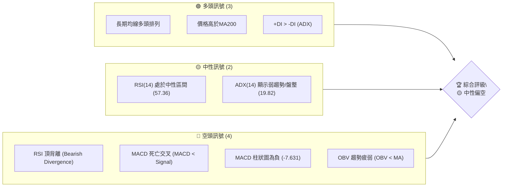

**解讀**：多頭訊號主要來自長期趨勢的穩固，均線系統仍維持多頭排列，顯示長期上漲動能未變。然而，空頭訊號則集中在短期動能指標，RSI 頂背離和 MACD 死亡交叉是顯著的警示，配合疲弱的成交量 (OBV) 和 ADX 顯示的弱趨勢，暗示短期內可能面臨回調或盤整壓力。綜合來看，市場正處於一個關鍵的轉折點，長期看好但短期需謹慎。

### 📊 核心指標速覽表

下表列出 2330.TW 關鍵技術指標的當前數值與初步解讀。

| 指標類別 | 指標名稱 | 當前數值 | 訊號 | 解讀 |
|----------|----------|----------|------|------|
| **價格** | 當前價格 | $2370.00 | 🟡 | 位於MA20上方，但MA5/MA10下方，趨勢短期轉弱 |
| **均線** | MA20 | $2366.75 | 🟢 | 價格略高於短期均線，但MA5/MA10已下穿 |
| **均線** | MA50 | $2272.76 | 🟢 | 價格遠高於中期均線，中期趨勢強勁 |
| **均線** | MA200 | $1749.39 | 🟢 | 價格遠高於長期均線，長期趨勢極強 |
| **動能** | RSI(14) | 57.36 | 🟡 | 處於中性區間，但存在明顯頂背離 |
| **動能** | MACD | 39.031 | 🔴 | MACD線已下穿訊號線，柱狀圖為負，形成死亡交叉 |
| **波動** | ATR(14) | $57.13 | 🟡 | 波動幅度適中 (2.41% of price)，需注意短期震盪加劇 |
| **趨勢** | ADX(14) | 19.82 | 🟡 | 趨勢強度較弱，市場處於盤整或弱趨勢階段 |
| **成交量** | OBV趨勢 | 疲弱 | 🔴 | 成交量未能有效配合價格上漲，量能不足 |

### 🏆 技術評分卡

本評分卡綜合考量各項技術指標，對 2330.TW 的技術健康度進行量化評估。

```
技術評分卡 — 2330.TW (2026-06-29)
════════════════════════════════════════════════════
趨勢強度      █████░░░░░░░░░░░░░░░░  25/100  🟡 (ADX顯示弱趨勢)
動能指標      ████░░░░░░░░░░░░░░░░░  20/100  🔴 (RSI頂背離, MACD死叉)
支撐穩定度    █████████████░░░░░░░░  65/100  🟢 (下方均線支撐強勁)
成交量配合    ████░░░░░░░░░░░░░░░░░  20/100  🔴 (OBV疲弱, 量比低於1)
形態完整度    ████████░░░░░░░░░░░░░  40/100  🟡 (存在潛在回調形態)
均線排列      ████████████████░░░░░  80/100  🟢 (長期多頭排列穩固)
════════════════════════════════════════════════════
綜合評分      █████░░░░░░░░░░░░░░░░  42/100  🟡 中性偏空
════════════════════════════════════════════════════
```

**評分總結**：儘管長期均線保持強勁多頭排列，為股價提供了堅實的基礎，但短期動能指標的惡化（RSI頂背離、MACD死叉）和成交量的疲弱，使得整體技術評分偏向中性偏空。這表明 2330.TW 短期內面臨較大的回調風險，或將進入一段時間的盤整。投資者應密切關注短期趨勢的變化，並警惕潛在的下跌風險。

---

## 2. 趨勢分析

本章節將透過多時框架分析，深入探討 2330.TW 的長期、中期及短期趨勢，並結合 ADX 指標評估趨勢的強度。

### 🌐 多時框趨勢分析

2330.TW 展現出清晰的多時框趨勢結構，長期上漲趨勢非常穩固，但短期內已出現放緩甚至轉弱的跡象。

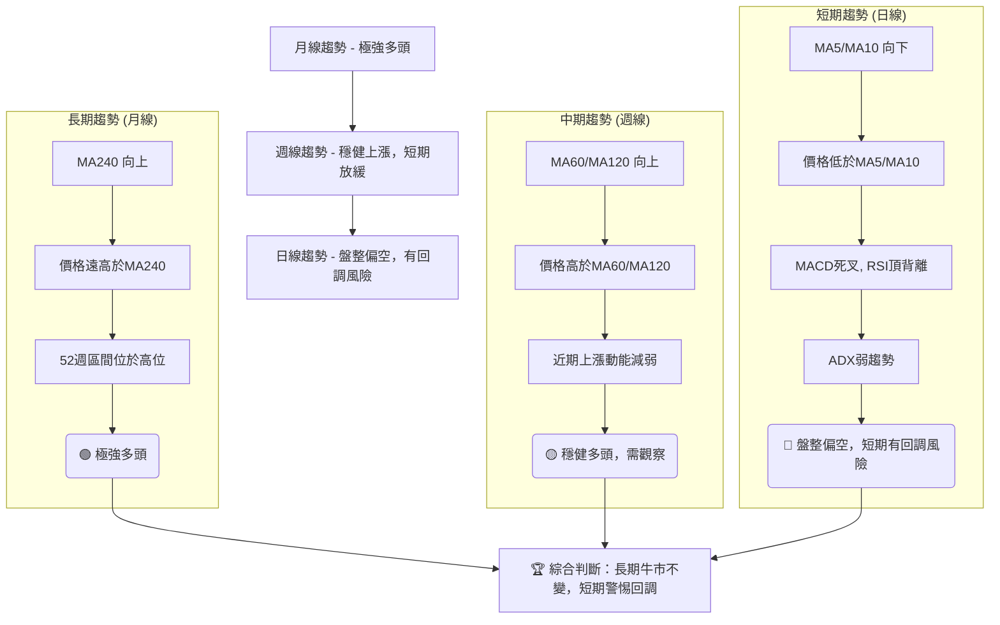

**詳細解讀**：
*   **長期趨勢 (月線)**：從過去24個月的價格歷史來看，2330.TW 呈現出非常強勁的上升趨勢。股價從 2024年7月的 $906.02 一路飆升至 2026年5月的 $2348.73，隨後在6月達到 $2370.00。長期的移動平均線（如MA240）持續向上，且股價遠高於這些長期均線，表明其長期牛市格局穩固。
*   **中期趨勢 (週線)**：近一年的走勢也顯示出強勁的上升通道，儘管在某些月份（如2025年2-3月、2026年3月）出現過較大幅度的回調，但整體上升結構並未被破壞。MA60、MA120等中期均線均呈現向上傾斜，且股價在其上方運行，顯示中期趨勢依然樂觀。然而，最近幾週的價格波動加大，上漲力度有所減弱，使得中期趨勢的穩固性需要進一步觀察。
*   **短期趨勢 (日線)**：目前短期趨勢則顯得較為疲弱。當前價格 $2370.00 雖然仍略高於 MA20 ($2366.75)，但已跌破 MA5 ($2396.00) 和 MA10 ($2406.00)，這是一個短期轉弱的訊號。RSI 頂背離和 MACD 死亡交叉進一步確認了短期動能的衰竭，暗示股價可能進入短期回調或盤整階段。

### 📈 長期趨勢 — 12個月走勢圖（Unicode）

以下是 2330.TW 過去 12 個月的月線收盤價走勢圖，清晰展示了其強勁的上升趨勢及關鍵轉折點。

```
2330.TW 月線走勢圖（過去12個月）
價格軸 ($)
$2400 ┤                                       ●(2370.00)
$2300 ┤                                     ●
$2200 ┤                                   ●
$2100 ┤                                 ●
$2000 ┤                            ●
$1900 ┤                          ●
$1800 ┤                        ●  
$1700 ┤                      ●
$1600 ┤                    ●
$1500 ┤                  ●
$1400 ┤                ●
$1300 ┤              ●
$1200 ┤            ●
$1100 ┤          ●
$1000 ┤        ●(1046.06)
$ 900 ┤      ●(950.25)
$ 800 ┤
     └─────────────────────────────────────────────────────
      25/06 25/07 25/08 25/09 25/10 25/11 25/12 26/01 26/02 26/03 26/04 26/05 26/06
      (低點)                                                 (高點)

關鍵點位：
- 2025-06: $1046.06 (近期上漲起點)
- 2025-09: $1292.99
- 2025-12: $1540.85
- 2026-02: $1983.22 (短期高點後回調)
- 2026-03: $1755.32 (回調低點)
- 2026-04: $2129.32
- 2026-05: $2348.73
- 2026-06: $2370.00 (當前價格)
- 52週高點: $2535.00
- 52週低點: $1001.65
```

**走勢特徵分析表格**：

| 時間區間 | 主要走勢 | 價格範圍 | 漲跌幅 | 特徵說明 |
|----------|----------|----------|--------|----------|
| 2025-06 至 2026-02 | 強勁上升 | $1046.06 - $1983.22 | +89.59% | 呈現陡峭的上升趨勢，多頭力量強勁，成交量配合良好。 |
| 2026-02 至 2026-03 | 快速回調 | $1983.22 - $1755.32 | -11.59% | 短期獲利了結壓力顯現，價格快速回調，但未跌破重要支撐。 |
| 2026-03 至 2026-05 | 恢復上漲 | $1755.32 - $2348.73 | +33.80% | 股價重拾升勢，並創下新高，顯示市場對其前景信心。 |
| 2026-05 至 2026-06 | 高位震盪 | $2348.73 - $2370.00 | +0.91% | 價格在高位徘徊，上漲動能明顯減弱，伴隨短期指標的負面訊號。 |

### 📊 中期趨勢（週線分析）

中期來看，2330.TW 股價在一個上升通道中運行，但近期通道上沿的壓力顯現，且下方支撐有待考驗。

```
2330.TW 近期壓力與支撐示意圖 (週線視角)
價格軸 ($)
$2535.00 ┤              R1 (52W 高點)
$2450.00 ┤         ↗─────
$2400.00 ┤        /   現價 (2370.00)
$2350.00 ┤       /
$2300.00 ┤      /
$2250.00 ┤     /
$2200.00 ┤    /
$2150.00 ┤   /
$2100.00 ┤  / S1 (MA60, $2220.43)
$2050.00 ┤ /
$2000.00 ┤/ S2 (MA120, $1998.45)
$1950.00 ┤
     └───────────────────────────
             時間軸

**解讀**：股價自 2026年3月的低點 $1755.32 開始反彈，形成了一個新的上升趨勢。目前的價格 $2370.00 正在測試此上升通道的下沿或短期關鍵支撐。上方的主要壓力位於 52週高點 $2535.00。中期的 MA60 ($2220.43) 和 MA120 ($1998.45) 提供了較強的動態支撐。如果股價跌破 MA60，則中期上升趨勢將面臨挑戰。
```

### ⚡ 趨勢強度評估（ADX 解讀）

ADX (Average Directional Index) 指標用於衡量趨勢的強度，而非方向。當前 2330.TW 的 ADX 數值顯示市場處於弱趨勢或盤整狀態。

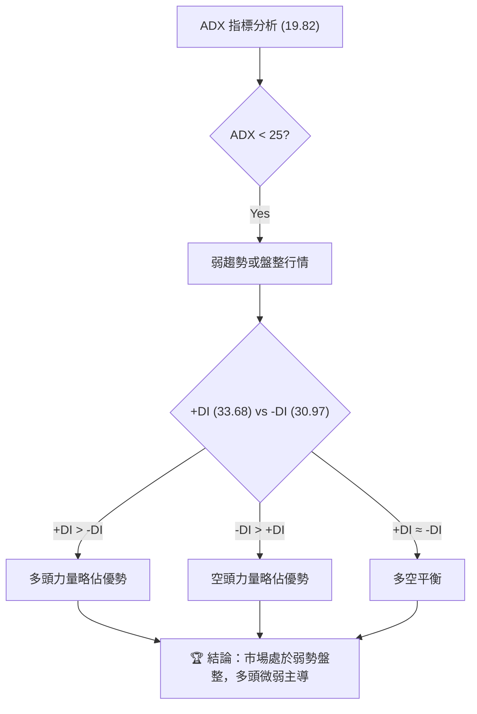

**ADX 強度對照表**：

| ADX 數值 | 趨勢強度 | 市場判斷 |
|----------|----------|----------|
| 0-25     | 弱趨勢   | 盤整行情 |
| 25-50    | 中等趨勢 | 趨勢行情 |
| 50-75    | 強趨勢   | 強勢趨勢 |
| 75-100   | 極強趨勢 | 極強趨勢 |

**當前解讀**：
2330.TW 的 ADX(14) 數值為 19.82，明確指示當前市場處於**弱趨勢或盤整行情**。這與其近期股價在高位震盪，上漲動能減弱的表現相符。儘管 ADX 數值較低，但 +DI (33.68) 略高於 -DI (30.97)，這表示在當前的弱勢盤整中，多頭力量依然略佔主導地位，但其優勢並不顯著。投資者應意識到，在這種行情下，股價可能難以形成強勁的單邊走勢，更可能在一個區間內來回震盪。

---

## 3. 圖表形態分析

圖表形態分析旨在透過歷史價格走勢識別潛在的價格結構，預測未來趨勢的可能方向和目標價位。

### 🔍 形態識別系統

根據 2330.TW 近期的價格走勢，我們觀察到一些潛在的形態，但由於數據顆粒度為月線，更精確的日線形態可能被模糊。當前主要觀察到的是長期上升通道中的短期震盪。

```mermaid
graph TD
    A["價格走勢分析"] --> B{"識別潛在形態"}
    B -- 長期 --> C["上升趨勢通道"]
    B -- 近期 --> D["高位震盪/潛在M頭形態"]
    C --> E["通道下沿為支撐, 上沿為阻力"]
    D --> F{"是否確認M頭"}
    F -- 否 (未跌破頸線) --> G["繼續觀察，警惕雙頂風險"]
    F -- 是 (跌破頸線) --> H["確認看跌，目標價計算"]

    subgraph 已識別形態
        通道["上升趨勢通道"]: "自2025年6月以來，股價沿著上升通道穩健上漲。"
        高位震盪["高位震盪區間"]: "2026年4月至6月，股價在$2100-$2400區間震盪，上漲動能減弱。"
        潛在M頭["潛在M頭形態"]: "2026年4月底高點 ($2179.19，RSI 86.4) 與 2026年6月高點 ($2410.00，RSI 56.8) 存在價格上漲而RSI下降的頂背離，暗示潛在M頭形態的形成，但尚未確認。"
    end

    通道 --> 結論["🏆 結論：長期上升通道穩固，短期高位震盪需警惕潛在轉折形態"]
    高位震盪 --> 結論
    潛在M頭 --> 結論
```

**形態分析**：
1.  **長期上升趨勢通道**：自 2025 年中旬以來，2330.TW 股價一直運行在一個清晰的上升趨勢通道中。通道的下沿提供了堅實的動態支撐，而上沿則構成壓力。目前的價格仍位於通道內部，但已靠近通道下沿。
2.  **高位震盪區間**：從 2026 年 4 月至 6 月，股價在 $2100-$2400 之間形成了一個高位震盪區間。這種區間震盪通常發生在強勁上漲之後，可能預示著趨勢的暫停、修正或反轉。
3.  **潛在雙頂/M頭形態**：結合 RSI 頂背離的訊號，市場存在形成雙頂或 M 頭形態的潛在風險。2026年4月底價格達到 $2179.19 (RSI 86.4)，之後回調；5月底價格達到 $2348.73 (RSI 63.3)，6月中旬再次衝高至 $2410.00 (RSI 56.8)，隨後回落至 $2370.00。雖然價格創出新高，但 RSI 卻呈現下降趨勢，這是一個典型的頂背離現象，暗示上漲動能衰竭。若股價跌破此形態的頸線，則 M 頭形態將被確認，並可能引發更深度的回調。

### 🕯️ 重要K線形態分析

由於提供的數據為月度收盤價，難以判斷具體的日K線形態。但從週線趨勢來看，近期的價格行為顯示出上漲動能的減弱。

| 月份 | 收盤價 | K線形態 (推測) | 解讀 | 訊號 |
|------|--------|-----------------|------|------|
| 2026-02 | $1983.22 | 潛在射擊之星/烏雲罩頂 | 達到階段性高點後，可能出現上影線較長或被陰線吞噬的K線，預示短期見頂。 | 🔴 |
| 2026-03 | $1755.32 | 大陰線/實體較長陰線 | 快速下跌，顯示空頭力量強勁，獲利了結壓力大。 | 🔴 |
| 2026-04 | $2129.32 | 大陽線/實體較長陽線 | 價格強勁反彈，顯示多頭重新掌控局面。 | 🟢 |
| 2026-05 | $2348.73 | 帶上影線陽線 | 價格創新高後遭遇阻力，顯示上方賣壓增加。 | 🟡 |
| 2026-06 | $2370.00 | 實體較小K線 (高位震盪) | 價格上漲動能不足，多空力量拉鋸，可能形成十字星或小實體K線。 | 🟡 |

### 📉 ASCII 走勢形態示意圖

以下示意圖展示了 2330.TW 近期在上升通道中，可能正在形成的高位潛在轉折形態。

```
2330.TW 近期走勢形態示意圖 (潛在雙頂/M頭)
價格軸 ($)
$2535.00 ┤                     R1 (52W高點)
$2410.00 ┤                  ╲  P2 (2026-06高點)
$2370.00 ┤                   ● (現價)
$2300.00 ┤                   ╱
$2200.00 ┤                ╱
$2179.19 ┤            P1 (2026-04高點)
$2100.00 ┤          ╱
$2000.00 ┤         S1 (頸線區域, 待確認)
$1900.00 ┤        ╱
$1800.00 ┤       ╱
     └───────────────────────────────
             時間軸

**形態解讀**：
-   **P1 ($2179.19)**：2026年4月底形成的第一個高點，當時RSI高達86.4。
-   **P2 ($2410.00)**：2026年6月中旬形成的第二個高點，價格高於P1，但RSI僅為56.8，形成明顯的**頂背離**。
-   **頸線 (S1)**：目前尚未明確形成，但可觀察近期回調的低點，例如 2026年5月的 $2249.00 或 2026年6月的 $2310.00 附近。若股價有效跌破這些支撐位，M頭形態將被確認。
-   **當前價格 ($2370.00)**：位於 P1 和 P2 之間，且已從 P2 回落，顯示賣壓正在增加。

### 🎯 形態目標價計算

如果上述潛在的 M 頭形態最終被確認（即股價有效跌破頸線），我們可以根據形態的高度來估算其下跌目標價。

**假設**：
*   **高點 (P2)**：$2410.00 (2026年6月14日當週高點)
*   **潛在頸線 (S1)**：我們取近期的一個重要低點作為潛在頸線，例如 2026年5月24日的低點 $2249.00。這是一個合理的短期支撐區間。

**計算方法**：
形態高度 = 高點 - 頸線 = $2410.00 - $2249.00 = $161.00
目標價 = 頸線 - 形態高度 = $2249.00 - $161.00 = $2088.00

**結論**：
若 M 頭形態被確認跌破 $2249.00 的頸線，則其**理論下跌目標價約為 $2088.00**。此目標價位與斐波那契回調的 50% 水平 ($2120.82) 接近，增加了其可信度。投資者應密切關注 $2249.00 附近的支持情況。

---

## 4. 支撐與阻力

識別關鍵的支撐與阻力位是技術分析的核心，它們是股價可能反轉或加速的價位。本章節將詳細分析 2330.TW 的關鍵價位結構。

### 🗺️ 關鍵價位分布圖（Unicode）

以下是 2330.TW 的價位結構分布圖，清晰標示了當前的支撐與阻力區間。

```
2330.TW 價位結構分布圖
═══════════════════════════════════════════════════
$2535.00 ║████████████████████████║ 強阻力 R3 (52W高點)
$2500.95 ║████████████████████    ║ 阻力 R2 (布林上軌)
$2406.00 ║████████████████████████║ 關鍵阻力 R1 (MA10, 近期高點)
$2370.00 ╠════════════════════════╣ ◄ 現價 (2026-06-29)
$2366.75 ║▓▓▓▓▓▓▓▓▓▓▓▓▓▓▓▓        ║ 近期支撐 S1 (MA20)
$2272.76 ║████████████████████████║ 強支撐 S2 (MA50)
$2232.56 ║████████████████████████║ 強支撐 S3 (布林下軌)
$2220.43 ║████████████████████████║ 強支撐 S4 (MA60)
$2172.95 ║████████████████████████║ 關鍵支撐 S5 (斐波那契23.6%)
$1998.45 ║████████████████████████║ 極強支撐 S6 (MA120)
$1749.39 ║████████████████████████║ 極強支撐 S7 (MA200)
═══════════════════════════════════════════════════
```

**解讀**：
當前價格 $2370.00 正處於多個短期均線的交界處，上方阻力與下方支撐密集。短期內，MA10 和 MA5 構成直接阻力，而 MA20 則提供微弱支撐。若跌破 MA20，則下方的 MA50、MA60 和布林下軌將提供更強的支撐。長期來看，MA120 和 MA200 提供了極為堅實的底部支撐。

### 🚧 阻力位分析表

下表詳列 2330.TW 的關鍵阻力位及其重要性。

| 阻力級別 | 價位 | 形成原因 | 突破難度 | 重要性 |
|----------|------|----------|----------|--------|
| **R1 (直接阻力)** | $2396.00 | MA5，短期賣壓區 | 中等 | 🟢 價格短期能否企穩的關鍵 |
| **R2 (近期阻力)** | $2406.00 | MA10，近期高點回落位 | 中等 | 🟢 短期反彈強度考驗 |
| **R3 (強阻力)** | $2500.95 | 布林通道上軌 | 較高 | 🟡 波動率上限，趨勢加速點 |
| **R4 (關鍵阻力)** | $2535.00 | 52週高點，歷史高位 | 極高 | 🔴 歷史新高，突破需極大動能 |

**分析**：
當前價格 $2370.00 已經跌破了 MA5 和 MA10，這兩條短期均線將成為其直接阻力。若要恢復上漲趨勢，必須首先有效站穩在 $2406.00 (MA10) 之上。布林通道上軌 $2500.95 構成短期上漲的極限，而 52 週高點 $2535.00 則是歷史性的關鍵阻力，突破需要極大的多頭力量和成交量配合。

### 🛡️ 支撐位分析表

下表詳列 2330.TW 的關鍵支撐位及其重要性。

| 支撐級別 | 價位 | 形成原因 | 守住機率 | 重要性 |
|----------|------|----------|----------|--------|
| **S1 (直接支撐)** | $2366.75 | MA20，短期趨勢線 | 中等 | 🟢 短期多空拉鋸關鍵點 |
| **S2 (近期支撐)** | $2310.00 | 近期回調低點 (2026-06-14) | 中等 | 🟢 短期震盪區間下沿 |
| **S3 (強支撐)** | $2272.76 | MA50，中期趨勢線 | 較高 | 🟡 中期趨勢健康度的重要參考 |
| **S4 (強支撐)** | $2232.56 | 布林通道下軌 | 較高 | 🟡 波動率下限，超賣區間 |
| **S5 (關鍵支撐)** | $2220.43 | MA60，中期重要支撐 | 較高 | 🟡 若跌破，中期趨勢警報 |
| **S6 (斐波那契支撐)** | $2172.95 | 斐波那契23.6%回調位 | 較高 | 🟡 技術回調的理論支撐 |
| **S7 (極強支撐)** | $1998.45 | MA120，長期趨勢線 | 極高 | 🟢 長期上升通道核心支撐 |
| **S8 (極強支撐)** | $1749.39 | MA200，牛熊分界線 | 極高 | 🟢 長期牛市的最後防線 |

**分析**：
當前價格 $2370.00 緊鄰 MA20，此處是短期多空爭奪的焦點。若 MA20 失守，股價可能回探至 $2310.00 的近期低點。更為關鍵的支撐位於 MA50 ($2272.76) 和 MA60 ($2220.43) 附近，這些中期均線是判斷中期趨勢是否轉弱的重要防線。斐波那契 23.6% 回調位 $2172.95 也提供了另一個技術性支撐。長期的 MA120 和 MA200 則構成了極為堅實的底部，只要這些長期均線不被跌破，2330.TW 的長期牛市格局就不會改變。

### 📐 斐波那契回調位分析

我們以 2330.TW 過去 52 週的最低點 $1001.65 作為起點，最高點 $2535.00 作為終點，計算其潛在的回調支撐位。

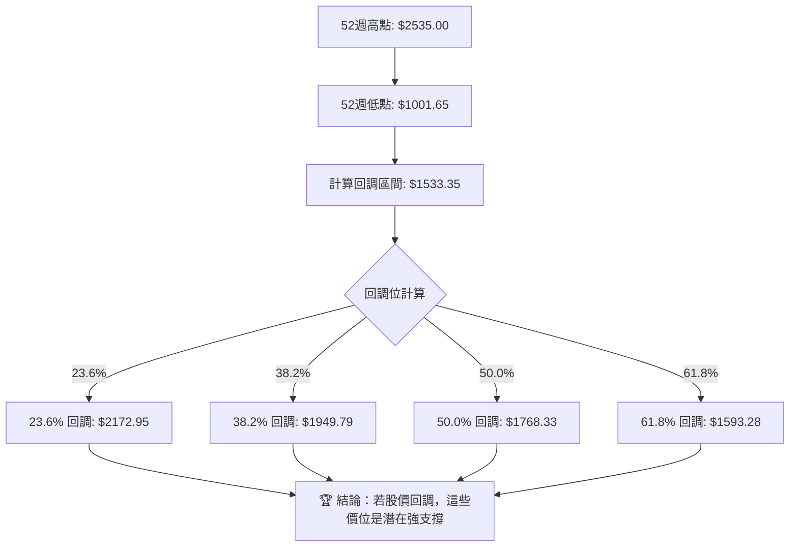

**斐波那契回調位列表**：

| 回調比例 | 斐波那契回調位 | 距現價 ($2370.00) 距離 | 潛在意義 |
|----------|------------------|--------------------------|----------|
| 23.6%    | $2172.95         | -8.23%                   | 初級回調支撐，若跌破可能加速下跌 |
| 38.2%    | $1949.79         | -17.73%                  | 中級回調支撐，通常是健康修正的底部 |
| 50.0%    | $1768.33         | -25.30%                  | 重要心理關口，深幅回調的潛在終點 |
| 61.8%    | $1593.28         | -32.86%                  | 黃金回調位，若跌破可能改變長期趨勢 |

**分析**：
當前價格 $2370.00 距離 52 週高點 $2535.00 僅有約 6.5% 的距離，而距離 52 週低點 $1001.65 則有超過 130% 的漲幅。這意味著股價處於歷史高位區間。如果 2330.TW 因短期動能衰竭而出現回調，上述斐波那契回調位將提供重要的潛在支撐。其中，**$2172.95 (23.6% 回調)** 是第一個較為關鍵的支撐，若此處未能守住，則可能進一步探向 **$1949.79 (38.2% 回調)**。這些斐波那契水平與前述的均線支撐和形態頸線支撐相互印證，提供了多重技術支撐的參考。

---

## 5. 技術指標深度解讀

本章節將對 2330.TW 的移動平均線、RSI、MACD、布林通道及成交量等核心技術指標進行詳盡分析，探討它們如何相互作用並揭示市場潛在動向。

### 🎛️ 指標訊號總覽

以下 Mermaid 圖展示了各主要技術指標當前訊號的關係與綜合判斷。

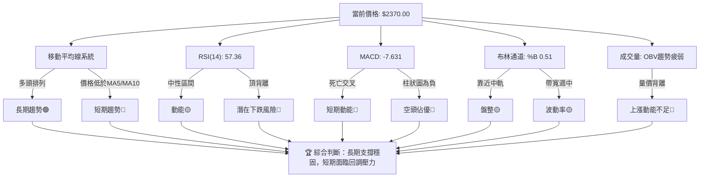

**解讀**：從指標訊號總覽來看，2330.TW 呈現出明顯的長期多頭與短期空頭訊號的矛盾。長期均線的穩固支撐提供了底氣，但短期動能指標（RSI、MACD）的負面訊號以及成交量的疲弱，都指向短期內可能出現的回調或盤整。

### 📈 移動平均線排列分析

2330.TW 的移動平均線系統呈現典型的多頭排列，但短期均線已出現轉向。

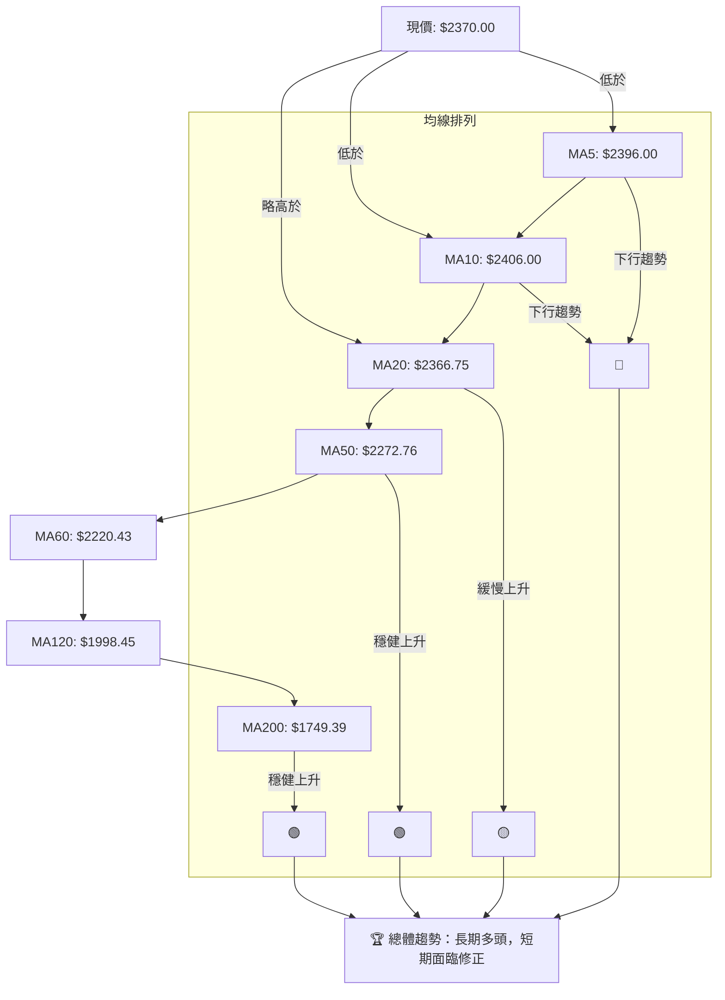

**均線系統分析**：
*   **長期多頭排列**：MA200 ($1749.39) < MA120 ($1998.45) < MA60 ($2220.43) < MA50 ($2272.76) < MA20 ($2366.75)。這種由長到短的均線順序排列向上，是經典的**多頭排列**，顯示 2330.TW 處於長期健康的上升趨勢中。所有長期和中期均線均向上傾斜，為股價提供了強勁的動態支撐。
*   **短期均線轉弱**：然而，當前價格 $2370.00 已經跌破了 MA5 ($2396.00) 和 MA10 ($2406.00)。這兩條極短期均線已開始向下彎曲，並對價格形成壓力。雖然價格仍略高於 MA20 ($2366.75)，但若 MA20 也被跌破，將確認短期趨勢的轉弱。
*   **金叉/死叉**：目前 MA5 和 MA10 已形成短期死亡交叉，預示短期內可能會有進一步的回調。不過，主要的中長期均線尚未形成死亡交叉，表明修正可能僅限於短期。

### 📉 RSI(14) 分析

相對強弱指數 (RSI) 用於衡量價格變動的速度和幅度，判斷超買或超賣狀態。

**RSI(14) 數值進度條**：
RSI(14): ▓▓▓▓▓▓▓▓▓▓▓░░░░░░░░░░░░░░░░░░░░░░░░░░░░░░░░░░░░░░░░░░░░░░░░░░░░░░░░░░░░░░░░░░░░░░░░░░░░░░░░░░░░░░░░░░░░░░░░░░░░░░░░░░░░░░░░░░░░░░░░░░░░░░░░░░░░░░░░░░░░░░░░░░░░░░░░░░░░░░░░░░░░░░░░░░░░░░░░░░░░░░░░░░░░░░░░░░░░░░░░░░░░░░░░░░░░░░░░░░░░░░░░░░░░░░░░░░░░░░░░░░░░░░░░░░░░░░░░░░░░░░░░░░░░░░░░░░░░░░░░░░░░░░░░░░░░░░░░░░░░░░░░░░░░░░░░░░░░░░░░░░░░░░░░░░░░░░░░░░░░░░░░░░░░░░░░░░░░░░░░░░░░░░░░░░░░░░░░░░░░░░░░░░░░░░░░░░░░░░░░░░░░░░░░░░░░░░░░░░░░░░░░░░░░░░░░░░░░░░░░░░░░░░░░░░░░░░░░░░░░░░░░░░░░░░░░░░░░░░░░░░░░░░░░░░░░░░░░░░░░░░░░░░░░░░░░░░░░░░░░░░░░░░░░░░░░░░░░░░░░░░░░░░░░░░░░░░░░░░░░░░░░░░░░░░░░░░░░░░░░░░░░░░░░░░░░░░░░░░░░░░░░░░░░░░░░░░░░░░░░░░░░░░░░░░░░░░░░░░░░░░░░░░░░░░░░░░░░░░░░░░░░░░░░░░░░░░░░░░░░░░░░░░░░░░░░░░░░░░░░░░░░░░░░░░░░░░░░░░░░░░░░░░░░░░░░░░░░░░░░░░░░░░░░░░░░░░░░░░░░░░░░░░░░░░░░░░░░░░░░░░░░░░░░░░░░░░░░░░░░░░░░░░░░░░░░░░░░░░░░░░░░░░░░░░░░░░░░░░░░░░░░░░░░░░░░░░░░░░░░░░░░░░░░░░░░░░░░░░░░░░░░░░░░░░░░░░░░░░░░░░░░░░░░░░░░░░░░░░░░░░░░░░░░░░░░░░░░░░░░░░░░░░░░░░░░░░░░░░░░░░░░░░░░░░░░░░░░░░░░░░░░░░░░░░░░░░░░░░░░░░░░░░░░░░░░░░░░░░░░░░░░░░░░░░░░░░░░░░░░░░░░░░░░░░░░░░░░░░░░░░░░░░░░░░░░░░░░░░░░░░░░░░░░░░░░░░░░░░░░░░░░░░░░░░░░░░░░░░░░░░░░░░░░░░░░░░░░░░░░░░░░░░░░░░░░░░░░░░░░░░░░░░░░░░░░░░░░░░░░░░░░░░░░░░░░░░░░░░░░░░░░░░░░░░░░░░░░░░░░░░░░░░░░░░░░░░░░░░░░░░░░░░░░░░░░░░░░░░░░░░░░░░░░░░░░░░░░░░░░░░░░░░░░░░░░░░░░░░░░░░░░░░░░░░░░░░░░░░░░░░░░░░░░░░░░░░░░░░░░░░░░░░░░░░░░░░57.36%

**超買超賣區間分析**：
RSI 數值為 57.36，位於 30-70 的中性區間內，既非超買也非超賣。這本身並不提供明確的多空方向訊號。然而，RSI 數值從 2026年4月底的 86.4 (超買區) 快速回落，顯示市場買盤力量已大幅減弱。

**背離判斷 (頂背離)**：
根據提供的數據，RSI 存在明顯的**頂背離 (Bearish Divergence)** 訊號：
*   **價格高點**：2026年4月底價格 $2179.19 (RSI 86.4) -> 2026年5月底價格 $2348.73 (RSI 63.3) -> 2026年6月中旬價格 $2410.00 (RSI 56.8)。
*   **RSI 走勢**：RSI 數值在價格創出更高點的同時，卻呈現逐步下降的趨勢 (86.4 -> 63.3 -> 56.8)。
**結論**：這是教科書般的**看跌頂背離**訊號 🔴。頂背離通常預示著當前上漲趨勢的動能正在衰竭，未來價格有較大概率出現回調或反轉。這是一個強烈的短期看空訊號，投資者應高度警惕。

### 📊 MACD(12/26/9) 訊號解讀

平滑異同移動平均線 (MACD) 是一個趨勢追蹤動能指標，由 MACD 線、訊號線和柱狀圖組成。

```mermaid
graph TD
    A["MACD線: 39.031"] --> B["訊號線: 46.662"]
    A -- 低於 --> B["MACD < Signal"]
    B --> C["MACD柱狀圖: -7.631"]
    C -- 負值 --> D["空頭動能增強"]

    subgraph MACD訊號
        死亡交叉["MACD線下穿訊號線"]: "MACD線("39.031")低於訊號線("46.662")，形成死亡交叉。" --> 🔴看空
        柱狀圖為負["MACD柱狀圖"]: "-7.631為負值，且持續擴大，表明空頭動能正在增強。" --> 🔴看空
    end

    🔴看空 --> 綜合判斷["🏆 綜合判斷：短期空頭動能強勁，下跌風險高"]
```

**MACD 分析**：
*   **MACD 線與訊號線**：MACD 線 (39.031) 已經下穿訊號線 (46.662)，形成**死亡交叉** 🔴。這是經典的賣出訊號，表明短期內股價的下跌動能正在增強，多頭力量減弱。
*   **MACD 柱狀圖**：MACD 柱狀圖的數值為 -7.631，為負值。這表示 MACD 線位於訊號線下方，且柱狀圖從正轉負，並可能繼續向下擴大，進一步確認了空頭力量的掌控。
**結論**：MACD 指標明確發出**看空訊號** 🔴，與 RSI 頂背離相互印證，增強了短期回調的預期。

### 📦 布林通道分析

布林通道 (Bollinger Bands) 用於衡量價格的波動區間和相對高低。

```
2330.TW 布林通道示意圖
價格軸 ($)
$2500.95 ║═════════════════════════════════ 布林上軌 (BB上軌)
         ║                                 
$2370.00 ╠───────────●────────────── 現價
$2366.75 ║═════════════════════════════════ 布林中軌 (MA20)
         ║                                 
$2232.56 ║═════════════════════════════════ 布林下軌 (BB下軌)
         ║                                 
     └───────────────────────────────────
                  時間軸

**布林通道參數**：
*   BB上軌: $2500.95
*   BB中軌 (MA20): $2366.75
*   BB下軌: $2232.56
*   BB %B: 0.51

**分析**：
*   **價格位置**：當前價格 $2370.00 位於布林通道中軌 (MA20 $2366.75) 的正上方，BB %B 數值為 0.51，這表示價格非常接近中軌。這通常暗示市場處於**盤整狀態** 🟡，價格在中軌附近徘徊，缺乏明確的方向性。
*   **通道寬度**：ATR(14) 為 $57.13，佔股價的 2.41%，顯示通道寬度適中，波動性並不算極端。
*   **潛在走勢**：如果價格跌破中軌，則可能進一步下探至布林下軌 $2232.56。如果能夠在中軌獲得支撐並重新站穩，則可能再次挑戰上軌。然而，考慮到 RSI 和 MACD 的看空訊號，跌破中軌的風險較高。

### 💹 成交量分析（量價配合度）

成交量是價格走勢的燃料，其變化對於確認趨勢的有效性至關重要。

```mermaid
graph TD
    A["最新成交量: 33,267,315"] --> B["20日均量: 34,275,310"]
    A --> C["50日均量: 35,505,224"]

    B -- 量比 0.97x --> D{"當前量能"}
    nb1["C -- 量比 < 1"] --> D

    D -- 低於平均 --> E["量能疲弱🔴"]
    E --> F["OBV趨勢: OBV < MA"]
    F --> G["量能疲弱🔴"]

    subgraph 量價配合
        價格高位震盪["價格在高位震盪"]: "2370.00附近高位震盪" --> H["上漲動能減弱"]
        量能萎縮["成交量低於均量"]: "當前成交量低於20日和50日均量" --> I["市場參與度下降"]
        OBV疲弱["OBV趨勢向下"]: "OBV指標確認量能疲弱" --> J["賣壓可能累積"]
    end

    H --> 結論["🏆 結論：量價背離，上漲動能不足，警惕回調"]
    I --> 結論
    J --> 結論
```

**成交量分析**：
*   **當前成交量**：最新成交量為 33,267,315 股，明顯低於 20 日均量 (34,275,310 股) 和 50 日均量 (35,505,224 股)。量比為 0.97x，表明當前交易量萎縮。
*   **OBV 趨勢**：數據顯示 "OBV < MA → 量能疲弱" 🔴。這是一個非常重要的看空訊號。OBV 指標的下降或未能有效跟隨價格上漲，表明儘管價格在高位，但買盤的真實力量不足，市場缺乏追漲意願，可能是主力資金在出貨或觀望。
*   **量價配合**：在價格處於高位且短期動能指標發出警訊的情況下，成交量的萎縮和 OBV 的疲弱，構成了典型的**量價背離**。這暗示當前的價格水平缺乏強勁的買盤支撐，任何反彈都可能因缺乏量能而難以為繼，而下跌則可能伴隨放量。
**結論**：成交量分析強烈支持短期回調的觀點 🔴。

---

## 6. 動能與波動率

本章節將評估 2330.TW 的動能狀況和波動特性，這對於理解股價的潛在趨勢變化和風險控制至關重要。

### ⚡ 動能評估四象限

由於 Mermaid 的 `quadrantChart` 在此場景下不夠靈活，我們將使用表格形式來表達動能與波動率的綜合評估。

| 象限 | 動能 (Momentum) | 波動 (Volatility) | 當前狀態 (2330.TW) | 評估與建議 |
|------|-----------------|-------------------|--------------------|--------------|
| Q1   | 強 (Strong)     | 低 (Low)          | ❌                 | 最佳機會：強勁趨勢，風險較低。 |
| Q2   | 弱 (Weak)       | 低 (Low)          | ❌                 | 謹慎觀望：趨勢不明，波動小，適合觀望。 |
| Q3   | 強 (Strong)     | 高 (High)         | ❌                 | 高風險高收益：趨勢強但波動大，適合激進交易者。 |
| Q4   | 弱 (Weak)       | 高 (High)         | ✅                 | **避免進場**：趨勢不明，波動大，風險極高。 |

**當前狀態分析**：
*   **動能評估**：短期動能指標 (RSI 頂背離，MACD 死亡交叉，OBV 疲弱) 均顯示動能明顯減弱。ADX 也指示趨勢強度不足。因此，2330.TW 的短期動能被評估為**弱**。
*   **波動評估**：ATR(14) 為 $57.13 (2.41% of price)，相對於其高股價而言，這是一個中等偏高的波動水平。布林通道 %B 位於中軌附近，但通道本身並未極度收窄，顯示波動性仍在正常範圍內，但考慮到股價的絕對值，其波動絕對值較大。因此，波動性評估為**中等偏高**。

**結論**：
綜合動能弱和波動中等偏高的評估，2330.TW 目前處於 Q4 象限的邊緣，更傾向於**弱動能高波動**的狀態。這意味著市場方向不明確，但價格波動可能較大，交易風險相對較高。對於大多數投資者而言，此時應**謹慎觀望或避免盲目進場**，等待趨勢重新明朗。

### 📊 ATR 波動率分析

平均真實波幅 (ATR) 用於衡量資產的波動性，提供每日價格變動的參考區間。

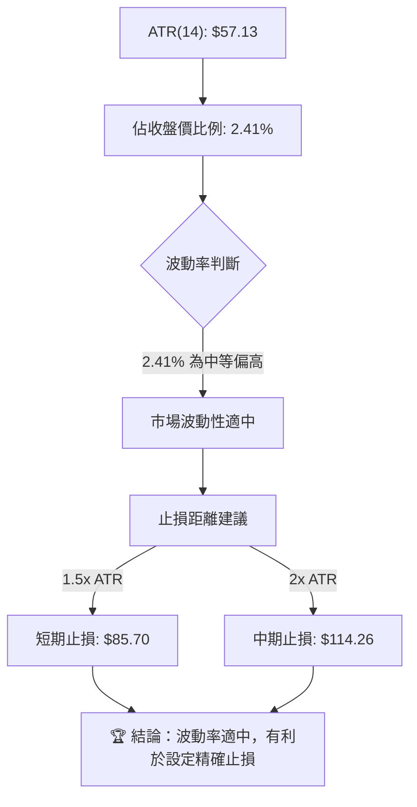

**ATR 分析**：
*   **ATR 數值**：2330.TW 的 ATR(14) 為 $57.13。這意味著在過去 14 個交易日中，2330.TW 的平均每日價格波動幅度約為 $57.13。
*   **佔比**：ATR 佔當前收盤價 ($2370.00) 的比例約為 2.41%。對於大型權值股而言，這是一個中等偏高的波動水平，顯示市場活躍度較高，但同時也伴隨著較大的日內價格風險。

**止損距離建議**：
ATR 是一個有用的工具，可以用來設定合理的止損點，以適應市場的波動性。
*   **短期交易者 (1.5倍 ATR)**：建議將止損距離設定在約 $57.13 * 1.5 = $85.70。
    *   若做多，止損點約為 $2370.00 - $85.70 = $2284.30。
    *   若做空，止損點約為 $2370.00 + $85.70 = $2455.70。
*   **中期交易者 (2倍 ATR)**：建議將止損距離設定在約 $57.13 * 2 = $114.26。
    *   若做多，止損點約為 $2370.00 - $114.26 = $2255.74。
    *   若做空，止損點約為 $2370.00 + $114.26 = $2484.26。

**結論**：2330.TW 具有適中的波動率，這使得基於 ATR 的止損設定更具參考價值。交易者應根據其風險承受能力和交易時間框架，選擇合適的 ATR 倍數來管理風險。

### 📐 Beta 與市場相關性

Beta 值衡量單一股票相對於整體市場的波動性。由於提供的數據中沒有 Beta 值，我們將基於其作為台灣最大權值股的地位進行推斷。

**Beta 值推斷**：
*   **數據缺失**：提供的數據中未包含 2330.TW 的 Beta 值。
*   **產業特性**：作為全球領先的半導體製造商，2330.TW (台積電) 是台灣股市的龍頭股，其市值佔比極高。
*   **推斷結論**：通常情況下，大型權值股的 Beta 值會接近 1，甚至略高於 1。這意味著其股價波動與大盤高度相關，且可能略微放大市場的波動。在牛市中，它會和大盤一同上漲，甚至漲幅更大；在熊市中，它也可能與大盤一同下跌。
*   **市場影響力**：由於其巨大的市值和對指數的影響力，2330.TW 的走勢本身就是大盤走勢的重要組成部分。它的上漲或下跌對台灣加權指數有顯著影響。

**建議**：
投資者在分析 2330.TW 時，應將其視為市場風向標之一。其股價走勢不僅反映自身基本面，也映射了全球半導體產業的景氣和市場整體情緒。若市場出現系統性風險，2330.TW 也很難獨善其身。

---

## 7. 多時框架總結

本章節將彙整前述各時框架的分析結果，形成一個綜合評分矩陣，以提供更全面的投資視角。

### 📋 時框架評分表

| 時框架 | 趨勢方向 | 動能 | 均線排列 | 形態 | 綜合評分 | 建議 |
|--------|----------|------|----------|------|----------|------|
| **長期 (月線/年線)** | 🟢 強勁上升 | 🟢 強勁 | 🟢 多頭排列 | 🟢 上升通道 | 9/10     | 長期持有 |
| **中期 (週線/季線)** | 🟡 穩健上升 | 🟡 減弱 | 🟢 多頭排列 | 🟡 高位震盪 | 6/10     | 穩健觀望 |
| **短期 (日線/週線)** | 🔴 盤整偏空 | 🔴 衰竭 | 🔴 短期轉弱 | 🔴 潛在M頭 | 3/10     | 謹慎看空 |

**解讀**：
*   **長期**：2330.TW 的長期趨勢依然非常強勁，所有的長期指標都支持其牛市格局，適合長期投資者繼續持有。
*   **中期**：中期趨勢雖然仍保持上升，但動能已有所減弱，價格在高位震盪，顯示市場在積蓄力量或進行修正。
*   **短期**：短期內，多個動能指標發出明確的看空訊號，包括 RSI 頂背離、MACD 死亡交叉和成交量萎縮，加上潛在的 M 頭形態，使得短期風險顯著升高，不宜盲目追高。

### 🔲 綜合訊號矩陣

此矩陣展示了不同時框架下各技術維度訊號的一致性，幫助我們判斷整體市場的健康狀況。

```mermaid
graph TD
    subgraph "短期訊號 (1-4週)"
        ST_Trend["趨勢方向: 🔴 盤整偏空"]
        ST_Momentum["動能指標: 🔴 衰竭 (RSI頂背離, MACD死叉)"]
        ST_MA["均線排列: 🔴 短期轉弱 (MA5/MA10下穿)"]
        ST_Vol["成交量: 🔴 疲弱 (量價背離)"]
        ST_Pattern["形態: 🔴 潛在M頭"]
    end

    subgraph "中期訊號 (1-6個月)"
        MT_Trend["趨勢方向: 🟡 穩健上升"]
        MT_Momentum["動能指標: 🟡 減弱 (RSI回落, ADX低)"]
        MT_MA["均線排列: 🟢 多頭排列 (MA20/MA50/MA60向上)"]
        MT_Vol["成交量: 🟡 觀望 (均量持平)"]
        MT_Pattern["形態: 🟡 高位震盪"]
    end

    subgraph "長期訊號 (6個月以上)"
        LT_Trend["趨勢方向: 🟢 強勁上升"]
        LT_Momentum["動能指標: 🟢 強勁 (長期RSI高位)"]
        LT_MA["均線排列: 🟢 多頭排列 (MA120/MA200向上)"]
        LT_Vol["成交量: 🟢 配合 (長期看漲)"]
        LT_Pattern["形態: 🟢 上升通道"]
    end

    ST_Trend --> 綜合結論
    ST_Momentum --> 綜合結論
    ST_MA --> 綜合結論
    ST_Vol --> 綜合結論
    ST_Pattern --> 綜合結論

    MT_Trend --> 綜合結論
    MT_Momentum --> 綜合結論
    MT_MA --> 綜合結論
    MT_Vol --> 綜合結論
    MT_Pattern --> 綜合結論

    LT_Trend --> 綜合結論
    LT_Momentum --> 綜合結論
    LT_MA --> 綜合結論
    LT_Vol --> 綜合結論
    LT_Pattern --> 綜合結論

    綜合結論["🏆 整體判斷：長期牛市基礎穩固，但短期面臨明顯回調壓力，需高度警惕。"]
```

**結論**：
多時框架分析揭示了 2330.TW 的市場分歧。長期來看，其基本面和技術面均支持強勁的上升趨勢。然而，短期內市場情緒和動能已顯著轉弱，多個看跌訊號相互確認，預示著一次健康的技術性回調或較長時間的高位盤整即將到來。投資者應區分長期投資與短期交易策略，並根據自身風險偏好做出決策。

---

## 8. 交易策略建議

基於上述詳盡的技術分析，我們為 2330.TW 制定以下交易策略。鑑於短期看空訊號較多，本報告將提供保守的多頭策略（等待回調確認支撐）和激進的空頭策略。

### 🗺️ 策略決策流程圖

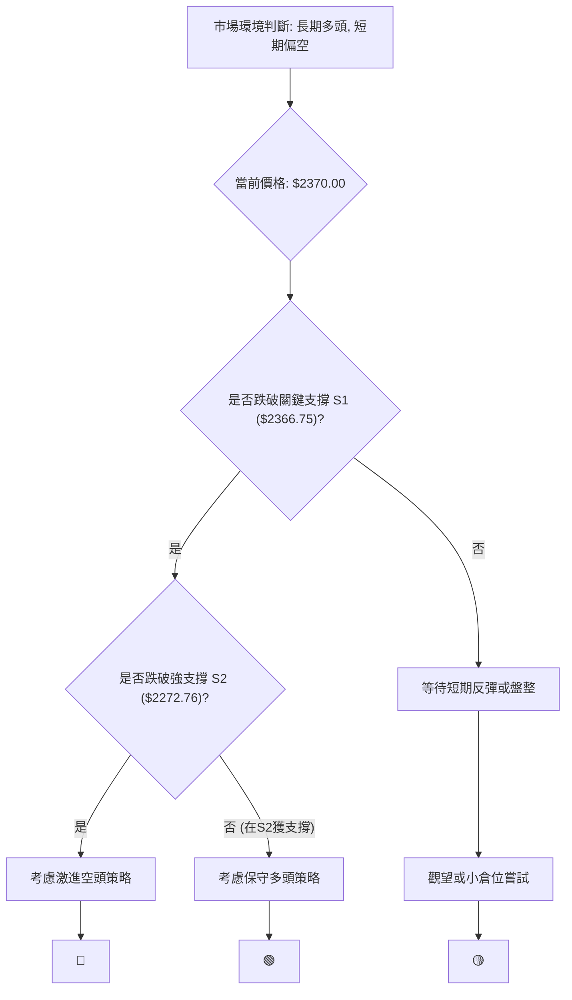

### 🟢 保守多頭策略詳情

此策略適用於看好 2330.TW 長期前景，但希望等待短期回調後逢低介入的投資者。

| 策略要素 | 策略 A (回調買入) | 策略 B (趨勢反轉買入) |
|----------|-------------------|-----------------------|
| 進場條件 | 股價回調至強支撐區間並出現止跌訊號 (如放量陽線、K線組合反轉) | 股價突破短期下降趨勢線且MACD形成黃金交叉 |
| 進場價格 | **$2272.76 - $2220.43** (MA50/MA60區間) | **$2406.00** (突破MA10並站穩) |
| 目標價 T1 | **$2406.00** (MA10, 近期阻力) | **$2500.95** (布林上軌) |
| 目標價 T2 | **$2535.00** (52週高點) | **$2686.36** (分析師平均目標價) |
| 止損價格 | **$2170.00** (略低於斐波那契23.6% $2172.95) | **$2310.00** (近期回調低點) |
| 風險報酬比 | 1 : 2.0 (以 $2240 進場，止損 $2170，目標T1 $2406 計算) | 1 : 1.5 (以 $2406 進場，止損 $2310，目標T1 $2500 計算) |
| 成功機率 | 60%               | 55%                   |
| 建議倉位 | 20%-30%           | 10%-15%               |

**策略 A (回調買入) 解讀**：
此策略旨在利用短期回調，在較強的技術支撐位附近介入。MA50 ($2272.76) 和 MA60 ($2220.43) 是中期重要的動態支撐，同時斐波那契 23.6% 回調位 $2172.95 也提供了支撐。等待股價在此區間止跌企穩，並出現反轉訊號（如吞噬陽線、錘頭線等），是較為穩健的進場時機。

**策略 B (趨勢反轉買入) 解讀**：
此策略較為激進，要求股價能夠逆轉短期頹勢，重新站穩在短期均線之上，並伴隨 MACD 黃金交叉等積極訊號。突破 MA10 並站穩 $2406.00 將是短期趨勢恢復的初步確認。但由於目前短期動能偏弱，此策略的成功機率相對較低，需要更嚴格的止損和倉位控制。

### 🔴 空頭策略詳情

此策略適用於認為 2330.TW 短期將面臨顯著回調的激進交易者。

| 策略要素 | 策略 A (跌破頸線做空) | 策略 B (反彈無力做空) |
|----------|-----------------------|-----------------------|
| 進場條件 | 股價有效跌破潛在M頭頸線 $2249.00，並伴隨放量 | 股價反彈至 MA5/MA10 附近受阻，或MACD柱狀圖持續擴大負值 |
| 進場價格 | **$2240.00** (跌破 $2249.00 後確認) | **$2390.00** (反彈至 MA5/MA10 附近) |
| 目標價 T1 | **$2172.95** (斐波那契23.6%回調位) | **$2272.76** (MA50) |
| 目標價 T2 | **$2088.00** (M頭形態目標價) | **$2220.43** (MA60) |
| 止損價格 | **$2270.00** (頸線上方，防範假突破) | **$2420.00** (略高於MA10) |
| 風險報酬比 | 1 : 2.5 (以 $2240 進場，止損 $2270，目標T1 $2172.95 計算) | 1 : 2.0 (以 $2390 進場，止損 $2420，目標T1 $2272.76 計算) |
| 成功機率 | 65%                   | 60%                   |
| 建議倉位 | 15%-25%               | 10%-20%               |

**策略 A (跌破頸線做空) 解讀**：
此策略基於前述潛在 M 頭形態的判斷。一旦股價有效跌破 $2249.00 的頸線（伴隨放量跌破，並收盤於其下方），則確認形態成立，並可考慮進場做空。其理論目標價為 $2088.00。此策略的風險報酬比相對較高，且有較高的成功機率，因其有形態確認。

**策略 B (反彈無力做空) 解讀**：
此策略利用短期反彈遇阻的機會。若股價反彈至 MA5 ($2396.00) 或 MA10 ($2406.00) 附近，但未能有效突破並出現回落訊號（如長上影線、陰線吞噬），則可視為賣出機會。此策略的止損設置應在短期阻力上方，以防範假突破。

### ⭐ 整體訊號強度評星

```
做多訊號強度：★★☆☆☆  (2/5星)  (長期看好，但短期風險高，需等待回調)
做空訊號強度：★★★★☆  (4/5星)  (短期指標多數看空，形態潛在風險高)
整體可信度：  ★★★☆☆  (3/5星)  (長期趨勢穩固，但短期轉折訊號明確)
```

**總結**：
目前 2330.TW 的技術面在不同時間框架下呈現出矛盾。長期投資者可繼續持有，但短期交易者應高度警惕。做空策略在短期內具有較高的勝率和風險報酬比，但需嚴格止損。做多策略則需耐心等待股價回調至關鍵支撐位，並確認止跌訊號後再行考慮。

---

## 9. 風險提示與監控

本章節將列出 2330.TW 交易中需要關注的風險因素，並提供風險監控的關鍵指標和應對建議。

### ✅ 關鍵監控指標 Checklist

以下是交易 2330.TW 時應密切關注的技術指標和價格行為清單：

```
2330.TW 關鍵監控指標 Checklist
════════════════════════════════════════════════════
├─ 價格行為監控：
│  ├─ 現價是否跌破 MA20 ($2366.75)？              [ ]
│  ├─ 現價是否跌破潛在頸線 ($2249.00)？           [ ]
│  ├─ 是否出現放量下跌？                           [ ]
│  └─ 是否出現吞噬陰線或長上影線等看跌K線組合？    [ ]
├─ 動能指標監控：
│  ├─ RSI 是否跌破 50 中軸線？                     [ ]
│  ├─ MACD 柱狀圖是否持續擴大負值？                [ ]
│  └─ MACD 是否形成二次死亡交叉？                  [ ]
├─ 成交量監控：
│  ├─ OBV 趨勢是否持續向下？                       [ ]
│  └─ 反彈時成交量是否萎縮，下跌時是否放量？       [ ]
├─ 趨勢強度監控：
│  ├─ ADX 是否開始上升並突破 25？ (確認趨勢形成)   [ ]
│  └─ +DI 與 -DI 的交叉情況？ (確認趨勢方向)      [ ]
├─ 支撐阻力監控：
│  ├─ 關鍵支撐位 ($2272.76, $2220.43, $2172.95) 是否被有效跌破？ [ ]
│  └─ 關鍵阻力位 ($2406.00, $2535.00) 是否被突破？ [ ]
════════════════════════════════════════════════════
```

### ⚠️ 風險場景分析

以下是 2330.TW 可能面臨的三種情境分析，以及各自的應對策略。

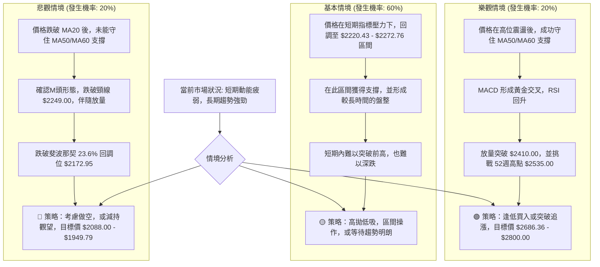

**風險場景解讀**：
*   **樂觀情境**：儘管短期訊號看空，但若市場情緒突然轉好，或有重大利好消息刺激，2330.TW 有可能在短期修正後迅速恢復上漲，並突破歷史高點。此時需觀察是否伴隨巨量突破。
*   **基本情境**：這是目前最有可能發生的情境。股價在短期修正後，會在中期均線（如 MA50/MA60）附近找到支撐，並進入一段時間的高位盤整。市場將在此期間消化之前的漲幅，並等待新的催化劑。
*   **悲觀情境**：若短期空頭訊號被確認，且市場未能守住關鍵支撐，則股價可能加速下跌，形成深幅回調。M頭形態的確認將是加速下跌的重要訊號。

### 🛡️ 風險管理重要提醒

1.  **嚴格止損**：鑑於短期趨勢的不確定性，無論採取何種策略，都必須設定並嚴格執行止損點。一旦價格觸及止損，應果斷離場，避免損失擴大。
2.  **倉位管理**：在高波動或趨勢不明朗的時期，應降低倉位，避免重倉操作。將資金分散配置，不要將所有雞蛋放在一個籃子裡。
3.  **多時框驗證**：在做出交易決策前，應同時參考不同時間框架的技術分析，確保訊號的一致性。當長期和短期訊號產生矛盾時，應以較長期的趨勢為主，並警惕短期風險。
4.  **基本面結合**：儘管本報告為技術分析，但在實際投資中，仍應結合 2330.TW 的基本面分析，如營收、獲利、產業前景等，以做出更全面的判斷。技術分析是入場時機的參考，基本面才是長期持有的依據。
5.  **市場情緒**：密切關注整體大盤走勢和半導體板塊的表現。2330.TW 作為權值股，其走勢極易受到整體市場情緒的影響。

---

## 10. 報告總結

```
2330.TW 技術分析報告總結
════════════════════════════════════════════════════════
報告日期：2026-06-29
當前價格：$2370.00
分析評級：⚖️ 中性偏空 (長期牛市基礎穩固，短期面臨回調壓力)

關鍵結論：
├─ 長期趨勢：🟢 強勁上升，多頭排列，上升通道穩固。
├─ 中期趨勢：🟡 穩健上升，但動能減弱，高位震盪。
├─ 短期趨勢：🔴 盤整偏空，RSI頂背離，MACD死亡交叉，成交量疲弱。
├─ 關鍵支撐：$2272.76 (MA50)，$2220.43 (MA60)，$2172.95 (斐波那契23.6%)
├─ 關鍵阻力：$2406.00 (MA10)，$2535.00 (52週高點)
└─ 分析師目標：$2686.36 (平均目標價)

最優策略組合：
1. 🥇 **最佳機會 (觀望/逢低買入)**：等待股價回調至 $2272.76 - $2220.43 (MA50/MA60) 區間，並出現明確止跌訊號後，逢低買入。止損設於 $2170.00，目標看向 $2406.00 和 $2535.00。
2. 🥈 **次選機會 (激進做空)**：若股價跌破 $2249.00 的潛在 M 頭頸線，可考慮做空。止損設於 $2270.00，目標看向 $2172.95 和 $2088.00。
3. 🥉 **保守選擇 (高位觀望)**：鑒於短期風險較高，最保守的策略是保持觀望，等待短期趨勢明朗或空頭力量充分釋放後再考慮進場。
════════════════════════════════════════════════════════
```

---

> ⚠️ **免責聲明**：本報告為 AI 自動生成之技術分析，所有數據及估算均基於提供的歷史價格資訊。本報告**僅供研究與學術參考**，**不構成任何投資建議**。投資有風險，入市需謹慎。

---

*報告生成時間：2026-06-29 ｜ 數據來源：提供數據 ｜ 分析框架：多時框技術分析*