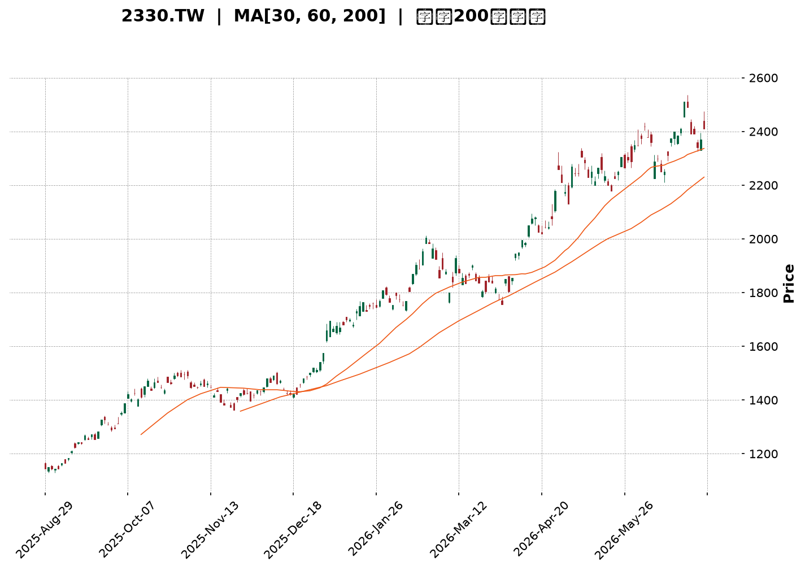
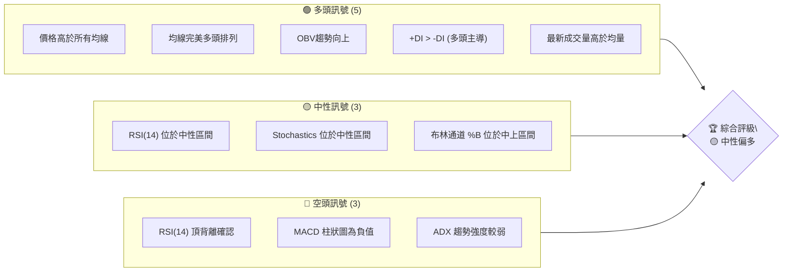
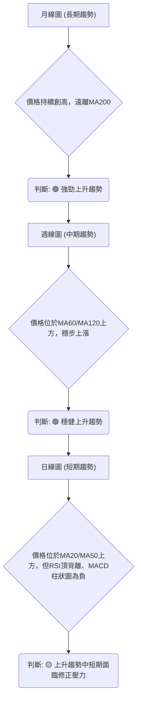
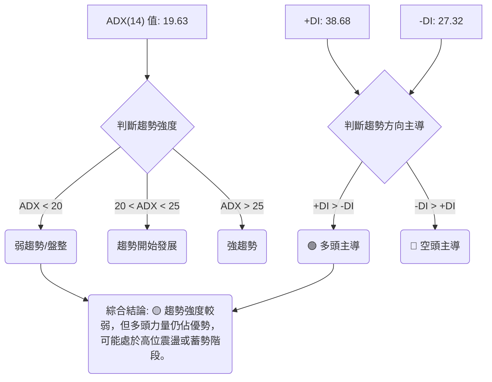
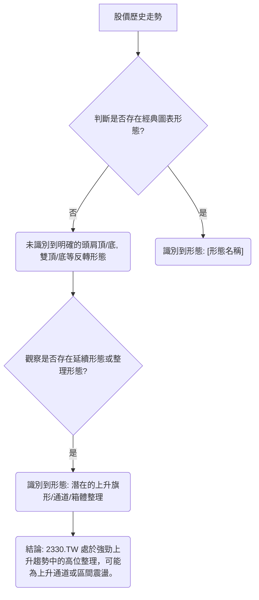
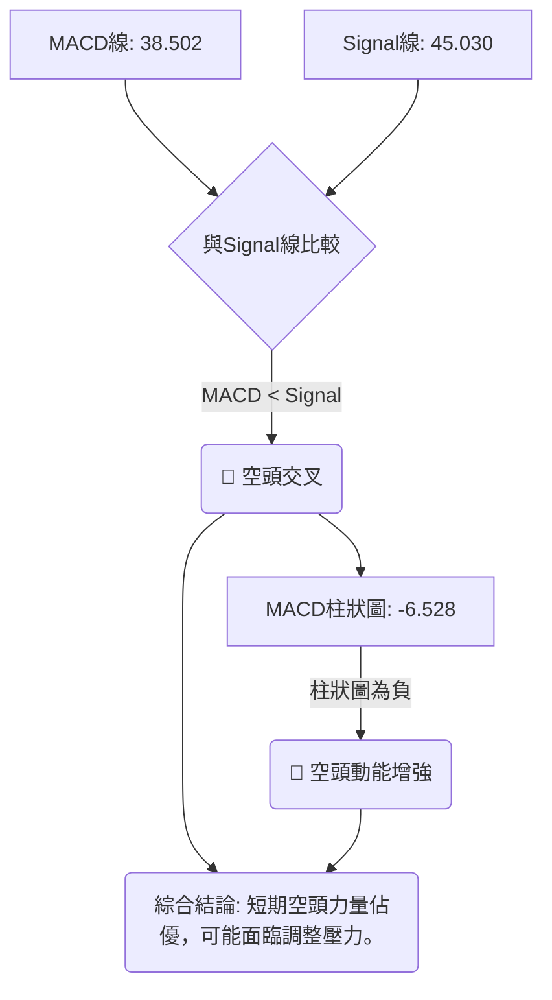
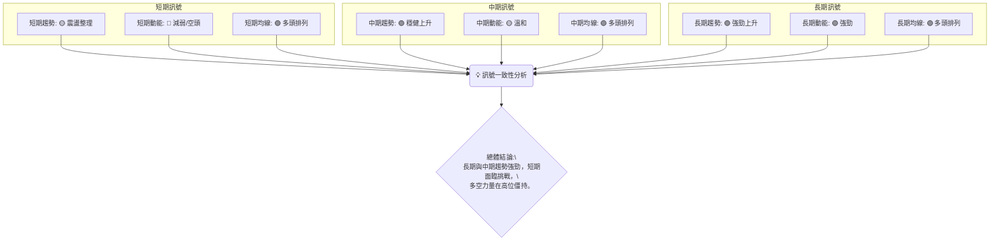
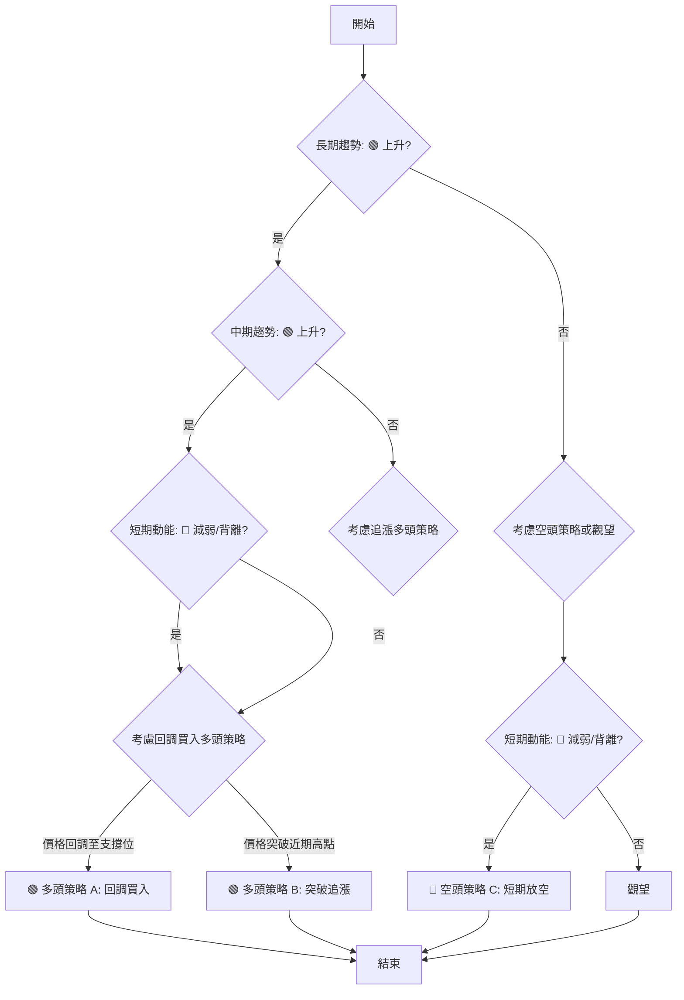
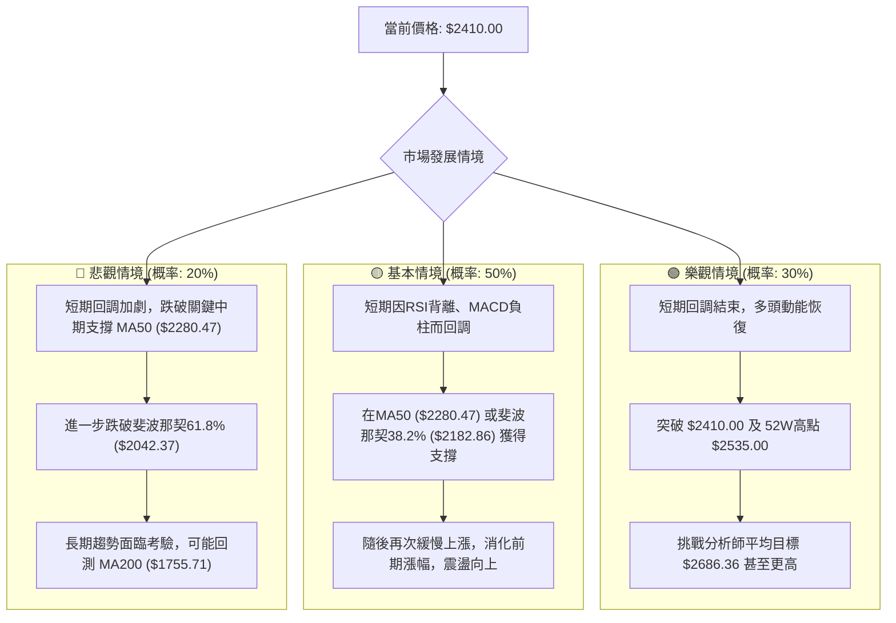

<details>
<summary>📊 靜態圖表 (點擊展開)</summary>

</details>

<html>
<head><meta charset="utf-8" /></head>
<body>
    <div style="height:500px; width:100%;">                        <script>window.PlotlyConfig = {MathJaxConfig: 'local'};</script>
        <script charset="utf-8" src="https://cdn.plot.ly/plotly-3.6.0.min.js" integrity="sha256-QaOVwtVY0T02VaHrr6pnoHLCwayMJp4O5n4YyaE3rJk=" crossorigin="anonymous"></script>                <div id="candlestick-chart" class="plotly-graph-div" style="height:100%; width:100%;"></div>            <script>                window.PLOTLYENV=window.PLOTLYENV || {};                                if (document.getElementById("candlestick-chart")) {                    Plotly.newPlot(                        "candlestick-chart",                        [{"close":{"dtype":"f8","bdata":"AAAA4PbikUAAAACgs\u002faRQAAAAOD24pFAAAAA4PbikUAAAADg9uKRQAAAAIDpMZJAAAAAgOkxkkAAAAAg3ICSQAAAAICL45JAAAAAYMEek0AAAADgs22TQAAAAGD3WZNAAAAAgNzQk0AAAAAAapWTQAAAAGCt5JNAAAAAAGqVk0AAAAAgTwyUQAAAAOCmvpRAAAAA4Ka+lEAAAABgY2+UQAAAAOAfIJRAAAAA4PAzlEAAAABANIOUQAAAAEC7IZVAAAAAQHGslUAAAABAJzeWQAAAAODj55VAAAAAQPhKlkAAAADg4+eVQAAAAGCFD5ZAAAAAQAyulkAAAADgT\u002f2WQAAAAMCZcpZAAAAAAH\u002fplkAAAAAAf+mWQAAAAKA7mpZAAAAAwJlylkAAAAAAf+mWQAAAACCu1ZZAAAAAQJNMl0AAAABAk0yXQAAAAGDCOJdAAAAAQGRgl0AAAABAk0yXQAAAAKA7mpZAAAAAQAyulkAAAACgO5qWQAAAACCu1ZZAAAAAQAyulkAAAAAgrtWWQAAAAKA7mpZAAAAAYFYjlkAAAADgyF6WQAAAACBCwJVAAAAAQKCYlUAAAADAaoaWQAAAAMD+cJVAAAAA4FxJlUAAAADg4+eVQAAAAED4SpZAAAAAQCc3lkAAAABA+EqWQAAAAOAS1JVAAAAAYFYjlkAAAADAmXKWQAAAAODIXpZAAAAAoDualkAAAACg8SSXQAAAAAB\u002f6ZZAAAAAQJNMl0AAAACgSNWWQAAAAEAM\u002fZZAAAAAgMGFlkAAAABAHEqWQAAAAIA6NpZAAAAAgDo2lkAAAACAOjaWQAAAAMBmwZZAAAAAoM8kl0AAAACAsTiXQAAAAOBWdJdAAAAA4N3Dl0AAAABAGpyXQAAAAABlE5hAAAAAYJGemEAAAACAj\u002fCZQAAAAOC7e5pAAAAAQHEEmkAAAADgNCyaQAAAAABTGJpAAAAAgBZAmkAAAADAnY+aQAAAAMCdj5pAAAAAgBZAmkAAAABA6AabQAAAAEBvVptAAAAAoBSSm0AAAABA6AabQAAAAEBvVptAAAAA4DJ+m0AAAACgjUKbQAAAAID2pZtAAAAAoARFnEAAAABgXwmcQAAAAKAUkptAAAAAIFFqm0AAAACAffWbQAAAACDYuZtAAAAAIFFqm0AAAACA9qWbQAAAAMAiMZxAAAAA4JkznUAAAABAxr6dQAAAAAAhg51AAAAA4JeFnkAAAACgaUyfQAAAAKDi\u002fJ5AAAAAgFutnkAAAABATQ6eQAAAAID095xAAAAAACGDnUAAAABgXVudQAAAAABBHZxAAAAAQE+8nEAAAAAgLyKeQAAAAKB7R51AAAAAgPT3nEAAAACAbaicQAAAAAAZJJ1AAAAAoLmvnUAAAACAT9ScQAAAAMBqrJxAAAAAgLw0nEAAAACAvDScQAAAACBdwJxAAAAAwGqsnEAAAABAoVycQAAAAEAOvZtAAAAAwERtm0AAAADgQeicQAAAAIC8NJxAAAAAQDT8nEAAAAAAP2OeQAAAAGAxd55AAAAAwLYqn0AAAAAA0gKfQAAAAIAQA6BAAAAAYO40oEAAAACg5z6gQAAAAABlop9AAAAAoHKOn0AAAACALvKfQAAAAIAu8p9AAAAAYO40oEAAAABgXwahQAAAAGDypaFAAAAAgDZCoUAAAAAgZvygQAAAAICjoqBAAAAAwOS5oUAAAADgBoihQAAAAOAGiKFAAAAAILX\u002foUAAAABg0NehQAAAAEAbaqFAAAAAAACSoUAAAACgL0yhQAAAAKDrr6FAAAAAYPKloUAAAACAFHShQAAAACBELqFAAAAAYF8GoUAAAAAAImChQAAAAAAAkqFAAAAAILX\u002foUAAAACg66+hQAAAAMDC66FAAAAAgMnhoUAAAADAd1miQAAAAMB3WaJAAAAAwFWLokAAAABgGOWiQAAAAOBOlaJAAAAAIGptokAAAACAyeGhQAAAAOC79aFAAAAAAACSoUAAAAAAAJShQAAAAAAADKJAAAAAAACOokAAAAAAAMCiQAAAAAAAoqJAAAAAAADUokAAAAAAAJyjQAAAAAAAdKNAAAAAAACsokAAAAAAAKyiQAAAAAAASKJAAAAAAACEokAAAAAAANSiQA=="},"high":{"dtype":"f8","bdata":"WO5pIKZFkkAAAACgs\u002faRQDXCctMsHpJAAAAA4PbikUA1wnLTLB6SQAAAAIDpMZJAK4KGcx9tkkAAAAAg3ICSQAJGqSZI95JApZRS+rNtk0AAAADgs22TQL0loQa0bZNAAACAXK3kk0CIgiu5C72TQAAAAGCt5JNAU8bsTn74k0AAAAAgTwyUQAAAAOCmvpRAH6icdRn6lEAQPvgYBZeUQK3USnWSW5RAh36zdWNvlEC8lX2OSOaUQJzJmRyMNZVAAAAAQHGslUC2TBb5yF6WQBGXm7y0+5VAAAAA1mqGlkARl5u8tPuVQB1g2WY7mpZAAAAAQAyulkB1uBqZ8SSXQF8qaFUMrpZAmCKflfEkl0B1gylywjiXQE2aNFndwZZAHw54nGqGlkB1gylywjiXQPoglrUgEZdAXb\u002f7+DR0l0ALn3nVBYiXQGdmZq7Wm5dAcPI3+QWIl0C6fvex1puXQMGBA+9P\u002fZZA+w0w1X7plkAmTZp8DK6WQKfADtlP\u002fZZA9RtgavEkl0CnwA7ZT\u002f2WQE2aNFndwZZApRwQGfhKlkAxyF51O5qWQJx0gEsnN5ZAchzHsePnlUAOUJecO5qWQEhqmTJCwJVAsfYNC0LAlUAjLjeZhQ+WQAAAAED4SpZAbJkssmqGlkAAAADWaoaWQBk6YOfIXpZApRwQGfhKlkAAAADAmXKWQGbtdLyZcpZAAAAAoDualkAAAACg8SSXQHWDKXLCOJdAAAAAQJNMl0AAAACQOIiXQKbIZwXuEJdA0OpLRaOZlkBiLrTK33GWQLOkHNDfcZZAkeFeRRxKlkDVZ9pao5mWQL0IPoVI1ZZAAAAAoM8kl0BQ5llFk0yXQAAAAOBWdJdAAAAA4N3Dl0CivIbK3cOXQAAAAABlE5hAAAAAYJGemEB\u002fi9Na+FOaQAAAAOC7e5pAYtGyyjQsmkCCxTww2meaQFVVVRXaZ5pAaMPnz7t7mkC3ktpKYbeaQFtJbYV\u002fo5pARYKaCtpnmkCrqqrKqy6bQNJFF1X2pZtAAAAAoBSSm0CrqqoaUWqbQOmii8oyfptAVVVVpRSSm0BgBEZA2LmbQJasZEXYuZtAAAAAoARFnEBtdnEAqoCcQMdvl3p99ZtAAAAAIFFqm0CrqqoKQR2cQJVwJzVfCZxAeZoLcPalm0AAAACA9qWbQMcyKNWpgJxAAAAA4JkznUDdy7HKieadQNXvuWVNDp5AZ9KValutnkAM5KMqLXSfQAjMHvCHOJ9A1ShjleL8nkCDvqAvPcGeQGkO32\u002fkqp1AknasQLZxnkCrqqrqIIOdQAAAAABBHZxARrXlal1bnUAFvriq8kmeQLy6FUDGvp1AErFGlXtHnUAFCaPlmTOdQEzYBsH9S51ABAKBAKzDnUA5Dx3D\u002fUudQC1kIQMZJJ1AbceH4K5InEBoOz6ET9ScQDI4H2MLOJ1Ae9OboiYQnUBwCIegk3CcQAhFKMLXDJxAdNFFA\u002fPkm0AAAADgQeicQK6R1aUmEJ1AAAAAQDT8nEAAAAAAP2OeQAAAAGAxd55AAAAAwLYqn0Bcf3tgxBafQAAAAIAQA6BAxU7sINNcoED\u002fwUTQ4EigQC8xa6EJDaBAwhZscRADoEATtSsx9SqgQA\u002fE7wD8IKBAndiJcqOioEBpnEGQWBChQBjRNtOZJ6JA+WNJ893DoUCrM1JBPTihQFRcMoQ2QqFA4Ad+INfNoUBoRSOh66+hQHW5\u002fTHXzaFAH3zwcYVFokD0Lh4htf+hQDolAcLkuaFAFN898d3DoUDJZ91gFHShQAAAAKDrr6FA74X3oqAdokBJkiRB+ZuhQFEURREiYKFADw5IUT04oUAFhBPx\u002f5GhQASTPzD5m6FAAAAAILX\u002foUA28BmzoB2iQKBoq+GZJ6JAng8s83BjokC7f\u002fOAXIGiQC9\u002f2gIm0aJAgVwTgTqzokBDWrHwAwOjQHKnaAEm0aJATvDkoTO9okDGVDhxpxOiQO+VunCnE6JAJCs8ssLroUAAAAAAAKihQAAAAAAAKqJAAAAAAACOokAAAAAAAMCiQAAAAAAAoqJAAAAAAADeokAAAAAAAJyjQAAAAAAAzqNAAAAAAAAao0AAAAAAAOiiQAAAAAAAhKJAAAAAAAC2okAAAAAAAFajQA=="},"hovertemplate":"\u003cb\u003e%{x|%Y-%m-%d}\u003c\u002fb\u003e\u003cbr\u003e\u958b: $%{open:.2f}\u003cbr\u003e\u9ad8: $%{high:.2f}\u003cbr\u003e\u4f4e: $%{low:.2f}\u003cbr\u003e\u6536: $%{close:.2f}\u003cextra\u003e\u003c\u002fextra\u003e","low":{"dtype":"f8","bdata":"AAAA4PbikUC\u002fgqEFwaeRQO5phDk6z5FAyz2N7MCnkUAAAADg9uKRQDip+zJwCpJAAAAAgOkxkkDv7u7SYlmSQPxzrTISvJJA11pruQQLk0DDMAyTOkaTQEPaXrk6RpNAAAAADpmBk0AAAAAAapWTQPIN8u1plZNAAAAAAGqVk0CtG0zROqmTQCI9UJGSW5RA4VdjSjSDlEAAAABgY2+UQBu5kQNPDJRAAAAA4PAzlEAAAABANIOUQMdszIYZ+pRAAAAAOLshlUDvjF6qtPuVQN7RyCZCwJVAqqqqhlYjlkCqDPaQz4SVQLPNl4O0+5VADjDVXIUPlkAWj8ptDK6WQAAAAMCZcpZArRtMsWqGlkAAAAAAf+mWQNmyZcNqhpZAoNWXKic3lkAAAAAAf+mWQK2feEPdwZZA9WCGqiARl0BSIIJjwjiXQAAAAGDCOJdAIBuQzSARl0CkQASH8SSXQNmyZcNqhpZAAAAAQAyulkDZsmXDaoaWQFk\u002f8WYMrpZAAAAAQAyulkAG32mKO5qWQAAAAKA7mpZArvF3g4UPlkAAAADgyF6WQAAAACBCwJVAAAAAQKCYlUDWDzoq+EqWQAAAAMD+cJVAAAAA4FxJlUDe0cgmQsCVQAAAAKqFD5ZApdl0Y1YjlkBVVVVjJzeWQAAAAOAS1JVAXOPvprT7lUCg1ZcqJzeWQM43oUpWI5ZAZsuWLfhKlkCHJvmXO5qWQAAAAAB\u002f6ZZAR4EIzk\u002f9lkCrqqraZsGWQLRuMLVI1ZZALxW0ut9xlkCe0Uu1WCKWQG8eobpYIpZATVvjL5X6lUAAAACAOjaWQIfugzWjmZZAIfnzikjVlkBfM0z17RCXQJO\u002fyY+xOJdAq6qqylZ0l0BeQ3m1VnSXQKcBbZo4iJdAgeAyNYP\u002fl0BOa7aPnz2ZQP3zz58mjZlAnS5Nta3cmUD8dIY\u002f6rSZQFVVVSXqtJlAAAAAgBZAmkBJbSU12meaQEltJTXaZ5pAun1l9VIYmkAAAACgnY+aQNJFF9tCy5pAt5bFOugGm0AAAABA6AabQBdddLWrLptAq6qqyqsum0AAAACgjUKbQBShCKWNQptAMP3S\u002f7nNm0CYwZeaffWbQAAAAKAUkptACjKbCsoam0AAAAAw2LmbQLZHbJUUkptAg8ymWm9Wm0BTm9pU6AabQAAAAMAiMZxA6jsbtYuUnECL0DgVuB+dQAAAAAAhg51A\u002feMSK8a+nUDmN7iK4vyeQAAAAKDi\u002fJ5AjHiSGi8inkAAAABATQ6eQAAAAID095xAdEucOj9vnUBVVVXVmTOdQPitkdUyfptAXCWNKshsnEDeLE8auB+dQAAAAKB7R51AqaJnpYuUnEAAAACAbaicQLMn+T40\u002fJxA9Pl8fuJznUAAAACAT9ScQAAAAMBqrJxA4BpZnQDRm0AncfC+1wycQAAAACBdwJxAAAAAwGqsnEA+3uO91wycQAAAAEAOvZtAAAAAwERtm0D6kmn9hYScQJQ4eB\u002fKIJxA11prXXiYnECd2Ikdg\u002f+dQDN1i311E55AUrgefQiznkDugY3e+saeQL9KGJubUp9AO7ETnwkNoEAHdGN+EAOgQAAAAABlop9AAAAAoHKOn0D4HYgfPN6fQPE7EL9Jyp9Aip3YbhADoEBpOeZbzGagQAAAAGDypaFAAAAAgDZCoUAq5laPet6gQAAAAICjoqBA\u002fMAPvFEaoUBMXW5\u002fFHShQExdbn8UdKFAAAAAILX\u002foUBPRZpu8qWhQAAAAEAbaqFA3NTDTT04oUAp8lkPRC6hQB6Xvh0iYKFAhB5CzwaIoUAkSZKONkKhQAAAACBELqFAAAAAYF8GoUAAAAAAImChQOiNgt4oVqFA4YMPzuS5oUAAAACg66+hQMuHcV\u002fQ16FAOavHjuuvoUBXoM\u002fOmSeiQBEgw49+T6JAf6Ps\u002fnBjokC+pU7PLMeiQAAAAOBOlaJA4yVKj35PokBi8NMMImChQAucg3\u002fJ4aFAAAAAAACSoUAAAAAAAEShQAAAAAAA5KFAAAAAAABSokAAAAAAAFyiQAAAAAAAXKJAAAAAAACiokAAAAAAAC6jQAAAAAAAdKNAAAAAAACsokAAAAAAAKyiQAAAAAAAKqJAAAAAAAA0okAAAAAAANSiQA=="},"name":"\u50f9\u683c","open":{"dtype":"f8","bdata":"R1jueekxkkAPIjmsfbuRQCMs9yxwCpJA7mmEOTrPkUAjLPcscAqSQJzUfdksHpJAK4KGcx9tkkB3d3d5H22SQP65VtnOz5JAfO+9U\u002fdZk0BiGIY591mTQL0loQa0bZNAAACA6mmVk0BEwZXcOqmTQPkG+aYLvZNADwVXcq3kk0CtG0zROqmTQILK2W1jb5RAvxoTmUjmlEAAAABgY2+UQMmN3JjBR5RALSqRvMFHlEAAAABANIOUQGM2ZmPqDZVAAAAAOLshlUDvjF6qtPuVQO9oZAMT1JVAAAAAQPhKlkCqDPaQz4SVQNAtcYpqhpZACuSfFSc3lkAWj8ptDK6WQB8OeJxqhpZAinzWjTualkDdYIrcT\u002f2WQAAAAKA7mpZAwOMPB\u002fhKlkB1gylywjiXQFNgh\u002fx+6ZZApEAEh\u002fEkl0Bdv\u002fv4NHSXQNejcPU0dJdAAAAAQGRgl0ALn3nVBYiXQJo0aRJ\u002f6ZZA\u002flllHN3BlkAAAACgO5qWQK2feEPdwZZA98H6jSARl0Ctn3hD3cGWQAAAAKA7mpZArvF3g4UPlkBm7XS8mXKWQJx0gEsnN5ZAHMdxHHGslUDyr2jjmXKWQCS1THmgmJVA6aKLLnGslUAjLjeZhQ+WQKqqqoZWI5ZAEXOh1ZlylkAAAABA+EqWQBk6YOfIXpZAAAAAYFYjlkDA4w8H+EqWQAAAAODIXpZAjBgxCslelkAraox0DK6WQJgin5XxJJdA9WCGqiARl0CrqqrKVnSXQFo3mHoq6ZZAAAAAgMGFlkAAAABAHEqWQJHhXkUcSpZA3jxC9XYOlkDVZ9pao5mWQAAAAMBmwZZA2fo2UCrplkAAAACAsTiXQDGVmBp1YJdAAAAAkDiIl0Cvobx6OIiXQP0ly18anJdAYSjmv0YnmECb7RNVgVGZQP3zz58mjZlAnS5Nta3cmUAoDPAEzMiZQAAAALCt3JlARYKaCtpnmkC3ktpKYbeaQKW2kvq7e5pA3b6yujQsmkCrqqp6BvOaQNJFF9tCy5pAt5bFOugGm0BVVVUFyhqbQHTRRQVRaptAAAAA4DJ+m0B1AcIqUWqbQKpNbWpvVptAMP3S\u002f7nNm0AGOAk7yGycQER29O+5zZtAiGX0z6sum0CrqqoKQR2cQAAAACDYuZtAAAAAIFFqm0DpRz8ayhqbQBUm3g\u002fIbJxAbdR3em2onEB6tpHamTOdQAAAAAAhg51A\u002feMSK8a+nUDmN7iK4vyeQFiZX2XEEJ9AjHiSGi8inkDXPguleZmeQJsJ6h8\u002fb51AYaQdKy8inkBVVVXVmTOdQDl435oUkptAo9pyVdYLnUDj6gele0edQF7dCvAgg51AqaJnpYuUnEAEmkIguB+dQCZsg2ALOJ1A\u002fP1+P8ebnUBaN5hiCzidQMlCFkI0\u002fJxATeLg\u002ffLkm0BoOz6ET9ScQCHQFKImEJ1AZCELgU\u002fUnECu5moeyiCcQAAAAEAOvZtAuuii4Rupm0Bji3K+aqycQK6R1aUmEJ1A8L33fk\u002fUnEBe6IXeZyeeQEeVBJ9MT55AmpmZ3frGnkClgISf3+6eQKrQo\u002fuNZp9A7MROzwIXoEABPrtv7jSgQPyoLnEQA6BA61x5AGWin0AAAACALvKfQPgdiB883p9AYid2wOBIoEDS1SeMxXCgQHzhvfDdw6FAh1WEoQ1+oUAOosfvbPKgQMoQrCNELqFA7MRO7EokoUAAAADgBoihQAAAAOAGiKFAzaFiEZMxokB6F4\u002fAwuuhQOvbgGHypaFA8LMBPxtqoUAp8lkPRC6hQI9L394GiKFAc6Q5ErX\u002foUBJkiTvKFahQDEMw7AvTKFApnEGIUQuoUDPNG5gFHShQPjZgJ8NfqFA4YMPzuS5oUAaw9GCpxOiQDZ4jiC1\u002f6FA6CCvkn5PokA0YEkvjDuiQAAAAMB3WaJAQK6JIEifokAAAABgGOWiQAAAAOBOlaJAO7RrQUGpokBi8NMMImChQAAAAOC79aFAGHJ9IdfNoUAAAAAAAIChQAAAAAAAKqJAAAAAAABwokAAAAAAAI6iQAAAAAAAZqJAAAAAAAC2okAAAAAAAC6jQAAAAAAAnKNAAAAAAAAGo0AAAAAAANSiQAAAAAAAcKJAAAAAAAA0okAAAAAAABCjQA=="},"x":["2025-08-29T00:00:00+08:00","2025-09-01T00:00:00+08:00","2025-09-02T00:00:00+08:00","2025-09-03T00:00:00+08:00","2025-09-04T00:00:00+08:00","2025-09-05T00:00:00+08:00","2025-09-08T00:00:00+08:00","2025-09-09T00:00:00+08:00","2025-09-10T00:00:00+08:00","2025-09-11T00:00:00+08:00","2025-09-12T00:00:00+08:00","2025-09-15T00:00:00+08:00","2025-09-16T00:00:00+08:00","2025-09-17T00:00:00+08:00","2025-09-18T00:00:00+08:00","2025-09-19T00:00:00+08:00","2025-09-22T00:00:00+08:00","2025-09-23T00:00:00+08:00","2025-09-24T00:00:00+08:00","2025-09-25T00:00:00+08:00","2025-09-26T00:00:00+08:00","2025-09-30T00:00:00+08:00","2025-10-01T00:00:00+08:00","2025-10-02T00:00:00+08:00","2025-10-03T00:00:00+08:00","2025-10-07T00:00:00+08:00","2025-10-08T00:00:00+08:00","2025-10-09T00:00:00+08:00","2025-10-13T00:00:00+08:00","2025-10-14T00:00:00+08:00","2025-10-15T00:00:00+08:00","2025-10-16T00:00:00+08:00","2025-10-17T00:00:00+08:00","2025-10-20T00:00:00+08:00","2025-10-21T00:00:00+08:00","2025-10-22T00:00:00+08:00","2025-10-23T00:00:00+08:00","2025-10-27T00:00:00+08:00","2025-10-28T00:00:00+08:00","2025-10-29T00:00:00+08:00","2025-10-30T00:00:00+08:00","2025-10-31T00:00:00+08:00","2025-11-03T00:00:00+08:00","2025-11-04T00:00:00+08:00","2025-11-05T00:00:00+08:00","2025-11-06T00:00:00+08:00","2025-11-07T00:00:00+08:00","2025-11-10T00:00:00+08:00","2025-11-11T00:00:00+08:00","2025-11-12T00:00:00+08:00","2025-11-13T00:00:00+08:00","2025-11-14T00:00:00+08:00","2025-11-17T00:00:00+08:00","2025-11-18T00:00:00+08:00","2025-11-19T00:00:00+08:00","2025-11-20T00:00:00+08:00","2025-11-21T00:00:00+08:00","2025-11-24T00:00:00+08:00","2025-11-25T00:00:00+08:00","2025-11-26T00:00:00+08:00","2025-11-27T00:00:00+08:00","2025-11-28T00:00:00+08:00","2025-12-01T00:00:00+08:00","2025-12-02T00:00:00+08:00","2025-12-03T00:00:00+08:00","2025-12-04T00:00:00+08:00","2025-12-05T00:00:00+08:00","2025-12-08T00:00:00+08:00","2025-12-09T00:00:00+08:00","2025-12-10T00:00:00+08:00","2025-12-11T00:00:00+08:00","2025-12-12T00:00:00+08:00","2025-12-15T00:00:00+08:00","2025-12-16T00:00:00+08:00","2025-12-17T00:00:00+08:00","2025-12-18T00:00:00+08:00","2025-12-19T00:00:00+08:00","2025-12-22T00:00:00+08:00","2025-12-23T00:00:00+08:00","2025-12-24T00:00:00+08:00","2025-12-26T00:00:00+08:00","2025-12-29T00:00:00+08:00","2025-12-30T00:00:00+08:00","2025-12-31T00:00:00+08:00","2026-01-02T00:00:00+08:00","2026-01-05T00:00:00+08:00","2026-01-06T00:00:00+08:00","2026-01-07T00:00:00+08:00","2026-01-08T00:00:00+08:00","2026-01-09T00:00:00+08:00","2026-01-12T00:00:00+08:00","2026-01-13T00:00:00+08:00","2026-01-14T00:00:00+08:00","2026-01-15T00:00:00+08:00","2026-01-16T00:00:00+08:00","2026-01-19T00:00:00+08:00","2026-01-20T00:00:00+08:00","2026-01-21T00:00:00+08:00","2026-01-22T00:00:00+08:00","2026-01-23T00:00:00+08:00","2026-01-26T00:00:00+08:00","2026-01-27T00:00:00+08:00","2026-01-28T00:00:00+08:00","2026-01-29T00:00:00+08:00","2026-01-30T00:00:00+08:00","2026-02-02T00:00:00+08:00","2026-02-03T00:00:00+08:00","2026-02-04T00:00:00+08:00","2026-02-05T00:00:00+08:00","2026-02-06T00:00:00+08:00","2026-02-09T00:00:00+08:00","2026-02-10T00:00:00+08:00","2026-02-11T00:00:00+08:00","2026-02-23T00:00:00+08:00","2026-02-24T00:00:00+08:00","2026-02-25T00:00:00+08:00","2026-02-26T00:00:00+08:00","2026-03-02T00:00:00+08:00","2026-03-03T00:00:00+08:00","2026-03-04T00:00:00+08:00","2026-03-05T00:00:00+08:00","2026-03-06T00:00:00+08:00","2026-03-09T00:00:00+08:00","2026-03-10T00:00:00+08:00","2026-03-11T00:00:00+08:00","2026-03-12T00:00:00+08:00","2026-03-13T00:00:00+08:00","2026-03-16T00:00:00+08:00","2026-03-17T00:00:00+08:00","2026-03-18T00:00:00+08:00","2026-03-19T00:00:00+08:00","2026-03-20T00:00:00+08:00","2026-03-23T00:00:00+08:00","2026-03-24T00:00:00+08:00","2026-03-25T00:00:00+08:00","2026-03-26T00:00:00+08:00","2026-03-27T00:00:00+08:00","2026-03-30T00:00:00+08:00","2026-03-31T00:00:00+08:00","2026-04-01T00:00:00+08:00","2026-04-02T00:00:00+08:00","2026-04-07T00:00:00+08:00","2026-04-08T00:00:00+08:00","2026-04-09T00:00:00+08:00","2026-04-10T00:00:00+08:00","2026-04-13T00:00:00+08:00","2026-04-14T00:00:00+08:00","2026-04-15T00:00:00+08:00","2026-04-16T00:00:00+08:00","2026-04-17T00:00:00+08:00","2026-04-20T00:00:00+08:00","2026-04-21T00:00:00+08:00","2026-04-22T00:00:00+08:00","2026-04-23T00:00:00+08:00","2026-04-24T00:00:00+08:00","2026-04-27T00:00:00+08:00","2026-04-28T00:00:00+08:00","2026-04-29T00:00:00+08:00","2026-04-30T00:00:00+08:00","2026-05-04T00:00:00+08:00","2026-05-05T00:00:00+08:00","2026-05-06T00:00:00+08:00","2026-05-07T00:00:00+08:00","2026-05-08T00:00:00+08:00","2026-05-11T00:00:00+08:00","2026-05-12T00:00:00+08:00","2026-05-13T00:00:00+08:00","2026-05-14T00:00:00+08:00","2026-05-15T00:00:00+08:00","2026-05-18T00:00:00+08:00","2026-05-19T00:00:00+08:00","2026-05-20T00:00:00+08:00","2026-05-21T00:00:00+08:00","2026-05-22T00:00:00+08:00","2026-05-25T00:00:00+08:00","2026-05-26T00:00:00+08:00","2026-05-27T00:00:00+08:00","2026-05-28T00:00:00+08:00","2026-05-29T00:00:00+08:00","2026-06-01T00:00:00+08:00","2026-06-02T00:00:00+08:00","2026-06-03T00:00:00+08:00","2026-06-04T00:00:00+08:00","2026-06-05T00:00:00+08:00","2026-06-08T00:00:00+08:00","2026-06-09T00:00:00+08:00","2026-06-10T00:00:00+08:00","2026-06-11T00:00:00+08:00","2026-06-12T00:00:00+08:00","2026-06-15T00:00:00+08:00","2026-06-16T00:00:00+08:00","2026-06-17T00:00:00+08:00","2026-06-18T00:00:00+08:00","2026-06-22T00:00:00+08:00","2026-06-23T00:00:00+08:00","2026-06-24T00:00:00+08:00","2026-06-25T00:00:00+08:00","2026-06-26T00:00:00+08:00","2026-06-29T00:00:00+08:00","2026-06-30T00:00:00+08:00"],"type":"candlestick"},{"hovertemplate":"MA30: $%{y:.2f}\u003cextra\u003e\u003c\u002fextra\u003e","line":{"color":"#2196F3","dash":"dash","width":2},"mode":"lines","name":"MA30","x":["2025-08-29T00:00:00+08:00","2025-09-01T00:00:00+08:00","2025-09-02T00:00:00+08:00","2025-09-03T00:00:00+08:00","2025-09-04T00:00:00+08:00","2025-09-05T00:00:00+08:00","2025-09-08T00:00:00+08:00","2025-09-09T00:00:00+08:00","2025-09-10T00:00:00+08:00","2025-09-11T00:00:00+08:00","2025-09-12T00:00:00+08:00","2025-09-15T00:00:00+08:00","2025-09-16T00:00:00+08:00","2025-09-17T00:00:00+08:00","2025-09-18T00:00:00+08:00","2025-09-19T00:00:00+08:00","2025-09-22T00:00:00+08:00","2025-09-23T00:00:00+08:00","2025-09-24T00:00:00+08:00","2025-09-25T00:00:00+08:00","2025-09-26T00:00:00+08:00","2025-09-30T00:00:00+08:00","2025-10-01T00:00:00+08:00","2025-10-02T00:00:00+08:00","2025-10-03T00:00:00+08:00","2025-10-07T00:00:00+08:00","2025-10-08T00:00:00+08:00","2025-10-09T00:00:00+08:00","2025-10-13T00:00:00+08:00","2025-10-14T00:00:00+08:00","2025-10-15T00:00:00+08:00","2025-10-16T00:00:00+08:00","2025-10-17T00:00:00+08:00","2025-10-20T00:00:00+08:00","2025-10-21T00:00:00+08:00","2025-10-22T00:00:00+08:00","2025-10-23T00:00:00+08:00","2025-10-27T00:00:00+08:00","2025-10-28T00:00:00+08:00","2025-10-29T00:00:00+08:00","2025-10-30T00:00:00+08:00","2025-10-31T00:00:00+08:00","2025-11-03T00:00:00+08:00","2025-11-04T00:00:00+08:00","2025-11-05T00:00:00+08:00","2025-11-06T00:00:00+08:00","2025-11-07T00:00:00+08:00","2025-11-10T00:00:00+08:00","2025-11-11T00:00:00+08:00","2025-11-12T00:00:00+08:00","2025-11-13T00:00:00+08:00","2025-11-14T00:00:00+08:00","2025-11-17T00:00:00+08:00","2025-11-18T00:00:00+08:00","2025-11-19T00:00:00+08:00","2025-11-20T00:00:00+08:00","2025-11-21T00:00:00+08:00","2025-11-24T00:00:00+08:00","2025-11-25T00:00:00+08:00","2025-11-26T00:00:00+08:00","2025-11-27T00:00:00+08:00","2025-11-28T00:00:00+08:00","2025-12-01T00:00:00+08:00","2025-12-02T00:00:00+08:00","2025-12-03T00:00:00+08:00","2025-12-04T00:00:00+08:00","2025-12-05T00:00:00+08:00","2025-12-08T00:00:00+08:00","2025-12-09T00:00:00+08:00","2025-12-10T00:00:00+08:00","2025-12-11T00:00:00+08:00","2025-12-12T00:00:00+08:00","2025-12-15T00:00:00+08:00","2025-12-16T00:00:00+08:00","2025-12-17T00:00:00+08:00","2025-12-18T00:00:00+08:00","2025-12-19T00:00:00+08:00","2025-12-22T00:00:00+08:00","2025-12-23T00:00:00+08:00","2025-12-24T00:00:00+08:00","2025-12-26T00:00:00+08:00","2025-12-29T00:00:00+08:00","2025-12-30T00:00:00+08:00","2025-12-31T00:00:00+08:00","2026-01-02T00:00:00+08:00","2026-01-05T00:00:00+08:00","2026-01-06T00:00:00+08:00","2026-01-07T00:00:00+08:00","2026-01-08T00:00:00+08:00","2026-01-09T00:00:00+08:00","2026-01-12T00:00:00+08:00","2026-01-13T00:00:00+08:00","2026-01-14T00:00:00+08:00","2026-01-15T00:00:00+08:00","2026-01-16T00:00:00+08:00","2026-01-19T00:00:00+08:00","2026-01-20T00:00:00+08:00","2026-01-21T00:00:00+08:00","2026-01-22T00:00:00+08:00","2026-01-23T00:00:00+08:00","2026-01-26T00:00:00+08:00","2026-01-27T00:00:00+08:00","2026-01-28T00:00:00+08:00","2026-01-29T00:00:00+08:00","2026-01-30T00:00:00+08:00","2026-02-02T00:00:00+08:00","2026-02-03T00:00:00+08:00","2026-02-04T00:00:00+08:00","2026-02-05T00:00:00+08:00","2026-02-06T00:00:00+08:00","2026-02-09T00:00:00+08:00","2026-02-10T00:00:00+08:00","2026-02-11T00:00:00+08:00","2026-02-23T00:00:00+08:00","2026-02-24T00:00:00+08:00","2026-02-25T00:00:00+08:00","2026-02-26T00:00:00+08:00","2026-03-02T00:00:00+08:00","2026-03-03T00:00:00+08:00","2026-03-04T00:00:00+08:00","2026-03-05T00:00:00+08:00","2026-03-06T00:00:00+08:00","2026-03-09T00:00:00+08:00","2026-03-10T00:00:00+08:00","2026-03-11T00:00:00+08:00","2026-03-12T00:00:00+08:00","2026-03-13T00:00:00+08:00","2026-03-16T00:00:00+08:00","2026-03-17T00:00:00+08:00","2026-03-18T00:00:00+08:00","2026-03-19T00:00:00+08:00","2026-03-20T00:00:00+08:00","2026-03-23T00:00:00+08:00","2026-03-24T00:00:00+08:00","2026-03-25T00:00:00+08:00","2026-03-26T00:00:00+08:00","2026-03-27T00:00:00+08:00","2026-03-30T00:00:00+08:00","2026-03-31T00:00:00+08:00","2026-04-01T00:00:00+08:00","2026-04-02T00:00:00+08:00","2026-04-07T00:00:00+08:00","2026-04-08T00:00:00+08:00","2026-04-09T00:00:00+08:00","2026-04-10T00:00:00+08:00","2026-04-13T00:00:00+08:00","2026-04-14T00:00:00+08:00","2026-04-15T00:00:00+08:00","2026-04-16T00:00:00+08:00","2026-04-17T00:00:00+08:00","2026-04-20T00:00:00+08:00","2026-04-21T00:00:00+08:00","2026-04-22T00:00:00+08:00","2026-04-23T00:00:00+08:00","2026-04-24T00:00:00+08:00","2026-04-27T00:00:00+08:00","2026-04-28T00:00:00+08:00","2026-04-29T00:00:00+08:00","2026-04-30T00:00:00+08:00","2026-05-04T00:00:00+08:00","2026-05-05T00:00:00+08:00","2026-05-06T00:00:00+08:00","2026-05-07T00:00:00+08:00","2026-05-08T00:00:00+08:00","2026-05-11T00:00:00+08:00","2026-05-12T00:00:00+08:00","2026-05-13T00:00:00+08:00","2026-05-14T00:00:00+08:00","2026-05-15T00:00:00+08:00","2026-05-18T00:00:00+08:00","2026-05-19T00:00:00+08:00","2026-05-20T00:00:00+08:00","2026-05-21T00:00:00+08:00","2026-05-22T00:00:00+08:00","2026-05-25T00:00:00+08:00","2026-05-26T00:00:00+08:00","2026-05-27T00:00:00+08:00","2026-05-28T00:00:00+08:00","2026-05-29T00:00:00+08:00","2026-06-01T00:00:00+08:00","2026-06-02T00:00:00+08:00","2026-06-03T00:00:00+08:00","2026-06-04T00:00:00+08:00","2026-06-05T00:00:00+08:00","2026-06-08T00:00:00+08:00","2026-06-09T00:00:00+08:00","2026-06-10T00:00:00+08:00","2026-06-11T00:00:00+08:00","2026-06-12T00:00:00+08:00","2026-06-15T00:00:00+08:00","2026-06-16T00:00:00+08:00","2026-06-17T00:00:00+08:00","2026-06-18T00:00:00+08:00","2026-06-22T00:00:00+08:00","2026-06-23T00:00:00+08:00","2026-06-24T00:00:00+08:00","2026-06-25T00:00:00+08:00","2026-06-26T00:00:00+08:00","2026-06-29T00:00:00+08:00","2026-06-30T00:00:00+08:00"],"y":{"dtype":"f8","bdata":"AAAAAAAA+H8AAAAAAAD4fwAAAAAAAPh\u002fAAAAAAAA+H8AAAAAAAD4fwAAAAAAAPh\u002fAAAAAAAA+H8AAAAAAAD4fwAAAAAAAPh\u002fAAAAAAAA+H8AAAAAAAD4fwAAAAAAAPh\u002fAAAAAAAA+H8AAAAAAAD4fwAAAAAAAPh\u002fAAAAAAAA+H8AAAAAAAD4fwAAAAAAAPh\u002fAAAAAAAA+H8AAAAAAAD4fwAAAAAAAPh\u002fAAAAAAAA+H8AAAAAAAD4fwAAAAAAAPh\u002fAAAAAAAA+H8AAAAAAAD4fwAAAAAAAPh\u002fAAAAAAAA+H8AAAAAAAD4fxEREcFy3pNA3t3d3VkHlEARERHxPDKUQFVVVcUoWZRAzczMLAuElEBERESU7a6UQKuqquqJ1JRA7+7uDtT4lEBmZmYWcx6VQImIiOgeQJVAmpmZCchjlUC8u7t7z4SVQAAAAEDWpZVAREREpDjElUB3d3c37eOVQO\u002fu7o4L+5VA3t3dXXcVlkBERESEQyuWQHd3dxcZPZZAiYiIeJxNlkDe3d1tFmKWQM3MzHw5d5ZA7+7u3ryHlkCJiIgol5eWQLy7u+vfnJZAIiIi0jaclkBEREQ0256WQCIiIqLkmpZAMzMzY06SlkAzMzNjTpKWQO\u002fu7q5JlJZA3t3dHVOQlkAzMzNDYYqWQAAAAIAYhZZAvLu7i31+lkCJiIj4hnqWQN7d3a2LeJZAAAAA4N15lkCamZkp2XuWQCIiIkKCfJZAIiIiQoJ8lkDe3d1NiHiWQERERMSKdpZAMzMzE0FvlkAiIiKCo2aWQDMzMyNOY5ZA3t3drU9flkDv7u5O+luWQDMzM0NNW5ZAVVVVtUJflkDv7u6ej2KWQLy7u8vUaZZA3t3dLbd3lkBVVVX1SoKWQERERHQhlpZAIiIiwu2vlkDe3d0dEc2WQLy7u2sX+JZAd3d393Ugl0ARERER30SXQGZmZgZRZZdAZmZmZr+Hl0ARERFRK6yXQAAAANCN1JdAiYiISKX3l0B3d3f3uB6YQBEREWEcSZhAq6qqeoFzmEDNzMxMo5SYQKuqqgpnuphAERERoTDemEAiIiIy9wOZQM3MzLy6K5lAIiIigsVcmUB3d3dH0I2ZQAAAAMCKu5lAd3d35\u002fHnmUC8u7ur\u002fBiaQJqZmdlmQ5pAmpmZGdpnmkCrqqqqoI2aQM3MzNwNtppA7+7u\u002fnHkmkAAAAAQzRibQCIiIjIxR5tAd3d3R495m0AAAADASaebQJqZmfm5zZtAREREhH31m0BmZmZ2oBacQImIiNglL5xAd3d3h\u002ftKnEAAAABA12KcQM3MzGwYcJxAREREhE2FnEARERHhz5+cQLy7u1thsJxAiYiIOE+8nEAAAAAQOsqcQGZmZpad2ZxAd3d3R1XsnEC8u7ubufmcQHd3dzd5Ap1Ad3d3R+4BnUARERFRYAOdQM3MzMxzDZ1AMzMzYzAYnUAzMzODoBudQKuqquq7G51Aq6qqGtUbnUCamZlZkyadQDMzMxOyJp1Aq6qqWtkknUCJiIjYVCqdQGZmZoZ3Mp1A3t3djfg3nUARERGRhDWdQKuqqvpbPp1AZmZmFi1NnUAAAACw9WGdQLy7uyu1eJ1AMzMz0yaKnUDNzMzcPqCdQCIiInLxwJ1Ad3d3B1TgnUB3d3c3vwGeQN7d3Q0YNZ5Ad3d3Z3FknkBVVVXlyZGeQJqZmSkHtZ5ARERE5DrmnkBmZmbmaxufQFVVVVXxUZ9Ad3d3l26Un0AAAAAAQ9SfQCIiIsoPBKBAREREnKcfoEBEREQcQDqgQO\u002fu7obUWqBAq6qqQmh8oEAiIiJyAZagQHd3d9dEsKBAAAAAwODFoEAzMzOzftigQLy7uxNx7KBAMzMzqw0BoUB3d3efqxOhQM3MzNT1I6FA7+7uZkEyoUC8u7sjNUShQERERAzRWaFAiYiImGtxoUARERGRWoqhQAAAALCgoKFA7+7uvpOzoUBVVVUV5LqhQO\u002fu7u6MvaFAiYiIyDXAoUAiIiJyQ8WhQAAAABBP0aFAmpmZCWHYoUBVVVU1x+KhQBEREWEt7KFAERER8UDzoUCJiIiYUwKiQGZmZha5E6JAzczMfB8dokAiIiKi2SiiQBEREWHrLaJAvLu7O1I1okCJiIhIDUGiQA=="},"type":"scatter"},{"hovertemplate":"MA60: $%{y:.2f}\u003cextra\u003e\u003c\u002fextra\u003e","line":{"color":"#9C27B0","dash":"dash","width":2},"mode":"lines","name":"MA60","x":["2025-08-29T00:00:00+08:00","2025-09-01T00:00:00+08:00","2025-09-02T00:00:00+08:00","2025-09-03T00:00:00+08:00","2025-09-04T00:00:00+08:00","2025-09-05T00:00:00+08:00","2025-09-08T00:00:00+08:00","2025-09-09T00:00:00+08:00","2025-09-10T00:00:00+08:00","2025-09-11T00:00:00+08:00","2025-09-12T00:00:00+08:00","2025-09-15T00:00:00+08:00","2025-09-16T00:00:00+08:00","2025-09-17T00:00:00+08:00","2025-09-18T00:00:00+08:00","2025-09-19T00:00:00+08:00","2025-09-22T00:00:00+08:00","2025-09-23T00:00:00+08:00","2025-09-24T00:00:00+08:00","2025-09-25T00:00:00+08:00","2025-09-26T00:00:00+08:00","2025-09-30T00:00:00+08:00","2025-10-01T00:00:00+08:00","2025-10-02T00:00:00+08:00","2025-10-03T00:00:00+08:00","2025-10-07T00:00:00+08:00","2025-10-08T00:00:00+08:00","2025-10-09T00:00:00+08:00","2025-10-13T00:00:00+08:00","2025-10-14T00:00:00+08:00","2025-10-15T00:00:00+08:00","2025-10-16T00:00:00+08:00","2025-10-17T00:00:00+08:00","2025-10-20T00:00:00+08:00","2025-10-21T00:00:00+08:00","2025-10-22T00:00:00+08:00","2025-10-23T00:00:00+08:00","2025-10-27T00:00:00+08:00","2025-10-28T00:00:00+08:00","2025-10-29T00:00:00+08:00","2025-10-30T00:00:00+08:00","2025-10-31T00:00:00+08:00","2025-11-03T00:00:00+08:00","2025-11-04T00:00:00+08:00","2025-11-05T00:00:00+08:00","2025-11-06T00:00:00+08:00","2025-11-07T00:00:00+08:00","2025-11-10T00:00:00+08:00","2025-11-11T00:00:00+08:00","2025-11-12T00:00:00+08:00","2025-11-13T00:00:00+08:00","2025-11-14T00:00:00+08:00","2025-11-17T00:00:00+08:00","2025-11-18T00:00:00+08:00","2025-11-19T00:00:00+08:00","2025-11-20T00:00:00+08:00","2025-11-21T00:00:00+08:00","2025-11-24T00:00:00+08:00","2025-11-25T00:00:00+08:00","2025-11-26T00:00:00+08:00","2025-11-27T00:00:00+08:00","2025-11-28T00:00:00+08:00","2025-12-01T00:00:00+08:00","2025-12-02T00:00:00+08:00","2025-12-03T00:00:00+08:00","2025-12-04T00:00:00+08:00","2025-12-05T00:00:00+08:00","2025-12-08T00:00:00+08:00","2025-12-09T00:00:00+08:00","2025-12-10T00:00:00+08:00","2025-12-11T00:00:00+08:00","2025-12-12T00:00:00+08:00","2025-12-15T00:00:00+08:00","2025-12-16T00:00:00+08:00","2025-12-17T00:00:00+08:00","2025-12-18T00:00:00+08:00","2025-12-19T00:00:00+08:00","2025-12-22T00:00:00+08:00","2025-12-23T00:00:00+08:00","2025-12-24T00:00:00+08:00","2025-12-26T00:00:00+08:00","2025-12-29T00:00:00+08:00","2025-12-30T00:00:00+08:00","2025-12-31T00:00:00+08:00","2026-01-02T00:00:00+08:00","2026-01-05T00:00:00+08:00","2026-01-06T00:00:00+08:00","2026-01-07T00:00:00+08:00","2026-01-08T00:00:00+08:00","2026-01-09T00:00:00+08:00","2026-01-12T00:00:00+08:00","2026-01-13T00:00:00+08:00","2026-01-14T00:00:00+08:00","2026-01-15T00:00:00+08:00","2026-01-16T00:00:00+08:00","2026-01-19T00:00:00+08:00","2026-01-20T00:00:00+08:00","2026-01-21T00:00:00+08:00","2026-01-22T00:00:00+08:00","2026-01-23T00:00:00+08:00","2026-01-26T00:00:00+08:00","2026-01-27T00:00:00+08:00","2026-01-28T00:00:00+08:00","2026-01-29T00:00:00+08:00","2026-01-30T00:00:00+08:00","2026-02-02T00:00:00+08:00","2026-02-03T00:00:00+08:00","2026-02-04T00:00:00+08:00","2026-02-05T00:00:00+08:00","2026-02-06T00:00:00+08:00","2026-02-09T00:00:00+08:00","2026-02-10T00:00:00+08:00","2026-02-11T00:00:00+08:00","2026-02-23T00:00:00+08:00","2026-02-24T00:00:00+08:00","2026-02-25T00:00:00+08:00","2026-02-26T00:00:00+08:00","2026-03-02T00:00:00+08:00","2026-03-03T00:00:00+08:00","2026-03-04T00:00:00+08:00","2026-03-05T00:00:00+08:00","2026-03-06T00:00:00+08:00","2026-03-09T00:00:00+08:00","2026-03-10T00:00:00+08:00","2026-03-11T00:00:00+08:00","2026-03-12T00:00:00+08:00","2026-03-13T00:00:00+08:00","2026-03-16T00:00:00+08:00","2026-03-17T00:00:00+08:00","2026-03-18T00:00:00+08:00","2026-03-19T00:00:00+08:00","2026-03-20T00:00:00+08:00","2026-03-23T00:00:00+08:00","2026-03-24T00:00:00+08:00","2026-03-25T00:00:00+08:00","2026-03-26T00:00:00+08:00","2026-03-27T00:00:00+08:00","2026-03-30T00:00:00+08:00","2026-03-31T00:00:00+08:00","2026-04-01T00:00:00+08:00","2026-04-02T00:00:00+08:00","2026-04-07T00:00:00+08:00","2026-04-08T00:00:00+08:00","2026-04-09T00:00:00+08:00","2026-04-10T00:00:00+08:00","2026-04-13T00:00:00+08:00","2026-04-14T00:00:00+08:00","2026-04-15T00:00:00+08:00","2026-04-16T00:00:00+08:00","2026-04-17T00:00:00+08:00","2026-04-20T00:00:00+08:00","2026-04-21T00:00:00+08:00","2026-04-22T00:00:00+08:00","2026-04-23T00:00:00+08:00","2026-04-24T00:00:00+08:00","2026-04-27T00:00:00+08:00","2026-04-28T00:00:00+08:00","2026-04-29T00:00:00+08:00","2026-04-30T00:00:00+08:00","2026-05-04T00:00:00+08:00","2026-05-05T00:00:00+08:00","2026-05-06T00:00:00+08:00","2026-05-07T00:00:00+08:00","2026-05-08T00:00:00+08:00","2026-05-11T00:00:00+08:00","2026-05-12T00:00:00+08:00","2026-05-13T00:00:00+08:00","2026-05-14T00:00:00+08:00","2026-05-15T00:00:00+08:00","2026-05-18T00:00:00+08:00","2026-05-19T00:00:00+08:00","2026-05-20T00:00:00+08:00","2026-05-21T00:00:00+08:00","2026-05-22T00:00:00+08:00","2026-05-25T00:00:00+08:00","2026-05-26T00:00:00+08:00","2026-05-27T00:00:00+08:00","2026-05-28T00:00:00+08:00","2026-05-29T00:00:00+08:00","2026-06-01T00:00:00+08:00","2026-06-02T00:00:00+08:00","2026-06-03T00:00:00+08:00","2026-06-04T00:00:00+08:00","2026-06-05T00:00:00+08:00","2026-06-08T00:00:00+08:00","2026-06-09T00:00:00+08:00","2026-06-10T00:00:00+08:00","2026-06-11T00:00:00+08:00","2026-06-12T00:00:00+08:00","2026-06-15T00:00:00+08:00","2026-06-16T00:00:00+08:00","2026-06-17T00:00:00+08:00","2026-06-18T00:00:00+08:00","2026-06-22T00:00:00+08:00","2026-06-23T00:00:00+08:00","2026-06-24T00:00:00+08:00","2026-06-25T00:00:00+08:00","2026-06-26T00:00:00+08:00","2026-06-29T00:00:00+08:00","2026-06-30T00:00:00+08:00"],"y":{"dtype":"f8","bdata":"AAAAAAAA+H8AAAAAAAD4fwAAAAAAAPh\u002fAAAAAAAA+H8AAAAAAAD4fwAAAAAAAPh\u002fAAAAAAAA+H8AAAAAAAD4fwAAAAAAAPh\u002fAAAAAAAA+H8AAAAAAAD4fwAAAAAAAPh\u002fAAAAAAAA+H8AAAAAAAD4fwAAAAAAAPh\u002fAAAAAAAA+H8AAAAAAAD4fwAAAAAAAPh\u002fAAAAAAAA+H8AAAAAAAD4fwAAAAAAAPh\u002fAAAAAAAA+H8AAAAAAAD4fwAAAAAAAPh\u002fAAAAAAAA+H8AAAAAAAD4fwAAAAAAAPh\u002fAAAAAAAA+H8AAAAAAAD4fwAAAAAAAPh\u002fAAAAAAAA+H8AAAAAAAD4fwAAAAAAAPh\u002fAAAAAAAA+H8AAAAAAAD4fwAAAAAAAPh\u002fAAAAAAAA+H8AAAAAAAD4fwAAAAAAAPh\u002fAAAAAAAA+H8AAAAAAAD4fwAAAAAAAPh\u002fAAAAAAAA+H8AAAAAAAD4fwAAAAAAAPh\u002fAAAAAAAA+H8AAAAAAAD4fwAAAAAAAPh\u002fAAAAAAAA+H8AAAAAAAD4fwAAAAAAAPh\u002fAAAAAAAA+H8AAAAAAAD4fwAAAAAAAPh\u002fAAAAAAAA+H8AAAAAAAD4fwAAAAAAAPh\u002fAAAAAAAA+H8AAAAAAAD4fwAAADheOZVA3t3dfdZLlUAiIiIaT16VQKuqqqIgb5VAREREXESBlUBmZmZGupSVQERERMyKppVAd3d391i5lUAAAAAgJs2VQFVVVZVQ3pVA3t3dJSXwlUDNzMzkq\u002f6VQCIiIoIwDpZAvLu727wZlkDNzMxcSCWWQBEREdksL5ZA3t3dhWM6lkCamZnpnkOWQFVVVS0zTJZA7+7ulm9WlkBmZmYGU2KWQERERCSHcJZAZmZmBrp\u002flkDv7u4O8YyWQAAAALCAmZZAIiIiShKmlkAREREp9rWWQO\u002fu7gZ+yZZAVVVVLWLZlkAiIiK6luuWQKuqqlrN\u002fJZAIiIiQgkMl0AiIiJKRhuXQAAAACjTLJdAIiIiahE7l0AAAAD4n0yXQHd3dwfUYJdAVVVVra92l0AzMzM7PoiXQGZmZqZ0m5dAmpmZcVmtl0AAAADAP76XQImIiMAi0ZdAq6qqSgPml0DNzMzkOfqXQJqZmXFsD5hAq6qqyqAjmEBVVVV9ezqYQGZmZg5aT5hAd3d3Z45jmEDNzMwkGHiYQERERFTxj5hAZmZmlhSumECrqqoCjM2YQDMzM1Op7phAzczMhL4UmUDv7u5uLTqZQKuqqrLoYplA3t3dvfmKmUC8u7vDv62ZQHd3d287yplA7+7udl3pmUCJiIhIgQeaQGZmZh5TIppAZmZmZnk+mkBERERsRF+aQGZmZt6+fJpAmpmZWeiXmkBmZmaubq+aQImIiFACyppARERE9ELlmkDv7u5m2P6aQCIiIvoZF5tAzczM5Fkvm0BERERMmEibQGZmZkZ\u002fZJtAVVVVJRGAm0B3d3eXTpqbQCIiImKRr5tAIiIimtfBm0AiIiICGtqbQAAAAPhf7ptAzczMrKUEnEBERET0kCGcQERERFzUPJxAq6qq6sNYnECJiIgoZ26cQCIiIvoKhpxAVVVVTVWhnEAzMzMTS7ycQCIiIoLt05xAVVVVLZHqnEBmZmYOiwGdQHd3d++EGJ1A3t3dxdAynUBERESMx1CdQM3MzLS8cp1AAAAAUGCQnUCrqqr6Aa6dQAAAAGBSx51A3t3dFUjpnUARERHBkgqeQGZmZkY1Kp5Ad3d3by5LnkCJiIio0WueQImIiLDJip5A3t3dzb+rnkDe3d1dEMieQERERHyy6J5AAAAA0FIKn0Dv7u4eSymfQBEREeGdQ59AVVVVbU1Yn0B3d3cfqW2fQO\u002fu7tashZ9AIiIi8gmdn0AAAADoba6fQCIiItIjw59AIiIi8tfYn0C8u7v7L\u002fWfQBEREdEVC6BAERERgT8boEC8u7v\u002fPC2gQImIiLSMQKBAVVVV4d5RoECJiIjY4V2gQO\u002fu7noMbKBAIiIiPjd5oEBmZmYyFIegQGZmZlLplaBA3t3dPb+loEBERESUPrigQN7d3QWTyqBAZmZmHrzeoEBERESMOvagQERERHDkC6FAiYiIjGMeoUAzMzPfjDGhQAAAAPRfRKFAMzMzP91YoUBVVVVdh2uhQA=="},"type":"scatter"},{"hovertemplate":"MA200: $%{y:.2f}\u003cextra\u003e\u003c\u002fextra\u003e","line":{"color":"#FF6F00","dash":"solid","width":2},"mode":"lines","name":"MA200","x":["2025-08-29T00:00:00+08:00","2025-09-01T00:00:00+08:00","2025-09-02T00:00:00+08:00","2025-09-03T00:00:00+08:00","2025-09-04T00:00:00+08:00","2025-09-05T00:00:00+08:00","2025-09-08T00:00:00+08:00","2025-09-09T00:00:00+08:00","2025-09-10T00:00:00+08:00","2025-09-11T00:00:00+08:00","2025-09-12T00:00:00+08:00","2025-09-15T00:00:00+08:00","2025-09-16T00:00:00+08:00","2025-09-17T00:00:00+08:00","2025-09-18T00:00:00+08:00","2025-09-19T00:00:00+08:00","2025-09-22T00:00:00+08:00","2025-09-23T00:00:00+08:00","2025-09-24T00:00:00+08:00","2025-09-25T00:00:00+08:00","2025-09-26T00:00:00+08:00","2025-09-30T00:00:00+08:00","2025-10-01T00:00:00+08:00","2025-10-02T00:00:00+08:00","2025-10-03T00:00:00+08:00","2025-10-07T00:00:00+08:00","2025-10-08T00:00:00+08:00","2025-10-09T00:00:00+08:00","2025-10-13T00:00:00+08:00","2025-10-14T00:00:00+08:00","2025-10-15T00:00:00+08:00","2025-10-16T00:00:00+08:00","2025-10-17T00:00:00+08:00","2025-10-20T00:00:00+08:00","2025-10-21T00:00:00+08:00","2025-10-22T00:00:00+08:00","2025-10-23T00:00:00+08:00","2025-10-27T00:00:00+08:00","2025-10-28T00:00:00+08:00","2025-10-29T00:00:00+08:00","2025-10-30T00:00:00+08:00","2025-10-31T00:00:00+08:00","2025-11-03T00:00:00+08:00","2025-11-04T00:00:00+08:00","2025-11-05T00:00:00+08:00","2025-11-06T00:00:00+08:00","2025-11-07T00:00:00+08:00","2025-11-10T00:00:00+08:00","2025-11-11T00:00:00+08:00","2025-11-12T00:00:00+08:00","2025-11-13T00:00:00+08:00","2025-11-14T00:00:00+08:00","2025-11-17T00:00:00+08:00","2025-11-18T00:00:00+08:00","2025-11-19T00:00:00+08:00","2025-11-20T00:00:00+08:00","2025-11-21T00:00:00+08:00","2025-11-24T00:00:00+08:00","2025-11-25T00:00:00+08:00","2025-11-26T00:00:00+08:00","2025-11-27T00:00:00+08:00","2025-11-28T00:00:00+08:00","2025-12-01T00:00:00+08:00","2025-12-02T00:00:00+08:00","2025-12-03T00:00:00+08:00","2025-12-04T00:00:00+08:00","2025-12-05T00:00:00+08:00","2025-12-08T00:00:00+08:00","2025-12-09T00:00:00+08:00","2025-12-10T00:00:00+08:00","2025-12-11T00:00:00+08:00","2025-12-12T00:00:00+08:00","2025-12-15T00:00:00+08:00","2025-12-16T00:00:00+08:00","2025-12-17T00:00:00+08:00","2025-12-18T00:00:00+08:00","2025-12-19T00:00:00+08:00","2025-12-22T00:00:00+08:00","2025-12-23T00:00:00+08:00","2025-12-24T00:00:00+08:00","2025-12-26T00:00:00+08:00","2025-12-29T00:00:00+08:00","2025-12-30T00:00:00+08:00","2025-12-31T00:00:00+08:00","2026-01-02T00:00:00+08:00","2026-01-05T00:00:00+08:00","2026-01-06T00:00:00+08:00","2026-01-07T00:00:00+08:00","2026-01-08T00:00:00+08:00","2026-01-09T00:00:00+08:00","2026-01-12T00:00:00+08:00","2026-01-13T00:00:00+08:00","2026-01-14T00:00:00+08:00","2026-01-15T00:00:00+08:00","2026-01-16T00:00:00+08:00","2026-01-19T00:00:00+08:00","2026-01-20T00:00:00+08:00","2026-01-21T00:00:00+08:00","2026-01-22T00:00:00+08:00","2026-01-23T00:00:00+08:00","2026-01-26T00:00:00+08:00","2026-01-27T00:00:00+08:00","2026-01-28T00:00:00+08:00","2026-01-29T00:00:00+08:00","2026-01-30T00:00:00+08:00","2026-02-02T00:00:00+08:00","2026-02-03T00:00:00+08:00","2026-02-04T00:00:00+08:00","2026-02-05T00:00:00+08:00","2026-02-06T00:00:00+08:00","2026-02-09T00:00:00+08:00","2026-02-10T00:00:00+08:00","2026-02-11T00:00:00+08:00","2026-02-23T00:00:00+08:00","2026-02-24T00:00:00+08:00","2026-02-25T00:00:00+08:00","2026-02-26T00:00:00+08:00","2026-03-02T00:00:00+08:00","2026-03-03T00:00:00+08:00","2026-03-04T00:00:00+08:00","2026-03-05T00:00:00+08:00","2026-03-06T00:00:00+08:00","2026-03-09T00:00:00+08:00","2026-03-10T00:00:00+08:00","2026-03-11T00:00:00+08:00","2026-03-12T00:00:00+08:00","2026-03-13T00:00:00+08:00","2026-03-16T00:00:00+08:00","2026-03-17T00:00:00+08:00","2026-03-18T00:00:00+08:00","2026-03-19T00:00:00+08:00","2026-03-20T00:00:00+08:00","2026-03-23T00:00:00+08:00","2026-03-24T00:00:00+08:00","2026-03-25T00:00:00+08:00","2026-03-26T00:00:00+08:00","2026-03-27T00:00:00+08:00","2026-03-30T00:00:00+08:00","2026-03-31T00:00:00+08:00","2026-04-01T00:00:00+08:00","2026-04-02T00:00:00+08:00","2026-04-07T00:00:00+08:00","2026-04-08T00:00:00+08:00","2026-04-09T00:00:00+08:00","2026-04-10T00:00:00+08:00","2026-04-13T00:00:00+08:00","2026-04-14T00:00:00+08:00","2026-04-15T00:00:00+08:00","2026-04-16T00:00:00+08:00","2026-04-17T00:00:00+08:00","2026-04-20T00:00:00+08:00","2026-04-21T00:00:00+08:00","2026-04-22T00:00:00+08:00","2026-04-23T00:00:00+08:00","2026-04-24T00:00:00+08:00","2026-04-27T00:00:00+08:00","2026-04-28T00:00:00+08:00","2026-04-29T00:00:00+08:00","2026-04-30T00:00:00+08:00","2026-05-04T00:00:00+08:00","2026-05-05T00:00:00+08:00","2026-05-06T00:00:00+08:00","2026-05-07T00:00:00+08:00","2026-05-08T00:00:00+08:00","2026-05-11T00:00:00+08:00","2026-05-12T00:00:00+08:00","2026-05-13T00:00:00+08:00","2026-05-14T00:00:00+08:00","2026-05-15T00:00:00+08:00","2026-05-18T00:00:00+08:00","2026-05-19T00:00:00+08:00","2026-05-20T00:00:00+08:00","2026-05-21T00:00:00+08:00","2026-05-22T00:00:00+08:00","2026-05-25T00:00:00+08:00","2026-05-26T00:00:00+08:00","2026-05-27T00:00:00+08:00","2026-05-28T00:00:00+08:00","2026-05-29T00:00:00+08:00","2026-06-01T00:00:00+08:00","2026-06-02T00:00:00+08:00","2026-06-03T00:00:00+08:00","2026-06-04T00:00:00+08:00","2026-06-05T00:00:00+08:00","2026-06-08T00:00:00+08:00","2026-06-09T00:00:00+08:00","2026-06-10T00:00:00+08:00","2026-06-11T00:00:00+08:00","2026-06-12T00:00:00+08:00","2026-06-15T00:00:00+08:00","2026-06-16T00:00:00+08:00","2026-06-17T00:00:00+08:00","2026-06-18T00:00:00+08:00","2026-06-22T00:00:00+08:00","2026-06-23T00:00:00+08:00","2026-06-24T00:00:00+08:00","2026-06-25T00:00:00+08:00","2026-06-26T00:00:00+08:00","2026-06-29T00:00:00+08:00","2026-06-30T00:00:00+08:00"],"y":{"dtype":"f8","bdata":"AAAAAAAA+H8AAAAAAAD4fwAAAAAAAPh\u002fAAAAAAAA+H8AAAAAAAD4fwAAAAAAAPh\u002fAAAAAAAA+H8AAAAAAAD4fwAAAAAAAPh\u002fAAAAAAAA+H8AAAAAAAD4fwAAAAAAAPh\u002fAAAAAAAA+H8AAAAAAAD4fwAAAAAAAPh\u002fAAAAAAAA+H8AAAAAAAD4fwAAAAAAAPh\u002fAAAAAAAA+H8AAAAAAAD4fwAAAAAAAPh\u002fAAAAAAAA+H8AAAAAAAD4fwAAAAAAAPh\u002fAAAAAAAA+H8AAAAAAAD4fwAAAAAAAPh\u002fAAAAAAAA+H8AAAAAAAD4fwAAAAAAAPh\u002fAAAAAAAA+H8AAAAAAAD4fwAAAAAAAPh\u002fAAAAAAAA+H8AAAAAAAD4fwAAAAAAAPh\u002fAAAAAAAA+H8AAAAAAAD4fwAAAAAAAPh\u002fAAAAAAAA+H8AAAAAAAD4fwAAAAAAAPh\u002fAAAAAAAA+H8AAAAAAAD4fwAAAAAAAPh\u002fAAAAAAAA+H8AAAAAAAD4fwAAAAAAAPh\u002fAAAAAAAA+H8AAAAAAAD4fwAAAAAAAPh\u002fAAAAAAAA+H8AAAAAAAD4fwAAAAAAAPh\u002fAAAAAAAA+H8AAAAAAAD4fwAAAAAAAPh\u002fAAAAAAAA+H8AAAAAAAD4fwAAAAAAAPh\u002fAAAAAAAA+H8AAAAAAAD4fwAAAAAAAPh\u002fAAAAAAAA+H8AAAAAAAD4fwAAAAAAAPh\u002fAAAAAAAA+H8AAAAAAAD4fwAAAAAAAPh\u002fAAAAAAAA+H8AAAAAAAD4fwAAAAAAAPh\u002fAAAAAAAA+H8AAAAAAAD4fwAAAAAAAPh\u002fAAAAAAAA+H8AAAAAAAD4fwAAAAAAAPh\u002fAAAAAAAA+H8AAAAAAAD4fwAAAAAAAPh\u002fAAAAAAAA+H8AAAAAAAD4fwAAAAAAAPh\u002fAAAAAAAA+H8AAAAAAAD4fwAAAAAAAPh\u002fAAAAAAAA+H8AAAAAAAD4fwAAAAAAAPh\u002fAAAAAAAA+H8AAAAAAAD4fwAAAAAAAPh\u002fAAAAAAAA+H8AAAAAAAD4fwAAAAAAAPh\u002fAAAAAAAA+H8AAAAAAAD4fwAAAAAAAPh\u002fAAAAAAAA+H8AAAAAAAD4fwAAAAAAAPh\u002fAAAAAAAA+H8AAAAAAAD4fwAAAAAAAPh\u002fAAAAAAAA+H8AAAAAAAD4fwAAAAAAAPh\u002fAAAAAAAA+H8AAAAAAAD4fwAAAAAAAPh\u002fAAAAAAAA+H8AAAAAAAD4fwAAAAAAAPh\u002fAAAAAAAA+H8AAAAAAAD4fwAAAAAAAPh\u002fAAAAAAAA+H8AAAAAAAD4fwAAAAAAAPh\u002fAAAAAAAA+H8AAAAAAAD4fwAAAAAAAPh\u002fAAAAAAAA+H8AAAAAAAD4fwAAAAAAAPh\u002fAAAAAAAA+H8AAAAAAAD4fwAAAAAAAPh\u002fAAAAAAAA+H8AAAAAAAD4fwAAAAAAAPh\u002fAAAAAAAA+H8AAAAAAAD4fwAAAAAAAPh\u002fAAAAAAAA+H8AAAAAAAD4fwAAAAAAAPh\u002fAAAAAAAA+H8AAAAAAAD4fwAAAAAAAPh\u002fAAAAAAAA+H8AAAAAAAD4fwAAAAAAAPh\u002fAAAAAAAA+H8AAAAAAAD4fwAAAAAAAPh\u002fAAAAAAAA+H8AAAAAAAD4fwAAAAAAAPh\u002fAAAAAAAA+H8AAAAAAAD4fwAAAAAAAPh\u002fAAAAAAAA+H8AAAAAAAD4fwAAAAAAAPh\u002fAAAAAAAA+H8AAAAAAAD4fwAAAAAAAPh\u002fAAAAAAAA+H8AAAAAAAD4fwAAAAAAAPh\u002fAAAAAAAA+H8AAAAAAAD4fwAAAAAAAPh\u002fAAAAAAAA+H8AAAAAAAD4fwAAAAAAAPh\u002fAAAAAAAA+H8AAAAAAAD4fwAAAAAAAPh\u002fAAAAAAAA+H8AAAAAAAD4fwAAAAAAAPh\u002fAAAAAAAA+H8AAAAAAAD4fwAAAAAAAPh\u002fAAAAAAAA+H8AAAAAAAD4fwAAAAAAAPh\u002fAAAAAAAA+H8AAAAAAAD4fwAAAAAAAPh\u002fAAAAAAAA+H8AAAAAAAD4fwAAAAAAAPh\u002fAAAAAAAA+H8AAAAAAAD4fwAAAAAAAPh\u002fAAAAAAAA+H8AAAAAAAD4fwAAAAAAAPh\u002fAAAAAAAA+H8AAAAAAAD4fwAAAAAAAPh\u002fAAAAAAAA+H8AAAAAAAD4fwAAAAAAAPh\u002fAAAAAAAA+H+amZmh226bQA=="},"type":"scatter"}],                        {"template":{"data":{"barpolar":[{"marker":{"line":{"color":"rgb(17,17,17)","width":0.5},"pattern":{"fillmode":"overlay","size":10,"solidity":0.2}},"type":"barpolar"}],"bar":[{"error_x":{"color":"#f2f5fa"},"error_y":{"color":"#f2f5fa"},"marker":{"line":{"color":"rgb(17,17,17)","width":0.5},"pattern":{"fillmode":"overlay","size":10,"solidity":0.2}},"type":"bar"}],"carpet":[{"aaxis":{"endlinecolor":"#A2B1C6","gridcolor":"#506784","linecolor":"#506784","minorgridcolor":"#506784","startlinecolor":"#A2B1C6"},"baxis":{"endlinecolor":"#A2B1C6","gridcolor":"#506784","linecolor":"#506784","minorgridcolor":"#506784","startlinecolor":"#A2B1C6"},"type":"carpet"}],"choropleth":[{"colorbar":{"outlinewidth":0,"ticks":""},"type":"choropleth"}],"contourcarpet":[{"colorbar":{"outlinewidth":0,"ticks":""},"type":"contourcarpet"}],"contour":[{"colorbar":{"outlinewidth":0,"ticks":""},"colorscale":[[0.0,"#0d0887"],[0.1111111111111111,"#46039f"],[0.2222222222222222,"#7201a8"],[0.3333333333333333,"#9c179e"],[0.4444444444444444,"#bd3786"],[0.5555555555555556,"#d8576b"],[0.6666666666666666,"#ed7953"],[0.7777777777777778,"#fb9f3a"],[0.8888888888888888,"#fdca26"],[1.0,"#f0f921"]],"type":"contour"}],"heatmap":[{"colorbar":{"outlinewidth":0,"ticks":""},"colorscale":[[0.0,"#0d0887"],[0.1111111111111111,"#46039f"],[0.2222222222222222,"#7201a8"],[0.3333333333333333,"#9c179e"],[0.4444444444444444,"#bd3786"],[0.5555555555555556,"#d8576b"],[0.6666666666666666,"#ed7953"],[0.7777777777777778,"#fb9f3a"],[0.8888888888888888,"#fdca26"],[1.0,"#f0f921"]],"type":"heatmap"}],"histogram2dcontour":[{"colorbar":{"outlinewidth":0,"ticks":""},"colorscale":[[0.0,"#0d0887"],[0.1111111111111111,"#46039f"],[0.2222222222222222,"#7201a8"],[0.3333333333333333,"#9c179e"],[0.4444444444444444,"#bd3786"],[0.5555555555555556,"#d8576b"],[0.6666666666666666,"#ed7953"],[0.7777777777777778,"#fb9f3a"],[0.8888888888888888,"#fdca26"],[1.0,"#f0f921"]],"type":"histogram2dcontour"}],"histogram2d":[{"colorbar":{"outlinewidth":0,"ticks":""},"colorscale":[[0.0,"#0d0887"],[0.1111111111111111,"#46039f"],[0.2222222222222222,"#7201a8"],[0.3333333333333333,"#9c179e"],[0.4444444444444444,"#bd3786"],[0.5555555555555556,"#d8576b"],[0.6666666666666666,"#ed7953"],[0.7777777777777778,"#fb9f3a"],[0.8888888888888888,"#fdca26"],[1.0,"#f0f921"]],"type":"histogram2d"}],"histogram":[{"marker":{"pattern":{"fillmode":"overlay","size":10,"solidity":0.2}},"type":"histogram"}],"mesh3d":[{"colorbar":{"outlinewidth":0,"ticks":""},"type":"mesh3d"}],"parcoords":[{"line":{"colorbar":{"outlinewidth":0,"ticks":""}},"type":"parcoords"}],"pie":[{"automargin":true,"type":"pie"}],"scatter3d":[{"line":{"colorbar":{"outlinewidth":0,"ticks":""}},"marker":{"colorbar":{"outlinewidth":0,"ticks":""}},"type":"scatter3d"}],"scattercarpet":[{"marker":{"colorbar":{"outlinewidth":0,"ticks":""}},"type":"scattercarpet"}],"scattergeo":[{"marker":{"colorbar":{"outlinewidth":0,"ticks":""}},"type":"scattergeo"}],"scattergl":[{"marker":{"line":{"color":"#283442"}},"type":"scattergl"}],"scattermapbox":[{"marker":{"colorbar":{"outlinewidth":0,"ticks":""}},"type":"scattermapbox"}],"scattermap":[{"marker":{"colorbar":{"outlinewidth":0,"ticks":""}},"type":"scattermap"}],"scatterpolargl":[{"marker":{"colorbar":{"outlinewidth":0,"ticks":""}},"type":"scatterpolargl"}],"scatterpolar":[{"marker":{"colorbar":{"outlinewidth":0,"ticks":""}},"type":"scatterpolar"}],"scatter":[{"marker":{"line":{"color":"#283442"}},"type":"scatter"}],"scatterternary":[{"marker":{"colorbar":{"outlinewidth":0,"ticks":""}},"type":"scatterternary"}],"surface":[{"colorbar":{"outlinewidth":0,"ticks":""},"colorscale":[[0.0,"#0d0887"],[0.1111111111111111,"#46039f"],[0.2222222222222222,"#7201a8"],[0.3333333333333333,"#9c179e"],[0.4444444444444444,"#bd3786"],[0.5555555555555556,"#d8576b"],[0.6666666666666666,"#ed7953"],[0.7777777777777778,"#fb9f3a"],[0.8888888888888888,"#fdca26"],[1.0,"#f0f921"]],"type":"surface"}],"table":[{"cells":{"fill":{"color":"#506784"},"line":{"color":"rgb(17,17,17)"}},"header":{"fill":{"color":"#2a3f5f"},"line":{"color":"rgb(17,17,17)"}},"type":"table"}]},"layout":{"annotationdefaults":{"arrowcolor":"#f2f5fa","arrowhead":0,"arrowwidth":1},"autotypenumbers":"strict","coloraxis":{"colorbar":{"outlinewidth":0,"ticks":""}},"colorscale":{"diverging":[[0,"#8e0152"],[0.1,"#c51b7d"],[0.2,"#de77ae"],[0.3,"#f1b6da"],[0.4,"#fde0ef"],[0.5,"#f7f7f7"],[0.6,"#e6f5d0"],[0.7,"#b8e186"],[0.8,"#7fbc41"],[0.9,"#4d9221"],[1,"#276419"]],"sequential":[[0.0,"#0d0887"],[0.1111111111111111,"#46039f"],[0.2222222222222222,"#7201a8"],[0.3333333333333333,"#9c179e"],[0.4444444444444444,"#bd3786"],[0.5555555555555556,"#d8576b"],[0.6666666666666666,"#ed7953"],[0.7777777777777778,"#fb9f3a"],[0.8888888888888888,"#fdca26"],[1.0,"#f0f921"]],"sequentialminus":[[0.0,"#0d0887"],[0.1111111111111111,"#46039f"],[0.2222222222222222,"#7201a8"],[0.3333333333333333,"#9c179e"],[0.4444444444444444,"#bd3786"],[0.5555555555555556,"#d8576b"],[0.6666666666666666,"#ed7953"],[0.7777777777777778,"#fb9f3a"],[0.8888888888888888,"#fdca26"],[1.0,"#f0f921"]]},"colorway":["#636efa","#EF553B","#00cc96","#ab63fa","#FFA15A","#19d3f3","#FF6692","#B6E880","#FF97FF","#FECB52"],"font":{"color":"#f2f5fa"},"geo":{"bgcolor":"rgb(17,17,17)","lakecolor":"rgb(17,17,17)","landcolor":"rgb(17,17,17)","showlakes":true,"showland":true,"subunitcolor":"#506784"},"hoverlabel":{"align":"left"},"hovermode":"closest","mapbox":{"style":"dark"},"paper_bgcolor":"rgb(17,17,17)","plot_bgcolor":"rgb(17,17,17)","polar":{"angularaxis":{"gridcolor":"#506784","linecolor":"#506784","ticks":""},"bgcolor":"rgb(17,17,17)","radialaxis":{"gridcolor":"#506784","linecolor":"#506784","ticks":""}},"scene":{"xaxis":{"backgroundcolor":"rgb(17,17,17)","gridcolor":"#506784","gridwidth":2,"linecolor":"#506784","showbackground":true,"ticks":"","zerolinecolor":"#C8D4E3"},"yaxis":{"backgroundcolor":"rgb(17,17,17)","gridcolor":"#506784","gridwidth":2,"linecolor":"#506784","showbackground":true,"ticks":"","zerolinecolor":"#C8D4E3"},"zaxis":{"backgroundcolor":"rgb(17,17,17)","gridcolor":"#506784","gridwidth":2,"linecolor":"#506784","showbackground":true,"ticks":"","zerolinecolor":"#C8D4E3"}},"shapedefaults":{"line":{"color":"#f2f5fa"}},"sliderdefaults":{"bgcolor":"#C8D4E3","bordercolor":"rgb(17,17,17)","borderwidth":1,"tickwidth":0},"ternary":{"aaxis":{"gridcolor":"#506784","linecolor":"#506784","ticks":""},"baxis":{"gridcolor":"#506784","linecolor":"#506784","ticks":""},"bgcolor":"rgb(17,17,17)","caxis":{"gridcolor":"#506784","linecolor":"#506784","ticks":""}},"title":{"x":0.05},"updatemenudefaults":{"bgcolor":"#506784","borderwidth":0},"xaxis":{"automargin":true,"gridcolor":"#283442","linecolor":"#506784","ticks":"","title":{"standoff":15},"zerolinecolor":"#283442","zerolinewidth":2},"yaxis":{"automargin":true,"gridcolor":"#283442","linecolor":"#506784","ticks":"","title":{"standoff":15},"zerolinecolor":"#283442","zerolinewidth":2}}},"xaxis":{"rangeslider":{"visible":false},"title":{"text":"\u65e5\u671f"}},"font":{"size":11},"title":{"text":"2330.TW  |  MA(30\u002f60\u002f200)  |  \u6700\u8fd1200\u4ea4\u6613\u65e5"},"yaxis":{"title":{"text":"\u80a1\u50f9 (USD)"}},"hovermode":"x unified","height":500},                        {"responsive": true}                    )                };            </script>        </div>
</body>
</html>

# 2330.TW 技術分析報告

> **報告日期**：2026-06-30 ｜ **語言**：繁體中文 ｜ **數據來源**：提供數據包 ｜ **當前價格**：$2410.00

---

## 目錄

| 章節 | 內容 |
|------|------|
| [1. 技術面概覽](#1-技術面概覽) | 訊號儀表板、核心指標、評分卡 |
| [2. 趨勢分析](#2-趨勢分析) | 多時框趨勢、長中短期走勢 |
| [3. 圖表形態分析](#3-圖表形態分析) | 形態識別、K線組合、目標價 |
| [4. 支撐與阻力](#4-支撐與阻力) | 關鍵價位、斐波那契回調 |
| [5. 技術指標深度解讀](#5-技術指標深度解讀) | MA/RSI/MACD/布林/成交量 |
| [6. 動能與波動率](#6-動能與波動率) | 動能評估、ATR、Beta |
| [7. 多時框架總結](#7-多時框架總結) | 時框架評分矩陣 |
| [8. 交易策略建議](#8-交易策略建議) | 多空策略、風險報酬比 |
| [9. 風險提示與監控](#9-風險提示與監控) | 監控指標、風險場景 |

---

## 1. 技術面概覽

本章節提供對 2330.TW 當前技術狀況的快速總覽，透過儀表板、核心指標速覽及專業評分卡，幫助投資者迅速掌握多空訊號及潛在風險。

### 🎯 技術訊號儀表板

以下 Mermaid 圖表彙整了當前 2330.TW 的多空技術訊號分布，並給出綜合評級。


**解讀**：目前 2330.TW 的多頭訊號數量較多，主要體現在價格與均線的強勁表現上，顯示其長期上升趨勢依然穩固。然而，動能指標（RSI、MACD）出現的空頭訊號，特別是 RSI 頂背離，暗示短期上漲動能可能正在減弱，存在回調風險。ADX 顯示趨勢強度不足，市場可能進入盤整階段。綜合來看，市場處於長期看多，但短期需謹慎的「中性偏多」狀態。

### 📊 核心指標速覽表

下表列出 2330.TW 關鍵技術指標的當前數值與初步解讀，提供快速參考。

| 指標類別 | 指標名稱 | 當前數值 | 訊號 | 解讀 |
|----------|----------|----------|------|------|
| **價格** | 當前價格 | $2410.00 | 🟢 | 位於52週高點區間 91.8% |
| **均線** | MA20 | $2369.82 | 🟢 | 價格位於短期均線上方，短期趨勢向上 |
| **均線** | MA50 | $2280.47 | 🟢 | 價格位於中期均線上方，中期趨勢穩固 |
| **均線** | MA200 | $1755.71 | 🟢 | 價格位於長期均線上方，長期趨勢強勁 |
| **動能** | RSI(14) | 59.57 | 🟡 | 位於中性區間，但存在頂背離風險 |
| **動能** | MACD | 38.502 (MACD線) | 🔴 | MACD線低於Signal線，柱狀圖為負，顯示短期空頭動能 |
| **趨勢** | ADX(14) | 19.63 | 🟡 | 趨勢強度較弱，可能進入盤整，但多頭主導 (+DI > -DI) |
| **波動** | ATR(14) | $62.85 | 🟡 | 每日波動約 2.61%，屬於中等偏高波動 |
| **成交量** | 量比(20日) | 1.24x | 🟢 | 最新成交量高於20日均量，量能相對活躍 |

### 🏆 技術評分卡

本評分卡從多個維度對 2330.TW 的技術面進行量化評估，滿分 100 分。

```
技術評分卡 — 2330.TW (2026-06-30)
════════════════════════════════════════════════════
趨勢強度      ████████░░░░░░░░░░░░  60/100  🟡 (ADX指示弱趨勢，但多頭主導)
動能指標      ████░░░░░░░░░░░░░░░░  40/100  🔴 (RSI頂背離，MACD負柱)
支撐穩定度    ███████████████░░░░░  75/100  🟢 (價格遠高於MA，多重支撐位穩固)
成交量配合    ██████████░░░░░░░░░░  65/100  🟡 (量能放大，但需觀察價格上漲時的持續性)
形態完整度    ████████░░░░░░░░░░░░  60/100  🟡 (缺乏明確經典形態，但整體趨勢清晰)
均線排列      █████████████████░░░  90/100  🟢 (完美多頭排列，長期趨勢極強)
════════════════════════════════════════════════════
綜合評分      ██████████░░░░░░░░░░  65/100  🟡 中性偏多
════════════════════════════════════════════════════
```
**評級理由**：2330.TW 的長期均線排列和強勁支撐提供了堅實的多頭基礎，但在動能指標上出現明顯的疲軟和背離訊號，這是主要扣分項。雖然成交量相對活躍，但趨勢強度 ADX 偏弱，提示當前股價在高位可能進入整理或修正階段。綜合來看，給予「中性偏多」評級，表示長期向好，但短期存在調整風險，操作上需保持謹慎。

---

## 2. 趨勢分析

本章節將透過多時框架分析，深入探討 2330.TW 的股價趨勢，從長期、中期到短期，全面評估其走勢方向與強度。

### 🌐 多時框趨勢分析

以下 Mermaid 圖表展示了 2330.TW 在不同時間框架下的趨勢判斷，從月線到日線，層層遞進。


**解讀**：
*   **長期趨勢 (月線)**：2330.TW 的股價在過去一年多呈現驚人的漲幅，從 2025 年 7 月的 $1144.74 上漲至 2026 年 6 月的 $2410.00，漲幅超過 110%。價格遠高於所有長期移動平均線，且持續創下新高，顯示出極為強勁的長期上升趨勢。
*   **中期趨勢 (週線)**：從週線圖來看，股價在 MA60 和 MA120 上方運行，雖然中間經歷過小幅回調（如 2026 年 3 月），但很快就恢復漲勢，並創出新高。這表明其中期上升趨勢非常穩固，每次回調都提供了買入機會。
*   **短期趨勢 (日線)**：在短期日線層面，股價目前位於 MA20 和 MA50 上方，表面上仍維持多頭格局。然而，RSI 頂背離和 MACD 柱狀圖轉負的訊號，預示著短期上漲動能可能正在減弱，股價在高位面臨一定的修正壓力。儘管如此，只要不跌破關鍵中期支撐，長期趨勢依然樂觀。

### 📈 長期趨勢 — 12個月走勢圖（ASCII）

以下是 2330.TW 過去 12 個月的收盤價走勢圖，標注了關鍵高點和低點。

```
2330.TW 月線走勢圖（過去12個月）
價格軸 ($)
$2500 ┤                                        ●(2410.00)
$2250 ┤                                    ●
$2000 ┤                          ●       ●
$1750 ┤                      ●       ●
$1500 ┤            ●       ●
$1250 ┤          ●
$1000 ┤●━━━━━━━●
      └──────────────────────────────────────────────────────
       2025-07 08 09 10 11 12 2026-01 02 03 04 05 06
       $1144.74 (低點)                         $2410.00 (高點)
```

**走勢特徵分析表格**：
| 月份 (2025-2026) | 收盤價 | 月漲跌幅 | 走勢特徵 | 訊號 |
|------------------|--------|----------|----------|------|
| 2025-07          | 1144.74| +0.00%   | 平台整理後啟動漲勢 | 🟢 |
| 2025-08          | 1144.74| +0.00%   | 平台整理，蓄勢待發 | 🟡 |
| 2025-09          | 1292.99| +13.00%  | 強勁上漲，突破整理區間 | 🟢 |
| 2025-10          | 1486.19| +14.94%  | 持續走高，動能強勁 | 🟢 |
| 2025-11          | 1426.74| -3.99%   | 短暫回調，消化漲幅 | 🟡 |
| 2025-12          | 1540.85| +7.99%   | 恢復漲勢，再創新高 | 🟢 |
| 2026-01          | 1764.52| +14.51%  | 加速上漲，多頭氣盛 | 🟢 |
| 2026-02          | 1983.22| +12.39%  | 持續衝高，動能強勁 | 🟢 |
| 2026-03          | 1755.32| -11.49%  | 大幅回調，獲利了結壓力 | 🔴 |
| 2026-04          | 2129.32| +21.31%  | 強勢反彈，收復失地 | 🟢 |
| 2026-05          | 2348.73| +10.30%  | 延續反彈，接近歷史高點 | 🟢 |
| 2026-06          | 2410.00| +2.61%   | 溫和上漲，但動能有所減緩 | 🟡 |

**分析**：過去 12 個月 2330.TW 股價呈現顯著的長期上升趨勢。從 2025 年 7 月至 2026 年 2 月，股價經歷了一波強勁的連續上漲，期間僅有 2025 年 11 月出現小幅回調。2026 年 3 月份出現了較大幅度的修正，跌幅超過 11%，這可能是由於前期漲幅過大，市場進行獲利了結。然而，隨後 2026 年 4 月份股價強勢反彈，漲幅超過 21%，並在 5、6 月份繼續溫和上漲，創下新高 $2410.00。整體而言，長期多頭格局未變，任何回調都被視為健康修正或買入機會。

### 📊 中期趨勢（週線分析）

從近 20 週的收盤價數據來看，2330.TW 在 2026 年 3 月初達到一個高點 $1983.22 後，經歷了一波回調，最低觸及 2026 年 3 月 29 日的 $1815.16。隨後，股價從 4 月份開始強勢反彈，並在 2026 年 5 月底和 6 月份創下新高。

以下是近期中期走勢的壓力與支撐示意圖：

```
2330.TW 近期中期走勢示意圖
═══════════════════════════════════════════════════
$2500 ║                                      R2 ($2535.00) 52W高點
$2450 ║                                      R1 ($2410.00) 當前價格/近期壓力
$2400 ╠═════════════════════════════════════╣
$2350 ║           S1 ($2369.82) MA20
$2300 ║           S2 ($2280.47) MA50
$2250 ║           S3 ($2234.56) BB下軌
$2200 ║
$2150 ║
$2100 ║
$2050 ║
$2000 ║
$1950 ║
$1900 ║
$1850 ║           S4 ($1815.16) 2026年3月低點
$1800 ╚═════════════════════════════════════╝
```
**分析**：中期來看，股價在經歷 2026 年 3 月的回調後，於 $1815.16 附近找到強力支撐，並迅速展開反彈。目前股價已重回上升通道，並挑戰歷史高點。關鍵中期支撐位於 MA50 ($2280.47) 和布林通道下軌 ($2234.56) 附近，這些位置在回調時可能提供買入機會。近期阻力在 $2410.00 (當前價格，也是一個關鍵的心理關口) 以及 52 週高點 $2535.00。

### ⚡ 趨勢強度評估（ADX 解讀）

ADX 指標用於衡量趨勢的強度，而非方向。+DI 和 -DI 則指示多頭和空頭的力量。



**ADX 強度對照表**：
| ADX 值範圍 | 趨勢強度 | 建議 | 訊號 |
|------------|----------|------|------|
| 0-20       | 弱趨勢/盤整 | 觀望，等待趨勢明確 | 🟡 |
| 20-25      | 趨勢發展初期 | 謹慎跟隨，或等待確認 | 🟡 |
| 25-50      | 強趨勢 | 順勢操作 | 🟢 |
| 50-75      | 極強趨勢 | 順勢操作，注意獲利了結 | 🟢 |
| 75-100     | 超強趨勢 | 順勢操作，警惕反轉 | 🟢 |

**解讀**：2330.TW 的 ADX(14) 值為 19.63，這表明當前市場處於一個相對弱勢的趨勢或盤整階段。通常 ADX 低於 20 或 25 意味著缺乏明確的趨勢方向。然而，我們必須同時觀察 +DI 和 -DI。目前 +DI 為 38.68，而 -DI 為 27.32，+DI 明顯高於 -DI。這說明儘管整體趨勢強度不高，但市場中的多頭力量仍然佔據主導地位。

**綜合判斷**：這暗示 2330.TW 可能在高位進行震盪整理，消化前期的漲幅，而不是明確的反轉。多頭仍然有能力推動價格，但需要積蓄更多的動能才能形成更強勁的趨勢。在這種情況下，投資者應避免追高，可以考慮在支撐位附近低吸，或等待 ADX 重新上升並確認強勢趨勢後再行進場。

---

## 3. 圖表形態分析

圖表形態是技術分析中預測價格行為的重要工具。本章節將識別 2330.TW 的潛在圖表形態和 K 線組合，並據此推導目標價。

### 🔍 形態識別系統

根據提供的歷史價格數據，2330.TW 在過去一年呈現出強勁的上升趨勢，期間雖有回調，但並未形成明顯的經典反轉形態（如頭肩頂/底、雙頂/底）。目前價格在高位運行，更傾向於形成延續形態或高位盤整。


**分析**：在 2330.TW 的長期強勁上升趨勢中，近期價格在高位 ($2300-$2410 區間) 呈現出震盪整理的態勢。從 2026 年 5 月底至 6 月底的價格走勢來看，股價在 $2310.00 至 $2410.00 之間多次來回。這可能構成一個高位整理平台，或一個較為平緩的上升通道。此類形態通常是趨勢延續的前奏，但在突破前需要謹慎觀察。

### 🕯️ 重要K線形態分析

根據近 20 週的收盤價數據，我們將分析一些關鍵週的 K 線形態及其市場意義。由於僅提供週收盤價，我們只能推斷其週線級別的形態。

| 月份 | 收盤價 | K線形態 (推斷) | 解讀 | 訊號 |
|------|--------|-----------------|------|------|
| 2026-03-01 | 1983.22 | 長上影線或高位十字星 | 漲勢受阻，多頭力量減弱 | 🔴 |
| 2026-03-29 | 1815.16 | 潛在錘子線或長下影線 | 下跌動能衰竭，可能止跌反彈 | 🟢 |
| 2026-04-12 | 1994.68 | 長陽線 | 強勢反彈，買盤積極 | 🟢 |
| 2026-04-26 | 2179.19 | 長上影線陽線或星線 | 漲勢過猛，出現獲利了結壓力 | 🔴 |
| 2026-05-24 | 2249.00 | 潛在錘子線或長下影線 | 回調至支撐位，出現買盤 | 🟢 |
| 2026-06-07 | 2358.71 | 小實體陽線 | 漲勢溫和，動能減弱 | 🟡 |
| 2026-06-14 | 2310.00 | 陰線 | 短期回調，消化壓力 | 🔴 |
| 2026-06-21 | 2410.00 | 長陽線或實體陽線 | 強勢反彈，收復失地 | 🟢 |
| 2026-06-28 | 2340.00 | 陰線 | 短期回調，但未跌破重要支撐 | 🟡 |
| 2026-07-05 | 2410.00 | 實體陽線 (當週收盤) | 再次反彈，短期多空僵持 | 🟡 |

**分析**：
*   **2026-03-01 ($1983.22)**: 在經歷一輪強勁上漲後，此週可能形成了帶有長上影線的 K 線，顯示在高位存在明顯的賣壓，隨後股價開始回調。
*   **2026-03-29 ($1815.16)**: 股價在經歷大幅下跌後，在此週收盤價附近止跌，可能形成錘子線或長下影線，預示著短期底部和反彈的開始。
*   **2026-04-26 ($2179.19)**: 股價快速反彈至高位，RSI 達到 86.4，伴隨可能的高位震盪 K 線（如長上影線陽線），暗示市場過熱，隨後出現回調。
*   **2026-05-24 ($2249.00)**: 股價回調至此位置後再次止跌，可能形成止跌 K 線，為後續反彈奠定基礎。
*   **近期 (2026-06-07 至 2026-07-05)**: 股價在 $2310.00 至 $2410.00 之間震盪。2026-06-14 和 2026-06-28 兩週的陰線顯示賣壓存在，但隨後的陽線又將價格推回高位，表明多空雙方在此區域展開激烈爭奪。這與 RSI 頂背離的訊號相符，提示在高位存在潛在的派發或震盪。

### 📉 ASCII 走勢形態示意圖

鑑於目前價格在高位震盪，我們繪製一個潛在的上升通道或高位整理區間示意圖。

```
2330.TW 近期高位整理示意圖
═══════════════════════════════════════════════════
$2450 ║       ╔══════════════════════╗ (潛在上升通道上沿/阻力)
$2410 ║       ║          ● (2410.00) ║
$2370 ║       ║        ●             ║
$2330 ║       ║      ●               ║
$2290 ║       ║    ●                 ║
$2250 ║       ║  ●                   ║
$2210 ║       ╚══════════════════════╝ (潛在上升通道下沿/支撐)
$2170 ║
      └───────────────────────────────────────────────────
           近期走勢 (高位震盪)
```
**分析**：目前 2330.TW 的股價在高位呈現震盪整理的格局，形成一個潛在的上升通道或矩形整理區間。通道上沿約在 $2450.00，下沿約在 $2250.00。在這種形態下，股價可能會在通道內波動，直到向上或向下突破。

### 🎯 形態目標價計算

由於未識別出明確的經典反轉形態，我們將基於當前的高位整理區間和長期上升趨勢來推導潛在的目標價。

**1. 基於上升通道/整理區間突破**：
*   **整理區間**：假設近期高位整理區間為 $2250.00 (下沿) 至 $2410.00 (上沿)。
*   **區間高度**：$2410.00 - $2250.00 = $160.00。
*   **向上突破目標價**：若股價向上突破 $2410.00，則目標價可能為 $2410.00 + $160.00 = **$2570.00**。
*   **向下突破目標價**：若股價向下突破 $2250.00，則目標價可能為 $2250.00 - $160.00 = **$2090.00**。

**2. 基於分析師共識目標價**：
*   分析師平均目標價：$2686.36
*   分析師最高目標價：$3500.00
*   分析師最低目標價：$2051.00

**綜合判斷**：從技術形態來看，股價向上突破整理區間的可能性較大，因為長期趨勢依然強勁。若能有效突破 $2410.00，則第一目標可看向 $2570.00，此目標與 52 週高點 $2535.00 相近，並接近分析師平均目標價。

---

## 4. 支撐與阻力

識別關鍵的支撐與阻力位對於制定交易策略至關重要。本章節將詳細分析 2330.TW 的價位結構，包括基於歷史價格、移動平均線和斐波那契回調的關鍵點位。

### 🗺️ 關鍵價位分布圖（ASCII）

以下是 2330.TW 的價位結構分布圖，標注了主要的阻力與支撐位。

```
2330.TW 價位結構分布圖
═══════════════════════════════════════════════════
$2686.36 ║████████████████████████║ 強阻力 R4 (分析師均值)
$2535.00 ║████████████████████    ║ 阻力 R3 (52週高點)
$2505.08 ║████████████████████████║ 關鍵阻力 R2 (布林上軌)
$2410.00 ╠════════════════════════╣ ◄ 現價 (R1, 近期心理阻力)
$2369.82 ║▓▓▓▓▓▓▓▓▓▓▓▓▓▓▓▓        ║ 近期支撐 S1 (MA20 / 布林中軌)
$2280.47 ║████████████████████████║ 強支撐 S2 (MA50)
$2234.56 ║████████████████████████║ 強支撐 S3 (布林下軌)
$2182.86 ║████████████████████████║ 關鍵支撐 S4 (斐波那契38.2%回調)
$1755.71 ║████████████████████████║ 核心支撐 S5 (MA200)
═══════════════════════════════════════════════════
```

### 🚧 阻力位分析表

| 阻力級別 | 價位 | 形成原因 | 突破難度 | 重要性 |
|----------|------|----------|----------|--------|
| **R1**   | $2410.00 | 當前價格，近期高點，心理關口 | 中等 | 🟢 突破則開啟新一波上漲 |
| **R2**   | $2505.08 | 布林通道上軌 | 中等 | 🟡 短期上漲極限，壓力較大 |
| **R3**   | $2535.00 | 52週最高點 | 較高 | 🔴 歷史高點，突破需大量能 |
| **R4**   | $2686.36 | 分析師平均目標價 | 較高 | 🟡 市場共識目標，突破具挑戰性 |

**分析**：2330.TW 目前面臨的第一道阻力就是當前價格 $2410.00，這是近期多空爭奪的焦點。若能有效突破並站穩此價位，則有望挑戰布林上軌 $2505.08 和 52 週高點 $2535.00。突破 $2535.00 將是極其重要的訊號，意味著股價進入新的上漲空間。分析師平均目標價 $2686.36 則代表了市場對其長期價值的普遍預期，是更為長期的阻力目標。

### 🛡️ 支撐位分析表

| 支撐級別 | 價位 | 形成原因 | 守住機率 | 重要性 |
|----------|------|----------|----------|--------|
| **S1**   | $2369.82 | MA20 (布林中軌) | 較高 | 🟢 短期趨勢生命線，短期回調的首要支撐 |
| **S2**   | $2280.47 | MA50 | 高 | 🟢 中期趨勢支撐，回調買入的重要參考 |
| **S3**   | $2234.56 | 布林通道下軌 | 高 | 🟢 極限回調支撐，跌破可能加速下跌 |
| **S4**   | $2182.86 | 斐波那契38.2%回調位 | 高 | 🟡 關鍵技術回調支撐，具備心理意義 |
| **S5**   | $1755.71 | MA200 | 極高 | 🟢 長期牛市防線，跌破則長期趨勢惡化 |

**分析**：當前 2330.TW 的短期支撐位於 MA20 ($2369.82)，這是股價回調時最先考驗的點位。若跌破，則 MA50 ($2280.47) 將提供更強的中期支撐，同時也接近斐波那契回調的 38.2% 位置，具備較強的支撐效力。布林通道下軌 $2234.56 提供了極限回調支撐。最為關鍵的長期支撐是 MA200 ($1755.71)，只要此線不破，2330.TW 的長期牛市格局就依然穩固。

### 📐 斐波那契回調位分析

我們將以 2026 年 3 月 29 日的低點 $1815.16 作為近期波段的起點，當前高點 $2410.00 作為波段的終點，計算其主要斐波那契回調位。

*   **波段低點 (A)**: $1815.16 (2026-03-29)
*   **波段高點 (B)**: $2410.00 (2026-06-30)
*   **波段漲幅**: $2410.00 - $1815.16 = $594.84

| 回調比例 | 回調價位計算 | 斐波那契回調位 | 意義 | 訊號 |
|----------|--------------|----------------|------|------|
| **23.6%**| $2410.00 - ($594.84 * 0.236) | $2270.06 | 輕微回調支撐 | 🟡 |
| **38.2%**| $2410.00 - ($594.84 * 0.382) | $2182.86 | 較強回調支撐，重要心理關口 | 🟢 |
| **50.0%**| $2410.00 - ($594.84 * 0.500) | $2112.58 | 中度回調支撐，牛市健康修正 | 🟢 |
| **61.8%**| $2410.00 - ($594.84 * 0.618) | $2042.37 | 強力回調支撐，跌破可能轉弱 | 🟡 |

**分析**：斐波那契回調位提供了潛在的買入或支撐區域。
*   $2182.86 (38.2% 回調位) 是第一個較為重要的支撐，它接近 MA50 ($2280.47) 和布林下軌 ($2234.56)，構成一個重要的支撐區間。若股價回調至此，可能會吸引買盤進場。
*   $2112.58 (50% 回調位) 和 $2042.37 (61.8% 回調位) 是更深層次的回調支撐。在強勁的牛市中，50% 回調是常見的健康修正，而 61.8% 回調則被視為極限修正，若跌破此位，則短期上升趨勢可能面臨嚴峻考驗。
這些回調位為投資者提供了在股價修正時判斷潛在買入點的參考。

---

## 5. 技術指標深度解讀

本章節將對 2330.TW 的主要技術指標進行深入分析，包括移動平均線、RSI、MACD、布林通道和成交量，並探討它們之間的相互印證或矛盾。

### 🎛️ 指標訊號總覽

以下 Mermaid 圖表展示了各主要技術指標的訊號關係及其對當前市場的綜合影響。

```mermaid
graph TD
    A["價格行為 ($2410.00)"] --> B{"均線系統"}
    A --> C{"動能指標"}
    A --> D{"波動率指標"}
    A --> E{"成交量分析"}

    B -- MA20/50/200 多頭排列 --> B1("🟢 強勁多頭趨勢")
    B1 --> F("綜合趨勢判斷")

    C -- RSI("59.57") 中性 --> C1("🟡 短期動能減弱")
    C -- RSI 頂背離 --> C2("🔴 潛在反轉訊號")
    C -- MACD 負柱 (-6.528) --> C3("🔴 短期空頭動能")
    C1 & C2 & C3 --> G("綜合動能判斷")

    D -- BB上軌 ($2505.08) / 下軌 ($2234.56) --> D1("🟡 價格在高位震盪")
    D -- ATR ($62.85) 中高波動 --> D2("🟡 波動性較大")
    D1 & D2 --> H("綜合波動判斷")

    E -- 最新成交量 > 均量 (1.24x) --> E1("🟢 量能配合上漲")
    E -- OBV 趨勢向上 --> E2("🟢 量能支撐價格")
    E1 & E2 --> I("綜合量能判斷")

    F & G & H & I --> J("最終結論: 長期趨勢強勁，但短期動能疲軟，存在回調風險，需謹慎操作。")
```

### 📈 移動平均線排列分析

2330.TW 的移動平均線系統呈現出非常經典且強勁的多頭排列。

| 均線類型 | 數值 | 與當前價格關係 | 訊號 |
|----------|------|----------------|------|
| MA5      | $2380.00 | 價格上方 | 🟢 |
| MA10     | $2409.50 | 價格上方 | 🟢 |
| MA20     | $2369.82 | 價格上方 | 🟢 |
| MA50     | $2280.47 | 價格上方 | 🟢 |
| MA60     | $2229.76 | 價格上方 | 🟢 |
| MA120    | $2006.14 | 價格上方 | 🟢 |
| MA240    | $1651.07 | 價格上方 | 🟢 |

**均線排列狀態**：MA5 ($2380.00) > MA10 ($2409.50) > MA20 ($2369.82) > MA50 ($2280.47) > MA60 ($2229.76) > MA120 ($2006.14) > MA240 ($1651.07)。
*   **當前價格** $2410.00 位於所有短期、中期和長期移動平均線之上，這是一個極其強勁的多頭訊號。
*   **均線多頭排列**：短期均線 (MA5, MA10, MA20) 位於中期均線 (MA50, MA60) 之上，中期均線又位於長期均線 (MA120, MA240) 之上。這種完美的「多頭排列」是強勁上升趨勢的典型特徵，表明市場買盤力量強勁，趨勢方向明確向上。
*   **斜率**：所有均線都呈現向上傾斜的趨勢，進一步確認了上升動能的持續性。
*   **支撐作用**：各條均線在股價回調時都可能提供支撐。例如，MA20 ($2369.82) 是最直接的短期支撐，MA50 ($2280.47) 則提供更為穩固的中期支撐。
**結論**：均線系統發出明確的強烈買入訊號，是支撐 2330.TW 長期牛市格局的關鍵因素。

### 📉 RSI(14) 分析

RSI (Relative Strength Index) 衡量價格變動的速度和變化，用於判斷超買或超賣狀態。

**RSI 數值進度條**：
RSI(14): 59.57  ▓▓▓▓▓▓▓▓▓▓▓▓░░░░░░░░ 59.57%

**超買超賣區間分析**：
*   **RSI 數值**：當前 RSI(14) 為 59.57。
*   **區間判斷**：RSI 值介於 30 到 70 之間被視為中性區間。59.57 位於中性偏強的範圍，表明市場力量相對均衡，既不超買也不超賣。
*   **歷史超買**：從近 20 週數據來看，2026-04-26 的 RSI 曾高達 86.4，明顯進入超買區，隨後股價出現回調。這提示當 RSI 過高時，需要警惕短期修正。

**背離判斷 (頂背離)**：
*   **數據提示**：數據明確指出 "RSI 背離: ⚠️ 頂背離 (Bearish Divergence)"。
*   **頂背離確認**：
    *   **價格走勢**：觀察 2026-04-26 週，收盤價為 $2179.19。隨後股價繼續上漲，在 2026-06-21 和 2026-07-05 達到 $2410.00，形成更高的價格高點。
    *   **RSI 走勢**：然而，2026-04-26 週的 RSI 為 86.4。而當價格達到 $2410.00 時，2026-06-21 週的 RSI 為 56.8，2026-07-05 週的 RSI 為 59.6。
    *   **結論**：價格創出新高，但 RSI 卻未能創出新高，反而形成下降趨勢（86.4 -> 56.8/59.6）。這是一個典型的「頂背離」訊號。
**意義**：RSI 頂背離是重要的看空訊號，它表明儘管股價仍在創新高，但推動上漲的動能正在減弱，買盤力量不足以支持持續的強勢上漲。這通常預示著短期內股價可能出現回調或趨勢反轉。儘管目前 RSI 處於中性區間，但頂背離的存在使得短期內需要高度警惕。

### 📊 MACD(12/26/9) 訊號解讀

MACD (Moving Average Convergence Divergence) 用於識別趨勢的變化、方向、動能和持續時間。


**分析**：
*   **MACD 線與 Signal 線**：當前 MACD 線 ($38.502) 低於 Signal 線 ($45.030)。這是一個「死亡交叉」訊號，表明短期均線已跌破長期均線，暗示短期趨勢可能轉弱。
*   **MACD 柱狀圖 (Histogram)**：柱狀圖的數值為 -6.528，為負值。MACD 柱狀圖為負，表示 MACD 線在 Signal 線之下，且負值越大，空頭動能越強。
**綜合判斷**：MACD 指標發出明確的看空訊號，與 RSI 的頂背離相互印證。MACD 線的下穿和負值的柱狀圖都表明短期內市場的空頭力量正在累積，股價面臨下行壓力。這強化了短期內可能出現回調或盤整的預期。

### 📦 布林通道分析

布林通道 (Bollinger Bands) 由中軌 (MA20)、上軌和下軌組成，用於衡量價格的波動區間。

```
2330.TW 布林通道示意圖
═══════════════════════════════════════════════════
$2505.08 ║████████████████████████║ ▲ 上軌 (Upper Band)
$2410.00 ╠════════════════════════╣ ◄ 現價
$2369.82 ║▓▓▓▓▓▓▓▓▓▓▓▓▓▓▓▓        ║ ● 中軌 (MA20)
$2234.56 ║████████████████████████║ ▼ 下軌 (Lower Band)
═══════════════════════════════════════════════════
```
**分析**：
*   **當前價格**：$2410.00
*   **上軌**：$2505.08
*   **中軌 (MA20)**：$2369.82
*   **下軌**：$2234.56
*   **價格位置**：當前價格位於布林通道中軌和上軌之間，且靠近上軌。布林通道 %B 為 0.65，表示價格位於通道中上部。
*   **通道寬度**：布林通道的寬度相對較寬（上軌 - 下軌 = $2505.08 - $2234.56 = $270.52），這表明市場波動性較高，與 ATR 的分析結果一致。
**綜合判斷**：價格接近上軌，但尚未觸及或突破，這可能意味著上漲動能有所限制。如果價格能夠有效突破上軌，則可能開啟一波新的上漲行情；反之，若價格從上軌附近回落，則可能向中軌甚至下軌尋求支撐。布林通道的擴張表明市場活躍，但同時也增加了交易的不確定性。

### 💹 成交量分析（量價配合度）

成交量是判斷價格趨勢可靠性的重要指標。

*   **最新成交量**：42,933,128 股
*   **20日均量**：34,670,794 股
*   **50日均量**：35,578,682 股
*   **量比 (最新量 / 20日均量)**：1.24x

**OBV 趨勢**：數據顯示 "OBV趨勢: OBV > MA → 量能支撐上漲"。

**分析**：
*   **最新成交量與均量比較**：當前成交量 42,933,128 股明顯高於 20 日均量 (34,670,794 股) 和 50 日均量 (35,578,682 股)，量比達到 1.24x。這表明當前市場交投活躍，有較多的資金參與。
*   **量價配合**：在強勁的上升趨勢中，通常期望看到價漲量增、價跌量縮。最新的股價 $2410.00 雖然處於高位，但伴隨著較大的成交量，這在一定程度上為當前的價格提供了支撐。
*   **OBV 趨勢**：OBV (On-Balance Volume) 趨勢向上並高於其移動平均線，這是一個正面的訊號。OBV 向上表明買盤壓力大於賣盤壓力，資金持續流入，量能與價格上漲趨勢相互印證。
**綜合判斷**：成交量分析顯示市場資金活躍，且量能趨勢支持價格上漲。這與均線系統的強勁多頭訊號一致，為長期趨勢提供了堅實的基礎。然而，需要警惕的是，RSI 頂背離和 MACD 負柱的出現，在量能活躍的同時，也可能意味著多空在高位激烈交換籌碼，而非單純的單邊買入。若後續價格下跌而成交量放大，則需警惕趨勢反轉風險。

---

## 6. 動能與波動率

本章節將評估 2330.TW 的動能強度和波動率，這對於理解股票的短期行為和風險管理至關重要。

### ⚡ 動能評估四象限

我們將根據當前的動能指標（RSI, MACD）和波動率指標（ATR, 布林通道）來評估 2330.TW 的市場狀態。

| 象限 | 動能 (RSI, MACD) | 波動率 (ATR, BB) | 當前狀態 (2330.TW) | 評估 |
|------|------------------|------------------|--------------------|------|
| Q1   | 強               | 低               | -                  | 最佳機會 (趨勢明確，風險可控) |
| Q2   | 弱               | 低               | -                  | 謹慎觀望 (趨勢不明確，缺乏吸引力) |
| Q3   | 強               | 高               | -                  | 高風險高收益 (追漲殺跌風險高) |
| **Q4**| **弱**           | **高**           | **✓**              | **避免進場/謹慎操作 (方向不明，波動劇烈)** |

**當前狀態分析**：
*   **動能**：RSI 雖然在中性區間 (59.57)，但存在明顯的頂背離，且 MACD 柱狀圖為負 (-6.528)，MACD 線已下穿 Signal 線。這表明短期上漲動能已顯著減弱，甚至轉為空頭動能。因此，動能評估為「弱」。
*   **波動率**：ATR(14) 為 $62.85，佔當前價格 $2410.00 的 2.61%。布林通道的帶寬也相對較寬。這顯示 2330.TW 的日線波動幅度較大，屬於「高波動」股票。
**綜合結論**：2330.TW 目前處於「弱動能，高波動」的 Q4 象限。這是一個相對複雜且風險較高的市場環境。它表明股價在高位缺乏明確的方向性，同時又伴隨著較大的價格波動。在這種情況下，盲目追漲或殺跌都可能面臨較大風險。投資者應採取觀望態度，或等待明確的趨勢訊號出現，並嚴格控制倉位和止損。

### 📊 ATR 波動率分析

ATR (Average True Range) 用於衡量資產價格的波動性，是設定止損點的重要參考。

*   **ATR(14)**：$62.85
*   **ATR 佔價格比率**：($62.85 / $2410.00) * 100% = 2.61%

**分析**：
*   **波動率水平**：2330.TW 的 ATR 數值為 $62.85，佔當前股價的 2.61%。對於一檔大型權值股而言，2.61% 的日均波動幅度屬於中等偏高水平，顯示其近期價格波動較為活躍。
*   **止損距離建議**：ATR 可用於動態止損。
    *   **保守止損**：建議將止損設定在 1.5 倍 ATR 之外，即 $62.85 * 1.5 = $94.27。若從當前價格 $2410.00 計算，則止損點約為 $2410.00 - $94.27 = $2315.73。
    *   **激進止損**：可設定在 1 倍 ATR 之外，即 $2410.00 - $62.85 = $2347.15。
    *   **更寬鬆止損**：可設定在 2 倍 ATR 之外，即 $62.85 * 2 = $125.70。則止損點約為 $2410.00 - $125.70 = $2284.30。
**結論**：較高的 ATR 意味著股價在短期內可能出現較大的波動，這增加了交易的風險。投資者在設定止損時，應充分考慮 ATR 值，避免因正常波動而被過早止損出場。同時，也應預留足夠的空間來應對短期市場震盪。

### 📐 Beta 與市場相關性

**Beta 數據未提供**。

**分析**：由於數據未提供 Beta 值，我們無法直接量化 2330.TW 與大盤的相關性。然而，作為台灣股市的權值股龍頭，且在全球半導體產業鏈中佔據關鍵地位，2330.TW 通常被認為具有較高的市場敏感性。
*   **產業特性**：半導體產業受全球經濟景氣、科技創新週期和地緣政治影響較大，因此其股價波動往往與宏觀經濟和大盤走勢高度相關。
*   **權值股效應**：作為台股權值最大的公司，2330.TW 的漲跌對大盤指數有著舉足輕重的影響。反之，當大盤出現系統性風險時，2330.TW 也難以獨善其身。
**結論**：儘管缺乏具體數值，但憑藉其產業地位和權值股身份，可以合理推斷 2330.TW 的 Beta 值可能接近或略高於 1，顯示其股價波動與大盤高度正相關。投資者在分析 2330.TW 時，需要密切關注整體市場動態和半導體產業的宏觀趨勢。

---

## 7. 多時框架總結

本章節將彙整前述各時間框架下的分析結果，提供一個全面的技術評估，並對各時框架的趨勢、動能、均線排列和形態進行綜合評分。

### 📋 時框架評分表

| 時框架 | 趨勢方向 | 動能 | 均線排列 | 形態 | 綜合評分 (1-10) | 建議 |
|--------|----------|------|----------|------|-----------------|------|
| **長期** | 🟢 強勁上升 | 🟢 強勁 | 🟢 多頭排列 | 🟢 上升通道 | 9/10 | 長期持有，逢低加碼 |
| **中期** | 🟢 穩健上升 | 🟡 溫和 | 🟢 多頭排列 | 🟡 高位整理 | 8/10 | 繼續關注，回調是買點 |
| **短期** | 🟡 震盪整理 | 🔴 減弱 | 🟢 多頭排列 | 🟡 高位震盪 | 6/10 | 謹慎觀察，注意回調風險 |

**分析**：
*   **長期**：2330.TW 的長期趨勢無疑是極其強勁的上升趨勢。股價遠高於長期均線，且均線呈現完美的多頭排列。儘管短期有波動，但長期基本面和技術面都支持其繼續向上。
*   **中期**：中期趨勢也保持穩健上升，股價位於中期均線上方，每次回調都能獲得有效支撐。目前處於高位整理階段，為長期趨勢的延續積蓄力量。
*   **短期**：短期走勢則呈現出複雜性。雖然價格仍位於短期均線上方，但動能指標 (RSI, MACD) 發出明確的疲軟和看空訊號（RSI 頂背離，MACD 負柱），表明短期上漲動能正在減弱，股價在高位可能進入震盪整理或回調階段。

### 🔲 綜合訊號矩陣

以下 Mermaid 圖表展示了短期、中期和長期各維度訊號的一致性分析，幫助判斷當前市場格局。


**分析**：從綜合訊號矩陣來看，2330.TW 的長期和中期訊號呈現高度一致的看多趨勢，無論是趨勢方向、動能還是均線排列，都指向強勁的上升格局。這為股價提供了堅實的底部支撐和長期的上漲潛力。

然而，短期訊號則出現了明顯的矛盾和分歧。雖然短期均線仍呈多頭排列，但短期動能指標 (RSI, MACD) 發出看空警示，顯示短期上漲動能已顯著衰竭。這種短期與中長期訊號的背離，是當前 2330.TW 最大的技術特徵。

**總體結論**：2330.TW 仍處於強勁的長期牛市之中，但短期內由於動能指標的疲軟和背離，股價在高位面臨整理或回調的風險。這意味著投資者不應盲目追高，而應等待短期風險釋放，或在關鍵支撐位附近尋找買入機會。

---

## 8. 交易策略建議

基於上述詳盡的技術分析，本章節將為 2330.TW 制定具體的交易策略，包括多頭和空頭操作，並計算其風險報酬比。

### 🗺️ 策略決策流程圖



### 🟢 多頭策略詳情

考慮到 2330.TW 的長期和中期趨勢非常強勁，但短期動能疲軟並存在背離，我們建議以「回調買入」為主，或在「突破關鍵阻力」後謹慎追漲。

| 策略要素 | 策略 A：回調買入 (保守) | 策略 B：突破追漲 (積極) |
|----------|------------------------|------------------------|
| **進場條件** | 價格回調至主要支撐位，並出現止跌訊號 (如長下影線K線、陽線吞噬)。 | 價格有效突破近期高點 $2410.00，且伴隨大量能確認。 |
| **進場價格** | 跌至 $2280.00 (MA50 附近) | 突破 $2410.00 後，於 $2415.00 進場 |
| **目標價 T1** | $2410.00 (近期高點) | $2505.00 (布林上軌) |
| **目標價 T2** | $2535.00 (52週高點) | $2535.00 (52週高點) |
| **止損價格** | $2180.00 (略低於斐波那契38.2%回調位 $2182.86) | $2360.00 (略低於MA20 $2369.82) |
| **風險報酬比** | T1: (2410-2280) : (2280-2180) = 130 : 100 = **1.3 : 1** <br> T2: (2535-2280) : (2280-2180) = 255 : 100 = **2.55 : 1** | T1: (2505-2415) : (2415-2360) = 90 : 55 = **1.64 : 1** <br> T2: (2535-2415) : (2415-2360) = 120 : 55 = **2.18 : 1** |
| **成功機率** | 65% (基於長期趨勢強勁，回調買入風險較低) | 55% (需確認突破量能，且有短期背離風險) |
| **建議倉位** | 20% | 15% |

### 🔴 空頭策略詳情

儘管 2330.TW 長期趨勢強勁，但短期動能指標顯示背離和疲軟，為短期放空操作提供了機會。此策略逆大勢而行，風險較高，僅適合短線交易者。

| 策略要素 | 策略 C：短期回調放空 (激進) |
|----------|--------------------------|
| **進場條件** | 價格跌破短期支撐位 (MA20)，且 MACD 柱狀圖持續為負，伴隨放量。 |
| **進場價格** | 跌破 MA20 ($2369.82) 後，於 $2365.00 進場 |
| **目標價 T1** | $2280.00 (MA50) |
| **目標價 T2** | $2235.00 (布林下軌 / 斐波那契23.6%回調位 $2270.06 附近) |
| **止損價格** | $2420.00 (略高於當前價格 $2410.00，或近期高點) |
| **風險報酬比** | T1: (2365-2280) : (2420-2365) = 85 : 55 = **1.54 : 1** <br> T2: (2365-2235) : (2420-2365) = 130 : 55 = **2.36 : 1** |
| **成功機率** | 45% (逆長期趨勢，但有短期背離訊號支持) |
| **建議倉位** | 10% (嚴格控制風險) |

### ⭐ 整體訊號強度評星

```
做多訊號強度：★★★★☆  (4/5星 - 長期趨勢強勁，回調是機會)
做空訊號強度：★★☆☆☆  (2/5星 - 僅限短期，逆大勢風險高)
整體可信度：  ★★★☆☆  (3/5星 - 長期看多，短期謹慎，需耐心等待入場時機)
```
**分析**：雖然 2330.TW 的長期趨勢非常樂觀，但短期動能的疲軟和背離使得直接追高存在風險。因此，做多策略應側重於在股價回調至關鍵支撐位時尋找買入機會。短期放空操作則因逆長期大勢，風險較高，僅建議經驗豐富的短線交易者在嚴格止損下進行。整體而言，市場處於一個長期向好但短期需要觀望和等待的階段。

---

## 9. 風險提示與監控

在強勁的長期趨勢中，短期回調是正常的市場行為。然而，投資者仍需警惕潛在風險，並建立有效的監控機制。

### ✅ 關鍵監控指標 Checklist

以下是投資者在交易 2330.TW 時應密切關注的關鍵指標和事件清單。

```
╔══════════════════════════════════════════════════════════════╗
║              2330.TW 關鍵監控指標清單                          ║
╠══════════════════════════════════════════════════════════════╣
║ [ ] 價格是否有效跌破 MA20 ($2369.82)？ (短期趨勢轉弱訊號)      ║
║ [ ] 價格是否有效跌破 MA50 ($2280.47)？ (中期趨勢轉弱訊號)      ║
║ [ ] RSI 頂背離是否得到確認並引發更大幅度回調？                 ║
║ [ ] MACD 柱狀圖是否持續擴大負值或 MACD 線是否持續向下？        ║
║ [ ] 成交量在價格下跌時是否異常放大？ (賣壓增加訊號)            ║
║ [ ] ADX 是否開始向上突破 25，且 -DI 轉強 (+DI 轉弱)？ (趨勢反轉)║
║ [ ] 關鍵支撐位 ($2280.47, $2182.86) 是否被有效跌破？            ║
║ [ ] 52週高點 ($2535.00) 是否能帶量突破並站穩？ (突破訊號)      ║
║ [ ] 半導體產業或全球宏觀經濟是否有重大負面消息？               ║
║ [ ] 公司是否有突發性利空消息或財報不及預期？                   ║
╚══════════════════════════════════════════════════════════════╝
```

### ⚠️ 風險場景分析

以下 Mermaid 圖表展示了 2330.TW 未來可能的三種情境：樂觀、基本和悲觀。


**分析**：
*   **樂觀情境**：儘管短期有背離訊號，但若市場情緒極度樂觀，或有重大利好消息刺激，股價可能快速消化短期調整壓力，直接突破近期高點 $2410.00 和 52 週高點 $2535.00，並向上挑戰分析師平均目標價 $2686.36。
*   **基本情境**：這是最有可能發生的情境。股價會因短期動能疲軟而進行健康的回調，在 MA50 ($2280.47) 或斐波那契 38.2% 回調位 ($2182.86) 附近獲得支撐後，重新積蓄動能，在消化前期漲幅後繼續震盪向上，延續長期上升趨勢。
*   **悲觀情境**：若短期空頭力量超預期，或有突發性利空消息，股價可能跌破關鍵中期支撐 MA50 ($2280.47)，並進一步下探斐波那契 61.8% 回調位 ($2042.37)。若連此位也被有效跌破，則長期上升趨勢將面臨嚴峻考驗，甚至可能回測 MA200 ($1755.71)。

### 🛡️ 風險管理重要提醒

1.  **嚴格止損**：無論採用何種策略，都必須設定並嚴格執行止損點。特別是短期放空策略，由於逆大勢，止損是保證資金安全的核心。
2.  **倉位管理**：根據自身風險承受能力，合理分配倉位。在高波動和動能不明朗的時期，應降低單一股票的倉位，避免重倉。
3.  **分批建倉/減倉**：不要試圖一次性買入或賣出所有倉位。分批建倉可以在回調中降低平均成本，分批減倉可以在上漲中鎖定利潤並降低風險。
4.  **關注基本面**：技術分析是輔助工具，長期投資仍需結合基本面。密切關注 2330.TW 的營收、獲利、產業前景和全球半導體市場動態。
5.  **多空平衡**：認識到長期趨勢與短期波動之間的矛盾。在強勁牛市中，短期空頭訊號往往只帶來修正，而非反轉。耐心等待買入機會。
6.  **市場情緒**：警惕市場過度樂觀或悲觀的情緒，避免盲目跟風。

---

## 📋 報告總結

```
2330.TW 技術分析報告總結
════════════════════════════════════════════════════════
報告日期：2026-06-30
當前價格：$2410.00
分析評級：⚖️ 中性偏多 (長期趨勢強勁，短期動能疲軟，存在回調風險)

關鍵結論：
├─ 長期趨勢：🟢 強勁上升趨勢，均線完美多頭排列，支撐穩固。
├─ 中期趨勢：🟢 穩健上升趨勢，但目前處於高位整理階段。
├─ 短期趨勢：🟡 震盪整理，動能指標 (RSI頂背離，MACD負柱) 發出短期回調警示。
├─ 關鍵支撐：$2369.82 (MA20), $2280.47 (MA50), $2182.86 (斐波那契38.2%)。
├─ 關鍵阻力：$2410.00 (近期高點), $2505.08 (布林上軌), $2535.00 (52週高點)。
└─ 分析師目標：平均目標價 $2686.36。

最優策略組合：
1. 🥇 最佳機會：等待股價回調至 $2280.00 (MA50) 或 $2182.86 (斐波那契38.2%) 附近，並出現止跌訊號時分批買入，目標 $2535.00，止損 $2180.00。
2. 🥈 次選機會：若股價能帶量有效突破 $2410.00，確認短期整理結束並開啟新一波攻勢，可於 $2415.00 追漲，目標 $2535.00，止損 $2360.00。
3. 🥉 保守選擇：在短期動能指標未改善前保持觀望，等待市場風險釋放或明確的買入訊號出現，避免在高位震盪中盲目操作。
════════════════════════════════════════════════════════
```

---

> ⚠️ **免責聲明**：本報告為 AI 自動生成之技術分析，所有數據及估算均基於提供的歷史價格資訊。本報告**僅供研究與學術參考**，**不構成任何投資建議**。投資有風險，入市需謹慎。

---

*報告生成時間：2026-06-30 ｜ 數據來源：提供數據包 ｜ 分析框架：多時框技術分析*