<details>
<summary>📊 靜態圖表 (點擊展開)</summary>
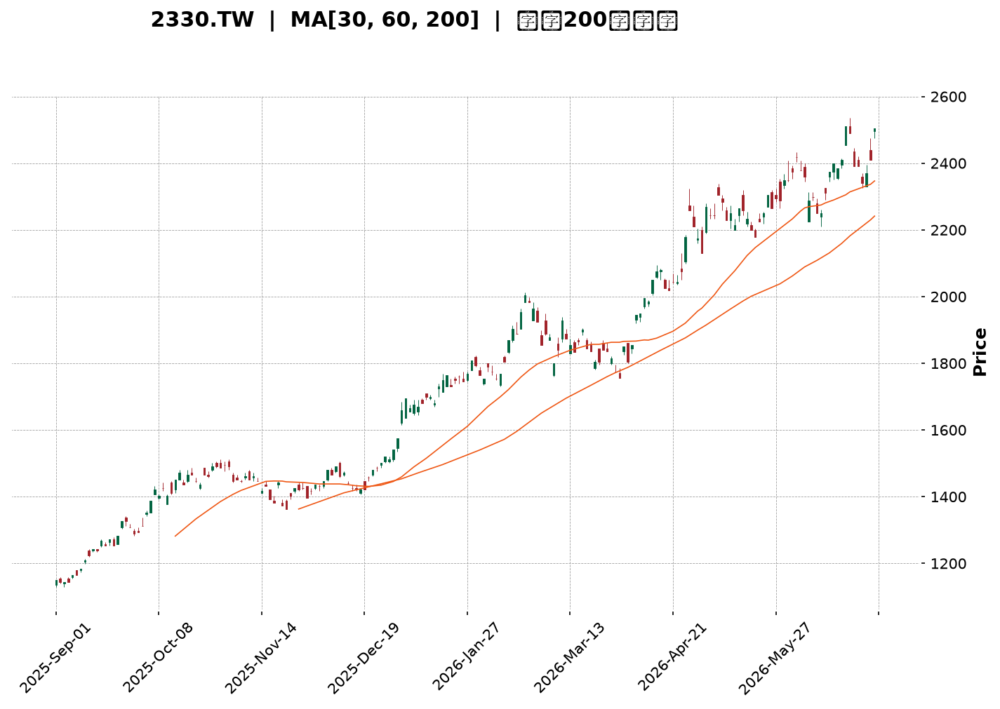
</details>

<html>
<head><meta charset="utf-8" /></head>
<body>
    <div style="height:500px; width:100%;">                        <script>window.PlotlyConfig = {MathJaxConfig: 'local'};</script>
        <script charset="utf-8" src="https://cdn.plot.ly/plotly-3.6.0.min.js" integrity="sha256-QaOVwtVY0T02VaHrr6pnoHLCwayMJp4O5n4YyaE3rJk=" crossorigin="anonymous"></script>                <div id="candlestick-chart" class="plotly-graph-div" style="height:100%; width:100%;"></div>            <script>                window.PLOTLYENV=window.PLOTLYENV || {};                                if (document.getElementById("candlestick-chart")) {                    Plotly.newPlot(                        "candlestick-chart",                        [{"close":{"dtype":"f8","bdata":"AAAAoLP2kUAAAADg9uKRQAAAAOD24pFAAAAA4PbikUAAAACA6TGSQAAAAIDpMZJAAAAAQNyAkkAAAABgi+OSQAAAAGDBHpNAAAAAALRtk0AAAABA91mTQAAAAKDc0JNAAAAAAGqVk0AAAABgreSTQAAAAABqlZNAAAAAIE8MlEAAAADgpr6UQAAAAOCmvpRAAAAAYGNvlEAAAADgHyCUQAAAAODwM5RAAAAAQDSDlEAAAAAguyGVQAAAAEBxrJVAAAAAICc3lkAAAADg4+eVQAAAACD4SpZAAAAA4OPnlUAAAACAhQ+WQAAAAIAMrpZAAAAA4E\u002f9lkAAAADgmXKWQAAAAAB\u002f6ZZAAAAAAH\u002fplkAAAACAO5qWQAAAAOCZcpZAAAAAAH\u002fplkAAAAAgrtWWQAAAAECTTJdAAAAAQJNMl0AAAABgwjiXQAAAACBkYJdAAAAAQJNMl0AAAACAO5qWQAAAAIAMrpZAAAAAgDualkAAAAAgrtWWQAAAAIAMrpZAAAAAIK7VlkAAAACAO5qWQAAAAEBWI5ZAAAAA4MhelkAAAAAgQsCVQAAAAECgmJVAAAAAoGqGlkAAAACg\u002fnCVQAAAAOBcSZVAAAAA4OPnlUAAAAAg+EqWQAAAACAnN5ZAAAAAIPhKlkAAAAAAE9SVQAAAAEBWI5ZAAAAA4JlylkAAAADgyF6WQAAAAIA7mpZAAAAAgPEkl0AAAAAAf+mWQAAAAECTTJdAAAAAoEjVlkAAAABADP2WQAAAAKDBhZZAAAAAIBxKlkAAAABgOjaWQAAAAGA6NpZAAAAAYDo2lkAAAADgZsGWQAAAAMDPJJdAAAAAgLE4l0AAAADgVnSXQAAAAODdw5dAAAAAYBqcl0AAAAAAZROYQAAAAGCRnphAAAAAgI\u002fwmUAAAADgu3uaQAAAAEBxBJpAAAAAwDQsmkAAAAAAUxiaQAAAAIAWQJpAAAAAoJ2PmkAAAACgnY+aQAAAAIAWQJpAAAAAQOgGm0AAAABgb1abQAAAAMAUkptAAAAAQOgGm0AAAABgb1abQAAAAAAzfptAAAAAgI1Cm0AAAACA9qWbQAAAAKAERZxAAAAAYF8JnEAAAADAFJKbQAAAACBRaptAAAAAgH31m0AAAABA2LmbQAAAACBRaptAAAAAgPalm0AAAADgIjGcQAAAAOCZM51AAAAAQMa+nUAAAADgIIOdQAAAAOCXhZ5AAAAAoGlMn0AAAACA4vyeQAAAAIBbrZ5AAAAAYE0OnkAAAACA9PecQAAAAOAgg51AAAAAYF1bnUAAAAAgQR2cQAAAAEBPvJxAAAAAIC8inkAAAACge0edQAAAAID095xAAAAAgG2onEAAAAAAGSSdQAAAAKC5r51AAAAAgE\u002fUnEAAAADAaqycQAAAAIC8NJxAAAAAgLw0nEAAAAAgXcCcQAAAAMBqrJxAAAAAQKFcnEAAAABADr2bQAAAAMBEbZtAAAAA4EHonEAAAACAvDScQAAAAEA0\u002fJxAAAAAAD9jnkAAAABgMXeeQAAAAMC2Kp9AAAAAANICn0AAAACAEAOgQAAAAGDuNKBAAAAAoOc+oEAAAAAAZaKfQAAAAKByjp9AAAAAgC7yn0AAAACALvKfQAAAAGDuNKBAAAAAYF8GoUAAAABg8qWhQAAAAIA2QqFAAAAAIGb8oEAAAACAo6KgQAAAAMDkuaFAAAAA4AaIoUAAAADgBoihQAAAACC1\u002f6FAAAAAYNDXoUAAAABAG2qhQAAAAAAAkqFAAAAAoC9MoUAAAACg66+hQAAAAGDypaFAAAAAgBR0oUAAAAAgRC6hQAAAAGBfBqFAAAAAACJgoUAAAAAAAJKhQAAAACC1\u002f6FAAAAAoOuvoUAAAADAwuuhQAAAAIDJ4aFAAAAAwHdZokAAAADAd1miQAAAAMBVi6JAAAAAYBjlokAAAADgTpWiQAAAACBqbaJAAAAAgMnhoUAAAADgu\u002fWhQAAAAAAAkqFAAAAAAACUoUAAAAAAAAyiQAAAAAAAjqJAAAAAAADAokAAAAAAAKKiQAAAAAAA1KJAAAAAAACco0AAAAAAAHSjQAAAAAAArKJAAAAAAACsokAAAAAAAEiiQAAAAAAAhKJAAAAAAADUokAAAAAAAJKjQA=="},"high":{"dtype":"f8","bdata":"AAAAoLP2kUA1wnLTLB6SQAAAAOD24pFANcJy0ywekkAAAACA6TGSQCuChnMfbZJAAAAAQNyAkkA01ocGSPeSQKWUUvqzbZNAAAAAALRtk0CNgoDms22TQAAAoHyt5JNAiIIruQu9k0AAAABgreSTQFPG7E5++JNAAAAAIE8MlEAAAADgpr6UQB+onHUZ+pRAED74GAWXlECt1Ep1kluUQId+s3Vjb5RAvJV9jkjmlEC8x3v8izWVQAAAAEBxrJVAaTbd2MhelkARl5u8tPuVQKuqqrVqhpZAEZebvLT7lUAclaKHO5qWQAAAAIAMrpZAdbgamfEkl0AN6bx1DK6WQJgin5XxJJdAdYMpcsI4l0A\u002ffvw43cGWQK9NlLxqhpZAdYMpcsI4l0D6IJa1IBGXQF2\u002f+\u002fg0dJdAC5951QWIl0BnZmau1puXQASyAdkFiJdAun73sdabl0CeO3fOT\u002f2WQBLP1xV\u002f6ZZAHz9+XAyulkCnwA7ZT\u002f2WQCWer6vxJJdAp8AO2U\u002f9lkA\u002ffvw43cGWQD7T1vj3SpZAMchedTualkCcdIBLJzeWQHIcx7Hj55VAWSl7fDualkCAHiMSQsCVQLH2DQtCwJVAIy43mYUPlkAAAAAg+EqWQNJsupFqhpZAq6qqtWqGlkAQkysIyV6WQD7T1vj3SpZAAAAA4JlylkBm7XS8mXKWQAAAAIA7mpZAAAAAgPEkl0B1gylywjiXQAAAAECTTJdAAAAAkDiIl0CmyGcF7hCXQGAqaGWjmZZAFRh7qt9xlkCatsav33GWQN48QiUcSpZAVjBLOqOZlkBB\u002flmlSNWWQAAAAMDPJJdAUOZZRZNMl0AAAADgVnSXQAAAAODdw5dAr6G86t3Dl0AAAAAAZROYQAAAAGCRnphAf4vTWvhTmkAAAADgu3uaQGLRsso0LJpAgNjzD9pnmkBVVVUV2meaQGjD58+7e5pAq6qqKmG3mkBVVVVlf6OaQEWCmgraZ5pAq6qqyqsum0AYXXR19qWbQAAAAMAUkptAq6qqGlFqm0CMLrrqMn6bQH55bMUUkptAoPu5H9i5m0CWrGRF2LmbQAAAAKAERZxAbXZxAKqAnEAg0QqbffWbQAAAACBRaptAq6qqCkEdnEAVOoNVXwmcQHmaC3D2pZtAAAAAgPalm0Djd4L1qYCcQAAAAOCZM51A3cuxyonmnUAVCCNFTQ6eQGfSlWpbrZ5ADOSjKi10n0D4M+HPhzifQNUoY5Xi\u002fJ5AfUFfUD3BnkBpDt9v5KqdQLfEqR+2cZ5Aq6qq6iCDnUAAAAAgQR2cQEa15WpdW51ABb64qvJJnkC8uhVAxr6dQBKxRpV7R51ABQmj5ZkznUBM2AbB\u002fUudQAQCgQCsw51AOQ8dw\u002f1LnUAtZCEDGSSdQG3Hh+CuSJxAaDs+hE\u002fUnEAyOB9jCzidQHvTm6ImEJ1AcAiHoJNwnEAIRSjC1wycQHTRRQPz5JtAAAAA4EHonECukdWlJhCdQAAAAEA0\u002fJxAAAAAAD9jnkAAAABgMXeeQAAAAMC2Kp9AXH97YMQWn0AAAACAEAOgQMVO7CDTXKBA\u002f8FE0OBIoEAvMWuhCQ2gQMIWbHEQA6BAE7UrMfUqoEAPxO8A\u002fCCgQJ3YiXKjoqBAaZxBkFgQoUAY0TbTmSeiQPljSfPdw6FAqzNSQT04oUBUXDKENkKhQOAHfiDXzaFAaEUjoeuvoUB1uf0x182hQB988HGFRaJA9C4eIbX\u002foUA6JQHC5LmhQBTfPfHdw6FAyWfdYBR0oUAAAACg66+hQO+F96KgHaJASZIkQfmboUBRFEURImChQA8OSFE9OKFABYQT8f+RoUAEkz8w+ZuhQAAAACC1\u002f6FANvAZs6AdokCgaKvhmSeiQJ4PLPNwY6JAu3\u002fzgFyBokAvf9oCJtGiQIFcE4E6s6JAQ1qx8AMDo0Byp2gBJtGiQE7w5KEzvaJAxlQ4cacTokDvlbpwpxOiQCQrPLLC66FAAAAAAACooUAAAAAAACqiQAAAAAAAjqJAAAAAAADAokAAAAAAAKKiQAAAAAAA3qJAAAAAAACco0AAAAAAAM6jQAAAAAAAGqNAAAAAAADookAAAAAAAISiQAAAAAAAtqJAAAAAAABWo0AAAAAAAJKjQA=="},"hovertemplate":"\u003cb\u003e%{x|%Y-%m-%d}\u003c\u002fb\u003e\u003cbr\u003e\u958b: $%{open:.2f}\u003cbr\u003e\u9ad8: $%{high:.2f}\u003cbr\u003e\u4f4e: $%{low:.2f}\u003cbr\u003e\u6536: $%{close:.2f}\u003cextra\u003e\u003c\u002fextra\u003e","low":{"dtype":"f8","bdata":"v4KhBcGnkUDuaYQ5Os+RQMs9jezAp5FAAAAA4PbikUA4qfsycAqSQAAAAIDpMZJAq6qq8mJZkkCYU\u002fASErySQNdaa7kEC5NAsyzLsjpGk0BzfX+ZOkaTQAAAgC2ZgZNAAAAAAGqVk0DyDfLtaZWTQAAAAABqlZNArRtM0Tqpk0AiPVCRkluUQOFXY0o0g5RAAAAAYGNvlEAbuZEDTwyUQAAAAODwM5RAAAAAQDSDlECHcAhnGfqUQAAAADi7IZVAYi60irT7lUDe0cgmQsCVQDmO42ZWI5ZAqgz2kM+ElUBFD3ujtPuVQM\u002fXFZuFD5ZAFo\u002fKbQyulkAAAADgmXKWQK0bTLFqhpZAAAAAAH\u002fplkDgwIGjaoaWQPQWQ0onN5ZAAAAAAH\u002fplkCtn3hD3cGWQPVghqogEZdAUiCCY8I4l0AAAABgwjiXQPmb\u002fK0gEZdApEAEh\u002fEkl0DgwIGjaoaWQAAAAIAMrpZA4MCBo2qGlkBZP\u002fFmDK6WQAAAAIAMrpZABt9pijualkAAAACAO5qWQGCWlGOFD5ZAAAAA4MhelkAAAAAgQsCVQAAAAECgmJVA9YOOCvhKlkAAAACg\u002fnCVQAAAAOBcSZVA3tHIJkLAlUBWVVWKhQ+WQMtkkUNWI5ZAHcdxQyc3lkAAAAAAE9SVQMEsKYe0+5VA9BZDSic3lkDON6FKViOWQIIDBw74SpZAu++4eDualkAAAAAAf+mWQEeBCM5P\u002fZZAq6qq2mbBlkC0bjC1SNWWQKHVl9rfcZZA6ueElVgilkAiw72aWCKWQGZJORCV+pVAAAAAYDo2lkB\u002fA0xVo5mWQHADhqpI1ZZAXzNM9e0Ql0CTv8mPsTiXQKuqqspWdJdAUV5D1VZ0l0CnAW2aOIiXQIHgMjWD\u002f5dATmu2j589mUD988+fJo2ZQJ0uTbWt3JlAAU8YIOq0mUBVVVUl6rSZQAAAAIAWQJpAVVVVFdpnmkBVVVUV2meaQLp9ZfVSGJpAAAAAoJ2PmkAYXXT6QsuaQGwOJFroBptAAAAAQOgGm0B10UXVqy6bQAkaTuqrLptAAAAAgI1Cm0AUoQiljUKbQDD90v+5zZtAmMGXmn31m0AAAADAFJKbQAoymwrKGptAAAAAMNi5m0D1Yj61FJKbQIPMplpvVptAU5vaVOgGm0AAAADgIjGcQOo7G7WLlJxAi9A4FbgfnUAAAADgIIOdQP3jEivGvp1A5je4iuL8nkAAAACA4vyeQIx4khovIp5AAAAAYE0OnkAAAACA9PecQEbasRo\u002fb51AVVVV1ZkznUARpNz0Mn6bQFwljSrIbJxA3ixPGrgfnUAAAACge0edQKmiZ6WLlJxAAAAAgG2onECzJ\u002fk+NPycQPT5fH7ic51AAAAAgE\u002fUnEAAAADAaqycQOAaWZ0A0ZtAJ3HwvtcMnEAAAAAgXcCcQAAAAMBqrJxAPt7jvdcMnEAAAABADr2bQAAAAMBEbZtA+pJp\u002fYWEnECUOHgfyiCcQNdaa114mJxAndiJHYP\u002fnUAzdYt9dROeQFK4Hn0Is55A7oGN3vrGnkC\u002fShibm1KfQDuxE58JDaBAB3RjfhADoEAAAAAAZaKfQAAAAKByjp9A+B2IHzzen0DxOxC\u002fScqfQIqd2G4QA6BAaTnmW8xmoEAAAABg8qWhQAAAAIA2QqFAKuZWj3reoEAAAACAo6KgQPzAD7xRGqFATF1ufxR0oUBMXW5\u002fFHShQAAAACC1\u002f6FAT0WabvKloUAAAABAG2qhQNzUw009OKFAKfJZD0QuoUAel74dImChQIQeQs8GiKFAJEmSjjZCoUAAAAAgRC6hQAAAAGBfBqFAAAAAACJgoUDojYLeKFahQOGDD87kuaFAAAAAoOuvoUDLh3Ff0NehQDmrx47rr6FAV6DPzpknokARIMOPfk+iQH+j7P5wY6JAvqVOzyzHokAAAADgTpWiQOMlSo9+T6JAYvDTDCJgoUALnIN\u002fyeGhQAAAAAAAkqFAAAAAAABEoUAAAAAAAOShQAAAAAAAUqJAAAAAAABcokAAAAAAAFyiQAAAAAAAoqJAAAAAAAAuo0AAAAAAAHSjQAAAAAAArKJAAAAAAACsokAAAAAAACqiQAAAAAAANKJAAAAAAADUokAAAAAAAFajQA=="},"name":"\u50f9\u683c","open":{"dtype":"f8","bdata":"DyI5rH27kUAjLPcscAqSQO5phDk6z5FAIyz3LHAKkkCc1H3ZLB6SQCuChnMfbZJAVVVVmR9tkkDMKXi5zs+SQHzvvVP3WZNAWZZlWfdZk0CNgoDms22TQAAAIApqlZNARMGV3Dqpk0D5BvmmC72TQA8FV3Kt5JNArRtM0Tqpk0CCytltY2+UQL8aE5lI5pRAAAAAYGNvlEDJjdyYwUeUQC0qkbzBR5RAAAAAQDSDlEBDOIRD6g2VQAAAADi7IZVAYi60irT7lUDvaGQDE9SVQAAAACD4SpZAqgz2kM+ElUBhpB2raoaWQNthUFQnN5ZAFo\u002fKbQyulkCvTZS8aoaWQIp81o07mpZA3WCK3E\u002f9lkAAAACAO5qWQKNk1yb4SpZAdYMpcsI4l0BTYIf8fumWQKRABIfxJJdAXb\u002f7+DR0l0DXo3D1NHSXQAAAACBkYJdAC5951QWIl0B+\u002fPjxfumWQAZFnVzdwZZAAAAAgDualkCtn3hD3cGWQB9ZEs8gEZdArZ94Q93BlkAAAACAO5qWQGCWlGOFD5ZAZu10vJlylkCcdIBLJzeWQBzHcRxxrJVAp9aEw5lylkBAjxFZoJiVQOmiiy5xrJVAIy43mYUPlkA5juNmViOWQJ7RS7WZcpZAAAAAIPhKlkAQkysIyV6WQAAAAEBWI5ZAo2TXJvhKlkAAAADgyF6WQKFCherIXpZAfM0wVQyulkCYIp+V8SSXQPVghqogEZdAq6qqylZ0l0BaN5h6KumWQAAAAKDBhZZAAAAAIBxKlkDePEIlHEqWQESGe9V2DpZAVjBLOqOZlkAAAADgZsGWQJSC5G8q6ZZAAAAAgLE4l0AxlZgadWCXQAAAAJA4iJdAKK+hmjiIl0D9JctfGpyXQGEo5r9GJ5hAm+0TVYFRmUD988+fJo2ZQJ0uTbWt3JlAK5dp5cvImUAAAACwrdyZQEWCmgraZ5pAq6qqKmG3mkCrqqrau3uaQN2+sro0LJpAq6qqegbzmkAYXXT6QsuaQGwOJFroBptAVVVVBcoam0BGF10lUWqbQAAAAAAzfptA4FOTClFqm0CqTW1qb1abQDD90v+5zZtABjgJO8hsnECtsDkQus2bQIhl9M+rLptAq6qqCkEdnEAAAABA2LmbQAAAACBRaptA6Uc\u002fGsoam0Dr2SEwyGycQG3Ud3ptqJxAeraR2pkznUAAAADgIIOdQP3jEivGvp1A5je4iuL8nkBTEUtFxBCfQIx4khovIp5A02ufxXmZnkCbCeofP2+dQM8tcQovIp5AVVVV1ZkznUCPD0G6FJKbQKPaclXWC51A4+oHpXtHnUBe3QrwIIOdQKmiZ6WLlJxABJpCILgfnUAmbINgCzidQPz9fj\u002fHm51AWjeYYgs4nUDJQhZCNPycQE3i4P3y5JtAaDs+hE\u002fUnEAh0BSiJhCdQGQhC4FP1JxAruZqHsognEAAAABADr2bQLroouEbqZtAY4tyvmqsnECukdWlJhCdQPC9935P1JxAXuiF3mcnnkBHlQSfTE+eQJqZmd36xp5ApYCEn9\u002funkCq0KP7jWafQOzETs8CF6BAAT67b+40oED8qC5xEAOgQOtceQBlop9AAAAAgC7yn0D4HYgfPN6fQGIndsDgSKBA0tUnjMVwoEB84b3w3cOhQIdVhKENfqFADqLH72zyoEDKEKwjRC6hQOzETuxKJKFAAAAA4AaIoUAAAADgBoihQM2hYhGTMaJAehePwMLroUDr24Bh8qWhQPCzAT8baqFAKfJZD0QuoUCPS9\u002feBoihQHOkORK1\u002f6FASZIk7yhWoUAxDMOwL0yhQKZxBiFELqFAzzRuYBR0oUD42YCfDX6hQOGDD87kuaFAGsPRgqcTokA2eI4gtf+hQOggr5J+T6JANGBJL4w7okAAAADAd1miQECuiSBIn6JAAAAAYBjlokAAAADgTpWiQDu0a0FBqaJAYvDTDCJgoUAAAADgu\u002fWhQBhyfSHXzaFAAAAAAACAoUAAAAAAACqiQAAAAAAAcKJAAAAAAACOokAAAAAAAGaiQAAAAAAAtqJAAAAAAAAuo0AAAAAAAJyjQAAAAAAABqNAAAAAAADUokAAAAAAAHCiQAAAAAAANKJAAAAAAAAQo0AAAAAAAH6jQA=="},"x":["2025-09-01T00:00:00+08:00","2025-09-02T00:00:00+08:00","2025-09-03T00:00:00+08:00","2025-09-04T00:00:00+08:00","2025-09-05T00:00:00+08:00","2025-09-08T00:00:00+08:00","2025-09-09T00:00:00+08:00","2025-09-10T00:00:00+08:00","2025-09-11T00:00:00+08:00","2025-09-12T00:00:00+08:00","2025-09-15T00:00:00+08:00","2025-09-16T00:00:00+08:00","2025-09-17T00:00:00+08:00","2025-09-18T00:00:00+08:00","2025-09-19T00:00:00+08:00","2025-09-22T00:00:00+08:00","2025-09-23T00:00:00+08:00","2025-09-24T00:00:00+08:00","2025-09-25T00:00:00+08:00","2025-09-26T00:00:00+08:00","2025-09-30T00:00:00+08:00","2025-10-01T00:00:00+08:00","2025-10-02T00:00:00+08:00","2025-10-03T00:00:00+08:00","2025-10-07T00:00:00+08:00","2025-10-08T00:00:00+08:00","2025-10-09T00:00:00+08:00","2025-10-13T00:00:00+08:00","2025-10-14T00:00:00+08:00","2025-10-15T00:00:00+08:00","2025-10-16T00:00:00+08:00","2025-10-17T00:00:00+08:00","2025-10-20T00:00:00+08:00","2025-10-21T00:00:00+08:00","2025-10-22T00:00:00+08:00","2025-10-23T00:00:00+08:00","2025-10-27T00:00:00+08:00","2025-10-28T00:00:00+08:00","2025-10-29T00:00:00+08:00","2025-10-30T00:00:00+08:00","2025-10-31T00:00:00+08:00","2025-11-03T00:00:00+08:00","2025-11-04T00:00:00+08:00","2025-11-05T00:00:00+08:00","2025-11-06T00:00:00+08:00","2025-11-07T00:00:00+08:00","2025-11-10T00:00:00+08:00","2025-11-11T00:00:00+08:00","2025-11-12T00:00:00+08:00","2025-11-13T00:00:00+08:00","2025-11-14T00:00:00+08:00","2025-11-17T00:00:00+08:00","2025-11-18T00:00:00+08:00","2025-11-19T00:00:00+08:00","2025-11-20T00:00:00+08:00","2025-11-21T00:00:00+08:00","2025-11-24T00:00:00+08:00","2025-11-25T00:00:00+08:00","2025-11-26T00:00:00+08:00","2025-11-27T00:00:00+08:00","2025-11-28T00:00:00+08:00","2025-12-01T00:00:00+08:00","2025-12-02T00:00:00+08:00","2025-12-03T00:00:00+08:00","2025-12-04T00:00:00+08:00","2025-12-05T00:00:00+08:00","2025-12-08T00:00:00+08:00","2025-12-09T00:00:00+08:00","2025-12-10T00:00:00+08:00","2025-12-11T00:00:00+08:00","2025-12-12T00:00:00+08:00","2025-12-15T00:00:00+08:00","2025-12-16T00:00:00+08:00","2025-12-17T00:00:00+08:00","2025-12-18T00:00:00+08:00","2025-12-19T00:00:00+08:00","2025-12-22T00:00:00+08:00","2025-12-23T00:00:00+08:00","2025-12-24T00:00:00+08:00","2025-12-26T00:00:00+08:00","2025-12-29T00:00:00+08:00","2025-12-30T00:00:00+08:00","2025-12-31T00:00:00+08:00","2026-01-02T00:00:00+08:00","2026-01-05T00:00:00+08:00","2026-01-06T00:00:00+08:00","2026-01-07T00:00:00+08:00","2026-01-08T00:00:00+08:00","2026-01-09T00:00:00+08:00","2026-01-12T00:00:00+08:00","2026-01-13T00:00:00+08:00","2026-01-14T00:00:00+08:00","2026-01-15T00:00:00+08:00","2026-01-16T00:00:00+08:00","2026-01-19T00:00:00+08:00","2026-01-20T00:00:00+08:00","2026-01-21T00:00:00+08:00","2026-01-22T00:00:00+08:00","2026-01-23T00:00:00+08:00","2026-01-26T00:00:00+08:00","2026-01-27T00:00:00+08:00","2026-01-28T00:00:00+08:00","2026-01-29T00:00:00+08:00","2026-01-30T00:00:00+08:00","2026-02-02T00:00:00+08:00","2026-02-03T00:00:00+08:00","2026-02-04T00:00:00+08:00","2026-02-05T00:00:00+08:00","2026-02-06T00:00:00+08:00","2026-02-09T00:00:00+08:00","2026-02-10T00:00:00+08:00","2026-02-11T00:00:00+08:00","2026-02-23T00:00:00+08:00","2026-02-24T00:00:00+08:00","2026-02-25T00:00:00+08:00","2026-02-26T00:00:00+08:00","2026-03-02T00:00:00+08:00","2026-03-03T00:00:00+08:00","2026-03-04T00:00:00+08:00","2026-03-05T00:00:00+08:00","2026-03-06T00:00:00+08:00","2026-03-09T00:00:00+08:00","2026-03-10T00:00:00+08:00","2026-03-11T00:00:00+08:00","2026-03-12T00:00:00+08:00","2026-03-13T00:00:00+08:00","2026-03-16T00:00:00+08:00","2026-03-17T00:00:00+08:00","2026-03-18T00:00:00+08:00","2026-03-19T00:00:00+08:00","2026-03-20T00:00:00+08:00","2026-03-23T00:00:00+08:00","2026-03-24T00:00:00+08:00","2026-03-25T00:00:00+08:00","2026-03-26T00:00:00+08:00","2026-03-27T00:00:00+08:00","2026-03-30T00:00:00+08:00","2026-03-31T00:00:00+08:00","2026-04-01T00:00:00+08:00","2026-04-02T00:00:00+08:00","2026-04-07T00:00:00+08:00","2026-04-08T00:00:00+08:00","2026-04-09T00:00:00+08:00","2026-04-10T00:00:00+08:00","2026-04-13T00:00:00+08:00","2026-04-14T00:00:00+08:00","2026-04-15T00:00:00+08:00","2026-04-16T00:00:00+08:00","2026-04-17T00:00:00+08:00","2026-04-20T00:00:00+08:00","2026-04-21T00:00:00+08:00","2026-04-22T00:00:00+08:00","2026-04-23T00:00:00+08:00","2026-04-24T00:00:00+08:00","2026-04-27T00:00:00+08:00","2026-04-28T00:00:00+08:00","2026-04-29T00:00:00+08:00","2026-04-30T00:00:00+08:00","2026-05-04T00:00:00+08:00","2026-05-05T00:00:00+08:00","2026-05-06T00:00:00+08:00","2026-05-07T00:00:00+08:00","2026-05-08T00:00:00+08:00","2026-05-11T00:00:00+08:00","2026-05-12T00:00:00+08:00","2026-05-13T00:00:00+08:00","2026-05-14T00:00:00+08:00","2026-05-15T00:00:00+08:00","2026-05-18T00:00:00+08:00","2026-05-19T00:00:00+08:00","2026-05-20T00:00:00+08:00","2026-05-21T00:00:00+08:00","2026-05-22T00:00:00+08:00","2026-05-25T00:00:00+08:00","2026-05-26T00:00:00+08:00","2026-05-27T00:00:00+08:00","2026-05-28T00:00:00+08:00","2026-05-29T00:00:00+08:00","2026-06-01T00:00:00+08:00","2026-06-02T00:00:00+08:00","2026-06-03T00:00:00+08:00","2026-06-04T00:00:00+08:00","2026-06-05T00:00:00+08:00","2026-06-08T00:00:00+08:00","2026-06-09T00:00:00+08:00","2026-06-10T00:00:00+08:00","2026-06-11T00:00:00+08:00","2026-06-12T00:00:00+08:00","2026-06-15T00:00:00+08:00","2026-06-16T00:00:00+08:00","2026-06-17T00:00:00+08:00","2026-06-18T00:00:00+08:00","2026-06-22T00:00:00+08:00","2026-06-23T00:00:00+08:00","2026-06-24T00:00:00+08:00","2026-06-25T00:00:00+08:00","2026-06-26T00:00:00+08:00","2026-06-29T00:00:00+08:00","2026-06-30T00:00:00+08:00","2026-07-01T00:00:00+08:00"],"type":"candlestick"},{"hovertemplate":"MA30: $%{y:.2f}\u003cextra\u003e\u003c\u002fextra\u003e","line":{"color":"#2196F3","dash":"dash","width":2},"mode":"lines","name":"MA30","x":["2025-09-01T00:00:00+08:00","2025-09-02T00:00:00+08:00","2025-09-03T00:00:00+08:00","2025-09-04T00:00:00+08:00","2025-09-05T00:00:00+08:00","2025-09-08T00:00:00+08:00","2025-09-09T00:00:00+08:00","2025-09-10T00:00:00+08:00","2025-09-11T00:00:00+08:00","2025-09-12T00:00:00+08:00","2025-09-15T00:00:00+08:00","2025-09-16T00:00:00+08:00","2025-09-17T00:00:00+08:00","2025-09-18T00:00:00+08:00","2025-09-19T00:00:00+08:00","2025-09-22T00:00:00+08:00","2025-09-23T00:00:00+08:00","2025-09-24T00:00:00+08:00","2025-09-25T00:00:00+08:00","2025-09-26T00:00:00+08:00","2025-09-30T00:00:00+08:00","2025-10-01T00:00:00+08:00","2025-10-02T00:00:00+08:00","2025-10-03T00:00:00+08:00","2025-10-07T00:00:00+08:00","2025-10-08T00:00:00+08:00","2025-10-09T00:00:00+08:00","2025-10-13T00:00:00+08:00","2025-10-14T00:00:00+08:00","2025-10-15T00:00:00+08:00","2025-10-16T00:00:00+08:00","2025-10-17T00:00:00+08:00","2025-10-20T00:00:00+08:00","2025-10-21T00:00:00+08:00","2025-10-22T00:00:00+08:00","2025-10-23T00:00:00+08:00","2025-10-27T00:00:00+08:00","2025-10-28T00:00:00+08:00","2025-10-29T00:00:00+08:00","2025-10-30T00:00:00+08:00","2025-10-31T00:00:00+08:00","2025-11-03T00:00:00+08:00","2025-11-04T00:00:00+08:00","2025-11-05T00:00:00+08:00","2025-11-06T00:00:00+08:00","2025-11-07T00:00:00+08:00","2025-11-10T00:00:00+08:00","2025-11-11T00:00:00+08:00","2025-11-12T00:00:00+08:00","2025-11-13T00:00:00+08:00","2025-11-14T00:00:00+08:00","2025-11-17T00:00:00+08:00","2025-11-18T00:00:00+08:00","2025-11-19T00:00:00+08:00","2025-11-20T00:00:00+08:00","2025-11-21T00:00:00+08:00","2025-11-24T00:00:00+08:00","2025-11-25T00:00:00+08:00","2025-11-26T00:00:00+08:00","2025-11-27T00:00:00+08:00","2025-11-28T00:00:00+08:00","2025-12-01T00:00:00+08:00","2025-12-02T00:00:00+08:00","2025-12-03T00:00:00+08:00","2025-12-04T00:00:00+08:00","2025-12-05T00:00:00+08:00","2025-12-08T00:00:00+08:00","2025-12-09T00:00:00+08:00","2025-12-10T00:00:00+08:00","2025-12-11T00:00:00+08:00","2025-12-12T00:00:00+08:00","2025-12-15T00:00:00+08:00","2025-12-16T00:00:00+08:00","2025-12-17T00:00:00+08:00","2025-12-18T00:00:00+08:00","2025-12-19T00:00:00+08:00","2025-12-22T00:00:00+08:00","2025-12-23T00:00:00+08:00","2025-12-24T00:00:00+08:00","2025-12-26T00:00:00+08:00","2025-12-29T00:00:00+08:00","2025-12-30T00:00:00+08:00","2025-12-31T00:00:00+08:00","2026-01-02T00:00:00+08:00","2026-01-05T00:00:00+08:00","2026-01-06T00:00:00+08:00","2026-01-07T00:00:00+08:00","2026-01-08T00:00:00+08:00","2026-01-09T00:00:00+08:00","2026-01-12T00:00:00+08:00","2026-01-13T00:00:00+08:00","2026-01-14T00:00:00+08:00","2026-01-15T00:00:00+08:00","2026-01-16T00:00:00+08:00","2026-01-19T00:00:00+08:00","2026-01-20T00:00:00+08:00","2026-01-21T00:00:00+08:00","2026-01-22T00:00:00+08:00","2026-01-23T00:00:00+08:00","2026-01-26T00:00:00+08:00","2026-01-27T00:00:00+08:00","2026-01-28T00:00:00+08:00","2026-01-29T00:00:00+08:00","2026-01-30T00:00:00+08:00","2026-02-02T00:00:00+08:00","2026-02-03T00:00:00+08:00","2026-02-04T00:00:00+08:00","2026-02-05T00:00:00+08:00","2026-02-06T00:00:00+08:00","2026-02-09T00:00:00+08:00","2026-02-10T00:00:00+08:00","2026-02-11T00:00:00+08:00","2026-02-23T00:00:00+08:00","2026-02-24T00:00:00+08:00","2026-02-25T00:00:00+08:00","2026-02-26T00:00:00+08:00","2026-03-02T00:00:00+08:00","2026-03-03T00:00:00+08:00","2026-03-04T00:00:00+08:00","2026-03-05T00:00:00+08:00","2026-03-06T00:00:00+08:00","2026-03-09T00:00:00+08:00","2026-03-10T00:00:00+08:00","2026-03-11T00:00:00+08:00","2026-03-12T00:00:00+08:00","2026-03-13T00:00:00+08:00","2026-03-16T00:00:00+08:00","2026-03-17T00:00:00+08:00","2026-03-18T00:00:00+08:00","2026-03-19T00:00:00+08:00","2026-03-20T00:00:00+08:00","2026-03-23T00:00:00+08:00","2026-03-24T00:00:00+08:00","2026-03-25T00:00:00+08:00","2026-03-26T00:00:00+08:00","2026-03-27T00:00:00+08:00","2026-03-30T00:00:00+08:00","2026-03-31T00:00:00+08:00","2026-04-01T00:00:00+08:00","2026-04-02T00:00:00+08:00","2026-04-07T00:00:00+08:00","2026-04-08T00:00:00+08:00","2026-04-09T00:00:00+08:00","2026-04-10T00:00:00+08:00","2026-04-13T00:00:00+08:00","2026-04-14T00:00:00+08:00","2026-04-15T00:00:00+08:00","2026-04-16T00:00:00+08:00","2026-04-17T00:00:00+08:00","2026-04-20T00:00:00+08:00","2026-04-21T00:00:00+08:00","2026-04-22T00:00:00+08:00","2026-04-23T00:00:00+08:00","2026-04-24T00:00:00+08:00","2026-04-27T00:00:00+08:00","2026-04-28T00:00:00+08:00","2026-04-29T00:00:00+08:00","2026-04-30T00:00:00+08:00","2026-05-04T00:00:00+08:00","2026-05-05T00:00:00+08:00","2026-05-06T00:00:00+08:00","2026-05-07T00:00:00+08:00","2026-05-08T00:00:00+08:00","2026-05-11T00:00:00+08:00","2026-05-12T00:00:00+08:00","2026-05-13T00:00:00+08:00","2026-05-14T00:00:00+08:00","2026-05-15T00:00:00+08:00","2026-05-18T00:00:00+08:00","2026-05-19T00:00:00+08:00","2026-05-20T00:00:00+08:00","2026-05-21T00:00:00+08:00","2026-05-22T00:00:00+08:00","2026-05-25T00:00:00+08:00","2026-05-26T00:00:00+08:00","2026-05-27T00:00:00+08:00","2026-05-28T00:00:00+08:00","2026-05-29T00:00:00+08:00","2026-06-01T00:00:00+08:00","2026-06-02T00:00:00+08:00","2026-06-03T00:00:00+08:00","2026-06-04T00:00:00+08:00","2026-06-05T00:00:00+08:00","2026-06-08T00:00:00+08:00","2026-06-09T00:00:00+08:00","2026-06-10T00:00:00+08:00","2026-06-11T00:00:00+08:00","2026-06-12T00:00:00+08:00","2026-06-15T00:00:00+08:00","2026-06-16T00:00:00+08:00","2026-06-17T00:00:00+08:00","2026-06-18T00:00:00+08:00","2026-06-22T00:00:00+08:00","2026-06-23T00:00:00+08:00","2026-06-24T00:00:00+08:00","2026-06-25T00:00:00+08:00","2026-06-26T00:00:00+08:00","2026-06-29T00:00:00+08:00","2026-06-30T00:00:00+08:00","2026-07-01T00:00:00+08:00"],"y":{"dtype":"f8","bdata":"AAAAAAAA+H8AAAAAAAD4fwAAAAAAAPh\u002fAAAAAAAA+H8AAAAAAAD4fwAAAAAAAPh\u002fAAAAAAAA+H8AAAAAAAD4fwAAAAAAAPh\u002fAAAAAAAA+H8AAAAAAAD4fwAAAAAAAPh\u002fAAAAAAAA+H8AAAAAAAD4fwAAAAAAAPh\u002fAAAAAAAA+H8AAAAAAAD4fwAAAAAAAPh\u002fAAAAAAAA+H8AAAAAAAD4fwAAAAAAAPh\u002fAAAAAAAA+H8AAAAAAAD4fwAAAAAAAPh\u002fAAAAAAAA+H8AAAAAAAD4fwAAAAAAAPh\u002fAAAAAAAA+H8AAAAAAAD4f+\u002fu7t5ZB5RAIiIi8jwylEB3d3fHKFmUQO\u002fu7i4LhJRAZmZmlu2ulEC8u7vridSUQBERERHU+JRAd3d3F3MelUCrqqrqHkCVQLy7uwvIY5VAzczMfM+ElUAiIiJC1qWVQERERKQ4xJVAd3d3N+3jlUDe3d2NC\u002fuVQO\u002fu7l53FZZAREREhEMrlkB3d3cXGT2WQKuqqnqcTZZAAAAAcBZilkDe3d19OXeWQO\u002fu7t68h5ZAiYiIKJeXlkDNzMzs35yWQDMzM9M2nJZAVVVVNduelkAiIiKi5JqWQERERGROkpZAREREZE6SlkDe3d2tSZSWQJqZmRlTkJZA3t3dPWGKlkCrqqp6GIWWQFVVVYV9fpZAMzMz84Z6lkCamZmpi3iWQJqZmdndeZZAIiIiItl7lkCrqqo6gnyWQKuqqjqCfJZAZmZmRoh4lkDNzMy8inaWQN7d3Q1Bb5ZAvLu7e6NmlkDNzMwcTmOWQERERKRPX5ZAVVVVRfpblkCrqqo6TVuWQLy7u6tCX5ZAVVVVlY9ilkAzMzPD1GmWQGZmZia3d5ZA7+7u7kqClkDe3d1tIZaWQLy7u7vtr5ZAiYiIGBHNlkB3d3dnF\u002fiWQDMzM\u002fN1IJdAvLu7C99El0AiIiICUWWXQDMzM2O\u002fh5dA3t3dTSusl0CrqqrKjdSXQERERESl95dAIiIi8rgemEDNzMxcHEmYQImIiHiBc5hAvLu7S6OUmECrqqoKZ7qYQCIiIqIw3phAIiIiMvcDmUDNzMy8uiuZQBEREYHFXJlAd3d3R9CNmUAiIiLCiruZQKuqqurx55lAAAAAsPwYmkDe3d3dZkOaQM3MzBzaZ5pA3t3draCNmkARERHhDbaaQDMzMwNy5JpAMzMzE80Ym0BEREQ0MUebQJqZmUmPeZtAIiIiwkmnm0Crqqr6uc2bQFVVVYV99ZtAmpmZeaAWnEC8u7vbJS+cQJqZmYn7SpxAMzMzQ9dinEAiIiJyGHCcQJqZmYlNhZxAZmZm5s+fnEAAAABgYbCcQLy7uztPvJxAMzMzEzrKnECJiIiYndmcQImIiEhV7JxA3t3dnbn5nECamZk5eQKdQJqZmUnuAZ1AMzMzU2ADnUDe3d3Ncw2dQERERGQwGJ1AREREhKAbnUCrqqrquxudQKuqqhrVG51AmpmZWZMmnUAiIiISsiadQJqZmVnZJJ1Ad3d311QqnUBmZmaGdzKdQN7d3Y34N51AERERkYQ1nUC8u7v7Wz6dQHd3dxctTZ1AAAAAsPVhnUC8u7srtXidQERERNQmip1A3t3d3T6gnUAiIiJy8cCdQHd3dwdU4J1Ad3d3N78BnkDe3d0NGDWeQHd3d2dxZJ5AVVVV5cmRnkCamZkpB7WeQEREROQ65p5AZmZm5msbn0BVVVVV8VGfQHd3d5dulJ9AAAAAAEPUn0AiIiLKDwSgQERERJynH6BAREREHEA6oEDv7u6G1FqgQKuqqkJofKBAIiIicgGWoEB3d3fXRLCgQAAAAMDgxaBAMzMzs37YoEC8u7sTceygQDMzM6sNAaFAd3d3n6sToUDNzMzU9SOhQO\u002fu7mZBMqFAvLu7IzVEoUBEREQM0VmhQImIiJhrcaFAERERkVqKoUAAAACwoKChQO\u002fu7r6Ts6FAVVVVFeS6oUDv7u7ujL2hQImIiMg1wKFAIiIickPFoUAAAAAQT9GhQJqZmQlh2KFAVVVVNcfioUARERFhLeyhQBEREfFA86FAiYiImFMCokBmZmYWuROiQM3MzHwfHaJAIiIiotkookARERFh6y2iQLy7uztSNaJAiYiISA1BokCamZlpcVWiQA=="},"type":"scatter"},{"hovertemplate":"MA60: $%{y:.2f}\u003cextra\u003e\u003c\u002fextra\u003e","line":{"color":"#9C27B0","dash":"dash","width":2},"mode":"lines","name":"MA60","x":["2025-09-01T00:00:00+08:00","2025-09-02T00:00:00+08:00","2025-09-03T00:00:00+08:00","2025-09-04T00:00:00+08:00","2025-09-05T00:00:00+08:00","2025-09-08T00:00:00+08:00","2025-09-09T00:00:00+08:00","2025-09-10T00:00:00+08:00","2025-09-11T00:00:00+08:00","2025-09-12T00:00:00+08:00","2025-09-15T00:00:00+08:00","2025-09-16T00:00:00+08:00","2025-09-17T00:00:00+08:00","2025-09-18T00:00:00+08:00","2025-09-19T00:00:00+08:00","2025-09-22T00:00:00+08:00","2025-09-23T00:00:00+08:00","2025-09-24T00:00:00+08:00","2025-09-25T00:00:00+08:00","2025-09-26T00:00:00+08:00","2025-09-30T00:00:00+08:00","2025-10-01T00:00:00+08:00","2025-10-02T00:00:00+08:00","2025-10-03T00:00:00+08:00","2025-10-07T00:00:00+08:00","2025-10-08T00:00:00+08:00","2025-10-09T00:00:00+08:00","2025-10-13T00:00:00+08:00","2025-10-14T00:00:00+08:00","2025-10-15T00:00:00+08:00","2025-10-16T00:00:00+08:00","2025-10-17T00:00:00+08:00","2025-10-20T00:00:00+08:00","2025-10-21T00:00:00+08:00","2025-10-22T00:00:00+08:00","2025-10-23T00:00:00+08:00","2025-10-27T00:00:00+08:00","2025-10-28T00:00:00+08:00","2025-10-29T00:00:00+08:00","2025-10-30T00:00:00+08:00","2025-10-31T00:00:00+08:00","2025-11-03T00:00:00+08:00","2025-11-04T00:00:00+08:00","2025-11-05T00:00:00+08:00","2025-11-06T00:00:00+08:00","2025-11-07T00:00:00+08:00","2025-11-10T00:00:00+08:00","2025-11-11T00:00:00+08:00","2025-11-12T00:00:00+08:00","2025-11-13T00:00:00+08:00","2025-11-14T00:00:00+08:00","2025-11-17T00:00:00+08:00","2025-11-18T00:00:00+08:00","2025-11-19T00:00:00+08:00","2025-11-20T00:00:00+08:00","2025-11-21T00:00:00+08:00","2025-11-24T00:00:00+08:00","2025-11-25T00:00:00+08:00","2025-11-26T00:00:00+08:00","2025-11-27T00:00:00+08:00","2025-11-28T00:00:00+08:00","2025-12-01T00:00:00+08:00","2025-12-02T00:00:00+08:00","2025-12-03T00:00:00+08:00","2025-12-04T00:00:00+08:00","2025-12-05T00:00:00+08:00","2025-12-08T00:00:00+08:00","2025-12-09T00:00:00+08:00","2025-12-10T00:00:00+08:00","2025-12-11T00:00:00+08:00","2025-12-12T00:00:00+08:00","2025-12-15T00:00:00+08:00","2025-12-16T00:00:00+08:00","2025-12-17T00:00:00+08:00","2025-12-18T00:00:00+08:00","2025-12-19T00:00:00+08:00","2025-12-22T00:00:00+08:00","2025-12-23T00:00:00+08:00","2025-12-24T00:00:00+08:00","2025-12-26T00:00:00+08:00","2025-12-29T00:00:00+08:00","2025-12-30T00:00:00+08:00","2025-12-31T00:00:00+08:00","2026-01-02T00:00:00+08:00","2026-01-05T00:00:00+08:00","2026-01-06T00:00:00+08:00","2026-01-07T00:00:00+08:00","2026-01-08T00:00:00+08:00","2026-01-09T00:00:00+08:00","2026-01-12T00:00:00+08:00","2026-01-13T00:00:00+08:00","2026-01-14T00:00:00+08:00","2026-01-15T00:00:00+08:00","2026-01-16T00:00:00+08:00","2026-01-19T00:00:00+08:00","2026-01-20T00:00:00+08:00","2026-01-21T00:00:00+08:00","2026-01-22T00:00:00+08:00","2026-01-23T00:00:00+08:00","2026-01-26T00:00:00+08:00","2026-01-27T00:00:00+08:00","2026-01-28T00:00:00+08:00","2026-01-29T00:00:00+08:00","2026-01-30T00:00:00+08:00","2026-02-02T00:00:00+08:00","2026-02-03T00:00:00+08:00","2026-02-04T00:00:00+08:00","2026-02-05T00:00:00+08:00","2026-02-06T00:00:00+08:00","2026-02-09T00:00:00+08:00","2026-02-10T00:00:00+08:00","2026-02-11T00:00:00+08:00","2026-02-23T00:00:00+08:00","2026-02-24T00:00:00+08:00","2026-02-25T00:00:00+08:00","2026-02-26T00:00:00+08:00","2026-03-02T00:00:00+08:00","2026-03-03T00:00:00+08:00","2026-03-04T00:00:00+08:00","2026-03-05T00:00:00+08:00","2026-03-06T00:00:00+08:00","2026-03-09T00:00:00+08:00","2026-03-10T00:00:00+08:00","2026-03-11T00:00:00+08:00","2026-03-12T00:00:00+08:00","2026-03-13T00:00:00+08:00","2026-03-16T00:00:00+08:00","2026-03-17T00:00:00+08:00","2026-03-18T00:00:00+08:00","2026-03-19T00:00:00+08:00","2026-03-20T00:00:00+08:00","2026-03-23T00:00:00+08:00","2026-03-24T00:00:00+08:00","2026-03-25T00:00:00+08:00","2026-03-26T00:00:00+08:00","2026-03-27T00:00:00+08:00","2026-03-30T00:00:00+08:00","2026-03-31T00:00:00+08:00","2026-04-01T00:00:00+08:00","2026-04-02T00:00:00+08:00","2026-04-07T00:00:00+08:00","2026-04-08T00:00:00+08:00","2026-04-09T00:00:00+08:00","2026-04-10T00:00:00+08:00","2026-04-13T00:00:00+08:00","2026-04-14T00:00:00+08:00","2026-04-15T00:00:00+08:00","2026-04-16T00:00:00+08:00","2026-04-17T00:00:00+08:00","2026-04-20T00:00:00+08:00","2026-04-21T00:00:00+08:00","2026-04-22T00:00:00+08:00","2026-04-23T00:00:00+08:00","2026-04-24T00:00:00+08:00","2026-04-27T00:00:00+08:00","2026-04-28T00:00:00+08:00","2026-04-29T00:00:00+08:00","2026-04-30T00:00:00+08:00","2026-05-04T00:00:00+08:00","2026-05-05T00:00:00+08:00","2026-05-06T00:00:00+08:00","2026-05-07T00:00:00+08:00","2026-05-08T00:00:00+08:00","2026-05-11T00:00:00+08:00","2026-05-12T00:00:00+08:00","2026-05-13T00:00:00+08:00","2026-05-14T00:00:00+08:00","2026-05-15T00:00:00+08:00","2026-05-18T00:00:00+08:00","2026-05-19T00:00:00+08:00","2026-05-20T00:00:00+08:00","2026-05-21T00:00:00+08:00","2026-05-22T00:00:00+08:00","2026-05-25T00:00:00+08:00","2026-05-26T00:00:00+08:00","2026-05-27T00:00:00+08:00","2026-05-28T00:00:00+08:00","2026-05-29T00:00:00+08:00","2026-06-01T00:00:00+08:00","2026-06-02T00:00:00+08:00","2026-06-03T00:00:00+08:00","2026-06-04T00:00:00+08:00","2026-06-05T00:00:00+08:00","2026-06-08T00:00:00+08:00","2026-06-09T00:00:00+08:00","2026-06-10T00:00:00+08:00","2026-06-11T00:00:00+08:00","2026-06-12T00:00:00+08:00","2026-06-15T00:00:00+08:00","2026-06-16T00:00:00+08:00","2026-06-17T00:00:00+08:00","2026-06-18T00:00:00+08:00","2026-06-22T00:00:00+08:00","2026-06-23T00:00:00+08:00","2026-06-24T00:00:00+08:00","2026-06-25T00:00:00+08:00","2026-06-26T00:00:00+08:00","2026-06-29T00:00:00+08:00","2026-06-30T00:00:00+08:00","2026-07-01T00:00:00+08:00"],"y":{"dtype":"f8","bdata":"AAAAAAAA+H8AAAAAAAD4fwAAAAAAAPh\u002fAAAAAAAA+H8AAAAAAAD4fwAAAAAAAPh\u002fAAAAAAAA+H8AAAAAAAD4fwAAAAAAAPh\u002fAAAAAAAA+H8AAAAAAAD4fwAAAAAAAPh\u002fAAAAAAAA+H8AAAAAAAD4fwAAAAAAAPh\u002fAAAAAAAA+H8AAAAAAAD4fwAAAAAAAPh\u002fAAAAAAAA+H8AAAAAAAD4fwAAAAAAAPh\u002fAAAAAAAA+H8AAAAAAAD4fwAAAAAAAPh\u002fAAAAAAAA+H8AAAAAAAD4fwAAAAAAAPh\u002fAAAAAAAA+H8AAAAAAAD4fwAAAAAAAPh\u002fAAAAAAAA+H8AAAAAAAD4fwAAAAAAAPh\u002fAAAAAAAA+H8AAAAAAAD4fwAAAAAAAPh\u002fAAAAAAAA+H8AAAAAAAD4fwAAAAAAAPh\u002fAAAAAAAA+H8AAAAAAAD4fwAAAAAAAPh\u002fAAAAAAAA+H8AAAAAAAD4fwAAAAAAAPh\u002fAAAAAAAA+H8AAAAAAAD4fwAAAAAAAPh\u002fAAAAAAAA+H8AAAAAAAD4fwAAAAAAAPh\u002fAAAAAAAA+H8AAAAAAAD4fwAAAAAAAPh\u002fAAAAAAAA+H8AAAAAAAD4fwAAAAAAAPh\u002fAAAAAAAA+H8AAAAAAAD4f0RERHzWS5VAAAAAGE9elUARERGhIG+VQCIiIlpEgZVAzczMRLqUlUCrqqrKiqaVQFVVVfVYuZVAzczMHCbNlUCrqqqSUN6VQDMzMyMl8JVAmpmZ4av+lUB3d3d\u002fMA6WQBEREdm8GZZAmpmZWUgllkBVVVXVLC+WQJqZmYFjOpZAzczM5J5DlkAREREpM0yWQDMzM5NvVpZAq6qqAlNilkCJiIggh3CWQKuqqgK6f5ZAvLu7C\u002fGMlkBVVVWtgJmWQHd3d0cSppZA7+7uJva1lkDNzMwEfsmWQLy7uyti2ZZAAAAAuJbrlkAAAABYzfyWQGZmZj4JDJdA3t3dRUYbl0Crqqoi0yyXQM3MzGQRO5dAq6qq8p9Ml0AzMzMD1GCXQBEREamvdpdA7+7uNj6Il0CrqqqidJuXQGZmZm5ZrZdAREREvD++l0DNzMy8ItGXQHd3d0cD5pdAmpmZ4Tn6l0B3d3dvbA+YQHd3d8egI5hAq6qqens6mEBEREQMWk+YQERERGSOY5hAmpmZIRh4mEAiIiJS8Y+YQM3MzJQUrphAERERAYzNmEARERFRqe6YQKuqqoK+FJlAVVVVbS06mUARERGx6GKZQERERLz5iplAq6qqwr+tmUDv7u5uO8qZQGZmZnZd6ZlAiYiISIEHmkBmZmYeUyKaQO\u002fu7mZ5PppAREREbERfmkBmZmbevnyaQCIiIlrol5pAd3d3r26vmkCamZlRAsqaQFVVVfVC5ZpAAAAAaNj+mkAzMzP7GRebQFVVVeVZL5tAVVVVTZhIm0AAAABIf2SbQHd3dycRgJtAIiIimk6am0BERERkka+bQLy7u5vXwZtAvLu7Axram0CamZn5X+6bQGZmZq6lBJxAVVVV9ZAhnEBVVVVd1DycQLy7u+vDWJxAmpmZKWdunEAzMzP7CoacQGZmZk5VoZxAzczMFEu8nEC8u7uD7dOcQO\u002fu7i6R6pxAiYiIEIsBnUAiIiLyhBidQImIiMjQMp1A7+7ujsdQnUDv7u62vHKdQJqZmVFgkJ1ARERE\u002fAGunUARERFhUsedQGZmZhZI6Z1AIiIiwpIKnkB3d3dHNSqeQImIiHAuS55AmpmZqdFrnkARERGxyYqeQGZmZs6\u002fq55AZmZmXhDInkBERER8suieQAAAANBSCp9A7+7uHkspn0CJiIjgnUOfQM3MzGxNWJ9A7+7uHqltn0Dv7u7WrIWfQCIiIvIJnZ9AAAAA6G2un0CrqqrSI8OfQKuqqvLX2J9AvLu7+y\u002f1n0ARERHRFQugQFVVVYE\u002fG6BAAAAAAD0toECJiIi0jECgQFVVVeHeUaBAiYiI2OFdoEDv7u56DGygQCIiIj43eaBAZmZmMhSHoEBmZmZS6ZWgQN7d3T2\u002fpaBARERElD64oEDe3d0Fk8qgQGZmZh683qBAREREjDr2oEBERERw5AuhQImIiIxjHqFAMzMz34wxoUAAAAD0X0ShQDMzMz\u002fdWKFAVVVVXYdroUCJiIgg24KhQA=="},"type":"scatter"},{"hovertemplate":"MA200: $%{y:.2f}\u003cextra\u003e\u003c\u002fextra\u003e","line":{"color":"#FF6F00","dash":"solid","width":2},"mode":"lines","name":"MA200","x":["2025-09-01T00:00:00+08:00","2025-09-02T00:00:00+08:00","2025-09-03T00:00:00+08:00","2025-09-04T00:00:00+08:00","2025-09-05T00:00:00+08:00","2025-09-08T00:00:00+08:00","2025-09-09T00:00:00+08:00","2025-09-10T00:00:00+08:00","2025-09-11T00:00:00+08:00","2025-09-12T00:00:00+08:00","2025-09-15T00:00:00+08:00","2025-09-16T00:00:00+08:00","2025-09-17T00:00:00+08:00","2025-09-18T00:00:00+08:00","2025-09-19T00:00:00+08:00","2025-09-22T00:00:00+08:00","2025-09-23T00:00:00+08:00","2025-09-24T00:00:00+08:00","2025-09-25T00:00:00+08:00","2025-09-26T00:00:00+08:00","2025-09-30T00:00:00+08:00","2025-10-01T00:00:00+08:00","2025-10-02T00:00:00+08:00","2025-10-03T00:00:00+08:00","2025-10-07T00:00:00+08:00","2025-10-08T00:00:00+08:00","2025-10-09T00:00:00+08:00","2025-10-13T00:00:00+08:00","2025-10-14T00:00:00+08:00","2025-10-15T00:00:00+08:00","2025-10-16T00:00:00+08:00","2025-10-17T00:00:00+08:00","2025-10-20T00:00:00+08:00","2025-10-21T00:00:00+08:00","2025-10-22T00:00:00+08:00","2025-10-23T00:00:00+08:00","2025-10-27T00:00:00+08:00","2025-10-28T00:00:00+08:00","2025-10-29T00:00:00+08:00","2025-10-30T00:00:00+08:00","2025-10-31T00:00:00+08:00","2025-11-03T00:00:00+08:00","2025-11-04T00:00:00+08:00","2025-11-05T00:00:00+08:00","2025-11-06T00:00:00+08:00","2025-11-07T00:00:00+08:00","2025-11-10T00:00:00+08:00","2025-11-11T00:00:00+08:00","2025-11-12T00:00:00+08:00","2025-11-13T00:00:00+08:00","2025-11-14T00:00:00+08:00","2025-11-17T00:00:00+08:00","2025-11-18T00:00:00+08:00","2025-11-19T00:00:00+08:00","2025-11-20T00:00:00+08:00","2025-11-21T00:00:00+08:00","2025-11-24T00:00:00+08:00","2025-11-25T00:00:00+08:00","2025-11-26T00:00:00+08:00","2025-11-27T00:00:00+08:00","2025-11-28T00:00:00+08:00","2025-12-01T00:00:00+08:00","2025-12-02T00:00:00+08:00","2025-12-03T00:00:00+08:00","2025-12-04T00:00:00+08:00","2025-12-05T00:00:00+08:00","2025-12-08T00:00:00+08:00","2025-12-09T00:00:00+08:00","2025-12-10T00:00:00+08:00","2025-12-11T00:00:00+08:00","2025-12-12T00:00:00+08:00","2025-12-15T00:00:00+08:00","2025-12-16T00:00:00+08:00","2025-12-17T00:00:00+08:00","2025-12-18T00:00:00+08:00","2025-12-19T00:00:00+08:00","2025-12-22T00:00:00+08:00","2025-12-23T00:00:00+08:00","2025-12-24T00:00:00+08:00","2025-12-26T00:00:00+08:00","2025-12-29T00:00:00+08:00","2025-12-30T00:00:00+08:00","2025-12-31T00:00:00+08:00","2026-01-02T00:00:00+08:00","2026-01-05T00:00:00+08:00","2026-01-06T00:00:00+08:00","2026-01-07T00:00:00+08:00","2026-01-08T00:00:00+08:00","2026-01-09T00:00:00+08:00","2026-01-12T00:00:00+08:00","2026-01-13T00:00:00+08:00","2026-01-14T00:00:00+08:00","2026-01-15T00:00:00+08:00","2026-01-16T00:00:00+08:00","2026-01-19T00:00:00+08:00","2026-01-20T00:00:00+08:00","2026-01-21T00:00:00+08:00","2026-01-22T00:00:00+08:00","2026-01-23T00:00:00+08:00","2026-01-26T00:00:00+08:00","2026-01-27T00:00:00+08:00","2026-01-28T00:00:00+08:00","2026-01-29T00:00:00+08:00","2026-01-30T00:00:00+08:00","2026-02-02T00:00:00+08:00","2026-02-03T00:00:00+08:00","2026-02-04T00:00:00+08:00","2026-02-05T00:00:00+08:00","2026-02-06T00:00:00+08:00","2026-02-09T00:00:00+08:00","2026-02-10T00:00:00+08:00","2026-02-11T00:00:00+08:00","2026-02-23T00:00:00+08:00","2026-02-24T00:00:00+08:00","2026-02-25T00:00:00+08:00","2026-02-26T00:00:00+08:00","2026-03-02T00:00:00+08:00","2026-03-03T00:00:00+08:00","2026-03-04T00:00:00+08:00","2026-03-05T00:00:00+08:00","2026-03-06T00:00:00+08:00","2026-03-09T00:00:00+08:00","2026-03-10T00:00:00+08:00","2026-03-11T00:00:00+08:00","2026-03-12T00:00:00+08:00","2026-03-13T00:00:00+08:00","2026-03-16T00:00:00+08:00","2026-03-17T00:00:00+08:00","2026-03-18T00:00:00+08:00","2026-03-19T00:00:00+08:00","2026-03-20T00:00:00+08:00","2026-03-23T00:00:00+08:00","2026-03-24T00:00:00+08:00","2026-03-25T00:00:00+08:00","2026-03-26T00:00:00+08:00","2026-03-27T00:00:00+08:00","2026-03-30T00:00:00+08:00","2026-03-31T00:00:00+08:00","2026-04-01T00:00:00+08:00","2026-04-02T00:00:00+08:00","2026-04-07T00:00:00+08:00","2026-04-08T00:00:00+08:00","2026-04-09T00:00:00+08:00","2026-04-10T00:00:00+08:00","2026-04-13T00:00:00+08:00","2026-04-14T00:00:00+08:00","2026-04-15T00:00:00+08:00","2026-04-16T00:00:00+08:00","2026-04-17T00:00:00+08:00","2026-04-20T00:00:00+08:00","2026-04-21T00:00:00+08:00","2026-04-22T00:00:00+08:00","2026-04-23T00:00:00+08:00","2026-04-24T00:00:00+08:00","2026-04-27T00:00:00+08:00","2026-04-28T00:00:00+08:00","2026-04-29T00:00:00+08:00","2026-04-30T00:00:00+08:00","2026-05-04T00:00:00+08:00","2026-05-05T00:00:00+08:00","2026-05-06T00:00:00+08:00","2026-05-07T00:00:00+08:00","2026-05-08T00:00:00+08:00","2026-05-11T00:00:00+08:00","2026-05-12T00:00:00+08:00","2026-05-13T00:00:00+08:00","2026-05-14T00:00:00+08:00","2026-05-15T00:00:00+08:00","2026-05-18T00:00:00+08:00","2026-05-19T00:00:00+08:00","2026-05-20T00:00:00+08:00","2026-05-21T00:00:00+08:00","2026-05-22T00:00:00+08:00","2026-05-25T00:00:00+08:00","2026-05-26T00:00:00+08:00","2026-05-27T00:00:00+08:00","2026-05-28T00:00:00+08:00","2026-05-29T00:00:00+08:00","2026-06-01T00:00:00+08:00","2026-06-02T00:00:00+08:00","2026-06-03T00:00:00+08:00","2026-06-04T00:00:00+08:00","2026-06-05T00:00:00+08:00","2026-06-08T00:00:00+08:00","2026-06-09T00:00:00+08:00","2026-06-10T00:00:00+08:00","2026-06-11T00:00:00+08:00","2026-06-12T00:00:00+08:00","2026-06-15T00:00:00+08:00","2026-06-16T00:00:00+08:00","2026-06-17T00:00:00+08:00","2026-06-18T00:00:00+08:00","2026-06-22T00:00:00+08:00","2026-06-23T00:00:00+08:00","2026-06-24T00:00:00+08:00","2026-06-25T00:00:00+08:00","2026-06-26T00:00:00+08:00","2026-06-29T00:00:00+08:00","2026-06-30T00:00:00+08:00","2026-07-01T00:00:00+08:00"],"y":{"dtype":"f8","bdata":"AAAAAAAA+H8AAAAAAAD4fwAAAAAAAPh\u002fAAAAAAAA+H8AAAAAAAD4fwAAAAAAAPh\u002fAAAAAAAA+H8AAAAAAAD4fwAAAAAAAPh\u002fAAAAAAAA+H8AAAAAAAD4fwAAAAAAAPh\u002fAAAAAAAA+H8AAAAAAAD4fwAAAAAAAPh\u002fAAAAAAAA+H8AAAAAAAD4fwAAAAAAAPh\u002fAAAAAAAA+H8AAAAAAAD4fwAAAAAAAPh\u002fAAAAAAAA+H8AAAAAAAD4fwAAAAAAAPh\u002fAAAAAAAA+H8AAAAAAAD4fwAAAAAAAPh\u002fAAAAAAAA+H8AAAAAAAD4fwAAAAAAAPh\u002fAAAAAAAA+H8AAAAAAAD4fwAAAAAAAPh\u002fAAAAAAAA+H8AAAAAAAD4fwAAAAAAAPh\u002fAAAAAAAA+H8AAAAAAAD4fwAAAAAAAPh\u002fAAAAAAAA+H8AAAAAAAD4fwAAAAAAAPh\u002fAAAAAAAA+H8AAAAAAAD4fwAAAAAAAPh\u002fAAAAAAAA+H8AAAAAAAD4fwAAAAAAAPh\u002fAAAAAAAA+H8AAAAAAAD4fwAAAAAAAPh\u002fAAAAAAAA+H8AAAAAAAD4fwAAAAAAAPh\u002fAAAAAAAA+H8AAAAAAAD4fwAAAAAAAPh\u002fAAAAAAAA+H8AAAAAAAD4fwAAAAAAAPh\u002fAAAAAAAA+H8AAAAAAAD4fwAAAAAAAPh\u002fAAAAAAAA+H8AAAAAAAD4fwAAAAAAAPh\u002fAAAAAAAA+H8AAAAAAAD4fwAAAAAAAPh\u002fAAAAAAAA+H8AAAAAAAD4fwAAAAAAAPh\u002fAAAAAAAA+H8AAAAAAAD4fwAAAAAAAPh\u002fAAAAAAAA+H8AAAAAAAD4fwAAAAAAAPh\u002fAAAAAAAA+H8AAAAAAAD4fwAAAAAAAPh\u002fAAAAAAAA+H8AAAAAAAD4fwAAAAAAAPh\u002fAAAAAAAA+H8AAAAAAAD4fwAAAAAAAPh\u002fAAAAAAAA+H8AAAAAAAD4fwAAAAAAAPh\u002fAAAAAAAA+H8AAAAAAAD4fwAAAAAAAPh\u002fAAAAAAAA+H8AAAAAAAD4fwAAAAAAAPh\u002fAAAAAAAA+H8AAAAAAAD4fwAAAAAAAPh\u002fAAAAAAAA+H8AAAAAAAD4fwAAAAAAAPh\u002fAAAAAAAA+H8AAAAAAAD4fwAAAAAAAPh\u002fAAAAAAAA+H8AAAAAAAD4fwAAAAAAAPh\u002fAAAAAAAA+H8AAAAAAAD4fwAAAAAAAPh\u002fAAAAAAAA+H8AAAAAAAD4fwAAAAAAAPh\u002fAAAAAAAA+H8AAAAAAAD4fwAAAAAAAPh\u002fAAAAAAAA+H8AAAAAAAD4fwAAAAAAAPh\u002fAAAAAAAA+H8AAAAAAAD4fwAAAAAAAPh\u002fAAAAAAAA+H8AAAAAAAD4fwAAAAAAAPh\u002fAAAAAAAA+H8AAAAAAAD4fwAAAAAAAPh\u002fAAAAAAAA+H8AAAAAAAD4fwAAAAAAAPh\u002fAAAAAAAA+H8AAAAAAAD4fwAAAAAAAPh\u002fAAAAAAAA+H8AAAAAAAD4fwAAAAAAAPh\u002fAAAAAAAA+H8AAAAAAAD4fwAAAAAAAPh\u002fAAAAAAAA+H8AAAAAAAD4fwAAAAAAAPh\u002fAAAAAAAA+H8AAAAAAAD4fwAAAAAAAPh\u002fAAAAAAAA+H8AAAAAAAD4fwAAAAAAAPh\u002fAAAAAAAA+H8AAAAAAAD4fwAAAAAAAPh\u002fAAAAAAAA+H8AAAAAAAD4fwAAAAAAAPh\u002fAAAAAAAA+H8AAAAAAAD4fwAAAAAAAPh\u002fAAAAAAAA+H8AAAAAAAD4fwAAAAAAAPh\u002fAAAAAAAA+H8AAAAAAAD4fwAAAAAAAPh\u002fAAAAAAAA+H8AAAAAAAD4fwAAAAAAAPh\u002fAAAAAAAA+H8AAAAAAAD4fwAAAAAAAPh\u002fAAAAAAAA+H8AAAAAAAD4fwAAAAAAAPh\u002fAAAAAAAA+H8AAAAAAAD4fwAAAAAAAPh\u002fAAAAAAAA+H8AAAAAAAD4fwAAAAAAAPh\u002fAAAAAAAA+H8AAAAAAAD4fwAAAAAAAPh\u002fAAAAAAAA+H8AAAAAAAD4fwAAAAAAAPh\u002fAAAAAAAA+H8AAAAAAAD4fwAAAAAAAPh\u002fAAAAAAAA+H8AAAAAAAD4fwAAAAAAAPh\u002fAAAAAAAA+H8AAAAAAAD4fwAAAAAAAPh\u002fAAAAAAAA+H8AAAAAAAD4fwAAAAAAAPh\u002fAAAAAAAA+H97FK4nEIqbQA=="},"type":"scatter"}],                        {"template":{"data":{"barpolar":[{"marker":{"line":{"color":"rgb(17,17,17)","width":0.5},"pattern":{"fillmode":"overlay","size":10,"solidity":0.2}},"type":"barpolar"}],"bar":[{"error_x":{"color":"#f2f5fa"},"error_y":{"color":"#f2f5fa"},"marker":{"line":{"color":"rgb(17,17,17)","width":0.5},"pattern":{"fillmode":"overlay","size":10,"solidity":0.2}},"type":"bar"}],"carpet":[{"aaxis":{"endlinecolor":"#A2B1C6","gridcolor":"#506784","linecolor":"#506784","minorgridcolor":"#506784","startlinecolor":"#A2B1C6"},"baxis":{"endlinecolor":"#A2B1C6","gridcolor":"#506784","linecolor":"#506784","minorgridcolor":"#506784","startlinecolor":"#A2B1C6"},"type":"carpet"}],"choropleth":[{"colorbar":{"outlinewidth":0,"ticks":""},"type":"choropleth"}],"contourcarpet":[{"colorbar":{"outlinewidth":0,"ticks":""},"type":"contourcarpet"}],"contour":[{"colorbar":{"outlinewidth":0,"ticks":""},"colorscale":[[0.0,"#0d0887"],[0.1111111111111111,"#46039f"],[0.2222222222222222,"#7201a8"],[0.3333333333333333,"#9c179e"],[0.4444444444444444,"#bd3786"],[0.5555555555555556,"#d8576b"],[0.6666666666666666,"#ed7953"],[0.7777777777777778,"#fb9f3a"],[0.8888888888888888,"#fdca26"],[1.0,"#f0f921"]],"type":"contour"}],"heatmap":[{"colorbar":{"outlinewidth":0,"ticks":""},"colorscale":[[0.0,"#0d0887"],[0.1111111111111111,"#46039f"],[0.2222222222222222,"#7201a8"],[0.3333333333333333,"#9c179e"],[0.4444444444444444,"#bd3786"],[0.5555555555555556,"#d8576b"],[0.6666666666666666,"#ed7953"],[0.7777777777777778,"#fb9f3a"],[0.8888888888888888,"#fdca26"],[1.0,"#f0f921"]],"type":"heatmap"}],"histogram2dcontour":[{"colorbar":{"outlinewidth":0,"ticks":""},"colorscale":[[0.0,"#0d0887"],[0.1111111111111111,"#46039f"],[0.2222222222222222,"#7201a8"],[0.3333333333333333,"#9c179e"],[0.4444444444444444,"#bd3786"],[0.5555555555555556,"#d8576b"],[0.6666666666666666,"#ed7953"],[0.7777777777777778,"#fb9f3a"],[0.8888888888888888,"#fdca26"],[1.0,"#f0f921"]],"type":"histogram2dcontour"}],"histogram2d":[{"colorbar":{"outlinewidth":0,"ticks":""},"colorscale":[[0.0,"#0d0887"],[0.1111111111111111,"#46039f"],[0.2222222222222222,"#7201a8"],[0.3333333333333333,"#9c179e"],[0.4444444444444444,"#bd3786"],[0.5555555555555556,"#d8576b"],[0.6666666666666666,"#ed7953"],[0.7777777777777778,"#fb9f3a"],[0.8888888888888888,"#fdca26"],[1.0,"#f0f921"]],"type":"histogram2d"}],"histogram":[{"marker":{"pattern":{"fillmode":"overlay","size":10,"solidity":0.2}},"type":"histogram"}],"mesh3d":[{"colorbar":{"outlinewidth":0,"ticks":""},"type":"mesh3d"}],"parcoords":[{"line":{"colorbar":{"outlinewidth":0,"ticks":""}},"type":"parcoords"}],"pie":[{"automargin":true,"type":"pie"}],"scatter3d":[{"line":{"colorbar":{"outlinewidth":0,"ticks":""}},"marker":{"colorbar":{"outlinewidth":0,"ticks":""}},"type":"scatter3d"}],"scattercarpet":[{"marker":{"colorbar":{"outlinewidth":0,"ticks":""}},"type":"scattercarpet"}],"scattergeo":[{"marker":{"colorbar":{"outlinewidth":0,"ticks":""}},"type":"scattergeo"}],"scattergl":[{"marker":{"line":{"color":"#283442"}},"type":"scattergl"}],"scattermapbox":[{"marker":{"colorbar":{"outlinewidth":0,"ticks":""}},"type":"scattermapbox"}],"scattermap":[{"marker":{"colorbar":{"outlinewidth":0,"ticks":""}},"type":"scattermap"}],"scatterpolargl":[{"marker":{"colorbar":{"outlinewidth":0,"ticks":""}},"type":"scatterpolargl"}],"scatterpolar":[{"marker":{"colorbar":{"outlinewidth":0,"ticks":""}},"type":"scatterpolar"}],"scatter":[{"marker":{"line":{"color":"#283442"}},"type":"scatter"}],"scatterternary":[{"marker":{"colorbar":{"outlinewidth":0,"ticks":""}},"type":"scatterternary"}],"surface":[{"colorbar":{"outlinewidth":0,"ticks":""},"colorscale":[[0.0,"#0d0887"],[0.1111111111111111,"#46039f"],[0.2222222222222222,"#7201a8"],[0.3333333333333333,"#9c179e"],[0.4444444444444444,"#bd3786"],[0.5555555555555556,"#d8576b"],[0.6666666666666666,"#ed7953"],[0.7777777777777778,"#fb9f3a"],[0.8888888888888888,"#fdca26"],[1.0,"#f0f921"]],"type":"surface"}],"table":[{"cells":{"fill":{"color":"#506784"},"line":{"color":"rgb(17,17,17)"}},"header":{"fill":{"color":"#2a3f5f"},"line":{"color":"rgb(17,17,17)"}},"type":"table"}]},"layout":{"annotationdefaults":{"arrowcolor":"#f2f5fa","arrowhead":0,"arrowwidth":1},"autotypenumbers":"strict","coloraxis":{"colorbar":{"outlinewidth":0,"ticks":""}},"colorscale":{"diverging":[[0,"#8e0152"],[0.1,"#c51b7d"],[0.2,"#de77ae"],[0.3,"#f1b6da"],[0.4,"#fde0ef"],[0.5,"#f7f7f7"],[0.6,"#e6f5d0"],[0.7,"#b8e186"],[0.8,"#7fbc41"],[0.9,"#4d9221"],[1,"#276419"]],"sequential":[[0.0,"#0d0887"],[0.1111111111111111,"#46039f"],[0.2222222222222222,"#7201a8"],[0.3333333333333333,"#9c179e"],[0.4444444444444444,"#bd3786"],[0.5555555555555556,"#d8576b"],[0.6666666666666666,"#ed7953"],[0.7777777777777778,"#fb9f3a"],[0.8888888888888888,"#fdca26"],[1.0,"#f0f921"]],"sequentialminus":[[0.0,"#0d0887"],[0.1111111111111111,"#46039f"],[0.2222222222222222,"#7201a8"],[0.3333333333333333,"#9c179e"],[0.4444444444444444,"#bd3786"],[0.5555555555555556,"#d8576b"],[0.6666666666666666,"#ed7953"],[0.7777777777777778,"#fb9f3a"],[0.8888888888888888,"#fdca26"],[1.0,"#f0f921"]]},"colorway":["#636efa","#EF553B","#00cc96","#ab63fa","#FFA15A","#19d3f3","#FF6692","#B6E880","#FF97FF","#FECB52"],"font":{"color":"#f2f5fa"},"geo":{"bgcolor":"rgb(17,17,17)","lakecolor":"rgb(17,17,17)","landcolor":"rgb(17,17,17)","showlakes":true,"showland":true,"subunitcolor":"#506784"},"hoverlabel":{"align":"left"},"hovermode":"closest","mapbox":{"style":"dark"},"paper_bgcolor":"rgb(17,17,17)","plot_bgcolor":"rgb(17,17,17)","polar":{"angularaxis":{"gridcolor":"#506784","linecolor":"#506784","ticks":""},"bgcolor":"rgb(17,17,17)","radialaxis":{"gridcolor":"#506784","linecolor":"#506784","ticks":""}},"scene":{"xaxis":{"backgroundcolor":"rgb(17,17,17)","gridcolor":"#506784","gridwidth":2,"linecolor":"#506784","showbackground":true,"ticks":"","zerolinecolor":"#C8D4E3"},"yaxis":{"backgroundcolor":"rgb(17,17,17)","gridcolor":"#506784","gridwidth":2,"linecolor":"#506784","showbackground":true,"ticks":"","zerolinecolor":"#C8D4E3"},"zaxis":{"backgroundcolor":"rgb(17,17,17)","gridcolor":"#506784","gridwidth":2,"linecolor":"#506784","showbackground":true,"ticks":"","zerolinecolor":"#C8D4E3"}},"shapedefaults":{"line":{"color":"#f2f5fa"}},"sliderdefaults":{"bgcolor":"#C8D4E3","bordercolor":"rgb(17,17,17)","borderwidth":1,"tickwidth":0},"ternary":{"aaxis":{"gridcolor":"#506784","linecolor":"#506784","ticks":""},"baxis":{"gridcolor":"#506784","linecolor":"#506784","ticks":""},"bgcolor":"rgb(17,17,17)","caxis":{"gridcolor":"#506784","linecolor":"#506784","ticks":""}},"title":{"x":0.05},"updatemenudefaults":{"bgcolor":"#506784","borderwidth":0},"xaxis":{"automargin":true,"gridcolor":"#283442","linecolor":"#506784","ticks":"","title":{"standoff":15},"zerolinecolor":"#283442","zerolinewidth":2},"yaxis":{"automargin":true,"gridcolor":"#283442","linecolor":"#506784","ticks":"","title":{"standoff":15},"zerolinecolor":"#283442","zerolinewidth":2}}},"xaxis":{"rangeslider":{"visible":false},"title":{"text":"\u65e5\u671f"}},"font":{"size":11},"title":{"text":"2330.TW  |  MA(30\u002f60\u002f200)  |  \u6700\u8fd1200\u4ea4\u6613\u65e5"},"yaxis":{"title":{"text":"\u80a1\u50f9 (USD)"}},"hovermode":"x unified","height":500},                        {"responsive": true}                    )                };            </script>        </div>
</body>
</html>

# 2330.TW 技術分析報告

> **報告日期**：2026-07-01 ｜ **語言**：繁體中文 ｜ **數據來源**：提供數據快照 ｜ **當前價格**：$2505.00

---

## 目錄

| 章節 | 內容 |
|------|------|
| [1. 技術面概覽](#1-技術面概覽) | 訊號儀表板、核心指標、評分卡 |
| [2. 趨勢分析](#2-趨勢分析) | 多時框趨勢、長中短期走勢 |
| [3. 圖表形態分析](#3-圖表形態分析) | 形態識別、K線組合、目標價 |
| [4. 支撐與阻力](#4-支撐與阻力) | 關鍵價位、斐波那契回調 |
| [5. 技術指標深度解讀](#5-技術指標深度解讀) | MA/RSI/MACD/布林/成交量 |
| [6. 動能與波動率](#6-動能與波動率) | 動能評估、ATR、Beta |
| [7. 多時框架總結](#7-多時框架總結) | 時框架評分矩陣 |
| [8. 交易策略建議](#8-交易策略建議) | 多空策略、風險報酬比 |
| [9. 風險提示與監控](#9-風險提示與監控) | 監控指標、風險場景 |

---

## 1. 技術面概覽

本章將對 2330.TW 的當前技術狀態進行初步掃描，透過視覺化儀表板與評分卡，快速掌握其多空訊號分佈與整體技術評級。

### 🎯 技術訊號儀表板

目前 2330.TW 的技術訊號呈現多空交織的複雜局面。雖然多頭排列和價格位於主要均線上方提供了強勁的基礎支撐，但短期指標的超買狀態與趨勢強度的減弱，顯示潛在的回調風險正在累積。

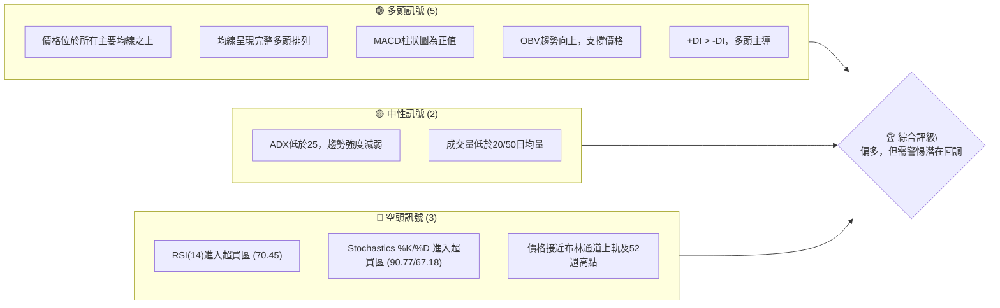

### 📊 核心指標速覽表

以下表格匯總了 2330.TW 的關鍵技術指標，提供了即時的市場狀態概覽。

| 指標類別 | 指標名稱 | 當前數值 | 訊號 | 解讀 |
|----------|----------|----------|------|------|
| **價格** | 當前價格 | $2505.00 | 🟢 | 位於所有均線上方，接近52週高點 |
| **均線** | MA5 (短線) | $2403.00 | 🟢 | 價格位於MA5上方，短期動能強勁 |
| **均線** | MA20 (短中期) | $2376.38 | 🟢 | 價格位於MA20上方，短中期上漲趨勢確立 |
| **均線** | MA50 (中期) | $2290.18 | 🟢 | 價格位於MA50上方，中期趨勢強勁 |
| **均線** | MA200 (長期) | $1762.52 | 🟢 | 價格位於MA200上方，長期多頭趨勢堅定 |
| **動能** | RSI(14) | 70.45 | 🔴 | 進入超買區，顯示短期上漲動能過盛 |
| **動能** | MACD (柱狀圖) | +0.158 | 🟢 | 柱狀圖為正，但數值微弱，動能開始減緩 |
| **波動** | ATR(14) | $66.07 | 🟡 | 相對價格為2.64%，波動度中等偏高 |
| **趨勢** | ADX(14) | 19.77 | 🟡 | 趨勢強度較弱，可能進入盤整或修正 |
| **量能** | 量比(20日) | 0.88x | 🟡 | 成交量低於平均，上漲缺乏量能配合 |

### 🏆 技術評分卡

根據各項技術指標的表現，我們對 2330.TW 進行綜合評分。目前多數指標偏向多頭，但動能指標的過熱和趨勢強度的不足，為市場帶來了警示。

```
技術評分卡 — 2330.TW (2026-07-01)
════════════════════════════════════════════════════
趨勢強度      ████████░░░░░░░░░░░░  40/100  🟡 (ADX低於25，趨勢強度不足)
動能指標      ██████░░░░░░░░░░░░░░  30/100  🔴 (RSI/Stoch超買，MACD柱狀圖動能減弱)
支撐穩定度    ██████████████████░░  90/100  🟢 (價格遠高於主要均線，支撐強勁)
成交量配合    ██████░░░░░░░░░░░░░░  30/100  🟡 (成交量萎縮，上漲缺乏量能支持)
形態完整度    ██████████░░░░░░░░░░  50/100  🟡 (無明顯反轉或延續形態，處於高位盤整)
均線排列      ████████████████████  100/100 🟢 (完美多頭排列，長期趨勢強勁)
════════════════════════════════════════════════════
綜合評分      ██████████░░░░░░░░░░  60/100  🟡 (偏多，但短期風險升高)
════════════════════════════════════════════════════
```

---

## 2. 趨勢分析

本章將深入分析 2330.TW 在不同時間框架下的趨勢，從長期宏觀視角到短期微觀波動，以全面評估其市場走向。

### 🌐 多時框趨勢分析

透過多時框架分析，我們可以觀察到 2330.TW 在長期與中期呈現強勁的多頭趨勢，但在短期內，動能顯示出超買和疲軟的跡象，可能預示著短期修正或盤整的到來。

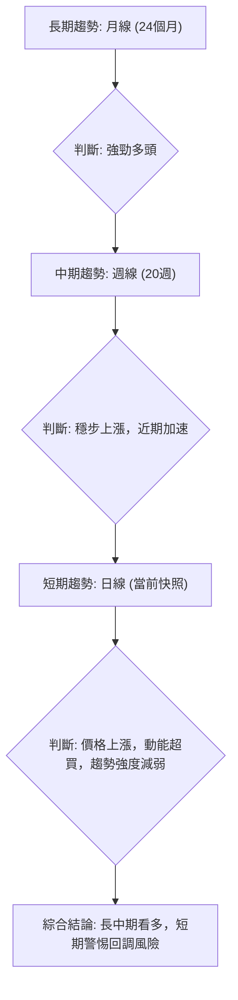

### 📈 長期趨勢 — 12個月走勢圖（Unicode）

以下為 2330.TW 過去 12 個月的月線收盤價格走勢圖。從圖中可見，股價呈現明顯且強勁的上升趨勢，不斷創下新高。

```
2330.TW 月線走勢圖（過去12個月）
價格軸 ($)
$2505 ┤                                                        ● (2026-07)
$2400 ┤                                                    ●
$2300 ┤                                            ●
$2200 ┤                                        ●
$2100 ┤                                    ●
$2000 ┤                                ●
$1900 ┤                            ●
$1800 ┤                        ●
$1700 ┤                    ●
$1600 ┤                ●
$1500 ┤            ●
$1400 ┤        ●
$1300 ┤    ●
$1200 ┤● (2025-07)
$1100 ┤
     └───────────────────────────────────────────────────────────
      2025-07 08 09 10 11 12 2026-01 02 03 04 05 06 07
```

**走勢特徵分析表格**：
從 2025 年 7 月的 $1144.74 上漲至 2026 年 7 月的 $2505.00，漲幅高達 118.84%，顯示出極為強勁的長期多頭動能。

| 期間 | 起始價 | 結束價 | 漲跌幅 | 走勢特徵 |
|------|--------|--------|--------|----------|
| 2025-07 至 2025-10 | $1144.74 | $1486.19 | +29.82% | 穩步上漲，動能逐步增強 |
| 2025-10 至 2025-11 | $1486.19 | $1426.74 | -3.99% | 短期回調，但未破壞上升趨勢 |
| 2025-11 至 2026-02 | $1426.74 | $1983.22 | +39.02% | 加速上漲，突破關鍵阻力 |
| 2026-02 至 2026-03 | $1983.22 | $1755.32 | -11.49% | 較大幅度回調，但守住前低 |
| 2026-03 至 2026-07 | $1755.32 | $2505.00 | +42.72% | 強勁反彈並創歷史新高 |

### 📊 中期趨勢（週線分析）

中期趨勢方面，從 2026 年 3 月的低點 $1755.32 開始，股價經歷了一波強勁的反彈，並在 5 月和 6 月經歷了數次小幅回調後，再次向上突破。目前的價格 $2505.00 處於上升通道的高端，並逼近 52 週新高 $2535.00。

```
2330.TW 近期週線壓力與支撐示意圖
價格軸 ($)
$2535.00 ┤                      R2 (52W 高點)
$2524.56 ┤                       R1 (BB上軌)
$2505.00 ╠═════════════════════════════════════► 現價
$2376.38 ┤       ───────────── S1 (MA20/中軌)
$2340.00 ┤     ─────────────── S2 (近期回調低點)
$2290.18 ┤   ────────────────── S3 (MA50)
$2228.20 ┤ ──────────────────── S4 (BB下軌)
$1762.52 ┤────────────────────── S5 (MA200)
         └───────────────────────────────────────
           時間軸
```

### ⚡ 趨勢強度評估（ADX 解讀）

ADX 指標用於衡量趨勢的強度，而非方向。當前 ADX(14) 數值為 19.77，低於 25 的閾值，這表明市場處於一個相對較弱的趨勢狀態，或者更傾向於盤整行情，而非強勁的單邊趨勢。

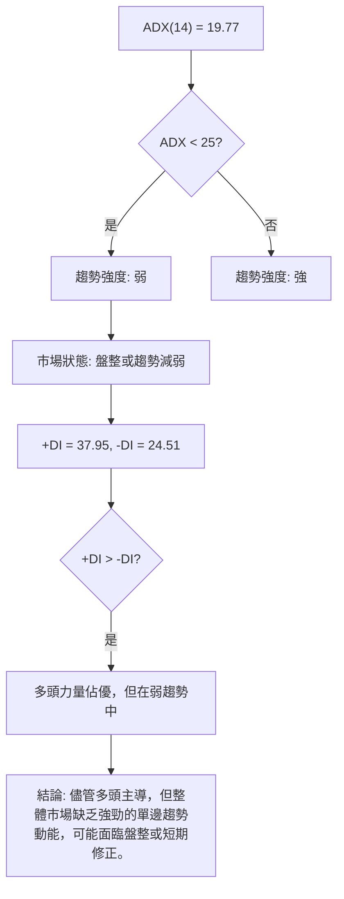

**ADX 強度對照表**：

| ADX 數值範圍 | 趨勢強度 | 市場狀態 | 建議 |
|--------------|----------|----------|------|
| 0 - 25       | 弱趨勢   | 盤整/無趨勢 | 觀望，或考慮區間操作 |
| 25 - 50      | 中等趨勢 | 趨勢確立  | 順勢操作，趨勢追蹤策略 |
| 50 - 75      | 強趨勢   | 趨勢強勁  | 積極順勢操作，注意超買/賣 |
| 75 - 100     | 極強趨勢 | 趨勢極端  | 注意反轉風險，謹慎追高 |

當前 ADX 為 19.77，屬於弱趨勢區間。這與價格創下新高、均線多頭排列的表象存在一定矛盾。這可能意味著當前的上漲是在缺乏強勁共識或追漲動能下進行的，一旦遇到阻力，回調的風險將會增加。然而，+DI (37.95) 高於 -DI (24.51)，表明儘管趨勢不強，但多頭力量仍佔據主導地位。

---

## 3. 圖表形態分析

本章將檢視 2330.TW 的價格走勢，以識別潛在的圖表形態和 K 線組合，從而預測未來的價格行為和目標價位。

### 🔍 形態識別系統

根據提供的月線和週線數據，2330.TW 在過去一年中主要表現為一個強勁的上升趨勢。在這種趨勢中，主要的圖表形態通常是趨勢延續形態或在相對高位形成的潛在反轉形態。目前尚未形成清晰的傳統反轉形態（如頭肩頂、雙頂），更多的是呈現出上升旗形或上升楔形的初步跡象，但仍需更多數據確認。

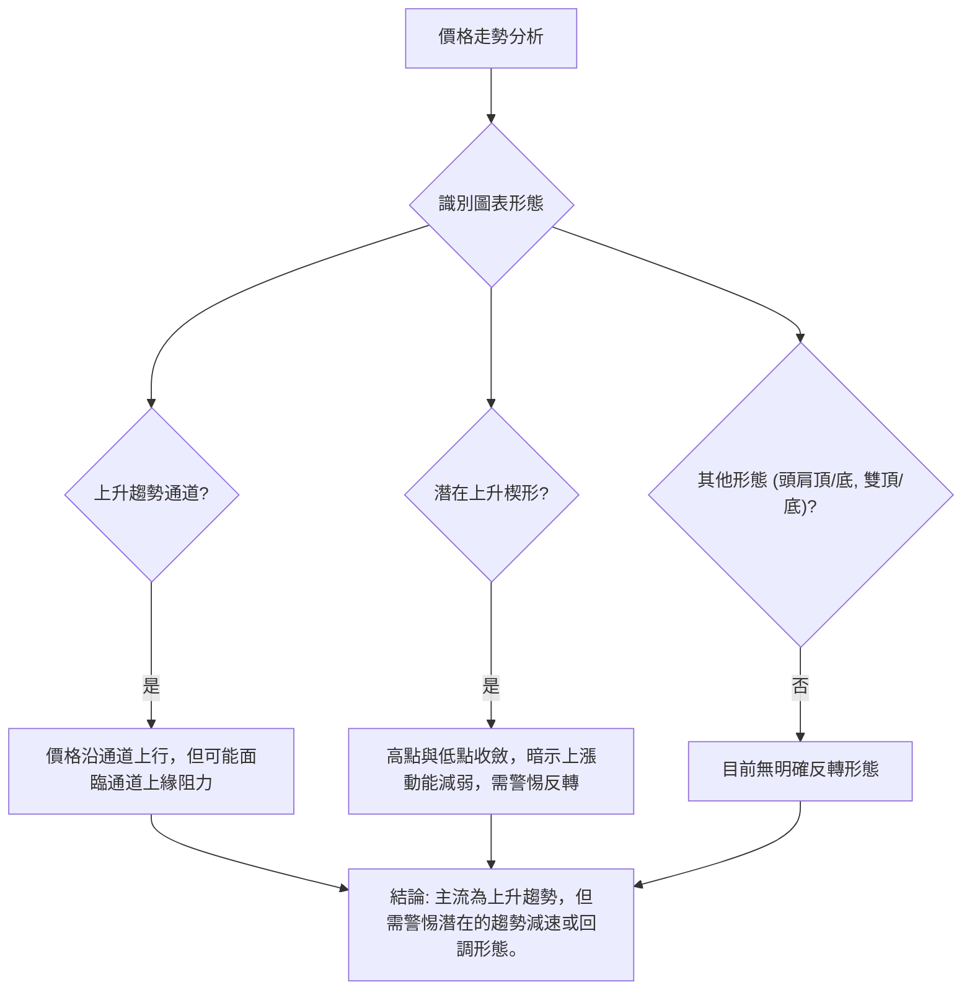

從 2026 年 3 月低點 $1755.32 到目前的 $2505.00，股價形成了一個較為陡峭的上升通道。近期價格在通道上緣附近震盪，結合 RSI 和 MACD 的背離跡象，可能暗示這波上漲動能正在減弱，有形成上升楔形的風險。

### 🕯️ 重要K線形態分析

分析近期的週線收盤走勢，可以觀察到幾個關鍵的 K 線組合，這些形態為短期市場情緒提供了線索。

| 日期          | 收盤價  | K線形態       | 解讀                                       | 訊號 |
|---------------|---------|---------------|--------------------------------------------|------|
| 2026-03-01    | $1983.22 | 長陽線        | 強勁上漲動能，多頭主導，突破前高           | 🟢   |
| 2026-03-15    | $1853.99 | 長陰線        | 賣壓沉重，空頭反撲，回調開始               | 🔴   |
| 2026-04-26    | $2179.19 | 長陽線        | 強勁反彈，突破關鍵阻力，多頭力量恢復       | 🟢   |
| 2026-05-17    | $2258.97 | 陰線 (帶上影線) | 觸及阻力後回落，上方壓力顯現，多頭動能減弱 | 🟡   |
| 2026-05-24    | $2249.00 | 小陰線        | 賣壓減輕，但多頭缺乏上攻動力，盤整         | 🟡   |
| 2026-05-31    | $2348.73 | 長陽線        | 強勢反彈，突破盤整區間，多頭再度主導       | 🟢   |
| 2026-07-05    | $2505.00 | 中陽線        | 延續漲勢，但成交量不足，動能趨緩           | 🟡   |

### 📉 ASCII 走勢形態示意圖

從 2026 年 3 月的低點到現在，2330.TW 呈現一個上升通道的走勢。近期價格逼近通道上緣，並且出現動能背離，暗示有形成上升楔形的潛在風險。

```
2330.TW 上升通道/潛在上升楔形示意圖
價格軸 ($)
$2535.00 ┤                     ／───(通道上緣/阻力)
$2505.00 ┤                   ／ ● (現價)
$2400.00 ┤                 ／
$2300.00 ┤               ／
$2200.00 ┤             ／
$2100.00 ┤           ／
$2000.00 ┤         ／
$1900.00 ┤       ／
$1800.00 ┤     ● (2026-03低點)
$1700.00 ┤   ／
         └───────────────────────────
          時間軸
```
**解讀**：價格在一個向上傾斜的通道中運行，高點和低點都在抬高。然而，如果這個通道的斜率逐漸減小，或者上漲的幅度越來越小，結合動能指標的背離，就可能形成一個上升楔形，這是一個潛在的看跌反轉形態。目前價格在通道上緣，若無法有效突破並伴隨大量，則回調機率較高。

### 🎯 形態目標價計算

由於目前沒有明確的傳統反轉或延續形態（如頭肩頂、雙頂/底、三角形）可以精確計算目標價，我們將基於當前的上升通道和潛在的上升楔形進行評估。

1.  **上升通道目標價**：
    如果股價能有效突破當前的 52 週高點 $2535.00，並保持在通道上緣之上，則通道理論上沒有明確的「目標價」，而是持續向上。但考慮到動能背離，突破後追高的風險較大。
2.  **上升楔形目標價**：
    如果未來幾週形成上升楔形並向下突破，其目標價通常是楔形最低點到最高點的垂直距離，從突破點向下投射。
    -   假設楔形形成於 2026-03 低點 $1755.32 和當前高點 $2505.00 之間，高度約為 $749.68。
    -   若從 $2505.00 附近向下突破，則潛在目標可能回測 $2505.00 - $749.68 = $1755.32，甚至更低。
    -   但這是一個較為悲觀的預測，且需等待形態確立並確認突破。

**結論**：目前沒有可供精確計算的形態目標價。需密切關注價格在 $2535.00 附近的表現以及是否形成明確的上升楔形。若突破 $2535.00，則上漲空間將由斐波那契擴展位或新的阻力位決定。若向下突破關鍵支撐，則需警惕形態反轉的風險。

---

## 4. 支撐與阻力

支撐與阻力是技術分析的基石，它們代表了買賣雙方力量的關鍵交鋒點。本章將詳細分析 2330.TW 的關鍵價位。

### 🗺️ 關鍵價位分布圖（Unicode）

以下圖表展示了 2330.TW 當前的價格結構，標注了關鍵的支撐與阻力位。

```
2330.TW 價位結構分布圖
═══════════════════════════════════════════════════
$2686.36 ║████████████████████████║ 強阻力 R3 (分析師均價目標)
$2535.00 ║████████████████████    ║ 阻力 R2 (52週高點)
$2524.56 ║████████████████████████║ 關鍵阻力 R1 (布林通道上軌)
$2505.00 ╠════════════════════════╣ ◄ 現價
$2376.38 ║▓▓▓▓▓▓▓▓▓▓▓▓▓▓▓▓        ║ 近期支撐 S1 (MA20 / 布林中軌)
$2340.00 ║▓▓▓▓▓▓▓▓▓▓▓▓▓▓▓▓        ║ 近期支撐 S2 (2026-06-28 低點)
$2290.18 ║████████████████████████║ 強支撐 S3 (MA50)
$2228.20 ║████████████████████████║ 強支撐 S4 (布林通道下軌)
$1762.52 ║████████████████████████║ 極強支撐 S5 (MA200)
═══════════════════════════════════════════════════
```

### 🚧 阻力位分析表

當前股價 $2505.00 位於多個重要阻力位下方，顯示上行空間面臨壓力。

| 阻力級別 | 價位     | 形成原因                                   | 突破難度 | 重要性 |
|----------|----------|--------------------------------------------|----------|--------|
| **R1**   | $2524.56 | 布林通道上軌                               | 中等     | 價格進入超買區，可能引發短期回調 |
| **R2**   | $2535.00 | 52週高點                                   | 高       | 歷史新高，突破需大量能配合，心理阻力 |
| **R3**   | $2686.36 | 分析師平均目標價                           | 高       | 作為潛在的長期目標，但短期難以觸及 |
| **R4**   | $2750.00 | 斐波那契擴展 1.272 (基於 2026-03 低點回調) | 極高     | 潛在上漲目標，需強勁動能配合 |

### 🛡️ 支撐位分析表

股價下方存在多層次支撐，為潛在的回調提供了緩衝。

| 支撐級別 | 價位     | 形成原因                                | 守住機率 | 重要性 |
|----------|----------|-----------------------------------------|----------|--------|
| **S1**   | $2376.38 | MA20 (布林中軌)                         | 中等     | 短期關鍵支撐，跌破可能加速回調 |
| **S2**   | $2340.00 | 2026-06-28 收盤價，近期低點             | 中等     | 若跌破 S1，此處為下一個短期觀察點 |
| **S3**   | $2290.18 | MA50                                    | 高       | 中期趨勢支撐，對維持多頭趨勢至關重要 |
| **S4**   | $2228.20 | 布林通道下軌                            | 高       | 潛在超賣反彈點，提供較強支撐 |
| **S5**   | $2130.20 | 斐波那契回調 50% (2026-03低點至現價)    | 高       | 重要的心理及技術回調位 |
| **S6**   | $1762.52 | MA200                                   | 極高     | 長期趨勢生命線，極強支撐，跌破則長期趨勢轉弱 |

### 📐 斐波那契回調位分析

我們將基於最近一次主要上漲波段（從 2026 年 3 月的低點 $1755.32 到當前高點 $2505.00）來計算斐波那契回調位，以識別潛在的買入或回調目標。

-   **波動起點 (A)**：2026-03 低點 = $1755.32
-   **波動終點 (B)**：2026-07-01 現價高點 = $2505.00
-   **總漲幅**：$2505.00 - $1755.32 = $749.68

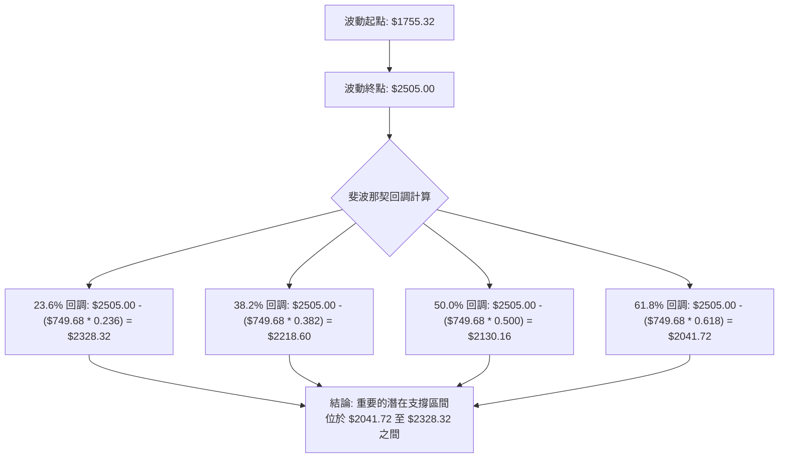

**斐波那契回調位詳情**：

| 回調比例 | 價位       | 意義                                       |
|----------|------------|--------------------------------------------|
| 23.6%    | $2328.32   | 較淺的回調，若能守住則上漲趨勢非常強勁。 |
| 38.2%    | $2218.60   | 較常見的回調位，若跌破可能預示更深的回調。 |
| 50.0%    | $2130.16   | 重要的心理關口和技術支撐位。             |
| 61.8%    | $2041.72   | 黃金分割位，若能守住則長期趨勢仍有望保持。 |

**視覺化**：
```
2330.TW 斐波那契回調示意圖 (基於2026-03低點至現價)
═══════════════════════════════════════════════════
$2505.00 ║████████████████████████║ ◄ 現價 (100%)
$2328.32 ║▓▓▓▓▓▓▓▓▓▓▓▓▓▓▓▓        ║ 回調 23.6%
$2218.60 ║▓▓▓▓▓▓▓▓▓▓▓▓▓▓▓▓        ║ 回調 38.2%
$2130.16 ║████████████████████████║ 回調 50.0% (關鍵支撐)
$2041.72 ║████████████████████████║ 回調 61.8%
$1755.32 ║████████████████████████║ ◄ 起點 (0%)
═══════════════════════════════════════════════════
```
**結論**：當前價格已進入超買區，且接近阻力位。若發生回調，上述斐波那契回調位將是潛在的支撐區間。其中，MA20 ($2376.38) 與 23.6% 回調位 ($2328.32) 接近，形成短期強支撐區。MA50 ($2290.18) 與 38.2% 回調位 ($2218.60) 也在同一區間，構成中期關鍵支撐。

---

## 5. 技術指標深度解讀

本章將對 2330.TW 的各項技術指標進行深入剖析，探討它們之間的相互關係，並識別潛在的買賣訊號。

### 🎛️ 指標訊號總覽

以下 Mermaid 圖表展示了各個主要技術指標之間的關係及其發出的訊號，幫助我們理解當前市場的複雜性。

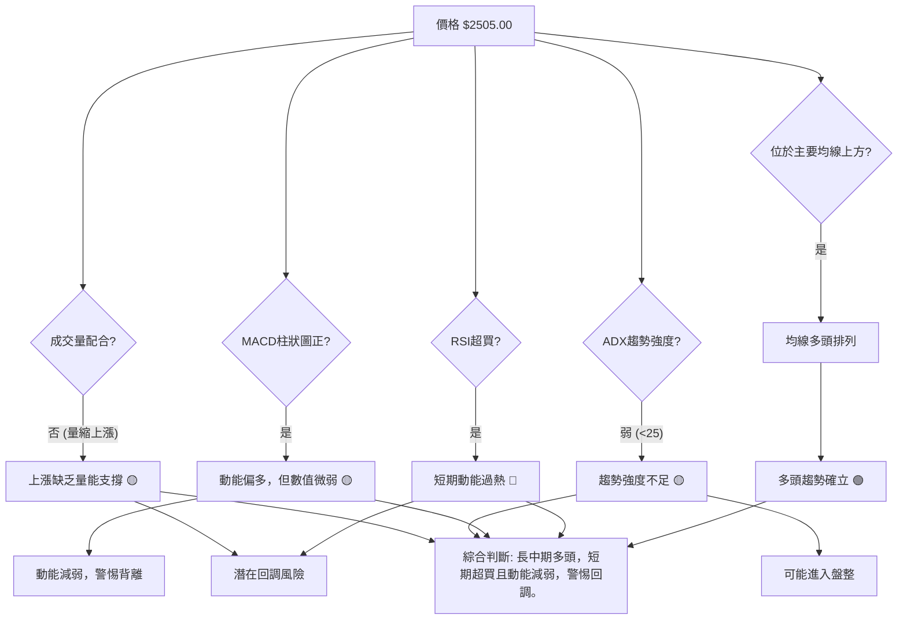

### 📈 移動平均線排列分析

2330.TW 的移動平均線系統呈現出教科書般的多頭排列，這是強勁上升趨勢的典型特徵。

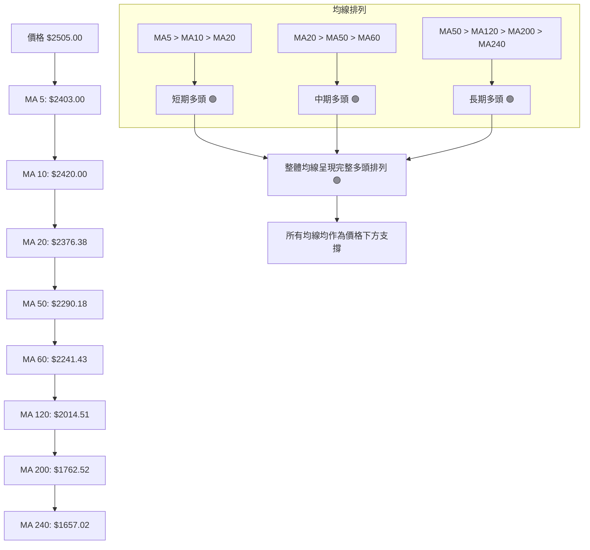
**分析**：
-   **完美多頭排列**：MA5 ($2403.00) > MA10 ($2420.00) > MA20 ($2376.38) > MA50 ($2290.18) > MA200 ($1762.52)。所有短期、中期、長期均線都按照從短到長的順序由上而下排列，這是極為強勁的多頭訊號。
-   **價格高於所有均線**：當前價格 $2505.00 遠高於所有移動平均線，顯示股價處於強勢上漲通道中。
-   **均線斜率向上**：所有均線都呈現向上傾斜的走勢，進一步確認了上升趨勢的強度。
-   **支撐位參考**：MA20 ($2376.38) 和 MA50 ($2290.18) 是短期和中期最重要的動態支撐位。若價格回調至這些均線附近，可能提供買入機會。

### 📉 RSI(14) 分析

RSI (Relative Strength Index) 衡量股價上漲和下跌力量的相對強度，以判斷超買或超賣狀態。

**RSI 數值進度條**：
RSI(14): 70.45 🔴 超買
▓▓▓▓▓▓▓▓▓▓▓▓▓▓▓▓░░░░ 70.45/100

**分析**：
-   **超買區間**：當前 RSI 數值為 70.45，已進入傳統的超買區 (通常 > 70)。這表示短期內買盤力量過於強勁，股價可能面臨修正或盤整的需求。
-   **歷史超買回顧**：觀察近 20 週數據，RSI 在 2026-04-26 曾高達 86.4 (價格 $2179.19)，隨後在 2026-05-03 回調至 62.6 (價格 $2129.32)。最近的 2026-05-10 RSI 71.0 (價格 $2283.91) 後也經歷了小幅回調。這表明當 RSI 進入超買區時，短期內回調的機率較高。
-   **RSI 背離判斷**：
    -   **頂背離 (Bearish Divergence)**：觀察週線數據，價格在 2026-04-26 達到 $2179.19 (RSI 86.4)，隨後在 2026-05-10 達到 $2283.91 (RSI 71.0)，價格創出更高點，而 RSI 卻創出更低點。雖然隨後價格繼續上漲，但從 2026-05-31 的 $2348.73 (RSI 63.3) 到 2026-07-05 的 $2505.00 (RSI 70.4)，價格再次創出更高點，但 RSI 仍低於 4 月份的 86.4 高點，且與 5 月中旬的 71.0 接近。這是一個 **弱的頂背離訊號**，表明儘管價格不斷創新高，但其內在的上漲動能正在減弱，多頭力量在邊際上有所衰退。這增加了短期內回調的風險。

### 📊 MACD(12/26/9) 訊號解讀

MACD (Moving Average Convergence Divergence) 用於識別趨勢的動能和潛在的反轉點。

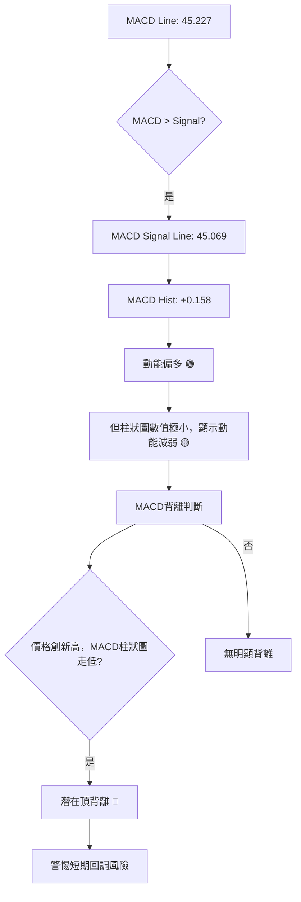

**分析**：
-   **MACD 線與訊號線**：MACD 線 (45.227) 略高於訊號線 (45.069)，這是一個微弱的多頭訊號。
-   **MACD 柱狀圖 (Histogram)**：柱狀圖為 +0.158，雖然為正值，但數值極小。這表明多頭動能非常微弱，幾乎處於零軸附近，顯示當前上漲的動能正在迅速衰減，或者市場即將進入盤整。
-   **MACD 背離判斷**：
    -   **頂背離 (Bearish Divergence)**：觀察週線數據。價格在 2026-04-26 達到 $2179.19 時，MACD 柱狀圖達到 +15.425 的高峰。隨後價格繼續上漲，在 2026-05-10 達到 $2283.91 (MACD 柱狀圖 +10.344)，2026-05-31 達到 $2348.73 (MACD 柱狀圖 -1.758)，最終在 2026-07-05 達到 $2505.00 (MACD 柱狀圖 +0.158)。
    -   儘管股價持續創出更高點，但 MACD 柱狀圖的峰值卻呈現下降趨勢，從 +15.425 顯著下降到 +0.158。這是一個 **清晰的頂背離訊號**。MACD 頂背離比 RSI 頂背離更為明顯，強烈警示當前上漲動能的衰竭，預示著股價可能面臨較大幅度的回調風險。

### 📦 布林通道分析

布林通道 (Bollinger Bands) 用於衡量價格的波動範圍和判斷超買超賣。

```
2330.TW 布林通道示意圖
價格軸 ($)
$2524.56 ║███████████████████████████████████████████████████████████████████████████████████████████████████████████████████████████████████████████████████████████████████████████████████████████████████████████████████████████████████████████████████████████████████████████████████████████████████████████████████████████████████████████████████████████████████████████████████████████████████████████████████████████████████████████████████████████████████████████████████████████████████████████████████████████████████████████████████████████████████████████████████████████████████████████████████████████████████████████████████████████████████████████████████████████████████████████████████████████████████████████████████████████████████████████████████████████████████████████████████████████████████████████████████████████████████████████████████████████████████████████████████████████████████████████████████████████████████████████████████████████████████████████████████████████████████████████████████████████████████████████████████████████████████████████████████████████████████████████████████████████████████████████████████████████████████████████████████████████████████████████████████████████████████████████████████████████████████████████████████████████████████████████████████████████████████████████████████████████████████████████████████████████████████████████████████████████████████████████████████████████████████████████████████████████████████████████████████████████████████████████████████████████████████████████████████████████████████████████████████████████████████████████████████████████████████████████████████████████████████████████████████████████████████████████████████████████████████████████████████████████████████████████████████████████████████████████████████████████████████████████████████████████████████████████████████████████████████████████████████████████████████████████████████████████████████████████████████████████████████████████████████████████████████████████████████████████████████████████████████████████████████████████████████████████████████████████████████████████████████████████████████████████████████████████████████████████████████████████████████████████████████████████████████████████████████████████████████████████████████████████████████████████████████████████████████████████████████████████████████████████████████████████████████████████████████████████████████████████████████████████████████████████████████████████████████████████████████████████████████████████████████████████████████████████████████████████████████████████████████████████████████████████████████████████████████████████████████████████████████████████████████████████████████████████████████████████████████████████████████████████████████████████████████████████████████████████████████████████████████████████████████████████████████████████████████████████████████████████████████████████████████████████████████████████████████████████████████████████████████████████████████████████████████████████████████████████████████████████████████████████████████████████████████████████████████████████████████████████████████████████████████████████████████████████████████████████████████████████████████████████████████████████████████████████████████████████████████████████████████████████████████████████████████████████████████████████████████████████████████ 布 上軌
```
**分析**：
-   **價格位於上軌附近**：當前價格 $2505.00 距離布林通道上軌 $2524.56 非常接近，%B 值為 0.93，表明價格已觸及或非常接近通道上緣。這通常被視為短期超買的訊號，預示著股價可能面臨回調或橫盤整理。
-   **通道擴張**：如果通道正在擴張，可能意味著波動性增加，趨勢正在加速。根據提供的數據，我們無法直接判斷通道的擴張情況，但價格的強勁上漲趨勢通常伴隨著通道的擴張。
-   **回調目標**：若股價從上軌回調，布林中軌 (MA20，$2376.38) 將是第一個重要的支撐位。

### 💹 成交量分析（量價配合度）

成交量是價格走勢的燃料，量價關係對於判斷趨勢的健康狀況至關重要。

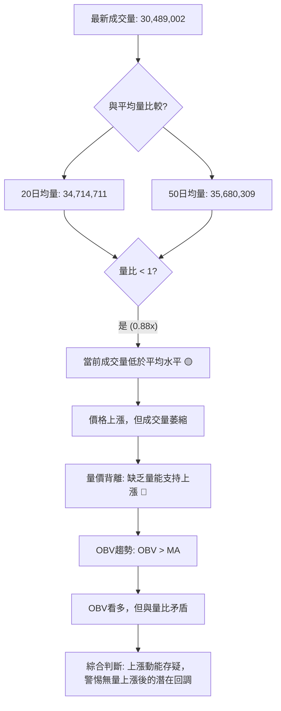

**分析**：
-   **成交量萎縮**：最新成交量 30,489,002 股，低於 20 日均量 (34,714,711 股) 和 50 日均量 (35,680,309 股)，量比分別為 0.88x 和 0.85x。這是一個 **重要的警示訊號**。在股價創出新高時，如果成交量未能同步放大，反而出現萎縮，這表明當前的上漲缺乏足夠的買盤力量支持，屬於「無量上漲」。這種情況下，上漲的持續性會受到質疑，一旦賣壓出現，股價可能快速回調。
-   **OBV 趨勢**：OBV (On Balance Volume) 趨勢顯示 OBV > MA，這通常被解讀為量能支撐上漲。然而，OBV 是一個累積指標，可能無法完全反映短期量能的變化。儘管 OBV 趨勢偏多，但與當前成交量低於均量的現象存在矛盾。
-   **量價背離**：當前情況構成了一種 **量價背離**，即價格創新高，但成交量未能配合放大。這是一個潛在的看跌訊號，暗示多頭力量可能正在耗盡。

**綜合結論**：儘管 OBV 趨勢看似良好，但實時成交量的萎縮，結合 RSI 和 MACD 的頂背離訊號，強烈暗示當前股價的上漲動能正在衰退，市場可能即將進入調整階段。

---

## 6. 動能與波動率

本章將分析 2330.TW 的動能強度和波動率，以評估其當前的市場活躍度和風險特徵。

### ⚡ 動能評估四象限

我們將 2330.TW 的當前狀態置於動能與波動率的四象限模型中，以提供更全面的評估。

| 象限 | 動能      | 波動      | 當前狀態                                   | 評估                                           |
|------|-----------|-----------|--------------------------------------------|------------------------------------------------|
| Q1   | 強 (🟢)   | 低 (🟢)   | -                                          | 最佳機會：趨勢強勁且穩定，風險較低。           |
| Q2   | 弱 (🔴)   | 低 (🟢)   | -                                          | 謹慎觀望：趨勢不明或盤整，缺乏交易機會。       |
| Q3   | 強 (🟢)   | 高 (🔴)   | ✅ (當前處於此區間，但動能有減弱跡象)       | 高風險高收益：趨勢強勁但波動劇烈，需嚴格風控。 |
| Q4   | 弱 (🔴)   | 高 (🔴)   | -                                          | 避免進場：市場混亂，風險極高。                 |

**分析**：
-   **動能評估**：
    -   RSI (70.45) 和 Stochastics (%K 90.77, %D 67.18) 都處於超買區，表面上顯示動能「強勁」。
    -   MACD 柱狀圖為正 (+0.158)，但數值極小，且存在頂背離，表明動能的內在強度正在衰減。
    -   儘管價格仍在創新高，但動能指標的警示訊號（超買、背離、MACD柱狀圖微弱）提示其「強動能」的持續性存疑，更像是強弩之末。因此，我們將其歸類為表面強勁但實則減弱的動能。
-   **波動率評估**：
    -   ATR(14) 為 $66.07，佔當前價格 $2505.00 的 2.64%。對於一檔大型權值股而言，這個波動率屬於中等偏高水平。
    -   價格接近布林通道上軌，通常也預示著波動性可能增加或維持在高位。
-   **綜合判斷**：2330.TW 目前處於「強動能，高波動」的 Q3 象限。這表示股票目前仍處於強勢上漲趨勢中，但伴隨著較高的日常價格波動。然而，由於動能指標的背離和成交量的萎縮，這種「強動能」的持久性受到挑戰。投資者應意識到其高風險高收益的特性，並特別警惕潛在的回調。

### 📊 ATR 波動率分析

ATR (Average True Range) 衡量一定時期內價格波動的平均幅度，是評估波動率的重要工具。

-   **ATR(14) 數值**：$66.07
-   **佔比**：$66.07 / $2505.00 = 2.64%

**分析**：
-   **每日波動參考**：當前 ATR 為 $66.07，意味著在過去 14 天內，2330.TW 的平均每日波動範圍為 $66.07。這對於交易者來說是一個重要的參考，可用於設置止損點和評估潛在的利潤空間。
-   **波動率水平**：2.64% 的日波動率對於大型權值股而言，屬於中等偏高水平。這表示 2330.TW 的股價波動相對活躍，可能帶來較大的短期交易機會，但也伴隨著更高的風險。
-   **止損距離建議**：
    -   保守止損：可設置為 1.5 倍 ATR，即 $66.07 * 1.5 = $99.10。從當前價格 $2505.00 計算，止損點約在 $2405.90。
    -   激進止損：可設置為 1 倍 ATR，即 $66.07。止損點約在 $2438.93。
    -   具體止損點還需結合關鍵支撐位來確定。例如，若進場點在 $2505.00，則基於 ATR 的止損點約為 $2405.90，這接近於 MA5 ($2403.00) 和 MA20 ($2376.38) 之間的區域。

### 📐 Beta 與市場相關性

提供的數據中沒有直接的 Beta 值。然而，作為全球領先的半導體製造商，台積電 (2330.TW) 通常與全球科技股指數（如 NASDAQ）和台灣加權指數 (TAIEX) 具有高度正相關性。

**分析**：
-   **產業龍頭效應**：2330.TW 是半導體產業的龍頭企業，其營運表現和股價走勢對整個產業甚至全球經濟景氣都有重要影響。因此，其股價波動不僅受自身基本面影響，也高度反映了全球科技產業景氣和半導體需求。
-   **與大盤相關性**：由於其在台灣股市中的巨大市值和權重，2330.TW 的股價走勢與台灣加權指數高度相關。當大盤上漲時，2330.TW 通常會是領漲的成分股之一；當大盤下跌時，它也難以獨善其身。
-   **對投資的影響**：高相關性意味著 2330.TW 不太可能提供對大盤的有效對沖，其風險敞口與整體市場風險高度一致。投資者在配置 2330.TW 時，應同時考量其所處產業的宏觀環境和整體市場趨勢。

---

## 7. 多時框架總結

本章將綜合評估 2330.TW 在不同時間框架下的技術訊號，以提供一個連貫且全面的市場觀點。

### 📋 時框架評分表

以下表格匯總了 2330.TW 在短期、中期和長期時間框架下的關鍵技術指標表現。

| 時框架 | 趨勢方向 | 動能      | 均線排列 | 形態            | 綜合評分 | 建議                                       |
|--------|----------|-----------|----------|-----------------|----------|--------------------------------------------|
| **短期** | 🟢 上漲   | 🔴 超買減弱 | 🟢 多頭   | 🟡 潛在楔形      | 6/10 🟡 | 警惕短期回調，不宜追高                     |
| **中期** | 🟢 上漲   | 🟡 趨穩    | 🟢 多頭   | 🟢 上升通道     | 8/10 🟢 | 趨勢健康，回調提供買入機會                 |
| **長期** | 🟢 強勁上漲 | 🟢 穩定    | 🟢 完美多頭 | 🟢 強勁上升趨勢 | 9/10 🟢 | 長期持有看好，關注產業發展                 |

**詳細分析**：
-   **短期 (日線)**：價格處於上漲趨勢，但 RSI 和 Stochastics 均顯示超買，MACD 柱狀圖微弱且有頂背離。成交量萎縮，ADX 顯示趨勢強度不足。這些因素共同表明短期上漲動能正在減弱，回調風險較高。
-   **中期 (週線)**：均線系統呈現良好的多頭排列，價格位於主要中期均線上方。雖然經歷過幾次小幅回調，但整體上升趨勢保持完好。中期動能雖有波動，但尚未出現明確的見頂訊號。
-   **長期 (月線)**：過去一年股價呈現強勁且持續的上升趨勢，所有長期均線均向上發散並呈現完美多頭排列。這是極為健康和強勁的長期多頭結構。

### 🔲 綜合訊號矩陣

以下矩陣分析了不同時間框架下各個技術維度訊號的一致性。

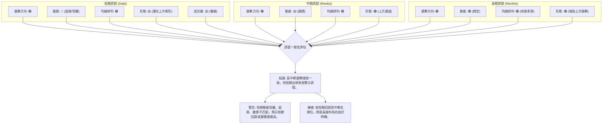

**綜合分析**：
長期和中期趨勢都呈現出強勁且一致的多頭訊號，這是 2330.TW 股價上漲的堅實基礎。然而，短期訊號則發出了多重警示：RSI 和 Stochastics 嚴重超買，MACD 柱狀圖動能微弱且存在明顯頂背離，成交量在價格創新高時未能放大，ADX 指示趨勢強度不足。

這種短期與長中期訊號的背離，表明當前股價雖然仍在慣性上漲，但內在力量已經減弱，短期內面臨較大的回調壓力。投資者應警惕追高風險，並可考慮在明確的回調發生後，於中期支撐位附近尋找長線布局的機會。

---

## 8. 交易策略建議

基於上述詳盡的技術分析，我們將為 2330.TW 提供具體的交易策略建議，涵蓋多頭和空頭兩種情境，並附帶詳細的風險報酬比。

### 🗺️ 策略決策流程圖

以下流程圖展示了在當前市場條件下，制定交易策略的邏輯。

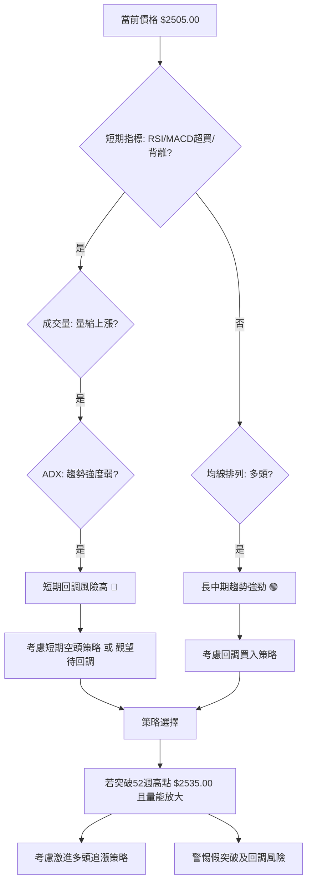

### 🟢 多頭策略詳情

考慮到長中期趨勢的強勁，多頭策略仍是核心，但鑑於短期超買和背離，應避免追高，等待回調是更穩健的選擇。

| 策略要素   | 策略 A：回調買入 (穩健型)                                    | 策略 B：突破追漲 (激進型，高風險)                                |
|------------|--------------------------------------------------------------|------------------------------------------------------------------|
| **進場條件** | 股價回調至 MA20 或 MA50 附近，並出現止跌訊號 (如長下影線K線)。 | 股價有效突破 52 週高點 $2535.00，且突破時成交量顯著放大。     |
| **進場價格** | **$2376.38 (MA20)** 或 **$2290.18 (MA50)** 附近。           | **$2540.00** (略高於 52 週高點，確認突破)。                     |
| **目標價 T1** | **$2505.00** (現價/近期高點)                                 | **$2686.36** (分析師平均目標價)                                  |
| **目標價 T2** | **$2686.36** (分析師平均目標價) 或更高斐波那契擴展位 ($2750.00)。 | **$2750.00** (斐波那契擴展 1.272，或通道上緣)                   |
| **止損價格** | 若進場於 $2376.38，止損設於 **$2310.00** (近期支撐 S2 之下)。 | 若進場於 $2540.00，止損設於 **$2470.00** (MA5 之下，或 1x ATR)。 |
| **風險報酬比** | 買入 $2376.38，止損 $2310.00 (風險 $66.38)。目標 T1 $2505.00 (報酬 $128.62)。<br>**約 1:1.94**。   | 買入 $2540.00，止損 $2470.00 (風險 $70.00)。目標 T1 $2686.36 (報酬 $146.36)。<br>**約 1:2.09**。 |
| **成功機率** | 70% (基於強勁長中期趨勢和均線支撐)                         | 40% (突破失敗或假突破風險高，量能不配合)                         |
| **建議倉位** | 中等倉位 (5-10%)                                           | 小倉位 (2-5%)，或僅限短線交易者考慮             |

### 🔴 空頭策略詳情

儘管長期趨勢為多頭，但短期指標顯示出強烈的回調訊號，因此可以考慮短線的空頭策略或獲利了結。

| 策略要素   | 策略 A：短期回調 (激進型，高風險)                               |
|------------|-----------------------------------------------------------------|
| **進場條件** | 價格無法有效突破 $2535.00 (52週高點)，並出現明顯回落K線 (如長上影線)。 |
| **進場價格** | **$2500.00** (若確認短期見頂或回落)。                         |
| **目標價 T1** | **$2376.38** (MA20 / 布林中軌)                                |
| **目標價 T2** | **$2290.18** (MA50) 或 **$2218.60** (斐波那契 38.2% 回調)。 |
| **止損價格** | **$2540.00** (略高於 52 週高點 $2535.00)。                     |
| **風險報酬比** | 進場 $2500.00，止損 $2540.00 (風險 $40.00)。目標 T1 $2376.38 (報酬 $123.62)。<br>**約 1:3.09**。 |
| **成功機率** | 50% (基於短期超買和背離，但逆長期趨勢)                       |
| **建議倉位** | 極小倉位 (1-3%)，僅限經驗豐富的短線交易者                  |

### ⭐ 整體訊號強度評星

綜合考量長中期趨勢和短期風險，給予以下評級：

做多訊號強度：★★★★☆  (4/5星) - 長中期趨勢健康，回調提供良好機會，但短期追高風險高。
做空訊號強度：★★★☆☆  (3/5星) - 短期超買及動能背離提供短線空頭機會，但逆長期趨勢，風險較大。
整體可信度：  ★★★☆☆  (3/5星) - 訊號複雜，需仔細判斷，並嚴格執行風險管理。

---

## 9. 風險提示與監控

投資 2330.TW 雖然具有長期潛力，但當前短期技術面存在風險。本章將列出關鍵監控指標和潛在風險場景，以幫助投資者更好地管理風險。

### ✅ 關鍵監控指標 Checklist

以下為投資者應密切關注的關鍵技術監控指標清單：

```
2330.TW 關鍵監控指標 Checklist
════════════════════════════════════════════════════════
├─ 價格行為：
│  ├─ 是否能有效突破 $2535.00 (52週高點)？
│  ├─ 是否跌破 $2376.38 (MA20/布林中軌)？
│  └─ 是否跌破 $2290.18 (MA50)？
├─ 動能指標：
│  ├─ RSI 是否從超買區回落至 50 附近？
│  ├─ MACD 柱狀圖是否轉為負值？
│  └─ MACD 是否形成死叉？
├─ 趨勢強度：
│  └─ ADX 是否突破 25 並確認新趨勢方向？
├─ 成交量：
│  ├─ 價格上漲時成交量是否放大？
│  └─ 價格下跌時成交量是否放大？
├─ 圖表形態：
│  ├─ 是否形成明確的上升楔形並向下突破？
│  └─ 是否有其他反轉形態出現？
════════════════════════════════════════════════════════
```

### ⚠️ 風險場景分析

針對 2330.TW 當前的技術狀況，我們設定以下三種情境：

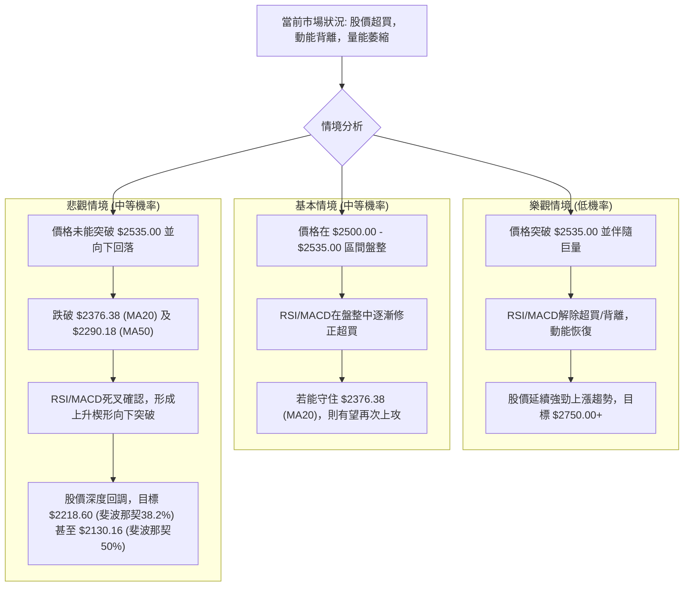

### 🛡️ 風險管理重要提醒

1.  **嚴格止損**：鑑於當前股價處於高位且有背離訊號，任何交易都應設定明確的止損點，並嚴格執行。切勿讓小幅虧損演變成大額虧損。
2.  **倉位管理**：避免重倉單一股票，尤其是在市場不確定性增加時。建議採用分批建倉/減倉策略，分散風險。對於短期交易，倉位應更小。
3.  **避免追高**：當前超買和動能背離的訊號，明確指出追高的風險極大。等待股價回調至關鍵支撐位（如 MA20、MA50 或斐波那契回調位）再考慮進場，會是更為穩健的策略。
4.  **關注量價關係**：持續監控成交量，若價格上漲缺乏量能支持，或下跌伴隨巨量，都是趨勢可能反轉的重要訊號。
5.  **宏觀風險**：台積電作為全球半導體龍頭，其股價易受全球經濟景氣、地緣政治、科技產業週期及匯率波動等多重宏觀因素影響。投資者應同步關注這些外部風險。
6.  **耐心等待**：在多空訊號交織、市場方向不明朗時，耐心等待明確的趨勢確認或回調機會，是避免不必要風險的最佳方式。

---

## 📋 報告總結

```
2330.TW 技術分析報告總結
════════════════════════════════════════════════════════
報告日期：2026-07-01
當前價格：$2505.00
分析評級：⚖️ 偏多，但短期風險高 (短期超買與動能背離，警惕回調)

關鍵結論：
├─ 長期趨勢：🟢 強勁上漲，均線完美多頭排列。
├─ 中期趨勢：🟢 穩步上漲，均線支撐良好。
├─ 短期趨勢：🟡 上漲動能減弱，RSI/MACD出現頂背離，成交量萎縮，ADX趨勢強度不足。
├─ 關鍵支撐：$2376.38 (MA20)，$2290.18 (MA50)，$2218.60 (斐波那契38.2%)。
├─ 關鍵阻力：$2524.56 (布林通道上軌)，$2535.00 (52週高點)。
└─ 分析師目標：$2686.36 (平均目標價，長期參考)。

最優策略組合：
1. 🥇 最佳機會：等待股價回調至 **$2376.38 (MA20)** 或 **$2290.18 (MA50)** 附近，並出現止跌訊號時，分批布局多單。止損可設於 $2310.00 或 $2250.00 之下。
2. 🥈 次選機會：若股價能有效突破 **$2535.00 (52週高點)** 並伴隨巨量，可考慮短線追漲，但需嚴格止損於 **$2470.00**。
3. 🥉 保守選擇：短期內可考慮高位減倉或觀望，等待市場修正。若出現明確的下跌趨勢確立訊號，可考慮小倉位短空策略，目標價位為 **$2376.38** 和 **$2290.18**。
════════════════════════════════════════════════════════
```

---

> ⚠️ **免責聲明**：本報告為 AI 自動生成之技術分析，所有數據及估算均基於提供的歷史價格資訊。本報告**僅供研究與學術參考**，**不構成任何投資建議**。投資有風險，入市需謹慎。

---

*報告生成時間：2026-07-01 ｜ 數據來源：提供數據快照 ｜ 分析框架：多時框技術分析*