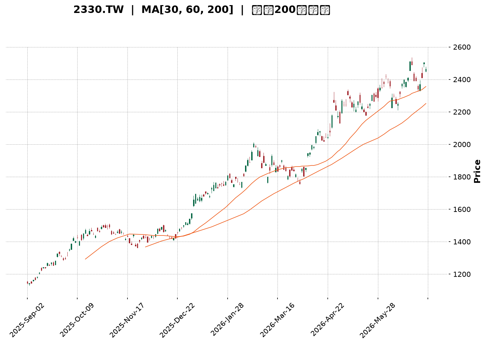
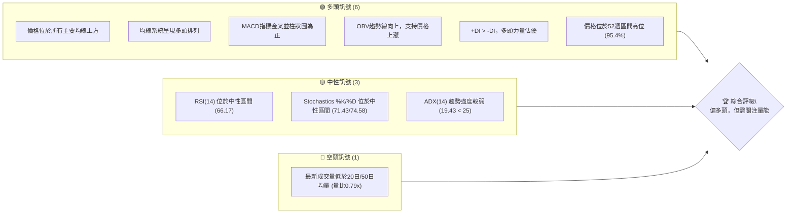
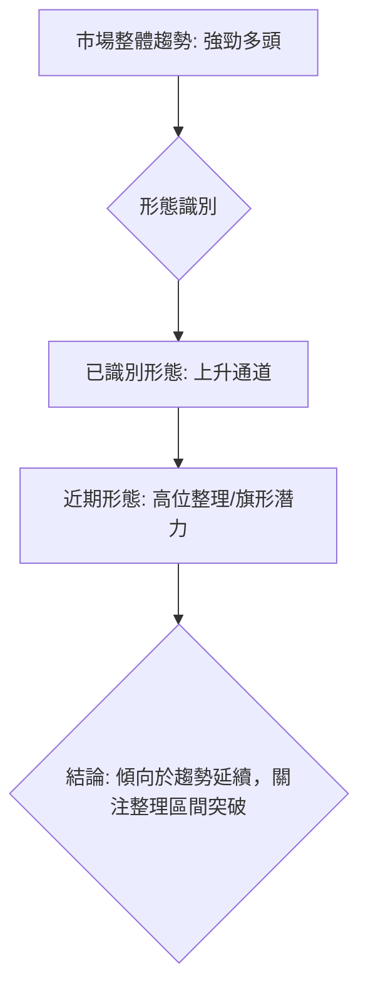
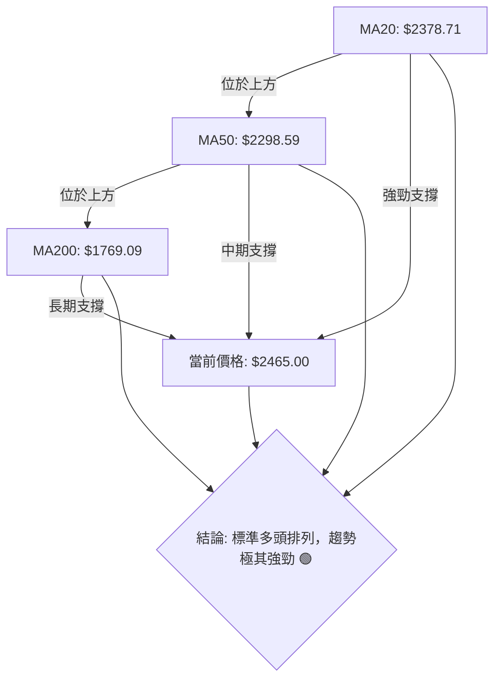
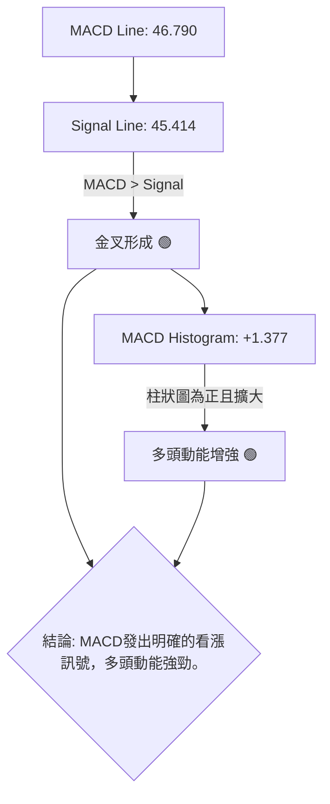

<details>
<summary>📊 靜態圖表 (點擊展開)</summary>

</details>

<html>
<head><meta charset="utf-8" /></head>
<body>
    <div style="height:500px; width:100%;">                        <script>window.PlotlyConfig = {MathJaxConfig: 'local'};</script>
        <script charset="utf-8" src="https://cdn.plot.ly/plotly-3.6.0.min.js" integrity="sha256-QaOVwtVY0T02VaHrr6pnoHLCwayMJp4O5n4YyaE3rJk=" crossorigin="anonymous"></script>                <div id="candlestick-chart" class="plotly-graph-div" style="height:100%; width:100%;"></div>            <script>                window.PLOTLYENV=window.PLOTLYENV || {};                                if (document.getElementById("candlestick-chart")) {                    Plotly.newPlot(                        "candlestick-chart",                        [{"close":{"dtype":"f8","bdata":"AAAA4PbikUAAAADg9uKRQAAAAOD24pFAAAAAoOkxkkAAAACg6TGSQAAAACDcgJJAAAAAgIvjkkAAAABgwR6TQAAAAAC0bZNAAAAAYPdZk0AAAACA3NCTQAAAAOBplZNAAAAAYK3kk0AAAADgaZWTQAAAACBPDJRAAAAA4Ka+lEAAAADgpr6UQAAAAGBjb5RAAAAA4B8glEAAAADA8DOUQAAAAEA0g5RAAAAAILshlUAAAAAgcayVQAAAACAnN5ZAAAAAwOPnlUAAAAAg+EqWQAAAAMDj55VAAAAAYIUPlkAAAABgDK6WQAAAAOBP\u002fZZAAAAA4JlylkAAAAAAf+mWQAAAAAB\u002f6ZZAAAAAoDualkAAAADgmXKWQAAAAAB\u002f6ZZAAAAAQK7VlkAAAABgk0yXQAAAAGCTTJdAAAAAYMI4l0AAAABAZGCXQAAAAGCTTJdAAAAAoDualkAAAABgDK6WQAAAAKA7mpZAAAAAQK7VlkAAAABgDK6WQAAAAECu1ZZAAAAAoDualkAAAABAViOWQAAAAADJXpZAAAAAIELAlUAAAABAoJiVQAAAAMBqhpZAAAAAoP5wlUAAAADgXEmVQAAAAMDj55VAAAAAIPhKlkAAAAAgJzeWQAAAACD4SpZAAAAA4BLUlUAAAABAViOWQAAAAOCZcpZAAAAAAMlelkAAAACgO5qWQAAAAKDxJJdAAAAAAH\u002fplkAAAABgk0yXQAAAAKBI1ZZAAAAAQAz9lkAAAACgwYWWQAAAACAcSpZAAAAAYDo2lkAAAABgOjaWQAAAAGA6NpZAAAAA4GbBlkAAAADAzySXQAAAAICxOJdAAAAA4FZ0l0AAAADg3cOXQAAAAGAanJdAAAAAAGUTmEAAAABgkZ6YQAAAAICP8JlAAAAA4Lt7mkAAAABAcQSaQAAAAMA0LJpAAAAAAFMYmkAAAACAFkCaQAAAAKCdj5pAAAAAoJ2PmkAAAACAFkCaQAAAAEDoBptAAAAAYG9Wm0AAAADAFJKbQAAAAEDoBptAAAAAYG9Wm0AAAAAAM36bQAAAAICNQptAAAAAgPalm0AAAACgBEWcQAAAAGBfCZxAAAAAwBSSm0AAAAAgUWqbQAAAAIB99ZtAAAAAQNi5m0AAAAAgUWqbQAAAAID2pZtAAAAA4CIxnEAAAADgmTOdQAAAAEDGvp1AAAAA4CCDnUAAAADgl4WeQAAAAKBpTJ9AAAAAgOL8nkAAAACAW62eQAAAAGBNDp5AAAAAgPT3nEAAAADgIIOdQAAAAGBdW51AAAAAIEEdnEAAAABAT7ycQAAAACAvIp5AAAAAoHtHnUAAAACA9PecQAAAAIBtqJxAAAAAABkknUAAAACgua+dQAAAAIBP1JxAAAAAwGqsnEAAAACAvDScQAAAAIC8NJxAAAAAIF3AnEAAAADAaqycQAAAAEChXJxAAAAAQA69m0AAAADARG2bQAAAAOBB6JxAAAAAgLw0nEAAAABANPycQAAAAAA\u002fY55AAAAAYDF3nkAAAADAtiqfQAAAAADSAp9AAAAAgBADoEAAAABg7jSgQAAAAKDnPqBAAAAAAGWin0AAAACgco6fQAAAAIAu8p9AAAAAgC7yn0AAAABg7jSgQAAAAGBfBqFAAAAAYPKloUAAAACANkKhQAAAACBm\u002fKBAAAAAgKOioEAAAADA5LmhQAAAAOAGiKFAAAAA4AaIoUAAAAAgtf+hQAAAAGDQ16FAAAAAQBtqoUAAAAAAAJKhQAAAAKAvTKFAAAAAoOuvoUAAAABg8qWhQAAAAIAUdKFAAAAAIEQuoUAAAABgXwahQAAAAAAiYKFAAAAAAACSoUAAAAAgtf+hQAAAAKDrr6FAAAAAwMLroUAAAACAyeGhQAAAAMB3WaJAAAAAwHdZokAAAADAVYuiQAAAAGAY5aJAAAAA4E6VokAAAAAgam2iQAAAAIDJ4aFAAAAA4Lv1oUAAAAAAAJKhQAAAAAAAlKFAAAAAAAAMokAAAAAAAI6iQAAAAAAAwKJAAAAAAACiokAAAAAAANSiQAAAAAAAnKNAAAAAAAB0o0AAAAAAAKyiQAAAAAAArKJAAAAAAABIokAAAAAAAISiQAAAAAAA1KJAAAAAAACSo0AAAAAAAEKjQA=="},"high":{"dtype":"f8","bdata":"NcJy0ywekkAAAADg9uKRQDXCctMsHpJAAAAAoOkxkkDhpO6TH22SQAAAACDcgJJAAkapJkj3kkCllFL6s22TQAAAAAC0bZNAvSWhBrRtk0AAAIBcreSTQEHA6pgLvZNAAAAAYK3kk0Ci4EoufviTQAAAACBPDJRAAAAA4Ka+lEAfqJx1GfqUQBA++BgFl5RArdRKdZJblEBVVVVVY2+UQLyVfY5I5pRAvMd7\u002fIs1lUAAAAAgcayVQGk23djIXpZAo6R+nLT7lUCrqqq1aoaWQKOkfpy0+5VAHWDZZjualkAAAABgDK6WQHW4GpnxJJdADem8dQyulkCYIp+V8SSXQHWDKXLCOJdATZo0Wd3BlkCvTZS8aoaWQHWDKXLCOJdA8m\u002fp1SARl0DtLTIZNXSXQOREy\u002fUFiJdAZ2Zmrtabl0Bw8jf5BYiXQNtbZNLWm5dAwYED70\u002f9lkCG7oP1fumWQCZNmnwMrpZAoUpG+U\u002f9lkAN3QeL8SSXQKFKRvlP\u002fZZATZo0Wd3BlkA+09b490qWQPDRs5U7mpZAnHSASyc3lkByHMex4+eVQA5Ql5w7mpZAgB4jEkLAlUCx9g0LQsCVQEZJ\u002fXiFD5ZAAAAAIPhKlkDSbLqRaoaWQKuqqrVqhpZAGTpg58helkA+09b490qWQAAAAOCZcpZA+0WR3JlylkAAAACgO5qWQAAAAKDxJJdAdYMpcsI4l0AAAABgk0yXQAAAAJA4iJdApshnBe4Ql0BgKmhlo5mWQBUYe6rfcZZAmrbGr99xlkDePEIlHEqWQFYwSzqjmZZAQf5ZpUjVlkAAAADAzySXQFDmWUWTTJdAAAAA4FZ0l0AAAADg3cOXQK+hvOrdw5dAAAAAAGUTmEAAAABgkZ6YQH+L01r4U5pAAAAA4Lt7mkBi0bLKNCyaQIDY8w\u002faZ5pAVVVVFdpnmkBow+fPu3uaQKuqqipht5pAVVVVZX+jmkBFgpoK2meaQKuqqsqrLptAGF10dfalm0AAAADAFJKbQKuqqhpRaptAjC666jJ+m0B+eWzFFJKbQKD7uR\u002fYuZtAlqxkRdi5m0AAAACgBEWcQG12cQCqgJxAINEKm331m0AAAAAgUWqbQKuqqgpBHZxAFTqDVV8JnEB5mgtw9qWbQAAAAID2pZtA43eC9amAnEAAAADgmTOdQN3LscqJ5p1AFQgjRU0OnkBn0pVqW62eQAzkoyotdJ9A+DPhz4c4n0DVKGOV4vyeQH1BX1A9wZ5AaQ7fb+SqnUC3xKkftnGeQKuqquogg51AAAAAIEEdnEBGteVqXVudQAW+uKrySZ5AvLoVQMa+nUASsUaVe0edQAUJo+WZM51ATNgGwf1LnUAEAoEArMOdQDkPHcP9S51ALWQhAxkknUBtx4fgrkicQGg7PoRP1JxAMjgfYws4nUB705uiJhCdQHAIh6CTcJxACEUowtcMnEB00UUD8+SbQAAAAOBB6JxArpHVpSYQnUAAAABANPycQAAAAAA\u002fY55AAAAAYDF3nkAAAADAtiqfQFx\u002fe2DEFp9AAAAAgBADoEDFTuwg01ygQP\u002fBRNDgSKBALzFroQkNoEDCFmxxEAOgQBO1KzH1KqBAD8TvAPwgoECd2Ilyo6KgQGmcQZBYEKFAGNE205knokD5Y0nz3cOhQKszUkE9OKFAVFwyhDZCoUDgB34g182hQGhFI6Hrr6FAdbn9MdfNoUAffPBxhUWiQPQuHiG1\u002f6FAOiUBwuS5oUAU3z3x3cOhQMln3WAUdKFAAAAAoOuvoUDvhfeioB2iQEmSJEH5m6FAURRFESJgoUAPDkhRPTihQAWEE\u002fH\u002fkaFABJM\u002fMPmboUAAAAAgtf+hQDbwGbOgHaJAoGir4ZknokCeDyzzcGOiQLt\u002f84BcgaJAL3\u002faAibRokCBXBOBOrOiQENasfADA6NAcqdoASbRokBO8OShM72iQMZUOHGnE6JA75W6cKcTokAkKzyywuuhQAAAAAAAqKFAAAAAAAAqokAAAAAAAI6iQAAAAAAAwKJAAAAAAACiokAAAAAAAN6iQAAAAAAAnKNAAAAAAADOo0AAAAAAABqjQAAAAAAA6KJAAAAAAACEokAAAAAAALaiQAAAAAAAVqNAAAAAAACSo0AAAAAAAGCjQA=="},"hovertemplate":"\u003cb\u003e%{x|%Y-%m-%d}\u003c\u002fb\u003e\u003cbr\u003e\u958b: $%{open:.2f}\u003cbr\u003e\u9ad8: $%{high:.2f}\u003cbr\u003e\u4f4e: $%{low:.2f}\u003cbr\u003e\u6536: $%{close:.2f}\u003cextra\u003e\u003c\u002fextra\u003e","low":{"dtype":"f8","bdata":"7mmEOTrPkUDLPY3swKeRQAAAAOD24pFAvzy2UnAKkkAAAACg6TGSQO\u002fu7tJiWZJA\u002fHOtMhK8kkDXWmu5BAuTQLMsy7I6RpNAQ9peuTpGk0AAAAAOmYGTQAAAAOBplZNA8g3y7WmVk0AAAADgaZWTQK0bTNE6qZNAIj1QkZJblEDhV2NKNIOUQAAAAGBjb5RAG7mRA08MlEAAAADA8DOUQAAAAEA0g5RAh3AIZxn6lEDNzMwYuyGVQGIutIq0+5VAurYCB0LAlUA5juNmViOWQNLIhnHPhJVAs82Xg7T7lUDug\u002fV7hQ+WQBaPym0MrpZAAAAA4JlylkCtG0yxaoaWQAAAAAB\u002f6ZZA2bJlw2qGlkD0FkNKJzeWQAAAAAB\u002f6ZZAr9pcY93BlkAcuzTKIBGXQArpZoPCOJdAAAAAYMI4l0AgG5DNIBGXQBPSzabxJJdA2bJlw2qGlkAAAABgDK6WQNmyZcNqhpZAX7W5hgyulkAAAABgDK6WQA6QFqo7mpZAAAAAoDualkBglpRjhQ+WQAAAAADJXpZAAAAAIELAlUAAAABAoJiVQNYPOir4SpZAAAAAoP5wlUAAAADgXEmVQLq2AgdCwJVAVlVVioUPlkDLZJFDViOWQB3HcUMnN5ZAAAAA4BLUlUDBLCmHtPuVQPQWQ0onN5ZAEC5MalYjlkBmy5Yt+EqWQIcm+Zc7mpZAAAAAAH\u002fplkAmpJvtT\u002f2WQKuqqtpmwZZAtG4wtUjVlkCh1Zfa33GWQOrnhJVYIpZAIsO9mlgilkBmSTkQlfqVQAAAAGA6NpZAfwNMVaOZlkBwA4aqSNWWQF8zTPXtEJdAk7\u002fJj7E4l0CrqqrKVnSXQFFeQ9VWdJdApwFtmjiIl0CB4DI1g\u002f+XQE5rto+fPZlA\u002ffPPnyaNmUCdLk21rdyZQAFPGCDqtJlAVVVVJeq0mUAAAACAFkCaQFVVVRXaZ5pAVVVVFdpnmkC6fWX1UhiaQAAAAKCdj5pAGF10+kLLmkBsDiRa6AabQAAAAEDoBptAddFF1asum0AJGk7qqy6bQAAAAICNQptAFKEIpY1Cm0Aw\u002fdL\u002fuc2bQJjBl5p99ZtAAAAAwBSSm0AKMpsKyhqbQAAAADDYuZtA9WI+tRSSm0CDzKZab1abQFOb2lToBptAAAAA4CIxnEDqOxu1i5ScQIvQOBW4H51AAAAA4CCDnUD94xIrxr6dQOY3uIri\u002fJ5AAAAAgOL8nkCMeJIaLyKeQAAAAGBNDp5AAAAAgPT3nEBG2rEaP2+dQFVVVdWZM51AEaTc9DJ+m0BcJY0qyGycQN4sTxq4H51AAAAAoHtHnUCpomeli5ScQAAAAIBtqJxAsyf5PjT8nED0+Xx+4nOdQAAAAIBP1JxAAAAAwGqsnEDgGlmdANGbQCdx8L7XDJxAAAAAIF3AnEAAAADAaqycQD7e473XDJxAAAAAQA69m0AAAADARG2bQPqSaf2FhJxAlDh4H8ognEDXWmtdeJicQJ3YiR2D\u002f51AM3WLfXUTnkBSuB59CLOeQO6Bjd76xp5Av0oYm5tSn0A7sROfCQ2gQAd0Y34QA6BAAAAAAGWin0AAAACgco6fQPgdiB883p9A8TsQv0nKn0CKndhuEAOgQGk55lvMZqBAAAAAYPKloUAAAACANkKhQCrmVo963qBAAAAAgKOioED8wA+8URqhQExdbn8UdKFATF1ufxR0oUAAAAAgtf+hQE9Fmm7ypaFAAAAAQBtqoUDc1MNNPTihQCnyWQ9ELqFAHpe+HSJgoUCEHkLPBoihQCRJko42QqFAAAAAIEQuoUAAAABgXwahQAAAAAAiYKFA6I2C3ihWoUDhgw\u002fO5LmhQAAAAKDrr6FAy4dxX9DXoUA5q8eO66+hQFegz86ZJ6JAESDDj35PokB\u002fo+z+cGOiQL6lTs8sx6JAAAAA4E6VokDjJUqPfk+iQGLw0wwiYKFAC5yDf8nhoUAAAAAAAJKhQAAAAAAARKFAAAAAAADkoUAAAAAAAFKiQAAAAAAAXKJAAAAAAABcokAAAAAAAKKiQAAAAAAALqNAAAAAAAB0o0AAAAAAAKyiQAAAAAAArKJAAAAAAAAqokAAAAAAADSiQAAAAAAA1KJAAAAAAABWo0AAAAAAABqjQA=="},"name":"\u50f9\u683c","open":{"dtype":"f8","bdata":"Iyz3LHAKkkDuaYQ5Os+RQCMs9yxwCpJAXx5b+SwekkDhpO6TH22SQHd3d3kfbZJA\u002frlW2c7PkkB8771T91mTQFmWZVn3WZNAvSWhBrRtk0AAAIDqaZWTQCFgdbw6qZNA+Qb5pgu9k0CCgNVRreSTQK0bTNE6qZNAgsrZbWNvlEC\u002fGhOZSOaUQAAAAGBjb5RAyY3cmMFHlEAcx3GcwUeUQAAAAEA0g5RAQziEQ+oNlUDNzMwYuyGVQGIutIq0+5VAXVuB4xLUlUAAAAAg+EqWQNLIhnHPhJVA0C1ximqGlkDzIvg0JzeWQBaPym0MrpZAr02UvGqGlkCKfNaNO5qWQN1gitxP\u002fZZAAAAAoDualkCjZNcm+EqWQHWDKXLCOJdAUSWjHH\u002fplkAT0s2m8SSXQO0tMhk1dJdA16Nw9TR0l0AAAABAZGCXQOREy\u002fUFiJdAmjRpEn\u002fplkCCT4E83cGWQAAAAKA7mpZAr9pcY93BlkCLjYauIBGXQK\u002faXGPdwZZAAAAAoDualkBglpRjhQ+WQPtFkdyZcpZAnHSASyc3lkAcx3EccayVQPKvaOOZcpZAQI8RWaCYlUDpoosucayVQEZJ\u002fXiFD5ZAOY7jZlYjlkCe0Uu1mXKWQAAAACD4SpZAGTpg58helkAAAABAViOWQKNk1yb4SpZAAAAAAMlelkCMGDEKyV6WQCtqjHQMrpZAmCKflfEkl0AcuzTKIBGXQKuqqspWdJdAWjeYeirplkAAAACgwYWWQAAAACAcSpZA3jxCJRxKlkBEhnvVdg6WQFYwSzqjmZZAAAAA4GbBlkCUguRvKumWQAAAAICxOJdAMZWYGnVgl0AAAACQOIiXQCivoZo4iJdA\u002fSXLXxqcl0BhKOa\u002fRieYQJvtE1WBUZlA\u002ffPPnyaNmUCdLk21rdyZQCuXaeXLyJlAAAAAsK3cmUBFgpoK2meaQKuqqipht5pAq6qq2rt7mkDdvrK6NCyaQKuqqnoG85pAGF10+kLLmkBsDiRa6AabQFVVVQXKGptARhddJVFqm0AAAAAAM36bQOBTkwpRaptAqk1tam9Wm0Aw\u002fdL\u002fuc2bQAY4CTvIbJxArbA5ELrNm0CIZfTPqy6bQKuqqgpBHZxAAAAAQNi5m0AAAAAgUWqbQOlHPxrKGptA69khMMhsnEBt1Hd6baicQHq2kdqZM51AAAAA4CCDnUD94xIrxr6dQOY3uIri\u002fJ5AUxFLRcQQn0CMeJIaLyKeQNNrn8V5mZ5AmwnqHz9vnUDPLXEKLyKeQFVVVdWZM51Ajw9BuhSSm0Cj2nJV1gudQOPqB6V7R51AXt0K8CCDnUCpomeli5ScQASaQiC4H51AJmyDYAs4nUD8\u002fX4\u002fx5udQFo3mGILOJ1AyUIWQjT8nEBN4uD98uSbQGg7PoRP1JxAIdAUoiYQnUBkIQuBT9ScQK7mah7KIJxAAAAAQA69m0C66KLhG6mbQGOLcr5qrJxArpHVpSYQnUDwvfd+T9ScQF7ohd5nJ55AR5UEn0xPnkCamZnd+saeQKWAhJ\u002ff7p5AqtCj+41mn0DsxE7PAhegQAE+u2\u002fuNKBA\u002fKgucRADoEDrXHkAZaKfQAAAAIAu8p9A+B2IHzzen0BiJ3bA4EigQNLVJ4zFcKBAfOG98N3DoUCHVYShDX6hQA6ix+9s8qBAyhCsI0QuoUDsxE7sSiShQAAAAOAGiKFAAAAA4AaIoUDNoWIRkzGiQHoXj8DC66FA69uAYfKloUDwswE\u002fG2qhQCnyWQ9ELqFAj0vf3gaIoUBzpDkStf+hQEmSJO8oVqFAMQzDsC9MoUCmcQYhRC6hQM80bmAUdKFA+NmAnw1+oUDhgw\u002fO5LmhQBrD0YKnE6JANniOILX\u002foUDoIK+Sfk+iQDRgSS+MO6JAAAAAwHdZokBArokgSJ+iQAAAAGAY5aJAAAAA4E6VokA7tGtBQamiQGLw0wwiYKFAAAAA4Lv1oUAYcn0h182hQAAAAAAAgKFAAAAAAAAqokAAAAAAAHCiQAAAAAAAjqJAAAAAAABmokAAAAAAALaiQAAAAAAALqNAAAAAAACco0AAAAAAAAajQAAAAAAA1KJAAAAAAABwokAAAAAAADSiQAAAAAAAEKNAAAAAAAB+o0AAAAAAACSjQA=="},"x":["2025-09-02T00:00:00+08:00","2025-09-03T00:00:00+08:00","2025-09-04T00:00:00+08:00","2025-09-05T00:00:00+08:00","2025-09-08T00:00:00+08:00","2025-09-09T00:00:00+08:00","2025-09-10T00:00:00+08:00","2025-09-11T00:00:00+08:00","2025-09-12T00:00:00+08:00","2025-09-15T00:00:00+08:00","2025-09-16T00:00:00+08:00","2025-09-17T00:00:00+08:00","2025-09-18T00:00:00+08:00","2025-09-19T00:00:00+08:00","2025-09-22T00:00:00+08:00","2025-09-23T00:00:00+08:00","2025-09-24T00:00:00+08:00","2025-09-25T00:00:00+08:00","2025-09-26T00:00:00+08:00","2025-09-30T00:00:00+08:00","2025-10-01T00:00:00+08:00","2025-10-02T00:00:00+08:00","2025-10-03T00:00:00+08:00","2025-10-07T00:00:00+08:00","2025-10-08T00:00:00+08:00","2025-10-09T00:00:00+08:00","2025-10-13T00:00:00+08:00","2025-10-14T00:00:00+08:00","2025-10-15T00:00:00+08:00","2025-10-16T00:00:00+08:00","2025-10-17T00:00:00+08:00","2025-10-20T00:00:00+08:00","2025-10-21T00:00:00+08:00","2025-10-22T00:00:00+08:00","2025-10-23T00:00:00+08:00","2025-10-27T00:00:00+08:00","2025-10-28T00:00:00+08:00","2025-10-29T00:00:00+08:00","2025-10-30T00:00:00+08:00","2025-10-31T00:00:00+08:00","2025-11-03T00:00:00+08:00","2025-11-04T00:00:00+08:00","2025-11-05T00:00:00+08:00","2025-11-06T00:00:00+08:00","2025-11-07T00:00:00+08:00","2025-11-10T00:00:00+08:00","2025-11-11T00:00:00+08:00","2025-11-12T00:00:00+08:00","2025-11-13T00:00:00+08:00","2025-11-14T00:00:00+08:00","2025-11-17T00:00:00+08:00","2025-11-18T00:00:00+08:00","2025-11-19T00:00:00+08:00","2025-11-20T00:00:00+08:00","2025-11-21T00:00:00+08:00","2025-11-24T00:00:00+08:00","2025-11-25T00:00:00+08:00","2025-11-26T00:00:00+08:00","2025-11-27T00:00:00+08:00","2025-11-28T00:00:00+08:00","2025-12-01T00:00:00+08:00","2025-12-02T00:00:00+08:00","2025-12-03T00:00:00+08:00","2025-12-04T00:00:00+08:00","2025-12-05T00:00:00+08:00","2025-12-08T00:00:00+08:00","2025-12-09T00:00:00+08:00","2025-12-10T00:00:00+08:00","2025-12-11T00:00:00+08:00","2025-12-12T00:00:00+08:00","2025-12-15T00:00:00+08:00","2025-12-16T00:00:00+08:00","2025-12-17T00:00:00+08:00","2025-12-18T00:00:00+08:00","2025-12-19T00:00:00+08:00","2025-12-22T00:00:00+08:00","2025-12-23T00:00:00+08:00","2025-12-24T00:00:00+08:00","2025-12-26T00:00:00+08:00","2025-12-29T00:00:00+08:00","2025-12-30T00:00:00+08:00","2025-12-31T00:00:00+08:00","2026-01-02T00:00:00+08:00","2026-01-05T00:00:00+08:00","2026-01-06T00:00:00+08:00","2026-01-07T00:00:00+08:00","2026-01-08T00:00:00+08:00","2026-01-09T00:00:00+08:00","2026-01-12T00:00:00+08:00","2026-01-13T00:00:00+08:00","2026-01-14T00:00:00+08:00","2026-01-15T00:00:00+08:00","2026-01-16T00:00:00+08:00","2026-01-19T00:00:00+08:00","2026-01-20T00:00:00+08:00","2026-01-21T00:00:00+08:00","2026-01-22T00:00:00+08:00","2026-01-23T00:00:00+08:00","2026-01-26T00:00:00+08:00","2026-01-27T00:00:00+08:00","2026-01-28T00:00:00+08:00","2026-01-29T00:00:00+08:00","2026-01-30T00:00:00+08:00","2026-02-02T00:00:00+08:00","2026-02-03T00:00:00+08:00","2026-02-04T00:00:00+08:00","2026-02-05T00:00:00+08:00","2026-02-06T00:00:00+08:00","2026-02-09T00:00:00+08:00","2026-02-10T00:00:00+08:00","2026-02-11T00:00:00+08:00","2026-02-23T00:00:00+08:00","2026-02-24T00:00:00+08:00","2026-02-25T00:00:00+08:00","2026-02-26T00:00:00+08:00","2026-03-02T00:00:00+08:00","2026-03-03T00:00:00+08:00","2026-03-04T00:00:00+08:00","2026-03-05T00:00:00+08:00","2026-03-06T00:00:00+08:00","2026-03-09T00:00:00+08:00","2026-03-10T00:00:00+08:00","2026-03-11T00:00:00+08:00","2026-03-12T00:00:00+08:00","2026-03-13T00:00:00+08:00","2026-03-16T00:00:00+08:00","2026-03-17T00:00:00+08:00","2026-03-18T00:00:00+08:00","2026-03-19T00:00:00+08:00","2026-03-20T00:00:00+08:00","2026-03-23T00:00:00+08:00","2026-03-24T00:00:00+08:00","2026-03-25T00:00:00+08:00","2026-03-26T00:00:00+08:00","2026-03-27T00:00:00+08:00","2026-03-30T00:00:00+08:00","2026-03-31T00:00:00+08:00","2026-04-01T00:00:00+08:00","2026-04-02T00:00:00+08:00","2026-04-07T00:00:00+08:00","2026-04-08T00:00:00+08:00","2026-04-09T00:00:00+08:00","2026-04-10T00:00:00+08:00","2026-04-13T00:00:00+08:00","2026-04-14T00:00:00+08:00","2026-04-15T00:00:00+08:00","2026-04-16T00:00:00+08:00","2026-04-17T00:00:00+08:00","2026-04-20T00:00:00+08:00","2026-04-21T00:00:00+08:00","2026-04-22T00:00:00+08:00","2026-04-23T00:00:00+08:00","2026-04-24T00:00:00+08:00","2026-04-27T00:00:00+08:00","2026-04-28T00:00:00+08:00","2026-04-29T00:00:00+08:00","2026-04-30T00:00:00+08:00","2026-05-04T00:00:00+08:00","2026-05-05T00:00:00+08:00","2026-05-06T00:00:00+08:00","2026-05-07T00:00:00+08:00","2026-05-08T00:00:00+08:00","2026-05-11T00:00:00+08:00","2026-05-12T00:00:00+08:00","2026-05-13T00:00:00+08:00","2026-05-14T00:00:00+08:00","2026-05-15T00:00:00+08:00","2026-05-18T00:00:00+08:00","2026-05-19T00:00:00+08:00","2026-05-20T00:00:00+08:00","2026-05-21T00:00:00+08:00","2026-05-22T00:00:00+08:00","2026-05-25T00:00:00+08:00","2026-05-26T00:00:00+08:00","2026-05-27T00:00:00+08:00","2026-05-28T00:00:00+08:00","2026-05-29T00:00:00+08:00","2026-06-01T00:00:00+08:00","2026-06-02T00:00:00+08:00","2026-06-03T00:00:00+08:00","2026-06-04T00:00:00+08:00","2026-06-05T00:00:00+08:00","2026-06-08T00:00:00+08:00","2026-06-09T00:00:00+08:00","2026-06-10T00:00:00+08:00","2026-06-11T00:00:00+08:00","2026-06-12T00:00:00+08:00","2026-06-15T00:00:00+08:00","2026-06-16T00:00:00+08:00","2026-06-17T00:00:00+08:00","2026-06-18T00:00:00+08:00","2026-06-22T00:00:00+08:00","2026-06-23T00:00:00+08:00","2026-06-24T00:00:00+08:00","2026-06-25T00:00:00+08:00","2026-06-26T00:00:00+08:00","2026-06-29T00:00:00+08:00","2026-06-30T00:00:00+08:00","2026-07-01T00:00:00+08:00","2026-07-02T00:00:00+08:00"],"type":"candlestick"},{"hovertemplate":"MA30: $%{y:.2f}\u003cextra\u003e\u003c\u002fextra\u003e","line":{"color":"#2196F3","dash":"dash","width":2},"mode":"lines","name":"MA30","x":["2025-09-02T00:00:00+08:00","2025-09-03T00:00:00+08:00","2025-09-04T00:00:00+08:00","2025-09-05T00:00:00+08:00","2025-09-08T00:00:00+08:00","2025-09-09T00:00:00+08:00","2025-09-10T00:00:00+08:00","2025-09-11T00:00:00+08:00","2025-09-12T00:00:00+08:00","2025-09-15T00:00:00+08:00","2025-09-16T00:00:00+08:00","2025-09-17T00:00:00+08:00","2025-09-18T00:00:00+08:00","2025-09-19T00:00:00+08:00","2025-09-22T00:00:00+08:00","2025-09-23T00:00:00+08:00","2025-09-24T00:00:00+08:00","2025-09-25T00:00:00+08:00","2025-09-26T00:00:00+08:00","2025-09-30T00:00:00+08:00","2025-10-01T00:00:00+08:00","2025-10-02T00:00:00+08:00","2025-10-03T00:00:00+08:00","2025-10-07T00:00:00+08:00","2025-10-08T00:00:00+08:00","2025-10-09T00:00:00+08:00","2025-10-13T00:00:00+08:00","2025-10-14T00:00:00+08:00","2025-10-15T00:00:00+08:00","2025-10-16T00:00:00+08:00","2025-10-17T00:00:00+08:00","2025-10-20T00:00:00+08:00","2025-10-21T00:00:00+08:00","2025-10-22T00:00:00+08:00","2025-10-23T00:00:00+08:00","2025-10-27T00:00:00+08:00","2025-10-28T00:00:00+08:00","2025-10-29T00:00:00+08:00","2025-10-30T00:00:00+08:00","2025-10-31T00:00:00+08:00","2025-11-03T00:00:00+08:00","2025-11-04T00:00:00+08:00","2025-11-05T00:00:00+08:00","2025-11-06T00:00:00+08:00","2025-11-07T00:00:00+08:00","2025-11-10T00:00:00+08:00","2025-11-11T00:00:00+08:00","2025-11-12T00:00:00+08:00","2025-11-13T00:00:00+08:00","2025-11-14T00:00:00+08:00","2025-11-17T00:00:00+08:00","2025-11-18T00:00:00+08:00","2025-11-19T00:00:00+08:00","2025-11-20T00:00:00+08:00","2025-11-21T00:00:00+08:00","2025-11-24T00:00:00+08:00","2025-11-25T00:00:00+08:00","2025-11-26T00:00:00+08:00","2025-11-27T00:00:00+08:00","2025-11-28T00:00:00+08:00","2025-12-01T00:00:00+08:00","2025-12-02T00:00:00+08:00","2025-12-03T00:00:00+08:00","2025-12-04T00:00:00+08:00","2025-12-05T00:00:00+08:00","2025-12-08T00:00:00+08:00","2025-12-09T00:00:00+08:00","2025-12-10T00:00:00+08:00","2025-12-11T00:00:00+08:00","2025-12-12T00:00:00+08:00","2025-12-15T00:00:00+08:00","2025-12-16T00:00:00+08:00","2025-12-17T00:00:00+08:00","2025-12-18T00:00:00+08:00","2025-12-19T00:00:00+08:00","2025-12-22T00:00:00+08:00","2025-12-23T00:00:00+08:00","2025-12-24T00:00:00+08:00","2025-12-26T00:00:00+08:00","2025-12-29T00:00:00+08:00","2025-12-30T00:00:00+08:00","2025-12-31T00:00:00+08:00","2026-01-02T00:00:00+08:00","2026-01-05T00:00:00+08:00","2026-01-06T00:00:00+08:00","2026-01-07T00:00:00+08:00","2026-01-08T00:00:00+08:00","2026-01-09T00:00:00+08:00","2026-01-12T00:00:00+08:00","2026-01-13T00:00:00+08:00","2026-01-14T00:00:00+08:00","2026-01-15T00:00:00+08:00","2026-01-16T00:00:00+08:00","2026-01-19T00:00:00+08:00","2026-01-20T00:00:00+08:00","2026-01-21T00:00:00+08:00","2026-01-22T00:00:00+08:00","2026-01-23T00:00:00+08:00","2026-01-26T00:00:00+08:00","2026-01-27T00:00:00+08:00","2026-01-28T00:00:00+08:00","2026-01-29T00:00:00+08:00","2026-01-30T00:00:00+08:00","2026-02-02T00:00:00+08:00","2026-02-03T00:00:00+08:00","2026-02-04T00:00:00+08:00","2026-02-05T00:00:00+08:00","2026-02-06T00:00:00+08:00","2026-02-09T00:00:00+08:00","2026-02-10T00:00:00+08:00","2026-02-11T00:00:00+08:00","2026-02-23T00:00:00+08:00","2026-02-24T00:00:00+08:00","2026-02-25T00:00:00+08:00","2026-02-26T00:00:00+08:00","2026-03-02T00:00:00+08:00","2026-03-03T00:00:00+08:00","2026-03-04T00:00:00+08:00","2026-03-05T00:00:00+08:00","2026-03-06T00:00:00+08:00","2026-03-09T00:00:00+08:00","2026-03-10T00:00:00+08:00","2026-03-11T00:00:00+08:00","2026-03-12T00:00:00+08:00","2026-03-13T00:00:00+08:00","2026-03-16T00:00:00+08:00","2026-03-17T00:00:00+08:00","2026-03-18T00:00:00+08:00","2026-03-19T00:00:00+08:00","2026-03-20T00:00:00+08:00","2026-03-23T00:00:00+08:00","2026-03-24T00:00:00+08:00","2026-03-25T00:00:00+08:00","2026-03-26T00:00:00+08:00","2026-03-27T00:00:00+08:00","2026-03-30T00:00:00+08:00","2026-03-31T00:00:00+08:00","2026-04-01T00:00:00+08:00","2026-04-02T00:00:00+08:00","2026-04-07T00:00:00+08:00","2026-04-08T00:00:00+08:00","2026-04-09T00:00:00+08:00","2026-04-10T00:00:00+08:00","2026-04-13T00:00:00+08:00","2026-04-14T00:00:00+08:00","2026-04-15T00:00:00+08:00","2026-04-16T00:00:00+08:00","2026-04-17T00:00:00+08:00","2026-04-20T00:00:00+08:00","2026-04-21T00:00:00+08:00","2026-04-22T00:00:00+08:00","2026-04-23T00:00:00+08:00","2026-04-24T00:00:00+08:00","2026-04-27T00:00:00+08:00","2026-04-28T00:00:00+08:00","2026-04-29T00:00:00+08:00","2026-04-30T00:00:00+08:00","2026-05-04T00:00:00+08:00","2026-05-05T00:00:00+08:00","2026-05-06T00:00:00+08:00","2026-05-07T00:00:00+08:00","2026-05-08T00:00:00+08:00","2026-05-11T00:00:00+08:00","2026-05-12T00:00:00+08:00","2026-05-13T00:00:00+08:00","2026-05-14T00:00:00+08:00","2026-05-15T00:00:00+08:00","2026-05-18T00:00:00+08:00","2026-05-19T00:00:00+08:00","2026-05-20T00:00:00+08:00","2026-05-21T00:00:00+08:00","2026-05-22T00:00:00+08:00","2026-05-25T00:00:00+08:00","2026-05-26T00:00:00+08:00","2026-05-27T00:00:00+08:00","2026-05-28T00:00:00+08:00","2026-05-29T00:00:00+08:00","2026-06-01T00:00:00+08:00","2026-06-02T00:00:00+08:00","2026-06-03T00:00:00+08:00","2026-06-04T00:00:00+08:00","2026-06-05T00:00:00+08:00","2026-06-08T00:00:00+08:00","2026-06-09T00:00:00+08:00","2026-06-10T00:00:00+08:00","2026-06-11T00:00:00+08:00","2026-06-12T00:00:00+08:00","2026-06-15T00:00:00+08:00","2026-06-16T00:00:00+08:00","2026-06-17T00:00:00+08:00","2026-06-18T00:00:00+08:00","2026-06-22T00:00:00+08:00","2026-06-23T00:00:00+08:00","2026-06-24T00:00:00+08:00","2026-06-25T00:00:00+08:00","2026-06-26T00:00:00+08:00","2026-06-29T00:00:00+08:00","2026-06-30T00:00:00+08:00","2026-07-01T00:00:00+08:00","2026-07-02T00:00:00+08:00"],"y":{"dtype":"f8","bdata":"AAAAAAAA+H8AAAAAAAD4fwAAAAAAAPh\u002fAAAAAAAA+H8AAAAAAAD4fwAAAAAAAPh\u002fAAAAAAAA+H8AAAAAAAD4fwAAAAAAAPh\u002fAAAAAAAA+H8AAAAAAAD4fwAAAAAAAPh\u002fAAAAAAAA+H8AAAAAAAD4fwAAAAAAAPh\u002fAAAAAAAA+H8AAAAAAAD4fwAAAAAAAPh\u002fAAAAAAAA+H8AAAAAAAD4fwAAAAAAAPh\u002fAAAAAAAA+H8AAAAAAAD4fwAAAAAAAPh\u002fAAAAAAAA+H8AAAAAAAD4fwAAAAAAAPh\u002fAAAAAAAA+H8AAAAAAAD4f7y7u+s8MpRAERERwShZlECJiIgoC4SUQAAAAJDtrpRAVVVV5YnUlECamZkJ1PiUQBERERFzHpVARERE5B5AlUBmZmYGyGOVQImIiHjPhJVAzczMPNallUARERGhOMSVQGZmZjbt45VA3t3djQv7lUDv7u5edxWWQFVVVYVDK5ZAmpmZGRk9lkC8u7t7nE2WQCIiInIWYpZAERERgTl3lkAzMzPjvIeWQN7d3S2Xl5ZAIiIi8t+clkCamZnZNpyWQM3MzDzbnpZAq6qqquSalkDNzMxsTpKWQM3MzGxOkpZAd3d3t0mUlkBEREQkU5CWQImIiEhhipZAREREhBiFlkDv7u6OfX6WQM3MzPyGepZAMzMzs4t4lkBERETk3XmWQN7d3S3Ze5ZAVVVVRYJ8lkBVVVVFgnyWQAAAAFCIeJZAZmZmxop2lkBmZmYWQW+WQDMzM4OjZpZAMzMzI05jlkC8u7urT1+WQLy7u0v6W5ZAAAAAQE1blkAiIiKyQl+WQKuqqpqPYpZAd3d3x9RplkCrqqoqt3eWQCIiIvJKgpZAERERcSGWlkDv7u6+7a+WQKuqqhoRzZZAmpmZaRf4lkBVVVX1dSCXQO\u002fu7g7fRJdAVVVVBVFll0BmZmZmv4eXQBEREVErrJdA7+7uzo3Ul0CJiIhIpfeXQGZmZva4HphAAAAAYBxJmECrqqp6gXOYQM3MzEyjlJhAvLu7C2e6mEAiIiKiMN6YQCIiIjL3A5lAzczMvLormUARERGBxVyZQHd3d0fQjZlAIiIiwoq7mUCrqqrq8eeZQAAAALD8GJpA3t3d3WZDmkDNzMwc2meaQN7d3a2gjZpAERER4Q22mkAzMzMDcuSaQDMzMxPNGJtARERENDFHm0CamZlJj3mbQCIiIsJJp5tAq6qq+rnNm0BVVVWFffWbQJqZmXmgFpxAvLu72yUvnECamZmJ+0qcQDMzM0PXYpxAIiIichhwnECamZmJTYWcQGZmZubPn5xAAAAAYGGwnEC8u7s7T7ycQDMzMxM6ypxAiYiImJ3ZnECJiIhIVeycQN7d3Z25+ZxAmpmZOXkCnUCamZlJ7gGdQDMzM1NgA51A3t3dzXMNnUBERERkMBidQERERISgG51Aq6qq6rsbnUCrqqoa1RudQJqZmVmTJp1AIiIiErImnUCamZlZ2SSdQHd3d9dUKp1AZmZmhncynUDe3d2N+DedQBEREZGENZ1AvLu7+1s+nUB3d3cXLU2dQAAAALD1YZ1AvLu7K7V4nUBERETUJoqdQN7d3d0+oJ1AIiIicvHAnUB3d3cHVOCdQHd3dze\u002fAZ5A3t3dDRg1nkB3d3dncWSeQFVVVeXJkZ5AmpmZKQe1nkBERETkOuaeQGZmZuZrG59AVVVVVfFRn0B3d3eXbpSfQAAAAABD1J9AIiIiyg8EoEBEREScpx+gQERERBxAOqBA7+7uhtRaoECrqqpCaHygQCIiInIBlqBAd3d310SwoEAAAADA4MWgQDMzM7N+2KBAvLu7E3HsoEAzMzOrDQGhQHd3d5+rE6FAzczM1PUjoUDv7u5mQTKhQLy7uyM1RKFAREREDNFZoUCJiIiYa3GhQBEREZFaiqFAAAAAsKCgoUDv7u6+k7OhQFVVVRXkuqFA7+7u7oy9oUCJiIjINcChQCIiInJDxaFAAAAAEE\u002fRoUCamZkJYdihQFVVVTXH4qFAERERYS3soUARERHxQPOhQImIiJhTAqJAZmZmFrkTokDNzMx8Hx2iQCIiIqLZKKJAERERYestokC8u7s7UjWiQImIiEgNQaJAmpmZaXFVokDNzMxMf2iiQA=="},"type":"scatter"},{"hovertemplate":"MA60: $%{y:.2f}\u003cextra\u003e\u003c\u002fextra\u003e","line":{"color":"#9C27B0","dash":"dash","width":2},"mode":"lines","name":"MA60","x":["2025-09-02T00:00:00+08:00","2025-09-03T00:00:00+08:00","2025-09-04T00:00:00+08:00","2025-09-05T00:00:00+08:00","2025-09-08T00:00:00+08:00","2025-09-09T00:00:00+08:00","2025-09-10T00:00:00+08:00","2025-09-11T00:00:00+08:00","2025-09-12T00:00:00+08:00","2025-09-15T00:00:00+08:00","2025-09-16T00:00:00+08:00","2025-09-17T00:00:00+08:00","2025-09-18T00:00:00+08:00","2025-09-19T00:00:00+08:00","2025-09-22T00:00:00+08:00","2025-09-23T00:00:00+08:00","2025-09-24T00:00:00+08:00","2025-09-25T00:00:00+08:00","2025-09-26T00:00:00+08:00","2025-09-30T00:00:00+08:00","2025-10-01T00:00:00+08:00","2025-10-02T00:00:00+08:00","2025-10-03T00:00:00+08:00","2025-10-07T00:00:00+08:00","2025-10-08T00:00:00+08:00","2025-10-09T00:00:00+08:00","2025-10-13T00:00:00+08:00","2025-10-14T00:00:00+08:00","2025-10-15T00:00:00+08:00","2025-10-16T00:00:00+08:00","2025-10-17T00:00:00+08:00","2025-10-20T00:00:00+08:00","2025-10-21T00:00:00+08:00","2025-10-22T00:00:00+08:00","2025-10-23T00:00:00+08:00","2025-10-27T00:00:00+08:00","2025-10-28T00:00:00+08:00","2025-10-29T00:00:00+08:00","2025-10-30T00:00:00+08:00","2025-10-31T00:00:00+08:00","2025-11-03T00:00:00+08:00","2025-11-04T00:00:00+08:00","2025-11-05T00:00:00+08:00","2025-11-06T00:00:00+08:00","2025-11-07T00:00:00+08:00","2025-11-10T00:00:00+08:00","2025-11-11T00:00:00+08:00","2025-11-12T00:00:00+08:00","2025-11-13T00:00:00+08:00","2025-11-14T00:00:00+08:00","2025-11-17T00:00:00+08:00","2025-11-18T00:00:00+08:00","2025-11-19T00:00:00+08:00","2025-11-20T00:00:00+08:00","2025-11-21T00:00:00+08:00","2025-11-24T00:00:00+08:00","2025-11-25T00:00:00+08:00","2025-11-26T00:00:00+08:00","2025-11-27T00:00:00+08:00","2025-11-28T00:00:00+08:00","2025-12-01T00:00:00+08:00","2025-12-02T00:00:00+08:00","2025-12-03T00:00:00+08:00","2025-12-04T00:00:00+08:00","2025-12-05T00:00:00+08:00","2025-12-08T00:00:00+08:00","2025-12-09T00:00:00+08:00","2025-12-10T00:00:00+08:00","2025-12-11T00:00:00+08:00","2025-12-12T00:00:00+08:00","2025-12-15T00:00:00+08:00","2025-12-16T00:00:00+08:00","2025-12-17T00:00:00+08:00","2025-12-18T00:00:00+08:00","2025-12-19T00:00:00+08:00","2025-12-22T00:00:00+08:00","2025-12-23T00:00:00+08:00","2025-12-24T00:00:00+08:00","2025-12-26T00:00:00+08:00","2025-12-29T00:00:00+08:00","2025-12-30T00:00:00+08:00","2025-12-31T00:00:00+08:00","2026-01-02T00:00:00+08:00","2026-01-05T00:00:00+08:00","2026-01-06T00:00:00+08:00","2026-01-07T00:00:00+08:00","2026-01-08T00:00:00+08:00","2026-01-09T00:00:00+08:00","2026-01-12T00:00:00+08:00","2026-01-13T00:00:00+08:00","2026-01-14T00:00:00+08:00","2026-01-15T00:00:00+08:00","2026-01-16T00:00:00+08:00","2026-01-19T00:00:00+08:00","2026-01-20T00:00:00+08:00","2026-01-21T00:00:00+08:00","2026-01-22T00:00:00+08:00","2026-01-23T00:00:00+08:00","2026-01-26T00:00:00+08:00","2026-01-27T00:00:00+08:00","2026-01-28T00:00:00+08:00","2026-01-29T00:00:00+08:00","2026-01-30T00:00:00+08:00","2026-02-02T00:00:00+08:00","2026-02-03T00:00:00+08:00","2026-02-04T00:00:00+08:00","2026-02-05T00:00:00+08:00","2026-02-06T00:00:00+08:00","2026-02-09T00:00:00+08:00","2026-02-10T00:00:00+08:00","2026-02-11T00:00:00+08:00","2026-02-23T00:00:00+08:00","2026-02-24T00:00:00+08:00","2026-02-25T00:00:00+08:00","2026-02-26T00:00:00+08:00","2026-03-02T00:00:00+08:00","2026-03-03T00:00:00+08:00","2026-03-04T00:00:00+08:00","2026-03-05T00:00:00+08:00","2026-03-06T00:00:00+08:00","2026-03-09T00:00:00+08:00","2026-03-10T00:00:00+08:00","2026-03-11T00:00:00+08:00","2026-03-12T00:00:00+08:00","2026-03-13T00:00:00+08:00","2026-03-16T00:00:00+08:00","2026-03-17T00:00:00+08:00","2026-03-18T00:00:00+08:00","2026-03-19T00:00:00+08:00","2026-03-20T00:00:00+08:00","2026-03-23T00:00:00+08:00","2026-03-24T00:00:00+08:00","2026-03-25T00:00:00+08:00","2026-03-26T00:00:00+08:00","2026-03-27T00:00:00+08:00","2026-03-30T00:00:00+08:00","2026-03-31T00:00:00+08:00","2026-04-01T00:00:00+08:00","2026-04-02T00:00:00+08:00","2026-04-07T00:00:00+08:00","2026-04-08T00:00:00+08:00","2026-04-09T00:00:00+08:00","2026-04-10T00:00:00+08:00","2026-04-13T00:00:00+08:00","2026-04-14T00:00:00+08:00","2026-04-15T00:00:00+08:00","2026-04-16T00:00:00+08:00","2026-04-17T00:00:00+08:00","2026-04-20T00:00:00+08:00","2026-04-21T00:00:00+08:00","2026-04-22T00:00:00+08:00","2026-04-23T00:00:00+08:00","2026-04-24T00:00:00+08:00","2026-04-27T00:00:00+08:00","2026-04-28T00:00:00+08:00","2026-04-29T00:00:00+08:00","2026-04-30T00:00:00+08:00","2026-05-04T00:00:00+08:00","2026-05-05T00:00:00+08:00","2026-05-06T00:00:00+08:00","2026-05-07T00:00:00+08:00","2026-05-08T00:00:00+08:00","2026-05-11T00:00:00+08:00","2026-05-12T00:00:00+08:00","2026-05-13T00:00:00+08:00","2026-05-14T00:00:00+08:00","2026-05-15T00:00:00+08:00","2026-05-18T00:00:00+08:00","2026-05-19T00:00:00+08:00","2026-05-20T00:00:00+08:00","2026-05-21T00:00:00+08:00","2026-05-22T00:00:00+08:00","2026-05-25T00:00:00+08:00","2026-05-26T00:00:00+08:00","2026-05-27T00:00:00+08:00","2026-05-28T00:00:00+08:00","2026-05-29T00:00:00+08:00","2026-06-01T00:00:00+08:00","2026-06-02T00:00:00+08:00","2026-06-03T00:00:00+08:00","2026-06-04T00:00:00+08:00","2026-06-05T00:00:00+08:00","2026-06-08T00:00:00+08:00","2026-06-09T00:00:00+08:00","2026-06-10T00:00:00+08:00","2026-06-11T00:00:00+08:00","2026-06-12T00:00:00+08:00","2026-06-15T00:00:00+08:00","2026-06-16T00:00:00+08:00","2026-06-17T00:00:00+08:00","2026-06-18T00:00:00+08:00","2026-06-22T00:00:00+08:00","2026-06-23T00:00:00+08:00","2026-06-24T00:00:00+08:00","2026-06-25T00:00:00+08:00","2026-06-26T00:00:00+08:00","2026-06-29T00:00:00+08:00","2026-06-30T00:00:00+08:00","2026-07-01T00:00:00+08:00","2026-07-02T00:00:00+08:00"],"y":{"dtype":"f8","bdata":"AAAAAAAA+H8AAAAAAAD4fwAAAAAAAPh\u002fAAAAAAAA+H8AAAAAAAD4fwAAAAAAAPh\u002fAAAAAAAA+H8AAAAAAAD4fwAAAAAAAPh\u002fAAAAAAAA+H8AAAAAAAD4fwAAAAAAAPh\u002fAAAAAAAA+H8AAAAAAAD4fwAAAAAAAPh\u002fAAAAAAAA+H8AAAAAAAD4fwAAAAAAAPh\u002fAAAAAAAA+H8AAAAAAAD4fwAAAAAAAPh\u002fAAAAAAAA+H8AAAAAAAD4fwAAAAAAAPh\u002fAAAAAAAA+H8AAAAAAAD4fwAAAAAAAPh\u002fAAAAAAAA+H8AAAAAAAD4fwAAAAAAAPh\u002fAAAAAAAA+H8AAAAAAAD4fwAAAAAAAPh\u002fAAAAAAAA+H8AAAAAAAD4fwAAAAAAAPh\u002fAAAAAAAA+H8AAAAAAAD4fwAAAAAAAPh\u002fAAAAAAAA+H8AAAAAAAD4fwAAAAAAAPh\u002fAAAAAAAA+H8AAAAAAAD4fwAAAAAAAPh\u002fAAAAAAAA+H8AAAAAAAD4fwAAAAAAAPh\u002fAAAAAAAA+H8AAAAAAAD4fwAAAAAAAPh\u002fAAAAAAAA+H8AAAAAAAD4fwAAAAAAAPh\u002fAAAAAAAA+H8AAAAAAAD4fwAAAAAAAPh\u002fAAAAAAAA+H8AAAAAAAD4fyIiIhpPXpVAq6qqoiBvlUC8u7tbRIGVQGZmZka6lJVAREREzIqmlUDv7u72WLmVQHd3dx8mzZVAzczMlFDelUDe3d0lJfCVQEREROSr\u002fpVAmpmZgTAOlkC8u7vbvBmWQM3MzFxIJZZAiYiI2CwvlkBVVVWFYzqWQImIiOieQ5ZAzczMLDNMlkDv7u6Wb1aWQGZmZgZTYpZAREREJIdwlkDv7u4Gun+WQAAAABDxjJZAmpmZsYCZlkBERERMEqaWQLy7uyv2tZZAIiIiCn7JlkARERExYtmWQN7d3b2W65ZAZmZmXs38lkBVVVVFCQyXQM3MzExGG5dAmpmZKdMsl0C8u7trETuXQJqZmfmfTJdAmpmZCdRgl0B3d3evr3aXQFVVVT0+iJdAiYiIqHSbl0C8u7tzWa2XQBEREcE\u002fvpdAmpmZwSLRl0C8u7tLA+aXQFVVVeU5+pdAq6qqcmwPmEAzMzPLoCOYQN7d3X17OphA7+7uDlpPmEB3d3dnjmOYQERERCQYeJhAREREVPGPmEDv7u6WFK6YQKuqqgKMzZhAq6qqUqnumEBERESEvhSZQGZmZm4tOplAIiIisuhimUBVVVW9+YqZQERERMS\u002frZlAiYiIcDvKmUAAAAB4XemZQCIiIkqBB5pAiYiIIFMimkARERFpeT6aQGZmZm5EX5pAAAAA4L58mkAzMzNb6JeaQAAAALBur5pAIiIiUgLKmkBVVVX1QuWaQAAAAGjY\u002fppAMzMz+xkXm0BVVVXlWS+bQFVVVU2YSJtAAAAASH9km0B3d3cnEYCbQCIiIppOmptAREREZJGvm0C8u7ub18GbQLy7uwMa2ptAmpmZ+V\u002fum0BmZmaupQScQFVVVfWQIZxAVVVVXdQ8nEC8u7vrw1icQJqZmSlnbpxAMzMz+wqGnEBmZmZOVaGcQM3MzBRLvJxAvLu7g+3TnEDv7u4ukeqcQImIiBCLAZ1AIiIi8oQYnUCJiIjI0DKdQO\u002fu7o7HUJ1A7+7utrxynUCamZlRYJCdQERERPwBrp1AERERYVLHnUBmZmYWSOmdQCIiIsKSCp5Ad3d3RzUqnkCJiIhwLkueQJqZmanRa55AERERscmKnkBmZmbOv6ueQGZmZl4QyJ5AREREfLLonkAAAADQUgqfQO\u002fu7h5LKZ9AiYiI4J1Dn0DNzMxsTVifQO\u002fu7h6pbZ9A7+7u1qyFn0AiIiLyCZ2fQAAAAOhtrp9Aq6qq0iPDn0Crqqry19ifQLy7u\u002fsv9Z9AERER0RULoEBVVVWBPxugQAAAAAA9LaBAiYiItIxAoEBVVVXh3lGgQImIiNjhXaBA7+7uegxsoEAiIiI+N3mgQGZmZjIUh6BAZmZmUumVoEDe3d09v6WgQERERJQ+uKBA3t3dBZPKoEBmZmYevN6gQERERIw69qBAREREcOQLoUCJiIiMYx6hQDMzM9+MMaFAAAAA9F9EoUAzMzM\u002f3VihQFVVVV2Ha6FAiYiIINuCoUBmZmYGMJehQA=="},"type":"scatter"},{"hovertemplate":"MA200: $%{y:.2f}\u003cextra\u003e\u003c\u002fextra\u003e","line":{"color":"#FF6F00","dash":"solid","width":2},"mode":"lines","name":"MA200","x":["2025-09-02T00:00:00+08:00","2025-09-03T00:00:00+08:00","2025-09-04T00:00:00+08:00","2025-09-05T00:00:00+08:00","2025-09-08T00:00:00+08:00","2025-09-09T00:00:00+08:00","2025-09-10T00:00:00+08:00","2025-09-11T00:00:00+08:00","2025-09-12T00:00:00+08:00","2025-09-15T00:00:00+08:00","2025-09-16T00:00:00+08:00","2025-09-17T00:00:00+08:00","2025-09-18T00:00:00+08:00","2025-09-19T00:00:00+08:00","2025-09-22T00:00:00+08:00","2025-09-23T00:00:00+08:00","2025-09-24T00:00:00+08:00","2025-09-25T00:00:00+08:00","2025-09-26T00:00:00+08:00","2025-09-30T00:00:00+08:00","2025-10-01T00:00:00+08:00","2025-10-02T00:00:00+08:00","2025-10-03T00:00:00+08:00","2025-10-07T00:00:00+08:00","2025-10-08T00:00:00+08:00","2025-10-09T00:00:00+08:00","2025-10-13T00:00:00+08:00","2025-10-14T00:00:00+08:00","2025-10-15T00:00:00+08:00","2025-10-16T00:00:00+08:00","2025-10-17T00:00:00+08:00","2025-10-20T00:00:00+08:00","2025-10-21T00:00:00+08:00","2025-10-22T00:00:00+08:00","2025-10-23T00:00:00+08:00","2025-10-27T00:00:00+08:00","2025-10-28T00:00:00+08:00","2025-10-29T00:00:00+08:00","2025-10-30T00:00:00+08:00","2025-10-31T00:00:00+08:00","2025-11-03T00:00:00+08:00","2025-11-04T00:00:00+08:00","2025-11-05T00:00:00+08:00","2025-11-06T00:00:00+08:00","2025-11-07T00:00:00+08:00","2025-11-10T00:00:00+08:00","2025-11-11T00:00:00+08:00","2025-11-12T00:00:00+08:00","2025-11-13T00:00:00+08:00","2025-11-14T00:00:00+08:00","2025-11-17T00:00:00+08:00","2025-11-18T00:00:00+08:00","2025-11-19T00:00:00+08:00","2025-11-20T00:00:00+08:00","2025-11-21T00:00:00+08:00","2025-11-24T00:00:00+08:00","2025-11-25T00:00:00+08:00","2025-11-26T00:00:00+08:00","2025-11-27T00:00:00+08:00","2025-11-28T00:00:00+08:00","2025-12-01T00:00:00+08:00","2025-12-02T00:00:00+08:00","2025-12-03T00:00:00+08:00","2025-12-04T00:00:00+08:00","2025-12-05T00:00:00+08:00","2025-12-08T00:00:00+08:00","2025-12-09T00:00:00+08:00","2025-12-10T00:00:00+08:00","2025-12-11T00:00:00+08:00","2025-12-12T00:00:00+08:00","2025-12-15T00:00:00+08:00","2025-12-16T00:00:00+08:00","2025-12-17T00:00:00+08:00","2025-12-18T00:00:00+08:00","2025-12-19T00:00:00+08:00","2025-12-22T00:00:00+08:00","2025-12-23T00:00:00+08:00","2025-12-24T00:00:00+08:00","2025-12-26T00:00:00+08:00","2025-12-29T00:00:00+08:00","2025-12-30T00:00:00+08:00","2025-12-31T00:00:00+08:00","2026-01-02T00:00:00+08:00","2026-01-05T00:00:00+08:00","2026-01-06T00:00:00+08:00","2026-01-07T00:00:00+08:00","2026-01-08T00:00:00+08:00","2026-01-09T00:00:00+08:00","2026-01-12T00:00:00+08:00","2026-01-13T00:00:00+08:00","2026-01-14T00:00:00+08:00","2026-01-15T00:00:00+08:00","2026-01-16T00:00:00+08:00","2026-01-19T00:00:00+08:00","2026-01-20T00:00:00+08:00","2026-01-21T00:00:00+08:00","2026-01-22T00:00:00+08:00","2026-01-23T00:00:00+08:00","2026-01-26T00:00:00+08:00","2026-01-27T00:00:00+08:00","2026-01-28T00:00:00+08:00","2026-01-29T00:00:00+08:00","2026-01-30T00:00:00+08:00","2026-02-02T00:00:00+08:00","2026-02-03T00:00:00+08:00","2026-02-04T00:00:00+08:00","2026-02-05T00:00:00+08:00","2026-02-06T00:00:00+08:00","2026-02-09T00:00:00+08:00","2026-02-10T00:00:00+08:00","2026-02-11T00:00:00+08:00","2026-02-23T00:00:00+08:00","2026-02-24T00:00:00+08:00","2026-02-25T00:00:00+08:00","2026-02-26T00:00:00+08:00","2026-03-02T00:00:00+08:00","2026-03-03T00:00:00+08:00","2026-03-04T00:00:00+08:00","2026-03-05T00:00:00+08:00","2026-03-06T00:00:00+08:00","2026-03-09T00:00:00+08:00","2026-03-10T00:00:00+08:00","2026-03-11T00:00:00+08:00","2026-03-12T00:00:00+08:00","2026-03-13T00:00:00+08:00","2026-03-16T00:00:00+08:00","2026-03-17T00:00:00+08:00","2026-03-18T00:00:00+08:00","2026-03-19T00:00:00+08:00","2026-03-20T00:00:00+08:00","2026-03-23T00:00:00+08:00","2026-03-24T00:00:00+08:00","2026-03-25T00:00:00+08:00","2026-03-26T00:00:00+08:00","2026-03-27T00:00:00+08:00","2026-03-30T00:00:00+08:00","2026-03-31T00:00:00+08:00","2026-04-01T00:00:00+08:00","2026-04-02T00:00:00+08:00","2026-04-07T00:00:00+08:00","2026-04-08T00:00:00+08:00","2026-04-09T00:00:00+08:00","2026-04-10T00:00:00+08:00","2026-04-13T00:00:00+08:00","2026-04-14T00:00:00+08:00","2026-04-15T00:00:00+08:00","2026-04-16T00:00:00+08:00","2026-04-17T00:00:00+08:00","2026-04-20T00:00:00+08:00","2026-04-21T00:00:00+08:00","2026-04-22T00:00:00+08:00","2026-04-23T00:00:00+08:00","2026-04-24T00:00:00+08:00","2026-04-27T00:00:00+08:00","2026-04-28T00:00:00+08:00","2026-04-29T00:00:00+08:00","2026-04-30T00:00:00+08:00","2026-05-04T00:00:00+08:00","2026-05-05T00:00:00+08:00","2026-05-06T00:00:00+08:00","2026-05-07T00:00:00+08:00","2026-05-08T00:00:00+08:00","2026-05-11T00:00:00+08:00","2026-05-12T00:00:00+08:00","2026-05-13T00:00:00+08:00","2026-05-14T00:00:00+08:00","2026-05-15T00:00:00+08:00","2026-05-18T00:00:00+08:00","2026-05-19T00:00:00+08:00","2026-05-20T00:00:00+08:00","2026-05-21T00:00:00+08:00","2026-05-22T00:00:00+08:00","2026-05-25T00:00:00+08:00","2026-05-26T00:00:00+08:00","2026-05-27T00:00:00+08:00","2026-05-28T00:00:00+08:00","2026-05-29T00:00:00+08:00","2026-06-01T00:00:00+08:00","2026-06-02T00:00:00+08:00","2026-06-03T00:00:00+08:00","2026-06-04T00:00:00+08:00","2026-06-05T00:00:00+08:00","2026-06-08T00:00:00+08:00","2026-06-09T00:00:00+08:00","2026-06-10T00:00:00+08:00","2026-06-11T00:00:00+08:00","2026-06-12T00:00:00+08:00","2026-06-15T00:00:00+08:00","2026-06-16T00:00:00+08:00","2026-06-17T00:00:00+08:00","2026-06-18T00:00:00+08:00","2026-06-22T00:00:00+08:00","2026-06-23T00:00:00+08:00","2026-06-24T00:00:00+08:00","2026-06-25T00:00:00+08:00","2026-06-26T00:00:00+08:00","2026-06-29T00:00:00+08:00","2026-06-30T00:00:00+08:00","2026-07-01T00:00:00+08:00","2026-07-02T00:00:00+08:00"],"y":{"dtype":"f8","bdata":"AAAAAAAA+H8AAAAAAAD4fwAAAAAAAPh\u002fAAAAAAAA+H8AAAAAAAD4fwAAAAAAAPh\u002fAAAAAAAA+H8AAAAAAAD4fwAAAAAAAPh\u002fAAAAAAAA+H8AAAAAAAD4fwAAAAAAAPh\u002fAAAAAAAA+H8AAAAAAAD4fwAAAAAAAPh\u002fAAAAAAAA+H8AAAAAAAD4fwAAAAAAAPh\u002fAAAAAAAA+H8AAAAAAAD4fwAAAAAAAPh\u002fAAAAAAAA+H8AAAAAAAD4fwAAAAAAAPh\u002fAAAAAAAA+H8AAAAAAAD4fwAAAAAAAPh\u002fAAAAAAAA+H8AAAAAAAD4fwAAAAAAAPh\u002fAAAAAAAA+H8AAAAAAAD4fwAAAAAAAPh\u002fAAAAAAAA+H8AAAAAAAD4fwAAAAAAAPh\u002fAAAAAAAA+H8AAAAAAAD4fwAAAAAAAPh\u002fAAAAAAAA+H8AAAAAAAD4fwAAAAAAAPh\u002fAAAAAAAA+H8AAAAAAAD4fwAAAAAAAPh\u002fAAAAAAAA+H8AAAAAAAD4fwAAAAAAAPh\u002fAAAAAAAA+H8AAAAAAAD4fwAAAAAAAPh\u002fAAAAAAAA+H8AAAAAAAD4fwAAAAAAAPh\u002fAAAAAAAA+H8AAAAAAAD4fwAAAAAAAPh\u002fAAAAAAAA+H8AAAAAAAD4fwAAAAAAAPh\u002fAAAAAAAA+H8AAAAAAAD4fwAAAAAAAPh\u002fAAAAAAAA+H8AAAAAAAD4fwAAAAAAAPh\u002fAAAAAAAA+H8AAAAAAAD4fwAAAAAAAPh\u002fAAAAAAAA+H8AAAAAAAD4fwAAAAAAAPh\u002fAAAAAAAA+H8AAAAAAAD4fwAAAAAAAPh\u002fAAAAAAAA+H8AAAAAAAD4fwAAAAAAAPh\u002fAAAAAAAA+H8AAAAAAAD4fwAAAAAAAPh\u002fAAAAAAAA+H8AAAAAAAD4fwAAAAAAAPh\u002fAAAAAAAA+H8AAAAAAAD4fwAAAAAAAPh\u002fAAAAAAAA+H8AAAAAAAD4fwAAAAAAAPh\u002fAAAAAAAA+H8AAAAAAAD4fwAAAAAAAPh\u002fAAAAAAAA+H8AAAAAAAD4fwAAAAAAAPh\u002fAAAAAAAA+H8AAAAAAAD4fwAAAAAAAPh\u002fAAAAAAAA+H8AAAAAAAD4fwAAAAAAAPh\u002fAAAAAAAA+H8AAAAAAAD4fwAAAAAAAPh\u002fAAAAAAAA+H8AAAAAAAD4fwAAAAAAAPh\u002fAAAAAAAA+H8AAAAAAAD4fwAAAAAAAPh\u002fAAAAAAAA+H8AAAAAAAD4fwAAAAAAAPh\u002fAAAAAAAA+H8AAAAAAAD4fwAAAAAAAPh\u002fAAAAAAAA+H8AAAAAAAD4fwAAAAAAAPh\u002fAAAAAAAA+H8AAAAAAAD4fwAAAAAAAPh\u002fAAAAAAAA+H8AAAAAAAD4fwAAAAAAAPh\u002fAAAAAAAA+H8AAAAAAAD4fwAAAAAAAPh\u002fAAAAAAAA+H8AAAAAAAD4fwAAAAAAAPh\u002fAAAAAAAA+H8AAAAAAAD4fwAAAAAAAPh\u002fAAAAAAAA+H8AAAAAAAD4fwAAAAAAAPh\u002fAAAAAAAA+H8AAAAAAAD4fwAAAAAAAPh\u002fAAAAAAAA+H8AAAAAAAD4fwAAAAAAAPh\u002fAAAAAAAA+H8AAAAAAAD4fwAAAAAAAPh\u002fAAAAAAAA+H8AAAAAAAD4fwAAAAAAAPh\u002fAAAAAAAA+H8AAAAAAAD4fwAAAAAAAPh\u002fAAAAAAAA+H8AAAAAAAD4fwAAAAAAAPh\u002fAAAAAAAA+H8AAAAAAAD4fwAAAAAAAPh\u002fAAAAAAAA+H8AAAAAAAD4fwAAAAAAAPh\u002fAAAAAAAA+H8AAAAAAAD4fwAAAAAAAPh\u002fAAAAAAAA+H8AAAAAAAD4fwAAAAAAAPh\u002fAAAAAAAA+H8AAAAAAAD4fwAAAAAAAPh\u002fAAAAAAAA+H8AAAAAAAD4fwAAAAAAAPh\u002fAAAAAAAA+H8AAAAAAAD4fwAAAAAAAPh\u002fAAAAAAAA+H8AAAAAAAD4fwAAAAAAAPh\u002fAAAAAAAA+H8AAAAAAAD4fwAAAAAAAPh\u002fAAAAAAAA+H8AAAAAAAD4fwAAAAAAAPh\u002fAAAAAAAA+H8AAAAAAAD4fwAAAAAAAPh\u002fAAAAAAAA+H8AAAAAAAD4fwAAAAAAAPh\u002fAAAAAAAA+H8AAAAAAAD4fwAAAAAAAPh\u002fAAAAAAAA+H8AAAAAAAD4fwAAAAAAAPh\u002fAAAAAAAA+H9xPQqfXqSbQA=="},"type":"scatter"}],                        {"template":{"data":{"barpolar":[{"marker":{"line":{"color":"rgb(17,17,17)","width":0.5},"pattern":{"fillmode":"overlay","size":10,"solidity":0.2}},"type":"barpolar"}],"bar":[{"error_x":{"color":"#f2f5fa"},"error_y":{"color":"#f2f5fa"},"marker":{"line":{"color":"rgb(17,17,17)","width":0.5},"pattern":{"fillmode":"overlay","size":10,"solidity":0.2}},"type":"bar"}],"carpet":[{"aaxis":{"endlinecolor":"#A2B1C6","gridcolor":"#506784","linecolor":"#506784","minorgridcolor":"#506784","startlinecolor":"#A2B1C6"},"baxis":{"endlinecolor":"#A2B1C6","gridcolor":"#506784","linecolor":"#506784","minorgridcolor":"#506784","startlinecolor":"#A2B1C6"},"type":"carpet"}],"choropleth":[{"colorbar":{"outlinewidth":0,"ticks":""},"type":"choropleth"}],"contourcarpet":[{"colorbar":{"outlinewidth":0,"ticks":""},"type":"contourcarpet"}],"contour":[{"colorbar":{"outlinewidth":0,"ticks":""},"colorscale":[[0.0,"#0d0887"],[0.1111111111111111,"#46039f"],[0.2222222222222222,"#7201a8"],[0.3333333333333333,"#9c179e"],[0.4444444444444444,"#bd3786"],[0.5555555555555556,"#d8576b"],[0.6666666666666666,"#ed7953"],[0.7777777777777778,"#fb9f3a"],[0.8888888888888888,"#fdca26"],[1.0,"#f0f921"]],"type":"contour"}],"heatmap":[{"colorbar":{"outlinewidth":0,"ticks":""},"colorscale":[[0.0,"#0d0887"],[0.1111111111111111,"#46039f"],[0.2222222222222222,"#7201a8"],[0.3333333333333333,"#9c179e"],[0.4444444444444444,"#bd3786"],[0.5555555555555556,"#d8576b"],[0.6666666666666666,"#ed7953"],[0.7777777777777778,"#fb9f3a"],[0.8888888888888888,"#fdca26"],[1.0,"#f0f921"]],"type":"heatmap"}],"histogram2dcontour":[{"colorbar":{"outlinewidth":0,"ticks":""},"colorscale":[[0.0,"#0d0887"],[0.1111111111111111,"#46039f"],[0.2222222222222222,"#7201a8"],[0.3333333333333333,"#9c179e"],[0.4444444444444444,"#bd3786"],[0.5555555555555556,"#d8576b"],[0.6666666666666666,"#ed7953"],[0.7777777777777778,"#fb9f3a"],[0.8888888888888888,"#fdca26"],[1.0,"#f0f921"]],"type":"histogram2dcontour"}],"histogram2d":[{"colorbar":{"outlinewidth":0,"ticks":""},"colorscale":[[0.0,"#0d0887"],[0.1111111111111111,"#46039f"],[0.2222222222222222,"#7201a8"],[0.3333333333333333,"#9c179e"],[0.4444444444444444,"#bd3786"],[0.5555555555555556,"#d8576b"],[0.6666666666666666,"#ed7953"],[0.7777777777777778,"#fb9f3a"],[0.8888888888888888,"#fdca26"],[1.0,"#f0f921"]],"type":"histogram2d"}],"histogram":[{"marker":{"pattern":{"fillmode":"overlay","size":10,"solidity":0.2}},"type":"histogram"}],"mesh3d":[{"colorbar":{"outlinewidth":0,"ticks":""},"type":"mesh3d"}],"parcoords":[{"line":{"colorbar":{"outlinewidth":0,"ticks":""}},"type":"parcoords"}],"pie":[{"automargin":true,"type":"pie"}],"scatter3d":[{"line":{"colorbar":{"outlinewidth":0,"ticks":""}},"marker":{"colorbar":{"outlinewidth":0,"ticks":""}},"type":"scatter3d"}],"scattercarpet":[{"marker":{"colorbar":{"outlinewidth":0,"ticks":""}},"type":"scattercarpet"}],"scattergeo":[{"marker":{"colorbar":{"outlinewidth":0,"ticks":""}},"type":"scattergeo"}],"scattergl":[{"marker":{"line":{"color":"#283442"}},"type":"scattergl"}],"scattermapbox":[{"marker":{"colorbar":{"outlinewidth":0,"ticks":""}},"type":"scattermapbox"}],"scattermap":[{"marker":{"colorbar":{"outlinewidth":0,"ticks":""}},"type":"scattermap"}],"scatterpolargl":[{"marker":{"colorbar":{"outlinewidth":0,"ticks":""}},"type":"scatterpolargl"}],"scatterpolar":[{"marker":{"colorbar":{"outlinewidth":0,"ticks":""}},"type":"scatterpolar"}],"scatter":[{"marker":{"line":{"color":"#283442"}},"type":"scatter"}],"scatterternary":[{"marker":{"colorbar":{"outlinewidth":0,"ticks":""}},"type":"scatterternary"}],"surface":[{"colorbar":{"outlinewidth":0,"ticks":""},"colorscale":[[0.0,"#0d0887"],[0.1111111111111111,"#46039f"],[0.2222222222222222,"#7201a8"],[0.3333333333333333,"#9c179e"],[0.4444444444444444,"#bd3786"],[0.5555555555555556,"#d8576b"],[0.6666666666666666,"#ed7953"],[0.7777777777777778,"#fb9f3a"],[0.8888888888888888,"#fdca26"],[1.0,"#f0f921"]],"type":"surface"}],"table":[{"cells":{"fill":{"color":"#506784"},"line":{"color":"rgb(17,17,17)"}},"header":{"fill":{"color":"#2a3f5f"},"line":{"color":"rgb(17,17,17)"}},"type":"table"}]},"layout":{"annotationdefaults":{"arrowcolor":"#f2f5fa","arrowhead":0,"arrowwidth":1},"autotypenumbers":"strict","coloraxis":{"colorbar":{"outlinewidth":0,"ticks":""}},"colorscale":{"diverging":[[0,"#8e0152"],[0.1,"#c51b7d"],[0.2,"#de77ae"],[0.3,"#f1b6da"],[0.4,"#fde0ef"],[0.5,"#f7f7f7"],[0.6,"#e6f5d0"],[0.7,"#b8e186"],[0.8,"#7fbc41"],[0.9,"#4d9221"],[1,"#276419"]],"sequential":[[0.0,"#0d0887"],[0.1111111111111111,"#46039f"],[0.2222222222222222,"#7201a8"],[0.3333333333333333,"#9c179e"],[0.4444444444444444,"#bd3786"],[0.5555555555555556,"#d8576b"],[0.6666666666666666,"#ed7953"],[0.7777777777777778,"#fb9f3a"],[0.8888888888888888,"#fdca26"],[1.0,"#f0f921"]],"sequentialminus":[[0.0,"#0d0887"],[0.1111111111111111,"#46039f"],[0.2222222222222222,"#7201a8"],[0.3333333333333333,"#9c179e"],[0.4444444444444444,"#bd3786"],[0.5555555555555556,"#d8576b"],[0.6666666666666666,"#ed7953"],[0.7777777777777778,"#fb9f3a"],[0.8888888888888888,"#fdca26"],[1.0,"#f0f921"]]},"colorway":["#636efa","#EF553B","#00cc96","#ab63fa","#FFA15A","#19d3f3","#FF6692","#B6E880","#FF97FF","#FECB52"],"font":{"color":"#f2f5fa"},"geo":{"bgcolor":"rgb(17,17,17)","lakecolor":"rgb(17,17,17)","landcolor":"rgb(17,17,17)","showlakes":true,"showland":true,"subunitcolor":"#506784"},"hoverlabel":{"align":"left"},"hovermode":"closest","mapbox":{"style":"dark"},"paper_bgcolor":"rgb(17,17,17)","plot_bgcolor":"rgb(17,17,17)","polar":{"angularaxis":{"gridcolor":"#506784","linecolor":"#506784","ticks":""},"bgcolor":"rgb(17,17,17)","radialaxis":{"gridcolor":"#506784","linecolor":"#506784","ticks":""}},"scene":{"xaxis":{"backgroundcolor":"rgb(17,17,17)","gridcolor":"#506784","gridwidth":2,"linecolor":"#506784","showbackground":true,"ticks":"","zerolinecolor":"#C8D4E3"},"yaxis":{"backgroundcolor":"rgb(17,17,17)","gridcolor":"#506784","gridwidth":2,"linecolor":"#506784","showbackground":true,"ticks":"","zerolinecolor":"#C8D4E3"},"zaxis":{"backgroundcolor":"rgb(17,17,17)","gridcolor":"#506784","gridwidth":2,"linecolor":"#506784","showbackground":true,"ticks":"","zerolinecolor":"#C8D4E3"}},"shapedefaults":{"line":{"color":"#f2f5fa"}},"sliderdefaults":{"bgcolor":"#C8D4E3","bordercolor":"rgb(17,17,17)","borderwidth":1,"tickwidth":0},"ternary":{"aaxis":{"gridcolor":"#506784","linecolor":"#506784","ticks":""},"baxis":{"gridcolor":"#506784","linecolor":"#506784","ticks":""},"bgcolor":"rgb(17,17,17)","caxis":{"gridcolor":"#506784","linecolor":"#506784","ticks":""}},"title":{"x":0.05},"updatemenudefaults":{"bgcolor":"#506784","borderwidth":0},"xaxis":{"automargin":true,"gridcolor":"#283442","linecolor":"#506784","ticks":"","title":{"standoff":15},"zerolinecolor":"#283442","zerolinewidth":2},"yaxis":{"automargin":true,"gridcolor":"#283442","linecolor":"#506784","ticks":"","title":{"standoff":15},"zerolinecolor":"#283442","zerolinewidth":2}}},"xaxis":{"rangeslider":{"visible":false},"title":{"text":"\u65e5\u671f"}},"font":{"size":11},"title":{"text":"2330.TW  |  MA(30\u002f60\u002f200)  |  \u6700\u8fd1200\u4ea4\u6613\u65e5"},"yaxis":{"title":{"text":"\u80a1\u50f9 (USD)"}},"hovermode":"x unified","height":500},                        {"responsive": true}                    )                };            </script>        </div>
</body>
</html>

# 2330.TW 技術分析報告

> **報告日期**：2026-07-02 ｜ **語言**：繁體中文 ｜ **數據來源**：提供數據 ｜ **當前價格**：$2465.00

---

## 目錄

| 章節 | 內容 |
|------|------|
| [1. 技術面概覽](#1-技術面概覽) | 訊號儀表板、核心指標、評分卡 |
| [2. 趨勢分析](#2-趨勢分析) | 多時框趨勢、長中短期走勢 |
| [3. 圖表形態分析](#3-圖表形態分析) | 形態識別、K線組合、目標價 |
| [4. 支撐與阻力](#4-支撐與阻力) | 關鍵價位、斐波那契回調 |
| [5. 技術指標深度解讀](#5-技術指標深度解讀) | MA/RSI/MACD/布林/成交量 |
| [6. 動能與波動率](#6-動能與波動率) | 動能評估、ATR、Beta |
| [7. 多時框架總結](#7-多時框架總結) | 時框架評分矩陣 |
| [8. 交易策略建議](#8-交易策略建議) | 多空策略、風險報酬比 |
| [9. 風險提示與監控](#9-風險提示與監控) | 監控指標、風險場景 |

---

## 1. 技術面概覽

### 🎯 技術訊號儀表板

本儀表板綜合評估當前2330.TW的多空訊號強度，提供宏觀視角。


**解讀**：目前2330.TW的多頭訊號顯著多於空頭訊號，尤其在趨勢和動能方面表現強勁。然而，ADX顯示當前趨勢強度不夠，且成交量萎縮，這可能預示著短期內上漲動能可能放緩，或需要更長時間的盤整來積蓄能量。整體而言，市場情緒偏向樂觀，但需警惕量價背離的潛在風險。

### 📊 核心指標速覽表

| 指標類別 | 指標名稱 | 當前數值 | 訊號 | 解讀 |
|----------|----------|----------|------|------|
| **價格** | 當前價格 | $2465.00 | 🟢 | 位於52週高點區間，顯示強勁上漲動能。 |
| **均線** | MA20 | $2378.71 | 🟢 | 價格 ($2465.00) 位於MA20上方，短期趨勢看多。 |
| **均線** | MA50 | $2298.59 | 🟢 | 價格 ($2465.00) 位於MA50上方，中期趨勢看多。 |
| **均線** | MA200 | $1769.09 | 🟢 | 價格 ($2465.00) 位於MA200上方，長期趨勢看多。 |
| **動能** | RSI(14) | 66.17 | 🟡 | 位於中性區間，接近超買，但尚未過熱。 |
| **動能** | MACD | 46.790 | 🟢 | MACD線在訊號線上方，柱狀圖為正，多頭動能強勁。 |
| **波動** | ATR | $66.79 | 🟡 | 佔價格2.71%，波動性適中偏高，需注意風險管理。 |

### 🏆 技術評分卡

本評分卡從多個維度量化2330.TW的技術面表現，滿分100分。

```
╔══════════════════════════════════════════════════════════════╗
║             技術評分卡 — 2330.TW (2026-07-02)                  ║
╠══════════════════════════════════════════════════════════════╣
║ 趨勢強度      █████▓▓▓▓▓▓▓▓▓▓▓▓▓▓▓▓  50/100  🟡 (ADX弱勢，但+DI主導)  ║
║ 動能指標      █████████████▓▓▓▓▓▓▓▓  70/100  🟢 (MACD強勢，RSI中性偏強) ║
║ 支撐穩定度    █████████████████▓▓▓▓▓  85/100  🟢 (多重均線提供強勁支撐)  ║
║ 成交量配合    ███████▓▓▓▓▓▓▓▓▓▓▓▓▓▓  60/100  🟡 (OBV看多，但近期量縮)  ║
║ 形態完整度    ███████████████▓▓▓▓▓  75/100  🟢 (維持良好上升通道)    ║
║ 均線排列      █████████████████████  95/100  🟢 (標準多頭排列)      ║
╠══════════════════════════════════════════════════════════════╣
║ 綜合評分      ██████████████▓▓▓▓▓▓▓  72/100  評級：偏多頭 (Strong Buy Bias) ║
╚══════════════════════════════════════════════════════════════╝
```
**評分解讀**：2330.TW的技術面綜合評分為72/100，顯示其整體處於偏多頭的態勢。均線排列和支撐穩定度表現極佳，動能指標也顯示多頭力量佔優。然而，趨勢強度不足（ADX較低）和成交量萎縮是需要關注的兩個主要風險點，可能限制短期內大幅上漲的空間，或預示潛在的盤整。

---

## 2. 趨勢分析

### 🌐 多時框趨勢分析

多時框架分析顯示2330.TW在不同時間尺度下的趨勢方向。

```mermaid
graph TD
    A[長期趨勢 (月線)] --> |強勁上升通道| B(多頭主導 🟢)
    B --> C[中期趨勢 (週線)]
    C --> |維持上升通道，回調買盤強勁| D(多頭主導 🟢)
    D --> E[短期趨勢 (日線)]
    E --> |價格位於均線上方，ADX弱勢，量能萎縮| F(中性偏多 🟡)
    F --> G{綜合判斷: 長期看多，短期高位盤整蓄勢}
```
**解讀**：
- **長期趨勢 (月線)**：2330.TW在過去兩年呈現非常強勁的上升趨勢，股價不斷創下歷史新高。主要均線（如MA200）持續向上，且距離現價遙遠，顯示長期資金持續流入。
- **中期趨勢 (週線)**：從週線圖來看，股價維持在一個清晰的上升通道中。儘管偶有回調，但買盤支撐強勁，每次回調後都能迅速反彈並創出新高，表明中期市場結構健康。
- **短期趨勢 (日線)**：目前股價運行在MA20、MA50上方，MACD金叉，顯示短期仍有上攻動能。然而，ADX低於25，表明短期趨勢強度不足，可能處於高位盤整或震盪階段。同時，近期成交量未能有效放大以配合價格上漲，這是一個需要警惕的訊號。

### 📈 長期趨勢 — 12個月走勢圖（Unicode）

以下是2330.TW過去12個月的月線收盤價格走勢圖，標示了關鍵高低點。

```
2330.TW 月線走勢圖（過去12個月：2025-07 至 2026-07）
價格軸 ($)
$2500 ┤                                        ● (2465.00, 26-07)
$2400 ┤                                      ● (2410.00, 26-06)
$2300 ┤                                    ● (2348.73, 26-05)
$2200 ┤                                  ● (2129.32, 26-04)
$2100 ┤                                
$2000 ┤                              ● (1983.22, 26-02)
$1900 ┤                            ● (1764.52, 26-01)
$1800 ┤                          ● (1755.32, 26-03)
$1700 ┤                        
$1600 ┤                      ● (1540.85, 25-12)
$1500 ┤                  ● (1486.19, 25-10)
$1400 ┤                ● (1426.74, 25-11)
$1300 ┤            ● (1292.99, 25-09)
$1200 ┤          
$1100 ┤●━━━━━━━━━━━━● (1144.74, 25-07 & 25-08)
$1000 ┤
     └───────────────────────────────────────────────────────
      25-07 25-08 25-09 25-10 25-11 25-12 26-01 26-02 26-03 26-04 26-05 26-06 26-07
                                 月份
```

**走勢特徵分析表格**：
過去12個月，2330.TW展現了令人印象深刻的強勁上升趨勢。

| 期間 | 起始價 | 結束價 | 漲跌幅 | 走勢特徵 | 評估 |
|------|--------|--------|--------|----------|------|
| 2025-07至2025-09 | $1144.74 | $1292.99 | +12.95% | 穩步上漲，突破盤整區間。 | 🟢 蓄勢突破 |
| 2025-09至2025-10 | $1292.99 | $1486.19 | +14.94% | 加速上漲，動能顯著增強。 | 🟢 強勁上攻 |
| 2025-10至2025-11 | $1486.19 | $1426.74 | -4.00% | 短期回調，但未破壞上升結構。 | 🟡 健康回調 |
| 2025-11至2026-02 | $1426.74 | $1983.22 | +39.02% | 再次加速上漲，創下階段新高。 | 🟢 爆發式增長 |
| 2026-02至2026-03 | $1983.22 | $1755.32 | -11.49% | 較大幅度回調，測試支撐。 | 🟡 深度回調 |
| 2026-03至2026-05 | $1755.32 | $2348.73 | +33.80% | 強勢反彈，迅速收復失地並創新高。 | 🟢 強勢反彈 |
| 2026-05至2026-07 | $2348.73 | $2465.00 | +4.95% | 高位震盪上行，動能略有減弱。 | 🟡 緩慢推進 |
| **總計 (12個月)** | $1144.74 | $2465.00 | **+115.34%** | **整體呈現極其強勁的長期上升趨勢。** | **🟢 極強多頭** |

**結論**：2330.TW在過去一年中實現了超過100%的驚人漲幅，顯示其作為市場領導者的強勁基本面和資金追捧。儘管中間經歷了幾次回調，但每次都能迅速被買盤承接，並再次創出新高，這印證了其長期多頭趨勢的堅固性。

### 📊 中期趨勢（週線分析）

從近20週的週線數據來看，2330.TW在中期呈現震盪上行的趨勢。雖然期間有多次小幅回調，但股價始終保持在主要移動平均線上方，並不斷挑戰新高。最近一次回調發生在2026-06-28 ($2340.00)，隨後迅速反彈至$2465.00，顯示了強勁的買盤支撐。

**近期壓力與支撐示意圖（週線視角）**
```
2330.TW 近期價位結構 (週線)
$2535.00 ║█████████████████████████║  R3 (52W 高點)
$2531.07 ║█████████████████████████║  R2 (布林上軌)
$2465.00 ╠═════════════════════════╣  ◄ 現價 (2026-07-02)
$2378.71 ║▓▓▓▓▓▓▓▓▓▓▓▓▓▓▓▓▓▓▓▓▓▓▓▓▓║  S1 (MA20)
$2340.00 ║▓▓▓▓▓▓▓▓▓▓▓▓▓▓▓▓▓▓▓▓▓▓▓▓▓║  S2 (近期回調低點 26-06-28)
$2298.59 ║█████████████████████████║  S3 (MA50)
$2259.91 ║█████████████████████████║  S4 (斐波那契38.2%回調位)
$2226.35 ║█████████████████████████║  S5 (布林下軌)
```
**解讀**：目前股價介於MA20和52週高點之間。MA20 ($2378.71) 提供了良好的短期支撐，而MA50 ($2298.59) 則為中期趨勢提供了堅實的基礎。上方的52週高點 $2535.00 和布林通道上軌 $2531.07 將構成近期強勁阻力。

### ⚡ 趨勢強度評估（ADX 解讀）

ADX (Average Directional Index) 用於衡量趨勢的強度，而非方向。

```mermaid
graph TD
    A[ADX(14) 值: 19.43] --> B{趨勢強度判斷}
    B --> |ADX < 25| C[弱趨勢 或 盤整行情 🟡]
    A --> D[DI+ 值: 35.47]
    A --> E[DI- 值: 26.18]
    D --> |DI+ > DI-| F[多頭力量佔優 🟢]
    C & F --> G{綜合結論: 儘管趨勢強度較弱，但多頭仍主導市場。\\n可能處於高位震盪蓄勢或趨勢形成初期。}
```

**ADX 強度對照表**：
| ADX 值範圍 | 趨勢強度 | 市場狀態 | 訊號 |
|------------|----------|----------|------|
| 0-25       | 弱趨勢   | 盤整/震盪 | 🟡 |
| 25-50      | 中等趨勢 | 趨勢形成  | 🟢 |
| 50-75      | 強趨勢   | 強勁趨勢  | 🟢 |
| 75-100     | 極強趨勢 | 趨勢過熱  | 🟢 |

**解讀**：當前ADX(14)數值為19.43，明確指示2330.TW處於弱趨勢或盤整行情中。這意味著市場缺乏明確的單邊方向性，短期內可能呈現震盪走勢。然而，值得注意的是，+DI (35.47) 顯著高於 -DI (26.18)，這表明在當前的弱勢趨勢中，多頭力量仍然佔據主導地位。這種情況可能暗示股價在高位進行盤整，為下一波上漲蓄積動能，或是經歷一段修正後再次尋找突破口。投資者在此階段應避免過度追高，並關注關鍵支撐位的有效性。

---

## 3. 圖表形態分析

### 🔍 形態識別系統

從提供的24個月歷史價格數據中，2330.TW整體呈現出強勁的上升趨勢。在如此強勢的多頭市場中，主要識別的形態多為**趨勢延續形態**，而非反轉形態。


**解讀**：
- **上升通道 (Ascending Channel)**：從2024年下半年開始，2330.TW的價格走勢清晰地遵循一個上升通道。高點不斷抬升，低點也穩步提高，這是一個教科書般的多頭趨勢形態。
- **高位整理/旗形潛力 (High-level Consolidation / Potential Flag Pattern)**：從2026年4月高點 $2129.32 之後，股價在 $2100-$2400 區間內進行了多次震盪，隨後在5月和6月突破並創下新高。近期 (2026-06至2026-07) 股價在 $2340.00-$2465.00 區間內進行了小幅回調後的反彈，這可能被視為一個在高位的小型整理形態，類似於看漲旗形或三角旗形，預示著在積蓄動能後可能繼續上漲。

### 🕯️ 重要K線形態分析

根據近20週的週線收盤走勢，我們可以觀察到一些關鍵的K線形態及其潛在意義。

| 日期 | 收盤價 | K線形態 (根據週線變化推斷) | 解讀 | 訊號 |
|------|--------|------------------------------|------|------|
| 2026-03-01 | $1983.22 | 長陽線 / 強勢上漲 | 突破前期阻力，多頭強勁。 | 🟢 |
| 2026-03-08 | $1878.84 | 長陰線 / 吞噬形態 | 快速下跌，空頭力量顯現。 | 🔴 |
| 2026-04-12 | $1994.68 | 長陽線 / 錘子線 (前週下跌) | 在下跌後出現，表明下方買盤承接強勁。 | 🟢 |
| 2026-04-26 | $2179.19 | 大陽線 / 突破新高 | 強勢上漲，突破前期高點，RSI超買。 | 🟢 |
| 2026-05-03 | $2129.32 | 陰線 / 高位回調 | 超買後正常回調，量能未急劇放大。 | 🟡 |
| 2026-05-31 | $2348.73 | 長陽線 / 反彈突破 | 結束短期調整，再次向上突破。 | 🟢 |
| 2026-06-14 | $2310.00 | 陰線 / 調整 | 小幅回調，但未跌破關鍵支撐。 | 🟡 |
| 2026-07-05 | $2465.00 | 中長陽線 / 強勢反彈 | 結束短期回調，再次展現上攻意圖。 | 🟢 |

**結論**：近期的K線形態顯示，儘管股價在高位存在震盪和回調，但每次下跌後都能迅速出現買盤介入，並以陽線收復失地。這表明市場對2330.TW的看漲情緒依然濃厚，任何回調都被視為買入機會。最新的週線收盤價 $2465.00 是一根實體較大的陽線，確認了短期反彈的強度。

### 📉 ASCII 走勢形態示意圖

以下為2330.TW近期走勢中可能形成的**看漲旗形 (Bull Flag)** 或 **上升通道** 示意圖。

```
2330.TW 看漲旗形/上升通道示意圖 (近期)
             ▲ (52W High $2535.00)
            /│
           / │
          /  │
         /   │
        /    │
       /     │
      /      │
     /       │
    /        │
   /         │
  /          │
 /           │
/            │
●────────────● (現價 $2465.00)
│           /
│          /
│         /
│        /
│       /
│      /
│     /
│    /
│   /
│  /
│ /
│/
● (近期低點 $2310.00)

解讀：
價格在經歷一波快速上漲後，在高位形成一個向下的輕微傾斜的通道或旗形整理區間。
目前價格已從旗形底部反彈，正試圖突破旗形上沿或通道阻力。
```

### 🎯 形態目標價計算

由於當前形態更傾向於**上升通道的延續**或**高位整理後的突破**，我們將基於上升通道的特性和近期整理區間進行目標價預估。

1.  **基於近期整理區間的突破 (看漲旗形/三角旗形)**：
    -   如果我們將最近一次從 $2310.00 (2026-06-14 低點) 到 $2410.00 (2026-06-21 高點) 的上漲視為旗桿的一小段，或從 $2340.00 (2026-06-28 低點) 反彈至 $2465.00 (現價)。
    -   假設旗形整理區間的底部為 $2340.00，頂部為 $2410.00 (2026-06-21)。突破 $2410.00 後，形態高度約為 $2410.00 - $2340.00 = $70.00。
    -   **形態目標價 T1**：$2410.00 (突破點) + $70.00 = **$2480.00**。
    -   **形態目標價 T2**：若考慮更長的旗桿，例如從 $2249.00 (2026-05-24) 到 $2410.00 (2026-06-21)，旗桿高度約為 $161.00。則目標價為 $2410.00 + $161.00 = **$2571.00**。

2.  **基於上升通道的通道上沿**：
    -   考慮到2330.TW長期處於上升通道中，通道上沿往往是價格測試的目標。
    -   根據過去一年的走勢，通道的斜率較為陡峭。如果以2026-04-26的 $2179.19 和2026-05-10的 $2283.91 作為通道底部的參考點，並將其平行移動至52週高點 $2535.00 附近，則通道上沿可能在更高價位。
    -   **通道目標價**：考慮到52週高點 $2535.00 是一個明顯的阻力，突破此點後，下一個通道上沿或心理關口可能與分析師的平均目標價 $2733.48 或更高價位 $3500.00 重合。
    -   **短期通道目標價**：接近**$2535.00** (52週高點) - 這也是近期最直接的形態突破目標。

**綜合結論**：基於近期整理形態和上升通道的推演，形態目標價區間為 **$2480.00 - $2571.00**。突破此區間後，長期目標可看向分析師均價 **$2733.48** 甚至 **$3500.00**。

---

## 4. 支撐與阻力

### 🗺️ 關鍵價位分布圖（Unicode）

此圖展示了2330.TW當前及未來可能面臨的關鍵支撐與阻力價位。

```
2330.TW 價位結構分布圖
═══════════════════════════════════════════════════
$3500.00 ║████████████████████████║ 極強阻力 R4 (分析師高目標)
$2733.48 ║████████████████████████║ 強阻力 R3 (分析師均價)
$2535.00 ║████████████████████    ║ 阻力 R2 (52週歷史高點)
$2531.07 ║████████████████████████║ 關鍵阻力 R1 (布林通道上軌)
$2465.00 ╠════════════════════════╣ ◄ 現價 (2026-07-02)
$2378.71 ║▓▓▓▓▓▓▓▓▓▓▓▓▓▓▓▓        ║ 近期支撐 S1 (MA20)
$2340.00 ║▓▓▓▓▓▓▓▓▓▓▓▓▓▓▓▓▓▓▓▓▓▓▓▓║ 近期支撐 S2 (2026-06-28低點)
$2298.59 ║████████████████████████║ 強支撐 S3 (MA50)
$2259.91 ║████████████████████████║ 強支撐 S4 (斐波那契38.2%回調)
$2226.35 ║████████████████████████║ 極強支撐 S5 (布林通道下軌)
$1769.09 ║████████████████████████║ 極強支撐 S6 (MA200)
═══════════════════════════════════════════════════
```

### 🚧 阻力位分析表

| 阻力級別 | 價位 | 形成原因 | 突破難度 | 重要性 | 訊號 |
|----------|------|----------|----------|--------|------|
| **R1** | $2531.07 | 布林通道上軌 | 中等偏高 | 高 | 🔴 |
| **R2** | $2535.00 | 52週歷史高點 | 高 | 極高 | 🔴 |
| **R3** | $2733.48 | 分析師平均目標價 | 中等 | 高 | 🟡 |
| **R4** | $3500.00 | 分析師最高目標價 | 極高 | 中 | 🟡 |

**解讀**：目前2330.TW距離其52週高點僅一步之遙，這將是近期最直接且最重要的阻力。布林通道上軌與52週高點幾乎重疊，形成一個強大的阻力區間 $2531.07 - $2535.00。突破此區間將為股價打開新的上漲空間，並可能加速向分析師目標價 $2733.48 邁進。

### 🛡️ 支撐位分析表

| 支撐級別 | 價位 | 形成原因 | 守住機率 | 重要性 | 訊號 |
|----------|------|----------|----------|--------|------|
| **S1** | $2378.71 | MA20 (短期趨勢線) | 中等偏高 | 高 | 🟢 |
| **S2** | $2340.00 | 2026-06-28近期低點 | 中等 | 高 | 🟢 |
| **S3** | $2298.59 | MA50 (中期趨勢線) | 高 | 極高 | 🟢 |
| **S4** | $2259.91 | 斐波那契38.2%回調位 | 高 | 高 | 🟢 |
| **S5** | $2226.35 | 布林通道下軌 | 極高 | 極高 | 🟢 |
| **S6** | $1769.09 | MA200 (長期趨勢線) | 極高 | 極高 | 🟢 |

**解讀**：2330.TW擁有多重堅實的支撐。MA20 ($2378.71) 是最直接的短期支撐，而MA50 ($2298.59) 則提供更強的中期支撐。斐波那契38.2%回調位 $2259.91 也與近期重要支撐位重疊，增加了其有效性。最關鍵的長期支撐是MA200 ($1769.09)，在目前的強勁上升趨勢中，預計很難觸及。這些多層次的支撐結構為股價提供了穩固的基礎，使其在回調時能夠得到有效承接。

### 📐 斐波那契回調位分析

我們將選取2330.TW最近一波較大幅度的上漲波段進行斐波那契回調分析，以識別潛在的支撐位。
**選取波段**：從2026-03-29的低點 $1815.16 至52週高點 $2535.00。
**總漲幅**：$2535.00 - $1815.16 = $719.84

**斐波那契回調位計算**：
-   **23.6% 回調位**：$2535.00 - ($719.84 * 0.236) = $2535.00 - $169.88 = **$2365.12**
-   **38.2% 回調位**：$2535.00 - ($719.84 * 0.382) = $2535.00 - $275.09 = **$2259.91**
-   **50.0% 回調位**：$2535.00 - ($719.84 * 0.500) = $2535.00 - $359.92 = **$2175.08**
-   **61.8% 回調位**：$2535.00 - ($719.84 * 0.618) = $2535.00 - $444.97 = **$2090.03**

**斐波那契回調位示意圖**：
```
2330.TW 斐波那契回調位 (自 $1815.16 至 $2535.00)
$2535.00 ║████████████████████████║ (100% 高點)
$2465.00 ╠════════════════════════╣ ◄ 現價
$2365.12 ║▓▓▓▓▓▓▓▓▓▓▓▓▓▓▓▓▓▓▓▓▓▓▓▓║ (23.6% 回調)  --- 與 MA20 $2378.71 接近
$2259.91 ║████████████████████████║ (38.2% 回調)  --- 與 MA50 $2298.59 接近
$2175.08 ║████████████████████████║ (50.0% 回調)
$2090.03 ║████████████████████████║ (61.8% 回調)
$1815.16 ║████████████████████████║ (0% 低點)
```
**解讀**：
-   **$2365.12 (23.6% 回調)**：此價位與MA20 ($2378.71) 非常接近，構成短期內的重要支撐區。若股價回調至此，預計會有較強的買盤介入。
-   **$2259.91 (38.2% 回調)**：這是經典的斐波那契回調位，與MA50 ($2298.59) 也相當接近，形成一個強大的中期支撐區間。若股價跌破MA20，此處將是重要的觀察點。
-   **$2175.08 (50.0% 回調)** 和 **$2090.03 (61.8% 回調)**：這些是更深層次的回調位，通常在趨勢遇到較大阻力或市場情緒轉弱時才會觸及。若股價跌至這些水平，則需重新評估上升趨勢的有效性。
**結論**：斐波那契回調分析進一步確認了MA20和MA50作為關鍵支撐的重要性，為投資者提供了清晰的回調買入參考點。

---

## 5. 技術指標深度解讀

### 🎛️ 指標訊號總覽

以下Mermaid圖展示了各主要技術指標當前發出的訊號及其相互關係。

```mermaid
graph TD
    P[當前價格: $2465.00] --> A(移動平均線系統)
    P --> B(動能指標)
    P --> C(布林通道)
    P --> D(成交量分析)

    A --> A1[MA20/50/200 多頭排列 🟢]
    A --> A2[價格在所有均線上方 🟢]
    A1 & A2 --> AS{均線訊號: 強勁看多}

    B --> B1[RSI(14): 66.17 🟡]
    B --> B2[MACD金叉，柱狀圖正值 🟢]
    B --> B3[ADX: 19.43 (+DI > -DI) 🟡]
    B1 & B2 & B3 --> BS{動能訊號: 多頭佔優，但趨勢強度不足}

    C --> C1[價格接近布林上軌 ($2531.07) 🟡]
    C --> C2[BB%B: 0.78 🟡]
    C1 & C2 --> CS{布林訊號: 股價強勢，但短期可能面臨壓力}

    D --> D1[最新成交量 < 均量 🔴]
    D --> D2[OBV趨勢向上 🟢]
    D1 & D2 --> DS{成交量訊號: 長期量能支持，短期量縮需警惕}

    AS & BS & CS & DS --> OVERALL{綜合判斷: 偏多頭，但需關注短期量能與趨勢強度}
```

### 📈 移動平均線排列分析

2330.TW的移動平均線系統展現了教科書般的多頭排列，這是強勁上升趨勢的明確訊號。


**解讀**：
-   **均線排列**：MA20 ($2378.71) > MA50 ($2298.59) > MA200 ($1769.09)，這是一個典型的多頭排列，表明短期、中期和長期趨勢均向上，且短期趨勢領先於中期，中期趨勢領先於長期。這是市場強勢的有力證明。
-   **價格與均線的關係**：當前股價 $2465.00 位於所有主要移動平均線上方，且距離MA200非常遙遠，這進一步確認了其強勁的上升動能。MA20作為短期趨勢線，提供了最直接的動態支撐，若股價回調至此，通常會遇到買盤承接。MA50則代表了中期趨勢的生命線，其向上傾斜和與MA20的距離表明中期趨勢非常健康。
-   **結論**：移動平均線系統發出強烈的看漲訊號，是2330.TW長期牛市的基石。

### 📉 RSI(14) 分析

RSI (Relative Strength Index) 衡量股價變動的相對強度，判斷超買超賣狀態。

**RSI(14) 數值進度條**：
RSI(14): 66.17  ██████████████░░░░░░  (66.17 / 100) 🟡

**解讀**：
-   **RSI 數值 (66.17)**：當前RSI位於中性區間 (30-70)，但已接近超買區 (70)。這表明多頭力量仍在掌握中，但市場動能強勁，有潛在過熱的風險。若RSI持續上升並突破70，則進入超買區，可能預示短期回調。
-   **超買超賣區間分析**：RSI在30以下為超賣，70以上為超買。目前RSI處於高位中性區，顯示市場買盤活躍，尚未達到極端超買水平，仍有上漲空間，但需警惕隨時可能出現的獲利了結壓力。
-   **背離判斷 (頂背離/底背離)**：
    -   **頂背離**：從近20週數據看，2026-04-26價格 $2179.19 時RSI為86.4，隨後價格在2026-05-10達到 $2283.91，RSI為71.0。此處價格創新高但RSI未能創新高，構成**潛在的頂背離訊號**。然而，隨後價格繼續上漲，在2026-07-05價格 $2465.00 時RSI為66.2，此時價格已遠高於2026-05-10，而RSI卻未再次達到86.4或71.0的高點。這表明雖然價格持續走高，但其上漲的相對強度在減弱，需要警惕。
    -   **結論**：儘管目前RSI未處於極端超買區，但與過去的高點相比，**存在潛在的隱性頂背離風險**。這意味著股價雖然不斷創出新高，但其上漲的動能可能正在衰減。這是一個需要高度關注的訊號，建議投資者謹慎追高，並密切監控RSI與價格的後續走勢。

### 📊 MACD(12/26/9) 訊號解讀

MACD (Moving Average Convergence Divergence) 用於判斷趨勢方向和動能。


**解讀**：
-   **MACD 線與訊號線**：MACD線 (46.790) 位於訊號線 (45.414) 上方，且兩線的差距為正，表明MACD已形成**金叉**，這是明確的看漲訊號。
-   **MACD 柱狀圖**：MACD柱狀圖為正值 (+1.377)，且從數據中的變化來看 (2026-06-28的 -5.359 轉為 2026-07-05的 +1.377)，柱狀圖由負轉正並開始增長，這表示多頭動能正在增強，且可能處於一波新的上漲趨勢的初期。
-   **背離判斷 (頂背離/底背離)**：
    -   從近20週數據，2026-04-26價格 $2179.19 時MACD柱狀圖為 +15.425，隨後價格在2026-05-10達到 $2283.91，MACD柱狀圖為 +10.344。此處價格創新高但MACD柱狀圖未能創新高，構成**潛在的頂背離訊號**。
    -   然而，隨後價格繼續上漲，在2026-07-05價格 $2465.00 時MACD柱狀圖為 +1.377。與4月和5月的高點相比，價格創出更高點，但MACD柱狀圖的峰值明顯降低。
    -   **結論**：MACD指標同樣顯示出**潛在的頂背離風險**。儘管MACD線目前處於金叉狀態，但其柱狀圖的峰值在價格創新高時未能同步創出新高，這是一個需要高度警惕的訊號，表明當前上漲的動能強度可能不如前幾波上漲。這與RSI的觀察相互印證，需謹慎對待。

### 📦 布林通道分析

布林通道 (Bollinger Bands) 用於衡量價格的波動區間和相對位置。

**ASCII 布林通道示意圖**：
```
2330.TW 布林通道示意圖
═══════════════════════════════════════════════════
$2531.07 ║████████████████████████║ ◄ BB上軌 (阻力)
$2465.00 ╠════════════════════════╣ ◄ 現價
         ║▓▓▓▓▓▓▓▓▓▓▓▓▓▓▓▓▓▓▓▓▓▓▓▓║
         ║▓▓▓▓▓▓▓▓▓▓▓▓▓▓▓▓▓▓▓▓▓▓▓▓║
$2378.71 ║████████████████████████║ ◄ BB中軌 (MA20, 支撐)
         ║▓▓▓▓▓▓▓▓▓▓▓▓▓▓▓▓▓▓▓▓▓▓▓▓║
         ║▓▓▓▓▓▓▓▓▓▓▓▓▓▓▓▓▓▓▓▓▓▓▓▓║
$2226.35 ║████████████████████████║ ◄ BB下軌 (支撐)
═══════════════════════════════════════════════════
```
**解讀**：
-   **價格位置**：當前股價 $2465.00 位於布林通道中軌 ($2378.71) 和上軌 ($2531.07) 之間，且靠近上軌。BB %B 值為0.78，表明股價正處於通道的上方區域。這通常是一個強勢市場的表現，價格傾向於沿著上軌運行。
-   **通道寬度**：布林通道的寬度由上軌 $2531.07 和下軌 $2226.35 決定，寬度約為 $304.72。相對較寬的通道表明市場波動性較高，這與ATR的分析一致。
-   **潛在壓力**：價格接近上軌，可能面臨短期壓力，有回調或盤整的需求。但只要不跌破中軌，上升趨勢就保持完好。若能有效突破上軌，則可能開啟一波加速上漲行情。
-   **中軌支撐**：布林中軌即MA20，目前位於 $2378.71，為股價提供重要的動態支撐。

### 💹 成交量分析（量價配合度）

成交量是確認價格走勢的重要輔助指標。

**解讀**：
-   **最新成交量**：27,485,121股。
-   **均量比較**：最新成交量明顯低於20日均量 (34,962,140股) 和50日均量 (35,714,342股)，量比僅為0.79x。
-   **量價配合**：當前股價從 $2340.00 (2026-06-28) 反彈至 $2465.00 (2026-07-05)，但成交量卻是萎縮的。這種**價漲量縮**的現象是一個值得警惕的訊號。在強勁的上升趨勢中，健康的表現應是價漲量增，價跌量縮。當前量縮上漲可能表示市場追高意願不足，或主力資金在拉升過程中並未積極放量，這可能導致上漲缺乏持續性，或在高位面臨較大阻力。
-   **OBV 趨勢**：數據顯示 "OBV > MA → 量能支撐上漲"。OBV (On-Balance Volume) 是一個累積指標，它反映了資金流向的累積效應。OBV趨勢向上表明整體而言買盤壓力大於賣盤壓力，長期累積的量能是支持價格上漲的。
-   **矛盾點**：當前成交量萎縮與OBV趨勢向上形成一定程度的矛盾。這可能意味著：
    1.  長期資金流入趨勢未變，但短期市場活躍度下降。
    2.  當前上漲是「無量空漲」，存在短期回調風險。
    3.  主力可能在低位吸籌完成，目前以少量資金推升股價，待突破關鍵阻力後再放量。
-   **結論**：儘管OBV顯示長期量能支持上漲，但近期價漲量縮是一個**潛在的空頭訊號**。這要求投資者密切關注後續量能變化。如果股價繼續上漲而成交量仍未有效放大，則其上漲的可靠性將受到質疑。

---

## 6. 動能與波動率

### ⚡ 動能評估四象限

本評估將2330.TW在「動能強度」與「波動率」兩個維度進行定位。

| 象限 | 動能 | 波動 | 當前狀態 (2330.TW) | 評估 | 訊號 |
|------|------|------|--------------------|------|------|
| Q1   | 強   | 低   | -                  | 最佳機會 (穩定上漲) | 🟢 |
| Q2   | 弱   | 低   | -                  | 謹慎觀望 (盤整待變) | 🟡 |
| Q3   | 強   | 高   | **✓**              | 高風險高收益 (快速波動) | 🟡 |
| Q4   | 弱   | 高   | -                  | 避免進場 (不確定性高) | 🔴 |

**動能判斷**：
-   MACD金叉且柱狀圖為正，表明多頭動能強勁。
-   RSI(14) 位於66.17，接近超買，顯示市場買盤活躍。
-   +DI > -DI，多頭力量佔優。
-   **結論**：動能判斷為「強」。

**波動率判斷**：
-   ATR(14) 為 $66.79，佔當前價格 $2465.00 的2.71%。對於大型股而言，這個比例屬於中高波動水平。
-   布林通道寬度較大 ($304.72)，也印證了波動性較高。
-   **結論**：波動率判斷為「高」。

**綜合評估**：2330.TW目前處於**Q3 (強動能, 高波動)** 象限。這意味著股價具備較強的上漲動能，但同時也伴隨著較大的價格波動。這類股票可能為激進型投資者帶來高收益機會，但同時也需承受較高的風險。投資者應做好充分的風險管理，例如設定嚴格的止損點。

### 📊 ATR 波動率分析

ATR (Average True Range) 衡量市場波動性，反映每日價格波幅的平均值。

**ATR(14) 數值**：$66.79 (佔當前價格 $2465.00 的2.71%)

**解讀**：
-   **波動性水平**：ATR為 $66.79，表示2330.TW在過去14天平均每日波幅約為 $66.79。對於市值龐大的2330.TW而言，2.71%的每日波幅屬於中高水平。這意味著股價在短期內可能出現較大的日間漲跌，為日內交易者提供了機會，但也增加了短期交易的風險。
-   **止損距離建議**：ATR是一個常用的止損設置參考。
    -   **保守止損**：建議將止損點設置在進場價下方1.5倍ATR的位置。若進場價為 $2465.00，則止損點約為 $2465.00 - (1.5 * $66.79) = $2465.00 - $100.19 = **$2364.81**。
    -   **激進止損**：可設置在進場價下方1倍ATR的位置。若進場價為 $2465.00，則止損點約為 $2465.00 - (1 * $66.79) = **$2398.21**。
    -   **結合支撐位**：更優的策略是將ATR計算出的止損點與關鍵支撐位結合。例如，若止損點落在重要支撐位 (如MA20 $2378.71 或MA50 $2298.59) 附近，則可以將止損設在該支撐位下方，以避免被洗盤。

### 📐 Beta 與市場相關性

**數據提示**：提供的數據中未包含2330.TW的Beta值。

**分析推演**：
-   **公司性質**：2330.TW是全球領先的半導體製造商，作為台灣股市的權重股，對大盤指數 (如加權指數 TAIEX) 具有顯著影響力。
-   **行業特性**：半導體行業通常被認為是週期性行業，且與全球經濟景氣、科技發展高度相關。在牛市中，科技股和半導體股通常表現優於大盤；在熊市中，則可能跌幅更大。因此，預計2330.TW的Beta值會**大於1**。
-   **市場影響**：由於其巨大的市值和行業地位，2330.TW的股價走勢不僅受自身基本面影響，也與全球科技股和整體市場情緒高度相關。它通常被視為市場風向標之一。
-   **結論**：儘管缺乏具體數據，但基於其行業和市值，可以合理推斷2330.TW的Beta值應大於1，屬於**高於市場平均波動性**的股票。在市場上漲時，其漲幅可能超過大盤；在市場下跌時，其跌幅也可能超過大盤。投資者應將其視為一個具備較高市場敏感度的標的。

---

## 7. 多時框架總結

### 📋 時框架評分表

本表綜合評估2330.TW在不同時框架下的技術面表現。

| 時框架 | 趨勢方向 | 動能 | 均線排列 | 形態 | 綜合評分 (1-10) | 建議 |
|--------|----------|------|----------|------|-----------------|------|
| **長期** | 🟢 強勁上升 | 🟢 強勢 | 🟢 多頭排列 | 🟢 上升通道 | 9/10 | 強烈看多，適合長期持有 |
| **中期** | 🟢 上升通道 | 🟢 活躍 | 🟢 多頭排列 | 🟢 整理後上攻 | 8/10 | 偏多頭，回調是買入機會 |
| **短期** | 🟡 高位盤整 | 🟡 減弱 | 🟢 多頭排列 | 🟡 震盪整理 | 6/10 | 中性偏多，關注突破與量能 |

**解讀**：
-   **長期**：2330.TW的長期趨勢極其強勁，所有指標均指向多頭。這是一個典型的長期牛市股票，適合戰略性配置。
-   **中期**：中期趨勢也保持良好，股價在上升通道中運行，且均線呈現多頭排列。儘管中間有回調，但整體趨勢健康。
-   **短期**：短期來看，股價處於高位盤整，ADX顯示趨勢強度不足，且存在量價背離和RSI/MACD頂背離的潛在風險。雖然均線仍維持多頭排列，但動能有所減弱。短期操作需謹慎，等待明確的突破訊號或回調確認。

### 🔲 綜合訊號矩陣

此矩陣展示了不同時框架下各技術維度訊號的一致性。

```mermaid
graph TD
    subgraph 短期 (Day)
        S1[趨勢: 🟡 盤整]
        S2[動能: 🟡 減弱]
        S3[均線: 🟢 多頭]
        S4[量能: 🔴 量縮]
        S5[形態: 🟡 整理]
    end

    subgraph 中期 (Week)
        M1[趨勢: 🟢 上升]
        M2[動能: 🟢 活躍]
        M3[均線: 🟢 多頭]
        M4[量能: 🟢 OBV支持]
        M5[形態: 🟢 上升通道]
    end

    subgraph 長期 (Month)
        L1[趨勢: 🟢 強勁上升]
        L2[動能: 🟢 強勁]
        L3[均線: 🟢 多頭]
        L4[量能: 🟢 OBV強勁]
        L5[形態: 🟢 上升通道]
    end

    S1 & S2 & S3 & S4 & S5 --> 短期結論{"短期: 中性偏空，需警惕量價背離"}
    M1 & M2 & M3 & M4 & M5 --> 中期結論{"中期: 偏多頭，回調買入"}
    L1 & L2 & L3 & L4 & L5 --> 長期結論{"長期: 強烈看多，趨勢堅固"}

    短期結論 --> 最終評級{"整體評級: 長中期強勢，短期謹慎高位震盪 🟡"}
    中期結論 --> 最終評級
    長期結論 --> 最終評級
```
**一致性分析**：
-   **長期與中期**：趨勢、動能、均線和形態均呈現高度一致的強勁多頭訊號。這表明2330.TW的基本面和市場結構非常健康，適合長期和中期投資。
-   **短期**：短期訊號則相對複雜。儘管均線仍支持多頭，但趨勢強度不足 (ADX弱勢)、動能減弱 (RSI/MACD頂背離風險) 和量能萎縮 (價漲量縮) 這些訊號相互矛盾，暗示短期可能面臨回調或高位盤整。
-   **結論**：這種長中期看多、短期謹慎的格局，通常意味著股價在經歷一波大漲後，短期正在進行技術性修正或蓄勢。投資者應以長中期趨勢為主導，但需關注短期風險，等待更明確的買入訊號或在重要支撐位附近佈局。

---

## 8. 交易策略建議

### 🗺️ 策略決策流程圖

```mermaid
graph TD
    A[開始] --> B{當前價格 $2465.00}
    B --> C{長期趨勢: 🟢 強勁上漲}
    B --> D{中期趨勢: 🟢 上升通道}
    B --> E{短期趨勢: 🟡 高位盤整/動能減弱}
    C & D & E --> F{綜合判斷: 長中期看多，短期潛在回調風險}

    F --> G{價格接近阻力 $2535.00 ?}
    G -- 是 --> H{RSI/MACD背離風險高?}
    H -- 是 --> I(短期謹慎，關注回調機會)
    H -- 否 --> J(等待突破 $2535.00 追多)

    G -- 否 --> K{價格接近支撐 MA20 $2378.71 或 Fib 38.2% $2259.91 ?}
    K -- 是 --> L(逢低買入策略)
    K -- 否 --> M(觀望，等待明確訊號)

    I --> 策略空[空頭策略 (謹慎)]
    J --> 策略多1[多頭策略 A (突破追多)]
    L --> 策略多2[多頭策略 B (回調買入)]
```

### 🟢 多頭策略詳情

基於2330.TW的長中期強勁多頭趨勢，以下提供兩種多頭策略。

#### 策略 A：突破追多策略 (高風險高收益)

此策略適用於認為股價將突破歷史高點並開啟新一輪上漲的激進型投資者。

| 策略要素 | 策略 A (突破追多) |
|----------|-------------------|
| **進場條件** | 股價有效突破52週高點 $2535.00，並伴隨明顯放量，RSI重新轉強突破70。 |
| **進場價格** | **$2540.00 - $2550.00** (確認突破後) |
| **目標價 T1** | **$2733.48** (分析師平均目標價，心理關口) |
| **目標價 T2** | **$3000.00** (基於通道上沿或更高心理關口) |
| **止損價格** | **$2500.00** (跌破52週高點下方，或2倍ATR $2540.00 - 2*$66.79 = $2406.42) |
| **風險報酬比** | 假設進場 $2545.00： <br> 對T1 ($2733.48)： (2733.48-2545)/(2545-2500) = 188.48/45 = 4.19:1 <br> 對T2 ($3000.00)： (3000-2545)/(2545-2500) = 455/45 = 10.11:1 |
| **成功機率** | 60% (若突破成功且量能配合，則機率較高) |
| **建議倉位** | 10-15% (考慮高波動性與突破失敗風險) |

#### 策略 B：回調買入策略 (穩健型)

此策略適用於希望在回調中尋找支撐，以較低風險介入的穩健型投資者。

| 策略要素 | 策略 B (回調買入) |
|----------|-------------------|
| **進場條件** | 股價回調至關鍵支撐位，如MA20或斐波那契38.2%回調位，並出現止跌K線 (如錘子線、啟明星) 或RSI在30-40區間反彈。 |
| **進場價格** | **$2378.71 - $2400.00** (MA20附近) 或 **$2259.91 - $2280.00** (斐波那契38.2%回調位附近) |
| **目標價 T1** | **$2535.00** (52週高點) |
| **目標價 T2** | **$2733.48** (分析師平均目標價) |
| **止損價格** | **$2310.00** (近期低點下方，或MA50 $2298.59 下方) |
| **風險報酬比** | 假設進場 $2385.00 (MA20附近)： <br> 對T1 ($2535.00)： (2535-2385)/(2385-2310) = 150/75 = 2.00:1 <br> 對T2 ($2733.48)： (2733.48-2385)/(2385-2310) = 348.48/75 = 4.65:1 |
| **成功機率** | 75% (在強勁上升趨勢中，回調買入通常有較高成功率) |
| **建議倉位** | 15-25% (分批建倉，控制風險) |

### 🔴 空頭策略詳情

考慮到2330.TW的長期強勁多頭趨勢，建議**避免激進做空**。以下提供一個極為謹慎的短期反彈受阻做空策略，僅適用於短期交易者。

#### 策略 C：短期高位震盪/阻力做空策略 (高風險、反趨勢)

此策略僅適用於短線高手，且需嚴格止損。

| 策略要素 | 策略 C (短期高位做空) |
|----------|------------------------|
| **進場條件** | 股價衝擊52週高點 $2535.00 或布林上軌 $2531.07 失敗，出現明顯反轉K線 (如長上影線、射擊之星)，且RSI進入超買區後回落，MACD柱狀圖縮小或轉負。 |
| **進場價格** | **$2520.00 - $2535.00** (確認反轉訊號後) |
| **目標價 T1** | **$2378.71** (MA20，短期支撐) |
| **目標價 T2** | **$2298.59** (MA50，中期支撐) |
| **止損價格** | **$2550.00** (略高於52週高點，嚴格止損) |
| **風險報酬比** | 假設進場 $2525.00： <br> 對T1 ($2378.71)： (2525-2378.71)/(2550-2525) = 146.29/25 = 5.85:1 <br> 對T2 ($2298.59)： (2525-2298.59)/(2550-2525) = 226.41/25 = 9.06:1 |
| **成功機率** | 30% (反趨勢交易風險極高) |
| **建議倉位** | < 5% (極小倉位，試探性操作) |

### ⭐ 整體訊號強度評星

```
做多訊號強度：★★★★☆  (4/5星) - 長中期趨勢強勁，短期有潛在回調風險
做空訊號強度：★☆☆☆☆  (1/5星) - 反趨勢交易，風險極高
整體可信度：  ★★★☆☆  (3/5星) - 長期趨勢明確，但短期訊號複雜，需謹慎選擇策略
```

---

## 9. 風險提示與監控

### ✅ 關鍵監控指標 Checklist

以下為投資2330.TW時需要密切關注的關鍵技術指標清單。

```
╔══════════════════════════════════════════════════════════════╗
║             2330.TW 關鍵監控指標 Checklist                     ║
╠══════════════════════════════════════════════════════════════╣
║ [ ] 價格是否能有效突破 $2535.00 (52週高點) 並站穩                 ║
║ [ ] 價格是否跌破 $2378.71 (MA20) 或 $2298.59 (MA50)             ║
║ [ ] RSI(14) 是否持續高位鈍化 (超買) 或出現明確頂背離訊號            ║
║ [ ] MACD 金叉是否失效轉為死叉，或柱狀圖持續縮小                  ║
║ [ ] ADX(14) 是否能突破25，確認新的趨勢形成，或持續低於20           ║
║ [ ] 成交量是否能配合價格上漲而放大，而非持續萎縮                  ║
║ [ ] 布林通道是否持續擴張，或價格跌破中軌                          ║
║ [ ] 股價是否跌破斐波那契38.2%回調位 $2259.91                     ║
║ [ ] 關注重大新聞或產業政策變化對半導體行業的影響                  ║
╚══════════════════════════════════════════════════════════════╝
```

### ⚠️ 風險場景分析

```mermaid
graph TD
    A[當前狀態: 長中期多頭，短期高位震盪] --> B{市場發展情境}

    B --> C1[樂觀情境 🟢]
    C1 --> C1_1[利好消息刺激，量能放大]
    C1_1 --> C1_2[股價突破 $2535.00 (52W高點)]
    C1_2 --> C1_3[RSI/MACD解除背離風險，動能持續]
    C1_3 --> C1_4[目標價 $2733.48 - $3000.00]

    B --> C2[基本情境 🟡]
    C2 --> C2_1[高位震盪整理，消化獲利盤]
    C2_1 --> C2_2[回踩MA20 ($2378.71) 或MA50 ($2298.59)]
    C2_2 --> C2_3[整理後再次緩慢上攻，或維持區間震盪]
    C2_3 --> C2_4[目標價 $2535.00，下方支撐 $2298.59]

    B --> C3[悲觀情境 🔴]
    C3 --> C3_1[突破失敗，量能萎縮，出現反轉K線]
    C3_1 --> C3_2[跌破MA20 ($2378.71) 和MA50 ($2298.59)]
    C3_2 --> C3_3[RSI/MACD頂背離確認，ADX轉強下跌]
    C3_3 --> C3_4[目標價 $2226.35 (布林下軌)，甚至 $2090.03 (Fib 61.8%)]
```
**解讀**：
-   **樂觀情境**：若市場能有效消化短期技術面壓力，並有新的利好消息刺激，配合量能放大，股價有望突破52週高點 $2535.00，開啟新一輪上漲，目標可看向分析師的平均目標價甚至更高。
-   **基本情境**：在缺乏強勁催化劑的情況下，股價最可能在高位進行震盪整理，消化前期漲幅和獲利盤。期間可能回調至MA20或MA50尋求支撐，然後再次嘗試上攻。這將是一個健康的蓄勢過程。
-   **悲觀情境**：如果股價在衝擊歷史高點失敗後出現明確的反轉訊號，同時伴隨量能放大下跌，並跌破關鍵均線支撐，則需警惕短期趨勢逆轉。尤其是RSI和MACD的頂背離一旦確認，可能導致較大幅度的回調。

### 🛡️ 風險管理重要提醒

1.  **倉位管理**：鑑於當前股價處於高位且波動性較高，應嚴格控制單一股票的倉位，避免過度集中，尤其是在突破追高策略中。
2.  **止損設置**：無論採取何種策略，都必須預設並嚴格執行止損點。一旦價格觸及止損，應果斷離場，避免虧損擴大。止損點可參考ATR或關鍵支撐位。
3.  **分批建倉**：對於回調買入策略，建議採取分批建倉的方式，在不同支撐位分批買入，以攤平持倉成本，降低單次進場的風險。
4.  **動態監控**：持續關注市場情緒、宏觀經濟數據、產業新聞以及本報告中列出的關鍵技術指標。若市場環境或技術訊號發生顯著變化，應及時調整交易策略。
5.  **量價關係**：特別關注成交量與價格的配合。價漲量縮是潛在的風險訊號，若突破新高未能伴隨有效放量，則突破的可靠性可能不足。
6.  **背離確認**：RSI和MACD的潛在頂背離訊號需要密切監控。如果這些背離得到確認，且價格跌破關鍵支撐，則應視為重要的減倉或離場訊號。

---

## 📋 報告總結

```
╔══════════════════════════════════════════════════════════════╗
║                2330.TW 技術分析報告總結                        ║
╠══════════════════════════════════════════════════════════════╣
║ 報告日期：2026-07-02                                           ║
║ 當前價格：$2465.00                                            ║
║ 分析評級：⚖️ 偏多頭 (長中期趨勢強勁，短期謹慎高位震盪)           ║
║                                                              ║
║ 關鍵結論：                                                   ║
║ ├─ 長期趨勢：🟢 極其強勁的上升通道，均線呈現標準多頭排列。      ║
║ ├─ 中期趨勢：🟢 維持上升通道，回調買盤強勁，市場結構健康。      ║
║ ├─ 短期趨勢：🟡 高位盤整，ADX顯示趨勢強度不足，動能有減弱跡象。║
║ ├─ 關鍵支撐：$2378.71 (MA20) / $2298.59 (MA50) / $2259.91 (Fib 38.2%)║
║ ├─ 關鍵阻力：$2531.07 (布林上軌) / $2535.00 (52週高點)         ║
║ └─ 分析師目標：均價 $2733.48 / 高價 $3500.00                  ║
║                                                              ║
║ 最優策略組合：                                               ║
║ 1. 🥇 最佳機會：**回調買入策略 (穩健型)**。等待股價回調至MA20 ($2378.71) 或斐波那契38.2% ($2259.91) 附近，並出現止跌訊號時分批建倉，止損設於MA50下方 $2298.59。目標價為 $2535.00 及 $2733.48。           ║
║ 2. 🥈 次選機會：**突破追多策略 (高風險)**。待股價有效突破52週高點 $2535.00 並伴隨放量時追多，止損設於 $2500.00。目標價為 $2733.48 及 $3000.00。此策略風險較高，需嚴格控制倉位。                 ║
║ 3. 🥉 保守選擇：**觀望等待**。若短期量價背離和動能減弱的風險持續存在，且股價未有效突破阻力或回調至支撐，則選擇觀望，等待更明確的入場訊號或風險釋放。                                               ║
╚══════════════════════════════════════════════════════════════╝
```

---

> ⚠️ **免責聲明**：本報告為 AI 自動生成之技術分析，所有數據及估算均基於提供的歷史價格資訊。本報告**僅供研究與學術參考**，**不構成任何投資建議**。投資有風險，入市需謹慎。

---

*報告生成時間：2026-07-02 ｜ 數據來源：提供數據 ｜ 分析框架：多時框技術分析*