<details>
<summary>📊 靜態圖表 (點擊展開)</summary>
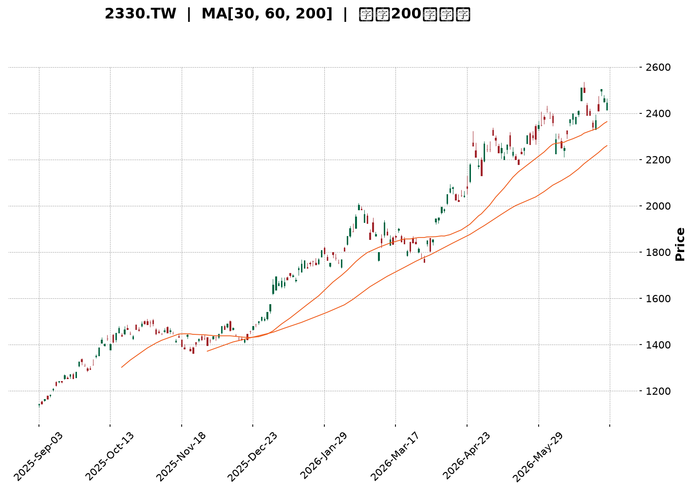
</details>

<html>
<head><meta charset="utf-8" /></head>
<body>
    <div style="height:500px; width:100%;">                        <script>window.PlotlyConfig = {MathJaxConfig: 'local'};</script>
        <script charset="utf-8" src="https://cdn.plot.ly/plotly-3.6.0.min.js" integrity="sha256-QaOVwtVY0T02VaHrr6pnoHLCwayMJp4O5n4YyaE3rJk=" crossorigin="anonymous"></script>                <div id="candlestick-chart" class="plotly-graph-div" style="height:100%; width:100%;"></div>            <script>                window.PLOTLYENV=window.PLOTLYENV || {};                                if (document.getElementById("candlestick-chart")) {                    Plotly.newPlot(                        "candlestick-chart",                        [{"close":{"dtype":"f8","bdata":"AAAA4PbikUAAAADg9uKRQAAAAIDpMZJAAAAAgOkxkkAAAABA3ICSQAAAAICL45JAAAAAQMEek0AAAAAAtG2TQAAAAGD3WZNAAAAAgNzQk0AAAAAAapWTQAAAAGCt5JNAAAAAAGqVk0AAAAAgTwyUQAAAAOCmvpRAAAAA4Ka+lEAAAABgY2+UQAAAAOAfIJRAAAAA4PAzlEAAAABANIOUQAAAAEC7IZVAAAAAQHGslUAAAABAJzeWQAAAAODj55VAAAAAQPhKlkAAAADg4+eVQAAAAGCFD5ZAAAAAQAyulkAAAADgT\u002f2WQAAAAMCZcpZAAAAAAH\u002fplkAAAAAAf+mWQAAAAKA7mpZAAAAAwJlylkAAAAAAf+mWQAAAACCu1ZZAAAAAQJNMl0AAAABAk0yXQAAAAGDCOJdAAAAAQGRgl0AAAABAk0yXQAAAAKA7mpZAAAAAQAyulkAAAACgO5qWQAAAACCu1ZZAAAAAQAyulkAAAAAgrtWWQAAAAKA7mpZAAAAAYFYjlkAAAADgyF6WQAAAACBCwJVAAAAAQKCYlUAAAADAaoaWQAAAAMD+cJVAAAAA4FxJlUAAAADg4+eVQAAAAED4SpZAAAAAQCc3lkAAAABA+EqWQAAAAOAS1JVAAAAAYFYjlkAAAADAmXKWQAAAAODIXpZAAAAAoDualkAAAACg8SSXQAAAAAB\u002f6ZZAAAAAQJNMl0AAAACgSNWWQAAAAEAM\u002fZZAAAAAgMGFlkAAAABAHEqWQAAAAIA6NpZAAAAAgDo2lkAAAACAOjaWQAAAAMBmwZZAAAAAoM8kl0AAAACAsTiXQAAAAOBWdJdAAAAA4N3Dl0AAAABAGpyXQAAAAABlE5hAAAAAYJGemEAAAACAj\u002fCZQAAAAOC7e5pAAAAAQHEEmkAAAADgNCyaQAAAAABTGJpAAAAAgBZAmkAAAADAnY+aQAAAAMCdj5pAAAAAgBZAmkAAAABA6AabQAAAAEBvVptAAAAAoBSSm0AAAABA6AabQAAAAEBvVptAAAAA4DJ+m0AAAACgjUKbQAAAAID2pZtAAAAAoARFnEAAAABgXwmcQAAAAKAUkptAAAAAIFFqm0AAAACAffWbQAAAACDYuZtAAAAAIFFqm0AAAACA9qWbQAAAAMAiMZxAAAAA4JkznUAAAABAxr6dQAAAAAAhg51AAAAA4JeFnkAAAACgaUyfQAAAAKDi\u002fJ5AAAAAgFutnkAAAABATQ6eQAAAAID095xAAAAAACGDnUAAAABgXVudQAAAAABBHZxAAAAAQE+8nEAAAAAgLyKeQAAAAKB7R51AAAAAgPT3nEAAAACAbaicQAAAAAAZJJ1AAAAAoLmvnUAAAACAT9ScQAAAAMBqrJxAAAAAgLw0nEAAAACAvDScQAAAACBdwJxAAAAAwGqsnEAAAABAoVycQAAAAEAOvZtAAAAAwERtm0AAAADgQeicQAAAAIC8NJxAAAAAQDT8nEAAAAAAP2OeQAAAAGAxd55AAAAAwLYqn0AAAAAA0gKfQAAAAIAQA6BAAAAAYO40oEAAAACg5z6gQAAAAABlop9AAAAAoHKOn0AAAACALvKfQAAAAIAu8p9AAAAAYO40oEAAAABgXwahQAAAAGDypaFAAAAAgDZCoUAAAAAgZvygQAAAAICjoqBAAAAAwOS5oUAAAADgBoihQAAAAOAGiKFAAAAAILX\u002foUAAAABg0NehQAAAAEAbaqFAAAAAAACSoUAAAACgL0yhQAAAAKDrr6FAAAAAYPKloUAAAACAFHShQAAAACBELqFAAAAAYF8GoUAAAAAAImChQAAAAAAAkqFAAAAAILX\u002foUAAAACg66+hQAAAAMDC66FAAAAAgMnhoUAAAADAd1miQAAAAMB3WaJAAAAAwFWLokAAAABgGOWiQAAAAOBOlaJAAAAAIGptokAAAACAyeGhQAAAAOC79aFAAAAAAACSoUAAAAAAAJShQAAAAAAADKJAAAAAAACOokAAAAAAAMCiQAAAAAAAoqJAAAAAAADUokAAAAAAAJyjQAAAAAAAdKNAAAAAAACsokAAAAAAAKyiQAAAAAAASKJAAAAAAACEokAAAAAAANSiQAAAAAAAkqNAAAAAAABCo0AAAAAAABqjQA=="},"high":{"dtype":"f8","bdata":"AAAA4PbikUA1wnLTLB6SQAAAAIDpMZJAK4KGcx9tkkAAAABA3ICSQAJGqSZI95JAnXPO2bNtk0AAAAAAtG2TQL0loQa0bZNAAACAXK3kk0CIgiu5C72TQAAAAGCt5JNAU8bsTn74k0AAAAAgTwyUQAAAAOCmvpRAH6icdRn6lEAQPvgYBZeUQK3USnWSW5RAh36zdWNvlEC8lX2OSOaUQJzJmRyMNZVAAAAAQHGslUC2TBb5yF6WQBGXm7y0+5VAAAAA1mqGlkARl5u8tPuVQB1g2WY7mpZAAAAAQAyulkB1uBqZ8SSXQF8qaFUMrpZAmCKflfEkl0B1gylywjiXQE2aNFndwZZAHw54nGqGlkB1gylywjiXQPoglrUgEZdAXb\u002f7+DR0l0ALn3nVBYiXQGdmZq7Wm5dAcPI3+QWIl0C6fvex1puXQMGBA+9P\u002fZZA+w0w1X7plkAmTZp8DK6WQKfADtlP\u002fZZA9RtgavEkl0CnwA7ZT\u002f2WQE2aNFndwZZApRwQGfhKlkAxyF51O5qWQJx0gEsnN5ZAchzHsePnlUAOUJecO5qWQEhqmTJCwJVAsfYNC0LAlUAjLjeZhQ+WQAAAAED4SpZAbJkssmqGlkAAAADWaoaWQBk6YOfIXpZApRwQGfhKlkAAAADAmXKWQGbtdLyZcpZAAAAAoDualkAAAACg8SSXQHWDKXLCOJdAAAAAQJNMl0AAAACQOIiXQKbIZwXuEJdA0OpLRaOZlkBiLrTK33GWQLOkHNDfcZZAkeFeRRxKlkDVZ9pao5mWQL0IPoVI1ZZAAAAAoM8kl0BQ5llFk0yXQAAAAOBWdJdAAAAA4N3Dl0CivIbK3cOXQAAAAABlE5hAAAAAYJGemEB\u002fi9Na+FOaQAAAAOC7e5pAYtGyyjQsmkCCxTww2meaQFVVVRXaZ5pAaMPnz7t7mkC3ktpKYbeaQFtJbYV\u002fo5pARYKaCtpnmkCrqqrKqy6bQNJFF1X2pZtAAAAAoBSSm0CrqqoaUWqbQOmii8oyfptAVVVVpRSSm0BgBEZA2LmbQJasZEXYuZtAAAAAoARFnEBtdnEAqoCcQMdvl3p99ZtAAAAAIFFqm0CrqqoKQR2cQJVwJzVfCZxAeZoLcPalm0AAAACA9qWbQMcyKNWpgJxAAAAA4JkznUDdy7HKieadQNXvuWVNDp5AZ9KValutnkAM5KMqLXSfQAjMHvCHOJ9A1ShjleL8nkCDvqAvPcGeQGkO32\u002fkqp1AknasQLZxnkCrqqrqIIOdQAAAAABBHZxARrXlal1bnUAFvriq8kmeQLy6FUDGvp1AErFGlXtHnUAFCaPlmTOdQEzYBsH9S51ABAKBAKzDnUA5Dx3D\u002fUudQC1kIQMZJJ1AbceH4K5InEBoOz6ET9ScQDI4H2MLOJ1Ae9OboiYQnUBwCIegk3CcQAhFKMLXDJxAdNFFA\u002fPkm0AAAADgQeicQK6R1aUmEJ1AAAAAQDT8nEAAAAAAP2OeQAAAAGAxd55AAAAAwLYqn0Bcf3tgxBafQAAAAIAQA6BAxU7sINNcoED\u002fwUTQ4EigQC8xa6EJDaBAwhZscRADoEATtSsx9SqgQA\u002fE7wD8IKBAndiJcqOioEBpnEGQWBChQBjRNtOZJ6JA+WNJ893DoUCrM1JBPTihQFRcMoQ2QqFA4Ad+INfNoUBoRSOh66+hQHW5\u002fTHXzaFAH3zwcYVFokD0Lh4htf+hQDolAcLkuaFAFN898d3DoUDJZ91gFHShQAAAAKDrr6FA74X3oqAdokBJkiRB+ZuhQFEURREiYKFADw5IUT04oUAFhBPx\u002f5GhQASTPzD5m6FAAAAAILX\u002foUA28BmzoB2iQKBoq+GZJ6JAng8s83BjokC7f\u002fOAXIGiQC9\u002f2gIm0aJAgVwTgTqzokBDWrHwAwOjQHKnaAEm0aJATvDkoTO9okDGVDhxpxOiQO+VunCnE6JAJCs8ssLroUAAAAAAAKihQAAAAAAAKqJAAAAAAACOokAAAAAAAMCiQAAAAAAAoqJAAAAAAADeokAAAAAAAJyjQAAAAAAAzqNAAAAAAAAao0AAAAAAAOiiQAAAAAAAhKJAAAAAAAC2okAAAAAAAFajQAAAAAAAkqNAAAAAAABgo0AAAAAAAEKjQA=="},"hovertemplate":"\u003cb\u003e%{x|%Y-%m-%d}\u003c\u002fb\u003e\u003cbr\u003e\u958b: $%{open:.2f}\u003cbr\u003e\u9ad8: $%{high:.2f}\u003cbr\u003e\u4f4e: $%{low:.2f}\u003cbr\u003e\u6536: $%{close:.2f}\u003cextra\u003e\u003c\u002fextra\u003e","low":{"dtype":"f8","bdata":"yz2N7MCnkUAAAADg9uKRQDip+zJwCpJAAAAAgOkxkkCrqqryYlmSQPxzrTISvJJAGGOMmQQLk0CzLMuyOkaTQEPaXrk6RpNAAAAADpmBk0AAAAAAapWTQPIN8u1plZNAAAAAAGqVk0CtG0zROqmTQCI9UJGSW5RA4VdjSjSDlEAAAABgY2+UQBu5kQNPDJRAAAAA4PAzlEAAAABANIOUQMdszIYZ+pRAAAAAOLshlUDvjF6qtPuVQN7RyCZCwJVAqqqqhlYjlkCqDPaQz4SVQLPNl4O0+5VADjDVXIUPlkAWj8ptDK6WQAAAAMCZcpZArRtMsWqGlkAAAAAAf+mWQNmyZcNqhpZAoNWXKic3lkAAAAAAf+mWQK2feEPdwZZA9WCGqiARl0BSIIJjwjiXQAAAAGDCOJdAIBuQzSARl0CkQASH8SSXQNmyZcNqhpZAAAAAQAyulkDZsmXDaoaWQFk\u002f8WYMrpZAAAAAQAyulkAG32mKO5qWQAAAAKA7mpZArvF3g4UPlkAAAADgyF6WQAAAACBCwJVAAAAAQKCYlUDWDzoq+EqWQAAAAMD+cJVAAAAA4FxJlUDe0cgmQsCVQAAAAKqFD5ZApdl0Y1YjlkBVVVVjJzeWQAAAAOAS1JVAXOPvprT7lUCg1ZcqJzeWQM43oUpWI5ZAZsuWLfhKlkCHJvmXO5qWQAAAAAB\u002f6ZZAR4EIzk\u002f9lkCrqqraZsGWQLRuMLVI1ZZALxW0ut9xlkCe0Uu1WCKWQG8eobpYIpZATVvjL5X6lUAAAACAOjaWQIfugzWjmZZAIfnzikjVlkBfM0z17RCXQJO\u002fyY+xOJdAq6qqylZ0l0BeQ3m1VnSXQKcBbZo4iJdAgeAyNYP\u002fl0BOa7aPnz2ZQP3zz58mjZlAnS5Nta3cmUD8dIY\u002f6rSZQFVVVSXqtJlAAAAAgBZAmkBJbSU12meaQEltJTXaZ5pAun1l9VIYmkAAAACgnY+aQNJFF9tCy5pAt5bFOugGm0AAAABA6AabQBdddLWrLptAq6qqyqsum0AAAACgjUKbQBShCKWNQptAMP3S\u002f7nNm0CYwZeaffWbQAAAAKAUkptACjKbCsoam0AAAAAw2LmbQLZHbJUUkptAg8ymWm9Wm0BTm9pU6AabQAAAAMAiMZxA6jsbtYuUnECL0DgVuB+dQAAAAAAhg51A\u002feMSK8a+nUDmN7iK4vyeQAAAAKDi\u002fJ5AjHiSGi8inkAAAABATQ6eQAAAAID095xAdEucOj9vnUBVVVXVmTOdQPitkdUyfptAXCWNKshsnEDeLE8auB+dQAAAAKB7R51AqaJnpYuUnEAAAACAbaicQLMn+T40\u002fJxA9Pl8fuJznUAAAACAT9ScQAAAAMBqrJxA4BpZnQDRm0AncfC+1wycQAAAACBdwJxAAAAAwGqsnEA+3uO91wycQAAAAEAOvZtAAAAAwERtm0D6kmn9hYScQJQ4eB\u002fKIJxA11prXXiYnECd2Ikdg\u002f+dQDN1i311E55AUrgefQiznkDugY3e+saeQL9KGJubUp9AO7ETnwkNoEAHdGN+EAOgQAAAAABlop9AAAAAoHKOn0D4HYgfPN6fQPE7EL9Jyp9Aip3YbhADoEBpOeZbzGagQAAAAGDypaFAAAAAgDZCoUAq5laPet6gQAAAAICjoqBA\u002fMAPvFEaoUBMXW5\u002fFHShQExdbn8UdKFAAAAAILX\u002foUBPRZpu8qWhQAAAAEAbaqFA3NTDTT04oUAp8lkPRC6hQB6Xvh0iYKFAhB5CzwaIoUAkSZKONkKhQAAAACBELqFAAAAAYF8GoUAAAAAAImChQOiNgt4oVqFA4YMPzuS5oUAAAACg66+hQMuHcV\u002fQ16FAOavHjuuvoUBXoM\u002fOmSeiQBEgw49+T6JAf6Ps\u002fnBjokC+pU7PLMeiQAAAAOBOlaJA4yVKj35PokBi8NMMImChQAucg3\u002fJ4aFAAAAAAACSoUAAAAAAAEShQAAAAAAA5KFAAAAAAABSokAAAAAAAFyiQAAAAAAAXKJAAAAAAACiokAAAAAAAC6jQAAAAAAAdKNAAAAAAACsokAAAAAAAKyiQAAAAAAAKqJAAAAAAAA0okAAAAAAANSiQAAAAAAAVqNAAAAAAAAao0AAAAAAAN6iQA=="},"name":"\u50f9\u683c","open":{"dtype":"f8","bdata":"7mmEOTrPkUAjLPcscAqSQJzUfdksHpJAK4KGcx9tkkBVVVWZH22SQP65VtnOz5JAtdZaM\u002fdZk0BZlmVZ91mTQL0loQa0bZNAAACA6mmVk0BEwZXcOqmTQPkG+aYLvZNADwVXcq3kk0CtG0zROqmTQILK2W1jb5RAvxoTmUjmlEAAAABgY2+UQMmN3JjBR5RALSqRvMFHlEAAAABANIOUQGM2ZmPqDZVAAAAAOLshlUDvjF6qtPuVQO9oZAMT1JVAAAAAQPhKlkCqDPaQz4SVQNAtcYpqhpZACuSfFSc3lkAWj8ptDK6WQB8OeJxqhpZAinzWjTualkDdYIrcT\u002f2WQAAAAKA7mpZAwOMPB\u002fhKlkB1gylywjiXQFNgh\u002fx+6ZZApEAEh\u002fEkl0Bdv\u002fv4NHSXQNejcPU0dJdAAAAAQGRgl0ALn3nVBYiXQJo0aRJ\u002f6ZZA\u002flllHN3BlkAAAACgO5qWQK2feEPdwZZA98H6jSARl0Ctn3hD3cGWQAAAAKA7mpZArvF3g4UPlkBm7XS8mXKWQJx0gEsnN5ZAHMdxHHGslUDyr2jjmXKWQCS1THmgmJVA6aKLLnGslUAjLjeZhQ+WQKqqqoZWI5ZAEXOh1ZlylkAAAABA+EqWQBk6YOfIXpZAAAAAYFYjlkDA4w8H+EqWQAAAAODIXpZAjBgxCslelkAraox0DK6WQJgin5XxJJdA9WCGqiARl0CrqqrKVnSXQFo3mHoq6ZZAAAAAgMGFlkAAAABAHEqWQJHhXkUcSpZA3jxC9XYOlkDVZ9pao5mWQAAAAMBmwZZA2fo2UCrplkAAAACAsTiXQDGVmBp1YJdAAAAAkDiIl0Cvobx6OIiXQP0ly18anJdAYSjmv0YnmECb7RNVgVGZQP3zz58mjZlAnS5Nta3cmUAoDPAEzMiZQAAAALCt3JlARYKaCtpnmkC3ktpKYbeaQKW2kvq7e5pA3b6yujQsmkCrqqp6BvOaQNJFF9tCy5pAt5bFOugGm0BVVVUFyhqbQHTRRQVRaptAAAAA4DJ+m0B1AcIqUWqbQKpNbWpvVptAMP3S\u002f7nNm0AGOAk7yGycQER29O+5zZtAiGX0z6sum0CrqqoKQR2cQAAAACDYuZtAAAAAIFFqm0DpRz8ayhqbQBUm3g\u002fIbJxAbdR3em2onEB6tpHamTOdQAAAAAAhg51A\u002feMSK8a+nUDmN7iK4vyeQFiZX2XEEJ9AjHiSGi8inkDXPguleZmeQJsJ6h8\u002fb51AYaQdKy8inkBVVVXVmTOdQDl435oUkptAo9pyVdYLnUDj6gele0edQF7dCvAgg51AqaJnpYuUnEAEmkIguB+dQCZsg2ALOJ1A\u002fP1+P8ebnUBaN5hiCzidQMlCFkI0\u002fJxATeLg\u002ffLkm0BoOz6ET9ScQCHQFKImEJ1AZCELgU\u002fUnECu5moeyiCcQAAAAEAOvZtAuuii4Rupm0Bji3K+aqycQK6R1aUmEJ1A8L33fk\u002fUnEBe6IXeZyeeQEeVBJ9MT55AmpmZ3frGnkClgISf3+6eQKrQo\u002fuNZp9A7MROzwIXoEABPrtv7jSgQPyoLnEQA6BA61x5AGWin0AAAACALvKfQPgdiB883p9AYid2wOBIoEDS1SeMxXCgQHzhvfDdw6FAh1WEoQ1+oUAOosfvbPKgQMoQrCNELqFA7MRO7EokoUAAAADgBoihQAAAAOAGiKFAzaFiEZMxokB6F4\u002fAwuuhQOvbgGHypaFA8LMBPxtqoUAp8lkPRC6hQI9L394GiKFAc6Q5ErX\u002foUBJkiTvKFahQDEMw7AvTKFApnEGIUQuoUDPNG5gFHShQPjZgJ8NfqFA4YMPzuS5oUAaw9GCpxOiQDZ4jiC1\u002f6FA6CCvkn5PokA0YEkvjDuiQAAAAMB3WaJAQK6JIEifokAAAABgGOWiQAAAAOBOlaJAO7RrQUGpokBi8NMMImChQAAAAOC79aFAGHJ9IdfNoUAAAAAAAIChQAAAAAAAKqJAAAAAAABwokAAAAAAAI6iQAAAAAAAZqJAAAAAAAC2okAAAAAAAC6jQAAAAAAAnKNAAAAAAAAGo0AAAAAAANSiQAAAAAAAcKJAAAAAAAA0okAAAAAAABCjQAAAAAAAfqNAAAAAAAAko0AAAAAAAN6iQA=="},"x":["2025-09-03T00:00:00+08:00","2025-09-04T00:00:00+08:00","2025-09-05T00:00:00+08:00","2025-09-08T00:00:00+08:00","2025-09-09T00:00:00+08:00","2025-09-10T00:00:00+08:00","2025-09-11T00:00:00+08:00","2025-09-12T00:00:00+08:00","2025-09-15T00:00:00+08:00","2025-09-16T00:00:00+08:00","2025-09-17T00:00:00+08:00","2025-09-18T00:00:00+08:00","2025-09-19T00:00:00+08:00","2025-09-22T00:00:00+08:00","2025-09-23T00:00:00+08:00","2025-09-24T00:00:00+08:00","2025-09-25T00:00:00+08:00","2025-09-26T00:00:00+08:00","2025-09-30T00:00:00+08:00","2025-10-01T00:00:00+08:00","2025-10-02T00:00:00+08:00","2025-10-03T00:00:00+08:00","2025-10-07T00:00:00+08:00","2025-10-08T00:00:00+08:00","2025-10-09T00:00:00+08:00","2025-10-13T00:00:00+08:00","2025-10-14T00:00:00+08:00","2025-10-15T00:00:00+08:00","2025-10-16T00:00:00+08:00","2025-10-17T00:00:00+08:00","2025-10-20T00:00:00+08:00","2025-10-21T00:00:00+08:00","2025-10-22T00:00:00+08:00","2025-10-23T00:00:00+08:00","2025-10-27T00:00:00+08:00","2025-10-28T00:00:00+08:00","2025-10-29T00:00:00+08:00","2025-10-30T00:00:00+08:00","2025-10-31T00:00:00+08:00","2025-11-03T00:00:00+08:00","2025-11-04T00:00:00+08:00","2025-11-05T00:00:00+08:00","2025-11-06T00:00:00+08:00","2025-11-07T00:00:00+08:00","2025-11-10T00:00:00+08:00","2025-11-11T00:00:00+08:00","2025-11-12T00:00:00+08:00","2025-11-13T00:00:00+08:00","2025-11-14T00:00:00+08:00","2025-11-17T00:00:00+08:00","2025-11-18T00:00:00+08:00","2025-11-19T00:00:00+08:00","2025-11-20T00:00:00+08:00","2025-11-21T00:00:00+08:00","2025-11-24T00:00:00+08:00","2025-11-25T00:00:00+08:00","2025-11-26T00:00:00+08:00","2025-11-27T00:00:00+08:00","2025-11-28T00:00:00+08:00","2025-12-01T00:00:00+08:00","2025-12-02T00:00:00+08:00","2025-12-03T00:00:00+08:00","2025-12-04T00:00:00+08:00","2025-12-05T00:00:00+08:00","2025-12-08T00:00:00+08:00","2025-12-09T00:00:00+08:00","2025-12-10T00:00:00+08:00","2025-12-11T00:00:00+08:00","2025-12-12T00:00:00+08:00","2025-12-15T00:00:00+08:00","2025-12-16T00:00:00+08:00","2025-12-17T00:00:00+08:00","2025-12-18T00:00:00+08:00","2025-12-19T00:00:00+08:00","2025-12-22T00:00:00+08:00","2025-12-23T00:00:00+08:00","2025-12-24T00:00:00+08:00","2025-12-26T00:00:00+08:00","2025-12-29T00:00:00+08:00","2025-12-30T00:00:00+08:00","2025-12-31T00:00:00+08:00","2026-01-02T00:00:00+08:00","2026-01-05T00:00:00+08:00","2026-01-06T00:00:00+08:00","2026-01-07T00:00:00+08:00","2026-01-08T00:00:00+08:00","2026-01-09T00:00:00+08:00","2026-01-12T00:00:00+08:00","2026-01-13T00:00:00+08:00","2026-01-14T00:00:00+08:00","2026-01-15T00:00:00+08:00","2026-01-16T00:00:00+08:00","2026-01-19T00:00:00+08:00","2026-01-20T00:00:00+08:00","2026-01-21T00:00:00+08:00","2026-01-22T00:00:00+08:00","2026-01-23T00:00:00+08:00","2026-01-26T00:00:00+08:00","2026-01-27T00:00:00+08:00","2026-01-28T00:00:00+08:00","2026-01-29T00:00:00+08:00","2026-01-30T00:00:00+08:00","2026-02-02T00:00:00+08:00","2026-02-03T00:00:00+08:00","2026-02-04T00:00:00+08:00","2026-02-05T00:00:00+08:00","2026-02-06T00:00:00+08:00","2026-02-09T00:00:00+08:00","2026-02-10T00:00:00+08:00","2026-02-11T00:00:00+08:00","2026-02-23T00:00:00+08:00","2026-02-24T00:00:00+08:00","2026-02-25T00:00:00+08:00","2026-02-26T00:00:00+08:00","2026-03-02T00:00:00+08:00","2026-03-03T00:00:00+08:00","2026-03-04T00:00:00+08:00","2026-03-05T00:00:00+08:00","2026-03-06T00:00:00+08:00","2026-03-09T00:00:00+08:00","2026-03-10T00:00:00+08:00","2026-03-11T00:00:00+08:00","2026-03-12T00:00:00+08:00","2026-03-13T00:00:00+08:00","2026-03-16T00:00:00+08:00","2026-03-17T00:00:00+08:00","2026-03-18T00:00:00+08:00","2026-03-19T00:00:00+08:00","2026-03-20T00:00:00+08:00","2026-03-23T00:00:00+08:00","2026-03-24T00:00:00+08:00","2026-03-25T00:00:00+08:00","2026-03-26T00:00:00+08:00","2026-03-27T00:00:00+08:00","2026-03-30T00:00:00+08:00","2026-03-31T00:00:00+08:00","2026-04-01T00:00:00+08:00","2026-04-02T00:00:00+08:00","2026-04-07T00:00:00+08:00","2026-04-08T00:00:00+08:00","2026-04-09T00:00:00+08:00","2026-04-10T00:00:00+08:00","2026-04-13T00:00:00+08:00","2026-04-14T00:00:00+08:00","2026-04-15T00:00:00+08:00","2026-04-16T00:00:00+08:00","2026-04-17T00:00:00+08:00","2026-04-20T00:00:00+08:00","2026-04-21T00:00:00+08:00","2026-04-22T00:00:00+08:00","2026-04-23T00:00:00+08:00","2026-04-24T00:00:00+08:00","2026-04-27T00:00:00+08:00","2026-04-28T00:00:00+08:00","2026-04-29T00:00:00+08:00","2026-04-30T00:00:00+08:00","2026-05-04T00:00:00+08:00","2026-05-05T00:00:00+08:00","2026-05-06T00:00:00+08:00","2026-05-07T00:00:00+08:00","2026-05-08T00:00:00+08:00","2026-05-11T00:00:00+08:00","2026-05-12T00:00:00+08:00","2026-05-13T00:00:00+08:00","2026-05-14T00:00:00+08:00","2026-05-15T00:00:00+08:00","2026-05-18T00:00:00+08:00","2026-05-19T00:00:00+08:00","2026-05-20T00:00:00+08:00","2026-05-21T00:00:00+08:00","2026-05-22T00:00:00+08:00","2026-05-25T00:00:00+08:00","2026-05-26T00:00:00+08:00","2026-05-27T00:00:00+08:00","2026-05-28T00:00:00+08:00","2026-05-29T00:00:00+08:00","2026-06-01T00:00:00+08:00","2026-06-02T00:00:00+08:00","2026-06-03T00:00:00+08:00","2026-06-04T00:00:00+08:00","2026-06-05T00:00:00+08:00","2026-06-08T00:00:00+08:00","2026-06-09T00:00:00+08:00","2026-06-10T00:00:00+08:00","2026-06-11T00:00:00+08:00","2026-06-12T00:00:00+08:00","2026-06-15T00:00:00+08:00","2026-06-16T00:00:00+08:00","2026-06-17T00:00:00+08:00","2026-06-18T00:00:00+08:00","2026-06-22T00:00:00+08:00","2026-06-23T00:00:00+08:00","2026-06-24T00:00:00+08:00","2026-06-25T00:00:00+08:00","2026-06-26T00:00:00+08:00","2026-06-29T00:00:00+08:00","2026-06-30T00:00:00+08:00","2026-07-01T00:00:00+08:00","2026-07-02T00:00:00+08:00","2026-07-03T00:00:00+08:00"],"type":"candlestick"},{"hovertemplate":"MA30: $%{y:.2f}\u003cextra\u003e\u003c\u002fextra\u003e","line":{"color":"#2196F3","dash":"dash","width":2},"mode":"lines","name":"MA30","x":["2025-09-03T00:00:00+08:00","2025-09-04T00:00:00+08:00","2025-09-05T00:00:00+08:00","2025-09-08T00:00:00+08:00","2025-09-09T00:00:00+08:00","2025-09-10T00:00:00+08:00","2025-09-11T00:00:00+08:00","2025-09-12T00:00:00+08:00","2025-09-15T00:00:00+08:00","2025-09-16T00:00:00+08:00","2025-09-17T00:00:00+08:00","2025-09-18T00:00:00+08:00","2025-09-19T00:00:00+08:00","2025-09-22T00:00:00+08:00","2025-09-23T00:00:00+08:00","2025-09-24T00:00:00+08:00","2025-09-25T00:00:00+08:00","2025-09-26T00:00:00+08:00","2025-09-30T00:00:00+08:00","2025-10-01T00:00:00+08:00","2025-10-02T00:00:00+08:00","2025-10-03T00:00:00+08:00","2025-10-07T00:00:00+08:00","2025-10-08T00:00:00+08:00","2025-10-09T00:00:00+08:00","2025-10-13T00:00:00+08:00","2025-10-14T00:00:00+08:00","2025-10-15T00:00:00+08:00","2025-10-16T00:00:00+08:00","2025-10-17T00:00:00+08:00","2025-10-20T00:00:00+08:00","2025-10-21T00:00:00+08:00","2025-10-22T00:00:00+08:00","2025-10-23T00:00:00+08:00","2025-10-27T00:00:00+08:00","2025-10-28T00:00:00+08:00","2025-10-29T00:00:00+08:00","2025-10-30T00:00:00+08:00","2025-10-31T00:00:00+08:00","2025-11-03T00:00:00+08:00","2025-11-04T00:00:00+08:00","2025-11-05T00:00:00+08:00","2025-11-06T00:00:00+08:00","2025-11-07T00:00:00+08:00","2025-11-10T00:00:00+08:00","2025-11-11T00:00:00+08:00","2025-11-12T00:00:00+08:00","2025-11-13T00:00:00+08:00","2025-11-14T00:00:00+08:00","2025-11-17T00:00:00+08:00","2025-11-18T00:00:00+08:00","2025-11-19T00:00:00+08:00","2025-11-20T00:00:00+08:00","2025-11-21T00:00:00+08:00","2025-11-24T00:00:00+08:00","2025-11-25T00:00:00+08:00","2025-11-26T00:00:00+08:00","2025-11-27T00:00:00+08:00","2025-11-28T00:00:00+08:00","2025-12-01T00:00:00+08:00","2025-12-02T00:00:00+08:00","2025-12-03T00:00:00+08:00","2025-12-04T00:00:00+08:00","2025-12-05T00:00:00+08:00","2025-12-08T00:00:00+08:00","2025-12-09T00:00:00+08:00","2025-12-10T00:00:00+08:00","2025-12-11T00:00:00+08:00","2025-12-12T00:00:00+08:00","2025-12-15T00:00:00+08:00","2025-12-16T00:00:00+08:00","2025-12-17T00:00:00+08:00","2025-12-18T00:00:00+08:00","2025-12-19T00:00:00+08:00","2025-12-22T00:00:00+08:00","2025-12-23T00:00:00+08:00","2025-12-24T00:00:00+08:00","2025-12-26T00:00:00+08:00","2025-12-29T00:00:00+08:00","2025-12-30T00:00:00+08:00","2025-12-31T00:00:00+08:00","2026-01-02T00:00:00+08:00","2026-01-05T00:00:00+08:00","2026-01-06T00:00:00+08:00","2026-01-07T00:00:00+08:00","2026-01-08T00:00:00+08:00","2026-01-09T00:00:00+08:00","2026-01-12T00:00:00+08:00","2026-01-13T00:00:00+08:00","2026-01-14T00:00:00+08:00","2026-01-15T00:00:00+08:00","2026-01-16T00:00:00+08:00","2026-01-19T00:00:00+08:00","2026-01-20T00:00:00+08:00","2026-01-21T00:00:00+08:00","2026-01-22T00:00:00+08:00","2026-01-23T00:00:00+08:00","2026-01-26T00:00:00+08:00","2026-01-27T00:00:00+08:00","2026-01-28T00:00:00+08:00","2026-01-29T00:00:00+08:00","2026-01-30T00:00:00+08:00","2026-02-02T00:00:00+08:00","2026-02-03T00:00:00+08:00","2026-02-04T00:00:00+08:00","2026-02-05T00:00:00+08:00","2026-02-06T00:00:00+08:00","2026-02-09T00:00:00+08:00","2026-02-10T00:00:00+08:00","2026-02-11T00:00:00+08:00","2026-02-23T00:00:00+08:00","2026-02-24T00:00:00+08:00","2026-02-25T00:00:00+08:00","2026-02-26T00:00:00+08:00","2026-03-02T00:00:00+08:00","2026-03-03T00:00:00+08:00","2026-03-04T00:00:00+08:00","2026-03-05T00:00:00+08:00","2026-03-06T00:00:00+08:00","2026-03-09T00:00:00+08:00","2026-03-10T00:00:00+08:00","2026-03-11T00:00:00+08:00","2026-03-12T00:00:00+08:00","2026-03-13T00:00:00+08:00","2026-03-16T00:00:00+08:00","2026-03-17T00:00:00+08:00","2026-03-18T00:00:00+08:00","2026-03-19T00:00:00+08:00","2026-03-20T00:00:00+08:00","2026-03-23T00:00:00+08:00","2026-03-24T00:00:00+08:00","2026-03-25T00:00:00+08:00","2026-03-26T00:00:00+08:00","2026-03-27T00:00:00+08:00","2026-03-30T00:00:00+08:00","2026-03-31T00:00:00+08:00","2026-04-01T00:00:00+08:00","2026-04-02T00:00:00+08:00","2026-04-07T00:00:00+08:00","2026-04-08T00:00:00+08:00","2026-04-09T00:00:00+08:00","2026-04-10T00:00:00+08:00","2026-04-13T00:00:00+08:00","2026-04-14T00:00:00+08:00","2026-04-15T00:00:00+08:00","2026-04-16T00:00:00+08:00","2026-04-17T00:00:00+08:00","2026-04-20T00:00:00+08:00","2026-04-21T00:00:00+08:00","2026-04-22T00:00:00+08:00","2026-04-23T00:00:00+08:00","2026-04-24T00:00:00+08:00","2026-04-27T00:00:00+08:00","2026-04-28T00:00:00+08:00","2026-04-29T00:00:00+08:00","2026-04-30T00:00:00+08:00","2026-05-04T00:00:00+08:00","2026-05-05T00:00:00+08:00","2026-05-06T00:00:00+08:00","2026-05-07T00:00:00+08:00","2026-05-08T00:00:00+08:00","2026-05-11T00:00:00+08:00","2026-05-12T00:00:00+08:00","2026-05-13T00:00:00+08:00","2026-05-14T00:00:00+08:00","2026-05-15T00:00:00+08:00","2026-05-18T00:00:00+08:00","2026-05-19T00:00:00+08:00","2026-05-20T00:00:00+08:00","2026-05-21T00:00:00+08:00","2026-05-22T00:00:00+08:00","2026-05-25T00:00:00+08:00","2026-05-26T00:00:00+08:00","2026-05-27T00:00:00+08:00","2026-05-28T00:00:00+08:00","2026-05-29T00:00:00+08:00","2026-06-01T00:00:00+08:00","2026-06-02T00:00:00+08:00","2026-06-03T00:00:00+08:00","2026-06-04T00:00:00+08:00","2026-06-05T00:00:00+08:00","2026-06-08T00:00:00+08:00","2026-06-09T00:00:00+08:00","2026-06-10T00:00:00+08:00","2026-06-11T00:00:00+08:00","2026-06-12T00:00:00+08:00","2026-06-15T00:00:00+08:00","2026-06-16T00:00:00+08:00","2026-06-17T00:00:00+08:00","2026-06-18T00:00:00+08:00","2026-06-22T00:00:00+08:00","2026-06-23T00:00:00+08:00","2026-06-24T00:00:00+08:00","2026-06-25T00:00:00+08:00","2026-06-26T00:00:00+08:00","2026-06-29T00:00:00+08:00","2026-06-30T00:00:00+08:00","2026-07-01T00:00:00+08:00","2026-07-02T00:00:00+08:00","2026-07-03T00:00:00+08:00"],"y":{"dtype":"f8","bdata":"AAAAAAAA+H8AAAAAAAD4fwAAAAAAAPh\u002fAAAAAAAA+H8AAAAAAAD4fwAAAAAAAPh\u002fAAAAAAAA+H8AAAAAAAD4fwAAAAAAAPh\u002fAAAAAAAA+H8AAAAAAAD4fwAAAAAAAPh\u002fAAAAAAAA+H8AAAAAAAD4fwAAAAAAAPh\u002fAAAAAAAA+H8AAAAAAAD4fwAAAAAAAPh\u002fAAAAAAAA+H8AAAAAAAD4fwAAAAAAAPh\u002fAAAAAAAA+H8AAAAAAAD4fwAAAAAAAPh\u002fAAAAAAAA+H8AAAAAAAD4fwAAAAAAAPh\u002fAAAAAAAA+H8AAAAAAAD4f2ZmZsYoWZRA3t3dLQuElEBVVVWV7a6UQLy7u+uJ1JRAAAAAENT4lEBmZmYWcx6VQImIiOgeQJVAq6qqCshjlUC8u7t7z4SVQAAAAEDWpZVAREREpDjElUB3d3c37eOVQO\u002fu7o4L+5VA3t3dXXcVlkBERESEQyuWQHd3dxcZPZZAiYiIeJxNlkDe3d1tFmKWQM3MzHw5d5ZA7+7u3ryHlkCJiIgol5eWQLy7u+vfnJZAIiIi0jaclkBEREQ0256WQCIiIqLkmpZAMzMzY06SlkAzMzNjTpKWQO\u002fu7q5JlJZA3t3dHVOQlkAzMzNDYYqWQAAAAIAYhZZAvLu7i31+lkCJiIj4hnqWQN7d3a2LeJZAAAAA4N15lkCamZkp2XuWQCIiIkKCfJZAIiIiQoJ8lkDe3d1NiHiWQERERMSKdpZAMzMzE0FvlkAiIiKCo2aWQDMzMyNOY5ZA3t3drU9flkDv7u5O+luWQDMzM0NNW5ZAVVVVtUJflkDv7u6ej2KWQLy7u8vUaZZA3t3dLbd3lkBVVVX1SoKWQERERHQhlpZAIiIiwu2vlkDe3d0dEc2WQLy7u2sX+JZAd3d393Ugl0ARERER30SXQGZmZgZRZZdAZmZmZr+Hl0ARERFRK6yXQAAAANCN1JdAiYiISKX3l0B3d3f3uB6YQBEREWEcSZhAq6qqeoFzmEDNzMxMo5SYQKuqqgpnuphAERERoTDemEAiIiIy9wOZQM3MzLy6K5lAIiIigsVcmUB3d3dH0I2ZQAAAAMCKu5lAd3d35\u002fHnmUC8u7ur\u002fBiaQJqZmdlmQ5pAmpmZGdpnmkCrqqqqoI2aQM3MzNwNtppA7+7u\u002fnHkmkAAAAAQzRibQCIiIjIxR5tAd3d3R495m0AAAADASaebQJqZmfm5zZtAREREhH31m0BmZmZ2oBacQImIiNglL5xAd3d3h\u002ftKnEAAAABA12KcQM3MzGwYcJxAREREhE2FnEARERHhz5+cQLy7u1thsJxAiYiIOE+8nEAAAAAQOsqcQGZmZpad2ZxAd3d3R1XsnEC8u7ubufmcQHd3dzd5Ap1Ad3d3R+4BnUARERFRYAOdQM3MzMxzDZ1AMzMzYzAYnUAzMzODoBudQKuqquq7G51Aq6qqGtUbnUCamZlZkyadQDMzMxOyJp1Aq6qqWtkknUCJiIjYVCqdQGZmZoZ3Mp1A3t3djfg3nUARERGRhDWdQKuqqvpbPp1AZmZmFi1NnUAAAACw9WGdQLy7uyu1eJ1AMzMz0yaKnUDNzMzcPqCdQCIiInLxwJ1Ad3d3B1TgnUB3d3c3vwGeQN7d3Q0YNZ5Ad3d3Z3FknkBVVVXlyZGeQJqZmSkHtZ5ARERE5DrmnkBmZmbmaxufQFVVVVXxUZ9Ad3d3l26Un0AAAAAAQ9SfQCIiIsoPBKBAREREnKcfoEBEREQcQDqgQO\u002fu7obUWqBAq6qqQmh8oEAiIiJyAZagQHd3d9dEsKBAAAAAwODFoEAzMzOzftigQLy7uxNx7KBAMzMzqw0BoUB3d3efqxOhQM3MzNT1I6FA7+7uZkEyoUC8u7sjNUShQERERAzRWaFAiYiImGtxoUARERGRWoqhQAAAALCgoKFA7+7uvpOzoUBVVVUV5LqhQO\u002fu7u6MvaFAiYiIyDXAoUAiIiJyQ8WhQAAAABBP0aFAmpmZCWHYoUBVVVU1x+KhQBEREWEt7KFAERER8UDzoUCJiIiYUwKiQGZmZha5E6JAzczMfB8dokAiIiKi2SiiQBEREWHrLaJAvLu7O1I1okCJiIhIDUGiQJqZmWlxVaJAzczMTH9ookBmZmbmOXeiQA=="},"type":"scatter"},{"hovertemplate":"MA60: $%{y:.2f}\u003cextra\u003e\u003c\u002fextra\u003e","line":{"color":"#9C27B0","dash":"dash","width":2},"mode":"lines","name":"MA60","x":["2025-09-03T00:00:00+08:00","2025-09-04T00:00:00+08:00","2025-09-05T00:00:00+08:00","2025-09-08T00:00:00+08:00","2025-09-09T00:00:00+08:00","2025-09-10T00:00:00+08:00","2025-09-11T00:00:00+08:00","2025-09-12T00:00:00+08:00","2025-09-15T00:00:00+08:00","2025-09-16T00:00:00+08:00","2025-09-17T00:00:00+08:00","2025-09-18T00:00:00+08:00","2025-09-19T00:00:00+08:00","2025-09-22T00:00:00+08:00","2025-09-23T00:00:00+08:00","2025-09-24T00:00:00+08:00","2025-09-25T00:00:00+08:00","2025-09-26T00:00:00+08:00","2025-09-30T00:00:00+08:00","2025-10-01T00:00:00+08:00","2025-10-02T00:00:00+08:00","2025-10-03T00:00:00+08:00","2025-10-07T00:00:00+08:00","2025-10-08T00:00:00+08:00","2025-10-09T00:00:00+08:00","2025-10-13T00:00:00+08:00","2025-10-14T00:00:00+08:00","2025-10-15T00:00:00+08:00","2025-10-16T00:00:00+08:00","2025-10-17T00:00:00+08:00","2025-10-20T00:00:00+08:00","2025-10-21T00:00:00+08:00","2025-10-22T00:00:00+08:00","2025-10-23T00:00:00+08:00","2025-10-27T00:00:00+08:00","2025-10-28T00:00:00+08:00","2025-10-29T00:00:00+08:00","2025-10-30T00:00:00+08:00","2025-10-31T00:00:00+08:00","2025-11-03T00:00:00+08:00","2025-11-04T00:00:00+08:00","2025-11-05T00:00:00+08:00","2025-11-06T00:00:00+08:00","2025-11-07T00:00:00+08:00","2025-11-10T00:00:00+08:00","2025-11-11T00:00:00+08:00","2025-11-12T00:00:00+08:00","2025-11-13T00:00:00+08:00","2025-11-14T00:00:00+08:00","2025-11-17T00:00:00+08:00","2025-11-18T00:00:00+08:00","2025-11-19T00:00:00+08:00","2025-11-20T00:00:00+08:00","2025-11-21T00:00:00+08:00","2025-11-24T00:00:00+08:00","2025-11-25T00:00:00+08:00","2025-11-26T00:00:00+08:00","2025-11-27T00:00:00+08:00","2025-11-28T00:00:00+08:00","2025-12-01T00:00:00+08:00","2025-12-02T00:00:00+08:00","2025-12-03T00:00:00+08:00","2025-12-04T00:00:00+08:00","2025-12-05T00:00:00+08:00","2025-12-08T00:00:00+08:00","2025-12-09T00:00:00+08:00","2025-12-10T00:00:00+08:00","2025-12-11T00:00:00+08:00","2025-12-12T00:00:00+08:00","2025-12-15T00:00:00+08:00","2025-12-16T00:00:00+08:00","2025-12-17T00:00:00+08:00","2025-12-18T00:00:00+08:00","2025-12-19T00:00:00+08:00","2025-12-22T00:00:00+08:00","2025-12-23T00:00:00+08:00","2025-12-24T00:00:00+08:00","2025-12-26T00:00:00+08:00","2025-12-29T00:00:00+08:00","2025-12-30T00:00:00+08:00","2025-12-31T00:00:00+08:00","2026-01-02T00:00:00+08:00","2026-01-05T00:00:00+08:00","2026-01-06T00:00:00+08:00","2026-01-07T00:00:00+08:00","2026-01-08T00:00:00+08:00","2026-01-09T00:00:00+08:00","2026-01-12T00:00:00+08:00","2026-01-13T00:00:00+08:00","2026-01-14T00:00:00+08:00","2026-01-15T00:00:00+08:00","2026-01-16T00:00:00+08:00","2026-01-19T00:00:00+08:00","2026-01-20T00:00:00+08:00","2026-01-21T00:00:00+08:00","2026-01-22T00:00:00+08:00","2026-01-23T00:00:00+08:00","2026-01-26T00:00:00+08:00","2026-01-27T00:00:00+08:00","2026-01-28T00:00:00+08:00","2026-01-29T00:00:00+08:00","2026-01-30T00:00:00+08:00","2026-02-02T00:00:00+08:00","2026-02-03T00:00:00+08:00","2026-02-04T00:00:00+08:00","2026-02-05T00:00:00+08:00","2026-02-06T00:00:00+08:00","2026-02-09T00:00:00+08:00","2026-02-10T00:00:00+08:00","2026-02-11T00:00:00+08:00","2026-02-23T00:00:00+08:00","2026-02-24T00:00:00+08:00","2026-02-25T00:00:00+08:00","2026-02-26T00:00:00+08:00","2026-03-02T00:00:00+08:00","2026-03-03T00:00:00+08:00","2026-03-04T00:00:00+08:00","2026-03-05T00:00:00+08:00","2026-03-06T00:00:00+08:00","2026-03-09T00:00:00+08:00","2026-03-10T00:00:00+08:00","2026-03-11T00:00:00+08:00","2026-03-12T00:00:00+08:00","2026-03-13T00:00:00+08:00","2026-03-16T00:00:00+08:00","2026-03-17T00:00:00+08:00","2026-03-18T00:00:00+08:00","2026-03-19T00:00:00+08:00","2026-03-20T00:00:00+08:00","2026-03-23T00:00:00+08:00","2026-03-24T00:00:00+08:00","2026-03-25T00:00:00+08:00","2026-03-26T00:00:00+08:00","2026-03-27T00:00:00+08:00","2026-03-30T00:00:00+08:00","2026-03-31T00:00:00+08:00","2026-04-01T00:00:00+08:00","2026-04-02T00:00:00+08:00","2026-04-07T00:00:00+08:00","2026-04-08T00:00:00+08:00","2026-04-09T00:00:00+08:00","2026-04-10T00:00:00+08:00","2026-04-13T00:00:00+08:00","2026-04-14T00:00:00+08:00","2026-04-15T00:00:00+08:00","2026-04-16T00:00:00+08:00","2026-04-17T00:00:00+08:00","2026-04-20T00:00:00+08:00","2026-04-21T00:00:00+08:00","2026-04-22T00:00:00+08:00","2026-04-23T00:00:00+08:00","2026-04-24T00:00:00+08:00","2026-04-27T00:00:00+08:00","2026-04-28T00:00:00+08:00","2026-04-29T00:00:00+08:00","2026-04-30T00:00:00+08:00","2026-05-04T00:00:00+08:00","2026-05-05T00:00:00+08:00","2026-05-06T00:00:00+08:00","2026-05-07T00:00:00+08:00","2026-05-08T00:00:00+08:00","2026-05-11T00:00:00+08:00","2026-05-12T00:00:00+08:00","2026-05-13T00:00:00+08:00","2026-05-14T00:00:00+08:00","2026-05-15T00:00:00+08:00","2026-05-18T00:00:00+08:00","2026-05-19T00:00:00+08:00","2026-05-20T00:00:00+08:00","2026-05-21T00:00:00+08:00","2026-05-22T00:00:00+08:00","2026-05-25T00:00:00+08:00","2026-05-26T00:00:00+08:00","2026-05-27T00:00:00+08:00","2026-05-28T00:00:00+08:00","2026-05-29T00:00:00+08:00","2026-06-01T00:00:00+08:00","2026-06-02T00:00:00+08:00","2026-06-03T00:00:00+08:00","2026-06-04T00:00:00+08:00","2026-06-05T00:00:00+08:00","2026-06-08T00:00:00+08:00","2026-06-09T00:00:00+08:00","2026-06-10T00:00:00+08:00","2026-06-11T00:00:00+08:00","2026-06-12T00:00:00+08:00","2026-06-15T00:00:00+08:00","2026-06-16T00:00:00+08:00","2026-06-17T00:00:00+08:00","2026-06-18T00:00:00+08:00","2026-06-22T00:00:00+08:00","2026-06-23T00:00:00+08:00","2026-06-24T00:00:00+08:00","2026-06-25T00:00:00+08:00","2026-06-26T00:00:00+08:00","2026-06-29T00:00:00+08:00","2026-06-30T00:00:00+08:00","2026-07-01T00:00:00+08:00","2026-07-02T00:00:00+08:00","2026-07-03T00:00:00+08:00"],"y":{"dtype":"f8","bdata":"AAAAAAAA+H8AAAAAAAD4fwAAAAAAAPh\u002fAAAAAAAA+H8AAAAAAAD4fwAAAAAAAPh\u002fAAAAAAAA+H8AAAAAAAD4fwAAAAAAAPh\u002fAAAAAAAA+H8AAAAAAAD4fwAAAAAAAPh\u002fAAAAAAAA+H8AAAAAAAD4fwAAAAAAAPh\u002fAAAAAAAA+H8AAAAAAAD4fwAAAAAAAPh\u002fAAAAAAAA+H8AAAAAAAD4fwAAAAAAAPh\u002fAAAAAAAA+H8AAAAAAAD4fwAAAAAAAPh\u002fAAAAAAAA+H8AAAAAAAD4fwAAAAAAAPh\u002fAAAAAAAA+H8AAAAAAAD4fwAAAAAAAPh\u002fAAAAAAAA+H8AAAAAAAD4fwAAAAAAAPh\u002fAAAAAAAA+H8AAAAAAAD4fwAAAAAAAPh\u002fAAAAAAAA+H8AAAAAAAD4fwAAAAAAAPh\u002fAAAAAAAA+H8AAAAAAAD4fwAAAAAAAPh\u002fAAAAAAAA+H8AAAAAAAD4fwAAAAAAAPh\u002fAAAAAAAA+H8AAAAAAAD4fwAAAAAAAPh\u002fAAAAAAAA+H8AAAAAAAD4fwAAAAAAAPh\u002fAAAAAAAA+H8AAAAAAAD4fwAAAAAAAPh\u002fAAAAAAAA+H8AAAAAAAD4fwAAAAAAAPh\u002fAAAAAAAA+H8AAAAAAAD4fzMzM6Mgb5VAzczMXESBlUDv7u5GupSVQM3MzMyKppVAAAAA+Fi5lUAAAAAgJs2VQFVVVZVQ3pVAZmZmJiXwlUDNzMzkq\u002f6VQCIiIoIwDpZAvLu727wZlkDNzMxcSCWWQBEREdksL5ZA3t3dhWM6lkCamZnpnkOWQFVVVS0zTJZA7+7ulm9WlkBmZmYGU2KWQERERCSHcJZAZmZmBrp\u002flkDv7u4O8YyWQAAAALCAmZZAIiIiShKmlkAREREp9rWWQO\u002fu7gZ+yZZAVVVVLWLZlkAiIiK6luuWQKuqqlrN\u002fJZAIiIiQgkMl0AiIiJKRhuXQAAAACjTLJdAIiIiahE7l0AAAAD4n0yXQHd3dwfUYJdAVVVVra92l0AzMzM7PoiXQGZmZqZ0m5dAmpmZcVmtl0AAAADAP76XQImIiMAi0ZdAq6qqSgPml0DNzMzkOfqXQJqZmXFsD5hAq6qqyqAjmEBVVVV9ezqYQGZmZg5aT5hAd3d3Z45jmEDNzMwkGHiYQERERFTxj5hAZmZmlhSumECrqqoCjM2YQDMzM1Op7phAzczMhL4UmUDv7u5uLTqZQKuqqrLoYplA3t3dvfmKmUC8u7vDv62ZQHd3d287yplA7+7udl3pmUCJiIhIgQeaQGZmZh5TIppAZmZmZnk+mkBERERsRF+aQGZmZt6+fJpAmpmZWeiXmkBmZmaubq+aQImIiFACyppARERE9ELlmkDv7u5m2P6aQCIiIvoZF5tAzczM5Fkvm0BERERMmEibQGZmZkZ\u002fZJtAVVVVJRGAm0B3d3eXTpqbQCIiImKRr5tAIiIimtfBm0AiIiICGtqbQAAAAPhf7ptAzczMrKUEnEBERET0kCGcQERERFzUPJxAq6qq6sNYnECJiIgoZ26cQCIiIvoKhpxAVVVVTVWhnEAzMzMTS7ycQCIiIoLt05xAVVVVLZHqnEBmZmYOiwGdQHd3d++EGJ1A3t3dxdAynUBERESMx1CdQM3MzLS8cp1AAAAAUGCQnUCrqqr6Aa6dQAAAAGBSx51A3t3dFUjpnUARERHBkgqeQGZmZkY1Kp5Ad3d3by5LnkCJiIio0WueQImIiLDJip5A3t3dzb+rnkDe3d1dEMieQERERHyy6J5AAAAA0FIKn0Dv7u4eSymfQBEREeGdQ59AVVVVbU1Yn0B3d3cfqW2fQO\u002fu7tashZ9AIiIi8gmdn0AAAADoba6fQCIiItIjw59AIiIi8tfYn0C8u7v7L\u002fWfQBEREdEVC6BAERERgT8boEC8u7v\u002fPC2gQImIiLSMQKBAVVVV4d5RoECJiIjY4V2gQO\u002fu7noMbKBAIiIiPjd5oEBmZmYyFIegQGZmZlLplaBA3t3dPb+loEBERESUPrigQN7d3QWTyqBAZmZmHrzeoEBERESMOvagQERERHDkC6FAiYiIjGMeoUAzMzPfjDGhQAAAAPRfRKFAMzMzP91YoUBVVVVdh2uhQImIiCDbgqFAZmZmBjCXoUDNzMxM3KehQA=="},"type":"scatter"},{"hovertemplate":"MA200: $%{y:.2f}\u003cextra\u003e\u003c\u002fextra\u003e","line":{"color":"#FF6F00","dash":"solid","width":2},"mode":"lines","name":"MA200","x":["2025-09-03T00:00:00+08:00","2025-09-04T00:00:00+08:00","2025-09-05T00:00:00+08:00","2025-09-08T00:00:00+08:00","2025-09-09T00:00:00+08:00","2025-09-10T00:00:00+08:00","2025-09-11T00:00:00+08:00","2025-09-12T00:00:00+08:00","2025-09-15T00:00:00+08:00","2025-09-16T00:00:00+08:00","2025-09-17T00:00:00+08:00","2025-09-18T00:00:00+08:00","2025-09-19T00:00:00+08:00","2025-09-22T00:00:00+08:00","2025-09-23T00:00:00+08:00","2025-09-24T00:00:00+08:00","2025-09-25T00:00:00+08:00","2025-09-26T00:00:00+08:00","2025-09-30T00:00:00+08:00","2025-10-01T00:00:00+08:00","2025-10-02T00:00:00+08:00","2025-10-03T00:00:00+08:00","2025-10-07T00:00:00+08:00","2025-10-08T00:00:00+08:00","2025-10-09T00:00:00+08:00","2025-10-13T00:00:00+08:00","2025-10-14T00:00:00+08:00","2025-10-15T00:00:00+08:00","2025-10-16T00:00:00+08:00","2025-10-17T00:00:00+08:00","2025-10-20T00:00:00+08:00","2025-10-21T00:00:00+08:00","2025-10-22T00:00:00+08:00","2025-10-23T00:00:00+08:00","2025-10-27T00:00:00+08:00","2025-10-28T00:00:00+08:00","2025-10-29T00:00:00+08:00","2025-10-30T00:00:00+08:00","2025-10-31T00:00:00+08:00","2025-11-03T00:00:00+08:00","2025-11-04T00:00:00+08:00","2025-11-05T00:00:00+08:00","2025-11-06T00:00:00+08:00","2025-11-07T00:00:00+08:00","2025-11-10T00:00:00+08:00","2025-11-11T00:00:00+08:00","2025-11-12T00:00:00+08:00","2025-11-13T00:00:00+08:00","2025-11-14T00:00:00+08:00","2025-11-17T00:00:00+08:00","2025-11-18T00:00:00+08:00","2025-11-19T00:00:00+08:00","2025-11-20T00:00:00+08:00","2025-11-21T00:00:00+08:00","2025-11-24T00:00:00+08:00","2025-11-25T00:00:00+08:00","2025-11-26T00:00:00+08:00","2025-11-27T00:00:00+08:00","2025-11-28T00:00:00+08:00","2025-12-01T00:00:00+08:00","2025-12-02T00:00:00+08:00","2025-12-03T00:00:00+08:00","2025-12-04T00:00:00+08:00","2025-12-05T00:00:00+08:00","2025-12-08T00:00:00+08:00","2025-12-09T00:00:00+08:00","2025-12-10T00:00:00+08:00","2025-12-11T00:00:00+08:00","2025-12-12T00:00:00+08:00","2025-12-15T00:00:00+08:00","2025-12-16T00:00:00+08:00","2025-12-17T00:00:00+08:00","2025-12-18T00:00:00+08:00","2025-12-19T00:00:00+08:00","2025-12-22T00:00:00+08:00","2025-12-23T00:00:00+08:00","2025-12-24T00:00:00+08:00","2025-12-26T00:00:00+08:00","2025-12-29T00:00:00+08:00","2025-12-30T00:00:00+08:00","2025-12-31T00:00:00+08:00","2026-01-02T00:00:00+08:00","2026-01-05T00:00:00+08:00","2026-01-06T00:00:00+08:00","2026-01-07T00:00:00+08:00","2026-01-08T00:00:00+08:00","2026-01-09T00:00:00+08:00","2026-01-12T00:00:00+08:00","2026-01-13T00:00:00+08:00","2026-01-14T00:00:00+08:00","2026-01-15T00:00:00+08:00","2026-01-16T00:00:00+08:00","2026-01-19T00:00:00+08:00","2026-01-20T00:00:00+08:00","2026-01-21T00:00:00+08:00","2026-01-22T00:00:00+08:00","2026-01-23T00:00:00+08:00","2026-01-26T00:00:00+08:00","2026-01-27T00:00:00+08:00","2026-01-28T00:00:00+08:00","2026-01-29T00:00:00+08:00","2026-01-30T00:00:00+08:00","2026-02-02T00:00:00+08:00","2026-02-03T00:00:00+08:00","2026-02-04T00:00:00+08:00","2026-02-05T00:00:00+08:00","2026-02-06T00:00:00+08:00","2026-02-09T00:00:00+08:00","2026-02-10T00:00:00+08:00","2026-02-11T00:00:00+08:00","2026-02-23T00:00:00+08:00","2026-02-24T00:00:00+08:00","2026-02-25T00:00:00+08:00","2026-02-26T00:00:00+08:00","2026-03-02T00:00:00+08:00","2026-03-03T00:00:00+08:00","2026-03-04T00:00:00+08:00","2026-03-05T00:00:00+08:00","2026-03-06T00:00:00+08:00","2026-03-09T00:00:00+08:00","2026-03-10T00:00:00+08:00","2026-03-11T00:00:00+08:00","2026-03-12T00:00:00+08:00","2026-03-13T00:00:00+08:00","2026-03-16T00:00:00+08:00","2026-03-17T00:00:00+08:00","2026-03-18T00:00:00+08:00","2026-03-19T00:00:00+08:00","2026-03-20T00:00:00+08:00","2026-03-23T00:00:00+08:00","2026-03-24T00:00:00+08:00","2026-03-25T00:00:00+08:00","2026-03-26T00:00:00+08:00","2026-03-27T00:00:00+08:00","2026-03-30T00:00:00+08:00","2026-03-31T00:00:00+08:00","2026-04-01T00:00:00+08:00","2026-04-02T00:00:00+08:00","2026-04-07T00:00:00+08:00","2026-04-08T00:00:00+08:00","2026-04-09T00:00:00+08:00","2026-04-10T00:00:00+08:00","2026-04-13T00:00:00+08:00","2026-04-14T00:00:00+08:00","2026-04-15T00:00:00+08:00","2026-04-16T00:00:00+08:00","2026-04-17T00:00:00+08:00","2026-04-20T00:00:00+08:00","2026-04-21T00:00:00+08:00","2026-04-22T00:00:00+08:00","2026-04-23T00:00:00+08:00","2026-04-24T00:00:00+08:00","2026-04-27T00:00:00+08:00","2026-04-28T00:00:00+08:00","2026-04-29T00:00:00+08:00","2026-04-30T00:00:00+08:00","2026-05-04T00:00:00+08:00","2026-05-05T00:00:00+08:00","2026-05-06T00:00:00+08:00","2026-05-07T00:00:00+08:00","2026-05-08T00:00:00+08:00","2026-05-11T00:00:00+08:00","2026-05-12T00:00:00+08:00","2026-05-13T00:00:00+08:00","2026-05-14T00:00:00+08:00","2026-05-15T00:00:00+08:00","2026-05-18T00:00:00+08:00","2026-05-19T00:00:00+08:00","2026-05-20T00:00:00+08:00","2026-05-21T00:00:00+08:00","2026-05-22T00:00:00+08:00","2026-05-25T00:00:00+08:00","2026-05-26T00:00:00+08:00","2026-05-27T00:00:00+08:00","2026-05-28T00:00:00+08:00","2026-05-29T00:00:00+08:00","2026-06-01T00:00:00+08:00","2026-06-02T00:00:00+08:00","2026-06-03T00:00:00+08:00","2026-06-04T00:00:00+08:00","2026-06-05T00:00:00+08:00","2026-06-08T00:00:00+08:00","2026-06-09T00:00:00+08:00","2026-06-10T00:00:00+08:00","2026-06-11T00:00:00+08:00","2026-06-12T00:00:00+08:00","2026-06-15T00:00:00+08:00","2026-06-16T00:00:00+08:00","2026-06-17T00:00:00+08:00","2026-06-18T00:00:00+08:00","2026-06-22T00:00:00+08:00","2026-06-23T00:00:00+08:00","2026-06-24T00:00:00+08:00","2026-06-25T00:00:00+08:00","2026-06-26T00:00:00+08:00","2026-06-29T00:00:00+08:00","2026-06-30T00:00:00+08:00","2026-07-01T00:00:00+08:00","2026-07-02T00:00:00+08:00","2026-07-03T00:00:00+08:00"],"y":{"dtype":"f8","bdata":"AAAAAAAA+H8AAAAAAAD4fwAAAAAAAPh\u002fAAAAAAAA+H8AAAAAAAD4fwAAAAAAAPh\u002fAAAAAAAA+H8AAAAAAAD4fwAAAAAAAPh\u002fAAAAAAAA+H8AAAAAAAD4fwAAAAAAAPh\u002fAAAAAAAA+H8AAAAAAAD4fwAAAAAAAPh\u002fAAAAAAAA+H8AAAAAAAD4fwAAAAAAAPh\u002fAAAAAAAA+H8AAAAAAAD4fwAAAAAAAPh\u002fAAAAAAAA+H8AAAAAAAD4fwAAAAAAAPh\u002fAAAAAAAA+H8AAAAAAAD4fwAAAAAAAPh\u002fAAAAAAAA+H8AAAAAAAD4fwAAAAAAAPh\u002fAAAAAAAA+H8AAAAAAAD4fwAAAAAAAPh\u002fAAAAAAAA+H8AAAAAAAD4fwAAAAAAAPh\u002fAAAAAAAA+H8AAAAAAAD4fwAAAAAAAPh\u002fAAAAAAAA+H8AAAAAAAD4fwAAAAAAAPh\u002fAAAAAAAA+H8AAAAAAAD4fwAAAAAAAPh\u002fAAAAAAAA+H8AAAAAAAD4fwAAAAAAAPh\u002fAAAAAAAA+H8AAAAAAAD4fwAAAAAAAPh\u002fAAAAAAAA+H8AAAAAAAD4fwAAAAAAAPh\u002fAAAAAAAA+H8AAAAAAAD4fwAAAAAAAPh\u002fAAAAAAAA+H8AAAAAAAD4fwAAAAAAAPh\u002fAAAAAAAA+H8AAAAAAAD4fwAAAAAAAPh\u002fAAAAAAAA+H8AAAAAAAD4fwAAAAAAAPh\u002fAAAAAAAA+H8AAAAAAAD4fwAAAAAAAPh\u002fAAAAAAAA+H8AAAAAAAD4fwAAAAAAAPh\u002fAAAAAAAA+H8AAAAAAAD4fwAAAAAAAPh\u002fAAAAAAAA+H8AAAAAAAD4fwAAAAAAAPh\u002fAAAAAAAA+H8AAAAAAAD4fwAAAAAAAPh\u002fAAAAAAAA+H8AAAAAAAD4fwAAAAAAAPh\u002fAAAAAAAA+H8AAAAAAAD4fwAAAAAAAPh\u002fAAAAAAAA+H8AAAAAAAD4fwAAAAAAAPh\u002fAAAAAAAA+H8AAAAAAAD4fwAAAAAAAPh\u002fAAAAAAAA+H8AAAAAAAD4fwAAAAAAAPh\u002fAAAAAAAA+H8AAAAAAAD4fwAAAAAAAPh\u002fAAAAAAAA+H8AAAAAAAD4fwAAAAAAAPh\u002fAAAAAAAA+H8AAAAAAAD4fwAAAAAAAPh\u002fAAAAAAAA+H8AAAAAAAD4fwAAAAAAAPh\u002fAAAAAAAA+H8AAAAAAAD4fwAAAAAAAPh\u002fAAAAAAAA+H8AAAAAAAD4fwAAAAAAAPh\u002fAAAAAAAA+H8AAAAAAAD4fwAAAAAAAPh\u002fAAAAAAAA+H8AAAAAAAD4fwAAAAAAAPh\u002fAAAAAAAA+H8AAAAAAAD4fwAAAAAAAPh\u002fAAAAAAAA+H8AAAAAAAD4fwAAAAAAAPh\u002fAAAAAAAA+H8AAAAAAAD4fwAAAAAAAPh\u002fAAAAAAAA+H8AAAAAAAD4fwAAAAAAAPh\u002fAAAAAAAA+H8AAAAAAAD4fwAAAAAAAPh\u002fAAAAAAAA+H8AAAAAAAD4fwAAAAAAAPh\u002fAAAAAAAA+H8AAAAAAAD4fwAAAAAAAPh\u002fAAAAAAAA+H8AAAAAAAD4fwAAAAAAAPh\u002fAAAAAAAA+H8AAAAAAAD4fwAAAAAAAPh\u002fAAAAAAAA+H8AAAAAAAD4fwAAAAAAAPh\u002fAAAAAAAA+H8AAAAAAAD4fwAAAAAAAPh\u002fAAAAAAAA+H8AAAAAAAD4fwAAAAAAAPh\u002fAAAAAAAA+H8AAAAAAAD4fwAAAAAAAPh\u002fAAAAAAAA+H8AAAAAAAD4fwAAAAAAAPh\u002fAAAAAAAA+H8AAAAAAAD4fwAAAAAAAPh\u002fAAAAAAAA+H8AAAAAAAD4fwAAAAAAAPh\u002fAAAAAAAA+H8AAAAAAAD4fwAAAAAAAPh\u002fAAAAAAAA+H8AAAAAAAD4fwAAAAAAAPh\u002fAAAAAAAA+H8AAAAAAAD4fwAAAAAAAPh\u002fAAAAAAAA+H8AAAAAAAD4fwAAAAAAAPh\u002fAAAAAAAA+H8AAAAAAAD4fwAAAAAAAPh\u002fAAAAAAAA+H8AAAAAAAD4fwAAAAAAAPh\u002fAAAAAAAA+H8AAAAAAAD4fwAAAAAAAPh\u002fAAAAAAAA+H8AAAAAAAD4fwAAAAAAAPh\u002fAAAAAAAA+H8AAAAAAAD4fwAAAAAAAPh\u002fAAAAAAAA+H8AAAAAAAD4fwAAAAAAAPh\u002fAAAAAAAA+H8fhevxX76bQA=="},"type":"scatter"}],                        {"template":{"data":{"barpolar":[{"marker":{"line":{"color":"rgb(17,17,17)","width":0.5},"pattern":{"fillmode":"overlay","size":10,"solidity":0.2}},"type":"barpolar"}],"bar":[{"error_x":{"color":"#f2f5fa"},"error_y":{"color":"#f2f5fa"},"marker":{"line":{"color":"rgb(17,17,17)","width":0.5},"pattern":{"fillmode":"overlay","size":10,"solidity":0.2}},"type":"bar"}],"carpet":[{"aaxis":{"endlinecolor":"#A2B1C6","gridcolor":"#506784","linecolor":"#506784","minorgridcolor":"#506784","startlinecolor":"#A2B1C6"},"baxis":{"endlinecolor":"#A2B1C6","gridcolor":"#506784","linecolor":"#506784","minorgridcolor":"#506784","startlinecolor":"#A2B1C6"},"type":"carpet"}],"choropleth":[{"colorbar":{"outlinewidth":0,"ticks":""},"type":"choropleth"}],"contourcarpet":[{"colorbar":{"outlinewidth":0,"ticks":""},"type":"contourcarpet"}],"contour":[{"colorbar":{"outlinewidth":0,"ticks":""},"colorscale":[[0.0,"#0d0887"],[0.1111111111111111,"#46039f"],[0.2222222222222222,"#7201a8"],[0.3333333333333333,"#9c179e"],[0.4444444444444444,"#bd3786"],[0.5555555555555556,"#d8576b"],[0.6666666666666666,"#ed7953"],[0.7777777777777778,"#fb9f3a"],[0.8888888888888888,"#fdca26"],[1.0,"#f0f921"]],"type":"contour"}],"heatmap":[{"colorbar":{"outlinewidth":0,"ticks":""},"colorscale":[[0.0,"#0d0887"],[0.1111111111111111,"#46039f"],[0.2222222222222222,"#7201a8"],[0.3333333333333333,"#9c179e"],[0.4444444444444444,"#bd3786"],[0.5555555555555556,"#d8576b"],[0.6666666666666666,"#ed7953"],[0.7777777777777778,"#fb9f3a"],[0.8888888888888888,"#fdca26"],[1.0,"#f0f921"]],"type":"heatmap"}],"histogram2dcontour":[{"colorbar":{"outlinewidth":0,"ticks":""},"colorscale":[[0.0,"#0d0887"],[0.1111111111111111,"#46039f"],[0.2222222222222222,"#7201a8"],[0.3333333333333333,"#9c179e"],[0.4444444444444444,"#bd3786"],[0.5555555555555556,"#d8576b"],[0.6666666666666666,"#ed7953"],[0.7777777777777778,"#fb9f3a"],[0.8888888888888888,"#fdca26"],[1.0,"#f0f921"]],"type":"histogram2dcontour"}],"histogram2d":[{"colorbar":{"outlinewidth":0,"ticks":""},"colorscale":[[0.0,"#0d0887"],[0.1111111111111111,"#46039f"],[0.2222222222222222,"#7201a8"],[0.3333333333333333,"#9c179e"],[0.4444444444444444,"#bd3786"],[0.5555555555555556,"#d8576b"],[0.6666666666666666,"#ed7953"],[0.7777777777777778,"#fb9f3a"],[0.8888888888888888,"#fdca26"],[1.0,"#f0f921"]],"type":"histogram2d"}],"histogram":[{"marker":{"pattern":{"fillmode":"overlay","size":10,"solidity":0.2}},"type":"histogram"}],"mesh3d":[{"colorbar":{"outlinewidth":0,"ticks":""},"type":"mesh3d"}],"parcoords":[{"line":{"colorbar":{"outlinewidth":0,"ticks":""}},"type":"parcoords"}],"pie":[{"automargin":true,"type":"pie"}],"scatter3d":[{"line":{"colorbar":{"outlinewidth":0,"ticks":""}},"marker":{"colorbar":{"outlinewidth":0,"ticks":""}},"type":"scatter3d"}],"scattercarpet":[{"marker":{"colorbar":{"outlinewidth":0,"ticks":""}},"type":"scattercarpet"}],"scattergeo":[{"marker":{"colorbar":{"outlinewidth":0,"ticks":""}},"type":"scattergeo"}],"scattergl":[{"marker":{"line":{"color":"#283442"}},"type":"scattergl"}],"scattermapbox":[{"marker":{"colorbar":{"outlinewidth":0,"ticks":""}},"type":"scattermapbox"}],"scattermap":[{"marker":{"colorbar":{"outlinewidth":0,"ticks":""}},"type":"scattermap"}],"scatterpolargl":[{"marker":{"colorbar":{"outlinewidth":0,"ticks":""}},"type":"scatterpolargl"}],"scatterpolar":[{"marker":{"colorbar":{"outlinewidth":0,"ticks":""}},"type":"scatterpolar"}],"scatter":[{"marker":{"line":{"color":"#283442"}},"type":"scatter"}],"scatterternary":[{"marker":{"colorbar":{"outlinewidth":0,"ticks":""}},"type":"scatterternary"}],"surface":[{"colorbar":{"outlinewidth":0,"ticks":""},"colorscale":[[0.0,"#0d0887"],[0.1111111111111111,"#46039f"],[0.2222222222222222,"#7201a8"],[0.3333333333333333,"#9c179e"],[0.4444444444444444,"#bd3786"],[0.5555555555555556,"#d8576b"],[0.6666666666666666,"#ed7953"],[0.7777777777777778,"#fb9f3a"],[0.8888888888888888,"#fdca26"],[1.0,"#f0f921"]],"type":"surface"}],"table":[{"cells":{"fill":{"color":"#506784"},"line":{"color":"rgb(17,17,17)"}},"header":{"fill":{"color":"#2a3f5f"},"line":{"color":"rgb(17,17,17)"}},"type":"table"}]},"layout":{"annotationdefaults":{"arrowcolor":"#f2f5fa","arrowhead":0,"arrowwidth":1},"autotypenumbers":"strict","coloraxis":{"colorbar":{"outlinewidth":0,"ticks":""}},"colorscale":{"diverging":[[0,"#8e0152"],[0.1,"#c51b7d"],[0.2,"#de77ae"],[0.3,"#f1b6da"],[0.4,"#fde0ef"],[0.5,"#f7f7f7"],[0.6,"#e6f5d0"],[0.7,"#b8e186"],[0.8,"#7fbc41"],[0.9,"#4d9221"],[1,"#276419"]],"sequential":[[0.0,"#0d0887"],[0.1111111111111111,"#46039f"],[0.2222222222222222,"#7201a8"],[0.3333333333333333,"#9c179e"],[0.4444444444444444,"#bd3786"],[0.5555555555555556,"#d8576b"],[0.6666666666666666,"#ed7953"],[0.7777777777777778,"#fb9f3a"],[0.8888888888888888,"#fdca26"],[1.0,"#f0f921"]],"sequentialminus":[[0.0,"#0d0887"],[0.1111111111111111,"#46039f"],[0.2222222222222222,"#7201a8"],[0.3333333333333333,"#9c179e"],[0.4444444444444444,"#bd3786"],[0.5555555555555556,"#d8576b"],[0.6666666666666666,"#ed7953"],[0.7777777777777778,"#fb9f3a"],[0.8888888888888888,"#fdca26"],[1.0,"#f0f921"]]},"colorway":["#636efa","#EF553B","#00cc96","#ab63fa","#FFA15A","#19d3f3","#FF6692","#B6E880","#FF97FF","#FECB52"],"font":{"color":"#f2f5fa"},"geo":{"bgcolor":"rgb(17,17,17)","lakecolor":"rgb(17,17,17)","landcolor":"rgb(17,17,17)","showlakes":true,"showland":true,"subunitcolor":"#506784"},"hoverlabel":{"align":"left"},"hovermode":"closest","mapbox":{"style":"dark"},"paper_bgcolor":"rgb(17,17,17)","plot_bgcolor":"rgb(17,17,17)","polar":{"angularaxis":{"gridcolor":"#506784","linecolor":"#506784","ticks":""},"bgcolor":"rgb(17,17,17)","radialaxis":{"gridcolor":"#506784","linecolor":"#506784","ticks":""}},"scene":{"xaxis":{"backgroundcolor":"rgb(17,17,17)","gridcolor":"#506784","gridwidth":2,"linecolor":"#506784","showbackground":true,"ticks":"","zerolinecolor":"#C8D4E3"},"yaxis":{"backgroundcolor":"rgb(17,17,17)","gridcolor":"#506784","gridwidth":2,"linecolor":"#506784","showbackground":true,"ticks":"","zerolinecolor":"#C8D4E3"},"zaxis":{"backgroundcolor":"rgb(17,17,17)","gridcolor":"#506784","gridwidth":2,"linecolor":"#506784","showbackground":true,"ticks":"","zerolinecolor":"#C8D4E3"}},"shapedefaults":{"line":{"color":"#f2f5fa"}},"sliderdefaults":{"bgcolor":"#C8D4E3","bordercolor":"rgb(17,17,17)","borderwidth":1,"tickwidth":0},"ternary":{"aaxis":{"gridcolor":"#506784","linecolor":"#506784","ticks":""},"baxis":{"gridcolor":"#506784","linecolor":"#506784","ticks":""},"bgcolor":"rgb(17,17,17)","caxis":{"gridcolor":"#506784","linecolor":"#506784","ticks":""}},"title":{"x":0.05},"updatemenudefaults":{"bgcolor":"#506784","borderwidth":0},"xaxis":{"automargin":true,"gridcolor":"#283442","linecolor":"#506784","ticks":"","title":{"standoff":15},"zerolinecolor":"#283442","zerolinewidth":2},"yaxis":{"automargin":true,"gridcolor":"#283442","linecolor":"#506784","ticks":"","title":{"standoff":15},"zerolinecolor":"#283442","zerolinewidth":2}}},"xaxis":{"rangeslider":{"visible":false},"title":{"text":"\u65e5\u671f"}},"font":{"size":11},"title":{"text":"2330.TW  |  MA(30\u002f60\u002f200)  |  \u6700\u8fd1200\u4ea4\u6613\u65e5"},"yaxis":{"title":{"text":"\u80a1\u50f9 (USD)"}},"hovermode":"x unified","height":500},                        {"responsive": true}                    )                };            </script>        </div>
</body>
</html>

# 2330.TW 技術分析報告

> **報告日期**：2026-07-03 ｜ **語言**：繁體中文 ｜ **數據來源**：Yahoo Finance ｜ **當前價格**：$2445.00

---

## 目錄

| 章節 | 內容 |
|------|------|
| [1. 技術面概覽](#1-技術面概覽) | 訊號儀表板、核心指標、評分卡 |
| [2. 趨勢分析](#2-趨勢分析) | 多時框趨勢、長中短期走勢 |
| [3. 圖表形態分析](#3-圖表形態分析) | 形態識別、K線組合、目標價 |
| [4. 支撐與阻力](#4-支撐與阻力) | 關鍵價位、斐波那契回調 |
| [5. 技術指標深度解讀](#5-技術指標深度解讀) | MA/RSI/MACD/布林/成交量 |
| [6. 動能與波動率](#6-動能與波動率) | 動能評估、ATR、Beta |
| [7. 多時框架總結](#7-多時框架總結) | 時框架評分矩陣 |
| [8. 交易策略建議](#8-交易策略建議) | 多空策略、風險報酬比 |
| [9. 風險提示與監控](#9-風險提示與監控) | 監控指標、風險場景 |

---

## 1. 技術面概覽

### 🎯 技術訊號儀表板

2330.TW 目前處於歷史高點附近，均線系統呈現強勁的多頭排列，顯示長期和中期趨勢依然向上。然而，短期內動能指標出現明顯的頂背離，且成交量萎縮，ADX 趨勢強度不足，預示著潛在的回調風險或高位震盪。整體而言，市場情緒仍偏多，但需高度警惕動能衰竭的訊號。

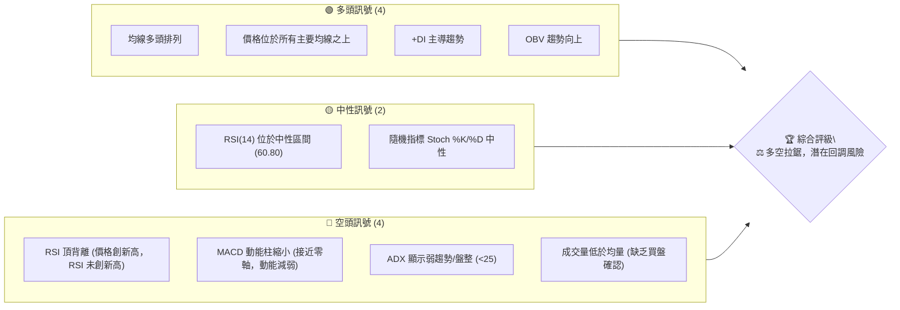

### 📊 核心指標速覽表

| 指標類別 | 指標名稱 | 當前數值 | 訊號 | 解讀 |
|----------|----------|----------|------|------|
| **價格** | 當前價格 | $2445.00 | 🟢 | 接近 52 週高點，多頭強勢 |
| **均線** | MA20 | $2382.02 | 🟢 | 價格位於 MA20 上方，短期支撐 |
| **均線** | MA50 | $2306.60 | 🟢 | 價格位於 MA50 上方，中期支撐 |
| **均線** | MA200 | $1775.59 | 🟢 | 價格位於 MA200 上方，長期趨勢強勁 |
| **動能** | RSI(14) | 60.80 | 🟡 | 處於中性區間，但有頂背離警示 |
| **動能** | MACD | 45.886 | 🟢 | MACD 線仍在訊號線上方，但動能柱縮小 |
| **趨勢** | ADX(14) | 18.68 | 🔴 | 趨勢強度弱，可能進入盤整 |
| **波動** | ATR(14) | $65.00 | 🟡 | 每日波動約 2.66%，波動中等 |

### 🏆 技術評分卡

該評分卡綜合考量各項技術指標，對 2330.TW 的當前技術面進行量化評估。儘管長期趨勢和均線排列極為強勁，但動能指標的背離、弱趨勢強度及成交量不配合，拉低了整體評分，顯示短期內需保持謹慎。

```
技術評分卡 — 2330.TW (2026-07-03)
════════════════════════════════════════════════════
趨勢強度      ██████░░░░░░░░░░░░░░  60/100  🟡 (ADX弱，但均線強)
動能指標      ███░░░░░░░░░░░░░░░░░  35/100  🔴 (RSI頂背離，MACD動能減弱)
支撐穩定度    ██████████████░░░░░░  85/100  🟢 (均線密集提供強勁支撐)
成交量配合    ████░░░░░░░░░░░░░░░░  40/100  🔴 (成交量低於均量，買盤不積極)
形態完整度    ██████░░░░░░░░░░░░░░  60/100  🟡 (無明確反轉形態，但高位震盪)
均線排列      █████████████████░░░  95/100  🟢 (完美多頭排列)
════════════════════════════════════════════════════
綜合評分      ██████░░░░░░░░░░░░░░  63/100  ⚖️ 中性偏多，謹慎樂觀
════════════════════════════════════════════════════
```

---

## 2. 趨勢分析

### 🌐 多時框趨勢分析

2330.TW 展現了典型的強勢股多時框趨勢，長期和中期趨勢維持上升，但短期動能有所減弱，進入高位整理階段。

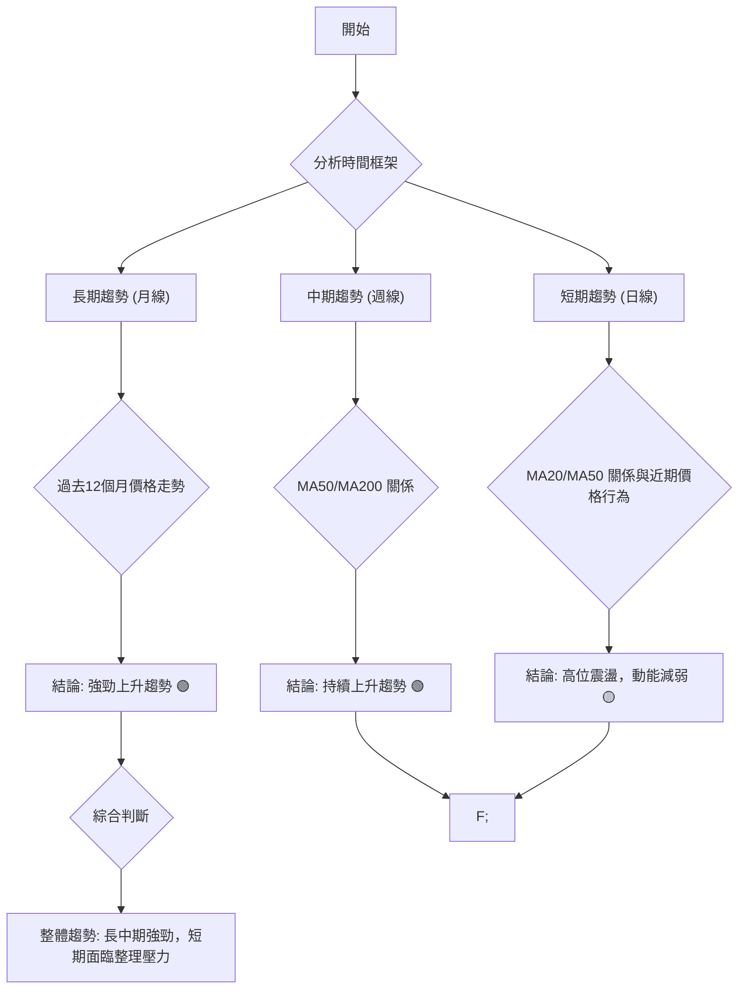

### 📈 長期趨勢 — 12個月走勢圖（Unicode）

過去 12 個月，2330.TW 股價從 $1144.74 穩步攀升至 $2445.00，漲幅高達約 113.6%。儘管期間經歷過小幅回調（如 2026 年 3 月），但整體上升趨勢保持完好，顯示出極強的市場信心和基本面支撐。當前價格已接近 52 週高點，為歷史高位。

```
2330.TW 月線走勢圖（過去12個月）
價格軸 ($)
$2500 ┤                                                     ●(2445.00, 現在)
$2250 ┤                                                ●
$2000 ┤                                        ●  ●
$1750 ┤                                    ●
$1500 ┤                          ●  ●
$1250 ┤                   ●
$1000 ┤●━━━━━━━━━━━━━━━━━━━━━━━━━━━━━━━━━━━━━━━━━━━━━━━━━━
     └─────────────────────────────────────────────────────
      2025-07 08  09  10  11  12  2026-01 02  03  04  05  06  07
      (1144.74)                                   (1755.32)
```

**走勢特徵分析表格**

| 階段名稱 | 時間區間 | 價格區間 | 漲跌幅 | 主要特徵 | 趨勢評估 |
|----------|----------|----------|--------|----------|----------|
| **穩步上升** | 2025-07 至 2026-02 | $1144.74 - $1983.22 | +73.2% | 股價持續創高，成交量溫和放大，均線多頭排列形成。 | 🟢 強勁多頭 |
| **短期回調** | 2026-02 至 2026-03 | $1983.22 - $1755.32 | -11.4% | 因獲利了結或市場修正，股價快速回調，但未跌破重要長期均線。 | 🟡 暫時回檔 |
| **V型反彈** | 2026-03 至 2026-05 | $1755.32 - $2348.73 | +33.8% | 快速收復失地，顯示買盤強勁，市場信心恢復。 | 🟢 強勢反彈 |
| **高位整理** | 2026-05 至 2026-07 | $2348.73 - $2445.00 | +4.1% | 股價在高位震盪，漲幅放緩，動能指標出現背離。 | 🟡 整理觀望 |

### 📊 中期趨勢（週線分析）

從週線圖來看，2330.TW 股價自 2026 年 3 月低點 $1755.32 反彈後，持續運行在主要中期均線（如 MA20、MA50）上方。MA20 位於 MA50 之上，且兩者均向上傾斜，確認了中期上升趨勢的穩固性。然而，近期價格在高位盤整，顯示多頭力量有所減弱，面臨上方阻力。

```
2330.TW 中期趨勢示意圖 (週線)
      價格軸 ($)
$2550 ┤                  ┌───┐  <--- 阻力區 ($2535.00 - $2537.24)
$2500 ┤                  │現價│
$2450 ┤                  └─┬─┘
$2400 ┤              ╱    MA20 ($2382.02)
$2350 ┤             ╱
$2300 ┤           ╱ MA50 ($2306.60)
$2250 ┤         ╱
$2200 ┤       ╱
$2150 ┤───── MA200 ($1775.59) (長期支撐)
     └───────────────────────────
      時間軸 (近期)
```
週線圖顯示股價在 $2300-$2550 區間內呈現高位震盪，短期壓力位為 $2535.00 (52週高點)，中期支撐位為 MA50 ($2306.60)。

### ⚡ 趨勢強度評估（ADX 解讀）

ADX (Average Directional Index) 指標用於衡量趨勢的強度，而非方向。ADX 值高於 25 通常表示趨勢強勁，低於 25 則表示趨勢較弱或處於盤整。

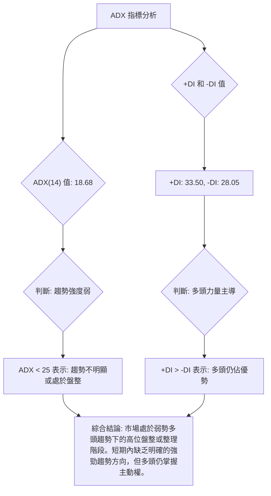

**ADX 強度對照表**

| ADX 值範圍 | 趨勢強度 | 市場解讀 | 訊號 |
|------------|----------|----------|------|
| 0-25       | 弱趨勢/盤整 | 市場方向不明確，波動性可能降低，適合震盪策略。 | 🔴 |
| 25-50      | 強趨勢   | 市場有明確方向，趨勢交易者可順勢操作。 | 🟢 |
| 50-75      | 非常強趨勢 | 極端強勢趨勢，可能出現超買超賣情況。 | 🟢 |
| 75-100     | 極端趨勢 | 趨勢可能接近尾聲，需警惕反轉。 | 🟡 |

當前 ADX(14) 為 18.68，明確指示目前 2330.TW 處於弱趨勢或盤整行情中。儘管 +DI (33.50) 高於 -DI (28.05)，顯示多頭仍佔據主導地位，但 ADX 本身數值較低，意味著多頭的推動力道並不足以形成強勁的單邊趨勢，股價更可能在高位進行橫向整理或小幅震盪。這與動能指標的疲軟訊號相互印證。

---

## 3. 圖表形態分析

### 🔍 形態識別系統

目前 2330.TW 的股價在高位運行，尚未形成明確的反轉或持續圖表形態。從過去 12 個月的走勢來看，主要呈現為一個緩慢加速的上升趨勢。近期在高點附近呈現出高位盤整的特徵，這種形態可能演變為旗形、三角整理或矩形等持續形態，也可能在動能不足的情況下形成雙頂或頭肩頂的潛在反轉形態，但目前這些形態均未被確認。

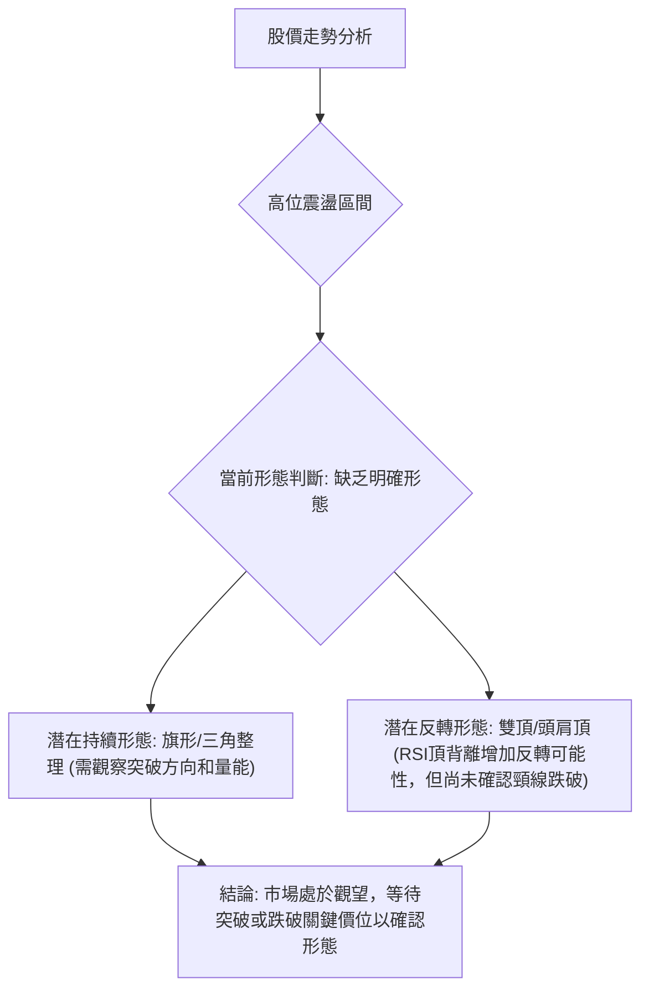

### 🕯️ 重要K線形態分析

分析近 20 週的週線收盤價及對應指標，可以觀察到幾個關鍵的 K 線行為，這些行為反映了多空力量的變化。

| 月份 | 收盤價 | K線形態 (週) | 解讀 | 訊號 |
|------|--------|--------------|------|------|
| 2026-03-01 | $1983.22 | 長陽線 | 強勢上漲，突破前期壓力，伴隨量能放大。 | 🟢 |
| 2026-03-08 | $1878.84 | 長陰線 | 價格快速回落，顯示賣壓湧現，但未跌破重要支撐。 | 🔴 |
| 2026-03-15 | $1853.99 | 小陰線/十字星 | 跌勢減緩，多空力量趨於平衡，可能為止跌信號。 | 🟡 |
| 2026-04-12 | $1994.68 | 長陽線 | V型反彈確認，買盤積極，收復大部分跌幅。 | 🟢 |
| 2026-04-26 | $2179.19 | 長陽線 | 強勁上攻，RSI進入超買區，顯示短期過熱。 | 🟢 (但過熱) |
| 2026-05-03 | $2129.32 | 陰線 | 獲利了結壓力，但未形成反轉形態，動能有所減弱。 | 🟡 |
| 2026-05-31 | $2348.73 | 長陽線 | 再次上攻，創出階段新高，但RSI未同步創新高。 | 🟢 (伴隨背離) |
| 2026-06-14 | $2310.00 | 陰線 | 高位回調，顯示上方壓力，買盤追高意願減弱。 | 🟡 |
| 2026-07-05 | $2445.00 | 中陽線 | 股價再創近期新高，但成交量未能配合，RSI頂背離持續。 | 🟢 (謹慎樂觀) |

從 K 線形態來看，2330.TW 在 2026 年 3 月經歷 V 型反轉後，持續上漲。然而，自 5 月底至 7 月初，儘管價格不斷創出新高，但 K 線實體變小，且常伴隨上影線，暗示多頭上攻動能減弱，上方阻力顯現。尤其 7 月初的中陽線，在成交量不足的情況下創高，其可靠性存疑。

### 📉 ASCII 走勢形態示意圖

以下示意圖展示了 2330.TW 從 2026 年 3 月低點以來的主要上升趨勢，以及近期在高位形成的盤整區間，並標示了潛在的壓力線和支撐線。

```
2330.TW 近期走勢形態示意圖
      價格軸 ($)
$2600 ┤                     ┌───────┐
$2500 ┤                     │ 高點區間 │  <--- 潛在壓力線 (約 $2535.00)
$2400 ┤                     └─┬─┬─┬─┘
$2300 ┤                       │ │ │ │
$2200 ┤                       │ │ │ │
$2100 ┤                     ╱ │ │ │ │
$2000 ┤                   ╱   │ │ │ │
$1900 ┤                 ╱     │ │ │ │
$1800 ┤───────────────┘       └───┴───┘
$1700 ┤(2026-03低點)
     └───────────────────────────────────
      時間軸 (2026年3月 -> 2026年7月)
```
圖中可見，股價從 3 月低點強勁反彈後，形成一個上升通道。近期價格觸及通道上緣後，在高位進行橫向整理，形成一個潛在的矩形或上升楔形頂部形態。RSI 頂背離增加了此高位形態為反轉形態的可能性，而非持續形態。

### 🎯 形態目標價計算

由於目前沒有清晰的已完成圖表形態（如頭肩頂或雙底），我們主要基於已識別的關鍵支撐與阻力位來推導潛在的目標價。

1.  **突破 52 週高點 ($2535.00) 的目標價**：
    如果股價能夠放量突破並站穩 52 週高點 $2535.00，則將開啟新的上漲空間。
    *   **方法**：通常會參考歷史擴張區間或斐波那契擴展位。結合分析師平均目標價 $2733.48 作為第一個上漲目標。
    *   **目標價 T1**：$2733.48 (分析師平均目標，亦可視為突破後的第一個心理阻力)
    *   **目標價 T2**：$2850.00 (基於通道延伸或斐波那契 1.272 擴展位推算，需配合量能確認)

2.  **跌破關鍵支撐 ($2382.02 / MA20) 的目標價**：
    如果股價未能突破 $2535.00，並跌破短期關鍵支撐 $2382.02 (MA20)，則可能引發一波回調。
    *   **方法**：回調目標通常會指向下一個主要支撐位，如中期均線或斐波那契回調位。
    *   **目標價 T1**：$2306.60 (MA50 支撐)
    *   **目標價 T2**：$2226.81 (布林通道下軌及斐波那契 38.2% 回調位附近)

**結論**：在缺乏明確形態的情況下，目標價的判斷更依賴於關鍵阻力位的突破或支撐位的跌破。當前 RSI 頂背離和 ADX 弱趨勢暗示上漲動能不足，突破上行需要更大的催化劑和成交量配合。

---

## 4. 支撐與阻力

### 🗺️ 關鍵價位分布圖（Unicode）

以下圖表展示了 2330.TW 當前的價格結構，包括主要的支撐與阻力位。這些價位是基於歷史高低點、均線、布林通道及斐波那契回調位綜合判斷而來。

```
2330.TW 價位結構分布圖 (2026-07-03)
═══════════════════════════════════════════════════
$2733.48 ║████████████████████████║ 強阻力 R3 (分析師平均目標)
$2537.24 ║████████████████████    ║ 阻力 R2 (BB上軌, 52W高點 $2535.00)
$2410.00 ║████████████████████████║ 關鍵阻力 R1 (近期高點)
$2445.00 ╠════════════════════════╣ ◄ 現價
$2382.02 ║▓▓▓▓▓▓▓▓▓▓▓▓▓▓▓▓        ║ 近期支撐 S1 (MA20, BB中軌)
$2306.60 ║████████████████████████║ 強支撐 S2 (MA50)
$2226.81 ║████████████████████████║ 關鍵支撐 S3 (BB下軌, Fib 38.2%回調)
$1775.59 ║████████████████████████║ 極強支撐 S4 (MA200, 3月低點附近)
═══════════════════════════════════════════════════
```

### 🚧 阻力位分析表

| 阻力級別 | 價位 | 形成原因 | 突破難度 | 重要性 |
|----------|------|----------|----------|--------|
| **R1 (關鍵)** | $2410.00 | 歷史高點 (2026年6月)，心理關卡。 | 中等 | 🟢 突破則有望挑戰新高。 |
| **R2 (強阻力)** | $2535.00 - $2537.24 | 52週高點 ($2535.00) 與布林通道上軌 ($2537.24) 重疊，形成強勁阻力區。 | 高 | 🔴 突破需極大買盤動能與量能配合。 |
| **R3 (目標阻力)** | $2733.48 | 分析師平均目標價，亦為斐波那契擴展的潛在目標。 | 較高 | 🟡 長期多頭目標，一旦突破 R2 則為下一目標。 |

### 🛡️ 支撐位分析表

| 支撐級別 | 價位 | 形成原因 | 守住機率 | 重要性 |
|----------|------|----------|----------|--------|
| **S1 (近期)** | $2382.02 | 20日移動平均線 (MA20) 與布林通道中軌重疊，提供短期動態支撐。 | 中等 | 🟡 跌破則短期趨勢轉弱。 |
| **S2 (強支撐)** | $2306.60 | 50日移動平均線 (MA50)，是中期趨勢的重要防線。 | 高 | 🟢 跌破則中期多頭排列受到考驗。 |
| **S3 (關鍵支撐)** | $2226.81 | 布林通道下軌，同時接近斐波那契 38.2% 回調位 ($2236.42)。 | 較高 | 🟢 跌破可能引發更深的回調。 |
| **S4 (極強支撐)** | $1775.59 | 200日移動平均線 (MA200)，同時接近 2026 年 3 月低點 ($1755.32)，為長期趨勢的生命線。 | 極高 | 🟢 長期投資者重要參考，跌破意味長期趨勢反轉。 |

### 📐 斐波那契回調位分析

我們以 2026 年 3 月的低點 $1755.32 作為斐波那契回調的起點，以 52 週高點 $2535.00 作為終點，來計算潛在的回調支撐位。

*   **斐波那契起點 (低點)**：$1755.32 (2026-03-01 週線收盤價)
*   **斐波那契終點 (高點)**：$2535.00 (52 週高點)
*   **總漲幅**：$2535.00 - $1755.32 = $779.68

| 回調比例 | 回調價位 | 意義 | 訊號 |
|----------|----------|----------|------|
| **38.2%** | $2535.00 - ($779.68 * 0.382) = **$2236.42** | 輕度回調支撐，接近布林通道下軌。 | 🟡 |
| **50.0%** | $2535.00 - ($779.68 * 0.500) = **$2145.16** | 中度回調支撐，心理關卡。 | 🟢 |
| **61.8%** | $2535.00 - ($779.68 * 0.618) = **$2053.90** | 強度回調支撐，黃金分割位。 | 🟢 |
| **76.4%** | $2535.00 - ($779.68 * 0.764) = **$1939.98** | 深度回調支撐，接近前期平台。 | 🟢 |

當前股價 $2445.00 遠高於這些回調位，顯示其仍處於強勢區域。如果股價未來開始回調，這些斐波那契位將是重要的潛在買入區域。

```
2330.TW 斐波那契回調位示意圖
      價格軸 ($)
$2535.00 ┤─────────● (52W高點)
$2445.00 ┤  ▲ 現價
$2300.00 ┤
$2236.42 ┤───────── (38.2% 回調)
$2145.16 ┤───────── (50.0% 回調)
$2053.90 ┤───────── (61.8% 回調)
$1939.98 ┤───────── (76.4% 回調)
$1755.32 ┤●───────── (3月低點)
         └──────────────────
```

---

## 5. 技術指標深度解讀

### 🎛️ 指標訊號總覽

以下 Mermaid 圖表展示了各主要技術指標當前的訊號方向及其相互關係。整體而言，雖然均線系統依然強勁，但動能指標的疲軟和背離現象不容忽視，暗示多頭上攻的勢頭正在減弱。

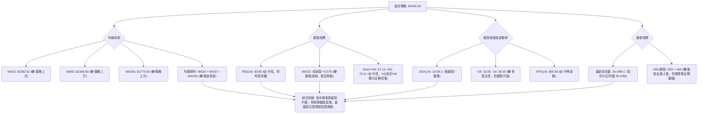

### 📈 移動平均線排列分析

2330.TW 的移動平均線系統呈現出教科書般的多頭排列，這是強勁上升趨勢的典型特徵。

*   **MA20 ($2382.02)** > **MA50 ($2306.60)** > **MA200 ($1775.59)**
*   所有短期、中期、長期均線都向上傾斜，且價格位於所有均線上方。

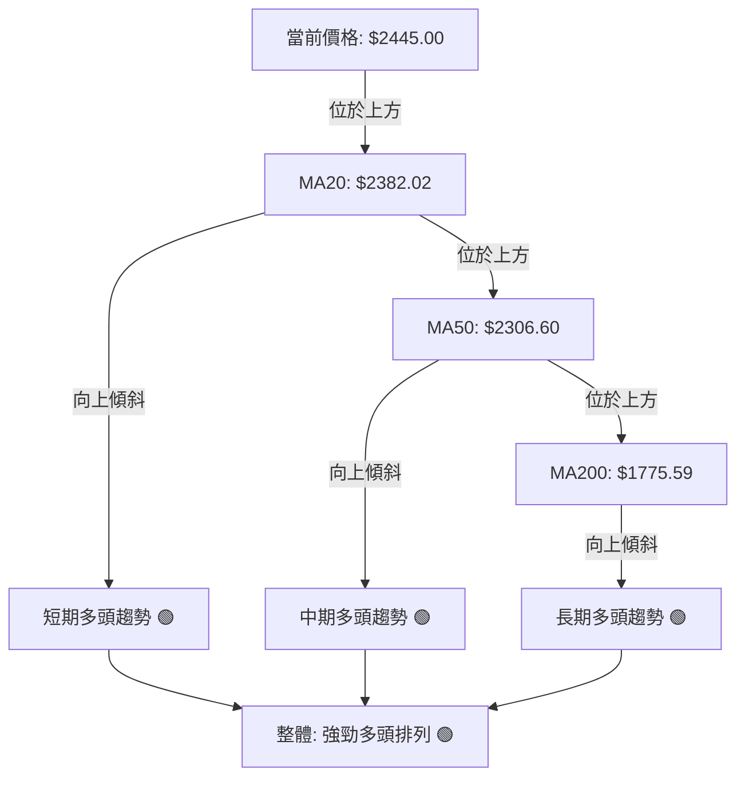
這種均線排列表明，無論從短期、中期還是長期來看，2330.TW 的股價都處於強勢的上升通道中。每條均線都可以作為股價回調時的潛在支撐位。然而，價格距離 MA200 較遠，意味著如果發生深度回調，空間可能較大。

### 📉 RSI(14) 分析

RSI (Relative Strength Index) 是一個動能震盪指標，用於衡量價格變動的速度和變化。

*   **RSI(14) 數值**：60.80
    *   RSI 位於 50-70 之間，屬於中性偏強區域，尚未進入超買區 (>70)。
    *   **RSI 強度進度條**：▓▓▓▓▓▓▓▓▓▓▓▓░░░░░░░░ 60.80% 🟡

*   **超買超賣區間分析**：
    *   RSI 未進入超買區 (70-100)，表明股價尚未達到極端過熱狀態，仍有上漲空間。
    *   RSI 遠離超賣區 (0-30)，顯示賣壓不強。

*   **背離判斷 (頂背離)**：
    *   **觀察**：從提供的數據中，2026-04-26 股價為 $2179.19，RSI 高達 86.4。而當前 (2026-07-05) 股價為 $2445.00，創出新高，但 RSI 僅為 60.80。
    *   **結論**：這構成了一個明確的 **⚠️ 頂背離 (Bearish Divergence)** 訊號。價格創出新高，但動能指標 (RSI) 未能同步創出新高，反而走低，這通常預示著上漲動能衰竭，未來股價有較高的機率出現回調或盤整。此為一個重要的看空警示。

### 📊 MACD(12/26/9) 訊號解讀

MACD (Moving Average Convergence Divergence) 指標用於識別趨勢的強度、方向、動能和持續時間。

*   **MACD 線**：45.886
*   **MACD Signal 線**：45.508
*   **MACD Hist 柱狀圖**：+0.378

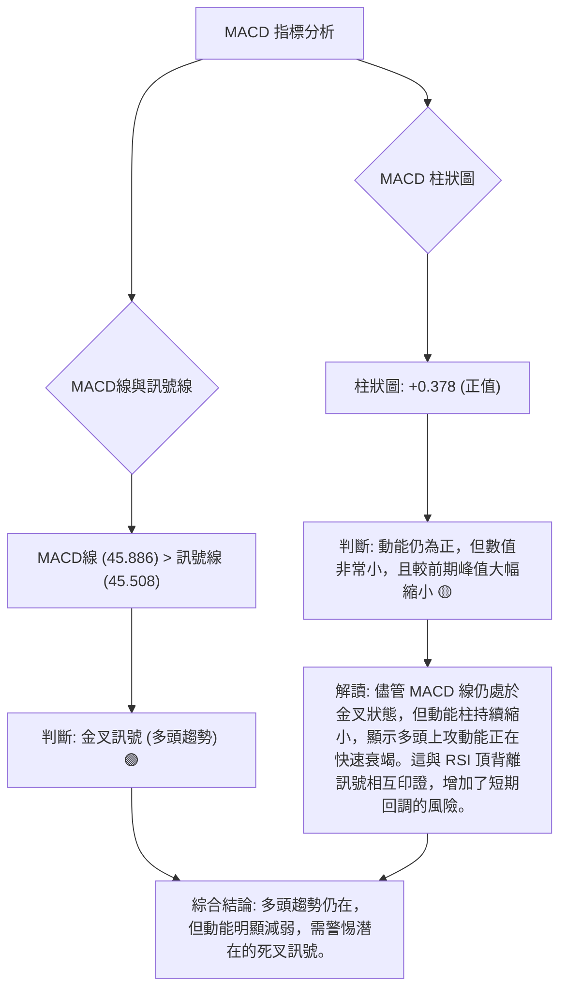
MACD 線仍在訊號線上方，技術上仍是金叉訊號，指示多頭趨勢。然而，MACD 柱狀圖從之前的高點（如 2026-04-19 的 +21.083）顯著縮小至當前的 +0.378，這是一個非常重要的警示。它表明多頭的買盤力量正在迅速減弱，股價上漲的推動力已接近枯竭。如果動能柱繼續縮小並轉為負值，MACD 將形成死叉，確認短期趨勢反轉。

### 📦 布林通道分析

布林通道 (Bollinger Bands) 用於衡量價格的波動率和相對高低點。

*   **BB 上軌**：$2537.24
*   **BB 中軌 (MA20)**：$2382.02
*   **BB 下軌**：$2226.81
*   **BB %B**：0.70 (價格位於中軌和上軌之間，且靠近上軌)

```
2330.TW 布林通道示意圖
      價格軸 ($)
$2600 ┤              ┌──────────────────────┐
$2537.24 ┤───────────┤ BB上軌 (壓力)
$2500 ┤              │
$2445.00 ┤───────────│ ◄ 現價 (靠近上軌)
$2400 ┤              │
$2382.02 ┤───────────┤ BB中軌 (MA20, 支撐)
$2300 ┤              │
$2226.81 ┤───────────┤ BB下軌 (支撐)
$2200 ┤              └──────────────────────┘
     └───────────────────────────────────────
```
當前股價 $2445.00 位於布林通道中軌和上軌之間，且 %B 值為 0.70，表示價格接近上軌。這通常發生在上升趨勢中，顯示多頭力量佔優。然而，如果價格持續觸及上軌但未能突破，並伴隨動能減弱，則可能預示著回調。布林通道的寬度目前適中，但若價格在通道上緣受阻並回落，通道可能會收窄，進入盤整階段。上軌 $2537.24 形成當前重要的動態阻力，與 52 週高點 $2535.00 幾乎重合，使其阻力作用更為顯著。

### 💹 成交量分析（量價配合度）

成交量是價格走勢的燃料，量價配合度是判斷趨勢健康度的關鍵。

*   **最新成交量**：26,489,446
*   **20 日均量**：35,033,887
*   **50 日均量**：35,748,873
*   **量比**：0.76x (最新成交量僅為 20 日均量的 76%)
*   **OBV 趨勢**：OBV > MA (量能支撐上漲)

**分析**：
1.  **成交量萎縮**：當前成交量 (26.49M) 顯著低於 20 日和 50 日均量，量比僅為 0.76x。這是一個重要的 **🔴 警示訊號**。股價在高位創出新高，但成交量未能同步放大，反而萎縮，這通常被解讀為「量價背離」中的「無量上漲」。它暗示當前上漲缺乏充足的買盤支持，多頭追高意願不足，上漲的動能和可靠性受到質疑。
2.  **OBV 趨勢**：OBV (On Balance Volume) 仍高於其移動平均線，這通常被視為多頭訊號，表明累積買盤壓力大於賣盤壓力。然而，OBV 是一個累積指標，可能反映的是過去一段時間的總體趨勢。
3.  **量價矛盾**：最新成交量低於均量與 OBV 趨勢向上的結論存在矛盾。這表明，儘管長期累積的買盤力量仍占優勢 (OBV)，但短期內的實際交易活動 (最新成交量) 卻顯示出疲軟。在價格創新高時出現量能萎縮，這是一個典型的動能衰竭信號，增加了股價在高位回調的風險。如果未來價格跌破關鍵支撐，且伴隨放量，則空頭趨勢確認的可能性將大增。

---

## 6. 動能與波動率

### ⚡ 動能評估四象限

我們將 2330.TW 的當前狀態置於「動能強度」與「波動率」的二維象限中進行評估。

*   **動能**：RSI 頂背離、MACD 動能柱縮小，顯示上漲動能正在減弱。儘管價格仍在上升，但勢頭已不如前。因此，動能評估為「中等偏弱」。
*   **波動率**：ATR(14) 為 $65.00，佔當前價格 $2445.00 的 2.66%，對於一檔大型權值股而言，屬於中等偏高的波動水平。股價處於歷史高位，也容易引發較大波動。因此，波動率評估為「中高」。

| 象限 | 動能 | 波動 | 當前狀態 (2330.TW) | 評估 | 訊號 |
|------|------|------|--------------------|------|------|
| Q1   | 強   | 低   | -                  | 最佳機會 (穩定上漲) | - |
| Q2   | 弱   | 低   | -                  | 謹慎觀望 (盤整築底) | - |
| **Q3** | **強** | **高** | **✓ (但動能衰竭)** | 高風險高收益 (突破/反轉點) | 🟡 |
| Q4   | 弱   | 高   | -                  | 避免進場 (方向不明，風險高) | - |

**綜合評估**：2330.TW 目前處於從 Q3 (強動能/高波動) 向 Q2 (弱動能/低波動) 或 Q4 (弱動能/高波動) 過渡的階段。雖然價格仍處高位且波動性存在，但動能的衰竭使其不再是典型的「強動能/高波動」狀態。這意味著潛在的趨勢性上漲動能減弱，可能轉為高位震盪，甚至面臨回調風險。在這種情況下，追高風險較大，更適合等待明確的方向或回調後的買入機會。

### 📊 ATR 波動率分析

ATR (Average True Range) 是衡量市場波動性的指標，它反映了在特定時間段內價格波動的平均範圍。

*   **ATR(14) 值**：$65.00
*   **ATR 佔收盤價比例**：($65.00 / $2445.00) * 100% = 2.66%

**解讀**：
1.  **波動性水平**：2330.TW 的每日平均波動範圍約為 $65.00。對於市值龐大的龍頭股而言，2.66% 的每日波動幅度可視為中等偏高，顯示市場活躍度較高，且在高位存在一定的價格異動風險。
2.  **止損距離建議**：ATR 可以作為設定止損點的參考。一般建議將止損點設置在 1 倍至 2 倍 ATR 之外，以避免正常的市場噪音觸發止損。
    *   **保守止損**：1 倍 ATR = $65.00。如果從現價 $2445.00 計算，止損點約為 $2445.00 - $65.00 = $2380.00 (接近 MA20)。
    *   **激進止損**：2 倍 ATR = $130.00。如果從現價 $2445.00 計算，止損點約為 $2445.00 - $130.00 = $2315.00 (接近 MA50)。
    這意味著，如果進行多頭交易，價格跌破 $2380.00 或 $2315.00 應考慮止損，以控制風險。

### 📐 Beta 與市場相關性

Beta 值衡量的是單一股票相對於整體市場的波動程度，反映了該股票的系統性風險。

*   **Beta 數據**：提供的數據中未包含 Beta 值。
*   **專業推測**：作為台灣股市的權值股龍頭，2330.TW 通常具有較高的 Beta 值，且與加權指數 (TAIEX) 呈現高度正相關。這意味著當大盤上漲時，2330.TW 往往會漲得更多；當大盤下跌時，它也可能跌得更多。
*   **投資影響**：投資者應將 2330.TW 視為市場風險的代表性標的之一。其股價走勢將受到整體宏觀經濟、全球半導體景氣以及大盤情緒的顯著影響。在市場情緒樂觀時，其高 Beta 可能帶來豐厚回報；但在市場承壓時，也需警惕其可能帶來的較大回撤。因此，在制定交易策略時，應密切關注大盤走勢和相關產業新聞。

---

## 7. 多時框架總結

### 📋 時框架評分表

此表總結了 2330.TW 在不同時間框架下的技術指標表現，提供了一個全面的視角。

| 時框架 | 趨勢方向 | 動能 | 均線排列 | 形態 | 綜合評分 (1-10) | 建議 |
|--------|----------|------|----------|------|-----------------|------|
| **長期 (月線)** | 🟢 強勁上升 | 🟢 強勁 | 🟢 多頭排列 | 🟢 上升通道 | 9.0             | 持有/逢低買入 |
| **中期 (週線)** | 🟢 上升 | 🟡 減弱 | 🟢 多頭排列 | 🟡 高位盤整 | 7.5             | 謹慎持有 |
| **短期 (日線)** | 🟡 震盪/回調 | 🔴 衰竭/背離 | 🟢 多頭排列 | 🟡 高位震盪 | 5.5             | 觀望/逢高減碼 |

### 🔲 綜合訊號矩陣

以下矩陣展示了不同時間框架下各類指標訊號的一致性。

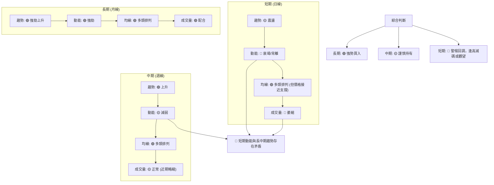

**分析**：
*   **長期與中期趨勢**：均線系統和整體價格走勢仍處於強勁的多頭格局。這為股價提供了堅實的底部支撐，表明大趨勢向上。
*   **短期動能與量能**：短期內，RSI 頂背離、MACD 動能柱縮小以及成交量萎縮等訊號，均指向動能衰竭。ADX 也顯示趨勢強度不足，表明市場正在從強勢上漲轉向高位整理或潛在的回調。
*   **矛盾點**：長期趨勢的強勁與短期動能的疲軟形成了明顯的矛盾。這通常意味著股價在高位面臨整理或修正的壓力，以消化前期漲幅並修復超買狀況。在這種情況下，儘管長期看好，但短期內不宜盲目追高，應等待回調至關鍵支撐位或明確的突破訊號。

---

## 8. 交易策略建議

基於上述多時框架的技術分析，2330.TW 雖然長期趨勢強勁，但短期動能衰竭且存在頂背離，市場進入多空拉鋸的謹慎階段。因此，建議採取防守型策略，或等待明確的突破/回調訊號。

### 🗺️ 策略決策流程圖

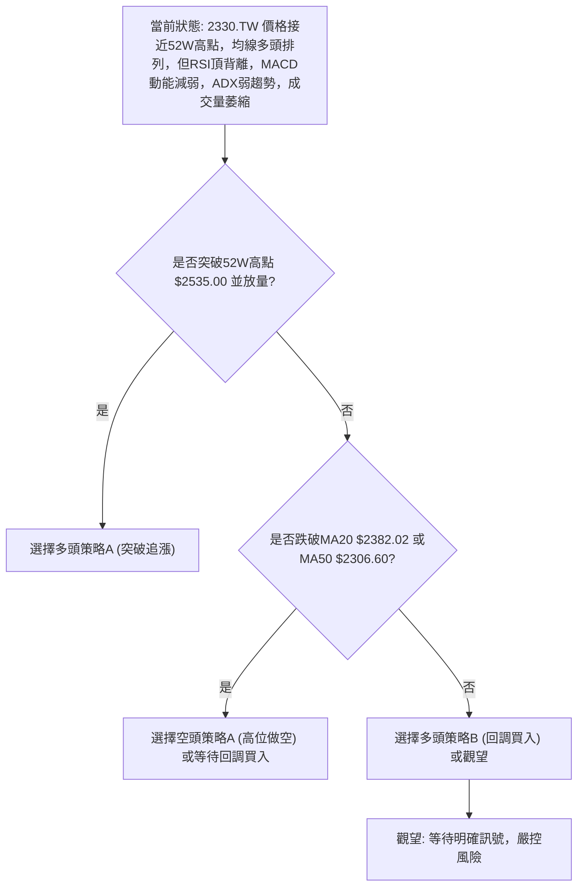

### 🟢 多頭策略詳情

考慮到長期趨勢的穩固性，以下提供兩種多頭策略：

| 策略要素 | 策略 A：突破追漲 (積極型) | 策略 B：回調買入 (穩健型) |
|----------|--------------------------|--------------------------|
| **進場條件** | 股價放量突破並站穩 52 週高點 $2535.00，且 MACD 動能柱重新放大。 | 股價回調至 MA20 ($2382.02) 或 MA50 ($2306.60) 附近，並出現止跌 K 線形態 (如錘子線、啟明星)。 |
| **進場價格** | $2540.00 (確認突破 $2535.00 後) | $2385.00 (MA20 附近) |
| **目標價 T1** | $2733.48 (分析師平均目標價) | $2535.00 (52 週高點) |
| **目標價 T2** | $2850.00 (通道延伸/斐波那契擴展) | $2733.48 (分析師平均目標價) |
| **止損價格** | $2450.00 (跌破突破點下方，或回測 MA20 失敗) | $2300.00 (跌破 MA50) |
| **風險報酬比** | ($2733.48 - $2540.00) / ($2540.00 - $2450.00) = $193.48 / $90.00 ≈ **2.15 : 1** (T1) | ($2535.00 - $2385.00) / ($2385.00 - $2300.00) = $150.00 / $85.00 ≈ **1.76 : 1** (T1) |
| **成功機率** | 50% (需強勁量能確認，否則易假突破) | 60% (順應中期趨勢，回調買入風險較低) |
| **建議倉位** | 輕倉至中等倉位 (嚴格止損) | 中等偏高倉位 |

### 🔴 空頭策略詳情

考慮到 RSI 頂背離、MACD 動能減弱及成交量萎縮，短期內存在做空或避險的機會。

| 策略要素 | 策略 A：高位做空 (反轉型) |
|----------|--------------------------|
| **進場條件** | 股價未能有效突破 $2535.00，並跌破 MA20 ($2382.02)，同時 MACD 形成死叉。 |
| **進場價格** | $2380.00 (確認跌破 MA20 後) |
| **目標價 T1** | $2306.60 (MA50 支撐) |
| **目標價 T2** | $2226.81 (布林通道下軌，斐波那契 38.2% 回調位) |
| **止損價格** | $2450.00 (近期高點上方，或 MA20 上方確認假跌破) |
| **風險報酬比** | ($2380.00 - $2306.60) / ($2450.00 - $2380.00) = $73.40 / $70.00 ≈ **1.05 : 1** (T1) |
| **成功機率** | 45% (逆勢操作，需嚴格止損，且需關注大盤走勢) |
| **建議倉位** | 輕倉 (風險較高) |

### ⭐ 整體訊號強度評星

綜合各項指標和多時框架分析，2330.TW 目前處於一個關鍵的轉折點。長期看多，但短期動能衰竭帶來回調風險。

```
做多訊號強度：★★☆☆☆  (2.5/5星) (長期雖強，但短期動能弱，追高風險大)
做空訊號強度：★★★☆☆  (3/5星) (頂背離、量縮、動能減弱，提供短期做空機會)
整體可信度：  ★★★☆☆  (3/5星) (市場方向不明朗，需等待確認訊號)
```

**結論**：由於短期存在明顯的看空背離訊號，且成交量不配合，當前做多追高的風險較高。穩健的投資者建議觀望或等待股價回調至重要支撐位再考慮介入。激進的投資者可在嚴格止損下，考慮在阻力位附近做空，或等待突破後追漲。

---

## 9. 風險提示與監控

### ✅ 關鍵監控指標 Checklist

為了有效管理 2330.TW 的投資風險，以下是需要密切監控的關鍵技術指標和價位：

╔══════════════════════════════════════════════════════════════╗
║ **2330.TW 關鍵監控指標 Checklist**                             ║
╠══════════════════════════════════════════════════════════════╣
║ ├─ **價格行為**                                               ║
║ ║    [ ] 價格是否能有效突破 $2535.00 (52週高點) 並站穩？        ║
║ ║    [ ] 價格是否跌破 MA20 ($2382.02)？                        ║
║ ║    [ ] 價格是否跌破 MA50 ($2306.60)？                        ║
║ ║    [ ] 是否出現明確的看跌 K 線形態 (如烏雲蓋頂、吞噬形態)？    ║
║ ├─ **動能指標**                                               ║
║ ║    [ ] RSI 是否持續走低，或跌破 50？                         ║
║ ║    [ ] MACD 線是否形成死叉 (跌破訊號線)？                    ║
║ ║    [ ] MACD 柱狀圖是否轉為負值並持續擴大？                   ║
║ ├─ **成交量**                                                 ║
║ ║    [ ] 價格上漲時，成交量是否能配合放大？                    ║
║ ║    [ ] 價格下跌時，成交量是否出現異常放大？                  ║
║ ├─ **趨勢強度**                                               ║
║ ║    [ ] ADX 是否開始上升並突破 25，指示趨勢形成？             ║
║ ║    [ ] -DI 是否超越 +DI？                                    ║
╚══════════════════════════════════════════════════════════════╝

### ⚠️ 風險場景分析

針對 2330.TW 目前的技術面狀況，可以預見以下三種風險場景：

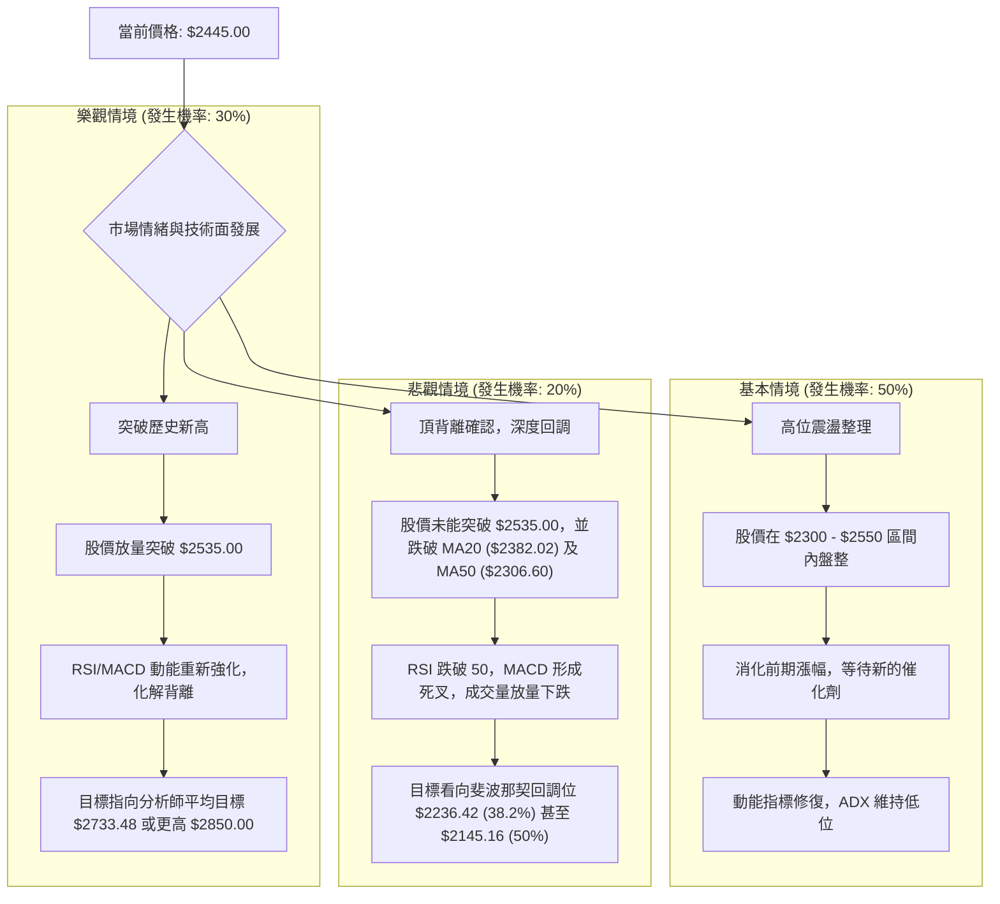

### 🛡️ 風險管理重要提醒

1.  **嚴格止損**：無論採取何種策略，都必須設定並嚴格執行止損。當前的 ATR 為 $65.00，可將止損設定為 1-2 倍 ATR 範圍。
2.  **倉位管理**：鑑於當前市場的不確定性，建議控制倉位，避免重倉單一股票。尤其在動能指標出現背離時，更應採取保守的倉位策略。
3.  **分批建倉/平倉**：避免一次性買入或賣出所有倉位。在關鍵支撐位附近分批建倉，或在阻力位附近分批平倉，以平滑交易成本並降低風險。
4.  **關注大盤與產業新聞**：2330.TW 作為半導體龍頭，其股價極易受到全球半導體產業景氣、地緣政治、匯率變動以及大盤走勢的影響。應密切關注相關新聞和宏觀經濟數據。
5.  **避免追高**：在 RSI 頂背離、MACD 動能減弱且成交量萎縮的情況下，追高風險極高。應等待價格回調至重要支撐位，並出現止跌訊號後再考慮介入。
6.  **耐心等待確認**：在趨勢不明確、多空拉鋸時，耐心是最好的策略。等待股價明確突破阻力或跌破支撐，並伴隨量能確認，再進行交易決策，可大幅提高勝率。

---

## 📋 報告總結

```
2330.TW 技術分析報告總結
════════════════════════════════════════════════════════
報告日期：2026-07-03
當前價格：$2445.00
分析評級：⚖️ 中性偏多，潛在回調風險

關鍵結論：
├─ 長期趨勢：🟢 強勁上升趨勢，均線多頭排列提供堅實支撐。
├─ 中期趨勢：🟢 上升趨勢穩固，但近期在高位面臨整理壓力。
├─ 短期趨勢：🟡 高位震盪，動能減弱，RSI 頂背離預示短期回調風險。
├─ 關鍵支撐：$2382.02 (MA20/BB中軌), $2306.60 (MA50), $2226.81 (BB下軌/Fib 38.2%)
├─ 關鍵阻力：$2535.00 (52週高點/BB上軌), $2733.48 (分析師平均目標)
└─ 分析師目標：平均 $2733.48 (高於現價約 11.8%)

最優策略組合：
1. 🥇 **最佳機會**：等待股價回調至 MA20 ($2382.02) 或 MA50 ($2306.60) 附近，並出現止跌 K 線形態時，以穩健方式逢低買入 (多頭策略 B)。此策略風險報酬比相對合理，且符合中期趨勢。
2. 🥈 **次選機會**：若股價放量突破並站穩 52 週高點 $2535.00，可考慮輕倉追漲 (多頭策略 A)，但需嚴格止損，並關注動能指標是否同步改善。
3. 🥉 **保守選擇**：在當前高位觀望，不急於進場。等待市場消化短期動能衰竭的訊號，或等待明確的回調止跌訊號，以降低追高風險。若出現明確的跌破支撐且量價配合的空頭訊號，可考慮輕倉做空，但需嚴格止損。
════════════════════════════════════════════════════════
```

---

> ⚠️ **免責聲明**：本報告為 AI 自動生成之技術分析，所有數據及估算均基於提供的歷史價格資訊。本報告**僅供研究與學術參考**，**不構成任何投資建議**。投資有風險，入市需謹慎。

---

*報告生成時間：2026-07-03 ｜ 數據來源：Yahoo Finance ｜ 分析框架：多時框技術分析*