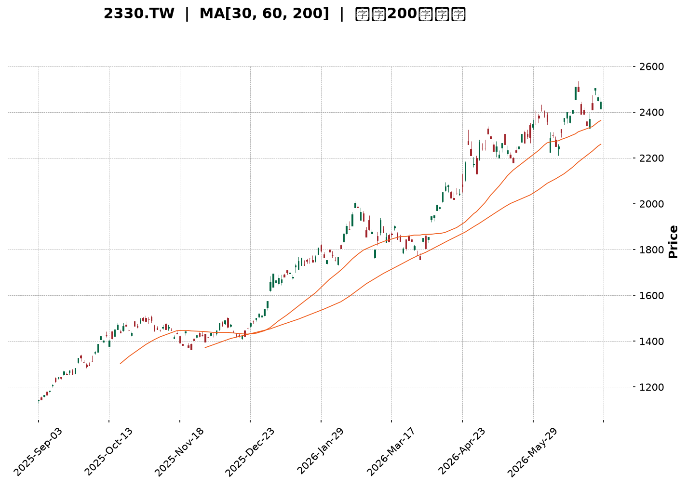
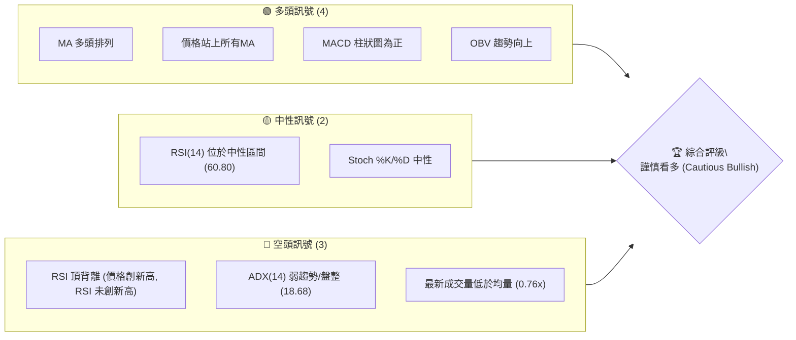
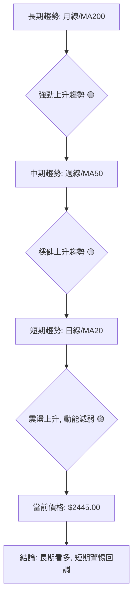
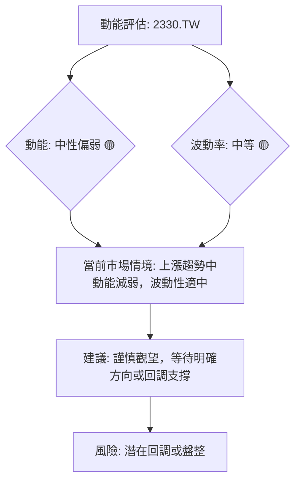

<details>
<summary>📊 靜態圖表 (點擊展開)</summary>

</details>

<html>
<head><meta charset="utf-8" /></head>
<body>
    <div style="height:500px; width:100%;">                        <script>window.PlotlyConfig = {MathJaxConfig: 'local'};</script>
        <script charset="utf-8" src="https://cdn.plot.ly/plotly-3.6.0.min.js" integrity="sha256-QaOVwtVY0T02VaHrr6pnoHLCwayMJp4O5n4YyaE3rJk=" crossorigin="anonymous"></script>                <div id="candlestick-chart" class="plotly-graph-div" style="height:100%; width:100%;"></div>            <script>                window.PLOTLYENV=window.PLOTLYENV || {};                                if (document.getElementById("candlestick-chart")) {                    Plotly.newPlot(                        "candlestick-chart",                        [{"close":{"dtype":"f8","bdata":"AAAAAPfikUAAAAAA9+KRQAAAAKDpMZJAAAAAoOkxkkAAAAAg3ICSQAAAAGCL45JAAAAAgMEek0AAAAAAtG2TQAAAAGD3WZNAAAAAgNzQk0AAAADgaZWTQAAAAGCt5JNAAAAA4GmVk0AAAAAgTwyUQAAAAOCmvpRAAAAA4Ka+lEAAAABgY2+UQAAAAOAfIJRAAAAAwPAzlEAAAABANIOUQAAAACC7IZVAAAAAIHGslUAAAAAgJzeWQAAAAMDj55VAAAAAIPhKlkAAAADA4+eVQAAAAGCFD5ZAAAAAYAyulkAAAADgT\u002f2WQAAAAOCZcpZAAAAAAH\u002fplkAAAAAAf+mWQAAAAKA7mpZAAAAA4JlylkAAAAAAf+mWQAAAAECu1ZZAAAAAYJNMl0AAAABgk0yXQAAAAGDCOJdAAAAAQGRgl0AAAABgk0yXQAAAAKA7mpZAAAAAYAyulkAAAACgO5qWQAAAAECu1ZZAAAAAYAyulkAAAABArtWWQAAAAKA7mpZAAAAAQFYjlkAAAAAAyV6WQAAAACBCwJVAAAAAQKCYlUAAAADAaoaWQAAAAKD+cJVAAAAA4FxJlUAAAADA4+eVQAAAACD4SpZAAAAAICc3lkAAAAAg+EqWQAAAAOAS1JVAAAAAQFYjlkAAAADgmXKWQAAAAADJXpZAAAAAoDualkAAAACg8SSXQAAAAAB\u002f6ZZAAAAAYJNMl0AAAACgSNWWQAAAAEAM\u002fZZAAAAAoMGFlkAAAAAgHEqWQAAAAGA6NpZAAAAAYDo2lkAAAABgOjaWQAAAAOBmwZZAAAAAwM8kl0AAAACAsTiXQAAAAOBWdJdAAAAA4N3Dl0AAAABgGpyXQAAAAABlE5hAAAAAYJGemEAAAACAj\u002fCZQAAAAOC7e5pAAAAAQHEEmkAAAADANCyaQAAAAABTGJpAAAAAgBZAmkAAAACgnY+aQAAAAKCdj5pAAAAAgBZAmkAAAABA6AabQAAAAGBvVptAAAAAwBSSm0AAAABA6AabQAAAAGBvVptAAAAAADN+m0AAAACAjUKbQAAAAID2pZtAAAAAoARFnEAAAABgXwmcQAAAAMAUkptAAAAAIFFqm0AAAACAffWbQAAAAEDYuZtAAAAAIFFqm0AAAACA9qWbQAAAAOAiMZxAAAAA4JkznUAAAABAxr6dQAAAAOAgg51AAAAA4JeFnkAAAACgaUyfQAAAAIDi\u002fJ5AAAAAgFutnkAAAABgTQ6eQAAAAID095xAAAAA4CCDnUAAAABgXVudQAAAACBBHZxAAAAAQE+8nEAAAAAgLyKeQAAAAKB7R51AAAAAgPT3nEAAAACAbaicQAAAAAAZJJ1AAAAAoLmvnUAAAACAT9ScQAAAAMBqrJxAAAAAgLw0nEAAAACAvDScQAAAACBdwJxAAAAAwGqsnEAAAABAoVycQAAAAEAOvZtAAAAAwERtm0AAAADgQeicQAAAAIC8NJxAAAAAQDT8nEAAAAAAP2OeQAAAAGAxd55AAAAAwLYqn0AAAAAA0gKfQAAAAIAQA6BAAAAAYO40oEAAAACg5z6gQAAAAABlop9AAAAAoHKOn0AAAACALvKfQAAAAIAu8p9AAAAAYO40oEAAAABgXwahQAAAAGDypaFAAAAAgDZCoUAAAAAgZvygQAAAAICjoqBAAAAAwOS5oUAAAADgBoihQAAAAOAGiKFAAAAAILX\u002foUAAAABg0NehQAAAAEAbaqFAAAAAAACSoUAAAACgL0yhQAAAAKDrr6FAAAAAYPKloUAAAACAFHShQAAAACBELqFAAAAAYF8GoUAAAAAAImChQAAAAAAAkqFAAAAAILX\u002foUAAAACg66+hQAAAAMDC66FAAAAAgMnhoUAAAADAd1miQAAAAMB3WaJAAAAAwFWLokAAAABgGOWiQAAAAOBOlaJAAAAAIGptokAAAACAyeGhQAAAAOC79aFAAAAAAACSoUAAAAAAAJShQAAAAAAADKJAAAAAAACOokAAAAAAAMCiQAAAAAAAoqJAAAAAAADUokAAAAAAAJyjQAAAAAAAdKNAAAAAAACsokAAAAAAAKyiQAAAAAAASKJAAAAAAACEokAAAAAAANSiQAAAAAAAkqNAAAAAAABCo0AAAAAAABqjQA=="},"high":{"dtype":"f8","bdata":"AAAAAPfikUCNsNzzLB6SQAAAAKDpMZJA4aTukx9tkkAAAAAg3ICSQDTWhwZI95JArrXWGrRtk0AAAAAAtG2TQL0loQa0bZNAAACAXK3kk0BBwOqYC72TQAAAAGCt5JNAouBKLn74k0AAAAAgTwyUQAAAAOCmvpRAH6icdRn6lEAQPvgYBZeUQK3USnWSW5RAVVVVVWNvlEC8lX2OSOaUQLzHe\u002fyLNZVAAAAAIHGslUBpNt3YyF6WQKOkfpy0+5VAq6qqtWqGlkCjpH6ctPuVQB1g2WY7mpZAAAAAYAyulkB1uBqZ8SSXQA3pvHUMrpZAmCKflfEkl0B1gylywjiXQE2aNFndwZZAr02UvGqGlkB1gylywjiXQPJv6dUgEZdA7S0yGTV0l0DkRMv1BYiXQGdmZq7Wm5dAcPI3+QWIl0DbW2TS1puXQMGBA+9P\u002fZZAhu6D9X7plkAmTZp8DK6WQKFKRvlP\u002fZZADd0Hi\u002fEkl0ChSkb5T\u002f2WQE2aNFndwZZAPtPW+PdKlkDw0bOVO5qWQJx0gEsnN5ZAchzHsePnlUAOUJecO5qWQIAeIxJCwJVAsfYNC0LAlUBGSf14hQ+WQAAAACD4SpZA0my6kWqGlkCrqqq1aoaWQBk6YOfIXpZAPtPW+PdKlkAAAADgmXKWQPtFkdyZcpZAAAAAoDualkAAAACg8SSXQHWDKXLCOJdAAAAAYJNMl0AAAACQOIiXQKbIZwXuEJdAYCpoZaOZlkAVGHuq33GWQJq2xq\u002ffcZZA3jxCJRxKlkBWMEs6o5mWQEH+WaVI1ZZAAAAAwM8kl0BQ5llFk0yXQAAAAOBWdJdAAAAA4N3Dl0Cvobzq3cOXQAAAAABlE5hAAAAAYJGemEB\u002fi9Na+FOaQAAAAOC7e5pAYtGyyjQsmkCA2PMP2meaQFVVVRXaZ5pAaMPnz7t7mkCrqqoqYbeaQFVVVWV\u002fo5pARYKaCtpnmkCrqqrKqy6bQBhddHX2pZtAAAAAwBSSm0CrqqoaUWqbQIwuuuoyfptAfnlsxRSSm0Cg+7kf2LmbQJasZEXYuZtAAAAAoARFnEBtdnEAqoCcQCDRCpt99ZtAAAAAIFFqm0CrqqoKQR2cQBU6g1VfCZxAeZoLcPalm0AAAACA9qWbQON3gvWpgJxAAAAA4JkznUDdy7HKieadQBUII0VNDp5AZ9KValutnkAM5KMqLXSfQPgz4c+HOJ9A1ShjleL8nkB9QV9QPcGeQGkO32\u002fkqp1At8SpH7ZxnkCrqqrqIIOdQAAAACBBHZxARrXlal1bnUAFvriq8kmeQLy6FUDGvp1AErFGlXtHnUAFCaPlmTOdQEzYBsH9S51ABAKBAKzDnUA5Dx3D\u002fUudQC1kIQMZJJ1AbceH4K5InEBoOz6ET9ScQDI4H2MLOJ1Ae9OboiYQnUBwCIegk3CcQAhFKMLXDJxAdNFFA\u002fPkm0AAAADgQeicQK6R1aUmEJ1AAAAAQDT8nEAAAAAAP2OeQAAAAGAxd55AAAAAwLYqn0Bcf3tgxBafQAAAAIAQA6BAxU7sINNcoED\u002fwUTQ4EigQC8xa6EJDaBAwhZscRADoEATtSsx9SqgQA\u002fE7wD8IKBAndiJcqOioEBpnEGQWBChQBjRNtOZJ6JA+WNJ893DoUCrM1JBPTihQFRcMoQ2QqFA4Ad+INfNoUBoRSOh66+hQHW5\u002fTHXzaFAH3zwcYVFokD0Lh4htf+hQDolAcLkuaFAFN898d3DoUDJZ91gFHShQAAAAKDrr6FA74X3oqAdokBJkiRB+ZuhQFEURREiYKFADw5IUT04oUAFhBPx\u002f5GhQASTPzD5m6FAAAAAILX\u002foUA28BmzoB2iQKBoq+GZJ6JAng8s83BjokC7f\u002fOAXIGiQC9\u002f2gIm0aJAgVwTgTqzokBDWrHwAwOjQHKnaAEm0aJATvDkoTO9okDGVDhxpxOiQO+VunCnE6JAJCs8ssLroUAAAAAAAKihQAAAAAAAKqJAAAAAAACOokAAAAAAAMCiQAAAAAAAoqJAAAAAAADeokAAAAAAAJyjQAAAAAAAzqNAAAAAAAAao0AAAAAAAOiiQAAAAAAAhKJAAAAAAAC2okAAAAAAAFajQAAAAAAAkqNAAAAAAABgo0AAAAAAAEKjQA=="},"hovertemplate":"\u003cb\u003e%{x|%Y-%m-%d}\u003c\u002fb\u003e\u003cbr\u003e\u958b: $%{open:.2f}\u003cbr\u003e\u9ad8: $%{high:.2f}\u003cbr\u003e\u4f4e: $%{low:.2f}\u003cbr\u003e\u6536: $%{close:.2f}\u003cextra\u003e\u003c\u002fextra\u003e","low":{"dtype":"f8","bdata":"c08jDMGnkUAAAAAA9+KRQL88tlJwCpJAAAAAoOkxkkDv7u7SYlmSQJhT8BISvJJAlVJK2QQLk0CzLMuyOkaTQEPaXrk6RpNAAAAADpmBk0AAAADgaZWTQPIN8u1plZNAAAAA4GmVk0CtG0zROqmTQCI9UJGSW5RA4VdjSjSDlEAAAABgY2+UQBu5kQNPDJRAAAAAwPAzlEAAAABANIOUQIdwCGcZ+pRAzczMGLshlUBiLrSKtPuVQLq2AgdCwJVAOY7jZlYjlkDSyIZxz4SVQLPNl4O0+5VA7oP1e4UPlkAWj8ptDK6WQAAAAOCZcpZArRtMsWqGlkAAAAAAf+mWQNmyZcNqhpZA9BZDSic3lkAAAAAAf+mWQK\u002faXGPdwZZAHLs0yiARl0AK6WaDwjiXQAAAAGDCOJdAIBuQzSARl0AT0s2m8SSXQNmyZcNqhpZAAAAAYAyulkDZsmXDaoaWQF+1uYYMrpZAAAAAYAyulkAOkBaqO5qWQAAAAKA7mpZAYJaUY4UPlkAAAAAAyV6WQAAAACBCwJVAAAAAQKCYlUDWDzoq+EqWQAAAAKD+cJVAAAAA4FxJlUC6tgIHQsCVQFZVVYqFD5ZAy2SRQ1YjlkAdx3FDJzeWQAAAAOAS1JVAwSwph7T7lUD0FkNKJzeWQBAuTGpWI5ZAZsuWLfhKlkCHJvmXO5qWQAAAAAB\u002f6ZZAJqSb7U\u002f9lkCrqqraZsGWQLRuMLVI1ZZAodWX2t9xlkDq54SVWCKWQCLDvZpYIpZAZkk5EJX6lUAAAABgOjaWQH8DTFWjmZZAcAOGqkjVlkBfM0z17RCXQJO\u002fyY+xOJdAq6qqylZ0l0BRXkPVVnSXQKcBbZo4iJdAgeAyNYP\u002fl0BOa7aPnz2ZQP3zz58mjZlAnS5Nta3cmUABTxgg6rSZQFVVVSXqtJlAAAAAgBZAmkBVVVUV2meaQFVVVRXaZ5pAun1l9VIYmkAAAACgnY+aQBhddPpCy5pAbA4kWugGm0AAAABA6AabQHXRRdWrLptACRpO6qsum0AAAACAjUKbQBShCKWNQptAMP3S\u002f7nNm0CYwZeaffWbQAAAAMAUkptACjKbCsoam0AAAAAw2LmbQPViPrUUkptAg8ymWm9Wm0BTm9pU6AabQAAAAOAiMZxA6jsbtYuUnECL0DgVuB+dQAAAAOAgg51A\u002feMSK8a+nUDmN7iK4vyeQAAAAIDi\u002fJ5AjHiSGi8inkAAAABgTQ6eQAAAAID095xARtqxGj9vnUBVVVXVmTOdQBGk3PQyfptAXCWNKshsnEDeLE8auB+dQAAAAKB7R51AqaJnpYuUnEAAAACAbaicQLMn+T40\u002fJxA9Pl8fuJznUAAAACAT9ScQAAAAMBqrJxA4BpZnQDRm0AncfC+1wycQAAAACBdwJxAAAAAwGqsnEA+3uO91wycQAAAAEAOvZtAAAAAwERtm0D6kmn9hYScQJQ4eB\u002fKIJxA11prXXiYnECd2Ikdg\u002f+dQDN1i311E55AUrgefQiznkDugY3e+saeQL9KGJubUp9AO7ETnwkNoEAHdGN+EAOgQAAAAABlop9AAAAAoHKOn0D4HYgfPN6fQPE7EL9Jyp9Aip3YbhADoEBpOeZbzGagQAAAAGDypaFAAAAAgDZCoUAq5laPet6gQAAAAICjoqBA\u002fMAPvFEaoUBMXW5\u002fFHShQExdbn8UdKFAAAAAILX\u002foUBPRZpu8qWhQAAAAEAbaqFA3NTDTT04oUAp8lkPRC6hQB6Xvh0iYKFAhB5CzwaIoUAkSZKONkKhQAAAACBELqFAAAAAYF8GoUAAAAAAImChQOiNgt4oVqFA4YMPzuS5oUAAAACg66+hQMuHcV\u002fQ16FAOavHjuuvoUBXoM\u002fOmSeiQBEgw49+T6JAf6Ps\u002fnBjokC+pU7PLMeiQAAAAOBOlaJA4yVKj35PokBi8NMMImChQAucg3\u002fJ4aFAAAAAAACSoUAAAAAAAEShQAAAAAAA5KFAAAAAAABSokAAAAAAAFyiQAAAAAAAXKJAAAAAAACiokAAAAAAAC6jQAAAAAAAdKNAAAAAAACsokAAAAAAAKyiQAAAAAAAKqJAAAAAAAA0okAAAAAAANSiQAAAAAAAVqNAAAAAAAAao0AAAAAAAN6iQA=="},"name":"\u50f9\u683c","open":{"dtype":"f8","bdata":"fBphWTrPkUAJyz1NcAqSQF8eW\u002fksHpJA4aTukx9tkkB3d3d5H22SQMwpeLnOz5JAQgghdPdZk0BZlmVZ91mTQL0loQa0bZNAAACA6mmVk0AhYHW8OqmTQPkG+aYLvZNAgoDVUa3kk0CtG0zROqmTQILK2W1jb5RAvxoTmUjmlEAAAABgY2+UQMmN3JjBR5RAHMdxnMFHlEAAAABANIOUQEM4hEPqDZVAzczMGLshlUBiLrSKtPuVQF1bgeMS1JVAAAAAIPhKlkDSyIZxz4SVQNAtcYpqhpZA8yL4NCc3lkAWj8ptDK6WQK9NlLxqhpZAinzWjTualkDdYIrcT\u002f2WQAAAAKA7mpZAo2TXJvhKlkB1gylywjiXQFEloxx\u002f6ZZAE9LNpvEkl0DtLTIZNXSXQNejcPU0dJdAAAAAQGRgl0DkRMv1BYiXQJo0aRJ\u002f6ZZAgk+BPN3BlkAAAACgO5qWQK\u002faXGPdwZZAi42GriARl0Cv2lxj3cGWQAAAAKA7mpZAYJaUY4UPlkD7RZHcmXKWQJx0gEsnN5ZAHMdxHHGslUDyr2jjmXKWQECPEVmgmJVA6aKLLnGslUBGSf14hQ+WQDmO42ZWI5ZAntFLtZlylkAAAAAg+EqWQBk6YOfIXpZAAAAAQFYjlkCjZNcm+EqWQAAAAADJXpZAjBgxCslelkAraox0DK6WQJgin5XxJJdAHLs0yiARl0CrqqrKVnSXQFo3mHoq6ZZAAAAAoMGFlkAAAAAgHEqWQN48QiUcSpZARIZ71XYOlkBWMEs6o5mWQAAAAOBmwZZAlILkbyrplkAAAACAsTiXQDGVmBp1YJdAAAAAkDiIl0Aor6GaOIiXQP0ly18anJdAYSjmv0YnmECb7RNVgVGZQP3zz58mjZlAnS5Nta3cmUArl2nly8iZQAAAALCt3JlARYKaCtpnmkCrqqoqYbeaQKuqqtq7e5pA3b6yujQsmkCrqqp6BvOaQBhddPpCy5pAbA4kWugGm0BVVVUFyhqbQEYXXSVRaptAAAAAADN+m0DgU5MKUWqbQKpNbWpvVptAMP3S\u002f7nNm0AGOAk7yGycQK2wORC6zZtAiGX0z6sum0CrqqoKQR2cQAAAAEDYuZtAAAAAIFFqm0DpRz8ayhqbQOvZITDIbJxAbdR3em2onEB6tpHamTOdQAAAAOAgg51A\u002feMSK8a+nUDmN7iK4vyeQFMRS0XEEJ9AjHiSGi8inkDTa5\u002fFeZmeQJsJ6h8\u002fb51Azy1xCi8inkBVVVXVmTOdQI8PQboUkptAo9pyVdYLnUDj6gele0edQF7dCvAgg51AqaJnpYuUnEAEmkIguB+dQCZsg2ALOJ1A\u002fP1+P8ebnUBaN5hiCzidQMlCFkI0\u002fJxATeLg\u002ffLkm0BoOz6ET9ScQCHQFKImEJ1AZCELgU\u002fUnECu5moeyiCcQAAAAEAOvZtAuuii4Rupm0Bji3K+aqycQK6R1aUmEJ1A8L33fk\u002fUnEBe6IXeZyeeQEeVBJ9MT55AmpmZ3frGnkClgISf3+6eQKrQo\u002fuNZp9A7MROzwIXoEABPrtv7jSgQPyoLnEQA6BA61x5AGWin0AAAACALvKfQPgdiB883p9AYid2wOBIoEDS1SeMxXCgQHzhvfDdw6FAh1WEoQ1+oUAOosfvbPKgQMoQrCNELqFA7MRO7EokoUAAAADgBoihQAAAAOAGiKFAzaFiEZMxokB6F4\u002fAwuuhQOvbgGHypaFA8LMBPxtqoUAp8lkPRC6hQI9L394GiKFAc6Q5ErX\u002foUBJkiTvKFahQDEMw7AvTKFApnEGIUQuoUDPNG5gFHShQPjZgJ8NfqFA4YMPzuS5oUAaw9GCpxOiQDZ4jiC1\u002f6FA6CCvkn5PokA0YEkvjDuiQAAAAMB3WaJAQK6JIEifokAAAABgGOWiQAAAAOBOlaJAO7RrQUGpokBi8NMMImChQAAAAOC79aFAGHJ9IdfNoUAAAAAAAIChQAAAAAAAKqJAAAAAAABwokAAAAAAAI6iQAAAAAAAZqJAAAAAAAC2okAAAAAAAC6jQAAAAAAAnKNAAAAAAAAGo0AAAAAAANSiQAAAAAAAcKJAAAAAAAA0okAAAAAAABCjQAAAAAAAfqNAAAAAAAAko0AAAAAAAN6iQA=="},"x":["2025-09-03T00:00:00+08:00","2025-09-04T00:00:00+08:00","2025-09-05T00:00:00+08:00","2025-09-08T00:00:00+08:00","2025-09-09T00:00:00+08:00","2025-09-10T00:00:00+08:00","2025-09-11T00:00:00+08:00","2025-09-12T00:00:00+08:00","2025-09-15T00:00:00+08:00","2025-09-16T00:00:00+08:00","2025-09-17T00:00:00+08:00","2025-09-18T00:00:00+08:00","2025-09-19T00:00:00+08:00","2025-09-22T00:00:00+08:00","2025-09-23T00:00:00+08:00","2025-09-24T00:00:00+08:00","2025-09-25T00:00:00+08:00","2025-09-26T00:00:00+08:00","2025-09-30T00:00:00+08:00","2025-10-01T00:00:00+08:00","2025-10-02T00:00:00+08:00","2025-10-03T00:00:00+08:00","2025-10-07T00:00:00+08:00","2025-10-08T00:00:00+08:00","2025-10-09T00:00:00+08:00","2025-10-13T00:00:00+08:00","2025-10-14T00:00:00+08:00","2025-10-15T00:00:00+08:00","2025-10-16T00:00:00+08:00","2025-10-17T00:00:00+08:00","2025-10-20T00:00:00+08:00","2025-10-21T00:00:00+08:00","2025-10-22T00:00:00+08:00","2025-10-23T00:00:00+08:00","2025-10-27T00:00:00+08:00","2025-10-28T00:00:00+08:00","2025-10-29T00:00:00+08:00","2025-10-30T00:00:00+08:00","2025-10-31T00:00:00+08:00","2025-11-03T00:00:00+08:00","2025-11-04T00:00:00+08:00","2025-11-05T00:00:00+08:00","2025-11-06T00:00:00+08:00","2025-11-07T00:00:00+08:00","2025-11-10T00:00:00+08:00","2025-11-11T00:00:00+08:00","2025-11-12T00:00:00+08:00","2025-11-13T00:00:00+08:00","2025-11-14T00:00:00+08:00","2025-11-17T00:00:00+08:00","2025-11-18T00:00:00+08:00","2025-11-19T00:00:00+08:00","2025-11-20T00:00:00+08:00","2025-11-21T00:00:00+08:00","2025-11-24T00:00:00+08:00","2025-11-25T00:00:00+08:00","2025-11-26T00:00:00+08:00","2025-11-27T00:00:00+08:00","2025-11-28T00:00:00+08:00","2025-12-01T00:00:00+08:00","2025-12-02T00:00:00+08:00","2025-12-03T00:00:00+08:00","2025-12-04T00:00:00+08:00","2025-12-05T00:00:00+08:00","2025-12-08T00:00:00+08:00","2025-12-09T00:00:00+08:00","2025-12-10T00:00:00+08:00","2025-12-11T00:00:00+08:00","2025-12-12T00:00:00+08:00","2025-12-15T00:00:00+08:00","2025-12-16T00:00:00+08:00","2025-12-17T00:00:00+08:00","2025-12-18T00:00:00+08:00","2025-12-19T00:00:00+08:00","2025-12-22T00:00:00+08:00","2025-12-23T00:00:00+08:00","2025-12-24T00:00:00+08:00","2025-12-26T00:00:00+08:00","2025-12-29T00:00:00+08:00","2025-12-30T00:00:00+08:00","2025-12-31T00:00:00+08:00","2026-01-02T00:00:00+08:00","2026-01-05T00:00:00+08:00","2026-01-06T00:00:00+08:00","2026-01-07T00:00:00+08:00","2026-01-08T00:00:00+08:00","2026-01-09T00:00:00+08:00","2026-01-12T00:00:00+08:00","2026-01-13T00:00:00+08:00","2026-01-14T00:00:00+08:00","2026-01-15T00:00:00+08:00","2026-01-16T00:00:00+08:00","2026-01-19T00:00:00+08:00","2026-01-20T00:00:00+08:00","2026-01-21T00:00:00+08:00","2026-01-22T00:00:00+08:00","2026-01-23T00:00:00+08:00","2026-01-26T00:00:00+08:00","2026-01-27T00:00:00+08:00","2026-01-28T00:00:00+08:00","2026-01-29T00:00:00+08:00","2026-01-30T00:00:00+08:00","2026-02-02T00:00:00+08:00","2026-02-03T00:00:00+08:00","2026-02-04T00:00:00+08:00","2026-02-05T00:00:00+08:00","2026-02-06T00:00:00+08:00","2026-02-09T00:00:00+08:00","2026-02-10T00:00:00+08:00","2026-02-11T00:00:00+08:00","2026-02-23T00:00:00+08:00","2026-02-24T00:00:00+08:00","2026-02-25T00:00:00+08:00","2026-02-26T00:00:00+08:00","2026-03-02T00:00:00+08:00","2026-03-03T00:00:00+08:00","2026-03-04T00:00:00+08:00","2026-03-05T00:00:00+08:00","2026-03-06T00:00:00+08:00","2026-03-09T00:00:00+08:00","2026-03-10T00:00:00+08:00","2026-03-11T00:00:00+08:00","2026-03-12T00:00:00+08:00","2026-03-13T00:00:00+08:00","2026-03-16T00:00:00+08:00","2026-03-17T00:00:00+08:00","2026-03-18T00:00:00+08:00","2026-03-19T00:00:00+08:00","2026-03-20T00:00:00+08:00","2026-03-23T00:00:00+08:00","2026-03-24T00:00:00+08:00","2026-03-25T00:00:00+08:00","2026-03-26T00:00:00+08:00","2026-03-27T00:00:00+08:00","2026-03-30T00:00:00+08:00","2026-03-31T00:00:00+08:00","2026-04-01T00:00:00+08:00","2026-04-02T00:00:00+08:00","2026-04-07T00:00:00+08:00","2026-04-08T00:00:00+08:00","2026-04-09T00:00:00+08:00","2026-04-10T00:00:00+08:00","2026-04-13T00:00:00+08:00","2026-04-14T00:00:00+08:00","2026-04-15T00:00:00+08:00","2026-04-16T00:00:00+08:00","2026-04-17T00:00:00+08:00","2026-04-20T00:00:00+08:00","2026-04-21T00:00:00+08:00","2026-04-22T00:00:00+08:00","2026-04-23T00:00:00+08:00","2026-04-24T00:00:00+08:00","2026-04-27T00:00:00+08:00","2026-04-28T00:00:00+08:00","2026-04-29T00:00:00+08:00","2026-04-30T00:00:00+08:00","2026-05-04T00:00:00+08:00","2026-05-05T00:00:00+08:00","2026-05-06T00:00:00+08:00","2026-05-07T00:00:00+08:00","2026-05-08T00:00:00+08:00","2026-05-11T00:00:00+08:00","2026-05-12T00:00:00+08:00","2026-05-13T00:00:00+08:00","2026-05-14T00:00:00+08:00","2026-05-15T00:00:00+08:00","2026-05-18T00:00:00+08:00","2026-05-19T00:00:00+08:00","2026-05-20T00:00:00+08:00","2026-05-21T00:00:00+08:00","2026-05-22T00:00:00+08:00","2026-05-25T00:00:00+08:00","2026-05-26T00:00:00+08:00","2026-05-27T00:00:00+08:00","2026-05-28T00:00:00+08:00","2026-05-29T00:00:00+08:00","2026-06-01T00:00:00+08:00","2026-06-02T00:00:00+08:00","2026-06-03T00:00:00+08:00","2026-06-04T00:00:00+08:00","2026-06-05T00:00:00+08:00","2026-06-08T00:00:00+08:00","2026-06-09T00:00:00+08:00","2026-06-10T00:00:00+08:00","2026-06-11T00:00:00+08:00","2026-06-12T00:00:00+08:00","2026-06-15T00:00:00+08:00","2026-06-16T00:00:00+08:00","2026-06-17T00:00:00+08:00","2026-06-18T00:00:00+08:00","2026-06-22T00:00:00+08:00","2026-06-23T00:00:00+08:00","2026-06-24T00:00:00+08:00","2026-06-25T00:00:00+08:00","2026-06-26T00:00:00+08:00","2026-06-29T00:00:00+08:00","2026-06-30T00:00:00+08:00","2026-07-01T00:00:00+08:00","2026-07-02T00:00:00+08:00","2026-07-03T00:00:00+08:00"],"type":"candlestick"},{"hovertemplate":"MA30: $%{y:.2f}\u003cextra\u003e\u003c\u002fextra\u003e","line":{"color":"#2196F3","dash":"dash","width":2},"mode":"lines","name":"MA30","x":["2025-09-03T00:00:00+08:00","2025-09-04T00:00:00+08:00","2025-09-05T00:00:00+08:00","2025-09-08T00:00:00+08:00","2025-09-09T00:00:00+08:00","2025-09-10T00:00:00+08:00","2025-09-11T00:00:00+08:00","2025-09-12T00:00:00+08:00","2025-09-15T00:00:00+08:00","2025-09-16T00:00:00+08:00","2025-09-17T00:00:00+08:00","2025-09-18T00:00:00+08:00","2025-09-19T00:00:00+08:00","2025-09-22T00:00:00+08:00","2025-09-23T00:00:00+08:00","2025-09-24T00:00:00+08:00","2025-09-25T00:00:00+08:00","2025-09-26T00:00:00+08:00","2025-09-30T00:00:00+08:00","2025-10-01T00:00:00+08:00","2025-10-02T00:00:00+08:00","2025-10-03T00:00:00+08:00","2025-10-07T00:00:00+08:00","2025-10-08T00:00:00+08:00","2025-10-09T00:00:00+08:00","2025-10-13T00:00:00+08:00","2025-10-14T00:00:00+08:00","2025-10-15T00:00:00+08:00","2025-10-16T00:00:00+08:00","2025-10-17T00:00:00+08:00","2025-10-20T00:00:00+08:00","2025-10-21T00:00:00+08:00","2025-10-22T00:00:00+08:00","2025-10-23T00:00:00+08:00","2025-10-27T00:00:00+08:00","2025-10-28T00:00:00+08:00","2025-10-29T00:00:00+08:00","2025-10-30T00:00:00+08:00","2025-10-31T00:00:00+08:00","2025-11-03T00:00:00+08:00","2025-11-04T00:00:00+08:00","2025-11-05T00:00:00+08:00","2025-11-06T00:00:00+08:00","2025-11-07T00:00:00+08:00","2025-11-10T00:00:00+08:00","2025-11-11T00:00:00+08:00","2025-11-12T00:00:00+08:00","2025-11-13T00:00:00+08:00","2025-11-14T00:00:00+08:00","2025-11-17T00:00:00+08:00","2025-11-18T00:00:00+08:00","2025-11-19T00:00:00+08:00","2025-11-20T00:00:00+08:00","2025-11-21T00:00:00+08:00","2025-11-24T00:00:00+08:00","2025-11-25T00:00:00+08:00","2025-11-26T00:00:00+08:00","2025-11-27T00:00:00+08:00","2025-11-28T00:00:00+08:00","2025-12-01T00:00:00+08:00","2025-12-02T00:00:00+08:00","2025-12-03T00:00:00+08:00","2025-12-04T00:00:00+08:00","2025-12-05T00:00:00+08:00","2025-12-08T00:00:00+08:00","2025-12-09T00:00:00+08:00","2025-12-10T00:00:00+08:00","2025-12-11T00:00:00+08:00","2025-12-12T00:00:00+08:00","2025-12-15T00:00:00+08:00","2025-12-16T00:00:00+08:00","2025-12-17T00:00:00+08:00","2025-12-18T00:00:00+08:00","2025-12-19T00:00:00+08:00","2025-12-22T00:00:00+08:00","2025-12-23T00:00:00+08:00","2025-12-24T00:00:00+08:00","2025-12-26T00:00:00+08:00","2025-12-29T00:00:00+08:00","2025-12-30T00:00:00+08:00","2025-12-31T00:00:00+08:00","2026-01-02T00:00:00+08:00","2026-01-05T00:00:00+08:00","2026-01-06T00:00:00+08:00","2026-01-07T00:00:00+08:00","2026-01-08T00:00:00+08:00","2026-01-09T00:00:00+08:00","2026-01-12T00:00:00+08:00","2026-01-13T00:00:00+08:00","2026-01-14T00:00:00+08:00","2026-01-15T00:00:00+08:00","2026-01-16T00:00:00+08:00","2026-01-19T00:00:00+08:00","2026-01-20T00:00:00+08:00","2026-01-21T00:00:00+08:00","2026-01-22T00:00:00+08:00","2026-01-23T00:00:00+08:00","2026-01-26T00:00:00+08:00","2026-01-27T00:00:00+08:00","2026-01-28T00:00:00+08:00","2026-01-29T00:00:00+08:00","2026-01-30T00:00:00+08:00","2026-02-02T00:00:00+08:00","2026-02-03T00:00:00+08:00","2026-02-04T00:00:00+08:00","2026-02-05T00:00:00+08:00","2026-02-06T00:00:00+08:00","2026-02-09T00:00:00+08:00","2026-02-10T00:00:00+08:00","2026-02-11T00:00:00+08:00","2026-02-23T00:00:00+08:00","2026-02-24T00:00:00+08:00","2026-02-25T00:00:00+08:00","2026-02-26T00:00:00+08:00","2026-03-02T00:00:00+08:00","2026-03-03T00:00:00+08:00","2026-03-04T00:00:00+08:00","2026-03-05T00:00:00+08:00","2026-03-06T00:00:00+08:00","2026-03-09T00:00:00+08:00","2026-03-10T00:00:00+08:00","2026-03-11T00:00:00+08:00","2026-03-12T00:00:00+08:00","2026-03-13T00:00:00+08:00","2026-03-16T00:00:00+08:00","2026-03-17T00:00:00+08:00","2026-03-18T00:00:00+08:00","2026-03-19T00:00:00+08:00","2026-03-20T00:00:00+08:00","2026-03-23T00:00:00+08:00","2026-03-24T00:00:00+08:00","2026-03-25T00:00:00+08:00","2026-03-26T00:00:00+08:00","2026-03-27T00:00:00+08:00","2026-03-30T00:00:00+08:00","2026-03-31T00:00:00+08:00","2026-04-01T00:00:00+08:00","2026-04-02T00:00:00+08:00","2026-04-07T00:00:00+08:00","2026-04-08T00:00:00+08:00","2026-04-09T00:00:00+08:00","2026-04-10T00:00:00+08:00","2026-04-13T00:00:00+08:00","2026-04-14T00:00:00+08:00","2026-04-15T00:00:00+08:00","2026-04-16T00:00:00+08:00","2026-04-17T00:00:00+08:00","2026-04-20T00:00:00+08:00","2026-04-21T00:00:00+08:00","2026-04-22T00:00:00+08:00","2026-04-23T00:00:00+08:00","2026-04-24T00:00:00+08:00","2026-04-27T00:00:00+08:00","2026-04-28T00:00:00+08:00","2026-04-29T00:00:00+08:00","2026-04-30T00:00:00+08:00","2026-05-04T00:00:00+08:00","2026-05-05T00:00:00+08:00","2026-05-06T00:00:00+08:00","2026-05-07T00:00:00+08:00","2026-05-08T00:00:00+08:00","2026-05-11T00:00:00+08:00","2026-05-12T00:00:00+08:00","2026-05-13T00:00:00+08:00","2026-05-14T00:00:00+08:00","2026-05-15T00:00:00+08:00","2026-05-18T00:00:00+08:00","2026-05-19T00:00:00+08:00","2026-05-20T00:00:00+08:00","2026-05-21T00:00:00+08:00","2026-05-22T00:00:00+08:00","2026-05-25T00:00:00+08:00","2026-05-26T00:00:00+08:00","2026-05-27T00:00:00+08:00","2026-05-28T00:00:00+08:00","2026-05-29T00:00:00+08:00","2026-06-01T00:00:00+08:00","2026-06-02T00:00:00+08:00","2026-06-03T00:00:00+08:00","2026-06-04T00:00:00+08:00","2026-06-05T00:00:00+08:00","2026-06-08T00:00:00+08:00","2026-06-09T00:00:00+08:00","2026-06-10T00:00:00+08:00","2026-06-11T00:00:00+08:00","2026-06-12T00:00:00+08:00","2026-06-15T00:00:00+08:00","2026-06-16T00:00:00+08:00","2026-06-17T00:00:00+08:00","2026-06-18T00:00:00+08:00","2026-06-22T00:00:00+08:00","2026-06-23T00:00:00+08:00","2026-06-24T00:00:00+08:00","2026-06-25T00:00:00+08:00","2026-06-26T00:00:00+08:00","2026-06-29T00:00:00+08:00","2026-06-30T00:00:00+08:00","2026-07-01T00:00:00+08:00","2026-07-02T00:00:00+08:00","2026-07-03T00:00:00+08:00"],"y":{"dtype":"f8","bdata":"AAAAAAAA+H8AAAAAAAD4fwAAAAAAAPh\u002fAAAAAAAA+H8AAAAAAAD4fwAAAAAAAPh\u002fAAAAAAAA+H8AAAAAAAD4fwAAAAAAAPh\u002fAAAAAAAA+H8AAAAAAAD4fwAAAAAAAPh\u002fAAAAAAAA+H8AAAAAAAD4fwAAAAAAAPh\u002fAAAAAAAA+H8AAAAAAAD4fwAAAAAAAPh\u002fAAAAAAAA+H8AAAAAAAD4fwAAAAAAAPh\u002fAAAAAAAA+H8AAAAAAAD4fwAAAAAAAPh\u002fAAAAAAAA+H8AAAAAAAD4fwAAAAAAAPh\u002fAAAAAAAA+H8AAAAAAAD4fzMzM8MoWZRAmpmZKQuElEAAAACQ7a6UQFVVVeWJ1JRAmpmZCdT4lEARERERcx6VQFVVVeUeQJVAZmZmBshjlUCJiIh4z4SVQM3MzDzWpZVAERERoTjElUBmZmY27eOVQN7d3Y0L+5VA7+7uXncVlkBVVVWFQyuWQJqZmRkZPZZAvLu7e5xNlkAiIiJyFmKWQBEREYE5d5ZAMzMz47yHlkDe3d0tl5eWQCIiIvLfnJZAmpmZ2TaclkDNzMw8256WQKuqqqrkmpZAzczMbE6SlkDNzMxsTpKWQHd3d7dJlJZAREREJFOQlkCJiIhIYYqWQERERIQYhZZA7+7ujn1+lkDNzMz8hnqWQDMzM7OLeJZARERE5N15lkDe3d0t2XuWQFVVVUWCfJZAVVVVRYJ8lkAAAABQiHiWQGZmZsaKdpZAZmZmFkFvlkAzMzODo2aWQDMzMyNOY5ZAvLu7q09flkC8u7tL+luWQAAAAEBNW5ZAIiIiskJflkCrqqqaj2KWQHd3d8fUaZZAq6qqKrd3lkAiIiLySoKWQBEREXEhlpZA7+7uvu2vlkCrqqoaEc2WQJqZmWkX+JZAVVVV9XUgl0Dv7u4O30SXQFVVVQVRZZdAZmZmZr+Hl0ARERFRK6yXQO\u002fu7s6N1JdAiYiISKX3l0BmZmb2uB6YQAAAAGAcSZhAq6qqeoFzmEDNzMxMo5SYQLy7uwtnuphAIiIiojDemEAiIiIy9wOZQM3MzLy6K5lAERERgcVcmUB3d3dH0I2ZQCIiIsKKu5lAq6qq6vHnmUAAAACw\u002fBiaQN7d3d1mQ5pAzczMHNpnmkDe3d2toI2aQBEREeENtppAMzMzA3LkmkAzMzMTzRibQERERDQxR5tAmpmZSY95m0AiIiLCSaebQKuqqvq5zZtAVVVVhX31m0CamZl5oBacQLy7u9slL5xAmpmZiftKnEAzMzND12KcQCIiInIYcJxAmpmZiU2FnEBmZmbmz5+cQAAAAGBhsJxAvLu7O0+8nEAzMzMTOsqcQImIiJid2ZxAiYiISFXsnEDe3d2dufmcQJqZmTl5Ap1AmpmZSe4BnUAzMzNTYAOdQN7d3c1zDZ1AREREZDAYnUBERESEoBudQKuqquq7G51Aq6qqGtUbnUCamZlZkyadQCIiIhKyJp1AmpmZWdkknUB3d3fXVCqdQGZmZoZ3Mp1A3t3djfg3nUARERGRhDWdQLy7u\u002ftbPp1Ad3d3Fy1NnUAAAACw9WGdQLy7uyu1eJ1ARERE1CaKnUDe3d3dPqCdQCIiInLxwJ1Ad3d3B1TgnUB3d3c3vwGeQN7d3Q0YNZ5Ad3d3Z3FknkBVVVXlyZGeQJqZmSkHtZ5ARERE5DrmnkBmZmbmaxufQFVVVVXxUZ9Ad3d3l26Un0AAAAAAQ9SfQCIiIsoPBKBAREREnKcfoEBEREQcQDqgQO\u002fu7obUWqBAq6qqQmh8oEAiIiJyAZagQHd3d9dEsKBAAAAAwODFoEAzMzOzftigQLy7uxNx7KBAMzMzqw0BoUB3d3efqxOhQM3MzNT1I6FA7+7uZkEyoUC8u7sjNUShQERERAzRWaFAiYiImGtxoUARERGRWoqhQAAAALCgoKFA7+7uvpOzoUBVVVUV5LqhQO\u002fu7u6MvaFAiYiIyDXAoUAiIiJyQ8WhQAAAABBP0aFAmpmZCWHYoUBVVVU1x+KhQBEREWEt7KFAERER8UDzoUCJiIiYUwKiQGZmZha5E6JAzczMfB8dokAiIiKi2SiiQBEREWHrLaJAvLu7O1I1okCJiIhIDUGiQJqZmWlxVaJAzczMTH9ookBmZmbmOXeiQA=="},"type":"scatter"},{"hovertemplate":"MA60: $%{y:.2f}\u003cextra\u003e\u003c\u002fextra\u003e","line":{"color":"#9C27B0","dash":"dash","width":2},"mode":"lines","name":"MA60","x":["2025-09-03T00:00:00+08:00","2025-09-04T00:00:00+08:00","2025-09-05T00:00:00+08:00","2025-09-08T00:00:00+08:00","2025-09-09T00:00:00+08:00","2025-09-10T00:00:00+08:00","2025-09-11T00:00:00+08:00","2025-09-12T00:00:00+08:00","2025-09-15T00:00:00+08:00","2025-09-16T00:00:00+08:00","2025-09-17T00:00:00+08:00","2025-09-18T00:00:00+08:00","2025-09-19T00:00:00+08:00","2025-09-22T00:00:00+08:00","2025-09-23T00:00:00+08:00","2025-09-24T00:00:00+08:00","2025-09-25T00:00:00+08:00","2025-09-26T00:00:00+08:00","2025-09-30T00:00:00+08:00","2025-10-01T00:00:00+08:00","2025-10-02T00:00:00+08:00","2025-10-03T00:00:00+08:00","2025-10-07T00:00:00+08:00","2025-10-08T00:00:00+08:00","2025-10-09T00:00:00+08:00","2025-10-13T00:00:00+08:00","2025-10-14T00:00:00+08:00","2025-10-15T00:00:00+08:00","2025-10-16T00:00:00+08:00","2025-10-17T00:00:00+08:00","2025-10-20T00:00:00+08:00","2025-10-21T00:00:00+08:00","2025-10-22T00:00:00+08:00","2025-10-23T00:00:00+08:00","2025-10-27T00:00:00+08:00","2025-10-28T00:00:00+08:00","2025-10-29T00:00:00+08:00","2025-10-30T00:00:00+08:00","2025-10-31T00:00:00+08:00","2025-11-03T00:00:00+08:00","2025-11-04T00:00:00+08:00","2025-11-05T00:00:00+08:00","2025-11-06T00:00:00+08:00","2025-11-07T00:00:00+08:00","2025-11-10T00:00:00+08:00","2025-11-11T00:00:00+08:00","2025-11-12T00:00:00+08:00","2025-11-13T00:00:00+08:00","2025-11-14T00:00:00+08:00","2025-11-17T00:00:00+08:00","2025-11-18T00:00:00+08:00","2025-11-19T00:00:00+08:00","2025-11-20T00:00:00+08:00","2025-11-21T00:00:00+08:00","2025-11-24T00:00:00+08:00","2025-11-25T00:00:00+08:00","2025-11-26T00:00:00+08:00","2025-11-27T00:00:00+08:00","2025-11-28T00:00:00+08:00","2025-12-01T00:00:00+08:00","2025-12-02T00:00:00+08:00","2025-12-03T00:00:00+08:00","2025-12-04T00:00:00+08:00","2025-12-05T00:00:00+08:00","2025-12-08T00:00:00+08:00","2025-12-09T00:00:00+08:00","2025-12-10T00:00:00+08:00","2025-12-11T00:00:00+08:00","2025-12-12T00:00:00+08:00","2025-12-15T00:00:00+08:00","2025-12-16T00:00:00+08:00","2025-12-17T00:00:00+08:00","2025-12-18T00:00:00+08:00","2025-12-19T00:00:00+08:00","2025-12-22T00:00:00+08:00","2025-12-23T00:00:00+08:00","2025-12-24T00:00:00+08:00","2025-12-26T00:00:00+08:00","2025-12-29T00:00:00+08:00","2025-12-30T00:00:00+08:00","2025-12-31T00:00:00+08:00","2026-01-02T00:00:00+08:00","2026-01-05T00:00:00+08:00","2026-01-06T00:00:00+08:00","2026-01-07T00:00:00+08:00","2026-01-08T00:00:00+08:00","2026-01-09T00:00:00+08:00","2026-01-12T00:00:00+08:00","2026-01-13T00:00:00+08:00","2026-01-14T00:00:00+08:00","2026-01-15T00:00:00+08:00","2026-01-16T00:00:00+08:00","2026-01-19T00:00:00+08:00","2026-01-20T00:00:00+08:00","2026-01-21T00:00:00+08:00","2026-01-22T00:00:00+08:00","2026-01-23T00:00:00+08:00","2026-01-26T00:00:00+08:00","2026-01-27T00:00:00+08:00","2026-01-28T00:00:00+08:00","2026-01-29T00:00:00+08:00","2026-01-30T00:00:00+08:00","2026-02-02T00:00:00+08:00","2026-02-03T00:00:00+08:00","2026-02-04T00:00:00+08:00","2026-02-05T00:00:00+08:00","2026-02-06T00:00:00+08:00","2026-02-09T00:00:00+08:00","2026-02-10T00:00:00+08:00","2026-02-11T00:00:00+08:00","2026-02-23T00:00:00+08:00","2026-02-24T00:00:00+08:00","2026-02-25T00:00:00+08:00","2026-02-26T00:00:00+08:00","2026-03-02T00:00:00+08:00","2026-03-03T00:00:00+08:00","2026-03-04T00:00:00+08:00","2026-03-05T00:00:00+08:00","2026-03-06T00:00:00+08:00","2026-03-09T00:00:00+08:00","2026-03-10T00:00:00+08:00","2026-03-11T00:00:00+08:00","2026-03-12T00:00:00+08:00","2026-03-13T00:00:00+08:00","2026-03-16T00:00:00+08:00","2026-03-17T00:00:00+08:00","2026-03-18T00:00:00+08:00","2026-03-19T00:00:00+08:00","2026-03-20T00:00:00+08:00","2026-03-23T00:00:00+08:00","2026-03-24T00:00:00+08:00","2026-03-25T00:00:00+08:00","2026-03-26T00:00:00+08:00","2026-03-27T00:00:00+08:00","2026-03-30T00:00:00+08:00","2026-03-31T00:00:00+08:00","2026-04-01T00:00:00+08:00","2026-04-02T00:00:00+08:00","2026-04-07T00:00:00+08:00","2026-04-08T00:00:00+08:00","2026-04-09T00:00:00+08:00","2026-04-10T00:00:00+08:00","2026-04-13T00:00:00+08:00","2026-04-14T00:00:00+08:00","2026-04-15T00:00:00+08:00","2026-04-16T00:00:00+08:00","2026-04-17T00:00:00+08:00","2026-04-20T00:00:00+08:00","2026-04-21T00:00:00+08:00","2026-04-22T00:00:00+08:00","2026-04-23T00:00:00+08:00","2026-04-24T00:00:00+08:00","2026-04-27T00:00:00+08:00","2026-04-28T00:00:00+08:00","2026-04-29T00:00:00+08:00","2026-04-30T00:00:00+08:00","2026-05-04T00:00:00+08:00","2026-05-05T00:00:00+08:00","2026-05-06T00:00:00+08:00","2026-05-07T00:00:00+08:00","2026-05-08T00:00:00+08:00","2026-05-11T00:00:00+08:00","2026-05-12T00:00:00+08:00","2026-05-13T00:00:00+08:00","2026-05-14T00:00:00+08:00","2026-05-15T00:00:00+08:00","2026-05-18T00:00:00+08:00","2026-05-19T00:00:00+08:00","2026-05-20T00:00:00+08:00","2026-05-21T00:00:00+08:00","2026-05-22T00:00:00+08:00","2026-05-25T00:00:00+08:00","2026-05-26T00:00:00+08:00","2026-05-27T00:00:00+08:00","2026-05-28T00:00:00+08:00","2026-05-29T00:00:00+08:00","2026-06-01T00:00:00+08:00","2026-06-02T00:00:00+08:00","2026-06-03T00:00:00+08:00","2026-06-04T00:00:00+08:00","2026-06-05T00:00:00+08:00","2026-06-08T00:00:00+08:00","2026-06-09T00:00:00+08:00","2026-06-10T00:00:00+08:00","2026-06-11T00:00:00+08:00","2026-06-12T00:00:00+08:00","2026-06-15T00:00:00+08:00","2026-06-16T00:00:00+08:00","2026-06-17T00:00:00+08:00","2026-06-18T00:00:00+08:00","2026-06-22T00:00:00+08:00","2026-06-23T00:00:00+08:00","2026-06-24T00:00:00+08:00","2026-06-25T00:00:00+08:00","2026-06-26T00:00:00+08:00","2026-06-29T00:00:00+08:00","2026-06-30T00:00:00+08:00","2026-07-01T00:00:00+08:00","2026-07-02T00:00:00+08:00","2026-07-03T00:00:00+08:00"],"y":{"dtype":"f8","bdata":"AAAAAAAA+H8AAAAAAAD4fwAAAAAAAPh\u002fAAAAAAAA+H8AAAAAAAD4fwAAAAAAAPh\u002fAAAAAAAA+H8AAAAAAAD4fwAAAAAAAPh\u002fAAAAAAAA+H8AAAAAAAD4fwAAAAAAAPh\u002fAAAAAAAA+H8AAAAAAAD4fwAAAAAAAPh\u002fAAAAAAAA+H8AAAAAAAD4fwAAAAAAAPh\u002fAAAAAAAA+H8AAAAAAAD4fwAAAAAAAPh\u002fAAAAAAAA+H8AAAAAAAD4fwAAAAAAAPh\u002fAAAAAAAA+H8AAAAAAAD4fwAAAAAAAPh\u002fAAAAAAAA+H8AAAAAAAD4fwAAAAAAAPh\u002fAAAAAAAA+H8AAAAAAAD4fwAAAAAAAPh\u002fAAAAAAAA+H8AAAAAAAD4fwAAAAAAAPh\u002fAAAAAAAA+H8AAAAAAAD4fwAAAAAAAPh\u002fAAAAAAAA+H8AAAAAAAD4fwAAAAAAAPh\u002fAAAAAAAA+H8AAAAAAAD4fwAAAAAAAPh\u002fAAAAAAAA+H8AAAAAAAD4fwAAAAAAAPh\u002fAAAAAAAA+H8AAAAAAAD4fwAAAAAAAPh\u002fAAAAAAAA+H8AAAAAAAD4fwAAAAAAAPh\u002fAAAAAAAA+H8AAAAAAAD4fwAAAAAAAPh\u002fAAAAAAAA+H8AAAAAAAD4f7y7u6Mgb5VAREREXESBlUBmZmZGupSVQERERMyKppVA7+7u9li5lUB3d3cfJs2VQFVVVZVQ3pVA3t3dJSXwlUBERETkq\u002f6VQJqZmYEwDpZAvLu727wZlkDNzMxcSCWWQImIiNgsL5ZAVVVVhWM6lkCJiIjonkOWQM3MzCwzTJZA7+7ulm9WlkBmZmYGU2KWQERERCSHcJZA7+7uBrp\u002flkAAAAAQ8YyWQJqZmbGAmZZARERETBKmlkC8u7sr9rWWQCIiIgp+yZZAERERMWLZlkDe3d29luuWQGZmZl7N\u002fJZAVVVVRQkMl0DNzMxMRhuXQJqZmSnTLJdAvLu7axE7l0CamZn5n0yXQJqZmQnUYJdAd3d3r692l0BVVVU9PoiXQImIiKh0m5dAvLu7c1mtl0ARERHBP76XQJqZmcEi0ZdAvLu7SwPml0BVVVXlOfqXQKuqqnJsD5hAMzMzy6AjmEDe3d19ezqYQO\u002fu7g5aT5hAd3d3Z45jmEBEREQkGHiYQERERFTxj5hA7+7ulhSumECrqqoCjM2YQKuqqlKp7phAREREhL4UmUBmZmZuLTqZQCIiIrLoYplAVVVVvfmKmUBERETEv62ZQImIiHA7yplAAAAAeF3pmUAiIiJKgQeaQImIiCBTIppAERERaXk+mkBmZmZuRF+aQAAAAOC+fJpAMzMzW+iXmkAAAACwbq+aQCIiIlICyppAVVVV9ULlmkAAAABo2P6aQDMzM\u002fsZF5tAVVVV5Vkvm0BVVVVNmEibQAAAAEh\u002fZJtAd3d3JxGAm0AiIiKaTpqbQERERGSRr5tAvLu7m9fBm0C8u7sDGtqbQJqZmflf7ptAZmZmrqUEnEBVVVX1kCGcQFVVVV3UPJxAvLu768NYnECamZkpZ26cQDMzM\u002fsKhpxAZmZmTlWhnEDNzMwUS7ycQLy7u4Pt05xA7+7uLpHqnECJiIgQiwGdQCIiIvKEGJ1AiYiIyNAynUDv7u6Ox1CdQO\u002fu7ra8cp1AmpmZUWCQnUBERET8Aa6dQBEREWFSx51AZmZmFkjpnUAiIiLCkgqeQHd3d0c1Kp5AiYiIcC5LnkCamZmp0WueQBEREbHJip5AZmZmzr+rnkBmZmZeEMieQERERHyy6J5AAAAA0FIKn0Dv7u4eSymfQImIiOCdQ59AzczMbE1Yn0Dv7u4eqW2fQO\u002fu7tashZ9AIiIi8gmdn0AAAADoba6fQKuqqtIjw59Aq6qq8tfYn0C8u7v7L\u002fWfQBEREdEVC6BAVVVVgT8boEAAAAAAPS2gQImIiLSMQKBAVVVV4d5RoECJiIjY4V2gQO\u002fu7noMbKBAIiIiPjd5oEBmZmYyFIegQGZmZlLplaBA3t3dPb+loEBERESUPrigQN7d3QWTyqBAZmZmHrzeoEBERESMOvagQERERHDkC6FAiYiIjGMeoUAzMzPfjDGhQAAAAPRfRKFAMzMzP91YoUBVVVVdh2uhQImIiCDbgqFAZmZmBjCXoUDNzMxM3KehQA=="},"type":"scatter"},{"hovertemplate":"MA200: $%{y:.2f}\u003cextra\u003e\u003c\u002fextra\u003e","line":{"color":"#FF6F00","dash":"solid","width":2},"mode":"lines","name":"MA200","x":["2025-09-03T00:00:00+08:00","2025-09-04T00:00:00+08:00","2025-09-05T00:00:00+08:00","2025-09-08T00:00:00+08:00","2025-09-09T00:00:00+08:00","2025-09-10T00:00:00+08:00","2025-09-11T00:00:00+08:00","2025-09-12T00:00:00+08:00","2025-09-15T00:00:00+08:00","2025-09-16T00:00:00+08:00","2025-09-17T00:00:00+08:00","2025-09-18T00:00:00+08:00","2025-09-19T00:00:00+08:00","2025-09-22T00:00:00+08:00","2025-09-23T00:00:00+08:00","2025-09-24T00:00:00+08:00","2025-09-25T00:00:00+08:00","2025-09-26T00:00:00+08:00","2025-09-30T00:00:00+08:00","2025-10-01T00:00:00+08:00","2025-10-02T00:00:00+08:00","2025-10-03T00:00:00+08:00","2025-10-07T00:00:00+08:00","2025-10-08T00:00:00+08:00","2025-10-09T00:00:00+08:00","2025-10-13T00:00:00+08:00","2025-10-14T00:00:00+08:00","2025-10-15T00:00:00+08:00","2025-10-16T00:00:00+08:00","2025-10-17T00:00:00+08:00","2025-10-20T00:00:00+08:00","2025-10-21T00:00:00+08:00","2025-10-22T00:00:00+08:00","2025-10-23T00:00:00+08:00","2025-10-27T00:00:00+08:00","2025-10-28T00:00:00+08:00","2025-10-29T00:00:00+08:00","2025-10-30T00:00:00+08:00","2025-10-31T00:00:00+08:00","2025-11-03T00:00:00+08:00","2025-11-04T00:00:00+08:00","2025-11-05T00:00:00+08:00","2025-11-06T00:00:00+08:00","2025-11-07T00:00:00+08:00","2025-11-10T00:00:00+08:00","2025-11-11T00:00:00+08:00","2025-11-12T00:00:00+08:00","2025-11-13T00:00:00+08:00","2025-11-14T00:00:00+08:00","2025-11-17T00:00:00+08:00","2025-11-18T00:00:00+08:00","2025-11-19T00:00:00+08:00","2025-11-20T00:00:00+08:00","2025-11-21T00:00:00+08:00","2025-11-24T00:00:00+08:00","2025-11-25T00:00:00+08:00","2025-11-26T00:00:00+08:00","2025-11-27T00:00:00+08:00","2025-11-28T00:00:00+08:00","2025-12-01T00:00:00+08:00","2025-12-02T00:00:00+08:00","2025-12-03T00:00:00+08:00","2025-12-04T00:00:00+08:00","2025-12-05T00:00:00+08:00","2025-12-08T00:00:00+08:00","2025-12-09T00:00:00+08:00","2025-12-10T00:00:00+08:00","2025-12-11T00:00:00+08:00","2025-12-12T00:00:00+08:00","2025-12-15T00:00:00+08:00","2025-12-16T00:00:00+08:00","2025-12-17T00:00:00+08:00","2025-12-18T00:00:00+08:00","2025-12-19T00:00:00+08:00","2025-12-22T00:00:00+08:00","2025-12-23T00:00:00+08:00","2025-12-24T00:00:00+08:00","2025-12-26T00:00:00+08:00","2025-12-29T00:00:00+08:00","2025-12-30T00:00:00+08:00","2025-12-31T00:00:00+08:00","2026-01-02T00:00:00+08:00","2026-01-05T00:00:00+08:00","2026-01-06T00:00:00+08:00","2026-01-07T00:00:00+08:00","2026-01-08T00:00:00+08:00","2026-01-09T00:00:00+08:00","2026-01-12T00:00:00+08:00","2026-01-13T00:00:00+08:00","2026-01-14T00:00:00+08:00","2026-01-15T00:00:00+08:00","2026-01-16T00:00:00+08:00","2026-01-19T00:00:00+08:00","2026-01-20T00:00:00+08:00","2026-01-21T00:00:00+08:00","2026-01-22T00:00:00+08:00","2026-01-23T00:00:00+08:00","2026-01-26T00:00:00+08:00","2026-01-27T00:00:00+08:00","2026-01-28T00:00:00+08:00","2026-01-29T00:00:00+08:00","2026-01-30T00:00:00+08:00","2026-02-02T00:00:00+08:00","2026-02-03T00:00:00+08:00","2026-02-04T00:00:00+08:00","2026-02-05T00:00:00+08:00","2026-02-06T00:00:00+08:00","2026-02-09T00:00:00+08:00","2026-02-10T00:00:00+08:00","2026-02-11T00:00:00+08:00","2026-02-23T00:00:00+08:00","2026-02-24T00:00:00+08:00","2026-02-25T00:00:00+08:00","2026-02-26T00:00:00+08:00","2026-03-02T00:00:00+08:00","2026-03-03T00:00:00+08:00","2026-03-04T00:00:00+08:00","2026-03-05T00:00:00+08:00","2026-03-06T00:00:00+08:00","2026-03-09T00:00:00+08:00","2026-03-10T00:00:00+08:00","2026-03-11T00:00:00+08:00","2026-03-12T00:00:00+08:00","2026-03-13T00:00:00+08:00","2026-03-16T00:00:00+08:00","2026-03-17T00:00:00+08:00","2026-03-18T00:00:00+08:00","2026-03-19T00:00:00+08:00","2026-03-20T00:00:00+08:00","2026-03-23T00:00:00+08:00","2026-03-24T00:00:00+08:00","2026-03-25T00:00:00+08:00","2026-03-26T00:00:00+08:00","2026-03-27T00:00:00+08:00","2026-03-30T00:00:00+08:00","2026-03-31T00:00:00+08:00","2026-04-01T00:00:00+08:00","2026-04-02T00:00:00+08:00","2026-04-07T00:00:00+08:00","2026-04-08T00:00:00+08:00","2026-04-09T00:00:00+08:00","2026-04-10T00:00:00+08:00","2026-04-13T00:00:00+08:00","2026-04-14T00:00:00+08:00","2026-04-15T00:00:00+08:00","2026-04-16T00:00:00+08:00","2026-04-17T00:00:00+08:00","2026-04-20T00:00:00+08:00","2026-04-21T00:00:00+08:00","2026-04-22T00:00:00+08:00","2026-04-23T00:00:00+08:00","2026-04-24T00:00:00+08:00","2026-04-27T00:00:00+08:00","2026-04-28T00:00:00+08:00","2026-04-29T00:00:00+08:00","2026-04-30T00:00:00+08:00","2026-05-04T00:00:00+08:00","2026-05-05T00:00:00+08:00","2026-05-06T00:00:00+08:00","2026-05-07T00:00:00+08:00","2026-05-08T00:00:00+08:00","2026-05-11T00:00:00+08:00","2026-05-12T00:00:00+08:00","2026-05-13T00:00:00+08:00","2026-05-14T00:00:00+08:00","2026-05-15T00:00:00+08:00","2026-05-18T00:00:00+08:00","2026-05-19T00:00:00+08:00","2026-05-20T00:00:00+08:00","2026-05-21T00:00:00+08:00","2026-05-22T00:00:00+08:00","2026-05-25T00:00:00+08:00","2026-05-26T00:00:00+08:00","2026-05-27T00:00:00+08:00","2026-05-28T00:00:00+08:00","2026-05-29T00:00:00+08:00","2026-06-01T00:00:00+08:00","2026-06-02T00:00:00+08:00","2026-06-03T00:00:00+08:00","2026-06-04T00:00:00+08:00","2026-06-05T00:00:00+08:00","2026-06-08T00:00:00+08:00","2026-06-09T00:00:00+08:00","2026-06-10T00:00:00+08:00","2026-06-11T00:00:00+08:00","2026-06-12T00:00:00+08:00","2026-06-15T00:00:00+08:00","2026-06-16T00:00:00+08:00","2026-06-17T00:00:00+08:00","2026-06-18T00:00:00+08:00","2026-06-22T00:00:00+08:00","2026-06-23T00:00:00+08:00","2026-06-24T00:00:00+08:00","2026-06-25T00:00:00+08:00","2026-06-26T00:00:00+08:00","2026-06-29T00:00:00+08:00","2026-06-30T00:00:00+08:00","2026-07-01T00:00:00+08:00","2026-07-02T00:00:00+08:00","2026-07-03T00:00:00+08:00"],"y":{"dtype":"f8","bdata":"AAAAAAAA+H8AAAAAAAD4fwAAAAAAAPh\u002fAAAAAAAA+H8AAAAAAAD4fwAAAAAAAPh\u002fAAAAAAAA+H8AAAAAAAD4fwAAAAAAAPh\u002fAAAAAAAA+H8AAAAAAAD4fwAAAAAAAPh\u002fAAAAAAAA+H8AAAAAAAD4fwAAAAAAAPh\u002fAAAAAAAA+H8AAAAAAAD4fwAAAAAAAPh\u002fAAAAAAAA+H8AAAAAAAD4fwAAAAAAAPh\u002fAAAAAAAA+H8AAAAAAAD4fwAAAAAAAPh\u002fAAAAAAAA+H8AAAAAAAD4fwAAAAAAAPh\u002fAAAAAAAA+H8AAAAAAAD4fwAAAAAAAPh\u002fAAAAAAAA+H8AAAAAAAD4fwAAAAAAAPh\u002fAAAAAAAA+H8AAAAAAAD4fwAAAAAAAPh\u002fAAAAAAAA+H8AAAAAAAD4fwAAAAAAAPh\u002fAAAAAAAA+H8AAAAAAAD4fwAAAAAAAPh\u002fAAAAAAAA+H8AAAAAAAD4fwAAAAAAAPh\u002fAAAAAAAA+H8AAAAAAAD4fwAAAAAAAPh\u002fAAAAAAAA+H8AAAAAAAD4fwAAAAAAAPh\u002fAAAAAAAA+H8AAAAAAAD4fwAAAAAAAPh\u002fAAAAAAAA+H8AAAAAAAD4fwAAAAAAAPh\u002fAAAAAAAA+H8AAAAAAAD4fwAAAAAAAPh\u002fAAAAAAAA+H8AAAAAAAD4fwAAAAAAAPh\u002fAAAAAAAA+H8AAAAAAAD4fwAAAAAAAPh\u002fAAAAAAAA+H8AAAAAAAD4fwAAAAAAAPh\u002fAAAAAAAA+H8AAAAAAAD4fwAAAAAAAPh\u002fAAAAAAAA+H8AAAAAAAD4fwAAAAAAAPh\u002fAAAAAAAA+H8AAAAAAAD4fwAAAAAAAPh\u002fAAAAAAAA+H8AAAAAAAD4fwAAAAAAAPh\u002fAAAAAAAA+H8AAAAAAAD4fwAAAAAAAPh\u002fAAAAAAAA+H8AAAAAAAD4fwAAAAAAAPh\u002fAAAAAAAA+H8AAAAAAAD4fwAAAAAAAPh\u002fAAAAAAAA+H8AAAAAAAD4fwAAAAAAAPh\u002fAAAAAAAA+H8AAAAAAAD4fwAAAAAAAPh\u002fAAAAAAAA+H8AAAAAAAD4fwAAAAAAAPh\u002fAAAAAAAA+H8AAAAAAAD4fwAAAAAAAPh\u002fAAAAAAAA+H8AAAAAAAD4fwAAAAAAAPh\u002fAAAAAAAA+H8AAAAAAAD4fwAAAAAAAPh\u002fAAAAAAAA+H8AAAAAAAD4fwAAAAAAAPh\u002fAAAAAAAA+H8AAAAAAAD4fwAAAAAAAPh\u002fAAAAAAAA+H8AAAAAAAD4fwAAAAAAAPh\u002fAAAAAAAA+H8AAAAAAAD4fwAAAAAAAPh\u002fAAAAAAAA+H8AAAAAAAD4fwAAAAAAAPh\u002fAAAAAAAA+H8AAAAAAAD4fwAAAAAAAPh\u002fAAAAAAAA+H8AAAAAAAD4fwAAAAAAAPh\u002fAAAAAAAA+H8AAAAAAAD4fwAAAAAAAPh\u002fAAAAAAAA+H8AAAAAAAD4fwAAAAAAAPh\u002fAAAAAAAA+H8AAAAAAAD4fwAAAAAAAPh\u002fAAAAAAAA+H8AAAAAAAD4fwAAAAAAAPh\u002fAAAAAAAA+H8AAAAAAAD4fwAAAAAAAPh\u002fAAAAAAAA+H8AAAAAAAD4fwAAAAAAAPh\u002fAAAAAAAA+H8AAAAAAAD4fwAAAAAAAPh\u002fAAAAAAAA+H8AAAAAAAD4fwAAAAAAAPh\u002fAAAAAAAA+H8AAAAAAAD4fwAAAAAAAPh\u002fAAAAAAAA+H8AAAAAAAD4fwAAAAAAAPh\u002fAAAAAAAA+H8AAAAAAAD4fwAAAAAAAPh\u002fAAAAAAAA+H8AAAAAAAD4fwAAAAAAAPh\u002fAAAAAAAA+H8AAAAAAAD4fwAAAAAAAPh\u002fAAAAAAAA+H8AAAAAAAD4fwAAAAAAAPh\u002fAAAAAAAA+H8AAAAAAAD4fwAAAAAAAPh\u002fAAAAAAAA+H8AAAAAAAD4fwAAAAAAAPh\u002fAAAAAAAA+H8AAAAAAAD4fwAAAAAAAPh\u002fAAAAAAAA+H8AAAAAAAD4fwAAAAAAAPh\u002fAAAAAAAA+H8AAAAAAAD4fwAAAAAAAPh\u002fAAAAAAAA+H8AAAAAAAD4fwAAAAAAAPh\u002fAAAAAAAA+H8AAAAAAAD4fwAAAAAAAPh\u002fAAAAAAAA+H8AAAAAAAD4fwAAAAAAAPh\u002fAAAAAAAA+H8AAAAAAAD4fwAAAAAAAPh\u002fAAAAAAAA+H\u002fsUbjyX76bQA=="},"type":"scatter"}],                        {"template":{"data":{"barpolar":[{"marker":{"line":{"color":"rgb(17,17,17)","width":0.5},"pattern":{"fillmode":"overlay","size":10,"solidity":0.2}},"type":"barpolar"}],"bar":[{"error_x":{"color":"#f2f5fa"},"error_y":{"color":"#f2f5fa"},"marker":{"line":{"color":"rgb(17,17,17)","width":0.5},"pattern":{"fillmode":"overlay","size":10,"solidity":0.2}},"type":"bar"}],"carpet":[{"aaxis":{"endlinecolor":"#A2B1C6","gridcolor":"#506784","linecolor":"#506784","minorgridcolor":"#506784","startlinecolor":"#A2B1C6"},"baxis":{"endlinecolor":"#A2B1C6","gridcolor":"#506784","linecolor":"#506784","minorgridcolor":"#506784","startlinecolor":"#A2B1C6"},"type":"carpet"}],"choropleth":[{"colorbar":{"outlinewidth":0,"ticks":""},"type":"choropleth"}],"contourcarpet":[{"colorbar":{"outlinewidth":0,"ticks":""},"type":"contourcarpet"}],"contour":[{"colorbar":{"outlinewidth":0,"ticks":""},"colorscale":[[0.0,"#0d0887"],[0.1111111111111111,"#46039f"],[0.2222222222222222,"#7201a8"],[0.3333333333333333,"#9c179e"],[0.4444444444444444,"#bd3786"],[0.5555555555555556,"#d8576b"],[0.6666666666666666,"#ed7953"],[0.7777777777777778,"#fb9f3a"],[0.8888888888888888,"#fdca26"],[1.0,"#f0f921"]],"type":"contour"}],"heatmap":[{"colorbar":{"outlinewidth":0,"ticks":""},"colorscale":[[0.0,"#0d0887"],[0.1111111111111111,"#46039f"],[0.2222222222222222,"#7201a8"],[0.3333333333333333,"#9c179e"],[0.4444444444444444,"#bd3786"],[0.5555555555555556,"#d8576b"],[0.6666666666666666,"#ed7953"],[0.7777777777777778,"#fb9f3a"],[0.8888888888888888,"#fdca26"],[1.0,"#f0f921"]],"type":"heatmap"}],"histogram2dcontour":[{"colorbar":{"outlinewidth":0,"ticks":""},"colorscale":[[0.0,"#0d0887"],[0.1111111111111111,"#46039f"],[0.2222222222222222,"#7201a8"],[0.3333333333333333,"#9c179e"],[0.4444444444444444,"#bd3786"],[0.5555555555555556,"#d8576b"],[0.6666666666666666,"#ed7953"],[0.7777777777777778,"#fb9f3a"],[0.8888888888888888,"#fdca26"],[1.0,"#f0f921"]],"type":"histogram2dcontour"}],"histogram2d":[{"colorbar":{"outlinewidth":0,"ticks":""},"colorscale":[[0.0,"#0d0887"],[0.1111111111111111,"#46039f"],[0.2222222222222222,"#7201a8"],[0.3333333333333333,"#9c179e"],[0.4444444444444444,"#bd3786"],[0.5555555555555556,"#d8576b"],[0.6666666666666666,"#ed7953"],[0.7777777777777778,"#fb9f3a"],[0.8888888888888888,"#fdca26"],[1.0,"#f0f921"]],"type":"histogram2d"}],"histogram":[{"marker":{"pattern":{"fillmode":"overlay","size":10,"solidity":0.2}},"type":"histogram"}],"mesh3d":[{"colorbar":{"outlinewidth":0,"ticks":""},"type":"mesh3d"}],"parcoords":[{"line":{"colorbar":{"outlinewidth":0,"ticks":""}},"type":"parcoords"}],"pie":[{"automargin":true,"type":"pie"}],"scatter3d":[{"line":{"colorbar":{"outlinewidth":0,"ticks":""}},"marker":{"colorbar":{"outlinewidth":0,"ticks":""}},"type":"scatter3d"}],"scattercarpet":[{"marker":{"colorbar":{"outlinewidth":0,"ticks":""}},"type":"scattercarpet"}],"scattergeo":[{"marker":{"colorbar":{"outlinewidth":0,"ticks":""}},"type":"scattergeo"}],"scattergl":[{"marker":{"line":{"color":"#283442"}},"type":"scattergl"}],"scattermapbox":[{"marker":{"colorbar":{"outlinewidth":0,"ticks":""}},"type":"scattermapbox"}],"scattermap":[{"marker":{"colorbar":{"outlinewidth":0,"ticks":""}},"type":"scattermap"}],"scatterpolargl":[{"marker":{"colorbar":{"outlinewidth":0,"ticks":""}},"type":"scatterpolargl"}],"scatterpolar":[{"marker":{"colorbar":{"outlinewidth":0,"ticks":""}},"type":"scatterpolar"}],"scatter":[{"marker":{"line":{"color":"#283442"}},"type":"scatter"}],"scatterternary":[{"marker":{"colorbar":{"outlinewidth":0,"ticks":""}},"type":"scatterternary"}],"surface":[{"colorbar":{"outlinewidth":0,"ticks":""},"colorscale":[[0.0,"#0d0887"],[0.1111111111111111,"#46039f"],[0.2222222222222222,"#7201a8"],[0.3333333333333333,"#9c179e"],[0.4444444444444444,"#bd3786"],[0.5555555555555556,"#d8576b"],[0.6666666666666666,"#ed7953"],[0.7777777777777778,"#fb9f3a"],[0.8888888888888888,"#fdca26"],[1.0,"#f0f921"]],"type":"surface"}],"table":[{"cells":{"fill":{"color":"#506784"},"line":{"color":"rgb(17,17,17)"}},"header":{"fill":{"color":"#2a3f5f"},"line":{"color":"rgb(17,17,17)"}},"type":"table"}]},"layout":{"annotationdefaults":{"arrowcolor":"#f2f5fa","arrowhead":0,"arrowwidth":1},"autotypenumbers":"strict","coloraxis":{"colorbar":{"outlinewidth":0,"ticks":""}},"colorscale":{"diverging":[[0,"#8e0152"],[0.1,"#c51b7d"],[0.2,"#de77ae"],[0.3,"#f1b6da"],[0.4,"#fde0ef"],[0.5,"#f7f7f7"],[0.6,"#e6f5d0"],[0.7,"#b8e186"],[0.8,"#7fbc41"],[0.9,"#4d9221"],[1,"#276419"]],"sequential":[[0.0,"#0d0887"],[0.1111111111111111,"#46039f"],[0.2222222222222222,"#7201a8"],[0.3333333333333333,"#9c179e"],[0.4444444444444444,"#bd3786"],[0.5555555555555556,"#d8576b"],[0.6666666666666666,"#ed7953"],[0.7777777777777778,"#fb9f3a"],[0.8888888888888888,"#fdca26"],[1.0,"#f0f921"]],"sequentialminus":[[0.0,"#0d0887"],[0.1111111111111111,"#46039f"],[0.2222222222222222,"#7201a8"],[0.3333333333333333,"#9c179e"],[0.4444444444444444,"#bd3786"],[0.5555555555555556,"#d8576b"],[0.6666666666666666,"#ed7953"],[0.7777777777777778,"#fb9f3a"],[0.8888888888888888,"#fdca26"],[1.0,"#f0f921"]]},"colorway":["#636efa","#EF553B","#00cc96","#ab63fa","#FFA15A","#19d3f3","#FF6692","#B6E880","#FF97FF","#FECB52"],"font":{"color":"#f2f5fa"},"geo":{"bgcolor":"rgb(17,17,17)","lakecolor":"rgb(17,17,17)","landcolor":"rgb(17,17,17)","showlakes":true,"showland":true,"subunitcolor":"#506784"},"hoverlabel":{"align":"left"},"hovermode":"closest","mapbox":{"style":"dark"},"paper_bgcolor":"rgb(17,17,17)","plot_bgcolor":"rgb(17,17,17)","polar":{"angularaxis":{"gridcolor":"#506784","linecolor":"#506784","ticks":""},"bgcolor":"rgb(17,17,17)","radialaxis":{"gridcolor":"#506784","linecolor":"#506784","ticks":""}},"scene":{"xaxis":{"backgroundcolor":"rgb(17,17,17)","gridcolor":"#506784","gridwidth":2,"linecolor":"#506784","showbackground":true,"ticks":"","zerolinecolor":"#C8D4E3"},"yaxis":{"backgroundcolor":"rgb(17,17,17)","gridcolor":"#506784","gridwidth":2,"linecolor":"#506784","showbackground":true,"ticks":"","zerolinecolor":"#C8D4E3"},"zaxis":{"backgroundcolor":"rgb(17,17,17)","gridcolor":"#506784","gridwidth":2,"linecolor":"#506784","showbackground":true,"ticks":"","zerolinecolor":"#C8D4E3"}},"shapedefaults":{"line":{"color":"#f2f5fa"}},"sliderdefaults":{"bgcolor":"#C8D4E3","bordercolor":"rgb(17,17,17)","borderwidth":1,"tickwidth":0},"ternary":{"aaxis":{"gridcolor":"#506784","linecolor":"#506784","ticks":""},"baxis":{"gridcolor":"#506784","linecolor":"#506784","ticks":""},"bgcolor":"rgb(17,17,17)","caxis":{"gridcolor":"#506784","linecolor":"#506784","ticks":""}},"title":{"x":0.05},"updatemenudefaults":{"bgcolor":"#506784","borderwidth":0},"xaxis":{"automargin":true,"gridcolor":"#283442","linecolor":"#506784","ticks":"","title":{"standoff":15},"zerolinecolor":"#283442","zerolinewidth":2},"yaxis":{"automargin":true,"gridcolor":"#283442","linecolor":"#506784","ticks":"","title":{"standoff":15},"zerolinecolor":"#283442","zerolinewidth":2}}},"xaxis":{"rangeslider":{"visible":false},"title":{"text":"\u65e5\u671f"}},"font":{"size":11},"title":{"text":"2330.TW  |  MA(30\u002f60\u002f200)  |  \u6700\u8fd1200\u4ea4\u6613\u65e5"},"yaxis":{"title":{"text":"\u80a1\u50f9 (USD)"}},"hovermode":"x unified","height":500},                        {"responsive": true}                    )                };            </script>        </div>
</body>
</html>

# 2330.TW 技術分析報告

> **報告日期**：2026-07-04 ｜ **語言**：繁體中文 ｜ **數據來源**：提供數據 ｜ **當前價格**：$2445.00

---

## 目錄

| 章節 | 內容 |
|------|------|
| [1. 技術面概覽](#1-技術面概覽) | 訊號儀表板、核心指標、評分卡 |
| [2. 趨勢分析](#2-趨勢分析) | 多時框趨勢、長中短期走勢 |
| [3. 圖表形態分析](#3-圖表形態分析) | 形態識別、K線組合、目標價 |
| [4. 支撐與阻力](#4-支撐與阻力) | 關鍵價位、斐波那契回調 |
| [5. 技術指標深度解讀](#5-技術指標深度解讀) | MA/RSI/MACD/布林/成交量 |
| [6. 動能與波動率](#6-動能與波動率) | 動能評估、ATR、Beta |
| [7. 多時框架總結](#7-多時框架總結) | 時框架評分矩陣 |
| [8. 交易策略建議](#8-交易策略建議) | 多空策略、風險報酬比 |
| [9. 風險提示與監控](#9-風險提示與監控) | 監控指標、風險場景 |
| [📋 報告總結](#-報告總結) | 綜合評級與關鍵結論 |

---

## 1. 技術面概覽

2330.TW（台積電）當前處於顯著的長期上升趨勢中，但短期指標顯示出一些謹慎訊號。價格位於所有主要移動平均線上方，形成經典的多頭排列，顯示強勁的趨勢支撐。然而，RSI出現頂背離，ADX顯示趨勢強度偏弱，且近期成交量低於平均，這些因素暗示當前上漲動能可能有所減弱，或進入盤整階段。

### 🎯 技術訊號儀表板


**解讀**：多頭訊號雖然在數量上佔優，主要來自於長期趨勢的穩固。但空頭訊號中的RSI頂背離和弱趨勢ADX，以及成交量萎縮，是值得高度關注的警示。這意味著在強勁的長期趨勢下，短期可能面臨調整或盤整。

### 📊 核心指標速覽表

| 指標類別 | 指標名稱 | 當前數值 | 訊號 | 解讀 |
|----------|----------|----------|------|------|
| **價格** | 當前價格 | $2445.00 | 🟢 | 位於52W高點區間，接近歷史高點 |
| **均線** | MA20 | $2382.02 | 🟢 | 價格位於短期MA上方，提供即時支撐 |
| **均線** | MA50 | $2306.60 | 🟢 | 價格位於中期MA上方，提供穩固支撐 |
| **均線** | MA200 | $1775.59 | 🟢 | 價格位於長期MA上方，強烈多頭趨勢 |
| **動能** | RSI(14) | 60.80 | 🟡 | 位於中性區間，但有頂背離警示 |
| **動能** | MACD | 45.886 | 🟢 | MACD線位於訊號線上方，柱狀圖為正，看多 |
| **趨勢** | ADX(14) | 18.68 | 🔴 | 趨勢強度弱，可能處於盤整或趨勢減弱 |
| **波動** | ATR(14) | $65.00 | 🟡 | 日均波動中等，佔股價2.66% |
| **成交量** | 量比(20日) | 0.76x | 🔴 | 最新成交量低於20日均量，動能不足 |

### 🏆 技術評分卡

```
技術評分卡 — 2330.TW (2026-07-04)
════════════════════════════════════════════════════
趨勢強度      ██████░░░░░░░░░░░░░░  60/100  🟡 (長期強勁, 短期減弱)
動能指標      ██████░░░░░░░░░░░░░░  60/100  🟡 (MACD看多但RSI頂背離)
支撐穩定度    ██████████████░░░░░░  80/100  🟢 (均線支撐強勁)
成交量配合    ████░░░░░░░░░░░░░░░░  40/100  🔴 (成交量萎縮, 潛在風險)
形態完整度    ██████░░░░░░░░░░░░░░  60/100  🟡 (上升通道, 無明顯反轉形態)
均線排列      ████████████████░░░░  90/100  🟢 (完美多頭排列)
════════════════════════════════════════════════════
綜合評分      ██████░░░░░░░░░░░░░░  68/100  🟡 謹慎看多
════════════════════════════════════════════════════
```
**評分說明**：
- **趨勢強度 (60/100 🟡)**：長期趨勢非常強勁，但ADX顯示短期趨勢強度不足，有進入盤整的可能。
- **動能指標 (60/100 🟡)**：MACD雖然保持多頭訊號，但RSI的頂背離是一個重要的警示，表明上漲動能可能正在衰減。
- **支撐穩定度 (80/100 🟢)**：股價遠高於主要移動平均線，且均線呈多頭排列，提供多重且堅實的支撐。
- **成交量配合 (40/100 🔴)**：近期成交量明顯低於平均，未能有效配合股價上漲，這可能暗示上漲缺乏足夠的買盤支持。
- **形態完整度 (60/100 🟡)**：目前股價在上升通道中運行，未出現明確的反轉形態，但頂背離暗示潛在的調整風險。
- **均線排列 (90/100 🟢)**：MA20 > MA50 > MA200 的完美多頭排列，是強勢上漲趨勢的經典標誌。
**綜合評分 (68/100 🟡)**：整體而言，2330.TW仍處於強勁的長期多頭趨勢中，但短期內動能減弱、成交量不足及RSI頂背離等訊號，提示投資者需保持謹慎，關注潛在的短期調整風險。

---

## 2. 趨勢分析

### 🌐 多時框趨勢分析

2330.TW 的趨勢分析顯示，在不同時間框架下，其市場行為呈現出一致性與局部差異。


**解讀**：
- **長期趨勢 (月線/MA200)**：股價 $2445.00 遠高於 MA200 $1775.59，且MA200持續向上傾斜，顯示出極為強勁的長期上升趨勢。這表明市場對2330.TW的長期增長前景持高度樂觀態度。
- **中期趨勢 (週線/MA50)**：股價 $2445.00 位於 MA50 $2306.60 上方，MA50同樣保持向上趨勢，確認了中期市場的買盤力量。
- **短期趨勢 (日線/MA20)**：股價 $2445.00 位於 MA20 $2382.02 上方，但MA20的斜率近期有所放緩，且價格與MA20的距離相對較近。結合RSI頂背離和ADX弱趨勢，暗示短期上升動能正在減弱，可能進入震盪或技術性回調階段。

### 📈 長期趨勢 — 12個月走勢圖（Unicode）

過去12個月（2025-07 至 2026-07），2330.TW 展現了驚人的漲幅，從 $1144.74 上漲至 $2445.00，漲幅高達約113.6%。

```
2330.TW 月線走勢圖（過去12個月）
價格軸 ($)
$2445 ┤                                              ● (2026-07)
$2300 ┤                                        ● (2026-05)
$2100 ┤                                   ● (2026-04)
$1900 ┤                          ● (2026-02)
$1700 ┤                     ● (2026-01) ● (2026-03)
$1500 ┤                 ● (2025-12)
$1300 ┤             ● (2025-10)
$1100 ┤●━━━━━━━● (2025-07/08)
$1000 ┤
      └───────────────────────────────────────────────────
       25-07 25-08 25-09 25-10 25-11 25-12 26-01 26-02 26-03 26-04 26-05 26-06 26-07
       M1    M2    M3    M4    M5    M6    M7    M8    M9    M10   M11   M12
```
**走勢特徵分析表格**：
| 月份 (起點: 2025-07) | 收盤價 | 月漲跌幅 (%) | 累積漲跌幅 (%) | 走勢特徵 |
|----------------------|--------|--------------|----------------|----------|
| 2025-07              | 1144.74| N/A          | N/A            | 基準點 |
| 2025-08              | 1144.74| 0.00%        | 0.00%          | 盤整 |
| 2025-09              | 1292.99| +12.95%      | +12.95%        | 強勁上漲 |
| 2025-10              | 1486.19| +14.94%      | +29.74%        | 加速上漲 |
| 2025-11              | 1426.74| -3.99%       | +24.59%        | 短期回調 |
| 2025-12              | 1540.85| +7.99%       | +34.60%        | 回升，創新高 |
| 2026-01              | 1764.52| +14.52%      | +54.14%        | 強勁上漲 |
| 2026-02              | 1983.22| +12.40%      | +73.25%        | 持續強勢 |
| 2026-03              | 1755.32| -11.49%      | +53.33%        | 顯著回調 |
| 2026-04              | 2129.32| +21.31%      | +86.01%        | 強勁反彈，創新高 |
| 2026-05              | 2348.73| +10.30%      | +105.18%       | 持續上漲 |
| 2026-06              | 2410.00| +2.61%       | +110.53%       | 漲勢放緩 |
| 2026-07              | 2445.00| +1.45%       | +113.59%       | 溫和上漲 |

**解讀**：過去12個月的走勢圖清晰地描繪了2330.TW的強勁牛市。儘管期間經歷了兩次較顯著的回調（2025-11和2026-03），但每次回調後都迅速反彈並創下新高，顯示市場買盤力量的韌性。最近幾個月（2026-06, 2026-07）的漲幅有所放緩，結合成交量萎縮，暗示當前上漲動能可能不再如之前強勁。

### 📊 中期趨勢（週線分析）

中期來看，2330.TW 股價穩步上升，並在關鍵移動平均線上方運行。最近數週，股價在創下新高後，呈現小幅回調再反彈的模式，顯示出一定的震盪。

**近期壓力與支撐示意圖**
```
2330.TW 近期價位示意圖
════════════════════════════════════════════════════════════
$2537.24 ║█████████████████████████████████████████████████████║  ← 歷史高點 / BB上軌 (強阻力 R1)
$2445.00 ╠═════════════════════════════════════════════════════╣  ← 現價
$2410.00 ║▓▓▓▓▓▓▓▓▓▓▓▓▓▓▓▓▓▓▓▓▓▓▓▓▓▓▓▓▓▓▓▓▓▓▓▓▓▓▓▓▓▓▓▓▓▓▓▓▓▓▓▓▓║  ← 近期高點 / 潛在支撐
$2382.02 ║▓▓▓▓▓▓▓▓▓▓▓▓▓▓▓▓▓▓▓▓▓▓▓▓▓▓▓▓▓▓▓▓▓▓▓▓▓▓▓▓▓▓▓▓▓▓▓▓▓▓▓▓▓║  ← MA20 (短期支撐 S1)
$2340.00 ║▓▓▓▓▓▓▓▓▓▓▓▓▓▓▓▓▓▓▓▓▓▓▓▓▓▓▓▓▓▓▓▓▓▓▓▓▓▓▓▓▓▓▓▓▓▓▓▓▓▓▓▓▓║  ← 近期低點 / 關鍵支撐 S2
$2306.60 ║▓▓▓▓▓▓▓▓▓▓▓▓▓▓▓▓▓▓▓▓▓▓▓▓▓▓▓▓▓▓▓▓▓▓▓▓▓▓▓▓▓▓▓▓▓▓▓▓▓▓▓▓▓║  ← MA50 (中期支撐 S3)
$2259.93 ║▓▓▓▓▓▓▓▓▓▓▓▓▓▓▓▓▓▓▓▓▓▓▓▓▓▓▓▓▓▓▓▓▓▓▓▓▓▓▓▓▓▓▓▓▓▓▓▓▓▓▓▓▓║  ← MA60
════════════════════════════════════════════════════════════
```
**解讀**：中期趨勢依然向上，MA50提供了堅實的支撐。然而，股價在接近歷史高點和布林上軌時，面臨一定的阻力，可能需要時間消化。MA20作為短期支撐位，其有效性將是判斷短期趨勢是否維持的關鍵。

### ⚡ 趨勢強度評估（ADX 解讀）

ADX 指標用於衡量趨勢的強度，而非方向。

```mermaid
graph TD
    A[ADX(14) 值: 18.68] --> B{判斷趨勢強度}
    B -- ADX < 25 --> C[弱趨勢 或 盤整行情 🔴]
    C --> D{同時觀察 +DI 與 -DI}
    D[+DI: 33.50, -DI: 28.05] --> E{+DI > -DI 🟢}
    E --> F[結論: 雖然趨勢強度偏弱，但多頭力量仍佔主導地位]
```
**ADX 強度對照表**：
| ADX 數值範圍 | 趨勢強度 | 狀態 |
|--------------|----------|------|
| 0-25         | 弱趨勢   | 盤整行情或趨勢不明顯 |
| 25-50        | 中等趨勢 | 明顯趨勢行情 |
| 50-75        | 強趨勢   | 強勁趨勢行情 |
| 75-100       | 極強趨勢 | 極端強勁趨勢行情 |

**解讀**：
當前 2330.TW 的 ADX(14) 為 18.68，遠低於 25 的閾值，這明確指示當前市場處於**弱趨勢或盤整行情**。這與其強勁的長期上漲走勢形成對比，暗示近期上漲的動能可能不足以維持強勁的單邊走勢，市場可能正在消化之前的漲幅，或進入區間震盪。
然而，值得注意的是，+DI (33.50) 仍高於 -DI (28.05)。這表明在當前的弱趨勢或盤整格局中，**多頭力量依然佔據主導地位**。雖然趨勢缺乏爆發力，但買方仍有能力推動股價緩慢上行或在回調時提供支撐。因此，儘管ADX顯示趨勢強度不足，但考慮到+DI/-DI的相對關係，我們仍應偏向於謹慎看多，並預期短期內可能以震盪上行為主。

---

## 3. 圖表形態分析

### 🔍 形態識別系統

在分析 2330.TW 的近期價格走勢時，主要識別出以下形態：

```mermaid
graph TD
    A[價格走勢分析] --> B{識別潛在形態}
    B --> C{上升通道 (Uptrend Channel) 🟢}
    C -- 特徵 --> C1[高點和低點同步抬升]
    C -- 特徵 --> C2[價格在通道內波動]
    B --> D{潛在小型盤整區間 🟡}
    D -- 特徵 --> D1[近期漲幅放緩]
    D -- 特徵 --> D2[成交量萎縮]
    D -- 特徵 --> D3[RSI頂背離]
    B --> E{無明顯反轉形態 (如頭肩頂) 🟢}
    E --> F[結論: 處於上升通道，但短期有盤整或回調需求]
```
**解讀**：從提供的數據來看，2330.TW 在過去一年中呈現出清晰的上升通道形態，高點和低點持續抬升。雖然近期股價創下新高，但RSI頂背離、ADX弱勢以及成交量萎縮等訊號，暗示目前的上升動能可能不足以突破通道上軌，反而可能在通道內進行短期盤整或回調。目前尚未觀察到明確的頭肩頂、雙頂等反轉形態。

### 🕯️ 重要K線形態分析

根據近20週的收盤數據，我們可以觀察到一些K線行為的特徵，雖然沒有單一的經典反轉K線形態，但組合起來透露出一些訊息：

| 月份 | 收盤價 | RSI | MACD柱 | 週成交量 | K線形態 (推測) | 解讀 | 訊號 |
|------|--------|-----|--------|----------|-----------------|------|------|
| 2026-04-26 | 2179.19| 86.4| +15.425| 169M     | 長陽線          | 強勢上漲，進入超買區 | 🟢 |
| 2026-05-03 | 2129.32| 62.6| +10.654| 207M     | 陰線 (回調)     | 短期獲利了結，RSI回歸中性 | 🟡 |
| 2026-05-10 | 2283.91| 71.0| +10.344| 154M     | 長陽線          | 強勢反彈，創新高，RSI再次進入超買邊緣 | 🟢 |
| 2026-05-17 | 2258.97| 56.5| -6.385 | 178M     | 陰線 (回調)     | 小幅回調，MACD柱轉負，顯示動能減弱 | 🟡 |
| 2026-05-24 | 2249.00| 47.6| -14.497| 137M     | 陰線 (持續回調) | 回調動能增強，MACD柱負值擴大 | 🟡 |
| 2026-05-31 | 2348.73| 63.3| -1.758 | 202M     | 長陽線 (吞噬)   | 強勢反彈，吞噬前幾週跌幅，但MACD仍為負 | 🟢 |
| 2026-06-07 | 2358.71| 64.0| +2.543 | 145M     | 小陽線          | 繼續上漲，但漲幅有限，成交量萎縮 | 🟡 |
| 2026-06-14 | 2310.00| 50.7| -15.335| 176M     | 陰線            | 顯著回調，MACD柱再次大幅轉負 | 🔴 |
| 2026-06-21 | 2410.00| 56.8| +0.874 | 127M     | 長陽線          | 強勢反彈，創新高，但成交量持續萎縮 | 🟢 |
| 2026-06-28 | 2340.00| 48.4| -5.359 | 203M     | 陰線            | 回調，MACD柱轉負 | 🟡 |
| 2026-07-05 | 2445.00| 60.8| +0.378 | 160M     | 長陽線          | 強勢反彈，創新高，但成交量仍低於均量 | 🟢 |

**解讀**：近期K線組合呈現「強勢反彈後小幅回調」的模式。在 2026-05-31、2026-06-21 和 2026-07-05 都出現了強勢陽線，推動股價創下新高。然而，這些上漲伴隨著成交量的萎縮，尤其是在 2026-06-21 和 2026-07-05 的創新高時，成交量均低於平均水平。這表明買盤追高意願不足，上漲動能的持續性存疑。同時，MACD柱狀圖在每次反彈後迅速轉負或接近零軸，也印證了動能的減弱。

### 📉 ASCII 走勢形態示意圖

以下示意圖展示了 2330.TW 近期的上升通道形態，以及當前價格所處的位置。

```
2330.TW 上升通道走勢示意圖
       (R) 上升通道上軌
$2550 ╲                 /
$2500 ╲               /
$2450 ─●(現價:2445) /  ← 接近通道上軌，有回調壓力
$2400 ╱             /
$2350 ╱           /
$2300 ╱         /
$2250 ╱       /
$2200 ╱     /
$2150 ╱   /
$2100 ╱ ●(S) 上升通道下軌
$2050 ╱
$2000 ╱
     └───────────────────────
```
**解讀**：股價目前運行在一個清晰的上升通道中。近期價格觸及甚至略微突破通道上軌後，由於動能不足（RSI頂背離，成交量萎縮），往往會回落至通道內部，尋求通道中軌或下軌的支撐。當前價格 $2445.00 處於通道偏上位置，預計短期內面臨通道上軌的阻力 (約 $2500-$2530 區間)，若無法有效突破並伴隨量能放大，則可能沿通道回落，下方支撐位於通道中軌和下軌。

### 🎯 形態目標價計算

由於目前股價處於上升通道中，且未出現明確的反轉形態，因此主要以通道理論和趨勢延伸來預測目標價。

1.  **上升通道上軌目標價**：
    -   基於過去12個月的價格走勢，我們可以繪製一個大致的上升通道。假設通道的斜率不變，當前價格 $2445.00 接近通道上軌。
    -   如果股價能夠在短期內突破當前高點 $2445.00，並有效站穩，其短期目標價可能會是通道上軌的延續。
    -   **保守目標價T1 (通道上軌)**：約 $2535.00 - $2550.00 (與52週高點及布林上軌重合，形成強阻力)。
    -   **激進目標價T2 (通道突破延伸)**：若能有效突破通道上軌，則可能向上延伸一個通道寬度。假設通道寬度約為 $300-$400 (從近期低點 $2310.00 到高點 $2410.00 來看)，則突破後目標價可能落在 $2550.00 + $300 = $2850.00 附近。這也與分析師平均目標價 $2783.48 相符。

2.  **形態反轉目標價 (若頂背離確認反轉)**：
    -   儘管目前沒有明確反轉形態，但RSI頂背離是重要的預警訊號。如果股價確認跌破上升通道下軌，則可能預示著趨勢反轉。
    -   若出現反轉，則通常會回測重要的支撐位，如斐波那契回調位或長期移動平均線。
    -   **潛在回調目標價 (若趨勢反轉)**：若跌破 MA50 $2306.60，則可能下探斐波那契38.2%回調位 $2181.55 甚至 50% 回調位 $2100.16。

**結論**：目前主要目標價仍以上升通道和趨勢延伸為主。但在RSI頂背離的背景下，應密切關注股價在通道上軌的表現，以及下方關鍵支撐位的支撐情況。

---

## 4. 支撐與阻力

精確識別支撐與阻力位對於制定交易策略至關重要。2330.TW 的價格走勢清晰地展示了多個關鍵價位。

### 🗺️ 關鍵價位分布圖（Unicode）

```
2330.TW 價位結構分布圖
═══════════════════════════════════════════════════════════════════
$2800.00 ║█████████████████████████████████████████████████████████║ 強阻力 R3 (分析師均值目標)
$2537.24 ║█████████████████████████████████████████████████████████║ 阻力 R2 (布林上軌 / 52W高點)
$2445.00 ╠═════════════════════════════════════════════════════════╣ ◄ 現價
$2410.00 ║▓▓▓▓▓▓▓▓▓▓▓▓▓▓▓▓▓▓▓▓▓▓▓▓▓▓▓▓▓▓▓▓▓▓▓▓▓▓▓▓▓▓▓▓▓▓▓▓▓▓▓▓▓▓▓▓▓▓▓▓▓▓▓▓▓║ 近期高點 / 阻力 R1
$2382.02 ║▓▓▓▓▓▓▓▓▓▓▓▓▓▓▓▓▓▓▓▓▓▓▓▓▓▓▓▓▓▓▓▓▓▓▓▓▓▓▓▓▓▓▓▓▓▓▓▓▓▓▓▓▓▓▓▓▓▓▓▓▓▓▓▓▓║ 近期支撐 S1 (MA20)
$2340.00 ║▓▓▓▓▓▓▓▓▓▓▓▓▓▓▓▓▓▓▓▓▓▓▓▓▓▓▓▓▓▓▓▓▓▓▓▓▓▓▓▓▓▓▓▓▓▓▓▓▓▓▓▓▓▓▓▓▓▓▓▓▓▓▓▓▓║ 關鍵支撐 S2 (近期回調低點)
$2306.60 ║▓▓▓▓▓▓▓▓▓▓▓▓▓▓▓▓▓▓▓▓▓▓▓▓▓▓▓▓▓▓▓▓▓▓▓▓▓▓▓▓▓▓▓▓▓▓▓▓▓▓▓▓▓▓▓▓▓▓▓▓▓▓▓▓▓║ 強支撐 S3 (MA50)
$2181.55 ║▓▓▓▓▓▓▓▓▓▓▓▓▓▓▓▓▓▓▓▓▓▓▓▓▓▓▓▓▓▓▓▓▓▓▓▓▓▓▓▓▓▓▓▓▓▓▓▓▓▓▓▓▓▓▓▓▓▓▓▓▓▓▓▓▓║ 斐波那契回調 S4 (38.2%)
$2100.16 ║▓▓▓▓▓▓▓▓▓▓▓▓▓▓▓▓▓▓▓▓▓▓▓▓▓▓▓▓▓▓▓▓▓▓▓▓▓▓▓▓▓▓▓▓▓▓▓▓▓▓▓▓▓▓▓▓▓▓▓▓▓▓▓▓▓║ 斐波那契回調 S5 (50%)
$1775.59 ║▓▓▓▓▓▓▓▓▓▓▓▓▓▓▓▓▓▓▓▓▓▓▓▓▓▓▓▓▓▓▓▓▓▓▓▓▓▓▓▓▓▓▓▓▓▓▓▓▓▓▓▓▓▓▓▓▓▓▓▓▓▓▓▓▓║ 超強支撐 S6 (MA200)
═══════════════════════════════════════════════════════════════════
```

### 🚧 阻力位分析表

| 阻力級別 | 價位 | 形成原因 | 突破難度 | 重要性 | 訊號 |
|----------|------|----------|----------|--------|------|
| **R1**   | $2445.00 | 現價即為近期高點，心理阻力 | 中等 | 高 | 🟡 |
| **R2**   | $2535.00 - $2537.24 | 52週高點 ($2535.00) 與布林通道上軌 ($2537.24) 重合 | 高 | 關鍵 | 🔴 |
| **R3**   | $2783.48 | 分析師平均目標價 | 極高 | 長期 | 🔴 |
| **R4**   | $2850.00 - $3000.00 | 上升通道擴展目標 / 心理關口 | 極高 | 長期 | 🔴 |

**解讀**：
- **R1 ($2445.00)**：當前價格即為近期高點，意味著任何進一步上漲都將面臨新的賣壓。
- **R2 ($2535.00 - $2537.24)**：這是短期內最重要的阻力區間。52週高點代表了過去一年市場的最高價位，具有強大的心理阻力。布林通道上軌的匯合進一步強化了這一阻力，暗示價格可能過度延伸。若能帶量有效突破此區間，將確認強勁的上漲動能。
- **R3 ($2783.48)**：分析師的平均目標價，代表了市場專業人士對其公允價值的共識預期，是長期上漲的重要參考目標。
- **R4 ($2850.00 - $3000.00)**：這是基於上升通道擴展和心理整數關口預測的更高層次阻力。

### 🛡️ 支撐位分析表

| 支撐級別 | 價位 | 形成原因 | 守住機率 | 重要性 | 訊號 |
|----------|------|----------|----------|--------|------|
| **S1**   | $2382.02 | 20日移動平均線 (MA20) | 中等 | 高 | 🟢 |
| **S2**   | $2340.00 | 近期回調低點 (2026-06-28) | 高 | 關鍵 | 🟢 |
| **S3**   | $2306.60 | 50日移動平均線 (MA50) | 極高 | 關鍵 | 🟢 |
| **S4**   | $2181.55 | 斐波那契38.2%回調位 (基於2026-03低點至現價) | 高 | 中等 | 🟡 |
| **S5**   | $2100.16 | 斐波那契50%回調位 (基於2026-03低點至現價) | 極高 | 中等 | 🟡 |
| **S6**   | $1775.59 | 200日移動平均線 (MA200) | 極高 | 長期 | 🟢 |

**解讀**：
- **S1 ($2382.02)**：MA20是短期趨勢的動態支撐，若價格回調至此並獲得支撐，則短期上漲趨勢有望延續。
- **S2 ($2340.00)**：此價位是近期一次有效回調的低點，具有較強的支撐作用。若跌破此位，可能預示短期趨勢將進一步調整。
- **S3 ($2306.60)**：MA50是中期趨勢的重要支撐。在強勢市場中，價格通常不會跌破MA50。若跌破此位，則需警惕中期趨勢轉弱的風險。
- **S4 ($2181.55)** 和 **S5 ($2100.16)**：這些斐波那契回調位是基於最近一次顯著上漲波段（從2026-03低點 $1755.32 至當前高點 $2445.00）計算得出的。它們代表了在健康回調中可能觸及的潛在買入區域。特別是50%回調位，通常被視為較強的心理和技術支撐。
- **S6 ($1775.59)**：MA200是長期趨勢的生命線。股價遠高於MA200，顯示其長期牛市格局。只有在極端情況下，價格才會回測MA200，屆時將是長期投資者極佳的進場機會。

### 📐 斐波那契回調位分析

我們以 2026年3月的波段低點 $1755.32 作為起點，當前高點 $2445.00 作為終點，計算潛在的回調支撐位。

-   **波段低點 (L)**: $1755.32 (2026-03)
-   **波段高點 (H)**: $2445.00 (2026-07)
-   **波段範圍 (Range)**: H - L = $2445.00 - $1755.32 = $689.68

**斐波那契回調位計算**：
-   **23.6% 回調**: $2445.00 - ($689.68 * 0.236) = $2445.00 - $162.77 = **$2282.23**
-   **38.2% 回調**: $2445.00 - ($689.68 * 0.382) = $2445.00 - $263.45 = **$2181.55**
-   **50.0% 回調**: $2445.00 - ($689.68 * 0.500) = $2445.00 - $344.84 = **$2100.16**
-   **61.8% 回調**: $2445.00 - ($689.68 * 0.618) = $2445.00 - $426.23 = **$2018.77**

**視覺化斐波那契回調位**：
```
2330.TW 斐波那契回調位示意圖
═══════════════════════════════════════════════════════════════════
$2445.00 ║█████████████████████████████████████████████████████████║  ← 100% (波段高點)
$2282.23 ║▓▓▓▓▓▓▓▓▓▓▓▓▓▓▓▓▓▓▓▓▓▓▓▓▓▓▓▓▓▓▓▓▓▓▓▓▓▓▓▓▓▓▓▓▓▓▓▓▓▓▓▓▓▓▓▓▓▓▓▓▓▓▓▓▓║  ← 76.4% (或23.6%回調)
$2181.55 ║▓▓▓▓▓▓▓▓▓▓▓▓▓▓▓▓▓▓▓▓▓▓▓▓▓▓▓▓▓▓▓▓▓▓▓▓▓▓▓▓▓▓▓▓▓▓▓▓▓▓▓▓▓▓▓▓▓▓▓▓▓▓▓▓▓║  ← 61.8% (或38.2%回調)
$2100.16 ║▓▓▓▓▓▓▓▓▓▓▓▓▓▓▓▓▓▓▓▓▓▓▓▓▓▓▓▓▓▓▓▓▓▓▓▓▓▓▓▓▓▓▓▓▓▓▓▓▓▓▓▓▓▓▓▓▓▓▓▓▓▓▓▓▓║  ← 50.0% 回調 (關鍵支撐)
$2018.77 ║▓▓▓▓▓▓▓▓▓▓▓▓▓▓▓▓▓▓▓▓▓▓▓▓▓▓▓▓▓▓▓▓▓▓▓▓▓▓▓▓▓▓▓▓▓▓▓▓▓▓▓▓▓▓▓▓▓▓▓▓▓▓▓▓▓║  ← 38.2% (或61.8%回調)
$1755.32 ║█████████████████████████████████████████████████████████║  ← 0% (波段低點)
═══════════════════════════════════════════════════════════════════
```
**解讀**：這些斐波那契回調位提供了在價格回調時潛在的買入機會或支撐區域。
-   **$2282.23 (23.6%回調)**：這是較淺的回調位，如果市場強勢，可能在此獲得支撐。
-   **$2181.55 (38.2%回調)**：通常被視為健康回調的合理水平，與MA50/MA60等中期均線可能形成共振支撐。
-   **$2100.16 (50%回調)**：這是非常重要的心理和技術支撐位，往往是多頭止跌反彈的關鍵。
-   **$2018.77 (61.8%回調)**：黃金分割位，若價格跌至此處，通常意味著之前的上漲動能已大幅減弱，但仍有機會維持長期牛市結構。

---

## 5. 技術指標深度解讀

本章將深入分析 2330.TW 的主要技術指標，並探討它們之間的相互關係與潛在矛盾。

### 🎛️ 指標訊號總覽

```mermaid
graph TD
    A[價格行為: $2445.00 (高位)] --> B{均線系統: 多頭排列 🟢}
    A --> C{RSI(14): 60.80 (中性區, 頂背離 🔴)}
    A --> D{MACD: 45.886 (柱狀圖正值 🟢)}
    A --> E{ADX(14): 18.68 (弱趨勢 🔴)}
    A --> F{OBV趨勢: 向上 (量能支撐 🟢)}
    A --> G{布林通道: 價格接近上軌 (高位 🟡)}
    B & C & D & E & F & G --> H[綜合判斷: 長期強勢，短期動能存疑，警惕回調]
    C --> I[MACD柱狀圖動能減弱 🟡]
    F --> J[最新成交量低於均量 🔴]
    I --- J
```
**解讀**：價格位於高位，均線系統呈完美多頭排列，是長期看漲的強烈訊號。MACD也支持多頭。然而，RSI的頂背離是主要警示，表明價格創新高但動能不足。ADX的弱趨勢進一步證實了短期缺乏強勁的單邊動能。OBV趨勢雖然向上，但近期成交量萎縮，這是一個矛盾，暗示當前上漲的質量不高。布林通道顯示價格接近上軌，也增加了短期回調的風險。

### 📈 移動平均線排列分析

2330.TW 的移動平均線（MA）排列呈現出教科書式的多頭格局，這是判斷長期趨勢健康的關鍵指標。

```mermaid
graph TD
    P[當前價格: $2445.00] --> M5[MA 5: $2439.00]
    M5 --> M10[MA 10: $2431.50]
    M10 --> M20[MA 20: $2382.02]
    M20 --> M50[MA 50: $2306.60]
    M50 --> M60[MA 60: $2259.93]
    M60 --> M120[MA 120: $2030.16]
    M120 --> M200[MA 200: $1775.59]
    M200 --> M240[MA 240: $1668.58]

    subgraph MA_Order ["MA 多頭排列 (Bullish Alignment) 🟢"]
        M5 -- > M10 -- > M20 -- > M50 -- > M60 -- > M120 -- > M200 -- > M240
    end

    P --> |位於所有MA上方| MA_Order
    MA_Order --> Conclusion[強勢長期上升趨勢，均線提供堅實動態支撐]
```
**解讀**：
-   **多頭排列**：從短期MA5到長期MA240，所有移動平均線呈現清晰的「MA5 > MA10 > MA20 > MA50 > MA60 > MA120 > MA200 > MA240」的多頭排列。這是極其強勁的買入訊號，表明各個時間框架的趨勢均向上，且市場共識強烈。
-   **價格與均線關係**：當前價格 $2445.00 位於所有移動平均線的上方。這表明股價在強勁趨勢中運行，且每次回調到均線附近都可能獲得支撐。
-   **均線斜率**：所有移動平均線均向上傾斜，尤其長期均線如MA200和MA240，其斜率穩定且向上，進一步確認了長期趨勢的健康和強勁。
-   **支撐作用**：短期MA20 ($2382.02) 和中期MA50 ($2306.60) 將作為價格回調時的重要動態支撐位。在強勢市場中，價格通常不會跌破MA50。若價格回踩這些均線並獲得支撐，將是潛在的買入機會。

### 📉 RSI(14) 分析

RSI(14) 當前數值為 60.80。

**RSI 數值進度條**：
RSI(14) 強度：▓▓▓▓▓▓▓▓▓▓▓▓░░░░░░░░░░░░░░░░░░ 60.80%

**超買超賣區間分析**：
-   RSI 位於 50-70 的中性偏強區間，顯示市場仍有買盤力量，但並未達到極端超買（通常指RSI > 70或80）狀態。
-   然而，RSI 60.80 雖然在中性區間，但結合其歷史高位，需要警惕。

**背離判斷 (頂背離)**：
數據明確指出存在 **⚠️ 頂背離 (Bearish Divergence)**。這是目前最值得關注的空頭訊號之一。
-   **形成原因**：在 2026-04-26，股價達到 $2179.19 時，RSI 達到 86.4 的超高水平。隨後，股價持續創下更高的高點（例如 2026-05-10 的 $2283.91，2026-06-21 的 $2410.00，以及最新的 $2445.00），但與此同時，RSI 卻呈現出下降趨勢（2026-05-10 的 71.0，2026-06-21 的 56.8，最新 2026-07-05 的 60.8）。
-   **解讀**：價格不斷創新高，但反映動能的RSI卻未能同步創新高，反而呈現走低趨勢。這表明推動價格上漲的內在動能正在減弱，買盤的追高意願和力量不如以往。頂背離通常被視為一個重要的反轉預警訊號，暗示雖然價格仍在上漲，但上漲的持續性可能不足，短期內存在回調或盤整的較高風險。
-   **訊號強度**：🔴 強烈空頭預警。

### 📊 MACD(12/26/9) 訊號解讀

MACD 當前數值：
-   MACD 線: 45.886
-   MACD Signal 線: 45.508
-   MACD 柱狀圖 (Histogram): +0.378

```mermaid
graph TD
    A[MACD 線 (45.886)] --> B[MACD Signal 線 (45.508)]
    B -- MACD線 > Signal線 🟢 --> C[MACD 金叉 / 多頭訊號]
    C --> D[MACD 柱狀圖 (Histogram): +0.378]
    D -- 柱狀圖為正 🟢 --> E[買盤動能佔優]
    E --> F[但柱狀圖數值較小 🟡]
    F --> G[且相比近期高點動能減弱 🟡]
    G --> H[結論: MACD維持多頭，但動能強度減弱，需警惕]
```
**解讀**：
-   **MACD 線與 Signal 線**：MACD 線 (45.886) 位於 Signal 線 (45.508) 上方，形成金叉，這是一個傳統的買入訊號，表示短期動能強於長期動能。
-   **MACD 柱狀圖**：柱狀圖為 +0.378，顯示為正值，這也支持多頭趨勢，表明買盤力量仍在。
-   **動能減弱警示**：然而，值得注意的是，柱狀圖的數值 +0.378 相對於之前（例如 2026-04-26 的 +15.425 或 2026-05-10 的 +10.344）大幅縮小。這是一個重要的警示訊號，表明儘管MACD仍處於多頭區域，但其上漲動能已顯著減弱。柱狀圖的收斂通常預示著趨勢可能即將發生變化，或者至少會進入盤整。
-   **與RSI背離的整合**：MACD動能的減弱與RSI的頂背離相互印證，共同發出了市場上漲動能不足的警訊。雖然MACD本身仍為多頭，但其內部結構已顯示出疲態，需要高度關注。

### 📦 布林通道分析

布林通道由三條線組成：上軌、中軌（MA20）和下軌。它衡量價格的波動範圍。

-   布林上軌: $2537.24
-   布林中軌 (MA20): $2382.02
-   布林下軌: $2226.81
-   BB %B: 0.70

**ASCII 布林通道示意圖**：
```
2330.TW 布林通道示意圖
═══════════════════════════════════════════════════════════════════
$2537.24 ║█████████████████████████████████████████████████████████║  ← 布林上軌 (Upper Band)
$2445.00 ╠═════════════════════════════════════════════════════════╣  ◄ 現價 (接近上軌)
$2382.02 ║▓▓▓▓▓▓▓▓▓▓▓▓▓▓▓▓▓▓▓▓▓▓▓▓▓▓▓▓▓▓▓▓▓▓▓▓▓▓▓▓▓▓▓▓▓▓▓▓▓▓▓▓▓▓▓▓▓▓▓▓▓▓▓▓▓║  ← 布林中軌 (MA20)
$2226.81 ║▓▓▓▓▓▓▓▓▓▓▓▓▓▓▓▓▓▓▓▓▓▓▓▓▓▓▓▓▓▓▓▓▓▓▓▓▓▓▓▓▓▓▓▓▓▓▓▓▓▓▓▓▓▓▓▓▓▓▓▓▓▓▓▓▓║  ← 布林下軌 (Lower Band)
═══════════════════════════════════════════════════════════════════
```
**解讀**：
-   **價格位置**：當前價格 $2445.00 位於布林通道中軌 $2382.02 和上軌 $2537.24 之間，且更靠近上軌。BB %B 為 0.70，表示價格位於通道的相對高位。這通常意味著短期內價格可能面臨上軌的壓力，或有向中軌回歸的趨勢。
-   **通道開口**：數據未直接提供通道開口寬度，但從價格走勢來看，通道可能處於擴張狀態（顯示波動性增加）或維持穩定。如果通道持續擴張，則價格有機會沿上軌運行。
-   **潛在回調風險**：由於價格接近上軌，且結合RSI頂背離和ADX弱勢，短期內回調至中軌（MA20）附近尋求支撐的可能性較大。中軌 $2382.02 將是重要的短期支撐位。

### 💹 成交量分析（量價配合度）

成交量是確認價格走勢可靠性的關鍵指標。

-   最新成交量: 26,489,446
-   20日均量: 35,033,887
-   50日均量: 35,748,873
-   量比 (最新/20日均量): 0.76x
-   OBV趨勢: OBV > MA → 量能支撐上漲

**解讀**：
-   **最新成交量與均量對比**：最新的成交量 26,489,446 股明顯低於 20日均量 35,033,887 股和 50日均量 35,748,873 股，量比僅為 0.76x。這是一個**🔴 負面訊號**。在股價創新高或維持上漲時，若成交量萎縮，通常表明買盤追高意願不足，上漲缺乏堅實的市場共識支撐。這可能預示著上漲動能的衰竭，或價格可能面臨回調。
-   **OBV趨勢**：數據顯示 "OBV > MA → 量能支撐上漲"，這是一個**🟢 正面訊號**。OBV（On-Balance Volume）是累積成交量指標，其趨勢向上表明整體市場資金仍在流入，確認了長期上漲的趨勢。OBV的趨勢與價格趨勢的一致性，證實了長期上漲的質量。
-   **量價矛盾**：這裡存在一個矛盾：OBV趨勢顯示量能支持上漲，但最新成交量卻明顯萎縮。
    -   **解釋**：OBV是累積性的，反映的是一段時間內資金的總體流向。其趨勢向上表明在較長週期內，買盤累積力量大於賣盤。然而，最新的低成交量則反映了**短期內**市場活躍度的下降和買盤力量的暫時性不足。這種短期成交量的萎縮，在價格接近阻力位和出現RSI頂背離時，是一個需要警惕的訊號。它暗示雖然長期資金仍在，但短期內市場對高價的接受度降低，上漲可能難以持續。
-   **結論**：OBV的長期趨勢為多頭提供了基礎支撐，但短期成交量的萎縮，使得當前價格的上漲顯得缺乏說服力，並增加了短期回調的風險。

---

## 6. 動能與波動率

### ⚡ 動能評估四象限

由於數據中未提供 Beta 值，我們將主要依據 ADX、RSI、MACD 和 ATR 來評估動能和波動率。

| 象限 | 動能 (RSI/MACD) | 波動 (ATR/BB) | 當前狀態 | 評估 | 訊號 |
|------|-----------------|---------------|----------|------|------|
| Q1   | 強 (RSI > 70, MACD柱強勁) | 低 (ATR低, BB收窄) | - | 最佳機會 (強勢且穩定) | 🟢 |
| Q2   | 弱 (RSI < 50, MACD柱弱) | 低 (ATR低, BB收窄) | - | 謹慎觀望 (缺乏驅動力) | 🟡 |
| Q3   | 強 (RSI > 70, MACD柱強勁) | 高 (ATR高, BB擴張) | - | 高風險高收益 (追漲殺跌) | 🟡 |
| Q4   | 弱 (RSI < 50, MACD柱弱) | 高 (ATR高, BB擴張) | ✓ | 避免進場 (不確定性高) | 🔴 |

**2330.TW 當前狀態評估**：
-   **動能**：
    -   RSI(14): 60.80 (中性偏強，但有頂背離 🔴)
    -   MACD Hist: +0.378 (正值但數值小，動能減弱 🟡)
    -   綜合來看，動能趨於**中性偏弱**。
-   **波動率**：
    -   ATR(14): $65.00 (佔股價 2.66%)。這是一個中等水平的波動率。
    -   布林通道 %B: 0.70 (價格接近上軌，通道可能處於擴張或穩定狀態)。
    -   綜合來看，波動率處於**中等水平**。

**結論**：
2330.TW 目前的動能評估結果為：**動能中性偏弱，波動率中等**。
這將其定位在上述四象限之外的一個獨特區域：

**解讀**：股票目前處於長期上升趨勢，但短期動能正在減弱，且有頂背離警告。波動性中等，意味著市場並非極度恐慌或極度亢奮。這種情境下，追高風險較大，更適合觀察價格是否能在關鍵支撐位獲得支撐後再次發力，或等待動能指標恢復強勢。

### 📊 ATR 波動率分析

ATR (Average True Range) 衡量資產價格的平均真實波動幅度。
-   ATR(14): $65.00
-   ATR 佔股價百分比: ($65.00 / $2445.00) * 100% = 2.66%

**解讀**：
-   **波動幅度**：2330.TW 在過去14天內，平均每日價格波動約為 $65.00。這是一個中等偏高的波動水平，表明該股票具有一定的活躍度，但也意味著單日價格變化可能較大。
-   **止損距離建議**：ATR 是設定動態止損的良好工具。通常建議將止損設置在當前價格下方 1.5 倍至 3 倍 ATR 的距離。
    -   **保守止損 (1.5 * ATR)**: $1.5 * $65.00 = $97.50
    -   **標準止損 (2 * ATR)**: $2.0 * $65.00 = $130.00
    -   **激進止損 (3 * ATR)**: $3.0 * $65.00 = $195.00
    -   如果從當前價格 $2445.00 考慮：
        -   保守止損點：$2445.00 - $97.50 = **$2347.50** (接近近期支撐 S2 $2340.00)
        -   標準止損點：$2445.00 - $130.00 = **$2315.00** (接近 MA50 $2306.60)
    -   投資者應根據自身的風險承受能力和交易策略，選擇合適的ATR倍數來設定止損。

### 📐 Beta 與市場相關性

**數據說明**：提供的技術數據中未包含 Beta 值。

**專業推演**：
儘管未提供具體 Beta 數值，但基於 2330.TW 作為全球半導體產業龍頭的地位，我們可以合理推斷其與市場的相關性。
-   **產業特性**：半導體產業是典型的週期性行業，對全球經濟景氣度高度敏感。當全球經濟處於擴張週期時，對半導體產品的需求旺盛，2330.TW 往往表現優於大盤；反之，在經濟下行或產業庫存調整期，其股價可能承受較大壓力。
-   **市場影響**：作為台灣加權指數（TAIEX）的重要成分股，2330.TW 的股價波動對台灣整體股市具有顯著影響。同時，其業務遍及全球，也使其與美國科技股指數（如納斯達克100）和全球半導體指數（如SOX）呈現高度正相關。
-   **潛在 Beta 值**：鑑於其行業龍頭地位和全球業務佈局，2330.TW 的 Beta 值很可能略大於 1，尤其是在牛市中。這意味著它在市場上漲時可能漲幅更大，但在市場下跌時也可能跌幅更大。

**結論**：儘管缺乏具體 Beta 數據，但預計 2330.TW 與全球科技股和半導體行業指數保持高度正相關。投資者在考量其風險時，應將宏觀經濟、全球半導體產業週期以及主要科技市場的動向納入考量。

---

## 7. 多時框架總結

結合各時間框架的技術訊號，我們可以對 2330.TW 的整體市場狀況進行全面評估。

### 📋 時框架評分表

| 時框架 | 趨勢方向 | 動能 | 均線排列 | 形態 | 綜合評分 | 建議 |
|--------|----------|------|----------|------|----------|------|
| **長期 (月線)** | 🟢 強勁上升 | 🟢 強勁 | 🟢 多頭排列 | 🟢 上升通道 | 9.0/10 | 強烈看多 |
| **中期 (週線)** | 🟢 穩健上升 | 🟡 中等 | 🟢 多頭排列 | 🟢 上升通道 | 7.5/10 | 偏多觀望 |
| **短期 (日線)** | 🟡 震盪上升 | 🔴 減弱 | 🟢 多頭排列 | 🟡 盤整預期 | 5.5/10 | 謹慎觀望 |

**解讀**：
-   **長期**：2330.TW 處於一個非常健康的長期牛市中，所有長期指標均指向強勁上漲。這是其核心優勢。
-   **中期**：中期趨勢也維持上升，但動能已不如長期那般強勁，顯示出市場在消化漲幅。
-   **短期**：短期趨勢雖然仍偏向上行，但RSI頂背離、ADX弱勢和成交量萎縮，明確指出短期動能正在減弱，回調或盤整的風險較高。

### 🔲 綜合訊號矩陣

以下矩陣展示了不同時間框架下各技術維度訊號的一致性：

```mermaid
graph LR
    subgraph 長期趨勢 [長期 (月線)]
        LT_Trend(趨勢方向: 強勁上升 🟢)
        LT_Momentum(動能: 強勁 🟢)
        LT_MA(均線排列: 多頭排列 🟢)
        LT_Pattern(形態: 上升通道 🟢)
    end

    subgraph 中期趨勢 [中期 (週線)]
        MT_Trend(趨勢方向: 穩健上升 🟢)
        MT_Momentum(動能: 中等 🟡)
        MT_MA(均線排列: 多頭排列 🟢)
        MT_Pattern(形態: 上升通道 🟢)
    end

    subgraph 短期趨勢 [短期 (日線)]
        ST_Trend(趨勢方向: 震盪上升 🟡)
        ST_Momentum(動能: 減弱/頂背離 🔴)
        ST_MA(均線排列: 多頭排列 🟢)
        ST_Pattern(形態: 盤整預期 🟡)
    end

    LT_Trend --> MT_Trend
    MT_Trend --> ST_Trend

    LT_Momentum --> MT_Momentum
    MT_Momentum --> ST_Momentum

    LT_MA --> MT_MA
    MT_MA --> ST_MA

    LT_Pattern --> MT_Pattern
    MT_Pattern --> ST_Pattern

    style LT_Trend fill:#D4EDDA,stroke:#28A745,stroke-width:2px
    style LT_Momentum fill:#D4EDDA,stroke:#28A745,stroke-width:2px
    style LT_MA fill:#D4EDDA,stroke:#28A745,stroke-width:2px
    style LT_Pattern fill:#D4EDDA,stroke:#28A745,stroke-width:2px

    style MT_Trend fill:#D4EDDA,stroke:#28A745,stroke-width:2px
    style MT_Momentum fill:#FFF3CD,stroke:#FFC107,stroke-width:2px
    style MT_MA fill:#D4EDDA,stroke:#28A745,stroke-width:2px
    style MT_Pattern fill:#D4EDDA,stroke:#28A745,stroke-width:2px

    style ST_Trend fill:#FFF3CD,stroke:#FFC107,stroke-width:2px
    style ST_Momentum fill:#F8D7DA,stroke:#DC3545,stroke-width:2px
    style ST_MA fill:#D4EDDA,stroke:#28A745,stroke-width:2px
    style ST_Pattern fill:#FFF3CD,stroke:#FFC107,stroke-width:2px
```
**一致性分析**：
-   **趨勢方向**：長期和中期趨勢保持強勁上升，但短期趨勢已轉為震盪上升，顯示出上漲力度減弱。
-   **動能**：長期和中期動能良好，但短期動能明顯減弱，RSI頂背離是主要警示。
-   **均線排列**：所有時間框架均維持完美多頭排列，這是最堅實的看多基礎。
-   **形態**：長期和中期都處於上升通道，短期則因動能減弱有進入盤整的預期。

**綜合結論**：2330.TW 的長期牛市格局依然穩固，均線系統提供了強大的結構性支撐。然而，短期內動能指標的疲軟（RSI頂背離、MACD柱狀圖收窄）和成交量的萎縮，預示著當前股價在屢創新高後，可能需要進行技術性回調或進入一段時間的盤整，以消化獲利賣壓和積蓄新的上漲動能。投資者應在堅守長期看多信心的同時，對短期風險保持高度警惕。

---

## 8. 交易策略建議

基於上述詳盡的技術分析，2330.TW 呈現出長期強勁但短期動能減弱且存在頂背離的複雜局面。因此，我們將制定相對保守且注重風險管理的交易策略。

### 🗺️ 策略決策流程圖

```mermaid
graph TD
    A[市場環境判斷] --> B{長期趨勢: 強勁上升 🟢}
    A --> C{短期訊號: 動能減弱, RSI頂背離, 量能不足 🔴}
    C --> D{ADX: 弱趨勢/盤整 🔴}
    B & C & D --> E[綜合判斷: 長期看多，短期潛在回調/盤整]

    E --> F{是否激進追高?}
    F -- 否 --> G[等待回調支撐位進場]
    F -- 是 (高風險) --> H[突破阻力位追漲]

    G --> G1[多頭策略A: 回踩MA20/S2進場]
    G --> G2[多頭策略B: 回踩MA50/S3進場]

    H --> H1[多頭策略C: 突破R2追漲 (需帶量)]

    E --> I{是否進行空頭操作?}
    I -- 否 (逆勢風險高) --> J[避免空頭操作]
    I -- 是 (高風險，需嚴格止損) --> K[空頭策略D: 跌破S3確認趨勢轉弱]

    G1 --> L(風險管理: 嚴格止損, 分批建倉)
    G2 --> L
    H1 --> L
    K --> L
    L --> M[最終決策]
```

### 🟢 多頭策略詳情

考慮到長期趨勢的強勁，多頭策略仍是主要方向，但短期需等待更好的進場時機或確認突破。

| 策略要素 | 策略 A (回踩MA20/S2) | 策略 B (回踩MA50/S3) |
|----------|----------------------|----------------------|
| **進場條件** | 價格回調至 MA20 或近期支撐 S2 附近，並出現止跌訊號 (如小陽線、吞噬陽線)。 | 價格回調至 MA50 或斐波那契38.2%回調位 S4 附近，並出現止跌訊號。 |
| **進場價格** | **$2382.02 - $2340.00** 區間 | **$2306.60 - $2181.55** 區間 |
| **目標價 T1** | **$2535.00** (52週高點 / R2) | **$2535.00** (52週高點 / R2) |
| **目標價 T2** | **$2783.48** (分析師均值目標 / R3) | **$2783.48** (分析師均值目標 / R3) |
| **止損價格** | **$2300.00** (跌破 MA50) | **$2080.00** (跌破斐波那契50%回調位 S5) |
| **風險報酬比** | 策略A (取中點 $2360.00 進場)：<br>風險 $60.00 ($2360-$2300) <br>報酬 $175.00 ($2535-$2360) -> 約 **1:2.9** <br>報酬 $423.48 ($2783.48-$2360) -> 約 **1:7.0** | 策略B (取中點 $2240.00 進場)：<br>風險 $160.00 ($2240-$2080) <br>報酬 $295.00 ($2535-$2240) -> 約 **1:1.8** <br>報酬 $543.48 ($2783.48-$2240) -> 約 **1:3.4** |
| **成功機率** | 65% (基於強勁均線支撐) | 70% (回調越深，支撐越強，反彈空間越大) |
| **建議倉位** | 中等 (10-15%) | 中等偏高 (15-20%) |

**策略 C (突破追漲)**：
| 策略要素 | 策略 C (突破 R2) |
|----------|----------------------|
| **進場條件** | 股價帶量有效突破並站穩 52週高點 R2 ($2537.24)，確認強勢突破。 |
| **進場價格** | **$2540.00** (確認突破R2) |
| **目標價 T1** | **$2783.48** (分析師均值目標 / R3) |
| **目標價 T2** | **$2900.00 - $3000.00** (通道擴展目標 / 心理關口) |
| **止損價格** | **$2445.00** (回落跌破現價，即突破失敗) |
| **風險報酬比** | 風險 $95.00 ($2540-$2445) <br>報酬 $243.48 ($2783.48-$2540) -> 約 **1:2.6** <br>報酬 $460.00 ($3000-$2540) -> 約 **1:4.8** |
| **成功機率** | 50% (需極大成交量確認，否則易假突破) |
| **建議倉位** | 低 (5-10%，嚴格止損) |

### 🔴 空頭策略詳情

鑑於 2330.TW 的長期強勁牛市，進行空頭操作風險極高，僅建議非常激進且經驗豐富的交易者在嚴格止損下考慮。

| 策略要素 | 策略 D (跌破 MA50) |
|----------|----------------------|
| **進場條件** | 股價跌破並收於 MA50 ($2306.60) 之下，且成交量放大，確認短期趨勢轉弱。同時MACD死叉或RSI進入超賣區後反彈無力。 |
| **進場價格** | **$2300.00** (確認跌破MA50) |
| **目標價 T1** | **$2181.55** (斐波那契38.2%回調位 / S4) |
| **目標價 T2** | **$2100.16** (斐波那契50%回調位 / S5) |
| **止損價格** | **$2382.02** (MA20，即跌破後未能有效反彈突破 MA20) |
| **風險報酬比** | 風險 $82.02 ($2382.02-$2300) <br>報酬 $118.45 ($2300-$2181.55) -> 約 **1:1.4** <br>報酬 $199.84 ($2300-$2100.16) -> 約 **1:2.4** |
| **成功機率** | 40% (逆勢操作，風險高) |
| **建議倉位** | 極低 (2-5%，或不建議) |

### ⭐ 整體訊號強度評星

```
做多訊號強度：★★★★☆  (4/5星) (長期趨勢強勁，但短期需等待回調)
做空訊號強度：★☆☆☆☆  (1/5星) (逆勢操作，風險極高，不建議)
整體可信度：  ★★★☆☆  (3/5星) (長期看多，短期潛在波動，策略需謹慎)
```

**總結**：儘管長期趨勢強勁，但短期指標的警示（RSI頂背離、ADX弱勢、成交量萎縮）意味著當前不宜盲目追高。最佳策略是在價格回調至關鍵支撐位（如MA20、MA50或斐波那契回調位）時，觀察止跌訊號後分批建立多頭倉位。激進的突破追漲策略需嚴格控制倉位和止損，並密切關注成交量是否配合。空頭策略因逆勢而風險極高，不建議執行。

---

## 9. 風險提示與監控

在強勁的長期牛市中，短期風險往往被低估。對於 2330.TW 而言，儘管基本面強勁，但技術面的短期警訊不容忽視。

### ✅ 關鍵監控指標 Checklist

```
2330.TW 關鍵監控指標清單 (2026-07-04)
═══════════════════════════════════════════════════════════════════
├─ 價格行為監控：
│  ├─ 現價是否站穩 $2445.00? (短期阻力)                                        [ ]
│  ├─ 是否有效突破 $2537.24 (R2) 並帶量? (確認上攻動能)                         [ ]
│  ├─ 是否跌破 $2382.02 (MA20/S1)? (短期趨勢轉弱警示)                            [ ]
│  ├─ 是否跌破 $2306.60 (MA50/S3)? (中期趨勢轉弱警示)                            [ ]
│  └─ 是否跌破 $2181.55 (斐波那契38.2%/S4)? (健康回調底線)                       [ ]
├─ 動能指標監控：
│  ├─ RSI(14) 是否繼續下行或跌破 50? (確認動能減弱)                               [ ]
│  ├─ MACD 柱狀圖是否轉負或MACD線跌破Signal線? (空頭訊號)                       [ ]
│  └─ RSI 頂背離是否得到確認並引發價格回調?                                    [ ]
├─ 趨勢強度監控：
│  ├─ ADX(14) 是否持續在 25 以下? (確認盤整或弱勢)                               [ ]
│  └─ +DI 與 -DI 差距是否縮小或反轉? (確認多空力量平衡變化)                     [ ]
├─ 成交量監控：
│  ├─ 價格上漲時成交量是否放大? (確認上漲質量)                                   [ ]
│  └─ 價格下跌時成交量是否放大? (確認賣壓強度)                                   [ ]
├─ 市場情緒監控：
│  ├─ 52週高點 $2535.00 是否能有效突破? (心理關口)                               [ ]
│  └─ 整體半導體產業新聞及情緒變化。                                             [ ]
═══════════════════════════════════════════════════════════════════
```

### ⚠️ 風險場景分析

```mermaid
graph TD
    A[當前價格: $2445.00]

    subgraph 樂觀情境 (Bullish Scenario) 🟢
        B1["價格帶量突破 R2 ($2537.24)"]
        B2["RSI 回升並突破前高點，解除頂背離"]
        B3["成交量放大，ADX 突破 25"]
        B1 & B2 & B3 --> B4[股價持續上漲，目標 R3 ($2783.48) 或更高]
    end

    subgraph 基本情境 (Base Scenario) 🟡
        C1["價格在 R2 ($2537.24) 附近受阻"]
        C2["回調至 MA20 ($2382.02) 或 MA50 ($2306.60) 獲得支撐"]
        C3["RSI 在 50-60 區間震盪，MACD 柱狀圖維持小幅正值"]
        C1 & C2 & C3 --> C4[股價維持震盪上行或區間盤整，等待動能積蓄]
    end

    subgraph 悲觀情境 (Bearish Scenario) 🔴
        D1["價格無法突破 R2，並跌破 MA50 ($2306.60)"]
        D2["RSI 跌破 50，MACD 形成死叉，柱狀圖轉負並擴大"]
        D3["成交量在下跌時放大，ADX 維持弱勢或轉為空頭趨勢"]
        D1 & D2 & D3 --> D4[股價回調至斐波那契 S4 ($2181.55) 或 S5 ($2100.16)，甚至更低]
    end

    A --> B1
    A --> C1
    A --> D1
```
**解讀**：
-   **樂觀情境**：若市場能有效消化短期警訊，並在強勁買盤推動下，帶量突破歷史高點，則 2330.TW 有望開啟新一輪上漲，向分析師目標價邁進。
-   **基本情境**：這是目前最有可能發生的情境。股價在挑戰阻力後，因動能不足而回調至主要均線支撐，進行技術性調整或盤整。這將為長期投資者提供更好的進場機會。
-   **悲觀情境**：若短期警訊惡化，價格跌破關鍵中期支撐，且動能指標確認空頭，則可能引發較深的回調，甚至改變短期上升趨勢。

### 🛡️ 風險管理重要提醒

1.  **嚴格執行止損**：無論採用何種策略，務必設定並嚴格遵守止損點。特別是逆勢操作或突破追漲策略，止損是保護資本的最後防線。ATR 可作為動態止損的參考。
2.  **分批建倉**：鑑於當前市場的複雜性，建議不要一次性投入所有資金。採取分批建倉的策略，在價格回調到不同支撐位時逐步增加倉位，可以有效降低平均成本和風險。
3.  **監控動能指標**：密切關注 RSI 和 MACD 的變化，特別是 RSI 是否解除頂背離，以及 MACD 柱狀圖是否重新放大。這些指標將提供趨勢是否恢復健康的早期訊號。
4.  **關注成交量**：成交量是判斷價格走勢可靠性的重要依據。上漲時若無量配合，則需警惕；下跌時若放量，則需警惕賣壓。
5.  **倉位管理**：根據風險承受能力和交易策略的風險報酬比，合理分配倉位。高風險策略應配置較小的倉位。
6.  **宏觀環境考量**：2330.TW 作為半導體龍頭，其表現與全球經濟和科技產業週期緊密相關。持續關注宏觀經濟數據、產業新聞和競爭格局，將有助於更全面地評估風險。
7.  **心理紀律**：在市場波動時，保持冷靜和客觀的分析能力至關重要。避免情緒化交易，堅持既定的交易計劃。

---

## 📋 報告總結

```
2330.TW 技術分析報告總結
═══════════════════════════════════════════════════════════════════
報告日期：2026-07-04
當前價格：$2445.00
分析評級：⚖️ 謹慎看多 (Cautious Bullish)

關鍵結論：
├─ 長期趨勢：🟢 強勁上升，均線多頭排列，基本面支撐強勁。
├─ 中期趨勢：🟢 穩健上升，MA50提供堅實支撐。
├─ 短期趨勢：🟡 震盪上升，動能減弱，RSI頂背離，成交量萎縮，短期面臨回調/盤整風險。
├─ 關鍵支撐：$2382.02 (MA20), $2340.00 (近期低點), $2306.60 (MA50), $2181.55 (斐波那契38.2%)
└─ 關鍵阻力：$2537.24 (52週高點/BB上軌), $2783.48 (分析師均值目標)

最優策略組合：
1. 🥇 **最佳機會**：等待價格健康回調至 **$2382.02 (MA20)** 或 **$2340.00 (S2)** 附近，出現止跌訊號時進場。目標價 $2535.00 / $2783.48，止損 $2300.00。
2. 🥈 **次選機會**：若回調深度增加，可在 **$2306.60 (MA50)** 或 **$2181.55 (斐波那契38.2%)** 區間尋找更具性價比的進場點。目標價 $2535.00 / $2783.48，止損 $2080.00。
3. 🥉 **保守選擇**：若價格帶量有效突破並站穩 **$2537.24 (R2)**，可考慮小倉位追漲，但需嚴格止損在 $2445.00。
═══════════════════════════════════════════════════════════════════

> ⚠️ **免責聲明**：本報告為 AI 自動生成之技術分析，所有數據及估算均基於提供的歷史價格資訊。本報告**僅供研究與學術參考**，**不構成任何投資建議**。投資有風險，入市需謹慎。

---

*報告生成時間：2026-07-04 ｜ 數據來源：提供數據 ｜ 分析框架：多時框技術分析*