<details>
<summary>📊 靜態圖表 (點擊展開)</summary>

</details>

<html>
<head><meta charset="utf-8" /></head>
<body>
    <div style="height:500px; width:100%;">                        <script>window.PlotlyConfig = {MathJaxConfig: 'local'};</script>
        <script charset="utf-8" src="https://cdn.plot.ly/plotly-3.6.0.min.js" integrity="sha256-QaOVwtVY0T02VaHrr6pnoHLCwayMJp4O5n4YyaE3rJk=" crossorigin="anonymous"></script>                <div id="candlestick-chart" class="plotly-graph-div" style="height:100%; width:100%;"></div>            <script>                window.PLOTLYENV=window.PLOTLYENV || {};                                if (document.getElementById("candlestick-chart")) {                    Plotly.newPlot(                        "candlestick-chart",                        [{"close":{"dtype":"f8","bdata":"AAAA4PbikUAAAADg9uKRQAAAAIDpMZJAAAAAgOkxkkAAAABA3ICSQAAAAICL45JAAAAAQMEek0AAAAAAtG2TQAAAAGD3WZNAAAAAgNzQk0AAAAAAapWTQAAAAGCt5JNAAAAAAGqVk0AAAAAgTwyUQAAAAOCmvpRAAAAA4Ka+lEAAAABgY2+UQAAAAOAfIJRAAAAA4PAzlEAAAABANIOUQAAAAEC7IZVAAAAAQHGslUAAAABAJzeWQAAAAODj55VAAAAAQPhKlkAAAADg4+eVQAAAAGCFD5ZAAAAAQAyulkAAAADgT\u002f2WQAAAAMCZcpZAAAAAAH\u002fplkAAAAAAf+mWQAAAAKA7mpZAAAAAwJlylkAAAAAAf+mWQAAAACCu1ZZAAAAAQJNMl0AAAABAk0yXQAAAAGDCOJdAAAAAQGRgl0AAAABAk0yXQAAAAKA7mpZAAAAAQAyulkAAAACgO5qWQAAAACCu1ZZAAAAAQAyulkAAAAAgrtWWQAAAAKA7mpZAAAAAYFYjlkAAAADgyF6WQAAAACBCwJVAAAAAQKCYlUAAAADAaoaWQAAAAMD+cJVAAAAA4FxJlUAAAADg4+eVQAAAAED4SpZAAAAAQCc3lkAAAABA+EqWQAAAAOAS1JVAAAAAYFYjlkAAAADAmXKWQAAAAODIXpZAAAAAoDualkAAAACg8SSXQAAAAAB\u002f6ZZAAAAAQJNMl0AAAACgSNWWQAAAAEAM\u002fZZAAAAAgMGFlkAAAABAHEqWQAAAAIA6NpZAAAAAgDo2lkAAAACAOjaWQAAAAMBmwZZAAAAAoM8kl0AAAACAsTiXQAAAAOBWdJdAAAAA4N3Dl0AAAABAGpyXQAAAAABlE5hAAAAAYJGemEAAAACAj\u002fCZQAAAAOC7e5pAAAAAQHEEmkAAAADgNCyaQAAAAABTGJpAAAAAgBZAmkAAAADAnY+aQAAAAMCdj5pAAAAAgBZAmkAAAABA6AabQAAAAEBvVptAAAAAoBSSm0AAAABA6AabQAAAAEBvVptAAAAA4DJ+m0AAAACgjUKbQAAAAID2pZtAAAAAoARFnEAAAABgXwmcQAAAAKAUkptAAAAAIFFqm0AAAACAffWbQAAAACDYuZtAAAAAIFFqm0AAAACA9qWbQAAAAMAiMZxAAAAA4JkznUAAAABAxr6dQAAAAAAhg51AAAAA4JeFnkAAAACgaUyfQAAAAKDi\u002fJ5AAAAAgFutnkAAAABATQ6eQAAAAID095xAAAAAACGDnUAAAABgXVudQAAAAABBHZxAAAAAQE+8nEAAAAAgLyKeQAAAAKB7R51AAAAAgPT3nEAAAACAbaicQAAAAAAZJJ1AAAAAoLmvnUAAAACAT9ScQAAAAMBqrJxAAAAAgLw0nEAAAACAvDScQAAAACBdwJxAAAAAwGqsnEAAAABAoVycQAAAAEAOvZtAAAAAwERtm0AAAADgQeicQAAAAIC8NJxAAAAAQDT8nEAAAAAAP2OeQAAAAGAxd55AAAAAwLYqn0AAAAAA0gKfQAAAAIAQA6BAAAAAYO40oEAAAACg5z6gQAAAAABlop9AAAAAoHKOn0AAAACALvKfQAAAAIAu8p9AAAAAYO40oEAAAABgXwahQAAAAGDypaFAAAAAgDZCoUAAAAAgZvygQAAAAICjoqBAAAAAwOS5oUAAAADgBoihQAAAAOAGiKFAAAAAILX\u002foUAAAABg0NehQAAAAEAbaqFAAAAAAACSoUAAAACgL0yhQAAAAKDrr6FAAAAAYPKloUAAAACAFHShQAAAACBELqFAAAAAYF8GoUAAAAAAImChQAAAAAAAkqFAAAAAILX\u002foUAAAACg66+hQAAAAMDC66FAAAAAgMnhoUAAAADAd1miQAAAAMB3WaJAAAAAwFWLokAAAABgGOWiQAAAAOBOlaJAAAAAIGptokAAAACAyeGhQAAAAOC79aFAAAAAAACSoUAAAAAAAJShQAAAAAAADKJAAAAAAACOokAAAAAAAMCiQAAAAAAAoqJAAAAAAADUokAAAAAAAJyjQAAAAAAAdKNAAAAAAACsokAAAAAAAKyiQAAAAAAASKJAAAAAAACEokAAAAAAANSiQAAAAAAAkqNAAAAAAABCo0AAAAAAABqjQA=="},"high":{"dtype":"f8","bdata":"AAAA4PbikUA1wnLTLB6SQAAAAIDpMZJAK4KGcx9tkkAAAABA3ICSQAJGqSZI95JAnXPO2bNtk0AAAAAAtG2TQL0loQa0bZNAAACAXK3kk0CIgiu5C72TQAAAAGCt5JNAU8bsTn74k0AAAAAgTwyUQAAAAOCmvpRAH6icdRn6lEAQPvgYBZeUQK3USnWSW5RAh36zdWNvlEC8lX2OSOaUQJzJmRyMNZVAAAAAQHGslUC2TBb5yF6WQBGXm7y0+5VAAAAA1mqGlkARl5u8tPuVQB1g2WY7mpZAAAAAQAyulkB1uBqZ8SSXQF8qaFUMrpZAmCKflfEkl0B1gylywjiXQE2aNFndwZZAHw54nGqGlkB1gylywjiXQPoglrUgEZdAXb\u002f7+DR0l0ALn3nVBYiXQGdmZq7Wm5dAcPI3+QWIl0C6fvex1puXQMGBA+9P\u002fZZA+w0w1X7plkAmTZp8DK6WQKfADtlP\u002fZZA9RtgavEkl0CnwA7ZT\u002f2WQE2aNFndwZZApRwQGfhKlkAxyF51O5qWQJx0gEsnN5ZAchzHsePnlUAOUJecO5qWQEhqmTJCwJVAsfYNC0LAlUAjLjeZhQ+WQAAAAED4SpZAbJkssmqGlkAAAADWaoaWQBk6YOfIXpZApRwQGfhKlkAAAADAmXKWQGbtdLyZcpZAAAAAoDualkAAAACg8SSXQHWDKXLCOJdAAAAAQJNMl0AAAACQOIiXQKbIZwXuEJdA0OpLRaOZlkBiLrTK33GWQLOkHNDfcZZAkeFeRRxKlkDVZ9pao5mWQL0IPoVI1ZZAAAAAoM8kl0BQ5llFk0yXQAAAAOBWdJdAAAAA4N3Dl0CivIbK3cOXQAAAAABlE5hAAAAAYJGemEB\u002fi9Na+FOaQAAAAOC7e5pAYtGyyjQsmkCCxTww2meaQFVVVRXaZ5pAaMPnz7t7mkC3ktpKYbeaQFtJbYV\u002fo5pARYKaCtpnmkCrqqrKqy6bQNJFF1X2pZtAAAAAoBSSm0CrqqoaUWqbQOmii8oyfptAVVVVpRSSm0BgBEZA2LmbQJasZEXYuZtAAAAAoARFnEBtdnEAqoCcQMdvl3p99ZtAAAAAIFFqm0CrqqoKQR2cQJVwJzVfCZxAeZoLcPalm0AAAACA9qWbQMcyKNWpgJxAAAAA4JkznUDdy7HKieadQNXvuWVNDp5AZ9KValutnkAM5KMqLXSfQAjMHvCHOJ9A1ShjleL8nkCDvqAvPcGeQGkO32\u002fkqp1AknasQLZxnkCrqqrqIIOdQAAAAABBHZxARrXlal1bnUAFvriq8kmeQLy6FUDGvp1AErFGlXtHnUAFCaPlmTOdQEzYBsH9S51ABAKBAKzDnUA5Dx3D\u002fUudQC1kIQMZJJ1AbceH4K5InEBoOz6ET9ScQDI4H2MLOJ1Ae9OboiYQnUBwCIegk3CcQAhFKMLXDJxAdNFFA\u002fPkm0AAAADgQeicQK6R1aUmEJ1AAAAAQDT8nEAAAAAAP2OeQAAAAGAxd55AAAAAwLYqn0Bcf3tgxBafQAAAAIAQA6BAxU7sINNcoED\u002fwUTQ4EigQC8xa6EJDaBAwhZscRADoEATtSsx9SqgQA\u002fE7wD8IKBAndiJcqOioEBpnEGQWBChQBjRNtOZJ6JA+WNJ893DoUCrM1JBPTihQFRcMoQ2QqFA4Ad+INfNoUBoRSOh66+hQHW5\u002fTHXzaFAH3zwcYVFokD0Lh4htf+hQDolAcLkuaFAFN898d3DoUDJZ91gFHShQAAAAKDrr6FA74X3oqAdokBJkiRB+ZuhQFEURREiYKFADw5IUT04oUAFhBPx\u002f5GhQASTPzD5m6FAAAAAILX\u002foUA28BmzoB2iQKBoq+GZJ6JAng8s83BjokC7f\u002fOAXIGiQC9\u002f2gIm0aJAgVwTgTqzokBDWrHwAwOjQHKnaAEm0aJATvDkoTO9okDGVDhxpxOiQO+VunCnE6JAJCs8ssLroUAAAAAAAKihQAAAAAAAKqJAAAAAAACOokAAAAAAAMCiQAAAAAAAoqJAAAAAAADeokAAAAAAAJyjQAAAAAAAzqNAAAAAAAAao0AAAAAAAOiiQAAAAAAAhKJAAAAAAAC2okAAAAAAAFajQAAAAAAAkqNAAAAAAABgo0AAAAAAAEKjQA=="},"hovertemplate":"\u003cb\u003e%{x|%Y-%m-%d}\u003c\u002fb\u003e\u003cbr\u003e\u958b: $%{open:.2f}\u003cbr\u003e\u9ad8: $%{high:.2f}\u003cbr\u003e\u4f4e: $%{low:.2f}\u003cbr\u003e\u6536: $%{close:.2f}\u003cextra\u003e\u003c\u002fextra\u003e","low":{"dtype":"f8","bdata":"yz2N7MCnkUAAAADg9uKRQDip+zJwCpJAAAAAgOkxkkCrqqryYlmSQPxzrTISvJJAGGOMmQQLk0CzLMuyOkaTQEPaXrk6RpNAAAAADpmBk0AAAAAAapWTQPIN8u1plZNAAAAAAGqVk0CtG0zROqmTQCI9UJGSW5RA4VdjSjSDlEAAAABgY2+UQBu5kQNPDJRAAAAA4PAzlEAAAABANIOUQMdszIYZ+pRAAAAAOLshlUDvjF6qtPuVQN7RyCZCwJVAqqqqhlYjlkCqDPaQz4SVQLPNl4O0+5VADjDVXIUPlkAWj8ptDK6WQAAAAMCZcpZArRtMsWqGlkAAAAAAf+mWQNmyZcNqhpZAoNWXKic3lkAAAAAAf+mWQK2feEPdwZZA9WCGqiARl0BSIIJjwjiXQAAAAGDCOJdAIBuQzSARl0CkQASH8SSXQNmyZcNqhpZAAAAAQAyulkDZsmXDaoaWQFk\u002f8WYMrpZAAAAAQAyulkAG32mKO5qWQAAAAKA7mpZArvF3g4UPlkAAAADgyF6WQAAAACBCwJVAAAAAQKCYlUDWDzoq+EqWQAAAAMD+cJVAAAAA4FxJlUDe0cgmQsCVQAAAAKqFD5ZApdl0Y1YjlkBVVVVjJzeWQAAAAOAS1JVAXOPvprT7lUCg1ZcqJzeWQM43oUpWI5ZAZsuWLfhKlkCHJvmXO5qWQAAAAAB\u002f6ZZAR4EIzk\u002f9lkCrqqraZsGWQLRuMLVI1ZZALxW0ut9xlkCe0Uu1WCKWQG8eobpYIpZATVvjL5X6lUAAAACAOjaWQIfugzWjmZZAIfnzikjVlkBfM0z17RCXQJO\u002fyY+xOJdAq6qqylZ0l0BeQ3m1VnSXQKcBbZo4iJdAgeAyNYP\u002fl0BOa7aPnz2ZQP3zz58mjZlAnS5Nta3cmUD8dIY\u002f6rSZQFVVVSXqtJlAAAAAgBZAmkBJbSU12meaQEltJTXaZ5pAun1l9VIYmkAAAACgnY+aQNJFF9tCy5pAt5bFOugGm0AAAABA6AabQBdddLWrLptAq6qqyqsum0AAAACgjUKbQBShCKWNQptAMP3S\u002f7nNm0CYwZeaffWbQAAAAKAUkptACjKbCsoam0AAAAAw2LmbQLZHbJUUkptAg8ymWm9Wm0BTm9pU6AabQAAAAMAiMZxA6jsbtYuUnECL0DgVuB+dQAAAAAAhg51A\u002feMSK8a+nUDmN7iK4vyeQAAAAKDi\u002fJ5AjHiSGi8inkAAAABATQ6eQAAAAID095xAdEucOj9vnUBVVVXVmTOdQPitkdUyfptAXCWNKshsnEDeLE8auB+dQAAAAKB7R51AqaJnpYuUnEAAAACAbaicQLMn+T40\u002fJxA9Pl8fuJznUAAAACAT9ScQAAAAMBqrJxA4BpZnQDRm0AncfC+1wycQAAAACBdwJxAAAAAwGqsnEA+3uO91wycQAAAAEAOvZtAAAAAwERtm0D6kmn9hYScQJQ4eB\u002fKIJxA11prXXiYnECd2Ikdg\u002f+dQDN1i311E55AUrgefQiznkDugY3e+saeQL9KGJubUp9AO7ETnwkNoEAHdGN+EAOgQAAAAABlop9AAAAAoHKOn0D4HYgfPN6fQPE7EL9Jyp9Aip3YbhADoEBpOeZbzGagQAAAAGDypaFAAAAAgDZCoUAq5laPet6gQAAAAICjoqBA\u002fMAPvFEaoUBMXW5\u002fFHShQExdbn8UdKFAAAAAILX\u002foUBPRZpu8qWhQAAAAEAbaqFA3NTDTT04oUAp8lkPRC6hQB6Xvh0iYKFAhB5CzwaIoUAkSZKONkKhQAAAACBELqFAAAAAYF8GoUAAAAAAImChQOiNgt4oVqFA4YMPzuS5oUAAAACg66+hQMuHcV\u002fQ16FAOavHjuuvoUBXoM\u002fOmSeiQBEgw49+T6JAf6Ps\u002fnBjokC+pU7PLMeiQAAAAOBOlaJA4yVKj35PokBi8NMMImChQAucg3\u002fJ4aFAAAAAAACSoUAAAAAAAEShQAAAAAAA5KFAAAAAAABSokAAAAAAAFyiQAAAAAAAXKJAAAAAAACiokAAAAAAAC6jQAAAAAAAdKNAAAAAAACsokAAAAAAAKyiQAAAAAAAKqJAAAAAAAA0okAAAAAAANSiQAAAAAAAVqNAAAAAAAAao0AAAAAAAN6iQA=="},"name":"\u50f9\u683c","open":{"dtype":"f8","bdata":"7mmEOTrPkUAjLPcscAqSQJzUfdksHpJAK4KGcx9tkkBVVVWZH22SQP65VtnOz5JAtdZaM\u002fdZk0BZlmVZ91mTQL0loQa0bZNAAACA6mmVk0BEwZXcOqmTQPkG+aYLvZNADwVXcq3kk0CtG0zROqmTQILK2W1jb5RAvxoTmUjmlEAAAABgY2+UQMmN3JjBR5RALSqRvMFHlEAAAABANIOUQGM2ZmPqDZVAAAAAOLshlUDvjF6qtPuVQO9oZAMT1JVAAAAAQPhKlkCqDPaQz4SVQNAtcYpqhpZACuSfFSc3lkAWj8ptDK6WQB8OeJxqhpZAinzWjTualkDdYIrcT\u002f2WQAAAAKA7mpZAwOMPB\u002fhKlkB1gylywjiXQFNgh\u002fx+6ZZApEAEh\u002fEkl0Bdv\u002fv4NHSXQNejcPU0dJdAAAAAQGRgl0ALn3nVBYiXQJo0aRJ\u002f6ZZA\u002flllHN3BlkAAAACgO5qWQK2feEPdwZZA98H6jSARl0Ctn3hD3cGWQAAAAKA7mpZArvF3g4UPlkBm7XS8mXKWQJx0gEsnN5ZAHMdxHHGslUDyr2jjmXKWQCS1THmgmJVA6aKLLnGslUAjLjeZhQ+WQKqqqoZWI5ZAEXOh1ZlylkAAAABA+EqWQBk6YOfIXpZAAAAAYFYjlkDA4w8H+EqWQAAAAODIXpZAjBgxCslelkAraox0DK6WQJgin5XxJJdA9WCGqiARl0CrqqrKVnSXQFo3mHoq6ZZAAAAAgMGFlkAAAABAHEqWQJHhXkUcSpZA3jxC9XYOlkDVZ9pao5mWQAAAAMBmwZZA2fo2UCrplkAAAACAsTiXQDGVmBp1YJdAAAAAkDiIl0Cvobx6OIiXQP0ly18anJdAYSjmv0YnmECb7RNVgVGZQP3zz58mjZlAnS5Nta3cmUAoDPAEzMiZQAAAALCt3JlARYKaCtpnmkC3ktpKYbeaQKW2kvq7e5pA3b6yujQsmkCrqqp6BvOaQNJFF9tCy5pAt5bFOugGm0BVVVUFyhqbQHTRRQVRaptAAAAA4DJ+m0B1AcIqUWqbQKpNbWpvVptAMP3S\u002f7nNm0AGOAk7yGycQER29O+5zZtAiGX0z6sum0CrqqoKQR2cQAAAACDYuZtAAAAAIFFqm0DpRz8ayhqbQBUm3g\u002fIbJxAbdR3em2onEB6tpHamTOdQAAAAAAhg51A\u002feMSK8a+nUDmN7iK4vyeQFiZX2XEEJ9AjHiSGi8inkDXPguleZmeQJsJ6h8\u002fb51AYaQdKy8inkBVVVXVmTOdQDl435oUkptAo9pyVdYLnUDj6gele0edQF7dCvAgg51AqaJnpYuUnEAEmkIguB+dQCZsg2ALOJ1A\u002fP1+P8ebnUBaN5hiCzidQMlCFkI0\u002fJxATeLg\u002ffLkm0BoOz6ET9ScQCHQFKImEJ1AZCELgU\u002fUnECu5moeyiCcQAAAAEAOvZtAuuii4Rupm0Bji3K+aqycQK6R1aUmEJ1A8L33fk\u002fUnEBe6IXeZyeeQEeVBJ9MT55AmpmZ3frGnkClgISf3+6eQKrQo\u002fuNZp9A7MROzwIXoEABPrtv7jSgQPyoLnEQA6BA61x5AGWin0AAAACALvKfQPgdiB883p9AYid2wOBIoEDS1SeMxXCgQHzhvfDdw6FAh1WEoQ1+oUAOosfvbPKgQMoQrCNELqFA7MRO7EokoUAAAADgBoihQAAAAOAGiKFAzaFiEZMxokB6F4\u002fAwuuhQOvbgGHypaFA8LMBPxtqoUAp8lkPRC6hQI9L394GiKFAc6Q5ErX\u002foUBJkiTvKFahQDEMw7AvTKFApnEGIUQuoUDPNG5gFHShQPjZgJ8NfqFA4YMPzuS5oUAaw9GCpxOiQDZ4jiC1\u002f6FA6CCvkn5PokA0YEkvjDuiQAAAAMB3WaJAQK6JIEifokAAAABgGOWiQAAAAOBOlaJAO7RrQUGpokBi8NMMImChQAAAAOC79aFAGHJ9IdfNoUAAAAAAAIChQAAAAAAAKqJAAAAAAABwokAAAAAAAI6iQAAAAAAAZqJAAAAAAAC2okAAAAAAAC6jQAAAAAAAnKNAAAAAAAAGo0AAAAAAANSiQAAAAAAAcKJAAAAAAAA0okAAAAAAABCjQAAAAAAAfqNAAAAAAAAko0AAAAAAAN6iQA=="},"x":["2025-09-03T00:00:00+08:00","2025-09-04T00:00:00+08:00","2025-09-05T00:00:00+08:00","2025-09-08T00:00:00+08:00","2025-09-09T00:00:00+08:00","2025-09-10T00:00:00+08:00","2025-09-11T00:00:00+08:00","2025-09-12T00:00:00+08:00","2025-09-15T00:00:00+08:00","2025-09-16T00:00:00+08:00","2025-09-17T00:00:00+08:00","2025-09-18T00:00:00+08:00","2025-09-19T00:00:00+08:00","2025-09-22T00:00:00+08:00","2025-09-23T00:00:00+08:00","2025-09-24T00:00:00+08:00","2025-09-25T00:00:00+08:00","2025-09-26T00:00:00+08:00","2025-09-30T00:00:00+08:00","2025-10-01T00:00:00+08:00","2025-10-02T00:00:00+08:00","2025-10-03T00:00:00+08:00","2025-10-07T00:00:00+08:00","2025-10-08T00:00:00+08:00","2025-10-09T00:00:00+08:00","2025-10-13T00:00:00+08:00","2025-10-14T00:00:00+08:00","2025-10-15T00:00:00+08:00","2025-10-16T00:00:00+08:00","2025-10-17T00:00:00+08:00","2025-10-20T00:00:00+08:00","2025-10-21T00:00:00+08:00","2025-10-22T00:00:00+08:00","2025-10-23T00:00:00+08:00","2025-10-27T00:00:00+08:00","2025-10-28T00:00:00+08:00","2025-10-29T00:00:00+08:00","2025-10-30T00:00:00+08:00","2025-10-31T00:00:00+08:00","2025-11-03T00:00:00+08:00","2025-11-04T00:00:00+08:00","2025-11-05T00:00:00+08:00","2025-11-06T00:00:00+08:00","2025-11-07T00:00:00+08:00","2025-11-10T00:00:00+08:00","2025-11-11T00:00:00+08:00","2025-11-12T00:00:00+08:00","2025-11-13T00:00:00+08:00","2025-11-14T00:00:00+08:00","2025-11-17T00:00:00+08:00","2025-11-18T00:00:00+08:00","2025-11-19T00:00:00+08:00","2025-11-20T00:00:00+08:00","2025-11-21T00:00:00+08:00","2025-11-24T00:00:00+08:00","2025-11-25T00:00:00+08:00","2025-11-26T00:00:00+08:00","2025-11-27T00:00:00+08:00","2025-11-28T00:00:00+08:00","2025-12-01T00:00:00+08:00","2025-12-02T00:00:00+08:00","2025-12-03T00:00:00+08:00","2025-12-04T00:00:00+08:00","2025-12-05T00:00:00+08:00","2025-12-08T00:00:00+08:00","2025-12-09T00:00:00+08:00","2025-12-10T00:00:00+08:00","2025-12-11T00:00:00+08:00","2025-12-12T00:00:00+08:00","2025-12-15T00:00:00+08:00","2025-12-16T00:00:00+08:00","2025-12-17T00:00:00+08:00","2025-12-18T00:00:00+08:00","2025-12-19T00:00:00+08:00","2025-12-22T00:00:00+08:00","2025-12-23T00:00:00+08:00","2025-12-24T00:00:00+08:00","2025-12-26T00:00:00+08:00","2025-12-29T00:00:00+08:00","2025-12-30T00:00:00+08:00","2025-12-31T00:00:00+08:00","2026-01-02T00:00:00+08:00","2026-01-05T00:00:00+08:00","2026-01-06T00:00:00+08:00","2026-01-07T00:00:00+08:00","2026-01-08T00:00:00+08:00","2026-01-09T00:00:00+08:00","2026-01-12T00:00:00+08:00","2026-01-13T00:00:00+08:00","2026-01-14T00:00:00+08:00","2026-01-15T00:00:00+08:00","2026-01-16T00:00:00+08:00","2026-01-19T00:00:00+08:00","2026-01-20T00:00:00+08:00","2026-01-21T00:00:00+08:00","2026-01-22T00:00:00+08:00","2026-01-23T00:00:00+08:00","2026-01-26T00:00:00+08:00","2026-01-27T00:00:00+08:00","2026-01-28T00:00:00+08:00","2026-01-29T00:00:00+08:00","2026-01-30T00:00:00+08:00","2026-02-02T00:00:00+08:00","2026-02-03T00:00:00+08:00","2026-02-04T00:00:00+08:00","2026-02-05T00:00:00+08:00","2026-02-06T00:00:00+08:00","2026-02-09T00:00:00+08:00","2026-02-10T00:00:00+08:00","2026-02-11T00:00:00+08:00","2026-02-23T00:00:00+08:00","2026-02-24T00:00:00+08:00","2026-02-25T00:00:00+08:00","2026-02-26T00:00:00+08:00","2026-03-02T00:00:00+08:00","2026-03-03T00:00:00+08:00","2026-03-04T00:00:00+08:00","2026-03-05T00:00:00+08:00","2026-03-06T00:00:00+08:00","2026-03-09T00:00:00+08:00","2026-03-10T00:00:00+08:00","2026-03-11T00:00:00+08:00","2026-03-12T00:00:00+08:00","2026-03-13T00:00:00+08:00","2026-03-16T00:00:00+08:00","2026-03-17T00:00:00+08:00","2026-03-18T00:00:00+08:00","2026-03-19T00:00:00+08:00","2026-03-20T00:00:00+08:00","2026-03-23T00:00:00+08:00","2026-03-24T00:00:00+08:00","2026-03-25T00:00:00+08:00","2026-03-26T00:00:00+08:00","2026-03-27T00:00:00+08:00","2026-03-30T00:00:00+08:00","2026-03-31T00:00:00+08:00","2026-04-01T00:00:00+08:00","2026-04-02T00:00:00+08:00","2026-04-07T00:00:00+08:00","2026-04-08T00:00:00+08:00","2026-04-09T00:00:00+08:00","2026-04-10T00:00:00+08:00","2026-04-13T00:00:00+08:00","2026-04-14T00:00:00+08:00","2026-04-15T00:00:00+08:00","2026-04-16T00:00:00+08:00","2026-04-17T00:00:00+08:00","2026-04-20T00:00:00+08:00","2026-04-21T00:00:00+08:00","2026-04-22T00:00:00+08:00","2026-04-23T00:00:00+08:00","2026-04-24T00:00:00+08:00","2026-04-27T00:00:00+08:00","2026-04-28T00:00:00+08:00","2026-04-29T00:00:00+08:00","2026-04-30T00:00:00+08:00","2026-05-04T00:00:00+08:00","2026-05-05T00:00:00+08:00","2026-05-06T00:00:00+08:00","2026-05-07T00:00:00+08:00","2026-05-08T00:00:00+08:00","2026-05-11T00:00:00+08:00","2026-05-12T00:00:00+08:00","2026-05-13T00:00:00+08:00","2026-05-14T00:00:00+08:00","2026-05-15T00:00:00+08:00","2026-05-18T00:00:00+08:00","2026-05-19T00:00:00+08:00","2026-05-20T00:00:00+08:00","2026-05-21T00:00:00+08:00","2026-05-22T00:00:00+08:00","2026-05-25T00:00:00+08:00","2026-05-26T00:00:00+08:00","2026-05-27T00:00:00+08:00","2026-05-28T00:00:00+08:00","2026-05-29T00:00:00+08:00","2026-06-01T00:00:00+08:00","2026-06-02T00:00:00+08:00","2026-06-03T00:00:00+08:00","2026-06-04T00:00:00+08:00","2026-06-05T00:00:00+08:00","2026-06-08T00:00:00+08:00","2026-06-09T00:00:00+08:00","2026-06-10T00:00:00+08:00","2026-06-11T00:00:00+08:00","2026-06-12T00:00:00+08:00","2026-06-15T00:00:00+08:00","2026-06-16T00:00:00+08:00","2026-06-17T00:00:00+08:00","2026-06-18T00:00:00+08:00","2026-06-22T00:00:00+08:00","2026-06-23T00:00:00+08:00","2026-06-24T00:00:00+08:00","2026-06-25T00:00:00+08:00","2026-06-26T00:00:00+08:00","2026-06-29T00:00:00+08:00","2026-06-30T00:00:00+08:00","2026-07-01T00:00:00+08:00","2026-07-02T00:00:00+08:00","2026-07-03T00:00:00+08:00"],"type":"candlestick"},{"hovertemplate":"MA30: $%{y:.2f}\u003cextra\u003e\u003c\u002fextra\u003e","line":{"color":"#2196F3","dash":"dash","width":2},"mode":"lines","name":"MA30","x":["2025-09-03T00:00:00+08:00","2025-09-04T00:00:00+08:00","2025-09-05T00:00:00+08:00","2025-09-08T00:00:00+08:00","2025-09-09T00:00:00+08:00","2025-09-10T00:00:00+08:00","2025-09-11T00:00:00+08:00","2025-09-12T00:00:00+08:00","2025-09-15T00:00:00+08:00","2025-09-16T00:00:00+08:00","2025-09-17T00:00:00+08:00","2025-09-18T00:00:00+08:00","2025-09-19T00:00:00+08:00","2025-09-22T00:00:00+08:00","2025-09-23T00:00:00+08:00","2025-09-24T00:00:00+08:00","2025-09-25T00:00:00+08:00","2025-09-26T00:00:00+08:00","2025-09-30T00:00:00+08:00","2025-10-01T00:00:00+08:00","2025-10-02T00:00:00+08:00","2025-10-03T00:00:00+08:00","2025-10-07T00:00:00+08:00","2025-10-08T00:00:00+08:00","2025-10-09T00:00:00+08:00","2025-10-13T00:00:00+08:00","2025-10-14T00:00:00+08:00","2025-10-15T00:00:00+08:00","2025-10-16T00:00:00+08:00","2025-10-17T00:00:00+08:00","2025-10-20T00:00:00+08:00","2025-10-21T00:00:00+08:00","2025-10-22T00:00:00+08:00","2025-10-23T00:00:00+08:00","2025-10-27T00:00:00+08:00","2025-10-28T00:00:00+08:00","2025-10-29T00:00:00+08:00","2025-10-30T00:00:00+08:00","2025-10-31T00:00:00+08:00","2025-11-03T00:00:00+08:00","2025-11-04T00:00:00+08:00","2025-11-05T00:00:00+08:00","2025-11-06T00:00:00+08:00","2025-11-07T00:00:00+08:00","2025-11-10T00:00:00+08:00","2025-11-11T00:00:00+08:00","2025-11-12T00:00:00+08:00","2025-11-13T00:00:00+08:00","2025-11-14T00:00:00+08:00","2025-11-17T00:00:00+08:00","2025-11-18T00:00:00+08:00","2025-11-19T00:00:00+08:00","2025-11-20T00:00:00+08:00","2025-11-21T00:00:00+08:00","2025-11-24T00:00:00+08:00","2025-11-25T00:00:00+08:00","2025-11-26T00:00:00+08:00","2025-11-27T00:00:00+08:00","2025-11-28T00:00:00+08:00","2025-12-01T00:00:00+08:00","2025-12-02T00:00:00+08:00","2025-12-03T00:00:00+08:00","2025-12-04T00:00:00+08:00","2025-12-05T00:00:00+08:00","2025-12-08T00:00:00+08:00","2025-12-09T00:00:00+08:00","2025-12-10T00:00:00+08:00","2025-12-11T00:00:00+08:00","2025-12-12T00:00:00+08:00","2025-12-15T00:00:00+08:00","2025-12-16T00:00:00+08:00","2025-12-17T00:00:00+08:00","2025-12-18T00:00:00+08:00","2025-12-19T00:00:00+08:00","2025-12-22T00:00:00+08:00","2025-12-23T00:00:00+08:00","2025-12-24T00:00:00+08:00","2025-12-26T00:00:00+08:00","2025-12-29T00:00:00+08:00","2025-12-30T00:00:00+08:00","2025-12-31T00:00:00+08:00","2026-01-02T00:00:00+08:00","2026-01-05T00:00:00+08:00","2026-01-06T00:00:00+08:00","2026-01-07T00:00:00+08:00","2026-01-08T00:00:00+08:00","2026-01-09T00:00:00+08:00","2026-01-12T00:00:00+08:00","2026-01-13T00:00:00+08:00","2026-01-14T00:00:00+08:00","2026-01-15T00:00:00+08:00","2026-01-16T00:00:00+08:00","2026-01-19T00:00:00+08:00","2026-01-20T00:00:00+08:00","2026-01-21T00:00:00+08:00","2026-01-22T00:00:00+08:00","2026-01-23T00:00:00+08:00","2026-01-26T00:00:00+08:00","2026-01-27T00:00:00+08:00","2026-01-28T00:00:00+08:00","2026-01-29T00:00:00+08:00","2026-01-30T00:00:00+08:00","2026-02-02T00:00:00+08:00","2026-02-03T00:00:00+08:00","2026-02-04T00:00:00+08:00","2026-02-05T00:00:00+08:00","2026-02-06T00:00:00+08:00","2026-02-09T00:00:00+08:00","2026-02-10T00:00:00+08:00","2026-02-11T00:00:00+08:00","2026-02-23T00:00:00+08:00","2026-02-24T00:00:00+08:00","2026-02-25T00:00:00+08:00","2026-02-26T00:00:00+08:00","2026-03-02T00:00:00+08:00","2026-03-03T00:00:00+08:00","2026-03-04T00:00:00+08:00","2026-03-05T00:00:00+08:00","2026-03-06T00:00:00+08:00","2026-03-09T00:00:00+08:00","2026-03-10T00:00:00+08:00","2026-03-11T00:00:00+08:00","2026-03-12T00:00:00+08:00","2026-03-13T00:00:00+08:00","2026-03-16T00:00:00+08:00","2026-03-17T00:00:00+08:00","2026-03-18T00:00:00+08:00","2026-03-19T00:00:00+08:00","2026-03-20T00:00:00+08:00","2026-03-23T00:00:00+08:00","2026-03-24T00:00:00+08:00","2026-03-25T00:00:00+08:00","2026-03-26T00:00:00+08:00","2026-03-27T00:00:00+08:00","2026-03-30T00:00:00+08:00","2026-03-31T00:00:00+08:00","2026-04-01T00:00:00+08:00","2026-04-02T00:00:00+08:00","2026-04-07T00:00:00+08:00","2026-04-08T00:00:00+08:00","2026-04-09T00:00:00+08:00","2026-04-10T00:00:00+08:00","2026-04-13T00:00:00+08:00","2026-04-14T00:00:00+08:00","2026-04-15T00:00:00+08:00","2026-04-16T00:00:00+08:00","2026-04-17T00:00:00+08:00","2026-04-20T00:00:00+08:00","2026-04-21T00:00:00+08:00","2026-04-22T00:00:00+08:00","2026-04-23T00:00:00+08:00","2026-04-24T00:00:00+08:00","2026-04-27T00:00:00+08:00","2026-04-28T00:00:00+08:00","2026-04-29T00:00:00+08:00","2026-04-30T00:00:00+08:00","2026-05-04T00:00:00+08:00","2026-05-05T00:00:00+08:00","2026-05-06T00:00:00+08:00","2026-05-07T00:00:00+08:00","2026-05-08T00:00:00+08:00","2026-05-11T00:00:00+08:00","2026-05-12T00:00:00+08:00","2026-05-13T00:00:00+08:00","2026-05-14T00:00:00+08:00","2026-05-15T00:00:00+08:00","2026-05-18T00:00:00+08:00","2026-05-19T00:00:00+08:00","2026-05-20T00:00:00+08:00","2026-05-21T00:00:00+08:00","2026-05-22T00:00:00+08:00","2026-05-25T00:00:00+08:00","2026-05-26T00:00:00+08:00","2026-05-27T00:00:00+08:00","2026-05-28T00:00:00+08:00","2026-05-29T00:00:00+08:00","2026-06-01T00:00:00+08:00","2026-06-02T00:00:00+08:00","2026-06-03T00:00:00+08:00","2026-06-04T00:00:00+08:00","2026-06-05T00:00:00+08:00","2026-06-08T00:00:00+08:00","2026-06-09T00:00:00+08:00","2026-06-10T00:00:00+08:00","2026-06-11T00:00:00+08:00","2026-06-12T00:00:00+08:00","2026-06-15T00:00:00+08:00","2026-06-16T00:00:00+08:00","2026-06-17T00:00:00+08:00","2026-06-18T00:00:00+08:00","2026-06-22T00:00:00+08:00","2026-06-23T00:00:00+08:00","2026-06-24T00:00:00+08:00","2026-06-25T00:00:00+08:00","2026-06-26T00:00:00+08:00","2026-06-29T00:00:00+08:00","2026-06-30T00:00:00+08:00","2026-07-01T00:00:00+08:00","2026-07-02T00:00:00+08:00","2026-07-03T00:00:00+08:00"],"y":{"dtype":"f8","bdata":"AAAAAAAA+H8AAAAAAAD4fwAAAAAAAPh\u002fAAAAAAAA+H8AAAAAAAD4fwAAAAAAAPh\u002fAAAAAAAA+H8AAAAAAAD4fwAAAAAAAPh\u002fAAAAAAAA+H8AAAAAAAD4fwAAAAAAAPh\u002fAAAAAAAA+H8AAAAAAAD4fwAAAAAAAPh\u002fAAAAAAAA+H8AAAAAAAD4fwAAAAAAAPh\u002fAAAAAAAA+H8AAAAAAAD4fwAAAAAAAPh\u002fAAAAAAAA+H8AAAAAAAD4fwAAAAAAAPh\u002fAAAAAAAA+H8AAAAAAAD4fwAAAAAAAPh\u002fAAAAAAAA+H8AAAAAAAD4f2ZmZsYoWZRA3t3dLQuElEBVVVWV7a6UQLy7u+uJ1JRAAAAAENT4lEBmZmYWcx6VQImIiOgeQJVAq6qqCshjlUC8u7t7z4SVQAAAAEDWpZVAREREpDjElUB3d3c37eOVQO\u002fu7o4L+5VA3t3dXXcVlkBERESEQyuWQHd3dxcZPZZAiYiIeJxNlkDe3d1tFmKWQM3MzHw5d5ZA7+7u3ryHlkCJiIgol5eWQLy7u+vfnJZAIiIi0jaclkBEREQ0256WQCIiIqLkmpZAMzMzY06SlkAzMzNjTpKWQO\u002fu7q5JlJZA3t3dHVOQlkAzMzNDYYqWQAAAAIAYhZZAvLu7i31+lkCJiIj4hnqWQN7d3a2LeJZAAAAA4N15lkCamZkp2XuWQCIiIkKCfJZAIiIiQoJ8lkDe3d1NiHiWQERERMSKdpZAMzMzE0FvlkAiIiKCo2aWQDMzMyNOY5ZA3t3drU9flkDv7u5O+luWQDMzM0NNW5ZAVVVVtUJflkDv7u6ej2KWQLy7u8vUaZZA3t3dLbd3lkBVVVX1SoKWQERERHQhlpZAIiIiwu2vlkDe3d0dEc2WQLy7u2sX+JZAd3d393Ugl0ARERER30SXQGZmZgZRZZdAZmZmZr+Hl0ARERFRK6yXQAAAANCN1JdAiYiISKX3l0B3d3f3uB6YQBEREWEcSZhAq6qqeoFzmEDNzMxMo5SYQKuqqgpnuphAERERoTDemEAiIiIy9wOZQM3MzLy6K5lAIiIigsVcmUB3d3dH0I2ZQAAAAMCKu5lAd3d35\u002fHnmUC8u7ur\u002fBiaQJqZmdlmQ5pAmpmZGdpnmkCrqqqqoI2aQM3MzNwNtppA7+7u\u002fnHkmkAAAAAQzRibQCIiIjIxR5tAd3d3R495m0AAAADASaebQJqZmfm5zZtAREREhH31m0BmZmZ2oBacQImIiNglL5xAd3d3h\u002ftKnEAAAABA12KcQM3MzGwYcJxAREREhE2FnEARERHhz5+cQLy7u1thsJxAiYiIOE+8nEAAAAAQOsqcQGZmZpad2ZxAd3d3R1XsnEC8u7ubufmcQHd3dzd5Ap1Ad3d3R+4BnUARERFRYAOdQM3MzMxzDZ1AMzMzYzAYnUAzMzODoBudQKuqquq7G51Aq6qqGtUbnUCamZlZkyadQDMzMxOyJp1Aq6qqWtkknUCJiIjYVCqdQGZmZoZ3Mp1A3t3djfg3nUARERGRhDWdQKuqqvpbPp1AZmZmFi1NnUAAAACw9WGdQLy7uyu1eJ1AMzMz0yaKnUDNzMzcPqCdQCIiInLxwJ1Ad3d3B1TgnUB3d3c3vwGeQN7d3Q0YNZ5Ad3d3Z3FknkBVVVXlyZGeQJqZmSkHtZ5ARERE5DrmnkBmZmbmaxufQFVVVVXxUZ9Ad3d3l26Un0AAAAAAQ9SfQCIiIsoPBKBAREREnKcfoEBEREQcQDqgQO\u002fu7obUWqBAq6qqQmh8oEAiIiJyAZagQHd3d9dEsKBAAAAAwODFoEAzMzOzftigQLy7uxNx7KBAMzMzqw0BoUB3d3efqxOhQM3MzNT1I6FA7+7uZkEyoUC8u7sjNUShQERERAzRWaFAiYiImGtxoUARERGRWoqhQAAAALCgoKFA7+7uvpOzoUBVVVUV5LqhQO\u002fu7u6MvaFAiYiIyDXAoUAiIiJyQ8WhQAAAABBP0aFAmpmZCWHYoUBVVVU1x+KhQBEREWEt7KFAERER8UDzoUCJiIiYUwKiQGZmZha5E6JAzczMfB8dokAiIiKi2SiiQBEREWHrLaJAvLu7O1I1okCJiIhIDUGiQJqZmWlxVaJAzczMTH9ookBmZmbmOXeiQA=="},"type":"scatter"},{"hovertemplate":"MA60: $%{y:.2f}\u003cextra\u003e\u003c\u002fextra\u003e","line":{"color":"#9C27B0","dash":"dash","width":2},"mode":"lines","name":"MA60","x":["2025-09-03T00:00:00+08:00","2025-09-04T00:00:00+08:00","2025-09-05T00:00:00+08:00","2025-09-08T00:00:00+08:00","2025-09-09T00:00:00+08:00","2025-09-10T00:00:00+08:00","2025-09-11T00:00:00+08:00","2025-09-12T00:00:00+08:00","2025-09-15T00:00:00+08:00","2025-09-16T00:00:00+08:00","2025-09-17T00:00:00+08:00","2025-09-18T00:00:00+08:00","2025-09-19T00:00:00+08:00","2025-09-22T00:00:00+08:00","2025-09-23T00:00:00+08:00","2025-09-24T00:00:00+08:00","2025-09-25T00:00:00+08:00","2025-09-26T00:00:00+08:00","2025-09-30T00:00:00+08:00","2025-10-01T00:00:00+08:00","2025-10-02T00:00:00+08:00","2025-10-03T00:00:00+08:00","2025-10-07T00:00:00+08:00","2025-10-08T00:00:00+08:00","2025-10-09T00:00:00+08:00","2025-10-13T00:00:00+08:00","2025-10-14T00:00:00+08:00","2025-10-15T00:00:00+08:00","2025-10-16T00:00:00+08:00","2025-10-17T00:00:00+08:00","2025-10-20T00:00:00+08:00","2025-10-21T00:00:00+08:00","2025-10-22T00:00:00+08:00","2025-10-23T00:00:00+08:00","2025-10-27T00:00:00+08:00","2025-10-28T00:00:00+08:00","2025-10-29T00:00:00+08:00","2025-10-30T00:00:00+08:00","2025-10-31T00:00:00+08:00","2025-11-03T00:00:00+08:00","2025-11-04T00:00:00+08:00","2025-11-05T00:00:00+08:00","2025-11-06T00:00:00+08:00","2025-11-07T00:00:00+08:00","2025-11-10T00:00:00+08:00","2025-11-11T00:00:00+08:00","2025-11-12T00:00:00+08:00","2025-11-13T00:00:00+08:00","2025-11-14T00:00:00+08:00","2025-11-17T00:00:00+08:00","2025-11-18T00:00:00+08:00","2025-11-19T00:00:00+08:00","2025-11-20T00:00:00+08:00","2025-11-21T00:00:00+08:00","2025-11-24T00:00:00+08:00","2025-11-25T00:00:00+08:00","2025-11-26T00:00:00+08:00","2025-11-27T00:00:00+08:00","2025-11-28T00:00:00+08:00","2025-12-01T00:00:00+08:00","2025-12-02T00:00:00+08:00","2025-12-03T00:00:00+08:00","2025-12-04T00:00:00+08:00","2025-12-05T00:00:00+08:00","2025-12-08T00:00:00+08:00","2025-12-09T00:00:00+08:00","2025-12-10T00:00:00+08:00","2025-12-11T00:00:00+08:00","2025-12-12T00:00:00+08:00","2025-12-15T00:00:00+08:00","2025-12-16T00:00:00+08:00","2025-12-17T00:00:00+08:00","2025-12-18T00:00:00+08:00","2025-12-19T00:00:00+08:00","2025-12-22T00:00:00+08:00","2025-12-23T00:00:00+08:00","2025-12-24T00:00:00+08:00","2025-12-26T00:00:00+08:00","2025-12-29T00:00:00+08:00","2025-12-30T00:00:00+08:00","2025-12-31T00:00:00+08:00","2026-01-02T00:00:00+08:00","2026-01-05T00:00:00+08:00","2026-01-06T00:00:00+08:00","2026-01-07T00:00:00+08:00","2026-01-08T00:00:00+08:00","2026-01-09T00:00:00+08:00","2026-01-12T00:00:00+08:00","2026-01-13T00:00:00+08:00","2026-01-14T00:00:00+08:00","2026-01-15T00:00:00+08:00","2026-01-16T00:00:00+08:00","2026-01-19T00:00:00+08:00","2026-01-20T00:00:00+08:00","2026-01-21T00:00:00+08:00","2026-01-22T00:00:00+08:00","2026-01-23T00:00:00+08:00","2026-01-26T00:00:00+08:00","2026-01-27T00:00:00+08:00","2026-01-28T00:00:00+08:00","2026-01-29T00:00:00+08:00","2026-01-30T00:00:00+08:00","2026-02-02T00:00:00+08:00","2026-02-03T00:00:00+08:00","2026-02-04T00:00:00+08:00","2026-02-05T00:00:00+08:00","2026-02-06T00:00:00+08:00","2026-02-09T00:00:00+08:00","2026-02-10T00:00:00+08:00","2026-02-11T00:00:00+08:00","2026-02-23T00:00:00+08:00","2026-02-24T00:00:00+08:00","2026-02-25T00:00:00+08:00","2026-02-26T00:00:00+08:00","2026-03-02T00:00:00+08:00","2026-03-03T00:00:00+08:00","2026-03-04T00:00:00+08:00","2026-03-05T00:00:00+08:00","2026-03-06T00:00:00+08:00","2026-03-09T00:00:00+08:00","2026-03-10T00:00:00+08:00","2026-03-11T00:00:00+08:00","2026-03-12T00:00:00+08:00","2026-03-13T00:00:00+08:00","2026-03-16T00:00:00+08:00","2026-03-17T00:00:00+08:00","2026-03-18T00:00:00+08:00","2026-03-19T00:00:00+08:00","2026-03-20T00:00:00+08:00","2026-03-23T00:00:00+08:00","2026-03-24T00:00:00+08:00","2026-03-25T00:00:00+08:00","2026-03-26T00:00:00+08:00","2026-03-27T00:00:00+08:00","2026-03-30T00:00:00+08:00","2026-03-31T00:00:00+08:00","2026-04-01T00:00:00+08:00","2026-04-02T00:00:00+08:00","2026-04-07T00:00:00+08:00","2026-04-08T00:00:00+08:00","2026-04-09T00:00:00+08:00","2026-04-10T00:00:00+08:00","2026-04-13T00:00:00+08:00","2026-04-14T00:00:00+08:00","2026-04-15T00:00:00+08:00","2026-04-16T00:00:00+08:00","2026-04-17T00:00:00+08:00","2026-04-20T00:00:00+08:00","2026-04-21T00:00:00+08:00","2026-04-22T00:00:00+08:00","2026-04-23T00:00:00+08:00","2026-04-24T00:00:00+08:00","2026-04-27T00:00:00+08:00","2026-04-28T00:00:00+08:00","2026-04-29T00:00:00+08:00","2026-04-30T00:00:00+08:00","2026-05-04T00:00:00+08:00","2026-05-05T00:00:00+08:00","2026-05-06T00:00:00+08:00","2026-05-07T00:00:00+08:00","2026-05-08T00:00:00+08:00","2026-05-11T00:00:00+08:00","2026-05-12T00:00:00+08:00","2026-05-13T00:00:00+08:00","2026-05-14T00:00:00+08:00","2026-05-15T00:00:00+08:00","2026-05-18T00:00:00+08:00","2026-05-19T00:00:00+08:00","2026-05-20T00:00:00+08:00","2026-05-21T00:00:00+08:00","2026-05-22T00:00:00+08:00","2026-05-25T00:00:00+08:00","2026-05-26T00:00:00+08:00","2026-05-27T00:00:00+08:00","2026-05-28T00:00:00+08:00","2026-05-29T00:00:00+08:00","2026-06-01T00:00:00+08:00","2026-06-02T00:00:00+08:00","2026-06-03T00:00:00+08:00","2026-06-04T00:00:00+08:00","2026-06-05T00:00:00+08:00","2026-06-08T00:00:00+08:00","2026-06-09T00:00:00+08:00","2026-06-10T00:00:00+08:00","2026-06-11T00:00:00+08:00","2026-06-12T00:00:00+08:00","2026-06-15T00:00:00+08:00","2026-06-16T00:00:00+08:00","2026-06-17T00:00:00+08:00","2026-06-18T00:00:00+08:00","2026-06-22T00:00:00+08:00","2026-06-23T00:00:00+08:00","2026-06-24T00:00:00+08:00","2026-06-25T00:00:00+08:00","2026-06-26T00:00:00+08:00","2026-06-29T00:00:00+08:00","2026-06-30T00:00:00+08:00","2026-07-01T00:00:00+08:00","2026-07-02T00:00:00+08:00","2026-07-03T00:00:00+08:00"],"y":{"dtype":"f8","bdata":"AAAAAAAA+H8AAAAAAAD4fwAAAAAAAPh\u002fAAAAAAAA+H8AAAAAAAD4fwAAAAAAAPh\u002fAAAAAAAA+H8AAAAAAAD4fwAAAAAAAPh\u002fAAAAAAAA+H8AAAAAAAD4fwAAAAAAAPh\u002fAAAAAAAA+H8AAAAAAAD4fwAAAAAAAPh\u002fAAAAAAAA+H8AAAAAAAD4fwAAAAAAAPh\u002fAAAAAAAA+H8AAAAAAAD4fwAAAAAAAPh\u002fAAAAAAAA+H8AAAAAAAD4fwAAAAAAAPh\u002fAAAAAAAA+H8AAAAAAAD4fwAAAAAAAPh\u002fAAAAAAAA+H8AAAAAAAD4fwAAAAAAAPh\u002fAAAAAAAA+H8AAAAAAAD4fwAAAAAAAPh\u002fAAAAAAAA+H8AAAAAAAD4fwAAAAAAAPh\u002fAAAAAAAA+H8AAAAAAAD4fwAAAAAAAPh\u002fAAAAAAAA+H8AAAAAAAD4fwAAAAAAAPh\u002fAAAAAAAA+H8AAAAAAAD4fwAAAAAAAPh\u002fAAAAAAAA+H8AAAAAAAD4fwAAAAAAAPh\u002fAAAAAAAA+H8AAAAAAAD4fwAAAAAAAPh\u002fAAAAAAAA+H8AAAAAAAD4fwAAAAAAAPh\u002fAAAAAAAA+H8AAAAAAAD4fwAAAAAAAPh\u002fAAAAAAAA+H8AAAAAAAD4fzMzM6Mgb5VAzczMXESBlUDv7u5GupSVQM3MzMyKppVAAAAA+Fi5lUAAAAAgJs2VQFVVVZVQ3pVAZmZmJiXwlUDNzMzkq\u002f6VQCIiIoIwDpZAvLu727wZlkDNzMxcSCWWQBEREdksL5ZA3t3dhWM6lkCamZnpnkOWQFVVVS0zTJZA7+7ulm9WlkBmZmYGU2KWQERERCSHcJZAZmZmBrp\u002flkDv7u4O8YyWQAAAALCAmZZAIiIiShKmlkAREREp9rWWQO\u002fu7gZ+yZZAVVVVLWLZlkAiIiK6luuWQKuqqlrN\u002fJZAIiIiQgkMl0AiIiJKRhuXQAAAACjTLJdAIiIiahE7l0AAAAD4n0yXQHd3dwfUYJdAVVVVra92l0AzMzM7PoiXQGZmZqZ0m5dAmpmZcVmtl0AAAADAP76XQImIiMAi0ZdAq6qqSgPml0DNzMzkOfqXQJqZmXFsD5hAq6qqyqAjmEBVVVV9ezqYQGZmZg5aT5hAd3d3Z45jmEDNzMwkGHiYQERERFTxj5hAZmZmlhSumECrqqoCjM2YQDMzM1Op7phAzczMhL4UmUDv7u5uLTqZQKuqqrLoYplA3t3dvfmKmUC8u7vDv62ZQHd3d287yplA7+7udl3pmUCJiIhIgQeaQGZmZh5TIppAZmZmZnk+mkBERERsRF+aQGZmZt6+fJpAmpmZWeiXmkBmZmaubq+aQImIiFACyppARERE9ELlmkDv7u5m2P6aQCIiIvoZF5tAzczM5Fkvm0BERERMmEibQGZmZkZ\u002fZJtAVVVVJRGAm0B3d3eXTpqbQCIiImKRr5tAIiIimtfBm0AiIiICGtqbQAAAAPhf7ptAzczMrKUEnEBERET0kCGcQERERFzUPJxAq6qq6sNYnECJiIgoZ26cQCIiIvoKhpxAVVVVTVWhnEAzMzMTS7ycQCIiIoLt05xAVVVVLZHqnEBmZmYOiwGdQHd3d++EGJ1A3t3dxdAynUBERESMx1CdQM3MzLS8cp1AAAAAUGCQnUCrqqr6Aa6dQAAAAGBSx51A3t3dFUjpnUARERHBkgqeQGZmZkY1Kp5Ad3d3by5LnkCJiIio0WueQImIiLDJip5A3t3dzb+rnkDe3d1dEMieQERERHyy6J5AAAAA0FIKn0Dv7u4eSymfQBEREeGdQ59AVVVVbU1Yn0B3d3cfqW2fQO\u002fu7tashZ9AIiIi8gmdn0AAAADoba6fQCIiItIjw59AIiIi8tfYn0C8u7v7L\u002fWfQBEREdEVC6BAERERgT8boEC8u7v\u002fPC2gQImIiLSMQKBAVVVV4d5RoECJiIjY4V2gQO\u002fu7noMbKBAIiIiPjd5oEBmZmYyFIegQGZmZlLplaBA3t3dPb+loEBERESUPrigQN7d3QWTyqBAZmZmHrzeoEBERESMOvagQERERHDkC6FAiYiIjGMeoUAzMzPfjDGhQAAAAPRfRKFAMzMzP91YoUBVVVVdh2uhQImIiCDbgqFAZmZmBjCXoUDNzMxM3KehQA=="},"type":"scatter"},{"hovertemplate":"MA200: $%{y:.2f}\u003cextra\u003e\u003c\u002fextra\u003e","line":{"color":"#FF6F00","dash":"solid","width":2},"mode":"lines","name":"MA200","x":["2025-09-03T00:00:00+08:00","2025-09-04T00:00:00+08:00","2025-09-05T00:00:00+08:00","2025-09-08T00:00:00+08:00","2025-09-09T00:00:00+08:00","2025-09-10T00:00:00+08:00","2025-09-11T00:00:00+08:00","2025-09-12T00:00:00+08:00","2025-09-15T00:00:00+08:00","2025-09-16T00:00:00+08:00","2025-09-17T00:00:00+08:00","2025-09-18T00:00:00+08:00","2025-09-19T00:00:00+08:00","2025-09-22T00:00:00+08:00","2025-09-23T00:00:00+08:00","2025-09-24T00:00:00+08:00","2025-09-25T00:00:00+08:00","2025-09-26T00:00:00+08:00","2025-09-30T00:00:00+08:00","2025-10-01T00:00:00+08:00","2025-10-02T00:00:00+08:00","2025-10-03T00:00:00+08:00","2025-10-07T00:00:00+08:00","2025-10-08T00:00:00+08:00","2025-10-09T00:00:00+08:00","2025-10-13T00:00:00+08:00","2025-10-14T00:00:00+08:00","2025-10-15T00:00:00+08:00","2025-10-16T00:00:00+08:00","2025-10-17T00:00:00+08:00","2025-10-20T00:00:00+08:00","2025-10-21T00:00:00+08:00","2025-10-22T00:00:00+08:00","2025-10-23T00:00:00+08:00","2025-10-27T00:00:00+08:00","2025-10-28T00:00:00+08:00","2025-10-29T00:00:00+08:00","2025-10-30T00:00:00+08:00","2025-10-31T00:00:00+08:00","2025-11-03T00:00:00+08:00","2025-11-04T00:00:00+08:00","2025-11-05T00:00:00+08:00","2025-11-06T00:00:00+08:00","2025-11-07T00:00:00+08:00","2025-11-10T00:00:00+08:00","2025-11-11T00:00:00+08:00","2025-11-12T00:00:00+08:00","2025-11-13T00:00:00+08:00","2025-11-14T00:00:00+08:00","2025-11-17T00:00:00+08:00","2025-11-18T00:00:00+08:00","2025-11-19T00:00:00+08:00","2025-11-20T00:00:00+08:00","2025-11-21T00:00:00+08:00","2025-11-24T00:00:00+08:00","2025-11-25T00:00:00+08:00","2025-11-26T00:00:00+08:00","2025-11-27T00:00:00+08:00","2025-11-28T00:00:00+08:00","2025-12-01T00:00:00+08:00","2025-12-02T00:00:00+08:00","2025-12-03T00:00:00+08:00","2025-12-04T00:00:00+08:00","2025-12-05T00:00:00+08:00","2025-12-08T00:00:00+08:00","2025-12-09T00:00:00+08:00","2025-12-10T00:00:00+08:00","2025-12-11T00:00:00+08:00","2025-12-12T00:00:00+08:00","2025-12-15T00:00:00+08:00","2025-12-16T00:00:00+08:00","2025-12-17T00:00:00+08:00","2025-12-18T00:00:00+08:00","2025-12-19T00:00:00+08:00","2025-12-22T00:00:00+08:00","2025-12-23T00:00:00+08:00","2025-12-24T00:00:00+08:00","2025-12-26T00:00:00+08:00","2025-12-29T00:00:00+08:00","2025-12-30T00:00:00+08:00","2025-12-31T00:00:00+08:00","2026-01-02T00:00:00+08:00","2026-01-05T00:00:00+08:00","2026-01-06T00:00:00+08:00","2026-01-07T00:00:00+08:00","2026-01-08T00:00:00+08:00","2026-01-09T00:00:00+08:00","2026-01-12T00:00:00+08:00","2026-01-13T00:00:00+08:00","2026-01-14T00:00:00+08:00","2026-01-15T00:00:00+08:00","2026-01-16T00:00:00+08:00","2026-01-19T00:00:00+08:00","2026-01-20T00:00:00+08:00","2026-01-21T00:00:00+08:00","2026-01-22T00:00:00+08:00","2026-01-23T00:00:00+08:00","2026-01-26T00:00:00+08:00","2026-01-27T00:00:00+08:00","2026-01-28T00:00:00+08:00","2026-01-29T00:00:00+08:00","2026-01-30T00:00:00+08:00","2026-02-02T00:00:00+08:00","2026-02-03T00:00:00+08:00","2026-02-04T00:00:00+08:00","2026-02-05T00:00:00+08:00","2026-02-06T00:00:00+08:00","2026-02-09T00:00:00+08:00","2026-02-10T00:00:00+08:00","2026-02-11T00:00:00+08:00","2026-02-23T00:00:00+08:00","2026-02-24T00:00:00+08:00","2026-02-25T00:00:00+08:00","2026-02-26T00:00:00+08:00","2026-03-02T00:00:00+08:00","2026-03-03T00:00:00+08:00","2026-03-04T00:00:00+08:00","2026-03-05T00:00:00+08:00","2026-03-06T00:00:00+08:00","2026-03-09T00:00:00+08:00","2026-03-10T00:00:00+08:00","2026-03-11T00:00:00+08:00","2026-03-12T00:00:00+08:00","2026-03-13T00:00:00+08:00","2026-03-16T00:00:00+08:00","2026-03-17T00:00:00+08:00","2026-03-18T00:00:00+08:00","2026-03-19T00:00:00+08:00","2026-03-20T00:00:00+08:00","2026-03-23T00:00:00+08:00","2026-03-24T00:00:00+08:00","2026-03-25T00:00:00+08:00","2026-03-26T00:00:00+08:00","2026-03-27T00:00:00+08:00","2026-03-30T00:00:00+08:00","2026-03-31T00:00:00+08:00","2026-04-01T00:00:00+08:00","2026-04-02T00:00:00+08:00","2026-04-07T00:00:00+08:00","2026-04-08T00:00:00+08:00","2026-04-09T00:00:00+08:00","2026-04-10T00:00:00+08:00","2026-04-13T00:00:00+08:00","2026-04-14T00:00:00+08:00","2026-04-15T00:00:00+08:00","2026-04-16T00:00:00+08:00","2026-04-17T00:00:00+08:00","2026-04-20T00:00:00+08:00","2026-04-21T00:00:00+08:00","2026-04-22T00:00:00+08:00","2026-04-23T00:00:00+08:00","2026-04-24T00:00:00+08:00","2026-04-27T00:00:00+08:00","2026-04-28T00:00:00+08:00","2026-04-29T00:00:00+08:00","2026-04-30T00:00:00+08:00","2026-05-04T00:00:00+08:00","2026-05-05T00:00:00+08:00","2026-05-06T00:00:00+08:00","2026-05-07T00:00:00+08:00","2026-05-08T00:00:00+08:00","2026-05-11T00:00:00+08:00","2026-05-12T00:00:00+08:00","2026-05-13T00:00:00+08:00","2026-05-14T00:00:00+08:00","2026-05-15T00:00:00+08:00","2026-05-18T00:00:00+08:00","2026-05-19T00:00:00+08:00","2026-05-20T00:00:00+08:00","2026-05-21T00:00:00+08:00","2026-05-22T00:00:00+08:00","2026-05-25T00:00:00+08:00","2026-05-26T00:00:00+08:00","2026-05-27T00:00:00+08:00","2026-05-28T00:00:00+08:00","2026-05-29T00:00:00+08:00","2026-06-01T00:00:00+08:00","2026-06-02T00:00:00+08:00","2026-06-03T00:00:00+08:00","2026-06-04T00:00:00+08:00","2026-06-05T00:00:00+08:00","2026-06-08T00:00:00+08:00","2026-06-09T00:00:00+08:00","2026-06-10T00:00:00+08:00","2026-06-11T00:00:00+08:00","2026-06-12T00:00:00+08:00","2026-06-15T00:00:00+08:00","2026-06-16T00:00:00+08:00","2026-06-17T00:00:00+08:00","2026-06-18T00:00:00+08:00","2026-06-22T00:00:00+08:00","2026-06-23T00:00:00+08:00","2026-06-24T00:00:00+08:00","2026-06-25T00:00:00+08:00","2026-06-26T00:00:00+08:00","2026-06-29T00:00:00+08:00","2026-06-30T00:00:00+08:00","2026-07-01T00:00:00+08:00","2026-07-02T00:00:00+08:00","2026-07-03T00:00:00+08:00"],"y":{"dtype":"f8","bdata":"AAAAAAAA+H8AAAAAAAD4fwAAAAAAAPh\u002fAAAAAAAA+H8AAAAAAAD4fwAAAAAAAPh\u002fAAAAAAAA+H8AAAAAAAD4fwAAAAAAAPh\u002fAAAAAAAA+H8AAAAAAAD4fwAAAAAAAPh\u002fAAAAAAAA+H8AAAAAAAD4fwAAAAAAAPh\u002fAAAAAAAA+H8AAAAAAAD4fwAAAAAAAPh\u002fAAAAAAAA+H8AAAAAAAD4fwAAAAAAAPh\u002fAAAAAAAA+H8AAAAAAAD4fwAAAAAAAPh\u002fAAAAAAAA+H8AAAAAAAD4fwAAAAAAAPh\u002fAAAAAAAA+H8AAAAAAAD4fwAAAAAAAPh\u002fAAAAAAAA+H8AAAAAAAD4fwAAAAAAAPh\u002fAAAAAAAA+H8AAAAAAAD4fwAAAAAAAPh\u002fAAAAAAAA+H8AAAAAAAD4fwAAAAAAAPh\u002fAAAAAAAA+H8AAAAAAAD4fwAAAAAAAPh\u002fAAAAAAAA+H8AAAAAAAD4fwAAAAAAAPh\u002fAAAAAAAA+H8AAAAAAAD4fwAAAAAAAPh\u002fAAAAAAAA+H8AAAAAAAD4fwAAAAAAAPh\u002fAAAAAAAA+H8AAAAAAAD4fwAAAAAAAPh\u002fAAAAAAAA+H8AAAAAAAD4fwAAAAAAAPh\u002fAAAAAAAA+H8AAAAAAAD4fwAAAAAAAPh\u002fAAAAAAAA+H8AAAAAAAD4fwAAAAAAAPh\u002fAAAAAAAA+H8AAAAAAAD4fwAAAAAAAPh\u002fAAAAAAAA+H8AAAAAAAD4fwAAAAAAAPh\u002fAAAAAAAA+H8AAAAAAAD4fwAAAAAAAPh\u002fAAAAAAAA+H8AAAAAAAD4fwAAAAAAAPh\u002fAAAAAAAA+H8AAAAAAAD4fwAAAAAAAPh\u002fAAAAAAAA+H8AAAAAAAD4fwAAAAAAAPh\u002fAAAAAAAA+H8AAAAAAAD4fwAAAAAAAPh\u002fAAAAAAAA+H8AAAAAAAD4fwAAAAAAAPh\u002fAAAAAAAA+H8AAAAAAAD4fwAAAAAAAPh\u002fAAAAAAAA+H8AAAAAAAD4fwAAAAAAAPh\u002fAAAAAAAA+H8AAAAAAAD4fwAAAAAAAPh\u002fAAAAAAAA+H8AAAAAAAD4fwAAAAAAAPh\u002fAAAAAAAA+H8AAAAAAAD4fwAAAAAAAPh\u002fAAAAAAAA+H8AAAAAAAD4fwAAAAAAAPh\u002fAAAAAAAA+H8AAAAAAAD4fwAAAAAAAPh\u002fAAAAAAAA+H8AAAAAAAD4fwAAAAAAAPh\u002fAAAAAAAA+H8AAAAAAAD4fwAAAAAAAPh\u002fAAAAAAAA+H8AAAAAAAD4fwAAAAAAAPh\u002fAAAAAAAA+H8AAAAAAAD4fwAAAAAAAPh\u002fAAAAAAAA+H8AAAAAAAD4fwAAAAAAAPh\u002fAAAAAAAA+H8AAAAAAAD4fwAAAAAAAPh\u002fAAAAAAAA+H8AAAAAAAD4fwAAAAAAAPh\u002fAAAAAAAA+H8AAAAAAAD4fwAAAAAAAPh\u002fAAAAAAAA+H8AAAAAAAD4fwAAAAAAAPh\u002fAAAAAAAA+H8AAAAAAAD4fwAAAAAAAPh\u002fAAAAAAAA+H8AAAAAAAD4fwAAAAAAAPh\u002fAAAAAAAA+H8AAAAAAAD4fwAAAAAAAPh\u002fAAAAAAAA+H8AAAAAAAD4fwAAAAAAAPh\u002fAAAAAAAA+H8AAAAAAAD4fwAAAAAAAPh\u002fAAAAAAAA+H8AAAAAAAD4fwAAAAAAAPh\u002fAAAAAAAA+H8AAAAAAAD4fwAAAAAAAPh\u002fAAAAAAAA+H8AAAAAAAD4fwAAAAAAAPh\u002fAAAAAAAA+H8AAAAAAAD4fwAAAAAAAPh\u002fAAAAAAAA+H8AAAAAAAD4fwAAAAAAAPh\u002fAAAAAAAA+H8AAAAAAAD4fwAAAAAAAPh\u002fAAAAAAAA+H8AAAAAAAD4fwAAAAAAAPh\u002fAAAAAAAA+H8AAAAAAAD4fwAAAAAAAPh\u002fAAAAAAAA+H8AAAAAAAD4fwAAAAAAAPh\u002fAAAAAAAA+H8AAAAAAAD4fwAAAAAAAPh\u002fAAAAAAAA+H8AAAAAAAD4fwAAAAAAAPh\u002fAAAAAAAA+H8AAAAAAAD4fwAAAAAAAPh\u002fAAAAAAAA+H8AAAAAAAD4fwAAAAAAAPh\u002fAAAAAAAA+H8AAAAAAAD4fwAAAAAAAPh\u002fAAAAAAAA+H8AAAAAAAD4fwAAAAAAAPh\u002fAAAAAAAA+H8AAAAAAAD4fwAAAAAAAPh\u002fAAAAAAAA+H8fhevxX76bQA=="},"type":"scatter"}],                        {"template":{"data":{"barpolar":[{"marker":{"line":{"color":"rgb(17,17,17)","width":0.5},"pattern":{"fillmode":"overlay","size":10,"solidity":0.2}},"type":"barpolar"}],"bar":[{"error_x":{"color":"#f2f5fa"},"error_y":{"color":"#f2f5fa"},"marker":{"line":{"color":"rgb(17,17,17)","width":0.5},"pattern":{"fillmode":"overlay","size":10,"solidity":0.2}},"type":"bar"}],"carpet":[{"aaxis":{"endlinecolor":"#A2B1C6","gridcolor":"#506784","linecolor":"#506784","minorgridcolor":"#506784","startlinecolor":"#A2B1C6"},"baxis":{"endlinecolor":"#A2B1C6","gridcolor":"#506784","linecolor":"#506784","minorgridcolor":"#506784","startlinecolor":"#A2B1C6"},"type":"carpet"}],"choropleth":[{"colorbar":{"outlinewidth":0,"ticks":""},"type":"choropleth"}],"contourcarpet":[{"colorbar":{"outlinewidth":0,"ticks":""},"type":"contourcarpet"}],"contour":[{"colorbar":{"outlinewidth":0,"ticks":""},"colorscale":[[0.0,"#0d0887"],[0.1111111111111111,"#46039f"],[0.2222222222222222,"#7201a8"],[0.3333333333333333,"#9c179e"],[0.4444444444444444,"#bd3786"],[0.5555555555555556,"#d8576b"],[0.6666666666666666,"#ed7953"],[0.7777777777777778,"#fb9f3a"],[0.8888888888888888,"#fdca26"],[1.0,"#f0f921"]],"type":"contour"}],"heatmap":[{"colorbar":{"outlinewidth":0,"ticks":""},"colorscale":[[0.0,"#0d0887"],[0.1111111111111111,"#46039f"],[0.2222222222222222,"#7201a8"],[0.3333333333333333,"#9c179e"],[0.4444444444444444,"#bd3786"],[0.5555555555555556,"#d8576b"],[0.6666666666666666,"#ed7953"],[0.7777777777777778,"#fb9f3a"],[0.8888888888888888,"#fdca26"],[1.0,"#f0f921"]],"type":"heatmap"}],"histogram2dcontour":[{"colorbar":{"outlinewidth":0,"ticks":""},"colorscale":[[0.0,"#0d0887"],[0.1111111111111111,"#46039f"],[0.2222222222222222,"#7201a8"],[0.3333333333333333,"#9c179e"],[0.4444444444444444,"#bd3786"],[0.5555555555555556,"#d8576b"],[0.6666666666666666,"#ed7953"],[0.7777777777777778,"#fb9f3a"],[0.8888888888888888,"#fdca26"],[1.0,"#f0f921"]],"type":"histogram2dcontour"}],"histogram2d":[{"colorbar":{"outlinewidth":0,"ticks":""},"colorscale":[[0.0,"#0d0887"],[0.1111111111111111,"#46039f"],[0.2222222222222222,"#7201a8"],[0.3333333333333333,"#9c179e"],[0.4444444444444444,"#bd3786"],[0.5555555555555556,"#d8576b"],[0.6666666666666666,"#ed7953"],[0.7777777777777778,"#fb9f3a"],[0.8888888888888888,"#fdca26"],[1.0,"#f0f921"]],"type":"histogram2d"}],"histogram":[{"marker":{"pattern":{"fillmode":"overlay","size":10,"solidity":0.2}},"type":"histogram"}],"mesh3d":[{"colorbar":{"outlinewidth":0,"ticks":""},"type":"mesh3d"}],"parcoords":[{"line":{"colorbar":{"outlinewidth":0,"ticks":""}},"type":"parcoords"}],"pie":[{"automargin":true,"type":"pie"}],"scatter3d":[{"line":{"colorbar":{"outlinewidth":0,"ticks":""}},"marker":{"colorbar":{"outlinewidth":0,"ticks":""}},"type":"scatter3d"}],"scattercarpet":[{"marker":{"colorbar":{"outlinewidth":0,"ticks":""}},"type":"scattercarpet"}],"scattergeo":[{"marker":{"colorbar":{"outlinewidth":0,"ticks":""}},"type":"scattergeo"}],"scattergl":[{"marker":{"line":{"color":"#283442"}},"type":"scattergl"}],"scattermapbox":[{"marker":{"colorbar":{"outlinewidth":0,"ticks":""}},"type":"scattermapbox"}],"scattermap":[{"marker":{"colorbar":{"outlinewidth":0,"ticks":""}},"type":"scattermap"}],"scatterpolargl":[{"marker":{"colorbar":{"outlinewidth":0,"ticks":""}},"type":"scatterpolargl"}],"scatterpolar":[{"marker":{"colorbar":{"outlinewidth":0,"ticks":""}},"type":"scatterpolar"}],"scatter":[{"marker":{"line":{"color":"#283442"}},"type":"scatter"}],"scatterternary":[{"marker":{"colorbar":{"outlinewidth":0,"ticks":""}},"type":"scatterternary"}],"surface":[{"colorbar":{"outlinewidth":0,"ticks":""},"colorscale":[[0.0,"#0d0887"],[0.1111111111111111,"#46039f"],[0.2222222222222222,"#7201a8"],[0.3333333333333333,"#9c179e"],[0.4444444444444444,"#bd3786"],[0.5555555555555556,"#d8576b"],[0.6666666666666666,"#ed7953"],[0.7777777777777778,"#fb9f3a"],[0.8888888888888888,"#fdca26"],[1.0,"#f0f921"]],"type":"surface"}],"table":[{"cells":{"fill":{"color":"#506784"},"line":{"color":"rgb(17,17,17)"}},"header":{"fill":{"color":"#2a3f5f"},"line":{"color":"rgb(17,17,17)"}},"type":"table"}]},"layout":{"annotationdefaults":{"arrowcolor":"#f2f5fa","arrowhead":0,"arrowwidth":1},"autotypenumbers":"strict","coloraxis":{"colorbar":{"outlinewidth":0,"ticks":""}},"colorscale":{"diverging":[[0,"#8e0152"],[0.1,"#c51b7d"],[0.2,"#de77ae"],[0.3,"#f1b6da"],[0.4,"#fde0ef"],[0.5,"#f7f7f7"],[0.6,"#e6f5d0"],[0.7,"#b8e186"],[0.8,"#7fbc41"],[0.9,"#4d9221"],[1,"#276419"]],"sequential":[[0.0,"#0d0887"],[0.1111111111111111,"#46039f"],[0.2222222222222222,"#7201a8"],[0.3333333333333333,"#9c179e"],[0.4444444444444444,"#bd3786"],[0.5555555555555556,"#d8576b"],[0.6666666666666666,"#ed7953"],[0.7777777777777778,"#fb9f3a"],[0.8888888888888888,"#fdca26"],[1.0,"#f0f921"]],"sequentialminus":[[0.0,"#0d0887"],[0.1111111111111111,"#46039f"],[0.2222222222222222,"#7201a8"],[0.3333333333333333,"#9c179e"],[0.4444444444444444,"#bd3786"],[0.5555555555555556,"#d8576b"],[0.6666666666666666,"#ed7953"],[0.7777777777777778,"#fb9f3a"],[0.8888888888888888,"#fdca26"],[1.0,"#f0f921"]]},"colorway":["#636efa","#EF553B","#00cc96","#ab63fa","#FFA15A","#19d3f3","#FF6692","#B6E880","#FF97FF","#FECB52"],"font":{"color":"#f2f5fa"},"geo":{"bgcolor":"rgb(17,17,17)","lakecolor":"rgb(17,17,17)","landcolor":"rgb(17,17,17)","showlakes":true,"showland":true,"subunitcolor":"#506784"},"hoverlabel":{"align":"left"},"hovermode":"closest","mapbox":{"style":"dark"},"paper_bgcolor":"rgb(17,17,17)","plot_bgcolor":"rgb(17,17,17)","polar":{"angularaxis":{"gridcolor":"#506784","linecolor":"#506784","ticks":""},"bgcolor":"rgb(17,17,17)","radialaxis":{"gridcolor":"#506784","linecolor":"#506784","ticks":""}},"scene":{"xaxis":{"backgroundcolor":"rgb(17,17,17)","gridcolor":"#506784","gridwidth":2,"linecolor":"#506784","showbackground":true,"ticks":"","zerolinecolor":"#C8D4E3"},"yaxis":{"backgroundcolor":"rgb(17,17,17)","gridcolor":"#506784","gridwidth":2,"linecolor":"#506784","showbackground":true,"ticks":"","zerolinecolor":"#C8D4E3"},"zaxis":{"backgroundcolor":"rgb(17,17,17)","gridcolor":"#506784","gridwidth":2,"linecolor":"#506784","showbackground":true,"ticks":"","zerolinecolor":"#C8D4E3"}},"shapedefaults":{"line":{"color":"#f2f5fa"}},"sliderdefaults":{"bgcolor":"#C8D4E3","bordercolor":"rgb(17,17,17)","borderwidth":1,"tickwidth":0},"ternary":{"aaxis":{"gridcolor":"#506784","linecolor":"#506784","ticks":""},"baxis":{"gridcolor":"#506784","linecolor":"#506784","ticks":""},"bgcolor":"rgb(17,17,17)","caxis":{"gridcolor":"#506784","linecolor":"#506784","ticks":""}},"title":{"x":0.05},"updatemenudefaults":{"bgcolor":"#506784","borderwidth":0},"xaxis":{"automargin":true,"gridcolor":"#283442","linecolor":"#506784","ticks":"","title":{"standoff":15},"zerolinecolor":"#283442","zerolinewidth":2},"yaxis":{"automargin":true,"gridcolor":"#283442","linecolor":"#506784","ticks":"","title":{"standoff":15},"zerolinecolor":"#283442","zerolinewidth":2}}},"xaxis":{"rangeslider":{"visible":false},"title":{"text":"\u65e5\u671f"}},"font":{"size":11},"title":{"text":"2330.TW  |  MA(30\u002f60\u002f200)  |  \u6700\u8fd1200\u4ea4\u6613\u65e5"},"yaxis":{"title":{"text":"\u80a1\u50f9 (USD)"}},"hovermode":"x unified","height":500},                        {"responsive": true}                    )                };            </script>        </div>
</body>
</html>

# 2330.TW 技術分析報告

> **報告日期**：2026-07-05 ｜ **語言**：繁體中文 ｜ **數據來源**：Yahoo Finance ｜ **當前價格**：$2445.00

---

## 目錄

| 章節 | 內容 |
|------|------|
| [1. 技術面概覽](#1-技術面概覽) | 訊號儀表板、核心指標、評分卡 |
| [2. 趨勢分析](#2-趨勢分析) | 多時框趨勢、長中短期走勢 |
| [3. 圖表形態分析](#3-圖表形態分析) | 形態識別、K線組合、目標價 |
| [4. 支撐與阻力](#4-支撐與阻力) | 關鍵價位、斐波那契回調 |
| [5. 技術指標深度解讀](#5-技術指標深度解讀) | MA/RSI/MACD/布林/成交量 |
| [6. 動能與波動率](#6-動能與波動率) | 動能評估、ATR、Beta |
| [7. 多時框架總結](#7-多時框架總結) | 時框架評分矩陣 |
| [8. 交易策略建議](#8-交易策略建議) | 多空策略、風險報酬比 |
| [9. 風險提示與監控](#9-風險提示與監控) | 監控指標、風險場景 |

---

## 1. 技術面概覽

本章節提供 2330.TW 當前技術面的快速掃描，透過視覺化儀表板、核心指標速覽及綜合評分卡，讓投資者對標的整體技術狀態有一個清晰的初步認識。

### 🎯 技術訊號儀表板

當前 2330.TW 的技術訊號呈現多空交織的複雜局面。儘管長期趨勢依然強勁，但短期動能指標已出現警示訊號，需要投資者保持高度警惕。

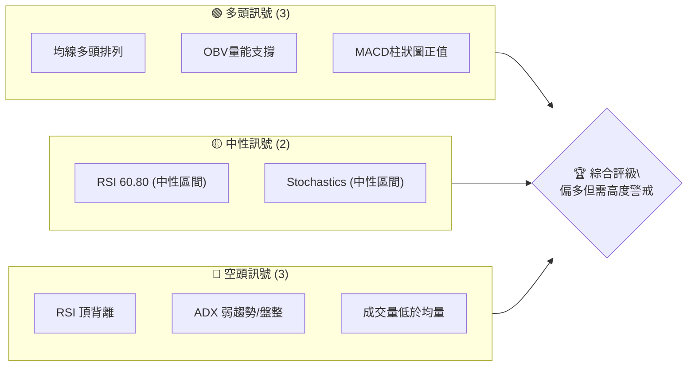

**儀表板解讀**：
- **多頭訊號**：主要來自於長期趨勢的穩固。移動平均線呈現經典的多頭排列，且 OBV 指標顯示累積量能仍支撐價格上漲。MACD 柱狀圖雖為正值，但數值微弱，顯示多頭動能有所減緩。
- **中性訊號**：RSI 和 Stochastics 指標目前位於中性區間，不屬於超買或超賣，但 RSI 數值接近超買區，需關注其後續走勢。
- **空頭訊號**：這是目前最值得關注的部分。RSI 出現明顯的頂背離，預示潛在的價格回調風險。ADX 指標顯示當前趨勢強度不足，可能進入盤整或弱勢震盪。此外，近期成交量低於平均水平，未能有效配合價格上漲，削弱了多頭動能的可靠性。

### 📊 核心指標速覽表

下表彙整了 2330.TW 當前關鍵技術指標的數值與初步解讀：

| 指標類別 | 指標名稱 | 當前數值 | 訊號 | 解讀 |
|----------|----------|----------|------|------|
| **價格** | 當前價格 | $2445.00 | 🟡 | 位於歷史高點附近，但上方阻力漸顯 |
| **價格** | 52W 高點 | $2535.00 | 🔴 | 距離新高僅 3.68%，突破需強勁動能 |
| **均線** | MA20 | $2382.02 | 🟢 | 價格位於短期均線上方，短期趨勢偏多 |
| **均線** | MA50 | $2306.60 | 🟢 | 價格位於中期均線上方，中期趨勢穩健 |
| **均線** | MA200 | $1775.59 | 🟢 | 價格位於長期均線上方，長期趨勢強勁 |
| **動能** | RSI(14) | 60.80 | 🟡 | 中性偏強，但存在頂背離警示 |
| **動能** | MACD | 45.886 | 🟢 | MACD線位於訊號線上方，但柱狀圖微弱 |
| **趨勢** | ADX(14) | 18.68 | 🔴 | 趨勢強度不足，可能進入盤整或回調 |
| **波動** | ATR(14) | $65.00 | 🟡 | 每日波動約 2.66%，屬於中等波動水平 |
| **成交量** | 量比 (20日) | 0.76x | 🔴 | 成交量萎縮，未能有效支撐價格上漲 |
| **成交量** | OBV趨勢 | OBV > MA | 🟢 | 累積量能仍顯示多頭主導 |

### 🏆 技術評分卡

綜合各項技術指標的分析，為 2330.TW 製作一份技術評分卡，以量化的方式呈現其當前技術狀態。

```
╔══════════════════════════════════════════════════════════════╗
║              技術評分卡 — 2330.TW (2026-07-05)               ║
╠══════════════════════════════════════════════════════════════╣
║ 趨勢強度      ██████░░░░░░░░░░░░░░  60/100  🟡 (ADX弱但MA多頭) ║
║ 動能指標      █████░░░░░░░░░░░░░░░  50/100  🟡 (RSI背離抵銷MACD) ║
║ 支撐穩定度    ██████████████░░░░░░  75/100  🟢 (均線密集支撐)   ║
║ 成交量配合    ████░░░░░░░░░░░░░░░░  40/100  🔴 (成交量萎縮)     ║
║ 形態完整度    ██████░░░░░░░░░░░░░░  60/100  🟡 (缺乏明確形態)   ║
║ 均線排列      ██████████████████░░  90/100  🟢 (完美多頭排列)   ║
╠══════════════════════════════════════════════════════════════╣
║ 綜合評分      ██████░░░░░░░░░░░░░░  63/100  🟡 偏多但需謹慎    ║
╚══════════════════════════════════════════════════════════════╝
```
**評分解讀**：
- **趨勢強度 (60/100)**：儘管 ADX 顯示趨勢較弱，但移動平均線的完美多頭排列仍支撐了中期上漲趨勢，故給予中等偏高的評分。
- **動能指標 (50/100)**：RSI 的頂背離是一個強烈的警示訊號，雖然 MACD 柱狀圖為正，但其微弱的數值以及潛在的背離風險，使得動能評分處於中性。
- **支撐穩定度 (75/100)**：多條移動平均線在當前價格下方形成密集支撐區，為股價提供較強的下檔保護。
- **成交量配合 (40/100)**：近期成交量明顯萎縮，未能有效配合股價上漲，顯示多頭追價意願不足，這是主要的空頭訊號之一。
- **形態完整度 (60/100)**：目前缺乏明確的經典圖表形態，但股價在歷史高位附近波動，可能正在構建新的盤整或反轉形態，需持續觀察。
- **均線排列 (90/100)**：短期、中期、長期移動平均線呈現完美的多頭排列 (MA20 > MA50 > MA200)，這是長期趨勢健康的最有力證明。

**綜合評分 (63/100)**：整體而言，2330.TW 仍處於長期多頭趨勢中，但短期內動能減弱，且出現 RSI 頂背離和成交量萎縮等警示訊號，表明股價可能面臨修正或盤整。投資者應在保持長期看多觀點的同時，對短期風險保持高度警惕。

## 2. 趨勢分析

對 2330.TW 進行多時框架趨勢分析，從宏觀到微觀層層遞進，以全面理解其價格行為。

### 🌐 多時框趨勢分析

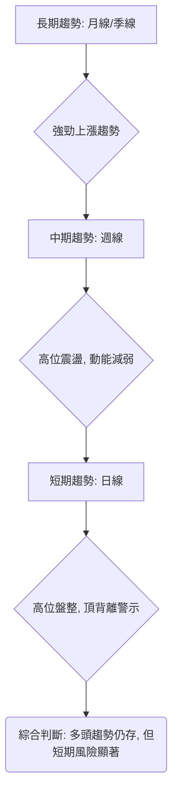

**多時框解讀**：
- **長期趨勢 (月線/季線)**：從過去兩年的歷史數據來看，2330.TW 處於一個非常強勁且持續的上漲趨勢中。股價自 2024 年底開始加速上揚，並在 2025 年至 2026 年間屢創新高，展現出顯著的成長動能。所有長期移動平均線均向上傾斜且呈現多頭排列，確認了這一強勁的長期多頭格局。
- **中期趨勢 (週線)**：在過去的 20 週數據中，股價從 2026 年 3 月的低點 $1755.32 開始強勁反彈，並在 5 月達到 $2348.73，隨後在高位 $2410.00 和 $2445.00 附近震盪。中期趨勢依然向上，但上漲斜率有所放緩，且動能指標顯示出疲態，表明中期上漲的持續性可能受到考驗。
- **短期趨勢 (日線)**：當前價格 $2445.00 位於短期高位，但面臨上方 $2535.00 的 52 週高點阻力。RSI 指標的頂背離以及 ADX 指標的弱趨勢訊號，都預示著短期內股價可能進入盤整或面臨回調壓力。成交量的萎縮也進一步確認了短期多頭動能的不足。

### 📈 長期趨勢 — 12個月走勢圖（Unicode）

以下是 2330.TW 過去 12 個月的月線收盤價格走勢圖，清晰展示了其長期上漲趨勢。

```
2330.TW 月線走勢圖（過去12個月）
價格軸 ($)
$2500 ┤                                        ●(2445.00)
$2400 ┤                                     ●
$2300 ┤                                  ●
$2200 ┤                              ●
$2100 ┤                           ●
$2000 ┤                     ●
$1900 ┤               ●
$1800 ┤             ●
$1700 ┤          ●
$1600 ┤        ●
$1500 ┤      ●
$1400 ┤    ●
$1300 ┤  ●
$1200 ┤●
$1100 ┤●
$1000 ┤
     └─────────────────────────────────────────────────────
      2025-07  2025-08  2025-09  2025-10  2025-11  2025-12  2026-01  2026-02  2026-03  2026-04  2026-05  2026-06  2026-07
```

**走勢特徵分析表格**：

| 時間區間 | 起始價 | 結束價 | 漲跌幅 (%) | 特徵描述 | 訊號 |
|----------|--------|--------|------------|----------|------|
| 2025-07 ~ 2025-08 | $1144.74 | $1144.74 | 0.00% | 底部盤整，為後續上漲積蓄動能。 | 🟡 |
| 2025-09 ~ 2025-12 | $1292.99 | $1540.85 | +19.17% | 第一波強勁上漲，突破盤整區。 | 🟢 |
| 2026-01 ~ 2026-02 | $1764.52 | $1983.22 | +12.39% | 延續上漲趨勢，動能強勁。 | 🟢 |
| 2026-03 | $1755.32 | $1755.32 | -11.49% | 進行短期回調，但未破壞長期趨勢。 | 🟡 |
| 2026-04 ~ 2026-07 | $2129.32 | $2445.00 | +14.82% | 創新高後高位震盪，上漲動能減弱。 | 🟡 |

**長期趨勢總結**：
2330.TW 在過去一年中展現了驚人的漲幅，從 2025 年 7 月的 $1144.74 上漲至 2026 年 7 月的 $2445.00，累積漲幅高達 113.6%。儘管在 2026 年 3 月出現一次較深的回調，但隨後迅速收復失地並創下新高，顯示了市場對其強烈的信心和買盤支撐。然而，當前價格已位於歷史高點，且近期上漲速度有所放緩，需要關注潛在的技術性調整。

### 📊 中期趨勢（週線分析）

中期趨勢主要觀察過去 20 週的價格行為，以識別更近期的支撐與阻力結構。

```
2330.TW 近期壓力與支撐示意圖
價格軸 ($)
$2535.00 ┤─────── R3 (52W 高點, 強阻力)
$2480.00 ┤         R2 (斐波那契擴展/心理關卡)
$2445.00 ╠═════════════════════════════════════════► 當前價格
$2400.00 ┤ S1 (近期盤整區上緣, MA5)
$2382.02 ┤─────── S2 (MA20, 中軌)
$2306.60 ┤─────── S3 (MA50, 關鍵支撐)
$2226.81 ┤─────── S4 (布林下軌, 強支撐)
$2129.32 ┤─────── S5 (2026-05-03 低點)
     └─────────────────────────────────────────────────────
```

**中期趨勢解讀**：
從週線角度看，2330.TW 在 2026 年 3 月經歷一波修正後，於 $1755.32 附近築底反彈。隨後在 4 月和 5 月強勁上漲，突破多個阻力位。目前股價在 $2340.00 - $2445.00 區間進行高位盤整，顯示多空雙方在此區域進行拉鋸。MA20 ($2382.02) 和 MA50 ($2306.60) 形成強勁的動態支撐區，而 52 週高點 $2535.00 則構成上方的直接阻力。若能帶量突破 $2535.00，則有望開啟新一輪上漲；反之，若跌破 MA50，則可能面臨更深的回調。

### ⚡ 趨勢強度評估（ADX 解讀）

ADX 指標用於衡量趨勢的強度，而非方向。

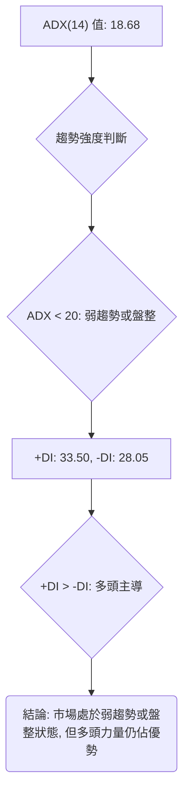

**ADX 強度對照表**：

| ADX 數值範圍 | 趨勢強度 | 市場狀態 |
|--------------|----------|----------|
| 0-20         | 弱趨勢   | 盤整、無方向 |
| 20-25        | 趨勢啟動 | 趨勢開始形成 |
| 25-50        | 強趨勢   | 明顯的趨勢行情 |
| 50-75        | 非常強趨勢 | 趨勢非常強勁 |
| 75-100       | 極強趨勢 | 極端強勁的趨勢 |

**ADX 解讀**：
當前 2330.TW 的 ADX(14) 值為 18.68，低於 20 的閾值，這明確指示市場正處於**弱趨勢或盤整狀態**。這與股價在高位震盪的表現相符，表明目前市場缺乏明確的單邊方向性。
然而，值得注意的是，+DI (33.50) 高於 -DI (28.05)，這表示儘管整體趨勢強度不足，但**多頭力量在當前市場中仍佔據主導地位**。這是一個矛盾的訊號：趨勢本身不夠強勁，但多頭仍掌握主動權。這可能意味著股價在高位震盪後，仍有機會向上突破，但需要更強的催化劑和成交量配合。投資者應警惕在弱趨勢中追高，因為價格波動可能缺乏持續性。

## 3. 圖表形態分析

本章節將仔細檢視 2330.TW 的價格走勢，以識別潛在的圖表形態和 K 線組合，從中推斷未來的價格方向和目標價。

### 🔍 形態識別系統

根據提供的週線收盤數據，目前 2330.TW 尚未形成教科書般的經典反轉或持續形態（如頭肩頂、雙頂/底、三角形整理等）。然而，近期股價在高位區域的行為模式值得關注。

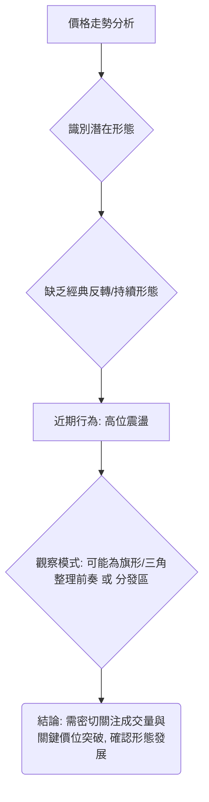

**形態識別解讀**：
從過去 20 週的數據來看，2330.TW 經歷了一波強勁上漲後，目前在 $2300 - $2450 之間進行高位震盪。這種震盪可以被視為：
1. **潛在的旗形或三角整理**：如果股價在震盪後向上突破，則可能是一個上漲中繼形態，預示著更進一步的漲勢。
2. **潛在的派發區**：如果股價在高位震盪後跌破關鍵支撐，則可能是一個多頭力量衰竭的派發區，預示著趨勢反轉。
由於缺乏詳細的日線 OHLVC 數據，目前難以精確識別具體的 K 線形態，但週線收盤價的行為暗示了在高位區域的供需平衡正在發生變化。特別是 RSI 頂背離的存在，增加了高位派發或回調的可能性。

### 🕯️ 重要K線形態分析

雖然只有週收盤價，我們仍然可以從價格的起伏和相對位置來推斷潛在的 K 線形態意義。

| 月份 | 收盤價 | 相對前週變化 | K線形態推斷 | 解讀 | 訊號 |
|------|--------|--------------|--------------|------|------|
| 2026-03-01 | $1983.22 | 上漲 | 長陽線 (推斷) | 強勁上漲，動能充沛，RSI達70.6 | 🟢 |
| 2026-03-08 | $1878.84 | 下跌 | 長陰線 (推斷) | 獲利回吐，短期壓力顯現 | 🔴 |
| 2026-03-15 | $1853.99 | 下跌 | 小陰線 (推斷) | 跌勢減緩，可能尋找支撐 | 🟡 |
| 2026-04-26 | $2179.19 | 大漲 | 長陽線 (推斷) | 強勢突破，RSI達86.4超買 | 🟢 |
| 2026-05-03 | $2129.32 | 下跌 | 陰線 (推斷) | 短期回調，消化超買壓力 | 🟡 |
| 2026-05-31 | $2348.73 | 上漲 | 長陽線 (推斷) | 再次挑戰高點，但RSI已下降至63.3 | 🟡 |
| 2026-06-07 | $2358.71 | 小漲 | 小陽線/十字星 (推斷) | 高位震盪，多頭動能減弱 | 🟡 |
| 2026-06-14 | $2310.00 | 下跌 | 陰線 (推斷) | 高位回調，測試支撐 | 🔴 |
| 2026-06-21 | $2410.00 | 上漲 | 陽線 (推斷) | 嘗試反彈，但未能突破前高 | 🟡 |
| 2026-06-28 | $2340.00 | 下跌 | 陰線 (推斷) | 反彈失敗，再次回落 | 🔴 |
| 2026-07-05 | $2445.00 | 上漲 | 陽線 (推斷) | 再次挑戰高點，但RSI持續背離 | 🟡 |

**K線形態分析總結**：
從週線收盤價的波動來看，2330.TW 在經歷 3 月初的急速上漲和回調後，於 4 月底再次發力創出階段性新高。然而，進入 5 月底至 7 月，股價在高位區間 ($2300-$2450) 呈現出多空拉鋸的局面，陽線和陰線交替出現，且漲幅逐漸收窄，顯示多頭力量有所衰竭。特別是 6 月份的兩次下跌，以及 7 月份雖收陽線但仍未有效突破前高的情況，都加劇了市場對高位壓力的擔憂。結合 RSI 頂背離，這些 K 線行為增強了短期內可能出現調整的預期。

### 📉 ASCII 走勢形態示意圖

以下示意圖展示了 2330.TW 近期在高位區域的價格行為，暗示了潛在的整理或反轉風險。

```
2330.TW 近期高位走勢形態示意圖 (週線)
價格 ($)
$2500 ┤                                      ▲ (潛在頂部)
      │                                     / \
$2445 ┤───────────────────────▲───── 現在價格
      │                      /   \
$2400 ┤                     /     \
      │                    /       \
$2350 ┤                   /         \
      │                  /           \
$2300 ┤─────────────────▼───────────── S1 (近期盤整支撐)
      │
$2200 ┤
     └─────────────────────────────────────────────────────
      五月             六月             七月
```
**示意圖解讀**：圖中顯示股價在衝高後，未能有效突破前高，並在 $2300-$2450 區間形成一個高位震盪平台。這種形態在高位出現，尤其在動能指標顯示背離時，往往是市場多頭力量減弱、空頭力量積聚的信號。這可能預示著股價短期內將面臨向下修正的壓力，或進入更長時間的盤整。

### 🎯 形態目標價計算

由於缺乏明確的經典圖表形態，我們無法應用傳統的形態目標價計算方法（如頭肩頂的形態高度）。然而，我們可以基於近期高位震盪區間和斐波那契擴展來預估潛在目標價。

**情境一：若突破高位整理區（看多目標）**
如果 2330.TW 能夠有效突破當前的高位整理區，並帶動放量上漲，則可以考慮斐波那契擴展目標。
- **突破點**：52 週高點 $2535.00
- **計算基準**：
    - 波段起點：2026-03-01 低點 $1983.22 (或更保守的 2026-03-29 低點 $1815.16)
    - 波段高點：2026-07-05 高點 $2445.00
    - 波段回調點：假設回調至 MA20 $2382.02 (作為突破前的整理低點)
- **斐波那契擴展目標 (基於 $1983.22 - $2445.00 波段)**：
    - 127.2% 擴展目標：$2445.00 + ($2445.00 - $1983.22) * 0.272 = $2445.00 + $125.79 = **$2570.79** (接近分析師低目標)
    - 161.8% 擴展目標：$2445.00 + ($2445.00 - $1983.22) * 0.618 = $2445.00 + $285.39 = **$2730.39** (接近分析師平均目標)
    - 200% 擴展目標：$2445.00 + ($2445.00 - $1983.22) * 1.00 = $2445.00 + $461.78 = **$2906.78**

**情境二：若高位整理失敗並向下突破（看空目標）**
如果股價未能站穩高位，並跌破關鍵支撐，則可能面臨回調。
- **跌破點**：MA50 $2306.60
- **目標價計算**：
    - **目標價 T1**：MA200 $1775.59 (長期趨勢線)
    - **目標價 T2**：斐波那契回調位 (見下一章節詳細分析)

**結論**：由於當前缺乏明確的經典圖表形態，目標價的推算主要依賴於對支撐阻力位的判斷和斐波那契擴展。在沒有明確形態的情況下，**RSI 頂背離**的警示意義更為突出，它暗示了在沒有足夠動能支持下，突破高點的難度增加，回調風險上升。

## 4. 支撐與阻力

支撐與阻力位是技術分析的核心，它們是價格可能發生逆轉或停滯的關鍵區域。本章節將詳細分析 2330.TW 的關鍵價位。

### 🗺️ 關鍵價位分布圖（Unicode）

以下是 2330.TW 當前的價位結構分布圖，清晰標示了主要的支撐與阻力位。

```
2330.TW 價位結構分布圖
═══════════════════════════════════════════════════
$2537.24 ║████████████████████████║ 強阻力 R3 (布林上軌, 52W高點)
$2480.00 ║████████████████████    ║ 阻力 R2 (心理關卡)
$2445.00 ╠════════════════════════╣ ◄ 現價
$2382.02 ║▓▓▓▓▓▓▓▓▓▓▓▓▓▓▓▓        ║ 近期支撐 S1 (MA20, 布林中軌)
$2306.60 ║████████████████████████║ 關鍵支撐 S2 (MA50)
$2226.81 ║████████████████████████║ 強支撐 S3 (布林下軌)
$1846.59 ║▓▓▓▓▓▓▓▓▓▓▓▓▓▓▓▓▓▓▓▓▓▓▓▓║ 重要支撐 S4 (斐波那契 38.2% 回調位)
$1775.59 ║████████████████████████║ 長期支撐 S5 (MA200)
═══════════════════════════════════════════════════
```

### 🚧 阻力位分析表

| 阻力級別 | 價位 | 形成原因 | 突破難度 | 重要性 |
|----------|------|----------|----------|--------|
| **R1**   | $2480.00 | 心理關卡，近期高點區間 | 中等 | 🟡 |
| **R2**   | $2535.00 | 52週高點，歷史高位 | 高   | 🔴 |
| **R3**   | $2537.24 | 布林通道上軌 | 高   | 🔴 |
| **R4**   | $2783.48 | 分析師平均目標價，斐波那契擴展 161.8% | 極高 | 🟡 |

**阻力位解讀**：
- **$2480.00 (R1)**：這是當前價格上方最近的心理關卡和近期震盪區的高點。若能突破此處，將為挑戰 52 週高點鋪路。
- **$2535.00 (R2) / $2537.24 (R3)**：這兩個價位非常接近，分別代表了 52 週高點和布林通道上軌。它們共同構成了當前最為強勁的阻力區。在 RSI 頂背離和成交量萎縮的情況下，要有效突破此區域，需要極其強勁的買盤動能和放大的成交量。未能突破此區域可能觸發回調。

### 🛡️ 支撐位分析表

| 支撐級別 | 價位 | 形成原因 | 守住機率 | 重要性 |
|----------|------|----------|----------|--------|
| **S1**   | $2382.02 | MA20，布林通道中軌 | 中等 | 🟢 |
| **S2**   | $2306.60 | MA50，中期趨勢線 | 高   | 🟢 |
| **S3**   | $2226.81 | 布林通道下軌 | 高   | 🟢 |
| **S4**   | $1846.59 | 斐波那契 38.2% 回調位 | 極高 | 🟢 |
| **S5**   | $1775.59 | MA200，長期趨勢線 | 極高 | 🟢 |

**支撐位解讀**：
- **$2382.02 (S1)**：這是 MA20 和布林通道中軌所在，是近期最直接的動態支撐。若股價回調，此處有望提供初步支撐。
- **$2306.60 (S2)**：MA50 是中期趨勢的重要指標。若股價跌破 MA20，MA50 將提供更強的支撐。此處是判斷中期趨勢是否轉弱的關鍵位置。
- **$2226.81 (S3)**：布林通道下軌，通常代表股價的波動下限。若跌至此處，可能引發技術性反彈。
- **$1846.59 (S4) / $1775.59 (S5)**：這兩個價位分別是斐波那契 38.2% 回調位和 MA200。它們代表了長期趨勢的關鍵支撐。跌破這些位置將對長期多頭趨勢構成嚴重威脅，但目前看來距離較遠，預計防守力度極強。

### 📐 斐波那契回調位分析

為了更深入地評估潛在的回調深度，我們將使用斐波那契回調工具。我們選取 2025 年 4 月的低點 $892.27 作為大波段的起點，以及當前價格 $2445.00 作為波段高點。

**斐波那契回調位計算**：
- **波段高點**：$2445.00 (2026-07-05)
- **波段低點**：$892.27 (2025-04-01, 假設為主要上漲波段起點)
- **波段總幅度**：$2445.00 - $892.27 = $1552.73

| 回調比例 | 價位 ($) | 解讀 | 重要性 |
|----------|----------|------|--------|
| **23.6%** | $2445.00 - ($1552.73 * 0.236) = **$2078.69** | 第一層次支撐，若跌破可能加速回調。 | 🟡 |
| **38.2%** | $2445.00 - ($1552.73 * 0.382) = **$1846.59** | 關鍵支撐，與 MA200 ($1775.59) 接近，形成強勁支撐區。 | 🟢 |
| **50.0%** | $2445.00 - ($1552.73 * 0.500) = **$1668.64** | 重要心理與技術支撐位，若回調至此，長期趨勢面臨考驗。 | 🟡 |
| **61.8%** | $2445.00 - ($1552.73 * 0.618) = **$1490.69** | 深層次回調支撐，跌破則長期上漲趨勢可能被破壞。 | 🔴 |

**斐波那契回調視覺化**：
```
2330.TW 斐波那契回調位示意圖
價格 ($)
$2445.00 ┤─────────────────────────────────────────── 高點
         │
         │
$2306.60 ┤─────── MA50 支撐
$2382.02 ┤─────── MA20 支撐
         │
$2078.69 ┤─────────────── 23.6% 回調
         │
         │
$1846.59 ┤─────────────────────── 38.2% 回調 (重要)
$1775.59 ┤─────────────────────── MA200 支撐 (與 38.2% 接近)
         │
$1668.64 ┤─────────────────────────────── 50.0% 回調
         │
         │
$1490.69 ┤─────────────────────────────────────── 61.8% 回調
         │
$892.27  ┤─────────────────────────────────────────── 低點
```
**斐波那契回調解讀**：
斐波那契回調位提供了一個潛在的回調路徑。目前股價遠高於這些回調位，顯示其強勁的長期多頭趨勢。然而，若出現較深的回調，38.2% 回調位 ($1846.59) 將是一個極其重要的支撐，與 MA200 形成共振，具有很強的防守意義。在當前 RSI 頂背離的背景下，投資者應警惕股價向第一層次支撐 $2078.69 (23.6%) 甚至更低的 $1846.59 (38.2%) 進行回調的可能性。

## 5. 技術指標深度解讀

本章節將對 2330.TW 的各項關鍵技術指標進行深入分析，探討它們之間的相互關係和潛在的交易訊號。

### 🎛️ 指標訊號總覽

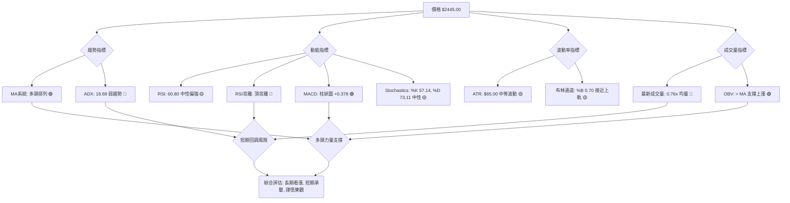
**指標總覽解讀**：
從訊號關係圖中可以看出，2330.TW 的各項指標存在明顯的矛盾。移動平均線系統和 OBV 指標依然強烈支持多頭趨勢，這反映了其穩固的長期基本面。然而，RSI 頂背離、ADX 弱趨勢以及成交量萎縮等訊號，則明確指向短期內上漲動能的衰竭和潛在的回調風險。這種多空交織的局面要求投資者在決策時必須權衡長期趨勢的優勢與短期風險的警示。

### 📈 移動平均線排列分析

移動平均線 (MA) 系統是判斷趨勢方向和強度的最基本工具。

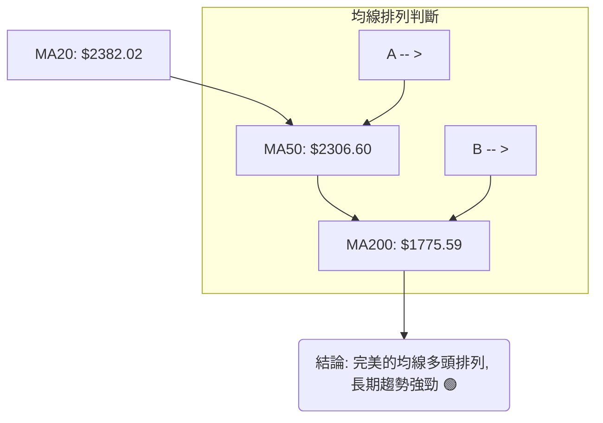
**移動平均線解讀**：
2330.TW 目前呈現出教科書般的**完美多頭排列**：MA20 ($2382.02) > MA50 ($2306.60) > MA200 ($1775.59)。所有均線均向上傾斜，且短期均線位於長期均線之上，這是一個極其強勁的長期看漲訊號。它表明市場的買盤力量持續主導，且股價的上升趨勢非常穩固。當前價格 $2445.00 位於所有重要均線之上，進一步確認了多頭趨勢的健康。短期內，MA20 和 MA50 將為股價提供強勁的動態支撐。

### 📉 RSI(14) 分析

相對強弱指標 (RSI) 用於衡量價格變動的速度和幅度，判斷超買超賣狀態。

**RSI 數值進度條**：
RSI(14): 60.80  ▓▓▓▓▓▓▓▓▓▓▓▓░░░░░░░░ 60.8%  🟡 (中性偏強)

**RSI 超買超賣區間分析**：
- **超買區 (RSI > 70)**：股價可能上漲過快，面臨回調風險。
- **超賣區 (RSI < 30)**：股價可能下跌過快，有望出現反彈。
- **中性區 (30 < RSI < 70)**：市場力量相對平衡。

當前 RSI(14) 為 60.80，位於中性偏強區間，但已接近超買區。這本身並非立即的賣出訊號，但結合以下背離分析，其警示意義就非常強烈。

**背離判斷：⚠️ 頂背離 (Bearish Divergence)**
數據明確指出 RSI 存在頂背離。根據提供的週線數據：
- **價格走勢**：
    - 2026-04-26: $2179.19
    - 2026-05-31: $2348.73 (更高的高點)
    - 2026-07-05: $2445.00 (更高的高點)
- **RSI 走勢**：
    - 2026-04-26: 86.4 (超買高點)
    - 2026-05-31: 63.3 (較低的高點)
    - 2026-07-05: 60.8 (更低的高點)

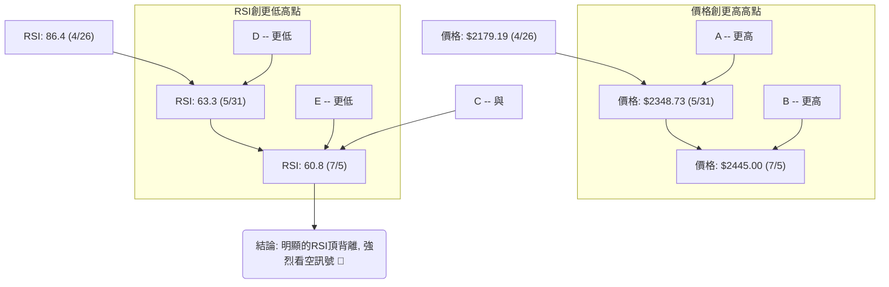
**RSI 頂背離解讀**：
RSI 頂背離是一個非常重要的反轉訊號。當股價創出更高的高點，而 RSI 指標卻創出更低的高點時，這表明股價的上漲動能正在衰竭，多頭力量難以為繼。儘管股價表面上仍在創新高，但其內在的推動力已經減弱。這種情況通常預示著股價即將面臨回調或反轉下跌。對於 2330.TW 而言，此頂背離訊號是當前最值得警惕的空頭訊號之一，投資者應高度重視其可能帶來的風險。

### 📊 MACD(12/26/9) 訊號解讀

平滑異同移動平均線 (MACD) 是一個趨勢追蹤動能指標，由 MACD 線、訊號線和 MACD 柱狀圖組成。

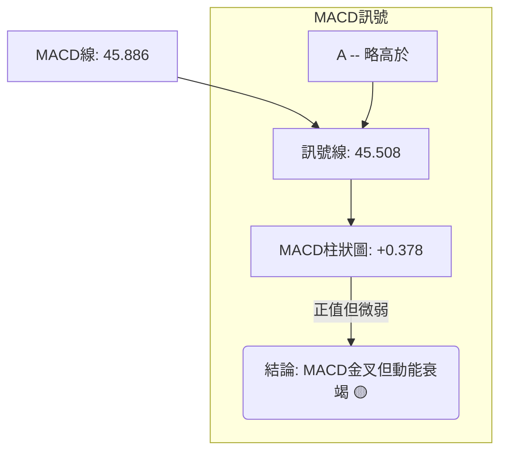
**MACD 解讀**：
- **MACD 線與訊號線**：MACD 線 (45.886) 位於訊號線 (45.508) 之上，形成一個微弱的**金叉 (Golden Cross)**。這通常被視為一個看漲訊號。
- **MACD 柱狀圖**：柱狀圖為 +0.378，雖然是正值，但其數值非常小，且可能從之前的高點持續下降（從 2026-04-26 的 +15.425 到 2026-05-31 的 -1.758 再到現在的 +0.378），這表明多頭動能極度微弱，甚至有衰竭的跡象。
**MACD 綜合判斷**：儘管 MACD 線形成了金叉，但其柱狀圖的微弱正值以及 RSI 頂背離的存在，使得 MACD 的看漲訊號大打折扣。它更多地暗示了市場在高位盤整，多頭動能不足以推動股價大幅上漲。投資者應警惕 MACD 柱狀圖若轉為負值，將確認空頭力量的增強。

### 📦 布林通道分析

布林通道 (Bollinger Bands) 用於衡量價格的波動範圍和相對位置。

**布林通道示意圖**：
```
2330.TW 布林通道示意圖
價格 ($)
$2537.24 ║████████████████████████║ 布林上軌 (BB Upper)
$2445.00 ╠════════════════════════╣ ◄ 現價
$2382.02 ║▓▓▓▓▓▓▓▓▓▓▓▓▓▓▓▓        ║ 布林中軌 (MA20)
         ║                        ║
$2226.81 ║████████████████████████║ 布林下軌 (BB Lower)
═══════════════════════════════════════════════════
```
**布林通道解讀**：
- **上軌**：$2537.24
- **中軌 (MA20)**：$2382.02
- **下軌**：$2226.81
- **%B 值**：0.70

當前價格 $2445.00 位於布林通道中軌上方，且 %B 值為 0.70，表示價格在中軌和上軌之間，更靠近上軌。這通常被視為多頭趨勢的延續。然而，價格並未緊貼上軌運行，且布林通道的寬度（上軌與下軌之差）相對較大，表明市場仍有足夠的波動空間。結合 RSI 頂背離，價格可能面臨向中軌 ($2382.02) 回歸的壓力。若跌破中軌，則有進一步測試下軌 ($2226.81) 的風險。

### 💹 成交量分析（量價配合度）

成交量是價格走勢的能量，分析量價配合度可以判斷趨勢的可靠性。

**成交量數據**：
- 最新成交量: 26,489,446
- 20日均量: 35,033,887
- 50日均量: 35,748,873
- 量比 (最新成交量 / 20日均量): 0.76x
- OBV趨勢: OBV > MA → 量能支撐上漲

**量價配合度解讀**：
- **成交量萎縮 (🔴)**：當前最新成交量僅為 20 日均量的 0.76 倍，顯著低於平均水平。在股價處於高位並試圖上漲時，成交量的萎縮是一個**重要的警示訊號**。它表明市場追高意願不足，多頭力量缺乏足夠的參與度來推動股價持續上漲。這種「無量上漲」或「量價背離」的現象，往往預示著上漲趨勢的脆弱性，甚至可能導致回調。
- **OBV 趨勢 (🟢)**：儘管短期成交量萎縮，但 OBV 指標的趨勢顯示 OBV 線位於其移動平均線之上，這表明**累積量能依然支撐價格上漲**。OBV 是一個累積性指標，它反映了長期以來買賣壓力的平衡。OBV 的正向趨勢與短期成交量萎縮形成了一定程度的矛盾。這可以解讀為：長期而言，多頭累積佔優，但短期內市場情緒趨於謹慎，導致日成交量下降。因此，OBV 的樂觀訊號需要結合短期成交量的不足來綜合判斷，警惕短期內可能出現的調整。

**總結**：成交量分析顯示，2330.TW 的長期買盤累積依然強勁 (OBV)，但短期內缺乏新的資金流入來推動股價突破，導致量能萎縮。這種情況加劇了 RSI 頂背離所暗示的短期回調風險。

## 6. 動能與波動率

本章節將評估 2330.TW 的動能強度和價格波動率，這對於制定風險調整後的交易策略至關重要。

### ⚡ 動能評估四象限

我們將 2330.TW 的當前狀態置於「動能」與「波動率」的四象限模型中進行評估。
- **動能 (Momentum)**：衡量價格變動的速度和方向。RSI 頂背離和 MACD 柱狀圖微弱正值顯示動能正在減弱。
- **波動率 (Volatility)**：衡量價格變動的幅度。ATR 顯示中等波動。

| 象限 | 動能 (RSI/MACD) | 波動 (ATR) | 當前狀態 | 評估 | 訊號 |
|------|-----------------|------------|----------|------|------|
| Q1 | 強 (Strong)     | 低 (Low)   | -        | 最佳機會 (趨勢明確，風險可控) | 🟢 |
| Q2 | 弱 (Weak)       | 低 (Low)   | -        | 觀望/謹慎 (缺乏方向，波動小) | 🟡 |
| Q3 | 強 (Strong)     | 高 (High)  | -        | 高風險高收益 (趨勢強勁，但波動大) | 🟡 |
| Q4 | 弱 (Weak)       | 高 (High)  | ✓        | **避免進場** (缺乏方向，波動大，風險高) | 🔴 |

**動能評估解讀**：
當前 2330.TW 的動能表現為「弱」。RSI 頂背離是一個強烈的動能衰竭訊號，儘管 MACD 柱狀圖為正，但其微弱的數值也印證了多頭推動力的不足。
波動率方面，ATR(14) 為 $65.00，佔當前價格 $2445.00 的 2.66%，這屬於「中等偏高」的波動水平。
綜合來看，2330.TW 目前處於「**弱動能，中等偏高波動**」的狀態。這將其置於 Q4 象限，即「避免進場」或「高度謹慎觀望」的區域。儘管長期趨勢依然看好，但短期內動能的減弱和相對較高的波動率，增加了交易的不確定性和風險。在這種情況下，追高風險較大，更適合等待明確的趨勢確認或回調後的築底機會。

### 📊 ATR 波動率分析

平均真實波幅 (ATR) 衡量資產在特定時間段內的平均波動幅度。

**ATR 數據**：
- ATR(14): $65.00
- 當前價格: $2445.00
- ATR 佔價格百分比: ($65.00 / $2445.00) * 100% = 2.66%

**ATR 解讀**：
2330.TW 的 ATR(14) 為 $65.00，佔當前價格的 2.66%。這表示在過去 14 個交易日中，2330.TW 的平均每日波幅約為 2.66%。這個數值屬於中等偏高水平，顯示股價存在一定的活躍性和波動性。

**ATR 對止損距離的建議**：
ATR 是設定止損點的實用工具。一般建議將止損點設置在當前價格下方 1.5 到 3 倍 ATR 的距離。
- **保守止損** (1.5 x ATR)：$2445.00 - (1.5 * $65.00) = $2445.00 - $97.50 = **$2347.50**
- **標準止損** (2.0 x ATR)：$2445.00 - (2.0 * $65.00) = $2445.00 - $130.00 = **$2315.00**
- **寬鬆止損** (3.0 x ATR)：$2445.00 - (3.0 * $65.00) = $2445.00 - $195.00 = **$2250.00**

根據 ATR 的建議，標準止損點 $2315.00 位於 MA50 ($2306.60) 附近，這是一個合理的參考點。若股價跌破此區間，可能意味著短期趨勢的轉變。

### 📐 Beta 與市場相關性

**Beta 數據**：未提供。

**Beta 解讀**：
Beta 值衡量個股相對於整體市場（如大盤指數）的波動性。
- Beta > 1：表示股票波動性大於市場，通常是成長型股票或高風險資產。
- Beta < 1：表示股票波動性小於市場，通常是防禦型股票。
- Beta = 1：表示股票波動性與市場一致。
- Beta < 0：表示股票走勢與市場相反。

由於數據中未提供 2330.TW 的 Beta 值，我們無法直接分析其與大盤的相關性。然而，考慮到台積電作為全球半導體產業的龍頭企業，其股價通常會受到全球科技景氣、半導體週期以及地緣政治等多重因素的影響。在缺乏 Beta 值的情況下，投資者應自行評估其與加權指數 (TAIEX) 或費城半導體指數 (SOX) 的歷史相關性，以更好地理解其市場風險。一般來說，作為權值股，2330.TW 的走勢對大盤有較大影響，其自身也容易受到大盤情緒的牽動。

## 7. 多時框架總結

綜合以上各時框架的分析，我們將對 2330.TW 的技術面進行全面的總結與評分。

### 📋 時框架評分表

| 時框架 | 趨勢方向 | 動能 | 均線排列 | 形態 | 綜合評分 (1-10) | 建議 |
|--------|----------|------|----------|------|-----------------|------|
| **長期** | 🟢 強勁上漲 | 🟢 穩健 | 🟢 多頭排列 | 🟢 上升趨勢 | 9/10 | 持有/逢低買入 |
| **中期** | 🟡 向上震盪 | 🟡 減弱 | 🟢 多頭排列 | 🟡 高位整理 | 7/10 | 觀察/謹慎持有 |
| **短期** | 🔴 盤整/回調 | 🔴 衰竭 | 🟡 價格偏離MA | 🔴 頂背離 | 4/10 | 觀望/減倉 |

**時框架評分解讀**：
- **長期**：2330.TW 的長期趨勢無可挑剔，所有長期指標都指向強勁的多頭格局。這為其提供了堅實的下檔支撐和未來上漲的潛力。
- **中期**：中期趨勢仍屬上漲，但已顯露出疲態。價格在高位震盪，動能指標開始減弱，顯示中期上漲的持續性面臨挑戰。
- **短期**：短期內風險顯著。RSI 頂背離、ADX 弱趨勢、成交量萎縮，以及價格在高位盤整的K線行為，都指向短期內可能的回調或深度盤整。

### 🔲 綜合訊號矩陣

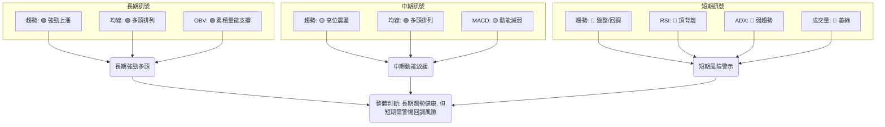
**綜合訊號矩陣解讀**：
綜合各時框架的訊號，2330.TW 呈現出一個經典的「**長期牛市中的短期回調風險**」情境。長期來看，其基本面和技術面都非常強勁，適合長期投資者逢低配置。然而，短期內，多項指標的警示訊號（RSI 頂背離、ADX 弱趨勢、成交量萎縮）表明當前股價在高位面臨較大的壓力，可能會經歷一波調整。對於短線交易者而言，當前不適合追高，應等待回調後的築底訊號或突破關鍵阻力並帶量上漲的確認。對於中長線投資者，這或許是分批佈局的機會，但需嚴格控制風險。

## 8. 交易策略建議

基於上述詳盡的技術分析，本章節將提供針對 2330.TW 的具體交易策略，包含進場點、止損點、目標價和風險報酬比。

### 🗺️ 策略決策流程圖

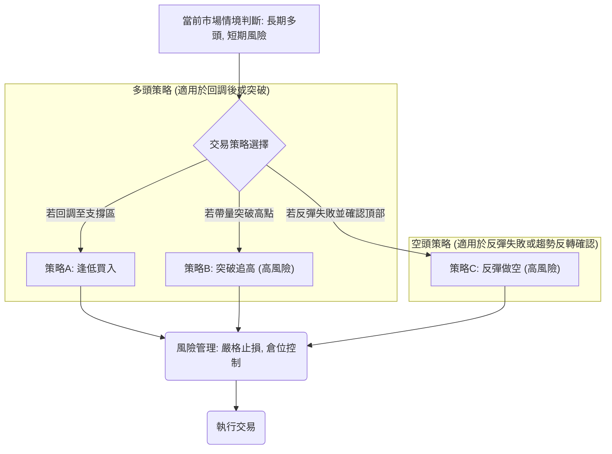

### 🟢 多頭策略詳情

考慮到長期趨勢依然強勁，但短期面臨回調風險，以下提供兩種多頭策略。

| 策略要素 | 策略 A: 逢低買入 (回調至MA支撐) | 策略 B: 突破追高 (等待確認) |
|----------|---------------------------------|-----------------------------|
| **情境** | 股價回調至關鍵均線支撐區，並出現止跌訊號 | 股價有效帶量突破 52 週高點 |
| **進場條件** | 股價回踩 MA20 或 MA50，且 RSI/MACD 止跌回升 | 股價收盤價站穩 $2535.00 以上，且成交量顯著放大 |
| **進場價格** | **$2382.02 ~ $2306.60 區間** (MA20/MA50) | **$2540.00** (確認突破) |
| **目標價 T1** | **$2535.00** (52週高點/強阻力) | **$2730.00** (斐波那契擴展 161.8%) |
| **目標價 T2** | **$2730.00** (斐波那契擴展 161.8%) | **$2900.00** (斐波那契擴展 200%) |
| **止損價格** | **$2250.00** (略低於 MA50 及 ATR 3倍止損) | **$2480.00** (跌破突破點及近期阻力) |
| **風險報酬比** | 假設進場 $2340.00: (2340-2250):(2535-2340) = 90:195 ≈ **1:2.17** | 假設進場 $2540.00: (2540-2480):(2730-2540) = 60:190 ≈ **1:3.17** |
| **成功機率** | 65% (基於強勁長期趨勢和均線支撐) | 50% (突破失敗風險較高，需嚴格止損) |
| **建議倉位** | 中等倉位 (5-10%) | 較小倉位 (3-5%) |

### 🔴 空頭策略詳情

儘管整體趨勢偏多，但 RSI 頂背離和動能衰竭是重要的警示訊號，可考慮短線空頭策略。

| 策略要素 | 策略 C: 反彈做空 (高位壓力確認) |
|----------|--------------------------------|
| **情境** | 股價反彈至阻力區 $2535.00 附近，未能有效突破，並出現明確的看空K線或指標反轉訊號 |
| **進場條件** | 股價在 $2535.00 附近受阻，收盤價未站穩該點，且日線出現長上影線、陰線吞噬等反轉K線 |
| **進場價格** | **$2520.00** (靠近 52 週高點且確認阻力) |
| **目標價 T1** | **$2382.02** (MA20/布林中軌) |
| **目標價 T2** | **$2306.60** (MA50) |
| **止損價格** | **$2550.00** (略高於 52 週高點及布林上軌) |
| **風險報酬比** | 假設進場 $2520.00: (2550-2520):(2520-2382.02) = 30:137.98 ≈ **1:4.60** |
| **成功機率** | 40% (逆勢操作，風險較高) |
| **建議倉位** | 小倉位 (2-3%) |

### ⭐ 整體訊號強度評星

綜合考量長期趨勢、短期風險和交易策略的潛在回報，給出整體訊號強度評星。

```
做多訊號強度：★★☆☆☆  (2/5星) (長期雖好，但短期風險高，不宜追高)
做空訊號強度：★★★☆☆  (3/5星) (RSI頂背離提供做空機會，但逆長期趨勢)
整體可信度：  ★★★☆☆  (3/5星) (市場處於關鍵轉折點，訊號複雜，需謹慎)
```
**評星解讀**：
- **做多訊號強度**：儘管長期趨勢強勁，但短期動能衰竭和 RSI 頂背離使得當前追高風險極高。只有在明確回調至支撐位並確認止跌後，做多才相對安全。
- **做空訊號強度**：RSI 頂背離是重要的空頭訊號，配合成交量萎縮，為短線空頭提供了機會。然而，由於整體市場仍處於長期多頭，逆勢操作風險較大。
- **整體可信度**：市場正處於一個關鍵的轉折點，多空訊號交織，使得整體可信度中等。投資者應保持高度警惕，避免盲目交易，並優先考慮風險管理。

## 9. 風險提示與監控

本章節將列出關鍵的監控指標和潛在的風險場景，以幫助投資者更好地管理 2330.TW 的投資風險。

### ✅ 關鍵監控指標 Checklist

以下是投資者在交易 2330.TW 時應密切關注的技術指標清單。

```
╔══════════════════════════════════════════════════════════════╗
║              2330.TW 關鍵監控指標 Checklist                  ║
╠══════════════════════════════════════════════════════════════╣
║ [ ] 價格行為：是否有效突破 $2535.00 (52W高點) 或跌破 $2306.60 (MA50) ║
║ [ ] 成交量：上漲是否伴隨放量，下跌是否伴隨縮量                 ║
║ [ ] RSI(14)：是否跌破 50 中軸線，或進一步形成底背離            ║
║ [ ] MACD：MACD柱狀圖是否轉為負值，或 MACD線死叉訊號線          ║
║ [ ] ADX(14)：ADX值是否上升至 25 以上，確認趨勢強度             ║
║ [ ] 布林通道：價格是否跌破中軌，或觸及下軌                   ║
║ [ ] 斐波那契回調：價格是否跌破 $2078.69 (23.6%) 或 $1846.59 (38.2%) ║
║ [ ] K線形態：是否出現明確的反轉形態 (如黃昏之星、烏雲蓋頂)     ║
╚══════════════════════════════════════════════════════════════╝
```

### ⚠️ 風險場景分析

我們將 2330.TW 未來的走勢分為三種情境進行分析。

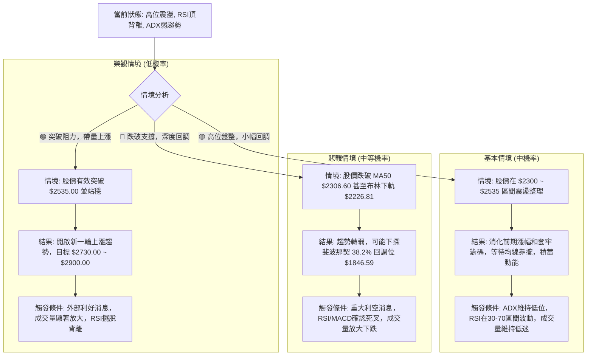
**風險場景解讀**：
- **樂觀情境**：儘管長期趨勢強勁，但由於短期動能指標的警示，目前突破阻力並開啟新一輪大幅上漲的機率較低。除非有超預期的利好消息或極其強勁的買盤湧入。
- **基本情境**：在 RSI 頂背離和 ADX 弱趨勢的背景下，股價在高位區間進行盤整或小幅回調是目前最有可能的走勢。這將有助於消化前期漲幅，等待均線靠攏，並為未來的走勢積蓄動能。
- **悲觀情境**：如果市場情緒惡化或出現重大利空，股價存在跌破 MA50 甚至更深層次支撐的風險。RSI 頂背離的最終確認往往伴隨著價格的快速下跌。投資者需對此情境保持高度警惕，並設定嚴格的止損。

### 🛡️ 風險管理重要提醒

1.  **嚴格止損**：無論採用何種策略，都必須設定明確的止損點並嚴格執行。特別是考慮到 RSI 頂背離的警示作用，一旦價格跌破關鍵支撐，應果斷止損，避免更大的損失。
2.  **倉位管理**：在高位震盪且動能減弱的市場中，應避免重倉操作。建議採用分批建倉或減倉的策略，根據市場變化逐步調整倉位。
3.  **觀察成交量**：成交量是確認趨勢和形態可靠性的重要指標。任何突破或跌破若無成交量配合，其可信度將大打折扣。特別關注上漲無量和下跌放量的風險訊號。
4.  **多指標確認**：不要單獨依賴某一個指標做出決策。務必結合多個指標（如價格行為、均線、動能指標、成交量）進行綜合判斷，尋找相互確認的訊號。
5.  **關注基本面**：雖然本報告側重技術分析，但 2330.TW 作為全球半導體龍頭，其基本面（如營收、獲利、產業趨勢）的變化將對股價產生深遠影響。技術分析應與基本面分析相結合，形成全面的投資決策。
6.  **市場情緒**：留意整體市場和半導體板塊的情緒變化。在市場情緒悲觀時，即使個股技術面良好也可能受到拖累。

---

## 📋 報告總結

```
╔══════════════════════════════════════════════════════════════════════════════════════════════════════════╗
║                                 2330.TW 技術分析報告總結                                                 ║
╠══════════════════════════════════════════════════════════════════════════════════════════════════════════╣
║ 報告日期：2026-07-05                                                                                     ║
║ 當前價格：$2445.00                                                                                       ║
║ 分析評級：⚖️ 偏多但需高度警戒 (長期趨勢健康，但短期動能衰竭與頂背離構成顯著風險)                         ║
║                                                                                                          ║
║ 關鍵結論：                                                                                               ║
║ ├─ 長期趨勢：🟢 強勁上漲。均線系統呈現完美多頭排列，OBV顯示累積量能持續支撐。                           ║
║ ├─ 中期趨勢：🟡 向上震盪。股價在高位區間進行整理，上漲動能有所放緩。                                    ║
║ ├─ 短期趨勢：🔴 盤整/回調。RSI出現明確頂背離，ADX顯示趨勢強度不足，成交量萎縮，短期風險顯著。            ║
║ ├─ 關鍵支撐：$2306.60 (MA50) 為中期關鍵支撐，$1846.59 (斐波那契 38.2%) 為長期重要支撐。                 ║
║ └─ 關鍵阻力：$2535.00 (52週高點) 為上方強勁阻力，突破需極大動能和成交量。                                ║
║                                                                                                          ║
║ 最優策略組合：                                                                                           ║
║ 1. 🥇 最佳機會：等待股價回調至 MA20 ($2382.02) 或 MA50 ($2306.60) 附近，並出現止跌訊號後，逢低買入。       ║
║                進場點：$2306.60，止損點：$2250.00，目標 T1：$2535.00，目標 T2：$2730.00。風險報酬比 約 1:2.6。 ║
║ 2. 🥈 次選機會：若股價帶量有效突破 $2535.00 (52週高點) 並站穩，則可考慮短線追高，但需嚴格止損。           ║
║                進場點：$2540.00，止損點：$2480.00，目標 T1：$2730.00，目標 T2：$2900.00。風險報酬比 約 1:3.17。 ║
║ 3. 🥉 保守選擇：在當前高位觀望，等待市場方向明確。若出現反彈失敗並跌破 MA20，可考慮小倉位短線做空。       ║
║                進場點：$2520.00 (反彈受阻)，止損點：$2550.00，目標 T1：$2382.02，目標 T2：$2306.60。風險報酬比 約 1:4.6。 ║
╚══════════════════════════════════════════════════════════════════════════════════════════════════════════╝
```

---

> ⚠️ **免責聲明**：本報告為 AI 自動生成之技術分析，所有數據及估算均基於提供的歷史價格資訊。本報告**僅供研究與學術參考**，**不構成任何投資建議**。投資有風險，入市需謹慎。

---

*報告生成時間：2026-07-05 ｜ 數據來源：Yahoo Finance ｜ 分析框架：多時框技術分析*