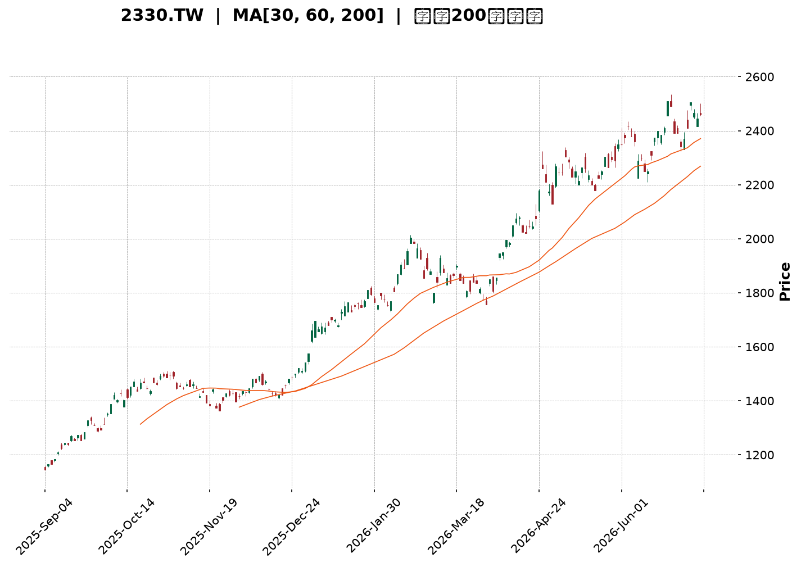
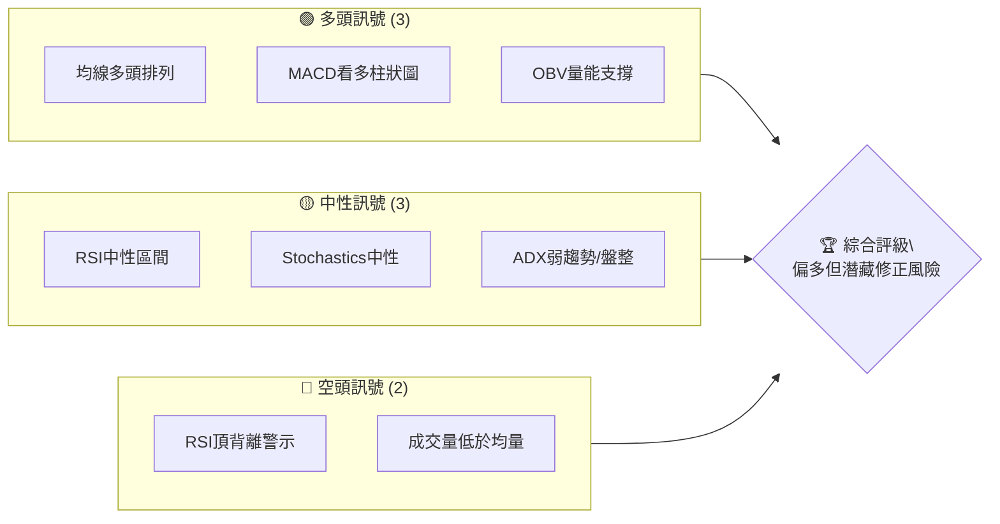
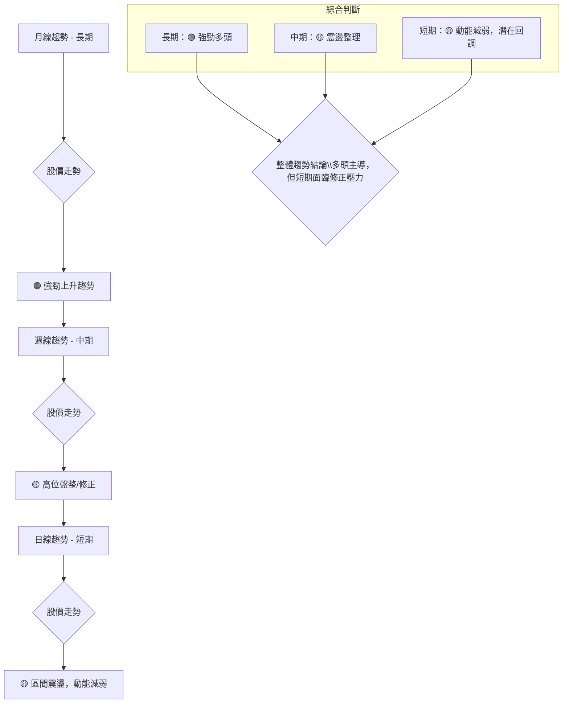
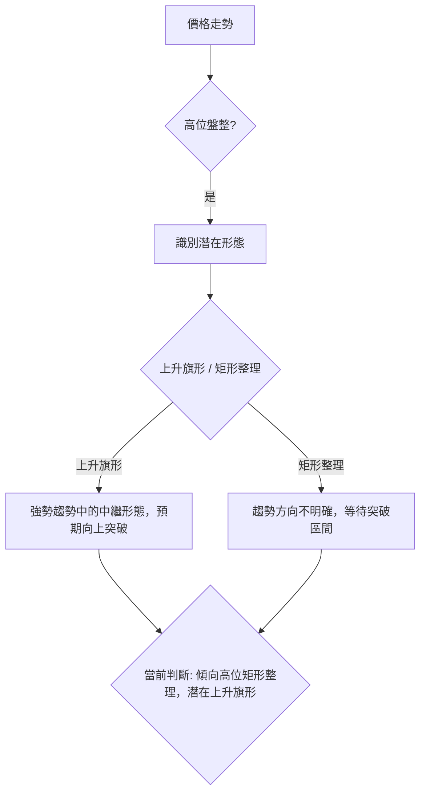
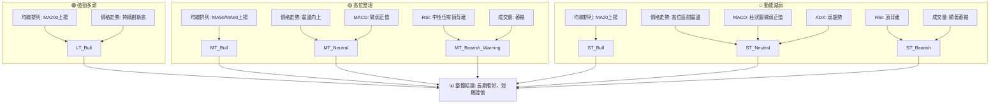

<details>
<summary>📊 靜態圖表 (點擊展開)</summary>

</details>

<html>
<head><meta charset="utf-8" /></head>
<body>
    <div style="height:500px; width:100%;">                        <script>window.PlotlyConfig = {MathJaxConfig: 'local'};</script>
        <script charset="utf-8" src="https://cdn.plot.ly/plotly-3.6.0.min.js" integrity="sha256-QaOVwtVY0T02VaHrr6pnoHLCwayMJp4O5n4YyaE3rJk=" crossorigin="anonymous"></script>                <div id="candlestick-chart" class="plotly-graph-div" style="height:100%; width:100%;"></div>            <script>                window.PLOTLYENV=window.PLOTLYENV || {};                                if (document.getElementById("candlestick-chart")) {                    Plotly.newPlot(                        "candlestick-chart",                        [{"close":{"dtype":"f8","bdata":"AAAAAPfikUAAAACg6TGSQAAAAKDpMZJAAAAAINyAkkAAAACAi+OSQAAAAGDBHpNAAAAAALRtk0AAAABg91mTQAAAAIDc0JNAAAAA4GmVk0AAAABgreSTQAAAAOBplZNAAAAAIE8MlEAAAADgpr6UQAAAAOCmvpRAAAAAYGNvlEAAAADgHyCUQAAAAMDwM5RAAAAAQDSDlEAAAAAguyGVQAAAACBxrJVAAAAAICc3lkAAAADA4+eVQAAAACD4SpZAAAAAwOPnlUAAAABghQ+WQAAAAGAMrpZAAAAA4E\u002f9lkAAAADgmXKWQAAAAAB\u002f6ZZAAAAAAH\u002fplkAAAACgO5qWQAAAAOCZcpZAAAAAAH\u002fplkAAAABArtWWQAAAAGCTTJdAAAAAYJNMl0AAAABgwjiXQAAAAEBkYJdAAAAAYJNMl0AAAACgO5qWQAAAAGAMrpZAAAAAoDualkAAAABArtWWQAAAAGAMrpZAAAAAQK7VlkAAAACgO5qWQAAAAEBWI5ZAAAAAAMlelkAAAAAgQsCVQAAAAECgmJVAAAAAwGqGlkAAAACg\u002fnCVQAAAAOBcSZVAAAAAwOPnlUAAAAAg+EqWQAAAACAnN5ZAAAAAIPhKlkAAAADgEtSVQAAAAEBWI5ZAAAAA4JlylkAAAAAAyV6WQAAAAKA7mpZAAAAAoPEkl0AAAAAAf+mWQAAAAGCTTJdAAAAAoEjVlkAAAABADP2WQAAAAKDBhZZAAAAAIBxKlkAAAABgOjaWQAAAAGA6NpZAAAAAYDo2lkAAAADgZsGWQAAAAMDPJJdAAAAAgLE4l0AAAADgVnSXQAAAAODdw5dAAAAAYBqcl0AAAAAAZROYQAAAAGCRnphAAAAAgI\u002fwmUAAAADgu3uaQAAAAEBxBJpAAAAAwDQsmkAAAAAAUxiaQAAAAIAWQJpAAAAAoJ2PmkAAAACgnY+aQAAAAIAWQJpAAAAAQOgGm0AAAABgb1abQAAAAMAUkptAAAAAQOgGm0AAAABgb1abQAAAAAAzfptAAAAAgI1Cm0AAAACA9qWbQAAAAKAERZxAAAAAYF8JnEAAAADAFJKbQAAAACBRaptAAAAAgH31m0AAAABA2LmbQAAAACBRaptAAAAAgPalm0AAAADgIjGcQAAAAOCZM51AAAAAQMa+nUAAAADgIIOdQAAAAOCXhZ5AAAAAoGlMn0AAAACA4vyeQAAAAIBbrZ5AAAAAYE0OnkAAAACA9PecQAAAAOAgg51AAAAAYF1bnUAAAAAgQR2cQAAAAEBPvJxAAAAAIC8inkAAAACge0edQAAAAID095xAAAAAgG2onEAAAAAAGSSdQAAAAKC5r51AAAAAgE\u002fUnEAAAADAaqycQAAAAIC8NJxAAAAAgLw0nEAAAAAgXcCcQAAAAMBqrJxAAAAAQKFcnEAAAABADr2bQAAAAMBEbZtAAAAA4EHonEAAAACAvDScQAAAAEA0\u002fJxAAAAAAD9jnkAAAABgMXeeQAAAAMC2Kp9AAAAAANICn0AAAACAEAOgQAAAAGDuNKBAAAAAoOc+oEAAAAAAZaKfQAAAAKByjp9AAAAAgC7yn0AAAACALvKfQAAAAGDuNKBAAAAAYF8GoUAAAABg8qWhQAAAAIA2QqFAAAAAIGb8oEAAAACAo6KgQAAAAMDkuaFAAAAA4AaIoUAAAADgBoihQAAAACC1\u002f6FAAAAAYNDXoUAAAABAG2qhQAAAAAAAkqFAAAAAoC9MoUAAAACg66+hQAAAAGDypaFAAAAAgBR0oUAAAAAgRC6hQAAAAGBfBqFAAAAAACJgoUAAAAAAAJKhQAAAACC1\u002f6FAAAAAoOuvoUAAAADAwuuhQAAAAIDJ4aFAAAAAwHdZokAAAADAd1miQAAAAMBVi6JAAAAAYBjlokAAAADgTpWiQAAAACBqbaJAAAAAgMnhoUAAAADgu\u002fWhQAAAAAAAkqFAAAAAAACUoUAAAAAAAAyiQAAAAAAAjqJAAAAAAADAokAAAAAAAKKiQAAAAAAA1KJAAAAAAACco0AAAAAAAHSjQAAAAAAArKJAAAAAAACsokAAAAAAAEiiQAAAAAAAhKJAAAAAAADUokAAAAAAAJKjQAAAAAAAQqNAAAAAAAAao0AAAAAAADijQA=="},"high":{"dtype":"f8","bdata":"jbDc8ywekkAAAACg6TGSQOGk7pMfbZJAAAAAINyAkkACRqkmSPeSQKWUUvqzbZNAAAAAALRtk0C9JaEGtG2TQAAAgFyt5JNAQcDqmAu9k0AAAABgreSTQKLgSi5++JNAAAAAIE8MlEAAAADgpr6UQB+onHUZ+pRAED74GAWXlECt1Ep1kluUQFVVVVVjb5RAvJV9jkjmlEC8x3v8izWVQAAAACBxrJVAaTbd2MhelkCjpH6ctPuVQKuqqrVqhpZAo6R+nLT7lUAdYNlmO5qWQAAAAGAMrpZAdbgamfEkl0AN6bx1DK6WQJgin5XxJJdAdYMpcsI4l0BNmjRZ3cGWQK9NlLxqhpZAdYMpcsI4l0Dyb+nVIBGXQO0tMhk1dJdA5ETL9QWIl0BnZmau1puXQHDyN\u002fkFiJdA21tk0tabl0DBgQPvT\u002f2WQIbug\u002fV+6ZZAJk2afAyulkChSkb5T\u002f2WQA3dB4vxJJdAoUpG+U\u002f9lkBNmjRZ3cGWQD7T1vj3SpZA8NGzlTualkCcdIBLJzeWQHIcx7Hj55VADlCXnDualkCAHiMSQsCVQLH2DQtCwJVARkn9eIUPlkAAAAAg+EqWQNJsupFqhpZAq6qqtWqGlkAZOmDnyF6WQD7T1vj3SpZAAAAA4JlylkD7RZHcmXKWQAAAAKA7mpZAAAAAoPEkl0B1gylywjiXQAAAAGCTTJdAAAAAkDiIl0CmyGcF7hCXQGAqaGWjmZZAFRh7qt9xlkCatsav33GWQN48QiUcSpZAVjBLOqOZlkBB\u002flmlSNWWQAAAAMDPJJdAUOZZRZNMl0AAAADgVnSXQAAAAODdw5dAr6G86t3Dl0AAAAAAZROYQAAAAGCRnphAf4vTWvhTmkAAAADgu3uaQGLRsso0LJpAgNjzD9pnmkBVVVUV2meaQGjD58+7e5pAq6qqKmG3mkBVVVVlf6OaQEWCmgraZ5pAq6qqyqsum0AYXXR19qWbQAAAAMAUkptAq6qqGlFqm0CMLrrqMn6bQH55bMUUkptAoPu5H9i5m0CWrGRF2LmbQAAAAKAERZxAbXZxAKqAnEAg0QqbffWbQAAAACBRaptAq6qqCkEdnEAVOoNVXwmcQHmaC3D2pZtAAAAAgPalm0Djd4L1qYCcQAAAAOCZM51A3cuxyonmnUAVCCNFTQ6eQGfSlWpbrZ5ADOSjKi10n0D4M+HPhzifQNUoY5Xi\u002fJ5AfUFfUD3BnkBpDt9v5KqdQLfEqR+2cZ5Aq6qq6iCDnUAAAAAgQR2cQEa15WpdW51ABb64qvJJnkC8uhVAxr6dQBKxRpV7R51ABQmj5ZkznUBM2AbB\u002fUudQAQCgQCsw51AOQ8dw\u002f1LnUAtZCEDGSSdQG3Hh+CuSJxAaDs+hE\u002fUnEAyOB9jCzidQHvTm6ImEJ1AcAiHoJNwnEAIRSjC1wycQHTRRQPz5JtAAAAA4EHonECukdWlJhCdQAAAAEA0\u002fJxAAAAAAD9jnkAAAABgMXeeQAAAAMC2Kp9AXH97YMQWn0AAAACAEAOgQMVO7CDTXKBA\u002f8FE0OBIoEAvMWuhCQ2gQMIWbHEQA6BAE7UrMfUqoEAPxO8A\u002fCCgQJ3YiXKjoqBAaZxBkFgQoUAY0TbTmSeiQPljSfPdw6FAqzNSQT04oUBUXDKENkKhQOAHfiDXzaFAaEUjoeuvoUB1uf0x182hQB988HGFRaJA9C4eIbX\u002foUA6JQHC5LmhQBTfPfHdw6FAyWfdYBR0oUAAAACg66+hQO+F96KgHaJASZIkQfmboUBRFEURImChQA8OSFE9OKFABYQT8f+RoUAEkz8w+ZuhQAAAACC1\u002f6FANvAZs6AdokCgaKvhmSeiQJ4PLPNwY6JAu3\u002fzgFyBokAvf9oCJtGiQIFcE4E6s6JAQ1qx8AMDo0Byp2gBJtGiQE7w5KEzvaJAxlQ4cacTokDvlbpwpxOiQCQrPLLC66FAAAAAAACooUAAAAAAACqiQAAAAAAAjqJAAAAAAADAokAAAAAAAKKiQAAAAAAA3qJAAAAAAACco0AAAAAAAM6jQAAAAAAAGqNAAAAAAADookAAAAAAAISiQAAAAAAAtqJAAAAAAABWo0AAAAAAAJKjQAAAAAAAYKNAAAAAAABCo0AAAAAAAIijQA=="},"hovertemplate":"\u003cb\u003e%{x|%Y-%m-%d}\u003c\u002fb\u003e\u003cbr\u003e\u958b: $%{open:.2f}\u003cbr\u003e\u9ad8: $%{high:.2f}\u003cbr\u003e\u4f4e: $%{low:.2f}\u003cbr\u003e\u6536: $%{close:.2f}\u003cextra\u003e\u003c\u002fextra\u003e","low":{"dtype":"f8","bdata":"AAAAAPfikUC\u002fPLZScAqSQAAAAKDpMZJA7+7u0mJZkkD8c60yErySQNdaa7kEC5NAsyzLsjpGk0BD2l65OkaTQAAAAA6ZgZNAAAAA4GmVk0DyDfLtaZWTQAAAAOBplZNArRtM0Tqpk0AiPVCRkluUQOFXY0o0g5RAAAAAYGNvlEAbuZEDTwyUQAAAAMDwM5RAAAAAQDSDlECHcAhnGfqUQM3MzBi7IZVAYi60irT7lUC6tgIHQsCVQDmO42ZWI5ZA0siGcc+ElUCzzZeDtPuVQO6D9XuFD5ZAFo\u002fKbQyulkAAAADgmXKWQK0bTLFqhpZAAAAAAH\u002fplkDZsmXDaoaWQPQWQ0onN5ZAAAAAAH\u002fplkCv2lxj3cGWQBy7NMogEZdACulmg8I4l0AAAABgwjiXQCAbkM0gEZdAE9LNpvEkl0DZsmXDaoaWQAAAAGAMrpZA2bJlw2qGlkBftbmGDK6WQAAAAGAMrpZADpAWqjualkAAAACgO5qWQGCWlGOFD5ZAAAAAAMlelkAAAAAgQsCVQAAAAECgmJVA1g86KvhKlkAAAACg\u002fnCVQAAAAOBcSZVAurYCB0LAlUBWVVWKhQ+WQMtkkUNWI5ZAHcdxQyc3lkAAAADgEtSVQMEsKYe0+5VA9BZDSic3lkAQLkxqViOWQGbLli34SpZAhyb5lzualkAAAAAAf+mWQCakm+1P\u002fZZAq6qq2mbBlkC0bjC1SNWWQKHVl9rfcZZA6ueElVgilkAiw72aWCKWQGZJORCV+pVAAAAAYDo2lkB\u002fA0xVo5mWQHADhqpI1ZZAXzNM9e0Ql0CTv8mPsTiXQKuqqspWdJdAUV5D1VZ0l0CnAW2aOIiXQIHgMjWD\u002f5dATmu2j589mUD988+fJo2ZQJ0uTbWt3JlAAU8YIOq0mUBVVVUl6rSZQAAAAIAWQJpAVVVVFdpnmkBVVVUV2meaQLp9ZfVSGJpAAAAAoJ2PmkAYXXT6QsuaQGwOJFroBptAAAAAQOgGm0B10UXVqy6bQAkaTuqrLptAAAAAgI1Cm0AUoQiljUKbQDD90v+5zZtAmMGXmn31m0AAAADAFJKbQAoymwrKGptAAAAAMNi5m0D1Yj61FJKbQIPMplpvVptAU5vaVOgGm0AAAADgIjGcQOo7G7WLlJxAi9A4FbgfnUAAAADgIIOdQP3jEivGvp1A5je4iuL8nkAAAACA4vyeQIx4khovIp5AAAAAYE0OnkAAAACA9PecQEbasRo\u002fb51AVVVV1ZkznUARpNz0Mn6bQFwljSrIbJxA3ixPGrgfnUAAAACge0edQKmiZ6WLlJxAAAAAgG2onECzJ\u002fk+NPycQPT5fH7ic51AAAAAgE\u002fUnEAAAADAaqycQOAaWZ0A0ZtAJ3HwvtcMnEAAAAAgXcCcQAAAAMBqrJxAPt7jvdcMnEAAAABADr2bQAAAAMBEbZtA+pJp\u002fYWEnECUOHgfyiCcQNdaa114mJxAndiJHYP\u002fnUAzdYt9dROeQFK4Hn0Is55A7oGN3vrGnkC\u002fShibm1KfQDuxE58JDaBAB3RjfhADoEAAAAAAZaKfQAAAAKByjp9A+B2IHzzen0DxOxC\u002fScqfQIqd2G4QA6BAaTnmW8xmoEAAAABg8qWhQAAAAIA2QqFAKuZWj3reoEAAAACAo6KgQPzAD7xRGqFATF1ufxR0oUBMXW5\u002fFHShQAAAACC1\u002f6FAT0WabvKloUAAAABAG2qhQNzUw009OKFAKfJZD0QuoUAel74dImChQIQeQs8GiKFAJEmSjjZCoUAAAAAgRC6hQAAAAGBfBqFAAAAAACJgoUDojYLeKFahQOGDD87kuaFAAAAAoOuvoUDLh3Ff0NehQDmrx47rr6FAV6DPzpknokARIMOPfk+iQH+j7P5wY6JAvqVOzyzHokAAAADgTpWiQOMlSo9+T6JAYvDTDCJgoUALnIN\u002fyeGhQAAAAAAAkqFAAAAAAABEoUAAAAAAAOShQAAAAAAAUqJAAAAAAABcokAAAAAAAFyiQAAAAAAAoqJAAAAAAAAuo0AAAAAAAHSjQAAAAAAArKJAAAAAAACsokAAAAAAACqiQAAAAAAANKJAAAAAAADUokAAAAAAAFajQAAAAAAAGqNAAAAAAADeokAAAAAAAC6jQA=="},"name":"\u50f9\u683c","open":{"dtype":"f8","bdata":"Ccs9TXAKkkBfHlv5LB6SQOGk7pMfbZJAd3d3eR9tkkD+uVbZzs+SQHzvvVP3WZNAWZZlWfdZk0C9JaEGtG2TQAAAgOpplZNAIWB1vDqpk0D5BvmmC72TQIKA1VGt5JNArRtM0Tqpk0CCytltY2+UQL8aE5lI5pRAAAAAYGNvlEDJjdyYwUeUQBzHcZzBR5RAAAAAQDSDlEBDOIRD6g2VQM3MzBi7IZVAYi60irT7lUBdW4HjEtSVQAAAACD4SpZA0siGcc+ElUDQLXGKaoaWQPMi+DQnN5ZAFo\u002fKbQyulkCvTZS8aoaWQIp81o07mpZA3WCK3E\u002f9lkAAAACgO5qWQKNk1yb4SpZAdYMpcsI4l0BRJaMcf+mWQBPSzabxJJdA7S0yGTV0l0DXo3D1NHSXQAAAAEBkYJdA5ETL9QWIl0CaNGkSf+mWQIJPgTzdwZZAAAAAoDualkCv2lxj3cGWQIuNhq4gEZdAr9pcY93BlkAAAACgO5qWQGCWlGOFD5ZA+0WR3JlylkCcdIBLJzeWQBzHcRxxrJVA8q9o45lylkBAjxFZoJiVQOmiiy5xrJVARkn9eIUPlkA5juNmViOWQJ7RS7WZcpZAAAAAIPhKlkAZOmDnyF6WQAAAAEBWI5ZAo2TXJvhKlkAAAAAAyV6WQIwYMQrJXpZAK2qMdAyulkCYIp+V8SSXQBy7NMogEZdAq6qqylZ0l0BaN5h6KumWQAAAAKDBhZZAAAAAIBxKlkDePEIlHEqWQESGe9V2DpZAVjBLOqOZlkAAAADgZsGWQJSC5G8q6ZZAAAAAgLE4l0AxlZgadWCXQAAAAJA4iJdAKK+hmjiIl0D9JctfGpyXQGEo5r9GJ5hAm+0TVYFRmUD988+fJo2ZQJ0uTbWt3JlAK5dp5cvImUAAAACwrdyZQEWCmgraZ5pAq6qqKmG3mkCrqqrau3uaQN2+sro0LJpAq6qqegbzmkAYXXT6QsuaQGwOJFroBptAVVVVBcoam0BGF10lUWqbQAAAAAAzfptA4FOTClFqm0CqTW1qb1abQDD90v+5zZtABjgJO8hsnECtsDkQus2bQIhl9M+rLptAq6qqCkEdnEAAAABA2LmbQAAAACBRaptA6Uc\u002fGsoam0Dr2SEwyGycQG3Ud3ptqJxAeraR2pkznUAAAADgIIOdQP3jEivGvp1A5je4iuL8nkBTEUtFxBCfQIx4khovIp5A02ufxXmZnkCbCeofP2+dQM8tcQovIp5AVVVV1ZkznUCPD0G6FJKbQKPaclXWC51A4+oHpXtHnUBe3QrwIIOdQKmiZ6WLlJxABJpCILgfnUAmbINgCzidQPz9fj\u002fHm51AWjeYYgs4nUDJQhZCNPycQE3i4P3y5JtAaDs+hE\u002fUnEAh0BSiJhCdQGQhC4FP1JxAruZqHsognEAAAABADr2bQLroouEbqZtAY4tyvmqsnECukdWlJhCdQPC9935P1JxAXuiF3mcnnkBHlQSfTE+eQJqZmd36xp5ApYCEn9\u002funkCq0KP7jWafQOzETs8CF6BAAT67b+40oED8qC5xEAOgQOtceQBlop9AAAAAgC7yn0D4HYgfPN6fQGIndsDgSKBA0tUnjMVwoEB84b3w3cOhQIdVhKENfqFADqLH72zyoEDKEKwjRC6hQOzETuxKJKFAAAAA4AaIoUAAAADgBoihQM2hYhGTMaJAehePwMLroUDr24Bh8qWhQPCzAT8baqFAKfJZD0QuoUCPS9\u002feBoihQHOkORK1\u002f6FASZIk7yhWoUAxDMOwL0yhQKZxBiFELqFAzzRuYBR0oUD42YCfDX6hQOGDD87kuaFAGsPRgqcTokA2eI4gtf+hQOggr5J+T6JANGBJL4w7okAAAADAd1miQECuiSBIn6JAAAAAYBjlokAAAADgTpWiQDu0a0FBqaJAYvDTDCJgoUAAAADgu\u002fWhQBhyfSHXzaFAAAAAAACAoUAAAAAAACqiQAAAAAAAcKJAAAAAAACOokAAAAAAAGaiQAAAAAAAtqJAAAAAAAAuo0AAAAAAAJyjQAAAAAAABqNAAAAAAADUokAAAAAAAHCiQAAAAAAANKJAAAAAAAAQo0AAAAAAAH6jQAAAAAAAJKNAAAAAAADeokAAAAAAAEKjQA=="},"x":["2025-09-04T00:00:00+08:00","2025-09-05T00:00:00+08:00","2025-09-08T00:00:00+08:00","2025-09-09T00:00:00+08:00","2025-09-10T00:00:00+08:00","2025-09-11T00:00:00+08:00","2025-09-12T00:00:00+08:00","2025-09-15T00:00:00+08:00","2025-09-16T00:00:00+08:00","2025-09-17T00:00:00+08:00","2025-09-18T00:00:00+08:00","2025-09-19T00:00:00+08:00","2025-09-22T00:00:00+08:00","2025-09-23T00:00:00+08:00","2025-09-24T00:00:00+08:00","2025-09-25T00:00:00+08:00","2025-09-26T00:00:00+08:00","2025-09-30T00:00:00+08:00","2025-10-01T00:00:00+08:00","2025-10-02T00:00:00+08:00","2025-10-03T00:00:00+08:00","2025-10-07T00:00:00+08:00","2025-10-08T00:00:00+08:00","2025-10-09T00:00:00+08:00","2025-10-13T00:00:00+08:00","2025-10-14T00:00:00+08:00","2025-10-15T00:00:00+08:00","2025-10-16T00:00:00+08:00","2025-10-17T00:00:00+08:00","2025-10-20T00:00:00+08:00","2025-10-21T00:00:00+08:00","2025-10-22T00:00:00+08:00","2025-10-23T00:00:00+08:00","2025-10-27T00:00:00+08:00","2025-10-28T00:00:00+08:00","2025-10-29T00:00:00+08:00","2025-10-30T00:00:00+08:00","2025-10-31T00:00:00+08:00","2025-11-03T00:00:00+08:00","2025-11-04T00:00:00+08:00","2025-11-05T00:00:00+08:00","2025-11-06T00:00:00+08:00","2025-11-07T00:00:00+08:00","2025-11-10T00:00:00+08:00","2025-11-11T00:00:00+08:00","2025-11-12T00:00:00+08:00","2025-11-13T00:00:00+08:00","2025-11-14T00:00:00+08:00","2025-11-17T00:00:00+08:00","2025-11-18T00:00:00+08:00","2025-11-19T00:00:00+08:00","2025-11-20T00:00:00+08:00","2025-11-21T00:00:00+08:00","2025-11-24T00:00:00+08:00","2025-11-25T00:00:00+08:00","2025-11-26T00:00:00+08:00","2025-11-27T00:00:00+08:00","2025-11-28T00:00:00+08:00","2025-12-01T00:00:00+08:00","2025-12-02T00:00:00+08:00","2025-12-03T00:00:00+08:00","2025-12-04T00:00:00+08:00","2025-12-05T00:00:00+08:00","2025-12-08T00:00:00+08:00","2025-12-09T00:00:00+08:00","2025-12-10T00:00:00+08:00","2025-12-11T00:00:00+08:00","2025-12-12T00:00:00+08:00","2025-12-15T00:00:00+08:00","2025-12-16T00:00:00+08:00","2025-12-17T00:00:00+08:00","2025-12-18T00:00:00+08:00","2025-12-19T00:00:00+08:00","2025-12-22T00:00:00+08:00","2025-12-23T00:00:00+08:00","2025-12-24T00:00:00+08:00","2025-12-26T00:00:00+08:00","2025-12-29T00:00:00+08:00","2025-12-30T00:00:00+08:00","2025-12-31T00:00:00+08:00","2026-01-02T00:00:00+08:00","2026-01-05T00:00:00+08:00","2026-01-06T00:00:00+08:00","2026-01-07T00:00:00+08:00","2026-01-08T00:00:00+08:00","2026-01-09T00:00:00+08:00","2026-01-12T00:00:00+08:00","2026-01-13T00:00:00+08:00","2026-01-14T00:00:00+08:00","2026-01-15T00:00:00+08:00","2026-01-16T00:00:00+08:00","2026-01-19T00:00:00+08:00","2026-01-20T00:00:00+08:00","2026-01-21T00:00:00+08:00","2026-01-22T00:00:00+08:00","2026-01-23T00:00:00+08:00","2026-01-26T00:00:00+08:00","2026-01-27T00:00:00+08:00","2026-01-28T00:00:00+08:00","2026-01-29T00:00:00+08:00","2026-01-30T00:00:00+08:00","2026-02-02T00:00:00+08:00","2026-02-03T00:00:00+08:00","2026-02-04T00:00:00+08:00","2026-02-05T00:00:00+08:00","2026-02-06T00:00:00+08:00","2026-02-09T00:00:00+08:00","2026-02-10T00:00:00+08:00","2026-02-11T00:00:00+08:00","2026-02-23T00:00:00+08:00","2026-02-24T00:00:00+08:00","2026-02-25T00:00:00+08:00","2026-02-26T00:00:00+08:00","2026-03-02T00:00:00+08:00","2026-03-03T00:00:00+08:00","2026-03-04T00:00:00+08:00","2026-03-05T00:00:00+08:00","2026-03-06T00:00:00+08:00","2026-03-09T00:00:00+08:00","2026-03-10T00:00:00+08:00","2026-03-11T00:00:00+08:00","2026-03-12T00:00:00+08:00","2026-03-13T00:00:00+08:00","2026-03-16T00:00:00+08:00","2026-03-17T00:00:00+08:00","2026-03-18T00:00:00+08:00","2026-03-19T00:00:00+08:00","2026-03-20T00:00:00+08:00","2026-03-23T00:00:00+08:00","2026-03-24T00:00:00+08:00","2026-03-25T00:00:00+08:00","2026-03-26T00:00:00+08:00","2026-03-27T00:00:00+08:00","2026-03-30T00:00:00+08:00","2026-03-31T00:00:00+08:00","2026-04-01T00:00:00+08:00","2026-04-02T00:00:00+08:00","2026-04-07T00:00:00+08:00","2026-04-08T00:00:00+08:00","2026-04-09T00:00:00+08:00","2026-04-10T00:00:00+08:00","2026-04-13T00:00:00+08:00","2026-04-14T00:00:00+08:00","2026-04-15T00:00:00+08:00","2026-04-16T00:00:00+08:00","2026-04-17T00:00:00+08:00","2026-04-20T00:00:00+08:00","2026-04-21T00:00:00+08:00","2026-04-22T00:00:00+08:00","2026-04-23T00:00:00+08:00","2026-04-24T00:00:00+08:00","2026-04-27T00:00:00+08:00","2026-04-28T00:00:00+08:00","2026-04-29T00:00:00+08:00","2026-04-30T00:00:00+08:00","2026-05-04T00:00:00+08:00","2026-05-05T00:00:00+08:00","2026-05-06T00:00:00+08:00","2026-05-07T00:00:00+08:00","2026-05-08T00:00:00+08:00","2026-05-11T00:00:00+08:00","2026-05-12T00:00:00+08:00","2026-05-13T00:00:00+08:00","2026-05-14T00:00:00+08:00","2026-05-15T00:00:00+08:00","2026-05-18T00:00:00+08:00","2026-05-19T00:00:00+08:00","2026-05-20T00:00:00+08:00","2026-05-21T00:00:00+08:00","2026-05-22T00:00:00+08:00","2026-05-25T00:00:00+08:00","2026-05-26T00:00:00+08:00","2026-05-27T00:00:00+08:00","2026-05-28T00:00:00+08:00","2026-05-29T00:00:00+08:00","2026-06-01T00:00:00+08:00","2026-06-02T00:00:00+08:00","2026-06-03T00:00:00+08:00","2026-06-04T00:00:00+08:00","2026-06-05T00:00:00+08:00","2026-06-08T00:00:00+08:00","2026-06-09T00:00:00+08:00","2026-06-10T00:00:00+08:00","2026-06-11T00:00:00+08:00","2026-06-12T00:00:00+08:00","2026-06-15T00:00:00+08:00","2026-06-16T00:00:00+08:00","2026-06-17T00:00:00+08:00","2026-06-18T00:00:00+08:00","2026-06-22T00:00:00+08:00","2026-06-23T00:00:00+08:00","2026-06-24T00:00:00+08:00","2026-06-25T00:00:00+08:00","2026-06-26T00:00:00+08:00","2026-06-29T00:00:00+08:00","2026-06-30T00:00:00+08:00","2026-07-01T00:00:00+08:00","2026-07-02T00:00:00+08:00","2026-07-03T00:00:00+08:00","2026-07-06T00:00:00+08:00"],"type":"candlestick"},{"hovertemplate":"MA30: $%{y:.2f}\u003cextra\u003e\u003c\u002fextra\u003e","line":{"color":"#2196F3","dash":"dash","width":2},"mode":"lines","name":"MA30","x":["2025-09-04T00:00:00+08:00","2025-09-05T00:00:00+08:00","2025-09-08T00:00:00+08:00","2025-09-09T00:00:00+08:00","2025-09-10T00:00:00+08:00","2025-09-11T00:00:00+08:00","2025-09-12T00:00:00+08:00","2025-09-15T00:00:00+08:00","2025-09-16T00:00:00+08:00","2025-09-17T00:00:00+08:00","2025-09-18T00:00:00+08:00","2025-09-19T00:00:00+08:00","2025-09-22T00:00:00+08:00","2025-09-23T00:00:00+08:00","2025-09-24T00:00:00+08:00","2025-09-25T00:00:00+08:00","2025-09-26T00:00:00+08:00","2025-09-30T00:00:00+08:00","2025-10-01T00:00:00+08:00","2025-10-02T00:00:00+08:00","2025-10-03T00:00:00+08:00","2025-10-07T00:00:00+08:00","2025-10-08T00:00:00+08:00","2025-10-09T00:00:00+08:00","2025-10-13T00:00:00+08:00","2025-10-14T00:00:00+08:00","2025-10-15T00:00:00+08:00","2025-10-16T00:00:00+08:00","2025-10-17T00:00:00+08:00","2025-10-20T00:00:00+08:00","2025-10-21T00:00:00+08:00","2025-10-22T00:00:00+08:00","2025-10-23T00:00:00+08:00","2025-10-27T00:00:00+08:00","2025-10-28T00:00:00+08:00","2025-10-29T00:00:00+08:00","2025-10-30T00:00:00+08:00","2025-10-31T00:00:00+08:00","2025-11-03T00:00:00+08:00","2025-11-04T00:00:00+08:00","2025-11-05T00:00:00+08:00","2025-11-06T00:00:00+08:00","2025-11-07T00:00:00+08:00","2025-11-10T00:00:00+08:00","2025-11-11T00:00:00+08:00","2025-11-12T00:00:00+08:00","2025-11-13T00:00:00+08:00","2025-11-14T00:00:00+08:00","2025-11-17T00:00:00+08:00","2025-11-18T00:00:00+08:00","2025-11-19T00:00:00+08:00","2025-11-20T00:00:00+08:00","2025-11-21T00:00:00+08:00","2025-11-24T00:00:00+08:00","2025-11-25T00:00:00+08:00","2025-11-26T00:00:00+08:00","2025-11-27T00:00:00+08:00","2025-11-28T00:00:00+08:00","2025-12-01T00:00:00+08:00","2025-12-02T00:00:00+08:00","2025-12-03T00:00:00+08:00","2025-12-04T00:00:00+08:00","2025-12-05T00:00:00+08:00","2025-12-08T00:00:00+08:00","2025-12-09T00:00:00+08:00","2025-12-10T00:00:00+08:00","2025-12-11T00:00:00+08:00","2025-12-12T00:00:00+08:00","2025-12-15T00:00:00+08:00","2025-12-16T00:00:00+08:00","2025-12-17T00:00:00+08:00","2025-12-18T00:00:00+08:00","2025-12-19T00:00:00+08:00","2025-12-22T00:00:00+08:00","2025-12-23T00:00:00+08:00","2025-12-24T00:00:00+08:00","2025-12-26T00:00:00+08:00","2025-12-29T00:00:00+08:00","2025-12-30T00:00:00+08:00","2025-12-31T00:00:00+08:00","2026-01-02T00:00:00+08:00","2026-01-05T00:00:00+08:00","2026-01-06T00:00:00+08:00","2026-01-07T00:00:00+08:00","2026-01-08T00:00:00+08:00","2026-01-09T00:00:00+08:00","2026-01-12T00:00:00+08:00","2026-01-13T00:00:00+08:00","2026-01-14T00:00:00+08:00","2026-01-15T00:00:00+08:00","2026-01-16T00:00:00+08:00","2026-01-19T00:00:00+08:00","2026-01-20T00:00:00+08:00","2026-01-21T00:00:00+08:00","2026-01-22T00:00:00+08:00","2026-01-23T00:00:00+08:00","2026-01-26T00:00:00+08:00","2026-01-27T00:00:00+08:00","2026-01-28T00:00:00+08:00","2026-01-29T00:00:00+08:00","2026-01-30T00:00:00+08:00","2026-02-02T00:00:00+08:00","2026-02-03T00:00:00+08:00","2026-02-04T00:00:00+08:00","2026-02-05T00:00:00+08:00","2026-02-06T00:00:00+08:00","2026-02-09T00:00:00+08:00","2026-02-10T00:00:00+08:00","2026-02-11T00:00:00+08:00","2026-02-23T00:00:00+08:00","2026-02-24T00:00:00+08:00","2026-02-25T00:00:00+08:00","2026-02-26T00:00:00+08:00","2026-03-02T00:00:00+08:00","2026-03-03T00:00:00+08:00","2026-03-04T00:00:00+08:00","2026-03-05T00:00:00+08:00","2026-03-06T00:00:00+08:00","2026-03-09T00:00:00+08:00","2026-03-10T00:00:00+08:00","2026-03-11T00:00:00+08:00","2026-03-12T00:00:00+08:00","2026-03-13T00:00:00+08:00","2026-03-16T00:00:00+08:00","2026-03-17T00:00:00+08:00","2026-03-18T00:00:00+08:00","2026-03-19T00:00:00+08:00","2026-03-20T00:00:00+08:00","2026-03-23T00:00:00+08:00","2026-03-24T00:00:00+08:00","2026-03-25T00:00:00+08:00","2026-03-26T00:00:00+08:00","2026-03-27T00:00:00+08:00","2026-03-30T00:00:00+08:00","2026-03-31T00:00:00+08:00","2026-04-01T00:00:00+08:00","2026-04-02T00:00:00+08:00","2026-04-07T00:00:00+08:00","2026-04-08T00:00:00+08:00","2026-04-09T00:00:00+08:00","2026-04-10T00:00:00+08:00","2026-04-13T00:00:00+08:00","2026-04-14T00:00:00+08:00","2026-04-15T00:00:00+08:00","2026-04-16T00:00:00+08:00","2026-04-17T00:00:00+08:00","2026-04-20T00:00:00+08:00","2026-04-21T00:00:00+08:00","2026-04-22T00:00:00+08:00","2026-04-23T00:00:00+08:00","2026-04-24T00:00:00+08:00","2026-04-27T00:00:00+08:00","2026-04-28T00:00:00+08:00","2026-04-29T00:00:00+08:00","2026-04-30T00:00:00+08:00","2026-05-04T00:00:00+08:00","2026-05-05T00:00:00+08:00","2026-05-06T00:00:00+08:00","2026-05-07T00:00:00+08:00","2026-05-08T00:00:00+08:00","2026-05-11T00:00:00+08:00","2026-05-12T00:00:00+08:00","2026-05-13T00:00:00+08:00","2026-05-14T00:00:00+08:00","2026-05-15T00:00:00+08:00","2026-05-18T00:00:00+08:00","2026-05-19T00:00:00+08:00","2026-05-20T00:00:00+08:00","2026-05-21T00:00:00+08:00","2026-05-22T00:00:00+08:00","2026-05-25T00:00:00+08:00","2026-05-26T00:00:00+08:00","2026-05-27T00:00:00+08:00","2026-05-28T00:00:00+08:00","2026-05-29T00:00:00+08:00","2026-06-01T00:00:00+08:00","2026-06-02T00:00:00+08:00","2026-06-03T00:00:00+08:00","2026-06-04T00:00:00+08:00","2026-06-05T00:00:00+08:00","2026-06-08T00:00:00+08:00","2026-06-09T00:00:00+08:00","2026-06-10T00:00:00+08:00","2026-06-11T00:00:00+08:00","2026-06-12T00:00:00+08:00","2026-06-15T00:00:00+08:00","2026-06-16T00:00:00+08:00","2026-06-17T00:00:00+08:00","2026-06-18T00:00:00+08:00","2026-06-22T00:00:00+08:00","2026-06-23T00:00:00+08:00","2026-06-24T00:00:00+08:00","2026-06-25T00:00:00+08:00","2026-06-26T00:00:00+08:00","2026-06-29T00:00:00+08:00","2026-06-30T00:00:00+08:00","2026-07-01T00:00:00+08:00","2026-07-02T00:00:00+08:00","2026-07-03T00:00:00+08:00","2026-07-06T00:00:00+08:00"],"y":{"dtype":"f8","bdata":"AAAAAAAA+H8AAAAAAAD4fwAAAAAAAPh\u002fAAAAAAAA+H8AAAAAAAD4fwAAAAAAAPh\u002fAAAAAAAA+H8AAAAAAAD4fwAAAAAAAPh\u002fAAAAAAAA+H8AAAAAAAD4fwAAAAAAAPh\u002fAAAAAAAA+H8AAAAAAAD4fwAAAAAAAPh\u002fAAAAAAAA+H8AAAAAAAD4fwAAAAAAAPh\u002fAAAAAAAA+H8AAAAAAAD4fwAAAAAAAPh\u002fAAAAAAAA+H8AAAAAAAD4fwAAAAAAAPh\u002fAAAAAAAA+H8AAAAAAAD4fwAAAAAAAPh\u002fAAAAAAAA+H8AAAAAAAD4f5qZmSkLhJRAAAAAkO2ulEBVVVXlidSUQJqZmQnU+JRAEREREXMelUBERETkHkCVQGZmZgbIY5VAiYiIeM+ElUDNzMw81qWVQBEREaE4xJVAZmZmNu3jlUDe3d2NC\u002fuVQO\u002fu7l53FZZAVVVVhUMrlkCamZkZGT2WQLy7u3ucTZZAIiIichZilkARERGBOXeWQDMzM+O8h5ZA3t3dLZeXlkAiIiLy35yWQJqZmdk2nJZAzczMPNuelkCrqqqq5JqWQM3MzGxOkpZAzczMbE6SlkB3d3e3SZSWQERERCRTkJZAiYiISGGKlkBERESEGIWWQO\u002fu7o59fpZAzczM\u002fIZ6lkAzMzOzi3iWQEREROTdeZZA3t3dLdl7lkBVVVVFgnyWQFVVVUWCfJZAAAAAUIh4lkBmZmbGinaWQGZmZhZBb5ZAMzMzg6NmlkAzMzMjTmOWQLy7u6tPX5ZAvLu7S\u002fpblkAAAABATVuWQCIiIrJCX5ZAq6qqmo9ilkB3d3fH1GmWQKuqqiq3d5ZAIiIi8kqClkARERFxIZaWQO\u002fu7r7tr5ZAq6qqGhHNlkCamZlpF\u002fiWQFVVVfV1IJdA7+7uDt9El0BVVVUFUWWXQGZmZma\u002fh5dAERERUSusl0Dv7u7OjdSXQImIiEil95dAZmZm9rgemEAAAABgHEmYQKuqqnqBc5hAzczMTKOUmEC8u7sLZ7qYQCIiIqIw3phAIiIiMvcDmUDNzMy8uiuZQBEREYHFXJlAd3d3R9CNmUAiIiLCiruZQKuqqurx55lAAAAAsPwYmkDe3d3dZkOaQM3MzBzaZ5pA3t3draCNmkARERHhDbaaQDMzMwNy5JpAMzMzE80Ym0BEREQ0MUebQJqZmUmPeZtAIiIiwkmnm0Crqqr6uc2bQFVVVYV99ZtAmpmZeaAWnEC8u7vbJS+cQJqZmYn7SpxAMzMzQ9dinEAiIiJyGHCcQJqZmYlNhZxAZmZm5s+fnEAAAABgYbCcQLy7uztPvJxAMzMzEzrKnECJiIiYndmcQImIiEhV7JxA3t3dnbn5nECamZk5eQKdQJqZmUnuAZ1AMzMzU2ADnUDe3d3Ncw2dQERERGQwGJ1AREREhKAbnUCrqqrquxudQKuqqhrVG51AmpmZWZMmnUAiIiISsiadQJqZmVnZJJ1Ad3d311QqnUBmZmaGdzKdQN7d3Y34N51AERERkYQ1nUC8u7v7Wz6dQHd3dxctTZ1AAAAAsPVhnUC8u7srtXidQERERNQmip1A3t3d3T6gnUAiIiJy8cCdQHd3dwdU4J1Ad3d3N78BnkDe3d0NGDWeQHd3d2dxZJ5AVVVV5cmRnkCamZkpB7WeQEREROQ65p5AZmZm5msbn0BVVVVV8VGfQHd3d5dulJ9AAAAAAEPUn0AiIiLKDwSgQERERJynH6BAREREHEA6oEDv7u6G1FqgQKuqqkJofKBAIiIicgGWoEB3d3fXRLCgQAAAAMDgxaBAMzMzs37YoEC8u7sTceygQDMzM6sNAaFAd3d3n6sToUDNzMzU9SOhQO\u002fu7mZBMqFAvLu7IzVEoUBEREQM0VmhQImIiJhrcaFAERERkVqKoUAAAACwoKChQO\u002fu7r6Ts6FAVVVVFeS6oUDv7u7ujL2hQImIiMg1wKFAIiIickPFoUAAAAAQT9GhQJqZmQlh2KFAVVVVNcfioUARERFhLeyhQBEREfFA86FAiYiImFMCokBmZmYWuROiQM3MzHwfHaJAIiIiotkookARERFh6y2iQLy7uztSNaJAiYiISA1BokCamZlpcVWiQM3MzEx\u002faKJAZmZm5jl3okB3d3f3SoWiQA=="},"type":"scatter"},{"hovertemplate":"MA60: $%{y:.2f}\u003cextra\u003e\u003c\u002fextra\u003e","line":{"color":"#9C27B0","dash":"dash","width":2},"mode":"lines","name":"MA60","x":["2025-09-04T00:00:00+08:00","2025-09-05T00:00:00+08:00","2025-09-08T00:00:00+08:00","2025-09-09T00:00:00+08:00","2025-09-10T00:00:00+08:00","2025-09-11T00:00:00+08:00","2025-09-12T00:00:00+08:00","2025-09-15T00:00:00+08:00","2025-09-16T00:00:00+08:00","2025-09-17T00:00:00+08:00","2025-09-18T00:00:00+08:00","2025-09-19T00:00:00+08:00","2025-09-22T00:00:00+08:00","2025-09-23T00:00:00+08:00","2025-09-24T00:00:00+08:00","2025-09-25T00:00:00+08:00","2025-09-26T00:00:00+08:00","2025-09-30T00:00:00+08:00","2025-10-01T00:00:00+08:00","2025-10-02T00:00:00+08:00","2025-10-03T00:00:00+08:00","2025-10-07T00:00:00+08:00","2025-10-08T00:00:00+08:00","2025-10-09T00:00:00+08:00","2025-10-13T00:00:00+08:00","2025-10-14T00:00:00+08:00","2025-10-15T00:00:00+08:00","2025-10-16T00:00:00+08:00","2025-10-17T00:00:00+08:00","2025-10-20T00:00:00+08:00","2025-10-21T00:00:00+08:00","2025-10-22T00:00:00+08:00","2025-10-23T00:00:00+08:00","2025-10-27T00:00:00+08:00","2025-10-28T00:00:00+08:00","2025-10-29T00:00:00+08:00","2025-10-30T00:00:00+08:00","2025-10-31T00:00:00+08:00","2025-11-03T00:00:00+08:00","2025-11-04T00:00:00+08:00","2025-11-05T00:00:00+08:00","2025-11-06T00:00:00+08:00","2025-11-07T00:00:00+08:00","2025-11-10T00:00:00+08:00","2025-11-11T00:00:00+08:00","2025-11-12T00:00:00+08:00","2025-11-13T00:00:00+08:00","2025-11-14T00:00:00+08:00","2025-11-17T00:00:00+08:00","2025-11-18T00:00:00+08:00","2025-11-19T00:00:00+08:00","2025-11-20T00:00:00+08:00","2025-11-21T00:00:00+08:00","2025-11-24T00:00:00+08:00","2025-11-25T00:00:00+08:00","2025-11-26T00:00:00+08:00","2025-11-27T00:00:00+08:00","2025-11-28T00:00:00+08:00","2025-12-01T00:00:00+08:00","2025-12-02T00:00:00+08:00","2025-12-03T00:00:00+08:00","2025-12-04T00:00:00+08:00","2025-12-05T00:00:00+08:00","2025-12-08T00:00:00+08:00","2025-12-09T00:00:00+08:00","2025-12-10T00:00:00+08:00","2025-12-11T00:00:00+08:00","2025-12-12T00:00:00+08:00","2025-12-15T00:00:00+08:00","2025-12-16T00:00:00+08:00","2025-12-17T00:00:00+08:00","2025-12-18T00:00:00+08:00","2025-12-19T00:00:00+08:00","2025-12-22T00:00:00+08:00","2025-12-23T00:00:00+08:00","2025-12-24T00:00:00+08:00","2025-12-26T00:00:00+08:00","2025-12-29T00:00:00+08:00","2025-12-30T00:00:00+08:00","2025-12-31T00:00:00+08:00","2026-01-02T00:00:00+08:00","2026-01-05T00:00:00+08:00","2026-01-06T00:00:00+08:00","2026-01-07T00:00:00+08:00","2026-01-08T00:00:00+08:00","2026-01-09T00:00:00+08:00","2026-01-12T00:00:00+08:00","2026-01-13T00:00:00+08:00","2026-01-14T00:00:00+08:00","2026-01-15T00:00:00+08:00","2026-01-16T00:00:00+08:00","2026-01-19T00:00:00+08:00","2026-01-20T00:00:00+08:00","2026-01-21T00:00:00+08:00","2026-01-22T00:00:00+08:00","2026-01-23T00:00:00+08:00","2026-01-26T00:00:00+08:00","2026-01-27T00:00:00+08:00","2026-01-28T00:00:00+08:00","2026-01-29T00:00:00+08:00","2026-01-30T00:00:00+08:00","2026-02-02T00:00:00+08:00","2026-02-03T00:00:00+08:00","2026-02-04T00:00:00+08:00","2026-02-05T00:00:00+08:00","2026-02-06T00:00:00+08:00","2026-02-09T00:00:00+08:00","2026-02-10T00:00:00+08:00","2026-02-11T00:00:00+08:00","2026-02-23T00:00:00+08:00","2026-02-24T00:00:00+08:00","2026-02-25T00:00:00+08:00","2026-02-26T00:00:00+08:00","2026-03-02T00:00:00+08:00","2026-03-03T00:00:00+08:00","2026-03-04T00:00:00+08:00","2026-03-05T00:00:00+08:00","2026-03-06T00:00:00+08:00","2026-03-09T00:00:00+08:00","2026-03-10T00:00:00+08:00","2026-03-11T00:00:00+08:00","2026-03-12T00:00:00+08:00","2026-03-13T00:00:00+08:00","2026-03-16T00:00:00+08:00","2026-03-17T00:00:00+08:00","2026-03-18T00:00:00+08:00","2026-03-19T00:00:00+08:00","2026-03-20T00:00:00+08:00","2026-03-23T00:00:00+08:00","2026-03-24T00:00:00+08:00","2026-03-25T00:00:00+08:00","2026-03-26T00:00:00+08:00","2026-03-27T00:00:00+08:00","2026-03-30T00:00:00+08:00","2026-03-31T00:00:00+08:00","2026-04-01T00:00:00+08:00","2026-04-02T00:00:00+08:00","2026-04-07T00:00:00+08:00","2026-04-08T00:00:00+08:00","2026-04-09T00:00:00+08:00","2026-04-10T00:00:00+08:00","2026-04-13T00:00:00+08:00","2026-04-14T00:00:00+08:00","2026-04-15T00:00:00+08:00","2026-04-16T00:00:00+08:00","2026-04-17T00:00:00+08:00","2026-04-20T00:00:00+08:00","2026-04-21T00:00:00+08:00","2026-04-22T00:00:00+08:00","2026-04-23T00:00:00+08:00","2026-04-24T00:00:00+08:00","2026-04-27T00:00:00+08:00","2026-04-28T00:00:00+08:00","2026-04-29T00:00:00+08:00","2026-04-30T00:00:00+08:00","2026-05-04T00:00:00+08:00","2026-05-05T00:00:00+08:00","2026-05-06T00:00:00+08:00","2026-05-07T00:00:00+08:00","2026-05-08T00:00:00+08:00","2026-05-11T00:00:00+08:00","2026-05-12T00:00:00+08:00","2026-05-13T00:00:00+08:00","2026-05-14T00:00:00+08:00","2026-05-15T00:00:00+08:00","2026-05-18T00:00:00+08:00","2026-05-19T00:00:00+08:00","2026-05-20T00:00:00+08:00","2026-05-21T00:00:00+08:00","2026-05-22T00:00:00+08:00","2026-05-25T00:00:00+08:00","2026-05-26T00:00:00+08:00","2026-05-27T00:00:00+08:00","2026-05-28T00:00:00+08:00","2026-05-29T00:00:00+08:00","2026-06-01T00:00:00+08:00","2026-06-02T00:00:00+08:00","2026-06-03T00:00:00+08:00","2026-06-04T00:00:00+08:00","2026-06-05T00:00:00+08:00","2026-06-08T00:00:00+08:00","2026-06-09T00:00:00+08:00","2026-06-10T00:00:00+08:00","2026-06-11T00:00:00+08:00","2026-06-12T00:00:00+08:00","2026-06-15T00:00:00+08:00","2026-06-16T00:00:00+08:00","2026-06-17T00:00:00+08:00","2026-06-18T00:00:00+08:00","2026-06-22T00:00:00+08:00","2026-06-23T00:00:00+08:00","2026-06-24T00:00:00+08:00","2026-06-25T00:00:00+08:00","2026-06-26T00:00:00+08:00","2026-06-29T00:00:00+08:00","2026-06-30T00:00:00+08:00","2026-07-01T00:00:00+08:00","2026-07-02T00:00:00+08:00","2026-07-03T00:00:00+08:00","2026-07-06T00:00:00+08:00"],"y":{"dtype":"f8","bdata":"AAAAAAAA+H8AAAAAAAD4fwAAAAAAAPh\u002fAAAAAAAA+H8AAAAAAAD4fwAAAAAAAPh\u002fAAAAAAAA+H8AAAAAAAD4fwAAAAAAAPh\u002fAAAAAAAA+H8AAAAAAAD4fwAAAAAAAPh\u002fAAAAAAAA+H8AAAAAAAD4fwAAAAAAAPh\u002fAAAAAAAA+H8AAAAAAAD4fwAAAAAAAPh\u002fAAAAAAAA+H8AAAAAAAD4fwAAAAAAAPh\u002fAAAAAAAA+H8AAAAAAAD4fwAAAAAAAPh\u002fAAAAAAAA+H8AAAAAAAD4fwAAAAAAAPh\u002fAAAAAAAA+H8AAAAAAAD4fwAAAAAAAPh\u002fAAAAAAAA+H8AAAAAAAD4fwAAAAAAAPh\u002fAAAAAAAA+H8AAAAAAAD4fwAAAAAAAPh\u002fAAAAAAAA+H8AAAAAAAD4fwAAAAAAAPh\u002fAAAAAAAA+H8AAAAAAAD4fwAAAAAAAPh\u002fAAAAAAAA+H8AAAAAAAD4fwAAAAAAAPh\u002fAAAAAAAA+H8AAAAAAAD4fwAAAAAAAPh\u002fAAAAAAAA+H8AAAAAAAD4fwAAAAAAAPh\u002fAAAAAAAA+H8AAAAAAAD4fwAAAAAAAPh\u002fAAAAAAAA+H8AAAAAAAD4fwAAAAAAAPh\u002fAAAAAAAA+H8AAAAAAAD4f0RERFxEgZVAZmZmRrqUlUBERETMiqaVQO\u002fu7vZYuZVAd3d3HybNlUDNzMyUUN6VQN7d3SUl8JVARERE5Kv+lUCamZmBMA6WQLy7u9u8GZZAzczMXEgllkCJiIjYLC+WQFVVVYVjOpZAiYiI6J5DlkDNzMwsM0yWQO\u002fu7pZvVpZAZmZmBlNilkBEREQkh3CWQO\u002fu7ga6f5ZAAAAAEPGMlkCamZmxgJmWQEREREwSppZAvLu7K\u002fa1lkAiIiIKfsmWQBERETFi2ZZA3t3dvZbrlkBmZmZezfyWQFVVVUUJDJdAzczMTEYbl0CamZkp0yyXQLy7u2sRO5dAmpmZ+Z9Ml0CamZkJ1GCXQHd3d6+vdpdAVVVVPT6Il0CJiIiodJuXQLy7u3NZrZdAERERwT++l0CamZnBItGXQLy7u0sD5pdAVVVV5Tn6l0CrqqpybA+YQDMzM8ugI5hA3t3dfXs6mEDv7u4OWk+YQHd3d2eOY5hAREREJBh4mEBERERU8Y+YQO\u002fu7pYUrphAq6qqAozNmECrqqpSqe6YQERERIS+FJlAZmZmbi06mUAiIiKy6GKZQFVVVb35iplARERExL+tmUCJiIhwO8qZQAAAAHhd6ZlAIiIiSoEHmkCJiIggUyKaQBEREWl5PppAZmZmbkRfmkAAAADgvnyaQDMzM1vol5pAAAAAsG6vmkAiIiJSAsqaQFVVVfVC5ZpAAAAAaNj+mkAzMzP7GRebQFVVVeVZL5tAVVVVTZhIm0AAAABIf2SbQHd3dycRgJtAIiIimk6am0BERERkka+bQLy7u5vXwZtAvLu7Axram0CamZn5X+6bQGZmZq6lBJxAVVVV9ZAhnEBVVVVd1DycQLy7u+vDWJxAmpmZKWdunEAzMzP7CoacQGZmZk5VoZxAzczMFEu8nEC8u7uD7dOcQO\u002fu7i6R6pxAiYiIEIsBnUAiIiLyhBidQImIiMjQMp1A7+7ujsdQnUDv7u62vHKdQJqZmVFgkJ1ARERE\u002fAGunUARERFhUsedQGZmZhZI6Z1AIiIiwpIKnkB3d3dHNSqeQImIiHAuS55AmpmZqdFrnkARERGxyYqeQGZmZs6\u002fq55AZmZmXhDInkBERER8suieQAAAANBSCp9A7+7uHkspn0CJiIjgnUOfQM3MzGxNWJ9A7+7uHqltn0Dv7u7WrIWfQCIiIvIJnZ9AAAAA6G2un0CrqqrSI8OfQKuqqvLX2J9AvLu7+y\u002f1n0ARERHRFQugQFVVVYE\u002fG6BAAAAAAD0toECJiIi0jECgQFVVVeHeUaBAiYiI2OFdoEDv7u56DGygQCIiIj43eaBAZmZmMhSHoEBmZmZS6ZWgQN7d3T2\u002fpaBARERElD64oEDe3d0Fk8qgQGZmZh683qBAREREjDr2oEBERERw5AuhQImIiIxjHqFAMzMz34wxoUAAAAD0X0ShQDMzMz\u002fdWKFAVVVVXYdroUCJiIgg24KhQGZmZgYwl6FAzczMTNynoUCamZkF3rihQA=="},"type":"scatter"},{"hovertemplate":"MA200: $%{y:.2f}\u003cextra\u003e\u003c\u002fextra\u003e","line":{"color":"#FF6F00","dash":"solid","width":2},"mode":"lines","name":"MA200","x":["2025-09-04T00:00:00+08:00","2025-09-05T00:00:00+08:00","2025-09-08T00:00:00+08:00","2025-09-09T00:00:00+08:00","2025-09-10T00:00:00+08:00","2025-09-11T00:00:00+08:00","2025-09-12T00:00:00+08:00","2025-09-15T00:00:00+08:00","2025-09-16T00:00:00+08:00","2025-09-17T00:00:00+08:00","2025-09-18T00:00:00+08:00","2025-09-19T00:00:00+08:00","2025-09-22T00:00:00+08:00","2025-09-23T00:00:00+08:00","2025-09-24T00:00:00+08:00","2025-09-25T00:00:00+08:00","2025-09-26T00:00:00+08:00","2025-09-30T00:00:00+08:00","2025-10-01T00:00:00+08:00","2025-10-02T00:00:00+08:00","2025-10-03T00:00:00+08:00","2025-10-07T00:00:00+08:00","2025-10-08T00:00:00+08:00","2025-10-09T00:00:00+08:00","2025-10-13T00:00:00+08:00","2025-10-14T00:00:00+08:00","2025-10-15T00:00:00+08:00","2025-10-16T00:00:00+08:00","2025-10-17T00:00:00+08:00","2025-10-20T00:00:00+08:00","2025-10-21T00:00:00+08:00","2025-10-22T00:00:00+08:00","2025-10-23T00:00:00+08:00","2025-10-27T00:00:00+08:00","2025-10-28T00:00:00+08:00","2025-10-29T00:00:00+08:00","2025-10-30T00:00:00+08:00","2025-10-31T00:00:00+08:00","2025-11-03T00:00:00+08:00","2025-11-04T00:00:00+08:00","2025-11-05T00:00:00+08:00","2025-11-06T00:00:00+08:00","2025-11-07T00:00:00+08:00","2025-11-10T00:00:00+08:00","2025-11-11T00:00:00+08:00","2025-11-12T00:00:00+08:00","2025-11-13T00:00:00+08:00","2025-11-14T00:00:00+08:00","2025-11-17T00:00:00+08:00","2025-11-18T00:00:00+08:00","2025-11-19T00:00:00+08:00","2025-11-20T00:00:00+08:00","2025-11-21T00:00:00+08:00","2025-11-24T00:00:00+08:00","2025-11-25T00:00:00+08:00","2025-11-26T00:00:00+08:00","2025-11-27T00:00:00+08:00","2025-11-28T00:00:00+08:00","2025-12-01T00:00:00+08:00","2025-12-02T00:00:00+08:00","2025-12-03T00:00:00+08:00","2025-12-04T00:00:00+08:00","2025-12-05T00:00:00+08:00","2025-12-08T00:00:00+08:00","2025-12-09T00:00:00+08:00","2025-12-10T00:00:00+08:00","2025-12-11T00:00:00+08:00","2025-12-12T00:00:00+08:00","2025-12-15T00:00:00+08:00","2025-12-16T00:00:00+08:00","2025-12-17T00:00:00+08:00","2025-12-18T00:00:00+08:00","2025-12-19T00:00:00+08:00","2025-12-22T00:00:00+08:00","2025-12-23T00:00:00+08:00","2025-12-24T00:00:00+08:00","2025-12-26T00:00:00+08:00","2025-12-29T00:00:00+08:00","2025-12-30T00:00:00+08:00","2025-12-31T00:00:00+08:00","2026-01-02T00:00:00+08:00","2026-01-05T00:00:00+08:00","2026-01-06T00:00:00+08:00","2026-01-07T00:00:00+08:00","2026-01-08T00:00:00+08:00","2026-01-09T00:00:00+08:00","2026-01-12T00:00:00+08:00","2026-01-13T00:00:00+08:00","2026-01-14T00:00:00+08:00","2026-01-15T00:00:00+08:00","2026-01-16T00:00:00+08:00","2026-01-19T00:00:00+08:00","2026-01-20T00:00:00+08:00","2026-01-21T00:00:00+08:00","2026-01-22T00:00:00+08:00","2026-01-23T00:00:00+08:00","2026-01-26T00:00:00+08:00","2026-01-27T00:00:00+08:00","2026-01-28T00:00:00+08:00","2026-01-29T00:00:00+08:00","2026-01-30T00:00:00+08:00","2026-02-02T00:00:00+08:00","2026-02-03T00:00:00+08:00","2026-02-04T00:00:00+08:00","2026-02-05T00:00:00+08:00","2026-02-06T00:00:00+08:00","2026-02-09T00:00:00+08:00","2026-02-10T00:00:00+08:00","2026-02-11T00:00:00+08:00","2026-02-23T00:00:00+08:00","2026-02-24T00:00:00+08:00","2026-02-25T00:00:00+08:00","2026-02-26T00:00:00+08:00","2026-03-02T00:00:00+08:00","2026-03-03T00:00:00+08:00","2026-03-04T00:00:00+08:00","2026-03-05T00:00:00+08:00","2026-03-06T00:00:00+08:00","2026-03-09T00:00:00+08:00","2026-03-10T00:00:00+08:00","2026-03-11T00:00:00+08:00","2026-03-12T00:00:00+08:00","2026-03-13T00:00:00+08:00","2026-03-16T00:00:00+08:00","2026-03-17T00:00:00+08:00","2026-03-18T00:00:00+08:00","2026-03-19T00:00:00+08:00","2026-03-20T00:00:00+08:00","2026-03-23T00:00:00+08:00","2026-03-24T00:00:00+08:00","2026-03-25T00:00:00+08:00","2026-03-26T00:00:00+08:00","2026-03-27T00:00:00+08:00","2026-03-30T00:00:00+08:00","2026-03-31T00:00:00+08:00","2026-04-01T00:00:00+08:00","2026-04-02T00:00:00+08:00","2026-04-07T00:00:00+08:00","2026-04-08T00:00:00+08:00","2026-04-09T00:00:00+08:00","2026-04-10T00:00:00+08:00","2026-04-13T00:00:00+08:00","2026-04-14T00:00:00+08:00","2026-04-15T00:00:00+08:00","2026-04-16T00:00:00+08:00","2026-04-17T00:00:00+08:00","2026-04-20T00:00:00+08:00","2026-04-21T00:00:00+08:00","2026-04-22T00:00:00+08:00","2026-04-23T00:00:00+08:00","2026-04-24T00:00:00+08:00","2026-04-27T00:00:00+08:00","2026-04-28T00:00:00+08:00","2026-04-29T00:00:00+08:00","2026-04-30T00:00:00+08:00","2026-05-04T00:00:00+08:00","2026-05-05T00:00:00+08:00","2026-05-06T00:00:00+08:00","2026-05-07T00:00:00+08:00","2026-05-08T00:00:00+08:00","2026-05-11T00:00:00+08:00","2026-05-12T00:00:00+08:00","2026-05-13T00:00:00+08:00","2026-05-14T00:00:00+08:00","2026-05-15T00:00:00+08:00","2026-05-18T00:00:00+08:00","2026-05-19T00:00:00+08:00","2026-05-20T00:00:00+08:00","2026-05-21T00:00:00+08:00","2026-05-22T00:00:00+08:00","2026-05-25T00:00:00+08:00","2026-05-26T00:00:00+08:00","2026-05-27T00:00:00+08:00","2026-05-28T00:00:00+08:00","2026-05-29T00:00:00+08:00","2026-06-01T00:00:00+08:00","2026-06-02T00:00:00+08:00","2026-06-03T00:00:00+08:00","2026-06-04T00:00:00+08:00","2026-06-05T00:00:00+08:00","2026-06-08T00:00:00+08:00","2026-06-09T00:00:00+08:00","2026-06-10T00:00:00+08:00","2026-06-11T00:00:00+08:00","2026-06-12T00:00:00+08:00","2026-06-15T00:00:00+08:00","2026-06-16T00:00:00+08:00","2026-06-17T00:00:00+08:00","2026-06-18T00:00:00+08:00","2026-06-22T00:00:00+08:00","2026-06-23T00:00:00+08:00","2026-06-24T00:00:00+08:00","2026-06-25T00:00:00+08:00","2026-06-26T00:00:00+08:00","2026-06-29T00:00:00+08:00","2026-06-30T00:00:00+08:00","2026-07-01T00:00:00+08:00","2026-07-02T00:00:00+08:00","2026-07-03T00:00:00+08:00","2026-07-06T00:00:00+08:00"],"y":{"dtype":"f8","bdata":"AAAAAAAA+H8AAAAAAAD4fwAAAAAAAPh\u002fAAAAAAAA+H8AAAAAAAD4fwAAAAAAAPh\u002fAAAAAAAA+H8AAAAAAAD4fwAAAAAAAPh\u002fAAAAAAAA+H8AAAAAAAD4fwAAAAAAAPh\u002fAAAAAAAA+H8AAAAAAAD4fwAAAAAAAPh\u002fAAAAAAAA+H8AAAAAAAD4fwAAAAAAAPh\u002fAAAAAAAA+H8AAAAAAAD4fwAAAAAAAPh\u002fAAAAAAAA+H8AAAAAAAD4fwAAAAAAAPh\u002fAAAAAAAA+H8AAAAAAAD4fwAAAAAAAPh\u002fAAAAAAAA+H8AAAAAAAD4fwAAAAAAAPh\u002fAAAAAAAA+H8AAAAAAAD4fwAAAAAAAPh\u002fAAAAAAAA+H8AAAAAAAD4fwAAAAAAAPh\u002fAAAAAAAA+H8AAAAAAAD4fwAAAAAAAPh\u002fAAAAAAAA+H8AAAAAAAD4fwAAAAAAAPh\u002fAAAAAAAA+H8AAAAAAAD4fwAAAAAAAPh\u002fAAAAAAAA+H8AAAAAAAD4fwAAAAAAAPh\u002fAAAAAAAA+H8AAAAAAAD4fwAAAAAAAPh\u002fAAAAAAAA+H8AAAAAAAD4fwAAAAAAAPh\u002fAAAAAAAA+H8AAAAAAAD4fwAAAAAAAPh\u002fAAAAAAAA+H8AAAAAAAD4fwAAAAAAAPh\u002fAAAAAAAA+H8AAAAAAAD4fwAAAAAAAPh\u002fAAAAAAAA+H8AAAAAAAD4fwAAAAAAAPh\u002fAAAAAAAA+H8AAAAAAAD4fwAAAAAAAPh\u002fAAAAAAAA+H8AAAAAAAD4fwAAAAAAAPh\u002fAAAAAAAA+H8AAAAAAAD4fwAAAAAAAPh\u002fAAAAAAAA+H8AAAAAAAD4fwAAAAAAAPh\u002fAAAAAAAA+H8AAAAAAAD4fwAAAAAAAPh\u002fAAAAAAAA+H8AAAAAAAD4fwAAAAAAAPh\u002fAAAAAAAA+H8AAAAAAAD4fwAAAAAAAPh\u002fAAAAAAAA+H8AAAAAAAD4fwAAAAAAAPh\u002fAAAAAAAA+H8AAAAAAAD4fwAAAAAAAPh\u002fAAAAAAAA+H8AAAAAAAD4fwAAAAAAAPh\u002fAAAAAAAA+H8AAAAAAAD4fwAAAAAAAPh\u002fAAAAAAAA+H8AAAAAAAD4fwAAAAAAAPh\u002fAAAAAAAA+H8AAAAAAAD4fwAAAAAAAPh\u002fAAAAAAAA+H8AAAAAAAD4fwAAAAAAAPh\u002fAAAAAAAA+H8AAAAAAAD4fwAAAAAAAPh\u002fAAAAAAAA+H8AAAAAAAD4fwAAAAAAAPh\u002fAAAAAAAA+H8AAAAAAAD4fwAAAAAAAPh\u002fAAAAAAAA+H8AAAAAAAD4fwAAAAAAAPh\u002fAAAAAAAA+H8AAAAAAAD4fwAAAAAAAPh\u002fAAAAAAAA+H8AAAAAAAD4fwAAAAAAAPh\u002fAAAAAAAA+H8AAAAAAAD4fwAAAAAAAPh\u002fAAAAAAAA+H8AAAAAAAD4fwAAAAAAAPh\u002fAAAAAAAA+H8AAAAAAAD4fwAAAAAAAPh\u002fAAAAAAAA+H8AAAAAAAD4fwAAAAAAAPh\u002fAAAAAAAA+H8AAAAAAAD4fwAAAAAAAPh\u002fAAAAAAAA+H8AAAAAAAD4fwAAAAAAAPh\u002fAAAAAAAA+H8AAAAAAAD4fwAAAAAAAPh\u002fAAAAAAAA+H8AAAAAAAD4fwAAAAAAAPh\u002fAAAAAAAA+H8AAAAAAAD4fwAAAAAAAPh\u002fAAAAAAAA+H8AAAAAAAD4fwAAAAAAAPh\u002fAAAAAAAA+H8AAAAAAAD4fwAAAAAAAPh\u002fAAAAAAAA+H8AAAAAAAD4fwAAAAAAAPh\u002fAAAAAAAA+H8AAAAAAAD4fwAAAAAAAPh\u002fAAAAAAAA+H8AAAAAAAD4fwAAAAAAAPh\u002fAAAAAAAA+H8AAAAAAAD4fwAAAAAAAPh\u002fAAAAAAAA+H8AAAAAAAD4fwAAAAAAAPh\u002fAAAAAAAA+H8AAAAAAAD4fwAAAAAAAPh\u002fAAAAAAAA+H8AAAAAAAD4fwAAAAAAAPh\u002fAAAAAAAA+H8AAAAAAAD4fwAAAAAAAPh\u002fAAAAAAAA+H8AAAAAAAD4fwAAAAAAAPh\u002fAAAAAAAA+H8AAAAAAAD4fwAAAAAAAPh\u002fAAAAAAAA+H8AAAAAAAD4fwAAAAAAAPh\u002fAAAAAAAA+H8AAAAAAAD4fwAAAAAAAPh\u002fAAAAAAAA+H8AAAAAAAD4fwAAAAAAAPh\u002fAAAAAAAA+H\u002fsUbgSrtibQA=="},"type":"scatter"}],                        {"template":{"data":{"barpolar":[{"marker":{"line":{"color":"rgb(17,17,17)","width":0.5},"pattern":{"fillmode":"overlay","size":10,"solidity":0.2}},"type":"barpolar"}],"bar":[{"error_x":{"color":"#f2f5fa"},"error_y":{"color":"#f2f5fa"},"marker":{"line":{"color":"rgb(17,17,17)","width":0.5},"pattern":{"fillmode":"overlay","size":10,"solidity":0.2}},"type":"bar"}],"carpet":[{"aaxis":{"endlinecolor":"#A2B1C6","gridcolor":"#506784","linecolor":"#506784","minorgridcolor":"#506784","startlinecolor":"#A2B1C6"},"baxis":{"endlinecolor":"#A2B1C6","gridcolor":"#506784","linecolor":"#506784","minorgridcolor":"#506784","startlinecolor":"#A2B1C6"},"type":"carpet"}],"choropleth":[{"colorbar":{"outlinewidth":0,"ticks":""},"type":"choropleth"}],"contourcarpet":[{"colorbar":{"outlinewidth":0,"ticks":""},"type":"contourcarpet"}],"contour":[{"colorbar":{"outlinewidth":0,"ticks":""},"colorscale":[[0.0,"#0d0887"],[0.1111111111111111,"#46039f"],[0.2222222222222222,"#7201a8"],[0.3333333333333333,"#9c179e"],[0.4444444444444444,"#bd3786"],[0.5555555555555556,"#d8576b"],[0.6666666666666666,"#ed7953"],[0.7777777777777778,"#fb9f3a"],[0.8888888888888888,"#fdca26"],[1.0,"#f0f921"]],"type":"contour"}],"heatmap":[{"colorbar":{"outlinewidth":0,"ticks":""},"colorscale":[[0.0,"#0d0887"],[0.1111111111111111,"#46039f"],[0.2222222222222222,"#7201a8"],[0.3333333333333333,"#9c179e"],[0.4444444444444444,"#bd3786"],[0.5555555555555556,"#d8576b"],[0.6666666666666666,"#ed7953"],[0.7777777777777778,"#fb9f3a"],[0.8888888888888888,"#fdca26"],[1.0,"#f0f921"]],"type":"heatmap"}],"histogram2dcontour":[{"colorbar":{"outlinewidth":0,"ticks":""},"colorscale":[[0.0,"#0d0887"],[0.1111111111111111,"#46039f"],[0.2222222222222222,"#7201a8"],[0.3333333333333333,"#9c179e"],[0.4444444444444444,"#bd3786"],[0.5555555555555556,"#d8576b"],[0.6666666666666666,"#ed7953"],[0.7777777777777778,"#fb9f3a"],[0.8888888888888888,"#fdca26"],[1.0,"#f0f921"]],"type":"histogram2dcontour"}],"histogram2d":[{"colorbar":{"outlinewidth":0,"ticks":""},"colorscale":[[0.0,"#0d0887"],[0.1111111111111111,"#46039f"],[0.2222222222222222,"#7201a8"],[0.3333333333333333,"#9c179e"],[0.4444444444444444,"#bd3786"],[0.5555555555555556,"#d8576b"],[0.6666666666666666,"#ed7953"],[0.7777777777777778,"#fb9f3a"],[0.8888888888888888,"#fdca26"],[1.0,"#f0f921"]],"type":"histogram2d"}],"histogram":[{"marker":{"pattern":{"fillmode":"overlay","size":10,"solidity":0.2}},"type":"histogram"}],"mesh3d":[{"colorbar":{"outlinewidth":0,"ticks":""},"type":"mesh3d"}],"parcoords":[{"line":{"colorbar":{"outlinewidth":0,"ticks":""}},"type":"parcoords"}],"pie":[{"automargin":true,"type":"pie"}],"scatter3d":[{"line":{"colorbar":{"outlinewidth":0,"ticks":""}},"marker":{"colorbar":{"outlinewidth":0,"ticks":""}},"type":"scatter3d"}],"scattercarpet":[{"marker":{"colorbar":{"outlinewidth":0,"ticks":""}},"type":"scattercarpet"}],"scattergeo":[{"marker":{"colorbar":{"outlinewidth":0,"ticks":""}},"type":"scattergeo"}],"scattergl":[{"marker":{"line":{"color":"#283442"}},"type":"scattergl"}],"scattermapbox":[{"marker":{"colorbar":{"outlinewidth":0,"ticks":""}},"type":"scattermapbox"}],"scattermap":[{"marker":{"colorbar":{"outlinewidth":0,"ticks":""}},"type":"scattermap"}],"scatterpolargl":[{"marker":{"colorbar":{"outlinewidth":0,"ticks":""}},"type":"scatterpolargl"}],"scatterpolar":[{"marker":{"colorbar":{"outlinewidth":0,"ticks":""}},"type":"scatterpolar"}],"scatter":[{"marker":{"line":{"color":"#283442"}},"type":"scatter"}],"scatterternary":[{"marker":{"colorbar":{"outlinewidth":0,"ticks":""}},"type":"scatterternary"}],"surface":[{"colorbar":{"outlinewidth":0,"ticks":""},"colorscale":[[0.0,"#0d0887"],[0.1111111111111111,"#46039f"],[0.2222222222222222,"#7201a8"],[0.3333333333333333,"#9c179e"],[0.4444444444444444,"#bd3786"],[0.5555555555555556,"#d8576b"],[0.6666666666666666,"#ed7953"],[0.7777777777777778,"#fb9f3a"],[0.8888888888888888,"#fdca26"],[1.0,"#f0f921"]],"type":"surface"}],"table":[{"cells":{"fill":{"color":"#506784"},"line":{"color":"rgb(17,17,17)"}},"header":{"fill":{"color":"#2a3f5f"},"line":{"color":"rgb(17,17,17)"}},"type":"table"}]},"layout":{"annotationdefaults":{"arrowcolor":"#f2f5fa","arrowhead":0,"arrowwidth":1},"autotypenumbers":"strict","coloraxis":{"colorbar":{"outlinewidth":0,"ticks":""}},"colorscale":{"diverging":[[0,"#8e0152"],[0.1,"#c51b7d"],[0.2,"#de77ae"],[0.3,"#f1b6da"],[0.4,"#fde0ef"],[0.5,"#f7f7f7"],[0.6,"#e6f5d0"],[0.7,"#b8e186"],[0.8,"#7fbc41"],[0.9,"#4d9221"],[1,"#276419"]],"sequential":[[0.0,"#0d0887"],[0.1111111111111111,"#46039f"],[0.2222222222222222,"#7201a8"],[0.3333333333333333,"#9c179e"],[0.4444444444444444,"#bd3786"],[0.5555555555555556,"#d8576b"],[0.6666666666666666,"#ed7953"],[0.7777777777777778,"#fb9f3a"],[0.8888888888888888,"#fdca26"],[1.0,"#f0f921"]],"sequentialminus":[[0.0,"#0d0887"],[0.1111111111111111,"#46039f"],[0.2222222222222222,"#7201a8"],[0.3333333333333333,"#9c179e"],[0.4444444444444444,"#bd3786"],[0.5555555555555556,"#d8576b"],[0.6666666666666666,"#ed7953"],[0.7777777777777778,"#fb9f3a"],[0.8888888888888888,"#fdca26"],[1.0,"#f0f921"]]},"colorway":["#636efa","#EF553B","#00cc96","#ab63fa","#FFA15A","#19d3f3","#FF6692","#B6E880","#FF97FF","#FECB52"],"font":{"color":"#f2f5fa"},"geo":{"bgcolor":"rgb(17,17,17)","lakecolor":"rgb(17,17,17)","landcolor":"rgb(17,17,17)","showlakes":true,"showland":true,"subunitcolor":"#506784"},"hoverlabel":{"align":"left"},"hovermode":"closest","mapbox":{"style":"dark"},"paper_bgcolor":"rgb(17,17,17)","plot_bgcolor":"rgb(17,17,17)","polar":{"angularaxis":{"gridcolor":"#506784","linecolor":"#506784","ticks":""},"bgcolor":"rgb(17,17,17)","radialaxis":{"gridcolor":"#506784","linecolor":"#506784","ticks":""}},"scene":{"xaxis":{"backgroundcolor":"rgb(17,17,17)","gridcolor":"#506784","gridwidth":2,"linecolor":"#506784","showbackground":true,"ticks":"","zerolinecolor":"#C8D4E3"},"yaxis":{"backgroundcolor":"rgb(17,17,17)","gridcolor":"#506784","gridwidth":2,"linecolor":"#506784","showbackground":true,"ticks":"","zerolinecolor":"#C8D4E3"},"zaxis":{"backgroundcolor":"rgb(17,17,17)","gridcolor":"#506784","gridwidth":2,"linecolor":"#506784","showbackground":true,"ticks":"","zerolinecolor":"#C8D4E3"}},"shapedefaults":{"line":{"color":"#f2f5fa"}},"sliderdefaults":{"bgcolor":"#C8D4E3","bordercolor":"rgb(17,17,17)","borderwidth":1,"tickwidth":0},"ternary":{"aaxis":{"gridcolor":"#506784","linecolor":"#506784","ticks":""},"baxis":{"gridcolor":"#506784","linecolor":"#506784","ticks":""},"bgcolor":"rgb(17,17,17)","caxis":{"gridcolor":"#506784","linecolor":"#506784","ticks":""}},"title":{"x":0.05},"updatemenudefaults":{"bgcolor":"#506784","borderwidth":0},"xaxis":{"automargin":true,"gridcolor":"#283442","linecolor":"#506784","ticks":"","title":{"standoff":15},"zerolinecolor":"#283442","zerolinewidth":2},"yaxis":{"automargin":true,"gridcolor":"#283442","linecolor":"#506784","ticks":"","title":{"standoff":15},"zerolinecolor":"#283442","zerolinewidth":2}}},"xaxis":{"rangeslider":{"visible":false},"title":{"text":"\u65e5\u671f"}},"font":{"size":11},"title":{"text":"2330.TW  |  MA(30\u002f60\u002f200)  |  \u6700\u8fd1200\u4ea4\u6613\u65e5"},"yaxis":{"title":{"text":"\u80a1\u50f9 (USD)"}},"hovermode":"x unified","height":500},                        {"responsive": true}                    )                };            </script>        </div>
</body>
</html>

# 2330.TW 技術分析報告

> **報告日期**：2026-07-06 ｜ **語言**：繁體中文 ｜ **數據來源**：提供數據 ｜ **當前價格**：$2460.00

---

## 目錄

| 章節 | 內容 |
|------|------|
| [1. 技術面概覽](#1-技術面概覽) | 訊號儀表板、核心指標、評分卡 |
| [2. 趨勢分析](#2-趨勢分析) | 多時框趨勢、長中短期走勢 |
| [3. 圖表形態分析](#3-圖表形態分析) | 形態識別、K線組合、目標價 |
| [4. 支撐與阻力](#4-支撐與阻力) | 關鍵價位、斐波那契回調 |
| [5. 技術指標深度解讀](#5-技術指標深度解讀) | MA/RSI/MACD/布林/成交量 |
| [6. 動能與波動率](#6-動能與波動率) | 動能評估、ATR、Beta |
| [7. 多時框架總結](#7-多時框架總結) | 時框架評分矩陣 |
| [8. 交易策略建議](#8-交易策略建議) | 多空策略、風險報酬比 |
| [9. 風險提示與監控](#9-風險提示與監控) | 監控指標、風險場景 |
| [📋 報告總結](#-報告總結) | 整體評級與策略摘要 |

---

## 1. 技術面概覽

### 🎯 技術訊號儀表板

本儀表板綜合評估當前2330.TW的技術訊號，為投資者提供快速而全面的市場情緒導向。當前市場呈現多空交織的複雜局面，多頭仍佔據主導，但空頭警訊已浮現。



**解讀**：
*   **多頭訊號**：2330.TW的長期、中期均線呈現標準多頭排列，顯示強勁的上升趨勢結構。MACD柱狀圖雖然微弱但仍為正值，配合OBV線持續上升，表明累積買盤力量仍在支撐股價。
*   **中性訊號**：RSI和Stochastics指標均處於中性區間，顯示股價既未超買也未超賣，短期動能相對平衡。ADX指標顯示當前趨勢強度較弱，暗示股價可能進入盤整或短期方向不明。
*   **空頭訊號**：最值得關注的是RSI頂背離，這是一個重要的潛在反轉或修正訊號，表明儘管價格創出新高，但相對強度已不如前。同時，當前成交量遠低於平均水平，顯示市場對當前價格的上漲缺乏足夠的追價意願，這可能導致上漲動能不足或回調風險增加。

### 📊 核心指標速覽表

下表彙整2330.TW當前關鍵技術指標的數值與初步解讀，提供一目瞭然的市場現況。

| 指標類別 | 指標名稱 | 當前數值 | 訊號 | 解讀 |
|----------|----------|----------|------|------|
| **價格** | 當前價格 | $2460.00 | 🟢 | 位於52週高點區間 (95.1%) |
| **均線** | MA20 | $2387.09 | 🟢 | 價格位於MA20上方，短期偏多 |
| **均線** | MA50 | $2314.31 | 🟢 | 價格位於MA50上方，中期偏多 |
| **均線** | MA200 | $1782.17 | 🟢 | 價格位於MA200上方，長期強勢多頭 |
| **動能** | RSI(14) | 57.39 | 🟡 | 中性區間，但存在頂背離警示 |
| **動能** | MACD | 45.852 (MACD線) / 45.577 (Signal線) / +0.275 (Hist) | 🟢 | MACD線位於Signal線上方，柱狀圖為正，微幅看多 |
| **波動** | ATR(14) | $64.29 | 🟡 | 日均波動幅度約2.61%，屬中等波動 |
| **趨勢** | ADX(14) | 18.39 | 🟡 | 趨勢強度較弱，處於盤整或弱勢趨勢 |
| **成交量** | 量比 (當前/20日均量) | 0.56x | 🔴 | 成交量顯著萎縮，低於短期均量 |
| **量能** | OBV趨勢 | OBV > MA | 🟢 | 量能累積趨勢支撐價格上漲 |

### 🏆 技術評分卡

本評分卡基於多個技術維度對2330.TW進行量化評估，總分越高表示技術面越強勁。

```
技術評分卡 — 2330.TW (2026-07-06)
════════════════════════════════════════════════════
趨勢強度      █████░░░░░░░░░░░░░░░  25/100  🟡 (ADX顯示趨勢弱，但長期仍為多頭)
動能指標      ██████░░░░░░░░░░░░░░  30/100  🟡 (RSI頂背離抵消MACD微弱多頭)
支撐穩定度    ██████████████░░░░░░  70/100  🟢 (均線系統提供強勁支撐，距離現價較遠)
成交量配合    ████░░░░░░░░░░░░░░░░  20/100  🔴 (量能萎縮，與價格上漲背離)
形態完整度    ██████░░░░░░░░░░░░░░  30/100  🟡 (目前處於高位盤整，無明確突破形態)
均線排列      ████████████████████  90/100  🟢 (標準多頭排列，極為強勢)
════════════════════════════════════════════════════
綜合評分      ██████░░░░░░░░░░░░░░  44/100  ⚖️ 中性偏多 (短期警訊浮現，但長期趨勢仍強)
════════════════════════════════════════════════════
```
**評分說明**：
*   **趨勢強度**：ADX數值18.39顯示短期趨勢強度不足，市場處於盤整或弱勢趨勢階段，儘管長期均線呈現多頭，但短期動能趨緩。
*   **動能指標**：RSI雖然在中性區間，但其頂背離是重要的空頭警示，這抵消了MACD柱狀圖微弱的多頭訊號，故評分偏低。
*   **支撐穩定度**：所有短期、中期、長期均線均在現價下方，形成堅實的支撐體系，特別是MA200遠在下方，提供了強大的長期支撐。
*   **成交量配合**：當前成交量顯著低於平均水平，這與價格在高位運行形成量價背離，顯示市場追漲意願不足，是技術面的一大隱憂。
*   **形態完整度**：目前股價在歷史高點附近盤整，尚未形成明確的突破或反轉形態，因此形態完整度評分中性。
*   **均線排列**：MA20 > MA50 > MA200 的完美多頭排列是極為強勁的技術訊號，表明中長期上漲趨勢非常健康。
*   **綜合評分**：整體而言，2330.TW的長期趨勢依然強勁，但在短期動能和成交量上出現警訊，特別是RSI頂背離暗示近期可能面臨修正壓力，故給予中性偏多的評級。

---

## 2. 趨勢分析

### 🌐 多時框趨勢分析

多時框分析有助於我們從不同角度理解2330.TW的整體市場行為，避免單一時間框架的盲點。



**詳細解讀**：
*   **月線趨勢 (長期)**：從過去24個月的價格數據來看，2330.TW呈現出非常強勁的長期上升趨勢。股價從2024年7月的906.02元一路攀升至2026年7月的2460.00元，漲幅巨大。所有長期移動平均線（如MA200）均呈向上傾斜，且股價遠高於這些均線，這是教科書式的長期多頭走勢。市場對其基本面和未來前景抱有高度信心。
*   **週線趨勢 (中期)**：從近20週的數據來看，股價在2026年2月達到1983.22元後，雖有回調，但隨後在2026年4月、5月、6月和7月持續創出新高。然而，近期漲勢的斜率有所放緩，且伴隨著RSI頂背離的出現，顯示中期動能可能正在減弱，股價可能進入高位盤整或小幅修正階段，以消化前期漲幅。
*   **日線趨勢 (短期)**：當前價格$2460.00位於MA20($2387.09)上方，顯示短期仍受多頭掌控。但ADX數值較低，且成交量萎縮，表明短期內缺乏明確的方向性動能，股價可能在$2387.09 (MA20) 和 $2545.68 (BB上軌/52W高點) 之間進行區間震盪。RSI頂背離的警示在短期內尤其需要警惕。

### 📈 長期趨勢 — 12個月走勢圖（Unicode）

以下為2330.TW過去12個月的月線收盤價格走勢圖，清晰展示了其強勁的上升趨勢。

```
2330.TW 月線走勢圖（過去12個月：2025-07 至 2026-07）
價格軸 ($)
$2500 ┤                                        ●(2460.00)
$2400 ┤                                      ●
$2300 ┤                                    ●
$2200 ┤                                 ●
$2100 ┤                             ●
$2000 ┤                   ●      
$1900 ┤                 ●
$1800 ┤               ●
$1700 ┤             ●
$1600 ┤           ●
$1500 ┤         ●
$1400 ┤       ●
$1300 ┤     ●
$1200 ┤   ● ●
$1100 ┤ ●
     └────────────────────────────────────────────────
       25-07 25-08 25-09 25-10 25-11 25-12 26-01 26-02 26-03 26-04 26-05 26-06 26-07
                                                        月份
關鍵點位：
最高點 (12個月內): $2460.00 (2026-07)
最低點 (12個月內): $1144.74 (2025-07, 2025-08)
```

**走勢特徵分析表格**：
下表詳細分析了2330.TW在過去12個月的價格走勢特徵。

| 階段名稱 | 時間區間 | 價格區間 (起-迄) | 漲跌幅 | 主要特徵 |
|----------|------------|------------------|--------|----------|
| **初期盤整** | 2025-07 ~ 2025-08 | $1144.74 - $1144.74 | 0.00% | 在高位進行窄幅整理，為後續上漲積蓄動能。 |
| **穩步上升** | 2025-09 ~ 2025-12 | $1292.99 - $1540.85 | +19.17% | 股價開始穩健攀升，突破盤整區，形成初步上升趨勢。 |
| **加速上漲** | 2026-01 ~ 2026-02 | $1764.52 - $1983.22 | +12.40% | 漲勢加速，成交量放大，市場追漲情緒高漲，動能強勁。 |
| **短期回調** | 2026-03 ~ 2026-03 | $1755.32 - $1755.32 | -11.49% | 經歷快速上漲後出現獲利了結，股價回調至關鍵支撐附近。 |
| **再次突破** | 2026-04 ~ 2026-05 | $2129.32 - $2348.73 | +10.30% | 股價在回調後迅速反彈並創出新高，顯示多頭力量強勁。 |
| **高位盤整/微升** | 2026-06 ~ 2026-07 | $2410.00 - $2460.00 | +2.07% | 漲勢放緩，在高位進行小幅盤整，動能指標出現背離警示。 |

### 📊 中期趨勢（週線分析）

中期趨勢主要觀察週線級別的價格行為和關鍵均線的互動。

```
2330.TW 中期壓力與支撐示意圖 (2026-03 ~ 2026-07)
═══════════════════════════════════════════════════
$2545.68 ║████████████████████████║ 強阻力 (BB上軌 / 52W高點)
$2460.00 ╠════════════════════════╣ ◄ 現價
$2410.00 ║▓▓▓▓▓▓▓▓▓▓▓▓▓▓▓▓        ║ 近期高點阻力 (2026-06)
$2387.09 ║▓▓▓▓▓▓▓▓▓▓▓▓▓▓▓▓        ║ 短期支撐 (MA20)
$2314.31 ║████████████████████████║ 中期支撐 (MA50)
$2268.43 ║████████████████████████║ 強支撐 (MA60)
$2228.50 ║████████████████████████║ 布林下軌支撐
═══════════════════════════════════════════════════
```
**解讀**：
從週線角度看，2330.TW在過去幾個月內經歷了幾次顯著的拉升和回調。在2026年3月從高點$1983.22回調至$1755.32後，隨後強力反彈並持續走高，創出歷史新高。這表明中期趨勢仍然偏多，每次回調都被視為買入機會。然而，當前股價已逼近52週高點和布林通道上軌，面臨較強的短期阻力。MA20 ($2387.09) 和 MA50 ($2314.31) 形成重要的動態支撐，若價格回調至這些均線附近，有望獲得支撐。

### ⚡ 趨勢強度評估（ADX 解讀）

ADX (Average Directional Index) 用於衡量趨勢的強度，而非方向。

```mermaid
graph TD
    A[ADX 指標] --> B{ADX 值 (18.39)}
    B --> C{ADX < 25?}
    C -- 是 --> D[弱趨勢 或 盤整行情]
    C -- 否 --> E[強趨勢行情]

    B --> F{+DI (35.36) vs -DI (26.32)}
    F -- +DI > -DI --> G[多頭力量佔優]
    F -- -DI > +DI --> H[空頭力量佔優]

    D & G --> I{綜合判斷: 當前處於弱勢趨勢/盤整，但多頭仍主導市場方向，等待趨勢確認}
```

**ADX 強度對照表**：
| ADX 值 | 趨勢強度 | 建議 |
|--------|----------|------|
| 0-25   | 弱趨勢/盤整 | 適合震盪策略，不宜追漲殺跌 |
| 25-50  | 中等趨勢 | 趨勢明確，可順勢操作 |
| 50-75  | 強趨勢 | 趨勢非常強勁，注意潛在回調 |
| 75-100 | 極強趨勢 | 趨勢過熱，反轉風險增加 |

**解讀**：
2330.TW的ADX(14)值為18.39，明顯低於25的閾值，這表明當前市場處於**弱勢趨勢或盤整行情**。儘管股價在過去一年呈現強勁上漲，但近期動能有所減弱，市場缺乏明確的單一方向性動勢。
然而，+DI (35.36) 顯著高於 -DI (26.32)，這意味著在當前的弱勢趨勢中，**多頭力量仍然佔據主導地位**。這是一個矛盾但常見的現象：市場可能在高位進行整理，消化前期漲幅，但整體方向仍然偏向多頭。投資者應避免在此階段採取激進的趨勢追蹤策略，而應關注區間交易機會，或等待ADX重新上升並確認新的強勢趨勢方向。若ADX能重新站上25，並伴隨+DI持續擴大與-DI的差距，則可能預示著新一輪的上漲趨勢的確立。

---

## 3. 圖表形態分析

### 🔍 形態識別系統

在當前的技術數據中，2330.TW在過去數月呈現強勁上升趨勢後，近期在高位顯示出一些盤整的跡象。雖然沒有典型的頭肩頂/底或雙頂/底等反轉形態，但其在高位盤整的行為值得關注。目前的走勢更傾向於**上升旗形 (Bull Flag)** 或 **矩形整理 (Rectangle Consolidation)** 的潛在形態，這通常被視為在強勁趨勢中途的休息。



**形態分析**：
*   **上升旗形 (Bull Flag)**：從2026年4月以來，股價經歷一波快速上漲，隨後在2026年5月、6月、7月在高位$2300-$2500區間內震盪，形成一個略微向下傾斜或水平的整理區間。這可以被視為在長期上升趨勢中的一個中繼形態。通常，上升旗形在突破旗桿高點後，會以旗桿高度作為目標價。
*   **矩形整理 (Rectangle Consolidation)**：若將其視為一個水平的整理區間，則股價在$2300-$2500區間內來回震盪，等待突破。這種形態在突破後，目標價通常是矩形的高度。

由於當前價格在$2460.00，接近近期高點，且尚未明確突破整理區間，我們將其視為高位矩形整理，並密切關注其對上方阻力$2545.68的測試。

### 🕯️ 重要K線形態分析

從近20週的週線收盤數據中，我們可以觀察到以下幾個關鍵的K線形態，這些形態為我們理解市場情緒提供了線索。

| 月份 | 收盤價 | K線形態 (週線) | 解讀 | 訊號 |
|------|--------|-----------------|------|------|
| 2026-03-01 | $1983.22 | 長上影線/射擊之星 (潛在) | 價格觸及高點後回落，顯示上方賣壓沉重，動能減弱。 | 🔴 |
| 2026-03-15 | $1853.99 | 陰線 | 連續下跌，確認短期回調趨勢。 | 🔴 |
| 2026-04-12 | $1994.68 | 長陽線 / 吞噬 (潛在) | 股價從低點強勢反彈，顯示買盤力量強勁，扭轉下跌趨勢。 | 🟢 |
| 2026-04-26 | $2179.19 | 長陽線 | 價格突破前期阻力，確認上升動能，但RSI超買。 | 🟢 |
| 2026-05-17 | $2258.97 | 陰線 | 創高後回落，顯示獲利了結壓力，動能有所放緩。 | 🟡 |
| 2026-06-14 | $2310.00 | 陰線 | 股價回調，但未跌破關鍵支撐，顯示多頭仍有抵抗。 | 🟡 |
| 2026-07-12 | $2460.00 | 小陽線 | 股價小幅上漲，但成交量萎縮，上攻動能不足。 | 🟡 |

**綜合分析**：近期K線形態顯示，在經歷數次強勁拉升後，2330.TW在高位出現了多空拉鋸的局面。長陽線的出現顯示了多頭的強勁，但隨後出現的陰線和上影線則暗示了上方阻力與獲利了結壓力。特別是2026年7月12日的小陽線，伴隨低迷的成交量，這是一個警示訊號，表明上漲的持續性可能不足。

### 📉 ASCII 走勢形態示意圖

以下示意圖描繪了2330.TW近期在高位形成的矩形整理形態，並標註了關鍵的支撐與阻力區間。

```
2330.TW 高位矩形整理形態示意圖
═══════════════════════════════════════════════════════════════
$2545.68 ╔════════════════════════════════════════════╗ ← 阻力區間上限 (52W高點/BB上軌)
         ║                                            ║
$2460.00 ║                       ●                     ║ ← 現價
         ║                     ／ ╲                   ║
         ║                   ／     ╲                 ║
         ║                 ／         ╲               ║
         ║               ／             ╲             ║
         ║             ／                 ╲           ║
         ║           ／                     ╲         ║
         ║         ／                         ╲       ║
         ║       ／                             ╲     ║
         ║     ／                                 ╲   ║
         ║   ／                                     ╲ ║
$2228.50 ╚════════════════════════════════════════════╝ ← 支撐區間下限 (BB下軌)
         └───────────────────────────────────────────────
          時間軸 (近期)

形態描述：
股價在經歷強勁上漲後，於 $2228.50 至 $2545.68 區間內進行橫向整理。
當前價格 $2460.00 位於整理區間的中上部。
此形態可視為上漲途中的中繼站，等待多空力量的最終方向選擇。
```

### 🎯 形態目標價計算

基於上述的高位矩形整理形態，我們進行目標價計算。

**計算方法**：
矩形整理形態的目標價通常是形態高度在突破點上方（向上突破）或下方（向下突破）的延伸。
*   **形態高度**：取整理區間的最高點和最低點的差值。
    *   最高點 (阻力)：$2545.68 (布林上軌 / 接近52W高點)
    *   最低點 (支撐)：$2228.50 (布林下軌)
    *   形態高度 = $2545.68 - $2228.50 = $317.18

*   **向上突破目標價**：若股價成功突破上方阻力 $2545.68，則目標價為：
    *   目標價 T1 (向上) = 突破點 + 形態高度 = $2545.68 + $317.18 = **$2862.86**
    *   此目標價與分析師平均目標價 $2783.48 接近，具有一定參考價值。

*   **向下突破目標價**：若股價跌破下方支撐 $2228.50，則目標價為：
    *   目標價 T1 (向下) = 跌破點 - 形態高度 = $2228.50 - $317.18 = **$1911.32**
    *   此價位略高於MA200的$1782.17，若跌破可能進一步考驗MA200。

**結論**：當前2330.TW處於高位整理階段，尚未給出明確的突破方向。投資者應密切關注對$2545.68阻力或$2228.50支撐的突破情況，以確認形態的最終走向。

---

## 4. 支撐與阻力

### 🗺️ 關鍵價位分布圖（Unicode）

下圖清晰地展示了2330.TW當前的價格結構，包括主要的阻力與支撐位。

```
2330.TW 價位結構分布圖 (2026-07-06)
═══════════════════════════════════════════════════
$2545.68 ║████████████████████████║ 強阻力 R3 (布林上軌 / 接近52W高點)
$2535.00 ║████████████████████    ║ 阻力 R2 (52週高點)
$2460.00 ╠════════════════════════╣ ◄ 現價
$2410.00 ║▓▓▓▓▓▓▓▓▓▓▓▓▓▓▓▓        ║ 近期阻力 R1 (2026-06月高點)
$2387.09 ║▓▓▓▓▓▓▓▓▓▓▓▓▓▓▓▓        ║ 近期支撐 S1 (MA20)
$2314.31 ║████████████████████████║ 強支撐 S2 (MA50)
$2228.50 ║████████████████████████║ 強支撐 S3 (布林下軌)
$2037.82 ║▓▓▓▓▓▓▓▓▓▓▓▓▓▓▓▓        ║ 長期支撐 S4 (MA120)
$1782.17 ║████████████████████████║ 極強支撐 S5 (MA200)
═══════════════════════════════════════════════════
```

**解讀**：
當前價格$2460.00位於其關鍵短期移動平均線MA20 ($2387.09)上方，且距離52週高點$2535.00及布林上軌$2545.68不遠。這表明股價仍處於上升通道，但面臨上方壓力。下方主要的動態支撐分別是MA20、MA50和MA200，這些均線距離當前價格較遠，提供了堅實的長期支撐。

### 🚧 阻力位分析表

| 阻力級別 | 價位 | 形成原因 | 突破難度 | 重要性 |
|----------|------|----------|----------|--------|
| **R1 (近期)** | $2410.00 | 2026年6月收盤高點，短期賣壓區。 | 中等 | 短期突破需放量 |
| **R2 (強勁)** | $2535.00 | 52週高點，心理關口，歷史賣壓區。 | 高 | 突破將打開上升空間 |
| **R3 (極強)** | $2545.68 | 布林通道上軌，通常為價格波動的上限。 | 極高 | 超越此點可能出現超買，但亦可能加速上漲 |
| **R4 (潛在)** | $2862.86 | 矩形整理形態向上突破目標價。 | 高 | 若突破R3，此為潛在目標 |

**分析**：
當前價格$2460.00已突破$2410.00的近期阻力，但其成交量萎縮，顯示突破的有效性存疑。真正的考驗將是$2535.00的52週高點和$2545.68的布林上軌。這兩個價位形成了一個強大的阻力區間，若能帶量突破，則有望開啟新一輪的漲勢，並朝向形態目標價$2862.86邁進。然而，若無法突破並回落，則可能確認RSI頂背離的警示。

### 🛡️ 支撐位分析表

| 支撐級別 | 價位 | 形成原因 | 守住機率 | 重要性 |
|----------|------|----------|----------|--------|
| **S1 (近期)** | $2387.09 | MA20，短期趨勢線，市場短期買盤支撐。 | 中等 | 短期趨勢關鍵，若跌破可能進入修正 |
| **S2 (強勁)** | $2314.31 | MA50，中期趨勢線，提供較強中期支撐。 | 高 | 中期多頭防線，跌破則中期趨勢堪憂 |
| **S3 (極強)** | $2228.50 | 布林通道下軌，通常為價格波動的下限，以及矩形整理下沿。 | 極高 | 關鍵心理與技術支撐，跌破可能引發較大回調 |
| **S4 (長期)** | $2037.82 | MA120，重要長期支撐。 | 極高 | 長期投資者成本區，提供堅實底部 |
| **S5 (極強)** | $1782.17 | MA200，長期牛市生命線，極其重要的心理與技術支撐。 | 極高 | 最終防線，跌破則長期趨勢反轉風險極高 |

**分析**：
2330.TW的支撐體系非常穩固。MA20 ($2387.09) 是當前最近的短期動態支撐，若股價回調，此處有望提供初步支撐。若跌破，則MA50 ($2314.31) 和布林下軌 ($2228.50) 將提供更強的支撐。特別是布林下軌，它同時是我們識別的矩形整理形態的下沿，具有雙重支撐效應。長期來看，MA200 ($1782.17) 提供了極其強勁的最終防線，只要股價維持在MA200上方，其長期牛市格局就難以改變。

### 📐 斐波那契回調位分析

為了分析潛在的回調深度，我們將使用最近一波明顯的上升波段來計算斐波那契回調位。
*   **選擇波段**：從2026年4月5日的低點 $1805.18 作為波段起點 (Swing Low)，至當前價格 $2460.00 作為波段終點 (Swing High)。

**計算結果**：
*   **上升波段幅度** = $2460.00 - $1805.18 = $654.82

| 回調比例 | 回調價位 | 說明 |
|----------|----------|------|
| **23.6%** | $2460.00 - ($654.82 * 0.236) = **$2304.83** | 位於MA50 ($2314.31) 附近，是相對輕微的回調，表明強勢。 |
| **38.2%** | $2460.00 - ($654.82 * 0.382) = **$2207.24** | 位於布林下軌 ($2228.50) 附近，是一個重要的中等回調位。 |
| **50.0%** | $2460.00 - ($654.82 * 0.500) = **$2132.59** | 心理關口，若跌至此處可能暗示前期漲勢過於迅猛，需深度修正。 |
| **61.8%** | $2460.00 - ($654.82 * 0.618) = **$2057.94** | 重要的黃金分割位，與MA120 ($2037.82) 接近，若跌破則看漲趨勢面臨嚴峻考驗。 |
| **76.4%** | $2460.00 - ($654.82 * 0.764) = **$1959.39** | 深度回調，幾乎回到波段起點附近，趨勢可能轉弱。 |

**視覺化**：
```
2330.TW 斐波那契回調位示意圖
═══════════════════════════════════════════════════
$2460.00 ║████████████████████████║ ← 100% (波段高點)
         ║                        ║
$2304.83 ║▓▓▓▓▓▓▓▓▓▓▓▓▓▓▓▓        ║ ← 76.4% 回調位 (MA50附近)
         ║                        ║
$2207.24 ║████████████████████████║ ← 61.8% 回調位 (布林下軌附近)
         ║                        ║
$2132.59 ║▓▓▓▓▓▓▓▓▓▓▓▓▓▓▓▓        ║ ← 50.0% 回調位
         ║                        ║
$2057.94 ║████████████████████████║ ← 38.2% 回調位 (MA120附近)
         ║                        ║
$1959.39 ║▓▓▓▓▓▓▓▓▓▓▓▓▓▓▓▓        ║ ← 23.6% 回調位
         ║                        ║
$1805.18 ║████████████████████████║ ← 0% (波段低點)
═══════════════════════════════════════════════════
```
**結論**：斐波那契回調位提供了一系列潛在的買入或支撐點。特別是$2304.83 (23.6%回調) 和 $2207.24 (38.2%回調) 附近，分別與MA50和布林下軌重疊，這些區域將構成強大的支撐。若股價回調至這些區域並獲得支撐，將是潛在的買入機會。

---

## 5. 技術指標深度解讀

### 🎛️ 指標訊號總覽

本圖展示了各主要技術指標之間的互動關係及其發出的訊號，幫助我們理解2330.TW當前的市場動態。

```mermaid
graph TD
    A[價格行為 $2460.00] --> B[均線系統]
    B --> C[🟢 多頭排列: MA20>MA50>MA200]
    C --> D[支撐穩固]

    A --> E[動能指標 RSI(57.39)]
    E --> F[🟡 中性區間]
    F --> G[🔴 RSI頂背離: 價格創新高, RSI未創新高]
    G --> H[潛在動能減弱/修正風險]

    A --> I[動能指標 MACD(Hist +0.275)]
    I --> J[🟢 MACD柱狀圖為正: 微幅看多]
    J --> K[動能微弱]

    A --> L[趨勢強度 ADX(18.39)]
    L --> M[🟡 弱趨勢/盤整]
    M --> N[多頭主導 (+DI > -DI)]
    N --> O[等待趨勢確認]

    A --> P[波動率 布林通道]
    P --> Q[🟡 價格位於中軌上方, 接近上軌]
    Q --> R[波動空間壓縮, %B=0.73]

    A --> S[成交量 0.56x 均量]
    S --> T[🔴 成交量萎縮: 量價背離]
    S --> U[OBV趨勢: 🟢 量能支撐上漲]
    U --> V[累積買盤仍在, 但短期缺乏追價]

    H & K & O & R & V --> W{綜合判斷: 長期強勢，短期動能減弱，警惕修正風險，等待明確方向}
```

**綜合分析**：從指標總覽圖可以看出，2330.TW的長期趨勢（均線系統）依然非常強勁。然而，短期動能指標RSI出現頂背離，MACD柱狀圖雖然為正但數值微弱，加上成交量顯著萎縮，這些都暗示著短期上漲動能不足，市場可能面臨修正壓力或進入深度盤整。ADX確認了當前處於弱勢趨勢，但多頭仍佔優，表明市場在高位尋求方向。

### 📈 移動平均線排列分析

移動平均線 (MA) 是判斷趨勢方向和強度的重要工具。

```mermaid
graph TD
    A[當前價格 $2460.00] --> B{與均線相對位置}
    B --> C[價格 > MA5 ($2457.00)]
    B --> D[價格 > MA10 ($2426.50)]
    B --> E[價格 > MA20 ($2387.09)]
    B --> F[價格 > MA60 ($2268.43)]
    B --> G[價格 > MA120 ($2037.82)]
    B --> H[價格 > MA240 ($1674.39)]

    I[均線排列] --> J{MA20 ($2387.09) > MA50 ($2314.31) > MA200 ($1782.17)}
    J -- 是 --> K[🟢 標準多頭排列]
    K --> L[長期上升趨勢極為強勁]
    K --> M[短期支撐穩固]
```

**詳細分析**：
2330.TW的均線系統呈現完美的**多頭排列**：MA20 ($2387.09) > MA50 ($2314.31) > MA200 ($1782.17)。這是一個極為強勁的看多訊號，表明無論是短期、中期還是長期，股價都處於健康的上升趨勢中。當前價格$2460.00位於所有均線上方，進一步確認了多頭的掌控力。
*   **MA5/MA10**：短期均線向上傾斜，支撐價格微幅上漲，但幅度不大。
*   **MA20**：作為短期趨勢的關鍵支撐，目前股價位於其上方，顯示短期趨勢依然偏多。
*   **MA50/MA60**：中期均線持續向上，提供了強勁的中期支撐，顯示中期趨勢依然穩固。
*   **MA120/MA240 (MA200)**：長期均線遙遙領先，且向上角度陡峭，是強勁長期牛市的明確標誌。
**結論**：均線系統是2330.TW技術面最為強勁的部分，它明確指出其長期牛市格局未變。每次回調至主要均線附近，都可能提供買入機會。

### 📉 RSI(14) 分析

RSI (Relative Strength Index) 用於衡量價格變動的強度和速度，以識別超買或超賣狀況。

**RSI(14) 數值進度條**：
RSI(14): 57.39 ▓▓▓▓▓▓▓▓▓▓▓▓░░░░░░░░░░░░ (57.39/100) 🟡

**超買超賣區間分析**：
*   **超買區 (RSI > 70)**：意味著股價上漲過快，可能面臨回調。
*   **超賣區 (RSI < 30)**：意味著股價下跌過快，可能面臨反彈。
*   **中性區 (30 < RSI < 70)**：動能平衡，方向不明。

當前RSI(14)為57.39，位於中性區間。這表明股價既未處於超買也未處於超賣狀態，短期動能相對平衡。然而，中性區間本身並不提供明確的交易訊號，需要結合其他指標進行判斷。

**背離判斷 (頂背離/底背離)**：
**⚠️ 頂背離 (Bearish Divergence)**：數據明確指出存在RSI頂背離。
*   **判斷依據**：在2026年4月底，RSI曾達到86.4的高位，當時價格約為$2179.19。而當前價格$2460.00創出新高，但RSI僅為57.39，顯著低於前高，形成典型的**頂背離**。
*   **解讀**：RSI頂背離是一個重要的空頭警示訊號。它表明儘管股價持續創出新高，但推動價格上漲的內在動能（相對強度）已經減弱。這通常預示著上漲趨勢可能即將結束，或者至少會出現一段時間的修正或盤整。在當前高位出現頂背離，增加了短期回調的風險。

**結論**：RSI中性區間本身不具方向性，但其頂背離是一個強烈的預警訊號。投資者應對此保持高度警惕，考慮減倉或設置更嚴格的止損。

### 📊 MACD(12/26/9) 訊號解讀

MACD (Moving Average Convergence Divergence) 用於識別趨勢的動能、方向和潛在反轉。

```mermaid
graph TD
    A[MACD線 (45.852)] --> B{與Signal線比較}
    B -- MACD線 > Signal線 (45.577) --> C[🟢 看多訊號]
    C --> D[MACD柱狀圖為正 (+0.275)]
    D --> E[多頭動能存在]
    E --> F[MACD柱狀圖數值微小]
    F --> G[動能微弱，上漲缺乏爆發力]
    G --> H[潛在的頂背離? (與RSI對比)]
    H --> I[MACD未形成明顯頂背離，但動能減弱與RSI頂背離形成矛盾]
```

**詳細分析**：
*   **MACD線 (DIF)**：45.852
*   **訊號線 (DEA)**：45.577
*   **MACD柱狀圖 (OSC)**：+0.275

當前MACD線位於訊號線上方，且MACD柱狀圖為正值 (+0.275)，這在傳統意義上被解讀為**看多訊號**。這表示短期動能仍略強於中期動能。
然而，MACD柱狀圖的數值僅為+0.275，非常微小，這暗示了當前多頭動能極其微弱，上漲缺乏強勁的推動力。它與RSI的頂背離形成了一定的矛盾：RSI發出強烈警示，而MACD則顯示微弱的多頭動能。這種情況可能表明：
1.  **MACD的滯後性**：MACD作為趨勢跟蹤指標，對價格變化的反應可能慢於RSI。
2.  **動能的衰竭**：MACD柱狀圖數值從前期高點大幅回落，顯示多頭動能正在衰竭，儘管尚未轉為負值。

**結論**：MACD的微弱看多訊號與RSI的頂背離形成對比，凸顯了市場的複雜性。MACD雖然未直接發出空頭訊號，但其微弱的動能與RSI的警示結合，強化了短期內股價可能面臨整理或回調的預期。

### 📦 布林通道分析

布林通道 (Bollinger Bands) 用於衡量價格的波動區間和相對高低點。

```
2330.TW 布林通道示意圖
═══════════════════════════════════════════════════
$2545.68 ╔════════════════════════════════════════════╗ ← 布林上軌 (BB Upper)
         ║                                            ║
$2460.00 ║                       ●                     ║ ← 現價
         ║                     ／ ╲                   ║
         ║                   ／     ╲                 ║
$2387.09 ╠════════════════════════════════════════════╣ ← 布林中軌 (MA20)
         ║                 ／         ╲               ║
         ║               ／             ╲             ║
         ║             ／                 ╲           ║
         ║           ／                     ╲         ║
         ║         ／                         ╲       ║
         ║       ／                             ╲     ║
         ║     ／                                 ╲   ║
$2228.50 ╚════════════════════════════════════════════╝ ← 布林下軌 (BB Lower)
         └───────────────────────────────────────────────
          時間軸 (近期)
```

**詳細分析**：
*   **布林上軌 (BB Upper)**：$2545.68
*   **布林中軌 (MA20)**：$2387.09
*   **布林下軌 (BB Lower)**：$2228.50
*   **布林%B**：0.73 (0=下軌, 0.5=中軌, 1=上軌)

當前價格$2460.00位於布林通道中軌和上軌之間，且靠近上軌。布林%B值為0.73，這表明股價在布林通道的上限區域運行，顯示短期偏強。
然而，值得注意的是，布林通道的寬度 (上軌與下軌的距離) 雖然仍較寬，但近期並未顯著擴張，這與ADX顯示的弱趨勢相符，暗示市場可能處於波動性相對穩定或輕微收斂的階段，而非強勢突破。
**結論**：價格接近布林上軌，結合RSI頂背離和成交量萎縮，可能暗示股價短期向上動能受限，或面臨回調至中軌支撐的壓力。若價格能帶量突破上軌，則可能開啟新的上漲波段；反之，若從上軌附近回落，則中軌將是重要的短期支撐。

### 💹 成交量分析（量價配合度）

成交量是價格走勢的燃料，量價關係對於判斷趨勢的健康程度至關重要。

**成交量數據**：
*   最新成交量：19,281,603
*   20日均量：34,358,178
*   50日均量：35,160,862
*   **量比 (當前/20日均量)**：0.56x 🔴 (顯著萎縮)
*   **OBV趨勢**：OBV > MA → 量能支撐上漲 🟢 (OBV線位於其移動平均線上方，顯示累積買盤力量)

**詳細分析**：
當前成交量僅為19,281,603股，遠低於20日均量(34,358,178股)和50日均量(35,160,862股)，量比僅為0.56x。這是一個**顯著的空頭訊號**，表明當前價格的上漲缺乏市場的廣泛參與和追價意願。在高位出現量能萎縮，常常預示著：
1.  **上漲動能不足**：買盤力量減弱，價格難以持續上攻。
2.  **潛在回調風險**：若價格無法獲得足夠的量能支撐，很容易因獲利了結而回落。
這形成了典型的**量價背離**：價格在高位運行或創出新高，但成交量卻持續萎縮。

然而，**OBV (On-Balance Volume)** 指標顯示OBV線位於其移動平均線上方，這是一個**看多訊號**，表明累積買盤力量仍在主導市場。OBV是基於累積成交量來判斷市場資金流向的指標。OBV的上升趨勢與價格上漲相符，說明在整個上漲過程中，資金是持續流入的。
**矛盾點**：當前成交量萎縮與OBV趨勢看多之間存在矛盾。這可能意味著：
*   **短期停滯**：短期內市場活躍度下降，但長期持有者並未大量拋售，資金整體仍看好。
*   **洗盤階段**：市場可能在進行高位震盪洗盤，等待時機重新積蓄動能。

**結論**：雖然OBV趨勢顯示長期累積買盤支撐，但當前成交量顯著萎縮是一個重要的警示。若股價要繼續上漲，必須伴隨成交量的有效放大，否則量價背離將增加短期回調的風險。

---

## 6. 動能與波動率

### ⚡ 動能評估四象限

本評估將2330.TW的當前狀態置於動能與波動率的框架中，以提供更全面的市場洞察。由於不能使用 `quadrantChart`，我們將以表格形式呈現。

| 象限 | 動能強度 (RSI/MACD) | 波動率 (ATR) | 當前狀態 | 評估 | 建議 |
|------|-------------------|--------------|----------|------|------|
| Q1   | 強勁              | 低           | -        | 最佳機會 (強趨勢，低風險) | 順勢加碼 |
| Q2   | 弱               | 低           | -        | 謹慎觀望 (盤整，低風險) | 區間操作/等待突破 |
| Q3   | 強勁              | 高           | -        | 高風險高收益 (強趨勢，高風險) | 激進追漲/嚴格止損 |
| Q4   | 弱               | 高           | ✓        | **目前狀態** (盤整/修正，高風險) | 避免進場/觀望/減倉 |

**詳細解讀**：
1.  **動能強度**：RSI處於中性區間但存在頂背離，MACD柱狀圖雖為正但數值微弱，ADX指示趨勢強度弱。綜合來看，2330.TW的當前動能評估為**「弱」**。儘管長期趨勢強勁，但短期上攻動能明顯不足。
2.  **波動率**：ATR(14)為$64.29，佔當前價格$2460.00的2.61%。這個百分比對於大型權值股來說屬於**「中等偏高」**的波動水平。考慮到近期股價在高位盤整，這種波動足以在短期內產生顯著的價格變動。
3.  **當前狀態**：綜合動能「弱」和波動率「中等偏高」的判斷，2330.TW目前處於介於Q2和Q4之間的狀態，更偏向於**Q4 (弱動能，高波動)**。這意味著市場處於一個複雜且風險較高的階段。股價在高位震盪，缺乏明確的方向性動能，但波動幅度較大，容易出現快速的漲跌。

**結論**：目前市場環境不適合激進的趨勢追蹤策略。投資者應保持謹慎，避免在缺乏明確方向的情況下追高。更適合的策略可能是觀望，或在明確的支撐位附近進行小倉位試探性操作，並嚴格控制風險。

### 📊 ATR 波動率分析

ATR (Average True Range) 用於衡量市場的波動性，通常以美元計價，可以幫助設定合理的止損點。

*   **ATR(14)**：$64.29 (過去14天的平均真實波動範圍)
*   **ATR佔價格比**：$64.29 / $2460.00 = 2.61%

**詳細分析**：
2330.TW的ATR為$64.29，佔當前價格的2.61%。這是一個相對較高的波動率，對於一個大型權值股而言。這表明2330.TW在每個交易日內的平均最大波動幅度約為2.61%，即約$64.29。
**止損距離建議**：
ATR是設定止損點的實用工具。一般建議將止損點設置在當前價格的1.5倍至3倍ATR距離之外，以避免被市場的正常波動「震出」。
*   **保守止損** (1.5 * ATR)：1.5 * $64.29 = $96.44
    *   若做多，止損點約在 $2460.00 - $96.44 = **$2363.56** (略低於MA20)
*   **標準止損** (2.0 * ATR)：2.0 * $64.29 = $128.58
    *   若做多，止損點約在 $2460.00 - $128.58 = **$2331.42** (略高於MA50)
*   **激進止損** (1.0 * ATR)：1.0 * $64.29 = $64.29
    *   若做多，止損點約在 $2460.00 - $64.29 = **$2395.71** (靠近MA20)

**結論**：當前2330.TW的波動率中等偏高，投資者在制定交易策略時應充分考慮這一點。設定止損時，建議至少使用1.5倍ATR的距離，以給予股價足夠的波動空間，同時保護資本。例如，若選擇在$2460.00附近進場，止損點設在$2331.42 (2倍ATR) 附近，可以有效應對市場的正常波動，同時避免在跌破MA50前過早出場。

### 📐 Beta 與市場相關性

Beta 值衡量的是個股相對於整體市場的波動性。數據中未提供Beta值，但基於2330.TW作為台股權重最大的科技巨頭，我們可以合理推斷其Beta值。

**推斷與分析**：
*   **作為權值股**：2330.TW是台灣加權指數 (TAIEX) 中市值最大、權重最高的成分股，其股價走勢對大盤具有舉足輕重的影響。
*   **產業特性**：半導體產業具有一定的週期性，但台積電在全球供應鏈中的獨特地位使其具有較高的穩定性。然而，其營收和盈利仍會受到全球經濟週期和科技需求變化的影響。
*   **預期Beta**：通常，像台積電這樣的大型藍籌股，其Beta值會接近或略高於1。這意味著：
    *   **Beta ≈ 1.0**：股價波動幅度與大盤大致相同。
    *   **Beta > 1.0**：股價波動幅度可能略大於大盤，具有一定的攻擊性。
    *   **Beta < 1.0**：股價波動幅度可能略小於大盤，具防禦性。

**結論**：
由於數據未提供具體Beta值，我們假設2330.TW的Beta值應在**1.0至1.2之間**。這表示2330.TW的股價波動性與台灣整體市場高度相關，且可能略微放大市場的漲跌幅。
*   **市場風險**：若大盤出現系統性風險，2330.TW很難獨善其身，其股價會隨大盤下跌。
*   **投資組合影響**：對於希望降低市場風險的投資者，單獨持有2330.TW可能無法有效分散風險。但對於希望參與大盤漲勢並略微放大收益的投資者，2330.TW是一個不錯的選擇。
**建議**：投資者在評估2330.TW時，應密切關注台灣加權指數及全球科技板塊的走勢，並將其納入整體投資組合的考量。

---

## 7. 多時框架總結

### 📋 時框架評分表

本表綜合評估2330.TW在不同時間框架下的技術狀況，並給出相應的建議。

| 時框架 | 趨勢方向 | 動能 | 均線排列 | 形態 | 綜合評分 | 建議 |
|--------|----------|------|----------|------|----------|------|
| **長期 (月/季)** | 🟢 強勁上升 | 🟢 強勁 | 🟢 多頭排列 | 🟢 上升趨勢 | **5/5** | 長期持有，回調買入 |
| **中期 (週)** | 🟡 高位盤整 | 🟡 減弱 | 🟢 多頭排列 | 🟡 矩形整理 | **3/5** | 謹慎觀望，等待突破或回調 |
| **短期 (日)** | 🟡 區間震盪 | 🔴 減弱 (RSI頂背離) | 🟢 多頭排列 | 🟡 矩形整理 | **2/5** | 避免追高，關注短期支撐阻力 |

**詳細解讀**：
*   **長期**：2330.TW的長期趨勢毋庸置疑地強勁，均線系統呈完美多頭排列，顯示其基本面和市場信心堅如磐石。這是長期投資者的核心依據。
*   **中期**：中期來看，股價在經歷大幅上漲後進入高位盤整，動能有所減弱，但均線排列仍保持多頭。這是一個正常的消化階段，但需要警惕盤整可能轉為修正。
*   **短期**：短期技術面出現較多警訊，RSI頂背離、成交量萎縮和ADX弱趨勢都表明當前上漲動能不足，短期內面臨較大的回調或深度盤整風險。

### 🔲 綜合訊號矩陣

本矩陣通過視覺化方式展示了不同時間框架下各技術維度的訊號一致性，幫助投資者做出更全面的判斷。



**分析**：
矩陣清晰地顯示了2330.TW在不同時間框架下的訊號差異。長期來看，所有指標都指向強勁的多頭趨勢，這為股價提供了堅實的基礎。然而，在中期和短期，雖然均線仍然支持多頭，但動能指標（RSI頂背離，MACD動能微弱）和成交量（萎縮）發出了明確的警示訊號。這表明當前股價可能處於一個關鍵的轉折點：要麼在盤整後繼續上攻，要麼因動能不足而進入更深度的修正。投資者應優先考慮長期趨勢的穩固性，但同時警惕短期內可能出現的波動和風險。

---

## 8. 交易策略建議

基於上述詳盡的技術分析，我們為2330.TW提出以下交易策略建議。當前市場情況複雜，長期多頭趨勢堅定，但短期動能減弱且存在修正風險，因此策略上應趨於謹慎。

### 🗺️ 策略決策流程圖

```mermaid
graph TD
    A[市場現況: 長期多頭，短期高位盤整，動能減弱] --> B{是否突破關鍵阻力 ($2545.68)?}
    B -- 是 (帶量突破) --> C[🟢 執行多頭策略 A (突破追漲)]
    B -- 否 (未突破或回落) --> D{是否回調至關鍵支撐 ($2314.31)?}
    D -- 是 (獲得支撐) --> E[🟢 執行多頭策略 B (回調買入)]
    D -- 否 (跌破支撐) --> F{是否跌破強支撐 ($2228.50)?}
    F -- 是 (帶量跌破) --> G[🔴 執行空頭策略 C (跌破追空)]
    F -- 否 (在支撐區震盪) --> H[🟡 觀望，等待明確訊號]
```

### 🟢 多頭策略詳情

**情境**：長期趨勢強勁，中期高位盤整，短期動能減弱但多頭仍主導。

| 策略要素 | 策略 A (突破追漲) | 策略 B (回調買入) |
|----------|-------------------|-------------------|
| **進場條件** | 價格帶量突破 $2545.68 (布林上軌/52W高點) | 價格回調至 $2314.31 (MA50) 附近並出現止跌K線 |
| **進場價格** | **$2550.00** (確認突破) | **$2320.00 - $2330.00** |
| **目標價 T1** | **$2680.00** (根據ATR向上延伸約2倍ATR) | **$2460.00** (回到當前高位區間) |
| **目標價 T2** | **$2862.86** (矩形整理形態向上目標) | **$2545.68** (布林上軌/52W高點) |
| **止損價格** | **$2480.00** (跌破突破點下方約1.5倍ATR) | **$2250.00** (跌破$2228.50布林下軌/形態下沿) |
| **風險報酬比** | ($2680-$2550)/($2550-$2480) = $130/$70 ≈ **1.86:1** | ($2460-$2320)/($2320-$2250) = $140/$70 = **2.00:1** |
| **成功機率** | 60% (需大量能配合) | 65% (MA50支撐強勁) |
| **建議倉位** | 中等 (5-10%) | 中等 (5-10%) |

**策略 A 解讀**：此策略適用於當股價成功突破高位整理區間，並伴隨顯著放大的成交量。放量突破是確認新一輪漲勢的關鍵。突破後，前期阻力將轉化為支撐。由於當前RSI有頂背離警示，因此對突破的量能要求更高。
**策略 B 解讀**：此策略更為保守，旨在利用中期趨勢的支撐。在當前動能減弱、可能回調的背景下，回調至MA50等強支撐位附近，若能止跌企穩，將提供一個較好的風險報酬比的進場點。這也符合長期趨勢中「回調買入」的原則。

### 🔴 空頭策略詳情

**情境**：短期動能減弱，RSI頂背離，成交量萎縮，若跌破關鍵支撐，可能引發較深修正。

| 策略要素 | 策略 C (跌破追空) |
|----------|-------------------|
| **進場條件** | 價格帶量跌破 $2228.50 (布林下軌/形態下沿) |
| **進場價格** | **$2220.00** (確認跌破) |
| **目標價 T1** | **$2057.94** (斐波那契61.8%回調位/MA120附近) |
| **目標價 T2** | **$1911.32** (矩形整理形態向下目標) |
| **止損價格** | **$2280.00** (突破點上方約1.5倍ATR) |
| **風險報酬比** | ($2220-$2057.94)/($2280-$2220) = $162.06/$60 ≈ **2.70:1** |
| **成功機率** | 55% (需放量配合，且市場情緒轉差) |
| **建議倉位** | 小倉位 (3-5%) |

**策略 C 解讀**：由於2330.TW長期趨勢強勁，空頭策略風險較高。此策略僅在股價明確跌破重要長期支撐時才考慮。跌破$2228.50不僅跌破布林下軌，也跌破了矩形整理的下沿，將確認短期趨勢轉弱，並可能引發恐慌性拋售。但即使如此，下方的MA120和MA200仍是強勁支撐，空頭目標不宜過於激進。

### ⭐ 整體訊號強度評星

做多訊號強度：★★★☆☆ (3/5星) - 長期趨勢強勁，但短期動能減弱，有修正風險。
做空訊號強度：★★☆☆☆ (2/5星) - 僅在跌破關鍵支撐時才考慮，長期趨勢不利空頭。
整體可信度：  ★★★☆☆ (3/5星) - 訊號複雜，需耐心等待明確方向。

---

## 9. 風險提示與監控

### ✅ 關鍵監控指標 Checklist

以下為投資2330.TW時需要密切關注的關鍵技術指標清單，幫助投資者及時調整策略。

```
╔══════════════════════════════════════════════════════════════╗
║              2330.TW 關鍵監控指標 Checklist                  ║
╠══════════════════════════════════════════════════════════════╣
║ [ ] 價格是否跌破 $2387.09 (MA20)？                         ║
║     ├─ 若跌破，短期趨勢轉弱，應考慮減倉或鎖定利潤。           ║
║ [ ] 價格是否跌破 $2314.31 (MA50)？                         ║
║     ├─ 若跌破，中期趨勢堪憂，應嚴格執行止損。               ║
║ [ ] 價格是否跌破 $2228.50 (布林下軌/形態下沿)？              ║
║     ├─ 若跌破，確認短期趨勢反轉，可能引發較深修正。           ║
║ [ ] 價格是否帶量突破 $2545.68 (布林上軌/52W高點)？           ║
║     ├─ 若帶量突破，確認新一輪漲勢，可考慮加倉。             ║
║ [ ] RSI 是否從頂背離後持續下降並跌破50？                   ║
║     ├─ 若是，確認動能轉弱，空頭力量增強。                   ║
║ [ ] MACD 柱狀圖是否轉負或MACD線跌破Signal線？              ║
║     ├─ 若是，確認短期動能轉空，應警惕。                     ║
║ [ ] 成交量是否持續萎縮，或在下跌時放量？                   ║
║     ├─ 若是，確認量價背離，下跌動能增強。                   ║
║ [ ] ADX 是否重新上升並突破25，且+DI與-DI差距擴大？           ║
║     ├─ 若是，確認新趨勢確立，可順勢操作。                   ║
╚══════════════════════════════════════════════════════════════╝
```

### ⚠️ 風險場景分析

針對2330.TW的當前技術面，我們提出以下三種情境分析，以幫助投資者預估潛在的走勢。

```mermaid
graph TD
    A[當前價格: $2460.00] --> B{市場發展情境}

    subgraph 🟢 樂觀情境 (機率: 30%)
        B1[價格帶量突破 $2545.68] --> B2[RSI頂背離失效，動能回升]
        B2 --> B3[ADX上升，確認強勢上漲趨勢]
        B3 --> B4[目標價: $2862.86 (形態目標) 或更高]
    end

    subgraph 🟡 基本情境 (機率: 50%)
        C1[價格在高位 $2300-$2550 區間震盪整理] --> C2[動能指標維持中性或微弱]
        C2 --> C3[成交量維持低迷]
        C3 --> C4[在MA50 ($2314.31) 附近獲得支撐，但難以有效突破阻力]
        C4 --> C5[等待更明確的宏觀或基本面催化劑]
    end

    subgraph 🔴 悲觀情境 (機率: 20%)
        D1[RSI頂背離確認，動能持續減弱] --> D2[價格跌破 $2228.50 (布林下軌/形態下沿)]
        D2 --> D3[成交量在下跌時放大]
        D3 --> D4[目標價: $2057.94 (斐波那契61.8%) 或 $1911.32 (形態目標)]
        D4 --> D5[若跌破MA200 ($1782.17)，長期趨勢面臨反轉風險]
    end

    B --> B1
    B --> C1
    B --> D1
```

**分析**：
*   **樂觀情境**：儘管有RSI頂背離，但若有重大利好消息或市場情緒極度樂觀，足以推動股價放量突破當前所有阻力，RSI頂背離可能失效。
*   **基本情境**：這是目前最有可能發生的情境。股價在高位進行區間震盪，消化前期漲幅，動能指標和成交量維持中性或弱勢，等待新的催化劑。
*   **悲觀情境**：RSI頂背離的警示被確認，若股價跌破關鍵支撐，則可能引發一波較深的回調。尤其是跌破布林下軌$2228.50，將是重要的空頭訊號。

### 🛡️ 風險管理重要提醒

1.  **倉位管理**：在高位盤整且動能減弱的市場中，應嚴格控制倉位，避免滿倉操作。建議將單一股票的倉位控制在總資金的10-15%以下。
2.  **止損原則**：無論採取何種策略，都必須設定明確的止損點並嚴格執行。止損是保護資本的最後一道防線。特別是在當前波動率較高的情況下，止損點應根據ATR合理設置。
3.  **多時框驗證**：在做出交易決策前，應始終進行多時框架驗證。長期趨勢是方向，中期趨勢是修正，短期趨勢是進出場時機。
4.  **量價關係**：密切關注成交量變化。任何突破或跌破若缺乏量能配合，其有效性都應被質疑。上漲需要放量，下跌則應縮量。
5.  **警惕情緒**：RSI頂背離和成交量萎縮可能導致市場情緒轉趨謹慎。避免在市場情緒過度樂觀或悲觀時做出衝動決策。
6.  **基本面配合**：雖然本報告側重技術分析，但長期投資仍需結合公司基本面。若技術面出現嚴重惡化，應重新評估其基本面是否發生變化。

---

## 📋 報告總結

```
2330.TW 技術分析報告總結
════════════════════════════════════════════════════════
報告日期：2026-07-06
當前價格：$2460.00
分析評級：⚖️ 中性偏多 (長期趨勢強勁，但短期動能減弱，存在修正風險，需謹慎觀望)

關鍵結論：
├─ 長期趨勢：🟢 強勁上升，均線多頭排列，基本面受市場高度認可。
├─ 中期趨勢：🟡 高位盤整，動能有所減弱，MACD微幅看多但RSI頂背離警示。
├─ 短期趨勢：🔴 區間震盪，動能減弱，RSI頂背離和成交量萎縮是主要警訊。
├─ 關鍵支撐：$2387.09 (MA20), $2314.31 (MA50), $2228.50 (布林下軌/形態下沿)。
├─ 關鍵阻力：$2410.00 (近期高點), $2535.00 (52週高點), $2545.68 (布林上軌)。
└─ 分析師目標：平均目標價 $2783.48 (與技術形態向上目標 $2862.86 相符)。

最優策略組合：
1. 🥇 **最佳機會**：若股價回調至 $2314.31 (MA50) 附近並企穩，可考慮小倉位介入 (策略 B)。
2. 🥈 **次選機會**：若價格帶量突破 $2545.68 (布林上軌/52W高點)，可少量追漲 (策略 A)，但需嚴格止損。
3. 🥉 **保守選擇**：短期內保持觀望，等待市場給出更明確的方向，或等待ADX確認新趨勢。
════════════════════════════════════════════════════════
```

---

> ⚠️ **免責聲明**：本報告為 AI 自動生成之技術分析，所有數據及估算均基於提供的歷史價格資訊。本報告**僅供研究與學術參考**，**不構成任何投資建議**。投資有風險，入市需謹慎。

---

*報告生成時間：2026-07-06 ｜ 數據來源：提供數據 ｜ 分析框架：多時框技術分析*