<details>
<summary>📊 靜態圖表 (點擊展開)</summary>
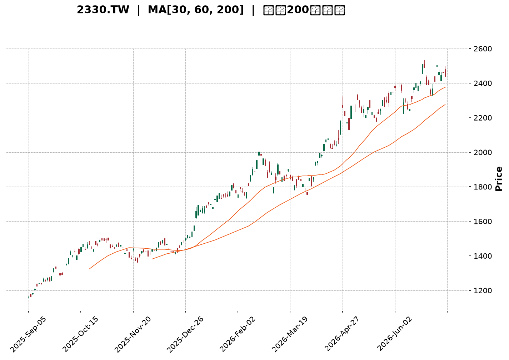
</details>

<html>
<head><meta charset="utf-8" /></head>
<body>
    <div style="height:500px; width:100%;">                        <script>window.PlotlyConfig = {MathJaxConfig: 'local'};</script>
        <script charset="utf-8" src="https://cdn.plot.ly/plotly-3.6.0.min.js" integrity="sha256-QaOVwtVY0T02VaHrr6pnoHLCwayMJp4O5n4YyaE3rJk=" crossorigin="anonymous"></script>                <div id="candlestick-chart" class="plotly-graph-div" style="height:100%; width:100%;"></div>            <script>                window.PLOTLYENV=window.PLOTLYENV || {};                                if (document.getElementById("candlestick-chart")) {                    Plotly.newPlot(                        "candlestick-chart",                        [{"close":{"dtype":"f8","bdata":"AAAAoOkxkkAAAACg6TGSQAAAACDcgJJAAAAAgIvjkkAAAABgwR6TQAAAAAC0bZNAAAAAYPdZk0AAAACA3NCTQAAAAOBplZNAAAAAYK3kk0AAAADgaZWTQAAAACBPDJRAAAAA4Ka+lEAAAADgpr6UQAAAAGBjb5RAAAAA4B8glEAAAADA8DOUQAAAAEA0g5RAAAAAILshlUAAAAAgcayVQAAAACAnN5ZAAAAAwOPnlUAAAAAg+EqWQAAAAMDj55VAAAAAYIUPlkAAAABgDK6WQAAAAOBP\u002fZZAAAAA4JlylkAAAAAAf+mWQAAAAAB\u002f6ZZAAAAAoDualkAAAADgmXKWQAAAAAB\u002f6ZZAAAAAQK7VlkAAAABgk0yXQAAAAGCTTJdAAAAAYMI4l0AAAABAZGCXQAAAAGCTTJdAAAAAoDualkAAAABgDK6WQAAAAKA7mpZAAAAAQK7VlkAAAABgDK6WQAAAAECu1ZZAAAAAoDualkAAAABAViOWQAAAAADJXpZAAAAAIELAlUAAAABAoJiVQAAAAMBqhpZAAAAAoP5wlUAAAADgXEmVQAAAAMDj55VAAAAAIPhKlkAAAAAgJzeWQAAAACD4SpZAAAAA4BLUlUAAAABAViOWQAAAAOCZcpZAAAAAAMlelkAAAACgO5qWQAAAAKDxJJdAAAAAAH\u002fplkAAAABgk0yXQAAAAKBI1ZZAAAAAQAz9lkAAAACgwYWWQAAAACAcSpZAAAAAYDo2lkAAAABgOjaWQAAAAGA6NpZAAAAA4GbBlkAAAADAzySXQAAAAICxOJdAAAAA4FZ0l0AAAADg3cOXQAAAAGAanJdAAAAAAGUTmEAAAABgkZ6YQAAAAICP8JlAAAAA4Lt7mkAAAABAcQSaQAAAAMA0LJpAAAAAAFMYmkAAAACAFkCaQAAAAKCdj5pAAAAAoJ2PmkAAAACAFkCaQAAAAEDoBptAAAAAYG9Wm0AAAADAFJKbQAAAAEDoBptAAAAAYG9Wm0AAAAAAM36bQAAAAICNQptAAAAAgPalm0AAAACgBEWcQAAAAGBfCZxAAAAAwBSSm0AAAAAgUWqbQAAAAIB99ZtAAAAAQNi5m0AAAAAgUWqbQAAAAID2pZtAAAAA4CIxnEAAAADgmTOdQAAAAEDGvp1AAAAA4CCDnUAAAADgl4WeQAAAAKBpTJ9AAAAAgOL8nkAAAACAW62eQAAAAGBNDp5AAAAAgPT3nEAAAADgIIOdQAAAAGBdW51AAAAAIEEdnEAAAABAT7ycQAAAACAvIp5AAAAAoHtHnUAAAACA9PecQAAAAIBtqJxAAAAAABkknUAAAACgua+dQAAAAIBP1JxAAAAAwGqsnEAAAACAvDScQAAAAIC8NJxAAAAAIF3AnEAAAADAaqycQAAAAEChXJxAAAAAQA69m0AAAADARG2bQAAAAOBB6JxAAAAAgLw0nEAAAABANPycQAAAAAA\u002fY55AAAAAYDF3nkAAAADAtiqfQAAAAADSAp9AAAAAgBADoEAAAABg7jSgQAAAAKDnPqBAAAAAAGWin0AAAACgco6fQAAAAIAu8p9AAAAAgC7yn0AAAABg7jSgQAAAAGBfBqFAAAAAYPKloUAAAACANkKhQAAAACBm\u002fKBAAAAAgKOioEAAAADA5LmhQAAAAOAGiKFAAAAA4AaIoUAAAAAgtf+hQAAAAGDQ16FAAAAAQBtqoUAAAAAAAJKhQAAAAKAvTKFAAAAAoOuvoUAAAABg8qWhQAAAAIAUdKFAAAAAIEQuoUAAAABgXwahQAAAAAAiYKFAAAAAAACSoUAAAAAgtf+hQAAAAKDrr6FAAAAAwMLroUAAAACAyeGhQAAAAMB3WaJAAAAAwHdZokAAAADAVYuiQAAAAGAY5aJAAAAA4E6VokAAAAAgam2iQAAAAIDJ4aFAAAAA4Lv1oUAAAAAAAJKhQAAAAAAAlKFAAAAAAAAMokAAAAAAAI6iQAAAAAAAwKJAAAAAAACiokAAAAAAANSiQAAAAAAAnKNAAAAAAAB0o0AAAAAAAKyiQAAAAAAArKJAAAAAAABIokAAAAAAAISiQAAAAAAA1KJAAAAAAACSo0AAAAAAAEKjQAAAAAAAGqNAAAAAAAA4o0AAAAAAABCjQA=="},"high":{"dtype":"f8","bdata":"AAAAoOkxkkDhpO6TH22SQAAAACDcgJJAAkapJkj3kkCllFL6s22TQAAAAAC0bZNAvSWhBrRtk0AAAIBcreSTQEHA6pgLvZNAAAAAYK3kk0Ci4EoufviTQAAAACBPDJRAAAAA4Ka+lEAfqJx1GfqUQBA++BgFl5RArdRKdZJblEBVVVVVY2+UQLyVfY5I5pRAvMd7\u002fIs1lUAAAAAgcayVQGk23djIXpZAo6R+nLT7lUCrqqq1aoaWQKOkfpy0+5VAHWDZZjualkAAAABgDK6WQHW4GpnxJJdADem8dQyulkCYIp+V8SSXQHWDKXLCOJdATZo0Wd3BlkCvTZS8aoaWQHWDKXLCOJdA8m\u002fp1SARl0DtLTIZNXSXQOREy\u002fUFiJdAZ2Zmrtabl0Bw8jf5BYiXQNtbZNLWm5dAwYED70\u002f9lkCG7oP1fumWQCZNmnwMrpZAoUpG+U\u002f9lkAN3QeL8SSXQKFKRvlP\u002fZZATZo0Wd3BlkA+09b490qWQPDRs5U7mpZAnHSASyc3lkByHMex4+eVQA5Ql5w7mpZAgB4jEkLAlUCx9g0LQsCVQEZJ\u002fXiFD5ZAAAAAIPhKlkDSbLqRaoaWQKuqqrVqhpZAGTpg58helkA+09b490qWQAAAAOCZcpZA+0WR3JlylkAAAACgO5qWQAAAAKDxJJdAdYMpcsI4l0AAAABgk0yXQAAAAJA4iJdApshnBe4Ql0BgKmhlo5mWQBUYe6rfcZZAmrbGr99xlkDePEIlHEqWQFYwSzqjmZZAQf5ZpUjVlkAAAADAzySXQFDmWUWTTJdAAAAA4FZ0l0AAAADg3cOXQK+hvOrdw5dAAAAAAGUTmEAAAABgkZ6YQH+L01r4U5pAAAAA4Lt7mkBi0bLKNCyaQIDY8w\u002faZ5pAVVVVFdpnmkBow+fPu3uaQKuqqipht5pAVVVVZX+jmkBFgpoK2meaQKuqqsqrLptAGF10dfalm0AAAADAFJKbQKuqqhpRaptAjC666jJ+m0B+eWzFFJKbQKD7uR\u002fYuZtAlqxkRdi5m0AAAACgBEWcQG12cQCqgJxAINEKm331m0AAAAAgUWqbQKuqqgpBHZxAFTqDVV8JnEB5mgtw9qWbQAAAAID2pZtA43eC9amAnEAAAADgmTOdQN3LscqJ5p1AFQgjRU0OnkBn0pVqW62eQAzkoyotdJ9A+DPhz4c4n0DVKGOV4vyeQH1BX1A9wZ5AaQ7fb+SqnUC3xKkftnGeQKuqquogg51AAAAAIEEdnEBGteVqXVudQAW+uKrySZ5AvLoVQMa+nUASsUaVe0edQAUJo+WZM51ATNgGwf1LnUAEAoEArMOdQDkPHcP9S51ALWQhAxkknUBtx4fgrkicQGg7PoRP1JxAMjgfYws4nUB705uiJhCdQHAIh6CTcJxACEUowtcMnEB00UUD8+SbQAAAAOBB6JxArpHVpSYQnUAAAABANPycQAAAAAA\u002fY55AAAAAYDF3nkAAAADAtiqfQFx\u002fe2DEFp9AAAAAgBADoEDFTuwg01ygQP\u002fBRNDgSKBALzFroQkNoEDCFmxxEAOgQBO1KzH1KqBAD8TvAPwgoECd2Ilyo6KgQGmcQZBYEKFAGNE205knokD5Y0nz3cOhQKszUkE9OKFAVFwyhDZCoUDgB34g182hQGhFI6Hrr6FAdbn9MdfNoUAffPBxhUWiQPQuHiG1\u002f6FAOiUBwuS5oUAU3z3x3cOhQMln3WAUdKFAAAAAoOuvoUDvhfeioB2iQEmSJEH5m6FAURRFESJgoUAPDkhRPTihQAWEE\u002fH\u002fkaFABJM\u002fMPmboUAAAAAgtf+hQDbwGbOgHaJAoGir4ZknokCeDyzzcGOiQLt\u002f84BcgaJAL3\u002faAibRokCBXBOBOrOiQENasfADA6NAcqdoASbRokBO8OShM72iQMZUOHGnE6JA75W6cKcTokAkKzyywuuhQAAAAAAAqKFAAAAAAAAqokAAAAAAAI6iQAAAAAAAwKJAAAAAAACiokAAAAAAAN6iQAAAAAAAnKNAAAAAAADOo0AAAAAAABqjQAAAAAAA6KJAAAAAAACEokAAAAAAALaiQAAAAAAAVqNAAAAAAACSo0AAAAAAAGCjQAAAAAAAQqNAAAAAAACIo0AAAAAAAIijQA=="},"hovertemplate":"\u003cb\u003e%{x|%Y-%m-%d}\u003c\u002fb\u003e\u003cbr\u003e\u958b: $%{open:.2f}\u003cbr\u003e\u9ad8: $%{high:.2f}\u003cbr\u003e\u4f4e: $%{low:.2f}\u003cbr\u003e\u6536: $%{close:.2f}\u003cextra\u003e\u003c\u002fextra\u003e","low":{"dtype":"f8","bdata":"vzy2UnAKkkAAAACg6TGSQO\u002fu7tJiWZJA\u002fHOtMhK8kkDXWmu5BAuTQLMsy7I6RpNAQ9peuTpGk0AAAAAOmYGTQAAAAOBplZNA8g3y7WmVk0AAAADgaZWTQK0bTNE6qZNAIj1QkZJblEDhV2NKNIOUQAAAAGBjb5RAG7mRA08MlEAAAADA8DOUQAAAAEA0g5RAh3AIZxn6lEDNzMwYuyGVQGIutIq0+5VAurYCB0LAlUA5juNmViOWQNLIhnHPhJVAs82Xg7T7lUDug\u002fV7hQ+WQBaPym0MrpZAAAAA4JlylkCtG0yxaoaWQAAAAAB\u002f6ZZA2bJlw2qGlkD0FkNKJzeWQAAAAAB\u002f6ZZAr9pcY93BlkAcuzTKIBGXQArpZoPCOJdAAAAAYMI4l0AgG5DNIBGXQBPSzabxJJdA2bJlw2qGlkAAAABgDK6WQNmyZcNqhpZAX7W5hgyulkAAAABgDK6WQA6QFqo7mpZAAAAAoDualkBglpRjhQ+WQAAAAADJXpZAAAAAIELAlUAAAABAoJiVQNYPOir4SpZAAAAAoP5wlUAAAADgXEmVQLq2AgdCwJVAVlVVioUPlkDLZJFDViOWQB3HcUMnN5ZAAAAA4BLUlUDBLCmHtPuVQPQWQ0onN5ZAEC5MalYjlkBmy5Yt+EqWQIcm+Zc7mpZAAAAAAH\u002fplkAmpJvtT\u002f2WQKuqqtpmwZZAtG4wtUjVlkCh1Zfa33GWQOrnhJVYIpZAIsO9mlgilkBmSTkQlfqVQAAAAGA6NpZAfwNMVaOZlkBwA4aqSNWWQF8zTPXtEJdAk7\u002fJj7E4l0CrqqrKVnSXQFFeQ9VWdJdApwFtmjiIl0CB4DI1g\u002f+XQE5rto+fPZlA\u002ffPPnyaNmUCdLk21rdyZQAFPGCDqtJlAVVVVJeq0mUAAAACAFkCaQFVVVRXaZ5pAVVVVFdpnmkC6fWX1UhiaQAAAAKCdj5pAGF10+kLLmkBsDiRa6AabQAAAAEDoBptAddFF1asum0AJGk7qqy6bQAAAAICNQptAFKEIpY1Cm0Aw\u002fdL\u002fuc2bQJjBl5p99ZtAAAAAwBSSm0AKMpsKyhqbQAAAADDYuZtA9WI+tRSSm0CDzKZab1abQFOb2lToBptAAAAA4CIxnEDqOxu1i5ScQIvQOBW4H51AAAAA4CCDnUD94xIrxr6dQOY3uIri\u002fJ5AAAAAgOL8nkCMeJIaLyKeQAAAAGBNDp5AAAAAgPT3nEBG2rEaP2+dQFVVVdWZM51AEaTc9DJ+m0BcJY0qyGycQN4sTxq4H51AAAAAoHtHnUCpomeli5ScQAAAAIBtqJxAsyf5PjT8nED0+Xx+4nOdQAAAAIBP1JxAAAAAwGqsnEDgGlmdANGbQCdx8L7XDJxAAAAAIF3AnEAAAADAaqycQD7e473XDJxAAAAAQA69m0AAAADARG2bQPqSaf2FhJxAlDh4H8ognEDXWmtdeJicQJ3YiR2D\u002f51AM3WLfXUTnkBSuB59CLOeQO6Bjd76xp5Av0oYm5tSn0A7sROfCQ2gQAd0Y34QA6BAAAAAAGWin0AAAACgco6fQPgdiB883p9A8TsQv0nKn0CKndhuEAOgQGk55lvMZqBAAAAAYPKloUAAAACANkKhQCrmVo963qBAAAAAgKOioED8wA+8URqhQExdbn8UdKFATF1ufxR0oUAAAAAgtf+hQE9Fmm7ypaFAAAAAQBtqoUDc1MNNPTihQCnyWQ9ELqFAHpe+HSJgoUCEHkLPBoihQCRJko42QqFAAAAAIEQuoUAAAABgXwahQAAAAAAiYKFA6I2C3ihWoUDhgw\u002fO5LmhQAAAAKDrr6FAy4dxX9DXoUA5q8eO66+hQFegz86ZJ6JAESDDj35PokB\u002fo+z+cGOiQL6lTs8sx6JAAAAA4E6VokDjJUqPfk+iQGLw0wwiYKFAC5yDf8nhoUAAAAAAAJKhQAAAAAAARKFAAAAAAADkoUAAAAAAAFKiQAAAAAAAXKJAAAAAAABcokAAAAAAAKKiQAAAAAAALqNAAAAAAAB0o0AAAAAAAKyiQAAAAAAArKJAAAAAAAAqokAAAAAAADSiQAAAAAAA1KJAAAAAAABWo0AAAAAAABqjQAAAAAAA3qJAAAAAAAAuo0AAAAAAABCjQA=="},"name":"\u50f9\u683c","open":{"dtype":"f8","bdata":"Xx5b+SwekkDhpO6TH22SQHd3d3kfbZJA\u002frlW2c7PkkB8771T91mTQFmWZVn3WZNAvSWhBrRtk0AAAIDqaZWTQCFgdbw6qZNA+Qb5pgu9k0CCgNVRreSTQK0bTNE6qZNAgsrZbWNvlEC\u002fGhOZSOaUQAAAAGBjb5RAyY3cmMFHlEAcx3GcwUeUQAAAAEA0g5RAQziEQ+oNlUDNzMwYuyGVQGIutIq0+5VAXVuB4xLUlUAAAAAg+EqWQNLIhnHPhJVA0C1ximqGlkDzIvg0JzeWQBaPym0MrpZAr02UvGqGlkCKfNaNO5qWQN1gitxP\u002fZZAAAAAoDualkCjZNcm+EqWQHWDKXLCOJdAUSWjHH\u002fplkAT0s2m8SSXQO0tMhk1dJdA16Nw9TR0l0AAAABAZGCXQOREy\u002fUFiJdAmjRpEn\u002fplkCCT4E83cGWQAAAAKA7mpZAr9pcY93BlkCLjYauIBGXQK\u002faXGPdwZZAAAAAoDualkBglpRjhQ+WQPtFkdyZcpZAnHSASyc3lkAcx3EccayVQPKvaOOZcpZAQI8RWaCYlUDpoosucayVQEZJ\u002fXiFD5ZAOY7jZlYjlkCe0Uu1mXKWQAAAACD4SpZAGTpg58helkAAAABAViOWQKNk1yb4SpZAAAAAAMlelkCMGDEKyV6WQCtqjHQMrpZAmCKflfEkl0AcuzTKIBGXQKuqqspWdJdAWjeYeirplkAAAACgwYWWQAAAACAcSpZA3jxCJRxKlkBEhnvVdg6WQFYwSzqjmZZAAAAA4GbBlkCUguRvKumWQAAAAICxOJdAMZWYGnVgl0AAAACQOIiXQCivoZo4iJdA\u002fSXLXxqcl0BhKOa\u002fRieYQJvtE1WBUZlA\u002ffPPnyaNmUCdLk21rdyZQCuXaeXLyJlAAAAAsK3cmUBFgpoK2meaQKuqqipht5pAq6qq2rt7mkDdvrK6NCyaQKuqqnoG85pAGF10+kLLmkBsDiRa6AabQFVVVQXKGptARhddJVFqm0AAAAAAM36bQOBTkwpRaptAqk1tam9Wm0Aw\u002fdL\u002fuc2bQAY4CTvIbJxArbA5ELrNm0CIZfTPqy6bQKuqqgpBHZxAAAAAQNi5m0AAAAAgUWqbQOlHPxrKGptA69khMMhsnEBt1Hd6baicQHq2kdqZM51AAAAA4CCDnUD94xIrxr6dQOY3uIri\u002fJ5AUxFLRcQQn0CMeJIaLyKeQNNrn8V5mZ5AmwnqHz9vnUDPLXEKLyKeQFVVVdWZM51Ajw9BuhSSm0Cj2nJV1gudQOPqB6V7R51AXt0K8CCDnUCpomeli5ScQASaQiC4H51AJmyDYAs4nUD8\u002fX4\u002fx5udQFo3mGILOJ1AyUIWQjT8nEBN4uD98uSbQGg7PoRP1JxAIdAUoiYQnUBkIQuBT9ScQK7mah7KIJxAAAAAQA69m0C66KLhG6mbQGOLcr5qrJxArpHVpSYQnUDwvfd+T9ScQF7ohd5nJ55AR5UEn0xPnkCamZnd+saeQKWAhJ\u002ff7p5AqtCj+41mn0DsxE7PAhegQAE+u2\u002fuNKBA\u002fKgucRADoEDrXHkAZaKfQAAAAIAu8p9A+B2IHzzen0BiJ3bA4EigQNLVJ4zFcKBAfOG98N3DoUCHVYShDX6hQA6ix+9s8qBAyhCsI0QuoUDsxE7sSiShQAAAAOAGiKFAAAAA4AaIoUDNoWIRkzGiQHoXj8DC66FA69uAYfKloUDwswE\u002fG2qhQCnyWQ9ELqFAj0vf3gaIoUBzpDkStf+hQEmSJO8oVqFAMQzDsC9MoUCmcQYhRC6hQM80bmAUdKFA+NmAnw1+oUDhgw\u002fO5LmhQBrD0YKnE6JANniOILX\u002foUDoIK+Sfk+iQDRgSS+MO6JAAAAAwHdZokBArokgSJ+iQAAAAGAY5aJAAAAA4E6VokA7tGtBQamiQGLw0wwiYKFAAAAA4Lv1oUAYcn0h182hQAAAAAAAgKFAAAAAAAAqokAAAAAAAHCiQAAAAAAAjqJAAAAAAABmokAAAAAAALaiQAAAAAAALqNAAAAAAACco0AAAAAAAAajQAAAAAAA1KJAAAAAAABwokAAAAAAADSiQAAAAAAAEKNAAAAAAAB+o0AAAAAAACSjQAAAAAAA3qJAAAAAAABCo0AAAAAAAGCjQA=="},"x":["2025-09-05T00:00:00+08:00","2025-09-08T00:00:00+08:00","2025-09-09T00:00:00+08:00","2025-09-10T00:00:00+08:00","2025-09-11T00:00:00+08:00","2025-09-12T00:00:00+08:00","2025-09-15T00:00:00+08:00","2025-09-16T00:00:00+08:00","2025-09-17T00:00:00+08:00","2025-09-18T00:00:00+08:00","2025-09-19T00:00:00+08:00","2025-09-22T00:00:00+08:00","2025-09-23T00:00:00+08:00","2025-09-24T00:00:00+08:00","2025-09-25T00:00:00+08:00","2025-09-26T00:00:00+08:00","2025-09-30T00:00:00+08:00","2025-10-01T00:00:00+08:00","2025-10-02T00:00:00+08:00","2025-10-03T00:00:00+08:00","2025-10-07T00:00:00+08:00","2025-10-08T00:00:00+08:00","2025-10-09T00:00:00+08:00","2025-10-13T00:00:00+08:00","2025-10-14T00:00:00+08:00","2025-10-15T00:00:00+08:00","2025-10-16T00:00:00+08:00","2025-10-17T00:00:00+08:00","2025-10-20T00:00:00+08:00","2025-10-21T00:00:00+08:00","2025-10-22T00:00:00+08:00","2025-10-23T00:00:00+08:00","2025-10-27T00:00:00+08:00","2025-10-28T00:00:00+08:00","2025-10-29T00:00:00+08:00","2025-10-30T00:00:00+08:00","2025-10-31T00:00:00+08:00","2025-11-03T00:00:00+08:00","2025-11-04T00:00:00+08:00","2025-11-05T00:00:00+08:00","2025-11-06T00:00:00+08:00","2025-11-07T00:00:00+08:00","2025-11-10T00:00:00+08:00","2025-11-11T00:00:00+08:00","2025-11-12T00:00:00+08:00","2025-11-13T00:00:00+08:00","2025-11-14T00:00:00+08:00","2025-11-17T00:00:00+08:00","2025-11-18T00:00:00+08:00","2025-11-19T00:00:00+08:00","2025-11-20T00:00:00+08:00","2025-11-21T00:00:00+08:00","2025-11-24T00:00:00+08:00","2025-11-25T00:00:00+08:00","2025-11-26T00:00:00+08:00","2025-11-27T00:00:00+08:00","2025-11-28T00:00:00+08:00","2025-12-01T00:00:00+08:00","2025-12-02T00:00:00+08:00","2025-12-03T00:00:00+08:00","2025-12-04T00:00:00+08:00","2025-12-05T00:00:00+08:00","2025-12-08T00:00:00+08:00","2025-12-09T00:00:00+08:00","2025-12-10T00:00:00+08:00","2025-12-11T00:00:00+08:00","2025-12-12T00:00:00+08:00","2025-12-15T00:00:00+08:00","2025-12-16T00:00:00+08:00","2025-12-17T00:00:00+08:00","2025-12-18T00:00:00+08:00","2025-12-19T00:00:00+08:00","2025-12-22T00:00:00+08:00","2025-12-23T00:00:00+08:00","2025-12-24T00:00:00+08:00","2025-12-26T00:00:00+08:00","2025-12-29T00:00:00+08:00","2025-12-30T00:00:00+08:00","2025-12-31T00:00:00+08:00","2026-01-02T00:00:00+08:00","2026-01-05T00:00:00+08:00","2026-01-06T00:00:00+08:00","2026-01-07T00:00:00+08:00","2026-01-08T00:00:00+08:00","2026-01-09T00:00:00+08:00","2026-01-12T00:00:00+08:00","2026-01-13T00:00:00+08:00","2026-01-14T00:00:00+08:00","2026-01-15T00:00:00+08:00","2026-01-16T00:00:00+08:00","2026-01-19T00:00:00+08:00","2026-01-20T00:00:00+08:00","2026-01-21T00:00:00+08:00","2026-01-22T00:00:00+08:00","2026-01-23T00:00:00+08:00","2026-01-26T00:00:00+08:00","2026-01-27T00:00:00+08:00","2026-01-28T00:00:00+08:00","2026-01-29T00:00:00+08:00","2026-01-30T00:00:00+08:00","2026-02-02T00:00:00+08:00","2026-02-03T00:00:00+08:00","2026-02-04T00:00:00+08:00","2026-02-05T00:00:00+08:00","2026-02-06T00:00:00+08:00","2026-02-09T00:00:00+08:00","2026-02-10T00:00:00+08:00","2026-02-11T00:00:00+08:00","2026-02-23T00:00:00+08:00","2026-02-24T00:00:00+08:00","2026-02-25T00:00:00+08:00","2026-02-26T00:00:00+08:00","2026-03-02T00:00:00+08:00","2026-03-03T00:00:00+08:00","2026-03-04T00:00:00+08:00","2026-03-05T00:00:00+08:00","2026-03-06T00:00:00+08:00","2026-03-09T00:00:00+08:00","2026-03-10T00:00:00+08:00","2026-03-11T00:00:00+08:00","2026-03-12T00:00:00+08:00","2026-03-13T00:00:00+08:00","2026-03-16T00:00:00+08:00","2026-03-17T00:00:00+08:00","2026-03-18T00:00:00+08:00","2026-03-19T00:00:00+08:00","2026-03-20T00:00:00+08:00","2026-03-23T00:00:00+08:00","2026-03-24T00:00:00+08:00","2026-03-25T00:00:00+08:00","2026-03-26T00:00:00+08:00","2026-03-27T00:00:00+08:00","2026-03-30T00:00:00+08:00","2026-03-31T00:00:00+08:00","2026-04-01T00:00:00+08:00","2026-04-02T00:00:00+08:00","2026-04-07T00:00:00+08:00","2026-04-08T00:00:00+08:00","2026-04-09T00:00:00+08:00","2026-04-10T00:00:00+08:00","2026-04-13T00:00:00+08:00","2026-04-14T00:00:00+08:00","2026-04-15T00:00:00+08:00","2026-04-16T00:00:00+08:00","2026-04-17T00:00:00+08:00","2026-04-20T00:00:00+08:00","2026-04-21T00:00:00+08:00","2026-04-22T00:00:00+08:00","2026-04-23T00:00:00+08:00","2026-04-24T00:00:00+08:00","2026-04-27T00:00:00+08:00","2026-04-28T00:00:00+08:00","2026-04-29T00:00:00+08:00","2026-04-30T00:00:00+08:00","2026-05-04T00:00:00+08:00","2026-05-05T00:00:00+08:00","2026-05-06T00:00:00+08:00","2026-05-07T00:00:00+08:00","2026-05-08T00:00:00+08:00","2026-05-11T00:00:00+08:00","2026-05-12T00:00:00+08:00","2026-05-13T00:00:00+08:00","2026-05-14T00:00:00+08:00","2026-05-15T00:00:00+08:00","2026-05-18T00:00:00+08:00","2026-05-19T00:00:00+08:00","2026-05-20T00:00:00+08:00","2026-05-21T00:00:00+08:00","2026-05-22T00:00:00+08:00","2026-05-25T00:00:00+08:00","2026-05-26T00:00:00+08:00","2026-05-27T00:00:00+08:00","2026-05-28T00:00:00+08:00","2026-05-29T00:00:00+08:00","2026-06-01T00:00:00+08:00","2026-06-02T00:00:00+08:00","2026-06-03T00:00:00+08:00","2026-06-04T00:00:00+08:00","2026-06-05T00:00:00+08:00","2026-06-08T00:00:00+08:00","2026-06-09T00:00:00+08:00","2026-06-10T00:00:00+08:00","2026-06-11T00:00:00+08:00","2026-06-12T00:00:00+08:00","2026-06-15T00:00:00+08:00","2026-06-16T00:00:00+08:00","2026-06-17T00:00:00+08:00","2026-06-18T00:00:00+08:00","2026-06-22T00:00:00+08:00","2026-06-23T00:00:00+08:00","2026-06-24T00:00:00+08:00","2026-06-25T00:00:00+08:00","2026-06-26T00:00:00+08:00","2026-06-29T00:00:00+08:00","2026-06-30T00:00:00+08:00","2026-07-01T00:00:00+08:00","2026-07-02T00:00:00+08:00","2026-07-03T00:00:00+08:00","2026-07-06T00:00:00+08:00","2026-07-07T00:00:00+08:00"],"type":"candlestick"},{"hovertemplate":"MA30: $%{y:.2f}\u003cextra\u003e\u003c\u002fextra\u003e","line":{"color":"#2196F3","dash":"dash","width":2},"mode":"lines","name":"MA30","x":["2025-09-05T00:00:00+08:00","2025-09-08T00:00:00+08:00","2025-09-09T00:00:00+08:00","2025-09-10T00:00:00+08:00","2025-09-11T00:00:00+08:00","2025-09-12T00:00:00+08:00","2025-09-15T00:00:00+08:00","2025-09-16T00:00:00+08:00","2025-09-17T00:00:00+08:00","2025-09-18T00:00:00+08:00","2025-09-19T00:00:00+08:00","2025-09-22T00:00:00+08:00","2025-09-23T00:00:00+08:00","2025-09-24T00:00:00+08:00","2025-09-25T00:00:00+08:00","2025-09-26T00:00:00+08:00","2025-09-30T00:00:00+08:00","2025-10-01T00:00:00+08:00","2025-10-02T00:00:00+08:00","2025-10-03T00:00:00+08:00","2025-10-07T00:00:00+08:00","2025-10-08T00:00:00+08:00","2025-10-09T00:00:00+08:00","2025-10-13T00:00:00+08:00","2025-10-14T00:00:00+08:00","2025-10-15T00:00:00+08:00","2025-10-16T00:00:00+08:00","2025-10-17T00:00:00+08:00","2025-10-20T00:00:00+08:00","2025-10-21T00:00:00+08:00","2025-10-22T00:00:00+08:00","2025-10-23T00:00:00+08:00","2025-10-27T00:00:00+08:00","2025-10-28T00:00:00+08:00","2025-10-29T00:00:00+08:00","2025-10-30T00:00:00+08:00","2025-10-31T00:00:00+08:00","2025-11-03T00:00:00+08:00","2025-11-04T00:00:00+08:00","2025-11-05T00:00:00+08:00","2025-11-06T00:00:00+08:00","2025-11-07T00:00:00+08:00","2025-11-10T00:00:00+08:00","2025-11-11T00:00:00+08:00","2025-11-12T00:00:00+08:00","2025-11-13T00:00:00+08:00","2025-11-14T00:00:00+08:00","2025-11-17T00:00:00+08:00","2025-11-18T00:00:00+08:00","2025-11-19T00:00:00+08:00","2025-11-20T00:00:00+08:00","2025-11-21T00:00:00+08:00","2025-11-24T00:00:00+08:00","2025-11-25T00:00:00+08:00","2025-11-26T00:00:00+08:00","2025-11-27T00:00:00+08:00","2025-11-28T00:00:00+08:00","2025-12-01T00:00:00+08:00","2025-12-02T00:00:00+08:00","2025-12-03T00:00:00+08:00","2025-12-04T00:00:00+08:00","2025-12-05T00:00:00+08:00","2025-12-08T00:00:00+08:00","2025-12-09T00:00:00+08:00","2025-12-10T00:00:00+08:00","2025-12-11T00:00:00+08:00","2025-12-12T00:00:00+08:00","2025-12-15T00:00:00+08:00","2025-12-16T00:00:00+08:00","2025-12-17T00:00:00+08:00","2025-12-18T00:00:00+08:00","2025-12-19T00:00:00+08:00","2025-12-22T00:00:00+08:00","2025-12-23T00:00:00+08:00","2025-12-24T00:00:00+08:00","2025-12-26T00:00:00+08:00","2025-12-29T00:00:00+08:00","2025-12-30T00:00:00+08:00","2025-12-31T00:00:00+08:00","2026-01-02T00:00:00+08:00","2026-01-05T00:00:00+08:00","2026-01-06T00:00:00+08:00","2026-01-07T00:00:00+08:00","2026-01-08T00:00:00+08:00","2026-01-09T00:00:00+08:00","2026-01-12T00:00:00+08:00","2026-01-13T00:00:00+08:00","2026-01-14T00:00:00+08:00","2026-01-15T00:00:00+08:00","2026-01-16T00:00:00+08:00","2026-01-19T00:00:00+08:00","2026-01-20T00:00:00+08:00","2026-01-21T00:00:00+08:00","2026-01-22T00:00:00+08:00","2026-01-23T00:00:00+08:00","2026-01-26T00:00:00+08:00","2026-01-27T00:00:00+08:00","2026-01-28T00:00:00+08:00","2026-01-29T00:00:00+08:00","2026-01-30T00:00:00+08:00","2026-02-02T00:00:00+08:00","2026-02-03T00:00:00+08:00","2026-02-04T00:00:00+08:00","2026-02-05T00:00:00+08:00","2026-02-06T00:00:00+08:00","2026-02-09T00:00:00+08:00","2026-02-10T00:00:00+08:00","2026-02-11T00:00:00+08:00","2026-02-23T00:00:00+08:00","2026-02-24T00:00:00+08:00","2026-02-25T00:00:00+08:00","2026-02-26T00:00:00+08:00","2026-03-02T00:00:00+08:00","2026-03-03T00:00:00+08:00","2026-03-04T00:00:00+08:00","2026-03-05T00:00:00+08:00","2026-03-06T00:00:00+08:00","2026-03-09T00:00:00+08:00","2026-03-10T00:00:00+08:00","2026-03-11T00:00:00+08:00","2026-03-12T00:00:00+08:00","2026-03-13T00:00:00+08:00","2026-03-16T00:00:00+08:00","2026-03-17T00:00:00+08:00","2026-03-18T00:00:00+08:00","2026-03-19T00:00:00+08:00","2026-03-20T00:00:00+08:00","2026-03-23T00:00:00+08:00","2026-03-24T00:00:00+08:00","2026-03-25T00:00:00+08:00","2026-03-26T00:00:00+08:00","2026-03-27T00:00:00+08:00","2026-03-30T00:00:00+08:00","2026-03-31T00:00:00+08:00","2026-04-01T00:00:00+08:00","2026-04-02T00:00:00+08:00","2026-04-07T00:00:00+08:00","2026-04-08T00:00:00+08:00","2026-04-09T00:00:00+08:00","2026-04-10T00:00:00+08:00","2026-04-13T00:00:00+08:00","2026-04-14T00:00:00+08:00","2026-04-15T00:00:00+08:00","2026-04-16T00:00:00+08:00","2026-04-17T00:00:00+08:00","2026-04-20T00:00:00+08:00","2026-04-21T00:00:00+08:00","2026-04-22T00:00:00+08:00","2026-04-23T00:00:00+08:00","2026-04-24T00:00:00+08:00","2026-04-27T00:00:00+08:00","2026-04-28T00:00:00+08:00","2026-04-29T00:00:00+08:00","2026-04-30T00:00:00+08:00","2026-05-04T00:00:00+08:00","2026-05-05T00:00:00+08:00","2026-05-06T00:00:00+08:00","2026-05-07T00:00:00+08:00","2026-05-08T00:00:00+08:00","2026-05-11T00:00:00+08:00","2026-05-12T00:00:00+08:00","2026-05-13T00:00:00+08:00","2026-05-14T00:00:00+08:00","2026-05-15T00:00:00+08:00","2026-05-18T00:00:00+08:00","2026-05-19T00:00:00+08:00","2026-05-20T00:00:00+08:00","2026-05-21T00:00:00+08:00","2026-05-22T00:00:00+08:00","2026-05-25T00:00:00+08:00","2026-05-26T00:00:00+08:00","2026-05-27T00:00:00+08:00","2026-05-28T00:00:00+08:00","2026-05-29T00:00:00+08:00","2026-06-01T00:00:00+08:00","2026-06-02T00:00:00+08:00","2026-06-03T00:00:00+08:00","2026-06-04T00:00:00+08:00","2026-06-05T00:00:00+08:00","2026-06-08T00:00:00+08:00","2026-06-09T00:00:00+08:00","2026-06-10T00:00:00+08:00","2026-06-11T00:00:00+08:00","2026-06-12T00:00:00+08:00","2026-06-15T00:00:00+08:00","2026-06-16T00:00:00+08:00","2026-06-17T00:00:00+08:00","2026-06-18T00:00:00+08:00","2026-06-22T00:00:00+08:00","2026-06-23T00:00:00+08:00","2026-06-24T00:00:00+08:00","2026-06-25T00:00:00+08:00","2026-06-26T00:00:00+08:00","2026-06-29T00:00:00+08:00","2026-06-30T00:00:00+08:00","2026-07-01T00:00:00+08:00","2026-07-02T00:00:00+08:00","2026-07-03T00:00:00+08:00","2026-07-06T00:00:00+08:00","2026-07-07T00:00:00+08:00"],"y":{"dtype":"f8","bdata":"AAAAAAAA+H8AAAAAAAD4fwAAAAAAAPh\u002fAAAAAAAA+H8AAAAAAAD4fwAAAAAAAPh\u002fAAAAAAAA+H8AAAAAAAD4fwAAAAAAAPh\u002fAAAAAAAA+H8AAAAAAAD4fwAAAAAAAPh\u002fAAAAAAAA+H8AAAAAAAD4fwAAAAAAAPh\u002fAAAAAAAA+H8AAAAAAAD4fwAAAAAAAPh\u002fAAAAAAAA+H8AAAAAAAD4fwAAAAAAAPh\u002fAAAAAAAA+H8AAAAAAAD4fwAAAAAAAPh\u002fAAAAAAAA+H8AAAAAAAD4fwAAAAAAAPh\u002fAAAAAAAA+H8AAAAAAAD4fwAAAJDtrpRAVVVV5YnUlECamZkJ1PiUQBERERFzHpVARERE5B5AlUBmZmYGyGOVQImIiHjPhJVAzczMPNallUARERGhOMSVQGZmZjbt45VA3t3djQv7lUDv7u5edxWWQFVVVYVDK5ZAmpmZGRk9lkC8u7t7nE2WQCIiInIWYpZAERERgTl3lkAzMzPjvIeWQN7d3S2Xl5ZAIiIi8t+clkCamZnZNpyWQM3MzDzbnpZAq6qqquSalkDNzMxsTpKWQM3MzGxOkpZAd3d3t0mUlkBEREQkU5CWQImIiEhhipZAREREhBiFlkDv7u6OfX6WQM3MzPyGepZAMzMzs4t4lkBERETk3XmWQN7d3S3Ze5ZAVVVVRYJ8lkBVVVVFgnyWQAAAAFCIeJZAZmZmxop2lkBmZmYWQW+WQDMzM4OjZpZAMzMzI05jlkC8u7urT1+WQLy7u0v6W5ZAAAAAQE1blkAiIiKyQl+WQKuqqpqPYpZAd3d3x9RplkCrqqoqt3eWQCIiIvJKgpZAERERcSGWlkDv7u6+7a+WQKuqqhoRzZZAmpmZaRf4lkBVVVX1dSCXQO\u002fu7g7fRJdAVVVVBVFll0BmZmZmv4eXQBEREVErrJdA7+7uzo3Ul0CJiIhIpfeXQGZmZva4HphAAAAAYBxJmECrqqp6gXOYQM3MzEyjlJhAvLu7C2e6mEAiIiKiMN6YQCIiIjL3A5lAzczMvLormUARERGBxVyZQHd3d0fQjZlAIiIiwoq7mUCrqqrq8eeZQAAAALD8GJpA3t3d3WZDmkDNzMwc2meaQN7d3a2gjZpAERER4Q22mkAzMzMDcuSaQDMzMxPNGJtARERENDFHm0CamZlJj3mbQCIiIsJJp5tAq6qq+rnNm0BVVVWFffWbQJqZmXmgFpxAvLu72yUvnECamZmJ+0qcQDMzM0PXYpxAIiIichhwnECamZmJTYWcQGZmZubPn5xAAAAAYGGwnEC8u7s7T7ycQDMzMxM6ypxAiYiImJ3ZnECJiIhIVeycQN7d3Z25+ZxAmpmZOXkCnUCamZlJ7gGdQDMzM1NgA51A3t3dzXMNnUBERERkMBidQERERISgG51Aq6qq6rsbnUCrqqoa1RudQJqZmVmTJp1AIiIiErImnUCamZlZ2SSdQHd3d9dUKp1AZmZmhncynUDe3d2N+DedQBEREZGENZ1AvLu7+1s+nUB3d3cXLU2dQAAAALD1YZ1AvLu7K7V4nUBERETUJoqdQN7d3d0+oJ1AIiIicvHAnUB3d3cHVOCdQHd3dze\u002fAZ5A3t3dDRg1nkB3d3dncWSeQFVVVeXJkZ5AmpmZKQe1nkBERETkOuaeQGZmZuZrG59AVVVVVfFRn0B3d3eXbpSfQAAAAABD1J9AIiIiyg8EoEBEREScpx+gQERERBxAOqBA7+7uhtRaoECrqqpCaHygQCIiInIBlqBAd3d310SwoEAAAADA4MWgQDMzM7N+2KBAvLu7E3HsoEAzMzOrDQGhQHd3d5+rE6FAzczM1PUjoUDv7u5mQTKhQLy7uyM1RKFAREREDNFZoUCJiIiYa3GhQBEREZFaiqFAAAAAsKCgoUDv7u6+k7OhQFVVVRXkuqFA7+7u7oy9oUCJiIjINcChQCIiInJDxaFAAAAAEE\u002fRoUCamZkJYdihQFVVVTXH4qFAERERYS3soUARERHxQPOhQImIiJhTAqJAZmZmFrkTokDNzMx8Hx2iQCIiIqLZKKJAERERYestokC8u7s7UjWiQImIiEgNQaJAmpmZaXFVokDNzMxMf2iiQGZmZuY5d6JAd3d390qFokB3d3eHXo6iQA=="},"type":"scatter"},{"hovertemplate":"MA60: $%{y:.2f}\u003cextra\u003e\u003c\u002fextra\u003e","line":{"color":"#9C27B0","dash":"dash","width":2},"mode":"lines","name":"MA60","x":["2025-09-05T00:00:00+08:00","2025-09-08T00:00:00+08:00","2025-09-09T00:00:00+08:00","2025-09-10T00:00:00+08:00","2025-09-11T00:00:00+08:00","2025-09-12T00:00:00+08:00","2025-09-15T00:00:00+08:00","2025-09-16T00:00:00+08:00","2025-09-17T00:00:00+08:00","2025-09-18T00:00:00+08:00","2025-09-19T00:00:00+08:00","2025-09-22T00:00:00+08:00","2025-09-23T00:00:00+08:00","2025-09-24T00:00:00+08:00","2025-09-25T00:00:00+08:00","2025-09-26T00:00:00+08:00","2025-09-30T00:00:00+08:00","2025-10-01T00:00:00+08:00","2025-10-02T00:00:00+08:00","2025-10-03T00:00:00+08:00","2025-10-07T00:00:00+08:00","2025-10-08T00:00:00+08:00","2025-10-09T00:00:00+08:00","2025-10-13T00:00:00+08:00","2025-10-14T00:00:00+08:00","2025-10-15T00:00:00+08:00","2025-10-16T00:00:00+08:00","2025-10-17T00:00:00+08:00","2025-10-20T00:00:00+08:00","2025-10-21T00:00:00+08:00","2025-10-22T00:00:00+08:00","2025-10-23T00:00:00+08:00","2025-10-27T00:00:00+08:00","2025-10-28T00:00:00+08:00","2025-10-29T00:00:00+08:00","2025-10-30T00:00:00+08:00","2025-10-31T00:00:00+08:00","2025-11-03T00:00:00+08:00","2025-11-04T00:00:00+08:00","2025-11-05T00:00:00+08:00","2025-11-06T00:00:00+08:00","2025-11-07T00:00:00+08:00","2025-11-10T00:00:00+08:00","2025-11-11T00:00:00+08:00","2025-11-12T00:00:00+08:00","2025-11-13T00:00:00+08:00","2025-11-14T00:00:00+08:00","2025-11-17T00:00:00+08:00","2025-11-18T00:00:00+08:00","2025-11-19T00:00:00+08:00","2025-11-20T00:00:00+08:00","2025-11-21T00:00:00+08:00","2025-11-24T00:00:00+08:00","2025-11-25T00:00:00+08:00","2025-11-26T00:00:00+08:00","2025-11-27T00:00:00+08:00","2025-11-28T00:00:00+08:00","2025-12-01T00:00:00+08:00","2025-12-02T00:00:00+08:00","2025-12-03T00:00:00+08:00","2025-12-04T00:00:00+08:00","2025-12-05T00:00:00+08:00","2025-12-08T00:00:00+08:00","2025-12-09T00:00:00+08:00","2025-12-10T00:00:00+08:00","2025-12-11T00:00:00+08:00","2025-12-12T00:00:00+08:00","2025-12-15T00:00:00+08:00","2025-12-16T00:00:00+08:00","2025-12-17T00:00:00+08:00","2025-12-18T00:00:00+08:00","2025-12-19T00:00:00+08:00","2025-12-22T00:00:00+08:00","2025-12-23T00:00:00+08:00","2025-12-24T00:00:00+08:00","2025-12-26T00:00:00+08:00","2025-12-29T00:00:00+08:00","2025-12-30T00:00:00+08:00","2025-12-31T00:00:00+08:00","2026-01-02T00:00:00+08:00","2026-01-05T00:00:00+08:00","2026-01-06T00:00:00+08:00","2026-01-07T00:00:00+08:00","2026-01-08T00:00:00+08:00","2026-01-09T00:00:00+08:00","2026-01-12T00:00:00+08:00","2026-01-13T00:00:00+08:00","2026-01-14T00:00:00+08:00","2026-01-15T00:00:00+08:00","2026-01-16T00:00:00+08:00","2026-01-19T00:00:00+08:00","2026-01-20T00:00:00+08:00","2026-01-21T00:00:00+08:00","2026-01-22T00:00:00+08:00","2026-01-23T00:00:00+08:00","2026-01-26T00:00:00+08:00","2026-01-27T00:00:00+08:00","2026-01-28T00:00:00+08:00","2026-01-29T00:00:00+08:00","2026-01-30T00:00:00+08:00","2026-02-02T00:00:00+08:00","2026-02-03T00:00:00+08:00","2026-02-04T00:00:00+08:00","2026-02-05T00:00:00+08:00","2026-02-06T00:00:00+08:00","2026-02-09T00:00:00+08:00","2026-02-10T00:00:00+08:00","2026-02-11T00:00:00+08:00","2026-02-23T00:00:00+08:00","2026-02-24T00:00:00+08:00","2026-02-25T00:00:00+08:00","2026-02-26T00:00:00+08:00","2026-03-02T00:00:00+08:00","2026-03-03T00:00:00+08:00","2026-03-04T00:00:00+08:00","2026-03-05T00:00:00+08:00","2026-03-06T00:00:00+08:00","2026-03-09T00:00:00+08:00","2026-03-10T00:00:00+08:00","2026-03-11T00:00:00+08:00","2026-03-12T00:00:00+08:00","2026-03-13T00:00:00+08:00","2026-03-16T00:00:00+08:00","2026-03-17T00:00:00+08:00","2026-03-18T00:00:00+08:00","2026-03-19T00:00:00+08:00","2026-03-20T00:00:00+08:00","2026-03-23T00:00:00+08:00","2026-03-24T00:00:00+08:00","2026-03-25T00:00:00+08:00","2026-03-26T00:00:00+08:00","2026-03-27T00:00:00+08:00","2026-03-30T00:00:00+08:00","2026-03-31T00:00:00+08:00","2026-04-01T00:00:00+08:00","2026-04-02T00:00:00+08:00","2026-04-07T00:00:00+08:00","2026-04-08T00:00:00+08:00","2026-04-09T00:00:00+08:00","2026-04-10T00:00:00+08:00","2026-04-13T00:00:00+08:00","2026-04-14T00:00:00+08:00","2026-04-15T00:00:00+08:00","2026-04-16T00:00:00+08:00","2026-04-17T00:00:00+08:00","2026-04-20T00:00:00+08:00","2026-04-21T00:00:00+08:00","2026-04-22T00:00:00+08:00","2026-04-23T00:00:00+08:00","2026-04-24T00:00:00+08:00","2026-04-27T00:00:00+08:00","2026-04-28T00:00:00+08:00","2026-04-29T00:00:00+08:00","2026-04-30T00:00:00+08:00","2026-05-04T00:00:00+08:00","2026-05-05T00:00:00+08:00","2026-05-06T00:00:00+08:00","2026-05-07T00:00:00+08:00","2026-05-08T00:00:00+08:00","2026-05-11T00:00:00+08:00","2026-05-12T00:00:00+08:00","2026-05-13T00:00:00+08:00","2026-05-14T00:00:00+08:00","2026-05-15T00:00:00+08:00","2026-05-18T00:00:00+08:00","2026-05-19T00:00:00+08:00","2026-05-20T00:00:00+08:00","2026-05-21T00:00:00+08:00","2026-05-22T00:00:00+08:00","2026-05-25T00:00:00+08:00","2026-05-26T00:00:00+08:00","2026-05-27T00:00:00+08:00","2026-05-28T00:00:00+08:00","2026-05-29T00:00:00+08:00","2026-06-01T00:00:00+08:00","2026-06-02T00:00:00+08:00","2026-06-03T00:00:00+08:00","2026-06-04T00:00:00+08:00","2026-06-05T00:00:00+08:00","2026-06-08T00:00:00+08:00","2026-06-09T00:00:00+08:00","2026-06-10T00:00:00+08:00","2026-06-11T00:00:00+08:00","2026-06-12T00:00:00+08:00","2026-06-15T00:00:00+08:00","2026-06-16T00:00:00+08:00","2026-06-17T00:00:00+08:00","2026-06-18T00:00:00+08:00","2026-06-22T00:00:00+08:00","2026-06-23T00:00:00+08:00","2026-06-24T00:00:00+08:00","2026-06-25T00:00:00+08:00","2026-06-26T00:00:00+08:00","2026-06-29T00:00:00+08:00","2026-06-30T00:00:00+08:00","2026-07-01T00:00:00+08:00","2026-07-02T00:00:00+08:00","2026-07-03T00:00:00+08:00","2026-07-06T00:00:00+08:00","2026-07-07T00:00:00+08:00"],"y":{"dtype":"f8","bdata":"AAAAAAAA+H8AAAAAAAD4fwAAAAAAAPh\u002fAAAAAAAA+H8AAAAAAAD4fwAAAAAAAPh\u002fAAAAAAAA+H8AAAAAAAD4fwAAAAAAAPh\u002fAAAAAAAA+H8AAAAAAAD4fwAAAAAAAPh\u002fAAAAAAAA+H8AAAAAAAD4fwAAAAAAAPh\u002fAAAAAAAA+H8AAAAAAAD4fwAAAAAAAPh\u002fAAAAAAAA+H8AAAAAAAD4fwAAAAAAAPh\u002fAAAAAAAA+H8AAAAAAAD4fwAAAAAAAPh\u002fAAAAAAAA+H8AAAAAAAD4fwAAAAAAAPh\u002fAAAAAAAA+H8AAAAAAAD4fwAAAAAAAPh\u002fAAAAAAAA+H8AAAAAAAD4fwAAAAAAAPh\u002fAAAAAAAA+H8AAAAAAAD4fwAAAAAAAPh\u002fAAAAAAAA+H8AAAAAAAD4fwAAAAAAAPh\u002fAAAAAAAA+H8AAAAAAAD4fwAAAAAAAPh\u002fAAAAAAAA+H8AAAAAAAD4fwAAAAAAAPh\u002fAAAAAAAA+H8AAAAAAAD4fwAAAAAAAPh\u002fAAAAAAAA+H8AAAAAAAD4fwAAAAAAAPh\u002fAAAAAAAA+H8AAAAAAAD4fwAAAAAAAPh\u002fAAAAAAAA+H8AAAAAAAD4fwAAAAAAAPh\u002fAAAAAAAA+H8AAAAAAAD4f2ZmZka6lJVAREREzIqmlUDv7u72WLmVQHd3dx8mzZVAzczMlFDelUDe3d0lJfCVQEREROSr\u002fpVAmpmZgTAOlkC8u7vbvBmWQM3MzFxIJZZAiYiI2CwvlkBVVVWFYzqWQImIiOieQ5ZAzczMLDNMlkDv7u6Wb1aWQGZmZgZTYpZAREREJIdwlkDv7u4Gun+WQAAAABDxjJZAmpmZsYCZlkBERERMEqaWQLy7uyv2tZZAIiIiCn7JlkARERExYtmWQN7d3b2W65ZAZmZmXs38lkBVVVVFCQyXQM3MzExGG5dAmpmZKdMsl0C8u7trETuXQJqZmfmfTJdAmpmZCdRgl0B3d3evr3aXQFVVVT0+iJdAiYiIqHSbl0C8u7tzWa2XQBEREcE\u002fvpdAmpmZwSLRl0C8u7tLA+aXQFVVVeU5+pdAq6qqcmwPmEAzMzPLoCOYQN7d3X17OphA7+7uDlpPmEB3d3dnjmOYQERERCQYeJhAREREVPGPmEDv7u6WFK6YQKuqqgKMzZhAq6qqUqnumEBERESEvhSZQGZmZm4tOplAIiIisuhimUBVVVW9+YqZQERERMS\u002frZlAiYiIcDvKmUAAAAB4XemZQCIiIkqBB5pAiYiIIFMimkARERFpeT6aQGZmZm5EX5pAAAAA4L58mkAzMzNb6JeaQAAAALBur5pAIiIiUgLKmkBVVVX1QuWaQAAAAGjY\u002fppAMzMz+xkXm0BVVVXlWS+bQFVVVU2YSJtAAAAASH9km0B3d3cnEYCbQCIiIppOmptAREREZJGvm0C8u7ub18GbQLy7uwMa2ptAmpmZ+V\u002fum0BmZmaupQScQFVVVfWQIZxAVVVVXdQ8nEC8u7vrw1icQJqZmSlnbpxAMzMz+wqGnEBmZmZOVaGcQM3MzBRLvJxAvLu7g+3TnEDv7u4ukeqcQImIiBCLAZ1AIiIi8oQYnUCJiIjI0DKdQO\u002fu7o7HUJ1A7+7utrxynUCamZlRYJCdQERERPwBrp1AERERYVLHnUBmZmYWSOmdQCIiIsKSCp5Ad3d3RzUqnkCJiIhwLkueQJqZmanRa55AERERscmKnkBmZmbOv6ueQGZmZl4QyJ5AREREfLLonkAAAADQUgqfQO\u002fu7h5LKZ9AiYiI4J1Dn0DNzMxsTVifQO\u002fu7h6pbZ9A7+7u1qyFn0AiIiLyCZ2fQAAAAOhtrp9Aq6qq0iPDn0Crqqry19ifQLy7u\u002fsv9Z9AERER0RULoEBVVVWBPxugQAAAAAA9LaBAiYiItIxAoEBVVVXh3lGgQImIiNjhXaBA7+7uegxsoEAiIiI+N3mgQGZmZjIUh6BAZmZmUumVoEDe3d09v6WgQERERJQ+uKBA3t3dBZPKoEBmZmYevN6gQERERIw69qBAREREcOQLoUCJiIiMYx6hQDMzM9+MMaFAAAAA9F9EoUAzMzM\u002f3VihQFVVVV2Ha6FAiYiIINuCoUBmZmYGMJehQM3MzEzcp6FAmpmZBd64oUBVVVUZtsehQA=="},"type":"scatter"},{"hovertemplate":"MA200: $%{y:.2f}\u003cextra\u003e\u003c\u002fextra\u003e","line":{"color":"#FF6F00","dash":"solid","width":2},"mode":"lines","name":"MA200","x":["2025-09-05T00:00:00+08:00","2025-09-08T00:00:00+08:00","2025-09-09T00:00:00+08:00","2025-09-10T00:00:00+08:00","2025-09-11T00:00:00+08:00","2025-09-12T00:00:00+08:00","2025-09-15T00:00:00+08:00","2025-09-16T00:00:00+08:00","2025-09-17T00:00:00+08:00","2025-09-18T00:00:00+08:00","2025-09-19T00:00:00+08:00","2025-09-22T00:00:00+08:00","2025-09-23T00:00:00+08:00","2025-09-24T00:00:00+08:00","2025-09-25T00:00:00+08:00","2025-09-26T00:00:00+08:00","2025-09-30T00:00:00+08:00","2025-10-01T00:00:00+08:00","2025-10-02T00:00:00+08:00","2025-10-03T00:00:00+08:00","2025-10-07T00:00:00+08:00","2025-10-08T00:00:00+08:00","2025-10-09T00:00:00+08:00","2025-10-13T00:00:00+08:00","2025-10-14T00:00:00+08:00","2025-10-15T00:00:00+08:00","2025-10-16T00:00:00+08:00","2025-10-17T00:00:00+08:00","2025-10-20T00:00:00+08:00","2025-10-21T00:00:00+08:00","2025-10-22T00:00:00+08:00","2025-10-23T00:00:00+08:00","2025-10-27T00:00:00+08:00","2025-10-28T00:00:00+08:00","2025-10-29T00:00:00+08:00","2025-10-30T00:00:00+08:00","2025-10-31T00:00:00+08:00","2025-11-03T00:00:00+08:00","2025-11-04T00:00:00+08:00","2025-11-05T00:00:00+08:00","2025-11-06T00:00:00+08:00","2025-11-07T00:00:00+08:00","2025-11-10T00:00:00+08:00","2025-11-11T00:00:00+08:00","2025-11-12T00:00:00+08:00","2025-11-13T00:00:00+08:00","2025-11-14T00:00:00+08:00","2025-11-17T00:00:00+08:00","2025-11-18T00:00:00+08:00","2025-11-19T00:00:00+08:00","2025-11-20T00:00:00+08:00","2025-11-21T00:00:00+08:00","2025-11-24T00:00:00+08:00","2025-11-25T00:00:00+08:00","2025-11-26T00:00:00+08:00","2025-11-27T00:00:00+08:00","2025-11-28T00:00:00+08:00","2025-12-01T00:00:00+08:00","2025-12-02T00:00:00+08:00","2025-12-03T00:00:00+08:00","2025-12-04T00:00:00+08:00","2025-12-05T00:00:00+08:00","2025-12-08T00:00:00+08:00","2025-12-09T00:00:00+08:00","2025-12-10T00:00:00+08:00","2025-12-11T00:00:00+08:00","2025-12-12T00:00:00+08:00","2025-12-15T00:00:00+08:00","2025-12-16T00:00:00+08:00","2025-12-17T00:00:00+08:00","2025-12-18T00:00:00+08:00","2025-12-19T00:00:00+08:00","2025-12-22T00:00:00+08:00","2025-12-23T00:00:00+08:00","2025-12-24T00:00:00+08:00","2025-12-26T00:00:00+08:00","2025-12-29T00:00:00+08:00","2025-12-30T00:00:00+08:00","2025-12-31T00:00:00+08:00","2026-01-02T00:00:00+08:00","2026-01-05T00:00:00+08:00","2026-01-06T00:00:00+08:00","2026-01-07T00:00:00+08:00","2026-01-08T00:00:00+08:00","2026-01-09T00:00:00+08:00","2026-01-12T00:00:00+08:00","2026-01-13T00:00:00+08:00","2026-01-14T00:00:00+08:00","2026-01-15T00:00:00+08:00","2026-01-16T00:00:00+08:00","2026-01-19T00:00:00+08:00","2026-01-20T00:00:00+08:00","2026-01-21T00:00:00+08:00","2026-01-22T00:00:00+08:00","2026-01-23T00:00:00+08:00","2026-01-26T00:00:00+08:00","2026-01-27T00:00:00+08:00","2026-01-28T00:00:00+08:00","2026-01-29T00:00:00+08:00","2026-01-30T00:00:00+08:00","2026-02-02T00:00:00+08:00","2026-02-03T00:00:00+08:00","2026-02-04T00:00:00+08:00","2026-02-05T00:00:00+08:00","2026-02-06T00:00:00+08:00","2026-02-09T00:00:00+08:00","2026-02-10T00:00:00+08:00","2026-02-11T00:00:00+08:00","2026-02-23T00:00:00+08:00","2026-02-24T00:00:00+08:00","2026-02-25T00:00:00+08:00","2026-02-26T00:00:00+08:00","2026-03-02T00:00:00+08:00","2026-03-03T00:00:00+08:00","2026-03-04T00:00:00+08:00","2026-03-05T00:00:00+08:00","2026-03-06T00:00:00+08:00","2026-03-09T00:00:00+08:00","2026-03-10T00:00:00+08:00","2026-03-11T00:00:00+08:00","2026-03-12T00:00:00+08:00","2026-03-13T00:00:00+08:00","2026-03-16T00:00:00+08:00","2026-03-17T00:00:00+08:00","2026-03-18T00:00:00+08:00","2026-03-19T00:00:00+08:00","2026-03-20T00:00:00+08:00","2026-03-23T00:00:00+08:00","2026-03-24T00:00:00+08:00","2026-03-25T00:00:00+08:00","2026-03-26T00:00:00+08:00","2026-03-27T00:00:00+08:00","2026-03-30T00:00:00+08:00","2026-03-31T00:00:00+08:00","2026-04-01T00:00:00+08:00","2026-04-02T00:00:00+08:00","2026-04-07T00:00:00+08:00","2026-04-08T00:00:00+08:00","2026-04-09T00:00:00+08:00","2026-04-10T00:00:00+08:00","2026-04-13T00:00:00+08:00","2026-04-14T00:00:00+08:00","2026-04-15T00:00:00+08:00","2026-04-16T00:00:00+08:00","2026-04-17T00:00:00+08:00","2026-04-20T00:00:00+08:00","2026-04-21T00:00:00+08:00","2026-04-22T00:00:00+08:00","2026-04-23T00:00:00+08:00","2026-04-24T00:00:00+08:00","2026-04-27T00:00:00+08:00","2026-04-28T00:00:00+08:00","2026-04-29T00:00:00+08:00","2026-04-30T00:00:00+08:00","2026-05-04T00:00:00+08:00","2026-05-05T00:00:00+08:00","2026-05-06T00:00:00+08:00","2026-05-07T00:00:00+08:00","2026-05-08T00:00:00+08:00","2026-05-11T00:00:00+08:00","2026-05-12T00:00:00+08:00","2026-05-13T00:00:00+08:00","2026-05-14T00:00:00+08:00","2026-05-15T00:00:00+08:00","2026-05-18T00:00:00+08:00","2026-05-19T00:00:00+08:00","2026-05-20T00:00:00+08:00","2026-05-21T00:00:00+08:00","2026-05-22T00:00:00+08:00","2026-05-25T00:00:00+08:00","2026-05-26T00:00:00+08:00","2026-05-27T00:00:00+08:00","2026-05-28T00:00:00+08:00","2026-05-29T00:00:00+08:00","2026-06-01T00:00:00+08:00","2026-06-02T00:00:00+08:00","2026-06-03T00:00:00+08:00","2026-06-04T00:00:00+08:00","2026-06-05T00:00:00+08:00","2026-06-08T00:00:00+08:00","2026-06-09T00:00:00+08:00","2026-06-10T00:00:00+08:00","2026-06-11T00:00:00+08:00","2026-06-12T00:00:00+08:00","2026-06-15T00:00:00+08:00","2026-06-16T00:00:00+08:00","2026-06-17T00:00:00+08:00","2026-06-18T00:00:00+08:00","2026-06-22T00:00:00+08:00","2026-06-23T00:00:00+08:00","2026-06-24T00:00:00+08:00","2026-06-25T00:00:00+08:00","2026-06-26T00:00:00+08:00","2026-06-29T00:00:00+08:00","2026-06-30T00:00:00+08:00","2026-07-01T00:00:00+08:00","2026-07-02T00:00:00+08:00","2026-07-03T00:00:00+08:00","2026-07-06T00:00:00+08:00","2026-07-07T00:00:00+08:00"],"y":{"dtype":"f8","bdata":"AAAAAAAA+H8AAAAAAAD4fwAAAAAAAPh\u002fAAAAAAAA+H8AAAAAAAD4fwAAAAAAAPh\u002fAAAAAAAA+H8AAAAAAAD4fwAAAAAAAPh\u002fAAAAAAAA+H8AAAAAAAD4fwAAAAAAAPh\u002fAAAAAAAA+H8AAAAAAAD4fwAAAAAAAPh\u002fAAAAAAAA+H8AAAAAAAD4fwAAAAAAAPh\u002fAAAAAAAA+H8AAAAAAAD4fwAAAAAAAPh\u002fAAAAAAAA+H8AAAAAAAD4fwAAAAAAAPh\u002fAAAAAAAA+H8AAAAAAAD4fwAAAAAAAPh\u002fAAAAAAAA+H8AAAAAAAD4fwAAAAAAAPh\u002fAAAAAAAA+H8AAAAAAAD4fwAAAAAAAPh\u002fAAAAAAAA+H8AAAAAAAD4fwAAAAAAAPh\u002fAAAAAAAA+H8AAAAAAAD4fwAAAAAAAPh\u002fAAAAAAAA+H8AAAAAAAD4fwAAAAAAAPh\u002fAAAAAAAA+H8AAAAAAAD4fwAAAAAAAPh\u002fAAAAAAAA+H8AAAAAAAD4fwAAAAAAAPh\u002fAAAAAAAA+H8AAAAAAAD4fwAAAAAAAPh\u002fAAAAAAAA+H8AAAAAAAD4fwAAAAAAAPh\u002fAAAAAAAA+H8AAAAAAAD4fwAAAAAAAPh\u002fAAAAAAAA+H8AAAAAAAD4fwAAAAAAAPh\u002fAAAAAAAA+H8AAAAAAAD4fwAAAAAAAPh\u002fAAAAAAAA+H8AAAAAAAD4fwAAAAAAAPh\u002fAAAAAAAA+H8AAAAAAAD4fwAAAAAAAPh\u002fAAAAAAAA+H8AAAAAAAD4fwAAAAAAAPh\u002fAAAAAAAA+H8AAAAAAAD4fwAAAAAAAPh\u002fAAAAAAAA+H8AAAAAAAD4fwAAAAAAAPh\u002fAAAAAAAA+H8AAAAAAAD4fwAAAAAAAPh\u002fAAAAAAAA+H8AAAAAAAD4fwAAAAAAAPh\u002fAAAAAAAA+H8AAAAAAAD4fwAAAAAAAPh\u002fAAAAAAAA+H8AAAAAAAD4fwAAAAAAAPh\u002fAAAAAAAA+H8AAAAAAAD4fwAAAAAAAPh\u002fAAAAAAAA+H8AAAAAAAD4fwAAAAAAAPh\u002fAAAAAAAA+H8AAAAAAAD4fwAAAAAAAPh\u002fAAAAAAAA+H8AAAAAAAD4fwAAAAAAAPh\u002fAAAAAAAA+H8AAAAAAAD4fwAAAAAAAPh\u002fAAAAAAAA+H8AAAAAAAD4fwAAAAAAAPh\u002fAAAAAAAA+H8AAAAAAAD4fwAAAAAAAPh\u002fAAAAAAAA+H8AAAAAAAD4fwAAAAAAAPh\u002fAAAAAAAA+H8AAAAAAAD4fwAAAAAAAPh\u002fAAAAAAAA+H8AAAAAAAD4fwAAAAAAAPh\u002fAAAAAAAA+H8AAAAAAAD4fwAAAAAAAPh\u002fAAAAAAAA+H8AAAAAAAD4fwAAAAAAAPh\u002fAAAAAAAA+H8AAAAAAAD4fwAAAAAAAPh\u002fAAAAAAAA+H8AAAAAAAD4fwAAAAAAAPh\u002fAAAAAAAA+H8AAAAAAAD4fwAAAAAAAPh\u002fAAAAAAAA+H8AAAAAAAD4fwAAAAAAAPh\u002fAAAAAAAA+H8AAAAAAAD4fwAAAAAAAPh\u002fAAAAAAAA+H8AAAAAAAD4fwAAAAAAAPh\u002fAAAAAAAA+H8AAAAAAAD4fwAAAAAAAPh\u002fAAAAAAAA+H8AAAAAAAD4fwAAAAAAAPh\u002fAAAAAAAA+H8AAAAAAAD4fwAAAAAAAPh\u002fAAAAAAAA+H8AAAAAAAD4fwAAAAAAAPh\u002fAAAAAAAA+H8AAAAAAAD4fwAAAAAAAPh\u002fAAAAAAAA+H8AAAAAAAD4fwAAAAAAAPh\u002fAAAAAAAA+H8AAAAAAAD4fwAAAAAAAPh\u002fAAAAAAAA+H8AAAAAAAD4fwAAAAAAAPh\u002fAAAAAAAA+H8AAAAAAAD4fwAAAAAAAPh\u002fAAAAAAAA+H8AAAAAAAD4fwAAAAAAAPh\u002fAAAAAAAA+H8AAAAAAAD4fwAAAAAAAPh\u002fAAAAAAAA+H8AAAAAAAD4fwAAAAAAAPh\u002fAAAAAAAA+H8AAAAAAAD4fwAAAAAAAPh\u002fAAAAAAAA+H8AAAAAAAD4fwAAAAAAAPh\u002fAAAAAAAA+H8AAAAAAAD4fwAAAAAAAPh\u002fAAAAAAAA+H8AAAAAAAD4fwAAAAAAAPh\u002fAAAAAAAA+H8AAAAAAAD4fwAAAAAAAPh\u002fAAAAAAAA+H8AAAAAAAD4fwAAAAAAAPh\u002fAAAAAAAA+H+F61HMlfKbQA=="},"type":"scatter"}],                        {"template":{"data":{"barpolar":[{"marker":{"line":{"color":"rgb(17,17,17)","width":0.5},"pattern":{"fillmode":"overlay","size":10,"solidity":0.2}},"type":"barpolar"}],"bar":[{"error_x":{"color":"#f2f5fa"},"error_y":{"color":"#f2f5fa"},"marker":{"line":{"color":"rgb(17,17,17)","width":0.5},"pattern":{"fillmode":"overlay","size":10,"solidity":0.2}},"type":"bar"}],"carpet":[{"aaxis":{"endlinecolor":"#A2B1C6","gridcolor":"#506784","linecolor":"#506784","minorgridcolor":"#506784","startlinecolor":"#A2B1C6"},"baxis":{"endlinecolor":"#A2B1C6","gridcolor":"#506784","linecolor":"#506784","minorgridcolor":"#506784","startlinecolor":"#A2B1C6"},"type":"carpet"}],"choropleth":[{"colorbar":{"outlinewidth":0,"ticks":""},"type":"choropleth"}],"contourcarpet":[{"colorbar":{"outlinewidth":0,"ticks":""},"type":"contourcarpet"}],"contour":[{"colorbar":{"outlinewidth":0,"ticks":""},"colorscale":[[0.0,"#0d0887"],[0.1111111111111111,"#46039f"],[0.2222222222222222,"#7201a8"],[0.3333333333333333,"#9c179e"],[0.4444444444444444,"#bd3786"],[0.5555555555555556,"#d8576b"],[0.6666666666666666,"#ed7953"],[0.7777777777777778,"#fb9f3a"],[0.8888888888888888,"#fdca26"],[1.0,"#f0f921"]],"type":"contour"}],"heatmap":[{"colorbar":{"outlinewidth":0,"ticks":""},"colorscale":[[0.0,"#0d0887"],[0.1111111111111111,"#46039f"],[0.2222222222222222,"#7201a8"],[0.3333333333333333,"#9c179e"],[0.4444444444444444,"#bd3786"],[0.5555555555555556,"#d8576b"],[0.6666666666666666,"#ed7953"],[0.7777777777777778,"#fb9f3a"],[0.8888888888888888,"#fdca26"],[1.0,"#f0f921"]],"type":"heatmap"}],"histogram2dcontour":[{"colorbar":{"outlinewidth":0,"ticks":""},"colorscale":[[0.0,"#0d0887"],[0.1111111111111111,"#46039f"],[0.2222222222222222,"#7201a8"],[0.3333333333333333,"#9c179e"],[0.4444444444444444,"#bd3786"],[0.5555555555555556,"#d8576b"],[0.6666666666666666,"#ed7953"],[0.7777777777777778,"#fb9f3a"],[0.8888888888888888,"#fdca26"],[1.0,"#f0f921"]],"type":"histogram2dcontour"}],"histogram2d":[{"colorbar":{"outlinewidth":0,"ticks":""},"colorscale":[[0.0,"#0d0887"],[0.1111111111111111,"#46039f"],[0.2222222222222222,"#7201a8"],[0.3333333333333333,"#9c179e"],[0.4444444444444444,"#bd3786"],[0.5555555555555556,"#d8576b"],[0.6666666666666666,"#ed7953"],[0.7777777777777778,"#fb9f3a"],[0.8888888888888888,"#fdca26"],[1.0,"#f0f921"]],"type":"histogram2d"}],"histogram":[{"marker":{"pattern":{"fillmode":"overlay","size":10,"solidity":0.2}},"type":"histogram"}],"mesh3d":[{"colorbar":{"outlinewidth":0,"ticks":""},"type":"mesh3d"}],"parcoords":[{"line":{"colorbar":{"outlinewidth":0,"ticks":""}},"type":"parcoords"}],"pie":[{"automargin":true,"type":"pie"}],"scatter3d":[{"line":{"colorbar":{"outlinewidth":0,"ticks":""}},"marker":{"colorbar":{"outlinewidth":0,"ticks":""}},"type":"scatter3d"}],"scattercarpet":[{"marker":{"colorbar":{"outlinewidth":0,"ticks":""}},"type":"scattercarpet"}],"scattergeo":[{"marker":{"colorbar":{"outlinewidth":0,"ticks":""}},"type":"scattergeo"}],"scattergl":[{"marker":{"line":{"color":"#283442"}},"type":"scattergl"}],"scattermapbox":[{"marker":{"colorbar":{"outlinewidth":0,"ticks":""}},"type":"scattermapbox"}],"scattermap":[{"marker":{"colorbar":{"outlinewidth":0,"ticks":""}},"type":"scattermap"}],"scatterpolargl":[{"marker":{"colorbar":{"outlinewidth":0,"ticks":""}},"type":"scatterpolargl"}],"scatterpolar":[{"marker":{"colorbar":{"outlinewidth":0,"ticks":""}},"type":"scatterpolar"}],"scatter":[{"marker":{"line":{"color":"#283442"}},"type":"scatter"}],"scatterternary":[{"marker":{"colorbar":{"outlinewidth":0,"ticks":""}},"type":"scatterternary"}],"surface":[{"colorbar":{"outlinewidth":0,"ticks":""},"colorscale":[[0.0,"#0d0887"],[0.1111111111111111,"#46039f"],[0.2222222222222222,"#7201a8"],[0.3333333333333333,"#9c179e"],[0.4444444444444444,"#bd3786"],[0.5555555555555556,"#d8576b"],[0.6666666666666666,"#ed7953"],[0.7777777777777778,"#fb9f3a"],[0.8888888888888888,"#fdca26"],[1.0,"#f0f921"]],"type":"surface"}],"table":[{"cells":{"fill":{"color":"#506784"},"line":{"color":"rgb(17,17,17)"}},"header":{"fill":{"color":"#2a3f5f"},"line":{"color":"rgb(17,17,17)"}},"type":"table"}]},"layout":{"annotationdefaults":{"arrowcolor":"#f2f5fa","arrowhead":0,"arrowwidth":1},"autotypenumbers":"strict","coloraxis":{"colorbar":{"outlinewidth":0,"ticks":""}},"colorscale":{"diverging":[[0,"#8e0152"],[0.1,"#c51b7d"],[0.2,"#de77ae"],[0.3,"#f1b6da"],[0.4,"#fde0ef"],[0.5,"#f7f7f7"],[0.6,"#e6f5d0"],[0.7,"#b8e186"],[0.8,"#7fbc41"],[0.9,"#4d9221"],[1,"#276419"]],"sequential":[[0.0,"#0d0887"],[0.1111111111111111,"#46039f"],[0.2222222222222222,"#7201a8"],[0.3333333333333333,"#9c179e"],[0.4444444444444444,"#bd3786"],[0.5555555555555556,"#d8576b"],[0.6666666666666666,"#ed7953"],[0.7777777777777778,"#fb9f3a"],[0.8888888888888888,"#fdca26"],[1.0,"#f0f921"]],"sequentialminus":[[0.0,"#0d0887"],[0.1111111111111111,"#46039f"],[0.2222222222222222,"#7201a8"],[0.3333333333333333,"#9c179e"],[0.4444444444444444,"#bd3786"],[0.5555555555555556,"#d8576b"],[0.6666666666666666,"#ed7953"],[0.7777777777777778,"#fb9f3a"],[0.8888888888888888,"#fdca26"],[1.0,"#f0f921"]]},"colorway":["#636efa","#EF553B","#00cc96","#ab63fa","#FFA15A","#19d3f3","#FF6692","#B6E880","#FF97FF","#FECB52"],"font":{"color":"#f2f5fa"},"geo":{"bgcolor":"rgb(17,17,17)","lakecolor":"rgb(17,17,17)","landcolor":"rgb(17,17,17)","showlakes":true,"showland":true,"subunitcolor":"#506784"},"hoverlabel":{"align":"left"},"hovermode":"closest","mapbox":{"style":"dark"},"paper_bgcolor":"rgb(17,17,17)","plot_bgcolor":"rgb(17,17,17)","polar":{"angularaxis":{"gridcolor":"#506784","linecolor":"#506784","ticks":""},"bgcolor":"rgb(17,17,17)","radialaxis":{"gridcolor":"#506784","linecolor":"#506784","ticks":""}},"scene":{"xaxis":{"backgroundcolor":"rgb(17,17,17)","gridcolor":"#506784","gridwidth":2,"linecolor":"#506784","showbackground":true,"ticks":"","zerolinecolor":"#C8D4E3"},"yaxis":{"backgroundcolor":"rgb(17,17,17)","gridcolor":"#506784","gridwidth":2,"linecolor":"#506784","showbackground":true,"ticks":"","zerolinecolor":"#C8D4E3"},"zaxis":{"backgroundcolor":"rgb(17,17,17)","gridcolor":"#506784","gridwidth":2,"linecolor":"#506784","showbackground":true,"ticks":"","zerolinecolor":"#C8D4E3"}},"shapedefaults":{"line":{"color":"#f2f5fa"}},"sliderdefaults":{"bgcolor":"#C8D4E3","bordercolor":"rgb(17,17,17)","borderwidth":1,"tickwidth":0},"ternary":{"aaxis":{"gridcolor":"#506784","linecolor":"#506784","ticks":""},"baxis":{"gridcolor":"#506784","linecolor":"#506784","ticks":""},"bgcolor":"rgb(17,17,17)","caxis":{"gridcolor":"#506784","linecolor":"#506784","ticks":""}},"title":{"x":0.05},"updatemenudefaults":{"bgcolor":"#506784","borderwidth":0},"xaxis":{"automargin":true,"gridcolor":"#283442","linecolor":"#506784","ticks":"","title":{"standoff":15},"zerolinecolor":"#283442","zerolinewidth":2},"yaxis":{"automargin":true,"gridcolor":"#283442","linecolor":"#506784","ticks":"","title":{"standoff":15},"zerolinecolor":"#283442","zerolinewidth":2}}},"xaxis":{"rangeslider":{"visible":false},"title":{"text":"\u65e5\u671f"}},"font":{"size":11},"title":{"text":"2330.TW  |  MA(30\u002f60\u002f200)  |  \u6700\u8fd1200\u4ea4\u6613\u65e5"},"yaxis":{"title":{"text":"\u80a1\u50f9 (USD)"}},"hovermode":"x unified","height":500},                        {"responsive": true}                    )                };            </script>        </div>
</body>
</html>

# 2330.TW 技術分析報告

> **報告日期**：2026-07-07 ｜ **語言**：繁體中文 ｜ **數據來源**：提供之技術數據 ｜ **當前價格**：$2440.00

---

## 目錄

| 章節 | 內容 |
|------|------|
| [1. 技術面概覽](#1-技術面概覽) | 訊號儀表板、核心指標、評分卡 |
| [2. 趨勢分析](#2-趨勢分析) | 多時框趨勢、長中短期走勢 |
| [3. 圖表形態分析](#3-圖表形態分析) | 形態識別、K線組合、目標價 |
| [4. 支撐與阻力](#4-支撐與阻力) | 關鍵價位、斐波那契回調 |
| [5. 技術指標深度解讀](#5-技術指標深度解讀) | MA/RSI/MACD/布林/成交量 |
| [6. 動能與波動率](#6-動能與波動率) | 動能評估、ATR、Beta |
| [7. 多時框架總結](#7-多時框架總結) | 時框架評分矩陣 |
| [8. 交易策略建議](#8-交易策略建議) | 多空策略、風險報酬比 |
| [9. 風險提示與監控](#9-風險提示與監控) | 監控指標、風險場景 |

---

## 1. 技術面概覽

本章節提供 2330.TW 技術面的宏觀視角，透過訊號儀表板、核心指標速覽及專業評分卡，快速掌握當前市場狀態與潛在交易機會。

### 🎯 技術訊號儀表板

2330.TW 的技術訊號呈現多空交織的複雜局面。雖然長期趨勢保持強勁多頭，但短期動能指標已顯疲態，並出現明顯的頂背離訊號，暗示股價可能面臨修正壓力。

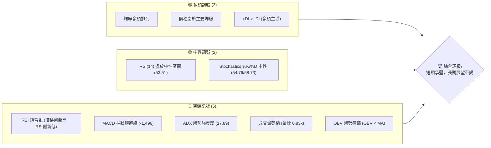
**解讀**：多頭訊號主要來自於長期均線的良好排列，顯示其長期上漲趨勢未變。然而，空頭訊號則集中在短期動能與量能，特別是RSI頂背離和MACD柱狀體翻綠，以及成交量萎縮，這些都強烈暗示股價短期內可能面臨調整或盤整。ADX趨勢強度弱則表明當前市場缺乏明確的單邊趨勢，可能進入震盪行情。

### 📊 核心指標速覽表

| 指標類別 | 指標名稱 | 當前數值 | 訊號 | 解讀 |
|----------|----------|----------|------|------|
| **價格** | 當前價格 | $2440.00 | 🟡 | 位於52週高點區間 (93.7%)，但近期動能減弱 |
| **均線** | MA20 | $2394.64 | 🟢 | 價格位於MA20上方，短期支撐良好 |
| **均線** | MA50 | $2319.52 | 🟢 | 價格位於MA50上方，中期趨勢強勁 |
| **均線** | MA200 | $1788.65 | 🟢 | 價格位於MA200上方，長期多頭趨勢確立 |
| **動能** | RSI(14) | 53.51 | 🟡 | 處於中性區間，但存在頂背離風險 |
| **動能** | MACD | 43.706 (MACD線) | 🔴 | MACD線下穿Signal線，柱狀體翻綠，動能轉弱 |
| **波動** | ATR(14) | $65.00 | 🟡 | 每日波動約2.66%，屬於中等波動水平 |
| **趨勢** | ADX(14) | 17.89 | 🔴 | 趨勢強度較弱，市場可能處於盤整或震盪階段 |
| **量能** | OBV趨勢 | OBV < MA | 🔴 | 量能疲弱，未確認價格上漲，存在量價背離 |

### 🏆 技術評分卡

綜合當前所有技術指標表現，2330.TW 的整體技術評分偏向中性偏空，主要反映短期動能與量能的弱化，以及趨勢強度的不足。

```
技術評分卡 — 2330.TW (2026-07-07)
════════════════════════════════════════════════════
趨勢強度      ████████░░░░░░░░░░░░  40/100  🔴 (ADX弱趨勢)
動能指標      ██████░░░░░░░░░░░░░░  30/100  🔴 (RSI頂背離, MACD柱狀體翻綠)
支撐穩定度    ████████████████░░░░  80/100  🟢 (價格站穩主要均線)
成交量配合    ████░░░░░░░░░░░░░░░░  20/100  🔴 (量價背離, OBV疲弱)
形態完整度    ████████░░░░░░░░░░░░  40/100  🟡 (高檔整理，潛在頂部形態)
均線排列      ████████████████░░░░  80/100  🟢 (標準多頭排列)
════════════════════════════════════════════════════
綜合評分      ███████░░░░░░░░░░░░░  48/100  評級: 🟡 偏空整理
════════════════════════════════════════════════════
```
**評分說明**：
- **趨勢強度 (40/100, 🔴)**：ADX值17.89，遠低於25，顯示當前趨勢強度不足，更傾向於盤整行情。
- **動能指標 (30/100, 🔴)**：RSI出現明顯頂背離，MACD柱狀體翻綠且MACD線下穿Signal線，顯示上漲動能嚴重衰退。
- **支撐穩定度 (80/100, 🟢)**：股價仍穩居MA20、MA50、MA200之上，提供堅實的長期支撐。
- **成交量配合 (20/100, 🔴)**：近期成交量萎縮至20日均量以下 (量比0.83x)，OBV趨勢疲弱，量能未能配合價格上漲，形成量價背離的看空訊號。
- **形態完整度 (40/100, 🟡)**：股價在高檔區域進行整理，雖然尚未形成明確反轉形態，但結合動能和量能指標，存在形成頂部形態的潛在風險。
- **均線排列 (80/100, 🟢)**：MA20 > MA50 > MA200 的標準多頭排列，是長期趨勢強勁的有力證明。
**綜合評級**：整體而言，2330.TW 的長期基本面趨勢依然看好，但在短期內，多項技術指標顯示出疲態和修正風險。操作上應保持謹慎，關注短期回調風險，等待更明確的買入訊號。

---

## 2. 趨勢分析

本章節將從多個時間框架深入分析 2330.TW 的趨勢，包括長期、中期和短期走勢，並透過 ADX 指標評估趨勢強度。

### 🌐 多時框趨勢分析

2330.TW 的多時框趨勢呈現出「長牛中震短修」的特點。長期來看，其上漲趨勢非常明確且強勁；中期則在高檔進行震盪整理；而短期則面臨回調壓力。

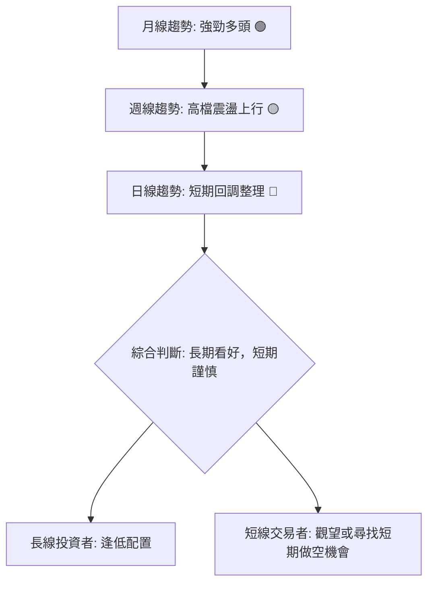
**解讀**：
- **月線趨勢 (長期)**：從過去12個月的價格走勢圖來看，2330.TW 處於一個非常強勁的上升通道中，不斷創出新高。主要均線（MA200）持續向上，且股價遠高於長期均線，顯示長期多頭格局確立。
- **週線趨勢 (中期)**：從近20週的走勢觀察，股價雖然整體向上，但已在高檔區間出現較大的震盪，上漲動能有所減弱，並伴隨較大的回調。MA50仍向上，但價格波動性增加，顯示市場在尋求新的平衡點。
- **日線趨勢 (短期)**：當前價格 ($2440.00) 雖然位於MA20 ($2394.64) 之上，但MA5 ($2463.00) 已下穿MA10 ($2421.50)，且MACD柱狀體翻綠，RSI出現頂背離，量能萎縮。這些訊號都指向短期可能面臨回調或橫盤整理。

### 📈 長期趨勢 — 12個月走勢圖（Unicode）

過去12個月（2025年7月至2026年7月），2330.TW 展現了驚人的漲幅，從約 $1144.74 一路上漲至 $2440.00，漲幅超過一倍。

```
2330.TW 月線走勢圖（過去12個月）
價格軸 ($)
$2500 ┤                                  ●(2440.00, Jul)
$2300 ┤                                ●(2410.00, Jun)
$2100 ┤                          ●(2348.73, May)
$1900 ┤                        ●(2129.32, Apr)
$1700 ┤                    ●(1983.22, Feb)
$1500 ┤                ●(1764.52, Jan)
$1300 ┤            ●(1540.85, Dec)
$1100 ┤          ●(1486.19, Oct)
$ 900 ┤●━━━━━●(1144.74, Jul/Aug)
     └───────────────────────────────────────────────────
      2025-07 -08 -09 -10 -11 -12 -01 -02 -03 -04 -05 -06 -07
                                 (2026)
```
**走勢特徵分析表格**：

| 時間區段 | 起始價 | 結束價 | 漲跌幅 | 走勢特徵 | 評估 |
|----------|--------|--------|--------|----------|------|
| 2025-07至2025-09 | $1144.74 | $1292.99 | +12.95% | 穩健上漲，築底完成 | 🟢 |
| 2025-10至2026-02 | $1486.19 | $1983.22 | +33.44% | 加速上漲，突破關鍵阻力 | 🟢 |
| 2026-02至2026-03 | $1983.22 | $1755.32 | -11.59% | 短暫回調，消化漲幅 | 🟡 |
| 2026-03至2026-07 | $1755.32 | $2440.00 | +38.99% | 再度強勁上漲，創歷史新高 | 🟢 |
**長期趨勢總結**：從過去12個月來看，2330.TW 處於一個非常明確且強勁的長期上升通道中，儘管中間有過一次約11.59%的健康回調，但隨後迅速恢復並創下新高。這顯示了市場對其長期增長的信心。

### 📊 中期趨勢（週線分析）

從近20週的週線數據來看，2330.TW 在經歷了4月下旬的快速拉升後，進入了高檔震盪區間。股價在 $2300-$2450 之間來回波動，顯示上方阻力與下方支撐力量的拉鋸。

```
2330.TW 近期週線壓力與支撐示意圖
價格軸 ($)
$2550 ┤                                        R2: $2535.00 (52W 高點)
$2500 ┤
$2450 ┤                  ┌───────────┐         R1: $2463.00 (MA5)
$2400 ┤─────────────────┤  高檔震盪區間 ├───────● 現價 $2440.00
$2350 ┤                 └───────────┘
$2300 ┤                                        S1: $2394.64 (MA20)
$2250 ┤                                        S2: $2319.52 (MA50)
$2200 ┤
     └───────────────────────────────────────────────────
      近期走勢
```
**分析**：
- **高檔震盪**：自4月底創下高點後，股價在 $2100-$2450 區間內進行了多次震盪，顯示市場在高位分歧加大，多空雙方力量較為均衡。
- **關鍵支撐**：MA20 ($2394.64) 和 MA50 ($2319.52) 提供了重要的中期支撐，尤其MA50作為中期趨勢線，其有效性值得關注。
- **短期壓力**：MA5 ($2463.00) 成為短期的上行阻力，而52週高點 $2535.00 則是強勁的心理及技術阻力位。

### ⚡ 趨勢強度評估（ADX 解讀）

ADX (Average Directional Index) 指標用於衡量趨勢的強度，而非方向。當前 ADX(14) 值為 17.89，顯著低於 25，表明 2330.TW 目前處於弱趨勢或盤整行情。

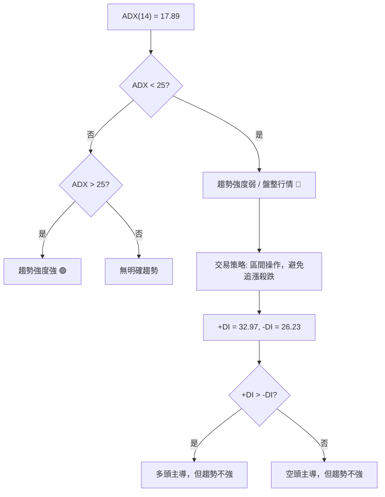
**ADX 強度對照表**：

| ADX 數值範圍 | 趨勢強度 | 建議交易策略 |
|--------------|----------|--------------|
| 0-25         | 弱趨勢/盤整 | 區間操作，高拋低吸，避免追漲殺跌 |
| 25-50        | 中等趨勢 | 順勢交易，趨勢策略有效 |
| 50-75        | 強趨勢   | 順勢交易，趨勢非常明確 |
| 75-100       | 極強趨勢 | 趨勢可能過熱，關注反轉訊號 |

**解讀**：
儘管 +DI (32.97) 仍高於 -DI (26.23)，表明多頭力量仍佔據主導，但 ADX 值低於 25 意味著這種多頭主導的趨勢並不強勁，市場更可能處於高檔震盪或潛在的回調中。這與其他動能指標的疲弱訊號相互印證，提示投資者在當前階段應避免盲目追高，轉而關注區間操作或等待趨勢明確。

---

## 3. 圖表形態分析

圖表形態是價格行為的直觀體現。儘管 2330.TW 處於歷史高位，目前並未形成明確的反轉形態，但多個指標的背離現象暗示潛在的頂部整理或構築過程。

### 🔍 形態識別系統

在當前高位，2330.TW 的價格走勢呈現出「高檔整理區間」的特徵，並伴隨動能指標的頂背離，這可能預示著潛在的「M型頂部」或「頭肩頂」形態的早期發展階段，但尚未得到確認。

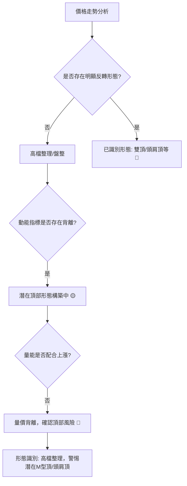
**解讀**：目前 2330.TW 的股價在高位區間震盪，尚未出現如「雙頂」、「頭肩頂」等典型反轉形態的明確頸線跌破訊號。然而，RSI 頂背離和 MACD 柱狀體翻綠等動能指標的疲態，結合量能的萎縮，使得當前的高檔整理區間具有構築潛在頂部形態的風險。投資者需密切關注區間邊界的突破方向，以及後續是否有更明確的形態形成。

### 🕯️ 重要K線形態分析

分析近20週的週線K線，可以發現一些重要的價格行為訊號，尤其是在高檔區間的震盪K線。

| 日期          | 收盤價  | K線形態 (週線) | 解讀                                   | 訊號 |
|---------------|---------|----------------|----------------------------------------|------|
| 2026-04-26    | $2179.19 | 長上影線/射擊之星 | 價格衝高後回落，上方賣壓沉重，動能減弱 | 🔴   |
| 2026-05-17    | $2258.97 | 中長黑K線      | 短期下跌動能較強，確認上方阻力         | 🔴   |
| 2026-05-31    | $2348.73 | 中長紅K線      | 突破整理區間，顯示買盤回歸             | 🟢   |
| 2026-06-14    | $2310.00 | 中長黑K線      | 再次回落，未能站穩高點，顯示多頭猶豫   | 🔴   |
| 2026-07-05    | $2445.00 | 中長紅K線      | 再次向上突破，但成交量未有效放大       | 🟡   |
| 2026-07-12 (當週) | $2440.00 | 小黑K線 (暫定) | 開高走低或高位整理，顯示上攻乏力       | 🟡   |

**分析**：
- **高檔震盪K線**：在 $2179.19 (04/26) 和 $2445.00 (07/05) 附近出現的長上影線或中長紅K線，雖然顯示買盤積極，但隨後往往伴隨中長黑K線的回落，如 $2258.97 (05/17) 和 $2310.00 (06/14)。這表明股價在高位面臨較大的獲利了結壓力。
- **量價不配合**：特別是 $2445.00 (07/05) 的上漲，其週成交量為160,664,012，低於20日均量33,515,455 (日均量，週均量需換算，但趨勢是萎縮)。這顯示了「價漲量縮」的背離現象，對上漲的持續性構成質疑。
- **近期K線**：當前週線K線 ($2440.00) 呈現小幅回落，結合RSI頂背離和MACD柱狀體翻綠，進一步確認了短期上漲動能的衰竭。

### 📉 ASCII 走勢形態示意圖

目前的走勢形態更偏向於高檔的「擴散型整理 (Broadening Formation)」或「潛在的雙頂構築」，而非單純的上升趨勢。以下為簡化的形態示意圖：

```
2330.TW 高檔整理形態示意圖
════════════════════════════════════════════════════
$2550 ║                                  ┌─────┐
$2500 ║                                 /       \  R2: $2535.00 (潛在第二頂)
$2450 ║              ●(R1)            /         \ R1: $2445.00 (近期高點)
$2400 ║             ╱ ╲              /           ● 現價 $2440.00
$2350 ║            ╱   ╲            /             \
$2300 ║           ●─────● (頸線/S1)─────────────── S1: $2394.64 (MA20)
$2250 ║          ╱       ╲
$2200 ║         ●─────────● (S2)
$2150 ║        S3: $2129.32
     └───────────────────────────────────────────────────
      時間軸
```
**形態分析**：
- **高檔整理區間**：股價在 $2300-$2450 之間形成一個寬幅震盪區間，每次反彈都遇到壓力，每次回調都在支撐位獲得支撐。
- **潛在雙頂**：從 $2445.00 (07/05) 附近的高點，若股價無法有效突破 $2463.00 (MA5) 並再次回落，則可能與前高 $2535.00 (52W High) 形成潛在的雙頂結構。
- **頸線位置**：此形態的關鍵頸線支撐位可暫定在 $2394.64 (MA20) 或 $2340.00 (06/28低點)。一旦跌破並確認，則雙頂形態將成立。

### 🎯 形態目標價計算

基於當前高檔整理及潛在雙頂形態的考量，我們提供以下兩種情境的目標價計算：

1.  **高檔整理區間操作目標**：
    *   **整理區間上沿**：$2463.00 (MA5) - $2535.00 (52W High)
    *   **整理區間下沿**：$2394.64 (MA20) - $2310.00 (06/14低點)
    *   **目標**：若股價在區間內震盪，向上目標為區間上沿，向下目標為區間下沿。

2.  **潛在雙頂形態的下跌目標 (若頸線 $2340.00 被跌破)**：
    *   **第一頂高點**：假設為 $2535.00 (52W High)
    *   **頸線位置**：假設為 $2340.00 (06/28低點)
    *   **形態高度**：$2535.00 - $2340.00 = $195.00
    *   **下跌目標價**：頸線位置 - 形態高度 = $2340.00 - $195.00 = $2145.00
    *   **解讀**：此目標價位於斐波那契50%回調位 $2145.16 附近，以及MA120 $2045.02之上，若雙頂形態確認，則此為潛在的下跌目標。

**重要提示**：上述形態與目標價均為基於當前數據的推演，形態尚未完全確認，需密切關注股價在關鍵點位的表現。

---

## 4. 支撐與阻力

支撐與阻力是技術分析的核心，界定了股價波動的範圍和潛在轉折點。本章將詳細分析 2330.TW 的關鍵價位。

### 🗺️ 關鍵價位分布圖（Unicode）

當前價格 $2440.00 位於關鍵支撐之上，但同時面臨上方多重阻力。

```
2330.TW 價位結構分布圖
═══════════════════════════════════════════════════
$2547.84 ║████████████████████████║ 強阻力 R3 (布林上軌)
$2535.00 ║████████████████████    ║ 阻力 R2 (52週高點)
$2463.00 ║████████████████████████║ 關鍵阻力 R1 (MA5)
$2440.00 ╠════════════════════════╣ ◄ 現價
$2394.64 ║▓▓▓▓▓▓▓▓▓▓▓▓▓▓▓▓        ║ 近期支撐 S1 (MA20)
$2340.00 ║▓▓▓▓▓▓▓▓▓▓▓▓▓▓▓▓▓▓▓▓▓▓▓▓║ 關鍵支撐 S2 (06/28低點, 潛在頸線)
$2319.52 ║████████████████████████║ 強支撐 S3 (MA50)
$2241.45 ║████████████████████████║ 強支撐 S4 (布林下軌)
$2145.16 ║████████████████████████║ 強支撐 S5 (斐波那契50%回調位)
$1788.65 ║████████████████████████║ 極強支撐 S6 (MA200)
═══════════════════════════════════════════════════
```
**解讀**：股價目前位於 $2440.00，上方阻力密集，最近的阻力位於MA5 $2463.00，以及52週高點 $2535.00。下方支撐則由MA20 $2394.64、近期低點 $2340.00 和MA50 $2319.52 構築。這些支撐位若被跌破，將可能引發更深度的回調至布林下軌 $2241.45 甚至斐波那契回調位。

### 🚧 阻力位分析表

| 阻力級別 | 價位     | 形成原因                                   | 突破難度 | 重要性 |
|----------|----------|--------------------------------------------|----------|--------|
| **R3**   | $2547.84 | 布林通道上軌，通常是價格上漲的極限位置     | 極高     | 🔴     |
| **R2**   | $2535.00 | 52週高點，歷史新高，賣壓累積點             | 高       | 🔴     |
| **R1**   | $2463.00 | 5日移動平均線 (MA5)，短期上漲趨勢的壓力位  | 中等     | 🟡     |
| **近期高點** | $2445.00 | 2026-07-05 高點，近期多頭上攻受挫點        | 中等     | 🟡     |

### 🛡️ 支撐位分析表

| 支撐級別 | 價位     | 形成原因                                     | 守住機率 | 重要性 |
|----------|----------|----------------------------------------------|----------|--------|
| **S1**   | $2394.64 | 20日移動平均線 (MA20)，短期趨勢線，重要支撐 | 中等     | 🟡     |
| **S2**   | $2340.00 | 2026-06-28 低點，近期整理區間下沿，潛在雙頂頸線 | 中等     | 🟡     |
| **S3**   | $2319.52 | 50日移動平均線 (MA50)，中期趨勢線，強勁支撐 | 高       | 🟢     |
| **S4**   | $2241.45 | 布林通道下軌，極端下跌的潛在支撐             | 高       | 🟢     |
| **S5**   | $2145.16 | 斐波那契50%回調位，重要心理關口與技術支撐   | 極高     | 🟢     |
| **S6**   | $1788.65 | 200日移動平均線 (MA200)，長期牛市生命線     | 極高     | 🟢     |

### 📐 斐波那契回調位分析

我們以 2026-03 的低點 ($1755.32) 作為波段起點，52週高點 ($2535.00) 作為波段高點，計算其回調位，以評估潛在的支撐區間。

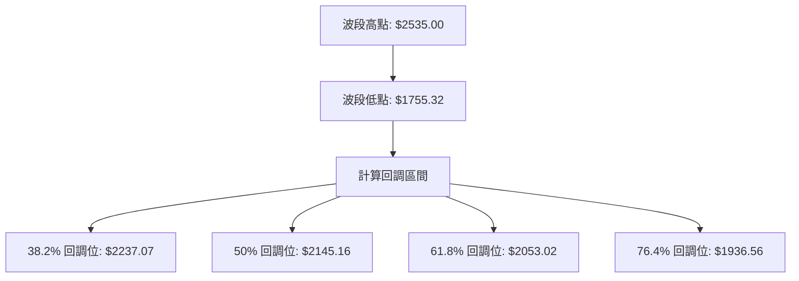
**斐波那契回調位表**：

| 回調比例 | 回調價位 | 意義                                     | 重要性 |
|----------|----------|------------------------------------------|--------|
| 38.2%    | $2237.07 | 淺度回調，若守住則趨勢強勁                 | 🟡     |
| 50%      | $2145.16 | 中度回調，常為強勢股修正目標，心理關口     | 🟢     |
| 61.8%    | $2053.02 | 黃金分割回調位，若跌破則趨勢可能反轉       | 🔴     |
| 76.4%    | $1936.56 | 深度回調，趨勢可能已轉弱                   | 🔴     |

**分析**：
當前價格 $2440.00 仍遠高於這些斐波那契回調位，顯示其長期趨勢的強勁。然而，若股價從高位開始修正，這些回調位將提供關鍵的潛在買入或支撐點。特別是 50% 回調位 $2145.16，它與潛在雙頂形態的目標價 $2145.00 幾乎重合，增加了該價位的支撐強度。

---

## 5. 技術指標深度解讀

本章將對 2330.TW 的各項技術指標進行深入剖析，揭示其背後的市場情緒和潛在動向，並特別關注指標間的相互印證或矛盾。

### 🎛️ 指標訊號總覽

綜合來看，雖然均線系統指示長期多頭趨勢，但動能指標和量能指標的疲弱與背離，對短期走勢構成嚴峻挑戰。

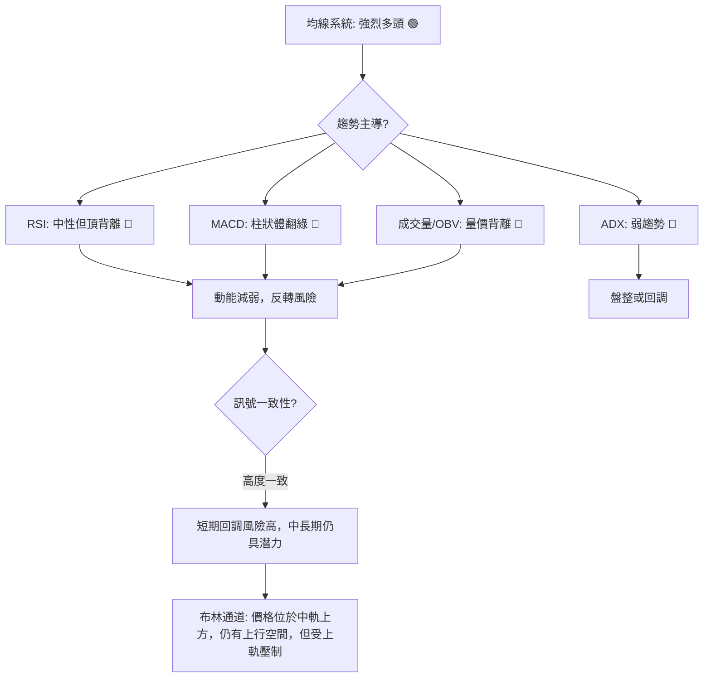
**解讀**：均線系統的強勁多頭排列是 2330.TW 最大的優勢，表明長期投資者仍可信賴其基本面。然而，RSI頂背離、MACD柱狀體翻綠、ADX趨勢強度弱以及成交量萎縮和OBV疲弱，這些指標均指向短期上漲動能的衰竭和市場的謹慎情緒。這種多空訊號的強烈矛盾，使得短期操作風險顯著升高。

### 📈 移動平均線排列分析

2330.TW 的移動平均線系統呈現典型的「多頭排列」，這是強勁上升趨勢的經典標誌。

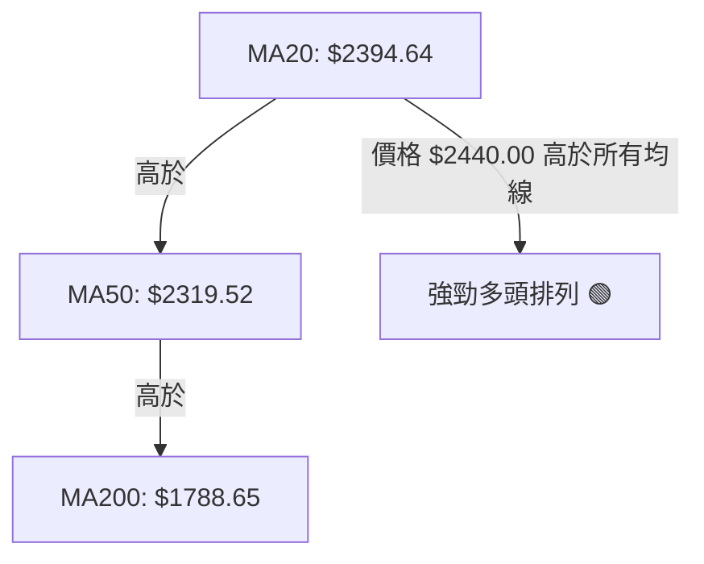
**均線排列狀態表**：

| 均線名稱 | 當前數值 | 相對位置 (與現價 $2440.00) | 趨勢方向 | 訊號 |
|----------|----------|----------------------------|----------|------|
| MA5      | $2463.00 | 現價位於下方               | 向下     | 🟡   |
| MA10     | $2421.50 | 現價位於上方               | 向上     | 🟢   |
| MA20     | $2394.64 | 現價位於上方               | 向上     | 🟢   |
| MA50     | $2319.52 | 現價位於上方               | 向上     | 🟢   |
| MA200    | $1788.65 | 現價位於上方               | 向上     | 🟢   |

**分析**：
- **多頭排列**：MA20 > MA50 > MA200 的順序清晰地顯示了 2330.TW 處於一個健康的長期上升趨勢中。這為股價提供了堅實的基礎支撐。
- **短期均線壓力**：然而，當前價格 $2440.00 位於 MA5 ($2463.00) 之下，且 MA5 有向下的趨勢，這表明短期上漲動能正在減弱，股價面臨短期壓力。
- **支撐作用**：MA20 ($2394.64) 和 MA50 ($2319.52) 將是近期股價回調的重要支撐位。只要股價不有效跌破這些主要均線，長期多頭格局就不會改變。

### 📉 RSI(14) 分析

RSI(14) 當前數值為 53.51，處於中性區間，但數據明確指出存在「頂背離」，這是一個重要的看空訊號。

**RSI 強度進度條**：
RSI(14) 53.51: ▓▓▓▓▓▓▓▓▓▓▓░░░░░░░░ (中性偏強)

**超買超賣區間分析**：
- **超買區 (RSI > 70)**：4月底 (86.4) 和5月初 (71.0) 曾進入超買區，隨後價格出現回調。
- **超賣區 (RSI < 30)**：過去20週未曾進入超賣區，顯示股價整體強勢。
- **中性區 (30 < RSI < 70)**：目前 RSI 位於 53.51，表明市場情緒相對平衡，但上漲動能已不如前。

**背離判斷**：
- **頂背離 (Bearish Divergence) 🔴**：數據明確指出存在頂背離。根據近期的週線數據：
    - 價格在 2026-04-26 (2179.19), 2026-05-10 (2283.91), 2026-05-31 (2348.73), 2026-06-07 (2358.71), 2026-06-21 (2410.00), 2026-07-05 (2445.00) 呈現出逐級走高的趨勢 (Higher Highs)。
    - 然而，對應的 RSI 值卻是 86.4, 71.0, 63.3, 64.0, 56.8, 60.8，呈現出逐級走低的趨勢 (Lower Highs)。
    - **結論**：這種「價格創新高，RSI創新低」的現象，是典型的 **RSI 頂背離**。這是一個強烈的看跌訊號，預示著當前上漲趨勢的動能正在衰竭，股價很可能面臨反轉或顯著的回調。

### 📊 MACD(12/26/9) 訊號解讀

MACD 是衡量趨勢強度和方向的動能指標。當前 MACD 訊號顯示短期動能轉弱。

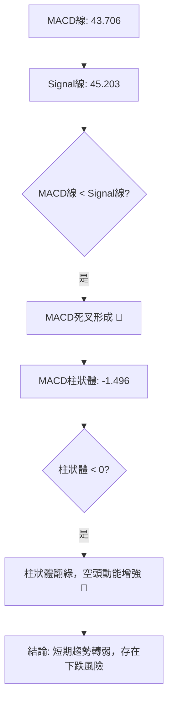
**分析**：
- **MACD 線與 Signal 線**：MACD 線 (43.706) 已經下穿 Signal 線 (45.203)，形成 **死叉 (Bearish Crossover)**。這是短期看空訊號，表明多頭動能正在減弱，空頭動能開始佔據上風。
- **MACD 柱狀體 (Hist)**：柱狀體數值為 -1.496，由正轉負，顯示空頭動能正在積聚。柱狀體翻綠通常被視為股價短期下跌的預警。
- **綜合 MACD 訊號**：MACD 的死叉和柱狀體翻綠，與 RSI 的頂背離訊號相互確認，共同指向 2330.TW 短期內面臨較大的回調壓力。

### 📦 布林通道分析

布林通道 (Bollinger Bands) 用於衡量價格的波動範圍和相對位置。當前 2330.TW 的價格位於布林通道中軌上方，但未能觸及上軌，顯示上漲動能不足。

```
2330.TW 布林通道示意圖
═══════════════════════════════════════════════════
$2547.84 ║████████████████████████║ BB上軌 (R3)
$2490.00 ║                        ║
$2440.00 ╠════════════════════════╣ ◄ 現價
$2394.64 ║▓▓▓▓▓▓▓▓▓▓▓▓▓▓▓▓        ║ BB中軌 (MA20, S1)
$2340.00 ║                        ║
$2241.45 ║████████████████████████║ BB下軌 (S4)
═══════════════════════════════════════════════════
```
**分析**：
- **價格位置**：當前價格 $2440.00 位於中軌 $2394.64 之上，顯示短期仍有一定買盤支撐。
- **通道寬度**：ATR $65.00 (2.66% of price) 顯示通道寬度適中，波動性仍在可控範圍。
- **BB %B**：0.65 (0=下軌, 0.5=中軌, 1=上軌)。這個數值表示價格位於中軌和上軌之間，但相對靠近中軌，且未能觸及上軌，暗示上漲動能不足以推動價格持續走高。
- **訊號**：布林通道本身並未發出強烈的買賣訊號，但結合其他指標，價格未能有效突破上軌並在高位盤整，預示著短期上漲空間有限，甚至有回歸中軌的可能。若跌破中軌，則可能測試下軌支撐。

### 💹 成交量分析（量價配合度）

成交量是價格趨勢的能量，量價配合度對於判斷趨勢的持續性至關重要。當前 2330.TW 的量能表現疲弱，與價格走勢形成背離。

**成交量數據**：
- 最新成交量: 27,867,172
- 20日均量: 33,515,455
- 50日均量: 34,816,444
- 量比 (最新/20日均量): 0.83x
- OBV趨勢: OBV < MA → 量能疲弱

**分析**：
- **成交量萎縮**：最新成交量 (27,867,172) 明顯低於20日均量 (33,515,455) 和50日均量 (34,816,444)，量比僅為0.83x。這表明在價格處於高位時，市場的交投活躍度下降，缺乏增量資金的推動。
- **量價背離 🔴**：在近期價格上漲至 $2445.00 (07/05) 的過程中，成交量卻呈現萎縮。這是一個典型的 **量價背離** 訊號，通常預示著當前上漲趨勢的不可持續性，或者高位籌碼正在派發，上漲動能衰竭。
- **OBV 趨勢疲弱 🔴**：OBV (On Balance Volume) 是一種累積成交量指標，其趨勢通常應與價格趨勢一致。數據顯示「OBV < MA → 量能疲弱」，這表示在價格上漲的過程中，累積的買盤壓力並未有效增加，反而相對減弱。這再次確認了量價背離的看空訊號，暗示多頭力量正在減弱，市場上漲缺乏實質性買盤支持。

**綜合量能分析**：成交量和 OBV 的疲弱訊號與 RSI 頂背離、MACD 死叉等動能指標相互印證，共同指向 2330.TW 短期內面臨較大的回調風險。在缺乏量能支持的情況下，任何價格的上漲都應被視為不可靠的反彈。

---

## 6. 動能與波動率

本章將評估 2330.TW 的動能狀態和波動率特徵，這對於理解股票的行為模式和風險管理至關重要。

### ⚡ 動能評估四象限

我們將從「動能強度」和「波動率」兩個維度對 2330.TW 進行評估。

| 象限 | 動能      | 波動      | 當前狀態                                   | 評估                                           |
|------|-----------|-----------|--------------------------------------------|------------------------------------------------|
| Q1   | 強勁 (高) | 低 (低)   | -                                          | **最佳機會**：趨勢明確，風險較低，適合順勢交易 |
| Q2   | 減弱 (低) | 低 (低)   | -                                          | **謹慎觀望**：趨勢不明，波動小，耐心等待       |
| Q3   | 強勁 (高) | 高 (高)   | -                                          | **高風險高收益**：趨勢明確，但波動大，需嚴格風控 |
| **Q4** | **減弱 (低)** | **中高 (中高)** | **✓ (2330.TW 當前狀態)** | **避免進場 / 謹慎操作**：趨勢不明，波動大，風險高，適合觀望或短線區間操作 |

**動能評估流程圖**：
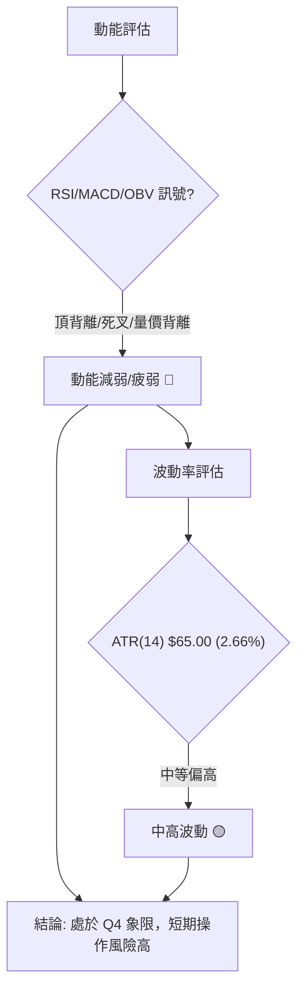
**分析**：
- **動能**：RSI 頂背離、MACD 死叉及柱狀體翻綠、OBV 量能疲弱，均指向 2330.TW 的上漲動能顯著減弱。這表明市場買盤力量不足以維持當前的上漲趨勢，甚至有反轉的風險。
- **波動率**：ATR(14) 為 $65.00，佔股價的 2.66%，相對於大型權值股而言，屬於中等偏高的波動水平。這意味著股價日內波動幅度較大，短線交易風險和機會並存。
**結論**：2330.TW 目前處於「動能減弱，波動中高」的 Q4 象限。這種情況下，不建議追漲，短期內應保持高度謹慎，避免盲目進場。更適合觀望，或在明確支撐位附近進行小倉位試探，並嚴格設置止損。

### 📊 ATR 波動率分析

ATR (Average True Range) 是衡量股價波動幅度的指標，不受方向影響。當前 ATR(14) 為 $65.00。

**ATR 強度進度條**：
ATR $65.00 (2.66%): ▓▓▓▓▓▓▓▓▓▓▓▓▓░░░░░░░ (中高波動)

**分析**：
- **波動幅度**：2330.TW 的日均波動幅度約為 $65.00，佔當前股價 $2440.00 的 2.66%。對於市值龐大的台積電而言，這個波動率相對較高，顯示市場交投活躍，價格波動性較大。
- **止損距離建議**：基於 ATR，短線交易者可以將止損距離設置為 1.5 倍至 2 倍的 ATR。
    - **1.5x ATR 止損**：$65.00 * 1.5 = $97.50。若以 $2440.00 為基準，止損點約為 $2342.50。
    - **2x ATR 止損**：$65.00 * 2 = $130.00。若以 $2440.00 為基準，止損點約為 $2310.00。
- **風險管理**：較高的 ATR 意味著較大的潛在風險，因此在進行交易時，應根據 ATR 調整倉位大小，避免因單次波動過大而造成重大損失。同時，也為短線交易提供了較大的獲利空間。

### 📐 Beta 與市場相關性

提供的技術數據中未包含 Beta 值。Beta 值衡量的是單一股票相對於整體市場（如大盤指數）的波動性。

**分析 (基於一般情況推測)**：
- **Beta 缺失**：由於數據未提供 Beta 值，我們無法進行精確的量化分析。
- **產業特性**：2330.TW 作為全球領先的半導體製造商，其營收和盈利與全球經濟景氣、科技產業發展以及半導體週期高度相關。
- **市場影響力**：作為台灣股市的權值股，2330.TW 對於加權指數 (TAIEX) 具有巨大的影響力。其股價波動往往會帶動大盤同向波動。
- **推測 Beta**：一般而言，大型權值科技股的 Beta 值通常會略高於 1.0，表明其波動性略大於市場平均水平。但在某些特定時期，若其獨特的產業地位和技術領先優勢使其表現優於大盤，Beta 值也可能相對穩定。
- **建議**：投資者應自行查詢最新的 Beta 值，以評估 2330.TW 相對於大盤的系統性風險。在當前全球經濟不確定性較高的環境下，若 Beta 值較高，則表示其受市場整體波動的影響也更大。

---

## 7. 多時框架總結

多時框架分析有助於全面理解股價的趨勢和動態。本章將匯總不同時間框架下的技術評估。

### 📋 時框架評分表

| 時框架 | 趨勢方向 | 動能 | 均線排列 | 形態 | 綜合評分 | 建議 |
|--------|----------|------|----------|------|----------|------|
| **長期 (月線)** | 強勁多頭 🟢 | 強勁   🟢 | 多頭排列 🟢 | 上升通道 🟢 | 9/10     | 持有/逢低買入 |
| **中期 (週線)** | 震盪上行 🟡 | 減弱   🟡 | 多頭排列 🟢 | 高檔整理 🟡 | 6/10     | 觀望/區間操作 |
| **短期 (日線)** | 回調整理 🔴 | 疲弱   🔴 | 趨勢轉弱 🔴 | 潛在頂部 🔴 | 3/10     | 謹慎/逢高減碼 |

**分析**：
- **長期**：月線圖顯示 2330.TW 處於一個非常強勁且健康的長期上升趨勢中。均線系統完美多頭排列，價格持續創高，動能充沛。對於長線投資者而言，這是一個值得持有的標的，任何顯著的回調都可能提供逢低買入的機會。
- **中期**：週線圖顯示股價在高檔區域進行震盪上行，但上漲動能已有所減弱。雖然均線仍維持多頭排列，但高檔整理和較大的波動性表明市場正在消化前期的漲幅。中期操作應保持謹慎，關注區間邊界的有效突破。
- **短期**：日線圖則發出強烈的警告訊號。RSI 頂背離、MACD 死叉和柱狀體翻綠、成交量萎縮和 OBV 疲弱等，都清晰地指示短期上漲動能已衰竭，面臨回調風險。ADX 趨勢強度弱也支持短期進入盤整或修正階段的判斷。短線交易者應避免追高，甚至考慮逢高減碼。

### 🔲 綜合訊號矩陣

綜合訊號矩陣顯示，長期與短期訊號存在明顯矛盾，中期訊號則處於過渡階段。

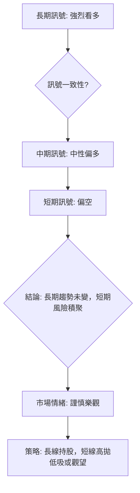
**分析**：
- **長期一致性**：長期趨勢訊號高度一致地指向多頭，反映 2330.TW 的強勁基本面和市場地位。
- **短期矛盾**：短期訊號則與長期趨勢形成鮮明對比，幾乎所有動能和量能指標都發出看空或疲弱的訊號。這種矛盾是當前市場最需要關注的焦點。
- **中期過渡**：中期訊號處於一個過渡階段，雖然仍偏多，但動能減弱，顯示中期趨勢可能從強勢上漲轉為震盪整理。

**綜合結論**：2330.TW 的長期投資價值依然堅固，但短期內面臨的技術性修正壓力不容忽視。這種情況下，激進的追漲策略風險極高。穩健的策略是長期持股者可繼續持有，但短期交易者應保持高度警惕，等待回調至關鍵支撐位後再考慮介入，或利用短期波動進行區間操作。

---

## 8. 交易策略建議

基於上述詳盡的技術分析，2330.TW 目前處於長線看多、短線承壓的複雜局面。因此，我們將提供針對不同交易風格的策略建議。

### 🗺️ 策略決策流程圖

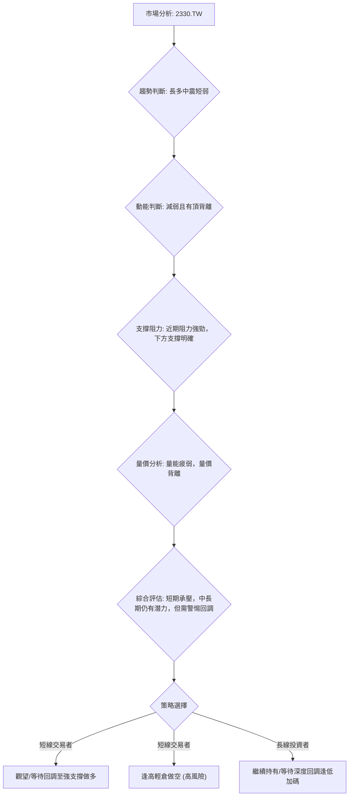

### 🟢 多頭策略詳情

鑑於短期動能疲弱和頂背離訊號，激進的多頭策略風險較高。建議採取「等待回調，逢低買入」的策略。

| 策略要素   | 策略 A (保守多頭)                                | 策略 B (激進多頭 - 區間下沿)                               |
|------------|--------------------------------------------------|--------------------------------------------------------------|
| **進場條件** | 價格回調至 MA50 或斐波那契50%回調位附近，並出現止跌K線 | 價格回調至 MA20 附近，並出現止跌K線或放量上漲訊號           |
| **進場價格** | $2145.16 - $2319.52 區間                             | $2394.64 (MA20)                                              |
| **目標價 T1** | $2463.00 (MA5) / $2535.00 (52W High)             | $2463.00 (MA5)                                               |
| **目標價 T2** | $2783.48 (分析師平均目標)                         | $2535.00 (52W High) / $2783.48 (分析師平均目標)             |
| **止損價格** | $2053.02 (斐波那契61.8%回調位)                      | $2319.52 (MA50) 或 2x ATR ($2310.00)                        |
| **風險報酬比** | 1:2.5 (以 $2230.00 進場為例)                     | 1:1.5 (以 $2394.64 進場，止損 $2310.00，目標 $2535.00 為例) |
| **成功機率** | 60% (若能有效止跌)                               | 45% (短期震盪，成功率較低)                                   |
| **建議倉位** | 20%-30%                                          | 10%-15%                                                      |

### 🔴 空頭策略詳情

短期指標的疲弱和背離為短期空頭策略提供了機會，但需注意這是逆長期趨勢操作，風險較高。

| 策略要素   | 策略 C (激進空頭 - 逢高做空)                           | 策略 D (保守空頭 - 跌破關鍵支撐)                          |
|------------|--------------------------------------------------------|------------------------------------------------------------|
| **進場條件** | 價格反彈至 MA5 或 R1 附近，未能有效突破並出現反轉K線 | 價格有效跌破 MA20 ($2394.64) 或 S2 ($2340.00) 並確認 |
| **進場價格** | $2463.00 (MA5) 或 $2535.00 (R2)                      | $2390.00 (跌破 MA20) 或 $2335.00 (跌破 S2)                 |
| **目標價 T1** | $2394.64 (MA20)                                      | $2319.52 (MA50)                                            |
| **目標價 T2** | $2319.52 (MA50) / $2241.45 (BB下軌)                  | $2241.45 (BB下軌) / $2145.16 (斐波那契50%)               |
| **止損價格** | $2547.84 (BB上軌) 或 R2 $2535.00 + 1.5xATR ($2632.50) | $2440.00 (現價，若跌破後反彈無力)                          |
| **風險報酬比** | 1:1.5 (以 $2463.00 進場，止損 $2535.00，目標 $2319.52 為例) | 1:2 (以 $2390.00 進場，止損 $2440.00，目標 $2241.45 為例) |
| **成功機率** | 40% (逆勢操作，風險較高)                             | 55% (確認跌破後，成功率較高)                               |
| **建議倉位** | 5%-10% (極小倉位)                                    | 10%-15%                                                    |

### ⭐ 整體訊號強度評星

綜合所有時間框架和指標，2330.TW 的短期交易訊號偏向謹慎，而長期投資則仍具吸引力。

```
做多訊號強度：★★☆☆☆  (2/5星) (短期動能弱，需等待回調)
做空訊號強度：★★★☆☆  (3/5星) (短期指標偏空，但逆長期趨勢)
整體可信度：  ★★★☆☆  (3/5星) (多空訊號矛盾，需謹慎判斷)
```
**解讀**：目前市場處於多空拉鋸的局面，短期看空訊號較多，但長期趨勢仍堅固。這導致整體交易難度較高，建議投資者應根據自身的風險承受能力和交易週期選擇合適的策略。對於長線投資者，這可能是等待逢低買入的時機；對於短線交易者，則需極度謹慎，嚴格控制風險。

---

## 9. 風險提示與監控

在複雜的市場環境下，風險管理與持續監控是成功交易的基石。本章將提供關鍵監控指標和風險場景分析。

### ✅ 關鍵監控指標 Checklist

以下為投資者應密切關注的 2330.TW 關鍵監控指標清單：

```
關鍵監控指標 Checklist — 2330.TW
════════════════════════════════════════════════════
[ ] 價格是否有效跌破 MA20 ($2394.64)？
[ ] 價格是否有效跌破 MA50 ($2319.52)？
[ ] RSI 是否持續下行並跌破 50 中軸？
[ ] MACD 柱狀體是否持續擴大負值，MACD線與Signal線是否持續發散？
[ ] 成交量是否在價格下跌時放大 (放量下跌)？
[ ] OBV 趨勢是否加速向下，確認量價同步下跌？
[ ] ADX 是否開始上行，且 -DI 向上突破 +DI (空頭趨勢確立)？
[ ] 是否出現明確的看空K線形態 (如長黑K、吞噬、烏雲罩頂等)？
[ ] 是否有效突破 R1 ($2463.00) 或 R2 ($2535.00) 並站穩？
[ ] 基本面是否有負面消息或產業變化 (如客戶訂單減少、競爭加劇)？
════════════════════════════════════════════════════
```

### ⚠️ 風險場景分析

我們將 2330.TW 未來的走勢分為三種情境，以幫助投資者更好地評估風險和潛在收益。

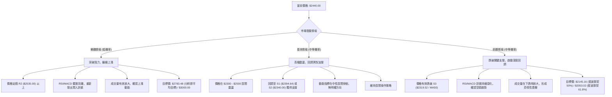
**分析**：
- **樂觀情境**：儘管目前短期技術指標偏空，但若市場情緒突然轉好，或有重大利好消息刺激，股價有可能在短暫整理後突破上方阻力，繼續其長期上漲趨勢。此情境下，需關注成交量能否有效放大，以及動能指標能否重新轉強。
- **基本情境**：這是當前可能性最高的情境。在多空交織的訊號下，股價很可能在現有高檔區間進行震盪整理，消化前期的漲幅和累積的賣壓。投資者可利用區間邊界進行高拋低吸。
- **悲觀情境**：若短期空頭訊號被確認，尤其是股價有效跌破 MA50 等重要中期支撐，則可能觸發更深度的回調。RSI 頂背離和 MACD 死叉的確認將加速下跌趨勢。此情境下，投資者應考慮止損或減倉，以規避風險。

### 🛡️ 風險管理重要提醒

1.  **嚴格止損**：無論採取何種策略，都必須設定並嚴格執行止損點。特別是短期操作，止損是保護資金的生命線。建議根據 ATR 或關鍵支撐位來設置止損。
2.  **倉位管理**：鑑於當前多空訊號的複雜性，不宜投入過大倉位。建議採取分批建倉或減倉的方式，靈活調整倉位。
3.  **多空平衡**：認識到 2330.TW 長期多頭但短期承壓的特性。長線投資者可利用短期回調逢低佈局，短線交易者則應避免逆勢追高，可考慮區間操作或逢高輕倉做空。
4.  **監控指標**：持續關注上述關鍵監控指標，特別是成交量、RSI 和 MACD 的變化，這些是判斷短期趨勢轉折的重要訊號。
5.  **基本面配合**：雖然本報告是技術分析，但仍需結合基本面消息進行綜合判斷。任何重大的產業變化或公司新聞都可能迅速改變技術面走勢。
6.  **耐心等待**：在趨勢不明朗或多空訊號矛盾時，保持觀望是最佳策略。等待更明確的趨號出現，可以有效降低交易風險。

---

## 📋 報告總結

```
2330.TW 技術分析報告總結
════════════════════════════════════════════════════════
報告日期：2026-07-07
當前價格：$2440.00
分析評級：⚖️ 偏空整理 (長線看好，短線需謹慎)

關鍵結論：
├─ 長期趨勢：🟢 強勁多頭，均線系統完美多頭排列，基本面支撐強勁。
├─ 中期趨勢：🟡 震盪上行，高檔整理，動能有所減弱，但仍保持上升格局。
├─ 短期趨勢：🔴 回調整理，RSI頂背離、MACD死叉、量價背離，動能嚴重疲弱，面臨回調風險。
├─ 關鍵支撐：$2394.64 (MA20), $2319.52 (MA50), $2145.16 (斐波那契50%)
├─ 關鍵阻力：$2463.00 (MA5), $2535.00 (52週高點), $2547.84 (布林上軌)
└─ 分析師目標：$2783.48 (平均目標價，顯示長期潛力)

最優策略組合：
1. 🥇 **最佳機會**：等待股價回調至 $2145.16 (斐波那契50%) 或 $2319.52 (MA50) 附近，並出現明確止跌訊號時，逢低佈局，目標價 $2535.00 至 $2783.48。
2. 🥈 **次選機會**：若股價在 $2394.64 (MA20) 獲得有效支撐並放量上攻，可輕倉短線介入，目標價 $2463.00 至 $2535.00，止損 $2319.52。
3. 🥉 **保守選擇**：短期內保持觀望，避免追高。若股價有效跌破 $2319.52 (MA50)，則需警惕深度回調風險，可考慮逢高減碼或輕倉做空至 $2145.16。
════════════════════════════════════════════════════════
```

---

> ⚠️ **免責聲明**：本報告為 AI 自動生成之技術分析，所有數據及估算均基於提供的歷史價格資訊。本報告**僅供研究與學術參考**，**不構成任何投資建議**。投資有風險，入市需謹慎。

---

*報告生成時間：2026-07-07 ｜ 數據來源：提供之技術數據 ｜ 分析框架：多時框技術分析*