<details>
<summary>📊 靜態圖表 (點擊展開)</summary>
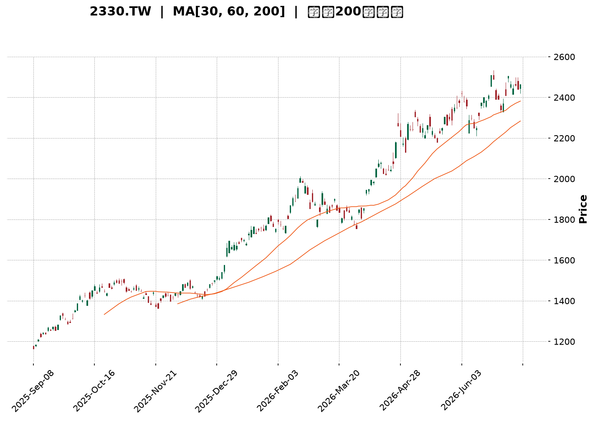
</details>

<html>
<head><meta charset="utf-8" /></head>
<body>
    <div style="height:500px; width:100%;">                        <script>window.PlotlyConfig = {MathJaxConfig: 'local'};</script>
        <script charset="utf-8" src="https://cdn.plot.ly/plotly-3.6.0.min.js" integrity="sha256-QaOVwtVY0T02VaHrr6pnoHLCwayMJp4O5n4YyaE3rJk=" crossorigin="anonymous"></script>                <div id="candlestick-chart" class="plotly-graph-div" style="height:100%; width:100%;"></div>            <script>                window.PLOTLYENV=window.PLOTLYENV || {};                                if (document.getElementById("candlestick-chart")) {                    Plotly.newPlot(                        "candlestick-chart",                        [{"close":{"dtype":"f8","bdata":"AAAAgOkxkkAAAAAg3ICSQAAAAICL45JAAAAAYMEek0AAAADgs22TQAAAAGD3WZNAAAAAoNzQk0AAAAAAapWTQAAAAGCt5JNAAAAAAGqVk0AAAAAgTwyUQAAAAOCmvpRAAAAA4Ka+lEAAAABgY2+UQAAAAOAfIJRAAAAA4PAzlEAAAABANIOUQAAAACC7IZVAAAAAQHGslUAAAAAgJzeWQAAAAODj55VAAAAAIPhKlkAAAADg4+eVQAAAAICFD5ZAAAAAgAyulkAAAADgT\u002f2WQAAAAOCZcpZAAAAAAH\u002fplkAAAAAAf+mWQAAAAIA7mpZAAAAA4JlylkAAAAAAf+mWQAAAACCu1ZZAAAAAQJNMl0AAAABAk0yXQAAAAGDCOJdAAAAAIGRgl0AAAABAk0yXQAAAAIA7mpZAAAAAgAyulkAAAACAO5qWQAAAACCu1ZZAAAAAgAyulkAAAAAgrtWWQAAAAIA7mpZAAAAAQFYjlkAAAADgyF6WQAAAACBCwJVAAAAAQKCYlUAAAACgaoaWQAAAAKD+cJVAAAAA4FxJlUAAAADg4+eVQAAAACD4SpZAAAAAICc3lkAAAAAg+EqWQAAAAAAT1JVAAAAAQFYjlkAAAADgmXKWQAAAAODIXpZAAAAAgDualkAAAACA8SSXQAAAAAB\u002f6ZZAAAAAQJNMl0AAAACgSNWWQAAAAEAM\u002fZZAAAAAoMGFlkAAAAAgHEqWQAAAAGA6NpZAAAAAYDo2lkAAAABgOjaWQAAAAOBmwZZAAAAAwM8kl0AAAACAsTiXQAAAAOBWdJdAAAAA4N3Dl0AAAABgGpyXQAAAAABlE5hAAAAAYJGemEAAAACAj\u002fCZQAAAAOC7e5pAAAAAQHEEmkAAAADANCyaQAAAAABTGJpAAAAAgBZAmkAAAACgnY+aQAAAAKCdj5pAAAAAgBZAmkAAAABA6AabQAAAAGBvVptAAAAAwBSSm0AAAABA6AabQAAAAGBvVptAAAAAADN+m0AAAACAjUKbQAAAAID2pZtAAAAAoARFnEAAAABgXwmcQAAAAMAUkptAAAAAIFFqm0AAAACAffWbQAAAAEDYuZtAAAAAIFFqm0AAAACA9qWbQAAAAOAiMZxAAAAA4JkznUAAAABAxr6dQAAAAOAgg51AAAAA4JeFnkAAAACgaUyfQAAAAIDi\u002fJ5AAAAAgFutnkAAAABgTQ6eQAAAAID095xAAAAA4CCDnUAAAABgXVudQAAAACBBHZxAAAAAQE+8nEAAAAAgLyKeQAAAAKB7R51AAAAAgPT3nEAAAACAbaicQAAAAAAZJJ1AAAAAoLmvnUAAAACAT9ScQAAAAMBqrJxAAAAAgLw0nEAAAACAvDScQAAAACBdwJxAAAAAwGqsnEAAAABAoVycQAAAAEAOvZtAAAAAwERtm0AAAADgQeicQAAAAIC8NJxAAAAAQDT8nEAAAAAAP2OeQAAAAGAxd55AAAAAwLYqn0AAAAAA0gKfQAAAAIAQA6BAAAAAYO40oEAAAACg5z6gQAAAAABlop9AAAAAoHKOn0AAAACALvKfQAAAAIAu8p9AAAAAYO40oEAAAABgXwahQAAAAGDypaFAAAAAgDZCoUAAAAAgZvygQAAAAICjoqBAAAAAwOS5oUAAAADgBoihQAAAAOAGiKFAAAAAILX\u002foUAAAABg0NehQAAAAEAbaqFAAAAAAACSoUAAAACgL0yhQAAAAKDrr6FAAAAAYPKloUAAAACAFHShQAAAACBELqFAAAAAYF8GoUAAAAAAImChQAAAAAAAkqFAAAAAILX\u002foUAAAACg66+hQAAAAMDC66FAAAAAgMnhoUAAAADAd1miQAAAAMB3WaJAAAAAwFWLokAAAABgGOWiQAAAAOBOlaJAAAAAIGptokAAAACAyeGhQAAAAOC79aFAAAAAAACSoUAAAAAAAJShQAAAAAAADKJAAAAAAACOokAAAAAAAMCiQAAAAAAAoqJAAAAAAADUokAAAAAAAJyjQAAAAAAAdKNAAAAAAACsokAAAAAAAKyiQAAAAAAASKJAAAAAAACEokAAAAAAANSiQAAAAAAAkqNAAAAAAABCo0AAAAAAABqjQAAAAAAAOKNAAAAAAAAQo0AAAAAAAEKjQA=="},"high":{"dtype":"f8","bdata":"K4KGcx9tkkAAAAAg3ICSQAJGqSZI95JApZRS+rNtk0AAAADgs22TQL0loQa0bZNAAACgfK3kk0CIgiu5C72TQAAAAGCt5JNAU8bsTn74k0AAAAAgTwyUQAAAAOCmvpRAH6icdRn6lEAQPvgYBZeUQK3USnWSW5RAh36zdWNvlEC8lX2OSOaUQLzHe\u002fyLNZVAAAAAQHGslUBpNt3YyF6WQBGXm7y0+5VAq6qqtWqGlkARl5u8tPuVQByVooc7mpZAAAAAgAyulkB1uBqZ8SSXQA3pvHUMrpZAmCKflfEkl0B1gylywjiXQD9+\u002fDjdwZZAr02UvGqGlkB1gylywjiXQPoglrUgEZdAXb\u002f7+DR0l0ALn3nVBYiXQGdmZq7Wm5dABLIB2QWIl0C6fvex1puXQJ47d85P\u002fZZAEs\u002fXFX\u002fplkAfP35cDK6WQKfADtlP\u002fZZAJZ6vq\u002fEkl0CnwA7ZT\u002f2WQD9+\u002fDjdwZZAPtPW+PdKlkAxyF51O5qWQJx0gEsnN5ZAchzHsePnlUBZKXt8O5qWQIAeIxJCwJVAsfYNC0LAlUAjLjeZhQ+WQAAAACD4SpZA0my6kWqGlkCrqqq1aoaWQBCTKwjJXpZAPtPW+PdKlkAAAADgmXKWQGbtdLyZcpZAAAAAgDualkAAAACA8SSXQHWDKXLCOJdAAAAAQJNMl0AAAACQOIiXQKbIZwXuEJdAYCpoZaOZlkAVGHuq33GWQJq2xq\u002ffcZZA3jxCJRxKlkBWMEs6o5mWQEH+WaVI1ZZAAAAAwM8kl0BQ5llFk0yXQAAAAOBWdJdAAAAA4N3Dl0Cvobzq3cOXQAAAAABlE5hAAAAAYJGemEB\u002fi9Na+FOaQAAAAOC7e5pAYtGyyjQsmkCA2PMP2meaQFVVVRXaZ5pAaMPnz7t7mkCrqqoqYbeaQFVVVWV\u002fo5pARYKaCtpnmkCrqqrKqy6bQBhddHX2pZtAAAAAwBSSm0CrqqoaUWqbQIwuuuoyfptAfnlsxRSSm0Cg+7kf2LmbQJasZEXYuZtAAAAAoARFnEBtdnEAqoCcQCDRCpt99ZtAAAAAIFFqm0CrqqoKQR2cQBU6g1VfCZxAeZoLcPalm0AAAACA9qWbQON3gvWpgJxAAAAA4JkznUDdy7HKieadQBUII0VNDp5AZ9KValutnkAM5KMqLXSfQPgz4c+HOJ9A1ShjleL8nkB9QV9QPcGeQGkO32\u002fkqp1At8SpH7ZxnkCrqqrqIIOdQAAAACBBHZxARrXlal1bnUAFvriq8kmeQLy6FUDGvp1AErFGlXtHnUAFCaPlmTOdQEzYBsH9S51ABAKBAKzDnUA5Dx3D\u002fUudQC1kIQMZJJ1AbceH4K5InEBoOz6ET9ScQDI4H2MLOJ1Ae9OboiYQnUBwCIegk3CcQAhFKMLXDJxAdNFFA\u002fPkm0AAAADgQeicQK6R1aUmEJ1AAAAAQDT8nEAAAAAAP2OeQAAAAGAxd55AAAAAwLYqn0Bcf3tgxBafQAAAAIAQA6BAxU7sINNcoED\u002fwUTQ4EigQC8xa6EJDaBAwhZscRADoEATtSsx9SqgQA\u002fE7wD8IKBAndiJcqOioEBpnEGQWBChQBjRNtOZJ6JA+WNJ893DoUCrM1JBPTihQFRcMoQ2QqFA4Ad+INfNoUBoRSOh66+hQHW5\u002fTHXzaFAH3zwcYVFokD0Lh4htf+hQDolAcLkuaFAFN898d3DoUDJZ91gFHShQAAAAKDrr6FA74X3oqAdokBJkiRB+ZuhQFEURREiYKFADw5IUT04oUAFhBPx\u002f5GhQASTPzD5m6FAAAAAILX\u002foUA28BmzoB2iQKBoq+GZJ6JAng8s83BjokC7f\u002fOAXIGiQC9\u002f2gIm0aJAgVwTgTqzokBDWrHwAwOjQHKnaAEm0aJATvDkoTO9okDGVDhxpxOiQO+VunCnE6JAJCs8ssLroUAAAAAAAKihQAAAAAAAKqJAAAAAAACOokAAAAAAAMCiQAAAAAAAoqJAAAAAAADeokAAAAAAAJyjQAAAAAAAzqNAAAAAAAAao0AAAAAAAOiiQAAAAAAAhKJAAAAAAAC2okAAAAAAAFajQAAAAAAAkqNAAAAAAABgo0AAAAAAAEKjQAAAAAAAiKNAAAAAAACIo0AAAAAAAEKjQA=="},"hovertemplate":"\u003cb\u003e%{x|%Y-%m-%d}\u003c\u002fb\u003e\u003cbr\u003e\u958b: $%{open:.2f}\u003cbr\u003e\u9ad8: $%{high:.2f}\u003cbr\u003e\u4f4e: $%{low:.2f}\u003cbr\u003e\u6536: $%{close:.2f}\u003cextra\u003e\u003c\u002fextra\u003e","low":{"dtype":"f8","bdata":"AAAAgOkxkkDv7u7SYlmSQPxzrTISvJJA11pruQQLk0DDMAyTOkaTQEPaXrk6RpNAAACALZmBk0AAAAAAapWTQPIN8u1plZNAAAAAAGqVk0CtG0zROqmTQCI9UJGSW5RA4VdjSjSDlEAAAABgY2+UQBu5kQNPDJRAAAAA4PAzlEAAAABANIOUQIdwCGcZ+pRAAAAAOLshlUBiLrSKtPuVQN7RyCZCwJVAOY7jZlYjlkCqDPaQz4SVQEUPe6O0+5VAz9cVm4UPlkAWj8ptDK6WQAAAAOCZcpZArRtMsWqGlkAAAAAAf+mWQODAgaNqhpZA9BZDSic3lkAAAAAAf+mWQK2feEPdwZZA9WCGqiARl0BSIIJjwjiXQAAAAGDCOJdA+Zv8rSARl0CkQASH8SSXQODAgaNqhpZAAAAAgAyulkDgwIGjaoaWQFk\u002f8WYMrpZAAAAAgAyulkAG32mKO5qWQAAAAIA7mpZAYJaUY4UPlkAAAADgyF6WQAAAACBCwJVAAAAAQKCYlUD1g44K+EqWQAAAAKD+cJVAAAAA4FxJlUDe0cgmQsCVQFZVVYqFD5ZAy2SRQ1YjlkAdx3FDJzeWQAAAAAAT1JVAwSwph7T7lUD0FkNKJzeWQM43oUpWI5ZAggMHDvhKlkC777h4O5qWQAAAAAB\u002f6ZZAR4EIzk\u002f9lkCrqqraZsGWQLRuMLVI1ZZAodWX2t9xlkDq54SVWCKWQCLDvZpYIpZAZkk5EJX6lUAAAABgOjaWQH8DTFWjmZZAcAOGqkjVlkBfM0z17RCXQJO\u002fyY+xOJdAq6qqylZ0l0BRXkPVVnSXQKcBbZo4iJdAgeAyNYP\u002fl0BOa7aPnz2ZQP3zz58mjZlAnS5Nta3cmUABTxgg6rSZQFVVVSXqtJlAAAAAgBZAmkBVVVUV2meaQFVVVRXaZ5pAun1l9VIYmkAAAACgnY+aQBhddPpCy5pAbA4kWugGm0AAAABA6AabQHXRRdWrLptACRpO6qsum0AAAACAjUKbQBShCKWNQptAMP3S\u002f7nNm0CYwZeaffWbQAAAAMAUkptACjKbCsoam0AAAAAw2LmbQPViPrUUkptAg8ymWm9Wm0BTm9pU6AabQAAAAOAiMZxA6jsbtYuUnECL0DgVuB+dQAAAAOAgg51A\u002feMSK8a+nUDmN7iK4vyeQAAAAIDi\u002fJ5AjHiSGi8inkAAAABgTQ6eQAAAAID095xARtqxGj9vnUBVVVXVmTOdQBGk3PQyfptAXCWNKshsnEDeLE8auB+dQAAAAKB7R51AqaJnpYuUnEAAAACAbaicQLMn+T40\u002fJxA9Pl8fuJznUAAAACAT9ScQAAAAMBqrJxA4BpZnQDRm0AncfC+1wycQAAAACBdwJxAAAAAwGqsnEA+3uO91wycQAAAAEAOvZtAAAAAwERtm0D6kmn9hYScQJQ4eB\u002fKIJxA11prXXiYnECd2Ikdg\u002f+dQDN1i311E55AUrgefQiznkDugY3e+saeQL9KGJubUp9AO7ETnwkNoEAHdGN+EAOgQAAAAABlop9AAAAAoHKOn0D4HYgfPN6fQPE7EL9Jyp9Aip3YbhADoEBpOeZbzGagQAAAAGDypaFAAAAAgDZCoUAq5laPet6gQAAAAICjoqBA\u002fMAPvFEaoUBMXW5\u002fFHShQExdbn8UdKFAAAAAILX\u002foUBPRZpu8qWhQAAAAEAbaqFA3NTDTT04oUAp8lkPRC6hQB6Xvh0iYKFAhB5CzwaIoUAkSZKONkKhQAAAACBELqFAAAAAYF8GoUAAAAAAImChQOiNgt4oVqFA4YMPzuS5oUAAAACg66+hQMuHcV\u002fQ16FAOavHjuuvoUBXoM\u002fOmSeiQBEgw49+T6JAf6Ps\u002fnBjokC+pU7PLMeiQAAAAOBOlaJA4yVKj35PokBi8NMMImChQAucg3\u002fJ4aFAAAAAAACSoUAAAAAAAEShQAAAAAAA5KFAAAAAAABSokAAAAAAAFyiQAAAAAAAXKJAAAAAAACiokAAAAAAAC6jQAAAAAAAdKNAAAAAAACsokAAAAAAAKyiQAAAAAAAKqJAAAAAAAA0okAAAAAAANSiQAAAAAAAVqNAAAAAAAAao0AAAAAAAN6iQAAAAAAALqNAAAAAAAAQo0AAAAAAAOiiQA=="},"name":"\u50f9\u683c","open":{"dtype":"f8","bdata":"K4KGcx9tkkB3d3d5H22SQP65VtnOz5JAfO+9U\u002fdZk0BiGIY591mTQL0loQa0bZNAAAAgCmqVk0BEwZXcOqmTQPkG+aYLvZNADwVXcq3kk0CtG0zROqmTQILK2W1jb5RAvxoTmUjmlEAAAABgY2+UQMmN3JjBR5RALSqRvMFHlEAAAABANIOUQEM4hEPqDZVAAAAAOLshlUBiLrSKtPuVQO9oZAMT1JVAAAAAIPhKlkCqDPaQz4SVQGGkHatqhpZA22FQVCc3lkAWj8ptDK6WQK9NlLxqhpZAinzWjTualkDdYIrcT\u002f2WQAAAAIA7mpZAo2TXJvhKlkB1gylywjiXQFNgh\u002fx+6ZZApEAEh\u002fEkl0Bdv\u002fv4NHSXQNejcPU0dJdAAAAAIGRgl0ALn3nVBYiXQH78+PF+6ZZABkWdXN3BlkAAAACAO5qWQK2feEPdwZZAH1kSzyARl0Ctn3hD3cGWQAAAAIA7mpZAYJaUY4UPlkBm7XS8mXKWQJx0gEsnN5ZAHMdxHHGslUCn1oTDmXKWQECPEVmgmJVA6aKLLnGslUAjLjeZhQ+WQDmO42ZWI5ZAntFLtZlylkAAAAAg+EqWQBCTKwjJXpZAAAAAQFYjlkCjZNcm+EqWQAAAAODIXpZAoUKF6shelkB8zTBVDK6WQJgin5XxJJdA9WCGqiARl0CrqqrKVnSXQFo3mHoq6ZZAAAAAoMGFlkAAAAAgHEqWQN48QiUcSpZARIZ71XYOlkBWMEs6o5mWQAAAAOBmwZZAlILkbyrplkAAAACAsTiXQDGVmBp1YJdAAAAAkDiIl0Aor6GaOIiXQP0ly18anJdAYSjmv0YnmECb7RNVgVGZQP3zz58mjZlAnS5Nta3cmUArl2nly8iZQAAAALCt3JlARYKaCtpnmkCrqqoqYbeaQKuqqtq7e5pA3b6yujQsmkCrqqp6BvOaQBhddPpCy5pAbA4kWugGm0BVVVUFyhqbQEYXXSVRaptAAAAAADN+m0DgU5MKUWqbQKpNbWpvVptAMP3S\u002f7nNm0AGOAk7yGycQK2wORC6zZtAiGX0z6sum0CrqqoKQR2cQAAAAEDYuZtAAAAAIFFqm0DpRz8ayhqbQOvZITDIbJxAbdR3em2onEB6tpHamTOdQAAAAOAgg51A\u002feMSK8a+nUDmN7iK4vyeQFMRS0XEEJ9AjHiSGi8inkDTa5\u002fFeZmeQJsJ6h8\u002fb51Azy1xCi8inkBVVVXVmTOdQI8PQboUkptAo9pyVdYLnUDj6gele0edQF7dCvAgg51AqaJnpYuUnEAEmkIguB+dQCZsg2ALOJ1A\u002fP1+P8ebnUBaN5hiCzidQMlCFkI0\u002fJxATeLg\u002ffLkm0BoOz6ET9ScQCHQFKImEJ1AZCELgU\u002fUnECu5moeyiCcQAAAAEAOvZtAuuii4Rupm0Bji3K+aqycQK6R1aUmEJ1A8L33fk\u002fUnEBe6IXeZyeeQEeVBJ9MT55AmpmZ3frGnkClgISf3+6eQKrQo\u002fuNZp9A7MROzwIXoEABPrtv7jSgQPyoLnEQA6BA61x5AGWin0AAAACALvKfQPgdiB883p9AYid2wOBIoEDS1SeMxXCgQHzhvfDdw6FAh1WEoQ1+oUAOosfvbPKgQMoQrCNELqFA7MRO7EokoUAAAADgBoihQAAAAOAGiKFAzaFiEZMxokB6F4\u002fAwuuhQOvbgGHypaFA8LMBPxtqoUAp8lkPRC6hQI9L394GiKFAc6Q5ErX\u002foUBJkiTvKFahQDEMw7AvTKFApnEGIUQuoUDPNG5gFHShQPjZgJ8NfqFA4YMPzuS5oUAaw9GCpxOiQDZ4jiC1\u002f6FA6CCvkn5PokA0YEkvjDuiQAAAAMB3WaJAQK6JIEifokAAAABgGOWiQAAAAOBOlaJAO7RrQUGpokBi8NMMImChQAAAAOC79aFAGHJ9IdfNoUAAAAAAAIChQAAAAAAAKqJAAAAAAABwokAAAAAAAI6iQAAAAAAAZqJAAAAAAAC2okAAAAAAAC6jQAAAAAAAnKNAAAAAAAAGo0AAAAAAANSiQAAAAAAAcKJAAAAAAAA0okAAAAAAABCjQAAAAAAAfqNAAAAAAAAko0AAAAAAAN6iQAAAAAAAQqNAAAAAAABgo0AAAAAAABqjQA=="},"x":["2025-09-08T00:00:00+08:00","2025-09-09T00:00:00+08:00","2025-09-10T00:00:00+08:00","2025-09-11T00:00:00+08:00","2025-09-12T00:00:00+08:00","2025-09-15T00:00:00+08:00","2025-09-16T00:00:00+08:00","2025-09-17T00:00:00+08:00","2025-09-18T00:00:00+08:00","2025-09-19T00:00:00+08:00","2025-09-22T00:00:00+08:00","2025-09-23T00:00:00+08:00","2025-09-24T00:00:00+08:00","2025-09-25T00:00:00+08:00","2025-09-26T00:00:00+08:00","2025-09-30T00:00:00+08:00","2025-10-01T00:00:00+08:00","2025-10-02T00:00:00+08:00","2025-10-03T00:00:00+08:00","2025-10-07T00:00:00+08:00","2025-10-08T00:00:00+08:00","2025-10-09T00:00:00+08:00","2025-10-13T00:00:00+08:00","2025-10-14T00:00:00+08:00","2025-10-15T00:00:00+08:00","2025-10-16T00:00:00+08:00","2025-10-17T00:00:00+08:00","2025-10-20T00:00:00+08:00","2025-10-21T00:00:00+08:00","2025-10-22T00:00:00+08:00","2025-10-23T00:00:00+08:00","2025-10-27T00:00:00+08:00","2025-10-28T00:00:00+08:00","2025-10-29T00:00:00+08:00","2025-10-30T00:00:00+08:00","2025-10-31T00:00:00+08:00","2025-11-03T00:00:00+08:00","2025-11-04T00:00:00+08:00","2025-11-05T00:00:00+08:00","2025-11-06T00:00:00+08:00","2025-11-07T00:00:00+08:00","2025-11-10T00:00:00+08:00","2025-11-11T00:00:00+08:00","2025-11-12T00:00:00+08:00","2025-11-13T00:00:00+08:00","2025-11-14T00:00:00+08:00","2025-11-17T00:00:00+08:00","2025-11-18T00:00:00+08:00","2025-11-19T00:00:00+08:00","2025-11-20T00:00:00+08:00","2025-11-21T00:00:00+08:00","2025-11-24T00:00:00+08:00","2025-11-25T00:00:00+08:00","2025-11-26T00:00:00+08:00","2025-11-27T00:00:00+08:00","2025-11-28T00:00:00+08:00","2025-12-01T00:00:00+08:00","2025-12-02T00:00:00+08:00","2025-12-03T00:00:00+08:00","2025-12-04T00:00:00+08:00","2025-12-05T00:00:00+08:00","2025-12-08T00:00:00+08:00","2025-12-09T00:00:00+08:00","2025-12-10T00:00:00+08:00","2025-12-11T00:00:00+08:00","2025-12-12T00:00:00+08:00","2025-12-15T00:00:00+08:00","2025-12-16T00:00:00+08:00","2025-12-17T00:00:00+08:00","2025-12-18T00:00:00+08:00","2025-12-19T00:00:00+08:00","2025-12-22T00:00:00+08:00","2025-12-23T00:00:00+08:00","2025-12-24T00:00:00+08:00","2025-12-26T00:00:00+08:00","2025-12-29T00:00:00+08:00","2025-12-30T00:00:00+08:00","2025-12-31T00:00:00+08:00","2026-01-02T00:00:00+08:00","2026-01-05T00:00:00+08:00","2026-01-06T00:00:00+08:00","2026-01-07T00:00:00+08:00","2026-01-08T00:00:00+08:00","2026-01-09T00:00:00+08:00","2026-01-12T00:00:00+08:00","2026-01-13T00:00:00+08:00","2026-01-14T00:00:00+08:00","2026-01-15T00:00:00+08:00","2026-01-16T00:00:00+08:00","2026-01-19T00:00:00+08:00","2026-01-20T00:00:00+08:00","2026-01-21T00:00:00+08:00","2026-01-22T00:00:00+08:00","2026-01-23T00:00:00+08:00","2026-01-26T00:00:00+08:00","2026-01-27T00:00:00+08:00","2026-01-28T00:00:00+08:00","2026-01-29T00:00:00+08:00","2026-01-30T00:00:00+08:00","2026-02-02T00:00:00+08:00","2026-02-03T00:00:00+08:00","2026-02-04T00:00:00+08:00","2026-02-05T00:00:00+08:00","2026-02-06T00:00:00+08:00","2026-02-09T00:00:00+08:00","2026-02-10T00:00:00+08:00","2026-02-11T00:00:00+08:00","2026-02-23T00:00:00+08:00","2026-02-24T00:00:00+08:00","2026-02-25T00:00:00+08:00","2026-02-26T00:00:00+08:00","2026-03-02T00:00:00+08:00","2026-03-03T00:00:00+08:00","2026-03-04T00:00:00+08:00","2026-03-05T00:00:00+08:00","2026-03-06T00:00:00+08:00","2026-03-09T00:00:00+08:00","2026-03-10T00:00:00+08:00","2026-03-11T00:00:00+08:00","2026-03-12T00:00:00+08:00","2026-03-13T00:00:00+08:00","2026-03-16T00:00:00+08:00","2026-03-17T00:00:00+08:00","2026-03-18T00:00:00+08:00","2026-03-19T00:00:00+08:00","2026-03-20T00:00:00+08:00","2026-03-23T00:00:00+08:00","2026-03-24T00:00:00+08:00","2026-03-25T00:00:00+08:00","2026-03-26T00:00:00+08:00","2026-03-27T00:00:00+08:00","2026-03-30T00:00:00+08:00","2026-03-31T00:00:00+08:00","2026-04-01T00:00:00+08:00","2026-04-02T00:00:00+08:00","2026-04-07T00:00:00+08:00","2026-04-08T00:00:00+08:00","2026-04-09T00:00:00+08:00","2026-04-10T00:00:00+08:00","2026-04-13T00:00:00+08:00","2026-04-14T00:00:00+08:00","2026-04-15T00:00:00+08:00","2026-04-16T00:00:00+08:00","2026-04-17T00:00:00+08:00","2026-04-20T00:00:00+08:00","2026-04-21T00:00:00+08:00","2026-04-22T00:00:00+08:00","2026-04-23T00:00:00+08:00","2026-04-24T00:00:00+08:00","2026-04-27T00:00:00+08:00","2026-04-28T00:00:00+08:00","2026-04-29T00:00:00+08:00","2026-04-30T00:00:00+08:00","2026-05-04T00:00:00+08:00","2026-05-05T00:00:00+08:00","2026-05-06T00:00:00+08:00","2026-05-07T00:00:00+08:00","2026-05-08T00:00:00+08:00","2026-05-11T00:00:00+08:00","2026-05-12T00:00:00+08:00","2026-05-13T00:00:00+08:00","2026-05-14T00:00:00+08:00","2026-05-15T00:00:00+08:00","2026-05-18T00:00:00+08:00","2026-05-19T00:00:00+08:00","2026-05-20T00:00:00+08:00","2026-05-21T00:00:00+08:00","2026-05-22T00:00:00+08:00","2026-05-25T00:00:00+08:00","2026-05-26T00:00:00+08:00","2026-05-27T00:00:00+08:00","2026-05-28T00:00:00+08:00","2026-05-29T00:00:00+08:00","2026-06-01T00:00:00+08:00","2026-06-02T00:00:00+08:00","2026-06-03T00:00:00+08:00","2026-06-04T00:00:00+08:00","2026-06-05T00:00:00+08:00","2026-06-08T00:00:00+08:00","2026-06-09T00:00:00+08:00","2026-06-10T00:00:00+08:00","2026-06-11T00:00:00+08:00","2026-06-12T00:00:00+08:00","2026-06-15T00:00:00+08:00","2026-06-16T00:00:00+08:00","2026-06-17T00:00:00+08:00","2026-06-18T00:00:00+08:00","2026-06-22T00:00:00+08:00","2026-06-23T00:00:00+08:00","2026-06-24T00:00:00+08:00","2026-06-25T00:00:00+08:00","2026-06-26T00:00:00+08:00","2026-06-29T00:00:00+08:00","2026-06-30T00:00:00+08:00","2026-07-01T00:00:00+08:00","2026-07-02T00:00:00+08:00","2026-07-03T00:00:00+08:00","2026-07-06T00:00:00+08:00","2026-07-07T00:00:00+08:00","2026-07-08T00:00:00+08:00"],"type":"candlestick"},{"hovertemplate":"MA30: $%{y:.2f}\u003cextra\u003e\u003c\u002fextra\u003e","line":{"color":"#2196F3","dash":"dash","width":2},"mode":"lines","name":"MA30","x":["2025-09-08T00:00:00+08:00","2025-09-09T00:00:00+08:00","2025-09-10T00:00:00+08:00","2025-09-11T00:00:00+08:00","2025-09-12T00:00:00+08:00","2025-09-15T00:00:00+08:00","2025-09-16T00:00:00+08:00","2025-09-17T00:00:00+08:00","2025-09-18T00:00:00+08:00","2025-09-19T00:00:00+08:00","2025-09-22T00:00:00+08:00","2025-09-23T00:00:00+08:00","2025-09-24T00:00:00+08:00","2025-09-25T00:00:00+08:00","2025-09-26T00:00:00+08:00","2025-09-30T00:00:00+08:00","2025-10-01T00:00:00+08:00","2025-10-02T00:00:00+08:00","2025-10-03T00:00:00+08:00","2025-10-07T00:00:00+08:00","2025-10-08T00:00:00+08:00","2025-10-09T00:00:00+08:00","2025-10-13T00:00:00+08:00","2025-10-14T00:00:00+08:00","2025-10-15T00:00:00+08:00","2025-10-16T00:00:00+08:00","2025-10-17T00:00:00+08:00","2025-10-20T00:00:00+08:00","2025-10-21T00:00:00+08:00","2025-10-22T00:00:00+08:00","2025-10-23T00:00:00+08:00","2025-10-27T00:00:00+08:00","2025-10-28T00:00:00+08:00","2025-10-29T00:00:00+08:00","2025-10-30T00:00:00+08:00","2025-10-31T00:00:00+08:00","2025-11-03T00:00:00+08:00","2025-11-04T00:00:00+08:00","2025-11-05T00:00:00+08:00","2025-11-06T00:00:00+08:00","2025-11-07T00:00:00+08:00","2025-11-10T00:00:00+08:00","2025-11-11T00:00:00+08:00","2025-11-12T00:00:00+08:00","2025-11-13T00:00:00+08:00","2025-11-14T00:00:00+08:00","2025-11-17T00:00:00+08:00","2025-11-18T00:00:00+08:00","2025-11-19T00:00:00+08:00","2025-11-20T00:00:00+08:00","2025-11-21T00:00:00+08:00","2025-11-24T00:00:00+08:00","2025-11-25T00:00:00+08:00","2025-11-26T00:00:00+08:00","2025-11-27T00:00:00+08:00","2025-11-28T00:00:00+08:00","2025-12-01T00:00:00+08:00","2025-12-02T00:00:00+08:00","2025-12-03T00:00:00+08:00","2025-12-04T00:00:00+08:00","2025-12-05T00:00:00+08:00","2025-12-08T00:00:00+08:00","2025-12-09T00:00:00+08:00","2025-12-10T00:00:00+08:00","2025-12-11T00:00:00+08:00","2025-12-12T00:00:00+08:00","2025-12-15T00:00:00+08:00","2025-12-16T00:00:00+08:00","2025-12-17T00:00:00+08:00","2025-12-18T00:00:00+08:00","2025-12-19T00:00:00+08:00","2025-12-22T00:00:00+08:00","2025-12-23T00:00:00+08:00","2025-12-24T00:00:00+08:00","2025-12-26T00:00:00+08:00","2025-12-29T00:00:00+08:00","2025-12-30T00:00:00+08:00","2025-12-31T00:00:00+08:00","2026-01-02T00:00:00+08:00","2026-01-05T00:00:00+08:00","2026-01-06T00:00:00+08:00","2026-01-07T00:00:00+08:00","2026-01-08T00:00:00+08:00","2026-01-09T00:00:00+08:00","2026-01-12T00:00:00+08:00","2026-01-13T00:00:00+08:00","2026-01-14T00:00:00+08:00","2026-01-15T00:00:00+08:00","2026-01-16T00:00:00+08:00","2026-01-19T00:00:00+08:00","2026-01-20T00:00:00+08:00","2026-01-21T00:00:00+08:00","2026-01-22T00:00:00+08:00","2026-01-23T00:00:00+08:00","2026-01-26T00:00:00+08:00","2026-01-27T00:00:00+08:00","2026-01-28T00:00:00+08:00","2026-01-29T00:00:00+08:00","2026-01-30T00:00:00+08:00","2026-02-02T00:00:00+08:00","2026-02-03T00:00:00+08:00","2026-02-04T00:00:00+08:00","2026-02-05T00:00:00+08:00","2026-02-06T00:00:00+08:00","2026-02-09T00:00:00+08:00","2026-02-10T00:00:00+08:00","2026-02-11T00:00:00+08:00","2026-02-23T00:00:00+08:00","2026-02-24T00:00:00+08:00","2026-02-25T00:00:00+08:00","2026-02-26T00:00:00+08:00","2026-03-02T00:00:00+08:00","2026-03-03T00:00:00+08:00","2026-03-04T00:00:00+08:00","2026-03-05T00:00:00+08:00","2026-03-06T00:00:00+08:00","2026-03-09T00:00:00+08:00","2026-03-10T00:00:00+08:00","2026-03-11T00:00:00+08:00","2026-03-12T00:00:00+08:00","2026-03-13T00:00:00+08:00","2026-03-16T00:00:00+08:00","2026-03-17T00:00:00+08:00","2026-03-18T00:00:00+08:00","2026-03-19T00:00:00+08:00","2026-03-20T00:00:00+08:00","2026-03-23T00:00:00+08:00","2026-03-24T00:00:00+08:00","2026-03-25T00:00:00+08:00","2026-03-26T00:00:00+08:00","2026-03-27T00:00:00+08:00","2026-03-30T00:00:00+08:00","2026-03-31T00:00:00+08:00","2026-04-01T00:00:00+08:00","2026-04-02T00:00:00+08:00","2026-04-07T00:00:00+08:00","2026-04-08T00:00:00+08:00","2026-04-09T00:00:00+08:00","2026-04-10T00:00:00+08:00","2026-04-13T00:00:00+08:00","2026-04-14T00:00:00+08:00","2026-04-15T00:00:00+08:00","2026-04-16T00:00:00+08:00","2026-04-17T00:00:00+08:00","2026-04-20T00:00:00+08:00","2026-04-21T00:00:00+08:00","2026-04-22T00:00:00+08:00","2026-04-23T00:00:00+08:00","2026-04-24T00:00:00+08:00","2026-04-27T00:00:00+08:00","2026-04-28T00:00:00+08:00","2026-04-29T00:00:00+08:00","2026-04-30T00:00:00+08:00","2026-05-04T00:00:00+08:00","2026-05-05T00:00:00+08:00","2026-05-06T00:00:00+08:00","2026-05-07T00:00:00+08:00","2026-05-08T00:00:00+08:00","2026-05-11T00:00:00+08:00","2026-05-12T00:00:00+08:00","2026-05-13T00:00:00+08:00","2026-05-14T00:00:00+08:00","2026-05-15T00:00:00+08:00","2026-05-18T00:00:00+08:00","2026-05-19T00:00:00+08:00","2026-05-20T00:00:00+08:00","2026-05-21T00:00:00+08:00","2026-05-22T00:00:00+08:00","2026-05-25T00:00:00+08:00","2026-05-26T00:00:00+08:00","2026-05-27T00:00:00+08:00","2026-05-28T00:00:00+08:00","2026-05-29T00:00:00+08:00","2026-06-01T00:00:00+08:00","2026-06-02T00:00:00+08:00","2026-06-03T00:00:00+08:00","2026-06-04T00:00:00+08:00","2026-06-05T00:00:00+08:00","2026-06-08T00:00:00+08:00","2026-06-09T00:00:00+08:00","2026-06-10T00:00:00+08:00","2026-06-11T00:00:00+08:00","2026-06-12T00:00:00+08:00","2026-06-15T00:00:00+08:00","2026-06-16T00:00:00+08:00","2026-06-17T00:00:00+08:00","2026-06-18T00:00:00+08:00","2026-06-22T00:00:00+08:00","2026-06-23T00:00:00+08:00","2026-06-24T00:00:00+08:00","2026-06-25T00:00:00+08:00","2026-06-26T00:00:00+08:00","2026-06-29T00:00:00+08:00","2026-06-30T00:00:00+08:00","2026-07-01T00:00:00+08:00","2026-07-02T00:00:00+08:00","2026-07-03T00:00:00+08:00","2026-07-06T00:00:00+08:00","2026-07-07T00:00:00+08:00","2026-07-08T00:00:00+08:00"],"y":{"dtype":"f8","bdata":"AAAAAAAA+H8AAAAAAAD4fwAAAAAAAPh\u002fAAAAAAAA+H8AAAAAAAD4fwAAAAAAAPh\u002fAAAAAAAA+H8AAAAAAAD4fwAAAAAAAPh\u002fAAAAAAAA+H8AAAAAAAD4fwAAAAAAAPh\u002fAAAAAAAA+H8AAAAAAAD4fwAAAAAAAPh\u002fAAAAAAAA+H8AAAAAAAD4fwAAAAAAAPh\u002fAAAAAAAA+H8AAAAAAAD4fwAAAAAAAPh\u002fAAAAAAAA+H8AAAAAAAD4fwAAAAAAAPh\u002fAAAAAAAA+H8AAAAAAAD4fwAAAAAAAPh\u002fAAAAAAAA+H8AAAAAAAD4f7y7u+uJ1JRAEREREdT4lECJiIgYcx6VQKuqquoeQJVAvLu7C8hjlUDe3d19z4SVQCIiIkLWpZVAREREpDjElUB3d3c37eOVQN7d3Y0L+5VA7+7uXncVlkBERESEQyuWQHd3dxcZPZZAq6qqepxNlkAAAABwFmKWQN7d3X05d5ZA7+7u3ryHlkCJiIgol5eWQM3MzOzfnJZAMzMz0zaclkBVVVU1256WQCIiIqLkmpZAREREZE6SlkBERERkTpKWQN7d3a1JlJZAmpmZGVOQlkDe3d09YYqWQKuqqnoYhZZAVVVVhX1+lkAzMzPzhnqWQJqZmamLeJZAmpmZ2d15lkAiIiIi2XuWQKuqqjqCfJZAq6qqOoJ8lkBmZmZGiHiWQM3MzLyKdpZA3t3dDUFvlkC8u7t7o2aWQM3MzBxOY5ZAREREpE9flkBVVVVF+luWQKuqqjpNW5ZAvLu7q0JflkBVVVWVj2KWQDMzM8PUaZZAZmZmJrd3lkDv7u7uSoKWQN7d3W0hlpZAvLu7u+2vlkCJiIgYEc2WQHd3d2cX+JZAMzMz83Ugl0C8u7sL30SXQCIiIgJRZZdAMzMzY7+Hl0De3d1NK6yXQKuqqsqN1JdARERERKX3l0AiIiLyuB6YQM3MzFwcSZhAiYiIeIFzmEC8u7tLo5SYQKuqqgpnuphAIiIiojDemEAiIiIy9wOZQM3MzLy6K5lAERERgcVcmUB3d3dH0I2ZQCIiIsKKu5lAq6qq6vHnmUAAAACw\u002fBiaQN7d3d1mQ5pAzczMHNpnmkDe3d2toI2aQBEREeENtppAMzMzA3LkmkAzMzMTzRibQERERDQxR5tAmpmZSY95m0AiIiLCSaebQKuqqvq5zZtAVVVVhX31m0CamZl5oBacQLy7u9slL5xAmpmZiftKnEAzMzND12KcQCIiInIYcJxAmpmZiU2FnEBmZmbmz5+cQAAAAGBhsJxAvLu7O0+8nEAzMzMTOsqcQImIiJid2ZxAiYiISFXsnEDe3d2dufmcQJqZmTl5Ap1AmpmZSe4BnUAzMzNTYAOdQN7d3c1zDZ1AREREZDAYnUBERESEoBudQKuqquq7G51Aq6qqGtUbnUCamZlZkyadQCIiIhKyJp1AmpmZWdkknUB3d3fXVCqdQGZmZoZ3Mp1A3t3djfg3nUARERGRhDWdQLy7u\u002ftbPp1Ad3d3Fy1NnUAAAACw9WGdQLy7uyu1eJ1ARERE1CaKnUDe3d3dPqCdQCIiInLxwJ1Ad3d3B1TgnUB3d3c3vwGeQN7d3Q0YNZ5Ad3d3Z3FknkBVVVXlyZGeQJqZmSkHtZ5ARERE5DrmnkBmZmbmaxufQFVVVVXxUZ9Ad3d3l26Un0AAAAAAQ9SfQCIiIsoPBKBAREREnKcfoEBEREQcQDqgQO\u002fu7obUWqBAq6qqQmh8oEAiIiJyAZagQHd3d9dEsKBAAAAAwODFoEAzMzOzftigQLy7uxNx7KBAMzMzqw0BoUB3d3efqxOhQM3MzNT1I6FA7+7uZkEyoUC8u7sjNUShQERERAzRWaFAiYiImGtxoUARERGRWoqhQAAAALCgoKFA7+7uvpOzoUBVVVUV5LqhQO\u002fu7u6MvaFAiYiIyDXAoUAiIiJyQ8WhQAAAABBP0aFAmpmZCWHYoUBVVVU1x+KhQBEREWEt7KFAERER8UDzoUCJiIiYUwKiQGZmZha5E6JAzczMfB8dokAiIiKi2SiiQBEREWHrLaJAvLu7O1I1okCJiIhIDUGiQJqZmWlxVaJAzczMTH9ookBmZmbmOXeiQHd3d\u002fdKhaJAd3d3h16OokC8u7ubxZuiQA=="},"type":"scatter"},{"hovertemplate":"MA60: $%{y:.2f}\u003cextra\u003e\u003c\u002fextra\u003e","line":{"color":"#9C27B0","dash":"dash","width":2},"mode":"lines","name":"MA60","x":["2025-09-08T00:00:00+08:00","2025-09-09T00:00:00+08:00","2025-09-10T00:00:00+08:00","2025-09-11T00:00:00+08:00","2025-09-12T00:00:00+08:00","2025-09-15T00:00:00+08:00","2025-09-16T00:00:00+08:00","2025-09-17T00:00:00+08:00","2025-09-18T00:00:00+08:00","2025-09-19T00:00:00+08:00","2025-09-22T00:00:00+08:00","2025-09-23T00:00:00+08:00","2025-09-24T00:00:00+08:00","2025-09-25T00:00:00+08:00","2025-09-26T00:00:00+08:00","2025-09-30T00:00:00+08:00","2025-10-01T00:00:00+08:00","2025-10-02T00:00:00+08:00","2025-10-03T00:00:00+08:00","2025-10-07T00:00:00+08:00","2025-10-08T00:00:00+08:00","2025-10-09T00:00:00+08:00","2025-10-13T00:00:00+08:00","2025-10-14T00:00:00+08:00","2025-10-15T00:00:00+08:00","2025-10-16T00:00:00+08:00","2025-10-17T00:00:00+08:00","2025-10-20T00:00:00+08:00","2025-10-21T00:00:00+08:00","2025-10-22T00:00:00+08:00","2025-10-23T00:00:00+08:00","2025-10-27T00:00:00+08:00","2025-10-28T00:00:00+08:00","2025-10-29T00:00:00+08:00","2025-10-30T00:00:00+08:00","2025-10-31T00:00:00+08:00","2025-11-03T00:00:00+08:00","2025-11-04T00:00:00+08:00","2025-11-05T00:00:00+08:00","2025-11-06T00:00:00+08:00","2025-11-07T00:00:00+08:00","2025-11-10T00:00:00+08:00","2025-11-11T00:00:00+08:00","2025-11-12T00:00:00+08:00","2025-11-13T00:00:00+08:00","2025-11-14T00:00:00+08:00","2025-11-17T00:00:00+08:00","2025-11-18T00:00:00+08:00","2025-11-19T00:00:00+08:00","2025-11-20T00:00:00+08:00","2025-11-21T00:00:00+08:00","2025-11-24T00:00:00+08:00","2025-11-25T00:00:00+08:00","2025-11-26T00:00:00+08:00","2025-11-27T00:00:00+08:00","2025-11-28T00:00:00+08:00","2025-12-01T00:00:00+08:00","2025-12-02T00:00:00+08:00","2025-12-03T00:00:00+08:00","2025-12-04T00:00:00+08:00","2025-12-05T00:00:00+08:00","2025-12-08T00:00:00+08:00","2025-12-09T00:00:00+08:00","2025-12-10T00:00:00+08:00","2025-12-11T00:00:00+08:00","2025-12-12T00:00:00+08:00","2025-12-15T00:00:00+08:00","2025-12-16T00:00:00+08:00","2025-12-17T00:00:00+08:00","2025-12-18T00:00:00+08:00","2025-12-19T00:00:00+08:00","2025-12-22T00:00:00+08:00","2025-12-23T00:00:00+08:00","2025-12-24T00:00:00+08:00","2025-12-26T00:00:00+08:00","2025-12-29T00:00:00+08:00","2025-12-30T00:00:00+08:00","2025-12-31T00:00:00+08:00","2026-01-02T00:00:00+08:00","2026-01-05T00:00:00+08:00","2026-01-06T00:00:00+08:00","2026-01-07T00:00:00+08:00","2026-01-08T00:00:00+08:00","2026-01-09T00:00:00+08:00","2026-01-12T00:00:00+08:00","2026-01-13T00:00:00+08:00","2026-01-14T00:00:00+08:00","2026-01-15T00:00:00+08:00","2026-01-16T00:00:00+08:00","2026-01-19T00:00:00+08:00","2026-01-20T00:00:00+08:00","2026-01-21T00:00:00+08:00","2026-01-22T00:00:00+08:00","2026-01-23T00:00:00+08:00","2026-01-26T00:00:00+08:00","2026-01-27T00:00:00+08:00","2026-01-28T00:00:00+08:00","2026-01-29T00:00:00+08:00","2026-01-30T00:00:00+08:00","2026-02-02T00:00:00+08:00","2026-02-03T00:00:00+08:00","2026-02-04T00:00:00+08:00","2026-02-05T00:00:00+08:00","2026-02-06T00:00:00+08:00","2026-02-09T00:00:00+08:00","2026-02-10T00:00:00+08:00","2026-02-11T00:00:00+08:00","2026-02-23T00:00:00+08:00","2026-02-24T00:00:00+08:00","2026-02-25T00:00:00+08:00","2026-02-26T00:00:00+08:00","2026-03-02T00:00:00+08:00","2026-03-03T00:00:00+08:00","2026-03-04T00:00:00+08:00","2026-03-05T00:00:00+08:00","2026-03-06T00:00:00+08:00","2026-03-09T00:00:00+08:00","2026-03-10T00:00:00+08:00","2026-03-11T00:00:00+08:00","2026-03-12T00:00:00+08:00","2026-03-13T00:00:00+08:00","2026-03-16T00:00:00+08:00","2026-03-17T00:00:00+08:00","2026-03-18T00:00:00+08:00","2026-03-19T00:00:00+08:00","2026-03-20T00:00:00+08:00","2026-03-23T00:00:00+08:00","2026-03-24T00:00:00+08:00","2026-03-25T00:00:00+08:00","2026-03-26T00:00:00+08:00","2026-03-27T00:00:00+08:00","2026-03-30T00:00:00+08:00","2026-03-31T00:00:00+08:00","2026-04-01T00:00:00+08:00","2026-04-02T00:00:00+08:00","2026-04-07T00:00:00+08:00","2026-04-08T00:00:00+08:00","2026-04-09T00:00:00+08:00","2026-04-10T00:00:00+08:00","2026-04-13T00:00:00+08:00","2026-04-14T00:00:00+08:00","2026-04-15T00:00:00+08:00","2026-04-16T00:00:00+08:00","2026-04-17T00:00:00+08:00","2026-04-20T00:00:00+08:00","2026-04-21T00:00:00+08:00","2026-04-22T00:00:00+08:00","2026-04-23T00:00:00+08:00","2026-04-24T00:00:00+08:00","2026-04-27T00:00:00+08:00","2026-04-28T00:00:00+08:00","2026-04-29T00:00:00+08:00","2026-04-30T00:00:00+08:00","2026-05-04T00:00:00+08:00","2026-05-05T00:00:00+08:00","2026-05-06T00:00:00+08:00","2026-05-07T00:00:00+08:00","2026-05-08T00:00:00+08:00","2026-05-11T00:00:00+08:00","2026-05-12T00:00:00+08:00","2026-05-13T00:00:00+08:00","2026-05-14T00:00:00+08:00","2026-05-15T00:00:00+08:00","2026-05-18T00:00:00+08:00","2026-05-19T00:00:00+08:00","2026-05-20T00:00:00+08:00","2026-05-21T00:00:00+08:00","2026-05-22T00:00:00+08:00","2026-05-25T00:00:00+08:00","2026-05-26T00:00:00+08:00","2026-05-27T00:00:00+08:00","2026-05-28T00:00:00+08:00","2026-05-29T00:00:00+08:00","2026-06-01T00:00:00+08:00","2026-06-02T00:00:00+08:00","2026-06-03T00:00:00+08:00","2026-06-04T00:00:00+08:00","2026-06-05T00:00:00+08:00","2026-06-08T00:00:00+08:00","2026-06-09T00:00:00+08:00","2026-06-10T00:00:00+08:00","2026-06-11T00:00:00+08:00","2026-06-12T00:00:00+08:00","2026-06-15T00:00:00+08:00","2026-06-16T00:00:00+08:00","2026-06-17T00:00:00+08:00","2026-06-18T00:00:00+08:00","2026-06-22T00:00:00+08:00","2026-06-23T00:00:00+08:00","2026-06-24T00:00:00+08:00","2026-06-25T00:00:00+08:00","2026-06-26T00:00:00+08:00","2026-06-29T00:00:00+08:00","2026-06-30T00:00:00+08:00","2026-07-01T00:00:00+08:00","2026-07-02T00:00:00+08:00","2026-07-03T00:00:00+08:00","2026-07-06T00:00:00+08:00","2026-07-07T00:00:00+08:00","2026-07-08T00:00:00+08:00"],"y":{"dtype":"f8","bdata":"AAAAAAAA+H8AAAAAAAD4fwAAAAAAAPh\u002fAAAAAAAA+H8AAAAAAAD4fwAAAAAAAPh\u002fAAAAAAAA+H8AAAAAAAD4fwAAAAAAAPh\u002fAAAAAAAA+H8AAAAAAAD4fwAAAAAAAPh\u002fAAAAAAAA+H8AAAAAAAD4fwAAAAAAAPh\u002fAAAAAAAA+H8AAAAAAAD4fwAAAAAAAPh\u002fAAAAAAAA+H8AAAAAAAD4fwAAAAAAAPh\u002fAAAAAAAA+H8AAAAAAAD4fwAAAAAAAPh\u002fAAAAAAAA+H8AAAAAAAD4fwAAAAAAAPh\u002fAAAAAAAA+H8AAAAAAAD4fwAAAAAAAPh\u002fAAAAAAAA+H8AAAAAAAD4fwAAAAAAAPh\u002fAAAAAAAA+H8AAAAAAAD4fwAAAAAAAPh\u002fAAAAAAAA+H8AAAAAAAD4fwAAAAAAAPh\u002fAAAAAAAA+H8AAAAAAAD4fwAAAAAAAPh\u002fAAAAAAAA+H8AAAAAAAD4fwAAAAAAAPh\u002fAAAAAAAA+H8AAAAAAAD4fwAAAAAAAPh\u002fAAAAAAAA+H8AAAAAAAD4fwAAAAAAAPh\u002fAAAAAAAA+H8AAAAAAAD4fwAAAAAAAPh\u002fAAAAAAAA+H8AAAAAAAD4fwAAAAAAAPh\u002fAAAAAAAA+H8AAAAAAAD4f6uqqsqKppVAVVVV9Vi5lUBVVVUdJs2VQKuqqpJQ3pVAMzMzIyXwlUAiIiLiq\u002f6VQHd3d38wDpZAERER2bwZlkCamZlZSCWWQFVVVdUsL5ZAmpmZgWM6lkDNzMzknkOWQBERESkzTJZAMzMzk29WlkCrqqoCU2KWQImIiCCHcJZAq6qqArp\u002flkC8u7sL8YyWQFVVVa2AmZZAd3d3RxKmlkDv7u4m9rWWQM3MzAR+yZZAvLu7K2LZlkAAAAC4luuWQAAAAFjN\u002fJZAZmZmPgkMl0De3d1FRhuXQKuqqiLTLJdAzczMZBE7l0Crqqryn0yXQDMzMwPUYJdAERERqa92l0Dv7u42PoiXQKuqqqJ0m5dAZmZmblmtl0BERES8P76XQM3MzLwi0ZdAd3d3RwPml0CamZnhOfqXQHd3d29sD5hAd3d3x6AjmECrqqp6ezqYQERERAxaT5hAREREZI5jmECamZkhGHiYQCIiIlLxj5hAzczMlBSumEAREREBjM2YQBEREVGp7phAq6qqgr4UmUBVVVVtLTqZQBEREbHoYplAREREvPmKmUCrqqrCv62ZQO\u002fu7m47yplAZmZmdl3pmUCJiIhIgQeaQGZmZh5TIppA7+7uZnk+mkBERERsRF+aQGZmZt6+fJpAIiIiWuiXmkB3d3evbq+aQJqZmVECyppAVVVV9ULlmkAAAABo2P6aQDMzM\u002fsZF5tAVVVV5Vkvm0BVVVVNmEibQAAAAEh\u002fZJtAd3d3JxGAm0AiIiKaTpqbQERERGSRr5tAvLu7m9fBm0C8u7sDGtqbQJqZmflf7ptAZmZmrqUEnEBVVVX1kCGcQFVVVV3UPJxAvLu768NYnECamZkpZ26cQDMzM\u002fsKhpxAZmZmTlWhnEDNzMwUS7ycQLy7u4Pt05xA7+7uLpHqnECJiIgQiwGdQCIiIvKEGJ1AiYiIyNAynUDv7u6Ox1CdQO\u002fu7ra8cp1AmpmZUWCQnUBERET8Aa6dQBEREWFSx51AZmZmFkjpnUAiIiLCkgqeQHd3d0c1Kp5AiYiIcC5LnkCamZmp0WueQBEREbHJip5AZmZmzr+rnkBmZmZeEMieQERERHyy6J5AAAAA0FIKn0Dv7u4eSymfQImIiOCdQ59AzczMbE1Yn0Dv7u4eqW2fQO\u002fu7tashZ9AIiIi8gmdn0AAAADoba6fQKuqqtIjw59Aq6qq8tfYn0C8u7v7L\u002fWfQBEREdEVC6BAVVVVgT8boEAAAAAAPS2gQImIiLSMQKBAVVVV4d5RoECJiIjY4V2gQO\u002fu7noMbKBAIiIiPjd5oEBmZmYyFIegQGZmZlLplaBA3t3dPb+loEBERESUPrigQN7d3QWTyqBAZmZmHrzeoEBERESMOvagQERERHDkC6FAiYiIjGMeoUAzMzPfjDGhQAAAAPRfRKFAMzMzP91YoUBVVVVdh2uhQImIiCDbgqFAZmZmBjCXoUDNzMxM3KehQJqZmQXeuKFAVVVVGbbHoUCamZmduNehQA=="},"type":"scatter"},{"hovertemplate":"MA200: $%{y:.2f}\u003cextra\u003e\u003c\u002fextra\u003e","line":{"color":"#FF6F00","dash":"solid","width":2},"mode":"lines","name":"MA200","x":["2025-09-08T00:00:00+08:00","2025-09-09T00:00:00+08:00","2025-09-10T00:00:00+08:00","2025-09-11T00:00:00+08:00","2025-09-12T00:00:00+08:00","2025-09-15T00:00:00+08:00","2025-09-16T00:00:00+08:00","2025-09-17T00:00:00+08:00","2025-09-18T00:00:00+08:00","2025-09-19T00:00:00+08:00","2025-09-22T00:00:00+08:00","2025-09-23T00:00:00+08:00","2025-09-24T00:00:00+08:00","2025-09-25T00:00:00+08:00","2025-09-26T00:00:00+08:00","2025-09-30T00:00:00+08:00","2025-10-01T00:00:00+08:00","2025-10-02T00:00:00+08:00","2025-10-03T00:00:00+08:00","2025-10-07T00:00:00+08:00","2025-10-08T00:00:00+08:00","2025-10-09T00:00:00+08:00","2025-10-13T00:00:00+08:00","2025-10-14T00:00:00+08:00","2025-10-15T00:00:00+08:00","2025-10-16T00:00:00+08:00","2025-10-17T00:00:00+08:00","2025-10-20T00:00:00+08:00","2025-10-21T00:00:00+08:00","2025-10-22T00:00:00+08:00","2025-10-23T00:00:00+08:00","2025-10-27T00:00:00+08:00","2025-10-28T00:00:00+08:00","2025-10-29T00:00:00+08:00","2025-10-30T00:00:00+08:00","2025-10-31T00:00:00+08:00","2025-11-03T00:00:00+08:00","2025-11-04T00:00:00+08:00","2025-11-05T00:00:00+08:00","2025-11-06T00:00:00+08:00","2025-11-07T00:00:00+08:00","2025-11-10T00:00:00+08:00","2025-11-11T00:00:00+08:00","2025-11-12T00:00:00+08:00","2025-11-13T00:00:00+08:00","2025-11-14T00:00:00+08:00","2025-11-17T00:00:00+08:00","2025-11-18T00:00:00+08:00","2025-11-19T00:00:00+08:00","2025-11-20T00:00:00+08:00","2025-11-21T00:00:00+08:00","2025-11-24T00:00:00+08:00","2025-11-25T00:00:00+08:00","2025-11-26T00:00:00+08:00","2025-11-27T00:00:00+08:00","2025-11-28T00:00:00+08:00","2025-12-01T00:00:00+08:00","2025-12-02T00:00:00+08:00","2025-12-03T00:00:00+08:00","2025-12-04T00:00:00+08:00","2025-12-05T00:00:00+08:00","2025-12-08T00:00:00+08:00","2025-12-09T00:00:00+08:00","2025-12-10T00:00:00+08:00","2025-12-11T00:00:00+08:00","2025-12-12T00:00:00+08:00","2025-12-15T00:00:00+08:00","2025-12-16T00:00:00+08:00","2025-12-17T00:00:00+08:00","2025-12-18T00:00:00+08:00","2025-12-19T00:00:00+08:00","2025-12-22T00:00:00+08:00","2025-12-23T00:00:00+08:00","2025-12-24T00:00:00+08:00","2025-12-26T00:00:00+08:00","2025-12-29T00:00:00+08:00","2025-12-30T00:00:00+08:00","2025-12-31T00:00:00+08:00","2026-01-02T00:00:00+08:00","2026-01-05T00:00:00+08:00","2026-01-06T00:00:00+08:00","2026-01-07T00:00:00+08:00","2026-01-08T00:00:00+08:00","2026-01-09T00:00:00+08:00","2026-01-12T00:00:00+08:00","2026-01-13T00:00:00+08:00","2026-01-14T00:00:00+08:00","2026-01-15T00:00:00+08:00","2026-01-16T00:00:00+08:00","2026-01-19T00:00:00+08:00","2026-01-20T00:00:00+08:00","2026-01-21T00:00:00+08:00","2026-01-22T00:00:00+08:00","2026-01-23T00:00:00+08:00","2026-01-26T00:00:00+08:00","2026-01-27T00:00:00+08:00","2026-01-28T00:00:00+08:00","2026-01-29T00:00:00+08:00","2026-01-30T00:00:00+08:00","2026-02-02T00:00:00+08:00","2026-02-03T00:00:00+08:00","2026-02-04T00:00:00+08:00","2026-02-05T00:00:00+08:00","2026-02-06T00:00:00+08:00","2026-02-09T00:00:00+08:00","2026-02-10T00:00:00+08:00","2026-02-11T00:00:00+08:00","2026-02-23T00:00:00+08:00","2026-02-24T00:00:00+08:00","2026-02-25T00:00:00+08:00","2026-02-26T00:00:00+08:00","2026-03-02T00:00:00+08:00","2026-03-03T00:00:00+08:00","2026-03-04T00:00:00+08:00","2026-03-05T00:00:00+08:00","2026-03-06T00:00:00+08:00","2026-03-09T00:00:00+08:00","2026-03-10T00:00:00+08:00","2026-03-11T00:00:00+08:00","2026-03-12T00:00:00+08:00","2026-03-13T00:00:00+08:00","2026-03-16T00:00:00+08:00","2026-03-17T00:00:00+08:00","2026-03-18T00:00:00+08:00","2026-03-19T00:00:00+08:00","2026-03-20T00:00:00+08:00","2026-03-23T00:00:00+08:00","2026-03-24T00:00:00+08:00","2026-03-25T00:00:00+08:00","2026-03-26T00:00:00+08:00","2026-03-27T00:00:00+08:00","2026-03-30T00:00:00+08:00","2026-03-31T00:00:00+08:00","2026-04-01T00:00:00+08:00","2026-04-02T00:00:00+08:00","2026-04-07T00:00:00+08:00","2026-04-08T00:00:00+08:00","2026-04-09T00:00:00+08:00","2026-04-10T00:00:00+08:00","2026-04-13T00:00:00+08:00","2026-04-14T00:00:00+08:00","2026-04-15T00:00:00+08:00","2026-04-16T00:00:00+08:00","2026-04-17T00:00:00+08:00","2026-04-20T00:00:00+08:00","2026-04-21T00:00:00+08:00","2026-04-22T00:00:00+08:00","2026-04-23T00:00:00+08:00","2026-04-24T00:00:00+08:00","2026-04-27T00:00:00+08:00","2026-04-28T00:00:00+08:00","2026-04-29T00:00:00+08:00","2026-04-30T00:00:00+08:00","2026-05-04T00:00:00+08:00","2026-05-05T00:00:00+08:00","2026-05-06T00:00:00+08:00","2026-05-07T00:00:00+08:00","2026-05-08T00:00:00+08:00","2026-05-11T00:00:00+08:00","2026-05-12T00:00:00+08:00","2026-05-13T00:00:00+08:00","2026-05-14T00:00:00+08:00","2026-05-15T00:00:00+08:00","2026-05-18T00:00:00+08:00","2026-05-19T00:00:00+08:00","2026-05-20T00:00:00+08:00","2026-05-21T00:00:00+08:00","2026-05-22T00:00:00+08:00","2026-05-25T00:00:00+08:00","2026-05-26T00:00:00+08:00","2026-05-27T00:00:00+08:00","2026-05-28T00:00:00+08:00","2026-05-29T00:00:00+08:00","2026-06-01T00:00:00+08:00","2026-06-02T00:00:00+08:00","2026-06-03T00:00:00+08:00","2026-06-04T00:00:00+08:00","2026-06-05T00:00:00+08:00","2026-06-08T00:00:00+08:00","2026-06-09T00:00:00+08:00","2026-06-10T00:00:00+08:00","2026-06-11T00:00:00+08:00","2026-06-12T00:00:00+08:00","2026-06-15T00:00:00+08:00","2026-06-16T00:00:00+08:00","2026-06-17T00:00:00+08:00","2026-06-18T00:00:00+08:00","2026-06-22T00:00:00+08:00","2026-06-23T00:00:00+08:00","2026-06-24T00:00:00+08:00","2026-06-25T00:00:00+08:00","2026-06-26T00:00:00+08:00","2026-06-29T00:00:00+08:00","2026-06-30T00:00:00+08:00","2026-07-01T00:00:00+08:00","2026-07-02T00:00:00+08:00","2026-07-03T00:00:00+08:00","2026-07-06T00:00:00+08:00","2026-07-07T00:00:00+08:00","2026-07-08T00:00:00+08:00"],"y":{"dtype":"f8","bdata":"AAAAAAAA+H8AAAAAAAD4fwAAAAAAAPh\u002fAAAAAAAA+H8AAAAAAAD4fwAAAAAAAPh\u002fAAAAAAAA+H8AAAAAAAD4fwAAAAAAAPh\u002fAAAAAAAA+H8AAAAAAAD4fwAAAAAAAPh\u002fAAAAAAAA+H8AAAAAAAD4fwAAAAAAAPh\u002fAAAAAAAA+H8AAAAAAAD4fwAAAAAAAPh\u002fAAAAAAAA+H8AAAAAAAD4fwAAAAAAAPh\u002fAAAAAAAA+H8AAAAAAAD4fwAAAAAAAPh\u002fAAAAAAAA+H8AAAAAAAD4fwAAAAAAAPh\u002fAAAAAAAA+H8AAAAAAAD4fwAAAAAAAPh\u002fAAAAAAAA+H8AAAAAAAD4fwAAAAAAAPh\u002fAAAAAAAA+H8AAAAAAAD4fwAAAAAAAPh\u002fAAAAAAAA+H8AAAAAAAD4fwAAAAAAAPh\u002fAAAAAAAA+H8AAAAAAAD4fwAAAAAAAPh\u002fAAAAAAAA+H8AAAAAAAD4fwAAAAAAAPh\u002fAAAAAAAA+H8AAAAAAAD4fwAAAAAAAPh\u002fAAAAAAAA+H8AAAAAAAD4fwAAAAAAAPh\u002fAAAAAAAA+H8AAAAAAAD4fwAAAAAAAPh\u002fAAAAAAAA+H8AAAAAAAD4fwAAAAAAAPh\u002fAAAAAAAA+H8AAAAAAAD4fwAAAAAAAPh\u002fAAAAAAAA+H8AAAAAAAD4fwAAAAAAAPh\u002fAAAAAAAA+H8AAAAAAAD4fwAAAAAAAPh\u002fAAAAAAAA+H8AAAAAAAD4fwAAAAAAAPh\u002fAAAAAAAA+H8AAAAAAAD4fwAAAAAAAPh\u002fAAAAAAAA+H8AAAAAAAD4fwAAAAAAAPh\u002fAAAAAAAA+H8AAAAAAAD4fwAAAAAAAPh\u002fAAAAAAAA+H8AAAAAAAD4fwAAAAAAAPh\u002fAAAAAAAA+H8AAAAAAAD4fwAAAAAAAPh\u002fAAAAAAAA+H8AAAAAAAD4fwAAAAAAAPh\u002fAAAAAAAA+H8AAAAAAAD4fwAAAAAAAPh\u002fAAAAAAAA+H8AAAAAAAD4fwAAAAAAAPh\u002fAAAAAAAA+H8AAAAAAAD4fwAAAAAAAPh\u002fAAAAAAAA+H8AAAAAAAD4fwAAAAAAAPh\u002fAAAAAAAA+H8AAAAAAAD4fwAAAAAAAPh\u002fAAAAAAAA+H8AAAAAAAD4fwAAAAAAAPh\u002fAAAAAAAA+H8AAAAAAAD4fwAAAAAAAPh\u002fAAAAAAAA+H8AAAAAAAD4fwAAAAAAAPh\u002fAAAAAAAA+H8AAAAAAAD4fwAAAAAAAPh\u002fAAAAAAAA+H8AAAAAAAD4fwAAAAAAAPh\u002fAAAAAAAA+H8AAAAAAAD4fwAAAAAAAPh\u002fAAAAAAAA+H8AAAAAAAD4fwAAAAAAAPh\u002fAAAAAAAA+H8AAAAAAAD4fwAAAAAAAPh\u002fAAAAAAAA+H8AAAAAAAD4fwAAAAAAAPh\u002fAAAAAAAA+H8AAAAAAAD4fwAAAAAAAPh\u002fAAAAAAAA+H8AAAAAAAD4fwAAAAAAAPh\u002fAAAAAAAA+H8AAAAAAAD4fwAAAAAAAPh\u002fAAAAAAAA+H8AAAAAAAD4fwAAAAAAAPh\u002fAAAAAAAA+H8AAAAAAAD4fwAAAAAAAPh\u002fAAAAAAAA+H8AAAAAAAD4fwAAAAAAAPh\u002fAAAAAAAA+H8AAAAAAAD4fwAAAAAAAPh\u002fAAAAAAAA+H8AAAAAAAD4fwAAAAAAAPh\u002fAAAAAAAA+H8AAAAAAAD4fwAAAAAAAPh\u002fAAAAAAAA+H8AAAAAAAD4fwAAAAAAAPh\u002fAAAAAAAA+H8AAAAAAAD4fwAAAAAAAPh\u002fAAAAAAAA+H8AAAAAAAD4fwAAAAAAAPh\u002fAAAAAAAA+H8AAAAAAAD4fwAAAAAAAPh\u002fAAAAAAAA+H8AAAAAAAD4fwAAAAAAAPh\u002fAAAAAAAA+H8AAAAAAAD4fwAAAAAAAPh\u002fAAAAAAAA+H8AAAAAAAD4fwAAAAAAAPh\u002fAAAAAAAA+H8AAAAAAAD4fwAAAAAAAPh\u002fAAAAAAAA+H8AAAAAAAD4fwAAAAAAAPh\u002fAAAAAAAA+H8AAAAAAAD4fwAAAAAAAPh\u002fAAAAAAAA+H8AAAAAAAD4fwAAAAAAAPh\u002fAAAAAAAA+H8AAAAAAAD4fwAAAAAAAPh\u002fAAAAAAAA+H8AAAAAAAD4fwAAAAAAAPh\u002fAAAAAAAA+H8AAAAAAAD4fwAAAAAAAPh\u002fAAAAAAAA+H\u002f2KFx3mAycQA=="},"type":"scatter"}],                        {"template":{"data":{"barpolar":[{"marker":{"line":{"color":"rgb(17,17,17)","width":0.5},"pattern":{"fillmode":"overlay","size":10,"solidity":0.2}},"type":"barpolar"}],"bar":[{"error_x":{"color":"#f2f5fa"},"error_y":{"color":"#f2f5fa"},"marker":{"line":{"color":"rgb(17,17,17)","width":0.5},"pattern":{"fillmode":"overlay","size":10,"solidity":0.2}},"type":"bar"}],"carpet":[{"aaxis":{"endlinecolor":"#A2B1C6","gridcolor":"#506784","linecolor":"#506784","minorgridcolor":"#506784","startlinecolor":"#A2B1C6"},"baxis":{"endlinecolor":"#A2B1C6","gridcolor":"#506784","linecolor":"#506784","minorgridcolor":"#506784","startlinecolor":"#A2B1C6"},"type":"carpet"}],"choropleth":[{"colorbar":{"outlinewidth":0,"ticks":""},"type":"choropleth"}],"contourcarpet":[{"colorbar":{"outlinewidth":0,"ticks":""},"type":"contourcarpet"}],"contour":[{"colorbar":{"outlinewidth":0,"ticks":""},"colorscale":[[0.0,"#0d0887"],[0.1111111111111111,"#46039f"],[0.2222222222222222,"#7201a8"],[0.3333333333333333,"#9c179e"],[0.4444444444444444,"#bd3786"],[0.5555555555555556,"#d8576b"],[0.6666666666666666,"#ed7953"],[0.7777777777777778,"#fb9f3a"],[0.8888888888888888,"#fdca26"],[1.0,"#f0f921"]],"type":"contour"}],"heatmap":[{"colorbar":{"outlinewidth":0,"ticks":""},"colorscale":[[0.0,"#0d0887"],[0.1111111111111111,"#46039f"],[0.2222222222222222,"#7201a8"],[0.3333333333333333,"#9c179e"],[0.4444444444444444,"#bd3786"],[0.5555555555555556,"#d8576b"],[0.6666666666666666,"#ed7953"],[0.7777777777777778,"#fb9f3a"],[0.8888888888888888,"#fdca26"],[1.0,"#f0f921"]],"type":"heatmap"}],"histogram2dcontour":[{"colorbar":{"outlinewidth":0,"ticks":""},"colorscale":[[0.0,"#0d0887"],[0.1111111111111111,"#46039f"],[0.2222222222222222,"#7201a8"],[0.3333333333333333,"#9c179e"],[0.4444444444444444,"#bd3786"],[0.5555555555555556,"#d8576b"],[0.6666666666666666,"#ed7953"],[0.7777777777777778,"#fb9f3a"],[0.8888888888888888,"#fdca26"],[1.0,"#f0f921"]],"type":"histogram2dcontour"}],"histogram2d":[{"colorbar":{"outlinewidth":0,"ticks":""},"colorscale":[[0.0,"#0d0887"],[0.1111111111111111,"#46039f"],[0.2222222222222222,"#7201a8"],[0.3333333333333333,"#9c179e"],[0.4444444444444444,"#bd3786"],[0.5555555555555556,"#d8576b"],[0.6666666666666666,"#ed7953"],[0.7777777777777778,"#fb9f3a"],[0.8888888888888888,"#fdca26"],[1.0,"#f0f921"]],"type":"histogram2d"}],"histogram":[{"marker":{"pattern":{"fillmode":"overlay","size":10,"solidity":0.2}},"type":"histogram"}],"mesh3d":[{"colorbar":{"outlinewidth":0,"ticks":""},"type":"mesh3d"}],"parcoords":[{"line":{"colorbar":{"outlinewidth":0,"ticks":""}},"type":"parcoords"}],"pie":[{"automargin":true,"type":"pie"}],"scatter3d":[{"line":{"colorbar":{"outlinewidth":0,"ticks":""}},"marker":{"colorbar":{"outlinewidth":0,"ticks":""}},"type":"scatter3d"}],"scattercarpet":[{"marker":{"colorbar":{"outlinewidth":0,"ticks":""}},"type":"scattercarpet"}],"scattergeo":[{"marker":{"colorbar":{"outlinewidth":0,"ticks":""}},"type":"scattergeo"}],"scattergl":[{"marker":{"line":{"color":"#283442"}},"type":"scattergl"}],"scattermapbox":[{"marker":{"colorbar":{"outlinewidth":0,"ticks":""}},"type":"scattermapbox"}],"scattermap":[{"marker":{"colorbar":{"outlinewidth":0,"ticks":""}},"type":"scattermap"}],"scatterpolargl":[{"marker":{"colorbar":{"outlinewidth":0,"ticks":""}},"type":"scatterpolargl"}],"scatterpolar":[{"marker":{"colorbar":{"outlinewidth":0,"ticks":""}},"type":"scatterpolar"}],"scatter":[{"marker":{"line":{"color":"#283442"}},"type":"scatter"}],"scatterternary":[{"marker":{"colorbar":{"outlinewidth":0,"ticks":""}},"type":"scatterternary"}],"surface":[{"colorbar":{"outlinewidth":0,"ticks":""},"colorscale":[[0.0,"#0d0887"],[0.1111111111111111,"#46039f"],[0.2222222222222222,"#7201a8"],[0.3333333333333333,"#9c179e"],[0.4444444444444444,"#bd3786"],[0.5555555555555556,"#d8576b"],[0.6666666666666666,"#ed7953"],[0.7777777777777778,"#fb9f3a"],[0.8888888888888888,"#fdca26"],[1.0,"#f0f921"]],"type":"surface"}],"table":[{"cells":{"fill":{"color":"#506784"},"line":{"color":"rgb(17,17,17)"}},"header":{"fill":{"color":"#2a3f5f"},"line":{"color":"rgb(17,17,17)"}},"type":"table"}]},"layout":{"annotationdefaults":{"arrowcolor":"#f2f5fa","arrowhead":0,"arrowwidth":1},"autotypenumbers":"strict","coloraxis":{"colorbar":{"outlinewidth":0,"ticks":""}},"colorscale":{"diverging":[[0,"#8e0152"],[0.1,"#c51b7d"],[0.2,"#de77ae"],[0.3,"#f1b6da"],[0.4,"#fde0ef"],[0.5,"#f7f7f7"],[0.6,"#e6f5d0"],[0.7,"#b8e186"],[0.8,"#7fbc41"],[0.9,"#4d9221"],[1,"#276419"]],"sequential":[[0.0,"#0d0887"],[0.1111111111111111,"#46039f"],[0.2222222222222222,"#7201a8"],[0.3333333333333333,"#9c179e"],[0.4444444444444444,"#bd3786"],[0.5555555555555556,"#d8576b"],[0.6666666666666666,"#ed7953"],[0.7777777777777778,"#fb9f3a"],[0.8888888888888888,"#fdca26"],[1.0,"#f0f921"]],"sequentialminus":[[0.0,"#0d0887"],[0.1111111111111111,"#46039f"],[0.2222222222222222,"#7201a8"],[0.3333333333333333,"#9c179e"],[0.4444444444444444,"#bd3786"],[0.5555555555555556,"#d8576b"],[0.6666666666666666,"#ed7953"],[0.7777777777777778,"#fb9f3a"],[0.8888888888888888,"#fdca26"],[1.0,"#f0f921"]]},"colorway":["#636efa","#EF553B","#00cc96","#ab63fa","#FFA15A","#19d3f3","#FF6692","#B6E880","#FF97FF","#FECB52"],"font":{"color":"#f2f5fa"},"geo":{"bgcolor":"rgb(17,17,17)","lakecolor":"rgb(17,17,17)","landcolor":"rgb(17,17,17)","showlakes":true,"showland":true,"subunitcolor":"#506784"},"hoverlabel":{"align":"left"},"hovermode":"closest","mapbox":{"style":"dark"},"paper_bgcolor":"rgb(17,17,17)","plot_bgcolor":"rgb(17,17,17)","polar":{"angularaxis":{"gridcolor":"#506784","linecolor":"#506784","ticks":""},"bgcolor":"rgb(17,17,17)","radialaxis":{"gridcolor":"#506784","linecolor":"#506784","ticks":""}},"scene":{"xaxis":{"backgroundcolor":"rgb(17,17,17)","gridcolor":"#506784","gridwidth":2,"linecolor":"#506784","showbackground":true,"ticks":"","zerolinecolor":"#C8D4E3"},"yaxis":{"backgroundcolor":"rgb(17,17,17)","gridcolor":"#506784","gridwidth":2,"linecolor":"#506784","showbackground":true,"ticks":"","zerolinecolor":"#C8D4E3"},"zaxis":{"backgroundcolor":"rgb(17,17,17)","gridcolor":"#506784","gridwidth":2,"linecolor":"#506784","showbackground":true,"ticks":"","zerolinecolor":"#C8D4E3"}},"shapedefaults":{"line":{"color":"#f2f5fa"}},"sliderdefaults":{"bgcolor":"#C8D4E3","bordercolor":"rgb(17,17,17)","borderwidth":1,"tickwidth":0},"ternary":{"aaxis":{"gridcolor":"#506784","linecolor":"#506784","ticks":""},"baxis":{"gridcolor":"#506784","linecolor":"#506784","ticks":""},"bgcolor":"rgb(17,17,17)","caxis":{"gridcolor":"#506784","linecolor":"#506784","ticks":""}},"title":{"x":0.05},"updatemenudefaults":{"bgcolor":"#506784","borderwidth":0},"xaxis":{"automargin":true,"gridcolor":"#283442","linecolor":"#506784","ticks":"","title":{"standoff":15},"zerolinecolor":"#283442","zerolinewidth":2},"yaxis":{"automargin":true,"gridcolor":"#283442","linecolor":"#506784","ticks":"","title":{"standoff":15},"zerolinecolor":"#283442","zerolinewidth":2}}},"xaxis":{"rangeslider":{"visible":false},"title":{"text":"\u65e5\u671f"}},"font":{"size":11},"title":{"text":"2330.TW  |  MA(30\u002f60\u002f200)  |  \u6700\u8fd1200\u4ea4\u6613\u65e5"},"yaxis":{"title":{"text":"\u80a1\u50f9 (USD)"}},"hovermode":"x unified","height":500},                        {"responsive": true}                    )                };            </script>        </div>
</body>
</html>

# 2330.TW 技術分析報告

> **報告日期**：2026-07-08 ｜ **語言**：繁體中文 ｜ **數據來源**：Yahoo Finance ｜ **當前價格**：$2465.00

---

## 目錄

| 章節 | 內容 |
|------|------|
| [1. 技術面概覽](#1-技術面概覽) | 訊號儀表板、核心指標、評分卡 |
| [2. 趨勢分析](#2-趨勢分析) | 多時框趨勢、長中短期走勢 |
| [3. 圖表形態分析](#3-圖表形態分析) | 形態識別、K線組合、目標價 |
| [4. 支撐與阻力](#4-支撐與阻力) | 關鍵價位、斐波那契回調 |
| [5. 技術指標深度解讀](#5-技術指標深度解讀) | MA/RSI/MACD/布林/成交量 |
| [6. 動能與波動率](#6-動能與波動率) | 動能評估、ATR、Beta |
| [7. 多時框架總結](#7-多時框架總結) | 時框架評分矩陣 |
| [8. 交易策略建議](#8-交易策略建議) | 多空策略、風險報酬比 |
| [9. 風險提示與監控](#9-風險提示與監控) | 監控指標、風險場景 |

---

## 1. 技術面概覽

本章將透過整合性的儀表板、速覽表與評分卡，對 2330.TW 的當前技術面狀況進行快速而全面的評估，為後續的深度分析奠定基礎。

### 🎯 技術訊號儀表板

當前 2330.TW 的技術訊號呈現多空交織的局面，長期均線維持強勁多頭排列，但短期動能指標與趨勢強度顯示市場進入盤整狀態。

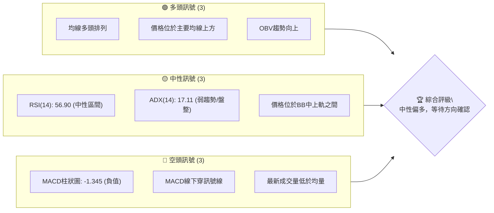

**儀表板解讀**：
*   **多頭訊號**：主要來自於股價對長期移動平均線的強勁支撐，MA20、MA50、MA200 均呈現多頭排列，且當前價格 $2465.00 遠高於所有關鍵均線。OBV 趨勢向上也顯示累積買盤力量仍占主導。
*   **中性訊號**：RSI 位於 56.90，既非超買也非超賣，顯示市場情緒相對平衡。ADX 低於 25，明確指出當前缺乏強勁單邊趨勢，可能處於盤整或區間震盪。價格位於布林通道中軌 $2402.95 和上軌 $2552.25 之間，也支持區間震盪的判斷。
*   **空頭訊號**：MACD 柱狀圖轉為負值 -1.345，且 MACD 線已下穿訊號線，這是一個短期的看跌交叉，表明短期動能有所減弱。此外，最新成交量 23,373,702 遠低於 20 日均量 33,021,538，顯示當前上漲缺乏量能支持，需警惕無量上漲或量縮回調的風險。

綜合來看，2330.TW 處於長期多頭趨勢下的短期盤整階段，多空力量拉鋸，需密切關注關鍵支撐與阻力位的表現。

### 📊 核心指標速覽表

| 指標類別 | 指標名稱 | 當前數值 | 訊號 | 解讀 |
|----------|----------|----------|------|------|
| **價格** | 當前價格 | $2465.00 | 🟡 | 位於52週高點區間 (95.3%)，接近短期阻力 |
| **均線** | MA20 | $2402.95 | 🟢 | 價格位於MA20上方，短期趨勢偏多 |
| **均線** | MA50 | $2323.65 | 🟢 | 價格位於MA50上方，中期趨勢強勁 |
| **均線** | MA200 | $1795.15 | 🟢 | 價格位於MA200上方，長期趨勢非常強勁 |
| **動能** | RSI(14) | 56.90 | 🟡 | 中性區間，未超買或超賣 |
| **動能** | MACD | MACD線: 43.522<br>訊號線: 44.867<br>柱狀圖: -1.345 | 🔴 | MACD線下穿訊號線，短期動能轉弱，柱狀圖為負 |
| **波動** | ATR(14) | $64.64 | 🟡 | 每日波動約 2.62%，波動率中等 |
| **趨勢** | ADX(14) | 17.11 | 🟡 | 趨勢強度較弱，可能處於盤整階段 |
| **量能** | 最新成交量 | 23,373,702 | 🔴 | 低於20日均量 (0.71x)，量能萎縮 |

### 🏆 技術評分卡

```
╔══════════════════════════════════════════════════════════════╗
║              技術評分卡 — 2330.TW (2026-07-08)                 ║
╠══════════════════════════════════════════════════════════════╣
║ 趨勢強度      ███░░░░░░░░░░░░░░░░░░  30/100  🟡 (ADX<25, 趨勢不明顯) ║
║ 動能指標      █████░░░░░░░░░░░░░░░░  50/100  🟡 (RSI中性, MACD短期轉弱)║
║ 支撐穩定度    ██████████████░░░░░░  70/100  🟢 (遠離主要支撐位)       ║
║ 成交量配合    ██████░░░░░░░░░░░░░░  40/100  🔴 (現量縮, 雖OBV趨勢向上)║
║ 形態完整度    ██████░░░░░░░░░░░░░░  60/100  🟡 (潛在整理形態)         ║
║ 均線排列      ████████████████░░░░  80/100  🟢 (標準多頭排列)         ║
╠══════════════════════════════════════════════════════════════╣
║ 綜合評分      ████████░░░░░░░░░░░░  60/100  🟡 中性偏多              ║
╚══════════════════════════════════════════════════════════════╝
```

**評分卡總結**：
2330.TW 的綜合技術評分為 60/100，屬於「中性偏多」。雖然均線系統展現極強的多頭趨勢，且股價距離主要支撐位較遠，為多頭提供了堅實的基礎。然而，當前趨勢強度較弱 (ADX < 25)，動能指標 (MACD) 短期轉弱，且成交量萎縮，顯示市場在接近歷史高點時出現猶豫和整理。這表明儘管長期看漲，但短期內可能面臨盤整或小幅回調的壓力，需要等待新的催化劑或方向性突破。

---

## 2. 趨勢分析

本章將從多時框架角度深入剖析 2330.TW 的價格走勢，從長期宏觀趨勢到短期微觀動態，以確立其當前的市場定位。

### 🌐 多時框趨勢分析

透過月線、週線、日線層層遞進的分析，我們可以更全面地理解 2330.TW 的趨勢結構。

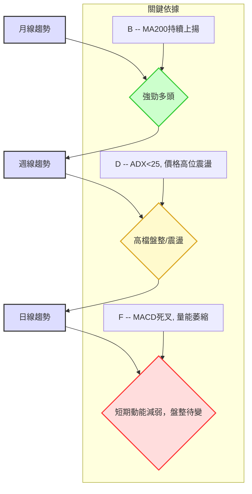

**多時框解讀**：
*   **月線趨勢 (長期)**：從過去 24 個月的歷史數據來看，2330.TW 呈現出非常強勁的長期上漲趨勢，尤其在 2025 年下半年及 2026 年上半年加速上行，創下歷史新高。主要均線（如 MA200）持續向上，反映了強大的基本面和市場信心。
*   **週線趨勢 (中期)**：近 20 週的收盤價數據顯示，股價在經歷 2026 年 2 月至 3 月的回調後，於 4 月至 5 月再次強勁上攻，並在 5 月下旬達到 $2348.73 的高點。隨後至今，股價在高位 $2300 - $2465 區間進行整理，呈現高檔盤整或震盪走勢，缺乏明確的單邊方向。
*   **日線趨勢 (短期)**：雖然當前價格 $2465.00 仍位於所有短期移動平均線上方，但 MACD 指標的短期死叉和柱狀圖轉負，以及成交量萎縮，都暗示短期上漲動能正在減弱。ADX 指標低於 25，進一步確認了日線級別的趨勢不明顯，可能進入橫向整理。

### 📈 長期趨勢 — 12個月走勢圖（Unicode）

以下是 2330.TW 過去 12 個月的月線收盤價走勢圖，清晰展示了其長期上漲的軌跡。
（註：圖中高低點為過去12個月月收盤價的實際高低點，非52週高低點）

```
2330.TW 月線走勢圖（過去12個月：2025-07 至 2026-07）
價格軸 ($)
$2465.00 ┤                                        ●(2026-07)
$2300.00 ┤                              ●(2026-05)  ●(2026-06)
$2100.00 ┤                  ●(2026-04)
$1900.00 ┤            ●(2026-02)        ●(2026-03)
$1700.00 ┤        ●(2026-01)
$1500.00 ┤      ●(2025-12)
$1300.00 ┤    ●(2025-09)  ●(2025-10)  ●(2025-11)
$1100.00 ┤●(2025-07) ●(2025-08)
         └───────────────────────────────────────
          25-07  25-08  25-09  25-10  25-11  25-12  26-01  26-02  26-03  26-04  26-05  26-06  26-07
                                                 (月份)
```

**走勢特徵分析表格**：

| 時間區間 | 起始價 | 結束價 | 漲跌幅 | 走勢特徵 |
|----------|--------|--------|--------|----------|
| 2025-07至2025-10 | $1144.74 | $1486.19 | +29.82% | 穩步上漲，突破多個阻力位，多頭趨勢確立。 |
| 2025-10至2025-11 | $1486.19 | $1426.74 | -3.99% | 短暫回調，但未跌破關鍵支撐，顯示市場健康調整。 |
| 2025-11至2026-02 | $1426.74 | $1983.22 | +39.01% | 強勁加速上漲，突破性行情，市場情緒高漲。 |
| 2026-02至2026-03 | $1983.22 | $1755.32 | -11.59% | 較大幅度回調，市場獲利了結壓力顯現，但未破壞長期趨勢。 |
| 2026-03至2026-07 | $1755.32 | $2465.00 | +40.43% | 再次強勢反彈並創歷史新高，但在 $2400 上方呈現高位整理。 |

### 📊 中期趨勢（週線分析）

中期週線走勢顯示，2330.TW 在經歷 2026 年 3 月的回調後，成功築底並再次向上突破，目前在高位進行震盪整理。

```
2330.TW 近期週線壓力與支撐示意圖
價格軸 ($)
$2535.00 ┤              R1 (52W 高點)
$2520.00 ┤─────────────── 阻力 R1 (波段高點聚類)
$2465.00 ┤       ● (現價)
$2402.95 ┤─────── MA20 (週線中軸)
$2325.00 ┤─────────────── 支撐 S1 (波段低點聚類)
$2283.86 ┤─────── MA60 (中期趨勢線)
$2194.59 ┤─────────────── 支撐 S2 (次要支撐)
$2000.00 ┤
     └───────────────────────────────────
           (時間軸)

```
**中期趨勢解讀**：
從週線角度看，股價在 2026 年 3 月初觸及 $1835.10 (最低週收盤價) 附近後，迅速反彈並在 4 月底突破 $2000 關口。隨後在 5 月初達到 $2283.91，並在 5 月底衝高至 $2348.73。最近幾週，價格在 $2310.00 至 $2465.00 之間波動，未能有效突破 $2520.00 的短期阻力 R1，顯示中期動能有所放緩，進入震盪整理區間。MA20 ($2402.95) 和 MA60 ($2283.86) 均線持續向上，為股價提供了良好的中期支撐。

### ⚡ 趨勢強度評估（ADX 解讀）

ADX (Average Directional Index) 用於衡量趨勢的強度，而非方向。

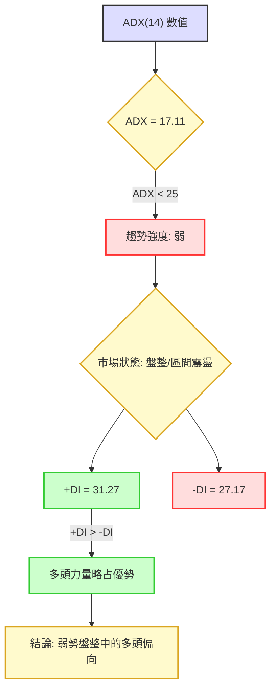

**ADX 強度對照表**：

| ADX 數值 | 趨勢強度 | 市場狀態 | 建議策略 |
|----------|----------|----------|----------|
| 0-25     | 弱趨勢   | 盤整/區間震盪 | 觀望或區間操作 |
| 25-50    | 中等趨勢 | 明顯趨勢 | 順勢交易 |
| 50-75    | 強趨勢   | 強勁趨勢 | 順勢交易，注意過熱 |
| 75-100   | 極強趨勢 | 趨勢極強 | 順勢交易，警惕反轉 |

**ADX 解讀**：
當前 2330.TW 的 ADX(14) 數值為 17.11，明顯低於 25 的閾值。這明確指示市場目前處於**弱趨勢或盤整行情**。換言之，股價缺乏一個強勁的單邊方向。
儘管 ADX 顯示趨勢強度不足，但 +DI (31.27) 略高於 -DI (27.17)，這表明在當前的盤整格局中，多頭力量稍微佔據優勢。因此，市場可能傾向於在一個區間內向上震盪，或在突破時更容易選擇向上。交易者應避免追高殺跌，更適合採用區間操作策略，或等待 ADX 數值重新站上 25 並確認趨勢方向後再進行順勢交易。

---

## 3. 圖表形態分析

本章將嘗試識別 2330.TW 當前的圖表形態，並評估其潛在的價格目標。由於僅提供收盤價和有限的週線數據，複雜的幾何形態識別將保持謹慎，並主要關注較為明顯的價格行為。

### 🔍 形態識別系統

根據提供的月線和週線收盤價數據，2330.TW 在過去幾個月呈現出高位整理的態勢。從 2026 年 4 月至 7 月，股價從 $2129.32 上漲至 $2465.00，期間經歷了幾次小幅回調，但每次回調都在高位獲得支撐。這可能正在形成一個**上升旗形 (Bull Flag)** 或 **上升三角形 (Ascending Triangle)** 的整理形態。

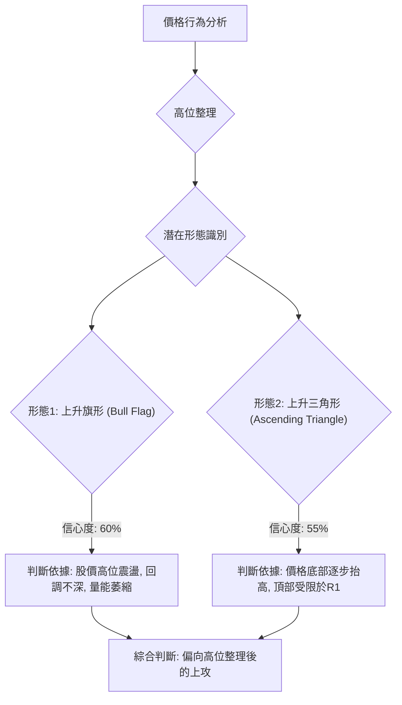

**形態信心度表格**：

| 形態 | 信心度 | 判斷依據（引用數據） | 完成度 | 目標價（附計算式） |
|------|--------|----------------------|--------|--------------------|
| 上升旗形 (Bull Flag) | 60% | 股價在 2026-04 $2129.32 至 2026-07 $2465.00 之間呈現高位整理，回調幅度有限，且成交量在整理期間萎縮（最新成交量 23,373,702 低於 20日均量 33,021,538），符合旗形整理的量價特徵。 | 70% | **旗桿高度**：從 2026-03 低點 $1755.32 至 2026-04 高點 $2129.32 (約 $374)。<br>**突破點**：假設突破 R1 $2520.00。<br>**目標價**：$2520.00 + $374 = **$2894.00** |
| 上升三角形 (Ascending Triangle) | 55% | 價格在 $2325.00 (S1) 附近獲得支撐，底部逐步抬高，而上方 $2520.00 (R1) 形成水平阻力。 | 65% | **三角形高度**：假設底部約為 $2325.00，頂部為 $2520.00 (約 $195)。<br>**突破點**：假設突破 R1 $2520.00。<br>**目標價**：$2520.00 + $195 = **$2715.00** |
| 其他複雜形態 (如頭肩頂/底、雙頂/底) | < 30% | 數據不足以支持清晰的肩部或雙重頂/底結構。僅有月度/週度收盤價，缺乏日內或實時 OHLCV 數據，難以精確識別。 | N/A | 數據中未偵測到 |

**備註**：由於缺乏完整的 K 線數據，上述形態判斷主要基於收盤價趨勢和量能變化，信心度適中。若能獲得完整 OHLCV 數據，形態判斷將更為精確。

### 🕯️ 重要K線形態分析

由於僅提供週收盤價，無法分析單根 K 線的形態（如錘子線、吞噬形態等）。我們將觀察連續週收盤價的變化來推斷市場情緒。

| 月份 (最近20週) | 收盤價 | K線形態 (基於週收盤價序列) | 解讀 | 訊號 |
|-----------------|--------|------------------------------|------|------|
| 2026-03-01      | 1983.22 | 長陽線後高位震盪             | 前期強勢上漲，動能充沛。 | 🟢 |
| 2026-03-08      | 1878.84 | 陰線回調                     | 獲利了結，市場開始調整。 | 🔴 |
| 2026-03-15      | 1853.99 | 陰線整理                     | 繼續消化賣壓，尋找支撐。 | 🔴 |
| 2026-03-22      | 1835.10 | 陰線整理                     | 跌勢趨緩，接近底部。 | 🔴 |
| 2026-03-29      | 1815.16 | 陽線反彈 (假定)              | 底部買盤介入，短暫反彈。 | 🟡 |
| 2026-04-05      | 1805.18 | 陰線回落                     | 反彈失敗，繼續探底。 | 🔴 |
| 2026-04-12      | 1994.68 | 長陽線突破                   | 強勢反轉，突破前期壓力。 | 🟢 |
| 2026-04-19      | 2024.60 | 陽線繼續上漲                 | 多頭延續，趨勢確立。 | 🟢 |
| 2026-04-26      | 2179.19 | 強勁陽線上攻                 | 加速上漲，突破動能強勁。 | 🟢 |
| 2026-05-03      | 2129.32 | 陰線回調                     | 獲利了結，但整體趨勢未變。 | 🟡 |
| 2026-05-10      | 2283.91 | 長陽線再創新高               | 多頭強勢，延續漲勢。 | 🟢 |
| 2026-05-17      | 2258.97 | 陰線回調                     | 調整，但未跌破關鍵支撐。 | 🟡 |
| 2026-05-24      | 2249.00 | 陰線整理                     | 繼續整理，動能放緩。 | 🟡 |
| 2026-05-31      | 2348.73 | 陽線突破                     | 突破整理區間，再次上攻。 | 🟢 |
| 2026-06-07      | 2358.71 | 陽線延續                     | 上漲動能持續。 | 🟢 |
| 2026-06-14      | 2310.00 | 陰線回調                     | 獲利了結，回落至整理區間。 | 🔴 |
| 2026-06-21      | 2410.00 | 陽線反彈                     | 再次向上測試阻力。 | 🟢 |
| 2026-06-28      | 2340.00 | 陰線回落                     | 測試支撐，短期動能減弱。 | 🔴 |
| 2026-07-05      | 2445.00 | 陽線反彈                     | 再次向上測試阻力。 | 🟢 |
| 2026-07-12      | 2465.00 | 小陽線 (本週收盤價)          | 繼續在高位震盪，多空拉鋸。 | 🟡 |

### 📉 ASCII 走勢形態示意圖

以下示意圖繪製了近期潛在的上升旗形整理形態，標注了關鍵點位。

```
2330.TW 潛在上升旗形形態示意圖
價格軸 ($)
$2520.00 ┤─────────────── 阻力 R1 (旗形上沿/三角形上沿)
         │              ／
$2465.00 ┤             ● (現價)
         │           ／
$2400.00 ┤         ／
         │       ／
$2325.00 ┤─────── 支撐 S1 (旗形下沿/三角形下沿)
         │     ／
$2200.00 ┤   ／
         │ ／
$2129.32 ┤● (2026-04 起點)
$1755.32 ┤●─────── (旗桿底部 2026-03)
         └───────────────────────────────────
           (時間軸)

```
**形態解讀**：
從 2026 年 3 月底至 4 月初，股價從 $1755.32 快速拉升至 $2129.32，形成旗桿。隨後進入高位整理，在 $2325.00 (S1) 附近獲得支撐，並在 $2520.00 (R1) 附近遭遇阻力。目前的價格 $2465.00 正處於這個整理區間的上半部分，等待選擇方向。若能有效突破 $2520.00，則旗形形態將被確認，並有望向上發力。反之，若跌破 $2325.00，則形態失效，可能轉為深度回調。

### 🎯 形態目標價計算

基於上述潛在的圖表形態，我們計算其目標價：

1.  **上升旗形目標價**：
    *   **旗桿高度**：計算旗形形成前一波上漲的幅度。我們取 2026 年 3 月的低點 $1755.32 作為旗桿底部，至 2026 年 4 月的高點 $2129.32 作為旗桿頂部。
        *   旗桿高度 = $2129.32 - $1755.32 = $374.00
    *   **突破點**：假設股價能有效突破短期阻力 R1 $2520.00。
    *   **目標價**：突破點 + 旗桿高度 = $2520.00 + $374.00 = **$2894.00**

2.  **上升三角形目標價**：
    *   **三角形高度**：在形態最寬處（通常是形態開始處）的垂直距離。假設底部約為 S1 $2325.00，頂部約為 R1 $2520.00。
        *   三角形高度 = $2520.00 - $2325.00 = $195.00
    *   **突破點**：假設股價能有效突破水平阻力 R1 $2520.00。
    *   **目標價**：突破點 + 三角形高度 = $2520.00 + $195.00 = **$2715.00**

這兩個形態的目標價均指向 $2700-$2900 區間，顯示一旦突破整理區間，上方仍有較大的潛在空間。然而，這僅是基於形態的理論推算，實際走勢仍需結合市場整體環境與量能變化。

---

## 4. 支撐與阻力

支撐與阻力位是技術分析的基石，它們標示了價格可能反轉或加速的關鍵區域。本章將詳細分析 2330.TW 的關鍵價位。

### 🗺️ 關鍵價位分布圖（Unicode）

以下是 2330.TW 當前的價位結構分布圖，清晰標示了各級阻力與支撐位。

```
2330.TW 價位結構分布圖
═══════════════════════════════════════════════════
$2552.25 ║▓▓▓▓▓▓▓▓▓▓▓▓▓▓▓▓▓▓▓▓▓▓▓▓║ BB上軌
$2535.00 ║████████████████████████║ 52W 高點 (強阻力 R_High)
$2520.00 ║████████████████████████║ 關鍵阻力 R1
$2465.00 ╠════════════════════════╣ ◄ 現價
$2402.95 ║▓▓▓▓▓▓▓▓▓▓▓▓▓▓▓▓        ║ BB中軌 (MA20)
$2325.00 ║▓▓▓▓▓▓▓▓▓▓▓▓▓▓▓▓▓▓▓▓▓▓▓▓║ 近期支撐 S1
$2253.65 ║▓▓▓▓▓▓▓▓▓▓▓▓▓▓▓▓▓▓▓▓▓▓▓▓║ BB下軌
$2194.59 ║████████████████████████║ 強支撐 S2 (斐波那契23.6%重疊)
$2182.44 ║▓▓▓▓▓▓▓▓▓▓▓▓▓▓▓▓▓▓▓▓▓▓▓▓║ 斐波那契23.6%回調
$1964.34 ║▓▓▓▓▓▓▓▓▓▓▓▓▓▓▓▓▓▓▓▓▓▓▓▓║ 斐波那契38.2%回調
$1788.06 ║▓▓▓▓▓▓▓▓▓▓▓▓▓▓▓▓▓▓▓▓▓▓▓▓║ 斐波那契50.0%回調
$1748.20 ║████████████████████████║ 強支撐 S3
$1611.78 ║▓▓▓▓▓▓▓▓▓▓▓▓▓▓▓▓▓▓▓▓▓▓▓▓║ 斐波那契61.8%回調
$1360.81 ║▓▓▓▓▓▓▓▓▓▓▓▓▓▓▓▓▓▓▓▓▓▓▓▓║ 斐波那契78.6%回調
$1041.12 ║████████████████████████║ 52W 低點 (極強支撐 S_Low)
═══════════════════════════════════════════════════
```

**價位分布圖解讀**：
當前價格 $2465.00 位於關鍵阻力 R1 $2520.00 之下，同時受到 BB 上軌 $2552.25 和 52 週高點 $2535.00 的共同壓制。下方則有 MA20 $2402.95 提供短期支撐，以及重要的近期支撐 S1 $2325.00。更深層的支撐位於 S2 $2194.59 和斐波那契 23.6% 回調位 $2182.44 附近，這兩個價位形成了強勁的支撐區間。

### 🚧 阻力位分析表

| 阻力級別 | 價位 | 形成原因 | 突破難度 | 重要性 |
|----------|------|----------|----------|--------|
| **R1 (短期阻力)** | $2520.00 | 近一年波段高點聚類，市場心理關口。 | 中等偏高 | **高**：突破此價位將確認短期上漲動能，並可能挑戰歷史新高。 |
| **52W High (強阻力)** | $2535.00 | 過去 52 週的最高價，代表市場對當前價格區間的最高認可度。 | 高 | **非常高**：突破 52 週高點通常會引發追漲買盤，開啟新的上漲空間。 |
| **BB上軌** | $2552.25 | 布林通道上軌，通常作為股價波動的上限，觸及可能引發回調。 | 中等偏高 | **高**：突破並站穩 BB 上軌，可能預示著強勢的趨勢行情。 |

**阻力分析**：
2330.TW 正面臨 $2520.00 的短期阻力，以及 $2535.00 的 52 週高點和 $2552.25 的布林通道上軌的共同壓制。這形成了一個相對密集的阻力區間，價格若要進一步上漲，需要強勁的買盤和量能配合才能有效突破。未能突破可能導致在高位區間震盪或回調。

### 🛡️ 支撐位分析表

| 支撐級別 | 價位 | 形成原因 | 守住機率 | 重要性 |
|----------|------|----------|----------|--------|
| **MA20 (短期支撐)** | $2402.95 | 20 日移動平均線，短期趨勢的動態支撐。 | 中等 | **中**：短期回調的第一道防線，跌破可能預示短期動能轉弱。 |
| **S1 (關鍵支撐)** | $2325.00 | 近一年波段低點聚類，市場心理關口。 | 中等偏高 | **高**：此為近期整理區間的下沿，守住 S1 對維持多頭格局至關重要。 |
| **S2 (強支撐)** | $2194.59 | 近一年波段低點聚類，與斐波那契 23.6% 回調位 $2182.44 形成重疊區間。 | 高 | **非常高**：此區間是重要回調支撐，若跌破可能引發更大幅度的下探。 |
| **斐波那契 23.6%** | $2182.44 | 52 週高低點回調的黃金比例，技術面重要支撐。 | 高 | **高**：通常是強勢股回調的極限位置之一，跌破則需警惕。 |
| **S3 (極強支撐)** | $1748.20 | 更深層次的波段低點聚類，代表中期趨勢的關鍵防線。 | 非常高 | **極高**：若跌破 S3，則中期趨勢可能轉為空頭，需重新評估。 |

**支撐分析**：
2330.TW 在下方擁有 $2402.95 的 MA20 短期支撐。更為關鍵的支撐位於 $2325.00 (S1)，這是近期整理區間的底部。若 S1 失守，則 $2194.59 (S2) 和斐波那契 23.6% 回調位 $2182.44 構成的強勁支撐區間將是重要的防線。這些支撐位提供了多重保護，顯示股價在回調時有較強的承接力。

### 📐 斐波那契回調位分析

斐波那契回調位是基於 52 週高點 $2535.00 和 52 週低點 $1041.12 計算得出的，用於識別潛在的支撐與阻力區域。

| 回調比例 | 價位 | 意義 |
|----------|------|------|
| 0.0% (52W High) | $2535.00 | 當前上漲波段的頂部，強阻力。 |
| 23.6%            | $2182.44 | 若從高點回調，此為第一個重要支撐位，通常出現在強勢股的健康回調中。 |
| 38.2%            | $1964.34 | 第二個重要支撐位，若跌破 23.6%，此處可能提供更強的買盤。 |
| 50.0%            | $1788.06 | 中位回調，通常意味著之前的上漲動能已消耗一半，市場重新評估。 |
| 61.8%            | $1611.78 | 黃金比例回調位，極其重要的支撐，跌破此位可能預示趨勢反轉。 |
| 78.6%            | $1360.81 | 深度回調位，接近前一個波段的底部。 |
| 100.0% (52W Low) | $1041.12 | 當前上漲波段的底部，極強支撐。 |

**斐波那契回調位解讀**：
當前價格 $2465.00 位於 52 週高點 $2535.00 和 23.6% 回調位 $2182.44 之間。這表明股價在經歷大幅上漲後，目前處於高位整理階段，尚未觸及重要的斐波那契回調支撐。
*   若股價開始回調，23.6% 回調位 $2182.44 將是第一個值得關注的支撐，這與強支撐 S2 $2194.59 形成一個強勁的支撐區間。
*   守住 23.6% 回調位將維持強勢上漲趨勢的判斷。若跌破，則可能進一步下探 38.2% 回調位 $1964.34，甚至 50.0% 回調位 $1788.06。

---

## 5. 技術指標深度解讀

本章將對 2330.TW 的主要技術指標進行細緻入微的分析，包括移動平均線、RSI、MACD、布林通道和成交量，並探討它們之間的相互確認或矛盾。

### 🎛️ 指標訊號總覽

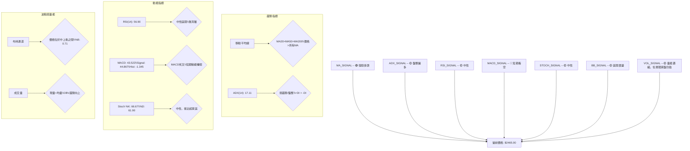

**指標訊號總覽解讀**：
整體而言，2330.TW 的技術指標呈現出多空交織的複雜局面。長期均線系統發出強烈的多頭訊號，表明股價的長期上升趨勢未變。然而，ADX 指標的低位運行和 MACD 的短期死叉，暗示短期內市場缺乏明確方向，動能有所減弱，可能正在經歷高位盤整。成交量萎縮則為短期上漲帶來隱憂，但 OBV 的持續向上又顯示累積買盤仍佔優勢。

### 📈 移動平均線排列分析

移動平均線 (MA) 是判斷趨勢方向和強度的重要工具。

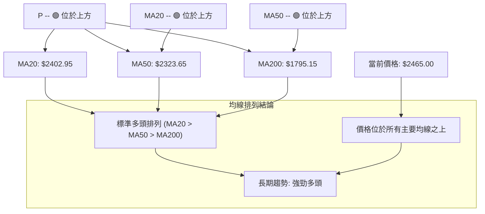

**移動平均線分析**：
*   **均線排列**：2330.TW 的均線系統呈現完美的「多頭排列」，即 MA20 ($2402.95) > MA50 ($2323.65) > MA200 ($1795.15)。這是一個非常強勁的看漲訊號，表明短期、中期、長期趨勢均向上。
*   **價格與均線關係**：當前價格 $2465.00 位於所有移動平均線之上，且距離 MA200 甚遠，這進一步確認了其強勁的長期上升趨勢。MA20 ($2402.95) 作為短期支撐，MA50 ($2323.65) 作為中期支撐，為股價提供了堅實的底部。
*   **結論**：均線系統發出強烈的多頭訊號，支持長期看漲的觀點。任何向均線的回調都可能被視為買入機會。

### 📉 RSI(14) 分析

RSI (Relative Strength Index) 用於衡量價格變動的速度和變化，反映市場的超買或超賣狀態。

**RSI(14) 數值進度條**：
RSI(14): 56.90 ▓▓▓▓▓▓▓▓▓▓▓░░░░░░░░░░ 56.9% 🟡

**RSI 分析**：
*   **數值**：當前 RSI(14) 為 56.90，位於中性區間 (30-70)。這表示股價既未處於超買狀態 (通常 > 70)，也未處於超賣狀態 (通常 < 30)。市場情緒相對平衡，多空力量處於拉鋸狀態。
*   **超買超賣區間分析**：由於 RSI 未進入超買區，表明短期內沒有因過熱而立即回調的風險。同時，未進入超賣區也排除了股價已嚴重低估的可能性。
*   **RSI 背離**：根據提供的數據，**未偵測到明顯的 RSI 頂背離或底背離訊號**。價格在高位盤整，RSI 也大致在高位中性區間震盪，沒有出現價格創新高但 RSI 未創新高，或價格創新低但 RSI 未創新低的背離現象。因此，RSI 目前未能提供明確的方向性指引，但其中性位置與 ADX 的盤整訊號相符。

### 📊 MACD(12/26/9) 訊號解讀

MACD (Moving Average Convergence Divergence) 用於識別趨勢的變化、方向、動量和持續時間。

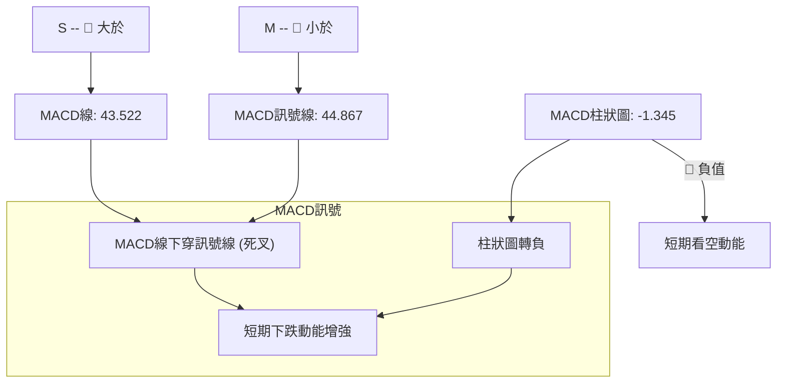

**MACD 分析**：
*   **MACD 線與訊號線**：當前 MACD 線 (43.522) 位於訊號線 (44.867) 之下。這形成了**MACD 死叉 (Death Cross)**，是一個短期的看跌訊號。這表明短期動能已從前期的強勁上漲轉為減弱，賣壓開始顯現。
*   **MACD 柱狀圖**：MACD 柱狀圖為 -1.345，轉為負值。這進一步確認了 MACD 線已下穿訊號線，顯示短期空頭動能正在增強。柱狀圖的負值擴大將意味著下跌動能的進一步加劇。
*   **背離判斷**：根據提供的數據，**未偵測到明顯的 MACD 頂背離或底背離訊號**。價格在高位盤整，MACD 也在此區域形成了短期死叉，並未出現價格創新高但 MACD 未創新高，或價格創新低但 MACD 未創新低的背離現象。
*   **結論**：MACD 指標發出明確的短期看跌訊號，與均線系統的強勁多頭形成對比。這強調了 2330.TW 雖然長期趨勢向上，但短期內面臨回調或盤整的風險。

### 📦 布林通道分析

布林通道 (Bollinger Bands) 用於衡量價格的波動區間和相對高低。

```
2330.TW 布林通道示意圖
═══════════════════════════════════════════════════
$2552.25 ║████████████████████████║ BB上軌 (壓力)
         ║                        ║
$2465.00 ╠════════════════════════╣ ◄ 現價
         ║                        ║
$2402.95 ║▓▓▓▓▓▓▓▓▓▓▓▓▓▓▓▓        ║ BB中軌 (MA20, 支撐)
         ║                        ║
$2300.00 ║                        ║
         ║                        ║
$2253.65 ║████████████████████████║ BB下軌 (支撐)
═══════════════════════════════════════════════════
```

**布林通道分析**：
*   **通道位置**：當前價格 $2465.00 位於布林通道中軌 ($2402.95) 和上軌 ($2552.25) 之間，且更靠近上軌。BB %B 數值為 0.71，表示價格位於通道的 71% 位置，顯示股價相對偏強。
*   **通道寬度**：從提供的數據無法直接判斷布林通道的寬度變化，但 ATR(14) $64.64 (2.62% of price) 顯示波動率中等。若通道收窄，則預示著即將到來的趨勢突破；若通道擴張，則表示趨勢正在形成。
*   **結論**：價格位於中軌上方，表明短期趨勢偏多。但接近上軌且 ADX 趨勢強度較弱，可能意味著股價在高位震盪，難以立即向上突破。中軌 $2402.95 將作為重要的短期支撐。

### 💹 成交量分析（量價配合度）

成交量是價格走勢的「燃料」，其變化對於確認價格趨勢至關重要。

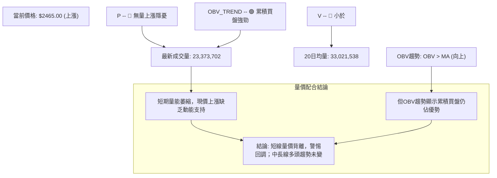

**成交量分析**：
*   **量能萎縮**：最新成交量為 23,373,702，顯著低於 20 日均量 33,021,538 (量比 0.71x)。這是一個**短期量價背離**的訊號，即價格上漲但成交量未能配合放大。無量上漲通常被視為不可持續的，可能預示著上漲動能不足，容易出現回調。
*   **OBV 趨勢**：然而，OBV 趨勢顯示「OBV > MA → 量能支撐上漲」。這說明儘管短期成交量萎縮，但從累積成交量的角度來看，買盤力量仍然佔據主導地位，累積的量能是支持股價上漲的。這與 MACD 的短期看空訊號形成矛盾，但與長期均線的多頭排列相符。
*   **結論**：短期內，量能萎縮對當前價格的上漲構成隱憂，可能限制其進一步突破阻力。但 OBV 的積極趨勢表明，一旦市場信心恢復或有新的利好消息，累積的買盤仍有能力推動股價上漲。交易者應警惕短期回調，但對中長期走勢保持樂觀。

---

## 6. 動能與波動率

本章將分析 2330.TW 的動能強度和波動率特性，這對於理解其價格行為和風險管理至關重要。

### ⚡ 動能評估四象限

動能評估四象限分析通常將股票分為四類：強動能低波動 (Q1, 最佳)、弱動能低波動 (Q2, 謹慎)、強動能高波動 (Q3, 高風險高收益)、弱動能高波動 (Q4, 避免)。

| 象限 | 動能 | 波動 | 當前狀態 | 評估 |
|------|------|------|----------|------|
| Q1   | 強   | 低   | -        | 最佳機會 (股價穩定上漲) |
| Q2   | 弱   | 低   | -        | 謹慎觀望 (盤整，等待方向) |
| Q3   | 強   | 高   | -        | 高風險高收益 (趨勢強勁但波動大) |
| Q4   | 弱   | 高   | -        | 避免進場 (方向不明，風險高) |

**當前 2330.TW 評估**：
*   **動能**：
    *   長期均線多頭排列：強動能
    *   RSI(14) 56.90：中性動能
    *   MACD 死叉，柱狀圖為負：短期弱動能
    *   成交量萎縮：弱動能
    *   綜合判斷：長期動能強勁，但短期動能轉弱，整體為**中等偏弱動能**。
*   **波動**：
    *   ATR(14) $64.64 (2.62% of price)：**中等波動**。相較於其價格，每日波動幅度尚在可接受範圍，但也不算極低。

基於以上判斷，2330.TW 目前處於**中等偏弱動能、中等波動**的狀態。這將其定位在 Q2 (弱動能低波動) 和 Q3 (強動能高波動) 之間的模糊地帶，更偏向**Q2 謹慎觀望**。股價在高位整理，缺乏明確的短期動能，且波動率適中。這意味著當前市場尚未形成明確的趨勢性交易機會，更適合觀望或進行區間操作，等待動能重新積聚或波動率降低。

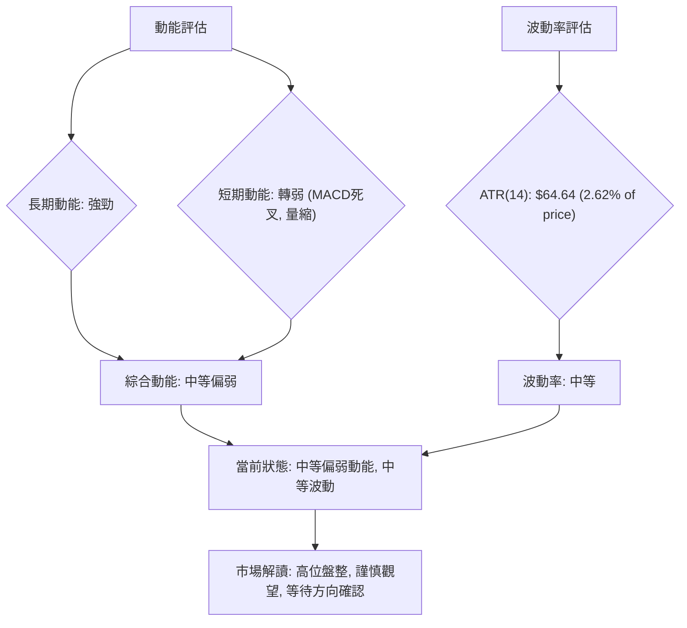

### 📊 ATR 波動率分析

ATR (Average True Range) 用於衡量資產價格的波動性。

*   **ATR(14) 數值**：$64.64
*   **佔股價比例**：$64.64 / $2465.00 = 2.62%

**ATR 分析**：
2330.TW 的 ATR(14) 為 $64.64，佔當前價格的 2.62%。這個數值表示在過去 14 個交易日中，2330.TW 平均每天的價格波動範圍約為 $64.64。
*   **波動率評估**：2.62% 的每日波動率屬於**中等水平**。這意味著股票既不是極端平靜，也不是劇烈波動。對於日內或短期交易者而言，這提供了足夠的波動空間來進行操作，但同時也需要注意風險。
*   **止損距離建議**：ATR 是設定止損點的有效參考。一般建議將止損點設置在當前價格下方 1.5 到 3 倍 ATR 的位置。
    *   1.5x ATR = 1.5 * $64.64 = $96.96
    *   2.0x ATR = 2.0 * $64.64 = $129.28
    *   2.5x ATR = 2.5 * $64.64 = $161.60
    *   3.0x ATR = 3.0 * $64.64 = $193.92
    *   如果考慮多頭策略，止損可以設置在 $2465.00 - $96.96 = $2368.04 左右，或更保守地考慮 $2465.00 - $129.28 = $2335.72 左右，這接近 S1 $2325.00。這為交易者提供了基於波動率的合理止損緩衝區，避免因正常市場波動而被洗出場。

### 📐 Beta 與市場相關性

*   **Beta 數值**：N/A

**Beta 分析**：
由於數據中未提供 Beta 數值，我們無法直接量化 2330.TW 與大盤的相關性。
*   **一般推測**：作為台灣市場的權值股龍頭，2330.TW 通常會與台灣加權指數 (TAIEX) 呈現高度正相關。其股價波動會對大盤產生顯著影響，同時也容易受大盤整體情緒的帶動。
*   **意義**：如果其 Beta 值接近 1，則表明其波動性與大盤大致相同。若 Beta > 1，則波動性大於大盤；若 Beta < 1，則波動性小於大盤。在缺乏具體數據的情況下，投資者應假設其與大盤走勢高度相關，並在制定策略時考慮大盤的整體風險和趨勢。

---

## 7. 多時框架總結

本章將整合前述所有時框架的分析結果，形成一個全面的評分表，並根據多時框收斂規則給出最終的市場判斷。

### 📋 時框架評分表

| 時框架 | 趨勢方向 | 動能 | 均線排列 | 形態 | 綜合評分 | 建議 |
|--------|----------|------|----------|------|----------|------|
| **長期** | 🟢 強勁多頭 | 🟢 強勁   | 🟢 多頭排列 | 🟢 上升趨勢 | 90/100 | 穩健持有 |
| **中期** | 🟡 高位盤整 | 🟡 中性   | 🟢 多頭排列 | 🟡 整理形態 | 70/100 | 區間操作 |
| **短期** | 🟡 盤整待變 | 🔴 轉弱   | 🟢 多頭排列 | 🟡 整理形態 | 55/100 | 謹慎觀望 |

### 🔲 綜合訊號矩陣

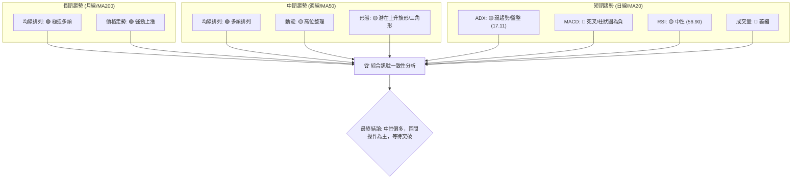

**綜合訊號矩陣解讀**：
*   **長期與中期**：長期和中期趨勢訊號高度一致，均線系統呈現強勁多頭排列，價格保持在主要均線上方。這為 2330.TW 提供了堅實的上升基礎。
*   **短期**：短期訊號則顯示出矛盾。ADX 指標低於 25，表明當前市場缺乏強勁趨勢，處於盤整狀態。MACD 的死叉和柱狀圖轉負，以及成交量萎縮，都指向短期動能減弱和潛在的回調風險。RSI 則保持中性。
*   **一致性**：長期和中期趨勢的看漲訊號與短期動能的減弱訊號之間存在明顯的矛盾。這表明股價在經歷大幅上漲後，正在進行高位整理，多空雙方力量均衡，等待新的方向選擇。

### ⚖️ 多時框收斂結論

根據嚴格要求 14：當前 ADX(14) 為 17.11，明顯小於 25，這明確指出 2330.TW 處於**盤整行情 (Range-bound Market)**。

因此，應以**日線布林通道上下軌**為主要交易區間，進行區間操作。中長期（週線/MA50、MA200）方向仍為多頭，但日線只用於尋找進場時機和確認短期方向。

**最終結論**：
2330.TW 的長期和中期趨勢依然維持強勁的多頭格局，均線系統呈現健康的上升趨勢。然而，從短期來看，ADX 指標顯示趨勢強度不足，市場正處於高位盤整階段。MACD 指標的短期死叉和成交量萎縮，暗示短期動能有所減弱，存在回調壓力。

綜合多時框架分析，我們得出**中性偏多**的結論。雖然長期基本面和趨勢依然樂觀，但短期內股價缺乏明確的單邊趨勢，更可能在 $2325.00 (S1) 至 $2520.00 (R1) 之間進行區間震盪。交易者應以區間操作為主，等待價格有效突破關鍵阻力或跌破關鍵支撐，以確認新的方向。

---

## 8. 交易策略建議

本章將根據上述多時框分析的收斂結論，為 2330.TW 提出具體的交易策略，並詳細說明進場、止損、目標價及風險報酬比。

### 🗺️ 策略決策流程圖

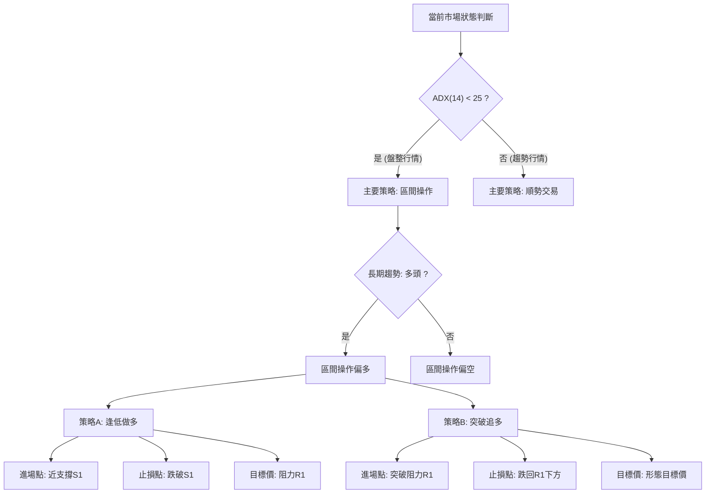

### 🧭 策略路由（依評分卡分流，不得兩頭下注）

**當前主策略方向 = 中性偏多，區間操作為主，等待突破確認（依評分 60/100）**

根據第 1 章的技術評分卡，綜合評分為 60/100，屬於「中性偏多」。結合第 7 章多時框收斂結論，ADX(14) < 25 判定為盤整行情，但長期趨勢仍為多頭，因此主策略應為**區間操作偏多**，並密切關注突破機會。

### 🎯 價格情境階梯（Price Scenarios）

| 觸發條件 | 下一目標 | 後續延伸 | 情境含義 |
|----------|----------|----------|----------|
| **突破 R1 $2520.00** | 52W High $2535.00 | 上升旗形/三角形目標價 $2715.00 - $2894.00 | 短線轉強，開啟新一輪上漲趨勢，挑戰歷史新高。 |
| **站穩現價區間 ($2402.95 - $2520.00)** | — | — | 區間震盪，等待市場選擇方向，可能重複測試 R1。 |
| **跌破 S1 $2325.00** | S2 $2194.59 (與斐波那契23.6% $2182.44 重疊) | S3 $1748.20 | 中期轉弱，可能引發較深的回調，需警惕。 |

### 📊 情境機率分佈

| 情境 | 機率 | 主要依據 |
|------|------|----------|
| 繼續上行 / 突破上漲 | 35% | 長期均線多頭排列、OBV趨勢向上、潛在上升旗形/三角形形態。 |
| 區間震盪 | 45% | ADX(14) 17.11 (弱趨勢)、RSI(14) 56.90 (中性)、價格位於布林通道中上軌之間、MACD短期轉弱。 |
| 回落 / 再探支撐 | 20% | MACD死叉且柱狀圖為負、最新成交量低於均量、接近短期阻力R1。 |

**機率分佈解讀**：
當前市場最有可能的情境是**區間震盪**，因為 ADX 指示趨勢不強，且多空指標相互矛盾。儘管短期有回調壓力，但長期多頭趨勢和累積買盤仍為上漲提供了潛力，因此突破上漲的機率次之。深度回調的機率相對較低，除非有重大利空消息或關鍵支撐被跌破。

### 🟢 主策略詳情（方向依上方路由）

鑑於當前市場為中性偏多、盤整行情，我們建議採取以下兩種策略：**區間逢低做多** 和 **突破追多**。

| 策略要素 | 策略 A：區間逢低做多 (主策略) | 策略 B：突破追多 (輔助策略) |
|----------|------------------------------|------------------------------|
| **進場條件** | 股價回落至 S1 附近並出現止跌訊號 | 股價有效突破 R1 $2520.00 並站穩 |
| **進場價格** | $2325.00 - $2350.00 | $2525.00 - $2530.00 (確認突破後) |
| **目標價 T1** | $2465.00 (現價/短期阻力) | $2715.00 (上升三角形形態目標) |
| **目標價 T2** | $2520.00 (R1) | $2894.00 (上升旗形形態目標) |
| **止損價格** | $2290.00 (略低於 S1 $2325.00，考慮 ATR 緩衝) | $2500.00 (跌回 R1 $2520.00 之下) |
| **風險報酬比** | (2520 - 2325) : (2325 - 2290) = **5.57 : 1** | (2715 - 2525) : (2525 - 2500) = **7.6 : 1** |
| **成功機率** | 60% (基於 S1 支撐強度及長期多頭趨勢) | 50% (突破不確定性較高，但一旦成功，空間大) |
| **建議倉位** | 中等倉位 (30-40%) | 較小倉位 (15-25%)，用於追蹤突破行情 |

**策略詳情解讀**：
*   **策略 A (區間逢低做多)**：這是在盤整行情中最為穩健的策略。當股價回調至 S1 $2325.00 附近時，由於該位置具有較強支撐，且與長期多頭趨勢不衝突，是較好的買入時機。止損設在 S1 之下，以防形態失效。目標價可先看現價 $2465.00 附近，再看 R1 $2520.00。
*   **策略 B (突破追多)**：若股價能帶量有效突破 R1 $2520.00，則可能確認上升旗形或上升三角形形態的完成，開啟一波新的上漲行情。此時可考慮追多，但需嚴格設置止損，以防假突破。目標價可參考形態計算出的 $2715.00 或 $2894.00。

### 🔴 反向風險觸發點（對沖提示）

以下是會推翻主策略（中性偏多，區間操作）的關鍵價位與訊號，應作為風險監控和對沖的參考：
*   **跌破 S1 $2325.00**：若股價有效跌破 S1 $2325.00，尤其是伴隨放量，將是短期轉弱的明確訊號，可能引發更多賣壓。
*   **MACD 柱狀圖持續放大負值**：若 MACD 柱狀圖持續向下擴展，表明空頭動能不斷增強，股價可能面臨更深的回調。
*   **ADX 轉為上升且 -DI 顯著高於 +DI**：若 ADX 開始上升（趨勢形成），同時空頭方向指標 -DI 顯著強於多頭 +DI，則可能預示著新的下跌趨勢正在形成。
*   **跌破 S2 $2194.59 和斐波那契 23.6% 回調位 $2182.44**：此為中期關鍵支撐區間，一旦跌破，多頭格局將受到嚴重挑戰，需考慮大幅減倉或反向操作。

### ⭐ 整體訊號強度評星

```
做多訊號強度：★★★☆☆  (3/5星) (長期趨勢強勁，但短期動能減弱，需等待機會)
做空訊號強度：★★☆☆☆  (2/5星) (短期有回調壓力，但主要支撐穩固，長期趨勢未變)
整體可信度：  ★★★☆☆  (3/5星) (多空訊號交織，需結合實時走勢和量能進一步確認)
```

---

## 9. 風險提示與監控

本章將闡述 2330.TW 面臨的主要風險，並提供一套監控指標清單和風險管理建議，以幫助投資者更好地應對市場的不確定性。

### ✅ 關鍵監控指標 Checklist

以下是交易者應密切關注的關鍵技術指標和價位，以應對市場變化：

```
╔══════════════════════════════════════════════════════════════╗
║              2330.TW 關鍵監控指標清單 (2026-07-08)             ║
╠══════════════════════════════════════════════════════════════╣
║ [ ] 價格是否有效突破 R1 $2520.00 (帶量突破視為強勁訊號)       ║
║ [ ] 價格是否跌破 S1 $2325.00 (放量跌破視為短期轉弱訊號)       ║
║ [ ] MACD 線是否重新上穿訊號線 (金叉，短期動能恢復)            ║
║ [ ] MACD 柱狀圖是否轉正並持續放大 (多頭動能增強)              ║
║ [ ] RSI(14) 是否進入超買區 (>70) 或超賣區 (<30)                ║
║ [ ] ADX(14) 是否上升並站上 25 (趨勢形成，判斷方向)             ║
║ [ ] 成交量是否在價格上漲時放大，下跌時縮小 (健康量價配合)     ║
║ [ ] 股價是否跌破 MA20 $2402.95 (短期趨勢轉弱警訊)              ║
║ [ ] 股價是否跌破 S2 $2194.59 (中期趨勢關鍵防線)                ║
╚══════════════════════════════════════════════════════════════╝
```

### ⚠️ 風險場景分析

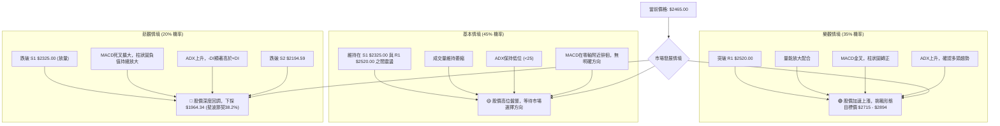

**風險場景分析**：
*   **樂觀情境**：若 2330.TW 能在短期內有效突破 $2520.00 的關鍵阻力 R1，並伴隨放大的成交量，同時 MACD 等動能指標轉強，ADX 重新確認趨勢，則股價有望開啟新一輪的強勁上漲，挑戰形態目標價 $2715.00 - $2894.00 區間。
*   **基本情境**：在當前 ADX 顯示弱趨勢的情況下，最可能的情境是股價繼續在 $2325.00 (S1) 和 $2520.00 (R1) 之間進行高位區間震盪。在此情境下，成交量可能持續萎縮，各種指標也將保持中性或缺乏明確方向。
*   **悲觀情境**：若 2330.TW 未能守住 $2325.00 (S1) 的關鍵支撐，尤其是伴隨放量跌破，且 MACD 空頭動能持續增強，ADX 確認下跌趨勢，則可能引發一波較深的回調。下一個重要支撐將是 $2194.59 (S2) 和斐波那契 23.6% 回調位 $2182.44。若此區間也失守，則悲觀情緒將加劇，可能進一步下探至 $1964.34 (斐波那契 38.2% 回調位)。

### 🛡️ 風險管理重要提醒

1.  **嚴格執行止損**：在當前盤整行情中，價格波動可能較大且方向不明。務必為每筆交易設置並嚴格執行止損，以限制潛在虧損。建議根據 ATR 數值或關鍵支撐位來確定止損點。
2.  **控制倉位**：在趨勢不明顯的盤整區間，應降低倉位，避免重倉操作。待趨勢明確後，再逐步增加倉位。
3.  **避免追漲殺跌**：在盤整行情中，價格容易在區間內來回波動，追漲殺跌往往容易被套。建議採取逢低買入、逢高賣出的區間操作策略。
4.  **關注量能變化**：量能是確認趨勢有效性的關鍵。若股價突破阻力時缺乏量能配合，則突破的有效性存疑；若跌破支撐時伴隨放量，則下跌動能可能較強。
5.  **不預設方向**：儘管長期趨勢偏多，但短期市場可能因各種消息面或技術面因素而改變方向。保持開放的心態，根據實時的技術訊號調整策略。
6.  **多時框架確認**：在做出交易決策前，應再次確認各時框架訊號的一致性。當日線與週線訊號衝突時，以 ADX 判斷當前市場屬性，並依據收斂規則進行決策。

---

## 📋 報告總結

```
╔══════════════════════════════════════════════════════════════╗
║              2330.TW 技術分析報告總結                          ║
╠══════════════════════════════════════════════════════════════╣
║ 報告日期：2026-07-08                                           ║
║ 當前價格：$2465.00                                             ║
║ 分析評級：⚖️ 中性偏多，區間操作為主，等待突破確認                ║
║                                                              ║
║ 關鍵結論：                                                   ║
║ ├─ 長期趨勢：🟢 強勁多頭，均線系統呈完美多頭排列。             ║
║ ├─ 中期趨勢：🟡 高位盤整，股價在高位區間震盪整理。             ║
║ ├─ 短期趨勢：🟡 盤整待變，ADX顯示趨勢強度弱，MACD短期轉弱。    ║
║ ├─ 關鍵支撐：S1 $2325.00，S2 $2194.59 (與斐波那契23.6%重疊)。  ║
║ ├─ 關鍵阻力：R1 $2520.00，52W High $2535.00。                  ║
║ └─ 分析師目標：若突破 R1，形態目標價區間為 $2715.00 - $2894.00。║
║                                                              ║
║ 最優策略組合：                                               ║
║ 1. 🥇 最佳機會：**區間逢低做多**。在 S1 $2325.00 附近尋找止跌訊號進場，止損 $2290.00，目標 $2520.00 (R1)。風險報酬比 5.57:1。║
║ 2. 🥈 次選機會：**突破追多**。若帶量突破 R1 $2520.00 並站穩，於 $2525.00 - $2530.00 進場，止損 $2500.00，目標 $2715.00 (T1) 或 $2894.00 (T2)。風險報酬比 7.6:1。║
║ 3. 🥉 保守選擇：**中性觀望**。在突破或跌破關鍵價位前，保持觀望，等待市場方向明確。此為 ADX 指標所示盤整行情下的最安全選擇。║
╚══════════════════════════════════════════════════════════════╝
```

---

> ⚠️ **免責聲明**：本報告為 AI 自動生成之技術分析，所有數據及估算均基於提供的歷史價格資訊。本報告**僅供研究與學術參考**，**不構成任何投資建議**。投資有風險，入市需謹慎。

---

*報告生成時間：2026-07-08 ｜ 數據來源：Yahoo Finance ｜ 分析框架：多時框技術分析*