<details>
<summary>📊 靜態圖表 (點擊展開)</summary>
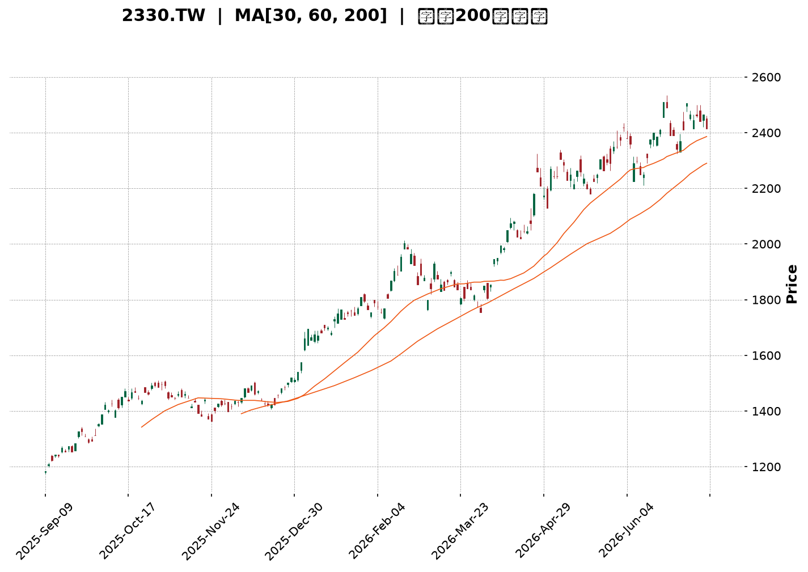
</details>

<html>
<head><meta charset="utf-8" /></head>
<body>
    <div style="height:500px; width:100%;">                        <script>window.PlotlyConfig = {MathJaxConfig: 'local'};</script>
        <script charset="utf-8" src="https://cdn.plot.ly/plotly-3.7.0.min.js" integrity="sha256-jvTGqxNp8AGWEcvNLVuKr+8j5dGe9Yw51LQkmDH+IYA=" crossorigin="anonymous"></script>                <div id="candlestick-chart" class="plotly-graph-div" style="height:100%; width:100%;"></div>            <script>                window.PLOTLYENV=window.PLOTLYENV || {};                                if (document.getElementById("candlestick-chart")) {                    Plotly.newPlot(                        "candlestick-chart",                        [{"close":{"dtype":"f8","bdata":"AAAAQNyAkkAAAACAi+OSQAAAAGDBHpNAAAAA4LNtk0AAAABA91mTQAAAAKDc0JNAAAAAAGqVk0AAAABgreSTQAAAAABqlZNAAAAAIE8MlEAAAADgpr6UQAAAAOCmvpRAAAAAYGNvlEAAAADgHyCUQAAAAODwM5RAAAAAQDSDlEAAAAAguyGVQAAAAEBxrJVAAAAAICc3lkAAAADg4+eVQAAAACD4SpZAAAAA4OPnlUAAAACAhQ+WQAAAAIAMrpZAAAAA4E\u002f9lkAAAADgmXKWQAAAAAB\u002f6ZZAAAAAAH\u002fplkAAAACAO5qWQAAAAOCZcpZAAAAAAH\u002fplkAAAAAgrtWWQAAAAECTTJdAAAAAQJNMl0AAAABgwjiXQAAAACBkYJdAAAAAQJNMl0AAAACAO5qWQAAAAIAMrpZAAAAAgDualkAAAAAgrtWWQAAAAIAMrpZAAAAAIK7VlkAAAACAO5qWQAAAAEBWI5ZAAAAA4MhelkAAAAAgQsCVQAAAAECgmJVAAAAAoGqGlkAAAACg\u002fnCVQAAAAOBcSZVAAAAA4OPnlUAAAAAg+EqWQAAAACAnN5ZAAAAAIPhKlkAAAAAAE9SVQAAAAEBWI5ZAAAAA4JlylkAAAADgyF6WQAAAAIA7mpZAAAAAgPEkl0AAAAAAf+mWQAAAAECTTJdAAAAAoEjVlkAAAABADP2WQAAAAKDBhZZAAAAAIBxKlkAAAABgOjaWQAAAAGA6NpZAAAAAYDo2lkAAAADgZsGWQAAAAMDPJJdAAAAAgLE4l0AAAADgVnSXQAAAAODdw5dAAAAAYBqcl0AAAAAAZROYQAAAAGCRnphAAAAAgI\u002fwmUAAAADgu3uaQAAAAEBxBJpAAAAAwDQsmkAAAAAAUxiaQAAAAIAWQJpAAAAAoJ2PmkAAAACgnY+aQAAAAIAWQJpAAAAAQOgGm0AAAABgb1abQAAAAMAUkptAAAAAQOgGm0AAAABgb1abQAAAAAAzfptAAAAAgI1Cm0AAAACA9qWbQAAAAKAERZxAAAAAYF8JnEAAAADAFJKbQAAAACBRaptAAAAAgH31m0AAAABA2LmbQAAAACBRaptAAAAAgPalm0AAAADgIjGcQAAAAOCZM51AAAAAQMa+nUAAAADgIIOdQAAAAOCXhZ5AAAAAoGlMn0AAAACA4vyeQAAAAIBbrZ5AAAAAYE0OnkAAAACA9PecQAAAAOAgg51AAAAAYF1bnUAAAAAgQR2cQAAAAEBPvJxAAAAAIC8inkAAAACge0edQAAAAID095xAAAAAgG2onEAAAAAAGSSdQAAAAKC5r51AAAAAgE\u002fUnEAAAADAaqycQAAAAIC8NJxAAAAAgLw0nEAAAAAgXcCcQAAAAMBqrJxAAAAAQKFcnEAAAABADr2bQAAAAMBEbZtAAAAA4EHonEAAAACAvDScQAAAAEA0\u002fJxAAAAAAD9jnkAAAABgMXeeQAAAAMC2Kp9AAAAAANICn0AAAACAEAOgQAAAAGDuNKBAAAAAoOc+oEAAAAAAZaKfQAAAAKByjp9AAAAAgC7yn0AAAACALvKfQAAAAGDuNKBAAAAAYF8GoUAAAABg8qWhQAAAAIA2QqFAAAAAIGb8oEAAAACAo6KgQAAAAMDkuaFAAAAA4AaIoUAAAADgBoihQAAAACC1\u002f6FAAAAAYNDXoUAAAABAG2qhQAAAAAAAkqFAAAAAoC9MoUAAAACg66+hQAAAAGDypaFAAAAAgBR0oUAAAAAgRC6hQAAAAGBfBqFAAAAAACJgoUAAAAAAAJKhQAAAACC1\u002f6FAAAAAoOuvoUAAAADAwuuhQAAAAIDJ4aFAAAAAwHdZokAAAADAd1miQAAAAMBVi6JAAAAAYBjlokAAAADgTpWiQAAAACBqbaJAAAAAgMnhoUAAAADgu\u002fWhQAAAAAAAkqFAAAAAAACUoUAAAAAAAAyiQAAAAAAAjqJAAAAAAADAokAAAAAAAKKiQAAAAAAA1KJAAAAAAACco0AAAAAAAHSjQAAAAAAArKJAAAAAAACsokAAAAAAAEiiQAAAAAAAhKJAAAAAAADUokAAAAAAAJKjQAAAAAAAQqNAAAAAAAAao0AAAAAAADijQAAAAAAAEKNAAAAAAABCo0AAAAAAAN6iQA=="},"high":{"dtype":"f8","bdata":"AAAAQNyAkkACRqkmSPeSQKWUUvqzbZNAAAAA4LNtk0CNgoDms22TQAAAoHyt5JNAiIIruQu9k0AAAABgreSTQFPG7E5++JNAAAAAIE8MlEAAAADgpr6UQB+onHUZ+pRAED74GAWXlECt1Ep1kluUQId+s3Vjb5RAvJV9jkjmlEC8x3v8izWVQAAAAEBxrJVAaTbd2MhelkARl5u8tPuVQKuqqrVqhpZAEZebvLT7lUAclaKHO5qWQAAAAIAMrpZAdbgamfEkl0AN6bx1DK6WQJgin5XxJJdAdYMpcsI4l0A\u002ffvw43cGWQK9NlLxqhpZAdYMpcsI4l0D6IJa1IBGXQF2\u002f+\u002fg0dJdAC5951QWIl0BnZmau1puXQASyAdkFiJdAun73sdabl0CeO3fOT\u002f2WQBLP1xV\u002f6ZZAHz9+XAyulkCnwA7ZT\u002f2WQCWer6vxJJdAp8AO2U\u002f9lkA\u002ffvw43cGWQD7T1vj3SpZAMchedTualkCcdIBLJzeWQHIcx7Hj55VAWSl7fDualkCAHiMSQsCVQLH2DQtCwJVAIy43mYUPlkAAAAAg+EqWQNJsupFqhpZAq6qqtWqGlkAQkysIyV6WQD7T1vj3SpZAAAAA4JlylkBm7XS8mXKWQAAAAIA7mpZAAAAAgPEkl0B1gylywjiXQAAAAECTTJdAAAAAkDiIl0CmyGcF7hCXQGAqaGWjmZZAFRh7qt9xlkCatsav33GWQN48QiUcSpZAVjBLOqOZlkBB\u002flmlSNWWQAAAAMDPJJdAUOZZRZNMl0AAAADgVnSXQAAAAODdw5dAr6G86t3Dl0AAAAAAZROYQAAAAGCRnphAf4vTWvhTmkAAAADgu3uaQGLRsso0LJpAgNjzD9pnmkBVVVUV2meaQGjD58+7e5pAq6qqKmG3mkBVVVVlf6OaQEWCmgraZ5pAq6qqyqsum0AYXXR19qWbQAAAAMAUkptAq6qqGlFqm0CMLrrqMn6bQH55bMUUkptAoPu5H9i5m0CWrGRF2LmbQAAAAKAERZxAbXZxAKqAnEAg0QqbffWbQAAAACBRaptAq6qqCkEdnEAVOoNVXwmcQHmaC3D2pZtAAAAAgPalm0Djd4L1qYCcQAAAAOCZM51A3cuxyonmnUAVCCNFTQ6eQGfSlWpbrZ5ADOSjKi10n0D4M+HPhzifQNUoY5Xi\u002fJ5AfUFfUD3BnkBpDt9v5KqdQLfEqR+2cZ5Aq6qq6iCDnUAAAAAgQR2cQEa15WpdW51ABb64qvJJnkC8uhVAxr6dQBKxRpV7R51ABQmj5ZkznUBM2AbB\u002fUudQAQCgQCsw51AOQ8dw\u002f1LnUAtZCEDGSSdQG3Hh+CuSJxAaDs+hE\u002fUnEAyOB9jCzidQHvTm6ImEJ1AcAiHoJNwnEAIRSjC1wycQHTRRQPz5JtAAAAA4EHonECukdWlJhCdQAAAAEA0\u002fJxAAAAAAD9jnkAAAABgMXeeQAAAAMC2Kp9AXH97YMQWn0AAAACAEAOgQMVO7CDTXKBA\u002f8FE0OBIoEAvMWuhCQ2gQMIWbHEQA6BAE7UrMfUqoEAPxO8A\u002fCCgQJ3YiXKjoqBAaZxBkFgQoUAY0TbTmSeiQPljSfPdw6FAqzNSQT04oUBUXDKENkKhQOAHfiDXzaFAaEUjoeuvoUB1uf0x182hQB988HGFRaJA9C4eIbX\u002foUA6JQHC5LmhQBTfPfHdw6FAyWfdYBR0oUAAAACg66+hQO+F96KgHaJASZIkQfmboUBRFEURImChQA8OSFE9OKFABYQT8f+RoUAEkz8w+ZuhQAAAACC1\u002f6FANvAZs6AdokCgaKvhmSeiQJ4PLPNwY6JAu3\u002fzgFyBokAvf9oCJtGiQIFcE4E6s6JAQ1qx8AMDo0Byp2gBJtGiQE7w5KEzvaJAxlQ4cacTokDvlbpwpxOiQCQrPLLC66FAAAAAAACooUAAAAAAACqiQAAAAAAAjqJAAAAAAADAokAAAAAAAKKiQAAAAAAA3qJAAAAAAACco0AAAAAAAM6jQAAAAAAAGqNAAAAAAADookAAAAAAAISiQAAAAAAAtqJAAAAAAABWo0AAAAAAAJKjQAAAAAAAYKNAAAAAAABCo0AAAAAAAIijQAAAAAAAiKNAAAAAAABCo0AAAAAAADijQA=="},"hovertemplate":"\u003cb\u003e%{x|%Y-%m-%d}\u003c\u002fb\u003e\u003cbr\u003e\u958b: $%{open:.2f}\u003cbr\u003e\u9ad8: $%{high:.2f}\u003cbr\u003e\u4f4e: $%{low:.2f}\u003cbr\u003e\u6536: $%{close:.2f}\u003cextra\u003e\u003c\u002fextra\u003e","low":{"dtype":"f8","bdata":"q6qq8mJZkkD8c60yErySQNdaa7kEC5NAwzAMkzpGk0BzfX+ZOkaTQAAAgC2ZgZNAAAAAAGqVk0DyDfLtaZWTQAAAAABqlZNArRtM0Tqpk0AiPVCRkluUQOFXY0o0g5RAAAAAYGNvlEAbuZEDTwyUQAAAAODwM5RAAAAAQDSDlECHcAhnGfqUQAAAADi7IZVAYi60irT7lUDe0cgmQsCVQDmO42ZWI5ZAqgz2kM+ElUBFD3ujtPuVQM\u002fXFZuFD5ZAFo\u002fKbQyulkAAAADgmXKWQK0bTLFqhpZAAAAAAH\u002fplkDgwIGjaoaWQPQWQ0onN5ZAAAAAAH\u002fplkCtn3hD3cGWQPVghqogEZdAUiCCY8I4l0AAAABgwjiXQPmb\u002fK0gEZdApEAEh\u002fEkl0DgwIGjaoaWQAAAAIAMrpZA4MCBo2qGlkBZP\u002fFmDK6WQAAAAIAMrpZABt9pijualkAAAACAO5qWQGCWlGOFD5ZAAAAA4MhelkAAAAAgQsCVQAAAAECgmJVA9YOOCvhKlkAAAACg\u002fnCVQAAAAOBcSZVA3tHIJkLAlUBWVVWKhQ+WQMtkkUNWI5ZAHcdxQyc3lkAAAAAAE9SVQMEsKYe0+5VA9BZDSic3lkDON6FKViOWQIIDBw74SpZAu++4eDualkAAAAAAf+mWQEeBCM5P\u002fZZAq6qq2mbBlkC0bjC1SNWWQKHVl9rfcZZA6ueElVgilkAiw72aWCKWQGZJORCV+pVAAAAAYDo2lkB\u002fA0xVo5mWQHADhqpI1ZZAXzNM9e0Ql0CTv8mPsTiXQKuqqspWdJdAUV5D1VZ0l0CnAW2aOIiXQIHgMjWD\u002f5dATmu2j589mUD988+fJo2ZQJ0uTbWt3JlAAU8YIOq0mUBVVVUl6rSZQAAAAIAWQJpAVVVVFdpnmkBVVVUV2meaQLp9ZfVSGJpAAAAAoJ2PmkAYXXT6QsuaQGwOJFroBptAAAAAQOgGm0B10UXVqy6bQAkaTuqrLptAAAAAgI1Cm0AUoQiljUKbQDD90v+5zZtAmMGXmn31m0AAAADAFJKbQAoymwrKGptAAAAAMNi5m0D1Yj61FJKbQIPMplpvVptAU5vaVOgGm0AAAADgIjGcQOo7G7WLlJxAi9A4FbgfnUAAAADgIIOdQP3jEivGvp1A5je4iuL8nkAAAACA4vyeQIx4khovIp5AAAAAYE0OnkAAAACA9PecQEbasRo\u002fb51AVVVV1ZkznUARpNz0Mn6bQFwljSrIbJxA3ixPGrgfnUAAAACge0edQKmiZ6WLlJxAAAAAgG2onECzJ\u002fk+NPycQPT5fH7ic51AAAAAgE\u002fUnEAAAADAaqycQOAaWZ0A0ZtAJ3HwvtcMnEAAAAAgXcCcQAAAAMBqrJxAPt7jvdcMnEAAAABADr2bQAAAAMBEbZtA+pJp\u002fYWEnECUOHgfyiCcQNdaa114mJxAndiJHYP\u002fnUAzdYt9dROeQFK4Hn0Is55A7oGN3vrGnkC\u002fShibm1KfQDuxE58JDaBAB3RjfhADoEAAAAAAZaKfQAAAAKByjp9A+B2IHzzen0DxOxC\u002fScqfQIqd2G4QA6BAaTnmW8xmoEAAAABg8qWhQAAAAIA2QqFAKuZWj3reoEAAAACAo6KgQPzAD7xRGqFATF1ufxR0oUBMXW5\u002fFHShQAAAACC1\u002f6FAT0WabvKloUAAAABAG2qhQNzUw009OKFAKfJZD0QuoUAel74dImChQIQeQs8GiKFAJEmSjjZCoUAAAAAgRC6hQAAAAGBfBqFAAAAAACJgoUDojYLeKFahQOGDD87kuaFAAAAAoOuvoUDLh3Ff0NehQDmrx47rr6FAV6DPzpknokARIMOPfk+iQH+j7P5wY6JAvqVOzyzHokAAAADgTpWiQOMlSo9+T6JAYvDTDCJgoUALnIN\u002fyeGhQAAAAAAAkqFAAAAAAABEoUAAAAAAAOShQAAAAAAAUqJAAAAAAABcokAAAAAAAFyiQAAAAAAAoqJAAAAAAAAuo0AAAAAAAHSjQAAAAAAArKJAAAAAAACsokAAAAAAACqiQAAAAAAANKJAAAAAAADUokAAAAAAAFajQAAAAAAAGqNAAAAAAADeokAAAAAAAC6jQAAAAAAAEKNAAAAAAADookAAAAAAAN6iQA=="},"name":"\u50f9\u683c","open":{"dtype":"f8","bdata":"VVVVmR9tkkD+uVbZzs+SQHzvvVP3WZNAYhiGOfdZk0CNgoDms22TQAAAIApqlZNARMGV3Dqpk0D5BvmmC72TQA8FV3Kt5JNArRtM0Tqpk0CCytltY2+UQL8aE5lI5pRAAAAAYGNvlEDJjdyYwUeUQC0qkbzBR5RAAAAAQDSDlEBDOIRD6g2VQAAAADi7IZVAYi60irT7lUDvaGQDE9SVQAAAACD4SpZAqgz2kM+ElUBhpB2raoaWQNthUFQnN5ZAFo\u002fKbQyulkCvTZS8aoaWQIp81o07mpZA3WCK3E\u002f9lkAAAACAO5qWQKNk1yb4SpZAdYMpcsI4l0BTYIf8fumWQKRABIfxJJdAXb\u002f7+DR0l0DXo3D1NHSXQAAAACBkYJdAC5951QWIl0B+\u002fPjxfumWQAZFnVzdwZZAAAAAgDualkCtn3hD3cGWQB9ZEs8gEZdArZ94Q93BlkAAAACAO5qWQGCWlGOFD5ZAZu10vJlylkCcdIBLJzeWQBzHcRxxrJVAp9aEw5lylkBAjxFZoJiVQOmiiy5xrJVAIy43mYUPlkA5juNmViOWQJ7RS7WZcpZAAAAAIPhKlkAQkysIyV6WQAAAAEBWI5ZAo2TXJvhKlkAAAADgyF6WQKFCherIXpZAfM0wVQyulkCYIp+V8SSXQPVghqogEZdAq6qqylZ0l0BaN5h6KumWQAAAAKDBhZZAAAAAIBxKlkDePEIlHEqWQESGe9V2DpZAVjBLOqOZlkAAAADgZsGWQJSC5G8q6ZZAAAAAgLE4l0AxlZgadWCXQAAAAJA4iJdAKK+hmjiIl0D9JctfGpyXQGEo5r9GJ5hAm+0TVYFRmUD988+fJo2ZQJ0uTbWt3JlAK5dp5cvImUAAAACwrdyZQEWCmgraZ5pAq6qqKmG3mkCrqqrau3uaQN2+sro0LJpAq6qqegbzmkAYXXT6QsuaQGwOJFroBptAVVVVBcoam0BGF10lUWqbQAAAAAAzfptA4FOTClFqm0CqTW1qb1abQDD90v+5zZtABjgJO8hsnECtsDkQus2bQIhl9M+rLptAq6qqCkEdnEAAAABA2LmbQAAAACBRaptA6Uc\u002fGsoam0Dr2SEwyGycQG3Ud3ptqJxAeraR2pkznUAAAADgIIOdQP3jEivGvp1A5je4iuL8nkBTEUtFxBCfQIx4khovIp5A02ufxXmZnkCbCeofP2+dQM8tcQovIp5AVVVV1ZkznUCPD0G6FJKbQKPaclXWC51A4+oHpXtHnUBe3QrwIIOdQKmiZ6WLlJxABJpCILgfnUAmbINgCzidQPz9fj\u002fHm51AWjeYYgs4nUDJQhZCNPycQE3i4P3y5JtAaDs+hE\u002fUnEAh0BSiJhCdQGQhC4FP1JxAruZqHsognEAAAABADr2bQLroouEbqZtAY4tyvmqsnECukdWlJhCdQPC9935P1JxAXuiF3mcnnkBHlQSfTE+eQJqZmd36xp5ApYCEn9\u002funkCq0KP7jWafQOzETs8CF6BAAT67b+40oED8qC5xEAOgQOtceQBlop9AAAAAgC7yn0D4HYgfPN6fQGIndsDgSKBA0tUnjMVwoEB84b3w3cOhQIdVhKENfqFADqLH72zyoEDKEKwjRC6hQOzETuxKJKFAAAAA4AaIoUAAAADgBoihQM2hYhGTMaJAehePwMLroUDr24Bh8qWhQPCzAT8baqFAKfJZD0QuoUCPS9\u002feBoihQHOkORK1\u002f6FASZIk7yhWoUAxDMOwL0yhQKZxBiFELqFAzzRuYBR0oUD42YCfDX6hQOGDD87kuaFAGsPRgqcTokA2eI4gtf+hQOggr5J+T6JANGBJL4w7okAAAADAd1miQECuiSBIn6JAAAAAYBjlokAAAADgTpWiQDu0a0FBqaJAYvDTDCJgoUAAAADgu\u002fWhQBhyfSHXzaFAAAAAAACAoUAAAAAAACqiQAAAAAAAcKJAAAAAAACOokAAAAAAAGaiQAAAAAAAtqJAAAAAAAAuo0AAAAAAAJyjQAAAAAAABqNAAAAAAADUokAAAAAAAHCiQAAAAAAANKJAAAAAAAAQo0AAAAAAAH6jQAAAAAAAJKNAAAAAAADeokAAAAAAAEKjQAAAAAAAYKNAAAAAAAAao0AAAAAAACSjQA=="},"x":["2025-09-09T00:00:00+08:00","2025-09-10T00:00:00+08:00","2025-09-11T00:00:00+08:00","2025-09-12T00:00:00+08:00","2025-09-15T00:00:00+08:00","2025-09-16T00:00:00+08:00","2025-09-17T00:00:00+08:00","2025-09-18T00:00:00+08:00","2025-09-19T00:00:00+08:00","2025-09-22T00:00:00+08:00","2025-09-23T00:00:00+08:00","2025-09-24T00:00:00+08:00","2025-09-25T00:00:00+08:00","2025-09-26T00:00:00+08:00","2025-09-30T00:00:00+08:00","2025-10-01T00:00:00+08:00","2025-10-02T00:00:00+08:00","2025-10-03T00:00:00+08:00","2025-10-07T00:00:00+08:00","2025-10-08T00:00:00+08:00","2025-10-09T00:00:00+08:00","2025-10-13T00:00:00+08:00","2025-10-14T00:00:00+08:00","2025-10-15T00:00:00+08:00","2025-10-16T00:00:00+08:00","2025-10-17T00:00:00+08:00","2025-10-20T00:00:00+08:00","2025-10-21T00:00:00+08:00","2025-10-22T00:00:00+08:00","2025-10-23T00:00:00+08:00","2025-10-27T00:00:00+08:00","2025-10-28T00:00:00+08:00","2025-10-29T00:00:00+08:00","2025-10-30T00:00:00+08:00","2025-10-31T00:00:00+08:00","2025-11-03T00:00:00+08:00","2025-11-04T00:00:00+08:00","2025-11-05T00:00:00+08:00","2025-11-06T00:00:00+08:00","2025-11-07T00:00:00+08:00","2025-11-10T00:00:00+08:00","2025-11-11T00:00:00+08:00","2025-11-12T00:00:00+08:00","2025-11-13T00:00:00+08:00","2025-11-14T00:00:00+08:00","2025-11-17T00:00:00+08:00","2025-11-18T00:00:00+08:00","2025-11-19T00:00:00+08:00","2025-11-20T00:00:00+08:00","2025-11-21T00:00:00+08:00","2025-11-24T00:00:00+08:00","2025-11-25T00:00:00+08:00","2025-11-26T00:00:00+08:00","2025-11-27T00:00:00+08:00","2025-11-28T00:00:00+08:00","2025-12-01T00:00:00+08:00","2025-12-02T00:00:00+08:00","2025-12-03T00:00:00+08:00","2025-12-04T00:00:00+08:00","2025-12-05T00:00:00+08:00","2025-12-08T00:00:00+08:00","2025-12-09T00:00:00+08:00","2025-12-10T00:00:00+08:00","2025-12-11T00:00:00+08:00","2025-12-12T00:00:00+08:00","2025-12-15T00:00:00+08:00","2025-12-16T00:00:00+08:00","2025-12-17T00:00:00+08:00","2025-12-18T00:00:00+08:00","2025-12-19T00:00:00+08:00","2025-12-22T00:00:00+08:00","2025-12-23T00:00:00+08:00","2025-12-24T00:00:00+08:00","2025-12-26T00:00:00+08:00","2025-12-29T00:00:00+08:00","2025-12-30T00:00:00+08:00","2025-12-31T00:00:00+08:00","2026-01-02T00:00:00+08:00","2026-01-05T00:00:00+08:00","2026-01-06T00:00:00+08:00","2026-01-07T00:00:00+08:00","2026-01-08T00:00:00+08:00","2026-01-09T00:00:00+08:00","2026-01-12T00:00:00+08:00","2026-01-13T00:00:00+08:00","2026-01-14T00:00:00+08:00","2026-01-15T00:00:00+08:00","2026-01-16T00:00:00+08:00","2026-01-19T00:00:00+08:00","2026-01-20T00:00:00+08:00","2026-01-21T00:00:00+08:00","2026-01-22T00:00:00+08:00","2026-01-23T00:00:00+08:00","2026-01-26T00:00:00+08:00","2026-01-27T00:00:00+08:00","2026-01-28T00:00:00+08:00","2026-01-29T00:00:00+08:00","2026-01-30T00:00:00+08:00","2026-02-02T00:00:00+08:00","2026-02-03T00:00:00+08:00","2026-02-04T00:00:00+08:00","2026-02-05T00:00:00+08:00","2026-02-06T00:00:00+08:00","2026-02-09T00:00:00+08:00","2026-02-10T00:00:00+08:00","2026-02-11T00:00:00+08:00","2026-02-23T00:00:00+08:00","2026-02-24T00:00:00+08:00","2026-02-25T00:00:00+08:00","2026-02-26T00:00:00+08:00","2026-03-02T00:00:00+08:00","2026-03-03T00:00:00+08:00","2026-03-04T00:00:00+08:00","2026-03-05T00:00:00+08:00","2026-03-06T00:00:00+08:00","2026-03-09T00:00:00+08:00","2026-03-10T00:00:00+08:00","2026-03-11T00:00:00+08:00","2026-03-12T00:00:00+08:00","2026-03-13T00:00:00+08:00","2026-03-16T00:00:00+08:00","2026-03-17T00:00:00+08:00","2026-03-18T00:00:00+08:00","2026-03-19T00:00:00+08:00","2026-03-20T00:00:00+08:00","2026-03-23T00:00:00+08:00","2026-03-24T00:00:00+08:00","2026-03-25T00:00:00+08:00","2026-03-26T00:00:00+08:00","2026-03-27T00:00:00+08:00","2026-03-30T00:00:00+08:00","2026-03-31T00:00:00+08:00","2026-04-01T00:00:00+08:00","2026-04-02T00:00:00+08:00","2026-04-07T00:00:00+08:00","2026-04-08T00:00:00+08:00","2026-04-09T00:00:00+08:00","2026-04-10T00:00:00+08:00","2026-04-13T00:00:00+08:00","2026-04-14T00:00:00+08:00","2026-04-15T00:00:00+08:00","2026-04-16T00:00:00+08:00","2026-04-17T00:00:00+08:00","2026-04-20T00:00:00+08:00","2026-04-21T00:00:00+08:00","2026-04-22T00:00:00+08:00","2026-04-23T00:00:00+08:00","2026-04-24T00:00:00+08:00","2026-04-27T00:00:00+08:00","2026-04-28T00:00:00+08:00","2026-04-29T00:00:00+08:00","2026-04-30T00:00:00+08:00","2026-05-04T00:00:00+08:00","2026-05-05T00:00:00+08:00","2026-05-06T00:00:00+08:00","2026-05-07T00:00:00+08:00","2026-05-08T00:00:00+08:00","2026-05-11T00:00:00+08:00","2026-05-12T00:00:00+08:00","2026-05-13T00:00:00+08:00","2026-05-14T00:00:00+08:00","2026-05-15T00:00:00+08:00","2026-05-18T00:00:00+08:00","2026-05-19T00:00:00+08:00","2026-05-20T00:00:00+08:00","2026-05-21T00:00:00+08:00","2026-05-22T00:00:00+08:00","2026-05-25T00:00:00+08:00","2026-05-26T00:00:00+08:00","2026-05-27T00:00:00+08:00","2026-05-28T00:00:00+08:00","2026-05-29T00:00:00+08:00","2026-06-01T00:00:00+08:00","2026-06-02T00:00:00+08:00","2026-06-03T00:00:00+08:00","2026-06-04T00:00:00+08:00","2026-06-05T00:00:00+08:00","2026-06-08T00:00:00+08:00","2026-06-09T00:00:00+08:00","2026-06-10T00:00:00+08:00","2026-06-11T00:00:00+08:00","2026-06-12T00:00:00+08:00","2026-06-15T00:00:00+08:00","2026-06-16T00:00:00+08:00","2026-06-17T00:00:00+08:00","2026-06-18T00:00:00+08:00","2026-06-22T00:00:00+08:00","2026-06-23T00:00:00+08:00","2026-06-24T00:00:00+08:00","2026-06-25T00:00:00+08:00","2026-06-26T00:00:00+08:00","2026-06-29T00:00:00+08:00","2026-06-30T00:00:00+08:00","2026-07-01T00:00:00+08:00","2026-07-02T00:00:00+08:00","2026-07-03T00:00:00+08:00","2026-07-06T00:00:00+08:00","2026-07-07T00:00:00+08:00","2026-07-08T00:00:00+08:00","2026-07-09T00:00:00+08:00"],"type":"candlestick"},{"hovertemplate":"MA30: $%{y:.2f}\u003cextra\u003e\u003c\u002fextra\u003e","line":{"color":"#2196F3","dash":"dash","width":2},"mode":"lines","name":"MA30","x":["2025-09-09T00:00:00+08:00","2025-09-10T00:00:00+08:00","2025-09-11T00:00:00+08:00","2025-09-12T00:00:00+08:00","2025-09-15T00:00:00+08:00","2025-09-16T00:00:00+08:00","2025-09-17T00:00:00+08:00","2025-09-18T00:00:00+08:00","2025-09-19T00:00:00+08:00","2025-09-22T00:00:00+08:00","2025-09-23T00:00:00+08:00","2025-09-24T00:00:00+08:00","2025-09-25T00:00:00+08:00","2025-09-26T00:00:00+08:00","2025-09-30T00:00:00+08:00","2025-10-01T00:00:00+08:00","2025-10-02T00:00:00+08:00","2025-10-03T00:00:00+08:00","2025-10-07T00:00:00+08:00","2025-10-08T00:00:00+08:00","2025-10-09T00:00:00+08:00","2025-10-13T00:00:00+08:00","2025-10-14T00:00:00+08:00","2025-10-15T00:00:00+08:00","2025-10-16T00:00:00+08:00","2025-10-17T00:00:00+08:00","2025-10-20T00:00:00+08:00","2025-10-21T00:00:00+08:00","2025-10-22T00:00:00+08:00","2025-10-23T00:00:00+08:00","2025-10-27T00:00:00+08:00","2025-10-28T00:00:00+08:00","2025-10-29T00:00:00+08:00","2025-10-30T00:00:00+08:00","2025-10-31T00:00:00+08:00","2025-11-03T00:00:00+08:00","2025-11-04T00:00:00+08:00","2025-11-05T00:00:00+08:00","2025-11-06T00:00:00+08:00","2025-11-07T00:00:00+08:00","2025-11-10T00:00:00+08:00","2025-11-11T00:00:00+08:00","2025-11-12T00:00:00+08:00","2025-11-13T00:00:00+08:00","2025-11-14T00:00:00+08:00","2025-11-17T00:00:00+08:00","2025-11-18T00:00:00+08:00","2025-11-19T00:00:00+08:00","2025-11-20T00:00:00+08:00","2025-11-21T00:00:00+08:00","2025-11-24T00:00:00+08:00","2025-11-25T00:00:00+08:00","2025-11-26T00:00:00+08:00","2025-11-27T00:00:00+08:00","2025-11-28T00:00:00+08:00","2025-12-01T00:00:00+08:00","2025-12-02T00:00:00+08:00","2025-12-03T00:00:00+08:00","2025-12-04T00:00:00+08:00","2025-12-05T00:00:00+08:00","2025-12-08T00:00:00+08:00","2025-12-09T00:00:00+08:00","2025-12-10T00:00:00+08:00","2025-12-11T00:00:00+08:00","2025-12-12T00:00:00+08:00","2025-12-15T00:00:00+08:00","2025-12-16T00:00:00+08:00","2025-12-17T00:00:00+08:00","2025-12-18T00:00:00+08:00","2025-12-19T00:00:00+08:00","2025-12-22T00:00:00+08:00","2025-12-23T00:00:00+08:00","2025-12-24T00:00:00+08:00","2025-12-26T00:00:00+08:00","2025-12-29T00:00:00+08:00","2025-12-30T00:00:00+08:00","2025-12-31T00:00:00+08:00","2026-01-02T00:00:00+08:00","2026-01-05T00:00:00+08:00","2026-01-06T00:00:00+08:00","2026-01-07T00:00:00+08:00","2026-01-08T00:00:00+08:00","2026-01-09T00:00:00+08:00","2026-01-12T00:00:00+08:00","2026-01-13T00:00:00+08:00","2026-01-14T00:00:00+08:00","2026-01-15T00:00:00+08:00","2026-01-16T00:00:00+08:00","2026-01-19T00:00:00+08:00","2026-01-20T00:00:00+08:00","2026-01-21T00:00:00+08:00","2026-01-22T00:00:00+08:00","2026-01-23T00:00:00+08:00","2026-01-26T00:00:00+08:00","2026-01-27T00:00:00+08:00","2026-01-28T00:00:00+08:00","2026-01-29T00:00:00+08:00","2026-01-30T00:00:00+08:00","2026-02-02T00:00:00+08:00","2026-02-03T00:00:00+08:00","2026-02-04T00:00:00+08:00","2026-02-05T00:00:00+08:00","2026-02-06T00:00:00+08:00","2026-02-09T00:00:00+08:00","2026-02-10T00:00:00+08:00","2026-02-11T00:00:00+08:00","2026-02-23T00:00:00+08:00","2026-02-24T00:00:00+08:00","2026-02-25T00:00:00+08:00","2026-02-26T00:00:00+08:00","2026-03-02T00:00:00+08:00","2026-03-03T00:00:00+08:00","2026-03-04T00:00:00+08:00","2026-03-05T00:00:00+08:00","2026-03-06T00:00:00+08:00","2026-03-09T00:00:00+08:00","2026-03-10T00:00:00+08:00","2026-03-11T00:00:00+08:00","2026-03-12T00:00:00+08:00","2026-03-13T00:00:00+08:00","2026-03-16T00:00:00+08:00","2026-03-17T00:00:00+08:00","2026-03-18T00:00:00+08:00","2026-03-19T00:00:00+08:00","2026-03-20T00:00:00+08:00","2026-03-23T00:00:00+08:00","2026-03-24T00:00:00+08:00","2026-03-25T00:00:00+08:00","2026-03-26T00:00:00+08:00","2026-03-27T00:00:00+08:00","2026-03-30T00:00:00+08:00","2026-03-31T00:00:00+08:00","2026-04-01T00:00:00+08:00","2026-04-02T00:00:00+08:00","2026-04-07T00:00:00+08:00","2026-04-08T00:00:00+08:00","2026-04-09T00:00:00+08:00","2026-04-10T00:00:00+08:00","2026-04-13T00:00:00+08:00","2026-04-14T00:00:00+08:00","2026-04-15T00:00:00+08:00","2026-04-16T00:00:00+08:00","2026-04-17T00:00:00+08:00","2026-04-20T00:00:00+08:00","2026-04-21T00:00:00+08:00","2026-04-22T00:00:00+08:00","2026-04-23T00:00:00+08:00","2026-04-24T00:00:00+08:00","2026-04-27T00:00:00+08:00","2026-04-28T00:00:00+08:00","2026-04-29T00:00:00+08:00","2026-04-30T00:00:00+08:00","2026-05-04T00:00:00+08:00","2026-05-05T00:00:00+08:00","2026-05-06T00:00:00+08:00","2026-05-07T00:00:00+08:00","2026-05-08T00:00:00+08:00","2026-05-11T00:00:00+08:00","2026-05-12T00:00:00+08:00","2026-05-13T00:00:00+08:00","2026-05-14T00:00:00+08:00","2026-05-15T00:00:00+08:00","2026-05-18T00:00:00+08:00","2026-05-19T00:00:00+08:00","2026-05-20T00:00:00+08:00","2026-05-21T00:00:00+08:00","2026-05-22T00:00:00+08:00","2026-05-25T00:00:00+08:00","2026-05-26T00:00:00+08:00","2026-05-27T00:00:00+08:00","2026-05-28T00:00:00+08:00","2026-05-29T00:00:00+08:00","2026-06-01T00:00:00+08:00","2026-06-02T00:00:00+08:00","2026-06-03T00:00:00+08:00","2026-06-04T00:00:00+08:00","2026-06-05T00:00:00+08:00","2026-06-08T00:00:00+08:00","2026-06-09T00:00:00+08:00","2026-06-10T00:00:00+08:00","2026-06-11T00:00:00+08:00","2026-06-12T00:00:00+08:00","2026-06-15T00:00:00+08:00","2026-06-16T00:00:00+08:00","2026-06-17T00:00:00+08:00","2026-06-18T00:00:00+08:00","2026-06-22T00:00:00+08:00","2026-06-23T00:00:00+08:00","2026-06-24T00:00:00+08:00","2026-06-25T00:00:00+08:00","2026-06-26T00:00:00+08:00","2026-06-29T00:00:00+08:00","2026-06-30T00:00:00+08:00","2026-07-01T00:00:00+08:00","2026-07-02T00:00:00+08:00","2026-07-03T00:00:00+08:00","2026-07-06T00:00:00+08:00","2026-07-07T00:00:00+08:00","2026-07-08T00:00:00+08:00","2026-07-09T00:00:00+08:00"],"y":{"dtype":"f8","bdata":"AAAAAAAA+H8AAAAAAAD4fwAAAAAAAPh\u002fAAAAAAAA+H8AAAAAAAD4fwAAAAAAAPh\u002fAAAAAAAA+H8AAAAAAAD4fwAAAAAAAPh\u002fAAAAAAAA+H8AAAAAAAD4fwAAAAAAAPh\u002fAAAAAAAA+H8AAAAAAAD4fwAAAAAAAPh\u002fAAAAAAAA+H8AAAAAAAD4fwAAAAAAAPh\u002fAAAAAAAA+H8AAAAAAAD4fwAAAAAAAPh\u002fAAAAAAAA+H8AAAAAAAD4fwAAAAAAAPh\u002fAAAAAAAA+H8AAAAAAAD4fwAAAAAAAPh\u002fAAAAAAAA+H8AAAAAAAD4fxERERHU+JRAd3d3F3MelUCamZnpHkCVQKuqqgrIY5VAzczMfM+ElUAiIiJC1qWVQERERKQ4xJVAd3d3N+3jlUDe3d2NC\u002fuVQO\u002fu7l53FZZAREREhEMrlkB3d3cXGT2WQKuqqnqcTZZAAAAAcBZilkDe3d19OXeWQO\u002fu7t68h5ZAiYiIKJeXlkDNzMzs35yWQDMzM9M2nJZAVVVVNduelkAiIiKi5JqWQERERGROkpZAREREZE6SlkDe3d2tSZSWQJqZmRlTkJZA3t3dPWGKlkCrqqp6GIWWQFVVVYV9fpZAMzMz84Z6lkCamZmpi3iWQJqZmdndeZZAIiIiItl7lkCrqqo6gnyWQKuqqjqCfJZAZmZmRoh4lkDNzMy8inaWQN7d3Q1Bb5ZAvLu7e6NmlkDNzMwcTmOWQERERKRPX5ZAVVVVRfpblkCrqqo6TVuWQLy7u6tCX5ZAVVVVlY9ilkAzMzPD1GmWQGZmZia3d5ZA7+7u7kqClkDe3d1tIZaWQLy7u7vtr5ZAiYiIGBHNlkB3d3dnF\u002fiWQDMzM\u002fN1IJdAvLu7C99El0AiIiICUWWXQDMzM2O\u002fh5dA3t3dTSusl0CrqqrKjdSXQERERESl95dAIiIi8rgemEDNzMxcHEmYQImIiHiBc5hAvLu7S6OUmECrqqoKZ7qYQCIiIqIw3phAIiIiMvcDmUDNzMy8uiuZQBEREYHFXJlAd3d3R9CNmUAiIiLCiruZQKuqqurx55lAAAAAsPwYmkDe3d3dZkOaQM3MzBzaZ5pA3t3draCNmkARERHhDbaaQDMzMwNy5JpAMzMzE80Ym0BEREQ0MUebQJqZmUmPeZtAIiIiwkmnm0Crqqr6uc2bQFVVVYV99ZtAmpmZeaAWnEC8u7vbJS+cQJqZmYn7SpxAMzMzQ9dinEAiIiJyGHCcQJqZmYlNhZxAZmZm5s+fnEAAAABgYbCcQLy7uztPvJxAMzMzEzrKnECJiIiYndmcQImIiEhV7JxA3t3dnbn5nECamZk5eQKdQJqZmUnuAZ1AMzMzU2ADnUDe3d3Ncw2dQERERGQwGJ1AREREhKAbnUCrqqrquxudQKuqqhrVG51AmpmZWZMmnUAiIiISsiadQJqZmVnZJJ1Ad3d311QqnUBmZmaGdzKdQN7d3Y34N51AERERkYQ1nUC8u7v7Wz6dQHd3dxctTZ1AAAAAsPVhnUC8u7srtXidQERERNQmip1A3t3d3T6gnUAiIiJy8cCdQHd3dwdU4J1Ad3d3N78BnkDe3d0NGDWeQHd3d2dxZJ5AVVVV5cmRnkCamZkpB7WeQEREROQ65p5AZmZm5msbn0BVVVVV8VGfQHd3d5dulJ9AAAAAAEPUn0AiIiLKDwSgQERERJynH6BAREREHEA6oEDv7u6G1FqgQKuqqkJofKBAIiIicgGWoEB3d3fXRLCgQAAAAMDgxaBAMzMzs37YoEC8u7sTceygQDMzM6sNAaFAd3d3n6sToUDNzMzU9SOhQO\u002fu7mZBMqFAvLu7IzVEoUBEREQM0VmhQImIiJhrcaFAERERkVqKoUAAAACwoKChQO\u002fu7r6Ts6FAVVVVFeS6oUDv7u7ujL2hQImIiMg1wKFAIiIickPFoUAAAAAQT9GhQJqZmQlh2KFAVVVVNcfioUARERFhLeyhQBEREfFA86FAiYiImFMCokBmZmYWuROiQM3MzHwfHaJAIiIiotkookARERFh6y2iQLy7uztSNaJAiYiISA1BokCamZlpcVWiQM3MzEx\u002faKJAZmZm5jl3okB3d3f3SoWiQHd3d4dejqJAvLu7m8WbokB3d3e32KOiQA=="},"type":"scatter"},{"hovertemplate":"MA60: $%{y:.2f}\u003cextra\u003e\u003c\u002fextra\u003e","line":{"color":"#9C27B0","dash":"dash","width":2},"mode":"lines","name":"MA60","x":["2025-09-09T00:00:00+08:00","2025-09-10T00:00:00+08:00","2025-09-11T00:00:00+08:00","2025-09-12T00:00:00+08:00","2025-09-15T00:00:00+08:00","2025-09-16T00:00:00+08:00","2025-09-17T00:00:00+08:00","2025-09-18T00:00:00+08:00","2025-09-19T00:00:00+08:00","2025-09-22T00:00:00+08:00","2025-09-23T00:00:00+08:00","2025-09-24T00:00:00+08:00","2025-09-25T00:00:00+08:00","2025-09-26T00:00:00+08:00","2025-09-30T00:00:00+08:00","2025-10-01T00:00:00+08:00","2025-10-02T00:00:00+08:00","2025-10-03T00:00:00+08:00","2025-10-07T00:00:00+08:00","2025-10-08T00:00:00+08:00","2025-10-09T00:00:00+08:00","2025-10-13T00:00:00+08:00","2025-10-14T00:00:00+08:00","2025-10-15T00:00:00+08:00","2025-10-16T00:00:00+08:00","2025-10-17T00:00:00+08:00","2025-10-20T00:00:00+08:00","2025-10-21T00:00:00+08:00","2025-10-22T00:00:00+08:00","2025-10-23T00:00:00+08:00","2025-10-27T00:00:00+08:00","2025-10-28T00:00:00+08:00","2025-10-29T00:00:00+08:00","2025-10-30T00:00:00+08:00","2025-10-31T00:00:00+08:00","2025-11-03T00:00:00+08:00","2025-11-04T00:00:00+08:00","2025-11-05T00:00:00+08:00","2025-11-06T00:00:00+08:00","2025-11-07T00:00:00+08:00","2025-11-10T00:00:00+08:00","2025-11-11T00:00:00+08:00","2025-11-12T00:00:00+08:00","2025-11-13T00:00:00+08:00","2025-11-14T00:00:00+08:00","2025-11-17T00:00:00+08:00","2025-11-18T00:00:00+08:00","2025-11-19T00:00:00+08:00","2025-11-20T00:00:00+08:00","2025-11-21T00:00:00+08:00","2025-11-24T00:00:00+08:00","2025-11-25T00:00:00+08:00","2025-11-26T00:00:00+08:00","2025-11-27T00:00:00+08:00","2025-11-28T00:00:00+08:00","2025-12-01T00:00:00+08:00","2025-12-02T00:00:00+08:00","2025-12-03T00:00:00+08:00","2025-12-04T00:00:00+08:00","2025-12-05T00:00:00+08:00","2025-12-08T00:00:00+08:00","2025-12-09T00:00:00+08:00","2025-12-10T00:00:00+08:00","2025-12-11T00:00:00+08:00","2025-12-12T00:00:00+08:00","2025-12-15T00:00:00+08:00","2025-12-16T00:00:00+08:00","2025-12-17T00:00:00+08:00","2025-12-18T00:00:00+08:00","2025-12-19T00:00:00+08:00","2025-12-22T00:00:00+08:00","2025-12-23T00:00:00+08:00","2025-12-24T00:00:00+08:00","2025-12-26T00:00:00+08:00","2025-12-29T00:00:00+08:00","2025-12-30T00:00:00+08:00","2025-12-31T00:00:00+08:00","2026-01-02T00:00:00+08:00","2026-01-05T00:00:00+08:00","2026-01-06T00:00:00+08:00","2026-01-07T00:00:00+08:00","2026-01-08T00:00:00+08:00","2026-01-09T00:00:00+08:00","2026-01-12T00:00:00+08:00","2026-01-13T00:00:00+08:00","2026-01-14T00:00:00+08:00","2026-01-15T00:00:00+08:00","2026-01-16T00:00:00+08:00","2026-01-19T00:00:00+08:00","2026-01-20T00:00:00+08:00","2026-01-21T00:00:00+08:00","2026-01-22T00:00:00+08:00","2026-01-23T00:00:00+08:00","2026-01-26T00:00:00+08:00","2026-01-27T00:00:00+08:00","2026-01-28T00:00:00+08:00","2026-01-29T00:00:00+08:00","2026-01-30T00:00:00+08:00","2026-02-02T00:00:00+08:00","2026-02-03T00:00:00+08:00","2026-02-04T00:00:00+08:00","2026-02-05T00:00:00+08:00","2026-02-06T00:00:00+08:00","2026-02-09T00:00:00+08:00","2026-02-10T00:00:00+08:00","2026-02-11T00:00:00+08:00","2026-02-23T00:00:00+08:00","2026-02-24T00:00:00+08:00","2026-02-25T00:00:00+08:00","2026-02-26T00:00:00+08:00","2026-03-02T00:00:00+08:00","2026-03-03T00:00:00+08:00","2026-03-04T00:00:00+08:00","2026-03-05T00:00:00+08:00","2026-03-06T00:00:00+08:00","2026-03-09T00:00:00+08:00","2026-03-10T00:00:00+08:00","2026-03-11T00:00:00+08:00","2026-03-12T00:00:00+08:00","2026-03-13T00:00:00+08:00","2026-03-16T00:00:00+08:00","2026-03-17T00:00:00+08:00","2026-03-18T00:00:00+08:00","2026-03-19T00:00:00+08:00","2026-03-20T00:00:00+08:00","2026-03-23T00:00:00+08:00","2026-03-24T00:00:00+08:00","2026-03-25T00:00:00+08:00","2026-03-26T00:00:00+08:00","2026-03-27T00:00:00+08:00","2026-03-30T00:00:00+08:00","2026-03-31T00:00:00+08:00","2026-04-01T00:00:00+08:00","2026-04-02T00:00:00+08:00","2026-04-07T00:00:00+08:00","2026-04-08T00:00:00+08:00","2026-04-09T00:00:00+08:00","2026-04-10T00:00:00+08:00","2026-04-13T00:00:00+08:00","2026-04-14T00:00:00+08:00","2026-04-15T00:00:00+08:00","2026-04-16T00:00:00+08:00","2026-04-17T00:00:00+08:00","2026-04-20T00:00:00+08:00","2026-04-21T00:00:00+08:00","2026-04-22T00:00:00+08:00","2026-04-23T00:00:00+08:00","2026-04-24T00:00:00+08:00","2026-04-27T00:00:00+08:00","2026-04-28T00:00:00+08:00","2026-04-29T00:00:00+08:00","2026-04-30T00:00:00+08:00","2026-05-04T00:00:00+08:00","2026-05-05T00:00:00+08:00","2026-05-06T00:00:00+08:00","2026-05-07T00:00:00+08:00","2026-05-08T00:00:00+08:00","2026-05-11T00:00:00+08:00","2026-05-12T00:00:00+08:00","2026-05-13T00:00:00+08:00","2026-05-14T00:00:00+08:00","2026-05-15T00:00:00+08:00","2026-05-18T00:00:00+08:00","2026-05-19T00:00:00+08:00","2026-05-20T00:00:00+08:00","2026-05-21T00:00:00+08:00","2026-05-22T00:00:00+08:00","2026-05-25T00:00:00+08:00","2026-05-26T00:00:00+08:00","2026-05-27T00:00:00+08:00","2026-05-28T00:00:00+08:00","2026-05-29T00:00:00+08:00","2026-06-01T00:00:00+08:00","2026-06-02T00:00:00+08:00","2026-06-03T00:00:00+08:00","2026-06-04T00:00:00+08:00","2026-06-05T00:00:00+08:00","2026-06-08T00:00:00+08:00","2026-06-09T00:00:00+08:00","2026-06-10T00:00:00+08:00","2026-06-11T00:00:00+08:00","2026-06-12T00:00:00+08:00","2026-06-15T00:00:00+08:00","2026-06-16T00:00:00+08:00","2026-06-17T00:00:00+08:00","2026-06-18T00:00:00+08:00","2026-06-22T00:00:00+08:00","2026-06-23T00:00:00+08:00","2026-06-24T00:00:00+08:00","2026-06-25T00:00:00+08:00","2026-06-26T00:00:00+08:00","2026-06-29T00:00:00+08:00","2026-06-30T00:00:00+08:00","2026-07-01T00:00:00+08:00","2026-07-02T00:00:00+08:00","2026-07-03T00:00:00+08:00","2026-07-06T00:00:00+08:00","2026-07-07T00:00:00+08:00","2026-07-08T00:00:00+08:00","2026-07-09T00:00:00+08:00"],"y":{"dtype":"f8","bdata":"AAAAAAAA+H8AAAAAAAD4fwAAAAAAAPh\u002fAAAAAAAA+H8AAAAAAAD4fwAAAAAAAPh\u002fAAAAAAAA+H8AAAAAAAD4fwAAAAAAAPh\u002fAAAAAAAA+H8AAAAAAAD4fwAAAAAAAPh\u002fAAAAAAAA+H8AAAAAAAD4fwAAAAAAAPh\u002fAAAAAAAA+H8AAAAAAAD4fwAAAAAAAPh\u002fAAAAAAAA+H8AAAAAAAD4fwAAAAAAAPh\u002fAAAAAAAA+H8AAAAAAAD4fwAAAAAAAPh\u002fAAAAAAAA+H8AAAAAAAD4fwAAAAAAAPh\u002fAAAAAAAA+H8AAAAAAAD4fwAAAAAAAPh\u002fAAAAAAAA+H8AAAAAAAD4fwAAAAAAAPh\u002fAAAAAAAA+H8AAAAAAAD4fwAAAAAAAPh\u002fAAAAAAAA+H8AAAAAAAD4fwAAAAAAAPh\u002fAAAAAAAA+H8AAAAAAAD4fwAAAAAAAPh\u002fAAAAAAAA+H8AAAAAAAD4fwAAAAAAAPh\u002fAAAAAAAA+H8AAAAAAAD4fwAAAAAAAPh\u002fAAAAAAAA+H8AAAAAAAD4fwAAAAAAAPh\u002fAAAAAAAA+H8AAAAAAAD4fwAAAAAAAPh\u002fAAAAAAAA+H8AAAAAAAD4fwAAAAAAAPh\u002fAAAAAAAA+H8AAAAAAAD4f1VVVfVYuZVAzczMHCbNlUAiIiKSUN6VQKuqqiIl8JVAmpmZ4av+lUB3d3d\u002fMA6WQBEREdm8GZZAmpmZWUgllkBVVVXVLC+WQJqZmYFjOpZAzczM5J5DlkAREREpM0yWQDMzM5NvVpZAq6qqAlNilkCJiIggh3CWQKuqqgK6f5ZAvLu7C\u002fGMlkBVVVWtgJmWQHd3d0cSppZA7+7uJva1lkDNzMwEfsmWQLy7uyti2ZZAAAAAuJbrlkAAAABYzfyWQGZmZj4JDJdA3t3dRUYbl0Crqqoi0yyXQM3MzGQRO5dAq6qq8p9Ml0AzMzMD1GCXQBEREamvdpdA7+7uNj6Il0CrqqqidJuXQGZmZm5ZrZdAREREvD++l0DNzMy8ItGXQHd3d0cD5pdAmpmZ4Tn6l0B3d3dvbA+YQHd3d8egI5hAq6qqens6mEBEREQMWk+YQERERGSOY5hAmpmZIRh4mEAiIiJS8Y+YQM3MzJQUrphAERERAYzNmEARERFRqe6YQKuqqoK+FJlAVVVVbS06mUARERGx6GKZQERERLz5iplAq6qqwr+tmUDv7u5uO8qZQGZmZnZd6ZlAiYiISIEHmkBmZmYeUyKaQO\u002fu7mZ5PppAREREbERfmkBmZmbevnyaQCIiIlrol5pAd3d3r26vmkCamZlRAsqaQFVVVfVC5ZpAAAAAaNj+mkAzMzP7GRebQFVVVeVZL5tAVVVVTZhIm0AAAABIf2SbQHd3dycRgJtAIiIimk6am0BERERkka+bQLy7u5vXwZtAvLu7Axram0CamZn5X+6bQGZmZq6lBJxAVVVV9ZAhnEBVVVVd1DycQLy7u+vDWJxAmpmZKWdunEAzMzP7CoacQGZmZk5VoZxAzczMFEu8nEC8u7uD7dOcQO\u002fu7i6R6pxAiYiIEIsBnUAiIiLyhBidQImIiMjQMp1A7+7ujsdQnUDv7u62vHKdQJqZmVFgkJ1ARERE\u002fAGunUARERFhUsedQGZmZhZI6Z1AIiIiwpIKnkB3d3dHNSqeQImIiHAuS55AmpmZqdFrnkARERGxyYqeQGZmZs6\u002fq55AZmZmXhDInkBERER8suieQAAAANBSCp9A7+7uHkspn0CJiIjgnUOfQM3MzGxNWJ9A7+7uHqltn0Dv7u7WrIWfQCIiIvIJnZ9AAAAA6G2un0CrqqrSI8OfQKuqqvLX2J9AvLu7+y\u002f1n0ARERHRFQugQFVVVYE\u002fG6BAAAAAAD0toECJiIi0jECgQFVVVeHeUaBAiYiI2OFdoEDv7u56DGygQCIiIj43eaBAZmZmMhSHoEBmZmZS6ZWgQN7d3T2\u002fpaBARERElD64oEDe3d0Fk8qgQGZmZh683qBAREREjDr2oEBERERw5AuhQImIiIxjHqFAMzMz34wxoUAAAAD0X0ShQDMzMz\u002fdWKFAVVVVXYdroUCJiIgg24KhQGZmZgYwl6FAzczMTNynoUCamZkF3rihQFVVVRm2x6FAmpmZnbjXoUAiIiJG5+OhQA=="},"type":"scatter"},{"hovertemplate":"MA200: $%{y:.2f}\u003cextra\u003e\u003c\u002fextra\u003e","line":{"color":"#FF6F00","dash":"solid","width":2},"mode":"lines","name":"MA200","x":["2025-09-09T00:00:00+08:00","2025-09-10T00:00:00+08:00","2025-09-11T00:00:00+08:00","2025-09-12T00:00:00+08:00","2025-09-15T00:00:00+08:00","2025-09-16T00:00:00+08:00","2025-09-17T00:00:00+08:00","2025-09-18T00:00:00+08:00","2025-09-19T00:00:00+08:00","2025-09-22T00:00:00+08:00","2025-09-23T00:00:00+08:00","2025-09-24T00:00:00+08:00","2025-09-25T00:00:00+08:00","2025-09-26T00:00:00+08:00","2025-09-30T00:00:00+08:00","2025-10-01T00:00:00+08:00","2025-10-02T00:00:00+08:00","2025-10-03T00:00:00+08:00","2025-10-07T00:00:00+08:00","2025-10-08T00:00:00+08:00","2025-10-09T00:00:00+08:00","2025-10-13T00:00:00+08:00","2025-10-14T00:00:00+08:00","2025-10-15T00:00:00+08:00","2025-10-16T00:00:00+08:00","2025-10-17T00:00:00+08:00","2025-10-20T00:00:00+08:00","2025-10-21T00:00:00+08:00","2025-10-22T00:00:00+08:00","2025-10-23T00:00:00+08:00","2025-10-27T00:00:00+08:00","2025-10-28T00:00:00+08:00","2025-10-29T00:00:00+08:00","2025-10-30T00:00:00+08:00","2025-10-31T00:00:00+08:00","2025-11-03T00:00:00+08:00","2025-11-04T00:00:00+08:00","2025-11-05T00:00:00+08:00","2025-11-06T00:00:00+08:00","2025-11-07T00:00:00+08:00","2025-11-10T00:00:00+08:00","2025-11-11T00:00:00+08:00","2025-11-12T00:00:00+08:00","2025-11-13T00:00:00+08:00","2025-11-14T00:00:00+08:00","2025-11-17T00:00:00+08:00","2025-11-18T00:00:00+08:00","2025-11-19T00:00:00+08:00","2025-11-20T00:00:00+08:00","2025-11-21T00:00:00+08:00","2025-11-24T00:00:00+08:00","2025-11-25T00:00:00+08:00","2025-11-26T00:00:00+08:00","2025-11-27T00:00:00+08:00","2025-11-28T00:00:00+08:00","2025-12-01T00:00:00+08:00","2025-12-02T00:00:00+08:00","2025-12-03T00:00:00+08:00","2025-12-04T00:00:00+08:00","2025-12-05T00:00:00+08:00","2025-12-08T00:00:00+08:00","2025-12-09T00:00:00+08:00","2025-12-10T00:00:00+08:00","2025-12-11T00:00:00+08:00","2025-12-12T00:00:00+08:00","2025-12-15T00:00:00+08:00","2025-12-16T00:00:00+08:00","2025-12-17T00:00:00+08:00","2025-12-18T00:00:00+08:00","2025-12-19T00:00:00+08:00","2025-12-22T00:00:00+08:00","2025-12-23T00:00:00+08:00","2025-12-24T00:00:00+08:00","2025-12-26T00:00:00+08:00","2025-12-29T00:00:00+08:00","2025-12-30T00:00:00+08:00","2025-12-31T00:00:00+08:00","2026-01-02T00:00:00+08:00","2026-01-05T00:00:00+08:00","2026-01-06T00:00:00+08:00","2026-01-07T00:00:00+08:00","2026-01-08T00:00:00+08:00","2026-01-09T00:00:00+08:00","2026-01-12T00:00:00+08:00","2026-01-13T00:00:00+08:00","2026-01-14T00:00:00+08:00","2026-01-15T00:00:00+08:00","2026-01-16T00:00:00+08:00","2026-01-19T00:00:00+08:00","2026-01-20T00:00:00+08:00","2026-01-21T00:00:00+08:00","2026-01-22T00:00:00+08:00","2026-01-23T00:00:00+08:00","2026-01-26T00:00:00+08:00","2026-01-27T00:00:00+08:00","2026-01-28T00:00:00+08:00","2026-01-29T00:00:00+08:00","2026-01-30T00:00:00+08:00","2026-02-02T00:00:00+08:00","2026-02-03T00:00:00+08:00","2026-02-04T00:00:00+08:00","2026-02-05T00:00:00+08:00","2026-02-06T00:00:00+08:00","2026-02-09T00:00:00+08:00","2026-02-10T00:00:00+08:00","2026-02-11T00:00:00+08:00","2026-02-23T00:00:00+08:00","2026-02-24T00:00:00+08:00","2026-02-25T00:00:00+08:00","2026-02-26T00:00:00+08:00","2026-03-02T00:00:00+08:00","2026-03-03T00:00:00+08:00","2026-03-04T00:00:00+08:00","2026-03-05T00:00:00+08:00","2026-03-06T00:00:00+08:00","2026-03-09T00:00:00+08:00","2026-03-10T00:00:00+08:00","2026-03-11T00:00:00+08:00","2026-03-12T00:00:00+08:00","2026-03-13T00:00:00+08:00","2026-03-16T00:00:00+08:00","2026-03-17T00:00:00+08:00","2026-03-18T00:00:00+08:00","2026-03-19T00:00:00+08:00","2026-03-20T00:00:00+08:00","2026-03-23T00:00:00+08:00","2026-03-24T00:00:00+08:00","2026-03-25T00:00:00+08:00","2026-03-26T00:00:00+08:00","2026-03-27T00:00:00+08:00","2026-03-30T00:00:00+08:00","2026-03-31T00:00:00+08:00","2026-04-01T00:00:00+08:00","2026-04-02T00:00:00+08:00","2026-04-07T00:00:00+08:00","2026-04-08T00:00:00+08:00","2026-04-09T00:00:00+08:00","2026-04-10T00:00:00+08:00","2026-04-13T00:00:00+08:00","2026-04-14T00:00:00+08:00","2026-04-15T00:00:00+08:00","2026-04-16T00:00:00+08:00","2026-04-17T00:00:00+08:00","2026-04-20T00:00:00+08:00","2026-04-21T00:00:00+08:00","2026-04-22T00:00:00+08:00","2026-04-23T00:00:00+08:00","2026-04-24T00:00:00+08:00","2026-04-27T00:00:00+08:00","2026-04-28T00:00:00+08:00","2026-04-29T00:00:00+08:00","2026-04-30T00:00:00+08:00","2026-05-04T00:00:00+08:00","2026-05-05T00:00:00+08:00","2026-05-06T00:00:00+08:00","2026-05-07T00:00:00+08:00","2026-05-08T00:00:00+08:00","2026-05-11T00:00:00+08:00","2026-05-12T00:00:00+08:00","2026-05-13T00:00:00+08:00","2026-05-14T00:00:00+08:00","2026-05-15T00:00:00+08:00","2026-05-18T00:00:00+08:00","2026-05-19T00:00:00+08:00","2026-05-20T00:00:00+08:00","2026-05-21T00:00:00+08:00","2026-05-22T00:00:00+08:00","2026-05-25T00:00:00+08:00","2026-05-26T00:00:00+08:00","2026-05-27T00:00:00+08:00","2026-05-28T00:00:00+08:00","2026-05-29T00:00:00+08:00","2026-06-01T00:00:00+08:00","2026-06-02T00:00:00+08:00","2026-06-03T00:00:00+08:00","2026-06-04T00:00:00+08:00","2026-06-05T00:00:00+08:00","2026-06-08T00:00:00+08:00","2026-06-09T00:00:00+08:00","2026-06-10T00:00:00+08:00","2026-06-11T00:00:00+08:00","2026-06-12T00:00:00+08:00","2026-06-15T00:00:00+08:00","2026-06-16T00:00:00+08:00","2026-06-17T00:00:00+08:00","2026-06-18T00:00:00+08:00","2026-06-22T00:00:00+08:00","2026-06-23T00:00:00+08:00","2026-06-24T00:00:00+08:00","2026-06-25T00:00:00+08:00","2026-06-26T00:00:00+08:00","2026-06-29T00:00:00+08:00","2026-06-30T00:00:00+08:00","2026-07-01T00:00:00+08:00","2026-07-02T00:00:00+08:00","2026-07-03T00:00:00+08:00","2026-07-06T00:00:00+08:00","2026-07-07T00:00:00+08:00","2026-07-08T00:00:00+08:00","2026-07-09T00:00:00+08:00"],"y":{"dtype":"f8","bdata":"AAAAAAAA+H8AAAAAAAD4fwAAAAAAAPh\u002fAAAAAAAA+H8AAAAAAAD4fwAAAAAAAPh\u002fAAAAAAAA+H8AAAAAAAD4fwAAAAAAAPh\u002fAAAAAAAA+H8AAAAAAAD4fwAAAAAAAPh\u002fAAAAAAAA+H8AAAAAAAD4fwAAAAAAAPh\u002fAAAAAAAA+H8AAAAAAAD4fwAAAAAAAPh\u002fAAAAAAAA+H8AAAAAAAD4fwAAAAAAAPh\u002fAAAAAAAA+H8AAAAAAAD4fwAAAAAAAPh\u002fAAAAAAAA+H8AAAAAAAD4fwAAAAAAAPh\u002fAAAAAAAA+H8AAAAAAAD4fwAAAAAAAPh\u002fAAAAAAAA+H8AAAAAAAD4fwAAAAAAAPh\u002fAAAAAAAA+H8AAAAAAAD4fwAAAAAAAPh\u002fAAAAAAAA+H8AAAAAAAD4fwAAAAAAAPh\u002fAAAAAAAA+H8AAAAAAAD4fwAAAAAAAPh\u002fAAAAAAAA+H8AAAAAAAD4fwAAAAAAAPh\u002fAAAAAAAA+H8AAAAAAAD4fwAAAAAAAPh\u002fAAAAAAAA+H8AAAAAAAD4fwAAAAAAAPh\u002fAAAAAAAA+H8AAAAAAAD4fwAAAAAAAPh\u002fAAAAAAAA+H8AAAAAAAD4fwAAAAAAAPh\u002fAAAAAAAA+H8AAAAAAAD4fwAAAAAAAPh\u002fAAAAAAAA+H8AAAAAAAD4fwAAAAAAAPh\u002fAAAAAAAA+H8AAAAAAAD4fwAAAAAAAPh\u002fAAAAAAAA+H8AAAAAAAD4fwAAAAAAAPh\u002fAAAAAAAA+H8AAAAAAAD4fwAAAAAAAPh\u002fAAAAAAAA+H8AAAAAAAD4fwAAAAAAAPh\u002fAAAAAAAA+H8AAAAAAAD4fwAAAAAAAPh\u002fAAAAAAAA+H8AAAAAAAD4fwAAAAAAAPh\u002fAAAAAAAA+H8AAAAAAAD4fwAAAAAAAPh\u002fAAAAAAAA+H8AAAAAAAD4fwAAAAAAAPh\u002fAAAAAAAA+H8AAAAAAAD4fwAAAAAAAPh\u002fAAAAAAAA+H8AAAAAAAD4fwAAAAAAAPh\u002fAAAAAAAA+H8AAAAAAAD4fwAAAAAAAPh\u002fAAAAAAAA+H8AAAAAAAD4fwAAAAAAAPh\u002fAAAAAAAA+H8AAAAAAAD4fwAAAAAAAPh\u002fAAAAAAAA+H8AAAAAAAD4fwAAAAAAAPh\u002fAAAAAAAA+H8AAAAAAAD4fwAAAAAAAPh\u002fAAAAAAAA+H8AAAAAAAD4fwAAAAAAAPh\u002fAAAAAAAA+H8AAAAAAAD4fwAAAAAAAPh\u002fAAAAAAAA+H8AAAAAAAD4fwAAAAAAAPh\u002fAAAAAAAA+H8AAAAAAAD4fwAAAAAAAPh\u002fAAAAAAAA+H8AAAAAAAD4fwAAAAAAAPh\u002fAAAAAAAA+H8AAAAAAAD4fwAAAAAAAPh\u002fAAAAAAAA+H8AAAAAAAD4fwAAAAAAAPh\u002fAAAAAAAA+H8AAAAAAAD4fwAAAAAAAPh\u002fAAAAAAAA+H8AAAAAAAD4fwAAAAAAAPh\u002fAAAAAAAA+H8AAAAAAAD4fwAAAAAAAPh\u002fAAAAAAAA+H8AAAAAAAD4fwAAAAAAAPh\u002fAAAAAAAA+H8AAAAAAAD4fwAAAAAAAPh\u002fAAAAAAAA+H8AAAAAAAD4fwAAAAAAAPh\u002fAAAAAAAA+H8AAAAAAAD4fwAAAAAAAPh\u002fAAAAAAAA+H8AAAAAAAD4fwAAAAAAAPh\u002fAAAAAAAA+H8AAAAAAAD4fwAAAAAAAPh\u002fAAAAAAAA+H8AAAAAAAD4fwAAAAAAAPh\u002fAAAAAAAA+H8AAAAAAAD4fwAAAAAAAPh\u002fAAAAAAAA+H8AAAAAAAD4fwAAAAAAAPh\u002fAAAAAAAA+H8AAAAAAAD4fwAAAAAAAPh\u002fAAAAAAAA+H8AAAAAAAD4fwAAAAAAAPh\u002fAAAAAAAA+H8AAAAAAAD4fwAAAAAAAPh\u002fAAAAAAAA+H8AAAAAAAD4fwAAAAAAAPh\u002fAAAAAAAA+H8AAAAAAAD4fwAAAAAAAPh\u002fAAAAAAAA+H8AAAAAAAD4fwAAAAAAAPh\u002fAAAAAAAA+H8AAAAAAAD4fwAAAAAAAPh\u002fAAAAAAAA+H8AAAAAAAD4fwAAAAAAAPh\u002fAAAAAAAA+H8AAAAAAAD4fwAAAAAAAPh\u002fAAAAAAAA+H8AAAAAAAD4fwAAAAAAAPh\u002fAAAAAAAA+H8AAAAAAAD4fwAAAAAAAPh\u002fAAAAAAAA+H+4HoUjmyWcQA=="},"type":"scatter"}],                        {"template":{"data":{"barpolar":[{"marker":{"line":{"color":"rgb(17,17,17)","width":0.5},"pattern":{"fillmode":"overlay","size":10,"solidity":0.2}},"type":"barpolar"}],"bar":[{"error_x":{"color":"#f2f5fa"},"error_y":{"color":"#f2f5fa"},"marker":{"line":{"color":"rgb(17,17,17)","width":0.5},"pattern":{"fillmode":"overlay","size":10,"solidity":0.2}},"type":"bar"}],"carpet":[{"aaxis":{"endlinecolor":"#A2B1C6","gridcolor":"#506784","linecolor":"#506784","minorgridcolor":"#506784","startlinecolor":"#A2B1C6"},"baxis":{"endlinecolor":"#A2B1C6","gridcolor":"#506784","linecolor":"#506784","minorgridcolor":"#506784","startlinecolor":"#A2B1C6"},"type":"carpet"}],"choropleth":[{"colorbar":{"outlinewidth":0,"ticks":""},"type":"choropleth"}],"contourcarpet":[{"colorbar":{"outlinewidth":0,"ticks":""},"type":"contourcarpet"}],"contour":[{"colorbar":{"outlinewidth":0,"ticks":""},"colorscale":[[0.0,"#0d0887"],[0.1111111111111111,"#46039f"],[0.2222222222222222,"#7201a8"],[0.3333333333333333,"#9c179e"],[0.4444444444444444,"#bd3786"],[0.5555555555555556,"#d8576b"],[0.6666666666666666,"#ed7953"],[0.7777777777777778,"#fb9f3a"],[0.8888888888888888,"#fdca26"],[1.0,"#f0f921"]],"type":"contour"}],"heatmap":[{"colorbar":{"outlinewidth":0,"ticks":""},"colorscale":[[0.0,"#0d0887"],[0.1111111111111111,"#46039f"],[0.2222222222222222,"#7201a8"],[0.3333333333333333,"#9c179e"],[0.4444444444444444,"#bd3786"],[0.5555555555555556,"#d8576b"],[0.6666666666666666,"#ed7953"],[0.7777777777777778,"#fb9f3a"],[0.8888888888888888,"#fdca26"],[1.0,"#f0f921"]],"type":"heatmap"}],"histogram2dcontour":[{"colorbar":{"outlinewidth":0,"ticks":""},"colorscale":[[0.0,"#0d0887"],[0.1111111111111111,"#46039f"],[0.2222222222222222,"#7201a8"],[0.3333333333333333,"#9c179e"],[0.4444444444444444,"#bd3786"],[0.5555555555555556,"#d8576b"],[0.6666666666666666,"#ed7953"],[0.7777777777777778,"#fb9f3a"],[0.8888888888888888,"#fdca26"],[1.0,"#f0f921"]],"type":"histogram2dcontour"}],"histogram2d":[{"colorbar":{"outlinewidth":0,"ticks":""},"colorscale":[[0.0,"#0d0887"],[0.1111111111111111,"#46039f"],[0.2222222222222222,"#7201a8"],[0.3333333333333333,"#9c179e"],[0.4444444444444444,"#bd3786"],[0.5555555555555556,"#d8576b"],[0.6666666666666666,"#ed7953"],[0.7777777777777778,"#fb9f3a"],[0.8888888888888888,"#fdca26"],[1.0,"#f0f921"]],"type":"histogram2d"}],"histogram":[{"marker":{"pattern":{"fillmode":"overlay","size":10,"solidity":0.2}},"type":"histogram"}],"mesh3d":[{"colorbar":{"outlinewidth":0,"ticks":""},"type":"mesh3d"}],"parcoords":[{"line":{"colorbar":{"outlinewidth":0,"ticks":""}},"type":"parcoords"}],"pie":[{"automargin":true,"type":"pie"}],"scatter3d":[{"line":{"colorbar":{"outlinewidth":0,"ticks":""}},"marker":{"colorbar":{"outlinewidth":0,"ticks":""}},"type":"scatter3d"}],"scattercarpet":[{"marker":{"colorbar":{"outlinewidth":0,"ticks":""}},"type":"scattercarpet"}],"scattergeo":[{"marker":{"colorbar":{"outlinewidth":0,"ticks":""}},"type":"scattergeo"}],"scattergl":[{"marker":{"line":{"color":"#283442"}},"type":"scattergl"}],"scattermapbox":[{"marker":{"colorbar":{"outlinewidth":0,"ticks":""}},"type":"scattermapbox"}],"scattermap":[{"marker":{"colorbar":{"outlinewidth":0,"ticks":""}},"type":"scattermap"}],"scatterpolargl":[{"marker":{"colorbar":{"outlinewidth":0,"ticks":""}},"type":"scatterpolargl"}],"scatterpolar":[{"marker":{"colorbar":{"outlinewidth":0,"ticks":""}},"type":"scatterpolar"}],"scatter":[{"marker":{"line":{"color":"#283442"}},"type":"scatter"}],"scatterternary":[{"marker":{"colorbar":{"outlinewidth":0,"ticks":""}},"type":"scatterternary"}],"surface":[{"colorbar":{"outlinewidth":0,"ticks":""},"colorscale":[[0.0,"#0d0887"],[0.1111111111111111,"#46039f"],[0.2222222222222222,"#7201a8"],[0.3333333333333333,"#9c179e"],[0.4444444444444444,"#bd3786"],[0.5555555555555556,"#d8576b"],[0.6666666666666666,"#ed7953"],[0.7777777777777778,"#fb9f3a"],[0.8888888888888888,"#fdca26"],[1.0,"#f0f921"]],"type":"surface"}],"table":[{"cells":{"fill":{"color":"#506784"},"line":{"color":"rgb(17,17,17)"}},"header":{"fill":{"color":"#2a3f5f"},"line":{"color":"rgb(17,17,17)"}},"type":"table"}]},"layout":{"annotationdefaults":{"arrowcolor":"#f2f5fa","arrowhead":0,"arrowwidth":1},"autotypenumbers":"strict","coloraxis":{"colorbar":{"outlinewidth":0,"ticks":""}},"colorscale":{"diverging":[[0,"#8e0152"],[0.1,"#c51b7d"],[0.2,"#de77ae"],[0.3,"#f1b6da"],[0.4,"#fde0ef"],[0.5,"#f7f7f7"],[0.6,"#e6f5d0"],[0.7,"#b8e186"],[0.8,"#7fbc41"],[0.9,"#4d9221"],[1,"#276419"]],"sequential":[[0.0,"#0d0887"],[0.1111111111111111,"#46039f"],[0.2222222222222222,"#7201a8"],[0.3333333333333333,"#9c179e"],[0.4444444444444444,"#bd3786"],[0.5555555555555556,"#d8576b"],[0.6666666666666666,"#ed7953"],[0.7777777777777778,"#fb9f3a"],[0.8888888888888888,"#fdca26"],[1.0,"#f0f921"]],"sequentialminus":[[0.0,"#0d0887"],[0.1111111111111111,"#46039f"],[0.2222222222222222,"#7201a8"],[0.3333333333333333,"#9c179e"],[0.4444444444444444,"#bd3786"],[0.5555555555555556,"#d8576b"],[0.6666666666666666,"#ed7953"],[0.7777777777777778,"#fb9f3a"],[0.8888888888888888,"#fdca26"],[1.0,"#f0f921"]]},"colorway":["#636efa","#EF553B","#00cc96","#ab63fa","#FFA15A","#19d3f3","#FF6692","#B6E880","#FF97FF","#FECB52"],"font":{"color":"#f2f5fa"},"geo":{"bgcolor":"rgb(17,17,17)","lakecolor":"rgb(17,17,17)","landcolor":"rgb(17,17,17)","showlakes":true,"showland":true,"subunitcolor":"#506784"},"hoverlabel":{"align":"left"},"hovermode":"closest","mapbox":{"style":"dark"},"paper_bgcolor":"rgb(17,17,17)","plot_bgcolor":"rgb(17,17,17)","polar":{"angularaxis":{"gridcolor":"#506784","linecolor":"#506784","ticks":""},"bgcolor":"rgb(17,17,17)","radialaxis":{"gridcolor":"#506784","linecolor":"#506784","ticks":""}},"scene":{"xaxis":{"backgroundcolor":"rgb(17,17,17)","gridcolor":"#506784","gridwidth":2,"linecolor":"#506784","showbackground":true,"ticks":"","zerolinecolor":"#C8D4E3"},"yaxis":{"backgroundcolor":"rgb(17,17,17)","gridcolor":"#506784","gridwidth":2,"linecolor":"#506784","showbackground":true,"ticks":"","zerolinecolor":"#C8D4E3"},"zaxis":{"backgroundcolor":"rgb(17,17,17)","gridcolor":"#506784","gridwidth":2,"linecolor":"#506784","showbackground":true,"ticks":"","zerolinecolor":"#C8D4E3"}},"shapedefaults":{"line":{"color":"#f2f5fa"}},"sliderdefaults":{"bgcolor":"#C8D4E3","bordercolor":"rgb(17,17,17)","borderwidth":1,"tickwidth":0},"ternary":{"aaxis":{"gridcolor":"#506784","linecolor":"#506784","ticks":""},"baxis":{"gridcolor":"#506784","linecolor":"#506784","ticks":""},"bgcolor":"rgb(17,17,17)","caxis":{"gridcolor":"#506784","linecolor":"#506784","ticks":""}},"title":{"x":0.05},"updatemenudefaults":{"bgcolor":"#506784","borderwidth":0},"xaxis":{"automargin":true,"gridcolor":"#283442","linecolor":"#506784","ticks":"","title":{"standoff":15},"zerolinecolor":"#283442","zerolinewidth":2},"yaxis":{"automargin":true,"gridcolor":"#283442","linecolor":"#506784","ticks":"","title":{"standoff":15},"zerolinecolor":"#283442","zerolinewidth":2}}},"xaxis":{"rangeslider":{"visible":false},"title":{"text":"\u65e5\u671f"}},"font":{"size":11},"title":{"text":"2330.TW  |  MA(30\u002f60\u002f200)  |  \u6700\u8fd1200\u4ea4\u6613\u65e5"},"yaxis":{"title":{"text":"\u80a1\u50f9 (USD)"}},"hovermode":"x unified","height":500},                        {"responsive": true}                    )                };            </script>        </div>
</body>
</html>

# 2330.TW 技術分析報告

> **報告日期**：2026-07-09 ｜ **語言**：繁體中文 ｜ **數據來源**：Yahoo Finance ｜ **當前價格**：$2415.00

---

## 目錄

| 章節 | 內容 |
|------|------|
| [1. 技術面概覽](#1-技術面概覽) | 訊號儀表板、核心指標、評分卡 |
| [2. 趨勢分析](#2-趨勢分析) | 多時框趨勢、長中短期走勢 |
| [3. 圖表形態分析](#3-圖表形態分析) | 形態識別、K線組合、目標價 |
| [4. 支撐與阻力](#4-支撐與阻力) | 關鍵價位、斐波那契回調 |
| [5. 技術指標深度解讀](#5-技術指標深度解讀) | MA/RSI/MACD/布林/成交量 |
| [6. 動能與波動率](#6-動能與波動率) | 動能評估、ATR、Beta |
| [7. 多時框架總結](#7-多時框架總結) | 時框架評分矩陣 |
| [8. 交易策略建議](#8-交易策略建議) | 多空策略、風險報酬比 |
| [9. 風險提示與監控](#9-風險提示與監控) | 監控指標、風險場景 |

---

## 1. 技術面概覽

### 🎯 技術訊號儀表板

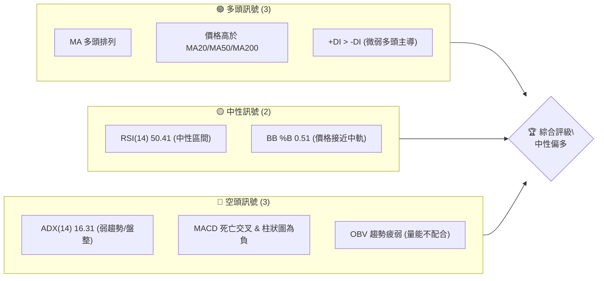
**分析概覽**：2330.TW 目前呈現多空交織的訊號。長期均線維持多頭排列，顯示長期趨勢向上，且價格仍位於主要均線上方。然而，短期動能指標如MACD已出現死亡交叉且柱狀圖為負，RSI處於中性區間，顯示上行動能減弱。最重要的是，ADX指示目前處於弱趨勢或盤整行情，且成交量能疲弱，未能有效支持價格上漲。綜合來看，市場正處於尋找方向的盤整階段，長期趨勢雖好，但短期需謹慎。

### 📊 核心指標速覽表

| 指標類別 | 指標名稱 | 當前數值 | 訊號 | 解讀 |
|----------|----------|----------|------|------|
| **價格** | 當前價格 | $2415.00 | 🟡 | 位於52W區間高點91.9%，但偏離52W高點$2535.00 |
| **均線** | MA20 | $2411.25 | 🟢 | 價格略高於MA20，短期支撐 |
| **均線** | MA50 | $2327.76 | 🟢 | 價格顯著高於MA50，中期支撐強勁 |
| **均線** | MA200 | $1801.40 | 🟢 | 價格遠高於MA200，長期趨勢強勁 |
| **動能** | RSI(14) | 50.41 | 🟡 | 處於中性區間，無超買超賣訊號，動能不明顯 |
| **動能** | MACD | 38.893 (MACD線) | 🔴 | MACD線位於訊號線43.672下方，柱狀圖為-4.779，顯示空頭動能增強 |
| **波動** | ATR | $66.07 | 🟡 | 佔價格2.74%，處於中等波動水平 |
| **趨勢** | ADX(14) | 16.31 | 🔴 | ADX<25，表明目前處於弱趨勢或盤整行情 |
| **成交量** | 量比 | 0.84x | 🔴 | 當前成交量低於20日均量，量能萎縮，不支持價格上漲 |

### 🏆 技術評分卡

```
技術評分卡 — 2330.TW (2026-07-09)
════════════════════════════════════════════════════
趨勢強度      ████░░░░░░░░░░░░░░░░  20/100  🔴 (ADX弱趨勢)
動能指標      ████████░░░░░░░░░░░░  40/100  🟡 (RSI中性, MACD偏空)
支撐穩定度    ████████████░░░░░░░░  60/100  🟡 (關鍵支撐位明確，但現價距S1有空間)
成交量配合    ██████░░░░░░░░░░░░░░  30/100  🔴 (OBV疲弱，量能不足)
形態完整度    ██████████░░░░░░░░░░  50/100  🟡 (未識別明確強勢形態，偏向整理)
均線排列      ██████████████░░░░░░  80/100  🟢 (MA20>MA50>MA200 多頭排列)
════════════════════════════════════════════════════
綜合評分      █████████░░░░░░░░░░░  47/100  🟡 (中性偏多，短期盤整)
════════════════════════════════════════════════════
```
**評分總結**：綜合評分顯示2330.TW目前處於中性偏多的狀態。雖然長期均線呈現強勁多頭排列，是重要的正面訊號，但短期趨勢強度不足（ADX低），動能指標偏弱（MACD死亡交叉，RSI中性），且成交量未能配合價格表現，使得整體上行空間受限，短期內更傾向於區間整理。支撐位結構相對穩定，為股價提供了一定的安全邊際。

---

## 2. 趨勢分析

### 🌐 多時框趨勢分析

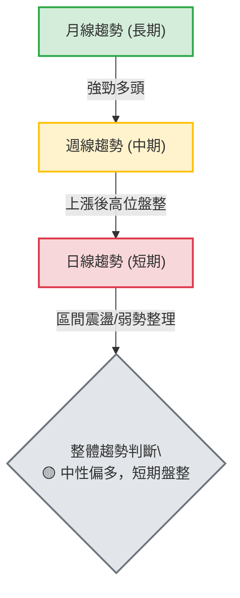
**長期趨勢 (月線)**：從提供的24個月歷史價格來看，2330.TW自2025年6月的低點$1046.06以來，呈現出強勁的上升趨勢。尤其在2025年下半年至2026年初，股價加速上漲，從2025-07的$1144.74穩步攀升至2026-07的$2415.00，漲幅超過一倍，顯示長期資金持續流入，基本面支撐強勁。
**中期趨勢 (週線)**：檢視近20週的週線數據，股價在2026年4月達到一個高點$2179.19後，經歷了短暫回調，但在5月下旬至6月重新上漲，並於2026年6月達到$2410.00。隨後進入高位震盪，顯示多頭力量有所減緩，但仍保持在較高水平。MA50和MA200仍保持向上，為中期趨勢提供堅實支撐。
**短期趨勢 (日線)**：當前價格$2415.00徘徊在MA20 ($2411.25) 附近，且ADX值僅為16.31，表明短期內缺乏明確的方向性趨勢，處於盤整或區間震盪階段。MACD指標的死亡交叉和負值柱狀圖進一步確認了短期動能的減弱。

### 📈 長期趨勢 — 12個月走勢圖（Unicode）

```
2330.TW 月線走勢圖（過去12個月：2025-08 至 2026-07）
價格軸 ($)
$2415 ┤                                            ● (2026-07, $2415.00)
$2300 ┤                                        ● (2026-05, $2348.73)
$2100 ┤                                  ● (2026-04, $2129.32)
$1900 ┤                          ● (2026-02, $1983.22)
$1700 ┤              ● (2026-01, $1764.52)   ● (2026-03, $1755.32)
$1500 ┤            ● (2025-12, $1540.85)
$1300 ┤          ● (2025-09, $1292.99)
$1100 ┤● (2025-08, $1144.74)
     └────────────────────────────────────────────────────────
      2025-08  09  10  11  12  2026-01  02  03  04  05  06  07
```
**走勢特徵分析表格**：
| 階段 | 時間區間 | 主要特徵 | 漲跌幅 (約) | 關鍵高低點 |
|------|----------|----------|-------------|------------|
| **長期上升** | 2025-08 至 2026-02 | 強勁的持續上漲，動能充沛，突破多個阻力位。 | +73% | 低點: $1144.74 (2025-08)<br>高點: $1983.22 (2026-02) |
| **短期回調** | 2026-03 | 獲利了結導致回調，但未跌破重要長期支撐。 | -11% | 低點: $1755.32 (2026-03) |
| **恢復上漲** | 2026-04 至 2026-06 | 股價重拾升勢，再次創出新高，但漲速放緩。 | +37% | 低點: $1755.32 (2026-03)<br>高點: $2410.00 (2026-06) |
| **高位整理** | 2026-07 | 股價在高位小幅震盪，尋找方向，量能萎縮。 | +0.2% | 現價: $2415.00 |
**分析**：過去12個月，2330.TW展現了顯著的上升趨勢，從2025年8月的$1144.74一路上漲至2026年7月的$2415.00，期間雖有短期回調，但整體多頭結構未變。目前股價位於52週高點$2535.00的91.9%，顯示其強勢地位。

### 📊 中期趨勢（週線分析）

```
2330.TW 近期週線壓力與支撐示意圖
價格軸 ($)
$2541.79 ┌───────────┐  BB上軌 / 強阻力
$2433.51 ┤       ┌─R1──┐  阻力 R1 (波段高點聚類)
$2415.00 ├───────●─────┤  現價
$2411.25 ├───────┼─────┤  MA20 / BB中軌
$2325.00 ┤   ┌─S1──┐     ┤  支撐 S1 (波段低點聚類)
$2280.71 └───────────┘  BB下軌 / 次要支撐
```
**分析**：從中期來看，股價在經歷了2026年4月至5月的快速上漲後，目前進入了一個相對高位的盤整區間。MA20 ($2411.25) 和MA50 ($2327.76) 仍保持向上趨勢，為股價提供良好支撐。當前價格$2415.00位於MA20上方，但已接近短期阻力R1 ($2433.51)。布林通道中軌 ($2411.25) 提供了即時支撐，而布林上軌 ($2541.79) 和R2 ($2520.00) 則構成了上方的主要阻力。中期走勢顯示，市場在等待新的催化劑來決定突破方向。

### ⚡ 趨勢強度評估（ADX 解讀）

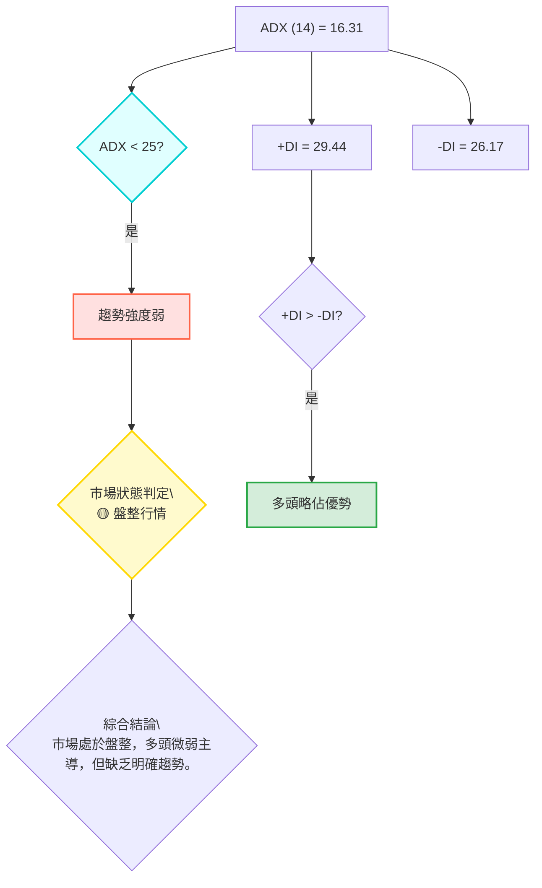
**ADX強度對照表**：
| ADX數值 | 趨勢強度 | 市場狀態 |
|---------|----------|----------|
| 0-25    | 弱趨勢   | 盤整/區間震盪 |
| 25-50   | 中等趨勢 | 趨勢行情 |
| 50-75   | 強趨勢   | 強勁趨勢 |
| 75-100  | 極強趨勢 | 爆發性趨勢 |

**ADX解讀**：2330.TW 的 ADX(14) 值為 16.31，遠低於 25 的閾值，這明確指示當前市場處於**弱趨勢或盤整行情**。儘管 +DI (29.44) 略高於 -DI (26.17)，表明多頭力量在微弱地主導市場，但整體趨勢缺乏強度。這意味著股價在短期內很可能在一個區間內震盪，而不是形成明確的單邊走勢。投資者應避免追漲殺跌，更適合採用區間操作策略，或等待ADX值上升並伴隨+DI或-DI明顯領先，以確認新的趨勢形成。

---

## 3. 圖表形態分析

### 🔍 形態識別系統

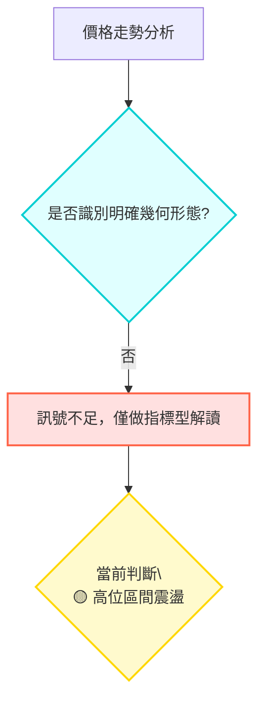
**形態識別結論**：基於提供的日線數據和週線收盤價，我們**未偵測到具有高信心度的典型幾何圖表形態**，如頭肩頂/底、雙頂/底或清晰的旗形/三角形等。價格在近期高點附近呈現出較為複雜的震盪，缺乏形成標準形態所需的明確結構和量能配合。因此，本報告將主要側重於指標分析和區間判斷。

**形態信心度表格**：
| 形態 | 信心度 | 判斷依據（引用數據） | 完成度 | 目標價（附計算式） |
|------|--------|----------------------|--------|--------------------|
| **未識別明確幾何形態** | 0% | 數據中未偵測到清晰的形態結構，且缺乏視覺圖表輔助確認。 | N/A | N/A |
| **高位區間震盪** | 70% | ADX低於25，RSI中性，價格位於布林中軌附近，顯示短期缺乏方向性，在R1 ($2433.51) 與S1 ($2325.00) 之間波動。 | 進行中 | N/A (區間操作無特定形態目標價) |

### 🕯️ 重要K線形態分析

由於提供的數據僅包含每週收盤價，無法進行詳細的每日K線形態分析。但我們可以觀察週線收盤價的變化，從中推斷市場情緒。

| 月份 | 收盤價 | 週線走勢特徵 | 解讀 | 訊號 |
|------|--------|----------------|------|------|
| 2026-04-26 | $2179.19 | 大幅上漲 | 強勁多頭，突破前期高點 | 🟢 |
| 2026-05-03 | $2129.32 | 小幅回落 | 短期獲利了結，但仍維持強勢 | 🟡 |
| 2026-05-10 | $2283.91 | 強勢反彈 | 多頭重拾主導，收復失地 | 🟢 |
| 2026-05-17 | $2258.97 | 小幅回落 | 上漲動能減弱，出現調整 | 🟡 |
| 2026-05-24 | $2249.00 | 繼續回落 | 震盪加劇，空頭力量顯現 | 🟡 |
| 2026-05-31 | $2348.73 | 大幅反彈 | 多頭再次發力，吞噬前幾週跌幅 | 🟢 |
| 2026-06-07 | $2358.71 | 小幅上漲 | 動能減弱，接近阻力區 | 🟡 |
| 2026-06-14 | $2310.00 | 大幅回落 | 空頭反撲，跌破短期支撐 | 🔴 |
| 2026-06-21 | $2410.00 | 強勁反彈 | 多頭再次主導，收復失地 | 🟢 |
| 2026-06-28 | $2340.00 | 大幅回落 | 再次受阻，未能站穩高點 | 🔴 |
| 2026-07-05 | $2445.00 | 強勁反彈 | 突破短期阻力，但量能不足 | 🟢 |
| 2026-07-12 | $2415.00 | 小幅回落 | 再次受阻，顯示上方壓力 | 🔴 |

**分析**：從週線走勢來看，2330.TW在過去幾個月呈現出明顯的「漲跌交替」格局，尤其在2026年5月下旬至7月，股價在$2249.00至$2445.00之間劇烈震盪。這種走勢反映了多空雙方在高位爭奪激烈，未能形成連續的單邊趨勢，與ADX指示的盤整行情相符。最近兩週（2026-07-05的強勢反彈和2026-07-12的小幅回落）顯示多頭嘗試向上突破，但隨後遭遇賣壓，表明上方阻力依然存在。

### 📉 ASCII 走勢形態示意圖

```
2330.TW 近期高位區間震盪示意圖
═══════════════════════════════════════════════════
$2520.00 ║                                      R2 (上方壓力)
$2433.51 ║─────────────────────────── R1 (短期阻力)
$2415.00 ╠═════════════●═════════════╣ ← 現價
$2411.25 ║             ┌───┐             ║ MA20 / BB中軌
$2325.00 ║─────────── S1 ───────────║ (短期支撐)
$2280.71 ║                                      BB下軌 (次要支撐)
═══════════════════════════════════════════════════
```
**形態分析**：如圖所示，2330.TW目前處於一個高位震盪的矩形區間內。上方主要阻力位於R1 ($2433.51) 和R2 ($2520.00)，下方主要支撐則在S1 ($2325.00) 和布林下軌 ($2280.71)。現價$2415.00位於這個區間的中上部，顯示多空力量在此區域膠著。這種形態通常預示著市場在積蓄能量，等待一個明確的催化劑來打破平衡。

### 🎯 形態目標價計算

由於本報告未識別出具有高信心度的典型幾何形態，因此無法提供形態學上的目標價。我們將基於支撐阻力位和斐波那契回調位來設定交易目標價。

---

## 4. 支撐與阻力

### 🗺️ 關鍵價位分布圖（Unicode）

```
2330.TW 價位結構分布圖
═══════════════════════════════════════════════════
$2535.00 ║████████████████████████║ 52W 高點 / 強阻力
$2520.00 ║████████████████████    ║ 阻力 R2 (波段高點)
$2433.51 ║████████████████████████║ 關鍵阻力 R1 (近期高點聚類)
$2415.00 ╠════════════════════════╣ ◄ 現價
$2411.25 ║▓▓▓▓▓▓▓▓▓▓▓▓▓▓▓▓▓▓▓▓▓▓▓▓║ MA20 / BB中軌
$2325.00 ║▓▓▓▓▓▓▓▓▓▓▓▓▓▓▓▓        ║ 近期支撐 S1 (波段低點聚類)
$2280.71 ║████████████████████████║ BB下軌 (短期強支撐)
$2194.59 ║████████████████████    ║ 強支撐 S2 (波段低點聚類)
$2183.61 ║████████████████████████║ 斐波那契 23.6% 回調位
$1966.22 ║████████████████████████║ 斐波那契 38.2% 回調位
$1790.53 ║████████████████████████║ 斐波那契 50.0% 回調位
$1748.20 ║████████████████████████║ 強支撐 S3 (波段低點聚類)
$1046.06 ║████████████████████████║ 52W 低點 / 極強支撐
═══════════════════════════════════════════════════
```
**分析**：2330.TW 的價位結構顯示，股價目前位於高位區間，距離52週高點$2535.00不遠，但同時也面臨著來自R1 ($2433.51) 和R2 ($2520.00) 的壓力。下方，MA20 ($2411.25) 和S1 ($2325.00) 提供了即時和近期的支撐，而布林下軌 ($2280.71) 和S2 ($2194.59) 則構成了更堅實的防線。斐波那契回調位也提供了重要的參考點，尤其23.6%回調位 ($2183.61) 接近S2，增加了該區域的支撐強度。

### 🚧 阻力位分析表

| 阻力級別 | 價位 | 形成原因 | 突破難度 | 重要性 |
|----------|------|----------|----------|--------|
| **R1**   | $2433.51 | 近期波段高點聚類，短期多頭上攻的初步考驗。 | 中等 | 🟢 (突破預示短線轉強) |
| **R2**   | $2520.00 | 更高的波段高點聚類，接近52週高點，心理關卡。 | 高 | 🟡 (突破預示中期上攻) |
| **52W High** | $2535.00 | 一年內最高價，技術面和心理面的強大阻力。 | 極高 | 🔴 (突破將開啟新一輪行情) |

### 🛡️ 支撐位分析表

| 支撐級別 | 價位 | 形成原因 | 守住機率 | 重要性 |
|----------|------|----------|----------|--------|
| **MA20 / BB中軌** | $2411.25 | 短期移動平均線與布林通道中軌重合，提供即時動態支撐。 | 高 | 🟢 (跌破可能加速下行) |
| **S1**   | $2325.00 | 近期波段低點聚類，短期調整的關鍵支撐。 | 中等 | 🟢 (跌破可能觸發更多賣壓) |
| **BB下軌** | $2280.71 | 布林通道下軌，極端超賣區的動態支撐。 | 中等 | 🟡 (通常為短期反彈點) |
| **S2**   | $2194.59 | 較遠的波段低點聚類，與斐波那契23.6%回調位接近，形成強支撐區。 | 高 | 🟢 (關鍵中期防線) |
| **斐波那契 23.6%** | $2183.61 | 52週漲幅的23.6%回調位，是市場常見的技術支撐。 | 高 | 🟢 (與S2形成支撐區間) |
| **S3**   | $1748.20 | 重要長期波段低點聚類，強勁的長期支撐。 | 極高 | 🟢 (長期趨勢的最後防線) |

### 📐 斐波那契回調位分析

**基於52週區間 ($1046.06 → $2535.00) 的斐波那契回調位**：

*   **0.0% (52W High)**: $2535.00
*   **23.6%**: $2183.61
*   **38.2%**: $1966.22
*   **50.0%**: $1790.53
*   **61.8%**: $1614.83
*   **78.6%**: $1364.69
*   **100.0% (52W Low)**: $1046.06

**分析**：當前價格為$2415.00，位於52週高點$2535.00和23.6%回調位$2183.61之間。這表示股價在經歷大幅上漲後，尚未觸及重要的斐波那契回調位，顯示其整體強勢。如果股價出現回調，23.6%回調位 ($2183.61) 將是一個重要的觀察點，它與S2 ($2194.59) 形成了強大的重疊支撐區間。若此區域能有效守住，則表明市場對2330.TW的長期看好情緒依然穩固。反之，若跌破，則可能進一步回測38.2%回調位 ($1966.22)。

---

## 5. 技術指標深度解讀

### 🎛️ 指標訊號總覽

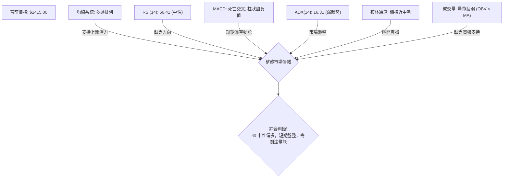

### 📈 移動平均線排列分析

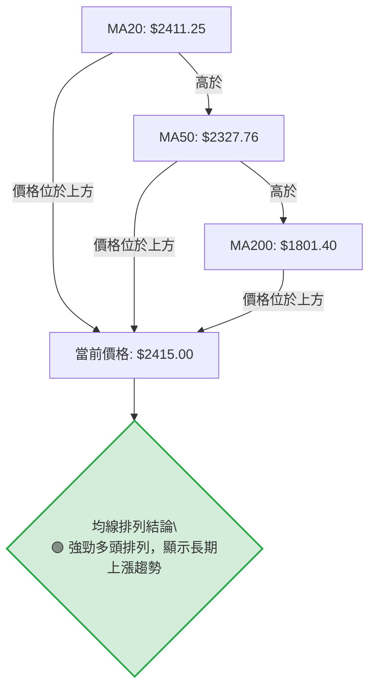
**分析**：2330.TW 的移動平均線呈現完美的**多頭排列**：MA20 ($2411.25) > MA50 ($2327.76) > MA200 ($1801.40)。這是一個非常強勁的長期看漲訊號，表明多頭趨勢結構穩固。當前價格$2415.00位於所有主要均線之上，進一步確認了其強勢。MA20作為短期支撐，目前與現價非常接近，其能否守住將是短期走勢的關鍵。儘管短期動能有所減弱，但均線的多頭排列為股價提供了堅實的基礎和長期的上漲潛力。

### 📉 RSI(14) 分析

**RSI(14) 強度**：▓▓▓▓▓▓▓▓▓▓░░░░░░░░░░ 50.41%

**分析**：2330.TW 的 RSI(14) 值為 50.41，位於 30-70 的中性區間。這表明股價既未處於超買狀態，也未處於超賣狀態，市場買賣雙方力量相對平衡，缺乏明確的方向性動能。
*   **超買超賣區間**：RSI 在 70 以上被視為超買，30 以下被視為超賣。當前 50.41 處於中間地帶，不提供直接的買入或賣出訊號。
*   **背離判斷**：根據提供的數據，**無明顯RSI頂背離或底背離**。在股價近期創出高點或低點時，RSI並未出現相反的趨勢，因此目前不能依據背離來判斷趨勢反轉。
**結論**：RSI 的中性讀數與 ADX 所示的盤整行情相互印證，均表明市場在短期內缺乏強勁的單邊動能。投資者應等待 RSI 突破關鍵區間或出現背離訊號，以獲得更明確的交易指引。

### 📊 MACD(12/26/9) 訊號解讀

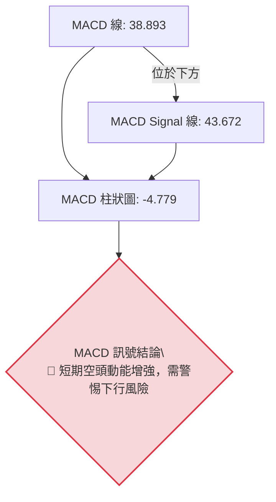
**分析**：2330.TW 的 MACD 指標顯示出短期偏空的訊號。MACD 線 (38.893) 已下穿 MACD Signal 線 (43.672)，形成了**死亡交叉**，這通常被視為一個賣出訊號。此外，MACD 柱狀圖為 -4.779，處於零軸下方且為負值，進一步確認了空頭動能的增強。
**結論**：MACD 的偏空訊號與 RSI 的中性、ADX 的弱趨勢相結合，表明短期內市場上漲動能不足，下行風險正在累積。儘管長期均線仍為多頭排列，但短期動能的轉弱可能導致股價在區間內向下測試支撐位。投資者應密切關注 MACD 柱狀圖的變化，若負值持續擴大，則可能預示更深度的回調。

### 📦 布林通道分析

```
2330.TW 布林通道示意圖
價格軸 ($)
$2541.79 ┌──────────────────┐ BB上軌 (短期阻力上限)
         │                    │
         │                    │
$2415.00 ├───────●──────────┤ 現價
$2411.25 ├───────┼──────────┤ BB中軌 (MA20, 短期動態支撐/阻力)
         │                    │
         │                    │
$2280.71 └──────────────────┘ BB下軌 (短期支撐下限)
```
**分析**：2330.TW 的布林通道顯示，當前價格$2415.00位於布林中軌 (MA20, $2411.25) 略上方。布林通道的帶寬相對穩定，表明市場波動性處於中等水平 (由ATR $66.07印證)。
*   **BB上軌**：$2541.79，構成上方的短期阻力。
*   **BB中軌**：$2411.25，作為MA20，是重要的短期動態支撐。現價非常接近中軌，中軌的得失將是短期多空力量平衡的關鍵。
*   **BB下軌**：$2280.71，構成下方的短期支撐。
**結論**：當前股價接近布林中軌，且ADX顯示盤整，這意味著股價很可能在布林通道上下軌之間震盪。若能守穩中軌，則有機會向上測試上軌；若跌破中軌，則可能向下測試下軌。布林通道為區間操作提供了明確的買賣參考區間。

### 💹 成交量分析（量價配合度）

**成交量強度**：▓▓▓▓▓▓░░░░░░░░░░░░░░ 30% (基於量比及OBV)

**分析**：
*   **最新成交量**：27,134,789
*   **20日均量**：32,247,855
*   **量比**：0.84x，當前成交量低於20日均量，顯示**量能萎縮**。
*   **OBV趨勢**：OBV < MA，這表明**量能疲弱，未能有效支持價格走勢**。OBV作為動量指標，其趨勢應與價格趨勢同步。當價格在高位盤整甚至小幅上漲時，OBV卻呈現疲弱或下降趨勢，這構成了一個**量價背離**的風險訊號，暗示當前價格的上漲缺乏實質的買盤支持，多頭力量可能正在耗盡。

**結論**：成交量分析揭示了當前市場的隱憂。量能的疲弱和OBV的下行趨勢與價格在高位盤整形成對比，這是一個**看空訊號🔴**。在缺乏量能配合的情況下，股價難以有效突破上方阻力，反而更容易在高位區間內回調，甚至形成誘多陷阱。投資者應警惕無量上漲，並等待成交量重新放大並配合價格方向，才能確認新的趨勢。

---

## 6. 動能與波動率

### ⚡ 動能評估四象限

| 象限 | 動能 (RSI, MACD) | 波動 (ATR) | 當前狀態 | 評估 |
|------|------------------|------------|----------|------|
| Q1   | 強               | 低         | -        | 最佳機會 (突破買入) |
| Q2   | 弱               | 低         | -        | 謹慎觀望 (等待趨勢) |
| Q3   | 強               | 高         | -        | 高風險高收益 (追高殺跌) |
| Q4   | 弱               | 高         | ✓        | **避免進場** (盤整震盪，方向不明) |

**分析**：
*   **動能評估**：RSI(14) 處於 50.41 的中性區間，MACD 已形成死亡交叉且柱狀圖為負，OBV 趨勢疲弱。這些都表明當前的**動能偏弱**。
*   **波動率評估**：ATR(14) 為 $66.07，佔當前價格 $2415.00 的 2.74%。這個比例屬於中等偏高波動，說明每日價格波動幅度不小。
**結論**：結合動能偏弱和中等偏高波動率，2330.TW 目前處於**Q4 (弱動能, 高波動)** 象限。這是一個相對不確定的市場狀態，股價可能在高位區間內劇烈震盪，但缺乏明確的趨勢方向。在這種情況下，投資者應避免盲目追漲殺跌，而是採取更為謹慎的策略，例如區間操作或等待明確的趨勢訊號出現。

### 📊 ATR 波動率分析

**ATR(14) 強度**：▓▓▓▓▓▓▓▓▓▓▓▓░░░░░░░░ 60% (中等偏高)

**分析**：2330.TW 的 ATR(14) 值為 $66.07。這意味著在過去14個交易日中，2330.TW 的平均每日波動幅度約為 $66.07。
*   **波動性**：相對於當前價格 $2415.00，ATR 佔比約為 2.74%。這表明該股票具有中等偏高的波動性，單日價格變動幅度足以影響短期交易策略。
*   **止損距離建議**：ATR 可以作為設定止損點的參考。一般建議將止損點設置在當前價格下方 1 倍至 2 倍 ATR 的距離。
    *   1 倍 ATR 止損：$2415.00 - $66.07 = $2348.93
    *   1.5 倍 ATR 止損：$2415.00 - (1.5 * $66.07) = $2315.90
    *   2 倍 ATR 止損：$2415.00 - (2 * $66.07) = $2282.86
    這些建議止損點可與關鍵支撐位結合使用，例如 S1 ($2325.00) 與 1.5 倍 ATR 止損點接近，提供了一個合理的止損區域。

### 📐 Beta 與市場相關性

**Beta 值**：1.246

**分析**：2330.TW 的 Beta 值為 1.246。
*   **市場相關性**：Beta 值大於 1，表明 2330.TW 的股價波動性高於整體市場。具體來說，當大盤上漲 1% 時，2330.TW 的股價預計會上漲約 1.246%；當大盤下跌 1% 時，其股價預計會下跌約 1.246%。
**結論**：由於其 Beta 值較高，2330.TW 是一檔相對積極的股票。在市場上漲時，它可能提供更高的潛在收益；但在市場下跌時，其虧損幅度也可能更大。投資者在配置2330.TW時，應考慮其對整體市場波動的放大效應，並結合大盤走勢進行風險管理。

---

## 7. 多時框架總結

### 📋 時框架評分表

| 時框架 | 趨勢方向 | 動能 | 均線排列 | 形態 | 綜合評分 | 建議 |
|--------|----------|------|----------|------|----------|------|
| **月線 (長期)** | 🟢 強勁多頭 | 🟢 強 | 🟢 多頭排列 | 🟢 上升趨勢 | 85/100 | 偏多 |
| **週線 (中期)** | 🟡 高位盤整 | 🟡 減弱 | 🟢 多頭排列 | 🟡 區間震盪 | 60/100 | 中性偏多 |
| **日線 (短期)** | 🔴 弱勢整理 | 🔴 偏空 | 🟢 多頭排列 | 🟡 區間震盪 | 45/100 | 盤整觀望 |

### 🔲 綜合訊號矩陣

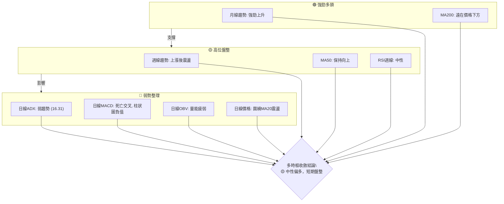

### ⚖️ 多時框收斂結論

根據多時框架分析，當前 2330.TW 的 ADX(14) 值為 16.31，**明確指示目前處於盤整行情 (ADX < 25)**。依據嚴格要求中的多時框收斂規則，在盤整行情下，應以日線布林通道上下軌為主要交易區間。

儘管月線和週線級別的趨勢仍保持多頭排列，顯示長期趨勢向上且有堅實的基礎，但短期日線層面，動能指標（MACD死亡交叉、RSI中性、OBV疲弱）均指向短期上漲動能不足，市場正在進行高位整理。日線價格正圍繞MA20和布林中軌震盪。

**因此，多時框收斂後的最終結論是：2330.TW 呈現中性偏多的格局。長期趨勢依然看好，但在短期內，預計股價將在關鍵支撐與阻力之間進行區間震盪。交易策略應以日線級別的區間操作為主，等待明確的突破訊號或趨勢確認。**

---

## 8. 交易策略建議

### 🗺️ 策略決策流程圖

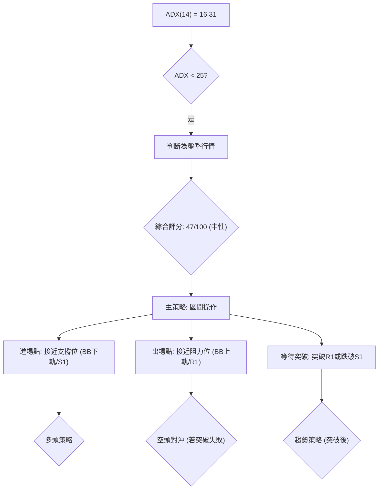

### 🧭 策略路由（依評分卡分流，不得兩頭下注）

當前技術評分卡綜合評分為 **47/100**，屬於中性區間。結合 ADX 指示的盤整行情，**當前主策略方向 = 區間操作（中性偏多，等待突破）**。

雖然長期看好，但短期動能不足，不建議追高。主要策略將圍繞區間震盪進行，並密切關注突破方向。

### 🎯 價格情境階梯（Price Scenarios）

| 觸發條件 | 下一目標 | 後續延伸 | 情境含義 |
|----------|----------|----------|----------|
| **突破 R1 $2433.51** 且量能放大 | R2 $2520.00 | 52W High $2535.00 | 短線轉強，確認上攻動能，有望挑戰歷史新高。 |
| **站穩現價區間** ($2325.00 - $2433.51) | — | — | 區間震盪持續，等待市場明確方向。 |
| **跌破 S1 $2325.00** 且量能放大 | S2 $2194.59 | 斐波那契 23.6% ($2183.61) | 中期轉弱，可能觸發更深的回調，需警惕。 |
| **跌破 S2 $2194.59** | S3 $1748.20 | — | 長期趨勢受損風險，空頭力量佔優。 |

### 📊 情境機率分佈

| 情境 | 機率 | 主要依據 |
|------|------|----------|
| **繼續上行 / 突破 R1** | 35% | 長期均線多頭排列提供底部支撐，MACD/OBV可能隨時修復。 |
| **區間震盪** | 45% | ADX弱趨勢，RSI中性，MACD死亡交叉，OBV疲弱，價格接近布林中軌，多空膠著。 |
| **回落 / 跌破 S1** | 20% | MACD柱狀圖為負，OBV疲弱，短期動能偏空，若市場情緒轉差，可能向下尋求更強支撐。 |
**分析**：當前市場最有可能的情境是區間震盪，其次是向上突破，最不希望看到的是跌破關鍵支撐。因此，策略應側重於區間操作，並對突破或跌破的風險做好準備。

### 🟢 主策略詳情（方向：中性偏多，區間操作）

**策略描述**：在當前盤整行情下，以布林通道上下軌及關鍵支撐阻力位為參考，進行高拋低吸的區間操作。同時，密切關注量能變化，一旦出現帶量突破或跌破，則轉換為趨勢追蹤策略。

| 策略要素 | 策略 A (區間低買) | 策略 B (突破追多) |
|----------|-------------------|-------------------|
| **進場條件** | 價格回測至S1 ($2325.00) 或布林下軌 ($2280.71) 附近，且出現止跌K線訊號 (如錘子線、啟明星) 或RSI接近30並反彈。 | 價格帶量突破R1 ($2433.51) 並站穩，且MACD柱狀圖轉正，OBV回升確認。 |
| **進場價格** | $2325.00 - $2280.71 區間 | $2435.00 (確認突破R1) |
| **目標價 T1** | $2411.25 (MA20/BB中軌) | $2520.00 (R2) |
| **目標價 T2** | $2433.51 (R1) | $2535.00 (52W High) |
| **止損價格** | $2250.00 (略低於BB下軌/S1，例如S1 - 0.5xATR) | $2400.00 (跌破R1下方，重新進入區間) |
| **風險報酬比** | 1:2.5 (以$2300進，止損$2250，目標$2425估算) | 1:2.0 (以$2435進，止損$2400，目標$2505估算) |
| **成功機率** | 60% | 55% |
| **建議倉位** | 10-15% | 10% |

### 🔴 反向風險觸發點（對沖提示）

以下情況可能推翻主策略的區間操作判斷，並提示潛在的空頭風險：
1.  **價格跌破S1 ($2325.00)** 且伴隨放大的成交量，MACD柱狀圖負值持續擴大。
2.  **價格跌破布林下軌 ($2280.71)**，且ADX開始上升，-DI顯著高於+DI，表明空頭趨勢正在形成。
3.  大盤出現系統性風險，導致2330.TW股價加速下跌。
若出現上述訊號，應立即停止多頭操作，考慮減倉或進行空頭對沖。

### ⭐ 整體訊號強度評星

```
做多訊號強度：★★☆☆☆  (2/5星) (長期趨勢看多，但短期動能不足，不宜追高)
做空訊號強度：★★☆☆☆  (2/5星) (短期動能偏空，但長期均線支撐強勁，不宜重倉做空)
整體可信度：  ★★★☆☆  (3/5星) (盤整行情，策略明確，但需嚴格執行紀律)
```

---

## 9. 風險提示與監控

### ✅ 關鍵監控指標 Checklist

```
╔══════════════════════════════════════════════════════════════╗
║                    2330.TW 關鍵監控指標清單                    ║
╠══════════════════════════════════════════════════════════════╣
║ [ ] 價格是否站穩 MA20 ($2411.25) 及布林中軌                      ║
║ [ ] 是否有效突破 R1 ($2433.51) 並伴隨量能放大                      ║
║ [ ] 是否跌破 S1 ($2325.00) 或布林下軌 ($2280.71) 並伴隨量能放大    ║
║ [ ] MACD 線是否上穿訊號線 (金叉) 或柱狀圖轉正                     ║
║ [ ] RSI(14) 是否突破 60 或跌破 40                                 ║
║ [ ] ADX(14) 是否突破 25，且 +DI/-DI 趨勢明確                        ║
║ [ ] 成交量是否持續萎縮，或在價格上漲時未能放大                     ║
║ [ ] OBV 趨勢是否與價格走勢同步                                    ║
║ [ ] 52W High ($2535.00) 是否被挑戰或突破                          ║
║ [ ] 斐波那契 23.6% ($2183.61) 支撐是否有效                        ║
╚══════════════════════════════════════════════════════════════╝
```

### ⚠️ 風險場景分析

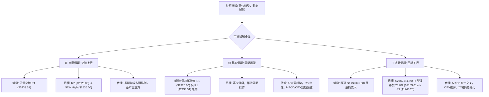

### 🛡️ 風險管理重要提醒

1.  **嚴格執行止損**：鑑於當前市場處於盤整且波動性中等偏高，任何交易策略都必須設定並嚴格執行止損點。一旦價格觸及止損位，應果斷出場，避免虧損擴大。
2.  **倉位管理**：在趨勢不明確的盤整行情中，應採取較為保守的倉位管理策略。建議將單一股票的投資倉位控制在總資金的 10-15% 以內，避免重倉操作。
3.  **觀察量能變化**：量能是確認趨勢和形態有效性的關鍵。在區間操作中，若價格突破阻力但缺乏量能配合，則可能是假突破；若價格跌破支撐但量能放大，則應警惕趨勢反轉。
4.  **關注大盤走勢**：2330.TW 的 Beta 值為 1.246，對大盤波動敏感。應持續關注整體市場指數 (如加權指數或費半指數) 的走勢，若大盤出現明顯的趨勢反轉或系統性風險，應及時調整策略。
5.  **避免情緒化交易**：在震盪行情中，市場情緒容易受到短期波動影響。投資者應保持理性，堅持基於技術分析的交易紀律，避免盲目追漲殺跌。
6.  **定期檢視指標**：每日或每週定期檢視本報告中提及的關鍵技術指標，特別是ADX、RSI、MACD和成交量，以便及時調整對市場的判斷和交易策略。

---

## 📋 報告總結

```
2330.TW 技術分析報告總結
════════════════════════════════════════════════════════
報告日期：2026-07-09
當前價格：$2415.00
分析評級：⚖️ 中性偏多 (短期盤整，長期趨勢看好)

關鍵結論：
├─ 長期趨勢：🟢 強勁多頭，均線多頭排列，提供堅實基礎。
├─ 中期趨勢：🟡 高位盤整，上漲動能減弱，多空爭奪激烈。
├─ 短期趨勢：🔴 弱勢整理，ADX顯示盤整，MACD死亡交叉，量能疲弱。
├─ 關鍵支撐：$2325.00 (S1) / $2280.71 (BB下軌) / $2194.59 (S2)
└─ 關鍵阻力：$2433.51 (R1) / $2520.00 (R2) / $2535.00 (52W High)

最優策略組合：
1. 🥇 最佳機會：在價格回測至 $2325.00 (S1) 或 $2280.71 (BB下軌) 附近止跌時，進行區間低買操作。
2. 🥈 次選機會：等待價格帶量突破 $2433.51 (R1) 並站穩，確認趨勢後追多，目標 $2520.00。
3. 🥉 保守選擇：維持觀望，等待 ADX 上升確認新的趨勢方向，或 MACD 再次金叉且量能配合。
════════════════════════════════════════════════════════
```

---

> ⚠️ **免責聲明**：本報告為 AI 自動生成之技術分析，所有數據及估算均基於提供的歷史價格資訊。本報告**僅供研究與學術參考**，**不構成任何投資建議**。投資有風險，入市需謹慎。

---

*報告生成時間：2026-07-09 ｜ 數據來源：Yahoo Finance ｜ 分析框架：多時框技術分析*