<details>
<summary>📊 靜態圖表 (點擊展開)</summary>
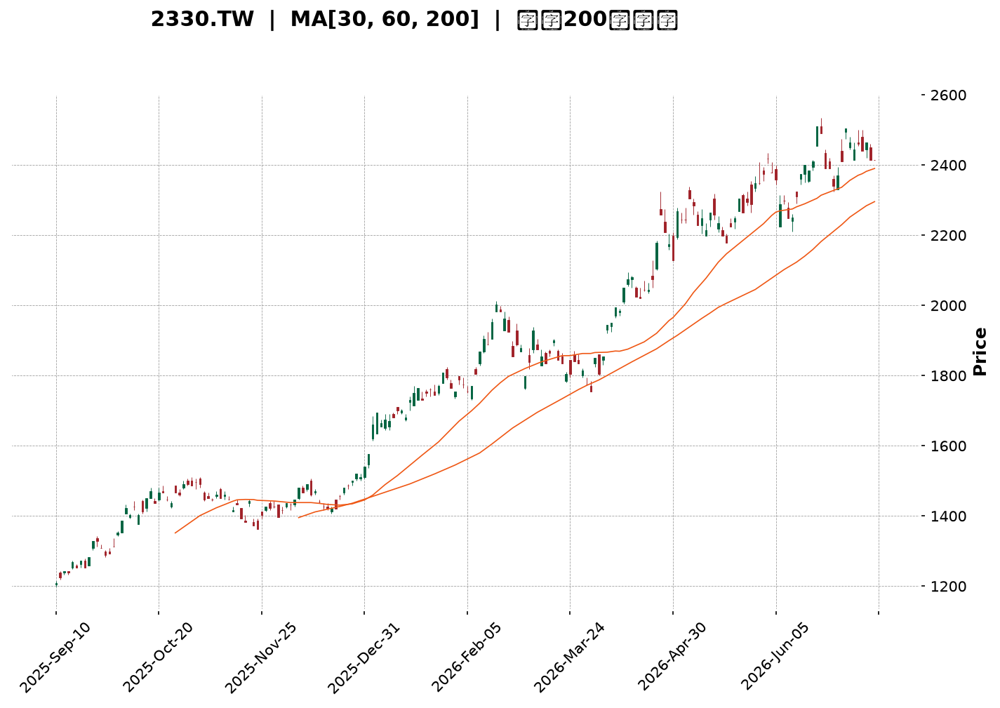
</details>

<html>
<head><meta charset="utf-8" /></head>
<body>
    <div style="height:500px; width:100%;">                        <script>window.PlotlyConfig = {MathJaxConfig: 'local'};</script>
        <script charset="utf-8" src="https://cdn.plot.ly/plotly-3.7.0.min.js" integrity="sha256-jvTGqxNp8AGWEcvNLVuKr+8j5dGe9Yw51LQkmDH+IYA=" crossorigin="anonymous"></script>                <div id="candlestick-chart" class="plotly-graph-div" style="height:100%; width:100%;"></div>            <script>                window.PLOTLYENV=window.PLOTLYENV || {};                                if (document.getElementById("candlestick-chart")) {                    Plotly.newPlot(                        "candlestick-chart",                        [{"close":{"dtype":"f8","bdata":"AAAAgIvjkkAAAABgwR6TQAAAAAC0bZNAAAAAYPdZk0AAAACA3NCTQAAAAABqlZNAAAAAgK3kk0AAAAAAapWTQAAAACBPDJRAAAAA4Ka+lEAAAADgpr6UQAAAAGBjb5RAAAAA4B8glEAAAADA8DOUQAAAAEA0g5RAAAAAILshlUAAAABAcayVQAAAAEAnN5ZAAAAA4OPnlUAAAAAg+EqWQAAAAODj55VAAAAAYIUPlkAAAABgDK6WQAAAAOBP\u002fZZAAAAAwJlylkAAAAAAf+mWQAAAAAB\u002f6ZZAAAAAgDualkAAAADAmXKWQAAAAAB\u002f6ZZAAAAAQK7VlkAAAABAk0yXQAAAAECTTJdAAAAAYMI4l0AAAAAgZGCXQAAAAECTTJdAAAAAgDualkAAAABgDK6WQAAAAIA7mpZAAAAAQK7VlkAAAABgDK6WQAAAAECu1ZZAAAAAgDualkAAAABAViOWQAAAAODIXpZAAAAAAELAlUAAAABgoJiVQAAAAMBqhpZAAAAAgP5wlUAAAADgXEmVQAAAAODj55VAAAAAIPhKlkAAAABAJzeWQAAAACD4SpZAAAAAABPUlUAAAABAViOWQAAAAMCZcpZAAAAA4MhelkAAAACAO5qWQAAAAKDxJJdAAAAAAH\u002fplkAAAABAk0yXQAAAAKBI1ZZAAAAAQAz9lkAAAACAwYWWQAAAAEAcSpZAAAAAgDo2lkAAAACAOjaWQAAAAIA6NpZAAAAAwGbBlkAAAACgzySXQAAAAICxOJdAAAAA4FZ0l0AAAADg3cOXQAAAAEAanJdAAAAAAGUTmEAAAABgkZ6YQAAAAICP8JlAAAAA4Lt7mkAAAABAcQSaQAAAAOA0LJpAAAAAAFMYmkAAAACAFkCaQAAAAMCdj5pAAAAAwJ2PmkAAAACAFkCaQAAAAEDoBptAAAAAQG9Wm0AAAACgFJKbQAAAAEDoBptAAAAAQG9Wm0AAAADgMn6bQAAAAKCNQptAAAAAgPalm0AAAACgBEWcQAAAAGBfCZxAAAAAoBSSm0AAAAAgUWqbQAAAAIB99ZtAAAAAINi5m0AAAAAgUWqbQAAAAID2pZtAAAAAwCIxnEAAAADgmTOdQAAAAEDGvp1AAAAAACGDnUAAAADgl4WeQAAAAKBpTJ9AAAAAoOL8nkAAAACAW62eQAAAAEBNDp5AAAAAgPT3nEAAAAAAIYOdQAAAAGBdW51AAAAAAEEdnEAAAABAT7ycQAAAACAvIp5AAAAAoHtHnUAAAACA9PecQAAAAIBtqJxAAAAAABkknUAAAACgua+dQAAAAIBP1JxAAAAAwGqsnEAAAACAvDScQAAAAIC8NJxAAAAAIF3AnEAAAADAaqycQAAAAEChXJxAAAAAQA69m0AAAADARG2bQAAAAOBB6JxAAAAAgLw0nEAAAABANPycQAAAAAA\u002fY55AAAAAYDF3nkAAAADAtiqfQAAAAADSAp9AAAAAgBADoEAAAABg7jSgQAAAAKDnPqBAAAAAAGWin0AAAACgco6fQAAAAIAu8p9AAAAAgC7yn0AAAABg7jSgQAAAAGBfBqFAAAAAYPKloUAAAACANkKhQAAAACBm\u002fKBAAAAAgKOioEAAAADA5LmhQAAAAOAGiKFAAAAA4AaIoUAAAAAgtf+hQAAAAGDQ16FAAAAAQBtqoUAAAAAAAJKhQAAAAKAvTKFAAAAAoOuvoUAAAABg8qWhQAAAAIAUdKFAAAAAIEQuoUAAAABgXwahQAAAAAAiYKFAAAAAAACSoUAAAAAgtf+hQAAAAKDrr6FAAAAAwMLroUAAAACAyeGhQAAAAMB3WaJAAAAAwHdZokAAAADAVYuiQAAAAGAY5aJAAAAA4E6VokAAAAAgam2iQAAAAIDJ4aFAAAAA4Lv1oUAAAAAAAJKhQAAAAAAAlKFAAAAAAAAMokAAAAAAAI6iQAAAAAAAwKJAAAAAAACiokAAAAAAANSiQAAAAAAAnKNAAAAAAAB0o0AAAAAAAKyiQAAAAAAArKJAAAAAAABIokAAAAAAAISiQAAAAAAA1KJAAAAAAACSo0AAAAAAAEKjQAAAAAAAGqNAAAAAAAA4o0AAAAAAABCjQAAAAAAAQqNAAAAAAADeokAAAAAAAN6iQA=="},"high":{"dtype":"f8","bdata":"AkapJkj3kkCllFL6s22TQAAAAAC0bZNAvSWhBrRtk0AAAIBcreSTQIiCK7kLvZNAAAAAgK3kk0BTxuxOfviTQAAAACBPDJRAAAAA4Ka+lEAfqJx1GfqUQBA++BgFl5RArdRKdZJblEBVVVVVY2+UQLyVfY5I5pRAvMd7\u002fIs1lUAAAABAcayVQLZMFvnIXpZAEZebvLT7lUCrqqq1aoaWQBGXm7y0+5VAHWDZZjualkAAAABgDK6WQHW4GpnxJJdAXypoVQyulkCYIp+V8SSXQHWDKXLCOJdAP378ON3BlkAfDnicaoaWQHWDKXLCOJdA8m\u002fp1SARl0Bdv\u002fv4NHSXQAufedUFiJdAZ2Zmrtabl0AEsgHZBYiXQLp+97HWm5dAnjt3zk\u002f9lkCG7oP1fumWQB8\u002fflwMrpZAoUpG+U\u002f9lkAN3QeL8SSXQKFKRvlP\u002fZZAP378ON3BlkA+09b490qWQDHIXnU7mpZAkYnRKic3lkAkjzzS4+eVQA5Ql5w7mpZAt9Ks8UHAlUCx9g0LQsCVQCMuN5mFD5ZAAAAAIPhKlkBsmSyyaoaWQKuqqrVqhpZAEJMrCMlelkA+09b490qWQAAAAMCZcpZAZu10vJlylkAAAACAO5qWQAAAAKDxJJdAdYMpcsI4l0AAAABAk0yXQAAAAJA4iJdApshnBe4Ql0DQ6ktFo5mWQGIutMrfcZZAs6Qc0N9xlkCR4V5FHEqWQNVn2lqjmZZAvQg+hUjVlkAAAACgzySXQFDmWUWTTJdAAAAA4FZ0l0AAAADg3cOXQKK8hsrdw5dAAAAAAGUTmEAAAABgkZ6YQH+L01r4U5pAAAAA4Lt7mkBi0bLKNCyaQILFPDDaZ5pAVVVVFdpnmkBow+fPu3uaQLeS2kpht5pAW0lthX+jmkBFgpoK2meaQKuqqsqrLptA0kUXVfalm0AAAACgFJKbQKuqqhpRaptA6aKLyjJ+m0BVVVWlFJKbQGAERkDYuZtAlqxkRdi5m0AAAACgBEWcQG12cQCqgJxAx2+Xen31m0AAAAAgUWqbQKuqqgpBHZxAlXAnNV8JnEB5mgtw9qWbQAAAAID2pZtAxzIo1amAnEAAAADgmTOdQN3LscqJ5p1A1e+5ZU0OnkBn0pVqW62eQAzkoyotdJ9ACMwe8Ic4n0DVKGOV4vyeQIO+oC89wZ5AaQ7fb+SqnUCSdqxAtnGeQKuqquogg51AAAAAAEEdnEBGteVqXVudQAW+uKrySZ5AvLoVQMa+nUASsUaVe0edQAUJo+WZM51ATNgGwf1LnUAEAoEArMOdQDkPHcP9S51ALWQhAxkknUBtx4fgrkicQGg7PoRP1JxAMjgfYws4nUB705uiJhCdQHAIh6CTcJxACEUowtcMnEB00UUD8+SbQAAAAOBB6JxArpHVpSYQnUAAAABANPycQAAAAAA\u002fY55AAAAAYDF3nkAAAADAtiqfQFx\u002fe2DEFp9AAAAAgBADoEDFTuwg01ygQP\u002fBRNDgSKBALzFroQkNoEDCFmxxEAOgQBO1KzH1KqBAD8TvAPwgoECd2Ilyo6KgQGmcQZBYEKFAGNE205knokD5Y0nz3cOhQKszUkE9OKFAVFwyhDZCoUDgB34g182hQGhFI6Hrr6FAdbn9MdfNoUAffPBxhUWiQPQuHiG1\u002f6FAOiUBwuS5oUAU3z3x3cOhQMln3WAUdKFAAAAAoOuvoUDvhfeioB2iQEmSJEH5m6FAURRFESJgoUAPDkhRPTihQAWEE\u002fH\u002fkaFABJM\u002fMPmboUAAAAAgtf+hQDbwGbOgHaJAoGir4ZknokCeDyzzcGOiQLt\u002f84BcgaJAL3\u002faAibRokCBXBOBOrOiQENasfADA6NAcqdoASbRokBO8OShM72iQMZUOHGnE6JA75W6cKcTokAkKzyywuuhQAAAAAAAqKFAAAAAAAAqokAAAAAAAI6iQAAAAAAAwKJAAAAAAACiokAAAAAAAN6iQAAAAAAAnKNAAAAAAADOo0AAAAAAABqjQAAAAAAA6KJAAAAAAACEokAAAAAAALaiQAAAAAAAVqNAAAAAAACSo0AAAAAAAGCjQAAAAAAAQqNAAAAAAACIo0AAAAAAAIijQAAAAAAAQqNAAAAAAAA4o0AAAAAAAN6iQA=="},"hovertemplate":"\u003cb\u003e%{x|%Y-%m-%d}\u003c\u002fb\u003e\u003cbr\u003e\u958b: $%{open:.2f}\u003cbr\u003e\u9ad8: $%{high:.2f}\u003cbr\u003e\u4f4e: $%{low:.2f}\u003cbr\u003e\u6536: $%{close:.2f}\u003cextra\u003e\u003c\u002fextra\u003e","low":{"dtype":"f8","bdata":"\u002fHOtMhK8kkDXWmu5BAuTQLMsy7I6RpNAQ9peuTpGk0AAAAAOmYGTQAAAAABqlZNAco1yDWqVk0AAAAAAapWTQK0bTNE6qZNAIj1QkZJblEDhV2NKNIOUQAAAAGBjb5RAG7mRA08MlEAAAADA8DOUQAAAAEA0g5RAh3AIZxn6lEAAAAA4uyGVQO+MXqq0+5VA3tHIJkLAlUA5juNmViOWQKoM9pDPhJVAs82Xg7T7lUDug\u002fV7hQ+WQBaPym0MrpZAAAAAwJlylkCtG0yxaoaWQAAAAAB\u002f6ZZA4MCBo2qGlkCg1ZcqJzeWQAAAAAB\u002f6ZZAr9pcY93BlkD1YIaqIBGXQFIggmPCOJdAAAAAYMI4l0D5m\u002fytIBGXQKRABIfxJJdA4MCBo2qGlkAAAABgDK6WQODAgaNqhpZAX7W5hgyulkAAAABgDK6WQA6QFqo7mpZAAAAAgDualkBglpRjhQ+WQAAAAODIXpZAAAAAAELAlUAAAABgoJiVQNYPOir4SpZAAAAAgP5wlUAAAADgXEmVQN7RyCZCwJVAVlVVioUPlkCl2XRjViOWQB3HcUMnN5ZAAAAAABPUlUDBLCmHtPuVQKDVlyonN5ZAzjehSlYjlkCCAwcO+EqWQIcm+Zc7mpZAAAAAAH\u002fplkBHgQjOT\u002f2WQKuqqtpmwZZAtG4wtUjVlkAvFbS633GWQJ7RS7VYIpZAbx6hulgilkBNW+MvlfqVQAAAAIA6NpZAh+6DNaOZlkAh+fOKSNWWQF8zTPXtEJdAk7\u002fJj7E4l0CrqqrKVnSXQF5DebVWdJdApwFtmjiIl0CB4DI1g\u002f+XQE5rto+fPZlA\u002ffPPnyaNmUCdLk21rdyZQPx0hj\u002fqtJlAVVVVJeq0mUAAAACAFkCaQEltJTXaZ5pASW0lNdpnmkC6fWX1UhiaQAAAAKCdj5pA0kUX20LLmkC3lsU66AabQAAAAEDoBptAF110tasum0CrqqrKqy6bQAAAAKCNQptAFKEIpY1Cm0Aw\u002fdL\u002fuc2bQJjBl5p99ZtAAAAAoBSSm0AKMpsKyhqbQAAAADDYuZtAtkdslRSSm0CDzKZab1abQFOb2lToBptAAAAAwCIxnEDqOxu1i5ScQIvQOBW4H51AAAAAACGDnUD94xIrxr6dQOY3uIri\u002fJ5AAAAAoOL8nkCMeJIaLyKeQAAAAEBNDp5AAAAAgPT3nEB0S5w6P2+dQFVVVdWZM51A+K2R1TJ+m0BcJY0qyGycQN4sTxq4H51AAAAAoHtHnUCpomeli5ScQAAAAIBtqJxAsyf5PjT8nED0+Xx+4nOdQAAAAIBP1JxAAAAAwGqsnEDgGlmdANGbQCdx8L7XDJxAAAAAIF3AnEAAAADAaqycQD7e473XDJxAAAAAQA69m0AAAADARG2bQPqSaf2FhJxAlDh4H8ognEDXWmtdeJicQJ3YiR2D\u002f51AM3WLfXUTnkBSuB59CLOeQO6Bjd76xp5Av0oYm5tSn0A7sROfCQ2gQAd0Y34QA6BAAAAAAGWin0AAAACgco6fQPgdiB883p9A8TsQv0nKn0CKndhuEAOgQGk55lvMZqBAAAAAYPKloUAAAACANkKhQCrmVo963qBAAAAAgKOioED8wA+8URqhQExdbn8UdKFATF1ufxR0oUAAAAAgtf+hQE9Fmm7ypaFAAAAAQBtqoUDc1MNNPTihQCnyWQ9ELqFAHpe+HSJgoUCEHkLPBoihQCRJko42QqFAAAAAIEQuoUAAAABgXwahQAAAAAAiYKFA6I2C3ihWoUDhgw\u002fO5LmhQAAAAKDrr6FAy4dxX9DXoUA5q8eO66+hQFegz86ZJ6JAESDDj35PokB\u002fo+z+cGOiQL6lTs8sx6JAAAAA4E6VokDjJUqPfk+iQGLw0wwiYKFAC5yDf8nhoUAAAAAAAJKhQAAAAAAARKFAAAAAAADkoUAAAAAAAFKiQAAAAAAAXKJAAAAAAABcokAAAAAAAKKiQAAAAAAALqNAAAAAAAB0o0AAAAAAAKyiQAAAAAAArKJAAAAAAAAqokAAAAAAADSiQAAAAAAA1KJAAAAAAABWo0AAAAAAABqjQAAAAAAA3qJAAAAAAAAuo0AAAAAAABCjQAAAAAAA6KJAAAAAAADeokAAAAAAAN6iQA=="},"name":"\u50f9\u683c","open":{"dtype":"f8","bdata":"\u002frlW2c7PkkB8771T91mTQFmWZVn3WZNAvSWhBrRtk0AAAIDqaZWTQETBldw6qZNAuUa5xgu9k0APBVdyreSTQK0bTNE6qZNAgsrZbWNvlEC\u002fGhOZSOaUQAAAAGBjb5RAyY3cmMFHlEAcx3GcwUeUQAAAAEA0g5RAQziEQ+oNlUAAAAA4uyGVQO+MXqq0+5VA72hkAxPUlUAAAAAg+EqWQKoM9pDPhJVA0C1ximqGlkDzIvg0JzeWQBaPym0MrpZAHw54nGqGlkCKfNaNO5qWQN1gitxP\u002fZZAAAAAgDualkDA4w8H+EqWQHWDKXLCOJdAUSWjHH\u002fplkCkQASH8SSXQF2\u002f+\u002fg0dJdA16Nw9TR0l0AAAAAgZGCXQAufedUFiJdAfvz48X7plkCCT4E83cGWQAAAAIA7mpZAr9pcY93BlkCLjYauIBGXQK\u002faXGPdwZZAAAAAgDualkBglpRjhQ+WQGbtdLyZcpZAkYnRKic3lkDJI488cayVQPKvaOOZcpZAW2nWOKCYlUDpoosucayVQCMuN5mFD5ZAOY7jZlYjlkARc6HVmXKWQAAAACD4SpZAEJMrCMlelkAAAABAViOWQMDjDwf4SpZAAAAA4MhelkChQoXqyF6WQCtqjHQMrpZAmCKflfEkl0D1YIaqIBGXQKuqqspWdJdAWjeYeirplkAAAACAwYWWQAAAAEAcSpZAkeFeRRxKlkDePEL1dg6WQNVn2lqjmZZAAAAAwGbBlkDZ+jZQKumWQAAAAICxOJdAMZWYGnVgl0AAAACQOIiXQK+hvHo4iJdA\u002fSXLXxqcl0BhKOa\u002fRieYQJvtE1WBUZlA\u002ffPPnyaNmUCdLk21rdyZQCgM8ATMyJlAAAAAsK3cmUBFgpoK2meaQLeS2kpht5pApbaS+rt7mkDdvrK6NCyaQKuqqnoG85pA0kUX20LLmkC3lsU66AabQFVVVQXKGptAdNFFBVFqm0AAAADgMn6bQHUBwipRaptAqk1tam9Wm0Aw\u002fdL\u002fuc2bQAY4CTvIbJxARHb077nNm0CIZfTPqy6bQKuqqgpBHZxAAAAAINi5m0AAAAAgUWqbQOlHPxrKGptAFSbeD8hsnEBt1Hd6baicQHq2kdqZM51AAAAAACGDnUD94xIrxr6dQOY3uIri\u002fJ5AWJlfZcQQn0CMeJIaLyKeQNc+C6V5mZ5AmwnqHz9vnUBhpB0rLyKeQFVVVdWZM51AOXjfmhSSm0Cj2nJV1gudQOPqB6V7R51AXt0K8CCDnUCpomeli5ScQASaQiC4H51AJmyDYAs4nUD8\u002fX4\u002fx5udQFo3mGILOJ1AyUIWQjT8nEBN4uD98uSbQGg7PoRP1JxAIdAUoiYQnUBkIQuBT9ScQK7mah7KIJxAAAAAQA69m0C66KLhG6mbQGOLcr5qrJxArpHVpSYQnUDwvfd+T9ScQF7ohd5nJ55AR5UEn0xPnkCamZnd+saeQKWAhJ\u002ff7p5AqtCj+41mn0DsxE7PAhegQAE+u2\u002fuNKBA\u002fKgucRADoEDrXHkAZaKfQAAAAIAu8p9A+B2IHzzen0BiJ3bA4EigQNLVJ4zFcKBAfOG98N3DoUCHVYShDX6hQA6ix+9s8qBAyhCsI0QuoUDsxE7sSiShQAAAAOAGiKFAAAAA4AaIoUDNoWIRkzGiQHoXj8DC66FA69uAYfKloUDwswE\u002fG2qhQCnyWQ9ELqFAj0vf3gaIoUBzpDkStf+hQEmSJO8oVqFAMQzDsC9MoUCmcQYhRC6hQM80bmAUdKFA+NmAnw1+oUDhgw\u002fO5LmhQBrD0YKnE6JANniOILX\u002foUDoIK+Sfk+iQDRgSS+MO6JAAAAAwHdZokBArokgSJ+iQAAAAGAY5aJAAAAA4E6VokA7tGtBQamiQGLw0wwiYKFAAAAA4Lv1oUAYcn0h182hQAAAAAAAgKFAAAAAAAAqokAAAAAAAHCiQAAAAAAAjqJAAAAAAABmokAAAAAAALaiQAAAAAAALqNAAAAAAACco0AAAAAAAAajQAAAAAAA1KJAAAAAAABwokAAAAAAADSiQAAAAAAAEKNAAAAAAAB+o0AAAAAAACSjQAAAAAAA3qJAAAAAAABCo0AAAAAAAGCjQAAAAAAAGqNAAAAAAAAko0AAAAAAAN6iQA=="},"x":["2025-09-10T00:00:00+08:00","2025-09-11T00:00:00+08:00","2025-09-12T00:00:00+08:00","2025-09-15T00:00:00+08:00","2025-09-16T00:00:00+08:00","2025-09-17T00:00:00+08:00","2025-09-18T00:00:00+08:00","2025-09-19T00:00:00+08:00","2025-09-22T00:00:00+08:00","2025-09-23T00:00:00+08:00","2025-09-24T00:00:00+08:00","2025-09-25T00:00:00+08:00","2025-09-26T00:00:00+08:00","2025-09-30T00:00:00+08:00","2025-10-01T00:00:00+08:00","2025-10-02T00:00:00+08:00","2025-10-03T00:00:00+08:00","2025-10-07T00:00:00+08:00","2025-10-08T00:00:00+08:00","2025-10-09T00:00:00+08:00","2025-10-13T00:00:00+08:00","2025-10-14T00:00:00+08:00","2025-10-15T00:00:00+08:00","2025-10-16T00:00:00+08:00","2025-10-17T00:00:00+08:00","2025-10-20T00:00:00+08:00","2025-10-21T00:00:00+08:00","2025-10-22T00:00:00+08:00","2025-10-23T00:00:00+08:00","2025-10-27T00:00:00+08:00","2025-10-28T00:00:00+08:00","2025-10-29T00:00:00+08:00","2025-10-30T00:00:00+08:00","2025-10-31T00:00:00+08:00","2025-11-03T00:00:00+08:00","2025-11-04T00:00:00+08:00","2025-11-05T00:00:00+08:00","2025-11-06T00:00:00+08:00","2025-11-07T00:00:00+08:00","2025-11-10T00:00:00+08:00","2025-11-11T00:00:00+08:00","2025-11-12T00:00:00+08:00","2025-11-13T00:00:00+08:00","2025-11-14T00:00:00+08:00","2025-11-17T00:00:00+08:00","2025-11-18T00:00:00+08:00","2025-11-19T00:00:00+08:00","2025-11-20T00:00:00+08:00","2025-11-21T00:00:00+08:00","2025-11-24T00:00:00+08:00","2025-11-25T00:00:00+08:00","2025-11-26T00:00:00+08:00","2025-11-27T00:00:00+08:00","2025-11-28T00:00:00+08:00","2025-12-01T00:00:00+08:00","2025-12-02T00:00:00+08:00","2025-12-03T00:00:00+08:00","2025-12-04T00:00:00+08:00","2025-12-05T00:00:00+08:00","2025-12-08T00:00:00+08:00","2025-12-09T00:00:00+08:00","2025-12-10T00:00:00+08:00","2025-12-11T00:00:00+08:00","2025-12-12T00:00:00+08:00","2025-12-15T00:00:00+08:00","2025-12-16T00:00:00+08:00","2025-12-17T00:00:00+08:00","2025-12-18T00:00:00+08:00","2025-12-19T00:00:00+08:00","2025-12-22T00:00:00+08:00","2025-12-23T00:00:00+08:00","2025-12-24T00:00:00+08:00","2025-12-26T00:00:00+08:00","2025-12-29T00:00:00+08:00","2025-12-30T00:00:00+08:00","2025-12-31T00:00:00+08:00","2026-01-02T00:00:00+08:00","2026-01-05T00:00:00+08:00","2026-01-06T00:00:00+08:00","2026-01-07T00:00:00+08:00","2026-01-08T00:00:00+08:00","2026-01-09T00:00:00+08:00","2026-01-12T00:00:00+08:00","2026-01-13T00:00:00+08:00","2026-01-14T00:00:00+08:00","2026-01-15T00:00:00+08:00","2026-01-16T00:00:00+08:00","2026-01-19T00:00:00+08:00","2026-01-20T00:00:00+08:00","2026-01-21T00:00:00+08:00","2026-01-22T00:00:00+08:00","2026-01-23T00:00:00+08:00","2026-01-26T00:00:00+08:00","2026-01-27T00:00:00+08:00","2026-01-28T00:00:00+08:00","2026-01-29T00:00:00+08:00","2026-01-30T00:00:00+08:00","2026-02-02T00:00:00+08:00","2026-02-03T00:00:00+08:00","2026-02-04T00:00:00+08:00","2026-02-05T00:00:00+08:00","2026-02-06T00:00:00+08:00","2026-02-09T00:00:00+08:00","2026-02-10T00:00:00+08:00","2026-02-11T00:00:00+08:00","2026-02-23T00:00:00+08:00","2026-02-24T00:00:00+08:00","2026-02-25T00:00:00+08:00","2026-02-26T00:00:00+08:00","2026-03-02T00:00:00+08:00","2026-03-03T00:00:00+08:00","2026-03-04T00:00:00+08:00","2026-03-05T00:00:00+08:00","2026-03-06T00:00:00+08:00","2026-03-09T00:00:00+08:00","2026-03-10T00:00:00+08:00","2026-03-11T00:00:00+08:00","2026-03-12T00:00:00+08:00","2026-03-13T00:00:00+08:00","2026-03-16T00:00:00+08:00","2026-03-17T00:00:00+08:00","2026-03-18T00:00:00+08:00","2026-03-19T00:00:00+08:00","2026-03-20T00:00:00+08:00","2026-03-23T00:00:00+08:00","2026-03-24T00:00:00+08:00","2026-03-25T00:00:00+08:00","2026-03-26T00:00:00+08:00","2026-03-27T00:00:00+08:00","2026-03-30T00:00:00+08:00","2026-03-31T00:00:00+08:00","2026-04-01T00:00:00+08:00","2026-04-02T00:00:00+08:00","2026-04-07T00:00:00+08:00","2026-04-08T00:00:00+08:00","2026-04-09T00:00:00+08:00","2026-04-10T00:00:00+08:00","2026-04-13T00:00:00+08:00","2026-04-14T00:00:00+08:00","2026-04-15T00:00:00+08:00","2026-04-16T00:00:00+08:00","2026-04-17T00:00:00+08:00","2026-04-20T00:00:00+08:00","2026-04-21T00:00:00+08:00","2026-04-22T00:00:00+08:00","2026-04-23T00:00:00+08:00","2026-04-24T00:00:00+08:00","2026-04-27T00:00:00+08:00","2026-04-28T00:00:00+08:00","2026-04-29T00:00:00+08:00","2026-04-30T00:00:00+08:00","2026-05-04T00:00:00+08:00","2026-05-05T00:00:00+08:00","2026-05-06T00:00:00+08:00","2026-05-07T00:00:00+08:00","2026-05-08T00:00:00+08:00","2026-05-11T00:00:00+08:00","2026-05-12T00:00:00+08:00","2026-05-13T00:00:00+08:00","2026-05-14T00:00:00+08:00","2026-05-15T00:00:00+08:00","2026-05-18T00:00:00+08:00","2026-05-19T00:00:00+08:00","2026-05-20T00:00:00+08:00","2026-05-21T00:00:00+08:00","2026-05-22T00:00:00+08:00","2026-05-25T00:00:00+08:00","2026-05-26T00:00:00+08:00","2026-05-27T00:00:00+08:00","2026-05-28T00:00:00+08:00","2026-05-29T00:00:00+08:00","2026-06-01T00:00:00+08:00","2026-06-02T00:00:00+08:00","2026-06-03T00:00:00+08:00","2026-06-04T00:00:00+08:00","2026-06-05T00:00:00+08:00","2026-06-08T00:00:00+08:00","2026-06-09T00:00:00+08:00","2026-06-10T00:00:00+08:00","2026-06-11T00:00:00+08:00","2026-06-12T00:00:00+08:00","2026-06-15T00:00:00+08:00","2026-06-16T00:00:00+08:00","2026-06-17T00:00:00+08:00","2026-06-18T00:00:00+08:00","2026-06-22T00:00:00+08:00","2026-06-23T00:00:00+08:00","2026-06-24T00:00:00+08:00","2026-06-25T00:00:00+08:00","2026-06-26T00:00:00+08:00","2026-06-29T00:00:00+08:00","2026-06-30T00:00:00+08:00","2026-07-01T00:00:00+08:00","2026-07-02T00:00:00+08:00","2026-07-03T00:00:00+08:00","2026-07-06T00:00:00+08:00","2026-07-07T00:00:00+08:00","2026-07-08T00:00:00+08:00","2026-07-09T00:00:00+08:00","2026-07-10T00:00:00+08:00"],"type":"candlestick"},{"hovertemplate":"MA30: $%{y:.2f}\u003cextra\u003e\u003c\u002fextra\u003e","line":{"color":"#2196F3","dash":"dash","width":2},"mode":"lines","name":"MA30","x":["2025-09-10T00:00:00+08:00","2025-09-11T00:00:00+08:00","2025-09-12T00:00:00+08:00","2025-09-15T00:00:00+08:00","2025-09-16T00:00:00+08:00","2025-09-17T00:00:00+08:00","2025-09-18T00:00:00+08:00","2025-09-19T00:00:00+08:00","2025-09-22T00:00:00+08:00","2025-09-23T00:00:00+08:00","2025-09-24T00:00:00+08:00","2025-09-25T00:00:00+08:00","2025-09-26T00:00:00+08:00","2025-09-30T00:00:00+08:00","2025-10-01T00:00:00+08:00","2025-10-02T00:00:00+08:00","2025-10-03T00:00:00+08:00","2025-10-07T00:00:00+08:00","2025-10-08T00:00:00+08:00","2025-10-09T00:00:00+08:00","2025-10-13T00:00:00+08:00","2025-10-14T00:00:00+08:00","2025-10-15T00:00:00+08:00","2025-10-16T00:00:00+08:00","2025-10-17T00:00:00+08:00","2025-10-20T00:00:00+08:00","2025-10-21T00:00:00+08:00","2025-10-22T00:00:00+08:00","2025-10-23T00:00:00+08:00","2025-10-27T00:00:00+08:00","2025-10-28T00:00:00+08:00","2025-10-29T00:00:00+08:00","2025-10-30T00:00:00+08:00","2025-10-31T00:00:00+08:00","2025-11-03T00:00:00+08:00","2025-11-04T00:00:00+08:00","2025-11-05T00:00:00+08:00","2025-11-06T00:00:00+08:00","2025-11-07T00:00:00+08:00","2025-11-10T00:00:00+08:00","2025-11-11T00:00:00+08:00","2025-11-12T00:00:00+08:00","2025-11-13T00:00:00+08:00","2025-11-14T00:00:00+08:00","2025-11-17T00:00:00+08:00","2025-11-18T00:00:00+08:00","2025-11-19T00:00:00+08:00","2025-11-20T00:00:00+08:00","2025-11-21T00:00:00+08:00","2025-11-24T00:00:00+08:00","2025-11-25T00:00:00+08:00","2025-11-26T00:00:00+08:00","2025-11-27T00:00:00+08:00","2025-11-28T00:00:00+08:00","2025-12-01T00:00:00+08:00","2025-12-02T00:00:00+08:00","2025-12-03T00:00:00+08:00","2025-12-04T00:00:00+08:00","2025-12-05T00:00:00+08:00","2025-12-08T00:00:00+08:00","2025-12-09T00:00:00+08:00","2025-12-10T00:00:00+08:00","2025-12-11T00:00:00+08:00","2025-12-12T00:00:00+08:00","2025-12-15T00:00:00+08:00","2025-12-16T00:00:00+08:00","2025-12-17T00:00:00+08:00","2025-12-18T00:00:00+08:00","2025-12-19T00:00:00+08:00","2025-12-22T00:00:00+08:00","2025-12-23T00:00:00+08:00","2025-12-24T00:00:00+08:00","2025-12-26T00:00:00+08:00","2025-12-29T00:00:00+08:00","2025-12-30T00:00:00+08:00","2025-12-31T00:00:00+08:00","2026-01-02T00:00:00+08:00","2026-01-05T00:00:00+08:00","2026-01-06T00:00:00+08:00","2026-01-07T00:00:00+08:00","2026-01-08T00:00:00+08:00","2026-01-09T00:00:00+08:00","2026-01-12T00:00:00+08:00","2026-01-13T00:00:00+08:00","2026-01-14T00:00:00+08:00","2026-01-15T00:00:00+08:00","2026-01-16T00:00:00+08:00","2026-01-19T00:00:00+08:00","2026-01-20T00:00:00+08:00","2026-01-21T00:00:00+08:00","2026-01-22T00:00:00+08:00","2026-01-23T00:00:00+08:00","2026-01-26T00:00:00+08:00","2026-01-27T00:00:00+08:00","2026-01-28T00:00:00+08:00","2026-01-29T00:00:00+08:00","2026-01-30T00:00:00+08:00","2026-02-02T00:00:00+08:00","2026-02-03T00:00:00+08:00","2026-02-04T00:00:00+08:00","2026-02-05T00:00:00+08:00","2026-02-06T00:00:00+08:00","2026-02-09T00:00:00+08:00","2026-02-10T00:00:00+08:00","2026-02-11T00:00:00+08:00","2026-02-23T00:00:00+08:00","2026-02-24T00:00:00+08:00","2026-02-25T00:00:00+08:00","2026-02-26T00:00:00+08:00","2026-03-02T00:00:00+08:00","2026-03-03T00:00:00+08:00","2026-03-04T00:00:00+08:00","2026-03-05T00:00:00+08:00","2026-03-06T00:00:00+08:00","2026-03-09T00:00:00+08:00","2026-03-10T00:00:00+08:00","2026-03-11T00:00:00+08:00","2026-03-12T00:00:00+08:00","2026-03-13T00:00:00+08:00","2026-03-16T00:00:00+08:00","2026-03-17T00:00:00+08:00","2026-03-18T00:00:00+08:00","2026-03-19T00:00:00+08:00","2026-03-20T00:00:00+08:00","2026-03-23T00:00:00+08:00","2026-03-24T00:00:00+08:00","2026-03-25T00:00:00+08:00","2026-03-26T00:00:00+08:00","2026-03-27T00:00:00+08:00","2026-03-30T00:00:00+08:00","2026-03-31T00:00:00+08:00","2026-04-01T00:00:00+08:00","2026-04-02T00:00:00+08:00","2026-04-07T00:00:00+08:00","2026-04-08T00:00:00+08:00","2026-04-09T00:00:00+08:00","2026-04-10T00:00:00+08:00","2026-04-13T00:00:00+08:00","2026-04-14T00:00:00+08:00","2026-04-15T00:00:00+08:00","2026-04-16T00:00:00+08:00","2026-04-17T00:00:00+08:00","2026-04-20T00:00:00+08:00","2026-04-21T00:00:00+08:00","2026-04-22T00:00:00+08:00","2026-04-23T00:00:00+08:00","2026-04-24T00:00:00+08:00","2026-04-27T00:00:00+08:00","2026-04-28T00:00:00+08:00","2026-04-29T00:00:00+08:00","2026-04-30T00:00:00+08:00","2026-05-04T00:00:00+08:00","2026-05-05T00:00:00+08:00","2026-05-06T00:00:00+08:00","2026-05-07T00:00:00+08:00","2026-05-08T00:00:00+08:00","2026-05-11T00:00:00+08:00","2026-05-12T00:00:00+08:00","2026-05-13T00:00:00+08:00","2026-05-14T00:00:00+08:00","2026-05-15T00:00:00+08:00","2026-05-18T00:00:00+08:00","2026-05-19T00:00:00+08:00","2026-05-20T00:00:00+08:00","2026-05-21T00:00:00+08:00","2026-05-22T00:00:00+08:00","2026-05-25T00:00:00+08:00","2026-05-26T00:00:00+08:00","2026-05-27T00:00:00+08:00","2026-05-28T00:00:00+08:00","2026-05-29T00:00:00+08:00","2026-06-01T00:00:00+08:00","2026-06-02T00:00:00+08:00","2026-06-03T00:00:00+08:00","2026-06-04T00:00:00+08:00","2026-06-05T00:00:00+08:00","2026-06-08T00:00:00+08:00","2026-06-09T00:00:00+08:00","2026-06-10T00:00:00+08:00","2026-06-11T00:00:00+08:00","2026-06-12T00:00:00+08:00","2026-06-15T00:00:00+08:00","2026-06-16T00:00:00+08:00","2026-06-17T00:00:00+08:00","2026-06-18T00:00:00+08:00","2026-06-22T00:00:00+08:00","2026-06-23T00:00:00+08:00","2026-06-24T00:00:00+08:00","2026-06-25T00:00:00+08:00","2026-06-26T00:00:00+08:00","2026-06-29T00:00:00+08:00","2026-06-30T00:00:00+08:00","2026-07-01T00:00:00+08:00","2026-07-02T00:00:00+08:00","2026-07-03T00:00:00+08:00","2026-07-06T00:00:00+08:00","2026-07-07T00:00:00+08:00","2026-07-08T00:00:00+08:00","2026-07-09T00:00:00+08:00","2026-07-10T00:00:00+08:00"],"y":{"dtype":"f8","bdata":"AAAAAAAA+H8AAAAAAAD4fwAAAAAAAPh\u002fAAAAAAAA+H8AAAAAAAD4fwAAAAAAAPh\u002fAAAAAAAA+H8AAAAAAAD4fwAAAAAAAPh\u002fAAAAAAAA+H8AAAAAAAD4fwAAAAAAAPh\u002fAAAAAAAA+H8AAAAAAAD4fwAAAAAAAPh\u002fAAAAAAAA+H8AAAAAAAD4fwAAAAAAAPh\u002fAAAAAAAA+H8AAAAAAAD4fwAAAAAAAPh\u002fAAAAAAAA+H8AAAAAAAD4fwAAAAAAAPh\u002fAAAAAAAA+H8AAAAAAAD4fwAAAAAAAPh\u002fAAAAAAAA+H8AAAAAAAD4f1VVVRVzHpVAiYiI6B5AlUCamZkJyGOVQKuqqnrPhJVA7+7uPtallUAiIiKiOMSVQFVVVTXt45VAq6qqigv7lUCrqqpadxWWQAAAAIBDK5ZAREREFBk9lkBmZmZ2nE2WQM3MzGwWYpZAq6qqejl3lkDNzMzcvIeWQGZmZiaXl5ZAmpmZ6d+clkARERHRNpyWQDMzMzPbnpZA7+7unuSalkARERFhTpKWQBEREWFOkpZAvLu7q0mUlkCamZkZU5CWQN7d3T1hipZAvLu7exiFlkBmZmaGfX6WQDMzM\u002fOGepZAmpmZqYt4lkCrqqra3XmWQERERCTZe5ZAvLu7O4J8lkC8u7s7gnyWQHd3d0eIeJZA3t3dvYp2lkDe3d0NQW+WQM3MzHyjZpZA7+7uHk5jlkCJiIioT1+WQKuqqkr6W5ZA3t3dPU1blkDv7u6uQl+WQHd3d5ePYpZAVVVVxdRplkCJiIgot3eWQAAAAPBKgpZAAAAAcCGWlkDNzMy87a+WQImIiBgRzZZAiYiIaBf4lkBERET0dSCXQN7d3Q3fRJdAREREBFFll0BERERkv4eXQAAAAFArrJdA3t3dzY3Ul0B3d3dHpfeXQGZmZva4HphAAAAAYBxJmECrqqp6gXOYQM3MzEyjlJhAq6qqCme6mEARERGhMN6YQCIiIjL3A5lAzczMvLormUAiIiKCxVyZQHd3d0fQjZlAAAAAwIq7mUB3d3fn8eeZQLy7u6v8GJpAmpmZ2WZDmkCamZkZ2meaQKuqqqqgjZpAzczM3A22mkDv7u7+ceSaQAAAABDNGJtAIiIiMjFHm0B3d3dHj3mbQAAAAMBJp5tAmpmZ+bnNm0BERESEffWbQGZmZnagFpxAiYiI2CUvnEB3d3eH+0qcQAAAAEDXYpxAzczMbBhwnEBERESETYWcQBEREeHPn5xAvLu7W2GwnECJiIg4T7ycQAAAABA6ypxAZmZmlp3ZnEB3d3dHVeycQLy7u5u5+ZxAd3d3N3kCnUB3d3dH7gGdQBEREVFgA51AzczMzHMNnUAzMzNjMBidQDMzM4OgG51Aq6qq6rsbnUCrqqoa1RudQJqZmVmTJp1AMzMzE7ImnUCrqqpa2SSdQImIiNhUKp1AZmZmhncynUDe3d2N+DedQBEREZGENZ1Aq6qq+ls+nUBmZmYWLU2dQAAAALD1YZ1AvLu7K7V4nUAzMzPTJoqdQM3MzNw+oJ1AIiIicvHAnUB3d3cHVOCdQHd3dze\u002fAZ5A3t3dDRg1nkB3d3dncWSeQFVVVeXJkZ5AmpmZKQe1nkBERETkOuaeQGZmZuZrG59AVVVVVfFRn0B3d3eXbpSfQAAAAABD1J9AIiIiyg8EoEBEREScpx+gQERERBxAOqBA7+7uhtRaoECrqqpCaHygQCIiInIBlqBAd3d310SwoEAAAADA4MWgQDMzM7N+2KBAvLu7E3HsoEAzMzOrDQGhQHd3d5+rE6FAzczM1PUjoUDv7u5mQTKhQLy7uyM1RKFAREREDNFZoUCJiIiYa3GhQBEREZFaiqFAAAAAsKCgoUDv7u6+k7OhQFVVVRXkuqFA7+7u7oy9oUCJiIjINcChQCIiInJDxaFAAAAAEE\u002fRoUCamZkJYdihQFVVVTXH4qFAERERYS3soUARERHxQPOhQImIiJhTAqJAZmZmFrkTokDNzMx8Hx2iQCIiIqLZKKJAERERYestokC8u7s7UjWiQImIiEgNQaJAmpmZaXFVokDNzMxMf2iiQGZmZuY5d6JAd3d390qFokB3d3eHXo6iQLy7u5vFm6JAd3d3t9ijokDv7u7uQKyiQA=="},"type":"scatter"},{"hovertemplate":"MA60: $%{y:.2f}\u003cextra\u003e\u003c\u002fextra\u003e","line":{"color":"#9C27B0","dash":"dash","width":2},"mode":"lines","name":"MA60","x":["2025-09-10T00:00:00+08:00","2025-09-11T00:00:00+08:00","2025-09-12T00:00:00+08:00","2025-09-15T00:00:00+08:00","2025-09-16T00:00:00+08:00","2025-09-17T00:00:00+08:00","2025-09-18T00:00:00+08:00","2025-09-19T00:00:00+08:00","2025-09-22T00:00:00+08:00","2025-09-23T00:00:00+08:00","2025-09-24T00:00:00+08:00","2025-09-25T00:00:00+08:00","2025-09-26T00:00:00+08:00","2025-09-30T00:00:00+08:00","2025-10-01T00:00:00+08:00","2025-10-02T00:00:00+08:00","2025-10-03T00:00:00+08:00","2025-10-07T00:00:00+08:00","2025-10-08T00:00:00+08:00","2025-10-09T00:00:00+08:00","2025-10-13T00:00:00+08:00","2025-10-14T00:00:00+08:00","2025-10-15T00:00:00+08:00","2025-10-16T00:00:00+08:00","2025-10-17T00:00:00+08:00","2025-10-20T00:00:00+08:00","2025-10-21T00:00:00+08:00","2025-10-22T00:00:00+08:00","2025-10-23T00:00:00+08:00","2025-10-27T00:00:00+08:00","2025-10-28T00:00:00+08:00","2025-10-29T00:00:00+08:00","2025-10-30T00:00:00+08:00","2025-10-31T00:00:00+08:00","2025-11-03T00:00:00+08:00","2025-11-04T00:00:00+08:00","2025-11-05T00:00:00+08:00","2025-11-06T00:00:00+08:00","2025-11-07T00:00:00+08:00","2025-11-10T00:00:00+08:00","2025-11-11T00:00:00+08:00","2025-11-12T00:00:00+08:00","2025-11-13T00:00:00+08:00","2025-11-14T00:00:00+08:00","2025-11-17T00:00:00+08:00","2025-11-18T00:00:00+08:00","2025-11-19T00:00:00+08:00","2025-11-20T00:00:00+08:00","2025-11-21T00:00:00+08:00","2025-11-24T00:00:00+08:00","2025-11-25T00:00:00+08:00","2025-11-26T00:00:00+08:00","2025-11-27T00:00:00+08:00","2025-11-28T00:00:00+08:00","2025-12-01T00:00:00+08:00","2025-12-02T00:00:00+08:00","2025-12-03T00:00:00+08:00","2025-12-04T00:00:00+08:00","2025-12-05T00:00:00+08:00","2025-12-08T00:00:00+08:00","2025-12-09T00:00:00+08:00","2025-12-10T00:00:00+08:00","2025-12-11T00:00:00+08:00","2025-12-12T00:00:00+08:00","2025-12-15T00:00:00+08:00","2025-12-16T00:00:00+08:00","2025-12-17T00:00:00+08:00","2025-12-18T00:00:00+08:00","2025-12-19T00:00:00+08:00","2025-12-22T00:00:00+08:00","2025-12-23T00:00:00+08:00","2025-12-24T00:00:00+08:00","2025-12-26T00:00:00+08:00","2025-12-29T00:00:00+08:00","2025-12-30T00:00:00+08:00","2025-12-31T00:00:00+08:00","2026-01-02T00:00:00+08:00","2026-01-05T00:00:00+08:00","2026-01-06T00:00:00+08:00","2026-01-07T00:00:00+08:00","2026-01-08T00:00:00+08:00","2026-01-09T00:00:00+08:00","2026-01-12T00:00:00+08:00","2026-01-13T00:00:00+08:00","2026-01-14T00:00:00+08:00","2026-01-15T00:00:00+08:00","2026-01-16T00:00:00+08:00","2026-01-19T00:00:00+08:00","2026-01-20T00:00:00+08:00","2026-01-21T00:00:00+08:00","2026-01-22T00:00:00+08:00","2026-01-23T00:00:00+08:00","2026-01-26T00:00:00+08:00","2026-01-27T00:00:00+08:00","2026-01-28T00:00:00+08:00","2026-01-29T00:00:00+08:00","2026-01-30T00:00:00+08:00","2026-02-02T00:00:00+08:00","2026-02-03T00:00:00+08:00","2026-02-04T00:00:00+08:00","2026-02-05T00:00:00+08:00","2026-02-06T00:00:00+08:00","2026-02-09T00:00:00+08:00","2026-02-10T00:00:00+08:00","2026-02-11T00:00:00+08:00","2026-02-23T00:00:00+08:00","2026-02-24T00:00:00+08:00","2026-02-25T00:00:00+08:00","2026-02-26T00:00:00+08:00","2026-03-02T00:00:00+08:00","2026-03-03T00:00:00+08:00","2026-03-04T00:00:00+08:00","2026-03-05T00:00:00+08:00","2026-03-06T00:00:00+08:00","2026-03-09T00:00:00+08:00","2026-03-10T00:00:00+08:00","2026-03-11T00:00:00+08:00","2026-03-12T00:00:00+08:00","2026-03-13T00:00:00+08:00","2026-03-16T00:00:00+08:00","2026-03-17T00:00:00+08:00","2026-03-18T00:00:00+08:00","2026-03-19T00:00:00+08:00","2026-03-20T00:00:00+08:00","2026-03-23T00:00:00+08:00","2026-03-24T00:00:00+08:00","2026-03-25T00:00:00+08:00","2026-03-26T00:00:00+08:00","2026-03-27T00:00:00+08:00","2026-03-30T00:00:00+08:00","2026-03-31T00:00:00+08:00","2026-04-01T00:00:00+08:00","2026-04-02T00:00:00+08:00","2026-04-07T00:00:00+08:00","2026-04-08T00:00:00+08:00","2026-04-09T00:00:00+08:00","2026-04-10T00:00:00+08:00","2026-04-13T00:00:00+08:00","2026-04-14T00:00:00+08:00","2026-04-15T00:00:00+08:00","2026-04-16T00:00:00+08:00","2026-04-17T00:00:00+08:00","2026-04-20T00:00:00+08:00","2026-04-21T00:00:00+08:00","2026-04-22T00:00:00+08:00","2026-04-23T00:00:00+08:00","2026-04-24T00:00:00+08:00","2026-04-27T00:00:00+08:00","2026-04-28T00:00:00+08:00","2026-04-29T00:00:00+08:00","2026-04-30T00:00:00+08:00","2026-05-04T00:00:00+08:00","2026-05-05T00:00:00+08:00","2026-05-06T00:00:00+08:00","2026-05-07T00:00:00+08:00","2026-05-08T00:00:00+08:00","2026-05-11T00:00:00+08:00","2026-05-12T00:00:00+08:00","2026-05-13T00:00:00+08:00","2026-05-14T00:00:00+08:00","2026-05-15T00:00:00+08:00","2026-05-18T00:00:00+08:00","2026-05-19T00:00:00+08:00","2026-05-20T00:00:00+08:00","2026-05-21T00:00:00+08:00","2026-05-22T00:00:00+08:00","2026-05-25T00:00:00+08:00","2026-05-26T00:00:00+08:00","2026-05-27T00:00:00+08:00","2026-05-28T00:00:00+08:00","2026-05-29T00:00:00+08:00","2026-06-01T00:00:00+08:00","2026-06-02T00:00:00+08:00","2026-06-03T00:00:00+08:00","2026-06-04T00:00:00+08:00","2026-06-05T00:00:00+08:00","2026-06-08T00:00:00+08:00","2026-06-09T00:00:00+08:00","2026-06-10T00:00:00+08:00","2026-06-11T00:00:00+08:00","2026-06-12T00:00:00+08:00","2026-06-15T00:00:00+08:00","2026-06-16T00:00:00+08:00","2026-06-17T00:00:00+08:00","2026-06-18T00:00:00+08:00","2026-06-22T00:00:00+08:00","2026-06-23T00:00:00+08:00","2026-06-24T00:00:00+08:00","2026-06-25T00:00:00+08:00","2026-06-26T00:00:00+08:00","2026-06-29T00:00:00+08:00","2026-06-30T00:00:00+08:00","2026-07-01T00:00:00+08:00","2026-07-02T00:00:00+08:00","2026-07-03T00:00:00+08:00","2026-07-06T00:00:00+08:00","2026-07-07T00:00:00+08:00","2026-07-08T00:00:00+08:00","2026-07-09T00:00:00+08:00","2026-07-10T00:00:00+08:00"],"y":{"dtype":"f8","bdata":"AAAAAAAA+H8AAAAAAAD4fwAAAAAAAPh\u002fAAAAAAAA+H8AAAAAAAD4fwAAAAAAAPh\u002fAAAAAAAA+H8AAAAAAAD4fwAAAAAAAPh\u002fAAAAAAAA+H8AAAAAAAD4fwAAAAAAAPh\u002fAAAAAAAA+H8AAAAAAAD4fwAAAAAAAPh\u002fAAAAAAAA+H8AAAAAAAD4fwAAAAAAAPh\u002fAAAAAAAA+H8AAAAAAAD4fwAAAAAAAPh\u002fAAAAAAAA+H8AAAAAAAD4fwAAAAAAAPh\u002fAAAAAAAA+H8AAAAAAAD4fwAAAAAAAPh\u002fAAAAAAAA+H8AAAAAAAD4fwAAAAAAAPh\u002fAAAAAAAA+H8AAAAAAAD4fwAAAAAAAPh\u002fAAAAAAAA+H8AAAAAAAD4fwAAAAAAAPh\u002fAAAAAAAA+H8AAAAAAAD4fwAAAAAAAPh\u002fAAAAAAAA+H8AAAAAAAD4fwAAAAAAAPh\u002fAAAAAAAA+H8AAAAAAAD4fwAAAAAAAPh\u002fAAAAAAAA+H8AAAAAAAD4fwAAAAAAAPh\u002fAAAAAAAA+H8AAAAAAAD4fwAAAAAAAPh\u002fAAAAAAAA+H8AAAAAAAD4fwAAAAAAAPh\u002fAAAAAAAA+H8AAAAAAAD4fwAAAAAAAPh\u002fAAAAAAAA+H8AAAAAAAD4f83MzBwmzZVAIiIiklDelUCrqqoiJfCVQBEREeGr\u002fpVAZmZmfjAOlkAAAADYvBmWQBEREVlIJZZAzczM1CwvlkCamZmBYzqWQFVVVeWeQ5ZAERERKTNMlkCrqqqSb1aWQCIiIgJTYpZAAAAAIIdwlkCrqqoCun+WQDMzMwvxjJZAzczMrICZlkDv7u5GEqaWQN7d3SX2tZZAvLu7A37JlkCrqqoqYtmWQHd3d7eW65ZAAAAAWM38lkDv7u4+CQyXQO\u002fu7kZGG5dAzczMJNMsl0Dv7u5mETuXQM3MzPSfTJdAzczMBNRgl0Crqqqqr3aXQImIiDg+iJdAMzMzo3Sbl0BmZmZuWa2XQM3MzLw\u002fvpdAVVVVvSLRl0AAAABIA+aXQCIiIuI5+pdAd3d3b2wPmEAAAADIoCOYQDMzM3t7OphAvLu7C1pPmEBERERkjmOYQBERESEYeJhAERERUfGPmEC8u7uTFK6YQAAAAACMzZhAERERUanumEAiIiKCvhSZQERERGwtOplAERERsehimUBERES8+YqZQCIiIsK\u002frZlAZmZmbjvKmUDe3d11XemZQAAAAEiBB5pAVVVVHVMimkDe3d1leT6aQLy7u2tEX5pA3t3d3b58mkCamZlZ6JeaQGZmZq5ur5pAiYiIUALKmkBERET0QuWaQO\u002fu7mbY\u002fppAIiIi+hkXm0DNzMzkWS+bQEREREyYSJtAZmZmRn9km0BVVVUlEYCbQHd3d5dOmptAIiIiYpGvm0AiIiKa18GbQCIiIgIa2ptAAAAA+F\u002fum0DNzMyspQScQERERPSQIZxAREREXNQ8nECrqqrqw1icQImIiChnbpxAIiIi+gqGnEBVVVVNVaGcQDMzMxNLvJxAIiIigu3TnEBVVVUtkeqcQGZmZg6LAZ1Ad3d374QYnUDe3d3F0DKdQERERIzHUJ1AzczMtLxynUAAAABQYJCdQKuqqvoBrp1AAAAAYFLHnUDe3d0VSOmdQBEREcGSCp5AZmZmRjUqnkB3d3dvLkueQImIiKjRa55AiYiIsMmKnkDe3d3Nv6ueQN7d3V0QyJ5AREREfLLonkAAAADQUgqfQO\u002fu7h5LKZ9AERER4Z1Dn0BVVVVtTVifQHd3dx+pbZ9A7+7u1qyFn0AiIiLyCZ2fQAAAAOhtrp9AIiIi0iPDn0AiIiLy19ifQLy7u\u002fsv9Z9AERER0RULoEARERGBPxugQLy7u\u002f88LaBAiYiItIxAoEBVVVXh3lGgQImIiNjhXaBA7+7uegxsoEAiIiI+N3mgQGZmZjIUh6BAZmZmUumVoEDe3d09v6WgQERERJQ+uKBA3t3dBZPKoEBmZmYevN6gQERERIw69qBAREREcOQLoUCJiIiMYx6hQDMzM9+MMaFAAAAA9F9EoUAzMzM\u002f3VihQFVVVV2Ha6FAiYiIINuCoUBmZmYGMJehQM3MzEzcp6FAmpmZBd64oUBVVVUZtsehQJqZmZ2416FAIiIiRufjoUDv7u4qQe+hQA=="},"type":"scatter"},{"hovertemplate":"MA200: $%{y:.2f}\u003cextra\u003e\u003c\u002fextra\u003e","line":{"color":"#FF6F00","dash":"solid","width":2},"mode":"lines","name":"MA200","x":["2025-09-10T00:00:00+08:00","2025-09-11T00:00:00+08:00","2025-09-12T00:00:00+08:00","2025-09-15T00:00:00+08:00","2025-09-16T00:00:00+08:00","2025-09-17T00:00:00+08:00","2025-09-18T00:00:00+08:00","2025-09-19T00:00:00+08:00","2025-09-22T00:00:00+08:00","2025-09-23T00:00:00+08:00","2025-09-24T00:00:00+08:00","2025-09-25T00:00:00+08:00","2025-09-26T00:00:00+08:00","2025-09-30T00:00:00+08:00","2025-10-01T00:00:00+08:00","2025-10-02T00:00:00+08:00","2025-10-03T00:00:00+08:00","2025-10-07T00:00:00+08:00","2025-10-08T00:00:00+08:00","2025-10-09T00:00:00+08:00","2025-10-13T00:00:00+08:00","2025-10-14T00:00:00+08:00","2025-10-15T00:00:00+08:00","2025-10-16T00:00:00+08:00","2025-10-17T00:00:00+08:00","2025-10-20T00:00:00+08:00","2025-10-21T00:00:00+08:00","2025-10-22T00:00:00+08:00","2025-10-23T00:00:00+08:00","2025-10-27T00:00:00+08:00","2025-10-28T00:00:00+08:00","2025-10-29T00:00:00+08:00","2025-10-30T00:00:00+08:00","2025-10-31T00:00:00+08:00","2025-11-03T00:00:00+08:00","2025-11-04T00:00:00+08:00","2025-11-05T00:00:00+08:00","2025-11-06T00:00:00+08:00","2025-11-07T00:00:00+08:00","2025-11-10T00:00:00+08:00","2025-11-11T00:00:00+08:00","2025-11-12T00:00:00+08:00","2025-11-13T00:00:00+08:00","2025-11-14T00:00:00+08:00","2025-11-17T00:00:00+08:00","2025-11-18T00:00:00+08:00","2025-11-19T00:00:00+08:00","2025-11-20T00:00:00+08:00","2025-11-21T00:00:00+08:00","2025-11-24T00:00:00+08:00","2025-11-25T00:00:00+08:00","2025-11-26T00:00:00+08:00","2025-11-27T00:00:00+08:00","2025-11-28T00:00:00+08:00","2025-12-01T00:00:00+08:00","2025-12-02T00:00:00+08:00","2025-12-03T00:00:00+08:00","2025-12-04T00:00:00+08:00","2025-12-05T00:00:00+08:00","2025-12-08T00:00:00+08:00","2025-12-09T00:00:00+08:00","2025-12-10T00:00:00+08:00","2025-12-11T00:00:00+08:00","2025-12-12T00:00:00+08:00","2025-12-15T00:00:00+08:00","2025-12-16T00:00:00+08:00","2025-12-17T00:00:00+08:00","2025-12-18T00:00:00+08:00","2025-12-19T00:00:00+08:00","2025-12-22T00:00:00+08:00","2025-12-23T00:00:00+08:00","2025-12-24T00:00:00+08:00","2025-12-26T00:00:00+08:00","2025-12-29T00:00:00+08:00","2025-12-30T00:00:00+08:00","2025-12-31T00:00:00+08:00","2026-01-02T00:00:00+08:00","2026-01-05T00:00:00+08:00","2026-01-06T00:00:00+08:00","2026-01-07T00:00:00+08:00","2026-01-08T00:00:00+08:00","2026-01-09T00:00:00+08:00","2026-01-12T00:00:00+08:00","2026-01-13T00:00:00+08:00","2026-01-14T00:00:00+08:00","2026-01-15T00:00:00+08:00","2026-01-16T00:00:00+08:00","2026-01-19T00:00:00+08:00","2026-01-20T00:00:00+08:00","2026-01-21T00:00:00+08:00","2026-01-22T00:00:00+08:00","2026-01-23T00:00:00+08:00","2026-01-26T00:00:00+08:00","2026-01-27T00:00:00+08:00","2026-01-28T00:00:00+08:00","2026-01-29T00:00:00+08:00","2026-01-30T00:00:00+08:00","2026-02-02T00:00:00+08:00","2026-02-03T00:00:00+08:00","2026-02-04T00:00:00+08:00","2026-02-05T00:00:00+08:00","2026-02-06T00:00:00+08:00","2026-02-09T00:00:00+08:00","2026-02-10T00:00:00+08:00","2026-02-11T00:00:00+08:00","2026-02-23T00:00:00+08:00","2026-02-24T00:00:00+08:00","2026-02-25T00:00:00+08:00","2026-02-26T00:00:00+08:00","2026-03-02T00:00:00+08:00","2026-03-03T00:00:00+08:00","2026-03-04T00:00:00+08:00","2026-03-05T00:00:00+08:00","2026-03-06T00:00:00+08:00","2026-03-09T00:00:00+08:00","2026-03-10T00:00:00+08:00","2026-03-11T00:00:00+08:00","2026-03-12T00:00:00+08:00","2026-03-13T00:00:00+08:00","2026-03-16T00:00:00+08:00","2026-03-17T00:00:00+08:00","2026-03-18T00:00:00+08:00","2026-03-19T00:00:00+08:00","2026-03-20T00:00:00+08:00","2026-03-23T00:00:00+08:00","2026-03-24T00:00:00+08:00","2026-03-25T00:00:00+08:00","2026-03-26T00:00:00+08:00","2026-03-27T00:00:00+08:00","2026-03-30T00:00:00+08:00","2026-03-31T00:00:00+08:00","2026-04-01T00:00:00+08:00","2026-04-02T00:00:00+08:00","2026-04-07T00:00:00+08:00","2026-04-08T00:00:00+08:00","2026-04-09T00:00:00+08:00","2026-04-10T00:00:00+08:00","2026-04-13T00:00:00+08:00","2026-04-14T00:00:00+08:00","2026-04-15T00:00:00+08:00","2026-04-16T00:00:00+08:00","2026-04-17T00:00:00+08:00","2026-04-20T00:00:00+08:00","2026-04-21T00:00:00+08:00","2026-04-22T00:00:00+08:00","2026-04-23T00:00:00+08:00","2026-04-24T00:00:00+08:00","2026-04-27T00:00:00+08:00","2026-04-28T00:00:00+08:00","2026-04-29T00:00:00+08:00","2026-04-30T00:00:00+08:00","2026-05-04T00:00:00+08:00","2026-05-05T00:00:00+08:00","2026-05-06T00:00:00+08:00","2026-05-07T00:00:00+08:00","2026-05-08T00:00:00+08:00","2026-05-11T00:00:00+08:00","2026-05-12T00:00:00+08:00","2026-05-13T00:00:00+08:00","2026-05-14T00:00:00+08:00","2026-05-15T00:00:00+08:00","2026-05-18T00:00:00+08:00","2026-05-19T00:00:00+08:00","2026-05-20T00:00:00+08:00","2026-05-21T00:00:00+08:00","2026-05-22T00:00:00+08:00","2026-05-25T00:00:00+08:00","2026-05-26T00:00:00+08:00","2026-05-27T00:00:00+08:00","2026-05-28T00:00:00+08:00","2026-05-29T00:00:00+08:00","2026-06-01T00:00:00+08:00","2026-06-02T00:00:00+08:00","2026-06-03T00:00:00+08:00","2026-06-04T00:00:00+08:00","2026-06-05T00:00:00+08:00","2026-06-08T00:00:00+08:00","2026-06-09T00:00:00+08:00","2026-06-10T00:00:00+08:00","2026-06-11T00:00:00+08:00","2026-06-12T00:00:00+08:00","2026-06-15T00:00:00+08:00","2026-06-16T00:00:00+08:00","2026-06-17T00:00:00+08:00","2026-06-18T00:00:00+08:00","2026-06-22T00:00:00+08:00","2026-06-23T00:00:00+08:00","2026-06-24T00:00:00+08:00","2026-06-25T00:00:00+08:00","2026-06-26T00:00:00+08:00","2026-06-29T00:00:00+08:00","2026-06-30T00:00:00+08:00","2026-07-01T00:00:00+08:00","2026-07-02T00:00:00+08:00","2026-07-03T00:00:00+08:00","2026-07-06T00:00:00+08:00","2026-07-07T00:00:00+08:00","2026-07-08T00:00:00+08:00","2026-07-09T00:00:00+08:00","2026-07-10T00:00:00+08:00"],"y":{"dtype":"f8","bdata":"AAAAAAAA+H8AAAAAAAD4fwAAAAAAAPh\u002fAAAAAAAA+H8AAAAAAAD4fwAAAAAAAPh\u002fAAAAAAAA+H8AAAAAAAD4fwAAAAAAAPh\u002fAAAAAAAA+H8AAAAAAAD4fwAAAAAAAPh\u002fAAAAAAAA+H8AAAAAAAD4fwAAAAAAAPh\u002fAAAAAAAA+H8AAAAAAAD4fwAAAAAAAPh\u002fAAAAAAAA+H8AAAAAAAD4fwAAAAAAAPh\u002fAAAAAAAA+H8AAAAAAAD4fwAAAAAAAPh\u002fAAAAAAAA+H8AAAAAAAD4fwAAAAAAAPh\u002fAAAAAAAA+H8AAAAAAAD4fwAAAAAAAPh\u002fAAAAAAAA+H8AAAAAAAD4fwAAAAAAAPh\u002fAAAAAAAA+H8AAAAAAAD4fwAAAAAAAPh\u002fAAAAAAAA+H8AAAAAAAD4fwAAAAAAAPh\u002fAAAAAAAA+H8AAAAAAAD4fwAAAAAAAPh\u002fAAAAAAAA+H8AAAAAAAD4fwAAAAAAAPh\u002fAAAAAAAA+H8AAAAAAAD4fwAAAAAAAPh\u002fAAAAAAAA+H8AAAAAAAD4fwAAAAAAAPh\u002fAAAAAAAA+H8AAAAAAAD4fwAAAAAAAPh\u002fAAAAAAAA+H8AAAAAAAD4fwAAAAAAAPh\u002fAAAAAAAA+H8AAAAAAAD4fwAAAAAAAPh\u002fAAAAAAAA+H8AAAAAAAD4fwAAAAAAAPh\u002fAAAAAAAA+H8AAAAAAAD4fwAAAAAAAPh\u002fAAAAAAAA+H8AAAAAAAD4fwAAAAAAAPh\u002fAAAAAAAA+H8AAAAAAAD4fwAAAAAAAPh\u002fAAAAAAAA+H8AAAAAAAD4fwAAAAAAAPh\u002fAAAAAAAA+H8AAAAAAAD4fwAAAAAAAPh\u002fAAAAAAAA+H8AAAAAAAD4fwAAAAAAAPh\u002fAAAAAAAA+H8AAAAAAAD4fwAAAAAAAPh\u002fAAAAAAAA+H8AAAAAAAD4fwAAAAAAAPh\u002fAAAAAAAA+H8AAAAAAAD4fwAAAAAAAPh\u002fAAAAAAAA+H8AAAAAAAD4fwAAAAAAAPh\u002fAAAAAAAA+H8AAAAAAAD4fwAAAAAAAPh\u002fAAAAAAAA+H8AAAAAAAD4fwAAAAAAAPh\u002fAAAAAAAA+H8AAAAAAAD4fwAAAAAAAPh\u002fAAAAAAAA+H8AAAAAAAD4fwAAAAAAAPh\u002fAAAAAAAA+H8AAAAAAAD4fwAAAAAAAPh\u002fAAAAAAAA+H8AAAAAAAD4fwAAAAAAAPh\u002fAAAAAAAA+H8AAAAAAAD4fwAAAAAAAPh\u002fAAAAAAAA+H8AAAAAAAD4fwAAAAAAAPh\u002fAAAAAAAA+H8AAAAAAAD4fwAAAAAAAPh\u002fAAAAAAAA+H8AAAAAAAD4fwAAAAAAAPh\u002fAAAAAAAA+H8AAAAAAAD4fwAAAAAAAPh\u002fAAAAAAAA+H8AAAAAAAD4fwAAAAAAAPh\u002fAAAAAAAA+H8AAAAAAAD4fwAAAAAAAPh\u002fAAAAAAAA+H8AAAAAAAD4fwAAAAAAAPh\u002fAAAAAAAA+H8AAAAAAAD4fwAAAAAAAPh\u002fAAAAAAAA+H8AAAAAAAD4fwAAAAAAAPh\u002fAAAAAAAA+H8AAAAAAAD4fwAAAAAAAPh\u002fAAAAAAAA+H8AAAAAAAD4fwAAAAAAAPh\u002fAAAAAAAA+H8AAAAAAAD4fwAAAAAAAPh\u002fAAAAAAAA+H8AAAAAAAD4fwAAAAAAAPh\u002fAAAAAAAA+H8AAAAAAAD4fwAAAAAAAPh\u002fAAAAAAAA+H8AAAAAAAD4fwAAAAAAAPh\u002fAAAAAAAA+H8AAAAAAAD4fwAAAAAAAPh\u002fAAAAAAAA+H8AAAAAAAD4fwAAAAAAAPh\u002fAAAAAAAA+H8AAAAAAAD4fwAAAAAAAPh\u002fAAAAAAAA+H8AAAAAAAD4fwAAAAAAAPh\u002fAAAAAAAA+H8AAAAAAAD4fwAAAAAAAPh\u002fAAAAAAAA+H8AAAAAAAD4fwAAAAAAAPh\u002fAAAAAAAA+H8AAAAAAAD4fwAAAAAAAPh\u002fAAAAAAAA+H8AAAAAAAD4fwAAAAAAAPh\u002fAAAAAAAA+H8AAAAAAAD4fwAAAAAAAPh\u002fAAAAAAAA+H8AAAAAAAD4fwAAAAAAAPh\u002fAAAAAAAA+H8AAAAAAAD4fwAAAAAAAPh\u002fAAAAAAAA+H8AAAAAAAD4fwAAAAAAAPh\u002fAAAAAAAA+H8AAAAAAAD4fwAAAAAAAPh\u002fAAAAAAAA+H+amZnBOD6cQA=="},"type":"scatter"}],                        {"template":{"data":{"barpolar":[{"marker":{"line":{"color":"rgb(17,17,17)","width":0.5},"pattern":{"fillmode":"overlay","size":10,"solidity":0.2}},"type":"barpolar"}],"bar":[{"error_x":{"color":"#f2f5fa"},"error_y":{"color":"#f2f5fa"},"marker":{"line":{"color":"rgb(17,17,17)","width":0.5},"pattern":{"fillmode":"overlay","size":10,"solidity":0.2}},"type":"bar"}],"carpet":[{"aaxis":{"endlinecolor":"#A2B1C6","gridcolor":"#506784","linecolor":"#506784","minorgridcolor":"#506784","startlinecolor":"#A2B1C6"},"baxis":{"endlinecolor":"#A2B1C6","gridcolor":"#506784","linecolor":"#506784","minorgridcolor":"#506784","startlinecolor":"#A2B1C6"},"type":"carpet"}],"choropleth":[{"colorbar":{"outlinewidth":0,"ticks":""},"type":"choropleth"}],"contourcarpet":[{"colorbar":{"outlinewidth":0,"ticks":""},"type":"contourcarpet"}],"contour":[{"colorbar":{"outlinewidth":0,"ticks":""},"colorscale":[[0.0,"#0d0887"],[0.1111111111111111,"#46039f"],[0.2222222222222222,"#7201a8"],[0.3333333333333333,"#9c179e"],[0.4444444444444444,"#bd3786"],[0.5555555555555556,"#d8576b"],[0.6666666666666666,"#ed7953"],[0.7777777777777778,"#fb9f3a"],[0.8888888888888888,"#fdca26"],[1.0,"#f0f921"]],"type":"contour"}],"heatmap":[{"colorbar":{"outlinewidth":0,"ticks":""},"colorscale":[[0.0,"#0d0887"],[0.1111111111111111,"#46039f"],[0.2222222222222222,"#7201a8"],[0.3333333333333333,"#9c179e"],[0.4444444444444444,"#bd3786"],[0.5555555555555556,"#d8576b"],[0.6666666666666666,"#ed7953"],[0.7777777777777778,"#fb9f3a"],[0.8888888888888888,"#fdca26"],[1.0,"#f0f921"]],"type":"heatmap"}],"histogram2dcontour":[{"colorbar":{"outlinewidth":0,"ticks":""},"colorscale":[[0.0,"#0d0887"],[0.1111111111111111,"#46039f"],[0.2222222222222222,"#7201a8"],[0.3333333333333333,"#9c179e"],[0.4444444444444444,"#bd3786"],[0.5555555555555556,"#d8576b"],[0.6666666666666666,"#ed7953"],[0.7777777777777778,"#fb9f3a"],[0.8888888888888888,"#fdca26"],[1.0,"#f0f921"]],"type":"histogram2dcontour"}],"histogram2d":[{"colorbar":{"outlinewidth":0,"ticks":""},"colorscale":[[0.0,"#0d0887"],[0.1111111111111111,"#46039f"],[0.2222222222222222,"#7201a8"],[0.3333333333333333,"#9c179e"],[0.4444444444444444,"#bd3786"],[0.5555555555555556,"#d8576b"],[0.6666666666666666,"#ed7953"],[0.7777777777777778,"#fb9f3a"],[0.8888888888888888,"#fdca26"],[1.0,"#f0f921"]],"type":"histogram2d"}],"histogram":[{"marker":{"pattern":{"fillmode":"overlay","size":10,"solidity":0.2}},"type":"histogram"}],"mesh3d":[{"colorbar":{"outlinewidth":0,"ticks":""},"type":"mesh3d"}],"parcoords":[{"line":{"colorbar":{"outlinewidth":0,"ticks":""}},"type":"parcoords"}],"pie":[{"automargin":true,"type":"pie"}],"scatter3d":[{"line":{"colorbar":{"outlinewidth":0,"ticks":""}},"marker":{"colorbar":{"outlinewidth":0,"ticks":""}},"type":"scatter3d"}],"scattercarpet":[{"marker":{"colorbar":{"outlinewidth":0,"ticks":""}},"type":"scattercarpet"}],"scattergeo":[{"marker":{"colorbar":{"outlinewidth":0,"ticks":""}},"type":"scattergeo"}],"scattergl":[{"marker":{"line":{"color":"#283442"}},"type":"scattergl"}],"scattermapbox":[{"marker":{"colorbar":{"outlinewidth":0,"ticks":""}},"type":"scattermapbox"}],"scattermap":[{"marker":{"colorbar":{"outlinewidth":0,"ticks":""}},"type":"scattermap"}],"scatterpolargl":[{"marker":{"colorbar":{"outlinewidth":0,"ticks":""}},"type":"scatterpolargl"}],"scatterpolar":[{"marker":{"colorbar":{"outlinewidth":0,"ticks":""}},"type":"scatterpolar"}],"scatter":[{"marker":{"line":{"color":"#283442"}},"type":"scatter"}],"scatterternary":[{"marker":{"colorbar":{"outlinewidth":0,"ticks":""}},"type":"scatterternary"}],"surface":[{"colorbar":{"outlinewidth":0,"ticks":""},"colorscale":[[0.0,"#0d0887"],[0.1111111111111111,"#46039f"],[0.2222222222222222,"#7201a8"],[0.3333333333333333,"#9c179e"],[0.4444444444444444,"#bd3786"],[0.5555555555555556,"#d8576b"],[0.6666666666666666,"#ed7953"],[0.7777777777777778,"#fb9f3a"],[0.8888888888888888,"#fdca26"],[1.0,"#f0f921"]],"type":"surface"}],"table":[{"cells":{"fill":{"color":"#506784"},"line":{"color":"rgb(17,17,17)"}},"header":{"fill":{"color":"#2a3f5f"},"line":{"color":"rgb(17,17,17)"}},"type":"table"}]},"layout":{"annotationdefaults":{"arrowcolor":"#f2f5fa","arrowhead":0,"arrowwidth":1},"autotypenumbers":"strict","coloraxis":{"colorbar":{"outlinewidth":0,"ticks":""}},"colorscale":{"diverging":[[0,"#8e0152"],[0.1,"#c51b7d"],[0.2,"#de77ae"],[0.3,"#f1b6da"],[0.4,"#fde0ef"],[0.5,"#f7f7f7"],[0.6,"#e6f5d0"],[0.7,"#b8e186"],[0.8,"#7fbc41"],[0.9,"#4d9221"],[1,"#276419"]],"sequential":[[0.0,"#0d0887"],[0.1111111111111111,"#46039f"],[0.2222222222222222,"#7201a8"],[0.3333333333333333,"#9c179e"],[0.4444444444444444,"#bd3786"],[0.5555555555555556,"#d8576b"],[0.6666666666666666,"#ed7953"],[0.7777777777777778,"#fb9f3a"],[0.8888888888888888,"#fdca26"],[1.0,"#f0f921"]],"sequentialminus":[[0.0,"#0d0887"],[0.1111111111111111,"#46039f"],[0.2222222222222222,"#7201a8"],[0.3333333333333333,"#9c179e"],[0.4444444444444444,"#bd3786"],[0.5555555555555556,"#d8576b"],[0.6666666666666666,"#ed7953"],[0.7777777777777778,"#fb9f3a"],[0.8888888888888888,"#fdca26"],[1.0,"#f0f921"]]},"colorway":["#636efa","#EF553B","#00cc96","#ab63fa","#FFA15A","#19d3f3","#FF6692","#B6E880","#FF97FF","#FECB52"],"font":{"color":"#f2f5fa"},"geo":{"bgcolor":"rgb(17,17,17)","lakecolor":"rgb(17,17,17)","landcolor":"rgb(17,17,17)","showlakes":true,"showland":true,"subunitcolor":"#506784"},"hoverlabel":{"align":"left"},"hovermode":"closest","mapbox":{"style":"dark"},"paper_bgcolor":"rgb(17,17,17)","plot_bgcolor":"rgb(17,17,17)","polar":{"angularaxis":{"gridcolor":"#506784","linecolor":"#506784","ticks":""},"bgcolor":"rgb(17,17,17)","radialaxis":{"gridcolor":"#506784","linecolor":"#506784","ticks":""}},"scene":{"xaxis":{"backgroundcolor":"rgb(17,17,17)","gridcolor":"#506784","gridwidth":2,"linecolor":"#506784","showbackground":true,"ticks":"","zerolinecolor":"#C8D4E3"},"yaxis":{"backgroundcolor":"rgb(17,17,17)","gridcolor":"#506784","gridwidth":2,"linecolor":"#506784","showbackground":true,"ticks":"","zerolinecolor":"#C8D4E3"},"zaxis":{"backgroundcolor":"rgb(17,17,17)","gridcolor":"#506784","gridwidth":2,"linecolor":"#506784","showbackground":true,"ticks":"","zerolinecolor":"#C8D4E3"}},"shapedefaults":{"line":{"color":"#f2f5fa"}},"sliderdefaults":{"bgcolor":"#C8D4E3","bordercolor":"rgb(17,17,17)","borderwidth":1,"tickwidth":0},"ternary":{"aaxis":{"gridcolor":"#506784","linecolor":"#506784","ticks":""},"baxis":{"gridcolor":"#506784","linecolor":"#506784","ticks":""},"bgcolor":"rgb(17,17,17)","caxis":{"gridcolor":"#506784","linecolor":"#506784","ticks":""}},"title":{"x":0.05},"updatemenudefaults":{"bgcolor":"#506784","borderwidth":0},"xaxis":{"automargin":true,"gridcolor":"#283442","linecolor":"#506784","ticks":"","title":{"standoff":15},"zerolinecolor":"#283442","zerolinewidth":2},"yaxis":{"automargin":true,"gridcolor":"#283442","linecolor":"#506784","ticks":"","title":{"standoff":15},"zerolinecolor":"#283442","zerolinewidth":2}}},"xaxis":{"rangeslider":{"visible":false},"title":{"text":"\u65e5\u671f"}},"font":{"size":11},"title":{"text":"2330.TW  |  MA(30\u002f60\u002f200)  |  \u6700\u8fd1200\u4ea4\u6613\u65e5"},"yaxis":{"title":{"text":"\u80a1\u50f9 (USD)"}},"hovermode":"x unified","height":500},                        {"responsive": true}                    )                };            </script>        </div>
</body>
</html>

# 2330.TW 技術分析報告

> **報告日期**：2026-07-10 ｜ **語言**：繁體中文 ｜ **數據來源**：Yahoo Finance ｜ **當前價格**：$2415.00

---

## 目錄

| 章節 | 內容 |
|------|------|
| [1. 技術面概覽](#1-技術面概覽) | 訊號儀表板、核心指標、評分卡 |
| [2. 趨勢分析](#2-趨勢分析) | 多時框趨勢、長中短期走勢 |
| [3. 圖表形態分析](#3-圖表形態分析) | 形態識別、K線組合、目標價 |
| [4. 支撐與阻力](#4-支撐與阻力) | 關鍵價位、斐波那契回調 |
| [5. 技術指標深度解讀](#5-技術指標深度解讀) | MA/RSI/MACD/布林/成交量 |
| [6. 動能與波動率](#6-動能與波動率) | 動能評估、ATR、Beta |
| [7. 多時框架總結](#7-多時框架總結) | 時框架評分矩陣 |
| [8. 交易策略建議](#8-交易策略建議) | 多空策略、風險報酬比 |
| [9. 風險提示與監控](#9-風險提示與監控) | 監控指標、風險場景 |

---

## 1. 技術面概覽

### 🎯 技術訊號儀表板

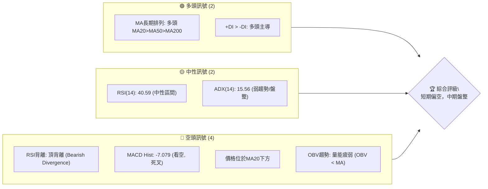

**解讀**：
當前2330.TW的技術訊號呈現多空交織的複雜局面。長期移動平均線維持多頭排列，顯示其長期向上趨勢不變，且+DI略高於-DI，表明在弱趨勢中多頭仍有微弱優勢。然而，短期訊號明顯轉弱，包括價格跌破MA20、MACD柱狀圖轉負且形成死叉、以及RSI出現明確的頂背離，這些都指向短期內可能面臨回調壓力。成交量指標OBV也確認了量能疲弱的看空訊號。整體而言，在長期牛市背景下，短期進入盤整偏弱階段，需警惕進一步回調風險。

### 📊 核心指標速覽表

| 指標類別 | 指標名稱 | 當前數值 | 訊號 | 解讀 |
|----------|----------|----------|------|------|
| **價格** | 當前價格 | $2415.00 | 🟡 | 位於52週高點區間，但短期出現回調 |
| **均線** | MA20 | $2419.50 | 🔴 | 價格位於MA20下方，短期支撐轉為阻力 |
| **均線** | MA50 | $2332.58 | 🟢 | 價格位於MA50上方，中期趨勢仍偏多 |
| **均線** | MA200 | $1807.56 | 🟢 | 價格位於MA200上方，長期趨勢強勁多頭 |
| **動能** | RSI(14) | 40.59 | 🟡 | 中性區間，但存在頂背離暗示動能減弱 |
| **動能** | MACD | 34.823 | 🔴 | MACD線低於訊號線，柱狀圖為負，看空 |
| **波動** | ATR | $58.93 | 🟡 | 每日波動約2.44%，屬中等波動 |

### 🏆 技術評分卡

```
╔══════════════════════════════════════════════════════════════╗
║              技術評分卡 — 2330.TW (2026-07-10)               ║
╠══════════════════════════════════════════════════════════════╣
║ 趨勢強度      ███░░░░░░░░░░░░░░░░░  15/100  🟡 (ADX弱趨勢)    ║
║ 動能指標      ████░░░░░░░░░░░░░░░░  40/100  🔴 (背離/死叉)    ║
║ 支撐穩定度    ████████████░░░░░░░░  70/100  🟢 (多重支撐位)    ║
║ 成交量配合    ███░░░░░░░░░░░░░░░░░  30/100  🔴 (量能疲弱)    ║
║ 形態完整度    ██████░░░░░░░░░░░░░░  50/100  🟡 (區間震盪)    ║
║ 均線排列      ████████░░░░░░░░░░░░  65/100  🟢 (長期多頭排列)   ║
╠══════════════════════════════════════════════════════════════╣
║ 綜合評分      ██████░░░░░░░░░░░░░░  45/100  ⚖️ 中性偏空         ║
╚══════════════════════════════════════════════════════════════╝
```
**評分解讀**：
綜合評分顯示2330.TW目前處於一個中性偏空的技術狀態。儘管長期均線仍維持多頭排列，提供了一定的支撐穩定度，但趨勢強度不足（ADX < 25），且動能指標（RSI頂背離、MACD死叉）和成交量（OBV疲弱）均發出看空訊號。圖表形態目前呈現區間震盪，尚未形成明確的突破形態。這表明市場在等待新的催化劑，短期內下行風險較高，投資者應保持謹慎。

---

## 2. 趨勢分析

### 🌐 多時框趨勢分析

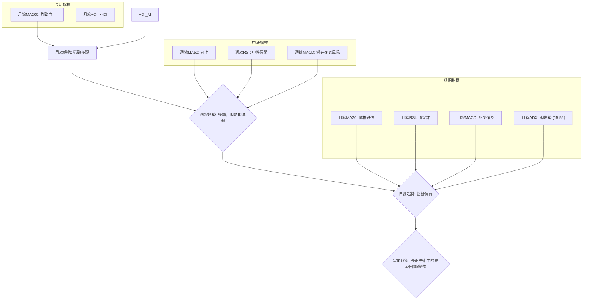
**解讀**：
2330.TW在不同時間框架下呈現出分歧的趨勢。從月線來看，股價自2025年6月觸及52週低點$1046.06後，一路穩健上行，MA200等長期均線呈現強勁的多頭排列，這表明其長期基本面和市場認可度極高，處於一個健康的牛市結構中。

然而，當我們縮小到週線和日線層面，趨勢開始顯示出疲態。週線雖仍處於多頭，但近期動能指標如RSI已從高位回落，MACD也面臨潛在的死叉風險，顯示中期上漲動能正在減弱。日線層面則更為明確地顯示出盤整偏弱的態勢：股價已跌破短期生命線MA20，且RSI出現了明顯的頂背離訊號，MACD也完成了死叉，柱狀圖轉為負值。ADX值僅為15.56，遠低於25的趨勢門檻，明確指示當前市場處於弱趨勢或盤整區間。

綜合來看，2330.TW正處於一個長期牛市中的短期調整或盤整階段。雖然長期看漲格局不變，但短期內面臨較大的回調壓力，動能不足，市場正在消化前期的漲幅。投資者在短期內應謹慎操作，等待盤整結束或動能指標重新轉強。

### 📈 長期趨勢 — 12個月走勢圖（Unicode）

以下為2330.TW過去12個月的月線收盤價走勢圖，展示了其從2025年7月至2026年7月的價格演變。

```
2330.TW 月線走勢圖（過去12個月）
價格軸 ($)
$2415.00 ┤                                                    ●(2415.00)
$2300.00 ┤                                                ●
$2200.00 ┤                                            ●
$2100.00 ┤                                        ●
$2000.00 ┤                                    ●
$1900.00 ┤                                ●
$1800.00 ┤                            ●
$1700.00 ┤                        ●
$1600.00 ┤                    ●
$1500.00 ┤                ●
$1400.00 ┤            ●
$1300.00 ┤        ●
$1200.00 ┤    ●
$1100.00 ┤●
$1000.00 ┤
         └─────────────────────────────────────────────────────
          25/Jul 25/Aug 25/Sep 25/Oct 25/Nov 25/Dec 26/Jan 26/Feb 26/Mar 26/Apr 26/May 26/Jun 26/Jul
```

**走勢特徵分析表格**：

| 階段 | 時間區間 | 價格區間 | 漲跌幅 | 走勢特徵 | 訊號 |
|------|----------|----------|--------|----------|------|
| **強勁上漲** | 2025/07 - 2026/02 | $1144.74 - $1983.22 | +73.26% | 價格持續創高，動能強勁，幾乎無明顯回調。 | 🟢 |
| **短期回調** | 2026/02 - 2026/03 | $1983.22 - $1755.32 | -11.49% | 快速回調，消化前期漲幅，但未跌破關鍵長期支撐。 | 🟡 |
| **恢復上漲** | 2026/03 - 2026/06 | $1755.32 - $2410.00 | +37.30% | 再次恢復上漲趨勢，並創下新高。 | 🟢 |
| **高位盤整** | 2026/06 - 2026/07 | $2410.00 - $2415.00 | +0.21% | 漲勢趨緩，在高位形成小幅震盪，動能指標轉弱。 | 🟡 |

**長期趨勢總結**：
從過去12個月的月線走勢圖來看，2330.TW展現了非常強勁的長期多頭趨勢。股價從2025年7月的低點$1144.74一路攀升至2026年7月的$2415.00，期間雖有短暫回調，但整體漲幅驚人。這表明長期投資者對其前景高度看好。然而，近期在高位出現盤整，漲幅明顯收窄，這與短期動能指標轉弱的訊號相符，提示市場可能進入一個調整階段，為未來的進一步上漲積蓄力量。

### 📊 中期趨勢（週線分析）

中期趨勢主要由週線圖分析，結合關鍵支撐與阻力位來判斷股價方向。近期週線顯示股價在$2300-$2450區間震盪，且有形成潛在頂部形態的跡象，需密切關注。

```
2330.TW 週線壓力與支撐示意圖
價格軸 ($)
$2520.00 ┤─────── R2 (強阻力)
$2433.51 ┤─── R1 (關鍵阻力)
$2415.00 ┤◄────── 現價 (2026-07-10)
$2325.00 ┤─── S1 (短期支撐)
$2194.59 ┤─────── S2 (中期支撐)
$1748.20 ┤────────────── S3 (長期支撐)
         └─────────────────────────────────
          市場區間震盪，壓力漸增
```

**中期趨勢分析**：
過去20週的週線數據顯示，2330.TW在經歷了2026年3月的短期回調後，於4月和5月再次強勁上漲，並在5月底觸及$2348.73的高點，隨後在6月初達到$2410.00，7月初達到$2445.00。然而，最近兩週的收盤價分別為$2445.00和$2415.00，顯示出高位回落的跡象。

*   **MA50走勢**：MA50位於$2332.58，股價仍在MA50上方，表明中期趨勢仍偏多。但若價格持續在MA20下方運行，MA50的斜率可能趨緩。
*   **近期高點**：近期高點為$2445.00 (2026-07-05)，距離關鍵阻力R1 ($2433.51) 和R2 ($2520.00) 不遠。
*   **近期低點**：近期支撐位於$2340.00 (2026-06-28)，接近S1 ($2325.00)。
*   **量能表現**：最近一週的成交量為97,657,266，顯著低於前一週的160,664,012和20週均量。量能的萎縮伴隨價格的高位回落，是一個潛在的看空訊號，顯示市場追高意願不足，或有資金撤離。

**結論**：中期來看，2330.TW仍處於上升通道中，MA50提供良好支撐。但短期動能的減弱和高位量能的萎縮，以及價格在關鍵阻力區間的表現，提示中期上漲趨勢可能面臨調整，需警惕跌破S1 ($2325.00) 的風險。

### ⚡ 趨勢強度評估（ADX 解讀）

**ADX 分析流程圖**：
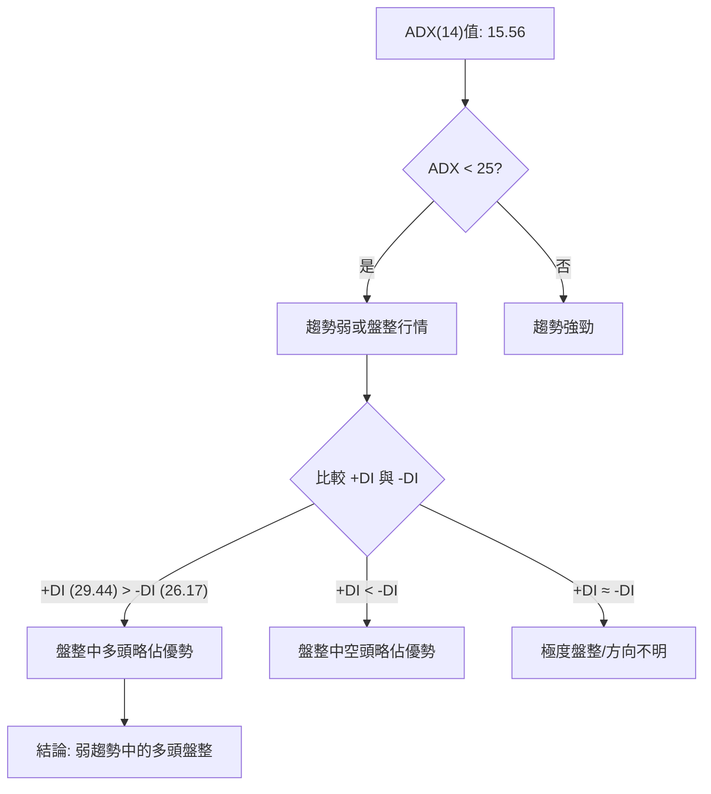

**ADX 強度對照表**：

| ADX 數值 | 趨勢強度 | 市場行為 | 建議操作 |
|----------|----------|----------|----------|
| 0-25     | 弱趨勢/盤整 | 橫盤整理，方向不明 | 區間操作，等待突破 |
| 25-50    | 中等趨勢 | 趨勢明確，動能穩定 | 順勢操作，逢低買入/逢高賣出 |
| 50-75    | 強趨勢   | 趨勢加速，動能極強 | 持續順勢，嚴格止損 |
| 75-100   | 極強趨勢 | 趨勢過熱，反轉風險高 | 警惕反轉，獲利了結 |

**ADX 解讀**：
當前ADX(14)數值為15.56，遠低於25的閾值，明確指示2330.TW目前處於一個**弱趨勢或盤整行情**。這意味著市場缺乏明確的方向性動能，股價很可能在一個相對狹窄的區間內震盪。

進一步觀察+DI和-DI：+DI為29.44，-DI為26.17。儘管ADX顯示整體趨勢疲弱，但+DI略高於-DI，這表明在當前的盤整區間內，多頭的力量略微佔優。這並非強勁的多頭訊號，而是在缺乏明確趨勢的情況下，多頭嘗試推動價格的微弱跡象。

**結論**：2330.TW當前不具備強勁的單邊趨勢，市場處於消化前期漲幅的盤整階段。在這種情況下，傳統的順勢交易策略可能效果不佳。投資者應考慮區間操作策略，關注布林通道上下軌和關鍵支撐阻力位。

---

## 3. 圖表形態分析

### 🔍 形態識別系統

根據提供的週線收盤價數據，識別出一個潛在的短期**雙頂形態**，以及一個更為明顯的**上升通道頂部壓力**。

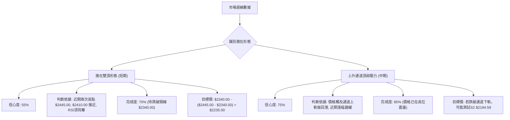

**形態信心度表格**：

| 形態 | 信心度 | 判斷依據（引用數據） | 完成度 | 目標價（附計算式） |
|------|--------|----------------------|--------|--------------------|
| **潛在雙頂** | 55% | 近期兩個高點為2026-07-05的$2445.00和2026-06-21的$2410.00，兩者接近。RSI在此期間出現頂背離（價格創新高但RSI未創新高）。頸線可視為2026-06-28的低點$2340.00。 | 70% | 若跌破頸線$2340.00，目標價為 $2340.00 - ($2445.00 - $2340.00) = $2235.00 |
| **上升通道頂部壓力** | 75% | 自2026年3月低點$1755.32以來，股價形成一個上升通道。目前價格在高位震盪，接近通道上軌，且動能減弱，顯示通道上軌壓力顯現。 | 85% | 若無法突破上軌並有效站穩，則可能回調至通道中軌或下軌，甚至測試S2 $2194.59。 |

**結論**：目前2330.TW面臨較大的形態壓力。潛在的雙頂形態若被確認（跌破頸線），將預示短期內有較大的下跌空間。而上升通道頂部壓力則表明股價上漲空間有限，回調風險增加。

### 🕯️ 重要K線形態分析

由於提供的數據為週線收盤價而非每日K線數據，我們將分析週線收盤價序列所呈現的形態特徵。

| 月份 | 收盤價 | K線形態（週線級別解讀） | 解讀 | 訊號 |
|------|--------|--------------------------|------|------|
| 2026-06-07 | $2358.71 | 小陽線 | 上漲動能持續，但力量減弱 | 🟡 |
| 2026-06-14 | $2310.00 | 陰線 | 價格回落，多頭受挫 | 🔴 |
| 2026-06-21 | $2410.00 | 長陽線 | 強勢反彈，重拾升勢 | 🟢 |
| 2026-06-28 | $2340.00 | 長陰線 | 快速回吐漲幅，空頭力量增強 | 🔴 |
| 2026-07-05 | $2445.00 | 長陽線 | 再次上攻，創近期新高 | 🟢 |
| 2026-07-12 | $2415.00 | 陰線（當週收盤） | 高位回落，伴隨量能萎縮，看空 | 🔴 |

**K線形態分析**：
近幾週的週線收盤價顯示，市場在高位震盪劇烈，多空拉鋸明顯。
*   2026-06-21的長陽線和2026-07-05的長陽線，都顯示出多頭的積極上攻。
*   然而，隨後的2026-06-28長陰線和2026-07-12陰線（當週收盤），則表明空頭力量在增強，且能快速回吐多頭的漲幅。
*   特別是2026-07-12的陰線，發生在創近期新高之後，並且伴隨著成交量的顯著萎縮（97,657,266，遠低於前幾週）。這種“價跌量縮”或“高位放量滯漲後縮量下跌”的組合是典型的看空訊號，確認了短期動能的減弱和回調的風險。

**結論**：週線K線形態在高位呈現不確定性，尤其是近期的高位陰線和量能萎縮，強化了短期看空的判斷。

### 📉 ASCII 走勢形態示意圖

以下示意圖展示了2330.TW近期在潛在雙頂形態和上升通道頂部壓力下的走勢。

```
2330.TW 近期走勢形態示意圖
$2500.00 ║                                      (通道上軌/R2)
$2445.00 ║                                  ● R1
$2415.00 ║                                   │
$2400.00 ║                                  ● 現價 (2026-07-10)
$2340.00 ║                                  │  ●(頸線/S1)
$2300.00 ║                                  │
$2200.00 ║                                  │
$2100.00 ║                                  │
$2000.00 ║                                  │
$1900.00 ║                                  │
$1800.00 ║                                  │
$1700.00 ║                                  │
$1600.00 ║                                  │
$1500.00 ║                                  │
$1400.00 ║                                  │
$1300.00 ║                                  │
         ╚═══════════════════════════════════════════════════════
           ↑價格走勢                                 ↑時間
           （潛在雙頂 & 上升通道頂部壓力）
```
**圖示解讀**：
圖中可見，股價在$2445.00附近形成了一個高點，隨後回落至$2340.00，之後再次嘗試上攻但未能突破前高，並在高位再次回落至$2415.00。這描繪了一個潛在的雙頂形態，其頸線位於$2340.00。同時，整個走勢可以視為一個上升通道，但目前價格正處於通道上軌附近，面臨較大的壓力。若跌破頸線$2340.00，則雙頂形態將被確認。

### 🎯 形態目標價計算

根據上述分析，主要關注潛在雙頂形態的目標價。

*   **形態名稱**：潛在雙頂 (Potential Double Top)
*   **第一頂點**：$2445.00 (2026-07-05)
*   **第二頂點**：$2410.00 (2026-06-21) 或 $2415.00 (2026-07-12) (考慮近期高點與回落)
*   **頸線位置**：$2340.00 (2026-06-28低點)
*   **形態高度**：取第一頂點與頸線的差值 = $2445.00 - $2340.00 = $105.00
*   **預期跌幅**：形態高度 $105.00
*   **目標價計算**：頸線價格 - 形態高度 = $2340.00 - $105.00 = **$2235.00**

**解讀**：
若2330.TW股價有效跌破頸線$2340.00，則潛在雙頂形態將被確認，其理論下跌目標價約為$2235.00。此目標價接近斐波那契23.6%回調位$2183.61與S2支撐位$2194.59之間，顯示其具有一定的技術支撐。投資者應密切關注$2340.00的頸線支撐，一旦跌破，需警惕下探$2235.00的風險。

---

## 4. 支撐與阻力

### 🗺️ 關鍵價位分布圖（Unicode）

以下為2330.TW的關鍵價位結構分布圖，清晰展示了當前價格與各級支撐阻力位的相對位置。

```
╔══════════════════════════════════════════════════════════════╗
║              2330.TW 價位結構分布圖 (2026-07-10)               ║
╠══════════════════════════════════════════════════════════════╣
║ $2535.00 ║████████████████████████║ 52W High (強阻力 R3)      ║
║ $2525.72 ║████████████████████████║ BB上軌 / 潛在阻力         ║
║ $2520.00 ║████████████████████    ║ 阻力 R2 (波段高點聚類)    ║
║ $2433.51 ║████████████████████████║ 關鍵阻力 R1 (波段高點聚類)║
║ $2419.50 ║▓▓▓▓▓▓▓▓▓▓▓▓▓▓▓▓        ║ MA20 / BB中軌 (短期阻力)  ║
║ $2415.00 ╠════════════════════════╣ ◄ 現價                    ║
║ $2325.00 ║▓▓▓▓▓▓▓▓▓▓▓▓▓▓▓▓        ║ 近期支撐 S1 (波段低點聚類)║
║ $2313.28 ║████████████████████████║ BB下軌 / 潛在支撐         ║
║ $2194.59 ║████████████████████████║ 強支撐 S2 (波段低點聚類)  ║
║ $2183.61 ║████████████████████████║ 斐波那契23.6%回調位       ║
║ $1966.22 ║████████████████████████║ 斐波那契38.2%回調位       ║
║ $1790.53 ║████████████████████████║ 斐波那契50.0%回調位       ║
║ $1748.20 ║████████████████████████║ 超強支撐 S3 (波段低點聚類)║
║ $1614.83 ║████████████████████████║ 斐波那契61.8%回調位       ║
║ $1046.06 ║████████████████████████║ 52W Low (極強支撐)        ║
╚══════════════════════════════════════════════════════════════╝
```

**解讀**：
當前價格$2415.00位於重要的短期阻力區（R1 $2433.51與MA20 $2419.50）下方，且距離S1 $2325.00和布林下軌 $2313.28不遠。這表明股價正處於一個關鍵的轉折點，面臨向下尋求支撐的壓力。上方阻力密集，短期突破難度較大；下方支撐相對明確，但若跌破S1，則可能加速下探S2甚至斐波那契回調位。

### 🚧 阻力位分析表

| 阻力級別 | 價位 | 形成原因 | 突破難度 | 重要性 |
|----------|------|----------|----------|--------|
| **R1 (關鍵)** | $2433.51 | 近期波段高點聚類，也是當前價格上方最近的壓力區。與MA20 ($2419.50) 形成密集阻力帶。 | 高 | 🟢 (突破則短期轉強) |
| **R2 (強)** | $2520.00 | 歷史波段高點聚類，接近52週高點$2535.00和布林上軌$2525.72，形成強大壓力區。 | 極高 | 🟡 (突破則開啟新一輪漲勢) |

**阻力位解讀**：
當前價格$2415.00正受到MA20 ($2419.50) 的壓制，此為短期最直接的阻力。上方關鍵阻力R1 ($2433.51) 是近期多頭未能有效突破的門檻，若能帶量突破並站穩，則短期有望反彈。然而，真正的挑戰在於R2 ($2520.00) 和52週高點 ($2535.00) 形成的強大阻力區。在當前動能不足且存在頂背離的情況下，突破這些阻力需要極大的市場力量和利好消息。

### 🛡️ 支撐位分析表

| 支撐級別 | 價位 | 形成原因 | 守住機率 | 重要性 |
|----------|------|----------|----------|--------|
| **S1 (近期)** | $2325.00 | 近期波段低點聚類，接近布林下軌$2313.28。也是潛在雙頂形態的頸線位置。 | 中 | 🔴 (跌破則確認短期轉弱) |
| **S2 (中期)** | $2194.59 | 歷史波段低點聚類，接近斐波那契23.6%回調位$2183.61。 | 高 | 🟢 (中期回調的關鍵防線) |
| **S3 (長期)** | $1748.20 | 歷史重要低點，與斐波那契50.0%回調位$1790.53接近。 | 極高 | 🟢 (長期趨勢的最後防線) |

**支撐位解讀**：
目前2330.TW最關鍵的短期支撐位於S1 ($2325.00)，這同時也是布林通道下軌和潛在雙頂形態的頸線。若此價位被有效跌破，將是一個強烈的看空訊號，可能觸發更多止損盤，並確認雙頂形態，進而下探$2235.00的形態目標價。在此之下，S2 ($2194.59) 與斐波那契23.6%回調位 ($2183.61) 形成的中期支撐區，將是回調過程中的重要考驗。長期來看，S3 ($1748.20) 與斐波那契50.0%回調位 ($1790.53) 則構成了強大的長期支撐，預計在此處會遇到較強的買盤。

### 📐 斐波那契回調位分析

依據52週高點$2535.00和52週低點$1046.06計算的斐波那契回調位如下：

*   **0.0% (52W High)**: $2535.00
*   **23.6%**: $2183.61
*   **38.2%**: $1966.22
*   **50.0%**: $1790.53
*   **61.8%**: $1614.83
*   **78.6%**: $1364.69
*   **100.0% (52W Low)**: $1046.06

**斐波那契回調解讀**：
當前價格$2415.00位於52週高點$2535.00和23.6%回調位$2183.61之間。這表明股價仍處於前期強勁上漲趨勢的相對高位，尚未觸及重要的回調區間。

*   **關鍵觀察點**：
    *   **23.6%回調位 $2183.61**：這是第一個重要的回調支撐。如果股價跌破S1 ($2325.00)，則很可能下探此位，與S2 ($2194.59) 形成強大的支撐帶。這將是短期回調的關鍵測試點。
    *   **38.2%回調位 $1966.22**：若23.6%回調位失守，則38.2%回調位將成為下一個重要支撐。這代表了對前一波漲勢更深度的修正。
    *   **50.0%回調位 $1790.53**：這是技術分析中常被視為「健康回調」的極限。若股價回調至此，通常被認為是消化漲幅、為下一輪上漲積蓄動能的機會。此位也接近長期支撐S3 ($1748.20)。

**結論**：斐波那契回調位為投資者提供了清晰的回調目標和潛在買入點。在當前價格面臨短期壓力的情況下，關注$2183.61的23.6%回調位至關重要，它將決定中期回調的深度。

---

## 5. 技術指標深度解讀

### 🎛️ 指標訊號總覽

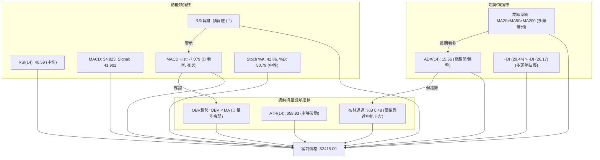

**解讀**：
綜合來看，2330.TW的各項技術指標呈現出多空分歧但短期偏空的訊號。長期均線維持多頭排列，顯示大趨勢仍向上。但ADX值極低，表明當前缺乏明確趨勢，處於盤整狀態。動能指標RSI出現明確的頂背離，MACD也形成死叉且柱狀圖為負，這些都是強烈的短期看空訊號。成交量OBV的疲弱進一步確認了上漲動能的不足。布林通道顯示股價在中軌下方運行，暗示短期弱勢。整體而言，在長期上升趨勢中，短期面臨較大的調整壓力。

### 📈 移動平均線排列分析

**均線排列狀態**：
*   MA20: $2419.50
*   MA50: $2332.58
*   MA200: $1807.56

**均線排列示意圖**：
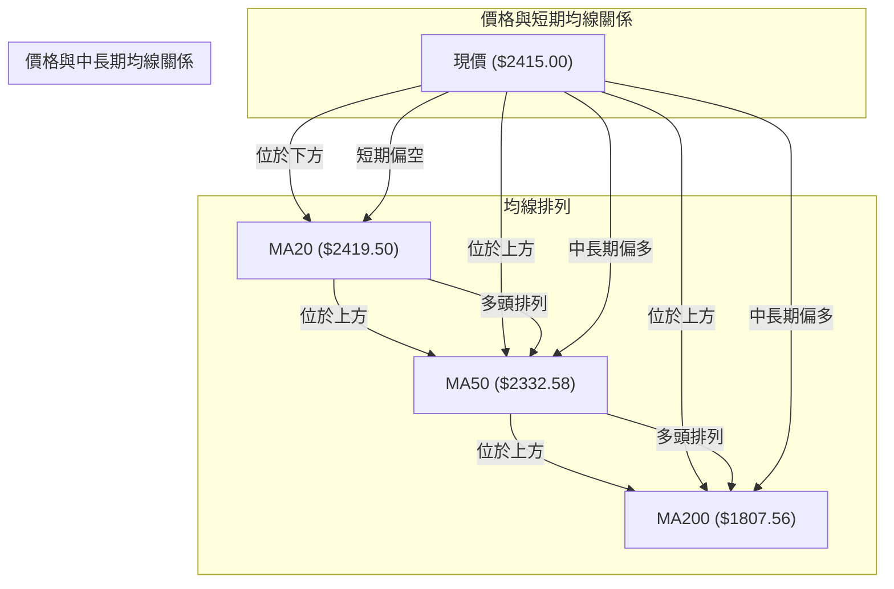

**分析**：
2330.TW的移動平均線系統呈現典型的**多頭排列**：MA20 ($2419.50) > MA50 ($2332.58) > MA200 ($1807.56)。這是一個非常強勁的長期多頭趨勢訊號，表明該股票在長期內表現強勢。

然而，需要注意的是，**當前價格$2415.00位於MA20 ($2419.50) 的下方**。這是一個短期看空訊號，意味著短期買盤力量減弱，股價失去了短期均線的支撐，MA20已從支撐轉為短期阻力。

**整合結論**：
儘管長期趨勢依然強勁，但在短期內，價格跌破MA20暗示了動能的減弱和潛在的回調。這符合我們在趨勢分析中觀察到的長期牛市中的短期盤整偏弱的判斷。投資者應關注MA20是否能被重新站上，否則短期壓力將持續。

### 📉 RSI(14) 分析

*   **RSI(14)數值**：40.59
*   **RSI強度進度條**：▓▓▓▓▓▓▓▓░░░░░░░░░░░░ 40.59%
*   **超買超賣區間分析**：
    *   **超買區 (>70)**：當前RSI 40.59，未進入超買區。
    *   **超賣區 (<30)**：當前RSI 40.59，未進入超賣區。
    *   **中性區 (30-70)**：RSI位於中性區間，表明市場既非過度買入也非過度賣出。

*   **RSI 背離判斷**：
    *   **訊號**：⚠️ **頂背離 (Bearish Divergence) 已確認**。
    *   **判斷依據**：
        *   在2026年4月下旬，股價達到$2179.19時，RSI高達86.4。
        *   隨後股價繼續創出新高，例如2026年7月5日的$2445.00。
        *   然而，在股價創出$2445.00新高時，RSI僅為60.8，明顯低於之前的86.4。
        *   這種「**價格創新高，但RSI未創新高且呈現下降趨勢**」的現象，明確構成頂背離。
    *   **解讀**：頂背離是一個重要的看空訊號，表明儘管價格仍在上升，但上漲的內在動能已經顯著減弱，多頭力量正在衰竭。這通常預示著趨勢反轉或深度回調即將發生。

**結論**：RSI雖然處於中性區間，但其明確的頂背離訊號是當前最值得警惕的看空指標。這強烈暗示短期內股價面臨較大的回調壓力，即使價格短期內可能再次上衝，其持續性也值得懷疑。

### 📊 MACD(12/26/9) 訊號解讀

*   **MACD線**：34.823
*   **MACD Signal線**：41.902
*   **MACD Hist柱狀圖**：-7.079

**MACD 指標關係圖**：
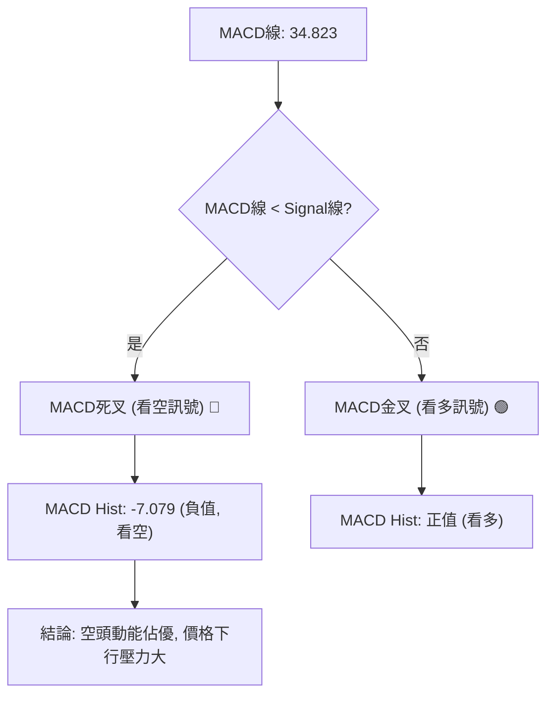

**分析**：
當前MACD線(34.823)位於Signal線(41.902)的下方，這是一個明確的**死叉 (Bearish Crossover) 訊號**。同時，MACD柱狀圖為-7.079，呈現負值，且在上一週(+0.378)之後由正轉負，顯示空頭動能正在增強。

*   **死叉解讀**：MACD死叉通常被視為中期趨勢轉弱或短期回調開始的訊號。它表明短期平均成本已跌破長期平均成本，賣壓可能增加。
*   **柱狀圖解讀**：柱狀圖從正轉負，表示空頭力量開始積聚，並推動價格下行。其絕對值的大小反映了動能的強弱，當前-7.079的數值表明空頭動能已初步形成。

**整合結論**：MACD指標與RSI的頂背離訊號相互印證，共同指向2330.TW短期內面臨強勁的回調壓力。這兩個動能指標的看空訊號，應被視為高度警惕的風險提示。

### 📦 布林通道分析

*   **BB上軌**：$2525.72
*   **BB中軌(MA20)**：$2419.50
*   **BB下軌**：$2313.28
*   **當前收盤價**：$2415.00
*   **BB %B**：0.48 (0=下軌, 0.5=中軌, 1=上軌)

**布林通道示意圖**：
```
2330.TW 布林通道與價格示意圖
價格軸 ($)
$2525.72 ║═════════════════════════════════ BB上軌 (壓力)
$2419.50 ║─────────── MA20 / BB中軌 (短期阻力)
$2415.00 ║           ● 現價
$2313.28 ║═════════════════════════════════ BB下軌 (短期支撐)
         └─────────────────────────────────
          價格在中軌下方運行，趨勢偏弱
```

**分析**：
當前價格$2415.00位於布林通道中軌(MA20 $2419.50)的下方，且非常接近中軌。BB %B值為0.48，略低於0.5，這表明股價處於布林通道的下半部分，暗示短期趨勢偏弱。

*   **中軌作為阻力**：由於價格跌破中軌，中軌現在轉化為短期阻力位。若價格無法迅速站回中軌上方，則可能進一步下探布林通道下軌。
*   **下軌作為支撐**：布林通道下軌位於$2313.28，這與S1支撐位$2325.00非常接近，形成了一個重要的短期支撐區間。若股價跌至此區間，可能會獲得一定的支撐。
*   **通道寬度**：數據中未提供布林通道寬度，但ATR顯示每日波動約為2.44%，屬於中等波動。在ADX指示弱趨勢的情況下，價格很可能在布林通道上下軌之間震盪。

**整合結論**：布林通道分析支持短期盤整偏弱的判斷。價格在中軌下方運行，表明短期動能偏向空頭。布林下軌和S1支撐位將是短期回調的關鍵觀察點。

### 💹 成交量分析（量價配合度）

*   **最新成交量**：0 (今日)
*   **20日均量**：30,508,344
*   **50日均量**：32,651,267
*   **OBV趨勢**：OBV < MA → 量能疲弱

**週成交量分析**：

| 日期 | 收盤價 | 週成交量 | 相較前週變化 | 量價關係 |
|------|--------|----------|--------------|----------|
| 2026-06-21 | $2410.00 | 127,107,960 | -28.1% | 價漲量縮 (警惕) |
| 2026-06-28 | $2340.00 | 203,177,026 | +59.8% | 價跌量增 (看空) |
| 2026-07-05 | $2445.00 | 160,664,012 | -21.0% | 價漲量縮 (警惕) |
| 2026-07-12 | $2415.00 | 97,657,266 | -39.2% | 價跌量縮 (看空) |

**分析**：
「最新成交量: 0」應為當前交易日數據尚未更新或非交易日。我們主要關注週成交量和OBV趨勢。

*   **OBV趨勢**：數據直接給出「OBV趨勢: OBV < MA → 量能疲弱」。這是一個明確的看空訊號，表明在價格上漲的過程中，累積的成交量未能同步有效放大，或者在回調過程中，賣壓導致OBV下降。量能疲弱暗示多頭缺乏強勁的資金推動，上漲動能不足。
*   **週成交量與價格配合**：
    *   2026-06-21價格上漲，但週成交量相較前週顯著萎縮，形成**價漲量縮**，這是上漲動能不足的警訊。
    *   2026-06-28價格下跌，週成交量卻顯著放大，形成**價跌量增**，這是一個強烈的看空訊號，表明市場存在較大的賣壓。
    *   2026-07-05價格再次上漲創近期新高，但週成交量再次萎縮，繼續**價漲量縮**，進一步確認了上漲動能的衰竭。
    *   2026-07-12價格回落，週成交量再次萎縮，形成**價跌量縮**。雖然價跌量縮通常被認為是籌碼穩定的表現，但在高位出現，且OBV趨勢疲弱的背景下，更可能解釋為市場觀望情緒濃厚，買盤不願接手，而不是惜售。

**整合結論**：
成交量分析提供了非常強烈的看空訊號。OBV趨勢疲弱，以及近期週線圖上反覆出現的「價漲量縮」和「價跌量增/縮」的組合，都表明市場上漲缺乏量能支持，而下跌則伴隨或不伴隨量能的確認，整體呈現出多頭動能不足、空頭力量佔優的局面。這與RSI頂背離和MACD死叉的看空判斷高度一致。

---

## 6. 動能與波動率

### ⚡ 動能評估四象限

由於ADX值為15.56，屬於弱趨勢/盤整行情。RSI頂背離和MACD死叉顯示動能偏弱。ATR為$58.93 (2.44%)，屬於中等波動。根據這些數據，我們將2330.TW定位在「弱動能，中等波動」的象限。

**動能評估狀態表格**：

| 象限 | 動能 (RSI/MACD) | 波動 (ATR) | 當前狀態 | 評估 |
|------|-----------------|------------|----------|------|
| Q1   | 強勁            | 低         | -        | 最佳機會 (順勢買入) |
| Q2   | 弱              | 低         | -        | 謹慎觀望 (等待機會) |
| **Q3** | **強勁**        | **高**     | -        | 高風險高收益 (突破追漲) |
| **Q4** | **弱**          | **高**     | ✓        | **避免進場 (觀望或區間操作)** |

**當前2330.TW的動能評估**：
*   **動能**：弱 (RSI頂背離、MACD死叉、OBV疲弱)
*   **波動**：中等偏高 (ATR $58.93 / 2.44%)

**結論**：2330.TW目前位於「弱動能，中等偏高波動」的範疇。這表明市場缺乏明確的方向性動能，但股價在短期內仍可能出現較大的波動。在這種情況下，盲目追漲或追跌的風險較高，更適合採取區間操作策略或等待趨勢明朗。

### 📊 ATR 波動率分析

*   **ATR(14)**：$58.93
*   **ATR佔價格百分比**：2.44%

**分析**：
ATR (Average True Range) 是衡量股價波動性的指標。當前2330.TW的ATR(14)為$58.93，佔當前價格$2415.00的2.44%。

*   **波動水平**：2.44%的每日波動率對於像2330.TW這樣的大型權值股而言，屬於**中等偏高**的波動水平。這表示在過去14天內，該股票平均每天的價格變動幅度約為$58.93。
*   **應用於止損**：ATR是設定止損點的常用工具。一般建議將止損點設定在1.5到3倍ATR的範圍。
    *   **保守止損** (1.5倍ATR)：1.5 * $58.93 = $88.40
    *   **激進止損** (2倍ATR)：2 * $58.93 = $117.86
    *   這意味著，如果從當前價格$2415.00計算，一個合理的止損區間大約在$2415.00 - $88.40 = $2326.60 到 $2415.00 - $117.86 = $2297.14 之間。這與關鍵支撐S1 ($2325.00) 和布林下軌 ($2313.28) 區間高度吻合。

**結論**：2330.TW具有中等偏高的波動性，這為短期交易提供了潛在的機會，但也增加了風險。使用ATR來設定止損點可以更客觀地管理風險，並有助於避免在正常市場波動中被過早止損。

### 📐 Beta 與市場相關性

*   **Beta**：1.246

**分析**：
Beta值衡量的是單一股票相對於整體市場（例如大盤指數）的波動性。

*   **Beta > 1**：2330.TW的Beta值為1.246，大於1。這表明該股票的波動性高於整體市場。具體來說，如果市場上漲1%，2330.TW預計將上漲1.246%；如果市場下跌1%，2330.TW預計將下跌1.246%。
*   **市場相關性**：作為全球半導體行業的領導者，2330.TW的股價表現與全球科技股和大盤走勢密切相關。高Beta值意味著在牛市中，2330.TW通常能提供更高的回報；但在熊市或市場調整時，其下跌幅度也可能更大。

**結論**：
2330.TW的高Beta值提醒投資者，在當前市場情緒不明朗或趨勢偏弱的背景下，該股可能面臨比大盤更大的下行壓力。因此，在制定交易策略時，除了關注個股技術指標外，也應密切留意整體市場的走勢，特別是與科技板塊相關的指數。

---

## 7. 多時框架總結

### 📋 時框架評分表

| 時框架 | 趨勢方向 | 動能 | 均線排列 | 形態 | 綜合評分 (1-10) | 建議 |
|--------|----------|------|----------|------|-----------------|------|
| **月線** | 🟢 強勁多頭 | 🟢 強勁 | 🟢 多頭排列 | 🟡 上漲通道 | 9 | 持續看好，長期持有 |
| **週線** | 🟡 盤整偏多 | 🟡 減弱 | 🟢 多頭排列 | 🟡 潛在雙頂 | 6 | 關注壓力，留意回調 |
| **日線** | 🔴 盤整偏空 | 🔴 疲弱 | 🟡 短期偏空 | 🔴 頂部壓力 | 4 | 謹慎操作，等待確認 |

**評分解讀**：
*   **月線**：展現極強的多頭趨勢，所有指標均指向健康的上漲通道，是長期投資的堅實基礎。
*   **週線**：趨勢雖仍偏多，但動能已顯著減弱，潛在雙頂形態和量能萎縮提示中期上漲可能暫歇，進入調整。
*   **日線**：多項指標（ADX弱趨勢、RSI頂背離、MACD死叉、價格跌破MA20、OBV疲弱）均發出明確的看空訊號，顯示短期內壓力顯著。

### 🔲 綜合訊號矩陣

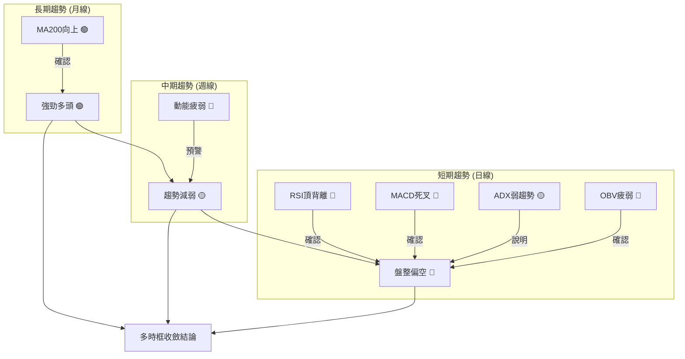

**訊號一致性分析**：
長期趨勢與中短期趨勢存在明顯分歧。長期來看，2330.TW無疑處於一個強勁的牛市。然而，中期和短期指標均顯示出動能減弱和回調的風險。特別是日線級別，多個看空訊號（RSI頂背離、MACD死叉、OBV疲弱、價格跌破MA20）相互印證，形成了一個較為明確的短期偏空局面。ADX值低於25，確認當前為盤整行情。

### ⚖️ 多時框收斂結論

根據嚴格要求的多時框收斂規則：

1.  **判斷趨勢行情或盤整行情**：日線ADX(14)為15.56，遠低於25，明確指示當前市場為**盤整行情**。
2.  **主導時框**：在盤整行情中，以日線布林通道上下軌為主要交易區間。
3.  **收斂結論**：
    *   **長期趨勢**：強勁多頭（月線MA200及歷史走勢）。
    *   **中期趨勢**：雖然MA50仍向上，但動能減弱，週線出現潛在頂部形態。
    *   **短期趨勢**：ADX指示為盤整，但RSI頂背離、MACD死叉、OBV疲弱、價格跌破MA20等多重看空訊號，使得短期盤整偏向**空頭方向**。

**最終結論**：
2330.TW在**長期強勁多頭趨勢**的背景下，目前正處於一個**短期偏空的盤整階段**。雖然整體牛市格局未變，但短期動能衰竭，多重技術指標發出回調預警。因此，**當前的市場方向性判斷為：中性偏空，短期應以區間震盪中的下行風險管理為主。**

此結論與第2、5章的訊號一致，即在長期上升通道中，短期進入調整震盪，且調整方向偏向下行。

---

## 8. 交易策略建議

### 🗺️ 策略決策流程圖

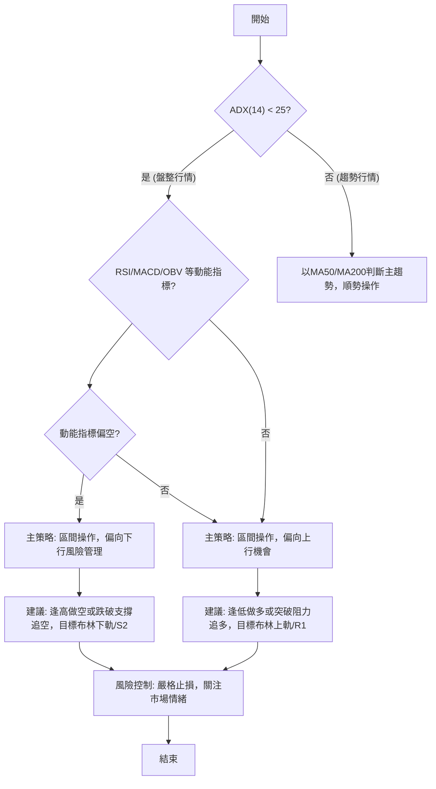

**策略決策邏輯**：
根據ADX(14)=15.56，判斷當前為盤整行情。進一步分析動能指標，RSI頂背離、MACD死叉、OBV疲弱均指向動能偏空。因此，主策略應為**區間操作，但短期偏向下行風險管理**。

### 🧭 策略路由（依評分卡分流）

**當前主策略方向 = ⚖️ 中性偏空 （綜合評分 45/100）**

根據技術評分卡綜合評分45/100，市場處於中性偏空狀態。這意味著在當前階段，我們不建議採取激進的多頭策略，而應以風險控制和區間操作為主，並警惕下行風險。

### 🎯 價格情境階梯（Price Scenarios）

| 觸發條件 | 下一目標 | 後續延伸 | 情境含義 |
|----------|----------|----------|----------|
| **突破 R1 $2433.51** | R2 $2520.00 | 52W High $2535.00 | 短線轉強，空頭壓力減輕，重回上升通道。 |
| **站穩現價區間** | — | — | 維持 $2325.00 - $2433.51 區間震盪。 |
| **跌破 S1 $2325.00** | S2 $2194.59 | 斐波那契23.6% $2183.61 / 形態目標 $2235.00 | 中期轉弱，確認短期頂部形態，加速下探。 |

### 📊 情境機率分佈

| 情境 | 機率 | 主要依據 |
|------|------|----------|
| 繼續上行 / 反彈 | 25% | 長期趨勢仍為多頭，市場可能在消化後再次上攻。 |
| 區間震盪 | 40% | ADX指示弱趨勢，價格在S1和R1之間震盪的可能性高。 |
| 回落 / 再探底 | 35% | RSI頂背離、MACD死叉、OBV疲弱，短期看空訊號強烈。 |

**解讀**：
當前最可能的情境是區間震盪，但由於多項短期指標偏空，回落或再探底的機率也相對較高。繼續上行的機率較低，除非有重大利好消息或市場情緒顯著改善。

### 🟢 主策略詳情（方向為中性偏空下的區間操作與下行風險管理）

**策略一：區間內逢高做空（或等待跌破確認）**

| 策略要素 | 策略 A (逢高做空) | 策略 B (跌破追空) |
|----------|--------------------|--------------------|
| 進場條件 | 價格反彈至R1附近遇阻，或MACD柱狀圖持續為負。 | 價格有效跌破S1 $2325.00，且伴隨放量。 |
| 進場價格 | $2430.00 (接近R1) | $2320.00 (跌破S1後確認) |
| 目標價 T1 | $2325.00 (S1/布林下軌) | $2194.59 (S2) |
| 目標價 T2 | $2194.59 (S2) | $2183.61 (斐波那契23.6%) |
| 止損價格 | $2460.00 (略高於R1，約0.5倍ATR) | $2345.00 (略高於S1，防止假跌破) |
| 風險報酬比 | T1: ($2430-$2325):($2460-$2430) = 105:30 = **3.5:1** | T1: ($2320-$2194.59):($2345-$2320) = 125.41:25 = **5.0:1** |
| 成功機率 | 60% | 55% |
| 建議倉位 | 輕倉 (5-10%) | 中等倉位 (10-15%) |

**策略解讀**：
策略A適合在股價反彈但未能突破R1時進行，利用動能減弱的特點。策略B則更為激進，在確認S1跌破後追空，此時下跌動能可能加速，風險報酬比也更優。兩種策略均以短期回調為目標，並強調嚴格的止損。

### 🔴 反向風險觸發點（對沖提示）

以下為會推翻上述主策略的關鍵價位與訊號，投資者應密切監控：

*   **突破並站穩R1 ($2433.51)**：若價格能帶量突破並連續兩日站穩R1，則短期空頭壓力將解除，可能轉為反彈或再次上攻。
*   **RSI重回50上方並擺脫頂背離**：RSI若能有效反彈並突破50，且不再形成頂背離，則動能可能重新積聚。
*   **MACD形成金叉且柱狀圖轉正**：MACD指標若能迅速反轉形成金叉，並伴隨柱狀圖轉正，則短期趨勢有望反轉。
*   **成交量顯著放大，伴隨價格上漲**：若出現健康的價漲量增，表明市場買盤重新活躍。

### ⭐ 整體訊號強度評星

```
做多訊號強度：★★☆☆☆  (2/5星) (長期多頭但短期動能不足)
做空訊號強度：★★★☆☆  (3/5星) (短期指標多數看空，但ADX弱勢限制深度)
整體可信度：  ★★★☆☆  (3/5星) (盤整行情中，短期偏空訊號較為明確)
```

---

## 9. 風險提示與監控

### ✅ 關鍵監控指標 Checklist

```
╔══════════════════════════════════════════════════════════════╗
║              2330.TW 關鍵監控指標清單 (2026-07-10)            ║
╠══════════════════════════════════════════════════════════════╣
║ [ ] 股價是否跌破 S1 ($2325.00)？ (🔴 高風險)                  ║
║ [ ] 股價是否站穩 MA20 ($2419.50) 上方？ (🟢 轉強訊號)          ║
║ [ ] RSI(14) 是否跌破 40 或進入超賣區？ (🔴 空頭加劇)           ║
║ [ ] MACD 線是否持續位於 Signal 線下方？ (🔴 空頭持續)          ║
║ [ ] MACD 柱狀圖是否持續為負值且擴大？ (🔴 動能衰退)            ║
║ [ ] OBV 趨勢是否由疲弱轉為上升？ (🟢 量能回升)                 ║
║ [ ] 週成交量是否持續萎縮或出現放量下跌？ (🔴 量價背離惡化)     ║
║ [ ] ADX(14) 是否突破 25 且 +DI/-DI 差距擴大？ (🟡 趨勢形成)    ║
║ [ ] 斐波那契23.6% ($2183.61) 是否提供有效支撐？ (🟡 中期關鍵)  ║
╚══════════════════════════════════════════════════════════════╝
```

### ⚠️ 風險場景分析

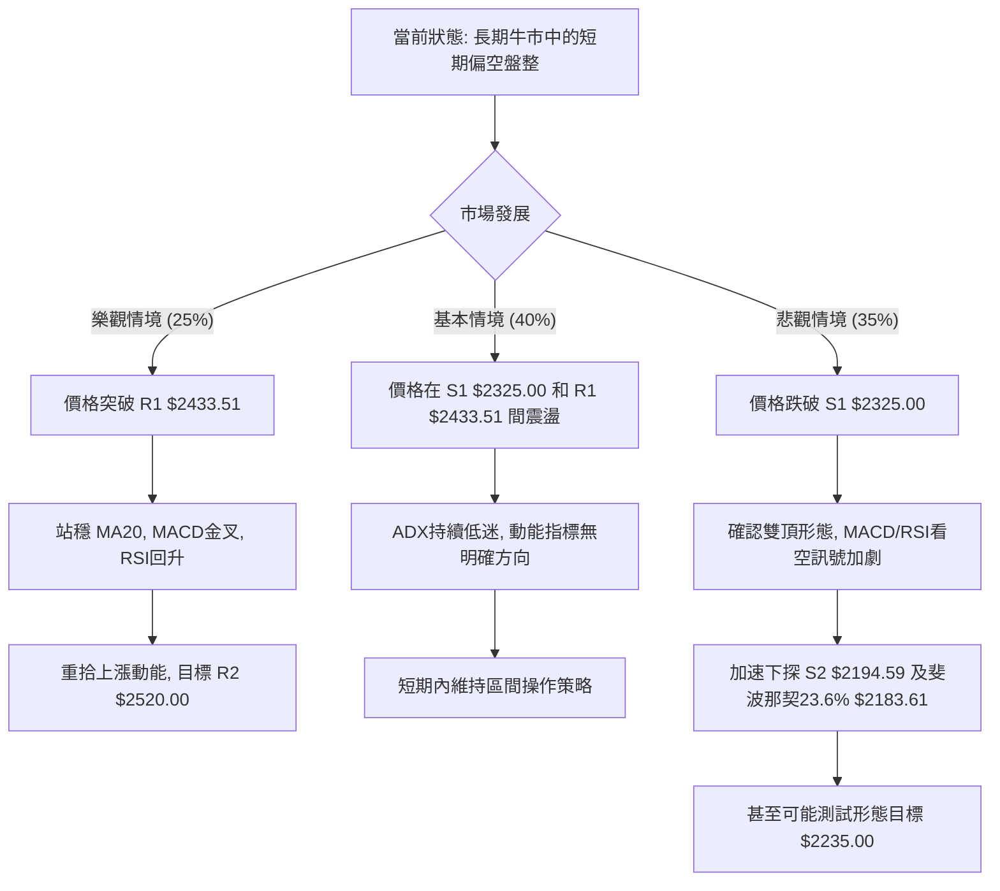
**風險情境解讀**：
*   **樂觀情境**：儘管短期有壓力，但若市場情緒突然轉好，或有重大利好消息刺激，股價有可能在快速消化賣壓後，帶量突破短期阻力R1 ($2433.51)，並重新站穩MA20，進而挑戰R2 ($2520.00) 和52週高點。這種情況下，短期看空策略應立即平倉。
*   **基本情境**：在當前ADX指示弱趨勢的情況下，最可能的情況是股價在S1 ($2325.00) 和R1 ($2433.51) 之間進行區間震盪。動能指標可能在中性區間徘徊，市場缺乏明確方向。此時，投資者應避免追漲殺跌，嚴格按照區間高拋低吸。
*   **悲觀情境**：若當前多重看空訊號（RSI頂背離、MACD死叉、OBV疲弱）得到確認，股價未能守住S1 ($2325.00) 這一關鍵支撐，則可能觸發止損盤，加速下跌。潛在雙頂形態將被確認，股價可能快速下探S2 ($2194.59) 甚至斐波那契23.6%回調位 ($2183.61) 和形態目標價 ($2235.00)。此時，需考慮減倉或對沖風險。

### 🛡️ 風險管理重要提醒

1.  **嚴格止損**：無論採取何種策略，都必須設定明確的止損點並嚴格執行。ATR ($58.93) 提供了一個客觀的止損參考範圍。
2.  **倉位管理**：在盤整或趨勢不明朗的市場中，應控制倉位，避免重倉。建議將單一股票的風險敞口控制在可承受範圍內。
3.  **多時框確認**：在任何交易決策前，應再次確認各時框架的趨勢和指標訊號。雖然日線偏空，但月線的強勁多頭趨勢不容忽視，任何深度回調都可能吸引長期買盤。
4.  **關注外部因素**：密切關注全球半導體產業新聞、總體經濟數據、聯準會政策以及地緣政治風險，這些外部因素可能迅速改變技術面格局。
5.  **不預設立場**：市場是動態變化的，技術分析的結論也可能隨之改變。避免過度自信，根據最新的市場數據和指標訊號靈活調整策略。
6.  **耐心等待**：在盤整行情中，耐心是關鍵。等待明確的突破或反轉訊號出現，可以有效提高交易的勝率。

---

## 📋 報告總結

```
╔═════════════════════════════════════════════════════════════════════════════════════════╗
║                                2330.TW 技術分析報告總結                                 ║
╠═════════════════════════════════════════════════════════════════════════════════════════╣
║ 報告日期：2026-07-10                                                                    ║
║ 當前價格：$2415.00                                                                      ║
║ 分析評級：⚖️ 中性偏空 (在長期牛市背景下，短期面臨回調壓力，動能不足，處於盤整區間)        ║
║                                                                                         ║
║ 關鍵結論：                                                                              ║
║ ├─ 長期趨勢：🟢 強勁多頭，月線MA200向上，歷史走勢健康。                                 ║
║ ├─ 中期趨勢：🟡 盤整偏多，MA50仍提供支撐，但上漲動能減弱，週線潛在雙頂形態。            ║
║ ├─ 短期趨勢：🔴 盤整偏空，ADX弱趨勢，RSI頂背離、MACD死叉、OBV疲弱，價格跌破MA20。     ║
║ ├─ 關鍵支撐：S1 $2325.00 (與布林下軌、潛在雙頂頸線重合)，S2 $2194.59 (與斐波那契23.6%重合)。║
║ └─ 關鍵阻力：R1 $2433.51 (與MA20接近)，R2 $2520.00 (與52週高點接近)。                   ║
║                                                                                         ║
║ 最優策略組合：                                                                          ║
║ 1. 🥇 最佳機會：等待價格反彈至 R1 $2433.51 附近未能突破時，可考慮輕倉做空，目標 S1 $2325.00。║
║ 2. 🥈 次選機會：若價格有效跌破 S1 $2325.00，考慮追空至 S2 $2194.59 或斐波那契23.6% $2183.61。║
║ 3. 🥉 保守選擇：在 S1 $2325.00 - R1 $2433.51 區間內觀望，等待明確突破或反轉訊號。       ║
╚═════════════════════════════════════════════════════════════════════════════════════════╝
```

---

> ⚠️ **免責聲明**：本報告為 AI 自動生成之技術分析，所有數據及估算均基於提供的歷史價格資訊。本報告**僅供研究與學術參考**，**不構成任何投資建議**。投資有風險，入市需謹慎。

---

*報告生成時間：2026-07-10 ｜ 數據來源：Yahoo Finance ｜ 分析框架：多時框技術分析*