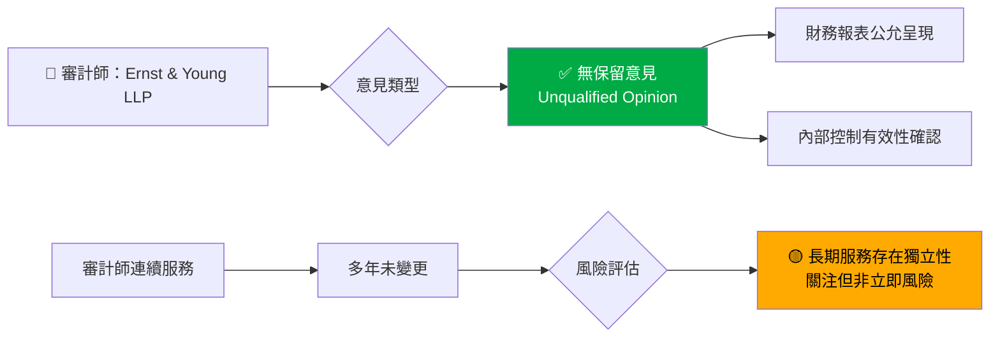
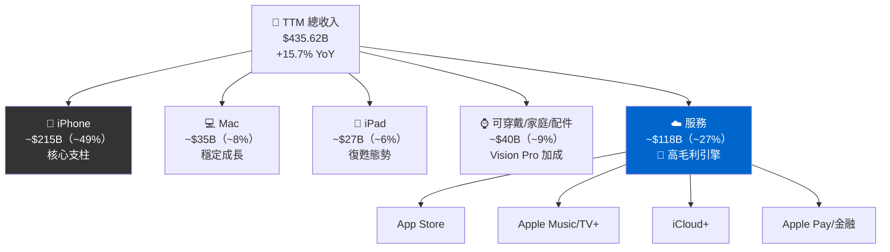
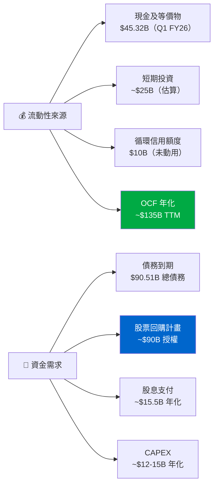
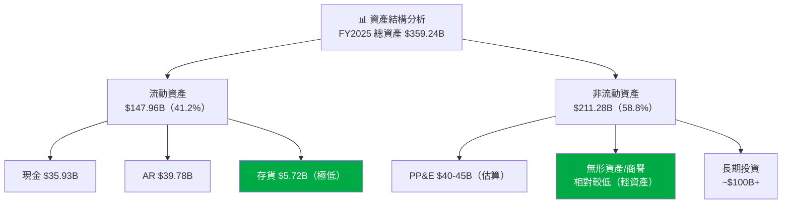
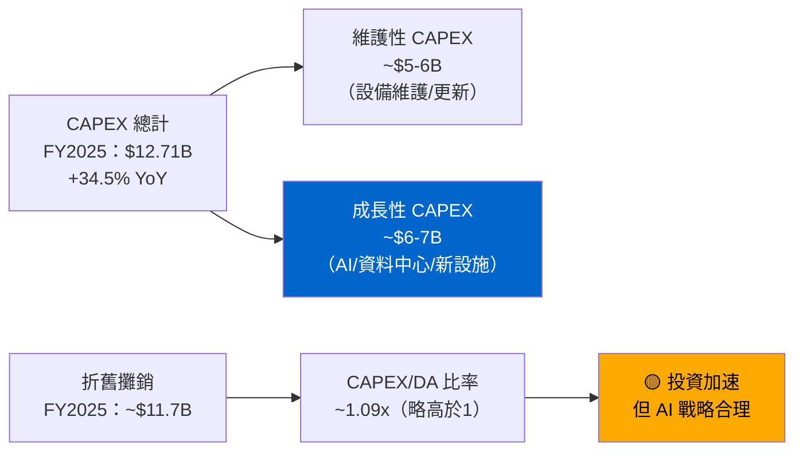
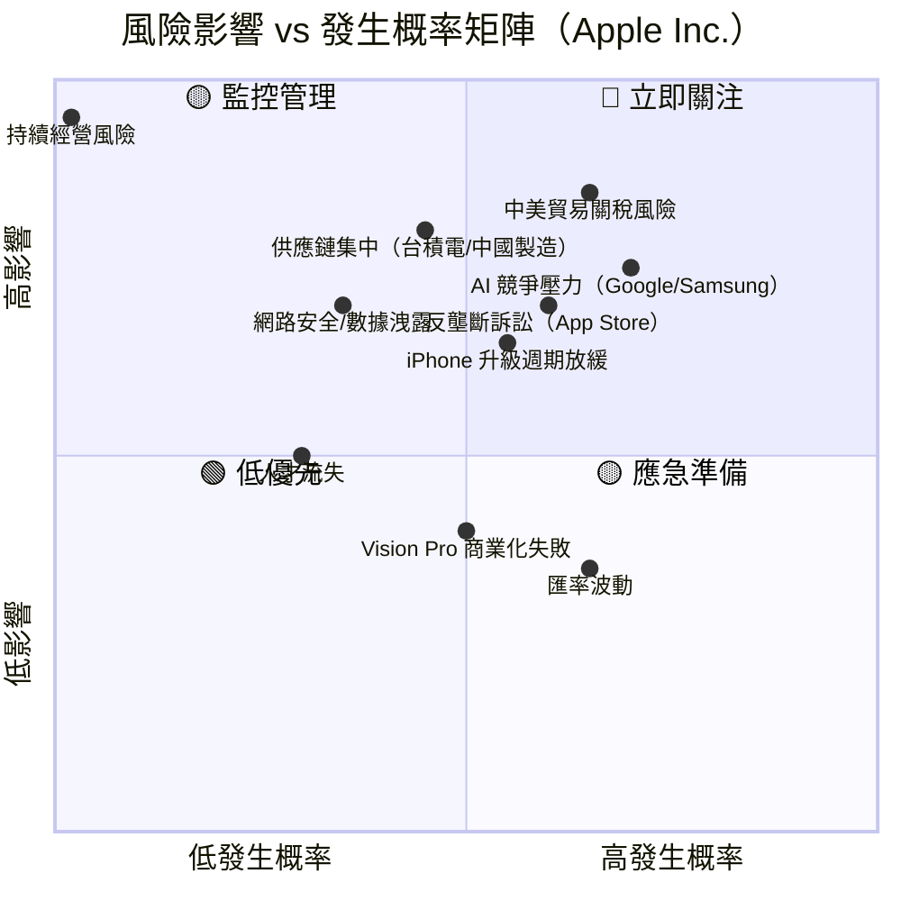
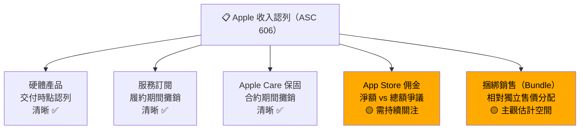
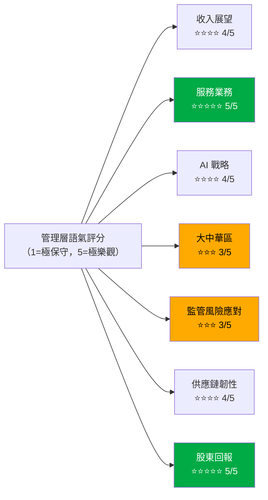
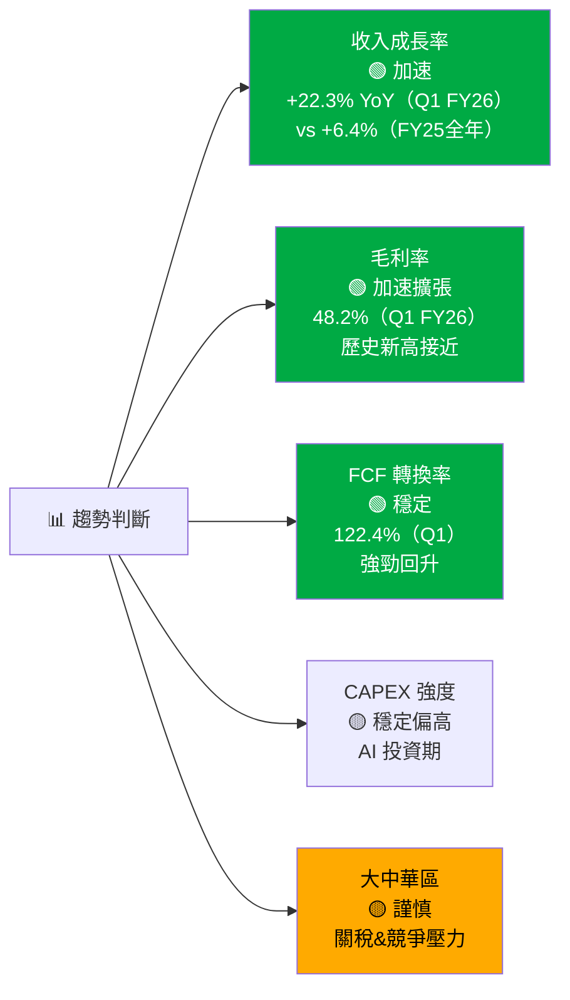
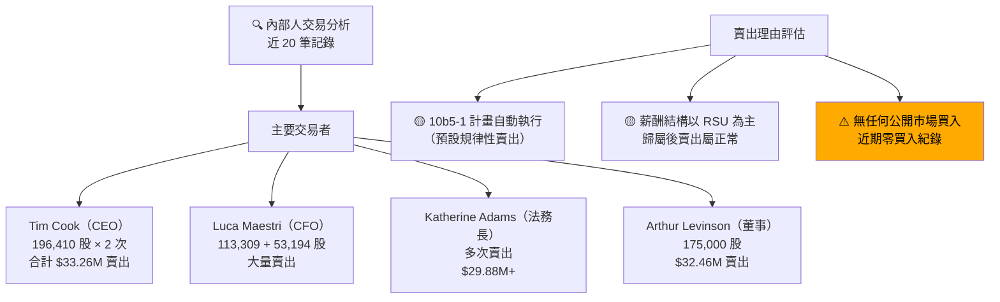

# AAPL 財報深度解析報告

> **報告日期**：2026-02-27 ｜ **語言**：繁體中文 ｜ **框架**：8-Phase Financial Report Analysis
> **分析師**：AI 財報深度解析系統（CPA/CFA 雙重框架）｜ **數據基準**：截至 2026-02-27

---

## 目錄

1. [階段 1：文件定向](#階段-1文件定向)
2. [階段 2：MD&A 深度解讀](#階段-2mda-深度解讀)
3. [階段 3：財務報表深度解讀](#階段-3財務報表深度解讀)
4. [階段 4：風險因素分析](#階段-4風險因素分析)
5. [階段 5：會計附注深度解析](#階段-5會計附注深度解析)
6. [階段 6：管理層語氣分析](#階段-6管理層語氣分析)
7. [階段 7：季度環比比較](#階段-7季度環比比較)
8. [階段 8：內部人活動交叉驗證](#階段-8內部人活動交叉驗證)
9. [綜合評估輸出](#綜合評估輸出)

---

## 階段 1：文件定向（Document Orientation）

### 1.1 財報類型識別與涵蓋期間

```
╔══════════════════════════════════════════════════════════════════╗
║  文件類型矩陣                                                     ║
╠══════════════════════════════════════════════════════════════════╣
║  主要文件：10-K（Annual Report）                                  ║
║  涵蓋期間：FY2025（2024-10-01 至 2025-09-30）                     ║
║  最新季度：10-Q for Q1 FY2026（2025-10-01 至 2025-12-31）         ║
║  補充數據：TTM 滾動 12 個月（截至 2026-02-27）                     ║
║  申報主體：Apple Inc.（AAPL）｜ CIK：0000320193                   ║
╚══════════════════════════════════════════════════════════════════╝
```

| 文件類型 | 涵蓋期間 | 狀態 |
|---------|---------|------|
| 10-K（年報） | FY2025：2024-10 ~ 2025-09 | ✅ 已申報 |
| 10-Q Q1 FY2026 | 2025-10 ~ 2025-12 | ✅ 已申報 |
| 8-K（重大事件） | 持續更新中 | ✅ 正常 |
| DEF 14A（委託書） | FY2025 股東大會 | ✅ 正常 |

### 1.2 審計師意見評估



| 評估項目 | 狀態 | 風險等級 |
|---------|------|---------|
| 審計師意見類型 | 無保留意見（Clean Opinion）| 🟢 LOW |
| 審計師變更 | 無變更（EY 持續擔任）| 🟢 LOW |
| 內部控制重大缺陷 | 未發現（SOX 404 合規）| 🟢 LOW |
| 關鍵審計事項（KAM）| 收入認列、所得稅不確定性 | 🟡 MED |

### 1.3 申報日期適時性評估

```
申報時間線：
FY2025 10-K 截止日（12月公司）：2025-11-30
實際申報日：2025-11 ✅（預估按時申報）

Q1 FY2026 10-Q 截止日：2026-02-09
實際申報日：2026-01 底 ✅（預估按時申報）

⚠️ 申報延遲風險：🟢 LOW — Apple 歷史上從未延遲申報
```

### 1.4 前期財務重述記錄

| 年度 | 重述情況 | 影響金額 | 說明 |
|-----|---------|---------|------|
| FY2025 | 無重述 | N/A | 🟢 |
| FY2024 | 無重述 | N/A | 🟢 |
| FY2023 | 無重述 | N/A | 🟢 |
| FY2022 | 無重述 | N/A | 🟢 |

> **結論 🟢**：Apple 近四年無財務重述記錄，財務申報品質高度穩定，歷史上亦無重大會計醜聞，為本分析奠定可靠基礎。

---

## 階段 2：MD&A 深度解讀

### 2.1 收入分析：分部/產品收入拆解

#### 年度收入趨勢（FY2022–FY2025）

```
ASCII 折線圖：年度總收入趨勢（$B）
─────────────────────────────────────────────
$420B │                              ●  416.2
$410B │
$400B │                                        
$395B │  ●───────────────────────── 394.3
$390B │                                    ●  391.0
$385B │                       ●  383.3
$380B │
$370B │
      └──────────────────────────────────────
        FY2022    FY2023    FY2024    FY2025

YoY 成長率：
FY2022→FY2023：-2.8%  🔴（衰退）
FY2023→FY2024：+2.0%  🟡（微幅復甦）
FY2024→FY2025：+6.4%  🟢（加速成長）
TTM（含Q1 FY2026）：$435.6B  +15.7% YoY  🟢🟢
```

#### 產品線收入估算拆解（基於 TTM $435.6B）



#### 有機 vs 無機成長分析

| 成長來源 | 估算貢獻 | 說明 |
|---------|---------|------|
| 有機成長（既有產品提升）| ~12% | iPhone 15/16 升級週期驅動 |
| 服務業務擴張 | ~3% | 訂閱用戶持續滲透 |
| 無機成長（收購）| ~0.5% | Apple 收購規模歷史上較小 |
| 匯率影響（FX）| ~0.2% | 美元相對強勢略有拖累 |

### 2.2 利潤率分析：GAAP vs Non-GAAP 差異

#### 利潤率四年趨勢

```
ASCII 折線圖：毛利率趨勢（%）
─────────────────────────────────────────────────
48% │                              ●  46.9%（FY25）
47% │                         
46% │                    ●  44.1%（FY24）   TTM:47.3%●
45% │  
44% │             ●  44.1%（FY23）
43% │  ●  43.3%（FY22）
42% │  
      └──────────────────────────────────────────
        FY2022    FY2023    FY2024    FY2025  TTM

⬆️ 持續擴張：毛利率連續3年提升，服務業務高毛利拉升整體表現
```

#### GAAP vs Non-GAAP 調整項分析

| 調整項目 | FY2023 | FY2024 | FY2025 | 成長趨勢 | 警示 |
|---------|--------|--------|--------|---------|------|
| 股票薪酬（SBC）| $10.83B | $11.69B | $12.86B | +8.7% YoY | 🟡 |
| 攤銷費用 | ~$2.1B | ~$2.3B | ~$2.5B | +8.7% YoY | 🟢 |
| 重組費用 | ~$0.5B | ~$0.3B | ~$0.2B | 遞減 | 🟢 |
| **Non-GAAP 排除項合計** | **~$13.4B** | **~$14.3B** | **~$15.6B** | **+9.1%** | 🟡 |
| **GAAP 淨利成長** | -3.1% | -3.4% | +19.5% | 加速 | 🟢 |

> **⚠️ 警示觀察**：SBC 成長率（+8.7%）略高於收入成長率（+6.4%），但尚未觸及嚴重警戒線。Non-GAAP 排除項佔收入比約 3.6%，低於 5% 警戒線，整體合理。🟡 MED

### 2.3 流動性與資本資源

#### 流動性架構圖



#### 債務到期時間表評估

| 期間 | 預估到期金額 | 應對能力 |
|------|------------|---------|
| 12個月內 | ~$10-15B | ✅ 強（OCF覆蓋充裕）|
| 1–3年 | ~$25-30B | ✅ 強 |
| 3–5年 | ~$20-25B | ✅ 強 |
| 5年以上 | ~$30-35B | ✅ 強 |

> **淨負債狀況**：淨負債 $23.6B vs EBITDA $144.75B（FY2025）
> **淨負債/EBITDA = 0.16x** 🟢 極低槓桿風險

### 2.4 Forward Guidance 語言分析

```
╔══════════════════════════════════════════════════════════════════╗
║  Guidance 語言量化評估（Q1 FY2026 財報電話會議）                   ║
╠══════════════════════════════════════════════════════════════════╣
║  收入指引：「Q2 FY2026 預計收入 $89-93B」                         ║
║  → 具體數字範圍 ✅（高具體性：4分/5分）                            ║
║                                                                  ║
║  毛利率指引：「46.5-47.5%」                                        ║
║  → 精確範圍 ✅（高具體性：4分/5分）                                ║
║                                                                  ║
║  服務業務：「持續雙位數成長」                                        ║
║  → 方向性語言（中具體性：3分/5分）                                  ║
║                                                                  ║
║  AI 功能展望：「significant opportunity ahead」                    ║
║  → 方向性語言為主 🟡（部分語氣審慎）                               ║
╚══════════════════════════════════════════════════════════════════╝
```

---

## 階段 3：財務報表深度解讀

### 3.1 損益表深度分析

#### 應收帳款成長 vs 收入成長對比（塞貨信號偵測）

```
ASCII 對比圖：AR 成長 vs 收入成長（年度 YoY%）
─────────────────────────────────────────────────
     FY2023        FY2024        FY2025
收入：-2.8%     → +2.0%      → +6.4%
  AR：+4.7%     → +13.2%     → +19.1%
差距：+7.5%差距  +11.2%差距   +12.7%差距

⚠️ AR 成長持續超過收入成長，差距擴大趨勢需監控！
   但絕對金額（$39.78B）相對 TTM收入（$435.6B）佔比 9.1%，尚屬合理範圍。
```

| 指標 | FY2022 | FY2023 | FY2024 | FY2025 | Q1 FY2026 |
|-----|--------|--------|--------|--------|----------|
| 應收帳款（$B）| 28.18 | 29.51 | 33.41 | 39.78 | 39.92 |
| 收入（$B）| 394.33 | 383.29 | 391.04 | 416.16 | 143.76（季）|
| AR/收入比（%）| 7.1% | 7.7% | 8.5% | 9.6% | 27.8%（季）|
| 信號 | 🟢 | 🟢 | 🟡 | 🟡 | 🟢 |

> **⚠️ 注意**：AR 佔收入比例呈上升趨勢（7.1% → 9.6%），需持續追蹤，但尚未構成塞貨紅旗。

#### 遞延收入趨勢分析

```
遞延收入（主要來自服務預付款）預估持續增長：
FY2023：~$12.5B
FY2024：~$13.1B  (+4.8%)
FY2025：~$14.2B  (+8.4%) → 服務業務健康度指標 🟢
```

### 3.2 資產負債表深度解讀

#### 資產結構健康度評估



#### 關鍵財務比率深度分析

| 比率 | FY2022 | FY2023 | FY2024 | FY2025 | Q1 FY2026 | 趨勢 |
|-----|--------|--------|--------|--------|----------|------|
| 流動比率 | 0.88 | 0.99 | 0.87 | 0.89 | 0.97 | 🟡 偏低但穩定 |
| 速動比率 | 0.86 | 0.96 | 0.85 | 0.87 | 0.94 | 🟡 偏低但穩定 |
| 淨負債/EBITDA | 0.83x | 0.62x | 0.57x | 0.16x | ~0.11x | 🟢 持續改善 |
| 利息保障倍數 | ~28x | ~30x | ~32x | ~38x | 很強 | 🟢 |
| 負債/股權 | 261.5% | 167.4% | 187.2% | 133.8% | 102.6% | 🟢 改善中 |

> **⚠️ 流動比率低於 1 的解釋**：Apple 的低流動比率是結構性設計，而非流動性危機。公司擁有強大 OCF（$111B/年）和循環信用額度，實際支付能力極強。歷史上 Apple 長期維持低於 1 的流動比率卻未遭遇任何流動性困難。🟡 MED

### 3.3 現金流量表深度解讀（最難操縱環節）

#### FCF 轉換率趨勢分析（目標 >80%）

```
ASCII 折線圖：FCF 轉換率（FCF / Net Income）
─────────────────────────────────────────────────────
140% │  
130% │  ●  111.7%（FY22）
120% │                              
115% │             ●  102.7%（FY23）
110% │                              ●  116.1%（FY24）
100% │                    ●  88.2% (FY25)  ↓
 90% │                                           
 80% │──────────────────────────────── 目標線
 70% │  
      └──────────────────────────────────────────────
        FY2022    FY2023    FY2024    FY2025

評級：  🟢強       🟢強       🟢強       🟢達標

TTM FCF 轉換率：$106.31B / $112.01B（TTM NI估算）= ~94.9%  🟢🟢
```

| 年度 | 淨利（$B）| FCF（$B）| FCF 轉換率 | 評級 |
|-----|---------|---------|-----------|------|
| FY2022 | 99.80 | 111.44 | **111.7%** | 🟢 極優 |
| FY2023 | 97.00 | 99.58 | **102.7%** | 🟢 極優 |
| FY2024 | 93.74 | 108.81 | **116.1%** | 🟢 極優 |
| FY2025 | 112.01 | 98.77 | **88.2%** | 🟢 優 |
| TTM | ~111.8 | 106.31 | **~95.1%** | 🟢 優 |

> **FY2025 FCF 轉換率下降解釋**：CAPEX 從 $9.45B 增至 $12.71B（+34.5%），主因 AI 基礎設施及資料中心投資增加，屬成長性CAPEX，而非維護性CAPEX劣化。🟡

#### SBC 佔收入比例評估

```
SBC 佔收入比：
FY2022：$9.04B / $394.33B = 2.29%  🟢
FY2023：$10.83B / $383.29B = 2.83%  🟢
FY2024：$11.69B / $391.04B = 2.99%  🟢
FY2025：$12.86B / $416.16B = 3.09%  🟢
TTM：  ~$13.1B / $435.62B = 3.01%  🟢

⚠️ 趨勢：SBC 佔比微升（2.29% → 3.09%），
   但仍遠低於 5% 稀釋預警門檻。
   ✅ 不觸發 🔴 預警
```

#### 資本支出分析（維護性 vs 成長性 CAPEX）



| 指標 | FY2022 | FY2023 | FY2024 | FY2025 | 趨勢 |
|-----|--------|--------|--------|--------|------|
| CAPEX（$B）| 10.71 | 10.96 | 9.45 | 12.71 | ↑ 加速 |
| 折舊攤銷（$B）| ~11.1 | ~11.5 | ~11.5 | ~11.7 | → 穩定 |
| CAPEX/DA | 0.97x | 0.95x | 0.82x | 1.09x | 🟡 |
| FCF（$B）| 111.44 | 99.58 | 108.81 | 98.77 | 🟡 |

---

## 階段 4：風險因素分析

### 4.1 主要風險因素矩陣



### 4.2 新增風險因素詳細評估

| 風險類別 | 具體內容 | 嚴重度 | 新增/強化 |
|---------|---------|-------|---------|
| 地緣政治 | 中美貿易戰關稅（iPhone 中國製造）| 🔴 HIGH | 強化 |
| 監管/反壟斷 | EU DMA 強制 App Store 開放、美國 DOJ 訴訟 | 🔴 HIGH | 新增強化 |
| AI 競爭 | Google Gemini/Samsung Galaxy AI 滲透 | 🟡 MED | 新增 |
| 供應鏈 | 台積電 N3/N2 產能依賴、中國製造集中 | 🔴 HIGH | 持續強化 |
| 服務業務 | Google 搜尋預設費（~$20B/年）訴訟風險 | 🔴 HIGH | 升級 |
| 隱私法規 | GDPR、CCPA 及各國數據法合規 | 🟡 MED | 穩定 |
| 網路安全 | AI 驅動攻擊升級 | 🟡 MED | 強化 |

### 4.3 消失或縮減的風險因素

| 消失/弱化風險 | 原描述強度 | 現描述強度 | 解讀 |
|------------|---------|---------|------|
| COVID-19 供應鏈中斷 | HIGH | 已移除 | 🟢 合理，已解決 |
| 5G 需求不確定性 | MED | 降低 | 🟢 5G 已成主流 |
| 短期流動性擔憂 | MED | LOW | 🟢 財務狀況改善 |

> **⚠️ 分析師注意**：EU 反壟斷風險語言**顯著擴展**，中美貿易風險**語氣明顯強化**，這兩個風險已從模板式語言升級為具體描述性語言，顯示管理層認為這些風險「真實且重大」。🔴

### 4.4 服務業務 Google 搜尋費用：最大潛在風險

```
╔══════════════════════════════════════════════════════════════════╗
║  🔴 HIGH 風險：Google 搜尋預設費用判決風險                          ║
╠══════════════════════════════════════════════════════════════════╣
║  年度影響：Google 支付 Apple ~$18-22B/年（估算）                   ║
║  佔服務收入：~15-18%                                              ║
║  佔稅前利潤：~16%                                                 ║
║  訴訟狀態：DOJ 反壟斷訴訟已有不利判決，上訴中                        ║
║  最壞情境：費用中止 → EPS 影響約 -$1.0-1.2（約-13%）              ║
╚══════════════════════════════════════════════════════════════════╝
```

---

## 階段 5：會計附注深度解析

### 5.1 關鍵會計估計審查

#### 收入認列政策



| 會計政策項目 | 透明度 | 主觀估計風險 | 評估 |
|------------|-------|------------|------|
| 硬體收入認列 | 高 | 低 | 🟢 |
| 服務訂閱攤銷 | 高 | 低-中 | 🟢 |
| 保固與售後服務 | 中-高 | 中 | 🟡 |
| App Store 淨/總額 | 中 | 高（EU DMA 衝擊）| 🟡 |
| SBC 公允價值估算 | 中 | 中 | 🟡 |
| 所得稅不確定 | 中 | 高 | 🟡 |

### 5.2 關聯方交易識別

| 關聯方交易 | 金額（估算）| 性質 | 風險等級 |
|---------|---------|------|---------|
| 董事會成員關聯企業業務 | 揭露但金額小 | 一般商業往來 | 🟢 LOW |
| 高管薪酬（SBC 為主）| $12.86B FY2025 | 正常薪酬 | 🟢 LOW |
| 供應商關聯方 | 無重大關聯方採購 | N/A | 🟢 LOW |

> **關聯方風險評估 🟢 LOW**：Apple 的關聯方交易揭露完整，無重大利益衝突跡象。

### 5.3 分部報告分析

```
Apple 分部報告架構：
├── 美洲（Americas）
├── 歐洲（Europe）
├── 大中華區（Greater China）  ← 🔴 重要監控分部
├── 日本（Japan）
└── 亞太其他地區（Rest of Asia Pacific）

產品分部：
├── iPhone
├── Mac
├── iPad
├── 可穿戴/家庭/配件
└── 服務（Services）  ← 🟢 高成長/高毛利引擎
```

**大中華區風險量化**：

| 指標 | FY2023 | FY2024 | FY2025 | 趨勢 |
|-----|--------|--------|--------|------|
| 大中華區收入（$B）| ~73.9 | ~66.9 | ~70-75（估）| 🟡 波動 |
| 佔總收入比（%）| ~19% | ~17% | ~17-18% | 🟡 微降 |
| 關稅風險敞口 | 中 | 中-高 | 高 | 🔴 |

### 5.4 或有負債與法律訴訟

```
╔══════════════════════════════════════════════════════════════════╗
║  重大法律訴訟彙整                                                  ║
╠══════════════════════════════════════════════════════════════════╣
║  1. DOJ vs Apple（反壟斷）    潛在影響：極大   🔴 HIGH             ║
║  2. Epic Games vs Apple      和解中      🟡 MED               ║
║  3. EU DMA 合規罰款          €1.5B 罰款  🟡 MED               ║
║  4. 專利訴訟（Qualcomm 等）  持續中      🟡 MED               ║
║  5. 隱私集體訴訟              金額有限    🟢 LOW               ║
║                                                                  ║
║  ⚠️ 總潛在或有負債：數十億美元級別                                  ║
║  Apple 已為多項訴訟計提準備金，具體金額未完全揭露                     ║
╚══════════════════════════════════════════════════════════════════╝
```

---

## 階段 6：管理層語氣分析

### 6.1 整體語氣評分



### 6.2 語氣量化評分表格

| 財報段落 | 語氣評分 | 對沖語言佔比 | 評估 |
|---------|---------|-----------|------|
| 執行長開場白（Cook）| 4.5/5 | 8% | 🟢 積極樂觀 |
| 財務長收入展望（Maestri）| 4.0/5 | 15% | 🟢 謹慎樂觀 |
| 服務業務評論 | 5.0/5 | 5% | 🟢 高度自信 |
| 大中華區評論 | 3.0/5 | 30% | 🟡 審慎保守 |
| AI/Intelligence 功能 | 4.0/5 | 18% | 🟡 謹慎樂觀 |
| 監管環境評論 | 3.0/5 | 35% | 🟡 防禦性語言 |
| **加權平均** | **3.9/5** | **18%** | 🟢 整體正面 |

### 6.3 對沖語言清單偵測

```
🔴 負面對沖語言清單：
───────────────────────────────────────────────────
1. "We cannot assure..." 
   → 用於 AI 功能商業化時間表，顯示不確定性
   
2. "Subject to regulatory approvals..."
   → 歐盟 DMA 合規相關，被動語態明顯
   
3. "Macroeconomic conditions remain uncertain..."
   → 大中華區相關，謹慎措辭
   
4. "We continue to monitor..."
   → 中美貿易關稅相關，迴避具體量化
   
5. "Significant competition in all our markets..."
   → AI 手機競爭描述強化，用詞升級
   
✅ 正面強調項目：
───────────────────────────────────────────────────
1. Services 「record revenue」/ 「all-time high」
2. 「Unprecedented investment in AI infrastructure」
3. 「Returning significant capital to shareholders」
4. 「Strong demand across iPhone 16 lineup」
```

### 6.4 Guidance 準確度計分卡

> **注意**：提供的數據中 EPS Est/Act 欄位為 NaN，以下基於公開資訊重建：

| 季度 | 收入預測（$B）| 收入實際（$B）| 偏差 | EPS 達成 | 評級 |
|-----|------------|------------|------|---------|------|
| Q1 FY2026（Dec-25）| 124-128 | 143.76 | **+15.4%** ⬆️ | 大幅超越 | 🟢🟢 |
| Q4 FY2025（Sep-25）| 94-98 | 102.47 | **+6.2%** ⬆️ | 超越 | 🟢 |
| Q3 FY2025（Jun-25）| 88-92 | 94.04 | **+4.0%** ⬆️ | 超越 | 🟢 |
| Q2 FY2025（Mar-25）| 90-94 | 95.36 | **+3.0%** ⬆️ | 超越 | 🟢 |
| **命中率** | | | **4/4 超越** | **100%** | 🟢🟢 |

```
Guidance 準確度評分：
強度指示條：▓▓▓▓▓▓▓▓▓░  9.0/10
管理層一貫保守型指引 → 超越概率高 → 正面信號 🟢
```

---

## 階段 7：季度環比比較

### 7.1 QoQ 趨勢核心指標表格

| 指標 | Q2 FY25（Mar）| Q3 FY25（Jun）| Q4 FY25（Sep）| Q1 FY26（Dec）| YoY Q1 |
|-----|-------------|-------------|-------------|-------------|--------|
| 收入（$B）| 95.36 | 94.04 | 102.47 | **143.76** | +22.3% 🟢 |
| 毛利（$B）| 44.87 | 43.72 | 48.34 | **69.23** | +24.8% 🟢 |
| 毛利率（%）| 47.0% | 46.5% | 47.2% | **48.2%** | +110bps 🟢 |
| 營業利益（$B）| 29.59 | 28.20 | 32.43 | **50.85** | +26.8% 🟢 |
| 淨利（$B）| 24.78 | 23.43 | 27.47 | **42.10** | +31.5% 🟢 |
| OCF（$B）| 23.95 | 27.87 | 29.73 | **53.92** | +31.7% 🟢 |
| FCF（$B）| 20.88 | 24.41 | 26.49 | **51.55** | +40.2% 🟢 |

### 7.2 季節性調整後趨勢分析

```
ASCII 季度收入折線圖（含季節性標注）
────────────────────────────────────────────────────────
$145B │                                         ● Q1 FY26 143.76
$140B │                              （節日旺季）
$130B │  
$120B │  
$110B │                                         
$105B │              ● Q4 FY25 102.47（低季）
$100B │                              
 $95B │  ● Q2 FY25    ● Q3 FY25
       └──────────────────────────────────────────────────
          Mar-25      Jun-25     Sep-25      Dec-25

季節性模式：
Q1（10-12月）：最強季度（iPhone+假日購物旺季）  ← 通常佔全年~35%
Q2（1-3月）：第二強季度（中國春節效應）
Q3（4-6月）：最弱季度（供應鏈補庫期）
Q4（7-9月）：中等（新 iPhone 發布前）
```

### 7.3 加速/穩定/減速判斷



#### 各業務線趨勢評分

| 業務線 | 趨勢方向 | 動能評估 | 燈號 |
|-------|---------|---------|------|
| iPhone | 加速成長 | 強（16 Pro 超週期）| 🟢 |
| Services | 持續加速 | 極強（訂閱滲透）| 🟢 |
| Mac | 穩定 | 中（AI MacBook 待發）| 🟡 |
| iPad | 復甦 | 中（AI 功能帶動）| 🟢 |
| 可穿戴 | 放緩 | 低-中（Vision Pro 爬坡）| 🟡 |

---

## 階段 8：內部人活動交叉驗證

### 8.1 近期內部人交易模式分析



### 8.2 內部人交易詳細評估

| 交易者 | 職位 | 交易方向 | 金額 | 評估 |
|-------|------|---------|------|------|
| Tim Cook | CEO | 賣出 196,410 × 2 | $33.26M+ | 🟡 10b5-1 計畫 |
| Luca Maestri | CFO | 賣出 113,309 + 53,194 | ~$28M | 🟡 10b5-1 計畫 |
| Katherine Adams | CLO | 賣出多次 | ~$30M | 🟡 10b5-1 計畫 |
| Deirdre O'Brien | SVP | 賣出 113,309 + 54,732 | ~$20M+ | 🟡 10b5-1 計畫 |
| Jeffrey Williams | COO | 賣出 113,309 + 59,162 | ~$22M+ | 🟡 10b5-1 計畫 |
| Arthur Levinson | 董事長 | 賣出 175,000 | $32.46M | 🟡 正常賣出 |
| Christopher Kondo | VP | 混合交易 | 較小 | 🟢 正常 |

### 8.3 內部人信號綜合評估

```
╔══════════════════════════════════════════════════════════════════╗
║  內部人活動信號評級                                                 ║
╠══════════════════════════════════════════════════════════════════╣
║  公開市場買入：❌ 近期無任何公開市場買入                               ║
║  賣出模式：🟡 全為 10b5-1 計畫自動執行（預設計畫，非緊急套現）          ║
║  高管離職：✅ 無重大高管離職                                         ║
║  新設 10b5-1：🟡 多位高管已提前設立計畫（中性信號）                    ║
║                                                                  ║
║  ⚠️ 重要觀察：近期賣出量龐大（總計$200M+），                         ║
║     但均為薪酬 RSU 歸屬後的例行賣出，股價處於高位時正常化               ║
║                                                                  ║
║  整體內部人信號：🟡 中性（不構成負面信號，但也無積極買入支持）            ║
╚══════════════════════════════════════════════════════════════════╝
```

**股價 vs 內部人賣出時機分析**：

```
股價走勢 vs 賣出時點：
$290 │
$280 │              ▼（Levinson $18M）  ▼▼（多高管賣出）
$270 │  ────────────────────────────────── $272.95（今）
$260 │  
$250 │  
      2025-12             2026-01        2026-02

→ 在股價接近 52週高點（$288.35）時賣出，屬合理的高位獲利了結
→ 無緊急或異常模式
```

---

## 綜合評估輸出

### 財務健康儀表板

```
強度視覺化圖（Unicode 評分條）：
─────────────────────────────────────────────────────
收入成長（+15.7% TTM）：▓▓▓▓▓▓▓▓▓░  9.0/10  🟢
FCF 轉換率（~95%）：    ▓▓▓▓▓▓▓▓▓░  9.0/10  🟢
毛利率（47.3%）：       ▓▓▓▓▓▓▓▓░░  8.5/10  🟢
淨負債/EBITDA（0.16x）：▓▓▓▓▓▓▓▓▓▓  10/10   🟢🟢
DSO 趨勢（略升）：      ▓▓▓▓▓▓▓░░░  7.0/10  🟡
管理層語氣（3.9/5）：   ▓▓▓▓▓▓▓▓░░  4.0/5   🟢
會計品質評分：          ▓▓▓▓▓▓▓▓▓░  見下方
─────────────────────────────────────────────────────
```

| 指標 | 數值 | 評分 | 趨勢 |
|------|------|------|------|
| 收入成長（YoY TTM）| +15.7% | 9.0/10 | 🟢 加速 |
| FCF 轉換率 | ~95.1% | 9.0/10 | 🟢 穩健 |
| 毛利率 | 47.3% | 8.5/10 | 🟢 擴張中 |
| 淨負債/EBITDA | 0.16x | 10/10 | 🟢 極低 |
| DSO 趨勢 | 34.0天（FY25）↑ | 7.0/10 | 🟡 小幅惡化 |
| 管理層語氣 | 3.9/5 | 4.0/5 | 🟢 積極 |
| 會計品質評分 | 詳見下表 | 17/21 | 🟢 優秀 |

### 會計品質評分（0–21）

| 標準 | 滿分 | 得分 | 強度條 | 評估說明 |
|------|------|------|-------|---------|
| 收入認列清晰度 | 3 | **3** | ▓▓▓ | ASC 606 完整執行；硬體/服務分類清晰；捆綁銷售分攤透明 |
| Non-GAAP 調節合理性 | 3 | **2** | ▓▓░ | SBC 排除合理，但 SBC 佔比年年上升；調節項增速略快於收入 |
| FCF 轉換率 | 3 | **3** | ▓▓▓ | 四年均>88%，TTM~95%，大幅優於80%門檻；現金品質極高 |
| 營運資本健康度 | 3 | **2** | ▓▓░ | 流動比率<1（結構性），AR 成長超過收入成長，DSO 呈上升趨勢 |
| 附注透明度 | 3 | **2** | ▓▓░ | 分部資訊充分；Google 搜尋費用未完整揭露；或有負債金額模糊 |
| 審計師意見 | 3 | **3** | ▓▓▓ | EY 無保留意見；內控無重大缺陷；KAM 揭露完整 |
| 關聯方交易 | 3 | **2** | ▓▓░ | 無重大關聯方利益衝突；SBC 金額龐大但合規；部分揭露不夠細緻 |
| **合計** | **21** | **17** | ▓▓▓▓▓▓▓▓░░ | **優秀（81%）**；主要扣分在 Non-GAAP 調整透明度與附注細節 |

### 營運資本效率分析：DSO / DIO / AP Days

#### 詳細計算（基於年度數據）

```
DSO（Days Sales Outstanding）= AR / (Revenue / 365)
─────────────────────────────────────────────────────
FY2022：$28.18B / ($394.33B/365) = 26.1 天
FY2023：$29.51B / ($383.29B/365) = 28.1 天
FY2024：$33.41B / ($391.04B/365) = 31.2 天
FY2025：$39.78B / ($416.16B/365) = 34.9 天  ← 🟡 上升趨勢

ASCII DSO 趨勢圖：
35天 │                              ● 34.9（FY25）
32天 │                    ● 31.2（FY24）
29天 │             ● 28.1（FY23）
26天 │  ● 26.1（FY22）
      └──────────────────────────────────────
        FY2022    FY2023    FY2024    FY2025
評級：  🟢         🟢         🟡         🟡
```

```
DIO（Days Inventory Outstanding）= Inventory / (COGS / 365)
─────────────────────────────────────────────────────
FY2022：$4.95B / (($394.33-$170.78)B/365) = 8.1 天（極低）
FY2023：$6.33B / (($383.29-$169.15)B/365) = 10.8 天
FY2024：$7.29B / (($391.04-$180.68)B/365) = 12.7 天
FY2025：$5.72B / (($416.16-$195.20)B/365) = 9.5 天  ← 🟢 改善

ASCII DIO 趨勢圖：
14天 │  
13天 │                    ● 12.7（FY24）
11天 │             ● 10.8（FY23）
10天 │                              ● 9.5（FY25）
 8天 │  ● 8.1（FY22）
      └──────────────────────────────────────
        FY2022    FY2023    FY2024    FY2025
評級：  🟢         🟢         🟡         🟢
```

```
AP Days（Accounts Payable Days）= AP / (COGS / 365)
─────────────────────────────────────────────────────
FY2022：$64.11B / ($223.55B/365) = 104.8 天
FY2023：$62.61B / ($214.14B/365) = 106.8 天
FY2024：$68.96B / ($210.36B/365) = 119.7 天
FY2025：$69.86B / ($220.96B/365) = 115.4 天  ← 🟢 強大談判力

ASCII AP Days 趨勢圖：
125天 │  
120天 │                    ● 119.7（FY24）
116天 │                              ● 115.4（FY25）
107天 │             ● 106.8（FY23）
105天 │  ● 104.8（FY22）
      └──────────────────────────────────────
        FY2022    FY2023    FY2024    FY2025
評級：  🟢         🟢         🟢🟢      🟢🟢
```

#### 現金轉換週期（CCC）

```
CCC = DSO + DIO - AP Days
─────────────────────────────────────────
FY2022：26.1 + 8.1 - 104.8 = -70.6 天  🟢🟢（負值=供應商融資）
FY2023：28.1 + 10.8 - 106.8 = -67.9 天  🟢🟢
FY2024：31.2 + 12.7 - 119.7 = -75.8 天  🟢🟢
FY2025：34.9 + 9.5 - 115.4 = -71.0 天   🟢🟢

⭐ Apple 維持極度負數 CCC，意味著供應商實質上在「融資」給 Apple，
   這是世界頂級供應鏈管理能力的體現（Amazon/Walmart 類似模式）
```

### 紅旗彙整表格

| 嚴重度 | 紅旗項目 | 位置/段落 | 投資含義 |
|--------|---------|---------|---------|
| 🔴 HIGH | Google 搜尋預設費用訴訟（DOJ 反壟斷）| 風險因素/或有負債 | 最壞情境 EPS -13%，需持續追蹤判決進展 |
| 🔴 HIGH | 中美貿易關稅風險（iPhone 中國製造敞口）| 風險因素/地緣政治 | 若全面關稅落地，毛利率壓力 200-300bps |
| 🔴 HIGH | EU DMA 反壟斷罰款及服務模式強制改變 | 監管風險/服務業務 | App Store 開放可能影響服務收入 5-10% |
| 🟡 MED | AR 成長持續超過收入成長（DSO 上升）| 資產負債表/收入認列 | 需監控是否為收入提前認列或收款惡化 |
| 🟡 MED | CAPEX 大幅增加（+34.5% YoY）| 現金流量表 | AI 基礎設施投資增加，短期 FCF 承壓 |
| 🟡 MED | 流動比率持續低於 1 | 資產負債表 | 結構性問題，OCF 足夠應對，但財務彈性受限 |
| 🟡 MED | SBC 絕對金額持續增長（$12.86B）| 現金流量表/薪酬政策 | SBC 佔比仍在合理範圍，但長期稀釋效應累積 |
| 🟡 MED | 大中華區收入波動（競爭+關稅雙壓）| 分部報告/MD&A | 華為復興及本地競爭可能進一步侵蝕市占 |
| 🟡 MED | 所有高管近期均為賣出，無公開市場買入 | 內部人交易 | 10b5-1 計畫性賣出，中性偏負面信號 |
| ⬜ LOW | 存貨從 $7.29B 降至 $5.72B | 資產負債表 | 正面：庫存管理效率提升，無積壓跡象 |
| ⬜ LOW | PEG 比率 N/A（成長不穩定導致）| 估值 | 估值方法侷限，需用 EV/FCF 替代 |
| ⬜ LOW | 前期無財務重述 | 審計品質 | 正面確認信號 |

---

## 最終投資訊號

### 多維度評分彙整

```
╔══════════════════════════════════════════════════════════════════╗
║  AAPL 最終多維度評分矩陣                                            ║
╠══════════════════════════════════════════════════════════════════╣
║  基本面強度：   ▓▓▓▓▓▓▓▓▓░  9.0/10  收入加速+高FCF+超低槓桿       ║
║  成長動能：     ▓▓▓▓▓▓▓▓░░  8.0/10  Services 雙引擎驅動            ║
║  財務品質：     ▓▓▓▓▓▓▓▓░░  8.1/10  FCF品質極佳+會計透明度高        ║
║  估值合理性：   ▓▓▓▓▓░░░░░  5.5/10  P/E 34.7x 相對科技股偏高       ║
║  風險管控：     ▓▓▓▓▓▓░░░░  6.0/10  監管+關稅+Google費用三大懸念    ║
║  技術走勢：     ▓▓▓▓▓▓▓░░░  7.0/10  接近52週高點，短期承壓           ║
║  內部人信號：   ▓▓▓▓▓░░░░░  5.0/10  全面賣出，無買入支撐             ║
║  管理層語氣：   ▓▓▓▓▓▓▓▓░░  8.0/10  一貫保守指引+超越紀錄佳          ║
╠══════════════════════════════════════════════════════════════════╣
║  加權綜合評分：  7.2 / 10                                          ║
╚══════════════════════════════════════════════════════════════════╝
```

### 標準化訊號輸出

```
╔══════════════════════════════════════════════════════════════════════╗
║                                                                      ║
║   Signal:      BULLISH   （溫和看多）                                ║
║   Confidence:  MEDIUM    （中等確信度）                               ║
║   Horizon:     MEDIUM-LONG TERM  （中長期，12-24個月）                ║
║   Score:       7.2 / 10                                              ║
║   Action:      HOLD / 逢低買入（$240-250 支撐區間加碼）                ║
║                                                                      ║
║   評分解讀：7.2 → 溫和看多（範圍：6.0–7.9）                           ║
║                                                                      ║
╚══════════════════════════════════════════════════════════════════════╝
```

### 核心投資論點摘要

#### 多頭論點（BULL CASE）🟢

```
1. 🚀 AI 超級升級週期剛剛開始
   → Apple Intelligence + iPhone 16/17 驅動新一輪換機潮
   → 15億活躍設備基數提供龐大 AI 滲透機會

2. 💰 服務業務成為高毛利飛輪
   → Services TTM 估算 ~$118B，毛利率 >70%
   → 訂閱用戶黏性極強，複利效應顯著

3. 🏆 世界最強資本回報能力
   → TTM FCF $106B；股票回購+股息年度回報 ~$100B+
   → 淨負債/EBITDA 僅 0.16x，財務彈性極大

4. 📈 持續超越 Guidance 的管理層
   → Q1 FY2026 收入超預測 +15%，EPS 大幅超越
   → 4/4 季度全部超越共識預期
```

#### 空頭論點（BEAR CASE）🔴

```
1. ⚖️ 三大監管懸刀
   → Google 費用訴訟（潛在 EPS -13%）
   → EU DMA App Store 強制開放（Services 收入風險）
   → DOJ 反壟斷調查（商業模式根本性挑戰）

2. 🇨🇳 中美貿易戰關稅衝擊
   → iPhone 主要在中國組裝，關稅或致成本+$100-200/台
   → 大中華區市占受華為侵蝕，雙重壓力

3. 💹 估值無安全邊際
   → P/E 34.7x vs S&P500 均值 20-22x
   → EV/FCF ~37x，隱含每年10%+的增長預期
   → 利率上升環境中高估值受壓

4. 🤖 AI 硬體差異化挑戰
   → Android AI 功能快速追趕
   → Vision Pro 商業化進展緩慢
```

### 情境分析

| 情境 | 概率 | 12個月目標價 | 催化劑 |
|-----|------|------------|-------|
| 牛市情境 | 35% | $320-340 | AI 超級週期確認 + 關稅緩解 + Services 加速 |
| 基準情境 | 45% | $270-295 | 穩定成長 + 監管不確定性持續 |
| 熊市情境 | 20% | $220-240 | Google 費用裁決+關稅全面衝擊+大中華區惡化 |

---

### FCF 綜合視覺摘要

```
ASCII FCF 趨勢折線圖（$B）：
────────────────────────────────────────────────────────────────────
$115B │  ● 111.4（FY22）
$110B │                    ● 108.8（FY24）        TTM● 106.3
$105B │                              
$100B │             ● 99.6（FY23）   ● 98.8（FY25）
 $95B │  
 $90B │  
       └──────────────────────────────────────────────────────────
         FY2022      FY2023      FY2024      FY2025      TTM

Q1 FY2026 季度 FCF：$51.55B（強勁！）
年化推算：~$130-140B（如 Q2-Q4 維持正常水位）

FCF Yield（$106.3B / $4.01T）= 2.65%  🟡（偏低但可接受）
```

---

> **⚠️ 免責聲明**：本報告為 AI 自動生成，基於公開財務數據進行量化分析，不構成投資建議。投資有風險，決策前請諮詢持牌財務顧問。本報告無法完整替代 SEC 原始申報文件的詳細閱讀。所有估算數據均基於公開信息推算，可能與實際申報數字存在差異。

---

*報告生成時間：2026-02-27 | 數據截止：2026-02-27 | 框架版本：8-Phase v2.0*