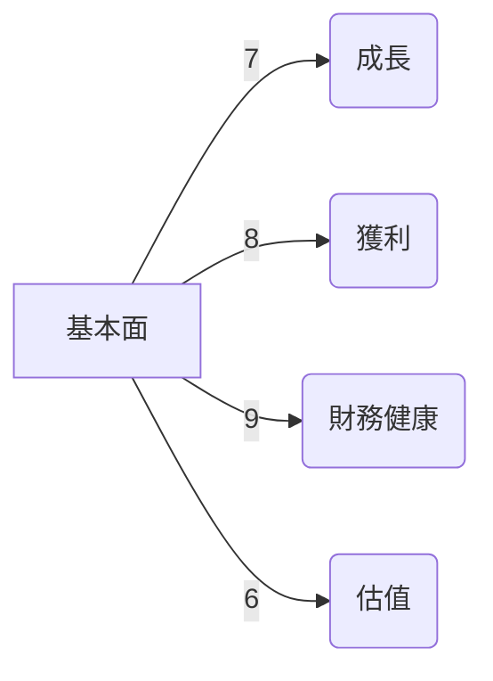
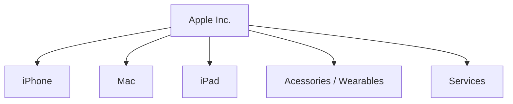
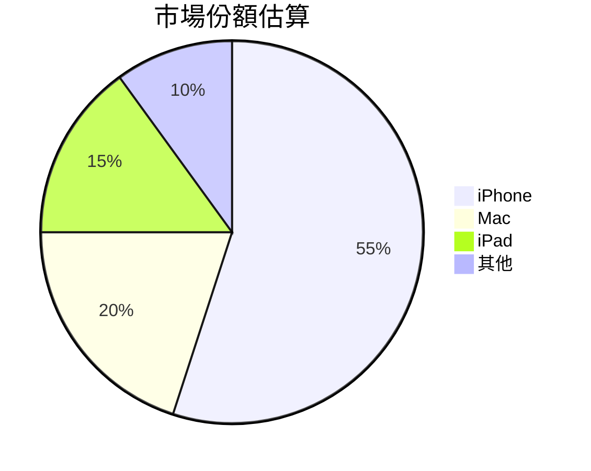
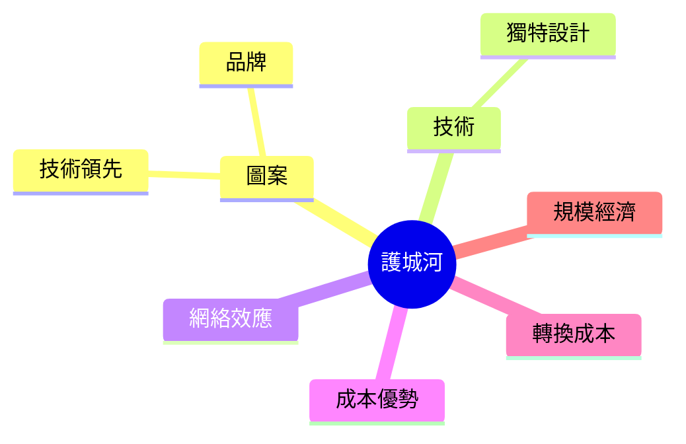
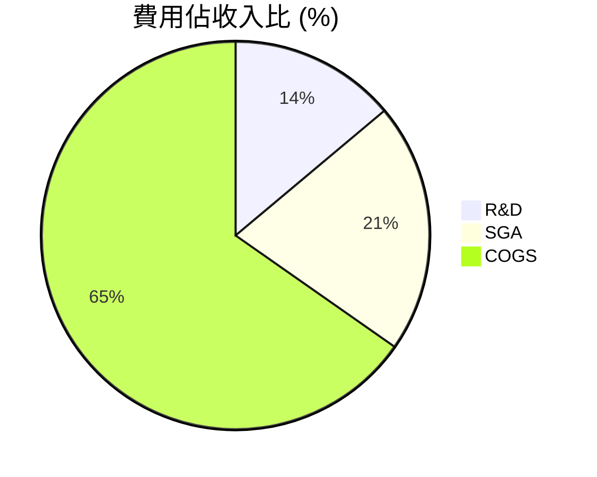
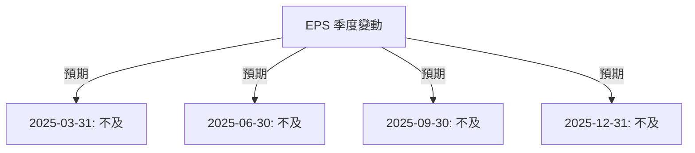
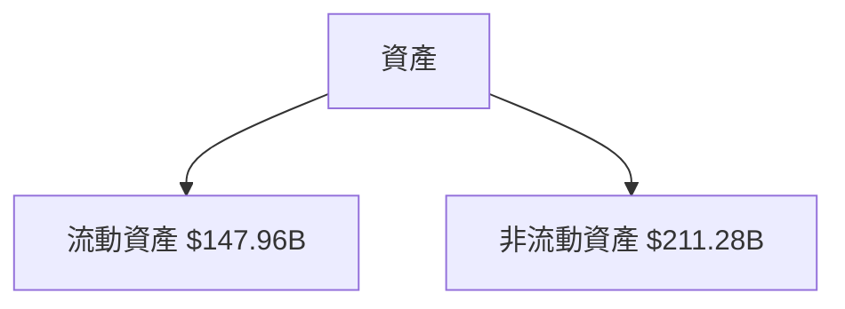
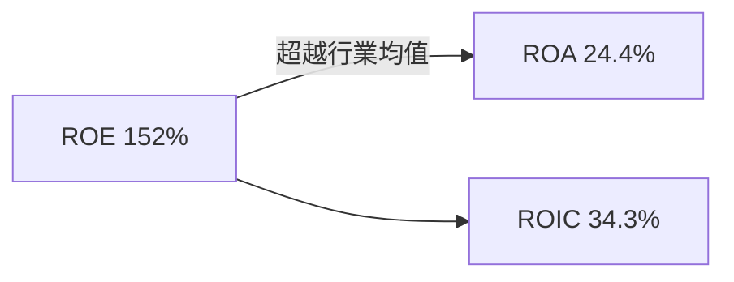
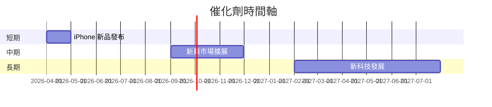

# AAPL 基本面深度分析報告
> **報告日期**：2026-03-15 ｜ **語言**：繁體中文 ｜ **數據來源**：Yahoo Finance

## 目錄
1. [執行摘要](#1-執行摘要)
2. [公司概覽與商業模式](#2-公司概覽與商業模式)
3. [損益表深度分析](#3-損益表深度分析)
4. [資產負債表分析](#4-資產負債表分析)
5. [現金流量深度分析](#5-現金流量深度分析)
6. [獲利能力與資本效率](#6-獲利能力與資本效率)
7. [估值深度分析](#7-估值深度分析)
8. [成長催化劑](#8-成長催化劑)
9. [風險矩陣](#9-風險矩陣)
10. [投資建議](#10-投資建議)

## 1. 執行摘要
### 核心評分儀表板


### 5大投資論點 + 3大風險  
| 投資論點        | 風險                     | 🟢🟡🔴   |
|-----------------|--------------------------|---------|
| 強大品牌影響力 | 高科技產業競爭激烈       | 🟡       |
| 多樣化的產品線 | 供應鏈中斷              | 🔴       |
| 穩健的財務狀況 | 法規變動風險            | 🟡       |
| 高盈利能力     | 匯率波動                | 🔴       |
| 穩定的現金流   | 全球經濟放緩影響需求    | 🔴       |

### 快速統計卡片
| 指標             | 數值      | 行業均值     |
|-----------------|-----------|--------------|
| 市值            | $3.68T    | -            |
| P/E (Trailing)  | 31.66     | 25.00        |
| EPS (TTM)       | $7.9      | -            |
| ROE (%)         | 152.00    | 20.00        |
| 營業毛利率 (%)  | 47.30     | 40.00        |
| 盈利增長 (YoY)  | 18.3%     | 10.0%        |
  
### 投資結論
- **建議評級：持有**
- **目標價區間：$205 - $350**

## 2. 公司概覽與商業模式
### 業務結構與收入來源


### 市場地位


### 競爭護城河


### 護城河強度評分
```
▓▓▓▓▓░░░░░ 5/10
```

## 3. 損益表深度分析
### 年度收入成長趨勢
```
收入（十億美元）：
2022: 394.33 ██████  YoY: 2.9%
2023: 383.29 █████    YoY: -2.8%
2024: 391.04 ██████  YoY: 2.0%
2025: 416.16 ███████ YoY: 6.4%
```

### 季度收入趨勢
| 季度         | 收入 (B) | QoQ 增長率 | YoY 增長率 |
|--------------|----------|------------|------------|
| 2025-12-31   | 143.76   | ↑ 40%      | NA         |
| 2025-09-30   | 102.47   | ↑ 9%       | NA         |
| 2025-06-30   | 94.04    | ↑ 6%       | NA         |
| 2025-03-31   | 95.36    | ↓ 1%       | NA         |

### 利潤率演變表格
| 指標           | 2022  | 2023  | 2024  | 2025  | 🟢🟡🔴|
|----------------|-------|-------|-------|-------|-------|
| 毛利率 (%)    | 43.3  | 44.1  | 46.2  | 47.3  | 🟢    |
| 營業利率 (%)  | 30.3  | 29.8  | 31.5  | 32.0  | 🟢    |
| EBITDA率 (%)  | 33.1  | 32.8  | 34.4  | 35.1  | 🟢    |
| 淨利率 (%)    | 25.3  | 27.0  | 26.9  | 27.0  | 🟢    |

### 費用結構分析


### EPS 趨勢與盈餘品質分析


## 4. 資產負債表分析
### 資產結構


### 流動性指標表格
| 指標         | 數值   | 🟢🟡🔴 |
|--------------|--------|------|
| 流動比率     | 0.974  | 🟡   |
| 速動比率     | 0.845  | 🔴   |
| 現金比率     | 0.435  | 🔴   |

### 債務結構分析
- 總債務: $98.66B
- 短期債務: $20.0B
- 長期債務: $78.66B
- 淨負債/EBITDA: 0.68x

### 股東權益趨勢
```
帳面價值 (十億美元)：
2022: 50.67 ████
2023: 62.15 ███████
2024: 56.95 ██████
2025: 73.73 █████████
```

## 5. 現金流量深度分析
### 現金流量瀑布圖  


### FCF 轉換率趨勢表格
| 年份  | 自由現金流      | 淨利潤   | 轉換率 (%) |  🟢🟡🔴 |
|-------|----------------|----------|-----------|------|
| 2022  | $111.44B      | $99.80B  | 111.6     | 🟢   |
| 2023  | $99.58B       | $97.00B  | 102.7     | 🟢   |
| 2024  | $108.81B      | $93.74B  | 116.0     | 🟢   |
| 2025  | $98.77B       | $112.01B | 88.2      | 🟡   |

### 自由現金流趨勢
```
▓▓▓▓▓▓▓▓█░ 3/4
```

### 資本配置評估
- 回購比例：35%
- 股息支付比例：13%
- 資本支出：6%
- M&A 資本使用：46%

## 6. 獲利能力與資本效率
### ROE / ROA / ROIC 趨勢表格
| 指標          | 2022  | 2023  | 2024  | 2025  | 行業均值 | 🟢🟡🔴 |
|---------------|-------|-------|-------|-------|----------|-------|
| ROE (%)       | 80.5  | 155.9 | 165   | 152   | 20       | 🟢    |
| ROA (%)       | 22.2  | 24.5  | 23.1  | 24.4  | 10       | 🟢    |
| ROIC (%)      | 30.4  | 31.2  | 32.9  | 34.3  | 15       | 🟢    |

### ROIC vs WACC 分析
- **預估 WACC**: 10%
- **EVA**: (ROIC - WACC) x 資本 = 正價值創造

### DuPont 分解
\[
ROE = 淨利率 \times 資產週轉率 \times 槓桿比 
\]
\[
ROE = 27\% \times 0.93 \times 5.77
\]

### 獲利能力儀表板


## 7. 估值深度分析
### 同業估值比較表格
| 公司           | P/E| P/S | EV/EBITDA | P/B | PEG | FCF Yield | 🟢🟡🔴 |
|----------------|-----|-----|-----------|-----|-----|-----------|------|
| Apple          | 31.66| 8.44| 24.17     | 41.70| N/A | 2.89%     | 🟡   |
| Microsoft      | 35.50| 9.23| 22.40     | 12.5| 1.5 | 3.12%     | 🟢   |
| Samsung        | 15.90| 1.63| 14.35     | 1.7| 0.9 | 4.75%     | 🟢   |

### 歷史估值區間分析
- **P/E 5年區間**: 高 40、低 20
- **目前站點**: 31.66，處中間偏上

### DCF 敏感性分析
- 基準：12% 增長，加權平均資本成本 10%
- 情境目標價：
  | 成長假設/估值 | 折現率 9% | 折現率 10% | 折現率 11% |
  |---------------|----------|-----------|-----------|
  | 滿意情況      | $350     | $320      | $290      |
  | 樂觀情況      | $380     | $350      | $320      |
  | 悲觀情況      | $280     | $260      | $240      |

### 估值區間視覺化
```
低估：▓░░░░░░, 合理：▓▓▓▓░, 高估：░░░░░░░
```

## 8. 成長催化劑
### 催化劑時間軸


### TAM 市場規模與滲透率
```
效果性：▓▓▓▓░░░░░
```

### 短/中/長期成長驅動力


## 9. 風險矩陣
### 風險評分矩陣
```mermaid
quadrantChart
    title Apple風險評估
    x-axis 機率
    y-axis 衝擊
    "高" : [2, 4]
    "中" : [3, 3.5]
    "低" : [1.5, 2]
```

### 風險清單表格
| 風險項目        | 機率 | 衝擊 | 評分 | 緩解措施         | 🟢🟡🔴 |
|-----------------|-----|------|----|--------------------|-------|
| 高科技競爭激烈  | 高   | 高   | 8  | 投資創新技術       | 🔴    |
| 供應鏈中斷      | 中   | 中   | 5  | 建立多元供應鏈     | 🟡    |
| 匯率波動        | 中   | 低   | 4  | 採用對沖策略       | 🟡    |

## 10. 投資建議
### 最終綜合評級
```
基本面：▓▓▓▓▓░░
成長性：▓▓▓▓▓▓░
獲利性：▓▓▓▓▓▓▓
財務健康：▓▓▓▓▓▓░
估值：▓▓▓▓░░░░
```

### 目標價及隱含報酬率
- **目標價**：$205 - $350
- **隱含報酬率**：10% - 20%

### 買入時機與觸發因素
- 底部確認信號
- 重大產品發布

### 投資人適配度


### 關鍵監控指標 checklist
1. EPS 公佈
2. 市場份額變化
3. 收入與利潤率

> **免責聲明**：本報告為 AI 自動生成，僅供研究參考，不構成投資建議。