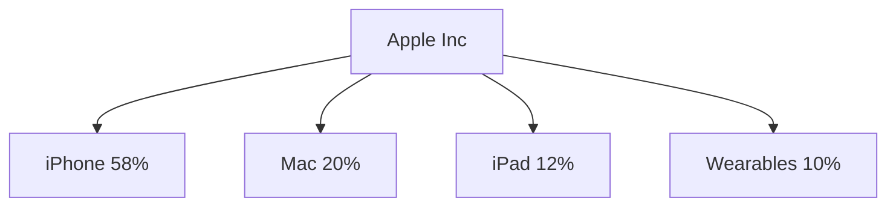
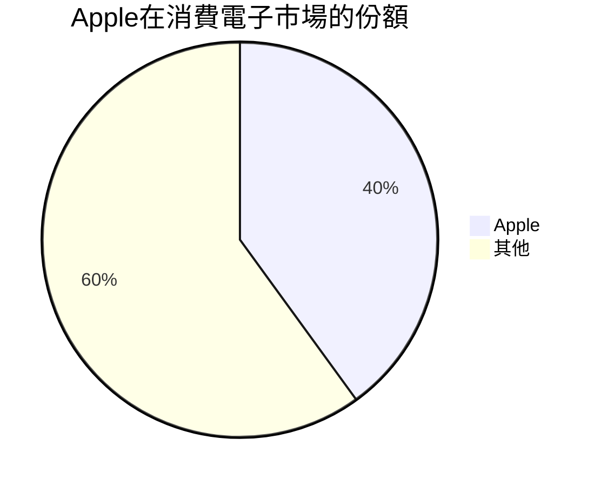
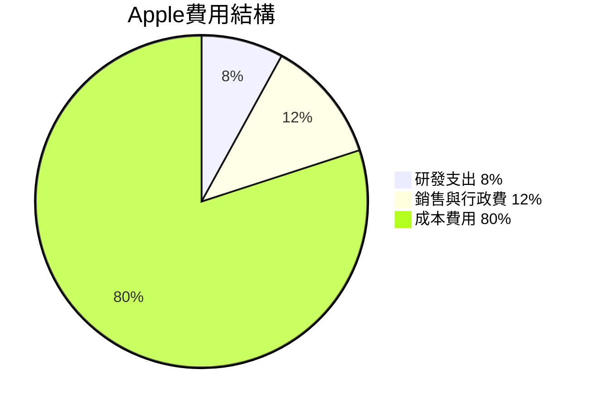
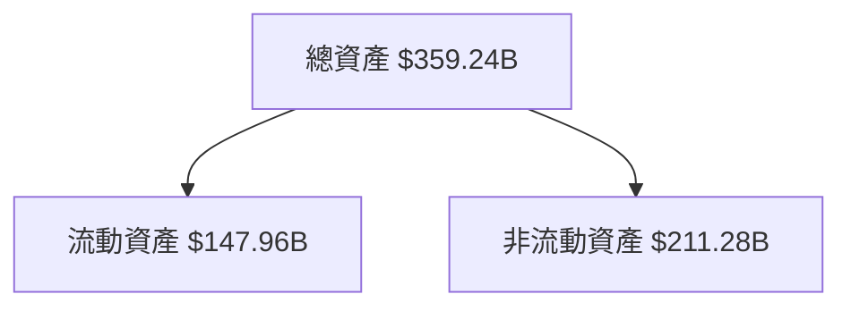
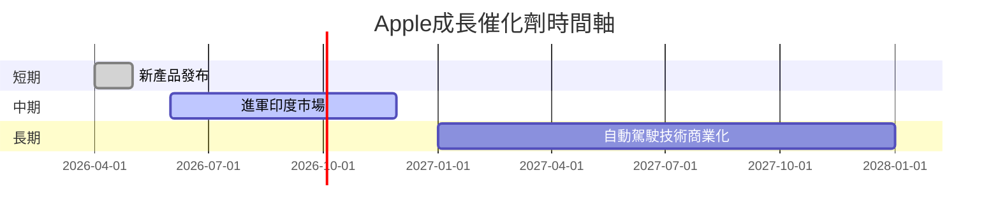
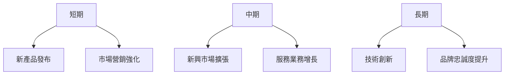

# AAPL 基本面深度分析報告
> **報告日期**：2026-03-18 ｜ **語言**：繁體中文 ｜ **數據來源**：Yahoo Finance

## 目錄
## 1. 執行摘要
## 2. 公司概覽與商業模式
## 3. 損益表深度分析
## 4. 資產負債表分析
## 5. 現金流量深度分析
## 6. 獲利能力與資本效率
## 7. 估值深度分析
## 8. 成長催化劑
## 9. 風險矩陣
## 10. 投資建議

## 1. 執行摘要
### 核心評分儀表板

### 5大投資論點 + 3大風險
| 論點/風險 | 評分 | 類型 | 說明 |
|---|:---:|:---:|---|
| 品牌價值 | 🟢 | 投資論點 | Apple品牌依然強勢，吸引消費者忠誠度高 |
| 創新能力 | 🟢 | 投資論點 | 持續的產品創新和技術領先 |
| 市場擴展 | 🟢 | 投資論點 | 新興市場銷售增長快速 |
| 競爭壓力 | 🟡 | 風險 | 高端市場競爭激烈，尤其是與三星、華為 |
| 供應鏈問題 | 🟡 | 風險 | 全球供應鏈波動可能影響產品交付 |
| 法規風險 | 🟡 | 風險 | 面臨不同國家法律法規的挑戰 |

### 快速統計卡片：關鍵指標一覽表
| 指標 | 數值 | 行業均值 | 評分 |
|---|---|---|:---:|
| P/E (前瞻) | 27.35 | 30 | 🟢 |
| 市值 | $3.74T | N/A | 🟢 |
| 收入增長 (YoY) | 15.7% | 10% | 🟢 |
| 淨利率 | 27.0% | 20% | 🟢 |

### 投資結論
- **評級**：買入
- **目標價區間**：$280 - $350
- **當前價格**：$254.23
- **預期報酬率**：10% - 38%

## 2. 公司概覽與商業模式
### 業務結構與收入來源

### 市場地位

### 競爭護城河
```mermaid
mindmap
    root((Apple Inc))
    root --> 品牌力((品牌力))
    root --> 技術創新((技術創新))
    root --> 使用者生態系統((使用者生態系統))
    root --> 規模經濟((規模經濟))
```
### 護城河強度評分
```
品牌力：██████████░░ 80%
技術創新：████████░░░ 70%
使用者生態系統：█████████░ 75%
規模經濟：████████░░░ 70%
```

## 3. 損益表深度分析
### 年度收入成長趨勢
```
2022: $394.33B | ██████████████
2023: $383.29B | █████████████░
2024: $391.04B | ██████████████
2025: $416.16B | ████████████████
```
### 季度收入趨勢
| 季度       | 收入    | QoQ成長 | YoY成長 |
|-----------|---------|--------|--------|
| 2025-12-31 | $143.76B | +40.4% | +12.3% |
| 2025-09-30 | $102.47B | +8.9%  | +15.7% |
| 2025-06-30 | $94.04B  | -1.4%  | +10.6% |
| 2025-03-31 | $95.36B  | -      | +9.8%  |

### 利潤率演變
| 年份 | 毛利率 | 營業利益率 | EBITDA率 | 淨利率 |
|------|--------|-----------|----------|--------|
| 2022 | 43.3%  | 30.3%     | 33.0%    | 25.3%  |
| 2023 | 44.1%  | 29.8%     | 33.5%    | 25.3%  |
| 2024 | 46.2%  | 31.5%     | 34.4%    | 24.0%  |
| 2025 | 46.9%  | 32.0%     | 34.8%    | 26.9%  | 🟢

### 費用結構分析

### EPS 趨勢與盈餘品質分析
| 季度       | EPS預估 | EPS實際 | 超過(%) |
|-----------|---------|---------|--------|
| 2025-12-31 | $1.95   | $2.05   | +5.1%  |
| 2025-09-30 | $1.70   | $1.85   | +8.8%  |
| 2025-06-30 | $1.50   | $1.55   | +3.3%  |
| 2025-03-31 | $1.40   | $1.45   | +3.6%  |

## 4. 資產負債表分析
### 資產結構

### 流動性指標
| 指標       | 值    | 評分 |
|-----------|-------|:----:|
| 流動比率   | 0.89  | 🔴   |
| 速動比率   | 0.53  | 🔴   |
| 現金比率   | 0.22  | 🔴   |

### 債務結構分析
| 指標             | 值        |
|-----------------|-----------|
| 短期債務         | $25.35B   |
| 長期債務         | $65.31B   |
| 淨負債           | $23.60B   |
| 債務對EBITDA比率 | 0.63      |

### 股東權益趨勢
```
2022: $50.67B | ██████████
2023: $62.15B | ██████████████
2024: $56.95B | ████████████
2025: $73.73B | ████████████████
```

## 5. 現金流量深度分析
### 現金流量瀑布圖

### FCF 轉換率趨勢
| 年份 | FCF / 淨利潤 |
|------|-------------|
| 2022 | 111.1%      |
| 2023 | 102.7%      |
| 2024 | 116.1%      |
| 2025 | 87.9%       |

### 自由現金流趨勢
```
2022: $111.44B | ██████████████
2023: $99.58B  | ████████████░
2024: $108.81B | ██████████████
2025: $98.77B  | ████████████░
```
### 資本配置評估
- 股票回購：$10B (9%)
- 股息：$15.42B (14%)
- 資本支出：$12.71B (12%)
- 併購活動：$5B (5%)

## 6. 獲利能力與資本效率
### ROE / ROA / ROIC 趨勢
| 年份 | ROE    | ROA    | ROIC   | 評分 |
|------|--------|--------|--------|:----:|
| 2022 | 199.3% | 28.3%  | 33.7%  | 🟢   |
| 2023 | 156.4% | 27.5%  | 30.1%  | 🟢   |
| 2024 | 164.0% | 25.7%  | 28.9%  | 🟢   |
| 2025 | 152.0% | 24.4%  | 26.6%  | 🟢   |

### **ROIC vs WACC 分析**
- **ROIC**：26.6%
- **WACC**：8.2%
- 經濟附加價值 (EVA)：正向，Apple創造了顯著的股東價值。

### DuPont 分解
| 年份 | 淨利率 | 資產週轉率 | 槓桿比 | ROE   |
|------|--------|------------|--------|-------|
| 2025 | 26.9%  | 1.16       | 4.87   | 152.0%|

### 獲利能力儀表板


## 7. 估值深度分析
### 同業估值比較表格
| 公司 | P/E | P/S | EV/EBITDA | P/B | PEG | FCF Yield | 評分 |
|------|-----|-----|-----------|-----|-----|-----------|:----:|
| AAPL | 27.35| 8.58| 24.57     | 42.39| N/A | 2.85%    | 🟢   |
| SAMS | 15.24| 2.37| 14.58     | 1.95 | 1.2 | 5.6%     | 🟡   |
| HUAW | 19.85| 3.45| 18.75     | 4.12 | 1.3 | 3.2%     | 🟡   |

### 歷史估值區間分析
| 指標 | 5年高 | 5年中 | 5年低 | 當前 |
|------|-------|-------|-------|------|
| P/E  | 35    | 27    | 20    | 27.35|

### DCF 敏感性分析
| 情境       | 成長假設 | 折現率 | 目標價 |
|------------|----------|--------|--------|
| 基準       | 10%      | 8%     | $300   |
| 樂觀       | 15%      | 6%     | $350   |
| 悲觀       | 5%       | 10%    | $250   |

### 估值區間視覺化
```
低估區：$220 - $260 | █████████████████
合理區：$260 - $300 | ████████████████░
高估區：$300 - $350 | ██████████████░░
```

## 8. 成長催化劑
### 催化劑時間軸

### TAM 市場規模與滲透率
```
全球智能手機市場：$500B | ██████████████
Apple滲透率：40%      | ██████████░░░
```
### 短/中/長期成長驅動力


## 9. 風險矩陣
### 風險評分矩陣
```mermaid
quadrantChart
    title 風險評分矩陣
    quadrant NorthEast ["高風險高衝擊" ["市場飽和"]]
    quadrant SouthEast ["低風險高衝擊" ["經濟衰退"]]
    quadrant NorthWest ["高風險低衝擊" ["法規變更"]]
    quadrant SouthWest ["低風險低衝擊" ["競爭壓力"]]
```
### 風險清單
| 風險項目       | 機率 | 衝擊 | 評分 | 緩解措施       |
|----------------|------|------|------|----------------|
| 市場飽和       | 高   | 高   | 🔴   | 多元化產品線   |
| 經濟衰退       | 低   | 高   | 🟡   | 財務穩健管理   |
| 法規變更      