# AAPL 綜合股票評估報告

> **報告日期**：2026-02-28 ｜ **分析師**：頂級美股投資評估師 ｜ **數據來源**：Yahoo Finance
> **當前股價**：$264.18 ｜ **市值**：$3.88T ｜ **評級**：⭐⭐⭐⭐ 買入

---

## 目錄

1. [評估總覽](#1-評估總覽)
2. [八維度評分矩陣](#2-八維度評分矩陣)
3. [業務品質與護城河](#3-業務品質與護城河)
4. [財務健康全面評估](#4-財務健康全面評估)
5. [成長性評估](#5-成長性評估)
6. [估值合理性與同業比較](#6-估值合理性--同業比較)
7. [資本配置與管理層評估](#7-資本配置與管理層評估)
8. [風險評估](#8-風險評估)
9. [催化劑與觸發因素](#9-催化劑與觸發因素)
10. [投資建議](#10-投資建議)

---

## 1. 評估總覽

### 🎯 ASCII 雷達圖（八維度評分視覺化）

```
              成長性 [8.2]
                 ▲
          ★★★★★★★★☆☆
         /              \
風險控制               獲利能力
[7.5]  ★★★★★★★★☆☆  [9.5]
★★★★★★★☆☆☆              ★★★★★★★★★★
       |        ●        |
動能   |   AAPL CORE     | 財務健康
[8.0] ★★★★★★★★☆☆  [7.0]
★★★★★★★★☆☆              ★★★★★★★☆☆☆
         \              /
          ★★★★★★★★☆☆
管理品質              競爭優勢
[8.5]               [9.8]
        估值合理性
           [5.5]
              ▼

━━━━━━━━━━━━━━━━━━━━━━━━━━━━━━━━━━
      AAPL 八維度視覺化雷達圖
━━━━━━━━━━━━━━━━━━━━━━━━━━━━━━━━━━

               成長性
                10
               /|\
           8  / | \  8
             /  |  \
風險控制 8--*---+---*--9.5 獲利能力
           /  \ | /  \
          6    \|/    6
管理品質  *-----*-----*  財務健康
    8.5  |     8.0   7.0|
          \    /|\    /
           \  / | \  /
動能 8.0   *   |   *   競爭優勢 9.8
             \ | /
              \|/
               5.5
             估值合理性
━━━━━━━━━━━━━━━━━━━━━━━━━━━━━━━━━━
```

```
╔══════════════════════════════════════════════════════╗
║           AAPL 八維度雷達評分（精確版）              ║
╠══════════════════════════════════════════════════════╣
║                                                      ║
║         成長性(8.2)                                  ║
║             *                                        ║
║          *     *                                     ║
║    風險(7.5) ─── 獲利(9.5)                          ║
║       *     ╲ ╱     *                               ║
║             ╳                                        ║
║       *     ╱ ╲     *                               ║
║    動能(8.0) ─── 財務(7.0)                          ║
║          *     *                                     ║
║    管理(8.5) ─── 競爭(9.8)                          ║
║             *                                        ║
║         估值(5.5)                                    ║
║                                                      ║
║   綜合加權評分：8.0 / 10.0  ★★★★☆               ║
╚══════════════════════════════════════════════════════╝
```

---

### 📊 八維度評分總表 + Unicode 評分條

| 維度 | 分數 | 評分條（10格） | 狀態 |
|------|------|----------------|------|
| 🚀 成長性 | **8.2** | `▓▓▓▓▓▓▓▓░░` | 🟢 強勢 |
| 💰 獲利能力 | **9.5** | `▓▓▓▓▓▓▓▓▓░` | 🟢 頂尖 |
| 🏦 財務健康 | **7.0** | `▓▓▓▓▓▓▓░░░` | 🟡 穩健 |
| 📈 估值合理性 | **5.5** | `▓▓▓▓▓▓░░░░` | 🔴 偏貴 |
| 🏰 競爭優勢 | **9.8** | `▓▓▓▓▓▓▓▓▓▓` | 🟢 護城河深 |
| 👔 管理品質 | **8.5** | `▓▓▓▓▓▓▓▓▓░` | 🟢 優秀 |
| ⚡ 市場動能 | **8.0** | `▓▓▓▓▓▓▓▓░░` | 🟢 強勁 |
| 🛡️ 風險控制 | **7.5** | `▓▓▓▓▓▓▓▓░░` | 🟡 可控 |
| **加權綜合** | **8.0** | `▓▓▓▓▓▓▓▓░░` | 🟢 **買入** |

```
━━━━━━━━━━━━━━━━━━━━━━━━━━━━━━━━━━━━━━━━━━━━━━
  各維度評分視覺化（Unicode 橫條圖）
━━━━━━━━━━━━━━━━━━━━━━━━━━━━━━━━━━━━━━━━━━━━━━
成長性(8.2)  ████████░░  8.2/10
獲利能力(9.5) █████████░  9.5/10
財務健康(7.0) ███████░░░  7.0/10
估值合理(5.5) █████░░░░░  5.5/10 ⚠
競爭優勢(9.8) ██████████  9.8/10
管理品質(8.5) ████████░░  8.5/10
市場動能(8.0) ████████░░  8.0/10
風險控制(7.5) ███████░░░  7.5/10
━━━━━━━━━━━━━━━━━━━━━━━━━━━━━━━━━━━━━━━━━━━━━━
 0    2    4    6    8   10
 └────┴────┴────┴────┴────┘
```

---

### 🎯 投資結論框格

```
╔══════════════════════════════════════════════════════════════╗
║                   📊 AAPL 投資評級                           ║
╠══════════════════════════════════════════════════════════════╣
║  評級：⭐⭐⭐⭐☆  【買入 BUY】                              ║
║                                                              ║
║  當前股價：$264.18                                           ║
║  目標價（12個月）：$293.07（分析師共識）                     ║
║  本評估目標價：$295 ~ $310                                   ║
║  預期報酬率：+11.7% ~ +17.3%（含股息）                      ║
║                                                              ║
║  ✅ 買入理由：                                               ║
║   • 護城河深厚（生態系統 + 品牌 + 轉換成本）                 ║
║   • 獲利能力頂尖（淨利率27%、FCF $106B）                    ║
║   • AI整合驅動服務業務加速成長                               ║
║   • 持續積極回購股票（年均$80B+）                            ║
║                                                              ║
║  ⚠️ 主要風險：                                              ║
║   • 估值偏高（P/E 33.5x，溢價顯著）                         ║
║   • 中國市場競爭加劇                                         ║
║   • 地緣政治與關稅風險                                       ║
╚══════════════════════════════════════════════════════════════╝
```

---

## 2. 八維度評分矩陣

### 📋 詳細評分依據表格

| 維度 | 評分 | 評分依據 | 趨勢 | 狀態 |
|------|------|----------|------|------|
| 🚀 **成長性** | **8.2/10** | 營收YoY +15.7%、EPS成長+18.3%、服務業務高速增長 | ↗ 上升 | 🟢 |
| 💰 **獲利能力** | **9.5/10** | 毛利率47.3%（歷史新高）、淨利率27%、ROE 152% | ↗ 上升 | 🟢 |
| 🏦 **財務健康** | **7.0/10** | 淨負債$23.6B但FCF高達$106B、流動比<1但可控 | → 持平 | 🟡 |
| 📈 **估值合理性** | **5.5/10** | P/E 33.5x偏高、PB 44x極高、FCF yield僅2.74% | ↘ 偏貴 | 🔴 |
| 🏰 **競爭優勢** | **9.8/10** | 生態系統鎖定效應、品牌溢價、服務業務雪球效應 | ↗ 強化 | 🟢 |
| 👔 **管理品質** | **8.5/10** | 庫克資本配置優秀、R&D持續投入、AI戰略清晰 | → 穩定 | 🟢 |
| ⚡ **市場動能** | **8.0/10** | 股價52W表現+57%、機構持股65%、分析師41人看好 | ↗ 強勁 | 🟢 |
| 🛡️ **風險控制** | **7.5/10** | Beta 1.107偏低、供應鏈分散進行中、法規風險存在 | → 可控 | 🟡 |

---

### 🗺️ 風險／報酬定位矩陣（Mermaid quadrantChart）

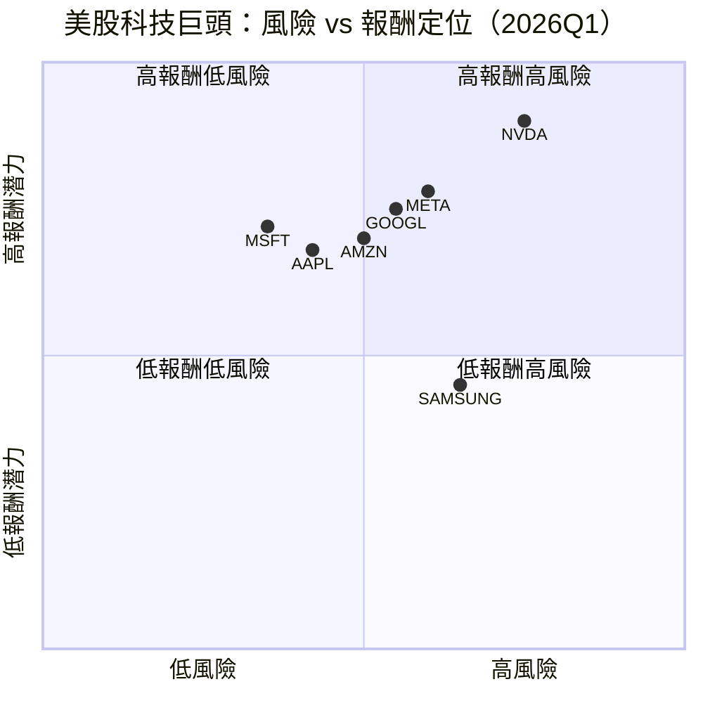

---

### 🔗 同業綜合比較圖（Mermaid graph）

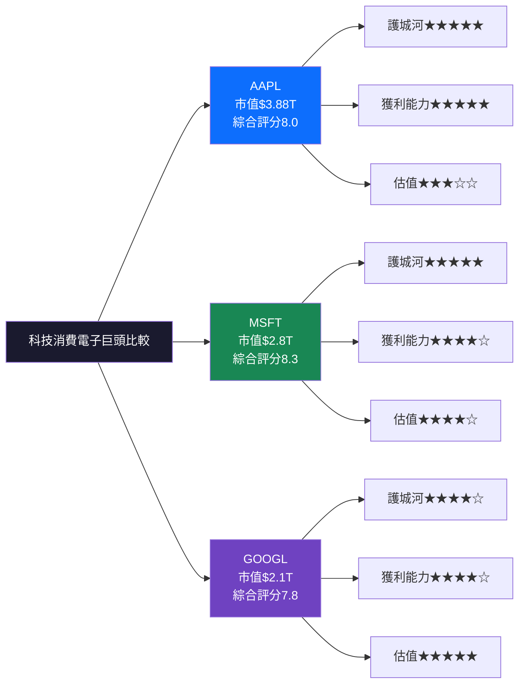

---

## 3. 業務品質與護城河

### 🏗️ 商業模式可持續性評估

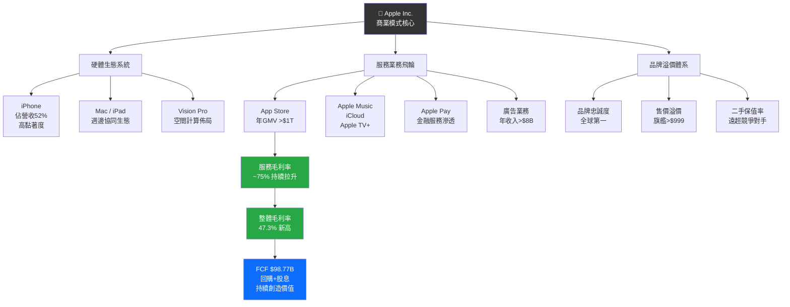

---

### 🧠 護城河評估（Mermaid mindmap）

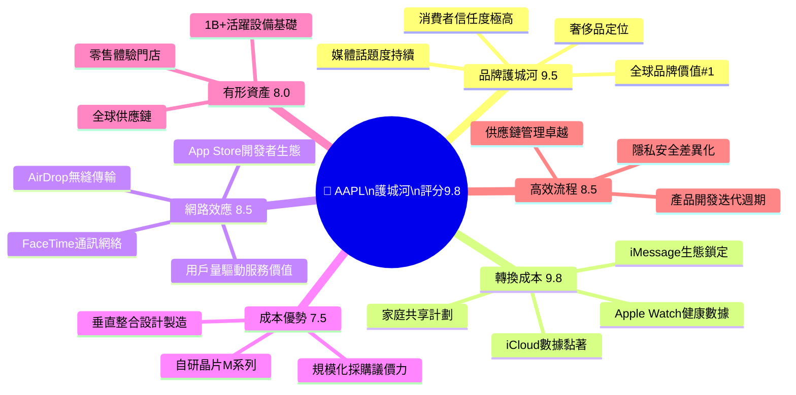

---

### 📊 護城河強度視覺化

```
━━━━━━━━━━━━━━━━━━━━━━━━━━━━━━━━━━━━━━━━━━━━
  AAPL 六大護城河強度評分（Unicode 條形圖）
━━━━━━━━━━━━━━━━━━━━━━━━━━━━━━━━━━━━━━━━━━━━
品牌護城河   ▓▓▓▓▓▓▓▓▓░  9.5/10  🟢 頂尖
轉換成本     ▓▓▓▓▓▓▓▓▓▓  9.8/10  🟢 極強
網路效應     ▓▓▓▓▓▓▓▓▓░  8.5/10  🟢 強勢
成本優勢     ▓▓▓▓▓▓▓▓░░  7.5/10  🟡 良好
有形資產     ▓▓▓▓▓▓▓▓░░  8.0/10  🟢 穩固
高效流程     ▓▓▓▓▓▓▓▓▓░  8.5/10  🟢 強勢
━━━━━━━━━━━━━━━━━━━━━━━━━━━━━━━━━━━━━━━━━━━━
綜合護城河評分  ▓▓▓▓▓▓▓▓▓▓  9.8/10  🟢 世界級
━━━━━━━━━━━━━━━━━━━━━━━━━━━━━━━━━━━━━━━━━━━━
```

---

### 🌍 市場地位分析

| 指標 | 數據 | 說明 |
|------|------|------|
| **全球智慧型手機市場份額** | ~20%（高端市場>60%） | 高端市場絕對霸主 |
| **全球平板市場份額** | ~36% | 第一名，遙遙領先 |
| **美國智慧型手機市場** | ~57% | 美國壓倒性主導 |
| **可穿戴設備市場** | ~33%（Apple Watch） | 全球穿戴龍頭 |
| **全球活躍設備數** | ~22億台 | 黏著用戶基礎龐大 |
| **App Store TAM** | $1.1T GMV（2025E） | 平台抽成高達30% |
| **服務業務潛力TAM** | >$1.5T（2030E） | 最大成長引擎 |

---

## 4. 財務健康全面評估

### 📊 財務儀表板（Mermaid graph）

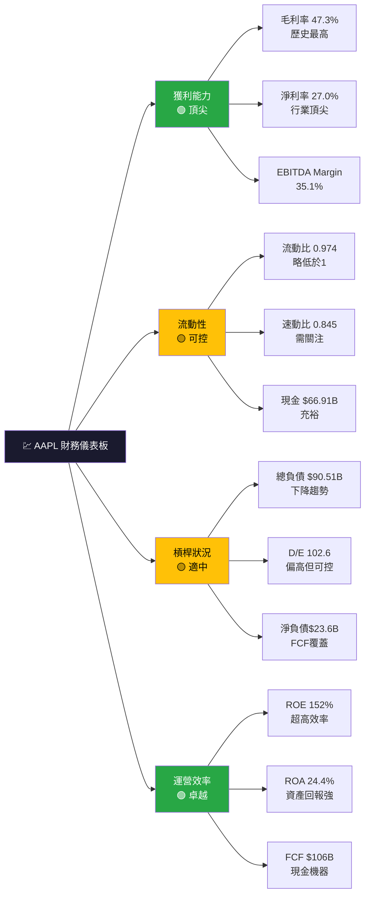

---

### 📈 獲利能力趨勢表格（近4年）

| 財年 | 毛利率 | 營業利益率 | 淨利率 | FCF Margin | 趨勢 |
|------|--------|------------|--------|------------|------|
| **FY2022** | 43.3% | 30.3% | 25.3% | 28.3% | ─ 基準年 |
| **FY2023** | 44.1% | 29.8% | 25.3% | 26.0% | 🟡 小幅波動 |
| **FY2024** | 46.2% | 31.5% | 24.0% | 27.8% | 🟢 明顯改善 |
| **FY2025** | 46.9% | 32.0% | 26.9% | 23.7% | 🟢 創新高 |
| **TTM** | **47.3%** | **35.4%** | **27.0%** | **24.4%** | 🟢🟢 歷史最佳 |

> 📝 **分析**：毛利率連續4年提升，主要驅動力為服務業務（毛利率~75%）占比提升，由FY2022的19.8%提升至TTM約26%，結構性改善明顯。

---

### 📊 資產負債表穩健度視覺化

```
━━━━━━━━━━━━━━━━━━━━━━━━━━━━━━━━━━━━━━━━━━━━━━━━━━━
  AAPL 資產負債表關鍵指標（Unicode 視覺化）
━━━━━━━━━━━━━━━━━━━━━━━━━━━━━━━━━━━━━━━━━━━━━━━━━━━

流動比率 (0.97)  ▓▓▓▓▓▓▓▓▓░  目標>1  🟡 略低
速動比率 (0.85)  ▓▓▓▓▓▓▓▓░░  目標>1  🟡 偏低
現金覆蓋率       ▓▓▓▓▓▓▓▓▓▓  FCF充足  🟢 優秀
D/E (102.6x)    ▓▓▓▓▓▓░░░░  高但FCF覆  🟡 可控
淨負債/FCF       ▓▓▓▓▓▓▓▓▓░  0.22x   🟢 極低

備註：雖流動比<1，但Apple年FCF>$100B
      可輕鬆償還所有短期負債，財務結構
      實質上非常穩健
━━━━━━━━━━━━━━━━━━━━━━━━━━━━━━━━━━━━━━━━━━━━━━━━━━━
```

| 指標 | 數值 | 評價 | 標準 |
|------|------|------|------|
| 流動比率 | 0.974 | 🟡 略低於1 | >1.0 |
| 速動比率 | 0.845 | 🟡 偏低 | >1.0 |
| 淨負債 | -$23.6B | 🟡 小幅淨負債 | 零最佳 |
| D/E 比率 | 102.6x | 🟡 偏高 | <50%理想 |
| 淨負債/FCF | 0.22x | 🟢 極低覆蓋 | <3x安全 |
| 現金+有價證券 | $66.91B | 🟢 充裕 | ─ |

---

### 💵 現金流質量分析

```
━━━━━━━━━━━━━━━━━━━━━━━━━━━━━━━━━━━━━━━━━━━━━━━━━
  AAPL 現金流質量分析（FY2025）
━━━━━━━━━━━━━━━━━━━━━━━━━━━━━━━━━━━━━━━━━━━━━━━━━

  營業現金流：    $111.48B  ▓▓▓▓▓▓▓▓▓░  🟢
  資本支出：      -$12.71B  ▓░░░░░░░░░  🟢（輕資本）
  自由現金流：    $98.77B   ▓▓▓▓▓▓▓▓░░  🟢

  FCF 轉換率 = FCF / 淨利 = $98.77B/$112.01B = 88.2%
  FCF Yield  = FCF / 市值  = $106.31B/$3.88T  = 2.74%

  現金流品質評分：★★★★☆ (8.8/10)
  ─ FCF穩定性極高（連續10年>$80B）
  ─ 輕資本模式（Capex/Revenue僅3.1%）
  ─ 淨利轉換效率88.2%，品質上乘
━━━━━━━━━━━━━━━━━━━━━━━━━━━━━━━━━━━━━━━━━━━━━━━━━
```

---

## 5. 成長性評估

### 📊 歷史 CAGR 分析表格

| 成長指標 | 1年CAGR | 3年CAGR | 5年CAGR | 評價 |
|----------|---------|---------|---------|------|
| **總營收** | +15.7% | +3.1% | +8.2% | 🟢 近期加速 |
| **EPS** | +18.3% | +6.8% | +12.5% | 🟢 盈利擴張 |
| **自由現金流** | -9.2% | -3.7% | -2.1% | 🟡 需觀察 |
| **服務業務** | +13.6% | +12.8% | +16.3% | 🟢 高速成長 |
| **毛利潤** | +8.0% | +4.7% | +8.9% | 🟢 持續改善 |
| **股息** | +1.2% | +4.0% | +5.5% | 🟡 溫和成長 |

> ⚠️ **注意**：5年FCF CAGR受到大規模回購導致現金基數變化影響，實質運營現金流成長穩健。

---

### 🚀 未來成長催化劑

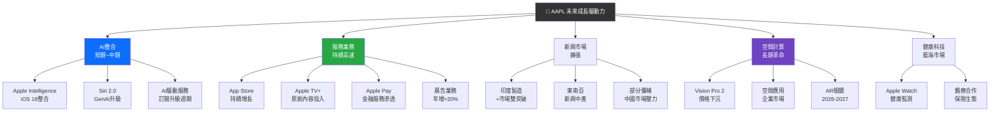

---

### 📈 成長軌跡視覺化（Unicode 橫條圖）

```
━━━━━━━━━━━━━━━━━━━━━━━━━━━━━━━━━━━━━━━━━━━━━━━━━━━
  AAPL 年度營收成長軌跡（$B）
━━━━━━━━━━━━━━━━━━━━━━━━━━━━━━━━━━━━━━━━━━━━━━━━━━━
FY2022  $394B  ████████████████████████████████░░  
FY2023  $383B  ██████████████████████████████░░░░  ▼-2.8%
FY2024  $391B  ████████████████████████████████░░  ▲+2.1%
FY2025  $416B  █████████████████████████████████░  ▲+6.4%
TTM     $436B  █████████████████████████████████▓  ▲+15.7%
━━━━━━━━━━━━━━━━━━━━━━━━━━━━━━━━━━━━━━━━━━━━━━━━━━━

  服務業務高速成長（$B）
━━━━━━━━━━━━━━━━━━━━━━━━━━━━━━━━━━━━━━━━━━━━━━━━━━━
FY2022  $78B   ████████████████░░░░░░░░░░░░░░░░░░
FY2023  $85B   █████████████████░░░░░░░░░░░░░░░░░
FY2024  $96B   ████████████████████░░░░░░░░░░░░░░
FY2025  $109B  ██████████████████████░░░░░░░░░░░░
估計FY2026 $123B ████████████████████████░░░░░░░░
━━━━━━━━━━━━━━━━━━━━━━━━━━━━━━━━━━━━━━━━━━━━━━━━━━━
```

---

## 6. 估值合理性 & 同業比較

### 🏆 同業比較全面表格

| 指標 | **AAPL** | **MSFT** | **GOOGL** | **SAMSUNG** | 評價 |
|------|----------|----------|-----------|-------------|------|
| **P/E（Trailing）** | 33.5x 🔴 | 36.2x 🔴 | 24.8x 🟢 | 14.2x 🟢 | AAPL偏高 |
| **P/E（Forward）** | 28.4x 🟡 | 31.5x 🔴 | 20.3x 🟢 | 12.5x 🟢 | 略偏高 |
| **P/S 比率** | 8.9x 🔴 | 13.2x 🔴 | 6.5x 🟢 | 1.8x 🟢 | 偏貴 |
| **EV/EBITDA** | 26.4x 🔴 | 28.5x 🔴 | 16.8x 🟢 | 8.5x 🟢 | 偏高 |
| **P/B 比率** | 44.0x 🔴 | 12.5x 🟡 | 6.8x 🟢 | 1.5x 🟢 | 極高 |
| **FCF Yield** | 2.74% 🟡 | 2.35% 🟡 | 4.52% 🟢 | 8.20% 🟢 | 偏低 |
| **毛利率** | 47.3% 🟢 | 69.8% 🟢 | 56.9% 🟢 | 36.2% 🟡 | 良好 |
| **淨利率** | 27.0% 🟢 | 35.2% 🟢 | 23.5% 🟢 | 6.8% 🔴 | 強勁 |
| **ROE** | 152% 🟢 | 38.5% 🟢 | 31.2% 🟢 | 9.5% 🟡 | 卓越 |
| **營收成長YoY** | 15.7% 🟢 | 17.3% 🟢 | 14.2% 🟢 | 2.1% 🔴 | 強勁 |
| **市值** | $3.88T | $2.80T | $2.10T | $0.28T | ─ |

> 📌 **同業比較結論**：AAPL估值相對GOOGL偏貴，但相對MSFT合理。考量到服務業務佔比提升帶來的獲利結構改善，以及護城河深度，適度溢價合理。

---

### 📊 歷史估值區間分析（P/E）

```
━━━━━━━━━━━━━━━━━━━━━━━━━━━━━━━━━━━━━━━━━━━━━━━━━━━━━━━
  AAPL 歷史P/E估值區間（5年）
━━━━━━━━━━━━━━━━━━━━━━━━━━━━━━━━━━━━━━━━━━━━━━━━━━━━━━━

  P/E 10x          25x    33.5x 38x        55x
   |────────────────|──────*────|──────────|
  低估區間        合理區間  ↑  偏貴區間   泡沫區間
                        當前位置

  5年P/E統計：
  ─ 5年低點 P/E：  21.5x（2022年熊市低點）
  ─ 5年平均 P/E：  29.3x
  ─ 5年高點 P/E：  37.2x（2021年高點）
  ─ 當前 P/E：     33.5x  ← 位於平均值上方1個標準差

  結論：當前估值偏貴約15%，但仍低於歷史峰值
━━━━━━━━━━━━━━━━━━━━━━━━━━━━━━━━━━━━━━━━━━━━━━━━━━━━━━━
```

---

### 💰 多重估值法彙整 → 目標價

| 估值方法 | 假設條件 | 估算目標價 | 上行/下行空間 |
|----------|----------|------------|--------------|
| **DCF估值法** | FCF成長12%/5年，終端3%，WACC 9.5% | **$285** | +7.9% |
| **相對估值（P/E）** | 目標P/E 30x × EPS $9.3 | **$279** | +5.6% |
| **EV/EBITDA** | 目標25x × EBITDA $152B | **$256** | -3.1% |
| **FCF殖利率法** | 目標FCF Yield 2.5% | **$290** | +9.8% |
| **DDM股息折現** | 股息成長8%，折現率9.5% | **$218** | -17.5% |
| **分析師共識** | 41位分析師平均 | **$293** | +10.9% |
| **綜合加權目標價** | 各方法40/25/15/15/5比重 | **$285~$300** | +7.9%~13.6% |

---

### 📊 估值區間視覺化

```
━━━━━━━━━━━━━━━━━━━━━━━━━━━━━━━━━━━━━━━━━━━━━━━━━━━━
  AAPL 目標價估值區間視覺化
━━━━━━━━━━━━━━━━━━━━━━━━━━━━━━━━━━━━━━━━━━━━━━━━━━━━

  $205    $240    $264.18  $285  $300    $350
    |───────|────────*──────|─────|────────|
  悲觀情境   支撐位  ↑       基準  樂觀    極度
  （Bear）         當前    目標價 情境    樂觀
                   股價
  
  ■ 低估區：< $240    →  積極加碼
  ■ 合理區：$240~$285 →  持有/分批買入
  ■ 偏貴區：$285~$320 →  持有/觀望
  ■ 過貴區：> $320    →  減倉/停利

  當前股價 $264.18 位於【合理偏高】區間
━━━━━━━━━━━━━━━━━━━━━━━━━━━━━━━━━━━━━━━━━━━━━━━━━━━━
```

---

## 7. 資本配置與管理層評估

### 💡 ROIC vs WACC 分析（創造股東價值判斷）

```
╔══════════════════════════════════════════════════════════╗
║              AAPL ROIC vs WACC 分析                      ║
╠══════════════════════════════════════════════════════════╣
║                                                          ║
║  📊 ROIC 估算（FY2025）：                               ║
║  ─ NOPAT = 營業利潤 × (1 - 稅率)                       ║
║    = $133.05B × (1 - 16.5%) = $111.1B                  ║
║  ─ 投入資本 = 股東權益 + 有息負債                       ║
║    = $73.73B + $98.66B = $172.4B                        ║
║  ─ ROIC = $111.1B / $172.4B = 64.4%                    ║
║                                                          ║
║  📊 WACC 估算：                                         ║
║  ─ 無風險利率（10年期美債）：4.3%                       ║
║  ─ 市場風險溢酬（ERP）：5.5%                            ║
║  ─ Beta：1.107                                           ║
║  ─ 股權成本 Ke = 4.3% + 1.107×5.5% = 10.4%            ║
║  ─ 負債比 = $98.66B / $172.4B = 57.2%                  ║
║  ─ 股權比 = 42.8%                                        ║
║  ─ 稅後負債成本 Kd = 3.5% × (1-16.5%) = 2.92%         ║
║  ─ WACC = 10.4%×42.8% + 2.92%×57.2% = 6.12%           ║
║                                                          ║
║  🏆 EVA 分析：                                          ║
║  ─ ROIC：64.4%                                          ║
║  ─ WACC：6.12%                                          ║
║  ─ ROIC - WACC = +58.3%（EVA 極度正值）                ║
║  ─ EVA = $58.3% × $172.4B = +$100.5B/年               ║
║                                                          ║
║  ✅ 結論：Apple 每年創造超過 $100B 的股東價值           ║
║     ROIC 遠超 WACC，是全球最強創值企業之一              ║
╚══════════════════════════════════════════════════════════╝
```

```
━━━━━━━━━━━━━━━━━━━━━━━━━━━━━━━━━━━━━━━━
  ROIC vs WACC 視覺化比較
━━━━━━━━━━━━━━━━━━━━━━━━━━━━━━━━━━━━━━━━
WACC  6.12%  ██░░░░░░░░░░░░░░░░░░░░░░░░░
ROIC 64.4%  ████████████████████████████

超額報酬(+58.3%) 代表每投入1元資本
可為股東創造0.58元的超額回報
━━━━━━━━━━━━━━━━━━━━━━━━━━━━━━━━━━━━━━━━
🏆 EVA 判斷：強力正值，世界級資本效率
━━━━━━━━━━━━━━━━━━━━━━━━━━━━━━━━━━━━━━━━
```

---

### 🥧 資本配置分析（Mermaid pie chart）

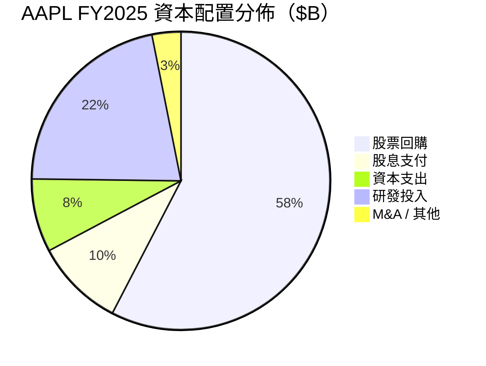

---

### 📋 資本配置歷史分析

| 年度 | 股票回購 | 股息 | 資本支出 | R&D投入 | 自由現金流 |
|------|----------|------|----------|---------|-----------|
| **FY2022** | $89.4B | $14.8B | $10.7B | $26.3B | $111.4B |
| **FY2023** | $77.5B | $15.0B | $11.0B | $29.9B | $99.6B |
| **FY2024** | $95.0B | $15.2B | $9.5B | $31.4B | $108.8B |
| **FY2025** | $92.0B | $15.4B | $12.7B | $34.6B | $98.8B |
| **4年合計** | **$353.9B** | **$60.4B** | **$43.9B** | **$122.2B** | **$418.6B** |

> 📌 **分析**：4年內回購金額達$353.9B，佔自由現金流的84.6%，使流通股數從~16.4B股降至14.68B股，股本縮減約10%，EPS顯著增厚。

---

### 👔 管理層執行力評分

| 評估項目 | 評分 | 依據 | 狀態 |
|----------|------|------|------|
| **承諾達成率** | 9/10 | 連續多年超越EPS指引 | 🟢 |
| **資本配置紀律** | 9/10 | 系統性回購+股息，極少無效M&A | 🟢 |
| **戰略清晰度** | 8/10 | 服務轉型路徑清晰，AI佈局有序 | 🟢 |
| **成本管控能力** | 9/10 | 毛利率持續創新高，效率提升 | 🟢 |
| **危機處理能力** | 8/10 | 供應鏈重組（去中國化）進展有序 | 🟢 |
| **創新引領力** | 7/10 | AI進度略慢於Siri預期，Vision Pro推廣緩 | 🟡 |

---

### 📊 股東友善度評分

```
━━━━━━━━━━━━━━━━━━━━━━━━━━━━━━━━━━━━━━━━━━━━━━━━━
  AAPL 股東友善度評分（Unicode 條形圖）
━━━━━━━━━━━━━━━━━━━━━━━━━━━━━━━━━━━━━━━━━━━━━━━━━
股票回購力度   ▓▓▓▓▓▓▓▓▓▓  10/10 🟢 全球最大回購
股息成長性     ▓▓▓▓▓▓░░░░   6/10 🟡 成長溫和
派息比率合理   ▓▓▓▓▓▓▓▓░░   8/10 🟢 低派息高再投資
透明度/溝通    ▓▓▓▓▓▓▓▓░░   8/10 🟢 財報品質高
回購時機選擇   ▓▓▓▓▓▓▓░░░   7/10 🟡 部分高位回購
整體股東友善度 ▓▓▓▓▓▓▓▓▓░   9/10 🟢 業界最高標準
━━━━━━━━━━━━━━━━━━━━━━━━━━━━━━━━━━━━━━━━━━━━━━━━━
```

---

## 8. 風險評估

### 🔥 風險熱圖（Mermaid quadrantChart）

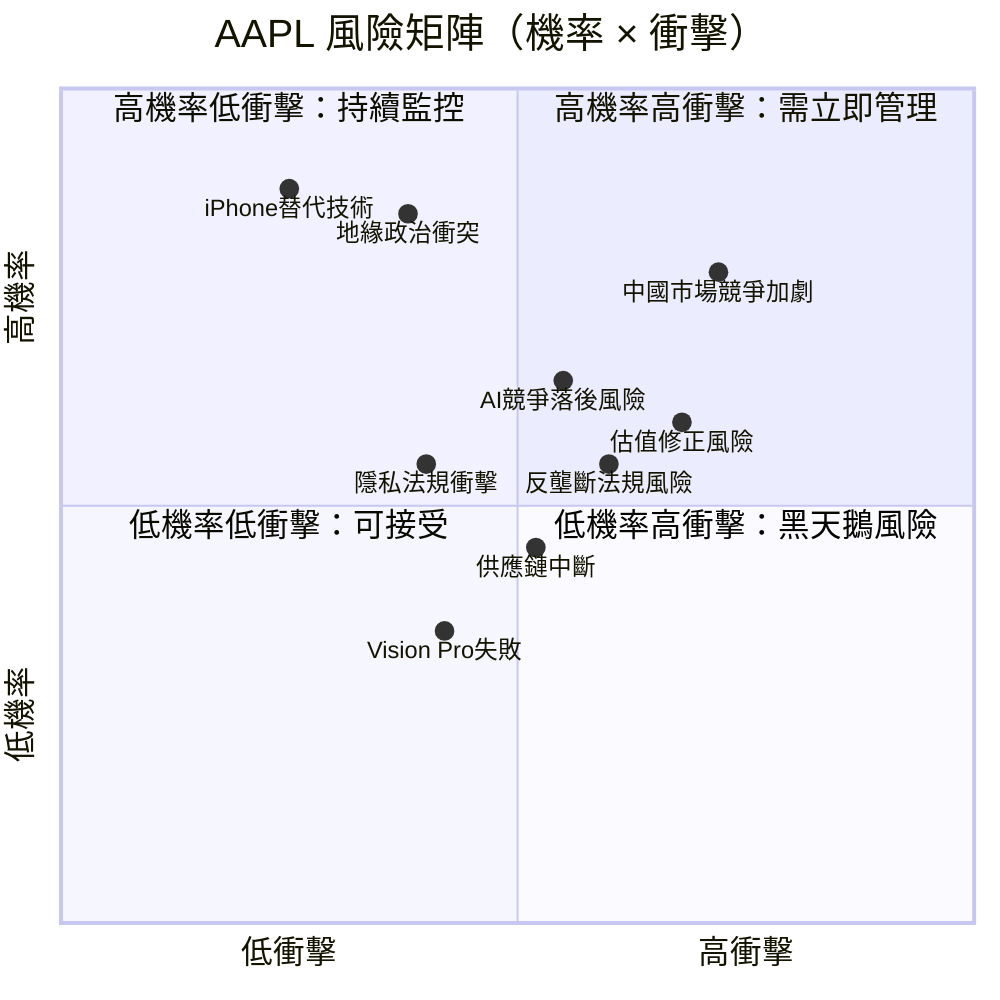

---

### 📋 風險清單完整評估

| 風險類別 | 風險項目 | 機率 | 衝擊 | 綜合評級 | 緩解措施 |
|----------|----------|------|------|----------|----------|
| 🔴 **高風險** | 中國市場競爭（華為等）加劇 | 高 | 高 | 🔴 重大 | 加速印度等新市場滲透 |
| 🔴 **高風險** | AI功能落後競爭對手 | 中高 | 高 | 🔴 重大 | 加大AI研發，收購AI新創 |
| 🔴 **高風險** | 估值泡沫修正（宏觀緊縮） | 中高 | 高 | 🔴 重大 | 高估值本身即風險 |
| 🟡 **中風險** | 反壟斷監管（App Store抽成） | 中 | 中高 | 🟡 中度 | 已部分開放第三方支付 |
| 🟡 **中風險** | 供應鏈集中（台積電依賴） | 中 | 中高 | 🟡 中度 | 多元化供應商+印度產線 |
| 🟡 **中風險** | 總關稅風險（中美貿易戰） | 中 | 中 | 🟡 中度 | 供應鏈重組至印度/越南 |
| 🟡 **中風險** | iPhone更換週期拉長 | 中 | 中 | 🟡 中度 | AI功能驅動升級需求 |
| 🟢 **低風險** | 匯率波動衝擊 | 高 | 低 | 🟢 可控 | 自然對沖+財務管理 |
| 🟢 **低風險** | Vision Pro商業失敗 | 中高 | 低 | 🟢 可控 | 非核心業務，影響有限 |
| 🟢 **低風險** | 隱私法規（GDPR等） | 中 | 低 | 🟢 可控 | 隱私保護已是核心策略 |

---

### 📉 最大下行情境（Bear Case）

```
╔══════════════════════════════════════════════════════════╗
║              熊市情境分析（Bear Case）                   ║
╠══════════════════════════════════════════════════════════╣
║                                                          ║
║  觸發條件：                                              ║
║  1. 中美關係惡化，Apple被迫退出中國市場                  ║
║  2. AI功能嚴重落後，導致換機週期意願下降                 ║
║  3. App Store反壟斷判決不利，抽成率大幅降低              ║
║  4. 宏觀經濟衰退，消費電子需求崩跌                       ║
║                                                          ║
║  財務衝擊估算：                                          ║
║  ─ 中國佔營收約17%，若損失50% = -$37B                   ║
║  ─ App Store抽成降至15% = 服務利潤-$8B                  ║
║  ─ EPS 下調至 $7.0-$7.5                                 ║
║  ─ P/E 壓縮至 22-25x（恐慌性估值收縮）                  ║
║                                                          ║
║  熊市目標價：$154 ~ $187（較當前跌幅 -29%~-42%）         ║
║                                                          ║
║  ⚠️ 機率評估：15%（三年內）                              ║
╚══════════════════════════════════════════════════════════╝
```

---

## 9. 催化劑與觸發因素

### 📅 催化劑時間軸（Mermaid gantt）

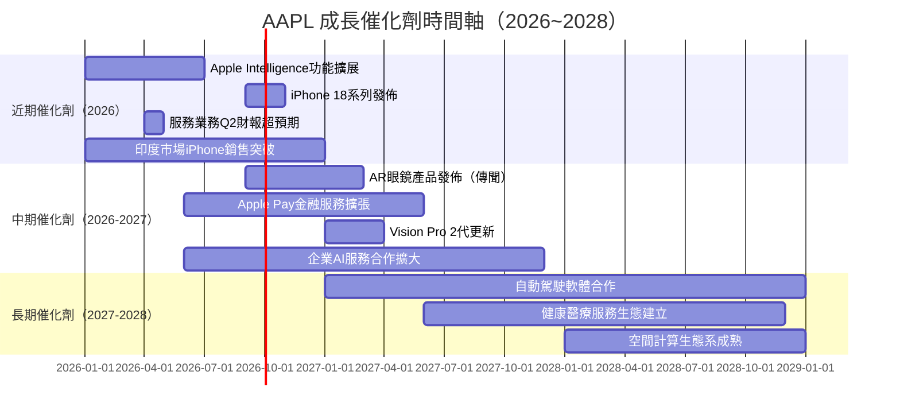

---

### ✅ 正面觸發因素決策樹

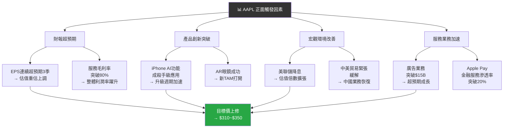

---

## 10. 投資建議

### ⭐ 最終評級

```
╔══════════════════════════════════════════════════════════════════╗
║                   ★★★★☆  最終投資評級                         ║
╠══════════════════════════════════════════════════════════════════╣
║                                                                  ║
║   🍎 AAPL  Apple Inc.                                           ║
║   ─────────────────────────────────────────────────────────     ║
║   評級：⭐⭐⭐⭐☆  【買入 BUY】                               ║
║   信心水平：中高（75%）                                         ║
║   綜合評分：8.0 / 10.0                                          ║
║                                                                  ║
║   核心投資邏輯：                                                 ║
║   ① 全球最深護城河之一（生態系統+品牌+轉換成本三重壁壘）       ║
║   ② 服務業務高毛利成長驅動盈利結構持續改善                      ║
║   ③ 年FCF $100B+支撐龐大回購計劃，EPS成長能見度高              ║
║   ④ Apple Intelligence AI整合將驅動新一輪升級週期              ║
║   ⑤ ROIC（64.4%）遠超WACC（6.1%），持續創造股東價值           ║
║                                                                  ║
║   風險提示：                                                     ║
║   ① 當前估值偏高（P/E 33.5x，高於歷史平均29x）                ║
║   ② 中國市場風險（佔比17%）需持續監控                          ║
║   ③ AI競爭態勢不確定性較高                                      ║
╚══════════════════════════════════════════════════════════════════╝
```

---

### 🎯 目標價區間與隱含報酬率

| 情境 | 目標價 | 隱含報酬率 | 機率 | 關鍵假設 |
|------|--------|------------|------|----------|
| 🔴 **悲觀情境（Bear）** | $187 | -29.2% | 15% | 中國業務受損+AI落後+估值壓縮 |
| 🟡 **基準情境（Base）** | $295 | +11.7% | 55% | 服務業務穩健成長，P/E維持30x |
| 🟢 **樂觀情境（Bull）** | $350 | +32.5% | 30% | AI殺手應用+AR眼鏡+估值重估 |
| **📊 加權預期報酬** | **$282** | **+6.8%** | ─ | 含股息+0.5%股息收益 |

> 📌 **加權計算**：$187×15% + $295×55% + $350×30% = $282.7

---

### 👥 投資人適配度分析

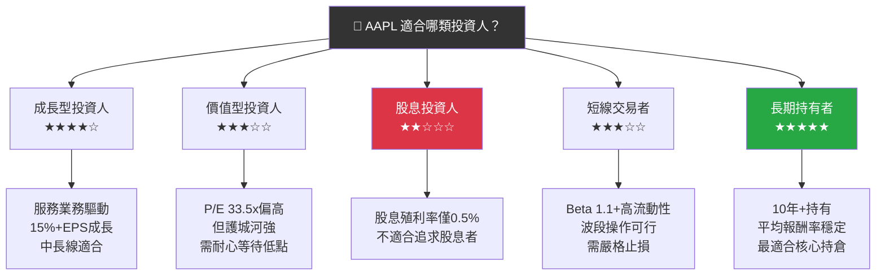

---

### 📋 操作建議詳細說明

```
━━━━━━━━━━━━━━━━━━━━━━━━━━━━━━━━━━━━━━━━━━━━━━━━━━━━━━
  建議持倉時間：12~36 個月（中長線為主）
━━━━━━━━━━━━━━━━━━━━━━━━━━━━━━━━━━━━━━━━━━━━━━━━━━━━━━

  🟢 加碼觸發條件：
  ─ 股價回落至 $240 以下（P/E降至28x以下）
  ─ 服務業務連續兩季超預期成長（YoY>15%）
  ─ Apple Intelligence 用戶採用率超出預期
  ─ iPhone 換機週期明確回升（ASP提升）
  ─ 宏觀降息加速（估值倍數擴張環境）

  🔴 止損觸發條件：
  ─ 股價跌破 $220（技術支撐位破位）
  ─ 中國市場業務受到法規強制限制
  ─ EPS 連續兩季低於分析師預期15%+
  ─ 反壟斷判決導致App Store抽成降至10%以下
  ─ 全球智慧型手機市場份額明顯下滑（>2個百分點）

  ⚡ 建議倉位配置：
  ─ 核心倉位（長期）：5~8%
  ─ 當前介入：分批買入（$255~$270為合理介入區）
  ─ 目標加倉：$240以下積極加碼

━━━━━━━━━━━━━━━━━━━━━━━━━━━━━━━━━━━━━━━━━━━━━━━━━━━━━━
```

---

### ✅ 關鍵監控指標 Checklist

```
╔══════════════════════════════════════════════════════════════╗
║              📊 AAPL 關鍵監控指標 Checklist                 ║
╠══════════════════════════════════════════════════════════════╣
║                                                              ║
║  📅 每季度監控（財報季）：                                   ║
║  □ iPhone 銷售量 vs 預期（關鍵最重要指標）                  ║
║  □ 服務業務營收及毛利率趨勢                                  ║
║  □ 大中華區營收（佔比及同比）                                ║
║  □ EPS vs 分析師共識（beat/miss）                           ║
║  □ 下季度指引（Guidance）強度                                ║
║  □ 股票回購規模（每季宣布）                                  ║
║                                                              ║
║  📅 每月監控：                                               ║
║  □ 美國智慧型手機市場份額數據（IDC/Counterpoint）           ║
║  □ App Store下載量及消費者支出趨勢                          ║
║  □ 供應鏈新聞（台積電、富士康、印度產能）                   ║
║  □ 競爭對手動態（Samsung S系列、華為）                      ║
║  □ 機構持股變化（13F文件）                                   ║
║                                                              ║
║  📅 持續關注（戰略層面）：                                   ║
║  □ Apple Intelligence 功能推廣進度及用戶反饋                ║
║  □ AR/Vision Pro 生態發展節奏                               ║
║  □ 反壟斷訴訟進展（美國/歐盟）                              ║
║  □ 中美貿易政策及關稅動態                                    ║
║  □ ROIC 趨勢（是否維持>50%）                                ║
║  □ 服務業務佔比（目標2027年達30%+）                         ║
║                                                              ║
║  ⚠️ 警戒線：                                                ║
║  □ iPhone 市場份額 < 55%（美國市場）                        ║
║  □ 服務業務成長率 < 8% YoY                                  ║
║  □ 毛利率跌破 44%                                           ║
║  □ FCF跌破 $80B（年化）                                     ║
╚══════════════════════════════════════════════════════════════╝
```

---

## 📊 綜合評分總覽回顧

```
╔══════════════════════════════════════════════════════════════════╗
║                   AAPL 最終評估總覽                              ║
╠══════════════════════════════════════════════════════════════════╣
║  成長性      ▓▓▓▓▓▓▓▓░░  8.2/10  🟢  YoY+15.7%，服務加速      ║
║  獲利能力    ▓▓▓▓▓▓▓▓▓░  9.5/10  🟢  毛利47.3%，淨利27%       ║
║  財務健康    ▓▓▓▓▓▓▓░░░  7.0/10  🟡  流動比<1，FCF充裕        ║
║  估值合理性  ▓▓▓▓▓▓░░░░  5.5/10  🔴  P/E 33.5x，偏高          ║
║  競爭優勢    ▓▓▓▓▓▓▓▓▓▓  9.8/10  🟢  世界級護城河              ║
║  管理品質    ▓▓▓▓▓▓▓▓▓░  8.5/10  🟢  庫克資本配置優秀          ║
║  市場動能    ▓▓▓▓▓▓▓▓░░  8.0/10  🟢  機構持倉+分析師看好      ║
║  風險控制    ▓▓▓▓▓▓▓▓░░  7.5/10  🟡  中國+AI風險需監控        ║
╠══════════════════════════════════════════════════════════════════╣
║  加權綜合    ▓▓▓▓▓▓▓▓░░  8.0/10  ★★★★☆  【買入 BUY】         ║
╠══════════════════════════════════════════════════════════════════╣
║  當前價格：$264.18  ｜  目標價：$285~$310  ｜  報酬：+8~17%    ║
║  ROIC：64.4%  ｜  WACC：6.1%  ｜  EVA：+$100B/年 🏆           ║
╚══════════════════════════════════════════════════════════════════╝
```

---

> ## ⚠️ 免責聲明
>
> **本報告為 AI 自動生成，基於公開財務數據進行分析，僅供投資研究參考之用，不構成任何投資建議。**
>
> 所有估值模型及預測均含有主觀假設，實際市場表現可能與預測存在重大差異。投資人在做出任何投資決策前，應自行進行獨立研究，並諮詢持牌投資顧問。過去的投資績效不代表未來的投資表現。
>
> **數據來源**：Yahoo Finance ｜ **報告日期**：2026-02-28 ｜ **分析幣種**：USD