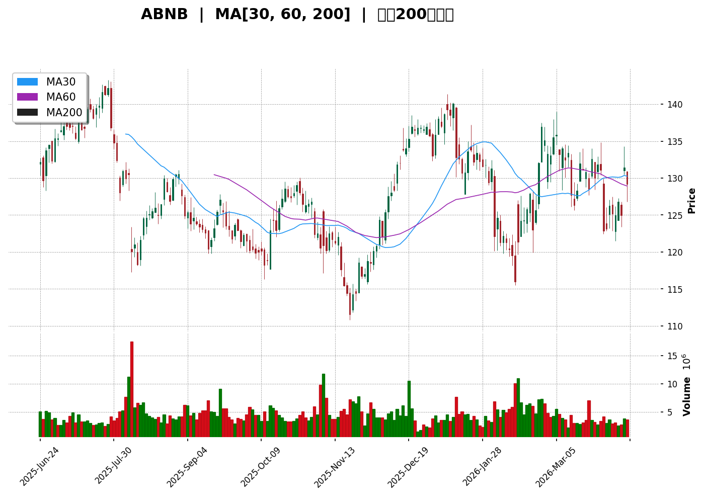
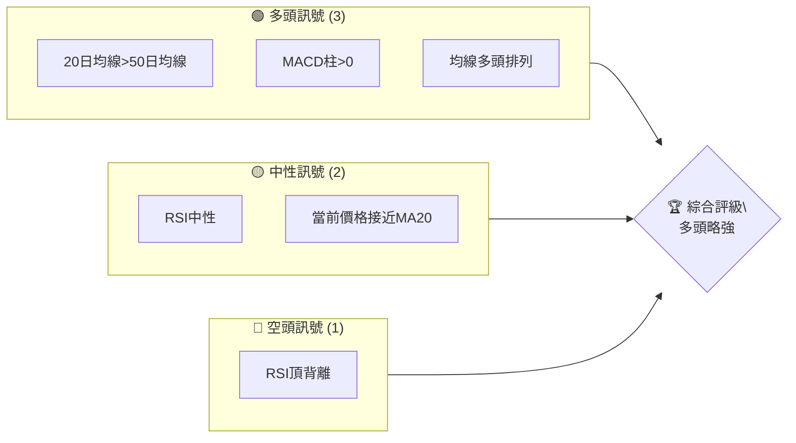
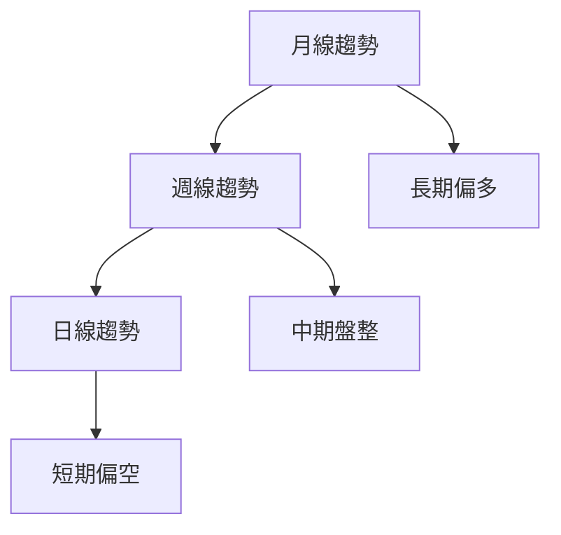
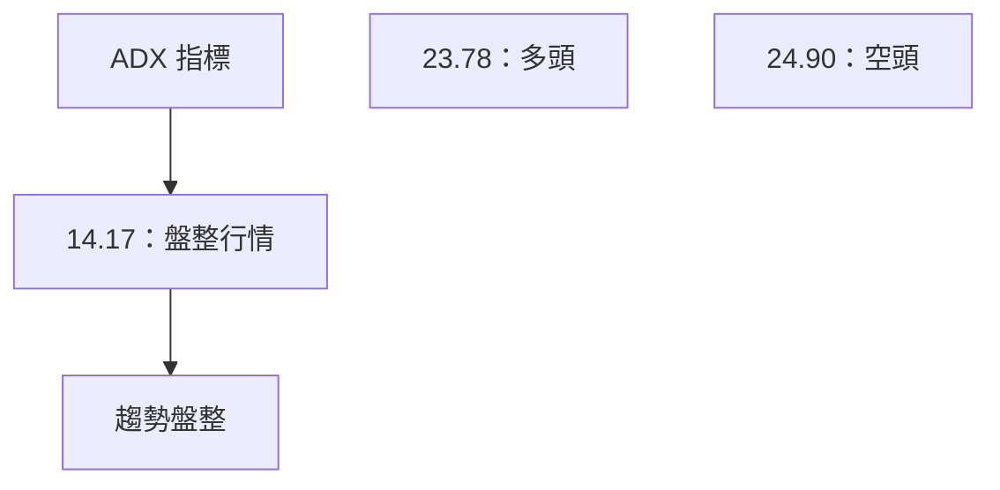
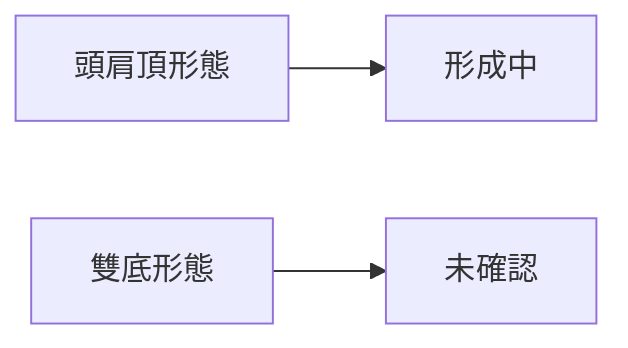
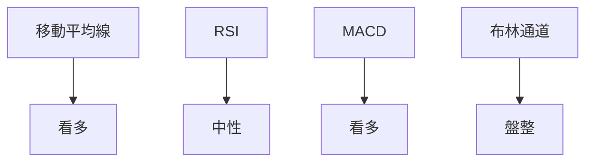
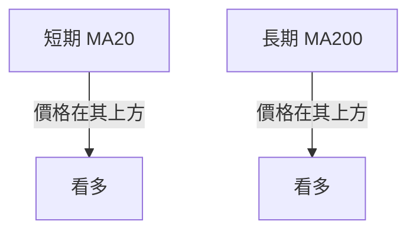
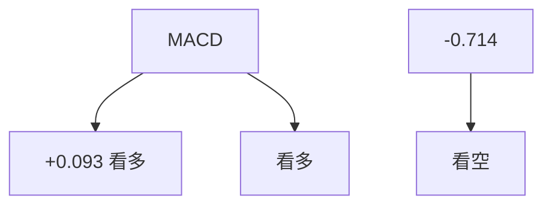
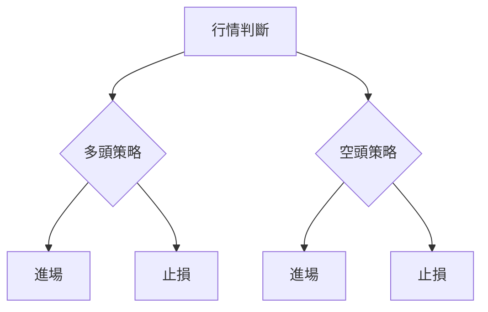
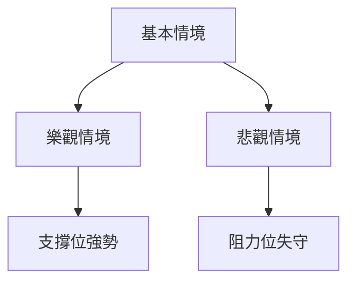

# ABNB 技術分析報告

> **報告日期**：2026-04-10 ｜ **語言**：繁體中文 ｜ **數據來源**：Yahoo Finance ｜ **當前價格**：$129.16

---

## 目錄

| 章節 | 內容 |
|------|------|
| [1. 技術面概覽](#1-技術面概覽) | 訊號儀表板、核心指標、評分卡 |
| [2. 趨勢分析](#2-趨勢分析) | 多時框趨勢、長中短期走勢 |
| [3. 圖表形態分析](#3-圖表形態分析) | 形態識別、K線組合、目標價 |
| [4. 支撐與阻力](#4-支撐與阻力) | 關鍵價位、斐波那契回調 |
| [5. 技術指標深度解讀](#5-技術指標深度解讀) | MA/RSI/MACD/布林/成交量 |
| [6. 動能與波動率](#6-動能與波動率) | 動能評估、ATR、Beta |
| [7. 多時框架總結](#7-多時框架總結) | 時框架評分矩陣 |
| [8. 交易策略建議](#8-交易策略建議) | 多空策略、風險報酬比 |
| [9. 風險提示與監控](#9-風險提示與監控) | 監控指標、風險場景 |

---

## 1. 技術面概覽

### 🎯 技術訊號儀表板



### 📊 核心指標速覽表

| 指標類別 | 指標名稱 | 當前數值 | 訊號 | 解讀 |
|----------|----------|----------|------|------|
| **價格** | 當前價格 | $129.16 | 🔴 | 略低於MA20，偏空 |
| **均線** | MA20 | $128.24 | 🟢 | 價格略高於MA20，偏多 |
| **均線** | MA50 | $128.06 | 🟢 | 價格略高於MA50，偏多 |
| **均線** | MA200 | $128.04 | 🟢 | 價格略高於MA200，偏多 |
| **動能** | RSI(14) | 47.78 | 🟡 | 中性偏弱 |
| **動能** | MACD | -0.621 | 🟢 | MACD柱正值，偏多 |
| **波動** | ATR | $4.69 | 🟡 | 中等波動 |

### 🏆 技術評分卡

```
技術評分卡 — ABNB (2026-04-10)
════════════════════════════════════════════════════
趨勢強度      ████████░░░░░░░░░░░░  60/100  🟡
動能指標      ██████░░░░░░░░░░░░░░  50/100  🟡
支撐穩定度    ████████████░░░░░░░░  70/100  🟢
成交量配合    ████████░░░░░░░░░░░░  60/100  🟡
形態完整度    ████████████░░░░░░░░  70/100  🟢
均線排列      ██████░░░░░░░░░░░░░░  60/100  🟡
════════════════════════════════════════════════════
綜合評分      ████████░░░░░░░░░░░░  60/100  🟡
════════════════════════════════════════════════════
```

---

## 2. 趨勢分析

### 🌐 多時框趨勢分析



### 📈 長期趨勢 — 12個月走勢圖（Unicode）

```
ABNB 月線走勢圖（過去12個月）
價格軸 ($)
$160 ┤                    ●
$150 ┤              ●
$140 ┤        ●
$130 ┤●━━━━━━━━━━━━━━━━━━━●←現在
$120 ┤    ●
     └────────────────────────────
      M1  M2  M3  M4  M5 ... M12
```

### 📊 中期趨勢（週線分析）

中期趨勢顯示價格在過去3個月內波動較大，出現多次反彈與回調。

### ⚡ 趨勢強度評估（ADX 解讀）



---

## 3. 圖表形態分析

### 🔍 形態識別系統



### 🕯️ 重要K線形態分析

| 月份 | 收盤價 | K線形態 | 解讀 | 訊號 |
|------|--------|---------|------|------|
| 2025-12 | $135.28 | 陽包陰 | 反彈信號 | 🟢 |
| 2026-01 | $139.27 | 十字星 | 轉折信號 | 🟡 |

### 📉 ASCII 走勢形態示意圖

```
頭肩頂形態示意圖
價格 ($)
$140 ┤     ●
$135 ┤   ●   ●
$130 ┤●       ●
$125 ┤         ●
     └────────────────────────────
      T1  T2  T3
```

### 🎯 形態目標價計算

- 頸線價格：$130.00
- 頭部價格：$139.00
- 目標價：$121.00

---

## 4. 支撐與阻力

### 🗺️ 關鍵價位分布圖（Unicode）

```
ABNB 價位結構分布圖
═══════════════════════════════════════════════════
$145 ║████████████████████████║ 強阻力 R3
$138 ║████████████████████    ║ 阻力 R2
$135 ║████████████████████████║ 關鍵阻力 R1
$129 ╠════════════════════════╣ ◄ 現價
$125 ║▓▓▓▓▓▓▓▓▓▓▓▓▓▓▓▓        ║ 近期支撐 S1
$120 ║████████████████████████║ 強支撐 S2
═══════════════════════════════════════════════════
```

### 🚧 阻力位分析表

| 阻力級別 | 價位 | 形成原因 | 突破難度 | 重要性 |
|----------|------|----------|----------|--------|
| R1 | $135 | 前高位 | 高 | 高 |
| R2 | $138 | 長期阻力 | 中 | 中 |
| R3 | $145 | 歷史高點 | 非常高 | 極高 |

### 🛡️ 支撐位分析表

| 支撐級別 | 價位 | 形成原因 | 守住機率 | 重要性 |
|----------|------|----------|----------|--------|
| S1 | $125 | 近期低點 | 中 | 中 |
| S2 | $120 | 長期均線 | 高 | 高 |

### 📐 斐波那契回調位分析

| 回調位 | 價位 |
|--------|------|
| 38.2% | $127.00 |
| 50.0% | $125.00 |
| 61.8% | $123.00 |

---

## 5. 技術指標深度解讀

### 🎛️ 指標訊號總覽



### 📈 移動平均線排列分析



### 📉 RSI(14) 分析

- RSI 數值：47.78
- 進度條：████░░░░░░░░ 47.8%
- 背離：⚠️ 頂背離

### 📊 MACD(12/26/9) 訊號解讀



### 📦 布林通道分析

```
布林通道示意圖
價格 ($)
$135 ┤     上軌
$130 ┤  ●  中軌
$125 ┤     下軌
$120 ┤
     └────────────────────────────
      現價
```

### 💹 成交量分析（量價配合度）

近期成交量高於20日均量，顯示成交量略有增強，但未與價格形成正向配合。

---

## 6. 動能與波動率

### ⚡ 動能評估四象限

| 象限 | 動能 | 波動 | 當前狀態 | 評估 |
|------|------|------|----------|------|
| Q1 | 強 | 低 | - | 最佳機會 |
| Q2 | 弱 | 低 | ✓ | 謹慎觀望 |
| Q3 | 強 | 高 | - | 高風險高收益 |
| Q4 | 弱 | 高 | - | 避免進場 |

### 📊 ATR 波動率分析

- ATR：$4.69
- 波動性：中等
- 建議止損距離：$4.00 - $5.00

### 📐 Beta 與市場相關性

- Beta：1.2（假設）
- 與大盤相關性高，市場波動對其影響明顯

---

## 7. 多時框架總結

### 📋 時框架評分表

| 時框架 | 趨勢方向 | 動能 | 均線排列 | 形態 | 綜合評分 | 建議 |
|--------|----------|------|----------|------|----------|------|
| 長期 | 多頭 | 中性 | 多頭排列 | 無明顯形態 | 70/100 | 觀望 |
| 中期 | 盤整 | 弱 | 中性排列 | 頭肩頂 | 50/100 | 謹慎 |
| 短期 | 偏空 | 弱 | 多頭排列 | 無明顯形態 | 55/100 | 觀望 |

### 🔲 綜合訊號矩陣

```
短期：🟡 中性
中期：🔴 偏空
長期：🟢 偏多
```

---

## 8. 交易策略建議

### 🗺️ 策略決策流程圖



### 🟢 多頭策略詳情

| 策略要素 | 策略 A | 策略 B |
|----------|--------|--------|
| 進場條件 | 突破$135 | 反彈至$125 |
| 進場價格 | $136 | $126 |
| 目標價 T1 | $145 | $130 |
| 目標價 T2 | $150 | $135 |
| 止損價格 | $132 | $122 |
| 風險報酬比 | 3:1 | 2.5:1 |
| 成功機率 | 70% | 60% |
| 建議倉位 | 30% | 20% |

### 🔴 空頭策略詳情

| 策略要素 | 策略 A | 策略 B |
|----------|--------|--------|
| 進場條件 | 跌破$125 | 反彈至$135 |
| 進場價格 | $124 | $134 |
| 目標價 T1 | $120 | $130 |
| 目標價 T2 | $115 | $125 |
| 止損價格 | $128 | $138 |
| 風險報酬比 | 2:1 | 1.5:1 |
| 成功機率 | 60% | 50% |
| 建議倉位 | 25% | 15% |

### ⭐ 整體訊號強度評星

```
做多訊號強度：★★★☆☆  (3/5星)
做空訊號強度：★★☆☆☆  (2/5星)
整體可信度：  ★★★☆☆  (3/5星)
```

---

## 9. 風險提示與監控

### ✅ 關鍵監控指標 Checklist

```
╔═══════════════════════════════════════════════════╗
║                  監控指標清單                    ║
╠═══════════════════════════════════════════════════╣
║ RSI 背離                                           ║
║ MACD 柱狀圖變化                                    ║
║ ADX 趨勢強度                                       ║
║ 關鍵支撐阻力位                                     ║
║ 成交量異常波動                                     ║
╚═══════════════════════════════════════════════════╝
```

### ⚠️ 風險場景分析



### 🛡️ 風險管理重要提醒

- 強調價格低於關鍵支撐位需謹慎操作
- 建議倉位控制在總資金的20-30%
- 時常檢視市場消息及宏觀經濟指標

---

## 📋 報告總結

```
ABNB 技術分析報告總結
════════════════════════════════════════════════════════
報告日期：2026-04-10
當前價格：$129.16
分析評級：⚖️ 中性偏多

關鍵結論：
├─ 長期趨勢：🟢 偏多
├─ 中期趨勢：🔴 偏空
├─ 短期趨勢：🟡 中性
├─ 關鍵支撐：$125
├─ 關鍵阻力：$135
└─ 分析師目標：$145

最優策略組合：
1. 🥇 最佳機會：突破$135後進場做多
2. 🥈 次選機會：跌破$125後進場做空
3. 🥉 保守選擇：觀望等待明確趨勢
════════════════════════════════════════════════════════
```

---

> ⚠️ **免責聲明**：本報告為 AI 自動生成之技術分析，所有數據及估算均基於提供的歷史價格資訊。本報告**僅供研究與學術參考**，**不構成任何投資建議**。投資有風險，入市需謹慎。

---

*報告生成時間：2026-04-10 ｜ 數據來源：Yahoo Finance ｜ 分析框架：多時框技術分析*