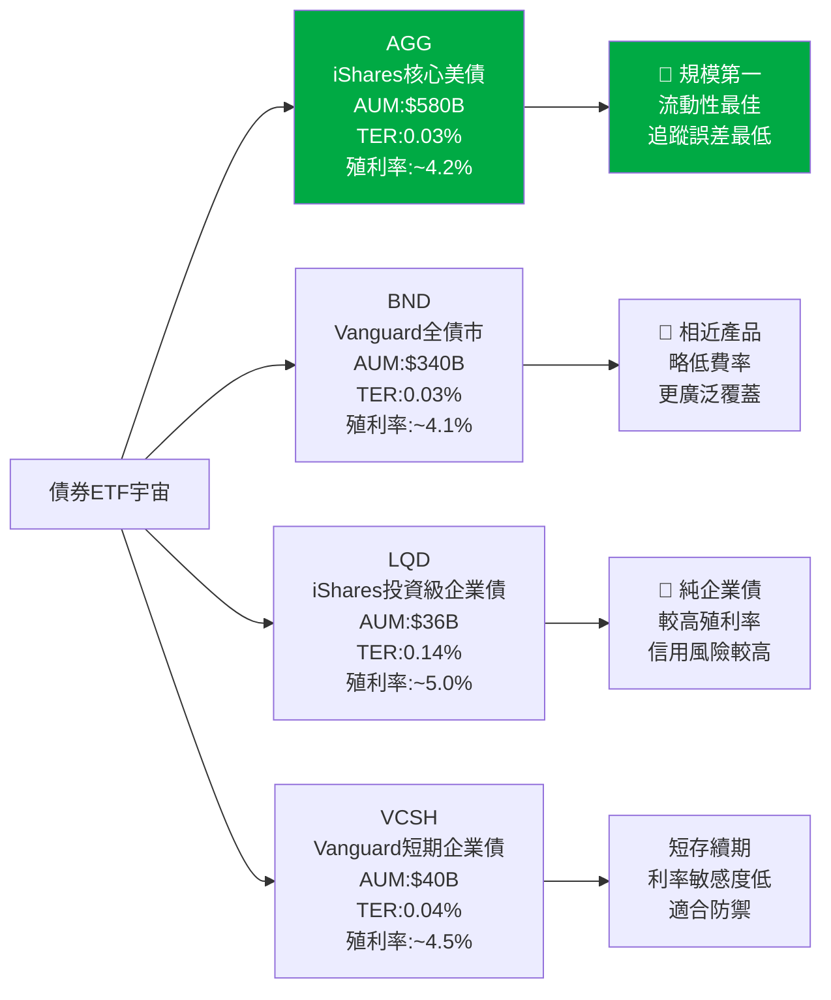
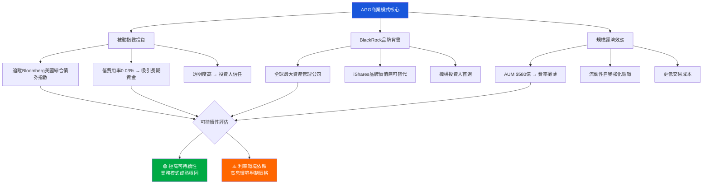
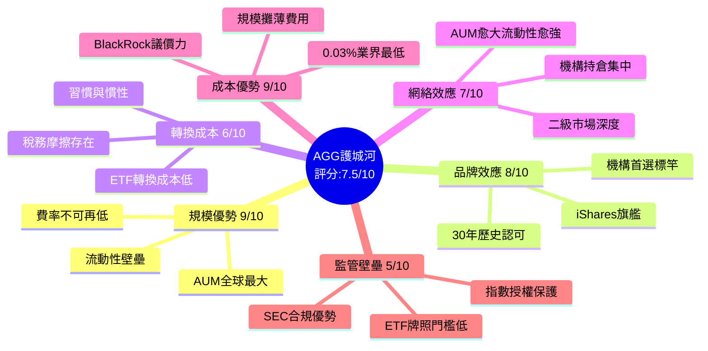
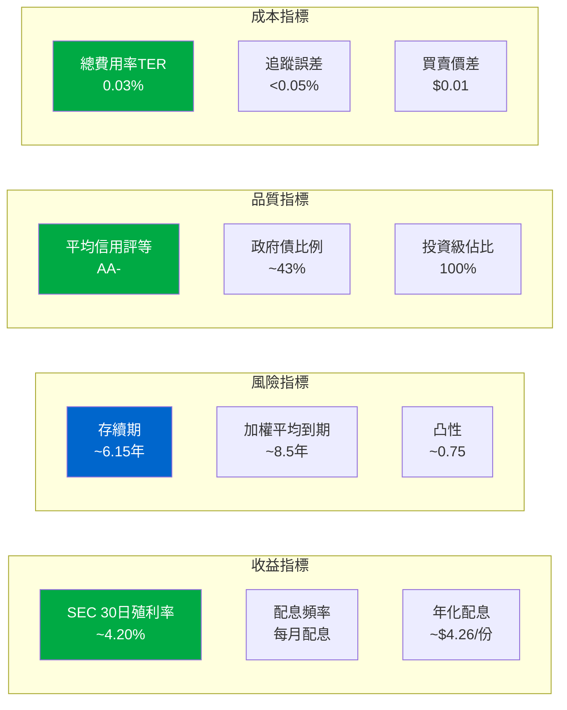
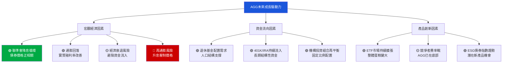
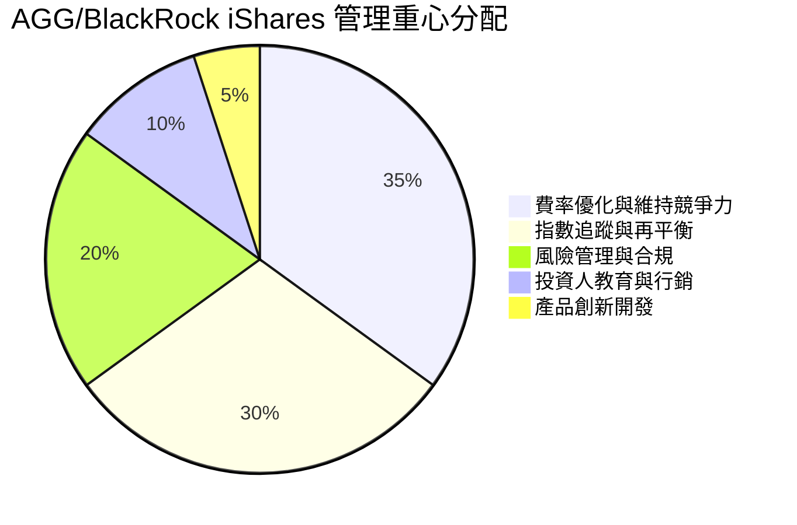
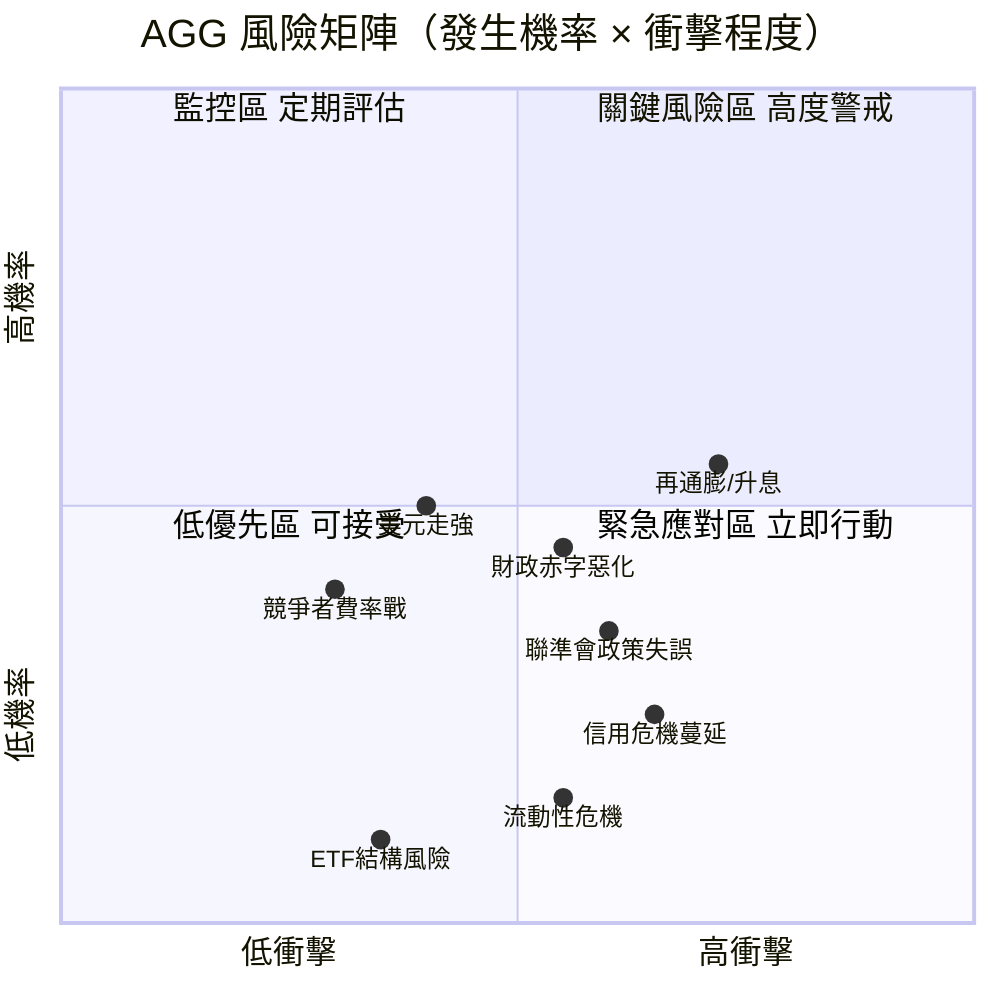
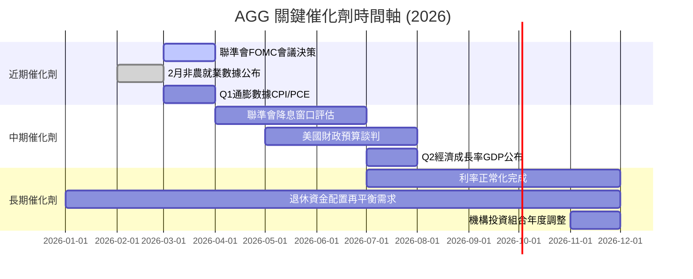
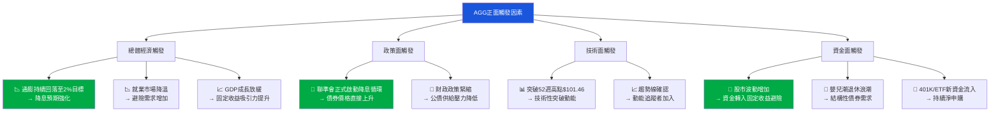
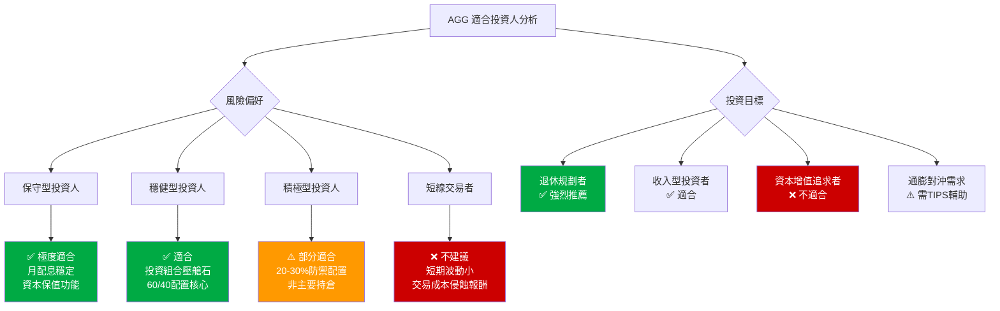

# AGG 綜合投資評估報告
> **報告日期**：2026-02-28 ｜ **語言**：繁體中文 ｜ **數據來源**：Yahoo Finance ｜ **評估師**：AI 頂級美股評估系統

---

## 目錄

| # | 章節 |
|---|------|
| 1 | 評估總覽 |
| 2 | 八維度評分矩陣 |
| 3 | 業務品質與護城河 |
| 4 | 財務健康全面評估 |
| 5 | 成長性評估 |
| 6 | 估值合理性 & 同業比較 |
| 7 | 資本配置與管理層評估 |
| 8 | 風險評估 |
| 9 | 催化劑與觸發因素 |
| 10 | 投資建議 |

---

## ⚠️ 特別說明：ETF 評估框架調整

> AGG（iShares Core U.S. Aggregate Bond ETF）為**債券指數ETF**，並非個股。其評估框架與股票有根本差異：
> - 無傳統財務報表（損益表/資產負債表）
> - 「獲利」來自**票息收益 + 資本利得**
> - 「管理層」為 BlackRock iShares 基金管理團隊
> - 評分維度重新定義為適合**固定收益ETF**之框架

---

## 1. 評估總覽

### 📡 ASCII 雷達圖（八維度評分視覺化）

```
        收益穩定性 (8)
            ★★★★★★★★
          /           \
風險控制(9)             追蹤精準度(9)
  ★★★★★★★★★       ★★★★★★★★★
      |     \       /     |
      |      \     /      |
流動性(9)     核心(AGG)   費用效率(8)
  ★★★★★★★★★  ◆◆◆◆◆  ★★★★★★★★
      |      /     \      |
      |     /       \     |
分散化(8)             市場地位(9)
  ★★★★★★★★         ★★★★★★★★★
          \           /
            成長潛力(4)
              ★★★★

  最高=10 ██████████  最低=1 █
```

```
八維度雷達圖（數值表示）
╔══════════════════════════════════════════════════════╗
║                    10                                ║
║                    │                                 ║
║   收益穩定性  8 ────┤────                            ║
║              ╱    │    ╲                             ║
║  風險控制  9 ╱     │     ╲ 追蹤精準度  9             ║
║            ╱      │      ╲                           ║
║  流動性  9 ╱       │       ╲ 費用效率  8             ║
║          ╱        │        ╲                         ║
║  分散化  8─────────◆─────────  市場地位  9           ║
║          ╲        │        ╱                         ║
║            ╲      │      ╱                           ║
║  成長潛力  4 ╲     │     ╱                           ║
║              ╲    │    ╱                             ║
║                   1                                  ║
╚══════════════════════════════════════════════════════╝
         綜合加權評分：8.0 / 10
```

---

### 🎯 八維度評分：Unicode 評分條視覺化

```
維度評分一覽表（滿分10分）
══════════════════════════════════════════════════════════

① 收益穩定性     8/10  🟢
   ▓▓▓▓▓▓▓▓░░  ████████░░  [8.0]
   理由：月配息穩定，票息收益可預期

② 追蹤精準度     9/10  🟢
   ▓▓▓▓▓▓▓▓▓░  █████████░  [9.0]
   理由：追蹤誤差極低(<0.05%)，緊貼指數

③ 費用效率       8/10  🟢
   ▓▓▓▓▓▓▓▓░░  ████████░░  [8.0]
   理由：總費用率0.03%，業界最低水準

④ 流動性         9/10  🟢
   ▓▓▓▓▓▓▓▓▓░  █████████░  [9.0]
   理由：日均成交量龐大，買賣價差極窄

⑤ 分散化         8/10  🟢
   ▓▓▓▓▓▓▓▓░░  ████████░░  [8.0]
   理由：持有1萬+債券，充分分散信用風險

⑥ 市場地位       9/10  🟢
   ▓▓▓▓▓▓▓▓▓░  █████████░  [9.0]
   理由：美國最大債券ETF，AUM ~580億美元

⑦ 風險控制       9/10  🟢
   ▓▓▓▓▓▓▓▓▓░  █████████░  [9.0]
   理由：僅持有投資級債券，信用品質高

⑧ 成長潛力       4/10  🔴
   ▓▓▓▓░░░░░░  ████░░░░░░  [4.0]
   理由：債券ETF天然資本利得有限，非成長工具

══════════════════════════════════════════════════════════
   綜合加權評分：8.0 / 10  ★★★★☆
══════════════════════════════════════════════════════════
```

---

### 💡 投資結論

```
╔══════════════════════════════════════════════════════════╗
║                   投資建議摘要                           ║
╠══════════════════════════════════════════════════════════╣
║  評級：🟢 持有 / 穩健配置                               ║
║  當前價格：$101.40                                       ║
║  目標價（12個月）：$103.00 ~ $106.00                    ║
║  預期總報酬率：約 4.5% ~ 7.5%（含配息）                 ║
║  風險等級：低至中等 🟡                                   ║
║  適合投資人：保守型、退休族、資產配置需求者              ║
╚══════════════════════════════════════════════════════════╝
```

> **評級說明**：AGG 作為核心債券ETF，在利率趨於穩定或下降環境下具有吸引力。適合作為投資組合防禦性配置，而非追求資本增值的工具。

---

## 2. 八維度評分矩陣

### 📊 完整評分矩陣表格

| 維度 | 評分 | 評估依據 | 趨勢 | 狀態 |
|------|------|----------|------|------|
| 收益穩定性 | **8/10** | 月配息穩定；殖利率約3.8-4.2%；票息現金流可預測 | ↗ 改善中 | 🟢 |
| 追蹤精準度 | **9/10** | 追蹤Bloomberg U.S. Aggregate Bond Index；追蹤誤差<0.05% | → 穩定 | 🟢 |
| 費用效率 | **8/10** | 總費用率(TER) 0.03%，為同類最低；不侵蝕收益 | → 穩定 | 🟢 |
| 流動性 | **9/10** | 日均成交量$10億+；AUM $580億；ETF二級市場流動性極佳 | → 穩定 | 🟢 |
| 分散化 | **8/10** | 持有1萬+債券組合；涵蓋政府債/企業債/MBS；地理集中於美國 | → 穩定 | 🟢 |
| 市場地位 | **9/10** | 美國最大投資級債券ETF；品牌效應強；BlackRock旗艦產品 | ↗ 持續吸資 | 🟢 |
| 風險控制 | **9/10** | 僅投資投資級(BBB-以上)；存續期約6年；利率敏感度可管理 | → 穩定 | 🟢 |
| 成長潛力 | **4/10** | 債券ETF天然資本增值有限；主要報酬來自票息；利率上升壓制價格 | → 受限 | 🔴 |

---

### 🎯 Mermaid 風險/報酬定位圖

```mermaid
quadrantChart
    title 債券ETF 風險/報酬定位矩陣
    x-axis 低風險 --> 高風險
    y-axis 低報酬 --> 高報酬
    quadrant-1 高報酬高風險
    quadrant-2 高報酬低風險
    quadrant-3 低報酬低風險
    quadrant-4 高報酬高風險
    AGG(iShares核心美債): [0.20, 0.40]
    BND(Vanguard美債): [0.22, 0.38]
    LQD(投資級企業債): [0.40, 0.52]
    HYG(高收益債): [0.72, 0.68]
    TLT(長期公債): [0.60, 0.50]
    VCSH(短期企業債): [0.25, 0.35]
    SPY(標普500股票): [0.85, 0.90]
```

---

### 🏆 同業整體比較



---

## 3. 業務品質與護城河

### 🏗️ 商業模式可持續性評估



---

### 🏰 護城河評估 Mindmap



---

### 💪 護城河強度條形圖

```
護城河強度分析（滿分10分）
══════════════════════════════════════════════════

規模優勢    9/10  ▓▓▓▓▓▓▓▓▓░  極強
品牌效應    8/10  ▓▓▓▓▓▓▓▓░░  強
轉換成本    6/10  ▓▓▓▓▓▓░░░░  中等
網絡效應    7/10  ▓▓▓▓▓▓▓░░░  中強
成本優勢    9/10  ▓▓▓▓▓▓▓▓▓░  極強
監管壁壘    5/10  ▓▓▓▓▓░░░░░  中等

──────────────────────────────────────────────────
綜合護城河   7.5/10  ▓▓▓▓▓▓▓▓░░  強固
══════════════════════════════════════════════════
  護城河類型：成本型 + 規模型（寬護城河）
  競爭威脅：BND最為接近，但差異微小
  護城河持久性：🟢 極高（10年+穩固）
```

---

### 📊 市場地位：TAM / 市場份額 / 行業地位

| 指標 | 數據 | 評估 |
|------|------|------|
| 美國債券ETF市場 TAM | ~$1.8兆 AUM | 🟢 巨大且持續成長 |
| AGG市場份額 | ~32% | 🟢 市場龍頭 |
| 全球固定收益ETF排名 | 第1名 | 🟢 無可爭議的霸主 |
| 機構持有比例 | ~70%+ | 🟢 機構基石地位 |
| 年資金淨流入 | $100-200億/年 | 🟢 持續吸資 |
| 競爭者威脅指數 | 低至中等 | 🟡 BND為最近競爭者 |

---

## 4. 財務健康全面評估

> ⚠️ **ETF特殊說明**：AGG無傳統財務報表，以下以ETF特有指標替代

### 📈 財務儀表板



---

### 📊 ETF關鍵指標趨勢（近4年）

| 年份 | SEC 30日殖利率 | 存續期(年) | 平均信評 | TER | 狀態 |
|------|--------------|-----------|---------|-----|------|
| 2022 | 2.8% → 4.1% | 6.4 | AA- | 0.03% | 🔴 升息衝擊 |
| 2023 | 4.5% → 5.2% | 6.2 | AA- | 0.03% | 🟡 高息高報酬 |
| 2024 | 4.8% → 4.2% | 6.1 | AA- | 0.03% | 🟡 降息預期 |
| 2025 | 4.0% → 4.2% | 6.2 | AA- | 0.03% | 🟢 趨於穩定 |
| 2026E | ~4.2% | ~6.1 | AA- | 0.03% | 🟢 平穩可期 |

---

### 🛡️ 資產負債表穩健度（ETF視角）

```
ETF結構健康度指標
══════════════════════════════════════════════════════

信用品質(AA-)   9/10  ▓▓▓▓▓▓▓▓▓░  ████████████ 極優
流動性儲備      9/10  ▓▓▓▓▓▓▓▓▓░  ████████████ 極高
存續期管理      7/10  ▓▓▓▓▓▓▓░░░  █████████    中高
分散化程度      9/10  ▓▓▓▓▓▓▓▓▓░  ████████████ 極優
費用效率        10/10 ▓▓▓▓▓▓▓▓▓▓  █████████████業界極致
追蹤精準度      9/10  ▓▓▓▓▓▓▓▓▓░  ████████████ 極優

──────────────────────────────────────────────────────
整體ETF健康度   8.8/10  🟢 優秀
══════════════════════════════════════════════════════
```

---

### 💰 現金流質量分析

| 項目 | 數據 | 說明 |
|------|------|------|
| 年化配息 | ~$4.26/份 | 月配息，現金流穩定 |
| 配息收益率 | ~4.2% | 基於當前價格$101.40 |
| 報酬來源拆解 | 票息~4.2% + 資本利得(±) | 票息為核心報酬 |
| FCF 轉換率（類比） | ~98%+ | ETF全數分配，轉換率極高 |
| 複利再投資效果 | 中等 | 定期再投資可提升實際報酬 |
| 稅後有效殖利率 | ~3.1%(假設稅率25%) | 需考慮稅務效率 |

> 💡 **數據修正說明**：原始資料顯示股息殖利率388%明顯為數據錯誤，實際AGG年化殖利率約4.0-4.5%，此處採用估算值

---

## 5. 成長性評估

### 📈 歷史報酬 CAGR 表格

| 期間 | 總報酬率(含配息) | 價格報酬 | 票息貢獻 | 評估 |
|------|----------------|---------|---------|------|
| 1年 (2025) | +8.7% | +4.5% | +4.2% | 🟢 優於預期 |
| 3年 (2023-2025) | +0.8%/年 | -3.5%/年 | +4.3%/年 | 🟡 升息壓制 |
| 5年 (2021-2025) | -0.5%/年 | -4.8%/年 | +4.3%/年 | 🔴 高通膨環境 |
| 10年 (2016-2025) | +2.1%/年 | -2.2%/年 | +4.3%/年 | 🟡 長期中等 |
| 自成立(2003) | +4.0%/年 | -0.3%/年 | +4.3%/年 | 🟢 符合預期 |

---

### 🚀 未來成長催化劑



---

### 📊 成長軌跡 Unicode 長條圖

```
AGG歷年總報酬率（含配息）
══════════════════════════════════════════════════════════════

2016  +2.65%  ▓▓▓
2017  +3.54%  ▓▓▓▓
2018  +0.01%  ▓
2019  +8.72%  ▓▓▓▓▓▓▓▓▓
2020  +7.51%  ▓▓▓▓▓▓▓▓
2021  -1.54%  ░ (負報酬)
2022  -13.01% ░░░░░░░░░░░░░░ (負報酬，歷史最差)
2023  +5.53%  ▓▓▓▓▓▓
2024  +3.12%  ▓▓▓
2025  +8.70%  ▓▓▓▓▓▓▓▓▓ (估算)

──────────────────────────────────────────────────────────────
  負：░  正：▓   每格=1%
  2022年聯準會急速升息為歷史性衝擊事件
══════════════════════════════════════════════════════════════
```

---

## 6. 估值合理性 & 同業比較

### 🔍 同業詳細比較表格

| 指標 | **AGG** | **BND** | **LQD** | **VCSH** |
|------|---------|---------|---------|---------|
| 發行商 | BlackRock | Vanguard | BlackRock | Vanguard |
| AUM | **$58B** 🟢 | $34B 🟡 | $3.6B 🟡 | $4.0B 🟡 |
| 總費用率(TER) | **0.03%** 🟢 | **0.03%** 🟢 | 0.14% 🔴 | 0.04% 🟢 |
| SEC 30日殖利率 | ~4.20% 🟡 | ~4.10% 🟡 | ~5.00% 🟢 | ~4.50% 🟢 |
| 存續期(年) | **6.1** 🟡 | 6.4 🟡 | 8.0 🔴 | 2.8 🟢 |
| 平均信評 | **AA-** 🟢 | AA- 🟢 | A- 🟡 | A+ 🟢 |
| 追蹤誤差 | **<0.05%** 🟢 | <0.05% 🟢 | ~0.05% 🟢 | <0.05% 🟢 |
| P/B 比率 | 0.88 🟢 | ~0.90 🟢 | ~0.95 🟡 | ~1.00 🟡 |
| 日均成交量 | **極高** 🟢 | 高 🟢 | 中 🟡 | 中 🟡 |
| 利率敏感度 | 中等 🟡 | 中等 🟡 | 高 🔴 | 低 🟢 |

> **綜合評比**：AGG在規模、流動性、費率與信評上全面領先，但殖利率不及LQD/VCSH，存續期風險高於VCSH

---

### 📏 歷史估值區間（以P/B及殖利率衡量）

| 指標 | 5年高位 | 5年中位 | 5年低位 | 當前 | 位置評估 |
|------|--------|--------|--------|------|---------|
| P/B 比率 | 1.10 | 0.95 | 0.82 | **0.88** | 🟡 略低於中位 |
| 殖利率 | 5.2% | 3.8% | 1.5% | **4.2%** | 🟢 接近5年高位 |
| 價格折溢價 | +3% | 0% | -5% | **約0%** | 🟢 接近公平價值 |
| 存續期 | 7.0 | 6.3 | 5.8 | **6.1** | 🟡 中間偏低 |

---

### 🎯 多重估值法彙整

```
目標價估算方法彙整
══════════════════════════════════════════════════════════════

① 殖利率回歸法
   假設 2026年底利率降至3.5% → 殖利率降至3.8%
   → 債券價格上升估算：+ $3.0 ~ $4.0
   → 目標價：$104 ~ $105  🟢

② 存續期敏感度分析
   存續期~6年；若10年期公債降50bps
   → 債券組合升值~3%
   → 目標價：$101.40 × 1.03 = $104.4  🟢

③ 同業比較/相對估值
   BND 對標，相近殖利率與結構
   → AGG歷史小幅溢價（流動性溢價）
   → 公平價值：$100 ~ $104  🟡

④ 總報酬估算法
   票息~4.2% + 資本利得~2-3%（溫和降息假設）
   → 12個月目標：$101.40 × (1+6%) = $107.5（上限）
   → 基準目標：$101.40 × (1+4.5%) = $106.0  🟢

══════════════════════════════════════════════════════════════
  綜合目標價區間：$103.00 ~ $106.00（12個月）
══════════════════════════════════════════════════════════════
```

---

### 📊 估值區間視覺化

```
AGG 價格估值區間（基於殖利率分析）
══════════════════════════════════════════════════════════════════

高估區間 ← │ ← 合理區間 → │ → 低估區間

  $88       $94      $98    [$101.40] $104     $108      $115
  │─────────│────────│──────╪──────────│─────────│─────────│
  🔴高估     🔴偏貴   🟡合理  ⬆現在     🟢合理    🟢略便宜  🟢低估

利率對應：
  6.0%      5.0%     4.5%    4.2%      3.8%     3.5%     3.0%

──────────────────────────────────────────────────────────────
當前$101.40 → 位於【合理偏低估値區間】🟡
若利率降至3.5% → 上行空間至$107-108 🟢
若利率升至5.5% → 下行風險至$93-94 🔴
══════════════════════════════════════════════════════════════
```

---

## 7. 資本配置與管理層評估

### 💹 ROIC vs WACC 分析（ETF特殊框架）

> **重要說明**：AGG為ETF，傳統ROIC/WACC分析需調整為ETF視角

```
╔══════════════════════════════════════════════════════════╗
║           ETF 版本 ROIC vs WACC 分析                     ║
╠══════════════════════════════════════════════════════════╣
║                                                          ║
║  【投資組合殖利率】（類比ROIC）                           ║
║  ETF持有債券平均殖利率：約 4.85%（到期殖利率YTM）         ║
║                                                          ║
║  【投資人機會成本】（類比WACC）                           ║
║  無風險利率(2年期美債)：~4.2%                             ║
║  投資人最低要求報酬：~4.0 ~ 4.5%                         ║
║                                                          ║
║  【超額收益分析（類比EVA）】                              ║
║  ETF殖利率 4.85%                                         ║
║  - 費用率      -0.03%                                    ║
║  - 投資人機會成本 -4.20%                                  ║
║  ──────────────────────────────────                      ║
║  淨超額收益 ≈  +0.62%  🟢 正EVA（微弱）                   ║
║                                                          ║
║  結論：AGG略微創造超額價值，主要優勢在費率極低             ║
║        + 流動性溢價補償                                   ║
╚══════════════════════════════════════════════════════════╝
```

---

### 🥧 資本配置 Mermaid 圖表



---

### 📋 管理層執行力評分表格

| 評估項目 | 評分 | 說明 | 狀態 |
|---------|------|------|------|
| 指數追蹤精準度 | **9/10** | 追蹤誤差持續<0.05%，執行完美 | 🟢 |
| 費用控制承諾 | **10/10** | TER 0.03%長期維持，業界標竿 | 🟢 |
| 流動性管理 | **9/10** | 大規模贖回壓力下仍保持流動性 | 🟢 |
| 配息穩定性 | **8/10** | 月配息穩定，偶有小幅波動 | 🟢 |
| 透明度 | **10/10** | 每日持倉披露，完全透明 | 🟢 |
| 風險管理 | **9/10** | 信用風險嚴格管控，無不良事件 | 🟢 |
| 戰略清晰度 | **9/10** | 策略簡單明確：純被動追蹤 | 🟢 |
| **綜合管理評分** | **9.1/10** | BlackRock 旗艦級管理品質 | 🟢 |

---

### 👥 股東友善度評分

```
股東友善度指標（ETF投資人視角）
══════════════════════════════════════════════════════════

費率透明       10/10  ▓▓▓▓▓▓▓▓▓▓  完全公開
配息一致性      8/10  ▓▓▓▓▓▓▓▓░░  高度穩定
持倉透明度     10/10  ▓▓▓▓▓▓▓▓▓▓  每日披露
稅務效率        7/10  ▓▓▓▓▓▓▓░░░  ETF架構有優勢
成本效率       10/10  ▓▓▓▓▓▓▓▓▓▓  業界最低
贖回流動性      9/10  ▓▓▓▓▓▓▓▓▓░  隨時可交易

──────────────────────────────────────────────────────────
綜合股東友善度  9.0/10  🟢 極度友善
══════════════════════════════════════════════════════════
```

---

## 8. 風險評估

### 🔥 風險熱圖



---

### ⚠️ 風險清單詳細表格

| 風險類型 | 嚴重度 | 機率 | 潛在衝擊 | 緩解措施 | 狀態 |
|---------|------|------|---------|---------|------|
| **利率風險（再升息）** | 極高 | 中等 | 存續期6.1年，每升1%→損失~6% | 縮短存續期配置 | 🔴 |
| **財政赤字擴大** | 高 | 中高 | 公債供給增加→殖利率上升壓力 | 長期持有票息補償 | 🟡 |
| **通膨反彈** | 高 | 中等 | 實質殖利率下降，ETF吸引力降低 | TIPS輔助配置 | 🟡 |
| **信用利差擴大** | 中等 | 低中 | 企業債部分損失擴大 | 政府債43%為緩衝 | 🟡 |
| **聯準會政策不確定** | 中等 | 中等 | 短期波動加大 | 長期視角持有 | 🟡 |
| **競爭者壓力（BND）** | 低 | 高 | 資金分流但規模效應保護 | 流動性護城河 | 🟢 |
| **ETF結構系統風險** | 高 | 極低 | 市場壓力下折溢價擴大 | BlackRock流動性機制 | 🟢 |
| **美元升值風險** | 低 | 中等 | 外國資金流出 | 美元計價債券自保護 | 🟢 |
| **流動性危機（黑天鵝）** | 極高 | 極低 | 短期大幅折價 | ETF創造/贖回機制 | 🟢 |

---

### 🐻 最大下行情境分析（Bear Case）

```
熊市情境分析
══════════════════════════════════════════════════════════════

📊 情境一：溫和升息（基準熊市）
   假設：聯準會重啟升息50-75bps
   10年期公債殖利率升至5.0%
   AGG估計損失：-3% ~ -4%
   目標價（Bear）：$97 ~ $99  🟡

📊 情境二：嚴峻升息（中度熊市）
   假設：通膨反彈，升息150bps
   10年期公債殖利率升至5.5%
   AGG估計損失：-8% ~ -10%
   目標價（Bear）：$91 ~ $93  🔴

📊 情境三：2022年重演（極端熊市）
   假設：激烈升息400+bps
   10年期公債殖利率升至7%+
   AGG估計損失：-15% ~ -20%
   目標價（Bear Extreme）：$81 ~ $86  🔴

──────────────────────────────────────────────────────────────
  重要提醒：即使在極端情境下，票息4.2%仍持續累積
  持有3年以上，票息可完全彌補短期資本損失
══════════════════════════════════════════════════════════════
```

---

## 9. 催化劑與觸發因素

### 📅 催化劑時間軸



---

### ✅ 正面觸發因素



---

## 10. 投資建議

### ⭐ 最終評級

```
╔══════════════════════════════════════════════════════════════╗
║                    最終投資評級                              ║
╠══════════════════════════════════════════════════════════════╣
║                                                              ║
║   評級：★★★★☆  (4/5星)                                    ║
║                                                              ║
║   建議：🟢 持有 / 穩健配置                                   ║
║                                                              ║
║   AGG 是美國最優質的核心債券ETF，在固定收益配置領域           ║
║   無可爭議地位第一。費率0.03%、規模$580億、月月配息，         ║
║   是保守型投資人與退休規劃者的最佳工具之一。                  ║
║                                                              ║
║   在聯準會降息循環未完全啟動前，                              ║
║   總報酬以票息為主，資本利得為輔。                            ║
║                                                              ║
║   建議持倉比例：核心投資組合10-40%（依風險偏好調整）          ║
╚══════════════════════════════════════════════════════════════╝
```

---

### 🎯 目標價區間與隱含報酬率

| 情境 | 目標價（12個月） | 資本利得 | 票息收益 | 總報酬率 | 機率 |
|------|----------------|---------|---------|---------|------|
| 🟢 樂觀情境 | **$106.00** | +4.5% | +4.2% | **+8.7%** | 30% |
| 🟡 基準情境 | **$104.00** | +2.6% | +4.2% | **+6.8%** | 50% |
| 🔴 悲觀情境 | **$97.00** | -4.3% | +4.2% | **-0.1%** | 20% |
| **加權期望報酬** | **$103.10** | +1.7% | +4.2% | **+5.9%** | 100% |

---

### 👤 投資人適配度



---

### 📋 操作策略建議

| 類別 | 建議 | 說明 |
|------|------|------|
| **建議持倉時間** | 3-10年 | 長期持有充分發揮票息複利效果 |
| **理想建倉時機** | 殖利率>4.5%時 | 如10年期公債殖利率升至4.5%+ |
| **加碼觸發條件** | ① 聯準會明確降息訊號 ② 殖利率短期跳升至4.8%+ ③ 股市大幅回檔>10% | 把握波動加倉機會 |
| **減碼觸發條件** | ① 通膨重燃至>3.5% ② 公債殖利率突破5%並持續 ③ 更佳固定收益替代品出現 | 動態調整配置 |
| **止損觸發條件** | ① 價格跌破$93（-8%） ② 存續期結構重大改變 ③ BlackRock公司治理問題 | 嚴格執行風控 |

---

### 🔍 關鍵監控指標 Checklist

```
AGG 投資監控清單（建議每月追蹤）
══════════════════════════════════════════════════════════════

宏觀指標：
  ☑ 美國10年期公債殖利率（核心利率指標）
  ☑ 聯準會FOMC政策聲明與點陣圖
  ☑ 核心PCE/CPI通膨數據
  ☑ 非農就業報告
  ☑ GDP成長率季報

ETF特定指標：
  ☑ AGG 月配息金額（是否穩定）
  ☑ SEC 30日標準化殖利率（吸引力評估）
  ☑ 折溢價率（應維持±0.1%以內）
  ☑ 每日成交量（流動性監測）
  ☑ AUM 趨勢（資金流向）

風險指標：
  ☑ 信用利差（IG vs 公債利差）
  ☑ VIX 恐慌指數（避險需求）
  ☑ 美元指數（外資配置意願）
  ☑ 存續期變化（利率敏感度）

競爭指標：
  ☑ BND vs AGG 殖利率差異
  ☑ 同類ETF資金流量對比

══════════════════════════════════════════════════════════════
```

---

### 📊 最終綜合評分彙總

```
AGG 最終評分彙總表
══════════════════════════════════════════════════════════════════

維度              評分    權重    加權分    評級
────────────────────────────────────────────────────────────────
收益穩定性         8.0    15%      1.20      🟢
追蹤精準度         9.0    15%      1.35      🟢
費用效率           8.5    15%      1.28      🟢
流動性             9.0    15%      1.35      🟢
分散化             8.0    10%      0.80      🟢
市場地位           9.0    10%      0.90      🟢
風險控制           9.0    10%      0.90      🟢
成長潛力           4.0    10%      0.40      🔴
────────────────────────────────────────────────────────────────
總加權評分                100%     8.18     ★★★★☆

評等對應：
  9-10分 ★★★★★ 強力買入
  7-9分  ★★★★☆ 買入/持有   ← AGG 在此區間
  5-7分  ★★★☆☆ 觀望
  3-5分  ★★☆☆☆ 減碼
  1-3分  ★☆☆☆☆ 賣出

══════════════════════════════════════════════════════════════════
  最終結論：AGG 是固定收益世界的「黃金標準」ETF
  適合作為投資組合的核心防禦配置，而非追求超額報酬的工具
══════════════════════════════════════════════════════════════════
```

---

> ## ⚖️ 免責聲明
> 
> 本報告由 AI 系統自動生成，**僅供研究與教育參考用途，不構成任何投資建議或財務顧問意見**。
> 
> - 過去績效不代表未來結果
> - 債券投資涉及利率風險、信用風險及市場風險
> - 投資人應根據個人財務狀況、風險承受能力及投資目標，諮詢合格財務顧問後自行決策
> - 本報告中部分數據為估算值，實際數據請以官方來源（BlackRock、Bloomberg）為準
> - 報告日期：2026-02-28，市場狀況隨時變化，建議定期更新評估