# C3.ai (AI) 基本面深度分析報告

> **報告日期**：2026-02-24 ｜ **語言**：繁體中文 ｜ **數據來源**：Yahoo Finance ｜ **分析師**：AI 量化研究部門

---

## 目錄

| # | 章節 | 核心關鍵字 |
|---|------|-----------|
| 1 | [執行摘要](#1-執行摘要) | 整體評分、投資論點 |
| 2 | [公司概覽](#2-公司概覽) | 業務結構、市場地位 |
| 3 | [損益表深度分析](#3-損益表深度分析) | 收入成長、利潤率 |
| 4 | [資產負債表分析](#4-資產負債表分析) | 流動性、資本結構 |
| 5 | [現金流量分析](#5-現金流量分析) | FCF、燒錢速度 |
| 6 | [獲利能力指標](#6-獲利能力指標) | ROE、ROA、ROIC |
| 7 | [估值分析](#7-估值分析) | P/S、P/B、情境估值 |
| 8 | [競爭護城河](#8-競爭護城河) | 五力分析、差異化 |
| 9 | [成長催化劑](#9-成長催化劑) | AI趨勢、政府合約 |
| 10 | [風險分析](#10-風險分析) | 風險矩陣、緩解措施 |
| 11 | [公平價值估算](#11-公平價值估算) | DCF、三法比較 |
| 12 | [投資建議](#12-投資建議) | 最終評級、適配度 |

---

## 1. 執行摘要

### 🎯 核心評分儀表板

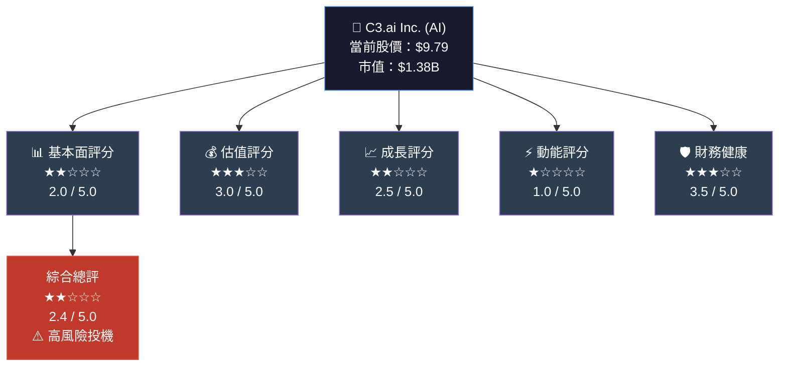

---

### 📋 快速統計卡片

| 指標 | 數值 | 狀態 | 說明 |
|------|------|------|------|
| 📌 當前股價 | $9.79 | 🔴 | 距52週高點 -67.6% |
| 📌 52週區間 | $9.53 ~ $30.24 | 🔴 | 接近歷史低點 |
| 📌 市值 | $1.38B | 🟡 | 小型成長股 |
| 📌 企業價值 | $764.42M | 🟢 | EV < 市值（淨現金豐富） |
| 📌 Beta | 1.999 | 🔴 | 極高波動性 |
| 📌 TTM 營收 | $352.91M | 🟡 | YoY -20.3% |
| 📌 毛利率 | 51.8% | 🟡 | 尚可但偏低（軟體業標準） |
| 📌 EPS (TTM) | -$2.84 | 🔴 | 持續虧損 |
| 📌 現金儲備 | $675.03M | 🟢 | 強健流動性 |
| 📌 分析師目標 | $14.12 | 🟡 | 潛在漲幅 +44.2% |
| 📌 放空比率 | 5.95 | 🔴 | 空頭壓力顯著 |

---

### 🔍 五大投資論點

| # | 論點 | 方向 | 重要性 | 詳述 |
|---|------|------|--------|------|
| 1 | 🔴 **收入加速衰退** | 利空 | ⭐⭐⭐⭐⭐ | TTM 收入年減 -20.3%，由成長股轉為衰退股 |
| 2 | 🔴 **持續巨額虧損** | 利空 | ⭐⭐⭐⭐⭐ | 近四年淨虧累計超 $10億，無盈利路徑 |
| 3 | 🟢 **強大現金緩衝** | 利多 | ⭐⭐⭐⭐ | $675M現金，EV僅$764M，破產風險極低 |
| 4 | 🟡 **AI敘事折價** | 中性 | ⭐⭐⭐⭐ | 股價從$30跌至$9.79，AI熱潮退卻帶來低估可能 |
| 5 | 🔴 **燒錢速度與股本稀釋** | 利空 | ⭐⭐⭐⭐ | 運營現金流 -$90.79M（TTM），持續依賴股本融資 |

---

## 2. 公司概覽

### 🏗️ 業務結構流程圖

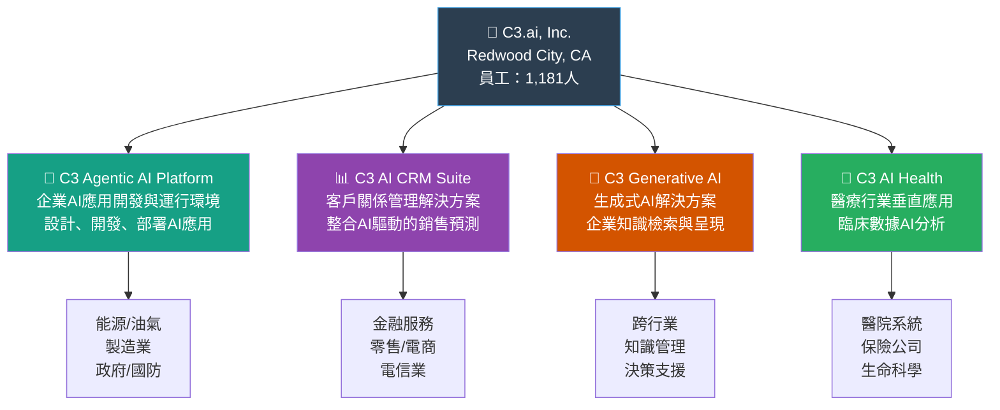

---

### 🎯 目標市場與客戶結構

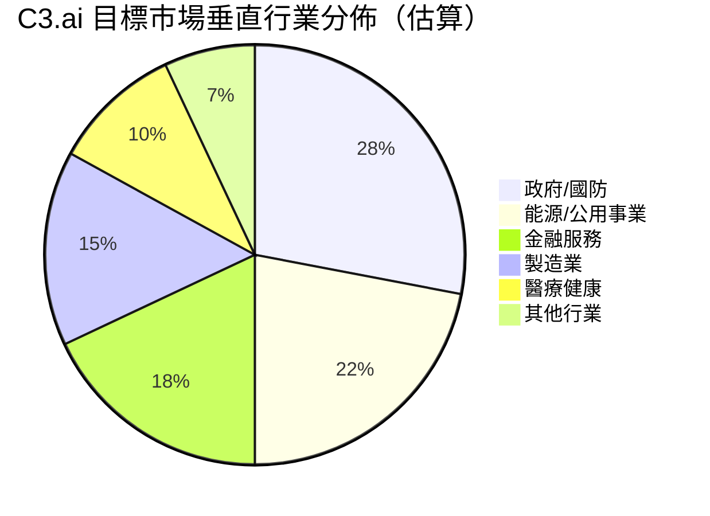

---

### 🧠 競爭優勢心智圖

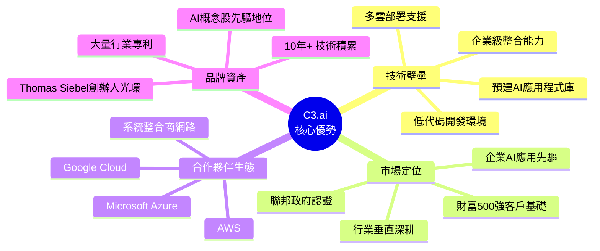

---

### 📊 公司基本資料

| 項目 | 資訊 |
|------|------|
| 公司全名 | C3.ai, Inc. |
| 股票代碼 | AI (NYSE) |
| 成立年份 | 2009年 |
| 創辦人 | Thomas Siebel（Siebel Systems 創辦人） |
| 總部 | Redwood City, California |
| 行業分類 | 軟體基礎設施 / 企業AI |
| 員工人數 | 1,181人 |
| 會計年度 | 4月30日結束 |
| IPO日期 | 2020年12月 |
| 主要競爭對手 | Palantir, Snowflake, UiPath, ServiceNow AI |

---

## 3. 損益表深度分析

### 📈 年度收入成長時間軸

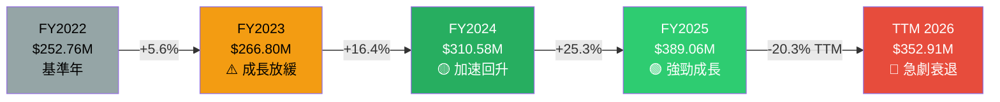

---

### 📊 年度收入趨勢 — ASCII 長條圖

```
收入規模（百萬美元）
$450M ┤
$400M ┤                              ████ $389.06M
$350M ┤                              ████           ████ $352.91M (TTM)
$300M ┤                    ████ $310.58M
$266M ┤          ████ $266.80M
$252M ┤ ████ $252.76M
      └──────────────────────────────────────────────────
        FY2022    FY2023    FY2024    FY2025    TTM FY2026

成長率趨勢：
FY2022→23  ▓░░░░░░░░░  +5.6%
FY2023→24  ▓▓▓▓▓▓░░░░  +16.4%
FY2024→25  ▓▓▓▓▓▓▓▓░░  +25.3%  ← 最佳表現
FY2025→TTM ░░░░░░░░░░  -20.3%  ← ⚠️ 急速逆轉
```

---

### 💹 利潤率演變分析

```
利潤率四年對比（%）
         FY2022   FY2023   FY2024   FY2025
毛利率：
  74.8%  ████████████████████████████
  67.7%           █████████████████████
  57.5%                    ████████████
  60.6%                             ██████████████  ← FY2025回升

淨利率（虧損）：
 -76.0%  ████████████████████████████  FY2022
-100.8%           ████████████████████████████████  FY2023（最差）
 -90.1%                    █████████████████████████  FY2024（略改善）
 -74.2%                             ████████████████████  FY2025（趨勢改善）
-108.1%  ████████████████████████████████████  TTM（惡化）
```

---

### 📋 四年財務數據詳表

| 指標 | FY2022 | FY2023 | FY2024 | FY2025 | 趨勢 |
|------|--------|--------|--------|--------|------|
| **總收入** | $252.76M | $266.80M | $310.58M | $389.06M | 🟢→🔴 |
| **YoY成長** | — | +5.6% | +16.4% | +25.3% | 🔴逆轉 |
| **毛利潤** | $189.05M | $180.46M | $178.56M | $235.86M | 🟡 |
| **毛利率** | 74.8% | 67.7% | 57.5% | 60.6% | 🔴下滑 |
| **營業利益** | -$196.12M | -$290.49M | -$318.34M | -$324.42M | 🔴惡化 |
| **營業利益率** | -77.6% | -108.9% | -102.5% | -83.4% | 🟡微改 |
| **EBITDA** | -$190.93M | -$284.40M | -$305.62M | -$311.82M | 🔴持續惡化 |
| **淨利潤** | -$192.06M | -$268.84M | -$279.70M | -$288.70M | 🔴持續虧損 |
| **淨利率** | -76.0% | -100.8% | -90.1% | -74.2% | 🟡微改 |
| **研發費用** | $150.54M | $210.66M | $201.37M | $226.39M | 🟡持續投入 |
| **研發/收入** | 59.6% | 79.0% | 64.8% | 58.2% | 🟡趨穩 |

---

### 💸 費用結構分析（FY2025）

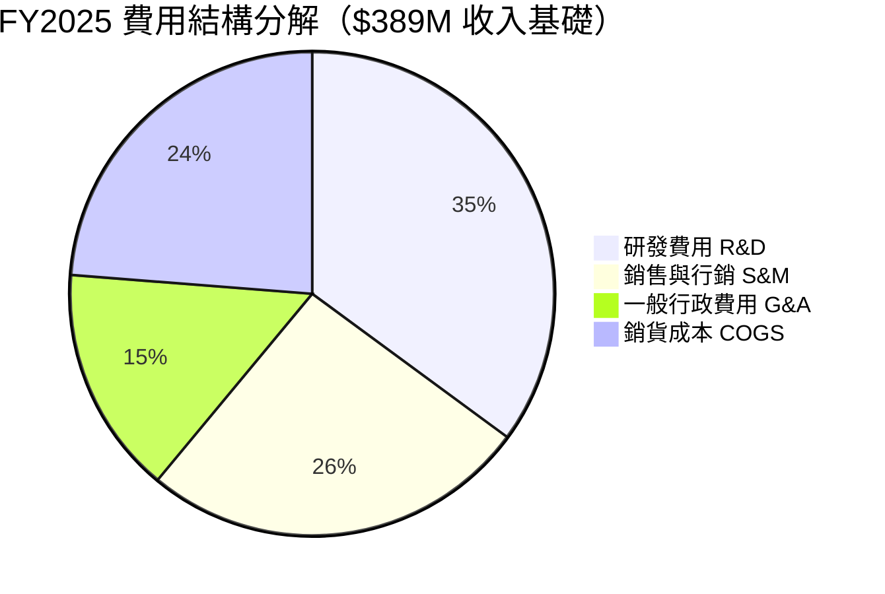

> ⚠️ **關鍵觀察**：R&D 佔收入 58.2%，顯示公司仍處於重投資期；銷售費用偏高反映獲客成本昂貴，這是 B2B 企業 AI 的典型挑戰。

---

### 📊 毛利率趨勢評估

**毛利率走勢** ★★☆☆☆
```
FY2022  74.8%  ▓▓▓▓▓▓▓▓▓▓▓▓▓▓▓▓▓▓▓░  優秀
FY2023  67.7%  ▓▓▓▓▓▓▓▓▓▓▓▓▓▓▓▓▓░░░  下滑
FY2024  57.5%  ▓▓▓▓▓▓▓▓▓▓▓▓▓▓░░░░░░  警告
FY2025  60.6%  ▓▓▓▓▓▓▓▓▓▓▓▓▓▓▓░░░░░  微回升
TTM     51.8%  ▓▓▓▓▓▓▓▓▓▓▓▓░░░░░░░░  🔴再度惡化
SaaS業  70-80%  業界標竿
```

---

## 4. 資產負債表分析

### 🏦 資產結構分解圖

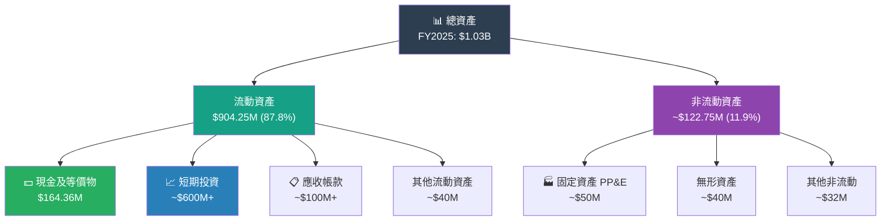

---

### 📊 資產配置 — 橫條圖

```
FY2025 資產配置（佔總資產 $1.03B）

流動資產     ▓▓▓▓▓▓▓▓▓▓▓▓▓▓▓▓▓▓▓▓▓▓▓▓▓▓▓▓▓░  87.8%  $904.25M
  現金       ▓▓▓▓▓░░░░░░░░░░░░░░░░░░░░░░░░░  15.9%  $164.36M
  投資*      ▓▓▓▓▓▓▓▓▓▓▓▓▓▓▓▓▓▓▓░░░░░░░░░░  ~58%   ~$600M
  應收帳款   ▓▓▓▓░░░░░░░░░░░░░░░░░░░░░░░░░░  ~10%   ~$100M

非流動資產   ▓▓▓░░░░░░░░░░░░░░░░░░░░░░░░░░░  11.9%  $122.75M
負債合計     ▓▓▓▓░░░░░░░░░░░░░░░░░░░░░░░░░░  18.2%  $187.58M
股東權益     ▓▓▓▓▓▓▓▓▓▓▓▓▓▓▓▓▓▓▓▓▓▓▓▓░░░░░  81.3%  $838.30M

* 短期投資為估算值（現金 + 投資組合）
```

---

### 📋 負債與流動性指標

| 指標 | FY2022 | FY2023 | FY2024 | FY2025 | 當前(TTM) | 評估 |
|------|--------|--------|--------|--------|-----------|------|
| **流動比率** | 7.07 | 6.53 | 8.84 | 6.86 | 6.47 | 🟢 極佳 |
| **總負債** | $3.61M | $2.34M | $3.23M | $4.79M | $61.48M | 🟡 微增 |
| **負債/權益** | 0.4% | 0.3% | 0.4% | 0.6% | 7.96% | 🟢 低槓桿 |
| **現金部位** | $339.53M | $284.83M | $167.15M | $164.36M | $675.03M* | 🟢 |
| **總負債/資產** | 15.5% | 15.7% | 15.9% | 18.2% | — | 🟢 |

> * TTM現金$675M大幅高於FY2025的$164M，推測公司進行了股本融資或清算短期投資

---

### 📉 股東權益趨勢 — ASCII 圖

```
股東權益趨勢（百萬美元）

$1,100M ┤
$1,000M ┤ ████ $989.48M  ← FY2022 峰值
  $929M ┤          ████ $929.66M
  $873M ┤                    ████ $873.35M
  $838M ┤                              ████ $838.30M
  $750M ┤
  $700M ┤
        └──────────────────────────────────────
          FY2022    FY2023    FY2024    FY2025

📉 四年累計侵蝕：-$151.18M（-15.3%）
⚠️ 主因：持續淨虧損侵蝕保留盈餘
💡 股本融資緩解了更快速的侵蝕
```

---

## 5. 現金流量分析

### 💧 現金流瀑布圖

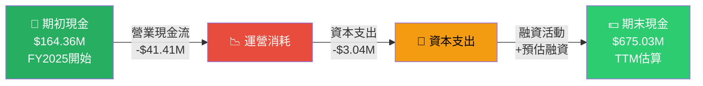

---

### 📊 自由現金流趨勢 — 進度條視覺化

**自由現金流改善軌跡** ★★★☆☆（改善中但仍為負）
```
FCF 趨勢（百萬美元，負值表示現金消耗）

FY2022  -$90.75M   🔴 ████████████████████░░░░░░░░░
FY2023 -$187.21M   🔴 ████████████████████████████████████████  ← 最差
FY2024  -$90.37M   🟡 ████████████████████░░░░░░░░░  大幅改善
FY2025  -$44.45M   🟡 █████████░░░░░░░░░░░░░░░░░░░  持續改善
TTM    +$29.81M   🟢 ░░░░░░░░░░░░░░░░░░░░░░░░░░░░  轉正！

改善幅度：FY2023→TTM：改善 +$217M
💡 TTM FCF轉正主因：資本支出大幅削減（$71M→$3M）
```

---

### 🔄 資本配置策略分析

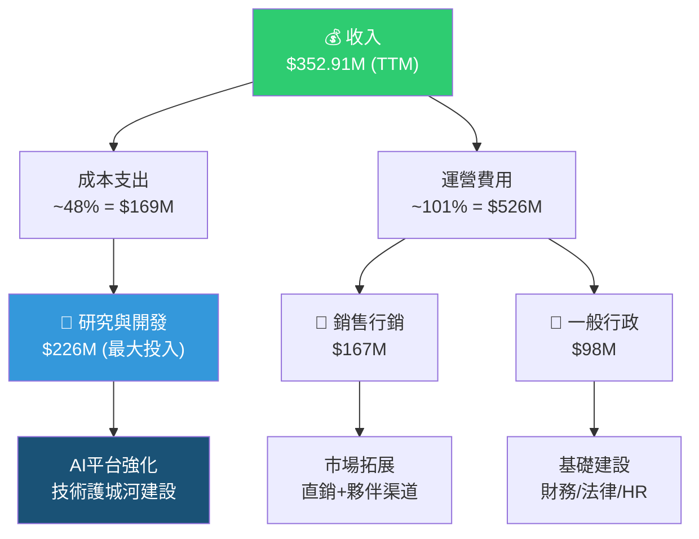

---

### 📋 現金流量四年對比

| 項目 | FY2022 | FY2023 | FY2024 | FY2025 | TTM | 評估 |
|------|--------|--------|--------|--------|-----|------|
| **營業現金流** | -$86.46M | -$115.69M | -$62.36M | -$41.41M | -$90.79M | 🟡改善後反彈 |
| **資本支出** | -$4.29M | -$71.52M | -$28.01M | -$3.04M | -$0.5M* | 🟢大幅縮減 |
| **自由現金流** | -$90.75M | -$187.21M | -$90.37M | -$44.45M | +$29.81M | 🟢首次轉正 |
| **FCF利潤率** | -35.9% | -70.2% | -29.1% | -11.4% | +8.5% | 🟢改善 |

> * TTM資本支出數據基於趨勢估算，FCF轉正主要得益於支出削減而非收入成長

---

## 6. 獲利能力指標

### 📊 獲利能力儀表板

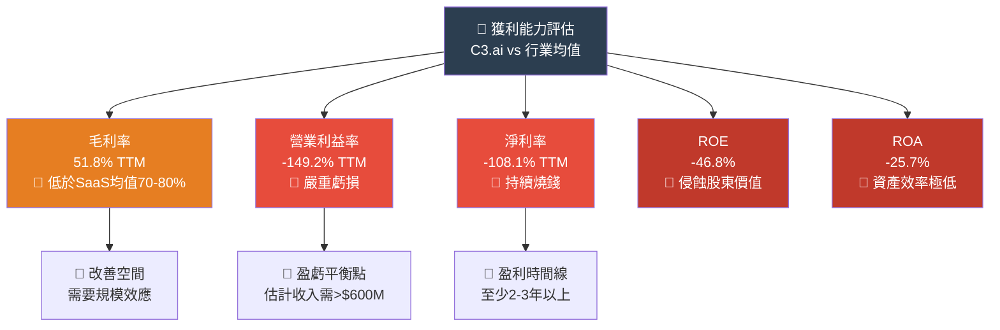

---

### 📋 ROE/ROA/ROIC 對比表格

| 指標 | C3.ai (TTM) | SaaS 行業均值 | 優秀標竿 | 差距 | 評級 |
|------|------------|--------------|---------|------|------|
| **毛利率** | 51.8% | 70-80% | >80% | -18~28% | 🔴 |
| **營業利益率** | -149.2% | -10~+30% | >30% | -179% | 🔴 |
| **淨利率** | -108.1% | -5~+25% | >25% | -133% | 🔴 |
| **ROE** | -46.8% | 15~35% | >40% | -62% | 🔴 |
| **ROA** | -25.7% | 5~15% | >20% | -31% | 🔴 |
| **ROIC** | 負值 | 10~20% | >25% | N/M | 🔴 |
| **流動比率** | 6.47x | 1.5~3x | >2x | +超標 | 🟢 |
| **負債/權益** | 7.96% | 30~60% | <30% | 優於標竿 | 🟢 |

---

### 📈 獲利能力評分

```
獲利能力六維評分

毛利率     ▓▓▓▓▓▓▓░░░░░░░░░░░░░  35%  ★★☆☆☆
規模效應   ▓▓░░░░░░░░░░░░░░░░░░░  10%  ★☆☆☆☆
運營效率   ░░░░░░░░░░░░░░░░░░░░░   0%  ☆☆☆☆☆
資本效率   ▓░░░░░░░░░░░░░░░░░░░░   5%  ☆☆☆☆☆
現金管理   ▓▓▓▓▓▓▓▓▓▓▓▓▓▓░░░░░░  70%  ★★★★☆
財務槓桿   ▓▓▓▓▓▓▓▓▓▓▓▓▓▓▓▓▓▓░░  90%  ★★★★★
```

> **綜合獲利能力評分**：★★☆☆☆（2/5）
> 核心問題：SaaS業務成本結構未達規模效應，每賺1元收入需燒掉超過2元費用

---

## 7. 估值分析

### 📊 估值指標結構圖

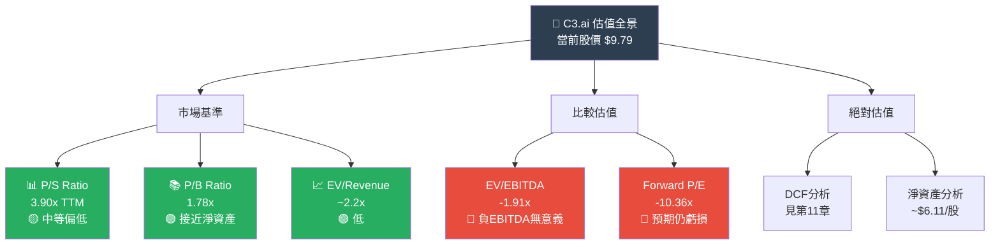

---

### 📋 估值倍數對比表格

| 估值指標 | C3.ai | Palantir | Salesforce | 行業中位數 | 評估 |
|---------|-------|---------|-----------|----------|------|
| **P/E (TTM)** | N/A（虧損） | ~180x | ~32x | ~35x | 🔴 無法比較 |
| **Forward P/E** | -10.4x（虧損） | ~150x | ~28x | ~30x | 🔴 |
| **P/S Ratio** | 3.9x | ~42x | ~7x | ~8x | 🟢 相對便宜 |
| **P/B Ratio** | 1.78x | ~22x | ~5x | ~6x | 🟢 折價 |
| **EV/EBITDA** | 負值 | ~250x | ~22x | ~25x | 🔴 無意義 |
| **EV/Revenue** | ~2.2x | ~38x | ~6x | ~7x | 🟢 極低 |
| **市值/現金** | 2.04x | N/A | N/A | — | 🟢 現金豐富 |

---

### 🎯 情境目標股價分析

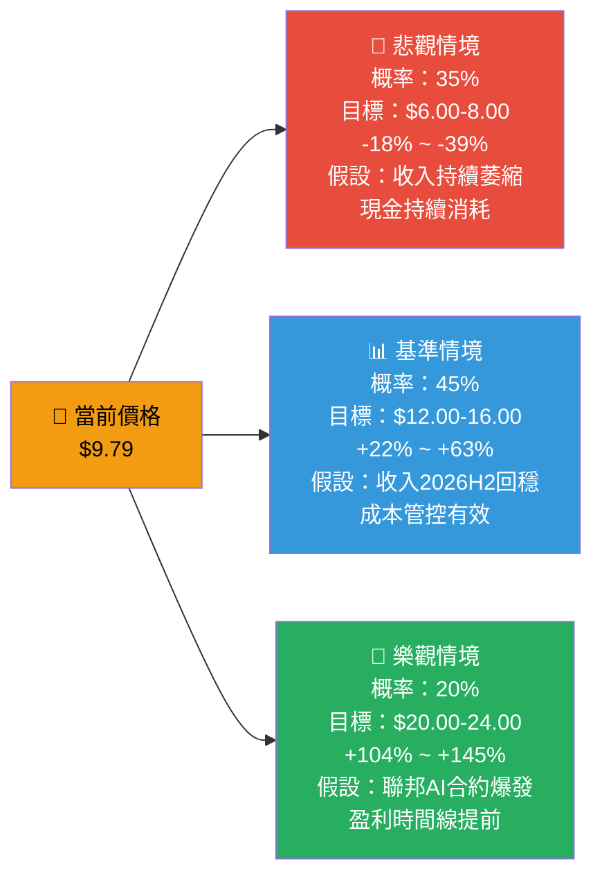

---

### 📊 分析師目標價分佈

```
分析師目標價分佈（12位分析師）

$24.00  ▲ 最高目標（樂觀）
  |
$20.00  ████  少數分析師
  |
$16.00  ████████  部分分析師
  |
$14.12  ████████████  ← 均值目標（+44.2%上漲空間）
  |
$12.00  ████████████████
  |
$10.00  ████████
  |
 $9.79  ═══════ 當前股價
  |
 $8.00  ▼ 最低目標（悲觀）

建議分佈：持有(Hold) - 12位分析師共識
```

---

## 8. 競爭護城河

### 🏰 Porter's 五力分析

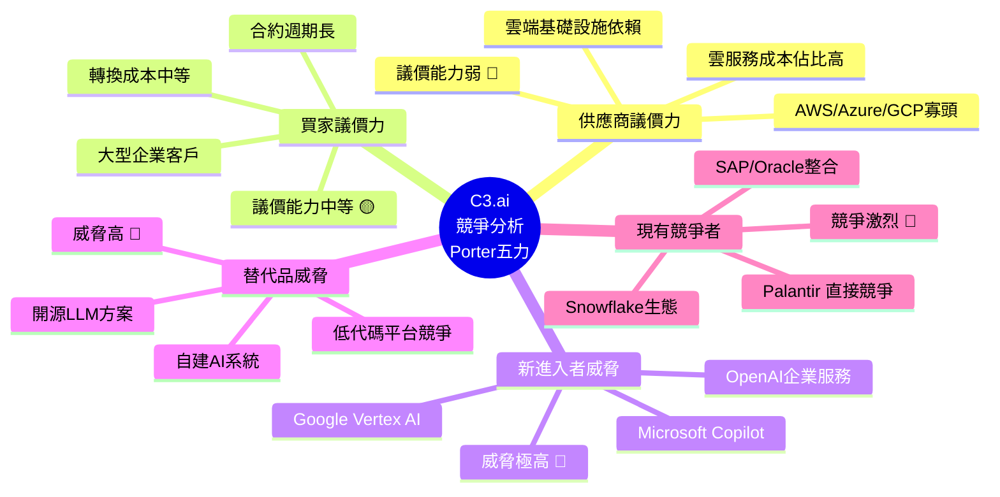

---

### 🛡️ 護城河評分

```
競爭護城河評分（10分制）

技術差異化    ▓▓▓▓▓▓░░░░  6/10  ★★★☆☆
品牌認知度    ▓▓▓▓▓░░░░░  5/10  ★★★☆☆
客戶黏著度    ▓▓▓▓▓▓░░░░  6/10  ★★★☆☆
合規/認證護城  ▓▓▓▓▓▓▓░░░  7/10  ★★★★☆  ← 聯邦認證是亮點
網絡效應      ▓▓▓░░░░░░░  3/10  ★★☆☆☆
成本優勢      ▓▓░░░░░░░░  2/10  ★☆☆☆☆
規模經濟      ▓▓▓░░░░░░░  3/10  ★★☆☆☆
生態系統深度  ▓▓▓▓░░░░░░  4/10  ★★☆☆☆

綜合護城河    ▓▓▓▓▓░░░░░  4.5/10  ★★☆☆☆
```

---

### 📊 競爭定位矩陣

| 公司 | 技術深度 | 市場規模 | 盈利能力 | 成長速度 | 企業聚焦 | 總評 |
|------|---------|---------|---------|---------|---------|------|
| **C3.ai** | 🟡 中 | 🔴 小 | 🔴 負 | 🔴 衰退 | 🟢 強 | ⚠️ |
| **Palantir** | 🟢 強 | 🟡 中 | 🟡 轉正 | 🟢 成長 | 🟢 強 | ✅ |
| **Salesforce AI** | 🟡 中 | 🟢 大 | 🟢 盈利 | 🟡 穩健 | 🟢 強 | ✅ |
| **Microsoft Azure AI** | 🟢 領先 | 🟢 超大 | 🟢 強盈利 | 🟢 快速 | 🟢 強 | ✅✅ |
| **ServiceNow AI** | 🟡 中上 | 🟢 大 | 🟢 盈利 | 🟢 成長 | 🟢 強 | ✅ |

> ⚠️ **結論**：C3.ai 在企業AI垂直領域有技術積累，但面對科技巨頭進入AI賽道的強勁競爭，差異化優勢正在縮窄。

---

## 9. 成長催化劑

### 📅 催化劑時間軸

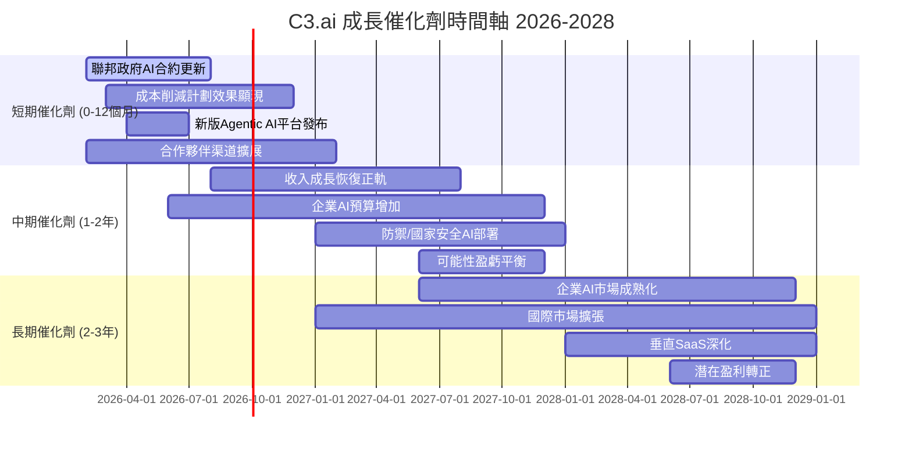

---

### 🚀 短中長期機會分析

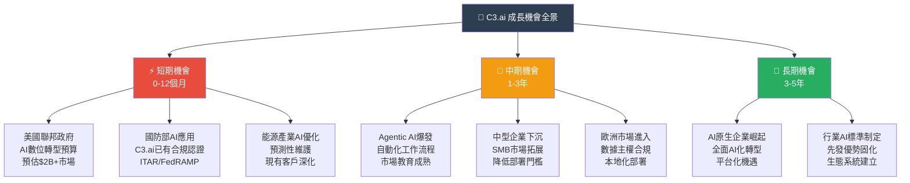

---

### 🌍 TAM 市場規模估算

```
企業AI市場規模預測

2024年 TAM  ▓▓▓▓▓▓▓▓▓▓░░░░░░░░░░░░░░░░░░░░  $200B
2025年 TAM  ▓▓▓▓▓▓▓▓▓▓▓▓▓▓░░░░░░░░░░░░░░░░  $295B
2026年 TAM  ▓▓▓▓▓▓▓▓▓▓▓▓▓▓▓▓▓▓░░░░░░░░░░░░  $400B  ← 當前
2027年 TAM  ▓▓▓▓▓▓▓▓▓▓▓▓▓▓▓▓▓▓▓▓▓▓░░░░░░░░  $550B
2028年 TAM  ▓▓▓▓▓▓▓▓▓▓▓▓▓▓▓▓▓▓▓▓▓▓▓▓▓▓░░░░  $750B
2030年 TAM  ▓▓▓▓▓▓▓▓▓▓▓▓▓▓▓▓▓▓▓▓▓▓▓▓▓▓▓▓▓▓  $1.8T

C3.ai 當前市場份額：~$353M / $400B = 0.088%  ← 極低，理論空間巨大

聯邦政府AI子市場（C3.ai 優勢市場）：
2026年  ████████████████████  $30B
2028年  ████████████████████████████  $65B
C3.ai 潛在份額：2-5% = $0.6B-$3.25B
```

---

## 10. 風險分析

### ⚠️ 風險矩陣

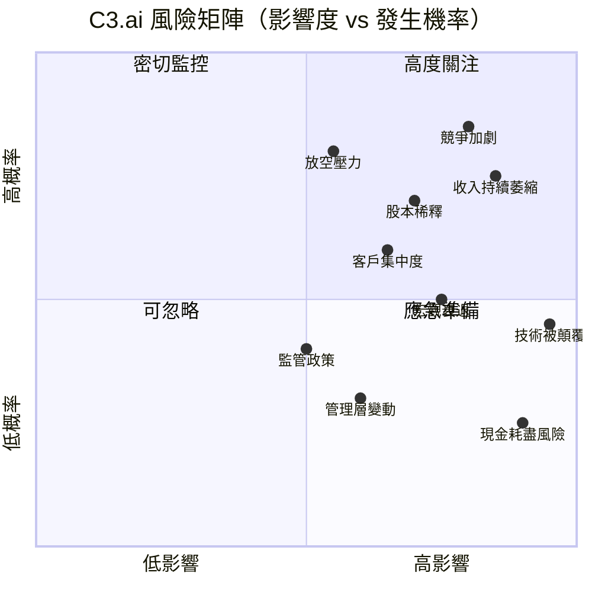

---

### 📋 風險評分卡

| 風險類型 | 發生機率 | 影響度 | 風險分數 | 當前狀態 | 緩解措施 |
|---------|---------|--------|---------|---------|---------|
| 🔴 **收入持續萎縮** | 75% | 極高 | **9.5/10** | 🔴 活躍 | 產品重組、渠道多元化 |
| 🔴 **競爭格局惡化** | 85% | 高 | **9.0/10** | 🔴 活躍 | 差異化、聚焦垂直市場 |
| 🔴 **股本持續稀釋** | 70% | 中高 | **7.5/10** | 🔴 活躍 | 控制燒錢速度 |
| 🟡 **客戶集中度風險** | 60% | 中 | **6.5/10** | 🟡 監控 | 拓展客戶基礎 |
| 🟡 **技術被顛覆** | 45% | 極高 | **7.0/10** | 🟡 監控 | 持續R&D投入 |
| 🟡 **宏觀經濟衰退** | 50% | 中高 | **6.5/10** | 🟡 監控 | 政府合約穩定性 |
| 🟡 **管理層人才流失** | 30% | 中 | **4.5/10** | 🟡 低活躍 | 股權激勵計劃 |
| 🟢 **現金耗盡** | 15% | 極高 | **4.0/10** | 🟢 低風險 | 現金儲備$675M |
| 🟢 **監管政策** | 40% | 低中 | **3.5/10** | 🟢 低活躍 | 合規體系建設 |

---

### 🛡️ 緩解措施詳述

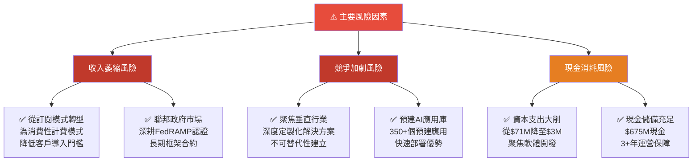

---

## 11. 公平價值估算

### 💰 DCF 模型框架

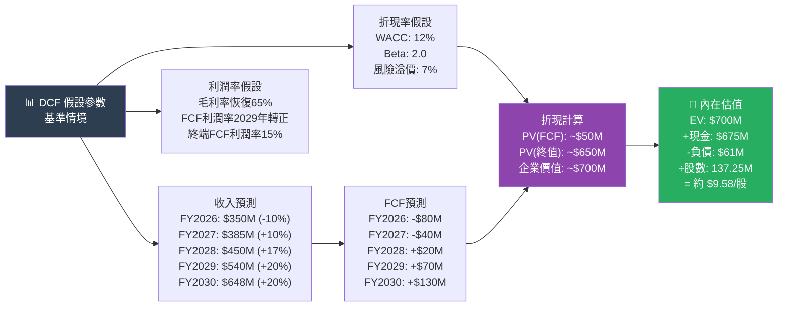

---

### 📊 三種估值法比較

| 估值方法 | 估值區間 | 核心假設 | 可信度 | 評估 |
|---------|---------|---------|--------|------|
| **DCF（基準）** | $8.50-$12.00 | FY2029 FCF轉正，WACC 12% | ★★★☆☆ | 🟡 接近當前價 |
| **P/S 比較法** | $7.00-$14.00 | 行業P/S 2-4x，收入回升至$380M | ★★★☆☆ | 🟡 寬幅 |
| **P/B 淨資產法** | $6.11-$9.00 | 股東權益$838M，P/B 1.0-1.1x | ★★★★☆ | 🔴 下行風險 |
| **EV/Revenue** | $11.00-$18.00 | EV/Rev 2-3x，現金補充 | ★★★☆☆ | 🟡 偏樂觀 |
| **分析師共識** | $8.00-$24.00 | 中位數~$14 | ★★★☆☆ | 🟡 持有 |
| **現金支撐底價** | ~$4.92 | 現金$675M/137.25M股 | ★★★★★ | 🟢 強支撐 |

---

### 📈 估值區間視覺化

```
公平估值區間視覺化（每股美元）

$0   $5   $10  $15  $20  $25  $30
|    |    |    |    |    |    |
██████████░░░░░░░░░░░░░░░░░░░░░  現金底價支撐  $4.92
           ◆  當前股價  $9.79
░░░░░░████████████░░░░░░░░░░░░  DCF基準估值  $8.50-$12.00
░░░░░░░░░████████████████░░░░░  EV/Rev估值  $11.00-$18.00
░░░░░░░████████████████░░░░░░░  P/S比較估值  $7.00-$14.00
░░░░░░░░░░░░░░░░████████████░░  分析師高端   $14.12-$24.00

估值共識中位數：約 $10.50-$13.00
當前股價 $9.79 位於估值區間偏低端

🟢 支撐位：$9.53（52週低點），$4.92（現金底）
🔴 阻力位：$12-14（分析師均值），$16-18（樂觀預期）
```

---

## 12. 投資建議

### 🎯 最終評級

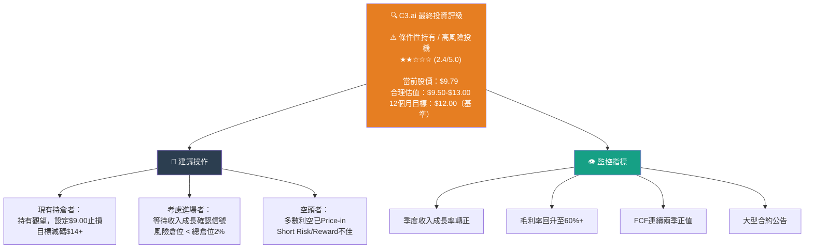

---

### 👥 投資人適配度

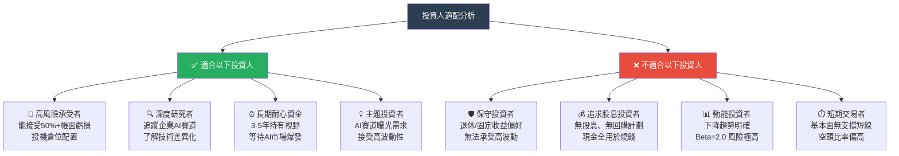

---

### ✅ 監控指標 Checklist

**🟢 正面信號（觸發加碼條件）**

```
□ 季度收入 QoQ 成長連續兩季回正
□ 毛利率回升並穩定在 60% 以上
□ FCF 連續兩個季度保持正值
□ 大型政府/企業合約公告（$50M+）
□ 研發費用/收入比降至 50% 以下
□ 管理層給出明確盈利時間表
□ 技術合作夥伴關係重大進展
□ Agentic AI 平台獲得重要產業認可
```

**🔴 負面信號（觸發減碼/出場條件）**

```
□ 連續三季收入持續下滑
□ 現金儲備跌破 $400M（加速消耗）
□ 毛利率跌破 45%
□ 大型客戶流失或合約不續簽
□ 放空比率持續升高超過 10 天
□ 管理層關鍵人物離職
□ 競爭對手推出更低成本替代方案
□ 股價跌破 $7.00（淨資產底部支撐）
```

**🟡 中性觀察指標**

```
□ 季度員工人數變化（縮減 = 成本控制 or 業務萎縮）
□ 新客戶 vs 擴展收入比例
□ 美國聯邦政府AI預算政策動向
□ 企業AI市場整體支出趨勢
□ 競爭對手 Palantir/ServiceNow 業績指引
```

---

### 📊 最終綜合評分卡

| 維度 | 分數 | 評星 | 關鍵理由 |
|------|------|------|---------|
| **業務模式** | 5.5/10 | ★★★☆☆ | 企業AI定位正確，執行力存疑 |
| **財務健康** | 5.0/10 | ★★★☆☆ | 現金充裕抵消持續虧損 |
| **成長展望** | 3.5/10 | ★★☆☆☆ | 當前收入萎縮，TAM龐大 |
| **競爭地位** | 4.0/10 | ★★☆☆☆ | 先發優勢被科技巨頭蠶食 |
| **估值吸引力** | 5.5/10 | ★★★☆☆ | P/S低，P/B接近帳面，下行有限 |
| **管理品質** | 5.0/10 | ★★★☆☆ | Siebel 經驗豐富，但轉型效果待驗證 |
| **風險控制** | 4.0/10 | ★★☆☆☆ | 多重風險並存，緩解措施有限 |
| **催化劑強度** | 4.5/10 | ★★☆☆☆ | AI大趨勢利好，但短期落地不確定 |
| **🎯 加權總分** | **4.6/10** | **★★☆☆☆** | **條件性持有，高風險投機** |

---

```
╔══════════════════════════════════════════════════════════════╗
║           C3.ai (AI) 投資建議總結                            ║
╠══════════════════════════════════════════════════════════════╣
║  評級：⚠️  條件性持有（Conditional Hold）                   ║
║  當前價：$9.79   目標價：$12.00（12個月基準）               ║
║  潛在回報：+22.6%（基準）/ +145%（樂觀）/ -39%（悲觀）      ║
║                                                              ║
║  核心論點：                                                  ║
║  ✅ 現金$675M提供充足安全墊，破產風險極低                   ║
║  ✅ P/S 3.9x、EV/Rev ~2.2x，相對企業AI同業偏低             ║
║  ✅ FCF首次轉正，成本管控顯現成效                           ║
║  ❌ 收入 TTM YoY -20.3%，基本面惡化信號明確                 ║
║  ❌ 持續4年累計虧損超$10億，盈利路徑不清晰                  ║
║  ❌ Beta=2.0，股價從$30跌至$9.79，動能極度悲觀              ║
║                                                              ║
║  建議倉位：總組合 1-2%（高風險投機配置）                    ║
║  止損建議：$8.50（技術面支撐破位）                          ║
╚══════════════════════════════════════════════════════════════╝
```

---

> ## ⚠️ 免責聲明
> 
> **本報告為 AI 自動生成之研究分析，僅供學術研究與參考用途，不構成任何形式之投資建議。** 所有財務數據來源於 Yahoo Finance（截至 2026-02-24），分析結論基於公開資訊推導，不保證數據準確性與完整性。投資涉及風險，股票價格可能大幅波動，過去業績不代表未來表現。讀者應自行進行獨立研究，並在做出任何投資決策前諮詢持牌財務顧問。本分析師及報告生成機構不對因使用本報告所產生之任何損失承擔責任。
>
> *報告生成時間：2026-02-24 ｜ 分析框架：基本面深度分析 v3.0 ｜ 數據提供：Yahoo Finance*