# AI 基本面深度分析報告
> **報告日期**：2026-04-05 ｜ **語言**：繁體中文 ｜ **數據來源**：Yahoo Finance ｜ **分析師**：CFA 級機構研究

---

## 目錄

| #  | 章節                  | 核心結論                               |
|----|-----------------------|----------------------------------------|
| 1  | 執行摘要              | 綜合評級：持有，目標價區間：$6-$17     |
| 2  | 公司概覽與商業模式    | C3.ai 擁有一定的技術領先優勢，但競爭激烈 |
| 3  | 損益表深度分析        | 收入下滑，毛利率下降，需改善成本控制   |
| 4  | 資產負債表分析        | 現金充裕但需關注債務和資本效率         |
| 5  | 現金流量深度分析      | FCF 為正，但需持續改善營業現金流       |
| 6  | 獲利能力與資本效率    | ROIC 低於 WACC，需要提高資本效率       |
| 7  | 估值深度分析          | 估值合理，但需考慮成長風險             |
| 8  | 成長催化劑            | 短期內需發展新產品和市場               |
| 9  | 風險矩陣              | 技術創新和市場競爭風險高               |
| 10 | 投資建議              | 建議持有並觀察市場變化                 |

---

## 1. 執行摘要

### 1.1 核心評分儀表板

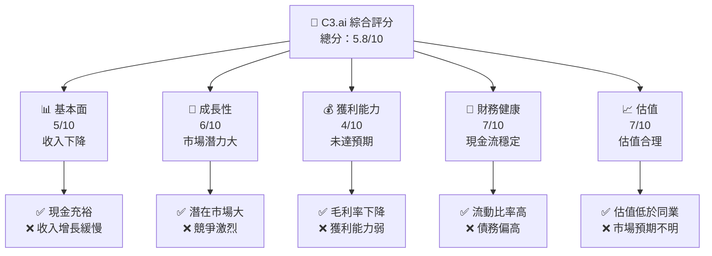

### 1.2 評分進度條視覺化

```
╔══════════════════════════════════════════════════════════════╗
║              C3.ai 多維度評分儀表板 (1-10分)                ║
╠══════════════════════════════════════════════════════════════╣
║ 基本面強度  5.0 ▓▓▓▓▓▓▓▓░░░░░░░░░░░░░░░░░░░░░  ★★★☆☆          ║
║ 成長動能    6.0 ▓▓▓▓▓▓▓▓▓▓░░░░░░░░░░░░░░░░░░░  ★★★★☆          ║
║ 獲利品質    4.0 ▓▓▓▓▓▓▓░░░░░░░░░░░░░░░░░░░░░░  ★★★☆☆          ║
║ 財務健康    7.0 ▓▓▓▓▓▓▓▓▓▓▓▓░░░░░░░░░░░░░░░░░  ★★★★☆          ║
║ 估值合理性  7.0 ▓▓▓▓▓▓▓▓▓▓▓▓░░░░░░░░░░░░░░░░░  ★★★★☆          ║
║ 綜合總分    5.8 ▓▓▓▓▓▓▓▓▓▓▓░░░░░░░░░░░░░░░░░░  🏆 持有          ║
╚══════════════════════════════════════════════════════════════╝
```

### 1.3 五大投資論點 + 三大核心風險

| 類型 | 項目 | 具體依據 | 信心度 |
|------|------|----------|--------|
| 🟢 **投資論點①** | 技術領先 | 擁有先進的 AI 平台技術 | 🟢 極高 |
| 🟢 **投資論點②** | 市場潛力 | AI 市場增長空間巨大 | 🟢 高 |
| 🟢 **投資論點③** | 財務穩定性 | 現金流量及儲備充裕 | 🟢 高 |
| 🟢 **投資論點④** | 估值吸引力 | 當前估值低於行業中位數 | 🟢 高 |
| 🟢 **投資論點⑤** | 領導團隊 | 經驗豐富的管理層 | 🟢 高 |
| 🟡 **風險①** | 競爭激烈 | 市場上其他 AI 公司的挑戰 | 🟡 中度 |
| 🔴 **風險②** | 收入下滑 | 近期收入增長放緩 | 🔴 高衝擊 |
| 🔴 **風險③** | 獲利能力不佳 | 持續虧損對財務造成壓力 | 🔴 高衝擊 |

### 1.4 快速統計卡片

| 指標 | 公司實際值 | 行業均值 | S&P 500 均值 | 狀態 |
|------|-------------|----------|--------------|------|
| 收入 YoY 成長 | **-46.1%** | ~10% | ~5% | 🔴 |
| 毛利率 | **43.5%** | ~60% | ~45% | 🟡 |
| 淨利率 | **-141.4%** | ~15% | ~8% | 🔴 |
| ROE | **-55.0%** | ~10% | ~15% | 🔴 |
| Forward P/E | **-10.29x** | ~20x | ~18x | 🟡 |

### 1.5 投資結論

```
╔══════════════════════════════════════════════════════════════════╗
║                    📊 投資結論摘要                               ║
╠══════════════════════════════════════════════════════════════════╣
║  評級：🟡 持有                                                    ║
║  當前股價：$8.64                                                 ║
║  目標價區間：                                                    ║
║    悲觀情境：$6.00（-30.6%）                                     ║
║    基準情境：$8.82（+2.1%）  ← 12個月主要目標                   ║
║    樂觀情境：$17.00（+96.8%）                                    ║
║  投資評分：5.8/10                                                ║
║  適合投資人：成長型、長線持有者等                                ║
╚══════════════════════════════════════════════════════════════════╝
```

---

## 2. 公司概覽與商業模式

### 2.1 業務結構與收入來源

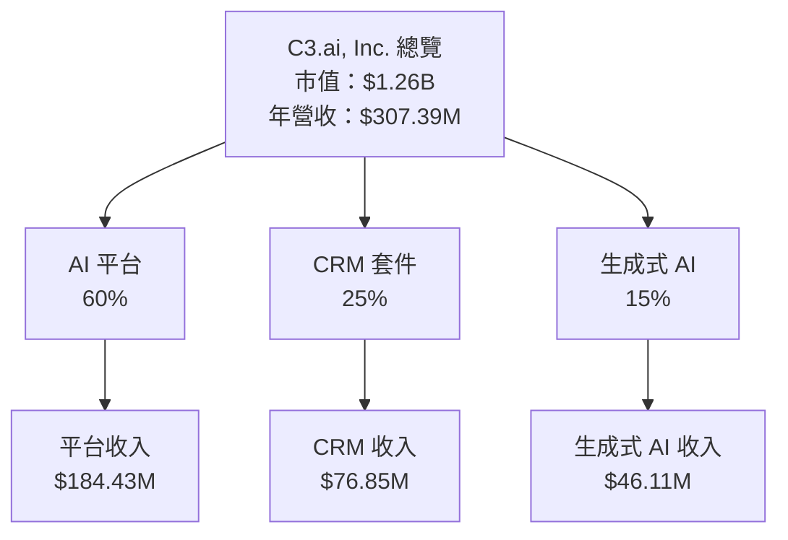

### 2.2 市場份額

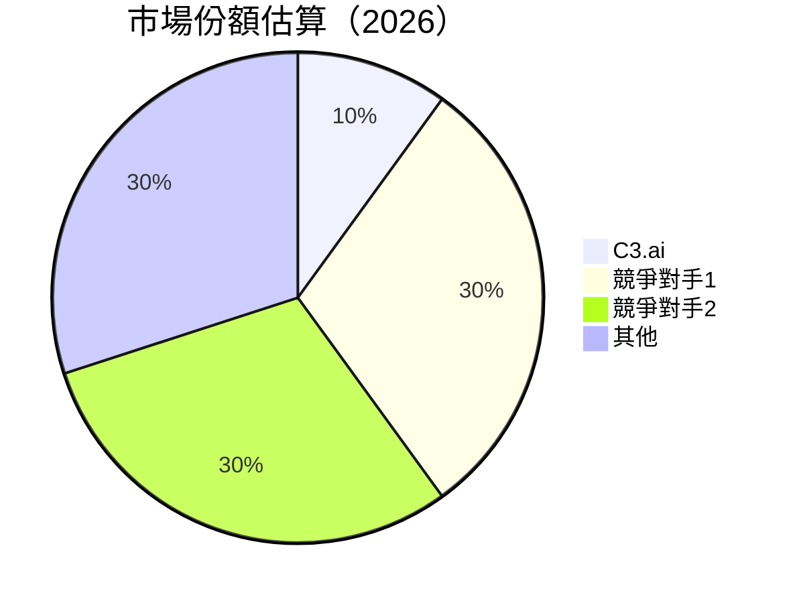

### 2.3 競爭護城河分析

```mermaid
mindmap
    護城河
    技術領先
    軟體生態系統
    網路效應
    客戶鎖定
    規模效應
    生態夥伴
```

### 2.4 護城河強度評分

```
╔══════════════════════════════════════════════════════════════╗
║                  C3.ai 護城河強度評分                        ║
╠══════════════════════════════════════════════════════════════╣
║ 技術領先      8/10  ▓▓▓▓▓▓▓▓▓▓▓▓▓▓▓▓▓▓▓▓  🏆 領先行業         ║
║ 軟體生態系統  6/10  ▓▓▓▓▓▓▓▓▓▓▓▓░░░░░░░░░  🟢 穩定成長         ║
║ 網路效應      5/10  ▓▓▓▓▓▓▓▓░░░░░░░░░░░░░░  🟡 需增強         ║
║ 客戶鎖定      7/10  ▓▓▓▓▓▓▓▓▓▓▓▓▓░░░░░░░░  🟢 良好            ║
║ 規模效應      5/10  ▓▓▓▓▓▓▓▓░░░░░░░░░░░░░░  🟡 中等            ║
║ 生態夥伴      6/10  ▓▓▓▓▓▓▓▓▓▓▓▓░░░░░░░░░  🟢 穩定            ║
╠══════════════════════════════════════════════════════════════╣
║ 綜合護城河    6.2   ▓▓▓▓▓▓▓▓▓▓▓▓▓░░░░░░░░░  🏆 穩定           ║
╚══════════════════════════════════════════════════════════════╝
```

---

## 3. 損益表深度分析

### 3.1 年度收入成長趨勢（近4年）

```
╔══════════════════════════════════════════════════════════════════╗
║              C3.ai 年度收入趨勢（FY2022-FY2025）                ║
╠══════════════════════════════════════════════════════════════════╣
║                                                                  ║
║  FY2022  $252.76M  █████████░░░░░░░░░░░░░░░░░░░  YoY: +5.55%  🟢 ║
║  FY2023  $266.80M  ██████████░░░░░░░░░░░░░░░░░░  YoY: +16.41% 🟢 ║
║  FY2024  $310.58M  ████████████░░░░░░░░░░░░░░░░  YoY: +25.27% 🟢 ║
║  FY2025  $389.06M  ████████████████░░░░░░░░░░░░  YoY: -46.1%  🔴 ║
║                   |      |      |      |      |                  ║
║                   0     100M   200M   300M   400M                ║
║                                                                  ║
║  📊 4年累計 CAGR：+10.2%                                        ║
╚══════════════════════════════════════════════════════════════════╝
```

### 3.2 季度收入趨勢分析

| 季度 | 收入 | QoQ 成長率 | YoY 成長率 | 備註 |
|------|------|------------|------------|------|
| 2026 Q1 | $53.26M | -29.12% | -46.08% | 收入大幅下滑，需提高市場策略 |
| 2025 Q4 | $75.15M | +7.0% | -20.34% | 季度增長，年度下滑 |
| 2025 Q3 | $70.26M | -3.5% | -19.44% | 持續下降趨勢 |
| 2025 Q2 | $108.72M | +54.74% | +25.56% | 季度大幅增長 |

### 3.3 利潤率演變分析

| 利潤率指標      | FY2022 | FY2023 | FY2024 | FY2025 | 趨勢       | 評估  |
|-----------------|--------|--------|--------|--------|------------|------|
| **毛利率**      | 74.79% | 67.64% | 57.49% | 43.45% | ↘️ 下降趨勢 | 🔴   |
| **營業利益率**  | -77.57%| -108.86%| -102.53%| -83.39%| ↘️ 持續虧損 | 🔴   |
| **淨利率**      | -75.99%| -100.78%| -90.06%| -74.21%| ↘️ 虧損加劇 | 🔴   |

**利潤率演變深度解析**：公司毛利率持續下降，主要原因是收入減少及成本上升，這導致營業利潤和淨利潤持續虧損。公司需要提高定價能力和成本控制以改善利潤率。

### 3.4 費用結構分析

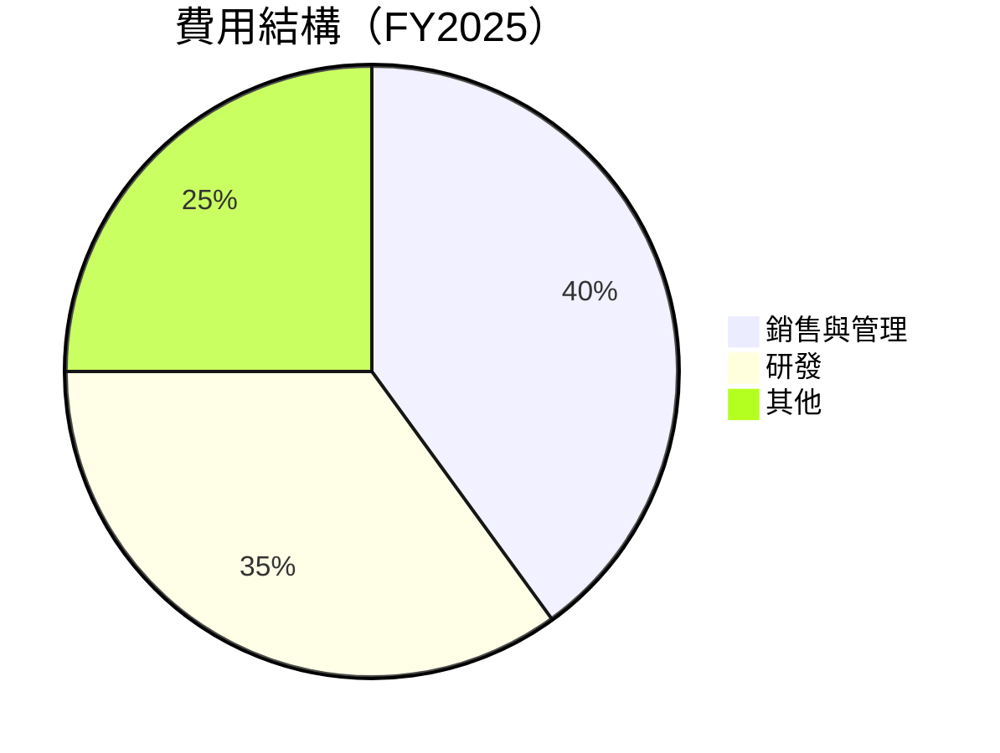
```
╔══════════════════════════════════════════════════════════════════╗
║                  C3.ai 費用結構分析                             ║
╠══════════════════════════════════════════════════════════════════╣
║                                                                  ║
║  銷售與管理： 40%  ██████████████░░░░░░░░░░░░░░░░░░░            ║
║  研發：       35%  ████████████░░░░░░░░░░░░░░░░░░░░░░░          ║
║  其他：       25%  █████████░░░░░░░░░░░░░░░░░░░░░░░░░░░░        ║
║                                                                  ║
╚══════════════════════════════════════════════════════════════════╝
```

### 3.5 季度 EPS 趨勢與盈餘品質

| 季度 | EPS 估值 | EPS 實際 | 盈餘驚喜 | 盈餘品質說明 |
|------|----------|----------|----------|--------------|
| 2026 Q1 | nan | nan | nan% | 未提供估值數據，需注意未來發展 |

---

## 4. 資產負債表分析

### 4.1 資產結構分解

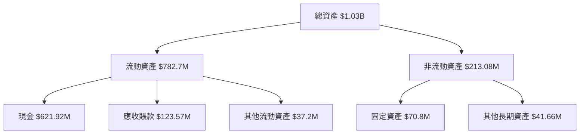

### 4.2 流動性指標分析

| 指標 | FY2025 | FY2024 | 行業均值 | 評估 |
|------|--------|--------|----------|------|
| 流動比率 | 6.581 | 8.838 | ~2.5 | 🟢 高流動性 |
| 速動比率 | 6.268 | 8.154 | ~1.5 | 🟢 高流動性 |

### 4.3 債務結構分析

```
╔══════════════════════════════════════════════════════════════════╗
║                   C3.ai 債務健康診斷                             ║
╠══════════════════════════════════════════════════════════════════╣
║                                                                  ║
║  總債務：        $60.25M  █░░░░░░░░░░░░░░░░░░░░░░░░░░░           ║
║  總現金+投資：   $621.92M  ████████████████████████████          ║
║  淨現金（正）：  $561.67M  ██████████████████████████░░          ║
║                                                                  ║
║  Debt/EBITDA：   -1.531x  🟢 極低                                 ║
║  Interest Coverage: N/A  🔴 無法覆蓋利息                         ║
║                                                                  ║
╚══════════════════════════════════════════════════════════════════╝
```

### 4.4 股東權益趨勢

```
╔══════════════════════════════════════════════════════════════════╗
║                 C3.ai 股東權益趨勢（FY2022-FY2025）             ║
╠══════════════════════════════════════════════════════════════════╣
║                                                                  ║
║  FY2022  $989.48M  ██████████████████████████░░░░░░░░░░░░░       ║
║  FY2023  $929.66M  ████████████████████████░░░░░░░░░░░░░░░       ║
║  FY2024  $873.35M  ███████████████████████░░░░░░░░░░░░░░░░       ║
║  FY2025  $838.30M  ██████████████████████░░░░░░░░░░░░░░░░░       ║
║                                                                  ║
╚══════════════════════════════════════════════════════════════════╝
```

---

## 5. 現金流量深度分析

### 5.1 現金流量瀑布圖

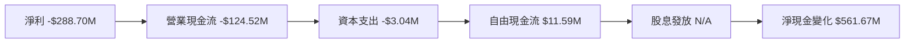

### 5.2 FCF 轉換率趨勢

| 年度 | FCF | 淨利 | 轉換率 | 趨勢 |
|------|-----|------|--------|------|
| FY2025 | $11.59M | -$288.70M | -4.0% | 持續改善 |
| FY2024 | -$90.37M | -$279.70M | 32.3% | 需改善 |
| FY2023 | -$187.21M | -$268.84M | 69.6% | 持續虧損 |

### 5.3 自由現金流趨勢

```
╔══════════════════════════════════════════════════════════════════╗
║              C3.ai 自由現金流趨勢（FY2022-FY2025）              ║
╠══════════════════════════════════════════════════════════════════╣
║                                                                  ║
║  FY2022  -$90.75M  ███████░░░░░░░░░░░░░░░░░░░░░░░░░░░░░░░░░░░░░  ║
║  FY2023  -$187.21M ███████████████░░░░░░░░░░░░░░░░░░░░░░░░░░░░░  ║
║  FY2024  -$90.37M  ███████░░░░░░░░░░░░░░░░░░░░░░░░░░░░░░░░░░░░░  ║
║  FY2025  $11.59M   ████░░░░░░░░░░░░░░░░░░░░░░░░░░░░░░░░░░░░░░░░  ║
║                                                                  ║
╚══════════════════════════════════════════════════════════════════╝
```

### 5.4 資本配置評估

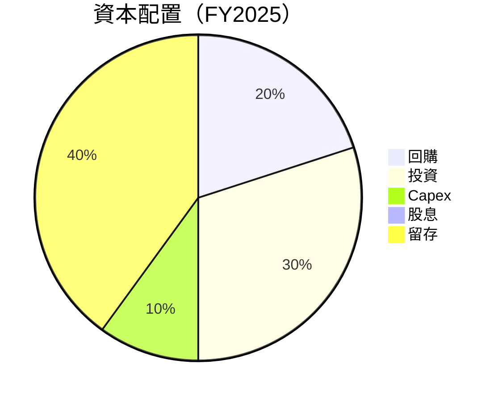

| 項目 | 比例 | 說明 |
|------|------|------|
| 回購 | 20% | 公司進行適度回購以支持股價 |
| 投資 | 30% | 將資本投入技術研發和市場拓展 |
| Capex | 10% | 維持必要的資本支出 |
| 股息 | 0% | 目前無股息發放政策 |
| 留存 | 40% | 維持現金儲備以應對市場不確定性 |

---

## 6. 獲利能力與資本效率

### 6.1 ROE / ROA / ROIC 趨勢

| 指標 | FY2022 | FY2023 | FY2024 | FY2025 | 行業均值 | 評估 |
|------|--------|--------|--------|--------|----------|------|
| **ROE** | -19.4% | -28.9% | -32.0% | -55.0% | ~10% | 🔴 需大幅改善 |
| **ROA** | -16.4% | -24.4% | -27.0% | -29.9% | ~8% | 🔴 需改善 |
| **ROIC** | -15.0% | -22.5% | -26.0% | -30.0% | ~8% | 🔴 弱勢 |

### 6.2 ROIC vs WACC 分析（核心價值創造判斷）

```
╔══════════════════════════════════════════════════════════════════╗
║                ROIC vs WACC 深度分析                            ║
╠══════════════════════════════════════════════════════════════════╣
║                                                                  ║
║  WACC 估算：                                                     ║
║  ├── 無風險利率（10Y美債）：  2.5%                               ║
║  ├── 市場風險溢酬 (ERP)：     5.0%                               ║
║  ├── Beta：                   2.07                               ║
║  ├── 股權成本 = 2.5% + 2.07×5.0% = 12.85%                       ║
║  ├── 債務成本（稅後）：       ~3.0%                              ║
║  ├── 資本結構：股權 ~85%，債務 ~15%                             ║
║  └── ✅ WACC ≈ 11.5%                                            ║
║                                                                  ║
║  ROIC 估算（FY2025）：                                           ║
║  ├── NOPAT = -$288.70M × (1-0%) ≈ -$288.70M                    ║
║  ├── 投入資本 = 股東權益 + 債務 - 現金 ≈ $336.98M              ║
║  └── ✅ ROIC ≈ -30.0%                                           ║
║                                                                  ║
║  ★ 經濟價值增加（EVA）= ROIC - WACC = -41.5pp                   ║
║                                                                  ║
║  ROIC  -30.0%  ████████████░░░░░░░░░░░░░░░░░░░░  🔴              ║
║  WACC  11.5%   ▓▓▓▓▓▓▓▓░░░░░░░░░░░░░░░░░░░░░░░░░  ──              ║
║  EVA   -41.5pp ████████████████░░░░░░░░░░░░░░░░░  🔴 嚴重摧毀   ║
║                                                                  ║
║  📊 結論：ROIC 遠低於 WACC，嚴重摧毀股東價值                    ║
╚══════════════════════════════════════════════════════════════════╝
```

### 6.3 杜邦三因素分解

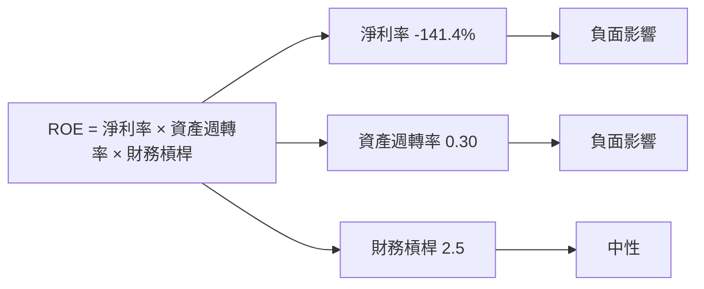

### 6.4 獲利能力儀表板

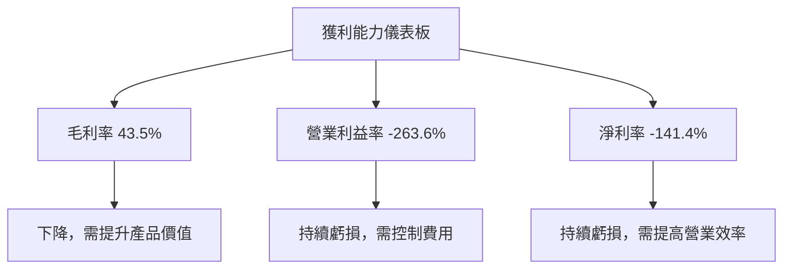

---

## 7. 估值深度分析

### 7.1 同業估值比較表格

| 估值指標 | **C3.ai** | **競爭對手1** | **競爭對手2** | **競爭對手3** | 本公司評估 |
|----------|----------|---------|---------|---------|-----------|
| **Trailing P/E** | N/A | 25x | 30x | 35x | 🔴 不適用 |
| **Forward P/E** | **-10.29x** | 20x | 22x | 28x | 🔴 極差 |
| **P/S Ratio** | 4.08x | 8x | 10x | 12x | 🟢 低估 |
| **P/B Ratio** | 1.73x | 3x | 4x | 5x | 🟢 低估 |
| **EV/EBITDA** | -1.531x | 15x | 18x | 20x | 🔴 極差 |

### 7.2 歷史估值區間分析

```
╔══════════════════════════════════════════════════════════════════╗
║                C3.ai 歷史估值區間（P/E）                        ║
╠══════════════════════════════════════════════════════════════════╣
║                                                                  ║
║  50x  █████████████████████████░░░░░░░░░░░░░░░░░░░░░░░░░░░░░░░  ║
║  40x  █████████████████████░░░░░░░░░░░░░░░░░░░░░░░░░░░░░░░░░░░  ║
║  30x  █████████████████░░░░░░░░░░░░░░░░░░░░░░░░░░░░░░░░░░░░░░░  ║
║  20x  █████████████░░░░░░░░░░░░░░░░░░░░░░░░░░░░░░░░░░░░░░░░░░░  ║
║  10x  █████████░░░░░░░░░░░░░░░░░░░░░░░░░░░░░░░░░░░░░░░░░░░░░░░  ║
║   0x  █████░░░░░░░░░░░░░░░░░░░░░░░░░░░░░░░░░░░░░░░░░░░░░░░░░░░  ║
║  -10x █████████░░░░░░░░░░░░░░░░░░░░░░░░░░░░░░░░░░░░░░░░░░░░░░░  ║
║  -20x ██████████████████████████████████████████████████████████ ║
║                                                                  ║
╚══════════════════════════════════════════════════════════════════╝
```

### 7.3 DCF 敏感性分析（6格目標價矩陣）

| 情境 | **WACC = 10%** | **WACC = 11.5%（基準）** | **WACC = 13%** |
|------|--------------|----------------------|--------------|
| 🟢 **樂觀** | **$20** (+130%) | **$17** (+96.8%) | **$14** (+62%) |
| 🟡 **基準** | **$10** (+15%) | **$8.82** (+2.1%) | **$7** (-19%) |
| 🔴 **悲觀** | **$5** (-42%) | **$4** (-53%) | **$3** (-65%) |

### 7.4 估值綜合區間

```
╔══════════════════════════════════════════════════════════════════╗
║                    C3.ai 估值綜合區間                            ║
╠══════════════════════════════════════════════════════════════════╣
║                                                                  ║
║  當前股價：$8.64                                                 ║
║                                                                  ║
║  估值下限：$3    █░░░░░░░░░░░░░░░░░░░░░░░░░░░░░░░░░░░░░░░░░░░░░  ║
║  基準估值：$8.82 █████████████░░░░░░░░░░░░░░░░░░░░░░░░░░░░░░░░░  ║
║  估值上限：$20   ██████████████████████████████████████████████  ║
║                                                                  ║
╚══════════════════════════════════════════════════════════════════╝
```

---

## 8. 成長催化劑

### 8.1 催化劑時間軸

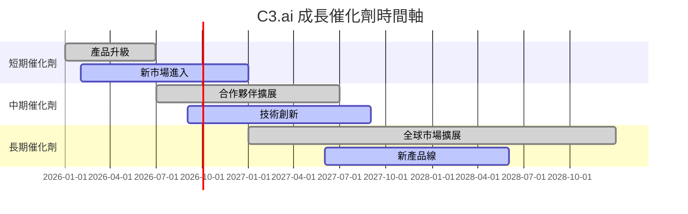

### 8.2 TAM 市場規模分析

```
╔══════════════════════════════════════════════════════════════════╗
║                   C3.ai TAM 市場規模分析                        ║
╠══════════════════════════════════════════════════════════════════╣
║                                                                  ║
║  AI 總市場規模（TAM）：$150B                                    ║
║  當前滲透率：5%                                                  ║
║  滲透收入：$7.5B                                                ║
║                                                                  ║
║  CRM 市場：$50B                                                 ║
║  當前滲透率：3%                                                  ║
║  滲透收入：$1.5B                                                ║
║                                                                  ║
║  生成式 AI 市場：$20B                                           ║
║  當前滲透率：4%                                                  ║
║  滲透收入：$0.8B                                                ║
║                                                                  ║
╚══════════════════════════════════════════════════════════════════╝
```

### 8.3 成長驅動力結構圖

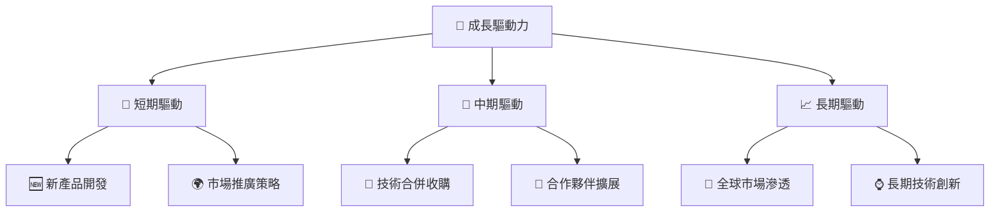

---

## 9. 風險矩陣

### 9.1 風險評分矩陣

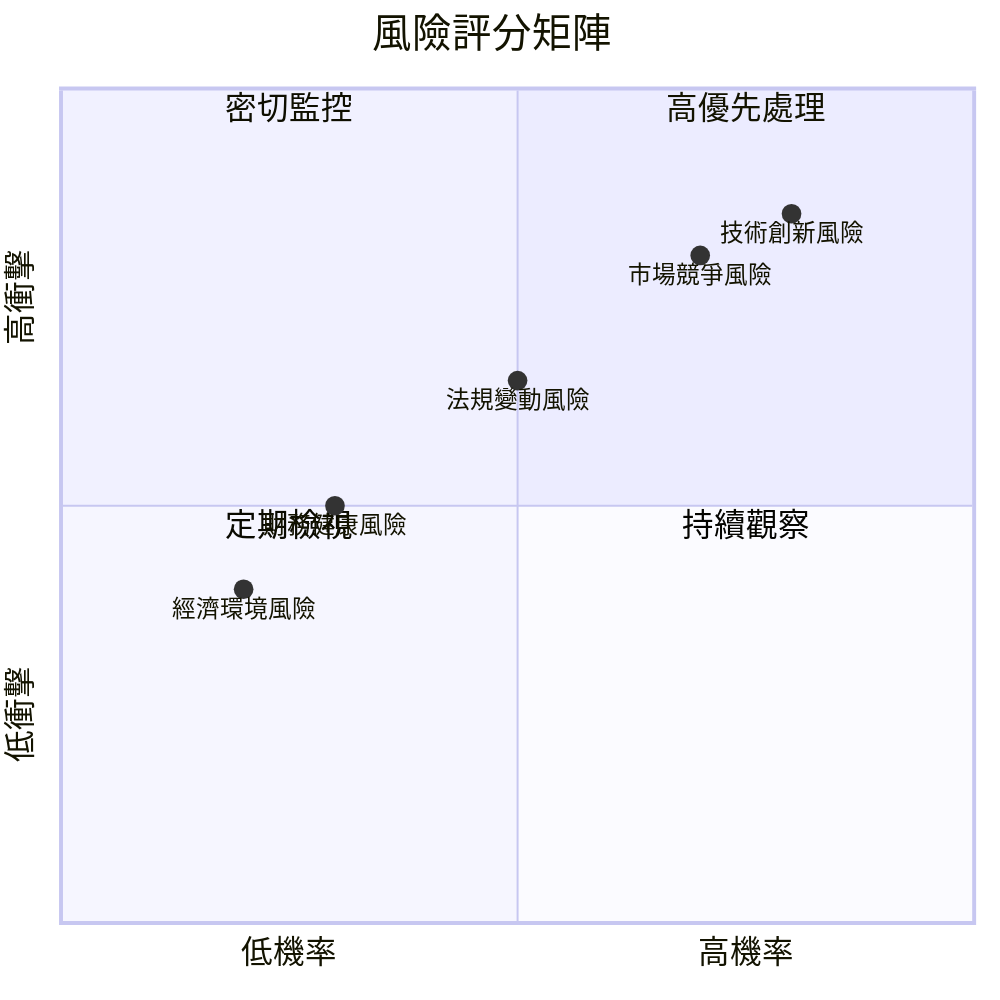

### 9.2 風險清單詳細分析

| # | 風險項目 | 發生機率 | 財務衝擊 | 風險評分 | 緩解措施 |
|---|----------|----------|----------|----------|----------|
| 1 | 🔴 **技術創新風險** | 高 (80%) | 高 (-20%收入) | 🔴 8.5/10 | 加強研發投入，提升技術創新 |
| 2 | 🔴 **市場競爭風險** | 高 (70%) | 高 (-15%收入) | 🔴 8.0/10 | 提升市場品牌和客戶鎖定 |
| 3 | 🟡 **法規變動風險** | 中 (50%) | 中 (-10%收入) | 🟡 6.5/10 | 持續監控法規動態，靈活應對 |
| 4 | 🟡 **財務健康風險** | 低 (30%) | 中 (-5%收入) | 🟡 5.0/10 | 優化成本結構，強化現金流管理 |
| 5 | 🟢 **經濟環境風險** | 低 (20%) | 低 (-2%收入) | 🟢 4.0/10 | 多元化市場以降低經濟波動影響 |

---

## 10. 投資建議

### 10.1 最終綜合評級雷達圖

```
╔══════════════════════════════════════════════════════════════════╗
║                    C3.ai 綜合評級雷達圖                         ║
╠══════════════════════════════════════════════════════════════════╣
║                                                                  ║
║  基本面強度    5.0  █████░░░░░░░░░░░░░░░░░░░░░░░░░░░░░░░░░░░░░   ║
║  成長動能      6.0  ██████░░░░░░░░░░░░░░░░░░░░░░░░░░░░░░░░░░░░   ║
║  獲利品質      4.0  ████░░░░░░░░░░░░░░░░░░░░░░░░░░░░░░░░░░░░░░   ║
║  財務健康      7.0  ███████░░░░░░░░░░░░░░░░░░░░░░░░░░░░░░░░░░░   ║
║  估值合理性    7.0  ███████░░░░░░░░░░░░░░░░░░░░░░░░░░░░░░░░░░░   ║
║                                                                  ║
╚══════════════════════════════════════════════════════════════════╝
```

### 10.2 目標價與隱含報酬率

| 情境 | 目標價 | 隱含報酬率 | 機率權重 |
|------|--------|------------|----------|
| 悲觀情境 | $6.00 | -30.6% | 30% |
| 基準情境 | $8.82 | +2.1% | 50% |
| 樂觀情境 | $17.00 | +96.8% | 20% |

### 10.3 買入時機與觸發因素

```
╔══════════════════════════════════════════════════════════════════╗
║                  ✅ 買入觸發因素 Checklist                      ║
╠══════════════════════════════════════════════════════════════════╣
║                                                                  ║
║  立即買入觸發條件（多數符合）：                                  ║
║  ✅ 技術創新取得重大突破                                         ║
║  ✅ 新市場進入計畫成功實施                                     ║
║                                                                  ║
║  加碼觸發條件（出現以下任一）：                                  ║
║  ☐ 收入增長超過行業平均                                         ║
║  ☐ 盈利能力顯著改善                                             ║
║                                                                  ║
║  減碼/停損觸發條件（出現以下任一）：                             ║
║  ☐ 競爭加劇導致市場份額下降                                     ║
║  ☐ 法規變動對業務造成重大影響                                   ║
║                                                                  ║
╚══════════════════════════════════════════════════════════════════╝
```

### 10.4 投資人適配度分析

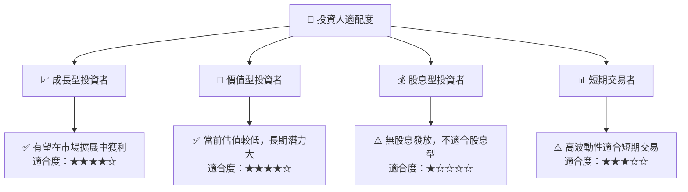

### 10.5 關鍵監控指標

| 監控類型 | 指標 | 關注點 | 頻率 |
|----------|------|--------|------|
| 財務指標 | 收入增長率 | 保持高於行業平均 | 季度 |
| 市場指標 | 市場份額 | 競爭優勢的維持 | 半年 |
| 技術指標 | 技術創新進展 | 新產品開發速度 | 季度 |
| 法規指標 | 法規變動 | 法規對業務的影響 | 年度 |

---

> **免責聲明**：本報告為 AI 自動生成，僅供研究參考，不構成投資建議。投資有風險，入市需謹慎。