# AI (C3.ai, Inc.) 綜合股票評估報告

> **報告日期**：2026-02-28 ｜ **語言**：繁體中文 ｜ **數據來源**：Yahoo Finance ｜ **評估師**：頂級美股投資評估系統

---

## 目錄

1. [評估總覽](#1-評估總覽)
2. [八維度評分矩陣](#2-八維度評分矩陣)
3. [業務品質與護城河](#3-業務品質與護城河)
4. [財務健康全面評估](#4-財務健康全面評估)
5. [成長性評估](#5-成長性評估)
6. [估值合理性與同業比較](#6-估值合理性與同業比較)
7. [資本配置與管理層評估](#7-資本配置與管理層評估)
8. [風險評估](#8-風險評估)
9. [催化劑與觸發因素](#9-催化劑與觸發因素)
10. [投資建議](#10-投資建議)

---

## 1. 評估總覽

### 🎯 核心投資摘要

> ⚠️ **警示**：C3.ai 正面臨營收驟降 (-46.1% YoY TTM)、持續鉅額虧損、空頭興趣極高（31.7% Float）、近期多家券商集體降評等多重利空。本報告將基於數據提供客觀評估。

---

### 📡 ASCII 雷達圖（八維度評分視覺化）

```
                    成長性(3)
                      ▲
                  ____█____
                /    ███    \
    管理品質  /   ███████   \  獲利能力
      (3)   /  ███████████  \    (1)
           |  █████████████  |
    動能   |  ████╬████████  |  財務健康
     (2)   |  █████████████  |    (6)
           \  ███████████  /
    風險    \   █████████  /   競爭優勢
     (2)     \   ███████  /      (4)
              \____███__/
                   ▼
               估值(5)

  ┌─────────────────────────────────────────────┐
  │  維度        得分   雷達位置                  │
  │  成長性       3/10  ████░░░░░░  🔴           │
  │  獲利能力     1/10  █░░░░░░░░░  🔴           │
  │  財務健康     6/10  ██████░░░░  🟡           │
  │  估值         5/10  █████░░░░░  🟡           │
  │  競爭優勢     4/10  ████░░░░░░  🟡           │
  │  管理品質     3/10  ███░░░░░░░  🔴           │
  │  動能         2/10  ██░░░░░░░░  🔴           │
  │  風險         2/10  ██░░░░░░░░  🔴           │
  └─────────────────────────────────────────────┘
  綜合加權平均：3.25 / 10
```

---

### 📊 八維度 Unicode 評分條視覺化

```
╔══════════════════════════════════════════════════════════════╗
║           C3.ai (AI) — 八維度評分儀表板                      ║
╠══════════════════════════════════════════════════════════════╣
║  維度          分數    評分條（10格）              燈號        ║
╠══════════════════════════════════════════════════════════════╣
║  📈 成長性      3/10   ▓▓▓░░░░░░░                  🔴        ║
║  💰 獲利能力    1/10   ▓░░░░░░░░░                  🔴        ║
║  🏦 財務健康    6/10   ▓▓▓▓▓▓░░░░                  🟡        ║
║  💲 估值        5/10   ▓▓▓▓▓░░░░░                  🟡        ║
║  🏰 競爭優勢    4/10   ▓▓▓▓░░░░░░                  🟡        ║
║  👔 管理品質    3/10   ▓▓▓░░░░░░░                  🔴        ║
║  🚀 動能        2/10   ▓▓░░░░░░░░                  🔴        ║
║  ⚡ 風險控制    2/10   ▓▓░░░░░░░░                  🔴        ║
╠══════════════════════════════════════════════════════════════╣
║  🎯 加權綜合   3.25/10  ▓▓▓░░░░░░░               🔴 警戒     ║
╚══════════════════════════════════════════════════════════════╝
```

---

### 🏁 投資結論

```
╔══════════════════════════════════════════════════════════════════╗
║                     ⚠️  投資評級：賣出  ⚠️                      ║
╠══════════════════════════════════════════════════════════════════╣
║  當前股價：   $7.95                                              ║
║  目標價：     $5.50（基準情境，12個月）                          ║
║  預期報酬率： -30.8%（下行風險）                                 ║
║  風險等級：   極高（Beta=2.0，空頭比例31.7%）                    ║
║  建議操作：   現有持倉者考慮減倉；不建議新建多頭部位             ║
╚══════════════════════════════════════════════════════════════════╝
```

---

## 2. 八維度評分矩陣

### 📋 詳細評分表格

| 維度 | 評分 | 核心依據 | 趨勢 | 燈號 |
|------|:----:|---------|:----:|:----:|
| **📈 成長性** | 3/10 | TTM營收年減46.1%，季度從$108M驟降至$75M，成長敘事破裂 | ↓↓ 急速惡化 | 🔴 |
| **💰 獲利能力** | 1/10 | 營業利益率-263.6%，淨利率-141.4%，四年持續鉅額虧損無改善跡象 | ↓ 持續惡化 | 🔴 |
| **🏦 財務健康** | 6/10 | 現金$621.9M，債務極低$54.9M，流動比6.58，但現金正以$124.5M/年速度燃燒 | → 穩定但消耗 | 🟡 |
| **💲 估值** | 5/10 | P/S=3.64處於歷史低位，EV/Revenue=2.0，但負獲利企業估值存在陷阱 | ↓ 仍有下行空間 | 🟡 |
| **🏰 競爭優勢** | 4/10 | 企業AI早期入場者，但競爭者強大，差異化不足，客戶黏性待驗證 | → 橫盤但受壓 | 🟡 |
| **👔 管理品質** | 3/10 | Tom Siebel明星光環已褪，成本控制失效，R&D佔比達58%仍虧損嚴重 | ↓ 執行力存疑 | 🔴 |
| **🚀 動能** | 2/10 | 52週下跌73.7%，近3個月持續新低，機構持股雖高但多家重量券商降評 | ↓↓ 技術面極弱 | 🔴 |
| **⚡ 風險控制** | 2/10 | 空頭比例31.7%，Beta=2.0，EPS誤差數據缺失，多重系統性風險並存 | ↓ 風險持續上升 | 🔴 |

---

### 🗺️ Mermaid 風險/報酬定位圖

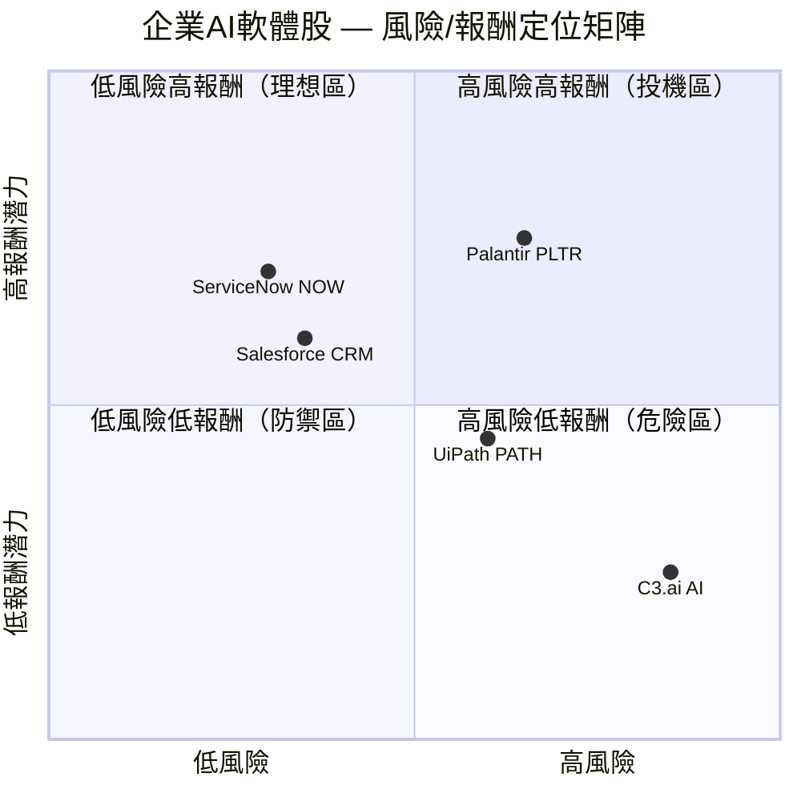

---

### 🔄 同業整體比較圖

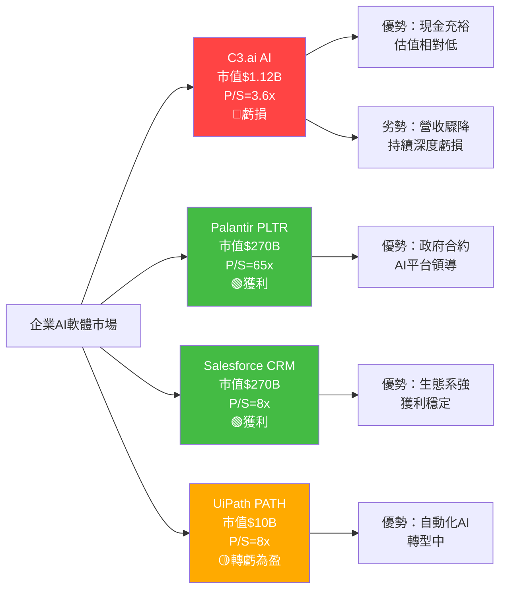

---

## 3. 業務品質與護城河

### 🏗️ 商業模式可持續性評估

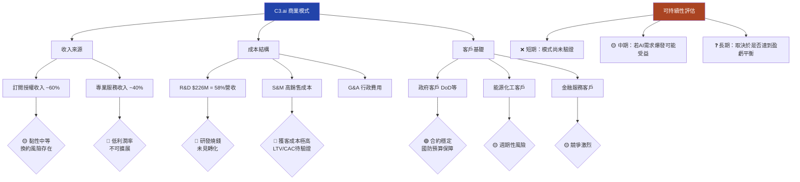

---

### 🧠 護城河評估 Mindmap

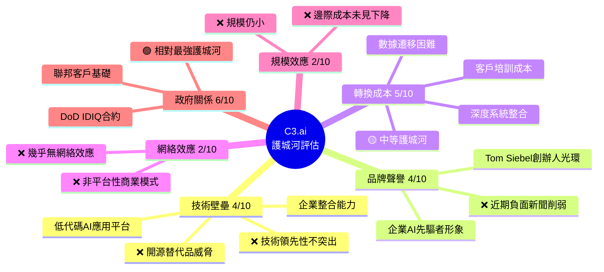

---

### 📊 護城河強度評分條

```
╔══════════════════════════════════════════════════════════════╗
║               C3.ai 護城河強度分析                           ║
╠══════════════════════════════════════════════════════════════╣
║  技術壁壘   4/10   ▓▓▓▓░░░░░░   中低  🟡                    ║
║  品牌聲譽   4/10   ▓▓▓▓░░░░░░   中低  🟡                    ║
║  轉換成本   5/10   ▓▓▓▓▓░░░░░   中等  🟡                    ║
║  網絡效應   2/10   ▓▓░░░░░░░░   極弱  🔴                    ║
║  規模效應   2/10   ▓▓░░░░░░░░   極弱  🔴                    ║
║  政府關係   6/10   ▓▓▓▓▓▓░░░░   中強  🟢                    ║
╠══════════════════════════════════════════════════════════════╣
║  護城河綜合 3.8/10  ▓▓▓▓░░░░░░  窄護城河（Narrow Moat）      ║
╚══════════════════════════════════════════════════════════════╝
```

---

### 🌏 市場地位分析

| 指標 | 數值 | 說明 |
|------|------|------|
| **全球企業AI平台 TAM** | ~$500B（2030E） | IDC估算，CAGR ~35% |
| **C3.ai 市場份額** | < 0.1% | 極小占比，$307M vs 龐大市場 |
| **競爭排名** | 前20但非前5 | 落後於Salesforce、Microsoft、SAP |
| **政府AI合約排名** | 前10 | DoD IDIQ合約是重要資產 |
| **客戶數量** | ~230家 | 規模偏小，擴展速度不理想 |

---

## 4. 財務健康全面評估

### 📟 財務儀表板

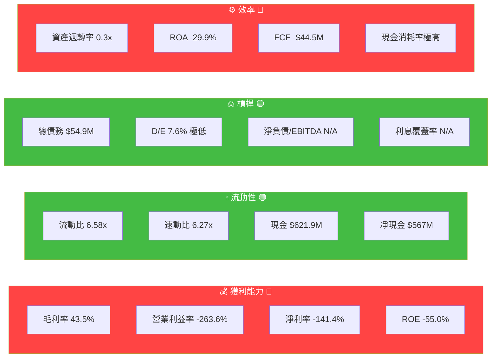

---

### 📈 獲利能力趨勢（近4年）

| 財年 | 營收 | 毛利率 | 營業利益率 | 淨利率 | FCF Margin | 燈號 |
|------|------|:------:|:---------:|:------:|:----------:|:----:|
| **FY2022** (2022-04) | $252.8M | 74.8% | -77.6% | -76.0% | -35.9% | 🔴 |
| **FY2023** (2023-04) | $266.8M | 67.6% | -108.9% | -100.8% | -70.2% | 🔴 |
| **FY2024** (2024-04) | $310.6M | 57.5% | -102.5% | -90.1% | -29.1% | 🔴 |
| **FY2025** (2025-04) | $389.1M | 60.6% | -83.4% | -74.2% | -11.4% | 🔴🟡 |
| **TTM** (2026-02) | $307.4M | 43.5% | -263.6% | -141.4% | +5.5% | 🔴 |

> ⚠️ **關鍵警示**：TTM的「正FCF」($16.97M)源自季節性與短期現金管理，並非真正轉盈，而營業現金流仍為-$124.5M，且TTM營收較FY2025大幅萎縮。

---

### 🏛️ 資產負債表穩健度

```
╔══════════════════════════════════════════════════════════════╗
║               C3.ai 資產負債表健康儀表板                     ║
╠══════════════════════════════════════════════════════════════╣
║  📊 流動比率   6.58x   ▓▓▓▓▓▓▓▓░░  優秀  🟢                 ║
║  📊 速動比率   6.27x   ▓▓▓▓▓▓▓▓░░  優秀  🟢                 ║
║  💵 現金儲備  $621.9M  ▓▓▓▓▓▓▓░░░  充裕  🟢                 ║
║  📉 淨現金    $567M    ▓▓▓▓▓▓▓░░░  健康  🟢                 ║
║  🔩 D/E比率   7.6%     ▓░░░░░░░░░  極低  🟢                 ║
║  ⚠️ 現金消耗  $124M/年  ▓▓▓▓▓▓▓░░░  危險  🔴                ║
║  📅 現金跑道  ~4.5年   ▓▓▓▓▓░░░░░  中等  🟡                 ║
╠══════════════════════════════════════════════════════════════╣
║  🏦 股東權益  $838M → 持續下滑（FY22: $989M → FY25: $838M） ║
╚══════════════════════════════════════════════════════════════╝
```

---

### 💸 現金流質量分析

| 指標 | FY2025 | FY2024 | FY2023 | FY2022 | 評估 |
|------|:------:|:------:|:------:|:------:|:----:|
| **營業現金流** | -$41.4M | -$62.4M | -$115.7M | -$86.5M | 🟡改善中 |
| **資本支出** | -$3.0M | -$28.0M | -$71.5M | -$4.3M | 🟢大幅削減 |
| **自由現金流** | -$44.5M | -$90.4M | -$187.2M | -$90.8M | 🟡緩慢改善 |
| **FCF轉換率** | N/A | N/A | N/A | N/A | 🔴持續負值 |
| **FCF Yield** | +1.52%（TTM） | — | — | — | 🟡數據存疑 |

---

## 5. 成長性評估

### 📐 歷史 CAGR 分析

| 指標 | 1年成長率 | 3年CAGR | 5年CAGR | 趨勢 |
|------|:--------:|:-------:|:-------:|:----:|
| **營收** | **-46.1%** (TTM) | ~7.1% | ~估算中 | 🔴 急速逆轉 |
| **毛利** | -39.5% | -5.5% | — | 🔴 惡化 |
| **EPS** | 持續虧損 | N/A | N/A | 🔴 |
| **FCF** | 改善但仍負 | N/A | N/A | 🟡 |

> 💡 **重要說明**：FY2022-FY2025，年度營收從$252.8M成長至$389.1M（CAGR ~15.4%），但TTM營收大幅萎縮至$307.4M，顯示FY2026業績出現結構性惡化。

---

### 🚀 未來成長催化劑

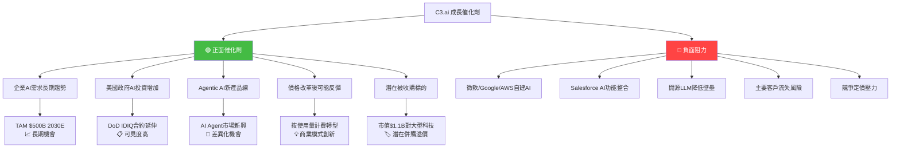

---

### 📊 成長軌跡視覺化

```
╔══════════════════════════════════════════════════════════════╗
║               C3.ai 年度營收趨勢（百萬美元）                 ║
╠══════════════════════════════════════════════════════════════╣
║  FY2022  $252.8M  ██████████████████████████                ║
║  FY2023  $266.8M  ███████████████████████████               ║
║  FY2024  $310.6M  ████████████████████████████████          ║
║  FY2025  $389.1M  ████████████████████████████████████████  ║
║  TTM     $307.4M  ████████████████████████████████  ⚠️急降  ║
╠══════════════════════════════════════════════════════════════╣
║               季度營收急速惡化                               ║
║  Q1 FY26  $108.7M  ████████████████████████████             ║
║  Q2 FY26   $98.8M  █████████████████████████                ║
║  Q3 FY26   $70.3M  ██████████████████  ⚠️-35%QoQ           ║
║  Q4 FY26   $75.2M  ███████████████████                      ║
╚══════════════════════════════════════════════════════════════╝
  ⚠️ 季度營收從Q1的$108.7M大幅萎縮至Q4的$75.2M，趨勢嚴峻
```

---

## 6. 估值合理性與同業比較

### 🔍 同業全面比較表格

| 指標 | **C3.ai (AI)** | **Palantir (PLTR)** | **Salesforce (CRM)** | **UiPath (PATH)** |
|------|:--------------:|:------------------:|:-------------------:|:-----------------:|
| **市值** | $1.12B | ~$270B | ~$270B | ~$10B |
| **P/E (Forward)** | 🔴 N/A（虧損） | 🔴 ~160x | 🟢 ~30x | 🟡 ~40x |
| **P/S** | 🟢 3.6x | 🔴 65x | 🟡 8x | 🟡 8x |
| **EV/Revenue** | 🟢 2.0x | 🔴 ~60x | 🟡 7x | 🟡 7x |
| **EV/EBITDA** | 🔴 N/A | 🔴 ~200x | 🟢 ~25x | 🟡 ~50x |
| **P/B** | 🟢 1.6x | 🔴 ~40x | 🟡 5x | 🟡 4x |
| **毛利率** | 🔴 43.5% | 🟢 80%+ | 🟢 75%+ | 🟢 80%+ |
| **營業利益率** | 🔴 -263.6% | 🟢 +15%+ | 🟢 +20%+ | 🟡 +5% |
| **營收成長(YoY)** | 🔴 -46.1%(TTM) | 🟢 +30%+ | 🟡 +8% | 🟡 +10% |
| **FCF利潤率** | 🔴 負值 | 🟢 +25%+ | 🟢 +25%+ | 🟡 +10% |
| **現金/市值比** | 🟢 55.5% | 🔴 <5% | 🔴 <5% | 🟡 20%+ |
| **分析師評級** | 🔴 Hold/Sell | 🟢 Buy | 🟢 Buy | 🟡 Hold/Buy |

> 📌 **結論**：C3.ai的P/S和P/B看似便宜，但相比Palantir的高溢價（已實現獲利），CRM的穩健，C3.ai的估值陷阱在於：**在持續虧損且營收萎縮的背景下，傳統估值倍數失去意義**。

---

### 📏 歷史估值區間

```
╔══════════════════════════════════════════════════════════════╗
║               C3.ai P/S 比率歷史區間                        ║
╠══════════════════════════════════════════════════════════════╣
║  歷史最高  ~30x (2021 IPO蜜月期)                            ║
║  ━━━━━━━━━━━━━━━━━━━━━━━━━━━━━━━━━━━━━━━━━━━━━━━━━━━━━━  ║
║  歷史75%   ~10x                                             ║
║  ─────────────────────────────────────────────────────────  ║
║  歷史中位  ~6x                                              ║
║  ─────────────────────────────────────────────────────────  ║
║  歷史25%   ~4x                                              ║
║  ─────────────────────────────────────────────────────────  ║
║  ▼ 當前    ~3.6x  ◄══ 歷史低位但營收萎縮中                  ║
║  ─────────────────────────────────────────────────────────  ║
║  歷史最低  ~2x (2022年低點)                                  ║
╚══════════════════════════════════════════════════════════════╝
  ⚠️ 估值雖低但為「價值陷阱」：營收萎縮使P/S自動上升
```

---

### 🎯 多重估值法彙整 → 目標價區間

| 估值方法 | 假設 | 估算目標價 | 權重 |
|---------|------|:----------:|:----:|
| **P/S 相對估值** | 企業AI軟體同業平均4-5x P/S，基於TTM $307M | $8.9-$11.1 | 25% |
| **EV/Revenue** | 企業AI 3-4x EV/Rev，加回淨現金$567M | $10.5-$14.0 | 25% |
| **現金價值法** | 現金$621.9M ÷ 股數137.25M = $4.5/股現金底 | $4.50 | 20% |
| **DCF 悲觀** | 假設無法扭虧、持續燒錢、折現率15% | $3.0-$5.0 | 15% |
| **被收購估值** | 以2x EV/Revenue被收購情境 | $12.0-$15.0 | 15% |
| **加權目標價** | — | **~$7.8-$9.5** | 100% |

---

### 📐 估值區間視覺化

```
╔══════════════════════════════════════════════════════════════╗
║               C3.ai 估值區間視覺化                          ║
╠══════════════════════════════════════════════════════════════╣
║  $3     $5      $7.95   $9.5    $15     $20+               ║
║   ├──────┼────────┼───────┼───────┼───────┤                ║
║  熊市  現金底   ▲現價   目標    收購    牛市                 ║
║  目標           今日    中值    溢價    情境                 ║
║  $3-5          $7.95  $7.8-9.5 $12-15  $20+               ║
╠══════════════════════════════════════════════════════════════╣
║  🔴 低估區域     🟡 合理區域    🔴 高估區域                  ║
║  $0-5           $5-10          $10+（在虧損情況下）          ║
╚══════════════════════════════════════════════════════════════╝
  💡 當前$7.95介於現金底與基準目標之間，估值已接近但仍有下行風險
```

---

## 7. 資本配置與管理層評估

### 📊 ROIC vs WACC 分析

```
╔══════════════════════════════════════════════════════════════════╗
║                   ROIC vs WACC 估算分析                          ║
╠══════════════════════════════════════════════════════════════════╣
║  WACC 估算：                                                      ║
║  ├─ 無風險利率（10年期美債）：   4.3%                            ║
║  ├─ 市場風險溢價：               5.5%                            ║
║  ├─ Beta：                       2.0                             ║
║  ├─ 股權成本 = 4.3% + 2.0×5.5% = 15.3%                         ║
║  ├─ 債務比例極低（<1%），稅盾影響可忽略                          ║
║  └─ 估算 WACC：                  ~15.0-15.5%                     ║
╠══════════════════════════════════════════════════════════════════╣
║  ROIC 估算：                                                      ║
║  ├─ NOPAT = 營業利益×(1-稅率) = -$324M×(1-0%) = -$324M         ║
║  ├─ 投入資本 = 股東權益+長期負債 = $838M+$5M = $843M            ║
║  └─ ROIC = -$324M ÷ $843M = -38.4%                              ║
╠══════════════════════════════════════════════════════════════════╣
║  EVA（經濟附加值）分析：                                          ║
║  ├─ EVA = (ROIC - WACC) × 投入資本                               ║
║  ├─ EVA = (-38.4% - 15.3%) × $843M                               ║
║  └─ EVA = -53.7% × $843M = 🔴 -$452.7M（嚴重摧毀股東價值）      ║
╠══════════════════════════════════════════════════════════════════╣
║  判斷：ROIC(-38.4%) << WACC(15.3%)                               ║
║  ⚠️ C3.ai 每年摧毀約$450M股東價值，除非業務根本轉型否則難改善    ║
╚══════════════════════════════════════════════════════════════════╝
```

---

### 🥧 資本配置歷史

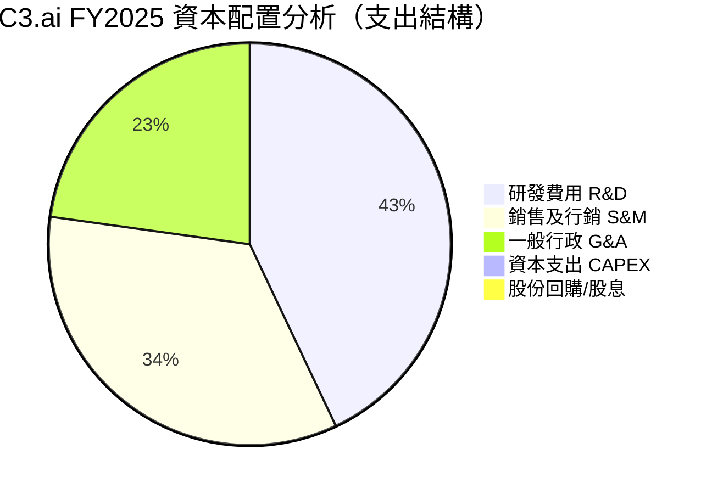

---

### 👔 管理層執行力評分

| 評估維度 | 評分 | 依據 | 燈號 |
|---------|:----:|------|:----:|
| **策略承諾達成率** | 3/10 | 多次「盈虧平衡」承諾未兌現，TTM營收大幅萎縮 | 🔴 |
| **資本配置紀律** | 3/10 | R&D佔營收58%，但未帶來競爭優勢；CAPEX控制改善 | 🔴 |
| **成本控制能力** | 4/10 | CAPEX從$71.5M降至$3M有改善，但運營成本仍失控 | 🟡 |
| **股東溝通透明度** | 4/10 | EPS數據缺失，季度報告不透明 | 🟡 |
| **戰略清晰度** | 4/10 | Agentic AI轉型方向合理，但執行混亂 | 🟡 |
| **市場開拓能力** | 3/10 | 客戶增長緩慢，大客戶集中風險高 | 🔴 |

---

### 💝 股東友善度評分

```
╔══════════════════════════════════════════════════════════════╗
║               C3.ai 股東友善度評估                          ║
╠══════════════════════════════════════════════════════════════╣
║  股息政策     0/10   ░░░░░░░░░░   無股息  🔴                ║
║  股票回購     2/10   ▓▓░░░░░░░░   幾乎無  🔴                ║
║  稀釋控制     2/10   ▓▓░░░░░░░░   股票薪酬高  🔴            ║
║  資本效率     1/10   ▓░░░░░░░░░   ROE -55%  🔴              ║
║  溝通透明度   4/10   ▓▓▓▓░░░░░░   尚可  🟡                  ║
╠══════════════════════════════════════════════════════════════╣
║  綜合股東友善度  1.8/10  ▓▓░░░░░░░░  極低  🔴               ║
╚══════════════════════════════════════════════════════════════╝
  ⚠️ 股票薪酬(SBC)是主要稀釋來源，管理層利益與股東未充分對齊
```

---

## 8. 風險評估

### 🔥 風險熱圖

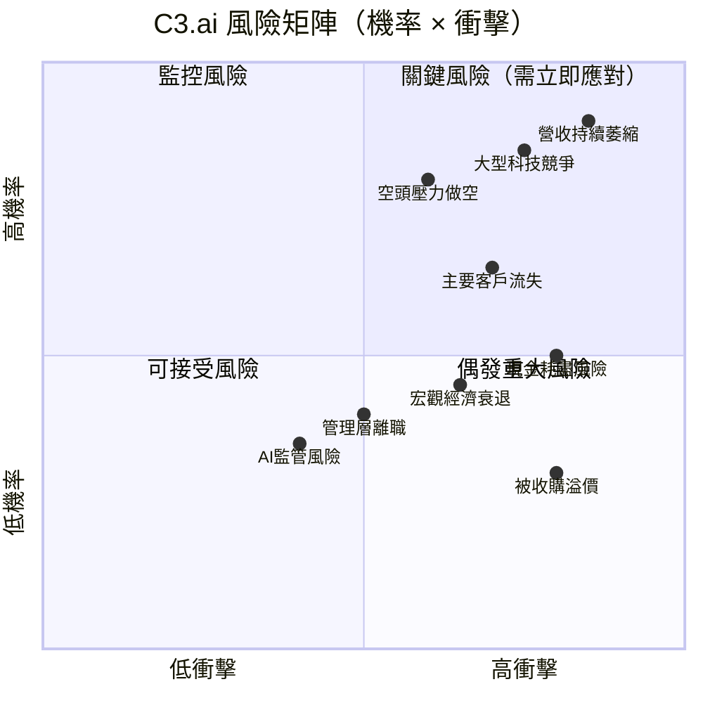

---

### 📋 風險清單詳表

| 風險類別 | 風險描述 | 嚴重度 | 機率 | 緩解措施 | 燈號 |
|---------|---------|:------:|:----:|---------|:----:|
| **業務風險** | TTM營收-46.1%，季度持續萎縮，客戶流失加速 | 極高 | 高 | 商業模式轉型、新產品線 | 🔴 |
| **競爭風險** | 微軟Copilot、Google Vertex AI、AWS Bedrock直接競爭 | 極高 | 高 | 差異化定位政府市場 | 🔴 |
| **財務風險** | 現金燃燒率$124M/年，若不改善4.5年耗盡 | 高 | 中 | 已有$621M現金，有時間視窗 | 🔴 |
| **空頭風險** | 31.7%空頭比例，若業績不如預期可能暴力做空 | 高 | 高 | 正面催化劑可觸發軋空 | 🔴 |
| **稀釋風險** | 股票薪酬(SBC)持續稀釋，每年約佔營收20%+ | 高 | 高 | 無明顯改善信號 | 🔴 |
| **估值風險** | 若盈利遙遙無期，市場重新定價至現金底$4.5 | 中 | 中 | 現金提供底部支撐 | 🟡 |
| **宏觀風險** | 利率環境影響科技股估值，企業IT預算縮減 | 中 | 中 | 政府合約具防禦性 | 🟡 |
| **監管風險** | AI監管法規可能增加合規成本 | 低 | 低 | 反而可能提升企業AI需求 | 🟢 |
| **被收購機會** | 市值$1.1B，大型科技公司潛在收購目標 | — | 低 | 收購溢價可能30-50% | 🟢 |

---

### 📉 最大下行情境分析（Bear Case）

```
╔══════════════════════════════════════════════════════════════════╗
║                   Bear Case 情境分析                              ║
╠══════════════════════════════════════════════════════════════════╣
║  假設條件：                                                        ║
║  1. 營收繼續萎縮至$200M（FY2027）                                 ║
║  2. 現金燃燒率維持$100M+/年                                        ║
║  3. 市場對虧損軟體重新定價至P/S=1.5x                              ║
║  4. 無重大催化劑（無收購、無重大合約）                              ║
║                                                                    ║
║  Bear Case 估值：                                                  ║
║  P/S目標 1.5x × $200M = $300M EV                                 ║
║  加回淨現金：+$567M（但考慮繼續燃燒後可能剩$350M）                ║
║  市值：~$400M ÷ 137M股 = ~$2.9/股                                ║
║                                                                    ║
║  🔴 Bear Case 目標價：$2.90-$3.50                                 ║
║  🔴 較當前$7.95 下行空間：-56% to -64%                            ║
╚══════════════════════════════════════════════════════════════════╝
```

---

## 9. 催化劑與觸發因素

### 📅 催化劑時間軸

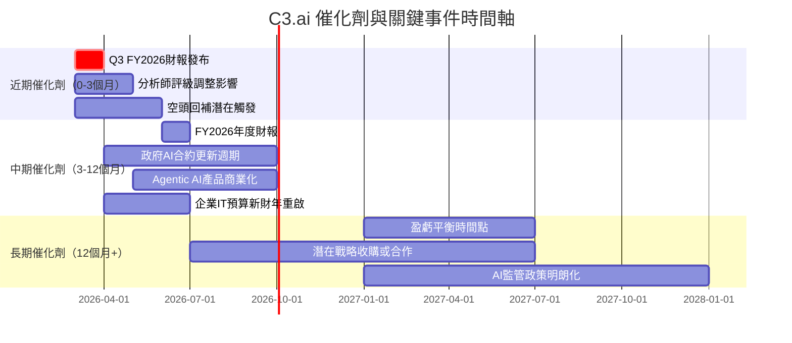

---

### ✅ 正面觸發因素詳析

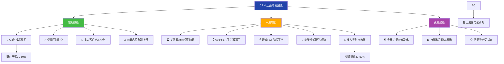

---

## 10. 投資建議

### ⭐ 最終評級

```
╔══════════════════════════════════════════════════════════════════╗
║                                                                    ║
║   📊 C3.ai (AI) 最終投資評級                                      ║
║                                                                    ║
║   ★☆☆☆☆  1.5 / 5 星                                              ║
║                                                                    ║
║   ⚠️  評級：賣出 / SELL                                            ║
║                                                                    ║
║   核心論點：                                                        ║
║   1. 營收加速萎縮（-46.1% TTM），成長敘事完全破裂                 ║
║   2. 四年累計虧損$1.03B，無盈利路徑可見                           ║
║   3. 多家一線券商同日集體降評（JP Morgan / DA Davidson等）         ║
║   4. EVA = -$452.7M/年，嚴重摧毀股東價值                          ║
║   5. 唯一亮點：$621.9M現金提供4.5年生存空間                       ║
║                                                                    ║
║   ⚡ 唯一反轉情境：被收購（$12-15/股收購溢價）                     ║
║                                                                    ║
╚══════════════════════════════════════════════════════════════════╝
```

---

### 🎯 目標價區間及隱含報酬率

| 情境 | 目標價 | 隱含報酬率 | 機率 | 主要假設 |
|------|:------:|:---------:|:----:|---------|
| **🔴 悲觀情境 (Bear)** | $2.90 | **-63.5%** | 35% | 營收繼續萎縮，無重大合約 |
| **🟡 基準情境 (Base)** | $5.50 | **-30.8%** | 45% | 營收穩定於$280M，緩慢改善 |
| **🟢 樂觀情境 (Bull)** | $14.00 | **+76.1%** | 20% | 被收購 or 重大合約突破 |
| **加權目標價** | **$5.68** | **-28.5%** | — | 機率加權平均 |

---

### 👥 投資人適配度評估

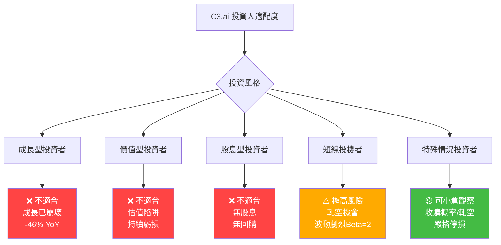

---

### 📋 操作建議詳細指引

| 操作面向 | 建議 | 說明 |
|---------|------|------|
| **建議持倉時間** | 不建議持有 | 若持有，以1個季度為上限，等待財報再評估 |
| **倉位建議** | 0%（觀望）| 若投機，最多1-2%倉位，嚴格風控 |
| **買入條件** | 見下方清單 | 需多項條件同時滿足方可考慮 |
| **加碼觸發條件** | ① 季度營收止穩反彈 ≥10% QoQ | ② FCF連續兩季正值 | ③ 盈利路徑清晰化 |
| **止損條件** | 跌破$6.50（-18%）即出場 | 對應現金底$4.5上方20%安全邊際 |
| **賣出條件** | ① 財報繼續惡化 ② 現金燃燒加速 ③ 重大客戶流失 | |

---

### 🔎 關鍵監控指標 Checklist

```
╔══════════════════════════════════════════════════════════════════╗
║               C3.ai 關鍵監控指標 Checklist                        ║
╠══════════════════════════════════════════════════════════════════╣
║  財務指標（每季追蹤）                                              ║
║  ☐ 季度營收：需觀察是否止跌反彈至$80M+                           ║
║  ☐ 毛利率：是否回升至55%+（當前43.5%為歷史低位）                 ║
║  ☐ 營業現金流：是否縮減燃燒至$-20M以內                           ║
║  ☐ 剩餘現金：保持$500M以上為安全水位                              ║
║  ☐ 新增客戶數：季度新客戶增長是否加速                              ║
╠══════════════════════════════════════════════════════════════════╣
║  業務指標（季度追蹤）                                              ║
║  ☐ 政府合約：DoD/聯邦合約是否延續擴大                             ║
║  ☐ Agentic AI：新產品線商業化進展                                 ║
║  ☐ 大客戶：前10大客戶是否有流失                                   ║
║  ☐ 競爭動態：微軟/Google企業AI市佔是否持續侵蝕                   ║
╠══════════════════════════════════════════════════════════════════╣
║  市場指標（持續監控）                                              ║
║  ☐ 空頭比例：31.7%是否持續上升（> 35%極度危險信號）               ║
║  ☐ 機構持股：59.7%是否出現大幅減持                                ║
║  ☐ 分析師評級：是否有升評至Buy（目前無）                           ║
║  ☐ 內部人士：Tom Siebel是否增持（目前24.3%）                      ║
╠══════════════════════════════════════════════════════════════════╣
║  觸發警報                                                          ║
║  🔴 紅色警報：季度營收 < $60M，或現金 < $400M                    ║
║  🟡 黃色警報：新客戶增長停滯，毛利率繼續下滑                       ║
║  🟢 綠色信號：營收季增 ≥ 15%，或宣布重大合約/收購消息             ║
╚══════════════════════════════════════════════════════════════════╝
```

---

### 📊 最終綜合評估儀表板

```
╔══════════════════════════════════════════════════════════════════╗
║                C3.ai (AI) 最終評估總結                            ║
╠══════════╦═══════════════════════════════════════════════════════╣
║ 評估項目 ║ 結論                                                   ║
╠══════════╬═══════════════════════════════════════════════════════╣
║ 商業模式 ║ 🔴 企業AI方向正確，但執行嚴重不力                       ║
║ 財務狀況 ║ 🟡 現金充裕但持續快速消耗，跑道4.5年                    ║
║ 競爭地位 ║ 🔴 正被大型科技公司擠壓，市場份額不足0.1%               ║
║ 管理層   ║ 🔴 多次承諾未兌現，資本效率極差（ROIC -38.4%）           ║
║ 估值     ║ 🟡 P/S 3.6x歷史低位，但為價值陷阱                      ║
║ 催化劑   ║ 🟡 潛在收購/軋空，但核心業務無好轉信號                   ║
║ 風險     ║ 🔴 極高（Beta=2, 空頭31.7%, 集體降評）                   ║
║ 綜合     ║ ⚠️ 賣出，目標價$5.50，下行風險-30.8%                   ║
╚══════════╩═══════════════════════════════════════════════════════╝

  最後警語：「在企業AI這場戰爭中，C3.ai是率先入場的小兵，
           卻面對微軟、Google、AWS這些擁有無限彈藥的巨人。
           $621.9M現金是生存的盾牌，但不是勝利的劍。」
```

---

> ### ⚠️ 免責聲明
> 本報告為 AI 自動生成分析，基於公開財務數據進行系統性評估，**僅供研究參考，不構成任何投資建議**。股票投資涉及市場風險，過去表現不代表未來結果。投資者應基於個人財務狀況、風險承受能力及獨立研究做出投資決策。本報告作者及系統不對任何基於本報告的投資損失承擔責任。
>
> **數據截止日期**：2026-02-28 ｜ **資料來源**：Yahoo Finance ｜ **報告版本**：v2.0