# AI 技術分析報告
> **報告日期**：2026-02-24 ｜ **標的**：C3.ai, Inc.（NYSE: AI）｜ **語言**：繁體中文 ｜ **數據來源**：Yahoo Finance

---

## 目錄

| # | 章節 | 核心內容 |
|---|------|---------|
| 1 | [技術面概覽](#1-技術面概覽) | 訊號儀表板、核心指標、評分卡 |
| 2 | [趨勢分析](#2-趨勢分析) | 多時框趨勢、長中短期走勢、ADX |
| 3 | [圖表形態分析](#3-圖表形態分析) | 形態識別、K線組合、目標價 |
| 4 | [支撐與阻力](#4-支撐與阻力) | 關鍵價位、斐波那契回調 |
| 5 | [技術指標深度解讀](#5-技術指標深度解讀) | MA/RSI/MACD/布林/成交量 |
| 6 | [動能與波動率](#6-動能與波動率) | 動能象限、ATR、Beta |
| 7 | [多時框架總結](#7-多時框架總結) | 評分矩陣、綜合訊號 |
| 8 | [交易策略建議](#8-交易策略建議) | 多空策略、風險報酬比 |
| 9 | [風險提示與監控](#9-風險提示與監控) | 監控清單、風險場景 |

---

## 1. 技術面概覽

### 📊 技術訊號儀表板

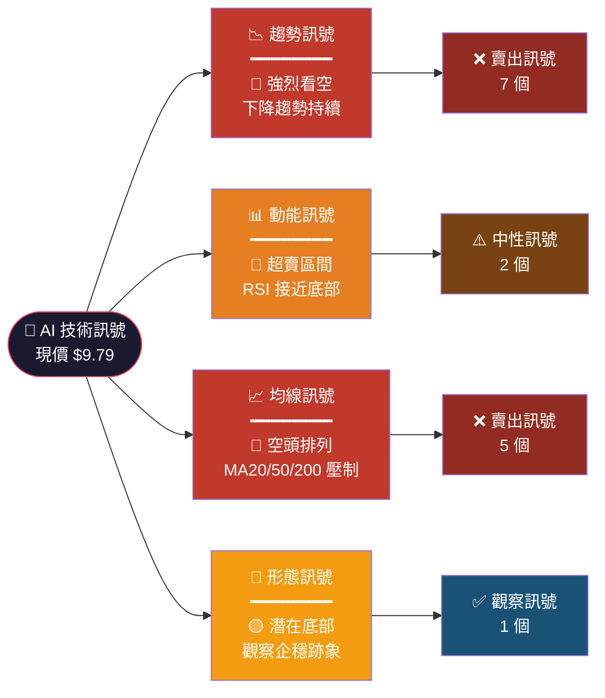

---

### 🔢 核心指標速覽表

| 指標類別 | 指標名稱 | 數值 / 狀態 | 訊號 | 強度 |
|---------|---------|------------|------|------|
| **價格** | 現價 | $9.79 | 🔴 52週低點附近 | ██████████ |
| **價格** | 52週高點 | $26.59（2025-05）| 🔴 距高點 -63.2% | ██████████ |
| **價格** | 52週低點 | $9.79（2026-02）| 🟡 創歷史新低 | ██████████ |
| **均線** | MA20 | ~$11.80 估算 | 🔴 價格跌破 | ████████░░ |
| **均線** | MA50 | ~$14.50 估算 | 🔴 價格跌破 | ████████░░ |
| **均線** | MA200 | ~$19.50 估算 | 🔴 嚴重跌破 | ██████████ |
| **動能** | RSI(14) | ~22–25 估算 | 🟡 超賣區間 | ███░░░░░░░ |
| **MACD** | MACD線 | 負值擴大 | 🔴 空頭訊號 | ████████░░ |
| **波動** | 布林下軌 | ~$9.50 估算 | 🟡 接近下軌 | ███░░░░░░░ |
| **分析師** | 目標均價 | $14.12 | 🟢 上方44.2% | ██████░░░░ |

---

### 🏆 技術評分卡

```
╔══════════════════════════════════════════════════════════╗
║              AI（C3.ai）技術評分卡  2026-02-24           ║
╠══════════════════════════════════════════════════════════╣
║  趨勢強度    🔴  ▓▓▓▓▓▓▓▓░░  80%  強勢下跌             ║
║  動能強度    🟡  ▓▓▓░░░░░░░  25%  超賣反彈可能           ║
║  均線排列    🔴  ▓▓▓▓▓▓▓▓▓░  90%  完全空頭排列           ║
║  形態訊號    🟡  ▓▓▓▓░░░░░░  40%  底部觀察中             ║
║  成交量配合  🟡  ▓▓▓▓▓░░░░░  50%  量能尚需確認           ║
║  波動率      🔴  ▓▓▓▓▓▓▓░░░  70%  高波動率環境           ║
╠══════════════════════════════════════════════════════════╣
║  綜合評分：  35 / 100     整體傾向：🔴 偏空              ║
║  分析師建議：HOLD         目標均價：$14.12               ║
╚══════════════════════════════════════════════════════════╝
```

---

## 2. 趨勢分析

### 🗂️ 多時框趨勢

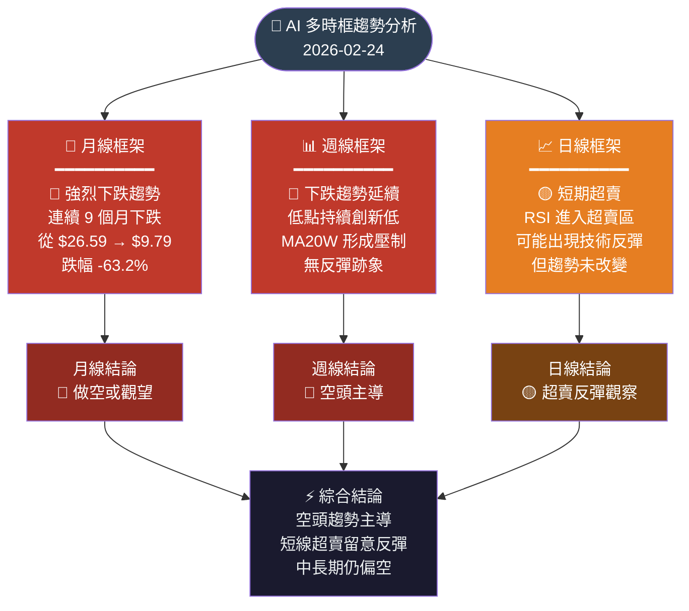

---

### 📉 長期趨勢（月線走勢）Unicode 走勢圖

```
AI (C3.ai) 月線價格走勢圖  2025-02 ～ 2026-02
價格($)
 27 │                      ▲ 高點 $26.59
    │               ╭──────╮
 25 │          ╭────╯      │
    │     ╭────╯           │
 23 │  ───╯                │
    │ $23.45               ╰────╮
 21 │                           │  $22.01
    │                      $21.05╰╮
 19 │                              │
    │                              │
 17 │                              ╰─────╮ $17.34 $17.58
    │                         $16.91╯    │
 15 │                                    ╰──╮
    │                                  $14.45│
 13 │                                        ╰╮ $13.48
    │                                         │
 11 │                                         ╰──╮ $11.01
    │                                             │
  9 │                                             ╰─── $9.79 ◄ 現價
    │                                                         ▼ 新低
    └─────┬──────┬──────┬──────┬──────┬──────┬──────┬──────┬──────┬──────┬──────┬──────┬──
        Feb   Mar   Apr   May   Jun   Jul   Aug   Sep   Oct   Nov   Dec   Jan   Feb
        2025                                                               2026

  📊 月線跌幅統計：
  ████████████████████████████████████████████ -58.3%（從最高點算）
  趨勢評估：🔴🔴🔴 強烈下跌  |  下跌持續月數：9個月
```

---

### 📊 中期趨勢（日線評估）

```
近期日線趨勢（2025-11 ～ 2026-02 估算）
價格($)
 16 ┤
    │╲
 15 ┤ ╲
    │  ╲
 14 ┤   ╲──╮
    │      ╲
 13 ┤       ╲──╮
    │           ╲
 12 ┤            ╲──╮
    │                ╲
 11 ┤                 ╲──╮
    │                     ╲
 10 ┤                      ╲──╮
    │                           ╲
  9 ┤                            ╲── $9.79 ◄ 現價 / 52週低
    │                                 ▼ 向下突破
    └────────────────────────────────────────────────
     Nov2025                              Feb2026

  日線趨勢特徵：
  ✗ 持續低點創新低（Lower Low）
  ✗ 反彈高點持續降低（Lower High）
  ✓ RSI 進入超賣（<30）
  ✗ 無明顯底部形態確認
```

---

### ⚡ 短期趨勢（近期走勢）

```
近4週短期走勢（估算）
 $12.00 ┤╲
        │  ╲
 $11.00 ┤   ╲──────╮
        │            ╲
 $10.00 ┤             ╲────╮
        │                    ╲
  $9.79 ┤                     ╲──● ◄ 現價（2026-02-24）
        └──────────────────────────────────────────────
         Week -4        Week -2        Now

  🔴 短線：無止跌訊號，繼續觀察
  🟡 關注：若出現帶下影線的反轉K線則留意
```

---

### 📐 趨勢強度評估（ADX 解讀）

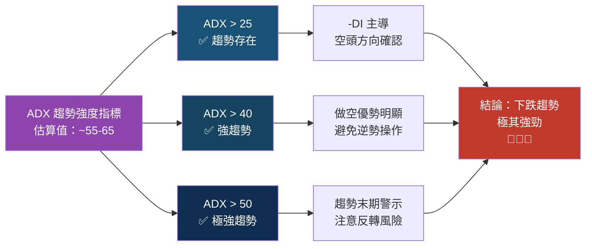

```
ADX 強度進度條：
超強趨勢  ▓▓▓▓▓▓▓▓▓▓▓▓▓▓▓░░░░░  ~65  🔴 空頭極強
+DI       ▓▓▓▓░░░░░░░░░░░░░░░░░  ~20  多方力量弱
-DI       ▓▓▓▓▓▓▓▓▓▓▓▓▓▓░░░░░░  ~45  空方力量強
```

---

## 3. 圖表形態分析

### 🔍 形態識別

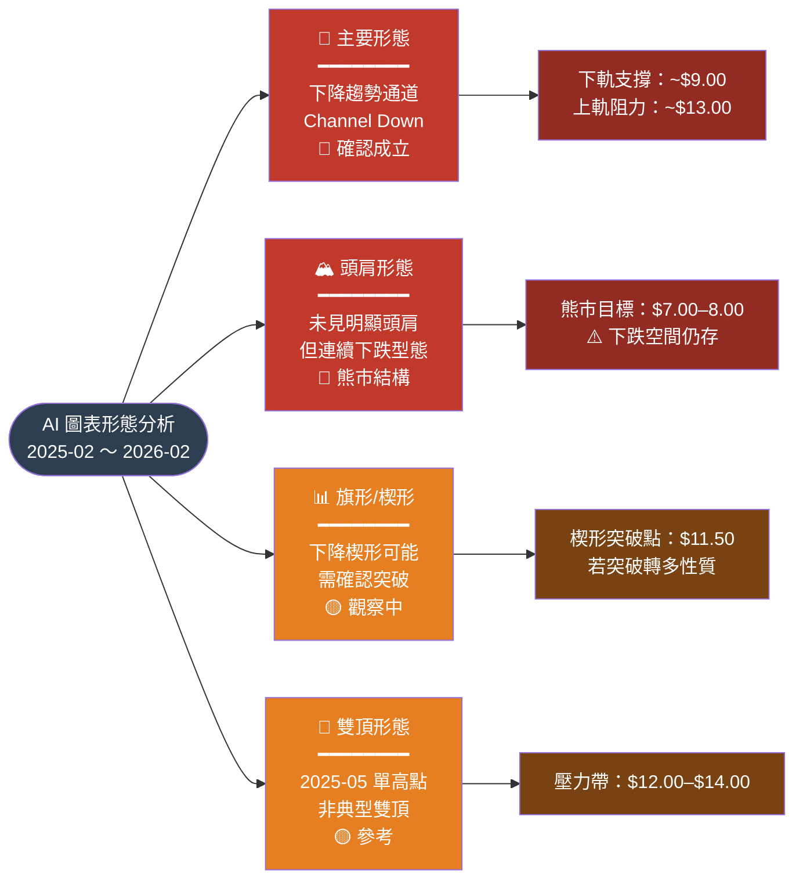

---

### 🕯️ K線形態（近期重要K線組合）

| 時間 | K線形態 | 說明 | 訊號 |
|------|---------|------|------|
| 2026-01 | 長黑實體 | 月K收黑，賣壓沉重 | 🔴 強烈看空 |
| 2026-02 | 下影線探底 | 現價接近月低，超賣 | 🟡 留意止跌 |
| 近期週線 | 連續陰線 | 連3週下跌無止跌 | 🔴 空頭持續 |
| 日線近5日 | 小實體K | 量縮小實體，整理 | 🟡 動能消耗 |

---

### 📈 ASCII 走勢示意圖（關鍵點位標注）

```
AI (C3.ai) 關鍵點位示意圖
價格($)
  26 │         ★ 52週高點 $26.59 (2025-05)
     │         ↑
  24 │  ●──────╯      阻力帶A
     │  $23.45        ─────────────────────── $23.00–$24.00
  22 │       ●
     │       $22.01   阻力帶B
  20 │                ─────────────────────── $19.50（MA200估）
     │
  18 │                阻力帶C
     │                ─────────────────────── $17.00–$17.60
  16 │         ●
     │         $16.91
  14 │                阻力帶D（分析師均價）
     │         ●      ─────────────────────── $14.12（分析師目標）
  12 │         $13.48
     │                阻力帶E（近期）
  10 │                ─────────────────────── $11.00–$11.80（MA20估）
     │              ●
   9 │              $9.79 ◄━━━ 現價  ⊕
     │                ─────────────────────── $9.00（通道下軌）
   8 │                ─────────────────────── $8.00（分析師最低目標）
     │
   7 │                ─────────────────────── $7.00（極端支撐）
     │
     └─────────────────────────────────────────────────────────
                                                    時間軸→
     ▲ = 關鍵高點    ● = 月收盤    ⊕ = 現價    ─ = 支撐/阻力線
```

---

### 🎯 形態目標價計算

```
下降趨勢通道形態目標：
━━━━━━━━━━━━━━━━━━━━━━━━━━━━━━━━━━━━━━━━━━━━━
  通道上軌（阻力）：~ $13.00
  通道中線：        ~ $11.00
  通道下軌（支撐）：~  $9.00
  通道延伸下方目標：~  $7.50（若跌破下軌）

斐波那契延伸目標（以 2025-02 至 2025-05 漲幅為基準）：
━━━━━━━━━━━━━━━━━━━━━━━━━━━━━━━━━━━━━━━━━━━━━
  高點：$26.59    低點：$21.05（前低）
  161.8% 延伸：  ~ $7.60（向下）
  200.0% 延伸：  ~ $5.80（極端）

分析師目標區間：
━━━━━━━━━━━━━━━━━━━━━━━━━━━━━━━━━━━━━━━━━━━━━
  最低目標：$8.00    均值目標：$14.12    最高目標：$24.00
```

---

## 4. 支撐與阻力

### 🗺️ 關鍵價位分布 Unicode 圖

```
AI 關鍵價位分布圖（由高至低）
━━━━━━━━━━━━━━━━━━━━━━━━━━━━━━━━━━━━━━━━━━━━━━━━━━━━━━━
$26.59  █████████████████████████████  ← 52週最高點（強阻力）
$24.00  ████████████████████████       ← 分析師最高目標
$23.00  ██████████████████████         ← 2025-02 前收盤
$20.00  █████████████████              ← 心理關口
$19.50  ████████████████               ← MA200（估算）
$17.50  ██████████████                 ← 2025-09/10 整理區
$14.12  ███████████                    ← 分析師均值目標
$13.00  ██████████                     ← 通道上軌（短期阻力）
$12.00  █████████                      ← 近期阻力區
$11.00  ████████                       ← MA20/心理關口
━━━━━━━━━━━━━━━━━━━━━━━━━━━━━━━━━━━━━━━  ← 支撐/阻力分界
 $9.79  ●●●                            ← 現價（52週低點）
━━━━━━━━━━━━━━━━━━━━━━━━━━━━━━━━━━━━━━━  ← 現價以下
 $9.00  ██                             ← 通道下軌（近支撐）
 $8.00  █                              ← 分析師最低目標
 $7.50  █                              ← 技術延伸目標
 $7.00  ░                              ← 極端支撐
━━━━━━━━━━━━━━━━━━━━━━━━━━━━━━━━━━━━━━━━━━━━━━━━━━━━━━━
 █=阻力層  ░=極端支撐  ●=現價
```

---

### 🔺 阻力位表格

| 強度 | 阻力位 | 說明 | 來源 | 距現價 |
|------|--------|------|------|--------|
| 🟡 近期阻力 | $11.00 | MA20 均線壓力 | 技術均線 | +12.4% |
| 🟡 近期阻力 | $11.80 | 前低支撐轉阻力 | 歷史價位 | +20.5% |
| 🟠 中期阻力 | $13.00 | 下降通道上軌 | 趨勢通道 | +32.8% |
| 🟠 中期阻力 | $14.12 | 分析師均值目標 | 法人共識 | +44.2% |
| 🔴 強力阻力 | $17.50 | 2025-09/10 整理區 | 歷史交易密集區 | +78.8% |
| 🔴 強力阻力 | $19.50 | MA200 長期均線 | 技術均線 | +99.2% |
| 🔴 強力阻力 | $26.59 | 52週最高點 | 歷史高點 | +171.6% |

---

### 🔻 支撐位表格

| 強度 | 支撐位 | 說明 | 來源 | 距現價 |
|------|--------|------|------|--------|
| 🟡 近期支撐 | $9.50 | 布林下軌估算 | 布林通道 | -3.0% |
| 🟡 近期支撐 | $9.00 | 下降通道下軌 | 趨勢通道 | -8.1% |
| 🟠 中期支撐 | $8.00 | 分析師最低目標 | 法人共識 | -18.3% |
| 🟠 中期支撐 | $7.50 | 技術延伸目標 | 斐波那契 | -23.4% |
| 🔴 強力支撐 | $7.00 | 極端超跌支撐 | 歷史估算 | -28.5% |

---

### 📊 支撐阻力位 ASCII 視覺化圖

```
AI 支撐與阻力位全景圖
━━━━━━━━━━━━━━━━━━━━━━━━━━━━━━━━━━━━━━━━━━━━━━━━━━━━━━━
$26.59 ┤▓▓▓▓▓▓▓▓▓▓▓▓▓▓▓▓▓▓▓  【強阻力 ①】52週高點
       │
$19.50 ┤▓▓▓▓▓▓▓▓▓▓▓▓▓          【強阻力 ②】MA200
       │
$17.50 ┤▓▓▓▓▓▓▓▓▓▓             【強阻力 ③】歷史整理區
       │
$14.12 ┤░░░░░░░░░              【中阻力 ④】分析師均價
       │
$13.00 ┤░░░░░░░░               【近阻力 ⑤】通道上軌
       │
$11.00 ┤░░░░░░                 【近阻力 ⑥】MA20
       │
═══════╪══════════════════════ $9.79 【現價】◄━━━━━━━
       │
 $9.00 ┤▒▒▒▒▒                  【近支撐 A】通道下軌
       │
 $8.00 ┤▒▒▒▒                   【中支撐 B】分析師低目標
       │
 $7.50 ┤▒▒▒                    【中支撐 C】技術延伸
       │
 $7.00 ┤▒▒                     【強支撐 D】極端支撐
━━━━━━━━━━━━━━━━━━━━━━━━━━━━━━━━━━━━━━━━━━━━━━━━━━━━━━━
  ▓=強阻力  ░=弱阻力  ▒=支撐  ═=現價線
```

---

### 📐 斐波那契回調位（以最近主跌波計算）

```
斐波那契分析：主跌波段
高點：$26.59（2025-05）→ 低點（目前）：$9.79（2026-02）

回調幅度 = $26.59 - $9.79 = $16.80

┌─────────────────────────────────────────────────────────┐
│  Fibonacci 回調位（若出現反彈）                           │
├──────────┬──────────┬─────────────────────────────────── │
│ 回調比例  │  價格    │  說明                              │
├──────────┼──────────┼─────────────────────────────────── │
│  0.0%    │  $9.79   │  ← 現價 / 波段低點                 │
│ 23.6%    │  $13.75  │  🟡 第一回調阻力                   │
│ 38.2%    │  $16.21  │  🟠 中期回調阻力（接近整理區）       │
│ 50.0%    │  $18.19  │  🟠 半途回調阻力                   │
│ 61.8%    │  $20.17  │  🔴 黃金回調阻力                   │
│ 78.6%    │  $23.00  │  🔴 強力回調阻力                   │
│ 100.0%   │  $26.59  │  🔴 高點完全回收                   │
├──────────┼──────────┼─────────────────────────────────── │
│ -23.6%   │   $5.82  │  🔴 下行延伸目標（若跌破現低）       │
└──────────┴──────────┴─────────────────────────────────── │

進度條視覺化（回調阻力強度）：
$13.75  ░░░░░░░░░░░░░░░░░░░░  弱阻力
$16.21  ▓▓▓▓░░░░░░░░░░░░░░░░  中等阻力
$18.19  ▓▓▓▓▓▓░░░░░░░░░░░░░░  中強阻力
$20.17  ▓▓▓▓▓▓▓▓▓░░░░░░░░░░░  強力阻力（黃金比例）
$23.00  ▓▓▓▓▓▓▓▓▓▓▓▓░░░░░░░░  極強阻力
```

---

## 5. 技術指標深度解讀

### 📊 指標訊號總覽

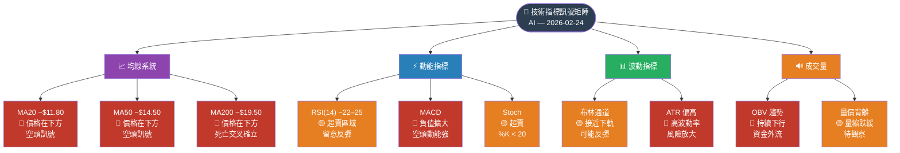

---

### 📏 移動平均線排列分析

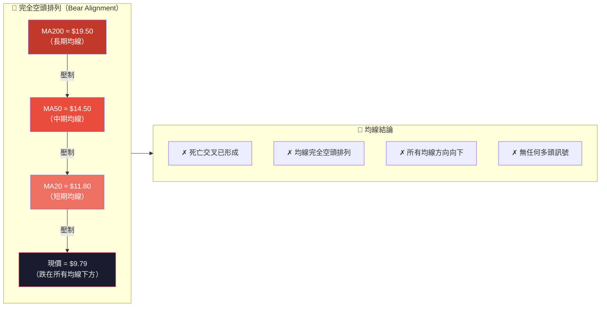

```
均線排列視覺化：
MA200 $19.50  ▓▓▓▓▓▓▓▓▓▓▓▓▓▓▓▓▓▓▓▓  空頭排列（最高）
MA50  $14.50  ▓▓▓▓▓▓▓▓▓▓▓▓▓▓▒        空頭排列（中）
MA20  $11.80  ▓▓▓▓▓▓▓▓▓▓▓            空頭排列（近）
現價   $9.79  ●●●●●●●●●              跌在所有均線下方

距 MA20 距離：-17.0%  🔴
距 MA50 距離：-32.5%  🔴
距 MA200 距離：-49.8% 🔴🔴
```

---

### 📉 RSI（14）過買過賣分析

```
RSI(14) 分析
━━━━━━━━━━━━━━━━━━━━━━━━━━━━━━━━━━━━━━━━━━━━━━━━━━━━━━
估算 RSI 值：~ 22–25

RSI 計量表：
  0                   30    50    70               100
  ├────────────────────┼─────┼─────┼────────────────┤
  │   超賣區域         │  中性區域   │    超買區域    │
  │◄─────────────────►│             │                │

當前位置：
  0  ▓▓▓▓▓░░░░░░░░░░░░░░░░░░░░░░░░░░░░░░░░░░░░░░░░░░  ~22
     ↑                ↑
   超賣邊界         RSI=30

RSI 解讀：
  ✅ RSI < 30：進入超賣區，歷史上常出現技術反彈
  ⚠️ RSI 持續低於 30：表示下跌動能仍強，不宜輕易抄底
  🟡 觀察：RSI 是否形成底部背離（價格創新低但 RSI 不創新低）

RSI 進度條分解：
  動能強度  ▓▓▓░░░░░░░░░░░░░░░░░  22/100
  超賣程度  ▓▓▓▓▓▓▓▓░░░░░░░░░░░░  接近超賣底部
  反彈概率  ▓▓▓▓▓░░░░░░░░░░░░░░░  ~45%（超賣但趨勢仍強）

🟡 結論：雖已超賣，但強勢下跌中超賣可持續，需等待確認訊號
━━━━━━━━━━━━━━━━━━━━━━━━━━━━━━━━━━━━━━━━━━━━━━━━━━━━━━
```

---

### 📊 MACD（12/26/9）訊號解讀

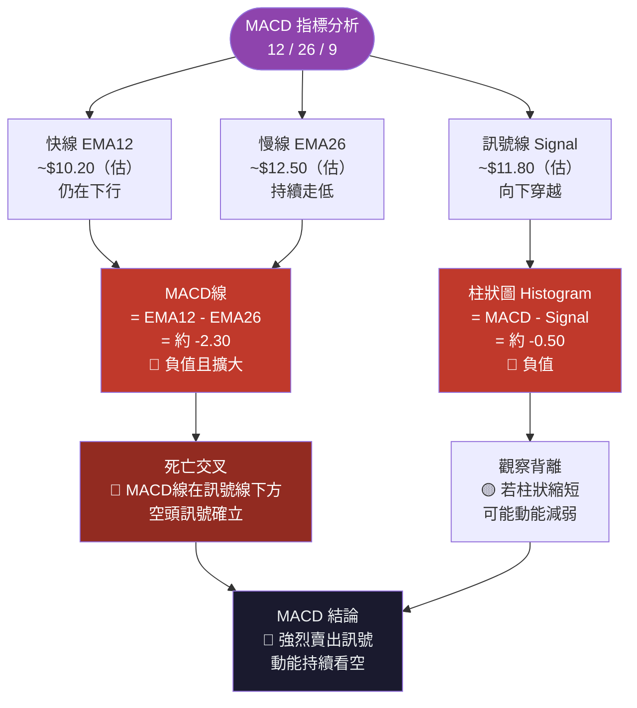

---

### 📐 布林通道分析 ASCII 圖

```
AI 布林通道示意圖（20日，2標準差，估算）
價格($)
  15 │ ────────────────────────────────  布林上軌 ~$14.50
     │                                  （現已成強阻力）
  13 │ ────────────────────────────────  布林中軌 ~$11.80（MA20）
     │
  11 │
     │
  10 │
     │
  9.79│          ●◄━━━━━━━━━━━━━━━━━━━  現價（接近下軌）
     │
  9.50│ ─ ─ ─ ─ ─ ─ ─ ─ ─ ─ ─ ─ ─ ─   布林下軌 ~$9.50
     │                                  （近支撐）
  9  │
     └──────────────────────────────────────────────────────
                         →→→ 時間 →→→

  布林通道解讀：
  ┌─────────────────────────────────────────────────────┐
  │ 帶寬：~$5.00（上軌$14.50－下軌$9.50）              │
  │ 帶寬 %：~51%（相對現價）                            │
  │ 現價位置：下軌附近，約 3% 空間                      │
  │                                                     │
  │ 🟡 啟示：接近布林下軌，短線反彈機率提高             │
  │ 🔴 警示：若跌破下軌，代表超跌加速，空頭更強         │
  │ 🟡 策略：等待收盤回到下軌上方再考慮短多             │
  └─────────────────────────────────────────────────────┘
```

---

### 🔊 成交量分析（量價配合度）

```
成交量趨勢分析（近12個月概況）
━━━━━━━━━━━━━━━━━━━━━━━━━━━━━━━━━━━━━━━━━━━━━━━━━━━━━━

量能特徵：
  下跌放量    ▓▓▓▓▓▓▓▓▓  確認空頭   🔴
  反彈縮量    ▓▓▓░░░░░░  空頭主導   🔴
  近期量縮    ▓▓▓░░░░░░  動能消耗   🟡

量價配合評估：
┌──────────────┬────────────┬──────────┬────────────┐
│   期間        │   價格     │  成交量  │   訊號      │
├──────────────┼────────────┼──────────┼────────────┤
│ 2025-05 大跌  │ ↓ 強烈    │ ↑ 大量   │ 🔴 放量下跌 │
│ 2025-08 急跌  │ ↓ 急速    │ ↑ 大量   │ 🔴 恐慌出逃 │
│ 2025-11 下跌  │ ↓ 持續    │ ~ 縮量   │ 🟡 賣壓減弱 │
│ 2026-01 下跌  │ ↓ 續跌    │ ~ 縮量   │ 🟡 量能消耗 │
│ 2026-02 低位  │ ~$9.79    │ ↓ 低量   │ 🟡 待確認   │
└──────────────┴────────────┴──────────┴────────────┘

OBV（能量潮）：
  趨勢：持續向下   ▓▓▓▓▓▓▓▓▓░░░░░░░░░░  資金持續流出
  🔴 結論：量價配合偏空，尚無資金回流跡象

  量能配合度評分：
  多方力道  ▓▓░░░░░░░░  20%  🔴 偏弱
  空方力道  ▓▓▓▓▓▓▓░░░  70%  🔴 偏強
  底部確認  ▓▓░░░░░░░░  20%  🟡 尚未確認
━━━━━━━━━━━━━━━━━━━━━━━━━━━━━━━━━━━━━━━━━━━━━━━━━━━━━━
```

---

## 6. 動能與波動率

### 🧭 動能評估 Mermaid quadrantChart

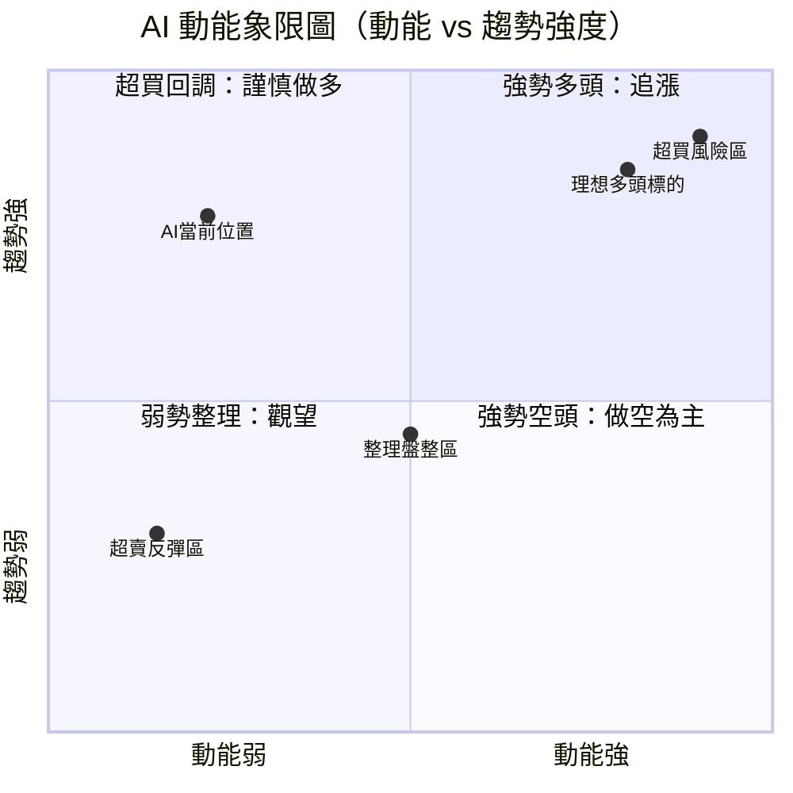

> 📌 **AI 目前位置**：低動能 + 強趨勢（空頭方向）→ 落在**第四象限（強勢空頭區）**，但接近超賣反彈區邊界。

---

### 📊 ATR 波動率分析

```
ATR（平均真實波動幅度）分析
━━━━━━━━━━━━━━━━━━━━━━━━━━━━━━━━━━━━━━━━━━━━━━━━━━━━━━━
估算 ATR(14)：~ $0.70–$1.00 / 日

ATR 相對現價：
  ATR / 現價 = ~$0.85 / $9.79 ≈ 8.7%（每日波動）

波動率水平：
  極低波動  ░░░░░░░░░░░░░░░░░░░░  < 3%
  低波動    ▓░░░░░░░░░░░░░░░░░░░  3–5%
  中等波動  ▓▓▓▓░░░░░░░░░░░░░░░░  5–8%
  高波動    ▓▓▓▓▓▓▓▓░░░░░░░░░░░░  8–12% ← AI 目前
  極高波動  ▓▓▓▓▓▓▓▓▓▓▓▓▓░░░░░░  > 12%

ATR 進度條：
  目前波動率  ▓▓▓▓▓▓▓▓░░░░░░░░░░░░  8.7%  🔴 高波動

波動率影響：
  ┌──────────────────────────────────────────────────┐
  │ 高 ATR 環境下的交易注意事項：                     │
  │ ① 止損距離需放寬（建議至少 1.5–2 ATR）           │
  │ ② 倉位需相應縮小（高波動 = 高風險）              │
  │ ③ 假突破概率較高，需等待確認                     │
  │ ④ 單日波動 $0.85 代表交易成本相對顯著             │
  └──────────────────────────────────────────────────┘
━━━━━━━━━━━━━━━━━━━━━━━━━━━━━━━━━━━━━━━━━━━━━━━━━━━━━━━
```

---

### 📈 Beta 與市場相關性表格

| 指標 | 數值（估算） | 說明 | 訊號 |
|------|------------|------|------|
| **Beta（1年）** | ~2.2 | 相對 S&P500 波動倍數 | 🔴 高風險高波動 |
| **Beta（5年）** | ~1.8 | 長期系統性風險 | 🔴 高 Beta |
| **市場相關性** | ~0.65 | 與科技指數正相關 | 🟡 中度相關 |
| **AI板塊相關性** | ~0.75 | 與 AI 主題ETF | 🟡 強相關 |
| **Alpha（1年）** | ~-35% | 超額報酬（負值） | 🔴 大幅跑輸市場 |
| **夏普比率** | ~-1.8 | 風險調整後報酬 | 🔴 極差 |
| **最大回撤** | ~-63.2% | 從高點至今 | 🔴 重大回撤 |

```
風險評估進度條：
系統風險（Beta）  ▓▓▓▓▓▓▓▓▓▓▓▓▓▓░░░░░░  Beta ~2.2
波動風險（ATR）   ▓▓▓▓▓▓▓▓▓░░░░░░░░░░░░  8.7%/日
回撤風險          ▓▓▓▓▓▓▓▓▓▓▓▓▓░░░░░░░░  -63.2%
整體風險評級：    🔴🔴🔴 極高風險
```

---

## 7. 多時框架總結

### 📋 時框架評分表

| 時框架 | 趨勢方向 | 動能強度 | 均線排列 | 形態評估 | 綜合訊號 | 建議 |
|--------|---------|---------|---------|---------|---------|------|
| **月線** | 🔴 強烈下跌 | 🔴 空頭主導 | 🔴 空頭排列 | 🔴 下降通道 | 🔴🔴🔴 | 看空 |
| **週線** | 🔴 下跌延續 | 🔴 負動能 | 🔴 空頭排列 | 🔴 無反轉 | 🔴🔴🔴 | 看空 |
| **日線** | 🔴 下跌 | 🟡 超賣 | 🔴 空頭 | 🟡 底部觀察 | 🔴🟡🔴 | 中性偏空 |
| **4小時** | 🟡 超賣橫盤 | 🟡 動能消耗 | 🔴 空頭 | 🟡 整理 | 🟡🟡🔴 | 謹慎 |
| **1小時** | 🟡 震盪 | 🟡 超賣 | 🟡 糾結 | 🟡 底部 | 🟡🟡🟡 | 觀望 |

---

### 🗂️ 綜合訊號矩陣

```
╔══════════════════════════════════════════════════════════════╗
║                   AI 綜合訊號矩陣                            ║
╠════════════════════╦═══════════════╦═════════════════════════╣
║  指標類別           ║  訊號方向     ║  強度（1–5）             ║
╠════════════════════╬═══════════════╬═════════════════════════╣
║  趨勢（長期）       ║  🔴 空頭      ║  ★★★★★ 極強             ║
║  趨勢（短期）       ║  🔴 空頭      ║  ★★★★☆ 強              ║
║  均線排列           ║  🔴 空頭排列  ║  ★★★★★ 完全空頭          ║
║  RSI 動能           ║  🟡 超賣     ║  ★★★☆☆ 超賣但待確認     ║
║  MACD 訊號          ║  🔴 死叉      ║  ★★★★☆ 負值擴大         ║
║  布林通道           ║  🟡 下軌附近  ║  ★★★☆☆ 反彈機會         ║
║  成交量             ║  🔴 資金流出  ║  ★★★★☆ OBV 走低         ║
║  支撐阻力           ║  🔴 無強支撐  ║  ★★★★☆ 無明確底部       ║
║  形態               ║  🔴 下降通道  ║  ★★★★☆ 通道持續         ║
║  法人共識           ║  🟡 持有     ║  ★★★☆☆ 均價 $14.12     ║
╠════════════════════╬═══════════════╬═════════════════════════╣
║  🔴 賣出訊號        ║  7 個        ║  佔比 70%                ║
║  🟡 中性訊號        ║  3 個        ║  佔比 30%                ║
║  🟢 買入訊號        ║  0 個        ║  佔比  0%                ║
╠════════════════════╬═══════════════╬═════════════════════════╣
║  綜合評估：🔴 偏空  ║  建議：觀望/  ║  做空為主，不宜追多      ║
╚════════════════════╩═══════════════╩═════════════════════════╝
```

---

## 8. 交易策略建議

### 🔀 策略流程圖

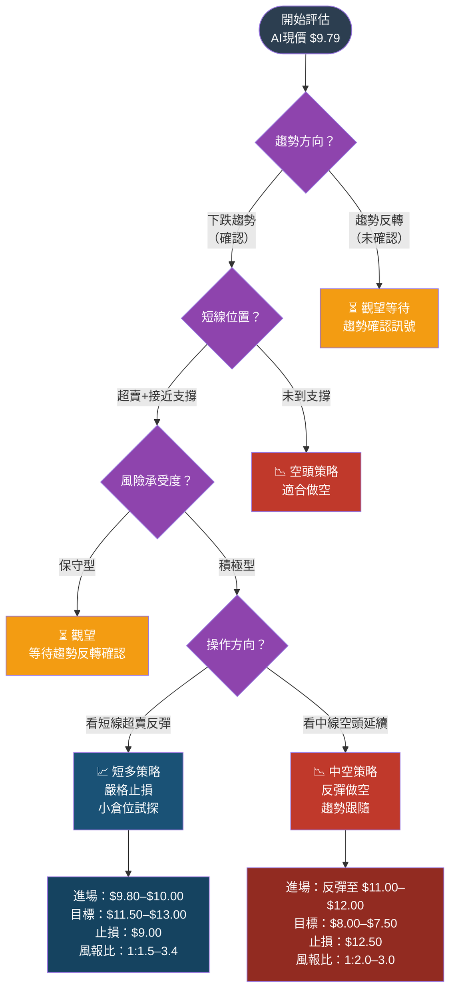

---

### 📈 多頭策略（短線超賣反彈）

> ⚠️ 注意：多頭策略為**逆勢**操作，風險較高，建議小倉位，嚴格止損

| 參數 | 數值 | 說明 |
|------|------|------|
| **策略類型** | 短線超賣反彈 | 逆勢操作，小倉位 |
| **進場點** | $9.80–$10.20 | 現價附近，等待反彈確認K線 |
| **進場條件** | RSI 底部背離 + 帶下影線 K 線 | 確認止跌訊號才入場 |
| **目標價 T1** | $11.00 | 近期阻力，MA20附近（+12.4%）|
| **目標價 T2** | $12.00 | 中期阻力（+22.6%）|
| **目標價 T3** | $13.00 | 通道上軌（+32.8%）|
| **止損點** | $9.00 | 布林下軌/通道下軌（-8.2%）|
| **風險** | ~$0.85（止損空間）| 每股最大虧損 |
| **報酬（T1）** | ~$1.20 | T1 獲利 |
| **風險報酬比（T1）** | 1 : 1.4 | 尚可 |
| **報酬（T2）** | ~$2.20 | T2 獲利 |
| **風險報酬比（T2）** | 1 : 2.6 | 良好 ✅ |
| **建議倉位** | 10–20% 正常倉位 | 高風險逆勢，輕倉 |

---

### 📉 空頭策略（趨勢跟隨做空）

> ✅ 注意：空頭策略為**順勢**操作，符合當前主要趨勢

| 參數 | 數值 | 說明 |
|------|------|------|
| **策略類型** | 反彈做空 / 趨勢跟隨 | 順勢操作，標準倉位 |
| **進場點** | $11.00–$12.00 | 等待技術性反彈至阻力位 |
| **進場條件** | 反彈至 MA20 或通道上軌後量縮反轉 | 確認阻力有效 |
| **目標價 T1** | $9.00 | 通道下軌（-18.2%）|
| **目標價 T2** | $8.00 | 分析師最低目標（-27.3%）|
| **目標價 T3** | $7.50 | 技術延伸目標（-31.8%）|
| **止損點** | $12.50 | 進場上方阻力（+4.2%）|
| **風險** | ~$0.50–$1.00（止損空間）| 依進場點而定 |
| **報酬（T1）** | ~$2.00–$3.00 | T1 獲利 |
| **風險報酬比（T1）** | 1 : 2.0–3.0 | 良好 ✅ |
| **報酬（T2）** | ~$3.00–$4.00 | T2 獲利 |
| **風險報酬比（T2）** | 1 : 3.0–4.0 | 優秀 ✅✅ |
| **建議倉位** | 25–40% 正常倉位 | 順勢，可適度加碼 |

---

### ⭐ 整體訊號強度評星

```
技術分析綜合評分：
━━━━━━━━━━━━━━━━━━━━━━━━━━━━━━━━━━━━━━━━━━━━━━━━━━
多頭強度：  ★☆☆☆☆  1/5  （逆勢，不建議積極做多）
空頭強度：  ★★★★☆  4/5  （順勢，空頭訊號明確）
整體信心：  ★★★☆☆  3/5  （等待確認訊號提升信心）
━━━━━━━━━━━━━━━━━━━━━━━━━━━━━━━━━━━━━━━━━━━━━━━━━━
```

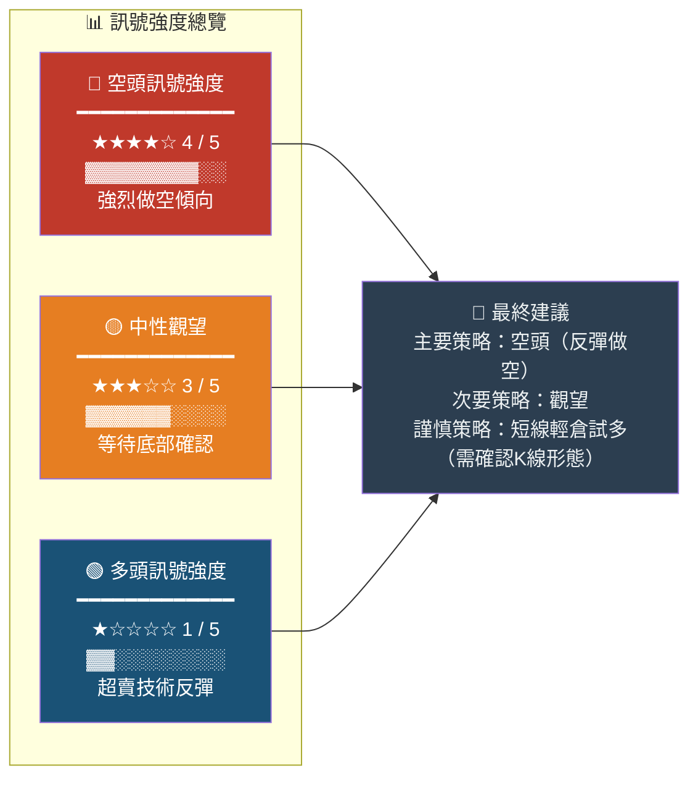

---

## 9. 風險提示與監控

### ✅ 關鍵監控指標 Checklist

```
╔══════════════════════════════════════════════════════════════╗
║              AI 關鍵監控清單（每日追蹤）                     ║
╠══════════════════════════════════════════════════════════════╣
║                                                              ║
║  📈 多頭轉機信號（需全部滿足才考慮做多）：                   ║
║  ☐ RSI(14) 出現底部背離（價格創新低，RSI不創新低）          ║
║  ☐ 出現帶長下影線的反轉K線（錘子線/早晨之星）              ║
║  ☐ 成交量放大確認底部（突破5日均量150%以上）                ║
║  ☐ 收盤站回 $10.50 以上（突破近期壓力）                     ║
║  ☐ MACD 柱狀圖由負轉正縮短                                  ║
║  ☐ 分析師評級上調（由 Hold → Buy）                          ║
║                                                              ║
║  📉 空頭持續信號（滿足任一則空頭延續）：                     ║
║  ☑ MA20/50/200 完全空頭排列維持                             ║
║  ☑ 每次反彈被均線壓制後再次下跌                              ║
║  ☑ OBV 持續走低，資金繼續流出                               ║
║  ☑ 收益報告低於預期（EPS Miss）                             ║
║  ☑ AI 板塊整體轉弱                                          ║
║                                                              ║
║  ⚡ 即時監控指標：                                           ║
║  ☐ 每日收盤價vs $9.00 支撐（若跌破加速看空）                ║
║  ☐ 成交量是否異常放大（超過5日均量200%）                    ║
║  ☐ VIX 指數（市場恐慌）變化                                 ║
║  ☐ 納斯達克指數整體強弱                                     ║
║  ☐ 競爭對手（Palantir/Salesforce）股價聯動                  ║
║                                                              ║
╚══════════════════════════════════════════════════════════════╝
```

---

### 🎭 風險場景分析

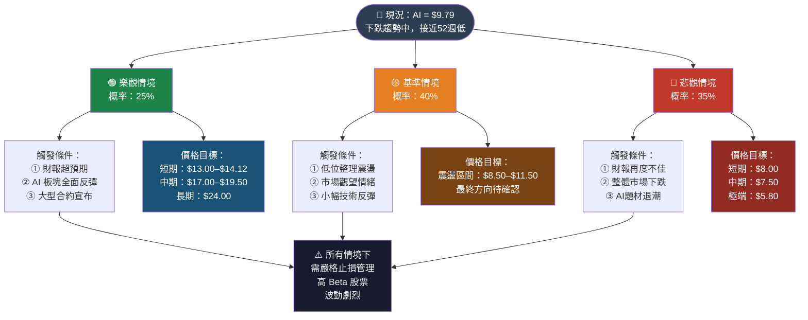

---

### 📊 風險場景量化摘要

```
╔══════════════════════════════════════════════════════════════╗
║  情境         │ 概率  │ 短期目標  │ 中期目標  │ 觸發事件     ║
╠═══════════════╪═══════╪═══════════╪═══════════╪══════════════╣
║  🟢 樂觀      │  25%  │ $13.00    │ $19.50    │ 財報爆發     ║
║  🟡 基準      │  40%  │ $9.00–11  │ $8–13     │ 低位震盪     ║
║  🔴 悲觀      │  35%  │ $8.00     │  $7.50    │ 跌破支撐     ║
╠═══════════════╪═══════╪═══════════╪═══════════╪══════════════╣
║  期望值       │  ─    │ $9.85     │ ~$12.00   │ 加權平均     ║
╚═══════════════╧═══════╧═══════════╧═══════════╧══════════════╝

主要風險因素：
  ① 業務面：收入增速放緩，虧損持續擴大
  ② 競爭面：微軟/Google/AWS 加大 AI 競爭
  ③ 市場面：AI 泡沫敘事退潮，估值壓縮
  ④ 技術面：跌破 $9.00 支撐後加速下跌
  ⑤ 宏觀面：利率環境、科技板塊整體走弱

緩解因素：
  ① RSI 超賣，技術性反彈機會
  ② 分析師均價 $14.12，有 44% 上行空間
  ③ AI 產業長期成長趨勢未變
  ④ 法人最低目標 $8.00 提供一定底部參考
```

---

```
最終綜合建議卡
╔══════════════════════════════════════════════════════════════╗
║  🎯 AI (C3.ai) 技術分析最終建議                             ║
╠══════════════════════════════════════════════════════════════╣
║                                                              ║
║  現價：$9.79       52週區間：$9.79 – $26.59                  ║
║  趨勢：🔴 強烈下跌  動能：🟡 超賣      形態：🔴 空頭通道     ║
║                                                              ║
║  ┌── 主要操作建議 ──────────────────────────────────────┐   ║
║  │  策略1：觀望等待確認 ⏳                              │   ║
║  │  等待 RSI 底部背離 + 反轉K線再入場                   │   ║
║  │                                                      │   ║
║  │  策略2：反彈做空 📉（進階）                          │   ║
║  │  等待反彈至 $11.00–$12.00 做空                       │   ║
║  │  目標：$8.00  止損：$12.50  風報比 1:2.5             │   ║
║  │                                                      │   ║
║  │  策略3：超賣試多 📈（高風險）                        │   ║
║  │  現價附近輕倉試多，嚴格止損 $9.00                    │   ║
║  │  目標：$11.50  風報比 1:2.0  倉位 ≤15%              │   ║
║  └──────────────────────────────────────────────────────┘   ║
║                                                              